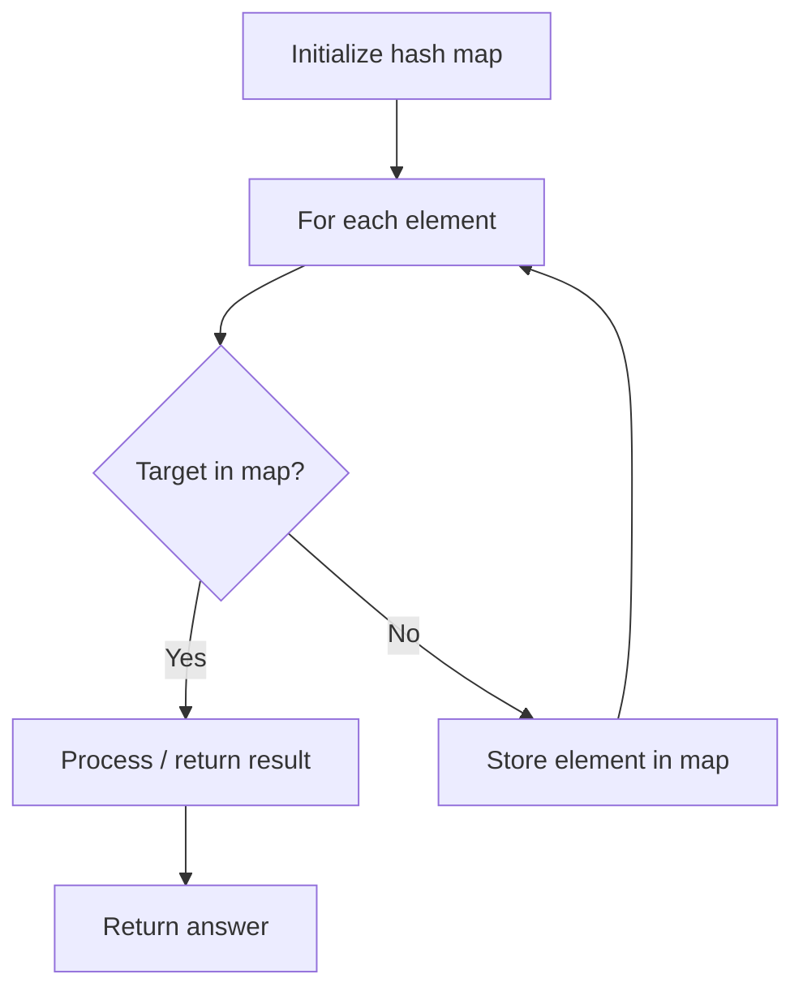

# Problem 2453: Destroy Sequential Targets

**Difficulty:** Medium  
**Tags:** Array, Hash Table, Counting  
**Pattern:** Hash Map Lookup  
**Link:** [leetcode.com/problems/destroy-sequential-targets](https://leetcode.com/problems/destroy-sequential-targets/)

## Description

You are given a **0-indexed** array `nums` consisting of positive integers, representing targets on a number line. You are also given an integer `space`.

You have a machine which can destroy targets. **Seeding** the machine with some `nums[i]` allows it to destroy all targets with values that can be represented as `nums[i] + c * space`, where `c` is any non-negative integer. You want to destroy the **maximum** number of targets in `nums`.

Return* the **minimum value** of *`nums[i]`* you can seed the machine with to destroy the maximum number of targets.*

 

Example 1:

```

**Input:** nums = [3,7,8,1,1,5], space = 2
**Output:** 1
**Explanation:** If we seed the machine with nums[3], then we destroy all targets equal to 1,3,5,7,9,... 
In this case, we would destroy 5 total targets (all except for nums[2]). 
It is impossible to destroy more than 5 targets, so we return nums[3].

```

Example 2:

```

**Input:** nums = [1,3,5,2,4,6], space = 2
**Output:** 1
**Explanation:** Seeding the machine with nums[0], or nums[3] destroys 3 targets. 
It is not possible to destroy more than 3 targets.
Since nums[0] is the minimal integer that can destroy 3 targets, we return 1.

```

Example 3:

```

**Input:** nums = [6,2,5], space = 100
**Output:** 2
**Explanation:** Whatever initial seed we select, we can only destroy 1 target. The minimal seed is nums[1].

```

 

**Constraints:**

	- `1 <= nums.length <= 10^5`
	- `1 <= nums[i] <= 10^9`
	- `1 <= space <= 10^9`

## Approach: Hash Map Lookup

Use a hash map (dictionary) to store elements for O(1) lookup. Iterate through the input, checking membership or counting frequencies in the map.

## Pseudocode

```
1. Initialize hash map
2. Iterate through elements:
   a. Check if target/complement exists in map
   b. If found: process result
   c. Otherwise: store element in map
3. Return result
```

## Algorithm Flow



## Complexity Analysis

- **Time:** O(n)
- **Space:** O(n)

## Solution (Python3)

```python
class Solution:
    def destroyTargets(self, nums: List[int], space: int) -> int:
        # Hash map approach - O(n) time, O(n) space
        seen = {}
        for i, val in enumerate(nums):
            complement = space - val
            if complement in seen:
                return [seen[complement], i]
            seen[val] = i
        return 0
```

## Solution (C++)

```cpp
#include <string>
#include <unordered_map>
#include <vector>
using namespace std;

class Solution {
public:
    int destroyTargets(vector<int>& nums, int space) {
        // Hash map approach - O(n) time, O(n) space
        unordered_map<int, int> seen;
        for (int i = 0; i < nums.size(); i++) {
            int complement = space - nums[i];
            if (seen.count(complement)) {
                return {seen[complement], i};
            }
            seen[nums[i]] = i;
        }
        return 0;
    }
};
```
