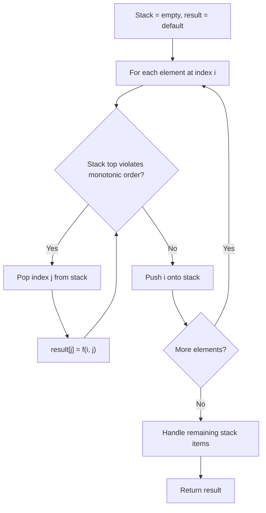
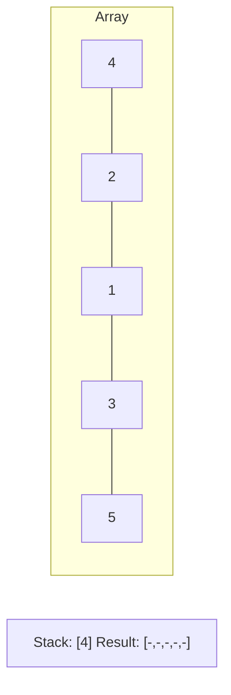
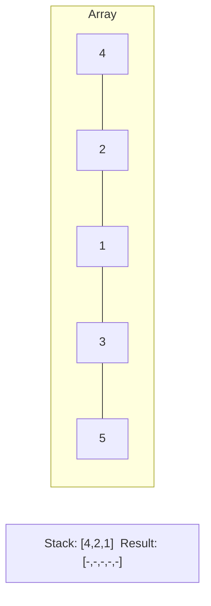
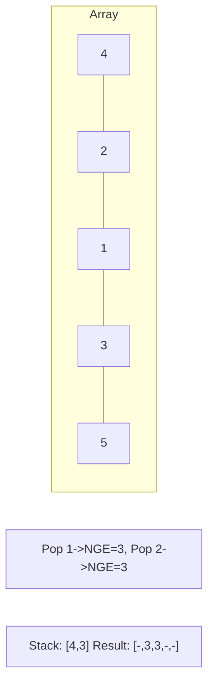
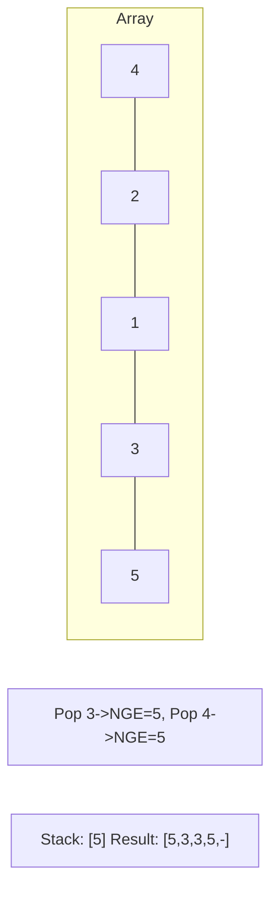

# Problem 2454: Next Greater Element IV

**Difficulty:** Hard  
**Tags:** Array, Binary Search, Stack, Sorting, Heap (Priority Queue), Monotonic Stack  
**Pattern:** Monotonic Stack  
**Link:** [leetcode.com/problems/next-greater-element-iv](https://leetcode.com/problems/next-greater-element-iv/)

## Description

You are given a **0-indexed** array of non-negative integers `nums`. For each integer in `nums`, you must find its respective **second greater** integer.

The **second greater** integer of `nums[i]` is `nums[j]` such that:

	- `j > i`
	- `nums[j] > nums[i]`
	- There exists **exactly one** index `k` such that `nums[k] > nums[i]` and `i < k < j`.

If there is no such `nums[j]`, the second greater integer is considered to be `-1`.

	- For example, in the array `[1, 2, 4, 3]`, the second greater integer of `1` is `4`, `2` is `3`, and that of `3` and `4` is `-1`.

Return* an integer array *`answer`*, where *`answer[i]`* is the second greater integer of *`nums[i]`*.*

 

Example 1:

```

**Input:** nums = [2,4,0,9,6]
**Output:** [9,6,6,-1,-1]
**Explanation:**
0th index: 4 is the first integer greater than 2, and 9 is the second integer greater than 2, to the right of 2.
1st index: 9 is the first, and 6 is the second integer greater than 4, to the right of 4.
2nd index: 9 is the first, and 6 is the second integer greater than 0, to the right of 0.
3rd index: There is no integer greater than 9 to its right, so the second greater integer is considered to be -1.
4th index: There is no integer greater than 6 to its right, so the second greater integer is considered to be -1.
Thus, we return [9,6,6,-1,-1].

```

Example 2:

```

**Input:** nums = [3,3]
**Output:** [-1,-1]
**Explanation:**
We return [-1,-1] since neither integer has any integer greater than it.

```

 

**Constraints:**

	- `1 <= nums.length <= 10^5`
	- `0 <= nums[i] <= 10^9`

## Approach: Monotonic Stack

Maintain a stack where elements are always in monotonic order (increasing or decreasing). When a new element violates the monotonic property, pop elements and compute results (e.g., next greater/smaller element, spans, areas).

## Pseudocode

```
1. Initialize empty stack, result array
2. For each element (index i):
   a. While stack not empty and arr[i] breaks monotonic order:
      - Pop index j from stack
      - result[j] = compute(i, j)
   b. Push i onto stack
3. Handle remaining elements in stack
4. Return result
```

## Algorithm Flow



## Visual State Transitions

**Monotonic Stack (Next Greater Element):**

**Frame 1: Process first elements**


**Frame 2: Push smaller elements**


**Frame 3: Element 3 pops 1 and 2**


**Frame 4: Element 5 pops all**



## Complexity Analysis

- **Time:** O(n)
- **Space:** O(n)

## Solution (Python3)

```python
class Solution:
    def secondGreaterElement(self, nums: List[int]) -> List[int]:
        # Monotonic stack - O(n) time, O(n) space
        n = len(nums)
        result = [0] * n
        stack = []  # indices
        for i in range(n):
            while stack and nums[i] > nums[stack[-1]]:
                idx = stack.pop()
                result[idx] = i - idx
            stack.append(i)
        return result
```

## Solution (C++)

```cpp
#include <stack>
#include <string>
#include <vector>
using namespace std;

class Solution {
public:
    vector<int> secondGreaterElement(vector<int>& nums) {
        // Monotonic stack - O(n) time, O(n) space
        int n = nums.size();
        vector<int> result(n, 0);
        stack<int> st;
        for (int i = 0; i < n; i++) {
            while (!st.empty() && nums[i] > nums[st.top()]) {
                int idx = st.top(); st.pop();
                result[idx] = i - idx;
            }
            st.push(i);
        }
        return result;
    }
};
```
