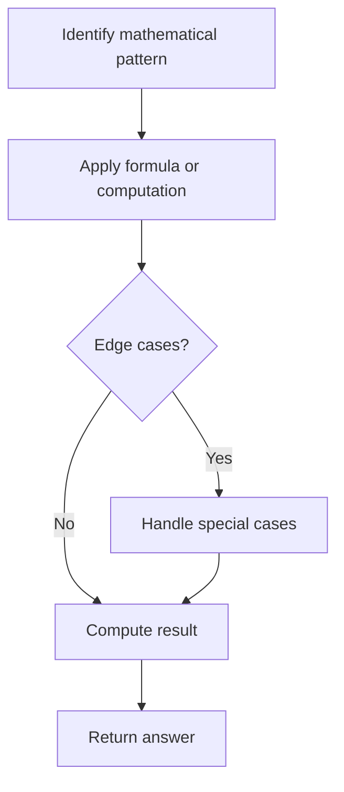

# Problem 2455: Average Value of Even Numbers That Are Divisible by Three

**Difficulty:** Easy  
**Tags:** Array, Math  
**Pattern:** Math  
**Link:** [leetcode.com/problems/average-value-of-even-numbers-that-are-divisible-by-three](https://leetcode.com/problems/average-value-of-even-numbers-that-are-divisible-by-three/)

## Description

Given an integer array `nums` of **positive** integers, return *the average value of all even integers that are divisible by* `3`*.*

Note that the **average** of `n` elements is the **sum** of the `n` elements divided by `n` and **rounded down** to the nearest integer.

 

Example 1:

```

**Input:** nums = [1,3,6,10,12,15]
**Output:** 9
**Explanation:** 6 and 12 are even numbers that are divisible by 3. (6 + 12) / 2 = 9.

```

Example 2:

```

**Input:** nums = [1,2,4,7,10]
**Output:** 0
**Explanation:** There is no single number that satisfies the requirement, so return 0.

```

 

**Constraints:**

	- `1 <= nums.length <= 1000`
	- `1 <= nums[i] <= 1000`

## Approach: Math

Apply mathematical properties, formulas, or number-theoretic concepts. Look for patterns, modular arithmetic, or closed-form solutions.

## Pseudocode

```
1. Identify the mathematical pattern or formula
2. Apply computation:
   - Modular arithmetic for large numbers
   - GCD/LCM for divisibility
   - Sieve for primes
3. Handle edge cases
4. Return result
```

## Algorithm Flow



## Complexity Analysis

- **Time:** O(n) or O(sqrt(n))
- **Space:** O(1)

## Solution (Python3)

```python
class Solution:
    def averageValue(self, nums: List[int]) -> int:
        # Mathematical approach
        result = 0
        x = nums
        while x != 0:
            result = result * 10 + x % 10
            x //= 10 if isinstance(x, int) else 1
        return result
```

## Solution (C++)

```cpp
#include <string>
#include <vector>
using namespace std;

class Solution {
public:
    int averageValue(vector<int>& nums) {
        // Mathematical approach
        long long result = 0;
        int x = nums;
        while (x != 0) {
            result = result * 10 + x % 10;
            x /= 10;
        }
        return (int)result;
    }
};
```
