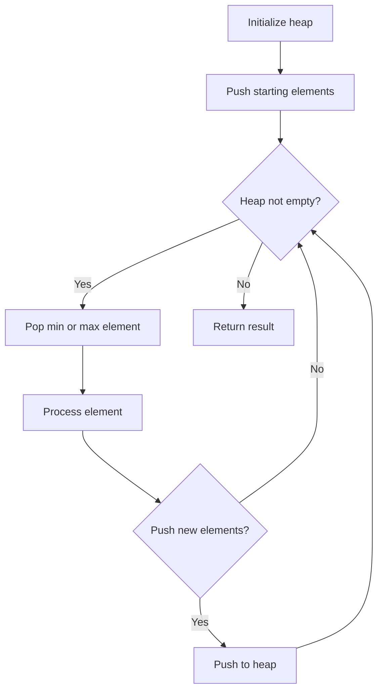
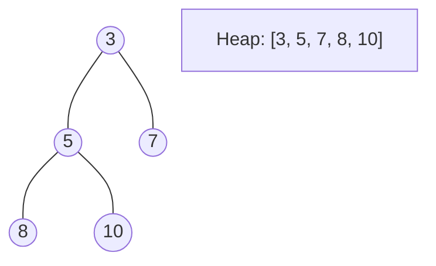
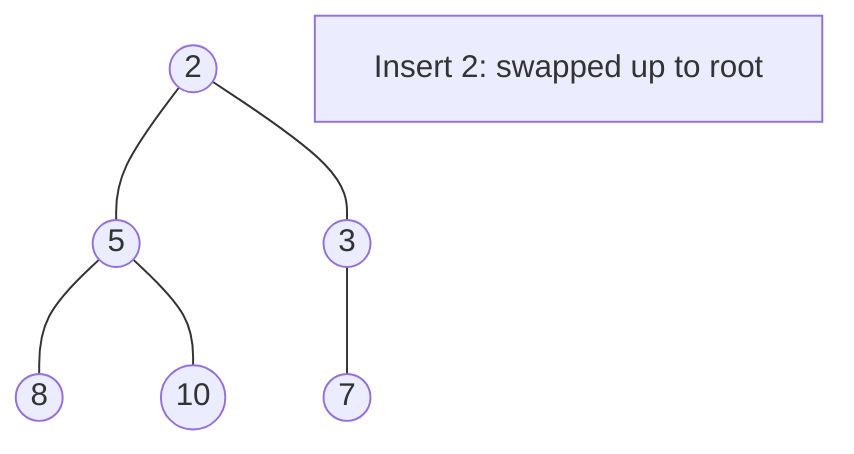
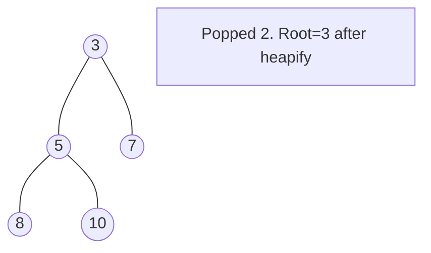

# Problem 2456: Most Popular Video Creator

**Difficulty:** Medium  
**Tags:** Array, Hash Table, String, Sorting, Heap (Priority Queue)  
**Pattern:** Heap / Priority Queue  
**Link:** [leetcode.com/problems/most-popular-video-creator](https://leetcode.com/problems/most-popular-video-creator/)

## Description

You are given two string arrays `creators` and `ids`, and an integer array `views`, all of length `n`. The `i^th` video on a platform was created by `creators[i]`, has an id of `ids[i]`, and has `views[i]` views.

The **popularity** of a creator is the **sum** of the number of views on **all** of the creator's videos. Find the creator with the **highest** popularity and the id of their **most** viewed video.

	- If multiple creators have the highest popularity, find all of them.
	- If multiple videos have the highest view count for a creator, find the lexicographically **smallest** id.

Note: It is possible for different videos to have the same `id`, meaning that `id`s do not uniquely identify a video. For example, two videos with the same ID are considered as distinct videos with their own viewcount.

Return* *a **2D array** of **strings** `answer` where `answer[i] = [creatorsi, idi]` means that `creatorsi` has the **highest** popularity and `idi` is the **id** of their most **popular** video. The answer can be returned in any order.

 

Example 1:

**Input:** creators = ["alice","bob","alice","chris"], ids = ["one","two","three","four"], views = [5,10,5,4]

**Output:** [["alice","one"],["bob","two"]]

**Explanation:**

The popularity of alice is 5 + 5 = 10.

The popularity of bob is 10.

The popularity of chris is 4.

alice and bob are the most popular creators.

For bob, the video with the highest view count is "two".

For alice, the videos with the highest view count are "one" and "three". Since "one" is lexicographically smaller than "three", it is included in the answer.

Example 2:

**Input:** creators = ["alice","alice","alice"], ids = ["a","b","c"], views = [1,2,2]

**Output:** [["alice","b"]]

**Explanation:**

The videos with id "b" and "c" have the highest view count.

Since "b" is lexicographically smaller than "c", it is included in the answer.

 

**Constraints:**

	- `n == creators.length == ids.length == views.length`
	- `1 <= n <= 10^5`
	- `1 <= creators[i].length, ids[i].length <= 5`
	- `creators[i]` and `ids[i]` consist only of lowercase English letters.
	- `0 <= views[i] <= 10^5`

## Approach: Heap / Priority Queue

Use a min-heap or max-heap to efficiently access the smallest/largest element. Push elements and pop the top to process in priority order.

## Pseudocode

```
1. Initialize heap (min or max)
2. Push initial elements onto heap
3. While heap not empty and condition:
   a. Pop top element (min or max)
   b. Process element
   c. Push new elements if needed
4. Return result
```

## Algorithm Flow



## Visual State Transitions

**Heap Operations (Min-Heap):**

**Frame 1: Initial heap**


**Frame 2: Insert 2 - bubble up**


**Frame 3: Pop minimum (2) - heapify down**



## Complexity Analysis

- **Time:** O(n log n)
- **Space:** O(n)

## Solution (Python3)

```python
class Solution:
    def mostPopularCreator(self, creators: List[str], ids: List[str], views: List[int]) -> List[List[str]]:
        # Heap/Priority Queue - O(n log k) time
        import heapq
        if not creators:
            return []
        # Min heap (negate for max heap)
        heap = []
        for val in creators:
            heapq.heappush(heap, val)
            if len(heap) > (ids if isinstance(ids, int) else len(creators)):
                heapq.heappop(heap)
        return heap[0] if heap else []
```

## Solution (C++)

```cpp
#include <queue>
#include <string>
#include <vector>
using namespace std;

class Solution {
public:
    vector<vector<string>> mostPopularCreator(vector<string>& creators, vector<string>& ids, vector<int>& views) {
        // Heap/Priority Queue - O(n log k) time
        priority_queue<int, vector<int>, greater<int>> pq;
        for (int val : creators) {
            pq.push(val);
            if ((int)pq.size() > ids)
                pq.pop();
        }
        return pq.empty() ? {} : pq.top();
    }
};
```
