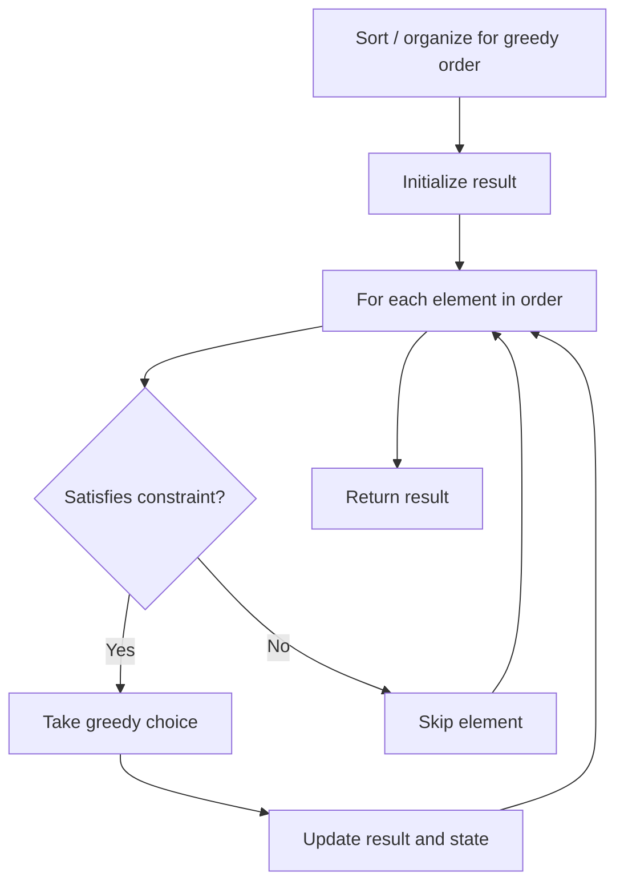

# Problem 2457: Minimum Addition to Make Integer Beautiful

**Difficulty:** Medium  
**Tags:** Math, Greedy  
**Pattern:** Greedy  
**Link:** [leetcode.com/problems/minimum-addition-to-make-integer-beautiful](https://leetcode.com/problems/minimum-addition-to-make-integer-beautiful/)

## Description

You are given two positive integers `n` and `target`.

An integer is considered **beautiful** if the sum of its digits is less than or equal to `target`.

Return the *minimum **non-negative** integer *`x`* such that *`n + x`* is beautiful*. The input will be generated such that it is always possible to make `n` beautiful.

 

Example 1:

```

**Input:** n = 16, target = 6
**Output:** 4
**Explanation:** Initially n is 16 and its digit sum is 1 + 6 = 7. After adding 4, n becomes 20 and digit sum becomes 2 + 0 = 2. It can be shown that we can not make n beautiful with adding non-negative integer less than 4.

```

Example 2:

```

**Input:** n = 467, target = 6
**Output:** 33
**Explanation:** Initially n is 467 and its digit sum is 4 + 6 + 7 = 17. After adding 33, n becomes 500 and digit sum becomes 5 + 0 + 0 = 5. It can be shown that we can not make n beautiful with adding non-negative integer less than 33.

```

Example 3:

```

**Input:** n = 1, target = 1
**Output:** 0
**Explanation:** Initially n is 1 and its digit sum is 1, which is already smaller than or equal to target.

```

 

**Constraints:**

	- `1 <= n <= 10^12`
	- `1 <= target <= 150`
	- The input will be generated such that it is always possible to make `n` beautiful.

## Approach: Greedy

Make the locally optimal choice at each step, trusting it leads to a global optimum. Greedy works when the problem has the greedy-choice property and optimal substructure.

## Pseudocode

```
1. Sort or organize data for greedy ordering
2. Initialize result
3. For each element in greedy order:
   a. If element satisfies constraint:
      - Take the greedy choice
      - Update result and state
4. Return result
```

## Algorithm Flow



## Complexity Analysis

- **Time:** O(n log n)
- **Space:** O(1)

## Solution (Python3)

```python
class Solution:
    def makeIntegerBeautiful(self, n: int, target: int) -> int:
        # Greedy approach - O(n) time
        result = 0
        curr_max = 0
        for i in range(len(n)):
            if isinstance(n[i], int):
                curr_max = max(curr_max, n[i])
                result = max(result, curr_max)
            else:
                result += 1
        return result
```

## Solution (C++)

```cpp
#include <algorithm>
#include <string>
#include <vector>
using namespace std;

class Solution {
public:
    int makeIntegerBeautiful(int n, int target) {
        // Greedy approach - O(n) time
        int result = 0, curr_max = 0;
        for (int i = 0; i < (int)n.size(); i++) {
            curr_max = max(curr_max, n[i]);
            result = max(result, curr_max);
        }
        return result;
    }
};
```
