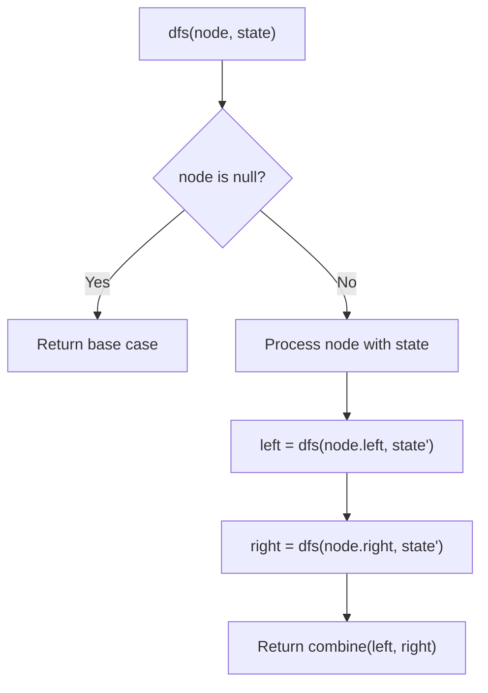
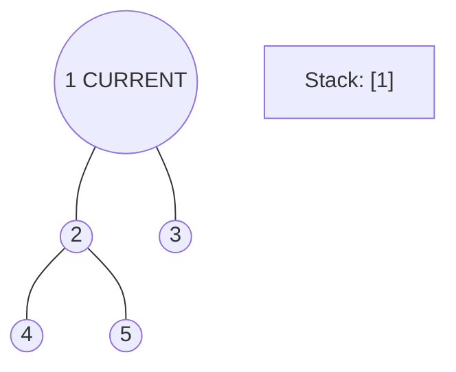
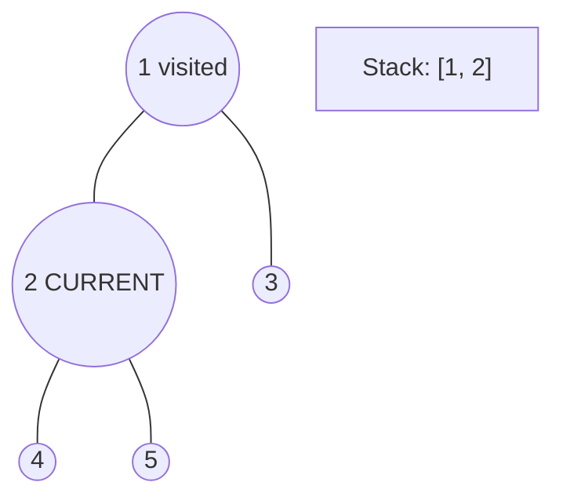
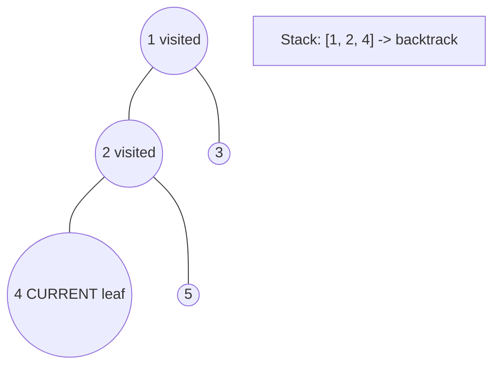
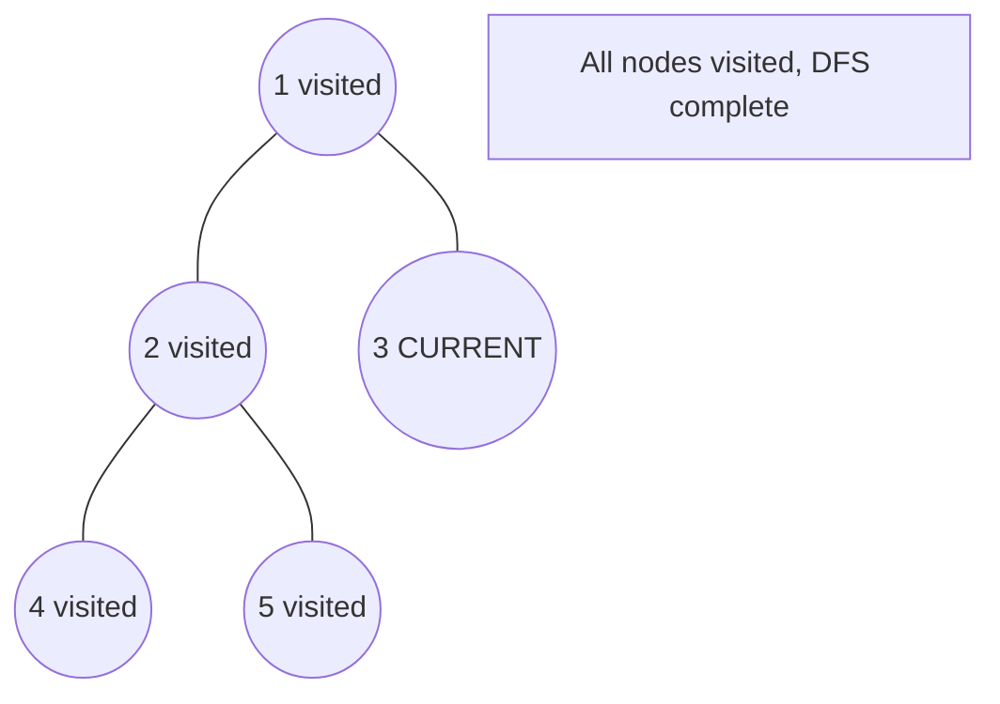

# Problem 2458: Height of Binary Tree After Subtree Removal Queries

**Difficulty:** Hard  
**Tags:** Array, Tree, Depth-First Search, Breadth-First Search, Binary Tree  
**Pattern:** DFS Tree Traversal  
**Link:** [leetcode.com/problems/height-of-binary-tree-after-subtree-removal-queries](https://leetcode.com/problems/height-of-binary-tree-after-subtree-removal-queries/)

## Description

You are given the `root` of a **binary tree** with `n` nodes. Each node is assigned a unique value from `1` to `n`. You are also given an array `queries` of size `m`.

You have to perform `m` **independent** queries on the tree where in the `i^th` query you do the following:

	- **Remove** the subtree rooted at the node with the value `queries[i]` from the tree. It is **guaranteed** that `queries[i]` will **not** be equal to the value of the root.

Return *an array *`answer`* of size *`m`* where *`answer[i]`* is the height of the tree after performing the *`i^th`* query*.

**Note**:

	- The queries are independent, so the tree returns to its **initial** state after each query.
	- The height of a tree is the **number of edges in the longest simple path** from the root to some node in the tree.

 

Example 1:

```

**Input:** root = [1,3,4,2,null,6,5,null,null,null,null,null,7], queries = [4]
**Output:** [2]
**Explanation:** The diagram above shows the tree after removing the subtree rooted at node with value 4.
The height of the tree is 2 (The path 1 -> 3 -> 2).

```

Example 2:

```

**Input:** root = [5,8,9,2,1,3,7,4,6], queries = [3,2,4,8]
**Output:** [3,2,3,2]
**Explanation:** We have the following queries:
- Removing the subtree rooted at node with value 3. The height of the tree becomes 3 (The path 5 -> 8 -> 2 -> 4).
- Removing the subtree rooted at node with value 2. The height of the tree becomes 2 (The path 5 -> 8 -> 1).
- Removing the subtree rooted at node with value 4. The height of the tree becomes 3 (The path 5 -> 8 -> 2 -> 6).
- Removing the subtree rooted at node with value 8. The height of the tree becomes 2 (The path 5 -> 9 -> 3).

```

 

**Constraints:**

	- The number of nodes in the tree is `n`.
	- `2 <= n <= 10^5`
	- `1 <= Node.val <= n`
	- All the values in the tree are **unique**.
	- `m == queries.length`
	- `1 <= m <= min(n, 10^4)`
	- `1 <= queries[i] <= n`
	- `queries[i] != root.val`

## Approach: DFS Tree Traversal

Perform depth-first search on the tree. Recurse on left and right subtrees, combining results bottom-up. Track state (path, depth, sum) during traversal.

## Pseudocode

```
1. Define dfs(node, state):
   a. Base case: if null, return default
   b. Process node with current state
   c. left_result = dfs(node.left, updated_state)
   d. right_result = dfs(node.right, updated_state)
   e. Return combine(left_result, right_result)
2. Return dfs(root, initial_state)
```

## Algorithm Flow



## Visual State Transitions

**DFS Tree Traversal Step-by-Step:**

**Frame 1: Start at root**


**Frame 2: Go left - visit node 2**


**Frame 3: Go left - visit node 4 (leaf)**


**Frame 4: Backtrack, visit node 5, then node 3**



## Complexity Analysis

- **Time:** O(n)
- **Space:** O(h)

## Solution (Python3)

```python
class Solution:
    def treeQueries(self, root: Optional[TreeNode], queries: List[int]) -> List[int]:
        # DFS on binary tree - O(n) time, O(h) space
        def dfs(node):
            if not node:
                return 0
            left = dfs(node.left)
            right = dfs(node.right)
            return 1 + max(left, right)
        
        result = dfs(root)
        return result
```

## Solution (C++)

```cpp
#include <algorithm>
#include <functional>
#include <string>
#include <vector>
using namespace std;

class Solution {
public:
    vector<int> treeQueries(TreeNode* root, vector<int>& queries) {
        // DFS on binary tree - O(n) time, O(h) space
        function<int(TreeNode*)> dfs = [&](TreeNode* node) -> int {
            if (!node) return 0;
            int left = dfs(node->left);
            int right = dfs(node->right);
            return 1 + max(left, right);
        };
        return dfs(root);
    }
};
```
