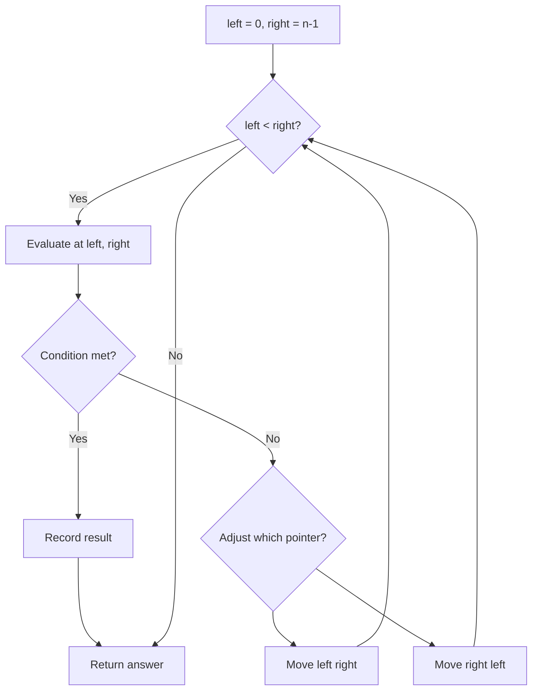
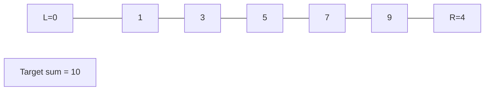
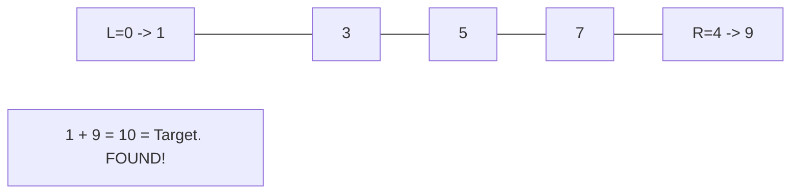

# Problem 2460: Apply Operations to an Array

**Difficulty:** Easy  
**Tags:** Array, Two Pointers, Simulation  
**Pattern:** Two Pointers  
**Link:** [leetcode.com/problems/apply-operations-to-an-array](https://leetcode.com/problems/apply-operations-to-an-array/)

## Description

You are given a **0-indexed** array `nums` of size `n` consisting of **non-negative** integers.

You need to apply `n - 1` operations to this array where, in the `i^th` operation (**0-indexed**), you will apply the following on the `i^th` element of `nums`:

	- If `nums[i] == nums[i + 1]`, then multiply `nums[i]` by `2` and set `nums[i + 1]` to `0`. Otherwise, you skip this operation.

After performing **all** the operations, **shift** all the `0`'s to the **end** of the array.

	- For example, the array `[1,0,2,0,0,1]` after shifting all its `0`'s to the end, is `[1,2,1,0,0,0]`.

Return *the resulting array*.

**Note** that the operations are applied **sequentially**, not all at once.

 

Example 1:

```

**Input:** nums = [1,2,2,1,1,0]
**Output:** [1,4,2,0,0,0]
**Explanation:** We do the following operations:
- i = 0: nums[0] and nums[1] are not equal, so we skip this operation.
- i = 1: nums[1] and nums[2] are equal, we multiply nums[1] by 2 and change nums[2] to 0. The array becomes [1,**4**,**0**,1,1,0].
- i = 2: nums[2] and nums[3] are not equal, so we skip this operation.
- i = 3: nums[3] and nums[4] are equal, we multiply nums[3] by 2 and change nums[4] to 0. The array becomes [1,4,0,**2**,**0**,0].
- i = 4: nums[4] and nums[5] are equal, we multiply nums[4] by 2 and change nums[5] to 0. The array becomes [1,4,0,2,**0**,**0**].
After that, we shift the 0's to the end, which gives the array [1,4,2,0,0,0].

```

Example 2:

```

**Input:** nums = [0,1]
**Output:** [1,0]
**Explanation:** No operation can be applied, we just shift the 0 to the end.

```

 

**Constraints:**

	- `2 <= nums.length <= 2000`
	- `0 <= nums[i] <= 1000`

## Approach: Two Pointers

Use two pointers moving through the data structure. Depending on the problem, pointers may move toward each other (converging), in the same direction (fast/slow), or independently.

## Pseudocode

```
1. Initialize left = 0, right = n-1 (or two independent pointers)
2. While pointers haven't crossed:
   a. Evaluate condition at pointer positions
   b. Move left pointer right or right pointer left
3. Return result
```

## Algorithm Flow



## Visual State Transitions

**Two Pointer Convergence:**

**Frame 1: Initialize pointers**


**Frame 2: Sum = 1+9 = 10, found!**



## Complexity Analysis

- **Time:** O(n)
- **Space:** O(1)

## Solution (Python3)

```python
class Solution:
    def applyOperations(self, nums: List[int]) -> List[int]:
        # Two pointer approach - O(n) time, O(1) space
        left, right = 0, len(nums) - 1
        while left < right:
            curr = nums[left] + nums[right]
            if curr == nums:
                return [left, right]
            elif curr < nums:
                left += 1
            else:
                right -= 1
        return []
```

## Solution (C++)

```cpp
#include <string>
#include <vector>
using namespace std;

class Solution {
public:
    vector<int> applyOperations(vector<int>& nums) {
        // Two pointer approach - O(n) time, O(1) space
        int left = 0, right = nums.size() - 1;
        while (left < right) {
            int curr = nums[left] + nums[right];
            if (curr == nums) {
                return {left, right};
            } else if (curr < nums) {
                left++;
            } else {
                right--;
            }
        }
        return {};
    }
};
```
