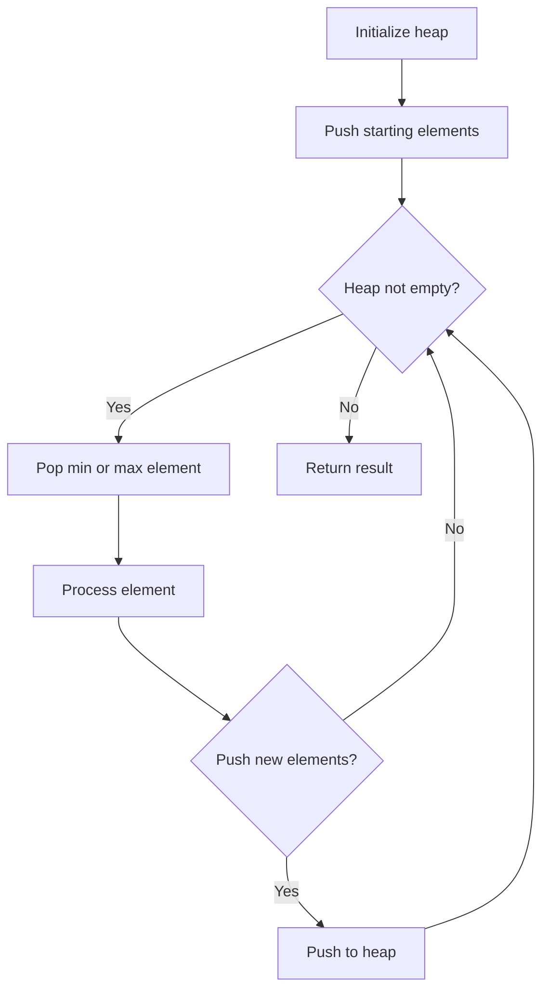
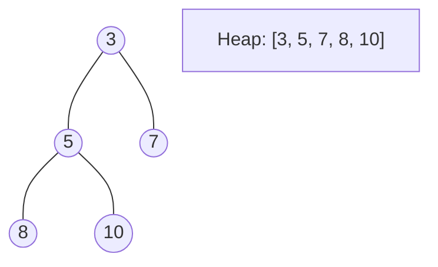
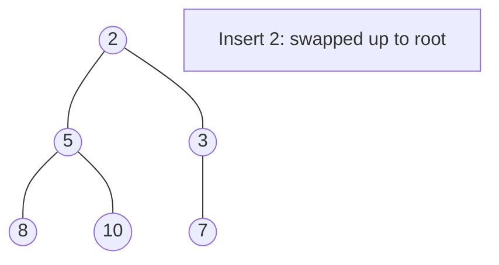
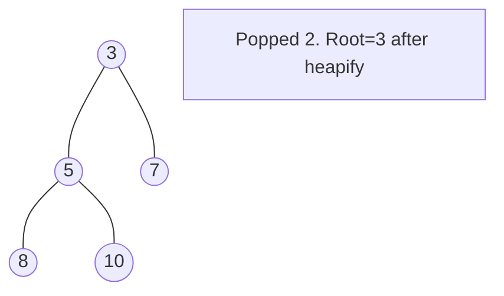

# Problem 2462: Total Cost to Hire K Workers

**Difficulty:** Medium  
**Tags:** Array, Two Pointers, Heap (Priority Queue), Simulation  
**Pattern:** Two Heaps / Greedy  
**Link:** [leetcode.com/problems/total-cost-to-hire-k-workers](https://leetcode.com/problems/total-cost-to-hire-k-workers/)

## Description

You are given a **0-indexed** integer array `costs` where `costs[i]` is the cost of hiring the `i^th` worker.

You are also given two integers `k` and `candidates`. We want to hire exactly `k` workers according to the following rules:

	- You will run `k` sessions and hire exactly one worker in each session.
	- In each hiring session, choose the worker with the lowest cost from either the first `candidates` workers or the last `candidates` workers. Break the tie by the smallest index.
	
		For example, if `costs = [3,2,7,7,1,2]` and `candidates = 2`, then in the first hiring session, we will choose the `4^th` worker because they have the lowest cost `[3,2,7,7,**1**,2]`.
		- In the second hiring session, we will choose `1^st` worker because they have the same lowest cost as `4^th` worker but they have the smallest index `[3,**2**,7,7,2]`. Please note that the indexing may be changed in the process.
	
	
	- If there are fewer than candidates workers remaining, choose the worker with the lowest cost among them. Break the tie by the smallest index.
	- A worker can only be chosen once.

Return *the total cost to hire exactly *`k`* workers.*

 

Example 1:

```

**Input:** costs = [17,12,10,2,7,2,11,20,8], k = 3, candidates = 4
**Output:** 11
**Explanation:** We hire 3 workers in total. The total cost is initially 0.
- In the first hiring round we choose the worker from [17,12,10,2,7,2,11,20,8]. The lowest cost is 2, and we break the tie by the smallest index, which is 3. The total cost = 0 + 2 = 2.
- In the second hiring round we choose the worker from [17,12,10,7,2,11,20,8]. The lowest cost is 2 (index 4). The total cost = 2 + 2 = 4.
- In the third hiring round we choose the worker from [17,12,10,7,11,20,8]. The lowest cost is 7 (index 3). The total cost = 4 + 7 = 11. Notice that the worker with index 3 was common in the first and last four workers.
The total hiring cost is 11.

```

Example 2:

```

**Input:** costs = [1,2,4,1], k = 3, candidates = 3
**Output:** 4
**Explanation:** We hire 3 workers in total. The total cost is initially 0.
- In the first hiring round we choose the worker from [1,2,4,1]. The lowest cost is 1, and we break the tie by the smallest index, which is 0. The total cost = 0 + 1 = 1. Notice that workers with index 1 and 2 are common in the first and last 3 workers.
- In the second hiring round we choose the worker from [2,4,1]. The lowest cost is 1 (index 2). The total cost = 1 + 1 = 2.
- In the third hiring round there are less than three candidates. We choose the worker from the remaining workers [2,4]. The lowest cost is 2 (index 0). The total cost = 2 + 2 = 4.
The total hiring cost is 4.

```

 

**Constraints:**

	- `1 <= costs.length <= 10^5 `
	- `1 <= costs[i] <= 10^5`
	- `1 <= k, candidates <= costs.length`

## Approach: Two Heaps / Greedy

Two min-heaps for left and right candidates. Pick cheaper worker each round.

## Pseudocode

```
1. Initialize heap (min or max)
2. Push initial elements onto heap
3. While heap not empty and condition:
   a. Pop top element (min or max)
   b. Process element
   c. Push new elements if needed
4. Return result
```

## Algorithm Flow



## Visual State Transitions

**Heap Operations (Min-Heap):**

**Frame 1: Initial heap**


**Frame 2: Insert 2 - bubble up**


**Frame 3: Pop minimum (2) - heapify down**



## Complexity Analysis

- **Time:** O((k+c) log c)
- **Space:** O(c)

## Solution (Python3)

```python
import heapq

class Solution:
    def totalCost(self, costs, k, candidates):
        n = len(costs)
        left_heap = []
        right_heap = []
        l, r = 0, n - 1
        for i in range(candidates):
            if l <= r:
                heapq.heappush(left_heap, (costs[l], l))
                l += 1
        for i in range(candidates):
            if l <= r:
                heapq.heappush(right_heap, (costs[r], r))
                r -= 1
        total = 0
        for _ in range(k):
            left_val = left_heap[0] if left_heap else (float('inf'), -1)
            right_val = right_heap[0] if right_heap else (float('inf'), -1)
            if left_val <= right_val:
                cost, idx = heapq.heappop(left_heap)
                total += cost
                if l <= r:
                    heapq.heappush(left_heap, (costs[l], l))
                    l += 1
            else:
                cost, idx = heapq.heappop(right_heap)
                total += cost
                if l <= r:
                    heapq.heappush(right_heap, (costs[r], r))
                    r -= 1
        return total
```

## Solution (C++)

```cpp
#include <queue>
#include <string>
#include <vector>
using namespace std;

class Solution {
public:
    int totalCost(vector<int>& costs, int k, int candidates) {
        // Heap/Priority Queue - O(n log k) time
        priority_queue<int, vector<int>, greater<int>> pq;
        for (int val : costs) {
            pq.push(val);
            if ((int)pq.size() > k)
                pq.pop();
        }
        return pq.empty() ? 0 : pq.top();
    }
};
```
