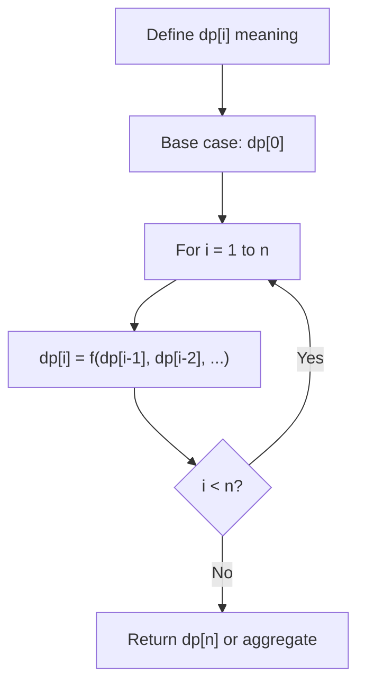
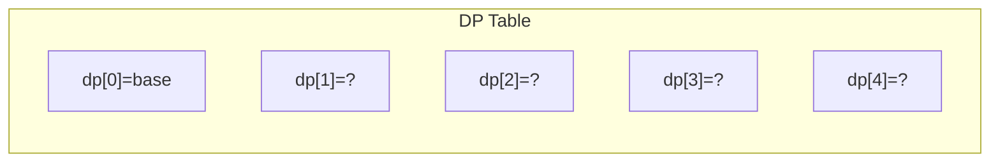
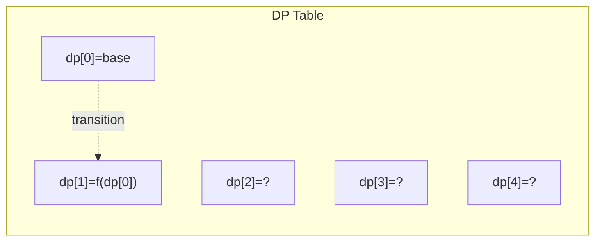
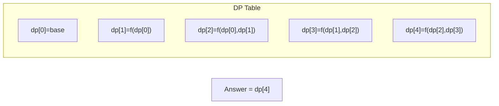

# Problem 2463: Minimum Total Distance Traveled

**Difficulty:** Hard  
**Tags:** Array, Dynamic Programming, Sorting  
**Pattern:** Dynamic Programming (1D)  
**Link:** [leetcode.com/problems/minimum-total-distance-traveled](https://leetcode.com/problems/minimum-total-distance-traveled/)

## Description

There are some robots and factories on the X-axis. You are given an integer array `robot` where `robot[i]` is the position of the `i^th` robot. You are also given a 2D integer array `factory` where `factory[j] = [positionj, limitj]` indicates that `positionj` is the position of the `j^th` factory and that the `j^th` factory can repair at most `limitj` robots.

The positions of each robot are **unique**. The positions of each factory are also **unique**. Note that a robot can be **in the same position** as a factory initially.

All the robots are initially broken; they keep moving in one direction. The direction could be the negative or the positive direction of the X-axis. When a robot reaches a factory that did not reach its limit, the factory repairs the robot, and it stops moving.

**At any moment**, you can set the initial direction of moving for **some** robot. Your target is to minimize the total distance traveled by all the robots.

Return *the minimum total distance traveled by all the robots*. The test cases are generated such that all the robots can be repaired.

**Note that**

	- All robots move at the same speed.
	- If two robots move in the same direction, they will never collide.
	- If two robots move in opposite directions and they meet at some point, they do not collide. They cross each other.
	- If a robot passes by a factory that reached its limits, it crosses it as if it does not exist.
	- If the robot moved from a position `x` to a position `y`, the distance it moved is `|y - x|`.

 

Example 1:

```

**Input:** robot = [0,4,6], factory = [[2,2],[6,2]]
**Output:** 4
**Explanation:** As shown in the figure:
- The first robot at position 0 moves in the positive direction. It will be repaired at the first factory.
- The second robot at position 4 moves in the negative direction. It will be repaired at the first factory.
- The third robot at position 6 will be repaired at the second factory. It does not need to move.
The limit of the first factory is 2, and it fixed 2 robots.
The limit of the second factory is 2, and it fixed 1 robot.
The total distance is |2 - 0| + |2 - 4| + |6 - 6| = 4. It can be shown that we cannot achieve a better total distance than 4.

```

Example 2:

```

**Input:** robot = [1,-1], factory = [[-2,1],[2,1]]
**Output:** 2
**Explanation:** As shown in the figure:
- The first robot at position 1 moves in the positive direction. It will be repaired at the second factory.
- The second robot at position -1 moves in the negative direction. It will be repaired at the first factory.
The limit of the first factory is 1, and it fixed 1 robot.
The limit of the second factory is 1, and it fixed 1 robot.
The total distance is |2 - 1| + |(-2) - (-1)| = 2. It can be shown that we cannot achieve a better total distance than 2.

```

 

**Constraints:**

	- `1 <= robot.length, factory.length <= 100`
	- `factory[j].length == 2`
	- `-10^9 <= robot[i], positionj <= 10^9`
	- `0 <= limitj <= robot.length`
	- The input will be generated such that it is always possible to repair every robot.

## Approach: Dynamic Programming (1D)

Break the problem into overlapping subproblems. Define dp[i] as the optimal value for the subproblem ending at or considering index i. Build the solution bottom-up, using previously computed dp values.

## Pseudocode

```
1. Define dp[i] = optimal value for subproblem i
2. Base case: dp[0] = initial value
3. For i from 1 to n:
   a. dp[i] = recurrence(dp[i-1], dp[i-2], ...)
4. Return dp[n] or max/min of dp
```

## Algorithm Flow



## Visual State Transitions

**1D Dynamic Programming Table Build:**

**Frame 1: Initialize base cases**


**Frame 2: Fill dp[1] from dp[0]**


**Frame 3: Fill remaining cells**



## Complexity Analysis

- **Time:** O(n)
- **Space:** O(n)

## Solution (Python3)

```python
class Solution:
    def minimumTotalDistance(self, robot: List[int], factory: List[List[int]]) -> int:
        # Dynamic programming (1D) - O(n) time, O(n) space
        if not robot:
            return 0
        n = len(robot) if isinstance(robot, list) else robot
        dp = [0] * (n + 1)
        dp[0] = 1  # base case
        for i in range(1, n + 1):
            dp[i] = dp[i-1]  # transition (customize per problem)
            if i >= 2:
                dp[i] += dp[i-2]
        return dp[n]
```

## Solution (C++)

```cpp
#include <string>
#include <vector>
using namespace std;

class Solution {
public:
    int minimumTotalDistance(vector<int>& robot, vector<vector<int>>& factory) {
        // Dynamic programming (1D) - O(n) time, O(n) space
        int n = robot;
        if (n <= 0) return 0;
        vector<int> dp(n + 1, 0);
        dp[0] = 1;
        for (int i = 1; i <= n; i++) {
            dp[i] = dp[i-1];
            if (i >= 2) dp[i] += dp[i-2];
        }
        return dp[n];
    }
};
```
