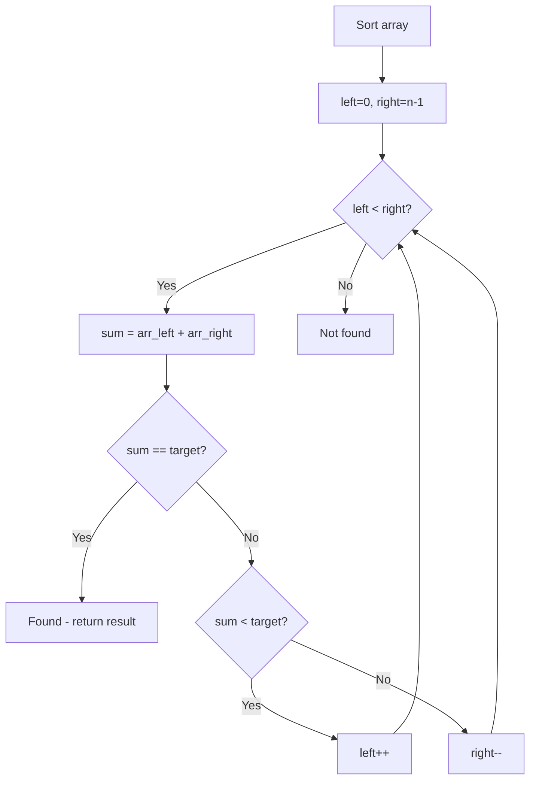

# Problem 2465: Number of Distinct Averages

**Difficulty:** Easy  
**Tags:** Array, Hash Table, Two Pointers, Sorting  
**Pattern:** Two Pointers on Sorted Array  
**Link:** [leetcode.com/problems/number-of-distinct-averages](https://leetcode.com/problems/number-of-distinct-averages/)

## Description

You are given a **0-indexed** integer array `nums` of **even** length.

As long as `nums` is **not** empty, you must repetitively:

	- Find the minimum number in `nums` and remove it.
	- Find the maximum number in `nums` and remove it.
	- Calculate the average of the two removed numbers.

The **average** of two numbers `a` and `b` is `(a + b) / 2`.

	- For example, the average of `2` and `3` is `(2 + 3) / 2 = 2.5`.

Return* the number of **distinct** averages calculated using the above process*.

**Note** that when there is a tie for a minimum or maximum number, any can be removed.

 

Example 1:

```

**Input:** nums = [4,1,4,0,3,5]
**Output:** 2
**Explanation:**
1. Remove 0 and 5, and the average is (0 + 5) / 2 = 2.5. Now, nums = [4,1,4,3].
2. Remove 1 and 4. The average is (1 + 4) / 2 = 2.5, and nums = [4,3].
3. Remove 3 and 4, and the average is (3 + 4) / 2 = 3.5.
Since there are 2 distinct numbers among 2.5, 2.5, and 3.5, we return 2.

```

Example 2:

```

**Input:** nums = [1,100]
**Output:** 1
**Explanation:**
There is only one average to be calculated after removing 1 and 100, so we return 1.

```

 

**Constraints:**

	- `2 <= nums.length <= 100`
	- `nums.length` is even.
	- `0 <= nums[i] <= 100`

## Approach: Two Pointers on Sorted Array

Sort the array first, then use two pointers converging from both ends. Move the left pointer right to increase the sum, or the right pointer left to decrease it.

## Pseudocode

```
1. Sort the array
2. left = 0, right = n-1
3. While left < right:
   a. Compute current = arr[left] + arr[right]
   b. If current == target: found
   c. If current < target: left++
   d. If current > target: right--
4. Return result
```

## Algorithm Flow



## Complexity Analysis

- **Time:** O(n log n)
- **Space:** O(1)

## Solution (Python3)

```python
class Solution:
    def distinctAverages(self, nums: List[int]) -> int:
        # Sort + two pointers - O(n log n) time
        nums.sort()
        left, right = 0, len(nums) - 1
        result = 0
        while left < right:
            curr_sum = nums[left] + nums[right]
            if curr_sum < nums if isinstance(nums, int) else 0:
                left += 1
            else:
                right -= 1
        return result
```

## Solution (C++)

```cpp
#include <algorithm>
#include <string>
#include <vector>
using namespace std;

class Solution {
public:
    int distinctAverages(vector<int>& nums) {
        // Sort + two pointers - O(n log n) time
        sort(nums.begin(), nums.end());
        int left = 0, right = nums.size() - 1;
        while (left < right) {
            int curr = nums[left] + nums[right];
            if (curr < nums) {
                left++;
            } else {
                right--;
            }
        }
        return 0;
    }
};
```
