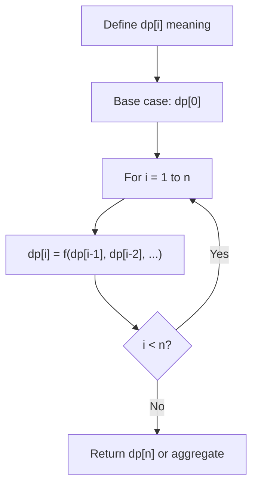
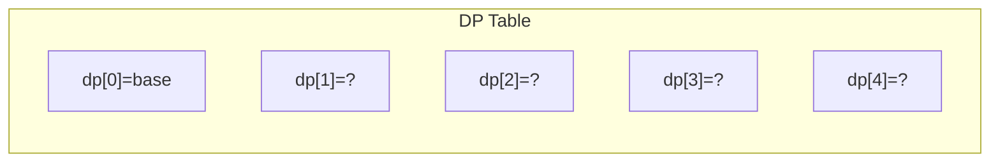
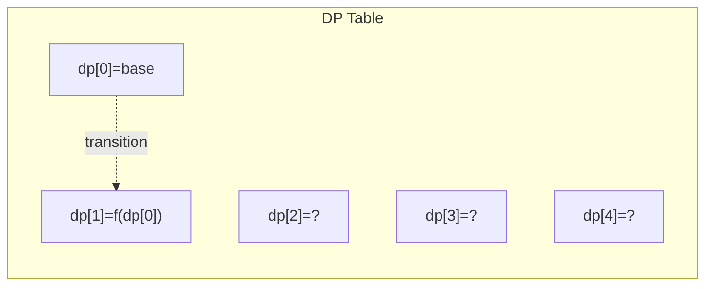
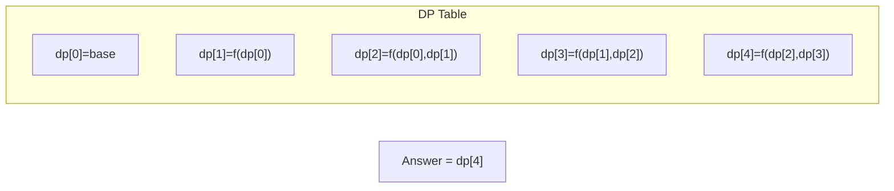

# Problem 2466: Count Ways To Build Good Strings

**Difficulty:** Medium  
**Tags:** Dynamic Programming  
**Pattern:** Dynamic Programming (1D)  
**Link:** [leetcode.com/problems/count-ways-to-build-good-strings](https://leetcode.com/problems/count-ways-to-build-good-strings/)

## Description

Given the integers `zero`, `one`, `low`, and `high`, we can construct a string by starting with an empty string, and then at each step perform either of the following:

	- Append the character `'0'` `zero` times.
	- Append the character `'1'` `one` times.

This can be performed any number of times.

A **good** string is a string constructed by the above process having a **length** between `low` and `high` (**inclusive**).

Return *the number of **different** good strings that can be constructed satisfying these properties.* Since the answer can be large, return it **modulo** `10^9 + 7`.

 

Example 1:

```

**Input:** low = 3, high = 3, zero = 1, one = 1
**Output:** 8
**Explanation:** 
One possible valid good string is "011". 
It can be constructed as follows: "" -> "0" -> "01" -> "011". 
All binary strings from "000" to "111" are good strings in this example.

```

Example 2:

```

**Input:** low = 2, high = 3, zero = 1, one = 2
**Output:** 5
**Explanation:** The good strings are "00", "11", "000", "110", and "011".

```

 

**Constraints:**

	- `1 <= low <= high <= 10^5`
	- `1 <= zero, one <= low`

## Approach: Dynamic Programming (1D)

Break the problem into overlapping subproblems. Define dp[i] as the optimal value for the subproblem ending at or considering index i. Build the solution bottom-up, using previously computed dp values.

## Pseudocode

```
1. Define dp[i] = optimal value for subproblem i
2. Base case: dp[0] = initial value
3. For i from 1 to n:
   a. dp[i] = recurrence(dp[i-1], dp[i-2], ...)
4. Return dp[n] or max/min of dp
```

## Algorithm Flow



## Visual State Transitions

**1D Dynamic Programming Table Build:**

**Frame 1: Initialize base cases**


**Frame 2: Fill dp[1] from dp[0]**


**Frame 3: Fill remaining cells**



## Complexity Analysis

- **Time:** O(n)
- **Space:** O(n)

## Solution (Python3)

```python
class Solution:
    def countGoodStrings(self, low: int, high: int, zero: int, one: int) -> int:
        # Dynamic programming (1D) - O(n) time, O(n) space
        if not low:
            return 0
        n = len(low) if isinstance(low, list) else low
        dp = [0] * (n + 1)
        dp[0] = 1  # base case
        for i in range(1, n + 1):
            dp[i] = dp[i-1]  # transition (customize per problem)
            if i >= 2:
                dp[i] += dp[i-2]
        return dp[n]
```

## Solution (C++)

```cpp
#include <string>
#include <vector>
using namespace std;

class Solution {
public:
    int countGoodStrings(int low, int high, int zero, int one) {
        // Dynamic programming (1D) - O(n) time, O(n) space
        int n = low;
        if (n <= 0) return 0;
        vector<int> dp(n + 1, 0);
        dp[0] = 1;
        for (int i = 1; i <= n; i++) {
            dp[i] = dp[i-1];
            if (i >= 2) dp[i] += dp[i-2];
        }
        return dp[n];
    }
};
```
