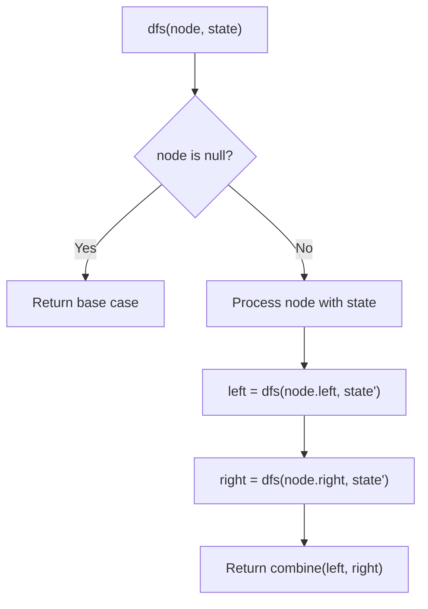
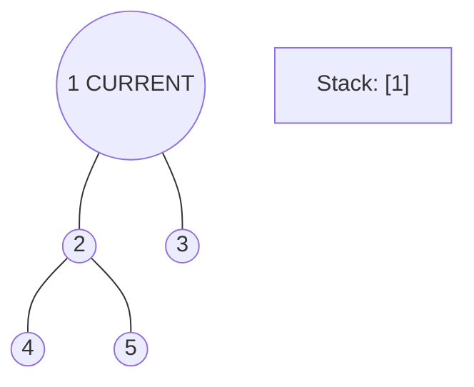
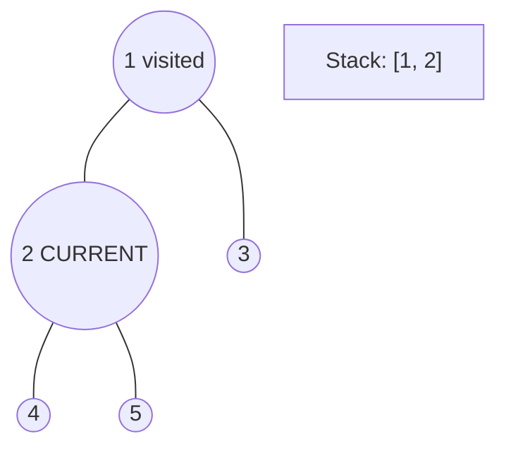
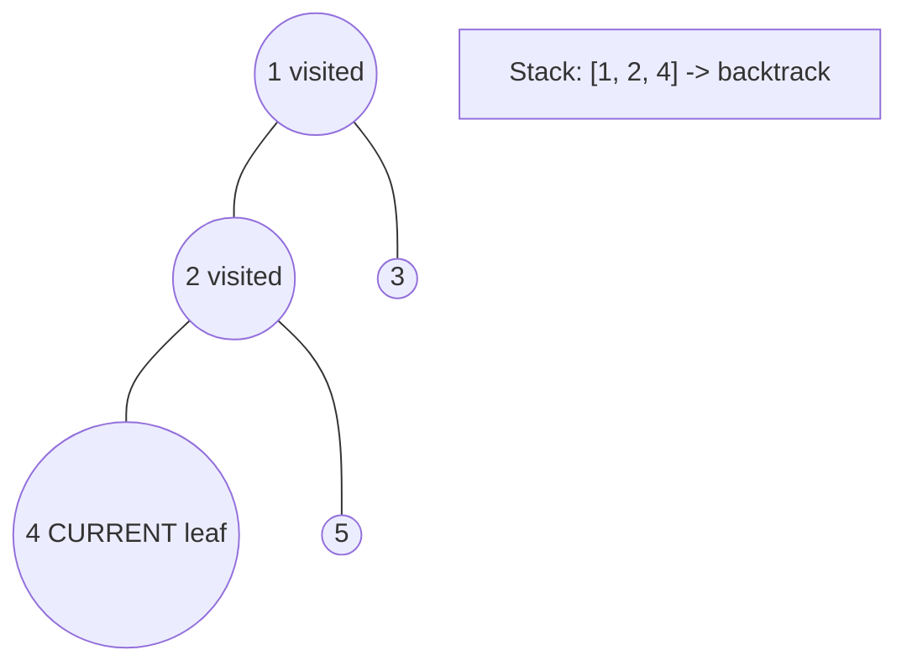
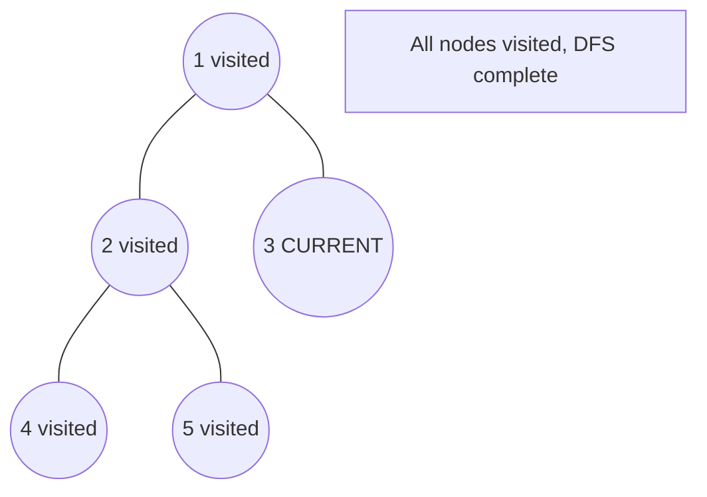

# Problem 2467: Most Profitable Path in a Tree

**Difficulty:** Medium  
**Tags:** Array, Tree, Depth-First Search, Breadth-First Search, Graph Theory  
**Pattern:** DFS Tree Traversal  
**Link:** [leetcode.com/problems/most-profitable-path-in-a-tree](https://leetcode.com/problems/most-profitable-path-in-a-tree/)

## Description

There is an undirected tree with `n` nodes labeled from `0` to `n - 1`, rooted at node `0`. You are given a 2D integer array `edges` of length `n - 1` where `edges[i] = [ai, bi]` indicates that there is an edge between nodes `ai` and `bi` in the tree.

At every node `i`, there is a gate. You are also given an array of even integers `amount`, where `amount[i]` represents:

	- the price needed to open the gate at node `i`, if `amount[i]` is negative, or,
	- the cash reward obtained on opening the gate at node `i`, otherwise.

The game goes on as follows:

	- Initially, Alice is at node `0` and Bob is at node `bob`.
	- At every second, Alice and Bob **each** move to an adjacent node. Alice moves towards some **leaf node**, while Bob moves towards node `0`.
	- For **every** node along their path, Alice and Bob either spend money to open the gate at that node, or accept the reward. Note that:
	
		If the gate is **already open**, no price will be required, nor will there be any cash reward.
		- If Alice and Bob reach the node **simultaneously**, they share the price/reward for opening the gate there. In other words, if the price to open the gate is `c`, then both Alice and Bob pay `c / 2` each. Similarly, if the reward at the gate is `c`, both of them receive `c / 2` each.
	
	
	- If Alice reaches a leaf node, she stops moving. Similarly, if Bob reaches node `0`, he stops moving. Note that these events are **independent** of each other.

Return* the **maximum** net income Alice can have if she travels towards the optimal leaf node.*

 

Example 1:

```

**Input:** edges = [[0,1],[1,2],[1,3],[3,4]], bob = 3, amount = [-2,4,2,-4,6]
**Output:** 6
**Explanation:** 
The above diagram represents the given tree. The game goes as follows:
- Alice is initially on node 0, Bob on node 3. They open the gates of their respective nodes.
  Alice's net income is now -2.
- Both Alice and Bob move to node 1. 
  Since they reach here simultaneously, they open the gate together and share the reward.
  Alice's net income becomes -2 + (4 / 2) = 0.
- Alice moves on to node 3. Since Bob already opened its gate, Alice's income remains unchanged.
  Bob moves on to node 0, and stops moving.
- Alice moves on to node 4 and opens the gate there. Her net income becomes 0 + 6 = 6.
Now, neither Alice nor Bob can make any further moves, and the game ends.
It is not possible for Alice to get a higher net income.

```

Example 2:

```

**Input:** edges = [[0,1]], bob = 1, amount = [-7280,2350]
**Output:** -7280
**Explanation:** 
Alice follows the path 0->1 whereas Bob follows the path 1->0.
Thus, Alice opens the gate at node 0 only. Hence, her net income is -7280. 

```

 

**Constraints:**

	- `2 <= n <= 10^5`
	- `edges.length == n - 1`
	- `edges[i].length == 2`
	- `0 <= ai, bi < n`
	- `ai != bi`
	- `edges` represents a valid tree.
	- `1 <= bob < n`
	- `amount.length == n`
	- `amount[i]` is an **even** integer in the range `[-10^4, 10^4]`.

## Approach: DFS Tree Traversal

Perform depth-first search on the tree. Recurse on left and right subtrees, combining results bottom-up. Track state (path, depth, sum) during traversal.

## Pseudocode

```
1. Define dfs(node, state):
   a. Base case: if null, return default
   b. Process node with current state
   c. left_result = dfs(node.left, updated_state)
   d. right_result = dfs(node.right, updated_state)
   e. Return combine(left_result, right_result)
2. Return dfs(root, initial_state)
```

## Algorithm Flow



## Visual State Transitions

**DFS Tree Traversal Step-by-Step:**

**Frame 1: Start at root**


**Frame 2: Go left - visit node 2**


**Frame 3: Go left - visit node 4 (leaf)**


**Frame 4: Backtrack, visit node 5, then node 3**



## Complexity Analysis

- **Time:** O(n)
- **Space:** O(h)

## Solution (Python3)

```python
class Solution:
    def mostProfitablePath(self, edges: List[List[int]], bob: int, amount: List[int]) -> int:
        # DFS on binary tree - O(n) time, O(h) space
        def dfs(node):
            if not node:
                return 0
            left = dfs(node.left)
            right = dfs(node.right)
            return 1 + max(left, right)
        
        result = dfs(edges)
        return result
```

## Solution (C++)

```cpp
#include <algorithm>
#include <functional>
#include <string>
#include <vector>
using namespace std;

class Solution {
public:
    int mostProfitablePath(vector<vector<int>>& edges, int bob, vector<int>& amount) {
        // DFS on binary tree - O(n) time, O(h) space
        function<int(TreeNode*)> dfs = [&](TreeNode* node) -> int {
            if (!node) return 0;
            int left = dfs(node->left);
            int right = dfs(node->right);
            return 1 + max(left, right);
        };
        return dfs(edges);
    }
};
```
