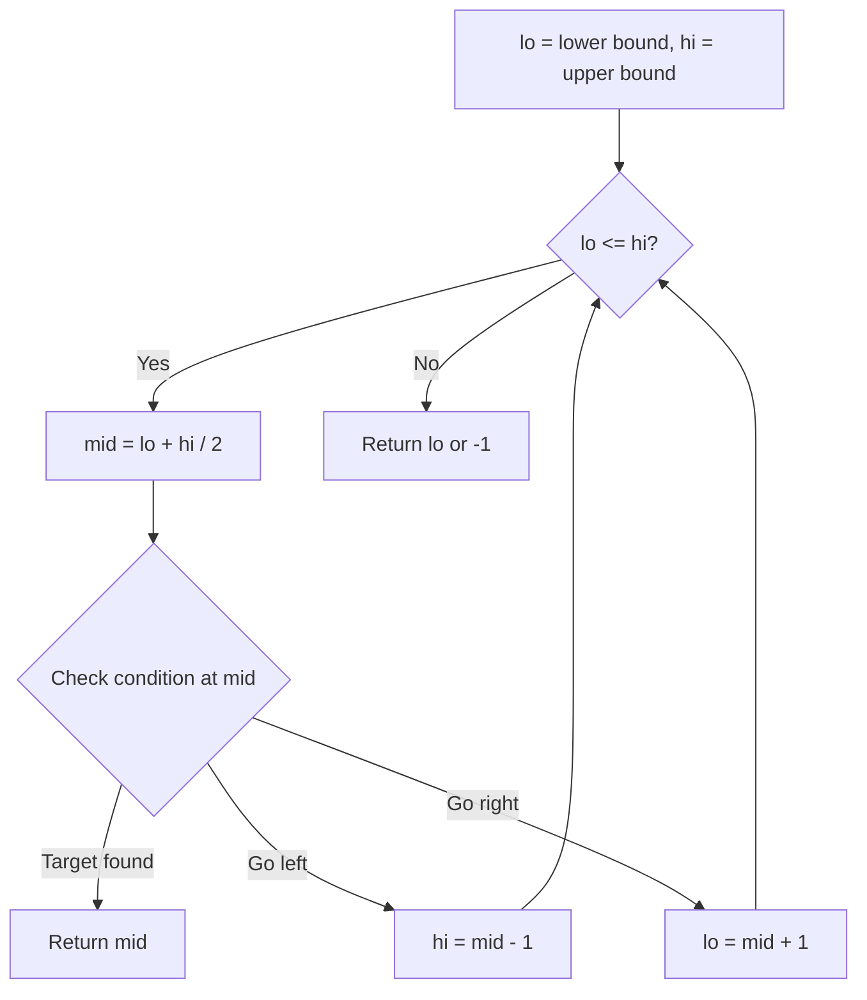
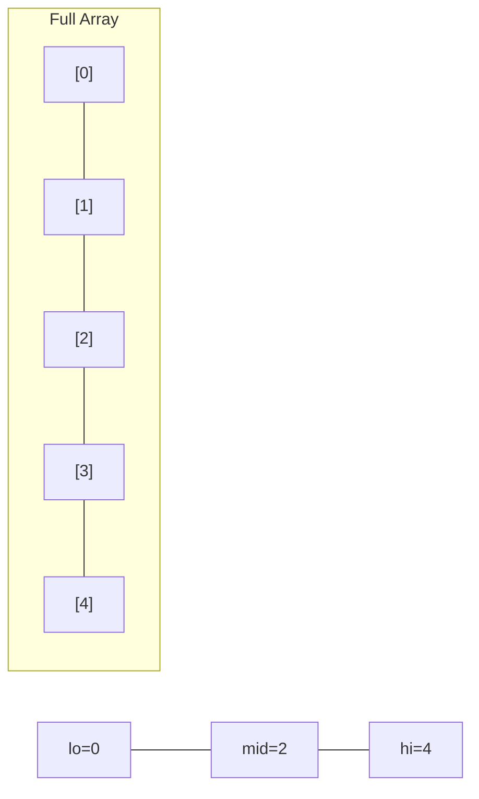
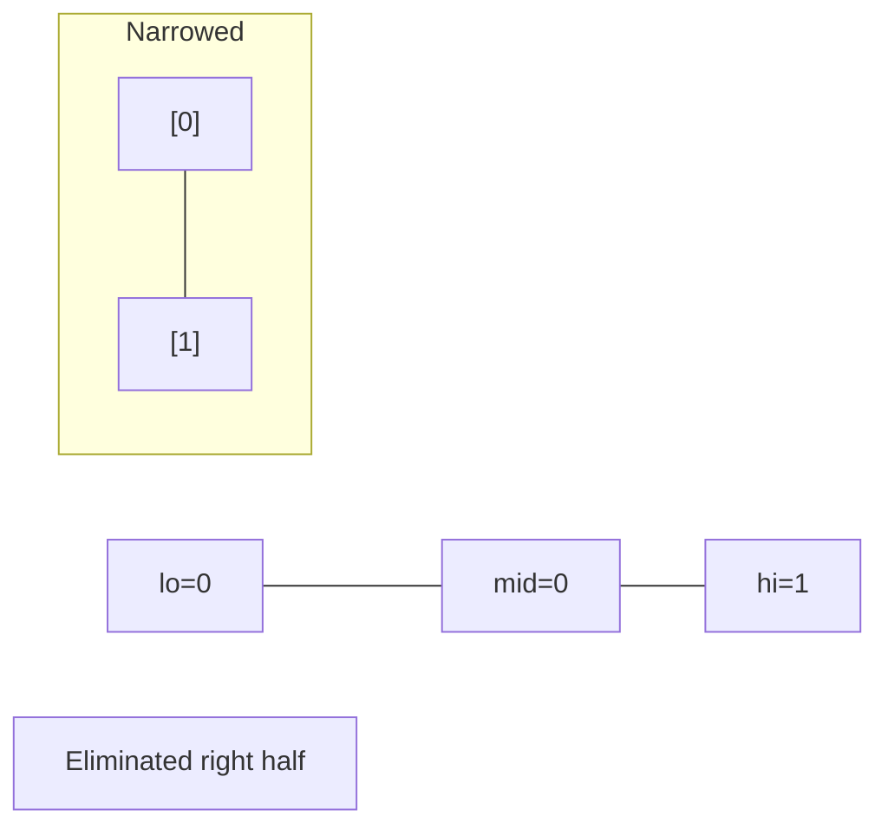
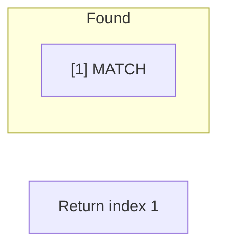

# Problem 2468: Split Message Based on Limit

**Difficulty:** Hard  
**Tags:** String, Binary Search, Enumeration  
**Pattern:** Binary Search  
**Link:** [leetcode.com/problems/split-message-based-on-limit](https://leetcode.com/problems/split-message-based-on-limit/)

## Description

You are given a string, `message`, and a positive integer, `limit`.

You must **split** `message` into one or more **parts** based on `limit`. Each resulting part should have the suffix `"<a/b>"`, where `"b"` is to be **replaced** with the total number of parts and `"a"` is to be **replaced** with the index of the part, starting from `1` and going up to `b`. Additionally, the length of each resulting part (including its suffix) should be **equal** to `limit`, except for the last part whose length can be **at most** `limit`.

The resulting parts should be formed such that when their suffixes are removed and they are all concatenated **in order**, they should be equal to `message`. Also, the result should contain as few parts as possible.

Return* the parts *`message`* would be split into as an array of strings*. If it is impossible to split `message` as required, return* an empty array*.

 

Example 1:

```

**Input:** message = "this is really a very awesome message", limit = 9
**Output:** ["thi<1/14>","s i<2/14>","s r<3/14>","eal<4/14>","ly <5/14>","a v<6/14>","ery<7/14>"," aw<8/14>","eso<9/14>","me<10/14>"," m<11/14>","es<12/14>","sa<13/14>","ge<14/14>"]
**Explanation:**
The first 9 parts take 3 characters each from the beginning of message.
The next 5 parts take 2 characters each to finish splitting message. 
In this example, each part, including the last, has length 9. 
It can be shown it is not possible to split message into less than 14 parts.

```

Example 2:

```

**Input:** message = "short message", limit = 15
**Output:** ["short mess<1/2>","age<2/2>"]
**Explanation:**
Under the given constraints, the string can be split into two parts: 
- The first part comprises of the first 10 characters, and has a length 15.
- The next part comprises of the last 3 characters, and has a length 8.

```

 

**Constraints:**

	- `1 <= message.length <= 10^4`
	- `message` consists only of lowercase English letters and `' '`.
	- `1 <= limit <= 10^4`

## Approach: Binary Search

Use binary search to halve the search space each iteration. Define the search range [lo, hi], compute mid, and decide which half to keep based on the problem's monotonic condition.

## Pseudocode

```
1. lo = lower_bound, hi = upper_bound
2. While lo <= hi (or lo < hi):
   a. mid = (lo + hi) // 2
   b. If condition(mid) is satisfied: record answer, search left half
   c. Else: search right half
3. Return answer
```

## Algorithm Flow



## Visual State Transitions

**Binary Search Step-by-Step:**

**Frame 1: Initial search space**


**Frame 2: Compare mid, narrow search**


**Frame 3: Found target**



## Complexity Analysis

- **Time:** O(log n)
- **Space:** O(1)

## Solution (Python3)

```python
class Solution:
    def splitMessage(self, message: str, limit: int) -> List[str]:
        # Binary search - O(log n) time, O(1) space
        lo, hi = 0, len(message) - 1
        while lo <= hi:
            mid = lo + (hi - lo) // 2
            if message[mid] == limit:
                return mid
            elif message[mid] < limit:
                lo = mid + 1
            else:
                hi = mid - 1
        return []
```

## Solution (C++)

```cpp
#include <string>
#include <vector>
using namespace std;

class Solution {
public:
    vector<string> splitMessage(string& message, int limit) {
        // Binary search - O(log n) time, O(1) space
        int lo = 0, hi = message.size() - 1;
        while (lo <= hi) {
            int mid = lo + (hi - lo) / 2;
            if (message[mid] == limit) {
                return mid;
            } else if (message[mid] < limit) {
                lo = mid + 1;
            } else {
                hi = mid - 1;
            }
        }
        return {};
    }
};
```
