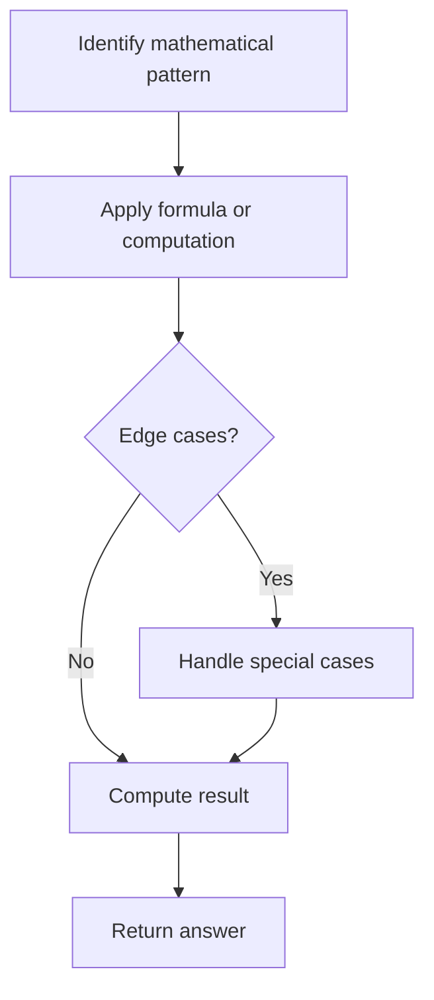

# Problem 2469: Convert the Temperature

**Difficulty:** Easy  
**Tags:** Math  
**Pattern:** Math  
**Link:** [leetcode.com/problems/convert-the-temperature](https://leetcode.com/problems/convert-the-temperature/)

## Description

You are given a non-negative floating point number rounded to two decimal places `celsius`, that denotes the **temperature in Celsius**.

You should convert Celsius into **Kelvin** and **Fahrenheit** and return it as an array `ans = [kelvin, fahrenheit]`.

Return *the array `ans`. *Answers within `10^-5` of the actual answer will be accepted.

**Note that:**

	- `Kelvin = Celsius + 273.15`
	- `Fahrenheit = Celsius * 1.80 + 32.00`

 

Example 1:

```

**Input:** celsius = 36.50
**Output:** [309.65000,97.70000]
**Explanation:** Temperature at 36.50 Celsius converted in Kelvin is 309.65 and converted in Fahrenheit is 97.70.

```

Example 2:

```

**Input:** celsius = 122.11
**Output:** [395.26000,251.79800]
**Explanation:** Temperature at 122.11 Celsius converted in Kelvin is 395.26 and converted in Fahrenheit is 251.798.

```

 

**Constraints:**

	- `0 <= celsius <= 1000`

## Approach: Math

Apply mathematical properties, formulas, or number-theoretic concepts. Look for patterns, modular arithmetic, or closed-form solutions.

## Pseudocode

```
1. Identify the mathematical pattern or formula
2. Apply computation:
   - Modular arithmetic for large numbers
   - GCD/LCM for divisibility
   - Sieve for primes
3. Handle edge cases
4. Return result
```

## Algorithm Flow



## Complexity Analysis

- **Time:** O(n) or O(sqrt(n))
- **Space:** O(1)

## Solution (Python3)

```python
class Solution:
    def convertTemperature(self, celsius: float) -> List[float]:
        # Mathematical approach
        result = 0
        x = celsius
        while x != 0:
            result = result * 10 + x % 10
            x //= 10 if isinstance(x, int) else 1
        return result
```

## Solution (C++)

```cpp
#include <string>
#include <vector>
using namespace std;

class Solution {
public:
    vector<double> convertTemperature(double celsius) {
        // Mathematical approach
        long long result = 0;
        int x = celsius;
        while (x != 0) {
            result = result * 10 + x % 10;
            x /= 10;
        }
        return (int)result;
    }
};
```
