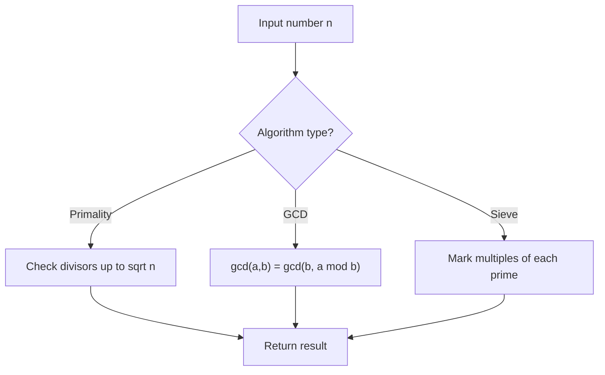

# Problem 2470: Number of Subarrays With LCM Equal to K

**Difficulty:** Medium  
**Tags:** Array, Math, Number Theory  
**Pattern:** Number Theory  
**Link:** [leetcode.com/problems/number-of-subarrays-with-lcm-equal-to-k](https://leetcode.com/problems/number-of-subarrays-with-lcm-equal-to-k/)

## Description

Given an integer array `nums` and an integer `k`, return *the number of **subarrays** of *`nums`* where the least common multiple of the subarray's elements is *`k`.

A **subarray** is a contiguous non-empty sequence of elements within an array.

The **least common multiple of an array** is the smallest positive integer that is divisible by all the array elements.

 

Example 1:

```

**Input:** nums = [3,6,2,7,1], k = 6
**Output:** 4
**Explanation:** The subarrays of nums where 6 is the least common multiple of all the subarray's elements are:
- [**3**,**6**,2,7,1]
- [**3**,**6**,**2**,7,1]
- [3,**6**,2,7,1]
- [3,**6**,**2**,7,1]

```

Example 2:

```

**Input:** nums = [3], k = 2
**Output:** 0
**Explanation:** There are no subarrays of nums where 2 is the least common multiple of all the subarray's elements.

```

 

**Constraints:**

	- `1 <= nums.length <= 1000`
	- `1 <= nums[i], k <= 1000`

## Approach: Number Theory

Apply number theory: prime checking, factorization, GCD, modular exponentiation, sieve of Eratosthenes, or Euler's totient.

## Pseudocode

```
1. Apply number-theoretic algorithm:
   - Sieve for primes up to n
   - GCD via Euclidean algorithm
   - Modular exponentiation
2. Process results
3. Return answer
```

## Algorithm Flow



## Complexity Analysis

- **Time:** O(sqrt(n)) or O(n log log n)
- **Space:** O(n)

## Solution (Python3)

```python
class Solution:
    def subarrayLCM(self, nums: List[int], k: int) -> int:
        # Number theory approach
        def gcd(a, b):
            while b:
                a, b = b, a % b
            return a
        
        result = nums[0] if isinstance(nums, list) else nums
        if isinstance(nums, list):
            for val in nums[1:]:
                result = gcd(result, val)
        return result
```

## Solution (C++)

```cpp
#include <string>
#include <vector>
using namespace std;

class Solution {
public:
    int subarrayLCM(vector<int>& nums, int k) {
        // Number theory approach
        auto gcd_func = [](int a, int b) -> int {
            while (b) { int t = b; b = a % b; a = t; }
            return a;
        };
        int result = nums[0];
        for (int i = 1; i < (int)nums.size(); i++) {
            result = gcd_func(result, nums[i]);
        }
        return result;
    }
};
```
