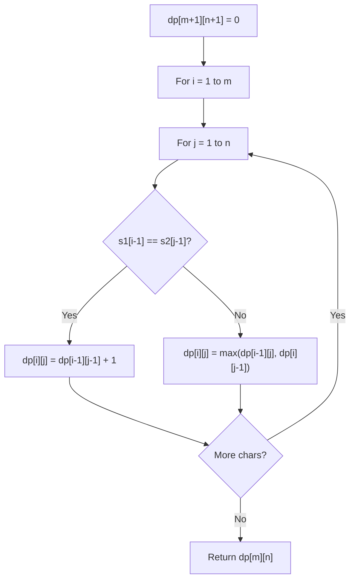

# Problem 2472: Maximum Number of Non-overlapping Palindrome Substrings

**Difficulty:** Hard  
**Tags:** Two Pointers, String, Dynamic Programming, Greedy  
**Pattern:** Dynamic Programming (String)  
**Link:** [leetcode.com/problems/maximum-number-of-non-overlapping-palindrome-substrings](https://leetcode.com/problems/maximum-number-of-non-overlapping-palindrome-substrings/)

## Description

You are given a string `s` and a **positive** integer `k`.

Select a set of **non-overlapping** substrings from the string `s` that satisfy the following conditions:

	- The **length** of each substring is **at least** `k`.
	- Each substring is a **palindrome**.

Return *the **maximum** number of substrings in an optimal selection*.

A **substring** is a contiguous sequence of characters within a string.

 

Example 1:

```

**Input:** s = "abaccdbbd", k = 3
**Output:** 2
**Explanation:** We can select the substrings underlined in s = "**aba**cc**dbbd**". Both "aba" and "dbbd" are palindromes and have a length of at least k = 3.
It can be shown that we cannot find a selection with more than two valid substrings.

```

Example 2:

```

**Input:** s = "adbcda", k = 2
**Output:** 0
**Explanation:** There is no palindrome substring of length at least 2 in the string.

```

 

**Constraints:**

	- `1 <= k <= s.length <= 2000`
	- `s` consists of lowercase English letters.

## Approach: Dynamic Programming (String)

Compare or match two strings using a 2D DP table. dp[i][j] represents the answer for substrings s1[0..i-1] and s2[0..j-1]. Common patterns: LCS, edit distance, regex matching.

## Pseudocode

```
1. Create dp[m+1][n+1]
2. Initialize base cases
3. For i from 1 to m:
   For j from 1 to n:
     If s1[i-1] == s2[j-1]: dp[i][j] = dp[i-1][j-1] + 1
     Else: dp[i][j] = best of (dp[i-1][j], dp[i][j-1], dp[i-1][j-1])
4. Return dp[m][n]
```

## Algorithm Flow



## Complexity Analysis

- **Time:** O(m * n)
- **Space:** O(m * n)

## Solution (Python3)

```python
class Solution:
    def maxPalindromes(self, s: str, k: int) -> int:
        # String DP - O(m*n) time and space
        m, n = len(s), len(k)
        dp = [[0] * (n + 1) for _ in range(m + 1)]
        for i in range(1, m + 1):
            for j in range(1, n + 1):
                if s[i-1] == k[j-1]:
                    dp[i][j] = dp[i-1][j-1] + 1
                else:
                    dp[i][j] = max(dp[i-1][j], dp[i][j-1])
        return dp[m][n]
```

## Solution (C++)

```cpp
#include <algorithm>
#include <string>
#include <vector>
using namespace std;

class Solution {
public:
    int maxPalindromes(string& s, int k) {
        // String DP - O(m*n) time and space
        int m = s.size(), n = k.size();
        vector<vector<int>> dp(m + 1, vector<int>(n + 1, 0));
        for (int i = 1; i <= m; i++) {
            for (int j = 1; j <= n; j++) {
                if (s[i-1] == k[j-1])
                    dp[i][j] = dp[i-1][j-1] + 1;
                else
                    dp[i][j] = max(dp[i-1][j], dp[i][j-1]);
            }
        }
        return dp[m][n];
    }
};
```
