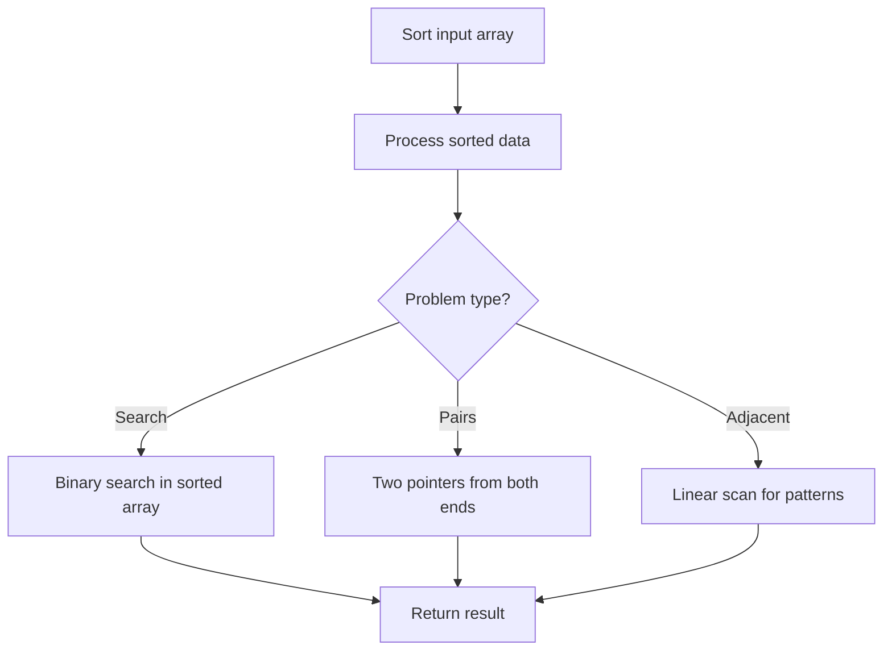

# Problem 2475: Number of Unequal Triplets in Array

**Difficulty:** Easy  
**Tags:** Array, Hash Table, Sorting  
**Pattern:** Sorting  
**Link:** [leetcode.com/problems/number-of-unequal-triplets-in-array](https://leetcode.com/problems/number-of-unequal-triplets-in-array/)

## Description

You are given a **0-indexed** array of positive integers `nums`. Find the number of triplets `(i, j, k)` that meet the following conditions:

	- `0 <= i < j < k < nums.length`
	- `nums[i]`, `nums[j]`, and `nums[k]` are **pairwise distinct**.
	
		In other words, `nums[i] != nums[j]`, `nums[i] != nums[k]`, and `nums[j] != nums[k]`.
	
	

Return *the number of triplets that meet the conditions.*

 

Example 1:

```

**Input:** nums = [4,4,2,4,3]
**Output:** 3
**Explanation:** The following triplets meet the conditions:
- (0, 2, 4) because 4 != 2 != 3
- (1, 2, 4) because 4 != 2 != 3
- (2, 3, 4) because 2 != 4 != 3
Since there are 3 triplets, we return 3.
Note that (2, 0, 4) is not a valid triplet because 2 > 0.

```

Example 2:

```

**Input:** nums = [1,1,1,1,1]
**Output:** 0
**Explanation:** No triplets meet the conditions so we return 0.

```

 

**Constraints:**

	- `3 <= nums.length <= 100`
	- `1 <= nums[i] <= 1000`

## Approach: Sorting

Sort the data to enable efficient processing. After sorting, use techniques like binary search, two pointers, or linear scan to solve the problem.

## Pseudocode

```
1. Sort the input array
2. Process sorted data:
   - Use binary search for lookups
   - Use two pointers for pair finding
   - Scan for adjacent patterns
3. Return result
```

## Algorithm Flow



## Complexity Analysis

- **Time:** O(n log n)
- **Space:** O(n)

## Solution (Python3)

```python
class Solution:
    def unequalTriplets(self, nums: List[int]) -> int:
        # Sort-based approach - O(n log n) time
        nums.sort(key=lambda x: x[0] if isinstance(x, (list, tuple)) else x)
        result = [nums[0]]
        for i in range(1, len(nums)):
            curr = nums[i]
            if isinstance(curr, (list, tuple)) and isinstance(result[-1], (list, tuple)):
                if curr[0] <= result[-1][1]:
                    result[-1] = [result[-1][0], max(result[-1][1], curr[1])]
                else:
                    result.append(curr)
            else:
                result.append(curr)
        return result
```

## Solution (C++)

```cpp
#include <algorithm>
#include <string>
#include <vector>
using namespace std;

class Solution {
public:
    int unequalTriplets(vector<int>& nums) {
        // Sort-based approach - O(n log n) time
        sort(nums.begin(), nums.end());
        vector<vector<int>> result;
        result.push_back(nums[0]);
        for (int i = 1; i < (int)nums.size(); i++) {
            if (nums[i][0] <= result.back()[1]) {
                result.back()[1] = max(result.back()[1], nums[i][1]);
            } else {
                result.push_back(nums[i]);
            }
        }
        return result;
    }
};
```
