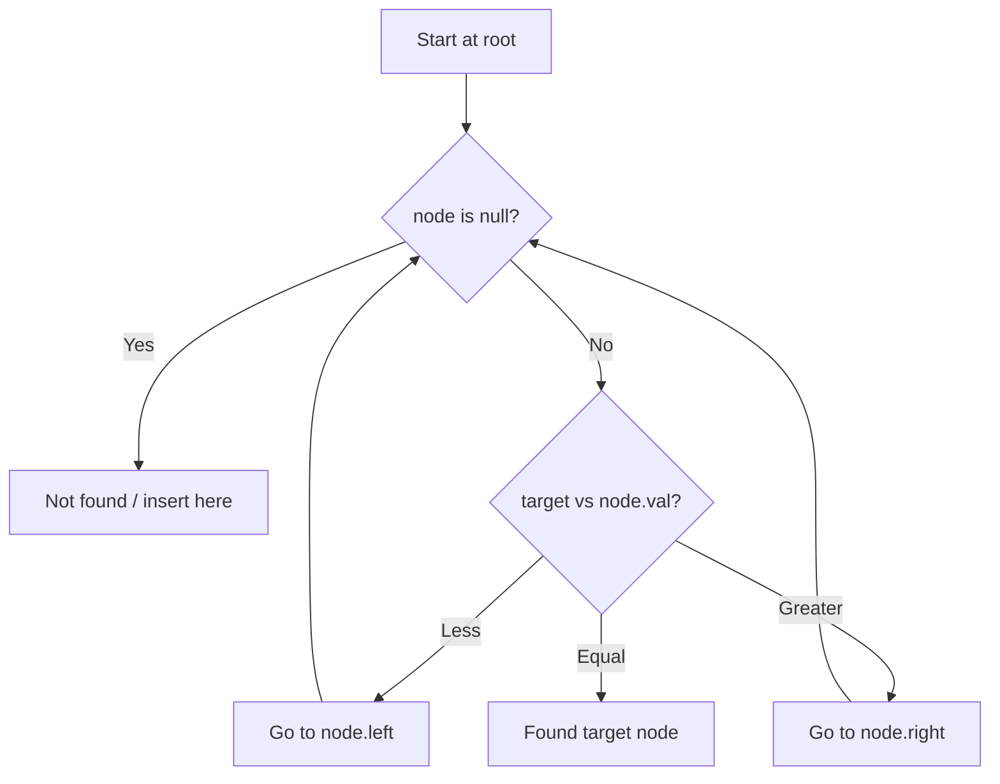

# Problem 2476: Closest Nodes Queries in a Binary Search Tree

**Difficulty:** Medium  
**Tags:** Array, Binary Search, Tree, Depth-First Search, Binary Search Tree, Binary Tree  
**Pattern:** Binary Search Tree  
**Link:** [leetcode.com/problems/closest-nodes-queries-in-a-binary-search-tree](https://leetcode.com/problems/closest-nodes-queries-in-a-binary-search-tree/)

## Description

You are given the `root` of a **binary search tree **and an array `queries` of size `n` consisting of positive integers.

Find a **2D** array `answer` of size `n` where `answer[i] = [mini, maxi]`:

	- `mini` is the **largest** value in the tree that is smaller than or equal to `queries[i]`. If a such value does not exist, add `-1` instead.
	- `maxi` is the **smallest** value in the tree that is greater than or equal to `queries[i]`. If a such value does not exist, add `-1` instead.

Return *the array* `answer`.

 

Example 1:

```

**Input:** root = [6,2,13,1,4,9,15,null,null,null,null,null,null,14], queries = [2,5,16]
**Output:** [[2,2],[4,6],[15,-1]]
**Explanation:** We answer the queries in the following way:
- The largest number that is smaller or equal than 2 in the tree is 2, and the smallest number that is greater or equal than 2 is still 2. So the answer for the first query is [2,2].
- The largest number that is smaller or equal than 5 in the tree is 4, and the smallest number that is greater or equal than 5 is 6. So the answer for the second query is [4,6].
- The largest number that is smaller or equal than 16 in the tree is 15, and the smallest number that is greater or equal than 16 does not exist. So the answer for the third query is [15,-1].

```

Example 2:

```

**Input:** root = [4,null,9], queries = [3]
**Output:** [[-1,4]]
**Explanation:** The largest number that is smaller or equal to 3 in the tree does not exist, and the smallest number that is greater or equal to 3 is 4. So the answer for the query is [-1,4].

```

 

**Constraints:**

	- The number of nodes in the tree is in the range `[2, 10^5]`.
	- `1 <= Node.val <= 10^6`
	- `n == queries.length`
	- `1 <= n <= 10^5`
	- `1 <= queries[i] <= 10^6`

## Approach: Binary Search Tree

Leverage BST property: left < root < right. Navigate left for smaller values, right for larger values. Inorder traversal yields sorted order.

## Pseudocode

```
1. Start at root
2. Compare target with current node:
   a. If target < node.val: go left
   b. If target > node.val: go right
   c. If equal: found
3. Return result
```

## Algorithm Flow



## Complexity Analysis

- **Time:** O(h)
- **Space:** O(h)

## Solution (Python3)

```python
class Solution:
    def closestNodes(self, root: Optional[TreeNode], queries: List[int]) -> List[List[int]]:
        # BST search/insert - O(h) time
        def search(node, target):
            if not node:
                return None
            if target == node.val:
                return node
            elif target < node.val:
                return search(node.left, target)
            else:
                return search(node.right, target)
        return search(root, queries if 'queries' != 'root' else 0)
```

## Solution (C++)

```cpp
#include <functional>
#include <string>
#include <vector>
using namespace std;

class Solution {
public:
    vector<vector<int>> closestNodes(TreeNode* root, vector<int>& queries) {
        // BST search/insert - O(h) time
        function<TreeNode*(TreeNode*, int)> search = [&](TreeNode* node, int target) -> TreeNode* {
            if (!node) return nullptr;
            if (target == node->val) return node;
            else if (target < node->val) return search(node->left, target);
            else return search(node->right, target);
        };
        return search(root, queries);
    }
};
```
