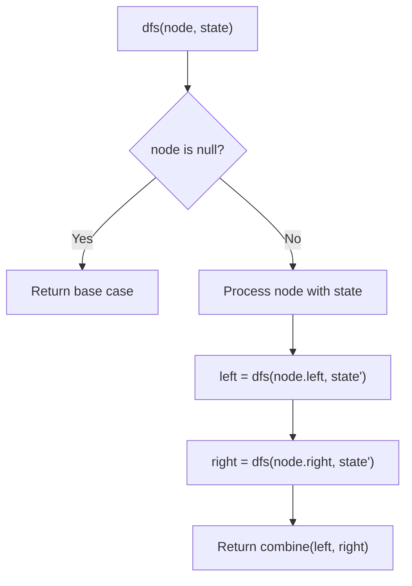
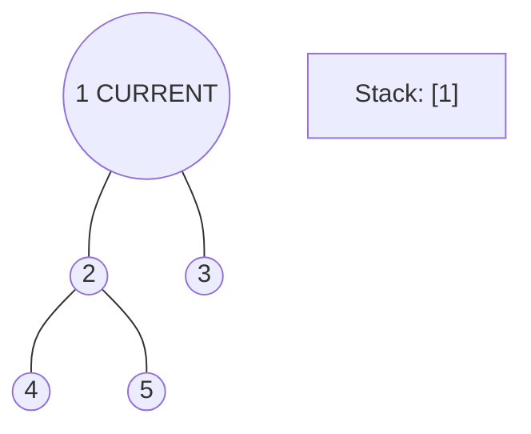
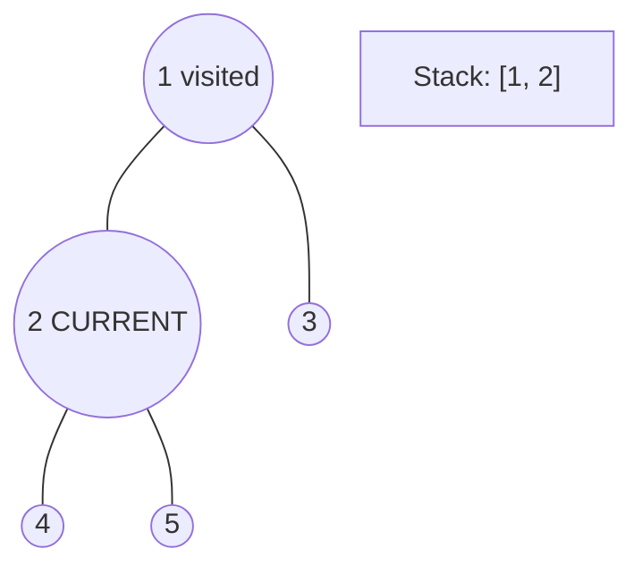
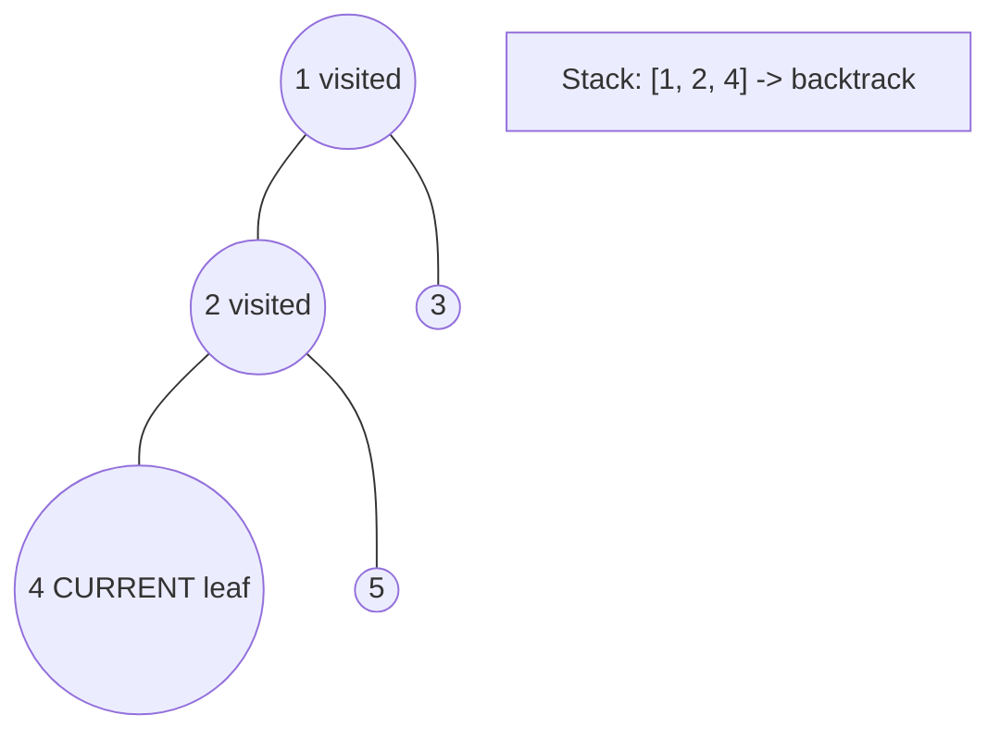
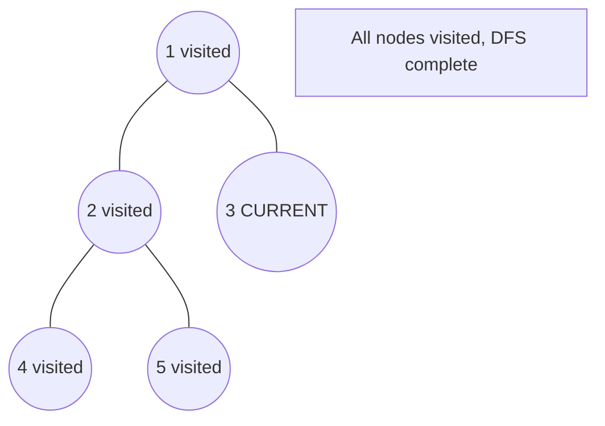

# Problem 2477: Minimum Fuel Cost to Report to the Capital

**Difficulty:** Medium  
**Tags:** Tree, Depth-First Search, Breadth-First Search, Graph Theory  
**Pattern:** DFS Tree Traversal  
**Link:** [leetcode.com/problems/minimum-fuel-cost-to-report-to-the-capital](https://leetcode.com/problems/minimum-fuel-cost-to-report-to-the-capital/)

## Description

There is a tree (i.e., a connected, undirected graph with no cycles) structure country network consisting of `n` cities numbered from `0` to `n - 1` and exactly `n - 1` roads. The capital city is city `0`. You are given a 2D integer array `roads` where `roads[i] = [ai, bi]` denotes that there exists a **bidirectional road** connecting cities `ai` and `bi`.

There is a meeting for the representatives of each city. The meeting is in the capital city.

There is a car in each city. You are given an integer `seats` that indicates the number of seats in each car.

A representative can use the car in their city to travel or change the car and ride with another representative. The cost of traveling between two cities is one liter of fuel.

Return *the minimum number of liters of fuel to reach the capital city*.

 

Example 1:

```

**Input:** roads = [[0,1],[0,2],[0,3]], seats = 5
**Output:** 3
**Explanation:** 
- Representative1 goes directly to the capital with 1 liter of fuel.
- Representative2 goes directly to the capital with 1 liter of fuel.
- Representative3 goes directly to the capital with 1 liter of fuel.
It costs 3 liters of fuel at minimum. 
It can be proven that 3 is the minimum number of liters of fuel needed.

```

Example 2:

```

**Input:** roads = [[3,1],[3,2],[1,0],[0,4],[0,5],[4,6]], seats = 2
**Output:** 7
**Explanation:** 
- Representative2 goes directly to city 3 with 1 liter of fuel.
- Representative2 and representative3 go together to city 1 with 1 liter of fuel.
- Representative2 and representative3 go together to the capital with 1 liter of fuel.
- Representative1 goes directly to the capital with 1 liter of fuel.
- Representative5 goes directly to the capital with 1 liter of fuel.
- Representative6 goes directly to city 4 with 1 liter of fuel.
- Representative4 and representative6 go together to the capital with 1 liter of fuel.
It costs 7 liters of fuel at minimum. 
It can be proven that 7 is the minimum number of liters of fuel needed.

```

Example 3:

```

**Input:** roads = [], seats = 1
**Output:** 0
**Explanation:** No representatives need to travel to the capital city.

```

 

**Constraints:**

	- `1 <= n <= 10^5`
	- `roads.length == n - 1`
	- `roads[i].length == 2`
	- `0 <= ai, bi < n`
	- `ai != bi`
	- `roads` represents a valid tree.
	- `1 <= seats <= 10^5`

## Approach: DFS Tree Traversal

Perform depth-first search on the tree. Recurse on left and right subtrees, combining results bottom-up. Track state (path, depth, sum) during traversal.

## Pseudocode

```
1. Define dfs(node, state):
   a. Base case: if null, return default
   b. Process node with current state
   c. left_result = dfs(node.left, updated_state)
   d. right_result = dfs(node.right, updated_state)
   e. Return combine(left_result, right_result)
2. Return dfs(root, initial_state)
```

## Algorithm Flow



## Visual State Transitions

**DFS Tree Traversal Step-by-Step:**

**Frame 1: Start at root**


**Frame 2: Go left - visit node 2**


**Frame 3: Go left - visit node 4 (leaf)**


**Frame 4: Backtrack, visit node 5, then node 3**



## Complexity Analysis

- **Time:** O(n)
- **Space:** O(h)

## Solution (Python3)

```python
class Solution:
    def minimumFuelCost(self, roads: List[List[int]], seats: int) -> int:
        # DFS on binary tree - O(n) time, O(h) space
        def dfs(node):
            if not node:
                return 0
            left = dfs(node.left)
            right = dfs(node.right)
            return 1 + max(left, right)
        
        result = dfs(roads)
        return result
```

## Solution (C++)

```cpp
#include <algorithm>
#include <functional>
#include <string>
#include <vector>
using namespace std;

class Solution {
public:
    int minimumFuelCost(vector<vector<int>>& roads, int seats) {
        // DFS on binary tree - O(n) time, O(h) space
        function<int(TreeNode*)> dfs = [&](TreeNode* node) -> int {
            if (!node) return 0;
            int left = dfs(node->left);
            int right = dfs(node->right);
            return 1 + max(left, right);
        };
        return dfs(roads);
    }
};
```
