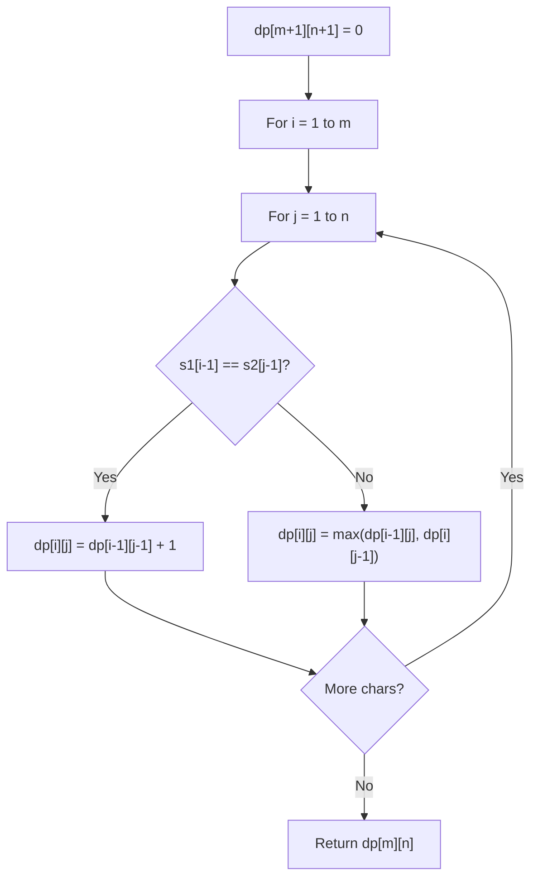

# Problem 2478: Number of Beautiful Partitions

**Difficulty:** Hard  
**Tags:** String, Dynamic Programming, Prefix Sum  
**Pattern:** Dynamic Programming (String)  
**Link:** [leetcode.com/problems/number-of-beautiful-partitions](https://leetcode.com/problems/number-of-beautiful-partitions/)

## Description

You are given a string `s` that consists of the digits `'1'` to `'9'` and two integers `k` and `minLength`.

A partition of `s` is called **beautiful** if:

	- `s` is partitioned into `k` non-intersecting substrings.
	- Each substring has a length of **at least** `minLength`.
	- Each substring starts with a **prime** digit and ends with a **non-prime** digit. Prime digits are `'2'`, `'3'`, `'5'`, and `'7'`, and the rest of the digits are non-prime.

Return* the number of **beautiful** partitions of *`s`. Since the answer may be very large, return it **modulo** `10^9 + 7`.

A **substring** is a contiguous sequence of characters within a string.

 

Example 1:

```

**Input:** s = "23542185131", k = 3, minLength = 2
**Output:** 3
**Explanation:** There exists three ways to create a beautiful partition:
"2354 | 218 | 5131"
"2354 | 21851 | 31"
"2354218 | 51 | 31"

```

Example 2:

```

**Input:** s = "23542185131", k = 3, minLength = 3
**Output:** 1
**Explanation:** There exists one way to create a beautiful partition: "2354 | 218 | 5131".

```

Example 3:

```

**Input:** s = "3312958", k = 3, minLength = 1
**Output:** 1
**Explanation:** There exists one way to create a beautiful partition: "331 | 29 | 58".

```

 

**Constraints:**

	- `1 <= k, minLength <= s.length <= 1000`
	- `s` consists of the digits `'1'` to `'9'`.

## Approach: Dynamic Programming (String)

Compare or match two strings using a 2D DP table. dp[i][j] represents the answer for substrings s1[0..i-1] and s2[0..j-1]. Common patterns: LCS, edit distance, regex matching.

## Pseudocode

```
1. Create dp[m+1][n+1]
2. Initialize base cases
3. For i from 1 to m:
   For j from 1 to n:
     If s1[i-1] == s2[j-1]: dp[i][j] = dp[i-1][j-1] + 1
     Else: dp[i][j] = best of (dp[i-1][j], dp[i][j-1], dp[i-1][j-1])
4. Return dp[m][n]
```

## Algorithm Flow



## Complexity Analysis

- **Time:** O(m * n)
- **Space:** O(m * n)

## Solution (Python3)

```python
class Solution:
    def beautifulPartitions(self, s: str, k: int, minLength: int) -> int:
        # String DP - O(m*n) time and space
        m, n = len(s), len(k)
        dp = [[0] * (n + 1) for _ in range(m + 1)]
        for i in range(1, m + 1):
            for j in range(1, n + 1):
                if s[i-1] == k[j-1]:
                    dp[i][j] = dp[i-1][j-1] + 1
                else:
                    dp[i][j] = max(dp[i-1][j], dp[i][j-1])
        return dp[m][n]
```

## Solution (C++)

```cpp
#include <algorithm>
#include <string>
#include <vector>
using namespace std;

class Solution {
public:
    int beautifulPartitions(string& s, int k, int minLength) {
        // String DP - O(m*n) time and space
        int m = s.size(), n = k.size();
        vector<vector<int>> dp(m + 1, vector<int>(n + 1, 0));
        for (int i = 1; i <= m; i++) {
            for (int j = 1; j <= n; j++) {
                if (s[i-1] == k[j-1])
                    dp[i][j] = dp[i-1][j-1] + 1;
                else
                    dp[i][j] = max(dp[i-1][j], dp[i][j-1]);
            }
        }
        return dp[m][n];
    }
};
```
