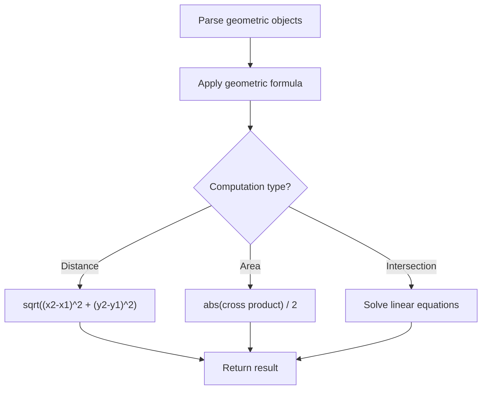

# Problem 2481: Minimum Cuts to Divide a Circle

**Difficulty:** Easy  
**Tags:** Math, Geometry  
**Pattern:** Geometry  
**Link:** [leetcode.com/problems/minimum-cuts-to-divide-a-circle](https://leetcode.com/problems/minimum-cuts-to-divide-a-circle/)

## Description

A **valid cut** in a circle can be:

	- A cut that is represented by a straight line that touches two points on the edge of the circle and passes through its center, or
	- A cut that is represented by a straight line that touches one point on the edge of the circle and its center.

Some valid and invalid cuts are shown in the figures below.

Given the integer `n`, return *the **minimum** number of cuts needed to divide a circle into *`n`* equal slices*.

 

Example 1:

```

**Input:** n = 4
**Output:** 2
**Explanation:** 
The above figure shows how cutting the circle twice through the middle divides it into 4 equal slices.

```

Example 2:

```

**Input:** n = 3
**Output:** 3
**Explanation:**
At least 3 cuts are needed to divide the circle into 3 equal slices. 
It can be shown that less than 3 cuts cannot result in 3 slices of equal size and shape.
Also note that the first cut will not divide the circle into distinct parts.

```

 

**Constraints:**

	- `1 <= n <= 100`

## Approach: Geometry

Apply geometric formulas: distance, area, cross product, convex hull, line intersection. Handle floating-point precision carefully.

## Pseudocode

```
1. Parse geometric objects (points, lines, shapes)
2. Apply geometric operations:
   - Distance formula
   - Cross/dot product
   - Area computation
3. Handle precision and edge cases
4. Return result
```

## Algorithm Flow



## Complexity Analysis

- **Time:** O(n^2) or O(n log n)
- **Space:** O(n)

## Solution (Python3)

```python
class Solution:
    def numberOfCuts(self, n: int) -> int:
        # Geometry approach
        import math
        result = 0
        for i in range(len(n)):
            for j in range(i + 1, len(n)):
                dx = n[i][0] - n[j][0]
                dy = n[i][1] - n[j][1]
                dist = math.sqrt(dx*dx + dy*dy)
                result = max(result, dist)
        return result
```

## Solution (C++)

```cpp
#include <algorithm>
#include <cmath>
#include <string>
#include <vector>
using namespace std;

class Solution {
public:
    int numberOfCuts(int n) {
        // Geometry approach
        double result = 0;
        for (int i = 0; i < (int)n.size(); i++) {
            for (int j = i + 1; j < (int)n.size(); j++) {
                double dx = n[i][0] - n[j][0];
                double dy = n[i][1] - n[j][1];
                result = max(result, sqrt(dx*dx + dy*dy));
            }
        }
        return result;
    }
};
```
