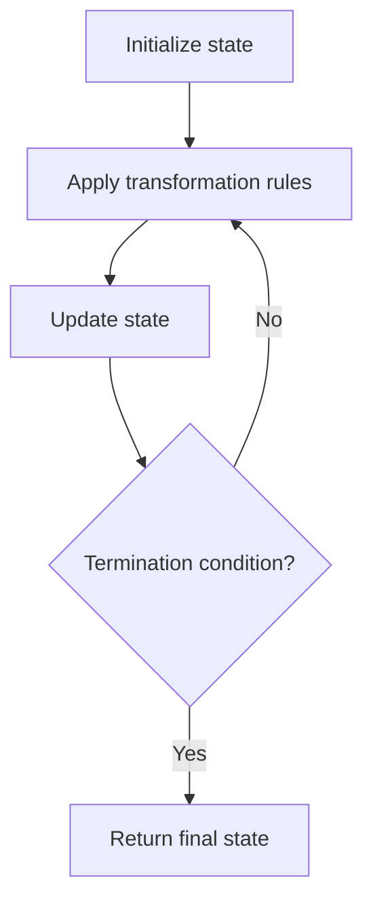

# Problem 2482: Difference Between Ones and Zeros in Row and Column

**Difficulty:** Medium  
**Tags:** Array, Matrix, Simulation  
**Pattern:** Simulation  
**Link:** [leetcode.com/problems/difference-between-ones-and-zeros-in-row-and-column](https://leetcode.com/problems/difference-between-ones-and-zeros-in-row-and-column/)

## Description

You are given a **0-indexed** `m x n` binary matrix `grid`.

A **0-indexed** `m x n` difference matrix `diff` is created with the following procedure:

	- Let the number of ones in the `i^th` row be `onesRowi`.
	- Let the number of ones in the `j^th` column be `onesColj`.
	- Let the number of zeros in the `i^th` row be `zerosRowi`.
	- Let the number of zeros in the `j^th` column be `zerosColj`.
	- `diff[i][j] = onesRowi + onesColj - zerosRowi - zerosColj`

Return *the difference matrix *`diff`.

 

Example 1:

```

**Input:** grid = [[0,1,1],[1,0,1],[0,0,1]]
**Output:** [[0,0,4],[0,0,4],[-2,-2,2]]
**Explanation:**
- diff[0][0] = `onesRow0 + onesCol0 - zerosRow0 - zerosCol0` = 2 + 1 - 1 - 2 = 0 
- diff[0][1] = `onesRow0 + onesCol1 - zerosRow0 - zerosCol1` = 2 + 1 - 1 - 2 = 0 
- diff[0][2] = `onesRow0 + onesCol2 - zerosRow0 - zerosCol2` = 2 + 3 - 1 - 0 = 4 
- diff[1][0] = `onesRow1 + onesCol0 - zerosRow1 - zerosCol0` = 2 + 1 - 1 - 2 = 0 
- diff[1][1] = `onesRow1 + onesCol1 - zerosRow1 - zerosCol1` = 2 + 1 - 1 - 2 = 0 
- diff[1][2] = `onesRow1 + onesCol2 - zerosRow1 - zerosCol2` = 2 + 3 - 1 - 0 = 4 
- diff[2][0] = `onesRow2 + onesCol0 - zerosRow2 - zerosCol0` = 1 + 1 - 2 - 2 = -2
- diff[2][1] = `onesRow2 + onesCol1 - zerosRow2 - zerosCol1` = 1 + 1 - 2 - 2 = -2
- diff[2][2] = `onesRow2 + onesCol2 - zerosRow2 - zerosCol2` = 1 + 3 - 2 - 0 = 2

```

Example 2:

```

**Input:** grid = [[1,1,1],[1,1,1]]
**Output:** [[5,5,5],[5,5,5]]
**Explanation:**
- diff[0][0] = onesRow0 + onesCol0 - zerosRow0 - zerosCol0 = 3 + 2 - 0 - 0 = 5
- diff[0][1] = onesRow0 + onesCol1 - zerosRow0 - zerosCol1 = 3 + 2 - 0 - 0 = 5
- diff[0][2] = onesRow0 + onesCol2 - zerosRow0 - zerosCol2 = 3 + 2 - 0 - 0 = 5
- diff[1][0] = onesRow1 + onesCol0 - zerosRow1 - zerosCol0 = 3 + 2 - 0 - 0 = 5
- diff[1][1] = onesRow1 + onesCol1 - zerosRow1 - zerosCol1 = 3 + 2 - 0 - 0 = 5
- diff[1][2] = onesRow1 + onesCol2 - zerosRow1 - zerosCol2 = 3 + 2 - 0 - 0 = 5

```

 

**Constraints:**

	- `m == grid.length`
	- `n == grid[i].length`
	- `1 <= m, n <= 10^5`
	- `1 <= m * n <= 10^5`
	- `grid[i][j]` is either `0` or `1`.

## Approach: Simulation

Simulate the process described in the problem step by step. Follow the rules exactly, tracking state at each step.

## Pseudocode

```
1. Initialize state (grid, pointers, counters)
2. For each step / iteration:
   a. Apply the transformation rules
   b. Update state
   c. Check termination condition
3. Return final state or result
```

## Algorithm Flow



## Complexity Analysis

- **Time:** O(n) or O(n * k)
- **Space:** O(n)

## Solution (Python3)

```python
class Solution:
    def onesMinusZeros(self, grid: List[List[int]]) -> List[List[int]]:
        # Simulation approach - follow the rules step by step
        result = []
        for i in range(len(grid) if isinstance(grid, list) else grid):
            # Simulate each step
            pass
        return result
```

## Solution (C++)

```cpp
#include <string>
#include <vector>
using namespace std;

class Solution {
public:
    vector<vector<int>> onesMinusZeros(vector<vector<int>>& grid) {
        // Simulation approach
        int n = grid.size();
        for (int i = 0; i < n; i++) {
            // Simulate each step
        }
        return {};
    }
};
```
