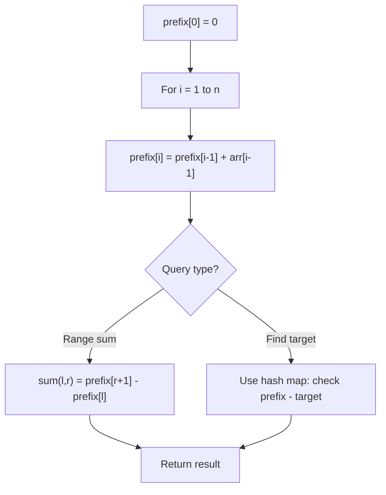

# Problem 2483: Minimum Penalty for a Shop

**Difficulty:** Medium  
**Tags:** String, Prefix Sum  
**Pattern:** Prefix Sum  
**Link:** [leetcode.com/problems/minimum-penalty-for-a-shop](https://leetcode.com/problems/minimum-penalty-for-a-shop/)

## Description

You are given the customer visit log of a shop represented by a **0-indexed** string `customers` consisting only of characters `'N'` and `'Y'`:

	- if the `i^th` character is `'Y'`, it means that customers come at the `i^th` hour
	- whereas `'N'` indicates that no customers come at the `i^th` hour.

If the shop closes at the `j^th` hour (`0 <= j <= n`), the **penalty** is calculated as follows:

	- For every hour when the shop is open and no customers come, the penalty increases by `1`.
	- For every hour when the shop is closed and customers come, the penalty increases by `1`.

Return* the **earliest** hour at which the shop must be closed to incur a **minimum** penalty.*

**Note** that if a shop closes at the `j^th` hour, it means the shop is closed at the hour `j`.

 

Example 1:

```

**Input:** customers = "YYNY"
**Output:** 2
**Explanation:** 
- Closing the shop at the 0th hour incurs in 1+1+0+1 = 3 penalty.
- Closing the shop at the 1st hour incurs in 0+1+0+1 = 2 penalty.
- Closing the shop at the 2nd hour incurs in 0+0+0+1 = 1 penalty.
- Closing the shop at the 3rd hour incurs in 0+0+1+1 = 2 penalty.
- Closing the shop at the 4th hour incurs in 0+0+1+0 = 1 penalty.
Closing the shop at 2nd or 4th hour gives a minimum penalty. Since 2 is earlier, the optimal closing time is 2.

```

Example 2:

```

**Input:** customers = "NNNNN"
**Output:** 0
**Explanation:** It is best to close the shop at the 0th hour as no customers arrive.
```

Example 3:

```

**Input:** customers = "YYYY"
**Output:** 4
**Explanation:** It is best to close the shop at the 4th hour as customers arrive at each hour.

```

 

**Constraints:**

	- `1 <= customers.length <= 10^5`
	- `customers` consists only of characters `'Y'` and `'N'`.

## Approach: Prefix Sum

Build a prefix sum array where prefix[i] = sum of elements 0..i-1. Any subarray sum [l..r] = prefix[r+1] - prefix[l]. Combine with hash map for O(n) subarray sum queries.

## Pseudocode

```
1. Build prefix sum array: prefix[0]=0, prefix[i]=prefix[i-1]+arr[i-1]
2. Use prefix sums to answer queries:
   - Subarray sum [l..r] = prefix[r+1] - prefix[l]
   - Or use hash map to find prefix[j]-prefix[i] == target
3. Return result
```

## Algorithm Flow



## Complexity Analysis

- **Time:** O(n)
- **Space:** O(n)

## Solution (Python3)

```python
class Solution:
    def bestClosingTime(self, customers: str) -> int:
        # Prefix sum approach - O(n) time, O(n) space
        prefix = {0: -1}
        curr_sum = 0
        result = 0
        target = customers if isinstance(customers, int) else 0
        for i, val in enumerate(customers):
            curr_sum += val
            if curr_sum - target in prefix:
                result = max(result, i - prefix[curr_sum - target])
            if curr_sum not in prefix:
                prefix[curr_sum] = i
        return result
```

## Solution (C++)

```cpp
#include <algorithm>
#include <string>
#include <unordered_map>
#include <vector>
using namespace std;

class Solution {
public:
    int bestClosingTime(string& customers) {
        // Prefix sum approach - O(n) time, O(n) space
        unordered_map<int, int> prefix;
        prefix[0] = -1;
        int curr_sum = 0, result = 0;
        int target = customers;
        for (int i = 0; i < (int)customers.size(); i++) {
            curr_sum += customers[i];
            if (prefix.count(curr_sum - target)) {
                result = max(result, i - prefix[curr_sum - target]);
            }
            if (!prefix.count(curr_sum)) {
                prefix[curr_sum] = i;
            }
        }
        return result;
    }
};
```
