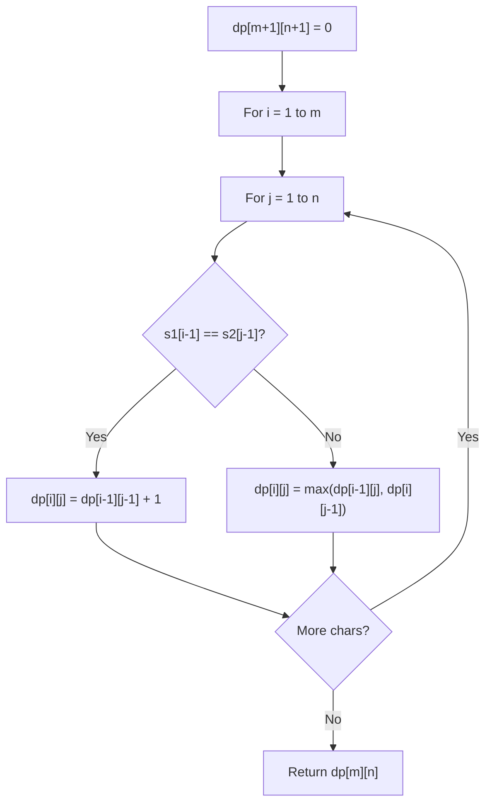

# Problem 2484: Count Palindromic Subsequences

**Difficulty:** Hard  
**Tags:** String, Dynamic Programming  
**Pattern:** Dynamic Programming (String)  
**Link:** [leetcode.com/problems/count-palindromic-subsequences](https://leetcode.com/problems/count-palindromic-subsequences/)

## Description

Given a string of digits `s`, return *the number of **palindromic subsequences** of* `s`* having length *`5`. Since the answer may be very large, return it **modulo** `10^9 + 7`.

**Note:**

	- A string is **palindromic** if it reads the same forward and backward.
	- A **subsequence** is a string that can be derived from another string by deleting some or no characters without changing the order of the remaining characters.

 

Example 1:

```

**Input:** s = "103301"
**Output:** 2
**Explanation:** 
There are 6 possible subsequences of length 5: "10330","10331","10301","10301","13301","03301". 
Two of them (both equal to "10301") are palindromic.

```

Example 2:

```

**Input:** s = "0000000"
**Output:** 21
**Explanation:** All 21 subsequences are "00000", which is palindromic.

```

Example 3:

```

**Input:** s = "9999900000"
**Output:** 2
**Explanation:** The only two palindromic subsequences are "99999" and "00000".

```

 

**Constraints:**

	- `1 <= s.length <= 10^4`
	- `s` consists of digits.

## Approach: Dynamic Programming (String)

Compare or match two strings using a 2D DP table. dp[i][j] represents the answer for substrings s1[0..i-1] and s2[0..j-1]. Common patterns: LCS, edit distance, regex matching.

## Pseudocode

```
1. Create dp[m+1][n+1]
2. Initialize base cases
3. For i from 1 to m:
   For j from 1 to n:
     If s1[i-1] == s2[j-1]: dp[i][j] = dp[i-1][j-1] + 1
     Else: dp[i][j] = best of (dp[i-1][j], dp[i][j-1], dp[i-1][j-1])
4. Return dp[m][n]
```

## Algorithm Flow



## Complexity Analysis

- **Time:** O(m * n)
- **Space:** O(m * n)

## Solution (Python3)

```python
class Solution:
    def countPalindromes(self, s: str) -> int:
        # String DP - O(m*n) time and space
        m, n = len(s), len(s)
        dp = [[0] * (n + 1) for _ in range(m + 1)]
        for i in range(1, m + 1):
            for j in range(1, n + 1):
                if s[i-1] == s[j-1]:
                    dp[i][j] = dp[i-1][j-1] + 1
                else:
                    dp[i][j] = max(dp[i-1][j], dp[i][j-1])
        return dp[m][n]
```

## Solution (C++)

```cpp
#include <algorithm>
#include <string>
#include <vector>
using namespace std;

class Solution {
public:
    int countPalindromes(string& s) {
        // String DP - O(m*n) time and space
        int m = s.size(), n = s.size();
        vector<vector<int>> dp(m + 1, vector<int>(n + 1, 0));
        for (int i = 1; i <= m; i++) {
            for (int j = 1; j <= n; j++) {
                if (s[i-1] == s[j-1])
                    dp[i][j] = dp[i-1][j-1] + 1;
                else
                    dp[i][j] = max(dp[i-1][j], dp[i][j-1]);
            }
        }
        return dp[m][n];
    }
};
```
