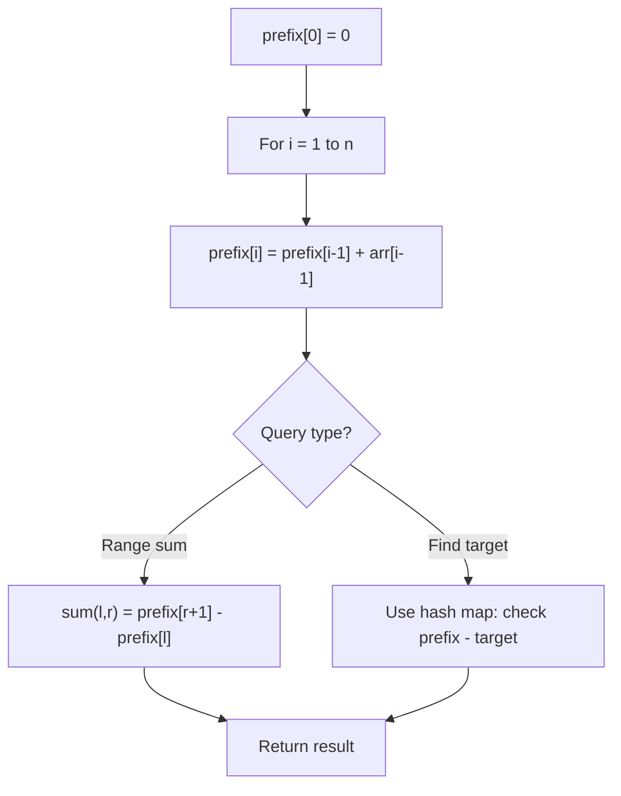

# Problem 2485: Find the Pivot Integer

**Difficulty:** Easy  
**Tags:** Math, Prefix Sum  
**Pattern:** Prefix Sum  
**Link:** [leetcode.com/problems/find-the-pivot-integer](https://leetcode.com/problems/find-the-pivot-integer/)

## Description

Given a positive integer `n`, find the **pivot integer** `x` such that:

	- The sum of all elements between `1` and `x` inclusively equals the sum of all elements between `x` and `n` inclusively.

Return *the pivot integer *`x`. If no such integer exists, return `-1`. It is guaranteed that there will be at most one pivot index for the given input.

 

Example 1:

```

**Input:** n = 8
**Output:** 6
**Explanation:** 6 is the pivot integer since: 1 + 2 + 3 + 4 + 5 + 6 = 6 + 7 + 8 = 21.

```

Example 2:

```

**Input:** n = 1
**Output:** 1
**Explanation:** 1 is the pivot integer since: 1 = 1.

```

Example 3:

```

**Input:** n = 4
**Output:** -1
**Explanation:** It can be proved that no such integer exist.

```

 

**Constraints:**

	- `1 <= n <= 1000`

## Approach: Prefix Sum

Build a prefix sum array where prefix[i] = sum of elements 0..i-1. Any subarray sum [l..r] = prefix[r+1] - prefix[l]. Combine with hash map for O(n) subarray sum queries.

## Pseudocode

```
1. Build prefix sum array: prefix[0]=0, prefix[i]=prefix[i-1]+arr[i-1]
2. Use prefix sums to answer queries:
   - Subarray sum [l..r] = prefix[r+1] - prefix[l]
   - Or use hash map to find prefix[j]-prefix[i] == target
3. Return result
```

## Algorithm Flow



## Complexity Analysis

- **Time:** O(n)
- **Space:** O(n)

## Solution (Python3)

```python
class Solution:
    def pivotInteger(self, n: int) -> int:
        # Prefix sum approach - O(n) time, O(n) space
        prefix = {0: -1}
        curr_sum = 0
        result = 0
        target = n if isinstance(n, int) else 0
        for i, val in enumerate(n):
            curr_sum += val
            if curr_sum - target in prefix:
                result = max(result, i - prefix[curr_sum - target])
            if curr_sum not in prefix:
                prefix[curr_sum] = i
        return result
```

## Solution (C++)

```cpp
#include <algorithm>
#include <string>
#include <unordered_map>
#include <vector>
using namespace std;

class Solution {
public:
    int pivotInteger(int n) {
        // Prefix sum approach - O(n) time, O(n) space
        unordered_map<int, int> prefix;
        prefix[0] = -1;
        int curr_sum = 0, result = 0;
        int target = n;
        for (int i = 0; i < (int)n.size(); i++) {
            curr_sum += n[i];
            if (prefix.count(curr_sum - target)) {
                result = max(result, i - prefix[curr_sum - target]);
            }
            if (!prefix.count(curr_sum)) {
                prefix[curr_sum] = i;
            }
        }
        return result;
    }
};
```
