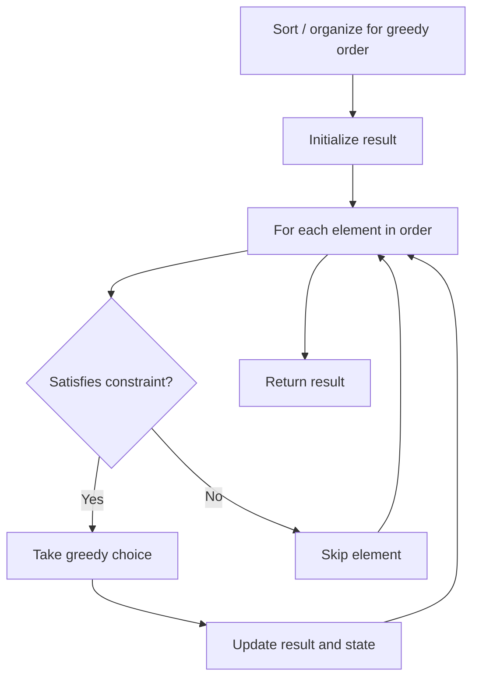

# Problem 2486: Append Characters to String to Make Subsequence

**Difficulty:** Medium  
**Tags:** Two Pointers, String, Greedy  
**Pattern:** Greedy  
**Link:** [leetcode.com/problems/append-characters-to-string-to-make-subsequence](https://leetcode.com/problems/append-characters-to-string-to-make-subsequence/)

## Description

You are given two strings `s` and `t` consisting of only lowercase English letters.

Return *the minimum number of characters that need to be appended to the end of *`s`* so that *`t`* becomes a **subsequence** of *`s`.

A **subsequence** is a string that can be derived from another string by deleting some or no characters without changing the order of the remaining characters.

 

Example 1:

```

**Input:** s = "coaching", t = "coding"
**Output:** 4
**Explanation:** Append the characters "ding" to the end of s so that s = "coachingding".
Now, t is a subsequence of s ("**co**aching**ding**").
It can be shown that appending any 3 characters to the end of s will never make t a subsequence.

```

Example 2:

```

**Input:** s = "abcde", t = "a"
**Output:** 0
**Explanation:** t is already a subsequence of s ("**a**bcde").

```

Example 3:

```

**Input:** s = "z", t = "abcde"
**Output:** 5
**Explanation:** Append the characters "abcde" to the end of s so that s = "zabcde".
Now, t is a subsequence of s ("z**abcde**").
It can be shown that appending any 4 characters to the end of s will never make t a subsequence.

```

 

**Constraints:**

	- `1 <= s.length, t.length <= 10^5`
	- `s` and `t` consist only of lowercase English letters.

## Approach: Greedy

Make the locally optimal choice at each step, trusting it leads to a global optimum. Greedy works when the problem has the greedy-choice property and optimal substructure.

## Pseudocode

```
1. Sort or organize data for greedy ordering
2. Initialize result
3. For each element in greedy order:
   a. If element satisfies constraint:
      - Take the greedy choice
      - Update result and state
4. Return result
```

## Algorithm Flow



## Complexity Analysis

- **Time:** O(n log n)
- **Space:** O(1)

## Solution (Python3)

```python
class Solution:
    def appendCharacters(self, s: str, t: str) -> int:
        # Greedy approach - O(n) time
        result = 0
        curr_max = 0
        for i in range(len(s)):
            if isinstance(s[i], int):
                curr_max = max(curr_max, s[i])
                result = max(result, curr_max)
            else:
                result += 1
        return result
```

## Solution (C++)

```cpp
#include <algorithm>
#include <string>
#include <vector>
using namespace std;

class Solution {
public:
    int appendCharacters(string& s, string& t) {
        // Greedy approach - O(n) time
        int result = 0, curr_max = 0;
        for (int i = 0; i < (int)s.size(); i++) {
            curr_max = max(curr_max, s[i]);
            result = max(result, curr_max);
        }
        return result;
    }
};
```
