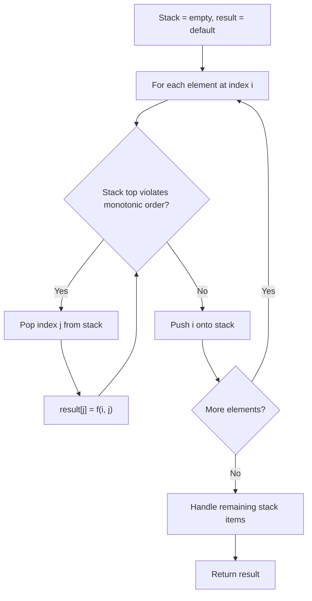
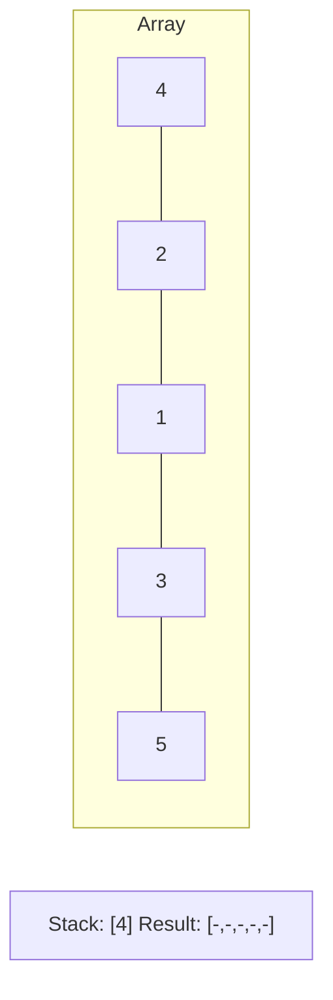
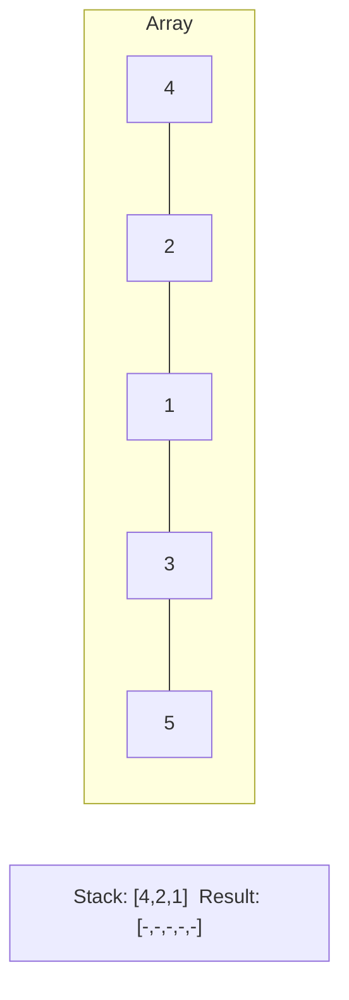
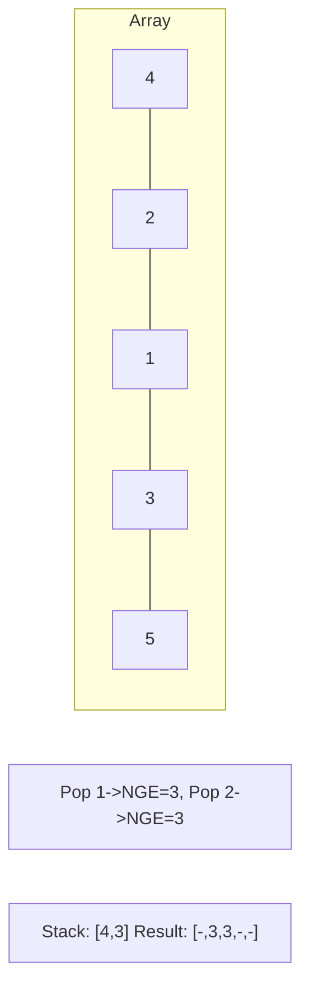
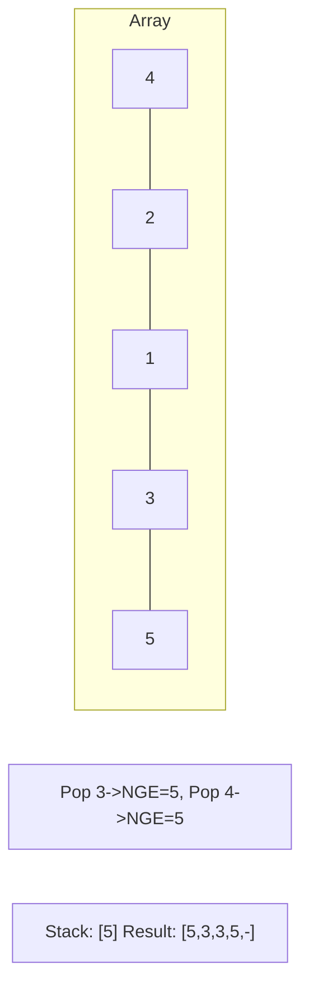

# Problem 2487: Remove Nodes From Linked List

**Difficulty:** Medium  
**Tags:** Linked List, Stack, Recursion, Monotonic Stack  
**Pattern:** Monotonic Stack  
**Link:** [leetcode.com/problems/remove-nodes-from-linked-list](https://leetcode.com/problems/remove-nodes-from-linked-list/)

## Description

You are given the `head` of a linked list.

Remove every node which has a node with a greater value anywhere to the right side of it.

Return *the *`head`* of the modified linked list.*

 

Example 1:

```

**Input:** head = [5,2,13,3,8]
**Output:** [13,8]
**Explanation:** The nodes that should be removed are 5, 2 and 3.
- Node 13 is to the right of node 5.
- Node 13 is to the right of node 2.
- Node 8 is to the right of node 3.

```

Example 2:

```

**Input:** head = [1,1,1,1]
**Output:** [1,1,1,1]
**Explanation:** Every node has value 1, so no nodes are removed.

```

 

**Constraints:**

	- The number of the nodes in the given list is in the range `[1, 10^5]`.
	- `1 <= Node.val <= 10^5`

## Approach: Monotonic Stack

Maintain a stack where elements are always in monotonic order (increasing or decreasing). When a new element violates the monotonic property, pop elements and compute results (e.g., next greater/smaller element, spans, areas).

## Pseudocode

```
1. Initialize empty stack, result array
2. For each element (index i):
   a. While stack not empty and arr[i] breaks monotonic order:
      - Pop index j from stack
      - result[j] = compute(i, j)
   b. Push i onto stack
3. Handle remaining elements in stack
4. Return result
```

## Algorithm Flow



## Visual State Transitions

**Monotonic Stack (Next Greater Element):**

**Frame 1: Process first elements**


**Frame 2: Push smaller elements**


**Frame 3: Element 3 pops 1 and 2**


**Frame 4: Element 5 pops all**



## Complexity Analysis

- **Time:** O(n)
- **Space:** O(n)

## Solution (Python3)

```python
class Solution:
    def removeNodes(self, head: Optional[ListNode]) -> Optional[ListNode]:
        # Monotonic stack - O(n) time, O(n) space
        n = len(head)
        result = [0] * n
        stack = []  # indices
        for i in range(n):
            while stack and head[i] > head[stack[-1]]:
                idx = stack.pop()
                result[idx] = i - idx
            stack.append(i)
        return result
```

## Solution (C++)

```cpp
#include <stack>
#include <string>
#include <vector>
using namespace std;

class Solution {
public:
    ListNode* removeNodes(ListNode* head) {
        // Monotonic stack - O(n) time, O(n) space
        int n = head.size();
        vector<int> result(n, 0);
        stack<int> st;
        for (int i = 0; i < n; i++) {
            while (!st.empty() && head[i] > head[st.top()]) {
                int idx = st.top(); st.pop();
                result[idx] = i - idx;
            }
            st.push(i);
        }
        return result;
    }
};
```
