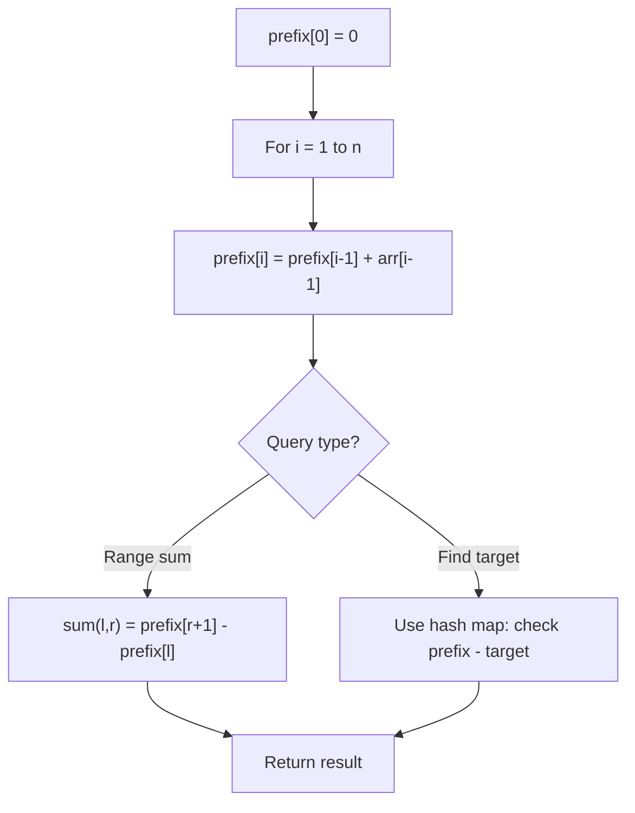

# Problem 2488: Count Subarrays With Median K

**Difficulty:** Hard  
**Tags:** Array, Hash Table, Prefix Sum  
**Pattern:** Prefix Sum  
**Link:** [leetcode.com/problems/count-subarrays-with-median-k](https://leetcode.com/problems/count-subarrays-with-median-k/)

## Description

You are given an array `nums` of size `n` consisting of **distinct **integers from `1` to `n` and a positive integer `k`.

Return *the number of non-empty subarrays in *`nums`* that have a **median** equal to *`k`.

**Note**:

	- The median of an array is the **middle **element after sorting the array in **ascending **order. If the array is of even length, the median is the **left **middle element.

	
		For example, the median of `[2,3,1,4]` is `2`, and the median of `[8,4,3,5,1]` is `4`.
	
	
	- A subarray is a contiguous part of an array.

 

Example 1:

```

**Input:** nums = [3,2,1,4,5], k = 4
**Output:** 3
**Explanation:** The subarrays that have a median equal to 4 are: [4], [4,5] and [1,4,5].

```

Example 2:

```

**Input:** nums = [2,3,1], k = 3
**Output:** 1
**Explanation:** [3] is the only subarray that has a median equal to 3.

```

 

**Constraints:**

	- `n == nums.length`
	- `1 <= n <= 10^5`
	- `1 <= nums[i], k <= n`
	- The integers in `nums` are distinct.

## Approach: Prefix Sum

Build a prefix sum array where prefix[i] = sum of elements 0..i-1. Any subarray sum [l..r] = prefix[r+1] - prefix[l]. Combine with hash map for O(n) subarray sum queries.

## Pseudocode

```
1. Build prefix sum array: prefix[0]=0, prefix[i]=prefix[i-1]+arr[i-1]
2. Use prefix sums to answer queries:
   - Subarray sum [l..r] = prefix[r+1] - prefix[l]
   - Or use hash map to find prefix[j]-prefix[i] == target
3. Return result
```

## Algorithm Flow



## Complexity Analysis

- **Time:** O(n)
- **Space:** O(n)

## Solution (Python3)

```python
class Solution:
    def countSubarrays(self, nums: List[int], k: int) -> int:
        # Prefix sum approach - O(n) time, O(n) space
        prefix = {0: -1}
        curr_sum = 0
        result = 0
        target = k if isinstance(k, int) else 0
        for i, val in enumerate(nums):
            curr_sum += val
            if curr_sum - target in prefix:
                result = max(result, i - prefix[curr_sum - target])
            if curr_sum not in prefix:
                prefix[curr_sum] = i
        return result
```

## Solution (C++)

```cpp
#include <algorithm>
#include <string>
#include <unordered_map>
#include <vector>
using namespace std;

class Solution {
public:
    int countSubarrays(vector<int>& nums, int k) {
        // Prefix sum approach - O(n) time, O(n) space
        unordered_map<int, int> prefix;
        prefix[0] = -1;
        int curr_sum = 0, result = 0;
        int target = k;
        for (int i = 0; i < (int)nums.size(); i++) {
            curr_sum += nums[i];
            if (prefix.count(curr_sum - target)) {
                result = max(result, i - prefix[curr_sum - target]);
            }
            if (!prefix.count(curr_sum)) {
                prefix[curr_sum] = i;
            }
        }
        return result;
    }
};
```
