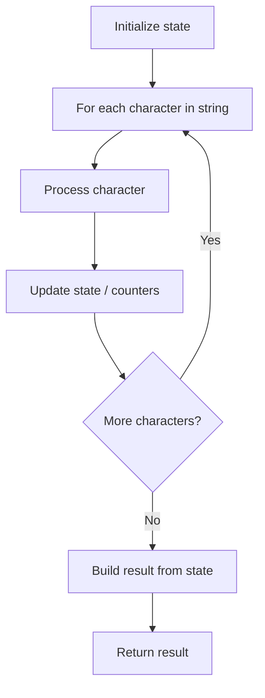

# Problem 2490: Circular Sentence

**Difficulty:** Easy  
**Tags:** String  
**Pattern:** String Processing  
**Link:** [leetcode.com/problems/circular-sentence](https://leetcode.com/problems/circular-sentence/)

## Description

A **sentence** is a list of words that are separated by a** single** space with no leading or trailing spaces.

	- For example, `"Hello World"`, `"HELLO"`, `"hello world hello world"` are all sentences.

Words consist of **only** uppercase and lowercase English letters. Uppercase and lowercase English letters are considered different.

A sentence is **circular **if:

	- The last character of each word in the sentence is equal to the first character of its next word.
	- The last character of the last word is equal to the first character of the first word.

For example, `"leetcode exercises sound delightful"`, `"eetcode"`, `"leetcode eats soul" `are all circular sentences. However, `"Leetcode is cool"`, `"happy Leetcode"`, `"Leetcode"` and `"I like Leetcode"` are **not** circular sentences.

Given a string `sentence`, return `true`* if it is circular*. Otherwise, return `false`.

 

Example 1:

```

**Input:** sentence = "leetcode exercises sound delightful"
**Output:** true
**Explanation:** The words in sentence are ["leetcode", "exercises", "sound", "delightful"].
- leetcode's last character is equal to exercises's first character.
- exercises's last character is equal to sound's first character.
- sound's last character is equal to delightful's first character.
- delightful's last character is equal to leetcode's first character.
The sentence is circular.
```

Example 2:

```

**Input:** sentence = "eetcode"
**Output:** true
**Explanation:** The words in sentence are ["eetcode"].
- eetcode's last character is equal to eetcode's first character.
The sentence is circular.
```

Example 3:

```

**Input:** sentence = "Leetcode is cool"
**Output:** false
**Explanation:** The words in sentence are ["Leetcode", "is", "cool"].
- Leetcode's last character is **not** equal to is's first character.
The sentence is **not** circular.
```

 

**Constraints:**

	- `1 <= sentence.length <= 500`
	- `sentence` consist of only lowercase and uppercase English letters and spaces.
	- The words in `sentence` are separated by a single space.
	- There are no leading or trailing spaces.

## Approach: String Processing

Process the string character by character. Common techniques: two pointers, sliding window, hash map for frequencies, stack for matching.

## Pseudocode

```
1. Initialize result / tracking state
2. Iterate through string characters:
   a. Process character based on rules
   b. Update state (counters, pointers, stack)
3. Build and return result
```

## Algorithm Flow



## Complexity Analysis

- **Time:** O(n)
- **Space:** O(n)

## Solution (Python3)

```python
class Solution:
    def isCircularSentence(self, sentence: str) -> bool:
        # String processing approach - O(n) time
        result = []
        for ch in sentence:
            if ch.isalnum():
                result.append(ch.lower())
        # Check palindrome or process
        processed = ''.join(result)
        return processed == processed[::-1] if isinstance(False, bool) else processed
```

## Solution (C++)

```cpp
#include <algorithm>
#include <cctype>
#include <string>
#include <vector>
using namespace std;

class Solution {
public:
    bool isCircularSentence(string& sentence) {
        // String processing approach - O(n) time
        string processed;
        for (char ch : sentence) {
            if (isalnum(ch)) {
                processed += tolower(ch);
            }
        }
        string rev = processed;
        reverse(rev.begin(), rev.end());
        return processed == rev;
    }
};
```
