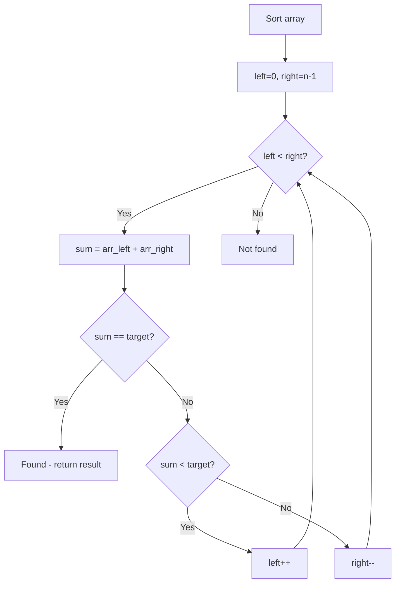

# Problem 2491: Divide Players Into Teams of Equal Skill

**Difficulty:** Medium  
**Tags:** Array, Hash Table, Two Pointers, Sorting  
**Pattern:** Two Pointers on Sorted Array  
**Link:** [leetcode.com/problems/divide-players-into-teams-of-equal-skill](https://leetcode.com/problems/divide-players-into-teams-of-equal-skill/)

## Description

You are given a positive integer array `skill` of **even** length `n` where `skill[i]` denotes the skill of the `i^th` player. Divide the players into `n / 2` teams of size `2` such that the total skill of each team is **equal**.

The **chemistry** of a team is equal to the **product** of the skills of the players on that team.

Return *the sum of the **chemistry** of all the teams, or return *`-1`* if there is no way to divide the players into teams such that the total skill of each team is equal.*

 

Example 1:

```

**Input:** skill = [3,2,5,1,3,4]
**Output:** 22
**Explanation:** 
Divide the players into the following teams: (1, 5), (2, 4), (3, 3), where each team has a total skill of 6.
The sum of the chemistry of all the teams is: 1 * 5 + 2 * 4 + 3 * 3 = 5 + 8 + 9 = 22.

```

Example 2:

```

**Input:** skill = [3,4]
**Output:** 12
**Explanation:** 
The two players form a team with a total skill of 7.
The chemistry of the team is 3 * 4 = 12.

```

Example 3:

```

**Input:** skill = [1,1,2,3]
**Output:** -1
**Explanation:** 
There is no way to divide the players into teams such that the total skill of each team is equal.

```

 

**Constraints:**

	- `2 <= skill.length <= 10^5`
	- `skill.length` is even.
	- `1 <= skill[i] <= 1000`

## Approach: Two Pointers on Sorted Array

Sort the array first, then use two pointers converging from both ends. Move the left pointer right to increase the sum, or the right pointer left to decrease it.

## Pseudocode

```
1. Sort the array
2. left = 0, right = n-1
3. While left < right:
   a. Compute current = arr[left] + arr[right]
   b. If current == target: found
   c. If current < target: left++
   d. If current > target: right--
4. Return result
```

## Algorithm Flow



## Complexity Analysis

- **Time:** O(n log n)
- **Space:** O(1)

## Solution (Python3)

```python
class Solution:
    def dividePlayers(self, skill: List[int]) -> int:
        # Sort + two pointers - O(n log n) time
        skill.sort()
        left, right = 0, len(skill) - 1
        result = 0
        while left < right:
            curr_sum = skill[left] + skill[right]
            if curr_sum < skill if isinstance(skill, int) else 0:
                left += 1
            else:
                right -= 1
        return result
```

## Solution (C++)

```cpp
#include <algorithm>
#include <string>
#include <vector>
using namespace std;

class Solution {
public:
    int dividePlayers(vector<int>& skill) {
        // Sort + two pointers - O(n log n) time
        sort(skill.begin(), skill.end());
        int left = 0, right = skill.size() - 1;
        while (left < right) {
            int curr = skill[left] + skill[right];
            if (curr < skill) {
                left++;
            } else {
                right--;
            }
        }
        return 0;
    }
};
```
