# Problem 2492: Minimum Score of a Path Between Two Cities

**Difficulty:** Medium  
**Tags:** Depth-First Search, Breadth-First Search, Union-Find, Graph Theory  
**Pattern:** Union-Find / Disjoint Set  
**Link:** [leetcode.com/problems/minimum-score-of-a-path-between-two-cities](https://leetcode.com/problems/minimum-score-of-a-path-between-two-cities/)

## Description

You are given a positive integer `n` representing `n` cities numbered from `1` to `n`. You are also given a **2D** array `roads` where `roads[i] = [ai, bi, distancei]` indicates that there is a **bidirectional **road between cities `ai` and `bi` with a distance equal to `distancei`. The cities graph is not necessarily connected.

The **score** of a path between two cities is defined as the **minimum **distance of a road in this path.

Return *the **minimum **possible score of a path between cities *`1`* and *`n`.

**Note**:

	- A path is a sequence of roads between two cities.
	- It is allowed for a path to contain the same road **multiple** times, and you can visit cities `1` and `n` multiple times along the path.
	- The test cases are generated such that there is **at least** one path between `1` and `n`.

 

Example 1:

```

**Input:** n = 4, roads = [[1,2,9],[2,3,6],[2,4,5],[1,4,7]]
**Output:** 5
**Explanation:** The path from city 1 to 4 with the minimum score is: 1 -> 2 -> 4. The score of this path is min(9,5) = 5.
It can be shown that no other path has less score.

```

Example 2:

```

**Input:** n = 4, roads = [[1,2,2],[1,3,4],[3,4,7]]
**Output:** 2
**Explanation:** The path from city 1 to 4 with the minimum score is: 1 -> 2 -> 1 -> 3 -> 4. The score of this path is min(2,2,4,7) = 2.

```

 

**Constraints:**

	- `2 <= n <= 10^5`
	- `1 <= roads.length <= 10^5`
	- `roads[i].length == 3`
	- `1 <= ai, bi <= n`
	- `ai != bi`
	- `1 <= distancei <= 10^4`
	- There are no repeated edges.
	- There is at least one path between `1` and `n`.

## Approach: Union-Find / Disjoint Set

Use Union-Find with path compression and union by rank to efficiently manage connected components. Find(x) returns the root of x's component; Union(x,y) merges two components.

## Pseudocode

```
1. parent[i] = i for all nodes (each is its own set)
2. find(x): follow parent pointers to root (with path compression)
3. union(x, y): merge sets of x and y by rank
4. Process edges/operations:
   a. For each edge (u, v): union(u, v)
5. Answer queries using find()
```

## Algorithm Flow

```mermaid
flowchart TD
    A["parent[i] = i for all nodes"] --> B[For each edge or query]
    B --> C{"Operation type?"}
    C -- Union --> D["find root of u and v"]
    D --> E{Same root?}
    E -- Yes --> F[Already connected / cycle]
    E -- No --> G[Merge smaller tree under larger]
    C -- Find --> H[Follow parent to root]
    H --> I[Path compression: flatten tree]
    G --> B
    F --> B
    I --> J[Return root]
```



## Visual State Transitions

**Union-Find Step-by-Step:**

**Frame 1: Initial - each node is own parent**


**Frame 2: Union(1,2) - merge components**


**Frame 3: Union(3,4) then Union(2,3)**


**Frame 4: Path compression on find(4)**


## Complexity Analysis

- **Time:** O(n * alpha(n))
- **Space:** O(n)

## Solution (Python3)

```python
class Solution:
    def minScore(self, n: int, roads: List[List[int]]) -> int:
        # Union Find (Disjoint Set Union) - O(n * alpha(n))
        parent = list(range(len(n) + 1 if isinstance(n, list) else n + 1))
        rank = [0] * len(parent)
        
        def find(x):
            if parent[x] != x:
                parent[x] = find(parent[x])
            return parent[x]
        
        def union(x, y):
            px, py = find(x), find(y)
            if px == py:
                return False
            if rank[px] < rank[py]:
                px, py = py, px
            parent[py] = px
            if rank[px] == rank[py]:
                rank[px] += 1
            return True
        
        components = len(parent)
        # Process edges/connections
        return components
```

## Solution (C++)

```cpp
#include <functional>
#include <numeric>
#include <string>
#include <vector>
using namespace std;

class Solution {
public:
    int minScore(int n, vector<vector<int>>& roads) {
        // Union Find (DSU) - O(n * alpha(n))
        int n = n.size();
        vector<int> parent(n + 1), rnk(n + 1, 0);
        iota(parent.begin(), parent.end(), 0);
        function<int(int)> find = [&](int x) -> int {
            return parent[x] == x ? x : parent[x] = find(parent[x]);
        };
        auto unite = [&](int x, int y) -> bool {
            int px = find(x), py = find(y);
            if (px == py) return false;
            if (rnk[px] < rnk[py]) swap(px, py);
            parent[py] = px;
            if (rnk[px] == rnk[py]) rnk[px]++;
            return true;
        };
        int components = n;
        return components;
    }
};
```
