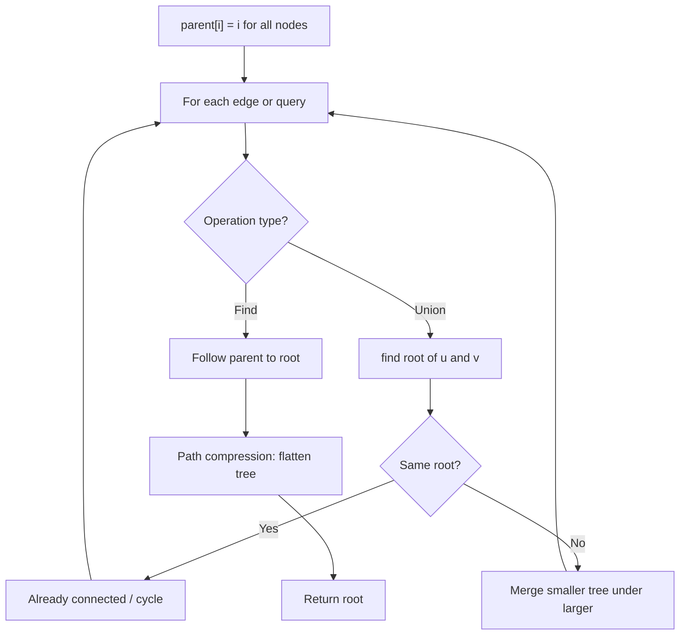
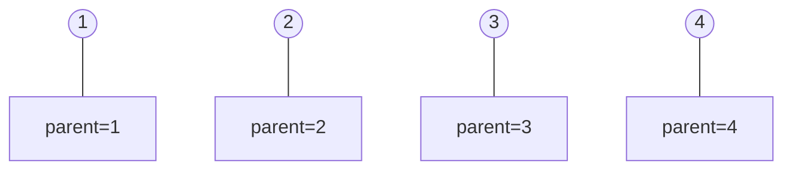
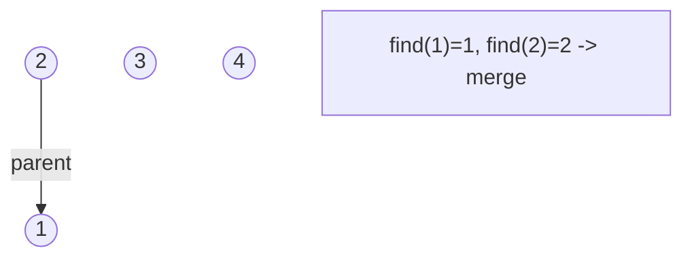
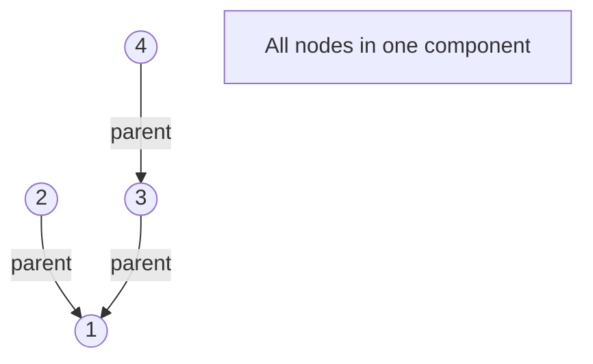
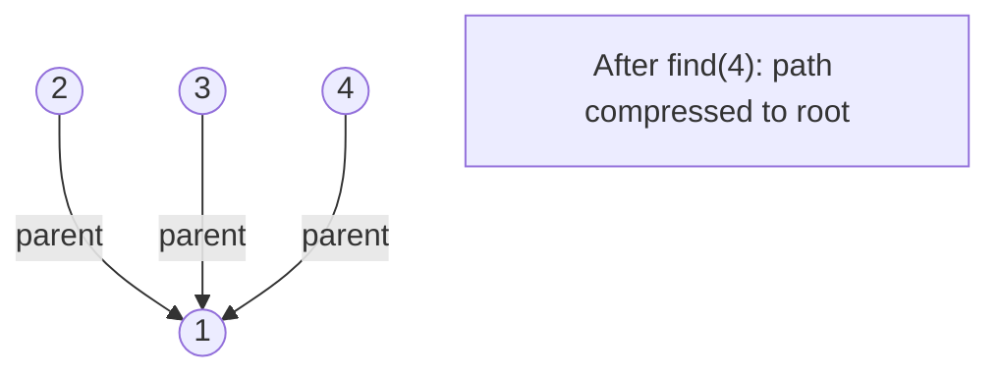

# Problem 2493: Divide Nodes Into the Maximum Number of Groups

**Difficulty:** Hard  
**Tags:** Depth-First Search, Breadth-First Search, Union-Find, Graph Theory  
**Pattern:** Union-Find / Disjoint Set  
**Link:** [leetcode.com/problems/divide-nodes-into-the-maximum-number-of-groups](https://leetcode.com/problems/divide-nodes-into-the-maximum-number-of-groups/)

## Description

You are given a positive integer `n` representing the number of nodes in an **undirected** graph. The nodes are labeled from `1` to `n`.

You are also given a 2D integer array `edges`, where `edges[i] = [ai, bi]` indicates that there is a **bidirectional** edge between nodes `ai` and `bi`. **Notice** that the given graph may be disconnected.

Divide the nodes of the graph into `m` groups (**1-indexed**) such that:

	- Each node in the graph belongs to exactly one group.
	- For every pair of nodes in the graph that are connected by an edge `[ai, bi]`, if `ai` belongs to the group with index `x`, and `bi` belongs to the group with index `y`, then `|y - x| = 1`.

Return *the maximum number of groups (i.e., maximum *`m`*) into which you can divide the nodes*. Return `-1` *if it is impossible to group the nodes with the given conditions*.

 

Example 1:

```

**Input:** n = 6, edges = [[1,2],[1,4],[1,5],[2,6],[2,3],[4,6]]
**Output:** 4
**Explanation:** As shown in the image we:
- Add node 5 to the first group.
- Add node 1 to the second group.
- Add nodes 2 and 4 to the third group.
- Add nodes 3 and 6 to the fourth group.
We can see that every edge is satisfied.
It can be shown that that if we create a fifth group and move any node from the third or fourth group to it, at least on of the edges will not be satisfied.

```

Example 2:

```

**Input:** n = 3, edges = [[1,2],[2,3],[3,1]]
**Output:** -1
**Explanation:** If we add node 1 to the first group, node 2 to the second group, and node 3 to the third group to satisfy the first two edges, we can see that the third edge will not be satisfied.
It can be shown that no grouping is possible.

```

 

**Constraints:**

	- `1 <= n <= 500`
	- `1 <= edges.length <= 10^4`
	- `edges[i].length == 2`
	- `1 <= ai, bi <= n`
	- `ai != bi`
	- There is at most one edge between any pair of vertices.

## Approach: Union-Find / Disjoint Set

Use Union-Find with path compression and union by rank to efficiently manage connected components. Find(x) returns the root of x's component; Union(x,y) merges two components.

## Pseudocode

```
1. parent[i] = i for all nodes (each is its own set)
2. find(x): follow parent pointers to root (with path compression)
3. union(x, y): merge sets of x and y by rank
4. Process edges/operations:
   a. For each edge (u, v): union(u, v)
5. Answer queries using find()
```

## Algorithm Flow



## Visual State Transitions

**Union-Find Step-by-Step:**

**Frame 1: Initial - each node is own parent**


**Frame 2: Union(1,2) - merge components**


**Frame 3: Union(3,4) then Union(2,3)**


**Frame 4: Path compression on find(4)**



## Complexity Analysis

- **Time:** O(n * alpha(n))
- **Space:** O(n)

## Solution (Python3)

```python
class Solution:
    def magnificentSets(self, n: int, edges: List[List[int]]) -> int:
        # Union Find (Disjoint Set Union) - O(n * alpha(n))
        parent = list(range(len(n) + 1 if isinstance(n, list) else n + 1))
        rank = [0] * len(parent)
        
        def find(x):
            if parent[x] != x:
                parent[x] = find(parent[x])
            return parent[x]
        
        def union(x, y):
            px, py = find(x), find(y)
            if px == py:
                return False
            if rank[px] < rank[py]:
                px, py = py, px
            parent[py] = px
            if rank[px] == rank[py]:
                rank[px] += 1
            return True
        
        components = len(parent)
        # Process edges/connections
        return components
```

## Solution (C++)

```cpp
#include <functional>
#include <numeric>
#include <string>
#include <vector>
using namespace std;

class Solution {
public:
    int magnificentSets(int n, vector<vector<int>>& edges) {
        // Union Find (DSU) - O(n * alpha(n))
        int n = n.size();
        vector<int> parent(n + 1), rnk(n + 1, 0);
        iota(parent.begin(), parent.end(), 0);
        function<int(int)> find = [&](int x) -> int {
            return parent[x] == x ? x : parent[x] = find(parent[x]);
        };
        auto unite = [&](int x, int y) -> bool {
            int px = find(x), py = find(y);
            if (px == py) return false;
            if (rnk[px] < rnk[py]) swap(px, py);
            parent[py] = px;
            if (rnk[px] == rnk[py]) rnk[px]++;
            return true;
        };
        int components = n;
        return components;
    }
};
```
