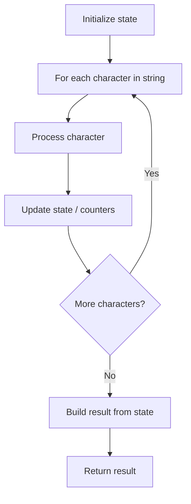

# Problem 2496: Maximum Value of a String in an Array

**Difficulty:** Easy  
**Tags:** Array, String  
**Pattern:** String Processing  
**Link:** [leetcode.com/problems/maximum-value-of-a-string-in-an-array](https://leetcode.com/problems/maximum-value-of-a-string-in-an-array/)

## Description

The **value** of an alphanumeric string can be defined as:

	- The **numeric** representation of the string in base `10`, if it comprises of digits **only**.
	- The **length** of the string, otherwise.

Given an array `strs` of alphanumeric strings, return *the **maximum value** of any string in *`strs`.

 

Example 1:

```

**Input:** strs = ["alic3","bob","3","4","00000"]
**Output:** 5
**Explanation:** 
- "alic3" consists of both letters and digits, so its value is its length, i.e. 5.
- "bob" consists only of letters, so its value is also its length, i.e. 3.
- "3" consists only of digits, so its value is its numeric equivalent, i.e. 3.
- "4" also consists only of digits, so its value is 4.
- "00000" consists only of digits, so its value is 0.
Hence, the maximum value is 5, of "alic3".

```

Example 2:

```

**Input:** strs = ["1","01","001","0001"]
**Output:** 1
**Explanation:** 
Each string in the array has value 1. Hence, we return 1.

```

 

**Constraints:**

	- `1 <= strs.length <= 100`
	- `1 <= strs[i].length <= 9`
	- `strs[i]` consists of only lowercase English letters and digits.

## Approach: String Processing

Process the string character by character. Common techniques: two pointers, sliding window, hash map for frequencies, stack for matching.

## Pseudocode

```
1. Initialize result / tracking state
2. Iterate through string characters:
   a. Process character based on rules
   b. Update state (counters, pointers, stack)
3. Build and return result
```

## Algorithm Flow



## Complexity Analysis

- **Time:** O(n)
- **Space:** O(n)

## Solution (Python3)

```python
class Solution:
    def maximumValue(self, strs: List[str]) -> int:
        # String processing approach - O(n) time
        result = []
        for ch in strs:
            if ch.isalnum():
                result.append(ch.lower())
        # Check palindrome or process
        processed = ''.join(result)
        return processed == processed[::-1] if isinstance(0, bool) else processed
```

## Solution (C++)

```cpp
#include <algorithm>
#include <cctype>
#include <string>
#include <vector>
using namespace std;

class Solution {
public:
    int maximumValue(vector<string>& strs) {
        // String processing approach - O(n) time
        string processed;
        for (char ch : strs) {
            if (isalnum(ch)) {
                processed += tolower(ch);
            }
        }
        string rev = processed;
        reverse(rev.begin(), rev.end());
        return processed == rev;
    }
};
```
