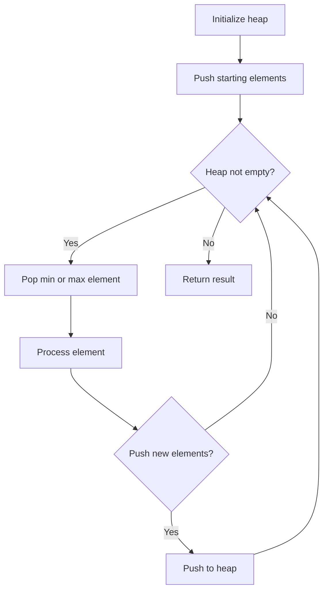
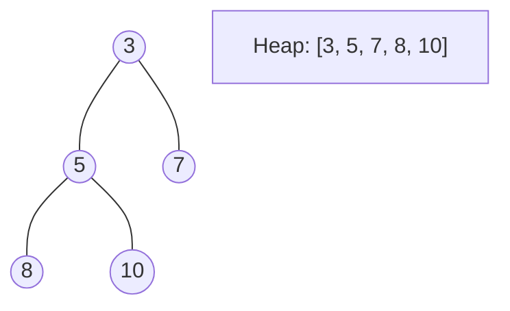
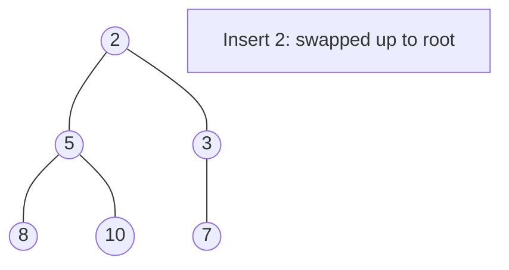
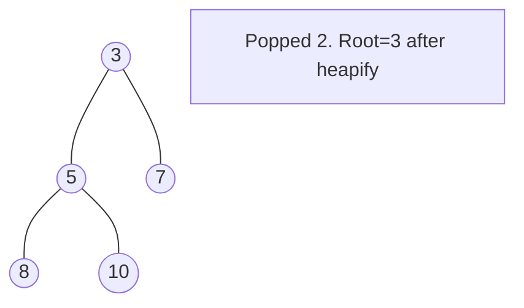

# Problem 2497: Maximum Star Sum of a Graph

**Difficulty:** Medium  
**Tags:** Array, Greedy, Graph Theory, Sorting, Heap (Priority Queue)  
**Pattern:** Heap / Priority Queue  
**Link:** [leetcode.com/problems/maximum-star-sum-of-a-graph](https://leetcode.com/problems/maximum-star-sum-of-a-graph/)

## Description

There is an undirected graph consisting of `n` nodes numbered from `0` to `n - 1`. You are given a **0-indexed** integer array `vals` of length `n` where `vals[i]` denotes the value of the `i^th` node.

You are also given a 2D integer array `edges` where `edges[i] = [ai, bi]` denotes that there exists an **undirected** edge connecting nodes `ai` and `bi.`

A **star graph** is a subgraph of the given graph having a center node containing `0` or more neighbors. In other words, it is a subset of edges of the given graph such that there exists a common node for all edges.

The image below shows star graphs with `3` and `4` neighbors respectively, centered at the blue node.

The **star sum** is the sum of the values of all the nodes present in the star graph.

Given an integer `k`, return *the **maximum star sum** of a star graph containing **at most** *`k`* edges.*

 

Example 1:

```

**Input:** vals = [1,2,3,4,10,-10,-20], edges = [[0,1],[1,2],[1,3],[3,4],[3,5],[3,6]], k = 2
**Output:** 16
**Explanation:** The above diagram represents the input graph.
The star graph with the maximum star sum is denoted by blue. It is centered at 3 and includes its neighbors 1 and 4.
It can be shown it is not possible to get a star graph with a sum greater than 16.

```

Example 2:

```

**Input:** vals = [-5], edges = [], k = 0
**Output:** -5
**Explanation:** There is only one possible star graph, which is node 0 itself.
Hence, we return -5.

```

 

**Constraints:**

	- `n == vals.length`
	- `1 <= n <= 10^5`
	- `-10^4 <= vals[i] <= 10^4`
	- `0 <= edges.length <= min(n * (n - 1) / 2``, 10^5)`
	- `edges[i].length == 2`
	- `0 <= ai, bi <= n - 1`
	- `ai != bi`
	- `0 <= k <= n - 1`

## Approach: Heap / Priority Queue

Use a min-heap or max-heap to efficiently access the smallest/largest element. Push elements and pop the top to process in priority order.

## Pseudocode

```
1. Initialize heap (min or max)
2. Push initial elements onto heap
3. While heap not empty and condition:
   a. Pop top element (min or max)
   b. Process element
   c. Push new elements if needed
4. Return result
```

## Algorithm Flow



## Visual State Transitions

**Heap Operations (Min-Heap):**

**Frame 1: Initial heap**


**Frame 2: Insert 2 - bubble up**


**Frame 3: Pop minimum (2) - heapify down**



## Complexity Analysis

- **Time:** O(n log n)
- **Space:** O(n)

## Solution (Python3)

```python
class Solution:
    def maxStarSum(self, vals: List[int], edges: List[List[int]], k: int) -> int:
        # Heap/Priority Queue - O(n log k) time
        import heapq
        if not vals:
            return 0
        # Min heap (negate for max heap)
        heap = []
        for val in vals:
            heapq.heappush(heap, val)
            if len(heap) > (edges if isinstance(edges, int) else len(vals)):
                heapq.heappop(heap)
        return heap[0] if heap else 0
```

## Solution (C++)

```cpp
#include <queue>
#include <string>
#include <vector>
using namespace std;

class Solution {
public:
    int maxStarSum(vector<int>& vals, vector<vector<int>>& edges, int k) {
        // Heap/Priority Queue - O(n log k) time
        priority_queue<int, vector<int>, greater<int>> pq;
        for (int val : vals) {
            pq.push(val);
            if ((int)pq.size() > edges)
                pq.pop();
        }
        return pq.empty() ? 0 : pq.top();
    }
};
```
