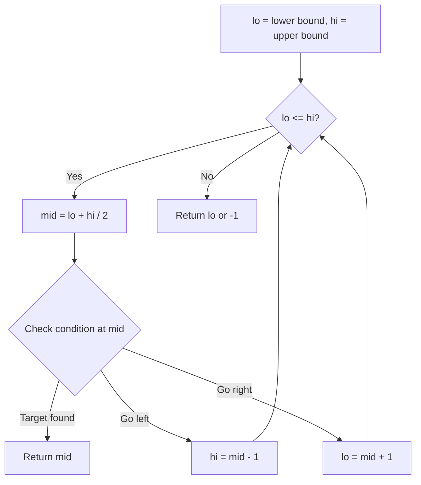
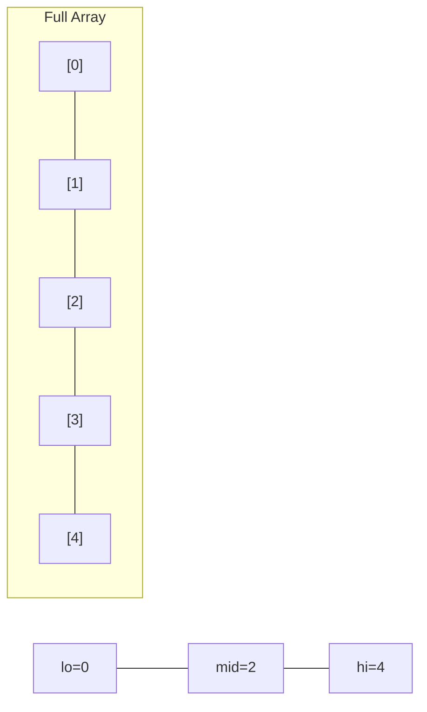
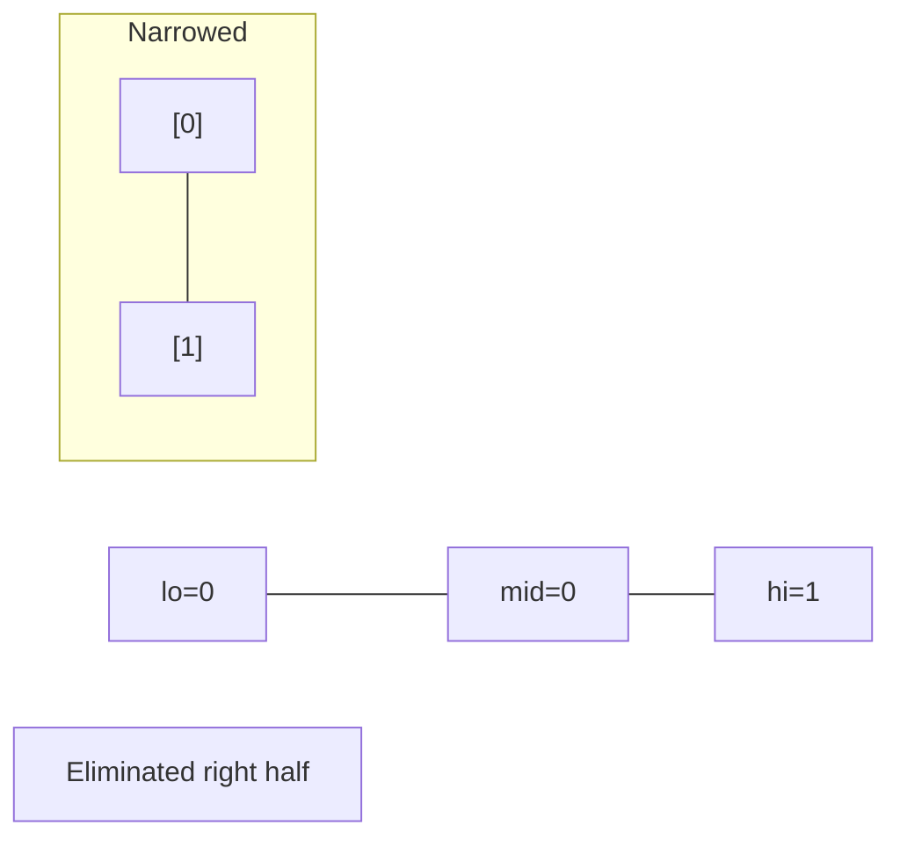
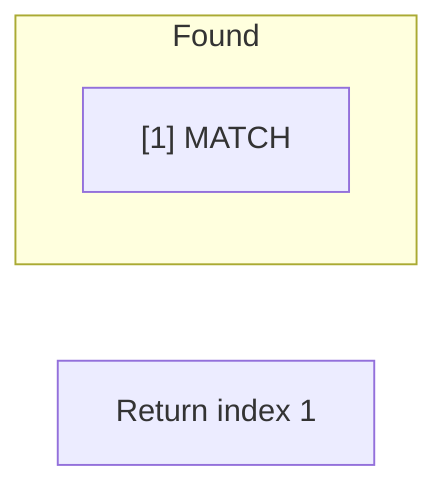

# Problem 2498: Frog Jump II

**Difficulty:** Medium  
**Tags:** Array, Binary Search, Greedy  
**Pattern:** Binary Search  
**Link:** [leetcode.com/problems/frog-jump-ii](https://leetcode.com/problems/frog-jump-ii/)

## Description

You are given a **0-indexed** integer array `stones` sorted in **strictly increasing order** representing the positions of stones in a river.

A frog, initially on the first stone, wants to travel to the last stone and then return to the first stone. However, it can jump to any stone **at most once**.

The **length** of a jump is the absolute difference between the position of the stone the frog is currently on and the position of the stone to which the frog jumps.

	- More formally, if the frog is at `stones[i]` and is jumping to `stones[j]`, the length of the jump is `|stones[i] - stones[j]|`.

The **cost** of a path is the **maximum length of a jump** among all jumps in the path.

Return *the **minimum** cost of a path for the frog*.

 

Example 1:

```

**Input:** stones = [0,2,5,6,7]
**Output:** 5
**Explanation:** The above figure represents one of the optimal paths the frog can take.
The cost of this path is 5, which is the maximum length of a jump.
Since it is not possible to achieve a cost of less than 5, we return it.

```

Example 2:

```

**Input:** stones = [0,3,9]
**Output:** 9
**Explanation:** 
The frog can jump directly to the last stone and come back to the first stone. 
In this case, the length of each jump will be 9. The cost for the path will be max(9, 9) = 9.
It can be shown that this is the minimum achievable cost.

```

 

**Constraints:**

	- `2 <= stones.length <= 10^5`
	- `0 <= stones[i] <= 10^9`
	- `stones[0] == 0`
	- `stones` is sorted in a strictly increasing order.

## Approach: Binary Search

Use binary search to halve the search space each iteration. Define the search range [lo, hi], compute mid, and decide which half to keep based on the problem's monotonic condition.

## Pseudocode

```
1. lo = lower_bound, hi = upper_bound
2. While lo <= hi (or lo < hi):
   a. mid = (lo + hi) // 2
   b. If condition(mid) is satisfied: record answer, search left half
   c. Else: search right half
3. Return answer
```

## Algorithm Flow



## Visual State Transitions

**Binary Search Step-by-Step:**

**Frame 1: Initial search space**


**Frame 2: Compare mid, narrow search**


**Frame 3: Found target**



## Complexity Analysis

- **Time:** O(log n)
- **Space:** O(1)

## Solution (Python3)

```python
class Solution:
    def maxJump(self, stones: List[int]) -> int:
        # Binary search - O(log n) time, O(1) space
        lo, hi = 0, len(stones) - 1
        while lo <= hi:
            mid = lo + (hi - lo) // 2
            if stones[mid] == stones:
                return mid
            elif stones[mid] < stones:
                lo = mid + 1
            else:
                hi = mid - 1
        return 0
```

## Solution (C++)

```cpp
#include <string>
#include <vector>
using namespace std;

class Solution {
public:
    int maxJump(vector<int>& stones) {
        // Binary search - O(log n) time, O(1) space
        int lo = 0, hi = stones.size() - 1;
        while (lo <= hi) {
            int mid = lo + (hi - lo) / 2;
            if (stones[mid] == stones) {
                return mid;
            } else if (stones[mid] < stones) {
                lo = mid + 1;
            } else {
                hi = mid - 1;
            }
        }
        return 0;
    }
};
```
