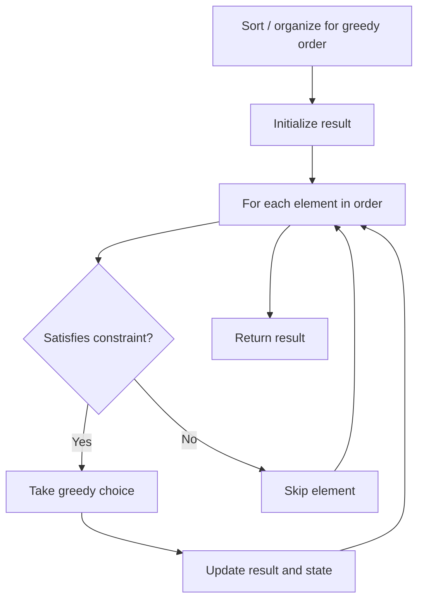

# Problem 2499: Minimum Total Cost to Make Arrays Unequal

**Difficulty:** Hard  
**Tags:** Array, Hash Table, Greedy, Counting  
**Pattern:** Greedy  
**Link:** [leetcode.com/problems/minimum-total-cost-to-make-arrays-unequal](https://leetcode.com/problems/minimum-total-cost-to-make-arrays-unequal/)

## Description

You are given two **0-indexed** integer arrays `nums1` and `nums2`, of equal length `n`.

In one operation, you can swap the values of any two indices of `nums1`. The **cost** of this operation is the **sum** of the indices.

Find the **minimum** total cost of performing the given operation **any** number of times such that `nums1[i] != nums2[i]` for all `0 <= i <= n - 1` after performing all the operations.

Return *the **minimum total cost** such that *`nums1` and `nums2`* satisfy the above condition*. In case it is not possible, return `-1`.

 

Example 1:

```

**Input:** nums1 = [1,2,3,4,5], nums2 = [1,2,3,4,5]
**Output:** 10
**Explanation:** 
One of the ways we can perform the operations is:
- Swap values at indices 0 and 3, incurring cost = 0 + 3 = 3. Now, nums1 = [4,2,3,1,5]
- Swap values at indices 1 and 2, incurring cost = 1 + 2 = 3. Now, nums1 = [4,3,2,1,5].
- Swap values at indices 0 and 4, incurring cost = 0 + 4 = 4. Now, nums1 =[5,3,2,1,4].
We can see that for each index i, nums1[i] != nums2[i]. The cost required here is 10.
Note that there are other ways to swap values, but it can be proven that it is not possible to obtain a cost less than 10.

```

Example 2:

```

**Input:** nums1 = [2,2,2,1,3], nums2 = [1,2,2,3,3]
**Output:** 10
**Explanation:** 
One of the ways we can perform the operations is:
- Swap values at indices 2 and 3, incurring cost = 2 + 3 = 5. Now, nums1 = [2,2,1,2,3].
- Swap values at indices 1 and 4, incurring cost = 1 + 4 = 5. Now, nums1 = [2,3,1,2,2].
The total cost needed here is 10, which is the minimum possible.

```

Example 3:

```

**Input:** nums1 = [1,2,2], nums2 = [1,2,2]
**Output:** -1
**Explanation:** 
It can be shown that it is not possible to satisfy the given conditions irrespective of the number of operations we perform.
Hence, we return -1.

```

 

**Constraints:**

	- `n == nums1.length == nums2.length`
	- `1 <= n <= 10^5`
	- `1 <= nums1[i], nums2[i] <= n`

## Approach: Greedy

Make the locally optimal choice at each step, trusting it leads to a global optimum. Greedy works when the problem has the greedy-choice property and optimal substructure.

## Pseudocode

```
1. Sort or organize data for greedy ordering
2. Initialize result
3. For each element in greedy order:
   a. If element satisfies constraint:
      - Take the greedy choice
      - Update result and state
4. Return result
```

## Algorithm Flow



## Complexity Analysis

- **Time:** O(n log n)
- **Space:** O(1)

## Solution (Python3)

```python
class Solution:
    def minimumTotalCost(self, nums1: List[int], nums2: List[int]) -> int:
        # Greedy approach - O(n) time
        result = 0
        curr_max = 0
        for i in range(len(nums1)):
            if isinstance(nums1[i], int):
                curr_max = max(curr_max, nums1[i])
                result = max(result, curr_max)
            else:
                result += 1
        return result
```

## Solution (C++)

```cpp
#include <algorithm>
#include <string>
#include <vector>
using namespace std;

class Solution {
public:
    int minimumTotalCost(vector<int>& nums1, vector<int>& nums2) {
        // Greedy approach - O(n) time
        int result = 0, curr_max = 0;
        for (int i = 0; i < (int)nums1.size(); i++) {
            curr_max = max(curr_max, nums1[i]);
            result = max(result, curr_max);
        }
        return result;
    }
};
```
