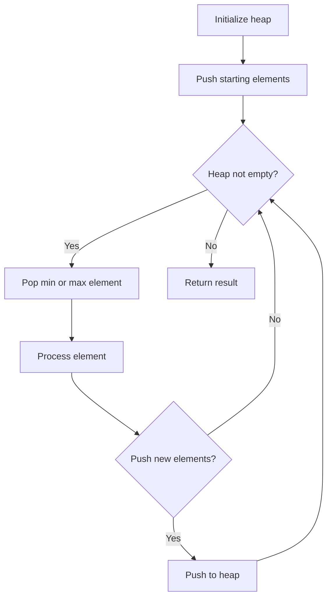
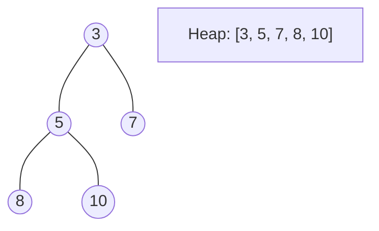
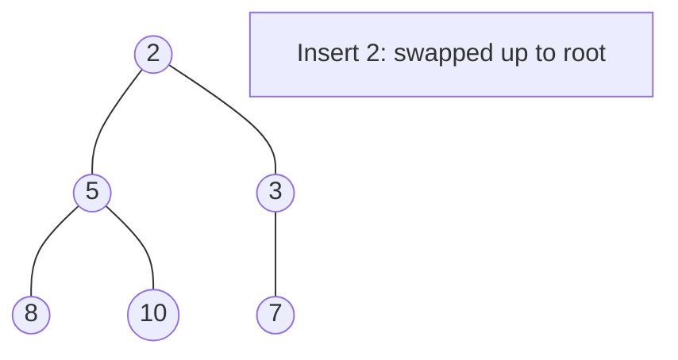
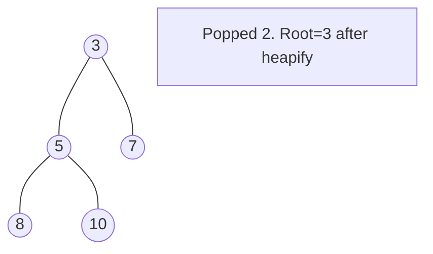

# Problem 2500: Delete Greatest Value in Each Row

**Difficulty:** Easy  
**Tags:** Array, Sorting, Heap (Priority Queue), Matrix, Simulation  
**Pattern:** Heap / Priority Queue  
**Link:** [leetcode.com/problems/delete-greatest-value-in-each-row](https://leetcode.com/problems/delete-greatest-value-in-each-row/)

## Description

You are given an `m x n` matrix `grid` consisting of positive integers.

Perform the following operation until `grid` becomes empty:

	- Delete the element with the greatest value from each row. If multiple such elements exist, delete any of them.
	- Add the maximum of deleted elements to the answer.

**Note** that the number of columns decreases by one after each operation.

Return *the answer after performing the operations described above*.

 

Example 1:

```

**Input:** grid = [[1,2,4],[3,3,1]]
**Output:** 8
**Explanation:** The diagram above shows the removed values in each step.
- In the first operation, we remove 4 from the first row and 3 from the second row (notice that, there are two cells with value 3 and we can remove any of them). We add 4 to the answer.
- In the second operation, we remove 2 from the first row and 3 from the second row. We add 3 to the answer.
- In the third operation, we remove 1 from the first row and 1 from the second row. We add 1 to the answer.
The final answer = 4 + 3 + 1 = 8.

```

Example 2:

```

**Input:** grid = [[10]]
**Output:** 10
**Explanation:** The diagram above shows the removed values in each step.
- In the first operation, we remove 10 from the first row. We add 10 to the answer.
The final answer = 10.

```

 

**Constraints:**

	- `m == grid.length`
	- `n == grid[i].length`
	- `1 <= m, n <= 50`
	- `1 <= grid[i][j] <= 100`

## Approach: Heap / Priority Queue

Use a min-heap or max-heap to efficiently access the smallest/largest element. Push elements and pop the top to process in priority order.

## Pseudocode

```
1. Initialize heap (min or max)
2. Push initial elements onto heap
3. While heap not empty and condition:
   a. Pop top element (min or max)
   b. Process element
   c. Push new elements if needed
4. Return result
```

## Algorithm Flow



## Visual State Transitions

**Heap Operations (Min-Heap):**

**Frame 1: Initial heap**


**Frame 2: Insert 2 - bubble up**


**Frame 3: Pop minimum (2) - heapify down**



## Complexity Analysis

- **Time:** O(n log n)
- **Space:** O(n)

## Solution (Python3)

```python
class Solution:
    def deleteGreatestValue(self, grid: List[List[int]]) -> int:
        # Heap/Priority Queue - O(n log k) time
        import heapq
        if not grid:
            return 0
        # Min heap (negate for max heap)
        heap = []
        for val in grid:
            heapq.heappush(heap, val)
            if len(heap) > (grid if isinstance(grid, int) else len(grid)):
                heapq.heappop(heap)
        return heap[0] if heap else 0
```

## Solution (C++)

```cpp
#include <queue>
#include <string>
#include <vector>
using namespace std;

class Solution {
public:
    int deleteGreatestValue(vector<vector<int>>& grid) {
        // Heap/Priority Queue - O(n log k) time
        priority_queue<int, vector<int>, greater<int>> pq;
        for (int val : grid) {
            pq.push(val);
            if ((int)pq.size() > grid)
                pq.pop();
        }
        return pq.empty() ? 0 : pq.top();
    }
};
```
