# Arrays and Hashing

> Chapter covering 681 problems related to **Arrays and Hashing**.


## Problems in this Chapter

| # | Problem | Difficulty | Pattern | Time | Space |
|---|---------|------------|---------|------|-------|
| 1 | [Two Sum](#problem-1-two_sum) | Easy | Hash Map Lookup | O(n) | O(n) |
| 12 | [Integer to Roman](#problem-12-integer_to_roman) | Medium | Greedy | O(1) | O(1) |
| 13 | [Roman to Integer](#problem-13-roman_to_integer) | Easy | String Parsing | O(n) | O(1) |
| 26 | [Remove Duplicates from Sorted Array](#problem-26-remove_duplicates_from_sorted_array) | Easy | Two Pointers | O(n) | O(1) |
| 27 | [Remove Element](#problem-27-remove_element) | Easy | Two Pointers | O(n) | O(1) |
| 31 | [Next Permutation](#problem-31-next_permutation) | Medium | Array Manipulation | O(n) | O(1) |
| 36 | [Valid Sudoku](#problem-36-valid_sudoku) | Medium | Hash Set | O(1) (fixed 9x9 board) | O(1) |
| 41 | [First Missing Positive](#problem-41-first_missing_positive) | Hard | Cyclic Sort | O(n) | O(1) |
| 42 | [Trapping Rain Water](#problem-42-trapping_rain_water) | Hard | Two Pointers | O(n) | O(1) |
| 48 | [Rotate Image](#problem-48-rotate_image) | Medium | Matrix Manipulation | O(n^2) | O(1) |
| 53 | [Maximum Subarray](#problem-53-maximum_subarray) | Medium | Kadane's Algorithm (DP) | O(n) | O(1) |
| 54 | [Spiral Matrix](#problem-54-spiral_matrix) | Medium | Matrix Simulation | O(m*n) | O(1) extra |
| 57 | [Insert Interval](#problem-57-insert_interval) | Medium | Intervals | O(n) | O(n) |
| 59 | [Spiral Matrix II](#problem-59-spiral_matrix_ii) | Medium | Matrix Simulation | O(n^2) | O(n^2) |
| 63 | [Unique Paths II](#problem-63-unique_paths_ii) | Medium | Dynamic Programming | O(m*n) | O(n) |
| 64 | [Minimum Path Sum](#problem-64-minimum_path_sum) | Medium | Dynamic Programming | O(m*n) | O(1) |
| 66 | [Plus One](#problem-66-plus_one) | Easy | Math / Array | O(n) | O(1) |
| 68 | [Text Justification](#problem-68-text_justification) | Hard | String Simulation | O(n) | O(n) |
| 73 | [Set Matrix Zeroes](#problem-73-set_matrix_zeroes) | Medium | Matrix / In-place | O(m*n) | O(1) |
| 80 | [Remove Duplicates from Sorted Array II](#problem-80-remove_duplicates_from_sorted_array_ii) | Medium | Two Pointers | O(n) | O(1) |
| 84 | [Largest Rectangle in Histogram](#problem-84-largest_rectangle_in_histogram) | Hard | Monotonic Stack | O(n) | O(n) |
| 85 | [Maximal Rectangle](#problem-85-maximal_rectangle) | Hard | Monotonic Stack / DP | O(m*n) | O(n) |
| 105 | [Construct Binary Tree from Preorder and Inorder Traversal](#problem-105-construct_binary_tree_from_preorder_and_inorder_traversal) | Medium | Tree Traversal | O(n) | O(h) |
| 106 | [Construct Binary Tree from Inorder and Postorder Traversal](#problem-106-construct_binary_tree_from_inorder_and_postorder_traversal) | Medium | Tree Traversal | O(n) | O(h) |
| 108 | [Convert Sorted Array to Binary Search Tree](#problem-108-convert_sorted_array_to_binary_search_tree) | Easy | Binary Search Tree | O(h) | O(h) |
| 118 | [Pascal's Triangle](#problem-118-pascals_triangle) | Easy | Dynamic Programming (1D) | O(n) | O(n) |
| 119 | [Pascal's Triangle II](#problem-119-pascals_triangle_ii) | Easy | Dynamic Programming (1D) | O(n) | O(n) |
| 120 | [Triangle](#problem-120-triangle) | Medium | Dynamic Programming (1D) | O(n) | O(n) |
| 121 | [Best Time to Buy and Sell Stock](#problem-121-best_time_to_buy_and_sell_stock) | Easy | Greedy / One Pass | O(n) | O(1) |
| 123 | [Best Time to Buy and Sell Stock III](#problem-123-best_time_to_buy_and_sell_stock_iii) | Hard | Dynamic Programming (1D) | O(n) | O(n) |
| 127 | [Word Ladder](#problem-127-word_ladder) | Hard | BFS Graph Traversal | O(V + E) | O(V) |
| 136 | [Single Number](#problem-136-single_number) | Easy | Bit Manipulation (XOR) | O(n) | O(1) |
| 137 | [Single Number II](#problem-137-single_number_ii) | Medium | Bit Manipulation | O(n) or O(log n) | O(1) |
| 149 | [Max Points on a Line](#problem-149-max_points_on_a_line) | Hard | Hash Map Lookup | O(n) | O(n) |
| 150 | [Evaluate Reverse Polish Notation](#problem-150-evaluate_reverse_polish_notation) | Medium | Stack | O(n) | O(n) |
| 152 | [Maximum Product Subarray](#problem-152-maximum_product_subarray) | Medium | Dynamic Programming | O(n) | O(1) |
| 157 | [Read N Characters Given Read4](#problem-157-read_n_characters_given_read4) | Easy | Simulation | O(n) or O(n * k) | O(n) |
| 158 | [Read N Characters Given read4 II - Call Multiple Times](#problem-158-read_n_characters_given_read4_ii_call_multiple_times) | Hard | Simulation | O(n) or O(n * k) | O(n) |
| 163 | [Missing Ranges](#problem-163-missing_ranges) | Easy | Array Processing | O(n) | O(1) |
| 166 | [Fraction to Recurring Decimal](#problem-166-fraction_to_recurring_decimal) | Medium | Hash Map String Processing | O(n) | O(n) |
| 174 | [Dungeon Game](#problem-174-dungeon_game) | Hard | Dynamic Programming (2D Grid/Matrix) | O(m * n) | O(m * n) |
| 188 | [Best Time to Buy and Sell Stock IV](#problem-188-best_time_to_buy_and_sell_stock_iv) | Hard | Dynamic Programming (1D) | O(n) | O(n) |
| 189 | [Rotate Array](#problem-189-rotate_array) | Medium | Two Pointers | O(n) | O(1) |
| 198 | [House Robber](#problem-198-house_robber) | Medium | Dynamic Programming | O(n) | O(1) |
| 202 | [Happy Number](#problem-202-happy_number) | Easy | Two Pointers | O(n) | O(1) |
| 204 | [Count Primes](#problem-204-count_primes) | Medium | Number Theory | O(sqrt(n)) or O(n log log n) | O(n) |
| 205 | [Isomorphic Strings](#problem-205-isomorphic_strings) | Easy | Hash Map String Processing | O(n) | O(n) |
| 213 | [House Robber II](#problem-213-house_robber_ii) | Medium | Dynamic Programming (1D) | O(n) | O(n) |
| 221 | [Maximal Square](#problem-221-maximal_square) | Medium | Dynamic Programming (2D Grid/Matrix) | O(m * n) | O(m * n) |
| 228 | [Summary Ranges](#problem-228-summary_ranges) | Easy | Array Processing | O(n) | O(1) |
| 238 | [Product of Array Except Self](#problem-238-product_of_array_except_self) | Medium | Prefix/Suffix Products | O(n) | O(1) extra |
| 243 | [Shortest Word Distance](#problem-243-shortest_word_distance) | Easy | String Processing | O(n) | O(n) |
| 245 | [Shortest Word Distance III](#problem-245-shortest_word_distance_iii) | Medium | String Processing | O(n) | O(n) |
| 246 | [Strobogrammatic Number](#problem-246-strobogrammatic_number) | Easy | Two Pointers | O(n) | O(1) |
| 247 | [Strobogrammatic Number II](#problem-247-strobogrammatic_number_ii) | Medium | String Processing | O(n) | O(n) |
| 248 | [Strobogrammatic Number III](#problem-248-strobogrammatic_number_iii) | Hard | String Processing | O(n) | O(n) |
| 249 | [Group Shifted Strings](#problem-249-group_shifted_strings) | Medium | Hash Map Lookup | O(n) | O(n) |
| 255 | [Verify Preorder Sequence in Binary Search Tree](#problem-255-verify_preorder_sequence_in_binary_search_tree) | Medium | Monotonic Stack | O(n) | O(n) |
| 256 | [Paint House](#problem-256-paint_house) | Medium | Dynamic Programming (1D) | O(n) | O(n) |
| 260 | [Single Number III](#problem-260-single_number_iii) | Medium | Bit Manipulation | O(n) or O(log n) | O(1) |
| 265 | [Paint House II](#problem-265-paint_house_ii) | Hard | Dynamic Programming (1D) | O(n) | O(n) |
| 266 | [Palindrome Permutation](#problem-266-palindrome_permutation) | Easy | Bit Manipulation | O(n) or O(log n) | O(1) |
| 283 | [Move Zeroes](#problem-283-move_zeroes) | Easy | Two Pointers | O(n) | O(1) |
| 286 | [Walls and Gates](#problem-286-walls_and_gates) | Medium | BFS on Matrix / Grid | O(m * n) | O(m * n) |
| 289 | [Game of Life](#problem-289-game_of_life) | Medium | Simulation | O(n) or O(n * k) | O(n) |
| 290 | [Word Pattern](#problem-290-word_pattern) | Easy | Hash Map String Processing | O(n) | O(n) |
| 299 | [Bulls and Cows](#problem-299-bulls_and_cows) | Medium | Hash Map String Processing | O(n) | O(n) |
| 309 | [Best Time to Buy and Sell Stock with Cooldown](#problem-309-best_time_to_buy_and_sell_stock_with_cooldown) | Medium | Dynamic Programming (1D) | O(n) | O(n) |
| 311 | [Sparse Matrix Multiplication](#problem-311-sparse_matrix_multiplication) | Medium | Hash Map Lookup | O(n) | O(n) |
| 312 | [Burst Balloons](#problem-312-burst_balloons) | Hard | Dynamic Programming (1D) | O(n) | O(n) |
| 313 | [Super Ugly Number](#problem-313-super_ugly_number) | Medium | Dynamic Programming (1D) | O(n) | O(n) |
| 317 | [Shortest Distance from All Buildings](#problem-317-shortest_distance_from_all_buildings) | Hard | BFS on Matrix / Grid | O(m * n) | O(m * n) |
| 318 | [Maximum Product of Word Lengths](#problem-318-maximum_product_of_word_lengths) | Medium | Bit Manipulation | O(n) or O(log n) | O(1) |
| 322 | [Coin Change](#problem-322-coin_change) | Medium | Dynamic Programming | O(n * amount) | O(amount) |
| 325 | [Maximum Size Subarray Sum Equals k](#problem-325-maximum_size_subarray_sum_equals_k) | Medium | Prefix Sum | O(n) | O(n) |
| 335 | [Self Crossing](#problem-335-self_crossing) | Hard | Geometry | O(n^2) or O(n log n) | O(n) |
| 356 | [Line Reflection](#problem-356-line_reflection) | Medium | Hash Map Lookup | O(n) | O(n) |
| 361 | [Bomb Enemy](#problem-361-bomb_enemy) | Medium | Dynamic Programming (2D Grid/Matrix) | O(m * n) | O(m * n) |
| 370 | [Range Addition](#problem-370-range_addition) | Medium | Prefix Sum | O(n) | O(n) |
| 377 | [Combination Sum IV](#problem-377-combination_sum_iv) | Medium | Dynamic Programming (1D) | O(n) | O(n) |
| 383 | [Ransom Note](#problem-383-ransom_note) | Easy | Hash Map String Processing | O(n) | O(n) |
| 387 | [First Unique Character in a String](#problem-387-first_unique_character_in_a_string) | Easy | Queue / BFS | O(n) | O(n) |
| 393 | [UTF-8 Validation](#problem-393-utf_8_validation) | Medium | Bit Manipulation | O(n) or O(log n) | O(1) |
| 396 | [Rotate Function](#problem-396-rotate_function) | Medium | Dynamic Programming (1D) | O(n) | O(n) |
| 398 | [Random Pick Index](#problem-398-random_pick_index) | Medium | Reservoir Sampling | O(n) | O(k) |
| 403 | [Frog Jump](#problem-403-frog_jump) | Hard | Dynamic Programming (1D) | O(n) | O(n) |
| 416 | [Partition Equal Subset Sum](#problem-416-partition_equal_subset_sum) | Medium | Dynamic Programming (0/1 Knapsack) | O(n * sum/2) | O(sum/2) |
| 417 | [Pacific Atlantic Water Flow](#problem-417-pacific_atlantic_water_flow) | Medium | DFS on Matrix / Grid | O(m * n) | O(m * n) |
| 418 | [Sentence Screen Fitting](#problem-418-sentence_screen_fitting) | Medium | Dynamic Programming (String) | O(m * n) | O(m * n) |
| 419 | [Battleships in a Board](#problem-419-battleships_in_a_board) | Medium | DFS on Matrix / Grid | O(m * n) | O(m * n) |
| 422 | [Valid Word Square](#problem-422-valid_word_square) | Easy | Matrix / 2D Array | O(m * n) | O(1) extra |
| 423 | [Reconstruct Original Digits from English](#problem-423-reconstruct_original_digits_from_english) | Medium | Hash Map String Processing | O(n) | O(n) |
| 427 | [Construct Quad Tree](#problem-427-construct_quad_tree) | Medium | Tree Traversal | O(n) | O(h) |
| 433 | [Minimum Genetic Mutation](#problem-433-minimum_genetic_mutation) | Medium | BFS Graph Traversal | O(V + E) | O(V) |
| 446 | [Arithmetic Slices II - Subsequence](#problem-446-arithmetic_slices_ii_subsequence) | Hard | Dynamic Programming (1D) | O(n) | O(n) |
| 447 | [Number of Boomerangs](#problem-447-number_of_boomerangs) | Medium | Hash Map Lookup | O(n) | O(n) |
| 448 | [Find All Numbers Disappeared in an Array](#problem-448-find_all_numbers_disappeared_in_an_array) | Easy | Hash Map Lookup | O(n) | O(n) |
| 453 | [Minimum Moves to Equal Array Elements](#problem-453-minimum_moves_to_equal_array_elements) | Medium | Math | O(n) or O(sqrt(n)) | O(1) |
| 454 | [4Sum II](#problem-454-4sum_ii) | Medium | Hash Map Lookup | O(n) | O(n) |
| 457 | [Circular Array Loop](#problem-457-circular_array_loop) | Medium | Two Pointers | O(n) | O(1) |
| 463 | [Island Perimeter](#problem-463-island_perimeter) | Easy | DFS on Matrix / Grid | O(m * n) | O(m * n) |
| 469 | [Convex Polygon](#problem-469-convex_polygon) | Medium | Geometry | O(n^2) or O(n log n) | O(n) |
| 474 | [Ones and Zeroes](#problem-474-ones_and_zeroes) | Medium | Dynamic Programming (String) | O(m * n) | O(m * n) |
| 477 | [Total Hamming Distance](#problem-477-total_hamming_distance) | Medium | Bit Manipulation | O(n) or O(log n) | O(1) |
| 485 | [Max Consecutive Ones](#problem-485-max_consecutive_ones) | Easy | Array Processing | O(n) | O(1) |
| 486 | [Predict the Winner](#problem-486-predict_the_winner) | Medium | Dynamic Programming (1D) | O(n) | O(n) |
| 490 | [The Maze](#problem-490-the_maze) | Medium | DFS on Matrix / Grid | O(m * n) | O(m * n) |
| 495 | [Teemo Attacking](#problem-495-teemo_attacking) | Easy | Simulation | O(n) or O(n * k) | O(n) |
| 496 | [Next Greater Element I](#problem-496-next_greater_element_i) | Easy | Monotonic Stack | O(n) | O(n) |
| 498 | [Diagonal Traverse](#problem-498-diagonal_traverse) | Medium | Simulation | O(n) or O(n * k) | O(n) |
| 500 | [Keyboard Row](#problem-500-keyboard_row) | Easy | Hash Map Lookup | O(n) | O(n) |
| 503 | [Next Greater Element II](#problem-503-next_greater_element_ii) | Medium | Monotonic Stack (Circular) | O(n) | O(n) |
| 508 | [Most Frequent Subtree Sum](#problem-508-most_frequent_subtree_sum) | Medium | DFS Tree Traversal | O(n) | O(h) |
| 518 | [Coin Change II](#problem-518-coin_change_ii) | Medium | Dynamic Programming (Unbounded Knapsack) | O(n * amount) | O(amount) |
| 519 | [Random Flip Matrix](#problem-519-random_flip_matrix) | Medium | Reservoir Sampling | O(n) | O(k) |
| 523 | [Continuous Subarray Sum](#problem-523-continuous_subarray_sum) | Medium | Prefix Sum | O(n) | O(n) |
| 525 | [Contiguous Array](#problem-525-contiguous_array) | Medium | Prefix Sum + Hash Map | O(n) | O(n) |
| 529 | [Minesweeper](#problem-529-minesweeper) | Medium | DFS on Matrix / Grid | O(m * n) | O(m * n) |
| 531 | [Lonely Pixel I](#problem-531-lonely_pixel_i) | Medium | Hash Map Lookup | O(n) | O(n) |
| 533 | [Lonely Pixel II](#problem-533-lonely_pixel_ii) | Medium | Hash Map Lookup | O(n) | O(n) |
| 542 | [01 Matrix](#problem-542-01_matrix) | Medium | BFS on Matrix / Grid | O(m * n) | O(m * n) |
| 546 | [Remove Boxes](#problem-546-remove_boxes) | Hard | Dynamic Programming (1D) | O(n) | O(n) |
| 548 | [Split Array with Equal Sum](#problem-548-split_array_with_equal_sum) | Hard | Prefix Sum | O(n) | O(n) |
| 553 | [Optimal Division](#problem-553-optimal_division) | Medium | Dynamic Programming (1D) | O(n) | O(n) |
| 554 | [Brick Wall](#problem-554-brick_wall) | Medium | Hash Map Lookup | O(n) | O(n) |
| 560 | [Subarray Sum Equals K](#problem-560-subarray_sum_equals_k) | Medium | Prefix Sum + Hash Map | O(n) | O(n) |
| 562 | [Longest Line of Consecutive One in Matrix](#problem-562-longest_line_of_consecutive_one_in_matrix) | Medium | Dynamic Programming (2D Grid/Matrix) | O(m * n) | O(m * n) |
| 565 | [Array Nesting](#problem-565-array_nesting) | Medium | DFS Graph Traversal | O(V + E) | O(V) |
| 566 | [Reshape the Matrix](#problem-566-reshape_the_matrix) | Easy | Simulation | O(n) or O(n * k) | O(n) |
| 568 | [Maximum Vacation Days](#problem-568-maximum_vacation_days) | Hard | Dynamic Programming (2D Grid/Matrix) | O(m * n) | O(m * n) |
| 573 | [Squirrel Simulation](#problem-573-squirrel_simulation) | Medium | Math | O(n) or O(sqrt(n)) | O(1) |
| 575 | [Distribute Candies](#problem-575-distribute_candies) | Easy | Hash Map Lookup | O(n) | O(n) |
| 582 | [Kill Process](#problem-582-kill_process) | Medium | DFS Tree Traversal | O(n) | O(h) |
| 587 | [Erect the Fence](#problem-587-erect_the_fence) | Hard | Geometry | O(n^2) or O(n log n) | O(n) |
| 598 | [Range Addition II](#problem-598-range_addition_ii) | Easy | Math | O(n) or O(sqrt(n)) | O(1) |
| 599 | [Minimum Index Sum of Two Lists](#problem-599-minimum_index_sum_of_two_lists) | Easy | Hash Map Lookup | O(n) | O(n) |
| 609 | [Find Duplicate File in System](#problem-609-find_duplicate_file_in_system) | Medium | Hash Map Lookup | O(n) | O(n) |
| 636 | [Exclusive Time of Functions](#problem-636-exclusive_time_of_functions) | Medium | Stack | O(n) | O(n) |
| 652 | [Find Duplicate Subtrees](#problem-652-find_duplicate_subtrees) | Medium | DFS Tree Traversal | O(n) | O(h) |
| 653 | [Two Sum IV - Input is a BST](#problem-653-two_sum_iv_input_is_a_bst) | Easy | Binary Search Tree | O(h) | O(h) |
| 654 | [Maximum Binary Tree](#problem-654-maximum_binary_tree) | Medium | Monotonic Stack | O(n) | O(n) |
| 656 | [Coin Path](#problem-656-coin_path) | Hard | Dynamic Programming (1D) | O(n) | O(n) |
| 661 | [Image Smoother](#problem-661-image_smoother) | Easy | Matrix / 2D Array | O(m * n) | O(1) extra |
| 665 | [Non-decreasing Array](#problem-665-non_decreasing_array) | Medium | Array Processing | O(n) | O(1) |
| 666 | [Path Sum IV](#problem-666-path_sum_iv) | Medium | DFS Tree Traversal | O(n) | O(h) |
| 667 | [Beautiful Arrangement II](#problem-667-beautiful_arrangement_ii) | Medium | Math | O(n) or O(sqrt(n)) | O(1) |
| 673 | [Number of Longest Increasing Subsequence](#problem-673-number_of_longest_increasing_subsequence) | Medium | Segment Tree | O(n log n) build, O(log n) query/update | O(n) |
| 674 | [Longest Continuous Increasing Subsequence](#problem-674-longest_continuous_increasing_subsequence) | Easy | Array Processing | O(n) | O(1) |
| 682 | [Baseball Game](#problem-682-baseball_game) | Easy | Stack | O(n) | O(n) |
| 690 | [Employee Importance](#problem-690-employee_importance) | Medium | DFS Tree Traversal | O(n) | O(h) |
| 697 | [Degree of an Array](#problem-697-degree_of_an_array) | Easy | Hash Map Lookup | O(n) | O(n) |
| 699 | [Falling Squares](#problem-699-falling_squares) | Hard | Segment Tree | O(n log n) build, O(log n) query/update | O(n) |
| 717 | [1-bit and 2-bit Characters](#problem-717-1_bit_and_2_bit_characters) | Easy | Array Processing | O(n) | O(1) |
| 722 | [Remove Comments](#problem-722-remove_comments) | Medium | String Processing | O(n) | O(n) |
| 723 | [Candy Crush](#problem-723-candy_crush) | Medium | Two Pointers | O(n) | O(1) |
| 724 | [Find Pivot Index](#problem-724-find_pivot_index) | Easy | Prefix Sum | O(n) | O(1) |
| 733 | [Flood Fill](#problem-733-flood_fill) | Easy | DFS / Graph | O(m*n) | O(m*n) |
| 734 | [Sentence Similarity](#problem-734-sentence_similarity) | Easy | Hash Map Lookup | O(n) | O(n) |
| 735 | [Asteroid Collision](#problem-735-asteroid_collision) | Medium | Stack | O(n) | O(n) |
| 736 | [Parse Lisp Expression](#problem-736-parse_lisp_expression) | Hard | Stack | O(n) | O(n) |
| 739 | [Daily Temperatures](#problem-739-daily_temperatures) | Medium | Monotonic Stack | O(n) | O(n) |
| 740 | [Delete and Earn](#problem-740-delete_and_earn) | Medium | Dynamic Programming (1D) | O(n) | O(n) |
| 741 | [Cherry Pickup](#problem-741-cherry_pickup) | Hard | Dynamic Programming (2D Grid/Matrix) | O(m * n) | O(m * n) |
| 746 | [Min Cost Climbing Stairs](#problem-746-min_cost_climbing_stairs) | Easy | Dynamic Programming | O(n) | O(1) |
| 748 | [Shortest Completing Word](#problem-748-shortest_completing_word) | Easy | Hash Map Lookup | O(n) | O(n) |
| 749 | [Contain Virus](#problem-749-contain_virus) | Hard | DFS on Matrix / Grid | O(m * n) | O(m * n) |
| 750 | [Number Of Corner Rectangles](#problem-750-number_of_corner_rectangles) | Medium | Dynamic Programming (2D Grid/Matrix) | O(m * n) | O(m * n) |
| 752 | [Open the Lock](#problem-752-open_the_lock) | Medium | BFS Graph Traversal | O(V + E) | O(V) |
| 755 | [Pour Water](#problem-755-pour_water) | Medium | Simulation | O(n) or O(n * k) | O(n) |
| 760 | [Find Anagram Mappings](#problem-760-find_anagram_mappings) | Easy | Hash Map Lookup | O(n) | O(n) |
| 764 | [Largest Plus Sign](#problem-764-largest_plus_sign) | Medium | Dynamic Programming (1D) | O(n) | O(n) |
| 766 | [Toeplitz Matrix](#problem-766-toeplitz_matrix) | Easy | Matrix / 2D Array | O(m * n) | O(1) extra |
| 770 | [Basic Calculator IV](#problem-770-basic_calculator_iv) | Hard | Stack | O(n) | O(n) |
| 771 | [Jewels and Stones](#problem-771-jewels_and_stones) | Easy | Hash Map String Processing | O(n) | O(n) |
| 775 | [Global and Local Inversions](#problem-775-global_and_local_inversions) | Medium | Math | O(n) or O(sqrt(n)) | O(1) |
| 782 | [Transform to Chessboard](#problem-782-transform_to_chessboard) | Hard | Bit Manipulation | O(n) or O(log n) | O(1) |
| 789 | [Escape The Ghosts](#problem-789-escape_the_ghosts) | Medium | Math | O(n) or O(sqrt(n)) | O(1) |
| 794 | [Valid Tic-Tac-Toe State](#problem-794-valid_tic_tac_toe_state) | Medium | Matrix / 2D Array | O(m * n) | O(1) extra |
| 795 | [Number of Subarrays with Bounded Maximum](#problem-795-number_of_subarrays_with_bounded_maximum) | Medium | Two Pointers | O(n) | O(1) |
| 798 | [Smallest Rotation with Highest Score](#problem-798-smallest_rotation_with_highest_score) | Hard | Prefix Sum | O(n) | O(n) |
| 801 | [Minimum Swaps To Make Sequences Increasing](#problem-801-minimum_swaps_to_make_sequences_increasing) | Hard | Dynamic Programming (1D) | O(n) | O(n) |
| 804 | [Unique Morse Code Words](#problem-804-unique_morse_code_words) | Easy | Hash Map Lookup | O(n) | O(n) |
| 805 | [Split Array With Same Average](#problem-805-split_array_with_same_average) | Hard | Dynamic Programming (Bitmask) | O(2^n * n) | O(2^n) |
| 806 | [Number of Lines To Write String](#problem-806-number_of_lines_to_write_string) | Easy | String Processing | O(n) | O(n) |
| 809 | [Expressive Words](#problem-809-expressive_words) | Medium | Two Pointers | O(n) | O(1) |
| 810 | [Chalkboard XOR Game](#problem-810-chalkboard_xor_game) | Hard | Bit Manipulation | O(n) or O(log n) | O(1) |
| 811 | [Subdomain Visit Count](#problem-811-subdomain_visit_count) | Medium | Hash Map Lookup | O(n) | O(n) |
| 812 | [Largest Triangle Area](#problem-812-largest_triangle_area) | Easy | Geometry | O(n^2) or O(n log n) | O(n) |
| 813 | [Largest Sum of Averages](#problem-813-largest_sum_of_averages) | Medium | Dynamic Programming (1D) | O(n) | O(n) |
| 815 | [Bus Routes](#problem-815-bus_routes) | Hard | BFS Graph Traversal | O(V + E) | O(V) |
| 819 | [Most Common Word](#problem-819-most_common_word) | Easy | Hash Map Lookup | O(n) | O(n) |
| 821 | [Shortest Distance to a Character](#problem-821-shortest_distance_to_a_character) | Easy | Two Pointers | O(n) | O(1) |
| 822 | [Card Flipping Game](#problem-822-card_flipping_game) | Medium | Hash Map Lookup | O(n) | O(n) |
| 828 | [Count Unique Characters of All Substrings of a Given String](#problem-828-count_unique_characters_of_all_substrings_of_a_given_string) | Hard | Dynamic Programming (String) | O(m * n) | O(m * n) |
| 832 | [Flipping an Image](#problem-832-flipping_an_image) | Easy | Two Pointers | O(n) | O(1) |
| 835 | [Image Overlap](#problem-835-image_overlap) | Medium | Matrix / 2D Array | O(m * n) | O(1) extra |
| 840 | [Magic Squares In Grid](#problem-840-magic_squares_in_grid) | Medium | Hash Map Lookup | O(n) | O(n) |
| 843 | [Guess the Word](#problem-843-guess_the_word) | Hard | Math | O(n) or O(sqrt(n)) | O(1) |
| 845 | [Longest Mountain in Array](#problem-845-longest_mountain_in_array) | Medium | Dynamic Programming (1D) | O(n) | O(n) |
| 848 | [Shifting Letters](#problem-848-shifting_letters) | Medium | Prefix Sum | O(n) | O(n) |
| 849 | [Maximize Distance to Closest Person](#problem-849-maximize_distance_to_closest_person) | Medium | Array Processing | O(n) | O(1) |
| 854 | [K-Similar Strings](#problem-854-k_similar_strings) | Hard | BFS Graph Traversal | O(V + E) | O(V) |
| 859 | [Buddy Strings](#problem-859-buddy_strings) | Easy | Hash Map String Processing | O(n) | O(n) |
| 863 | [All Nodes Distance K in Binary Tree](#problem-863-all_nodes_distance_k_in_binary_tree) | Medium | DFS Tree Traversal | O(n) | O(h) |
| 864 | [Shortest Path to Get All Keys](#problem-864-shortest_path_to_get_all_keys) | Hard | BFS on Matrix / Grid | O(m * n) | O(m * n) |
| 865 | [Smallest Subtree with all the Deepest Nodes](#problem-865-smallest_subtree_with_all_the_deepest_nodes) | Medium | DFS Tree Traversal | O(n) | O(h) |
| 867 | [Transpose Matrix](#problem-867-transpose_matrix) | Easy | Simulation | O(n) or O(n * k) | O(n) |
| 873 | [Length of Longest Fibonacci Subsequence](#problem-873-length_of_longest_fibonacci_subsequence) | Medium | Dynamic Programming (1D) | O(n) | O(n) |
| 874 | [Walking Robot Simulation](#problem-874-walking_robot_simulation) | Medium | Simulation | O(n) or O(n * k) | O(n) |
| 877 | [Stone Game](#problem-877-stone_game) | Medium | Dynamic Programming (1D) | O(n) | O(n) |
| 879 | [Profitable Schemes](#problem-879-profitable_schemes) | Hard | Dynamic Programming (1D) | O(n) | O(n) |
| 883 | [Projection Area of 3D Shapes](#problem-883-projection_area_of_3d_shapes) | Easy | Matrix / 2D Array | O(m * n) | O(1) extra |
| 884 | [Uncommon Words from Two Sentences](#problem-884-uncommon_words_from_two_sentences) | Easy | Hash Map String Processing | O(n) | O(n) |
| 885 | [Spiral Matrix III](#problem-885-spiral_matrix_iii) | Medium | Simulation | O(n) or O(n * k) | O(n) |
| 889 | [Construct Binary Tree from Preorder and Postorder Traversal](#problem-889-construct_binary_tree_from_preorder_and_postorder_traversal) | Medium | Tree Traversal | O(n) | O(h) |
| 890 | [Find and Replace Pattern](#problem-890-find_and_replace_pattern) | Medium | Hash Map Lookup | O(n) | O(n) |
| 892 | [Surface Area of 3D Shapes](#problem-892-surface_area_of_3d_shapes) | Easy | Matrix / 2D Array | O(m * n) | O(1) extra |
| 896 | [Monotonic Array](#problem-896-monotonic_array) | Easy | Array Processing | O(n) | O(1) |
| 898 | [Bitwise ORs of Subarrays](#problem-898-bitwise_ors_of_subarrays) | Medium | Dynamic Programming (1D) | O(n) | O(n) |
| 903 | [Valid Permutations for DI Sequence](#problem-903-valid_permutations_for_di_sequence) | Hard | Dynamic Programming (String) | O(m * n) | O(m * n) |
| 907 | [Sum of Subarray Minimums](#problem-907-sum_of_subarray_minimums) | Medium | Monotonic Stack | O(n) | O(n) |
| 908 | [Smallest Range I](#problem-908-smallest_range_i) | Easy | Math | O(n) or O(sqrt(n)) | O(1) |
| 909 | [Snakes and Ladders](#problem-909-snakes_and_ladders) | Medium | BFS on Matrix / Grid | O(m * n) | O(m * n) |
| 914 | [X of a Kind in a Deck of Cards](#problem-914-x_of_a_kind_in_a_deck_of_cards) | Easy | Hash Map Lookup | O(n) | O(n) |
| 915 | [Partition Array into Disjoint Intervals](#problem-915-partition_array_into_disjoint_intervals) | Medium | Array Processing | O(n) | O(1) |
| 916 | [Word Subsets](#problem-916-word_subsets) | Medium | Hash Map Lookup | O(n) | O(n) |
| 918 | [Maximum Sum Circular Subarray](#problem-918-maximum_sum_circular_subarray) | Medium | Monotonic Queue / Deque | O(n) | O(k) |
| 927 | [Three Equal Parts](#problem-927-three_equal_parts) | Hard | Math | O(n) or O(sqrt(n)) | O(1) |
| 929 | [Unique Email Addresses](#problem-929-unique_email_addresses) | Easy | Hash Map Lookup | O(n) | O(n) |
| 931 | [Minimum Falling Path Sum](#problem-931-minimum_falling_path_sum) | Medium | Dynamic Programming (2D Grid/Matrix) | O(m * n) | O(m * n) |
| 932 | [Beautiful Array](#problem-932-beautiful_array) | Medium | Divide and Conquer | O(n log n) | O(n) |
| 934 | [Shortest Bridge](#problem-934-shortest_bridge) | Medium | DFS on Matrix / Grid | O(m * n) | O(m * n) |
| 941 | [Valid Mountain Array](#problem-941-valid_mountain_array) | Easy | Array Processing | O(n) | O(1) |
| 943 | [Find the Shortest Superstring](#problem-943-find_the_shortest_superstring) | Hard | Dynamic Programming (String) | O(m * n) | O(m * n) |
| 944 | [Delete Columns to Make Sorted](#problem-944-delete_columns_to_make_sorted) | Easy | String Processing | O(n) | O(n) |
| 946 | [Validate Stack Sequences](#problem-946-validate_stack_sequences) | Medium | Stack | O(n) | O(n) |
| 953 | [Verifying an Alien Dictionary](#problem-953-verifying_an_alien_dictionary) | Easy | Hash Map Lookup | O(n) | O(n) |
| 956 | [Tallest Billboard](#problem-956-tallest_billboard) | Hard | Dynamic Programming (1D) | O(n) | O(n) |
| 957 | [Prison Cells After N Days](#problem-957-prison_cells_after_n_days) | Medium | Bit Manipulation | O(n) or O(log n) | O(1) |
| 960 | [Delete Columns to Make Sorted III](#problem-960-delete_columns_to_make_sorted_iii) | Hard | Dynamic Programming (String) | O(m * n) | O(m * n) |
| 961 | [N-Repeated Element in Size 2N Array](#problem-961-n_repeated_element_in_size_2n_array) | Easy | Hash Map Lookup | O(n) | O(n) |
| 962 | [Maximum Width Ramp](#problem-962-maximum_width_ramp) | Medium | Monotonic Stack | O(n) | O(n) |
| 963 | [Minimum Area Rectangle II](#problem-963-minimum_area_rectangle_ii) | Medium | Hash Map Lookup | O(n) | O(n) |
| 966 | [Vowel Spellchecker](#problem-966-vowel_spellchecker) | Medium | Hash Map Lookup | O(n) | O(n) |
| 970 | [Powerful Integers](#problem-970-powerful_integers) | Medium | Hash Map Lookup | O(n) | O(n) |
| 974 | [Subarray Sums Divisible by K](#problem-974-subarray_sums_divisible_by_k) | Medium | Prefix Sum | O(n) | O(n) |
| 982 | [Triples with Bitwise AND Equal To Zero](#problem-982-triples_with_bitwise_and_equal_to_zero) | Hard | Bit Manipulation | O(n) or O(log n) | O(1) |
| 983 | [Minimum Cost For Tickets](#problem-983-minimum_cost_for_tickets) | Medium | Dynamic Programming (1D) | O(n) | O(n) |
| 985 | [Sum of Even Numbers After Queries](#problem-985-sum_of_even_numbers_after_queries) | Medium | Simulation | O(n) or O(n * k) | O(n) |
| 989 | [Add to Array-Form of Integer](#problem-989-add_to_array_form_of_integer) | Easy | Math | O(n) or O(sqrt(n)) | O(1) |
| 994 | [Rotting Oranges](#problem-994-rotting_oranges) | Medium | BFS / Graph | O(m*n) | O(m*n) |
| 999 | [Available Captures for Rook](#problem-999-available_captures_for_rook) | Easy | Simulation | O(n) or O(n * k) | O(n) |
| 1000 | [Minimum Cost to Merge Stones](#problem-1000-minimum_cost_to_merge_stones) | Hard | Dynamic Programming (1D) | O(n) | O(n) |
| 1001 | [Grid Illumination](#problem-1001-grid_illumination) | Hard | Hash Map Lookup | O(n) | O(n) |
| 1002 | [Find Common Characters](#problem-1002-find_common_characters) | Easy | Hash Map Lookup | O(n) | O(n) |
| 1008 | [Construct Binary Search Tree from Preorder Traversal](#problem-1008-construct_binary_search_tree_from_preorder_traversal) | Medium | Monotonic Stack | O(n) | O(n) |
| 1010 | [Pairs of Songs With Total Durations Divisible by 60](#problem-1010-pairs_of_songs_with_total_durations_divisible_by_60) | Medium | Hash Map Lookup | O(n) | O(n) |
| 1014 | [Best Sightseeing Pair](#problem-1014-best_sightseeing_pair) | Medium | Dynamic Programming (1D) | O(n) | O(n) |
| 1015 | [Smallest Integer Divisible by K](#problem-1015-smallest_integer_divisible_by_k) | Medium | Hash Map Lookup | O(n) | O(n) |
| 1018 | [Binary Prefix Divisible By 5](#problem-1018-binary_prefix_divisible_by_5) | Easy | Bit Manipulation | O(n) or O(log n) | O(1) |
| 1034 | [Coloring A Border](#problem-1034-coloring_a_border) | Medium | DFS on Matrix / Grid | O(m * n) | O(m * n) |
| 1035 | [Uncrossed Lines](#problem-1035-uncrossed_lines) | Medium | Dynamic Programming (1D) | O(n) | O(n) |
| 1036 | [Escape a Large Maze](#problem-1036-escape_a_large_maze) | Hard | DFS Graph Traversal | O(V + E) | O(V) |
| 1037 | [Valid Boomerang](#problem-1037-valid_boomerang) | Easy | Geometry | O(n^2) or O(n log n) | O(n) |
| 1039 | [Minimum Score Triangulation of Polygon](#problem-1039-minimum_score_triangulation_of_polygon) | Medium | Dynamic Programming (1D) | O(n) | O(n) |
| 1043 | [Partition Array for Maximum Sum](#problem-1043-partition_array_for_maximum_sum) | Medium | Dynamic Programming (1D) | O(n) | O(n) |
| 1049 | [Last Stone Weight II](#problem-1049-last_stone_weight_ii) | Medium | Dynamic Programming (1D) | O(n) | O(n) |
| 1063 | [Number of Valid Subarrays](#problem-1063-number_of_valid_subarrays) | Hard | Monotonic Stack | O(n) | O(n) |
| 1072 | [Flip Columns For Maximum Number of Equal Rows](#problem-1072-flip_columns_for_maximum_number_of_equal_rows) | Medium | Hash Map Lookup | O(n) | O(n) |
| 1073 | [Adding Two Negabinary Numbers](#problem-1073-adding_two_negabinary_numbers) | Medium | Math | O(n) or O(sqrt(n)) | O(1) |
| 1074 | [Number of Submatrices That Sum to Target](#problem-1074-number_of_submatrices_that_sum_to_target) | Hard | Prefix Sum | O(n) | O(n) |
| 1085 | [Sum of Digits in the Minimum Number](#problem-1085-sum_of_digits_in_the_minimum_number) | Easy | Math | O(n) or O(sqrt(n)) | O(1) |
| 1089 | [Duplicate Zeros](#problem-1089-duplicate_zeros) | Easy | Two Pointers | O(n) | O(1) |
| 1091 | [Shortest Path in Binary Matrix](#problem-1091-shortest_path_in_binary_matrix) | Medium | BFS / Shortest Path | O(n^2) | O(n^2) |
| 1093 | [Statistics from a Large Sample](#problem-1093-statistics_from_a_large_sample) | Medium | Math | O(n) or O(sqrt(n)) | O(1) |
| 1105 | [Filling Bookcase Shelves](#problem-1105-filling_bookcase_shelves) | Medium | Dynamic Programming (1D) | O(n) | O(n) |
| 1109 | [Corporate Flight Bookings](#problem-1109-corporate_flight_bookings) | Medium | Prefix Sum | O(n) | O(n) |
| 1110 | [Delete Nodes And Return Forest](#problem-1110-delete_nodes_and_return_forest) | Medium | DFS Tree Traversal | O(n) | O(h) |
| 1121 | [Divide Array Into Increasing Sequences](#problem-1121-divide_array_into_increasing_sequences) | Hard | Counting | O(n) | O(n) |
| 1123 | [Lowest Common Ancestor of Deepest Leaves](#problem-1123-lowest_common_ancestor_of_deepest_leaves) | Medium | DFS Tree Traversal | O(n) | O(h) |
| 1124 | [Longest Well-Performing Interval](#problem-1124-longest_well_performing_interval) | Medium | Monotonic Stack | O(n) | O(n) |
| 1125 | [Smallest Sufficient Team](#problem-1125-smallest_sufficient_team) | Hard | Dynamic Programming (Bitmask) | O(2^n * n) | O(2^n) |
| 1128 | [Number of Equivalent Domino Pairs](#problem-1128-number_of_equivalent_domino_pairs) | Easy | Hash Map Lookup | O(n) | O(n) |
| 1131 | [Maximum of Absolute Value Expression](#problem-1131-maximum_of_absolute_value_expression) | Medium | Math | O(n) or O(sqrt(n)) | O(1) |
| 1138 | [Alphabet Board Path](#problem-1138-alphabet_board_path) | Medium | Hash Map String Processing | O(n) | O(n) |
| 1139 | [Largest 1-Bordered Square](#problem-1139-largest_1_bordered_square) | Medium | Dynamic Programming (2D Grid/Matrix) | O(m * n) | O(m * n) |
| 1140 | [Stone Game II](#problem-1140-stone_game_ii) | Medium | Dynamic Programming (1D) | O(n) | O(n) |
| 1160 | [Find Words That Can Be Formed by Characters](#problem-1160-find_words_that_can_be_formed_by_characters) | Easy | Hash Map Lookup | O(n) | O(n) |
| 1162 | [As Far from Land as Possible](#problem-1162-as_far_from_land_as_possible) | Medium | Multi-source BFS | O(n^2) | O(n^2) |
| 1165 | [Single-Row Keyboard](#problem-1165-single_row_keyboard) | Easy | Hash Map String Processing | O(n) | O(n) |
| 1177 | [Can Make Palindrome from Substring](#problem-1177-can_make_palindrome_from_substring) | Medium | Prefix Sum | O(n) | O(n) |
| 1184 | [Distance Between Bus Stops](#problem-1184-distance_between_bus_stops) | Easy | Array Processing | O(n) | O(1) |
| 1186 | [Maximum Subarray Sum with One Deletion](#problem-1186-maximum_subarray_sum_with_one_deletion) | Medium | Dynamic Programming (1D) | O(n) | O(n) |
| 1189 | [Maximum Number of Balloons](#problem-1189-maximum_number_of_balloons) | Easy | Hash Map String Processing | O(n) | O(n) |
| 1191 | [K-Concatenation Maximum Sum](#problem-1191-k_concatenation_maximum_sum) | Medium | Dynamic Programming (1D) | O(n) | O(n) |
| 1207 | [Unique Number of Occurrences](#problem-1207-unique_number_of_occurrences) | Easy | Hash Map Lookup | O(n) | O(n) |
| 1210 | [Minimum Moves to Reach Target with Rotations](#problem-1210-minimum_moves_to_reach_target_with_rotations) | Hard | BFS on Matrix / Grid | O(m * n) | O(m * n) |
| 1218 | [Longest Arithmetic Subsequence of Given Difference](#problem-1218-longest_arithmetic_subsequence_of_given_difference) | Medium | Dynamic Programming (1D) | O(n) | O(n) |
| 1222 | [Queens That Can Attack the King](#problem-1222-queens_that_can_attack_the_king) | Medium | Simulation | O(n) or O(n * k) | O(n) |
| 1223 | [Dice Roll Simulation](#problem-1223-dice_roll_simulation) | Hard | Dynamic Programming (1D) | O(n) | O(n) |
| 1224 | [Maximum Equal Frequency](#problem-1224-maximum_equal_frequency) | Hard | Hash Map Lookup | O(n) | O(n) |
| 1228 | [Missing Number In Arithmetic Progression](#problem-1228-missing_number_in_arithmetic_progression) | Easy | Math | O(n) or O(sqrt(n)) | O(1) |
| 1230 | [Toss Strange Coins](#problem-1230-toss_strange_coins) | Medium | Dynamic Programming (1D) | O(n) | O(n) |
| 1232 | [Check If It Is a Straight Line](#problem-1232-check_if_it_is_a_straight_line) | Easy | Geometry | O(n^2) or O(n log n) | O(n) |
| 1243 | [Array Transformation](#problem-1243-array_transformation) | Easy | Simulation | O(n) or O(n * k) | O(n) |
| 1246 | [Palindrome Removal](#problem-1246-palindrome_removal) | Hard | Dynamic Programming (1D) | O(n) | O(n) |
| 1250 | [Check If It Is a Good Array](#problem-1250-check_if_it_is_a_good_array) | Hard | Number Theory | O(sqrt(n)) or O(n log log n) | O(n) |
| 1252 | [Cells with Odd Values in a Matrix](#problem-1252-cells_with_odd_values_in_a_matrix) | Easy | Simulation | O(n) or O(n * k) | O(n) |
| 1257 | [Smallest Common Region](#problem-1257-smallest_common_region) | Medium | DFS Tree Traversal | O(n) | O(h) |
| 1260 | [Shift 2D Grid](#problem-1260-shift_2d_grid) | Easy | Simulation | O(n) or O(n * k) | O(n) |
| 1266 | [Minimum Time Visiting All Points](#problem-1266-minimum_time_visiting_all_points) | Easy | Geometry | O(n^2) or O(n log n) | O(n) |
| 1272 | [Remove Interval](#problem-1272-remove_interval) | Medium | Array Processing | O(n) | O(1) |
| 1273 | [Delete Tree Nodes](#problem-1273-delete_tree_nodes) | Medium | DFS Tree Traversal | O(n) | O(h) |
| 1274 | [Number of Ships in a Rectangle](#problem-1274-number_of_ships_in_a_rectangle) | Hard | Divide and Conquer | O(n log n) | O(n) |
| 1275 | [Find Winner on a Tic Tac Toe Game](#problem-1275-find_winner_on_a_tic_tac_toe_game) | Easy | Simulation | O(n) or O(n * k) | O(n) |
| 1277 | [Count Square Submatrices with All Ones](#problem-1277-count_square_submatrices_with_all_ones) | Medium | Dynamic Programming (2D Grid/Matrix) | O(m * n) | O(m * n) |
| 1284 | [Minimum Number of Flips to Convert Binary Matrix to Zero Matrix](#problem-1284-minimum_number_of_flips_to_convert_binary_matrix_to_zero_matrix) | Hard | BFS on Matrix / Grid | O(m * n) | O(m * n) |
| 1287 | [Element Appearing More Than 25% In Sorted Array](#problem-1287-element_appearing_more_than_25_in_sorted_array) | Easy | Array Processing | O(n) | O(1) |
| 1289 | [Minimum Falling Path Sum II](#problem-1289-minimum_falling_path_sum_ii) | Hard | Dynamic Programming (2D Grid/Matrix) | O(m * n) | O(m * n) |
| 1291 | [Sequential Digits](#problem-1291-sequential_digits) | Medium | Enumeration | O(n^2) or O(2^n) | O(n) |
| 1293 | [Shortest Path in a Grid with Obstacles Elimination](#problem-1293-shortest_path_in_a_grid_with_obstacles_elimination) | Hard | BFS on Matrix / Grid | O(m * n) | O(m * n) |
| 1295 | [Find Numbers with Even Number of Digits](#problem-1295-find_numbers_with_even_number_of_digits) | Easy | Math | O(n) or O(sqrt(n)) | O(1) |
| 1299 | [Replace Elements with Greatest Element on Right Side](#problem-1299-replace_elements_with_greatest_element_on_right_side) | Easy | Array Processing | O(n) | O(1) |
| 1301 | [Number of Paths with Max Score](#problem-1301-number_of_paths_with_max_score) | Hard | Dynamic Programming (2D Grid/Matrix) | O(m * n) | O(m * n) |
| 1304 | [Find N Unique Integers Sum up to Zero](#problem-1304-find_n_unique_integers_sum_up_to_zero) | Easy | Math | O(n) or O(sqrt(n)) | O(1) |
| 1306 | [Jump Game III](#problem-1306-jump_game_iii) | Medium | DFS Graph Traversal | O(V + E) | O(V) |
| 1310 | [XOR Queries of a Subarray](#problem-1310-xor_queries_of_a_subarray) | Medium | Prefix Sum | O(n) | O(n) |
| 1313 | [Decompress Run-Length Encoded List](#problem-1313-decompress_run_length_encoded_list) | Easy | Array Processing | O(n) | O(1) |
| 1314 | [Matrix Block Sum](#problem-1314-matrix_block_sum) | Medium | Prefix Sum | O(n) | O(n) |
| 1324 | [Print Words Vertically](#problem-1324-print_words_vertically) | Medium | Simulation | O(n) or O(n * k) | O(n) |
| 1335 | [Minimum Difficulty of a Job Schedule](#problem-1335-minimum_difficulty_of_a_job_schedule) | Hard | Dynamic Programming (1D) | O(n) | O(n) |
| 1345 | [Jump Game IV](#problem-1345-jump_game_iv) | Hard | BFS Graph Traversal | O(V + E) | O(V) |
| 1347 | [Minimum Number of Steps to Make Two Strings Anagram](#problem-1347-minimum_number_of_steps_to_make_two_strings_anagram) | Medium | Hash Map String Processing | O(n) | O(n) |
| 1349 | [Maximum Students Taking Exam](#problem-1349-maximum_students_taking_exam) | Hard | Dynamic Programming (2D Grid/Matrix) | O(m * n) | O(m * n) |
| 1370 | [Increasing Decreasing String](#problem-1370-increasing_decreasing_string) | Easy | Hash Map String Processing | O(n) | O(n) |
| 1371 | [Find the Longest Substring Containing Vowels in Even Counts](#problem-1371-find_the_longest_substring_containing_vowels_in_even_counts) | Medium | Prefix Sum | O(n) | O(n) |
| 1375 | [Number of Times Binary String Is Prefix-Aligned](#problem-1375-number_of_times_binary_string_is_prefix_aligned) | Medium | Array Processing | O(n) | O(1) |
| 1380 | [Lucky Numbers in a Matrix](#problem-1380-lucky_numbers_in_a_matrix) | Easy | Matrix / 2D Array | O(m * n) | O(1) extra |
| 1389 | [Create Target Array in the Given Order](#problem-1389-create_target_array_in_the_given_order) | Easy | Simulation | O(n) or O(n * k) | O(n) |
| 1390 | [Four Divisors](#problem-1390-four_divisors) | Medium | Math | O(n) or O(sqrt(n)) | O(1) |
| 1394 | [Find Lucky Integer in an Array](#problem-1394-find_lucky_integer_in_an_array) | Easy | Hash Map Lookup | O(n) | O(n) |
| 1395 | [Count Number of Teams](#problem-1395-count_number_of_teams) | Medium | Segment Tree | O(n log n) build, O(log n) query/update | O(n) |
| 1399 | [Count Largest Group](#problem-1399-count_largest_group) | Easy | Hash Map Lookup | O(n) | O(n) |
| 1406 | [Stone Game III](#problem-1406-stone_game_iii) | Hard | Dynamic Programming (1D) | O(n) | O(n) |
| 1408 | [String Matching in an Array](#problem-1408-string_matching_in_an_array) | Easy | String Matching | O(n + m) | O(m) |
| 1409 | [Queries on a Permutation With Key](#problem-1409-queries_on_a_permutation_with_key) | Medium | Binary Indexed Tree / Fenwick Tree | O(n log n) build, O(log n) query/update | O(n) |
| 1410 | [HTML Entity Parser](#problem-1410-html_entity_parser) | Medium | Hash Map String Processing | O(n) | O(n) |
| 1413 | [Minimum Value to Get Positive Step by Step Sum](#problem-1413-minimum_value_to_get_positive_step_by_step_sum) | Easy | Prefix Sum | O(n) | O(n) |
| 1420 | [Build Array Where You Can Find The Maximum Exactly K Comparisons](#problem-1420-build_array_where_you_can_find_the_maximum_exactly_k_comparisons) | Hard | Dynamic Programming (1D) | O(n) | O(n) |
| 1422 | [Maximum Score After Splitting a String](#problem-1422-maximum_score_after_splitting_a_string) | Easy | Prefix Sum | O(n) | O(n) |
| 1426 | [Counting Elements](#problem-1426-counting_elements) | Easy | Hash Map Lookup | O(n) | O(n) |
| 1427 | [Perform String Shifts](#problem-1427-perform_string_shifts) | Easy | Math | O(n) or O(sqrt(n)) | O(1) |
| 1431 | [Kids With the Greatest Number of Candies](#problem-1431-kids_with_the_greatest_number_of_candies) | Easy | Array Processing | O(n) | O(1) |
| 1434 | [Number of Ways to Wear Different Hats to Each Other](#problem-1434-number_of_ways_to_wear_different_hats_to_each_other) | Hard | Dynamic Programming (Bitmask) | O(2^n * n) | O(2^n) |
| 1436 | [Destination City](#problem-1436-destination_city) | Easy | Hash Map Lookup | O(n) | O(n) |
| 1437 | [Check If All 1's Are at Least Length K Places Away](#problem-1437-check_if_all_1s_are_at_least_length_k_places_away) | Easy | Array Processing | O(n) | O(1) |
| 1441 | [Build an Array With Stack Operations](#problem-1441-build_an_array_with_stack_operations) | Medium | Stack | O(n) | O(n) |
| 1442 | [Count Triplets That Can Form Two Arrays of Equal XOR](#problem-1442-count_triplets_that_can_form_two_arrays_of_equal_xor) | Medium | Prefix Sum | O(n) | O(n) |
| 1443 | [Minimum Time to Collect All Apples in a Tree](#problem-1443-minimum_time_to_collect_all_apples_in_a_tree) | Medium | DFS Tree Traversal | O(n) | O(h) |
| 1444 | [Number of Ways of Cutting a Pizza](#problem-1444-number_of_ways_of_cutting_a_pizza) | Hard | Dynamic Programming (2D Grid/Matrix) | O(m * n) | O(m * n) |
| 1449 | [Form Largest Integer With Digits That Add up to Target](#problem-1449-form_largest_integer_with_digits_that_add_up_to_target) | Hard | Dynamic Programming (1D) | O(n) | O(n) |
| 1450 | [Number of Students Doing Homework at a Given Time](#problem-1450-number_of_students_doing_homework_at_a_given_time) | Easy | Array Processing | O(n) | O(1) |
| 1452 | [People Whose List of Favorite Companies Is Not a Subset of Another List](#problem-1452-people_whose_list_of_favorite_companies_is_not_a_subset_of_another_list) | Medium | Hash Map Lookup | O(n) | O(n) |
| 1453 | [Maximum Number of Darts Inside of a Circular Dartboard](#problem-1453-maximum_number_of_darts_inside_of_a_circular_dartboard) | Hard | Geometry | O(n^2) or O(n log n) | O(n) |
| 1458 | [Max Dot Product of Two Subsequences](#problem-1458-max_dot_product_of_two_subsequences) | Hard | Dynamic Programming (1D) | O(n) | O(n) |
| 1461 | [Check If a String Contains All Binary Codes of Size K](#problem-1461-check_if_a_string_contains_all_binary_codes_of_size_k) | Medium | Bit Manipulation | O(n) or O(log n) | O(1) |
| 1463 | [Cherry Pickup II](#problem-1463-cherry_pickup_ii) | Hard | Dynamic Programming (2D Grid/Matrix) | O(m * n) | O(m * n) |
| 1470 | [Shuffle the Array](#problem-1470-shuffle_the_array) | Easy | Array Processing | O(n) | O(1) |
| 1473 | [Paint House III](#problem-1473-paint_house_iii) | Hard | Dynamic Programming (1D) | O(n) | O(n) |
| 1475 | [Final Prices With a Special Discount in a Shop](#problem-1475-final_prices_with_a_special_discount_in_a_shop) | Easy | Monotonic Stack | O(n) | O(n) |
| 1480 | [Running Sum of 1d Array](#problem-1480-running_sum_of_1d_array) | Easy | Prefix Sum | O(n) | O(n) |
| 1485 | [Clone Binary Tree With Random Pointer](#problem-1485-clone_binary_tree_with_random_pointer) | Medium | DFS Tree Traversal | O(n) | O(h) |
| 1487 | [Making File Names Unique](#problem-1487-making_file_names_unique) | Medium | Hash Map Lookup | O(n) | O(n) |
| 1490 | [Clone N-ary Tree](#problem-1490-clone_n_ary_tree) | Medium | DFS Tree Traversal | O(n) | O(h) |
| 1496 | [Path Crossing](#problem-1496-path_crossing) | Easy | Hash Map String Processing | O(n) | O(n) |
| 1497 | [Check If Array Pairs Are Divisible by k](#problem-1497-check_if_array_pairs_are_divisible_by_k) | Medium | Hash Map Lookup | O(n) | O(n) |
| 1503 | [Last Moment Before All Ants Fall Out of a Plank](#problem-1503-last_moment_before_all_ants_fall_out_of_a_plank) | Medium | Simulation | O(n) or O(n * k) | O(n) |
| 1504 | [Count Submatrices With All Ones](#problem-1504-count_submatrices_with_all_ones) | Medium | Monotonic Stack | O(n) | O(n) |
| 1506 | [Find Root of N-Ary Tree](#problem-1506-find_root_of_n_ary_tree) | Medium | DFS Tree Traversal | O(n) | O(h) |
| 1512 | [Number of Good Pairs](#problem-1512-number_of_good_pairs) | Easy | Hash Map Lookup | O(n) | O(n) |
| 1515 | [Best Position for a Service Centre](#problem-1515-best_position_for_a_service_centre) | Hard | Randomized Algorithm | O(n) or varies | O(n) |
| 1519 | [Number of Nodes in the Sub-Tree With the Same Label](#problem-1519-number_of_nodes_in_the_sub_tree_with_the_same_label) | Medium | DFS Tree Traversal | O(n) | O(h) |
| 1524 | [Number of Sub-arrays With Odd Sum](#problem-1524-number_of_sub_arrays_with_odd_sum) | Medium | Dynamic Programming (1D) | O(n) | O(n) |
| 1525 | [Number of Good Ways to Split a String](#problem-1525-number_of_good_ways_to_split_a_string) | Medium | Dynamic Programming (String) | O(m * n) | O(m * n) |
| 1528 | [Shuffle String](#problem-1528-shuffle_string) | Easy | String Processing | O(n) | O(n) |
| 1534 | [Count Good Triplets](#problem-1534-count_good_triplets) | Easy | Enumeration | O(n^2) or O(2^n) | O(n) |
| 1535 | [Find the Winner of an Array Game](#problem-1535-find_the_winner_of_an_array_game) | Medium | Simulation | O(n) or O(n * k) | O(n) |
| 1538 | [Guess the Majority in a Hidden Array](#problem-1538-guess_the_majority_in_a_hidden_array) | Medium | Math | O(n) or O(sqrt(n)) | O(1) |
| 1540 | [Can Convert String in K Moves](#problem-1540-can_convert_string_in_k_moves) | Medium | Hash Map String Processing | O(n) | O(n) |
| 1542 | [Find Longest Awesome Substring](#problem-1542-find_longest_awesome_substring) | Hard | Bit Manipulation | O(n) or O(log n) | O(1) |
| 1550 | [Three Consecutive Odds](#problem-1550-three_consecutive_odds) | Easy | Array Processing | O(n) | O(1) |
| 1554 | [Strings Differ by One Character](#problem-1554-strings_differ_by_one_character) | Medium | Hash Map String Processing | O(n) | O(n) |
| 1560 | [Most Visited Sector in  a Circular Track](#problem-1560-most_visited_sector_in_a_circular_track) | Easy | Simulation | O(n) or O(n * k) | O(n) |
| 1563 | [Stone Game V](#problem-1563-stone_game_v) | Hard | Dynamic Programming (1D) | O(n) | O(n) |
| 1566 | [Detect Pattern of Length M Repeated K or More Times](#problem-1566-detect_pattern_of_length_m_repeated_k_or_more_times) | Easy | Enumeration | O(n^2) or O(2^n) | O(n) |
| 1568 | [Minimum Number of Days to Disconnect Island](#problem-1568-minimum_number_of_days_to_disconnect_island) | Hard | DFS on Matrix / Grid | O(m * n) | O(m * n) |
| 1572 | [Matrix Diagonal Sum](#problem-1572-matrix_diagonal_sum) | Easy | Matrix / 2D Array | O(m * n) | O(1) extra |
| 1575 | [Count All Possible Routes](#problem-1575-count_all_possible_routes) | Hard | Dynamic Programming (1D) | O(n) | O(n) |
| 1577 | [Number of Ways Where Square of Number Is Equal to Product of Two Numbers](#problem-1577-number_of_ways_where_square_of_number_is_equal_to_product_of_two_numbers) | Medium | Two Pointers | O(n) | O(1) |
| 1582 | [Special Positions in a Binary Matrix](#problem-1582-special_positions_in_a_binary_matrix) | Easy | Matrix / 2D Array | O(m * n) | O(1) extra |
| 1583 | [Count Unhappy Friends](#problem-1583-count_unhappy_friends) | Medium | Simulation | O(n) or O(n * k) | O(n) |
| 1588 | [Sum of All Odd Length Subarrays](#problem-1588-sum_of_all_odd_length_subarrays) | Easy | Prefix Sum | O(n) | O(n) |
| 1590 | [Make Sum Divisible by P](#problem-1590-make_sum_divisible_by_p) | Medium | Prefix Sum | O(n) | O(n) |
| 1594 | [Maximum Non Negative Product in a Matrix](#problem-1594-maximum_non_negative_product_in_a_matrix) | Medium | Dynamic Programming (2D Grid/Matrix) | O(m * n) | O(m * n) |
| 1595 | [Minimum Cost to Connect Two Groups of Points](#problem-1595-minimum_cost_to_connect_two_groups_of_points) | Hard | Dynamic Programming (2D Grid/Matrix) | O(m * n) | O(m * n) |
| 1598 | [Crawler Log Folder](#problem-1598-crawler_log_folder) | Easy | Stack | O(n) | O(n) |
| 1599 | [Maximum Profit of Operating a Centennial Wheel](#problem-1599-maximum_profit_of_operating_a_centennial_wheel) | Medium | Simulation | O(n) or O(n * k) | O(n) |
| 1612 | [Check If Two Expression Trees are Equivalent](#problem-1612-check_if_two_expression_trees_are_equivalent) | Medium | DFS Tree Traversal | O(n) | O(h) |
| 1620 | [Coordinate With Maximum Network Quality](#problem-1620-coordinate_with_maximum_network_quality) | Medium | Enumeration | O(n^2) or O(2^n) | O(n) |
| 1621 | [Number of Sets of K Non-Overlapping Line Segments](#problem-1621-number_of_sets_of_k_non_overlapping_line_segments) | Medium | Dynamic Programming (1D) | O(n) | O(n) |
| 1624 | [Largest Substring Between Two Equal Characters](#problem-1624-largest_substring_between_two_equal_characters) | Easy | Hash Map String Processing | O(n) | O(n) |
| 1629 | [Slowest Key](#problem-1629-slowest_key) | Easy | String Processing | O(n) | O(n) |
| 1638 | [Count Substrings That Differ by One Character](#problem-1638-count_substrings_that_differ_by_one_character) | Medium | Dynamic Programming (String) | O(m * n) | O(m * n) |
| 1639 | [Number of Ways to Form a Target String Given a Dictionary](#problem-1639-number_of_ways_to_form_a_target_string_given_a_dictionary) | Hard | Dynamic Programming (String) | O(m * n) | O(m * n) |
| 1640 | [Check Array Formation Through Concatenation](#problem-1640-check_array_formation_through_concatenation) | Easy | Hash Map Lookup | O(n) | O(n) |
| 1643 | [Kth Smallest Instructions](#problem-1643-kth_smallest_instructions) | Hard | Dynamic Programming (1D) | O(n) | O(n) |
| 1646 | [Get Maximum in Generated Array](#problem-1646-get_maximum_in_generated_array) | Easy | Simulation | O(n) or O(n * k) | O(n) |
| 1650 | [Lowest Common Ancestor of a Binary Tree III](#problem-1650-lowest_common_ancestor_of_a_binary_tree_iii) | Medium | Tree Traversal | O(n) | O(h) |
| 1654 | [Minimum Jumps to Reach Home](#problem-1654-minimum_jumps_to_reach_home) | Medium | BFS Graph Traversal | O(V + E) | O(V) |
| 1660 | [Correct a Binary Tree](#problem-1660-correct_a_binary_tree) | Medium | DFS Tree Traversal | O(n) | O(h) |
| 1662 | [Check If Two String Arrays are Equivalent](#problem-1662-check_if_two_string_arrays_are_equivalent) | Easy | String Processing | O(n) | O(n) |
| 1664 | [Ways to Make a Fair Array](#problem-1664-ways_to_make_a_fair_array) | Medium | Prefix Sum | O(n) | O(n) |
| 1672 | [Richest Customer Wealth](#problem-1672-richest_customer_wealth) | Easy | Matrix / 2D Array | O(m * n) | O(1) extra |
| 1674 | [Minimum Moves to Make Array Complementary](#problem-1674-minimum_moves_to_make_array_complementary) | Medium | Prefix Sum | O(n) | O(n) |
| 1676 | [Lowest Common Ancestor of a Binary Tree IV](#problem-1676-lowest_common_ancestor_of_a_binary_tree_iv) | Medium | DFS Tree Traversal | O(n) | O(h) |
| 1681 | [Minimum Incompatibility](#problem-1681-minimum_incompatibility) | Hard | Dynamic Programming (Bitmask) | O(2^n * n) | O(2^n) |
| 1684 | [Count the Number of Consistent Strings](#problem-1684-count_the_number_of_consistent_strings) | Easy | Bit Manipulation | O(n) or O(log n) | O(1) |
| 1685 | [Sum of Absolute Differences in a Sorted Array](#problem-1685-sum_of_absolute_differences_in_a_sorted_array) | Medium | Prefix Sum | O(n) | O(n) |
| 1690 | [Stone Game VII](#problem-1690-stone_game_vii) | Medium | Dynamic Programming (1D) | O(n) | O(n) |
| 1700 | [Number of Students Unable to Eat Lunch](#problem-1700-number_of_students_unable_to_eat_lunch) | Easy | Stack | O(n) | O(n) |
| 1701 | [Average Waiting Time](#problem-1701-average_waiting_time) | Medium | Simulation | O(n) or O(n * k) | O(n) |
| 1706 | [Where Will the Ball Fall](#problem-1706-where_will_the_ball_fall) | Medium | Simulation | O(m*n) | O(1) extra |
| 1711 | [Count Good Meals](#problem-1711-count_good_meals) | Medium | Hash Map Lookup | O(n) | O(n) |
| 1714 | [Sum Of Special Evenly-Spaced Elements In Array](#problem-1714-sum_of_special_evenly_spaced_elements_in_array) | Hard | Dynamic Programming (1D) | O(n) | O(n) |
| 1720 | [Decode XORed Array](#problem-1720-decode_xored_array) | Easy | Bit Manipulation | O(n) or O(log n) | O(1) |
| 1725 | [Number Of Rectangles That Can Form The Largest Square](#problem-1725-number_of_rectangles_that_can_form_the_largest_square) | Easy | Array Processing | O(n) | O(1) |
| 1726 | [Tuple with Same Product](#problem-1726-tuple_with_same_product) | Medium | Hash Map Lookup | O(n) | O(n) |
| 1730 | [Shortest Path to Get Food](#problem-1730-shortest_path_to_get_food) | Medium | BFS on Matrix / Grid | O(m * n) | O(m * n) |
| 1732 | [Find the Highest Altitude](#problem-1732-find_the_highest_altitude) | Easy | Prefix Sum | O(n) | O(n) |
| 1734 | [Decode XORed Permutation](#problem-1734-decode_xored_permutation) | Medium | Bit Manipulation | O(n) or O(log n) | O(1) |
| 1735 | [Count Ways to Make Array With Product](#problem-1735-count_ways_to_make_array_with_product) | Hard | Dynamic Programming (1D) | O(n) | O(n) |
| 1737 | [Change Minimum Characters to Satisfy One of Three Conditions](#problem-1737-change_minimum_characters_to_satisfy_one_of_three_conditions) | Medium | Prefix Sum | O(n) | O(n) |
| 1740 | [Find Distance in a Binary Tree](#problem-1740-find_distance_in_a_binary_tree) | Medium | DFS Tree Traversal | O(n) | O(h) |
| 1742 | [Maximum Number of Balls in a Box](#problem-1742-maximum_number_of_balls_in_a_box) | Easy | Hash Map Lookup | O(n) | O(n) |
| 1743 | [Restore the Array From Adjacent Pairs](#problem-1743-restore_the_array_from_adjacent_pairs) | Medium | DFS Graph Traversal | O(V + E) | O(V) |
| 1744 | [Can You Eat Your Favorite Candy on Your Favorite Day?](#problem-1744-can_you_eat_your_favorite_candy_on_your_favorite_day) | Medium | Prefix Sum | O(n) | O(n) |
| 1746 | [Maximum Subarray Sum After One Operation](#problem-1746-maximum_subarray_sum_after_one_operation) | Medium | Dynamic Programming (1D) | O(n) | O(n) |
| 1748 | [Sum of Unique Elements](#problem-1748-sum_of_unique_elements) | Easy | Hash Map Lookup | O(n) | O(n) |
| 1749 | [Maximum Absolute Sum of Any Subarray](#problem-1749-maximum_absolute_sum_of_any_subarray) | Medium | Dynamic Programming (1D) | O(n) | O(n) |
| 1752 | [Check if Array Is Sorted and Rotated](#problem-1752-check_if_array_is_sorted_and_rotated) | Easy | Array Processing | O(n) | O(1) |
| 1762 | [Buildings With an Ocean View](#problem-1762-buildings_with_an_ocean_view) | Medium | Monotonic Stack | O(n) | O(n) |
| 1765 | [Map of Highest Peak](#problem-1765-map_of_highest_peak) | Medium | BFS on Matrix / Grid | O(m * n) | O(m * n) |
| 1766 | [Tree of Coprimes](#problem-1766-tree_of_coprimes) | Hard | DFS Tree Traversal | O(n) | O(h) |
| 1769 | [Minimum Number of Operations to Move All Balls to Each Box](#problem-1769-minimum_number_of_operations_to_move_all_balls_to_each_box) | Medium | Prefix Sum | O(n) | O(n) |
| 1770 | [Maximum Score from Performing Multiplication Operations](#problem-1770-maximum_score_from_performing_multiplication_operations) | Hard | Dynamic Programming (1D) | O(n) | O(n) |
| 1773 | [Count Items Matching a Rule](#problem-1773-count_items_matching_a_rule) | Easy | String Processing | O(n) | O(n) |
| 1778 | [Shortest Path in a Hidden Grid](#problem-1778-shortest_path_in_a_hidden_grid) | Medium | DFS on Matrix / Grid | O(m * n) | O(m * n) |
| 1779 | [Find Nearest Point That Has the Same X or Y Coordinate](#problem-1779-find_nearest_point_that_has_the_same_x_or_y_coordinate) | Easy | Array Processing | O(n) | O(1) |
| 1781 | [Sum of Beauty of All Substrings](#problem-1781-sum_of_beauty_of_all_substrings) | Medium | Hash Map String Processing | O(n) | O(n) |
| 1787 | [Make the XOR of All Segments Equal to Zero](#problem-1787-make_the_xor_of_all_segments_equal_to_zero) | Hard | Dynamic Programming (1D) | O(n) | O(n) |
| 1790 | [Check if One String Swap Can Make Strings Equal](#problem-1790-check_if_one_string_swap_can_make_strings_equal) | Easy | Hash Map String Processing | O(n) | O(n) |
| 1796 | [Second Largest Digit in a String](#problem-1796-second_largest_digit_in_a_string) | Easy | Hash Map String Processing | O(n) | O(n) |
| 1800 | [Maximum Ascending Subarray Sum](#problem-1800-maximum_ascending_subarray_sum) | Easy | Array Processing | O(n) | O(1) |
| 1805 | [Number of Different Integers in a String](#problem-1805-number_of_different_integers_in_a_string) | Easy | Hash Map String Processing | O(n) | O(n) |
| 1806 | [Minimum Number of Operations to Reinitialize a Permutation](#problem-1806-minimum_number_of_operations_to_reinitialize_a_permutation) | Medium | Simulation | O(n) or O(n * k) | O(n) |
| 1807 | [Evaluate the Bracket Pairs of a String](#problem-1807-evaluate_the_bracket_pairs_of_a_string) | Medium | Hash Map Lookup | O(n) | O(n) |
| 1813 | [Sentence Similarity III](#problem-1813-sentence_similarity_iii) | Medium | Two Pointers | O(n) | O(1) |
| 1814 | [Count Nice Pairs in an Array](#problem-1814-count_nice_pairs_in_an_array) | Medium | Hash Map Lookup | O(n) | O(n) |
| 1815 | [Maximum Number of Groups Getting Fresh Donuts](#problem-1815-maximum_number_of_groups_getting_fresh_donuts) | Hard | Dynamic Programming (Bitmask) | O(2^n * n) | O(2^n) |
| 1816 | [Truncate Sentence](#problem-1816-truncate_sentence) | Easy | String Processing | O(n) | O(n) |
| 1817 | [Finding the Users Active Minutes](#problem-1817-finding_the_users_active_minutes) | Medium | Hash Map Lookup | O(n) | O(n) |
| 1819 | [Number of Different Subsequences GCDs](#problem-1819-number_of_different_subsequences_gcds) | Hard | Number Theory | O(sqrt(n)) or O(n log log n) | O(n) |
| 1822 | [Sign of the Product of an Array](#problem-1822-sign_of_the_product_of_an_array) | Easy | Math | O(n) or O(sqrt(n)) | O(1) |
| 1823 | [Find the Winner of the Circular Game](#problem-1823-find_the_winner_of_the_circular_game) | Medium | Queue / BFS | O(n) | O(n) |
| 1826 | [Faulty Sensor](#problem-1826-faulty_sensor) | Easy | Two Pointers | O(n) | O(1) |
| 1828 | [Queries on Number of Points Inside a Circle](#problem-1828-queries_on_number_of_points_inside_a_circle) | Medium | Geometry | O(n^2) or O(n log n) | O(n) |
| 1829 | [Maximum XOR for Each Query](#problem-1829-maximum_xor_for_each_query) | Medium | Prefix Sum | O(n) | O(n) |
| 1832 | [Check if the Sentence Is Pangram](#problem-1832-check_if_the_sentence_is_pangram) | Easy | Hash Map String Processing | O(n) | O(n) |
| 1835 | [Find XOR Sum of All Pairs Bitwise AND](#problem-1835-find_xor_sum_of_all_pairs_bitwise_and) | Hard | Bit Manipulation | O(n) or O(log n) | O(1) |
| 1848 | [Minimum Distance to the Target Element](#problem-1848-minimum_distance_to_the_target_element) | Easy | Array Processing | O(n) | O(1) |
| 1854 | [Maximum Population Year](#problem-1854-maximum_population_year) | Easy | Prefix Sum | O(n) | O(n) |
| 1856 | [Maximum Subarray Min-Product](#problem-1856-maximum_subarray_min_product) | Medium | Monotonic Stack | O(n) | O(n) |
| 1861 | [Rotating the Box](#problem-1861-rotating_the_box) | Medium | Two Pointers | O(n) | O(1) |
| 1868 | [Product of Two Run-Length Encoded Arrays](#problem-1868-product_of_two_run_length_encoded_arrays) | Medium | Two Pointers | O(n) | O(1) |
| 1872 | [Stone Game VIII](#problem-1872-stone_game_viii) | Hard | Dynamic Programming (1D) | O(n) | O(n) |
| 1879 | [Minimum XOR Sum of Two Arrays](#problem-1879-minimum_xor_sum_of_two_arrays) | Hard | Dynamic Programming (Bitmask) | O(2^n * n) | O(2^n) |
| 1883 | [Minimum Skips to Arrive at Meeting On Time](#problem-1883-minimum_skips_to_arrive_at_meeting_on_time) | Hard | Dynamic Programming (1D) | O(n) | O(n) |
| 1886 | [Determine Whether Matrix Can Be Obtained By Rotation](#problem-1886-determine_whether_matrix_can_be_obtained_by_rotation) | Easy | Matrix / 2D Array | O(m * n) | O(1) extra |
| 1893 | [Check if All the Integers in a Range Are Covered](#problem-1893-check_if_all_the_integers_in_a_range_are_covered) | Easy | Prefix Sum | O(n) | O(n) |
| 1895 | [Largest Magic Square](#problem-1895-largest_magic_square) | Medium | Prefix Sum | O(n) | O(n) |
| 1897 | [Redistribute Characters to Make All Strings Equal](#problem-1897-redistribute_characters_to_make_all_strings_equal) | Easy | Hash Map String Processing | O(n) | O(n) |
| 1902 | [Depth of BST Given Insertion Order](#problem-1902-depth_of_bst_given_insertion_order) | Medium | Ordered Set / SortedList | O(n log n) | O(n) |
| 1906 | [Minimum Absolute Difference Queries](#problem-1906-minimum_absolute_difference_queries) | Medium | Prefix Sum | O(n) | O(n) |
| 1908 | [Game of Nim](#problem-1908-game_of_nim) | Medium | Dynamic Programming (1D) | O(n) | O(n) |
| 1909 | [Remove One Element to Make the Array Strictly Increasing](#problem-1909-remove_one_element_to_make_the_array_strictly_increasing) | Easy | Array Processing | O(n) | O(1) |
| 1911 | [Maximum Alternating Subsequence Sum](#problem-1911-maximum_alternating_subsequence_sum) | Medium | Dynamic Programming (1D) | O(n) | O(n) |
| 1914 | [Cyclically Rotating a Grid](#problem-1914-cyclically_rotating_a_grid) | Medium | Simulation | O(n) or O(n * k) | O(n) |
| 1915 | [Number of Wonderful Substrings](#problem-1915-number_of_wonderful_substrings) | Medium | Prefix Sum | O(n) | O(n) |
| 1920 | [Build Array from Permutation](#problem-1920-build_array_from_permutation) | Easy | Simulation | O(n) or O(n * k) | O(n) |
| 1924 | [Erect the Fence II](#problem-1924-erect_the_fence_ii) | Hard | Geometry | O(n^2) or O(n log n) | O(n) |
| 1926 | [Nearest Exit from Entrance in Maze](#problem-1926-nearest_exit_from_entrance_in_maze) | Medium | BFS on Matrix / Grid | O(m * n) | O(m * n) |
| 1929 | [Concatenation of Array](#problem-1929-concatenation_of_array) | Easy | Simulation | O(n) or O(n * k) | O(n) |
| 1930 | [Unique Length-3 Palindromic Subsequences](#problem-1930-unique_length_3_palindromic_subsequences) | Medium | Prefix Sum | O(n) | O(n) |
| 1932 | [Merge BSTs to Create Single BST](#problem-1932-merge_bsts_to_create_single_bst) | Hard | Binary Search Tree | O(h) | O(h) |
| 1935 | [Maximum Number of Words You Can Type](#problem-1935-maximum_number_of_words_you_can_type) | Easy | Hash Map String Processing | O(n) | O(n) |
| 1937 | [Maximum Number of Points with Cost](#problem-1937-maximum_number_of_points_with_cost) | Medium | Dynamic Programming (2D Grid/Matrix) | O(m * n) | O(m * n) |
| 1940 | [Longest Common Subsequence Between Sorted Arrays](#problem-1940-longest_common_subsequence_between_sorted_arrays) | Medium | Hash Map Lookup | O(n) | O(n) |
| 1941 | [Check if All Characters Have Equal Number of Occurrences](#problem-1941-check_if_all_characters_have_equal_number_of_occurrences) | Easy | Hash Map String Processing | O(n) | O(n) |
| 1944 | [Number of Visible People in a Queue](#problem-1944-number_of_visible_people_in_a_queue) | Hard | Monotonic Stack | O(n) | O(n) |
| 1950 | [Maximum of Minimum Values in All Subarrays](#problem-1950-maximum_of_minimum_values_in_all_subarrays) | Medium | Monotonic Stack | O(n) | O(n) |
| 1955 | [Count Number of Special Subsequences](#problem-1955-count_number_of_special_subsequences) | Hard | Dynamic Programming (1D) | O(n) | O(n) |
| 1958 | [Check if Move is Legal](#problem-1958-check_if_move_is_legal) | Medium | Matrix / 2D Array | O(m * n) | O(1) extra |
| 1959 | [Minimum Total Space Wasted With K Resizing Operations](#problem-1959-minimum_total_space_wasted_with_k_resizing_operations) | Medium | Dynamic Programming (1D) | O(n) | O(n) |
| 1961 | [Check If String Is a Prefix of Array](#problem-1961-check_if_string_is_a_prefix_of_array) | Easy | Two Pointers | O(n) | O(1) |
| 1967 | [Number of Strings That Appear as Substrings in Word](#problem-1967-number_of_strings_that_appear_as_substrings_in_word) | Easy | String Processing | O(n) | O(n) |
| 1979 | [Find Greatest Common Divisor of Array](#problem-1979-find_greatest_common_divisor_of_array) | Easy | Number Theory | O(sqrt(n)) or O(n log log n) | O(n) |
| 1981 | [Minimize the Difference Between Target and Chosen Elements](#problem-1981-minimize_the_difference_between_target_and_chosen_elements) | Medium | Dynamic Programming (2D Grid/Matrix) | O(m * n) | O(m * n) |
| 1982 | [Find Array Given Subset Sums](#problem-1982-find_array_given_subset_sums) | Hard | Divide and Conquer | O(n log n) | O(n) |
| 1983 | [Widest Pair of Indices With Equal Range Sum](#problem-1983-widest_pair_of_indices_with_equal_range_sum) | Medium | Prefix Sum | O(n) | O(n) |
| 1991 | [Find the Middle Index in Array](#problem-1991-find_the_middle_index_in_array) | Easy | Prefix Sum | O(n) | O(n) |
| 1992 | [Find All Groups of Farmland](#problem-1992-find_all_groups_of_farmland) | Medium | DFS on Matrix / Grid | O(m * n) | O(m * n) |
| 1994 | [The Number of Good Subsets](#problem-1994-the_number_of_good_subsets) | Hard | Dynamic Programming (Bitmask) | O(2^n * n) | O(2^n) |
| 1995 | [Count Special Quadruplets](#problem-1995-count_special_quadruplets) | Easy | Hash Map Lookup | O(n) | O(n) |
| 1997 | [First Day Where You Have Been in All the Rooms](#problem-1997-first_day_where_you_have_been_in_all_the_rooms) | Medium | Dynamic Programming (1D) | O(n) | O(n) |
| 2001 | [Number of Pairs of Interchangeable Rectangles](#problem-2001-number_of_pairs_of_interchangeable_rectangles) | Medium | Hash Map Lookup | O(n) | O(n) |
| 2006 | [Count Number of Pairs With Absolute Difference K](#problem-2006-count_number_of_pairs_with_absolute_difference_k) | Easy | Hash Map Lookup | O(n) | O(n) |
| 2011 | [Final Value of Variable After Performing Operations](#problem-2011-final_value_of_variable_after_performing_operations) | Easy | Simulation | O(n) or O(n * k) | O(n) |
| 2012 | [Sum of Beauty in the Array](#problem-2012-sum_of_beauty_in_the_array) | Medium | Array Processing | O(n) | O(1) |
| 2016 | [Maximum Difference Between Increasing Elements](#problem-2016-maximum_difference_between_increasing_elements) | Easy | Array Processing | O(n) | O(1) |
| 2017 | [Grid Game](#problem-2017-grid_game) | Medium | Prefix Sum | O(n) | O(n) |
| 2018 | [Check if Word Can Be Placed In Crossword](#problem-2018-check_if_word_can_be_placed_in_crossword) | Medium | Matrix / 2D Array | O(m * n) | O(1) extra |
| 2019 | [The Score of Students Solving Math Expression](#problem-2019-the_score_of_students_solving_math_expression) | Hard | Dynamic Programming (String) | O(m * n) | O(m * n) |
| 2022 | [Convert 1D Array Into 2D Array](#problem-2022-convert_1d_array_into_2d_array) | Easy | Simulation | O(n) or O(n * k) | O(n) |
| 2023 | [Number of Pairs of Strings With Concatenation Equal to Target](#problem-2023-number_of_pairs_of_strings_with_concatenation_equal_to_target) | Medium | Hash Map Lookup | O(n) | O(n) |
| 2025 | [Maximum Number of Ways to Partition an Array](#problem-2025-maximum_number_of_ways_to_partition_an_array) | Hard | Prefix Sum | O(n) | O(n) |
| 2028 | [Find Missing Observations](#problem-2028-find_missing_observations) | Medium | Simulation | O(n) or O(n * k) | O(n) |
| 2032 | [Two Out of Three](#problem-2032-two_out_of_three) | Easy | Bit Manipulation | O(n) or O(log n) | O(1) |
| 2036 | [Maximum Alternating Subarray Sum](#problem-2036-maximum_alternating_subarray_sum) | Medium | Dynamic Programming (1D) | O(n) | O(n) |
| 2049 | [Count Nodes With the Highest Score](#problem-2049-count_nodes_with_the_highest_score) | Medium | DFS Tree Traversal | O(n) | O(h) |
| 2052 | [Minimum Cost to Separate Sentence Into Rows](#problem-2052-minimum_cost_to_separate_sentence_into_rows) | Medium | Dynamic Programming (1D) | O(n) | O(n) |
| 2053 | [Kth Distinct String in an Array](#problem-2053-kth_distinct_string_in_an_array) | Easy | Hash Map Lookup | O(n) | O(n) |
| 2057 | [Smallest Index With Equal Value](#problem-2057-smallest_index_with_equal_value) | Easy | Array Processing | O(n) | O(1) |
| 2059 | [Minimum Operations to Convert Number](#problem-2059-minimum_operations_to_convert_number) | Medium | BFS Graph Traversal | O(V + E) | O(V) |
| 2061 | [Number of Spaces Cleaning Robot Cleaned](#problem-2061-number_of_spaces_cleaning_robot_cleaned) | Medium | Simulation | O(n) or O(n * k) | O(n) |
| 2062 | [Count Vowel Substrings of a String](#problem-2062-count_vowel_substrings_of_a_string) | Easy | Hash Map String Processing | O(n) | O(n) |
| 2068 | [Check Whether Two Strings are Almost Equivalent](#problem-2068-check_whether_two_strings_are_almost_equivalent) | Easy | Hash Map String Processing | O(n) | O(n) |
| 2073 | [Time Needed to Buy Tickets](#problem-2073-time_needed_to_buy_tickets) | Easy | Queue / BFS | O(n) | O(n) |
| 2079 | [Watering Plants](#problem-2079-watering_plants) | Medium | Simulation | O(n) or O(n * k) | O(n) |
| 2083 | [Substrings That Begin and End With the Same Letter](#problem-2083-substrings_that_begin_and_end_with_the_same_letter) | Medium | Prefix Sum | O(n) | O(n) |
| 2085 | [Count Common Words With One Occurrence](#problem-2085-count_common_words_with_one_occurrence) | Easy | Hash Map Lookup | O(n) | O(n) |
| 2088 | [Count Fertile Pyramids in a Land](#problem-2088-count_fertile_pyramids_in_a_land) | Hard | Dynamic Programming (2D Grid/Matrix) | O(m * n) | O(m * n) |
| 2100 | [Find Good Days to Rob the Bank](#problem-2100-find_good_days_to_rob_the_bank) | Medium | Dynamic Programming (1D) | O(n) | O(n) |
| 2103 | [Rings and Rods](#problem-2103-rings_and_rods) | Easy | Hash Map String Processing | O(n) | O(n) |
| 2104 | [Sum of Subarray Ranges](#problem-2104-sum_of_subarray_ranges) | Medium | Monotonic Stack | O(n) | O(n) |
| 2105 | [Watering Plants II](#problem-2105-watering_plants_ii) | Medium | Two Pointers | O(n) | O(1) |
| 2108 | [Find First Palindromic String in the Array](#problem-2108-find_first_palindromic_string_in_the_array) | Easy | Two Pointers | O(n) | O(1) |
| 2109 | [Adding Spaces to a String](#problem-2109-adding_spaces_to_a_string) | Medium | Two Pointers | O(n) | O(1) |
| 2113 | [Elements in Array After Removing and Replacing Elements](#problem-2113-elements_in_array_after_removing_and_replacing_elements) | Medium | Array Processing | O(n) | O(1) |
| 2114 | [Maximum Number of Words Found in Sentences](#problem-2114-maximum_number_of_words_found_in_sentences) | Easy | String Processing | O(n) | O(n) |
| 2121 | [Intervals Between Identical Elements](#problem-2121-intervals_between_identical_elements) | Medium | Prefix Sum | O(n) | O(n) |
| 2125 | [Number of Laser Beams in a Bank](#problem-2125-number_of_laser_beams_in_a_bank) | Medium | Matrix / 2D Array | O(m * n) | O(1) extra |
| 2128 | [Remove All Ones With Row and Column Flips](#problem-2128-remove_all_ones_with_row_and_column_flips) | Medium | Bit Manipulation | O(n) or O(log n) | O(1) |
| 2133 | [Check if Every Row and Column Contains All Numbers](#problem-2133-check_if_every_row_and_column_contains_all_numbers) | Easy | Hash Map Lookup | O(n) | O(n) |
| 2140 | [Solving Questions With Brainpower](#problem-2140-solving_questions_with_brainpower) | Medium | Dynamic Programming (1D) | O(n) | O(n) |
| 2143 | [Choose Numbers From Two Arrays in Range](#problem-2143-choose_numbers_from_two_arrays_in_range) | Hard | Dynamic Programming (1D) | O(n) | O(n) |
| 2145 | [Count the Hidden Sequences](#problem-2145-count_the_hidden_sequences) | Medium | Prefix Sum | O(n) | O(n) |
| 2149 | [Rearrange Array Elements by Sign](#problem-2149-rearrange_array_elements_by_sign) | Medium | Two Pointers | O(n) | O(1) |
| 2150 | [Find All Lonely Numbers in the Array](#problem-2150-find_all_lonely_numbers_in_the_array) | Medium | Hash Map Lookup | O(n) | O(n) |
| 2155 | [All Divisions With the Highest Score of a Binary Array](#problem-2155-all_divisions_with_the_highest_score_of_a_binary_array) | Medium | Array Processing | O(n) | O(1) |
| 2158 | [Amount of New Area Painted Each Day](#problem-2158-amount_of_new_area_painted_each_day) | Hard | Segment Tree | O(n log n) build, O(log n) query/update | O(n) |
| 2161 | [Partition Array According to Given Pivot](#problem-2161-partition_array_according_to_given_pivot) | Medium | Two Pointers | O(n) | O(1) |
| 2168 | [Unique Substrings With Equal Digit Frequency](#problem-2168-unique_substrings_with_equal_digit_frequency) | Medium | Hash Map String Processing | O(n) | O(n) |
| 2172 | [Maximum AND Sum of Array](#problem-2172-maximum_and_sum_of_array) | Hard | Dynamic Programming (Bitmask) | O(2^n * n) | O(2^n) |
| 2174 | [Remove All Ones With Row and Column Flips II](#problem-2174-remove_all_ones_with_row_and_column_flips_ii) | Medium | BFS on Matrix / Grid | O(m * n) | O(m * n) |
| 2176 | [Count Equal and Divisible Pairs in an Array](#problem-2176-count_equal_and_divisible_pairs_in_an_array) | Easy | Array Processing | O(n) | O(1) |
| 2183 | [Count Array Pairs Divisible by K](#problem-2183-count_array_pairs_divisible_by_k) | Hard | Hash Map Lookup | O(n) | O(n) |
| 2184 | [Number of Ways to Build Sturdy Brick Wall](#problem-2184-number_of_ways_to_build_sturdy_brick_wall) | Medium | Dynamic Programming (Bitmask) | O(2^n * n) | O(2^n) |
| 2185 | [Counting Words With a Given Prefix](#problem-2185-counting_words_with_a_given_prefix) | Easy | String Matching | O(n + m) | O(m) |
| 2186 | [Minimum Number of Steps to Make Two Strings Anagram II](#problem-2186-minimum_number_of_steps_to_make_two_strings_anagram_ii) | Medium | Hash Map String Processing | O(n) | O(n) |
| 2188 | [Minimum Time to Finish the Race](#problem-2188-minimum_time_to_finish_the_race) | Hard | Dynamic Programming (1D) | O(n) | O(n) |
| 2190 | [Most Frequent Number Following Key In an Array](#problem-2190-most_frequent_number_following_key_in_an_array) | Easy | Hash Map Lookup | O(n) | O(n) |
| 2196 | [Create Binary Tree From Descriptions](#problem-2196-create_binary_tree_from_descriptions) | Medium | Tree Traversal | O(n) | O(h) |
| 2197 | [Replace Non-Coprime Numbers in Array](#problem-2197-replace_non_coprime_numbers_in_array) | Hard | Stack | O(n) | O(n) |
| 2198 | [Number of Single Divisor Triplets](#problem-2198-number_of_single_divisor_triplets) | Medium | Enumeration | O(n^2) or O(2^n) | O(n) |
| 2200 | [Find All K-Distant Indices in an Array](#problem-2200-find_all_k_distant_indices_in_an_array) | Easy | Two Pointers | O(n) | O(1) |
| 2201 | [Count Artifacts That Can Be Extracted](#problem-2201-count_artifacts_that_can_be_extracted) | Medium | Simulation | O(n) or O(n * k) | O(n) |
| 2206 | [Divide Array Into Equal Pairs](#problem-2206-divide_array_into_equal_pairs) | Easy | Bit Manipulation | O(n) or O(log n) | O(1) |
| 2209 | [Minimum White Tiles After Covering With Carpets](#problem-2209-minimum_white_tiles_after_covering_with_carpets) | Hard | Dynamic Programming (String) | O(m * n) | O(m * n) |
| 2210 | [Count Hills and Valleys in an Array](#problem-2210-count_hills_and_valleys_in_an_array) | Easy | Array Processing | O(n) | O(1) |
| 2213 | [Longest Substring of One Repeating Character](#problem-2213-longest_substring_of_one_repeating_character) | Hard | Segment Tree | O(n log n) build, O(log n) query/update | O(n) |
| 2215 | [Find the Difference of Two Arrays](#problem-2215-find_the_difference_of_two_arrays) | Easy | Hash Set | O(n+m) | O(n+m) |
| 2217 | [Find Palindrome With Fixed Length](#problem-2217-find_palindrome_with_fixed_length) | Medium | Math | O(n) or O(sqrt(n)) | O(1) |
| 2218 | [Maximum Value of K Coins From Piles](#problem-2218-maximum_value_of_k_coins_from_piles) | Hard | Dynamic Programming (1D) | O(n) | O(n) |
| 2219 | [Maximum Sum Score of Array](#problem-2219-maximum_sum_score_of_array) | Medium | Prefix Sum | O(n) | O(n) |
| 2221 | [Find Triangular Sum of an Array](#problem-2221-find_triangular_sum_of_an_array) | Medium | Simulation | O(n) or O(n * k) | O(n) |
| 2222 | [Number of Ways to Select Buildings](#problem-2222-number_of_ways_to_select_buildings) | Medium | Dynamic Programming (String) | O(m * n) | O(m * n) |
| 2237 | [Count Positions on Street With Required Brightness](#problem-2237-count_positions_on_street_with_required_brightness) | Medium | Prefix Sum | O(n) | O(n) |
| 2239 | [Find Closest Number to Zero](#problem-2239-find_closest_number_to_zero) | Easy | Array Processing | O(n) | O(1) |
| 2245 | [Maximum Trailing Zeros in a Cornered Path](#problem-2245-maximum_trailing_zeros_in_a_cornered_path) | Medium | Prefix Sum | O(n) | O(n) |
| 2249 | [Count Lattice Points Inside a Circle](#problem-2249-count_lattice_points_inside_a_circle) | Medium | Hash Map Lookup | O(n) | O(n) |
| 2255 | [Count Prefixes of a Given String](#problem-2255-count_prefixes_of_a_given_string) | Easy | String Processing | O(n) | O(n) |
| 2256 | [Minimum Average Difference](#problem-2256-minimum_average_difference) | Medium | Prefix Sum | O(n) | O(n) |
| 2257 | [Count Unguarded Cells in the Grid](#problem-2257-count_unguarded_cells_in_the_grid) | Medium | Simulation | O(n) or O(n * k) | O(n) |
| 2262 | [Total Appeal of A String](#problem-2262-total_appeal_of_a_string) | Hard | Dynamic Programming (String) | O(m * n) | O(m * n) |
| 2266 | [Count Number of Texts](#problem-2266-count_number_of_texts) | Medium | Dynamic Programming (String) | O(m * n) | O(m * n) |
| 2267 | [ Check if There Is a Valid Parentheses String Path](#problem-2267-check_if_there_is_a_valid_parentheses_string_path) | Hard | Dynamic Programming (2D Grid/Matrix) | O(m * n) | O(m * n) |
| 2270 | [Number of Ways to Split Array](#problem-2270-number_of_ways_to_split_array) | Medium | Prefix Sum | O(n) | O(n) |
| 2272 | [Substring With Largest Variance](#problem-2272-substring_with_largest_variance) | Hard | Dynamic Programming (1D) | O(n) | O(n) |
| 2275 | [Largest Combination With Bitwise AND Greater Than Zero](#problem-2275-largest_combination_with_bitwise_and_greater_than_zero) | Medium | Bit Manipulation | O(n) or O(log n) | O(1) |
| 2277 | [Closest Node to Path in Tree](#problem-2277-closest_node_to_path_in_tree) | Hard | DFS Tree Traversal | O(n) | O(h) |
| 2281 | [Sum of Total Strength of Wizards](#problem-2281-sum_of_total_strength_of_wizards) | Hard | Monotonic Stack | O(n) | O(n) |
| 2282 | [Number of People That Can Be Seen in a Grid](#problem-2282-number_of_people_that_can_be_seen_in_a_grid) | Medium | Monotonic Stack | O(n) | O(n) |
| 2283 | [Check if Number Has Equal Digit Count and Digit Value](#problem-2283-check_if_number_has_equal_digit_count_and_digit_value) | Easy | Hash Map String Processing | O(n) | O(n) |
| 2284 | [Sender With Largest Word Count](#problem-2284-sender_with_largest_word_count) | Medium | Hash Map Lookup | O(n) | O(n) |
| 2287 | [Rearrange Characters to Make Target String](#problem-2287-rearrange_characters_to_make_target_string) | Easy | Hash Map String Processing | O(n) | O(n) |
| 2291 | [Maximum Profit From Trading Stocks](#problem-2291-maximum_profit_from_trading_stocks) | Medium | Dynamic Programming (1D) | O(n) | O(n) |
| 2293 | [Min Max Game](#problem-2293-min_max_game) | Easy | Simulation | O(n) or O(n * k) | O(n) |
| 2295 | [Replace Elements in an Array](#problem-2295-replace_elements_in_an_array) | Medium | Simulation | O(n) or O(n * k) | O(n) |
| 2301 | [Match Substring After Replacement](#problem-2301-match_substring_after_replacement) | Hard | Hash Map Lookup | O(n) | O(n) |
| 2303 | [Calculate Amount Paid in Taxes](#problem-2303-calculate_amount_paid_in_taxes) | Easy | Simulation | O(n) or O(n * k) | O(n) |
| 2304 | [Minimum Path Cost in a Grid](#problem-2304-minimum_path_cost_in_a_grid) | Medium | Dynamic Programming (2D Grid/Matrix) | O(m * n) | O(m * n) |
| 2306 | [Naming a Company](#problem-2306-naming_a_company) | Hard | Bit Manipulation | O(n) or O(log n) | O(1) |
| 2309 | [Greatest English Letter in Upper and Lower Case](#problem-2309-greatest_english_letter_in_upper_and_lower_case) | Easy | Hash Map String Processing | O(n) | O(n) |
| 2312 | [Selling Pieces of Wood](#problem-2312-selling_pieces_of_wood) | Hard | Dynamic Programming (1D) | O(n) | O(n) |
| 2317 | [Maximum XOR After Operations ](#problem-2317-maximum_xor_after_operations) | Medium | Bit Manipulation | O(n) or O(log n) | O(1) |
| 2319 | [Check if Matrix Is X-Matrix](#problem-2319-check_if_matrix_is_x_matrix) | Easy | Matrix / 2D Array | O(m * n) | O(1) extra |
| 2321 | [Maximum Score Of Spliced Array](#problem-2321-maximum_score_of_spliced_array) | Hard | Dynamic Programming (1D) | O(n) | O(n) |
| 2322 | [Minimum Score After Removals on a Tree](#problem-2322-minimum_score_after_removals_on_a_tree) | Hard | DFS Tree Traversal | O(n) | O(h) |
| 2325 | [Decode the Message](#problem-2325-decode_the_message) | Easy | Hash Map String Processing | O(n) | O(n) |
| 2341 | [Maximum Number of Pairs in Array](#problem-2341-maximum_number_of_pairs_in_array) | Easy | Hash Map Lookup | O(n) | O(n) |
| 2347 | [Best Poker Hand](#problem-2347-best_poker_hand) | Easy | Hash Map Lookup | O(n) | O(n) |
| 2348 | [Number of Zero-Filled Subarrays](#problem-2348-number_of_zero_filled_subarrays) | Medium | Math | O(n) or O(sqrt(n)) | O(1) |
| 2351 | [First Letter to Appear Twice](#problem-2351-first_letter_to_appear_twice) | Easy | Bit Manipulation | O(n) or O(log n) | O(1) |
| 2352 | [Equal Row and Column Pairs](#problem-2352-equal_row_and_column_pairs) | Medium | Hash Map / Matrix | O(n^2) | O(n^2) |
| 2355 | [Maximum Number of Books You Can Take](#problem-2355-maximum_number_of_books_you_can_take) | Hard | Monotonic Stack | O(n) | O(n) |
| 2361 | [Minimum Costs Using the Train Line](#problem-2361-minimum_costs_using_the_train_line) | Hard | Dynamic Programming (1D) | O(n) | O(n) |
| 2364 | [Count Number of Bad Pairs](#problem-2364-count_number_of_bad_pairs) | Medium | Hash Map Lookup | O(n) | O(n) |
| 2365 | [Task Scheduler II](#problem-2365-task_scheduler_ii) | Medium | Simulation | O(n) or O(n * k) | O(n) |
| 2367 | [Number of Arithmetic Triplets](#problem-2367-number_of_arithmetic_triplets) | Easy | Two Pointers | O(n) | O(1) |
| 2369 | [Check if There is a Valid Partition For The Array](#problem-2369-check_if_there_is_a_valid_partition_for_the_array) | Medium | Dynamic Programming (1D) | O(n) | O(n) |
| 2370 | [Longest Ideal Subsequence](#problem-2370-longest_ideal_subsequence) | Medium | Dynamic Programming (String) | O(m * n) | O(m * n) |
| 2373 | [Largest Local Values in a Matrix](#problem-2373-largest_local_values_in_a_matrix) | Easy | Matrix / 2D Array | O(m * n) | O(1) extra |
| 2381 | [Shifting Letters II](#problem-2381-shifting_letters_ii) | Medium | Prefix Sum | O(n) | O(n) |
| 2385 | [Amount of Time for Binary Tree to Be Infected](#problem-2385-amount_of_time_for_binary_tree_to_be_infected) | Medium | DFS Tree Traversal | O(n) | O(h) |
| 2391 | [Minimum Amount of Time to Collect Garbage](#problem-2391-minimum_amount_of_time_to_collect_garbage) | Medium | Prefix Sum | O(n) | O(n) |
| 2393 | [Count Strictly Increasing Subarrays](#problem-2393-count_strictly_increasing_subarrays) | Medium | Dynamic Programming (1D) | O(n) | O(n) |
| 2395 | [Find Subarrays With Equal Sum](#problem-2395-find_subarrays_with_equal_sum) | Easy | Hash Map Lookup | O(n) | O(n) |
| 2399 | [Check Distances Between Same Letters](#problem-2399-check_distances_between_same_letters) | Easy | Hash Map Lookup | O(n) | O(n) |
| 2403 | [Minimum Time to Kill All Monsters](#problem-2403-minimum_time_to_kill_all_monsters) | Hard | Dynamic Programming (Bitmask) | O(2^n * n) | O(2^n) |
| 2404 | [Most Frequent Even Element](#problem-2404-most_frequent_even_element) | Easy | Hash Map Lookup | O(n) | O(n) |
| 2407 | [Longest Increasing Subsequence II](#problem-2407-longest_increasing_subsequence_ii) | Hard | Monotonic Queue / Deque | O(n) | O(k) |
| 2419 | [Longest Subarray With Maximum Bitwise AND](#problem-2419-longest_subarray_with_maximum_bitwise_and) | Medium | Bit Manipulation | O(n) or O(log n) | O(1) |
| 2420 | [Find All Good Indices](#problem-2420-find_all_good_indices) | Medium | Dynamic Programming (1D) | O(n) | O(n) |
| 2423 | [Remove Letter To Equalize Frequency](#problem-2423-remove_letter_to_equalize_frequency) | Easy | Hash Map String Processing | O(n) | O(n) |
| 2425 | [Bitwise XOR of All Pairings](#problem-2425-bitwise_xor_of_all_pairings) | Medium | Bit Manipulation | O(n) or O(log n) | O(1) |
| 2428 | [Maximum Sum of an Hourglass](#problem-2428-maximum_sum_of_an_hourglass) | Medium | Prefix Sum | O(n) | O(n) |
| 2431 | [Maximize Total Tastiness of Purchased Fruits](#problem-2431-maximize_total_tastiness_of_purchased_fruits) | Medium | Dynamic Programming (1D) | O(n) | O(n) |
| 2432 | [The Employee That Worked on the Longest Task](#problem-2432-the_employee_that_worked_on_the_longest_task) | Easy | Array Processing | O(n) | O(1) |
| 2433 | [Find The Original Array of Prefix Xor](#problem-2433-find_the_original_array_of_prefix_xor) | Medium | Bit Manipulation | O(n) or O(log n) | O(1) |
| 2435 | [Paths in Matrix Whose Sum Is Divisible by K](#problem-2435-paths_in_matrix_whose_sum_is_divisible_by_k) | Hard | Dynamic Programming (2D Grid/Matrix) | O(m * n) | O(m * n) |
| 2438 | [Range Product Queries of Powers](#problem-2438-range_product_queries_of_powers) | Medium | Prefix Sum | O(n) | O(n) |
| 2440 | [Create Components With Same Value](#problem-2440-create_components_with_same_value) | Hard | DFS Tree Traversal | O(n) | O(h) |
| 2442 | [Count Number of Distinct Integers After Reverse Operations](#problem-2442-count_number_of_distinct_integers_after_reverse_operations) | Medium | Hash Map Lookup | O(n) | O(n) |
| 2445 | [Number of Nodes With Value One](#problem-2445-number_of_nodes_with_value_one) | Medium | DFS Tree Traversal | O(n) | O(h) |
| 2446 | [Determine if Two Events Have Conflict](#problem-2446-determine_if_two_events_have_conflict) | Easy | String Processing | O(n) | O(n) |
| 2447 | [Number of Subarrays With GCD Equal to K](#problem-2447-number_of_subarrays_with_gcd_equal_to_k) | Medium | Number Theory | O(sqrt(n)) or O(n log log n) | O(n) |
| 2451 | [Odd String Difference](#problem-2451-odd_string_difference) | Easy | Hash Map Lookup | O(n) | O(n) |
| 2453 | [Destroy Sequential Targets](#problem-2453-destroy_sequential_targets) | Medium | Hash Map Lookup | O(n) | O(n) |
| 2455 | [Average Value of Even Numbers That Are Divisible by Three](#problem-2455-average_value_of_even_numbers_that_are_divisible_by_three) | Easy | Math | O(n) or O(sqrt(n)) | O(1) |
| 2458 | [Height of Binary Tree After Subtree Removal Queries](#problem-2458-height_of_binary_tree_after_subtree_removal_queries) | Hard | DFS Tree Traversal | O(n) | O(h) |
| 2460 | [Apply Operations to an Array](#problem-2460-apply_operations_to_an_array) | Easy | Two Pointers | O(n) | O(1) |
| 2464 | [Minimum Subarrays in a Valid Split](#problem-2464-minimum_subarrays_in_a_valid_split) | Medium | Dynamic Programming (1D) | O(n) | O(n) |
| 2470 | [Number of Subarrays With LCM Equal to K](#problem-2470-number_of_subarrays_with_lcm_equal_to_k) | Medium | Number Theory | O(sqrt(n)) or O(n log log n) | O(n) |
| 2478 | [Number of Beautiful Partitions](#problem-2478-number_of_beautiful_partitions) | Hard | Dynamic Programming (String) | O(m * n) | O(m * n) |
| 2482 | [Difference Between Ones and Zeros in Row and Column](#problem-2482-difference_between_ones_and_zeros_in_row_and_column) | Medium | Simulation | O(n) or O(n * k) | O(n) |
| 2483 | [Minimum Penalty for a Shop](#problem-2483-minimum_penalty_for_a_shop) | Medium | Prefix Sum | O(n) | O(n) |
| 2485 | [Find the Pivot Integer](#problem-2485-find_the_pivot_integer) | Easy | Prefix Sum | O(n) | O(n) |
| 2488 | [Count Subarrays With Median K](#problem-2488-count_subarrays_with_median_k) | Hard | Prefix Sum | O(n) | O(n) |
| 2489 | [Number of Substrings With Fixed Ratio](#problem-2489-number_of_substrings_with_fixed_ratio) | Medium | Prefix Sum | O(n) | O(n) |
| 2495 | [Number of Subarrays Having Even Product](#problem-2495-number_of_subarrays_having_even_product) | Medium | Dynamic Programming (1D) | O(n) | O(n) |
| 2496 | [Maximum Value of a String in an Array](#problem-2496-maximum_value_of_a_string_in_an_array) | Easy | String Processing | O(n) | O(n) |

---
---

# Problem 1: Two Sum

| Attribute | Detail |
|-----------|--------|
| **ID** | 1 |
| **Title** | Two Sum |
| **Difficulty** | Easy |
| **Tags** | Array, Hash Table |
| **Link** | [leetcode.com/problems/two-sum](https://leetcode.com/problems/two-sum/) |

Given an array of integers `nums` and an integer `target`, return *indices of the two numbers such that they add up to `target`*.

You may assume that each input would have ***exactly* one solution**, and you may not use the *same* element twice.

You can return the answer in any order.

 

Example 1:

```

**Input:** nums = [2,7,11,15], target = 9
**Output:** [0,1]
**Explanation:** Because nums[0] + nums[1] == 9, we return [0, 1].

```

Example 2:

```

**Input:** nums = [3,2,4], target = 6
**Output:** [1,2]

```

Example 3:

```

**Input:** nums = [3,3], target = 6
**Output:** [0,1]

```

 

**Constraints:**

	- `2 <= nums.length <= 10^4`
	- `-10^9 <= nums[i] <= 10^9`
	- `-10^9 <= target <= 10^9`
	- **Only one valid answer exists.**

 

**Follow-up: **Can you come up with an algorithm that is less than `O(n^2)` time complexity?

---

## Approach: Hash Map Lookup

**Key Insight:** For each element, check if `target - num` exists in a hash map. One-pass solution.

Store each number's index as we iterate. For every element, compute its complement and check the map.

### Pseudo-code

```
1. Create empty hash map seen = {}
2. For each (i, num) in nums:
   a. complement = target - num
   b. If complement in seen: return [seen[complement], i]
   c. seen[num] = i
```

---

## Algorithm Flow

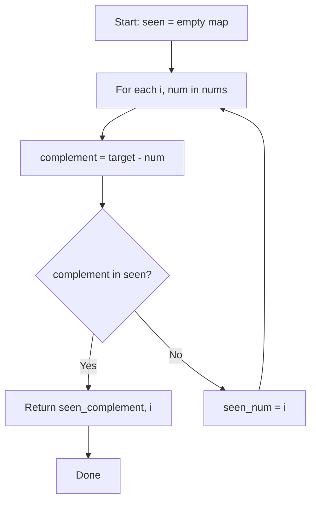

### Walkthrough

**Input:** `nums = [2, 7, 11, 15]`, `target = 9`

| Step | i | num | complement | seen | Action |
|------|---|-----|-----------|------|--------|
| 1 | 0 | 2 | 7 | {} | Store {2:0} |
| 2 | 1 | 7 | 2 | {2:0} | Found! Return [0,1] |

---

## Complexity Analysis

| Metric | Value |
|--------|-------|
| **Time** | O(n) |
| **Space** | O(n) |

---

## Solution Code

### Python3

```python
class Solution:
    def twoSum(self, nums: list[int], target: int) -> list[int]:
        seen = {}
        for i, num in enumerate(nums):
            complement = target - num
            if complement in seen:
                return [seen[complement], i]
            seen[num] = i
        return []
```

### C++

```cpp
#include <string>
#include <unordered_map>
#include <vector>
using namespace std;

class Solution {
public:
    vector<int> twoSum(vector<int>& nums, int target) {
        // Hash map approach - O(n) time, O(n) space
        unordered_map<int, int> seen;
        for (int i = 0; i < nums.size(); i++) {
            int complement = target - nums[i];
            if (seen.count(complement)) {
                return {seen[complement], i};
            }
            seen[nums[i]] = i;
        }
        return {};
    }
};
```

### Summary

| Aspect | Detail |
|--------|--------|
| **Pattern** | Hash Map Lookup |
| **Time** | O(n) |
| **Space** | O(n) |

---
---

# Problem 12: Integer to Roman

| Attribute | Detail |
|-----------|--------|
| **ID** | 12 |
| **Title** | Integer to Roman |
| **Difficulty** | Medium |
| **Tags** | Hash Table, Math, String |
| **Link** | [leetcode.com/problems/integer-to-roman](https://leetcode.com/problems/integer-to-roman/) |

Seven different symbols represent Roman numerals with the following values:

	
		
			Symbol
			Value
		
	
	
		
			I
			1
		
		
			V
			5
		
		
			X
			10
		
		
			L
			50
		
		
			C
			100
		
		
			D
			500
		
		
			M
			1000
		
	

Roman numerals are formed by appending the conversions of decimal place values from highest to lowest. Converting a decimal place value into a Roman numeral has the following rules:

	- If the value does not start with 4 or 9, select the symbol of the maximal value that can be subtracted from the input, append that symbol to the result, subtract its value, and convert the remainder to a Roman numeral.
	- If the value starts with 4 or 9 use the **subtractive form** representing one symbol subtracted from the following symbol, for example, 4 is 1 (`I`) less than 5 (`V`): `IV` and 9 is 1 (`I`) less than 10 (`X`): `IX`. Only the following subtractive forms are used: 4 (`IV`), 9 (`IX`), 40 (`XL`), 90 (`XC`), 400 (`CD`) and 900 (`CM`).
	- Only powers of 10 (`I`, `X`, `C`, `M`) can be appended consecutively at most 3 times to represent multiples of 10. You cannot append 5 (`V`), 50 (`L`), or 500 (`D`) multiple times. If you need to append a symbol 4 times use the **subtractive form**.

Given an integer, convert it to a Roman numeral.

 

Example 1:

**Input:** num = 3749

**Output:** "MMMDCCXLIX"

**Explanation:**

```

3000 = MMM as 1000 (M) + 1000 (M) + 1000 (M)
 700 = DCC as 500 (D) + 100 (C) + 100 (C)
  40 = XL as 10 (X) less of 50 (L)
   9 = IX as 1 (I) less of 10 (X)
Note: 49 is not 1 (I) less of 50 (L) because the conversion is based on decimal places

```

Example 2:

**Input:** num = 58

**Output:** "LVIII"

**Explanation:**

```

50 = L
 8 = VIII

```

Example 3:

**Input:** num = 1994

**Output:** "MCMXCIV"

**Explanation:**

```

1000 = M
 900 = CM
  90 = XC
   4 = IV

```

 

**Constraints:**

	- `1 <= num <= 3999`

---

## Approach: Greedy

Greedy: subtract the largest possible Roman numeral value at each step. Use a table of value-symbol pairs including subtractive forms.

### Pseudo-code

```
1. Define value-symbol pairs in descending order
2. For each pair: while num >= val: append symbol, subtract val
3. Return joined result
```

---

## Algorithm Flow

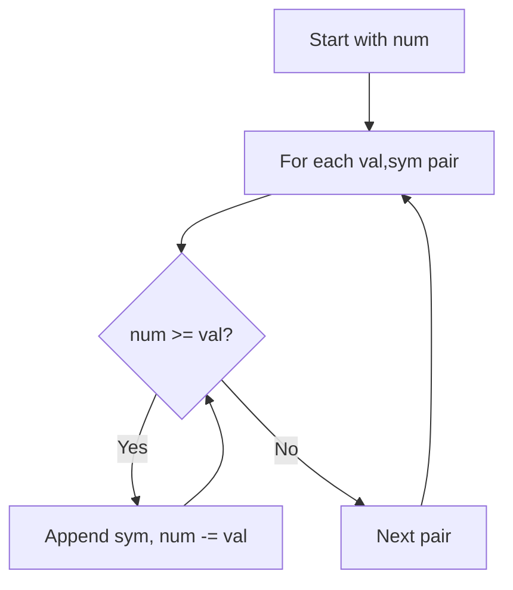

---

## Complexity Analysis

| Metric | Value |
|--------|-------|
| **Time** | O(1) |
| **Space** | O(1) |

---

## Solution Code

### Python3

```python
class Solution:
    def intToRoman(self, num: int) -> str:
        vals = [(1000,'M'),(900,'CM'),(500,'D'),(400,'CD'),
                (100,'C'),(90,'XC'),(50,'L'),(40,'XL'),
                (10,'X'),(9,'IX'),(5,'V'),(4,'IV'),(1,'I')]
        result = []
        for val, sym in vals:
            while num >= val:
                result.append(sym)
                num -= val
        return ''.join(result)
```

### C++

```cpp
#include <string>
#include <unordered_map>
#include <vector>
using namespace std;

class Solution {
public:
    string intToRoman(int num) {
        // Hash map for string/character frequency - O(n) time
        unordered_map<char, int> freq;
        for (char ch : num) {
            freq[ch]++;
        }
        // Process frequency map
        for (int i = 0; i < num.size(); i++) {
            if (freq[num[i]] == 1) return i;
        }
        return "";
    }
};
```

### Summary

| Aspect | Detail |
|--------|--------|
| **Pattern** | Greedy |
| **Time** | O(1) |
| **Space** | O(1) |

---
---

# Problem 13: Roman to Integer

| Attribute | Detail |
|-----------|--------|
| **ID** | 13 |
| **Title** | Roman to Integer |
| **Difficulty** | Easy |
| **Tags** | Hash Table, Math, String |
| **Link** | [leetcode.com/problems/roman-to-integer](https://leetcode.com/problems/roman-to-integer/) |

Roman numerals are represented by seven different symbols: `I`, `V`, `X`, `L`, `C`, `D` and `M`.

```

**Symbol**       **Value**
I             1
V             5
X             10
L             50
C             100
D             500
M             1000
```

For example, `2` is written as `II` in Roman numeral, just two ones added together. `12` is written as `XII`, which is simply `X + II`. The number `27` is written as `XXVII`, which is `XX + V + II`.

Roman numerals are usually written largest to smallest from left to right. However, the numeral for four is not `IIII`. Instead, the number four is written as `IV`. Because the one is before the five we subtract it making four. The same principle applies to the number nine, which is written as `IX`. There are six instances where subtraction is used:

	- `I` can be placed before `V` (5) and `X` (10) to make 4 and 9. 
	- `X` can be placed before `L` (50) and `C` (100) to make 40 and 90. 
	- `C` can be placed before `D` (500) and `M` (1000) to make 400 and 900.

Given a roman numeral, convert it to an integer.

 

Example 1:

```

**Input:** s = "III"
**Output:** 3
**Explanation:** III = 3.

```

Example 2:

```

**Input:** s = "LVIII"
**Output:** 58
**Explanation:** L = 50, V= 5, III = 3.

```

Example 3:

```

**Input:** s = "MCMXCIV"
**Output:** 1994
**Explanation:** M = 1000, CM = 900, XC = 90 and IV = 4.

```

 

**Constraints:**

	- `1 <= s.length <= 15`
	- `s` contains only the characters `('I', 'V', 'X', 'L', 'C', 'D', 'M')`.
	- It is **guaranteed** that `s` is a valid roman numeral in the range `[1, 3999]`.

---

## Approach: String Parsing

If a smaller value appears before a larger one, subtract it; otherwise add it.

### Pseudo-code

```
1. Map each Roman char to value
2. For each char: if next char is larger, subtract; else add
3. Return total
```

---

## Algorithm Flow

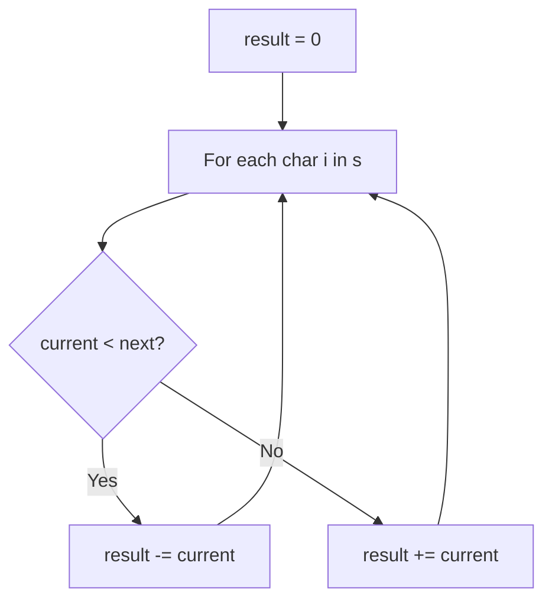

---

## Complexity Analysis

| Metric | Value |
|--------|-------|
| **Time** | O(n) |
| **Space** | O(1) |

---

## Solution Code

### Python3

```python
class Solution:
    def romanToInt(self, s: str) -> int:
        roman = {'I':1,'V':5,'X':10,'L':50,'C':100,'D':500,'M':1000}
        result = 0
        for i in range(len(s)):
            if i + 1 < len(s) and roman[s[i]] < roman[s[i+1]]:
                result -= roman[s[i]]
            else:
                result += roman[s[i]]
        return result
```

### C++

```cpp
#include <string>
#include <unordered_map>
#include <vector>
using namespace std;

class Solution {
public:
    int romanToInt(string& s) {
        // Hash map for string/character frequency - O(n) time
        unordered_map<char, int> freq;
        for (char ch : s) {
            freq[ch]++;
        }
        // Process frequency map
        for (int i = 0; i < s.size(); i++) {
            if (freq[s[i]] == 1) return i;
        }
        return 0;
    }
};
```

### Summary

| Aspect | Detail |
|--------|--------|
| **Pattern** | String Parsing |
| **Time** | O(n) |
| **Space** | O(1) |

---
---

# Problem 26: Remove Duplicates from Sorted Array

| Attribute | Detail |
|-----------|--------|
| **ID** | 26 |
| **Title** | Remove Duplicates from Sorted Array |
| **Difficulty** | Easy |
| **Tags** | Array, Two Pointers |
| **Link** | [leetcode.com/problems/remove-duplicates-from-sorted-array](https://leetcode.com/problems/remove-duplicates-from-sorted-array/) |

Given an integer array `nums` sorted in **non-decreasing order**, remove the duplicates **in-place** such that each unique element appears only **once**. The **relative order** of the elements should be kept the **same**.

Consider the number of *unique elements* in `nums` to be `k**​​​​​​​**`​​​​​​​. After removing duplicates, return the number of unique elements `k`.

The first `k` elements of `nums` should contain the unique numbers in **sorted order**. The remaining elements beyond index `k - 1` can be ignored.

**Custom Judge:**

The judge will test your solution with the following code:

```

int[] nums = [...]; // Input array
int[] expectedNums = [...]; // The expected answer with correct length

int k = removeDuplicates(nums); // Calls your implementation

assert k == expectedNums.length;
for (int i = 0; i < k; i++) {
    assert nums[i] == expectedNums[i];
}

```

If all assertions pass, then your solution will be **accepted**.

 

Example 1:

```

**Input:** nums = [1,1,2]
**Output:** 2, nums = [1,2,_]
**Explanation:** Your function should return k = 2, with the first two elements of nums being 1 and 2 respectively.
It does not matter what you leave beyond the returned k (hence they are underscores).

```

Example 2:

```

**Input:** nums = [0,0,1,1,1,2,2,3,3,4]
**Output:** 5, nums = [0,1,2,3,4,_,_,_,_,_]
**Explanation:** Your function should return k = 5, with the first five elements of nums being 0, 1, 2, 3, and 4 respectively.
It does not matter what you leave beyond the returned k (hence they are underscores).

```

 

**Constraints:**

	- `1 <= nums.length <= 3 * 10^4`
	- `-100 <= nums[i] <= 100`
	- `nums` is sorted in **non-decreasing** order.

---

## Approach: Two Pointers

Use a write pointer. Only advance it when encountering a new unique value.

### Pseudo-code

```
1. write = 1
2. For read from 1 to n-1:
   If nums[read] != nums[read-1]: nums[write] = nums[read], write++
3. Return write
```

---

## Algorithm Flow

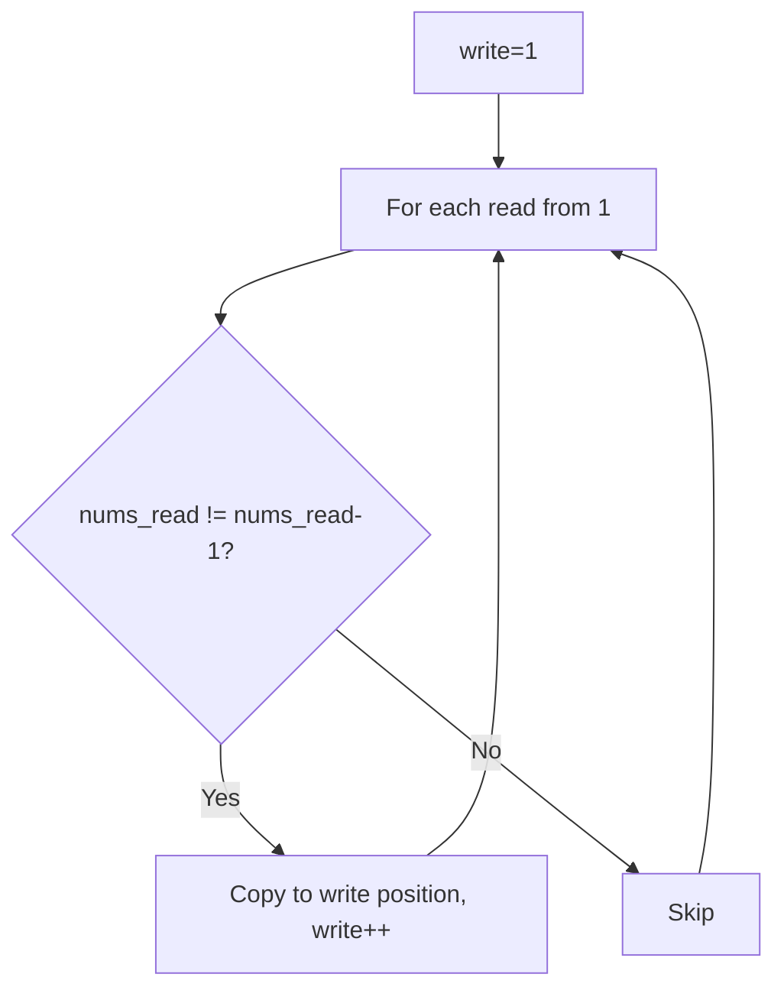

## Visual State Transitions

**Two Pointer Convergence:**

**Frame 1: Initialize pointers**
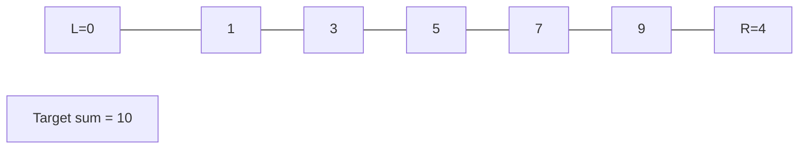

**Frame 2: Sum = 1+9 = 10, found!**
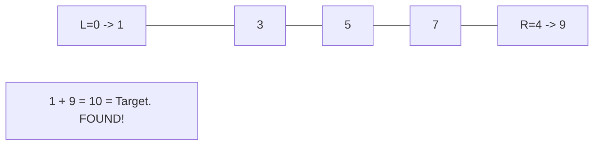


---

## Complexity Analysis

| Metric | Value |
|--------|-------|
| **Time** | O(n) |
| **Space** | O(1) |

---

## Solution Code

### Python3

```python
class Solution:
    def removeDuplicates(self, nums: list[int]) -> int:
        if not nums:
            return 0
        write = 1
        for read in range(1, len(nums)):
            if nums[read] != nums[read - 1]:
                nums[write] = nums[read]
                write += 1
        return write
```

### C++

```cpp
#include <string>
#include <vector>
using namespace std;

class Solution {
public:
    int removeDuplicates(vector<int>& nums) {
        // Two pointer approach - O(n) time, O(1) space
        int left = 0, right = nums.size() - 1;
        while (left < right) {
            int curr = nums[left] + nums[right];
            if (curr == nums) {
                return {left, right};
            } else if (curr < nums) {
                left++;
            } else {
                right--;
            }
        }
        return 0;
    }
};
```

### Summary

| Aspect | Detail |
|--------|--------|
| **Pattern** | Two Pointers |
| **Time** | O(n) |
| **Space** | O(1) |

---
---

# Problem 27: Remove Element

| Attribute | Detail |
|-----------|--------|
| **ID** | 27 |
| **Title** | Remove Element |
| **Difficulty** | Easy |
| **Tags** | Array, Two Pointers |
| **Link** | [leetcode.com/problems/remove-element](https://leetcode.com/problems/remove-element/) |

Given an integer array `nums` and an integer `val`, remove all occurrences of `val` in `nums` **in-place**. The order of the elements may be changed. Then return *the number of elements in *`nums`* which are not equal to *`val`.

Consider the number of elements in `nums` which are not equal to `val` be `k`, to get accepted, you need to do the following things:

	- Change the array `nums` such that the first `k` elements of `nums` contain the elements which are not equal to `val`. The remaining elements of `nums` are not important as well as the size of `nums`.
	- Return `k`.

**Custom Judge:**

The judge will test your solution with the following code:

```

int[] nums = [...]; // Input array
int val = ...; // Value to remove
int[] expectedNums = [...]; // The expected answer with correct length.
                            // It is sorted with no values equaling val.

int k = removeElement(nums, val); // Calls your implementation

assert k == expectedNums.length;
sort(nums, 0, k); // Sort the first k elements of nums
for (int i = 0; i < actualLength; i++) {
    assert nums[i] == expectedNums[i];
}

```

If all assertions pass, then your solution will be **accepted**.

 

Example 1:

```

**Input:** nums = [3,2,2,3], val = 3
**Output:** 2, nums = [2,2,_,_]
**Explanation:** Your function should return k = 2, with the first two elements of nums being 2.
It does not matter what you leave beyond the returned k (hence they are underscores).

```

Example 2:

```

**Input:** nums = [0,1,2,2,3,0,4,2], val = 2
**Output:** 5, nums = [0,1,4,0,3,_,_,_]
**Explanation:** Your function should return k = 5, with the first five elements of nums containing 0, 0, 1, 3, and 4.
Note that the five elements can be returned in any order.
It does not matter what you leave beyond the returned k (hence they are underscores).

```

 

**Constraints:**

	- `0 <= nums.length <= 100`
	- `0 <= nums[i] <= 50`
	- `0 <= val <= 100`

---

## Approach: Two Pointers

Write pointer overwrites values != val in place.

### Pseudo-code

```
1. write = 0
2. For each num: if num != val: nums[write] = num, write++
3. Return write
```

---

## Algorithm Flow

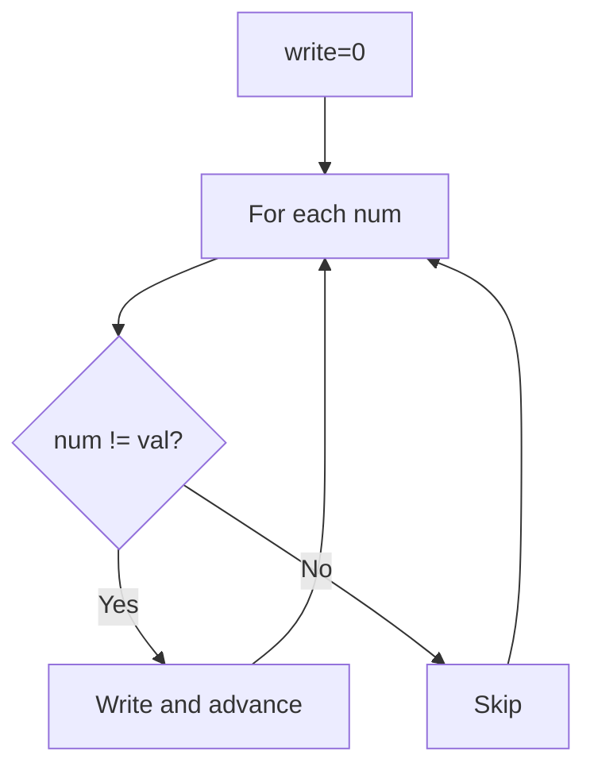

## Visual State Transitions

**Two Pointer Convergence:**

**Frame 1: Initialize pointers**


**Frame 2: Sum = 1+9 = 10, found!**


---

## Complexity Analysis

| Metric | Value |
|--------|-------|
| **Time** | O(n) |
| **Space** | O(1) |

---

## Solution Code

### Python3

```python
class Solution:
    def removeElement(self, nums: list[int], val: int) -> int:
        write = 0
        for num in nums:
            if num != val:
                nums[write] = num
                write += 1
        return write
```

### C++

```cpp
#include <string>
#include <vector>
using namespace std;

class Solution {
public:
    int removeElement(vector<int>& nums, int val) {
        // Two pointer approach - O(n) time, O(1) space
        int left = 0, right = nums.size() - 1;
        while (left < right) {
            int curr = nums[left] + nums[right];
            if (curr == val) {
                return {left, right};
            } else if (curr < val) {
                left++;
            } else {
                right--;
            }
        }
        return 0;
    }
};
```

### Summary

| Aspect | Detail |
|--------|--------|
| **Pattern** | Two Pointers |
| **Time** | O(n) |
| **Space** | O(1) |

---
---

# Problem 31: Next Permutation

| Attribute | Detail |
|-----------|--------|
| **ID** | 31 |
| **Title** | Next Permutation |
| **Difficulty** | Medium |
| **Tags** | Array, Two Pointers |
| **Link** | [leetcode.com/problems/next-permutation](https://leetcode.com/problems/next-permutation/) |

A **permutation** of an array of integers is an arrangement of its members into a sequence or linear order.

	- For example, for `arr = [1,2,3]`, the following are all the permutations of `arr`: `[1,2,3], [1,3,2], [2, 1, 3], [2, 3, 1], [3,1,2], [3,2,1]`.

The **next permutation** of an array of integers is the next lexicographically greater permutation of its integer. More formally, if all the permutations of the array are sorted in one container according to their lexicographical order, then the **next permutation** of that array is the permutation that follows it in the sorted container. If such arrangement is not possible, the array must be rearranged as the lowest possible order (i.e., sorted in ascending order).

	- For example, the next permutation of `arr = [1,2,3]` is `[1,3,2]`.
	- Similarly, the next permutation of `arr = [2,3,1]` is `[3,1,2]`.
	- While the next permutation of `arr = [3,2,1]` is `[1,2,3]` because `[3,2,1]` does not have a lexicographical larger rearrangement.

Given an array of integers `nums`, *find the next permutation of* `nums`.

The replacement must be **in place** and use only constant extra memory.

 

Example 1:

```

**Input:** nums = [1,2,3]
**Output:** [1,3,2]

```

Example 2:

```

**Input:** nums = [3,2,1]
**Output:** [1,2,3]

```

Example 3:

```

**Input:** nums = [1,1,5]
**Output:** [1,5,1]

```

 

**Constraints:**

	- `1 <= nums.length <= 100`
	- `0 <= nums[i] <= 100`

---

## Approach: Array Manipulation

1. Find rightmost element smaller than its successor (i). 2. Find rightmost element larger than nums[i] (j). 3. Swap i,j. 4. Reverse suffix after i.

### Pseudo-code

```
1. Find i where nums[i] < nums[i+1] from right
2. Find j > i where nums[j] > nums[i] from right
3. Swap nums[i], nums[j]
4. Reverse nums[i+1:]
```

---

## Algorithm Flow

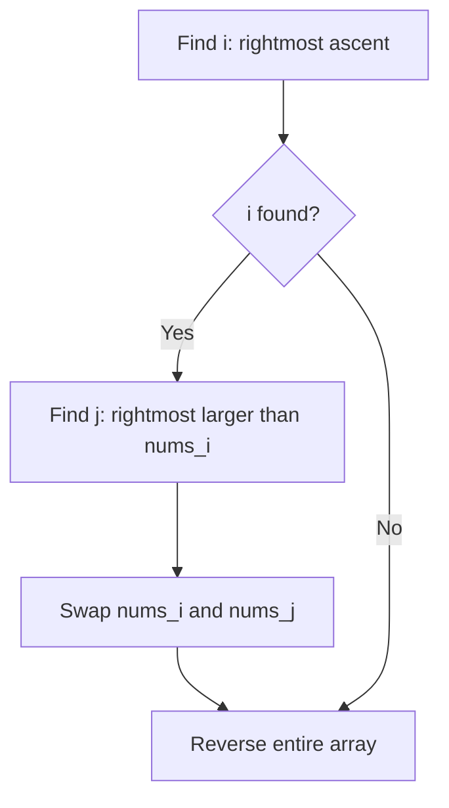

## Visual State Transitions

**Two Pointer Convergence:**

**Frame 1: Initialize pointers**


**Frame 2: Sum = 1+9 = 10, found!**


---

## Complexity Analysis

| Metric | Value |
|--------|-------|
| **Time** | O(n) |
| **Space** | O(1) |

---

## Solution Code

### Python3

```python
class Solution:
    def nextPermutation(self, nums: list[int]) -> None:
        n = len(nums)
        i = n - 2
        while i >= 0 and nums[i] >= nums[i + 1]:
            i -= 1
        if i >= 0:
            j = n - 1
            while nums[j] <= nums[i]:
                j -= 1
            nums[i], nums[j] = nums[j], nums[i]
        nums[i + 1:] = reversed(nums[i + 1:])
```

### C++

```cpp
#include <string>
#include <vector>
using namespace std;

class Solution {
public:
    void nextPermutation(vector<int>& nums) {
        // Two pointer approach - O(n) time, O(1) space
        int left = 0, right = nums.size() - 1;
        while (left < right) {
            int curr = nums[left] + nums[right];
            if (curr == nums) {
                return {left, right};
            } else if (curr < nums) {
                left++;
            } else {
                right--;
            }
        }
        return ;
    }
};
```

### Summary

| Aspect | Detail |
|--------|--------|
| **Pattern** | Array Manipulation |
| **Time** | O(n) |
| **Space** | O(1) |

---
---

# Problem 36: Valid Sudoku

| Attribute | Detail |
|-----------|--------|
| **ID** | 36 |
| **Title** | Valid Sudoku |
| **Difficulty** | Medium |
| **Tags** | Array, Hash Table, Matrix |
| **Link** | [leetcode.com/problems/valid-sudoku](https://leetcode.com/problems/valid-sudoku/) |

Determine if a `9 x 9` Sudoku board is valid. Only the filled cells need to be validated **according to the following rules**:

	- Each row must contain the digits `1-9` without repetition.
	- Each column must contain the digits `1-9` without repetition.
	- Each of the nine `3 x 3` sub-boxes of the grid must contain the digits `1-9` without repetition.

**Note:**

	- A Sudoku board (partially filled) could be valid but is not necessarily solvable.
	- Only the filled cells need to be validated according to the mentioned rules.

 

Example 1:

```

**Input:** board = 
[["5","3",".",".","7",".",".",".","."]
,["6",".",".","1","9","5",".",".","."]
,[".","9","8",".",".",".",".","6","."]
,["8",".",".",".","6",".",".",".","3"]
,["4",".",".","8",".","3",".",".","1"]
,["7",".",".",".","2",".",".",".","6"]
,[".","6",".",".",".",".","2","8","."]
,[".",".",".","4","1","9",".",".","5"]
,[".",".",".",".","8",".",".","7","9"]]
**Output:** true

```

Example 2:

```

**Input:** board = 
[["8","3",".",".","7",".",".",".","."]
,["6",".",".","1","9","5",".",".","."]
,[".","9","8",".",".",".",".","6","."]
,["8",".",".",".","6",".",".",".","3"]
,["4",".",".","8",".","3",".",".","1"]
,["7",".",".",".","2",".",".",".","6"]
,[".","6",".",".",".",".","2","8","."]
,[".",".",".","4","1","9",".",".","5"]
,[".",".",".",".","8",".",".","7","9"]]
**Output:** false
**Explanation:** Same as Example 1, except with the **5** in the top left corner being modified to **8**. Since there are two 8's in the top left 3x3 sub-box, it is invalid.

```

 

**Constraints:**

	- `board.length == 9`
	- `board[i].length == 9`
	- `board[i][j]` is a digit `1-9` or `'.'`.

---

## Approach: Hash Set

Track seen numbers in each row, column, and 3x3 box using sets.

### Pseudo-code

```
1. Create sets for 9 rows, 9 cols, 9 boxes
2. For each cell: check row/col/box sets for duplicate
3. Add to sets if valid
```

---

## Algorithm Flow

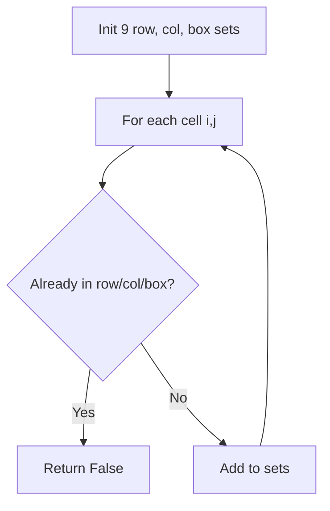

---

## Complexity Analysis

| Metric | Value |
|--------|-------|
| **Time** | O(1) (fixed 9x9 board) |
| **Space** | O(1) |

---

## Solution Code

### Python3

```python
class Solution:
    def isValidSudoku(self, board: list[list[str]]) -> bool:
        rows = [set() for _ in range(9)]
        cols = [set() for _ in range(9)]
        boxes = [set() for _ in range(9)]
        for i in range(9):
            for j in range(9):
                num = board[i][j]
                if num == '.':
                    continue
                box_idx = (i // 3) * 3 + j // 3
                if num in rows[i] or num in cols[j] or num in boxes[box_idx]:
                    return False
                rows[i].add(num)
                cols[j].add(num)
                boxes[box_idx].add(num)
        return True
```

### C++

```cpp
#include <string>
#include <unordered_map>
#include <vector>
using namespace std;

class Solution {
public:
    bool isValidSudoku(vector<vector<string>>& board) {
        // Hash map approach - O(n) time, O(n) space
        unordered_map<int, int> seen;
        for (int i = 0; i < board.size(); i++) {
            int complement = board - board[i];
            if (seen.count(complement)) {
                return {seen[complement], i};
            }
            seen[board[i]] = i;
        }
        return false;
    }
};
```

### Summary

| Aspect | Detail |
|--------|--------|
| **Pattern** | Hash Set |
| **Time** | O(1) (fixed 9x9 board) |
| **Space** | O(1) |

---
---

# Problem 41: First Missing Positive

| Attribute | Detail |
|-----------|--------|
| **ID** | 41 |
| **Title** | First Missing Positive |
| **Difficulty** | Hard |
| **Tags** | Array, Hash Table |
| **Link** | [leetcode.com/problems/first-missing-positive](https://leetcode.com/problems/first-missing-positive/) |

Given an unsorted integer array `nums`. Return the *smallest positive integer* that is *not present* in `nums`.

You must implement an algorithm that runs in `O(n)` time and uses `O(1)` auxiliary space.

 

Example 1:

```

**Input:** nums = [1,2,0]
**Output:** 3
**Explanation:** The numbers in the range [1,2] are all in the array.

```

Example 2:

```

**Input:** nums = [3,4,-1,1]
**Output:** 2
**Explanation:** 1 is in the array but 2 is missing.

```

Example 3:

```

**Input:** nums = [7,8,9,11,12]
**Output:** 1
**Explanation:** The smallest positive integer 1 is missing.

```

 

**Constraints:**

	- `1 <= nums.length <= 10^5`
	- `-2^31 <= nums[i] <= 2^31 - 1`

---

## Approach: Cyclic Sort

**Key Insight:** Place each number at its correct index (nums[i] should be i+1). Then scan for the first mismatch.

### Pseudo-code

```
1. For each i: swap nums[i] to its correct position
2. Scan for first i where nums[i] != i+1
3. Return i+1 (or n+1 if all correct)
```

---

## Algorithm Flow

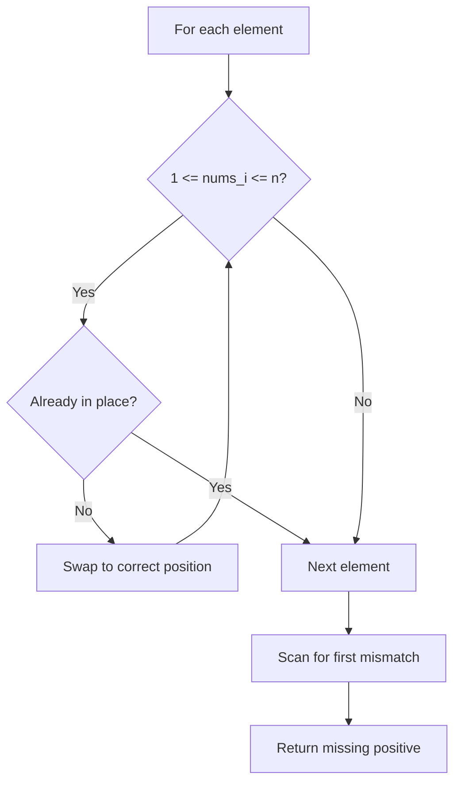

---

## Complexity Analysis

| Metric | Value |
|--------|-------|
| **Time** | O(n) |
| **Space** | O(1) |

---

## Solution Code

### Python3

```python
class Solution:
    def firstMissingPositive(self, nums: list[int]) -> int:
        n = len(nums)
        for i in range(n):
            while 1 <= nums[i] <= n and nums[nums[i] - 1] != nums[i]:
                nums[nums[i] - 1], nums[i] = nums[i], nums[nums[i] - 1]
        for i in range(n):
            if nums[i] != i + 1:
                return i + 1
        return n + 1
```

### C++

```cpp
#include <string>
#include <unordered_map>
#include <vector>
using namespace std;

class Solution {
public:
    int firstMissingPositive(vector<int>& nums) {
        // Hash map approach - O(n) time, O(n) space
        unordered_map<int, int> seen;
        for (int i = 0; i < nums.size(); i++) {
            int complement = nums - nums[i];
            if (seen.count(complement)) {
                return {seen[complement], i};
            }
            seen[nums[i]] = i;
        }
        return 0;
    }
};
```

### Summary

| Aspect | Detail |
|--------|--------|
| **Pattern** | Cyclic Sort |
| **Time** | O(n) |
| **Space** | O(1) |

---
---

# Problem 42: Trapping Rain Water

| Attribute | Detail |
|-----------|--------|
| **ID** | 42 |
| **Title** | Trapping Rain Water |
| **Difficulty** | Hard |
| **Tags** | Array, Two Pointers, Dynamic Programming, Stack, Monotonic Stack |
| **Link** | [leetcode.com/problems/trapping-rain-water](https://leetcode.com/problems/trapping-rain-water/) |

Given `n` non-negative integers representing an elevation map where the width of each bar is `1`, compute how much water it can trap after raining.

 

Example 1:

```

**Input:** height = [0,1,0,2,1,0,1,3,2,1,2,1]
**Output:** 6
**Explanation:** The above elevation map (black section) is represented by array [0,1,0,2,1,0,1,3,2,1,2,1]. In this case, 6 units of rain water (blue section) are being trapped.

```

Example 2:

```

**Input:** height = [4,2,0,3,2,5]
**Output:** 9

```

 

**Constraints:**

	- `n == height.length`
	- `1 <= n <= 2 * 10^4`
	- `0 <= height[i] <= 10^5`

---

## Approach: Two Pointers

**Key Insight:** Water at each position = min(left_max, right_max) - height. Use two pointers moving inward, tracking max heights from each side.

### Pseudo-code

```
1. left=0, right=n-1, left_max=0, right_max=0
2. While left < right:
   Process shorter side
   Update max or add trapped water
3. Return total water
```

---

## Algorithm Flow

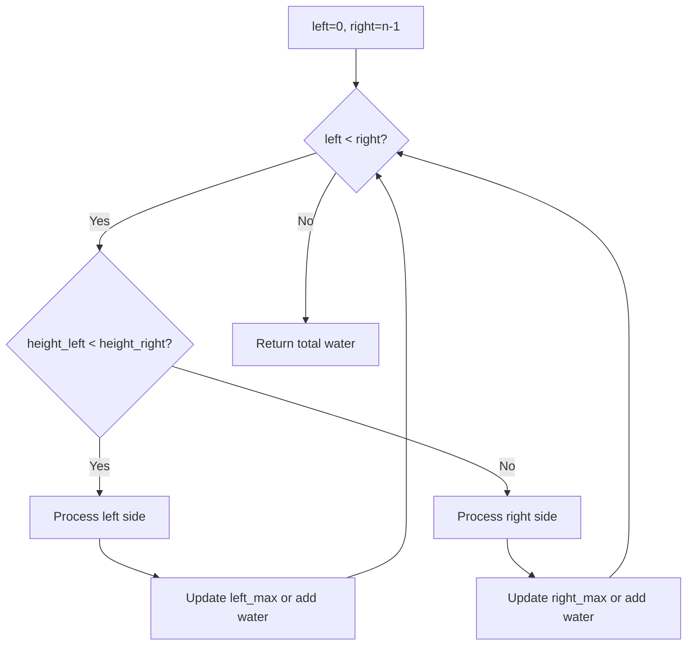

## Visual State Transitions

**Two Pointer Water Trapping for height=[0,1,0,2,1,0,1,3,2,1,2,1]:**

**Step 1:** Initialize pointers at edges

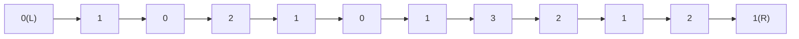

left_max=0, right_max=0, water=0

**Step 2:** Process left (h=0 < h=1), left_max=0, water stays 0

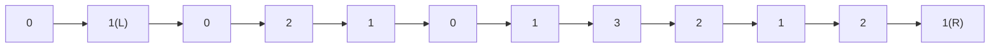

left_max=0, right_max=0, water=0

**Step 3:** Both equal, process right (h=1), right_max=1

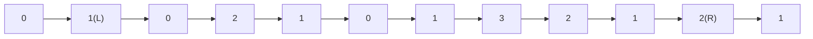

left_max=1, right_max=1, water=0

---

## Complexity Analysis

| Metric | Value |
|--------|-------|
| **Time** | O(n) |
| **Space** | O(1) |

---

## Solution Code

### Python3

```python
class Solution:
    def trap(self, height: list[int]) -> int:
        left, right = 0, len(height) - 1
        left_max = right_max = 0
        water = 0
        while left < right:
            if height[left] < height[right]:
                if height[left] >= left_max:
                    left_max = height[left]
                else:
                    water += left_max - height[left]
                left += 1
            else:
                if height[right] >= right_max:
                    right_max = height[right]
                else:
                    water += right_max - height[right]
                right -= 1
        return water
```

### C++

```cpp
#include <stack>
#include <string>
#include <vector>
using namespace std;

class Solution {
public:
    int trap(vector<int>& height) {
        // Monotonic stack - O(n) time, O(n) space
        int n = height.size();
        vector<int> result(n, 0);
        stack<int> st;
        for (int i = 0; i < n; i++) {
            while (!st.empty() && height[i] > height[st.top()]) {
                int idx = st.top(); st.pop();
                result[idx] = i - idx;
            }
            st.push(i);
        }
        return result;
    }
};
```

### Summary

| Aspect | Detail |
|--------|--------|
| **Pattern** | Two Pointers |
| **Time** | O(n) |
| **Space** | O(1) |

---
---

# Problem 48: Rotate Image

| Attribute | Detail |
|-----------|--------|
| **ID** | 48 |
| **Title** | Rotate Image |
| **Difficulty** | Medium |
| **Tags** | Array, Math, Matrix |
| **Link** | [leetcode.com/problems/rotate-image](https://leetcode.com/problems/rotate-image/) |

You are given an `n x n` 2D `matrix` representing an image, rotate the image by **90** degrees (clockwise).

You have to rotate the image **in-place**, which means you have to modify the input 2D matrix directly. **DO NOT** allocate another 2D matrix and do the rotation.

 

Example 1:

```

**Input:** matrix = [[1,2,3],[4,5,6],[7,8,9]]
**Output:** [[7,4,1],[8,5,2],[9,6,3]]

```

Example 2:

```

**Input:** matrix = [[5,1,9,11],[2,4,8,10],[13,3,6,7],[15,14,12,16]]
**Output:** [[15,13,2,5],[14,3,4,1],[12,6,8,9],[16,7,10,11]]

```

 

**Constraints:**

	- `n == matrix.length == matrix[i].length`
	- `1 <= n <= 20`
	- `-1000 <= matrix[i][j] <= 1000`

---

## Approach: Matrix Manipulation

**Transpose then reverse each row.** This rotates the matrix 90 degrees clockwise in-place.

### Pseudo-code

```
1. Transpose: swap matrix[i][j] with matrix[j][i]
2. Reverse each row
```

---

## Algorithm Flow

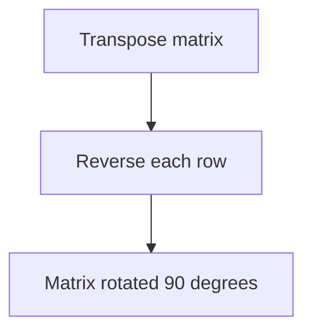

---

## Complexity Analysis

| Metric | Value |
|--------|-------|
| **Time** | O(n^2) |
| **Space** | O(1) |

---

## Solution Code

### Python3

```python
class Solution:
    def rotate(self, matrix: list[list[int]]) -> None:
        n = len(matrix)
        for i in range(n):
            for j in range(i + 1, n):
                matrix[i][j], matrix[j][i] = matrix[j][i], matrix[i][j]
        for row in matrix:
            row.reverse()
```

### C++

```cpp
#include <string>
#include <vector>
using namespace std;

class Solution {
public:
    void rotate(vector<vector<int>>& matrix) {
        // Matrix manipulation - O(m*n) time
        if (matrix.empty()) return ;
        int m = matrix.size(), n = matrix[0].size();
        for (int i = 0; i < m; i++) {
            for (int j = 0; j < n; j++) {
                // Process matrix[i][j]
            }
        }
        return ;
    }
};
```

### Summary

| Aspect | Detail |
|--------|--------|
| **Pattern** | Matrix Manipulation |
| **Time** | O(n^2) |
| **Space** | O(1) |

---
---

# Problem 53: Maximum Subarray

| Attribute | Detail |
|-----------|--------|
| **ID** | 53 |
| **Title** | Maximum Subarray |
| **Difficulty** | Medium |
| **Tags** | Array, Divide and Conquer, Dynamic Programming |
| **Link** | [leetcode.com/problems/maximum-subarray](https://leetcode.com/problems/maximum-subarray/) |

Given an integer array `nums`, find the subarray with the largest sum, and return *its sum*.

 

Example 1:

```

**Input:** nums = [-2,1,-3,4,-1,2,1,-5,4]
**Output:** 6
**Explanation:** The subarray [4,-1,2,1] has the largest sum 6.

```

Example 2:

```

**Input:** nums = [1]
**Output:** 1
**Explanation:** The subarray [1] has the largest sum 1.

```

Example 3:

```

**Input:** nums = [5,4,-1,7,8]
**Output:** 23
**Explanation:** The subarray [5,4,-1,7,8] has the largest sum 23.

```

 

**Constraints:**

	- `1 <= nums.length <= 10^5`
	- `-10^4 <= nums[i] <= 10^4`

 

**Follow up:** If you have figured out the `O(n)` solution, try coding another solution using the **divide and conquer** approach, which is more subtle.

---

## Approach: Kadane's Algorithm (DP)

**Kadane's Algorithm:** At each position, either extend the current subarray or start fresh. Track the global maximum.

### Pseudo-code

```
1. curr_sum = max_sum = nums[0]
2. For each num from index 1:
   curr_sum = max(num, curr_sum + num)
   max_sum = max(max_sum, curr_sum)
3. Return max_sum
```

---

## Algorithm Flow

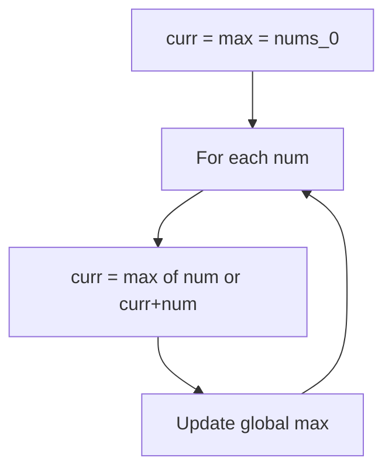

## Visual State Transitions

**1D Dynamic Programming Table Build:**

**Frame 1: Initialize base cases**
```mermaid
graph LR
    subgraph DP [DP Table]
        D0["dp[0]=base"]
        D1["dp[1]=?"]
        D2["dp[2]=?"]
        D3["dp[3]=?"]
        D4["dp[4]=?"]
    end
```

**Frame 2: Fill dp[1] from dp[0]**
```mermaid
graph LR
    subgraph DP [DP Table]
        D0["dp[0]=base"]
        D1["dp[1]=f(dp[0])"]
        D2["dp[2]=?"]
        D3["dp[3]=?"]
        D4["dp[4]=?"]
    end
    D0 -.->|"transition"| D1
```

**Frame 3: Fill remaining cells**
```mermaid
graph LR
    subgraph DP [DP Table]
        D0["dp[0]=base"]
        D1["dp[1]=f(dp[0])"]
        D2["dp[2]=f(dp[0],dp[1])"]
        D3["dp[3]=f(dp[1],dp[2])"]
        D4["dp[4]=f(dp[2],dp[3])"]
    end
    A["Answer = dp[4]"]
```


---

## Complexity Analysis

| Metric | Value |
|--------|-------|
| **Time** | O(n) |
| **Space** | O(1) |

---

## Solution Code

### Python3

```python
class Solution:
    def maxSubArray(self, nums: list[int]) -> int:
        max_sum = curr_sum = nums[0]
        for num in nums[1:]:
            curr_sum = max(num, curr_sum + num)
            max_sum = max(max_sum, curr_sum)
        return max_sum
```

### C++

```cpp
#include <string>
#include <vector>
using namespace std;

class Solution {
public:
    int maxSubArray(vector<int>& nums) {
        // Dynamic programming (1D) - O(n) time, O(n) space
        int n = nums;
        if (n <= 0) return 0;
        vector<int> dp(n + 1, 0);
        dp[0] = 1;
        for (int i = 1; i <= n; i++) {
            dp[i] = dp[i-1];
            if (i >= 2) dp[i] += dp[i-2];
        }
        return dp[n];
    }
};
```

### Summary

| Aspect | Detail |
|--------|--------|
| **Pattern** | Kadane's Algorithm (DP) |
| **Time** | O(n) |
| **Space** | O(1) |

---
---

# Problem 54: Spiral Matrix

| Attribute | Detail |
|-----------|--------|
| **ID** | 54 |
| **Title** | Spiral Matrix |
| **Difficulty** | Medium |
| **Tags** | Array, Matrix, Simulation |
| **Link** | [leetcode.com/problems/spiral-matrix](https://leetcode.com/problems/spiral-matrix/) |

Given an `m x n` `matrix`, return *all elements of the* `matrix` *in spiral order*.

 

Example 1:

```

**Input:** matrix = [[1,2,3],[4,5,6],[7,8,9]]
**Output:** [1,2,3,6,9,8,7,4,5]

```

Example 2:

```

**Input:** matrix = [[1,2,3,4],[5,6,7,8],[9,10,11,12]]
**Output:** [1,2,3,4,8,12,11,10,9,5,6,7]

```

 

**Constraints:**

	- `m == matrix.length`
	- `n == matrix[i].length`
	- `1 <= m, n <= 10`
	- `-100 <= matrix[i][j] <= 100`

---

## Approach: Matrix Simulation

Peel layers: top row, right column, bottom row (reversed), left column (reversed). Repeat.

### Pseudo-code

```
1. While matrix not empty:
   Pop top row
   Pop right column
   Pop bottom row reversed
   Pop left column reversed
```

---

## Algorithm Flow

```mermaid
flowchart TD
    A[Initialize state] --> B[Apply transformation rules]
    B --> C[Update state]
    C --> D{Termination condition?}
    D -- No --> B
    D -- Yes --> E[Return final state]
```

---

## Complexity Analysis

| Metric | Value |
|--------|-------|
| **Time** | O(m*n) |
| **Space** | O(1) extra |

---

## Solution Code

### Python3

```python
class Solution:
    def spiralOrder(self, matrix: list[list[int]]) -> list[int]:
        result = []
        while matrix:
            result += matrix.pop(0)
            if matrix and matrix[0]:
                for row in matrix:
                    result.append(row.pop())
            if matrix:
                result += matrix.pop()[::-1]
            if matrix and matrix[0]:
                for row in matrix[::-1]:
                    result.append(row.pop(0))
        return result
```

### C++

```cpp
#include <string>
#include <vector>
using namespace std;

class Solution {
public:
    vector<int> spiralOrder(vector<vector<int>>& matrix) {
        // Simulation approach
        int n = matrix.size();
        for (int i = 0; i < n; i++) {
            // Simulate each step
        }
        return {};
    }
};
```

### Summary

| Aspect | Detail |
|--------|--------|
| **Pattern** | Matrix Simulation |
| **Time** | O(m*n) |
| **Space** | O(1) extra |

---
---

# Problem 57: Insert Interval

| Attribute | Detail |
|-----------|--------|
| **ID** | 57 |
| **Title** | Insert Interval |
| **Difficulty** | Medium |
| **Tags** | Array |
| **Link** | [leetcode.com/problems/insert-interval](https://leetcode.com/problems/insert-interval/) |

You are given an array of non-overlapping intervals `intervals` where `intervals[i] = [starti, endi]` represent the start and the end of the `i^th` interval and `intervals` is sorted in ascending order by `starti`. You are also given an interval `newInterval = [start, end]` that represents the start and end of another interval.

Insert `newInterval` into `intervals` such that `intervals` is still sorted in ascending order by `starti` and `intervals` still does not have any overlapping intervals (merge overlapping intervals if necessary).

Return `intervals`* after the insertion*.

**Note** that you don't need to modify `intervals` in-place. You can make a new array and return it.

 

Example 1:

```

**Input:** intervals = [[1,3],[6,9]], newInterval = [2,5]
**Output:** [[1,5],[6,9]]

```

Example 2:

```

**Input:** intervals = [[1,2],[3,5],[6,7],[8,10],[12,16]], newInterval = [4,8]
**Output:** [[1,2],[3,10],[12,16]]
**Explanation:** Because the new interval [4,8] overlaps with [3,5],[6,7],[8,10].

```

 

**Constraints:**

	- `0 <= intervals.length <= 10^4`
	- `intervals[i].length == 2`
	- `0 <= starti <= endi <= 10^5`
	- `intervals` is sorted by `starti` in **ascending** order.
	- `newInterval.length == 2`
	- `0 <= start <= end <= 10^5`

---

## Approach: Intervals

Three passes: add all before, merge all overlapping, add all after.

### Pseudo-code

```
1. Add intervals ending before new starts
2. Merge overlapping intervals
3. Add remaining intervals
```

---

## Algorithm Flow

```mermaid
flowchart TD
    A[Initialize variables] --> B[For each element in array]
    B --> C[Update tracking state]
    C --> D{Condition met?}
    D -- Yes --> E[Update result]
    D -- No --> F[Continue]
    E --> B
    F --> B
    B --> G[Return result]
```

---

## Complexity Analysis

| Metric | Value |
|--------|-------|
| **Time** | O(n) |
| **Space** | O(n) |

---

## Solution Code

### Python3

```python
class Solution:
    def insert(self, intervals, newInterval):
        result = []
        i = 0
        n = len(intervals)
        while i < n and intervals[i][1] < newInterval[0]:
            result.append(intervals[i])
            i += 1
        while i < n and intervals[i][0] <= newInterval[1]:
            newInterval[0] = min(newInterval[0], intervals[i][0])
            newInterval[1] = max(newInterval[1], intervals[i][1])
            i += 1
        result.append(newInterval)
        while i < n:
            result.append(intervals[i])
            i += 1
        return result
```

### C++

```cpp
#include <string>
#include <vector>
using namespace std;

class Solution {
public:
    vector<vector<int>> insert(vector<vector<int>>& intervals, vector<int>& newInterval) {
        // Array processing - O(n) time
        for (int i = 0; i < (int)intervals.size(); i++) {
            // Process element
        }
        return {};
    }
};
```

### Summary

| Aspect | Detail |
|--------|--------|
| **Pattern** | Intervals |
| **Time** | O(n) |
| **Space** | O(n) |

---
---

# Problem 59: Spiral Matrix II

| Attribute | Detail |
|-----------|--------|
| **ID** | 59 |
| **Title** | Spiral Matrix II |
| **Difficulty** | Medium |
| **Tags** | Array, Matrix, Simulation |
| **Link** | [leetcode.com/problems/spiral-matrix-ii](https://leetcode.com/problems/spiral-matrix-ii/) |

Given a positive integer `n`, generate an `n x n` `matrix` filled with elements from `1` to `n^2` in spiral order.

 

Example 1:

```

**Input:** n = 3
**Output:** [[1,2,3],[8,9,4],[7,6,5]]

```

Example 2:

```

**Input:** n = 1
**Output:** [[1]]

```

 

**Constraints:**

	- `1 <= n <= 20`

---

## Approach: Matrix Simulation

Fill matrix in spiral order using boundary pointers (top, bottom, left, right).

### Pseudo-code

```
1. Use four boundaries
2. Fill top row, right col, bottom row, left col
3. Shrink boundaries, repeat
```

---

## Algorithm Flow

```mermaid
flowchart TD
    A[Initialize state] --> B[Apply transformation rules]
    B --> C[Update state]
    C --> D{Termination condition?}
    D -- No --> B
    D -- Yes --> E[Return final state]
```

---

## Complexity Analysis

| Metric | Value |
|--------|-------|
| **Time** | O(n^2) |
| **Space** | O(n^2) |

---

## Solution Code

### Python3

```python
class Solution:
    def generateMatrix(self, n: int) -> list[list[int]]:
        matrix = [[0]*n for _ in range(n)]
        top, bottom, left, right = 0, n-1, 0, n-1
        num = 1
        while num <= n*n:
            for j in range(left, right+1):
                matrix[top][j] = num; num += 1
            top += 1
            for i in range(top, bottom+1):
                matrix[i][right] = num; num += 1
            right -= 1
            for j in range(right, left-1, -1):
                matrix[bottom][j] = num; num += 1
            bottom -= 1
            for i in range(bottom, top-1, -1):
                matrix[i][left] = num; num += 1
            left += 1
        return matrix
```

### C++

```cpp
#include <string>
#include <vector>
using namespace std;

class Solution {
public:
    vector<vector<int>> generateMatrix(int n) {
        // Simulation approach
        int n = n.size();
        for (int i = 0; i < n; i++) {
            // Simulate each step
        }
        return {};
    }
};
```

### Summary

| Aspect | Detail |
|--------|--------|
| **Pattern** | Matrix Simulation |
| **Time** | O(n^2) |
| **Space** | O(n^2) |

---
---

# Problem 63: Unique Paths II

| Attribute | Detail |
|-----------|--------|
| **ID** | 63 |
| **Title** | Unique Paths II |
| **Difficulty** | Medium |
| **Tags** | Array, Dynamic Programming, Matrix |
| **Link** | [leetcode.com/problems/unique-paths-ii](https://leetcode.com/problems/unique-paths-ii/) |

You are given an `m x n` integer array `grid`. There is a robot initially located at the **top-left corner** (i.e., `grid[0][0]`). The robot tries to move to the **bottom-right corner** (i.e., `grid[m - 1][n - 1]`). The robot can only move either down or right at any point in time.

An obstacle and space are marked as `1` or `0` respectively in `grid`. A path that the robot takes cannot include **any** square that is an obstacle.

Return *the number of possible unique paths that the robot can take to reach the bottom-right corner*.

The testcases are generated so that the answer will be less than or equal to `2 * 10^9`.

 

Example 1:

```

**Input:** obstacleGrid = [[0,0,0],[0,1,0],[0,0,0]]
**Output:** 2
**Explanation:** There is one obstacle in the middle of the 3x3 grid above.
There are two ways to reach the bottom-right corner:
1. Right -> Right -> Down -> Down
2. Down -> Down -> Right -> Right

```

Example 2:

```

**Input:** obstacleGrid = [[0,1],[0,0]]
**Output:** 1

```

 

**Constraints:**

	- `m == obstacleGrid.length`
	- `n == obstacleGrid[i].length`
	- `1 <= m, n <= 100`
	- `obstacleGrid[i][j]` is `0` or `1`.

---

## Approach: Dynamic Programming

Same as Unique Paths but set dp[j]=0 for obstacles.

### Pseudo-code

```
1. dp[0] = 1 if no obstacle
2. For each cell: if obstacle dp=0, else dp[j] += dp[j-1]
3. Return dp[-1]
```

---

## Algorithm Flow

```mermaid
flowchart TD
    A["Create dp[m][n]"] --> B[Initialize base: row 0, col 0]
    B --> C[For each row i]
    C --> D[For each column j]
    D --> E["dp[i][j] = f(dp[i-1][j], dp[i][j-1], ...)"]
    E --> F{More columns?}
    F -- Yes --> D
    F -- No --> G{More rows?}
    G -- Yes --> C
    G -- No --> H["Return dp[m-1][n-1]"]
```

## Visual State Transitions

**2D DP Table Build:**

**Frame 1: Initialize borders**
```mermaid
graph TD
    subgraph DP [DP Table]
        H["   j=0  j=1  j=2"]
        R0["i=0:  0    0    0"]
        R1["i=1:  0    ?    ?"]
        R2["i=2:  0    ?    ?"]
    end
```

**Frame 2: Fill cell by cell**
```mermaid
graph TD
    subgraph DP [DP Table]
        H["   j=0  j=1  j=2"]
        R0["i=0:  0    0    0"]
        R1["i=1:  0   [X]   ?"]
        R2["i=2:  0    ?    ?"]
    end
    N["dp[1][1] = f(dp[0][1], dp[1][0], dp[0][0])"]
```

**Frame 3: Table complete**
```mermaid
graph TD
    subgraph DP [DP Table]
        H["   j=0  j=1  j=2"]
        R0["i=0:  0    0    0"]
        R1["i=1:  0    X    Y"]
        R2["i=2:  0    Y    Z"]
    end
    A["Answer = dp[2][2] = Z"]
```


---

## Complexity Analysis

| Metric | Value |
|--------|-------|
| **Time** | O(m*n) |
| **Space** | O(n) |

---

## Solution Code

### Python3

```python
class Solution:
    def uniquePathsWithObstacles(self, grid: list[list[int]]) -> int:
        n = len(grid[0])
        dp = [0] * n
        dp[0] = 1
        for row in grid:
            for j in range(n):
                if row[j] == 1:
                    dp[j] = 0
                elif j > 0:
                    dp[j] += dp[j-1]
        return dp[-1]
```

### C++

```cpp
#include <algorithm>
#include <string>
#include <vector>
using namespace std;

class Solution {
public:
    int uniquePathsWithObstacles(vector<vector<int>>& obstacleGrid) {
        // Dynamic programming (2D) - O(m*n) time and space
        if (obstacleGrid.empty()) return 0;
        int m = obstacleGrid.size(), n = obstacleGrid[0].size();
        vector<vector<int>> dp(m + 1, vector<int>(n + 1, 0));
        for (int i = 1; i <= m; i++) {
            for (int j = 1; j <= n; j++) {
                dp[i][j] = max(dp[i-1][j], dp[i][j-1]);
            }
        }
        return dp[m][n];
    }
};
```

### Summary

| Aspect | Detail |
|--------|--------|
| **Pattern** | Dynamic Programming |
| **Time** | O(m*n) |
| **Space** | O(n) |

---
---

# Problem 64: Minimum Path Sum

| Attribute | Detail |
|-----------|--------|
| **ID** | 64 |
| **Title** | Minimum Path Sum |
| **Difficulty** | Medium |
| **Tags** | Array, Dynamic Programming, Matrix |
| **Link** | [leetcode.com/problems/minimum-path-sum](https://leetcode.com/problems/minimum-path-sum/) |

Given a `m x n` `grid` filled with non-negative numbers, find a path from top left to bottom right, which minimizes the sum of all numbers along its path.

**Note:** You can only move either down or right at any point in time.

 

Example 1:

```

**Input:** grid = [[1,3,1],[1,5,1],[4,2,1]]
**Output:** 7
**Explanation:** Because the path 1 → 3 → 1 → 1 → 1 minimizes the sum.

```

Example 2:

```

**Input:** grid = [[1,2,3],[4,5,6]]
**Output:** 12

```

 

**Constraints:**

	- `m == grid.length`
	- `n == grid[i].length`
	- `1 <= m, n <= 200`
	- `0 <= grid[i][j] <= 200`

---

## Approach: Dynamic Programming

In-place DP: each cell += min of cell above and cell to the left.

### Pseudo-code

```
1. For each cell (i,j):
   grid[i][j] += min(above, left)
2. Return grid[-1][-1]
```

---

## Algorithm Flow

```mermaid
flowchart TD
    A["Create dp[m][n]"] --> B[Initialize base: row 0, col 0]
    B --> C[For each row i]
    C --> D[For each column j]
    D --> E["dp[i][j] = f(dp[i-1][j], dp[i][j-1], ...)"]
    E --> F{More columns?}
    F -- Yes --> D
    F -- No --> G{More rows?}
    G -- Yes --> C
    G -- No --> H["Return dp[m-1][n-1]"]
```

## Visual State Transitions

**2D DP Table Build:**

**Frame 1: Initialize borders**
```mermaid
graph TD
    subgraph DP [DP Table]
        H["   j=0  j=1  j=2"]
        R0["i=0:  0    0    0"]
        R1["i=1:  0    ?    ?"]
        R2["i=2:  0    ?    ?"]
    end
```

**Frame 2: Fill cell by cell**
```mermaid
graph TD
    subgraph DP [DP Table]
        H["   j=0  j=1  j=2"]
        R0["i=0:  0    0    0"]
        R1["i=1:  0   [X]   ?"]
        R2["i=2:  0    ?    ?"]
    end
    N["dp[1][1] = f(dp[0][1], dp[1][0], dp[0][0])"]
```

**Frame 3: Table complete**
```mermaid
graph TD
    subgraph DP [DP Table]
        H["   j=0  j=1  j=2"]
        R0["i=0:  0    0    0"]
        R1["i=1:  0    X    Y"]
        R2["i=2:  0    Y    Z"]
    end
    A["Answer = dp[2][2] = Z"]
```


---

## Complexity Analysis

| Metric | Value |
|--------|-------|
| **Time** | O(m*n) |
| **Space** | O(1) |

---

## Solution Code

### Python3

```python
class Solution:
    def minPathSum(self, grid: list[list[int]]) -> int:
        m, n = len(grid), len(grid[0])
        for i in range(m):
            for j in range(n):
                if i == 0 and j == 0:
                    continue
                elif i == 0:
                    grid[i][j] += grid[i][j-1]
                elif j == 0:
                    grid[i][j] += grid[i-1][j]
                else:
                    grid[i][j] += min(grid[i-1][j], grid[i][j-1])
        return grid[-1][-1]
```

### C++

```cpp
#include <algorithm>
#include <string>
#include <vector>
using namespace std;

class Solution {
public:
    int minPathSum(vector<vector<int>>& grid) {
        // Dynamic programming (2D) - O(m*n) time and space
        if (grid.empty()) return 0;
        int m = grid.size(), n = grid[0].size();
        vector<vector<int>> dp(m + 1, vector<int>(n + 1, 0));
        for (int i = 1; i <= m; i++) {
            for (int j = 1; j <= n; j++) {
                dp[i][j] = max(dp[i-1][j], dp[i][j-1]);
            }
        }
        return dp[m][n];
    }
};
```

### Summary

| Aspect | Detail |
|--------|--------|
| **Pattern** | Dynamic Programming |
| **Time** | O(m*n) |
| **Space** | O(1) |

---
---

# Problem 66: Plus One

| Attribute | Detail |
|-----------|--------|
| **ID** | 66 |
| **Title** | Plus One |
| **Difficulty** | Easy |
| **Tags** | Array, Math |
| **Link** | [leetcode.com/problems/plus-one](https://leetcode.com/problems/plus-one/) |

You are given a **large integer** represented as an integer array `digits`, where each `digits[i]` is the `i^th` digit of the integer. The digits are ordered from most significant to least significant in left-to-right order. The large integer does not contain any leading `0`'s.

Increment the large integer by one and return *the resulting array of digits*.

 

Example 1:

```

**Input:** digits = [1,2,3]
**Output:** [1,2,4]
**Explanation:** The array represents the integer 123.
Incrementing by one gives 123 + 1 = 124.
Thus, the result should be [1,2,4].

```

Example 2:

```

**Input:** digits = [4,3,2,1]
**Output:** [4,3,2,2]
**Explanation:** The array represents the integer 4321.
Incrementing by one gives 4321 + 1 = 4322.
Thus, the result should be [4,3,2,2].

```

Example 3:

```

**Input:** digits = [9]
**Output:** [1,0]
**Explanation:** The array represents the integer 9.
Incrementing by one gives 9 + 1 = 10.
Thus, the result should be [1,0].

```

 

**Constraints:**

	- `1 <= digits.length <= 100`
	- `0 <= digits[i] <= 9`
	- `digits` does not contain any leading `0`'s.

---

## Approach: Math / Array

Add 1 from the end. If digit < 9, increment and return. If 9, set to 0 and carry. If all 9s, prepend 1.

### Pseudo-code

```
1. From rightmost digit:
   If < 9: increment, done
   If 9: set to 0, continue left
2. If all carried: prepend 1
```

---

## Algorithm Flow

```mermaid
flowchart TD
    A[Identify mathematical pattern] --> B[Apply formula or computation]
    B --> C{Edge cases?}
    C -- Yes --> D[Handle special cases]
    C -- No --> E[Compute result]
    D --> E
    E --> F[Return answer]
```

---

## Complexity Analysis

| Metric | Value |
|--------|-------|
| **Time** | O(n) |
| **Space** | O(1) |

---

## Solution Code

### Python3

```python
class Solution:
    def plusOne(self, digits: list[int]) -> list[int]:
        for i in range(len(digits) - 1, -1, -1):
            if digits[i] < 9:
                digits[i] += 1
                return digits
            digits[i] = 0
        return [1] + digits
```

### C++

```cpp
#include <string>
#include <vector>
using namespace std;

class Solution {
public:
    vector<int> plusOne(vector<int>& digits) {
        // Mathematical approach
        long long result = 0;
        int x = digits;
        while (x != 0) {
            result = result * 10 + x % 10;
            x /= 10;
        }
        return (int)result;
    }
};
```

### Summary

| Aspect | Detail |
|--------|--------|
| **Pattern** | Math / Array |
| **Time** | O(n) |
| **Space** | O(1) |

---
---

# Problem 68: Text Justification

| Attribute | Detail |
|-----------|--------|
| **ID** | 68 |
| **Title** | Text Justification |
| **Difficulty** | Hard |
| **Tags** | Array, String, Simulation |
| **Link** | [leetcode.com/problems/text-justification](https://leetcode.com/problems/text-justification/) |

Given an array of strings `words` and a width `maxWidth`, format the text such that each line has exactly `maxWidth` characters and is fully (left and right) justified.

You should pack your words in a greedy approach; that is, pack as many words as you can in each line. Pad extra spaces `' '` when necessary so that each line has exactly `maxWidth` characters.

Extra spaces between words should be distributed as evenly as possible. If the number of spaces on a line does not divide evenly between words, the empty slots on the left will be assigned more spaces than the slots on the right.

For the last line of text, it should be left-justified, and no extra space is inserted between words.

**Note:**

	- A word is defined as a character sequence consisting of non-space characters only.
	- Each word's length is guaranteed to be greater than `0` and not exceed `maxWidth`.
	- The input array `words` contains at least one word.

 

Example 1:

```

**Input:** words = ["This", "is", "an", "example", "of", "text", "justification."], maxWidth = 16
**Output:**
[
   "This    is    an",
   "example  of text",
   "justification.  "
]
```

Example 2:

```

**Input:** words = ["What","must","be","acknowledgment","shall","be"], maxWidth = 16
**Output:**
[
  "What   must   be",
  "acknowledgment  ",
  "shall be        "
]
**Explanation:** Note that the last line is "shall be    " instead of "shall     be", because the last line must be left-justified instead of fully-justified.
Note that the second line is also left-justified because it contains only one word.
```

Example 3:

```

**Input:** words = ["Science","is","what","we","understand","well","enough","to","explain","to","a","computer.","Art","is","everything","else","we","do"], maxWidth = 20
**Output:**
[
  "Science  is  what we",
  "understand      well",
  "enough to explain to",
  "a  computer.  Art is",
  "everything  else  we",
  "do                  "
]
```

 

**Constraints:**

	- `1 <= words.length <= 300`
	- `1 <= words[i].length <= 20`
	- `words[i]` consists of only English letters and symbols.
	- `1 <= maxWidth <= 100`
	- `words[i].length <= maxWidth`

---

## Approach: String Simulation

Greedily pack words into lines. Distribute extra spaces round-robin. Last line is left-justified.

### Pseudo-code

```
1. Pack words into lines greedily
2. Distribute spaces evenly (round-robin)
3. Left-justify last line
```

---

## Algorithm Flow

```mermaid
flowchart TD
    A[Initialize state] --> B[Apply transformation rules]
    B --> C[Update state]
    C --> D{Termination condition?}
    D -- No --> B
    D -- Yes --> E[Return final state]
```

---

## Complexity Analysis

| Metric | Value |
|--------|-------|
| **Time** | O(n) |
| **Space** | O(n) |

---

## Solution Code

### Python3

```python
class Solution:
    def fullJustify(self, words, maxWidth):
        result, line, line_len = [], [], 0
        for word in words:
            if line_len + len(word) + len(line) > maxWidth:
                for i in range(maxWidth - line_len):
                    line[i % (len(line)-1 or 1)] += ' '
                result.append(''.join(line))
                line, line_len = [], 0
            line.append(word)
            line_len += len(word)
        result.append(' '.join(line).ljust(maxWidth))
        return result
```

### C++

```cpp
#include <string>
#include <vector>
using namespace std;

class Solution {
public:
    vector<string> fullJustify(vector<string>& words, int maxWidth) {
        // Simulation approach
        int n = words.size();
        for (int i = 0; i < n; i++) {
            // Simulate each step
        }
        return {};
    }
};
```

### Summary

| Aspect | Detail |
|--------|--------|
| **Pattern** | String Simulation |
| **Time** | O(n) |
| **Space** | O(n) |

---
---

# Problem 73: Set Matrix Zeroes

| Attribute | Detail |
|-----------|--------|
| **ID** | 73 |
| **Title** | Set Matrix Zeroes |
| **Difficulty** | Medium |
| **Tags** | Array, Hash Table, Matrix |
| **Link** | [leetcode.com/problems/set-matrix-zeroes](https://leetcode.com/problems/set-matrix-zeroes/) |

Given an `m x n` integer matrix `matrix`, if an element is `0`, set its entire row and column to `0`'s.

You must do it in place.

 

Example 1:

```

**Input:** matrix = [[1,1,1],[1,0,1],[1,1,1]]
**Output:** [[1,0,1],[0,0,0],[1,0,1]]

```

Example 2:

```

**Input:** matrix = [[0,1,2,0],[3,4,5,2],[1,3,1,5]]
**Output:** [[0,0,0,0],[0,4,5,0],[0,3,1,0]]

```

 

**Constraints:**

	- `m == matrix.length`
	- `n == matrix[0].length`
	- `1 <= m, n <= 200`
	- `-2^31 <= matrix[i][j] <= 2^31 - 1`

 

**Follow up:**

	- A straightforward solution using `O(mn)` space is probably a bad idea.
	- A simple improvement uses `O(m + n)` space, but still not the best solution.
	- Could you devise a constant space solution?

---

## Approach: Matrix / In-place

Use first row/col as markers. Track if first row/col themselves need zeroing.

### Pseudo-code

```
1. Mark first row/col flags
2. Use first row/col to mark zero rows/cols
3. Zero based on markers
4. Handle first row/col
```

---

## Algorithm Flow

```mermaid
flowchart TD
    A[Initialize hash map] --> B[For each element]
    B --> C{Target in map?}
    C -- Yes --> D[Process / return result]
    C -- No --> E[Store element in map]
    E --> B
    D --> F[Return answer]
```

---

## Complexity Analysis

| Metric | Value |
|--------|-------|
| **Time** | O(m*n) |
| **Space** | O(1) |

---

## Solution Code

### Python3

```python
class Solution:
    def setZeroes(self, matrix: list[list[int]]) -> None:
        m, n = len(matrix), len(matrix[0])
        first_row = any(matrix[0][j] == 0 for j in range(n))
        first_col = any(matrix[i][0] == 0 for i in range(m))
        for i in range(1, m):
            for j in range(1, n):
                if matrix[i][j] == 0:
                    matrix[i][0] = 0
                    matrix[0][j] = 0
        for i in range(1, m):
            for j in range(1, n):
                if matrix[i][0] == 0 or matrix[0][j] == 0:
                    matrix[i][j] = 0
        if first_row:
            for j in range(n):
                matrix[0][j] = 0
        if first_col:
            for i in range(m):
                matrix[i][0] = 0
```

### C++

```cpp
#include <string>
#include <unordered_map>
#include <vector>
using namespace std;

class Solution {
public:
    void setZeroes(vector<vector<int>>& matrix) {
        // Hash map approach - O(n) time, O(n) space
        unordered_map<int, int> seen;
        for (int i = 0; i < matrix.size(); i++) {
            int complement = matrix - matrix[i];
            if (seen.count(complement)) {
                return {seen[complement], i};
            }
            seen[matrix[i]] = i;
        }
        return ;
    }
};
```

### Summary

| Aspect | Detail |
|--------|--------|
| **Pattern** | Matrix / In-place |
| **Time** | O(m*n) |
| **Space** | O(1) |

---
---

# Problem 80: Remove Duplicates from Sorted Array II

| Attribute | Detail |
|-----------|--------|
| **ID** | 80 |
| **Title** | Remove Duplicates from Sorted Array II |
| **Difficulty** | Medium |
| **Tags** | Array, Two Pointers |
| **Link** | [leetcode.com/problems/remove-duplicates-from-sorted-array-ii](https://leetcode.com/problems/remove-duplicates-from-sorted-array-ii/) |

Given an integer array `nums` sorted in **non-decreasing order**, remove some duplicates **in-place** such that each unique element appears **at most twice**. The **relative order** of the elements should be kept the **same**.

Since it is impossible to change the length of the array in some languages, you must instead have the result be placed in the **first part** of the array `nums`. More formally, if there are `k` elements after removing the duplicates, then the first `k` elements of `nums` should hold the final result. It does not matter what you leave beyond the first `k` elements.

Return `k`* after placing the final result in the first *`k`* slots of *`nums`.

Do **not** allocate extra space for another array. You must do this by **modifying the input array in-place** with O(1) extra memory.

**Custom Judge:**

The judge will test your solution with the following code:

```

int[] nums = [...]; // Input array
int[] expectedNums = [...]; // The expected answer with correct length

int k = removeDuplicates(nums); // Calls your implementation

assert k == expectedNums.length;
for (int i = 0; i < k; i++) {
    assert nums[i] == expectedNums[i];
}

```

If all assertions pass, then your solution will be **accepted**.

 

Example 1:

```

**Input:** nums = [1,1,1,2,2,3]
**Output:** 5, nums = [1,1,2,2,3,_]
**Explanation:** Your function should return k = 5, with the first five elements of nums being 1, 1, 2, 2 and 3 respectively.
It does not matter what you leave beyond the returned k (hence they are underscores).

```

Example 2:

```

**Input:** nums = [0,0,1,1,1,1,2,3,3]
**Output:** 7, nums = [0,0,1,1,2,3,3,_,_]
**Explanation:** Your function should return k = 7, with the first seven elements of nums being 0, 0, 1, 1, 2, 3 and 3 respectively.
It does not matter what you leave beyond the returned k (hence they are underscores).

```

 

**Constraints:**

	- `1 <= nums.length <= 3 * 10^4`
	- `-10^4 <= nums[i] <= 10^4`
	- `nums` is sorted in **non-decreasing** order.

---

## Approach: Two Pointers

Write pointer allows at most 2 of each value.

### Pseudo-code

```
1. write = 0
2. For each num: if write<2 or num!=nums[write-2]: write it
3. Return write
```

---

## Algorithm Flow

```mermaid
flowchart TD
    A[left = 0, right = n-1] --> B{left < right?}
    B -- Yes --> C[Evaluate at left, right]
    C --> D{Condition met?}
    D -- Yes --> E[Record result]
    D -- No --> F{Adjust which pointer?}
    F --> G[Move left right]
    F --> H[Move right left]
    G --> B
    H --> B
    E --> I[Return answer]
    B -- No --> I
```

## Visual State Transitions

**Two Pointer Convergence:**

**Frame 1: Initialize pointers**
```mermaid
graph LR
    L["L=0"] --- A0["1"] --- A1["3"] --- A2["5"] --- A3["7"] --- A4["9"] --- R["R=4"]
    S["Target sum = 10"]
```

**Frame 2: Sum = 1+9 = 10, found!**
```mermaid
graph LR
    L["L=0 -> 1"] --- A1["3"] --- A2["5"] --- A3["7"] --- R["R=4 -> 9"]
    S["1 + 9 = 10 = Target. FOUND!"]
```


---

## Complexity Analysis

| Metric | Value |
|--------|-------|
| **Time** | O(n) |
| **Space** | O(1) |

---

## Solution Code

### Python3

```python
class Solution:
    def removeDuplicates(self, nums: list[int]) -> int:
        write = 0
        for num in nums:
            if write < 2 or num != nums[write - 2]:
                nums[write] = num
                write += 1
        return write
```

### C++

```cpp
#include <string>
#include <vector>
using namespace std;

class Solution {
public:
    int removeDuplicates(vector<int>& nums) {
        // Two pointer approach - O(n) time, O(1) space
        int left = 0, right = nums.size() - 1;
        while (left < right) {
            int curr = nums[left] + nums[right];
            if (curr == nums) {
                return {left, right};
            } else if (curr < nums) {
                left++;
            } else {
                right--;
            }
        }
        return 0;
    }
};
```

### Summary

| Aspect | Detail |
|--------|--------|
| **Pattern** | Two Pointers |
| **Time** | O(n) |
| **Space** | O(1) |

---
---

# Problem 84: Largest Rectangle in Histogram

| Attribute | Detail |
|-----------|--------|
| **ID** | 84 |
| **Title** | Largest Rectangle in Histogram |
| **Difficulty** | Hard |
| **Tags** | Array, Stack, Monotonic Stack |
| **Link** | [leetcode.com/problems/largest-rectangle-in-histogram](https://leetcode.com/problems/largest-rectangle-in-histogram/) |

Given an array of integers `heights` representing the histogram's bar height where the width of each bar is `1`, return *the area of the largest rectangle in the histogram*.

 

Example 1:

```

**Input:** heights = [2,1,5,6,2,3]
**Output:** 10
**Explanation:** The above is a histogram where width of each bar is 1.
The largest rectangle is shown in the red area, which has an area = 10 units.

```

Example 2:

```

**Input:** heights = [2,4]
**Output:** 4

```

 

**Constraints:**

	- `1 <= heights.length <= 10^5`
	- `0 <= heights[i] <= 10^4`

---

## Approach: Monotonic Stack

**Key Insight:** Maintain a stack of increasing heights. When a shorter bar appears, pop and compute rectangles.

### Pseudo-code

```
1. Stack of indices (increasing heights)
2. For each bar: pop taller bars, compute area
3. Width = i - stack[-1] - 1
```

---

## Algorithm Flow

```mermaid
flowchart TD
    A[stack = empty, append 0 sentinel] --> B[For each bar i]
    B --> C{stack top taller than current?}
    C -- Yes --> D[Pop, compute area with popped height]
    D --> C
    C -- No --> E[Push i onto stack]
    E --> B
```

## Visual State Transitions

**Monotonic Stack (Next Greater Element):**

**Frame 1: Process first elements**
```mermaid
graph LR
    subgraph Array
        A0["4"] --- A1["2"] --- A2["1"] --- A3["3"] --- A4["5"]
    end
    S["Stack: [4]  Result: [-,-,-,-,-]"]
```

**Frame 2: Push smaller elements**
```mermaid
graph LR
    subgraph Array
        A0["4"] --- A1["2"] --- A2["1"] --- A3["3"] --- A4["5"]
    end
    S["Stack: [4,2,1]  Result: [-,-,-,-,-]"]
```

**Frame 3: Element 3 pops 1 and 2**
```mermaid
graph LR
    subgraph Array
        A0["4"] --- A1["2"] --- A2["1"] --- A3["3"] --- A4["5"]
    end
    S["Pop 1->NGE=3, Pop 2->NGE=3"]
    R["Stack: [4,3]  Result: [-,3,3,-,-]"]
```

**Frame 4: Element 5 pops all**
```mermaid
graph LR
    subgraph Array
        A0["4"] --- A1["2"] --- A2["1"] --- A3["3"] --- A4["5"]
    end
    S["Pop 3->NGE=5, Pop 4->NGE=5"]
    R["Stack: [5]  Result: [5,3,3,5,-]"]
```


---

## Complexity Analysis

| Metric | Value |
|--------|-------|
| **Time** | O(n) |
| **Space** | O(n) |

---

## Solution Code

### Python3

```python
class Solution:
    def largestRectangleArea(self, heights: list[int]) -> int:
        stack = []
        max_area = 0
        heights.append(0)
        for i, h in enumerate(heights):
            while stack and heights[stack[-1]] > h:
                height = heights[stack.pop()]
                width = i if not stack else i - stack[-1] - 1
                max_area = max(max_area, height * width)
            stack.append(i)
        heights.pop()
        return max_area
```

### C++

```cpp
#include <stack>
#include <string>
#include <vector>
using namespace std;

class Solution {
public:
    int largestRectangleArea(vector<int>& heights) {
        // Monotonic stack - O(n) time, O(n) space
        int n = heights.size();
        vector<int> result(n, 0);
        stack<int> st;
        for (int i = 0; i < n; i++) {
            while (!st.empty() && heights[i] > heights[st.top()]) {
                int idx = st.top(); st.pop();
                result[idx] = i - idx;
            }
            st.push(i);
        }
        return result;
    }
};
```

### Summary

| Aspect | Detail |
|--------|--------|
| **Pattern** | Monotonic Stack |
| **Time** | O(n) |
| **Space** | O(n) |

---
---

# Problem 85: Maximal Rectangle

| Attribute | Detail |
|-----------|--------|
| **ID** | 85 |
| **Title** | Maximal Rectangle |
| **Difficulty** | Hard |
| **Tags** | Array, Dynamic Programming, Stack, Matrix, Monotonic Stack |
| **Link** | [leetcode.com/problems/maximal-rectangle](https://leetcode.com/problems/maximal-rectangle/) |

Given a `rows x cols` binary `matrix` filled with `0`'s and `1`'s, find the largest rectangle containing only `1`'s and return *its area*.

 

Example 1:

```

**Input:** matrix = [["1","0","1","0","0"],["1","0","1","1","1"],["1","1","1","1","1"],["1","0","0","1","0"]]
**Output:** 6
**Explanation:** The maximal rectangle is shown in the above picture.

```

Example 2:

```

**Input:** matrix = [["0"]]
**Output:** 0

```

Example 3:

```

**Input:** matrix = [["1"]]
**Output:** 1

```

 

**Constraints:**

	- `rows == matrix.length`
	- `cols == matrix[i].length`
	- `1 <= rows, cols <= 200`
	- `matrix[i][j]` is `'0'` or `'1'`.

---

## Approach: Monotonic Stack / DP

Build histogram for each row, then apply Largest Rectangle in Histogram.

### Pseudo-code

```
1. For each row: update heights (cumulative or reset)
2. Apply problem 84 to each histogram
3. Track global max area
```

---

## Algorithm Flow

```mermaid
flowchart TD
    A[Stack = empty, result = default] --> B[For each element at index i]
    B --> C{Stack top violates monotonic order?}
    C -- Yes --> D[Pop index j from stack]
    D --> E["result[j] = f(i, j)"]
    E --> C
    C -- No --> F[Push i onto stack]
    F --> G{More elements?}
    G -- Yes --> B
    G -- No --> H[Handle remaining stack items]
    H --> I[Return result]
```

## Visual State Transitions

**Monotonic Stack (Next Greater Element):**

**Frame 1: Process first elements**
```mermaid
graph LR
    subgraph Array
        A0["4"] --- A1["2"] --- A2["1"] --- A3["3"] --- A4["5"]
    end
    S["Stack: [4]  Result: [-,-,-,-,-]"]
```

**Frame 2: Push smaller elements**
```mermaid
graph LR
    subgraph Array
        A0["4"] --- A1["2"] --- A2["1"] --- A3["3"] --- A4["5"]
    end
    S["Stack: [4,2,1]  Result: [-,-,-,-,-]"]
```

**Frame 3: Element 3 pops 1 and 2**
```mermaid
graph LR
    subgraph Array
        A0["4"] --- A1["2"] --- A2["1"] --- A3["3"] --- A4["5"]
    end
    S["Pop 1->NGE=3, Pop 2->NGE=3"]
    R["Stack: [4,3]  Result: [-,3,3,-,-]"]
```

**Frame 4: Element 5 pops all**
```mermaid
graph LR
    subgraph Array
        A0["4"] --- A1["2"] --- A2["1"] --- A3["3"] --- A4["5"]
    end
    S["Pop 3->NGE=5, Pop 4->NGE=5"]
    R["Stack: [5]  Result: [5,3,3,5,-]"]
```


---

## Complexity Analysis

| Metric | Value |
|--------|-------|
| **Time** | O(m*n) |
| **Space** | O(n) |

---

## Solution Code

### Python3

```python
class Solution:
    def maximalRectangle(self, matrix: list[list[str]]) -> int:
        if not matrix:
            return 0
        n = len(matrix[0])
        heights = [0] * n
        max_area = 0
        for row in matrix:
            for j in range(n):
                heights[j] = heights[j] + 1 if row[j] == '1' else 0
            # Largest rectangle in histogram
            stack = []
            h = heights + [0]
            for i in range(len(h)):
                while stack and h[stack[-1]] > h[i]:
                    height = h[stack.pop()]
                    width = i if not stack else i - stack[-1] - 1
                    max_area = max(max_area, height * width)
                stack.append(i)
        return max_area
```

### C++

```cpp
#include <stack>
#include <string>
#include <vector>
using namespace std;

class Solution {
public:
    int maximalRectangle(vector<vector<string>>& matrix) {
        // Monotonic stack - O(n) time, O(n) space
        int n = matrix.size();
        vector<int> result(n, 0);
        stack<int> st;
        for (int i = 0; i < n; i++) {
            while (!st.empty() && matrix[i] > matrix[st.top()]) {
                int idx = st.top(); st.pop();
                result[idx] = i - idx;
            }
            st.push(i);
        }
        return result;
    }
};
```

### Summary

| Aspect | Detail |
|--------|--------|
| **Pattern** | Monotonic Stack / DP |
| **Time** | O(m*n) |
| **Space** | O(n) |

---
---

# Problem 105: Construct Binary Tree from Preorder and Inorder Traversal

| Attribute | Detail |
|-----------|--------|
| **ID** | 105 |
| **Title** | Construct Binary Tree from Preorder and Inorder Traversal |
| **Difficulty** | Medium |
| **Tags** | Array, Hash Table, Divide and Conquer, Tree, Binary Tree |
| **Link** | [leetcode.com/problems/construct-binary-tree-from-preorder-and-inorder-traversal](https://leetcode.com/problems/construct-binary-tree-from-preorder-and-inorder-traversal/) |

Given two integer arrays `preorder` and `inorder` where `preorder` is the preorder traversal of a binary tree and `inorder` is the inorder traversal of the same tree, construct and return *the binary tree*.

 

Example 1:

```

**Input:** preorder = [3,9,20,15,7], inorder = [9,3,15,20,7]
**Output:** [3,9,20,null,null,15,7]

```

Example 2:

```

**Input:** preorder = [-1], inorder = [-1]
**Output:** [-1]

```

 

**Constraints:**

	- `1 <= preorder.length <= 3000`
	- `inorder.length == preorder.length`
	- `-3000 <= preorder[i], inorder[i] <= 3000`
	- `preorder` and `inorder` consist of **unique** values.
	- Each value of `inorder` also appears in `preorder`.
	- `preorder` is **guaranteed** to be the preorder traversal of the tree.
	- `inorder` is **guaranteed** to be the inorder traversal of the tree.

---

## Approach: Tree Traversal

Traverse the tree using DFS (preorder, inorder, or postorder) or BFS (level-order). At each node, compute or accumulate a value and recurse on children.

### Pseudo-code

```
1. Define recursive function traverse(node):
   a. Base case: if node is null, return default
   b. Recurse on left child
   c. Process current node
   d. Recurse on right child
   e. Return combined result
2. Call traverse(root)
```

---

## Algorithm Flow

```mermaid
flowchart TD
    A["traverse(node)"] --> B{node is null?}
    B -- Yes --> C[Return base value]
    B -- No --> D[left = traverse node.left]
    D --> E[Process current node value]
    E --> F[right = traverse node.right]
    F --> G[Return combined left, node, right]
```

---

## Complexity Analysis

| Metric | Value |
|--------|-------|
| **Time** | O(n) |
| **Space** | O(h) |

---

## Solution Code

### Python3

```python
class Solution:
    def buildTree(self, preorder: List[int], inorder: List[int]) -> Optional[TreeNode]:
        # Tree traversal - O(n) time, O(h) space
        result = []
        def traverse(node):
            if not node:
                return
            result.append(node.val)
            traverse(node.left)
            traverse(node.right)
        traverse(preorder)
        return result if isinstance(None, list) else result[0] if result else None
```

### C++

```cpp
#include <functional>
#include <string>
#include <vector>
using namespace std;

class Solution {
public:
    TreeNode* buildTree(vector<int>& preorder, vector<int>& inorder) {
        // Tree traversal - O(n) time, O(h) space
        vector<int> result;
        function<void(TreeNode*)> traverse = [&](TreeNode* node) {
            if (!node) return;
            result.push_back(node->val);
            traverse(node->left);
            traverse(node->right);
        };
        traverse(preorder);
        return result;
    }
};
```

### Summary

| Aspect | Detail |
|--------|--------|
| **Pattern** | Tree Traversal |
| **Time** | O(n) |
| **Space** | O(h) |

---
---

# Problem 106: Construct Binary Tree from Inorder and Postorder Traversal

| Attribute | Detail |
|-----------|--------|
| **ID** | 106 |
| **Title** | Construct Binary Tree from Inorder and Postorder Traversal |
| **Difficulty** | Medium |
| **Tags** | Array, Hash Table, Divide and Conquer, Tree, Binary Tree |
| **Link** | [leetcode.com/problems/construct-binary-tree-from-inorder-and-postorder-traversal](https://leetcode.com/problems/construct-binary-tree-from-inorder-and-postorder-traversal/) |

Given two integer arrays `inorder` and `postorder` where `inorder` is the inorder traversal of a binary tree and `postorder` is the postorder traversal of the same tree, construct and return *the binary tree*.

 

Example 1:

```

**Input:** inorder = [9,3,15,20,7], postorder = [9,15,7,20,3]
**Output:** [3,9,20,null,null,15,7]

```

Example 2:

```

**Input:** inorder = [-1], postorder = [-1]
**Output:** [-1]

```

 

**Constraints:**

	- `1 <= inorder.length <= 3000`
	- `postorder.length == inorder.length`
	- `-3000 <= inorder[i], postorder[i] <= 3000`
	- `inorder` and `postorder` consist of **unique** values.
	- Each value of `postorder` also appears in `inorder`.
	- `inorder` is **guaranteed** to be the inorder traversal of the tree.
	- `postorder` is **guaranteed** to be the postorder traversal of the tree.

---

## Approach: Tree Traversal

Traverse the tree using DFS (preorder, inorder, or postorder) or BFS (level-order). At each node, compute or accumulate a value and recurse on children.

### Pseudo-code

```
1. Define recursive function traverse(node):
   a. Base case: if node is null, return default
   b. Recurse on left child
   c. Process current node
   d. Recurse on right child
   e. Return combined result
2. Call traverse(root)
```

---

## Algorithm Flow

```mermaid
flowchart TD
    A["traverse(node)"] --> B{node is null?}
    B -- Yes --> C[Return base value]
    B -- No --> D[left = traverse node.left]
    D --> E[Process current node value]
    E --> F[right = traverse node.right]
    F --> G[Return combined left, node, right]
```

---

## Complexity Analysis

| Metric | Value |
|--------|-------|
| **Time** | O(n) |
| **Space** | O(h) |

---

## Solution Code

### Python3

```python
class Solution:
    def buildTree(self, inorder: List[int], postorder: List[int]) -> Optional[TreeNode]:
        # Tree traversal - O(n) time, O(h) space
        result = []
        def traverse(node):
            if not node:
                return
            result.append(node.val)
            traverse(node.left)
            traverse(node.right)
        traverse(inorder)
        return result if isinstance(None, list) else result[0] if result else None
```

### C++

```cpp
#include <functional>
#include <string>
#include <vector>
using namespace std;

class Solution {
public:
    TreeNode* buildTree(vector<int>& inorder, vector<int>& postorder) {
        // Tree traversal - O(n) time, O(h) space
        vector<int> result;
        function<void(TreeNode*)> traverse = [&](TreeNode* node) {
            if (!node) return;
            result.push_back(node->val);
            traverse(node->left);
            traverse(node->right);
        };
        traverse(inorder);
        return result;
    }
};
```

### Summary

| Aspect | Detail |
|--------|--------|
| **Pattern** | Tree Traversal |
| **Time** | O(n) |
| **Space** | O(h) |

---
---

# Problem 108: Convert Sorted Array to Binary Search Tree

| Attribute | Detail |
|-----------|--------|
| **ID** | 108 |
| **Title** | Convert Sorted Array to Binary Search Tree |
| **Difficulty** | Easy |
| **Tags** | Array, Divide and Conquer, Tree, Binary Search Tree, Binary Tree |
| **Link** | [leetcode.com/problems/convert-sorted-array-to-binary-search-tree](https://leetcode.com/problems/convert-sorted-array-to-binary-search-tree/) |

Given an integer array `nums` where the elements are sorted in **ascending order**, convert *it to a ****height-balanced*** *binary search tree*.

 

Example 1:

```

**Input:** nums = [-10,-3,0,5,9]
**Output:** [0,-3,9,-10,null,5]
**Explanation:** [0,-10,5,null,-3,null,9] is also accepted:

```

Example 2:

```

**Input:** nums = [1,3]
**Output:** [3,1]
**Explanation:** [1,null,3] and [3,1] are both height-balanced BSTs.

```

 

**Constraints:**

	- `1 <= nums.length <= 10^4`
	- `-10^4 <= nums[i] <= 10^4`
	- `nums` is sorted in a **strictly increasing** order.

---

## Approach: Binary Search Tree

Leverage BST property: left < root < right. Navigate left for smaller values, right for larger values. Inorder traversal yields sorted order.

### Pseudo-code

```
1. Start at root
2. Compare target with current node:
   a. If target < node.val: go left
   b. If target > node.val: go right
   c. If equal: found
3. Return result
```

---

## Algorithm Flow

```mermaid
flowchart TD
    A[Start at root] --> B{node is null?}
    B -- Yes --> C[Not found / insert here]
    B -- No --> D{target vs node.val?}
    D -- Less --> E[Go to node.left]
    D -- Greater --> F[Go to node.right]
    D -- Equal --> G[Found target node]
    E --> B
    F --> B
```

---

## Complexity Analysis

| Metric | Value |
|--------|-------|
| **Time** | O(h) |
| **Space** | O(h) |

---

## Solution Code

### Python3

```python
class Solution:
    def sortedArrayToBST(self, nums: List[int]) -> Optional[TreeNode]:
        # BST search/insert - O(h) time
        def search(node, target):
            if not node:
                return None
            if target == node.val:
                return node
            elif target < node.val:
                return search(node.left, target)
            else:
                return search(node.right, target)
        return search(nums, nums if 'nums' != 'nums' else 0)
```

### C++

```cpp
#include <functional>
#include <string>
#include <vector>
using namespace std;

class Solution {
public:
    TreeNode* sortedArrayToBST(vector<int>& nums) {
        // BST search/insert - O(h) time
        function<TreeNode*(TreeNode*, int)> search = [&](TreeNode* node, int target) -> TreeNode* {
            if (!node) return nullptr;
            if (target == node->val) return node;
            else if (target < node->val) return search(node->left, target);
            else return search(node->right, target);
        };
        return search(nums, nums);
    }
};
```

### Summary

| Aspect | Detail |
|--------|--------|
| **Pattern** | Binary Search Tree |
| **Time** | O(h) |
| **Space** | O(h) |

---
---

# Problem 118: Pascal's Triangle

| Attribute | Detail |
|-----------|--------|
| **ID** | 118 |
| **Title** | Pascal's Triangle |
| **Difficulty** | Easy |
| **Tags** | Array, Dynamic Programming |
| **Link** | [leetcode.com/problems/pascals-triangle](https://leetcode.com/problems/pascals-triangle/) |

Given an integer `numRows`, return the first numRows of **Pascal's triangle**.

In **Pascal's triangle**, each number is the sum of the two numbers directly above it as shown:

 

Example 1:

```
**Input:** numRows = 5
**Output:** [[1],[1,1],[1,2,1],[1,3,3,1],[1,4,6,4,1]]

```
Example 2:

```
**Input:** numRows = 1
**Output:** [[1]]

```

 

**Constraints:**

	- `1 <= numRows <= 30`

---

## Approach: Dynamic Programming (1D)

Break the problem into overlapping subproblems. Define dp[i] as the optimal value for the subproblem ending at or considering index i. Build the solution bottom-up, using previously computed dp values.

### Pseudo-code

```
1. Define dp[i] = optimal value for subproblem i
2. Base case: dp[0] = initial value
3. For i from 1 to n:
   a. dp[i] = recurrence(dp[i-1], dp[i-2], ...)
4. Return dp[n] or max/min of dp
```

---

## Algorithm Flow

```mermaid
flowchart TD
    A["Define dp[i] meaning"] --> B["Base case: dp[0]"]
    B --> C[For i = 1 to n]
    C --> D["dp[i] = f(dp[i-1], dp[i-2], ...)"]
    D --> E{i < n?}
    E -- Yes --> C
    E -- No --> F["Return dp[n] or aggregate"]
```

## Visual State Transitions

**1D Dynamic Programming Table Build:**

**Frame 1: Initialize base cases**
```mermaid
graph LR
    subgraph DP [DP Table]
        D0["dp[0]=base"]
        D1["dp[1]=?"]
        D2["dp[2]=?"]
        D3["dp[3]=?"]
        D4["dp[4]=?"]
    end
```

**Frame 2: Fill dp[1] from dp[0]**
```mermaid
graph LR
    subgraph DP [DP Table]
        D0["dp[0]=base"]
        D1["dp[1]=f(dp[0])"]
        D2["dp[2]=?"]
        D3["dp[3]=?"]
        D4["dp[4]=?"]
    end
    D0 -.->|"transition"| D1
```

**Frame 3: Fill remaining cells**
```mermaid
graph LR
    subgraph DP [DP Table]
        D0["dp[0]=base"]
        D1["dp[1]=f(dp[0])"]
        D2["dp[2]=f(dp[0],dp[1])"]
        D3["dp[3]=f(dp[1],dp[2])"]
        D4["dp[4]=f(dp[2],dp[3])"]
    end
    A["Answer = dp[4]"]
```


---

## Complexity Analysis

| Metric | Value |
|--------|-------|
| **Time** | O(n) |
| **Space** | O(n) |

---

## Solution Code

### Python3

```python
class Solution:
    def generate(self, numRows: int) -> List[List[int]]:
        # Dynamic programming (1D) - O(n) time, O(n) space
        if not numRows:
            return 0
        n = len(numRows) if isinstance(numRows, list) else numRows
        dp = [0] * (n + 1)
        dp[0] = 1  # base case
        for i in range(1, n + 1):
            dp[i] = dp[i-1]  # transition (customize per problem)
            if i >= 2:
                dp[i] += dp[i-2]
        return dp[n]
```

### C++

```cpp
#include <string>
#include <vector>
using namespace std;

class Solution {
public:
    vector<vector<int>> generate(int numRows) {
        // Dynamic programming (1D) - O(n) time, O(n) space
        int n = numRows;
        if (n <= 0) return 0;
        vector<int> dp(n + 1, 0);
        dp[0] = 1;
        for (int i = 1; i <= n; i++) {
            dp[i] = dp[i-1];
            if (i >= 2) dp[i] += dp[i-2];
        }
        return dp[n];
    }
};
```

### Summary

| Aspect | Detail |
|--------|--------|
| **Pattern** | Dynamic Programming (1D) |
| **Time** | O(n) |
| **Space** | O(n) |

---
---

# Problem 119: Pascal's Triangle II

| Attribute | Detail |
|-----------|--------|
| **ID** | 119 |
| **Title** | Pascal's Triangle II |
| **Difficulty** | Easy |
| **Tags** | Array, Dynamic Programming |
| **Link** | [leetcode.com/problems/pascals-triangle-ii](https://leetcode.com/problems/pascals-triangle-ii/) |

Given an integer `rowIndex`, return the `rowIndex^th` (**0-indexed**) row of the **Pascal's triangle**.

In **Pascal's triangle**, each number is the sum of the two numbers directly above it as shown:

 

Example 1:

```
**Input:** rowIndex = 3
**Output:** [1,3,3,1]

```
Example 2:

```
**Input:** rowIndex = 0
**Output:** [1]

```
Example 3:

```
**Input:** rowIndex = 1
**Output:** [1,1]

```

 

**Constraints:**

	- `0 <= rowIndex <= 33`

 

**Follow up:** Could you optimize your algorithm to use only `O(rowIndex)` extra space?

---

## Approach: Dynamic Programming (1D)

Break the problem into overlapping subproblems. Define dp[i] as the optimal value for the subproblem ending at or considering index i. Build the solution bottom-up, using previously computed dp values.

### Pseudo-code

```
1. Define dp[i] = optimal value for subproblem i
2. Base case: dp[0] = initial value
3. For i from 1 to n:
   a. dp[i] = recurrence(dp[i-1], dp[i-2], ...)
4. Return dp[n] or max/min of dp
```

---

## Algorithm Flow

```mermaid
flowchart TD
    A["Define dp[i] meaning"] --> B["Base case: dp[0]"]
    B --> C[For i = 1 to n]
    C --> D["dp[i] = f(dp[i-1], dp[i-2], ...)"]
    D --> E{i < n?}
    E -- Yes --> C
    E -- No --> F["Return dp[n] or aggregate"]
```

## Visual State Transitions

**1D Dynamic Programming Table Build:**

**Frame 1: Initialize base cases**
```mermaid
graph LR
    subgraph DP [DP Table]
        D0["dp[0]=base"]
        D1["dp[1]=?"]
        D2["dp[2]=?"]
        D3["dp[3]=?"]
        D4["dp[4]=?"]
    end
```

**Frame 2: Fill dp[1] from dp[0]**
```mermaid
graph LR
    subgraph DP [DP Table]
        D0["dp[0]=base"]
        D1["dp[1]=f(dp[0])"]
        D2["dp[2]=?"]
        D3["dp[3]=?"]
        D4["dp[4]=?"]
    end
    D0 -.->|"transition"| D1
```

**Frame 3: Fill remaining cells**
```mermaid
graph LR
    subgraph DP [DP Table]
        D0["dp[0]=base"]
        D1["dp[1]=f(dp[0])"]
        D2["dp[2]=f(dp[0],dp[1])"]
        D3["dp[3]=f(dp[1],dp[2])"]
        D4["dp[4]=f(dp[2],dp[3])"]
    end
    A["Answer = dp[4]"]
```


---

## Complexity Analysis

| Metric | Value |
|--------|-------|
| **Time** | O(n) |
| **Space** | O(n) |

---

## Solution Code

### Python3

```python
class Solution:
    def getRow(self, rowIndex: int) -> List[int]:
        # Dynamic programming (1D) - O(n) time, O(n) space
        if not rowIndex:
            return 0
        n = len(rowIndex) if isinstance(rowIndex, list) else rowIndex
        dp = [0] * (n + 1)
        dp[0] = 1  # base case
        for i in range(1, n + 1):
            dp[i] = dp[i-1]  # transition (customize per problem)
            if i >= 2:
                dp[i] += dp[i-2]
        return dp[n]
```

### C++

```cpp
#include <string>
#include <vector>
using namespace std;

class Solution {
public:
    vector<int> getRow(int rowIndex) {
        // Dynamic programming (1D) - O(n) time, O(n) space
        int n = rowIndex;
        if (n <= 0) return 0;
        vector<int> dp(n + 1, 0);
        dp[0] = 1;
        for (int i = 1; i <= n; i++) {
            dp[i] = dp[i-1];
            if (i >= 2) dp[i] += dp[i-2];
        }
        return dp[n];
    }
};
```

### Summary

| Aspect | Detail |
|--------|--------|
| **Pattern** | Dynamic Programming (1D) |
| **Time** | O(n) |
| **Space** | O(n) |

---
---

# Problem 120: Triangle

| Attribute | Detail |
|-----------|--------|
| **ID** | 120 |
| **Title** | Triangle |
| **Difficulty** | Medium |
| **Tags** | Array, Dynamic Programming |
| **Link** | [leetcode.com/problems/triangle](https://leetcode.com/problems/triangle/) |

Given a `triangle` array, return *the minimum path sum from top to bottom*.

For each step, you may move to an adjacent number of the row below. More formally, if you are on index `i` on the current row, you may move to either index `i` or index `i + 1` on the next row.

 

Example 1:

```

**Input:** triangle = [[2],[3,4],[6,5,7],[4,1,8,3]]
**Output:** 11
**Explanation:** The triangle looks like:
   2
  3 4
 6 5 7
4 1 8 3
The minimum path sum from top to bottom is 2 + 3 + 5 + 1 = 11 (underlined above).

```

Example 2:

```

**Input:** triangle = [[-10]]
**Output:** -10

```

 

**Constraints:**

	- `1 <= triangle.length <= 200`
	- `triangle[0].length == 1`
	- `triangle[i].length == triangle[i - 1].length + 1`
	- `-10^4 <= triangle[i][j] <= 10^4`

 

**Follow up:** Could you do this using only `O(n)` extra space, where `n` is the total number of rows in the triangle?

---

## Approach: Dynamic Programming (1D)

Break the problem into overlapping subproblems. Define dp[i] as the optimal value for the subproblem ending at or considering index i. Build the solution bottom-up, using previously computed dp values.

### Pseudo-code

```
1. Define dp[i] = optimal value for subproblem i
2. Base case: dp[0] = initial value
3. For i from 1 to n:
   a. dp[i] = recurrence(dp[i-1], dp[i-2], ...)
4. Return dp[n] or max/min of dp
```

---

## Algorithm Flow

```mermaid
flowchart TD
    A["Define dp[i] meaning"] --> B["Base case: dp[0]"]
    B --> C[For i = 1 to n]
    C --> D["dp[i] = f(dp[i-1], dp[i-2], ...)"]
    D --> E{i < n?}
    E -- Yes --> C
    E -- No --> F["Return dp[n] or aggregate"]
```

## Visual State Transitions

**1D Dynamic Programming Table Build:**

**Frame 1: Initialize base cases**
```mermaid
graph LR
    subgraph DP [DP Table]
        D0["dp[0]=base"]
        D1["dp[1]=?"]
        D2["dp[2]=?"]
        D3["dp[3]=?"]
        D4["dp[4]=?"]
    end
```

**Frame 2: Fill dp[1] from dp[0]**
```mermaid
graph LR
    subgraph DP [DP Table]
        D0["dp[0]=base"]
        D1["dp[1]=f(dp[0])"]
        D2["dp[2]=?"]
        D3["dp[3]=?"]
        D4["dp[4]=?"]
    end
    D0 -.->|"transition"| D1
```

**Frame 3: Fill remaining cells**
```mermaid
graph LR
    subgraph DP [DP Table]
        D0["dp[0]=base"]
        D1["dp[1]=f(dp[0])"]
        D2["dp[2]=f(dp[0],dp[1])"]
        D3["dp[3]=f(dp[1],dp[2])"]
        D4["dp[4]=f(dp[2],dp[3])"]
    end
    A["Answer = dp[4]"]
```


---

## Complexity Analysis

| Metric | Value |
|--------|-------|
| **Time** | O(n) |
| **Space** | O(n) |

---

## Solution Code

### Python3

```python
class Solution:
    def minimumTotal(self, triangle: List[List[int]]) -> int:
        # Dynamic programming (1D) - O(n) time, O(n) space
        if not triangle:
            return 0
        n = len(triangle) if isinstance(triangle, list) else triangle
        dp = [0] * (n + 1)
        dp[0] = 1  # base case
        for i in range(1, n + 1):
            dp[i] = dp[i-1]  # transition (customize per problem)
            if i >= 2:
                dp[i] += dp[i-2]
        return dp[n]
```

### C++

```cpp
#include <string>
#include <vector>
using namespace std;

class Solution {
public:
    int minimumTotal(vector<vector<int>>& triangle) {
        // Dynamic programming (1D) - O(n) time, O(n) space
        int n = triangle;
        if (n <= 0) return 0;
        vector<int> dp(n + 1, 0);
        dp[0] = 1;
        for (int i = 1; i <= n; i++) {
            dp[i] = dp[i-1];
            if (i >= 2) dp[i] += dp[i-2];
        }
        return dp[n];
    }
};
```

### Summary

| Aspect | Detail |
|--------|--------|
| **Pattern** | Dynamic Programming (1D) |
| **Time** | O(n) |
| **Space** | O(n) |

---
---

# Problem 121: Best Time to Buy and Sell Stock

| Attribute | Detail |
|-----------|--------|
| **ID** | 121 |
| **Title** | Best Time to Buy and Sell Stock |
| **Difficulty** | Easy |
| **Tags** | Array, Dynamic Programming |
| **Link** | [leetcode.com/problems/best-time-to-buy-and-sell-stock](https://leetcode.com/problems/best-time-to-buy-and-sell-stock/) |

You are given an array `prices` where `prices[i]` is the price of a given stock on the `i^th` day.

You want to maximize your profit by choosing a **single day** to buy one stock and choosing a **different day in the future** to sell that stock.

Return *the maximum profit you can achieve from this transaction*. If you cannot achieve any profit, return `0`.

 

Example 1:

```

**Input:** prices = [7,1,5,3,6,4]
**Output:** 5
**Explanation:** Buy on day 2 (price = 1) and sell on day 5 (price = 6), profit = 6-1 = 5.
Note that buying on day 2 and selling on day 1 is not allowed because you must buy before you sell.

```

Example 2:

```

**Input:** prices = [7,6,4,3,1]
**Output:** 0
**Explanation:** In this case, no transactions are done and the max profit = 0.

```

 

**Constraints:**

	- `1 <= prices.length <= 10^5`
	- `0 <= prices[i] <= 10^4`

---

## Approach: Greedy / One Pass

Track minimum price seen. At each price, compute potential profit = price - min_price.

### Pseudo-code

```
1. min_price = inf, max_profit = 0
2. For each price: update min, update max profit
3. Return max_profit
```

---

## Algorithm Flow

```mermaid
flowchart TD
    A[min_price = inf, max_profit = 0] --> B[For each price]
    B --> C[min_price = min of min_price and price]
    C --> D[max_profit = max of max_profit and price - min_price]
    D --> B
```

## Visual State Transitions

**1D Dynamic Programming Table Build:**

**Frame 1: Initialize base cases**
```mermaid
graph LR
    subgraph DP [DP Table]
        D0["dp[0]=base"]
        D1["dp[1]=?"]
        D2["dp[2]=?"]
        D3["dp[3]=?"]
        D4["dp[4]=?"]
    end
```

**Frame 2: Fill dp[1] from dp[0]**
```mermaid
graph LR
    subgraph DP [DP Table]
        D0["dp[0]=base"]
        D1["dp[1]=f(dp[0])"]
        D2["dp[2]=?"]
        D3["dp[3]=?"]
        D4["dp[4]=?"]
    end
    D0 -.->|"transition"| D1
```

**Frame 3: Fill remaining cells**
```mermaid
graph LR
    subgraph DP [DP Table]
        D0["dp[0]=base"]
        D1["dp[1]=f(dp[0])"]
        D2["dp[2]=f(dp[0],dp[1])"]
        D3["dp[3]=f(dp[1],dp[2])"]
        D4["dp[4]=f(dp[2],dp[3])"]
    end
    A["Answer = dp[4]"]
```


---

## Complexity Analysis

| Metric | Value |
|--------|-------|
| **Time** | O(n) |
| **Space** | O(1) |

---

## Solution Code

### Python3

```python
class Solution:
    def maxProfit(self, prices: list[int]) -> int:
        min_price = float('inf')
        max_profit = 0
        for price in prices:
            min_price = min(min_price, price)
            max_profit = max(max_profit, price - min_price)
        return max_profit
```

### C++

```cpp
#include <string>
#include <vector>
using namespace std;

class Solution {
public:
    int maxProfit(vector<int>& prices) {
        // Dynamic programming (1D) - O(n) time, O(n) space
        int n = prices;
        if (n <= 0) return 0;
        vector<int> dp(n + 1, 0);
        dp[0] = 1;
        for (int i = 1; i <= n; i++) {
            dp[i] = dp[i-1];
            if (i >= 2) dp[i] += dp[i-2];
        }
        return dp[n];
    }
};
```

### Summary

| Aspect | Detail |
|--------|--------|
| **Pattern** | Greedy / One Pass |
| **Time** | O(n) |
| **Space** | O(1) |

---
---

# Problem 123: Best Time to Buy and Sell Stock III

| Attribute | Detail |
|-----------|--------|
| **ID** | 123 |
| **Title** | Best Time to Buy and Sell Stock III |
| **Difficulty** | Hard |
| **Tags** | Array, Dynamic Programming |
| **Link** | [leetcode.com/problems/best-time-to-buy-and-sell-stock-iii](https://leetcode.com/problems/best-time-to-buy-and-sell-stock-iii/) |

You are given an array `prices` where `prices[i]` is the price of a given stock on the `i^th` day.

Find the maximum profit you can achieve. You may complete **at most two transactions**.

**Note:** You may not engage in multiple transactions simultaneously (i.e., you must sell the stock before you buy again).

 

Example 1:

```

**Input:** prices = [3,3,5,0,0,3,1,4]
**Output:** 6
**Explanation:** Buy on day 4 (price = 0) and sell on day 6 (price = 3), profit = 3-0 = 3.
Then buy on day 7 (price = 1) and sell on day 8 (price = 4), profit = 4-1 = 3.
```

Example 2:

```

**Input:** prices = [1,2,3,4,5]
**Output:** 4
**Explanation:** Buy on day 1 (price = 1) and sell on day 5 (price = 5), profit = 5-1 = 4.
Note that you cannot buy on day 1, buy on day 2 and sell them later, as you are engaging multiple transactions at the same time. You must sell before buying again.

```

Example 3:

```

**Input:** prices = [7,6,4,3,1]
**Output:** 0
**Explanation:** In this case, no transaction is done, i.e. max profit = 0.

```

 

**Constraints:**

	- `1 <= prices.length <= 10^5`
	- `0 <= prices[i] <= 10^5`

---

## Approach: Dynamic Programming (1D)

Break the problem into overlapping subproblems. Define dp[i] as the optimal value for the subproblem ending at or considering index i. Build the solution bottom-up, using previously computed dp values.

### Pseudo-code

```
1. Define dp[i] = optimal value for subproblem i
2. Base case: dp[0] = initial value
3. For i from 1 to n:
   a. dp[i] = recurrence(dp[i-1], dp[i-2], ...)
4. Return dp[n] or max/min of dp
```

---

## Algorithm Flow

```mermaid
flowchart TD
    A["Define dp[i] meaning"] --> B["Base case: dp[0]"]
    B --> C[For i = 1 to n]
    C --> D["dp[i] = f(dp[i-1], dp[i-2], ...)"]
    D --> E{i < n?}
    E -- Yes --> C
    E -- No --> F["Return dp[n] or aggregate"]
```

## Visual State Transitions

**1D Dynamic Programming Table Build:**

**Frame 1: Initialize base cases**
```mermaid
graph LR
    subgraph DP [DP Table]
        D0["dp[0]=base"]
        D1["dp[1]=?"]
        D2["dp[2]=?"]
        D3["dp[3]=?"]
        D4["dp[4]=?"]
    end
```

**Frame 2: Fill dp[1] from dp[0]**
```mermaid
graph LR
    subgraph DP [DP Table]
        D0["dp[0]=base"]
        D1["dp[1]=f(dp[0])"]
        D2["dp[2]=?"]
        D3["dp[3]=?"]
        D4["dp[4]=?"]
    end
    D0 -.->|"transition"| D1
```

**Frame 3: Fill remaining cells**
```mermaid
graph LR
    subgraph DP [DP Table]
        D0["dp[0]=base"]
        D1["dp[1]=f(dp[0])"]
        D2["dp[2]=f(dp[0],dp[1])"]
        D3["dp[3]=f(dp[1],dp[2])"]
        D4["dp[4]=f(dp[2],dp[3])"]
    end
    A["Answer = dp[4]"]
```


---

## Complexity Analysis

| Metric | Value |
|--------|-------|
| **Time** | O(n) |
| **Space** | O(n) |

---

## Solution Code

### Python3

```python
class Solution:
    def maxProfit(self, prices: List[int]) -> int:
        # Dynamic programming (1D) - O(n) time, O(n) space
        if not prices:
            return 0
        n = len(prices) if isinstance(prices, list) else prices
        dp = [0] * (n + 1)
        dp[0] = 1  # base case
        for i in range(1, n + 1):
            dp[i] = dp[i-1]  # transition (customize per problem)
            if i >= 2:
                dp[i] += dp[i-2]
        return dp[n]
```

### C++

```cpp
#include <string>
#include <vector>
using namespace std;

class Solution {
public:
    int maxProfit(vector<int>& prices) {
        // Dynamic programming (1D) - O(n) time, O(n) space
        int n = prices;
        if (n <= 0) return 0;
        vector<int> dp(n + 1, 0);
        dp[0] = 1;
        for (int i = 1; i <= n; i++) {
            dp[i] = dp[i-1];
            if (i >= 2) dp[i] += dp[i-2];
        }
        return dp[n];
    }
};
```

### Summary

| Aspect | Detail |
|--------|--------|
| **Pattern** | Dynamic Programming (1D) |
| **Time** | O(n) |
| **Space** | O(n) |

---
---

# Problem 127: Word Ladder

| Attribute | Detail |
|-----------|--------|
| **ID** | 127 |
| **Title** | Word Ladder |
| **Difficulty** | Hard |
| **Tags** | Hash Table, String, Breadth-First Search |
| **Link** | [leetcode.com/problems/word-ladder](https://leetcode.com/problems/word-ladder/) |

A **transformation sequence** from word `beginWord` to word `endWord` using a dictionary `wordList` is a sequence of words `beginWord -> s1 -> s2 -> ... -> sk` such that:

	- Every adjacent pair of words differs by a single letter.
	- Every `si` for `1 <= i <= k` is in `wordList`. Note that `beginWord` does not need to be in `wordList`.
	- `sk == endWord`

Given two words, `beginWord` and `endWord`, and a dictionary `wordList`, return *the **number of words** in the **shortest transformation sequence** from* `beginWord` *to* `endWord`*, or *`0`* if no such sequence exists.*

 

Example 1:

```

**Input:** beginWord = "hit", endWord = "cog", wordList = ["hot","dot","dog","lot","log","cog"]
**Output:** 5
**Explanation:** One shortest transformation sequence is "hit" -> "hot" -> "dot" -> "dog" -> cog", which is 5 words long.

```

Example 2:

```

**Input:** beginWord = "hit", endWord = "cog", wordList = ["hot","dot","dog","lot","log"]
**Output:** 0
**Explanation:** The endWord "cog" is not in wordList, therefore there is no valid transformation sequence.

```

 

**Constraints:**

	- `1 <= beginWord.length <= 10`
	- `endWord.length == beginWord.length`
	- `1 <= wordList.length <= 5000`
	- `wordList[i].length == beginWord.length`
	- `beginWord`, `endWord`, and `wordList[i]` consist of lowercase English letters.
	- `beginWord != endWord`
	- All the words in `wordList` are **unique**.

---

## Approach: BFS Graph Traversal

Explore the graph breadth-first using a queue. Process nodes level by level; BFS finds shortest paths in unweighted graphs.

### Pseudo-code

```
1. Initialize queue with start node(s), visited set
2. While queue not empty:
   a. Dequeue node
   b. Process node
   c. For each unvisited neighbor:
      - Mark visited, enqueue
3. Return result
```

---

## Algorithm Flow

```mermaid
flowchart TD
    A[Queue = start nodes, visited = start] --> B{Queue not empty?}
    B -- Yes --> C[Dequeue node]
    C --> D[Process node]
    D --> E[For each neighbor]
    E --> F{Already visited?}
    F -- No --> G[Mark visited, enqueue]
    F -- Yes --> E
    G --> E
    E --> B
    B -- No --> H[Return result]
```

## Visual State Transitions

**BFS Level-by-Level Traversal:**

**Frame 1: Start BFS from source**
```mermaid
graph TD
    S(("S dist=0"))
    A((A)) --- B((B)) --- C((C))
    S --- A
    S --- B
    Q["Queue: [S]"]
```

**Frame 2: Process level 0, enqueue neighbors**
```mermaid
graph TD
    S(("S DONE dist=0"))
    A(("A dist=1"))
    B(("B dist=1"))
    C((C))
    S --- A
    S --- B
    B --- C
    Q["Queue: [A, B]"]
```

**Frame 3: Process level 1**
```mermaid
graph TD
    S(("S DONE"))
    A(("A DONE dist=1"))
    B(("B DONE dist=1"))
    C(("C dist=2"))
    S --- A
    S --- B
    B --- C
    Q["Queue: [C]"]
```

**Frame 4: All nodes reached**
```mermaid
graph TD
    S(("S dist=0"))
    A(("A dist=1"))
    B(("B dist=1"))
    C(("C dist=2"))
    R["Max distance = 2"]
```


---

## Complexity Analysis

| Metric | Value |
|--------|-------|
| **Time** | O(V + E) |
| **Space** | O(V) |

---

## Solution Code

### Python3

```python
class Solution:
    def ladderLength(self, beginWord: str, endWord: str, wordList: List[str]) -> int:
        # BFS on graph - O(V+E) time
        from collections import deque
        if not beginWord:
            return 0
        visited = set()
        queue = deque([0])
        visited.add(0)
        dist = 0
        while queue:
            for _ in range(len(queue)):
                node = queue.popleft()
                # Process node
            dist += 1
        return dist
```

### C++

```cpp
#include <queue>
#include <string>
#include <unordered_set>
#include <vector>
using namespace std;

class Solution {
public:
    int ladderLength(string& beginWord, string& endWord, vector<string>& wordList) {
        // BFS on graph - O(V+E) time
        if (beginWord.empty()) return 0;
        queue<int> q;
        unordered_set<int> visited;
        q.push(0);
        visited.insert(0);
        int dist = 0;
        while (!q.empty()) {
            int sz = q.size();
            for (int i = 0; i < sz; i++) {
                int node = q.front(); q.pop();
                // Process node
            }
            dist++;
        }
        return dist;
    }
};
```

### Summary

| Aspect | Detail |
|--------|--------|
| **Pattern** | BFS Graph Traversal |
| **Time** | O(V + E) |
| **Space** | O(V) |

---
---

# Problem 136: Single Number

| Attribute | Detail |
|-----------|--------|
| **ID** | 136 |
| **Title** | Single Number |
| **Difficulty** | Easy |
| **Tags** | Array, Bit Manipulation |
| **Link** | [leetcode.com/problems/single-number](https://leetcode.com/problems/single-number/) |

Given a **non-empty** array of integers `nums`, every element appears *twice* except for one. Find that single one.

You must implement a solution with a linear runtime complexity and use only constant extra space.

 

Example 1:

**Input:** nums = [2,2,1]

**Output:** 1

Example 2:

**Input:** nums = [4,1,2,1,2]

**Output:** 4

Example 3:

**Input:** nums = [1]

**Output:** 1

 

**Constraints:**

	- `1 <= nums.length <= 3 * 10^4`
	- `-3 * 10^4 <= nums[i] <= 3 * 10^4`
	- Each element in the array appears twice except for one element which appears only once.

---

## Approach: Bit Manipulation (XOR)

XOR all numbers. Pairs cancel out (a ^ a = 0), leaving the single number.

### Pseudo-code

```
1. result = 0
2. For each num: result ^= num
3. Return result
```

---

## Algorithm Flow

```mermaid
flowchart TD
    A[Initialize result = 0 or mask] --> B[For each element or bit position]
    B --> C[Apply bitwise operation]
    C --> D["AND / OR / XOR / SHIFT"]
    D --> E[Update result or mask]
    E --> F{More elements?}
    F -- Yes --> B
    F -- No --> G[Return result]
```

---

## Complexity Analysis

| Metric | Value |
|--------|-------|
| **Time** | O(n) |
| **Space** | O(1) |

---

## Solution Code

### Python3

```python
class Solution:
    def singleNumber(self, nums: list[int]) -> int:
        result = 0
        for num in nums:
            result ^= num
        return result
```

### C++

```cpp
#include <string>
#include <vector>
using namespace std;

class Solution {
public:
    int singleNumber(vector<int>& nums) {
        // Bit manipulation - O(n) time, O(1) space
        int result = 0;
        for (int val : nums) {
            result ^= val;
        }
        return result;
    }
};
```

### Summary

| Aspect | Detail |
|--------|--------|
| **Pattern** | Bit Manipulation (XOR) |
| **Time** | O(n) |
| **Space** | O(1) |

---
---

# Problem 137: Single Number II

| Attribute | Detail |
|-----------|--------|
| **ID** | 137 |
| **Title** | Single Number II |
| **Difficulty** | Medium |
| **Tags** | Array, Bit Manipulation |
| **Link** | [leetcode.com/problems/single-number-ii](https://leetcode.com/problems/single-number-ii/) |

Given an integer array `nums` where every element appears **three times** except for one, which appears **exactly once**. *Find the single element and return it*.

You must implement a solution with a linear runtime complexity and use only constant extra space.

 

Example 1:

```
**Input:** nums = [2,2,3,2]
**Output:** 3

```
Example 2:

```
**Input:** nums = [0,1,0,1,0,1,99]
**Output:** 99

```

 

**Constraints:**

	- `1 <= nums.length <= 3 * 10^4`
	- `-2^31 <= nums[i] <= 2^31 - 1`
	- Each element in `nums` appears exactly **three times** except for one element which appears **once**.

---

## Approach: Bit Manipulation

Operate on individual bits using bitwise operators (AND, OR, XOR, shift). Common tricks: x & (x-1) removes lowest set bit, x ^ x = 0, XOR all elements to find unique.

### Pseudo-code

```
1. Apply bitwise operations:
   - XOR all elements to cancel paired bits
   - Use bitmask to track state
   - Shift and mask to extract/set individual bits
2. Return result
```

---

## Algorithm Flow

```mermaid
flowchart TD
    A[Initialize result = 0 or mask] --> B[For each element or bit position]
    B --> C[Apply bitwise operation]
    C --> D["AND / OR / XOR / SHIFT"]
    D --> E[Update result or mask]
    E --> F{More elements?}
    F -- Yes --> B
    F -- No --> G[Return result]
```

---

## Complexity Analysis

| Metric | Value |
|--------|-------|
| **Time** | O(n) or O(log n) |
| **Space** | O(1) |

---

## Solution Code

### Python3

```python
class Solution:
    def singleNumber(self, nums: List[int]) -> int:
        # Bit manipulation - O(n) time, O(1) space
        result = 0
        for val in nums:
            result ^= val
        return result
```

### C++

```cpp
#include <string>
#include <vector>
using namespace std;

class Solution {
public:
    int singleNumber(vector<int>& nums) {
        // Bit manipulation - O(n) time, O(1) space
        int result = 0;
        for (int val : nums) {
            result ^= val;
        }
        return result;
    }
};
```

### Summary

| Aspect | Detail |
|--------|--------|
| **Pattern** | Bit Manipulation |
| **Time** | O(n) or O(log n) |
| **Space** | O(1) |

---
---

# Problem 149: Max Points on a Line

| Attribute | Detail |
|-----------|--------|
| **ID** | 149 |
| **Title** | Max Points on a Line |
| **Difficulty** | Hard |
| **Tags** | Array, Hash Table, Math, Geometry |
| **Link** | [leetcode.com/problems/max-points-on-a-line](https://leetcode.com/problems/max-points-on-a-line/) |

Given an array of `points` where `points[i] = [xi, yi]` represents a point on the **X-Y** plane, return *the maximum number of points that lie on the same straight line*.

 

Example 1:

```

**Input:** points = [[1,1],[2,2],[3,3]]
**Output:** 3

```

Example 2:

```

**Input:** points = [[1,1],[3,2],[5,3],[4,1],[2,3],[1,4]]
**Output:** 4

```

 

**Constraints:**

	- `1 <= points.length <= 300`
	- `points[i].length == 2`
	- `-10^4 <= xi, yi <= 10^4`
	- All the `points` are **unique**.

---

## Approach: Hash Map Lookup

Use a hash map (dictionary) to store elements for O(1) lookup. Iterate through the input, checking membership or counting frequencies in the map.

### Pseudo-code

```
1. Initialize hash map
2. Iterate through elements:
   a. Check if target/complement exists in map
   b. If found: process result
   c. Otherwise: store element in map
3. Return result
```

---

## Algorithm Flow

```mermaid
flowchart TD
    A[Initialize hash map] --> B[For each element]
    B --> C{Target in map?}
    C -- Yes --> D[Process / return result]
    C -- No --> E[Store element in map]
    E --> B
    D --> F[Return answer]
```

---

## Complexity Analysis

| Metric | Value |
|--------|-------|
| **Time** | O(n) |
| **Space** | O(n) |

---

## Solution Code

### Python3

```python
class Solution:
    def maxPoints(self, points: List[List[int]]) -> int:
        # Hash map approach - O(n) time, O(n) space
        seen = {}
        for i, val in enumerate(points):
            complement = points - val
            if complement in seen:
                return [seen[complement], i]
            seen[val] = i
        return 0
```

### C++

```cpp
#include <string>
#include <unordered_map>
#include <vector>
using namespace std;

class Solution {
public:
    int maxPoints(vector<vector<int>>& points) {
        // Hash map approach - O(n) time, O(n) space
        unordered_map<int, int> seen;
        for (int i = 0; i < points.size(); i++) {
            int complement = points - points[i];
            if (seen.count(complement)) {
                return {seen[complement], i};
            }
            seen[points[i]] = i;
        }
        return 0;
    }
};
```

### Summary

| Aspect | Detail |
|--------|--------|
| **Pattern** | Hash Map Lookup |
| **Time** | O(n) |
| **Space** | O(n) |

---
---

# Problem 150: Evaluate Reverse Polish Notation

| Attribute | Detail |
|-----------|--------|
| **ID** | 150 |
| **Title** | Evaluate Reverse Polish Notation |
| **Difficulty** | Medium |
| **Tags** | Array, Math, Stack |
| **Link** | [leetcode.com/problems/evaluate-reverse-polish-notation](https://leetcode.com/problems/evaluate-reverse-polish-notation/) |

You are given an array of strings `tokens` that represents an arithmetic expression in a Reverse Polish Notation.

Evaluate the expression. Return *an integer that represents the value of the expression*.

**Note** that:

	- The valid operators are `'+'`, `'-'`, `'*'`, and `'/'`.
	- Each operand may be an integer or another expression.
	- The division between two integers always **truncates toward zero**.
	- There will not be any division by zero.
	- The input represents a valid arithmetic expression in a reverse polish notation.
	- The answer and all the intermediate calculations can be represented in a **32-bit** integer.

 

Example 1:

```

**Input:** tokens = ["2","1","+","3","*"]
**Output:** 9
**Explanation:** ((2 + 1) * 3) = 9

```

Example 2:

```

**Input:** tokens = ["4","13","5","/","+"]
**Output:** 6
**Explanation:** (4 + (13 / 5)) = 6

```

Example 3:

```

**Input:** tokens = ["10","6","9","3","+","-11","*","/","*","17","+","5","+"]
**Output:** 22
**Explanation:** ((10 * (6 / ((9 + 3) * -11))) + 17) + 5
= ((10 * (6 / (12 * -11))) + 17) + 5
= ((10 * (6 / -132)) + 17) + 5
= ((10 * 0) + 17) + 5
= (0 + 17) + 5
= 17 + 5
= 22

```

 

**Constraints:**

	- `1 <= tokens.length <= 10^4`
	- `tokens[i]` is either an operator: `"+"`, `"-"`, `"*"`, or `"/"`, or an integer in the range `[-200, 200]`.

---

## Approach: Stack

Use a stack (LIFO) to process elements. Push elements when they might be needed later; pop when a matching or resolving condition is found. Common uses: parentheses matching, expression evaluation, next greater element.

### Pseudo-code

```
1. Initialize empty stack
2. For each element:
   a. While stack is not empty and condition met:
      - Pop and process top element
   b. Push current element onto stack
3. Process remaining elements in stack if needed
4. Return result
```

---

## Algorithm Flow

```mermaid
flowchart TD
    A[Initialize empty stack] --> B[For each element]
    B --> C{Stack not empty AND condition?}
    C -- Yes --> D[Pop top element]
    D --> E[Process popped element]
    E --> C
    C -- No --> F[Push current element]
    F --> G{More elements?}
    G -- Yes --> B
    G -- No --> H[Return result]
```

---

## Complexity Analysis

| Metric | Value |
|--------|-------|
| **Time** | O(n) |
| **Space** | O(n) |

---

## Solution Code

### Python3

```python
class Solution:
    def evalRPN(self, tokens: List[str]) -> int:
        # Stack-based approach - O(n) time
        stack = []
        for ch in tokens:
            if stack and self._matches(stack[-1], ch):
                stack.pop()
            else:
                stack.append(ch)
        return len(stack) == 0 if isinstance(0, bool) else stack

    def _matches(self, a, b):
        pairs = {'(': ')', '[': ']', '{': '}'}
        return pairs.get(a) == b
```

### C++

```cpp
#include <stack>
#include <string>
#include <unordered_map>
#include <vector>
using namespace std;

class Solution {
public:
    int evalRPN(vector<string>& tokens) {
        // Stack-based approach - O(n) time
        stack<char> st;
        unordered_map<char, char> pairs = {{'(', ')'}, {'[', ']'}, {'{', '}'}};
        for (char ch : tokens) {
            if (!st.empty() && pairs.count(st.top()) && pairs[st.top()] == ch) {
                st.pop();
            } else {
                st.push(ch);
            }
        }
        return st.empty();
    }
};
```

### Summary

| Aspect | Detail |
|--------|--------|
| **Pattern** | Stack |
| **Time** | O(n) |
| **Space** | O(n) |

---
---

# Problem 152: Maximum Product Subarray

| Attribute | Detail |
|-----------|--------|
| **ID** | 152 |
| **Title** | Maximum Product Subarray |
| **Difficulty** | Medium |
| **Tags** | Array, Dynamic Programming |
| **Link** | [leetcode.com/problems/maximum-product-subarray](https://leetcode.com/problems/maximum-product-subarray/) |

Given an integer array `nums`, find a subarray that has the largest product, and return *the product*.

The test cases are generated so that the answer will fit in a **32-bit** integer.

**Note** that the product of an array with a single element is the value of that element.

 

Example 1:

```

**Input:** nums = [2,3,-2,4]
**Output:** 6
**Explanation:** [2,3] has the largest product 6.

```

Example 2:

```

**Input:** nums = [-2,0,-1]
**Output:** 0
**Explanation:** The result cannot be 2, because [-2,-1] is not a subarray.

```

 

**Constraints:**

	- `1 <= nums.length <= 2 * 10^4`
	- `-10 <= nums[i] <= 10`
	- The product of any subarray of `nums` is **guaranteed** to fit in a **32-bit** integer.

---

## Approach: Dynamic Programming

Track both max and min products (negatives can flip). Swap on negative numbers.

### Pseudo-code

```
1. max_prod = min_prod = result = nums[0]
2. For each num: if negative swap max/min
3. Update max/min products
4. Track global max
```

---

## Algorithm Flow

```mermaid
flowchart TD
    A["Define dp[i] meaning"] --> B["Base case: dp[0]"]
    B --> C[For i = 1 to n]
    C --> D["dp[i] = f(dp[i-1], dp[i-2], ...)"]
    D --> E{i < n?}
    E -- Yes --> C
    E -- No --> F["Return dp[n] or aggregate"]
```

## Visual State Transitions

**1D Dynamic Programming Table Build:**

**Frame 1: Initialize base cases**
```mermaid
graph LR
    subgraph DP [DP Table]
        D0["dp[0]=base"]
        D1["dp[1]=?"]
        D2["dp[2]=?"]
        D3["dp[3]=?"]
        D4["dp[4]=?"]
    end
```

**Frame 2: Fill dp[1] from dp[0]**
```mermaid
graph LR
    subgraph DP [DP Table]
        D0["dp[0]=base"]
        D1["dp[1]=f(dp[0])"]
        D2["dp[2]=?"]
        D3["dp[3]=?"]
        D4["dp[4]=?"]
    end
    D0 -.->|"transition"| D1
```

**Frame 3: Fill remaining cells**
```mermaid
graph LR
    subgraph DP [DP Table]
        D0["dp[0]=base"]
        D1["dp[1]=f(dp[0])"]
        D2["dp[2]=f(dp[0],dp[1])"]
        D3["dp[3]=f(dp[1],dp[2])"]
        D4["dp[4]=f(dp[2],dp[3])"]
    end
    A["Answer = dp[4]"]
```


---

## Complexity Analysis

| Metric | Value |
|--------|-------|
| **Time** | O(n) |
| **Space** | O(1) |

---

## Solution Code

### Python3

```python
class Solution:
    def maxProduct(self, nums: list[int]) -> int:
        max_prod = min_prod = result = nums[0]
        for num in nums[1:]:
            if num < 0:
                max_prod, min_prod = min_prod, max_prod
            max_prod = max(num, max_prod * num)
            min_prod = min(num, min_prod * num)
            result = max(result, max_prod)
        return result
```

### C++

```cpp
#include <string>
#include <vector>
using namespace std;

class Solution {
public:
    int maxProduct(vector<int>& nums) {
        // Dynamic programming (1D) - O(n) time, O(n) space
        int n = nums;
        if (n <= 0) return 0;
        vector<int> dp(n + 1, 0);
        dp[0] = 1;
        for (int i = 1; i <= n; i++) {
            dp[i] = dp[i-1];
            if (i >= 2) dp[i] += dp[i-2];
        }
        return dp[n];
    }
};
```

### Summary

| Aspect | Detail |
|--------|--------|
| **Pattern** | Dynamic Programming |
| **Time** | O(n) |
| **Space** | O(1) |

---
---

# Problem 157: Read N Characters Given Read4

| Attribute | Detail |
|-----------|--------|
| **ID** | 157 |
| **Title** | Read N Characters Given Read4 |
| **Difficulty** | Easy |
| **Tags** | Array, Simulation, Interactive |
| **Link** | [leetcode.com/problems/read-n-characters-given-read4](https://leetcode.com/problems/read-n-characters-given-read4/) |

*(Premium problem -- description requires LeetCode subscription)*

---

## Approach: Simulation

Simulate the process described in the problem step by step. Follow the rules exactly, tracking state at each step.

### Pseudo-code

```
1. Initialize state (grid, pointers, counters)
2. For each step / iteration:
   a. Apply the transformation rules
   b. Update state
   c. Check termination condition
3. Return final state or result
```

---

## Algorithm Flow

```mermaid
flowchart TD
    A[Initialize state] --> B[Apply transformation rules]
    B --> C[Update state]
    C --> D{Termination condition?}
    D -- No --> B
    D -- Yes --> E[Return final state]
```

---

## Complexity Analysis

| Metric | Value |
|--------|-------|
| **Time** | O(n) or O(n * k) |
| **Space** | O(n) |

---

## Solution Code

### Python3

```python
class Solution:
    pass
```

### C++

```cpp
class Solution {
public:
    // Design problem stub
};
```

### Summary

| Aspect | Detail |
|--------|--------|
| **Pattern** | Simulation |
| **Time** | O(n) or O(n * k) |
| **Space** | O(n) |

---
---

# Problem 158: Read N Characters Given read4 II - Call Multiple Times

| Attribute | Detail |
|-----------|--------|
| **ID** | 158 |
| **Title** | Read N Characters Given read4 II - Call Multiple Times |
| **Difficulty** | Hard |
| **Tags** | Array, Simulation, Interactive |
| **Link** | [leetcode.com/problems/read-n-characters-given-read4-ii-call-multiple-times](https://leetcode.com/problems/read-n-characters-given-read4-ii-call-multiple-times/) |

*(Premium problem -- description requires LeetCode subscription)*

---

## Approach: Simulation

Simulate the process described in the problem step by step. Follow the rules exactly, tracking state at each step.

### Pseudo-code

```
1. Initialize state (grid, pointers, counters)
2. For each step / iteration:
   a. Apply the transformation rules
   b. Update state
   c. Check termination condition
3. Return final state or result
```

---

## Algorithm Flow

```mermaid
flowchart TD
    A[Initialize state] --> B[Apply transformation rules]
    B --> C[Update state]
    C --> D{Termination condition?}
    D -- No --> B
    D -- Yes --> E[Return final state]
```

---

## Complexity Analysis

| Metric | Value |
|--------|-------|
| **Time** | O(n) or O(n * k) |
| **Space** | O(n) |

---

## Solution Code

### Python3

```python
class Solution:
    pass
```

### C++

```cpp
class Solution {
public:
    // Design problem stub
};
```

### Summary

| Aspect | Detail |
|--------|--------|
| **Pattern** | Simulation |
| **Time** | O(n) or O(n * k) |
| **Space** | O(n) |

---
---

# Problem 163: Missing Ranges

| Attribute | Detail |
|-----------|--------|
| **ID** | 163 |
| **Title** | Missing Ranges |
| **Difficulty** | Easy |
| **Tags** | Array |
| **Link** | [leetcode.com/problems/missing-ranges](https://leetcode.com/problems/missing-ranges/) |

*(Premium problem -- description requires LeetCode subscription)*

---

## Approach: Array Processing

Process the array with a linear scan, tracking state variables. Look for patterns: running maximum/minimum, counting, or transformations.

### Pseudo-code

```
1. Initialize tracking variables
2. Iterate through array:
   a. Update tracking state
   b. Check conditions
   c. Update result
3. Return result
```

---

## Algorithm Flow

```mermaid
flowchart TD
    A[Initialize variables] --> B[For each element in array]
    B --> C[Update tracking state]
    C --> D{Condition met?}
    D -- Yes --> E[Update result]
    D -- No --> F[Continue]
    E --> B
    F --> B
    B --> G[Return result]
```

---

## Complexity Analysis

| Metric | Value |
|--------|-------|
| **Time** | O(n) |
| **Space** | O(1) |

---

## Solution Code

### Python3

```python
class Solution:
    pass
```

### C++

```cpp
class Solution {
public:
    // Design problem stub
};
```

### Summary

| Aspect | Detail |
|--------|--------|
| **Pattern** | Array Processing |
| **Time** | O(n) |
| **Space** | O(1) |

---
---

# Problem 166: Fraction to Recurring Decimal

| Attribute | Detail |
|-----------|--------|
| **ID** | 166 |
| **Title** | Fraction to Recurring Decimal |
| **Difficulty** | Medium |
| **Tags** | Hash Table, Math, String |
| **Link** | [leetcode.com/problems/fraction-to-recurring-decimal](https://leetcode.com/problems/fraction-to-recurring-decimal/) |

Given two integers representing the `numerator` and `denominator` of a fraction, return *the fraction in string format*.

If the fractional part is repeating, enclose the repeating part in parentheses

If multiple answers are possible, return **any of them**.

It is **guaranteed** that the length of the answer string is less than `10^4` for all the given inputs.

**Note** that if the fraction can be represented as a *finite length string*, you **must** return it.

 

Example 1:

```

**Input:** numerator = 1, denominator = 2
**Output:** "0.5"

```

Example 2:

```

**Input:** numerator = 2, denominator = 1
**Output:** "2"

```

Example 3:

```

**Input:** numerator = 4, denominator = 333
**Output:** "0.(012)"

```

 

**Constraints:**

	- `-2^31 <= numerator, denominator <= 2^31 - 1`
	- `denominator != 0`

---

## Approach: Hash Map String Processing

Use a hash map to count character frequencies or map characters/strings for O(1) lookups. Process the string in one or two passes.

### Pseudo-code

```
1. Build frequency map / char-to-index map
2. Iterate through string:
   a. Look up character in map
   b. Update counts or mappings
3. Return result based on map state
```

---

## Algorithm Flow

```mermaid
flowchart TD
    A[Build character frequency map] --> B[Iterate through string]
    B --> C{Lookup char in map}
    C --> D[Update map / counters]
    D --> E{All chars processed?}
    E -- No --> B
    E -- Yes --> F[Return result from map]
```

---

## Complexity Analysis

| Metric | Value |
|--------|-------|
| **Time** | O(n) |
| **Space** | O(n) |

---

## Solution Code

### Python3

```python
class Solution:
    def fractionToDecimal(self, numerator: int, denominator: int) -> str:
        # Hash map for string/character frequency - O(n) time
        freq = {}
        for ch in numerator:
            freq[ch] = freq.get(ch, 0) + 1
        # Process frequency map
        for ch, cnt in freq.items():
            if cnt == 1:
                return numerator.index(ch)
        return ""
```

### C++

```cpp
#include <string>
#include <unordered_map>
#include <vector>
using namespace std;

class Solution {
public:
    string fractionToDecimal(int numerator, int denominator) {
        // Hash map for string/character frequency - O(n) time
        unordered_map<char, int> freq;
        for (char ch : numerator) {
            freq[ch]++;
        }
        // Process frequency map
        for (int i = 0; i < numerator.size(); i++) {
            if (freq[numerator[i]] == 1) return i;
        }
        return "";
    }
};
```

### Summary

| Aspect | Detail |
|--------|--------|
| **Pattern** | Hash Map String Processing |
| **Time** | O(n) |
| **Space** | O(n) |

---
---

# Problem 174: Dungeon Game

| Attribute | Detail |
|-----------|--------|
| **ID** | 174 |
| **Title** | Dungeon Game |
| **Difficulty** | Hard |
| **Tags** | Array, Dynamic Programming, Matrix |
| **Link** | [leetcode.com/problems/dungeon-game](https://leetcode.com/problems/dungeon-game/) |

The demons had captured the princess and imprisoned her in **the bottom-right corner** of a `dungeon`. The `dungeon` consists of `m x n` rooms laid out in a 2D grid. Our valiant knight was initially positioned in **the top-left room** and must fight his way through `dungeon` to rescue the princess.

The knight has an initial health point represented by a positive integer. If at any point his health point drops to `0` or below, he dies immediately.

Some of the rooms are guarded by demons (represented by negative integers), so the knight loses health upon entering these rooms; other rooms are either empty (represented as 0) or contain magic orbs that increase the knight's health (represented by positive integers).

To reach the princess as quickly as possible, the knight decides to move only **rightward** or **downward** in each step.

Return *the knight's minimum initial health so that he can rescue the princess*.

**Note** that any room can contain threats or power-ups, even the first room the knight enters and the bottom-right room where the princess is imprisoned.

 

Example 1:

```

**Input:** dungeon = [[-2,-3,3],[-5,-10,1],[10,30,-5]]
**Output:** 7
**Explanation:** The initial health of the knight must be at least 7 if he follows the optimal path: RIGHT-> RIGHT -> DOWN -> DOWN.

```

Example 2:

```

**Input:** dungeon = [[0]]
**Output:** 1

```

 

**Constraints:**

	- `m == dungeon.length`
	- `n == dungeon[i].length`
	- `1 <= m, n <= 200`
	- `-1000 <= dungeon[i][j] <= 1000`

---

## Approach: Dynamic Programming (2D Grid/Matrix)

Use a 2D DP table where dp[i][j] represents the optimal value for the subproblem defined by rows 0..i and columns 0..j. Fill row by row or column by column.

### Pseudo-code

```
1. Create dp[m][n] table
2. Initialize base cases (first row, first column)
3. For i from 1 to m-1:
   For j from 1 to n-1:
     dp[i][j] = recurrence(dp[i-1][j], dp[i][j-1], dp[i-1][j-1])
4. Return dp[m-1][n-1]
```

---

## Algorithm Flow

```mermaid
flowchart TD
    A["Create dp[m][n]"] --> B[Initialize base: row 0, col 0]
    B --> C[For each row i]
    C --> D[For each column j]
    D --> E["dp[i][j] = f(dp[i-1][j], dp[i][j-1], ...)"]
    E --> F{More columns?}
    F -- Yes --> D
    F -- No --> G{More rows?}
    G -- Yes --> C
    G -- No --> H["Return dp[m-1][n-1]"]
```

## Visual State Transitions

**2D DP Table Build:**

**Frame 1: Initialize borders**
```mermaid
graph TD
    subgraph DP [DP Table]
        H["   j=0  j=1  j=2"]
        R0["i=0:  0    0    0"]
        R1["i=1:  0    ?    ?"]
        R2["i=2:  0    ?    ?"]
    end
```

**Frame 2: Fill cell by cell**
```mermaid
graph TD
    subgraph DP [DP Table]
        H["   j=0  j=1  j=2"]
        R0["i=0:  0    0    0"]
        R1["i=1:  0   [X]   ?"]
        R2["i=2:  0    ?    ?"]
    end
    N["dp[1][1] = f(dp[0][1], dp[1][0], dp[0][0])"]
```

**Frame 3: Table complete**
```mermaid
graph TD
    subgraph DP [DP Table]
        H["   j=0  j=1  j=2"]
        R0["i=0:  0    0    0"]
        R1["i=1:  0    X    Y"]
        R2["i=2:  0    Y    Z"]
    end
    A["Answer = dp[2][2] = Z"]
```


---

## Complexity Analysis

| Metric | Value |
|--------|-------|
| **Time** | O(m * n) |
| **Space** | O(m * n) |

---

## Solution Code

### Python3

```python
class Solution:
    def calculateMinimumHP(self, dungeon: List[List[int]]) -> int:
        # Dynamic programming (2D) - O(m*n) time and space
        if not dungeon:
            return 0
        m, n = len(dungeon), len(dungeon[0])
        dp = [[0] * (n + 1) for _ in range(m + 1)]
        for i in range(1, m + 1):
            for j in range(1, n + 1):
                dp[i][j] = max(dp[i-1][j], dp[i][j-1])
                # Add problem-specific transition
        return dp[m][n]
```

### C++

```cpp
#include <algorithm>
#include <string>
#include <vector>
using namespace std;

class Solution {
public:
    int calculateMinimumHP(vector<vector<int>>& dungeon) {
        // Dynamic programming (2D) - O(m*n) time and space
        if (dungeon.empty()) return 0;
        int m = dungeon.size(), n = dungeon[0].size();
        vector<vector<int>> dp(m + 1, vector<int>(n + 1, 0));
        for (int i = 1; i <= m; i++) {
            for (int j = 1; j <= n; j++) {
                dp[i][j] = max(dp[i-1][j], dp[i][j-1]);
            }
        }
        return dp[m][n];
    }
};
```

### Summary

| Aspect | Detail |
|--------|--------|
| **Pattern** | Dynamic Programming (2D Grid/Matrix) |
| **Time** | O(m * n) |
| **Space** | O(m * n) |

---
---

# Problem 188: Best Time to Buy and Sell Stock IV

| Attribute | Detail |
|-----------|--------|
| **ID** | 188 |
| **Title** | Best Time to Buy and Sell Stock IV |
| **Difficulty** | Hard |
| **Tags** | Array, Dynamic Programming |
| **Link** | [leetcode.com/problems/best-time-to-buy-and-sell-stock-iv](https://leetcode.com/problems/best-time-to-buy-and-sell-stock-iv/) |

You are given an integer array `prices` where `prices[i]` is the price of a given stock on the `i^th` day, and an integer `k`.

Find the maximum profit you can achieve. You may complete at most `k` transactions: i.e. you may buy at most `k` times and sell at most `k` times.

**Note:** You may not engage in multiple transactions simultaneously (i.e., you must sell the stock before you buy again).

 

Example 1:

```

**Input:** k = 2, prices = [2,4,1]
**Output:** 2
**Explanation:** Buy on day 1 (price = 2) and sell on day 2 (price = 4), profit = 4-2 = 2.

```

Example 2:

```

**Input:** k = 2, prices = [3,2,6,5,0,3]
**Output:** 7
**Explanation:** Buy on day 2 (price = 2) and sell on day 3 (price = 6), profit = 6-2 = 4. Then buy on day 5 (price = 0) and sell on day 6 (price = 3), profit = 3-0 = 3.

```

 

**Constraints:**

	- `1 <= k <= 100`
	- `1 <= prices.length <= 1000`
	- `0 <= prices[i] <= 1000`

---

## Approach: Dynamic Programming (1D)

Break the problem into overlapping subproblems. Define dp[i] as the optimal value for the subproblem ending at or considering index i. Build the solution bottom-up, using previously computed dp values.

### Pseudo-code

```
1. Define dp[i] = optimal value for subproblem i
2. Base case: dp[0] = initial value
3. For i from 1 to n:
   a. dp[i] = recurrence(dp[i-1], dp[i-2], ...)
4. Return dp[n] or max/min of dp
```

---

## Algorithm Flow

```mermaid
flowchart TD
    A["Define dp[i] meaning"] --> B["Base case: dp[0]"]
    B --> C[For i = 1 to n]
    C --> D["dp[i] = f(dp[i-1], dp[i-2], ...)"]
    D --> E{i < n?}
    E -- Yes --> C
    E -- No --> F["Return dp[n] or aggregate"]
```

## Visual State Transitions

**1D Dynamic Programming Table Build:**

**Frame 1: Initialize base cases**
```mermaid
graph LR
    subgraph DP [DP Table]
        D0["dp[0]=base"]
        D1["dp[1]=?"]
        D2["dp[2]=?"]
        D3["dp[3]=?"]
        D4["dp[4]=?"]
    end
```

**Frame 2: Fill dp[1] from dp[0]**
```mermaid
graph LR
    subgraph DP [DP Table]
        D0["dp[0]=base"]
        D1["dp[1]=f(dp[0])"]
        D2["dp[2]=?"]
        D3["dp[3]=?"]
        D4["dp[4]=?"]
    end
    D0 -.->|"transition"| D1
```

**Frame 3: Fill remaining cells**
```mermaid
graph LR
    subgraph DP [DP Table]
        D0["dp[0]=base"]
        D1["dp[1]=f(dp[0])"]
        D2["dp[2]=f(dp[0],dp[1])"]
        D3["dp[3]=f(dp[1],dp[2])"]
        D4["dp[4]=f(dp[2],dp[3])"]
    end
    A["Answer = dp[4]"]
```


---

## Complexity Analysis

| Metric | Value |
|--------|-------|
| **Time** | O(n) |
| **Space** | O(n) |

---

## Solution Code

### Python3

```python
class Solution:
    def maxProfit(self, k: int, prices: List[int]) -> int:
        # Dynamic programming (1D) - O(n) time, O(n) space
        if not k:
            return 0
        n = len(k) if isinstance(k, list) else k
        dp = [0] * (n + 1)
        dp[0] = 1  # base case
        for i in range(1, n + 1):
            dp[i] = dp[i-1]  # transition (customize per problem)
            if i >= 2:
                dp[i] += dp[i-2]
        return dp[n]
```

### C++

```cpp
#include <string>
#include <vector>
using namespace std;

class Solution {
public:
    int maxProfit(int k, vector<int>& prices) {
        // Dynamic programming (1D) - O(n) time, O(n) space
        int n = k;
        if (n <= 0) return 0;
        vector<int> dp(n + 1, 0);
        dp[0] = 1;
        for (int i = 1; i <= n; i++) {
            dp[i] = dp[i-1];
            if (i >= 2) dp[i] += dp[i-2];
        }
        return dp[n];
    }
};
```

### Summary

| Aspect | Detail |
|--------|--------|
| **Pattern** | Dynamic Programming (1D) |
| **Time** | O(n) |
| **Space** | O(n) |

---
---

# Problem 189: Rotate Array

| Attribute | Detail |
|-----------|--------|
| **ID** | 189 |
| **Title** | Rotate Array |
| **Difficulty** | Medium |
| **Tags** | Array, Math, Two Pointers |
| **Link** | [leetcode.com/problems/rotate-array](https://leetcode.com/problems/rotate-array/) |

Given an integer array `nums`, rotate the array to the right by `k` steps, where `k` is non-negative.

 

Example 1:

```

**Input:** nums = [1,2,3,4,5,6,7], k = 3
**Output:** [5,6,7,1,2,3,4]
**Explanation:**
rotate 1 steps to the right: [7,1,2,3,4,5,6]
rotate 2 steps to the right: [6,7,1,2,3,4,5]
rotate 3 steps to the right: [5,6,7,1,2,3,4]

```

Example 2:

```

**Input:** nums = [-1,-100,3,99], k = 2
**Output:** [3,99,-1,-100]
**Explanation:** 
rotate 1 steps to the right: [99,-1,-100,3]
rotate 2 steps to the right: [3,99,-1,-100]

```

 

**Constraints:**

	- `1 <= nums.length <= 10^5`
	- `-2^31 <= nums[i] <= 2^31 - 1`
	- `0 <= k <= 10^5`

 

**Follow up:**

	- Try to come up with as many solutions as you can. There are at least **three** different ways to solve this problem.
	- Could you do it in-place with `O(1)` extra space?

---

## Approach: Two Pointers

Use two pointers moving through the data structure. Depending on the problem, pointers may move toward each other (converging), in the same direction (fast/slow), or independently.

### Pseudo-code

```
1. Initialize left = 0, right = n-1 (or two independent pointers)
2. While pointers haven't crossed:
   a. Evaluate condition at pointer positions
   b. Move left pointer right or right pointer left
3. Return result
```

---

## Algorithm Flow

```mermaid
flowchart TD
    A[left = 0, right = n-1] --> B{left < right?}
    B -- Yes --> C[Evaluate at left, right]
    C --> D{Condition met?}
    D -- Yes --> E[Record result]
    D -- No --> F{Adjust which pointer?}
    F --> G[Move left right]
    F --> H[Move right left]
    G --> B
    H --> B
    E --> I[Return answer]
    B -- No --> I
```

## Visual State Transitions

**Two Pointer Convergence:**

**Frame 1: Initialize pointers**
```mermaid
graph LR
    L["L=0"] --- A0["1"] --- A1["3"] --- A2["5"] --- A3["7"] --- A4["9"] --- R["R=4"]
    S["Target sum = 10"]
```

**Frame 2: Sum = 1+9 = 10, found!**
```mermaid
graph LR
    L["L=0 -> 1"] --- A1["3"] --- A2["5"] --- A3["7"] --- R["R=4 -> 9"]
    S["1 + 9 = 10 = Target. FOUND!"]
```


---

## Complexity Analysis

| Metric | Value |
|--------|-------|
| **Time** | O(n) |
| **Space** | O(1) |

---

## Solution Code

### Python3

```python
class Solution:
    def rotate(self, nums: List[int], k: int) -> None:
        # Two pointer approach - O(n) time, O(1) space
        left, right = 0, len(nums) - 1
        while left < right:
            curr = nums[left] + nums[right]
            if curr == k:
                return [left, right]
            elif curr < k:
                left += 1
            else:
                right -= 1
        return None
```

### C++

```cpp
#include <string>
#include <vector>
using namespace std;

class Solution {
public:
    void rotate(vector<int>& nums, int k) {
        // Two pointer approach - O(n) time, O(1) space
        int left = 0, right = nums.size() - 1;
        while (left < right) {
            int curr = nums[left] + nums[right];
            if (curr == k) {
                return {left, right};
            } else if (curr < k) {
                left++;
            } else {
                right--;
            }
        }
        return ;
    }
};
```

### Summary

| Aspect | Detail |
|--------|--------|
| **Pattern** | Two Pointers |
| **Time** | O(n) |
| **Space** | O(1) |

---
---

# Problem 198: House Robber

| Attribute | Detail |
|-----------|--------|
| **ID** | 198 |
| **Title** | House Robber |
| **Difficulty** | Medium |
| **Tags** | Array, Dynamic Programming |
| **Link** | [leetcode.com/problems/house-robber](https://leetcode.com/problems/house-robber/) |

You are a professional robber planning to rob houses along a street. Each house has a certain amount of money stashed, the only constraint stopping you from robbing each of them is that adjacent houses have security systems connected and **it will automatically contact the police if two adjacent houses were broken into on the same night**.

Given an integer array `nums` representing the amount of money of each house, return *the maximum amount of money you can rob tonight **without alerting the police***.

 

Example 1:

```

**Input:** nums = [1,2,3,1]
**Output:** 4
**Explanation:** Rob house 1 (money = 1) and then rob house 3 (money = 3).
Total amount you can rob = 1 + 3 = 4.

```

Example 2:

```

**Input:** nums = [2,7,9,3,1]
**Output:** 12
**Explanation:** Rob house 1 (money = 2), rob house 3 (money = 9) and rob house 5 (money = 1).
Total amount you can rob = 2 + 9 + 1 = 12.

```

 

**Constraints:**

	- `1 <= nums.length <= 100`
	- `0 <= nums[i] <= 400`

---

## Approach: Dynamic Programming

DP: rob[i] = max(rob[i-1], rob[i-2] + nums[i]). Can't rob adjacent houses.

### Pseudo-code

```
1. prev2 = nums[0], prev1 = max(nums[0:2])
2. For i >= 2: prev = max(skip, rob current + prev2)
3. Return prev1
```

---

## Algorithm Flow

```mermaid
flowchart TD
    A["Define dp[i] meaning"] --> B["Base case: dp[0]"]
    B --> C[For i = 1 to n]
    C --> D["dp[i] = f(dp[i-1], dp[i-2], ...)"]
    D --> E{i < n?}
    E -- Yes --> C
    E -- No --> F["Return dp[n] or aggregate"]
```

## Visual State Transitions

**1D Dynamic Programming Table Build:**

**Frame 1: Initialize base cases**
```mermaid
graph LR
    subgraph DP [DP Table]
        D0["dp[0]=base"]
        D1["dp[1]=?"]
        D2["dp[2]=?"]
        D3["dp[3]=?"]
        D4["dp[4]=?"]
    end
```

**Frame 2: Fill dp[1] from dp[0]**
```mermaid
graph LR
    subgraph DP [DP Table]
        D0["dp[0]=base"]
        D1["dp[1]=f(dp[0])"]
        D2["dp[2]=?"]
        D3["dp[3]=?"]
        D4["dp[4]=?"]
    end
    D0 -.->|"transition"| D1
```

**Frame 3: Fill remaining cells**
```mermaid
graph LR
    subgraph DP [DP Table]
        D0["dp[0]=base"]
        D1["dp[1]=f(dp[0])"]
        D2["dp[2]=f(dp[0],dp[1])"]
        D3["dp[3]=f(dp[1],dp[2])"]
        D4["dp[4]=f(dp[2],dp[3])"]
    end
    A["Answer = dp[4]"]
```


---

## Complexity Analysis

| Metric | Value |
|--------|-------|
| **Time** | O(n) |
| **Space** | O(1) |

---

## Solution Code

### Python3

```python
class Solution:
    def rob(self, nums: list[int]) -> int:
        if len(nums) <= 2:
            return max(nums)
        prev2, prev1 = nums[0], max(nums[0], nums[1])
        for i in range(2, len(nums)):
            prev2, prev1 = prev1, max(prev1, prev2 + nums[i])
        return prev1
```

### C++

```cpp
#include <string>
#include <vector>
using namespace std;

class Solution {
public:
    int rob(vector<int>& nums) {
        // Dynamic programming (1D) - O(n) time, O(n) space
        int n = nums;
        if (n <= 0) return 0;
        vector<int> dp(n + 1, 0);
        dp[0] = 1;
        for (int i = 1; i <= n; i++) {
            dp[i] = dp[i-1];
            if (i >= 2) dp[i] += dp[i-2];
        }
        return dp[n];
    }
};
```

### Summary

| Aspect | Detail |
|--------|--------|
| **Pattern** | Dynamic Programming |
| **Time** | O(n) |
| **Space** | O(1) |

---
---

# Problem 202: Happy Number

| Attribute | Detail |
|-----------|--------|
| **ID** | 202 |
| **Title** | Happy Number |
| **Difficulty** | Easy |
| **Tags** | Hash Table, Math, Two Pointers |
| **Link** | [leetcode.com/problems/happy-number](https://leetcode.com/problems/happy-number/) |

Write an algorithm to determine if a number `n` is happy.

A **happy number** is a number defined by the following process:

	- Starting with any positive integer, replace the number by the sum of the squares of its digits.
	- Repeat the process until the number equals 1 (where it will stay), or it **loops endlessly in a cycle** which does not include 1.
	- Those numbers for which this process **ends in 1** are happy.

Return `true` *if* `n` *is a happy number, and* `false` *if not*.

 

Example 1:

```

**Input:** n = 19
**Output:** true
**Explanation:**
12 + 92 = 82
82 + 22 = 68
62 + 82 = 100
12 + 02 + 02 = 1

```

Example 2:

```

**Input:** n = 2
**Output:** false

```

 

**Constraints:**

	- `1 <= n <= 2^31 - 1`

---

## Approach: Two Pointers

Use two pointers moving through the data structure. Depending on the problem, pointers may move toward each other (converging), in the same direction (fast/slow), or independently.

### Pseudo-code

```
1. Initialize left = 0, right = n-1 (or two independent pointers)
2. While pointers haven't crossed:
   a. Evaluate condition at pointer positions
   b. Move left pointer right or right pointer left
3. Return result
```

---

## Algorithm Flow

```mermaid
flowchart TD
    A[left = 0, right = n-1] --> B{left < right?}
    B -- Yes --> C[Evaluate at left, right]
    C --> D{Condition met?}
    D -- Yes --> E[Record result]
    D -- No --> F{Adjust which pointer?}
    F --> G[Move left right]
    F --> H[Move right left]
    G --> B
    H --> B
    E --> I[Return answer]
    B -- No --> I
```

## Visual State Transitions

**Two Pointer Convergence:**

**Frame 1: Initialize pointers**
```mermaid
graph LR
    L["L=0"] --- A0["1"] --- A1["3"] --- A2["5"] --- A3["7"] --- A4["9"] --- R["R=4"]
    S["Target sum = 10"]
```

**Frame 2: Sum = 1+9 = 10, found!**
```mermaid
graph LR
    L["L=0 -> 1"] --- A1["3"] --- A2["5"] --- A3["7"] --- R["R=4 -> 9"]
    S["1 + 9 = 10 = Target. FOUND!"]
```


---

## Complexity Analysis

| Metric | Value |
|--------|-------|
| **Time** | O(n) |
| **Space** | O(1) |

---

## Solution Code

### Python3

```python
class Solution:
    def isHappy(self, n: int) -> bool:
        # Two pointer approach - O(n) time, O(1) space
        left, right = 0, len(n) - 1
        while left < right:
            curr = n[left] + n[right]
            if curr == n:
                return [left, right]
            elif curr < n:
                left += 1
            else:
                right -= 1
        return False
```

### C++

```cpp
#include <string>
#include <vector>
using namespace std;

class Solution {
public:
    bool isHappy(int n) {
        // Two pointer approach - O(n) time, O(1) space
        int left = 0, right = n.size() - 1;
        while (left < right) {
            int curr = n[left] + n[right];
            if (curr == n) {
                return {left, right};
            } else if (curr < n) {
                left++;
            } else {
                right--;
            }
        }
        return false;
    }
};
```

### Summary

| Aspect | Detail |
|--------|--------|
| **Pattern** | Two Pointers |
| **Time** | O(n) |
| **Space** | O(1) |

---
---

# Problem 204: Count Primes

| Attribute | Detail |
|-----------|--------|
| **ID** | 204 |
| **Title** | Count Primes |
| **Difficulty** | Medium |
| **Tags** | Array, Math, Enumeration, Number Theory |
| **Link** | [leetcode.com/problems/count-primes](https://leetcode.com/problems/count-primes/) |

Given an integer `n`, return *the number of prime numbers that are strictly less than* `n`.

 

Example 1:

```

**Input:** n = 10
**Output:** 4
**Explanation:** There are 4 prime numbers less than 10, they are 2, 3, 5, 7.

```

Example 2:

```

**Input:** n = 0
**Output:** 0

```

Example 3:

```

**Input:** n = 1
**Output:** 0

```

 

**Constraints:**

	- `0 <= n <= 5 * 10^6`

---

## Approach: Number Theory

Apply number theory: prime checking, factorization, GCD, modular exponentiation, sieve of Eratosthenes, or Euler's totient.

### Pseudo-code

```
1. Apply number-theoretic algorithm:
   - Sieve for primes up to n
   - GCD via Euclidean algorithm
   - Modular exponentiation
2. Process results
3. Return answer
```

---

## Algorithm Flow

```mermaid
flowchart TD
    A[Input number n] --> B{Algorithm type?}
    B -- Primality --> C[Check divisors up to sqrt n]
    B -- GCD --> D["gcd(a,b) = gcd(b, a mod b)"]
    B -- Sieve --> E[Mark multiples of each prime]
    C --> F[Return result]
    D --> F
    E --> F
```

---

## Complexity Analysis

| Metric | Value |
|--------|-------|
| **Time** | O(sqrt(n)) or O(n log log n) |
| **Space** | O(n) |

---

## Solution Code

### Python3

```python
class Solution:
    def countPrimes(self, n: int) -> int:
        # Number theory approach
        def gcd(a, b):
            while b:
                a, b = b, a % b
            return a
        
        result = n[0] if isinstance(n, list) else n
        if isinstance(n, list):
            for val in n[1:]:
                result = gcd(result, val)
        return result
```

### C++

```cpp
#include <string>
#include <vector>
using namespace std;

class Solution {
public:
    int countPrimes(int n) {
        // Number theory approach
        auto gcd_func = [](int a, int b) -> int {
            while (b) { int t = b; b = a % b; a = t; }
            return a;
        };
        int result = n[0];
        for (int i = 1; i < (int)n.size(); i++) {
            result = gcd_func(result, n[i]);
        }
        return result;
    }
};
```

### Summary

| Aspect | Detail |
|--------|--------|
| **Pattern** | Number Theory |
| **Time** | O(sqrt(n)) or O(n log log n) |
| **Space** | O(n) |

---
---

# Problem 205: Isomorphic Strings

| Attribute | Detail |
|-----------|--------|
| **ID** | 205 |
| **Title** | Isomorphic Strings |
| **Difficulty** | Easy |
| **Tags** | Hash Table, String |
| **Link** | [leetcode.com/problems/isomorphic-strings](https://leetcode.com/problems/isomorphic-strings/) |

Given two strings `s` and `t`, *determine if they are isomorphic*.

Two strings `s` and `t` are isomorphic if the characters in `s` can be replaced to get `t`.

All occurrences of a character must be replaced with another character while preserving the order of characters. No two characters may map to the same character, but a character may map to itself.

 

Example 1:

**Input:** s = "egg", t = "add"

**Output:** true

**Explanation:**

The strings `s` and `t` can be made identical by:

	- Mapping `'e'` to `'a'`.
	- Mapping `'g'` to `'d'`.

Example 2:

**Input:** s = "f11", t = "b23"

**Output:** false

**Explanation:**

The strings `s` and `t` can not be made identical as `'1'` needs to be mapped to both `'2'` and `'3'`.

Example 3:

**Input:** s = "paper", t = "title"

**Output:** true

 

**Constraints:**

	- `1 <= s.length <= 5 * 10^4`
	- `t.length == s.length`
	- `s` and `t` consist of any valid ascii character.

---

## Approach: Hash Map String Processing

Use a hash map to count character frequencies or map characters/strings for O(1) lookups. Process the string in one or two passes.

### Pseudo-code

```
1. Build frequency map / char-to-index map
2. Iterate through string:
   a. Look up character in map
   b. Update counts or mappings
3. Return result based on map state
```

---

## Algorithm Flow

```mermaid
flowchart TD
    A[Build character frequency map] --> B[Iterate through string]
    B --> C{Lookup char in map}
    C --> D[Update map / counters]
    D --> E{All chars processed?}
    E -- No --> B
    E -- Yes --> F[Return result from map]
```

---

## Complexity Analysis

| Metric | Value |
|--------|-------|
| **Time** | O(n) |
| **Space** | O(n) |

---

## Solution Code

### Python3

```python
class Solution:
    def isIsomorphic(self, s: str, t: str) -> bool:
        # Hash map for string/character frequency - O(n) time
        freq = {}
        for ch in s:
            freq[ch] = freq.get(ch, 0) + 1
        # Process frequency map
        for ch, cnt in freq.items():
            if cnt == 1:
                return s.index(ch)
        return False
```

### C++

```cpp
#include <string>
#include <unordered_map>
#include <vector>
using namespace std;

class Solution {
public:
    bool isIsomorphic(string& s, string& t) {
        // Hash map for string/character frequency - O(n) time
        unordered_map<char, int> freq;
        for (char ch : s) {
            freq[ch]++;
        }
        // Process frequency map
        for (int i = 0; i < s.size(); i++) {
            if (freq[s[i]] == 1) return i;
        }
        return false;
    }
};
```

### Summary

| Aspect | Detail |
|--------|--------|
| **Pattern** | Hash Map String Processing |
| **Time** | O(n) |
| **Space** | O(n) |

---
---

# Problem 213: House Robber II

| Attribute | Detail |
|-----------|--------|
| **ID** | 213 |
| **Title** | House Robber II |
| **Difficulty** | Medium |
| **Tags** | Array, Dynamic Programming |
| **Link** | [leetcode.com/problems/house-robber-ii](https://leetcode.com/problems/house-robber-ii/) |

You are a professional robber planning to rob houses along a street. Each house has a certain amount of money stashed. All houses at this place are **arranged in a circle.** That means the first house is the neighbor of the last one. Meanwhile, adjacent houses have a security system connected, and **it will automatically contact the police if two adjacent houses were broken into on the same night**.

Given an integer array `nums` representing the amount of money of each house, return *the maximum amount of money you can rob tonight **without alerting the police***.

 

Example 1:

```

**Input:** nums = [2,3,2]
**Output:** 3
**Explanation:** You cannot rob house 1 (money = 2) and then rob house 3 (money = 2), because they are adjacent houses.

```

Example 2:

```

**Input:** nums = [1,2,3,1]
**Output:** 4
**Explanation:** Rob house 1 (money = 1) and then rob house 3 (money = 3).
Total amount you can rob = 1 + 3 = 4.

```

Example 3:

```

**Input:** nums = [1,2,3]
**Output:** 3

```

 

**Constraints:**

	- `1 <= nums.length <= 100`
	- `0 <= nums[i] <= 1000`

---

## Approach: Dynamic Programming (1D)

Break the problem into overlapping subproblems. Define dp[i] as the optimal value for the subproblem ending at or considering index i. Build the solution bottom-up, using previously computed dp values.

### Pseudo-code

```
1. Define dp[i] = optimal value for subproblem i
2. Base case: dp[0] = initial value
3. For i from 1 to n:
   a. dp[i] = recurrence(dp[i-1], dp[i-2], ...)
4. Return dp[n] or max/min of dp
```

---

## Algorithm Flow

```mermaid
flowchart TD
    A["Define dp[i] meaning"] --> B["Base case: dp[0]"]
    B --> C[For i = 1 to n]
    C --> D["dp[i] = f(dp[i-1], dp[i-2], ...)"]
    D --> E{i < n?}
    E -- Yes --> C
    E -- No --> F["Return dp[n] or aggregate"]
```

## Visual State Transitions

**1D Dynamic Programming Table Build:**

**Frame 1: Initialize base cases**
```mermaid
graph LR
    subgraph DP [DP Table]
        D0["dp[0]=base"]
        D1["dp[1]=?"]
        D2["dp[2]=?"]
        D3["dp[3]=?"]
        D4["dp[4]=?"]
    end
```

**Frame 2: Fill dp[1] from dp[0]**
```mermaid
graph LR
    subgraph DP [DP Table]
        D0["dp[0]=base"]
        D1["dp[1]=f(dp[0])"]
        D2["dp[2]=?"]
        D3["dp[3]=?"]
        D4["dp[4]=?"]
    end
    D0 -.->|"transition"| D1
```

**Frame 3: Fill remaining cells**
```mermaid
graph LR
    subgraph DP [DP Table]
        D0["dp[0]=base"]
        D1["dp[1]=f(dp[0])"]
        D2["dp[2]=f(dp[0],dp[1])"]
        D3["dp[3]=f(dp[1],dp[2])"]
        D4["dp[4]=f(dp[2],dp[3])"]
    end
    A["Answer = dp[4]"]
```


---

## Complexity Analysis

| Metric | Value |
|--------|-------|
| **Time** | O(n) |
| **Space** | O(n) |

---

## Solution Code

### Python3

```python
class Solution:
    def rob(self, nums: List[int]) -> int:
        # Dynamic programming (1D) - O(n) time, O(n) space
        if not nums:
            return 0
        n = len(nums) if isinstance(nums, list) else nums
        dp = [0] * (n + 1)
        dp[0] = 1  # base case
        for i in range(1, n + 1):
            dp[i] = dp[i-1]  # transition (customize per problem)
            if i >= 2:
                dp[i] += dp[i-2]
        return dp[n]
```

### C++

```cpp
#include <string>
#include <vector>
using namespace std;

class Solution {
public:
    int rob(vector<int>& nums) {
        // Dynamic programming (1D) - O(n) time, O(n) space
        int n = nums;
        if (n <= 0) return 0;
        vector<int> dp(n + 1, 0);
        dp[0] = 1;
        for (int i = 1; i <= n; i++) {
            dp[i] = dp[i-1];
            if (i >= 2) dp[i] += dp[i-2];
        }
        return dp[n];
    }
};
```

### Summary

| Aspect | Detail |
|--------|--------|
| **Pattern** | Dynamic Programming (1D) |
| **Time** | O(n) |
| **Space** | O(n) |

---
---

# Problem 221: Maximal Square

| Attribute | Detail |
|-----------|--------|
| **ID** | 221 |
| **Title** | Maximal Square |
| **Difficulty** | Medium |
| **Tags** | Array, Dynamic Programming, Matrix |
| **Link** | [leetcode.com/problems/maximal-square](https://leetcode.com/problems/maximal-square/) |

Given an `m x n` binary `matrix` filled with `0`'s and `1`'s, *find the largest square containing only* `1`'s *and return its area*.

 

Example 1:

```

**Input:** matrix = [["1","0","1","0","0"],["1","0","1","1","1"],["1","1","1","1","1"],["1","0","0","1","0"]]
**Output:** 4

```

Example 2:

```

**Input:** matrix = [["0","1"],["1","0"]]
**Output:** 1

```

Example 3:

```

**Input:** matrix = [["0"]]
**Output:** 0

```

 

**Constraints:**

	- `m == matrix.length`
	- `n == matrix[i].length`
	- `1 <= m, n <= 300`
	- `matrix[i][j]` is `'0'` or `'1'`.

---

## Approach: Dynamic Programming (2D Grid/Matrix)

Use a 2D DP table where dp[i][j] represents the optimal value for the subproblem defined by rows 0..i and columns 0..j. Fill row by row or column by column.

### Pseudo-code

```
1. Create dp[m][n] table
2. Initialize base cases (first row, first column)
3. For i from 1 to m-1:
   For j from 1 to n-1:
     dp[i][j] = recurrence(dp[i-1][j], dp[i][j-1], dp[i-1][j-1])
4. Return dp[m-1][n-1]
```

---

## Algorithm Flow

```mermaid
flowchart TD
    A["Create dp[m][n]"] --> B[Initialize base: row 0, col 0]
    B --> C[For each row i]
    C --> D[For each column j]
    D --> E["dp[i][j] = f(dp[i-1][j], dp[i][j-1], ...)"]
    E --> F{More columns?}
    F -- Yes --> D
    F -- No --> G{More rows?}
    G -- Yes --> C
    G -- No --> H["Return dp[m-1][n-1]"]
```

## Visual State Transitions

**2D DP Table Build:**

**Frame 1: Initialize borders**
```mermaid
graph TD
    subgraph DP [DP Table]
        H["   j=0  j=1  j=2"]
        R0["i=0:  0    0    0"]
        R1["i=1:  0    ?    ?"]
        R2["i=2:  0    ?    ?"]
    end
```

**Frame 2: Fill cell by cell**
```mermaid
graph TD
    subgraph DP [DP Table]
        H["   j=0  j=1  j=2"]
        R0["i=0:  0    0    0"]
        R1["i=1:  0   [X]   ?"]
        R2["i=2:  0    ?    ?"]
    end
    N["dp[1][1] = f(dp[0][1], dp[1][0], dp[0][0])"]
```

**Frame 3: Table complete**
```mermaid
graph TD
    subgraph DP [DP Table]
        H["   j=0  j=1  j=2"]
        R0["i=0:  0    0    0"]
        R1["i=1:  0    X    Y"]
        R2["i=2:  0    Y    Z"]
    end
    A["Answer = dp[2][2] = Z"]
```


---

## Complexity Analysis

| Metric | Value |
|--------|-------|
| **Time** | O(m * n) |
| **Space** | O(m * n) |

---

## Solution Code

### Python3

```python
class Solution:
    def maximalSquare(self, matrix: List[List[str]]) -> int:
        # Dynamic programming (2D) - O(m*n) time and space
        if not matrix:
            return 0
        m, n = len(matrix), len(matrix[0])
        dp = [[0] * (n + 1) for _ in range(m + 1)]
        for i in range(1, m + 1):
            for j in range(1, n + 1):
                dp[i][j] = max(dp[i-1][j], dp[i][j-1])
                # Add problem-specific transition
        return dp[m][n]
```

### C++

```cpp
#include <algorithm>
#include <string>
#include <vector>
using namespace std;

class Solution {
public:
    int maximalSquare(vector<vector<string>>& matrix) {
        // Dynamic programming (2D) - O(m*n) time and space
        if (matrix.empty()) return 0;
        int m = matrix.size(), n = matrix[0].size();
        vector<vector<int>> dp(m + 1, vector<int>(n + 1, 0));
        for (int i = 1; i <= m; i++) {
            for (int j = 1; j <= n; j++) {
                dp[i][j] = max(dp[i-1][j], dp[i][j-1]);
            }
        }
        return dp[m][n];
    }
};
```

### Summary

| Aspect | Detail |
|--------|--------|
| **Pattern** | Dynamic Programming (2D Grid/Matrix) |
| **Time** | O(m * n) |
| **Space** | O(m * n) |

---
---

# Problem 228: Summary Ranges

| Attribute | Detail |
|-----------|--------|
| **ID** | 228 |
| **Title** | Summary Ranges |
| **Difficulty** | Easy |
| **Tags** | Array |
| **Link** | [leetcode.com/problems/summary-ranges](https://leetcode.com/problems/summary-ranges/) |

You are given a **sorted unique** integer array `nums`.

A **range** `[a,b]` is the set of all integers from `a` to `b` (inclusive).

Return *the **smallest sorted** list of ranges that **cover all the numbers in the array exactly***. That is, each element of `nums` is covered by exactly one of the ranges, and there is no integer `x` such that `x` is in one of the ranges but not in `nums`.

Each range `[a,b]` in the list should be output as:

	- `"a->b"` if `a != b`
	- `"a"` if `a == b`

 

Example 1:

```

**Input:** nums = [0,1,2,4,5,7]
**Output:** ["0->2","4->5","7"]
**Explanation:** The ranges are:
[0,2] --> "0->2"
[4,5] --> "4->5"
[7,7] --> "7"

```

Example 2:

```

**Input:** nums = [0,2,3,4,6,8,9]
**Output:** ["0","2->4","6","8->9"]
**Explanation:** The ranges are:
[0,0] --> "0"
[2,4] --> "2->4"
[6,6] --> "6"
[8,9] --> "8->9"

```

 

**Constraints:**

	- `0 <= nums.length <= 20`
	- `-2^31 <= nums[i] <= 2^31 - 1`
	- All the values of `nums` are **unique**.
	- `nums` is sorted in ascending order.

---

## Approach: Array Processing

Process the array with a linear scan, tracking state variables. Look for patterns: running maximum/minimum, counting, or transformations.

### Pseudo-code

```
1. Initialize tracking variables
2. Iterate through array:
   a. Update tracking state
   b. Check conditions
   c. Update result
3. Return result
```

---

## Algorithm Flow

```mermaid
flowchart TD
    A[Initialize variables] --> B[For each element in array]
    B --> C[Update tracking state]
    C --> D{Condition met?}
    D -- Yes --> E[Update result]
    D -- No --> F[Continue]
    E --> B
    F --> B
    B --> G[Return result]
```

---

## Complexity Analysis

| Metric | Value |
|--------|-------|
| **Time** | O(n) |
| **Space** | O(1) |

---

## Solution Code

### Python3

```python
class Solution:
    def summaryRanges(self, nums: List[int]) -> List[str]:
        # Array processing - O(n) time
        result = []
        for i in range(len(nums)):
            # Process element
            pass
        return result
```

### C++

```cpp
#include <string>
#include <vector>
using namespace std;

class Solution {
public:
    vector<string> summaryRanges(vector<int>& nums) {
        // Array processing - O(n) time
        for (int i = 0; i < (int)nums.size(); i++) {
            // Process element
        }
        return {};
    }
};
```

### Summary

| Aspect | Detail |
|--------|--------|
| **Pattern** | Array Processing |
| **Time** | O(n) |
| **Space** | O(1) |

---
---

# Problem 238: Product of Array Except Self

| Attribute | Detail |
|-----------|--------|
| **ID** | 238 |
| **Title** | Product of Array Except Self |
| **Difficulty** | Medium |
| **Tags** | Array, Prefix Sum |
| **Link** | [leetcode.com/problems/product-of-array-except-self](https://leetcode.com/problems/product-of-array-except-self/) |

Given an integer array `nums`, return *an array* `answer` *such that* `answer[i]` *is equal to the product of all the elements of* `nums` *except* `nums[i]`.

The product of any prefix or suffix of `nums` is **guaranteed** to fit in a **32-bit** integer.

You must write an algorithm that runs in `O(n)` time and without using the division operation.

 

Example 1:

```
**Input:** nums = [1,2,3,4]
**Output:** [24,12,8,6]

```
Example 2:

```
**Input:** nums = [-1,1,0,-3,3]
**Output:** [0,0,9,0,0]

```

 

**Constraints:**

	- `2 <= nums.length <= 10^5`
	- `-30 <= nums[i] <= 30`
	- The input is generated such that `answer[i]` is **guaranteed** to fit in a **32-bit** integer.

 

**Follow up:** Can you solve the problem in `O(1)` extra space complexity? (The output array **does not** count as extra space for space complexity analysis.)

---

## Approach: Prefix/Suffix Products

**Key Insight:** product except self = prefix product * suffix product. Two passes, no division.

### Pseudo-code

```
1. Left pass: result[i] = product of all left elements
2. Right pass: multiply by product of all right elements
```

---

## Algorithm Flow

```mermaid
flowchart TD
    A[Left pass: prefix products] --> B[Right pass: multiply suffix products]
    B --> C[result_i = prefix_i * suffix_i]
```

---

## Complexity Analysis

| Metric | Value |
|--------|-------|
| **Time** | O(n) |
| **Space** | O(1) extra |

---

## Solution Code

### Python3

```python
class Solution:
    def productExceptSelf(self, nums: list[int]) -> list[int]:
        n = len(nums)
        result = [1] * n
        prefix = 1
        for i in range(n):
            result[i] = prefix
            prefix *= nums[i]
        suffix = 1
        for i in range(n - 1, -1, -1):
            result[i] *= suffix
            suffix *= nums[i]
        return result
```

### C++

```cpp
#include <algorithm>
#include <string>
#include <unordered_map>
#include <vector>
using namespace std;

class Solution {
public:
    vector<int> productExceptSelf(vector<int>& nums) {
        // Prefix sum approach - O(n) time, O(n) space
        unordered_map<int, int> prefix;
        prefix[0] = -1;
        int curr_sum = 0, result = 0;
        int target = nums;
        for (int i = 0; i < (int)nums.size(); i++) {
            curr_sum += nums[i];
            if (prefix.count(curr_sum - target)) {
                result = max(result, i - prefix[curr_sum - target]);
            }
            if (!prefix.count(curr_sum)) {
                prefix[curr_sum] = i;
            }
        }
        return result;
    }
};
```

### Summary

| Aspect | Detail |
|--------|--------|
| **Pattern** | Prefix/Suffix Products |
| **Time** | O(n) |
| **Space** | O(1) extra |

---
---

# Problem 243: Shortest Word Distance

| Attribute | Detail |
|-----------|--------|
| **ID** | 243 |
| **Title** | Shortest Word Distance |
| **Difficulty** | Easy |
| **Tags** | Array, String |
| **Link** | [leetcode.com/problems/shortest-word-distance](https://leetcode.com/problems/shortest-word-distance/) |

*(Premium problem -- description requires LeetCode subscription)*

---

## Approach: String Processing

Process the string character by character. Common techniques: two pointers, sliding window, hash map for frequencies, stack for matching.

### Pseudo-code

```
1. Initialize result / tracking state
2. Iterate through string characters:
   a. Process character based on rules
   b. Update state (counters, pointers, stack)
3. Build and return result
```

---

## Algorithm Flow

```mermaid
flowchart TD
    A[Initialize state] --> B[For each character in string]
    B --> C[Process character]
    C --> D[Update state / counters]
    D --> E{More characters?}
    E -- Yes --> B
    E -- No --> F[Build result from state]
    F --> G[Return result]
```

---

## Complexity Analysis

| Metric | Value |
|--------|-------|
| **Time** | O(n) |
| **Space** | O(n) |

---

## Solution Code

### Python3

```python
class Solution:
    pass
```

### C++

```cpp
class Solution {
public:
    // Design problem stub
};
```

### Summary

| Aspect | Detail |
|--------|--------|
| **Pattern** | String Processing |
| **Time** | O(n) |
| **Space** | O(n) |

---
---

# Problem 245: Shortest Word Distance III

| Attribute | Detail |
|-----------|--------|
| **ID** | 245 |
| **Title** | Shortest Word Distance III |
| **Difficulty** | Medium |
| **Tags** | Array, String |
| **Link** | [leetcode.com/problems/shortest-word-distance-iii](https://leetcode.com/problems/shortest-word-distance-iii/) |

*(Premium problem -- description requires LeetCode subscription)*

---

## Approach: String Processing

Process the string character by character. Common techniques: two pointers, sliding window, hash map for frequencies, stack for matching.

### Pseudo-code

```
1. Initialize result / tracking state
2. Iterate through string characters:
   a. Process character based on rules
   b. Update state (counters, pointers, stack)
3. Build and return result
```

---

## Algorithm Flow

```mermaid
flowchart TD
    A[Initialize state] --> B[For each character in string]
    B --> C[Process character]
    C --> D[Update state / counters]
    D --> E{More characters?}
    E -- Yes --> B
    E -- No --> F[Build result from state]
    F --> G[Return result]
```

---

## Complexity Analysis

| Metric | Value |
|--------|-------|
| **Time** | O(n) |
| **Space** | O(n) |

---

## Solution Code

### Python3

```python
class Solution:
    pass
```

### C++

```cpp
class Solution {
public:
    // Design problem stub
};
```

### Summary

| Aspect | Detail |
|--------|--------|
| **Pattern** | String Processing |
| **Time** | O(n) |
| **Space** | O(n) |

---
---

# Problem 246: Strobogrammatic Number

| Attribute | Detail |
|-----------|--------|
| **ID** | 246 |
| **Title** | Strobogrammatic Number |
| **Difficulty** | Easy |
| **Tags** | Hash Table, Two Pointers, String |
| **Link** | [leetcode.com/problems/strobogrammatic-number](https://leetcode.com/problems/strobogrammatic-number/) |

*(Premium problem -- description requires LeetCode subscription)*

---

## Approach: Two Pointers

Use two pointers moving through the data structure. Depending on the problem, pointers may move toward each other (converging), in the same direction (fast/slow), or independently.

### Pseudo-code

```
1. Initialize left = 0, right = n-1 (or two independent pointers)
2. While pointers haven't crossed:
   a. Evaluate condition at pointer positions
   b. Move left pointer right or right pointer left
3. Return result
```

---

## Algorithm Flow

```mermaid
flowchart TD
    A[left = 0, right = n-1] --> B{left < right?}
    B -- Yes --> C[Evaluate at left, right]
    C --> D{Condition met?}
    D -- Yes --> E[Record result]
    D -- No --> F{Adjust which pointer?}
    F --> G[Move left right]
    F --> H[Move right left]
    G --> B
    H --> B
    E --> I[Return answer]
    B -- No --> I
```

## Visual State Transitions

**Two Pointer Convergence:**

**Frame 1: Initialize pointers**
```mermaid
graph LR
    L["L=0"] --- A0["1"] --- A1["3"] --- A2["5"] --- A3["7"] --- A4["9"] --- R["R=4"]
    S["Target sum = 10"]
```

**Frame 2: Sum = 1+9 = 10, found!**
```mermaid
graph LR
    L["L=0 -> 1"] --- A1["3"] --- A2["5"] --- A3["7"] --- R["R=4 -> 9"]
    S["1 + 9 = 10 = Target. FOUND!"]
```


---

## Complexity Analysis

| Metric | Value |
|--------|-------|
| **Time** | O(n) |
| **Space** | O(1) |

---

## Solution Code

### Python3

```python
class Solution:
    pass
```

### C++

```cpp
class Solution {
public:
    // Design problem stub
};
```

### Summary

| Aspect | Detail |
|--------|--------|
| **Pattern** | Two Pointers |
| **Time** | O(n) |
| **Space** | O(1) |

---
---

# Problem 247: Strobogrammatic Number II

| Attribute | Detail |
|-----------|--------|
| **ID** | 247 |
| **Title** | Strobogrammatic Number II |
| **Difficulty** | Medium |
| **Tags** | Array, String, Recursion |
| **Link** | [leetcode.com/problems/strobogrammatic-number-ii](https://leetcode.com/problems/strobogrammatic-number-ii/) |

*(Premium problem -- description requires LeetCode subscription)*

---

## Approach: String Processing

Process the string character by character. Common techniques: two pointers, sliding window, hash map for frequencies, stack for matching.

### Pseudo-code

```
1. Initialize result / tracking state
2. Iterate through string characters:
   a. Process character based on rules
   b. Update state (counters, pointers, stack)
3. Build and return result
```

---

## Algorithm Flow

```mermaid
flowchart TD
    A[Initialize state] --> B[For each character in string]
    B --> C[Process character]
    C --> D[Update state / counters]
    D --> E{More characters?}
    E -- Yes --> B
    E -- No --> F[Build result from state]
    F --> G[Return result]
```

---

## Complexity Analysis

| Metric | Value |
|--------|-------|
| **Time** | O(n) |
| **Space** | O(n) |

---

## Solution Code

### Python3

```python
class Solution:
    pass
```

### C++

```cpp
class Solution {
public:
    // Design problem stub
};
```

### Summary

| Aspect | Detail |
|--------|--------|
| **Pattern** | String Processing |
| **Time** | O(n) |
| **Space** | O(n) |

---
---

# Problem 248: Strobogrammatic Number III

| Attribute | Detail |
|-----------|--------|
| **ID** | 248 |
| **Title** | Strobogrammatic Number III |
| **Difficulty** | Hard |
| **Tags** | Array, String, Recursion |
| **Link** | [leetcode.com/problems/strobogrammatic-number-iii](https://leetcode.com/problems/strobogrammatic-number-iii/) |

*(Premium problem -- description requires LeetCode subscription)*

---

## Approach: String Processing

Process the string character by character. Common techniques: two pointers, sliding window, hash map for frequencies, stack for matching.

### Pseudo-code

```
1. Initialize result / tracking state
2. Iterate through string characters:
   a. Process character based on rules
   b. Update state (counters, pointers, stack)
3. Build and return result
```

---

## Algorithm Flow

```mermaid
flowchart TD
    A[Initialize state] --> B[For each character in string]
    B --> C[Process character]
    C --> D[Update state / counters]
    D --> E{More characters?}
    E -- Yes --> B
    E -- No --> F[Build result from state]
    F --> G[Return result]
```

---

## Complexity Analysis

| Metric | Value |
|--------|-------|
| **Time** | O(n) |
| **Space** | O(n) |

---

## Solution Code

### Python3

```python
class Solution:
    pass
```

### C++

```cpp
class Solution {
public:
    // Design problem stub
};
```

### Summary

| Aspect | Detail |
|--------|--------|
| **Pattern** | String Processing |
| **Time** | O(n) |
| **Space** | O(n) |

---
---

# Problem 249: Group Shifted Strings

| Attribute | Detail |
|-----------|--------|
| **ID** | 249 |
| **Title** | Group Shifted Strings |
| **Difficulty** | Medium |
| **Tags** | Array, Hash Table, String |
| **Link** | [leetcode.com/problems/group-shifted-strings](https://leetcode.com/problems/group-shifted-strings/) |

*(Premium problem -- description requires LeetCode subscription)*

---

## Approach: Hash Map Lookup

Use a hash map (dictionary) to store elements for O(1) lookup. Iterate through the input, checking membership or counting frequencies in the map.

### Pseudo-code

```
1. Initialize hash map
2. Iterate through elements:
   a. Check if target/complement exists in map
   b. If found: process result
   c. Otherwise: store element in map
3. Return result
```

---

## Algorithm Flow

```mermaid
flowchart TD
    A[Initialize hash map] --> B[For each element]
    B --> C{Target in map?}
    C -- Yes --> D[Process / return result]
    C -- No --> E[Store element in map]
    E --> B
    D --> F[Return answer]
```

---

## Complexity Analysis

| Metric | Value |
|--------|-------|
| **Time** | O(n) |
| **Space** | O(n) |

---

## Solution Code

### Python3

```python
class Solution:
    pass
```

### C++

```cpp
class Solution {
public:
    // Design problem stub
};
```

### Summary

| Aspect | Detail |
|--------|--------|
| **Pattern** | Hash Map Lookup |
| **Time** | O(n) |
| **Space** | O(n) |

---
---

# Problem 255: Verify Preorder Sequence in Binary Search Tree

| Attribute | Detail |
|-----------|--------|
| **ID** | 255 |
| **Title** | Verify Preorder Sequence in Binary Search Tree |
| **Difficulty** | Medium |
| **Tags** | Array, Stack, Tree, Binary Search Tree, Recursion, Monotonic Stack, Binary Tree |
| **Link** | [leetcode.com/problems/verify-preorder-sequence-in-binary-search-tree](https://leetcode.com/problems/verify-preorder-sequence-in-binary-search-tree/) |

*(Premium problem -- description requires LeetCode subscription)*

---

## Approach: Monotonic Stack

Maintain a stack where elements are always in monotonic order (increasing or decreasing). When a new element violates the monotonic property, pop elements and compute results (e.g., next greater/smaller element, spans, areas).

### Pseudo-code

```
1. Initialize empty stack, result array
2. For each element (index i):
   a. While stack not empty and arr[i] breaks monotonic order:
      - Pop index j from stack
      - result[j] = compute(i, j)
   b. Push i onto stack
3. Handle remaining elements in stack
4. Return result
```

---

## Algorithm Flow

```mermaid
flowchart TD
    A[Stack = empty, result = default] --> B[For each element at index i]
    B --> C{Stack top violates monotonic order?}
    C -- Yes --> D[Pop index j from stack]
    D --> E["result[j] = f(i, j)"]
    E --> C
    C -- No --> F[Push i onto stack]
    F --> G{More elements?}
    G -- Yes --> B
    G -- No --> H[Handle remaining stack items]
    H --> I[Return result]
```

## Visual State Transitions

**Monotonic Stack (Next Greater Element):**

**Frame 1: Process first elements**
```mermaid
graph LR
    subgraph Array
        A0["4"] --- A1["2"] --- A2["1"] --- A3["3"] --- A4["5"]
    end
    S["Stack: [4]  Result: [-,-,-,-,-]"]
```

**Frame 2: Push smaller elements**
```mermaid
graph LR
    subgraph Array
        A0["4"] --- A1["2"] --- A2["1"] --- A3["3"] --- A4["5"]
    end
    S["Stack: [4,2,1]  Result: [-,-,-,-,-]"]
```

**Frame 3: Element 3 pops 1 and 2**
```mermaid
graph LR
    subgraph Array
        A0["4"] --- A1["2"] --- A2["1"] --- A3["3"] --- A4["5"]
    end
    S["Pop 1->NGE=3, Pop 2->NGE=3"]
    R["Stack: [4,3]  Result: [-,3,3,-,-]"]
```

**Frame 4: Element 5 pops all**
```mermaid
graph LR
    subgraph Array
        A0["4"] --- A1["2"] --- A2["1"] --- A3["3"] --- A4["5"]
    end
    S["Pop 3->NGE=5, Pop 4->NGE=5"]
    R["Stack: [5]  Result: [5,3,3,5,-]"]
```


---

## Complexity Analysis

| Metric | Value |
|--------|-------|
| **Time** | O(n) |
| **Space** | O(n) |

---

## Solution Code

### Python3

```python
class Solution:
    pass
```

### C++

```cpp
class Solution {
public:
    // Design problem stub
};
```

### Summary

| Aspect | Detail |
|--------|--------|
| **Pattern** | Monotonic Stack |
| **Time** | O(n) |
| **Space** | O(n) |

---
---

# Problem 256: Paint House

| Attribute | Detail |
|-----------|--------|
| **ID** | 256 |
| **Title** | Paint House |
| **Difficulty** | Medium |
| **Tags** | Array, Dynamic Programming |
| **Link** | [leetcode.com/problems/paint-house](https://leetcode.com/problems/paint-house/) |

*(Premium problem -- description requires LeetCode subscription)*

---

## Approach: Dynamic Programming (1D)

Break the problem into overlapping subproblems. Define dp[i] as the optimal value for the subproblem ending at or considering index i. Build the solution bottom-up, using previously computed dp values.

### Pseudo-code

```
1. Define dp[i] = optimal value for subproblem i
2. Base case: dp[0] = initial value
3. For i from 1 to n:
   a. dp[i] = recurrence(dp[i-1], dp[i-2], ...)
4. Return dp[n] or max/min of dp
```

---

## Algorithm Flow

```mermaid
flowchart TD
    A["Define dp[i] meaning"] --> B["Base case: dp[0]"]
    B --> C[For i = 1 to n]
    C --> D["dp[i] = f(dp[i-1], dp[i-2], ...)"]
    D --> E{i < n?}
    E -- Yes --> C
    E -- No --> F["Return dp[n] or aggregate"]
```

## Visual State Transitions

**1D Dynamic Programming Table Build:**

**Frame 1: Initialize base cases**
```mermaid
graph LR
    subgraph DP [DP Table]
        D0["dp[0]=base"]
        D1["dp[1]=?"]
        D2["dp[2]=?"]
        D3["dp[3]=?"]
        D4["dp[4]=?"]
    end
```

**Frame 2: Fill dp[1] from dp[0]**
```mermaid
graph LR
    subgraph DP [DP Table]
        D0["dp[0]=base"]
        D1["dp[1]=f(dp[0])"]
        D2["dp[2]=?"]
        D3["dp[3]=?"]
        D4["dp[4]=?"]
    end
    D0 -.->|"transition"| D1
```

**Frame 3: Fill remaining cells**
```mermaid
graph LR
    subgraph DP [DP Table]
        D0["dp[0]=base"]
        D1["dp[1]=f(dp[0])"]
        D2["dp[2]=f(dp[0],dp[1])"]
        D3["dp[3]=f(dp[1],dp[2])"]
        D4["dp[4]=f(dp[2],dp[3])"]
    end
    A["Answer = dp[4]"]
```


---

## Complexity Analysis

| Metric | Value |
|--------|-------|
| **Time** | O(n) |
| **Space** | O(n) |

---

## Solution Code

### Python3

```python
class Solution:
    pass
```

### C++

```cpp
class Solution {
public:
    // Design problem stub
};
```

### Summary

| Aspect | Detail |
|--------|--------|
| **Pattern** | Dynamic Programming (1D) |
| **Time** | O(n) |
| **Space** | O(n) |

---
---

# Problem 260: Single Number III

| Attribute | Detail |
|-----------|--------|
| **ID** | 260 |
| **Title** | Single Number III |
| **Difficulty** | Medium |
| **Tags** | Array, Bit Manipulation |
| **Link** | [leetcode.com/problems/single-number-iii](https://leetcode.com/problems/single-number-iii/) |

Given an integer array `nums`, in which exactly two elements appear only once and all the other elements appear exactly twice. Find the two elements that appear only once. You can return the answer in **any order**.

You must write an algorithm that runs in linear runtime complexity and uses only constant extra space.

 

Example 1:

```

**Input:** nums = [1,2,1,3,2,5]
**Output:** [3,5]
**Explanation: ** [5, 3] is also a valid answer.

```

Example 2:

```

**Input:** nums = [-1,0]
**Output:** [-1,0]

```

Example 3:

```

**Input:** nums = [0,1]
**Output:** [1,0]

```

 

**Constraints:**

	- `2 <= nums.length <= 3 * 10^4`
	- `-2^31 <= nums[i] <= 2^31 - 1`
	- Each integer in `nums` will appear twice, only two integers will appear once.

---

## Approach: Bit Manipulation

Operate on individual bits using bitwise operators (AND, OR, XOR, shift). Common tricks: x & (x-1) removes lowest set bit, x ^ x = 0, XOR all elements to find unique.

### Pseudo-code

```
1. Apply bitwise operations:
   - XOR all elements to cancel paired bits
   - Use bitmask to track state
   - Shift and mask to extract/set individual bits
2. Return result
```

---

## Algorithm Flow

```mermaid
flowchart TD
    A[Initialize result = 0 or mask] --> B[For each element or bit position]
    B --> C[Apply bitwise operation]
    C --> D["AND / OR / XOR / SHIFT"]
    D --> E[Update result or mask]
    E --> F{More elements?}
    F -- Yes --> B
    F -- No --> G[Return result]
```

---

## Complexity Analysis

| Metric | Value |
|--------|-------|
| **Time** | O(n) or O(log n) |
| **Space** | O(1) |

---

## Solution Code

### Python3

```python
class Solution:
    def singleNumber(self, nums: List[int]) -> List[int]:
        # Bit manipulation - O(n) time, O(1) space
        result = 0
        for val in nums:
            result ^= val
        return result
```

### C++

```cpp
#include <string>
#include <vector>
using namespace std;

class Solution {
public:
    vector<int> singleNumber(vector<int>& nums) {
        // Bit manipulation - O(n) time, O(1) space
        int result = 0;
        for (int val : nums) {
            result ^= val;
        }
        return result;
    }
};
```

### Summary

| Aspect | Detail |
|--------|--------|
| **Pattern** | Bit Manipulation |
| **Time** | O(n) or O(log n) |
| **Space** | O(1) |

---
---

# Problem 265: Paint House II

| Attribute | Detail |
|-----------|--------|
| **ID** | 265 |
| **Title** | Paint House II |
| **Difficulty** | Hard |
| **Tags** | Array, Dynamic Programming |
| **Link** | [leetcode.com/problems/paint-house-ii](https://leetcode.com/problems/paint-house-ii/) |

*(Premium problem -- description requires LeetCode subscription)*

---

## Approach: Dynamic Programming (1D)

Break the problem into overlapping subproblems. Define dp[i] as the optimal value for the subproblem ending at or considering index i. Build the solution bottom-up, using previously computed dp values.

### Pseudo-code

```
1. Define dp[i] = optimal value for subproblem i
2. Base case: dp[0] = initial value
3. For i from 1 to n:
   a. dp[i] = recurrence(dp[i-1], dp[i-2], ...)
4. Return dp[n] or max/min of dp
```

---

## Algorithm Flow

```mermaid
flowchart TD
    A["Define dp[i] meaning"] --> B["Base case: dp[0]"]
    B --> C[For i = 1 to n]
    C --> D["dp[i] = f(dp[i-1], dp[i-2], ...)"]
    D --> E{i < n?}
    E -- Yes --> C
    E -- No --> F["Return dp[n] or aggregate"]
```

## Visual State Transitions

**1D Dynamic Programming Table Build:**

**Frame 1: Initialize base cases**
```mermaid
graph LR
    subgraph DP [DP Table]
        D0["dp[0]=base"]
        D1["dp[1]=?"]
        D2["dp[2]=?"]
        D3["dp[3]=?"]
        D4["dp[4]=?"]
    end
```

**Frame 2: Fill dp[1] from dp[0]**
```mermaid
graph LR
    subgraph DP [DP Table]
        D0["dp[0]=base"]
        D1["dp[1]=f(dp[0])"]
        D2["dp[2]=?"]
        D3["dp[3]=?"]
        D4["dp[4]=?"]
    end
    D0 -.->|"transition"| D1
```

**Frame 3: Fill remaining cells**
```mermaid
graph LR
    subgraph DP [DP Table]
        D0["dp[0]=base"]
        D1["dp[1]=f(dp[0])"]
        D2["dp[2]=f(dp[0],dp[1])"]
        D3["dp[3]=f(dp[1],dp[2])"]
        D4["dp[4]=f(dp[2],dp[3])"]
    end
    A["Answer = dp[4]"]
```


---

## Complexity Analysis

| Metric | Value |
|--------|-------|
| **Time** | O(n) |
| **Space** | O(n) |

---

## Solution Code

### Python3

```python
class Solution:
    pass
```

### C++

```cpp
class Solution {
public:
    // Design problem stub
};
```

### Summary

| Aspect | Detail |
|--------|--------|
| **Pattern** | Dynamic Programming (1D) |
| **Time** | O(n) |
| **Space** | O(n) |

---
---

# Problem 266: Palindrome Permutation

| Attribute | Detail |
|-----------|--------|
| **ID** | 266 |
| **Title** | Palindrome Permutation |
| **Difficulty** | Easy |
| **Tags** | Hash Table, String, Bit Manipulation |
| **Link** | [leetcode.com/problems/palindrome-permutation](https://leetcode.com/problems/palindrome-permutation/) |

*(Premium problem -- description requires LeetCode subscription)*

---

## Approach: Bit Manipulation

Operate on individual bits using bitwise operators (AND, OR, XOR, shift). Common tricks: x & (x-1) removes lowest set bit, x ^ x = 0, XOR all elements to find unique.

### Pseudo-code

```
1. Apply bitwise operations:
   - XOR all elements to cancel paired bits
   - Use bitmask to track state
   - Shift and mask to extract/set individual bits
2. Return result
```

---

## Algorithm Flow

```mermaid
flowchart TD
    A[Initialize result = 0 or mask] --> B[For each element or bit position]
    B --> C[Apply bitwise operation]
    C --> D["AND / OR / XOR / SHIFT"]
    D --> E[Update result or mask]
    E --> F{More elements?}
    F -- Yes --> B
    F -- No --> G[Return result]
```

---

## Complexity Analysis

| Metric | Value |
|--------|-------|
| **Time** | O(n) or O(log n) |
| **Space** | O(1) |

---

## Solution Code

### Python3

```python
class Solution:
    pass
```

### C++

```cpp
class Solution {
public:
    // Design problem stub
};
```

### Summary

| Aspect | Detail |
|--------|--------|
| **Pattern** | Bit Manipulation |
| **Time** | O(n) or O(log n) |
| **Space** | O(1) |

---
---

# Problem 283: Move Zeroes

| Attribute | Detail |
|-----------|--------|
| **ID** | 283 |
| **Title** | Move Zeroes |
| **Difficulty** | Easy |
| **Tags** | Array, Two Pointers |
| **Link** | [leetcode.com/problems/move-zeroes](https://leetcode.com/problems/move-zeroes/) |

Given an integer array `nums`, move all `0`'s to the end of it while maintaining the relative order of the non-zero elements.

**Note** that you must do this in-place without making a copy of the array.

 

Example 1:

```
**Input:** nums = [0,1,0,3,12]
**Output:** [1,3,12,0,0]

```
Example 2:

```
**Input:** nums = [0]
**Output:** [0]

```

 

**Constraints:**

	- `1 <= nums.length <= 10^4`
	- `-2^31 <= nums[i] <= 2^31 - 1`

 

**Follow up:** Could you minimize the total number of operations done?

---

## Approach: Two Pointers

Write non-zero elements to front, fill rest with zeros.

### Pseudo-code

```
1. Write pointer: copy non-zeros forward
2. Fill remaining with zeros
```

---

## Algorithm Flow

```mermaid
flowchart TD
    A[left = 0, right = n-1] --> B{left < right?}
    B -- Yes --> C[Evaluate at left, right]
    C --> D{Condition met?}
    D -- Yes --> E[Record result]
    D -- No --> F{Adjust which pointer?}
    F --> G[Move left right]
    F --> H[Move right left]
    G --> B
    H --> B
    E --> I[Return answer]
    B -- No --> I
```

## Visual State Transitions

**Two Pointer Convergence:**

**Frame 1: Initialize pointers**
```mermaid
graph LR
    L["L=0"] --- A0["1"] --- A1["3"] --- A2["5"] --- A3["7"] --- A4["9"] --- R["R=4"]
    S["Target sum = 10"]
```

**Frame 2: Sum = 1+9 = 10, found!**
```mermaid
graph LR
    L["L=0 -> 1"] --- A1["3"] --- A2["5"] --- A3["7"] --- R["R=4 -> 9"]
    S["1 + 9 = 10 = Target. FOUND!"]
```


---

## Complexity Analysis

| Metric | Value |
|--------|-------|
| **Time** | O(n) |
| **Space** | O(1) |

---

## Solution Code

### Python3

```python
class Solution:
    def moveZeroes(self, nums: list[int]) -> None:
        write = 0
        for num in nums:
            if num != 0:
                nums[write] = num
                write += 1
        for i in range(write, len(nums)):
            nums[i] = 0
```

### C++

```cpp
#include <string>
#include <vector>
using namespace std;

class Solution {
public:
    void moveZeroes(vector<int>& nums) {
        // Two pointer approach - O(n) time, O(1) space
        int left = 0, right = nums.size() - 1;
        while (left < right) {
            int curr = nums[left] + nums[right];
            if (curr == nums) {
                return {left, right};
            } else if (curr < nums) {
                left++;
            } else {
                right--;
            }
        }
        return ;
    }
};
```

### Summary

| Aspect | Detail |
|--------|--------|
| **Pattern** | Two Pointers |
| **Time** | O(n) |
| **Space** | O(1) |

---
---

# Problem 286: Walls and Gates

| Attribute | Detail |
|-----------|--------|
| **ID** | 286 |
| **Title** | Walls and Gates |
| **Difficulty** | Medium |
| **Tags** | Array, Breadth-First Search, Matrix |
| **Link** | [leetcode.com/problems/walls-and-gates](https://leetcode.com/problems/walls-and-gates/) |

*(Premium problem -- description requires LeetCode subscription)*

---

## Approach: BFS on Matrix / Grid

Breadth-first search on the grid. Enqueue all starting cells, then expand level by level. BFS on grids finds shortest distance from source(s).

### Pseudo-code

```
1. Enqueue all source cells, mark visited
2. distance = 0
3. While queue not empty:
   a. Process all cells at current distance
   b. For each cell, enqueue unvisited neighbors
   c. distance++
4. Return result
```

---

## Algorithm Flow

```mermaid
flowchart TD
    A[Enqueue source cells] --> B{Queue not empty?}
    B -- Yes --> C[Process current level]
    C --> D[For each cell in level]
    D --> E[Check 4 neighbors]
    E --> F{Valid and unvisited?}
    F -- Yes --> G[Mark visited, enqueue]
    F -- No --> E
    G --> E
    D --> H[distance++]
    H --> B
    B -- No --> I[Return distances]
```

## Visual State Transitions

**Multi-source BFS on Grid:**

**Frame 1: Enqueue all sources**
```mermaid
graph TD
    subgraph Grid
        R0["S  .  ."]
        R1[".  .  ."]
        R2[".  .  S"]
    end
    Q["Queue: [(0,0), (2,2)], dist=0"]
```

**Frame 2: Expand distance 1**
```mermaid
graph TD
    subgraph Grid
        R0["0  1  ."]
        R1["1  .  1"]
        R2[".  1  0"]
    end
    Q["Distance 1 cells processed"]
```

**Frame 3: Expand distance 2**
```mermaid
graph TD
    subgraph Grid
        R0["0  1  2"]
        R1["1  2  1"]
        R2["2  1  0"]
    end
    Q["All cells reached. Max distance = 2"]
```


---

## Complexity Analysis

| Metric | Value |
|--------|-------|
| **Time** | O(m * n) |
| **Space** | O(m * n) |

---

## Solution Code

### Python3

```python
class Solution:
    pass
```

### C++

```cpp
class Solution {
public:
    // Design problem stub
};
```

### Summary

| Aspect | Detail |
|--------|--------|
| **Pattern** | BFS on Matrix / Grid |
| **Time** | O(m * n) |
| **Space** | O(m * n) |

---
---

# Problem 289: Game of Life

| Attribute | Detail |
|-----------|--------|
| **ID** | 289 |
| **Title** | Game of Life |
| **Difficulty** | Medium |
| **Tags** | Array, Matrix, Simulation |
| **Link** | [leetcode.com/problems/game-of-life](https://leetcode.com/problems/game-of-life/) |

According to Wikipedia's article: "The **Game of Life**, also known simply as **Life**, is a cellular automaton devised by the British mathematician John Horton Conway in 1970."

The board is made up of an `m x n` grid of cells, where each cell has an initial state: **live** (represented by a `1`) or **dead** (represented by a `0`). Each cell interacts with its eight neighbors (horizontal, vertical, diagonal) using the following four rules (taken from the above Wikipedia article):

	- Any live cell with fewer than two live neighbors dies as if caused by under-population.
	- Any live cell with two or three live neighbors lives on to the next generation.
	- Any live cell with more than three live neighbors dies, as if by over-population.
	- Any dead cell with exactly three live neighbors becomes a live cell, as if by reproduction.

The next state of the board is determined by applying the above rules simultaneously to every cell in the current state of the `m x n` grid `board`. In this process, births and deaths occur **simultaneously**.

Given the current state of the `board`, **update** the `board` to reflect its next state.

**Note** that you do not need to return anything.

 

Example 1:

```

**Input:** board = [[0,1,0],[0,0,1],[1,1,1],[0,0,0]]
**Output:** [[0,0,0],[1,0,1],[0,1,1],[0,1,0]]

```

Example 2:

```

**Input:** board = [[1,1],[1,0]]
**Output:** [[1,1],[1,1]]

```

 

**Constraints:**

	- `m == board.length`
	- `n == board[i].length`
	- `1 <= m, n <= 25`
	- `board[i][j]` is `0` or `1`.

 

**Follow up:**

	- Could you solve it in-place? Remember that the board needs to be updated simultaneously: You cannot update some cells first and then use their updated values to update other cells.
	- In this question, we represent the board using a 2D array. In principle, the board is infinite, which would cause problems when the active area encroaches upon the border of the array (i.e., live cells reach the border). How would you address these problems?

---

## Approach: Simulation

Simulate the process described in the problem step by step. Follow the rules exactly, tracking state at each step.

### Pseudo-code

```
1. Initialize state (grid, pointers, counters)
2. For each step / iteration:
   a. Apply the transformation rules
   b. Update state
   c. Check termination condition
3. Return final state or result
```

---

## Algorithm Flow

```mermaid
flowchart TD
    A[Initialize state] --> B[Apply transformation rules]
    B --> C[Update state]
    C --> D{Termination condition?}
    D -- No --> B
    D -- Yes --> E[Return final state]
```

---

## Complexity Analysis

| Metric | Value |
|--------|-------|
| **Time** | O(n) or O(n * k) |
| **Space** | O(n) |

---

## Solution Code

### Python3

```python
class Solution:
    def gameOfLife(self, board: List[List[int]]) -> None:
        # Simulation approach - follow the rules step by step
        result = None
        for i in range(len(board) if isinstance(board, list) else board):
            # Simulate each step
            pass
        return result
```

### C++

```cpp
#include <string>
#include <vector>
using namespace std;

class Solution {
public:
    void gameOfLife(vector<vector<int>>& board) {
        // Simulation approach
        int n = board.size();
        for (int i = 0; i < n; i++) {
            // Simulate each step
        }
        return ;
    }
};
```

### Summary

| Aspect | Detail |
|--------|--------|
| **Pattern** | Simulation |
| **Time** | O(n) or O(n * k) |
| **Space** | O(n) |

---
---

# Problem 290: Word Pattern

| Attribute | Detail |
|-----------|--------|
| **ID** | 290 |
| **Title** | Word Pattern |
| **Difficulty** | Easy |
| **Tags** | Hash Table, String |
| **Link** | [leetcode.com/problems/word-pattern](https://leetcode.com/problems/word-pattern/) |

Given a `pattern` and a string `s`, find if `s` follows the same pattern.

Here **follow** means a full match, such that there is a bijection between a letter in `pattern` and a **non-empty** word in `s`. Specifically:

	- Each letter in `pattern` maps to **exactly** one unique word in `s`.
	- Each unique word in `s` maps to **exactly** one letter in `pattern`.
	- No two letters map to the same word, and no two words map to the same letter.

 

Example 1:

**Input:** pattern = "abba", s = "dog cat cat dog"

**Output:** true

**Explanation:**

The bijection can be established as:

	- `'a'` maps to `"dog"`.
	- `'b'` maps to `"cat"`.

Example 2:

**Input:** pattern = "abba", s = "dog cat cat fish"

**Output:** false

Example 3:

**Input:** pattern = "aaaa", s = "dog cat cat dog"

**Output:** false

 

**Constraints:**

	- `1 <= pattern.length <= 300`
	- `pattern` contains only lower-case English letters.
	- `1 <= s.length <= 3000`
	- `s` contains only lowercase English letters and spaces `' '`.
	- `s` **does not contain** any leading or trailing spaces.
	- All the words in `s` are separated by a **single space**.

---

## Approach: Hash Map String Processing

Use a hash map to count character frequencies or map characters/strings for O(1) lookups. Process the string in one or two passes.

### Pseudo-code

```
1. Build frequency map / char-to-index map
2. Iterate through string:
   a. Look up character in map
   b. Update counts or mappings
3. Return result based on map state
```

---

## Algorithm Flow

```mermaid
flowchart TD
    A[Build character frequency map] --> B[Iterate through string]
    B --> C{Lookup char in map}
    C --> D[Update map / counters]
    D --> E{All chars processed?}
    E -- No --> B
    E -- Yes --> F[Return result from map]
```

---

## Complexity Analysis

| Metric | Value |
|--------|-------|
| **Time** | O(n) |
| **Space** | O(n) |

---

## Solution Code

### Python3

```python
class Solution:
    def wordPattern(self, pattern: str, s: str) -> bool:
        # Hash map for string/character frequency - O(n) time
        freq = {}
        for ch in pattern:
            freq[ch] = freq.get(ch, 0) + 1
        # Process frequency map
        for ch, cnt in freq.items():
            if cnt == 1:
                return pattern.index(ch)
        return False
```

### C++

```cpp
#include <string>
#include <unordered_map>
#include <vector>
using namespace std;

class Solution {
public:
    bool wordPattern(string& pattern, string& s) {
        // Hash map for string/character frequency - O(n) time
        unordered_map<char, int> freq;
        for (char ch : pattern) {
            freq[ch]++;
        }
        // Process frequency map
        for (int i = 0; i < pattern.size(); i++) {
            if (freq[pattern[i]] == 1) return i;
        }
        return false;
    }
};
```

### Summary

| Aspect | Detail |
|--------|--------|
| **Pattern** | Hash Map String Processing |
| **Time** | O(n) |
| **Space** | O(n) |

---
---

# Problem 299: Bulls and Cows

| Attribute | Detail |
|-----------|--------|
| **ID** | 299 |
| **Title** | Bulls and Cows |
| **Difficulty** | Medium |
| **Tags** | Hash Table, String, Counting |
| **Link** | [leetcode.com/problems/bulls-and-cows](https://leetcode.com/problems/bulls-and-cows/) |

You are playing the **Bulls and Cows** game with your friend.

You write down a secret number and ask your friend to guess what the number is. When your friend makes a guess, you provide a hint with the following info:

	- The number of "bulls", which are digits in the guess that are in the correct position.
	- The number of "cows", which are digits in the guess that are in your secret number but are located in the wrong position. Specifically, the non-bull digits in the guess that could be rearranged such that they become bulls.

Given the secret number `secret` and your friend's guess `guess`, return *the hint for your friend's guess*.

The hint should be formatted as `"xAyB"`, where `x` is the number of bulls and `y` is the number of cows. Note that both `secret` and `guess` may contain duplicate digits.

 

Example 1:

```

**Input:** secret = "1807", guess = "7810"
**Output:** "1A3B"
**Explanation:** Bulls are connected with a '|' and cows are underlined:
"1807"
  |
"7810"
```

Example 2:

```

**Input:** secret = "1123", guess = "0111"
**Output:** "1A1B"
**Explanation:** Bulls are connected with a '|' and cows are underlined:
"1123"        "1123"
  |      or     |
"0111"        "0111"
Note that only one of the two unmatched 1s is counted as a cow since the non-bull digits can only be rearranged to allow one 1 to be a bull.

```

 

**Constraints:**

	- `1 <= secret.length, guess.length <= 1000`
	- `secret.length == guess.length`
	- `secret` and `guess` consist of digits only.

---

## Approach: Hash Map String Processing

Use a hash map to count character frequencies or map characters/strings for O(1) lookups. Process the string in one or two passes.

### Pseudo-code

```
1. Build frequency map / char-to-index map
2. Iterate through string:
   a. Look up character in map
   b. Update counts or mappings
3. Return result based on map state
```

---

## Algorithm Flow

```mermaid
flowchart TD
    A[Build character frequency map] --> B[Iterate through string]
    B --> C{Lookup char in map}
    C --> D[Update map / counters]
    D --> E{All chars processed?}
    E -- No --> B
    E -- Yes --> F[Return result from map]
```

---

## Complexity Analysis

| Metric | Value |
|--------|-------|
| **Time** | O(n) |
| **Space** | O(n) |

---

## Solution Code

### Python3

```python
class Solution:
    def getHint(self, secret: str, guess: str) -> str:
        # Hash map for string/character frequency - O(n) time
        freq = {}
        for ch in secret:
            freq[ch] = freq.get(ch, 0) + 1
        # Process frequency map
        for ch, cnt in freq.items():
            if cnt == 1:
                return secret.index(ch)
        return ""
```

### C++

```cpp
#include <string>
#include <unordered_map>
#include <vector>
using namespace std;

class Solution {
public:
    string getHint(string& secret, string& guess) {
        // Hash map for string/character frequency - O(n) time
        unordered_map<char, int> freq;
        for (char ch : secret) {
            freq[ch]++;
        }
        // Process frequency map
        for (int i = 0; i < secret.size(); i++) {
            if (freq[secret[i]] == 1) return i;
        }
        return "";
    }
};
```

### Summary

| Aspect | Detail |
|--------|--------|
| **Pattern** | Hash Map String Processing |
| **Time** | O(n) |
| **Space** | O(n) |

---
---

# Problem 309: Best Time to Buy and Sell Stock with Cooldown

| Attribute | Detail |
|-----------|--------|
| **ID** | 309 |
| **Title** | Best Time to Buy and Sell Stock with Cooldown |
| **Difficulty** | Medium |
| **Tags** | Array, Dynamic Programming |
| **Link** | [leetcode.com/problems/best-time-to-buy-and-sell-stock-with-cooldown](https://leetcode.com/problems/best-time-to-buy-and-sell-stock-with-cooldown/) |

You are given an array `prices` where `prices[i]` is the price of a given stock on the `i^th` day.

Find the maximum profit you can achieve. You may complete as many transactions as you like (i.e., buy one and sell one share of the stock multiple times) with the following restrictions:

	- After you sell your stock, you cannot buy stock on the next day (i.e., cooldown one day).

**Note:** You may not engage in multiple transactions simultaneously (i.e., you must sell the stock before you buy again).

 

Example 1:

```

**Input:** prices = [1,2,3,0,2]
**Output:** 3
**Explanation:** transactions = [buy, sell, cooldown, buy, sell]

```

Example 2:

```

**Input:** prices = [1]
**Output:** 0

```

 

**Constraints:**

	- `1 <= prices.length <= 5000`
	- `0 <= prices[i] <= 1000`

---

## Approach: Dynamic Programming (1D)

Break the problem into overlapping subproblems. Define dp[i] as the optimal value for the subproblem ending at or considering index i. Build the solution bottom-up, using previously computed dp values.

### Pseudo-code

```
1. Define dp[i] = optimal value for subproblem i
2. Base case: dp[0] = initial value
3. For i from 1 to n:
   a. dp[i] = recurrence(dp[i-1], dp[i-2], ...)
4. Return dp[n] or max/min of dp
```

---

## Algorithm Flow

```mermaid
flowchart TD
    A["Define dp[i] meaning"] --> B["Base case: dp[0]"]
    B --> C[For i = 1 to n]
    C --> D["dp[i] = f(dp[i-1], dp[i-2], ...)"]
    D --> E{i < n?}
    E -- Yes --> C
    E -- No --> F["Return dp[n] or aggregate"]
```

## Visual State Transitions

**1D Dynamic Programming Table Build:**

**Frame 1: Initialize base cases**
```mermaid
graph LR
    subgraph DP [DP Table]
        D0["dp[0]=base"]
        D1["dp[1]=?"]
        D2["dp[2]=?"]
        D3["dp[3]=?"]
        D4["dp[4]=?"]
    end
```

**Frame 2: Fill dp[1] from dp[0]**
```mermaid
graph LR
    subgraph DP [DP Table]
        D0["dp[0]=base"]
        D1["dp[1]=f(dp[0])"]
        D2["dp[2]=?"]
        D3["dp[3]=?"]
        D4["dp[4]=?"]
    end
    D0 -.->|"transition"| D1
```

**Frame 3: Fill remaining cells**
```mermaid
graph LR
    subgraph DP [DP Table]
        D0["dp[0]=base"]
        D1["dp[1]=f(dp[0])"]
        D2["dp[2]=f(dp[0],dp[1])"]
        D3["dp[3]=f(dp[1],dp[2])"]
        D4["dp[4]=f(dp[2],dp[3])"]
    end
    A["Answer = dp[4]"]
```


---

## Complexity Analysis

| Metric | Value |
|--------|-------|
| **Time** | O(n) |
| **Space** | O(n) |

---

## Solution Code

### Python3

```python
class Solution:
    def maxProfit(self, prices: List[int]) -> int:
        # Dynamic programming (1D) - O(n) time, O(n) space
        if not prices:
            return 0
        n = len(prices) if isinstance(prices, list) else prices
        dp = [0] * (n + 1)
        dp[0] = 1  # base case
        for i in range(1, n + 1):
            dp[i] = dp[i-1]  # transition (customize per problem)
            if i >= 2:
                dp[i] += dp[i-2]
        return dp[n]
```

### C++

```cpp
#include <string>
#include <vector>
using namespace std;

class Solution {
public:
    int maxProfit(vector<int>& prices) {
        // Dynamic programming (1D) - O(n) time, O(n) space
        int n = prices;
        if (n <= 0) return 0;
        vector<int> dp(n + 1, 0);
        dp[0] = 1;
        for (int i = 1; i <= n; i++) {
            dp[i] = dp[i-1];
            if (i >= 2) dp[i] += dp[i-2];
        }
        return dp[n];
    }
};
```

### Summary

| Aspect | Detail |
|--------|--------|
| **Pattern** | Dynamic Programming (1D) |
| **Time** | O(n) |
| **Space** | O(n) |

---
---

# Problem 311: Sparse Matrix Multiplication

| Attribute | Detail |
|-----------|--------|
| **ID** | 311 |
| **Title** | Sparse Matrix Multiplication |
| **Difficulty** | Medium |
| **Tags** | Array, Hash Table, Matrix |
| **Link** | [leetcode.com/problems/sparse-matrix-multiplication](https://leetcode.com/problems/sparse-matrix-multiplication/) |

*(Premium problem -- description requires LeetCode subscription)*

---

## Approach: Hash Map Lookup

Use a hash map (dictionary) to store elements for O(1) lookup. Iterate through the input, checking membership or counting frequencies in the map.

### Pseudo-code

```
1. Initialize hash map
2. Iterate through elements:
   a. Check if target/complement exists in map
   b. If found: process result
   c. Otherwise: store element in map
3. Return result
```

---

## Algorithm Flow

```mermaid
flowchart TD
    A[Initialize hash map] --> B[For each element]
    B --> C{Target in map?}
    C -- Yes --> D[Process / return result]
    C -- No --> E[Store element in map]
    E --> B
    D --> F[Return answer]
```

---

## Complexity Analysis

| Metric | Value |
|--------|-------|
| **Time** | O(n) |
| **Space** | O(n) |

---

## Solution Code

### Python3

```python
class Solution:
    pass
```

### C++

```cpp
class Solution {
public:
    // Design problem stub
};
```

### Summary

| Aspect | Detail |
|--------|--------|
| **Pattern** | Hash Map Lookup |
| **Time** | O(n) |
| **Space** | O(n) |

---
---

# Problem 312: Burst Balloons

| Attribute | Detail |
|-----------|--------|
| **ID** | 312 |
| **Title** | Burst Balloons |
| **Difficulty** | Hard |
| **Tags** | Array, Dynamic Programming |
| **Link** | [leetcode.com/problems/burst-balloons](https://leetcode.com/problems/burst-balloons/) |

You are given `n` balloons, indexed from `0` to `n - 1`. Each balloon is painted with a number on it represented by an array `nums`. You are asked to burst all the balloons.

If you burst the `i^th` balloon, you will get `nums[i - 1] * nums[i] * nums[i + 1]` coins. If `i - 1` or `i + 1` goes out of bounds of the array, then treat it as if there is a balloon with a `1` painted on it.

Return *the maximum coins you can collect by bursting the balloons wisely*.

 

Example 1:

```

**Input:** nums = [3,1,5,8]
**Output:** 167
**Explanation:**
nums = [3,1,5,8] --> [3,5,8] --> [3,8] --> [8] --> []
coins =  3*1*5    +   3*5*8   +  1*3*8  + 1*8*1 = 167
```

Example 2:

```

**Input:** nums = [1,5]
**Output:** 10

```

 

**Constraints:**

	- `n == nums.length`
	- `1 <= n <= 300`
	- `0 <= nums[i] <= 100`

---

## Approach: Dynamic Programming (1D)

Break the problem into overlapping subproblems. Define dp[i] as the optimal value for the subproblem ending at or considering index i. Build the solution bottom-up, using previously computed dp values.

### Pseudo-code

```
1. Define dp[i] = optimal value for subproblem i
2. Base case: dp[0] = initial value
3. For i from 1 to n:
   a. dp[i] = recurrence(dp[i-1], dp[i-2], ...)
4. Return dp[n] or max/min of dp
```

---

## Algorithm Flow

```mermaid
flowchart TD
    A["Define dp[i] meaning"] --> B["Base case: dp[0]"]
    B --> C[For i = 1 to n]
    C --> D["dp[i] = f(dp[i-1], dp[i-2], ...)"]
    D --> E{i < n?}
    E -- Yes --> C
    E -- No --> F["Return dp[n] or aggregate"]
```

## Visual State Transitions

**1D Dynamic Programming Table Build:**

**Frame 1: Initialize base cases**
```mermaid
graph LR
    subgraph DP [DP Table]
        D0["dp[0]=base"]
        D1["dp[1]=?"]
        D2["dp[2]=?"]
        D3["dp[3]=?"]
        D4["dp[4]=?"]
    end
```

**Frame 2: Fill dp[1] from dp[0]**
```mermaid
graph LR
    subgraph DP [DP Table]
        D0["dp[0]=base"]
        D1["dp[1]=f(dp[0])"]
        D2["dp[2]=?"]
        D3["dp[3]=?"]
        D4["dp[4]=?"]
    end
    D0 -.->|"transition"| D1
```

**Frame 3: Fill remaining cells**
```mermaid
graph LR
    subgraph DP [DP Table]
        D0["dp[0]=base"]
        D1["dp[1]=f(dp[0])"]
        D2["dp[2]=f(dp[0],dp[1])"]
        D3["dp[3]=f(dp[1],dp[2])"]
        D4["dp[4]=f(dp[2],dp[3])"]
    end
    A["Answer = dp[4]"]
```


---

## Complexity Analysis

| Metric | Value |
|--------|-------|
| **Time** | O(n) |
| **Space** | O(n) |

---

## Solution Code

### Python3

```python
class Solution:
    def maxCoins(self, nums: List[int]) -> int:
        # Dynamic programming (1D) - O(n) time, O(n) space
        if not nums:
            return 0
        n = len(nums) if isinstance(nums, list) else nums
        dp = [0] * (n + 1)
        dp[0] = 1  # base case
        for i in range(1, n + 1):
            dp[i] = dp[i-1]  # transition (customize per problem)
            if i >= 2:
                dp[i] += dp[i-2]
        return dp[n]
```

### C++

```cpp
#include <string>
#include <vector>
using namespace std;

class Solution {
public:
    int maxCoins(vector<int>& nums) {
        // Dynamic programming (1D) - O(n) time, O(n) space
        int n = nums;
        if (n <= 0) return 0;
        vector<int> dp(n + 1, 0);
        dp[0] = 1;
        for (int i = 1; i <= n; i++) {
            dp[i] = dp[i-1];
            if (i >= 2) dp[i] += dp[i-2];
        }
        return dp[n];
    }
};
```

### Summary

| Aspect | Detail |
|--------|--------|
| **Pattern** | Dynamic Programming (1D) |
| **Time** | O(n) |
| **Space** | O(n) |

---
---

# Problem 313: Super Ugly Number

| Attribute | Detail |
|-----------|--------|
| **ID** | 313 |
| **Title** | Super Ugly Number |
| **Difficulty** | Medium |
| **Tags** | Array, Math, Dynamic Programming |
| **Link** | [leetcode.com/problems/super-ugly-number](https://leetcode.com/problems/super-ugly-number/) |

A **super ugly number** is a positive integer whose prime factors are in the array `primes`.

Given an integer `n` and an array of integers `primes`, return *the* `n^th` ***super ugly number***.

The `n^th` **super ugly number** is **guaranteed** to fit in a **32-bit** signed integer.

 

Example 1:

```

**Input:** n = 12, primes = [2,7,13,19]
**Output:** 32
**Explanation:** [1,2,4,7,8,13,14,16,19,26,28,32] is the sequence of the first 12 super ugly numbers given primes = [2,7,13,19].

```

Example 2:

```

**Input:** n = 1, primes = [2,3,5]
**Output:** 1
**Explanation:** 1 has no prime factors, therefore all of its prime factors are in the array primes = [2,3,5].

```

 

**Constraints:**

	- `1 <= n <= 10^5`
	- `1 <= primes.length <= 100`
	- `2 <= primes[i] <= 1000`
	- `primes[i]` is **guaranteed** to be a prime number.
	- All the values of `primes` are **unique** and sorted in **ascending order**.

---

## Approach: Dynamic Programming (1D)

Break the problem into overlapping subproblems. Define dp[i] as the optimal value for the subproblem ending at or considering index i. Build the solution bottom-up, using previously computed dp values.

### Pseudo-code

```
1. Define dp[i] = optimal value for subproblem i
2. Base case: dp[0] = initial value
3. For i from 1 to n:
   a. dp[i] = recurrence(dp[i-1], dp[i-2], ...)
4. Return dp[n] or max/min of dp
```

---

## Algorithm Flow

```mermaid
flowchart TD
    A["Define dp[i] meaning"] --> B["Base case: dp[0]"]
    B --> C[For i = 1 to n]
    C --> D["dp[i] = f(dp[i-1], dp[i-2], ...)"]
    D --> E{i < n?}
    E -- Yes --> C
    E -- No --> F["Return dp[n] or aggregate"]
```

## Visual State Transitions

**1D Dynamic Programming Table Build:**

**Frame 1: Initialize base cases**
```mermaid
graph LR
    subgraph DP [DP Table]
        D0["dp[0]=base"]
        D1["dp[1]=?"]
        D2["dp[2]=?"]
        D3["dp[3]=?"]
        D4["dp[4]=?"]
    end
```

**Frame 2: Fill dp[1] from dp[0]**
```mermaid
graph LR
    subgraph DP [DP Table]
        D0["dp[0]=base"]
        D1["dp[1]=f(dp[0])"]
        D2["dp[2]=?"]
        D3["dp[3]=?"]
        D4["dp[4]=?"]
    end
    D0 -.->|"transition"| D1
```

**Frame 3: Fill remaining cells**
```mermaid
graph LR
    subgraph DP [DP Table]
        D0["dp[0]=base"]
        D1["dp[1]=f(dp[0])"]
        D2["dp[2]=f(dp[0],dp[1])"]
        D3["dp[3]=f(dp[1],dp[2])"]
        D4["dp[4]=f(dp[2],dp[3])"]
    end
    A["Answer = dp[4]"]
```


---

## Complexity Analysis

| Metric | Value |
|--------|-------|
| **Time** | O(n) |
| **Space** | O(n) |

---

## Solution Code

### Python3

```python
class Solution:
    def nthSuperUglyNumber(self, n: int, primes: List[int]) -> int:
        # Dynamic programming (1D) - O(n) time, O(n) space
        if not n:
            return 0
        n = len(n) if isinstance(n, list) else n
        dp = [0] * (n + 1)
        dp[0] = 1  # base case
        for i in range(1, n + 1):
            dp[i] = dp[i-1]  # transition (customize per problem)
            if i >= 2:
                dp[i] += dp[i-2]
        return dp[n]
```

### C++

```cpp
#include <string>
#include <vector>
using namespace std;

class Solution {
public:
    int nthSuperUglyNumber(int n, vector<int>& primes) {
        // Dynamic programming (1D) - O(n) time, O(n) space
        int n = n;
        if (n <= 0) return 0;
        vector<int> dp(n + 1, 0);
        dp[0] = 1;
        for (int i = 1; i <= n; i++) {
            dp[i] = dp[i-1];
            if (i >= 2) dp[i] += dp[i-2];
        }
        return dp[n];
    }
};
```

### Summary

| Aspect | Detail |
|--------|--------|
| **Pattern** | Dynamic Programming (1D) |
| **Time** | O(n) |
| **Space** | O(n) |

---
---

# Problem 317: Shortest Distance from All Buildings

| Attribute | Detail |
|-----------|--------|
| **ID** | 317 |
| **Title** | Shortest Distance from All Buildings |
| **Difficulty** | Hard |
| **Tags** | Array, Breadth-First Search, Matrix |
| **Link** | [leetcode.com/problems/shortest-distance-from-all-buildings](https://leetcode.com/problems/shortest-distance-from-all-buildings/) |

*(Premium problem -- description requires LeetCode subscription)*

---

## Approach: BFS on Matrix / Grid

Breadth-first search on the grid. Enqueue all starting cells, then expand level by level. BFS on grids finds shortest distance from source(s).

### Pseudo-code

```
1. Enqueue all source cells, mark visited
2. distance = 0
3. While queue not empty:
   a. Process all cells at current distance
   b. For each cell, enqueue unvisited neighbors
   c. distance++
4. Return result
```

---

## Algorithm Flow

```mermaid
flowchart TD
    A[Enqueue source cells] --> B{Queue not empty?}
    B -- Yes --> C[Process current level]
    C --> D[For each cell in level]
    D --> E[Check 4 neighbors]
    E --> F{Valid and unvisited?}
    F -- Yes --> G[Mark visited, enqueue]
    F -- No --> E
    G --> E
    D --> H[distance++]
    H --> B
    B -- No --> I[Return distances]
```

## Visual State Transitions

**Multi-source BFS on Grid:**

**Frame 1: Enqueue all sources**
```mermaid
graph TD
    subgraph Grid
        R0["S  .  ."]
        R1[".  .  ."]
        R2[".  .  S"]
    end
    Q["Queue: [(0,0), (2,2)], dist=0"]
```

**Frame 2: Expand distance 1**
```mermaid
graph TD
    subgraph Grid
        R0["0  1  ."]
        R1["1  .  1"]
        R2[".  1  0"]
    end
    Q["Distance 1 cells processed"]
```

**Frame 3: Expand distance 2**
```mermaid
graph TD
    subgraph Grid
        R0["0  1  2"]
        R1["1  2  1"]
        R2["2  1  0"]
    end
    Q["All cells reached. Max distance = 2"]
```


---

## Complexity Analysis

| Metric | Value |
|--------|-------|
| **Time** | O(m * n) |
| **Space** | O(m * n) |

---

## Solution Code

### Python3

```python
class Solution:
    pass
```

### C++

```cpp
class Solution {
public:
    // Design problem stub
};
```

### Summary

| Aspect | Detail |
|--------|--------|
| **Pattern** | BFS on Matrix / Grid |
| **Time** | O(m * n) |
| **Space** | O(m * n) |

---
---

# Problem 318: Maximum Product of Word Lengths

| Attribute | Detail |
|-----------|--------|
| **ID** | 318 |
| **Title** | Maximum Product of Word Lengths |
| **Difficulty** | Medium |
| **Tags** | Array, String, Bit Manipulation |
| **Link** | [leetcode.com/problems/maximum-product-of-word-lengths](https://leetcode.com/problems/maximum-product-of-word-lengths/) |

Given a string array `words`, return *the maximum value of* `length(word[i]) * length(word[j])` *where the two words do not share common letters*. If no such two words exist, return `0`.

 

Example 1:

```

**Input:** words = ["abcw","baz","foo","bar","xtfn","abcdef"]
**Output:** 16
**Explanation:** The two words can be "abcw", "xtfn".

```

Example 2:

```

**Input:** words = ["a","ab","abc","d","cd","bcd","abcd"]
**Output:** 4
**Explanation:** The two words can be "ab", "cd".

```

Example 3:

```

**Input:** words = ["a","aa","aaa","aaaa"]
**Output:** 0
**Explanation:** No such pair of words.

```

 

**Constraints:**

	- `2 <= words.length <= 1000`
	- `1 <= words[i].length <= 1000`
	- `words[i]` consists only of lowercase English letters.

---

## Approach: Bit Manipulation

Operate on individual bits using bitwise operators (AND, OR, XOR, shift). Common tricks: x & (x-1) removes lowest set bit, x ^ x = 0, XOR all elements to find unique.

### Pseudo-code

```
1. Apply bitwise operations:
   - XOR all elements to cancel paired bits
   - Use bitmask to track state
   - Shift and mask to extract/set individual bits
2. Return result
```

---

## Algorithm Flow

```mermaid
flowchart TD
    A[Initialize result = 0 or mask] --> B[For each element or bit position]
    B --> C[Apply bitwise operation]
    C --> D["AND / OR / XOR / SHIFT"]
    D --> E[Update result or mask]
    E --> F{More elements?}
    F -- Yes --> B
    F -- No --> G[Return result]
```

---

## Complexity Analysis

| Metric | Value |
|--------|-------|
| **Time** | O(n) or O(log n) |
| **Space** | O(1) |

---

## Solution Code

### Python3

```python
class Solution:
    def maxProduct(self, words: List[str]) -> int:
        # Bit manipulation - O(n) time, O(1) space
        result = 0
        for val in words:
            result ^= val
        return result
```

### C++

```cpp
#include <string>
#include <vector>
using namespace std;

class Solution {
public:
    int maxProduct(vector<string>& words) {
        // Bit manipulation - O(n) time, O(1) space
        int result = 0;
        for (int val : words) {
            result ^= val;
        }
        return result;
    }
};
```

### Summary

| Aspect | Detail |
|--------|--------|
| **Pattern** | Bit Manipulation |
| **Time** | O(n) or O(log n) |
| **Space** | O(1) |

---
---

# Problem 322: Coin Change

| Attribute | Detail |
|-----------|--------|
| **ID** | 322 |
| **Title** | Coin Change |
| **Difficulty** | Medium |
| **Tags** | Array, Dynamic Programming, Breadth-First Search |
| **Link** | [leetcode.com/problems/coin-change](https://leetcode.com/problems/coin-change/) |

You are given an integer array `coins` representing coins of different denominations and an integer `amount` representing a total amount of money.

Return *the fewest number of coins that you need to make up that amount*. If that amount of money cannot be made up by any combination of the coins, return `-1`.

You may assume that you have an infinite number of each kind of coin.

 

Example 1:

```

**Input:** coins = [1,2,5], amount = 11
**Output:** 3
**Explanation:** 11 = 5 + 5 + 1

```

Example 2:

```

**Input:** coins = [2], amount = 3
**Output:** -1

```

Example 3:

```

**Input:** coins = [1], amount = 0
**Output:** 0

```

 

**Constraints:**

	- `1 <= coins.length <= 12`
	- `1 <= coins[i] <= 2^31 - 1`
	- `0 <= amount <= 10^4`

---

## Approach: Dynamic Programming

**Unbounded knapsack:** dp[x] = min coins to make amount x. For each coin, update all reachable amounts.

### Pseudo-code

```
1. dp[0] = 0, dp[1..amount] = inf
2. For each coin: for x >= coin: dp[x] = min(dp[x], dp[x-coin]+1)
3. Return dp[amount] or -1
```

---

## Algorithm Flow

```mermaid
flowchart TD
    A["dp[0]=0, rest=inf"] --> B[For each coin]
    B --> C[For x from coin to amount]
    C --> D["dp[x] = min(dp[x], dp[x-coin]+1)"]
    D --> C
    C --> B
    B --> E[Return dp amount]
```

## Visual State Transitions

**BFS Level-by-Level Traversal:**

**Frame 1: Start BFS from source**
```mermaid
graph TD
    S(("S dist=0"))
    A((A)) --- B((B)) --- C((C))
    S --- A
    S --- B
    Q["Queue: [S]"]
```

**Frame 2: Process level 0, enqueue neighbors**
```mermaid
graph TD
    S(("S DONE dist=0"))
    A(("A dist=1"))
    B(("B dist=1"))
    C((C))
    S --- A
    S --- B
    B --- C
    Q["Queue: [A, B]"]
```

**Frame 3: Process level 1**
```mermaid
graph TD
    S(("S DONE"))
    A(("A DONE dist=1"))
    B(("B DONE dist=1"))
    C(("C dist=2"))
    S --- A
    S --- B
    B --- C
    Q["Queue: [C]"]
```

**Frame 4: All nodes reached**
```mermaid
graph TD
    S(("S dist=0"))
    A(("A dist=1"))
    B(("B dist=1"))
    C(("C dist=2"))
    R["Max distance = 2"]
```


---

## Complexity Analysis

| Metric | Value |
|--------|-------|
| **Time** | O(n * amount) |
| **Space** | O(amount) |

---

## Solution Code

### Python3

```python
class Solution:
    def coinChange(self, coins: list[int], amount: int) -> int:
        dp = [float('inf')] * (amount + 1)
        dp[0] = 0
        for coin in coins:
            for x in range(coin, amount + 1):
                dp[x] = min(dp[x], dp[x - coin] + 1)
        return dp[amount] if dp[amount] != float('inf') else -1
```

### C++

```cpp
#include <queue>
#include <string>
#include <unordered_set>
#include <vector>
using namespace std;

class Solution {
public:
    int coinChange(vector<int>& coins, int amount) {
        // BFS on graph - O(V+E) time
        if (coins.empty()) return 0;
        queue<int> q;
        unordered_set<int> visited;
        q.push(0);
        visited.insert(0);
        int dist = 0;
        while (!q.empty()) {
            int sz = q.size();
            for (int i = 0; i < sz; i++) {
                int node = q.front(); q.pop();
                // Process node
            }
            dist++;
        }
        return dist;
    }
};
```

### Summary

| Aspect | Detail |
|--------|--------|
| **Pattern** | Dynamic Programming |
| **Time** | O(n * amount) |
| **Space** | O(amount) |

---
---

# Problem 325: Maximum Size Subarray Sum Equals k

| Attribute | Detail |
|-----------|--------|
| **ID** | 325 |
| **Title** | Maximum Size Subarray Sum Equals k |
| **Difficulty** | Medium |
| **Tags** | Array, Hash Table, Prefix Sum |
| **Link** | [leetcode.com/problems/maximum-size-subarray-sum-equals-k](https://leetcode.com/problems/maximum-size-subarray-sum-equals-k/) |

*(Premium problem -- description requires LeetCode subscription)*

---

## Approach: Prefix Sum

Build a prefix sum array where prefix[i] = sum of elements 0..i-1. Any subarray sum [l..r] = prefix[r+1] - prefix[l]. Combine with hash map for O(n) subarray sum queries.

### Pseudo-code

```
1. Build prefix sum array: prefix[0]=0, prefix[i]=prefix[i-1]+arr[i-1]
2. Use prefix sums to answer queries:
   - Subarray sum [l..r] = prefix[r+1] - prefix[l]
   - Or use hash map to find prefix[j]-prefix[i] == target
3. Return result
```

---

## Algorithm Flow

```mermaid
flowchart TD
    A["prefix[0] = 0"] --> B[For i = 1 to n]
    B --> C["prefix[i] = prefix[i-1] + arr[i-1]"]
    C --> D{Query type?}
    D -- Range sum --> E["sum(l,r) = prefix[r+1] - prefix[l]"]
    D -- Find target --> F["Use hash map: check prefix - target"]
    E --> G[Return result]
    F --> G
```

---

## Complexity Analysis

| Metric | Value |
|--------|-------|
| **Time** | O(n) |
| **Space** | O(n) |

---

## Solution Code

### Python3

```python
class Solution:
    pass
```

### C++

```cpp
class Solution {
public:
    // Design problem stub
};
```

### Summary

| Aspect | Detail |
|--------|--------|
| **Pattern** | Prefix Sum |
| **Time** | O(n) |
| **Space** | O(n) |

---
---

# Problem 335: Self Crossing

| Attribute | Detail |
|-----------|--------|
| **ID** | 335 |
| **Title** | Self Crossing |
| **Difficulty** | Hard |
| **Tags** | Array, Math, Geometry |
| **Link** | [leetcode.com/problems/self-crossing](https://leetcode.com/problems/self-crossing/) |

You are given an array of integers `distance`.

You start at the point `(0, 0)` on an **X-Y plane,** and you move `distance[0]` meters to the north, then `distance[1]` meters to the west, `distance[2]` meters to the south, `distance[3]` meters to the east, and so on. In other words, after each move, your direction changes counter-clockwise.

Return `true` *if your path crosses itself or *`false`* if it does not*.

 

Example 1:

```

**Input:** distance = [2,1,1,2]
**Output:** true
**Explanation:** The path crosses itself at the point (0, 1).

```

Example 2:

```

**Input:** distance = [1,2,3,4]
**Output:** false
**Explanation:** The path does not cross itself at any point.

```

Example 3:

```

**Input:** distance = [1,1,1,2,1]
**Output:** true
**Explanation:** The path crosses itself at the point (0, 0).

```

 

**Constraints:**

	- `1 <= distance.length <= 10^5`
	- `1 <= distance[i] <= 10^5`

---

## Approach: Geometry

Apply geometric formulas: distance, area, cross product, convex hull, line intersection. Handle floating-point precision carefully.

### Pseudo-code

```
1. Parse geometric objects (points, lines, shapes)
2. Apply geometric operations:
   - Distance formula
   - Cross/dot product
   - Area computation
3. Handle precision and edge cases
4. Return result
```

---

## Algorithm Flow

```mermaid
flowchart TD
    A[Parse geometric objects] --> B[Apply geometric formula]
    B --> C{Computation type?}
    C -- Distance --> D["sqrt((x2-x1)^2 + (y2-y1)^2)"]
    C -- Area --> E["abs(cross product) / 2"]
    C -- Intersection --> F[Solve linear equations]
    D --> G[Return result]
    E --> G
    F --> G
```

---

## Complexity Analysis

| Metric | Value |
|--------|-------|
| **Time** | O(n^2) or O(n log n) |
| **Space** | O(n) |

---

## Solution Code

### Python3

```python
class Solution:
    def isSelfCrossing(self, distance: List[int]) -> bool:
        # Geometry approach
        import math
        result = 0
        for i in range(len(distance)):
            for j in range(i + 1, len(distance)):
                dx = distance[i][0] - distance[j][0]
                dy = distance[i][1] - distance[j][1]
                dist = math.sqrt(dx*dx + dy*dy)
                result = max(result, dist)
        return result
```

### C++

```cpp
#include <algorithm>
#include <cmath>
#include <string>
#include <vector>
using namespace std;

class Solution {
public:
    bool isSelfCrossing(vector<int>& distance) {
        // Geometry approach
        double result = 0;
        for (int i = 0; i < (int)distance.size(); i++) {
            for (int j = i + 1; j < (int)distance.size(); j++) {
                double dx = distance[i][0] - distance[j][0];
                double dy = distance[i][1] - distance[j][1];
                result = max(result, sqrt(dx*dx + dy*dy));
            }
        }
        return result;
    }
};
```

### Summary

| Aspect | Detail |
|--------|--------|
| **Pattern** | Geometry |
| **Time** | O(n^2) or O(n log n) |
| **Space** | O(n) |

---
---

# Problem 356: Line Reflection

| Attribute | Detail |
|-----------|--------|
| **ID** | 356 |
| **Title** | Line Reflection |
| **Difficulty** | Medium |
| **Tags** | Array, Hash Table, Math |
| **Link** | [leetcode.com/problems/line-reflection](https://leetcode.com/problems/line-reflection/) |

*(Premium problem -- description requires LeetCode subscription)*

---

## Approach: Hash Map Lookup

Use a hash map (dictionary) to store elements for O(1) lookup. Iterate through the input, checking membership or counting frequencies in the map.

### Pseudo-code

```
1. Initialize hash map
2. Iterate through elements:
   a. Check if target/complement exists in map
   b. If found: process result
   c. Otherwise: store element in map
3. Return result
```

---

## Algorithm Flow

```mermaid
flowchart TD
    A[Initialize hash map] --> B[For each element]
    B --> C{Target in map?}
    C -- Yes --> D[Process / return result]
    C -- No --> E[Store element in map]
    E --> B
    D --> F[Return answer]
```

---

## Complexity Analysis

| Metric | Value |
|--------|-------|
| **Time** | O(n) |
| **Space** | O(n) |

---

## Solution Code

### Python3

```python
class Solution:
    pass
```

### C++

```cpp
class Solution {
public:
    // Design problem stub
};
```

### Summary

| Aspect | Detail |
|--------|--------|
| **Pattern** | Hash Map Lookup |
| **Time** | O(n) |
| **Space** | O(n) |

---
---

# Problem 361: Bomb Enemy

| Attribute | Detail |
|-----------|--------|
| **ID** | 361 |
| **Title** | Bomb Enemy |
| **Difficulty** | Medium |
| **Tags** | Array, Dynamic Programming, Matrix |
| **Link** | [leetcode.com/problems/bomb-enemy](https://leetcode.com/problems/bomb-enemy/) |

*(Premium problem -- description requires LeetCode subscription)*

---

## Approach: Dynamic Programming (2D Grid/Matrix)

Use a 2D DP table where dp[i][j] represents the optimal value for the subproblem defined by rows 0..i and columns 0..j. Fill row by row or column by column.

### Pseudo-code

```
1. Create dp[m][n] table
2. Initialize base cases (first row, first column)
3. For i from 1 to m-1:
   For j from 1 to n-1:
     dp[i][j] = recurrence(dp[i-1][j], dp[i][j-1], dp[i-1][j-1])
4. Return dp[m-1][n-1]
```

---

## Algorithm Flow

```mermaid
flowchart TD
    A["Create dp[m][n]"] --> B[Initialize base: row 0, col 0]
    B --> C[For each row i]
    C --> D[For each column j]
    D --> E["dp[i][j] = f(dp[i-1][j], dp[i][j-1], ...)"]
    E --> F{More columns?}
    F -- Yes --> D
    F -- No --> G{More rows?}
    G -- Yes --> C
    G -- No --> H["Return dp[m-1][n-1]"]
```

## Visual State Transitions

**2D DP Table Build:**

**Frame 1: Initialize borders**
```mermaid
graph TD
    subgraph DP [DP Table]
        H["   j=0  j=1  j=2"]
        R0["i=0:  0    0    0"]
        R1["i=1:  0    ?    ?"]
        R2["i=2:  0    ?    ?"]
    end
```

**Frame 2: Fill cell by cell**
```mermaid
graph TD
    subgraph DP [DP Table]
        H["   j=0  j=1  j=2"]
        R0["i=0:  0    0    0"]
        R1["i=1:  0   [X]   ?"]
        R2["i=2:  0    ?    ?"]
    end
    N["dp[1][1] = f(dp[0][1], dp[1][0], dp[0][0])"]
```

**Frame 3: Table complete**
```mermaid
graph TD
    subgraph DP [DP Table]
        H["   j=0  j=1  j=2"]
        R0["i=0:  0    0    0"]
        R1["i=1:  0    X    Y"]
        R2["i=2:  0    Y    Z"]
    end
    A["Answer = dp[2][2] = Z"]
```


---

## Complexity Analysis

| Metric | Value |
|--------|-------|
| **Time** | O(m * n) |
| **Space** | O(m * n) |

---

## Solution Code

### Python3

```python
class Solution:
    pass
```

### C++

```cpp
class Solution {
public:
    // Design problem stub
};
```

### Summary

| Aspect | Detail |
|--------|--------|
| **Pattern** | Dynamic Programming (2D Grid/Matrix) |
| **Time** | O(m * n) |
| **Space** | O(m * n) |

---
---

# Problem 370: Range Addition

| Attribute | Detail |
|-----------|--------|
| **ID** | 370 |
| **Title** | Range Addition |
| **Difficulty** | Medium |
| **Tags** | Array, Prefix Sum |
| **Link** | [leetcode.com/problems/range-addition](https://leetcode.com/problems/range-addition/) |

*(Premium problem -- description requires LeetCode subscription)*

---

## Approach: Prefix Sum

Build a prefix sum array where prefix[i] = sum of elements 0..i-1. Any subarray sum [l..r] = prefix[r+1] - prefix[l]. Combine with hash map for O(n) subarray sum queries.

### Pseudo-code

```
1. Build prefix sum array: prefix[0]=0, prefix[i]=prefix[i-1]+arr[i-1]
2. Use prefix sums to answer queries:
   - Subarray sum [l..r] = prefix[r+1] - prefix[l]
   - Or use hash map to find prefix[j]-prefix[i] == target
3. Return result
```

---

## Algorithm Flow

```mermaid
flowchart TD
    A["prefix[0] = 0"] --> B[For i = 1 to n]
    B --> C["prefix[i] = prefix[i-1] + arr[i-1]"]
    C --> D{Query type?}
    D -- Range sum --> E["sum(l,r) = prefix[r+1] - prefix[l]"]
    D -- Find target --> F["Use hash map: check prefix - target"]
    E --> G[Return result]
    F --> G
```

---

## Complexity Analysis

| Metric | Value |
|--------|-------|
| **Time** | O(n) |
| **Space** | O(n) |

---

## Solution Code

### Python3

```python
class Solution:
    pass
```

### C++

```cpp
class Solution {
public:
    // Design problem stub
};
```

### Summary

| Aspect | Detail |
|--------|--------|
| **Pattern** | Prefix Sum |
| **Time** | O(n) |
| **Space** | O(n) |

---
---

# Problem 377: Combination Sum IV

| Attribute | Detail |
|-----------|--------|
| **ID** | 377 |
| **Title** | Combination Sum IV |
| **Difficulty** | Medium |
| **Tags** | Array, Dynamic Programming |
| **Link** | [leetcode.com/problems/combination-sum-iv](https://leetcode.com/problems/combination-sum-iv/) |

Given an array of **distinct** integers `nums` and a target integer `target`, return *the number of possible combinations that add up to* `target`.

The test cases are generated so that the answer can fit in a **32-bit** integer.

 

Example 1:

```

**Input:** nums = [1,2,3], target = 4
**Output:** 7
**Explanation:**
The possible combination ways are:
(1, 1, 1, 1)
(1, 1, 2)
(1, 2, 1)
(1, 3)
(2, 1, 1)
(2, 2)
(3, 1)
Note that different sequences are counted as different combinations.

```

Example 2:

```

**Input:** nums = [9], target = 3
**Output:** 0

```

 

**Constraints:**

	- `1 <= nums.length <= 200`
	- `1 <= nums[i] <= 1000`
	- All the elements of `nums` are **unique**.
	- `1 <= target <= 1000`

 

**Follow up:** What if negative numbers are allowed in the given array? How does it change the problem? What limitation we need to add to the question to allow negative numbers?

---

## Approach: Dynamic Programming (1D)

Break the problem into overlapping subproblems. Define dp[i] as the optimal value for the subproblem ending at or considering index i. Build the solution bottom-up, using previously computed dp values.

### Pseudo-code

```
1. Define dp[i] = optimal value for subproblem i
2. Base case: dp[0] = initial value
3. For i from 1 to n:
   a. dp[i] = recurrence(dp[i-1], dp[i-2], ...)
4. Return dp[n] or max/min of dp
```

---

## Algorithm Flow

```mermaid
flowchart TD
    A["Define dp[i] meaning"] --> B["Base case: dp[0]"]
    B --> C[For i = 1 to n]
    C --> D["dp[i] = f(dp[i-1], dp[i-2], ...)"]
    D --> E{i < n?}
    E -- Yes --> C
    E -- No --> F["Return dp[n] or aggregate"]
```

## Visual State Transitions

**1D Dynamic Programming Table Build:**

**Frame 1: Initialize base cases**
```mermaid
graph LR
    subgraph DP [DP Table]
        D0["dp[0]=base"]
        D1["dp[1]=?"]
        D2["dp[2]=?"]
        D3["dp[3]=?"]
        D4["dp[4]=?"]
    end
```

**Frame 2: Fill dp[1] from dp[0]**
```mermaid
graph LR
    subgraph DP [DP Table]
        D0["dp[0]=base"]
        D1["dp[1]=f(dp[0])"]
        D2["dp[2]=?"]
        D3["dp[3]=?"]
        D4["dp[4]=?"]
    end
    D0 -.->|"transition"| D1
```

**Frame 3: Fill remaining cells**
```mermaid
graph LR
    subgraph DP [DP Table]
        D0["dp[0]=base"]
        D1["dp[1]=f(dp[0])"]
        D2["dp[2]=f(dp[0],dp[1])"]
        D3["dp[3]=f(dp[1],dp[2])"]
        D4["dp[4]=f(dp[2],dp[3])"]
    end
    A["Answer = dp[4]"]
```


---

## Complexity Analysis

| Metric | Value |
|--------|-------|
| **Time** | O(n) |
| **Space** | O(n) |

---

## Solution Code

### Python3

```python
class Solution:
    def combinationSum4(self, nums: List[int], target: int) -> int:
        # Dynamic programming (1D) - O(n) time, O(n) space
        if not nums:
            return 0
        n = len(nums) if isinstance(nums, list) else nums
        dp = [0] * (n + 1)
        dp[0] = 1  # base case
        for i in range(1, n + 1):
            dp[i] = dp[i-1]  # transition (customize per problem)
            if i >= 2:
                dp[i] += dp[i-2]
        return dp[n]
```

### C++

```cpp
#include <string>
#include <vector>
using namespace std;

class Solution {
public:
    int combinationSum4(vector<int>& nums, int target) {
        // Dynamic programming (1D) - O(n) time, O(n) space
        int n = nums;
        if (n <= 0) return 0;
        vector<int> dp(n + 1, 0);
        dp[0] = 1;
        for (int i = 1; i <= n; i++) {
            dp[i] = dp[i-1];
            if (i >= 2) dp[i] += dp[i-2];
        }
        return dp[n];
    }
};
```

### Summary

| Aspect | Detail |
|--------|--------|
| **Pattern** | Dynamic Programming (1D) |
| **Time** | O(n) |
| **Space** | O(n) |

---
---

# Problem 383: Ransom Note

| Attribute | Detail |
|-----------|--------|
| **ID** | 383 |
| **Title** | Ransom Note |
| **Difficulty** | Easy |
| **Tags** | Hash Table, String, Counting |
| **Link** | [leetcode.com/problems/ransom-note](https://leetcode.com/problems/ransom-note/) |

Given two strings `ransomNote` and `magazine`, return `true`* if *`ransomNote`* can be constructed by using the letters from *`magazine`* and *`false`* otherwise*.

Each letter in `magazine` can only be used once in `ransomNote`.

 

Example 1:

```
**Input:** ransomNote = "a", magazine = "b"
**Output:** false

```
Example 2:

```
**Input:** ransomNote = "aa", magazine = "ab"
**Output:** false

```
Example 3:

```
**Input:** ransomNote = "aa", magazine = "aab"
**Output:** true

```

 

**Constraints:**

	- `1 <= ransomNote.length, magazine.length <= 10^5`
	- `ransomNote` and `magazine` consist of lowercase English letters.

---

## Approach: Hash Map String Processing

Use a hash map to count character frequencies or map characters/strings for O(1) lookups. Process the string in one or two passes.

### Pseudo-code

```
1. Build frequency map / char-to-index map
2. Iterate through string:
   a. Look up character in map
   b. Update counts or mappings
3. Return result based on map state
```

---

## Algorithm Flow

```mermaid
flowchart TD
    A[Build character frequency map] --> B[Iterate through string]
    B --> C{Lookup char in map}
    C --> D[Update map / counters]
    D --> E{All chars processed?}
    E -- No --> B
    E -- Yes --> F[Return result from map]
```

---

## Complexity Analysis

| Metric | Value |
|--------|-------|
| **Time** | O(n) |
| **Space** | O(n) |

---

## Solution Code

### Python3

```python
class Solution:
    def canConstruct(self, ransomNote: str, magazine: str) -> bool:
        # Hash map for string/character frequency - O(n) time
        freq = {}
        for ch in ransomNote:
            freq[ch] = freq.get(ch, 0) + 1
        # Process frequency map
        for ch, cnt in freq.items():
            if cnt == 1:
                return ransomNote.index(ch)
        return False
```

### C++

```cpp
#include <string>
#include <unordered_map>
#include <vector>
using namespace std;

class Solution {
public:
    bool canConstruct(string& ransomNote, string& magazine) {
        // Hash map for string/character frequency - O(n) time
        unordered_map<char, int> freq;
        for (char ch : ransomNote) {
            freq[ch]++;
        }
        // Process frequency map
        for (int i = 0; i < ransomNote.size(); i++) {
            if (freq[ransomNote[i]] == 1) return i;
        }
        return false;
    }
};
```

### Summary

| Aspect | Detail |
|--------|--------|
| **Pattern** | Hash Map String Processing |
| **Time** | O(n) |
| **Space** | O(n) |

---
---

# Problem 387: First Unique Character in a String

| Attribute | Detail |
|-----------|--------|
| **ID** | 387 |
| **Title** | First Unique Character in a String |
| **Difficulty** | Easy |
| **Tags** | Hash Table, String, Queue, Counting |
| **Link** | [leetcode.com/problems/first-unique-character-in-a-string](https://leetcode.com/problems/first-unique-character-in-a-string/) |

Given a string `s`, find the **first** non-repeating character in it and return its index. If it **does not** exist, return `-1`.

 

Example 1:

**Input:** s = "leetcode"

**Output:** 0

**Explanation:**

The character `'l'` at index 0 is the first character that does not occur at any other index.

Example 2:

**Input:** s = "loveleetcode"

**Output:** 2

Example 3:

**Input:** s = "aabb"

**Output:** -1

 

**Constraints:**

	- `1 <= s.length <= 10^5`
	- `s` consists of only lowercase English letters.

---

## Approach: Queue / BFS

Use a queue (FIFO) for level-order or breadth-first processing. Enqueue starting elements, then process level by level.

### Pseudo-code

```
1. Initialize queue with starting element(s)
2. While queue is not empty:
   a. Dequeue front element
   b. Process element
   c. Enqueue valid neighbors/children
3. Return result
```

---

## Algorithm Flow

```mermaid
flowchart TD
    A[Enqueue starting elements] --> B{Queue not empty?}
    B -- Yes --> C[Dequeue front element]
    C --> D[Process element]
    D --> E[Enqueue valid neighbors]
    E --> B
    B -- No --> F[Return result]
```

---

## Complexity Analysis

| Metric | Value |
|--------|-------|
| **Time** | O(n) |
| **Space** | O(n) |

---

## Solution Code

### Python3

```python
class Solution:
    def firstUniqChar(self, s: str) -> int:
        # Queue-based approach - O(n) time
        from collections import deque
        queue = deque()
        for val in s:
            queue.append(val)
        result = []
        while queue:
            result.append(queue.popleft())
        return result
```

### C++

```cpp
#include <queue>
#include <string>
#include <vector>
using namespace std;

class Solution {
public:
    int firstUniqChar(string& s) {
        // Queue-based approach - O(n) time
        queue<int> q;
        for (int val : s) {
            q.push(val);
        }
        vector<int> result;
        while (!q.empty()) {
            result.push_back(q.front());
            q.pop();
        }
        return result;
    }
};
```

### Summary

| Aspect | Detail |
|--------|--------|
| **Pattern** | Queue / BFS |
| **Time** | O(n) |
| **Space** | O(n) |

---
---

# Problem 393: UTF-8 Validation

| Attribute | Detail |
|-----------|--------|
| **ID** | 393 |
| **Title** | UTF-8 Validation |
| **Difficulty** | Medium |
| **Tags** | Array, Bit Manipulation |
| **Link** | [leetcode.com/problems/utf-8-validation](https://leetcode.com/problems/utf-8-validation/) |

Given an integer array `data` representing the data, return whether it is a valid **UTF-8** encoding (i.e. it translates to a sequence of valid UTF-8 encoded characters).

A character in **UTF8** can be from **1 to 4 bytes** long, subjected to the following rules:

	- For a **1-byte** character, the first bit is a `0`, followed by its Unicode code.
	- For an **n-bytes** character, the first `n` bits are all one's, the `n + 1` bit is `0`, followed by `n - 1` bytes with the most significant `2` bits being `10`.

This is how the UTF-8 encoding would work:

```

     Number of Bytes   |        UTF-8 Octet Sequence
                       |              (binary)
   --------------------+-----------------------------------------
            1          |   0xxxxxxx
            2          |   110xxxxx 10xxxxxx
            3          |   1110xxxx 10xxxxxx 10xxxxxx
            4          |   11110xxx 10xxxxxx 10xxxxxx 10xxxxxx

```

`x` denotes a bit in the binary form of a byte that may be either `0` or `1`.

**Note: **The input is an array of integers. Only the **least significant 8 bits** of each integer is used to store the data. This means each integer represents only 1 byte of data.

 

Example 1:

```

**Input:** data = [197,130,1]
**Output:** true
**Explanation:** data represents the octet sequence: 11000101 10000010 00000001.
It is a valid utf-8 encoding for a 2-bytes character followed by a 1-byte character.

```

Example 2:

```

**Input:** data = [235,140,4]
**Output:** false
**Explanation:** data represented the octet sequence: 11101011 10001100 00000100.
The first 3 bits are all one's and the 4th bit is 0 means it is a 3-bytes character.
The next byte is a continuation byte which starts with 10 and that's correct.
But the second continuation byte does not start with 10, so it is invalid.

```

 

**Constraints:**

	- `1 <= data.length <= 2 * 10^4`
	- `0 <= data[i] <= 255`

---

## Approach: Bit Manipulation

Operate on individual bits using bitwise operators (AND, OR, XOR, shift). Common tricks: x & (x-1) removes lowest set bit, x ^ x = 0, XOR all elements to find unique.

### Pseudo-code

```
1. Apply bitwise operations:
   - XOR all elements to cancel paired bits
   - Use bitmask to track state
   - Shift and mask to extract/set individual bits
2. Return result
```

---

## Algorithm Flow

```mermaid
flowchart TD
    A[Initialize result = 0 or mask] --> B[For each element or bit position]
    B --> C[Apply bitwise operation]
    C --> D["AND / OR / XOR / SHIFT"]
    D --> E[Update result or mask]
    E --> F{More elements?}
    F -- Yes --> B
    F -- No --> G[Return result]
```

---

## Complexity Analysis

| Metric | Value |
|--------|-------|
| **Time** | O(n) or O(log n) |
| **Space** | O(1) |

---

## Solution Code

### Python3

```python
class Solution:
    def validUtf8(self, data: List[int]) -> bool:
        # Bit manipulation - O(n) time, O(1) space
        result = 0
        for val in data:
            result ^= val
        return result
```

### C++

```cpp
#include <string>
#include <vector>
using namespace std;

class Solution {
public:
    bool validUtf8(vector<int>& data) {
        // Bit manipulation - O(n) time, O(1) space
        int result = 0;
        for (int val : data) {
            result ^= val;
        }
        return result;
    }
};
```

### Summary

| Aspect | Detail |
|--------|--------|
| **Pattern** | Bit Manipulation |
| **Time** | O(n) or O(log n) |
| **Space** | O(1) |

---
---

# Problem 396: Rotate Function

| Attribute | Detail |
|-----------|--------|
| **ID** | 396 |
| **Title** | Rotate Function |
| **Difficulty** | Medium |
| **Tags** | Array, Math, Dynamic Programming |
| **Link** | [leetcode.com/problems/rotate-function](https://leetcode.com/problems/rotate-function/) |

You are given an integer array `nums` of length `n`.

Assume `arrk` to be an array obtained by rotating `nums` by `k` positions clock-wise. We define the **rotation function** `F` on `nums` as follow:

	- `F(k) = 0 * arrk[0] + 1 * arrk[1] + ... + (n - 1) * arrk[n - 1].`

Return *the maximum value of* `F(0), F(1), ..., F(n-1)`.

The test cases are generated so that the answer fits in a **32-bit** integer.

 

Example 1:

```

**Input:** nums = [4,3,2,6]
**Output:** 26
**Explanation:**
F(0) = (0 * 4) + (1 * 3) + (2 * 2) + (3 * 6) = 0 + 3 + 4 + 18 = 25
F(1) = (0 * 6) + (1 * 4) + (2 * 3) + (3 * 2) = 0 + 4 + 6 + 6 = 16
F(2) = (0 * 2) + (1 * 6) + (2 * 4) + (3 * 3) = 0 + 6 + 8 + 9 = 23
F(3) = (0 * 3) + (1 * 2) + (2 * 6) + (3 * 4) = 0 + 2 + 12 + 12 = 26
So the maximum value of F(0), F(1), F(2), F(3) is F(3) = 26.

```

Example 2:

```

**Input:** nums = [100]
**Output:** 0

```

 

**Constraints:**

	- `n == nums.length`
	- `1 <= n <= 10^5`
	- `-100 <= nums[i] <= 100`

---

## Approach: Dynamic Programming (1D)

Break the problem into overlapping subproblems. Define dp[i] as the optimal value for the subproblem ending at or considering index i. Build the solution bottom-up, using previously computed dp values.

### Pseudo-code

```
1. Define dp[i] = optimal value for subproblem i
2. Base case: dp[0] = initial value
3. For i from 1 to n:
   a. dp[i] = recurrence(dp[i-1], dp[i-2], ...)
4. Return dp[n] or max/min of dp
```

---

## Algorithm Flow

```mermaid
flowchart TD
    A["Define dp[i] meaning"] --> B["Base case: dp[0]"]
    B --> C[For i = 1 to n]
    C --> D["dp[i] = f(dp[i-1], dp[i-2], ...)"]
    D --> E{i < n?}
    E -- Yes --> C
    E -- No --> F["Return dp[n] or aggregate"]
```

## Visual State Transitions

**1D Dynamic Programming Table Build:**

**Frame 1: Initialize base cases**
```mermaid
graph LR
    subgraph DP [DP Table]
        D0["dp[0]=base"]
        D1["dp[1]=?"]
        D2["dp[2]=?"]
        D3["dp[3]=?"]
        D4["dp[4]=?"]
    end
```

**Frame 2: Fill dp[1] from dp[0]**
```mermaid
graph LR
    subgraph DP [DP Table]
        D0["dp[0]=base"]
        D1["dp[1]=f(dp[0])"]
        D2["dp[2]=?"]
        D3["dp[3]=?"]
        D4["dp[4]=?"]
    end
    D0 -.->|"transition"| D1
```

**Frame 3: Fill remaining cells**
```mermaid
graph LR
    subgraph DP [DP Table]
        D0["dp[0]=base"]
        D1["dp[1]=f(dp[0])"]
        D2["dp[2]=f(dp[0],dp[1])"]
        D3["dp[3]=f(dp[1],dp[2])"]
        D4["dp[4]=f(dp[2],dp[3])"]
    end
    A["Answer = dp[4]"]
```


---

## Complexity Analysis

| Metric | Value |
|--------|-------|
| **Time** | O(n) |
| **Space** | O(n) |

---

## Solution Code

### Python3

```python
class Solution:
    def maxRotateFunction(self, nums: List[int]) -> int:
        # Dynamic programming (1D) - O(n) time, O(n) space
        if not nums:
            return 0
        n = len(nums) if isinstance(nums, list) else nums
        dp = [0] * (n + 1)
        dp[0] = 1  # base case
        for i in range(1, n + 1):
            dp[i] = dp[i-1]  # transition (customize per problem)
            if i >= 2:
                dp[i] += dp[i-2]
        return dp[n]
```

### C++

```cpp
#include <string>
#include <vector>
using namespace std;

class Solution {
public:
    int maxRotateFunction(vector<int>& nums) {
        // Dynamic programming (1D) - O(n) time, O(n) space
        int n = nums;
        if (n <= 0) return 0;
        vector<int> dp(n + 1, 0);
        dp[0] = 1;
        for (int i = 1; i <= n; i++) {
            dp[i] = dp[i-1];
            if (i >= 2) dp[i] += dp[i-2];
        }
        return dp[n];
    }
};
```

### Summary

| Aspect | Detail |
|--------|--------|
| **Pattern** | Dynamic Programming (1D) |
| **Time** | O(n) |
| **Space** | O(n) |

---
---

# Problem 398: Random Pick Index

| Attribute | Detail |
|-----------|--------|
| **ID** | 398 |
| **Title** | Random Pick Index |
| **Difficulty** | Medium |
| **Tags** | Hash Table, Math, Reservoir Sampling, Randomized |
| **Link** | [leetcode.com/problems/random-pick-index](https://leetcode.com/problems/random-pick-index/) |

Given an integer array `nums` with possible **duplicates**, randomly output the index of a given `target` number. You can assume that the given target number must exist in the array.

Implement the `Solution` class:

	- `Solution(int[] nums)` Initializes the object with the array `nums`.
	- `int pick(int target)` Picks a random index `i` from `nums` where `nums[i] == target`. If there are multiple valid i's, then each index should have an equal probability of returning.

 

Example 1:

```

**Input**
["Solution", "pick", "pick", "pick"]
[[[1, 2, 3, 3, 3]], [3], [1], [3]]
**Output**
[null, 4, 0, 2]

**Explanation**
Solution solution = new Solution([1, 2, 3, 3, 3]);
solution.pick(3); // It should return either index 2, 3, or 4 randomly. Each index should have equal probability of returning.
solution.pick(1); // It should return 0. Since in the array only nums[0] is equal to 1.
solution.pick(3); // It should return either index 2, 3, or 4 randomly. Each index should have equal probability of returning.

```

 

**Constraints:**

	- `1 <= nums.length <= 2 * 10^4`
	- `-2^31 <= nums[i] <= 2^31 - 1`
	- `target` is an integer from `nums`.
	- At most `10^4` calls will be made to `pick`.

---

## Approach: Reservoir Sampling

Select k random items from a stream of unknown length with uniform probability. Keep a reservoir of k items; replace items with decreasing probability.

### Pseudo-code

```
1. Fill reservoir with first k items
2. For each subsequent item i (i >= k):
   a. Generate random j in [0, i]
   b. If j < k: replace reservoir[j] with item i
3. Return reservoir
```

---

## Algorithm Flow

```mermaid
flowchart TD
    A[Fill reservoir with first k items] --> B[For each new item i]
    B --> C["Random j in [0, i]"]
    C --> D{j < k?}
    D -- Yes --> E["reservoir[j] = item i"]
    D -- No --> F[Skip item]
    E --> B
    F --> B
```

---

## Complexity Analysis

| Metric | Value |
|--------|-------|
| **Time** | O(n) |
| **Space** | O(k) |

---

## Solution Code

### Python3

```python
class Solution:
    def __init__(self, nums: List[int]):
        # Initialize data structure
        self.nums = nums

    def pick(self, target: int) -> int:
        return 0

```

### C++

```cpp
#include <cstdlib>
#include <ctime>
#include <string>
#include <vector>
using namespace std;

class Solution {
public:
    Solution(vector<int>& nums) {
        // Initialize
    }

    int pick(int target) {
        return 0;
    }

};
```

### Summary

| Aspect | Detail |
|--------|--------|
| **Pattern** | Reservoir Sampling |
| **Time** | O(n) |
| **Space** | O(k) |

---
---

# Problem 403: Frog Jump

| Attribute | Detail |
|-----------|--------|
| **ID** | 403 |
| **Title** | Frog Jump |
| **Difficulty** | Hard |
| **Tags** | Array, Dynamic Programming |
| **Link** | [leetcode.com/problems/frog-jump](https://leetcode.com/problems/frog-jump/) |

A frog is crossing a river. The river is divided into some number of units, and at each unit, there may or may not exist a stone. The frog can jump on a stone, but it must not jump into the water.

Given a list of `stones` positions (in units) in sorted **ascending order**, determine if the frog can cross the river by landing on the last stone. Initially, the frog is on the first stone and assumes the first jump must be `1` unit.

If the frog's last jump was `k` units, its next jump must be either `k - 1`, `k`, or `k + 1` units. The frog can only jump in the forward direction.

 

Example 1:

```

**Input:** stones = [0,1,3,5,6,8,12,17]
**Output:** true
**Explanation:** The frog can jump to the last stone by jumping 1 unit to the 2nd stone, then 2 units to the 3rd stone, then 2 units to the 4th stone, then 3 units to the 6th stone, 4 units to the 7th stone, and 5 units to the 8th stone.

```

Example 2:

```

**Input:** stones = [0,1,2,3,4,8,9,11]
**Output:** false
**Explanation:** There is no way to jump to the last stone as the gap between the 5th and 6th stone is too large.

```

 

**Constraints:**

	- `2 <= stones.length <= 2000`
	- `0 <= stones[i] <= 2^31 - 1`
	- `stones[0] == 0`
	- `stones` is sorted in a strictly increasing order.

---

## Approach: Dynamic Programming (1D)

Break the problem into overlapping subproblems. Define dp[i] as the optimal value for the subproblem ending at or considering index i. Build the solution bottom-up, using previously computed dp values.

### Pseudo-code

```
1. Define dp[i] = optimal value for subproblem i
2. Base case: dp[0] = initial value
3. For i from 1 to n:
   a. dp[i] = recurrence(dp[i-1], dp[i-2], ...)
4. Return dp[n] or max/min of dp
```

---

## Algorithm Flow

```mermaid
flowchart TD
    A["Define dp[i] meaning"] --> B["Base case: dp[0]"]
    B --> C[For i = 1 to n]
    C --> D["dp[i] = f(dp[i-1], dp[i-2], ...)"]
    D --> E{i < n?}
    E -- Yes --> C
    E -- No --> F["Return dp[n] or aggregate"]
```

## Visual State Transitions

**1D Dynamic Programming Table Build:**

**Frame 1: Initialize base cases**
```mermaid
graph LR
    subgraph DP [DP Table]
        D0["dp[0]=base"]
        D1["dp[1]=?"]
        D2["dp[2]=?"]
        D3["dp[3]=?"]
        D4["dp[4]=?"]
    end
```

**Frame 2: Fill dp[1] from dp[0]**
```mermaid
graph LR
    subgraph DP [DP Table]
        D0["dp[0]=base"]
        D1["dp[1]=f(dp[0])"]
        D2["dp[2]=?"]
        D3["dp[3]=?"]
        D4["dp[4]=?"]
    end
    D0 -.->|"transition"| D1
```

**Frame 3: Fill remaining cells**
```mermaid
graph LR
    subgraph DP [DP Table]
        D0["dp[0]=base"]
        D1["dp[1]=f(dp[0])"]
        D2["dp[2]=f(dp[0],dp[1])"]
        D3["dp[3]=f(dp[1],dp[2])"]
        D4["dp[4]=f(dp[2],dp[3])"]
    end
    A["Answer = dp[4]"]
```


---

## Complexity Analysis

| Metric | Value |
|--------|-------|
| **Time** | O(n) |
| **Space** | O(n) |

---

## Solution Code

### Python3

```python
class Solution:
    def canCross(self, stones: List[int]) -> bool:
        # Dynamic programming (1D) - O(n) time, O(n) space
        if not stones:
            return 0
        n = len(stones) if isinstance(stones, list) else stones
        dp = [0] * (n + 1)
        dp[0] = 1  # base case
        for i in range(1, n + 1):
            dp[i] = dp[i-1]  # transition (customize per problem)
            if i >= 2:
                dp[i] += dp[i-2]
        return dp[n]
```

### C++

```cpp
#include <string>
#include <vector>
using namespace std;

class Solution {
public:
    bool canCross(vector<int>& stones) {
        // Dynamic programming (1D) - O(n) time, O(n) space
        int n = stones;
        if (n <= 0) return 0;
        vector<int> dp(n + 1, 0);
        dp[0] = 1;
        for (int i = 1; i <= n; i++) {
            dp[i] = dp[i-1];
            if (i >= 2) dp[i] += dp[i-2];
        }
        return dp[n];
    }
};
```

### Summary

| Aspect | Detail |
|--------|--------|
| **Pattern** | Dynamic Programming (1D) |
| **Time** | O(n) |
| **Space** | O(n) |

---
---

# Problem 416: Partition Equal Subset Sum

| Attribute | Detail |
|-----------|--------|
| **ID** | 416 |
| **Title** | Partition Equal Subset Sum |
| **Difficulty** | Medium |
| **Tags** | Array, Dynamic Programming |
| **Link** | [leetcode.com/problems/partition-equal-subset-sum](https://leetcode.com/problems/partition-equal-subset-sum/) |

Given an integer array `nums`, return `true` *if you can partition the array into two subsets such that the sum of the elements in both subsets is equal or *`false`* otherwise*.

 

Example 1:

```

**Input:** nums = [1,5,11,5]
**Output:** true
**Explanation:** The array can be partitioned as [1, 5, 5] and [11].

```

Example 2:

```

**Input:** nums = [1,2,3,5]
**Output:** false
**Explanation:** The array cannot be partitioned into equal sum subsets.

```

 

**Constraints:**

	- `1 <= nums.length <= 200`
	- `1 <= nums[i] <= 100`

---

## Approach: Dynamic Programming (0/1 Knapsack)

Reduce to subset sum: can we find subset summing to total/2? Use 1D DP.

### Pseudo-code

```
1. If total is odd: False
2. target = total/2
3. dp[0] = True
4. For each num: update dp backwards
5. Return dp[target]
```

---

## Algorithm Flow

```mermaid
flowchart TD
    A["Define dp[i] meaning"] --> B["Base case: dp[0]"]
    B --> C[For i = 1 to n]
    C --> D["dp[i] = f(dp[i-1], dp[i-2], ...)"]
    D --> E{i < n?}
    E -- Yes --> C
    E -- No --> F["Return dp[n] or aggregate"]
```

## Visual State Transitions

**1D Dynamic Programming Table Build:**

**Frame 1: Initialize base cases**
```mermaid
graph LR
    subgraph DP [DP Table]
        D0["dp[0]=base"]
        D1["dp[1]=?"]
        D2["dp[2]=?"]
        D3["dp[3]=?"]
        D4["dp[4]=?"]
    end
```

**Frame 2: Fill dp[1] from dp[0]**
```mermaid
graph LR
    subgraph DP [DP Table]
        D0["dp[0]=base"]
        D1["dp[1]=f(dp[0])"]
        D2["dp[2]=?"]
        D3["dp[3]=?"]
        D4["dp[4]=?"]
    end
    D0 -.->|"transition"| D1
```

**Frame 3: Fill remaining cells**
```mermaid
graph LR
    subgraph DP [DP Table]
        D0["dp[0]=base"]
        D1["dp[1]=f(dp[0])"]
        D2["dp[2]=f(dp[0],dp[1])"]
        D3["dp[3]=f(dp[1],dp[2])"]
        D4["dp[4]=f(dp[2],dp[3])"]
    end
    A["Answer = dp[4]"]
```


---

## Complexity Analysis

| Metric | Value |
|--------|-------|
| **Time** | O(n * sum/2) |
| **Space** | O(sum/2) |

---

## Solution Code

### Python3

```python
class Solution:
    def canPartition(self, nums: list[int]) -> bool:
        total = sum(nums)
        if total % 2:
            return False
        target = total // 2
        dp = [False] * (target + 1)
        dp[0] = True
        for num in nums:
            for j in range(target, num - 1, -1):
                dp[j] = dp[j] or dp[j - num]
        return dp[target]
```

### C++

```cpp
#include <string>
#include <vector>
using namespace std;

class Solution {
public:
    bool canPartition(vector<int>& nums) {
        // Dynamic programming (1D) - O(n) time, O(n) space
        int n = nums;
        if (n <= 0) return 0;
        vector<int> dp(n + 1, 0);
        dp[0] = 1;
        for (int i = 1; i <= n; i++) {
            dp[i] = dp[i-1];
            if (i >= 2) dp[i] += dp[i-2];
        }
        return dp[n];
    }
};
```

### Summary

| Aspect | Detail |
|--------|--------|
| **Pattern** | Dynamic Programming (0/1 Knapsack) |
| **Time** | O(n * sum/2) |
| **Space** | O(sum/2) |

---
---

# Problem 417: Pacific Atlantic Water Flow

| Attribute | Detail |
|-----------|--------|
| **ID** | 417 |
| **Title** | Pacific Atlantic Water Flow |
| **Difficulty** | Medium |
| **Tags** | Array, Depth-First Search, Breadth-First Search, Matrix |
| **Link** | [leetcode.com/problems/pacific-atlantic-water-flow](https://leetcode.com/problems/pacific-atlantic-water-flow/) |

There is an `m x n` rectangular island that borders both the **Pacific Ocean** and **Atlantic Ocean**. The **Pacific Ocean** touches the island's left and top edges, and the **Atlantic Ocean** touches the island's right and bottom edges.

The island is partitioned into a grid of square cells. You are given an `m x n` integer matrix `heights` where `heights[r][c]` represents the **height above sea level** of the cell at coordinate `(r, c)`.

The island receives a lot of rain, and the rain water can flow to neighboring cells directly north, south, east, and west if the neighboring cell's height is **less than or equal to** the current cell's height. Water can flow from any cell adjacent to an ocean into the ocean.

Return *a **2D list** of grid coordinates *`result`* where *`result[i] = [ri, ci]`* denotes that rain water can flow from cell *`(ri, ci)`* to **both** the Pacific and Atlantic oceans*.

 

Example 1:

```

**Input:** heights = [[1,2,2,3,5],[3,2,3,4,4],[2,4,5,3,1],[6,7,1,4,5],[5,1,1,2,4]]
**Output:** [[0,4],[1,3],[1,4],[2,2],[3,0],[3,1],[4,0]]
**Explanation:** The following cells can flow to the Pacific and Atlantic oceans, as shown below:
[0,4]: [0,4] -> Pacific Ocean 
       [0,4] -> Atlantic Ocean
[1,3]: [1,3] -> [0,3] -> Pacific Ocean 
       [1,3] -> [1,4] -> Atlantic Ocean
[1,4]: [1,4] -> [1,3] -> [0,3] -> Pacific Ocean 
       [1,4] -> Atlantic Ocean
[2,2]: [2,2] -> [1,2] -> [0,2] -> Pacific Ocean 
       [2,2] -> [2,3] -> [2,4] -> Atlantic Ocean
[3,0]: [3,0] -> Pacific Ocean 
       [3,0] -> [4,0] -> Atlantic Ocean
[3,1]: [3,1] -> [3,0] -> Pacific Ocean 
       [3,1] -> [4,1] -> Atlantic Ocean
[4,0]: [4,0] -> Pacific Ocean 
       [4,0] -> Atlantic Ocean
Note that there are other possible paths for these cells to flow to the Pacific and Atlantic oceans.

```

Example 2:

```

**Input:** heights = [[1]]
**Output:** [[0,0]]
**Explanation:** The water can flow from the only cell to the Pacific and Atlantic oceans.

```

 

**Constraints:**

	- `m == heights.length`
	- `n == heights[r].length`
	- `1 <= m, n <= 200`
	- `0 <= heights[r][c] <= 10^5`

---

## Approach: DFS on Matrix / Grid

Treat the grid as a graph where each cell connects to its 4 (or 8) neighbors. DFS from target cells, marking visited to avoid revisiting.

### Pseudo-code

```
1. For each cell (r, c) in grid:
   a. If cell meets start condition:
      - Call dfs(r, c)
2. dfs(r, c):
   a. If out of bounds or visited or invalid: return
   b. Mark cell visited
   c. Recurse on 4 neighbors: up, down, left, right
3. Return result
```

---

## Algorithm Flow

```mermaid
flowchart TD
    A[For each cell in grid] --> B{Matches start condition?}
    B -- Yes --> C["dfs(r, c)"]
    B -- No --> A
    C --> D{Out of bounds or visited?}
    D -- Yes --> E[Return]
    D -- No --> F[Mark visited, process cell]
    F --> G["dfs(r+1,c), dfs(r-1,c)"]
    G --> H["dfs(r,c+1), dfs(r,c-1)"]
    H --> I[Return result]
```

## Visual State Transitions

**DFS on Grid (Island/Flood Fill):**

**Frame 1: Find first land cell**
```mermaid
graph TD
    subgraph Grid
        R0["1  1  0"]
        R1["1  0  0"]
        R2["0  0  1"]
    end
    S["Start DFS at (0,0)"]
```

**Frame 2: DFS explores connected cells**
```mermaid
graph TD
    subgraph Grid
        R0["V  1  0"]
        R1["1  0  0"]
        R2["0  0  1"]
    end
    S["Visited (0,0), explore neighbors"]
```

**Frame 3: Mark entire island**
```mermaid
graph TD
    subgraph Grid
        R0["V  V  0"]
        R1["V  0  0"]
        R2["0  0  1"]
    end
    S["Island 1 complete, area=3"]
```

**Frame 4: Find second island**
```mermaid
graph TD
    subgraph Grid
        R0["V  V  0"]
        R1["V  0  0"]
        R2["0  0  V"]
    end
    S["Island 2 at (2,2), area=1. Total=2 islands"]
```


---

## Complexity Analysis

| Metric | Value |
|--------|-------|
| **Time** | O(m * n) |
| **Space** | O(m * n) |

---

## Solution Code

### Python3

```python
class Solution:
    def pacificAtlantic(self, heights: List[List[int]]) -> List[List[int]]:
        # DFS on grid - O(m*n) time
        if not heights:
            return 0
        rows, cols = len(heights), len(heights[0])
        count = 0
        
        def dfs(r, c):
            if r < 0 or r >= rows or c < 0 or c >= cols:
                return
            if heights[r][c] == '0' or heights[r][c] == 0:
                return
            heights[r][c] = '0'
            dfs(r+1, c); dfs(r-1, c)
            dfs(r, c+1); dfs(r, c-1)
        
        for r in range(rows):
            for c in range(cols):
                if heights[r][c] == '1' or heights[r][c] == 1:
                    dfs(r, c)
                    count += 1
        return count
```

### C++

```cpp
#include <functional>
#include <string>
#include <vector>
using namespace std;

class Solution {
public:
    vector<vector<int>> pacificAtlantic(vector<vector<int>>& heights) {
        // DFS on grid - O(m*n) time
        if (heights.empty()) return 0;
        int rows = heights.size(), cols = heights[0].size();
        int count = 0;
        function<void(int, int)> dfs = [&](int r, int c) {
            if (r < 0 || r >= rows || c < 0 || c >= cols) return;
            if (heights[r][c] == '0') return;
            heights[r][c] = '0';
            dfs(r+1, c); dfs(r-1, c);
            dfs(r, c+1); dfs(r, c-1);
        };
        for (int r = 0; r < rows; r++) {
            for (int c = 0; c < cols; c++) {
                if (heights[r][c] == '1') {
                    dfs(r, c);
                    count++;
                }
            }
        }
        return count;
    }
};
```

### Summary

| Aspect | Detail |
|--------|--------|
| **Pattern** | DFS on Matrix / Grid |
| **Time** | O(m * n) |
| **Space** | O(m * n) |

---
---

# Problem 418: Sentence Screen Fitting

| Attribute | Detail |
|-----------|--------|
| **ID** | 418 |
| **Title** | Sentence Screen Fitting |
| **Difficulty** | Medium |
| **Tags** | Array, String, Dynamic Programming |
| **Link** | [leetcode.com/problems/sentence-screen-fitting](https://leetcode.com/problems/sentence-screen-fitting/) |

*(Premium problem -- description requires LeetCode subscription)*

---

## Approach: Dynamic Programming (String)

Compare or match two strings using a 2D DP table. dp[i][j] represents the answer for substrings s1[0..i-1] and s2[0..j-1]. Common patterns: LCS, edit distance, regex matching.

### Pseudo-code

```
1. Create dp[m+1][n+1]
2. Initialize base cases
3. For i from 1 to m:
   For j from 1 to n:
     If s1[i-1] == s2[j-1]: dp[i][j] = dp[i-1][j-1] + 1
     Else: dp[i][j] = best of (dp[i-1][j], dp[i][j-1], dp[i-1][j-1])
4. Return dp[m][n]
```

---

## Algorithm Flow

```mermaid
flowchart TD
    A["dp[m+1][n+1] = 0"] --> B[For i = 1 to m]
    B --> C[For j = 1 to n]
    C --> D{"s1[i-1] == s2[j-1]?"}
    D -- Yes --> E["dp[i][j] = dp[i-1][j-1] + 1"]
    D -- No --> F["dp[i][j] = max(dp[i-1][j], dp[i][j-1])"]
    E --> G{More chars?}
    F --> G
    G -- Yes --> C
    G -- No --> H["Return dp[m][n]"]
```

---

## Complexity Analysis

| Metric | Value |
|--------|-------|
| **Time** | O(m * n) |
| **Space** | O(m * n) |

---

## Solution Code

### Python3

```python
class Solution:
    pass
```

### C++

```cpp
class Solution {
public:
    // Design problem stub
};
```

### Summary

| Aspect | Detail |
|--------|--------|
| **Pattern** | Dynamic Programming (String) |
| **Time** | O(m * n) |
| **Space** | O(m * n) |

---
---

# Problem 419: Battleships in a Board

| Attribute | Detail |
|-----------|--------|
| **ID** | 419 |
| **Title** | Battleships in a Board |
| **Difficulty** | Medium |
| **Tags** | Array, Depth-First Search, Matrix |
| **Link** | [leetcode.com/problems/battleships-in-a-board](https://leetcode.com/problems/battleships-in-a-board/) |

Given an `m x n` matrix `board` where each cell is a battleship `'X'` or empty `'.'`, return *the number of the **battleships** on* `board`.

**Battleships** can only be placed horizontally or vertically on `board`. In other words, they can only be made of the shape `1 x k` (`1` row, `k` columns) or `k x 1` (`k` rows, `1` column), where `k` can be of any size. At least one horizontal or vertical cell separates between two battleships (i.e., there are no adjacent battleships).

 

Example 1:

```

**Input:** board = [["X",".",".","X"],[".",".",".","X"],[".",".",".","X"]]
**Output:** 2

```

Example 2:

```

**Input:** board = [["."]]
**Output:** 0

```

 

**Constraints:**

	- `m == board.length`
	- `n == board[i].length`
	- `1 <= m, n <= 200`
	- `board[i][j]` is either `'.'` or `'X'`.

 

**Follow up:** Could you do it in one-pass, using only `O(1)` extra memory and without modifying the values `board`?

---

## Approach: DFS on Matrix / Grid

Treat the grid as a graph where each cell connects to its 4 (or 8) neighbors. DFS from target cells, marking visited to avoid revisiting.

### Pseudo-code

```
1. For each cell (r, c) in grid:
   a. If cell meets start condition:
      - Call dfs(r, c)
2. dfs(r, c):
   a. If out of bounds or visited or invalid: return
   b. Mark cell visited
   c. Recurse on 4 neighbors: up, down, left, right
3. Return result
```

---

## Algorithm Flow

```mermaid
flowchart TD
    A[For each cell in grid] --> B{Matches start condition?}
    B -- Yes --> C["dfs(r, c)"]
    B -- No --> A
    C --> D{Out of bounds or visited?}
    D -- Yes --> E[Return]
    D -- No --> F[Mark visited, process cell]
    F --> G["dfs(r+1,c), dfs(r-1,c)"]
    G --> H["dfs(r,c+1), dfs(r,c-1)"]
    H --> I[Return result]
```

## Visual State Transitions

**DFS on Grid (Island/Flood Fill):**

**Frame 1: Find first land cell**
```mermaid
graph TD
    subgraph Grid
        R0["1  1  0"]
        R1["1  0  0"]
        R2["0  0  1"]
    end
    S["Start DFS at (0,0)"]
```

**Frame 2: DFS explores connected cells**
```mermaid
graph TD
    subgraph Grid
        R0["V  1  0"]
        R1["1  0  0"]
        R2["0  0  1"]
    end
    S["Visited (0,0), explore neighbors"]
```

**Frame 3: Mark entire island**
```mermaid
graph TD
    subgraph Grid
        R0["V  V  0"]
        R1["V  0  0"]
        R2["0  0  1"]
    end
    S["Island 1 complete, area=3"]
```

**Frame 4: Find second island**
```mermaid
graph TD
    subgraph Grid
        R0["V  V  0"]
        R1["V  0  0"]
        R2["0  0  V"]
    end
    S["Island 2 at (2,2), area=1. Total=2 islands"]
```


---

## Complexity Analysis

| Metric | Value |
|--------|-------|
| **Time** | O(m * n) |
| **Space** | O(m * n) |

---

## Solution Code

### Python3

```python
class Solution:
    def countBattleships(self, board: List[List[str]]) -> int:
        # DFS on grid - O(m*n) time
        if not board:
            return 0
        rows, cols = len(board), len(board[0])
        count = 0
        
        def dfs(r, c):
            if r < 0 or r >= rows or c < 0 or c >= cols:
                return
            if board[r][c] == '0' or board[r][c] == 0:
                return
            board[r][c] = '0'
            dfs(r+1, c); dfs(r-1, c)
            dfs(r, c+1); dfs(r, c-1)
        
        for r in range(rows):
            for c in range(cols):
                if board[r][c] == '1' or board[r][c] == 1:
                    dfs(r, c)
                    count += 1
        return count
```

### C++

```cpp
#include <functional>
#include <string>
#include <vector>
using namespace std;

class Solution {
public:
    int countBattleships(vector<vector<string>>& board) {
        // DFS on grid - O(m*n) time
        if (board.empty()) return 0;
        int rows = board.size(), cols = board[0].size();
        int count = 0;
        function<void(int, int)> dfs = [&](int r, int c) {
            if (r < 0 || r >= rows || c < 0 || c >= cols) return;
            if (board[r][c] == '0') return;
            board[r][c] = '0';
            dfs(r+1, c); dfs(r-1, c);
            dfs(r, c+1); dfs(r, c-1);
        };
        for (int r = 0; r < rows; r++) {
            for (int c = 0; c < cols; c++) {
                if (board[r][c] == '1') {
                    dfs(r, c);
                    count++;
                }
            }
        }
        return count;
    }
};
```

### Summary

| Aspect | Detail |
|--------|--------|
| **Pattern** | DFS on Matrix / Grid |
| **Time** | O(m * n) |
| **Space** | O(m * n) |

---
---

# Problem 422: Valid Word Square

| Attribute | Detail |
|-----------|--------|
| **ID** | 422 |
| **Title** | Valid Word Square |
| **Difficulty** | Easy |
| **Tags** | Array, Matrix |
| **Link** | [leetcode.com/problems/valid-word-square](https://leetcode.com/problems/valid-word-square/) |

*(Premium problem -- description requires LeetCode subscription)*

---

## Approach: Matrix / 2D Array

Process the matrix row by row or column by column. Common patterns: rotation, spiral traversal, in-place modification, transposition.

### Pseudo-code

```
1. For each row i:
   For each column j:
     Process cell (i, j) based on neighbors or rules
2. Handle boundary conditions
3. Return modified matrix or computed result
```

---

## Algorithm Flow

```mermaid
flowchart TD
    A["For each row i = 0 to m-1"] --> B["For each col j = 0 to n-1"]
    B --> C["Process cell (i, j)"]
    C --> D[Apply transformation rule]
    D --> E{More columns?}
    E -- Yes --> B
    E -- No --> F{More rows?}
    F -- Yes --> A
    F -- No --> G[Return result]
```

---

## Complexity Analysis

| Metric | Value |
|--------|-------|
| **Time** | O(m * n) |
| **Space** | O(1) extra |

---

## Solution Code

### Python3

```python
class Solution:
    pass
```

### C++

```cpp
class Solution {
public:
    // Design problem stub
};
```

### Summary

| Aspect | Detail |
|--------|--------|
| **Pattern** | Matrix / 2D Array |
| **Time** | O(m * n) |
| **Space** | O(1) extra |

---
---

# Problem 423: Reconstruct Original Digits from English

| Attribute | Detail |
|-----------|--------|
| **ID** | 423 |
| **Title** | Reconstruct Original Digits from English |
| **Difficulty** | Medium |
| **Tags** | Hash Table, Math, String |
| **Link** | [leetcode.com/problems/reconstruct-original-digits-from-english](https://leetcode.com/problems/reconstruct-original-digits-from-english/) |

Given a string `s` containing an out-of-order English representation of digits `0-9`, return *the digits in **ascending** order*.

 

Example 1:

```
**Input:** s = "owoztneoer"
**Output:** "012"

```
Example 2:

```
**Input:** s = "fviefuro"
**Output:** "45"

```

 

**Constraints:**

	- `1 <= s.length <= 10^5`
	- `s[i]` is one of the characters `["e","g","f","i","h","o","n","s","r","u","t","w","v","x","z"]`.
	- `s` is **guaranteed** to be valid.

---

## Approach: Hash Map String Processing

Use a hash map to count character frequencies or map characters/strings for O(1) lookups. Process the string in one or two passes.

### Pseudo-code

```
1. Build frequency map / char-to-index map
2. Iterate through string:
   a. Look up character in map
   b. Update counts or mappings
3. Return result based on map state
```

---

## Algorithm Flow

```mermaid
flowchart TD
    A[Build character frequency map] --> B[Iterate through string]
    B --> C{Lookup char in map}
    C --> D[Update map / counters]
    D --> E{All chars processed?}
    E -- No --> B
    E -- Yes --> F[Return result from map]
```

---

## Complexity Analysis

| Metric | Value |
|--------|-------|
| **Time** | O(n) |
| **Space** | O(n) |

---

## Solution Code

### Python3

```python
class Solution:
    def originalDigits(self, s: str) -> str:
        # Hash map for string/character frequency - O(n) time
        freq = {}
        for ch in s:
            freq[ch] = freq.get(ch, 0) + 1
        # Process frequency map
        for ch, cnt in freq.items():
            if cnt == 1:
                return s.index(ch)
        return ""
```

### C++

```cpp
#include <string>
#include <unordered_map>
#include <vector>
using namespace std;

class Solution {
public:
    string originalDigits(string& s) {
        // Hash map for string/character frequency - O(n) time
        unordered_map<char, int> freq;
        for (char ch : s) {
            freq[ch]++;
        }
        // Process frequency map
        for (int i = 0; i < s.size(); i++) {
            if (freq[s[i]] == 1) return i;
        }
        return "";
    }
};
```

### Summary

| Aspect | Detail |
|--------|--------|
| **Pattern** | Hash Map String Processing |
| **Time** | O(n) |
| **Space** | O(n) |

---
---

# Problem 427: Construct Quad Tree

| Attribute | Detail |
|-----------|--------|
| **ID** | 427 |
| **Title** | Construct Quad Tree |
| **Difficulty** | Medium |
| **Tags** | Array, Divide and Conquer, Tree, Matrix |
| **Link** | [leetcode.com/problems/construct-quad-tree](https://leetcode.com/problems/construct-quad-tree/) |

Given a `n * n` matrix `grid` of `0's` and `1's` only. We want to represent `grid` with a Quad-Tree.

Return *the root of the Quad-Tree representing *`grid`.

A Quad-Tree is a tree data structure in which each internal node has exactly four children. Besides, each node has two attributes:

	- `val`: True if the node represents a grid of 1's or False if the node represents a grid of 0's. Notice that you can assign the `val` to True or False when `isLeaf` is False, and both are accepted in the answer.
	- `isLeaf`: True if the node is a leaf node on the tree or False if the node has four children.

```

class Node {
    public boolean val;
    public boolean isLeaf;
    public Node topLeft;
    public Node topRight;
    public Node bottomLeft;
    public Node bottomRight;
}
```

We can construct a Quad-Tree from a two-dimensional area using the following steps:

	- If the current grid has the same value (i.e all `1's` or all `0's`) set `isLeaf` True and set `val` to the value of the grid and set the four children to Null and stop.
	- If the current grid has different values, set `isLeaf` to False and set `val` to any value and divide the current grid into four sub-grids as shown in the photo.
	- Recurse for each of the children with the proper sub-grid.

If you want to know more about the Quad-Tree, you can refer to the wiki.

**Quad-Tree format:**

You don't need to read this section for solving the problem. This is only if you want to understand the output format here. The output represents the serialized format of a Quad-Tree using level order traversal, where `null` signifies a path terminator where no node exists below.

It is very similar to the serialization of the binary tree. The only difference is that the node is represented as a list `[isLeaf, val]`.

If the value of `isLeaf` or `val` is True we represent it as **1** in the list `[isLeaf, val]` and if the value of `isLeaf` or `val` is False we represent it as **0**.

 

Example 1:

```

**Input:** grid = [[0,1],[1,0]]
**Output:** [[0,1],[1,0],[1,1],[1,1],[1,0]]
**Explanation:** The explanation of this example is shown below:
Notice that 0 represents False and 1 represents True in the photo representing the Quad-Tree.

```

Example 2:

```

**Input:** grid = [[1,1,1,1,0,0,0,0],[1,1,1,1,0,0,0,0],[1,1,1,1,1,1,1,1],[1,1,1,1,1,1,1,1],[1,1,1,1,0,0,0,0],[1,1,1,1,0,0,0,0],[1,1,1,1,0,0,0,0],[1,1,1,1,0,0,0,0]]
**Output:** [[0,1],[1,1],[0,1],[1,1],[1,0],null,null,null,null,[1,0],[1,0],[1,1],[1,1]]
**Explanation:** All values in the grid are not the same. We divide the grid into four sub-grids.
The topLeft, bottomLeft and bottomRight each has the same value.
The topRight have different values so we divide it into 4 sub-grids where each has the same value.
Explanation is shown in the photo below:

```

 

**Constraints:**

	- `n == grid.length == grid[i].length`
	- `n == 2^x` where `0 <= x <= 6`

---

## Approach: Tree Traversal

Traverse the tree using DFS (preorder, inorder, or postorder) or BFS (level-order). At each node, compute or accumulate a value and recurse on children.

### Pseudo-code

```
1. Define recursive function traverse(node):
   a. Base case: if node is null, return default
   b. Recurse on left child
   c. Process current node
   d. Recurse on right child
   e. Return combined result
2. Call traverse(root)
```

---

## Algorithm Flow

```mermaid
flowchart TD
    A["traverse(node)"] --> B{node is null?}
    B -- Yes --> C[Return base value]
    B -- No --> D[left = traverse node.left]
    D --> E[Process current node value]
    E --> F[right = traverse node.right]
    F --> G[Return combined left, node, right]
```

---

## Complexity Analysis

| Metric | Value |
|--------|-------|
| **Time** | O(n) |
| **Space** | O(h) |

---

## Solution Code

### Python3

```python
class Node:
    def __init__(self, val: int, isLeaf: int, topLeft: int, topRight: int, bottomLeft: int, bottomRight: int):
        # Initialize data structure
        self.val = val
        self.isLeaf = isLeaf
        self.topLeft = topLeft
        self.topRight = topRight
        self.bottomLeft = bottomLeft
        self.bottomRight = bottomRight

    def construct(self, grid: List[List[int]]) -> 'Node':
        return None

```

### C++

```cpp
#include <functional>
#include <string>
#include <vector>
using namespace std;

class Node {
public:
    Node(int val, int isLeaf, int topLeft, int topRight, int bottomLeft, int bottomRight) {
        // Initialize
    }

    Node* construct(vector<vector<int>>& grid) {
        return nullptr;
    }

};
```

### Summary

| Aspect | Detail |
|--------|--------|
| **Pattern** | Tree Traversal |
| **Time** | O(n) |
| **Space** | O(h) |

---
---

# Problem 433: Minimum Genetic Mutation

| Attribute | Detail |
|-----------|--------|
| **ID** | 433 |
| **Title** | Minimum Genetic Mutation |
| **Difficulty** | Medium |
| **Tags** | Hash Table, String, Breadth-First Search |
| **Link** | [leetcode.com/problems/minimum-genetic-mutation](https://leetcode.com/problems/minimum-genetic-mutation/) |

A gene string can be represented by an 8-character long string, with choices from `'A'`, `'C'`, `'G'`, and `'T'`.

Suppose we need to investigate a mutation from a gene string `startGene` to a gene string `endGene` where one mutation is defined as one single character changed in the gene string.

	- For example, `"AACCGGTT" --> "AACCGGTA"` is one mutation.

There is also a gene bank `bank` that records all the valid gene mutations. A gene must be in `bank` to make it a valid gene string.

Given the two gene strings `startGene` and `endGene` and the gene bank `bank`, return *the minimum number of mutations needed to mutate from *`startGene`* to *`endGene`. If there is no such a mutation, return `-1`.

Note that the starting point is assumed to be valid, so it might not be included in the bank.

 

Example 1:

```

**Input:** startGene = "AACCGGTT", endGene = "AACCGGTA", bank = ["AACCGGTA"]
**Output:** 1

```

Example 2:

```

**Input:** startGene = "AACCGGTT", endGene = "AAACGGTA", bank = ["AACCGGTA","AACCGCTA","AAACGGTA"]
**Output:** 2

```

 

**Constraints:**

	- `0 <= bank.length <= 10`
	- `startGene.length == endGene.length == bank[i].length == 8`
	- `startGene`, `endGene`, and `bank[i]` consist of only the characters `['A', 'C', 'G', 'T']`.

---

## Approach: BFS Graph Traversal

Explore the graph breadth-first using a queue. Process nodes level by level; BFS finds shortest paths in unweighted graphs.

### Pseudo-code

```
1. Initialize queue with start node(s), visited set
2. While queue not empty:
   a. Dequeue node
   b. Process node
   c. For each unvisited neighbor:
      - Mark visited, enqueue
3. Return result
```

---

## Algorithm Flow

```mermaid
flowchart TD
    A[Queue = start nodes, visited = start] --> B{Queue not empty?}
    B -- Yes --> C[Dequeue node]
    C --> D[Process node]
    D --> E[For each neighbor]
    E --> F{Already visited?}
    F -- No --> G[Mark visited, enqueue]
    F -- Yes --> E
    G --> E
    E --> B
    B -- No --> H[Return result]
```

## Visual State Transitions

**BFS Level-by-Level Traversal:**

**Frame 1: Start BFS from source**
```mermaid
graph TD
    S(("S dist=0"))
    A((A)) --- B((B)) --- C((C))
    S --- A
    S --- B
    Q["Queue: [S]"]
```

**Frame 2: Process level 0, enqueue neighbors**
```mermaid
graph TD
    S(("S DONE dist=0"))
    A(("A dist=1"))
    B(("B dist=1"))
    C((C))
    S --- A
    S --- B
    B --- C
    Q["Queue: [A, B]"]
```

**Frame 3: Process level 1**
```mermaid
graph TD
    S(("S DONE"))
    A(("A DONE dist=1"))
    B(("B DONE dist=1"))
    C(("C dist=2"))
    S --- A
    S --- B
    B --- C
    Q["Queue: [C]"]
```

**Frame 4: All nodes reached**
```mermaid
graph TD
    S(("S dist=0"))
    A(("A dist=1"))
    B(("B dist=1"))
    C(("C dist=2"))
    R["Max distance = 2"]
```


---

## Complexity Analysis

| Metric | Value |
|--------|-------|
| **Time** | O(V + E) |
| **Space** | O(V) |

---

## Solution Code

### Python3

```python
class Solution:
    def minMutation(self, startGene: str, endGene: str, bank: List[str]) -> int:
        # BFS on graph - O(V+E) time
        from collections import deque
        if not startGene:
            return 0
        visited = set()
        queue = deque([0])
        visited.add(0)
        dist = 0
        while queue:
            for _ in range(len(queue)):
                node = queue.popleft()
                # Process node
            dist += 1
        return dist
```

### C++

```cpp
#include <queue>
#include <string>
#include <unordered_set>
#include <vector>
using namespace std;

class Solution {
public:
    int minMutation(string& startGene, string& endGene, vector<string>& bank) {
        // BFS on graph - O(V+E) time
        if (startGene.empty()) return 0;
        queue<int> q;
        unordered_set<int> visited;
        q.push(0);
        visited.insert(0);
        int dist = 0;
        while (!q.empty()) {
            int sz = q.size();
            for (int i = 0; i < sz; i++) {
                int node = q.front(); q.pop();
                // Process node
            }
            dist++;
        }
        return dist;
    }
};
```

### Summary

| Aspect | Detail |
|--------|--------|
| **Pattern** | BFS Graph Traversal |
| **Time** | O(V + E) |
| **Space** | O(V) |

---
---

# Problem 446: Arithmetic Slices II - Subsequence

| Attribute | Detail |
|-----------|--------|
| **ID** | 446 |
| **Title** | Arithmetic Slices II - Subsequence |
| **Difficulty** | Hard |
| **Tags** | Array, Dynamic Programming |
| **Link** | [leetcode.com/problems/arithmetic-slices-ii-subsequence](https://leetcode.com/problems/arithmetic-slices-ii-subsequence/) |

Given an integer array `nums`, return *the number of all the **arithmetic subsequences** of* `nums`.

A sequence of numbers is called arithmetic if it consists of **at least three elements** and if the difference between any two consecutive elements is the same.

	- For example, `[1, 3, 5, 7, 9]`, `[7, 7, 7, 7]`, and `[3, -1, -5, -9]` are arithmetic sequences.
	- For example, `[1, 1, 2, 5, 7]` is not an arithmetic sequence.

A **subsequence** of an array is a sequence that can be formed by removing some elements (possibly none) of the array.

	- For example, `[2,5,10]` is a subsequence of `[1,2,1,**2**,4,1,**5**,**10**]`.

The test cases are generated so that the answer fits in **32-bit** integer.

 

Example 1:

```

**Input:** nums = [2,4,6,8,10]
**Output:** 7
**Explanation:** All arithmetic subsequence slices are:
[2,4,6]
[4,6,8]
[6,8,10]
[2,4,6,8]
[4,6,8,10]
[2,4,6,8,10]
[2,6,10]

```

Example 2:

```

**Input:** nums = [7,7,7,7,7]
**Output:** 16
**Explanation:** Any subsequence of this array is arithmetic.

```

 

**Constraints:**

	- `1  <= nums.length <= 1000`
	- `-2^31 <= nums[i] <= 2^31 - 1`

---

## Approach: Dynamic Programming (1D)

Break the problem into overlapping subproblems. Define dp[i] as the optimal value for the subproblem ending at or considering index i. Build the solution bottom-up, using previously computed dp values.

### Pseudo-code

```
1. Define dp[i] = optimal value for subproblem i
2. Base case: dp[0] = initial value
3. For i from 1 to n:
   a. dp[i] = recurrence(dp[i-1], dp[i-2], ...)
4. Return dp[n] or max/min of dp
```

---

## Algorithm Flow

```mermaid
flowchart TD
    A["Define dp[i] meaning"] --> B["Base case: dp[0]"]
    B --> C[For i = 1 to n]
    C --> D["dp[i] = f(dp[i-1], dp[i-2], ...)"]
    D --> E{i < n?}
    E -- Yes --> C
    E -- No --> F["Return dp[n] or aggregate"]
```

## Visual State Transitions

**1D Dynamic Programming Table Build:**

**Frame 1: Initialize base cases**
```mermaid
graph LR
    subgraph DP [DP Table]
        D0["dp[0]=base"]
        D1["dp[1]=?"]
        D2["dp[2]=?"]
        D3["dp[3]=?"]
        D4["dp[4]=?"]
    end
```

**Frame 2: Fill dp[1] from dp[0]**
```mermaid
graph LR
    subgraph DP [DP Table]
        D0["dp[0]=base"]
        D1["dp[1]=f(dp[0])"]
        D2["dp[2]=?"]
        D3["dp[3]=?"]
        D4["dp[4]=?"]
    end
    D0 -.->|"transition"| D1
```

**Frame 3: Fill remaining cells**
```mermaid
graph LR
    subgraph DP [DP Table]
        D0["dp[0]=base"]
        D1["dp[1]=f(dp[0])"]
        D2["dp[2]=f(dp[0],dp[1])"]
        D3["dp[3]=f(dp[1],dp[2])"]
        D4["dp[4]=f(dp[2],dp[3])"]
    end
    A["Answer = dp[4]"]
```


---

## Complexity Analysis

| Metric | Value |
|--------|-------|
| **Time** | O(n) |
| **Space** | O(n) |

---

## Solution Code

### Python3

```python
class Solution:
    def numberOfArithmeticSlices(self, nums: List[int]) -> int:
        # Dynamic programming (1D) - O(n) time, O(n) space
        if not nums:
            return 0
        n = len(nums) if isinstance(nums, list) else nums
        dp = [0] * (n + 1)
        dp[0] = 1  # base case
        for i in range(1, n + 1):
            dp[i] = dp[i-1]  # transition (customize per problem)
            if i >= 2:
                dp[i] += dp[i-2]
        return dp[n]
```

### C++

```cpp
#include <string>
#include <vector>
using namespace std;

class Solution {
public:
    int numberOfArithmeticSlices(vector<int>& nums) {
        // Dynamic programming (1D) - O(n) time, O(n) space
        int n = nums;
        if (n <= 0) return 0;
        vector<int> dp(n + 1, 0);
        dp[0] = 1;
        for (int i = 1; i <= n; i++) {
            dp[i] = dp[i-1];
            if (i >= 2) dp[i] += dp[i-2];
        }
        return dp[n];
    }
};
```

### Summary

| Aspect | Detail |
|--------|--------|
| **Pattern** | Dynamic Programming (1D) |
| **Time** | O(n) |
| **Space** | O(n) |

---
---

# Problem 447: Number of Boomerangs

| Attribute | Detail |
|-----------|--------|
| **ID** | 447 |
| **Title** | Number of Boomerangs |
| **Difficulty** | Medium |
| **Tags** | Array, Hash Table, Math |
| **Link** | [leetcode.com/problems/number-of-boomerangs](https://leetcode.com/problems/number-of-boomerangs/) |

You are given `n` `points` in the plane that are all **distinct**, where `points[i] = [xi, yi]`. A **boomerang** is a tuple of points `(i, j, k)` such that the distance between `i` and `j` equals the distance between `i` and `k` **(the order of the tuple matters)**.

Return *the number of boomerangs*.

 

Example 1:

```

**Input:** points = [[0,0],[1,0],[2,0]]
**Output:** 2
**Explanation:** The two boomerangs are [[1,0],[0,0],[2,0]] and [[1,0],[2,0],[0,0]].

```

Example 2:

```

**Input:** points = [[1,1],[2,2],[3,3]]
**Output:** 2

```

Example 3:

```

**Input:** points = [[1,1]]
**Output:** 0

```

 

**Constraints:**

	- `n == points.length`
	- `1 <= n <= 500`
	- `points[i].length == 2`
	- `-10^4 <= xi, yi <= 10^4`
	- All the points are **unique**.

---

## Approach: Hash Map Lookup

Use a hash map (dictionary) to store elements for O(1) lookup. Iterate through the input, checking membership or counting frequencies in the map.

### Pseudo-code

```
1. Initialize hash map
2. Iterate through elements:
   a. Check if target/complement exists in map
   b. If found: process result
   c. Otherwise: store element in map
3. Return result
```

---

## Algorithm Flow

```mermaid
flowchart TD
    A[Initialize hash map] --> B[For each element]
    B --> C{Target in map?}
    C -- Yes --> D[Process / return result]
    C -- No --> E[Store element in map]
    E --> B
    D --> F[Return answer]
```

---

## Complexity Analysis

| Metric | Value |
|--------|-------|
| **Time** | O(n) |
| **Space** | O(n) |

---

## Solution Code

### Python3

```python
class Solution:
    def numberOfBoomerangs(self, points: List[List[int]]) -> int:
        # Hash map approach - O(n) time, O(n) space
        seen = {}
        for i, val in enumerate(points):
            complement = points - val
            if complement in seen:
                return [seen[complement], i]
            seen[val] = i
        return 0
```

### C++

```cpp
#include <string>
#include <unordered_map>
#include <vector>
using namespace std;

class Solution {
public:
    int numberOfBoomerangs(vector<vector<int>>& points) {
        // Hash map approach - O(n) time, O(n) space
        unordered_map<int, int> seen;
        for (int i = 0; i < points.size(); i++) {
            int complement = points - points[i];
            if (seen.count(complement)) {
                return {seen[complement], i};
            }
            seen[points[i]] = i;
        }
        return 0;
    }
};
```

### Summary

| Aspect | Detail |
|--------|--------|
| **Pattern** | Hash Map Lookup |
| **Time** | O(n) |
| **Space** | O(n) |

---
---

# Problem 448: Find All Numbers Disappeared in an Array

| Attribute | Detail |
|-----------|--------|
| **ID** | 448 |
| **Title** | Find All Numbers Disappeared in an Array |
| **Difficulty** | Easy |
| **Tags** | Array, Hash Table |
| **Link** | [leetcode.com/problems/find-all-numbers-disappeared-in-an-array](https://leetcode.com/problems/find-all-numbers-disappeared-in-an-array/) |

Given an array `nums` of `n` integers where `nums[i]` is in the range `[1, n]`, return *an array of all the integers in the range* `[1, n]` *that do not appear in* `nums`.

 

Example 1:

```
**Input:** nums = [4,3,2,7,8,2,3,1]
**Output:** [5,6]

```
Example 2:

```
**Input:** nums = [1,1]
**Output:** [2]

```

 

**Constraints:**

	- `n == nums.length`
	- `1 <= n <= 10^5`
	- `1 <= nums[i] <= n`

 

**Follow up:** Could you do it without extra space and in `O(n)` runtime? You may assume the returned list does not count as extra space.

---

## Approach: Hash Map Lookup

Use a hash map (dictionary) to store elements for O(1) lookup. Iterate through the input, checking membership or counting frequencies in the map.

### Pseudo-code

```
1. Initialize hash map
2. Iterate through elements:
   a. Check if target/complement exists in map
   b. If found: process result
   c. Otherwise: store element in map
3. Return result
```

---

## Algorithm Flow

```mermaid
flowchart TD
    A[Initialize hash map] --> B[For each element]
    B --> C{Target in map?}
    C -- Yes --> D[Process / return result]
    C -- No --> E[Store element in map]
    E --> B
    D --> F[Return answer]
```

---

## Complexity Analysis

| Metric | Value |
|--------|-------|
| **Time** | O(n) |
| **Space** | O(n) |

---

## Solution Code

### Python3

```python
class Solution:
    def findDisappearedNumbers(self, nums: List[int]) -> List[int]:
        # Hash map approach - O(n) time, O(n) space
        seen = {}
        for i, val in enumerate(nums):
            complement = nums - val
            if complement in seen:
                return [seen[complement], i]
            seen[val] = i
        return []
```

### C++

```cpp
#include <string>
#include <unordered_map>
#include <vector>
using namespace std;

class Solution {
public:
    vector<int> findDisappearedNumbers(vector<int>& nums) {
        // Hash map approach - O(n) time, O(n) space
        unordered_map<int, int> seen;
        for (int i = 0; i < nums.size(); i++) {
            int complement = nums - nums[i];
            if (seen.count(complement)) {
                return {seen[complement], i};
            }
            seen[nums[i]] = i;
        }
        return {};
    }
};
```

### Summary

| Aspect | Detail |
|--------|--------|
| **Pattern** | Hash Map Lookup |
| **Time** | O(n) |
| **Space** | O(n) |

---
---

# Problem 453: Minimum Moves to Equal Array Elements

| Attribute | Detail |
|-----------|--------|
| **ID** | 453 |
| **Title** | Minimum Moves to Equal Array Elements |
| **Difficulty** | Medium |
| **Tags** | Array, Math |
| **Link** | [leetcode.com/problems/minimum-moves-to-equal-array-elements](https://leetcode.com/problems/minimum-moves-to-equal-array-elements/) |

Given an integer array `nums` of size `n`, return *the minimum number of moves required to make all array elements equal*.

In one move, you can increment `n - 1` elements of the array by `1`.

 

Example 1:

```

**Input:** nums = [1,2,3]
**Output:** 3
**Explanation:** Only three moves are needed (remember each move increments two elements):
[1,2,3]  =>  [2,3,3]  =>  [3,4,3]  =>  [4,4,4]

```

Example 2:

```

**Input:** nums = [1,1,1]
**Output:** 0

```

 

**Constraints:**

	- `n == nums.length`
	- `1 <= nums.length <= 10^5`
	- `-10^9 <= nums[i] <= 10^9`
	- The answer is guaranteed to fit in a **32-bit** integer.

---

## Approach: Math

Apply mathematical properties, formulas, or number-theoretic concepts. Look for patterns, modular arithmetic, or closed-form solutions.

### Pseudo-code

```
1. Identify the mathematical pattern or formula
2. Apply computation:
   - Modular arithmetic for large numbers
   - GCD/LCM for divisibility
   - Sieve for primes
3. Handle edge cases
4. Return result
```

---

## Algorithm Flow

```mermaid
flowchart TD
    A[Identify mathematical pattern] --> B[Apply formula or computation]
    B --> C{Edge cases?}
    C -- Yes --> D[Handle special cases]
    C -- No --> E[Compute result]
    D --> E
    E --> F[Return answer]
```

---

## Complexity Analysis

| Metric | Value |
|--------|-------|
| **Time** | O(n) or O(sqrt(n)) |
| **Space** | O(1) |

---

## Solution Code

### Python3

```python
class Solution:
    def minMoves(self, nums: List[int]) -> int:
        # Mathematical approach
        result = 0
        x = nums
        while x != 0:
            result = result * 10 + x % 10
            x //= 10 if isinstance(x, int) else 1
        return result
```

### C++

```cpp
#include <string>
#include <vector>
using namespace std;

class Solution {
public:
    int minMoves(vector<int>& nums) {
        // Mathematical approach
        long long result = 0;
        int x = nums;
        while (x != 0) {
            result = result * 10 + x % 10;
            x /= 10;
        }
        return (int)result;
    }
};
```

### Summary

| Aspect | Detail |
|--------|--------|
| **Pattern** | Math |
| **Time** | O(n) or O(sqrt(n)) |
| **Space** | O(1) |

---
---

# Problem 454: 4Sum II

| Attribute | Detail |
|-----------|--------|
| **ID** | 454 |
| **Title** | 4Sum II |
| **Difficulty** | Medium |
| **Tags** | Array, Hash Table |
| **Link** | [leetcode.com/problems/4sum-ii](https://leetcode.com/problems/4sum-ii/) |

Given four integer arrays `nums1`, `nums2`, `nums3`, and `nums4` all of length `n`, return the number of tuples `(i, j, k, l)` such that:

	- `0 <= i, j, k, l < n`
	- `nums1[i] + nums2[j] + nums3[k] + nums4[l] == 0`

 

Example 1:

```

**Input:** nums1 = [1,2], nums2 = [-2,-1], nums3 = [-1,2], nums4 = [0,2]
**Output:** 2
**Explanation:**
The two tuples are:
1. (0, 0, 0, 1) -> nums1[0] + nums2[0] + nums3[0] + nums4[1] = 1 + (-2) + (-1) + 2 = 0
2. (1, 1, 0, 0) -> nums1[1] + nums2[1] + nums3[0] + nums4[0] = 2 + (-1) + (-1) + 0 = 0

```

Example 2:

```

**Input:** nums1 = [0], nums2 = [0], nums3 = [0], nums4 = [0]
**Output:** 1

```

 

**Constraints:**

	- `n == nums1.length`
	- `n == nums2.length`
	- `n == nums3.length`
	- `n == nums4.length`
	- `1 <= n <= 200`
	- `-2^28 <= nums1[i], nums2[i], nums3[i], nums4[i] <= 2^28`

---

## Approach: Hash Map Lookup

Use a hash map (dictionary) to store elements for O(1) lookup. Iterate through the input, checking membership or counting frequencies in the map.

### Pseudo-code

```
1. Initialize hash map
2. Iterate through elements:
   a. Check if target/complement exists in map
   b. If found: process result
   c. Otherwise: store element in map
3. Return result
```

---

## Algorithm Flow

```mermaid
flowchart TD
    A[Initialize hash map] --> B[For each element]
    B --> C{Target in map?}
    C -- Yes --> D[Process / return result]
    C -- No --> E[Store element in map]
    E --> B
    D --> F[Return answer]
```

---

## Complexity Analysis

| Metric | Value |
|--------|-------|
| **Time** | O(n) |
| **Space** | O(n) |

---

## Solution Code

### Python3

```python
class Solution:
    def fourSumCount(self, nums1: List[int], nums2: List[int], nums3: List[int], nums4: List[int]) -> int:
        # Hash map approach - O(n) time, O(n) space
        seen = {}
        for i, val in enumerate(nums1):
            complement = nums2 - val
            if complement in seen:
                return [seen[complement], i]
            seen[val] = i
        return 0
```

### C++

```cpp
#include <string>
#include <unordered_map>
#include <vector>
using namespace std;

class Solution {
public:
    int fourSumCount(vector<int>& nums1, vector<int>& nums2, vector<int>& nums3, vector<int>& nums4) {
        // Hash map approach - O(n) time, O(n) space
        unordered_map<int, int> seen;
        for (int i = 0; i < nums1.size(); i++) {
            int complement = nums2 - nums1[i];
            if (seen.count(complement)) {
                return {seen[complement], i};
            }
            seen[nums1[i]] = i;
        }
        return 0;
    }
};
```

### Summary

| Aspect | Detail |
|--------|--------|
| **Pattern** | Hash Map Lookup |
| **Time** | O(n) |
| **Space** | O(n) |

---
---

# Problem 457: Circular Array Loop

| Attribute | Detail |
|-----------|--------|
| **ID** | 457 |
| **Title** | Circular Array Loop |
| **Difficulty** | Medium |
| **Tags** | Array, Hash Table, Two Pointers |
| **Link** | [leetcode.com/problems/circular-array-loop](https://leetcode.com/problems/circular-array-loop/) |

You are playing a game involving a **circular** array of non-zero integers `nums`. Each `nums[i]` denotes the number of indices forward/backward you must move if you are located at index `i`:

	- If `nums[i]` is positive, move `nums[i]` steps **forward**, and
	- If `nums[i]` is negative, move `abs(nums[i])` steps **backward**.

Since the array is **circular**, you may assume that moving forward from the last element puts you on the first element, and moving backwards from the first element puts you on the last element.

A **cycle** in the array consists of a sequence of indices `seq` of length `k` where:

	- Following the movement rules above results in the repeating index sequence `seq[0] -> seq[1] -> ... -> seq[k - 1] -> seq[0] -> ...`
	- Every `nums[seq[j]]` is either **all positive** or **all negative**.
	- `k > 1`

Return `true`* if there is a **cycle** in *`nums`*, or *`false`* otherwise*.

 

Example 1:

```

**Input:** nums = [2,-1,1,2,2]
**Output:** true
**Explanation:** The graph shows how the indices are connected. White nodes are jumping forward, while red is jumping backward.
We can see the cycle 0 --> 2 --> 3 --> 0 --> ..., and all of its nodes are white (jumping in the same direction).

```

Example 2:

```

**Input:** nums = [-1,-2,-3,-4,-5,6]
**Output:** false
**Explanation:** The graph shows how the indices are connected. White nodes are jumping forward, while red is jumping backward.
The only cycle is of size 1, so we return false.

```

Example 3:

```

**Input:** nums = [1,-1,5,1,4]
**Output:** true
**Explanation:** The graph shows how the indices are connected. White nodes are jumping forward, while red is jumping backward.
We can see the cycle 0 --> 1 --> 0 --> ..., and while it is of size > 1, it has a node jumping forward and a node jumping backward, so **it is not a cycle**.
We can see the cycle 3 --> 4 --> 3 --> ..., and all of its nodes are white (jumping in the same direction).

```

 

**Constraints:**

	- `1 <= nums.length <= 5000`
	- `-1000 <= nums[i] <= 1000`
	- `nums[i] != 0`

 

**Follow up:** Could you solve it in `O(n)` time complexity and `O(1)` extra space complexity?

---

## Approach: Two Pointers

Use two pointers moving through the data structure. Depending on the problem, pointers may move toward each other (converging), in the same direction (fast/slow), or independently.

### Pseudo-code

```
1. Initialize left = 0, right = n-1 (or two independent pointers)
2. While pointers haven't crossed:
   a. Evaluate condition at pointer positions
   b. Move left pointer right or right pointer left
3. Return result
```

---

## Algorithm Flow

```mermaid
flowchart TD
    A[left = 0, right = n-1] --> B{left < right?}
    B -- Yes --> C[Evaluate at left, right]
    C --> D{Condition met?}
    D -- Yes --> E[Record result]
    D -- No --> F{Adjust which pointer?}
    F --> G[Move left right]
    F --> H[Move right left]
    G --> B
    H --> B
    E --> I[Return answer]
    B -- No --> I
```

## Visual State Transitions

**Two Pointer Convergence:**

**Frame 1: Initialize pointers**
```mermaid
graph LR
    L["L=0"] --- A0["1"] --- A1["3"] --- A2["5"] --- A3["7"] --- A4["9"] --- R["R=4"]
    S["Target sum = 10"]
```

**Frame 2: Sum = 1+9 = 10, found!**
```mermaid
graph LR
    L["L=0 -> 1"] --- A1["3"] --- A2["5"] --- A3["7"] --- R["R=4 -> 9"]
    S["1 + 9 = 10 = Target. FOUND!"]
```


---

## Complexity Analysis

| Metric | Value |
|--------|-------|
| **Time** | O(n) |
| **Space** | O(1) |

---

## Solution Code

### Python3

```python
class Solution:
    def circularArrayLoop(self, nums: List[int]) -> bool:
        # Two pointer approach - O(n) time, O(1) space
        left, right = 0, len(nums) - 1
        while left < right:
            curr = nums[left] + nums[right]
            if curr == nums:
                return [left, right]
            elif curr < nums:
                left += 1
            else:
                right -= 1
        return False
```

### C++

```cpp
#include <string>
#include <vector>
using namespace std;

class Solution {
public:
    bool circularArrayLoop(vector<int>& nums) {
        // Two pointer approach - O(n) time, O(1) space
        int left = 0, right = nums.size() - 1;
        while (left < right) {
            int curr = nums[left] + nums[right];
            if (curr == nums) {
                return {left, right};
            } else if (curr < nums) {
                left++;
            } else {
                right--;
            }
        }
        return false;
    }
};
```

### Summary

| Aspect | Detail |
|--------|--------|
| **Pattern** | Two Pointers |
| **Time** | O(n) |
| **Space** | O(1) |

---
---

# Problem 463: Island Perimeter

| Attribute | Detail |
|-----------|--------|
| **ID** | 463 |
| **Title** | Island Perimeter |
| **Difficulty** | Easy |
| **Tags** | Array, Depth-First Search, Breadth-First Search, Matrix |
| **Link** | [leetcode.com/problems/island-perimeter](https://leetcode.com/problems/island-perimeter/) |

You are given `row x col` `grid` representing a map where `grid[i][j] = 1` represents land and `grid[i][j] = 0` represents water.

Grid cells are connected **horizontally/vertically** (not diagonally). The `grid` is completely surrounded by water, and there is exactly one island (i.e., one or more connected land cells).

The island doesn't have "lakes", meaning the water inside isn't connected to the water around the island. One cell is a square with side length 1. The grid is rectangular, width and height don't exceed 100. Determine the perimeter of the island.

 

Example 1:

```

**Input:** grid = [[0,1,0,0],[1,1,1,0],[0,1,0,0],[1,1,0,0]]
**Output:** 16
**Explanation:** The perimeter is the 16 yellow stripes in the image above.

```

Example 2:

```

**Input:** grid = [[1]]
**Output:** 4

```

Example 3:

```

**Input:** grid = [[1,0]]
**Output:** 4

```

 

**Constraints:**

	- `row == grid.length`
	- `col == grid[i].length`
	- `1 <= row, col <= 100`
	- `grid[i][j]` is `0` or `1`.
	- There is exactly one island in `grid`.

---

## Approach: DFS on Matrix / Grid

Treat the grid as a graph where each cell connects to its 4 (or 8) neighbors. DFS from target cells, marking visited to avoid revisiting.

### Pseudo-code

```
1. For each cell (r, c) in grid:
   a. If cell meets start condition:
      - Call dfs(r, c)
2. dfs(r, c):
   a. If out of bounds or visited or invalid: return
   b. Mark cell visited
   c. Recurse on 4 neighbors: up, down, left, right
3. Return result
```

---

## Algorithm Flow

```mermaid
flowchart TD
    A[For each cell in grid] --> B{Matches start condition?}
    B -- Yes --> C["dfs(r, c)"]
    B -- No --> A
    C --> D{Out of bounds or visited?}
    D -- Yes --> E[Return]
    D -- No --> F[Mark visited, process cell]
    F --> G["dfs(r+1,c), dfs(r-1,c)"]
    G --> H["dfs(r,c+1), dfs(r,c-1)"]
    H --> I[Return result]
```

## Visual State Transitions

**DFS on Grid (Island/Flood Fill):**

**Frame 1: Find first land cell**
```mermaid
graph TD
    subgraph Grid
        R0["1  1  0"]
        R1["1  0  0"]
        R2["0  0  1"]
    end
    S["Start DFS at (0,0)"]
```

**Frame 2: DFS explores connected cells**
```mermaid
graph TD
    subgraph Grid
        R0["V  1  0"]
        R1["1  0  0"]
        R2["0  0  1"]
    end
    S["Visited (0,0), explore neighbors"]
```

**Frame 3: Mark entire island**
```mermaid
graph TD
    subgraph Grid
        R0["V  V  0"]
        R1["V  0  0"]
        R2["0  0  1"]
    end
    S["Island 1 complete, area=3"]
```

**Frame 4: Find second island**
```mermaid
graph TD
    subgraph Grid
        R0["V  V  0"]
        R1["V  0  0"]
        R2["0  0  V"]
    end
    S["Island 2 at (2,2), area=1. Total=2 islands"]
```


---

## Complexity Analysis

| Metric | Value |
|--------|-------|
| **Time** | O(m * n) |
| **Space** | O(m * n) |

---

## Solution Code

### Python3

```python
class Solution:
    def islandPerimeter(self, grid: List[List[int]]) -> int:
        # DFS on grid - O(m*n) time
        if not grid:
            return 0
        rows, cols = len(grid), len(grid[0])
        count = 0
        
        def dfs(r, c):
            if r < 0 or r >= rows or c < 0 or c >= cols:
                return
            if grid[r][c] == '0' or grid[r][c] == 0:
                return
            grid[r][c] = '0'
            dfs(r+1, c); dfs(r-1, c)
            dfs(r, c+1); dfs(r, c-1)
        
        for r in range(rows):
            for c in range(cols):
                if grid[r][c] == '1' or grid[r][c] == 1:
                    dfs(r, c)
                    count += 1
        return count
```

### C++

```cpp
#include <functional>
#include <string>
#include <vector>
using namespace std;

class Solution {
public:
    int islandPerimeter(vector<vector<int>>& grid) {
        // DFS on grid - O(m*n) time
        if (grid.empty()) return 0;
        int rows = grid.size(), cols = grid[0].size();
        int count = 0;
        function<void(int, int)> dfs = [&](int r, int c) {
            if (r < 0 || r >= rows || c < 0 || c >= cols) return;
            if (grid[r][c] == '0') return;
            grid[r][c] = '0';
            dfs(r+1, c); dfs(r-1, c);
            dfs(r, c+1); dfs(r, c-1);
        };
        for (int r = 0; r < rows; r++) {
            for (int c = 0; c < cols; c++) {
                if (grid[r][c] == '1') {
                    dfs(r, c);
                    count++;
                }
            }
        }
        return count;
    }
};
```

### Summary

| Aspect | Detail |
|--------|--------|
| **Pattern** | DFS on Matrix / Grid |
| **Time** | O(m * n) |
| **Space** | O(m * n) |

---
---

# Problem 469: Convex Polygon

| Attribute | Detail |
|-----------|--------|
| **ID** | 469 |
| **Title** | Convex Polygon |
| **Difficulty** | Medium |
| **Tags** | Array, Math, Geometry |
| **Link** | [leetcode.com/problems/convex-polygon](https://leetcode.com/problems/convex-polygon/) |

*(Premium problem -- description requires LeetCode subscription)*

---

## Approach: Geometry

Apply geometric formulas: distance, area, cross product, convex hull, line intersection. Handle floating-point precision carefully.

### Pseudo-code

```
1. Parse geometric objects (points, lines, shapes)
2. Apply geometric operations:
   - Distance formula
   - Cross/dot product
   - Area computation
3. Handle precision and edge cases
4. Return result
```

---

## Algorithm Flow

```mermaid
flowchart TD
    A[Parse geometric objects] --> B[Apply geometric formula]
    B --> C{Computation type?}
    C -- Distance --> D["sqrt((x2-x1)^2 + (y2-y1)^2)"]
    C -- Area --> E["abs(cross product) / 2"]
    C -- Intersection --> F[Solve linear equations]
    D --> G[Return result]
    E --> G
    F --> G
```

---

## Complexity Analysis

| Metric | Value |
|--------|-------|
| **Time** | O(n^2) or O(n log n) |
| **Space** | O(n) |

---

## Solution Code

### Python3

```python
class Solution:
    pass
```

### C++

```cpp
class Solution {
public:
    // Design problem stub
};
```

### Summary

| Aspect | Detail |
|--------|--------|
| **Pattern** | Geometry |
| **Time** | O(n^2) or O(n log n) |
| **Space** | O(n) |

---
---

# Problem 474: Ones and Zeroes

| Attribute | Detail |
|-----------|--------|
| **ID** | 474 |
| **Title** | Ones and Zeroes |
| **Difficulty** | Medium |
| **Tags** | Array, String, Dynamic Programming |
| **Link** | [leetcode.com/problems/ones-and-zeroes](https://leetcode.com/problems/ones-and-zeroes/) |

You are given an array of binary strings `strs` and two integers `m` and `n`.

Return *the size of the largest subset of `strs` such that there are **at most** *`m`* *`0`*'s and *`n`* *`1`*'s in the subset*.

A set `x` is a **subset** of a set `y` if all elements of `x` are also elements of `y`.

 

Example 1:

```

**Input:** strs = ["10","0001","111001","1","0"], m = 5, n = 3
**Output:** 4
**Explanation:** The largest subset with at most 5 0's and 3 1's is {"10", "0001", "1", "0"}, so the answer is 4.
Other valid but smaller subsets include {"0001", "1"} and {"10", "1", "0"}.
{"111001"} is an invalid subset because it contains 4 1's, greater than the maximum of 3.

```

Example 2:

```

**Input:** strs = ["10","0","1"], m = 1, n = 1
**Output:** 2
**Explanation:** The largest subset is {"0", "1"}, so the answer is 2.

```

 

**Constraints:**

	- `1 <= strs.length <= 600`
	- `1 <= strs[i].length <= 100`
	- `strs[i]` consists only of digits `'0'` and `'1'`.
	- `1 <= m, n <= 100`

---

## Approach: Dynamic Programming (String)

Compare or match two strings using a 2D DP table. dp[i][j] represents the answer for substrings s1[0..i-1] and s2[0..j-1]. Common patterns: LCS, edit distance, regex matching.

### Pseudo-code

```
1. Create dp[m+1][n+1]
2. Initialize base cases
3. For i from 1 to m:
   For j from 1 to n:
     If s1[i-1] == s2[j-1]: dp[i][j] = dp[i-1][j-1] + 1
     Else: dp[i][j] = best of (dp[i-1][j], dp[i][j-1], dp[i-1][j-1])
4. Return dp[m][n]
```

---

## Algorithm Flow

```mermaid
flowchart TD
    A["dp[m+1][n+1] = 0"] --> B[For i = 1 to m]
    B --> C[For j = 1 to n]
    C --> D{"s1[i-1] == s2[j-1]?"}
    D -- Yes --> E["dp[i][j] = dp[i-1][j-1] + 1"]
    D -- No --> F["dp[i][j] = max(dp[i-1][j], dp[i][j-1])"]
    E --> G{More chars?}
    F --> G
    G -- Yes --> C
    G -- No --> H["Return dp[m][n]"]
```

---

## Complexity Analysis

| Metric | Value |
|--------|-------|
| **Time** | O(m * n) |
| **Space** | O(m * n) |

---

## Solution Code

### Python3

```python
class Solution:
    def findMaxForm(self, strs: List[str], m: int, n: int) -> int:
        # String DP - O(m*n) time and space
        m, n = len(strs), len(m)
        dp = [[0] * (n + 1) for _ in range(m + 1)]
        for i in range(1, m + 1):
            for j in range(1, n + 1):
                if strs[i-1] == m[j-1]:
                    dp[i][j] = dp[i-1][j-1] + 1
                else:
                    dp[i][j] = max(dp[i-1][j], dp[i][j-1])
        return dp[m][n]
```

### C++

```cpp
#include <algorithm>
#include <string>
#include <vector>
using namespace std;

class Solution {
public:
    int findMaxForm(vector<string>& strs, int m, int n) {
        // String DP - O(m*n) time and space
        int m = strs.size(), n = m.size();
        vector<vector<int>> dp(m + 1, vector<int>(n + 1, 0));
        for (int i = 1; i <= m; i++) {
            for (int j = 1; j <= n; j++) {
                if (strs[i-1] == m[j-1])
                    dp[i][j] = dp[i-1][j-1] + 1;
                else
                    dp[i][j] = max(dp[i-1][j], dp[i][j-1]);
            }
        }
        return dp[m][n];
    }
};
```

### Summary

| Aspect | Detail |
|--------|--------|
| **Pattern** | Dynamic Programming (String) |
| **Time** | O(m * n) |
| **Space** | O(m * n) |

---
---

# Problem 477: Total Hamming Distance

| Attribute | Detail |
|-----------|--------|
| **ID** | 477 |
| **Title** | Total Hamming Distance |
| **Difficulty** | Medium |
| **Tags** | Array, Math, Bit Manipulation |
| **Link** | [leetcode.com/problems/total-hamming-distance](https://leetcode.com/problems/total-hamming-distance/) |

The Hamming distance between two integers is the number of positions at which the corresponding bits are different.

Given an integer array `nums`, return *the sum of **Hamming distances** between all the pairs of the integers in* `nums`.

 

Example 1:

```

**Input:** nums = [4,14,2]
**Output:** 6
**Explanation:** In binary representation, the 4 is 0100, 14 is 1110, and 2 is 0010 (just
showing the four bits relevant in this case).
The answer will be:
HammingDistance(4, 14) + HammingDistance(4, 2) + HammingDistance(14, 2) = 2 + 2 + 2 = 6.

```

Example 2:

```

**Input:** nums = [4,14,4]
**Output:** 4

```

 

**Constraints:**

	- `1 <= nums.length <= 10^4`
	- `0 <= nums[i] <= 10^9`
	- The answer for the given input will fit in a **32-bit** integer.

---

## Approach: Bit Manipulation

Operate on individual bits using bitwise operators (AND, OR, XOR, shift). Common tricks: x & (x-1) removes lowest set bit, x ^ x = 0, XOR all elements to find unique.

### Pseudo-code

```
1. Apply bitwise operations:
   - XOR all elements to cancel paired bits
   - Use bitmask to track state
   - Shift and mask to extract/set individual bits
2. Return result
```

---

## Algorithm Flow

```mermaid
flowchart TD
    A[Initialize result = 0 or mask] --> B[For each element or bit position]
    B --> C[Apply bitwise operation]
    C --> D["AND / OR / XOR / SHIFT"]
    D --> E[Update result or mask]
    E --> F{More elements?}
    F -- Yes --> B
    F -- No --> G[Return result]
```

---

## Complexity Analysis

| Metric | Value |
|--------|-------|
| **Time** | O(n) or O(log n) |
| **Space** | O(1) |

---

## Solution Code

### Python3

```python
class Solution:
    def totalHammingDistance(self, nums: List[int]) -> int:
        # Bit manipulation - O(n) time, O(1) space
        result = 0
        for val in nums:
            result ^= val
        return result
```

### C++

```cpp
#include <string>
#include <vector>
using namespace std;

class Solution {
public:
    int totalHammingDistance(vector<int>& nums) {
        // Bit manipulation - O(n) time, O(1) space
        int result = 0;
        for (int val : nums) {
            result ^= val;
        }
        return result;
    }
};
```

### Summary

| Aspect | Detail |
|--------|--------|
| **Pattern** | Bit Manipulation |
| **Time** | O(n) or O(log n) |
| **Space** | O(1) |

---
---

# Problem 485: Max Consecutive Ones

| Attribute | Detail |
|-----------|--------|
| **ID** | 485 |
| **Title** | Max Consecutive Ones |
| **Difficulty** | Easy |
| **Tags** | Array |
| **Link** | [leetcode.com/problems/max-consecutive-ones](https://leetcode.com/problems/max-consecutive-ones/) |

Given a binary array `nums`, return *the maximum number of consecutive *`1`*'s in the array*.

 

Example 1:

```

**Input:** nums = [1,1,0,1,1,1]
**Output:** 3
**Explanation:** The first two digits or the last three digits are consecutive 1s. The maximum number of consecutive 1s is 3.

```

Example 2:

```

**Input:** nums = [1,0,1,1,0,1]
**Output:** 2

```

 

**Constraints:**

	- `1 <= nums.length <= 10^5`
	- `nums[i]` is either `0` or `1`.

---

## Approach: Array Processing

Process the array with a linear scan, tracking state variables. Look for patterns: running maximum/minimum, counting, or transformations.

### Pseudo-code

```
1. Initialize tracking variables
2. Iterate through array:
   a. Update tracking state
   b. Check conditions
   c. Update result
3. Return result
```

---

## Algorithm Flow

```mermaid
flowchart TD
    A[Initialize variables] --> B[For each element in array]
    B --> C[Update tracking state]
    C --> D{Condition met?}
    D -- Yes --> E[Update result]
    D -- No --> F[Continue]
    E --> B
    F --> B
    B --> G[Return result]
```

---

## Complexity Analysis

| Metric | Value |
|--------|-------|
| **Time** | O(n) |
| **Space** | O(1) |

---

## Solution Code

### Python3

```python
class Solution:
    def findMaxConsecutiveOnes(self, nums: List[int]) -> int:
        # Array processing - O(n) time
        result = 0
        for i in range(len(nums)):
            # Process element
            pass
        return result
```

### C++

```cpp
#include <string>
#include <vector>
using namespace std;

class Solution {
public:
    int findMaxConsecutiveOnes(vector<int>& nums) {
        // Array processing - O(n) time
        for (int i = 0; i < (int)nums.size(); i++) {
            // Process element
        }
        return 0;
    }
};
```

### Summary

| Aspect | Detail |
|--------|--------|
| **Pattern** | Array Processing |
| **Time** | O(n) |
| **Space** | O(1) |

---
---

# Problem 486: Predict the Winner

| Attribute | Detail |
|-----------|--------|
| **ID** | 486 |
| **Title** | Predict the Winner |
| **Difficulty** | Medium |
| **Tags** | Array, Math, Dynamic Programming, Recursion, Game Theory |
| **Link** | [leetcode.com/problems/predict-the-winner](https://leetcode.com/problems/predict-the-winner/) |

You are given an integer array `nums`. Two players are playing a game with this array: player 1 and player 2.

Player 1 and player 2 take turns, with player 1 starting first. Both players start the game with a score of `0`. At each turn, the player takes one of the numbers from either end of the array (i.e., `nums[0]` or `nums[nums.length - 1]`) which reduces the size of the array by `1`. The player adds the chosen number to their score. The game ends when there are no more elements in the array.

Return `true` if Player 1 can win the game. If the scores of both players are equal, then player 1 is still the winner, and you should also return `true`. You may assume that both players are playing optimally.

 

Example 1:

```

**Input:** nums = [1,5,2]
**Output:** false
**Explanation:** Initially, player 1 can choose between 1 and 2. 
If he chooses 2 (or 1), then player 2 can choose from 1 (or 2) and 5. If player 2 chooses 5, then player 1 will be left with 1 (or 2). 
So, final score of player 1 is 1 + 2 = 3, and player 2 is 5. 
Hence, player 1 will never be the winner and you need to return false.

```

Example 2:

```

**Input:** nums = [1,5,233,7]
**Output:** true
**Explanation:** Player 1 first chooses 1. Then player 2 has to choose between 5 and 7. No matter which number player 2 choose, player 1 can choose 233.
Finally, player 1 has more score (234) than player 2 (12), so you need to return True representing player1 can win.

```

 

**Constraints:**

	- `1 <= nums.length <= 20`
	- `0 <= nums[i] <= 10^7`

---

## Approach: Dynamic Programming (1D)

Break the problem into overlapping subproblems. Define dp[i] as the optimal value for the subproblem ending at or considering index i. Build the solution bottom-up, using previously computed dp values.

### Pseudo-code

```
1. Define dp[i] = optimal value for subproblem i
2. Base case: dp[0] = initial value
3. For i from 1 to n:
   a. dp[i] = recurrence(dp[i-1], dp[i-2], ...)
4. Return dp[n] or max/min of dp
```

---

## Algorithm Flow

```mermaid
flowchart TD
    A["Define dp[i] meaning"] --> B["Base case: dp[0]"]
    B --> C[For i = 1 to n]
    C --> D["dp[i] = f(dp[i-1], dp[i-2], ...)"]
    D --> E{i < n?}
    E -- Yes --> C
    E -- No --> F["Return dp[n] or aggregate"]
```

## Visual State Transitions

**1D Dynamic Programming Table Build:**

**Frame 1: Initialize base cases**
```mermaid
graph LR
    subgraph DP [DP Table]
        D0["dp[0]=base"]
        D1["dp[1]=?"]
        D2["dp[2]=?"]
        D3["dp[3]=?"]
        D4["dp[4]=?"]
    end
```

**Frame 2: Fill dp[1] from dp[0]**
```mermaid
graph LR
    subgraph DP [DP Table]
        D0["dp[0]=base"]
        D1["dp[1]=f(dp[0])"]
        D2["dp[2]=?"]
        D3["dp[3]=?"]
        D4["dp[4]=?"]
    end
    D0 -.->|"transition"| D1
```

**Frame 3: Fill remaining cells**
```mermaid
graph LR
    subgraph DP [DP Table]
        D0["dp[0]=base"]
        D1["dp[1]=f(dp[0])"]
        D2["dp[2]=f(dp[0],dp[1])"]
        D3["dp[3]=f(dp[1],dp[2])"]
        D4["dp[4]=f(dp[2],dp[3])"]
    end
    A["Answer = dp[4]"]
```


---

## Complexity Analysis

| Metric | Value |
|--------|-------|
| **Time** | O(n) |
| **Space** | O(n) |

---

## Solution Code

### Python3

```python
class Solution:
    def predictTheWinner(self, nums: List[int]) -> bool:
        # Dynamic programming (1D) - O(n) time, O(n) space
        if not nums:
            return 0
        n = len(nums) if isinstance(nums, list) else nums
        dp = [0] * (n + 1)
        dp[0] = 1  # base case
        for i in range(1, n + 1):
            dp[i] = dp[i-1]  # transition (customize per problem)
            if i >= 2:
                dp[i] += dp[i-2]
        return dp[n]
```

### C++

```cpp
#include <string>
#include <vector>
using namespace std;

class Solution {
public:
    bool predictTheWinner(vector<int>& nums) {
        // Dynamic programming (1D) - O(n) time, O(n) space
        int n = nums;
        if (n <= 0) return 0;
        vector<int> dp(n + 1, 0);
        dp[0] = 1;
        for (int i = 1; i <= n; i++) {
            dp[i] = dp[i-1];
            if (i >= 2) dp[i] += dp[i-2];
        }
        return dp[n];
    }
};
```

### Summary

| Aspect | Detail |
|--------|--------|
| **Pattern** | Dynamic Programming (1D) |
| **Time** | O(n) |
| **Space** | O(n) |

---
---

# Problem 490: The Maze

| Attribute | Detail |
|-----------|--------|
| **ID** | 490 |
| **Title** | The Maze |
| **Difficulty** | Medium |
| **Tags** | Array, Depth-First Search, Breadth-First Search, Matrix |
| **Link** | [leetcode.com/problems/the-maze](https://leetcode.com/problems/the-maze/) |

*(Premium problem -- description requires LeetCode subscription)*

---

## Approach: DFS on Matrix / Grid

Treat the grid as a graph where each cell connects to its 4 (or 8) neighbors. DFS from target cells, marking visited to avoid revisiting.

### Pseudo-code

```
1. For each cell (r, c) in grid:
   a. If cell meets start condition:
      - Call dfs(r, c)
2. dfs(r, c):
   a. If out of bounds or visited or invalid: return
   b. Mark cell visited
   c. Recurse on 4 neighbors: up, down, left, right
3. Return result
```

---

## Algorithm Flow

```mermaid
flowchart TD
    A[For each cell in grid] --> B{Matches start condition?}
    B -- Yes --> C["dfs(r, c)"]
    B -- No --> A
    C --> D{Out of bounds or visited?}
    D -- Yes --> E[Return]
    D -- No --> F[Mark visited, process cell]
    F --> G["dfs(r+1,c), dfs(r-1,c)"]
    G --> H["dfs(r,c+1), dfs(r,c-1)"]
    H --> I[Return result]
```

## Visual State Transitions

**DFS on Grid (Island/Flood Fill):**

**Frame 1: Find first land cell**
```mermaid
graph TD
    subgraph Grid
        R0["1  1  0"]
        R1["1  0  0"]
        R2["0  0  1"]
    end
    S["Start DFS at (0,0)"]
```

**Frame 2: DFS explores connected cells**
```mermaid
graph TD
    subgraph Grid
        R0["V  1  0"]
        R1["1  0  0"]
        R2["0  0  1"]
    end
    S["Visited (0,0), explore neighbors"]
```

**Frame 3: Mark entire island**
```mermaid
graph TD
    subgraph Grid
        R0["V  V  0"]
        R1["V  0  0"]
        R2["0  0  1"]
    end
    S["Island 1 complete, area=3"]
```

**Frame 4: Find second island**
```mermaid
graph TD
    subgraph Grid
        R0["V  V  0"]
        R1["V  0  0"]
        R2["0  0  V"]
    end
    S["Island 2 at (2,2), area=1. Total=2 islands"]
```


---

## Complexity Analysis

| Metric | Value |
|--------|-------|
| **Time** | O(m * n) |
| **Space** | O(m * n) |

---

## Solution Code

### Python3

```python
class Solution:
    pass
```

### C++

```cpp
class Solution {
public:
    // Design problem stub
};
```

### Summary

| Aspect | Detail |
|--------|--------|
| **Pattern** | DFS on Matrix / Grid |
| **Time** | O(m * n) |
| **Space** | O(m * n) |

---
---

# Problem 495: Teemo Attacking

| Attribute | Detail |
|-----------|--------|
| **ID** | 495 |
| **Title** | Teemo Attacking |
| **Difficulty** | Easy |
| **Tags** | Array, Simulation |
| **Link** | [leetcode.com/problems/teemo-attacking](https://leetcode.com/problems/teemo-attacking/) |

Our hero Teemo is attacking an enemy Ashe with poison attacks! When Teemo attacks Ashe, Ashe gets poisoned for a exactly `duration` seconds. More formally, an attack at second `t` will mean Ashe is poisoned during the **inclusive** time interval `[t, t + duration - 1]`. If Teemo attacks again **before** the poison effect ends, the timer for it is **reset**, and the poison effect will end `duration` seconds after the new attack.

You are given a **non-decreasing** integer array `timeSeries`, where `timeSeries[i]` denotes that Teemo attacks Ashe at second `timeSeries[i]`, and an integer `duration`.

Return *the **total** number of seconds that Ashe is poisoned*.

 

Example 1:

```

**Input:** timeSeries = [1,4], duration = 2
**Output:** 4
**Explanation:** Teemo's attacks on Ashe go as follows:
- At second 1, Teemo attacks, and Ashe is poisoned for seconds 1 and 2.
- At second 4, Teemo attacks, and Ashe is poisoned for seconds 4 and 5.
Ashe is poisoned for seconds 1, 2, 4, and 5, which is 4 seconds in total.

```

Example 2:

```

**Input:** timeSeries = [1,2], duration = 2
**Output:** 3
**Explanation:** Teemo's attacks on Ashe go as follows:
- At second 1, Teemo attacks, and Ashe is poisoned for seconds 1 and 2.
- At second 2 however, Teemo attacks again and resets the poison timer. Ashe is poisoned for seconds 2 and 3.
Ashe is poisoned for seconds 1, 2, and 3, which is 3 seconds in total.
```

 

**Constraints:**

	- `1 <= timeSeries.length <= 10^4`
	- `0 <= timeSeries[i], duration <= 10^7`
	- `timeSeries` is sorted in **non-decreasing** order.

---

## Approach: Simulation

Simulate the process described in the problem step by step. Follow the rules exactly, tracking state at each step.

### Pseudo-code

```
1. Initialize state (grid, pointers, counters)
2. For each step / iteration:
   a. Apply the transformation rules
   b. Update state
   c. Check termination condition
3. Return final state or result
```

---

## Algorithm Flow

```mermaid
flowchart TD
    A[Initialize state] --> B[Apply transformation rules]
    B --> C[Update state]
    C --> D{Termination condition?}
    D -- No --> B
    D -- Yes --> E[Return final state]
```

---

## Complexity Analysis

| Metric | Value |
|--------|-------|
| **Time** | O(n) or O(n * k) |
| **Space** | O(n) |

---

## Solution Code

### Python3

```python
class Solution:
    def findPoisonedDuration(self, timeSeries: List[int], duration: int) -> int:
        # Simulation approach - follow the rules step by step
        result = 0
        for i in range(len(timeSeries) if isinstance(timeSeries, list) else timeSeries):
            # Simulate each step
            pass
        return result
```

### C++

```cpp
#include <string>
#include <vector>
using namespace std;

class Solution {
public:
    int findPoisonedDuration(vector<int>& timeSeries, int duration) {
        // Simulation approach
        int n = timeSeries.size();
        for (int i = 0; i < n; i++) {
            // Simulate each step
        }
        return 0;
    }
};
```

### Summary

| Aspect | Detail |
|--------|--------|
| **Pattern** | Simulation |
| **Time** | O(n) or O(n * k) |
| **Space** | O(n) |

---
---

# Problem 496: Next Greater Element I

| Attribute | Detail |
|-----------|--------|
| **ID** | 496 |
| **Title** | Next Greater Element I |
| **Difficulty** | Easy |
| **Tags** | Array, Hash Table, Stack, Monotonic Stack |
| **Link** | [leetcode.com/problems/next-greater-element-i](https://leetcode.com/problems/next-greater-element-i/) |

The **next greater element** of some element `x` in an array is the **first greater** element that is **to the right** of `x` in the same array.

You are given two **distinct 0-indexed** integer arrays `nums1` and `nums2`, where `nums1` is a subset of `nums2`.

For each `0 <= i < nums1.length`, find the index `j` such that `nums1[i] == nums2[j]` and determine the **next greater element** of `nums2[j]` in `nums2`. If there is no next greater element, then the answer for this query is `-1`.

Return *an array *`ans`* of length *`nums1.length`* such that *`ans[i]`* is the **next greater element** as described above.*

 

Example 1:

```

**Input:** nums1 = [4,1,2], nums2 = [1,3,4,2]
**Output:** [-1,3,-1]
**Explanation:** The next greater element for each value of nums1 is as follows:
- 4 is underlined in nums2 = [1,3,4,2]. There is no next greater element, so the answer is -1.
- 1 is underlined in nums2 = [1,3,4,2]. The next greater element is 3.
- 2 is underlined in nums2 = [1,3,4,2]. There is no next greater element, so the answer is -1.

```

Example 2:

```

**Input:** nums1 = [2,4], nums2 = [1,2,3,4]
**Output:** [3,-1]
**Explanation:** The next greater element for each value of nums1 is as follows:
- 2 is underlined in nums2 = [1,2,3,4]. The next greater element is 3.
- 4 is underlined in nums2 = [1,2,3,4]. There is no next greater element, so the answer is -1.

```

 

**Constraints:**

	- `1 <= nums1.length <= nums2.length <= 1000`
	- `0 <= nums1[i], nums2[i] <= 10^4`
	- All integers in `nums1` and `nums2` are **unique**.
	- All the integers of `nums1` also appear in `nums2`.

 

**Follow up:** Could you find an `O(nums1.length + nums2.length)` solution?

---

## Approach: Monotonic Stack

Maintain a stack where elements are always in monotonic order (increasing or decreasing). When a new element violates the monotonic property, pop elements and compute results (e.g., next greater/smaller element, spans, areas).

### Pseudo-code

```
1. Initialize empty stack, result array
2. For each element (index i):
   a. While stack not empty and arr[i] breaks monotonic order:
      - Pop index j from stack
      - result[j] = compute(i, j)
   b. Push i onto stack
3. Handle remaining elements in stack
4. Return result
```

---

## Algorithm Flow

```mermaid
flowchart TD
    A[Stack = empty, result = default] --> B[For each element at index i]
    B --> C{Stack top violates monotonic order?}
    C -- Yes --> D[Pop index j from stack]
    D --> E["result[j] = f(i, j)"]
    E --> C
    C -- No --> F[Push i onto stack]
    F --> G{More elements?}
    G -- Yes --> B
    G -- No --> H[Handle remaining stack items]
    H --> I[Return result]
```

## Visual State Transitions

**Monotonic Stack (Next Greater Element):**

**Frame 1: Process first elements**
```mermaid
graph LR
    subgraph Array
        A0["4"] --- A1["2"] --- A2["1"] --- A3["3"] --- A4["5"]
    end
    S["Stack: [4]  Result: [-,-,-,-,-]"]
```

**Frame 2: Push smaller elements**
```mermaid
graph LR
    subgraph Array
        A0["4"] --- A1["2"] --- A2["1"] --- A3["3"] --- A4["5"]
    end
    S["Stack: [4,2,1]  Result: [-,-,-,-,-]"]
```

**Frame 3: Element 3 pops 1 and 2**
```mermaid
graph LR
    subgraph Array
        A0["4"] --- A1["2"] --- A2["1"] --- A3["3"] --- A4["5"]
    end
    S["Pop 1->NGE=3, Pop 2->NGE=3"]
    R["Stack: [4,3]  Result: [-,3,3,-,-]"]
```

**Frame 4: Element 5 pops all**
```mermaid
graph LR
    subgraph Array
        A0["4"] --- A1["2"] --- A2["1"] --- A3["3"] --- A4["5"]
    end
    S["Pop 3->NGE=5, Pop 4->NGE=5"]
    R["Stack: [5]  Result: [5,3,3,5,-]"]
```


---

## Complexity Analysis

| Metric | Value |
|--------|-------|
| **Time** | O(n) |
| **Space** | O(n) |

---

## Solution Code

### Python3

```python
class Solution:
    def nextGreaterElement(self, nums1: List[int], nums2: List[int]) -> List[int]:
        # Monotonic stack - O(n) time, O(n) space
        n = len(nums1)
        result = [0] * n
        stack = []  # indices
        for i in range(n):
            while stack and nums1[i] > nums1[stack[-1]]:
                idx = stack.pop()
                result[idx] = i - idx
            stack.append(i)
        return result
```

### C++

```cpp
#include <stack>
#include <string>
#include <vector>
using namespace std;

class Solution {
public:
    vector<int> nextGreaterElement(vector<int>& nums1, vector<int>& nums2) {
        // Monotonic stack - O(n) time, O(n) space
        int n = nums1.size();
        vector<int> result(n, 0);
        stack<int> st;
        for (int i = 0; i < n; i++) {
            while (!st.empty() && nums1[i] > nums1[st.top()]) {
                int idx = st.top(); st.pop();
                result[idx] = i - idx;
            }
            st.push(i);
        }
        return result;
    }
};
```

### Summary

| Aspect | Detail |
|--------|--------|
| **Pattern** | Monotonic Stack |
| **Time** | O(n) |
| **Space** | O(n) |

---
---

# Problem 498: Diagonal Traverse

| Attribute | Detail |
|-----------|--------|
| **ID** | 498 |
| **Title** | Diagonal Traverse |
| **Difficulty** | Medium |
| **Tags** | Array, Matrix, Simulation |
| **Link** | [leetcode.com/problems/diagonal-traverse](https://leetcode.com/problems/diagonal-traverse/) |

Given an `m x n` matrix `mat`, return *an array of all the elements of the array in a diagonal order*.

 

Example 1:

```

**Input:** mat = [[1,2,3],[4,5,6],[7,8,9]]
**Output:** [1,2,4,7,5,3,6,8,9]

```

Example 2:

```

**Input:** mat = [[1,2],[3,4]]
**Output:** [1,2,3,4]

```

 

**Constraints:**

	- `m == mat.length`
	- `n == mat[i].length`
	- `1 <= m, n <= 10^4`
	- `1 <= m * n <= 10^4`
	- `-10^5 <= mat[i][j] <= 10^5`

---

## Approach: Simulation

Simulate the process described in the problem step by step. Follow the rules exactly, tracking state at each step.

### Pseudo-code

```
1. Initialize state (grid, pointers, counters)
2. For each step / iteration:
   a. Apply the transformation rules
   b. Update state
   c. Check termination condition
3. Return final state or result
```

---

## Algorithm Flow

```mermaid
flowchart TD
    A[Initialize state] --> B[Apply transformation rules]
    B --> C[Update state]
    C --> D{Termination condition?}
    D -- No --> B
    D -- Yes --> E[Return final state]
```

---

## Complexity Analysis

| Metric | Value |
|--------|-------|
| **Time** | O(n) or O(n * k) |
| **Space** | O(n) |

---

## Solution Code

### Python3

```python
class Solution:
    def findDiagonalOrder(self, mat: List[List[int]]) -> List[int]:
        # Simulation approach - follow the rules step by step
        result = []
        for i in range(len(mat) if isinstance(mat, list) else mat):
            # Simulate each step
            pass
        return result
```

### C++

```cpp
#include <string>
#include <vector>
using namespace std;

class Solution {
public:
    vector<int> findDiagonalOrder(vector<vector<int>>& mat) {
        // Simulation approach
        int n = mat.size();
        for (int i = 0; i < n; i++) {
            // Simulate each step
        }
        return {};
    }
};
```

### Summary

| Aspect | Detail |
|--------|--------|
| **Pattern** | Simulation |
| **Time** | O(n) or O(n * k) |
| **Space** | O(n) |

---
---

# Problem 500: Keyboard Row

| Attribute | Detail |
|-----------|--------|
| **ID** | 500 |
| **Title** | Keyboard Row |
| **Difficulty** | Easy |
| **Tags** | Array, Hash Table, String |
| **Link** | [leetcode.com/problems/keyboard-row](https://leetcode.com/problems/keyboard-row/) |

Given an array of strings `words`, return *the words that can be typed using letters of the alphabet on only one row of American keyboard like the image below*.

**Note** that the strings are **case-insensitive**, both lowercased and uppercased of the same letter are treated as if they are at the same row.

In the **American keyboard**:

	- the first row consists of the characters `"qwertyuiop"`,
	- the second row consists of the characters `"asdfghjkl"`, and
	- the third row consists of the characters `"zxcvbnm"`.

 

Example 1:

**Input:** words = ["Hello","Alaska","Dad","Peace"]

**Output:** ["Alaska","Dad"]

**Explanation:**

Both `"a"` and `"A"` are in the 2nd row of the American keyboard due to case insensitivity.

Example 2:

**Input:** words = ["omk"]

**Output:** []

Example 3:

**Input:** words = ["adsdf","sfd"]

**Output:** ["adsdf","sfd"]

 

**Constraints:**

	- `1 <= words.length <= 20`
	- `1 <= words[i].length <= 100`
	- `words[i]` consists of English letters (both lowercase and uppercase).

---

## Approach: Hash Map Lookup

Use a hash map (dictionary) to store elements for O(1) lookup. Iterate through the input, checking membership or counting frequencies in the map.

### Pseudo-code

```
1. Initialize hash map
2. Iterate through elements:
   a. Check if target/complement exists in map
   b. If found: process result
   c. Otherwise: store element in map
3. Return result
```

---

## Algorithm Flow

```mermaid
flowchart TD
    A[Initialize hash map] --> B[For each element]
    B --> C{Target in map?}
    C -- Yes --> D[Process / return result]
    C -- No --> E[Store element in map]
    E --> B
    D --> F[Return answer]
```

---

## Complexity Analysis

| Metric | Value |
|--------|-------|
| **Time** | O(n) |
| **Space** | O(n) |

---

## Solution Code

### Python3

```python
class Solution:
    def findWords(self, words: List[str]) -> List[str]:
        # Hash map approach - O(n) time, O(n) space
        seen = {}
        for i, val in enumerate(words):
            complement = words - val
            if complement in seen:
                return [seen[complement], i]
            seen[val] = i
        return []
```

### C++

```cpp
#include <string>
#include <unordered_map>
#include <vector>
using namespace std;

class Solution {
public:
    vector<string> findWords(vector<string>& words) {
        // Hash map approach - O(n) time, O(n) space
        unordered_map<int, int> seen;
        for (int i = 0; i < words.size(); i++) {
            int complement = words - words[i];
            if (seen.count(complement)) {
                return {seen[complement], i};
            }
            seen[words[i]] = i;
        }
        return {};
    }
};
```

### Summary

| Aspect | Detail |
|--------|--------|
| **Pattern** | Hash Map Lookup |
| **Time** | O(n) |
| **Space** | O(n) |

---
---

# Problem 503: Next Greater Element II

| Attribute | Detail |
|-----------|--------|
| **ID** | 503 |
| **Title** | Next Greater Element II |
| **Difficulty** | Medium |
| **Tags** | Array, Stack, Monotonic Stack |
| **Link** | [leetcode.com/problems/next-greater-element-ii](https://leetcode.com/problems/next-greater-element-ii/) |

Given a circular integer array `nums` (i.e., the next element of `nums[nums.length - 1]` is `nums[0]`), return *the **next greater number** for every element in* `nums`.

The **next greater number** of a number `x` is the first greater number to its traversing-order next in the array, which means you could search circularly to find its next greater number. If it doesn't exist, return `-1` for this number.

 

Example 1:

```

**Input:** nums = [1,2,1]
**Output:** [2,-1,2]
Explanation: The first 1's next greater number is 2; 
The number 2 can't find next greater number. 
The second 1's next greater number needs to search circularly, which is also 2.

```

Example 2:

```

**Input:** nums = [1,2,3,4,3]
**Output:** [2,3,4,-1,4]

```

 

**Constraints:**

	- `1 <= nums.length <= 10^4`
	- `-10^9 <= nums[i] <= 10^9`

---

## Approach: Monotonic Stack (Circular)

Iterate twice through array (circular). Monotonic stack to find next greater element.

### Pseudo-code

```
1. Initialize empty stack, result array
2. For each element (index i):
   a. While stack not empty and arr[i] breaks monotonic order:
      - Pop index j from stack
      - result[j] = compute(i, j)
   b. Push i onto stack
3. Handle remaining elements in stack
4. Return result
```

---

## Algorithm Flow

```mermaid
flowchart TD
    A[Stack = empty, result = default] --> B[For each element at index i]
    B --> C{Stack top violates monotonic order?}
    C -- Yes --> D[Pop index j from stack]
    D --> E["result[j] = f(i, j)"]
    E --> C
    C -- No --> F[Push i onto stack]
    F --> G{More elements?}
    G -- Yes --> B
    G -- No --> H[Handle remaining stack items]
    H --> I[Return result]
```

## Visual State Transitions

**Monotonic Stack (Next Greater Element):**

**Frame 1: Process first elements**
```mermaid
graph LR
    subgraph Array
        A0["4"] --- A1["2"] --- A2["1"] --- A3["3"] --- A4["5"]
    end
    S["Stack: [4]  Result: [-,-,-,-,-]"]
```

**Frame 2: Push smaller elements**
```mermaid
graph LR
    subgraph Array
        A0["4"] --- A1["2"] --- A2["1"] --- A3["3"] --- A4["5"]
    end
    S["Stack: [4,2,1]  Result: [-,-,-,-,-]"]
```

**Frame 3: Element 3 pops 1 and 2**
```mermaid
graph LR
    subgraph Array
        A0["4"] --- A1["2"] --- A2["1"] --- A3["3"] --- A4["5"]
    end
    S["Pop 1->NGE=3, Pop 2->NGE=3"]
    R["Stack: [4,3]  Result: [-,3,3,-,-]"]
```

**Frame 4: Element 5 pops all**
```mermaid
graph LR
    subgraph Array
        A0["4"] --- A1["2"] --- A2["1"] --- A3["3"] --- A4["5"]
    end
    S["Pop 3->NGE=5, Pop 4->NGE=5"]
    R["Stack: [5]  Result: [5,3,3,5,-]"]
```


---

## Complexity Analysis

| Metric | Value |
|--------|-------|
| **Time** | O(n) |
| **Space** | O(n) |

---

## Solution Code

### Python3

```python
class Solution:
    def nextGreaterElements(self, nums: list[int]) -> list[int]:
        n = len(nums)
        result = [-1] * n
        stack = []
        for i in range(2 * n):
            while stack and nums[stack[-1]] < nums[i % n]:
                result[stack.pop()] = nums[i % n]
            if i < n:
                stack.append(i)
        return result
```

### C++

```cpp
#include <stack>
#include <string>
#include <vector>
using namespace std;

class Solution {
public:
    vector<int> nextGreaterElements(vector<int>& nums) {
        // Monotonic stack - O(n) time, O(n) space
        int n = nums.size();
        vector<int> result(n, 0);
        stack<int> st;
        for (int i = 0; i < n; i++) {
            while (!st.empty() && nums[i] > nums[st.top()]) {
                int idx = st.top(); st.pop();
                result[idx] = i - idx;
            }
            st.push(i);
        }
        return result;
    }
};
```

### Summary

| Aspect | Detail |
|--------|--------|
| **Pattern** | Monotonic Stack (Circular) |
| **Time** | O(n) |
| **Space** | O(n) |

---
---

# Problem 508: Most Frequent Subtree Sum

| Attribute | Detail |
|-----------|--------|
| **ID** | 508 |
| **Title** | Most Frequent Subtree Sum |
| **Difficulty** | Medium |
| **Tags** | Hash Table, Tree, Depth-First Search, Binary Tree |
| **Link** | [leetcode.com/problems/most-frequent-subtree-sum](https://leetcode.com/problems/most-frequent-subtree-sum/) |

Given the `root` of a binary tree, return the most frequent **subtree sum**. If there is a tie, return all the values with the highest frequency in any order.

The **subtree sum** of a node is defined as the sum of all the node values formed by the subtree rooted at that node (including the node itself).

 

Example 1:

```

**Input:** root = [5,2,-3]
**Output:** [2,-3,4]

```

Example 2:

```

**Input:** root = [5,2,-5]
**Output:** [2]

```

 

**Constraints:**

	- The number of nodes in the tree is in the range `[1, 10^4]`.
	- `-10^5 <= Node.val <= 10^5`

---

## Approach: DFS Tree Traversal

Perform depth-first search on the tree. Recurse on left and right subtrees, combining results bottom-up. Track state (path, depth, sum) during traversal.

### Pseudo-code

```
1. Define dfs(node, state):
   a. Base case: if null, return default
   b. Process node with current state
   c. left_result = dfs(node.left, updated_state)
   d. right_result = dfs(node.right, updated_state)
   e. Return combine(left_result, right_result)
2. Return dfs(root, initial_state)
```

---

## Algorithm Flow

```mermaid
flowchart TD
    A["dfs(node, state)"] --> B{node is null?}
    B -- Yes --> C[Return base case]
    B -- No --> D[Process node with state]
    D --> E["left = dfs(node.left, state')"]
    E --> F["right = dfs(node.right, state')"]
    F --> G["Return combine(left, right)"]
```

## Visual State Transitions

**DFS Tree Traversal Step-by-Step:**

**Frame 1: Start at root**
```mermaid
graph TD
    A(("1 CURRENT"))
    A --- B((2))
    A --- C((3))
    B --- D((4))
    B --- E((5))
    S["Stack: [1]"]
```

**Frame 2: Go left - visit node 2**
```mermaid
graph TD
    A(("1 visited"))
    A --- B(("2 CURRENT"))
    A --- C((3))
    B --- D((4))
    B --- E((5))
    S["Stack: [1, 2]"]
```

**Frame 3: Go left - visit node 4 (leaf)**
```mermaid
graph TD
    A(("1 visited"))
    A --- B(("2 visited"))
    A --- C((3))
    B --- D(("4 CURRENT leaf"))
    B --- E((5))
    S["Stack: [1, 2, 4] -> backtrack"]
```

**Frame 4: Backtrack, visit node 5, then node 3**
```mermaid
graph TD
    A(("1 visited"))
    A --- B(("2 visited"))
    A --- C(("3 CURRENT"))
    B --- D(("4 visited"))
    B --- E(("5 visited"))
    S["All nodes visited, DFS complete"]
```


---

## Complexity Analysis

| Metric | Value |
|--------|-------|
| **Time** | O(n) |
| **Space** | O(h) |

---

## Solution Code

### Python3

```python
class Solution:
    def findFrequentTreeSum(self, root: Optional[TreeNode]) -> List[int]:
        # DFS on binary tree - O(n) time, O(h) space
        def dfs(node):
            if not node:
                return 0
            left = dfs(node.left)
            right = dfs(node.right)
            return 1 + max(left, right)
        
        result = dfs(root)
        return result
```

### C++

```cpp
#include <algorithm>
#include <functional>
#include <string>
#include <vector>
using namespace std;

class Solution {
public:
    vector<int> findFrequentTreeSum(TreeNode* root) {
        // DFS on binary tree - O(n) time, O(h) space
        function<int(TreeNode*)> dfs = [&](TreeNode* node) -> int {
            if (!node) return 0;
            int left = dfs(node->left);
            int right = dfs(node->right);
            return 1 + max(left, right);
        };
        return dfs(root);
    }
};
```

### Summary

| Aspect | Detail |
|--------|--------|
| **Pattern** | DFS Tree Traversal |
| **Time** | O(n) |
| **Space** | O(h) |

---
---

# Problem 518: Coin Change II

| Attribute | Detail |
|-----------|--------|
| **ID** | 518 |
| **Title** | Coin Change II |
| **Difficulty** | Medium |
| **Tags** | Array, Dynamic Programming |
| **Link** | [leetcode.com/problems/coin-change-ii](https://leetcode.com/problems/coin-change-ii/) |

You are given an integer array `coins` representing coins of different denominations and an integer `amount` representing a total amount of money.

Return *the number of combinations that make up that amount*. If that amount of money cannot be made up by any combination of the coins, return `0`.

You may assume that you have an infinite number of each kind of coin.

The answer is **guaranteed** to fit into a signed **32-bit** integer.

 

Example 1:

```

**Input:** amount = 5, coins = [1,2,5]
**Output:** 4
**Explanation:** there are four ways to make up the amount:
5=5
5=2+2+1
5=2+1+1+1
5=1+1+1+1+1

```

Example 2:

```

**Input:** amount = 3, coins = [2]
**Output:** 0
**Explanation:** the amount of 3 cannot be made up just with coins of 2.

```

Example 3:

```

**Input:** amount = 10, coins = [10]
**Output:** 1

```

 

**Constraints:**

	- `1 <= coins.length <= 300`
	- `1 <= coins[i] <= 5000`
	- All the values of `coins` are **unique**.
	- `0 <= amount <= 5000`

---

## Approach: Dynamic Programming (Unbounded Knapsack)

**Unbounded Knapsack:** dp[x] = number of ways to make amount x. Process coins in outer loop to avoid counting permutations.

### Pseudo-code

```
1. Define dp[i] = optimal value for subproblem i
2. Base case: dp[0] = initial value
3. For i from 1 to n:
   a. dp[i] = recurrence(dp[i-1], dp[i-2], ...)
4. Return dp[n] or max/min of dp
```

---

## Algorithm Flow

```mermaid
flowchart TD
    A["dp[0]=1, rest=0"] --> B[For each coin]
    B --> C[For x from coin to amount]
    C --> D["dp[x] += dp[x-coin]"]
    D --> C
    C --> B
```

## Visual State Transitions

**1D Dynamic Programming Table Build:**

**Frame 1: Initialize base cases**
```mermaid
graph LR
    subgraph DP [DP Table]
        D0["dp[0]=base"]
        D1["dp[1]=?"]
        D2["dp[2]=?"]
        D3["dp[3]=?"]
        D4["dp[4]=?"]
    end
```

**Frame 2: Fill dp[1] from dp[0]**
```mermaid
graph LR
    subgraph DP [DP Table]
        D0["dp[0]=base"]
        D1["dp[1]=f(dp[0])"]
        D2["dp[2]=?"]
        D3["dp[3]=?"]
        D4["dp[4]=?"]
    end
    D0 -.->|"transition"| D1
```

**Frame 3: Fill remaining cells**
```mermaid
graph LR
    subgraph DP [DP Table]
        D0["dp[0]=base"]
        D1["dp[1]=f(dp[0])"]
        D2["dp[2]=f(dp[0],dp[1])"]
        D3["dp[3]=f(dp[1],dp[2])"]
        D4["dp[4]=f(dp[2],dp[3])"]
    end
    A["Answer = dp[4]"]
```


---

## Complexity Analysis

| Metric | Value |
|--------|-------|
| **Time** | O(n * amount) |
| **Space** | O(amount) |

---

## Solution Code

### Python3

```python
class Solution:
    def change(self, amount: int, coins: list[int]) -> int:
        dp = [0] * (amount + 1)
        dp[0] = 1
        for coin in coins:
            for x in range(coin, amount + 1):
                dp[x] += dp[x - coin]
        return dp[amount]
```

### C++

```cpp
#include <string>
#include <vector>
using namespace std;

class Solution {
public:
    int change(int amount, vector<int>& coins) {
        // Dynamic programming (1D) - O(n) time, O(n) space
        int n = amount;
        if (n <= 0) return 0;
        vector<int> dp(n + 1, 0);
        dp[0] = 1;
        for (int i = 1; i <= n; i++) {
            dp[i] = dp[i-1];
            if (i >= 2) dp[i] += dp[i-2];
        }
        return dp[n];
    }
};
```

### Summary

| Aspect | Detail |
|--------|--------|
| **Pattern** | Dynamic Programming (Unbounded Knapsack) |
| **Time** | O(n * amount) |
| **Space** | O(amount) |

---
---

# Problem 519: Random Flip Matrix

| Attribute | Detail |
|-----------|--------|
| **ID** | 519 |
| **Title** | Random Flip Matrix |
| **Difficulty** | Medium |
| **Tags** | Hash Table, Math, Reservoir Sampling, Randomized |
| **Link** | [leetcode.com/problems/random-flip-matrix](https://leetcode.com/problems/random-flip-matrix/) |

There is an `m x n` binary grid `matrix` with all the values set `0` initially. Design an algorithm to randomly pick an index `(i, j)` where `matrix[i][j] == 0` and flips it to `1`. All the indices `(i, j)` where `matrix[i][j] == 0` should be equally likely to be returned.

Optimize your algorithm to minimize the number of calls made to the **built-in** random function of your language and optimize the time and space complexity.

Implement the `Solution` class:

	- `Solution(int m, int n)` Initializes the object with the size of the binary matrix `m` and `n`.
	- `int[] flip()` Returns a random index `[i, j]` of the matrix where `matrix[i][j] == 0` and flips it to `1`.
	- `void reset()` Resets all the values of the matrix to be `0`.

 

Example 1:

```

**Input**
["Solution", "flip", "flip", "flip", "reset", "flip"]
[[3, 1], [], [], [], [], []]
**Output**
[null, [1, 0], [2, 0], [0, 0], null, [2, 0]]

**Explanation**
Solution solution = new Solution(3, 1);
solution.flip();  // return [1, 0], [0,0], [1,0], and [2,0] should be equally likely to be returned.
solution.flip();  // return [2, 0], Since [1,0] was returned, [2,0] and [0,0]
solution.flip();  // return [0, 0], Based on the previously returned indices, only [0,0] can be returned.
solution.reset(); // All the values are reset to 0 and can be returned.
solution.flip();  // return [2, 0], [0,0], [1,0], and [2,0] should be equally likely to be returned.

```

 

**Constraints:**

	- `1 <= m, n <= 10^4`
	- There will be at least one free cell for each call to `flip`.
	- At most `1000` calls will be made to `flip` and `reset`.

---

## Approach: Reservoir Sampling

Select k random items from a stream of unknown length with uniform probability. Keep a reservoir of k items; replace items with decreasing probability.

### Pseudo-code

```
1. Fill reservoir with first k items
2. For each subsequent item i (i >= k):
   a. Generate random j in [0, i]
   b. If j < k: replace reservoir[j] with item i
3. Return reservoir
```

---

## Algorithm Flow

```mermaid
flowchart TD
    A[Fill reservoir with first k items] --> B[For each new item i]
    B --> C["Random j in [0, i]"]
    C --> D{j < k?}
    D -- Yes --> E["reservoir[j] = item i"]
    D -- No --> F[Skip item]
    E --> B
    F --> B
```

---

## Complexity Analysis

| Metric | Value |
|--------|-------|
| **Time** | O(n) |
| **Space** | O(k) |

---

## Solution Code

### Python3

```python
class Solution:
    def __init__(self, m: int, n: int):
        # Initialize data structure
        self.m = m
        self.n = n

    def flip(self) -> List[int]:
        return []

    def reset(self) -> None:
        return None

```

### C++

```cpp
#include <cstdlib>
#include <ctime>
#include <string>
#include <vector>
using namespace std;

class Solution {
public:
    Solution(int m, int n) {
        // Initialize
    }

    vector<int> flip() {
        return {};
    }

    void reset() {
        return ;
    }

};
```

### Summary

| Aspect | Detail |
|--------|--------|
| **Pattern** | Reservoir Sampling |
| **Time** | O(n) |
| **Space** | O(k) |

---
---

# Problem 523: Continuous Subarray Sum

| Attribute | Detail |
|-----------|--------|
| **ID** | 523 |
| **Title** | Continuous Subarray Sum |
| **Difficulty** | Medium |
| **Tags** | Array, Hash Table, Math, Prefix Sum |
| **Link** | [leetcode.com/problems/continuous-subarray-sum](https://leetcode.com/problems/continuous-subarray-sum/) |

Given an integer array nums and an integer k, return `true` *if *`nums`* has a **good subarray** or *`false`* otherwise*.

A **good subarray** is a subarray where:

	- its length is **at least two**, and
	- the sum of the elements of the subarray is a multiple of `k`.

**Note** that:

	- A **subarray** is a contiguous part of the array.
	- An integer `x` is a multiple of `k` if there exists an integer `n` such that `x = n * k`. `0` is **always** a multiple of `k`.

 

Example 1:

```

**Input:** nums = [23,2,4,6,7], k = 6
**Output:** true
**Explanation:** [2, 4] is a continuous subarray of size 2 whose elements sum up to 6.

```

Example 2:

```

**Input:** nums = [23,2,6,4,7], k = 6
**Output:** true
**Explanation:** [23, 2, 6, 4, 7] is an continuous subarray of size 5 whose elements sum up to 42.
42 is a multiple of 6 because 42 = 7 * 6 and 7 is an integer.

```

Example 3:

```

**Input:** nums = [23,2,6,4,7], k = 13
**Output:** false

```

 

**Constraints:**

	- `1 <= nums.length <= 10^5`
	- `0 <= nums[i] <= 10^9`
	- `0 <= sum(nums[i]) <= 2^31 - 1`
	- `1 <= k <= 2^31 - 1`

---

## Approach: Prefix Sum

Build a prefix sum array where prefix[i] = sum of elements 0..i-1. Any subarray sum [l..r] = prefix[r+1] - prefix[l]. Combine with hash map for O(n) subarray sum queries.

### Pseudo-code

```
1. Build prefix sum array: prefix[0]=0, prefix[i]=prefix[i-1]+arr[i-1]
2. Use prefix sums to answer queries:
   - Subarray sum [l..r] = prefix[r+1] - prefix[l]
   - Or use hash map to find prefix[j]-prefix[i] == target
3. Return result
```

---

## Algorithm Flow

```mermaid
flowchart TD
    A["prefix[0] = 0"] --> B[For i = 1 to n]
    B --> C["prefix[i] = prefix[i-1] + arr[i-1]"]
    C --> D{Query type?}
    D -- Range sum --> E["sum(l,r) = prefix[r+1] - prefix[l]"]
    D -- Find target --> F["Use hash map: check prefix - target"]
    E --> G[Return result]
    F --> G
```

---

## Complexity Analysis

| Metric | Value |
|--------|-------|
| **Time** | O(n) |
| **Space** | O(n) |

---

## Solution Code

### Python3

```python
class Solution:
    def checkSubarraySum(self, nums: List[int], k: int) -> bool:
        # Prefix sum approach - O(n) time, O(n) space
        prefix = {0: -1}
        curr_sum = 0
        result = 0
        target = k if isinstance(k, int) else 0
        for i, val in enumerate(nums):
            curr_sum += val
            if curr_sum - target in prefix:
                result = max(result, i - prefix[curr_sum - target])
            if curr_sum not in prefix:
                prefix[curr_sum] = i
        return result
```

### C++

```cpp
#include <algorithm>
#include <string>
#include <unordered_map>
#include <vector>
using namespace std;

class Solution {
public:
    bool checkSubarraySum(vector<int>& nums, int k) {
        // Prefix sum approach - O(n) time, O(n) space
        unordered_map<int, int> prefix;
        prefix[0] = -1;
        int curr_sum = 0, result = 0;
        int target = k;
        for (int i = 0; i < (int)nums.size(); i++) {
            curr_sum += nums[i];
            if (prefix.count(curr_sum - target)) {
                result = max(result, i - prefix[curr_sum - target]);
            }
            if (!prefix.count(curr_sum)) {
                prefix[curr_sum] = i;
            }
        }
        return result;
    }
};
```

### Summary

| Aspect | Detail |
|--------|--------|
| **Pattern** | Prefix Sum |
| **Time** | O(n) |
| **Space** | O(n) |

---
---

# Problem 525: Contiguous Array

| Attribute | Detail |
|-----------|--------|
| **ID** | 525 |
| **Title** | Contiguous Array |
| **Difficulty** | Medium |
| **Tags** | Array, Hash Table, Prefix Sum |
| **Link** | [leetcode.com/problems/contiguous-array](https://leetcode.com/problems/contiguous-array/) |

Given a binary array `nums`, return *the maximum length of a contiguous subarray with an equal number of *`0`* and *`1`.

 

Example 1:

```

**Input:** nums = [0,1]
**Output:** 2
**Explanation:** [0, 1] is the longest contiguous subarray with an equal number of 0 and 1.

```

Example 2:

```

**Input:** nums = [0,1,0]
**Output:** 2
**Explanation:** [0, 1] (or [1, 0]) is a longest contiguous subarray with equal number of 0 and 1.

```

Example 3:

```

**Input:** nums = [0,1,1,1,1,1,0,0,0]
**Output:** 6
**Explanation:** [1,1,1,0,0,0] is the longest contiguous subarray with equal number of 0 and 1.

```

 

**Constraints:**

	- `1 <= nums.length <= 10^5`
	- `nums[i]` is either `0` or `1`.

---

## Approach: Prefix Sum + Hash Map

Convert 0->-1, track running sum. Equal 0s and 1s means sum returns to same value.

### Pseudo-code

```
1. Build prefix sum array: prefix[0]=0, prefix[i]=prefix[i-1]+arr[i-1]
2. Use prefix sums to answer queries:
   - Subarray sum [l..r] = prefix[r+1] - prefix[l]
   - Or use hash map to find prefix[j]-prefix[i] == target
3. Return result
```

---

## Algorithm Flow

```mermaid
flowchart TD
    A["prefix[0] = 0"] --> B[For i = 1 to n]
    B --> C["prefix[i] = prefix[i-1] + arr[i-1]"]
    C --> D{Query type?}
    D -- Range sum --> E["sum(l,r) = prefix[r+1] - prefix[l]"]
    D -- Find target --> F["Use hash map: check prefix - target"]
    E --> G[Return result]
    F --> G
```

---

## Complexity Analysis

| Metric | Value |
|--------|-------|
| **Time** | O(n) |
| **Space** | O(n) |

---

## Solution Code

### Python3

```python
class Solution:
    def findMaxLength(self, nums: list[int]) -> int:
        count = 0
        max_len = 0
        map = {0: -1}
        for i, num in enumerate(nums):
            count += 1 if num == 1 else -1
            if count in map:
                max_len = max(max_len, i - map[count])
            else:
                map[count] = i
        return max_len
```

### C++

```cpp
#include <algorithm>
#include <string>
#include <unordered_map>
#include <vector>
using namespace std;

class Solution {
public:
    int findMaxLength(vector<int>& nums) {
        // Prefix sum approach - O(n) time, O(n) space
        unordered_map<int, int> prefix;
        prefix[0] = -1;
        int curr_sum = 0, result = 0;
        int target = nums;
        for (int i = 0; i < (int)nums.size(); i++) {
            curr_sum += nums[i];
            if (prefix.count(curr_sum - target)) {
                result = max(result, i - prefix[curr_sum - target]);
            }
            if (!prefix.count(curr_sum)) {
                prefix[curr_sum] = i;
            }
        }
        return result;
    }
};
```

### Summary

| Aspect | Detail |
|--------|--------|
| **Pattern** | Prefix Sum + Hash Map |
| **Time** | O(n) |
| **Space** | O(n) |

---
---

# Problem 529: Minesweeper

| Attribute | Detail |
|-----------|--------|
| **ID** | 529 |
| **Title** | Minesweeper |
| **Difficulty** | Medium |
| **Tags** | Array, Depth-First Search, Breadth-First Search, Matrix |
| **Link** | [leetcode.com/problems/minesweeper](https://leetcode.com/problems/minesweeper/) |

Let's play the minesweeper game (Wikipedia, online game)!

You are given an `m x n` char matrix `board` representing the game board where:

	- `'M'` represents an unrevealed mine,
	- `'E'` represents an unrevealed empty square,
	- `'B'` represents a revealed blank square that has no adjacent mines (i.e., above, below, left, right, and all 4 diagonals),
	- digit (`'1'` to `'8'`) represents how many mines are adjacent to this revealed square, and
	- `'X'` represents a revealed mine.

You are also given an integer array `click` where `click = [clickr, clickc]` represents the next click position among all the unrevealed squares (`'M'` or `'E'`).

Return *the board after revealing this position according to the following rules*:

	- If a mine `'M'` is revealed, then the game is over. You should change it to `'X'`.
	- If an empty square `'E'` with no adjacent mines is revealed, then change it to a revealed blank `'B'` and all of its adjacent unrevealed squares should be revealed recursively.
	- If an empty square `'E'` with at least one adjacent mine is revealed, then change it to a digit (`'1'` to `'8'`) representing the number of adjacent mines.
	- Return the board when no more squares will be revealed.

 

Example 1:

```

**Input:** board = [["E","E","E","E","E"],["E","E","M","E","E"],["E","E","E","E","E"],["E","E","E","E","E"]], click = [3,0]
**Output:** [["B","1","E","1","B"],["B","1","M","1","B"],["B","1","1","1","B"],["B","B","B","B","B"]]

```

Example 2:

```

**Input:** board = [["B","1","E","1","B"],["B","1","M","1","B"],["B","1","1","1","B"],["B","B","B","B","B"]], click = [1,2]
**Output:** [["B","1","E","1","B"],["B","1","X","1","B"],["B","1","1","1","B"],["B","B","B","B","B"]]

```

 

**Constraints:**

	- `m == board.length`
	- `n == board[i].length`
	- `1 <= m, n <= 50`
	- `board[i][j]` is either `'M'`, `'E'`, `'B'`, or a digit from `'1'` to `'8'`.
	- `click.length == 2`
	- `0 <= clickr < m`
	- `0 <= clickc < n`
	- `board[clickr][clickc]` is either `'M'` or `'E'`.

---

## Approach: DFS on Matrix / Grid

Treat the grid as a graph where each cell connects to its 4 (or 8) neighbors. DFS from target cells, marking visited to avoid revisiting.

### Pseudo-code

```
1. For each cell (r, c) in grid:
   a. If cell meets start condition:
      - Call dfs(r, c)
2. dfs(r, c):
   a. If out of bounds or visited or invalid: return
   b. Mark cell visited
   c. Recurse on 4 neighbors: up, down, left, right
3. Return result
```

---

## Algorithm Flow

```mermaid
flowchart TD
    A[For each cell in grid] --> B{Matches start condition?}
    B -- Yes --> C["dfs(r, c)"]
    B -- No --> A
    C --> D{Out of bounds or visited?}
    D -- Yes --> E[Return]
    D -- No --> F[Mark visited, process cell]
    F --> G["dfs(r+1,c), dfs(r-1,c)"]
    G --> H["dfs(r,c+1), dfs(r,c-1)"]
    H --> I[Return result]
```

## Visual State Transitions

**DFS on Grid (Island/Flood Fill):**

**Frame 1: Find first land cell**
```mermaid
graph TD
    subgraph Grid
        R0["1  1  0"]
        R1["1  0  0"]
        R2["0  0  1"]
    end
    S["Start DFS at (0,0)"]
```

**Frame 2: DFS explores connected cells**
```mermaid
graph TD
    subgraph Grid
        R0["V  1  0"]
        R1["1  0  0"]
        R2["0  0  1"]
    end
    S["Visited (0,0), explore neighbors"]
```

**Frame 3: Mark entire island**
```mermaid
graph TD
    subgraph Grid
        R0["V  V  0"]
        R1["V  0  0"]
        R2["0  0  1"]
    end
    S["Island 1 complete, area=3"]
```

**Frame 4: Find second island**
```mermaid
graph TD
    subgraph Grid
        R0["V  V  0"]
        R1["V  0  0"]
        R2["0  0  V"]
    end
    S["Island 2 at (2,2), area=1. Total=2 islands"]
```


---

## Complexity Analysis

| Metric | Value |
|--------|-------|
| **Time** | O(m * n) |
| **Space** | O(m * n) |

---

## Solution Code

### Python3

```python
class Solution:
    def updateBoard(self, board: List[List[str]], click: List[int]) -> List[List[str]]:
        # DFS on grid - O(m*n) time
        if not board:
            return 0
        rows, cols = len(board), len(board[0])
        count = 0
        
        def dfs(r, c):
            if r < 0 or r >= rows or c < 0 or c >= cols:
                return
            if board[r][c] == '0' or board[r][c] == 0:
                return
            board[r][c] = '0'
            dfs(r+1, c); dfs(r-1, c)
            dfs(r, c+1); dfs(r, c-1)
        
        for r in range(rows):
            for c in range(cols):
                if board[r][c] == '1' or board[r][c] == 1:
                    dfs(r, c)
                    count += 1
        return count
```

### C++

```cpp
#include <functional>
#include <string>
#include <vector>
using namespace std;

class Solution {
public:
    vector<vector<string>> updateBoard(vector<vector<string>>& board, vector<int>& click) {
        // DFS on grid - O(m*n) time
        if (board.empty()) return 0;
        int rows = board.size(), cols = board[0].size();
        int count = 0;
        function<void(int, int)> dfs = [&](int r, int c) {
            if (r < 0 || r >= rows || c < 0 || c >= cols) return;
            if (board[r][c] == '0') return;
            board[r][c] = '0';
            dfs(r+1, c); dfs(r-1, c);
            dfs(r, c+1); dfs(r, c-1);
        };
        for (int r = 0; r < rows; r++) {
            for (int c = 0; c < cols; c++) {
                if (board[r][c] == '1') {
                    dfs(r, c);
                    count++;
                }
            }
        }
        return count;
    }
};
```

### Summary

| Aspect | Detail |
|--------|--------|
| **Pattern** | DFS on Matrix / Grid |
| **Time** | O(m * n) |
| **Space** | O(m * n) |

---
---

# Problem 531: Lonely Pixel I

| Attribute | Detail |
|-----------|--------|
| **ID** | 531 |
| **Title** | Lonely Pixel I |
| **Difficulty** | Medium |
| **Tags** | Array, Hash Table, Matrix |
| **Link** | [leetcode.com/problems/lonely-pixel-i](https://leetcode.com/problems/lonely-pixel-i/) |

*(Premium problem -- description requires LeetCode subscription)*

---

## Approach: Hash Map Lookup

Use a hash map (dictionary) to store elements for O(1) lookup. Iterate through the input, checking membership or counting frequencies in the map.

### Pseudo-code

```
1. Initialize hash map
2. Iterate through elements:
   a. Check if target/complement exists in map
   b. If found: process result
   c. Otherwise: store element in map
3. Return result
```

---

## Algorithm Flow

```mermaid
flowchart TD
    A[Initialize hash map] --> B[For each element]
    B --> C{Target in map?}
    C -- Yes --> D[Process / return result]
    C -- No --> E[Store element in map]
    E --> B
    D --> F[Return answer]
```

---

## Complexity Analysis

| Metric | Value |
|--------|-------|
| **Time** | O(n) |
| **Space** | O(n) |

---

## Solution Code

### Python3

```python
class Solution:
    pass
```

### C++

```cpp
class Solution {
public:
    // Design problem stub
};
```

### Summary

| Aspect | Detail |
|--------|--------|
| **Pattern** | Hash Map Lookup |
| **Time** | O(n) |
| **Space** | O(n) |

---
---

# Problem 533: Lonely Pixel II

| Attribute | Detail |
|-----------|--------|
| **ID** | 533 |
| **Title** | Lonely Pixel II |
| **Difficulty** | Medium |
| **Tags** | Array, Hash Table, Matrix |
| **Link** | [leetcode.com/problems/lonely-pixel-ii](https://leetcode.com/problems/lonely-pixel-ii/) |

*(Premium problem -- description requires LeetCode subscription)*

---

## Approach: Hash Map Lookup

Use a hash map (dictionary) to store elements for O(1) lookup. Iterate through the input, checking membership or counting frequencies in the map.

### Pseudo-code

```
1. Initialize hash map
2. Iterate through elements:
   a. Check if target/complement exists in map
   b. If found: process result
   c. Otherwise: store element in map
3. Return result
```

---

## Algorithm Flow

```mermaid
flowchart TD
    A[Initialize hash map] --> B[For each element]
    B --> C{Target in map?}
    C -- Yes --> D[Process / return result]
    C -- No --> E[Store element in map]
    E --> B
    D --> F[Return answer]
```

---

## Complexity Analysis

| Metric | Value |
|--------|-------|
| **Time** | O(n) |
| **Space** | O(n) |

---

## Solution Code

### Python3

```python
class Solution:
    pass
```

### C++

```cpp
class Solution {
public:
    // Design problem stub
};
```

### Summary

| Aspect | Detail |
|--------|--------|
| **Pattern** | Hash Map Lookup |
| **Time** | O(n) |
| **Space** | O(n) |

---
---

# Problem 542: 01 Matrix

| Attribute | Detail |
|-----------|--------|
| **ID** | 542 |
| **Title** | 01 Matrix |
| **Difficulty** | Medium |
| **Tags** | Array, Dynamic Programming, Breadth-First Search, Matrix |
| **Link** | [leetcode.com/problems/01-matrix](https://leetcode.com/problems/01-matrix/) |

Given an `m x n` binary matrix `mat`, return *the distance of the nearest *`0`* for each cell*.

The distance between two cells sharing a common edge is `1`.

 

Example 1:

```

**Input:** mat = [[0,0,0],[0,1,0],[0,0,0]]
**Output:** [[0,0,0],[0,1,0],[0,0,0]]

```

Example 2:

```

**Input:** mat = [[0,0,0],[0,1,0],[1,1,1]]
**Output:** [[0,0,0],[0,1,0],[1,2,1]]

```

 

**Constraints:**

	- `m == mat.length`
	- `n == mat[i].length`
	- `1 <= m, n <= 10^4`
	- `1 <= m * n <= 10^4`
	- `mat[i][j]` is either `0` or `1`.
	- There is at least one `0` in `mat`.

 

**Note:** This question is the same as 1765: https://leetcode.com/problems/map-of-highest-peak/

---

## Approach: BFS on Matrix / Grid

Breadth-first search on the grid. Enqueue all starting cells, then expand level by level. BFS on grids finds shortest distance from source(s).

### Pseudo-code

```
1. Enqueue all source cells, mark visited
2. distance = 0
3. While queue not empty:
   a. Process all cells at current distance
   b. For each cell, enqueue unvisited neighbors
   c. distance++
4. Return result
```

---

## Algorithm Flow

```mermaid
flowchart TD
    A[Enqueue source cells] --> B{Queue not empty?}
    B -- Yes --> C[Process current level]
    C --> D[For each cell in level]
    D --> E[Check 4 neighbors]
    E --> F{Valid and unvisited?}
    F -- Yes --> G[Mark visited, enqueue]
    F -- No --> E
    G --> E
    D --> H[distance++]
    H --> B
    B -- No --> I[Return distances]
```

## Visual State Transitions

**Multi-source BFS on Grid:**

**Frame 1: Enqueue all sources**
```mermaid
graph TD
    subgraph Grid
        R0["S  .  ."]
        R1[".  .  ."]
        R2[".  .  S"]
    end
    Q["Queue: [(0,0), (2,2)], dist=0"]
```

**Frame 2: Expand distance 1**
```mermaid
graph TD
    subgraph Grid
        R0["0  1  ."]
        R1["1  .  1"]
        R2[".  1  0"]
    end
    Q["Distance 1 cells processed"]
```

**Frame 3: Expand distance 2**
```mermaid
graph TD
    subgraph Grid
        R0["0  1  2"]
        R1["1  2  1"]
        R2["2  1  0"]
    end
    Q["All cells reached. Max distance = 2"]
```


---

## Complexity Analysis

| Metric | Value |
|--------|-------|
| **Time** | O(m * n) |
| **Space** | O(m * n) |

---

## Solution Code

### Python3

```python
class Solution:
    def updateMatrix(self, mat: List[List[int]]) -> List[List[int]]:
        # BFS on grid - O(m*n) time
        from collections import deque
        if not mat:
            return []
        rows, cols = len(mat), len(mat[0])
        queue = deque()
        visited = set()
        # Initialize BFS sources
        for r in range(rows):
            for c in range(cols):
                if mat[r][c] == 1 or mat[r][c] == '1':
                    queue.append((r, c, 0))
                    visited.add((r, c))
        steps = 0
        while queue:
            r, c, d = queue.popleft()
            steps = max(steps, d)
            for dr, dc in [(1,0),(-1,0),(0,1),(0,-1)]:
                nr, nc = r+dr, c+dc
                if 0 <= nr < rows and 0 <= nc < cols and (nr,nc) not in visited:
                    visited.add((nr, nc))
                    queue.append((nr, nc, d+1))
        return steps
```

### C++

```cpp
#include <algorithm>
#include <queue>
#include <string>
#include <tuple>
#include <vector>
using namespace std;

class Solution {
public:
    vector<vector<int>> updateMatrix(vector<vector<int>>& mat) {
        // BFS on grid - O(m*n) time
        if (mat.empty()) return {};
        int rows = mat.size(), cols = mat[0].size();
        queue<tuple<int,int,int>> q;
        vector<vector<bool>> visited(rows, vector<bool>(cols, false));
        int dirs[4][2] = {{1,0},{-1,0},{0,1},{0,-1}};
        for (int r = 0; r < rows; r++)
            for (int c = 0; c < cols; c++)
                if (mat[r][c] == 1) {
                    q.push({r, c, 0});
                    visited[r][c] = true;
                }
        int steps = 0;
        while (!q.empty()) {
            auto [r, c, d] = q.front(); q.pop();
            steps = max(steps, d);
            for (auto& dir : dirs) {
                int nr = r+dir[0], nc = c+dir[1];
                if (nr>=0 && nr<rows && nc>=0 && nc<cols && !visited[nr][nc]) {
                    visited[nr][nc] = true;
                    q.push({nr, nc, d+1});
                }
            }
        }
        return steps;
    }
};
```

### Summary

| Aspect | Detail |
|--------|--------|
| **Pattern** | BFS on Matrix / Grid |
| **Time** | O(m * n) |
| **Space** | O(m * n) |

---
---

# Problem 546: Remove Boxes

| Attribute | Detail |
|-----------|--------|
| **ID** | 546 |
| **Title** | Remove Boxes |
| **Difficulty** | Hard |
| **Tags** | Array, Dynamic Programming, Memoization |
| **Link** | [leetcode.com/problems/remove-boxes](https://leetcode.com/problems/remove-boxes/) |

You are given several `boxes` with different colors represented by different positive numbers.

You may experience several rounds to remove boxes until there is no box left. Each time you can choose some continuous boxes with the same color (i.e., composed of `k` boxes, `k >= 1`), remove them and get `k * k` points.

Return *the maximum points you can get*.

 

Example 1:

```

**Input:** boxes = [1,3,2,2,2,3,4,3,1]
**Output:** 23
**Explanation:**
[1, 3, 2, 2, 2, 3, 4, 3, 1] 
----> [1, 3, 3, 4, 3, 1] (3*3=9 points) 
----> [1, 3, 3, 3, 1] (1*1=1 points) 
----> [1, 1] (3*3=9 points) 
----> [] (2*2=4 points)

```

Example 2:

```

**Input:** boxes = [1,1,1]
**Output:** 9

```

Example 3:

```

**Input:** boxes = [1]
**Output:** 1

```

 

**Constraints:**

	- `1 <= boxes.length <= 100`
	- `1 <= boxes[i] <= 100`

---

## Approach: Dynamic Programming (1D)

Break the problem into overlapping subproblems. Define dp[i] as the optimal value for the subproblem ending at or considering index i. Build the solution bottom-up, using previously computed dp values.

### Pseudo-code

```
1. Define dp[i] = optimal value for subproblem i
2. Base case: dp[0] = initial value
3. For i from 1 to n:
   a. dp[i] = recurrence(dp[i-1], dp[i-2], ...)
4. Return dp[n] or max/min of dp
```

---

## Algorithm Flow

```mermaid
flowchart TD
    A["Define dp[i] meaning"] --> B["Base case: dp[0]"]
    B --> C[For i = 1 to n]
    C --> D["dp[i] = f(dp[i-1], dp[i-2], ...)"]
    D --> E{i < n?}
    E -- Yes --> C
    E -- No --> F["Return dp[n] or aggregate"]
```

## Visual State Transitions

**1D Dynamic Programming Table Build:**

**Frame 1: Initialize base cases**
```mermaid
graph LR
    subgraph DP [DP Table]
        D0["dp[0]=base"]
        D1["dp[1]=?"]
        D2["dp[2]=?"]
        D3["dp[3]=?"]
        D4["dp[4]=?"]
    end
```

**Frame 2: Fill dp[1] from dp[0]**
```mermaid
graph LR
    subgraph DP [DP Table]
        D0["dp[0]=base"]
        D1["dp[1]=f(dp[0])"]
        D2["dp[2]=?"]
        D3["dp[3]=?"]
        D4["dp[4]=?"]
    end
    D0 -.->|"transition"| D1
```

**Frame 3: Fill remaining cells**
```mermaid
graph LR
    subgraph DP [DP Table]
        D0["dp[0]=base"]
        D1["dp[1]=f(dp[0])"]
        D2["dp[2]=f(dp[0],dp[1])"]
        D3["dp[3]=f(dp[1],dp[2])"]
        D4["dp[4]=f(dp[2],dp[3])"]
    end
    A["Answer = dp[4]"]
```


---

## Complexity Analysis

| Metric | Value |
|--------|-------|
| **Time** | O(n) |
| **Space** | O(n) |

---

## Solution Code

### Python3

```python
class Solution:
    def removeBoxes(self, boxes: List[int]) -> int:
        # Dynamic programming (1D) - O(n) time, O(n) space
        if not boxes:
            return 0
        n = len(boxes) if isinstance(boxes, list) else boxes
        dp = [0] * (n + 1)
        dp[0] = 1  # base case
        for i in range(1, n + 1):
            dp[i] = dp[i-1]  # transition (customize per problem)
            if i >= 2:
                dp[i] += dp[i-2]
        return dp[n]
```

### C++

```cpp
#include <string>
#include <vector>
using namespace std;

class Solution {
public:
    int removeBoxes(vector<int>& boxes) {
        // Dynamic programming (1D) - O(n) time, O(n) space
        int n = boxes;
        if (n <= 0) return 0;
        vector<int> dp(n + 1, 0);
        dp[0] = 1;
        for (int i = 1; i <= n; i++) {
            dp[i] = dp[i-1];
            if (i >= 2) dp[i] += dp[i-2];
        }
        return dp[n];
    }
};
```

### Summary

| Aspect | Detail |
|--------|--------|
| **Pattern** | Dynamic Programming (1D) |
| **Time** | O(n) |
| **Space** | O(n) |

---
---

# Problem 548: Split Array with Equal Sum

| Attribute | Detail |
|-----------|--------|
| **ID** | 548 |
| **Title** | Split Array with Equal Sum |
| **Difficulty** | Hard |
| **Tags** | Array, Hash Table, Prefix Sum |
| **Link** | [leetcode.com/problems/split-array-with-equal-sum](https://leetcode.com/problems/split-array-with-equal-sum/) |

*(Premium problem -- description requires LeetCode subscription)*

---

## Approach: Prefix Sum

Build a prefix sum array where prefix[i] = sum of elements 0..i-1. Any subarray sum [l..r] = prefix[r+1] - prefix[l]. Combine with hash map for O(n) subarray sum queries.

### Pseudo-code

```
1. Build prefix sum array: prefix[0]=0, prefix[i]=prefix[i-1]+arr[i-1]
2. Use prefix sums to answer queries:
   - Subarray sum [l..r] = prefix[r+1] - prefix[l]
   - Or use hash map to find prefix[j]-prefix[i] == target
3. Return result
```

---

## Algorithm Flow

```mermaid
flowchart TD
    A["prefix[0] = 0"] --> B[For i = 1 to n]
    B --> C["prefix[i] = prefix[i-1] + arr[i-1]"]
    C --> D{Query type?}
    D -- Range sum --> E["sum(l,r) = prefix[r+1] - prefix[l]"]
    D -- Find target --> F["Use hash map: check prefix - target"]
    E --> G[Return result]
    F --> G
```

---

## Complexity Analysis

| Metric | Value |
|--------|-------|
| **Time** | O(n) |
| **Space** | O(n) |

---

## Solution Code

### Python3

```python
class Solution:
    pass
```

### C++

```cpp
class Solution {
public:
    // Design problem stub
};
```

### Summary

| Aspect | Detail |
|--------|--------|
| **Pattern** | Prefix Sum |
| **Time** | O(n) |
| **Space** | O(n) |

---
---

# Problem 553: Optimal Division

| Attribute | Detail |
|-----------|--------|
| **ID** | 553 |
| **Title** | Optimal Division |
| **Difficulty** | Medium |
| **Tags** | Array, Math, Dynamic Programming |
| **Link** | [leetcode.com/problems/optimal-division](https://leetcode.com/problems/optimal-division/) |

You are given an integer array `nums`. The adjacent integers in `nums` will perform the float division.

	- For example, for `nums = [2,3,4]`, we will evaluate the expression `"2/3/4"`.

However, you can add any number of parenthesis at any position to change the priority of operations. You want to add these parentheses such the value of the expression after the evaluation is maximum.

Return *the corresponding expression that has the maximum value in string format*.

**Note:** your expression should not contain redundant parenthesis.

 

Example 1:

```

**Input:** nums = [1000,100,10,2]
**Output:** "1000/(100/10/2)"
**Explanation:** 1000/(100/10/2) = 1000/((100/10)/2) = 200
However, the bold parenthesis in "1000/(**(**100/10**)**/2)" are redundant since they do not influence the operation priority.
So you should return "1000/(100/10/2)".
Other cases:
1000/(100/10)/2 = 50
1000/(100/(10/2)) = 50
1000/100/10/2 = 0.5
1000/100/(10/2) = 2

```

Example 2:

```

**Input:** nums = [2,3,4]
**Output:** "2/(3/4)"
**Explanation:** (2/(3/4)) = 8/3 = 2.667
It can be shown that after trying all possibilities, we cannot get an expression with evaluation greater than 2.667

```

 

**Constraints:**

	- `1 <= nums.length <= 10`
	- `2 <= nums[i] <= 1000`
	- There is only one optimal division for the given input.

---

## Approach: Dynamic Programming (1D)

Break the problem into overlapping subproblems. Define dp[i] as the optimal value for the subproblem ending at or considering index i. Build the solution bottom-up, using previously computed dp values.

### Pseudo-code

```
1. Define dp[i] = optimal value for subproblem i
2. Base case: dp[0] = initial value
3. For i from 1 to n:
   a. dp[i] = recurrence(dp[i-1], dp[i-2], ...)
4. Return dp[n] or max/min of dp
```

---

## Algorithm Flow

```mermaid
flowchart TD
    A["Define dp[i] meaning"] --> B["Base case: dp[0]"]
    B --> C[For i = 1 to n]
    C --> D["dp[i] = f(dp[i-1], dp[i-2], ...)"]
    D --> E{i < n?}
    E -- Yes --> C
    E -- No --> F["Return dp[n] or aggregate"]
```

## Visual State Transitions

**1D Dynamic Programming Table Build:**

**Frame 1: Initialize base cases**
```mermaid
graph LR
    subgraph DP [DP Table]
        D0["dp[0]=base"]
        D1["dp[1]=?"]
        D2["dp[2]=?"]
        D3["dp[3]=?"]
        D4["dp[4]=?"]
    end
```

**Frame 2: Fill dp[1] from dp[0]**
```mermaid
graph LR
    subgraph DP [DP Table]
        D0["dp[0]=base"]
        D1["dp[1]=f(dp[0])"]
        D2["dp[2]=?"]
        D3["dp[3]=?"]
        D4["dp[4]=?"]
    end
    D0 -.->|"transition"| D1
```

**Frame 3: Fill remaining cells**
```mermaid
graph LR
    subgraph DP [DP Table]
        D0["dp[0]=base"]
        D1["dp[1]=f(dp[0])"]
        D2["dp[2]=f(dp[0],dp[1])"]
        D3["dp[3]=f(dp[1],dp[2])"]
        D4["dp[4]=f(dp[2],dp[3])"]
    end
    A["Answer = dp[4]"]
```


---

## Complexity Analysis

| Metric | Value |
|--------|-------|
| **Time** | O(n) |
| **Space** | O(n) |

---

## Solution Code

### Python3

```python
class Solution:
    def optimalDivision(self, nums: List[int]) -> str:
        # Dynamic programming (1D) - O(n) time, O(n) space
        if not nums:
            return 0
        n = len(nums) if isinstance(nums, list) else nums
        dp = [0] * (n + 1)
        dp[0] = 1  # base case
        for i in range(1, n + 1):
            dp[i] = dp[i-1]  # transition (customize per problem)
            if i >= 2:
                dp[i] += dp[i-2]
        return dp[n]
```

### C++

```cpp
#include <string>
#include <vector>
using namespace std;

class Solution {
public:
    string optimalDivision(vector<int>& nums) {
        // Dynamic programming (1D) - O(n) time, O(n) space
        int n = nums;
        if (n <= 0) return 0;
        vector<int> dp(n + 1, 0);
        dp[0] = 1;
        for (int i = 1; i <= n; i++) {
            dp[i] = dp[i-1];
            if (i >= 2) dp[i] += dp[i-2];
        }
        return dp[n];
    }
};
```

### Summary

| Aspect | Detail |
|--------|--------|
| **Pattern** | Dynamic Programming (1D) |
| **Time** | O(n) |
| **Space** | O(n) |

---
---

# Problem 554: Brick Wall

| Attribute | Detail |
|-----------|--------|
| **ID** | 554 |
| **Title** | Brick Wall |
| **Difficulty** | Medium |
| **Tags** | Array, Hash Table |
| **Link** | [leetcode.com/problems/brick-wall](https://leetcode.com/problems/brick-wall/) |

There is a rectangular brick wall in front of you with `n` rows of bricks. The `i^th` row has some number of bricks each of the same height (i.e., one unit) but they can be of different widths. The total width of each row is the same.

Draw a vertical line from the top to the bottom and cross the least bricks. If your line goes through the edge of a brick, then the brick is not considered as crossed. You cannot draw a line just along one of the two vertical edges of the wall, in which case the line will obviously cross no bricks.

Given the 2D array `wall` that contains the information about the wall, return *the minimum number of crossed bricks after drawing such a vertical line*.

 

Example 1:

```

**Input:** wall = [[1,2,2,1],[3,1,2],[1,3,2],[2,4],[3,1,2],[1,3,1,1]]
**Output:** 2

```

Example 2:

```

**Input:** wall = [[1],[1],[1]]
**Output:** 3

```

 

**Constraints:**

	- `n == wall.length`
	- `1 <= n <= 10^4`
	- `1 <= wall[i].length <= 10^4`
	- `1 <= sum(wall[i].length) <= 2 * 10^4`
	- `sum(wall[i])` is the same for each row `i`.
	- `1 <= wall[i][j] <= 2^31 - 1`

---

## Approach: Hash Map Lookup

Use a hash map (dictionary) to store elements for O(1) lookup. Iterate through the input, checking membership or counting frequencies in the map.

### Pseudo-code

```
1. Initialize hash map
2. Iterate through elements:
   a. Check if target/complement exists in map
   b. If found: process result
   c. Otherwise: store element in map
3. Return result
```

---

## Algorithm Flow

```mermaid
flowchart TD
    A[Initialize hash map] --> B[For each element]
    B --> C{Target in map?}
    C -- Yes --> D[Process / return result]
    C -- No --> E[Store element in map]
    E --> B
    D --> F[Return answer]
```

---

## Complexity Analysis

| Metric | Value |
|--------|-------|
| **Time** | O(n) |
| **Space** | O(n) |

---

## Solution Code

### Python3

```python
class Solution:
    def leastBricks(self, wall: List[List[int]]) -> int:
        # Hash map approach - O(n) time, O(n) space
        seen = {}
        for i, val in enumerate(wall):
            complement = wall - val
            if complement in seen:
                return [seen[complement], i]
            seen[val] = i
        return 0
```

### C++

```cpp
#include <string>
#include <unordered_map>
#include <vector>
using namespace std;

class Solution {
public:
    int leastBricks(vector<vector<int>>& wall) {
        // Hash map approach - O(n) time, O(n) space
        unordered_map<int, int> seen;
        for (int i = 0; i < wall.size(); i++) {
            int complement = wall - wall[i];
            if (seen.count(complement)) {
                return {seen[complement], i};
            }
            seen[wall[i]] = i;
        }
        return 0;
    }
};
```

### Summary

| Aspect | Detail |
|--------|--------|
| **Pattern** | Hash Map Lookup |
| **Time** | O(n) |
| **Space** | O(n) |

---
---

# Problem 560: Subarray Sum Equals K

| Attribute | Detail |
|-----------|--------|
| **ID** | 560 |
| **Title** | Subarray Sum Equals K |
| **Difficulty** | Medium |
| **Tags** | Array, Hash Table, Prefix Sum |
| **Link** | [leetcode.com/problems/subarray-sum-equals-k](https://leetcode.com/problems/subarray-sum-equals-k/) |

Given an array of integers `nums` and an integer `k`, return *the total number of subarrays whose sum equals to* `k`.

A subarray is a contiguous **non-empty** sequence of elements within an array.

 

Example 1:

```
**Input:** nums = [1,1,1], k = 2
**Output:** 2

```
Example 2:

```
**Input:** nums = [1,2,3], k = 3
**Output:** 2

```

 

**Constraints:**

	- `1 <= nums.length <= 2 * 10^4`
	- `-1000 <= nums[i] <= 1000`
	- `-10^7 <= k <= 10^7`

---

## Approach: Prefix Sum + Hash Map

**Key Insight:** If prefix[j] - prefix[i] = k, subarray (i,j] sums to k. Count how many times prefix_sum - k has appeared.

### Pseudo-code

```
1. Build prefix sum array: prefix[0]=0, prefix[i]=prefix[i-1]+arr[i-1]
2. Use prefix sums to answer queries:
   - Subarray sum [l..r] = prefix[r+1] - prefix[l]
   - Or use hash map to find prefix[j]-prefix[i] == target
3. Return result
```

---

## Algorithm Flow

```mermaid
flowchart TD
    A[prefix_sum=0, map={0:1}] --> B[For each num]
    B --> C[prefix_sum += num]
    C --> D[count += map prefix_sum - k]
    D --> E[map prefix_sum += 1]
    E --> B
```

## Visual State Transitions

**Prefix Sum + Hash Map Step-by-Step:**

**Input:** nums = [1, 1, 1], k = 2

**Frame 1: Initialize**
```mermaid
graph LR
    subgraph State
        PS["prefix_sum = 0"]
        M["map = {0: 1}"]
        C["count = 0"]
    end
```

**Frame 2: Process nums[0]=1**
```mermaid
graph LR
    subgraph State
        PS["prefix_sum = 1"]
        M["map = {0:1, 1:1}"]
        C["count += map[1-2] = map[-1] = 0"]
    end
```

**Frame 3: Process nums[1]=1**
```mermaid
graph LR
    subgraph State
        PS["prefix_sum = 2"]
        M["map = {0:1, 1:1, 2:1}"]
        C["count += map[2-2] = map[0] = 1 -> count=1"]
    end
```

**Frame 4: Process nums[2]=1**
```mermaid
graph LR
    subgraph State
        PS["prefix_sum = 3"]
        M["map = {0:1, 1:1, 2:1, 3:1}"]
        C["count += map[3-2] = map[1] = 1 -> count=2"]
    end
    A["Answer: 2 subarrays sum to k=2"]
```


---

## Complexity Analysis

| Metric | Value |
|--------|-------|
| **Time** | O(n) |
| **Space** | O(n) |

---

## Solution Code

### Python3

```python
from collections import defaultdict

class Solution:
    def subarraySum(self, nums: list[int], k: int) -> int:
        count = 0
        prefix_sum = 0
        prefix_counts = defaultdict(int)
        prefix_counts[0] = 1
        for num in nums:
            prefix_sum += num
            count += prefix_counts[prefix_sum - k]
            prefix_counts[prefix_sum] += 1
        return count
```

### C++

```cpp
#include <algorithm>
#include <string>
#include <unordered_map>
#include <vector>
using namespace std;

class Solution {
public:
    int subarraySum(vector<int>& nums, int k) {
        // Prefix sum approach - O(n) time, O(n) space
        unordered_map<int, int> prefix;
        prefix[0] = -1;
        int curr_sum = 0, result = 0;
        int target = k;
        for (int i = 0; i < (int)nums.size(); i++) {
            curr_sum += nums[i];
            if (prefix.count(curr_sum - target)) {
                result = max(result, i - prefix[curr_sum - target]);
            }
            if (!prefix.count(curr_sum)) {
                prefix[curr_sum] = i;
            }
        }
        return result;
    }
};
```

### Summary

| Aspect | Detail |
|--------|--------|
| **Pattern** | Prefix Sum + Hash Map |
| **Time** | O(n) |
| **Space** | O(n) |

---
---

# Problem 562: Longest Line of Consecutive One in Matrix

| Attribute | Detail |
|-----------|--------|
| **ID** | 562 |
| **Title** | Longest Line of Consecutive One in Matrix |
| **Difficulty** | Medium |
| **Tags** | Array, Dynamic Programming, Matrix |
| **Link** | [leetcode.com/problems/longest-line-of-consecutive-one-in-matrix](https://leetcode.com/problems/longest-line-of-consecutive-one-in-matrix/) |

*(Premium problem -- description requires LeetCode subscription)*

---

## Approach: Dynamic Programming (2D Grid/Matrix)

Use a 2D DP table where dp[i][j] represents the optimal value for the subproblem defined by rows 0..i and columns 0..j. Fill row by row or column by column.

### Pseudo-code

```
1. Create dp[m][n] table
2. Initialize base cases (first row, first column)
3. For i from 1 to m-1:
   For j from 1 to n-1:
     dp[i][j] = recurrence(dp[i-1][j], dp[i][j-1], dp[i-1][j-1])
4. Return dp[m-1][n-1]
```

---

## Algorithm Flow

```mermaid
flowchart TD
    A["Create dp[m][n]"] --> B[Initialize base: row 0, col 0]
    B --> C[For each row i]
    C --> D[For each column j]
    D --> E["dp[i][j] = f(dp[i-1][j], dp[i][j-1], ...)"]
    E --> F{More columns?}
    F -- Yes --> D
    F -- No --> G{More rows?}
    G -- Yes --> C
    G -- No --> H["Return dp[m-1][n-1]"]
```

## Visual State Transitions

**2D DP Table Build:**

**Frame 1: Initialize borders**
```mermaid
graph TD
    subgraph DP [DP Table]
        H["   j=0  j=1  j=2"]
        R0["i=0:  0    0    0"]
        R1["i=1:  0    ?    ?"]
        R2["i=2:  0    ?    ?"]
    end
```

**Frame 2: Fill cell by cell**
```mermaid
graph TD
    subgraph DP [DP Table]
        H["   j=0  j=1  j=2"]
        R0["i=0:  0    0    0"]
        R1["i=1:  0   [X]   ?"]
        R2["i=2:  0    ?    ?"]
    end
    N["dp[1][1] = f(dp[0][1], dp[1][0], dp[0][0])"]
```

**Frame 3: Table complete**
```mermaid
graph TD
    subgraph DP [DP Table]
        H["   j=0  j=1  j=2"]
        R0["i=0:  0    0    0"]
        R1["i=1:  0    X    Y"]
        R2["i=2:  0    Y    Z"]
    end
    A["Answer = dp[2][2] = Z"]
```


---

## Complexity Analysis

| Metric | Value |
|--------|-------|
| **Time** | O(m * n) |
| **Space** | O(m * n) |

---

## Solution Code

### Python3

```python
class Solution:
    pass
```

### C++

```cpp
class Solution {
public:
    // Design problem stub
};
```

### Summary

| Aspect | Detail |
|--------|--------|
| **Pattern** | Dynamic Programming (2D Grid/Matrix) |
| **Time** | O(m * n) |
| **Space** | O(m * n) |

---
---

# Problem 565: Array Nesting

| Attribute | Detail |
|-----------|--------|
| **ID** | 565 |
| **Title** | Array Nesting |
| **Difficulty** | Medium |
| **Tags** | Array, Depth-First Search |
| **Link** | [leetcode.com/problems/array-nesting](https://leetcode.com/problems/array-nesting/) |

You are given an integer array `nums` of length `n` where `nums` is a permutation of the numbers in the range `[0, n - 1]`.

You should build a set `s[k] = {nums[k], nums[nums[k]], nums[nums[nums[k]]], ... }` subjected to the following rule:

	- The first element in `s[k]` starts with the selection of the element `nums[k]` of `index = k`.
	- The next element in `s[k]` should be `nums[nums[k]]`, and then `nums[nums[nums[k]]]`, and so on.
	- We stop adding right before a duplicate element occurs in `s[k]`.

Return *the longest length of a set* `s[k]`.

 

Example 1:

```

**Input:** nums = [5,4,0,3,1,6,2]
**Output:** 4
**Explanation:** 
nums[0] = 5, nums[1] = 4, nums[2] = 0, nums[3] = 3, nums[4] = 1, nums[5] = 6, nums[6] = 2.
One of the longest sets s[k]:
s[0] = {nums[0], nums[5], nums[6], nums[2]} = {5, 6, 2, 0}

```

Example 2:

```

**Input:** nums = [0,1,2]
**Output:** 1

```

 

**Constraints:**

	- `1 <= nums.length <= 10^5`
	- `0 <= nums[i] < nums.length`
	- All the values of `nums` are **unique**.

---

## Approach: DFS Graph Traversal

Explore the graph depth-first using recursion or a stack. Mark nodes as visited to avoid cycles. Process each node and explore all unvisited neighbors.

### Pseudo-code

```
1. Initialize visited set
2. Define dfs(node):
   a. Mark node as visited
   b. Process node
   c. For each neighbor of node:
      - If not visited: dfs(neighbor)
3. Call dfs(start) for each unvisited node
```

---

## Algorithm Flow

```mermaid
flowchart TD
    A[Initialize visited set] --> B["dfs(node)"]
    B --> C[Mark node visited]
    C --> D[Process node]
    D --> E[For each neighbor]
    E --> F{Neighbor visited?}
    F -- No --> G["dfs(neighbor)"]
    G --> E
    F -- Yes --> E
    E --> H{More neighbors?}
    H -- No --> I[Backtrack / return]
```

---

## Complexity Analysis

| Metric | Value |
|--------|-------|
| **Time** | O(V + E) |
| **Space** | O(V) |

---

## Solution Code

### Python3

```python
class Solution:
    def arrayNesting(self, nums: List[int]) -> int:
        # DFS on graph - O(V+E) time
        visited = set()
        result = []
        
        def dfs(node):
            if node in visited:
                return
            visited.add(node)
            result.append(node)
            # Traverse neighbors (adjust based on adjacency representation)
        
        dfs(0)
        return result if isinstance(0, list) else len(result)
```

### C++

```cpp
#include <functional>
#include <string>
#include <vector>
using namespace std;

class Solution {
public:
    int arrayNesting(vector<int>& nums) {
        // DFS on graph - O(V+E) time
        vector<bool> visited(nums.size(), false);
        vector<int> result;
        function<void(int)> dfs = [&](int node) {
            if (visited[node]) return;
            visited[node] = true;
            result.push_back(node);
            // Traverse neighbors
        };
        dfs(0);
        return result;
    }
};
```

### Summary

| Aspect | Detail |
|--------|--------|
| **Pattern** | DFS Graph Traversal |
| **Time** | O(V + E) |
| **Space** | O(V) |

---
---

# Problem 566: Reshape the Matrix

| Attribute | Detail |
|-----------|--------|
| **ID** | 566 |
| **Title** | Reshape the Matrix |
| **Difficulty** | Easy |
| **Tags** | Array, Matrix, Simulation |
| **Link** | [leetcode.com/problems/reshape-the-matrix](https://leetcode.com/problems/reshape-the-matrix/) |

In MATLAB, there is a handy function called `reshape` which can reshape an `m x n` matrix into a new one with a different size `r x c` keeping its original data.

You are given an `m x n` matrix `mat` and two integers `r` and `c` representing the number of rows and the number of columns of the wanted reshaped matrix.

The reshaped matrix should be filled with all the elements of the original matrix in the same row-traversing order as they were.

If the `reshape` operation with given parameters is possible and legal, output the new reshaped matrix; Otherwise, output the original matrix.

 

Example 1:

```

**Input:** mat = [[1,2],[3,4]], r = 1, c = 4
**Output:** [[1,2,3,4]]

```

Example 2:

```

**Input:** mat = [[1,2],[3,4]], r = 2, c = 4
**Output:** [[1,2],[3,4]]

```

 

**Constraints:**

	- `m == mat.length`
	- `n == mat[i].length`
	- `1 <= m, n <= 100`
	- `-1000 <= mat[i][j] <= 1000`
	- `1 <= r, c <= 300`

---

## Approach: Simulation

Simulate the process described in the problem step by step. Follow the rules exactly, tracking state at each step.

### Pseudo-code

```
1. Initialize state (grid, pointers, counters)
2. For each step / iteration:
   a. Apply the transformation rules
   b. Update state
   c. Check termination condition
3. Return final state or result
```

---

## Algorithm Flow

```mermaid
flowchart TD
    A[Initialize state] --> B[Apply transformation rules]
    B --> C[Update state]
    C --> D{Termination condition?}
    D -- No --> B
    D -- Yes --> E[Return final state]
```

---

## Complexity Analysis

| Metric | Value |
|--------|-------|
| **Time** | O(n) or O(n * k) |
| **Space** | O(n) |

---

## Solution Code

### Python3

```python
class Solution:
    def matrixReshape(self, mat: List[List[int]], r: int, c: int) -> List[List[int]]:
        # Simulation approach - follow the rules step by step
        result = []
        for i in range(len(mat) if isinstance(mat, list) else mat):
            # Simulate each step
            pass
        return result
```

### C++

```cpp
#include <string>
#include <vector>
using namespace std;

class Solution {
public:
    vector<vector<int>> matrixReshape(vector<vector<int>>& mat, int r, int c) {
        // Simulation approach
        int n = mat.size();
        for (int i = 0; i < n; i++) {
            // Simulate each step
        }
        return {};
    }
};
```

### Summary

| Aspect | Detail |
|--------|--------|
| **Pattern** | Simulation |
| **Time** | O(n) or O(n * k) |
| **Space** | O(n) |

---
---

# Problem 568: Maximum Vacation Days

| Attribute | Detail |
|-----------|--------|
| **ID** | 568 |
| **Title** | Maximum Vacation Days |
| **Difficulty** | Hard |
| **Tags** | Array, Dynamic Programming, Matrix |
| **Link** | [leetcode.com/problems/maximum-vacation-days](https://leetcode.com/problems/maximum-vacation-days/) |

*(Premium problem -- description requires LeetCode subscription)*

---

## Approach: Dynamic Programming (2D Grid/Matrix)

Use a 2D DP table where dp[i][j] represents the optimal value for the subproblem defined by rows 0..i and columns 0..j. Fill row by row or column by column.

### Pseudo-code

```
1. Create dp[m][n] table
2. Initialize base cases (first row, first column)
3. For i from 1 to m-1:
   For j from 1 to n-1:
     dp[i][j] = recurrence(dp[i-1][j], dp[i][j-1], dp[i-1][j-1])
4. Return dp[m-1][n-1]
```

---

## Algorithm Flow

```mermaid
flowchart TD
    A["Create dp[m][n]"] --> B[Initialize base: row 0, col 0]
    B --> C[For each row i]
    C --> D[For each column j]
    D --> E["dp[i][j] = f(dp[i-1][j], dp[i][j-1], ...)"]
    E --> F{More columns?}
    F -- Yes --> D
    F -- No --> G{More rows?}
    G -- Yes --> C
    G -- No --> H["Return dp[m-1][n-1]"]
```

## Visual State Transitions

**2D DP Table Build:**

**Frame 1: Initialize borders**
```mermaid
graph TD
    subgraph DP [DP Table]
        H["   j=0  j=1  j=2"]
        R0["i=0:  0    0    0"]
        R1["i=1:  0    ?    ?"]
        R2["i=2:  0    ?    ?"]
    end
```

**Frame 2: Fill cell by cell**
```mermaid
graph TD
    subgraph DP [DP Table]
        H["   j=0  j=1  j=2"]
        R0["i=0:  0    0    0"]
        R1["i=1:  0   [X]   ?"]
        R2["i=2:  0    ?    ?"]
    end
    N["dp[1][1] = f(dp[0][1], dp[1][0], dp[0][0])"]
```

**Frame 3: Table complete**
```mermaid
graph TD
    subgraph DP [DP Table]
        H["   j=0  j=1  j=2"]
        R0["i=0:  0    0    0"]
        R1["i=1:  0    X    Y"]
        R2["i=2:  0    Y    Z"]
    end
    A["Answer = dp[2][2] = Z"]
```


---

## Complexity Analysis

| Metric | Value |
|--------|-------|
| **Time** | O(m * n) |
| **Space** | O(m * n) |

---

## Solution Code

### Python3

```python
class Solution:
    pass
```

### C++

```cpp
class Solution {
public:
    // Design problem stub
};
```

### Summary

| Aspect | Detail |
|--------|--------|
| **Pattern** | Dynamic Programming (2D Grid/Matrix) |
| **Time** | O(m * n) |
| **Space** | O(m * n) |

---
---

# Problem 573: Squirrel Simulation

| Attribute | Detail |
|-----------|--------|
| **ID** | 573 |
| **Title** | Squirrel Simulation |
| **Difficulty** | Medium |
| **Tags** | Array, Math |
| **Link** | [leetcode.com/problems/squirrel-simulation](https://leetcode.com/problems/squirrel-simulation/) |

*(Premium problem -- description requires LeetCode subscription)*

---

## Approach: Math

Apply mathematical properties, formulas, or number-theoretic concepts. Look for patterns, modular arithmetic, or closed-form solutions.

### Pseudo-code

```
1. Identify the mathematical pattern or formula
2. Apply computation:
   - Modular arithmetic for large numbers
   - GCD/LCM for divisibility
   - Sieve for primes
3. Handle edge cases
4. Return result
```

---

## Algorithm Flow

```mermaid
flowchart TD
    A[Identify mathematical pattern] --> B[Apply formula or computation]
    B --> C{Edge cases?}
    C -- Yes --> D[Handle special cases]
    C -- No --> E[Compute result]
    D --> E
    E --> F[Return answer]
```

---

## Complexity Analysis

| Metric | Value |
|--------|-------|
| **Time** | O(n) or O(sqrt(n)) |
| **Space** | O(1) |

---

## Solution Code

### Python3

```python
class Solution:
    pass
```

### C++

```cpp
class Solution {
public:
    // Design problem stub
};
```

### Summary

| Aspect | Detail |
|--------|--------|
| **Pattern** | Math |
| **Time** | O(n) or O(sqrt(n)) |
| **Space** | O(1) |

---
---

# Problem 575: Distribute Candies

| Attribute | Detail |
|-----------|--------|
| **ID** | 575 |
| **Title** | Distribute Candies |
| **Difficulty** | Easy |
| **Tags** | Array, Hash Table |
| **Link** | [leetcode.com/problems/distribute-candies](https://leetcode.com/problems/distribute-candies/) |

Alice has `n` candies, where the `i^th` candy is of type `candyType[i]`. Alice noticed that she started to gain weight, so she visited a doctor.

The doctor advised Alice to only eat `n / 2` of the candies she has (`n` is always even). Alice likes her candies very much, and she wants to eat the maximum number of different types of candies while still following the doctor's advice.

Given the integer array `candyType` of length `n`, return *the **maximum** number of different types of candies she can eat if she only eats *`n / 2`* of them*.

 

Example 1:

```

**Input:** candyType = [1,1,2,2,3,3]
**Output:** 3
**Explanation:** Alice can only eat 6 / 2 = 3 candies. Since there are only 3 types, she can eat one of each type.

```

Example 2:

```

**Input:** candyType = [1,1,2,3]
**Output:** 2
**Explanation:** Alice can only eat 4 / 2 = 2 candies. Whether she eats types [1,2], [1,3], or [2,3], she still can only eat 2 different types.

```

Example 3:

```

**Input:** candyType = [6,6,6,6]
**Output:** 1
**Explanation:** Alice can only eat 4 / 2 = 2 candies. Even though she can eat 2 candies, she only has 1 type.

```

 

**Constraints:**

	- `n == candyType.length`
	- `2 <= n <= 10^4`
	- `n` is even.
	- `-10^5 <= candyType[i] <= 10^5`

---

## Approach: Hash Map Lookup

Use a hash map (dictionary) to store elements for O(1) lookup. Iterate through the input, checking membership or counting frequencies in the map.

### Pseudo-code

```
1. Initialize hash map
2. Iterate through elements:
   a. Check if target/complement exists in map
   b. If found: process result
   c. Otherwise: store element in map
3. Return result
```

---

## Algorithm Flow

```mermaid
flowchart TD
    A[Initialize hash map] --> B[For each element]
    B --> C{Target in map?}
    C -- Yes --> D[Process / return result]
    C -- No --> E[Store element in map]
    E --> B
    D --> F[Return answer]
```

---

## Complexity Analysis

| Metric | Value |
|--------|-------|
| **Time** | O(n) |
| **Space** | O(n) |

---

## Solution Code

### Python3

```python
class Solution:
    def distributeCandies(self, candyType: List[int]) -> int:
        # Hash map approach - O(n) time, O(n) space
        seen = {}
        for i, val in enumerate(candyType):
            complement = candyType - val
            if complement in seen:
                return [seen[complement], i]
            seen[val] = i
        return 0
```

### C++

```cpp
#include <string>
#include <unordered_map>
#include <vector>
using namespace std;

class Solution {
public:
    int distributeCandies(vector<int>& candyType) {
        // Hash map approach - O(n) time, O(n) space
        unordered_map<int, int> seen;
        for (int i = 0; i < candyType.size(); i++) {
            int complement = candyType - candyType[i];
            if (seen.count(complement)) {
                return {seen[complement], i};
            }
            seen[candyType[i]] = i;
        }
        return 0;
    }
};
```

### Summary

| Aspect | Detail |
|--------|--------|
| **Pattern** | Hash Map Lookup |
| **Time** | O(n) |
| **Space** | O(n) |

---
---

# Problem 582: Kill Process

| Attribute | Detail |
|-----------|--------|
| **ID** | 582 |
| **Title** | Kill Process |
| **Difficulty** | Medium |
| **Tags** | Array, Hash Table, Tree, Depth-First Search, Breadth-First Search |
| **Link** | [leetcode.com/problems/kill-process](https://leetcode.com/problems/kill-process/) |

*(Premium problem -- description requires LeetCode subscription)*

---

## Approach: DFS Tree Traversal

Perform depth-first search on the tree. Recurse on left and right subtrees, combining results bottom-up. Track state (path, depth, sum) during traversal.

### Pseudo-code

```
1. Define dfs(node, state):
   a. Base case: if null, return default
   b. Process node with current state
   c. left_result = dfs(node.left, updated_state)
   d. right_result = dfs(node.right, updated_state)
   e. Return combine(left_result, right_result)
2. Return dfs(root, initial_state)
```

---

## Algorithm Flow

```mermaid
flowchart TD
    A["dfs(node, state)"] --> B{node is null?}
    B -- Yes --> C[Return base case]
    B -- No --> D[Process node with state]
    D --> E["left = dfs(node.left, state')"]
    E --> F["right = dfs(node.right, state')"]
    F --> G["Return combine(left, right)"]
```

## Visual State Transitions

**DFS Tree Traversal Step-by-Step:**

**Frame 1: Start at root**
```mermaid
graph TD
    A(("1 CURRENT"))
    A --- B((2))
    A --- C((3))
    B --- D((4))
    B --- E((5))
    S["Stack: [1]"]
```

**Frame 2: Go left - visit node 2**
```mermaid
graph TD
    A(("1 visited"))
    A --- B(("2 CURRENT"))
    A --- C((3))
    B --- D((4))
    B --- E((5))
    S["Stack: [1, 2]"]
```

**Frame 3: Go left - visit node 4 (leaf)**
```mermaid
graph TD
    A(("1 visited"))
    A --- B(("2 visited"))
    A --- C((3))
    B --- D(("4 CURRENT leaf"))
    B --- E((5))
    S["Stack: [1, 2, 4] -> backtrack"]
```

**Frame 4: Backtrack, visit node 5, then node 3**
```mermaid
graph TD
    A(("1 visited"))
    A --- B(("2 visited"))
    A --- C(("3 CURRENT"))
    B --- D(("4 visited"))
    B --- E(("5 visited"))
    S["All nodes visited, DFS complete"]
```


---

## Complexity Analysis

| Metric | Value |
|--------|-------|
| **Time** | O(n) |
| **Space** | O(h) |

---

## Solution Code

### Python3

```python
class Solution:
    pass
```

### C++

```cpp
class Solution {
public:
    // Design problem stub
};
```

### Summary

| Aspect | Detail |
|--------|--------|
| **Pattern** | DFS Tree Traversal |
| **Time** | O(n) |
| **Space** | O(h) |

---
---

# Problem 587: Erect the Fence

| Attribute | Detail |
|-----------|--------|
| **ID** | 587 |
| **Title** | Erect the Fence |
| **Difficulty** | Hard |
| **Tags** | Array, Math, Geometry |
| **Link** | [leetcode.com/problems/erect-the-fence](https://leetcode.com/problems/erect-the-fence/) |

You are given an array `trees` where `trees[i] = [xi, yi]` represents the location of a tree in the garden.

Fence the entire garden using the minimum length of rope, as it is expensive. The garden is well-fenced only if **all the trees are enclosed**.

Return *the coordinates of trees that are exactly located on the fence perimeter*. You may return the answer in **any order**.

 

Example 1:

```

**Input:** trees = [[1,1],[2,2],[2,0],[2,4],[3,3],[4,2]]
**Output:** [[1,1],[2,0],[4,2],[3,3],[2,4]]
**Explanation:** All the trees will be on the perimeter of the fence except the tree at [2, 2], which will be inside the fence.

```

Example 2:

```

**Input:** trees = [[1,2],[2,2],[4,2]]
**Output:** [[4,2],[2,2],[1,2]]
**Explanation:** The fence forms a line that passes through all the trees.

```

 

**Constraints:**

	- `1 <= trees.length <= 3000`
	- `trees[i].length == 2`
	- `0 <= xi, yi <= 100`
	- All the given positions are **unique**.

---

## Approach: Geometry

Apply geometric formulas: distance, area, cross product, convex hull, line intersection. Handle floating-point precision carefully.

### Pseudo-code

```
1. Parse geometric objects (points, lines, shapes)
2. Apply geometric operations:
   - Distance formula
   - Cross/dot product
   - Area computation
3. Handle precision and edge cases
4. Return result
```

---

## Algorithm Flow

```mermaid
flowchart TD
    A[Parse geometric objects] --> B[Apply geometric formula]
    B --> C{Computation type?}
    C -- Distance --> D["sqrt((x2-x1)^2 + (y2-y1)^2)"]
    C -- Area --> E["abs(cross product) / 2"]
    C -- Intersection --> F[Solve linear equations]
    D --> G[Return result]
    E --> G
    F --> G
```

---

## Complexity Analysis

| Metric | Value |
|--------|-------|
| **Time** | O(n^2) or O(n log n) |
| **Space** | O(n) |

---

## Solution Code

### Python3

```python
class Solution:
    def outerTrees(self, trees: List[List[int]]) -> List[List[int]]:
        # Geometry approach
        import math
        result = 0
        for i in range(len(trees)):
            for j in range(i + 1, len(trees)):
                dx = trees[i][0] - trees[j][0]
                dy = trees[i][1] - trees[j][1]
                dist = math.sqrt(dx*dx + dy*dy)
                result = max(result, dist)
        return result
```

### C++

```cpp
#include <algorithm>
#include <cmath>
#include <string>
#include <vector>
using namespace std;

class Solution {
public:
    vector<vector<int>> outerTrees(vector<vector<int>>& trees) {
        // Geometry approach
        double result = 0;
        for (int i = 0; i < (int)trees.size(); i++) {
            for (int j = i + 1; j < (int)trees.size(); j++) {
                double dx = trees[i][0] - trees[j][0];
                double dy = trees[i][1] - trees[j][1];
                result = max(result, sqrt(dx*dx + dy*dy));
            }
        }
        return result;
    }
};
```

### Summary

| Aspect | Detail |
|--------|--------|
| **Pattern** | Geometry |
| **Time** | O(n^2) or O(n log n) |
| **Space** | O(n) |

---
---

# Problem 598: Range Addition II

| Attribute | Detail |
|-----------|--------|
| **ID** | 598 |
| **Title** | Range Addition II |
| **Difficulty** | Easy |
| **Tags** | Array, Math |
| **Link** | [leetcode.com/problems/range-addition-ii](https://leetcode.com/problems/range-addition-ii/) |

You are given an `m x n` matrix `M` initialized with all `0`'s and an array of operations `ops`, where `ops[i] = [ai, bi]` means `M[x][y]` should be incremented by one for all `0 <= x < ai` and `0 <= y < bi`.

Count and return *the number of maximum integers in the matrix after performing all the operations*.

 

Example 1:

```

**Input:** m = 3, n = 3, ops = [[2,2],[3,3]]
**Output:** 4
**Explanation:** The maximum integer in M is 2, and there are four of it in M. So return 4.

```

Example 2:

```

**Input:** m = 3, n = 3, ops = [[2,2],[3,3],[3,3],[3,3],[2,2],[3,3],[3,3],[3,3],[2,2],[3,3],[3,3],[3,3]]
**Output:** 4

```

Example 3:

```

**Input:** m = 3, n = 3, ops = []
**Output:** 9

```

 

**Constraints:**

	- `1 <= m, n <= 4 * 10^4`
	- `0 <= ops.length <= 10^4`
	- `ops[i].length == 2`
	- `1 <= ai <= m`
	- `1 <= bi <= n`

---

## Approach: Math

Apply mathematical properties, formulas, or number-theoretic concepts. Look for patterns, modular arithmetic, or closed-form solutions.

### Pseudo-code

```
1. Identify the mathematical pattern or formula
2. Apply computation:
   - Modular arithmetic for large numbers
   - GCD/LCM for divisibility
   - Sieve for primes
3. Handle edge cases
4. Return result
```

---

## Algorithm Flow

```mermaid
flowchart TD
    A[Identify mathematical pattern] --> B[Apply formula or computation]
    B --> C{Edge cases?}
    C -- Yes --> D[Handle special cases]
    C -- No --> E[Compute result]
    D --> E
    E --> F[Return answer]
```

---

## Complexity Analysis

| Metric | Value |
|--------|-------|
| **Time** | O(n) or O(sqrt(n)) |
| **Space** | O(1) |

---

## Solution Code

### Python3

```python
class Solution:
    def maxCount(self, m: int, n: int, ops: List[List[int]]) -> int:
        # Mathematical approach
        result = 0
        x = m
        while x != 0:
            result = result * 10 + x % 10
            x //= 10 if isinstance(x, int) else 1
        return result
```

### C++

```cpp
#include <string>
#include <vector>
using namespace std;

class Solution {
public:
    int maxCount(int m, int n, vector<vector<int>>& ops) {
        // Mathematical approach
        long long result = 0;
        int x = m;
        while (x != 0) {
            result = result * 10 + x % 10;
            x /= 10;
        }
        return (int)result;
    }
};
```

### Summary

| Aspect | Detail |
|--------|--------|
| **Pattern** | Math |
| **Time** | O(n) or O(sqrt(n)) |
| **Space** | O(1) |

---
---

# Problem 599: Minimum Index Sum of Two Lists

| Attribute | Detail |
|-----------|--------|
| **ID** | 599 |
| **Title** | Minimum Index Sum of Two Lists |
| **Difficulty** | Easy |
| **Tags** | Array, Hash Table, String |
| **Link** | [leetcode.com/problems/minimum-index-sum-of-two-lists](https://leetcode.com/problems/minimum-index-sum-of-two-lists/) |

Given two arrays of strings `list1` and `list2`, find the **common strings with the least index sum**.

A **common string** is a string that appeared in both `list1` and `list2`.

A **common string with the least index sum** is a common string such that if it appeared at `list1[i]` and `list2[j]` then `i + j` should be the minimum value among all the other **common strings**.

Return *all the **common strings with the least index sum***. Return the answer in **any order**.

 

Example 1:

```

**Input:** list1 = ["Shogun","Tapioca Express","Burger King","KFC"], list2 = ["Piatti","The Grill at Torrey Pines","Hungry Hunter Steakhouse","Shogun"]
**Output:** ["Shogun"]
**Explanation:** The only common string is "Shogun".

```

Example 2:

```

**Input:** list1 = ["Shogun","Tapioca Express","Burger King","KFC"], list2 = ["KFC","Shogun","Burger King"]
**Output:** ["Shogun"]
**Explanation:** The common string with the least index sum is "Shogun" with index sum = (0 + 1) = 1.

```

Example 3:

```

**Input:** list1 = ["happy","sad","good"], list2 = ["sad","happy","good"]
**Output:** ["sad","happy"]
**Explanation:** There are three common strings:
"happy" with index sum = (0 + 1) = 1.
"sad" with index sum = (1 + 0) = 1.
"good" with index sum = (2 + 2) = 4.
The strings with the least index sum are "sad" and "happy".

```

 

**Constraints:**

	- `1 <= list1.length, list2.length <= 1000`
	- `1 <= list1[i].length, list2[i].length <= 30`
	- `list1[i]` and `list2[i]` consist of spaces `' '` and English letters.
	- All the strings of `list1` are **unique**.
	- All the strings of `list2` are **unique**.
	- There is at least a common string between `list1` and `list2`.

---

## Approach: Hash Map Lookup

Use a hash map (dictionary) to store elements for O(1) lookup. Iterate through the input, checking membership or counting frequencies in the map.

### Pseudo-code

```
1. Initialize hash map
2. Iterate through elements:
   a. Check if target/complement exists in map
   b. If found: process result
   c. Otherwise: store element in map
3. Return result
```

---

## Algorithm Flow

```mermaid
flowchart TD
    A[Initialize hash map] --> B[For each element]
    B --> C{Target in map?}
    C -- Yes --> D[Process / return result]
    C -- No --> E[Store element in map]
    E --> B
    D --> F[Return answer]
```

---

## Complexity Analysis

| Metric | Value |
|--------|-------|
| **Time** | O(n) |
| **Space** | O(n) |

---

## Solution Code

### Python3

```python
class Solution:
    def findRestaurant(self, list1: List[str], list2: List[str]) -> List[str]:
        # Hash map approach - O(n) time, O(n) space
        seen = {}
        for i, val in enumerate(list1):
            complement = list2 - val
            if complement in seen:
                return [seen[complement], i]
            seen[val] = i
        return []
```

### C++

```cpp
#include <string>
#include <unordered_map>
#include <vector>
using namespace std;

class Solution {
public:
    vector<string> findRestaurant(vector<string>& list1, vector<string>& list2) {
        // Hash map approach - O(n) time, O(n) space
        unordered_map<int, int> seen;
        for (int i = 0; i < list1.size(); i++) {
            int complement = list2 - list1[i];
            if (seen.count(complement)) {
                return {seen[complement], i};
            }
            seen[list1[i]] = i;
        }
        return {};
    }
};
```

### Summary

| Aspect | Detail |
|--------|--------|
| **Pattern** | Hash Map Lookup |
| **Time** | O(n) |
| **Space** | O(n) |

---
---

# Problem 609: Find Duplicate File in System

| Attribute | Detail |
|-----------|--------|
| **ID** | 609 |
| **Title** | Find Duplicate File in System |
| **Difficulty** | Medium |
| **Tags** | Array, Hash Table, String |
| **Link** | [leetcode.com/problems/find-duplicate-file-in-system](https://leetcode.com/problems/find-duplicate-file-in-system/) |

Given a list `paths` of directory info, including the directory path, and all the files with contents in this directory, return *all the duplicate files in the file system in terms of their paths*. You may return the answer in **any order**.

A group of duplicate files consists of at least two files that have the same content.

A single directory info string in the input list has the following format:

	- `"root/d1/d2/.../dm f1.txt(f1_content) f2.txt(f2_content) ... fn.txt(fn_content)"`

It means there are `n` files `(f1.txt, f2.txt ... fn.txt)` with content `(f1_content, f2_content ... fn_content)` respectively in the directory "`root/d1/d2/.../dm"`. Note that `n >= 1` and `m >= 0`. If `m = 0`, it means the directory is just the root directory.

The output is a list of groups of duplicate file paths. For each group, it contains all the file paths of the files that have the same content. A file path is a string that has the following format:

	- `"directory_path/file_name.txt"`

 

Example 1:

```
**Input:** paths = ["root/a 1.txt(abcd) 2.txt(efgh)","root/c 3.txt(abcd)","root/c/d 4.txt(efgh)","root 4.txt(efgh)"]
**Output:** [["root/a/2.txt","root/c/d/4.txt","root/4.txt"],["root/a/1.txt","root/c/3.txt"]]

```
Example 2:

```
**Input:** paths = ["root/a 1.txt(abcd) 2.txt(efgh)","root/c 3.txt(abcd)","root/c/d 4.txt(efgh)"]
**Output:** [["root/a/2.txt","root/c/d/4.txt"],["root/a/1.txt","root/c/3.txt"]]

```

 

**Constraints:**

	- `1 <= paths.length <= 2 * 10^4`
	- `1 <= paths[i].length <= 3000`
	- `1 <= sum(paths[i].length) <= 5 * 10^5`
	- `paths[i]` consist of English letters, digits, `'/'`, `'.'`, `'('`, `')'`, and `' '`.
	- You may assume no files or directories share the same name in the same directory.
	- You may assume each given directory info represents a unique directory. A single blank space separates the directory path and file info.

 

**Follow up:**

	- Imagine you are given a real file system, how will you search files? DFS or BFS?
	- If the file content is very large (GB level), how will you modify your solution?
	- If you can only read the file by 1kb each time, how will you modify your solution?
	- What is the time complexity of your modified solution? What is the most time-consuming part and memory-consuming part of it? How to optimize?
	- How to make sure the duplicated files you find are not false positive?

---

## Approach: Hash Map Lookup

Use a hash map (dictionary) to store elements for O(1) lookup. Iterate through the input, checking membership or counting frequencies in the map.

### Pseudo-code

```
1. Initialize hash map
2. Iterate through elements:
   a. Check if target/complement exists in map
   b. If found: process result
   c. Otherwise: store element in map
3. Return result
```

---

## Algorithm Flow

```mermaid
flowchart TD
    A[Initialize hash map] --> B[For each element]
    B --> C{Target in map?}
    C -- Yes --> D[Process / return result]
    C -- No --> E[Store element in map]
    E --> B
    D --> F[Return answer]
```

---

## Complexity Analysis

| Metric | Value |
|--------|-------|
| **Time** | O(n) |
| **Space** | O(n) |

---

## Solution Code

### Python3

```python
class Solution:
    def findDuplicate(self, paths: List[str]) -> List[List[str]]:
        # Hash map approach - O(n) time, O(n) space
        seen = {}
        for i, val in enumerate(paths):
            complement = paths - val
            if complement in seen:
                return [seen[complement], i]
            seen[val] = i
        return []
```

### C++

```cpp
#include <string>
#include <unordered_map>
#include <vector>
using namespace std;

class Solution {
public:
    vector<vector<string>> findDuplicate(vector<string>& paths) {
        // Hash map approach - O(n) time, O(n) space
        unordered_map<int, int> seen;
        for (int i = 0; i < paths.size(); i++) {
            int complement = paths - paths[i];
            if (seen.count(complement)) {
                return {seen[complement], i};
            }
            seen[paths[i]] = i;
        }
        return {};
    }
};
```

### Summary

| Aspect | Detail |
|--------|--------|
| **Pattern** | Hash Map Lookup |
| **Time** | O(n) |
| **Space** | O(n) |

---
---

# Problem 636: Exclusive Time of Functions

| Attribute | Detail |
|-----------|--------|
| **ID** | 636 |
| **Title** | Exclusive Time of Functions |
| **Difficulty** | Medium |
| **Tags** | Array, Stack |
| **Link** | [leetcode.com/problems/exclusive-time-of-functions](https://leetcode.com/problems/exclusive-time-of-functions/) |

On a **single-threaded** CPU, we execute a program containing `n` functions. Each function has a unique ID between `0` and `n-1`.

Function calls are **stored in a call stack**: when a function call starts, its ID is pushed onto the stack, and when a function call ends, its ID is popped off the stack. The function whose ID is at the top of the stack is **the current function being executed**. Each time a function starts or ends, we write a log with the ID, whether it started or ended, and the timestamp.

You are given a list `logs`, where `logs[i]` represents the `i^th` log message formatted as a string `"{function_id}:{"start" | "end"}:{timestamp}"`. For example, `"0:start:3"` means a function call with function ID `0` **started at the beginning** of timestamp `3`, and `"1:end:2"` means a function call with function ID `1` **ended at the end** of timestamp `2`. Note that a function can be called **multiple times, possibly recursively**.

A function's **exclusive time** is the sum of execution times for all function calls in the program. For example, if a function is called twice, one call executing for `2` time units and another call executing for `1` time unit, the **exclusive time** is `2 + 1 = 3`.

Return *the **exclusive time** of each function in an array, where the value at the *`i^th`* index represents the exclusive time for the function with ID *`i`.

 

Example 1:

```

**Input:** n = 2, logs = ["0:start:0","1:start:2","1:end:5","0:end:6"]
**Output:** [3,4]
**Explanation:**
Function 0 starts at the beginning of time 0, then it executes 2 for units of time and reaches the end of time 1.
Function 1 starts at the beginning of time 2, executes for 4 units of time, and ends at the end of time 5.
Function 0 resumes execution at the beginning of time 6 and executes for 1 unit of time.
So function 0 spends 2 + 1 = 3 units of total time executing, and function 1 spends 4 units of total time executing.

```

Example 2:

```

**Input:** n = 1, logs = ["0:start:0","0:start:2","0:end:5","0:start:6","0:end:6","0:end:7"]
**Output:** [8]
**Explanation:**
Function 0 starts at the beginning of time 0, executes for 2 units of time, and recursively calls itself.
Function 0 (recursive call) starts at the beginning of time 2 and executes for 4 units of time.
Function 0 (initial call) resumes execution then immediately calls itself again.
Function 0 (2nd recursive call) starts at the beginning of time 6 and executes for 1 unit of time.
Function 0 (initial call) resumes execution at the beginning of time 7 and executes for 1 unit of time.
So function 0 spends 2 + 4 + 1 + 1 = 8 units of total time executing.

```

Example 3:

```

**Input:** n = 2, logs = ["0:start:0","0:start:2","0:end:5","1:start:6","1:end:6","0:end:7"]
**Output:** [7,1]
**Explanation:**
Function 0 starts at the beginning of time 0, executes for 2 units of time, and recursively calls itself.
Function 0 (recursive call) starts at the beginning of time 2 and executes for 4 units of time.
Function 0 (initial call) resumes execution then immediately calls function 1.
Function 1 starts at the beginning of time 6, executes 1 unit of time, and ends at the end of time 6.
Function 0 resumes execution at the beginning of time 6 and executes for 2 units of time.
So function 0 spends 2 + 4 + 1 = 7 units of total time executing, and function 1 spends 1 unit of total time executing.

```

 

**Constraints:**

	- `1 <= n <= 100`
	- `2 <= logs.length <= 500`
	- `0 <= function_id < n`
	- `0 <= timestamp <= 10^9`
	- No two start events will happen at the same timestamp.
	- No two end events will happen at the same timestamp.
	- Each function has an `"end"` log for each `"start"` log.

---

## Approach: Stack

Use a stack (LIFO) to process elements. Push elements when they might be needed later; pop when a matching or resolving condition is found. Common uses: parentheses matching, expression evaluation, next greater element.

### Pseudo-code

```
1. Initialize empty stack
2. For each element:
   a. While stack is not empty and condition met:
      - Pop and process top element
   b. Push current element onto stack
3. Process remaining elements in stack if needed
4. Return result
```

---

## Algorithm Flow

```mermaid
flowchart TD
    A[Initialize empty stack] --> B[For each element]
    B --> C{Stack not empty AND condition?}
    C -- Yes --> D[Pop top element]
    D --> E[Process popped element]
    E --> C
    C -- No --> F[Push current element]
    F --> G{More elements?}
    G -- Yes --> B
    G -- No --> H[Return result]
```

---

## Complexity Analysis

| Metric | Value |
|--------|-------|
| **Time** | O(n) |
| **Space** | O(n) |

---

## Solution Code

### Python3

```python
class Solution:
    def exclusiveTime(self, n: int, logs: List[str]) -> List[int]:
        # Stack-based approach - O(n) time
        stack = []
        for ch in n:
            if stack and self._matches(stack[-1], ch):
                stack.pop()
            else:
                stack.append(ch)
        return len(stack) == 0 if isinstance([], bool) else stack

    def _matches(self, a, b):
        pairs = {'(': ')', '[': ']', '{': '}'}
        return pairs.get(a) == b
```

### C++

```cpp
#include <stack>
#include <string>
#include <unordered_map>
#include <vector>
using namespace std;

class Solution {
public:
    vector<int> exclusiveTime(int n, vector<string>& logs) {
        // Stack-based approach - O(n) time
        stack<char> st;
        unordered_map<char, char> pairs = {{'(', ')'}, {'[', ']'}, {'{', '}'}};
        for (char ch : n) {
            if (!st.empty() && pairs.count(st.top()) && pairs[st.top()] == ch) {
                st.pop();
            } else {
                st.push(ch);
            }
        }
        return st.empty();
    }
};
```

### Summary

| Aspect | Detail |
|--------|--------|
| **Pattern** | Stack |
| **Time** | O(n) |
| **Space** | O(n) |

---
---

# Problem 652: Find Duplicate Subtrees

| Attribute | Detail |
|-----------|--------|
| **ID** | 652 |
| **Title** | Find Duplicate Subtrees |
| **Difficulty** | Medium |
| **Tags** | Hash Table, Tree, Depth-First Search, Binary Tree |
| **Link** | [leetcode.com/problems/find-duplicate-subtrees](https://leetcode.com/problems/find-duplicate-subtrees/) |

Given the `root` of a binary tree, return all **duplicate subtrees**.

For each kind of duplicate subtrees, you only need to return the root node of any **one** of them.

Two trees are **duplicate** if they have the **same structure** with the **same node values**.

 

Example 1:

```

**Input:** root = [1,2,3,4,null,2,4,null,null,4]
**Output:** [[2,4],[4]]

```

Example 2:

```

**Input:** root = [2,1,1]
**Output:** [[1]]

```

Example 3:

```

**Input:** root = [2,2,2,3,null,3,null]
**Output:** [[2,3],[3]]

```

 

**Constraints:**

	- The number of the nodes in the tree will be in the range `[1, 5000]`
	- `-200 <= Node.val <= 200`

---

## Approach: DFS Tree Traversal

Perform depth-first search on the tree. Recurse on left and right subtrees, combining results bottom-up. Track state (path, depth, sum) during traversal.

### Pseudo-code

```
1. Define dfs(node, state):
   a. Base case: if null, return default
   b. Process node with current state
   c. left_result = dfs(node.left, updated_state)
   d. right_result = dfs(node.right, updated_state)
   e. Return combine(left_result, right_result)
2. Return dfs(root, initial_state)
```

---

## Algorithm Flow

```mermaid
flowchart TD
    A["dfs(node, state)"] --> B{node is null?}
    B -- Yes --> C[Return base case]
    B -- No --> D[Process node with state]
    D --> E["left = dfs(node.left, state')"]
    E --> F["right = dfs(node.right, state')"]
    F --> G["Return combine(left, right)"]
```

## Visual State Transitions

**DFS Tree Traversal Step-by-Step:**

**Frame 1: Start at root**
```mermaid
graph TD
    A(("1 CURRENT"))
    A --- B((2))
    A --- C((3))
    B --- D((4))
    B --- E((5))
    S["Stack: [1]"]
```

**Frame 2: Go left - visit node 2**
```mermaid
graph TD
    A(("1 visited"))
    A --- B(("2 CURRENT"))
    A --- C((3))
    B --- D((4))
    B --- E((5))
    S["Stack: [1, 2]"]
```

**Frame 3: Go left - visit node 4 (leaf)**
```mermaid
graph TD
    A(("1 visited"))
    A --- B(("2 visited"))
    A --- C((3))
    B --- D(("4 CURRENT leaf"))
    B --- E((5))
    S["Stack: [1, 2, 4] -> backtrack"]
```

**Frame 4: Backtrack, visit node 5, then node 3**
```mermaid
graph TD
    A(("1 visited"))
    A --- B(("2 visited"))
    A --- C(("3 CURRENT"))
    B --- D(("4 visited"))
    B --- E(("5 visited"))
    S["All nodes visited, DFS complete"]
```


---

## Complexity Analysis

| Metric | Value |
|--------|-------|
| **Time** | O(n) |
| **Space** | O(h) |

---

## Solution Code

### Python3

```python
class Solution:
    def findDuplicateSubtrees(self, root: Optional[TreeNode]) -> List[Optional[TreeNode]]:
        # DFS on binary tree - O(n) time, O(h) space
        def dfs(node):
            if not node:
                return 0
            left = dfs(node.left)
            right = dfs(node.right)
            return 1 + max(left, right)
        
        result = dfs(root)
        return result
```

### C++

```cpp
#include <algorithm>
#include <functional>
#include <string>
#include <vector>
using namespace std;

class Solution {
public:
    vector<TreeNode*> findDuplicateSubtrees(TreeNode* root) {
        // DFS on binary tree - O(n) time, O(h) space
        function<int(TreeNode*)> dfs = [&](TreeNode* node) -> int {
            if (!node) return 0;
            int left = dfs(node->left);
            int right = dfs(node->right);
            return 1 + max(left, right);
        };
        return dfs(root);
    }
};
```

### Summary

| Aspect | Detail |
|--------|--------|
| **Pattern** | DFS Tree Traversal |
| **Time** | O(n) |
| **Space** | O(h) |

---
---

# Problem 653: Two Sum IV - Input is a BST

| Attribute | Detail |
|-----------|--------|
| **ID** | 653 |
| **Title** | Two Sum IV - Input is a BST |
| **Difficulty** | Easy |
| **Tags** | Hash Table, Two Pointers, Tree, Depth-First Search, Breadth-First Search, Binary Search Tree, Binary Tree |
| **Link** | [leetcode.com/problems/two-sum-iv-input-is-a-bst](https://leetcode.com/problems/two-sum-iv-input-is-a-bst/) |

Given the `root` of a binary search tree and an integer `k`, return `true` *if there exist two elements in the BST such that their sum is equal to* `k`, *or* `false` *otherwise*.

 

Example 1:

```

**Input:** root = [5,3,6,2,4,null,7], k = 9
**Output:** true

```

Example 2:

```

**Input:** root = [5,3,6,2,4,null,7], k = 28
**Output:** false

```

 

**Constraints:**

	- The number of nodes in the tree is in the range `[1, 10^4]`.
	- `-10^4 <= Node.val <= 10^4`
	- `root` is guaranteed to be a **valid** binary search tree.
	- `-10^5 <= k <= 10^5`

---

## Approach: Binary Search Tree

Leverage BST property: left < root < right. Navigate left for smaller values, right for larger values. Inorder traversal yields sorted order.

### Pseudo-code

```
1. Start at root
2. Compare target with current node:
   a. If target < node.val: go left
   b. If target > node.val: go right
   c. If equal: found
3. Return result
```

---

## Algorithm Flow

```mermaid
flowchart TD
    A[Start at root] --> B{node is null?}
    B -- Yes --> C[Not found / insert here]
    B -- No --> D{target vs node.val?}
    D -- Less --> E[Go to node.left]
    D -- Greater --> F[Go to node.right]
    D -- Equal --> G[Found target node]
    E --> B
    F --> B
```

---

## Complexity Analysis

| Metric | Value |
|--------|-------|
| **Time** | O(h) |
| **Space** | O(h) |

---

## Solution Code

### Python3

```python
class Solution:
    def findTarget(self, root: Optional[TreeNode], k: int) -> bool:
        # BST search/insert - O(h) time
        def search(node, target):
            if not node:
                return None
            if target == node.val:
                return node
            elif target < node.val:
                return search(node.left, target)
            else:
                return search(node.right, target)
        return search(root, k if 'k' != 'root' else 0)
```

### C++

```cpp
#include <functional>
#include <string>
#include <vector>
using namespace std;

class Solution {
public:
    bool findTarget(TreeNode* root, int k) {
        // BST search/insert - O(h) time
        function<TreeNode*(TreeNode*, int)> search = [&](TreeNode* node, int target) -> TreeNode* {
            if (!node) return nullptr;
            if (target == node->val) return node;
            else if (target < node->val) return search(node->left, target);
            else return search(node->right, target);
        };
        return search(root, k);
    }
};
```

### Summary

| Aspect | Detail |
|--------|--------|
| **Pattern** | Binary Search Tree |
| **Time** | O(h) |
| **Space** | O(h) |

---
---

# Problem 654: Maximum Binary Tree

| Attribute | Detail |
|-----------|--------|
| **ID** | 654 |
| **Title** | Maximum Binary Tree |
| **Difficulty** | Medium |
| **Tags** | Array, Divide and Conquer, Stack, Tree, Monotonic Stack, Binary Tree |
| **Link** | [leetcode.com/problems/maximum-binary-tree](https://leetcode.com/problems/maximum-binary-tree/) |

You are given an integer array `nums` with no duplicates. A **maximum binary tree** can be built recursively from `nums` using the following algorithm:

	- Create a root node whose value is the maximum value in `nums`.
	- Recursively build the left subtree on the **subarray prefix** to the **left** of the maximum value.
	- Recursively build the right subtree on the **subarray suffix** to the **right** of the maximum value.

Return *the **maximum binary tree** built from *`nums`.

 

Example 1:

```

**Input:** nums = [3,2,1,6,0,5]
**Output:** [6,3,5,null,2,0,null,null,1]
**Explanation:** The recursive calls are as follow:
- The largest value in [3,2,1,6,0,5] is 6. Left prefix is [3,2,1] and right suffix is [0,5].
    - The largest value in [3,2,1] is 3. Left prefix is [] and right suffix is [2,1].
        - Empty array, so no child.
        - The largest value in [2,1] is 2. Left prefix is [] and right suffix is [1].
            - Empty array, so no child.
            - Only one element, so child is a node with value 1.
    - The largest value in [0,5] is 5. Left prefix is [0] and right suffix is [].
        - Only one element, so child is a node with value 0.
        - Empty array, so no child.

```

Example 2:

```

**Input:** nums = [3,2,1]
**Output:** [3,null,2,null,1]

```

 

**Constraints:**

	- `1 <= nums.length <= 1000`
	- `0 <= nums[i] <= 1000`
	- All integers in `nums` are **unique**.

---

## Approach: Monotonic Stack

Maintain a stack where elements are always in monotonic order (increasing or decreasing). When a new element violates the monotonic property, pop elements and compute results (e.g., next greater/smaller element, spans, areas).

### Pseudo-code

```
1. Initialize empty stack, result array
2. For each element (index i):
   a. While stack not empty and arr[i] breaks monotonic order:
      - Pop index j from stack
      - result[j] = compute(i, j)
   b. Push i onto stack
3. Handle remaining elements in stack
4. Return result
```

---

## Algorithm Flow

```mermaid
flowchart TD
    A[Stack = empty, result = default] --> B[For each element at index i]
    B --> C{Stack top violates monotonic order?}
    C -- Yes --> D[Pop index j from stack]
    D --> E["result[j] = f(i, j)"]
    E --> C
    C -- No --> F[Push i onto stack]
    F --> G{More elements?}
    G -- Yes --> B
    G -- No --> H[Handle remaining stack items]
    H --> I[Return result]
```

## Visual State Transitions

**Monotonic Stack (Next Greater Element):**

**Frame 1: Process first elements**
```mermaid
graph LR
    subgraph Array
        A0["4"] --- A1["2"] --- A2["1"] --- A3["3"] --- A4["5"]
    end
    S["Stack: [4]  Result: [-,-,-,-,-]"]
```

**Frame 2: Push smaller elements**
```mermaid
graph LR
    subgraph Array
        A0["4"] --- A1["2"] --- A2["1"] --- A3["3"] --- A4["5"]
    end
    S["Stack: [4,2,1]  Result: [-,-,-,-,-]"]
```

**Frame 3: Element 3 pops 1 and 2**
```mermaid
graph LR
    subgraph Array
        A0["4"] --- A1["2"] --- A2["1"] --- A3["3"] --- A4["5"]
    end
    S["Pop 1->NGE=3, Pop 2->NGE=3"]
    R["Stack: [4,3]  Result: [-,3,3,-,-]"]
```

**Frame 4: Element 5 pops all**
```mermaid
graph LR
    subgraph Array
        A0["4"] --- A1["2"] --- A2["1"] --- A3["3"] --- A4["5"]
    end
    S["Pop 3->NGE=5, Pop 4->NGE=5"]
    R["Stack: [5]  Result: [5,3,3,5,-]"]
```


---

## Complexity Analysis

| Metric | Value |
|--------|-------|
| **Time** | O(n) |
| **Space** | O(n) |

---

## Solution Code

### Python3

```python
class Solution:
    def constructMaximumBinaryTree(self, nums: List[int]) -> Optional[TreeNode]:
        # Monotonic stack - O(n) time, O(n) space
        n = len(nums)
        result = [0] * n
        stack = []  # indices
        for i in range(n):
            while stack and nums[i] > nums[stack[-1]]:
                idx = stack.pop()
                result[idx] = i - idx
            stack.append(i)
        return result
```

### C++

```cpp
#include <stack>
#include <string>
#include <vector>
using namespace std;

class Solution {
public:
    TreeNode* constructMaximumBinaryTree(vector<int>& nums) {
        // Monotonic stack - O(n) time, O(n) space
        int n = nums.size();
        vector<int> result(n, 0);
        stack<int> st;
        for (int i = 0; i < n; i++) {
            while (!st.empty() && nums[i] > nums[st.top()]) {
                int idx = st.top(); st.pop();
                result[idx] = i - idx;
            }
            st.push(i);
        }
        return result;
    }
};
```

### Summary

| Aspect | Detail |
|--------|--------|
| **Pattern** | Monotonic Stack |
| **Time** | O(n) |
| **Space** | O(n) |

---
---

# Problem 656: Coin Path

| Attribute | Detail |
|-----------|--------|
| **ID** | 656 |
| **Title** | Coin Path |
| **Difficulty** | Hard |
| **Tags** | Array, Dynamic Programming |
| **Link** | [leetcode.com/problems/coin-path](https://leetcode.com/problems/coin-path/) |

*(Premium problem -- description requires LeetCode subscription)*

---

## Approach: Dynamic Programming (1D)

Break the problem into overlapping subproblems. Define dp[i] as the optimal value for the subproblem ending at or considering index i. Build the solution bottom-up, using previously computed dp values.

### Pseudo-code

```
1. Define dp[i] = optimal value for subproblem i
2. Base case: dp[0] = initial value
3. For i from 1 to n:
   a. dp[i] = recurrence(dp[i-1], dp[i-2], ...)
4. Return dp[n] or max/min of dp
```

---

## Algorithm Flow

```mermaid
flowchart TD
    A["Define dp[i] meaning"] --> B["Base case: dp[0]"]
    B --> C[For i = 1 to n]
    C --> D["dp[i] = f(dp[i-1], dp[i-2], ...)"]
    D --> E{i < n?}
    E -- Yes --> C
    E -- No --> F["Return dp[n] or aggregate"]
```

## Visual State Transitions

**1D Dynamic Programming Table Build:**

**Frame 1: Initialize base cases**
```mermaid
graph LR
    subgraph DP [DP Table]
        D0["dp[0]=base"]
        D1["dp[1]=?"]
        D2["dp[2]=?"]
        D3["dp[3]=?"]
        D4["dp[4]=?"]
    end
```

**Frame 2: Fill dp[1] from dp[0]**
```mermaid
graph LR
    subgraph DP [DP Table]
        D0["dp[0]=base"]
        D1["dp[1]=f(dp[0])"]
        D2["dp[2]=?"]
        D3["dp[3]=?"]
        D4["dp[4]=?"]
    end
    D0 -.->|"transition"| D1
```

**Frame 3: Fill remaining cells**
```mermaid
graph LR
    subgraph DP [DP Table]
        D0["dp[0]=base"]
        D1["dp[1]=f(dp[0])"]
        D2["dp[2]=f(dp[0],dp[1])"]
        D3["dp[3]=f(dp[1],dp[2])"]
        D4["dp[4]=f(dp[2],dp[3])"]
    end
    A["Answer = dp[4]"]
```


---

## Complexity Analysis

| Metric | Value |
|--------|-------|
| **Time** | O(n) |
| **Space** | O(n) |

---

## Solution Code

### Python3

```python
class Solution:
    pass
```

### C++

```cpp
class Solution {
public:
    // Design problem stub
};
```

### Summary

| Aspect | Detail |
|--------|--------|
| **Pattern** | Dynamic Programming (1D) |
| **Time** | O(n) |
| **Space** | O(n) |

---
---

# Problem 661: Image Smoother

| Attribute | Detail |
|-----------|--------|
| **ID** | 661 |
| **Title** | Image Smoother |
| **Difficulty** | Easy |
| **Tags** | Array, Matrix |
| **Link** | [leetcode.com/problems/image-smoother](https://leetcode.com/problems/image-smoother/) |

An **image smoother** is a filter of the size `3 x 3` that can be applied to each cell of an image by rounding down the average of the cell and the eight surrounding cells (i.e., the average of the nine cells in the blue smoother). If one or more of the surrounding cells of a cell is not present, we do not consider it in the average (i.e., the average of the four cells in the red smoother).

Given an `m x n` integer matrix `img` representing the grayscale of an image, return *the image after applying the smoother on each cell of it*.

 

Example 1:

```

**Input:** img = [[1,1,1],[1,0,1],[1,1,1]]
**Output:** [[0,0,0],[0,0,0],[0,0,0]]
**Explanation:**
For the points (0,0), (0,2), (2,0), (2,2): floor(3/4) = floor(0.75) = 0
For the points (0,1), (1,0), (1,2), (2,1): floor(5/6) = floor(0.83333333) = 0
For the point (1,1): floor(8/9) = floor(0.88888889) = 0

```

Example 2:

```

**Input:** img = [[100,200,100],[200,50,200],[100,200,100]]
**Output:** [[137,141,137],[141,138,141],[137,141,137]]
**Explanation:**
For the points (0,0), (0,2), (2,0), (2,2): floor((100+200+200+50)/4) = floor(137.5) = 137
For the points (0,1), (1,0), (1,2), (2,1): floor((200+200+50+200+100+100)/6) = floor(141.666667) = 141
For the point (1,1): floor((50+200+200+200+200+100+100+100+100)/9) = floor(138.888889) = 138

```

 

**Constraints:**

	- `m == img.length`
	- `n == img[i].length`
	- `1 <= m, n <= 200`
	- `0 <= img[i][j] <= 255`

---

## Approach: Matrix / 2D Array

Process the matrix row by row or column by column. Common patterns: rotation, spiral traversal, in-place modification, transposition.

### Pseudo-code

```
1. For each row i:
   For each column j:
     Process cell (i, j) based on neighbors or rules
2. Handle boundary conditions
3. Return modified matrix or computed result
```

---

## Algorithm Flow

```mermaid
flowchart TD
    A["For each row i = 0 to m-1"] --> B["For each col j = 0 to n-1"]
    B --> C["Process cell (i, j)"]
    C --> D[Apply transformation rule]
    D --> E{More columns?}
    E -- Yes --> B
    E -- No --> F{More rows?}
    F -- Yes --> A
    F -- No --> G[Return result]
```

---

## Complexity Analysis

| Metric | Value |
|--------|-------|
| **Time** | O(m * n) |
| **Space** | O(1) extra |

---

## Solution Code

### Python3

```python
class Solution:
    def imageSmoother(self, img: List[List[int]]) -> List[List[int]]:
        # Matrix manipulation - O(m*n) time
        if not img:
            return []
        m, n = len(img), len(img[0])
        # Process matrix in-place or build result
        for i in range(m):
            for j in range(n):
                pass  # Process img[i][j]
        return []
```

### C++

```cpp
#include <string>
#include <vector>
using namespace std;

class Solution {
public:
    vector<vector<int>> imageSmoother(vector<vector<int>>& img) {
        // Matrix manipulation - O(m*n) time
        if (img.empty()) return {};
        int m = img.size(), n = img[0].size();
        for (int i = 0; i < m; i++) {
            for (int j = 0; j < n; j++) {
                // Process matrix[i][j]
            }
        }
        return {};
    }
};
```

### Summary

| Aspect | Detail |
|--------|--------|
| **Pattern** | Matrix / 2D Array |
| **Time** | O(m * n) |
| **Space** | O(1) extra |

---
---

# Problem 665: Non-decreasing Array

| Attribute | Detail |
|-----------|--------|
| **ID** | 665 |
| **Title** | Non-decreasing Array |
| **Difficulty** | Medium |
| **Tags** | Array |
| **Link** | [leetcode.com/problems/non-decreasing-array](https://leetcode.com/problems/non-decreasing-array/) |

Given an array `nums` with `n` integers, your task is to check if it could become non-decreasing by modifying **at most one element**.

We define an array is non-decreasing if `nums[i] <= nums[i + 1]` holds for every `i` (**0-based**) such that (`0 <= i <= n - 2`).

 

Example 1:

```

**Input:** nums = [4,2,3]
**Output:** true
**Explanation:** You could modify the first 4 to 1 to get a non-decreasing array.

```

Example 2:

```

**Input:** nums = [4,2,1]
**Output:** false
**Explanation:** You cannot get a non-decreasing array by modifying at most one element.

```

 

**Constraints:**

	- `n == nums.length`
	- `1 <= n <= 10^4`
	- `-10^5 <= nums[i] <= 10^5`

---

## Approach: Array Processing

Process the array with a linear scan, tracking state variables. Look for patterns: running maximum/minimum, counting, or transformations.

### Pseudo-code

```
1. Initialize tracking variables
2. Iterate through array:
   a. Update tracking state
   b. Check conditions
   c. Update result
3. Return result
```

---

## Algorithm Flow

```mermaid
flowchart TD
    A[Initialize variables] --> B[For each element in array]
    B --> C[Update tracking state]
    C --> D{Condition met?}
    D -- Yes --> E[Update result]
    D -- No --> F[Continue]
    E --> B
    F --> B
    B --> G[Return result]
```

---

## Complexity Analysis

| Metric | Value |
|--------|-------|
| **Time** | O(n) |
| **Space** | O(1) |

---

## Solution Code

### Python3

```python
class Solution:
    def checkPossibility(self, nums: List[int]) -> bool:
        # Array processing - O(n) time
        result = False
        for i in range(len(nums)):
            # Process element
            pass
        return result
```

### C++

```cpp
#include <string>
#include <vector>
using namespace std;

class Solution {
public:
    bool checkPossibility(vector<int>& nums) {
        // Array processing - O(n) time
        for (int i = 0; i < (int)nums.size(); i++) {
            // Process element
        }
        return false;
    }
};
```

### Summary

| Aspect | Detail |
|--------|--------|
| **Pattern** | Array Processing |
| **Time** | O(n) |
| **Space** | O(1) |

---
---

# Problem 666: Path Sum IV

| Attribute | Detail |
|-----------|--------|
| **ID** | 666 |
| **Title** | Path Sum IV |
| **Difficulty** | Medium |
| **Tags** | Array, Hash Table, Tree, Depth-First Search, Binary Tree |
| **Link** | [leetcode.com/problems/path-sum-iv](https://leetcode.com/problems/path-sum-iv/) |

*(Premium problem -- description requires LeetCode subscription)*

---

## Approach: DFS Tree Traversal

Perform depth-first search on the tree. Recurse on left and right subtrees, combining results bottom-up. Track state (path, depth, sum) during traversal.

### Pseudo-code

```
1. Define dfs(node, state):
   a. Base case: if null, return default
   b. Process node with current state
   c. left_result = dfs(node.left, updated_state)
   d. right_result = dfs(node.right, updated_state)
   e. Return combine(left_result, right_result)
2. Return dfs(root, initial_state)
```

---

## Algorithm Flow

```mermaid
flowchart TD
    A["dfs(node, state)"] --> B{node is null?}
    B -- Yes --> C[Return base case]
    B -- No --> D[Process node with state]
    D --> E["left = dfs(node.left, state')"]
    E --> F["right = dfs(node.right, state')"]
    F --> G["Return combine(left, right)"]
```

## Visual State Transitions

**DFS Tree Traversal Step-by-Step:**

**Frame 1: Start at root**
```mermaid
graph TD
    A(("1 CURRENT"))
    A --- B((2))
    A --- C((3))
    B --- D((4))
    B --- E((5))
    S["Stack: [1]"]
```

**Frame 2: Go left - visit node 2**
```mermaid
graph TD
    A(("1 visited"))
    A --- B(("2 CURRENT"))
    A --- C((3))
    B --- D((4))
    B --- E((5))
    S["Stack: [1, 2]"]
```

**Frame 3: Go left - visit node 4 (leaf)**
```mermaid
graph TD
    A(("1 visited"))
    A --- B(("2 visited"))
    A --- C((3))
    B --- D(("4 CURRENT leaf"))
    B --- E((5))
    S["Stack: [1, 2, 4] -> backtrack"]
```

**Frame 4: Backtrack, visit node 5, then node 3**
```mermaid
graph TD
    A(("1 visited"))
    A --- B(("2 visited"))
    A --- C(("3 CURRENT"))
    B --- D(("4 visited"))
    B --- E(("5 visited"))
    S["All nodes visited, DFS complete"]
```


---

## Complexity Analysis

| Metric | Value |
|--------|-------|
| **Time** | O(n) |
| **Space** | O(h) |

---

## Solution Code

### Python3

```python
class Solution:
    pass
```

### C++

```cpp
class Solution {
public:
    // Design problem stub
};
```

### Summary

| Aspect | Detail |
|--------|--------|
| **Pattern** | DFS Tree Traversal |
| **Time** | O(n) |
| **Space** | O(h) |

---
---

# Problem 667: Beautiful Arrangement II

| Attribute | Detail |
|-----------|--------|
| **ID** | 667 |
| **Title** | Beautiful Arrangement II |
| **Difficulty** | Medium |
| **Tags** | Array, Math |
| **Link** | [leetcode.com/problems/beautiful-arrangement-ii](https://leetcode.com/problems/beautiful-arrangement-ii/) |

Given two integers `n` and `k`, construct a list `answer` that contains `n` different positive integers ranging from `1` to `n` and obeys the following requirement:

	- Suppose this list is `answer = [a1, a2, a3, ... , an]`, then the list `[|a1 - a2|, |a2 - a3|, |a3 - a4|, ... , |an-1 - an|]` has exactly `k` distinct integers.

Return *the list* `answer`. If there multiple valid answers, return **any of them**.

 

Example 1:

```

**Input:** n = 3, k = 1
**Output:** [1,2,3]
Explanation: The [1,2,3] has three different positive integers ranging from 1 to 3, and the [1,1] has exactly 1 distinct integer: 1

```

Example 2:

```

**Input:** n = 3, k = 2
**Output:** [1,3,2]
Explanation: The [1,3,2] has three different positive integers ranging from 1 to 3, and the [2,1] has exactly 2 distinct integers: 1 and 2.

```

 

**Constraints:**

	- `1 <= k < n <= 10^4`

---

## Approach: Math

Apply mathematical properties, formulas, or number-theoretic concepts. Look for patterns, modular arithmetic, or closed-form solutions.

### Pseudo-code

```
1. Identify the mathematical pattern or formula
2. Apply computation:
   - Modular arithmetic for large numbers
   - GCD/LCM for divisibility
   - Sieve for primes
3. Handle edge cases
4. Return result
```

---

## Algorithm Flow

```mermaid
flowchart TD
    A[Identify mathematical pattern] --> B[Apply formula or computation]
    B --> C{Edge cases?}
    C -- Yes --> D[Handle special cases]
    C -- No --> E[Compute result]
    D --> E
    E --> F[Return answer]
```

---

## Complexity Analysis

| Metric | Value |
|--------|-------|
| **Time** | O(n) or O(sqrt(n)) |
| **Space** | O(1) |

---

## Solution Code

### Python3

```python
class Solution:
    def constructArray(self, n: int, k: int) -> List[int]:
        # Mathematical approach
        result = 0
        x = n
        while x != 0:
            result = result * 10 + x % 10
            x //= 10 if isinstance(x, int) else 1
        return result
```

### C++

```cpp
#include <string>
#include <vector>
using namespace std;

class Solution {
public:
    vector<int> constructArray(int n, int k) {
        // Mathematical approach
        long long result = 0;
        int x = n;
        while (x != 0) {
            result = result * 10 + x % 10;
            x /= 10;
        }
        return (int)result;
    }
};
```

### Summary

| Aspect | Detail |
|--------|--------|
| **Pattern** | Math |
| **Time** | O(n) or O(sqrt(n)) |
| **Space** | O(1) |

---
---

# Problem 673: Number of Longest Increasing Subsequence

| Attribute | Detail |
|-----------|--------|
| **ID** | 673 |
| **Title** | Number of Longest Increasing Subsequence |
| **Difficulty** | Medium |
| **Tags** | Array, Dynamic Programming, Binary Indexed Tree, Segment Tree |
| **Link** | [leetcode.com/problems/number-of-longest-increasing-subsequence](https://leetcode.com/problems/number-of-longest-increasing-subsequence/) |

Given an integer array `nums`, return *the number of longest increasing subsequences.*

**Notice** that the sequence has to be **strictly** increasing.

 

Example 1:

```

**Input:** nums = [1,3,5,4,7]
**Output:** 2
**Explanation:** The two longest increasing subsequences are [1, 3, 4, 7] and [1, 3, 5, 7].

```

Example 2:

```

**Input:** nums = [2,2,2,2,2]
**Output:** 5
**Explanation:** The length of the longest increasing subsequence is 1, and there are 5 increasing subsequences of length 1, so output 5.

```

 

**Constraints:**

	- `1 <= nums.length <= 2000`
	- `-10^6 <= nums[i] <= 10^6`
	- The answer is guaranteed to fit inside a 32-bit integer.

---

## Approach: Segment Tree

Build a segment tree for range queries (sum, min, max) with point or range updates. Each node covers a range; queries are answered by combining relevant segments.

### Pseudo-code

```
1. Build segment tree from array (O(n))
2. Query(l, r):
   - If node range within [l,r]: return node value
   - If no overlap: return identity
   - Else: combine query(left_child) and query(right_child)
3. Update(i, val): update leaf and propagate up
```

---

## Algorithm Flow

```mermaid
flowchart TD
    A[Build segment tree from array] --> B{"Query or Update?"}
    B -- "Query(l,r)" --> C{Node range in query range?}
    C -- Fully inside --> D[Return node value]
    C -- No overlap --> E[Return identity]
    C -- Partial --> F[Query both children, combine]
    B -- "Update(i,v)" --> G[Update leaf node]
    G --> H[Propagate changes up to root]
```

---

## Complexity Analysis

| Metric | Value |
|--------|-------|
| **Time** | O(n log n) build, O(log n) query/update |
| **Space** | O(n) |

---

## Solution Code

### Python3

```python
class Solution:
    def findNumberOfLIS(self, nums: List[int]) -> int:
        # Segment tree for range queries - O(n log n) build, O(log n) query
        n = len(nums)
        tree = [0] * (4 * n)
        
        def build(node, start, end):
            if start == end:
                tree[node] = nums[start]
                return
            mid = (start + end) // 2
            build(2*node, start, mid)
            build(2*node+1, mid+1, end)
            tree[node] = tree[2*node] + tree[2*node+1]
        
        def query(node, start, end, l, r):
            if r < start or end < l:
                return 0
            if l <= start and end <= r:
                return tree[node]
            mid = (start + end) // 2
            return query(2*node, start, mid, l, r) + query(2*node+1, mid+1, end, l, r)
        
        build(1, 0, n-1)
        return 0
```

### C++

```cpp
#include <functional>
#include <string>
#include <vector>
using namespace std;

class Solution {
public:
    int findNumberOfLIS(vector<int>& nums) {
        // Segment tree for range queries
        int n = nums.size();
        vector<int> tree(4 * n, 0);
        function<void(int, int, int)> build = [&](int node, int s, int e) {
            if (s == e) { tree[node] = nums[s]; return; }
            int mid = (s + e) / 2;
            build(2*node, s, mid);
            build(2*node+1, mid+1, e);
            tree[node] = tree[2*node] + tree[2*node+1];
        };
        function<int(int, int, int, int, int)> query = [&](int node, int s, int e, int l, int r) -> int {
            if (r < s || e < l) return 0;
            if (l <= s && e <= r) return tree[node];
            int mid = (s + e) / 2;
            return query(2*node, s, mid, l, r) + query(2*node+1, mid+1, e, l, r);
        };
        build(1, 0, n-1);
        return 0;
    }
};
```

### Summary

| Aspect | Detail |
|--------|--------|
| **Pattern** | Segment Tree |
| **Time** | O(n log n) build, O(log n) query/update |
| **Space** | O(n) |

---
---

# Problem 674: Longest Continuous Increasing Subsequence

| Attribute | Detail |
|-----------|--------|
| **ID** | 674 |
| **Title** | Longest Continuous Increasing Subsequence |
| **Difficulty** | Easy |
| **Tags** | Array |
| **Link** | [leetcode.com/problems/longest-continuous-increasing-subsequence](https://leetcode.com/problems/longest-continuous-increasing-subsequence/) |

Given an unsorted array of integers `nums`, return *the length of the longest **continuous increasing subsequence** (i.e. subarray)*. The subsequence must be **strictly** increasing.

A **continuous increasing subsequence** is defined by two indices `l` and `r` (`l < r`) such that it is `[nums[l], nums[l + 1], ..., nums[r - 1], nums[r]]` and for each `l <= i < r`, `nums[i] < nums[i + 1]`.

 

Example 1:

```

**Input:** nums = [1,3,5,4,7]
**Output:** 3
**Explanation:** The longest continuous increasing subsequence is [1,3,5] with length 3.
Even though [1,3,5,7] is an increasing subsequence, it is not continuous as elements 5 and 7 are separated by element
4.

```

Example 2:

```

**Input:** nums = [2,2,2,2,2]
**Output:** 1
**Explanation:** The longest continuous increasing subsequence is [2] with length 1. Note that it must be strictly
increasing.

```

 

**Constraints:**

	- `1 <= nums.length <= 10^4`
	- `-10^9 <= nums[i] <= 10^9`

---

## Approach: Array Processing

Process the array with a linear scan, tracking state variables. Look for patterns: running maximum/minimum, counting, or transformations.

### Pseudo-code

```
1. Initialize tracking variables
2. Iterate through array:
   a. Update tracking state
   b. Check conditions
   c. Update result
3. Return result
```

---

## Algorithm Flow

```mermaid
flowchart TD
    A[Initialize variables] --> B[For each element in array]
    B --> C[Update tracking state]
    C --> D{Condition met?}
    D -- Yes --> E[Update result]
    D -- No --> F[Continue]
    E --> B
    F --> B
    B --> G[Return result]
```

---

## Complexity Analysis

| Metric | Value |
|--------|-------|
| **Time** | O(n) |
| **Space** | O(1) |

---

## Solution Code

### Python3

```python
class Solution:
    def findLengthOfLCIS(self, nums: List[int]) -> int:
        # Array processing - O(n) time
        result = 0
        for i in range(len(nums)):
            # Process element
            pass
        return result
```

### C++

```cpp
#include <string>
#include <vector>
using namespace std;

class Solution {
public:
    int findLengthOfLCIS(vector<int>& nums) {
        // Array processing - O(n) time
        for (int i = 0; i < (int)nums.size(); i++) {
            // Process element
        }
        return 0;
    }
};
```

### Summary

| Aspect | Detail |
|--------|--------|
| **Pattern** | Array Processing |
| **Time** | O(n) |
| **Space** | O(1) |

---
---

# Problem 682: Baseball Game

| Attribute | Detail |
|-----------|--------|
| **ID** | 682 |
| **Title** | Baseball Game |
| **Difficulty** | Easy |
| **Tags** | Array, Stack, Simulation |
| **Link** | [leetcode.com/problems/baseball-game](https://leetcode.com/problems/baseball-game/) |

You are keeping the scores for a baseball game with strange rules. At the beginning of the game, you start with an empty record.

You are given a list of strings `operations`, where `operations[i]` is the `i^th` operation you must apply to the record and is one of the following:

	- An integer `x`.

	
		Record a new score of `x`.
	
	
	- `'+'`.
	
		Record a new score that is the sum of the previous two scores.
	
	
	- `'D'`.
	
		Record a new score that is the double of the previous score.
	
	
	- `'C'`.
	
		Invalidate the previous score, removing it from the record.
	
	

Return *the sum of all the scores on the record after applying all the operations*.

The test cases are generated such that the answer and all intermediate calculations fit in a **32-bit** integer and that all operations are valid.

 

Example 1:

```

**Input:** ops = ["5","2","C","D","+"]
**Output:** 30
**Explanation:**
"5" - Add 5 to the record, record is now [5].
"2" - Add 2 to the record, record is now [5, 2].
"C" - Invalidate and remove the previous score, record is now [5].
"D" - Add 2 * 5 = 10 to the record, record is now [5, 10].
"+" - Add 5 + 10 = 15 to the record, record is now [5, 10, 15].
The total sum is 5 + 10 + 15 = 30.

```

Example 2:

```

**Input:** ops = ["5","-2","4","C","D","9","+","+"]
**Output:** 27
**Explanation:**
"5" - Add 5 to the record, record is now [5].
"-2" - Add -2 to the record, record is now [5, -2].
"4" - Add 4 to the record, record is now [5, -2, 4].
"C" - Invalidate and remove the previous score, record is now [5, -2].
"D" - Add 2 * -2 = -4 to the record, record is now [5, -2, -4].
"9" - Add 9 to the record, record is now [5, -2, -4, 9].
"+" - Add -4 + 9 = 5 to the record, record is now [5, -2, -4, 9, 5].
"+" - Add 9 + 5 = 14 to the record, record is now [5, -2, -4, 9, 5, 14].
The total sum is 5 + -2 + -4 + 9 + 5 + 14 = 27.

```

Example 3:

```

**Input:** ops = ["1","C"]
**Output:** 0
**Explanation:**
"1" - Add 1 to the record, record is now [1].
"C" - Invalidate and remove the previous score, record is now [].
Since the record is empty, the total sum is 0.

```

 

**Constraints:**

	- `1 <= operations.length <= 1000`
	- `operations[i]` is `"C"`, `"D"`, `"+"`, or a string representing an integer in the range `[-3 * 10^4, 3 * 10^4]`.
	- For operation `"+"`, there will always be at least two previous scores on the record.
	- For operations `"C"` and `"D"`, there will always be at least one previous score on the record.

---

## Approach: Stack

Use a stack (LIFO) to process elements. Push elements when they might be needed later; pop when a matching or resolving condition is found. Common uses: parentheses matching, expression evaluation, next greater element.

### Pseudo-code

```
1. Initialize empty stack
2. For each element:
   a. While stack is not empty and condition met:
      - Pop and process top element
   b. Push current element onto stack
3. Process remaining elements in stack if needed
4. Return result
```

---

## Algorithm Flow

```mermaid
flowchart TD
    A[Initialize empty stack] --> B[For each element]
    B --> C{Stack not empty AND condition?}
    C -- Yes --> D[Pop top element]
    D --> E[Process popped element]
    E --> C
    C -- No --> F[Push current element]
    F --> G{More elements?}
    G -- Yes --> B
    G -- No --> H[Return result]
```

---

## Complexity Analysis

| Metric | Value |
|--------|-------|
| **Time** | O(n) |
| **Space** | O(n) |

---

## Solution Code

### Python3

```python
class Solution:
    def calPoints(self, operations: List[str]) -> int:
        # Stack-based approach - O(n) time
        stack = []
        for ch in operations:
            if stack and self._matches(stack[-1], ch):
                stack.pop()
            else:
                stack.append(ch)
        return len(stack) == 0 if isinstance(0, bool) else stack

    def _matches(self, a, b):
        pairs = {'(': ')', '[': ']', '{': '}'}
        return pairs.get(a) == b
```

### C++

```cpp
#include <stack>
#include <string>
#include <unordered_map>
#include <vector>
using namespace std;

class Solution {
public:
    int calPoints(vector<string>& operations) {
        // Stack-based approach - O(n) time
        stack<char> st;
        unordered_map<char, char> pairs = {{'(', ')'}, {'[', ']'}, {'{', '}'}};
        for (char ch : operations) {
            if (!st.empty() && pairs.count(st.top()) && pairs[st.top()] == ch) {
                st.pop();
            } else {
                st.push(ch);
            }
        }
        return st.empty();
    }
};
```

### Summary

| Aspect | Detail |
|--------|--------|
| **Pattern** | Stack |
| **Time** | O(n) |
| **Space** | O(n) |

---
---

# Problem 690: Employee Importance

| Attribute | Detail |
|-----------|--------|
| **ID** | 690 |
| **Title** | Employee Importance |
| **Difficulty** | Medium |
| **Tags** | Array, Hash Table, Tree, Depth-First Search, Breadth-First Search |
| **Link** | [leetcode.com/problems/employee-importance](https://leetcode.com/problems/employee-importance/) |

You have a data structure of employee information, including the employee's unique ID, importance value, and direct subordinates' IDs.

You are given an array of employees `employees` where:

	- `employees[i].id` is the ID of the `i^th` employee.
	- `employees[i].importance` is the importance value of the `i^th` employee.
	- `employees[i].subordinates` is a list of the IDs of the direct subordinates of the `i^th` employee.

Given an integer `id` that represents an employee's ID, return *the **total** importance value of this employee and all their direct and indirect subordinates*.

 

Example 1:

```

**Input:** employees = [[1,5,[2,3]],[2,3,[]],[3,3,[]]], id = 1
**Output:** 11
**Explanation:** Employee 1 has an importance value of 5 and has two direct subordinates: employee 2 and employee 3.
They both have an importance value of 3.
Thus, the total importance value of employee 1 is 5 + 3 + 3 = 11.

```

Example 2:

```

**Input:** employees = [[1,2,[5]],[5,-3,[]]], id = 5
**Output:** -3
**Explanation:** Employee 5 has an importance value of -3 and has no direct subordinates.
Thus, the total importance value of employee 5 is -3.

```

 

**Constraints:**

	- `1 <= employees.length <= 2000`
	- `1 <= employees[i].id <= 2000`
	- All `employees[i].id` are **unique**.
	- `-100 <= employees[i].importance <= 100`
	- One employee has at most one direct leader and may have several subordinates.
	- The IDs in `employees[i].subordinates` are valid IDs.

---

## Approach: DFS Tree Traversal

Perform depth-first search on the tree. Recurse on left and right subtrees, combining results bottom-up. Track state (path, depth, sum) during traversal.

### Pseudo-code

```
1. Define dfs(node, state):
   a. Base case: if null, return default
   b. Process node with current state
   c. left_result = dfs(node.left, updated_state)
   d. right_result = dfs(node.right, updated_state)
   e. Return combine(left_result, right_result)
2. Return dfs(root, initial_state)
```

---

## Algorithm Flow

```mermaid
flowchart TD
    A["dfs(node, state)"] --> B{node is null?}
    B -- Yes --> C[Return base case]
    B -- No --> D[Process node with state]
    D --> E["left = dfs(node.left, state')"]
    E --> F["right = dfs(node.right, state')"]
    F --> G["Return combine(left, right)"]
```

## Visual State Transitions

**DFS Tree Traversal Step-by-Step:**

**Frame 1: Start at root**
```mermaid
graph TD
    A(("1 CURRENT"))
    A --- B((2))
    A --- C((3))
    B --- D((4))
    B --- E((5))
    S["Stack: [1]"]
```

**Frame 2: Go left - visit node 2**
```mermaid
graph TD
    A(("1 visited"))
    A --- B(("2 CURRENT"))
    A --- C((3))
    B --- D((4))
    B --- E((5))
    S["Stack: [1, 2]"]
```

**Frame 3: Go left - visit node 4 (leaf)**
```mermaid
graph TD
    A(("1 visited"))
    A --- B(("2 visited"))
    A --- C((3))
    B --- D(("4 CURRENT leaf"))
    B --- E((5))
    S["Stack: [1, 2, 4] -> backtrack"]
```

**Frame 4: Backtrack, visit node 5, then node 3**
```mermaid
graph TD
    A(("1 visited"))
    A --- B(("2 visited"))
    A --- C(("3 CURRENT"))
    B --- D(("4 visited"))
    B --- E(("5 visited"))
    S["All nodes visited, DFS complete"]
```


---

## Complexity Analysis

| Metric | Value |
|--------|-------|
| **Time** | O(n) |
| **Space** | O(h) |

---

## Solution Code

### Python3

```python
class Employee:
    def __init__(self, id: int, importance: int, subordinates: List[int]):
        # Initialize data structure
        self.id = id
        self.importance = importance
        self.subordinates = subordinates

    def getImportance(self, employees: List['Employee'], id: int) -> int:
        return 0

```

### C++

```cpp
#include <algorithm>
#include <functional>
#include <string>
#include <vector>
using namespace std;

class Employee {
public:
    Employee(int id, int importance, vector<int>& subordinates) {
        // Initialize
    }

    int getImportance(vector<'Employee'>& employees, int id) {
        return 0;
    }

};
```

### Summary

| Aspect | Detail |
|--------|--------|
| **Pattern** | DFS Tree Traversal |
| **Time** | O(n) |
| **Space** | O(h) |

---
---

# Problem 697: Degree of an Array

| Attribute | Detail |
|-----------|--------|
| **ID** | 697 |
| **Title** | Degree of an Array |
| **Difficulty** | Easy |
| **Tags** | Array, Hash Table |
| **Link** | [leetcode.com/problems/degree-of-an-array](https://leetcode.com/problems/degree-of-an-array/) |

Given a non-empty array of non-negative integers `nums`, the **degree** of this array is defined as the maximum frequency of any one of its elements.

Your task is to find the smallest possible length of a (contiguous) subarray of `nums`, that has the same degree as `nums`.

 

Example 1:

```

**Input:** nums = [1,2,2,3,1]
**Output:** 2
**Explanation:** 
The input array has a degree of 2 because both elements 1 and 2 appear twice.
Of the subarrays that have the same degree:
[1, 2, 2, 3, 1], [1, 2, 2, 3], [2, 2, 3, 1], [1, 2, 2], [2, 2, 3], [2, 2]
The shortest length is 2. So return 2.

```

Example 2:

```

**Input:** nums = [1,2,2,3,1,4,2]
**Output:** 6
**Explanation:** 
The degree is 3 because the element 2 is repeated 3 times.
So [2,2,3,1,4,2] is the shortest subarray, therefore returning 6.

```

 

**Constraints:**

	- `nums.length` will be between 1 and 50,000.
	- `nums[i]` will be an integer between 0 and 49,999.

---

## Approach: Hash Map Lookup

Use a hash map (dictionary) to store elements for O(1) lookup. Iterate through the input, checking membership or counting frequencies in the map.

### Pseudo-code

```
1. Initialize hash map
2. Iterate through elements:
   a. Check if target/complement exists in map
   b. If found: process result
   c. Otherwise: store element in map
3. Return result
```

---

## Algorithm Flow

```mermaid
flowchart TD
    A[Initialize hash map] --> B[For each element]
    B --> C{Target in map?}
    C -- Yes --> D[Process / return result]
    C -- No --> E[Store element in map]
    E --> B
    D --> F[Return answer]
```

---

## Complexity Analysis

| Metric | Value |
|--------|-------|
| **Time** | O(n) |
| **Space** | O(n) |

---

## Solution Code

### Python3

```python
class Solution:
    def findShortestSubArray(self, nums: List[int]) -> int:
        # Hash map approach - O(n) time, O(n) space
        seen = {}
        for i, val in enumerate(nums):
            complement = nums - val
            if complement in seen:
                return [seen[complement], i]
            seen[val] = i
        return 0
```

### C++

```cpp
#include <string>
#include <unordered_map>
#include <vector>
using namespace std;

class Solution {
public:
    int findShortestSubArray(vector<int>& nums) {
        // Hash map approach - O(n) time, O(n) space
        unordered_map<int, int> seen;
        for (int i = 0; i < nums.size(); i++) {
            int complement = nums - nums[i];
            if (seen.count(complement)) {
                return {seen[complement], i};
            }
            seen[nums[i]] = i;
        }
        return 0;
    }
};
```

### Summary

| Aspect | Detail |
|--------|--------|
| **Pattern** | Hash Map Lookup |
| **Time** | O(n) |
| **Space** | O(n) |

---
---

# Problem 699: Falling Squares

| Attribute | Detail |
|-----------|--------|
| **ID** | 699 |
| **Title** | Falling Squares |
| **Difficulty** | Hard |
| **Tags** | Array, Segment Tree, Ordered Set |
| **Link** | [leetcode.com/problems/falling-squares](https://leetcode.com/problems/falling-squares/) |

There are several squares being dropped onto the X-axis of a 2D plane.

You are given a 2D integer array `positions` where `positions[i] = [lefti, sideLengthi]` represents the `i^th` square with a side length of `sideLengthi` that is dropped with its left edge aligned with X-coordinate `lefti`.

Each square is dropped one at a time from a height above any landed squares. It then falls downward (negative Y direction) until it either lands **on the top side of another square** or **on the X-axis**. A square brushing the left/right side of another square does not count as landing on it. Once it lands, it freezes in place and cannot be moved.

After each square is dropped, you must record the **height of the current tallest stack of squares**.

Return *an integer array *`ans`* where *`ans[i]`* represents the height described above after dropping the *`i^th`* square*.

 

Example 1:

```

**Input:** positions = [[1,2],[2,3],[6,1]]
**Output:** [2,5,5]
**Explanation:**
After the first drop, the tallest stack is square 1 with a height of 2.
After the second drop, the tallest stack is squares 1 and 2 with a height of 5.
After the third drop, the tallest stack is still squares 1 and 2 with a height of 5.
Thus, we return an answer of [2, 5, 5].

```

Example 2:

```

**Input:** positions = [[100,100],[200,100]]
**Output:** [100,100]
**Explanation:**
After the first drop, the tallest stack is square 1 with a height of 100.
After the second drop, the tallest stack is either square 1 or square 2, both with heights of 100.
Thus, we return an answer of [100, 100].
Note that square 2 only brushes the right side of square 1, which does not count as landing on it.

```

 

**Constraints:**

	- `1 <= positions.length <= 1000`
	- `1 <= lefti <= 10^8`
	- `1 <= sideLengthi <= 10^6`

---

## Approach: Segment Tree

Build a segment tree for range queries (sum, min, max) with point or range updates. Each node covers a range; queries are answered by combining relevant segments.

### Pseudo-code

```
1. Build segment tree from array (O(n))
2. Query(l, r):
   - If node range within [l,r]: return node value
   - If no overlap: return identity
   - Else: combine query(left_child) and query(right_child)
3. Update(i, val): update leaf and propagate up
```

---

## Algorithm Flow

```mermaid
flowchart TD
    A[Build segment tree from array] --> B{"Query or Update?"}
    B -- "Query(l,r)" --> C{Node range in query range?}
    C -- Fully inside --> D[Return node value]
    C -- No overlap --> E[Return identity]
    C -- Partial --> F[Query both children, combine]
    B -- "Update(i,v)" --> G[Update leaf node]
    G --> H[Propagate changes up to root]
```

---

## Complexity Analysis

| Metric | Value |
|--------|-------|
| **Time** | O(n log n) build, O(log n) query/update |
| **Space** | O(n) |

---

## Solution Code

### Python3

```python
class Solution:
    def fallingSquares(self, positions: List[List[int]]) -> List[int]:
        # Segment tree for range queries - O(n log n) build, O(log n) query
        n = len(positions)
        tree = [0] * (4 * n)
        
        def build(node, start, end):
            if start == end:
                tree[node] = positions[start]
                return
            mid = (start + end) // 2
            build(2*node, start, mid)
            build(2*node+1, mid+1, end)
            tree[node] = tree[2*node] + tree[2*node+1]
        
        def query(node, start, end, l, r):
            if r < start or end < l:
                return 0
            if l <= start and end <= r:
                return tree[node]
            mid = (start + end) // 2
            return query(2*node, start, mid, l, r) + query(2*node+1, mid+1, end, l, r)
        
        build(1, 0, n-1)
        return []
```

### C++

```cpp
#include <functional>
#include <string>
#include <vector>
using namespace std;

class Solution {
public:
    vector<int> fallingSquares(vector<vector<int>>& positions) {
        // Segment tree for range queries
        int n = positions.size();
        vector<int> tree(4 * n, 0);
        function<void(int, int, int)> build = [&](int node, int s, int e) {
            if (s == e) { tree[node] = positions[s]; return; }
            int mid = (s + e) / 2;
            build(2*node, s, mid);
            build(2*node+1, mid+1, e);
            tree[node] = tree[2*node] + tree[2*node+1];
        };
        function<int(int, int, int, int, int)> query = [&](int node, int s, int e, int l, int r) -> int {
            if (r < s || e < l) return 0;
            if (l <= s && e <= r) return tree[node];
            int mid = (s + e) / 2;
            return query(2*node, s, mid, l, r) + query(2*node+1, mid+1, e, l, r);
        };
        build(1, 0, n-1);
        return {};
    }
};
```

### Summary

| Aspect | Detail |
|--------|--------|
| **Pattern** | Segment Tree |
| **Time** | O(n log n) build, O(log n) query/update |
| **Space** | O(n) |

---
---

# Problem 717: 1-bit and 2-bit Characters

| Attribute | Detail |
|-----------|--------|
| **ID** | 717 |
| **Title** | 1-bit and 2-bit Characters |
| **Difficulty** | Easy |
| **Tags** | Array |
| **Link** | [leetcode.com/problems/1-bit-and-2-bit-characters](https://leetcode.com/problems/1-bit-and-2-bit-characters/) |

We have two special characters:

	- The first character can be represented by one bit `0`.
	- The second character can be represented by two bits (`10` or `11`).

Given a binary array `bits` that ends with `0`, return `true` if the last character must be a one-bit character.

 

Example 1:

```

**Input:** bits = [1,0,0]
**Output:** true
**Explanation:** The only way to decode it is two-bit character and one-bit character.
So the last character is one-bit character.

```

Example 2:

```

**Input:** bits = [1,1,1,0]
**Output:** false
**Explanation:** The only way to decode it is two-bit character and two-bit character.
So the last character is not one-bit character.

```

 

**Constraints:**

	- `1 <= bits.length <= 1000`
	- `bits[i]` is either `0` or `1`.

---

## Approach: Array Processing

Process the array with a linear scan, tracking state variables. Look for patterns: running maximum/minimum, counting, or transformations.

### Pseudo-code

```
1. Initialize tracking variables
2. Iterate through array:
   a. Update tracking state
   b. Check conditions
   c. Update result
3. Return result
```

---

## Algorithm Flow

```mermaid
flowchart TD
    A[Initialize variables] --> B[For each element in array]
    B --> C[Update tracking state]
    C --> D{Condition met?}
    D -- Yes --> E[Update result]
    D -- No --> F[Continue]
    E --> B
    F --> B
    B --> G[Return result]
```

---

## Complexity Analysis

| Metric | Value |
|--------|-------|
| **Time** | O(n) |
| **Space** | O(1) |

---

## Solution Code

### Python3

```python
class Solution:
    def isOneBitCharacter(self, bits: List[int]) -> bool:
        # Array processing - O(n) time
        result = False
        for i in range(len(bits)):
            # Process element
            pass
        return result
```

### C++

```cpp
#include <string>
#include <vector>
using namespace std;

class Solution {
public:
    bool isOneBitCharacter(vector<int>& bits) {
        // Array processing - O(n) time
        for (int i = 0; i < (int)bits.size(); i++) {
            // Process element
        }
        return false;
    }
};
```

### Summary

| Aspect | Detail |
|--------|--------|
| **Pattern** | Array Processing |
| **Time** | O(n) |
| **Space** | O(1) |

---
---

# Problem 722: Remove Comments

| Attribute | Detail |
|-----------|--------|
| **ID** | 722 |
| **Title** | Remove Comments |
| **Difficulty** | Medium |
| **Tags** | Array, String |
| **Link** | [leetcode.com/problems/remove-comments](https://leetcode.com/problems/remove-comments/) |

Given a C++ program, remove comments from it. The program source is an array of strings `source` where `source[i]` is the `i^th` line of the source code. This represents the result of splitting the original source code string by the newline character `'\n'`.

In C++, there are two types of comments, line comments, and block comments.

	- The string `"//"` denotes a line comment, which represents that it and the rest of the characters to the right of it in the same line should be ignored.
	- The string `"/*"` denotes a block comment, which represents that all characters until the next (non-overlapping) occurrence of `"*/"` should be ignored. (Here, occurrences happen in reading order: line by line from left to right.) To be clear, the string `"/*/"` does not yet end the block comment, as the ending would be overlapping the beginning.

The first effective comment takes precedence over others.

	- For example, if the string `"//"` occurs in a block comment, it is ignored.
	- Similarly, if the string `"/*"` occurs in a line or block comment, it is also ignored.

If a certain line of code is empty after removing comments, you must not output that line: each string in the answer list will be non-empty.

There will be no control characters, single quote, or double quote characters.

	- For example, `source = "string s = "/* Not a comment. */";"` will not be a test case.

Also, nothing else such as defines or macros will interfere with the comments.

It is guaranteed that every open block comment will eventually be closed, so `"/*"` outside of a line or block comment always starts a new comment.

Finally, implicit newline characters can be deleted by block comments. Please see the examples below for details.

After removing the comments from the source code, return *the source code in the same format*.

 

Example 1:

```

**Input:** source = ["/*Test program */", "int main()", "{ ", "  // variable declaration ", "int a, b, c;", "/* This is a test", "   multiline  ", "   comment for ", "   testing */", "a = b + c;", "}"]
**Output:** ["int main()","{ ","  ","int a, b, c;","a = b + c;","}"]
**Explanation:** The line by line code is visualized as below:
/*Test program */
int main()
{ 
  // variable declaration 
int a, b, c;
/* This is a test
   multiline  
   comment for 
   testing */
a = b + c;
}
The string /* denotes a block comment, including line 1 and lines 6-9. The string // denotes line 4 as comments.
The line by line output code is visualized as below:
int main()
{ 
  
int a, b, c;
a = b + c;
}

```

Example 2:

```

**Input:** source = ["a/*comment", "line", "more_comment*/b"]
**Output:** ["ab"]
**Explanation:** The original source string is "a/*comment\nline\nmore_comment*/b", where we have bolded the newline characters.  After deletion, the implicit newline characters are deleted, leaving the string "ab", which when delimited by newline characters becomes ["ab"].

```

 

**Constraints:**

	- `1 <= source.length <= 100`
	- `0 <= source[i].length <= 80`
	- `source[i]` consists of printable **ASCII** characters.
	- Every open block comment is eventually closed.
	- There are no single-quote or double-quote in the input.

---

## Approach: String Processing

Process the string character by character. Common techniques: two pointers, sliding window, hash map for frequencies, stack for matching.

### Pseudo-code

```
1. Initialize result / tracking state
2. Iterate through string characters:
   a. Process character based on rules
   b. Update state (counters, pointers, stack)
3. Build and return result
```

---

## Algorithm Flow

```mermaid
flowchart TD
    A[Initialize state] --> B[For each character in string]
    B --> C[Process character]
    C --> D[Update state / counters]
    D --> E{More characters?}
    E -- Yes --> B
    E -- No --> F[Build result from state]
    F --> G[Return result]
```

---

## Complexity Analysis

| Metric | Value |
|--------|-------|
| **Time** | O(n) |
| **Space** | O(n) |

---

## Solution Code

### Python3

```python
class Solution:
    def removeComments(self, source: List[str]) -> List[str]:
        # String processing approach - O(n) time
        result = []
        for ch in source:
            if ch.isalnum():
                result.append(ch.lower())
        # Check palindrome or process
        processed = ''.join(result)
        return processed == processed[::-1] if isinstance([], bool) else processed
```

### C++

```cpp
#include <algorithm>
#include <cctype>
#include <string>
#include <vector>
using namespace std;

class Solution {
public:
    vector<string> removeComments(vector<string>& source) {
        // String processing approach - O(n) time
        string processed;
        for (char ch : source) {
            if (isalnum(ch)) {
                processed += tolower(ch);
            }
        }
        string rev = processed;
        reverse(rev.begin(), rev.end());
        return processed == rev;
    }
};
```

### Summary

| Aspect | Detail |
|--------|--------|
| **Pattern** | String Processing |
| **Time** | O(n) |
| **Space** | O(n) |

---
---

# Problem 723: Candy Crush

| Attribute | Detail |
|-----------|--------|
| **ID** | 723 |
| **Title** | Candy Crush |
| **Difficulty** | Medium |
| **Tags** | Array, Two Pointers, Matrix, Simulation |
| **Link** | [leetcode.com/problems/candy-crush](https://leetcode.com/problems/candy-crush/) |

*(Premium problem -- description requires LeetCode subscription)*

---

## Approach: Two Pointers

Use two pointers moving through the data structure. Depending on the problem, pointers may move toward each other (converging), in the same direction (fast/slow), or independently.

### Pseudo-code

```
1. Initialize left = 0, right = n-1 (or two independent pointers)
2. While pointers haven't crossed:
   a. Evaluate condition at pointer positions
   b. Move left pointer right or right pointer left
3. Return result
```

---

## Algorithm Flow

```mermaid
flowchart TD
    A[left = 0, right = n-1] --> B{left < right?}
    B -- Yes --> C[Evaluate at left, right]
    C --> D{Condition met?}
    D -- Yes --> E[Record result]
    D -- No --> F{Adjust which pointer?}
    F --> G[Move left right]
    F --> H[Move right left]
    G --> B
    H --> B
    E --> I[Return answer]
    B -- No --> I
```

## Visual State Transitions

**Two Pointer Convergence:**

**Frame 1: Initialize pointers**
```mermaid
graph LR
    L["L=0"] --- A0["1"] --- A1["3"] --- A2["5"] --- A3["7"] --- A4["9"] --- R["R=4"]
    S["Target sum = 10"]
```

**Frame 2: Sum = 1+9 = 10, found!**
```mermaid
graph LR
    L["L=0 -> 1"] --- A1["3"] --- A2["5"] --- A3["7"] --- R["R=4 -> 9"]
    S["1 + 9 = 10 = Target. FOUND!"]
```


---

## Complexity Analysis

| Metric | Value |
|--------|-------|
| **Time** | O(n) |
| **Space** | O(1) |

---

## Solution Code

### Python3

```python
class Solution:
    pass
```

### C++

```cpp
class Solution {
public:
    // Design problem stub
};
```

### Summary

| Aspect | Detail |
|--------|--------|
| **Pattern** | Two Pointers |
| **Time** | O(n) |
| **Space** | O(1) |

---
---

# Problem 724: Find Pivot Index

| Attribute | Detail |
|-----------|--------|
| **ID** | 724 |
| **Title** | Find Pivot Index |
| **Difficulty** | Easy |
| **Tags** | Array, Prefix Sum |
| **Link** | [leetcode.com/problems/find-pivot-index](https://leetcode.com/problems/find-pivot-index/) |

Given an array of integers `nums`, calculate the **pivot index** of this array.

The **pivot index** is the index where the sum of all the numbers **strictly** to the left of the index is equal to the sum of all the numbers **strictly** to the index's right.

If the index is on the left edge of the array, then the left sum is `0` because there are no elements to the left. This also applies to the right edge of the array.

Return *the **leftmost pivot index***. If no such index exists, return `-1`.

 

Example 1:

```

**Input:** nums = [1,7,3,6,5,6]
**Output:** 3
**Explanation:**
The pivot index is 3.
Left sum = nums[0] + nums[1] + nums[2] = 1 + 7 + 3 = 11
Right sum = nums[4] + nums[5] = 5 + 6 = 11

```

Example 2:

```

**Input:** nums = [1,2,3]
**Output:** -1
**Explanation:**
There is no index that satisfies the conditions in the problem statement.
```

Example 3:

```

**Input:** nums = [2,1,-1]
**Output:** 0
**Explanation:**
The pivot index is 0.
Left sum = 0 (no elements to the left of index 0)
Right sum = nums[1] + nums[2] = 1 + -1 = 0

```

 

**Constraints:**

	- `1 <= nums.length <= 10^4`
	- `-1000 <= nums[i] <= 1000`

 

**Note:** This question is the same as 1991: https://leetcode.com/problems/find-the-middle-index-in-array/

---

## Approach: Prefix Sum

Pivot index where left_sum == total - left_sum - nums[i].

### Pseudo-code

```
1. Build prefix sum array: prefix[0]=0, prefix[i]=prefix[i-1]+arr[i-1]
2. Use prefix sums to answer queries:
   - Subarray sum [l..r] = prefix[r+1] - prefix[l]
   - Or use hash map to find prefix[j]-prefix[i] == target
3. Return result
```

---

## Algorithm Flow

```mermaid
flowchart TD
    A["prefix[0] = 0"] --> B[For i = 1 to n]
    B --> C["prefix[i] = prefix[i-1] + arr[i-1]"]
    C --> D{Query type?}
    D -- Range sum --> E["sum(l,r) = prefix[r+1] - prefix[l]"]
    D -- Find target --> F["Use hash map: check prefix - target"]
    E --> G[Return result]
    F --> G
```

---

## Complexity Analysis

| Metric | Value |
|--------|-------|
| **Time** | O(n) |
| **Space** | O(1) |

---

## Solution Code

### Python3

```python
class Solution:
    def pivotIndex(self, nums: list[int]) -> int:
        total = sum(nums)
        left_sum = 0
        for i, num in enumerate(nums):
            if left_sum == total - left_sum - num:
                return i
            left_sum += num
        return -1
```

### C++

```cpp
#include <algorithm>
#include <string>
#include <unordered_map>
#include <vector>
using namespace std;

class Solution {
public:
    int pivotIndex(vector<int>& nums) {
        // Prefix sum approach - O(n) time, O(n) space
        unordered_map<int, int> prefix;
        prefix[0] = -1;
        int curr_sum = 0, result = 0;
        int target = nums;
        for (int i = 0; i < (int)nums.size(); i++) {
            curr_sum += nums[i];
            if (prefix.count(curr_sum - target)) {
                result = max(result, i - prefix[curr_sum - target]);
            }
            if (!prefix.count(curr_sum)) {
                prefix[curr_sum] = i;
            }
        }
        return result;
    }
};
```

### Summary

| Aspect | Detail |
|--------|--------|
| **Pattern** | Prefix Sum |
| **Time** | O(n) |
| **Space** | O(1) |

---
---

# Problem 733: Flood Fill

| Attribute | Detail |
|-----------|--------|
| **ID** | 733 |
| **Title** | Flood Fill |
| **Difficulty** | Easy |
| **Tags** | Array, Depth-First Search, Breadth-First Search, Matrix |
| **Link** | [leetcode.com/problems/flood-fill](https://leetcode.com/problems/flood-fill/) |

You are given an image represented by an `m x n` grid of integers `image`, where `image[i][j]` represents the pixel value of the image. You are also given three integers `sr`, `sc`, and `color`. Your task is to perform a **flood fill** on the image starting from the pixel `image[sr][sc]`.

To perform a **flood fill**:

	- Begin with the starting pixel and change its color to `color`.
	- Perform the same process for each pixel that is **directly adjacent** (pixels that share a side with the original pixel, either horizontally or vertically) and shares the **same color** as the starting pixel.
	- Keep **repeating** this process by checking neighboring pixels of the *updated* pixels and modifying their color if it matches the original color of the starting pixel.
	- The process **stops** when there are **no more** adjacent pixels of the original color to update.

Return the **modified** image after performing the flood fill.

 

Example 1:

**Input:** image = [[1,1,1],[1,1,0],[1,0,1]], sr = 1, sc = 1, color = 2

**Output:** [[2,2,2],[2,2,0],[2,0,1]]

**Explanation:**

From the center of the image with position `(sr, sc) = (1, 1)` (i.e., the red pixel), all pixels connected by a path of the same color as the starting pixel (i.e., the blue pixels) are colored with the new color.

Note the bottom corner is **not** colored 2, because it is not horizontally or vertically connected to the starting pixel.

Example 2:

**Input:** image = [[0,0,0],[0,0,0]], sr = 0, sc = 0, color = 0

**Output:** [[0,0,0],[0,0,0]]

**Explanation:**

The starting pixel is already colored with 0, which is the same as the target color. Therefore, no changes are made to the image.

 

**Constraints:**

	- `m == image.length`
	- `n == image[i].length`
	- `1 <= m, n <= 50`
	- `0 <= image[i][j], color < 2^16`
	- `0 <= sr < m`
	- `0 <= sc < n`

---

## Approach: DFS / Graph

DFS from starting pixel, changing all connected same-color pixels.

### Pseudo-code

```
1. For each cell (r, c) in grid:
   a. If cell meets start condition:
      - Call dfs(r, c)
2. dfs(r, c):
   a. If out of bounds or visited or invalid: return
   b. Mark cell visited
   c. Recurse on 4 neighbors: up, down, left, right
3. Return result
```

---

## Algorithm Flow

```mermaid
flowchart TD
    A[For each cell in grid] --> B{Matches start condition?}
    B -- Yes --> C["dfs(r, c)"]
    B -- No --> A
    C --> D{Out of bounds or visited?}
    D -- Yes --> E[Return]
    D -- No --> F[Mark visited, process cell]
    F --> G["dfs(r+1,c), dfs(r-1,c)"]
    G --> H["dfs(r,c+1), dfs(r,c-1)"]
    H --> I[Return result]
```

## Visual State Transitions

**DFS on Grid (Island/Flood Fill):**

**Frame 1: Find first land cell**
```mermaid
graph TD
    subgraph Grid
        R0["1  1  0"]
        R1["1  0  0"]
        R2["0  0  1"]
    end
    S["Start DFS at (0,0)"]
```

**Frame 2: DFS explores connected cells**
```mermaid
graph TD
    subgraph Grid
        R0["V  1  0"]
        R1["1  0  0"]
        R2["0  0  1"]
    end
    S["Visited (0,0), explore neighbors"]
```

**Frame 3: Mark entire island**
```mermaid
graph TD
    subgraph Grid
        R0["V  V  0"]
        R1["V  0  0"]
        R2["0  0  1"]
    end
    S["Island 1 complete, area=3"]
```

**Frame 4: Find second island**
```mermaid
graph TD
    subgraph Grid
        R0["V  V  0"]
        R1["V  0  0"]
        R2["0  0  V"]
    end
    S["Island 2 at (2,2), area=1. Total=2 islands"]
```


---

## Complexity Analysis

| Metric | Value |
|--------|-------|
| **Time** | O(m*n) |
| **Space** | O(m*n) |

---

## Solution Code

### Python3

```python
class Solution:
    def floodFill(self, image, sr, sc, color):
        orig = image[sr][sc]
        if orig == color:
            return image
        m, n = len(image), len(image[0])
        def dfs(r, c):
            if r < 0 or r >= m or c < 0 or c >= n or image[r][c] != orig:
                return
            image[r][c] = color
            dfs(r+1,c); dfs(r-1,c); dfs(r,c+1); dfs(r,c-1)
        dfs(sr, sc)
        return image
```

### C++

```cpp
#include <functional>
#include <string>
#include <vector>
using namespace std;

class Solution {
public:
    vector<vector<int>> floodFill(vector<vector<int>>& image, int sr, int sc, int color) {
        // DFS on grid - O(m*n) time
        if (image.empty()) return 0;
        int rows = image.size(), cols = image[0].size();
        int count = 0;
        function<void(int, int)> dfs = [&](int r, int c) {
            if (r < 0 || r >= rows || c < 0 || c >= cols) return;
            if (image[r][c] == '0') return;
            image[r][c] = '0';
            dfs(r+1, c); dfs(r-1, c);
            dfs(r, c+1); dfs(r, c-1);
        };
        for (int r = 0; r < rows; r++) {
            for (int c = 0; c < cols; c++) {
                if (image[r][c] == '1') {
                    dfs(r, c);
                    count++;
                }
            }
        }
        return count;
    }
};
```

### Summary

| Aspect | Detail |
|--------|--------|
| **Pattern** | DFS / Graph |
| **Time** | O(m*n) |
| **Space** | O(m*n) |

---
---

# Problem 734: Sentence Similarity

| Attribute | Detail |
|-----------|--------|
| **ID** | 734 |
| **Title** | Sentence Similarity |
| **Difficulty** | Easy |
| **Tags** | Array, Hash Table, String |
| **Link** | [leetcode.com/problems/sentence-similarity](https://leetcode.com/problems/sentence-similarity/) |

*(Premium problem -- description requires LeetCode subscription)*

---

## Approach: Hash Map Lookup

Use a hash map (dictionary) to store elements for O(1) lookup. Iterate through the input, checking membership or counting frequencies in the map.

### Pseudo-code

```
1. Initialize hash map
2. Iterate through elements:
   a. Check if target/complement exists in map
   b. If found: process result
   c. Otherwise: store element in map
3. Return result
```

---

## Algorithm Flow

```mermaid
flowchart TD
    A[Initialize hash map] --> B[For each element]
    B --> C{Target in map?}
    C -- Yes --> D[Process / return result]
    C -- No --> E[Store element in map]
    E --> B
    D --> F[Return answer]
```

---

## Complexity Analysis

| Metric | Value |
|--------|-------|
| **Time** | O(n) |
| **Space** | O(n) |

---

## Solution Code

### Python3

```python
class Solution:
    pass
```

### C++

```cpp
class Solution {
public:
    // Design problem stub
};
```

### Summary

| Aspect | Detail |
|--------|--------|
| **Pattern** | Hash Map Lookup |
| **Time** | O(n) |
| **Space** | O(n) |

---
---

# Problem 735: Asteroid Collision

| Attribute | Detail |
|-----------|--------|
| **ID** | 735 |
| **Title** | Asteroid Collision |
| **Difficulty** | Medium |
| **Tags** | Array, Stack, Simulation |
| **Link** | [leetcode.com/problems/asteroid-collision](https://leetcode.com/problems/asteroid-collision/) |

We are given an array `asteroids` of integers representing asteroids in a row. The indices of the asteroid in the array represent their relative position in space.

For each asteroid, the absolute value represents its size, and the sign represents its direction (positive meaning right, negative meaning left). Each asteroid moves at the same speed.

Find out the state of the asteroids after all collisions. If two asteroids meet, the smaller one will explode. If both are the same size, both will explode. Two asteroids moving in the same direction will never meet.

 

Example 1:

```

**Input:** asteroids = [5,10,-5]
**Output:** [5,10]
**Explanation:** The 10 and -5 collide resulting in 10. The 5 and 10 never collide.

```

Example 2:

```

**Input:** asteroids = [8,-8]
**Output:** []
**Explanation:** The 8 and -8 collide exploding each other.

```

Example 3:

```

**Input:** asteroids = [10,2,-5]
**Output:** [10]
**Explanation:** The 2 and -5 collide resulting in -5. The 10 and -5 collide resulting in 10.

```

Example 4:

```

**Input:** asteroids = [3,5,-6,2,-1,4]​​​​​​​
**Output:** [-6,2,4]
**Explanation:** The asteroid -6 makes the asteroid 3 and 5 explode, and then continues going left. On the other side, the asteroid 2 makes the asteroid -1 explode and then continues going right, without reaching asteroid 4.

```

 

**Constraints:**

	- `2 <= asteroids.length <= 10^4`
	- `-1000 <= asteroids[i] <= 1000`
	- `asteroids[i] != 0`

---

## Approach: Stack

Use a stack (LIFO) to process elements. Push elements when they might be needed later; pop when a matching or resolving condition is found. Common uses: parentheses matching, expression evaluation, next greater element.

### Pseudo-code

```
1. Initialize empty stack
2. For each element:
   a. While stack is not empty and condition met:
      - Pop and process top element
   b. Push current element onto stack
3. Process remaining elements in stack if needed
4. Return result
```

---

## Algorithm Flow

```mermaid
flowchart TD
    A[Initialize empty stack] --> B[For each element]
    B --> C{Stack not empty AND condition?}
    C -- Yes --> D[Pop top element]
    D --> E[Process popped element]
    E --> C
    C -- No --> F[Push current element]
    F --> G{More elements?}
    G -- Yes --> B
    G -- No --> H[Return result]
```

---

## Complexity Analysis

| Metric | Value |
|--------|-------|
| **Time** | O(n) |
| **Space** | O(n) |

---

## Solution Code

### Python3

```python
class Solution:
    def asteroidCollision(self, asteroids: List[int]) -> List[int]:
        # Stack-based approach - O(n) time
        stack = []
        for ch in asteroids:
            if stack and self._matches(stack[-1], ch):
                stack.pop()
            else:
                stack.append(ch)
        return len(stack) == 0 if isinstance([], bool) else stack

    def _matches(self, a, b):
        pairs = {'(': ')', '[': ']', '{': '}'}
        return pairs.get(a) == b
```

### C++

```cpp
#include <stack>
#include <string>
#include <unordered_map>
#include <vector>
using namespace std;

class Solution {
public:
    vector<int> asteroidCollision(vector<int>& asteroids) {
        // Stack-based approach - O(n) time
        stack<char> st;
        unordered_map<char, char> pairs = {{'(', ')'}, {'[', ']'}, {'{', '}'}};
        for (char ch : asteroids) {
            if (!st.empty() && pairs.count(st.top()) && pairs[st.top()] == ch) {
                st.pop();
            } else {
                st.push(ch);
            }
        }
        return st.empty();
    }
};
```

### Summary

| Aspect | Detail |
|--------|--------|
| **Pattern** | Stack |
| **Time** | O(n) |
| **Space** | O(n) |

---
---

# Problem 736: Parse Lisp Expression

| Attribute | Detail |
|-----------|--------|
| **ID** | 736 |
| **Title** | Parse Lisp Expression |
| **Difficulty** | Hard |
| **Tags** | Hash Table, String, Stack, Recursion |
| **Link** | [leetcode.com/problems/parse-lisp-expression](https://leetcode.com/problems/parse-lisp-expression/) |

You are given a string expression representing a Lisp-like expression to return the integer value of.

The syntax for these expressions is given as follows.

	- An expression is either an integer, let expression, add expression, mult expression, or an assigned variable. Expressions always evaluate to a single integer.
	- (An integer could be positive or negative.)
	- A let expression takes the form `"(let v1 e1 v2 e2 ... vn en expr)"`, where let is always the string `"let"`, then there are one or more pairs of alternating variables and expressions, meaning that the first variable `v1` is assigned the value of the expression `e1`, the second variable `v2` is assigned the value of the expression `e2`, and so on sequentially; and then the value of this let expression is the value of the expression `expr`.
	- An add expression takes the form `"(add e1 e2)"` where add is always the string `"add"`, there are always two expressions `e1`, `e2` and the result is the addition of the evaluation of `e1` and the evaluation of `e2`.
	- A mult expression takes the form `"(mult e1 e2)"` where mult is always the string `"mult"`, there are always two expressions `e1`, `e2` and the result is the multiplication of the evaluation of e1 and the evaluation of e2.
	- For this question, we will use a smaller subset of variable names. A variable starts with a lowercase letter, then zero or more lowercase letters or digits. Additionally, for your convenience, the names `"add"`, `"let"`, and `"mult"` are protected and will never be used as variable names.
	- Finally, there is the concept of scope. When an expression of a variable name is evaluated, within the context of that evaluation, the innermost scope (in terms of parentheses) is checked first for the value of that variable, and then outer scopes are checked sequentially. It is guaranteed that every expression is legal. Please see the examples for more details on the scope.

 

Example 1:

```

**Input:** expression = "(let x 2 (mult x (let x 3 y 4 (add x y))))"
**Output:** 14
**Explanation:** In the expression (add x y), when checking for the value of the variable x,
we check from the innermost scope to the outermost in the context of the variable we are trying to evaluate.
Since x = 3 is found first, the value of x is 3.

```

Example 2:

```

**Input:** expression = "(let x 3 x 2 x)"
**Output:** 2
**Explanation:** Assignment in let statements is processed sequentially.

```

Example 3:

```

**Input:** expression = "(let x 1 y 2 x (add x y) (add x y))"
**Output:** 5
**Explanation:** The first (add x y) evaluates as 3, and is assigned to x.
The second (add x y) evaluates as 3+2 = 5.

```

 

**Constraints:**

	- `1 <= expression.length <= 2000`
	- There are no leading or trailing spaces in `expression`.
	- All tokens are separated by a single space in `expression`.
	- The answer and all intermediate calculations of that answer are guaranteed to fit in a **32-bit** integer.
	- The expression is guaranteed to be legal and evaluate to an integer.

---

## Approach: Stack

Use a stack (LIFO) to process elements. Push elements when they might be needed later; pop when a matching or resolving condition is found. Common uses: parentheses matching, expression evaluation, next greater element.

### Pseudo-code

```
1. Initialize empty stack
2. For each element:
   a. While stack is not empty and condition met:
      - Pop and process top element
   b. Push current element onto stack
3. Process remaining elements in stack if needed
4. Return result
```

---

## Algorithm Flow

```mermaid
flowchart TD
    A[Initialize empty stack] --> B[For each element]
    B --> C{Stack not empty AND condition?}
    C -- Yes --> D[Pop top element]
    D --> E[Process popped element]
    E --> C
    C -- No --> F[Push current element]
    F --> G{More elements?}
    G -- Yes --> B
    G -- No --> H[Return result]
```

---

## Complexity Analysis

| Metric | Value |
|--------|-------|
| **Time** | O(n) |
| **Space** | O(n) |

---

## Solution Code

### Python3

```python
class Solution:
    def evaluate(self, expression: str) -> int:
        # Stack-based approach - O(n) time
        stack = []
        for ch in expression:
            if stack and self._matches(stack[-1], ch):
                stack.pop()
            else:
                stack.append(ch)
        return len(stack) == 0 if isinstance(0, bool) else stack

    def _matches(self, a, b):
        pairs = {'(': ')', '[': ']', '{': '}'}
        return pairs.get(a) == b
```

### C++

```cpp
#include <stack>
#include <string>
#include <unordered_map>
#include <vector>
using namespace std;

class Solution {
public:
    int evaluate(string& expression) {
        // Stack-based approach - O(n) time
        stack<char> st;
        unordered_map<char, char> pairs = {{'(', ')'}, {'[', ']'}, {'{', '}'}};
        for (char ch : expression) {
            if (!st.empty() && pairs.count(st.top()) && pairs[st.top()] == ch) {
                st.pop();
            } else {
                st.push(ch);
            }
        }
        return st.empty();
    }
};
```

### Summary

| Aspect | Detail |
|--------|--------|
| **Pattern** | Stack |
| **Time** | O(n) |
| **Space** | O(n) |

---
---

# Problem 739: Daily Temperatures

| Attribute | Detail |
|-----------|--------|
| **ID** | 739 |
| **Title** | Daily Temperatures |
| **Difficulty** | Medium |
| **Tags** | Array, Stack, Monotonic Stack |
| **Link** | [leetcode.com/problems/daily-temperatures](https://leetcode.com/problems/daily-temperatures/) |

Given an array of integers `temperatures` represents the daily temperatures, return *an array* `answer` *such that* `answer[i]` *is the number of days you have to wait after the* `i^th` *day to get a warmer temperature*. If there is no future day for which this is possible, keep `answer[i] == 0` instead.

 

Example 1:

```
**Input:** temperatures = [73,74,75,71,69,72,76,73]
**Output:** [1,1,4,2,1,1,0,0]

```
Example 2:

```
**Input:** temperatures = [30,40,50,60]
**Output:** [1,1,1,0]

```
Example 3:

```
**Input:** temperatures = [30,60,90]
**Output:** [1,1,0]

```

 

**Constraints:**

	- `1 <= temperatures.length <= 10^5`
	- `30 <= temperatures[i] <= 100`

---

## Approach: Monotonic Stack

**Monotonic decreasing stack** of indices. When a warmer day appears, pop and record the distance.

### Pseudo-code

```
1. Initialize empty stack, result array
2. For each element (index i):
   a. While stack not empty and arr[i] breaks monotonic order:
      - Pop index j from stack
      - result[j] = compute(i, j)
   b. Push i onto stack
3. Handle remaining elements in stack
4. Return result
```

---

## Algorithm Flow

```mermaid
flowchart TD
    A[For each day i] --> B{Stack top cooler than today?}
    B -- Yes --> C[Pop, record distance i - top]
    C --> B
    B -- No --> D[Push i]
    D --> A
```

## Visual State Transitions

**Monotonic Stack Step-by-Step:**

**Input:** temps = [73, 74, 75, 71, 69, 72, 76, 73]

**Frame 1: Process 73 (i=0)**
```mermaid
graph LR
    S["Stack: [0]"] --> R["Result: [0,0,0,0,0,0,0,0]"]
```

**Frame 2: Process 74 (i=1) - 74 > 73, pop 0**
```mermaid
graph LR
    S["Stack: [1]"] --> R["Result: [1,0,0,0,0,0,0,0]"]
    N["74>73: result[0]=1-0=1"]
```

**Frame 3: Process 75 (i=2) - 75 > 74, pop 1**
```mermaid
graph LR
    S["Stack: [2]"] --> R["Result: [1,1,0,0,0,0,0,0]"]
```

**Frame 4: Process 71,69 (i=3,4) - push both**
```mermaid
graph LR
    S["Stack: [2,3,4]"] --> R["Result: [1,1,0,0,0,0,0,0]"]
```

**Frame 5: Process 72 (i=5) - pop 69,71**
```mermaid
graph LR
    S["Stack: [2,5]"] --> R["Result: [1,1,0,2,1,0,0,0]"]
```

**Frame 6: Process 76 (i=6) - pop all**
```mermaid
graph LR
    S["Stack: [6]"] --> R["Result: [1,1,4,2,1,1,0,0]"]
    A["Answer: [1,1,4,2,1,1,0,0]"]
```


---

## Complexity Analysis

| Metric | Value |
|--------|-------|
| **Time** | O(n) |
| **Space** | O(n) |

---

## Solution Code

### Python3

```python
class Solution:
    def dailyTemperatures(self, temperatures: list[int]) -> list[int]:
        n = len(temperatures)
        result = [0] * n
        stack = []
        for i in range(n):
            while stack and temperatures[i] > temperatures[stack[-1]]:
                j = stack.pop()
                result[j] = i - j
            stack.append(i)
        return result
```

### C++

```cpp
#include <stack>
#include <string>
#include <vector>
using namespace std;

class Solution {
public:
    vector<int> dailyTemperatures(vector<int>& temperatures) {
        // Monotonic stack - O(n) time, O(n) space
        int n = temperatures.size();
        vector<int> result(n, 0);
        stack<int> st;
        for (int i = 0; i < n; i++) {
            while (!st.empty() && temperatures[i] > temperatures[st.top()]) {
                int idx = st.top(); st.pop();
                result[idx] = i - idx;
            }
            st.push(i);
        }
        return result;
    }
};
```

### Summary

| Aspect | Detail |
|--------|--------|
| **Pattern** | Monotonic Stack |
| **Time** | O(n) |
| **Space** | O(n) |

---
---

# Problem 740: Delete and Earn

| Attribute | Detail |
|-----------|--------|
| **ID** | 740 |
| **Title** | Delete and Earn |
| **Difficulty** | Medium |
| **Tags** | Array, Hash Table, Dynamic Programming |
| **Link** | [leetcode.com/problems/delete-and-earn](https://leetcode.com/problems/delete-and-earn/) |

You are given an integer array `nums`. You want to maximize the number of points you get by performing the following operation any number of times:

	- Pick any `nums[i]` and delete it to earn `nums[i]` points. Afterwards, you must delete **every** element equal to `nums[i] - 1` and **every** element equal to `nums[i] + 1`.

Return *the **maximum number of points** you can earn by applying the above operation some number of times*.

 

Example 1:

```

**Input:** nums = [3,4,2]
**Output:** 6
**Explanation:** You can perform the following operations:
- Delete 4 to earn 4 points. Consequently, 3 is also deleted. nums = [2].
- Delete 2 to earn 2 points. nums = [].
You earn a total of 6 points.

```

Example 2:

```

**Input:** nums = [2,2,3,3,3,4]
**Output:** 9
**Explanation:** You can perform the following operations:
- Delete a 3 to earn 3 points. All 2's and 4's are also deleted. nums = [3,3].
- Delete a 3 again to earn 3 points. nums = [3].
- Delete a 3 once more to earn 3 points. nums = [].
You earn a total of 9 points.
```

 

**Constraints:**

	- `1 <= nums.length <= 2 * 10^4`
	- `1 <= nums[i] <= 10^4`

---

## Approach: Dynamic Programming (1D)

Break the problem into overlapping subproblems. Define dp[i] as the optimal value for the subproblem ending at or considering index i. Build the solution bottom-up, using previously computed dp values.

### Pseudo-code

```
1. Define dp[i] = optimal value for subproblem i
2. Base case: dp[0] = initial value
3. For i from 1 to n:
   a. dp[i] = recurrence(dp[i-1], dp[i-2], ...)
4. Return dp[n] or max/min of dp
```

---

## Algorithm Flow

```mermaid
flowchart TD
    A["Define dp[i] meaning"] --> B["Base case: dp[0]"]
    B --> C[For i = 1 to n]
    C --> D["dp[i] = f(dp[i-1], dp[i-2], ...)"]
    D --> E{i < n?}
    E -- Yes --> C
    E -- No --> F["Return dp[n] or aggregate"]
```

## Visual State Transitions

**1D Dynamic Programming Table Build:**

**Frame 1: Initialize base cases**
```mermaid
graph LR
    subgraph DP [DP Table]
        D0["dp[0]=base"]
        D1["dp[1]=?"]
        D2["dp[2]=?"]
        D3["dp[3]=?"]
        D4["dp[4]=?"]
    end
```

**Frame 2: Fill dp[1] from dp[0]**
```mermaid
graph LR
    subgraph DP [DP Table]
        D0["dp[0]=base"]
        D1["dp[1]=f(dp[0])"]
        D2["dp[2]=?"]
        D3["dp[3]=?"]
        D4["dp[4]=?"]
    end
    D0 -.->|"transition"| D1
```

**Frame 3: Fill remaining cells**
```mermaid
graph LR
    subgraph DP [DP Table]
        D0["dp[0]=base"]
        D1["dp[1]=f(dp[0])"]
        D2["dp[2]=f(dp[0],dp[1])"]
        D3["dp[3]=f(dp[1],dp[2])"]
        D4["dp[4]=f(dp[2],dp[3])"]
    end
    A["Answer = dp[4]"]
```


---

## Complexity Analysis

| Metric | Value |
|--------|-------|
| **Time** | O(n) |
| **Space** | O(n) |

---

## Solution Code

### Python3

```python
class Solution:
    def deleteAndEarn(self, nums: List[int]) -> int:
        # Dynamic programming (1D) - O(n) time, O(n) space
        if not nums:
            return 0
        n = len(nums) if isinstance(nums, list) else nums
        dp = [0] * (n + 1)
        dp[0] = 1  # base case
        for i in range(1, n + 1):
            dp[i] = dp[i-1]  # transition (customize per problem)
            if i >= 2:
                dp[i] += dp[i-2]
        return dp[n]
```

### C++

```cpp
#include <string>
#include <vector>
using namespace std;

class Solution {
public:
    int deleteAndEarn(vector<int>& nums) {
        // Dynamic programming (1D) - O(n) time, O(n) space
        int n = nums;
        if (n <= 0) return 0;
        vector<int> dp(n + 1, 0);
        dp[0] = 1;
        for (int i = 1; i <= n; i++) {
            dp[i] = dp[i-1];
            if (i >= 2) dp[i] += dp[i-2];
        }
        return dp[n];
    }
};
```

### Summary

| Aspect | Detail |
|--------|--------|
| **Pattern** | Dynamic Programming (1D) |
| **Time** | O(n) |
| **Space** | O(n) |

---
---

# Problem 741: Cherry Pickup

| Attribute | Detail |
|-----------|--------|
| **ID** | 741 |
| **Title** | Cherry Pickup |
| **Difficulty** | Hard |
| **Tags** | Array, Dynamic Programming, Matrix |
| **Link** | [leetcode.com/problems/cherry-pickup](https://leetcode.com/problems/cherry-pickup/) |

You are given an `n x n` `grid` representing a field of cherries, each cell is one of three possible integers.

	- `0` means the cell is empty, so you can pass through,
	- `1` means the cell contains a cherry that you can pick up and pass through, or
	- `-1` means the cell contains a thorn that blocks your way.

Return *the maximum number of cherries you can collect by following the rules below*:

	- Starting at the position `(0, 0)` and reaching `(n - 1, n - 1)` by moving right or down through valid path cells (cells with value `0` or `1`).
	- After reaching `(n - 1, n - 1)`, returning to `(0, 0)` by moving left or up through valid path cells.
	- When passing through a path cell containing a cherry, you pick it up, and the cell becomes an empty cell `0`.
	- If there is no valid path between `(0, 0)` and `(n - 1, n - 1)`, then no cherries can be collected.

 

Example 1:

```

**Input:** grid = [[0,1,-1],[1,0,-1],[1,1,1]]
**Output:** 5
**Explanation:** The player started at (0, 0) and went down, down, right right to reach (2, 2).
4 cherries were picked up during this single trip, and the matrix becomes [[0,1,-1],[0,0,-1],[0,0,0]].
Then, the player went left, up, up, left to return home, picking up one more cherry.
The total number of cherries picked up is 5, and this is the maximum possible.

```

Example 2:

```

**Input:** grid = [[1,1,-1],[1,-1,1],[-1,1,1]]
**Output:** 0

```

 

**Constraints:**

	- `n == grid.length`
	- `n == grid[i].length`
	- `1 <= n <= 50`
	- `grid[i][j]` is `-1`, `0`, or `1`.
	- `grid[0][0] != -1`
	- `grid[n - 1][n - 1] != -1`

---

## Approach: Dynamic Programming (2D Grid/Matrix)

Use a 2D DP table where dp[i][j] represents the optimal value for the subproblem defined by rows 0..i and columns 0..j. Fill row by row or column by column.

### Pseudo-code

```
1. Create dp[m][n] table
2. Initialize base cases (first row, first column)
3. For i from 1 to m-1:
   For j from 1 to n-1:
     dp[i][j] = recurrence(dp[i-1][j], dp[i][j-1], dp[i-1][j-1])
4. Return dp[m-1][n-1]
```

---

## Algorithm Flow

```mermaid
flowchart TD
    A["Create dp[m][n]"] --> B[Initialize base: row 0, col 0]
    B --> C[For each row i]
    C --> D[For each column j]
    D --> E["dp[i][j] = f(dp[i-1][j], dp[i][j-1], ...)"]
    E --> F{More columns?}
    F -- Yes --> D
    F -- No --> G{More rows?}
    G -- Yes --> C
    G -- No --> H["Return dp[m-1][n-1]"]
```

## Visual State Transitions

**2D DP Table Build:**

**Frame 1: Initialize borders**
```mermaid
graph TD
    subgraph DP [DP Table]
        H["   j=0  j=1  j=2"]
        R0["i=0:  0    0    0"]
        R1["i=1:  0    ?    ?"]
        R2["i=2:  0    ?    ?"]
    end
```

**Frame 2: Fill cell by cell**
```mermaid
graph TD
    subgraph DP [DP Table]
        H["   j=0  j=1  j=2"]
        R0["i=0:  0    0    0"]
        R1["i=1:  0   [X]   ?"]
        R2["i=2:  0    ?    ?"]
    end
    N["dp[1][1] = f(dp[0][1], dp[1][0], dp[0][0])"]
```

**Frame 3: Table complete**
```mermaid
graph TD
    subgraph DP [DP Table]
        H["   j=0  j=1  j=2"]
        R0["i=0:  0    0    0"]
        R1["i=1:  0    X    Y"]
        R2["i=2:  0    Y    Z"]
    end
    A["Answer = dp[2][2] = Z"]
```


---

## Complexity Analysis

| Metric | Value |
|--------|-------|
| **Time** | O(m * n) |
| **Space** | O(m * n) |

---

## Solution Code

### Python3

```python
class Solution:
    def cherryPickup(self, grid: List[List[int]]) -> int:
        # Dynamic programming (2D) - O(m*n) time and space
        if not grid:
            return 0
        m, n = len(grid), len(grid[0])
        dp = [[0] * (n + 1) for _ in range(m + 1)]
        for i in range(1, m + 1):
            for j in range(1, n + 1):
                dp[i][j] = max(dp[i-1][j], dp[i][j-1])
                # Add problem-specific transition
        return dp[m][n]
```

### C++

```cpp
#include <algorithm>
#include <string>
#include <vector>
using namespace std;

class Solution {
public:
    int cherryPickup(vector<vector<int>>& grid) {
        // Dynamic programming (2D) - O(m*n) time and space
        if (grid.empty()) return 0;
        int m = grid.size(), n = grid[0].size();
        vector<vector<int>> dp(m + 1, vector<int>(n + 1, 0));
        for (int i = 1; i <= m; i++) {
            for (int j = 1; j <= n; j++) {
                dp[i][j] = max(dp[i-1][j], dp[i][j-1]);
            }
        }
        return dp[m][n];
    }
};
```

### Summary

| Aspect | Detail |
|--------|--------|
| **Pattern** | Dynamic Programming (2D Grid/Matrix) |
| **Time** | O(m * n) |
| **Space** | O(m * n) |

---
---

# Problem 746: Min Cost Climbing Stairs

| Attribute | Detail |
|-----------|--------|
| **ID** | 746 |
| **Title** | Min Cost Climbing Stairs |
| **Difficulty** | Easy |
| **Tags** | Array, Dynamic Programming |
| **Link** | [leetcode.com/problems/min-cost-climbing-stairs](https://leetcode.com/problems/min-cost-climbing-stairs/) |

You are given an integer array `cost` where `cost[i]` is the cost of `i^th` step on a staircase. Once you pay the cost, you can either climb one or two steps.

You can either start from the step with index `0`, or the step with index `1`.

Return *the minimum cost to reach the top of the floor*.

 

Example 1:

```

**Input:** cost = [10,15,20]
**Output:** 15
**Explanation:** You will start at index 1.
- Pay 15 and climb two steps to reach the top.
The total cost is 15.

```

Example 2:

```

**Input:** cost = [1,100,1,1,1,100,1,1,100,1]
**Output:** 6
**Explanation:** You will start at index 0.
- Pay 1 and climb two steps to reach index 2.
- Pay 1 and climb two steps to reach index 4.
- Pay 1 and climb two steps to reach index 6.
- Pay 1 and climb one step to reach index 7.
- Pay 1 and climb two steps to reach index 9.
- Pay 1 and climb one step to reach the top.
The total cost is 6.

```

 

**Constraints:**

	- `2 <= cost.length <= 1000`
	- `0 <= cost[i] <= 999`

---

## Approach: Dynamic Programming

DP: cost[i] += min of previous two steps. Return min of last two.

### Pseudo-code

```
1. Define dp[i] = optimal value for subproblem i
2. Base case: dp[0] = initial value
3. For i from 1 to n:
   a. dp[i] = recurrence(dp[i-1], dp[i-2], ...)
4. Return dp[n] or max/min of dp
```

---

## Algorithm Flow

```mermaid
flowchart TD
    A["Define dp[i] meaning"] --> B["Base case: dp[0]"]
    B --> C[For i = 1 to n]
    C --> D["dp[i] = f(dp[i-1], dp[i-2], ...)"]
    D --> E{i < n?}
    E -- Yes --> C
    E -- No --> F["Return dp[n] or aggregate"]
```

## Visual State Transitions

**1D Dynamic Programming Table Build:**

**Frame 1: Initialize base cases**
```mermaid
graph LR
    subgraph DP [DP Table]
        D0["dp[0]=base"]
        D1["dp[1]=?"]
        D2["dp[2]=?"]
        D3["dp[3]=?"]
        D4["dp[4]=?"]
    end
```

**Frame 2: Fill dp[1] from dp[0]**
```mermaid
graph LR
    subgraph DP [DP Table]
        D0["dp[0]=base"]
        D1["dp[1]=f(dp[0])"]
        D2["dp[2]=?"]
        D3["dp[3]=?"]
        D4["dp[4]=?"]
    end
    D0 -.->|"transition"| D1
```

**Frame 3: Fill remaining cells**
```mermaid
graph LR
    subgraph DP [DP Table]
        D0["dp[0]=base"]
        D1["dp[1]=f(dp[0])"]
        D2["dp[2]=f(dp[0],dp[1])"]
        D3["dp[3]=f(dp[1],dp[2])"]
        D4["dp[4]=f(dp[2],dp[3])"]
    end
    A["Answer = dp[4]"]
```


---

## Complexity Analysis

| Metric | Value |
|--------|-------|
| **Time** | O(n) |
| **Space** | O(1) |

---

## Solution Code

### Python3

```python
class Solution:
    def minCostClimbingStairs(self, cost: list[int]) -> int:
        for i in range(2, len(cost)):
            cost[i] += min(cost[i-1], cost[i-2])
        return min(cost[-1], cost[-2])
```

### C++

```cpp
#include <string>
#include <vector>
using namespace std;

class Solution {
public:
    int minCostClimbingStairs(vector<int>& cost) {
        // Dynamic programming (1D) - O(n) time, O(n) space
        int n = cost;
        if (n <= 0) return 0;
        vector<int> dp(n + 1, 0);
        dp[0] = 1;
        for (int i = 1; i <= n; i++) {
            dp[i] = dp[i-1];
            if (i >= 2) dp[i] += dp[i-2];
        }
        return dp[n];
    }
};
```

### Summary

| Aspect | Detail |
|--------|--------|
| **Pattern** | Dynamic Programming |
| **Time** | O(n) |
| **Space** | O(1) |

---
---

# Problem 748: Shortest Completing Word

| Attribute | Detail |
|-----------|--------|
| **ID** | 748 |
| **Title** | Shortest Completing Word |
| **Difficulty** | Easy |
| **Tags** | Array, Hash Table, String |
| **Link** | [leetcode.com/problems/shortest-completing-word](https://leetcode.com/problems/shortest-completing-word/) |

Given a string `licensePlate` and an array of strings `words`, find the **shortest completing** word in `words`.

A **completing** word is a word that **contains all the letters** in `licensePlate`. **Ignore numbers and spaces** in `licensePlate`, and treat letters as **case insensitive**. If a letter appears more than once in `licensePlate`, then it must appear in the word the same number of times or more.

For example, if `licensePlate`` = "aBc 12c"`, then it contains letters `'a'`, `'b'` (ignoring case), and `'c'` twice. Possible **completing** words are `"abccdef"`, `"caaacab"`, and `"cbca"`.

Return *the shortest **completing** word in *`words`*.* It is guaranteed an answer exists. If there are multiple shortest **completing** words, return the **first** one that occurs in `words`.

 

Example 1:

```

**Input:** licensePlate = "1s3 PSt", words = ["step","steps","stripe","stepple"]
**Output:** "steps"
**Explanation:** licensePlate contains letters 's', 'p', 's' (ignoring case), and 't'.
"step" contains 't' and 'p', but only contains 1 's'.
"steps" contains 't', 'p', and both 's' characters.
"stripe" is missing an 's'.
"stepple" is missing an 's'.
Since "steps" is the only word containing all the letters, that is the answer.

```

Example 2:

```

**Input:** licensePlate = "1s3 456", words = ["looks","pest","stew","show"]
**Output:** "pest"
**Explanation:** licensePlate only contains the letter 's'. All the words contain 's', but among these "pest", "stew", and "show" are shortest. The answer is "pest" because it is the word that appears earliest of the 3.

```

 

**Constraints:**

	- `1 <= licensePlate.length <= 7`
	- `licensePlate` contains digits, letters (uppercase or lowercase), or space `' '`.
	- `1 <= words.length <= 1000`
	- `1 <= words[i].length <= 15`
	- `words[i]` consists of lower case English letters.

---

## Approach: Hash Map Lookup

Use a hash map (dictionary) to store elements for O(1) lookup. Iterate through the input, checking membership or counting frequencies in the map.

### Pseudo-code

```
1. Initialize hash map
2. Iterate through elements:
   a. Check if target/complement exists in map
   b. If found: process result
   c. Otherwise: store element in map
3. Return result
```

---

## Algorithm Flow

```mermaid
flowchart TD
    A[Initialize hash map] --> B[For each element]
    B --> C{Target in map?}
    C -- Yes --> D[Process / return result]
    C -- No --> E[Store element in map]
    E --> B
    D --> F[Return answer]
```

---

## Complexity Analysis

| Metric | Value |
|--------|-------|
| **Time** | O(n) |
| **Space** | O(n) |

---

## Solution Code

### Python3

```python
class Solution:
    def shortestCompletingWord(self, licensePlate: str, words: List[str]) -> str:
        # Hash map approach - O(n) time, O(n) space
        seen = {}
        for i, val in enumerate(licensePlate):
            complement = words - val
            if complement in seen:
                return [seen[complement], i]
            seen[val] = i
        return ""
```

### C++

```cpp
#include <string>
#include <unordered_map>
#include <vector>
using namespace std;

class Solution {
public:
    string shortestCompletingWord(string& licensePlate, vector<string>& words) {
        // Hash map approach - O(n) time, O(n) space
        unordered_map<int, int> seen;
        for (int i = 0; i < licensePlate.size(); i++) {
            int complement = words - licensePlate[i];
            if (seen.count(complement)) {
                return {seen[complement], i};
            }
            seen[licensePlate[i]] = i;
        }
        return "";
    }
};
```

### Summary

| Aspect | Detail |
|--------|--------|
| **Pattern** | Hash Map Lookup |
| **Time** | O(n) |
| **Space** | O(n) |

---
---

# Problem 749: Contain Virus

| Attribute | Detail |
|-----------|--------|
| **ID** | 749 |
| **Title** | Contain Virus |
| **Difficulty** | Hard |
| **Tags** | Array, Depth-First Search, Breadth-First Search, Matrix, Simulation |
| **Link** | [leetcode.com/problems/contain-virus](https://leetcode.com/problems/contain-virus/) |

A virus is spreading rapidly, and your task is to quarantine the infected area by installing walls.

The world is modeled as an `m x n` binary grid `isInfected`, where `isInfected[i][j] == 0` represents uninfected cells, and `isInfected[i][j] == 1` represents cells contaminated with the virus. A wall (and only one wall) can be installed between any two **4-directionally** adjacent cells, on the shared boundary.

Every night, the virus spreads to all neighboring cells in all four directions unless blocked by a wall. Resources are limited. Each day, you can install walls around only one region (i.e., the affected area (continuous block of infected cells) that threatens the most uninfected cells the following night). There **will never be a tie**.

Return *the number of walls used to quarantine all the infected regions*. If the world will become fully infected, return the number of walls used.

 

Example 1:

```

**Input:** isInfected = [[0,1,0,0,0,0,0,1],[0,1,0,0,0,0,0,1],[0,0,0,0,0,0,0,1],[0,0,0,0,0,0,0,0]]
**Output:** 10
**Explanation:** There are 2 contaminated regions.
On the first day, add 5 walls to quarantine the viral region on the left. The board after the virus spreads is:

On the second day, add 5 walls to quarantine the viral region on the right. The virus is fully contained.

```

Example 2:

```

**Input:** isInfected = [[1,1,1],[1,0,1],[1,1,1]]
**Output:** 4
**Explanation:** Even though there is only one cell saved, there are 4 walls built.
Notice that walls are only built on the shared boundary of two different cells.

```

Example 3:

```

**Input:** isInfected = [[1,1,1,0,0,0,0,0,0],[1,0,1,0,1,1,1,1,1],[1,1,1,0,0,0,0,0,0]]
**Output:** 13
**Explanation:** The region on the left only builds two new walls.

```

 

**Constraints:**

	- `m == isInfected.length`
	- `n == isInfected[i].length`
	- `1 <= m, n <= 50`
	- `isInfected[i][j]` is either `0` or `1`.
	- There is always a contiguous viral region throughout the described process that will **infect strictly more uncontaminated squares** in the next round.

---

## Approach: DFS on Matrix / Grid

Treat the grid as a graph where each cell connects to its 4 (or 8) neighbors. DFS from target cells, marking visited to avoid revisiting.

### Pseudo-code

```
1. For each cell (r, c) in grid:
   a. If cell meets start condition:
      - Call dfs(r, c)
2. dfs(r, c):
   a. If out of bounds or visited or invalid: return
   b. Mark cell visited
   c. Recurse on 4 neighbors: up, down, left, right
3. Return result
```

---

## Algorithm Flow

```mermaid
flowchart TD
    A[For each cell in grid] --> B{Matches start condition?}
    B -- Yes --> C["dfs(r, c)"]
    B -- No --> A
    C --> D{Out of bounds or visited?}
    D -- Yes --> E[Return]
    D -- No --> F[Mark visited, process cell]
    F --> G["dfs(r+1,c), dfs(r-1,c)"]
    G --> H["dfs(r,c+1), dfs(r,c-1)"]
    H --> I[Return result]
```

## Visual State Transitions

**DFS on Grid (Island/Flood Fill):**

**Frame 1: Find first land cell**
```mermaid
graph TD
    subgraph Grid
        R0["1  1  0"]
        R1["1  0  0"]
        R2["0  0  1"]
    end
    S["Start DFS at (0,0)"]
```

**Frame 2: DFS explores connected cells**
```mermaid
graph TD
    subgraph Grid
        R0["V  1  0"]
        R1["1  0  0"]
        R2["0  0  1"]
    end
    S["Visited (0,0), explore neighbors"]
```

**Frame 3: Mark entire island**
```mermaid
graph TD
    subgraph Grid
        R0["V  V  0"]
        R1["V  0  0"]
        R2["0  0  1"]
    end
    S["Island 1 complete, area=3"]
```

**Frame 4: Find second island**
```mermaid
graph TD
    subgraph Grid
        R0["V  V  0"]
        R1["V  0  0"]
        R2["0  0  V"]
    end
    S["Island 2 at (2,2), area=1. Total=2 islands"]
```


---

## Complexity Analysis

| Metric | Value |
|--------|-------|
| **Time** | O(m * n) |
| **Space** | O(m * n) |

---

## Solution Code

### Python3

```python
class Solution:
    def containVirus(self, isInfected: List[List[int]]) -> int:
        # DFS on grid - O(m*n) time
        if not isInfected:
            return 0
        rows, cols = len(isInfected), len(isInfected[0])
        count = 0
        
        def dfs(r, c):
            if r < 0 or r >= rows or c < 0 or c >= cols:
                return
            if isInfected[r][c] == '0' or isInfected[r][c] == 0:
                return
            isInfected[r][c] = '0'
            dfs(r+1, c); dfs(r-1, c)
            dfs(r, c+1); dfs(r, c-1)
        
        for r in range(rows):
            for c in range(cols):
                if isInfected[r][c] == '1' or isInfected[r][c] == 1:
                    dfs(r, c)
                    count += 1
        return count
```

### C++

```cpp
#include <functional>
#include <string>
#include <vector>
using namespace std;

class Solution {
public:
    int containVirus(vector<vector<int>>& isInfected) {
        // DFS on grid - O(m*n) time
        if (isInfected.empty()) return 0;
        int rows = isInfected.size(), cols = isInfected[0].size();
        int count = 0;
        function<void(int, int)> dfs = [&](int r, int c) {
            if (r < 0 || r >= rows || c < 0 || c >= cols) return;
            if (isInfected[r][c] == '0') return;
            isInfected[r][c] = '0';
            dfs(r+1, c); dfs(r-1, c);
            dfs(r, c+1); dfs(r, c-1);
        };
        for (int r = 0; r < rows; r++) {
            for (int c = 0; c < cols; c++) {
                if (isInfected[r][c] == '1') {
                    dfs(r, c);
                    count++;
                }
            }
        }
        return count;
    }
};
```

### Summary

| Aspect | Detail |
|--------|--------|
| **Pattern** | DFS on Matrix / Grid |
| **Time** | O(m * n) |
| **Space** | O(m * n) |

---
---

# Problem 750: Number Of Corner Rectangles

| Attribute | Detail |
|-----------|--------|
| **ID** | 750 |
| **Title** | Number Of Corner Rectangles |
| **Difficulty** | Medium |
| **Tags** | Array, Math, Dynamic Programming, Matrix |
| **Link** | [leetcode.com/problems/number-of-corner-rectangles](https://leetcode.com/problems/number-of-corner-rectangles/) |

*(Premium problem -- description requires LeetCode subscription)*

---

## Approach: Dynamic Programming (2D Grid/Matrix)

Use a 2D DP table where dp[i][j] represents the optimal value for the subproblem defined by rows 0..i and columns 0..j. Fill row by row or column by column.

### Pseudo-code

```
1. Create dp[m][n] table
2. Initialize base cases (first row, first column)
3. For i from 1 to m-1:
   For j from 1 to n-1:
     dp[i][j] = recurrence(dp[i-1][j], dp[i][j-1], dp[i-1][j-1])
4. Return dp[m-1][n-1]
```

---

## Algorithm Flow

```mermaid
flowchart TD
    A["Create dp[m][n]"] --> B[Initialize base: row 0, col 0]
    B --> C[For each row i]
    C --> D[For each column j]
    D --> E["dp[i][j] = f(dp[i-1][j], dp[i][j-1], ...)"]
    E --> F{More columns?}
    F -- Yes --> D
    F -- No --> G{More rows?}
    G -- Yes --> C
    G -- No --> H["Return dp[m-1][n-1]"]
```

## Visual State Transitions

**2D DP Table Build:**

**Frame 1: Initialize borders**
```mermaid
graph TD
    subgraph DP [DP Table]
        H["   j=0  j=1  j=2"]
        R0["i=0:  0    0    0"]
        R1["i=1:  0    ?    ?"]
        R2["i=2:  0    ?    ?"]
    end
```

**Frame 2: Fill cell by cell**
```mermaid
graph TD
    subgraph DP [DP Table]
        H["   j=0  j=1  j=2"]
        R0["i=0:  0    0    0"]
        R1["i=1:  0   [X]   ?"]
        R2["i=2:  0    ?    ?"]
    end
    N["dp[1][1] = f(dp[0][1], dp[1][0], dp[0][0])"]
```

**Frame 3: Table complete**
```mermaid
graph TD
    subgraph DP [DP Table]
        H["   j=0  j=1  j=2"]
        R0["i=0:  0    0    0"]
        R1["i=1:  0    X    Y"]
        R2["i=2:  0    Y    Z"]
    end
    A["Answer = dp[2][2] = Z"]
```


---

## Complexity Analysis

| Metric | Value |
|--------|-------|
| **Time** | O(m * n) |
| **Space** | O(m * n) |

---

## Solution Code

### Python3

```python
class Solution:
    pass
```

### C++

```cpp
class Solution {
public:
    // Design problem stub
};
```

### Summary

| Aspect | Detail |
|--------|--------|
| **Pattern** | Dynamic Programming (2D Grid/Matrix) |
| **Time** | O(m * n) |
| **Space** | O(m * n) |

---
---

# Problem 752: Open the Lock

| Attribute | Detail |
|-----------|--------|
| **ID** | 752 |
| **Title** | Open the Lock |
| **Difficulty** | Medium |
| **Tags** | Array, Hash Table, String, Breadth-First Search |
| **Link** | [leetcode.com/problems/open-the-lock](https://leetcode.com/problems/open-the-lock/) |

You have a lock in front of you with 4 circular wheels. Each wheel has 10 slots: `'0', '1', '2', '3', '4', '5', '6', '7', '8', '9'`. The wheels can rotate freely and wrap around: for example we can turn `'9'` to be `'0'`, or `'0'` to be `'9'`. Each move consists of turning one wheel one slot.

The lock initially starts at `'0000'`, a string representing the state of the 4 wheels.

You are given a list of `deadends` dead ends, meaning if the lock displays any of these codes, the wheels of the lock will stop turning and you will be unable to open it.

Given a `target` representing the value of the wheels that will unlock the lock, return the minimum total number of turns required to open the lock, or -1 if it is impossible.

 

Example 1:

```

**Input:** deadends = ["0201","0101","0102","1212","2002"], target = "0202"
**Output:** 6
**Explanation:** 
A sequence of valid moves would be "0000" -> "1000" -> "1100" -> "1200" -> "1201" -> "1202" -> "0202".
Note that a sequence like "0000" -> "0001" -> "0002" -> "0102" -> "0202" would be invalid,
because the wheels of the lock become stuck after the display becomes the dead end "0102".

```

Example 2:

```

**Input:** deadends = ["8888"], target = "0009"
**Output:** 1
**Explanation:** We can turn the last wheel in reverse to move from "0000" -> "0009".

```

Example 3:

```

**Input:** deadends = ["8887","8889","8878","8898","8788","8988","7888","9888"], target = "8888"
**Output:** -1
**Explanation:** We cannot reach the target without getting stuck.

```

 

**Constraints:**

	- `1 <= deadends.length <= 500`
	- `deadends[i].length == 4`
	- `target.length == 4`
	- target **will not be** in the list `deadends`.
	- `target` and `deadends[i]` consist of digits only.

---

## Approach: BFS Graph Traversal

Explore the graph breadth-first using a queue. Process nodes level by level; BFS finds shortest paths in unweighted graphs.

### Pseudo-code

```
1. Initialize queue with start node(s), visited set
2. While queue not empty:
   a. Dequeue node
   b. Process node
   c. For each unvisited neighbor:
      - Mark visited, enqueue
3. Return result
```

---

## Algorithm Flow

```mermaid
flowchart TD
    A[Queue = start nodes, visited = start] --> B{Queue not empty?}
    B -- Yes --> C[Dequeue node]
    C --> D[Process node]
    D --> E[For each neighbor]
    E --> F{Already visited?}
    F -- No --> G[Mark visited, enqueue]
    F -- Yes --> E
    G --> E
    E --> B
    B -- No --> H[Return result]
```

## Visual State Transitions

**BFS Level-by-Level Traversal:**

**Frame 1: Start BFS from source**
```mermaid
graph TD
    S(("S dist=0"))
    A((A)) --- B((B)) --- C((C))
    S --- A
    S --- B
    Q["Queue: [S]"]
```

**Frame 2: Process level 0, enqueue neighbors**
```mermaid
graph TD
    S(("S DONE dist=0"))
    A(("A dist=1"))
    B(("B dist=1"))
    C((C))
    S --- A
    S --- B
    B --- C
    Q["Queue: [A, B]"]
```

**Frame 3: Process level 1**
```mermaid
graph TD
    S(("S DONE"))
    A(("A DONE dist=1"))
    B(("B DONE dist=1"))
    C(("C dist=2"))
    S --- A
    S --- B
    B --- C
    Q["Queue: [C]"]
```

**Frame 4: All nodes reached**
```mermaid
graph TD
    S(("S dist=0"))
    A(("A dist=1"))
    B(("B dist=1"))
    C(("C dist=2"))
    R["Max distance = 2"]
```


---

## Complexity Analysis

| Metric | Value |
|--------|-------|
| **Time** | O(V + E) |
| **Space** | O(V) |

---

## Solution Code

### Python3

```python
class Solution:
    def openLock(self, deadends: List[str], target: str) -> int:
        # BFS on graph - O(V+E) time
        from collections import deque
        if not deadends:
            return 0
        visited = set()
        queue = deque([0])
        visited.add(0)
        dist = 0
        while queue:
            for _ in range(len(queue)):
                node = queue.popleft()
                # Process node
            dist += 1
        return dist
```

### C++

```cpp
#include <queue>
#include <string>
#include <unordered_set>
#include <vector>
using namespace std;

class Solution {
public:
    int openLock(vector<string>& deadends, string& target) {
        // BFS on graph - O(V+E) time
        if (deadends.empty()) return 0;
        queue<int> q;
        unordered_set<int> visited;
        q.push(0);
        visited.insert(0);
        int dist = 0;
        while (!q.empty()) {
            int sz = q.size();
            for (int i = 0; i < sz; i++) {
                int node = q.front(); q.pop();
                // Process node
            }
            dist++;
        }
        return dist;
    }
};
```

### Summary

| Aspect | Detail |
|--------|--------|
| **Pattern** | BFS Graph Traversal |
| **Time** | O(V + E) |
| **Space** | O(V) |

---
---

# Problem 755: Pour Water

| Attribute | Detail |
|-----------|--------|
| **ID** | 755 |
| **Title** | Pour Water |
| **Difficulty** | Medium |
| **Tags** | Array, Simulation |
| **Link** | [leetcode.com/problems/pour-water](https://leetcode.com/problems/pour-water/) |

*(Premium problem -- description requires LeetCode subscription)*

---

## Approach: Simulation

Simulate the process described in the problem step by step. Follow the rules exactly, tracking state at each step.

### Pseudo-code

```
1. Initialize state (grid, pointers, counters)
2. For each step / iteration:
   a. Apply the transformation rules
   b. Update state
   c. Check termination condition
3. Return final state or result
```

---

## Algorithm Flow

```mermaid
flowchart TD
    A[Initialize state] --> B[Apply transformation rules]
    B --> C[Update state]
    C --> D{Termination condition?}
    D -- No --> B
    D -- Yes --> E[Return final state]
```

---

## Complexity Analysis

| Metric | Value |
|--------|-------|
| **Time** | O(n) or O(n * k) |
| **Space** | O(n) |

---

## Solution Code

### Python3

```python
class Solution:
    pass
```

### C++

```cpp
class Solution {
public:
    // Design problem stub
};
```

### Summary

| Aspect | Detail |
|--------|--------|
| **Pattern** | Simulation |
| **Time** | O(n) or O(n * k) |
| **Space** | O(n) |

---
---

# Problem 760: Find Anagram Mappings

| Attribute | Detail |
|-----------|--------|
| **ID** | 760 |
| **Title** | Find Anagram Mappings |
| **Difficulty** | Easy |
| **Tags** | Array, Hash Table |
| **Link** | [leetcode.com/problems/find-anagram-mappings](https://leetcode.com/problems/find-anagram-mappings/) |

*(Premium problem -- description requires LeetCode subscription)*

---

## Approach: Hash Map Lookup

Use a hash map (dictionary) to store elements for O(1) lookup. Iterate through the input, checking membership or counting frequencies in the map.

### Pseudo-code

```
1. Initialize hash map
2. Iterate through elements:
   a. Check if target/complement exists in map
   b. If found: process result
   c. Otherwise: store element in map
3. Return result
```

---

## Algorithm Flow

```mermaid
flowchart TD
    A[Initialize hash map] --> B[For each element]
    B --> C{Target in map?}
    C -- Yes --> D[Process / return result]
    C -- No --> E[Store element in map]
    E --> B
    D --> F[Return answer]
```

---

## Complexity Analysis

| Metric | Value |
|--------|-------|
| **Time** | O(n) |
| **Space** | O(n) |

---

## Solution Code

### Python3

```python
class Solution:
    pass
```

### C++

```cpp
class Solution {
public:
    // Design problem stub
};
```

### Summary

| Aspect | Detail |
|--------|--------|
| **Pattern** | Hash Map Lookup |
| **Time** | O(n) |
| **Space** | O(n) |

---
---

# Problem 764: Largest Plus Sign

| Attribute | Detail |
|-----------|--------|
| **ID** | 764 |
| **Title** | Largest Plus Sign |
| **Difficulty** | Medium |
| **Tags** | Array, Dynamic Programming |
| **Link** | [leetcode.com/problems/largest-plus-sign](https://leetcode.com/problems/largest-plus-sign/) |

You are given an integer `n`. You have an `n x n` binary grid `grid` with all values initially `1`'s except for some indices given in the array `mines`. The `i^th` element of the array `mines` is defined as `mines[i] = [xi, yi]` where `grid[xi][yi] == 0`.

Return *the order of the largest **axis-aligned** plus sign of *1*'s contained in *`grid`. If there is none, return `0`.

An **axis-aligned plus sign** of `1`'s of order `k` has some center `grid[r][c] == 1` along with four arms of length `k - 1` going up, down, left, and right, and made of `1`'s. Note that there could be `0`'s or `1`'s beyond the arms of the plus sign, only the relevant area of the plus sign is checked for `1`'s.

 

Example 1:

```

**Input:** n = 5, mines = [[4,2]]
**Output:** 2
**Explanation:** In the above grid, the largest plus sign can only be of order 2. One of them is shown.

```

Example 2:

```

**Input:** n = 1, mines = [[0,0]]
**Output:** 0
**Explanation:** There is no plus sign, so return 0.

```

 

**Constraints:**

	- `1 <= n <= 500`
	- `1 <= mines.length <= 5000`
	- `0 <= xi, yi < n`
	- All the pairs `(xi, yi)` are **unique**.

---

## Approach: Dynamic Programming (1D)

Break the problem into overlapping subproblems. Define dp[i] as the optimal value for the subproblem ending at or considering index i. Build the solution bottom-up, using previously computed dp values.

### Pseudo-code

```
1. Define dp[i] = optimal value for subproblem i
2. Base case: dp[0] = initial value
3. For i from 1 to n:
   a. dp[i] = recurrence(dp[i-1], dp[i-2], ...)
4. Return dp[n] or max/min of dp
```

---

## Algorithm Flow

```mermaid
flowchart TD
    A["Define dp[i] meaning"] --> B["Base case: dp[0]"]
    B --> C[For i = 1 to n]
    C --> D["dp[i] = f(dp[i-1], dp[i-2], ...)"]
    D --> E{i < n?}
    E -- Yes --> C
    E -- No --> F["Return dp[n] or aggregate"]
```

## Visual State Transitions

**1D Dynamic Programming Table Build:**

**Frame 1: Initialize base cases**
```mermaid
graph LR
    subgraph DP [DP Table]
        D0["dp[0]=base"]
        D1["dp[1]=?"]
        D2["dp[2]=?"]
        D3["dp[3]=?"]
        D4["dp[4]=?"]
    end
```

**Frame 2: Fill dp[1] from dp[0]**
```mermaid
graph LR
    subgraph DP [DP Table]
        D0["dp[0]=base"]
        D1["dp[1]=f(dp[0])"]
        D2["dp[2]=?"]
        D3["dp[3]=?"]
        D4["dp[4]=?"]
    end
    D0 -.->|"transition"| D1
```

**Frame 3: Fill remaining cells**
```mermaid
graph LR
    subgraph DP [DP Table]
        D0["dp[0]=base"]
        D1["dp[1]=f(dp[0])"]
        D2["dp[2]=f(dp[0],dp[1])"]
        D3["dp[3]=f(dp[1],dp[2])"]
        D4["dp[4]=f(dp[2],dp[3])"]
    end
    A["Answer = dp[4]"]
```


---

## Complexity Analysis

| Metric | Value |
|--------|-------|
| **Time** | O(n) |
| **Space** | O(n) |

---

## Solution Code

### Python3

```python
class Solution:
    def orderOfLargestPlusSign(self, n: int, mines: List[List[int]]) -> int:
        # Dynamic programming (1D) - O(n) time, O(n) space
        if not n:
            return 0
        n = len(n) if isinstance(n, list) else n
        dp = [0] * (n + 1)
        dp[0] = 1  # base case
        for i in range(1, n + 1):
            dp[i] = dp[i-1]  # transition (customize per problem)
            if i >= 2:
                dp[i] += dp[i-2]
        return dp[n]
```

### C++

```cpp
#include <string>
#include <vector>
using namespace std;

class Solution {
public:
    int orderOfLargestPlusSign(int n, vector<vector<int>>& mines) {
        // Dynamic programming (1D) - O(n) time, O(n) space
        int n = n;
        if (n <= 0) return 0;
        vector<int> dp(n + 1, 0);
        dp[0] = 1;
        for (int i = 1; i <= n; i++) {
            dp[i] = dp[i-1];
            if (i >= 2) dp[i] += dp[i-2];
        }
        return dp[n];
    }
};
```

### Summary

| Aspect | Detail |
|--------|--------|
| **Pattern** | Dynamic Programming (1D) |
| **Time** | O(n) |
| **Space** | O(n) |

---
---

# Problem 766: Toeplitz Matrix

| Attribute | Detail |
|-----------|--------|
| **ID** | 766 |
| **Title** | Toeplitz Matrix |
| **Difficulty** | Easy |
| **Tags** | Array, Matrix |
| **Link** | [leetcode.com/problems/toeplitz-matrix](https://leetcode.com/problems/toeplitz-matrix/) |

Given an `m x n` `matrix`, return *`true` if the matrix is Toeplitz. Otherwise, return `false`.*

A matrix is **Toeplitz** if every diagonal from top-left to bottom-right has the same elements.

 

Example 1:

```

**Input:** matrix = [[1,2,3,4],[5,1,2,3],[9,5,1,2]]
**Output:** true
**Explanation:**
In the above grid, the diagonals are:
"[9]", "[5, 5]", "[1, 1, 1]", "[2, 2, 2]", "[3, 3]", "[4]".
In each diagonal all elements are the same, so the answer is True.

```

Example 2:

```

**Input:** matrix = [[1,2],[2,2]]
**Output:** false
**Explanation:**
The diagonal "[1, 2]" has different elements.

```

 

**Constraints:**

	- `m == matrix.length`
	- `n == matrix[i].length`
	- `1 <= m, n <= 20`
	- `0 <= matrix[i][j] <= 99`

 

**Follow up:**

	- What if the `matrix` is stored on disk, and the memory is limited such that you can only load at most one row of the matrix into the memory at once?
	- What if the `matrix` is so large that you can only load up a partial row into the memory at once?

---

## Approach: Matrix / 2D Array

Process the matrix row by row or column by column. Common patterns: rotation, spiral traversal, in-place modification, transposition.

### Pseudo-code

```
1. For each row i:
   For each column j:
     Process cell (i, j) based on neighbors or rules
2. Handle boundary conditions
3. Return modified matrix or computed result
```

---

## Algorithm Flow

```mermaid
flowchart TD
    A["For each row i = 0 to m-1"] --> B["For each col j = 0 to n-1"]
    B --> C["Process cell (i, j)"]
    C --> D[Apply transformation rule]
    D --> E{More columns?}
    E -- Yes --> B
    E -- No --> F{More rows?}
    F -- Yes --> A
    F -- No --> G[Return result]
```

---

## Complexity Analysis

| Metric | Value |
|--------|-------|
| **Time** | O(m * n) |
| **Space** | O(1) extra |

---

## Solution Code

### Python3

```python
class Solution:
    def isToeplitzMatrix(self, matrix: List[List[int]]) -> bool:
        # Matrix manipulation - O(m*n) time
        if not matrix:
            return False
        m, n = len(matrix), len(matrix[0])
        # Process matrix in-place or build result
        for i in range(m):
            for j in range(n):
                pass  # Process matrix[i][j]
        return False
```

### C++

```cpp
#include <string>
#include <vector>
using namespace std;

class Solution {
public:
    bool isToeplitzMatrix(vector<vector<int>>& matrix) {
        // Matrix manipulation - O(m*n) time
        if (matrix.empty()) return false;
        int m = matrix.size(), n = matrix[0].size();
        for (int i = 0; i < m; i++) {
            for (int j = 0; j < n; j++) {
                // Process matrix[i][j]
            }
        }
        return false;
    }
};
```

### Summary

| Aspect | Detail |
|--------|--------|
| **Pattern** | Matrix / 2D Array |
| **Time** | O(m * n) |
| **Space** | O(1) extra |

---
---

# Problem 770: Basic Calculator IV

| Attribute | Detail |
|-----------|--------|
| **ID** | 770 |
| **Title** | Basic Calculator IV |
| **Difficulty** | Hard |
| **Tags** | Hash Table, Math, String, Stack, Recursion |
| **Link** | [leetcode.com/problems/basic-calculator-iv](https://leetcode.com/problems/basic-calculator-iv/) |

Given an expression such as `expression = "e + 8 - a + 5"` and an evaluation map such as `{"e": 1}` (given in terms of `evalvars = ["e"]` and `evalints = [1]`), return a list of tokens representing the simplified expression, such as `["-1*a","14"]`

	- An expression alternates chunks and symbols, with a space separating each chunk and symbol.
	- A chunk is either an expression in parentheses, a variable, or a non-negative integer.
	- A variable is a string of lowercase letters (not including digits.) Note that variables can be multiple letters, and note that variables never have a leading coefficient or unary operator like `"2x"` or `"-x"`.

Expressions are evaluated in the usual order: brackets first, then multiplication, then addition and subtraction.

	- For example, `expression = "1 + 2 * 3"` has an answer of `["7"]`.

The format of the output is as follows:

	- For each term of free variables with a non-zero coefficient, we write the free variables within a term in sorted order lexicographically.
	
		For example, we would never write a term like `"b*a*c"`, only `"a*b*c"`.
	
	
	- Terms have degrees equal to the number of free variables being multiplied, counting multiplicity. We write the largest degree terms of our answer first, breaking ties by lexicographic order ignoring the leading coefficient of the term.
	
		For example, `"a*a*b*c"` has degree `4`.
	
	
	- The leading coefficient of the term is placed directly to the left with an asterisk separating it from the variables (if they exist.) A leading coefficient of 1 is still printed.
	- An example of a well-formatted answer is `["-2*a*a*a", "3*a*a*b", "3*b*b", "4*a", "5*c", "-6"]`.
	- Terms (including constant terms) with coefficient `0` are not included.
	
		For example, an expression of `"0"` has an output of `[]`.
	
	

**Note:** You may assume that the given expression is always valid. All intermediate results will be in the range of `[-2^31, 2^31 - 1]`.

 

Example 1:

```

**Input:** expression = "e + 8 - a + 5", evalvars = ["e"], evalints = [1]
**Output:** ["-1*a","14"]

```

Example 2:

```

**Input:** expression = "e - 8 + temperature - pressure", evalvars = ["e", "temperature"], evalints = [1, 12]
**Output:** ["-1*pressure","5"]

```

Example 3:

```

**Input:** expression = "(e + 8) * (e - 8)", evalvars = [], evalints = []
**Output:** ["1*e*e","-64"]

```

 

**Constraints:**

	- `1 <= expression.length <= 250`
	- `expression` consists of lowercase English letters, digits, `'+'`, `'-'`, `'*'`, `'('`, `')'`, `' '`.
	- `expression` does not contain any leading or trailing spaces.
	- All the tokens in `expression` are separated by a single space.
	- `0 <= evalvars.length <= 100`
	- `1 <= evalvars[i].length <= 20`
	- `evalvars[i]` consists of lowercase English letters.
	- `evalints.length == evalvars.length`
	- `-100 <= evalints[i] <= 100`

---

## Approach: Stack

Use a stack (LIFO) to process elements. Push elements when they might be needed later; pop when a matching or resolving condition is found. Common uses: parentheses matching, expression evaluation, next greater element.

### Pseudo-code

```
1. Initialize empty stack
2. For each element:
   a. While stack is not empty and condition met:
      - Pop and process top element
   b. Push current element onto stack
3. Process remaining elements in stack if needed
4. Return result
```

---

## Algorithm Flow

```mermaid
flowchart TD
    A[Initialize empty stack] --> B[For each element]
    B --> C{Stack not empty AND condition?}
    C -- Yes --> D[Pop top element]
    D --> E[Process popped element]
    E --> C
    C -- No --> F[Push current element]
    F --> G{More elements?}
    G -- Yes --> B
    G -- No --> H[Return result]
```

---

## Complexity Analysis

| Metric | Value |
|--------|-------|
| **Time** | O(n) |
| **Space** | O(n) |

---

## Solution Code

### Python3

```python
class Solution:
    def basicCalculatorIV(self, expression: str, evalvars: List[str], evalints: List[int]) -> List[str]:
        # Stack-based approach - O(n) time
        stack = []
        for ch in expression:
            if stack and self._matches(stack[-1], ch):
                stack.pop()
            else:
                stack.append(ch)
        return len(stack) == 0 if isinstance([], bool) else stack

    def _matches(self, a, b):
        pairs = {'(': ')', '[': ']', '{': '}'}
        return pairs.get(a) == b
```

### C++

```cpp
#include <stack>
#include <string>
#include <unordered_map>
#include <vector>
using namespace std;

class Solution {
public:
    vector<string> basicCalculatorIV(string& expression, vector<string>& evalvars, vector<int>& evalints) {
        // Stack-based approach - O(n) time
        stack<char> st;
        unordered_map<char, char> pairs = {{'(', ')'}, {'[', ']'}, {'{', '}'}};
        for (char ch : expression) {
            if (!st.empty() && pairs.count(st.top()) && pairs[st.top()] == ch) {
                st.pop();
            } else {
                st.push(ch);
            }
        }
        return st.empty();
    }
};
```

### Summary

| Aspect | Detail |
|--------|--------|
| **Pattern** | Stack |
| **Time** | O(n) |
| **Space** | O(n) |

---
---

# Problem 771: Jewels and Stones

| Attribute | Detail |
|-----------|--------|
| **ID** | 771 |
| **Title** | Jewels and Stones |
| **Difficulty** | Easy |
| **Tags** | Hash Table, String |
| **Link** | [leetcode.com/problems/jewels-and-stones](https://leetcode.com/problems/jewels-and-stones/) |

You're given strings `jewels` representing the types of stones that are jewels, and `stones` representing the stones you have. Each character in `stones` is a type of stone you have. You want to know how many of the stones you have are also jewels.

Letters are case sensitive, so `"a"` is considered a different type of stone from `"A"`.

 

Example 1:

```
**Input:** jewels = "aA", stones = "aAAbbbb"
**Output:** 3

```
Example 2:

```
**Input:** jewels = "z", stones = "ZZ"
**Output:** 0

```

 

**Constraints:**

	- `1 <= jewels.length, stones.length <= 50`
	- `jewels` and `stones` consist of only English letters.
	- All the characters of `jewels` are **unique**.

---

## Approach: Hash Map String Processing

Use a hash map to count character frequencies or map characters/strings for O(1) lookups. Process the string in one or two passes.

### Pseudo-code

```
1. Build frequency map / char-to-index map
2. Iterate through string:
   a. Look up character in map
   b. Update counts or mappings
3. Return result based on map state
```

---

## Algorithm Flow

```mermaid
flowchart TD
    A[Build character frequency map] --> B[Iterate through string]
    B --> C{Lookup char in map}
    C --> D[Update map / counters]
    D --> E{All chars processed?}
    E -- No --> B
    E -- Yes --> F[Return result from map]
```

---

## Complexity Analysis

| Metric | Value |
|--------|-------|
| **Time** | O(n) |
| **Space** | O(n) |

---

## Solution Code

### Python3

```python
class Solution:
    def numJewelsInStones(self, jewels: str, stones: str) -> int:
        # Hash map for string/character frequency - O(n) time
        freq = {}
        for ch in jewels:
            freq[ch] = freq.get(ch, 0) + 1
        # Process frequency map
        for ch, cnt in freq.items():
            if cnt == 1:
                return jewels.index(ch)
        return 0
```

### C++

```cpp
#include <string>
#include <unordered_map>
#include <vector>
using namespace std;

class Solution {
public:
    int numJewelsInStones(string& jewels, string& stones) {
        // Hash map for string/character frequency - O(n) time
        unordered_map<char, int> freq;
        for (char ch : jewels) {
            freq[ch]++;
        }
        // Process frequency map
        for (int i = 0; i < jewels.size(); i++) {
            if (freq[jewels[i]] == 1) return i;
        }
        return 0;
    }
};
```

### Summary

| Aspect | Detail |
|--------|--------|
| **Pattern** | Hash Map String Processing |
| **Time** | O(n) |
| **Space** | O(n) |

---
---

# Problem 775: Global and Local Inversions

| Attribute | Detail |
|-----------|--------|
| **ID** | 775 |
| **Title** | Global and Local Inversions |
| **Difficulty** | Medium |
| **Tags** | Array, Math |
| **Link** | [leetcode.com/problems/global-and-local-inversions](https://leetcode.com/problems/global-and-local-inversions/) |

You are given an integer array `nums` of length `n` which represents a permutation of all the integers in the range `[0, n - 1]`.

The number of **global inversions** is the number of the different pairs `(i, j)` where:

	- `0 <= i < j < n`
	- `nums[i] > nums[j]`

The number of **local inversions** is the number of indices `i` where:

	- `0 <= i < n - 1`
	- `nums[i] > nums[i + 1]`

Return `true` *if the number of **global inversions** is equal to the number of **local inversions***.

 

Example 1:

```

**Input:** nums = [1,0,2]
**Output:** true
**Explanation:** There is 1 global inversion and 1 local inversion.

```

Example 2:

```

**Input:** nums = [1,2,0]
**Output:** false
**Explanation:** There are 2 global inversions and 1 local inversion.

```

 

**Constraints:**

	- `n == nums.length`
	- `1 <= n <= 10^5`
	- `0 <= nums[i] < n`
	- All the integers of `nums` are **unique**.
	- `nums` is a permutation of all the numbers in the range `[0, n - 1]`.

---

## Approach: Math

Apply mathematical properties, formulas, or number-theoretic concepts. Look for patterns, modular arithmetic, or closed-form solutions.

### Pseudo-code

```
1. Identify the mathematical pattern or formula
2. Apply computation:
   - Modular arithmetic for large numbers
   - GCD/LCM for divisibility
   - Sieve for primes
3. Handle edge cases
4. Return result
```

---

## Algorithm Flow

```mermaid
flowchart TD
    A[Identify mathematical pattern] --> B[Apply formula or computation]
    B --> C{Edge cases?}
    C -- Yes --> D[Handle special cases]
    C -- No --> E[Compute result]
    D --> E
    E --> F[Return answer]
```

---

## Complexity Analysis

| Metric | Value |
|--------|-------|
| **Time** | O(n) or O(sqrt(n)) |
| **Space** | O(1) |

---

## Solution Code

### Python3

```python
class Solution:
    def isIdealPermutation(self, nums: List[int]) -> bool:
        # Mathematical approach
        result = 0
        x = nums
        while x != 0:
            result = result * 10 + x % 10
            x //= 10 if isinstance(x, int) else 1
        return result
```

### C++

```cpp
#include <string>
#include <vector>
using namespace std;

class Solution {
public:
    bool isIdealPermutation(vector<int>& nums) {
        // Mathematical approach
        long long result = 0;
        int x = nums;
        while (x != 0) {
            result = result * 10 + x % 10;
            x /= 10;
        }
        return (int)result;
    }
};
```

### Summary

| Aspect | Detail |
|--------|--------|
| **Pattern** | Math |
| **Time** | O(n) or O(sqrt(n)) |
| **Space** | O(1) |

---
---

# Problem 782: Transform to Chessboard

| Attribute | Detail |
|-----------|--------|
| **ID** | 782 |
| **Title** | Transform to Chessboard |
| **Difficulty** | Hard |
| **Tags** | Array, Math, Bit Manipulation, Matrix |
| **Link** | [leetcode.com/problems/transform-to-chessboard](https://leetcode.com/problems/transform-to-chessboard/) |

You are given an `n x n` binary grid `board`. In each move, you can swap any two rows with each other, or any two columns with each other.

Return *the minimum number of moves to transform the board into a **chessboard board***. If the task is impossible, return `-1`.

A **chessboard board** is a board where no `0`'s and no `1`'s are 4-directionally adjacent.

 

Example 1:

```

**Input:** board = [[0,1,1,0],[0,1,1,0],[1,0,0,1],[1,0,0,1]]
**Output:** 2
**Explanation:** One potential sequence of moves is shown.
The first move swaps the first and second column.
The second move swaps the second and third row.

```

Example 2:

```

**Input:** board = [[0,1],[1,0]]
**Output:** 0
**Explanation:** Also note that the board with 0 in the top left corner, is also a valid chessboard.

```

Example 3:

```

**Input:** board = [[1,0],[1,0]]
**Output:** -1
**Explanation:** No matter what sequence of moves you make, you cannot end with a valid chessboard.

```

 

**Constraints:**

	- `n == board.length`
	- `n == board[i].length`
	- `2 <= n <= 30`
	- `board[i][j]` is either `0` or `1`.

---

## Approach: Bit Manipulation

Operate on individual bits using bitwise operators (AND, OR, XOR, shift). Common tricks: x & (x-1) removes lowest set bit, x ^ x = 0, XOR all elements to find unique.

### Pseudo-code

```
1. Apply bitwise operations:
   - XOR all elements to cancel paired bits
   - Use bitmask to track state
   - Shift and mask to extract/set individual bits
2. Return result
```

---

## Algorithm Flow

```mermaid
flowchart TD
    A[Initialize result = 0 or mask] --> B[For each element or bit position]
    B --> C[Apply bitwise operation]
    C --> D["AND / OR / XOR / SHIFT"]
    D --> E[Update result or mask]
    E --> F{More elements?}
    F -- Yes --> B
    F -- No --> G[Return result]
```

---

## Complexity Analysis

| Metric | Value |
|--------|-------|
| **Time** | O(n) or O(log n) |
| **Space** | O(1) |

---

## Solution Code

### Python3

```python
class Solution:
    def movesToChessboard(self, board: List[List[int]]) -> int:
        # Bit manipulation - O(n) time, O(1) space
        result = 0
        for val in board:
            result ^= val
        return result
```

### C++

```cpp
#include <string>
#include <vector>
using namespace std;

class Solution {
public:
    int movesToChessboard(vector<vector<int>>& board) {
        // Bit manipulation - O(n) time, O(1) space
        int result = 0;
        for (int val : board) {
            result ^= val;
        }
        return result;
    }
};
```

### Summary

| Aspect | Detail |
|--------|--------|
| **Pattern** | Bit Manipulation |
| **Time** | O(n) or O(log n) |
| **Space** | O(1) |

---
---

# Problem 789: Escape The Ghosts

| Attribute | Detail |
|-----------|--------|
| **ID** | 789 |
| **Title** | Escape The Ghosts |
| **Difficulty** | Medium |
| **Tags** | Array, Math |
| **Link** | [leetcode.com/problems/escape-the-ghosts](https://leetcode.com/problems/escape-the-ghosts/) |

You are playing a simplified PAC-MAN game on an infinite 2-D grid. You start at the point `[0, 0]`, and you are given a destination point `target = [xtarget, ytarget]` that you are trying to get to. There are several ghosts on the map with their starting positions given as a 2D array `ghosts`, where `ghosts[i] = [xi, yi]` represents the starting position of the `i^th` ghost. All inputs are **integral coordinates**.

Each turn, you and all the ghosts may independently choose to either **move 1 unit** in any of the four cardinal directions: north, east, south, or west, or **stay still**. All actions happen **simultaneously**.

You escape if and only if you can reach the target **before** any ghost reaches you. If you reach any square (including the target) at the **same time** as a ghost, it **does not** count as an escape.

Return `true`* if it is possible to escape regardless of how the ghosts move, otherwise return *`false`*.*

 

Example 1:

```

**Input:** ghosts = [[1,0],[0,3]], target = [0,1]
**Output:** true
**Explanation:** You can reach the destination (0, 1) after 1 turn, while the ghosts located at (1, 0) and (0, 3) cannot catch up with you.

```

Example 2:

```

**Input:** ghosts = [[1,0]], target = [2,0]
**Output:** false
**Explanation:** You need to reach the destination (2, 0), but the ghost at (1, 0) lies between you and the destination.

```

Example 3:

```

**Input:** ghosts = [[2,0]], target = [1,0]
**Output:** false
**Explanation:** The ghost can reach the target at the same time as you.

```

 

**Constraints:**

	- `1 <= ghosts.length <= 100`
	- `ghosts[i].length == 2`
	- `-10^4 <= xi, yi <= 10^4`
	- There can be **multiple ghosts** in the same location.
	- `target.length == 2`
	- `-10^4 <= xtarget, ytarget <= 10^4`

---

## Approach: Math

Apply mathematical properties, formulas, or number-theoretic concepts. Look for patterns, modular arithmetic, or closed-form solutions.

### Pseudo-code

```
1. Identify the mathematical pattern or formula
2. Apply computation:
   - Modular arithmetic for large numbers
   - GCD/LCM for divisibility
   - Sieve for primes
3. Handle edge cases
4. Return result
```

---

## Algorithm Flow

```mermaid
flowchart TD
    A[Identify mathematical pattern] --> B[Apply formula or computation]
    B --> C{Edge cases?}
    C -- Yes --> D[Handle special cases]
    C -- No --> E[Compute result]
    D --> E
    E --> F[Return answer]
```

---

## Complexity Analysis

| Metric | Value |
|--------|-------|
| **Time** | O(n) or O(sqrt(n)) |
| **Space** | O(1) |

---

## Solution Code

### Python3

```python
class Solution:
    def escapeGhosts(self, ghosts: List[List[int]], target: List[int]) -> bool:
        # Mathematical approach
        result = 0
        x = ghosts
        while x != 0:
            result = result * 10 + x % 10
            x //= 10 if isinstance(x, int) else 1
        return result
```

### C++

```cpp
#include <string>
#include <vector>
using namespace std;

class Solution {
public:
    bool escapeGhosts(vector<vector<int>>& ghosts, vector<int>& target) {
        // Mathematical approach
        long long result = 0;
        int x = ghosts;
        while (x != 0) {
            result = result * 10 + x % 10;
            x /= 10;
        }
        return (int)result;
    }
};
```

### Summary

| Aspect | Detail |
|--------|--------|
| **Pattern** | Math |
| **Time** | O(n) or O(sqrt(n)) |
| **Space** | O(1) |

---
---

# Problem 794: Valid Tic-Tac-Toe State

| Attribute | Detail |
|-----------|--------|
| **ID** | 794 |
| **Title** | Valid Tic-Tac-Toe State |
| **Difficulty** | Medium |
| **Tags** | Array, Matrix |
| **Link** | [leetcode.com/problems/valid-tic-tac-toe-state](https://leetcode.com/problems/valid-tic-tac-toe-state/) |

Given a Tic-Tac-Toe board as a string array `board`, return `true` if and only if it is possible to reach this board position during the course of a valid tic-tac-toe game.

The board is a `3 x 3` array that consists of characters `' '`, `'X'`, and `'O'`. The `' '` character represents an empty square.

Here are the rules of Tic-Tac-Toe:

	- Players take turns placing characters into empty squares `' '`.
	- The first player always places `'X'` characters, while the second player always places `'O'` characters.
	- `'X'` and `'O'` characters are always placed into empty squares, never filled ones.
	- The game ends when there are three of the same (non-empty) character filling any row, column, or diagonal.
	- The game also ends if all squares are non-empty.
	- No more moves can be played if the game is over.

 

Example 1:

```

**Input:** board = ["O  ","   ","   "]
**Output:** false
**Explanation:** The first player always plays "X".

```

Example 2:

```

**Input:** board = ["XOX"," X ","   "]
**Output:** false
**Explanation:** Players take turns making moves.

```

Example 3:

```

**Input:** board = ["XOX","O O","XOX"]
**Output:** true

```

 

**Constraints:**

	- `board.length == 3`
	- `board[i].length == 3`
	- `board[i][j]` is either `'X'`, `'O'`, or `' '`.

---

## Approach: Matrix / 2D Array

Process the matrix row by row or column by column. Common patterns: rotation, spiral traversal, in-place modification, transposition.

### Pseudo-code

```
1. For each row i:
   For each column j:
     Process cell (i, j) based on neighbors or rules
2. Handle boundary conditions
3. Return modified matrix or computed result
```

---

## Algorithm Flow

```mermaid
flowchart TD
    A["For each row i = 0 to m-1"] --> B["For each col j = 0 to n-1"]
    B --> C["Process cell (i, j)"]
    C --> D[Apply transformation rule]
    D --> E{More columns?}
    E -- Yes --> B
    E -- No --> F{More rows?}
    F -- Yes --> A
    F -- No --> G[Return result]
```

---

## Complexity Analysis

| Metric | Value |
|--------|-------|
| **Time** | O(m * n) |
| **Space** | O(1) extra |

---

## Solution Code

### Python3

```python
class Solution:
    def validTicTacToe(self, board: List[str]) -> bool:
        # Matrix manipulation - O(m*n) time
        if not board:
            return False
        m, n = len(board), len(board[0])
        # Process matrix in-place or build result
        for i in range(m):
            for j in range(n):
                pass  # Process board[i][j]
        return False
```

### C++

```cpp
#include <string>
#include <vector>
using namespace std;

class Solution {
public:
    bool validTicTacToe(vector<string>& board) {
        // Matrix manipulation - O(m*n) time
        if (board.empty()) return false;
        int m = board.size(), n = board[0].size();
        for (int i = 0; i < m; i++) {
            for (int j = 0; j < n; j++) {
                // Process matrix[i][j]
            }
        }
        return false;
    }
};
```

### Summary

| Aspect | Detail |
|--------|--------|
| **Pattern** | Matrix / 2D Array |
| **Time** | O(m * n) |
| **Space** | O(1) extra |

---
---

# Problem 795: Number of Subarrays with Bounded Maximum

| Attribute | Detail |
|-----------|--------|
| **ID** | 795 |
| **Title** | Number of Subarrays with Bounded Maximum |
| **Difficulty** | Medium |
| **Tags** | Array, Two Pointers |
| **Link** | [leetcode.com/problems/number-of-subarrays-with-bounded-maximum](https://leetcode.com/problems/number-of-subarrays-with-bounded-maximum/) |

Given an integer array `nums` and two integers `left` and `right`, return *the number of contiguous non-empty **subarrays** such that the value of the maximum array element in that subarray is in the range *`[left, right]`.

The test cases are generated so that the answer will fit in a **32-bit** integer.

 

Example 1:

```

**Input:** nums = [2,1,4,3], left = 2, right = 3
**Output:** 3
**Explanation:** There are three subarrays that meet the requirements: [2], [2, 1], [3].

```

Example 2:

```

**Input:** nums = [2,9,2,5,6], left = 2, right = 8
**Output:** 7

```

 

**Constraints:**

	- `1 <= nums.length <= 10^5`
	- `0 <= nums[i] <= 10^9`
	- `0 <= left <= right <= 10^9`

---

## Approach: Two Pointers

Use two pointers moving through the data structure. Depending on the problem, pointers may move toward each other (converging), in the same direction (fast/slow), or independently.

### Pseudo-code

```
1. Initialize left = 0, right = n-1 (or two independent pointers)
2. While pointers haven't crossed:
   a. Evaluate condition at pointer positions
   b. Move left pointer right or right pointer left
3. Return result
```

---

## Algorithm Flow

```mermaid
flowchart TD
    A[left = 0, right = n-1] --> B{left < right?}
    B -- Yes --> C[Evaluate at left, right]
    C --> D{Condition met?}
    D -- Yes --> E[Record result]
    D -- No --> F{Adjust which pointer?}
    F --> G[Move left right]
    F --> H[Move right left]
    G --> B
    H --> B
    E --> I[Return answer]
    B -- No --> I
```

## Visual State Transitions

**Two Pointer Convergence:**

**Frame 1: Initialize pointers**
```mermaid
graph LR
    L["L=0"] --- A0["1"] --- A1["3"] --- A2["5"] --- A3["7"] --- A4["9"] --- R["R=4"]
    S["Target sum = 10"]
```

**Frame 2: Sum = 1+9 = 10, found!**
```mermaid
graph LR
    L["L=0 -> 1"] --- A1["3"] --- A2["5"] --- A3["7"] --- R["R=4 -> 9"]
    S["1 + 9 = 10 = Target. FOUND!"]
```


---

## Complexity Analysis

| Metric | Value |
|--------|-------|
| **Time** | O(n) |
| **Space** | O(1) |

---

## Solution Code

### Python3

```python
class Solution:
    def numSubarrayBoundedMax(self, nums: List[int], left: int, right: int) -> int:
        # Two pointer approach - O(n) time, O(1) space
        left, right = 0, len(nums) - 1
        while left < right:
            curr = nums[left] + nums[right]
            if curr == left:
                return [left, right]
            elif curr < left:
                left += 1
            else:
                right -= 1
        return 0
```

### C++

```cpp
#include <string>
#include <vector>
using namespace std;

class Solution {
public:
    int numSubarrayBoundedMax(vector<int>& nums, int left, int right) {
        // Two pointer approach - O(n) time, O(1) space
        int left = 0, right = nums.size() - 1;
        while (left < right) {
            int curr = nums[left] + nums[right];
            if (curr == left) {
                return {left, right};
            } else if (curr < left) {
                left++;
            } else {
                right--;
            }
        }
        return 0;
    }
};
```

### Summary

| Aspect | Detail |
|--------|--------|
| **Pattern** | Two Pointers |
| **Time** | O(n) |
| **Space** | O(1) |

---
---

# Problem 798: Smallest Rotation with Highest Score

| Attribute | Detail |
|-----------|--------|
| **ID** | 798 |
| **Title** | Smallest Rotation with Highest Score |
| **Difficulty** | Hard |
| **Tags** | Array, Prefix Sum |
| **Link** | [leetcode.com/problems/smallest-rotation-with-highest-score](https://leetcode.com/problems/smallest-rotation-with-highest-score/) |

You are given an array `nums`. You can rotate it by a non-negative integer `k` so that the array becomes `[nums[k], nums[k + 1], ... nums[nums.length - 1], nums[0], nums[1], ..., nums[k-1]]`. Afterward, any entries that are less than or equal to their index are worth one point.

	- For example, if we have `nums = [2,4,1,3,0]`, and we rotate by `k = 2`, it becomes `[1,3,0,2,4]`. This is worth `3` points because `1 > 0` [no points], `3 > 1` [no points], `0 <= 2` [one point], `2 <= 3` [one point], `4 <= 4` [one point].

Return *the rotation index *`k`* that corresponds to the highest score we can achieve if we rotated *`nums`* by it*. If there are multiple answers, return the smallest such index `k`.

 

Example 1:

```

**Input:** nums = [2,3,1,4,0]
**Output:** 3
**Explanation:** Scores for each k are listed below: 
k = 0,  nums = [2,3,1,4,0],    score 2
k = 1,  nums = [3,1,4,0,2],    score 3
k = 2,  nums = [1,4,0,2,3],    score 3
k = 3,  nums = [4,0,2,3,1],    score 4
k = 4,  nums = [0,2,3,1,4],    score 3
So we should choose k = 3, which has the highest score.

```

Example 2:

```

**Input:** nums = [1,3,0,2,4]
**Output:** 0
**Explanation:** nums will always have 3 points no matter how it shifts.
So we will choose the smallest k, which is 0.

```

 

**Constraints:**

	- `1 <= nums.length <= 10^5`
	- `0 <= nums[i] < nums.length`

---

## Approach: Prefix Sum

Build a prefix sum array where prefix[i] = sum of elements 0..i-1. Any subarray sum [l..r] = prefix[r+1] - prefix[l]. Combine with hash map for O(n) subarray sum queries.

### Pseudo-code

```
1. Build prefix sum array: prefix[0]=0, prefix[i]=prefix[i-1]+arr[i-1]
2. Use prefix sums to answer queries:
   - Subarray sum [l..r] = prefix[r+1] - prefix[l]
   - Or use hash map to find prefix[j]-prefix[i] == target
3. Return result
```

---

## Algorithm Flow

```mermaid
flowchart TD
    A["prefix[0] = 0"] --> B[For i = 1 to n]
    B --> C["prefix[i] = prefix[i-1] + arr[i-1]"]
    C --> D{Query type?}
    D -- Range sum --> E["sum(l,r) = prefix[r+1] - prefix[l]"]
    D -- Find target --> F["Use hash map: check prefix - target"]
    E --> G[Return result]
    F --> G
```

---

## Complexity Analysis

| Metric | Value |
|--------|-------|
| **Time** | O(n) |
| **Space** | O(n) |

---

## Solution Code

### Python3

```python
class Solution:
    def bestRotation(self, nums: List[int]) -> int:
        # Prefix sum approach - O(n) time, O(n) space
        prefix = {0: -1}
        curr_sum = 0
        result = 0
        target = nums if isinstance(nums, int) else 0
        for i, val in enumerate(nums):
            curr_sum += val
            if curr_sum - target in prefix:
                result = max(result, i - prefix[curr_sum - target])
            if curr_sum not in prefix:
                prefix[curr_sum] = i
        return result
```

### C++

```cpp
#include <algorithm>
#include <string>
#include <unordered_map>
#include <vector>
using namespace std;

class Solution {
public:
    int bestRotation(vector<int>& nums) {
        // Prefix sum approach - O(n) time, O(n) space
        unordered_map<int, int> prefix;
        prefix[0] = -1;
        int curr_sum = 0, result = 0;
        int target = nums;
        for (int i = 0; i < (int)nums.size(); i++) {
            curr_sum += nums[i];
            if (prefix.count(curr_sum - target)) {
                result = max(result, i - prefix[curr_sum - target]);
            }
            if (!prefix.count(curr_sum)) {
                prefix[curr_sum] = i;
            }
        }
        return result;
    }
};
```

### Summary

| Aspect | Detail |
|--------|--------|
| **Pattern** | Prefix Sum |
| **Time** | O(n) |
| **Space** | O(n) |

---
---

# Problem 801: Minimum Swaps To Make Sequences Increasing

| Attribute | Detail |
|-----------|--------|
| **ID** | 801 |
| **Title** | Minimum Swaps To Make Sequences Increasing |
| **Difficulty** | Hard |
| **Tags** | Array, Dynamic Programming |
| **Link** | [leetcode.com/problems/minimum-swaps-to-make-sequences-increasing](https://leetcode.com/problems/minimum-swaps-to-make-sequences-increasing/) |

You are given two integer arrays of the same length `nums1` and `nums2`. In one operation, you are allowed to swap `nums1[i]` with `nums2[i]`.

	- For example, if `nums1 = [1,2,3,8]`, and `nums2 = [5,6,7,4]`, you can swap the element at `i = 3` to obtain `nums1 = [1,2,3,4]` and `nums2 = [5,6,7,8]`.

Return *the minimum number of needed operations to make *`nums1`* and *`nums2`* **strictly increasing***. The test cases are generated so that the given input always makes it possible.

An array `arr` is **strictly increasing** if and only if `arr[0] < arr[1] < arr[2] < ... < arr[arr.length - 1]`.

 

Example 1:

```

**Input:** nums1 = [1,3,5,4], nums2 = [1,2,3,7]
**Output:** 1
**Explanation:** 
Swap nums1[3] and nums2[3]. Then the sequences are:
nums1 = [1, 3, 5, 7] and nums2 = [1, 2, 3, 4]
which are both strictly increasing.

```

Example 2:

```

**Input:** nums1 = [0,3,5,8,9], nums2 = [2,1,4,6,9]
**Output:** 1

```

 

**Constraints:**

	- `2 <= nums1.length <= 10^5`
	- `nums2.length == nums1.length`
	- `0 <= nums1[i], nums2[i] <= 2 * 10^5`

---

## Approach: Dynamic Programming (1D)

Break the problem into overlapping subproblems. Define dp[i] as the optimal value for the subproblem ending at or considering index i. Build the solution bottom-up, using previously computed dp values.

### Pseudo-code

```
1. Define dp[i] = optimal value for subproblem i
2. Base case: dp[0] = initial value
3. For i from 1 to n:
   a. dp[i] = recurrence(dp[i-1], dp[i-2], ...)
4. Return dp[n] or max/min of dp
```

---

## Algorithm Flow

```mermaid
flowchart TD
    A["Define dp[i] meaning"] --> B["Base case: dp[0]"]
    B --> C[For i = 1 to n]
    C --> D["dp[i] = f(dp[i-1], dp[i-2], ...)"]
    D --> E{i < n?}
    E -- Yes --> C
    E -- No --> F["Return dp[n] or aggregate"]
```

## Visual State Transitions

**1D Dynamic Programming Table Build:**

**Frame 1: Initialize base cases**
```mermaid
graph LR
    subgraph DP [DP Table]
        D0["dp[0]=base"]
        D1["dp[1]=?"]
        D2["dp[2]=?"]
        D3["dp[3]=?"]
        D4["dp[4]=?"]
    end
```

**Frame 2: Fill dp[1] from dp[0]**
```mermaid
graph LR
    subgraph DP [DP Table]
        D0["dp[0]=base"]
        D1["dp[1]=f(dp[0])"]
        D2["dp[2]=?"]
        D3["dp[3]=?"]
        D4["dp[4]=?"]
    end
    D0 -.->|"transition"| D1
```

**Frame 3: Fill remaining cells**
```mermaid
graph LR
    subgraph DP [DP Table]
        D0["dp[0]=base"]
        D1["dp[1]=f(dp[0])"]
        D2["dp[2]=f(dp[0],dp[1])"]
        D3["dp[3]=f(dp[1],dp[2])"]
        D4["dp[4]=f(dp[2],dp[3])"]
    end
    A["Answer = dp[4]"]
```


---

## Complexity Analysis

| Metric | Value |
|--------|-------|
| **Time** | O(n) |
| **Space** | O(n) |

---

## Solution Code

### Python3

```python
class Solution:
    def minSwap(self, nums1: List[int], nums2: List[int]) -> int:
        # Dynamic programming (1D) - O(n) time, O(n) space
        if not nums1:
            return 0
        n = len(nums1) if isinstance(nums1, list) else nums1
        dp = [0] * (n + 1)
        dp[0] = 1  # base case
        for i in range(1, n + 1):
            dp[i] = dp[i-1]  # transition (customize per problem)
            if i >= 2:
                dp[i] += dp[i-2]
        return dp[n]
```

### C++

```cpp
#include <string>
#include <vector>
using namespace std;

class Solution {
public:
    int minSwap(vector<int>& nums1, vector<int>& nums2) {
        // Dynamic programming (1D) - O(n) time, O(n) space
        int n = nums1;
        if (n <= 0) return 0;
        vector<int> dp(n + 1, 0);
        dp[0] = 1;
        for (int i = 1; i <= n; i++) {
            dp[i] = dp[i-1];
            if (i >= 2) dp[i] += dp[i-2];
        }
        return dp[n];
    }
};
```

### Summary

| Aspect | Detail |
|--------|--------|
| **Pattern** | Dynamic Programming (1D) |
| **Time** | O(n) |
| **Space** | O(n) |

---
---

# Problem 804: Unique Morse Code Words

| Attribute | Detail |
|-----------|--------|
| **ID** | 804 |
| **Title** | Unique Morse Code Words |
| **Difficulty** | Easy |
| **Tags** | Array, Hash Table, String |
| **Link** | [leetcode.com/problems/unique-morse-code-words](https://leetcode.com/problems/unique-morse-code-words/) |

International Morse Code defines a standard encoding where each letter is mapped to a series of dots and dashes, as follows:

	- `'a'` maps to `".-"`,
	- `'b'` maps to `"-..."`,
	- `'c'` maps to `"-.-."`, and so on.

For convenience, the full table for the `26` letters of the English alphabet is given below:

```

[".-","-...","-.-.","-..",".","..-.","--.","....","..",".---","-.-",".-..","--","-.","---",".--.","--.-",".-.","...","-","..-","...-",".--","-..-","-.--","--.."]
```

Given an array of strings `words` where each word can be written as a concatenation of the Morse code of each letter.

	- For example, `"cab"` can be written as `"-.-..--..."`, which is the concatenation of `"-.-."`, `".-"`, and `"-..."`. We will call such a concatenation the **transformation** of a word.

Return *the number of different **transformations** among all words we have*.

 

Example 1:

```

**Input:** words = ["gin","zen","gig","msg"]
**Output:** 2
**Explanation:** The transformation of each word is:
"gin" -> "--...-."
"zen" -> "--...-."
"gig" -> "--...--."
"msg" -> "--...--."
There are 2 different transformations: "--...-." and "--...--.".

```

Example 2:

```

**Input:** words = ["a"]
**Output:** 1

```

 

**Constraints:**

	- `1 <= words.length <= 100`
	- `1 <= words[i].length <= 12`
	- `words[i]` consists of lowercase English letters.

---

## Approach: Hash Map Lookup

Use a hash map (dictionary) to store elements for O(1) lookup. Iterate through the input, checking membership or counting frequencies in the map.

### Pseudo-code

```
1. Initialize hash map
2. Iterate through elements:
   a. Check if target/complement exists in map
   b. If found: process result
   c. Otherwise: store element in map
3. Return result
```

---

## Algorithm Flow

```mermaid
flowchart TD
    A[Initialize hash map] --> B[For each element]
    B --> C{Target in map?}
    C -- Yes --> D[Process / return result]
    C -- No --> E[Store element in map]
    E --> B
    D --> F[Return answer]
```

---

## Complexity Analysis

| Metric | Value |
|--------|-------|
| **Time** | O(n) |
| **Space** | O(n) |

---

## Solution Code

### Python3

```python
class Solution:
    def uniqueMorseRepresentations(self, words: List[str]) -> int:
        # Hash map approach - O(n) time, O(n) space
        seen = {}
        for i, val in enumerate(words):
            complement = words - val
            if complement in seen:
                return [seen[complement], i]
            seen[val] = i
        return 0
```

### C++

```cpp
#include <string>
#include <unordered_map>
#include <vector>
using namespace std;

class Solution {
public:
    int uniqueMorseRepresentations(vector<string>& words) {
        // Hash map approach - O(n) time, O(n) space
        unordered_map<int, int> seen;
        for (int i = 0; i < words.size(); i++) {
            int complement = words - words[i];
            if (seen.count(complement)) {
                return {seen[complement], i};
            }
            seen[words[i]] = i;
        }
        return 0;
    }
};
```

### Summary

| Aspect | Detail |
|--------|--------|
| **Pattern** | Hash Map Lookup |
| **Time** | O(n) |
| **Space** | O(n) |

---
---

# Problem 805: Split Array With Same Average

| Attribute | Detail |
|-----------|--------|
| **ID** | 805 |
| **Title** | Split Array With Same Average |
| **Difficulty** | Hard |
| **Tags** | Array, Hash Table, Math, Dynamic Programming, Bit Manipulation, Bitmask |
| **Link** | [leetcode.com/problems/split-array-with-same-average](https://leetcode.com/problems/split-array-with-same-average/) |

You are given an integer array `nums`.

You should move each element of `nums` into one of the two arrays `A` and `B` such that `A` and `B` are non-empty, and `average(A) == average(B)`.

Return `true` if it is possible to achieve that and `false` otherwise.

**Note** that for an array `arr`, `average(arr)` is the sum of all the elements of `arr` over the length of `arr`.

 

Example 1:

```

**Input:** nums = [1,2,3,4,5,6,7,8]
**Output:** true
**Explanation:** We can split the array into [1,4,5,8] and [2,3,6,7], and both of them have an average of 4.5.

```

Example 2:

```

**Input:** nums = [3,1]
**Output:** false

```

 

**Constraints:**

	- `1 <= nums.length <= 30`
	- `0 <= nums[i] <= 10^4`

---

## Approach: Dynamic Programming (Bitmask)

Use bitmask to represent subsets of n elements. dp[mask] = optimal value when the selected subset is represented by mask. Iterate over all masks and transitions.

### Pseudo-code

```
1. dp[0] = base case
2. For mask from 0 to 2^n - 1:
   a. For each bit i not set in mask:
      - new_mask = mask | (1 << i)
      - dp[new_mask] = best of dp[new_mask], dp[mask] + cost(i)
3. Return dp[(1 << n) - 1]
```

---

## Algorithm Flow

```mermaid
flowchart TD
    A["dp[0] = base case"] --> B[For each bitmask state]
    B --> C[For each unset bit i]
    C --> D["new_mask = mask | 1 left-shift i"]
    D --> E["dp[new_mask] = best(dp[new_mask], dp[mask] + cost)"]
    E --> C
    C --> F{All masks processed?}
    F -- No --> B
    F -- Yes --> G["Return dp[all bits set]"]
```

---

## Complexity Analysis

| Metric | Value |
|--------|-------|
| **Time** | O(2^n * n) |
| **Space** | O(2^n) |

---

## Solution Code

### Python3

```python
class Solution:
    def splitArraySameAverage(self, nums: List[int]) -> bool:
        # Bitmask DP - O(2^n * n) time
        n = len(nums)
        dp = [float('inf')] * (1 << n)
        dp[0] = 0
        for mask in range(1 << n):
            bits = bin(mask).count('1')
            for i in range(n):
                if mask & (1 << i):
                    continue
                new_mask = mask | (1 << i)
                dp[new_mask] = min(dp[new_mask], dp[mask] + 1)
        return dp[(1 << n) - 1]
```

### C++

```cpp
#include <algorithm>
#include <climits>
#include <string>
#include <vector>
using namespace std;

class Solution {
public:
    bool splitArraySameAverage(vector<int>& nums) {
        // Bitmask DP - O(2^n * n) time
        int n = nums.size();
        vector<int> dp(1 << n, INT_MAX);
        dp[0] = 0;
        for (int mask = 0; mask < (1 << n); mask++) {
            for (int i = 0; i < n; i++) {
                if (mask & (1 << i)) continue;
                int new_mask = mask | (1 << i);
                dp[new_mask] = min(dp[new_mask], dp[mask] + 1);
            }
        }
        return dp[(1 << n) - 1];
    }
};
```

### Summary

| Aspect | Detail |
|--------|--------|
| **Pattern** | Dynamic Programming (Bitmask) |
| **Time** | O(2^n * n) |
| **Space** | O(2^n) |

---
---

# Problem 806: Number of Lines To Write String

| Attribute | Detail |
|-----------|--------|
| **ID** | 806 |
| **Title** | Number of Lines To Write String |
| **Difficulty** | Easy |
| **Tags** | Array, String |
| **Link** | [leetcode.com/problems/number-of-lines-to-write-string](https://leetcode.com/problems/number-of-lines-to-write-string/) |

You are given a string `s` of lowercase English letters and an array `widths` denoting **how many pixels wide** each lowercase English letter is. Specifically, `widths[0]` is the width of `'a'`, `widths[1]` is the width of `'b'`, and so on.

You are trying to write `s` across several lines, where **each line is no longer than **`100`** pixels**. Starting at the beginning of `s`, write as many letters on the first line such that the total width does not exceed `100` pixels. Then, from where you stopped in `s`, continue writing as many letters as you can on the second line. Continue this process until you have written all of `s`.

Return *an array *`result`* of length 2 where:*

	- `result[0]`* is the total number of lines.*
	- `result[1]`* is the width of the last line in pixels.*

 

Example 1:

```

**Input:** widths = [10,10,10,10,10,10,10,10,10,10,10,10,10,10,10,10,10,10,10,10,10,10,10,10,10,10], s = "abcdefghijklmnopqrstuvwxyz"
**Output:** [3,60]
**Explanation:** You can write s as follows:
abcdefghij  // 100 pixels wide
klmnopqrst  // 100 pixels wide
uvwxyz      // 60 pixels wide
There are a total of 3 lines, and the last line is 60 pixels wide.
```

Example 2:

```

**Input:** widths = [4,10,10,10,10,10,10,10,10,10,10,10,10,10,10,10,10,10,10,10,10,10,10,10,10,10], s = "bbbcccdddaaa"
**Output:** [2,4]
**Explanation:** You can write s as follows:
bbbcccdddaa  // 98 pixels wide
a            // 4 pixels wide
There are a total of 2 lines, and the last line is 4 pixels wide.
```

 

**Constraints:**

	- `widths.length == 26`
	- `2 <= widths[i] <= 10`
	- `1 <= s.length <= 1000`
	- `s` contains only lowercase English letters.

---

## Approach: String Processing

Process the string character by character. Common techniques: two pointers, sliding window, hash map for frequencies, stack for matching.

### Pseudo-code

```
1. Initialize result / tracking state
2. Iterate through string characters:
   a. Process character based on rules
   b. Update state (counters, pointers, stack)
3. Build and return result
```

---

## Algorithm Flow

```mermaid
flowchart TD
    A[Initialize state] --> B[For each character in string]
    B --> C[Process character]
    C --> D[Update state / counters]
    D --> E{More characters?}
    E -- Yes --> B
    E -- No --> F[Build result from state]
    F --> G[Return result]
```

---

## Complexity Analysis

| Metric | Value |
|--------|-------|
| **Time** | O(n) |
| **Space** | O(n) |

---

## Solution Code

### Python3

```python
class Solution:
    def numberOfLines(self, widths: List[int], s: str) -> List[int]:
        # String processing approach - O(n) time
        result = []
        for ch in widths:
            if ch.isalnum():
                result.append(ch.lower())
        # Check palindrome or process
        processed = ''.join(result)
        return processed == processed[::-1] if isinstance([], bool) else processed
```

### C++

```cpp
#include <algorithm>
#include <cctype>
#include <string>
#include <vector>
using namespace std;

class Solution {
public:
    vector<int> numberOfLines(vector<int>& widths, string& s) {
        // String processing approach - O(n) time
        string processed;
        for (char ch : widths) {
            if (isalnum(ch)) {
                processed += tolower(ch);
            }
        }
        string rev = processed;
        reverse(rev.begin(), rev.end());
        return processed == rev;
    }
};
```

### Summary

| Aspect | Detail |
|--------|--------|
| **Pattern** | String Processing |
| **Time** | O(n) |
| **Space** | O(n) |

---
---

# Problem 809: Expressive Words

| Attribute | Detail |
|-----------|--------|
| **ID** | 809 |
| **Title** | Expressive Words |
| **Difficulty** | Medium |
| **Tags** | Array, Two Pointers, String |
| **Link** | [leetcode.com/problems/expressive-words](https://leetcode.com/problems/expressive-words/) |

Sometimes people repeat letters to represent extra feeling. For example:

	- `"hello" -> "heeellooo"`
	- `"hi" -> "hiiii"`

In these strings like `"heeellooo"`, we have groups of adjacent letters that are all the same: `"h"`, `"eee"`, `"ll"`, `"ooo"`.

You are given a string `s` and an array of query strings `words`. A query word is **stretchy** if it can be made to be equal to `s` by any number of applications of the following extension operation: choose a group consisting of characters `c`, and add some number of characters `c` to the group so that the size of the group is **three or more**.

	- For example, starting with `"hello"`, we could do an extension on the group `"o"` to get `"hellooo"`, but we cannot get `"helloo"` since the group `"oo"` has a size less than three. Also, we could do another extension like `"ll" -> "lllll"` to get `"helllllooo"`. If `s = "helllllooo"`, then the query word `"hello"` would be **stretchy** because of these two extension operations: `query = "hello" -> "hellooo" -> "helllllooo" = s`.

Return *the number of query strings that are **stretchy***.

 

Example 1:

```

**Input:** s = "heeellooo", words = ["hello", "hi", "helo"]
**Output:** 1
**Explanation:** 
We can extend "e" and "o" in the word "hello" to get "heeellooo".
We can't extend "helo" to get "heeellooo" because the group "ll" is not size 3 or more.

```

Example 2:

```

**Input:** s = "zzzzzyyyyy", words = ["zzyy","zy","zyy"]
**Output:** 3

```

 

**Constraints:**

	- `1 <= s.length, words.length <= 100`
	- `1 <= words[i].length <= 100`
	- `s` and `words[i]` consist of lowercase letters.

---

## Approach: Two Pointers

Use two pointers moving through the data structure. Depending on the problem, pointers may move toward each other (converging), in the same direction (fast/slow), or independently.

### Pseudo-code

```
1. Initialize left = 0, right = n-1 (or two independent pointers)
2. While pointers haven't crossed:
   a. Evaluate condition at pointer positions
   b. Move left pointer right or right pointer left
3. Return result
```

---

## Algorithm Flow

```mermaid
flowchart TD
    A[left = 0, right = n-1] --> B{left < right?}
    B -- Yes --> C[Evaluate at left, right]
    C --> D{Condition met?}
    D -- Yes --> E[Record result]
    D -- No --> F{Adjust which pointer?}
    F --> G[Move left right]
    F --> H[Move right left]
    G --> B
    H --> B
    E --> I[Return answer]
    B -- No --> I
```

## Visual State Transitions

**Two Pointer Convergence:**

**Frame 1: Initialize pointers**
```mermaid
graph LR
    L["L=0"] --- A0["1"] --- A1["3"] --- A2["5"] --- A3["7"] --- A4["9"] --- R["R=4"]
    S["Target sum = 10"]
```

**Frame 2: Sum = 1+9 = 10, found!**
```mermaid
graph LR
    L["L=0 -> 1"] --- A1["3"] --- A2["5"] --- A3["7"] --- R["R=4 -> 9"]
    S["1 + 9 = 10 = Target. FOUND!"]
```


---

## Complexity Analysis

| Metric | Value |
|--------|-------|
| **Time** | O(n) |
| **Space** | O(1) |

---

## Solution Code

### Python3

```python
class Solution:
    def expressiveWords(self, s: str, words: List[str]) -> int:
        # Two pointer approach - O(n) time, O(1) space
        left, right = 0, len(s) - 1
        while left < right:
            curr = s[left] + s[right]
            if curr == words:
                return [left, right]
            elif curr < words:
                left += 1
            else:
                right -= 1
        return 0
```

### C++

```cpp
#include <string>
#include <vector>
using namespace std;

class Solution {
public:
    int expressiveWords(string& s, vector<string>& words) {
        // Two pointer approach - O(n) time, O(1) space
        int left = 0, right = s.size() - 1;
        while (left < right) {
            int curr = s[left] + s[right];
            if (curr == words) {
                return {left, right};
            } else if (curr < words) {
                left++;
            } else {
                right--;
            }
        }
        return 0;
    }
};
```

### Summary

| Aspect | Detail |
|--------|--------|
| **Pattern** | Two Pointers |
| **Time** | O(n) |
| **Space** | O(1) |

---
---

# Problem 810: Chalkboard XOR Game

| Attribute | Detail |
|-----------|--------|
| **ID** | 810 |
| **Title** | Chalkboard XOR Game |
| **Difficulty** | Hard |
| **Tags** | Array, Math, Bit Manipulation, Brainteaser, Game Theory |
| **Link** | [leetcode.com/problems/chalkboard-xor-game](https://leetcode.com/problems/chalkboard-xor-game/) |

You are given an array of integers `nums` represents the numbers written on a chalkboard.

Alice and Bob take turns erasing exactly one number from the chalkboard, with Alice starting first. If erasing a number causes the bitwise XOR of all the elements of the chalkboard to become `0`, then that player loses. The bitwise XOR of one element is that element itself, and the bitwise XOR of no elements is `0`.

Also, if any player starts their turn with the bitwise XOR of all the elements of the chalkboard equal to `0`, then that player wins.

Return `true` *if and only if Alice wins the game, assuming both players play optimally*.

 

Example 1:

```

**Input:** nums = [1,1,2]
**Output:** false
**Explanation:** 
Alice has two choices: erase 1 or erase 2. 
If she erases 1, the nums array becomes [1, 2]. The bitwise XOR of all the elements of the chalkboard is 1 XOR 2 = 3. Now Bob can remove any element he wants, because Alice will be the one to erase the last element and she will lose. 
If Alice erases 2 first, now nums become [1, 1]. The bitwise XOR of all the elements of the chalkboard is 1 XOR 1 = 0. Alice will lose.

```

Example 2:

```

**Input:** nums = [0,1]
**Output:** true

```

Example 3:

```

**Input:** nums = [1,2,3]
**Output:** true

```

 

**Constraints:**

	- `1 <= nums.length <= 1000`
	- `0 <= nums[i] < 2^16`

---

## Approach: Bit Manipulation

Operate on individual bits using bitwise operators (AND, OR, XOR, shift). Common tricks: x & (x-1) removes lowest set bit, x ^ x = 0, XOR all elements to find unique.

### Pseudo-code

```
1. Apply bitwise operations:
   - XOR all elements to cancel paired bits
   - Use bitmask to track state
   - Shift and mask to extract/set individual bits
2. Return result
```

---

## Algorithm Flow

```mermaid
flowchart TD
    A[Initialize result = 0 or mask] --> B[For each element or bit position]
    B --> C[Apply bitwise operation]
    C --> D["AND / OR / XOR / SHIFT"]
    D --> E[Update result or mask]
    E --> F{More elements?}
    F -- Yes --> B
    F -- No --> G[Return result]
```

---

## Complexity Analysis

| Metric | Value |
|--------|-------|
| **Time** | O(n) or O(log n) |
| **Space** | O(1) |

---

## Solution Code

### Python3

```python
class Solution:
    def xorGame(self, nums: List[int]) -> bool:
        # Bit manipulation - O(n) time, O(1) space
        result = 0
        for val in nums:
            result ^= val
        return result
```

### C++

```cpp
#include <string>
#include <vector>
using namespace std;

class Solution {
public:
    bool xorGame(vector<int>& nums) {
        // Bit manipulation - O(n) time, O(1) space
        int result = 0;
        for (int val : nums) {
            result ^= val;
        }
        return result;
    }
};
```

### Summary

| Aspect | Detail |
|--------|--------|
| **Pattern** | Bit Manipulation |
| **Time** | O(n) or O(log n) |
| **Space** | O(1) |

---
---

# Problem 811: Subdomain Visit Count

| Attribute | Detail |
|-----------|--------|
| **ID** | 811 |
| **Title** | Subdomain Visit Count |
| **Difficulty** | Medium |
| **Tags** | Array, Hash Table, String, Counting |
| **Link** | [leetcode.com/problems/subdomain-visit-count](https://leetcode.com/problems/subdomain-visit-count/) |

A website domain `"discuss.leetcode.com"` consists of various subdomains. At the top level, we have `"com"`, at the next level, we have `"leetcode.com"` and at the lowest level, `"discuss.leetcode.com"`. When we visit a domain like `"discuss.leetcode.com"`, we will also visit the parent domains `"leetcode.com"` and `"com"` implicitly.

A **count-paired domain** is a domain that has one of the two formats `"rep d1.d2.d3"` or `"rep d1.d2"` where `rep` is the number of visits to the domain and `d1.d2.d3` is the domain itself.

	- For example, `"9001 discuss.leetcode.com"` is a **count-paired domain** that indicates that `discuss.leetcode.com` was visited `9001` times.

Given an array of **count-paired domains** `cpdomains`, return *an array of the **count-paired domains** of each subdomain in the input*. You may return the answer in **any order**.

 

Example 1:

```

**Input:** cpdomains = ["9001 discuss.leetcode.com"]
**Output:** ["9001 leetcode.com","9001 discuss.leetcode.com","9001 com"]
**Explanation:** We only have one website domain: "discuss.leetcode.com".
As discussed above, the subdomain "leetcode.com" and "com" will also be visited. So they will all be visited 9001 times.

```

Example 2:

```

**Input:** cpdomains = ["900 google.mail.com", "50 yahoo.com", "1 intel.mail.com", "5 wiki.org"]
**Output:** ["901 mail.com","50 yahoo.com","900 google.mail.com","5 wiki.org","5 org","1 intel.mail.com","951 com"]
**Explanation:** We will visit "google.mail.com" 900 times, "yahoo.com" 50 times, "intel.mail.com" once and "wiki.org" 5 times.
For the subdomains, we will visit "mail.com" 900 + 1 = 901 times, "com" 900 + 50 + 1 = 951 times, and "org" 5 times.

```

 

**Constraints:**

	- `1 <= cpdomain.length <= 100`
	- `1 <= cpdomain[i].length <= 100`
	- `cpdomain[i]` follows either the `"repi d1i.d2i.d3i"` format or the `"repi d1i.d2i"` format.
	- `repi` is an integer in the range `[1, 10^4]`.
	- `d1i`, `d2i`, and `d3i` consist of lowercase English letters.

---

## Approach: Hash Map Lookup

Use a hash map (dictionary) to store elements for O(1) lookup. Iterate through the input, checking membership or counting frequencies in the map.

### Pseudo-code

```
1. Initialize hash map
2. Iterate through elements:
   a. Check if target/complement exists in map
   b. If found: process result
   c. Otherwise: store element in map
3. Return result
```

---

## Algorithm Flow

```mermaid
flowchart TD
    A[Initialize hash map] --> B[For each element]
    B --> C{Target in map?}
    C -- Yes --> D[Process / return result]
    C -- No --> E[Store element in map]
    E --> B
    D --> F[Return answer]
```

---

## Complexity Analysis

| Metric | Value |
|--------|-------|
| **Time** | O(n) |
| **Space** | O(n) |

---

## Solution Code

### Python3

```python
class Solution:
    def subdomainVisits(self, cpdomains: List[str]) -> List[str]:
        # Hash map approach - O(n) time, O(n) space
        seen = {}
        for i, val in enumerate(cpdomains):
            complement = cpdomains - val
            if complement in seen:
                return [seen[complement], i]
            seen[val] = i
        return []
```

### C++

```cpp
#include <string>
#include <unordered_map>
#include <vector>
using namespace std;

class Solution {
public:
    vector<string> subdomainVisits(vector<string>& cpdomains) {
        // Hash map approach - O(n) time, O(n) space
        unordered_map<int, int> seen;
        for (int i = 0; i < cpdomains.size(); i++) {
            int complement = cpdomains - cpdomains[i];
            if (seen.count(complement)) {
                return {seen[complement], i};
            }
            seen[cpdomains[i]] = i;
        }
        return {};
    }
};
```

### Summary

| Aspect | Detail |
|--------|--------|
| **Pattern** | Hash Map Lookup |
| **Time** | O(n) |
| **Space** | O(n) |

---
---

# Problem 812: Largest Triangle Area

| Attribute | Detail |
|-----------|--------|
| **ID** | 812 |
| **Title** | Largest Triangle Area |
| **Difficulty** | Easy |
| **Tags** | Array, Math, Geometry |
| **Link** | [leetcode.com/problems/largest-triangle-area](https://leetcode.com/problems/largest-triangle-area/) |

Given an array of points on the **X-Y** plane `points` where `points[i] = [xi, yi]`, return *the area of the largest triangle that can be formed by any three different points*. Answers within `10^-5` of the actual answer will be accepted.

 

Example 1:

```

**Input:** points = [[0,0],[0,1],[1,0],[0,2],[2,0]]
**Output:** 2.00000
**Explanation:** The five points are shown in the above figure. The red triangle is the largest.

```

Example 2:

```

**Input:** points = [[1,0],[0,0],[0,1]]
**Output:** 0.50000

```

 

**Constraints:**

	- `3 <= points.length <= 50`
	- `-50 <= xi, yi <= 50`
	- All the given points are **unique**.

---

## Approach: Geometry

Apply geometric formulas: distance, area, cross product, convex hull, line intersection. Handle floating-point precision carefully.

### Pseudo-code

```
1. Parse geometric objects (points, lines, shapes)
2. Apply geometric operations:
   - Distance formula
   - Cross/dot product
   - Area computation
3. Handle precision and edge cases
4. Return result
```

---

## Algorithm Flow

```mermaid
flowchart TD
    A[Parse geometric objects] --> B[Apply geometric formula]
    B --> C{Computation type?}
    C -- Distance --> D["sqrt((x2-x1)^2 + (y2-y1)^2)"]
    C -- Area --> E["abs(cross product) / 2"]
    C -- Intersection --> F[Solve linear equations]
    D --> G[Return result]
    E --> G
    F --> G
```

---

## Complexity Analysis

| Metric | Value |
|--------|-------|
| **Time** | O(n^2) or O(n log n) |
| **Space** | O(n) |

---

## Solution Code

### Python3

```python
class Solution:
    def largestTriangleArea(self, points: List[List[int]]) -> float:
        # Geometry approach
        import math
        result = 0
        for i in range(len(points)):
            for j in range(i + 1, len(points)):
                dx = points[i][0] - points[j][0]
                dy = points[i][1] - points[j][1]
                dist = math.sqrt(dx*dx + dy*dy)
                result = max(result, dist)
        return result
```

### C++

```cpp
#include <algorithm>
#include <cmath>
#include <string>
#include <vector>
using namespace std;

class Solution {
public:
    double largestTriangleArea(vector<vector<int>>& points) {
        // Geometry approach
        double result = 0;
        for (int i = 0; i < (int)points.size(); i++) {
            for (int j = i + 1; j < (int)points.size(); j++) {
                double dx = points[i][0] - points[j][0];
                double dy = points[i][1] - points[j][1];
                result = max(result, sqrt(dx*dx + dy*dy));
            }
        }
        return result;
    }
};
```

### Summary

| Aspect | Detail |
|--------|--------|
| **Pattern** | Geometry |
| **Time** | O(n^2) or O(n log n) |
| **Space** | O(n) |

---
---

# Problem 813: Largest Sum of Averages

| Attribute | Detail |
|-----------|--------|
| **ID** | 813 |
| **Title** | Largest Sum of Averages |
| **Difficulty** | Medium |
| **Tags** | Array, Dynamic Programming, Prefix Sum |
| **Link** | [leetcode.com/problems/largest-sum-of-averages](https://leetcode.com/problems/largest-sum-of-averages/) |

You are given an integer array `nums` and an integer `k`. You can partition the array into **at most** `k` non-empty adjacent subarrays. The **score** of a partition is the sum of the averages of each subarray.

Note that the partition must use every integer in `nums`, and that the score is not necessarily an integer.

Return *the maximum **score** you can achieve of all the possible partitions*. Answers within `10^-6` of the actual answer will be accepted.

 

Example 1:

```

**Input:** nums = [9,1,2,3,9], k = 3
**Output:** 20.00000
**Explanation:** 
The best choice is to partition nums into [9], [1, 2, 3], [9]. The answer is 9 + (1 + 2 + 3) / 3 + 9 = 20.
We could have also partitioned nums into [9, 1], [2], [3, 9], for example.
That partition would lead to a score of 5 + 2 + 6 = 13, which is worse.

```

Example 2:

```

**Input:** nums = [1,2,3,4,5,6,7], k = 4
**Output:** 20.50000

```

 

**Constraints:**

	- `1 <= nums.length <= 100`
	- `1 <= nums[i] <= 10^4`
	- `1 <= k <= nums.length`

---

## Approach: Dynamic Programming (1D)

Break the problem into overlapping subproblems. Define dp[i] as the optimal value for the subproblem ending at or considering index i. Build the solution bottom-up, using previously computed dp values.

### Pseudo-code

```
1. Define dp[i] = optimal value for subproblem i
2. Base case: dp[0] = initial value
3. For i from 1 to n:
   a. dp[i] = recurrence(dp[i-1], dp[i-2], ...)
4. Return dp[n] or max/min of dp
```

---

## Algorithm Flow

```mermaid
flowchart TD
    A["Define dp[i] meaning"] --> B["Base case: dp[0]"]
    B --> C[For i = 1 to n]
    C --> D["dp[i] = f(dp[i-1], dp[i-2], ...)"]
    D --> E{i < n?}
    E -- Yes --> C
    E -- No --> F["Return dp[n] or aggregate"]
```

## Visual State Transitions

**1D Dynamic Programming Table Build:**

**Frame 1: Initialize base cases**
```mermaid
graph LR
    subgraph DP [DP Table]
        D0["dp[0]=base"]
        D1["dp[1]=?"]
        D2["dp[2]=?"]
        D3["dp[3]=?"]
        D4["dp[4]=?"]
    end
```

**Frame 2: Fill dp[1] from dp[0]**
```mermaid
graph LR
    subgraph DP [DP Table]
        D0["dp[0]=base"]
        D1["dp[1]=f(dp[0])"]
        D2["dp[2]=?"]
        D3["dp[3]=?"]
        D4["dp[4]=?"]
    end
    D0 -.->|"transition"| D1
```

**Frame 3: Fill remaining cells**
```mermaid
graph LR
    subgraph DP [DP Table]
        D0["dp[0]=base"]
        D1["dp[1]=f(dp[0])"]
        D2["dp[2]=f(dp[0],dp[1])"]
        D3["dp[3]=f(dp[1],dp[2])"]
        D4["dp[4]=f(dp[2],dp[3])"]
    end
    A["Answer = dp[4]"]
```


---

## Complexity Analysis

| Metric | Value |
|--------|-------|
| **Time** | O(n) |
| **Space** | O(n) |

---

## Solution Code

### Python3

```python
class Solution:
    def largestSumOfAverages(self, nums: List[int], k: int) -> float:
        # Dynamic programming (1D) - O(n) time, O(n) space
        if not nums:
            return 0
        n = len(nums) if isinstance(nums, list) else nums
        dp = [0] * (n + 1)
        dp[0] = 1  # base case
        for i in range(1, n + 1):
            dp[i] = dp[i-1]  # transition (customize per problem)
            if i >= 2:
                dp[i] += dp[i-2]
        return dp[n]
```

### C++

```cpp
#include <string>
#include <vector>
using namespace std;

class Solution {
public:
    double largestSumOfAverages(vector<int>& nums, int k) {
        // Dynamic programming (1D) - O(n) time, O(n) space
        int n = nums;
        if (n <= 0) return 0;
        vector<int> dp(n + 1, 0);
        dp[0] = 1;
        for (int i = 1; i <= n; i++) {
            dp[i] = dp[i-1];
            if (i >= 2) dp[i] += dp[i-2];
        }
        return dp[n];
    }
};
```

### Summary

| Aspect | Detail |
|--------|--------|
| **Pattern** | Dynamic Programming (1D) |
| **Time** | O(n) |
| **Space** | O(n) |

---
---

# Problem 815: Bus Routes

| Attribute | Detail |
|-----------|--------|
| **ID** | 815 |
| **Title** | Bus Routes |
| **Difficulty** | Hard |
| **Tags** | Array, Hash Table, Breadth-First Search |
| **Link** | [leetcode.com/problems/bus-routes](https://leetcode.com/problems/bus-routes/) |

You are given an array `routes` representing bus routes where `routes[i]` is a bus route that the `i^th` bus repeats forever.

	- For example, if `routes[0] = [1, 5, 7]`, this means that the `0^th` bus travels in the sequence `1 -> 5 -> 7 -> 1 -> 5 -> 7 -> 1 -> ...` forever.

You will start at the bus stop `source` (You are not on any bus initially), and you want to go to the bus stop `target`. You can travel between bus stops by buses only.

Return *the least number of buses you must take to travel from *`source`* to *`target`. Return `-1` if it is not possible.

 

Example 1:

```

**Input:** routes = [[1,2,7],[3,6,7]], source = 1, target = 6
**Output:** 2
**Explanation:** The best strategy is take the first bus to the bus stop 7, then take the second bus to the bus stop 6.

```

Example 2:

```

**Input:** routes = [[7,12],[4,5,15],[6],[15,19],[9,12,13]], source = 15, target = 12
**Output:** -1

```

 

 

**Constraints:**

	- `1 <= routes.length <= 500`.
	- `1 <= routes[i].length <= 10^5`
	- All the values of `routes[i]` are **unique**.
	- `sum(routes[i].length) <= 10^5`
	- `0 <= routes[i][j] < 10^6`
	- `0 <= source, target < 10^6`

---

## Approach: BFS Graph Traversal

Explore the graph breadth-first using a queue. Process nodes level by level; BFS finds shortest paths in unweighted graphs.

### Pseudo-code

```
1. Initialize queue with start node(s), visited set
2. While queue not empty:
   a. Dequeue node
   b. Process node
   c. For each unvisited neighbor:
      - Mark visited, enqueue
3. Return result
```

---

## Algorithm Flow

```mermaid
flowchart TD
    A[Queue = start nodes, visited = start] --> B{Queue not empty?}
    B -- Yes --> C[Dequeue node]
    C --> D[Process node]
    D --> E[For each neighbor]
    E --> F{Already visited?}
    F -- No --> G[Mark visited, enqueue]
    F -- Yes --> E
    G --> E
    E --> B
    B -- No --> H[Return result]
```

## Visual State Transitions

**BFS Level-by-Level Traversal:**

**Frame 1: Start BFS from source**
```mermaid
graph TD
    S(("S dist=0"))
    A((A)) --- B((B)) --- C((C))
    S --- A
    S --- B
    Q["Queue: [S]"]
```

**Frame 2: Process level 0, enqueue neighbors**
```mermaid
graph TD
    S(("S DONE dist=0"))
    A(("A dist=1"))
    B(("B dist=1"))
    C((C))
    S --- A
    S --- B
    B --- C
    Q["Queue: [A, B]"]
```

**Frame 3: Process level 1**
```mermaid
graph TD
    S(("S DONE"))
    A(("A DONE dist=1"))
    B(("B DONE dist=1"))
    C(("C dist=2"))
    S --- A
    S --- B
    B --- C
    Q["Queue: [C]"]
```

**Frame 4: All nodes reached**
```mermaid
graph TD
    S(("S dist=0"))
    A(("A dist=1"))
    B(("B dist=1"))
    C(("C dist=2"))
    R["Max distance = 2"]
```


---

## Complexity Analysis

| Metric | Value |
|--------|-------|
| **Time** | O(V + E) |
| **Space** | O(V) |

---

## Solution Code

### Python3

```python
class Solution:
    def numBusesToDestination(self, routes: List[List[int]], source: int, target: int) -> int:
        # BFS on graph - O(V+E) time
        from collections import deque
        if not routes:
            return 0
        visited = set()
        queue = deque([0])
        visited.add(0)
        dist = 0
        while queue:
            for _ in range(len(queue)):
                node = queue.popleft()
                # Process node
            dist += 1
        return dist
```

### C++

```cpp
#include <queue>
#include <string>
#include <unordered_set>
#include <vector>
using namespace std;

class Solution {
public:
    int numBusesToDestination(vector<vector<int>>& routes, int source, int target) {
        // BFS on graph - O(V+E) time
        if (routes.empty()) return 0;
        queue<int> q;
        unordered_set<int> visited;
        q.push(0);
        visited.insert(0);
        int dist = 0;
        while (!q.empty()) {
            int sz = q.size();
            for (int i = 0; i < sz; i++) {
                int node = q.front(); q.pop();
                // Process node
            }
            dist++;
        }
        return dist;
    }
};
```

### Summary

| Aspect | Detail |
|--------|--------|
| **Pattern** | BFS Graph Traversal |
| **Time** | O(V + E) |
| **Space** | O(V) |

---
---

# Problem 819: Most Common Word

| Attribute | Detail |
|-----------|--------|
| **ID** | 819 |
| **Title** | Most Common Word |
| **Difficulty** | Easy |
| **Tags** | Array, Hash Table, String, Counting |
| **Link** | [leetcode.com/problems/most-common-word](https://leetcode.com/problems/most-common-word/) |

Given a string `paragraph` and a string array of the banned words `banned`, return *the most frequent word that is not banned*. It is **guaranteed** there is **at least one word** that is not banned, and that the answer is **unique**.

The words in `paragraph` are **case-insensitive** and the answer should be returned in **lowercase**.

**Note** that words can not contain punctuation symbols.

 

Example 1:

```

**Input:** paragraph = "Bob hit a ball, the hit BALL flew far after it was hit.", banned = ["hit"]
**Output:** "ball"
**Explanation:** 
"hit" occurs 3 times, but it is a banned word.
"ball" occurs twice (and no other word does), so it is the most frequent non-banned word in the paragraph. 
Note that words in the paragraph are not case sensitive,
that punctuation is ignored (even if adjacent to words, such as "ball,"), 
and that "hit" isn't the answer even though it occurs more because it is banned.

```

Example 2:

```

**Input:** paragraph = "a.", banned = []
**Output:** "a"

```

 

**Constraints:**

	- `1 <= paragraph.length <= 1000`
	- paragraph consists of English letters, space `' '`, or one of the symbols: `"!?',;."`.
	- `0 <= banned.length <= 100`
	- `1 <= banned[i].length <= 10`
	- `banned[i]` consists of only lowercase English letters.

---

## Approach: Hash Map Lookup

Use a hash map (dictionary) to store elements for O(1) lookup. Iterate through the input, checking membership or counting frequencies in the map.

### Pseudo-code

```
1. Initialize hash map
2. Iterate through elements:
   a. Check if target/complement exists in map
   b. If found: process result
   c. Otherwise: store element in map
3. Return result
```

---

## Algorithm Flow

```mermaid
flowchart TD
    A[Initialize hash map] --> B[For each element]
    B --> C{Target in map?}
    C -- Yes --> D[Process / return result]
    C -- No --> E[Store element in map]
    E --> B
    D --> F[Return answer]
```

---

## Complexity Analysis

| Metric | Value |
|--------|-------|
| **Time** | O(n) |
| **Space** | O(n) |

---

## Solution Code

### Python3

```python
class Solution:
    def mostCommonWord(self, paragraph: str, banned: List[str]) -> str:
        # Hash map approach - O(n) time, O(n) space
        seen = {}
        for i, val in enumerate(paragraph):
            complement = banned - val
            if complement in seen:
                return [seen[complement], i]
            seen[val] = i
        return ""
```

### C++

```cpp
#include <string>
#include <unordered_map>
#include <vector>
using namespace std;

class Solution {
public:
    string mostCommonWord(string& paragraph, vector<string>& banned) {
        // Hash map approach - O(n) time, O(n) space
        unordered_map<int, int> seen;
        for (int i = 0; i < paragraph.size(); i++) {
            int complement = banned - paragraph[i];
            if (seen.count(complement)) {
                return {seen[complement], i};
            }
            seen[paragraph[i]] = i;
        }
        return "";
    }
};
```

### Summary

| Aspect | Detail |
|--------|--------|
| **Pattern** | Hash Map Lookup |
| **Time** | O(n) |
| **Space** | O(n) |

---
---

# Problem 821: Shortest Distance to a Character

| Attribute | Detail |
|-----------|--------|
| **ID** | 821 |
| **Title** | Shortest Distance to a Character |
| **Difficulty** | Easy |
| **Tags** | Array, Two Pointers, String |
| **Link** | [leetcode.com/problems/shortest-distance-to-a-character](https://leetcode.com/problems/shortest-distance-to-a-character/) |

Given a string `s` and a character `c` that occurs in `s`, return *an array of integers *`answer`* where *`answer.length == s.length`* and *`answer[i]`* is the **distance** from index *`i`* to the **closest** occurrence of character *`c`* in *`s`.

The **distance** between two indices `i` and `j` is `abs(i - j)`, where `abs` is the absolute value function.

 

Example 1:

```

**Input:** s = "loveleetcode", c = "e"
**Output:** [3,2,1,0,1,0,0,1,2,2,1,0]
**Explanation:** The character 'e' appears at indices 3, 5, 6, and 11 (0-indexed).
The closest occurrence of 'e' for index 0 is at index 3, so the distance is abs(0 - 3) = 3.
The closest occurrence of 'e' for index 1 is at index 3, so the distance is abs(1 - 3) = 2.
For index 4, there is a tie between the 'e' at index 3 and the 'e' at index 5, but the distance is still the same: abs(4 - 3) == abs(4 - 5) = 1.
The closest occurrence of 'e' for index 8 is at index 6, so the distance is abs(8 - 6) = 2.

```

Example 2:

```

**Input:** s = "aaab", c = "b"
**Output:** [3,2,1,0]

```

 

**Constraints:**

	- `1 <= s.length <= 10^4`
	- `s[i]` and `c` are lowercase English letters.
	- It is guaranteed that `c` occurs at least once in `s`.

---

## Approach: Two Pointers

Use two pointers moving through the data structure. Depending on the problem, pointers may move toward each other (converging), in the same direction (fast/slow), or independently.

### Pseudo-code

```
1. Initialize left = 0, right = n-1 (or two independent pointers)
2. While pointers haven't crossed:
   a. Evaluate condition at pointer positions
   b. Move left pointer right or right pointer left
3. Return result
```

---

## Algorithm Flow

```mermaid
flowchart TD
    A[left = 0, right = n-1] --> B{left < right?}
    B -- Yes --> C[Evaluate at left, right]
    C --> D{Condition met?}
    D -- Yes --> E[Record result]
    D -- No --> F{Adjust which pointer?}
    F --> G[Move left right]
    F --> H[Move right left]
    G --> B
    H --> B
    E --> I[Return answer]
    B -- No --> I
```

## Visual State Transitions

**Two Pointer Convergence:**

**Frame 1: Initialize pointers**
```mermaid
graph LR
    L["L=0"] --- A0["1"] --- A1["3"] --- A2["5"] --- A3["7"] --- A4["9"] --- R["R=4"]
    S["Target sum = 10"]
```

**Frame 2: Sum = 1+9 = 10, found!**
```mermaid
graph LR
    L["L=0 -> 1"] --- A1["3"] --- A2["5"] --- A3["7"] --- R["R=4 -> 9"]
    S["1 + 9 = 10 = Target. FOUND!"]
```


---

## Complexity Analysis

| Metric | Value |
|--------|-------|
| **Time** | O(n) |
| **Space** | O(1) |

---

## Solution Code

### Python3

```python
class Solution:
    def shortestToChar(self, s: str, c: str) -> List[int]:
        # Two pointer approach - O(n) time, O(1) space
        left, right = 0, len(s) - 1
        while left < right:
            curr = s[left] + s[right]
            if curr == c:
                return [left, right]
            elif curr < c:
                left += 1
            else:
                right -= 1
        return []
```

### C++

```cpp
#include <string>
#include <vector>
using namespace std;

class Solution {
public:
    vector<int> shortestToChar(string& s, string& c) {
        // Two pointer approach - O(n) time, O(1) space
        int left = 0, right = s.size() - 1;
        while (left < right) {
            int curr = s[left] + s[right];
            if (curr == c) {
                return {left, right};
            } else if (curr < c) {
                left++;
            } else {
                right--;
            }
        }
        return {};
    }
};
```

### Summary

| Aspect | Detail |
|--------|--------|
| **Pattern** | Two Pointers |
| **Time** | O(n) |
| **Space** | O(1) |

---
---

# Problem 822: Card Flipping Game

| Attribute | Detail |
|-----------|--------|
| **ID** | 822 |
| **Title** | Card Flipping Game |
| **Difficulty** | Medium |
| **Tags** | Array, Hash Table |
| **Link** | [leetcode.com/problems/card-flipping-game](https://leetcode.com/problems/card-flipping-game/) |

You are given two **0-indexed** integer arrays `fronts` and `backs` of length `n`, where the `i^th` card has the positive integer `fronts[i]` printed on the front and `backs[i]` printed on the back. Initially, each card is placed on a table such that the front number is facing up and the other is facing down. You may flip over any number of cards (possibly zero).

After flipping the cards, an integer is considered **good** if it is facing down on some card and **not** facing up on any card.

Return *the minimum possible good integer after flipping the cards*. If there are no good integers, return `0`.

 

Example 1:

```

**Input:** fronts = [1,2,4,4,7], backs = [1,3,4,1,3]
**Output:** 2
**Explanation:**
If we flip the second card, the face up numbers are [1,3,4,4,7] and the face down are [1,2,4,1,3].
2 is the minimum good integer as it appears facing down but not facing up.
It can be shown that 2 is the minimum possible good integer obtainable after flipping some cards.

```

Example 2:

```

**Input:** fronts = [1], backs = [1]
**Output:** 0
**Explanation:**
There are no good integers no matter how we flip the cards, so we return 0.

```

 

**Constraints:**

	- `n == fronts.length == backs.length`
	- `1 <= n <= 1000`
	- `1 <= fronts[i], backs[i] <= 2000`

---

## Approach: Hash Map Lookup

Use a hash map (dictionary) to store elements for O(1) lookup. Iterate through the input, checking membership or counting frequencies in the map.

### Pseudo-code

```
1. Initialize hash map
2. Iterate through elements:
   a. Check if target/complement exists in map
   b. If found: process result
   c. Otherwise: store element in map
3. Return result
```

---

## Algorithm Flow

```mermaid
flowchart TD
    A[Initialize hash map] --> B[For each element]
    B --> C{Target in map?}
    C -- Yes --> D[Process / return result]
    C -- No --> E[Store element in map]
    E --> B
    D --> F[Return answer]
```

---

## Complexity Analysis

| Metric | Value |
|--------|-------|
| **Time** | O(n) |
| **Space** | O(n) |

---

## Solution Code

### Python3

```python
class Solution:
    def flipgame(self, fronts: List[int], backs: List[int]) -> int:
        # Hash map approach - O(n) time, O(n) space
        seen = {}
        for i, val in enumerate(fronts):
            complement = backs - val
            if complement in seen:
                return [seen[complement], i]
            seen[val] = i
        return 0
```

### C++

```cpp
#include <string>
#include <unordered_map>
#include <vector>
using namespace std;

class Solution {
public:
    int flipgame(vector<int>& fronts, vector<int>& backs) {
        // Hash map approach - O(n) time, O(n) space
        unordered_map<int, int> seen;
        for (int i = 0; i < fronts.size(); i++) {
            int complement = backs - fronts[i];
            if (seen.count(complement)) {
                return {seen[complement], i};
            }
            seen[fronts[i]] = i;
        }
        return 0;
    }
};
```

### Summary

| Aspect | Detail |
|--------|--------|
| **Pattern** | Hash Map Lookup |
| **Time** | O(n) |
| **Space** | O(n) |

---
---

# Problem 828: Count Unique Characters of All Substrings of a Given String

| Attribute | Detail |
|-----------|--------|
| **ID** | 828 |
| **Title** | Count Unique Characters of All Substrings of a Given String |
| **Difficulty** | Hard |
| **Tags** | Hash Table, String, Dynamic Programming |
| **Link** | [leetcode.com/problems/count-unique-characters-of-all-substrings-of-a-given-string](https://leetcode.com/problems/count-unique-characters-of-all-substrings-of-a-given-string/) |

Let's define a function `countUniqueChars(s)` that returns the number of unique characters in `s`.

	- For example, calling `countUniqueChars(s)` if `s = "LEETCODE"` then `"L"`, `"T"`, `"C"`, `"O"`, `"D"` are the unique characters since they appear only once in `s`, therefore `countUniqueChars(s) = 5`.

Given a string `s`, return the sum of `countUniqueChars(t)` where `t` is a substring of `s`. The test cases are generated such that the answer fits in a 32-bit integer.

Notice that some substrings can be repeated so in this case you have to count the repeated ones too.

 

Example 1:

```

**Input:** s = "ABC"
**Output:** 10
**Explanation: **All possible substrings are: "A","B","C","AB","BC" and "ABC".
Every substring is composed with only unique letters.
Sum of lengths of all substring is 1 + 1 + 1 + 2 + 2 + 3 = 10

```

Example 2:

```

**Input:** s = "ABA"
**Output:** 8
**Explanation: **The same as example 1, except `countUniqueChars`("ABA") = 1.

```

Example 3:

```

**Input:** s = "LEETCODE"
**Output:** 92

```

 

**Constraints:**

	- `1 <= s.length <= 10^5`
	- `s` consists of uppercase English letters only.

---

## Approach: Dynamic Programming (String)

Compare or match two strings using a 2D DP table. dp[i][j] represents the answer for substrings s1[0..i-1] and s2[0..j-1]. Common patterns: LCS, edit distance, regex matching.

### Pseudo-code

```
1. Create dp[m+1][n+1]
2. Initialize base cases
3. For i from 1 to m:
   For j from 1 to n:
     If s1[i-1] == s2[j-1]: dp[i][j] = dp[i-1][j-1] + 1
     Else: dp[i][j] = best of (dp[i-1][j], dp[i][j-1], dp[i-1][j-1])
4. Return dp[m][n]
```

---

## Algorithm Flow

```mermaid
flowchart TD
    A["dp[m+1][n+1] = 0"] --> B[For i = 1 to m]
    B --> C[For j = 1 to n]
    C --> D{"s1[i-1] == s2[j-1]?"}
    D -- Yes --> E["dp[i][j] = dp[i-1][j-1] + 1"]
    D -- No --> F["dp[i][j] = max(dp[i-1][j], dp[i][j-1])"]
    E --> G{More chars?}
    F --> G
    G -- Yes --> C
    G -- No --> H["Return dp[m][n]"]
```

---

## Complexity Analysis

| Metric | Value |
|--------|-------|
| **Time** | O(m * n) |
| **Space** | O(m * n) |

---

## Solution Code

### Python3

```python
class Solution:
    def uniqueLetterString(self, s: str) -> int:
        # String DP - O(m*n) time and space
        m, n = len(s), len(s)
        dp = [[0] * (n + 1) for _ in range(m + 1)]
        for i in range(1, m + 1):
            for j in range(1, n + 1):
                if s[i-1] == s[j-1]:
                    dp[i][j] = dp[i-1][j-1] + 1
                else:
                    dp[i][j] = max(dp[i-1][j], dp[i][j-1])
        return dp[m][n]
```

### C++

```cpp
#include <algorithm>
#include <string>
#include <vector>
using namespace std;

class Solution {
public:
    int uniqueLetterString(string& s) {
        // String DP - O(m*n) time and space
        int m = s.size(), n = s.size();
        vector<vector<int>> dp(m + 1, vector<int>(n + 1, 0));
        for (int i = 1; i <= m; i++) {
            for (int j = 1; j <= n; j++) {
                if (s[i-1] == s[j-1])
                    dp[i][j] = dp[i-1][j-1] + 1;
                else
                    dp[i][j] = max(dp[i-1][j], dp[i][j-1]);
            }
        }
        return dp[m][n];
    }
};
```

### Summary

| Aspect | Detail |
|--------|--------|
| **Pattern** | Dynamic Programming (String) |
| **Time** | O(m * n) |
| **Space** | O(m * n) |

---
---

# Problem 832: Flipping an Image

| Attribute | Detail |
|-----------|--------|
| **ID** | 832 |
| **Title** | Flipping an Image |
| **Difficulty** | Easy |
| **Tags** | Array, Two Pointers, Bit Manipulation, Matrix, Simulation |
| **Link** | [leetcode.com/problems/flipping-an-image](https://leetcode.com/problems/flipping-an-image/) |

Given an `n x n` binary matrix `image`, flip the image **horizontally**, then invert it, and return *the resulting image*.

To flip an image horizontally means that each row of the image is reversed.

	- For example, flipping `[1,1,0]` horizontally results in `[0,1,1]`.

To invert an image means that each `0` is replaced by `1`, and each `1` is replaced by `0`.

	- For example, inverting `[0,1,1]` results in `[1,0,0]`.

 

Example 1:

```

**Input:** image = [[1,1,0],[1,0,1],[0,0,0]]
**Output:** [[1,0,0],[0,1,0],[1,1,1]]
**Explanation:** First reverse each row: [[0,1,1],[1,0,1],[0,0,0]].
Then, invert the image: [[1,0,0],[0,1,0],[1,1,1]]

```

Example 2:

```

**Input:** image = [[1,1,0,0],[1,0,0,1],[0,1,1,1],[1,0,1,0]]
**Output:** [[1,1,0,0],[0,1,1,0],[0,0,0,1],[1,0,1,0]]
**Explanation:** First reverse each row: [[0,0,1,1],[1,0,0,1],[1,1,1,0],[0,1,0,1]].
Then invert the image: [[1,1,0,0],[0,1,1,0],[0,0,0,1],[1,0,1,0]]

```

 

**Constraints:**

	- `n == image.length`
	- `n == image[i].length`
	- `1 <= n <= 20`
	- `images[i][j]` is either `0` or `1`.

---

## Approach: Two Pointers

Use two pointers moving through the data structure. Depending on the problem, pointers may move toward each other (converging), in the same direction (fast/slow), or independently.

### Pseudo-code

```
1. Initialize left = 0, right = n-1 (or two independent pointers)
2. While pointers haven't crossed:
   a. Evaluate condition at pointer positions
   b. Move left pointer right or right pointer left
3. Return result
```

---

## Algorithm Flow

```mermaid
flowchart TD
    A[left = 0, right = n-1] --> B{left < right?}
    B -- Yes --> C[Evaluate at left, right]
    C --> D{Condition met?}
    D -- Yes --> E[Record result]
    D -- No --> F{Adjust which pointer?}
    F --> G[Move left right]
    F --> H[Move right left]
    G --> B
    H --> B
    E --> I[Return answer]
    B -- No --> I
```

## Visual State Transitions

**Two Pointer Convergence:**

**Frame 1: Initialize pointers**
```mermaid
graph LR
    L["L=0"] --- A0["1"] --- A1["3"] --- A2["5"] --- A3["7"] --- A4["9"] --- R["R=4"]
    S["Target sum = 10"]
```

**Frame 2: Sum = 1+9 = 10, found!**
```mermaid
graph LR
    L["L=0 -> 1"] --- A1["3"] --- A2["5"] --- A3["7"] --- R["R=4 -> 9"]
    S["1 + 9 = 10 = Target. FOUND!"]
```


---

## Complexity Analysis

| Metric | Value |
|--------|-------|
| **Time** | O(n) |
| **Space** | O(1) |

---

## Solution Code

### Python3

```python
class Solution:
    def flipAndInvertImage(self, image: List[List[int]]) -> List[List[int]]:
        # Two pointer approach - O(n) time, O(1) space
        left, right = 0, len(image) - 1
        while left < right:
            curr = image[left] + image[right]
            if curr == image:
                return [left, right]
            elif curr < image:
                left += 1
            else:
                right -= 1
        return []
```

### C++

```cpp
#include <string>
#include <vector>
using namespace std;

class Solution {
public:
    vector<vector<int>> flipAndInvertImage(vector<vector<int>>& image) {
        // Two pointer approach - O(n) time, O(1) space
        int left = 0, right = image.size() - 1;
        while (left < right) {
            int curr = image[left] + image[right];
            if (curr == image) {
                return {left, right};
            } else if (curr < image) {
                left++;
            } else {
                right--;
            }
        }
        return {};
    }
};
```

### Summary

| Aspect | Detail |
|--------|--------|
| **Pattern** | Two Pointers |
| **Time** | O(n) |
| **Space** | O(1) |

---
---

# Problem 835: Image Overlap

| Attribute | Detail |
|-----------|--------|
| **ID** | 835 |
| **Title** | Image Overlap |
| **Difficulty** | Medium |
| **Tags** | Array, Matrix |
| **Link** | [leetcode.com/problems/image-overlap](https://leetcode.com/problems/image-overlap/) |

You are given two images, `img1` and `img2`, represented as binary, square matrices of size `n x n`. A binary matrix has only `0`s and `1`s as values.

We **translate** one image however we choose by sliding all the `1` bits left, right, up, and/or down any number of units. We then place it on top of the other image. We can then calculate the **overlap** by counting the number of positions that have a `1` in **both** images.

Note also that a translation does **not** include any kind of rotation. Any `1` bits that are translated outside of the matrix borders are erased.

Return *the largest possible overlap*.

 

Example 1:

```

**Input:** img1 = [[1,1,0],[0,1,0],[0,1,0]], img2 = [[0,0,0],[0,1,1],[0,0,1]]
**Output:** 3
**Explanation:** We translate img1 to right by 1 unit and down by 1 unit.

The number of positions that have a 1 in both images is 3 (shown in red).

```

Example 2:

```

**Input:** img1 = [[1]], img2 = [[1]]
**Output:** 1

```

Example 3:

```

**Input:** img1 = [[0]], img2 = [[0]]
**Output:** 0

```

 

**Constraints:**

	- `n == img1.length == img1[i].length`
	- `n == img2.length == img2[i].length`
	- `1 <= n <= 30`
	- `img1[i][j]` is either `0` or `1`.
	- `img2[i][j]` is either `0` or `1`.

---

## Approach: Matrix / 2D Array

Process the matrix row by row or column by column. Common patterns: rotation, spiral traversal, in-place modification, transposition.

### Pseudo-code

```
1. For each row i:
   For each column j:
     Process cell (i, j) based on neighbors or rules
2. Handle boundary conditions
3. Return modified matrix or computed result
```

---

## Algorithm Flow

```mermaid
flowchart TD
    A["For each row i = 0 to m-1"] --> B["For each col j = 0 to n-1"]
    B --> C["Process cell (i, j)"]
    C --> D[Apply transformation rule]
    D --> E{More columns?}
    E -- Yes --> B
    E -- No --> F{More rows?}
    F -- Yes --> A
    F -- No --> G[Return result]
```

---

## Complexity Analysis

| Metric | Value |
|--------|-------|
| **Time** | O(m * n) |
| **Space** | O(1) extra |

---

## Solution Code

### Python3

```python
class Solution:
    def largestOverlap(self, img1: List[List[int]], img2: List[List[int]]) -> int:
        # Matrix manipulation - O(m*n) time
        if not img1:
            return 0
        m, n = len(img1), len(img1[0])
        # Process matrix in-place or build result
        for i in range(m):
            for j in range(n):
                pass  # Process img1[i][j]
        return 0
```

### C++

```cpp
#include <string>
#include <vector>
using namespace std;

class Solution {
public:
    int largestOverlap(vector<vector<int>>& img1, vector<vector<int>>& img2) {
        // Matrix manipulation - O(m*n) time
        if (img1.empty()) return 0;
        int m = img1.size(), n = img1[0].size();
        for (int i = 0; i < m; i++) {
            for (int j = 0; j < n; j++) {
                // Process matrix[i][j]
            }
        }
        return 0;
    }
};
```

### Summary

| Aspect | Detail |
|--------|--------|
| **Pattern** | Matrix / 2D Array |
| **Time** | O(m * n) |
| **Space** | O(1) extra |

---
---

# Problem 840: Magic Squares In Grid

| Attribute | Detail |
|-----------|--------|
| **ID** | 840 |
| **Title** | Magic Squares In Grid |
| **Difficulty** | Medium |
| **Tags** | Array, Hash Table, Math, Matrix |
| **Link** | [leetcode.com/problems/magic-squares-in-grid](https://leetcode.com/problems/magic-squares-in-grid/) |

A `3 x 3` **magic square** is a `3 x 3` grid filled with distinct numbers **from **1** to **9 such that each row, column, and both diagonals all have the same sum.

Given a `row x col` `grid` of integers, how many `3 x 3` magic square subgrids are there?

Note: while a magic square can only contain numbers from 1 to 9, `grid` may contain numbers up to 15.

 

Example 1:

```

**Input:** grid = [[4,3,8,4],[9,5,1,9],[2,7,6,2]]
**Output:** 1
**Explanation: **
The following subgrid is a 3 x 3 magic square:

while this one is not:

In total, there is only one magic square inside the given grid.

```

Example 2:

```

**Input:** grid = [[8]]
**Output:** 0

```

 

**Constraints:**

	- `row == grid.length`
	- `col == grid[i].length`
	- `1 <= row, col <= 10`
	- `0 <= grid[i][j] <= 15`

---

## Approach: Hash Map Lookup

Use a hash map (dictionary) to store elements for O(1) lookup. Iterate through the input, checking membership or counting frequencies in the map.

### Pseudo-code

```
1. Initialize hash map
2. Iterate through elements:
   a. Check if target/complement exists in map
   b. If found: process result
   c. Otherwise: store element in map
3. Return result
```

---

## Algorithm Flow

```mermaid
flowchart TD
    A[Initialize hash map] --> B[For each element]
    B --> C{Target in map?}
    C -- Yes --> D[Process / return result]
    C -- No --> E[Store element in map]
    E --> B
    D --> F[Return answer]
```

---

## Complexity Analysis

| Metric | Value |
|--------|-------|
| **Time** | O(n) |
| **Space** | O(n) |

---

## Solution Code

### Python3

```python
class Solution:
    def numMagicSquaresInside(self, grid: List[List[int]]) -> int:
        # Hash map approach - O(n) time, O(n) space
        seen = {}
        for i, val in enumerate(grid):
            complement = grid - val
            if complement in seen:
                return [seen[complement], i]
            seen[val] = i
        return 0
```

### C++

```cpp
#include <string>
#include <unordered_map>
#include <vector>
using namespace std;

class Solution {
public:
    int numMagicSquaresInside(vector<vector<int>>& grid) {
        // Hash map approach - O(n) time, O(n) space
        unordered_map<int, int> seen;
        for (int i = 0; i < grid.size(); i++) {
            int complement = grid - grid[i];
            if (seen.count(complement)) {
                return {seen[complement], i};
            }
            seen[grid[i]] = i;
        }
        return 0;
    }
};
```

### Summary

| Aspect | Detail |
|--------|--------|
| **Pattern** | Hash Map Lookup |
| **Time** | O(n) |
| **Space** | O(n) |

---
---

# Problem 843: Guess the Word

| Attribute | Detail |
|-----------|--------|
| **ID** | 843 |
| **Title** | Guess the Word |
| **Difficulty** | Hard |
| **Tags** | Array, Math, String, Interactive, Game Theory |
| **Link** | [leetcode.com/problems/guess-the-word](https://leetcode.com/problems/guess-the-word/) |

You are given an array of unique strings `words` where `words[i]` is six letters long. One word of `words` was chosen as a secret word.

You are also given the helper object `Master`. You may call `Master.guess(word)` where `word` is a six-letter-long string, and it must be from `words`. `Master.guess(word)` returns:

	- `-1` if `word` is not from `words`, or
	- an integer representing the number of exact matches (value and position) of your guess to the secret word.

There is a parameter `allowedGuesses` for each test case where `allowedGuesses` is the maximum number of times you can call `Master.guess(word)`.

For each test case, you should call `Master.guess` with the secret word without exceeding the maximum number of allowed guesses. You will get:

	- **`"Either you took too many guesses, or you did not find the secret word."`** if you called `Master.guess` more than `allowedGuesses` times or if you did not call `Master.guess` with the secret word, or
	- **`"You guessed the secret word correctly."`** if you called `Master.guess` with the secret word with the number of calls to `Master.guess` less than or equal to `allowedGuesses`.

The test cases are generated such that you can guess the secret word with a reasonable strategy (other than using the bruteforce method).

 

Example 1:

```

**Input:** secret = "acckzz", words = ["acckzz","ccbazz","eiowzz","abcczz"], allowedGuesses = 10
**Output:** You guessed the secret word correctly.
**Explanation:**
master.guess("aaaaaa") returns -1, because "aaaaaa" is not in words.
master.guess("acckzz") returns 6, because "acckzz" is secret and has all 6 matches.
master.guess("ccbazz") returns 3, because "ccbazz" has 3 matches.
master.guess("eiowzz") returns 2, because "eiowzz" has 2 matches.
master.guess("abcczz") returns 4, because "abcczz" has 4 matches.
We made 5 calls to master.guess, and one of them was the secret, so we pass the test case.

```

Example 2:

```

**Input:** secret = "hamada", words = ["hamada","khaled"], allowedGuesses = 10
**Output:** You guessed the secret word correctly.
**Explanation:** Since there are two words, you can guess both.

```

 

**Constraints:**

	- `1 <= words.length <= 100`
	- `words[i].length == 6`
	- `words[i]` consist of lowercase English letters.
	- All the strings of `words` are **unique**.
	- `secret` exists in `words`.
	- `10 <= allowedGuesses <= 30`

---

## Approach: Math

Apply mathematical properties, formulas, or number-theoretic concepts. Look for patterns, modular arithmetic, or closed-form solutions.

### Pseudo-code

```
1. Identify the mathematical pattern or formula
2. Apply computation:
   - Modular arithmetic for large numbers
   - GCD/LCM for divisibility
   - Sieve for primes
3. Handle edge cases
4. Return result
```

---

## Algorithm Flow

```mermaid
flowchart TD
    A[Identify mathematical pattern] --> B[Apply formula or computation]
    B --> C{Edge cases?}
    C -- Yes --> D[Handle special cases]
    C -- No --> E[Compute result]
    D --> E
    E --> F[Return answer]
```

---

## Complexity Analysis

| Metric | Value |
|--------|-------|
| **Time** | O(n) or O(sqrt(n)) |
| **Space** | O(1) |

---

## Solution Code

### Python3

```python
class Solution:
    def findSecretWord(self, words: List[str], master: 'Master') -> None:
        # Mathematical approach
        result = 0
        x = words
        while x != 0:
            result = result * 10 + x % 10
            x //= 10 if isinstance(x, int) else 1
        return result
```

### C++

```cpp
#include <string>
#include <vector>
using namespace std;

class Solution {
public:
    void findSecretWord(vector<string>& words, 'Master' master) {
        // Mathematical approach
        long long result = 0;
        int x = words;
        while (x != 0) {
            result = result * 10 + x % 10;
            x /= 10;
        }
        return (int)result;
    }
};
```

### Summary

| Aspect | Detail |
|--------|--------|
| **Pattern** | Math |
| **Time** | O(n) or O(sqrt(n)) |
| **Space** | O(1) |

---
---

# Problem 845: Longest Mountain in Array

| Attribute | Detail |
|-----------|--------|
| **ID** | 845 |
| **Title** | Longest Mountain in Array |
| **Difficulty** | Medium |
| **Tags** | Array, Two Pointers, Dynamic Programming, Enumeration |
| **Link** | [leetcode.com/problems/longest-mountain-in-array](https://leetcode.com/problems/longest-mountain-in-array/) |

You may recall that an array `arr` is a **mountain array** if and only if:

	- `arr.length >= 3`
	- There exists some index `i` (**0-indexed**) with `0 < i < arr.length - 1` such that:
	
		`arr[0] < arr[1] < ... < arr[i - 1] < arr[i]`
		- `arr[i] > arr[i + 1] > ... > arr[arr.length - 1]`
	
	

Given an integer array `arr`, return *the length of the longest subarray, which is a mountain*. Return `0` if there is no mountain subarray.

 

Example 1:

```

**Input:** arr = [2,1,4,7,3,2,5]
**Output:** 5
**Explanation:** The largest mountain is [1,4,7,3,2] which has length 5.

```

Example 2:

```

**Input:** arr = [2,2,2]
**Output:** 0
**Explanation:** There is no mountain.

```

 

**Constraints:**

	- `1 <= arr.length <= 10^4`
	- `0 <= arr[i] <= 10^4`

 

**Follow up:**

	- Can you solve it using only one pass?
	- Can you solve it in `O(1)` space?

---

## Approach: Dynamic Programming (1D)

Break the problem into overlapping subproblems. Define dp[i] as the optimal value for the subproblem ending at or considering index i. Build the solution bottom-up, using previously computed dp values.

### Pseudo-code

```
1. Define dp[i] = optimal value for subproblem i
2. Base case: dp[0] = initial value
3. For i from 1 to n:
   a. dp[i] = recurrence(dp[i-1], dp[i-2], ...)
4. Return dp[n] or max/min of dp
```

---

## Algorithm Flow

```mermaid
flowchart TD
    A["Define dp[i] meaning"] --> B["Base case: dp[0]"]
    B --> C[For i = 1 to n]
    C --> D["dp[i] = f(dp[i-1], dp[i-2], ...)"]
    D --> E{i < n?}
    E -- Yes --> C
    E -- No --> F["Return dp[n] or aggregate"]
```

## Visual State Transitions

**1D Dynamic Programming Table Build:**

**Frame 1: Initialize base cases**
```mermaid
graph LR
    subgraph DP [DP Table]
        D0["dp[0]=base"]
        D1["dp[1]=?"]
        D2["dp[2]=?"]
        D3["dp[3]=?"]
        D4["dp[4]=?"]
    end
```

**Frame 2: Fill dp[1] from dp[0]**
```mermaid
graph LR
    subgraph DP [DP Table]
        D0["dp[0]=base"]
        D1["dp[1]=f(dp[0])"]
        D2["dp[2]=?"]
        D3["dp[3]=?"]
        D4["dp[4]=?"]
    end
    D0 -.->|"transition"| D1
```

**Frame 3: Fill remaining cells**
```mermaid
graph LR
    subgraph DP [DP Table]
        D0["dp[0]=base"]
        D1["dp[1]=f(dp[0])"]
        D2["dp[2]=f(dp[0],dp[1])"]
        D3["dp[3]=f(dp[1],dp[2])"]
        D4["dp[4]=f(dp[2],dp[3])"]
    end
    A["Answer = dp[4]"]
```


---

## Complexity Analysis

| Metric | Value |
|--------|-------|
| **Time** | O(n) |
| **Space** | O(n) |

---

## Solution Code

### Python3

```python
class Solution:
    def longestMountain(self, arr: List[int]) -> int:
        # Dynamic programming (1D) - O(n) time, O(n) space
        if not arr:
            return 0
        n = len(arr) if isinstance(arr, list) else arr
        dp = [0] * (n + 1)
        dp[0] = 1  # base case
        for i in range(1, n + 1):
            dp[i] = dp[i-1]  # transition (customize per problem)
            if i >= 2:
                dp[i] += dp[i-2]
        return dp[n]
```

### C++

```cpp
#include <string>
#include <vector>
using namespace std;

class Solution {
public:
    int longestMountain(vector<int>& arr) {
        // Dynamic programming (1D) - O(n) time, O(n) space
        int n = arr;
        if (n <= 0) return 0;
        vector<int> dp(n + 1, 0);
        dp[0] = 1;
        for (int i = 1; i <= n; i++) {
            dp[i] = dp[i-1];
            if (i >= 2) dp[i] += dp[i-2];
        }
        return dp[n];
    }
};
```

### Summary

| Aspect | Detail |
|--------|--------|
| **Pattern** | Dynamic Programming (1D) |
| **Time** | O(n) |
| **Space** | O(n) |

---
---

# Problem 848: Shifting Letters

| Attribute | Detail |
|-----------|--------|
| **ID** | 848 |
| **Title** | Shifting Letters |
| **Difficulty** | Medium |
| **Tags** | Array, String, Prefix Sum |
| **Link** | [leetcode.com/problems/shifting-letters](https://leetcode.com/problems/shifting-letters/) |

You are given a string `s` of lowercase English letters and an integer array `shifts` of the same length.

Call the `shift()` of a letter, the next letter in the alphabet, (wrapping around so that `'z'` becomes `'a'`).

	- For example, `shift('a') = 'b'`, `shift('t') = 'u'`, and `shift('z') = 'a'`.

Now for each `shifts[i] = x`, we want to shift the first `i + 1` letters of `s`, `x` times.

Return *the final string after all such shifts to s are applied*.

 

Example 1:

```

**Input:** s = "abc", shifts = [3,5,9]
**Output:** "rpl"
**Explanation:** We start with "abc".
After shifting the first 1 letters of s by 3, we have "dbc".
After shifting the first 2 letters of s by 5, we have "igc".
After shifting the first 3 letters of s by 9, we have "rpl", the answer.

```

Example 2:

```

**Input:** s = "aaa", shifts = [1,2,3]
**Output:** "gfd"

```

 

**Constraints:**

	- `1 <= s.length <= 10^5`
	- `s` consists of lowercase English letters.
	- `shifts.length == s.length`
	- `0 <= shifts[i] <= 10^9`

---

## Approach: Prefix Sum

Build a prefix sum array where prefix[i] = sum of elements 0..i-1. Any subarray sum [l..r] = prefix[r+1] - prefix[l]. Combine with hash map for O(n) subarray sum queries.

### Pseudo-code

```
1. Build prefix sum array: prefix[0]=0, prefix[i]=prefix[i-1]+arr[i-1]
2. Use prefix sums to answer queries:
   - Subarray sum [l..r] = prefix[r+1] - prefix[l]
   - Or use hash map to find prefix[j]-prefix[i] == target
3. Return result
```

---

## Algorithm Flow

```mermaid
flowchart TD
    A["prefix[0] = 0"] --> B[For i = 1 to n]
    B --> C["prefix[i] = prefix[i-1] + arr[i-1]"]
    C --> D{Query type?}
    D -- Range sum --> E["sum(l,r) = prefix[r+1] - prefix[l]"]
    D -- Find target --> F["Use hash map: check prefix - target"]
    E --> G[Return result]
    F --> G
```

---

## Complexity Analysis

| Metric | Value |
|--------|-------|
| **Time** | O(n) |
| **Space** | O(n) |

---

## Solution Code

### Python3

```python
class Solution:
    def shiftingLetters(self, s: str, shifts: List[int]) -> str:
        # Prefix sum approach - O(n) time, O(n) space
        prefix = {0: -1}
        curr_sum = 0
        result = 0
        target = shifts if isinstance(shifts, int) else 0
        for i, val in enumerate(s):
            curr_sum += val
            if curr_sum - target in prefix:
                result = max(result, i - prefix[curr_sum - target])
            if curr_sum not in prefix:
                prefix[curr_sum] = i
        return result
```

### C++

```cpp
#include <algorithm>
#include <string>
#include <unordered_map>
#include <vector>
using namespace std;

class Solution {
public:
    string shiftingLetters(string& s, vector<int>& shifts) {
        // Prefix sum approach - O(n) time, O(n) space
        unordered_map<int, int> prefix;
        prefix[0] = -1;
        int curr_sum = 0, result = 0;
        int target = shifts;
        for (int i = 0; i < (int)s.size(); i++) {
            curr_sum += s[i];
            if (prefix.count(curr_sum - target)) {
                result = max(result, i - prefix[curr_sum - target]);
            }
            if (!prefix.count(curr_sum)) {
                prefix[curr_sum] = i;
            }
        }
        return result;
    }
};
```

### Summary

| Aspect | Detail |
|--------|--------|
| **Pattern** | Prefix Sum |
| **Time** | O(n) |
| **Space** | O(n) |

---
---

# Problem 849: Maximize Distance to Closest Person

| Attribute | Detail |
|-----------|--------|
| **ID** | 849 |
| **Title** | Maximize Distance to Closest Person |
| **Difficulty** | Medium |
| **Tags** | Array |
| **Link** | [leetcode.com/problems/maximize-distance-to-closest-person](https://leetcode.com/problems/maximize-distance-to-closest-person/) |

You are given an array representing a row of `seats` where `seats[i] = 1` represents a person sitting in the `i^th` seat, and `seats[i] = 0` represents that the `i^th` seat is empty **(0-indexed)**.

There is at least one empty seat, and at least one person sitting.

Alex wants to sit in the seat such that the distance between him and the closest person to him is maximized. 

Return *that maximum distance to the closest person*.

 

Example 1:

```

**Input:** seats = [1,0,0,0,1,0,1]
**Output:** 2
**Explanation: **
If Alex sits in the second open seat (i.e. seats[2]), then the closest person has distance 2.
If Alex sits in any other open seat, the closest person has distance 1.
Thus, the maximum distance to the closest person is 2.

```

Example 2:

```

**Input:** seats = [1,0,0,0]
**Output:** 3
**Explanation: **
If Alex sits in the last seat (i.e. seats[3]), the closest person is 3 seats away.
This is the maximum distance possible, so the answer is 3.

```

Example 3:

```

**Input:** seats = [0,1]
**Output:** 1

```

 

**Constraints:**

	- `2 <= seats.length <= 2 * 10^4`
	- `seats[i]` is `0` or `1`.
	- At least one seat is **empty**.
	- At least one seat is **occupied**.

---

## Approach: Array Processing

Process the array with a linear scan, tracking state variables. Look for patterns: running maximum/minimum, counting, or transformations.

### Pseudo-code

```
1. Initialize tracking variables
2. Iterate through array:
   a. Update tracking state
   b. Check conditions
   c. Update result
3. Return result
```

---

## Algorithm Flow

```mermaid
flowchart TD
    A[Initialize variables] --> B[For each element in array]
    B --> C[Update tracking state]
    C --> D{Condition met?}
    D -- Yes --> E[Update result]
    D -- No --> F[Continue]
    E --> B
    F --> B
    B --> G[Return result]
```

---

## Complexity Analysis

| Metric | Value |
|--------|-------|
| **Time** | O(n) |
| **Space** | O(1) |

---

## Solution Code

### Python3

```python
class Solution:
    def maxDistToClosest(self, seats: List[int]) -> int:
        # Array processing - O(n) time
        result = 0
        for i in range(len(seats)):
            # Process element
            pass
        return result
```

### C++

```cpp
#include <string>
#include <vector>
using namespace std;

class Solution {
public:
    int maxDistToClosest(vector<int>& seats) {
        // Array processing - O(n) time
        for (int i = 0; i < (int)seats.size(); i++) {
            // Process element
        }
        return 0;
    }
};
```

### Summary

| Aspect | Detail |
|--------|--------|
| **Pattern** | Array Processing |
| **Time** | O(n) |
| **Space** | O(1) |

---
---

# Problem 854: K-Similar Strings

| Attribute | Detail |
|-----------|--------|
| **ID** | 854 |
| **Title** | K-Similar Strings |
| **Difficulty** | Hard |
| **Tags** | Hash Table, String, Breadth-First Search |
| **Link** | [leetcode.com/problems/k-similar-strings](https://leetcode.com/problems/k-similar-strings/) |

Strings `s1` and `s2` are `k`**-similar** (for some non-negative integer `k`) if we can swap the positions of two letters in `s1` exactly `k` times so that the resulting string equals `s2`.

Given two anagrams `s1` and `s2`, return the smallest `k` for which `s1` and `s2` are `k`**-similar**.

 

Example 1:

```

**Input:** s1 = "ab", s2 = "ba"
**Output:** 1
**Explanation:** The two string are 1-similar because we can use one swap to change s1 to s2: "ab" --> "ba".

```

Example 2:

```

**Input:** s1 = "abc", s2 = "bca"
**Output:** 2
**Explanation:** The two strings are 2-similar because we can use two swaps to change s1 to s2: "abc" --> "bac" --> "bca".

```

 

**Constraints:**

	- `1 <= s1.length <= 20`
	- `s2.length == s1.length`
	- `s1` and `s2` contain only lowercase letters from the set `{'a', 'b', 'c', 'd', 'e', 'f'}`.
	- `s2` is an anagram of `s1`.

---

## Approach: BFS Graph Traversal

Explore the graph breadth-first using a queue. Process nodes level by level; BFS finds shortest paths in unweighted graphs.

### Pseudo-code

```
1. Initialize queue with start node(s), visited set
2. While queue not empty:
   a. Dequeue node
   b. Process node
   c. For each unvisited neighbor:
      - Mark visited, enqueue
3. Return result
```

---

## Algorithm Flow

```mermaid
flowchart TD
    A[Queue = start nodes, visited = start] --> B{Queue not empty?}
    B -- Yes --> C[Dequeue node]
    C --> D[Process node]
    D --> E[For each neighbor]
    E --> F{Already visited?}
    F -- No --> G[Mark visited, enqueue]
    F -- Yes --> E
    G --> E
    E --> B
    B -- No --> H[Return result]
```

## Visual State Transitions

**BFS Level-by-Level Traversal:**

**Frame 1: Start BFS from source**
```mermaid
graph TD
    S(("S dist=0"))
    A((A)) --- B((B)) --- C((C))
    S --- A
    S --- B
    Q["Queue: [S]"]
```

**Frame 2: Process level 0, enqueue neighbors**
```mermaid
graph TD
    S(("S DONE dist=0"))
    A(("A dist=1"))
    B(("B dist=1"))
    C((C))
    S --- A
    S --- B
    B --- C
    Q["Queue: [A, B]"]
```

**Frame 3: Process level 1**
```mermaid
graph TD
    S(("S DONE"))
    A(("A DONE dist=1"))
    B(("B DONE dist=1"))
    C(("C dist=2"))
    S --- A
    S --- B
    B --- C
    Q["Queue: [C]"]
```

**Frame 4: All nodes reached**
```mermaid
graph TD
    S(("S dist=0"))
    A(("A dist=1"))
    B(("B dist=1"))
    C(("C dist=2"))
    R["Max distance = 2"]
```


---

## Complexity Analysis

| Metric | Value |
|--------|-------|
| **Time** | O(V + E) |
| **Space** | O(V) |

---

## Solution Code

### Python3

```python
class Solution:
    def kSimilarity(self, s1: str, s2: str) -> int:
        # BFS on graph - O(V+E) time
        from collections import deque
        if not s1:
            return 0
        visited = set()
        queue = deque([0])
        visited.add(0)
        dist = 0
        while queue:
            for _ in range(len(queue)):
                node = queue.popleft()
                # Process node
            dist += 1
        return dist
```

### C++

```cpp
#include <queue>
#include <string>
#include <unordered_set>
#include <vector>
using namespace std;

class Solution {
public:
    int kSimilarity(string& s1, string& s2) {
        // BFS on graph - O(V+E) time
        if (s1.empty()) return 0;
        queue<int> q;
        unordered_set<int> visited;
        q.push(0);
        visited.insert(0);
        int dist = 0;
        while (!q.empty()) {
            int sz = q.size();
            for (int i = 0; i < sz; i++) {
                int node = q.front(); q.pop();
                // Process node
            }
            dist++;
        }
        return dist;
    }
};
```

### Summary

| Aspect | Detail |
|--------|--------|
| **Pattern** | BFS Graph Traversal |
| **Time** | O(V + E) |
| **Space** | O(V) |

---
---

# Problem 859: Buddy Strings

| Attribute | Detail |
|-----------|--------|
| **ID** | 859 |
| **Title** | Buddy Strings |
| **Difficulty** | Easy |
| **Tags** | Hash Table, String |
| **Link** | [leetcode.com/problems/buddy-strings](https://leetcode.com/problems/buddy-strings/) |

Given two strings `s` and `goal`, return `true`* if you can swap two letters in *`s`* so the result is equal to *`goal`*, otherwise, return *`false`*.*

Swapping letters is defined as taking two indices `i` and `j` (0-indexed) such that `i != j` and swapping the characters at `s[i]` and `s[j]`.

	- For example, swapping at indices `0` and `2` in `"abcd"` results in `"cbad"`.

 

Example 1:

```

**Input:** s = "ab", goal = "ba"
**Output:** true
**Explanation:** You can swap s[0] = 'a' and s[1] = 'b' to get "ba", which is equal to goal.

```

Example 2:

```

**Input:** s = "ab", goal = "ab"
**Output:** false
**Explanation:** The only letters you can swap are s[0] = 'a' and s[1] = 'b', which results in "ba" != goal.

```

Example 3:

```

**Input:** s = "aa", goal = "aa"
**Output:** true
**Explanation:** You can swap s[0] = 'a' and s[1] = 'a' to get "aa", which is equal to goal.

```

 

**Constraints:**

	- `1 <= s.length, goal.length <= 2 * 10^4`
	- `s` and `goal` consist of lowercase letters.

---

## Approach: Hash Map String Processing

Use a hash map to count character frequencies or map characters/strings for O(1) lookups. Process the string in one or two passes.

### Pseudo-code

```
1. Build frequency map / char-to-index map
2. Iterate through string:
   a. Look up character in map
   b. Update counts or mappings
3. Return result based on map state
```

---

## Algorithm Flow

```mermaid
flowchart TD
    A[Build character frequency map] --> B[Iterate through string]
    B --> C{Lookup char in map}
    C --> D[Update map / counters]
    D --> E{All chars processed?}
    E -- No --> B
    E -- Yes --> F[Return result from map]
```

---

## Complexity Analysis

| Metric | Value |
|--------|-------|
| **Time** | O(n) |
| **Space** | O(n) |

---

## Solution Code

### Python3

```python
class Solution:
    def buddyStrings(self, s: str, goal: str) -> bool:
        # Hash map for string/character frequency - O(n) time
        freq = {}
        for ch in s:
            freq[ch] = freq.get(ch, 0) + 1
        # Process frequency map
        for ch, cnt in freq.items():
            if cnt == 1:
                return s.index(ch)
        return False
```

### C++

```cpp
#include <string>
#include <unordered_map>
#include <vector>
using namespace std;

class Solution {
public:
    bool buddyStrings(string& s, string& goal) {
        // Hash map for string/character frequency - O(n) time
        unordered_map<char, int> freq;
        for (char ch : s) {
            freq[ch]++;
        }
        // Process frequency map
        for (int i = 0; i < s.size(); i++) {
            if (freq[s[i]] == 1) return i;
        }
        return false;
    }
};
```

### Summary

| Aspect | Detail |
|--------|--------|
| **Pattern** | Hash Map String Processing |
| **Time** | O(n) |
| **Space** | O(n) |

---
---

# Problem 863: All Nodes Distance K in Binary Tree

| Attribute | Detail |
|-----------|--------|
| **ID** | 863 |
| **Title** | All Nodes Distance K in Binary Tree |
| **Difficulty** | Medium |
| **Tags** | Hash Table, Tree, Depth-First Search, Breadth-First Search, Binary Tree |
| **Link** | [leetcode.com/problems/all-nodes-distance-k-in-binary-tree](https://leetcode.com/problems/all-nodes-distance-k-in-binary-tree/) |

Given the `root` of a binary tree, the value of a target node `target`, and an integer `k`, return *an array of the values of all nodes that have a distance *`k`* from the target node.*

You can return the answer in **any order**.

 

Example 1:

```

**Input:** root = [3,5,1,6,2,0,8,null,null,7,4], target = 5, k = 2
**Output:** [7,4,1]
Explanation: The nodes that are a distance 2 from the target node (with value 5) have values 7, 4, and 1.

```

Example 2:

```

**Input:** root = [1], target = 1, k = 3
**Output:** []

```

 

**Constraints:**

	- The number of nodes in the tree is in the range `[1, 500]`.
	- `0 <= Node.val <= 500`
	- All the values `Node.val` are **unique**.
	- `target` is the value of one of the nodes in the tree.
	- `0 <= k <= 1000`

---

## Approach: DFS Tree Traversal

Perform depth-first search on the tree. Recurse on left and right subtrees, combining results bottom-up. Track state (path, depth, sum) during traversal.

### Pseudo-code

```
1. Define dfs(node, state):
   a. Base case: if null, return default
   b. Process node with current state
   c. left_result = dfs(node.left, updated_state)
   d. right_result = dfs(node.right, updated_state)
   e. Return combine(left_result, right_result)
2. Return dfs(root, initial_state)
```

---

## Algorithm Flow

```mermaid
flowchart TD
    A["dfs(node, state)"] --> B{node is null?}
    B -- Yes --> C[Return base case]
    B -- No --> D[Process node with state]
    D --> E["left = dfs(node.left, state')"]
    E --> F["right = dfs(node.right, state')"]
    F --> G["Return combine(left, right)"]
```

## Visual State Transitions

**DFS Tree Traversal Step-by-Step:**

**Frame 1: Start at root**
```mermaid
graph TD
    A(("1 CURRENT"))
    A --- B((2))
    A --- C((3))
    B --- D((4))
    B --- E((5))
    S["Stack: [1]"]
```

**Frame 2: Go left - visit node 2**
```mermaid
graph TD
    A(("1 visited"))
    A --- B(("2 CURRENT"))
    A --- C((3))
    B --- D((4))
    B --- E((5))
    S["Stack: [1, 2]"]
```

**Frame 3: Go left - visit node 4 (leaf)**
```mermaid
graph TD
    A(("1 visited"))
    A --- B(("2 visited"))
    A --- C((3))
    B --- D(("4 CURRENT leaf"))
    B --- E((5))
    S["Stack: [1, 2, 4] -> backtrack"]
```

**Frame 4: Backtrack, visit node 5, then node 3**
```mermaid
graph TD
    A(("1 visited"))
    A --- B(("2 visited"))
    A --- C(("3 CURRENT"))
    B --- D(("4 visited"))
    B --- E(("5 visited"))
    S["All nodes visited, DFS complete"]
```


---

## Complexity Analysis

| Metric | Value |
|--------|-------|
| **Time** | O(n) |
| **Space** | O(h) |

---

## Solution Code

### Python3

```python
class Solution:
    def distanceK(self, root: TreeNode, target: TreeNode, k: int) -> List[int]:
        # DFS on binary tree - O(n) time, O(h) space
        def dfs(node):
            if not node:
                return 0
            left = dfs(node.left)
            right = dfs(node.right)
            return 1 + max(left, right)
        
        result = dfs(root)
        return result
```

### C++

```cpp
#include <algorithm>
#include <functional>
#include <string>
#include <vector>
using namespace std;

class Solution {
public:
    vector<int> distanceK(TreeNode* root, TreeNode* target, int k) {
        // DFS on binary tree - O(n) time, O(h) space
        function<int(TreeNode*)> dfs = [&](TreeNode* node) -> int {
            if (!node) return 0;
            int left = dfs(node->left);
            int right = dfs(node->right);
            return 1 + max(left, right);
        };
        return dfs(root);
    }
};
```

### Summary

| Aspect | Detail |
|--------|--------|
| **Pattern** | DFS Tree Traversal |
| **Time** | O(n) |
| **Space** | O(h) |

---
---

# Problem 864: Shortest Path to Get All Keys

| Attribute | Detail |
|-----------|--------|
| **ID** | 864 |
| **Title** | Shortest Path to Get All Keys |
| **Difficulty** | Hard |
| **Tags** | Array, Bit Manipulation, Breadth-First Search, Matrix |
| **Link** | [leetcode.com/problems/shortest-path-to-get-all-keys](https://leetcode.com/problems/shortest-path-to-get-all-keys/) |

You are given an `m x n` grid `grid` where:

	- `'.'` is an empty cell.
	- `'#'` is a wall.
	- `'@'` is the starting point.
	- Lowercase letters represent keys.
	- Uppercase letters represent locks.

You start at the starting point and one move consists of walking one space in one of the four cardinal directions. You cannot walk outside the grid, or walk into a wall.

If you walk over a key, you can pick it up and you cannot walk over a lock unless you have its corresponding key.

For some `1 <= k <= 6`, there is exactly one lowercase and one uppercase letter of the first `k` letters of the English alphabet in the grid. This means that there is exactly one key for each lock, and one lock for each key; and also that the letters used to represent the keys and locks were chosen in the same order as the English alphabet.

Return *the lowest number of moves to acquire all keys*. If it is impossible, return `-1`.

 

Example 1:

```

**Input:** grid = ["@.a..","###.#","b.A.B"]
**Output:** 8
**Explanation:** Note that the goal is to obtain all the keys not to open all the locks.

```

Example 2:

```

**Input:** grid = ["@..aA","..B#.","....b"]
**Output:** 6

```

Example 3:

```

**Input:** grid = ["@Aa"]
**Output:** -1

```

 

**Constraints:**

	- `m == grid.length`
	- `n == grid[i].length`
	- `1 <= m, n <= 30`
	- `grid[i][j]` is either an English letter, `'.'`, `'#'`, or `'@'`. 
	- There is exactly one `'@'` in the grid.
	- The number of keys in the grid is in the range `[1, 6]`.
	- Each key in the grid is **unique**.
	- Each key in the grid has a matching lock.

---

## Approach: BFS on Matrix / Grid

Breadth-first search on the grid. Enqueue all starting cells, then expand level by level. BFS on grids finds shortest distance from source(s).

### Pseudo-code

```
1. Enqueue all source cells, mark visited
2. distance = 0
3. While queue not empty:
   a. Process all cells at current distance
   b. For each cell, enqueue unvisited neighbors
   c. distance++
4. Return result
```

---

## Algorithm Flow

```mermaid
flowchart TD
    A[Enqueue source cells] --> B{Queue not empty?}
    B -- Yes --> C[Process current level]
    C --> D[For each cell in level]
    D --> E[Check 4 neighbors]
    E --> F{Valid and unvisited?}
    F -- Yes --> G[Mark visited, enqueue]
    F -- No --> E
    G --> E
    D --> H[distance++]
    H --> B
    B -- No --> I[Return distances]
```

## Visual State Transitions

**Multi-source BFS on Grid:**

**Frame 1: Enqueue all sources**
```mermaid
graph TD
    subgraph Grid
        R0["S  .  ."]
        R1[".  .  ."]
        R2[".  .  S"]
    end
    Q["Queue: [(0,0), (2,2)], dist=0"]
```

**Frame 2: Expand distance 1**
```mermaid
graph TD
    subgraph Grid
        R0["0  1  ."]
        R1["1  .  1"]
        R2[".  1  0"]
    end
    Q["Distance 1 cells processed"]
```

**Frame 3: Expand distance 2**
```mermaid
graph TD
    subgraph Grid
        R0["0  1  2"]
        R1["1  2  1"]
        R2["2  1  0"]
    end
    Q["All cells reached. Max distance = 2"]
```


---

## Complexity Analysis

| Metric | Value |
|--------|-------|
| **Time** | O(m * n) |
| **Space** | O(m * n) |

---

## Solution Code

### Python3

```python
class Solution:
    def shortestPathAllKeys(self, grid: List[str]) -> int:
        # BFS on grid - O(m*n) time
        from collections import deque
        if not grid:
            return 0
        rows, cols = len(grid), len(grid[0])
        queue = deque()
        visited = set()
        # Initialize BFS sources
        for r in range(rows):
            for c in range(cols):
                if grid[r][c] == 1 or grid[r][c] == '1':
                    queue.append((r, c, 0))
                    visited.add((r, c))
        steps = 0
        while queue:
            r, c, d = queue.popleft()
            steps = max(steps, d)
            for dr, dc in [(1,0),(-1,0),(0,1),(0,-1)]:
                nr, nc = r+dr, c+dc
                if 0 <= nr < rows and 0 <= nc < cols and (nr,nc) not in visited:
                    visited.add((nr, nc))
                    queue.append((nr, nc, d+1))
        return steps
```

### C++

```cpp
#include <algorithm>
#include <queue>
#include <string>
#include <tuple>
#include <vector>
using namespace std;

class Solution {
public:
    int shortestPathAllKeys(vector<string>& grid) {
        // BFS on grid - O(m*n) time
        if (grid.empty()) return 0;
        int rows = grid.size(), cols = grid[0].size();
        queue<tuple<int,int,int>> q;
        vector<vector<bool>> visited(rows, vector<bool>(cols, false));
        int dirs[4][2] = {{1,0},{-1,0},{0,1},{0,-1}};
        for (int r = 0; r < rows; r++)
            for (int c = 0; c < cols; c++)
                if (grid[r][c] == 1) {
                    q.push({r, c, 0});
                    visited[r][c] = true;
                }
        int steps = 0;
        while (!q.empty()) {
            auto [r, c, d] = q.front(); q.pop();
            steps = max(steps, d);
            for (auto& dir : dirs) {
                int nr = r+dir[0], nc = c+dir[1];
                if (nr>=0 && nr<rows && nc>=0 && nc<cols && !visited[nr][nc]) {
                    visited[nr][nc] = true;
                    q.push({nr, nc, d+1});
                }
            }
        }
        return steps;
    }
};
```

### Summary

| Aspect | Detail |
|--------|--------|
| **Pattern** | BFS on Matrix / Grid |
| **Time** | O(m * n) |
| **Space** | O(m * n) |

---
---

# Problem 865: Smallest Subtree with all the Deepest Nodes

| Attribute | Detail |
|-----------|--------|
| **ID** | 865 |
| **Title** | Smallest Subtree with all the Deepest Nodes |
| **Difficulty** | Medium |
| **Tags** | Hash Table, Tree, Depth-First Search, Breadth-First Search, Binary Tree |
| **Link** | [leetcode.com/problems/smallest-subtree-with-all-the-deepest-nodes](https://leetcode.com/problems/smallest-subtree-with-all-the-deepest-nodes/) |

Given the `root` of a binary tree, the depth of each node is **the shortest distance to the root**.

Return *the smallest subtree* such that it contains **all the deepest nodes** in the original tree.

A node is called **the deepest** if it has the largest depth possible among any node in the entire tree.

The **subtree** of a node is a tree consisting of that node, plus the set of all descendants of that node.

 

Example 1:

```

**Input:** root = [3,5,1,6,2,0,8,null,null,7,4]
**Output:** [2,7,4]
**Explanation:** We return the node with value 2, colored in yellow in the diagram.
The nodes coloured in blue are the deepest nodes of the tree.
Notice that nodes 5, 3 and 2 contain the deepest nodes in the tree but node 2 is the smallest subtree among them, so we return it.

```

Example 2:

```

**Input:** root = [1]
**Output:** [1]
**Explanation:** The root is the deepest node in the tree.

```

Example 3:

```

**Input:** root = [0,1,3,null,2]
**Output:** [2]
**Explanation:** The deepest node in the tree is 2, the valid subtrees are the subtrees of nodes 2, 1 and 0 but the subtree of node 2 is the smallest.

```

 

**Constraints:**

	- The number of nodes in the tree will be in the range `[1, 500]`.
	- `0 <= Node.val <= 500`
	- The values of the nodes in the tree are **unique**.

 

**Note:** This question is the same as 1123: https://leetcode.com/problems/lowest-common-ancestor-of-deepest-leaves/

---

## Approach: DFS Tree Traversal

Perform depth-first search on the tree. Recurse on left and right subtrees, combining results bottom-up. Track state (path, depth, sum) during traversal.

### Pseudo-code

```
1. Define dfs(node, state):
   a. Base case: if null, return default
   b. Process node with current state
   c. left_result = dfs(node.left, updated_state)
   d. right_result = dfs(node.right, updated_state)
   e. Return combine(left_result, right_result)
2. Return dfs(root, initial_state)
```

---

## Algorithm Flow

```mermaid
flowchart TD
    A["dfs(node, state)"] --> B{node is null?}
    B -- Yes --> C[Return base case]
    B -- No --> D[Process node with state]
    D --> E["left = dfs(node.left, state')"]
    E --> F["right = dfs(node.right, state')"]
    F --> G["Return combine(left, right)"]
```

## Visual State Transitions

**DFS Tree Traversal Step-by-Step:**

**Frame 1: Start at root**
```mermaid
graph TD
    A(("1 CURRENT"))
    A --- B((2))
    A --- C((3))
    B --- D((4))
    B --- E((5))
    S["Stack: [1]"]
```

**Frame 2: Go left - visit node 2**
```mermaid
graph TD
    A(("1 visited"))
    A --- B(("2 CURRENT"))
    A --- C((3))
    B --- D((4))
    B --- E((5))
    S["Stack: [1, 2]"]
```

**Frame 3: Go left - visit node 4 (leaf)**
```mermaid
graph TD
    A(("1 visited"))
    A --- B(("2 visited"))
    A --- C((3))
    B --- D(("4 CURRENT leaf"))
    B --- E((5))
    S["Stack: [1, 2, 4] -> backtrack"]
```

**Frame 4: Backtrack, visit node 5, then node 3**
```mermaid
graph TD
    A(("1 visited"))
    A --- B(("2 visited"))
    A --- C(("3 CURRENT"))
    B --- D(("4 visited"))
    B --- E(("5 visited"))
    S["All nodes visited, DFS complete"]
```


---

## Complexity Analysis

| Metric | Value |
|--------|-------|
| **Time** | O(n) |
| **Space** | O(h) |

---

## Solution Code

### Python3

```python
class Solution:
    def subtreeWithAllDeepest(self, root: Optional[TreeNode]) -> Optional[TreeNode]:
        # DFS on binary tree - O(n) time, O(h) space
        def dfs(node):
            if not node:
                return 0
            left = dfs(node.left)
            right = dfs(node.right)
            return 1 + max(left, right)
        
        result = dfs(root)
        return result
```

### C++

```cpp
#include <algorithm>
#include <functional>
#include <string>
#include <vector>
using namespace std;

class Solution {
public:
    TreeNode* subtreeWithAllDeepest(TreeNode* root) {
        // DFS on binary tree - O(n) time, O(h) space
        function<int(TreeNode*)> dfs = [&](TreeNode* node) -> int {
            if (!node) return 0;
            int left = dfs(node->left);
            int right = dfs(node->right);
            return 1 + max(left, right);
        };
        return dfs(root);
    }
};
```

### Summary

| Aspect | Detail |
|--------|--------|
| **Pattern** | DFS Tree Traversal |
| **Time** | O(n) |
| **Space** | O(h) |

---
---

# Problem 867: Transpose Matrix

| Attribute | Detail |
|-----------|--------|
| **ID** | 867 |
| **Title** | Transpose Matrix |
| **Difficulty** | Easy |
| **Tags** | Array, Matrix, Simulation |
| **Link** | [leetcode.com/problems/transpose-matrix](https://leetcode.com/problems/transpose-matrix/) |

Given a 2D integer array `matrix`, return *the **transpose** of* `matrix`.

The **transpose** of a matrix is the matrix flipped over its main diagonal, switching the matrix's row and column indices.

 

Example 1:

```

**Input:** matrix = [[1,2,3],[4,5,6],[7,8,9]]
**Output:** [[1,4,7],[2,5,8],[3,6,9]]

```

Example 2:

```

**Input:** matrix = [[1,2,3],[4,5,6]]
**Output:** [[1,4],[2,5],[3,6]]

```

 

**Constraints:**

	- `m == matrix.length`
	- `n == matrix[i].length`
	- `1 <= m, n <= 1000`
	- `1 <= m * n <= 10^5`
	- `-10^9 <= matrix[i][j] <= 10^9`

---

## Approach: Simulation

Simulate the process described in the problem step by step. Follow the rules exactly, tracking state at each step.

### Pseudo-code

```
1. Initialize state (grid, pointers, counters)
2. For each step / iteration:
   a. Apply the transformation rules
   b. Update state
   c. Check termination condition
3. Return final state or result
```

---

## Algorithm Flow

```mermaid
flowchart TD
    A[Initialize state] --> B[Apply transformation rules]
    B --> C[Update state]
    C --> D{Termination condition?}
    D -- No --> B
    D -- Yes --> E[Return final state]
```

---

## Complexity Analysis

| Metric | Value |
|--------|-------|
| **Time** | O(n) or O(n * k) |
| **Space** | O(n) |

---

## Solution Code

### Python3

```python
class Solution:
    def transpose(self, matrix: List[List[int]]) -> List[List[int]]:
        # Simulation approach - follow the rules step by step
        result = []
        for i in range(len(matrix) if isinstance(matrix, list) else matrix):
            # Simulate each step
            pass
        return result
```

### C++

```cpp
#include <string>
#include <vector>
using namespace std;

class Solution {
public:
    vector<vector<int>> transpose(vector<vector<int>>& matrix) {
        // Simulation approach
        int n = matrix.size();
        for (int i = 0; i < n; i++) {
            // Simulate each step
        }
        return {};
    }
};
```

### Summary

| Aspect | Detail |
|--------|--------|
| **Pattern** | Simulation |
| **Time** | O(n) or O(n * k) |
| **Space** | O(n) |

---
---

# Problem 873: Length of Longest Fibonacci Subsequence

| Attribute | Detail |
|-----------|--------|
| **ID** | 873 |
| **Title** | Length of Longest Fibonacci Subsequence |
| **Difficulty** | Medium |
| **Tags** | Array, Hash Table, Dynamic Programming |
| **Link** | [leetcode.com/problems/length-of-longest-fibonacci-subsequence](https://leetcode.com/problems/length-of-longest-fibonacci-subsequence/) |

A sequence `x1, x2, ..., xn` is *Fibonacci-like* if:

	- `n >= 3`
	- `xi + xi+1 == xi+2` for all `i + 2 <= n`

Given a **strictly increasing** array `arr` of positive integers forming a sequence, return *the **length** of the longest Fibonacci-like subsequence of* `arr`. If one does not exist, return `0`.

A **subsequence** is derived from another sequence `arr` by deleting any number of elements (including none) from `arr`, without changing the order of the remaining elements. For example, `[3, 5, 8]` is a subsequence of `[3, 4, 5, 6, 7, 8]`.

 

Example 1:

```

**Input:** arr = [1,2,3,4,5,6,7,8]
**Output:** 5
**Explanation:** The longest subsequence that is fibonacci-like: [1,2,3,5,8].
```

Example 2:

```

**Input:** arr = [1,3,7,11,12,14,18]
**Output:** 3
**Explanation**:** **The longest subsequence that is fibonacci-like: [1,11,12], [3,11,14] or [7,11,18].
```

 

**Constraints:**

	- `3 <= arr.length <= 1000`
	- `1 <= arr[i] < arr[i + 1] <= 10^9`

---

## Approach: Dynamic Programming (1D)

Break the problem into overlapping subproblems. Define dp[i] as the optimal value for the subproblem ending at or considering index i. Build the solution bottom-up, using previously computed dp values.

### Pseudo-code

```
1. Define dp[i] = optimal value for subproblem i
2. Base case: dp[0] = initial value
3. For i from 1 to n:
   a. dp[i] = recurrence(dp[i-1], dp[i-2], ...)
4. Return dp[n] or max/min of dp
```

---

## Algorithm Flow

```mermaid
flowchart TD
    A["Define dp[i] meaning"] --> B["Base case: dp[0]"]
    B --> C[For i = 1 to n]
    C --> D["dp[i] = f(dp[i-1], dp[i-2], ...)"]
    D --> E{i < n?}
    E -- Yes --> C
    E -- No --> F["Return dp[n] or aggregate"]
```

## Visual State Transitions

**1D Dynamic Programming Table Build:**

**Frame 1: Initialize base cases**
```mermaid
graph LR
    subgraph DP [DP Table]
        D0["dp[0]=base"]
        D1["dp[1]=?"]
        D2["dp[2]=?"]
        D3["dp[3]=?"]
        D4["dp[4]=?"]
    end
```

**Frame 2: Fill dp[1] from dp[0]**
```mermaid
graph LR
    subgraph DP [DP Table]
        D0["dp[0]=base"]
        D1["dp[1]=f(dp[0])"]
        D2["dp[2]=?"]
        D3["dp[3]=?"]
        D4["dp[4]=?"]
    end
    D0 -.->|"transition"| D1
```

**Frame 3: Fill remaining cells**
```mermaid
graph LR
    subgraph DP [DP Table]
        D0["dp[0]=base"]
        D1["dp[1]=f(dp[0])"]
        D2["dp[2]=f(dp[0],dp[1])"]
        D3["dp[3]=f(dp[1],dp[2])"]
        D4["dp[4]=f(dp[2],dp[3])"]
    end
    A["Answer = dp[4]"]
```


---

## Complexity Analysis

| Metric | Value |
|--------|-------|
| **Time** | O(n) |
| **Space** | O(n) |

---

## Solution Code

### Python3

```python
class Solution:
    def lenLongestFibSubseq(self, arr: List[int]) -> int:
        # Dynamic programming (1D) - O(n) time, O(n) space
        if not arr:
            return 0
        n = len(arr) if isinstance(arr, list) else arr
        dp = [0] * (n + 1)
        dp[0] = 1  # base case
        for i in range(1, n + 1):
            dp[i] = dp[i-1]  # transition (customize per problem)
            if i >= 2:
                dp[i] += dp[i-2]
        return dp[n]
```

### C++

```cpp
#include <string>
#include <vector>
using namespace std;

class Solution {
public:
    int lenLongestFibSubseq(vector<int>& arr) {
        // Dynamic programming (1D) - O(n) time, O(n) space
        int n = arr;
        if (n <= 0) return 0;
        vector<int> dp(n + 1, 0);
        dp[0] = 1;
        for (int i = 1; i <= n; i++) {
            dp[i] = dp[i-1];
            if (i >= 2) dp[i] += dp[i-2];
        }
        return dp[n];
    }
};
```

### Summary

| Aspect | Detail |
|--------|--------|
| **Pattern** | Dynamic Programming (1D) |
| **Time** | O(n) |
| **Space** | O(n) |

---
---

# Problem 874: Walking Robot Simulation

| Attribute | Detail |
|-----------|--------|
| **ID** | 874 |
| **Title** | Walking Robot Simulation |
| **Difficulty** | Medium |
| **Tags** | Array, Hash Table, Simulation |
| **Link** | [leetcode.com/problems/walking-robot-simulation](https://leetcode.com/problems/walking-robot-simulation/) |

A robot on an infinite XY-plane starts at point `(0, 0)` facing north. The robot receives an array of integers `commands`, which represents a sequence of moves that it needs to execute. There are only three possible types of instructions the robot can receive:

	- `-2`: Turn left `90` degrees.
	- `-1`: Turn right `90` degrees.
	- `1 <= k <= 9`: Move forward `k` units, one unit at a time.

Some of the grid squares are `obstacles`. The `i^th` obstacle is at grid point `obstacles[i] = (xi, yi)`. If the robot runs into an obstacle, it will stay in its current location (on the block adjacent to the obstacle) and move onto the next command.

Return the **maximum squared Euclidean distance** that the robot reaches at any point in its path (i.e. if the distance is `5`, return `25`).

**Note:**

	- There can be an obstacle at `(0, 0)`. If this happens, the robot will ignore the obstacle until it has moved off the origin. However, it will be unable to return to `(0, 0)` due to the obstacle.
	- North means +Y direction.
	- East means +X direction.
	- South means -Y direction.
	- West means -X direction.

 

Example 1:

**Input:** commands = [4,-1,3], obstacles = []

**Output:** 25

**Explanation: **

The robot starts at `(0, 0)`:

	- Move north 4 units to `(0, 4)`.
	- Turn right.
	- Move east 3 units to `(3, 4)`.

The furthest point the robot ever gets from the origin is `(3, 4)`, which squared is `3^2 + 4^2 = 25` units away.

Example 2:

**Input:** commands = [4,-1,4,-2,4], obstacles = [[2,4]]

**Output:** 65

**Explanation:**

The robot starts at `(0, 0)`:

	- Move north 4 units to `(0, 4)`.
	- Turn right.
	- Move east 1 unit and get blocked by the obstacle at `(2, 4)`, robot is at `(1, 4)`.
	- Turn left.
	- Move north 4 units to `(1, 8)`.

The furthest point the robot ever gets from the origin is `(1, 8)`, which squared is `1^2 + 8^2 = 65` units away.

Example 3:

**Input:** commands = [6,-1,-1,6], obstacles = [[0,0]]

**Output:** 36

**Explanation:**

The robot starts at `(0, 0)`:

	- Move north 6 units to `(0, 6)`.
	- Turn right.
	- Turn right.
	- Move south 5 units and get blocked by the obstacle at `(0,0)`, robot is at `(0, 1)`.

The furthest point the robot ever gets from the origin is `(0, 6)`, which squared is `6^2 = 36` units away.

 

**Constraints:**

	- `1 <= commands.length <= 10^4`
	- `commands[i]` is either `-2`, `-1`, or an integer in the range `[1, 9]`.
	- `0 <= obstacles.length <= 10^4`
	- `-3 * 10^4 <= xi, yi <= 3 * 10^4`
	- The answer is guaranteed to be less than `2^31`.

---

## Approach: Simulation

Simulate the process described in the problem step by step. Follow the rules exactly, tracking state at each step.

### Pseudo-code

```
1. Initialize state (grid, pointers, counters)
2. For each step / iteration:
   a. Apply the transformation rules
   b. Update state
   c. Check termination condition
3. Return final state or result
```

---

## Algorithm Flow

```mermaid
flowchart TD
    A[Initialize state] --> B[Apply transformation rules]
    B --> C[Update state]
    C --> D{Termination condition?}
    D -- No --> B
    D -- Yes --> E[Return final state]
```

---

## Complexity Analysis

| Metric | Value |
|--------|-------|
| **Time** | O(n) or O(n * k) |
| **Space** | O(n) |

---

## Solution Code

### Python3

```python
class Solution:
    def robotSim(self, commands: List[int], obstacles: List[List[int]]) -> int:
        # Simulation approach - follow the rules step by step
        result = 0
        for i in range(len(commands) if isinstance(commands, list) else commands):
            # Simulate each step
            pass
        return result
```

### C++

```cpp
#include <string>
#include <vector>
using namespace std;

class Solution {
public:
    int robotSim(vector<int>& commands, vector<vector<int>>& obstacles) {
        // Simulation approach
        int n = commands.size();
        for (int i = 0; i < n; i++) {
            // Simulate each step
        }
        return 0;
    }
};
```

### Summary

| Aspect | Detail |
|--------|--------|
| **Pattern** | Simulation |
| **Time** | O(n) or O(n * k) |
| **Space** | O(n) |

---
---

# Problem 877: Stone Game

| Attribute | Detail |
|-----------|--------|
| **ID** | 877 |
| **Title** | Stone Game |
| **Difficulty** | Medium |
| **Tags** | Array, Math, Dynamic Programming, Game Theory |
| **Link** | [leetcode.com/problems/stone-game](https://leetcode.com/problems/stone-game/) |

Alice and Bob play a game with piles of stones. There are an **even** number of piles arranged in a row, and each pile has a **positive** integer number of stones `piles[i]`.

The objective of the game is to end with the most stones. The **total** number of stones across all the piles is **odd**, so there are no ties.

Alice and Bob take turns, with **Alice starting first**. Each turn, a player takes the entire pile of stones either from the **beginning** or from the **end** of the row. This continues until there are no more piles left, at which point the person with the **most stones wins**.

Assuming Alice and Bob play optimally, return `true`* if Alice wins the game, or *`false`* if Bob wins*.

 

Example 1:

```

**Input:** piles = [5,3,4,5]
**Output:** true
**Explanation:** 
Alice starts first, and can only take the first 5 or the last 5.
Say she takes the first 5, so that the row becomes [3, 4, 5].
If Bob takes 3, then the board is [4, 5], and Alice takes 5 to win with 10 points.
If Bob takes the last 5, then the board is [3, 4], and Alice takes 4 to win with 9 points.
This demonstrated that taking the first 5 was a winning move for Alice, so we return true.

```

Example 2:

```

**Input:** piles = [3,7,2,3]
**Output:** true

```

 

**Constraints:**

	- `2 <= piles.length <= 500`
	- `piles.length` is **even**.
	- `1 <= piles[i] <= 500`
	- `sum(piles[i])` is **odd**.

---

## Approach: Dynamic Programming (1D)

Break the problem into overlapping subproblems. Define dp[i] as the optimal value for the subproblem ending at or considering index i. Build the solution bottom-up, using previously computed dp values.

### Pseudo-code

```
1. Define dp[i] = optimal value for subproblem i
2. Base case: dp[0] = initial value
3. For i from 1 to n:
   a. dp[i] = recurrence(dp[i-1], dp[i-2], ...)
4. Return dp[n] or max/min of dp
```

---

## Algorithm Flow

```mermaid
flowchart TD
    A["Define dp[i] meaning"] --> B["Base case: dp[0]"]
    B --> C[For i = 1 to n]
    C --> D["dp[i] = f(dp[i-1], dp[i-2], ...)"]
    D --> E{i < n?}
    E -- Yes --> C
    E -- No --> F["Return dp[n] or aggregate"]
```

## Visual State Transitions

**1D Dynamic Programming Table Build:**

**Frame 1: Initialize base cases**
```mermaid
graph LR
    subgraph DP [DP Table]
        D0["dp[0]=base"]
        D1["dp[1]=?"]
        D2["dp[2]=?"]
        D3["dp[3]=?"]
        D4["dp[4]=?"]
    end
```

**Frame 2: Fill dp[1] from dp[0]**
```mermaid
graph LR
    subgraph DP [DP Table]
        D0["dp[0]=base"]
        D1["dp[1]=f(dp[0])"]
        D2["dp[2]=?"]
        D3["dp[3]=?"]
        D4["dp[4]=?"]
    end
    D0 -.->|"transition"| D1
```

**Frame 3: Fill remaining cells**
```mermaid
graph LR
    subgraph DP [DP Table]
        D0["dp[0]=base"]
        D1["dp[1]=f(dp[0])"]
        D2["dp[2]=f(dp[0],dp[1])"]
        D3["dp[3]=f(dp[1],dp[2])"]
        D4["dp[4]=f(dp[2],dp[3])"]
    end
    A["Answer = dp[4]"]
```


---

## Complexity Analysis

| Metric | Value |
|--------|-------|
| **Time** | O(n) |
| **Space** | O(n) |

---

## Solution Code

### Python3

```python
class Solution:
    def stoneGame(self, piles: List[int]) -> bool:
        # Dynamic programming (1D) - O(n) time, O(n) space
        if not piles:
            return 0
        n = len(piles) if isinstance(piles, list) else piles
        dp = [0] * (n + 1)
        dp[0] = 1  # base case
        for i in range(1, n + 1):
            dp[i] = dp[i-1]  # transition (customize per problem)
            if i >= 2:
                dp[i] += dp[i-2]
        return dp[n]
```

### C++

```cpp
#include <string>
#include <vector>
using namespace std;

class Solution {
public:
    bool stoneGame(vector<int>& piles) {
        // Dynamic programming (1D) - O(n) time, O(n) space
        int n = piles;
        if (n <= 0) return 0;
        vector<int> dp(n + 1, 0);
        dp[0] = 1;
        for (int i = 1; i <= n; i++) {
            dp[i] = dp[i-1];
            if (i >= 2) dp[i] += dp[i-2];
        }
        return dp[n];
    }
};
```

### Summary

| Aspect | Detail |
|--------|--------|
| **Pattern** | Dynamic Programming (1D) |
| **Time** | O(n) |
| **Space** | O(n) |

---
---

# Problem 879: Profitable Schemes

| Attribute | Detail |
|-----------|--------|
| **ID** | 879 |
| **Title** | Profitable Schemes |
| **Difficulty** | Hard |
| **Tags** | Array, Dynamic Programming |
| **Link** | [leetcode.com/problems/profitable-schemes](https://leetcode.com/problems/profitable-schemes/) |

There is a group of `n` members, and a list of various crimes they could commit. The `i^th` crime generates a `profit[i]` and requires `group[i]` members to participate in it. If a member participates in one crime, that member can't participate in another crime.

Let's call a **profitable scheme** any subset of these crimes that generates at least `minProfit` profit, and the total number of members participating in that subset of crimes is at most `n`.

Return the number of schemes that can be chosen. Since the answer may be very large, **return it modulo** `10^9 + 7`.

 

Example 1:

```

**Input:** n = 5, minProfit = 3, group = [2,2], profit = [2,3]
**Output:** 2
**Explanation:** To make a profit of at least 3, the group could either commit crimes 0 and 1, or just crime 1.
In total, there are 2 schemes.
```

Example 2:

```

**Input:** n = 10, minProfit = 5, group = [2,3,5], profit = [6,7,8]
**Output:** 7
**Explanation:** To make a profit of at least 5, the group could commit any crimes, as long as they commit one.
There are 7 possible schemes: (0), (1), (2), (0,1), (0,2), (1,2), and (0,1,2).
```

 

**Constraints:**

	- `1 <= n <= 100`
	- `0 <= minProfit <= 100`
	- `1 <= group.length <= 100`
	- `1 <= group[i] <= 100`
	- `profit.length == group.length`
	- `0 <= profit[i] <= 100`

---

## Approach: Dynamic Programming (1D)

Break the problem into overlapping subproblems. Define dp[i] as the optimal value for the subproblem ending at or considering index i. Build the solution bottom-up, using previously computed dp values.

### Pseudo-code

```
1. Define dp[i] = optimal value for subproblem i
2. Base case: dp[0] = initial value
3. For i from 1 to n:
   a. dp[i] = recurrence(dp[i-1], dp[i-2], ...)
4. Return dp[n] or max/min of dp
```

---

## Algorithm Flow

```mermaid
flowchart TD
    A["Define dp[i] meaning"] --> B["Base case: dp[0]"]
    B --> C[For i = 1 to n]
    C --> D["dp[i] = f(dp[i-1], dp[i-2], ...)"]
    D --> E{i < n?}
    E -- Yes --> C
    E -- No --> F["Return dp[n] or aggregate"]
```

## Visual State Transitions

**1D Dynamic Programming Table Build:**

**Frame 1: Initialize base cases**
```mermaid
graph LR
    subgraph DP [DP Table]
        D0["dp[0]=base"]
        D1["dp[1]=?"]
        D2["dp[2]=?"]
        D3["dp[3]=?"]
        D4["dp[4]=?"]
    end
```

**Frame 2: Fill dp[1] from dp[0]**
```mermaid
graph LR
    subgraph DP [DP Table]
        D0["dp[0]=base"]
        D1["dp[1]=f(dp[0])"]
        D2["dp[2]=?"]
        D3["dp[3]=?"]
        D4["dp[4]=?"]
    end
    D0 -.->|"transition"| D1
```

**Frame 3: Fill remaining cells**
```mermaid
graph LR
    subgraph DP [DP Table]
        D0["dp[0]=base"]
        D1["dp[1]=f(dp[0])"]
        D2["dp[2]=f(dp[0],dp[1])"]
        D3["dp[3]=f(dp[1],dp[2])"]
        D4["dp[4]=f(dp[2],dp[3])"]
    end
    A["Answer = dp[4]"]
```


---

## Complexity Analysis

| Metric | Value |
|--------|-------|
| **Time** | O(n) |
| **Space** | O(n) |

---

## Solution Code

### Python3

```python
class Solution:
    def profitableSchemes(self, n: int, minProfit: int, group: List[int], profit: List[int]) -> int:
        # Dynamic programming (1D) - O(n) time, O(n) space
        if not n:
            return 0
        n = len(n) if isinstance(n, list) else n
        dp = [0] * (n + 1)
        dp[0] = 1  # base case
        for i in range(1, n + 1):
            dp[i] = dp[i-1]  # transition (customize per problem)
            if i >= 2:
                dp[i] += dp[i-2]
        return dp[n]
```

### C++

```cpp
#include <string>
#include <vector>
using namespace std;

class Solution {
public:
    int profitableSchemes(int n, int minProfit, vector<int>& group, vector<int>& profit) {
        // Dynamic programming (1D) - O(n) time, O(n) space
        int n = n;
        if (n <= 0) return 0;
        vector<int> dp(n + 1, 0);
        dp[0] = 1;
        for (int i = 1; i <= n; i++) {
            dp[i] = dp[i-1];
            if (i >= 2) dp[i] += dp[i-2];
        }
        return dp[n];
    }
};
```

### Summary

| Aspect | Detail |
|--------|--------|
| **Pattern** | Dynamic Programming (1D) |
| **Time** | O(n) |
| **Space** | O(n) |

---
---

# Problem 883: Projection Area of 3D Shapes

| Attribute | Detail |
|-----------|--------|
| **ID** | 883 |
| **Title** | Projection Area of 3D Shapes |
| **Difficulty** | Easy |
| **Tags** | Array, Math, Geometry, Matrix |
| **Link** | [leetcode.com/problems/projection-area-of-3d-shapes](https://leetcode.com/problems/projection-area-of-3d-shapes/) |

You are given an `n x n` `grid` where we place some `1 x 1 x 1` cubes that are axis-aligned with the `x`, `y`, and `z` axes.

Each value `v = grid[i][j]` represents a tower of `v` cubes placed on top of the cell `(i, j)`.

We view the projection of these cubes onto the `xy`, `yz`, and `zx` planes.

A **projection** is like a shadow, that maps our **3-dimensional** figure to a **2-dimensional** plane. We are viewing the "shadow" when looking at the cubes from the top, the front, and the side.

Return *the total area of all three projections*.

 

Example 1:

```

**Input:** grid = [[1,2],[3,4]]
**Output:** 17
**Explanation:** Here are the three projections ("shadows") of the shape made with each axis-aligned plane.

```

Example 2:

```

**Input:** grid = [[2]]
**Output:** 5

```

Example 3:

```

**Input:** grid = [[1,0],[0,2]]
**Output:** 8

```

 

**Constraints:**

	- `n == grid.length == grid[i].length`
	- `1 <= n <= 50`
	- `0 <= grid[i][j] <= 50`

---

## Approach: Matrix / 2D Array

Process the matrix row by row or column by column. Common patterns: rotation, spiral traversal, in-place modification, transposition.

### Pseudo-code

```
1. For each row i:
   For each column j:
     Process cell (i, j) based on neighbors or rules
2. Handle boundary conditions
3. Return modified matrix or computed result
```

---

## Algorithm Flow

```mermaid
flowchart TD
    A["For each row i = 0 to m-1"] --> B["For each col j = 0 to n-1"]
    B --> C["Process cell (i, j)"]
    C --> D[Apply transformation rule]
    D --> E{More columns?}
    E -- Yes --> B
    E -- No --> F{More rows?}
    F -- Yes --> A
    F -- No --> G[Return result]
```

---

## Complexity Analysis

| Metric | Value |
|--------|-------|
| **Time** | O(m * n) |
| **Space** | O(1) extra |

---

## Solution Code

### Python3

```python
class Solution:
    def projectionArea(self, grid: List[List[int]]) -> int:
        # Matrix manipulation - O(m*n) time
        if not grid:
            return 0
        m, n = len(grid), len(grid[0])
        # Process matrix in-place or build result
        for i in range(m):
            for j in range(n):
                pass  # Process grid[i][j]
        return 0
```

### C++

```cpp
#include <string>
#include <vector>
using namespace std;

class Solution {
public:
    int projectionArea(vector<vector<int>>& grid) {
        // Matrix manipulation - O(m*n) time
        if (grid.empty()) return 0;
        int m = grid.size(), n = grid[0].size();
        for (int i = 0; i < m; i++) {
            for (int j = 0; j < n; j++) {
                // Process matrix[i][j]
            }
        }
        return 0;
    }
};
```

### Summary

| Aspect | Detail |
|--------|--------|
| **Pattern** | Matrix / 2D Array |
| **Time** | O(m * n) |
| **Space** | O(1) extra |

---
---

# Problem 884: Uncommon Words from Two Sentences

| Attribute | Detail |
|-----------|--------|
| **ID** | 884 |
| **Title** | Uncommon Words from Two Sentences |
| **Difficulty** | Easy |
| **Tags** | Hash Table, String, Counting |
| **Link** | [leetcode.com/problems/uncommon-words-from-two-sentences](https://leetcode.com/problems/uncommon-words-from-two-sentences/) |

A **sentence** is a string of single-space separated words where each word consists only of lowercase letters.

A word is **uncommon** if it appears exactly once in one of the sentences, and **does not appear** in the other sentence.

Given two **sentences** `s1` and `s2`, return *a list of all the **uncommon words***. You may return the answer in **any order**.

 

Example 1:

**Input:** s1 = "this apple is sweet", s2 = "this apple is sour"

**Output:** ["sweet","sour"]

**Explanation:**

The word `"sweet"` appears only in `s1`, while the word `"sour"` appears only in `s2`.

Example 2:

**Input:** s1 = "apple apple", s2 = "banana"

**Output:** ["banana"]

 

**Constraints:**

	- `1 <= s1.length, s2.length <= 200`
	- `s1` and `s2` consist of lowercase English letters and spaces.
	- `s1` and `s2` do not have leading or trailing spaces.
	- All the words in `s1` and `s2` are separated by a single space.

---

## Approach: Hash Map String Processing

Use a hash map to count character frequencies or map characters/strings for O(1) lookups. Process the string in one or two passes.

### Pseudo-code

```
1. Build frequency map / char-to-index map
2. Iterate through string:
   a. Look up character in map
   b. Update counts or mappings
3. Return result based on map state
```

---

## Algorithm Flow

```mermaid
flowchart TD
    A[Build character frequency map] --> B[Iterate through string]
    B --> C{Lookup char in map}
    C --> D[Update map / counters]
    D --> E{All chars processed?}
    E -- No --> B
    E -- Yes --> F[Return result from map]
```

---

## Complexity Analysis

| Metric | Value |
|--------|-------|
| **Time** | O(n) |
| **Space** | O(n) |

---

## Solution Code

### Python3

```python
class Solution:
    def uncommonFromSentences(self, s1: str, s2: str) -> List[str]:
        # Hash map for string/character frequency - O(n) time
        freq = {}
        for ch in s1:
            freq[ch] = freq.get(ch, 0) + 1
        # Process frequency map
        for ch, cnt in freq.items():
            if cnt == 1:
                return s1.index(ch)
        return []
```

### C++

```cpp
#include <string>
#include <unordered_map>
#include <vector>
using namespace std;

class Solution {
public:
    vector<string> uncommonFromSentences(string& s1, string& s2) {
        // Hash map for string/character frequency - O(n) time
        unordered_map<char, int> freq;
        for (char ch : s1) {
            freq[ch]++;
        }
        // Process frequency map
        for (int i = 0; i < s1.size(); i++) {
            if (freq[s1[i]] == 1) return i;
        }
        return {};
    }
};
```

### Summary

| Aspect | Detail |
|--------|--------|
| **Pattern** | Hash Map String Processing |
| **Time** | O(n) |
| **Space** | O(n) |

---
---

# Problem 885: Spiral Matrix III

| Attribute | Detail |
|-----------|--------|
| **ID** | 885 |
| **Title** | Spiral Matrix III |
| **Difficulty** | Medium |
| **Tags** | Array, Matrix, Simulation |
| **Link** | [leetcode.com/problems/spiral-matrix-iii](https://leetcode.com/problems/spiral-matrix-iii/) |

You start at the cell `(rStart, cStart)` of an `rows x cols` grid facing east. The northwest corner is at the first row and column in the grid, and the southeast corner is at the last row and column.

You will walk in a clockwise spiral shape to visit every position in this grid. Whenever you move outside the grid's boundary, we continue our walk outside the grid (but may return to the grid boundary later.). Eventually, we reach all `rows * cols` spaces of the grid.

Return *an array of coordinates representing the positions of the grid in the order you visited them*.

 

Example 1:

```

**Input:** rows = 1, cols = 4, rStart = 0, cStart = 0
**Output:** [[0,0],[0,1],[0,2],[0,3]]

```

Example 2:

```

**Input:** rows = 5, cols = 6, rStart = 1, cStart = 4
**Output:** [[1,4],[1,5],[2,5],[2,4],[2,3],[1,3],[0,3],[0,4],[0,5],[3,5],[3,4],[3,3],[3,2],[2,2],[1,2],[0,2],[4,5],[4,4],[4,3],[4,2],[4,1],[3,1],[2,1],[1,1],[0,1],[4,0],[3,0],[2,0],[1,0],[0,0]]

```

 

**Constraints:**

	- `1 <= rows, cols <= 100`
	- `0 <= rStart < rows`
	- `0 <= cStart < cols`

---

## Approach: Simulation

Simulate the process described in the problem step by step. Follow the rules exactly, tracking state at each step.

### Pseudo-code

```
1. Initialize state (grid, pointers, counters)
2. For each step / iteration:
   a. Apply the transformation rules
   b. Update state
   c. Check termination condition
3. Return final state or result
```

---

## Algorithm Flow

```mermaid
flowchart TD
    A[Initialize state] --> B[Apply transformation rules]
    B --> C[Update state]
    C --> D{Termination condition?}
    D -- No --> B
    D -- Yes --> E[Return final state]
```

---

## Complexity Analysis

| Metric | Value |
|--------|-------|
| **Time** | O(n) or O(n * k) |
| **Space** | O(n) |

---

## Solution Code

### Python3

```python
class Solution:
    def spiralMatrixIII(self, rows: int, cols: int, rStart: int, cStart: int) -> List[List[int]]:
        # Simulation approach - follow the rules step by step
        result = []
        for i in range(len(rows) if isinstance(rows, list) else rows):
            # Simulate each step
            pass
        return result
```

### C++

```cpp
#include <string>
#include <vector>
using namespace std;

class Solution {
public:
    vector<vector<int>> spiralMatrixIII(int rows, int cols, int rStart, int cStart) {
        // Simulation approach
        int n = rows.size();
        for (int i = 0; i < n; i++) {
            // Simulate each step
        }
        return {};
    }
};
```

### Summary

| Aspect | Detail |
|--------|--------|
| **Pattern** | Simulation |
| **Time** | O(n) or O(n * k) |
| **Space** | O(n) |

---
---

# Problem 889: Construct Binary Tree from Preorder and Postorder Traversal

| Attribute | Detail |
|-----------|--------|
| **ID** | 889 |
| **Title** | Construct Binary Tree from Preorder and Postorder Traversal |
| **Difficulty** | Medium |
| **Tags** | Array, Hash Table, Divide and Conquer, Tree, Binary Tree |
| **Link** | [leetcode.com/problems/construct-binary-tree-from-preorder-and-postorder-traversal](https://leetcode.com/problems/construct-binary-tree-from-preorder-and-postorder-traversal/) |

Given two integer arrays, `preorder` and `postorder` where `preorder` is the preorder traversal of a binary tree of **distinct** values and `postorder` is the postorder traversal of the same tree, reconstruct and return *the binary tree*.

If there exist multiple answers, you can **return any** of them.

 

Example 1:

```

**Input:** preorder = [1,2,4,5,3,6,7], postorder = [4,5,2,6,7,3,1]
**Output:** [1,2,3,4,5,6,7]

```

Example 2:

```

**Input:** preorder = [1], postorder = [1]
**Output:** [1]

```

 

**Constraints:**

	- `1 <= preorder.length <= 30`
	- `1 <= preorder[i] <= preorder.length`
	- All the values of `preorder` are **unique**.
	- `postorder.length == preorder.length`
	- `1 <= postorder[i] <= postorder.length`
	- All the values of `postorder` are **unique**.
	- It is guaranteed that `preorder` and `postorder` are the preorder traversal and postorder traversal of the same binary tree.

---

## Approach: Tree Traversal

Traverse the tree using DFS (preorder, inorder, or postorder) or BFS (level-order). At each node, compute or accumulate a value and recurse on children.

### Pseudo-code

```
1. Define recursive function traverse(node):
   a. Base case: if node is null, return default
   b. Recurse on left child
   c. Process current node
   d. Recurse on right child
   e. Return combined result
2. Call traverse(root)
```

---

## Algorithm Flow

```mermaid
flowchart TD
    A["traverse(node)"] --> B{node is null?}
    B -- Yes --> C[Return base value]
    B -- No --> D[left = traverse node.left]
    D --> E[Process current node value]
    E --> F[right = traverse node.right]
    F --> G[Return combined left, node, right]
```

---

## Complexity Analysis

| Metric | Value |
|--------|-------|
| **Time** | O(n) |
| **Space** | O(h) |

---

## Solution Code

### Python3

```python
class Solution:
    def constructFromPrePost(self, preorder: List[int], postorder: List[int]) -> Optional[TreeNode]:
        # Tree traversal - O(n) time, O(h) space
        result = []
        def traverse(node):
            if not node:
                return
            result.append(node.val)
            traverse(node.left)
            traverse(node.right)
        traverse(preorder)
        return result if isinstance(None, list) else result[0] if result else None
```

### C++

```cpp
#include <functional>
#include <string>
#include <vector>
using namespace std;

class Solution {
public:
    TreeNode* constructFromPrePost(vector<int>& preorder, vector<int>& postorder) {
        // Tree traversal - O(n) time, O(h) space
        vector<int> result;
        function<void(TreeNode*)> traverse = [&](TreeNode* node) {
            if (!node) return;
            result.push_back(node->val);
            traverse(node->left);
            traverse(node->right);
        };
        traverse(preorder);
        return result;
    }
};
```

### Summary

| Aspect | Detail |
|--------|--------|
| **Pattern** | Tree Traversal |
| **Time** | O(n) |
| **Space** | O(h) |

---
---

# Problem 890: Find and Replace Pattern

| Attribute | Detail |
|-----------|--------|
| **ID** | 890 |
| **Title** | Find and Replace Pattern |
| **Difficulty** | Medium |
| **Tags** | Array, Hash Table, String |
| **Link** | [leetcode.com/problems/find-and-replace-pattern](https://leetcode.com/problems/find-and-replace-pattern/) |

Given a list of strings `words` and a string `pattern`, return *a list of* `words[i]` *that match* `pattern`. You may return the answer in **any order**.

A word matches the pattern if there exists a permutation of letters `p` so that after replacing every letter `x` in the pattern with `p(x)`, we get the desired word.

Recall that a permutation of letters is a bijection from letters to letters: every letter maps to another letter, and no two letters map to the same letter.

 

Example 1:

```

**Input:** words = ["abc","deq","mee","aqq","dkd","ccc"], pattern = "abb"
**Output:** ["mee","aqq"]
**Explanation:** "mee" matches the pattern because there is a permutation {a -> m, b -> e, ...}. 
"ccc" does not match the pattern because {a -> c, b -> c, ...} is not a permutation, since a and b map to the same letter.

```

Example 2:

```

**Input:** words = ["a","b","c"], pattern = "a"
**Output:** ["a","b","c"]

```

 

**Constraints:**

	- `1 <= pattern.length <= 20`
	- `1 <= words.length <= 50`
	- `words[i].length == pattern.length`
	- `pattern` and `words[i]` are lowercase English letters.

---

## Approach: Hash Map Lookup

Use a hash map (dictionary) to store elements for O(1) lookup. Iterate through the input, checking membership or counting frequencies in the map.

### Pseudo-code

```
1. Initialize hash map
2. Iterate through elements:
   a. Check if target/complement exists in map
   b. If found: process result
   c. Otherwise: store element in map
3. Return result
```

---

## Algorithm Flow

```mermaid
flowchart TD
    A[Initialize hash map] --> B[For each element]
    B --> C{Target in map?}
    C -- Yes --> D[Process / return result]
    C -- No --> E[Store element in map]
    E --> B
    D --> F[Return answer]
```

---

## Complexity Analysis

| Metric | Value |
|--------|-------|
| **Time** | O(n) |
| **Space** | O(n) |

---

## Solution Code

### Python3

```python
class Solution:
    def findAndReplacePattern(self, words: List[str], pattern: str) -> List[str]:
        # Hash map approach - O(n) time, O(n) space
        seen = {}
        for i, val in enumerate(words):
            complement = pattern - val
            if complement in seen:
                return [seen[complement], i]
            seen[val] = i
        return []
```

### C++

```cpp
#include <string>
#include <unordered_map>
#include <vector>
using namespace std;

class Solution {
public:
    vector<string> findAndReplacePattern(vector<string>& words, string& pattern) {
        // Hash map approach - O(n) time, O(n) space
        unordered_map<int, int> seen;
        for (int i = 0; i < words.size(); i++) {
            int complement = pattern - words[i];
            if (seen.count(complement)) {
                return {seen[complement], i};
            }
            seen[words[i]] = i;
        }
        return {};
    }
};
```

### Summary

| Aspect | Detail |
|--------|--------|
| **Pattern** | Hash Map Lookup |
| **Time** | O(n) |
| **Space** | O(n) |

---
---

# Problem 892: Surface Area of 3D Shapes

| Attribute | Detail |
|-----------|--------|
| **ID** | 892 |
| **Title** | Surface Area of 3D Shapes |
| **Difficulty** | Easy |
| **Tags** | Array, Math, Geometry, Matrix |
| **Link** | [leetcode.com/problems/surface-area-of-3d-shapes](https://leetcode.com/problems/surface-area-of-3d-shapes/) |

You are given an `n x n` `grid` where you have placed some `1 x 1 x 1` cubes. Each value `v = grid[i][j]` represents a tower of `v` cubes placed on top of cell `(i, j)`.

After placing these cubes, you have decided to glue any directly adjacent cubes to each other, forming several irregular 3D shapes.

Return *the total surface area of the resulting shapes*.

**Note:** The bottom face of each shape counts toward its surface area.

 

Example 1:

```

**Input:** grid = [[1,2],[3,4]]
**Output:** 34

```

Example 2:

```

**Input:** grid = [[1,1,1],[1,0,1],[1,1,1]]
**Output:** 32

```

Example 3:

```

**Input:** grid = [[2,2,2],[2,1,2],[2,2,2]]
**Output:** 46

```

 

**Constraints:**

	- `n == grid.length == grid[i].length`
	- `1 <= n <= 50`
	- `0 <= grid[i][j] <= 50`

---

## Approach: Matrix / 2D Array

Process the matrix row by row or column by column. Common patterns: rotation, spiral traversal, in-place modification, transposition.

### Pseudo-code

```
1. For each row i:
   For each column j:
     Process cell (i, j) based on neighbors or rules
2. Handle boundary conditions
3. Return modified matrix or computed result
```

---

## Algorithm Flow

```mermaid
flowchart TD
    A["For each row i = 0 to m-1"] --> B["For each col j = 0 to n-1"]
    B --> C["Process cell (i, j)"]
    C --> D[Apply transformation rule]
    D --> E{More columns?}
    E -- Yes --> B
    E -- No --> F{More rows?}
    F -- Yes --> A
    F -- No --> G[Return result]
```

---

## Complexity Analysis

| Metric | Value |
|--------|-------|
| **Time** | O(m * n) |
| **Space** | O(1) extra |

---

## Solution Code

### Python3

```python
class Solution:
    def surfaceArea(self, grid: List[List[int]]) -> int:
        # Matrix manipulation - O(m*n) time
        if not grid:
            return 0
        m, n = len(grid), len(grid[0])
        # Process matrix in-place or build result
        for i in range(m):
            for j in range(n):
                pass  # Process grid[i][j]
        return 0
```

### C++

```cpp
#include <string>
#include <vector>
using namespace std;

class Solution {
public:
    int surfaceArea(vector<vector<int>>& grid) {
        // Matrix manipulation - O(m*n) time
        if (grid.empty()) return 0;
        int m = grid.size(), n = grid[0].size();
        for (int i = 0; i < m; i++) {
            for (int j = 0; j < n; j++) {
                // Process matrix[i][j]
            }
        }
        return 0;
    }
};
```

### Summary

| Aspect | Detail |
|--------|--------|
| **Pattern** | Matrix / 2D Array |
| **Time** | O(m * n) |
| **Space** | O(1) extra |

---
---

# Problem 896: Monotonic Array

| Attribute | Detail |
|-----------|--------|
| **ID** | 896 |
| **Title** | Monotonic Array |
| **Difficulty** | Easy |
| **Tags** | Array |
| **Link** | [leetcode.com/problems/monotonic-array](https://leetcode.com/problems/monotonic-array/) |

An array is **monotonic** if it is either monotone increasing or monotone decreasing.

An array `nums` is monotone increasing if for all `i <= j`, `nums[i] <= nums[j]`. An array `nums` is monotone decreasing if for all `i <= j`, `nums[i] >= nums[j]`.

Given an integer array `nums`, return `true`* if the given array is monotonic, or *`false`* otherwise*.

 

Example 1:

```

**Input:** nums = [1,2,2,3]
**Output:** true

```

Example 2:

```

**Input:** nums = [6,5,4,4]
**Output:** true

```

Example 3:

```

**Input:** nums = [1,3,2]
**Output:** false

```

 

**Constraints:**

	- `1 <= nums.length <= 10^5`
	- `-10^5 <= nums[i] <= 10^5`

---

## Approach: Array Processing

Process the array with a linear scan, tracking state variables. Look for patterns: running maximum/minimum, counting, or transformations.

### Pseudo-code

```
1. Initialize tracking variables
2. Iterate through array:
   a. Update tracking state
   b. Check conditions
   c. Update result
3. Return result
```

---

## Algorithm Flow

```mermaid
flowchart TD
    A[Initialize variables] --> B[For each element in array]
    B --> C[Update tracking state]
    C --> D{Condition met?}
    D -- Yes --> E[Update result]
    D -- No --> F[Continue]
    E --> B
    F --> B
    B --> G[Return result]
```

---

## Complexity Analysis

| Metric | Value |
|--------|-------|
| **Time** | O(n) |
| **Space** | O(1) |

---

## Solution Code

### Python3

```python
class Solution:
    def isMonotonic(self, nums: List[int]) -> bool:
        # Array processing - O(n) time
        result = False
        for i in range(len(nums)):
            # Process element
            pass
        return result
```

### C++

```cpp
#include <string>
#include <vector>
using namespace std;

class Solution {
public:
    bool isMonotonic(vector<int>& nums) {
        // Array processing - O(n) time
        for (int i = 0; i < (int)nums.size(); i++) {
            // Process element
        }
        return false;
    }
};
```

### Summary

| Aspect | Detail |
|--------|--------|
| **Pattern** | Array Processing |
| **Time** | O(n) |
| **Space** | O(1) |

---
---

# Problem 898: Bitwise ORs of Subarrays

| Attribute | Detail |
|-----------|--------|
| **ID** | 898 |
| **Title** | Bitwise ORs of Subarrays |
| **Difficulty** | Medium |
| **Tags** | Array, Dynamic Programming, Bit Manipulation |
| **Link** | [leetcode.com/problems/bitwise-ors-of-subarrays](https://leetcode.com/problems/bitwise-ors-of-subarrays/) |

Given an integer array `arr`, return *the number of distinct bitwise ORs of all the non-empty subarrays of* `arr`.

The bitwise OR of a subarray is the bitwise OR of each integer in the subarray. The bitwise OR of a subarray of one integer is that integer.

A **subarray** is a contiguous non-empty sequence of elements within an array.

 

Example 1:

```

**Input:** arr = [0]
**Output:** 1
**Explanation:** There is only one possible result: 0.

```

Example 2:

```

**Input:** arr = [1,1,2]
**Output:** 3
**Explanation:** The possible subarrays are [1], [1], [2], [1, 1], [1, 2], [1, 1, 2].
These yield the results 1, 1, 2, 1, 3, 3.
There are 3 unique values, so the answer is 3.

```

Example 3:

```

**Input:** arr = [1,2,4]
**Output:** 6
**Explanation:** The possible results are 1, 2, 3, 4, 6, and 7.

```

 

**Constraints:**

	- `1 <= arr.length <= 5 * 10^4`
	- `0 <= arr[i] <= 10^9`

---

## Approach: Dynamic Programming (1D)

Break the problem into overlapping subproblems. Define dp[i] as the optimal value for the subproblem ending at or considering index i. Build the solution bottom-up, using previously computed dp values.

### Pseudo-code

```
1. Define dp[i] = optimal value for subproblem i
2. Base case: dp[0] = initial value
3. For i from 1 to n:
   a. dp[i] = recurrence(dp[i-1], dp[i-2], ...)
4. Return dp[n] or max/min of dp
```

---

## Algorithm Flow

```mermaid
flowchart TD
    A["Define dp[i] meaning"] --> B["Base case: dp[0]"]
    B --> C[For i = 1 to n]
    C --> D["dp[i] = f(dp[i-1], dp[i-2], ...)"]
    D --> E{i < n?}
    E -- Yes --> C
    E -- No --> F["Return dp[n] or aggregate"]
```

## Visual State Transitions

**1D Dynamic Programming Table Build:**

**Frame 1: Initialize base cases**
```mermaid
graph LR
    subgraph DP [DP Table]
        D0["dp[0]=base"]
        D1["dp[1]=?"]
        D2["dp[2]=?"]
        D3["dp[3]=?"]
        D4["dp[4]=?"]
    end
```

**Frame 2: Fill dp[1] from dp[0]**
```mermaid
graph LR
    subgraph DP [DP Table]
        D0["dp[0]=base"]
        D1["dp[1]=f(dp[0])"]
        D2["dp[2]=?"]
        D3["dp[3]=?"]
        D4["dp[4]=?"]
    end
    D0 -.->|"transition"| D1
```

**Frame 3: Fill remaining cells**
```mermaid
graph LR
    subgraph DP [DP Table]
        D0["dp[0]=base"]
        D1["dp[1]=f(dp[0])"]
        D2["dp[2]=f(dp[0],dp[1])"]
        D3["dp[3]=f(dp[1],dp[2])"]
        D4["dp[4]=f(dp[2],dp[3])"]
    end
    A["Answer = dp[4]"]
```


---

## Complexity Analysis

| Metric | Value |
|--------|-------|
| **Time** | O(n) |
| **Space** | O(n) |

---

## Solution Code

### Python3

```python
class Solution:
    def subarrayBitwiseORs(self, arr: List[int]) -> int:
        # Dynamic programming (1D) - O(n) time, O(n) space
        if not arr:
            return 0
        n = len(arr) if isinstance(arr, list) else arr
        dp = [0] * (n + 1)
        dp[0] = 1  # base case
        for i in range(1, n + 1):
            dp[i] = dp[i-1]  # transition (customize per problem)
            if i >= 2:
                dp[i] += dp[i-2]
        return dp[n]
```

### C++

```cpp
#include <string>
#include <vector>
using namespace std;

class Solution {
public:
    int subarrayBitwiseORs(vector<int>& arr) {
        // Dynamic programming (1D) - O(n) time, O(n) space
        int n = arr;
        if (n <= 0) return 0;
        vector<int> dp(n + 1, 0);
        dp[0] = 1;
        for (int i = 1; i <= n; i++) {
            dp[i] = dp[i-1];
            if (i >= 2) dp[i] += dp[i-2];
        }
        return dp[n];
    }
};
```

### Summary

| Aspect | Detail |
|--------|--------|
| **Pattern** | Dynamic Programming (1D) |
| **Time** | O(n) |
| **Space** | O(n) |

---
---

# Problem 903: Valid Permutations for DI Sequence

| Attribute | Detail |
|-----------|--------|
| **ID** | 903 |
| **Title** | Valid Permutations for DI Sequence |
| **Difficulty** | Hard |
| **Tags** | String, Dynamic Programming, Prefix Sum |
| **Link** | [leetcode.com/problems/valid-permutations-for-di-sequence](https://leetcode.com/problems/valid-permutations-for-di-sequence/) |

You are given a string `s` of length `n` where `s[i]` is either:

	- `'D'` means decreasing, or
	- `'I'` means increasing.

A permutation `perm` of `n + 1` integers of all the integers in the range `[0, n]` is called a **valid permutation** if for all valid `i`:

	- If `s[i] == 'D'`, then `perm[i] > perm[i + 1]`, and
	- If `s[i] == 'I'`, then `perm[i] < perm[i + 1]`.

Return *the number of **valid permutations** *`perm`. Since the answer may be large, return it **modulo** `10^9 + 7`.

 

Example 1:

```

**Input:** s = "DID"
**Output:** 5
**Explanation:** The 5 valid permutations of (0, 1, 2, 3) are:
(1, 0, 3, 2)
(2, 0, 3, 1)
(2, 1, 3, 0)
(3, 0, 2, 1)
(3, 1, 2, 0)

```

Example 2:

```

**Input:** s = "D"
**Output:** 1

```

 

**Constraints:**

	- `n == s.length`
	- `1 <= n <= 200`
	- `s[i]` is either `'I'` or `'D'`.

---

## Approach: Dynamic Programming (String)

Compare or match two strings using a 2D DP table. dp[i][j] represents the answer for substrings s1[0..i-1] and s2[0..j-1]. Common patterns: LCS, edit distance, regex matching.

### Pseudo-code

```
1. Create dp[m+1][n+1]
2. Initialize base cases
3. For i from 1 to m:
   For j from 1 to n:
     If s1[i-1] == s2[j-1]: dp[i][j] = dp[i-1][j-1] + 1
     Else: dp[i][j] = best of (dp[i-1][j], dp[i][j-1], dp[i-1][j-1])
4. Return dp[m][n]
```

---

## Algorithm Flow

```mermaid
flowchart TD
    A["dp[m+1][n+1] = 0"] --> B[For i = 1 to m]
    B --> C[For j = 1 to n]
    C --> D{"s1[i-1] == s2[j-1]?"}
    D -- Yes --> E["dp[i][j] = dp[i-1][j-1] + 1"]
    D -- No --> F["dp[i][j] = max(dp[i-1][j], dp[i][j-1])"]
    E --> G{More chars?}
    F --> G
    G -- Yes --> C
    G -- No --> H["Return dp[m][n]"]
```

---

## Complexity Analysis

| Metric | Value |
|--------|-------|
| **Time** | O(m * n) |
| **Space** | O(m * n) |

---

## Solution Code

### Python3

```python
class Solution:
    def numPermsDISequence(self, s: str) -> int:
        # String DP - O(m*n) time and space
        m, n = len(s), len(s)
        dp = [[0] * (n + 1) for _ in range(m + 1)]
        for i in range(1, m + 1):
            for j in range(1, n + 1):
                if s[i-1] == s[j-1]:
                    dp[i][j] = dp[i-1][j-1] + 1
                else:
                    dp[i][j] = max(dp[i-1][j], dp[i][j-1])
        return dp[m][n]
```

### C++

```cpp
#include <algorithm>
#include <string>
#include <vector>
using namespace std;

class Solution {
public:
    int numPermsDISequence(string& s) {
        // String DP - O(m*n) time and space
        int m = s.size(), n = s.size();
        vector<vector<int>> dp(m + 1, vector<int>(n + 1, 0));
        for (int i = 1; i <= m; i++) {
            for (int j = 1; j <= n; j++) {
                if (s[i-1] == s[j-1])
                    dp[i][j] = dp[i-1][j-1] + 1;
                else
                    dp[i][j] = max(dp[i-1][j], dp[i][j-1]);
            }
        }
        return dp[m][n];
    }
};
```

### Summary

| Aspect | Detail |
|--------|--------|
| **Pattern** | Dynamic Programming (String) |
| **Time** | O(m * n) |
| **Space** | O(m * n) |

---
---

# Problem 907: Sum of Subarray Minimums

| Attribute | Detail |
|-----------|--------|
| **ID** | 907 |
| **Title** | Sum of Subarray Minimums |
| **Difficulty** | Medium |
| **Tags** | Array, Dynamic Programming, Stack, Monotonic Stack |
| **Link** | [leetcode.com/problems/sum-of-subarray-minimums](https://leetcode.com/problems/sum-of-subarray-minimums/) |

Given an array of integers arr, find the sum of `min(b)`, where `b` ranges over every (contiguous) subarray of `arr`. Since the answer may be large, return the answer **modulo** `10^9 + 7`.

 

Example 1:

```

**Input:** arr = [3,1,2,4]
**Output:** 17
**Explanation:** 
Subarrays are [3], [1], [2], [4], [3,1], [1,2], [2,4], [3,1,2], [1,2,4], [3,1,2,4]. 
Minimums are 3, 1, 2, 4, 1, 1, 2, 1, 1, 1.
Sum is 17.

```

Example 2:

```

**Input:** arr = [11,81,94,43,3]
**Output:** 444

```

 

**Constraints:**

	- `1 <= arr.length <= 3 * 10^4`
	- `1 <= arr[i] <= 3 * 10^4`

---

## Approach: Monotonic Stack

For each element, find how many subarrays have it as minimum using left/right boundaries from monotonic stack.

### Pseudo-code

```
1. Initialize empty stack, result array
2. For each element (index i):
   a. While stack not empty and arr[i] breaks monotonic order:
      - Pop index j from stack
      - result[j] = compute(i, j)
   b. Push i onto stack
3. Handle remaining elements in stack
4. Return result
```

---

## Algorithm Flow

```mermaid
flowchart TD
    A[Stack = empty, result = default] --> B[For each element at index i]
    B --> C{Stack top violates monotonic order?}
    C -- Yes --> D[Pop index j from stack]
    D --> E["result[j] = f(i, j)"]
    E --> C
    C -- No --> F[Push i onto stack]
    F --> G{More elements?}
    G -- Yes --> B
    G -- No --> H[Handle remaining stack items]
    H --> I[Return result]
```

## Visual State Transitions

**Monotonic Stack (Next Greater Element):**

**Frame 1: Process first elements**
```mermaid
graph LR
    subgraph Array
        A0["4"] --- A1["2"] --- A2["1"] --- A3["3"] --- A4["5"]
    end
    S["Stack: [4]  Result: [-,-,-,-,-]"]
```

**Frame 2: Push smaller elements**
```mermaid
graph LR
    subgraph Array
        A0["4"] --- A1["2"] --- A2["1"] --- A3["3"] --- A4["5"]
    end
    S["Stack: [4,2,1]  Result: [-,-,-,-,-]"]
```

**Frame 3: Element 3 pops 1 and 2**
```mermaid
graph LR
    subgraph Array
        A0["4"] --- A1["2"] --- A2["1"] --- A3["3"] --- A4["5"]
    end
    S["Pop 1->NGE=3, Pop 2->NGE=3"]
    R["Stack: [4,3]  Result: [-,3,3,-,-]"]
```

**Frame 4: Element 5 pops all**
```mermaid
graph LR
    subgraph Array
        A0["4"] --- A1["2"] --- A2["1"] --- A3["3"] --- A4["5"]
    end
    S["Pop 3->NGE=5, Pop 4->NGE=5"]
    R["Stack: [5]  Result: [5,3,3,5,-]"]
```


---

## Complexity Analysis

| Metric | Value |
|--------|-------|
| **Time** | O(n) |
| **Space** | O(n) |

---

## Solution Code

### Python3

```python
class Solution:
    def sumSubarrayMins(self, arr: list[int]) -> int:
        MOD = 10**9 + 7
        n = len(arr)
        left = [0] * n
        right = [0] * n
        stack = []
        for i in range(n):
            while stack and arr[stack[-1]] >= arr[i]:
                stack.pop()
            left[i] = i - stack[-1] if stack else i + 1
            stack.append(i)
        stack = []
        for i in range(n - 1, -1, -1):
            while stack and arr[stack[-1]] > arr[i]:
                stack.pop()
            right[i] = stack[-1] - i if stack else n - i
            stack.append(i)
        return sum(arr[i] * left[i] * right[i] for i in range(n)) % MOD
```

### C++

```cpp
#include <stack>
#include <string>
#include <vector>
using namespace std;

class Solution {
public:
    int sumSubarrayMins(vector<int>& arr) {
        // Monotonic stack - O(n) time, O(n) space
        int n = arr.size();
        vector<int> result(n, 0);
        stack<int> st;
        for (int i = 0; i < n; i++) {
            while (!st.empty() && arr[i] > arr[st.top()]) {
                int idx = st.top(); st.pop();
                result[idx] = i - idx;
            }
            st.push(i);
        }
        return result;
    }
};
```

### Summary

| Aspect | Detail |
|--------|--------|
| **Pattern** | Monotonic Stack |
| **Time** | O(n) |
| **Space** | O(n) |

---
---

# Problem 908: Smallest Range I

| Attribute | Detail |
|-----------|--------|
| **ID** | 908 |
| **Title** | Smallest Range I |
| **Difficulty** | Easy |
| **Tags** | Array, Math |
| **Link** | [leetcode.com/problems/smallest-range-i](https://leetcode.com/problems/smallest-range-i/) |

You are given an integer array `nums` and an integer `k`.

In one operation, you can choose any index `i` where `0 <= i < nums.length` and change `nums[i]` to `nums[i] + x` where `x` is an integer from the range `[-k, k]`. You can apply this operation **at most once** for each index `i`.

The **score** of `nums` is the difference between the maximum and minimum elements in `nums`.

Return *the minimum **score** of *`nums`* after applying the mentioned operation at most once for each index in it*.

 

Example 1:

```

**Input:** nums = [1], k = 0
**Output:** 0
**Explanation:** The score is max(nums) - min(nums) = 1 - 1 = 0.

```

Example 2:

```

**Input:** nums = [0,10], k = 2
**Output:** 6
**Explanation:** Change nums to be [2, 8]. The score is max(nums) - min(nums) = 8 - 2 = 6.

```

Example 3:

```

**Input:** nums = [1,3,6], k = 3
**Output:** 0
**Explanation:** Change nums to be [4, 4, 4]. The score is max(nums) - min(nums) = 4 - 4 = 0.

```

 

**Constraints:**

	- `1 <= nums.length <= 10^4`
	- `0 <= nums[i] <= 10^4`
	- `0 <= k <= 10^4`

---

## Approach: Math

Apply mathematical properties, formulas, or number-theoretic concepts. Look for patterns, modular arithmetic, or closed-form solutions.

### Pseudo-code

```
1. Identify the mathematical pattern or formula
2. Apply computation:
   - Modular arithmetic for large numbers
   - GCD/LCM for divisibility
   - Sieve for primes
3. Handle edge cases
4. Return result
```

---

## Algorithm Flow

```mermaid
flowchart TD
    A[Identify mathematical pattern] --> B[Apply formula or computation]
    B --> C{Edge cases?}
    C -- Yes --> D[Handle special cases]
    C -- No --> E[Compute result]
    D --> E
    E --> F[Return answer]
```

---

## Complexity Analysis

| Metric | Value |
|--------|-------|
| **Time** | O(n) or O(sqrt(n)) |
| **Space** | O(1) |

---

## Solution Code

### Python3

```python
class Solution:
    def smallestRangeI(self, nums: List[int], k: int) -> int:
        # Mathematical approach
        result = 0
        x = nums
        while x != 0:
            result = result * 10 + x % 10
            x //= 10 if isinstance(x, int) else 1
        return result
```

### C++

```cpp
#include <string>
#include <vector>
using namespace std;

class Solution {
public:
    int smallestRangeI(vector<int>& nums, int k) {
        // Mathematical approach
        long long result = 0;
        int x = nums;
        while (x != 0) {
            result = result * 10 + x % 10;
            x /= 10;
        }
        return (int)result;
    }
};
```

### Summary

| Aspect | Detail |
|--------|--------|
| **Pattern** | Math |
| **Time** | O(n) or O(sqrt(n)) |
| **Space** | O(1) |

---
---

# Problem 909: Snakes and Ladders

| Attribute | Detail |
|-----------|--------|
| **ID** | 909 |
| **Title** | Snakes and Ladders |
| **Difficulty** | Medium |
| **Tags** | Array, Breadth-First Search, Matrix |
| **Link** | [leetcode.com/problems/snakes-and-ladders](https://leetcode.com/problems/snakes-and-ladders/) |

You are given an `n x n` integer matrix `board` where the cells are labeled from `1` to `n^2` in a **Boustrophedon style** starting from the bottom left of the board (i.e. `board[n - 1][0]`) and alternating direction each row.

You start on square `1` of the board. In each move, starting from square `curr`, do the following:

	- Choose a destination square `next` with a label in the range `[curr + 1, min(curr + 6, n^2)]`.

	
		This choice simulates the result of a standard **6-sided die roll**: i.e., there are always at most 6 destinations, regardless of the size of the board.
	
	
	- If `next` has a snake or ladder, you **must** move to the destination of that snake or ladder. Otherwise, you move to `next`.
	- The game ends when you reach the square `n^2`.

A board square on row `r` and column `c` has a snake or ladder if `board[r][c] != -1`. The destination of that snake or ladder is `board[r][c]`. Squares `1` and `n^2` are not the starting points of any snake or ladder.

Note that you only take a snake or ladder at most once per dice roll. If the destination to a snake or ladder is the start of another snake or ladder, you do **not** follow the subsequent snake or ladder.

	- For example, suppose the board is `[[-1,4],[-1,3]]`, and on the first move, your destination square is `2`. You follow the ladder to square `3`, but do **not** follow the subsequent ladder to `4`.

Return *the least number of dice rolls required to reach the square *`n^2`*. If it is not possible to reach the square, return *`-1`.

 

Example 1:

```

**Input:** board = [[-1,-1,-1,-1,-1,-1],[-1,-1,-1,-1,-1,-1],[-1,-1,-1,-1,-1,-1],[-1,35,-1,-1,13,-1],[-1,-1,-1,-1,-1,-1],[-1,15,-1,-1,-1,-1]]
**Output:** 4
**Explanation:** 
In the beginning, you start at square 1 (at row 5, column 0).
You decide to move to square 2 and must take the ladder to square 15.
You then decide to move to square 17 and must take the snake to square 13.
You then decide to move to square 14 and must take the ladder to square 35.
You then decide to move to square 36, ending the game.
This is the lowest possible number of moves to reach the last square, so return 4.

```

Example 2:

```

**Input:** board = [[-1,-1],[-1,3]]
**Output:** 1

```

 

**Constraints:**

	- `n == board.length == board[i].length`
	- `2 <= n <= 20`
	- `board[i][j]` is either `-1` or in the range `[1, n^2]`.
	- The squares labeled `1` and `n^2` are not the starting points of any snake or ladder.

---

## Approach: BFS on Matrix / Grid

Breadth-first search on the grid. Enqueue all starting cells, then expand level by level. BFS on grids finds shortest distance from source(s).

### Pseudo-code

```
1. Enqueue all source cells, mark visited
2. distance = 0
3. While queue not empty:
   a. Process all cells at current distance
   b. For each cell, enqueue unvisited neighbors
   c. distance++
4. Return result
```

---

## Algorithm Flow

```mermaid
flowchart TD
    A[Enqueue source cells] --> B{Queue not empty?}
    B -- Yes --> C[Process current level]
    C --> D[For each cell in level]
    D --> E[Check 4 neighbors]
    E --> F{Valid and unvisited?}
    F -- Yes --> G[Mark visited, enqueue]
    F -- No --> E
    G --> E
    D --> H[distance++]
    H --> B
    B -- No --> I[Return distances]
```

## Visual State Transitions

**Multi-source BFS on Grid:**

**Frame 1: Enqueue all sources**
```mermaid
graph TD
    subgraph Grid
        R0["S  .  ."]
        R1[".  .  ."]
        R2[".  .  S"]
    end
    Q["Queue: [(0,0), (2,2)], dist=0"]
```

**Frame 2: Expand distance 1**
```mermaid
graph TD
    subgraph Grid
        R0["0  1  ."]
        R1["1  .  1"]
        R2[".  1  0"]
    end
    Q["Distance 1 cells processed"]
```

**Frame 3: Expand distance 2**
```mermaid
graph TD
    subgraph Grid
        R0["0  1  2"]
        R1["1  2  1"]
        R2["2  1  0"]
    end
    Q["All cells reached. Max distance = 2"]
```


---

## Complexity Analysis

| Metric | Value |
|--------|-------|
| **Time** | O(m * n) |
| **Space** | O(m * n) |

---

## Solution Code

### Python3

```python
class Solution:
    def snakesAndLadders(self, board: List[List[int]]) -> int:
        # BFS on grid - O(m*n) time
        from collections import deque
        if not board:
            return 0
        rows, cols = len(board), len(board[0])
        queue = deque()
        visited = set()
        # Initialize BFS sources
        for r in range(rows):
            for c in range(cols):
                if board[r][c] == 1 or board[r][c] == '1':
                    queue.append((r, c, 0))
                    visited.add((r, c))
        steps = 0
        while queue:
            r, c, d = queue.popleft()
            steps = max(steps, d)
            for dr, dc in [(1,0),(-1,0),(0,1),(0,-1)]:
                nr, nc = r+dr, c+dc
                if 0 <= nr < rows and 0 <= nc < cols and (nr,nc) not in visited:
                    visited.add((nr, nc))
                    queue.append((nr, nc, d+1))
        return steps
```

### C++

```cpp
#include <algorithm>
#include <queue>
#include <string>
#include <tuple>
#include <vector>
using namespace std;

class Solution {
public:
    int snakesAndLadders(vector<vector<int>>& board) {
        // BFS on grid - O(m*n) time
        if (board.empty()) return 0;
        int rows = board.size(), cols = board[0].size();
        queue<tuple<int,int,int>> q;
        vector<vector<bool>> visited(rows, vector<bool>(cols, false));
        int dirs[4][2] = {{1,0},{-1,0},{0,1},{0,-1}};
        for (int r = 0; r < rows; r++)
            for (int c = 0; c < cols; c++)
                if (board[r][c] == 1) {
                    q.push({r, c, 0});
                    visited[r][c] = true;
                }
        int steps = 0;
        while (!q.empty()) {
            auto [r, c, d] = q.front(); q.pop();
            steps = max(steps, d);
            for (auto& dir : dirs) {
                int nr = r+dir[0], nc = c+dir[1];
                if (nr>=0 && nr<rows && nc>=0 && nc<cols && !visited[nr][nc]) {
                    visited[nr][nc] = true;
                    q.push({nr, nc, d+1});
                }
            }
        }
        return steps;
    }
};
```

### Summary

| Aspect | Detail |
|--------|--------|
| **Pattern** | BFS on Matrix / Grid |
| **Time** | O(m * n) |
| **Space** | O(m * n) |

---
---

# Problem 914: X of a Kind in a Deck of Cards

| Attribute | Detail |
|-----------|--------|
| **ID** | 914 |
| **Title** | X of a Kind in a Deck of Cards |
| **Difficulty** | Easy |
| **Tags** | Array, Hash Table, Math, Counting, Number Theory |
| **Link** | [leetcode.com/problems/x-of-a-kind-in-a-deck-of-cards](https://leetcode.com/problems/x-of-a-kind-in-a-deck-of-cards/) |

You are given an integer array `deck` where `deck[i]` represents the number written on the `i^th` card.

Partition the cards into **one or more groups** such that:

	- Each group has **exactly** `x` cards where `x > 1`, and
	- All the cards in one group have the same integer written on them.

Return `true`* if such partition is possible, or *`false`* otherwise*.

 

Example 1:

```

**Input:** deck = [1,2,3,4,4,3,2,1]
**Output:** true
**Explanation**: Possible partition [1,1],[2,2],[3,3],[4,4].

```

Example 2:

```

**Input:** deck = [1,1,1,2,2,2,3,3]
**Output:** false
**Explanation**: No possible partition.

```

 

**Constraints:**

	- `1 <= deck.length <= 10^4`
	- `0 <= deck[i] < 10^4`

---

## Approach: Hash Map Lookup

Use a hash map (dictionary) to store elements for O(1) lookup. Iterate through the input, checking membership or counting frequencies in the map.

### Pseudo-code

```
1. Initialize hash map
2. Iterate through elements:
   a. Check if target/complement exists in map
   b. If found: process result
   c. Otherwise: store element in map
3. Return result
```

---

## Algorithm Flow

```mermaid
flowchart TD
    A[Initialize hash map] --> B[For each element]
    B --> C{Target in map?}
    C -- Yes --> D[Process / return result]
    C -- No --> E[Store element in map]
    E --> B
    D --> F[Return answer]
```

---

## Complexity Analysis

| Metric | Value |
|--------|-------|
| **Time** | O(n) |
| **Space** | O(n) |

---

## Solution Code

### Python3

```python
class Solution:
    def hasGroupsSizeX(self, deck: List[int]) -> bool:
        # Hash map approach - O(n) time, O(n) space
        seen = {}
        for i, val in enumerate(deck):
            complement = deck - val
            if complement in seen:
                return [seen[complement], i]
            seen[val] = i
        return False
```

### C++

```cpp
#include <string>
#include <unordered_map>
#include <vector>
using namespace std;

class Solution {
public:
    bool hasGroupsSizeX(vector<int>& deck) {
        // Hash map approach - O(n) time, O(n) space
        unordered_map<int, int> seen;
        for (int i = 0; i < deck.size(); i++) {
            int complement = deck - deck[i];
            if (seen.count(complement)) {
                return {seen[complement], i};
            }
            seen[deck[i]] = i;
        }
        return false;
    }
};
```

### Summary

| Aspect | Detail |
|--------|--------|
| **Pattern** | Hash Map Lookup |
| **Time** | O(n) |
| **Space** | O(n) |

---
---

# Problem 915: Partition Array into Disjoint Intervals

| Attribute | Detail |
|-----------|--------|
| **ID** | 915 |
| **Title** | Partition Array into Disjoint Intervals |
| **Difficulty** | Medium |
| **Tags** | Array |
| **Link** | [leetcode.com/problems/partition-array-into-disjoint-intervals](https://leetcode.com/problems/partition-array-into-disjoint-intervals/) |

Given an integer array `nums`, partition it into two (contiguous) subarrays `left` and `right` so that:

	- Every element in `left` is less than or equal to every element in `right`.
	- `left` and `right` are non-empty.
	- `left` has the smallest possible size.

Return *the length of *`left`* after such a partitioning*.

Test cases are generated such that partitioning exists.

 

Example 1:

```

**Input:** nums = [5,0,3,8,6]
**Output:** 3
**Explanation:** left = [5,0,3], right = [8,6]

```

Example 2:

```

**Input:** nums = [1,1,1,0,6,12]
**Output:** 4
**Explanation:** left = [1,1,1,0], right = [6,12]

```

 

**Constraints:**

	- `2 <= nums.length <= 10^5`
	- `0 <= nums[i] <= 10^6`
	- There is at least one valid answer for the given input.

---

## Approach: Array Processing

Process the array with a linear scan, tracking state variables. Look for patterns: running maximum/minimum, counting, or transformations.

### Pseudo-code

```
1. Initialize tracking variables
2. Iterate through array:
   a. Update tracking state
   b. Check conditions
   c. Update result
3. Return result
```

---

## Algorithm Flow

```mermaid
flowchart TD
    A[Initialize variables] --> B[For each element in array]
    B --> C[Update tracking state]
    C --> D{Condition met?}
    D -- Yes --> E[Update result]
    D -- No --> F[Continue]
    E --> B
    F --> B
    B --> G[Return result]
```

---

## Complexity Analysis

| Metric | Value |
|--------|-------|
| **Time** | O(n) |
| **Space** | O(1) |

---

## Solution Code

### Python3

```python
class Solution:
    def partitionDisjoint(self, nums: List[int]) -> int:
        # Array processing - O(n) time
        result = 0
        for i in range(len(nums)):
            # Process element
            pass
        return result
```

### C++

```cpp
#include <string>
#include <vector>
using namespace std;

class Solution {
public:
    int partitionDisjoint(vector<int>& nums) {
        // Array processing - O(n) time
        for (int i = 0; i < (int)nums.size(); i++) {
            // Process element
        }
        return 0;
    }
};
```

### Summary

| Aspect | Detail |
|--------|--------|
| **Pattern** | Array Processing |
| **Time** | O(n) |
| **Space** | O(1) |

---
---

# Problem 916: Word Subsets

| Attribute | Detail |
|-----------|--------|
| **ID** | 916 |
| **Title** | Word Subsets |
| **Difficulty** | Medium |
| **Tags** | Array, Hash Table, String |
| **Link** | [leetcode.com/problems/word-subsets](https://leetcode.com/problems/word-subsets/) |

You are given two string arrays `words1` and `words2`.

A string `b` is a **subset** of string `a` if every letter in `b` occurs in `a` including multiplicity.

	- For example, `"wrr"` is a subset of `"warrior"` but is not a subset of `"world"`.

A string `a` from `words1` is **universal** if for every string `b` in `words2`, `b` is a subset of `a`.

Return an array of all the **universal** strings in `words1`. You may return the answer in **any order**.

 

Example 1:

**Input:** words1 = ["amazon","apple","facebook","google","leetcode"], words2 = ["e","o"]

**Output:** ["facebook","google","leetcode"]

Example 2:

**Input:** words1 = ["amazon","apple","facebook","google","leetcode"], words2 = ["lc","eo"]

**Output:** ["leetcode"]

Example 3:

**Input:** words1 = ["acaac","cccbb","aacbb","caacc","bcbbb"], words2 = ["c","cc","b"]

**Output:** ["cccbb"]

 

**Constraints:**

	- `1 <= words1.length, words2.length <= 10^4`
	- `1 <= words1[i].length, words2[i].length <= 10`
	- `words1[i]` and `words2[i]` consist only of lowercase English letters.
	- All the strings of `words1` are **unique**.

---

## Approach: Hash Map Lookup

Use a hash map (dictionary) to store elements for O(1) lookup. Iterate through the input, checking membership or counting frequencies in the map.

### Pseudo-code

```
1. Initialize hash map
2. Iterate through elements:
   a. Check if target/complement exists in map
   b. If found: process result
   c. Otherwise: store element in map
3. Return result
```

---

## Algorithm Flow

```mermaid
flowchart TD
    A[Initialize hash map] --> B[For each element]
    B --> C{Target in map?}
    C -- Yes --> D[Process / return result]
    C -- No --> E[Store element in map]
    E --> B
    D --> F[Return answer]
```

---

## Complexity Analysis

| Metric | Value |
|--------|-------|
| **Time** | O(n) |
| **Space** | O(n) |

---

## Solution Code

### Python3

```python
class Solution:
    def wordSubsets(self, words1: List[str], words2: List[str]) -> List[str]:
        # Hash map approach - O(n) time, O(n) space
        seen = {}
        for i, val in enumerate(words1):
            complement = words2 - val
            if complement in seen:
                return [seen[complement], i]
            seen[val] = i
        return []
```

### C++

```cpp
#include <string>
#include <unordered_map>
#include <vector>
using namespace std;

class Solution {
public:
    vector<string> wordSubsets(vector<string>& words1, vector<string>& words2) {
        // Hash map approach - O(n) time, O(n) space
        unordered_map<int, int> seen;
        for (int i = 0; i < words1.size(); i++) {
            int complement = words2 - words1[i];
            if (seen.count(complement)) {
                return {seen[complement], i};
            }
            seen[words1[i]] = i;
        }
        return {};
    }
};
```

### Summary

| Aspect | Detail |
|--------|--------|
| **Pattern** | Hash Map Lookup |
| **Time** | O(n) |
| **Space** | O(n) |

---
---

# Problem 918: Maximum Sum Circular Subarray

| Attribute | Detail |
|-----------|--------|
| **ID** | 918 |
| **Title** | Maximum Sum Circular Subarray |
| **Difficulty** | Medium |
| **Tags** | Array, Divide and Conquer, Dynamic Programming, Queue, Monotonic Queue |
| **Link** | [leetcode.com/problems/maximum-sum-circular-subarray](https://leetcode.com/problems/maximum-sum-circular-subarray/) |

Given a **circular integer array** `nums` of length `n`, return *the maximum possible sum of a non-empty **subarray** of *`nums`.

A **circular array** means the end of the array connects to the beginning of the array. Formally, the next element of `nums[i]` is `nums[(i + 1) % n]` and the previous element of `nums[i]` is `nums[(i - 1 + n) % n]`.

A **subarray** may only include each element of the fixed buffer `nums` at most once. Formally, for a subarray `nums[i], nums[i + 1], ..., nums[j]`, there does not exist `i <= k1`, `k2 <= j` with `k1 % n == k2 % n`.

 

Example 1:

```

**Input:** nums = [1,-2,3,-2]
**Output:** 3
**Explanation:** Subarray [3] has maximum sum 3.

```

Example 2:

```

**Input:** nums = [5,-3,5]
**Output:** 10
**Explanation:** Subarray [5,5] has maximum sum 5 + 5 = 10.

```

Example 3:

```

**Input:** nums = [-3,-2,-3]
**Output:** -2
**Explanation:** Subarray [-2] has maximum sum -2.

```

 

**Constraints:**

	- `n == nums.length`
	- `1 <= n <= 3 * 10^4`
	- `-3 * 10^4 <= nums[i] <= 3 * 10^4`

---

## Approach: Monotonic Queue / Deque

Use a deque to maintain a monotonic window of elements. Remove from the back to maintain order, remove from the front when elements leave the window.

### Pseudo-code

```
1. Initialize deque
2. For each element:
   a. Remove from back while deque back <= current
   b. Add current to back
   c. Remove from front if outside window
   d. Front of deque is the window max/min
3. Return results
```

---

## Algorithm Flow

```mermaid
flowchart TD
    A[Initialize deque] --> B[For each element i]
    B --> C[Remove from back while back <= arr_i]
    C --> D[Push i to back]
    D --> E[Remove front if outside window]
    E --> F["Window max/min = deque front"]
    F --> G{More elements?}
    G -- Yes --> B
    G -- No --> H[Return results]
```

---

## Complexity Analysis

| Metric | Value |
|--------|-------|
| **Time** | O(n) |
| **Space** | O(k) |

---

## Solution Code

### Python3

```python
class Solution:
    def maxSubarraySumCircular(self, nums: List[int]) -> int:
        # Monotonic deque - O(n) time
        from collections import deque
        dq = deque()  # store indices
        result = []
        k = nums if isinstance(nums, int) else 1
        for i in range(len(nums)):
            while dq and dq[0] < i - k + 1:
                dq.popleft()
            while dq and nums[dq[-1]] < nums[i]:
                dq.pop()
            dq.append(i)
            if i >= k - 1:
                result.append(nums[dq[0]])
        return result
```

### C++

```cpp
#include <deque>
#include <string>
#include <vector>
using namespace std;

class Solution {
public:
    int maxSubarraySumCircular(vector<int>& nums) {
        // Monotonic deque - O(n) time
        deque<int> dq;
        vector<int> result;
        int k = nums;
        for (int i = 0; i < (int)nums.size(); i++) {
            while (!dq.empty() && dq.front() < i - k + 1)
                dq.pop_front();
            while (!dq.empty() && nums[dq.back()] < nums[i])
                dq.pop_back();
            dq.push_back(i);
            if (i >= k - 1)
                result.push_back(nums[dq.front()]);
        }
        return result;
    }
};
```

### Summary

| Aspect | Detail |
|--------|--------|
| **Pattern** | Monotonic Queue / Deque |
| **Time** | O(n) |
| **Space** | O(k) |

---
---

# Problem 927: Three Equal Parts

| Attribute | Detail |
|-----------|--------|
| **ID** | 927 |
| **Title** | Three Equal Parts |
| **Difficulty** | Hard |
| **Tags** | Array, Math |
| **Link** | [leetcode.com/problems/three-equal-parts](https://leetcode.com/problems/three-equal-parts/) |

You are given an array `arr` which consists of only zeros and ones, divide the array into **three non-empty parts** such that all of these parts represent the same binary value.

If it is possible, return any `[i, j]` with `i + 1 < j`, such that:

	- `arr[0], arr[1], ..., arr[i]` is the first part,
	- `arr[i + 1], arr[i + 2], ..., arr[j - 1]` is the second part, and
	- `arr[j], arr[j + 1], ..., arr[arr.length - 1]` is the third part.
	- All three parts have equal binary values.

If it is not possible, return `[-1, -1]`.

Note that the entire part is used when considering what binary value it represents. For example, `[1,1,0]` represents `6` in decimal, not `3`. Also, leading zeros **are allowed**, so `[0,1,1]` and `[1,1]` represent the same value.

 

Example 1:

```
**Input:** arr = [1,0,1,0,1]
**Output:** [0,3]

```
Example 2:

```
**Input:** arr = [1,1,0,1,1]
**Output:** [-1,-1]

```
Example 3:

```
**Input:** arr = [1,1,0,0,1]
**Output:** [0,2]

```

 

**Constraints:**

	- `3 <= arr.length <= 3 * 10^4`
	- `arr[i]` is `0` or `1`

---

## Approach: Math

Apply mathematical properties, formulas, or number-theoretic concepts. Look for patterns, modular arithmetic, or closed-form solutions.

### Pseudo-code

```
1. Identify the mathematical pattern or formula
2. Apply computation:
   - Modular arithmetic for large numbers
   - GCD/LCM for divisibility
   - Sieve for primes
3. Handle edge cases
4. Return result
```

---

## Algorithm Flow

```mermaid
flowchart TD
    A[Identify mathematical pattern] --> B[Apply formula or computation]
    B --> C{Edge cases?}
    C -- Yes --> D[Handle special cases]
    C -- No --> E[Compute result]
    D --> E
    E --> F[Return answer]
```

---

## Complexity Analysis

| Metric | Value |
|--------|-------|
| **Time** | O(n) or O(sqrt(n)) |
| **Space** | O(1) |

---

## Solution Code

### Python3

```python
class Solution:
    def threeEqualParts(self, arr: List[int]) -> List[int]:
        # Mathematical approach
        result = 0
        x = arr
        while x != 0:
            result = result * 10 + x % 10
            x //= 10 if isinstance(x, int) else 1
        return result
```

### C++

```cpp
#include <string>
#include <vector>
using namespace std;

class Solution {
public:
    vector<int> threeEqualParts(vector<int>& arr) {
        // Mathematical approach
        long long result = 0;
        int x = arr;
        while (x != 0) {
            result = result * 10 + x % 10;
            x /= 10;
        }
        return (int)result;
    }
};
```

### Summary

| Aspect | Detail |
|--------|--------|
| **Pattern** | Math |
| **Time** | O(n) or O(sqrt(n)) |
| **Space** | O(1) |

---
---

# Problem 929: Unique Email Addresses

| Attribute | Detail |
|-----------|--------|
| **ID** | 929 |
| **Title** | Unique Email Addresses |
| **Difficulty** | Easy |
| **Tags** | Array, Hash Table, String |
| **Link** | [leetcode.com/problems/unique-email-addresses](https://leetcode.com/problems/unique-email-addresses/) |

Every **valid email** consists of a **local name** and a **domain name**, separated by the `'@'` sign. Besides lowercase letters, the email may contain one or more `'.'` or `'+'`.

	- For example, in `"alice@leetcode.com"`, `"alice"` is the **local name**, and `"leetcode.com"` is the **domain name**.

If you add periods `'.'` between some characters in the **local name** part of an email address, mail sent there will be forwarded to the same address without dots in the local name. Note that this rule **does not apply** to **domain names**.

	- For example, `"alice.z@leetcode.com"` and `"alicez@leetcode.com"` forward to the same email address.

If you add a plus `'+'` in the **local name**, everything after the first plus sign **will be ignored**. This allows certain emails to be filtered. Note that this rule **does not apply** to **domain names**.

	- For example, `"m.y+name@email.com"` will be forwarded to `"my@email.com"`.

It is possible to use both of these rules at the same time.

Given an array of strings `emails` where we send one email to each `emails[i]`, return *the number of different addresses that actually receive mails*.

 

Example 1:

```

**Input:** emails = ["test.email+alex@leetcode.com","test.e.mail+bob.cathy@leetcode.com","testemail+david@lee.tcode.com"]
**Output:** 2
**Explanation:** "testemail@leetcode.com" and "testemail@lee.tcode.com" actually receive mails.

```

Example 2:

```

**Input:** emails = ["a@leetcode.com","b@leetcode.com","c@leetcode.com"]
**Output:** 3

```

 

**Constraints:**

	- `1 <= emails.length <= 100`
	- `1 <= emails[i].length <= 100`
	- `emails[i]` consist of lowercase English letters, `'+'`, `'.'` and `'@'`.
	- Each `emails[i]` contains exactly one `'@'` character.
	- All local and domain names are non-empty.
	- Local names do not start with a `'+'` character.
	- Domain names end with the `".com"` suffix.
	- Domain names must contain at least one character before `".com"` suffix.

---

## Approach: Hash Map Lookup

Use a hash map (dictionary) to store elements for O(1) lookup. Iterate through the input, checking membership or counting frequencies in the map.

### Pseudo-code

```
1. Initialize hash map
2. Iterate through elements:
   a. Check if target/complement exists in map
   b. If found: process result
   c. Otherwise: store element in map
3. Return result
```

---

## Algorithm Flow

```mermaid
flowchart TD
    A[Initialize hash map] --> B[For each element]
    B --> C{Target in map?}
    C -- Yes --> D[Process / return result]
    C -- No --> E[Store element in map]
    E --> B
    D --> F[Return answer]
```

---

## Complexity Analysis

| Metric | Value |
|--------|-------|
| **Time** | O(n) |
| **Space** | O(n) |

---

## Solution Code

### Python3

```python
class Solution:
    def numUniqueEmails(self, emails: List[str]) -> int:
        # Hash map approach - O(n) time, O(n) space
        seen = {}
        for i, val in enumerate(emails):
            complement = emails - val
            if complement in seen:
                return [seen[complement], i]
            seen[val] = i
        return 0
```

### C++

```cpp
#include <string>
#include <unordered_map>
#include <vector>
using namespace std;

class Solution {
public:
    int numUniqueEmails(vector<string>& emails) {
        // Hash map approach - O(n) time, O(n) space
        unordered_map<int, int> seen;
        for (int i = 0; i < emails.size(); i++) {
            int complement = emails - emails[i];
            if (seen.count(complement)) {
                return {seen[complement], i};
            }
            seen[emails[i]] = i;
        }
        return 0;
    }
};
```

### Summary

| Aspect | Detail |
|--------|--------|
| **Pattern** | Hash Map Lookup |
| **Time** | O(n) |
| **Space** | O(n) |

---
---

# Problem 931: Minimum Falling Path Sum

| Attribute | Detail |
|-----------|--------|
| **ID** | 931 |
| **Title** | Minimum Falling Path Sum |
| **Difficulty** | Medium |
| **Tags** | Array, Dynamic Programming, Matrix |
| **Link** | [leetcode.com/problems/minimum-falling-path-sum](https://leetcode.com/problems/minimum-falling-path-sum/) |

Given an `n x n` array of integers `matrix`, return *the **minimum sum** of any **falling path** through* `matrix`.

A **falling path** starts at any element in the first row and chooses the element in the next row that is either directly below or diagonally left/right. Specifically, the next element from position `(row, col)` will be `(row + 1, col - 1)`, `(row + 1, col)`, or `(row + 1, col + 1)`.

 

Example 1:

```

**Input:** matrix = [[2,1,3],[6,5,4],[7,8,9]]
**Output:** 13
**Explanation:** There are two falling paths with a minimum sum as shown.

```

Example 2:

```

**Input:** matrix = [[-19,57],[-40,-5]]
**Output:** -59
**Explanation:** The falling path with a minimum sum is shown.

```

 

**Constraints:**

	- `n == matrix.length == matrix[i].length`
	- `1 <= n <= 100`
	- `-100 <= matrix[i][j] <= 100`

---

## Approach: Dynamic Programming (2D Grid/Matrix)

Use a 2D DP table where dp[i][j] represents the optimal value for the subproblem defined by rows 0..i and columns 0..j. Fill row by row or column by column.

### Pseudo-code

```
1. Create dp[m][n] table
2. Initialize base cases (first row, first column)
3. For i from 1 to m-1:
   For j from 1 to n-1:
     dp[i][j] = recurrence(dp[i-1][j], dp[i][j-1], dp[i-1][j-1])
4. Return dp[m-1][n-1]
```

---

## Algorithm Flow

```mermaid
flowchart TD
    A["Create dp[m][n]"] --> B[Initialize base: row 0, col 0]
    B --> C[For each row i]
    C --> D[For each column j]
    D --> E["dp[i][j] = f(dp[i-1][j], dp[i][j-1], ...)"]
    E --> F{More columns?}
    F -- Yes --> D
    F -- No --> G{More rows?}
    G -- Yes --> C
    G -- No --> H["Return dp[m-1][n-1]"]
```

## Visual State Transitions

**2D DP Table Build:**

**Frame 1: Initialize borders**
```mermaid
graph TD
    subgraph DP [DP Table]
        H["   j=0  j=1  j=2"]
        R0["i=0:  0    0    0"]
        R1["i=1:  0    ?    ?"]
        R2["i=2:  0    ?    ?"]
    end
```

**Frame 2: Fill cell by cell**
```mermaid
graph TD
    subgraph DP [DP Table]
        H["   j=0  j=1  j=2"]
        R0["i=0:  0    0    0"]
        R1["i=1:  0   [X]   ?"]
        R2["i=2:  0    ?    ?"]
    end
    N["dp[1][1] = f(dp[0][1], dp[1][0], dp[0][0])"]
```

**Frame 3: Table complete**
```mermaid
graph TD
    subgraph DP [DP Table]
        H["   j=0  j=1  j=2"]
        R0["i=0:  0    0    0"]
        R1["i=1:  0    X    Y"]
        R2["i=2:  0    Y    Z"]
    end
    A["Answer = dp[2][2] = Z"]
```


---

## Complexity Analysis

| Metric | Value |
|--------|-------|
| **Time** | O(m * n) |
| **Space** | O(m * n) |

---

## Solution Code

### Python3

```python
class Solution:
    def minFallingPathSum(self, matrix: List[List[int]]) -> int:
        # Dynamic programming (2D) - O(m*n) time and space
        if not matrix:
            return 0
        m, n = len(matrix), len(matrix[0])
        dp = [[0] * (n + 1) for _ in range(m + 1)]
        for i in range(1, m + 1):
            for j in range(1, n + 1):
                dp[i][j] = max(dp[i-1][j], dp[i][j-1])
                # Add problem-specific transition
        return dp[m][n]
```

### C++

```cpp
#include <algorithm>
#include <string>
#include <vector>
using namespace std;

class Solution {
public:
    int minFallingPathSum(vector<vector<int>>& matrix) {
        // Dynamic programming (2D) - O(m*n) time and space
        if (matrix.empty()) return 0;
        int m = matrix.size(), n = matrix[0].size();
        vector<vector<int>> dp(m + 1, vector<int>(n + 1, 0));
        for (int i = 1; i <= m; i++) {
            for (int j = 1; j <= n; j++) {
                dp[i][j] = max(dp[i-1][j], dp[i][j-1]);
            }
        }
        return dp[m][n];
    }
};
```

### Summary

| Aspect | Detail |
|--------|--------|
| **Pattern** | Dynamic Programming (2D Grid/Matrix) |
| **Time** | O(m * n) |
| **Space** | O(m * n) |

---
---

# Problem 932: Beautiful Array

| Attribute | Detail |
|-----------|--------|
| **ID** | 932 |
| **Title** | Beautiful Array |
| **Difficulty** | Medium |
| **Tags** | Array, Math, Divide and Conquer |
| **Link** | [leetcode.com/problems/beautiful-array](https://leetcode.com/problems/beautiful-array/) |

An array `nums` of length `n` is **beautiful** if:

	- `nums` is a permutation of the integers in the range `[1, n]`.
	- For every `0 <= i < j < n`, there is no index `k` with `i < k < j` where `2 * nums[k] == nums[i] + nums[j]`.

Given the integer `n`, return *any **beautiful** array *`nums`* of length *`n`. There will be at least one valid answer for the given `n`.

 

Example 1:

```
**Input:** n = 4
**Output:** [2,1,4,3]

```
Example 2:

```
**Input:** n = 5
**Output:** [3,1,2,5,4]

```

 

**Constraints:**

	- `1 <= n <= 1000`

---

## Approach: Divide and Conquer

Split the problem into smaller subproblems, solve them recursively, and combine the results. The key is the merge/combine step.

### Pseudo-code

```
1. Base case: if input size <= 1, return trivial answer
2. Divide: split input into two halves
3. Conquer: recursively solve left and right
4. Combine: merge solutions from left and right
5. Return combined result
```

---

## Algorithm Flow

```mermaid
flowchart TD
    A["solve(arr, lo, hi)"] --> B{Base case: lo >= hi?}
    B -- Yes --> C[Return trivial result]
    B -- No --> D[mid = lo + hi / 2]
    D --> E["left = solve(arr, lo, mid)"]
    E --> F["right = solve(arr, mid+1, hi)"]
    F --> G["Combine(left, right)"]
    G --> H[Return combined result]
```

---

## Complexity Analysis

| Metric | Value |
|--------|-------|
| **Time** | O(n log n) |
| **Space** | O(n) |

---

## Solution Code

### Python3

```python
class Solution:
    def beautifulArray(self, n: int) -> List[int]:
        # Divide and conquer approach - O(n log n) time
        def solve(left, right):
            if left >= right:
                return n[left] if left < len(n) else 0
            mid = (left + right) // 2
            left_result = solve(left, mid)
            right_result = solve(mid + 1, right)
            return max(left_result, right_result)  # merge step
        
        return solve(0, len(n) - 1) if n else []
```

### C++

```cpp
#include <algorithm>
#include <functional>
#include <string>
#include <vector>
using namespace std;

class Solution {
public:
    vector<int> beautifulArray(int n) {
        // Divide and conquer - O(n log n) time
        function<int(int, int)> solve = [&](int left, int right) -> int {
            if (left >= right) return left < (int)n.size() ? n[left] : 0;
            int mid = (left + right) / 2;
            int leftRes = solve(left, mid);
            int rightRes = solve(mid + 1, right);
            return max(leftRes, rightRes);
        };
        return n.empty() ? {} : solve(0, n.size() - 1);
    }
};
```

### Summary

| Aspect | Detail |
|--------|--------|
| **Pattern** | Divide and Conquer |
| **Time** | O(n log n) |
| **Space** | O(n) |

---
---

# Problem 934: Shortest Bridge

| Attribute | Detail |
|-----------|--------|
| **ID** | 934 |
| **Title** | Shortest Bridge |
| **Difficulty** | Medium |
| **Tags** | Array, Depth-First Search, Breadth-First Search, Matrix |
| **Link** | [leetcode.com/problems/shortest-bridge](https://leetcode.com/problems/shortest-bridge/) |

You are given an `n x n` binary matrix `grid` where `1` represents land and `0` represents water.

An **island** is a 4-directionally connected group of `1`'s not connected to any other `1`'s. There are **exactly two islands** in `grid`.

You may change `0`'s to `1`'s to connect the two islands to form **one island**.

Return *the smallest number of *`0`*'s you must flip to connect the two islands*.

 

Example 1:

```

**Input:** grid = [[0,1],[1,0]]
**Output:** 1

```

Example 2:

```

**Input:** grid = [[0,1,0],[0,0,0],[0,0,1]]
**Output:** 2

```

Example 3:

```

**Input:** grid = [[1,1,1,1,1],[1,0,0,0,1],[1,0,1,0,1],[1,0,0,0,1],[1,1,1,1,1]]
**Output:** 1

```

 

**Constraints:**

	- `n == grid.length == grid[i].length`
	- `2 <= n <= 100`
	- `grid[i][j]` is either `0` or `1`.
	- There are exactly two islands in `grid`.

---

## Approach: DFS on Matrix / Grid

Treat the grid as a graph where each cell connects to its 4 (or 8) neighbors. DFS from target cells, marking visited to avoid revisiting.

### Pseudo-code

```
1. For each cell (r, c) in grid:
   a. If cell meets start condition:
      - Call dfs(r, c)
2. dfs(r, c):
   a. If out of bounds or visited or invalid: return
   b. Mark cell visited
   c. Recurse on 4 neighbors: up, down, left, right
3. Return result
```

---

## Algorithm Flow

```mermaid
flowchart TD
    A[For each cell in grid] --> B{Matches start condition?}
    B -- Yes --> C["dfs(r, c)"]
    B -- No --> A
    C --> D{Out of bounds or visited?}
    D -- Yes --> E[Return]
    D -- No --> F[Mark visited, process cell]
    F --> G["dfs(r+1,c), dfs(r-1,c)"]
    G --> H["dfs(r,c+1), dfs(r,c-1)"]
    H --> I[Return result]
```

## Visual State Transitions

**DFS on Grid (Island/Flood Fill):**

**Frame 1: Find first land cell**
```mermaid
graph TD
    subgraph Grid
        R0["1  1  0"]
        R1["1  0  0"]
        R2["0  0  1"]
    end
    S["Start DFS at (0,0)"]
```

**Frame 2: DFS explores connected cells**
```mermaid
graph TD
    subgraph Grid
        R0["V  1  0"]
        R1["1  0  0"]
        R2["0  0  1"]
    end
    S["Visited (0,0), explore neighbors"]
```

**Frame 3: Mark entire island**
```mermaid
graph TD
    subgraph Grid
        R0["V  V  0"]
        R1["V  0  0"]
        R2["0  0  1"]
    end
    S["Island 1 complete, area=3"]
```

**Frame 4: Find second island**
```mermaid
graph TD
    subgraph Grid
        R0["V  V  0"]
        R1["V  0  0"]
        R2["0  0  V"]
    end
    S["Island 2 at (2,2), area=1. Total=2 islands"]
```


---

## Complexity Analysis

| Metric | Value |
|--------|-------|
| **Time** | O(m * n) |
| **Space** | O(m * n) |

---

## Solution Code

### Python3

```python
class Solution:
    def shortestBridge(self, grid: List[List[int]]) -> int:
        # DFS on grid - O(m*n) time
        if not grid:
            return 0
        rows, cols = len(grid), len(grid[0])
        count = 0
        
        def dfs(r, c):
            if r < 0 or r >= rows or c < 0 or c >= cols:
                return
            if grid[r][c] == '0' or grid[r][c] == 0:
                return
            grid[r][c] = '0'
            dfs(r+1, c); dfs(r-1, c)
            dfs(r, c+1); dfs(r, c-1)
        
        for r in range(rows):
            for c in range(cols):
                if grid[r][c] == '1' or grid[r][c] == 1:
                    dfs(r, c)
                    count += 1
        return count
```

### C++

```cpp
#include <functional>
#include <string>
#include <vector>
using namespace std;

class Solution {
public:
    int shortestBridge(vector<vector<int>>& grid) {
        // DFS on grid - O(m*n) time
        if (grid.empty()) return 0;
        int rows = grid.size(), cols = grid[0].size();
        int count = 0;
        function<void(int, int)> dfs = [&](int r, int c) {
            if (r < 0 || r >= rows || c < 0 || c >= cols) return;
            if (grid[r][c] == '0') return;
            grid[r][c] = '0';
            dfs(r+1, c); dfs(r-1, c);
            dfs(r, c+1); dfs(r, c-1);
        };
        for (int r = 0; r < rows; r++) {
            for (int c = 0; c < cols; c++) {
                if (grid[r][c] == '1') {
                    dfs(r, c);
                    count++;
                }
            }
        }
        return count;
    }
};
```

### Summary

| Aspect | Detail |
|--------|--------|
| **Pattern** | DFS on Matrix / Grid |
| **Time** | O(m * n) |
| **Space** | O(m * n) |

---
---

# Problem 941: Valid Mountain Array

| Attribute | Detail |
|-----------|--------|
| **ID** | 941 |
| **Title** | Valid Mountain Array |
| **Difficulty** | Easy |
| **Tags** | Array |
| **Link** | [leetcode.com/problems/valid-mountain-array](https://leetcode.com/problems/valid-mountain-array/) |

Given an array of integers `arr`, return *`true` if and only if it is a valid mountain array*.

Recall that arr is a mountain array if and only if:

	- `arr.length >= 3`
	- There exists some `i` with `0 < i < arr.length - 1` such that:
	
		`arr[0] < arr[1] < ... < arr[i - 1] < arr[i] `
		- `arr[i] > arr[i + 1] > ... > arr[arr.length - 1]`
	
	

 

Example 1:

```
**Input:** arr = [2,1]
**Output:** false

```
Example 2:

```
**Input:** arr = [3,5,5]
**Output:** false

```
Example 3:

```
**Input:** arr = [0,3,2,1]
**Output:** true

```

 

**Constraints:**

	- `1 <= arr.length <= 10^4`
	- `0 <= arr[i] <= 10^4`

---

## Approach: Array Processing

Process the array with a linear scan, tracking state variables. Look for patterns: running maximum/minimum, counting, or transformations.

### Pseudo-code

```
1. Initialize tracking variables
2. Iterate through array:
   a. Update tracking state
   b. Check conditions
   c. Update result
3. Return result
```

---

## Algorithm Flow

```mermaid
flowchart TD
    A[Initialize variables] --> B[For each element in array]
    B --> C[Update tracking state]
    C --> D{Condition met?}
    D -- Yes --> E[Update result]
    D -- No --> F[Continue]
    E --> B
    F --> B
    B --> G[Return result]
```

---

## Complexity Analysis

| Metric | Value |
|--------|-------|
| **Time** | O(n) |
| **Space** | O(1) |

---

## Solution Code

### Python3

```python
class Solution:
    def validMountainArray(self, arr: List[int]) -> bool:
        # Array processing - O(n) time
        result = False
        for i in range(len(arr)):
            # Process element
            pass
        return result
```

### C++

```cpp
#include <string>
#include <vector>
using namespace std;

class Solution {
public:
    bool validMountainArray(vector<int>& arr) {
        // Array processing - O(n) time
        for (int i = 0; i < (int)arr.size(); i++) {
            // Process element
        }
        return false;
    }
};
```

### Summary

| Aspect | Detail |
|--------|--------|
| **Pattern** | Array Processing |
| **Time** | O(n) |
| **Space** | O(1) |

---
---

# Problem 943: Find the Shortest Superstring

| Attribute | Detail |
|-----------|--------|
| **ID** | 943 |
| **Title** | Find the Shortest Superstring |
| **Difficulty** | Hard |
| **Tags** | Array, String, Dynamic Programming, Bit Manipulation, Bitmask |
| **Link** | [leetcode.com/problems/find-the-shortest-superstring](https://leetcode.com/problems/find-the-shortest-superstring/) |

Given an array of strings `words`, return *the smallest string that contains each string in* `words` *as a substring*. If there are multiple valid strings of the smallest length, return **any of them**.

You may assume that no string in `words` is a substring of another string in `words`.

 

Example 1:

```

**Input:** words = ["alex","loves","leetcode"]
**Output:** "alexlovesleetcode"
**Explanation:** All permutations of "alex","loves","leetcode" would also be accepted.

```

Example 2:

```

**Input:** words = ["catg","ctaagt","gcta","ttca","atgcatc"]
**Output:** "gctaagttcatgcatc"

```

 

**Constraints:**

	- `1 <= words.length <= 12`
	- `1 <= words[i].length <= 20`
	- `words[i]` consists of lowercase English letters.
	- All the strings of `words` are **unique**.

---

## Approach: Dynamic Programming (String)

Compare or match two strings using a 2D DP table. dp[i][j] represents the answer for substrings s1[0..i-1] and s2[0..j-1]. Common patterns: LCS, edit distance, regex matching.

### Pseudo-code

```
1. Create dp[m+1][n+1]
2. Initialize base cases
3. For i from 1 to m:
   For j from 1 to n:
     If s1[i-1] == s2[j-1]: dp[i][j] = dp[i-1][j-1] + 1
     Else: dp[i][j] = best of (dp[i-1][j], dp[i][j-1], dp[i-1][j-1])
4. Return dp[m][n]
```

---

## Algorithm Flow

```mermaid
flowchart TD
    A["dp[m+1][n+1] = 0"] --> B[For i = 1 to m]
    B --> C[For j = 1 to n]
    C --> D{"s1[i-1] == s2[j-1]?"}
    D -- Yes --> E["dp[i][j] = dp[i-1][j-1] + 1"]
    D -- No --> F["dp[i][j] = max(dp[i-1][j], dp[i][j-1])"]
    E --> G{More chars?}
    F --> G
    G -- Yes --> C
    G -- No --> H["Return dp[m][n]"]
```

---

## Complexity Analysis

| Metric | Value |
|--------|-------|
| **Time** | O(m * n) |
| **Space** | O(m * n) |

---

## Solution Code

### Python3

```python
class Solution:
    def shortestSuperstring(self, words: List[str]) -> str:
        # String DP - O(m*n) time and space
        m, n = len(words), len(words)
        dp = [[0] * (n + 1) for _ in range(m + 1)]
        for i in range(1, m + 1):
            for j in range(1, n + 1):
                if words[i-1] == words[j-1]:
                    dp[i][j] = dp[i-1][j-1] + 1
                else:
                    dp[i][j] = max(dp[i-1][j], dp[i][j-1])
        return dp[m][n]
```

### C++

```cpp
#include <algorithm>
#include <string>
#include <vector>
using namespace std;

class Solution {
public:
    string shortestSuperstring(vector<string>& words) {
        // String DP - O(m*n) time and space
        int m = words.size(), n = words.size();
        vector<vector<int>> dp(m + 1, vector<int>(n + 1, 0));
        for (int i = 1; i <= m; i++) {
            for (int j = 1; j <= n; j++) {
                if (words[i-1] == words[j-1])
                    dp[i][j] = dp[i-1][j-1] + 1;
                else
                    dp[i][j] = max(dp[i-1][j], dp[i][j-1]);
            }
        }
        return dp[m][n];
    }
};
```

### Summary

| Aspect | Detail |
|--------|--------|
| **Pattern** | Dynamic Programming (String) |
| **Time** | O(m * n) |
| **Space** | O(m * n) |

---
---

# Problem 944: Delete Columns to Make Sorted

| Attribute | Detail |
|-----------|--------|
| **ID** | 944 |
| **Title** | Delete Columns to Make Sorted |
| **Difficulty** | Easy |
| **Tags** | Array, String |
| **Link** | [leetcode.com/problems/delete-columns-to-make-sorted](https://leetcode.com/problems/delete-columns-to-make-sorted/) |

You are given an array of `n` strings `strs`, all of the same length.

The strings can be arranged such that there is one on each line, making a grid.

	- For example, `strs = ["abc", "bce", "cae"]` can be arranged as follows:

```

abc
bce
cae

```

You want to **delete** the columns that are **not sorted lexicographically**. In the above example (**0-indexed**), columns 0 (`'a'`, `'b'`, `'c'`) and 2 (`'c'`, `'e'`, `'e'`) are sorted, while column 1 (`'b'`, `'c'`, `'a'`) is not, so you would delete column 1.

Return *the number of columns that you will delete*.

 

Example 1:

```

**Input:** strs = ["cba","daf","ghi"]
**Output:** 1
**Explanation:** The grid looks as follows:
  cba
  daf
  ghi
Columns 0 and 2 are sorted, but column 1 is not, so you only need to delete 1 column.

```

Example 2:

```

**Input:** strs = ["a","b"]
**Output:** 0
**Explanation:** The grid looks as follows:
  a
  b
Column 0 is the only column and is sorted, so you will not delete any columns.

```

Example 3:

```

**Input:** strs = ["zyx","wvu","tsr"]
**Output:** 3
**Explanation:** The grid looks as follows:
  zyx
  wvu
  tsr
All 3 columns are not sorted, so you will delete all 3.

```

 

**Constraints:**

	- `n == strs.length`
	- `1 <= n <= 100`
	- `1 <= strs[i].length <= 1000`
	- `strs[i]` consists of lowercase English letters.

---

## Approach: String Processing

Process the string character by character. Common techniques: two pointers, sliding window, hash map for frequencies, stack for matching.

### Pseudo-code

```
1. Initialize result / tracking state
2. Iterate through string characters:
   a. Process character based on rules
   b. Update state (counters, pointers, stack)
3. Build and return result
```

---

## Algorithm Flow

```mermaid
flowchart TD
    A[Initialize state] --> B[For each character in string]
    B --> C[Process character]
    C --> D[Update state / counters]
    D --> E{More characters?}
    E -- Yes --> B
    E -- No --> F[Build result from state]
    F --> G[Return result]
```

---

## Complexity Analysis

| Metric | Value |
|--------|-------|
| **Time** | O(n) |
| **Space** | O(n) |

---

## Solution Code

### Python3

```python
class Solution:
    def minDeletionSize(self, strs: List[str]) -> int:
        # String processing approach - O(n) time
        result = []
        for ch in strs:
            if ch.isalnum():
                result.append(ch.lower())
        # Check palindrome or process
        processed = ''.join(result)
        return processed == processed[::-1] if isinstance(0, bool) else processed
```

### C++

```cpp
#include <algorithm>
#include <cctype>
#include <string>
#include <vector>
using namespace std;

class Solution {
public:
    int minDeletionSize(vector<string>& strs) {
        // String processing approach - O(n) time
        string processed;
        for (char ch : strs) {
            if (isalnum(ch)) {
                processed += tolower(ch);
            }
        }
        string rev = processed;
        reverse(rev.begin(), rev.end());
        return processed == rev;
    }
};
```

### Summary

| Aspect | Detail |
|--------|--------|
| **Pattern** | String Processing |
| **Time** | O(n) |
| **Space** | O(n) |

---
---

# Problem 946: Validate Stack Sequences

| Attribute | Detail |
|-----------|--------|
| **ID** | 946 |
| **Title** | Validate Stack Sequences |
| **Difficulty** | Medium |
| **Tags** | Array, Stack, Simulation |
| **Link** | [leetcode.com/problems/validate-stack-sequences](https://leetcode.com/problems/validate-stack-sequences/) |

Given two integer arrays `pushed` and `popped` each with distinct values, return `true`* if this could have been the result of a sequence of push and pop operations on an initially empty stack, or *`false`* otherwise.*

 

Example 1:

```

**Input:** pushed = [1,2,3,4,5], popped = [4,5,3,2,1]
**Output:** true
**Explanation:** We might do the following sequence:
push(1), push(2), push(3), push(4),
pop() -> 4,
push(5),
pop() -> 5, pop() -> 3, pop() -> 2, pop() -> 1

```

Example 2:

```

**Input:** pushed = [1,2,3,4,5], popped = [4,3,5,1,2]
**Output:** false
**Explanation:** 1 cannot be popped before 2.

```

 

**Constraints:**

	- `1 <= pushed.length <= 1000`
	- `0 <= pushed[i] <= 1000`
	- All the elements of `pushed` are **unique**.
	- `popped.length == pushed.length`
	- `popped` is a permutation of `pushed`.

---

## Approach: Stack

Use a stack (LIFO) to process elements. Push elements when they might be needed later; pop when a matching or resolving condition is found. Common uses: parentheses matching, expression evaluation, next greater element.

### Pseudo-code

```
1. Initialize empty stack
2. For each element:
   a. While stack is not empty and condition met:
      - Pop and process top element
   b. Push current element onto stack
3. Process remaining elements in stack if needed
4. Return result
```

---

## Algorithm Flow

```mermaid
flowchart TD
    A[Initialize empty stack] --> B[For each element]
    B --> C{Stack not empty AND condition?}
    C -- Yes --> D[Pop top element]
    D --> E[Process popped element]
    E --> C
    C -- No --> F[Push current element]
    F --> G{More elements?}
    G -- Yes --> B
    G -- No --> H[Return result]
```

---

## Complexity Analysis

| Metric | Value |
|--------|-------|
| **Time** | O(n) |
| **Space** | O(n) |

---

## Solution Code

### Python3

```python
class Solution:
    def validateStackSequences(self, pushed: List[int], popped: List[int]) -> bool:
        # Stack-based approach - O(n) time
        stack = []
        for ch in pushed:
            if stack and self._matches(stack[-1], ch):
                stack.pop()
            else:
                stack.append(ch)
        return len(stack) == 0 if isinstance(False, bool) else stack

    def _matches(self, a, b):
        pairs = {'(': ')', '[': ']', '{': '}'}
        return pairs.get(a) == b
```

### C++

```cpp
#include <stack>
#include <string>
#include <unordered_map>
#include <vector>
using namespace std;

class Solution {
public:
    bool validateStackSequences(vector<int>& pushed, vector<int>& popped) {
        // Stack-based approach - O(n) time
        stack<char> st;
        unordered_map<char, char> pairs = {{'(', ')'}, {'[', ']'}, {'{', '}'}};
        for (char ch : pushed) {
            if (!st.empty() && pairs.count(st.top()) && pairs[st.top()] == ch) {
                st.pop();
            } else {
                st.push(ch);
            }
        }
        return st.empty();
    }
};
```

### Summary

| Aspect | Detail |
|--------|--------|
| **Pattern** | Stack |
| **Time** | O(n) |
| **Space** | O(n) |

---
---

# Problem 953: Verifying an Alien Dictionary

| Attribute | Detail |
|-----------|--------|
| **ID** | 953 |
| **Title** | Verifying an Alien Dictionary |
| **Difficulty** | Easy |
| **Tags** | Array, Hash Table, String |
| **Link** | [leetcode.com/problems/verifying-an-alien-dictionary](https://leetcode.com/problems/verifying-an-alien-dictionary/) |

In an alien language, surprisingly, they also use English lowercase letters, but possibly in a different `order`. The `order` of the alphabet is some permutation of lowercase letters.

Given a sequence of `words` written in the alien language, and the `order` of the alphabet, return `true` if and only if the given `words` are sorted lexicographically in this alien language.

 

Example 1:

```

**Input:** words = ["hello","leetcode"], order = "hlabcdefgijkmnopqrstuvwxyz"
**Output:** true
**Explanation: **As 'h' comes before 'l' in this language, then the sequence is sorted.

```

Example 2:

```

**Input:** words = ["word","world","row"], order = "worldabcefghijkmnpqstuvxyz"
**Output:** false
**Explanation: **As 'd' comes after 'l' in this language, then words[0] > words[1], hence the sequence is unsorted.

```

Example 3:

```

**Input:** words = ["apple","app"], order = "abcdefghijklmnopqrstuvwxyz"
**Output:** false
**Explanation: **The first three characters "app" match, and the second string is shorter (in size.) According to lexicographical rules "apple" > "app", because 'l' > '∅', where '∅' is defined as the blank character which is less than any other character (More info).

```

 

**Constraints:**

	- `1 <= words.length <= 100`
	- `1 <= words[i].length <= 20`
	- `order.length == 26`
	- All characters in `words[i]` and `order` are English lowercase letters.

---

## Approach: Hash Map Lookup

Use a hash map (dictionary) to store elements for O(1) lookup. Iterate through the input, checking membership or counting frequencies in the map.

### Pseudo-code

```
1. Initialize hash map
2. Iterate through elements:
   a. Check if target/complement exists in map
   b. If found: process result
   c. Otherwise: store element in map
3. Return result
```

---

## Algorithm Flow

```mermaid
flowchart TD
    A[Initialize hash map] --> B[For each element]
    B --> C{Target in map?}
    C -- Yes --> D[Process / return result]
    C -- No --> E[Store element in map]
    E --> B
    D --> F[Return answer]
```

---

## Complexity Analysis

| Metric | Value |
|--------|-------|
| **Time** | O(n) |
| **Space** | O(n) |

---

## Solution Code

### Python3

```python
class Solution:
    def isAlienSorted(self, words: List[str], order: str) -> bool:
        # Hash map approach - O(n) time, O(n) space
        seen = {}
        for i, val in enumerate(words):
            complement = order - val
            if complement in seen:
                return [seen[complement], i]
            seen[val] = i
        return False
```

### C++

```cpp
#include <string>
#include <unordered_map>
#include <vector>
using namespace std;

class Solution {
public:
    bool isAlienSorted(vector<string>& words, string& order) {
        // Hash map approach - O(n) time, O(n) space
        unordered_map<int, int> seen;
        for (int i = 0; i < words.size(); i++) {
            int complement = order - words[i];
            if (seen.count(complement)) {
                return {seen[complement], i};
            }
            seen[words[i]] = i;
        }
        return false;
    }
};
```

### Summary

| Aspect | Detail |
|--------|--------|
| **Pattern** | Hash Map Lookup |
| **Time** | O(n) |
| **Space** | O(n) |

---
---

# Problem 956: Tallest Billboard

| Attribute | Detail |
|-----------|--------|
| **ID** | 956 |
| **Title** | Tallest Billboard |
| **Difficulty** | Hard |
| **Tags** | Array, Dynamic Programming |
| **Link** | [leetcode.com/problems/tallest-billboard](https://leetcode.com/problems/tallest-billboard/) |

You are installing a billboard and want it to have the largest height. The billboard will have two steel supports, one on each side. Each steel support must be an equal height.

You are given a collection of `rods` that can be welded together. For example, if you have rods of lengths `1`, `2`, and `3`, you can weld them together to make a support of length `6`.

Return *the largest possible height of your billboard installation*. If you cannot support the billboard, return `0`.

 

Example 1:

```

**Input:** rods = [1,2,3,6]
**Output:** 6
**Explanation:** We have two disjoint subsets {1,2,3} and {6}, which have the same sum = 6.

```

Example 2:

```

**Input:** rods = [1,2,3,4,5,6]
**Output:** 10
**Explanation:** We have two disjoint subsets {2,3,5} and {4,6}, which have the same sum = 10.

```

Example 3:

```

**Input:** rods = [1,2]
**Output:** 0
**Explanation:** The billboard cannot be supported, so we return 0.

```

 

**Constraints:**

	- `1 <= rods.length <= 20`
	- `1 <= rods[i] <= 1000`
	- `sum(rods[i]) <= 5000`

---

## Approach: Dynamic Programming (1D)

Break the problem into overlapping subproblems. Define dp[i] as the optimal value for the subproblem ending at or considering index i. Build the solution bottom-up, using previously computed dp values.

### Pseudo-code

```
1. Define dp[i] = optimal value for subproblem i
2. Base case: dp[0] = initial value
3. For i from 1 to n:
   a. dp[i] = recurrence(dp[i-1], dp[i-2], ...)
4. Return dp[n] or max/min of dp
```

---

## Algorithm Flow

```mermaid
flowchart TD
    A["Define dp[i] meaning"] --> B["Base case: dp[0]"]
    B --> C[For i = 1 to n]
    C --> D["dp[i] = f(dp[i-1], dp[i-2], ...)"]
    D --> E{i < n?}
    E -- Yes --> C
    E -- No --> F["Return dp[n] or aggregate"]
```

## Visual State Transitions

**1D Dynamic Programming Table Build:**

**Frame 1: Initialize base cases**
```mermaid
graph LR
    subgraph DP [DP Table]
        D0["dp[0]=base"]
        D1["dp[1]=?"]
        D2["dp[2]=?"]
        D3["dp[3]=?"]
        D4["dp[4]=?"]
    end
```

**Frame 2: Fill dp[1] from dp[0]**
```mermaid
graph LR
    subgraph DP [DP Table]
        D0["dp[0]=base"]
        D1["dp[1]=f(dp[0])"]
        D2["dp[2]=?"]
        D3["dp[3]=?"]
        D4["dp[4]=?"]
    end
    D0 -.->|"transition"| D1
```

**Frame 3: Fill remaining cells**
```mermaid
graph LR
    subgraph DP [DP Table]
        D0["dp[0]=base"]
        D1["dp[1]=f(dp[0])"]
        D2["dp[2]=f(dp[0],dp[1])"]
        D3["dp[3]=f(dp[1],dp[2])"]
        D4["dp[4]=f(dp[2],dp[3])"]
    end
    A["Answer = dp[4]"]
```


---

## Complexity Analysis

| Metric | Value |
|--------|-------|
| **Time** | O(n) |
| **Space** | O(n) |

---

## Solution Code

### Python3

```python
class Solution:
    def tallestBillboard(self, rods: List[int]) -> int:
        # Dynamic programming (1D) - O(n) time, O(n) space
        if not rods:
            return 0
        n = len(rods) if isinstance(rods, list) else rods
        dp = [0] * (n + 1)
        dp[0] = 1  # base case
        for i in range(1, n + 1):
            dp[i] = dp[i-1]  # transition (customize per problem)
            if i >= 2:
                dp[i] += dp[i-2]
        return dp[n]
```

### C++

```cpp
#include <string>
#include <vector>
using namespace std;

class Solution {
public:
    int tallestBillboard(vector<int>& rods) {
        // Dynamic programming (1D) - O(n) time, O(n) space
        int n = rods;
        if (n <= 0) return 0;
        vector<int> dp(n + 1, 0);
        dp[0] = 1;
        for (int i = 1; i <= n; i++) {
            dp[i] = dp[i-1];
            if (i >= 2) dp[i] += dp[i-2];
        }
        return dp[n];
    }
};
```

### Summary

| Aspect | Detail |
|--------|--------|
| **Pattern** | Dynamic Programming (1D) |
| **Time** | O(n) |
| **Space** | O(n) |

---
---

# Problem 957: Prison Cells After N Days

| Attribute | Detail |
|-----------|--------|
| **ID** | 957 |
| **Title** | Prison Cells After N Days |
| **Difficulty** | Medium |
| **Tags** | Array, Hash Table, Math, Bit Manipulation |
| **Link** | [leetcode.com/problems/prison-cells-after-n-days](https://leetcode.com/problems/prison-cells-after-n-days/) |

There are `8` prison cells in a row and each cell is either occupied or vacant.

Each day, whether the cell is occupied or vacant changes according to the following rules:

	- If a cell has two adjacent neighbors that are both occupied or both vacant, then the cell becomes occupied.
	- Otherwise, it becomes vacant.

**Note** that because the prison is a row, the first and the last cells in the row can't have two adjacent neighbors.

You are given an integer array `cells` where `cells[i] == 1` if the `i^th` cell is occupied and `cells[i] == 0` if the `i^th` cell is vacant, and you are given an integer `n`.

Return the state of the prison after `n` days (i.e., `n` such changes described above).

 

Example 1:

```

**Input:** cells = [0,1,0,1,1,0,0,1], n = 7
**Output:** [0,0,1,1,0,0,0,0]
**Explanation:** The following table summarizes the state of the prison on each day:
Day 0: [0, 1, 0, 1, 1, 0, 0, 1]
Day 1: [0, 1, 1, 0, 0, 0, 0, 0]
Day 2: [0, 0, 0, 0, 1, 1, 1, 0]
Day 3: [0, 1, 1, 0, 0, 1, 0, 0]
Day 4: [0, 0, 0, 0, 0, 1, 0, 0]
Day 5: [0, 1, 1, 1, 0, 1, 0, 0]
Day 6: [0, 0, 1, 0, 1, 1, 0, 0]
Day 7: [0, 0, 1, 1, 0, 0, 0, 0]

```

Example 2:

```

**Input:** cells = [1,0,0,1,0,0,1,0], n = 1000000000
**Output:** [0,0,1,1,1,1,1,0]

```

 

**Constraints:**

	- `cells.length == 8`
	- `cells[i]` is either `0` or `1`.
	- `1 <= n <= 10^9`

---

## Approach: Bit Manipulation

Operate on individual bits using bitwise operators (AND, OR, XOR, shift). Common tricks: x & (x-1) removes lowest set bit, x ^ x = 0, XOR all elements to find unique.

### Pseudo-code

```
1. Apply bitwise operations:
   - XOR all elements to cancel paired bits
   - Use bitmask to track state
   - Shift and mask to extract/set individual bits
2. Return result
```

---

## Algorithm Flow

```mermaid
flowchart TD
    A[Initialize result = 0 or mask] --> B[For each element or bit position]
    B --> C[Apply bitwise operation]
    C --> D["AND / OR / XOR / SHIFT"]
    D --> E[Update result or mask]
    E --> F{More elements?}
    F -- Yes --> B
    F -- No --> G[Return result]
```

---

## Complexity Analysis

| Metric | Value |
|--------|-------|
| **Time** | O(n) or O(log n) |
| **Space** | O(1) |

---

## Solution Code

### Python3

```python
class Solution:
    def prisonAfterNDays(self, cells: List[int], n: int) -> List[int]:
        # Bit manipulation - O(n) time, O(1) space
        result = 0
        for val in cells:
            result ^= val
        return result
```

### C++

```cpp
#include <string>
#include <vector>
using namespace std;

class Solution {
public:
    vector<int> prisonAfterNDays(vector<int>& cells, int n) {
        // Bit manipulation - O(n) time, O(1) space
        int result = 0;
        for (int val : cells) {
            result ^= val;
        }
        return result;
    }
};
```

### Summary

| Aspect | Detail |
|--------|--------|
| **Pattern** | Bit Manipulation |
| **Time** | O(n) or O(log n) |
| **Space** | O(1) |

---
---

# Problem 960: Delete Columns to Make Sorted III

| Attribute | Detail |
|-----------|--------|
| **ID** | 960 |
| **Title** | Delete Columns to Make Sorted III |
| **Difficulty** | Hard |
| **Tags** | Array, String, Dynamic Programming |
| **Link** | [leetcode.com/problems/delete-columns-to-make-sorted-iii](https://leetcode.com/problems/delete-columns-to-make-sorted-iii/) |

You are given an array of `n` strings `strs`, all of the same length.

We may choose any deletion indices, and we delete all the characters in those indices for each string.

For example, if we have `strs = ["abcdef","uvwxyz"]` and deletion indices `{0, 2, 3}`, then the final array after deletions is `["bef", "vyz"]`.

Suppose we chose a set of deletion indices `answer` such that after deletions, the final array has **every string (row) in lexicographic** order. (i.e., `(strs[0][0] <= strs[0][1] <= ... <= strs[0][strs[0].length - 1])`, and `(strs[1][0] <= strs[1][1] <= ... <= strs[1][strs[1].length - 1])`, and so on). Return *the minimum possible value of* `answer.length`.

 

Example 1:

```

**Input:** strs = ["babca","bbazb"]
**Output:** 3
**Explanation:** After deleting columns 0, 1, and 4, the final array is strs = ["bc", "az"].
Both these rows are individually in lexicographic order (ie. strs[0][0] <= strs[0][1] and strs[1][0] <= strs[1][1]).
Note that strs[0] > strs[1] - the array strs is not necessarily in lexicographic order.
```

Example 2:

```

**Input:** strs = ["edcba"]
**Output:** 4
**Explanation:** If we delete less than 4 columns, the only row will not be lexicographically sorted.

```

Example 3:

```

**Input:** strs = ["ghi","def","abc"]
**Output:** 0
**Explanation:** All rows are already lexicographically sorted.

```

 

**Constraints:**

	- `n == strs.length`
	- `1 <= n <= 100`
	- `1 <= strs[i].length <= 100`
	- `strs[i]` consists of lowercase English letters.

	-

---

## Approach: Dynamic Programming (String)

Compare or match two strings using a 2D DP table. dp[i][j] represents the answer for substrings s1[0..i-1] and s2[0..j-1]. Common patterns: LCS, edit distance, regex matching.

### Pseudo-code

```
1. Create dp[m+1][n+1]
2. Initialize base cases
3. For i from 1 to m:
   For j from 1 to n:
     If s1[i-1] == s2[j-1]: dp[i][j] = dp[i-1][j-1] + 1
     Else: dp[i][j] = best of (dp[i-1][j], dp[i][j-1], dp[i-1][j-1])
4. Return dp[m][n]
```

---

## Algorithm Flow

```mermaid
flowchart TD
    A["dp[m+1][n+1] = 0"] --> B[For i = 1 to m]
    B --> C[For j = 1 to n]
    C --> D{"s1[i-1] == s2[j-1]?"}
    D -- Yes --> E["dp[i][j] = dp[i-1][j-1] + 1"]
    D -- No --> F["dp[i][j] = max(dp[i-1][j], dp[i][j-1])"]
    E --> G{More chars?}
    F --> G
    G -- Yes --> C
    G -- No --> H["Return dp[m][n]"]
```

---

## Complexity Analysis

| Metric | Value |
|--------|-------|
| **Time** | O(m * n) |
| **Space** | O(m * n) |

---

## Solution Code

### Python3

```python
class Solution:
    def minDeletionSize(self, strs: List[str]) -> int:
        # String DP - O(m*n) time and space
        m, n = len(strs), len(strs)
        dp = [[0] * (n + 1) for _ in range(m + 1)]
        for i in range(1, m + 1):
            for j in range(1, n + 1):
                if strs[i-1] == strs[j-1]:
                    dp[i][j] = dp[i-1][j-1] + 1
                else:
                    dp[i][j] = max(dp[i-1][j], dp[i][j-1])
        return dp[m][n]
```

### C++

```cpp
#include <algorithm>
#include <string>
#include <vector>
using namespace std;

class Solution {
public:
    int minDeletionSize(vector<string>& strs) {
        // String DP - O(m*n) time and space
        int m = strs.size(), n = strs.size();
        vector<vector<int>> dp(m + 1, vector<int>(n + 1, 0));
        for (int i = 1; i <= m; i++) {
            for (int j = 1; j <= n; j++) {
                if (strs[i-1] == strs[j-1])
                    dp[i][j] = dp[i-1][j-1] + 1;
                else
                    dp[i][j] = max(dp[i-1][j], dp[i][j-1]);
            }
        }
        return dp[m][n];
    }
};
```

### Summary

| Aspect | Detail |
|--------|--------|
| **Pattern** | Dynamic Programming (String) |
| **Time** | O(m * n) |
| **Space** | O(m * n) |

---
---

# Problem 961: N-Repeated Element in Size 2N Array

| Attribute | Detail |
|-----------|--------|
| **ID** | 961 |
| **Title** | N-Repeated Element in Size 2N Array |
| **Difficulty** | Easy |
| **Tags** | Array, Hash Table |
| **Link** | [leetcode.com/problems/n-repeated-element-in-size-2n-array](https://leetcode.com/problems/n-repeated-element-in-size-2n-array/) |

You are given an integer array `nums` with the following properties:

	- `nums.length == 2 * n`.
	- `nums` contains `n + 1` **unique** values, `n` of which occur **exactly once** in the array.
	- Exactly one element of `nums` is repeated `n` times.

Return *the element that is repeated *`n`* times*.

 

Example 1:

```
**Input:** nums = [1,2,3,3]
**Output:** 3

```
Example 2:

```
**Input:** nums = [2,1,2,5,3,2]
**Output:** 2

```
Example 3:

```
**Input:** nums = [5,1,5,2,5,3,5,4]
**Output:** 5

```

 

**Constraints:**

	- `2 <= n <= 5000`
	- `nums.length == 2 * n`
	- `0 <= nums[i] <= 10^4`
	- `nums` contains `n + 1` **unique** elements and one of them is repeated exactly `n` times.

---

## Approach: Hash Map Lookup

Use a hash map (dictionary) to store elements for O(1) lookup. Iterate through the input, checking membership or counting frequencies in the map.

### Pseudo-code

```
1. Initialize hash map
2. Iterate through elements:
   a. Check if target/complement exists in map
   b. If found: process result
   c. Otherwise: store element in map
3. Return result
```

---

## Algorithm Flow

```mermaid
flowchart TD
    A[Initialize hash map] --> B[For each element]
    B --> C{Target in map?}
    C -- Yes --> D[Process / return result]
    C -- No --> E[Store element in map]
    E --> B
    D --> F[Return answer]
```

---

## Complexity Analysis

| Metric | Value |
|--------|-------|
| **Time** | O(n) |
| **Space** | O(n) |

---

## Solution Code

### Python3

```python
class Solution:
    def repeatedNTimes(self, nums: List[int]) -> int:
        # Hash map approach - O(n) time, O(n) space
        seen = {}
        for i, val in enumerate(nums):
            complement = nums - val
            if complement in seen:
                return [seen[complement], i]
            seen[val] = i
        return 0
```

### C++

```cpp
#include <string>
#include <unordered_map>
#include <vector>
using namespace std;

class Solution {
public:
    int repeatedNTimes(vector<int>& nums) {
        // Hash map approach - O(n) time, O(n) space
        unordered_map<int, int> seen;
        for (int i = 0; i < nums.size(); i++) {
            int complement = nums - nums[i];
            if (seen.count(complement)) {
                return {seen[complement], i};
            }
            seen[nums[i]] = i;
        }
        return 0;
    }
};
```

### Summary

| Aspect | Detail |
|--------|--------|
| **Pattern** | Hash Map Lookup |
| **Time** | O(n) |
| **Space** | O(n) |

---
---

# Problem 962: Maximum Width Ramp

| Attribute | Detail |
|-----------|--------|
| **ID** | 962 |
| **Title** | Maximum Width Ramp |
| **Difficulty** | Medium |
| **Tags** | Array, Two Pointers, Stack, Monotonic Stack |
| **Link** | [leetcode.com/problems/maximum-width-ramp](https://leetcode.com/problems/maximum-width-ramp/) |

A **ramp** in an integer array `nums` is a pair `(i, j)` for which `i < j` and `nums[i] <= nums[j]`. The **width** of such a ramp is `j - i`.

Given an integer array `nums`, return *the maximum width of a **ramp** in *`nums`. If there is no **ramp** in `nums`, return `0`.

 

Example 1:

```

**Input:** nums = [6,0,8,2,1,5]
**Output:** 4
**Explanation:** The maximum width ramp is achieved at (i, j) = (1, 5): nums[1] = 0 and nums[5] = 5.

```

Example 2:

```

**Input:** nums = [9,8,1,0,1,9,4,0,4,1]
**Output:** 7
**Explanation:** The maximum width ramp is achieved at (i, j) = (2, 9): nums[2] = 1 and nums[9] = 1.

```

 

**Constraints:**

	- `2 <= nums.length <= 5 * 10^4`
	- `0 <= nums[i] <= 5 * 10^4`

---

## Approach: Monotonic Stack

Maintain a stack where elements are always in monotonic order (increasing or decreasing). When a new element violates the monotonic property, pop elements and compute results (e.g., next greater/smaller element, spans, areas).

### Pseudo-code

```
1. Initialize empty stack, result array
2. For each element (index i):
   a. While stack not empty and arr[i] breaks monotonic order:
      - Pop index j from stack
      - result[j] = compute(i, j)
   b. Push i onto stack
3. Handle remaining elements in stack
4. Return result
```

---

## Algorithm Flow

```mermaid
flowchart TD
    A[Stack = empty, result = default] --> B[For each element at index i]
    B --> C{Stack top violates monotonic order?}
    C -- Yes --> D[Pop index j from stack]
    D --> E["result[j] = f(i, j)"]
    E --> C
    C -- No --> F[Push i onto stack]
    F --> G{More elements?}
    G -- Yes --> B
    G -- No --> H[Handle remaining stack items]
    H --> I[Return result]
```

## Visual State Transitions

**Monotonic Stack (Next Greater Element):**

**Frame 1: Process first elements**
```mermaid
graph LR
    subgraph Array
        A0["4"] --- A1["2"] --- A2["1"] --- A3["3"] --- A4["5"]
    end
    S["Stack: [4]  Result: [-,-,-,-,-]"]
```

**Frame 2: Push smaller elements**
```mermaid
graph LR
    subgraph Array
        A0["4"] --- A1["2"] --- A2["1"] --- A3["3"] --- A4["5"]
    end
    S["Stack: [4,2,1]  Result: [-,-,-,-,-]"]
```

**Frame 3: Element 3 pops 1 and 2**
```mermaid
graph LR
    subgraph Array
        A0["4"] --- A1["2"] --- A2["1"] --- A3["3"] --- A4["5"]
    end
    S["Pop 1->NGE=3, Pop 2->NGE=3"]
    R["Stack: [4,3]  Result: [-,3,3,-,-]"]
```

**Frame 4: Element 5 pops all**
```mermaid
graph LR
    subgraph Array
        A0["4"] --- A1["2"] --- A2["1"] --- A3["3"] --- A4["5"]
    end
    S["Pop 3->NGE=5, Pop 4->NGE=5"]
    R["Stack: [5]  Result: [5,3,3,5,-]"]
```


---

## Complexity Analysis

| Metric | Value |
|--------|-------|
| **Time** | O(n) |
| **Space** | O(n) |

---

## Solution Code

### Python3

```python
class Solution:
    def maxWidthRamp(self, nums: List[int]) -> int:
        # Monotonic stack - O(n) time, O(n) space
        n = len(nums)
        result = [0] * n
        stack = []  # indices
        for i in range(n):
            while stack and nums[i] > nums[stack[-1]]:
                idx = stack.pop()
                result[idx] = i - idx
            stack.append(i)
        return result
```

### C++

```cpp
#include <stack>
#include <string>
#include <vector>
using namespace std;

class Solution {
public:
    int maxWidthRamp(vector<int>& nums) {
        // Monotonic stack - O(n) time, O(n) space
        int n = nums.size();
        vector<int> result(n, 0);
        stack<int> st;
        for (int i = 0; i < n; i++) {
            while (!st.empty() && nums[i] > nums[st.top()]) {
                int idx = st.top(); st.pop();
                result[idx] = i - idx;
            }
            st.push(i);
        }
        return result;
    }
};
```

### Summary

| Aspect | Detail |
|--------|--------|
| **Pattern** | Monotonic Stack |
| **Time** | O(n) |
| **Space** | O(n) |

---
---

# Problem 963: Minimum Area Rectangle II

| Attribute | Detail |
|-----------|--------|
| **ID** | 963 |
| **Title** | Minimum Area Rectangle II |
| **Difficulty** | Medium |
| **Tags** | Array, Hash Table, Math, Geometry |
| **Link** | [leetcode.com/problems/minimum-area-rectangle-ii](https://leetcode.com/problems/minimum-area-rectangle-ii/) |

You are given an array of points in the **X-Y** plane `points` where `points[i] = [xi, yi]`.

Return *the minimum area of any rectangle formed from these points, with sides **not necessarily parallel** to the X and Y axes*. If there is not any such rectangle, return `0`.

Answers within `10^-5` of the actual answer will be accepted.

 

Example 1:

```

**Input:** points = [[1,2],[2,1],[1,0],[0,1]]
**Output:** 2.00000
**Explanation:** The minimum area rectangle occurs at [1,2],[2,1],[1,0],[0,1], with an area of 2.

```

Example 2:

```

**Input:** points = [[0,1],[2,1],[1,1],[1,0],[2,0]]
**Output:** 1.00000
**Explanation:** The minimum area rectangle occurs at [1,0],[1,1],[2,1],[2,0], with an area of 1.

```

Example 3:

```

**Input:** points = [[0,3],[1,2],[3,1],[1,3],[2,1]]
**Output:** 0
**Explanation:** There is no possible rectangle to form from these points.

```

 

**Constraints:**

	- `1 <= points.length <= 50`
	- `points[i].length == 2`
	- `0 <= xi, yi <= 4 * 10^4`
	- All the given points are **unique**.

---

## Approach: Hash Map Lookup

Use a hash map (dictionary) to store elements for O(1) lookup. Iterate through the input, checking membership or counting frequencies in the map.

### Pseudo-code

```
1. Initialize hash map
2. Iterate through elements:
   a. Check if target/complement exists in map
   b. If found: process result
   c. Otherwise: store element in map
3. Return result
```

---

## Algorithm Flow

```mermaid
flowchart TD
    A[Initialize hash map] --> B[For each element]
    B --> C{Target in map?}
    C -- Yes --> D[Process / return result]
    C -- No --> E[Store element in map]
    E --> B
    D --> F[Return answer]
```

---

## Complexity Analysis

| Metric | Value |
|--------|-------|
| **Time** | O(n) |
| **Space** | O(n) |

---

## Solution Code

### Python3

```python
class Solution:
    def minAreaFreeRect(self, points: List[List[int]]) -> float:
        # Hash map approach - O(n) time, O(n) space
        seen = {}
        for i, val in enumerate(points):
            complement = points - val
            if complement in seen:
                return [seen[complement], i]
            seen[val] = i
        return 0.0
```

### C++

```cpp
#include <string>
#include <unordered_map>
#include <vector>
using namespace std;

class Solution {
public:
    double minAreaFreeRect(vector<vector<int>>& points) {
        // Hash map approach - O(n) time, O(n) space
        unordered_map<int, int> seen;
        for (int i = 0; i < points.size(); i++) {
            int complement = points - points[i];
            if (seen.count(complement)) {
                return {seen[complement], i};
            }
            seen[points[i]] = i;
        }
        return 0.0;
    }
};
```

### Summary

| Aspect | Detail |
|--------|--------|
| **Pattern** | Hash Map Lookup |
| **Time** | O(n) |
| **Space** | O(n) |

---
---

# Problem 966: Vowel Spellchecker

| Attribute | Detail |
|-----------|--------|
| **ID** | 966 |
| **Title** | Vowel Spellchecker |
| **Difficulty** | Medium |
| **Tags** | Array, Hash Table, String |
| **Link** | [leetcode.com/problems/vowel-spellchecker](https://leetcode.com/problems/vowel-spellchecker/) |

Given a `wordlist`, we want to implement a spellchecker that converts a query word into a correct word.

For a given `query` word, the spell checker handles two categories of spelling mistakes:

	- Capitalization: If the query matches a word in the wordlist (**case-insensitive**), then the query word is returned with the same case as the case in the wordlist.

	
		Example: `wordlist = ["yellow"]`, `query = "YellOw"`: `correct = "yellow"`
		- Example: `wordlist = ["Yellow"]`, `query = "yellow"`: `correct = "Yellow"`
		- Example: `wordlist = ["yellow"]`, `query = "yellow"`: `correct = "yellow"`
	
	
	- Vowel Errors: If after replacing the vowels `('a', 'e', 'i', 'o', 'u')` of the query word with any vowel individually, it matches a word in the wordlist (**case-insensitive**), then the query word is returned with the same case as the match in the wordlist.
	
		Example: `wordlist = ["YellOw"]`, `query = "yollow"`: `correct = "YellOw"`
		- Example: `wordlist = ["YellOw"]`, `query = "yeellow"`: `correct = ""` (no match)
		- Example: `wordlist = ["YellOw"]`, `query = "yllw"`: `correct = ""` (no match)
	
	

In addition, the spell checker operates under the following precedence rules:

	- When the query exactly matches a word in the wordlist (**case-sensitive**), you should return the same word back.
	- When the query matches a word up to capitalization, you should return the first such match in the wordlist.
	- When the query matches a word up to vowel errors, you should return the first such match in the wordlist.
	- If the query has no matches in the wordlist, you should return the empty string.

Given some `queries`, return a list of words `answer`, where `answer[i]` is the correct word for `query = queries[i]`.

 

Example 1:

```
**Input:** wordlist = ["KiTe","kite","hare","Hare"], queries = ["kite","Kite","KiTe","Hare","HARE","Hear","hear","keti","keet","keto"]
**Output:** ["kite","KiTe","KiTe","Hare","hare","","","KiTe","","KiTe"]

```
Example 2:

```
**Input:** wordlist = ["yellow"], queries = ["YellOw"]
**Output:** ["yellow"]

```

 

**Constraints:**

	- `1 <= wordlist.length, queries.length <= 5000`
	- `1 <= wordlist[i].length, queries[i].length <= 7`
	- `wordlist[i]` and `queries[i]` consist only of only English letters.

---

## Approach: Hash Map Lookup

Use a hash map (dictionary) to store elements for O(1) lookup. Iterate through the input, checking membership or counting frequencies in the map.

### Pseudo-code

```
1. Initialize hash map
2. Iterate through elements:
   a. Check if target/complement exists in map
   b. If found: process result
   c. Otherwise: store element in map
3. Return result
```

---

## Algorithm Flow

```mermaid
flowchart TD
    A[Initialize hash map] --> B[For each element]
    B --> C{Target in map?}
    C -- Yes --> D[Process / return result]
    C -- No --> E[Store element in map]
    E --> B
    D --> F[Return answer]
```

---

## Complexity Analysis

| Metric | Value |
|--------|-------|
| **Time** | O(n) |
| **Space** | O(n) |

---

## Solution Code

### Python3

```python
class Solution:
    def spellchecker(self, wordlist: List[str], queries: List[str]) -> List[str]:
        # Hash map approach - O(n) time, O(n) space
        seen = {}
        for i, val in enumerate(wordlist):
            complement = queries - val
            if complement in seen:
                return [seen[complement], i]
            seen[val] = i
        return []
```

### C++

```cpp
#include <string>
#include <unordered_map>
#include <vector>
using namespace std;

class Solution {
public:
    vector<string> spellchecker(vector<string>& wordlist, vector<string>& queries) {
        // Hash map approach - O(n) time, O(n) space
        unordered_map<int, int> seen;
        for (int i = 0; i < wordlist.size(); i++) {
            int complement = queries - wordlist[i];
            if (seen.count(complement)) {
                return {seen[complement], i};
            }
            seen[wordlist[i]] = i;
        }
        return {};
    }
};
```

### Summary

| Aspect | Detail |
|--------|--------|
| **Pattern** | Hash Map Lookup |
| **Time** | O(n) |
| **Space** | O(n) |

---
---

# Problem 970: Powerful Integers

| Attribute | Detail |
|-----------|--------|
| **ID** | 970 |
| **Title** | Powerful Integers |
| **Difficulty** | Medium |
| **Tags** | Hash Table, Math, Enumeration |
| **Link** | [leetcode.com/problems/powerful-integers](https://leetcode.com/problems/powerful-integers/) |

Given three integers `x`, `y`, and `bound`, return *a list of all the **powerful integers** that have a value less than or equal to* `bound`.

An integer is **powerful** if it can be represented as `x^i + y^j` for some integers `i >= 0` and `j >= 0`.

You may return the answer in **any order**. In your answer, each value should occur **at most once**.

 

Example 1:

```

**Input:** x = 2, y = 3, bound = 10
**Output:** [2,3,4,5,7,9,10]
**Explanation:**
2 = 20 + 30
3 = 21 + 30
4 = 20 + 31
5 = 21 + 31
7 = 22 + 31
9 = 23 + 30
10 = 20 + 32

```

Example 2:

```

**Input:** x = 3, y = 5, bound = 15
**Output:** [2,4,6,8,10,14]

```

 

**Constraints:**

	- `1 <= x, y <= 100`
	- `0 <= bound <= 10^6`

---

## Approach: Hash Map Lookup

Use a hash map (dictionary) to store elements for O(1) lookup. Iterate through the input, checking membership or counting frequencies in the map.

### Pseudo-code

```
1. Initialize hash map
2. Iterate through elements:
   a. Check if target/complement exists in map
   b. If found: process result
   c. Otherwise: store element in map
3. Return result
```

---

## Algorithm Flow

```mermaid
flowchart TD
    A[Initialize hash map] --> B[For each element]
    B --> C{Target in map?}
    C -- Yes --> D[Process / return result]
    C -- No --> E[Store element in map]
    E --> B
    D --> F[Return answer]
```

---

## Complexity Analysis

| Metric | Value |
|--------|-------|
| **Time** | O(n) |
| **Space** | O(n) |

---

## Solution Code

### Python3

```python
class Solution:
    def powerfulIntegers(self, x: int, y: int, bound: int) -> List[int]:
        # Hash map approach - O(n) time, O(n) space
        seen = {}
        for i, val in enumerate(x):
            complement = y - val
            if complement in seen:
                return [seen[complement], i]
            seen[val] = i
        return []
```

### C++

```cpp
#include <string>
#include <unordered_map>
#include <vector>
using namespace std;

class Solution {
public:
    vector<int> powerfulIntegers(int x, int y, int bound) {
        // Hash map approach - O(n) time, O(n) space
        unordered_map<int, int> seen;
        for (int i = 0; i < x.size(); i++) {
            int complement = y - x[i];
            if (seen.count(complement)) {
                return {seen[complement], i};
            }
            seen[x[i]] = i;
        }
        return {};
    }
};
```

### Summary

| Aspect | Detail |
|--------|--------|
| **Pattern** | Hash Map Lookup |
| **Time** | O(n) |
| **Space** | O(n) |

---
---

# Problem 974: Subarray Sums Divisible by K

| Attribute | Detail |
|-----------|--------|
| **ID** | 974 |
| **Title** | Subarray Sums Divisible by K |
| **Difficulty** | Medium |
| **Tags** | Array, Hash Table, Prefix Sum |
| **Link** | [leetcode.com/problems/subarray-sums-divisible-by-k](https://leetcode.com/problems/subarray-sums-divisible-by-k/) |

Given an integer array `nums` and an integer `k`, return *the number of non-empty **subarrays** that have a sum divisible by *`k`.

A **subarray** is a **contiguous** part of an array.

 

Example 1:

```

**Input:** nums = [4,5,0,-2,-3,1], k = 5
**Output:** 7
**Explanation:** There are 7 subarrays with a sum divisible by k = 5:
[4, 5, 0, -2, -3, 1], [5], [5, 0], [5, 0, -2, -3], [0], [0, -2, -3], [-2, -3]

```

Example 2:

```

**Input:** nums = [5], k = 9
**Output:** 0

```

 

**Constraints:**

	- `1 <= nums.length <= 3 * 10^4`
	- `-10^4 <= nums[i] <= 10^4`
	- `2 <= k <= 10^4`

---

## Approach: Prefix Sum

Build a prefix sum array where prefix[i] = sum of elements 0..i-1. Any subarray sum [l..r] = prefix[r+1] - prefix[l]. Combine with hash map for O(n) subarray sum queries.

### Pseudo-code

```
1. Build prefix sum array: prefix[0]=0, prefix[i]=prefix[i-1]+arr[i-1]
2. Use prefix sums to answer queries:
   - Subarray sum [l..r] = prefix[r+1] - prefix[l]
   - Or use hash map to find prefix[j]-prefix[i] == target
3. Return result
```

---

## Algorithm Flow

```mermaid
flowchart TD
    A["prefix[0] = 0"] --> B[For i = 1 to n]
    B --> C["prefix[i] = prefix[i-1] + arr[i-1]"]
    C --> D{Query type?}
    D -- Range sum --> E["sum(l,r) = prefix[r+1] - prefix[l]"]
    D -- Find target --> F["Use hash map: check prefix - target"]
    E --> G[Return result]
    F --> G
```

---

## Complexity Analysis

| Metric | Value |
|--------|-------|
| **Time** | O(n) |
| **Space** | O(n) |

---

## Solution Code

### Python3

```python
class Solution:
    def subarraysDivByK(self, nums: List[int], k: int) -> int:
        # Prefix sum approach - O(n) time, O(n) space
        prefix = {0: -1}
        curr_sum = 0
        result = 0
        target = k if isinstance(k, int) else 0
        for i, val in enumerate(nums):
            curr_sum += val
            if curr_sum - target in prefix:
                result = max(result, i - prefix[curr_sum - target])
            if curr_sum not in prefix:
                prefix[curr_sum] = i
        return result
```

### C++

```cpp
#include <algorithm>
#include <string>
#include <unordered_map>
#include <vector>
using namespace std;

class Solution {
public:
    int subarraysDivByK(vector<int>& nums, int k) {
        // Prefix sum approach - O(n) time, O(n) space
        unordered_map<int, int> prefix;
        prefix[0] = -1;
        int curr_sum = 0, result = 0;
        int target = k;
        for (int i = 0; i < (int)nums.size(); i++) {
            curr_sum += nums[i];
            if (prefix.count(curr_sum - target)) {
                result = max(result, i - prefix[curr_sum - target]);
            }
            if (!prefix.count(curr_sum)) {
                prefix[curr_sum] = i;
            }
        }
        return result;
    }
};
```

### Summary

| Aspect | Detail |
|--------|--------|
| **Pattern** | Prefix Sum |
| **Time** | O(n) |
| **Space** | O(n) |

---
---

# Problem 982: Triples with Bitwise AND Equal To Zero

| Attribute | Detail |
|-----------|--------|
| **ID** | 982 |
| **Title** | Triples with Bitwise AND Equal To Zero |
| **Difficulty** | Hard |
| **Tags** | Array, Hash Table, Bit Manipulation |
| **Link** | [leetcode.com/problems/triples-with-bitwise-and-equal-to-zero](https://leetcode.com/problems/triples-with-bitwise-and-equal-to-zero/) |

Given an integer array nums, return *the number of **AND triples***.

An **AND triple** is a triple of indices `(i, j, k)` such that:

	- `0 <= i < nums.length`
	- `0 <= j < nums.length`
	- `0 <= k < nums.length`
	- `nums[i] & nums[j] & nums[k] == 0`, where `&` represents the bitwise-AND operator.

 

Example 1:

```

**Input:** nums = [2,1,3]
**Output:** 12
**Explanation:** We could choose the following i, j, k triples:
(i=0, j=0, k=1) : 2 & 2 & 1
(i=0, j=1, k=0) : 2 & 1 & 2
(i=0, j=1, k=1) : 2 & 1 & 1
(i=0, j=1, k=2) : 2 & 1 & 3
(i=0, j=2, k=1) : 2 & 3 & 1
(i=1, j=0, k=0) : 1 & 2 & 2
(i=1, j=0, k=1) : 1 & 2 & 1
(i=1, j=0, k=2) : 1 & 2 & 3
(i=1, j=1, k=0) : 1 & 1 & 2
(i=1, j=2, k=0) : 1 & 3 & 2
(i=2, j=0, k=1) : 3 & 2 & 1
(i=2, j=1, k=0) : 3 & 1 & 2

```

Example 2:

```

**Input:** nums = [0,0,0]
**Output:** 27

```

 

**Constraints:**

	- `1 <= nums.length <= 1000`
	- `0 <= nums[i] < 2^16`

---

## Approach: Bit Manipulation

Operate on individual bits using bitwise operators (AND, OR, XOR, shift). Common tricks: x & (x-1) removes lowest set bit, x ^ x = 0, XOR all elements to find unique.

### Pseudo-code

```
1. Apply bitwise operations:
   - XOR all elements to cancel paired bits
   - Use bitmask to track state
   - Shift and mask to extract/set individual bits
2. Return result
```

---

## Algorithm Flow

```mermaid
flowchart TD
    A[Initialize result = 0 or mask] --> B[For each element or bit position]
    B --> C[Apply bitwise operation]
    C --> D["AND / OR / XOR / SHIFT"]
    D --> E[Update result or mask]
    E --> F{More elements?}
    F -- Yes --> B
    F -- No --> G[Return result]
```

---

## Complexity Analysis

| Metric | Value |
|--------|-------|
| **Time** | O(n) or O(log n) |
| **Space** | O(1) |

---

## Solution Code

### Python3

```python
class Solution:
    def countTriplets(self, nums: List[int]) -> int:
        # Bit manipulation - O(n) time, O(1) space
        result = 0
        for val in nums:
            result ^= val
        return result
```

### C++

```cpp
#include <string>
#include <vector>
using namespace std;

class Solution {
public:
    int countTriplets(vector<int>& nums) {
        // Bit manipulation - O(n) time, O(1) space
        int result = 0;
        for (int val : nums) {
            result ^= val;
        }
        return result;
    }
};
```

### Summary

| Aspect | Detail |
|--------|--------|
| **Pattern** | Bit Manipulation |
| **Time** | O(n) or O(log n) |
| **Space** | O(1) |

---
---

# Problem 983: Minimum Cost For Tickets

| Attribute | Detail |
|-----------|--------|
| **ID** | 983 |
| **Title** | Minimum Cost For Tickets |
| **Difficulty** | Medium |
| **Tags** | Array, Dynamic Programming |
| **Link** | [leetcode.com/problems/minimum-cost-for-tickets](https://leetcode.com/problems/minimum-cost-for-tickets/) |

You have planned some train traveling one year in advance. The days of the year in which you will travel are given as an integer array `days`. Each day is an integer from `1` to `365`.

Train tickets are sold in **three different ways**:

	- a **1-day** pass is sold for `costs[0]` dollars,
	- a **7-day** pass is sold for `costs[1]` dollars, and
	- a **30-day** pass is sold for `costs[2]` dollars.

The passes allow that many days of consecutive travel.

	- For example, if we get a **7-day** pass on day `2`, then we can travel for `7` days: `2`, `3`, `4`, `5`, `6`, `7`, and `8`.

Return *the minimum number of dollars you need to travel every day in the given list of days*.

 

Example 1:

```

**Input:** days = [1,4,6,7,8,20], costs = [2,7,15]
**Output:** 11
**Explanation:** For example, here is one way to buy passes that lets you travel your travel plan:
On day 1, you bought a 1-day pass for costs[0] = $2, which covered day 1.
On day 3, you bought a 7-day pass for costs[1] = $7, which covered days 3, 4, ..., 9.
On day 20, you bought a 1-day pass for costs[0] = $2, which covered day 20.
In total, you spent $11 and covered all the days of your travel.

```

Example 2:

```

**Input:** days = [1,2,3,4,5,6,7,8,9,10,30,31], costs = [2,7,15]
**Output:** 17
**Explanation:** For example, here is one way to buy passes that lets you travel your travel plan:
On day 1, you bought a 30-day pass for costs[2] = $15 which covered days 1, 2, ..., 30.
On day 31, you bought a 1-day pass for costs[0] = $2 which covered day 31.
In total, you spent $17 and covered all the days of your travel.

```

 

**Constraints:**

	- `1 <= days.length <= 365`
	- `1 <= days[i] <= 365`
	- `days` is in strictly increasing order.
	- `costs.length == 3`
	- `1 <= costs[i] <= 1000`

---

## Approach: Dynamic Programming (1D)

Break the problem into overlapping subproblems. Define dp[i] as the optimal value for the subproblem ending at or considering index i. Build the solution bottom-up, using previously computed dp values.

### Pseudo-code

```
1. Define dp[i] = optimal value for subproblem i
2. Base case: dp[0] = initial value
3. For i from 1 to n:
   a. dp[i] = recurrence(dp[i-1], dp[i-2], ...)
4. Return dp[n] or max/min of dp
```

---

## Algorithm Flow

```mermaid
flowchart TD
    A["Define dp[i] meaning"] --> B["Base case: dp[0]"]
    B --> C[For i = 1 to n]
    C --> D["dp[i] = f(dp[i-1], dp[i-2], ...)"]
    D --> E{i < n?}
    E -- Yes --> C
    E -- No --> F["Return dp[n] or aggregate"]
```

## Visual State Transitions

**1D Dynamic Programming Table Build:**

**Frame 1: Initialize base cases**
```mermaid
graph LR
    subgraph DP [DP Table]
        D0["dp[0]=base"]
        D1["dp[1]=?"]
        D2["dp[2]=?"]
        D3["dp[3]=?"]
        D4["dp[4]=?"]
    end
```

**Frame 2: Fill dp[1] from dp[0]**
```mermaid
graph LR
    subgraph DP [DP Table]
        D0["dp[0]=base"]
        D1["dp[1]=f(dp[0])"]
        D2["dp[2]=?"]
        D3["dp[3]=?"]
        D4["dp[4]=?"]
    end
    D0 -.->|"transition"| D1
```

**Frame 3: Fill remaining cells**
```mermaid
graph LR
    subgraph DP [DP Table]
        D0["dp[0]=base"]
        D1["dp[1]=f(dp[0])"]
        D2["dp[2]=f(dp[0],dp[1])"]
        D3["dp[3]=f(dp[1],dp[2])"]
        D4["dp[4]=f(dp[2],dp[3])"]
    end
    A["Answer = dp[4]"]
```


---

## Complexity Analysis

| Metric | Value |
|--------|-------|
| **Time** | O(n) |
| **Space** | O(n) |

---

## Solution Code

### Python3

```python
class Solution:
    def mincostTickets(self, days: List[int], costs: List[int]) -> int:
        # Dynamic programming (1D) - O(n) time, O(n) space
        if not days:
            return 0
        n = len(days) if isinstance(days, list) else days
        dp = [0] * (n + 1)
        dp[0] = 1  # base case
        for i in range(1, n + 1):
            dp[i] = dp[i-1]  # transition (customize per problem)
            if i >= 2:
                dp[i] += dp[i-2]
        return dp[n]
```

### C++

```cpp
#include <string>
#include <vector>
using namespace std;

class Solution {
public:
    int mincostTickets(vector<int>& days, vector<int>& costs) {
        // Dynamic programming (1D) - O(n) time, O(n) space
        int n = days;
        if (n <= 0) return 0;
        vector<int> dp(n + 1, 0);
        dp[0] = 1;
        for (int i = 1; i <= n; i++) {
            dp[i] = dp[i-1];
            if (i >= 2) dp[i] += dp[i-2];
        }
        return dp[n];
    }
};
```

### Summary

| Aspect | Detail |
|--------|--------|
| **Pattern** | Dynamic Programming (1D) |
| **Time** | O(n) |
| **Space** | O(n) |

---
---

# Problem 985: Sum of Even Numbers After Queries

| Attribute | Detail |
|-----------|--------|
| **ID** | 985 |
| **Title** | Sum of Even Numbers After Queries |
| **Difficulty** | Medium |
| **Tags** | Array, Simulation |
| **Link** | [leetcode.com/problems/sum-of-even-numbers-after-queries](https://leetcode.com/problems/sum-of-even-numbers-after-queries/) |

You are given an integer array `nums` and an array `queries` where `queries[i] = [vali, indexi]`.

For each query `i`, first, apply `nums[indexi] = nums[indexi] + vali`, then print the sum of the even values of `nums`.

Return *an integer array *`answer`* where *`answer[i]`* is the answer to the *`i^th`* query*.

 

Example 1:

```

**Input:** nums = [1,2,3,4], queries = [[1,0],[-3,1],[-4,0],[2,3]]
**Output:** [8,6,2,4]
**Explanation:** At the beginning, the array is [1,2,3,4].
After adding 1 to nums[0], the array is [2,2,3,4], and the sum of even values is 2 + 2 + 4 = 8.
After adding -3 to nums[1], the array is [2,-1,3,4], and the sum of even values is 2 + 4 = 6.
After adding -4 to nums[0], the array is [-2,-1,3,4], and the sum of even values is -2 + 4 = 2.
After adding 2 to nums[3], the array is [-2,-1,3,6], and the sum of even values is -2 + 6 = 4.

```

Example 2:

```

**Input:** nums = [1], queries = [[4,0]]
**Output:** [0]

```

 

**Constraints:**

	- `1 <= nums.length <= 10^4`
	- `-10^4 <= nums[i] <= 10^4`
	- `1 <= queries.length <= 10^4`
	- `-10^4 <= vali <= 10^4`
	- `0 <= indexi < nums.length`

---

## Approach: Simulation

Simulate the process described in the problem step by step. Follow the rules exactly, tracking state at each step.

### Pseudo-code

```
1. Initialize state (grid, pointers, counters)
2. For each step / iteration:
   a. Apply the transformation rules
   b. Update state
   c. Check termination condition
3. Return final state or result
```

---

## Algorithm Flow

```mermaid
flowchart TD
    A[Initialize state] --> B[Apply transformation rules]
    B --> C[Update state]
    C --> D{Termination condition?}
    D -- No --> B
    D -- Yes --> E[Return final state]
```

---

## Complexity Analysis

| Metric | Value |
|--------|-------|
| **Time** | O(n) or O(n * k) |
| **Space** | O(n) |

---

## Solution Code

### Python3

```python
class Solution:
    def sumEvenAfterQueries(self, nums: List[int], queries: List[List[int]]) -> List[int]:
        # Simulation approach - follow the rules step by step
        result = []
        for i in range(len(nums) if isinstance(nums, list) else nums):
            # Simulate each step
            pass
        return result
```

### C++

```cpp
#include <string>
#include <vector>
using namespace std;

class Solution {
public:
    vector<int> sumEvenAfterQueries(vector<int>& nums, vector<vector<int>>& queries) {
        // Simulation approach
        int n = nums.size();
        for (int i = 0; i < n; i++) {
            // Simulate each step
        }
        return {};
    }
};
```

### Summary

| Aspect | Detail |
|--------|--------|
| **Pattern** | Simulation |
| **Time** | O(n) or O(n * k) |
| **Space** | O(n) |

---
---

# Problem 989: Add to Array-Form of Integer

| Attribute | Detail |
|-----------|--------|
| **ID** | 989 |
| **Title** | Add to Array-Form of Integer |
| **Difficulty** | Easy |
| **Tags** | Array, Math |
| **Link** | [leetcode.com/problems/add-to-array-form-of-integer](https://leetcode.com/problems/add-to-array-form-of-integer/) |

The **array-form** of an integer `num` is an array representing its digits in left to right order.

	- For example, for `num = 1321`, the array form is `[1,3,2,1]`.

Given `num`, the **array-form** of an integer, and an integer `k`, return *the **array-form** of the integer* `num + k`.

 

Example 1:

```

**Input:** num = [1,2,0,0], k = 34
**Output:** [1,2,3,4]
**Explanation:** 1200 + 34 = 1234

```

Example 2:

```

**Input:** num = [2,7,4], k = 181
**Output:** [4,5,5]
**Explanation:** 274 + 181 = 455

```

Example 3:

```

**Input:** num = [2,1,5], k = 806
**Output:** [1,0,2,1]
**Explanation:** 215 + 806 = 1021

```

 

**Constraints:**

	- `1 <= num.length <= 10^4`
	- `0 <= num[i] <= 9`
	- `num` does not contain any leading zeros except for the zero itself.
	- `1 <= k <= 10^4`

---

## Approach: Math

Apply mathematical properties, formulas, or number-theoretic concepts. Look for patterns, modular arithmetic, or closed-form solutions.

### Pseudo-code

```
1. Identify the mathematical pattern or formula
2. Apply computation:
   - Modular arithmetic for large numbers
   - GCD/LCM for divisibility
   - Sieve for primes
3. Handle edge cases
4. Return result
```

---

## Algorithm Flow

```mermaid
flowchart TD
    A[Identify mathematical pattern] --> B[Apply formula or computation]
    B --> C{Edge cases?}
    C -- Yes --> D[Handle special cases]
    C -- No --> E[Compute result]
    D --> E
    E --> F[Return answer]
```

---

## Complexity Analysis

| Metric | Value |
|--------|-------|
| **Time** | O(n) or O(sqrt(n)) |
| **Space** | O(1) |

---

## Solution Code

### Python3

```python
class Solution:
    def addToArrayForm(self, num: List[int], k: int) -> List[int]:
        # Mathematical approach
        result = 0
        x = num
        while x != 0:
            result = result * 10 + x % 10
            x //= 10 if isinstance(x, int) else 1
        return result
```

### C++

```cpp
#include <string>
#include <vector>
using namespace std;

class Solution {
public:
    vector<int> addToArrayForm(vector<int>& num, int k) {
        // Mathematical approach
        long long result = 0;
        int x = num;
        while (x != 0) {
            result = result * 10 + x % 10;
            x /= 10;
        }
        return (int)result;
    }
};
```

### Summary

| Aspect | Detail |
|--------|--------|
| **Pattern** | Math |
| **Time** | O(n) or O(sqrt(n)) |
| **Space** | O(1) |

---
---

# Problem 994: Rotting Oranges

| Attribute | Detail |
|-----------|--------|
| **ID** | 994 |
| **Title** | Rotting Oranges |
| **Difficulty** | Medium |
| **Tags** | Array, Breadth-First Search, Matrix |
| **Link** | [leetcode.com/problems/rotting-oranges](https://leetcode.com/problems/rotting-oranges/) |

You are given an `m x n` `grid` where each cell can have one of three values:

	- `0` representing an empty cell,
	- `1` representing a fresh orange, or
	- `2` representing a rotten orange.

Every minute, any fresh orange that is **4-directionally adjacent** to a rotten orange becomes rotten.

Return *the minimum number of minutes that must elapse until no cell has a fresh orange*. If *this is impossible, return* `-1`.

 

Example 1:

```

**Input:** grid = [[2,1,1],[1,1,0],[0,1,1]]
**Output:** 4

```

Example 2:

```

**Input:** grid = [[2,1,1],[0,1,1],[1,0,1]]
**Output:** -1
**Explanation:** The orange in the bottom left corner (row 2, column 0) is never rotten, because rotting only happens 4-directionally.

```

Example 3:

```

**Input:** grid = [[0,2]]
**Output:** 0
**Explanation:** Since there are already no fresh oranges at minute 0, the answer is just 0.

```

 

**Constraints:**

	- `m == grid.length`
	- `n == grid[i].length`
	- `1 <= m, n <= 10`
	- `grid[i][j]` is `0`, `1`, or `2`.

---

## Approach: BFS / Graph

Multi-source BFS from all rotten oranges simultaneously. Track minutes as levels.

### Pseudo-code

```
1. Enqueue all source cells, mark visited
2. distance = 0
3. While queue not empty:
   a. Process all cells at current distance
   b. For each cell, enqueue unvisited neighbors
   c. distance++
4. Return result
```

---

## Algorithm Flow

```mermaid
flowchart TD
    A[Queue all rotten oranges] --> B{Queue not empty AND fresh > 0?}
    B -- Yes --> C[Process one level BFS]
    C --> D[Rot adjacent fresh oranges]
    D --> E[minutes++]
    E --> B
    B -- No --> F{All fresh rotted?}
    F -- Yes --> G[Return minutes]
    F -- No --> H[Return -1]
```

## Visual State Transitions

**Multi-source BFS Step-by-Step:**

**Frame 1: Initial Grid (2=rotten, 1=fresh, 0=empty)**
```mermaid
graph TD
    subgraph Grid
        R1["[2] [1] [1]"]
        R2["[1] [1] [0]"]
        R3["[0] [1] [1]"]
    end
    Q["Queue: (0,0)"]
```

**Frame 2: Minute 1 - Spread from (0,0)**
```mermaid
graph TD
    subgraph Grid
        R1["[2] [2] [1]"]
        R2["[2] [1] [0]"]
        R3["[0] [1] [1]"]
    end
    Q["Queue: (0,1),(1,0) | fresh=4"]
```

**Frame 3: Minute 2 - Spread from (0,1) and (1,0)**
```mermaid
graph TD
    subgraph Grid
        R1["[2] [2] [2]"]
        R2["[2] [2] [0]"]
        R3["[0] [1] [1]"]
    end
    Q["Queue: (0,2),(1,1) | fresh=2"]
```

**Frame 4: Minute 3 - All reachable oranges rotten**
```mermaid
graph TD
    subgraph Grid
        R1["[2] [2] [2]"]
        R2["[2] [2] [0]"]
        R3["[0] [2] [2]"]
    end
    Q["Queue: empty | fresh=0 | Answer: 4"]
```


---

## Complexity Analysis

| Metric | Value |
|--------|-------|
| **Time** | O(m*n) |
| **Space** | O(m*n) |

---

## Solution Code

### Python3

```python
from collections import deque

class Solution:
    def orangesRotting(self, grid: list[list[int]]) -> int:
        m, n = len(grid), len(grid[0])
        queue = deque()
        fresh = 0
        for i in range(m):
            for j in range(n):
                if grid[i][j] == 2:
                    queue.append((i, j))
                elif grid[i][j] == 1:
                    fresh += 1
        if fresh == 0:
            return 0
        minutes = 0
        while queue:
            minutes += 1
            for _ in range(len(queue)):
                r, c = queue.popleft()
                for dr, dc in [(-1,0),(1,0),(0,-1),(0,1)]:
                    nr, nc = r+dr, c+dc
                    if 0 <= nr < m and 0 <= nc < n and grid[nr][nc] == 1:
                        grid[nr][nc] = 2
                        fresh -= 1
                        queue.append((nr, nc))
        return minutes - 1 if fresh == 0 else -1
```

### C++

```cpp
#include <algorithm>
#include <queue>
#include <string>
#include <tuple>
#include <vector>
using namespace std;

class Solution {
public:
    int orangesRotting(vector<vector<int>>& grid) {
        // BFS on grid - O(m*n) time
        if (grid.empty()) return 0;
        int rows = grid.size(), cols = grid[0].size();
        queue<tuple<int,int,int>> q;
        vector<vector<bool>> visited(rows, vector<bool>(cols, false));
        int dirs[4][2] = {{1,0},{-1,0},{0,1},{0,-1}};
        for (int r = 0; r < rows; r++)
            for (int c = 0; c < cols; c++)
                if (grid[r][c] == 1) {
                    q.push({r, c, 0});
                    visited[r][c] = true;
                }
        int steps = 0;
        while (!q.empty()) {
            auto [r, c, d] = q.front(); q.pop();
            steps = max(steps, d);
            for (auto& dir : dirs) {
                int nr = r+dir[0], nc = c+dir[1];
                if (nr>=0 && nr<rows && nc>=0 && nc<cols && !visited[nr][nc]) {
                    visited[nr][nc] = true;
                    q.push({nr, nc, d+1});
                }
            }
        }
        return steps;
    }
};
```

### Summary

| Aspect | Detail |
|--------|--------|
| **Pattern** | BFS / Graph |
| **Time** | O(m*n) |
| **Space** | O(m*n) |

---
---

# Problem 999: Available Captures for Rook

| Attribute | Detail |
|-----------|--------|
| **ID** | 999 |
| **Title** | Available Captures for Rook |
| **Difficulty** | Easy |
| **Tags** | Array, Matrix, Simulation |
| **Link** | [leetcode.com/problems/available-captures-for-rook](https://leetcode.com/problems/available-captures-for-rook/) |

You are given an `8 x 8` **matrix** representing a chessboard. There is **exactly one** white rook represented by `'R'`, some number of white bishops `'B'`, and some number of black pawns `'p'`. Empty squares are represented by `'.'`.

A rook can move any number of squares horizontally or vertically (up, down, left, right) until it reaches another piece *or* the edge of the board. A rook is **attacking** a pawn if it can move to the pawn's square in one move.

Note: A rook cannot move through other pieces, such as bishops or pawns. This means a rook cannot attack a pawn if there is another piece blocking the path.

Return the **number of pawns** the white rook is **attacking**.

 

Example 1:

**Input:** board = [[".",".",".",".",".",".",".","."],[".",".",".","p",".",".",".","."],[".",".",".","R",".",".",".","p"],[".",".",".",".",".",".",".","."],[".",".",".",".",".",".",".","."],[".",".",".","p",".",".",".","."],[".",".",".",".",".",".",".","."],[".",".",".",".",".",".",".","."]]

**Output:** 3

**Explanation:**

In this example, the rook is attacking all the pawns.

Example 2:

**Input:** board = [[".",".",".",".",".",".","."],[".","p","p","p","p","p",".","."],[".","p","p","B","p","p",".","."],[".","p","B","R","B","p",".","."],[".","p","p","B","p","p",".","."],[".","p","p","p","p","p",".","."],[".",".",".",".",".",".",".","."],[".",".",".",".",".",".",".","."]]

**Output:** 0

**Explanation:**

The bishops are blocking the rook from attacking any of the pawns.

Example 3:

**Input:** board = [[".",".",".",".",".",".",".","."],[".",".",".","p",".",".",".","."],[".",".",".","p",".",".",".","."],["p","p",".","R",".","p","B","."],[".",".",".",".",".",".",".","."],[".",".",".","B",".",".",".","."],[".",".",".","p",".",".",".","."],[".",".",".",".",".",".",".","."]]

**Output:** 3

**Explanation:**

The rook is attacking the pawns at positions b5, d6, and f5.

 

**Constraints:**

	- `board.length == 8`
	- `board[i].length == 8`
	- `board[i][j]` is either `'R'`, `'.'`, `'B'`, or `'p'`
	- There is exactly one cell with `board[i][j] == 'R'`

---

## Approach: Simulation

Simulate the process described in the problem step by step. Follow the rules exactly, tracking state at each step.

### Pseudo-code

```
1. Initialize state (grid, pointers, counters)
2. For each step / iteration:
   a. Apply the transformation rules
   b. Update state
   c. Check termination condition
3. Return final state or result
```

---

## Algorithm Flow

```mermaid
flowchart TD
    A[Initialize state] --> B[Apply transformation rules]
    B --> C[Update state]
    C --> D{Termination condition?}
    D -- No --> B
    D -- Yes --> E[Return final state]
```

---

## Complexity Analysis

| Metric | Value |
|--------|-------|
| **Time** | O(n) or O(n * k) |
| **Space** | O(n) |

---

## Solution Code

### Python3

```python
class Solution:
    def numRookCaptures(self, board: List[List[str]]) -> int:
        # Simulation approach - follow the rules step by step
        result = 0
        for i in range(len(board) if isinstance(board, list) else board):
            # Simulate each step
            pass
        return result
```

### C++

```cpp
#include <string>
#include <vector>
using namespace std;

class Solution {
public:
    int numRookCaptures(vector<vector<string>>& board) {
        // Simulation approach
        int n = board.size();
        for (int i = 0; i < n; i++) {
            // Simulate each step
        }
        return 0;
    }
};
```

### Summary

| Aspect | Detail |
|--------|--------|
| **Pattern** | Simulation |
| **Time** | O(n) or O(n * k) |
| **Space** | O(n) |

---
---

# Problem 1000: Minimum Cost to Merge Stones

| Attribute | Detail |
|-----------|--------|
| **ID** | 1000 |
| **Title** | Minimum Cost to Merge Stones |
| **Difficulty** | Hard |
| **Tags** | Array, Dynamic Programming, Prefix Sum |
| **Link** | [leetcode.com/problems/minimum-cost-to-merge-stones](https://leetcode.com/problems/minimum-cost-to-merge-stones/) |

There are `n` piles of `stones` arranged in a row. The `i^th` pile has `stones[i]` stones.

A move consists of merging exactly `k` **consecutive** piles into one pile, and the cost of this move is equal to the total number of stones in these `k` piles.

Return *the minimum cost to merge all piles of stones into one pile*. If it is impossible, return `-1`.

 

Example 1:

```

**Input:** stones = [3,2,4,1], k = 2
**Output:** 20
**Explanation:** We start with [3, 2, 4, 1].
We merge [3, 2] for a cost of 5, and we are left with [5, 4, 1].
We merge [4, 1] for a cost of 5, and we are left with [5, 5].
We merge [5, 5] for a cost of 10, and we are left with [10].
The total cost was 20, and this is the minimum possible.

```

Example 2:

```

**Input:** stones = [3,2,4,1], k = 3
**Output:** -1
**Explanation:** After any merge operation, there are 2 piles left, and we can't merge anymore.  So the task is impossible.

```

Example 3:

```

**Input:** stones = [3,5,1,2,6], k = 3
**Output:** 25
**Explanation:** We start with [3, 5, 1, 2, 6].
We merge [5, 1, 2] for a cost of 8, and we are left with [3, 8, 6].
We merge [3, 8, 6] for a cost of 17, and we are left with [17].
The total cost was 25, and this is the minimum possible.

```

 

**Constraints:**

	- `n == stones.length`
	- `1 <= n <= 30`
	- `1 <= stones[i] <= 100`
	- `2 <= k <= 30`

---

## Approach: Dynamic Programming (1D)

Break the problem into overlapping subproblems. Define dp[i] as the optimal value for the subproblem ending at or considering index i. Build the solution bottom-up, using previously computed dp values.

### Pseudo-code

```
1. Define dp[i] = optimal value for subproblem i
2. Base case: dp[0] = initial value
3. For i from 1 to n:
   a. dp[i] = recurrence(dp[i-1], dp[i-2], ...)
4. Return dp[n] or max/min of dp
```

---

## Algorithm Flow

```mermaid
flowchart TD
    A["Define dp[i] meaning"] --> B["Base case: dp[0]"]
    B --> C[For i = 1 to n]
    C --> D["dp[i] = f(dp[i-1], dp[i-2], ...)"]
    D --> E{i < n?}
    E -- Yes --> C
    E -- No --> F["Return dp[n] or aggregate"]
```

## Visual State Transitions

**1D Dynamic Programming Table Build:**

**Frame 1: Initialize base cases**
```mermaid
graph LR
    subgraph DP [DP Table]
        D0["dp[0]=base"]
        D1["dp[1]=?"]
        D2["dp[2]=?"]
        D3["dp[3]=?"]
        D4["dp[4]=?"]
    end
```

**Frame 2: Fill dp[1] from dp[0]**
```mermaid
graph LR
    subgraph DP [DP Table]
        D0["dp[0]=base"]
        D1["dp[1]=f(dp[0])"]
        D2["dp[2]=?"]
        D3["dp[3]=?"]
        D4["dp[4]=?"]
    end
    D0 -.->|"transition"| D1
```

**Frame 3: Fill remaining cells**
```mermaid
graph LR
    subgraph DP [DP Table]
        D0["dp[0]=base"]
        D1["dp[1]=f(dp[0])"]
        D2["dp[2]=f(dp[0],dp[1])"]
        D3["dp[3]=f(dp[1],dp[2])"]
        D4["dp[4]=f(dp[2],dp[3])"]
    end
    A["Answer = dp[4]"]
```


---

## Complexity Analysis

| Metric | Value |
|--------|-------|
| **Time** | O(n) |
| **Space** | O(n) |

---

## Solution Code

### Python3

```python
class Solution:
    def mergeStones(self, stones: List[int], k: int) -> int:
        # Dynamic programming (1D) - O(n) time, O(n) space
        if not stones:
            return 0
        n = len(stones) if isinstance(stones, list) else stones
        dp = [0] * (n + 1)
        dp[0] = 1  # base case
        for i in range(1, n + 1):
            dp[i] = dp[i-1]  # transition (customize per problem)
            if i >= 2:
                dp[i] += dp[i-2]
        return dp[n]
```

### C++

```cpp
#include <string>
#include <vector>
using namespace std;

class Solution {
public:
    int mergeStones(vector<int>& stones, int k) {
        // Dynamic programming (1D) - O(n) time, O(n) space
        int n = stones;
        if (n <= 0) return 0;
        vector<int> dp(n + 1, 0);
        dp[0] = 1;
        for (int i = 1; i <= n; i++) {
            dp[i] = dp[i-1];
            if (i >= 2) dp[i] += dp[i-2];
        }
        return dp[n];
    }
};
```

### Summary

| Aspect | Detail |
|--------|--------|
| **Pattern** | Dynamic Programming (1D) |
| **Time** | O(n) |
| **Space** | O(n) |

---
---

# Problem 1001: Grid Illumination

| Attribute | Detail |
|-----------|--------|
| **ID** | 1001 |
| **Title** | Grid Illumination |
| **Difficulty** | Hard |
| **Tags** | Array, Hash Table |
| **Link** | [leetcode.com/problems/grid-illumination](https://leetcode.com/problems/grid-illumination/) |

There is a 2D `grid` of size `n x n` where each cell of this grid has a lamp that is initially **turned off**.

You are given a 2D array of lamp positions `lamps`, where `lamps[i] = [rowi, coli]` indicates that the lamp at `grid[rowi][coli]` is **turned on**. Even if the same lamp is listed more than once, it is turned on.

When a lamp is turned on, it **illuminates its cell** and **all other cells** in the same **row, column, or diagonal**.

You are also given another 2D array `queries`, where `queries[j] = [rowj, colj]`. For the `j^th` query, determine whether `grid[rowj][colj]` is illuminated or not. After answering the `j^th` query, **turn off** the lamp at `grid[rowj][colj]` and its **8 adjacent lamps** if they exist. A lamp is adjacent if its cell shares either a side or corner with `grid[rowj][colj]`.

Return *an array of integers *`ans`*,** where *`ans[j]`* should be *`1`* if the cell in the *`j^th`* query was illuminated, or *`0`* if the lamp was not.*

 

Example 1:

```

**Input:** n = 5, lamps = [[0,0],[4,4]], queries = [[1,1],[1,0]]
**Output:** [1,0]
**Explanation:** We have the initial grid with all lamps turned off. In the above picture we see the grid after turning on the lamp at grid[0][0] then turning on the lamp at grid[4][4].
The 0th query asks if the lamp at grid[1][1] is illuminated or not (the blue square). It is illuminated, so set ans[0] = 1. Then, we turn off all lamps in the red square.

The 1st query asks if the lamp at grid[1][0] is illuminated or not (the blue square). It is not illuminated, so set ans[1] = 0. Then, we turn off all lamps in the red rectangle.

```

Example 2:

```

**Input:** n = 5, lamps = [[0,0],[4,4]], queries = [[1,1],[1,1]]
**Output:** [1,1]

```

Example 3:

```

**Input:** n = 5, lamps = [[0,0],[0,4]], queries = [[0,4],[0,1],[1,4]]
**Output:** [1,1,0]

```

 

**Constraints:**

	- `1 <= n <= 10^9`
	- `0 <= lamps.length <= 20000`
	- `0 <= queries.length <= 20000`
	- `lamps[i].length == 2`
	- `0 <= rowi, coli < n`
	- `queries[j].length == 2`
	- `0 <= rowj, colj < n`

---

## Approach: Hash Map Lookup

Use a hash map (dictionary) to store elements for O(1) lookup. Iterate through the input, checking membership or counting frequencies in the map.

### Pseudo-code

```
1. Initialize hash map
2. Iterate through elements:
   a. Check if target/complement exists in map
   b. If found: process result
   c. Otherwise: store element in map
3. Return result
```

---

## Algorithm Flow

```mermaid
flowchart TD
    A[Initialize hash map] --> B[For each element]
    B --> C{Target in map?}
    C -- Yes --> D[Process / return result]
    C -- No --> E[Store element in map]
    E --> B
    D --> F[Return answer]
```

---

## Complexity Analysis

| Metric | Value |
|--------|-------|
| **Time** | O(n) |
| **Space** | O(n) |

---

## Solution Code

### Python3

```python
class Solution:
    def gridIllumination(self, n: int, lamps: List[List[int]], queries: List[List[int]]) -> List[int]:
        # Hash map approach - O(n) time, O(n) space
        seen = {}
        for i, val in enumerate(n):
            complement = lamps - val
            if complement in seen:
                return [seen[complement], i]
            seen[val] = i
        return []
```

### C++

```cpp
#include <string>
#include <unordered_map>
#include <vector>
using namespace std;

class Solution {
public:
    vector<int> gridIllumination(int n, vector<vector<int>>& lamps, vector<vector<int>>& queries) {
        // Hash map approach - O(n) time, O(n) space
        unordered_map<int, int> seen;
        for (int i = 0; i < n.size(); i++) {
            int complement = lamps - n[i];
            if (seen.count(complement)) {
                return {seen[complement], i};
            }
            seen[n[i]] = i;
        }
        return {};
    }
};
```

### Summary

| Aspect | Detail |
|--------|--------|
| **Pattern** | Hash Map Lookup |
| **Time** | O(n) |
| **Space** | O(n) |

---
---

# Problem 1002: Find Common Characters

| Attribute | Detail |
|-----------|--------|
| **ID** | 1002 |
| **Title** | Find Common Characters |
| **Difficulty** | Easy |
| **Tags** | Array, Hash Table, String |
| **Link** | [leetcode.com/problems/find-common-characters](https://leetcode.com/problems/find-common-characters/) |

Given a string array `words`, return *an array of all characters that show up in all strings within the *`words`* (including duplicates)*. You may return the answer in **any order**.

 

Example 1:

```
**Input:** words = ["bella","label","roller"]
**Output:** ["e","l","l"]

```
Example 2:

```
**Input:** words = ["cool","lock","cook"]
**Output:** ["c","o"]

```

 

**Constraints:**

	- `1 <= words.length <= 100`
	- `1 <= words[i].length <= 100`
	- `words[i]` consists of lowercase English letters.

---

## Approach: Hash Map Lookup

Use a hash map (dictionary) to store elements for O(1) lookup. Iterate through the input, checking membership or counting frequencies in the map.

### Pseudo-code

```
1. Initialize hash map
2. Iterate through elements:
   a. Check if target/complement exists in map
   b. If found: process result
   c. Otherwise: store element in map
3. Return result
```

---

## Algorithm Flow

```mermaid
flowchart TD
    A[Initialize hash map] --> B[For each element]
    B --> C{Target in map?}
    C -- Yes --> D[Process / return result]
    C -- No --> E[Store element in map]
    E --> B
    D --> F[Return answer]
```

---

## Complexity Analysis

| Metric | Value |
|--------|-------|
| **Time** | O(n) |
| **Space** | O(n) |

---

## Solution Code

### Python3

```python
class Solution:
    def commonChars(self, words: List[str]) -> List[str]:
        # Hash map approach - O(n) time, O(n) space
        seen = {}
        for i, val in enumerate(words):
            complement = words - val
            if complement in seen:
                return [seen[complement], i]
            seen[val] = i
        return []
```

### C++

```cpp
#include <string>
#include <unordered_map>
#include <vector>
using namespace std;

class Solution {
public:
    vector<string> commonChars(vector<string>& words) {
        // Hash map approach - O(n) time, O(n) space
        unordered_map<int, int> seen;
        for (int i = 0; i < words.size(); i++) {
            int complement = words - words[i];
            if (seen.count(complement)) {
                return {seen[complement], i};
            }
            seen[words[i]] = i;
        }
        return {};
    }
};
```

### Summary

| Aspect | Detail |
|--------|--------|
| **Pattern** | Hash Map Lookup |
| **Time** | O(n) |
| **Space** | O(n) |

---
---

# Problem 1008: Construct Binary Search Tree from Preorder Traversal

| Attribute | Detail |
|-----------|--------|
| **ID** | 1008 |
| **Title** | Construct Binary Search Tree from Preorder Traversal |
| **Difficulty** | Medium |
| **Tags** | Array, Stack, Tree, Binary Search Tree, Monotonic Stack, Binary Tree |
| **Link** | [leetcode.com/problems/construct-binary-search-tree-from-preorder-traversal](https://leetcode.com/problems/construct-binary-search-tree-from-preorder-traversal/) |

Given an array of integers preorder, which represents the **preorder traversal** of a BST (i.e., **binary search tree**), construct the tree and return *its root*.

It is **guaranteed** that there is always possible to find a binary search tree with the given requirements for the given test cases.

A **binary search tree** is a binary tree where for every node, any descendant of `Node.left` has a value **strictly less than** `Node.val`, and any descendant of `Node.right` has a value **strictly greater than** `Node.val`.

A **preorder traversal** of a binary tree displays the value of the node first, then traverses `Node.left`, then traverses `Node.right`.

 

Example 1:

```

**Input:** preorder = [8,5,1,7,10,12]
**Output:** [8,5,10,1,7,null,12]

```

Example 2:

```

**Input:** preorder = [1,3]
**Output:** [1,null,3]

```

 

**Constraints:**

	- `1 <= preorder.length <= 100`
	- `1 <= preorder[i] <= 1000`
	- All the values of `preorder` are **unique**.

---

## Approach: Monotonic Stack

Maintain a stack where elements are always in monotonic order (increasing or decreasing). When a new element violates the monotonic property, pop elements and compute results (e.g., next greater/smaller element, spans, areas).

### Pseudo-code

```
1. Initialize empty stack, result array
2. For each element (index i):
   a. While stack not empty and arr[i] breaks monotonic order:
      - Pop index j from stack
      - result[j] = compute(i, j)
   b. Push i onto stack
3. Handle remaining elements in stack
4. Return result
```

---

## Algorithm Flow

```mermaid
flowchart TD
    A[Stack = empty, result = default] --> B[For each element at index i]
    B --> C{Stack top violates monotonic order?}
    C -- Yes --> D[Pop index j from stack]
    D --> E["result[j] = f(i, j)"]
    E --> C
    C -- No --> F[Push i onto stack]
    F --> G{More elements?}
    G -- Yes --> B
    G -- No --> H[Handle remaining stack items]
    H --> I[Return result]
```

## Visual State Transitions

**Monotonic Stack (Next Greater Element):**

**Frame 1: Process first elements**
```mermaid
graph LR
    subgraph Array
        A0["4"] --- A1["2"] --- A2["1"] --- A3["3"] --- A4["5"]
    end
    S["Stack: [4]  Result: [-,-,-,-,-]"]
```

**Frame 2: Push smaller elements**
```mermaid
graph LR
    subgraph Array
        A0["4"] --- A1["2"] --- A2["1"] --- A3["3"] --- A4["5"]
    end
    S["Stack: [4,2,1]  Result: [-,-,-,-,-]"]
```

**Frame 3: Element 3 pops 1 and 2**
```mermaid
graph LR
    subgraph Array
        A0["4"] --- A1["2"] --- A2["1"] --- A3["3"] --- A4["5"]
    end
    S["Pop 1->NGE=3, Pop 2->NGE=3"]
    R["Stack: [4,3]  Result: [-,3,3,-,-]"]
```

**Frame 4: Element 5 pops all**
```mermaid
graph LR
    subgraph Array
        A0["4"] --- A1["2"] --- A2["1"] --- A3["3"] --- A4["5"]
    end
    S["Pop 3->NGE=5, Pop 4->NGE=5"]
    R["Stack: [5]  Result: [5,3,3,5,-]"]
```


---

## Complexity Analysis

| Metric | Value |
|--------|-------|
| **Time** | O(n) |
| **Space** | O(n) |

---

## Solution Code

### Python3

```python
class Solution:
    def bstFromPreorder(self, preorder: List[int]) -> Optional[TreeNode]:
        # Monotonic stack - O(n) time, O(n) space
        n = len(preorder)
        result = [0] * n
        stack = []  # indices
        for i in range(n):
            while stack and preorder[i] > preorder[stack[-1]]:
                idx = stack.pop()
                result[idx] = i - idx
            stack.append(i)
        return result
```

### C++

```cpp
#include <stack>
#include <string>
#include <vector>
using namespace std;

class Solution {
public:
    TreeNode* bstFromPreorder(vector<int>& preorder) {
        // Monotonic stack - O(n) time, O(n) space
        int n = preorder.size();
        vector<int> result(n, 0);
        stack<int> st;
        for (int i = 0; i < n; i++) {
            while (!st.empty() && preorder[i] > preorder[st.top()]) {
                int idx = st.top(); st.pop();
                result[idx] = i - idx;
            }
            st.push(i);
        }
        return result;
    }
};
```

### Summary

| Aspect | Detail |
|--------|--------|
| **Pattern** | Monotonic Stack |
| **Time** | O(n) |
| **Space** | O(n) |

---
---

# Problem 1010: Pairs of Songs With Total Durations Divisible by 60

| Attribute | Detail |
|-----------|--------|
| **ID** | 1010 |
| **Title** | Pairs of Songs With Total Durations Divisible by 60 |
| **Difficulty** | Medium |
| **Tags** | Array, Hash Table, Counting |
| **Link** | [leetcode.com/problems/pairs-of-songs-with-total-durations-divisible-by-60](https://leetcode.com/problems/pairs-of-songs-with-total-durations-divisible-by-60/) |

You are given a list of songs where the `i^th` song has a duration of `time[i]` seconds.

Return *the number of pairs of songs for which their total duration in seconds is divisible by* `60`. Formally, we want the number of indices `i`, `j` such that `i < j` with `(time[i] + time[j]) % 60 == 0`.

 

Example 1:

```

**Input:** time = [30,20,150,100,40]
**Output:** 3
**Explanation:** Three pairs have a total duration divisible by 60:
(time[0] = 30, time[2] = 150): total duration 180
(time[1] = 20, time[3] = 100): total duration 120
(time[1] = 20, time[4] = 40): total duration 60

```

Example 2:

```

**Input:** time = [60,60,60]
**Output:** 3
**Explanation:** All three pairs have a total duration of 120, which is divisible by 60.

```

 

**Constraints:**

	- `1 <= time.length <= 6 * 10^4`
	- `1 <= time[i] <= 500`

---

## Approach: Hash Map Lookup

Use a hash map (dictionary) to store elements for O(1) lookup. Iterate through the input, checking membership or counting frequencies in the map.

### Pseudo-code

```
1. Initialize hash map
2. Iterate through elements:
   a. Check if target/complement exists in map
   b. If found: process result
   c. Otherwise: store element in map
3. Return result
```

---

## Algorithm Flow

```mermaid
flowchart TD
    A[Initialize hash map] --> B[For each element]
    B --> C{Target in map?}
    C -- Yes --> D[Process / return result]
    C -- No --> E[Store element in map]
    E --> B
    D --> F[Return answer]
```

---

## Complexity Analysis

| Metric | Value |
|--------|-------|
| **Time** | O(n) |
| **Space** | O(n) |

---

## Solution Code

### Python3

```python
class Solution:
    def numPairsDivisibleBy60(self, time: List[int]) -> int:
        # Hash map approach - O(n) time, O(n) space
        seen = {}
        for i, val in enumerate(time):
            complement = time - val
            if complement in seen:
                return [seen[complement], i]
            seen[val] = i
        return 0
```

### C++

```cpp
#include <string>
#include <unordered_map>
#include <vector>
using namespace std;

class Solution {
public:
    int numPairsDivisibleBy60(vector<int>& time) {
        // Hash map approach - O(n) time, O(n) space
        unordered_map<int, int> seen;
        for (int i = 0; i < time.size(); i++) {
            int complement = time - time[i];
            if (seen.count(complement)) {
                return {seen[complement], i};
            }
            seen[time[i]] = i;
        }
        return 0;
    }
};
```

### Summary

| Aspect | Detail |
|--------|--------|
| **Pattern** | Hash Map Lookup |
| **Time** | O(n) |
| **Space** | O(n) |

---
---

# Problem 1014: Best Sightseeing Pair

| Attribute | Detail |
|-----------|--------|
| **ID** | 1014 |
| **Title** | Best Sightseeing Pair |
| **Difficulty** | Medium |
| **Tags** | Array, Dynamic Programming |
| **Link** | [leetcode.com/problems/best-sightseeing-pair](https://leetcode.com/problems/best-sightseeing-pair/) |

You are given an integer array `values` where values[i] represents the value of the `i^th` sightseeing spot. Two sightseeing spots `i` and `j` have a **distance** `j - i` between them.

The score of a pair (`i < j`) of sightseeing spots is `values[i] + values[j] + i - j`: the sum of the values of the sightseeing spots, minus the distance between them.

Return *the maximum score of a pair of sightseeing spots*.

 

Example 1:

```

**Input:** values = [8,1,5,2,6]
**Output:** 11
**Explanation:** i = 0, j = 2, values[i] + values[j] + i - j = 8 + 5 + 0 - 2 = 11

```

Example 2:

```

**Input:** values = [1,2]
**Output:** 2

```

 

**Constraints:**

	- `2 <= values.length <= 5 * 10^4`
	- `1 <= values[i] <= 1000`

---

## Approach: Dynamic Programming (1D)

Break the problem into overlapping subproblems. Define dp[i] as the optimal value for the subproblem ending at or considering index i. Build the solution bottom-up, using previously computed dp values.

### Pseudo-code

```
1. Define dp[i] = optimal value for subproblem i
2. Base case: dp[0] = initial value
3. For i from 1 to n:
   a. dp[i] = recurrence(dp[i-1], dp[i-2], ...)
4. Return dp[n] or max/min of dp
```

---

## Algorithm Flow

```mermaid
flowchart TD
    A["Define dp[i] meaning"] --> B["Base case: dp[0]"]
    B --> C[For i = 1 to n]
    C --> D["dp[i] = f(dp[i-1], dp[i-2], ...)"]
    D --> E{i < n?}
    E -- Yes --> C
    E -- No --> F["Return dp[n] or aggregate"]
```

## Visual State Transitions

**1D Dynamic Programming Table Build:**

**Frame 1: Initialize base cases**
```mermaid
graph LR
    subgraph DP [DP Table]
        D0["dp[0]=base"]
        D1["dp[1]=?"]
        D2["dp[2]=?"]
        D3["dp[3]=?"]
        D4["dp[4]=?"]
    end
```

**Frame 2: Fill dp[1] from dp[0]**
```mermaid
graph LR
    subgraph DP [DP Table]
        D0["dp[0]=base"]
        D1["dp[1]=f(dp[0])"]
        D2["dp[2]=?"]
        D3["dp[3]=?"]
        D4["dp[4]=?"]
    end
    D0 -.->|"transition"| D1
```

**Frame 3: Fill remaining cells**
```mermaid
graph LR
    subgraph DP [DP Table]
        D0["dp[0]=base"]
        D1["dp[1]=f(dp[0])"]
        D2["dp[2]=f(dp[0],dp[1])"]
        D3["dp[3]=f(dp[1],dp[2])"]
        D4["dp[4]=f(dp[2],dp[3])"]
    end
    A["Answer = dp[4]"]
```


---

## Complexity Analysis

| Metric | Value |
|--------|-------|
| **Time** | O(n) |
| **Space** | O(n) |

---

## Solution Code

### Python3

```python
class Solution:
    def maxScoreSightseeingPair(self, values: List[int]) -> int:
        # Dynamic programming (1D) - O(n) time, O(n) space
        if not values:
            return 0
        n = len(values) if isinstance(values, list) else values
        dp = [0] * (n + 1)
        dp[0] = 1  # base case
        for i in range(1, n + 1):
            dp[i] = dp[i-1]  # transition (customize per problem)
            if i >= 2:
                dp[i] += dp[i-2]
        return dp[n]
```

### C++

```cpp
#include <string>
#include <vector>
using namespace std;

class Solution {
public:
    int maxScoreSightseeingPair(vector<int>& values) {
        // Dynamic programming (1D) - O(n) time, O(n) space
        int n = values;
        if (n <= 0) return 0;
        vector<int> dp(n + 1, 0);
        dp[0] = 1;
        for (int i = 1; i <= n; i++) {
            dp[i] = dp[i-1];
            if (i >= 2) dp[i] += dp[i-2];
        }
        return dp[n];
    }
};
```

### Summary

| Aspect | Detail |
|--------|--------|
| **Pattern** | Dynamic Programming (1D) |
| **Time** | O(n) |
| **Space** | O(n) |

---
---

# Problem 1015: Smallest Integer Divisible by K

| Attribute | Detail |
|-----------|--------|
| **ID** | 1015 |
| **Title** | Smallest Integer Divisible by K |
| **Difficulty** | Medium |
| **Tags** | Hash Table, Math |
| **Link** | [leetcode.com/problems/smallest-integer-divisible-by-k](https://leetcode.com/problems/smallest-integer-divisible-by-k/) |

Given a positive integer `k`, you need to find the **length** of the **smallest** positive integer `n` such that `n` is divisible by `k`, and `n` only contains the digit `1`.

Return *the **length** of *`n`. If there is no such `n`, return -1.

**Note:** `n` may not fit in a 64-bit signed integer.

 

Example 1:

```

**Input:** k = 1
**Output:** 1
**Explanation:** The smallest answer is n = 1, which has length 1.

```

Example 2:

```

**Input:** k = 2
**Output:** -1
**Explanation:** There is no such positive integer n divisible by 2.

```

Example 3:

```

**Input:** k = 3
**Output:** 3
**Explanation:** The smallest answer is n = 111, which has length 3.

```

 

**Constraints:**

	- `1 <= k <= 10^5`

---

## Approach: Hash Map Lookup

Use a hash map (dictionary) to store elements for O(1) lookup. Iterate through the input, checking membership or counting frequencies in the map.

### Pseudo-code

```
1. Initialize hash map
2. Iterate through elements:
   a. Check if target/complement exists in map
   b. If found: process result
   c. Otherwise: store element in map
3. Return result
```

---

## Algorithm Flow

```mermaid
flowchart TD
    A[Initialize hash map] --> B[For each element]
    B --> C{Target in map?}
    C -- Yes --> D[Process / return result]
    C -- No --> E[Store element in map]
    E --> B
    D --> F[Return answer]
```

---

## Complexity Analysis

| Metric | Value |
|--------|-------|
| **Time** | O(n) |
| **Space** | O(n) |

---

## Solution Code

### Python3

```python
class Solution:
    def smallestRepunitDivByK(self, k: int) -> int:
        # Hash map approach - O(n) time, O(n) space
        seen = {}
        for i, val in enumerate(k):
            complement = k - val
            if complement in seen:
                return [seen[complement], i]
            seen[val] = i
        return 0
```

### C++

```cpp
#include <string>
#include <unordered_map>
#include <vector>
using namespace std;

class Solution {
public:
    int smallestRepunitDivByK(int k) {
        // Hash map approach - O(n) time, O(n) space
        unordered_map<int, int> seen;
        for (int i = 0; i < k.size(); i++) {
            int complement = k - k[i];
            if (seen.count(complement)) {
                return {seen[complement], i};
            }
            seen[k[i]] = i;
        }
        return 0;
    }
};
```

### Summary

| Aspect | Detail |
|--------|--------|
| **Pattern** | Hash Map Lookup |
| **Time** | O(n) |
| **Space** | O(n) |

---
---

# Problem 1018: Binary Prefix Divisible By 5

| Attribute | Detail |
|-----------|--------|
| **ID** | 1018 |
| **Title** | Binary Prefix Divisible By 5 |
| **Difficulty** | Easy |
| **Tags** | Array, Bit Manipulation |
| **Link** | [leetcode.com/problems/binary-prefix-divisible-by-5](https://leetcode.com/problems/binary-prefix-divisible-by-5/) |

You are given a binary array `nums` (**0-indexed**).

We define `xi` as the number whose binary representation is the subarray `nums[0..i]` (from most-significant-bit to least-significant-bit).

	- For example, if `nums = [1,0,1]`, then `x0 = 1`, `x1 = 2`, and `x2 = 5`.

Return *an array of booleans *`answer`* where *`answer[i]`* is *`true`* if *`xi`* is divisible by *`5`.

 

Example 1:

```

**Input:** nums = [0,1,1]
**Output:** [true,false,false]
**Explanation:** The input numbers in binary are 0, 01, 011; which are 0, 1, and 3 in base-10.
Only the first number is divisible by 5, so answer[0] is true.

```

Example 2:

```

**Input:** nums = [1,1,1]
**Output:** [false,false,false]

```

 

**Constraints:**

	- `1 <= nums.length <= 10^5`
	- `nums[i]` is either `0` or `1`.

---

## Approach: Bit Manipulation

Operate on individual bits using bitwise operators (AND, OR, XOR, shift). Common tricks: x & (x-1) removes lowest set bit, x ^ x = 0, XOR all elements to find unique.

### Pseudo-code

```
1. Apply bitwise operations:
   - XOR all elements to cancel paired bits
   - Use bitmask to track state
   - Shift and mask to extract/set individual bits
2. Return result
```

---

## Algorithm Flow

```mermaid
flowchart TD
    A[Initialize result = 0 or mask] --> B[For each element or bit position]
    B --> C[Apply bitwise operation]
    C --> D["AND / OR / XOR / SHIFT"]
    D --> E[Update result or mask]
    E --> F{More elements?}
    F -- Yes --> B
    F -- No --> G[Return result]
```

---

## Complexity Analysis

| Metric | Value |
|--------|-------|
| **Time** | O(n) or O(log n) |
| **Space** | O(1) |

---

## Solution Code

### Python3

```python
class Solution:
    def prefixesDivBy5(self, nums: List[int]) -> List[bool]:
        # Bit manipulation - O(n) time, O(1) space
        result = 0
        for val in nums:
            result ^= val
        return result
```

### C++

```cpp
#include <string>
#include <vector>
using namespace std;

class Solution {
public:
    vector<bool> prefixesDivBy5(vector<int>& nums) {
        // Bit manipulation - O(n) time, O(1) space
        int result = 0;
        for (int val : nums) {
            result ^= val;
        }
        return result;
    }
};
```

### Summary

| Aspect | Detail |
|--------|--------|
| **Pattern** | Bit Manipulation |
| **Time** | O(n) or O(log n) |
| **Space** | O(1) |

---
---

# Problem 1034: Coloring A Border

| Attribute | Detail |
|-----------|--------|
| **ID** | 1034 |
| **Title** | Coloring A Border |
| **Difficulty** | Medium |
| **Tags** | Array, Depth-First Search, Breadth-First Search, Matrix |
| **Link** | [leetcode.com/problems/coloring-a-border](https://leetcode.com/problems/coloring-a-border/) |

You are given an `m x n` integer matrix `grid`, and three integers `row`, `col`, and `color`. Each value in the grid represents the color of the grid square at that location.

Two squares are called **adjacent** if they are next to each other in any of the 4 directions.

Two squares belong to the same **connected component** if they have the same color and they are adjacent.

The **border of a connected component** is all the squares in the connected component that are either adjacent to (at least) a square not in the component, or on the boundary of the grid (the first or last row or column).

You should color the **border** of the **connected component** that contains the square `grid[row][col]` with `color`.

Return *the final grid*.

 

Example 1:

```
**Input:** grid = [[1,1],[1,2]], row = 0, col = 0, color = 3
**Output:** [[3,3],[3,2]]

```
Example 2:

```
**Input:** grid = [[1,2,2],[2,3,2]], row = 0, col = 1, color = 3
**Output:** [[1,3,3],[2,3,3]]

```
Example 3:

```
**Input:** grid = [[1,1,1],[1,1,1],[1,1,1]], row = 1, col = 1, color = 2
**Output:** [[2,2,2],[2,1,2],[2,2,2]]

```

 

**Constraints:**

	- `m == grid.length`
	- `n == grid[i].length`
	- `1 <= m, n <= 50`
	- `1 <= grid[i][j], color <= 1000`
	- `0 <= row < m`
	- `0 <= col < n`

---

## Approach: DFS on Matrix / Grid

Treat the grid as a graph where each cell connects to its 4 (or 8) neighbors. DFS from target cells, marking visited to avoid revisiting.

### Pseudo-code

```
1. For each cell (r, c) in grid:
   a. If cell meets start condition:
      - Call dfs(r, c)
2. dfs(r, c):
   a. If out of bounds or visited or invalid: return
   b. Mark cell visited
   c. Recurse on 4 neighbors: up, down, left, right
3. Return result
```

---

## Algorithm Flow

```mermaid
flowchart TD
    A[For each cell in grid] --> B{Matches start condition?}
    B -- Yes --> C["dfs(r, c)"]
    B -- No --> A
    C --> D{Out of bounds or visited?}
    D -- Yes --> E[Return]
    D -- No --> F[Mark visited, process cell]
    F --> G["dfs(r+1,c), dfs(r-1,c)"]
    G --> H["dfs(r,c+1), dfs(r,c-1)"]
    H --> I[Return result]
```

## Visual State Transitions

**DFS on Grid (Island/Flood Fill):**

**Frame 1: Find first land cell**
```mermaid
graph TD
    subgraph Grid
        R0["1  1  0"]
        R1["1  0  0"]
        R2["0  0  1"]
    end
    S["Start DFS at (0,0)"]
```

**Frame 2: DFS explores connected cells**
```mermaid
graph TD
    subgraph Grid
        R0["V  1  0"]
        R1["1  0  0"]
        R2["0  0  1"]
    end
    S["Visited (0,0), explore neighbors"]
```

**Frame 3: Mark entire island**
```mermaid
graph TD
    subgraph Grid
        R0["V  V  0"]
        R1["V  0  0"]
        R2["0  0  1"]
    end
    S["Island 1 complete, area=3"]
```

**Frame 4: Find second island**
```mermaid
graph TD
    subgraph Grid
        R0["V  V  0"]
        R1["V  0  0"]
        R2["0  0  V"]
    end
    S["Island 2 at (2,2), area=1. Total=2 islands"]
```


---

## Complexity Analysis

| Metric | Value |
|--------|-------|
| **Time** | O(m * n) |
| **Space** | O(m * n) |

---

## Solution Code

### Python3

```python
class Solution:
    def colorBorder(self, grid: List[List[int]], row: int, col: int, color: int) -> List[List[int]]:
        # DFS on grid - O(m*n) time
        if not grid:
            return 0
        rows, cols = len(grid), len(grid[0])
        count = 0
        
        def dfs(r, c):
            if r < 0 or r >= rows or c < 0 or c >= cols:
                return
            if grid[r][c] == '0' or grid[r][c] == 0:
                return
            grid[r][c] = '0'
            dfs(r+1, c); dfs(r-1, c)
            dfs(r, c+1); dfs(r, c-1)
        
        for r in range(rows):
            for c in range(cols):
                if grid[r][c] == '1' or grid[r][c] == 1:
                    dfs(r, c)
                    count += 1
        return count
```

### C++

```cpp
#include <functional>
#include <string>
#include <vector>
using namespace std;

class Solution {
public:
    vector<vector<int>> colorBorder(vector<vector<int>>& grid, int row, int col, int color) {
        // DFS on grid - O(m*n) time
        if (grid.empty()) return 0;
        int rows = grid.size(), cols = grid[0].size();
        int count = 0;
        function<void(int, int)> dfs = [&](int r, int c) {
            if (r < 0 || r >= rows || c < 0 || c >= cols) return;
            if (grid[r][c] == '0') return;
            grid[r][c] = '0';
            dfs(r+1, c); dfs(r-1, c);
            dfs(r, c+1); dfs(r, c-1);
        };
        for (int r = 0; r < rows; r++) {
            for (int c = 0; c < cols; c++) {
                if (grid[r][c] == '1') {
                    dfs(r, c);
                    count++;
                }
            }
        }
        return count;
    }
};
```

### Summary

| Aspect | Detail |
|--------|--------|
| **Pattern** | DFS on Matrix / Grid |
| **Time** | O(m * n) |
| **Space** | O(m * n) |

---
---

# Problem 1035: Uncrossed Lines

| Attribute | Detail |
|-----------|--------|
| **ID** | 1035 |
| **Title** | Uncrossed Lines |
| **Difficulty** | Medium |
| **Tags** | Array, Dynamic Programming |
| **Link** | [leetcode.com/problems/uncrossed-lines](https://leetcode.com/problems/uncrossed-lines/) |

You are given two integer arrays `nums1` and `nums2`. We write the integers of `nums1` and `nums2` (in the order they are given) on two separate horizontal lines.

We may draw connecting lines: a straight line connecting two numbers `nums1[i]` and `nums2[j]` such that:

	- `nums1[i] == nums2[j]`, and
	- the line we draw does not intersect any other connecting (non-horizontal) line.

Note that a connecting line cannot intersect even at the endpoints (i.e., each number can only belong to one connecting line).

Return *the maximum number of connecting lines we can draw in this way*.

 

Example 1:

```

**Input:** nums1 = [1,4,2], nums2 = [1,2,4]
**Output:** 2
**Explanation:** We can draw 2 uncrossed lines as in the diagram.
We cannot draw 3 uncrossed lines, because the line from nums1[1] = 4 to nums2[2] = 4 will intersect the line from nums1[2]=2 to nums2[1]=2.

```

Example 2:

```

**Input:** nums1 = [2,5,1,2,5], nums2 = [10,5,2,1,5,2]
**Output:** 3

```

Example 3:

```

**Input:** nums1 = [1,3,7,1,7,5], nums2 = [1,9,2,5,1]
**Output:** 2

```

 

**Constraints:**

	- `1 <= nums1.length, nums2.length <= 500`
	- `1 <= nums1[i], nums2[j] <= 2000`

---

## Approach: Dynamic Programming (1D)

Break the problem into overlapping subproblems. Define dp[i] as the optimal value for the subproblem ending at or considering index i. Build the solution bottom-up, using previously computed dp values.

### Pseudo-code

```
1. Define dp[i] = optimal value for subproblem i
2. Base case: dp[0] = initial value
3. For i from 1 to n:
   a. dp[i] = recurrence(dp[i-1], dp[i-2], ...)
4. Return dp[n] or max/min of dp
```

---

## Algorithm Flow

```mermaid
flowchart TD
    A["Define dp[i] meaning"] --> B["Base case: dp[0]"]
    B --> C[For i = 1 to n]
    C --> D["dp[i] = f(dp[i-1], dp[i-2], ...)"]
    D --> E{i < n?}
    E -- Yes --> C
    E -- No --> F["Return dp[n] or aggregate"]
```

## Visual State Transitions

**1D Dynamic Programming Table Build:**

**Frame 1: Initialize base cases**
```mermaid
graph LR
    subgraph DP [DP Table]
        D0["dp[0]=base"]
        D1["dp[1]=?"]
        D2["dp[2]=?"]
        D3["dp[3]=?"]
        D4["dp[4]=?"]
    end
```

**Frame 2: Fill dp[1] from dp[0]**
```mermaid
graph LR
    subgraph DP [DP Table]
        D0["dp[0]=base"]
        D1["dp[1]=f(dp[0])"]
        D2["dp[2]=?"]
        D3["dp[3]=?"]
        D4["dp[4]=?"]
    end
    D0 -.->|"transition"| D1
```

**Frame 3: Fill remaining cells**
```mermaid
graph LR
    subgraph DP [DP Table]
        D0["dp[0]=base"]
        D1["dp[1]=f(dp[0])"]
        D2["dp[2]=f(dp[0],dp[1])"]
        D3["dp[3]=f(dp[1],dp[2])"]
        D4["dp[4]=f(dp[2],dp[3])"]
    end
    A["Answer = dp[4]"]
```


---

## Complexity Analysis

| Metric | Value |
|--------|-------|
| **Time** | O(n) |
| **Space** | O(n) |

---

## Solution Code

### Python3

```python
class Solution:
    def maxUncrossedLines(self, nums1: List[int], nums2: List[int]) -> int:
        # Dynamic programming (1D) - O(n) time, O(n) space
        if not nums1:
            return 0
        n = len(nums1) if isinstance(nums1, list) else nums1
        dp = [0] * (n + 1)
        dp[0] = 1  # base case
        for i in range(1, n + 1):
            dp[i] = dp[i-1]  # transition (customize per problem)
            if i >= 2:
                dp[i] += dp[i-2]
        return dp[n]
```

### C++

```cpp
#include <string>
#include <vector>
using namespace std;

class Solution {
public:
    int maxUncrossedLines(vector<int>& nums1, vector<int>& nums2) {
        // Dynamic programming (1D) - O(n) time, O(n) space
        int n = nums1;
        if (n <= 0) return 0;
        vector<int> dp(n + 1, 0);
        dp[0] = 1;
        for (int i = 1; i <= n; i++) {
            dp[i] = dp[i-1];
            if (i >= 2) dp[i] += dp[i-2];
        }
        return dp[n];
    }
};
```

### Summary

| Aspect | Detail |
|--------|--------|
| **Pattern** | Dynamic Programming (1D) |
| **Time** | O(n) |
| **Space** | O(n) |

---
---

# Problem 1036: Escape a Large Maze

| Attribute | Detail |
|-----------|--------|
| **ID** | 1036 |
| **Title** | Escape a Large Maze |
| **Difficulty** | Hard |
| **Tags** | Array, Hash Table, Depth-First Search, Breadth-First Search |
| **Link** | [leetcode.com/problems/escape-a-large-maze](https://leetcode.com/problems/escape-a-large-maze/) |

There is a 1 million by 1 million grid on an XY-plane, and the coordinates of each grid square are `(x, y)`.

We start at the `source = [sx, sy]` square and want to reach the `target = [tx, ty]` square. There is also an array of `blocked` squares, where each `blocked[i] = [xi, yi]` represents a blocked square with coordinates `(xi, yi)`.

Each move, we can walk one square north, east, south, or west if the square is **not** in the array of `blocked` squares. We are also not allowed to walk outside of the grid.

Return `true`* if and only if it is possible to reach the *`target`* square from the *`source`* square through a sequence of valid moves*.

 

Example 1:

```

**Input:** blocked = [[0,1],[1,0]], source = [0,0], target = [0,2]
**Output:** false
**Explanation:** The target square is inaccessible starting from the source square because we cannot move.
We cannot move north or east because those squares are blocked.
We cannot move south or west because we cannot go outside of the grid.

```

Example 2:

```

**Input:** blocked = [], source = [0,0], target = [999999,999999]
**Output:** true
**Explanation:** Because there are no blocked cells, it is possible to reach the target square.

```

 

**Constraints:**

	- `0 <= blocked.length <= 200`
	- `blocked[i].length == 2`
	- `0 <= xi, yi < 10^6`
	- `source.length == target.length == 2`
	- `0 <= sx, sy, tx, ty < 10^6`
	- `source != target`
	- It is guaranteed that `source` and `target` are not blocked.

---

## Approach: DFS Graph Traversal

Explore the graph depth-first using recursion or a stack. Mark nodes as visited to avoid cycles. Process each node and explore all unvisited neighbors.

### Pseudo-code

```
1. Initialize visited set
2. Define dfs(node):
   a. Mark node as visited
   b. Process node
   c. For each neighbor of node:
      - If not visited: dfs(neighbor)
3. Call dfs(start) for each unvisited node
```

---

## Algorithm Flow

```mermaid
flowchart TD
    A[Initialize visited set] --> B["dfs(node)"]
    B --> C[Mark node visited]
    C --> D[Process node]
    D --> E[For each neighbor]
    E --> F{Neighbor visited?}
    F -- No --> G["dfs(neighbor)"]
    G --> E
    F -- Yes --> E
    E --> H{More neighbors?}
    H -- No --> I[Backtrack / return]
```

---

## Complexity Analysis

| Metric | Value |
|--------|-------|
| **Time** | O(V + E) |
| **Space** | O(V) |

---

## Solution Code

### Python3

```python
class Solution:
    def isEscapePossible(self, blocked: List[List[int]], source: List[int], target: List[int]) -> bool:
        # DFS on graph - O(V+E) time
        visited = set()
        result = []
        
        def dfs(node):
            if node in visited:
                return
            visited.add(node)
            result.append(node)
            # Traverse neighbors (adjust based on adjacency representation)
        
        dfs(0)
        return result if isinstance(False, list) else len(result)
```

### C++

```cpp
#include <functional>
#include <string>
#include <vector>
using namespace std;

class Solution {
public:
    bool isEscapePossible(vector<vector<int>>& blocked, vector<int>& source, vector<int>& target) {
        // DFS on graph - O(V+E) time
        vector<bool> visited(blocked.size(), false);
        vector<int> result;
        function<void(int)> dfs = [&](int node) {
            if (visited[node]) return;
            visited[node] = true;
            result.push_back(node);
            // Traverse neighbors
        };
        dfs(0);
        return result;
    }
};
```

### Summary

| Aspect | Detail |
|--------|--------|
| **Pattern** | DFS Graph Traversal |
| **Time** | O(V + E) |
| **Space** | O(V) |

---
---

# Problem 1037: Valid Boomerang

| Attribute | Detail |
|-----------|--------|
| **ID** | 1037 |
| **Title** | Valid Boomerang |
| **Difficulty** | Easy |
| **Tags** | Array, Math, Geometry |
| **Link** | [leetcode.com/problems/valid-boomerang](https://leetcode.com/problems/valid-boomerang/) |

Given an array `points` where `points[i] = [xi, yi]` represents a point on the **X-Y** plane, return `true` *if these points are a **boomerang***.

A **boomerang** is a set of three points that are **all distinct** and **not in a straight line**.

 

Example 1:

```
**Input:** points = [[1,1],[2,3],[3,2]]
**Output:** true

```
Example 2:

```
**Input:** points = [[1,1],[2,2],[3,3]]
**Output:** false

```

 

**Constraints:**

	- `points.length == 3`
	- `points[i].length == 2`
	- `0 <= xi, yi <= 100`

---

## Approach: Geometry

Apply geometric formulas: distance, area, cross product, convex hull, line intersection. Handle floating-point precision carefully.

### Pseudo-code

```
1. Parse geometric objects (points, lines, shapes)
2. Apply geometric operations:
   - Distance formula
   - Cross/dot product
   - Area computation
3. Handle precision and edge cases
4. Return result
```

---

## Algorithm Flow

```mermaid
flowchart TD
    A[Parse geometric objects] --> B[Apply geometric formula]
    B --> C{Computation type?}
    C -- Distance --> D["sqrt((x2-x1)^2 + (y2-y1)^2)"]
    C -- Area --> E["abs(cross product) / 2"]
    C -- Intersection --> F[Solve linear equations]
    D --> G[Return result]
    E --> G
    F --> G
```

---

## Complexity Analysis

| Metric | Value |
|--------|-------|
| **Time** | O(n^2) or O(n log n) |
| **Space** | O(n) |

---

## Solution Code

### Python3

```python
class Solution:
    def isBoomerang(self, points: List[List[int]]) -> bool:
        # Geometry approach
        import math
        result = 0
        for i in range(len(points)):
            for j in range(i + 1, len(points)):
                dx = points[i][0] - points[j][0]
                dy = points[i][1] - points[j][1]
                dist = math.sqrt(dx*dx + dy*dy)
                result = max(result, dist)
        return result
```

### C++

```cpp
#include <algorithm>
#include <cmath>
#include <string>
#include <vector>
using namespace std;

class Solution {
public:
    bool isBoomerang(vector<vector<int>>& points) {
        // Geometry approach
        double result = 0;
        for (int i = 0; i < (int)points.size(); i++) {
            for (int j = i + 1; j < (int)points.size(); j++) {
                double dx = points[i][0] - points[j][0];
                double dy = points[i][1] - points[j][1];
                result = max(result, sqrt(dx*dx + dy*dy));
            }
        }
        return result;
    }
};
```

### Summary

| Aspect | Detail |
|--------|--------|
| **Pattern** | Geometry |
| **Time** | O(n^2) or O(n log n) |
| **Space** | O(n) |

---
---

# Problem 1039: Minimum Score Triangulation of Polygon

| Attribute | Detail |
|-----------|--------|
| **ID** | 1039 |
| **Title** | Minimum Score Triangulation of Polygon |
| **Difficulty** | Medium |
| **Tags** | Array, Dynamic Programming |
| **Link** | [leetcode.com/problems/minimum-score-triangulation-of-polygon](https://leetcode.com/problems/minimum-score-triangulation-of-polygon/) |

You have a convex `n`-sided polygon where each vertex has an integer value. You are given an integer array `values` where `values[i]` is the value of the `i^th` vertex in **clockwise order**.

**Polygon** **triangulation** is a process where you divide a polygon into a set of triangles and the vertices of each triangle must also be vertices of the original polygon. Note that no other shapes other than triangles are allowed in the division. This process will result in `n - 2` triangles.

You will **triangulate** the polygon. For each triangle, the *weight* of that triangle is the product of the values at its vertices. The total score of the triangulation is the sum of these *weights* over all `n - 2` triangles.

Return the* minimum possible score *that you can achieve with some* ***triangulation*** *of the polygon.

 

Example 1:

**Input:** values = [1,2,3]

**Output:** 6

**Explanation:** The polygon is already triangulated, and the score of the only triangle is 6.

Example 2:

**Input:** values = [3,7,4,5]

**Output:** 144

**Explanation:** There are two triangulations, with possible scores: 3*7*5 + 4*5*7 = 245, or 3*4*5 + 3*4*7 = 144.

The minimum score is 144.

Example 3:

​​​​​​​

**Input:** values = [1,3,1,4,1,5]

**Output:** 13

**Explanation:** The minimum score triangulation is 1*1*3 + 1*1*4 + 1*1*5 + 1*1*1 = 13.

 

**Constraints:**

	- `n == values.length`
	- `3 <= n <= 50`
	- `1 <= values[i] <= 100`

---

## Approach: Dynamic Programming (1D)

Break the problem into overlapping subproblems. Define dp[i] as the optimal value for the subproblem ending at or considering index i. Build the solution bottom-up, using previously computed dp values.

### Pseudo-code

```
1. Define dp[i] = optimal value for subproblem i
2. Base case: dp[0] = initial value
3. For i from 1 to n:
   a. dp[i] = recurrence(dp[i-1], dp[i-2], ...)
4. Return dp[n] or max/min of dp
```

---

## Algorithm Flow

```mermaid
flowchart TD
    A["Define dp[i] meaning"] --> B["Base case: dp[0]"]
    B --> C[For i = 1 to n]
    C --> D["dp[i] = f(dp[i-1], dp[i-2], ...)"]
    D --> E{i < n?}
    E -- Yes --> C
    E -- No --> F["Return dp[n] or aggregate"]
```

## Visual State Transitions

**1D Dynamic Programming Table Build:**

**Frame 1: Initialize base cases**
```mermaid
graph LR
    subgraph DP [DP Table]
        D0["dp[0]=base"]
        D1["dp[1]=?"]
        D2["dp[2]=?"]
        D3["dp[3]=?"]
        D4["dp[4]=?"]
    end
```

**Frame 2: Fill dp[1] from dp[0]**
```mermaid
graph LR
    subgraph DP [DP Table]
        D0["dp[0]=base"]
        D1["dp[1]=f(dp[0])"]
        D2["dp[2]=?"]
        D3["dp[3]=?"]
        D4["dp[4]=?"]
    end
    D0 -.->|"transition"| D1
```

**Frame 3: Fill remaining cells**
```mermaid
graph LR
    subgraph DP [DP Table]
        D0["dp[0]=base"]
        D1["dp[1]=f(dp[0])"]
        D2["dp[2]=f(dp[0],dp[1])"]
        D3["dp[3]=f(dp[1],dp[2])"]
        D4["dp[4]=f(dp[2],dp[3])"]
    end
    A["Answer = dp[4]"]
```


---

## Complexity Analysis

| Metric | Value |
|--------|-------|
| **Time** | O(n) |
| **Space** | O(n) |

---

## Solution Code

### Python3

```python
class Solution:
    def minScoreTriangulation(self, values: List[int]) -> int:
        # Dynamic programming (1D) - O(n) time, O(n) space
        if not values:
            return 0
        n = len(values) if isinstance(values, list) else values
        dp = [0] * (n + 1)
        dp[0] = 1  # base case
        for i in range(1, n + 1):
            dp[i] = dp[i-1]  # transition (customize per problem)
            if i >= 2:
                dp[i] += dp[i-2]
        return dp[n]
```

### C++

```cpp
#include <string>
#include <vector>
using namespace std;

class Solution {
public:
    int minScoreTriangulation(vector<int>& values) {
        // Dynamic programming (1D) - O(n) time, O(n) space
        int n = values;
        if (n <= 0) return 0;
        vector<int> dp(n + 1, 0);
        dp[0] = 1;
        for (int i = 1; i <= n; i++) {
            dp[i] = dp[i-1];
            if (i >= 2) dp[i] += dp[i-2];
        }
        return dp[n];
    }
};
```

### Summary

| Aspect | Detail |
|--------|--------|
| **Pattern** | Dynamic Programming (1D) |
| **Time** | O(n) |
| **Space** | O(n) |

---
---

# Problem 1043: Partition Array for Maximum Sum

| Attribute | Detail |
|-----------|--------|
| **ID** | 1043 |
| **Title** | Partition Array for Maximum Sum |
| **Difficulty** | Medium |
| **Tags** | Array, Dynamic Programming |
| **Link** | [leetcode.com/problems/partition-array-for-maximum-sum](https://leetcode.com/problems/partition-array-for-maximum-sum/) |

Given an integer array `arr`, partition the array into (contiguous) subarrays of length **at most** `k`. After partitioning, each subarray has their values changed to become the maximum value of that subarray.

Return *the largest sum of the given array after partitioning. Test cases are generated so that the answer fits in a **32-bit** integer.*

 

Example 1:

```

**Input:** arr = [1,15,7,9,2,5,10], k = 3
**Output:** 84
**Explanation:** arr becomes [15,15,15,9,10,10,10]

```

Example 2:

```

**Input:** arr = [1,4,1,5,7,3,6,1,9,9,3], k = 4
**Output:** 83

```

Example 3:

```

**Input:** arr = [1], k = 1
**Output:** 1

```

 

**Constraints:**

	- `1 <= arr.length <= 500`
	- `0 <= arr[i] <= 10^9`
	- `1 <= k <= arr.length`

---

## Approach: Dynamic Programming (1D)

Break the problem into overlapping subproblems. Define dp[i] as the optimal value for the subproblem ending at or considering index i. Build the solution bottom-up, using previously computed dp values.

### Pseudo-code

```
1. Define dp[i] = optimal value for subproblem i
2. Base case: dp[0] = initial value
3. For i from 1 to n:
   a. dp[i] = recurrence(dp[i-1], dp[i-2], ...)
4. Return dp[n] or max/min of dp
```

---

## Algorithm Flow

```mermaid
flowchart TD
    A["Define dp[i] meaning"] --> B["Base case: dp[0]"]
    B --> C[For i = 1 to n]
    C --> D["dp[i] = f(dp[i-1], dp[i-2], ...)"]
    D --> E{i < n?}
    E -- Yes --> C
    E -- No --> F["Return dp[n] or aggregate"]
```

## Visual State Transitions

**1D Dynamic Programming Table Build:**

**Frame 1: Initialize base cases**
```mermaid
graph LR
    subgraph DP [DP Table]
        D0["dp[0]=base"]
        D1["dp[1]=?"]
        D2["dp[2]=?"]
        D3["dp[3]=?"]
        D4["dp[4]=?"]
    end
```

**Frame 2: Fill dp[1] from dp[0]**
```mermaid
graph LR
    subgraph DP [DP Table]
        D0["dp[0]=base"]
        D1["dp[1]=f(dp[0])"]
        D2["dp[2]=?"]
        D3["dp[3]=?"]
        D4["dp[4]=?"]
    end
    D0 -.->|"transition"| D1
```

**Frame 3: Fill remaining cells**
```mermaid
graph LR
    subgraph DP [DP Table]
        D0["dp[0]=base"]
        D1["dp[1]=f(dp[0])"]
        D2["dp[2]=f(dp[0],dp[1])"]
        D3["dp[3]=f(dp[1],dp[2])"]
        D4["dp[4]=f(dp[2],dp[3])"]
    end
    A["Answer = dp[4]"]
```


---

## Complexity Analysis

| Metric | Value |
|--------|-------|
| **Time** | O(n) |
| **Space** | O(n) |

---

## Solution Code

### Python3

```python
class Solution:
    def maxSumAfterPartitioning(self, arr: List[int], k: int) -> int:
        # Dynamic programming (1D) - O(n) time, O(n) space
        if not arr:
            return 0
        n = len(arr) if isinstance(arr, list) else arr
        dp = [0] * (n + 1)
        dp[0] = 1  # base case
        for i in range(1, n + 1):
            dp[i] = dp[i-1]  # transition (customize per problem)
            if i >= 2:
                dp[i] += dp[i-2]
        return dp[n]
```

### C++

```cpp
#include <string>
#include <vector>
using namespace std;

class Solution {
public:
    int maxSumAfterPartitioning(vector<int>& arr, int k) {
        // Dynamic programming (1D) - O(n) time, O(n) space
        int n = arr;
        if (n <= 0) return 0;
        vector<int> dp(n + 1, 0);
        dp[0] = 1;
        for (int i = 1; i <= n; i++) {
            dp[i] = dp[i-1];
            if (i >= 2) dp[i] += dp[i-2];
        }
        return dp[n];
    }
};
```

### Summary

| Aspect | Detail |
|--------|--------|
| **Pattern** | Dynamic Programming (1D) |
| **Time** | O(n) |
| **Space** | O(n) |

---
---

# Problem 1049: Last Stone Weight II

| Attribute | Detail |
|-----------|--------|
| **ID** | 1049 |
| **Title** | Last Stone Weight II |
| **Difficulty** | Medium |
| **Tags** | Array, Dynamic Programming |
| **Link** | [leetcode.com/problems/last-stone-weight-ii](https://leetcode.com/problems/last-stone-weight-ii/) |

You are given an array of integers `stones` where `stones[i]` is the weight of the `i^th` stone.

We are playing a game with the stones. On each turn, we choose any two stones and smash them together. Suppose the stones have weights `x` and `y` with `x <= y`. The result of this smash is:

	- If `x == y`, both stones are destroyed, and
	- If `x != y`, the stone of weight `x` is destroyed, and the stone of weight `y` has new weight `y - x`.

At the end of the game, there is **at most one** stone left.

Return *the smallest possible weight of the left stone*. If there are no stones left, return `0`.

 

Example 1:

```

**Input:** stones = [2,7,4,1,8,1]
**Output:** 1
**Explanation:**
We can combine 2 and 4 to get 2, so the array converts to [2,7,1,8,1] then,
we can combine 7 and 8 to get 1, so the array converts to [2,1,1,1] then,
we can combine 2 and 1 to get 1, so the array converts to [1,1,1] then,
we can combine 1 and 1 to get 0, so the array converts to [1], then that's the optimal value.

```

Example 2:

```

**Input:** stones = [31,26,33,21,40]
**Output:** 5

```

 

**Constraints:**

	- `1 <= stones.length <= 30`
	- `1 <= stones[i] <= 100`

---

## Approach: Dynamic Programming (1D)

Break the problem into overlapping subproblems. Define dp[i] as the optimal value for the subproblem ending at or considering index i. Build the solution bottom-up, using previously computed dp values.

### Pseudo-code

```
1. Define dp[i] = optimal value for subproblem i
2. Base case: dp[0] = initial value
3. For i from 1 to n:
   a. dp[i] = recurrence(dp[i-1], dp[i-2], ...)
4. Return dp[n] or max/min of dp
```

---

## Algorithm Flow

```mermaid
flowchart TD
    A["Define dp[i] meaning"] --> B["Base case: dp[0]"]
    B --> C[For i = 1 to n]
    C --> D["dp[i] = f(dp[i-1], dp[i-2], ...)"]
    D --> E{i < n?}
    E -- Yes --> C
    E -- No --> F["Return dp[n] or aggregate"]
```

## Visual State Transitions

**1D Dynamic Programming Table Build:**

**Frame 1: Initialize base cases**
```mermaid
graph LR
    subgraph DP [DP Table]
        D0["dp[0]=base"]
        D1["dp[1]=?"]
        D2["dp[2]=?"]
        D3["dp[3]=?"]
        D4["dp[4]=?"]
    end
```

**Frame 2: Fill dp[1] from dp[0]**
```mermaid
graph LR
    subgraph DP [DP Table]
        D0["dp[0]=base"]
        D1["dp[1]=f(dp[0])"]
        D2["dp[2]=?"]
        D3["dp[3]=?"]
        D4["dp[4]=?"]
    end
    D0 -.->|"transition"| D1
```

**Frame 3: Fill remaining cells**
```mermaid
graph LR
    subgraph DP [DP Table]
        D0["dp[0]=base"]
        D1["dp[1]=f(dp[0])"]
        D2["dp[2]=f(dp[0],dp[1])"]
        D3["dp[3]=f(dp[1],dp[2])"]
        D4["dp[4]=f(dp[2],dp[3])"]
    end
    A["Answer = dp[4]"]
```


---

## Complexity Analysis

| Metric | Value |
|--------|-------|
| **Time** | O(n) |
| **Space** | O(n) |

---

## Solution Code

### Python3

```python
class Solution:
    def lastStoneWeightII(self, stones: List[int]) -> int:
        # Dynamic programming (1D) - O(n) time, O(n) space
        if not stones:
            return 0
        n = len(stones) if isinstance(stones, list) else stones
        dp = [0] * (n + 1)
        dp[0] = 1  # base case
        for i in range(1, n + 1):
            dp[i] = dp[i-1]  # transition (customize per problem)
            if i >= 2:
                dp[i] += dp[i-2]
        return dp[n]
```

### C++

```cpp
#include <string>
#include <vector>
using namespace std;

class Solution {
public:
    int lastStoneWeightII(vector<int>& stones) {
        // Dynamic programming (1D) - O(n) time, O(n) space
        int n = stones;
        if (n <= 0) return 0;
        vector<int> dp(n + 1, 0);
        dp[0] = 1;
        for (int i = 1; i <= n; i++) {
            dp[i] = dp[i-1];
            if (i >= 2) dp[i] += dp[i-2];
        }
        return dp[n];
    }
};
```

### Summary

| Aspect | Detail |
|--------|--------|
| **Pattern** | Dynamic Programming (1D) |
| **Time** | O(n) |
| **Space** | O(n) |

---
---

# Problem 1063: Number of Valid Subarrays

| Attribute | Detail |
|-----------|--------|
| **ID** | 1063 |
| **Title** | Number of Valid Subarrays |
| **Difficulty** | Hard |
| **Tags** | Array, Stack, Monotonic Stack |
| **Link** | [leetcode.com/problems/number-of-valid-subarrays](https://leetcode.com/problems/number-of-valid-subarrays/) |

*(Premium problem -- description requires LeetCode subscription)*

---

## Approach: Monotonic Stack

Maintain a stack where elements are always in monotonic order (increasing or decreasing). When a new element violates the monotonic property, pop elements and compute results (e.g., next greater/smaller element, spans, areas).

### Pseudo-code

```
1. Initialize empty stack, result array
2. For each element (index i):
   a. While stack not empty and arr[i] breaks monotonic order:
      - Pop index j from stack
      - result[j] = compute(i, j)
   b. Push i onto stack
3. Handle remaining elements in stack
4. Return result
```

---

## Algorithm Flow

```mermaid
flowchart TD
    A[Stack = empty, result = default] --> B[For each element at index i]
    B --> C{Stack top violates monotonic order?}
    C -- Yes --> D[Pop index j from stack]
    D --> E["result[j] = f(i, j)"]
    E --> C
    C -- No --> F[Push i onto stack]
    F --> G{More elements?}
    G -- Yes --> B
    G -- No --> H[Handle remaining stack items]
    H --> I[Return result]
```

## Visual State Transitions

**Monotonic Stack (Next Greater Element):**

**Frame 1: Process first elements**
```mermaid
graph LR
    subgraph Array
        A0["4"] --- A1["2"] --- A2["1"] --- A3["3"] --- A4["5"]
    end
    S["Stack: [4]  Result: [-,-,-,-,-]"]
```

**Frame 2: Push smaller elements**
```mermaid
graph LR
    subgraph Array
        A0["4"] --- A1["2"] --- A2["1"] --- A3["3"] --- A4["5"]
    end
    S["Stack: [4,2,1]  Result: [-,-,-,-,-]"]
```

**Frame 3: Element 3 pops 1 and 2**
```mermaid
graph LR
    subgraph Array
        A0["4"] --- A1["2"] --- A2["1"] --- A3["3"] --- A4["5"]
    end
    S["Pop 1->NGE=3, Pop 2->NGE=3"]
    R["Stack: [4,3]  Result: [-,3,3,-,-]"]
```

**Frame 4: Element 5 pops all**
```mermaid
graph LR
    subgraph Array
        A0["4"] --- A1["2"] --- A2["1"] --- A3["3"] --- A4["5"]
    end
    S["Pop 3->NGE=5, Pop 4->NGE=5"]
    R["Stack: [5]  Result: [5,3,3,5,-]"]
```


---

## Complexity Analysis

| Metric | Value |
|--------|-------|
| **Time** | O(n) |
| **Space** | O(n) |

---

## Solution Code

### Python3

```python
class Solution:
    pass
```

### C++

```cpp
class Solution {
public:
    // Design problem stub
};
```

### Summary

| Aspect | Detail |
|--------|--------|
| **Pattern** | Monotonic Stack |
| **Time** | O(n) |
| **Space** | O(n) |

---
---

# Problem 1072: Flip Columns For Maximum Number of Equal Rows

| Attribute | Detail |
|-----------|--------|
| **ID** | 1072 |
| **Title** | Flip Columns For Maximum Number of Equal Rows |
| **Difficulty** | Medium |
| **Tags** | Array, Hash Table, Matrix |
| **Link** | [leetcode.com/problems/flip-columns-for-maximum-number-of-equal-rows](https://leetcode.com/problems/flip-columns-for-maximum-number-of-equal-rows/) |

You are given an `m x n` binary matrix `matrix`.

You can choose any number of columns in the matrix and flip every cell in that column (i.e., Change the value of the cell from `0` to `1` or vice versa).

Return *the maximum number of rows that have all values equal after some number of flips*.

 

Example 1:

```

**Input:** matrix = [[0,1],[1,1]]
**Output:** 1
**Explanation:** After flipping no values, 1 row has all values equal.

```

Example 2:

```

**Input:** matrix = [[0,1],[1,0]]
**Output:** 2
**Explanation:** After flipping values in the first column, both rows have equal values.

```

Example 3:

```

**Input:** matrix = [[0,0,0],[0,0,1],[1,1,0]]
**Output:** 2
**Explanation:** After flipping values in the first two columns, the last two rows have equal values.

```

 

**Constraints:**

	- `m == matrix.length`
	- `n == matrix[i].length`
	- `1 <= m, n <= 300`
	- `matrix[i][j]` is either `0` or `1`.

---

## Approach: Hash Map Lookup

Use a hash map (dictionary) to store elements for O(1) lookup. Iterate through the input, checking membership or counting frequencies in the map.

### Pseudo-code

```
1. Initialize hash map
2. Iterate through elements:
   a. Check if target/complement exists in map
   b. If found: process result
   c. Otherwise: store element in map
3. Return result
```

---

## Algorithm Flow

```mermaid
flowchart TD
    A[Initialize hash map] --> B[For each element]
    B --> C{Target in map?}
    C -- Yes --> D[Process / return result]
    C -- No --> E[Store element in map]
    E --> B
    D --> F[Return answer]
```

---

## Complexity Analysis

| Metric | Value |
|--------|-------|
| **Time** | O(n) |
| **Space** | O(n) |

---

## Solution Code

### Python3

```python
class Solution:
    def maxEqualRowsAfterFlips(self, matrix: List[List[int]]) -> int:
        # Hash map approach - O(n) time, O(n) space
        seen = {}
        for i, val in enumerate(matrix):
            complement = matrix - val
            if complement in seen:
                return [seen[complement], i]
            seen[val] = i
        return 0
```

### C++

```cpp
#include <string>
#include <unordered_map>
#include <vector>
using namespace std;

class Solution {
public:
    int maxEqualRowsAfterFlips(vector<vector<int>>& matrix) {
        // Hash map approach - O(n) time, O(n) space
        unordered_map<int, int> seen;
        for (int i = 0; i < matrix.size(); i++) {
            int complement = matrix - matrix[i];
            if (seen.count(complement)) {
                return {seen[complement], i};
            }
            seen[matrix[i]] = i;
        }
        return 0;
    }
};
```

### Summary

| Aspect | Detail |
|--------|--------|
| **Pattern** | Hash Map Lookup |
| **Time** | O(n) |
| **Space** | O(n) |

---
---

# Problem 1073: Adding Two Negabinary Numbers

| Attribute | Detail |
|-----------|--------|
| **ID** | 1073 |
| **Title** | Adding Two Negabinary Numbers |
| **Difficulty** | Medium |
| **Tags** | Array, Math |
| **Link** | [leetcode.com/problems/adding-two-negabinary-numbers](https://leetcode.com/problems/adding-two-negabinary-numbers/) |

Given two numbers `arr1` and `arr2` in base **-2**, return the result of adding them together.

Each number is given in *array format*:  as an array of 0s and 1s, from most significant bit to least significant bit.  For example, `arr = [1,1,0,1]` represents the number `(-2)^3 + (-2)^2 + (-2)^0 = -3`.  A number `arr` in *array, format* is also guaranteed to have no leading zeros: either `arr == [0]` or `arr[0] == 1`.

Return the result of adding `arr1` and `arr2` in the same format: as an array of 0s and 1s with no leading zeros.

 

Example 1:

```

**Input:** arr1 = [1,1,1,1,1], arr2 = [1,0,1]
**Output:** [1,0,0,0,0]
**Explanation: **arr1 represents 11, arr2 represents 5, the output represents 16.

```

Example 2:

```

**Input:** arr1 = [0], arr2 = [0]
**Output:** [0]

```

Example 3:

```

**Input:** arr1 = [0], arr2 = [1]
**Output:** [1]

```

 

**Constraints:**

	- `1 <= arr1.length, arr2.length <= 1000`
	- `arr1[i]` and `arr2[i]` are `0` or `1`
	- `arr1` and `arr2` have no leading zeros

---

## Approach: Math

Apply mathematical properties, formulas, or number-theoretic concepts. Look for patterns, modular arithmetic, or closed-form solutions.

### Pseudo-code

```
1. Identify the mathematical pattern or formula
2. Apply computation:
   - Modular arithmetic for large numbers
   - GCD/LCM for divisibility
   - Sieve for primes
3. Handle edge cases
4. Return result
```

---

## Algorithm Flow

```mermaid
flowchart TD
    A[Identify mathematical pattern] --> B[Apply formula or computation]
    B --> C{Edge cases?}
    C -- Yes --> D[Handle special cases]
    C -- No --> E[Compute result]
    D --> E
    E --> F[Return answer]
```

---

## Complexity Analysis

| Metric | Value |
|--------|-------|
| **Time** | O(n) or O(sqrt(n)) |
| **Space** | O(1) |

---

## Solution Code

### Python3

```python
class Solution:
    def addNegabinary(self, arr1: List[int], arr2: List[int]) -> List[int]:
        # Mathematical approach
        result = 0
        x = arr1
        while x != 0:
            result = result * 10 + x % 10
            x //= 10 if isinstance(x, int) else 1
        return result
```

### C++

```cpp
#include <string>
#include <vector>
using namespace std;

class Solution {
public:
    vector<int> addNegabinary(vector<int>& arr1, vector<int>& arr2) {
        // Mathematical approach
        long long result = 0;
        int x = arr1;
        while (x != 0) {
            result = result * 10 + x % 10;
            x /= 10;
        }
        return (int)result;
    }
};
```

### Summary

| Aspect | Detail |
|--------|--------|
| **Pattern** | Math |
| **Time** | O(n) or O(sqrt(n)) |
| **Space** | O(1) |

---
---

# Problem 1074: Number of Submatrices That Sum to Target

| Attribute | Detail |
|-----------|--------|
| **ID** | 1074 |
| **Title** | Number of Submatrices That Sum to Target |
| **Difficulty** | Hard |
| **Tags** | Array, Hash Table, Matrix, Prefix Sum |
| **Link** | [leetcode.com/problems/number-of-submatrices-that-sum-to-target](https://leetcode.com/problems/number-of-submatrices-that-sum-to-target/) |

Given a `matrix` and a `target`, return the number of non-empty submatrices that sum to target.

A submatrix `x1, y1, x2, y2` is the set of all cells `matrix[x][y]` with `x1 <= x <= x2` and `y1 <= y <= y2`.

Two submatrices `(x1, y1, x2, y2)` and `(x1', y1', x2', y2')` are different if they have some coordinate that is different: for example, if `x1 != x1'`.

 

Example 1:

```

**Input:** matrix = [[0,1,0],[1,1,1],[0,1,0]], target = 0
**Output:** 4
**Explanation:** The four 1x1 submatrices that only contain 0.

```

Example 2:

```

**Input:** matrix = [[1,-1],[-1,1]], target = 0
**Output:** 5
**Explanation:** The two 1x2 submatrices, plus the two 2x1 submatrices, plus the 2x2 submatrix.

```

Example 3:

```

**Input:** matrix = [[904]], target = 0
**Output:** 0

```

 

**Constraints:**

	- `1 <= matrix.length <= 100`
	- `1 <= matrix[0].length <= 100`
	- `-1000 <= matrix[i][j] <= 1000`
	- `-10^8 <= target <= 10^8`

---

## Approach: Prefix Sum

Build a prefix sum array where prefix[i] = sum of elements 0..i-1. Any subarray sum [l..r] = prefix[r+1] - prefix[l]. Combine with hash map for O(n) subarray sum queries.

### Pseudo-code

```
1. Build prefix sum array: prefix[0]=0, prefix[i]=prefix[i-1]+arr[i-1]
2. Use prefix sums to answer queries:
   - Subarray sum [l..r] = prefix[r+1] - prefix[l]
   - Or use hash map to find prefix[j]-prefix[i] == target
3. Return result
```

---

## Algorithm Flow

```mermaid
flowchart TD
    A["prefix[0] = 0"] --> B[For i = 1 to n]
    B --> C["prefix[i] = prefix[i-1] + arr[i-1]"]
    C --> D{Query type?}
    D -- Range sum --> E["sum(l,r) = prefix[r+1] - prefix[l]"]
    D -- Find target --> F["Use hash map: check prefix - target"]
    E --> G[Return result]
    F --> G
```

---

## Complexity Analysis

| Metric | Value |
|--------|-------|
| **Time** | O(n) |
| **Space** | O(n) |

---

## Solution Code

### Python3

```python
class Solution:
    def numSubmatrixSumTarget(self, matrix: List[List[int]], target: int) -> int:
        # Prefix sum approach - O(n) time, O(n) space
        prefix = {0: -1}
        curr_sum = 0
        result = 0
        target = target if isinstance(target, int) else 0
        for i, val in enumerate(matrix):
            curr_sum += val
            if curr_sum - target in prefix:
                result = max(result, i - prefix[curr_sum - target])
            if curr_sum not in prefix:
                prefix[curr_sum] = i
        return result
```

### C++

```cpp
#include <algorithm>
#include <string>
#include <unordered_map>
#include <vector>
using namespace std;

class Solution {
public:
    int numSubmatrixSumTarget(vector<vector<int>>& matrix, int target) {
        // Prefix sum approach - O(n) time, O(n) space
        unordered_map<int, int> prefix;
        prefix[0] = -1;
        int curr_sum = 0, result = 0;
        int target = target;
        for (int i = 0; i < (int)matrix.size(); i++) {
            curr_sum += matrix[i];
            if (prefix.count(curr_sum - target)) {
                result = max(result, i - prefix[curr_sum - target]);
            }
            if (!prefix.count(curr_sum)) {
                prefix[curr_sum] = i;
            }
        }
        return result;
    }
};
```

### Summary

| Aspect | Detail |
|--------|--------|
| **Pattern** | Prefix Sum |
| **Time** | O(n) |
| **Space** | O(n) |

---
---

# Problem 1085: Sum of Digits in the Minimum Number

| Attribute | Detail |
|-----------|--------|
| **ID** | 1085 |
| **Title** | Sum of Digits in the Minimum Number |
| **Difficulty** | Easy |
| **Tags** | Array, Math |
| **Link** | [leetcode.com/problems/sum-of-digits-in-the-minimum-number](https://leetcode.com/problems/sum-of-digits-in-the-minimum-number/) |

*(Premium problem -- description requires LeetCode subscription)*

---

## Approach: Math

Apply mathematical properties, formulas, or number-theoretic concepts. Look for patterns, modular arithmetic, or closed-form solutions.

### Pseudo-code

```
1. Identify the mathematical pattern or formula
2. Apply computation:
   - Modular arithmetic for large numbers
   - GCD/LCM for divisibility
   - Sieve for primes
3. Handle edge cases
4. Return result
```

---

## Algorithm Flow

```mermaid
flowchart TD
    A[Identify mathematical pattern] --> B[Apply formula or computation]
    B --> C{Edge cases?}
    C -- Yes --> D[Handle special cases]
    C -- No --> E[Compute result]
    D --> E
    E --> F[Return answer]
```

---

## Complexity Analysis

| Metric | Value |
|--------|-------|
| **Time** | O(n) or O(sqrt(n)) |
| **Space** | O(1) |

---

## Solution Code

### Python3

```python
class Solution:
    pass
```

### C++

```cpp
class Solution {
public:
    // Design problem stub
};
```

### Summary

| Aspect | Detail |
|--------|--------|
| **Pattern** | Math |
| **Time** | O(n) or O(sqrt(n)) |
| **Space** | O(1) |

---
---

# Problem 1089: Duplicate Zeros

| Attribute | Detail |
|-----------|--------|
| **ID** | 1089 |
| **Title** | Duplicate Zeros |
| **Difficulty** | Easy |
| **Tags** | Array, Two Pointers |
| **Link** | [leetcode.com/problems/duplicate-zeros](https://leetcode.com/problems/duplicate-zeros/) |

Given a fixed-length integer array `arr`, duplicate each occurrence of zero, shifting the remaining elements to the right.

**Note** that elements beyond the length of the original array are not written. Do the above modifications to the input array in place and do not return anything.

 

Example 1:

```

**Input:** arr = [1,0,2,3,0,4,5,0]
**Output:** [1,0,0,2,3,0,0,4]
**Explanation:** After calling your function, the input array is modified to: [1,0,0,2,3,0,0,4]

```

Example 2:

```

**Input:** arr = [1,2,3]
**Output:** [1,2,3]
**Explanation:** After calling your function, the input array is modified to: [1,2,3]

```

 

**Constraints:**

	- `1 <= arr.length <= 10^4`
	- `0 <= arr[i] <= 9`

---

## Approach: Two Pointers

Use two pointers moving through the data structure. Depending on the problem, pointers may move toward each other (converging), in the same direction (fast/slow), or independently.

### Pseudo-code

```
1. Initialize left = 0, right = n-1 (or two independent pointers)
2. While pointers haven't crossed:
   a. Evaluate condition at pointer positions
   b. Move left pointer right or right pointer left
3. Return result
```

---

## Algorithm Flow

```mermaid
flowchart TD
    A[left = 0, right = n-1] --> B{left < right?}
    B -- Yes --> C[Evaluate at left, right]
    C --> D{Condition met?}
    D -- Yes --> E[Record result]
    D -- No --> F{Adjust which pointer?}
    F --> G[Move left right]
    F --> H[Move right left]
    G --> B
    H --> B
    E --> I[Return answer]
    B -- No --> I
```

## Visual State Transitions

**Two Pointer Convergence:**

**Frame 1: Initialize pointers**
```mermaid
graph LR
    L["L=0"] --- A0["1"] --- A1["3"] --- A2["5"] --- A3["7"] --- A4["9"] --- R["R=4"]
    S["Target sum = 10"]
```

**Frame 2: Sum = 1+9 = 10, found!**
```mermaid
graph LR
    L["L=0 -> 1"] --- A1["3"] --- A2["5"] --- A3["7"] --- R["R=4 -> 9"]
    S["1 + 9 = 10 = Target. FOUND!"]
```


---

## Complexity Analysis

| Metric | Value |
|--------|-------|
| **Time** | O(n) |
| **Space** | O(1) |

---

## Solution Code

### Python3

```python
class Solution:
    def duplicateZeros(self, arr: List[int]) -> None:
        # Two pointer approach - O(n) time, O(1) space
        left, right = 0, len(arr) - 1
        while left < right:
            curr = arr[left] + arr[right]
            if curr == arr:
                return [left, right]
            elif curr < arr:
                left += 1
            else:
                right -= 1
        return None
```

### C++

```cpp
#include <string>
#include <vector>
using namespace std;

class Solution {
public:
    void duplicateZeros(vector<int>& arr) {
        // Two pointer approach - O(n) time, O(1) space
        int left = 0, right = arr.size() - 1;
        while (left < right) {
            int curr = arr[left] + arr[right];
            if (curr == arr) {
                return {left, right};
            } else if (curr < arr) {
                left++;
            } else {
                right--;
            }
        }
        return ;
    }
};
```

### Summary

| Aspect | Detail |
|--------|--------|
| **Pattern** | Two Pointers |
| **Time** | O(n) |
| **Space** | O(1) |

---
---

# Problem 1091: Shortest Path in Binary Matrix

| Attribute | Detail |
|-----------|--------|
| **ID** | 1091 |
| **Title** | Shortest Path in Binary Matrix |
| **Difficulty** | Medium |
| **Tags** | Array, Breadth-First Search, Matrix |
| **Link** | [leetcode.com/problems/shortest-path-in-binary-matrix](https://leetcode.com/problems/shortest-path-in-binary-matrix/) |

Given an `n x n` binary matrix `grid`, return *the length of the shortest **clear path** in the matrix*. If there is no clear path, return `-1`.

A **clear path** in a binary matrix is a path from the **top-left** cell (i.e., `(0, 0)`) to the **bottom-right** cell (i.e., `(n - 1, n - 1)`) such that:

	- All the visited cells of the path are `0`.
	- All the adjacent cells of the path are **8-directionally** connected (i.e., they are different and they share an edge or a corner).

The **length of a clear path** is the number of visited cells of this path.

 

Example 1:

```

**Input:** grid = [[0,1],[1,0]]
**Output:** 2

```

Example 2:

```

**Input:** grid = [[0,0,0],[1,1,0],[1,1,0]]
**Output:** 4

```

Example 3:

```

**Input:** grid = [[1,0,0],[1,1,0],[1,1,0]]
**Output:** -1

```

 

**Constraints:**

	- `n == grid.length`
	- `n == grid[i].length`
	- `1 <= n <= 100`
	- `grid[i][j] is 0 or 1`

---

## Approach: BFS / Shortest Path

BFS from (0,0) to (n-1,n-1) allowing 8-directional movement.

### Pseudo-code

```
1. Enqueue all source cells, mark visited
2. distance = 0
3. While queue not empty:
   a. Process all cells at current distance
   b. For each cell, enqueue unvisited neighbors
   c. distance++
4. Return result
```

---

## Algorithm Flow

```mermaid
flowchart TD
    A[Enqueue source cells] --> B{Queue not empty?}
    B -- Yes --> C[Process current level]
    C --> D[For each cell in level]
    D --> E[Check 4 neighbors]
    E --> F{Valid and unvisited?}
    F -- Yes --> G[Mark visited, enqueue]
    F -- No --> E
    G --> E
    D --> H[distance++]
    H --> B
    B -- No --> I[Return distances]
```

## Visual State Transitions

**Multi-source BFS on Grid:**

**Frame 1: Enqueue all sources**
```mermaid
graph TD
    subgraph Grid
        R0["S  .  ."]
        R1[".  .  ."]
        R2[".  .  S"]
    end
    Q["Queue: [(0,0), (2,2)], dist=0"]
```

**Frame 2: Expand distance 1**
```mermaid
graph TD
    subgraph Grid
        R0["0  1  ."]
        R1["1  .  1"]
        R2[".  1  0"]
    end
    Q["Distance 1 cells processed"]
```

**Frame 3: Expand distance 2**
```mermaid
graph TD
    subgraph Grid
        R0["0  1  2"]
        R1["1  2  1"]
        R2["2  1  0"]
    end
    Q["All cells reached. Max distance = 2"]
```


---

## Complexity Analysis

| Metric | Value |
|--------|-------|
| **Time** | O(n^2) |
| **Space** | O(n^2) |

---

## Solution Code

### Python3

```python
from collections import deque

class Solution:
    def shortestPathBinaryMatrix(self, grid: list[list[int]]) -> int:
        n = len(grid)
        if grid[0][0] or grid[n-1][n-1]:
            return -1
        queue = deque([(0, 0, 1)])
        grid[0][0] = 1
        while queue:
            r, c, d = queue.popleft()
            if r == n-1 and c == n-1:
                return d
            for dr in [-1, 0, 1]:
                for dc in [-1, 0, 1]:
                    nr, nc = r+dr, c+dc
                    if 0 <= nr < n and 0 <= nc < n and grid[nr][nc] == 0:
                        grid[nr][nc] = 1
                        queue.append((nr, nc, d+1))
        return -1
```

### C++

```cpp
#include <algorithm>
#include <queue>
#include <string>
#include <tuple>
#include <vector>
using namespace std;

class Solution {
public:
    int shortestPathBinaryMatrix(vector<vector<int>>& grid) {
        // BFS on grid - O(m*n) time
        if (grid.empty()) return 0;
        int rows = grid.size(), cols = grid[0].size();
        queue<tuple<int,int,int>> q;
        vector<vector<bool>> visited(rows, vector<bool>(cols, false));
        int dirs[4][2] = {{1,0},{-1,0},{0,1},{0,-1}};
        for (int r = 0; r < rows; r++)
            for (int c = 0; c < cols; c++)
                if (grid[r][c] == 1) {
                    q.push({r, c, 0});
                    visited[r][c] = true;
                }
        int steps = 0;
        while (!q.empty()) {
            auto [r, c, d] = q.front(); q.pop();
            steps = max(steps, d);
            for (auto& dir : dirs) {
                int nr = r+dir[0], nc = c+dir[1];
                if (nr>=0 && nr<rows && nc>=0 && nc<cols && !visited[nr][nc]) {
                    visited[nr][nc] = true;
                    q.push({nr, nc, d+1});
                }
            }
        }
        return steps;
    }
};
```

### Summary

| Aspect | Detail |
|--------|--------|
| **Pattern** | BFS / Shortest Path |
| **Time** | O(n^2) |
| **Space** | O(n^2) |

---
---

# Problem 1093: Statistics from a Large Sample

| Attribute | Detail |
|-----------|--------|
| **ID** | 1093 |
| **Title** | Statistics from a Large Sample |
| **Difficulty** | Medium |
| **Tags** | Array, Math, Probability and Statistics |
| **Link** | [leetcode.com/problems/statistics-from-a-large-sample](https://leetcode.com/problems/statistics-from-a-large-sample/) |

You are given a large sample of integers in the range `[0, 255]`. Since the sample is so large, it is represented by an array `count` where `count[k]` is the **number of times** that `k` appears in the sample.

Calculate the following statistics:

	- `minimum`: The minimum element in the sample.
	- `maximum`: The maximum element in the sample.
	- `mean`: The average of the sample, calculated as the total sum of all elements divided by the total number of elements.
	- `median`:
	
		If the sample has an odd number of elements, then the `median` is the middle element once the sample is sorted.
		- If the sample has an even number of elements, then the `median` is the average of the two middle elements once the sample is sorted.
	
	
	- `mode`: The number that appears the most in the sample. It is guaranteed to be **unique**.

Return *the statistics of the sample as an array of floating-point numbers *`[minimum, maximum, mean, median, mode]`*. Answers within *`10^-5`* of the actual answer will be accepted.*

 

Example 1:

```

**Input:** count = [0,1,3,4,0,0,0,0,0,0,0,0,0,0,0,0,0,0,0,0,0,0,0,0,0,0,0,0,0,0,0,0,0,0,0,0,0,0,0,0,0,0,0,0,0,0,0,0,0,0,0,0,0,0,0,0,0,0,0,0,0,0,0,0,0,0,0,0,0,0,0,0,0,0,0,0,0,0,0,0,0,0,0,0,0,0,0,0,0,0,0,0,0,0,0,0,0,0,0,0,0,0,0,0,0,0,0,0,0,0,0,0,0,0,0,0,0,0,0,0,0,0,0,0,0,0,0,0,0,0,0,0,0,0,0,0,0,0,0,0,0,0,0,0,0,0,0,0,0,0,0,0,0,0,0,0,0,0,0,0,0,0,0,0,0,0,0,0,0,0,0,0,0,0,0,0,0,0,0,0,0,0,0,0,0,0,0,0,0,0,0,0,0,0,0,0,0,0,0,0,0,0,0,0,0,0,0,0,0,0,0,0,0,0,0,0,0,0,0,0,0,0,0,0,0,0,0,0,0,0,0,0,0,0,0,0,0,0,0,0,0,0,0,0,0,0,0,0,0,0,0,0,0,0,0,0]
**Output:** [1.00000,3.00000,2.37500,2.50000,3.00000]
**Explanation:** The sample represented by count is [1,2,2,2,3,3,3,3].
The minimum and maximum are 1 and 3 respectively.
The mean is (1+2+2+2+3+3+3+3) / 8 = 19 / 8 = 2.375.
Since the size of the sample is even, the median is the average of the two middle elements 2 and 3, which is 2.5.
The mode is 3 as it appears the most in the sample.

```

Example 2:

```

**Input:** count = [0,4,3,2,2,0,0,0,0,0,0,0,0,0,0,0,0,0,0,0,0,0,0,0,0,0,0,0,0,0,0,0,0,0,0,0,0,0,0,0,0,0,0,0,0,0,0,0,0,0,0,0,0,0,0,0,0,0,0,0,0,0,0,0,0,0,0,0,0,0,0,0,0,0,0,0,0,0,0,0,0,0,0,0,0,0,0,0,0,0,0,0,0,0,0,0,0,0,0,0,0,0,0,0,0,0,0,0,0,0,0,0,0,0,0,0,0,0,0,0,0,0,0,0,0,0,0,0,0,0,0,0,0,0,0,0,0,0,0,0,0,0,0,0,0,0,0,0,0,0,0,0,0,0,0,0,0,0,0,0,0,0,0,0,0,0,0,0,0,0,0,0,0,0,0,0,0,0,0,0,0,0,0,0,0,0,0,0,0,0,0,0,0,0,0,0,0,0,0,0,0,0,0,0,0,0,0,0,0,0,0,0,0,0,0,0,0,0,0,0,0,0,0,0,0,0,0,0,0,0,0,0,0,0,0,0,0,0,0,0,0,0,0,0,0,0,0,0,0,0,0,0,0,0,0,0]
**Output:** [1.00000,4.00000,2.18182,2.00000,1.00000]
**Explanation:** The sample represented by count is [1,1,1,1,2,2,2,3,3,4,4].
The minimum and maximum are 1 and 4 respectively.
The mean is (1+1+1+1+2+2+2+3+3+4+4) / 11 = 24 / 11 = 2.18181818... (for display purposes, the output shows the rounded number 2.18182).
Since the size of the sample is odd, the median is the middle element 2.
The mode is 1 as it appears the most in the sample.

```

 

**Constraints:**

	- `count.length == 256`
	- `0 <= count[i] <= 10^9`
	- `1 <= sum(count) <= 10^9`
	- The mode of the sample that `count` represents is **unique**.

---

## Approach: Math

Apply mathematical properties, formulas, or number-theoretic concepts. Look for patterns, modular arithmetic, or closed-form solutions.

### Pseudo-code

```
1. Identify the mathematical pattern or formula
2. Apply computation:
   - Modular arithmetic for large numbers
   - GCD/LCM for divisibility
   - Sieve for primes
3. Handle edge cases
4. Return result
```

---

## Algorithm Flow

```mermaid
flowchart TD
    A[Identify mathematical pattern] --> B[Apply formula or computation]
    B --> C{Edge cases?}
    C -- Yes --> D[Handle special cases]
    C -- No --> E[Compute result]
    D --> E
    E --> F[Return answer]
```

---

## Complexity Analysis

| Metric | Value |
|--------|-------|
| **Time** | O(n) or O(sqrt(n)) |
| **Space** | O(1) |

---

## Solution Code

### Python3

```python
class Solution:
    def sampleStats(self, count: List[int]) -> List[float]:
        # Mathematical approach
        result = 0
        x = count
        while x != 0:
            result = result * 10 + x % 10
            x //= 10 if isinstance(x, int) else 1
        return result
```

### C++

```cpp
#include <string>
#include <vector>
using namespace std;

class Solution {
public:
    vector<double> sampleStats(vector<int>& count) {
        // Mathematical approach
        long long result = 0;
        int x = count;
        while (x != 0) {
            result = result * 10 + x % 10;
            x /= 10;
        }
        return (int)result;
    }
};
```

### Summary

| Aspect | Detail |
|--------|--------|
| **Pattern** | Math |
| **Time** | O(n) or O(sqrt(n)) |
| **Space** | O(1) |

---
---

# Problem 1105: Filling Bookcase Shelves

| Attribute | Detail |
|-----------|--------|
| **ID** | 1105 |
| **Title** | Filling Bookcase Shelves |
| **Difficulty** | Medium |
| **Tags** | Array, Dynamic Programming |
| **Link** | [leetcode.com/problems/filling-bookcase-shelves](https://leetcode.com/problems/filling-bookcase-shelves/) |

You are given an array `books` where `books[i] = [thicknessi, heighti]` indicates the thickness and height of the `i^th` book. You are also given an integer `shelfWidth`.

We want to place these books in order onto bookcase shelves that have a total width `shelfWidth`.

We choose some of the books to place on this shelf such that the sum of their thickness is less than or equal to `shelfWidth`, then build another level of the shelf of the bookcase so that the total height of the bookcase has increased by the maximum height of the books we just put down. We repeat this process until there are no more books to place.

Note that at each step of the above process, the order of the books we place is the same order as the given sequence of books.

	- For example, if we have an ordered list of `5` books, we might place the first and second book onto the first shelf, the third book on the second shelf, and the fourth and fifth book on the last shelf.

Return *the minimum possible height that the total bookshelf can be after placing shelves in this manner*.

 

Example 1:

```

**Input:** books = [[1,1],[2,3],[2,3],[1,1],[1,1],[1,1],[1,2]], shelfWidth = 4
**Output:** 6
**Explanation:**
The sum of the heights of the 3 shelves is 1 + 3 + 2 = 6.
Notice that book number 2 does not have to be on the first shelf.

```

Example 2:

```

**Input:** books = [[1,3],[2,4],[3,2]], shelfWidth = 6
**Output:** 4

```

 

**Constraints:**

	- `1 <= books.length <= 1000`
	- `1 <= thicknessi <= shelfWidth <= 1000`
	- `1 <= heighti <= 1000`

---

## Approach: Dynamic Programming (1D)

Break the problem into overlapping subproblems. Define dp[i] as the optimal value for the subproblem ending at or considering index i. Build the solution bottom-up, using previously computed dp values.

### Pseudo-code

```
1. Define dp[i] = optimal value for subproblem i
2. Base case: dp[0] = initial value
3. For i from 1 to n:
   a. dp[i] = recurrence(dp[i-1], dp[i-2], ...)
4. Return dp[n] or max/min of dp
```

---

## Algorithm Flow

```mermaid
flowchart TD
    A["Define dp[i] meaning"] --> B["Base case: dp[0]"]
    B --> C[For i = 1 to n]
    C --> D["dp[i] = f(dp[i-1], dp[i-2], ...)"]
    D --> E{i < n?}
    E -- Yes --> C
    E -- No --> F["Return dp[n] or aggregate"]
```

## Visual State Transitions

**1D Dynamic Programming Table Build:**

**Frame 1: Initialize base cases**
```mermaid
graph LR
    subgraph DP [DP Table]
        D0["dp[0]=base"]
        D1["dp[1]=?"]
        D2["dp[2]=?"]
        D3["dp[3]=?"]
        D4["dp[4]=?"]
    end
```

**Frame 2: Fill dp[1] from dp[0]**
```mermaid
graph LR
    subgraph DP [DP Table]
        D0["dp[0]=base"]
        D1["dp[1]=f(dp[0])"]
        D2["dp[2]=?"]
        D3["dp[3]=?"]
        D4["dp[4]=?"]
    end
    D0 -.->|"transition"| D1
```

**Frame 3: Fill remaining cells**
```mermaid
graph LR
    subgraph DP [DP Table]
        D0["dp[0]=base"]
        D1["dp[1]=f(dp[0])"]
        D2["dp[2]=f(dp[0],dp[1])"]
        D3["dp[3]=f(dp[1],dp[2])"]
        D4["dp[4]=f(dp[2],dp[3])"]
    end
    A["Answer = dp[4]"]
```


---

## Complexity Analysis

| Metric | Value |
|--------|-------|
| **Time** | O(n) |
| **Space** | O(n) |

---

## Solution Code

### Python3

```python
class Solution:
    def minHeightShelves(self, books: List[List[int]], shelfWidth: int) -> int:
        # Dynamic programming (1D) - O(n) time, O(n) space
        if not books:
            return 0
        n = len(books) if isinstance(books, list) else books
        dp = [0] * (n + 1)
        dp[0] = 1  # base case
        for i in range(1, n + 1):
            dp[i] = dp[i-1]  # transition (customize per problem)
            if i >= 2:
                dp[i] += dp[i-2]
        return dp[n]
```

### C++

```cpp
#include <string>
#include <vector>
using namespace std;

class Solution {
public:
    int minHeightShelves(vector<vector<int>>& books, int shelfWidth) {
        // Dynamic programming (1D) - O(n) time, O(n) space
        int n = books;
        if (n <= 0) return 0;
        vector<int> dp(n + 1, 0);
        dp[0] = 1;
        for (int i = 1; i <= n; i++) {
            dp[i] = dp[i-1];
            if (i >= 2) dp[i] += dp[i-2];
        }
        return dp[n];
    }
};
```

### Summary

| Aspect | Detail |
|--------|--------|
| **Pattern** | Dynamic Programming (1D) |
| **Time** | O(n) |
| **Space** | O(n) |

---
---

# Problem 1109: Corporate Flight Bookings

| Attribute | Detail |
|-----------|--------|
| **ID** | 1109 |
| **Title** | Corporate Flight Bookings |
| **Difficulty** | Medium |
| **Tags** | Array, Prefix Sum |
| **Link** | [leetcode.com/problems/corporate-flight-bookings](https://leetcode.com/problems/corporate-flight-bookings/) |

There are `n` flights that are labeled from `1` to `n`.

You are given an array of flight bookings `bookings`, where `bookings[i] = [firsti, lasti, seatsi]` represents a booking for flights `firsti` through `lasti` (**inclusive**) with `seatsi` seats reserved for **each flight** in the range.

Return *an array *`answer`* of length *`n`*, where *`answer[i]`* is the total number of seats reserved for flight *`i`.

 

Example 1:

```

**Input:** bookings = [[1,2,10],[2,3,20],[2,5,25]], n = 5
**Output:** [10,55,45,25,25]
**Explanation:**
Flight labels:        1   2   3   4   5
Booking 1 reserved:  10  10
Booking 2 reserved:      20  20
Booking 3 reserved:      25  25  25  25
Total seats:         10  55  45  25  25
Hence, answer = [10,55,45,25,25]

```

Example 2:

```

**Input:** bookings = [[1,2,10],[2,2,15]], n = 2
**Output:** [10,25]
**Explanation:**
Flight labels:        1   2
Booking 1 reserved:  10  10
Booking 2 reserved:      15
Total seats:         10  25
Hence, answer = [10,25]

```

 

**Constraints:**

	- `1 <= n <= 2 * 10^4`
	- `1 <= bookings.length <= 2 * 10^4`
	- `bookings[i].length == 3`
	- `1 <= firsti <= lasti <= n`
	- `1 <= seatsi <= 10^4`

---

## Approach: Prefix Sum

Build a prefix sum array where prefix[i] = sum of elements 0..i-1. Any subarray sum [l..r] = prefix[r+1] - prefix[l]. Combine with hash map for O(n) subarray sum queries.

### Pseudo-code

```
1. Build prefix sum array: prefix[0]=0, prefix[i]=prefix[i-1]+arr[i-1]
2. Use prefix sums to answer queries:
   - Subarray sum [l..r] = prefix[r+1] - prefix[l]
   - Or use hash map to find prefix[j]-prefix[i] == target
3. Return result
```

---

## Algorithm Flow

```mermaid
flowchart TD
    A["prefix[0] = 0"] --> B[For i = 1 to n]
    B --> C["prefix[i] = prefix[i-1] + arr[i-1]"]
    C --> D{Query type?}
    D -- Range sum --> E["sum(l,r) = prefix[r+1] - prefix[l]"]
    D -- Find target --> F["Use hash map: check prefix - target"]
    E --> G[Return result]
    F --> G
```

---

## Complexity Analysis

| Metric | Value |
|--------|-------|
| **Time** | O(n) |
| **Space** | O(n) |

---

## Solution Code

### Python3

```python
class Solution:
    def corpFlightBookings(self, bookings: List[List[int]], n: int) -> List[int]:
        # Prefix sum approach - O(n) time, O(n) space
        prefix = {0: -1}
        curr_sum = 0
        result = 0
        target = n if isinstance(n, int) else 0
        for i, val in enumerate(bookings):
            curr_sum += val
            if curr_sum - target in prefix:
                result = max(result, i - prefix[curr_sum - target])
            if curr_sum not in prefix:
                prefix[curr_sum] = i
        return result
```

### C++

```cpp
#include <algorithm>
#include <string>
#include <unordered_map>
#include <vector>
using namespace std;

class Solution {
public:
    vector<int> corpFlightBookings(vector<vector<int>>& bookings, int n) {
        // Prefix sum approach - O(n) time, O(n) space
        unordered_map<int, int> prefix;
        prefix[0] = -1;
        int curr_sum = 0, result = 0;
        int target = n;
        for (int i = 0; i < (int)bookings.size(); i++) {
            curr_sum += bookings[i];
            if (prefix.count(curr_sum - target)) {
                result = max(result, i - prefix[curr_sum - target]);
            }
            if (!prefix.count(curr_sum)) {
                prefix[curr_sum] = i;
            }
        }
        return result;
    }
};
```

### Summary

| Aspect | Detail |
|--------|--------|
| **Pattern** | Prefix Sum |
| **Time** | O(n) |
| **Space** | O(n) |

---
---

# Problem 1110: Delete Nodes And Return Forest

| Attribute | Detail |
|-----------|--------|
| **ID** | 1110 |
| **Title** | Delete Nodes And Return Forest |
| **Difficulty** | Medium |
| **Tags** | Array, Hash Table, Tree, Depth-First Search, Binary Tree |
| **Link** | [leetcode.com/problems/delete-nodes-and-return-forest](https://leetcode.com/problems/delete-nodes-and-return-forest/) |

Given the `root` of a binary tree, each node in the tree has a distinct value.

After deleting all nodes with a value in `to_delete`, we are left with a forest (a disjoint union of trees).

Return the roots of the trees in the remaining forest. You may return the result in any order.

 

Example 1:

```

**Input:** root = [1,2,3,4,5,6,7], to_delete = [3,5]
**Output:** [[1,2,null,4],[6],[7]]

```

Example 2:

```

**Input:** root = [1,2,4,null,3], to_delete = [3]
**Output:** [[1,2,4]]

```

 

**Constraints:**

	- The number of nodes in the given tree is at most `1000`.
	- Each node has a distinct value between `1` and `1000`.
	- `to_delete.length <= 1000`
	- `to_delete` contains distinct values between `1` and `1000`.

---

## Approach: DFS Tree Traversal

Perform depth-first search on the tree. Recurse on left and right subtrees, combining results bottom-up. Track state (path, depth, sum) during traversal.

### Pseudo-code

```
1. Define dfs(node, state):
   a. Base case: if null, return default
   b. Process node with current state
   c. left_result = dfs(node.left, updated_state)
   d. right_result = dfs(node.right, updated_state)
   e. Return combine(left_result, right_result)
2. Return dfs(root, initial_state)
```

---

## Algorithm Flow

```mermaid
flowchart TD
    A["dfs(node, state)"] --> B{node is null?}
    B -- Yes --> C[Return base case]
    B -- No --> D[Process node with state]
    D --> E["left = dfs(node.left, state')"]
    E --> F["right = dfs(node.right, state')"]
    F --> G["Return combine(left, right)"]
```

## Visual State Transitions

**DFS Tree Traversal Step-by-Step:**

**Frame 1: Start at root**
```mermaid
graph TD
    A(("1 CURRENT"))
    A --- B((2))
    A --- C((3))
    B --- D((4))
    B --- E((5))
    S["Stack: [1]"]
```

**Frame 2: Go left - visit node 2**
```mermaid
graph TD
    A(("1 visited"))
    A --- B(("2 CURRENT"))
    A --- C((3))
    B --- D((4))
    B --- E((5))
    S["Stack: [1, 2]"]
```

**Frame 3: Go left - visit node 4 (leaf)**
```mermaid
graph TD
    A(("1 visited"))
    A --- B(("2 visited"))
    A --- C((3))
    B --- D(("4 CURRENT leaf"))
    B --- E((5))
    S["Stack: [1, 2, 4] -> backtrack"]
```

**Frame 4: Backtrack, visit node 5, then node 3**
```mermaid
graph TD
    A(("1 visited"))
    A --- B(("2 visited"))
    A --- C(("3 CURRENT"))
    B --- D(("4 visited"))
    B --- E(("5 visited"))
    S["All nodes visited, DFS complete"]
```


---

## Complexity Analysis

| Metric | Value |
|--------|-------|
| **Time** | O(n) |
| **Space** | O(h) |

---

## Solution Code

### Python3

```python
class Solution:
    def delNodes(self, root: Optional[TreeNode], to_delete: List[int]) -> List[TreeNode]:
        # DFS on binary tree - O(n) time, O(h) space
        def dfs(node):
            if not node:
                return 0
            left = dfs(node.left)
            right = dfs(node.right)
            return 1 + max(left, right)
        
        result = dfs(root)
        return result
```

### C++

```cpp
#include <algorithm>
#include <functional>
#include <string>
#include <vector>
using namespace std;

class Solution {
public:
    vector<TreeNode*> delNodes(TreeNode* root, vector<int>& to_delete) {
        // DFS on binary tree - O(n) time, O(h) space
        function<int(TreeNode*)> dfs = [&](TreeNode* node) -> int {
            if (!node) return 0;
            int left = dfs(node->left);
            int right = dfs(node->right);
            return 1 + max(left, right);
        };
        return dfs(root);
    }
};
```

### Summary

| Aspect | Detail |
|--------|--------|
| **Pattern** | DFS Tree Traversal |
| **Time** | O(n) |
| **Space** | O(h) |

---
---

# Problem 1121: Divide Array Into Increasing Sequences

| Attribute | Detail |
|-----------|--------|
| **ID** | 1121 |
| **Title** | Divide Array Into Increasing Sequences |
| **Difficulty** | Hard |
| **Tags** | Array, Counting |
| **Link** | [leetcode.com/problems/divide-array-into-increasing-sequences](https://leetcode.com/problems/divide-array-into-increasing-sequences/) |

*(Premium problem -- description requires LeetCode subscription)*

---

## Approach: Counting

Count occurrences of elements using a hash map, array, or counter. Process counts to determine the answer.

### Pseudo-code

```
1. Count frequency of each element
2. Process frequency table:
   - Find elements with specific counts
   - Sort by frequency
   - Apply conditions on counts
3. Return result
```

---

## Algorithm Flow

```mermaid
flowchart TD
    A[Count frequencies of elements] --> B[Process frequency table]
    B --> C{What to find?}
    C -- Most frequent --> D[Return max count element]
    C -- Unique --> E[Return elements with count 1]
    C -- Threshold --> F[Filter by count condition]
    D --> G[Return result]
    E --> G
    F --> G
```

---

## Complexity Analysis

| Metric | Value |
|--------|-------|
| **Time** | O(n) |
| **Space** | O(n) |

---

## Solution Code

### Python3

```python
class Solution:
    pass
```

### C++

```cpp
class Solution {
public:
    // Design problem stub
};
```

### Summary

| Aspect | Detail |
|--------|--------|
| **Pattern** | Counting |
| **Time** | O(n) |
| **Space** | O(n) |

---
---

# Problem 1123: Lowest Common Ancestor of Deepest Leaves

| Attribute | Detail |
|-----------|--------|
| **ID** | 1123 |
| **Title** | Lowest Common Ancestor of Deepest Leaves |
| **Difficulty** | Medium |
| **Tags** | Hash Table, Tree, Depth-First Search, Breadth-First Search, Binary Tree |
| **Link** | [leetcode.com/problems/lowest-common-ancestor-of-deepest-leaves](https://leetcode.com/problems/lowest-common-ancestor-of-deepest-leaves/) |

Given the `root` of a binary tree, return *the lowest common ancestor of its deepest leaves*.

Recall that:

	- The node of a binary tree is a leaf if and only if it has no children
	- The depth of the root of the tree is `0`. if the depth of a node is `d`, the depth of each of its children is `d + 1`.
	- The lowest common ancestor of a set `S` of nodes, is the node `A` with the largest depth such that every node in `S` is in the subtree with root `A`.

 

Example 1:

```

**Input:** root = [3,5,1,6,2,0,8,null,null,7,4]
**Output:** [2,7,4]
**Explanation:** We return the node with value 2, colored in yellow in the diagram.
The nodes coloured in blue are the deepest leaf-nodes of the tree.
Note that nodes 6, 0, and 8 are also leaf nodes, but the depth of them is 2, but the depth of nodes 7 and 4 is 3.
```

Example 2:

```

**Input:** root = [1]
**Output:** [1]
**Explanation:** The root is the deepest node in the tree, and it's the lca of itself.

```

Example 3:

```

**Input:** root = [0,1,3,null,2]
**Output:** [2]
**Explanation:** The deepest leaf node in the tree is 2, the lca of one node is itself.

```

 

**Constraints:**

	- The number of nodes in the tree will be in the range `[1, 1000]`.
	- `0 <= Node.val <= 1000`
	- The values of the nodes in the tree are **unique**.

 

**Note:** This question is the same as 865: https://leetcode.com/problems/smallest-subtree-with-all-the-deepest-nodes/

---

## Approach: DFS Tree Traversal

Perform depth-first search on the tree. Recurse on left and right subtrees, combining results bottom-up. Track state (path, depth, sum) during traversal.

### Pseudo-code

```
1. Define dfs(node, state):
   a. Base case: if null, return default
   b. Process node with current state
   c. left_result = dfs(node.left, updated_state)
   d. right_result = dfs(node.right, updated_state)
   e. Return combine(left_result, right_result)
2. Return dfs(root, initial_state)
```

---

## Algorithm Flow

```mermaid
flowchart TD
    A["dfs(node, state)"] --> B{node is null?}
    B -- Yes --> C[Return base case]
    B -- No --> D[Process node with state]
    D --> E["left = dfs(node.left, state')"]
    E --> F["right = dfs(node.right, state')"]
    F --> G["Return combine(left, right)"]
```

## Visual State Transitions

**DFS Tree Traversal Step-by-Step:**

**Frame 1: Start at root**
```mermaid
graph TD
    A(("1 CURRENT"))
    A --- B((2))
    A --- C((3))
    B --- D((4))
    B --- E((5))
    S["Stack: [1]"]
```

**Frame 2: Go left - visit node 2**
```mermaid
graph TD
    A(("1 visited"))
    A --- B(("2 CURRENT"))
    A --- C((3))
    B --- D((4))
    B --- E((5))
    S["Stack: [1, 2]"]
```

**Frame 3: Go left - visit node 4 (leaf)**
```mermaid
graph TD
    A(("1 visited"))
    A --- B(("2 visited"))
    A --- C((3))
    B --- D(("4 CURRENT leaf"))
    B --- E((5))
    S["Stack: [1, 2, 4] -> backtrack"]
```

**Frame 4: Backtrack, visit node 5, then node 3**
```mermaid
graph TD
    A(("1 visited"))
    A --- B(("2 visited"))
    A --- C(("3 CURRENT"))
    B --- D(("4 visited"))
    B --- E(("5 visited"))
    S["All nodes visited, DFS complete"]
```


---

## Complexity Analysis

| Metric | Value |
|--------|-------|
| **Time** | O(n) |
| **Space** | O(h) |

---

## Solution Code

### Python3

```python
class Solution:
    def lcaDeepestLeaves(self, root: Optional[TreeNode]) -> Optional[TreeNode]:
        # DFS on binary tree - O(n) time, O(h) space
        def dfs(node):
            if not node:
                return 0
            left = dfs(node.left)
            right = dfs(node.right)
            return 1 + max(left, right)
        
        result = dfs(root)
        return result
```

### C++

```cpp
#include <algorithm>
#include <functional>
#include <string>
#include <vector>
using namespace std;

class Solution {
public:
    TreeNode* lcaDeepestLeaves(TreeNode* root) {
        // DFS on binary tree - O(n) time, O(h) space
        function<int(TreeNode*)> dfs = [&](TreeNode* node) -> int {
            if (!node) return 0;
            int left = dfs(node->left);
            int right = dfs(node->right);
            return 1 + max(left, right);
        };
        return dfs(root);
    }
};
```

### Summary

| Aspect | Detail |
|--------|--------|
| **Pattern** | DFS Tree Traversal |
| **Time** | O(n) |
| **Space** | O(h) |

---
---

# Problem 1124: Longest Well-Performing Interval

| Attribute | Detail |
|-----------|--------|
| **ID** | 1124 |
| **Title** | Longest Well-Performing Interval |
| **Difficulty** | Medium |
| **Tags** | Array, Hash Table, Stack, Monotonic Stack, Prefix Sum |
| **Link** | [leetcode.com/problems/longest-well-performing-interval](https://leetcode.com/problems/longest-well-performing-interval/) |

We are given `hours`, a list of the number of hours worked per day for a given employee.

A day is considered to be a *tiring day* if and only if the number of hours worked is (strictly) greater than `8`.

A *well-performing interval* is an interval of days for which the number of tiring days is strictly larger than the number of non-tiring days.

Return the length of the longest well-performing interval.

 

Example 1:

```

**Input:** hours = [9,9,6,0,6,6,9]
**Output:** 3
**Explanation: **The longest well-performing interval is [9,9,6].

```

Example 2:

```

**Input:** hours = [6,6,6]
**Output:** 0

```

 

**Constraints:**

	- `1 <= hours.length <= 10^4`
	- `0 <= hours[i] <= 16`

---

## Approach: Monotonic Stack

Maintain a stack where elements are always in monotonic order (increasing or decreasing). When a new element violates the monotonic property, pop elements and compute results (e.g., next greater/smaller element, spans, areas).

### Pseudo-code

```
1. Initialize empty stack, result array
2. For each element (index i):
   a. While stack not empty and arr[i] breaks monotonic order:
      - Pop index j from stack
      - result[j] = compute(i, j)
   b. Push i onto stack
3. Handle remaining elements in stack
4. Return result
```

---

## Algorithm Flow

```mermaid
flowchart TD
    A[Stack = empty, result = default] --> B[For each element at index i]
    B --> C{Stack top violates monotonic order?}
    C -- Yes --> D[Pop index j from stack]
    D --> E["result[j] = f(i, j)"]
    E --> C
    C -- No --> F[Push i onto stack]
    F --> G{More elements?}
    G -- Yes --> B
    G -- No --> H[Handle remaining stack items]
    H --> I[Return result]
```

## Visual State Transitions

**Monotonic Stack (Next Greater Element):**

**Frame 1: Process first elements**
```mermaid
graph LR
    subgraph Array
        A0["4"] --- A1["2"] --- A2["1"] --- A3["3"] --- A4["5"]
    end
    S["Stack: [4]  Result: [-,-,-,-,-]"]
```

**Frame 2: Push smaller elements**
```mermaid
graph LR
    subgraph Array
        A0["4"] --- A1["2"] --- A2["1"] --- A3["3"] --- A4["5"]
    end
    S["Stack: [4,2,1]  Result: [-,-,-,-,-]"]
```

**Frame 3: Element 3 pops 1 and 2**
```mermaid
graph LR
    subgraph Array
        A0["4"] --- A1["2"] --- A2["1"] --- A3["3"] --- A4["5"]
    end
    S["Pop 1->NGE=3, Pop 2->NGE=3"]
    R["Stack: [4,3]  Result: [-,3,3,-,-]"]
```

**Frame 4: Element 5 pops all**
```mermaid
graph LR
    subgraph Array
        A0["4"] --- A1["2"] --- A2["1"] --- A3["3"] --- A4["5"]
    end
    S["Pop 3->NGE=5, Pop 4->NGE=5"]
    R["Stack: [5]  Result: [5,3,3,5,-]"]
```


---

## Complexity Analysis

| Metric | Value |
|--------|-------|
| **Time** | O(n) |
| **Space** | O(n) |

---

## Solution Code

### Python3

```python
class Solution:
    def longestWPI(self, hours: List[int]) -> int:
        # Monotonic stack - O(n) time, O(n) space
        n = len(hours)
        result = [0] * n
        stack = []  # indices
        for i in range(n):
            while stack and hours[i] > hours[stack[-1]]:
                idx = stack.pop()
                result[idx] = i - idx
            stack.append(i)
        return result
```

### C++

```cpp
#include <stack>
#include <string>
#include <vector>
using namespace std;

class Solution {
public:
    int longestWPI(vector<int>& hours) {
        // Monotonic stack - O(n) time, O(n) space
        int n = hours.size();
        vector<int> result(n, 0);
        stack<int> st;
        for (int i = 0; i < n; i++) {
            while (!st.empty() && hours[i] > hours[st.top()]) {
                int idx = st.top(); st.pop();
                result[idx] = i - idx;
            }
            st.push(i);
        }
        return result;
    }
};
```

### Summary

| Aspect | Detail |
|--------|--------|
| **Pattern** | Monotonic Stack |
| **Time** | O(n) |
| **Space** | O(n) |

---
---

# Problem 1125: Smallest Sufficient Team

| Attribute | Detail |
|-----------|--------|
| **ID** | 1125 |
| **Title** | Smallest Sufficient Team |
| **Difficulty** | Hard |
| **Tags** | Array, Dynamic Programming, Bit Manipulation, Bitmask |
| **Link** | [leetcode.com/problems/smallest-sufficient-team](https://leetcode.com/problems/smallest-sufficient-team/) |

In a project, you have a list of required skills `req_skills`, and a list of people. The `i^th` person `people[i]` contains a list of skills that the person has.

Consider a sufficient team: a set of people such that for every required skill in `req_skills`, there is at least one person in the team who has that skill. We can represent these teams by the index of each person.

	- For example, `team = [0, 1, 3]` represents the people with skills `people[0]`, `people[1]`, and `people[3]`.

Return *any sufficient team of the smallest possible size, represented by the index of each person*. You may return the answer in **any order**.

It is **guaranteed** an answer exists.

 

Example 1:

```
**Input:** req_skills = ["java","nodejs","reactjs"], people = [["java"],["nodejs"],["nodejs","reactjs"]]
**Output:** [0,2]

```
Example 2:

```
**Input:** req_skills = ["algorithms","math","java","reactjs","csharp","aws"], people = [["algorithms","math","java"],["algorithms","math","reactjs"],["java","csharp","aws"],["reactjs","csharp"],["csharp","math"],["aws","java"]]
**Output:** [1,2]

```

 

**Constraints:**

	- `1 <= req_skills.length <= 16`
	- `1 <= req_skills[i].length <= 16`
	- `req_skills[i]` consists of lowercase English letters.
	- All the strings of `req_skills` are **unique**.
	- `1 <= people.length <= 60`
	- `0 <= people[i].length <= 16`
	- `1 <= people[i][j].length <= 16`
	- `people[i][j]` consists of lowercase English letters.
	- All the strings of `people[i]` are **unique**.
	- Every skill in `people[i]` is a skill in `req_skills`.
	- It is guaranteed a sufficient team exists.

---

## Approach: Dynamic Programming (Bitmask)

Use bitmask to represent subsets of n elements. dp[mask] = optimal value when the selected subset is represented by mask. Iterate over all masks and transitions.

### Pseudo-code

```
1. dp[0] = base case
2. For mask from 0 to 2^n - 1:
   a. For each bit i not set in mask:
      - new_mask = mask | (1 << i)
      - dp[new_mask] = best of dp[new_mask], dp[mask] + cost(i)
3. Return dp[(1 << n) - 1]
```

---

## Algorithm Flow

```mermaid
flowchart TD
    A["dp[0] = base case"] --> B[For each bitmask state]
    B --> C[For each unset bit i]
    C --> D["new_mask = mask | 1 left-shift i"]
    D --> E["dp[new_mask] = best(dp[new_mask], dp[mask] + cost)"]
    E --> C
    C --> F{All masks processed?}
    F -- No --> B
    F -- Yes --> G["Return dp[all bits set]"]
```

---

## Complexity Analysis

| Metric | Value |
|--------|-------|
| **Time** | O(2^n * n) |
| **Space** | O(2^n) |

---

## Solution Code

### Python3

```python
class Solution:
    def smallestSufficientTeam(self, req_skills: List[str], people: List[List[str]]) -> List[int]:
        # Bitmask DP - O(2^n * n) time
        n = len(req_skills)
        dp = [float('inf')] * (1 << n)
        dp[0] = 0
        for mask in range(1 << n):
            bits = bin(mask).count('1')
            for i in range(n):
                if mask & (1 << i):
                    continue
                new_mask = mask | (1 << i)
                dp[new_mask] = min(dp[new_mask], dp[mask] + 1)
        return dp[(1 << n) - 1]
```

### C++

```cpp
#include <algorithm>
#include <climits>
#include <string>
#include <vector>
using namespace std;

class Solution {
public:
    vector<int> smallestSufficientTeam(vector<string>& req_skills, vector<vector<string>>& people) {
        // Bitmask DP - O(2^n * n) time
        int n = req_skills.size();
        vector<int> dp(1 << n, INT_MAX);
        dp[0] = 0;
        for (int mask = 0; mask < (1 << n); mask++) {
            for (int i = 0; i < n; i++) {
                if (mask & (1 << i)) continue;
                int new_mask = mask | (1 << i);
                dp[new_mask] = min(dp[new_mask], dp[mask] + 1);
            }
        }
        return dp[(1 << n) - 1];
    }
};
```

### Summary

| Aspect | Detail |
|--------|--------|
| **Pattern** | Dynamic Programming (Bitmask) |
| **Time** | O(2^n * n) |
| **Space** | O(2^n) |

---
---

# Problem 1128: Number of Equivalent Domino Pairs

| Attribute | Detail |
|-----------|--------|
| **ID** | 1128 |
| **Title** | Number of Equivalent Domino Pairs |
| **Difficulty** | Easy |
| **Tags** | Array, Hash Table, Counting |
| **Link** | [leetcode.com/problems/number-of-equivalent-domino-pairs](https://leetcode.com/problems/number-of-equivalent-domino-pairs/) |

Given a list of `dominoes`, `dominoes[i] = [a, b]` is **equivalent to** `dominoes[j] = [c, d]` if and only if either (`a == c` and `b == d`), or (`a == d` and `b == c`) - that is, one domino can be rotated to be equal to another domino.

Return *the number of pairs *`(i, j)`* for which *`0 <= i < j < dominoes.length`*, and *`dominoes[i]`* is **equivalent to** *`dominoes[j]`.

 

Example 1:

```

**Input:** dominoes = [[1,2],[2,1],[3,4],[5,6]]
**Output:** 1

```

Example 2:

```

**Input:** dominoes = [[1,2],[1,2],[1,1],[1,2],[2,2]]
**Output:** 3

```

 

**Constraints:**

	- `1 <= dominoes.length <= 4 * 10^4`
	- `dominoes[i].length == 2`
	- `1 <= dominoes[i][j] <= 9`

---

## Approach: Hash Map Lookup

Use a hash map (dictionary) to store elements for O(1) lookup. Iterate through the input, checking membership or counting frequencies in the map.

### Pseudo-code

```
1. Initialize hash map
2. Iterate through elements:
   a. Check if target/complement exists in map
   b. If found: process result
   c. Otherwise: store element in map
3. Return result
```

---

## Algorithm Flow

```mermaid
flowchart TD
    A[Initialize hash map] --> B[For each element]
    B --> C{Target in map?}
    C -- Yes --> D[Process / return result]
    C -- No --> E[Store element in map]
    E --> B
    D --> F[Return answer]
```

---

## Complexity Analysis

| Metric | Value |
|--------|-------|
| **Time** | O(n) |
| **Space** | O(n) |

---

## Solution Code

### Python3

```python
class Solution:
    def numEquivDominoPairs(self, dominoes: List[List[int]]) -> int:
        # Hash map approach - O(n) time, O(n) space
        seen = {}
        for i, val in enumerate(dominoes):
            complement = dominoes - val
            if complement in seen:
                return [seen[complement], i]
            seen[val] = i
        return 0
```

### C++

```cpp
#include <string>
#include <unordered_map>
#include <vector>
using namespace std;

class Solution {
public:
    int numEquivDominoPairs(vector<vector<int>>& dominoes) {
        // Hash map approach - O(n) time, O(n) space
        unordered_map<int, int> seen;
        for (int i = 0; i < dominoes.size(); i++) {
            int complement = dominoes - dominoes[i];
            if (seen.count(complement)) {
                return {seen[complement], i};
            }
            seen[dominoes[i]] = i;
        }
        return 0;
    }
};
```

### Summary

| Aspect | Detail |
|--------|--------|
| **Pattern** | Hash Map Lookup |
| **Time** | O(n) |
| **Space** | O(n) |

---
---

# Problem 1131: Maximum of Absolute Value Expression

| Attribute | Detail |
|-----------|--------|
| **ID** | 1131 |
| **Title** | Maximum of Absolute Value Expression |
| **Difficulty** | Medium |
| **Tags** | Array, Math |
| **Link** | [leetcode.com/problems/maximum-of-absolute-value-expression](https://leetcode.com/problems/maximum-of-absolute-value-expression/) |

Given two arrays of integers with equal lengths, return the maximum value of:


`|arr1[i] - arr1[j]| + |arr2[i] - arr2[j]| + |i - j|`


where the maximum is taken over all `0 <= i, j < arr1.length`.


 

Example 1:

```

**Input:** arr1 = [1,2,3,4], arr2 = [-1,4,5,6]
**Output:** 13

```

Example 2:

```

**Input:** arr1 = [1,-2,-5,0,10], arr2 = [0,-2,-1,-7,-4]
**Output:** 20

```

 

**Constraints:**

	- `2 <= arr1.length == arr2.length <= 40000`
	- `-10^6 <= arr1[i], arr2[i] <= 10^6`

---

## Approach: Math

Apply mathematical properties, formulas, or number-theoretic concepts. Look for patterns, modular arithmetic, or closed-form solutions.

### Pseudo-code

```
1. Identify the mathematical pattern or formula
2. Apply computation:
   - Modular arithmetic for large numbers
   - GCD/LCM for divisibility
   - Sieve for primes
3. Handle edge cases
4. Return result
```

---

## Algorithm Flow

```mermaid
flowchart TD
    A[Identify mathematical pattern] --> B[Apply formula or computation]
    B --> C{Edge cases?}
    C -- Yes --> D[Handle special cases]
    C -- No --> E[Compute result]
    D --> E
    E --> F[Return answer]
```

---

## Complexity Analysis

| Metric | Value |
|--------|-------|
| **Time** | O(n) or O(sqrt(n)) |
| **Space** | O(1) |

---

## Solution Code

### Python3

```python
class Solution:
    def maxAbsValExpr(self, arr1: List[int], arr2: List[int]) -> int:
        # Mathematical approach
        result = 0
        x = arr1
        while x != 0:
            result = result * 10 + x % 10
            x //= 10 if isinstance(x, int) else 1
        return result
```

### C++

```cpp
#include <string>
#include <vector>
using namespace std;

class Solution {
public:
    int maxAbsValExpr(vector<int>& arr1, vector<int>& arr2) {
        // Mathematical approach
        long long result = 0;
        int x = arr1;
        while (x != 0) {
            result = result * 10 + x % 10;
            x /= 10;
        }
        return (int)result;
    }
};
```

### Summary

| Aspect | Detail |
|--------|--------|
| **Pattern** | Math |
| **Time** | O(n) or O(sqrt(n)) |
| **Space** | O(1) |

---
---

# Problem 1138: Alphabet Board Path

| Attribute | Detail |
|-----------|--------|
| **ID** | 1138 |
| **Title** | Alphabet Board Path |
| **Difficulty** | Medium |
| **Tags** | Hash Table, String |
| **Link** | [leetcode.com/problems/alphabet-board-path](https://leetcode.com/problems/alphabet-board-path/) |

On an alphabet board, we start at position `(0, 0)`, corresponding to character `board[0][0]`.


Here, `board = ["abcde", "fghij", "klmno", "pqrst", "uvwxy", "z"]`, as shown in the diagram below.


We may make the following moves:


	- `'U'` moves our position up one row, if the position exists on the board;
	- `'D'` moves our position down one row, if the position exists on the board;
	- `'L'` moves our position left one column, if the position exists on the board;
	- `'R'` moves our position right one column, if the position exists on the board;
	- `'!'` adds the character `board[r][c]` at our current position `(r, c)` to the answer.


(Here, the only positions that exist on the board are positions with letters on them.)


Return a sequence of moves that makes our answer equal to `target` in the minimum number of moves.  You may return any path that does so.


 

Example 1:


```
**Input:** target = "leet"
**Output:** "DDR!UURRR!!DDD!"

```
Example 2:


```
**Input:** target = "code"
**Output:** "RR!DDRR!UUL!R!"

```

 

**Constraints:**


	- `1 <= target.length <= 100`
	- `target` consists only of English lowercase letters.

---

## Approach: Hash Map String Processing

Use a hash map to count character frequencies or map characters/strings for O(1) lookups. Process the string in one or two passes.

### Pseudo-code

```
1. Build frequency map / char-to-index map
2. Iterate through string:
   a. Look up character in map
   b. Update counts or mappings
3. Return result based on map state
```

---

## Algorithm Flow

```mermaid
flowchart TD
    A[Build character frequency map] --> B[Iterate through string]
    B --> C{Lookup char in map}
    C --> D[Update map / counters]
    D --> E{All chars processed?}
    E -- No --> B
    E -- Yes --> F[Return result from map]
```

---

## Complexity Analysis

| Metric | Value |
|--------|-------|
| **Time** | O(n) |
| **Space** | O(n) |

---

## Solution Code

### Python3

```python
class Solution:
    def alphabetBoardPath(self, target: str) -> str:
        # Hash map for string/character frequency - O(n) time
        freq = {}
        for ch in target:
            freq[ch] = freq.get(ch, 0) + 1
        # Process frequency map
        for ch, cnt in freq.items():
            if cnt == 1:
                return target.index(ch)
        return ""
```

### C++

```cpp
#include <string>
#include <unordered_map>
#include <vector>
using namespace std;

class Solution {
public:
    string alphabetBoardPath(string& target) {
        // Hash map for string/character frequency - O(n) time
        unordered_map<char, int> freq;
        for (char ch : target) {
            freq[ch]++;
        }
        // Process frequency map
        for (int i = 0; i < target.size(); i++) {
            if (freq[target[i]] == 1) return i;
        }
        return "";
    }
};
```

### Summary

| Aspect | Detail |
|--------|--------|
| **Pattern** | Hash Map String Processing |
| **Time** | O(n) |
| **Space** | O(n) |

---
---

# Problem 1139: Largest 1-Bordered Square

| Attribute | Detail |
|-----------|--------|
| **ID** | 1139 |
| **Title** | Largest 1-Bordered Square |
| **Difficulty** | Medium |
| **Tags** | Array, Dynamic Programming, Matrix |
| **Link** | [leetcode.com/problems/largest-1-bordered-square](https://leetcode.com/problems/largest-1-bordered-square/) |

Given a 2D `grid` of `0`s and `1`s, return the number of elements in the largest **square** subgrid that has all `1`s on its **border**, or `0` if such a subgrid doesn't exist in the `grid`.


 

Example 1:


```

**Input:** grid = [[1,1,1],[1,0,1],[1,1,1]]
**Output:** 9

```


Example 2:


```

**Input:** grid = [[1,1,0,0]]
**Output:** 1

```


 

**Constraints:**


	- `1 <= grid.length <= 100`
	- `1 <= grid[0].length <= 100`
	- `grid[i][j]` is `0` or `1`

---

## Approach: Dynamic Programming (2D Grid/Matrix)

Use a 2D DP table where dp[i][j] represents the optimal value for the subproblem defined by rows 0..i and columns 0..j. Fill row by row or column by column.

### Pseudo-code

```
1. Create dp[m][n] table
2. Initialize base cases (first row, first column)
3. For i from 1 to m-1:
   For j from 1 to n-1:
     dp[i][j] = recurrence(dp[i-1][j], dp[i][j-1], dp[i-1][j-1])
4. Return dp[m-1][n-1]
```

---

## Algorithm Flow

```mermaid
flowchart TD
    A["Create dp[m][n]"] --> B[Initialize base: row 0, col 0]
    B --> C[For each row i]
    C --> D[For each column j]
    D --> E["dp[i][j] = f(dp[i-1][j], dp[i][j-1], ...)"]
    E --> F{More columns?}
    F -- Yes --> D
    F -- No --> G{More rows?}
    G -- Yes --> C
    G -- No --> H["Return dp[m-1][n-1]"]
```

## Visual State Transitions

**2D DP Table Build:**

**Frame 1: Initialize borders**
```mermaid
graph TD
    subgraph DP [DP Table]
        H["   j=0  j=1  j=2"]
        R0["i=0:  0    0    0"]
        R1["i=1:  0    ?    ?"]
        R2["i=2:  0    ?    ?"]
    end
```

**Frame 2: Fill cell by cell**
```mermaid
graph TD
    subgraph DP [DP Table]
        H["   j=0  j=1  j=2"]
        R0["i=0:  0    0    0"]
        R1["i=1:  0   [X]   ?"]
        R2["i=2:  0    ?    ?"]
    end
    N["dp[1][1] = f(dp[0][1], dp[1][0], dp[0][0])"]
```

**Frame 3: Table complete**
```mermaid
graph TD
    subgraph DP [DP Table]
        H["   j=0  j=1  j=2"]
        R0["i=0:  0    0    0"]
        R1["i=1:  0    X    Y"]
        R2["i=2:  0    Y    Z"]
    end
    A["Answer = dp[2][2] = Z"]
```


---

## Complexity Analysis

| Metric | Value |
|--------|-------|
| **Time** | O(m * n) |
| **Space** | O(m * n) |

---

## Solution Code

### Python3

```python
class Solution:
    def largest1BorderedSquare(self, grid: List[List[int]]) -> int:
        # Dynamic programming (2D) - O(m*n) time and space
        if not grid:
            return 0
        m, n = len(grid), len(grid[0])
        dp = [[0] * (n + 1) for _ in range(m + 1)]
        for i in range(1, m + 1):
            for j in range(1, n + 1):
                dp[i][j] = max(dp[i-1][j], dp[i][j-1])
                # Add problem-specific transition
        return dp[m][n]
```

### C++

```cpp
#include <algorithm>
#include <string>
#include <vector>
using namespace std;

class Solution {
public:
    int largest1BorderedSquare(vector<vector<int>>& grid) {
        // Dynamic programming (2D) - O(m*n) time and space
        if (grid.empty()) return 0;
        int m = grid.size(), n = grid[0].size();
        vector<vector<int>> dp(m + 1, vector<int>(n + 1, 0));
        for (int i = 1; i <= m; i++) {
            for (int j = 1; j <= n; j++) {
                dp[i][j] = max(dp[i-1][j], dp[i][j-1]);
            }
        }
        return dp[m][n];
    }
};
```

### Summary

| Aspect | Detail |
|--------|--------|
| **Pattern** | Dynamic Programming (2D Grid/Matrix) |
| **Time** | O(m * n) |
| **Space** | O(m * n) |

---
---

# Problem 1140: Stone Game II

| Attribute | Detail |
|-----------|--------|
| **ID** | 1140 |
| **Title** | Stone Game II |
| **Difficulty** | Medium |
| **Tags** | Array, Math, Dynamic Programming, Prefix Sum, Game Theory |
| **Link** | [leetcode.com/problems/stone-game-ii](https://leetcode.com/problems/stone-game-ii/) |

Alice and Bob continue their games with piles of stones. There are a number of piles **arranged in a row**, and each pile has a positive integer number of stones `piles[i]`. The objective of the game is to end with the most stones.

Alice and Bob take turns, with Alice starting first.

On each player's turn, that player can take **all the stones** in the **first** `X` remaining piles, where `1 <= X <= 2M`. Then, we set `M = max(M, X)`. Initially, M = 1.

The game continues until all the stones have been taken.

Assuming Alice and Bob play optimally, return the maximum number of stones Alice can get.

 

Example 1:

**Input:** piles = [2,7,9,4,4]

**Output:** 10

**Explanation:**

	- If Alice takes one pile at the beginning, Bob takes two piles, then Alice takes 2 piles again. Alice can get `2 + 4 + 4 = 10` stones in total.
	- If Alice takes two piles at the beginning, then Bob can take all three piles left. In this case, Alice get `2 + 7 = 9` stones in total.

So we return 10 since it's larger.

Example 2:

**Input:** piles = [1,2,3,4,5,100]

**Output:** 104

 

**Constraints:**

	- `1 <= piles.length <= 100`
	- `1 <= piles[i] <= 10^4`

---

## Approach: Dynamic Programming (1D)

Break the problem into overlapping subproblems. Define dp[i] as the optimal value for the subproblem ending at or considering index i. Build the solution bottom-up, using previously computed dp values.

### Pseudo-code

```
1. Define dp[i] = optimal value for subproblem i
2. Base case: dp[0] = initial value
3. For i from 1 to n:
   a. dp[i] = recurrence(dp[i-1], dp[i-2], ...)
4. Return dp[n] or max/min of dp
```

---

## Algorithm Flow

```mermaid
flowchart TD
    A["Define dp[i] meaning"] --> B["Base case: dp[0]"]
    B --> C[For i = 1 to n]
    C --> D["dp[i] = f(dp[i-1], dp[i-2], ...)"]
    D --> E{i < n?}
    E -- Yes --> C
    E -- No --> F["Return dp[n] or aggregate"]
```

## Visual State Transitions

**1D Dynamic Programming Table Build:**

**Frame 1: Initialize base cases**
```mermaid
graph LR
    subgraph DP [DP Table]
        D0["dp[0]=base"]
        D1["dp[1]=?"]
        D2["dp[2]=?"]
        D3["dp[3]=?"]
        D4["dp[4]=?"]
    end
```

**Frame 2: Fill dp[1] from dp[0]**
```mermaid
graph LR
    subgraph DP [DP Table]
        D0["dp[0]=base"]
        D1["dp[1]=f(dp[0])"]
        D2["dp[2]=?"]
        D3["dp[3]=?"]
        D4["dp[4]=?"]
    end
    D0 -.->|"transition"| D1
```

**Frame 3: Fill remaining cells**
```mermaid
graph LR
    subgraph DP [DP Table]
        D0["dp[0]=base"]
        D1["dp[1]=f(dp[0])"]
        D2["dp[2]=f(dp[0],dp[1])"]
        D3["dp[3]=f(dp[1],dp[2])"]
        D4["dp[4]=f(dp[2],dp[3])"]
    end
    A["Answer = dp[4]"]
```


---

## Complexity Analysis

| Metric | Value |
|--------|-------|
| **Time** | O(n) |
| **Space** | O(n) |

---

## Solution Code

### Python3

```python
class Solution:
    def stoneGameII(self, piles: List[int]) -> int:
        # Dynamic programming (1D) - O(n) time, O(n) space
        if not piles:
            return 0
        n = len(piles) if isinstance(piles, list) else piles
        dp = [0] * (n + 1)
        dp[0] = 1  # base case
        for i in range(1, n + 1):
            dp[i] = dp[i-1]  # transition (customize per problem)
            if i >= 2:
                dp[i] += dp[i-2]
        return dp[n]
```

### C++

```cpp
#include <string>
#include <vector>
using namespace std;

class Solution {
public:
    int stoneGameII(vector<int>& piles) {
        // Dynamic programming (1D) - O(n) time, O(n) space
        int n = piles;
        if (n <= 0) return 0;
        vector<int> dp(n + 1, 0);
        dp[0] = 1;
        for (int i = 1; i <= n; i++) {
            dp[i] = dp[i-1];
            if (i >= 2) dp[i] += dp[i-2];
        }
        return dp[n];
    }
};
```

### Summary

| Aspect | Detail |
|--------|--------|
| **Pattern** | Dynamic Programming (1D) |
| **Time** | O(n) |
| **Space** | O(n) |

---
---

# Problem 1160: Find Words That Can Be Formed by Characters

| Attribute | Detail |
|-----------|--------|
| **ID** | 1160 |
| **Title** | Find Words That Can Be Formed by Characters |
| **Difficulty** | Easy |
| **Tags** | Array, Hash Table, String, Counting |
| **Link** | [leetcode.com/problems/find-words-that-can-be-formed-by-characters](https://leetcode.com/problems/find-words-that-can-be-formed-by-characters/) |

You are given an array of strings `words` and a string `chars`.

A string is **good** if it can be formed by characters from `chars` (each character can only be used once for **each** word in `words`).

Return *the sum of lengths of all good strings in words*.

 

Example 1:

```

**Input:** words = ["cat","bt","hat","tree"], chars = "atach"
**Output:** 6
**Explanation:** The strings that can be formed are "cat" and "hat" so the answer is 3 + 3 = 6.

```

Example 2:

```

**Input:** words = ["hello","world","leetcode"], chars = "welldonehoneyr"
**Output:** 10
**Explanation:** The strings that can be formed are "hello" and "world" so the answer is 5 + 5 = 10.

```

 

**Constraints:**

	- `1 <= words.length <= 1000`
	- `1 <= words[i].length, chars.length <= 100`
	- `words[i]` and `chars` consist of lowercase English letters.

---

## Approach: Hash Map Lookup

Use a hash map (dictionary) to store elements for O(1) lookup. Iterate through the input, checking membership or counting frequencies in the map.

### Pseudo-code

```
1. Initialize hash map
2. Iterate through elements:
   a. Check if target/complement exists in map
   b. If found: process result
   c. Otherwise: store element in map
3. Return result
```

---

## Algorithm Flow

```mermaid
flowchart TD
    A[Initialize hash map] --> B[For each element]
    B --> C{Target in map?}
    C -- Yes --> D[Process / return result]
    C -- No --> E[Store element in map]
    E --> B
    D --> F[Return answer]
```

---

## Complexity Analysis

| Metric | Value |
|--------|-------|
| **Time** | O(n) |
| **Space** | O(n) |

---

## Solution Code

### Python3

```python
class Solution:
    def countCharacters(self, words: List[str], chars: str) -> int:
        # Hash map approach - O(n) time, O(n) space
        seen = {}
        for i, val in enumerate(words):
            complement = chars - val
            if complement in seen:
                return [seen[complement], i]
            seen[val] = i
        return 0
```

### C++

```cpp
#include <string>
#include <unordered_map>
#include <vector>
using namespace std;

class Solution {
public:
    int countCharacters(vector<string>& words, string& chars) {
        // Hash map approach - O(n) time, O(n) space
        unordered_map<int, int> seen;
        for (int i = 0; i < words.size(); i++) {
            int complement = chars - words[i];
            if (seen.count(complement)) {
                return {seen[complement], i};
            }
            seen[words[i]] = i;
        }
        return 0;
    }
};
```

### Summary

| Aspect | Detail |
|--------|--------|
| **Pattern** | Hash Map Lookup |
| **Time** | O(n) |
| **Space** | O(n) |

---
---

# Problem 1162: As Far from Land as Possible

| Attribute | Detail |
|-----------|--------|
| **ID** | 1162 |
| **Title** | As Far from Land as Possible |
| **Difficulty** | Medium |
| **Tags** | Array, Dynamic Programming, Breadth-First Search, Matrix |
| **Link** | [leetcode.com/problems/as-far-from-land-as-possible](https://leetcode.com/problems/as-far-from-land-as-possible/) |

Given an `n x n` `grid` containing only values `0` and `1`, where `0` represents water and `1` represents land, find a water cell such that its distance to the nearest land cell is maximized, and return the distance. If no land or water exists in the grid, return `-1`.

The distance used in this problem is the Manhattan distance: the distance between two cells `(x0, y0)` and `(x1, y1)` is `|x0 - x1| + |y0 - y1|`.

 

Example 1:

```

**Input:** grid = [[1,0,1],[0,0,0],[1,0,1]]
**Output:** 2
**Explanation:** The cell (1, 1) is as far as possible from all the land with distance 2.

```

Example 2:

```

**Input:** grid = [[1,0,0],[0,0,0],[0,0,0]]
**Output:** 4
**Explanation:** The cell (2, 2) is as far as possible from all the land with distance 4.

```

 

**Constraints:**

	- `n == grid.length`
	- `n == grid[i].length`
	- `1 <= n <= 100`
	- `grid[i][j]` is `0` or `1`

---

## Approach: Multi-source BFS

Multi-source BFS from all land cells. Last water cell reached gives max distance.

### Pseudo-code

```
1. Enqueue all source cells, mark visited
2. distance = 0
3. While queue not empty:
   a. Process all cells at current distance
   b. For each cell, enqueue unvisited neighbors
   c. distance++
4. Return result
```

---

## Algorithm Flow

```mermaid
flowchart TD
    A[Enqueue source cells] --> B{Queue not empty?}
    B -- Yes --> C[Process current level]
    C --> D[For each cell in level]
    D --> E[Check 4 neighbors]
    E --> F{Valid and unvisited?}
    F -- Yes --> G[Mark visited, enqueue]
    F -- No --> E
    G --> E
    D --> H[distance++]
    H --> B
    B -- No --> I[Return distances]
```

## Visual State Transitions

**Multi-source BFS on Grid:**

**Frame 1: Enqueue all sources**
```mermaid
graph TD
    subgraph Grid
        R0["S  .  ."]
        R1[".  .  ."]
        R2[".  .  S"]
    end
    Q["Queue: [(0,0), (2,2)], dist=0"]
```

**Frame 2: Expand distance 1**
```mermaid
graph TD
    subgraph Grid
        R0["0  1  ."]
        R1["1  .  1"]
        R2[".  1  0"]
    end
    Q["Distance 1 cells processed"]
```

**Frame 3: Expand distance 2**
```mermaid
graph TD
    subgraph Grid
        R0["0  1  2"]
        R1["1  2  1"]
        R2["2  1  0"]
    end
    Q["All cells reached. Max distance = 2"]
```


---

## Complexity Analysis

| Metric | Value |
|--------|-------|
| **Time** | O(n^2) |
| **Space** | O(n^2) |

---

## Solution Code

### Python3

```python
from collections import deque

class Solution:
    def maxDistance(self, grid: list[list[int]]) -> int:
        n = len(grid)
        queue = deque()
        for r in range(n):
            for c in range(n):
                if grid[r][c] == 1:
                    queue.append((r, c))
        if len(queue) == 0 or len(queue) == n * n:
            return -1
        dist = -1
        while queue:
            dist += 1
            for _ in range(len(queue)):
                r, c = queue.popleft()
                for dr, dc in [(-1,0),(1,0),(0,-1),(0,1)]:
                    nr, nc = r+dr, c+dc
                    if 0 <= nr < n and 0 <= nc < n and grid[nr][nc] == 0:
                        grid[nr][nc] = 1
                        queue.append((nr, nc))
        return dist
```

### C++

```cpp
#include <algorithm>
#include <queue>
#include <string>
#include <tuple>
#include <vector>
using namespace std;

class Solution {
public:
    int maxDistance(vector<vector<int>>& grid) {
        // BFS on grid - O(m*n) time
        if (grid.empty()) return 0;
        int rows = grid.size(), cols = grid[0].size();
        queue<tuple<int,int,int>> q;
        vector<vector<bool>> visited(rows, vector<bool>(cols, false));
        int dirs[4][2] = {{1,0},{-1,0},{0,1},{0,-1}};
        for (int r = 0; r < rows; r++)
            for (int c = 0; c < cols; c++)
                if (grid[r][c] == 1) {
                    q.push({r, c, 0});
                    visited[r][c] = true;
                }
        int steps = 0;
        while (!q.empty()) {
            auto [r, c, d] = q.front(); q.pop();
            steps = max(steps, d);
            for (auto& dir : dirs) {
                int nr = r+dir[0], nc = c+dir[1];
                if (nr>=0 && nr<rows && nc>=0 && nc<cols && !visited[nr][nc]) {
                    visited[nr][nc] = true;
                    q.push({nr, nc, d+1});
                }
            }
        }
        return steps;
    }
};
```

### Summary

| Aspect | Detail |
|--------|--------|
| **Pattern** | Multi-source BFS |
| **Time** | O(n^2) |
| **Space** | O(n^2) |

---
---

# Problem 1165: Single-Row Keyboard

| Attribute | Detail |
|-----------|--------|
| **ID** | 1165 |
| **Title** | Single-Row Keyboard |
| **Difficulty** | Easy |
| **Tags** | Hash Table, String |
| **Link** | [leetcode.com/problems/single-row-keyboard](https://leetcode.com/problems/single-row-keyboard/) |

*(Premium problem -- description requires LeetCode subscription)*

---

## Approach: Hash Map String Processing

Use a hash map to count character frequencies or map characters/strings for O(1) lookups. Process the string in one or two passes.

### Pseudo-code

```
1. Build frequency map / char-to-index map
2. Iterate through string:
   a. Look up character in map
   b. Update counts or mappings
3. Return result based on map state
```

---

## Algorithm Flow

```mermaid
flowchart TD
    A[Build character frequency map] --> B[Iterate through string]
    B --> C{Lookup char in map}
    C --> D[Update map / counters]
    D --> E{All chars processed?}
    E -- No --> B
    E -- Yes --> F[Return result from map]
```

---

## Complexity Analysis

| Metric | Value |
|--------|-------|
| **Time** | O(n) |
| **Space** | O(n) |

---

## Solution Code

### Python3

```python
class Solution:
    pass
```

### C++

```cpp
class Solution {
public:
    // Design problem stub
};
```

### Summary

| Aspect | Detail |
|--------|--------|
| **Pattern** | Hash Map String Processing |
| **Time** | O(n) |
| **Space** | O(n) |

---
---

# Problem 1177: Can Make Palindrome from Substring

| Attribute | Detail |
|-----------|--------|
| **ID** | 1177 |
| **Title** | Can Make Palindrome from Substring |
| **Difficulty** | Medium |
| **Tags** | Array, Hash Table, String, Bit Manipulation, Prefix Sum |
| **Link** | [leetcode.com/problems/can-make-palindrome-from-substring](https://leetcode.com/problems/can-make-palindrome-from-substring/) |

You are given a string `s` and array `queries` where `queries[i] = [lefti, righti, ki]`. We may rearrange the substring `s[lefti...righti]` for each query and then choose up to `ki` of them to replace with any lowercase English letter.

If the substring is possible to be a palindrome string after the operations above, the result of the query is `true`. Otherwise, the result is `false`.

Return a boolean array `answer` where `answer[i]` is the result of the `i^th` query `queries[i]`.

Note that each letter is counted individually for replacement, so if, for example `s[lefti...righti] = "aaa"`, and `ki = 2`, we can only replace two of the letters. Also, note that no query modifies the initial string `s`.

 

Example :

```

**Input:** s = "abcda", queries = [[3,3,0],[1,2,0],[0,3,1],[0,3,2],[0,4,1]]
**Output:** [true,false,false,true,true]
**Explanation:**
queries[0]: substring = "d", is palidrome.
queries[1]: substring = "bc", is not palidrome.
queries[2]: substring = "abcd", is not palidrome after replacing only 1 character.
queries[3]: substring = "abcd", could be changed to "abba" which is palidrome. Also this can be changed to "baab" first rearrange it "bacd" then replace "cd" with "ab".
queries[4]: substring = "abcda", could be changed to "abcba" which is palidrome.

```

Example 2:

```

**Input:** s = "lyb", queries = [[0,1,0],[2,2,1]]
**Output:** [false,true]

```

 

**Constraints:**

	- `1 <= s.length, queries.length <= 10^5`
	- `0 <= lefti <= righti < s.length`
	- `0 <= ki <= s.length`
	- `s` consists of lowercase English letters.

---

## Approach: Prefix Sum

Build a prefix sum array where prefix[i] = sum of elements 0..i-1. Any subarray sum [l..r] = prefix[r+1] - prefix[l]. Combine with hash map for O(n) subarray sum queries.

### Pseudo-code

```
1. Build prefix sum array: prefix[0]=0, prefix[i]=prefix[i-1]+arr[i-1]
2. Use prefix sums to answer queries:
   - Subarray sum [l..r] = prefix[r+1] - prefix[l]
   - Or use hash map to find prefix[j]-prefix[i] == target
3. Return result
```

---

## Algorithm Flow

```mermaid
flowchart TD
    A["prefix[0] = 0"] --> B[For i = 1 to n]
    B --> C["prefix[i] = prefix[i-1] + arr[i-1]"]
    C --> D{Query type?}
    D -- Range sum --> E["sum(l,r) = prefix[r+1] - prefix[l]"]
    D -- Find target --> F["Use hash map: check prefix - target"]
    E --> G[Return result]
    F --> G
```

---

## Complexity Analysis

| Metric | Value |
|--------|-------|
| **Time** | O(n) |
| **Space** | O(n) |

---

## Solution Code

### Python3

```python
class Solution:
    def canMakePaliQueries(self, s: str, queries: List[List[int]]) -> List[bool]:
        # Prefix sum approach - O(n) time, O(n) space
        prefix = {0: -1}
        curr_sum = 0
        result = 0
        target = queries if isinstance(queries, int) else 0
        for i, val in enumerate(s):
            curr_sum += val
            if curr_sum - target in prefix:
                result = max(result, i - prefix[curr_sum - target])
            if curr_sum not in prefix:
                prefix[curr_sum] = i
        return result
```

### C++

```cpp
#include <algorithm>
#include <string>
#include <unordered_map>
#include <vector>
using namespace std;

class Solution {
public:
    vector<bool> canMakePaliQueries(string& s, vector<vector<int>>& queries) {
        // Prefix sum approach - O(n) time, O(n) space
        unordered_map<int, int> prefix;
        prefix[0] = -1;
        int curr_sum = 0, result = 0;
        int target = queries;
        for (int i = 0; i < (int)s.size(); i++) {
            curr_sum += s[i];
            if (prefix.count(curr_sum - target)) {
                result = max(result, i - prefix[curr_sum - target]);
            }
            if (!prefix.count(curr_sum)) {
                prefix[curr_sum] = i;
            }
        }
        return result;
    }
};
```

### Summary

| Aspect | Detail |
|--------|--------|
| **Pattern** | Prefix Sum |
| **Time** | O(n) |
| **Space** | O(n) |

---
---

# Problem 1184: Distance Between Bus Stops

| Attribute | Detail |
|-----------|--------|
| **ID** | 1184 |
| **Title** | Distance Between Bus Stops |
| **Difficulty** | Easy |
| **Tags** | Array |
| **Link** | [leetcode.com/problems/distance-between-bus-stops](https://leetcode.com/problems/distance-between-bus-stops/) |

A bus has `n` stops numbered from `0` to `n - 1` that form a circle. We know the distance between all pairs of neighboring stops where `distance[i]` is the distance between the stops number `i` and `(i + 1) % n`.


The bus goes along both directions i.e. clockwise and counterclockwise.


Return the shortest distance between the given `start` and `destination` stops.


 

Example 1:


```

**Input:** distance = [1,2,3,4], start = 0, destination = 1
**Output:** 1
**Explanation:** Distance between 0 and 1 is 1 or 9, minimum is 1.
```


 


Example 2:


```

**Input:** distance = [1,2,3,4], start = 0, destination = 2
**Output:** 3
**Explanation:** Distance between 0 and 2 is 3 or 7, minimum is 3.

```


 


Example 3:


```

**Input:** distance = [1,2,3,4], start = 0, destination = 3
**Output:** 4
**Explanation:** Distance between 0 and 3 is 6 or 4, minimum is 4.

```


 

**Constraints:**


	- `1 <= n <= 10^4`
	- `distance.length == n`
	- `0 <= start, destination < n`
	- `0 <= distance[i] <= 10^4`

---

## Approach: Array Processing

Process the array with a linear scan, tracking state variables. Look for patterns: running maximum/minimum, counting, or transformations.

### Pseudo-code

```
1. Initialize tracking variables
2. Iterate through array:
   a. Update tracking state
   b. Check conditions
   c. Update result
3. Return result
```

---

## Algorithm Flow

```mermaid
flowchart TD
    A[Initialize variables] --> B[For each element in array]
    B --> C[Update tracking state]
    C --> D{Condition met?}
    D -- Yes --> E[Update result]
    D -- No --> F[Continue]
    E --> B
    F --> B
    B --> G[Return result]
```

---

## Complexity Analysis

| Metric | Value |
|--------|-------|
| **Time** | O(n) |
| **Space** | O(1) |

---

## Solution Code

### Python3

```python
class Solution:
    def distanceBetweenBusStops(self, distance: List[int], start: int, destination: int) -> int:
        # Array processing - O(n) time
        result = 0
        for i in range(len(distance)):
            # Process element
            pass
        return result
```

### C++

```cpp
#include <string>
#include <vector>
using namespace std;

class Solution {
public:
    int distanceBetweenBusStops(vector<int>& distance, int start, int destination) {
        // Array processing - O(n) time
        for (int i = 0; i < (int)distance.size(); i++) {
            // Process element
        }
        return 0;
    }
};
```

### Summary

| Aspect | Detail |
|--------|--------|
| **Pattern** | Array Processing |
| **Time** | O(n) |
| **Space** | O(1) |

---
---

# Problem 1186: Maximum Subarray Sum with One Deletion

| Attribute | Detail |
|-----------|--------|
| **ID** | 1186 |
| **Title** | Maximum Subarray Sum with One Deletion |
| **Difficulty** | Medium |
| **Tags** | Array, Dynamic Programming |
| **Link** | [leetcode.com/problems/maximum-subarray-sum-with-one-deletion](https://leetcode.com/problems/maximum-subarray-sum-with-one-deletion/) |

Given an array of integers, return the maximum sum for a **non-empty** subarray (contiguous elements) with at most one element deletion. In other words, you want to choose a subarray and optionally delete one element from it so that there is still at least one element left and the sum of the remaining elements is maximum possible.

Note that the subarray needs to be **non-empty** after deleting one element.

 

Example 1:

```

**Input:** arr = [1,-2,0,3]
**Output:** 4
**Explanation: **Because we can choose [1, -2, 0, 3] and drop -2, thus the subarray [1, 0, 3] becomes the maximum value.
```

Example 2:

```

**Input:** arr = [1,-2,-2,3]
**Output:** 3
**Explanation: **We just choose [3] and it's the maximum sum.

```

Example 3:

```

**Input:** arr = [-1,-1,-1,-1]
**Output:** -1
**Explanation:** The final subarray needs to be non-empty. You can't choose [-1] and delete -1 from it, then get an empty subarray to make the sum equals to 0.

```

 

**Constraints:**

	- `1 <= arr.length <= 10^5`
	- `-10^4 <= arr[i] <= 10^4`

---

## Approach: Dynamic Programming (1D)

Break the problem into overlapping subproblems. Define dp[i] as the optimal value for the subproblem ending at or considering index i. Build the solution bottom-up, using previously computed dp values.

### Pseudo-code

```
1. Define dp[i] = optimal value for subproblem i
2. Base case: dp[0] = initial value
3. For i from 1 to n:
   a. dp[i] = recurrence(dp[i-1], dp[i-2], ...)
4. Return dp[n] or max/min of dp
```

---

## Algorithm Flow

```mermaid
flowchart TD
    A["Define dp[i] meaning"] --> B["Base case: dp[0]"]
    B --> C[For i = 1 to n]
    C --> D["dp[i] = f(dp[i-1], dp[i-2], ...)"]
    D --> E{i < n?}
    E -- Yes --> C
    E -- No --> F["Return dp[n] or aggregate"]
```

## Visual State Transitions

**1D Dynamic Programming Table Build:**

**Frame 1: Initialize base cases**
```mermaid
graph LR
    subgraph DP [DP Table]
        D0["dp[0]=base"]
        D1["dp[1]=?"]
        D2["dp[2]=?"]
        D3["dp[3]=?"]
        D4["dp[4]=?"]
    end
```

**Frame 2: Fill dp[1] from dp[0]**
```mermaid
graph LR
    subgraph DP [DP Table]
        D0["dp[0]=base"]
        D1["dp[1]=f(dp[0])"]
        D2["dp[2]=?"]
        D3["dp[3]=?"]
        D4["dp[4]=?"]
    end
    D0 -.->|"transition"| D1
```

**Frame 3: Fill remaining cells**
```mermaid
graph LR
    subgraph DP [DP Table]
        D0["dp[0]=base"]
        D1["dp[1]=f(dp[0])"]
        D2["dp[2]=f(dp[0],dp[1])"]
        D3["dp[3]=f(dp[1],dp[2])"]
        D4["dp[4]=f(dp[2],dp[3])"]
    end
    A["Answer = dp[4]"]
```


---

## Complexity Analysis

| Metric | Value |
|--------|-------|
| **Time** | O(n) |
| **Space** | O(n) |

---

## Solution Code

### Python3

```python
class Solution:
    def maximumSum(self, arr: List[int]) -> int:
        # Dynamic programming (1D) - O(n) time, O(n) space
        if not arr:
            return 0
        n = len(arr) if isinstance(arr, list) else arr
        dp = [0] * (n + 1)
        dp[0] = 1  # base case
        for i in range(1, n + 1):
            dp[i] = dp[i-1]  # transition (customize per problem)
            if i >= 2:
                dp[i] += dp[i-2]
        return dp[n]
```

### C++

```cpp
#include <string>
#include <vector>
using namespace std;

class Solution {
public:
    int maximumSum(vector<int>& arr) {
        // Dynamic programming (1D) - O(n) time, O(n) space
        int n = arr;
        if (n <= 0) return 0;
        vector<int> dp(n + 1, 0);
        dp[0] = 1;
        for (int i = 1; i <= n; i++) {
            dp[i] = dp[i-1];
            if (i >= 2) dp[i] += dp[i-2];
        }
        return dp[n];
    }
};
```

### Summary

| Aspect | Detail |
|--------|--------|
| **Pattern** | Dynamic Programming (1D) |
| **Time** | O(n) |
| **Space** | O(n) |

---
---

# Problem 1189: Maximum Number of Balloons

| Attribute | Detail |
|-----------|--------|
| **ID** | 1189 |
| **Title** | Maximum Number of Balloons |
| **Difficulty** | Easy |
| **Tags** | Hash Table, String, Counting |
| **Link** | [leetcode.com/problems/maximum-number-of-balloons](https://leetcode.com/problems/maximum-number-of-balloons/) |

Given a string `text`, you want to use the characters of `text` to form as many instances of the word **"balloon"** as possible.

You can use each character in `text` **at most once**. Return the maximum number of instances that can be formed.

 

Example 1:

****

```

**Input:** text = "nlaebolko"
**Output:** 1

```

Example 2:

****

```

**Input:** text = "loonbalxballpoon"
**Output:** 2

```

Example 3:

```

**Input:** text = "leetcode"
**Output:** 0

```

 

**Constraints:**

	- `1 <= text.length <= 10^4`
	- `text` consists of lower case English letters only.

 

**Note:** This question is the same as  2287: Rearrange Characters to Make Target String.

---

## Approach: Hash Map String Processing

Use a hash map to count character frequencies or map characters/strings for O(1) lookups. Process the string in one or two passes.

### Pseudo-code

```
1. Build frequency map / char-to-index map
2. Iterate through string:
   a. Look up character in map
   b. Update counts or mappings
3. Return result based on map state
```

---

## Algorithm Flow

```mermaid
flowchart TD
    A[Build character frequency map] --> B[Iterate through string]
    B --> C{Lookup char in map}
    C --> D[Update map / counters]
    D --> E{All chars processed?}
    E -- No --> B
    E -- Yes --> F[Return result from map]
```

---

## Complexity Analysis

| Metric | Value |
|--------|-------|
| **Time** | O(n) |
| **Space** | O(n) |

---

## Solution Code

### Python3

```python
class Solution:
    def maxNumberOfBalloons(self, text: str) -> int:
        # Hash map for string/character frequency - O(n) time
        freq = {}
        for ch in text:
            freq[ch] = freq.get(ch, 0) + 1
        # Process frequency map
        for ch, cnt in freq.items():
            if cnt == 1:
                return text.index(ch)
        return 0
```

### C++

```cpp
#include <string>
#include <unordered_map>
#include <vector>
using namespace std;

class Solution {
public:
    int maxNumberOfBalloons(string& text) {
        // Hash map for string/character frequency - O(n) time
        unordered_map<char, int> freq;
        for (char ch : text) {
            freq[ch]++;
        }
        // Process frequency map
        for (int i = 0; i < text.size(); i++) {
            if (freq[text[i]] == 1) return i;
        }
        return 0;
    }
};
```

### Summary

| Aspect | Detail |
|--------|--------|
| **Pattern** | Hash Map String Processing |
| **Time** | O(n) |
| **Space** | O(n) |

---
---

# Problem 1191: K-Concatenation Maximum Sum

| Attribute | Detail |
|-----------|--------|
| **ID** | 1191 |
| **Title** | K-Concatenation Maximum Sum |
| **Difficulty** | Medium |
| **Tags** | Array, Dynamic Programming |
| **Link** | [leetcode.com/problems/k-concatenation-maximum-sum](https://leetcode.com/problems/k-concatenation-maximum-sum/) |

Given an integer array `arr` and an integer `k`, modify the array by repeating it `k` times.

For example, if `arr = [1, 2]` and `k = 3 `then the modified array will be `[1, 2, 1, 2, 1, 2]`.

Return the maximum sub-array sum in the modified array. Note that the length of the sub-array can be `0` and its sum in that case is `0`.

As the answer can be very large, return the answer **modulo** `10^9 + 7`.

 

Example 1:

```

**Input:** arr = [1,2], k = 3
**Output:** 9

```

Example 2:

```

**Input:** arr = [1,-2,1], k = 5
**Output:** 2

```

Example 3:

```

**Input:** arr = [-1,-2], k = 7
**Output:** 0

```

 

**Constraints:**

	- `1 <= arr.length <= 10^5`
	- `1 <= k <= 10^5`
	- `-10^4 <= arr[i] <= 10^4`

---

## Approach: Dynamic Programming (1D)

Break the problem into overlapping subproblems. Define dp[i] as the optimal value for the subproblem ending at or considering index i. Build the solution bottom-up, using previously computed dp values.

### Pseudo-code

```
1. Define dp[i] = optimal value for subproblem i
2. Base case: dp[0] = initial value
3. For i from 1 to n:
   a. dp[i] = recurrence(dp[i-1], dp[i-2], ...)
4. Return dp[n] or max/min of dp
```

---

## Algorithm Flow

```mermaid
flowchart TD
    A["Define dp[i] meaning"] --> B["Base case: dp[0]"]
    B --> C[For i = 1 to n]
    C --> D["dp[i] = f(dp[i-1], dp[i-2], ...)"]
    D --> E{i < n?}
    E -- Yes --> C
    E -- No --> F["Return dp[n] or aggregate"]
```

## Visual State Transitions

**1D Dynamic Programming Table Build:**

**Frame 1: Initialize base cases**
```mermaid
graph LR
    subgraph DP [DP Table]
        D0["dp[0]=base"]
        D1["dp[1]=?"]
        D2["dp[2]=?"]
        D3["dp[3]=?"]
        D4["dp[4]=?"]
    end
```

**Frame 2: Fill dp[1] from dp[0]**
```mermaid
graph LR
    subgraph DP [DP Table]
        D0["dp[0]=base"]
        D1["dp[1]=f(dp[0])"]
        D2["dp[2]=?"]
        D3["dp[3]=?"]
        D4["dp[4]=?"]
    end
    D0 -.->|"transition"| D1
```

**Frame 3: Fill remaining cells**
```mermaid
graph LR
    subgraph DP [DP Table]
        D0["dp[0]=base"]
        D1["dp[1]=f(dp[0])"]
        D2["dp[2]=f(dp[0],dp[1])"]
        D3["dp[3]=f(dp[1],dp[2])"]
        D4["dp[4]=f(dp[2],dp[3])"]
    end
    A["Answer = dp[4]"]
```


---

## Complexity Analysis

| Metric | Value |
|--------|-------|
| **Time** | O(n) |
| **Space** | O(n) |

---

## Solution Code

### Python3

```python
class Solution:
    def kConcatenationMaxSum(self, arr: List[int], k: int) -> int:
        # Dynamic programming (1D) - O(n) time, O(n) space
        if not arr:
            return 0
        n = len(arr) if isinstance(arr, list) else arr
        dp = [0] * (n + 1)
        dp[0] = 1  # base case
        for i in range(1, n + 1):
            dp[i] = dp[i-1]  # transition (customize per problem)
            if i >= 2:
                dp[i] += dp[i-2]
        return dp[n]
```

### C++

```cpp
#include <string>
#include <vector>
using namespace std;

class Solution {
public:
    int kConcatenationMaxSum(vector<int>& arr, int k) {
        // Dynamic programming (1D) - O(n) time, O(n) space
        int n = arr;
        if (n <= 0) return 0;
        vector<int> dp(n + 1, 0);
        dp[0] = 1;
        for (int i = 1; i <= n; i++) {
            dp[i] = dp[i-1];
            if (i >= 2) dp[i] += dp[i-2];
        }
        return dp[n];
    }
};
```

### Summary

| Aspect | Detail |
|--------|--------|
| **Pattern** | Dynamic Programming (1D) |
| **Time** | O(n) |
| **Space** | O(n) |

---
---

# Problem 1207: Unique Number of Occurrences

| Attribute | Detail |
|-----------|--------|
| **ID** | 1207 |
| **Title** | Unique Number of Occurrences |
| **Difficulty** | Easy |
| **Tags** | Array, Hash Table |
| **Link** | [leetcode.com/problems/unique-number-of-occurrences](https://leetcode.com/problems/unique-number-of-occurrences/) |

Given an array of integers `arr`, return `true` *if the number of occurrences of each value in the array is **unique** or *`false`* otherwise*.

 

Example 1:

```

**Input:** arr = [1,2,2,1,1,3]
**Output:** true
**Explanation:** The value 1 has 3 occurrences, 2 has 2 and 3 has 1. No two values have the same number of occurrences.
```

Example 2:

```

**Input:** arr = [1,2]
**Output:** false

```

Example 3:

```

**Input:** arr = [-3,0,1,-3,1,1,1,-3,10,0]
**Output:** true

```

 

**Constraints:**

	- `1 <= arr.length <= 1000`
	- `-1000 <= arr[i] <= 1000`

---

## Approach: Hash Map Lookup

Use a hash map (dictionary) to store elements for O(1) lookup. Iterate through the input, checking membership or counting frequencies in the map.

### Pseudo-code

```
1. Initialize hash map
2. Iterate through elements:
   a. Check if target/complement exists in map
   b. If found: process result
   c. Otherwise: store element in map
3. Return result
```

---

## Algorithm Flow

```mermaid
flowchart TD
    A[Initialize hash map] --> B[For each element]
    B --> C{Target in map?}
    C -- Yes --> D[Process / return result]
    C -- No --> E[Store element in map]
    E --> B
    D --> F[Return answer]
```

---

## Complexity Analysis

| Metric | Value |
|--------|-------|
| **Time** | O(n) |
| **Space** | O(n) |

---

## Solution Code

### Python3

```python
class Solution:
    def uniqueOccurrences(self, arr: List[int]) -> bool:
        # Hash map approach - O(n) time, O(n) space
        seen = {}
        for i, val in enumerate(arr):
            complement = arr - val
            if complement in seen:
                return [seen[complement], i]
            seen[val] = i
        return False
```

### C++

```cpp
#include <string>
#include <unordered_map>
#include <vector>
using namespace std;

class Solution {
public:
    bool uniqueOccurrences(vector<int>& arr) {
        // Hash map approach - O(n) time, O(n) space
        unordered_map<int, int> seen;
        for (int i = 0; i < arr.size(); i++) {
            int complement = arr - arr[i];
            if (seen.count(complement)) {
                return {seen[complement], i};
            }
            seen[arr[i]] = i;
        }
        return false;
    }
};
```

### Summary

| Aspect | Detail |
|--------|--------|
| **Pattern** | Hash Map Lookup |
| **Time** | O(n) |
| **Space** | O(n) |

---
---

# Problem 1210: Minimum Moves to Reach Target with Rotations

| Attribute | Detail |
|-----------|--------|
| **ID** | 1210 |
| **Title** | Minimum Moves to Reach Target with Rotations |
| **Difficulty** | Hard |
| **Tags** | Array, Breadth-First Search, Matrix |
| **Link** | [leetcode.com/problems/minimum-moves-to-reach-target-with-rotations](https://leetcode.com/problems/minimum-moves-to-reach-target-with-rotations/) |

In an `n*n` grid, there is a snake that spans 2 cells and starts moving from the top left corner at `(0, 0)` and `(0, 1)`. The grid has empty cells represented by zeros and blocked cells represented by ones. The snake wants to reach the lower right corner at `(n-1, n-2)` and `(n-1, n-1)`.

In one move the snake can:

	- Move one cell to the right if there are no blocked cells there. This move keeps the horizontal/vertical position of the snake as it is.
	- Move down one cell if there are no blocked cells there. This move keeps the horizontal/vertical position of the snake as it is.
	- Rotate clockwise if it's in a horizontal position and the two cells under it are both empty. In that case the snake moves from `(r, c)` and `(r, c+1)` to `(r, c)` and `(r+1, c)`.

	
	- Rotate counterclockwise if it's in a vertical position and the two cells to its right are both empty. In that case the snake moves from `(r, c)` and `(r+1, c)` to `(r, c)` and `(r, c+1)`.

	

Return the minimum number of moves to reach the target.

If there is no way to reach the target, return `-1`.

 

Example 1:

****

```

**Input:** grid = [[0,0,0,0,0,1],
               [1,1,0,0,1,0],
               [0,0,0,0,1,1],
               [0,0,1,0,1,0],
               [0,1,1,0,0,0],
               [0,1,1,0,0,0]]
**Output:** 11
Explanation:
One possible solution is [right, right, rotate clockwise, right, down, down, down, down, rotate counterclockwise, right, down].

```

Example 2:

```

**Input:** grid = [[0,0,1,1,1,1],
               [0,0,0,0,1,1],
               [1,1,0,0,0,1],
               [1,1,1,0,0,1],
               [1,1,1,0,0,1],
               [1,1,1,0,0,0]]
**Output:** 9

```

 

**Constraints:**

	- `2 <= n <= 100`
	- `0 <= grid[i][j] <= 1`
	- It is guaranteed that the snake starts at empty cells.

---

## Approach: BFS on Matrix / Grid

Breadth-first search on the grid. Enqueue all starting cells, then expand level by level. BFS on grids finds shortest distance from source(s).

### Pseudo-code

```
1. Enqueue all source cells, mark visited
2. distance = 0
3. While queue not empty:
   a. Process all cells at current distance
   b. For each cell, enqueue unvisited neighbors
   c. distance++
4. Return result
```

---

## Algorithm Flow

```mermaid
flowchart TD
    A[Enqueue source cells] --> B{Queue not empty?}
    B -- Yes --> C[Process current level]
    C --> D[For each cell in level]
    D --> E[Check 4 neighbors]
    E --> F{Valid and unvisited?}
    F -- Yes --> G[Mark visited, enqueue]
    F -- No --> E
    G --> E
    D --> H[distance++]
    H --> B
    B -- No --> I[Return distances]
```

## Visual State Transitions

**Multi-source BFS on Grid:**

**Frame 1: Enqueue all sources**
```mermaid
graph TD
    subgraph Grid
        R0["S  .  ."]
        R1[".  .  ."]
        R2[".  .  S"]
    end
    Q["Queue: [(0,0), (2,2)], dist=0"]
```

**Frame 2: Expand distance 1**
```mermaid
graph TD
    subgraph Grid
        R0["0  1  ."]
        R1["1  .  1"]
        R2[".  1  0"]
    end
    Q["Distance 1 cells processed"]
```

**Frame 3: Expand distance 2**
```mermaid
graph TD
    subgraph Grid
        R0["0  1  2"]
        R1["1  2  1"]
        R2["2  1  0"]
    end
    Q["All cells reached. Max distance = 2"]
```


---

## Complexity Analysis

| Metric | Value |
|--------|-------|
| **Time** | O(m * n) |
| **Space** | O(m * n) |

---

## Solution Code

### Python3

```python
class Solution:
    def minimumMoves(self, grid: List[List[int]]) -> int:
        # BFS on grid - O(m*n) time
        from collections import deque
        if not grid:
            return 0
        rows, cols = len(grid), len(grid[0])
        queue = deque()
        visited = set()
        # Initialize BFS sources
        for r in range(rows):
            for c in range(cols):
                if grid[r][c] == 1 or grid[r][c] == '1':
                    queue.append((r, c, 0))
                    visited.add((r, c))
        steps = 0
        while queue:
            r, c, d = queue.popleft()
            steps = max(steps, d)
            for dr, dc in [(1,0),(-1,0),(0,1),(0,-1)]:
                nr, nc = r+dr, c+dc
                if 0 <= nr < rows and 0 <= nc < cols and (nr,nc) not in visited:
                    visited.add((nr, nc))
                    queue.append((nr, nc, d+1))
        return steps
```

### C++

```cpp
#include <algorithm>
#include <queue>
#include <string>
#include <tuple>
#include <vector>
using namespace std;

class Solution {
public:
    int minimumMoves(vector<vector<int>>& grid) {
        // BFS on grid - O(m*n) time
        if (grid.empty()) return 0;
        int rows = grid.size(), cols = grid[0].size();
        queue<tuple<int,int,int>> q;
        vector<vector<bool>> visited(rows, vector<bool>(cols, false));
        int dirs[4][2] = {{1,0},{-1,0},{0,1},{0,-1}};
        for (int r = 0; r < rows; r++)
            for (int c = 0; c < cols; c++)
                if (grid[r][c] == 1) {
                    q.push({r, c, 0});
                    visited[r][c] = true;
                }
        int steps = 0;
        while (!q.empty()) {
            auto [r, c, d] = q.front(); q.pop();
            steps = max(steps, d);
            for (auto& dir : dirs) {
                int nr = r+dir[0], nc = c+dir[1];
                if (nr>=0 && nr<rows && nc>=0 && nc<cols && !visited[nr][nc]) {
                    visited[nr][nc] = true;
                    q.push({nr, nc, d+1});
                }
            }
        }
        return steps;
    }
};
```

### Summary

| Aspect | Detail |
|--------|--------|
| **Pattern** | BFS on Matrix / Grid |
| **Time** | O(m * n) |
| **Space** | O(m * n) |

---
---

# Problem 1218: Longest Arithmetic Subsequence of Given Difference

| Attribute | Detail |
|-----------|--------|
| **ID** | 1218 |
| **Title** | Longest Arithmetic Subsequence of Given Difference |
| **Difficulty** | Medium |
| **Tags** | Array, Hash Table, Dynamic Programming |
| **Link** | [leetcode.com/problems/longest-arithmetic-subsequence-of-given-difference](https://leetcode.com/problems/longest-arithmetic-subsequence-of-given-difference/) |

Given an integer array `arr` and an integer `difference`, return the length of the longest subsequence in `arr` which is an arithmetic sequence such that the difference between adjacent elements in the subsequence equals `difference`.

A **subsequence** is a sequence that can be derived from `arr` by deleting some or no elements without changing the order of the remaining elements.

 

Example 1:

```

**Input:** arr = [1,2,3,4], difference = 1
**Output:** 4
**Explanation: **The longest arithmetic subsequence is [1,2,3,4].
```

Example 2:

```

**Input:** arr = [1,3,5,7], difference = 1
**Output:** 1
**Explanation: **The longest arithmetic subsequence is any single element.

```

Example 3:

```

**Input:** arr = [1,5,7,8,5,3,4,2,1], difference = -2
**Output:** 4
**Explanation: **The longest arithmetic subsequence is [7,5,3,1].

```

 

**Constraints:**

	- `1 <= arr.length <= 10^5`
	- `-10^4 <= arr[i], difference <= 10^4`

---

## Approach: Dynamic Programming (1D)

Break the problem into overlapping subproblems. Define dp[i] as the optimal value for the subproblem ending at or considering index i. Build the solution bottom-up, using previously computed dp values.

### Pseudo-code

```
1. Define dp[i] = optimal value for subproblem i
2. Base case: dp[0] = initial value
3. For i from 1 to n:
   a. dp[i] = recurrence(dp[i-1], dp[i-2], ...)
4. Return dp[n] or max/min of dp
```

---

## Algorithm Flow

```mermaid
flowchart TD
    A["Define dp[i] meaning"] --> B["Base case: dp[0]"]
    B --> C[For i = 1 to n]
    C --> D["dp[i] = f(dp[i-1], dp[i-2], ...)"]
    D --> E{i < n?}
    E -- Yes --> C
    E -- No --> F["Return dp[n] or aggregate"]
```

## Visual State Transitions

**1D Dynamic Programming Table Build:**

**Frame 1: Initialize base cases**
```mermaid
graph LR
    subgraph DP [DP Table]
        D0["dp[0]=base"]
        D1["dp[1]=?"]
        D2["dp[2]=?"]
        D3["dp[3]=?"]
        D4["dp[4]=?"]
    end
```

**Frame 2: Fill dp[1] from dp[0]**
```mermaid
graph LR
    subgraph DP [DP Table]
        D0["dp[0]=base"]
        D1["dp[1]=f(dp[0])"]
        D2["dp[2]=?"]
        D3["dp[3]=?"]
        D4["dp[4]=?"]
    end
    D0 -.->|"transition"| D1
```

**Frame 3: Fill remaining cells**
```mermaid
graph LR
    subgraph DP [DP Table]
        D0["dp[0]=base"]
        D1["dp[1]=f(dp[0])"]
        D2["dp[2]=f(dp[0],dp[1])"]
        D3["dp[3]=f(dp[1],dp[2])"]
        D4["dp[4]=f(dp[2],dp[3])"]
    end
    A["Answer = dp[4]"]
```


---

## Complexity Analysis

| Metric | Value |
|--------|-------|
| **Time** | O(n) |
| **Space** | O(n) |

---

## Solution Code

### Python3

```python
class Solution:
    def longestSubsequence(self, arr: List[int], difference: int) -> int:
        # Dynamic programming (1D) - O(n) time, O(n) space
        if not arr:
            return 0
        n = len(arr) if isinstance(arr, list) else arr
        dp = [0] * (n + 1)
        dp[0] = 1  # base case
        for i in range(1, n + 1):
            dp[i] = dp[i-1]  # transition (customize per problem)
            if i >= 2:
                dp[i] += dp[i-2]
        return dp[n]
```

### C++

```cpp
#include <string>
#include <vector>
using namespace std;

class Solution {
public:
    int longestSubsequence(vector<int>& arr, int difference) {
        // Dynamic programming (1D) - O(n) time, O(n) space
        int n = arr;
        if (n <= 0) return 0;
        vector<int> dp(n + 1, 0);
        dp[0] = 1;
        for (int i = 1; i <= n; i++) {
            dp[i] = dp[i-1];
            if (i >= 2) dp[i] += dp[i-2];
        }
        return dp[n];
    }
};
```

### Summary

| Aspect | Detail |
|--------|--------|
| **Pattern** | Dynamic Programming (1D) |
| **Time** | O(n) |
| **Space** | O(n) |

---
---

# Problem 1222: Queens That Can Attack the King

| Attribute | Detail |
|-----------|--------|
| **ID** | 1222 |
| **Title** | Queens That Can Attack the King |
| **Difficulty** | Medium |
| **Tags** | Array, Matrix, Simulation |
| **Link** | [leetcode.com/problems/queens-that-can-attack-the-king](https://leetcode.com/problems/queens-that-can-attack-the-king/) |

On a **0-indexed** `8 x 8` chessboard, there can be multiple black queens and one white king.

You are given a 2D integer array `queens` where `queens[i] = [xQueeni, yQueeni]` represents the position of the `i^th` black queen on the chessboard. You are also given an integer array `king` of length `2` where `king = [xKing, yKing]` represents the position of the white king.

Return *the coordinates of the black queens that can directly attack the king*. You may return the answer in **any order**.

 

Example 1:

```

**Input:** queens = [[0,1],[1,0],[4,0],[0,4],[3,3],[2,4]], king = [0,0]
**Output:** [[0,1],[1,0],[3,3]]
**Explanation:** The diagram above shows the three queens that can directly attack the king and the three queens that cannot attack the king (i.e., marked with red dashes).

```

Example 2:

```

**Input:** queens = [[0,0],[1,1],[2,2],[3,4],[3,5],[4,4],[4,5]], king = [3,3]
**Output:** [[2,2],[3,4],[4,4]]
**Explanation:** The diagram above shows the three queens that can directly attack the king and the three queens that cannot attack the king (i.e., marked with red dashes).

```

 

**Constraints:**

	- `1 <= queens.length < 64`
	- `queens[i].length == king.length == 2`
	- `0 <= xQueeni, yQueeni, xKing, yKing < 8`
	- All the given positions are **unique**.

---

## Approach: Simulation

Simulate the process described in the problem step by step. Follow the rules exactly, tracking state at each step.

### Pseudo-code

```
1. Initialize state (grid, pointers, counters)
2. For each step / iteration:
   a. Apply the transformation rules
   b. Update state
   c. Check termination condition
3. Return final state or result
```

---

## Algorithm Flow

```mermaid
flowchart TD
    A[Initialize state] --> B[Apply transformation rules]
    B --> C[Update state]
    C --> D{Termination condition?}
    D -- No --> B
    D -- Yes --> E[Return final state]
```

---

## Complexity Analysis

| Metric | Value |
|--------|-------|
| **Time** | O(n) or O(n * k) |
| **Space** | O(n) |

---

## Solution Code

### Python3

```python
class Solution:
    def queensAttacktheKing(self, queens: List[List[int]], king: List[int]) -> List[List[int]]:
        # Simulation approach - follow the rules step by step
        result = []
        for i in range(len(queens) if isinstance(queens, list) else queens):
            # Simulate each step
            pass
        return result
```

### C++

```cpp
#include <string>
#include <vector>
using namespace std;

class Solution {
public:
    vector<vector<int>> queensAttacktheKing(vector<vector<int>>& queens, vector<int>& king) {
        // Simulation approach
        int n = queens.size();
        for (int i = 0; i < n; i++) {
            // Simulate each step
        }
        return {};
    }
};
```

### Summary

| Aspect | Detail |
|--------|--------|
| **Pattern** | Simulation |
| **Time** | O(n) or O(n * k) |
| **Space** | O(n) |

---
---

# Problem 1223: Dice Roll Simulation

| Attribute | Detail |
|-----------|--------|
| **ID** | 1223 |
| **Title** | Dice Roll Simulation |
| **Difficulty** | Hard |
| **Tags** | Array, Dynamic Programming |
| **Link** | [leetcode.com/problems/dice-roll-simulation](https://leetcode.com/problems/dice-roll-simulation/) |

A die simulator generates a random number from `1` to `6` for each roll. You introduced a constraint to the generator such that it cannot roll the number `i` more than `rollMax[i]` (**1-indexed**) consecutive times.

Given an array of integers `rollMax` and an integer `n`, return *the number of distinct sequences that can be obtained with exact *`n`* rolls*. Since the answer may be too large, return it **modulo** `10^9 + 7`.

Two sequences are considered different if at least one element differs from each other.

 

Example 1:

```

**Input:** n = 2, rollMax = [1,1,2,2,2,3]
**Output:** 34
**Explanation:** There will be 2 rolls of die, if there are no constraints on the die, there are 6 * 6 = 36 possible combinations. In this case, looking at rollMax array, the numbers 1 and 2 appear at most once consecutively, therefore sequences (1,1) and (2,2) cannot occur, so the final answer is 36-2 = 34.

```

Example 2:

```

**Input:** n = 2, rollMax = [1,1,1,1,1,1]
**Output:** 30

```

Example 3:

```

**Input:** n = 3, rollMax = [1,1,1,2,2,3]
**Output:** 181

```

 

**Constraints:**

	- `1 <= n <= 5000`
	- `rollMax.length == 6`
	- `1 <= rollMax[i] <= 15`

---

## Approach: Dynamic Programming (1D)

Break the problem into overlapping subproblems. Define dp[i] as the optimal value for the subproblem ending at or considering index i. Build the solution bottom-up, using previously computed dp values.

### Pseudo-code

```
1. Define dp[i] = optimal value for subproblem i
2. Base case: dp[0] = initial value
3. For i from 1 to n:
   a. dp[i] = recurrence(dp[i-1], dp[i-2], ...)
4. Return dp[n] or max/min of dp
```

---

## Algorithm Flow

```mermaid
flowchart TD
    A["Define dp[i] meaning"] --> B["Base case: dp[0]"]
    B --> C[For i = 1 to n]
    C --> D["dp[i] = f(dp[i-1], dp[i-2], ...)"]
    D --> E{i < n?}
    E -- Yes --> C
    E -- No --> F["Return dp[n] or aggregate"]
```

## Visual State Transitions

**1D Dynamic Programming Table Build:**

**Frame 1: Initialize base cases**
```mermaid
graph LR
    subgraph DP [DP Table]
        D0["dp[0]=base"]
        D1["dp[1]=?"]
        D2["dp[2]=?"]
        D3["dp[3]=?"]
        D4["dp[4]=?"]
    end
```

**Frame 2: Fill dp[1] from dp[0]**
```mermaid
graph LR
    subgraph DP [DP Table]
        D0["dp[0]=base"]
        D1["dp[1]=f(dp[0])"]
        D2["dp[2]=?"]
        D3["dp[3]=?"]
        D4["dp[4]=?"]
    end
    D0 -.->|"transition"| D1
```

**Frame 3: Fill remaining cells**
```mermaid
graph LR
    subgraph DP [DP Table]
        D0["dp[0]=base"]
        D1["dp[1]=f(dp[0])"]
        D2["dp[2]=f(dp[0],dp[1])"]
        D3["dp[3]=f(dp[1],dp[2])"]
        D4["dp[4]=f(dp[2],dp[3])"]
    end
    A["Answer = dp[4]"]
```


---

## Complexity Analysis

| Metric | Value |
|--------|-------|
| **Time** | O(n) |
| **Space** | O(n) |

---

## Solution Code

### Python3

```python
class Solution:
    def dieSimulator(self, n: int, rollMax: List[int]) -> int:
        # Dynamic programming (1D) - O(n) time, O(n) space
        if not n:
            return 0
        n = len(n) if isinstance(n, list) else n
        dp = [0] * (n + 1)
        dp[0] = 1  # base case
        for i in range(1, n + 1):
            dp[i] = dp[i-1]  # transition (customize per problem)
            if i >= 2:
                dp[i] += dp[i-2]
        return dp[n]
```

### C++

```cpp
#include <string>
#include <vector>
using namespace std;

class Solution {
public:
    int dieSimulator(int n, vector<int>& rollMax) {
        // Dynamic programming (1D) - O(n) time, O(n) space
        int n = n;
        if (n <= 0) return 0;
        vector<int> dp(n + 1, 0);
        dp[0] = 1;
        for (int i = 1; i <= n; i++) {
            dp[i] = dp[i-1];
            if (i >= 2) dp[i] += dp[i-2];
        }
        return dp[n];
    }
};
```

### Summary

| Aspect | Detail |
|--------|--------|
| **Pattern** | Dynamic Programming (1D) |
| **Time** | O(n) |
| **Space** | O(n) |

---
---

# Problem 1224: Maximum Equal Frequency

| Attribute | Detail |
|-----------|--------|
| **ID** | 1224 |
| **Title** | Maximum Equal Frequency |
| **Difficulty** | Hard |
| **Tags** | Array, Hash Table |
| **Link** | [leetcode.com/problems/maximum-equal-frequency](https://leetcode.com/problems/maximum-equal-frequency/) |

Given an array `nums` of positive integers, return the longest possible length of an array prefix of `nums`, such that it is possible to remove **exactly one** element from this prefix so that every number that has appeared in it will have the same number of occurrences.

If after removing one element there are no remaining elements, it's still considered that every appeared number has the same number of ocurrences (0).

 

Example 1:

```

**Input:** nums = [2,2,1,1,5,3,3,5]
**Output:** 7
**Explanation:** For the subarray [2,2,1,1,5,3,3] of length 7, if we remove nums[4] = 5, we will get [2,2,1,1,3,3], so that each number will appear exactly twice.

```

Example 2:

```

**Input:** nums = [1,1,1,2,2,2,3,3,3,4,4,4,5]
**Output:** 13

```

 

**Constraints:**

	- `2 <= nums.length <= 10^5`
	- `1 <= nums[i] <= 10^5`

---

## Approach: Hash Map Lookup

Use a hash map (dictionary) to store elements for O(1) lookup. Iterate through the input, checking membership or counting frequencies in the map.

### Pseudo-code

```
1. Initialize hash map
2. Iterate through elements:
   a. Check if target/complement exists in map
   b. If found: process result
   c. Otherwise: store element in map
3. Return result
```

---

## Algorithm Flow

```mermaid
flowchart TD
    A[Initialize hash map] --> B[For each element]
    B --> C{Target in map?}
    C -- Yes --> D[Process / return result]
    C -- No --> E[Store element in map]
    E --> B
    D --> F[Return answer]
```

---

## Complexity Analysis

| Metric | Value |
|--------|-------|
| **Time** | O(n) |
| **Space** | O(n) |

---

## Solution Code

### Python3

```python
class Solution:
    def maxEqualFreq(self, nums: List[int]) -> int:
        # Hash map approach - O(n) time, O(n) space
        seen = {}
        for i, val in enumerate(nums):
            complement = nums - val
            if complement in seen:
                return [seen[complement], i]
            seen[val] = i
        return 0
```

### C++

```cpp
#include <string>
#include <unordered_map>
#include <vector>
using namespace std;

class Solution {
public:
    int maxEqualFreq(vector<int>& nums) {
        // Hash map approach - O(n) time, O(n) space
        unordered_map<int, int> seen;
        for (int i = 0; i < nums.size(); i++) {
            int complement = nums - nums[i];
            if (seen.count(complement)) {
                return {seen[complement], i};
            }
            seen[nums[i]] = i;
        }
        return 0;
    }
};
```

### Summary

| Aspect | Detail |
|--------|--------|
| **Pattern** | Hash Map Lookup |
| **Time** | O(n) |
| **Space** | O(n) |

---
---

# Problem 1228: Missing Number In Arithmetic Progression

| Attribute | Detail |
|-----------|--------|
| **ID** | 1228 |
| **Title** | Missing Number In Arithmetic Progression |
| **Difficulty** | Easy |
| **Tags** | Array, Math |
| **Link** | [leetcode.com/problems/missing-number-in-arithmetic-progression](https://leetcode.com/problems/missing-number-in-arithmetic-progression/) |

*(Premium problem -- description requires LeetCode subscription)*

---

## Approach: Math

Apply mathematical properties, formulas, or number-theoretic concepts. Look for patterns, modular arithmetic, or closed-form solutions.

### Pseudo-code

```
1. Identify the mathematical pattern or formula
2. Apply computation:
   - Modular arithmetic for large numbers
   - GCD/LCM for divisibility
   - Sieve for primes
3. Handle edge cases
4. Return result
```

---

## Algorithm Flow

```mermaid
flowchart TD
    A[Identify mathematical pattern] --> B[Apply formula or computation]
    B --> C{Edge cases?}
    C -- Yes --> D[Handle special cases]
    C -- No --> E[Compute result]
    D --> E
    E --> F[Return answer]
```

---

## Complexity Analysis

| Metric | Value |
|--------|-------|
| **Time** | O(n) or O(sqrt(n)) |
| **Space** | O(1) |

---

## Solution Code

### Python3

```python
class Solution:
    pass
```

### C++

```cpp
class Solution {
public:
    // Design problem stub
};
```

### Summary

| Aspect | Detail |
|--------|--------|
| **Pattern** | Math |
| **Time** | O(n) or O(sqrt(n)) |
| **Space** | O(1) |

---
---

# Problem 1230: Toss Strange Coins

| Attribute | Detail |
|-----------|--------|
| **ID** | 1230 |
| **Title** | Toss Strange Coins |
| **Difficulty** | Medium |
| **Tags** | Array, Math, Dynamic Programming, Probability and Statistics |
| **Link** | [leetcode.com/problems/toss-strange-coins](https://leetcode.com/problems/toss-strange-coins/) |

*(Premium problem -- description requires LeetCode subscription)*

---

## Approach: Dynamic Programming (1D)

Break the problem into overlapping subproblems. Define dp[i] as the optimal value for the subproblem ending at or considering index i. Build the solution bottom-up, using previously computed dp values.

### Pseudo-code

```
1. Define dp[i] = optimal value for subproblem i
2. Base case: dp[0] = initial value
3. For i from 1 to n:
   a. dp[i] = recurrence(dp[i-1], dp[i-2], ...)
4. Return dp[n] or max/min of dp
```

---

## Algorithm Flow

```mermaid
flowchart TD
    A["Define dp[i] meaning"] --> B["Base case: dp[0]"]
    B --> C[For i = 1 to n]
    C --> D["dp[i] = f(dp[i-1], dp[i-2], ...)"]
    D --> E{i < n?}
    E -- Yes --> C
    E -- No --> F["Return dp[n] or aggregate"]
```

## Visual State Transitions

**1D Dynamic Programming Table Build:**

**Frame 1: Initialize base cases**
```mermaid
graph LR
    subgraph DP [DP Table]
        D0["dp[0]=base"]
        D1["dp[1]=?"]
        D2["dp[2]=?"]
        D3["dp[3]=?"]
        D4["dp[4]=?"]
    end
```

**Frame 2: Fill dp[1] from dp[0]**
```mermaid
graph LR
    subgraph DP [DP Table]
        D0["dp[0]=base"]
        D1["dp[1]=f(dp[0])"]
        D2["dp[2]=?"]
        D3["dp[3]=?"]
        D4["dp[4]=?"]
    end
    D0 -.->|"transition"| D1
```

**Frame 3: Fill remaining cells**
```mermaid
graph LR
    subgraph DP [DP Table]
        D0["dp[0]=base"]
        D1["dp[1]=f(dp[0])"]
        D2["dp[2]=f(dp[0],dp[1])"]
        D3["dp[3]=f(dp[1],dp[2])"]
        D4["dp[4]=f(dp[2],dp[3])"]
    end
    A["Answer = dp[4]"]
```


---

## Complexity Analysis

| Metric | Value |
|--------|-------|
| **Time** | O(n) |
| **Space** | O(n) |

---

## Solution Code

### Python3

```python
class Solution:
    pass
```

### C++

```cpp
class Solution {
public:
    // Design problem stub
};
```

### Summary

| Aspect | Detail |
|--------|--------|
| **Pattern** | Dynamic Programming (1D) |
| **Time** | O(n) |
| **Space** | O(n) |

---
---

# Problem 1232: Check If It Is a Straight Line

| Attribute | Detail |
|-----------|--------|
| **ID** | 1232 |
| **Title** | Check If It Is a Straight Line |
| **Difficulty** | Easy |
| **Tags** | Array, Math, Geometry |
| **Link** | [leetcode.com/problems/check-if-it-is-a-straight-line](https://leetcode.com/problems/check-if-it-is-a-straight-line/) |

You are given an integer array `coordinates`, `coordinates[i] = [x, y]`, where `[x, y]` represents the coordinate of a point. Check if these points make a straight line in the XY plane.

 

 

Example 1:

```

**Input:** coordinates = [[1,2],[2,3],[3,4],[4,5],[5,6],[6,7]]
**Output:** true

```

Example 2:

****

```

**Input:** coordinates = [[1,1],[2,2],[3,4],[4,5],[5,6],[7,7]]
**Output:** false

```

 

**Constraints:**

	- `2 <= coordinates.length <= 1000`
	- `coordinates[i].length == 2`
	- `-10^4 <= coordinates[i][0], coordinates[i][1] <= 10^4`
	- `coordinates` contains no duplicate point.

---

## Approach: Geometry

Apply geometric formulas: distance, area, cross product, convex hull, line intersection. Handle floating-point precision carefully.

### Pseudo-code

```
1. Parse geometric objects (points, lines, shapes)
2. Apply geometric operations:
   - Distance formula
   - Cross/dot product
   - Area computation
3. Handle precision and edge cases
4. Return result
```

---

## Algorithm Flow

```mermaid
flowchart TD
    A[Parse geometric objects] --> B[Apply geometric formula]
    B --> C{Computation type?}
    C -- Distance --> D["sqrt((x2-x1)^2 + (y2-y1)^2)"]
    C -- Area --> E["abs(cross product) / 2"]
    C -- Intersection --> F[Solve linear equations]
    D --> G[Return result]
    E --> G
    F --> G
```

---

## Complexity Analysis

| Metric | Value |
|--------|-------|
| **Time** | O(n^2) or O(n log n) |
| **Space** | O(n) |

---

## Solution Code

### Python3

```python
class Solution:
    def checkStraightLine(self, coordinates: List[List[int]]) -> bool:
        # Geometry approach
        import math
        result = 0
        for i in range(len(coordinates)):
            for j in range(i + 1, len(coordinates)):
                dx = coordinates[i][0] - coordinates[j][0]
                dy = coordinates[i][1] - coordinates[j][1]
                dist = math.sqrt(dx*dx + dy*dy)
                result = max(result, dist)
        return result
```

### C++

```cpp
#include <algorithm>
#include <cmath>
#include <string>
#include <vector>
using namespace std;

class Solution {
public:
    bool checkStraightLine(vector<vector<int>>& coordinates) {
        // Geometry approach
        double result = 0;
        for (int i = 0; i < (int)coordinates.size(); i++) {
            for (int j = i + 1; j < (int)coordinates.size(); j++) {
                double dx = coordinates[i][0] - coordinates[j][0];
                double dy = coordinates[i][1] - coordinates[j][1];
                result = max(result, sqrt(dx*dx + dy*dy));
            }
        }
        return result;
    }
};
```

### Summary

| Aspect | Detail |
|--------|--------|
| **Pattern** | Geometry |
| **Time** | O(n^2) or O(n log n) |
| **Space** | O(n) |

---
---

# Problem 1243: Array Transformation

| Attribute | Detail |
|-----------|--------|
| **ID** | 1243 |
| **Title** | Array Transformation |
| **Difficulty** | Easy |
| **Tags** | Array, Simulation |
| **Link** | [leetcode.com/problems/array-transformation](https://leetcode.com/problems/array-transformation/) |

*(Premium problem -- description requires LeetCode subscription)*

---

## Approach: Simulation

Simulate the process described in the problem step by step. Follow the rules exactly, tracking state at each step.

### Pseudo-code

```
1. Initialize state (grid, pointers, counters)
2. For each step / iteration:
   a. Apply the transformation rules
   b. Update state
   c. Check termination condition
3. Return final state or result
```

---

## Algorithm Flow

```mermaid
flowchart TD
    A[Initialize state] --> B[Apply transformation rules]
    B --> C[Update state]
    C --> D{Termination condition?}
    D -- No --> B
    D -- Yes --> E[Return final state]
```

---

## Complexity Analysis

| Metric | Value |
|--------|-------|
| **Time** | O(n) or O(n * k) |
| **Space** | O(n) |

---

## Solution Code

### Python3

```python
class Solution:
    pass
```

### C++

```cpp
class Solution {
public:
    // Design problem stub
};
```

### Summary

| Aspect | Detail |
|--------|--------|
| **Pattern** | Simulation |
| **Time** | O(n) or O(n * k) |
| **Space** | O(n) |

---
---

# Problem 1246: Palindrome Removal

| Attribute | Detail |
|-----------|--------|
| **ID** | 1246 |
| **Title** | Palindrome Removal |
| **Difficulty** | Hard |
| **Tags** | Array, Dynamic Programming |
| **Link** | [leetcode.com/problems/palindrome-removal](https://leetcode.com/problems/palindrome-removal/) |

*(Premium problem -- description requires LeetCode subscription)*

---

## Approach: Dynamic Programming (1D)

Break the problem into overlapping subproblems. Define dp[i] as the optimal value for the subproblem ending at or considering index i. Build the solution bottom-up, using previously computed dp values.

### Pseudo-code

```
1. Define dp[i] = optimal value for subproblem i
2. Base case: dp[0] = initial value
3. For i from 1 to n:
   a. dp[i] = recurrence(dp[i-1], dp[i-2], ...)
4. Return dp[n] or max/min of dp
```

---

## Algorithm Flow

```mermaid
flowchart TD
    A["Define dp[i] meaning"] --> B["Base case: dp[0]"]
    B --> C[For i = 1 to n]
    C --> D["dp[i] = f(dp[i-1], dp[i-2], ...)"]
    D --> E{i < n?}
    E -- Yes --> C
    E -- No --> F["Return dp[n] or aggregate"]
```

## Visual State Transitions

**1D Dynamic Programming Table Build:**

**Frame 1: Initialize base cases**
```mermaid
graph LR
    subgraph DP [DP Table]
        D0["dp[0]=base"]
        D1["dp[1]=?"]
        D2["dp[2]=?"]
        D3["dp[3]=?"]
        D4["dp[4]=?"]
    end
```

**Frame 2: Fill dp[1] from dp[0]**
```mermaid
graph LR
    subgraph DP [DP Table]
        D0["dp[0]=base"]
        D1["dp[1]=f(dp[0])"]
        D2["dp[2]=?"]
        D3["dp[3]=?"]
        D4["dp[4]=?"]
    end
    D0 -.->|"transition"| D1
```

**Frame 3: Fill remaining cells**
```mermaid
graph LR
    subgraph DP [DP Table]
        D0["dp[0]=base"]
        D1["dp[1]=f(dp[0])"]
        D2["dp[2]=f(dp[0],dp[1])"]
        D3["dp[3]=f(dp[1],dp[2])"]
        D4["dp[4]=f(dp[2],dp[3])"]
    end
    A["Answer = dp[4]"]
```


---

## Complexity Analysis

| Metric | Value |
|--------|-------|
| **Time** | O(n) |
| **Space** | O(n) |

---

## Solution Code

### Python3

```python
class Solution:
    pass
```

### C++

```cpp
class Solution {
public:
    // Design problem stub
};
```

### Summary

| Aspect | Detail |
|--------|--------|
| **Pattern** | Dynamic Programming (1D) |
| **Time** | O(n) |
| **Space** | O(n) |

---
---

# Problem 1250: Check If It Is a Good Array

| Attribute | Detail |
|-----------|--------|
| **ID** | 1250 |
| **Title** | Check If It Is a Good Array |
| **Difficulty** | Hard |
| **Tags** | Array, Math, Number Theory |
| **Link** | [leetcode.com/problems/check-if-it-is-a-good-array](https://leetcode.com/problems/check-if-it-is-a-good-array/) |

Given an array `nums` of positive integers. Your task is to select some subset of `nums`, multiply each element by an integer and add all these numbers. The array is said to be **good **if you can obtain a sum of `1` from the array by any possible subset and multiplicand.

Return `True` if the array is **good **otherwise return `False`.

 

Example 1:

```

**Input:** nums = [12,5,7,23]
**Output:** true
**Explanation:** Pick numbers 5 and 7.
5*3 + 7*(-2) = 1

```

Example 2:

```

**Input:** nums = [29,6,10]
**Output:** true
**Explanation:** Pick numbers 29, 6 and 10.
29*1 + 6*(-3) + 10*(-1) = 1

```

Example 3:

```

**Input:** nums = [3,6]
**Output:** false

```

 

**Constraints:**

	- `1 <= nums.length <= 10^5`
	- `1 <= nums[i] <= 10^9`

---

## Approach: Number Theory

Apply number theory: prime checking, factorization, GCD, modular exponentiation, sieve of Eratosthenes, or Euler's totient.

### Pseudo-code

```
1. Apply number-theoretic algorithm:
   - Sieve for primes up to n
   - GCD via Euclidean algorithm
   - Modular exponentiation
2. Process results
3. Return answer
```

---

## Algorithm Flow

```mermaid
flowchart TD
    A[Input number n] --> B{Algorithm type?}
    B -- Primality --> C[Check divisors up to sqrt n]
    B -- GCD --> D["gcd(a,b) = gcd(b, a mod b)"]
    B -- Sieve --> E[Mark multiples of each prime]
    C --> F[Return result]
    D --> F
    E --> F
```

---

## Complexity Analysis

| Metric | Value |
|--------|-------|
| **Time** | O(sqrt(n)) or O(n log log n) |
| **Space** | O(n) |

---

## Solution Code

### Python3

```python
class Solution:
    def isGoodArray(self, nums: List[int]) -> bool:
        # Number theory approach
        def gcd(a, b):
            while b:
                a, b = b, a % b
            return a
        
        result = nums[0] if isinstance(nums, list) else nums
        if isinstance(nums, list):
            for val in nums[1:]:
                result = gcd(result, val)
        return result
```

### C++

```cpp
#include <string>
#include <vector>
using namespace std;

class Solution {
public:
    bool isGoodArray(vector<int>& nums) {
        // Number theory approach
        auto gcd_func = [](int a, int b) -> int {
            while (b) { int t = b; b = a % b; a = t; }
            return a;
        };
        int result = nums[0];
        for (int i = 1; i < (int)nums.size(); i++) {
            result = gcd_func(result, nums[i]);
        }
        return result;
    }
};
```

### Summary

| Aspect | Detail |
|--------|--------|
| **Pattern** | Number Theory |
| **Time** | O(sqrt(n)) or O(n log log n) |
| **Space** | O(n) |

---
---

# Problem 1252: Cells with Odd Values in a Matrix

| Attribute | Detail |
|-----------|--------|
| **ID** | 1252 |
| **Title** | Cells with Odd Values in a Matrix |
| **Difficulty** | Easy |
| **Tags** | Array, Math, Simulation |
| **Link** | [leetcode.com/problems/cells-with-odd-values-in-a-matrix](https://leetcode.com/problems/cells-with-odd-values-in-a-matrix/) |

There is an `m x n` matrix that is initialized to all `0`'s. There is also a 2D array `indices` where each `indices[i] = [ri, ci]` represents a **0-indexed location** to perform some increment operations on the matrix.

For each location `indices[i]`, do **both** of the following:

	- Increment **all** the cells on row `ri`.
	- Increment **all** the cells on column `ci`.

Given `m`, `n`, and `indices`, return *the **number of odd-valued cells** in the matrix after applying the increment to all locations in *`indices`.

 

Example 1:

```

**Input:** m = 2, n = 3, indices = [[0,1],[1,1]]
**Output:** 6
**Explanation:** Initial matrix = [[0,0,0],[0,0,0]].
After applying first increment it becomes [[1,2,1],[0,1,0]].
The final matrix is [[1,3,1],[1,3,1]], which contains 6 odd numbers.

```

Example 2:

```

**Input:** m = 2, n = 2, indices = [[1,1],[0,0]]
**Output:** 0
**Explanation:** Final matrix = [[2,2],[2,2]]. There are no odd numbers in the final matrix.

```

 

**Constraints:**

	- `1 <= m, n <= 50`
	- `1 <= indices.length <= 100`
	- `0 <= ri < m`
	- `0 <= ci < n`

 

**Follow up:** Could you solve this in `O(n + m + indices.length)` time with only `O(n + m)` extra space?

---

## Approach: Simulation

Simulate the process described in the problem step by step. Follow the rules exactly, tracking state at each step.

### Pseudo-code

```
1. Initialize state (grid, pointers, counters)
2. For each step / iteration:
   a. Apply the transformation rules
   b. Update state
   c. Check termination condition
3. Return final state or result
```

---

## Algorithm Flow

```mermaid
flowchart TD
    A[Initialize state] --> B[Apply transformation rules]
    B --> C[Update state]
    C --> D{Termination condition?}
    D -- No --> B
    D -- Yes --> E[Return final state]
```

---

## Complexity Analysis

| Metric | Value |
|--------|-------|
| **Time** | O(n) or O(n * k) |
| **Space** | O(n) |

---

## Solution Code

### Python3

```python
class Solution:
    def oddCells(self, m: int, n: int, indices: List[List[int]]) -> int:
        # Simulation approach - follow the rules step by step
        result = 0
        for i in range(len(m) if isinstance(m, list) else m):
            # Simulate each step
            pass
        return result
```

### C++

```cpp
#include <string>
#include <vector>
using namespace std;

class Solution {
public:
    int oddCells(int m, int n, vector<vector<int>>& indices) {
        // Simulation approach
        int n = m.size();
        for (int i = 0; i < n; i++) {
            // Simulate each step
        }
        return 0;
    }
};
```

### Summary

| Aspect | Detail |
|--------|--------|
| **Pattern** | Simulation |
| **Time** | O(n) or O(n * k) |
| **Space** | O(n) |

---
---

# Problem 1257: Smallest Common Region

| Attribute | Detail |
|-----------|--------|
| **ID** | 1257 |
| **Title** | Smallest Common Region |
| **Difficulty** | Medium |
| **Tags** | Array, Hash Table, String, Tree, Depth-First Search, Breadth-First Search |
| **Link** | [leetcode.com/problems/smallest-common-region](https://leetcode.com/problems/smallest-common-region/) |

*(Premium problem -- description requires LeetCode subscription)*

---

## Approach: DFS Tree Traversal

Perform depth-first search on the tree. Recurse on left and right subtrees, combining results bottom-up. Track state (path, depth, sum) during traversal.

### Pseudo-code

```
1. Define dfs(node, state):
   a. Base case: if null, return default
   b. Process node with current state
   c. left_result = dfs(node.left, updated_state)
   d. right_result = dfs(node.right, updated_state)
   e. Return combine(left_result, right_result)
2. Return dfs(root, initial_state)
```

---

## Algorithm Flow

```mermaid
flowchart TD
    A["dfs(node, state)"] --> B{node is null?}
    B -- Yes --> C[Return base case]
    B -- No --> D[Process node with state]
    D --> E["left = dfs(node.left, state')"]
    E --> F["right = dfs(node.right, state')"]
    F --> G["Return combine(left, right)"]
```

## Visual State Transitions

**DFS Tree Traversal Step-by-Step:**

**Frame 1: Start at root**
```mermaid
graph TD
    A(("1 CURRENT"))
    A --- B((2))
    A --- C((3))
    B --- D((4))
    B --- E((5))
    S["Stack: [1]"]
```

**Frame 2: Go left - visit node 2**
```mermaid
graph TD
    A(("1 visited"))
    A --- B(("2 CURRENT"))
    A --- C((3))
    B --- D((4))
    B --- E((5))
    S["Stack: [1, 2]"]
```

**Frame 3: Go left - visit node 4 (leaf)**
```mermaid
graph TD
    A(("1 visited"))
    A --- B(("2 visited"))
    A --- C((3))
    B --- D(("4 CURRENT leaf"))
    B --- E((5))
    S["Stack: [1, 2, 4] -> backtrack"]
```

**Frame 4: Backtrack, visit node 5, then node 3**
```mermaid
graph TD
    A(("1 visited"))
    A --- B(("2 visited"))
    A --- C(("3 CURRENT"))
    B --- D(("4 visited"))
    B --- E(("5 visited"))
    S["All nodes visited, DFS complete"]
```


---

## Complexity Analysis

| Metric | Value |
|--------|-------|
| **Time** | O(n) |
| **Space** | O(h) |

---

## Solution Code

### Python3

```python
class Solution:
    pass
```

### C++

```cpp
class Solution {
public:
    // Design problem stub
};
```

### Summary

| Aspect | Detail |
|--------|--------|
| **Pattern** | DFS Tree Traversal |
| **Time** | O(n) |
| **Space** | O(h) |

---
---

# Problem 1260: Shift 2D Grid

| Attribute | Detail |
|-----------|--------|
| **ID** | 1260 |
| **Title** | Shift 2D Grid |
| **Difficulty** | Easy |
| **Tags** | Array, Matrix, Simulation |
| **Link** | [leetcode.com/problems/shift-2d-grid](https://leetcode.com/problems/shift-2d-grid/) |

Given a 2D `grid` of size `m x n` and an integer `k`. You need to shift the `grid` `k` times.

In one shift operation:

	- Element at `grid[i][j]` moves to `grid[i][j + 1]`.
	- Element at `grid[i][n - 1]` moves to `grid[i + 1][0]`.
	- Element at `grid[m - 1][n - 1]` moves to `grid[0][0]`.

Return the *2D grid* after applying shift operation `k` times.

 

Example 1:

```

**Input:** `grid` = [[1,2,3],[4,5,6],[7,8,9]], k = 1
**Output:** [[9,1,2],[3,4,5],[6,7,8]]

```

Example 2:

```

**Input:** `grid` = [[3,8,1,9],[19,7,2,5],[4,6,11,10],[12,0,21,13]], k = 4
**Output:** [[12,0,21,13],[3,8,1,9],[19,7,2,5],[4,6,11,10]]

```

Example 3:

```

**Input:** `grid` = [[1,2,3],[4,5,6],[7,8,9]], k = 9
**Output:** [[1,2,3],[4,5,6],[7,8,9]]

```

 

**Constraints:**

	- `m == grid.length`
	- `n == grid[i].length`
	- `1 <= m <= 50`
	- `1 <= n <= 50`
	- `-1000 <= grid[i][j] <= 1000`
	- `0 <= k <= 100`

---

## Approach: Simulation

Simulate the process described in the problem step by step. Follow the rules exactly, tracking state at each step.

### Pseudo-code

```
1. Initialize state (grid, pointers, counters)
2. For each step / iteration:
   a. Apply the transformation rules
   b. Update state
   c. Check termination condition
3. Return final state or result
```

---

## Algorithm Flow

```mermaid
flowchart TD
    A[Initialize state] --> B[Apply transformation rules]
    B --> C[Update state]
    C --> D{Termination condition?}
    D -- No --> B
    D -- Yes --> E[Return final state]
```

---

## Complexity Analysis

| Metric | Value |
|--------|-------|
| **Time** | O(n) or O(n * k) |
| **Space** | O(n) |

---

## Solution Code

### Python3

```python
class Solution:
    def shiftGrid(self, grid: List[List[int]], k: int) -> List[List[int]]:
        # Simulation approach - follow the rules step by step
        result = []
        for i in range(len(grid) if isinstance(grid, list) else grid):
            # Simulate each step
            pass
        return result
```

### C++

```cpp
#include <string>
#include <vector>
using namespace std;

class Solution {
public:
    vector<vector<int>> shiftGrid(vector<vector<int>>& grid, int k) {
        // Simulation approach
        int n = grid.size();
        for (int i = 0; i < n; i++) {
            // Simulate each step
        }
        return {};
    }
};
```

### Summary

| Aspect | Detail |
|--------|--------|
| **Pattern** | Simulation |
| **Time** | O(n) or O(n * k) |
| **Space** | O(n) |

---
---

# Problem 1266: Minimum Time Visiting All Points

| Attribute | Detail |
|-----------|--------|
| **ID** | 1266 |
| **Title** | Minimum Time Visiting All Points |
| **Difficulty** | Easy |
| **Tags** | Array, Math, Geometry |
| **Link** | [leetcode.com/problems/minimum-time-visiting-all-points](https://leetcode.com/problems/minimum-time-visiting-all-points/) |

On a 2D plane, there are `n` points with integer coordinates `points[i] = [xi, yi]`. Return *the **minimum time** in seconds to visit all the points in the order given by *`points`.

You can move according to these rules:

	- In `1` second, you can either:

	
		move vertically by one unit,
		- move horizontally by one unit, or
		- move diagonally `sqrt(2)` units (in other words, move one unit vertically then one unit horizontally in `1` second).
	
	
	- You have to visit the points in the same order as they appear in the array.
	- You are allowed to pass through points that appear later in the order, but these do not count as visits.

 

Example 1:

```

**Input:** points = [[1,1],[3,4],[-1,0]]
**Output:** 7
**Explanation: **One optimal path is **[1,1]** -> [2,2] -> [3,3] -> **[3,4] **-> [2,3] -> [1,2] -> [0,1] -> **[-1,0]**   
Time from [1,1] to [3,4] = 3 seconds 
Time from [3,4] to [-1,0] = 4 seconds
Total time = 7 seconds
```

Example 2:

```

**Input:** points = [[3,2],[-2,2]]
**Output:** 5

```

 

**Constraints:**

	- `points.length == n`
	- `1 <= n <= 100`
	- `points[i].length == 2`
	- `-1000 <= points[i][0], points[i][1] <= 1000`

---

## Approach: Geometry

Apply geometric formulas: distance, area, cross product, convex hull, line intersection. Handle floating-point precision carefully.

### Pseudo-code

```
1. Parse geometric objects (points, lines, shapes)
2. Apply geometric operations:
   - Distance formula
   - Cross/dot product
   - Area computation
3. Handle precision and edge cases
4. Return result
```

---

## Algorithm Flow

```mermaid
flowchart TD
    A[Parse geometric objects] --> B[Apply geometric formula]
    B --> C{Computation type?}
    C -- Distance --> D["sqrt((x2-x1)^2 + (y2-y1)^2)"]
    C -- Area --> E["abs(cross product) / 2"]
    C -- Intersection --> F[Solve linear equations]
    D --> G[Return result]
    E --> G
    F --> G
```

---

## Complexity Analysis

| Metric | Value |
|--------|-------|
| **Time** | O(n^2) or O(n log n) |
| **Space** | O(n) |

---

## Solution Code

### Python3

```python
class Solution:
    def minTimeToVisitAllPoints(self, points: List[List[int]]) -> int:
        # Geometry approach
        import math
        result = 0
        for i in range(len(points)):
            for j in range(i + 1, len(points)):
                dx = points[i][0] - points[j][0]
                dy = points[i][1] - points[j][1]
                dist = math.sqrt(dx*dx + dy*dy)
                result = max(result, dist)
        return result
```

### C++

```cpp
#include <algorithm>
#include <cmath>
#include <string>
#include <vector>
using namespace std;

class Solution {
public:
    int minTimeToVisitAllPoints(vector<vector<int>>& points) {
        // Geometry approach
        double result = 0;
        for (int i = 0; i < (int)points.size(); i++) {
            for (int j = i + 1; j < (int)points.size(); j++) {
                double dx = points[i][0] - points[j][0];
                double dy = points[i][1] - points[j][1];
                result = max(result, sqrt(dx*dx + dy*dy));
            }
        }
        return result;
    }
};
```

### Summary

| Aspect | Detail |
|--------|--------|
| **Pattern** | Geometry |
| **Time** | O(n^2) or O(n log n) |
| **Space** | O(n) |

---
---

# Problem 1272: Remove Interval

| Attribute | Detail |
|-----------|--------|
| **ID** | 1272 |
| **Title** | Remove Interval |
| **Difficulty** | Medium |
| **Tags** | Array |
| **Link** | [leetcode.com/problems/remove-interval](https://leetcode.com/problems/remove-interval/) |

*(Premium problem -- description requires LeetCode subscription)*

---

## Approach: Array Processing

Process the array with a linear scan, tracking state variables. Look for patterns: running maximum/minimum, counting, or transformations.

### Pseudo-code

```
1. Initialize tracking variables
2. Iterate through array:
   a. Update tracking state
   b. Check conditions
   c. Update result
3. Return result
```

---

## Algorithm Flow

```mermaid
flowchart TD
    A[Initialize variables] --> B[For each element in array]
    B --> C[Update tracking state]
    C --> D{Condition met?}
    D -- Yes --> E[Update result]
    D -- No --> F[Continue]
    E --> B
    F --> B
    B --> G[Return result]
```

---

## Complexity Analysis

| Metric | Value |
|--------|-------|
| **Time** | O(n) |
| **Space** | O(1) |

---

## Solution Code

### Python3

```python
class Solution:
    pass
```

### C++

```cpp
class Solution {
public:
    // Design problem stub
};
```

### Summary

| Aspect | Detail |
|--------|--------|
| **Pattern** | Array Processing |
| **Time** | O(n) |
| **Space** | O(1) |

---
---

# Problem 1273: Delete Tree Nodes

| Attribute | Detail |
|-----------|--------|
| **ID** | 1273 |
| **Title** | Delete Tree Nodes |
| **Difficulty** | Medium |
| **Tags** | Array, Tree, Depth-First Search, Breadth-First Search |
| **Link** | [leetcode.com/problems/delete-tree-nodes](https://leetcode.com/problems/delete-tree-nodes/) |

*(Premium problem -- description requires LeetCode subscription)*

---

## Approach: DFS Tree Traversal

Perform depth-first search on the tree. Recurse on left and right subtrees, combining results bottom-up. Track state (path, depth, sum) during traversal.

### Pseudo-code

```
1. Define dfs(node, state):
   a. Base case: if null, return default
   b. Process node with current state
   c. left_result = dfs(node.left, updated_state)
   d. right_result = dfs(node.right, updated_state)
   e. Return combine(left_result, right_result)
2. Return dfs(root, initial_state)
```

---

## Algorithm Flow

```mermaid
flowchart TD
    A["dfs(node, state)"] --> B{node is null?}
    B -- Yes --> C[Return base case]
    B -- No --> D[Process node with state]
    D --> E["left = dfs(node.left, state')"]
    E --> F["right = dfs(node.right, state')"]
    F --> G["Return combine(left, right)"]
```

## Visual State Transitions

**DFS Tree Traversal Step-by-Step:**

**Frame 1: Start at root**
```mermaid
graph TD
    A(("1 CURRENT"))
    A --- B((2))
    A --- C((3))
    B --- D((4))
    B --- E((5))
    S["Stack: [1]"]
```

**Frame 2: Go left - visit node 2**
```mermaid
graph TD
    A(("1 visited"))
    A --- B(("2 CURRENT"))
    A --- C((3))
    B --- D((4))
    B --- E((5))
    S["Stack: [1, 2]"]
```

**Frame 3: Go left - visit node 4 (leaf)**
```mermaid
graph TD
    A(("1 visited"))
    A --- B(("2 visited"))
    A --- C((3))
    B --- D(("4 CURRENT leaf"))
    B --- E((5))
    S["Stack: [1, 2, 4] -> backtrack"]
```

**Frame 4: Backtrack, visit node 5, then node 3**
```mermaid
graph TD
    A(("1 visited"))
    A --- B(("2 visited"))
    A --- C(("3 CURRENT"))
    B --- D(("4 visited"))
    B --- E(("5 visited"))
    S["All nodes visited, DFS complete"]
```


---

## Complexity Analysis

| Metric | Value |
|--------|-------|
| **Time** | O(n) |
| **Space** | O(h) |

---

## Solution Code

### Python3

```python
class Solution:
    pass
```

### C++

```cpp
class Solution {
public:
    // Design problem stub
};
```

### Summary

| Aspect | Detail |
|--------|--------|
| **Pattern** | DFS Tree Traversal |
| **Time** | O(n) |
| **Space** | O(h) |

---
---

# Problem 1274: Number of Ships in a Rectangle

| Attribute | Detail |
|-----------|--------|
| **ID** | 1274 |
| **Title** | Number of Ships in a Rectangle |
| **Difficulty** | Hard |
| **Tags** | Array, Divide and Conquer, Interactive |
| **Link** | [leetcode.com/problems/number-of-ships-in-a-rectangle](https://leetcode.com/problems/number-of-ships-in-a-rectangle/) |

*(Premium problem -- description requires LeetCode subscription)*

---

## Approach: Divide and Conquer

Split the problem into smaller subproblems, solve them recursively, and combine the results. The key is the merge/combine step.

### Pseudo-code

```
1. Base case: if input size <= 1, return trivial answer
2. Divide: split input into two halves
3. Conquer: recursively solve left and right
4. Combine: merge solutions from left and right
5. Return combined result
```

---

## Algorithm Flow

```mermaid
flowchart TD
    A["solve(arr, lo, hi)"] --> B{Base case: lo >= hi?}
    B -- Yes --> C[Return trivial result]
    B -- No --> D[mid = lo + hi / 2]
    D --> E["left = solve(arr, lo, mid)"]
    E --> F["right = solve(arr, mid+1, hi)"]
    F --> G["Combine(left, right)"]
    G --> H[Return combined result]
```

---

## Complexity Analysis

| Metric | Value |
|--------|-------|
| **Time** | O(n log n) |
| **Space** | O(n) |

---

## Solution Code

### Python3

```python
class Solution:
    pass
```

### C++

```cpp
class Solution {
public:
    // Design problem stub
};
```

### Summary

| Aspect | Detail |
|--------|--------|
| **Pattern** | Divide and Conquer |
| **Time** | O(n log n) |
| **Space** | O(n) |

---
---

# Problem 1275: Find Winner on a Tic Tac Toe Game

| Attribute | Detail |
|-----------|--------|
| **ID** | 1275 |
| **Title** | Find Winner on a Tic Tac Toe Game |
| **Difficulty** | Easy |
| **Tags** | Array, Hash Table, Matrix, Simulation |
| **Link** | [leetcode.com/problems/find-winner-on-a-tic-tac-toe-game](https://leetcode.com/problems/find-winner-on-a-tic-tac-toe-game/) |

**Tic-tac-toe** is played by two players `A` and `B` on a `3 x 3` grid. The rules of Tic-Tac-Toe are:

	- Players take turns placing characters into empty squares `' '`.
	- The first player `A` always places `'X'` characters, while the second player `B` always places `'O'` characters.
	- `'X'` and `'O'` characters are always placed into empty squares, never on filled ones.
	- The game ends when there are **three** of the same (non-empty) character filling any row, column, or diagonal.
	- The game also ends if all squares are non-empty.
	- No more moves can be played if the game is over.

Given a 2D integer array `moves` where `moves[i] = [rowi, coli]` indicates that the `i^th` move will be played on `grid[rowi][coli]`. return *the winner of the game if it exists* (`A` or `B`). In case the game ends in a draw return `"Draw"`. If there are still movements to play return `"Pending"`.

You can assume that `moves` is valid (i.e., it follows the rules of **Tic-Tac-Toe**), the grid is initially empty, and `A` will play first.

 

Example 1:

```

**Input:** moves = [[0,0],[2,0],[1,1],[2,1],[2,2]]
**Output:** "A"
**Explanation:** A wins, they always play first.

```

Example 2:

```

**Input:** moves = [[0,0],[1,1],[0,1],[0,2],[1,0],[2,0]]
**Output:** "B"
**Explanation:** B wins.

```

Example 3:

```

**Input:** moves = [[0,0],[1,1],[2,0],[1,0],[1,2],[2,1],[0,1],[0,2],[2,2]]
**Output:** "Draw"
**Explanation:** The game ends in a draw since there are no moves to make.

```

 

**Constraints:**

	- `1 <= moves.length <= 9`
	- `moves[i].length == 2`
	- `0 <= rowi, coli <= 2`
	- There are no repeated elements on `moves`.
	- `moves` follow the rules of tic tac toe.

---

## Approach: Simulation

Simulate the process described in the problem step by step. Follow the rules exactly, tracking state at each step.

### Pseudo-code

```
1. Initialize state (grid, pointers, counters)
2. For each step / iteration:
   a. Apply the transformation rules
   b. Update state
   c. Check termination condition
3. Return final state or result
```

---

## Algorithm Flow

```mermaid
flowchart TD
    A[Initialize state] --> B[Apply transformation rules]
    B --> C[Update state]
    C --> D{Termination condition?}
    D -- No --> B
    D -- Yes --> E[Return final state]
```

---

## Complexity Analysis

| Metric | Value |
|--------|-------|
| **Time** | O(n) or O(n * k) |
| **Space** | O(n) |

---

## Solution Code

### Python3

```python
class Solution:
    def tictactoe(self, moves: List[List[int]]) -> str:
        # Simulation approach - follow the rules step by step
        result = ""
        for i in range(len(moves) if isinstance(moves, list) else moves):
            # Simulate each step
            pass
        return result
```

### C++

```cpp
#include <string>
#include <vector>
using namespace std;

class Solution {
public:
    string tictactoe(vector<vector<int>>& moves) {
        // Simulation approach
        int n = moves.size();
        for (int i = 0; i < n; i++) {
            // Simulate each step
        }
        return "";
    }
};
```

### Summary

| Aspect | Detail |
|--------|--------|
| **Pattern** | Simulation |
| **Time** | O(n) or O(n * k) |
| **Space** | O(n) |

---
---

# Problem 1277: Count Square Submatrices with All Ones

| Attribute | Detail |
|-----------|--------|
| **ID** | 1277 |
| **Title** | Count Square Submatrices with All Ones |
| **Difficulty** | Medium |
| **Tags** | Array, Dynamic Programming, Matrix |
| **Link** | [leetcode.com/problems/count-square-submatrices-with-all-ones](https://leetcode.com/problems/count-square-submatrices-with-all-ones/) |

Given a `m * n` matrix of ones and zeros, return how many **square** submatrices have all ones.

 

Example 1:

```

**Input:** matrix =
[
  [0,1,1,1],
  [1,1,1,1],
  [0,1,1,1]
]
**Output:** 15
**Explanation:** 
There are **10** squares of side 1.
There are **4** squares of side 2.
There is  **1** square of side 3.
Total number of squares = 10 + 4 + 1 = **15**.

```

Example 2:

```

**Input:** matrix = 
[
  [1,0,1],
  [1,1,0],
  [1,1,0]
]
**Output:** 7
**Explanation:** 
There are **6** squares of side 1.  
There is **1** square of side 2. 
Total number of squares = 6 + 1 = **7**.

```

 

**Constraints:**

	- `1 <= arr.length <= 300`
	- `1 <= arr[0].length <= 300`
	- `0 <= arr[i][j] <= 1`

---

## Approach: Dynamic Programming (2D Grid/Matrix)

Use a 2D DP table where dp[i][j] represents the optimal value for the subproblem defined by rows 0..i and columns 0..j. Fill row by row or column by column.

### Pseudo-code

```
1. Create dp[m][n] table
2. Initialize base cases (first row, first column)
3. For i from 1 to m-1:
   For j from 1 to n-1:
     dp[i][j] = recurrence(dp[i-1][j], dp[i][j-1], dp[i-1][j-1])
4. Return dp[m-1][n-1]
```

---

## Algorithm Flow

```mermaid
flowchart TD
    A["Create dp[m][n]"] --> B[Initialize base: row 0, col 0]
    B --> C[For each row i]
    C --> D[For each column j]
    D --> E["dp[i][j] = f(dp[i-1][j], dp[i][j-1], ...)"]
    E --> F{More columns?}
    F -- Yes --> D
    F -- No --> G{More rows?}
    G -- Yes --> C
    G -- No --> H["Return dp[m-1][n-1]"]
```

## Visual State Transitions

**2D DP Table Build:**

**Frame 1: Initialize borders**
```mermaid
graph TD
    subgraph DP [DP Table]
        H["   j=0  j=1  j=2"]
        R0["i=0:  0    0    0"]
        R1["i=1:  0    ?    ?"]
        R2["i=2:  0    ?    ?"]
    end
```

**Frame 2: Fill cell by cell**
```mermaid
graph TD
    subgraph DP [DP Table]
        H["   j=0  j=1  j=2"]
        R0["i=0:  0    0    0"]
        R1["i=1:  0   [X]   ?"]
        R2["i=2:  0    ?    ?"]
    end
    N["dp[1][1] = f(dp[0][1], dp[1][0], dp[0][0])"]
```

**Frame 3: Table complete**
```mermaid
graph TD
    subgraph DP [DP Table]
        H["   j=0  j=1  j=2"]
        R0["i=0:  0    0    0"]
        R1["i=1:  0    X    Y"]
        R2["i=2:  0    Y    Z"]
    end
    A["Answer = dp[2][2] = Z"]
```


---

## Complexity Analysis

| Metric | Value |
|--------|-------|
| **Time** | O(m * n) |
| **Space** | O(m * n) |

---

## Solution Code

### Python3

```python
class Solution:
    def countSquares(self, matrix: List[List[int]]) -> int:
        # Dynamic programming (2D) - O(m*n) time and space
        if not matrix:
            return 0
        m, n = len(matrix), len(matrix[0])
        dp = [[0] * (n + 1) for _ in range(m + 1)]
        for i in range(1, m + 1):
            for j in range(1, n + 1):
                dp[i][j] = max(dp[i-1][j], dp[i][j-1])
                # Add problem-specific transition
        return dp[m][n]
```

### C++

```cpp
#include <algorithm>
#include <string>
#include <vector>
using namespace std;

class Solution {
public:
    int countSquares(vector<vector<int>>& matrix) {
        // Dynamic programming (2D) - O(m*n) time and space
        if (matrix.empty()) return 0;
        int m = matrix.size(), n = matrix[0].size();
        vector<vector<int>> dp(m + 1, vector<int>(n + 1, 0));
        for (int i = 1; i <= m; i++) {
            for (int j = 1; j <= n; j++) {
                dp[i][j] = max(dp[i-1][j], dp[i][j-1]);
            }
        }
        return dp[m][n];
    }
};
```

### Summary

| Aspect | Detail |
|--------|--------|
| **Pattern** | Dynamic Programming (2D Grid/Matrix) |
| **Time** | O(m * n) |
| **Space** | O(m * n) |

---
---

# Problem 1284: Minimum Number of Flips to Convert Binary Matrix to Zero Matrix

| Attribute | Detail |
|-----------|--------|
| **ID** | 1284 |
| **Title** | Minimum Number of Flips to Convert Binary Matrix to Zero Matrix |
| **Difficulty** | Hard |
| **Tags** | Array, Hash Table, Bit Manipulation, Breadth-First Search, Matrix |
| **Link** | [leetcode.com/problems/minimum-number-of-flips-to-convert-binary-matrix-to-zero-matrix](https://leetcode.com/problems/minimum-number-of-flips-to-convert-binary-matrix-to-zero-matrix/) |

Given a `m x n` binary matrix `mat`. In one step, you can choose one cell and flip it and all the four neighbors of it if they exist (Flip is changing `1` to `0` and `0` to `1`). A pair of cells are called neighbors if they share one edge.

Return the *minimum number of steps* required to convert `mat` to a zero matrix or `-1` if you cannot.

A **binary matrix** is a matrix with all cells equal to `0` or `1` only.

A **zero matrix** is a matrix with all cells equal to `0`.

 

Example 1:

```

**Input:** mat = [[0,0],[0,1]]
**Output:** 3
**Explanation:** One possible solution is to flip (1, 0) then (0, 1) and finally (1, 1) as shown.

```

Example 2:

```

**Input:** mat = [[0]]
**Output:** 0
**Explanation:** Given matrix is a zero matrix. We do not need to change it.

```

Example 3:

```

**Input:** mat = [[1,0,0],[1,0,0]]
**Output:** -1
**Explanation:** Given matrix cannot be a zero matrix.

```

 

**Constraints:**

	- `m == mat.length`
	- `n == mat[i].length`
	- `1 <= m, n <= 3`
	- `mat[i][j]` is either `0` or `1`.

---

## Approach: BFS on Matrix / Grid

Breadth-first search on the grid. Enqueue all starting cells, then expand level by level. BFS on grids finds shortest distance from source(s).

### Pseudo-code

```
1. Enqueue all source cells, mark visited
2. distance = 0
3. While queue not empty:
   a. Process all cells at current distance
   b. For each cell, enqueue unvisited neighbors
   c. distance++
4. Return result
```

---

## Algorithm Flow

```mermaid
flowchart TD
    A[Enqueue source cells] --> B{Queue not empty?}
    B -- Yes --> C[Process current level]
    C --> D[For each cell in level]
    D --> E[Check 4 neighbors]
    E --> F{Valid and unvisited?}
    F -- Yes --> G[Mark visited, enqueue]
    F -- No --> E
    G --> E
    D --> H[distance++]
    H --> B
    B -- No --> I[Return distances]
```

## Visual State Transitions

**Multi-source BFS on Grid:**

**Frame 1: Enqueue all sources**
```mermaid
graph TD
    subgraph Grid
        R0["S  .  ."]
        R1[".  .  ."]
        R2[".  .  S"]
    end
    Q["Queue: [(0,0), (2,2)], dist=0"]
```

**Frame 2: Expand distance 1**
```mermaid
graph TD
    subgraph Grid
        R0["0  1  ."]
        R1["1  .  1"]
        R2[".  1  0"]
    end
    Q["Distance 1 cells processed"]
```

**Frame 3: Expand distance 2**
```mermaid
graph TD
    subgraph Grid
        R0["0  1  2"]
        R1["1  2  1"]
        R2["2  1  0"]
    end
    Q["All cells reached. Max distance = 2"]
```


---

## Complexity Analysis

| Metric | Value |
|--------|-------|
| **Time** | O(m * n) |
| **Space** | O(m * n) |

---

## Solution Code

### Python3

```python
class Solution:
    def minFlips(self, mat: List[List[int]]) -> int:
        # BFS on grid - O(m*n) time
        from collections import deque
        if not mat:
            return 0
        rows, cols = len(mat), len(mat[0])
        queue = deque()
        visited = set()
        # Initialize BFS sources
        for r in range(rows):
            for c in range(cols):
                if mat[r][c] == 1 or mat[r][c] == '1':
                    queue.append((r, c, 0))
                    visited.add((r, c))
        steps = 0
        while queue:
            r, c, d = queue.popleft()
            steps = max(steps, d)
            for dr, dc in [(1,0),(-1,0),(0,1),(0,-1)]:
                nr, nc = r+dr, c+dc
                if 0 <= nr < rows and 0 <= nc < cols and (nr,nc) not in visited:
                    visited.add((nr, nc))
                    queue.append((nr, nc, d+1))
        return steps
```

### C++

```cpp
#include <algorithm>
#include <queue>
#include <string>
#include <tuple>
#include <vector>
using namespace std;

class Solution {
public:
    int minFlips(vector<vector<int>>& mat) {
        // BFS on grid - O(m*n) time
        if (mat.empty()) return 0;
        int rows = mat.size(), cols = mat[0].size();
        queue<tuple<int,int,int>> q;
        vector<vector<bool>> visited(rows, vector<bool>(cols, false));
        int dirs[4][2] = {{1,0},{-1,0},{0,1},{0,-1}};
        for (int r = 0; r < rows; r++)
            for (int c = 0; c < cols; c++)
                if (mat[r][c] == 1) {
                    q.push({r, c, 0});
                    visited[r][c] = true;
                }
        int steps = 0;
        while (!q.empty()) {
            auto [r, c, d] = q.front(); q.pop();
            steps = max(steps, d);
            for (auto& dir : dirs) {
                int nr = r+dir[0], nc = c+dir[1];
                if (nr>=0 && nr<rows && nc>=0 && nc<cols && !visited[nr][nc]) {
                    visited[nr][nc] = true;
                    q.push({nr, nc, d+1});
                }
            }
        }
        return steps;
    }
};
```

### Summary

| Aspect | Detail |
|--------|--------|
| **Pattern** | BFS on Matrix / Grid |
| **Time** | O(m * n) |
| **Space** | O(m * n) |

---
---

# Problem 1287: Element Appearing More Than 25% In Sorted Array

| Attribute | Detail |
|-----------|--------|
| **ID** | 1287 |
| **Title** | Element Appearing More Than 25% In Sorted Array |
| **Difficulty** | Easy |
| **Tags** | Array |
| **Link** | [leetcode.com/problems/element-appearing-more-than-25-in-sorted-array](https://leetcode.com/problems/element-appearing-more-than-25-in-sorted-array/) |

Given an integer array **sorted** in non-decreasing order, there is exactly one integer in the array that occurs more than 25% of the time, return that integer.

 

Example 1:

```

**Input:** arr = [1,2,2,6,6,6,6,7,10]
**Output:** 6

```

Example 2:

```

**Input:** arr = [1,1]
**Output:** 1

```

 

**Constraints:**

	- `1 <= arr.length <= 10^4`
	- `0 <= arr[i] <= 10^5`

---

## Approach: Array Processing

Process the array with a linear scan, tracking state variables. Look for patterns: running maximum/minimum, counting, or transformations.

### Pseudo-code

```
1. Initialize tracking variables
2. Iterate through array:
   a. Update tracking state
   b. Check conditions
   c. Update result
3. Return result
```

---

## Algorithm Flow

```mermaid
flowchart TD
    A[Initialize variables] --> B[For each element in array]
    B --> C[Update tracking state]
    C --> D{Condition met?}
    D -- Yes --> E[Update result]
    D -- No --> F[Continue]
    E --> B
    F --> B
    B --> G[Return result]
```

---

## Complexity Analysis

| Metric | Value |
|--------|-------|
| **Time** | O(n) |
| **Space** | O(1) |

---

## Solution Code

### Python3

```python
class Solution:
    def findSpecialInteger(self, arr: List[int]) -> int:
        # Array processing - O(n) time
        result = 0
        for i in range(len(arr)):
            # Process element
            pass
        return result
```

### C++

```cpp
#include <string>
#include <vector>
using namespace std;

class Solution {
public:
    int findSpecialInteger(vector<int>& arr) {
        // Array processing - O(n) time
        for (int i = 0; i < (int)arr.size(); i++) {
            // Process element
        }
        return 0;
    }
};
```

### Summary

| Aspect | Detail |
|--------|--------|
| **Pattern** | Array Processing |
| **Time** | O(n) |
| **Space** | O(1) |

---
---

# Problem 1289: Minimum Falling Path Sum II

| Attribute | Detail |
|-----------|--------|
| **ID** | 1289 |
| **Title** | Minimum Falling Path Sum II |
| **Difficulty** | Hard |
| **Tags** | Array, Dynamic Programming, Matrix |
| **Link** | [leetcode.com/problems/minimum-falling-path-sum-ii](https://leetcode.com/problems/minimum-falling-path-sum-ii/) |

Given an `n x n` integer matrix `grid`, return *the minimum sum of a **falling path with non-zero shifts***.

A **falling path with non-zero shifts** is a choice of exactly one element from each row of `grid` such that no two elements chosen in adjacent rows are in the same column.

 

Example 1:

```

**Input:** grid = [[1,2,3],[4,5,6],[7,8,9]]
**Output:** 13
**Explanation:** 
The possible falling paths are:
[1,5,9], [1,5,7], [1,6,7], [1,6,8],
[2,4,8], [2,4,9], [2,6,7], [2,6,8],
[3,4,8], [3,4,9], [3,5,7], [3,5,9]
The falling path with the smallest sum is [1,5,7], so the answer is 13.

```

Example 2:

```

**Input:** grid = [[7]]
**Output:** 7

```

 

**Constraints:**

	- `n == grid.length == grid[i].length`
	- `1 <= n <= 200`
	- `-99 <= grid[i][j] <= 99`

---

## Approach: Dynamic Programming (2D Grid/Matrix)

Use a 2D DP table where dp[i][j] represents the optimal value for the subproblem defined by rows 0..i and columns 0..j. Fill row by row or column by column.

### Pseudo-code

```
1. Create dp[m][n] table
2. Initialize base cases (first row, first column)
3. For i from 1 to m-1:
   For j from 1 to n-1:
     dp[i][j] = recurrence(dp[i-1][j], dp[i][j-1], dp[i-1][j-1])
4. Return dp[m-1][n-1]
```

---

## Algorithm Flow

```mermaid
flowchart TD
    A["Create dp[m][n]"] --> B[Initialize base: row 0, col 0]
    B --> C[For each row i]
    C --> D[For each column j]
    D --> E["dp[i][j] = f(dp[i-1][j], dp[i][j-1], ...)"]
    E --> F{More columns?}
    F -- Yes --> D
    F -- No --> G{More rows?}
    G -- Yes --> C
    G -- No --> H["Return dp[m-1][n-1]"]
```

## Visual State Transitions

**2D DP Table Build:**

**Frame 1: Initialize borders**
```mermaid
graph TD
    subgraph DP [DP Table]
        H["   j=0  j=1  j=2"]
        R0["i=0:  0    0    0"]
        R1["i=1:  0    ?    ?"]
        R2["i=2:  0    ?    ?"]
    end
```

**Frame 2: Fill cell by cell**
```mermaid
graph TD
    subgraph DP [DP Table]
        H["   j=0  j=1  j=2"]
        R0["i=0:  0    0    0"]
        R1["i=1:  0   [X]   ?"]
        R2["i=2:  0    ?    ?"]
    end
    N["dp[1][1] = f(dp[0][1], dp[1][0], dp[0][0])"]
```

**Frame 3: Table complete**
```mermaid
graph TD
    subgraph DP [DP Table]
        H["   j=0  j=1  j=2"]
        R0["i=0:  0    0    0"]
        R1["i=1:  0    X    Y"]
        R2["i=2:  0    Y    Z"]
    end
    A["Answer = dp[2][2] = Z"]
```


---

## Complexity Analysis

| Metric | Value |
|--------|-------|
| **Time** | O(m * n) |
| **Space** | O(m * n) |

---

## Solution Code

### Python3

```python
class Solution:
    def minFallingPathSum(self, grid: List[List[int]]) -> int:
        # Dynamic programming (2D) - O(m*n) time and space
        if not grid:
            return 0
        m, n = len(grid), len(grid[0])
        dp = [[0] * (n + 1) for _ in range(m + 1)]
        for i in range(1, m + 1):
            for j in range(1, n + 1):
                dp[i][j] = max(dp[i-1][j], dp[i][j-1])
                # Add problem-specific transition
        return dp[m][n]
```

### C++

```cpp
#include <algorithm>
#include <string>
#include <vector>
using namespace std;

class Solution {
public:
    int minFallingPathSum(vector<vector<int>>& grid) {
        // Dynamic programming (2D) - O(m*n) time and space
        if (grid.empty()) return 0;
        int m = grid.size(), n = grid[0].size();
        vector<vector<int>> dp(m + 1, vector<int>(n + 1, 0));
        for (int i = 1; i <= m; i++) {
            for (int j = 1; j <= n; j++) {
                dp[i][j] = max(dp[i-1][j], dp[i][j-1]);
            }
        }
        return dp[m][n];
    }
};
```

### Summary

| Aspect | Detail |
|--------|--------|
| **Pattern** | Dynamic Programming (2D Grid/Matrix) |
| **Time** | O(m * n) |
| **Space** | O(m * n) |

---
---

# Problem 1291: Sequential Digits

| Attribute | Detail |
|-----------|--------|
| **ID** | 1291 |
| **Title** | Sequential Digits |
| **Difficulty** | Medium |
| **Tags** | Enumeration |
| **Link** | [leetcode.com/problems/sequential-digits](https://leetcode.com/problems/sequential-digits/) |

An integer has *sequential digits* if and only if each digit in the number is one more than the previous digit.

Return a **sorted** list of all the integers in the range `[low, high]` inclusive that have sequential digits.

 

Example 1:

```
**Input:** low = 100, high = 300
**Output:** [123,234]

```
Example 2:

```
**Input:** low = 1000, high = 13000
**Output:** [1234,2345,3456,4567,5678,6789,12345]

```

 

**Constraints:**

	- `10 <= low <= high <= 10^9`

---

## Approach: Enumeration

Enumerate all possible candidates or subsets and check each one. Apply pruning to skip invalid branches early.

### Pseudo-code

```
1. For each candidate / subset:
   a. Check if it satisfies constraints
   b. If valid: update best result
   c. Prune impossible branches
2. Return best result
```

---

## Algorithm Flow

```mermaid
flowchart TD
    A[Enumerate candidates] --> B[Check constraints]
    B --> C{Valid?}
    C -- Yes --> D[Update best result]
    C -- No --> E[Prune and skip]
    D --> A
    E --> A
    A --> F[Return best result]
```

---

## Complexity Analysis

| Metric | Value |
|--------|-------|
| **Time** | O(n^2) or O(2^n) |
| **Space** | O(n) |

---

## Solution Code

### Python3

```python
class Solution:
    def sequentialDigits(self, low: int, high: int) -> List[int]:
        # Enumeration approach - try all valid candidates
        result = []
        for i in range(len(low) if isinstance(low, list) else low):
            # Check if candidate i is valid
            valid = True
            if valid:
                result = i
                break
        return result
```

### C++

```cpp
#include <string>
#include <vector>
using namespace std;

class Solution {
public:
    vector<int> sequentialDigits(int low, int high) {
        // Enumeration approach
        int n = low.size();
        for (int i = 0; i < n; i++) {
            // Check if candidate is valid
            bool valid = true;
            if (valid) return i;
        }
        return {};
    }
};
```

### Summary

| Aspect | Detail |
|--------|--------|
| **Pattern** | Enumeration |
| **Time** | O(n^2) or O(2^n) |
| **Space** | O(n) |

---
---

# Problem 1293: Shortest Path in a Grid with Obstacles Elimination

| Attribute | Detail |
|-----------|--------|
| **ID** | 1293 |
| **Title** | Shortest Path in a Grid with Obstacles Elimination |
| **Difficulty** | Hard |
| **Tags** | Array, Breadth-First Search, Matrix |
| **Link** | [leetcode.com/problems/shortest-path-in-a-grid-with-obstacles-elimination](https://leetcode.com/problems/shortest-path-in-a-grid-with-obstacles-elimination/) |

You are given an `m x n` integer matrix `grid` where each cell is either `0` (empty) or `1` (obstacle). You can move up, down, left, or right from and to an empty cell in **one step**.

Return *the minimum number of **steps** to walk from the upper left corner *`(0, 0)`* to the lower right corner *`(m - 1, n - 1)`* given that you can eliminate **at most** *`k`* obstacles*. If it is not possible to find such walk return `-1`.

 

Example 1:

```

**Input:** grid = [[0,0,0],[1,1,0],[0,0,0],[0,1,1],[0,0,0]], k = 1
**Output:** 6
**Explanation:** 
The shortest path without eliminating any obstacle is 10.
The shortest path with one obstacle elimination at position (3,2) is 6. Such path is (0,0) -> (0,1) -> (0,2) -> (1,2) -> (2,2) -> **(3,2)** -> (4,2).

```

Example 2:

```

**Input:** grid = [[0,1,1],[1,1,1],[1,0,0]], k = 1
**Output:** -1
**Explanation:** We need to eliminate at least two obstacles to find such a walk.

```

 

**Constraints:**

	- `m == grid.length`
	- `n == grid[i].length`
	- `1 <= m, n <= 40`
	- `1 <= k <= m * n`
	- `grid[i][j]` is either `0` **or** `1`.
	- `grid[0][0] == grid[m - 1][n - 1] == 0`

---

## Approach: BFS on Matrix / Grid

Breadth-first search on the grid. Enqueue all starting cells, then expand level by level. BFS on grids finds shortest distance from source(s).

### Pseudo-code

```
1. Enqueue all source cells, mark visited
2. distance = 0
3. While queue not empty:
   a. Process all cells at current distance
   b. For each cell, enqueue unvisited neighbors
   c. distance++
4. Return result
```

---

## Algorithm Flow

```mermaid
flowchart TD
    A[Enqueue source cells] --> B{Queue not empty?}
    B -- Yes --> C[Process current level]
    C --> D[For each cell in level]
    D --> E[Check 4 neighbors]
    E --> F{Valid and unvisited?}
    F -- Yes --> G[Mark visited, enqueue]
    F -- No --> E
    G --> E
    D --> H[distance++]
    H --> B
    B -- No --> I[Return distances]
```

## Visual State Transitions

**Multi-source BFS on Grid:**

**Frame 1: Enqueue all sources**
```mermaid
graph TD
    subgraph Grid
        R0["S  .  ."]
        R1[".  .  ."]
        R2[".  .  S"]
    end
    Q["Queue: [(0,0), (2,2)], dist=0"]
```

**Frame 2: Expand distance 1**
```mermaid
graph TD
    subgraph Grid
        R0["0  1  ."]
        R1["1  .  1"]
        R2[".  1  0"]
    end
    Q["Distance 1 cells processed"]
```

**Frame 3: Expand distance 2**
```mermaid
graph TD
    subgraph Grid
        R0["0  1  2"]
        R1["1  2  1"]
        R2["2  1  0"]
    end
    Q["All cells reached. Max distance = 2"]
```


---

## Complexity Analysis

| Metric | Value |
|--------|-------|
| **Time** | O(m * n) |
| **Space** | O(m * n) |

---

## Solution Code

### Python3

```python
class Solution:
    def shortestPath(self, grid: List[List[int]], k: int) -> int:
        # BFS on grid - O(m*n) time
        from collections import deque
        if not grid:
            return 0
        rows, cols = len(grid), len(grid[0])
        queue = deque()
        visited = set()
        # Initialize BFS sources
        for r in range(rows):
            for c in range(cols):
                if grid[r][c] == 1 or grid[r][c] == '1':
                    queue.append((r, c, 0))
                    visited.add((r, c))
        steps = 0
        while queue:
            r, c, d = queue.popleft()
            steps = max(steps, d)
            for dr, dc in [(1,0),(-1,0),(0,1),(0,-1)]:
                nr, nc = r+dr, c+dc
                if 0 <= nr < rows and 0 <= nc < cols and (nr,nc) not in visited:
                    visited.add((nr, nc))
                    queue.append((nr, nc, d+1))
        return steps
```

### C++

```cpp
#include <algorithm>
#include <queue>
#include <string>
#include <tuple>
#include <vector>
using namespace std;

class Solution {
public:
    int shortestPath(vector<vector<int>>& grid, int k) {
        // BFS on grid - O(m*n) time
        if (grid.empty()) return 0;
        int rows = grid.size(), cols = grid[0].size();
        queue<tuple<int,int,int>> q;
        vector<vector<bool>> visited(rows, vector<bool>(cols, false));
        int dirs[4][2] = {{1,0},{-1,0},{0,1},{0,-1}};
        for (int r = 0; r < rows; r++)
            for (int c = 0; c < cols; c++)
                if (grid[r][c] == 1) {
                    q.push({r, c, 0});
                    visited[r][c] = true;
                }
        int steps = 0;
        while (!q.empty()) {
            auto [r, c, d] = q.front(); q.pop();
            steps = max(steps, d);
            for (auto& dir : dirs) {
                int nr = r+dir[0], nc = c+dir[1];
                if (nr>=0 && nr<rows && nc>=0 && nc<cols && !visited[nr][nc]) {
                    visited[nr][nc] = true;
                    q.push({nr, nc, d+1});
                }
            }
        }
        return steps;
    }
};
```

### Summary

| Aspect | Detail |
|--------|--------|
| **Pattern** | BFS on Matrix / Grid |
| **Time** | O(m * n) |
| **Space** | O(m * n) |

---
---

# Problem 1295: Find Numbers with Even Number of Digits

| Attribute | Detail |
|-----------|--------|
| **ID** | 1295 |
| **Title** | Find Numbers with Even Number of Digits |
| **Difficulty** | Easy |
| **Tags** | Array, Math |
| **Link** | [leetcode.com/problems/find-numbers-with-even-number-of-digits](https://leetcode.com/problems/find-numbers-with-even-number-of-digits/) |

Given an array `nums` of integers, return how many of them contain an **even number** of digits.

 

Example 1:

```

**Input:** nums = [12,345,2,6,7896]
**Output:** 2
Explanation: 
12 contains 2 digits (even number of digits). 
345 contains 3 digits (odd number of digits). 
2 contains 1 digit (odd number of digits). 
6 contains 1 digit (odd number of digits). 
7896 contains 4 digits (even number of digits). 
Therefore only 12 and 7896 contain an even number of digits.

```

Example 2:

```

**Input:** nums = [555,901,482,1771]
**Output:** 1 
**Explanation: **
Only 1771 contains an even number of digits.

```

 

**Constraints:**

	- `1 <= nums.length <= 500`
	- `1 <= nums[i] <= 10^5`

---

## Approach: Math

Apply mathematical properties, formulas, or number-theoretic concepts. Look for patterns, modular arithmetic, or closed-form solutions.

### Pseudo-code

```
1. Identify the mathematical pattern or formula
2. Apply computation:
   - Modular arithmetic for large numbers
   - GCD/LCM for divisibility
   - Sieve for primes
3. Handle edge cases
4. Return result
```

---

## Algorithm Flow

```mermaid
flowchart TD
    A[Identify mathematical pattern] --> B[Apply formula or computation]
    B --> C{Edge cases?}
    C -- Yes --> D[Handle special cases]
    C -- No --> E[Compute result]
    D --> E
    E --> F[Return answer]
```

---

## Complexity Analysis

| Metric | Value |
|--------|-------|
| **Time** | O(n) or O(sqrt(n)) |
| **Space** | O(1) |

---

## Solution Code

### Python3

```python
class Solution:
    def findNumbers(self, nums: List[int]) -> int:
        # Mathematical approach
        result = 0
        x = nums
        while x != 0:
            result = result * 10 + x % 10
            x //= 10 if isinstance(x, int) else 1
        return result
```

### C++

```cpp
#include <string>
#include <vector>
using namespace std;

class Solution {
public:
    int findNumbers(vector<int>& nums) {
        // Mathematical approach
        long long result = 0;
        int x = nums;
        while (x != 0) {
            result = result * 10 + x % 10;
            x /= 10;
        }
        return (int)result;
    }
};
```

### Summary

| Aspect | Detail |
|--------|--------|
| **Pattern** | Math |
| **Time** | O(n) or O(sqrt(n)) |
| **Space** | O(1) |

---
---

# Problem 1299: Replace Elements with Greatest Element on Right Side

| Attribute | Detail |
|-----------|--------|
| **ID** | 1299 |
| **Title** | Replace Elements with Greatest Element on Right Side |
| **Difficulty** | Easy |
| **Tags** | Array |
| **Link** | [leetcode.com/problems/replace-elements-with-greatest-element-on-right-side](https://leetcode.com/problems/replace-elements-with-greatest-element-on-right-side/) |

Given an array `arr`, replace every element in that array with the greatest element among the elements to its right, and replace the last element with `-1`.

After doing so, return the array.

 

Example 1:

```

**Input:** arr = [17,18,5,4,6,1]
**Output:** [18,6,6,6,1,-1]
**Explanation:** 
- index 0 --> the greatest element to the right of index 0 is index 1 (18).
- index 1 --> the greatest element to the right of index 1 is index 4 (6).
- index 2 --> the greatest element to the right of index 2 is index 4 (6).
- index 3 --> the greatest element to the right of index 3 is index 4 (6).
- index 4 --> the greatest element to the right of index 4 is index 5 (1).
- index 5 --> there are no elements to the right of index 5, so we put -1.

```

Example 2:

```

**Input:** arr = [400]
**Output:** [-1]
**Explanation:** There are no elements to the right of index 0.

```

 

**Constraints:**

	- `1 <= arr.length <= 10^4`
	- `1 <= arr[i] <= 10^5`

---

## Approach: Array Processing

Process the array with a linear scan, tracking state variables. Look for patterns: running maximum/minimum, counting, or transformations.

### Pseudo-code

```
1. Initialize tracking variables
2. Iterate through array:
   a. Update tracking state
   b. Check conditions
   c. Update result
3. Return result
```

---

## Algorithm Flow

```mermaid
flowchart TD
    A[Initialize variables] --> B[For each element in array]
    B --> C[Update tracking state]
    C --> D{Condition met?}
    D -- Yes --> E[Update result]
    D -- No --> F[Continue]
    E --> B
    F --> B
    B --> G[Return result]
```

---

## Complexity Analysis

| Metric | Value |
|--------|-------|
| **Time** | O(n) |
| **Space** | O(1) |

---

## Solution Code

### Python3

```python
class Solution:
    def replaceElements(self, arr: List[int]) -> List[int]:
        # Array processing - O(n) time
        result = []
        for i in range(len(arr)):
            # Process element
            pass
        return result
```

### C++

```cpp
#include <string>
#include <vector>
using namespace std;

class Solution {
public:
    vector<int> replaceElements(vector<int>& arr) {
        // Array processing - O(n) time
        for (int i = 0; i < (int)arr.size(); i++) {
            // Process element
        }
        return {};
    }
};
```

### Summary

| Aspect | Detail |
|--------|--------|
| **Pattern** | Array Processing |
| **Time** | O(n) |
| **Space** | O(1) |

---
---

# Problem 1301: Number of Paths with Max Score

| Attribute | Detail |
|-----------|--------|
| **ID** | 1301 |
| **Title** | Number of Paths with Max Score |
| **Difficulty** | Hard |
| **Tags** | Array, Dynamic Programming, Matrix |
| **Link** | [leetcode.com/problems/number-of-paths-with-max-score](https://leetcode.com/problems/number-of-paths-with-max-score/) |

You are given a square `board` of characters. You can move on the board starting at the bottom right square marked with the character `'S'`.


You need to reach the top left square marked with the character `'E'`. The rest of the squares are labeled either with a numeric character `1, 2, ..., 9` or with an obstacle `'X'`. In one move you can go up, left or up-left (diagonally) only if there is no obstacle there.


Return a list of two integers: the first integer is the maximum sum of numeric characters you can collect, and the second is the number of such paths that you can take to get that maximum sum, **taken modulo `10^9 + 7`**.


In case there is no path, return `[0, 0]`.


 

Example 1:


```
**Input:** board = ["E23","2X2","12S"]
**Output:** [7,1]

```
Example 2:


```
**Input:** board = ["E12","1X1","21S"]
**Output:** [4,2]

```
Example 3:


```
**Input:** board = ["E11","XXX","11S"]
**Output:** [0,0]

```

 

**Constraints:**


	- `2 <= board.length == board[i].length <= 100`

---

## Approach: Dynamic Programming (2D Grid/Matrix)

Use a 2D DP table where dp[i][j] represents the optimal value for the subproblem defined by rows 0..i and columns 0..j. Fill row by row or column by column.

### Pseudo-code

```
1. Create dp[m][n] table
2. Initialize base cases (first row, first column)
3. For i from 1 to m-1:
   For j from 1 to n-1:
     dp[i][j] = recurrence(dp[i-1][j], dp[i][j-1], dp[i-1][j-1])
4. Return dp[m-1][n-1]
```

---

## Algorithm Flow

```mermaid
flowchart TD
    A["Create dp[m][n]"] --> B[Initialize base: row 0, col 0]
    B --> C[For each row i]
    C --> D[For each column j]
    D --> E["dp[i][j] = f(dp[i-1][j], dp[i][j-1], ...)"]
    E --> F{More columns?}
    F -- Yes --> D
    F -- No --> G{More rows?}
    G -- Yes --> C
    G -- No --> H["Return dp[m-1][n-1]"]
```

## Visual State Transitions

**2D DP Table Build:**

**Frame 1: Initialize borders**
```mermaid
graph TD
    subgraph DP [DP Table]
        H["   j=0  j=1  j=2"]
        R0["i=0:  0    0    0"]
        R1["i=1:  0    ?    ?"]
        R2["i=2:  0    ?    ?"]
    end
```

**Frame 2: Fill cell by cell**
```mermaid
graph TD
    subgraph DP [DP Table]
        H["   j=0  j=1  j=2"]
        R0["i=0:  0    0    0"]
        R1["i=1:  0   [X]   ?"]
        R2["i=2:  0    ?    ?"]
    end
    N["dp[1][1] = f(dp[0][1], dp[1][0], dp[0][0])"]
```

**Frame 3: Table complete**
```mermaid
graph TD
    subgraph DP [DP Table]
        H["   j=0  j=1  j=2"]
        R0["i=0:  0    0    0"]
        R1["i=1:  0    X    Y"]
        R2["i=2:  0    Y    Z"]
    end
    A["Answer = dp[2][2] = Z"]
```


---

## Complexity Analysis

| Metric | Value |
|--------|-------|
| **Time** | O(m * n) |
| **Space** | O(m * n) |

---

## Solution Code

### Python3

```python
class Solution:
    def pathsWithMaxScore(self, board: List[str]) -> List[int]:
        # Dynamic programming (2D) - O(m*n) time and space
        if not board:
            return 0
        m, n = len(board), len(board[0])
        dp = [[0] * (n + 1) for _ in range(m + 1)]
        for i in range(1, m + 1):
            for j in range(1, n + 1):
                dp[i][j] = max(dp[i-1][j], dp[i][j-1])
                # Add problem-specific transition
        return dp[m][n]
```

### C++

```cpp
#include <algorithm>
#include <string>
#include <vector>
using namespace std;

class Solution {
public:
    vector<int> pathsWithMaxScore(vector<string>& board) {
        // Dynamic programming (2D) - O(m*n) time and space
        if (board.empty()) return 0;
        int m = board.size(), n = board[0].size();
        vector<vector<int>> dp(m + 1, vector<int>(n + 1, 0));
        for (int i = 1; i <= m; i++) {
            for (int j = 1; j <= n; j++) {
                dp[i][j] = max(dp[i-1][j], dp[i][j-1]);
            }
        }
        return dp[m][n];
    }
};
```

### Summary

| Aspect | Detail |
|--------|--------|
| **Pattern** | Dynamic Programming (2D Grid/Matrix) |
| **Time** | O(m * n) |
| **Space** | O(m * n) |

---
---

# Problem 1304: Find N Unique Integers Sum up to Zero

| Attribute | Detail |
|-----------|--------|
| **ID** | 1304 |
| **Title** | Find N Unique Integers Sum up to Zero |
| **Difficulty** | Easy |
| **Tags** | Array, Math |
| **Link** | [leetcode.com/problems/find-n-unique-integers-sum-up-to-zero](https://leetcode.com/problems/find-n-unique-integers-sum-up-to-zero/) |

Given an integer `n`, return **any** array containing `n` **unique** integers such that they add up to `0`.

 

Example 1:

```

**Input:** n = 5
**Output:** [-7,-1,1,3,4]
**Explanation:** These arrays also are accepted [-5,-1,1,2,3] , [-3,-1,2,-2,4].

```

Example 2:

```

**Input:** n = 3
**Output:** [-1,0,1]

```

Example 3:

```

**Input:** n = 1
**Output:** [0]

```

 

**Constraints:**

	- `1 <= n <= 1000`

---

## Approach: Math

Apply mathematical properties, formulas, or number-theoretic concepts. Look for patterns, modular arithmetic, or closed-form solutions.

### Pseudo-code

```
1. Identify the mathematical pattern or formula
2. Apply computation:
   - Modular arithmetic for large numbers
   - GCD/LCM for divisibility
   - Sieve for primes
3. Handle edge cases
4. Return result
```

---

## Algorithm Flow

```mermaid
flowchart TD
    A[Identify mathematical pattern] --> B[Apply formula or computation]
    B --> C{Edge cases?}
    C -- Yes --> D[Handle special cases]
    C -- No --> E[Compute result]
    D --> E
    E --> F[Return answer]
```

---

## Complexity Analysis

| Metric | Value |
|--------|-------|
| **Time** | O(n) or O(sqrt(n)) |
| **Space** | O(1) |

---

## Solution Code

### Python3

```python
class Solution:
    def sumZero(self, n: int) -> List[int]:
        # Mathematical approach
        result = 0
        x = n
        while x != 0:
            result = result * 10 + x % 10
            x //= 10 if isinstance(x, int) else 1
        return result
```

### C++

```cpp
#include <string>
#include <vector>
using namespace std;

class Solution {
public:
    vector<int> sumZero(int n) {
        // Mathematical approach
        long long result = 0;
        int x = n;
        while (x != 0) {
            result = result * 10 + x % 10;
            x /= 10;
        }
        return (int)result;
    }
};
```

### Summary

| Aspect | Detail |
|--------|--------|
| **Pattern** | Math |
| **Time** | O(n) or O(sqrt(n)) |
| **Space** | O(1) |

---
---

# Problem 1306: Jump Game III

| Attribute | Detail |
|-----------|--------|
| **ID** | 1306 |
| **Title** | Jump Game III |
| **Difficulty** | Medium |
| **Tags** | Array, Depth-First Search, Breadth-First Search |
| **Link** | [leetcode.com/problems/jump-game-iii](https://leetcode.com/problems/jump-game-iii/) |

Given an array of non-negative integers `arr`, you are initially positioned at `start` index of the array. When you are at index `i`, you can jump to `i + arr[i]` or `i - arr[i]`, check if you can reach **any** index with value 0.

Notice that you can not jump outside of the array at any time.

 

Example 1:

```

**Input:** arr = [4,2,3,0,3,1,2], start = 5
**Output:** true
**Explanation:** 
All possible ways to reach at index 3 with value 0 are: 
index 5 -> index 4 -> index 1 -> index 3 
index 5 -> index 6 -> index 4 -> index 1 -> index 3 

```

Example 2:

```

**Input:** arr = [4,2,3,0,3,1,2], start = 0
**Output:** true 
Explanation: 
One possible way to reach at index 3 with value 0 is: 
index 0 -> index 4 -> index 1 -> index 3

```

Example 3:

```

**Input:** arr = [3,0,2,1,2], start = 2
**Output:** false
**Explanation: **There is no way to reach at index 1 with value 0.

```

 

**Constraints:**

	- `1 <= arr.length <= 5 * 10^4`
	- `0 <= arr[i] < arr.length`
	- `0 <= start < arr.length`

---

## Approach: DFS Graph Traversal

Explore the graph depth-first using recursion or a stack. Mark nodes as visited to avoid cycles. Process each node and explore all unvisited neighbors.

### Pseudo-code

```
1. Initialize visited set
2. Define dfs(node):
   a. Mark node as visited
   b. Process node
   c. For each neighbor of node:
      - If not visited: dfs(neighbor)
3. Call dfs(start) for each unvisited node
```

---

## Algorithm Flow

```mermaid
flowchart TD
    A[Initialize visited set] --> B["dfs(node)"]
    B --> C[Mark node visited]
    C --> D[Process node]
    D --> E[For each neighbor]
    E --> F{Neighbor visited?}
    F -- No --> G["dfs(neighbor)"]
    G --> E
    F -- Yes --> E
    E --> H{More neighbors?}
    H -- No --> I[Backtrack / return]
```

---

## Complexity Analysis

| Metric | Value |
|--------|-------|
| **Time** | O(V + E) |
| **Space** | O(V) |

---

## Solution Code

### Python3

```python
class Solution:
    def canReach(self, arr: List[int], start: int) -> bool:
        # DFS on graph - O(V+E) time
        visited = set()
        result = []
        
        def dfs(node):
            if node in visited:
                return
            visited.add(node)
            result.append(node)
            # Traverse neighbors (adjust based on adjacency representation)
        
        dfs(0)
        return result if isinstance(False, list) else len(result)
```

### C++

```cpp
#include <functional>
#include <string>
#include <vector>
using namespace std;

class Solution {
public:
    bool canReach(vector<int>& arr, int start) {
        // DFS on graph - O(V+E) time
        vector<bool> visited(arr.size(), false);
        vector<int> result;
        function<void(int)> dfs = [&](int node) {
            if (visited[node]) return;
            visited[node] = true;
            result.push_back(node);
            // Traverse neighbors
        };
        dfs(0);
        return result;
    }
};
```

### Summary

| Aspect | Detail |
|--------|--------|
| **Pattern** | DFS Graph Traversal |
| **Time** | O(V + E) |
| **Space** | O(V) |

---
---

# Problem 1310: XOR Queries of a Subarray

| Attribute | Detail |
|-----------|--------|
| **ID** | 1310 |
| **Title** | XOR Queries of a Subarray |
| **Difficulty** | Medium |
| **Tags** | Array, Bit Manipulation, Prefix Sum |
| **Link** | [leetcode.com/problems/xor-queries-of-a-subarray](https://leetcode.com/problems/xor-queries-of-a-subarray/) |

You are given an array `arr` of positive integers. You are also given the array `queries` where `queries[i] = [lefti, righti]`.

For each query `i` compute the **XOR** of elements from `lefti` to `righti` (that is, `arr[lefti] XOR arr[lefti + 1] XOR ... XOR arr[righti]` ).

Return an array `answer` where `answer[i]` is the answer to the `i^th` query.

 

Example 1:

```

**Input:** arr = [1,3,4,8], queries = [[0,1],[1,2],[0,3],[3,3]]
**Output:** [2,7,14,8] 
**Explanation:** 
The binary representation of the elements in the array are:
1 = 0001 
3 = 0011 
4 = 0100 
8 = 1000 
The XOR values for queries are:
[0,1] = 1 xor 3 = 2 
[1,2] = 3 xor 4 = 7 
[0,3] = 1 xor 3 xor 4 xor 8 = 14 
[3,3] = 8

```

Example 2:

```

**Input:** arr = [4,8,2,10], queries = [[2,3],[1,3],[0,0],[0,3]]
**Output:** [8,0,4,4]

```

 

**Constraints:**

	- `1 <= arr.length, queries.length <= 3 * 10^4`
	- `1 <= arr[i] <= 10^9`
	- `queries[i].length == 2`
	- `0 <= lefti <= righti < arr.length`

---

## Approach: Prefix Sum

Build a prefix sum array where prefix[i] = sum of elements 0..i-1. Any subarray sum [l..r] = prefix[r+1] - prefix[l]. Combine with hash map for O(n) subarray sum queries.

### Pseudo-code

```
1. Build prefix sum array: prefix[0]=0, prefix[i]=prefix[i-1]+arr[i-1]
2. Use prefix sums to answer queries:
   - Subarray sum [l..r] = prefix[r+1] - prefix[l]
   - Or use hash map to find prefix[j]-prefix[i] == target
3. Return result
```

---

## Algorithm Flow

```mermaid
flowchart TD
    A["prefix[0] = 0"] --> B[For i = 1 to n]
    B --> C["prefix[i] = prefix[i-1] + arr[i-1]"]
    C --> D{Query type?}
    D -- Range sum --> E["sum(l,r) = prefix[r+1] - prefix[l]"]
    D -- Find target --> F["Use hash map: check prefix - target"]
    E --> G[Return result]
    F --> G
```

---

## Complexity Analysis

| Metric | Value |
|--------|-------|
| **Time** | O(n) |
| **Space** | O(n) |

---

## Solution Code

### Python3

```python
class Solution:
    def xorQueries(self, arr: List[int], queries: List[List[int]]) -> List[int]:
        # Prefix sum approach - O(n) time, O(n) space
        prefix = {0: -1}
        curr_sum = 0
        result = 0
        target = queries if isinstance(queries, int) else 0
        for i, val in enumerate(arr):
            curr_sum += val
            if curr_sum - target in prefix:
                result = max(result, i - prefix[curr_sum - target])
            if curr_sum not in prefix:
                prefix[curr_sum] = i
        return result
```

### C++

```cpp
#include <algorithm>
#include <string>
#include <unordered_map>
#include <vector>
using namespace std;

class Solution {
public:
    vector<int> xorQueries(vector<int>& arr, vector<vector<int>>& queries) {
        // Prefix sum approach - O(n) time, O(n) space
        unordered_map<int, int> prefix;
        prefix[0] = -1;
        int curr_sum = 0, result = 0;
        int target = queries;
        for (int i = 0; i < (int)arr.size(); i++) {
            curr_sum += arr[i];
            if (prefix.count(curr_sum - target)) {
                result = max(result, i - prefix[curr_sum - target]);
            }
            if (!prefix.count(curr_sum)) {
                prefix[curr_sum] = i;
            }
        }
        return result;
    }
};
```

### Summary

| Aspect | Detail |
|--------|--------|
| **Pattern** | Prefix Sum |
| **Time** | O(n) |
| **Space** | O(n) |

---
---

# Problem 1313: Decompress Run-Length Encoded List

| Attribute | Detail |
|-----------|--------|
| **ID** | 1313 |
| **Title** | Decompress Run-Length Encoded List |
| **Difficulty** | Easy |
| **Tags** | Array |
| **Link** | [leetcode.com/problems/decompress-run-length-encoded-list](https://leetcode.com/problems/decompress-run-length-encoded-list/) |

We are given a list `nums` of integers representing a list compressed with run-length encoding.

Consider each adjacent pair of elements `[freq, val] = [nums[2*i], nums[2*i+1]]` (with `i >= 0`).  For each such pair, there are `freq` elements with value `val` concatenated in a sublist. Concatenate all the sublists from left to right to generate the decompressed list.

Return the decompressed list.

 

Example 1:

```

**Input:** nums = [1,2,3,4]
**Output:** [2,4,4,4]
**Explanation:** The first pair [1,2] means we have freq = 1 and val = 2 so we generate the array [2].
The second pair [3,4] means we have freq = 3 and val = 4 so we generate [4,4,4].
At the end the concatenation [2] + [4,4,4] is [2,4,4,4].

```

Example 2:

```

**Input:** nums = [1,1,2,3]
**Output:** [1,3,3]

```

 

**Constraints:**

	- `2 <= nums.length <= 100`
	- `nums.length % 2 == 0`
	- `1 <= nums[i] <= 100`

---

## Approach: Array Processing

Process the array with a linear scan, tracking state variables. Look for patterns: running maximum/minimum, counting, or transformations.

### Pseudo-code

```
1. Initialize tracking variables
2. Iterate through array:
   a. Update tracking state
   b. Check conditions
   c. Update result
3. Return result
```

---

## Algorithm Flow

```mermaid
flowchart TD
    A[Initialize variables] --> B[For each element in array]
    B --> C[Update tracking state]
    C --> D{Condition met?}
    D -- Yes --> E[Update result]
    D -- No --> F[Continue]
    E --> B
    F --> B
    B --> G[Return result]
```

---

## Complexity Analysis

| Metric | Value |
|--------|-------|
| **Time** | O(n) |
| **Space** | O(1) |

---

## Solution Code

### Python3

```python
class Solution:
    def decompressRLElist(self, nums: List[int]) -> List[int]:
        # Array processing - O(n) time
        result = []
        for i in range(len(nums)):
            # Process element
            pass
        return result
```

### C++

```cpp
#include <string>
#include <vector>
using namespace std;

class Solution {
public:
    vector<int> decompressRLElist(vector<int>& nums) {
        // Array processing - O(n) time
        for (int i = 0; i < (int)nums.size(); i++) {
            // Process element
        }
        return {};
    }
};
```

### Summary

| Aspect | Detail |
|--------|--------|
| **Pattern** | Array Processing |
| **Time** | O(n) |
| **Space** | O(1) |

---
---

# Problem 1314: Matrix Block Sum

| Attribute | Detail |
|-----------|--------|
| **ID** | 1314 |
| **Title** | Matrix Block Sum |
| **Difficulty** | Medium |
| **Tags** | Array, Matrix, Prefix Sum |
| **Link** | [leetcode.com/problems/matrix-block-sum](https://leetcode.com/problems/matrix-block-sum/) |

Given a `m x n` matrix `mat` and an integer `k`, return *a matrix* `answer` *where each* `answer[i][j]` *is the sum of all elements* `mat[r][c]` *for*:

	- `i - k <= r <= i + k,`
	- `j - k <= c <= j + k`, and
	- `(r, c)` is a valid position in the matrix.

 

Example 1:

```

**Input:** mat = [[1,2,3],[4,5,6],[7,8,9]], k = 1
**Output:** [[12,21,16],[27,45,33],[24,39,28]]

```

Example 2:

```

**Input:** mat = [[1,2,3],[4,5,6],[7,8,9]], k = 2
**Output:** [[45,45,45],[45,45,45],[45,45,45]]

```

 

**Constraints:**

	- `m == mat.length`
	- `n == mat[i].length`
	- `1 <= m, n, k <= 100`
	- `1 <= mat[i][j] <= 100`

---

## Approach: Prefix Sum

Build a prefix sum array where prefix[i] = sum of elements 0..i-1. Any subarray sum [l..r] = prefix[r+1] - prefix[l]. Combine with hash map for O(n) subarray sum queries.

### Pseudo-code

```
1. Build prefix sum array: prefix[0]=0, prefix[i]=prefix[i-1]+arr[i-1]
2. Use prefix sums to answer queries:
   - Subarray sum [l..r] = prefix[r+1] - prefix[l]
   - Or use hash map to find prefix[j]-prefix[i] == target
3. Return result
```

---

## Algorithm Flow

```mermaid
flowchart TD
    A["prefix[0] = 0"] --> B[For i = 1 to n]
    B --> C["prefix[i] = prefix[i-1] + arr[i-1]"]
    C --> D{Query type?}
    D -- Range sum --> E["sum(l,r) = prefix[r+1] - prefix[l]"]
    D -- Find target --> F["Use hash map: check prefix - target"]
    E --> G[Return result]
    F --> G
```

---

## Complexity Analysis

| Metric | Value |
|--------|-------|
| **Time** | O(n) |
| **Space** | O(n) |

---

## Solution Code

### Python3

```python
class Solution:
    def matrixBlockSum(self, mat: List[List[int]], k: int) -> List[List[int]]:
        # Prefix sum approach - O(n) time, O(n) space
        prefix = {0: -1}
        curr_sum = 0
        result = 0
        target = k if isinstance(k, int) else 0
        for i, val in enumerate(mat):
            curr_sum += val
            if curr_sum - target in prefix:
                result = max(result, i - prefix[curr_sum - target])
            if curr_sum not in prefix:
                prefix[curr_sum] = i
        return result
```

### C++

```cpp
#include <algorithm>
#include <string>
#include <unordered_map>
#include <vector>
using namespace std;

class Solution {
public:
    vector<vector<int>> matrixBlockSum(vector<vector<int>>& mat, int k) {
        // Prefix sum approach - O(n) time, O(n) space
        unordered_map<int, int> prefix;
        prefix[0] = -1;
        int curr_sum = 0, result = 0;
        int target = k;
        for (int i = 0; i < (int)mat.size(); i++) {
            curr_sum += mat[i];
            if (prefix.count(curr_sum - target)) {
                result = max(result, i - prefix[curr_sum - target]);
            }
            if (!prefix.count(curr_sum)) {
                prefix[curr_sum] = i;
            }
        }
        return result;
    }
};
```

### Summary

| Aspect | Detail |
|--------|--------|
| **Pattern** | Prefix Sum |
| **Time** | O(n) |
| **Space** | O(n) |

---
---

# Problem 1324: Print Words Vertically

| Attribute | Detail |
|-----------|--------|
| **ID** | 1324 |
| **Title** | Print Words Vertically |
| **Difficulty** | Medium |
| **Tags** | Array, String, Simulation |
| **Link** | [leetcode.com/problems/print-words-vertically](https://leetcode.com/problems/print-words-vertically/) |

Given a string `s`. Return all the words vertically in the same order in which they appear in `s`.

Words are returned as a list of strings, complete with spaces when is necessary. (Trailing spaces are not allowed).

Each word would be put on only one column and that in one column there will be only one word.


 

Example 1:


```

**Input:** s = "HOW ARE YOU"
**Output:** ["HAY","ORO","WEU"]
**Explanation: **Each word is printed vertically. 
 "HAY"
 "ORO"
 "WEU"

```


Example 2:


```

**Input:** s = "TO BE OR NOT TO BE"
**Output:** ["TBONTB","OEROOE","   T"]
**Explanation: **Trailing spaces is not allowed. 
"TBONTB"
"OEROOE"
"   T"

```


Example 3:


```

**Input:** s = "CONTEST IS COMING"
**Output:** ["CIC","OSO","N M","T I","E N","S G","T"]

```


 

**Constraints:**


	- `1 <= s.length <= 200`
	- `s` contains only upper case English letters.
	- It's guaranteed that there is only one space between 2 words.

---

## Approach: Simulation

Simulate the process described in the problem step by step. Follow the rules exactly, tracking state at each step.

### Pseudo-code

```
1. Initialize state (grid, pointers, counters)
2. For each step / iteration:
   a. Apply the transformation rules
   b. Update state
   c. Check termination condition
3. Return final state or result
```

---

## Algorithm Flow

```mermaid
flowchart TD
    A[Initialize state] --> B[Apply transformation rules]
    B --> C[Update state]
    C --> D{Termination condition?}
    D -- No --> B
    D -- Yes --> E[Return final state]
```

---

## Complexity Analysis

| Metric | Value |
|--------|-------|
| **Time** | O(n) or O(n * k) |
| **Space** | O(n) |

---

## Solution Code

### Python3

```python
class Solution:
    def printVertically(self, s: str) -> List[str]:
        # Simulation approach - follow the rules step by step
        result = []
        for i in range(len(s) if isinstance(s, list) else s):
            # Simulate each step
            pass
        return result
```

### C++

```cpp
#include <string>
#include <vector>
using namespace std;

class Solution {
public:
    vector<string> printVertically(string& s) {
        // Simulation approach
        int n = s.size();
        for (int i = 0; i < n; i++) {
            // Simulate each step
        }
        return {};
    }
};
```

### Summary

| Aspect | Detail |
|--------|--------|
| **Pattern** | Simulation |
| **Time** | O(n) or O(n * k) |
| **Space** | O(n) |

---
---

# Problem 1335: Minimum Difficulty of a Job Schedule

| Attribute | Detail |
|-----------|--------|
| **ID** | 1335 |
| **Title** | Minimum Difficulty of a Job Schedule |
| **Difficulty** | Hard |
| **Tags** | Array, Dynamic Programming |
| **Link** | [leetcode.com/problems/minimum-difficulty-of-a-job-schedule](https://leetcode.com/problems/minimum-difficulty-of-a-job-schedule/) |

You want to schedule a list of jobs in `d` days. Jobs are dependent (i.e To work on the `i^th` job, you have to finish all the jobs `j` where `0 <= j < i`).

You have to finish **at least** one task every day. The difficulty of a job schedule is the sum of difficulties of each day of the `d` days. The difficulty of a day is the maximum difficulty of a job done on that day.

You are given an integer array `jobDifficulty` and an integer `d`. The difficulty of the `i^th` job is `jobDifficulty[i]`.

Return *the minimum difficulty of a job schedule*. If you cannot find a schedule for the jobs return `-1`.

 

Example 1:

```

**Input:** jobDifficulty = [6,5,4,3,2,1], d = 2
**Output:** 7
**Explanation:** First day you can finish the first 5 jobs, total difficulty = 6.
Second day you can finish the last job, total difficulty = 1.
The difficulty of the schedule = 6 + 1 = 7 

```

Example 2:

```

**Input:** jobDifficulty = [9,9,9], d = 4
**Output:** -1
**Explanation:** If you finish a job per day you will still have a free day. you cannot find a schedule for the given jobs.

```

Example 3:

```

**Input:** jobDifficulty = [1,1,1], d = 3
**Output:** 3
**Explanation:** The schedule is one job per day. total difficulty will be 3.

```

 

**Constraints:**

	- `1 <= jobDifficulty.length <= 300`
	- `0 <= jobDifficulty[i] <= 1000`
	- `1 <= d <= 10`

---

## Approach: Dynamic Programming (1D)

Break the problem into overlapping subproblems. Define dp[i] as the optimal value for the subproblem ending at or considering index i. Build the solution bottom-up, using previously computed dp values.

### Pseudo-code

```
1. Define dp[i] = optimal value for subproblem i
2. Base case: dp[0] = initial value
3. For i from 1 to n:
   a. dp[i] = recurrence(dp[i-1], dp[i-2], ...)
4. Return dp[n] or max/min of dp
```

---

## Algorithm Flow

```mermaid
flowchart TD
    A["Define dp[i] meaning"] --> B["Base case: dp[0]"]
    B --> C[For i = 1 to n]
    C --> D["dp[i] = f(dp[i-1], dp[i-2], ...)"]
    D --> E{i < n?}
    E -- Yes --> C
    E -- No --> F["Return dp[n] or aggregate"]
```

## Visual State Transitions

**1D Dynamic Programming Table Build:**

**Frame 1: Initialize base cases**
```mermaid
graph LR
    subgraph DP [DP Table]
        D0["dp[0]=base"]
        D1["dp[1]=?"]
        D2["dp[2]=?"]
        D3["dp[3]=?"]
        D4["dp[4]=?"]
    end
```

**Frame 2: Fill dp[1] from dp[0]**
```mermaid
graph LR
    subgraph DP [DP Table]
        D0["dp[0]=base"]
        D1["dp[1]=f(dp[0])"]
        D2["dp[2]=?"]
        D3["dp[3]=?"]
        D4["dp[4]=?"]
    end
    D0 -.->|"transition"| D1
```

**Frame 3: Fill remaining cells**
```mermaid
graph LR
    subgraph DP [DP Table]
        D0["dp[0]=base"]
        D1["dp[1]=f(dp[0])"]
        D2["dp[2]=f(dp[0],dp[1])"]
        D3["dp[3]=f(dp[1],dp[2])"]
        D4["dp[4]=f(dp[2],dp[3])"]
    end
    A["Answer = dp[4]"]
```


---

## Complexity Analysis

| Metric | Value |
|--------|-------|
| **Time** | O(n) |
| **Space** | O(n) |

---

## Solution Code

### Python3

```python
class Solution:
    def minDifficulty(self, jobDifficulty: List[int], d: int) -> int:
        # Dynamic programming (1D) - O(n) time, O(n) space
        if not jobDifficulty:
            return 0
        n = len(jobDifficulty) if isinstance(jobDifficulty, list) else jobDifficulty
        dp = [0] * (n + 1)
        dp[0] = 1  # base case
        for i in range(1, n + 1):
            dp[i] = dp[i-1]  # transition (customize per problem)
            if i >= 2:
                dp[i] += dp[i-2]
        return dp[n]
```

### C++

```cpp
#include <string>
#include <vector>
using namespace std;

class Solution {
public:
    int minDifficulty(vector<int>& jobDifficulty, int d) {
        // Dynamic programming (1D) - O(n) time, O(n) space
        int n = jobDifficulty;
        if (n <= 0) return 0;
        vector<int> dp(n + 1, 0);
        dp[0] = 1;
        for (int i = 1; i <= n; i++) {
            dp[i] = dp[i-1];
            if (i >= 2) dp[i] += dp[i-2];
        }
        return dp[n];
    }
};
```

### Summary

| Aspect | Detail |
|--------|--------|
| **Pattern** | Dynamic Programming (1D) |
| **Time** | O(n) |
| **Space** | O(n) |

---
---

# Problem 1345: Jump Game IV

| Attribute | Detail |
|-----------|--------|
| **ID** | 1345 |
| **Title** | Jump Game IV |
| **Difficulty** | Hard |
| **Tags** | Array, Hash Table, Breadth-First Search |
| **Link** | [leetcode.com/problems/jump-game-iv](https://leetcode.com/problems/jump-game-iv/) |

Given an array of integers `arr`, you are initially positioned at the first index of the array.

In one step you can jump from index `i` to index:

	- `i + 1` where: `i + 1 < arr.length`.
	- `i - 1` where: `i - 1 >= 0`.
	- `j` where: `arr[i] == arr[j]` and `i != j`.

Return *the minimum number of steps* to reach the **last index** of the array.

Notice that you can not jump outside of the array at any time.

 

Example 1:

```

**Input:** arr = [100,-23,-23,404,100,23,23,23,3,404]
**Output:** 3
**Explanation:** You need three jumps from index 0 --> 4 --> 3 --> 9. Note that index 9 is the last index of the array.

```

Example 2:

```

**Input:** arr = [7]
**Output:** 0
**Explanation:** Start index is the last index. You do not need to jump.

```

Example 3:

```

**Input:** arr = [7,6,9,6,9,6,9,7]
**Output:** 1
**Explanation:** You can jump directly from index 0 to index 7 which is last index of the array.

```

 

**Constraints:**

	- `1 <= arr.length <= 5 * 10^4`
	- `-10^8 <= arr[i] <= 10^8`

---

## Approach: BFS Graph Traversal

Explore the graph breadth-first using a queue. Process nodes level by level; BFS finds shortest paths in unweighted graphs.

### Pseudo-code

```
1. Initialize queue with start node(s), visited set
2. While queue not empty:
   a. Dequeue node
   b. Process node
   c. For each unvisited neighbor:
      - Mark visited, enqueue
3. Return result
```

---

## Algorithm Flow

```mermaid
flowchart TD
    A[Queue = start nodes, visited = start] --> B{Queue not empty?}
    B -- Yes --> C[Dequeue node]
    C --> D[Process node]
    D --> E[For each neighbor]
    E --> F{Already visited?}
    F -- No --> G[Mark visited, enqueue]
    F -- Yes --> E
    G --> E
    E --> B
    B -- No --> H[Return result]
```

## Visual State Transitions

**BFS Level-by-Level Traversal:**

**Frame 1: Start BFS from source**
```mermaid
graph TD
    S(("S dist=0"))
    A((A)) --- B((B)) --- C((C))
    S --- A
    S --- B
    Q["Queue: [S]"]
```

**Frame 2: Process level 0, enqueue neighbors**
```mermaid
graph TD
    S(("S DONE dist=0"))
    A(("A dist=1"))
    B(("B dist=1"))
    C((C))
    S --- A
    S --- B
    B --- C
    Q["Queue: [A, B]"]
```

**Frame 3: Process level 1**
```mermaid
graph TD
    S(("S DONE"))
    A(("A DONE dist=1"))
    B(("B DONE dist=1"))
    C(("C dist=2"))
    S --- A
    S --- B
    B --- C
    Q["Queue: [C]"]
```

**Frame 4: All nodes reached**
```mermaid
graph TD
    S(("S dist=0"))
    A(("A dist=1"))
    B(("B dist=1"))
    C(("C dist=2"))
    R["Max distance = 2"]
```


---

## Complexity Analysis

| Metric | Value |
|--------|-------|
| **Time** | O(V + E) |
| **Space** | O(V) |

---

## Solution Code

### Python3

```python
class Solution:
    def minJumps(self, arr: List[int]) -> int:
        # BFS on graph - O(V+E) time
        from collections import deque
        if not arr:
            return 0
        visited = set()
        queue = deque([0])
        visited.add(0)
        dist = 0
        while queue:
            for _ in range(len(queue)):
                node = queue.popleft()
                # Process node
            dist += 1
        return dist
```

### C++

```cpp
#include <queue>
#include <string>
#include <unordered_set>
#include <vector>
using namespace std;

class Solution {
public:
    int minJumps(vector<int>& arr) {
        // BFS on graph - O(V+E) time
        if (arr.empty()) return 0;
        queue<int> q;
        unordered_set<int> visited;
        q.push(0);
        visited.insert(0);
        int dist = 0;
        while (!q.empty()) {
            int sz = q.size();
            for (int i = 0; i < sz; i++) {
                int node = q.front(); q.pop();
                // Process node
            }
            dist++;
        }
        return dist;
    }
};
```

### Summary

| Aspect | Detail |
|--------|--------|
| **Pattern** | BFS Graph Traversal |
| **Time** | O(V + E) |
| **Space** | O(V) |

---
---

# Problem 1347: Minimum Number of Steps to Make Two Strings Anagram

| Attribute | Detail |
|-----------|--------|
| **ID** | 1347 |
| **Title** | Minimum Number of Steps to Make Two Strings Anagram |
| **Difficulty** | Medium |
| **Tags** | Hash Table, String, Counting |
| **Link** | [leetcode.com/problems/minimum-number-of-steps-to-make-two-strings-anagram](https://leetcode.com/problems/minimum-number-of-steps-to-make-two-strings-anagram/) |

You are given two strings of the same length `s` and `t`. In one step you can choose **any character** of `t` and replace it with **another character**.

Return *the minimum number of steps* to make `t` an anagram of `s`.

An **Anagram** of a string is a string that contains the same characters with a different (or the same) ordering.

 

Example 1:

```

**Input:** s = "bab", t = "aba"
**Output:** 1
**Explanation:** Replace the first 'a' in t with b, t = "bba" which is anagram of s.

```

Example 2:

```

**Input:** s = "leetcode", t = "practice"
**Output:** 5
**Explanation:** Replace 'p', 'r', 'a', 'i' and 'c' from t with proper characters to make t anagram of s.

```

Example 3:

```

**Input:** s = "anagram", t = "mangaar"
**Output:** 0
**Explanation:** "anagram" and "mangaar" are anagrams. 

```

 

**Constraints:**

	- `1 <= s.length <= 5 * 10^4`
	- `s.length == t.length`
	- `s` and `t` consist of lowercase English letters only.

---

## Approach: Hash Map String Processing

Use a hash map to count character frequencies or map characters/strings for O(1) lookups. Process the string in one or two passes.

### Pseudo-code

```
1. Build frequency map / char-to-index map
2. Iterate through string:
   a. Look up character in map
   b. Update counts or mappings
3. Return result based on map state
```

---

## Algorithm Flow

```mermaid
flowchart TD
    A[Build character frequency map] --> B[Iterate through string]
    B --> C{Lookup char in map}
    C --> D[Update map / counters]
    D --> E{All chars processed?}
    E -- No --> B
    E -- Yes --> F[Return result from map]
```

---

## Complexity Analysis

| Metric | Value |
|--------|-------|
| **Time** | O(n) |
| **Space** | O(n) |

---

## Solution Code

### Python3

```python
class Solution:
    def minSteps(self, s: str, t: str) -> int:
        # Hash map for string/character frequency - O(n) time
        freq = {}
        for ch in s:
            freq[ch] = freq.get(ch, 0) + 1
        # Process frequency map
        for ch, cnt in freq.items():
            if cnt == 1:
                return s.index(ch)
        return 0
```

### C++

```cpp
#include <string>
#include <unordered_map>
#include <vector>
using namespace std;

class Solution {
public:
    int minSteps(string& s, string& t) {
        // Hash map for string/character frequency - O(n) time
        unordered_map<char, int> freq;
        for (char ch : s) {
            freq[ch]++;
        }
        // Process frequency map
        for (int i = 0; i < s.size(); i++) {
            if (freq[s[i]] == 1) return i;
        }
        return 0;
    }
};
```

### Summary

| Aspect | Detail |
|--------|--------|
| **Pattern** | Hash Map String Processing |
| **Time** | O(n) |
| **Space** | O(n) |

---
---

# Problem 1349: Maximum Students Taking Exam

| Attribute | Detail |
|-----------|--------|
| **ID** | 1349 |
| **Title** | Maximum Students Taking Exam |
| **Difficulty** | Hard |
| **Tags** | Array, Dynamic Programming, Bit Manipulation, Matrix, Bitmask |
| **Link** | [leetcode.com/problems/maximum-students-taking-exam](https://leetcode.com/problems/maximum-students-taking-exam/) |

Given a `m * n` matrix `seats`  that represent seats distributions in a classroom. If a seat is broken, it is denoted by `'#'` character otherwise it is denoted by a `'.'` character.

Students can see the answers of those sitting next to the left, right, upper left and upper right, but he cannot see the answers of the student sitting directly in front or behind him. Return the **maximum **number of students that can take the exam together without any cheating being possible.

Students must be placed in seats in good condition.

 

Example 1:

```

**Input:** seats = [["#",".","#","#",".","#"],
                [".","#","#","#","#","."],
                ["#",".","#","#",".","#"]]
**Output:** 4
**Explanation:** Teacher can place 4 students in available seats so they don't cheat on the exam. 

```

Example 2:

```

**Input:** seats = [[".","#"],
                ["#","#"],
                ["#","."],
                ["#","#"],
                [".","#"]]
**Output:** 3
**Explanation:** Place all students in available seats. 

```

Example 3:

```

**Input:** seats = [["#",".","**.**",".","#"],
                ["**.**","#","**.**","#","**.**"],
                ["**.**",".","#",".","**.**"],
                ["**.**","#","**.**","#","**.**"],
                ["#",".","**.**",".","#"]]
**Output:** 10
**Explanation:** Place students in available seats in column 1, 3 and 5.

```

 

**Constraints:**

	- `seats` contains only characters `'.' and``'#'.`
	- `m == seats.length`
	- `n == seats[i].length`
	- `1 <= m <= 8`
	- `1 <= n <= 8`

---

## Approach: Dynamic Programming (2D Grid/Matrix)

Use a 2D DP table where dp[i][j] represents the optimal value for the subproblem defined by rows 0..i and columns 0..j. Fill row by row or column by column.

### Pseudo-code

```
1. Create dp[m][n] table
2. Initialize base cases (first row, first column)
3. For i from 1 to m-1:
   For j from 1 to n-1:
     dp[i][j] = recurrence(dp[i-1][j], dp[i][j-1], dp[i-1][j-1])
4. Return dp[m-1][n-1]
```

---

## Algorithm Flow

```mermaid
flowchart TD
    A["Create dp[m][n]"] --> B[Initialize base: row 0, col 0]
    B --> C[For each row i]
    C --> D[For each column j]
    D --> E["dp[i][j] = f(dp[i-1][j], dp[i][j-1], ...)"]
    E --> F{More columns?}
    F -- Yes --> D
    F -- No --> G{More rows?}
    G -- Yes --> C
    G -- No --> H["Return dp[m-1][n-1]"]
```

## Visual State Transitions

**2D DP Table Build:**

**Frame 1: Initialize borders**
```mermaid
graph TD
    subgraph DP [DP Table]
        H["   j=0  j=1  j=2"]
        R0["i=0:  0    0    0"]
        R1["i=1:  0    ?    ?"]
        R2["i=2:  0    ?    ?"]
    end
```

**Frame 2: Fill cell by cell**
```mermaid
graph TD
    subgraph DP [DP Table]
        H["   j=0  j=1  j=2"]
        R0["i=0:  0    0    0"]
        R1["i=1:  0   [X]   ?"]
        R2["i=2:  0    ?    ?"]
    end
    N["dp[1][1] = f(dp[0][1], dp[1][0], dp[0][0])"]
```

**Frame 3: Table complete**
```mermaid
graph TD
    subgraph DP [DP Table]
        H["   j=0  j=1  j=2"]
        R0["i=0:  0    0    0"]
        R1["i=1:  0    X    Y"]
        R2["i=2:  0    Y    Z"]
    end
    A["Answer = dp[2][2] = Z"]
```


---

## Complexity Analysis

| Metric | Value |
|--------|-------|
| **Time** | O(m * n) |
| **Space** | O(m * n) |

---

## Solution Code

### Python3

```python
class Solution:
    def maxStudents(self, seats: List[List[str]]) -> int:
        # Dynamic programming (2D) - O(m*n) time and space
        if not seats:
            return 0
        m, n = len(seats), len(seats[0])
        dp = [[0] * (n + 1) for _ in range(m + 1)]
        for i in range(1, m + 1):
            for j in range(1, n + 1):
                dp[i][j] = max(dp[i-1][j], dp[i][j-1])
                # Add problem-specific transition
        return dp[m][n]
```

### C++

```cpp
#include <algorithm>
#include <string>
#include <vector>
using namespace std;

class Solution {
public:
    int maxStudents(vector<vector<string>>& seats) {
        // Dynamic programming (2D) - O(m*n) time and space
        if (seats.empty()) return 0;
        int m = seats.size(), n = seats[0].size();
        vector<vector<int>> dp(m + 1, vector<int>(n + 1, 0));
        for (int i = 1; i <= m; i++) {
            for (int j = 1; j <= n; j++) {
                dp[i][j] = max(dp[i-1][j], dp[i][j-1]);
            }
        }
        return dp[m][n];
    }
};
```

### Summary

| Aspect | Detail |
|--------|--------|
| **Pattern** | Dynamic Programming (2D Grid/Matrix) |
| **Time** | O(m * n) |
| **Space** | O(m * n) |

---
---

# Problem 1370: Increasing Decreasing String

| Attribute | Detail |
|-----------|--------|
| **ID** | 1370 |
| **Title** | Increasing Decreasing String |
| **Difficulty** | Easy |
| **Tags** | Hash Table, String, Counting |
| **Link** | [leetcode.com/problems/increasing-decreasing-string](https://leetcode.com/problems/increasing-decreasing-string/) |

You are given a string `s`. Reorder the string using the following algorithm:

	- Remove the **smallest** character from `s` and **append** it to the result.
	- Remove the **smallest** character from `s` that is greater than the last appended character, and **append** it to the result.
	- Repeat step 2 until no more characters can be removed.
	- Remove the **largest** character from `s` and **append** it to the result.
	- Remove the **largest** character from `s` that is smaller than the last appended character, and **append** it to the result.
	- Repeat step 5 until no more characters can be removed.
	- Repeat steps 1 through 6 until all characters from `s` have been removed.

If the smallest or largest character appears more than once, you may choose any occurrence to append to the result.

Return the resulting string after reordering `s` using this algorithm.

 

Example 1:

```

**Input:** s = "aaaabbbbcccc"
**Output:** "abccbaabccba"
**Explanation:** After steps 1, 2 and 3 of the first iteration, result = "abc"
After steps 4, 5 and 6 of the first iteration, result = "abccba"
First iteration is done. Now s = "aabbcc" and we go back to step 1
After steps 1, 2 and 3 of the second iteration, result = "abccbaabc"
After steps 4, 5 and 6 of the second iteration, result = "abccbaabccba"

```

Example 2:

```

**Input:** s = "rat"
**Output:** "art"
**Explanation:** The word "rat" becomes "art" after re-ordering it with the mentioned algorithm.

```

 

**Constraints:**

	- `1 <= s.length <= 500`
	- `s` consists of only lowercase English letters.

---

## Approach: Hash Map String Processing

Use a hash map to count character frequencies or map characters/strings for O(1) lookups. Process the string in one or two passes.

### Pseudo-code

```
1. Build frequency map / char-to-index map
2. Iterate through string:
   a. Look up character in map
   b. Update counts or mappings
3. Return result based on map state
```

---

## Algorithm Flow

```mermaid
flowchart TD
    A[Build character frequency map] --> B[Iterate through string]
    B --> C{Lookup char in map}
    C --> D[Update map / counters]
    D --> E{All chars processed?}
    E -- No --> B
    E -- Yes --> F[Return result from map]
```

---

## Complexity Analysis

| Metric | Value |
|--------|-------|
| **Time** | O(n) |
| **Space** | O(n) |

---

## Solution Code

### Python3

```python
class Solution:
    def sortString(self, s: str) -> str:
        # Hash map for string/character frequency - O(n) time
        freq = {}
        for ch in s:
            freq[ch] = freq.get(ch, 0) + 1
        # Process frequency map
        for ch, cnt in freq.items():
            if cnt == 1:
                return s.index(ch)
        return ""
```

### C++

```cpp
#include <string>
#include <unordered_map>
#include <vector>
using namespace std;

class Solution {
public:
    string sortString(string& s) {
        // Hash map for string/character frequency - O(n) time
        unordered_map<char, int> freq;
        for (char ch : s) {
            freq[ch]++;
        }
        // Process frequency map
        for (int i = 0; i < s.size(); i++) {
            if (freq[s[i]] == 1) return i;
        }
        return "";
    }
};
```

### Summary

| Aspect | Detail |
|--------|--------|
| **Pattern** | Hash Map String Processing |
| **Time** | O(n) |
| **Space** | O(n) |

---
---

# Problem 1371: Find the Longest Substring Containing Vowels in Even Counts

| Attribute | Detail |
|-----------|--------|
| **ID** | 1371 |
| **Title** | Find the Longest Substring Containing Vowels in Even Counts |
| **Difficulty** | Medium |
| **Tags** | Hash Table, String, Bit Manipulation, Prefix Sum |
| **Link** | [leetcode.com/problems/find-the-longest-substring-containing-vowels-in-even-counts](https://leetcode.com/problems/find-the-longest-substring-containing-vowels-in-even-counts/) |

Given the string `s`, return the size of the longest substring containing each vowel an even number of times. That is, 'a', 'e', 'i', 'o', and 'u' must appear an even number of times.

 

Example 1:

```

**Input:** s = "eleetminicoworoep"
**Output:** 13
**Explanation: **The longest substring is "leetminicowor" which contains two each of the vowels: **e**, **i** and **o** and zero of the vowels: **a** and **u**.

```

Example 2:

```

**Input:** s = "leetcodeisgreat"
**Output:** 5
**Explanation:** The longest substring is "leetc" which contains two e's.

```

Example 3:

```

**Input:** s = "bcbcbc"
**Output:** 6
**Explanation:** In this case, the given string "bcbcbc" is the longest because all vowels: **a**, **e**, **i**, **o** and **u** appear zero times.

```

 

**Constraints:**

	- `1 <= s.length <= 5 x 10^5`
	- `s` contains only lowercase English letters.

---

## Approach: Prefix Sum

Build a prefix sum array where prefix[i] = sum of elements 0..i-1. Any subarray sum [l..r] = prefix[r+1] - prefix[l]. Combine with hash map for O(n) subarray sum queries.

### Pseudo-code

```
1. Build prefix sum array: prefix[0]=0, prefix[i]=prefix[i-1]+arr[i-1]
2. Use prefix sums to answer queries:
   - Subarray sum [l..r] = prefix[r+1] - prefix[l]
   - Or use hash map to find prefix[j]-prefix[i] == target
3. Return result
```

---

## Algorithm Flow

```mermaid
flowchart TD
    A["prefix[0] = 0"] --> B[For i = 1 to n]
    B --> C["prefix[i] = prefix[i-1] + arr[i-1]"]
    C --> D{Query type?}
    D -- Range sum --> E["sum(l,r) = prefix[r+1] - prefix[l]"]
    D -- Find target --> F["Use hash map: check prefix - target"]
    E --> G[Return result]
    F --> G
```

---

## Complexity Analysis

| Metric | Value |
|--------|-------|
| **Time** | O(n) |
| **Space** | O(n) |

---

## Solution Code

### Python3

```python
class Solution:
    def findTheLongestSubstring(self, s: str) -> int:
        # Prefix sum approach - O(n) time, O(n) space
        prefix = {0: -1}
        curr_sum = 0
        result = 0
        target = s if isinstance(s, int) else 0
        for i, val in enumerate(s):
            curr_sum += val
            if curr_sum - target in prefix:
                result = max(result, i - prefix[curr_sum - target])
            if curr_sum not in prefix:
                prefix[curr_sum] = i
        return result
```

### C++

```cpp
#include <algorithm>
#include <string>
#include <unordered_map>
#include <vector>
using namespace std;

class Solution {
public:
    int findTheLongestSubstring(string& s) {
        // Prefix sum approach - O(n) time, O(n) space
        unordered_map<int, int> prefix;
        prefix[0] = -1;
        int curr_sum = 0, result = 0;
        int target = s;
        for (int i = 0; i < (int)s.size(); i++) {
            curr_sum += s[i];
            if (prefix.count(curr_sum - target)) {
                result = max(result, i - prefix[curr_sum - target]);
            }
            if (!prefix.count(curr_sum)) {
                prefix[curr_sum] = i;
            }
        }
        return result;
    }
};
```

### Summary

| Aspect | Detail |
|--------|--------|
| **Pattern** | Prefix Sum |
| **Time** | O(n) |
| **Space** | O(n) |

---
---

# Problem 1375: Number of Times Binary String Is Prefix-Aligned

| Attribute | Detail |
|-----------|--------|
| **ID** | 1375 |
| **Title** | Number of Times Binary String Is Prefix-Aligned |
| **Difficulty** | Medium |
| **Tags** | Array |
| **Link** | [leetcode.com/problems/number-of-times-binary-string-is-prefix-aligned](https://leetcode.com/problems/number-of-times-binary-string-is-prefix-aligned/) |

You have a **1-indexed** binary string of length `n` where all the bits are `0` initially. We will flip all the bits of this binary string (i.e., change them from `0` to `1`) one by one. You are given a **1-indexed** integer array `flips` where `flips[i]` indicates that the bit at index `flips[i]` will be flipped in the `i^th` step.

A binary string is **prefix-aligned** if, after the `i^th` step, all the bits in the **inclusive** range `[1, i]` are ones and all the other bits are zeros.

Return *the number of times the binary string is **prefix-aligned** during the flipping process*.

 

Example 1:

```

**Input:** flips = [3,2,4,1,5]
**Output:** 2
**Explanation:** The binary string is initially "00000".
After applying step 1: The string becomes "00100", which is not prefix-aligned.
After applying step 2: The string becomes "01100", which is not prefix-aligned.
After applying step 3: The string becomes "01110", which is not prefix-aligned.
After applying step 4: The string becomes "11110", which is prefix-aligned.
After applying step 5: The string becomes "11111", which is prefix-aligned.
We can see that the string was prefix-aligned 2 times, so we return 2.

```

Example 2:

```

**Input:** flips = [4,1,2,3]
**Output:** 1
**Explanation:** The binary string is initially "0000".
After applying step 1: The string becomes "0001", which is not prefix-aligned.
After applying step 2: The string becomes "1001", which is not prefix-aligned.
After applying step 3: The string becomes "1101", which is not prefix-aligned.
After applying step 4: The string becomes "1111", which is prefix-aligned.
We can see that the string was prefix-aligned 1 time, so we return 1.

```

 

**Constraints:**

	- `n == flips.length`
	- `1 <= n <= 5 * 10^4`
	- `flips` is a permutation of the integers in the range `[1, n]`.

---

## Approach: Array Processing

Process the array with a linear scan, tracking state variables. Look for patterns: running maximum/minimum, counting, or transformations.

### Pseudo-code

```
1. Initialize tracking variables
2. Iterate through array:
   a. Update tracking state
   b. Check conditions
   c. Update result
3. Return result
```

---

## Algorithm Flow

```mermaid
flowchart TD
    A[Initialize variables] --> B[For each element in array]
    B --> C[Update tracking state]
    C --> D{Condition met?}
    D -- Yes --> E[Update result]
    D -- No --> F[Continue]
    E --> B
    F --> B
    B --> G[Return result]
```

---

## Complexity Analysis

| Metric | Value |
|--------|-------|
| **Time** | O(n) |
| **Space** | O(1) |

---

## Solution Code

### Python3

```python
class Solution:
    def numTimesAllBlue(self, flips: List[int]) -> int:
        # Array processing - O(n) time
        result = 0
        for i in range(len(flips)):
            # Process element
            pass
        return result
```

### C++

```cpp
#include <string>
#include <vector>
using namespace std;

class Solution {
public:
    int numTimesAllBlue(vector<int>& flips) {
        // Array processing - O(n) time
        for (int i = 0; i < (int)flips.size(); i++) {
            // Process element
        }
        return 0;
    }
};
```

### Summary

| Aspect | Detail |
|--------|--------|
| **Pattern** | Array Processing |
| **Time** | O(n) |
| **Space** | O(1) |

---
---

# Problem 1380: Lucky Numbers in a Matrix

| Attribute | Detail |
|-----------|--------|
| **ID** | 1380 |
| **Title** | Lucky Numbers in a Matrix |
| **Difficulty** | Easy |
| **Tags** | Array, Matrix |
| **Link** | [leetcode.com/problems/lucky-numbers-in-a-matrix](https://leetcode.com/problems/lucky-numbers-in-a-matrix/) |

Given an `m x n` matrix of **distinct **numbers, return *all **lucky numbers** in the matrix in **any **order*.

A **lucky number** is an element of the matrix such that it is the minimum element in its row and maximum in its column.

 

Example 1:

```

**Input:** matrix = [[3,7,8],[9,11,13],[15,16,17]]
**Output:** [15]
**Explanation:** 15 is the only lucky number since it is the minimum in its row and the maximum in its column.

```

Example 2:

```

**Input:** matrix = [[1,10,4,2],[9,3,8,7],[15,16,17,12]]
**Output:** [12]
**Explanation:** 12 is the only lucky number since it is the minimum in its row and the maximum in its column.

```

Example 3:

```

**Input:** matrix = [[7,8],[1,2]]
**Output:** [7]
**Explanation:** 7 is the only lucky number since it is the minimum in its row and the maximum in its column.

```

 

**Constraints:**

	- `m == mat.length`
	- `n == mat[i].length`
	- `1 <= n, m <= 50`
	- `1 <= matrix[i][j] <= 10^5`.
	- All elements in the matrix are distinct.

---

## Approach: Matrix / 2D Array

Process the matrix row by row or column by column. Common patterns: rotation, spiral traversal, in-place modification, transposition.

### Pseudo-code

```
1. For each row i:
   For each column j:
     Process cell (i, j) based on neighbors or rules
2. Handle boundary conditions
3. Return modified matrix or computed result
```

---

## Algorithm Flow

```mermaid
flowchart TD
    A["For each row i = 0 to m-1"] --> B["For each col j = 0 to n-1"]
    B --> C["Process cell (i, j)"]
    C --> D[Apply transformation rule]
    D --> E{More columns?}
    E -- Yes --> B
    E -- No --> F{More rows?}
    F -- Yes --> A
    F -- No --> G[Return result]
```

---

## Complexity Analysis

| Metric | Value |
|--------|-------|
| **Time** | O(m * n) |
| **Space** | O(1) extra |

---

## Solution Code

### Python3

```python
class Solution:
    def luckyNumbers(self, matrix: List[List[int]]) -> List[int]:
        # Matrix manipulation - O(m*n) time
        if not matrix:
            return []
        m, n = len(matrix), len(matrix[0])
        # Process matrix in-place or build result
        for i in range(m):
            for j in range(n):
                pass  # Process matrix[i][j]
        return []
```

### C++

```cpp
#include <string>
#include <vector>
using namespace std;

class Solution {
public:
    vector<int> luckyNumbers(vector<vector<int>>& matrix) {
        // Matrix manipulation - O(m*n) time
        if (matrix.empty()) return {};
        int m = matrix.size(), n = matrix[0].size();
        for (int i = 0; i < m; i++) {
            for (int j = 0; j < n; j++) {
                // Process matrix[i][j]
            }
        }
        return {};
    }
};
```

### Summary

| Aspect | Detail |
|--------|--------|
| **Pattern** | Matrix / 2D Array |
| **Time** | O(m * n) |
| **Space** | O(1) extra |

---
---

# Problem 1389: Create Target Array in the Given Order

| Attribute | Detail |
|-----------|--------|
| **ID** | 1389 |
| **Title** | Create Target Array in the Given Order |
| **Difficulty** | Easy |
| **Tags** | Array, Simulation |
| **Link** | [leetcode.com/problems/create-target-array-in-the-given-order](https://leetcode.com/problems/create-target-array-in-the-given-order/) |

Given two arrays of integers `nums` and `index`. Your task is to create *target* array under the following rules:

	- Initially *target* array is empty.
	- From left to right read nums[i] and index[i], insert at index `index[i]` the value `nums[i]` in *target* array.
	- Repeat the previous step until there are no elements to read in `nums` and `index.`

Return the *target* array.

It is guaranteed that the insertion operations will be valid.

 

Example 1:

```

**Input:** nums = [0,1,2,3,4], index = [0,1,2,2,1]
**Output:** [0,4,1,3,2]
**Explanation:**
nums       index     target
0            0        [0]
1            1        [0,1]
2            2        [0,1,2]
3            2        [0,1,3,2]
4            1        [0,4,1,3,2]

```

Example 2:

```

**Input:** nums = [1,2,3,4,0], index = [0,1,2,3,0]
**Output:** [0,1,2,3,4]
**Explanation:**
nums       index     target
1            0        [1]
2            1        [1,2]
3            2        [1,2,3]
4            3        [1,2,3,4]
0            0        [0,1,2,3,4]

```

Example 3:

```

**Input:** nums = [1], index = [0]
**Output:** [1]

```

 

**Constraints:**

	- `1 <= nums.length, index.length <= 100`
	- `nums.length == index.length`
	- `0 <= nums[i] <= 100`
	- `0 <= index[i] <= i`

---

## Approach: Simulation

Simulate the process described in the problem step by step. Follow the rules exactly, tracking state at each step.

### Pseudo-code

```
1. Initialize state (grid, pointers, counters)
2. For each step / iteration:
   a. Apply the transformation rules
   b. Update state
   c. Check termination condition
3. Return final state or result
```

---

## Algorithm Flow

```mermaid
flowchart TD
    A[Initialize state] --> B[Apply transformation rules]
    B --> C[Update state]
    C --> D{Termination condition?}
    D -- No --> B
    D -- Yes --> E[Return final state]
```

---

## Complexity Analysis

| Metric | Value |
|--------|-------|
| **Time** | O(n) or O(n * k) |
| **Space** | O(n) |

---

## Solution Code

### Python3

```python
class Solution:
    def createTargetArray(self, nums: List[int], index: List[int]) -> List[int]:
        # Simulation approach - follow the rules step by step
        result = []
        for i in range(len(nums) if isinstance(nums, list) else nums):
            # Simulate each step
            pass
        return result
```

### C++

```cpp
#include <string>
#include <vector>
using namespace std;

class Solution {
public:
    vector<int> createTargetArray(vector<int>& nums, vector<int>& index) {
        // Simulation approach
        int n = nums.size();
        for (int i = 0; i < n; i++) {
            // Simulate each step
        }
        return {};
    }
};
```

### Summary

| Aspect | Detail |
|--------|--------|
| **Pattern** | Simulation |
| **Time** | O(n) or O(n * k) |
| **Space** | O(n) |

---
---

# Problem 1390: Four Divisors

| Attribute | Detail |
|-----------|--------|
| **ID** | 1390 |
| **Title** | Four Divisors |
| **Difficulty** | Medium |
| **Tags** | Array, Math |
| **Link** | [leetcode.com/problems/four-divisors](https://leetcode.com/problems/four-divisors/) |

Given an integer array `nums`, return *the sum of divisors of the integers in that array that have exactly four divisors*. If there is no such integer in the array, return `0`.

 

Example 1:

```

**Input:** nums = [21,4,7]
**Output:** 32
**Explanation:** 
21 has 4 divisors: 1, 3, 7, 21
4 has 3 divisors: 1, 2, 4
7 has 2 divisors: 1, 7
The answer is the sum of divisors of 21 only.

```

Example 2:

```

**Input:** nums = [21,21]
**Output:** 64

```

Example 3:

```

**Input:** nums = [1,2,3,4,5]
**Output:** 0

```

 

**Constraints:**

	- `1 <= nums.length <= 10^4`
	- `1 <= nums[i] <= 10^5`

---

## Approach: Math

Apply mathematical properties, formulas, or number-theoretic concepts. Look for patterns, modular arithmetic, or closed-form solutions.

### Pseudo-code

```
1. Identify the mathematical pattern or formula
2. Apply computation:
   - Modular arithmetic for large numbers
   - GCD/LCM for divisibility
   - Sieve for primes
3. Handle edge cases
4. Return result
```

---

## Algorithm Flow

```mermaid
flowchart TD
    A[Identify mathematical pattern] --> B[Apply formula or computation]
    B --> C{Edge cases?}
    C -- Yes --> D[Handle special cases]
    C -- No --> E[Compute result]
    D --> E
    E --> F[Return answer]
```

---

## Complexity Analysis

| Metric | Value |
|--------|-------|
| **Time** | O(n) or O(sqrt(n)) |
| **Space** | O(1) |

---

## Solution Code

### Python3

```python
class Solution:
    def sumFourDivisors(self, nums: List[int]) -> int:
        # Mathematical approach
        result = 0
        x = nums
        while x != 0:
            result = result * 10 + x % 10
            x //= 10 if isinstance(x, int) else 1
        return result
```

### C++

```cpp
#include <string>
#include <vector>
using namespace std;

class Solution {
public:
    int sumFourDivisors(vector<int>& nums) {
        // Mathematical approach
        long long result = 0;
        int x = nums;
        while (x != 0) {
            result = result * 10 + x % 10;
            x /= 10;
        }
        return (int)result;
    }
};
```

### Summary

| Aspect | Detail |
|--------|--------|
| **Pattern** | Math |
| **Time** | O(n) or O(sqrt(n)) |
| **Space** | O(1) |

---
---

# Problem 1394: Find Lucky Integer in an Array

| Attribute | Detail |
|-----------|--------|
| **ID** | 1394 |
| **Title** | Find Lucky Integer in an Array |
| **Difficulty** | Easy |
| **Tags** | Array, Hash Table, Counting |
| **Link** | [leetcode.com/problems/find-lucky-integer-in-an-array](https://leetcode.com/problems/find-lucky-integer-in-an-array/) |

Given an array of integers `arr`, a **lucky integer** is an integer that has a frequency in the array equal to its value.

Return *the largest **lucky integer** in the array*. If there is no **lucky integer** return `-1`.

 

Example 1:

```

**Input:** arr = [2,2,3,4]
**Output:** 2
**Explanation:** The only lucky number in the array is 2 because frequency[2] == 2.

```

Example 2:

```

**Input:** arr = [1,2,2,3,3,3]
**Output:** 3
**Explanation:** 1, 2 and 3 are all lucky numbers, return the largest of them.

```

Example 3:

```

**Input:** arr = [2,2,2,3,3]
**Output:** -1
**Explanation:** There are no lucky numbers in the array.

```

 

**Constraints:**

	- `1 <= arr.length <= 500`
	- `1 <= arr[i] <= 500`

---

## Approach: Hash Map Lookup

Use a hash map (dictionary) to store elements for O(1) lookup. Iterate through the input, checking membership or counting frequencies in the map.

### Pseudo-code

```
1. Initialize hash map
2. Iterate through elements:
   a. Check if target/complement exists in map
   b. If found: process result
   c. Otherwise: store element in map
3. Return result
```

---

## Algorithm Flow

```mermaid
flowchart TD
    A[Initialize hash map] --> B[For each element]
    B --> C{Target in map?}
    C -- Yes --> D[Process / return result]
    C -- No --> E[Store element in map]
    E --> B
    D --> F[Return answer]
```

---

## Complexity Analysis

| Metric | Value |
|--------|-------|
| **Time** | O(n) |
| **Space** | O(n) |

---

## Solution Code

### Python3

```python
class Solution:
    def findLucky(self, arr: List[int]) -> int:
        # Hash map approach - O(n) time, O(n) space
        seen = {}
        for i, val in enumerate(arr):
            complement = arr - val
            if complement in seen:
                return [seen[complement], i]
            seen[val] = i
        return 0
```

### C++

```cpp
#include <string>
#include <unordered_map>
#include <vector>
using namespace std;

class Solution {
public:
    int findLucky(vector<int>& arr) {
        // Hash map approach - O(n) time, O(n) space
        unordered_map<int, int> seen;
        for (int i = 0; i < arr.size(); i++) {
            int complement = arr - arr[i];
            if (seen.count(complement)) {
                return {seen[complement], i};
            }
            seen[arr[i]] = i;
        }
        return 0;
    }
};
```

### Summary

| Aspect | Detail |
|--------|--------|
| **Pattern** | Hash Map Lookup |
| **Time** | O(n) |
| **Space** | O(n) |

---
---

# Problem 1395: Count Number of Teams

| Attribute | Detail |
|-----------|--------|
| **ID** | 1395 |
| **Title** | Count Number of Teams |
| **Difficulty** | Medium |
| **Tags** | Array, Dynamic Programming, Binary Indexed Tree, Segment Tree |
| **Link** | [leetcode.com/problems/count-number-of-teams](https://leetcode.com/problems/count-number-of-teams/) |

There are `n` soldiers standing in a line. Each soldier is assigned a **unique** `rating` value.

You have to form a team of 3 soldiers amongst them under the following rules:

	- Choose 3 soldiers with index (`i`, `j`, `k`) with rating (`rating[i]`, `rating[j]`, `rating[k]`).
	- A team is valid if: (`rating[i] < rating[j] < rating[k]`) or (`rating[i] > rating[j] > rating[k]`) where (`0 <= i < j < k < n`).

Return the number of teams you can form given the conditions. (soldiers can be part of multiple teams).

 

Example 1:

```

**Input:** rating = [2,5,3,4,1]
**Output:** 3
**Explanation:** We can form three teams given the conditions. (2,3,4), (5,4,1), (5,3,1). 

```

Example 2:

```

**Input:** rating = [2,1,3]
**Output:** 0
**Explanation:** We can't form any team given the conditions.

```

Example 3:

```

**Input:** rating = [1,2,3,4]
**Output:** 4

```

 

**Constraints:**

	- `n == rating.length`
	- `3 <= n <= 1000`
	- `1 <= rating[i] <= 10^5`
	- All the integers in `rating` are **unique**.

---

## Approach: Segment Tree

Build a segment tree for range queries (sum, min, max) with point or range updates. Each node covers a range; queries are answered by combining relevant segments.

### Pseudo-code

```
1. Build segment tree from array (O(n))
2. Query(l, r):
   - If node range within [l,r]: return node value
   - If no overlap: return identity
   - Else: combine query(left_child) and query(right_child)
3. Update(i, val): update leaf and propagate up
```

---

## Algorithm Flow

```mermaid
flowchart TD
    A[Build segment tree from array] --> B{"Query or Update?"}
    B -- "Query(l,r)" --> C{Node range in query range?}
    C -- Fully inside --> D[Return node value]
    C -- No overlap --> E[Return identity]
    C -- Partial --> F[Query both children, combine]
    B -- "Update(i,v)" --> G[Update leaf node]
    G --> H[Propagate changes up to root]
```

---

## Complexity Analysis

| Metric | Value |
|--------|-------|
| **Time** | O(n log n) build, O(log n) query/update |
| **Space** | O(n) |

---

## Solution Code

### Python3

```python
class Solution:
    def numTeams(self, rating: List[int]) -> int:
        # Segment tree for range queries - O(n log n) build, O(log n) query
        n = len(rating)
        tree = [0] * (4 * n)
        
        def build(node, start, end):
            if start == end:
                tree[node] = rating[start]
                return
            mid = (start + end) // 2
            build(2*node, start, mid)
            build(2*node+1, mid+1, end)
            tree[node] = tree[2*node] + tree[2*node+1]
        
        def query(node, start, end, l, r):
            if r < start or end < l:
                return 0
            if l <= start and end <= r:
                return tree[node]
            mid = (start + end) // 2
            return query(2*node, start, mid, l, r) + query(2*node+1, mid+1, end, l, r)
        
        build(1, 0, n-1)
        return 0
```

### C++

```cpp
#include <functional>
#include <string>
#include <vector>
using namespace std;

class Solution {
public:
    int numTeams(vector<int>& rating) {
        // Segment tree for range queries
        int n = rating.size();
        vector<int> tree(4 * n, 0);
        function<void(int, int, int)> build = [&](int node, int s, int e) {
            if (s == e) { tree[node] = rating[s]; return; }
            int mid = (s + e) / 2;
            build(2*node, s, mid);
            build(2*node+1, mid+1, e);
            tree[node] = tree[2*node] + tree[2*node+1];
        };
        function<int(int, int, int, int, int)> query = [&](int node, int s, int e, int l, int r) -> int {
            if (r < s || e < l) return 0;
            if (l <= s && e <= r) return tree[node];
            int mid = (s + e) / 2;
            return query(2*node, s, mid, l, r) + query(2*node+1, mid+1, e, l, r);
        };
        build(1, 0, n-1);
        return 0;
    }
};
```

### Summary

| Aspect | Detail |
|--------|--------|
| **Pattern** | Segment Tree |
| **Time** | O(n log n) build, O(log n) query/update |
| **Space** | O(n) |

---
---

# Problem 1399: Count Largest Group

| Attribute | Detail |
|-----------|--------|
| **ID** | 1399 |
| **Title** | Count Largest Group |
| **Difficulty** | Easy |
| **Tags** | Hash Table, Math |
| **Link** | [leetcode.com/problems/count-largest-group](https://leetcode.com/problems/count-largest-group/) |

You are given an integer `n`.

We need to group the numbers from `1` to `n` according to the sum of its digits. For example, the numbers 14 and 5 belong to the **same** group, whereas 13 and 3 belong to **different** groups.

Return the number of groups that have the largest size, i.e. the **maximum** number of elements.

 

Example 1:

```

**Input:** n = 13
**Output:** 4
**Explanation:** There are 9 groups in total, they are grouped according sum of its digits of numbers from 1 to 13:
[1,10], [2,11], [3,12], [4,13], [5], [6], [7], [8], [9].
There are 4 groups with largest size.

```

Example 2:

```

**Input:** n = 2
**Output:** 2
**Explanation:** There are 2 groups [1], [2] of size 1.

```

 

**Constraints:**

	- `1 <= n <= 10^4`

---

## Approach: Hash Map Lookup

Use a hash map (dictionary) to store elements for O(1) lookup. Iterate through the input, checking membership or counting frequencies in the map.

### Pseudo-code

```
1. Initialize hash map
2. Iterate through elements:
   a. Check if target/complement exists in map
   b. If found: process result
   c. Otherwise: store element in map
3. Return result
```

---

## Algorithm Flow

```mermaid
flowchart TD
    A[Initialize hash map] --> B[For each element]
    B --> C{Target in map?}
    C -- Yes --> D[Process / return result]
    C -- No --> E[Store element in map]
    E --> B
    D --> F[Return answer]
```

---

## Complexity Analysis

| Metric | Value |
|--------|-------|
| **Time** | O(n) |
| **Space** | O(n) |

---

## Solution Code

### Python3

```python
class Solution:
    def countLargestGroup(self, n: int) -> int:
        # Hash map approach - O(n) time, O(n) space
        seen = {}
        for i, val in enumerate(n):
            complement = n - val
            if complement in seen:
                return [seen[complement], i]
            seen[val] = i
        return 0
```

### C++

```cpp
#include <string>
#include <unordered_map>
#include <vector>
using namespace std;

class Solution {
public:
    int countLargestGroup(int n) {
        // Hash map approach - O(n) time, O(n) space
        unordered_map<int, int> seen;
        for (int i = 0; i < n.size(); i++) {
            int complement = n - n[i];
            if (seen.count(complement)) {
                return {seen[complement], i};
            }
            seen[n[i]] = i;
        }
        return 0;
    }
};
```

### Summary

| Aspect | Detail |
|--------|--------|
| **Pattern** | Hash Map Lookup |
| **Time** | O(n) |
| **Space** | O(n) |

---
---

# Problem 1406: Stone Game III

| Attribute | Detail |
|-----------|--------|
| **ID** | 1406 |
| **Title** | Stone Game III |
| **Difficulty** | Hard |
| **Tags** | Array, Math, Dynamic Programming, Game Theory |
| **Link** | [leetcode.com/problems/stone-game-iii](https://leetcode.com/problems/stone-game-iii/) |

Alice and Bob continue their games with piles of stones. There are several stones **arranged in a row**, and each stone has an associated value which is an integer given in the array `stoneValue`.

Alice and Bob take turns, with Alice starting first. On each player's turn, that player can take `1`, `2`, or `3` stones from the **first** remaining stones in the row.

The score of each player is the sum of the values of the stones taken. The score of each player is `0` initially.

The objective of the game is to end with the highest score, and the winner is the player with the highest score and there could be a tie. The game continues until all the stones have been taken.

Assume Alice and Bob **play optimally**.

Return `"Alice"`* if Alice will win, *`"Bob"`* if Bob will win, or *`"Tie"`* if they will end the game with the same score*.

 

Example 1:

```

**Input:** stoneValue = [1,2,3,7]
**Output:** "Bob"
**Explanation:** Alice will always lose. Her best move will be to take three piles and the score become 6. Now the score of Bob is 7 and Bob wins.

```

Example 2:

```

**Input:** stoneValue = [1,2,3,-9]
**Output:** "Alice"
**Explanation:** Alice must choose all the three piles at the first move to win and leave Bob with negative score.
If Alice chooses one pile her score will be 1 and the next move Bob's score becomes 5. In the next move, Alice will take the pile with value = -9 and lose.
If Alice chooses two piles her score will be 3 and the next move Bob's score becomes 3. In the next move, Alice will take the pile with value = -9 and also lose.
Remember that both play optimally so here Alice will choose the scenario that makes her win.

```

Example 3:

```

**Input:** stoneValue = [1,2,3,6]
**Output:** "Tie"
**Explanation:** Alice cannot win this game. She can end the game in a draw if she decided to choose all the first three piles, otherwise she will lose.

```

 

**Constraints:**

	- `1 <= stoneValue.length <= 5 * 10^4`
	- `-1000 <= stoneValue[i] <= 1000`

---

## Approach: Dynamic Programming (1D)

Break the problem into overlapping subproblems. Define dp[i] as the optimal value for the subproblem ending at or considering index i. Build the solution bottom-up, using previously computed dp values.

### Pseudo-code

```
1. Define dp[i] = optimal value for subproblem i
2. Base case: dp[0] = initial value
3. For i from 1 to n:
   a. dp[i] = recurrence(dp[i-1], dp[i-2], ...)
4. Return dp[n] or max/min of dp
```

---

## Algorithm Flow

```mermaid
flowchart TD
    A["Define dp[i] meaning"] --> B["Base case: dp[0]"]
    B --> C[For i = 1 to n]
    C --> D["dp[i] = f(dp[i-1], dp[i-2], ...)"]
    D --> E{i < n?}
    E -- Yes --> C
    E -- No --> F["Return dp[n] or aggregate"]
```

## Visual State Transitions

**1D Dynamic Programming Table Build:**

**Frame 1: Initialize base cases**
```mermaid
graph LR
    subgraph DP [DP Table]
        D0["dp[0]=base"]
        D1["dp[1]=?"]
        D2["dp[2]=?"]
        D3["dp[3]=?"]
        D4["dp[4]=?"]
    end
```

**Frame 2: Fill dp[1] from dp[0]**
```mermaid
graph LR
    subgraph DP [DP Table]
        D0["dp[0]=base"]
        D1["dp[1]=f(dp[0])"]
        D2["dp[2]=?"]
        D3["dp[3]=?"]
        D4["dp[4]=?"]
    end
    D0 -.->|"transition"| D1
```

**Frame 3: Fill remaining cells**
```mermaid
graph LR
    subgraph DP [DP Table]
        D0["dp[0]=base"]
        D1["dp[1]=f(dp[0])"]
        D2["dp[2]=f(dp[0],dp[1])"]
        D3["dp[3]=f(dp[1],dp[2])"]
        D4["dp[4]=f(dp[2],dp[3])"]
    end
    A["Answer = dp[4]"]
```


---

## Complexity Analysis

| Metric | Value |
|--------|-------|
| **Time** | O(n) |
| **Space** | O(n) |

---

## Solution Code

### Python3

```python
class Solution:
    def stoneGameIII(self, stoneValue: List[int]) -> str:
        # Dynamic programming (1D) - O(n) time, O(n) space
        if not stoneValue:
            return 0
        n = len(stoneValue) if isinstance(stoneValue, list) else stoneValue
        dp = [0] * (n + 1)
        dp[0] = 1  # base case
        for i in range(1, n + 1):
            dp[i] = dp[i-1]  # transition (customize per problem)
            if i >= 2:
                dp[i] += dp[i-2]
        return dp[n]
```

### C++

```cpp
#include <string>
#include <vector>
using namespace std;

class Solution {
public:
    string stoneGameIII(vector<int>& stoneValue) {
        // Dynamic programming (1D) - O(n) time, O(n) space
        int n = stoneValue;
        if (n <= 0) return 0;
        vector<int> dp(n + 1, 0);
        dp[0] = 1;
        for (int i = 1; i <= n; i++) {
            dp[i] = dp[i-1];
            if (i >= 2) dp[i] += dp[i-2];
        }
        return dp[n];
    }
};
```

### Summary

| Aspect | Detail |
|--------|--------|
| **Pattern** | Dynamic Programming (1D) |
| **Time** | O(n) |
| **Space** | O(n) |

---
---

# Problem 1408: String Matching in an Array

| Attribute | Detail |
|-----------|--------|
| **ID** | 1408 |
| **Title** | String Matching in an Array |
| **Difficulty** | Easy |
| **Tags** | Array, String, String Matching |
| **Link** | [leetcode.com/problems/string-matching-in-an-array](https://leetcode.com/problems/string-matching-in-an-array/) |

Given an array of string `words`, return all strings in* *`words`* *that are a substring of another word. You can return the answer in **any order**.

 

Example 1:

```

**Input:** words = ["mass","as","hero","superhero"]
**Output:** ["as","hero"]
**Explanation:** "as" is substring of "mass" and "hero" is substring of "superhero".
["hero","as"] is also a valid answer.

```

Example 2:

```

**Input:** words = ["leetcode","et","code"]
**Output:** ["et","code"]
**Explanation:** "et", "code" are substring of "leetcode".

```

Example 3:

```

**Input:** words = ["blue","green","bu"]
**Output:** []
**Explanation:** No string of words is substring of another string.

```

 

**Constraints:**

	- `1 <= words.length <= 100`
	- `1 <= words[i].length <= 30`
	- `words[i]` contains only lowercase English letters.
	- All the strings of `words` are **unique**.

---

## Approach: String Matching

Find pattern occurrences in text. Use KMP, Rabin-Karp, or Z-algorithm for efficient matching beyond brute force.

### Pseudo-code

```
1. Preprocess pattern (build failure function / hash)
2. Scan text with pattern:
   a. Compare characters
   b. On mismatch: use preprocessed data to skip
   c. On full match: record position
3. Return matches
```

---

## Algorithm Flow

```mermaid
flowchart TD
    A[Preprocess pattern] --> B[Scan text position by position]
    B --> C{Characters match?}
    C -- Yes --> D[Advance both pointers]
    D --> E{Full pattern matched?}
    E -- Yes --> F[Record match position]
    E -- No --> B
    C -- No --> G[Use failure function to skip]
    G --> B
    F --> B
```

---

## Complexity Analysis

| Metric | Value |
|--------|-------|
| **Time** | O(n + m) |
| **Space** | O(m) |

---

## Solution Code

### Python3

```python
class Solution:
    def stringMatching(self, words: List[str]) -> List[str]:
        # String matching (KMP/Rolling Hash) - O(n+m) time
        if not words or not words:
            return []
        n, m = len(words), len(words)
        # Build failure function for KMP
        fail = [0] * m
        j = 0
        for i in range(1, m):
            while j > 0 and words[i] != words[j]:
                j = fail[j-1]
            if words[i] == words[j]:
                j += 1
            fail[i] = j
        # Search
        j = 0
        for i in range(n):
            while j > 0 and words[i] != words[j]:
                j = fail[j-1]
            if words[i] == words[j]:
                j += 1
            if j == m:
                return i - m + 1
        return -1
```

### C++

```cpp
#include <string>
#include <vector>
using namespace std;

class Solution {
public:
    vector<string> stringMatching(vector<string>& words) {
        // String matching (KMP) - O(n+m) time
        int n = words.size(), m = words.size();
        if (m == 0) return 0;
        vector<int> fail(m, 0);
        for (int i = 1, j = 0; i < m; i++) {
            while (j > 0 && words[i] != words[j]) j = fail[j-1];
            if (words[i] == words[j]) j++;
            fail[i] = j;
        }
        for (int i = 0, j = 0; i < n; i++) {
            while (j > 0 && words[i] != words[j]) j = fail[j-1];
            if (words[i] == words[j]) j++;
            if (j == m) return i - m + 1;
        }
        return -1;
    }
};
```

### Summary

| Aspect | Detail |
|--------|--------|
| **Pattern** | String Matching |
| **Time** | O(n + m) |
| **Space** | O(m) |

---
---

# Problem 1409: Queries on a Permutation With Key

| Attribute | Detail |
|-----------|--------|
| **ID** | 1409 |
| **Title** | Queries on a Permutation With Key |
| **Difficulty** | Medium |
| **Tags** | Array, Binary Indexed Tree, Simulation |
| **Link** | [leetcode.com/problems/queries-on-a-permutation-with-key](https://leetcode.com/problems/queries-on-a-permutation-with-key/) |

Given the array `queries` of positive integers between `1` and `m`, you have to process all `queries[i]` (from `i=0` to `i=queries.length-1`) according to the following rules:

	- In the beginning, you have the permutation `P=[1,2,3,...,m]`.
	- For the current `i`, find the position of `queries[i]` in the permutation `P` (**indexing from 0**) and then move this at the beginning of the permutation `P`. Notice that the position of `queries[i]` in `P` is the result for `queries[i]`.

Return an array containing the result for the given `queries`.

 

Example 1:

```

**Input:** queries = [3,1,2,1], m = 5
**Output:** [2,1,2,1] 
**Explanation:** The queries are processed as follow: 
For i=0: queries[i]=3, P=[1,2,3,4,5], position of 3 in P is **2**, then we move 3 to the beginning of P resulting in P=[3,1,2,4,5]. 
For i=1: queries[i]=1, P=[3,1,2,4,5], position of 1 in P is **1**, then we move 1 to the beginning of P resulting in P=[1,3,2,4,5]. 
For i=2: queries[i]=2, P=[1,3,2,4,5], position of 2 in P is **2**, then we move 2 to the beginning of P resulting in P=[2,1,3,4,5]. 
For i=3: queries[i]=1, P=[2,1,3,4,5], position of 1 in P is **1**, then we move 1 to the beginning of P resulting in P=[1,2,3,4,5]. 
Therefore, the array containing the result is [2,1,2,1].  

```

Example 2:

```

**Input:** queries = [4,1,2,2], m = 4
**Output:** [3,1,2,0]

```

Example 3:

```

**Input:** queries = [7,5,5,8,3], m = 8
**Output:** [6,5,0,7,5]

```

 

**Constraints:**

	- `1 <= m <= 10^3`
	- `1 <= queries.length <= m`
	- `1 <= queries[i] <= m`

---

## Approach: Binary Indexed Tree / Fenwick Tree

Efficient prefix sum queries and point updates using a BIT. Each index stores a partial sum determined by the lowest set bit.

### Pseudo-code

```
1. Initialize BIT array of size n+1
2. Update(i, delta): add delta to index i, propagate (i += i & -i)
3. Query(i): sum from 1 to i, traverse (i -= i & -i)
4. Range sum(l, r) = query(r) - query(l-1)
```

---

## Algorithm Flow

```mermaid
flowchart TD
    A["BIT array, size n+1"] --> B{Operation?}
    B -- "Update(i, delta)" --> C["Add delta at i"]
    C --> D["i += i AND -i (parent)"]
    D --> E{i <= n?}
    E -- Yes --> C
    B -- "Query(i)" --> F["Sum from 1 to i"]
    F --> G["Add BIT[i], i -= i AND -i"]
    G --> H{i > 0?}
    H -- Yes --> G
    H -- No --> I[Return sum]
```

---

## Complexity Analysis

| Metric | Value |
|--------|-------|
| **Time** | O(n log n) build, O(log n) query/update |
| **Space** | O(n) |

---

## Solution Code

### Python3

```python
class Solution:
    def processQueries(self, queries: List[int], m: int) -> List[int]:
        # Binary Indexed Tree (Fenwick) - O(log n) update/query
        n = len(queries)
        bit = [0] * (n + 1)
        
        def update(i, delta):
            i += 1
            while i <= n:
                bit[i] += delta
                i += i & (-i)
        
        def query(i):
            i += 1
            s = 0
            while i > 0:
                s += bit[i]
                i -= i & (-i)
            return s
        
        for i, val in enumerate(queries):
            update(i, val)
        return []
```

### C++

```cpp
#include <string>
#include <vector>
using namespace std;

class Solution {
public:
    vector<int> processQueries(vector<int>& queries, int m) {
        // Binary Indexed Tree (Fenwick) - O(log n) update/query
        int n = queries.size();
        vector<int> bit(n + 1, 0);
        auto update = [&](int i, int delta) {
            for (i++; i <= n; i += i & (-i))
                bit[i] += delta;
        };
        auto query = [&](int i) -> int {
            int s = 0;
            for (i++; i > 0; i -= i & (-i))
                s += bit[i];
            return s;
        };
        for (int i = 0; i < n; i++) update(i, queries[i]);
        return {};
    }
};
```

### Summary

| Aspect | Detail |
|--------|--------|
| **Pattern** | Binary Indexed Tree / Fenwick Tree |
| **Time** | O(n log n) build, O(log n) query/update |
| **Space** | O(n) |

---
---

# Problem 1410: HTML Entity Parser

| Attribute | Detail |
|-----------|--------|
| **ID** | 1410 |
| **Title** | HTML Entity Parser |
| **Difficulty** | Medium |
| **Tags** | Hash Table, String |
| **Link** | [leetcode.com/problems/html-entity-parser](https://leetcode.com/problems/html-entity-parser/) |

**HTML entity parser** is the parser that takes HTML code as input and replace all the entities of the special characters by the characters itself.

The special characters and their entities for HTML are:

	- **Quotation Mark:** the entity is `&quot;` and symbol character is `"`.
	- **Single Quote Mark:** the entity is `&apos;` and symbol character is `'`.
	- **Ampersand:** the entity is `&amp;` and symbol character is `&`.
	- **Greater Than Sign:** the entity is `&gt;` and symbol character is `>`.
	- **Less Than Sign:** the entity is `&lt;` and symbol character is `<`.
	- **Slash:** the entity is `&frasl;` and symbol character is `/`.

Given the input `text` string to the HTML parser, you have to implement the entity parser.

Return *the text after replacing the entities by the special characters*.

 

Example 1:

```

**Input:** text = "&amp; is an HTML entity but &ambassador; is not."
**Output:** "& is an HTML entity but &ambassador; is not."
**Explanation:** The parser will replace the &amp; entity by &

```

Example 2:

```

**Input:** text = "and I quote: &quot;...&quot;"
**Output:** "and I quote: \"...\""

```

 

**Constraints:**

	- `1 <= text.length <= 10^5`
	- The string may contain any possible characters out of all the 256 ASCII characters.

---

## Approach: Hash Map String Processing

Use a hash map to count character frequencies or map characters/strings for O(1) lookups. Process the string in one or two passes.

### Pseudo-code

```
1. Build frequency map / char-to-index map
2. Iterate through string:
   a. Look up character in map
   b. Update counts or mappings
3. Return result based on map state
```

---

## Algorithm Flow

```mermaid
flowchart TD
    A[Build character frequency map] --> B[Iterate through string]
    B --> C{Lookup char in map}
    C --> D[Update map / counters]
    D --> E{All chars processed?}
    E -- No --> B
    E -- Yes --> F[Return result from map]
```

---

## Complexity Analysis

| Metric | Value |
|--------|-------|
| **Time** | O(n) |
| **Space** | O(n) |

---

## Solution Code

### Python3

```python
class Solution:
    def entityParser(self, text: str) -> str:
        # Hash map for string/character frequency - O(n) time
        freq = {}
        for ch in text:
            freq[ch] = freq.get(ch, 0) + 1
        # Process frequency map
        for ch, cnt in freq.items():
            if cnt == 1:
                return text.index(ch)
        return ""
```

### C++

```cpp
#include <string>
#include <unordered_map>
#include <vector>
using namespace std;

class Solution {
public:
    string entityParser(string& text) {
        // Hash map for string/character frequency - O(n) time
        unordered_map<char, int> freq;
        for (char ch : text) {
            freq[ch]++;
        }
        // Process frequency map
        for (int i = 0; i < text.size(); i++) {
            if (freq[text[i]] == 1) return i;
        }
        return "";
    }
};
```

### Summary

| Aspect | Detail |
|--------|--------|
| **Pattern** | Hash Map String Processing |
| **Time** | O(n) |
| **Space** | O(n) |

---
---

# Problem 1413: Minimum Value to Get Positive Step by Step Sum

| Attribute | Detail |
|-----------|--------|
| **ID** | 1413 |
| **Title** | Minimum Value to Get Positive Step by Step Sum |
| **Difficulty** | Easy |
| **Tags** | Array, Prefix Sum |
| **Link** | [leetcode.com/problems/minimum-value-to-get-positive-step-by-step-sum](https://leetcode.com/problems/minimum-value-to-get-positive-step-by-step-sum/) |

Given an array of integers `nums`, you start with an initial **positive** value *startValue**.*

In each iteration, you calculate the step by step sum of *startValue* plus elements in `nums` (from left to right).

Return the minimum **positive** value of *startValue* such that the step by step sum is never less than 1.

 

Example 1:

```

**Input:** nums = [-3,2,-3,4,2]
**Output:** 5
**Explanation: **If you choose startValue = 4, in the third iteration your step by step sum is less than 1.
**step by step sum**
**startValue = 4 | startValue = 5 | nums**
  (4 **-3** ) = 1  | (5 **-3** ) = 2    |  -3
  (1 **+2** ) = 3  | (2 **+2** ) = 4    |   2
  (3 **-3** ) = 0  | (4 **-3** ) = 1    |  -3
  (0 **+4** ) = 4  | (1 **+4** ) = 5    |   4
  (4 **+2** ) = 6  | (5 **+2** ) = 7    |   2

```

Example 2:

```

**Input:** nums = [1,2]
**Output:** 1
**Explanation:** Minimum start value should be positive. 

```

Example 3:

```

**Input:** nums = [1,-2,-3]
**Output:** 5

```

 

**Constraints:**

	- `1 <= nums.length <= 100`
	- `-100 <= nums[i] <= 100`

---

## Approach: Prefix Sum

Build a prefix sum array where prefix[i] = sum of elements 0..i-1. Any subarray sum [l..r] = prefix[r+1] - prefix[l]. Combine with hash map for O(n) subarray sum queries.

### Pseudo-code

```
1. Build prefix sum array: prefix[0]=0, prefix[i]=prefix[i-1]+arr[i-1]
2. Use prefix sums to answer queries:
   - Subarray sum [l..r] = prefix[r+1] - prefix[l]
   - Or use hash map to find prefix[j]-prefix[i] == target
3. Return result
```

---

## Algorithm Flow

```mermaid
flowchart TD
    A["prefix[0] = 0"] --> B[For i = 1 to n]
    B --> C["prefix[i] = prefix[i-1] + arr[i-1]"]
    C --> D{Query type?}
    D -- Range sum --> E["sum(l,r) = prefix[r+1] - prefix[l]"]
    D -- Find target --> F["Use hash map: check prefix - target"]
    E --> G[Return result]
    F --> G
```

---

## Complexity Analysis

| Metric | Value |
|--------|-------|
| **Time** | O(n) |
| **Space** | O(n) |

---

## Solution Code

### Python3

```python
class Solution:
    def minStartValue(self, nums: List[int]) -> int:
        # Prefix sum approach - O(n) time, O(n) space
        prefix = {0: -1}
        curr_sum = 0
        result = 0
        target = nums if isinstance(nums, int) else 0
        for i, val in enumerate(nums):
            curr_sum += val
            if curr_sum - target in prefix:
                result = max(result, i - prefix[curr_sum - target])
            if curr_sum not in prefix:
                prefix[curr_sum] = i
        return result
```

### C++

```cpp
#include <algorithm>
#include <string>
#include <unordered_map>
#include <vector>
using namespace std;

class Solution {
public:
    int minStartValue(vector<int>& nums) {
        // Prefix sum approach - O(n) time, O(n) space
        unordered_map<int, int> prefix;
        prefix[0] = -1;
        int curr_sum = 0, result = 0;
        int target = nums;
        for (int i = 0; i < (int)nums.size(); i++) {
            curr_sum += nums[i];
            if (prefix.count(curr_sum - target)) {
                result = max(result, i - prefix[curr_sum - target]);
            }
            if (!prefix.count(curr_sum)) {
                prefix[curr_sum] = i;
            }
        }
        return result;
    }
};
```

### Summary

| Aspect | Detail |
|--------|--------|
| **Pattern** | Prefix Sum |
| **Time** | O(n) |
| **Space** | O(n) |

---
---

# Problem 1420: Build Array Where You Can Find The Maximum Exactly K Comparisons

| Attribute | Detail |
|-----------|--------|
| **ID** | 1420 |
| **Title** | Build Array Where You Can Find The Maximum Exactly K Comparisons |
| **Difficulty** | Hard |
| **Tags** | Dynamic Programming, Prefix Sum |
| **Link** | [leetcode.com/problems/build-array-where-you-can-find-the-maximum-exactly-k-comparisons](https://leetcode.com/problems/build-array-where-you-can-find-the-maximum-exactly-k-comparisons/) |

You are given three integers `n`, `m` and `k`. Consider the following algorithm to find the maximum element of an array of positive integers:

You should build the array arr which has the following properties:

	- `arr` has exactly `n` integers.
	- `1 <= arr[i] <= m` where `(0 <= i < n)`.
	- After applying the mentioned algorithm to `arr`, the value `search_cost` is equal to `k`.

Return *the number of ways* to build the array `arr` under the mentioned conditions. As the answer may grow large, the answer **must be** computed modulo `10^9 + 7`.

 

Example 1:

```

**Input:** n = 2, m = 3, k = 1
**Output:** 6
**Explanation:** The possible arrays are [1, 1], [2, 1], [2, 2], [3, 1], [3, 2] [3, 3]

```

Example 2:

```

**Input:** n = 5, m = 2, k = 3
**Output:** 0
**Explanation:** There are no possible arrays that satisfy the mentioned conditions.

```

Example 3:

```

**Input:** n = 9, m = 1, k = 1
**Output:** 1
**Explanation:** The only possible array is [1, 1, 1, 1, 1, 1, 1, 1, 1]

```

 

**Constraints:**

	- `1 <= n <= 50`
	- `1 <= m <= 100`
	- `0 <= k <= n`

---

## Approach: Dynamic Programming (1D)

Break the problem into overlapping subproblems. Define dp[i] as the optimal value for the subproblem ending at or considering index i. Build the solution bottom-up, using previously computed dp values.

### Pseudo-code

```
1. Define dp[i] = optimal value for subproblem i
2. Base case: dp[0] = initial value
3. For i from 1 to n:
   a. dp[i] = recurrence(dp[i-1], dp[i-2], ...)
4. Return dp[n] or max/min of dp
```

---

## Algorithm Flow

```mermaid
flowchart TD
    A["Define dp[i] meaning"] --> B["Base case: dp[0]"]
    B --> C[For i = 1 to n]
    C --> D["dp[i] = f(dp[i-1], dp[i-2], ...)"]
    D --> E{i < n?}
    E -- Yes --> C
    E -- No --> F["Return dp[n] or aggregate"]
```

## Visual State Transitions

**1D Dynamic Programming Table Build:**

**Frame 1: Initialize base cases**
```mermaid
graph LR
    subgraph DP [DP Table]
        D0["dp[0]=base"]
        D1["dp[1]=?"]
        D2["dp[2]=?"]
        D3["dp[3]=?"]
        D4["dp[4]=?"]
    end
```

**Frame 2: Fill dp[1] from dp[0]**
```mermaid
graph LR
    subgraph DP [DP Table]
        D0["dp[0]=base"]
        D1["dp[1]=f(dp[0])"]
        D2["dp[2]=?"]
        D3["dp[3]=?"]
        D4["dp[4]=?"]
    end
    D0 -.->|"transition"| D1
```

**Frame 3: Fill remaining cells**
```mermaid
graph LR
    subgraph DP [DP Table]
        D0["dp[0]=base"]
        D1["dp[1]=f(dp[0])"]
        D2["dp[2]=f(dp[0],dp[1])"]
        D3["dp[3]=f(dp[1],dp[2])"]
        D4["dp[4]=f(dp[2],dp[3])"]
    end
    A["Answer = dp[4]"]
```


---

## Complexity Analysis

| Metric | Value |
|--------|-------|
| **Time** | O(n) |
| **Space** | O(n) |

---

## Solution Code

### Python3

```python
class Solution:
    def numOfArrays(self, n: int, m: int, k: int) -> int:
        # Dynamic programming (1D) - O(n) time, O(n) space
        if not n:
            return 0
        n = len(n) if isinstance(n, list) else n
        dp = [0] * (n + 1)
        dp[0] = 1  # base case
        for i in range(1, n + 1):
            dp[i] = dp[i-1]  # transition (customize per problem)
            if i >= 2:
                dp[i] += dp[i-2]
        return dp[n]
```

### C++

```cpp
#include <string>
#include <vector>
using namespace std;

class Solution {
public:
    int numOfArrays(int n, int m, int k) {
        // Dynamic programming (1D) - O(n) time, O(n) space
        int n = n;
        if (n <= 0) return 0;
        vector<int> dp(n + 1, 0);
        dp[0] = 1;
        for (int i = 1; i <= n; i++) {
            dp[i] = dp[i-1];
            if (i >= 2) dp[i] += dp[i-2];
        }
        return dp[n];
    }
};
```

### Summary

| Aspect | Detail |
|--------|--------|
| **Pattern** | Dynamic Programming (1D) |
| **Time** | O(n) |
| **Space** | O(n) |

---
---

# Problem 1422: Maximum Score After Splitting a String

| Attribute | Detail |
|-----------|--------|
| **ID** | 1422 |
| **Title** | Maximum Score After Splitting a String |
| **Difficulty** | Easy |
| **Tags** | String, Prefix Sum |
| **Link** | [leetcode.com/problems/maximum-score-after-splitting-a-string](https://leetcode.com/problems/maximum-score-after-splitting-a-string/) |

Given a string `s` of zeros and ones, *return the maximum score after splitting the string into two **non-empty** substrings* (i.e. **left** substring and **right** substring).

The score after splitting a string is the number of **zeros** in the **left** substring plus the number of **ones** in the **right** substring.

 

Example 1:

```

**Input:** s = "011101"
**Output:** 5 
**Explanation:** 
All possible ways of splitting s into two non-empty substrings are:
left = "0" and right = "11101", score = 1 + 4 = 5 
left = "01" and right = "1101", score = 1 + 3 = 4 
left = "011" and right = "101", score = 1 + 2 = 3 
left = "0111" and right = "01", score = 1 + 1 = 2 
left = "01110" and right = "1", score = 2 + 1 = 3

```

Example 2:

```

**Input:** s = "00111"
**Output:** 5
**Explanation:** When left = "00" and right = "111", we get the maximum score = 2 + 3 = 5

```

Example 3:

```

**Input:** s = "1111"
**Output:** 3

```

 

**Constraints:**

	- `2 <= s.length <= 500`
	- The string `s` consists of characters `'0'` and `'1'` only.

---

## Approach: Prefix Sum

Build a prefix sum array where prefix[i] = sum of elements 0..i-1. Any subarray sum [l..r] = prefix[r+1] - prefix[l]. Combine with hash map for O(n) subarray sum queries.

### Pseudo-code

```
1. Build prefix sum array: prefix[0]=0, prefix[i]=prefix[i-1]+arr[i-1]
2. Use prefix sums to answer queries:
   - Subarray sum [l..r] = prefix[r+1] - prefix[l]
   - Or use hash map to find prefix[j]-prefix[i] == target
3. Return result
```

---

## Algorithm Flow

```mermaid
flowchart TD
    A["prefix[0] = 0"] --> B[For i = 1 to n]
    B --> C["prefix[i] = prefix[i-1] + arr[i-1]"]
    C --> D{Query type?}
    D -- Range sum --> E["sum(l,r) = prefix[r+1] - prefix[l]"]
    D -- Find target --> F["Use hash map: check prefix - target"]
    E --> G[Return result]
    F --> G
```

---

## Complexity Analysis

| Metric | Value |
|--------|-------|
| **Time** | O(n) |
| **Space** | O(n) |

---

## Solution Code

### Python3

```python
class Solution:
    def maxScore(self, s: str) -> int:
        # Prefix sum approach - O(n) time, O(n) space
        prefix = {0: -1}
        curr_sum = 0
        result = 0
        target = s if isinstance(s, int) else 0
        for i, val in enumerate(s):
            curr_sum += val
            if curr_sum - target in prefix:
                result = max(result, i - prefix[curr_sum - target])
            if curr_sum not in prefix:
                prefix[curr_sum] = i
        return result
```

### C++

```cpp
#include <algorithm>
#include <string>
#include <unordered_map>
#include <vector>
using namespace std;

class Solution {
public:
    int maxScore(string& s) {
        // Prefix sum approach - O(n) time, O(n) space
        unordered_map<int, int> prefix;
        prefix[0] = -1;
        int curr_sum = 0, result = 0;
        int target = s;
        for (int i = 0; i < (int)s.size(); i++) {
            curr_sum += s[i];
            if (prefix.count(curr_sum - target)) {
                result = max(result, i - prefix[curr_sum - target]);
            }
            if (!prefix.count(curr_sum)) {
                prefix[curr_sum] = i;
            }
        }
        return result;
    }
};
```

### Summary

| Aspect | Detail |
|--------|--------|
| **Pattern** | Prefix Sum |
| **Time** | O(n) |
| **Space** | O(n) |

---
---

# Problem 1426: Counting Elements

| Attribute | Detail |
|-----------|--------|
| **ID** | 1426 |
| **Title** | Counting Elements |
| **Difficulty** | Easy |
| **Tags** | Array, Hash Table |
| **Link** | [leetcode.com/problems/counting-elements](https://leetcode.com/problems/counting-elements/) |

*(Premium problem -- description requires LeetCode subscription)*

---

## Approach: Hash Map Lookup

Use a hash map (dictionary) to store elements for O(1) lookup. Iterate through the input, checking membership or counting frequencies in the map.

### Pseudo-code

```
1. Initialize hash map
2. Iterate through elements:
   a. Check if target/complement exists in map
   b. If found: process result
   c. Otherwise: store element in map
3. Return result
```

---

## Algorithm Flow

```mermaid
flowchart TD
    A[Initialize hash map] --> B[For each element]
    B --> C{Target in map?}
    C -- Yes --> D[Process / return result]
    C -- No --> E[Store element in map]
    E --> B
    D --> F[Return answer]
```

---

## Complexity Analysis

| Metric | Value |
|--------|-------|
| **Time** | O(n) |
| **Space** | O(n) |

---

## Solution Code

### Python3

```python
class Solution:
    pass
```

### C++

```cpp
class Solution {
public:
    // Design problem stub
};
```

### Summary

| Aspect | Detail |
|--------|--------|
| **Pattern** | Hash Map Lookup |
| **Time** | O(n) |
| **Space** | O(n) |

---
---

# Problem 1427: Perform String Shifts

| Attribute | Detail |
|-----------|--------|
| **ID** | 1427 |
| **Title** | Perform String Shifts |
| **Difficulty** | Easy |
| **Tags** | Array, Math, String |
| **Link** | [leetcode.com/problems/perform-string-shifts](https://leetcode.com/problems/perform-string-shifts/) |

*(Premium problem -- description requires LeetCode subscription)*

---

## Approach: Math

Apply mathematical properties, formulas, or number-theoretic concepts. Look for patterns, modular arithmetic, or closed-form solutions.

### Pseudo-code

```
1. Identify the mathematical pattern or formula
2. Apply computation:
   - Modular arithmetic for large numbers
   - GCD/LCM for divisibility
   - Sieve for primes
3. Handle edge cases
4. Return result
```

---

## Algorithm Flow

```mermaid
flowchart TD
    A[Identify mathematical pattern] --> B[Apply formula or computation]
    B --> C{Edge cases?}
    C -- Yes --> D[Handle special cases]
    C -- No --> E[Compute result]
    D --> E
    E --> F[Return answer]
```

---

## Complexity Analysis

| Metric | Value |
|--------|-------|
| **Time** | O(n) or O(sqrt(n)) |
| **Space** | O(1) |

---

## Solution Code

### Python3

```python
class Solution:
    pass
```

### C++

```cpp
class Solution {
public:
    // Design problem stub
};
```

### Summary

| Aspect | Detail |
|--------|--------|
| **Pattern** | Math |
| **Time** | O(n) or O(sqrt(n)) |
| **Space** | O(1) |

---
---

# Problem 1431: Kids With the Greatest Number of Candies

| Attribute | Detail |
|-----------|--------|
| **ID** | 1431 |
| **Title** | Kids With the Greatest Number of Candies |
| **Difficulty** | Easy |
| **Tags** | Array |
| **Link** | [leetcode.com/problems/kids-with-the-greatest-number-of-candies](https://leetcode.com/problems/kids-with-the-greatest-number-of-candies/) |

There are `n` kids with candies. You are given an integer array `candies`, where each `candies[i]` represents the number of candies the `i^th` kid has, and an integer `extraCandies`, denoting the number of extra candies that you have.

Return *a boolean array *`result`* of length *`n`*, where *`result[i]`* is *`true`* if, after giving the *`i^th`* kid all the *`extraCandies`*, they will have the **greatest** number of candies among all the kids**, or *`false`* otherwise*.

Note that **multiple** kids can have the **greatest** number of candies.

 

Example 1:

```

**Input:** candies = [2,3,5,1,3], extraCandies = 3
**Output:** [true,true,true,false,true] 
**Explanation:** If you give all extraCandies to:
- Kid 1, they will have 2 + 3 = 5 candies, which is the greatest among the kids.
- Kid 2, they will have 3 + 3 = 6 candies, which is the greatest among the kids.
- Kid 3, they will have 5 + 3 = 8 candies, which is the greatest among the kids.
- Kid 4, they will have 1 + 3 = 4 candies, which is not the greatest among the kids.
- Kid 5, they will have 3 + 3 = 6 candies, which is the greatest among the kids.

```

Example 2:

```

**Input:** candies = [4,2,1,1,2], extraCandies = 1
**Output:** [true,false,false,false,false] 
**Explanation:** There is only 1 extra candy.
Kid 1 will always have the greatest number of candies, even if a different kid is given the extra candy.

```

Example 3:

```

**Input:** candies = [12,1,12], extraCandies = 10
**Output:** [true,false,true]

```

 

**Constraints:**

	- `n == candies.length`
	- `2 <= n <= 100`
	- `1 <= candies[i] <= 100`
	- `1 <= extraCandies <= 50`

---

## Approach: Array Processing

Process the array with a linear scan, tracking state variables. Look for patterns: running maximum/minimum, counting, or transformations.

### Pseudo-code

```
1. Initialize tracking variables
2. Iterate through array:
   a. Update tracking state
   b. Check conditions
   c. Update result
3. Return result
```

---

## Algorithm Flow

```mermaid
flowchart TD
    A[Initialize variables] --> B[For each element in array]
    B --> C[Update tracking state]
    C --> D{Condition met?}
    D -- Yes --> E[Update result]
    D -- No --> F[Continue]
    E --> B
    F --> B
    B --> G[Return result]
```

---

## Complexity Analysis

| Metric | Value |
|--------|-------|
| **Time** | O(n) |
| **Space** | O(1) |

---

## Solution Code

### Python3

```python
class Solution:
    def kidsWithCandies(self, candies: List[int], extraCandies: int) -> List[bool]:
        # Array processing - O(n) time
        result = []
        for i in range(len(candies)):
            # Process element
            pass
        return result
```

### C++

```cpp
#include <string>
#include <vector>
using namespace std;

class Solution {
public:
    vector<bool> kidsWithCandies(vector<int>& candies, int extraCandies) {
        // Array processing - O(n) time
        for (int i = 0; i < (int)candies.size(); i++) {
            // Process element
        }
        return {};
    }
};
```

### Summary

| Aspect | Detail |
|--------|--------|
| **Pattern** | Array Processing |
| **Time** | O(n) |
| **Space** | O(1) |

---
---

# Problem 1434: Number of Ways to Wear Different Hats to Each Other

| Attribute | Detail |
|-----------|--------|
| **ID** | 1434 |
| **Title** | Number of Ways to Wear Different Hats to Each Other |
| **Difficulty** | Hard |
| **Tags** | Array, Dynamic Programming, Bit Manipulation, Bitmask |
| **Link** | [leetcode.com/problems/number-of-ways-to-wear-different-hats-to-each-other](https://leetcode.com/problems/number-of-ways-to-wear-different-hats-to-each-other/) |

There are `n` people and `40` types of hats labeled from `1` to `40`.

Given a 2D integer array `hats`, where `hats[i]` is a list of all hats preferred by the `i^th` person.

Return the number of ways that `n` people can wear **different** hats from each other.

Since the answer may be too large, return it modulo `10^9 + 7`.

 

Example 1:

```

**Input:** hats = [[3,4],[4,5],[5]]
**Output:** 1
**Explanation:** There is only one way to choose hats given the conditions. 
First person chooses hat 3, Second person chooses hat 4 and last one hat 5.

```

Example 2:

```

**Input:** hats = [[3,5,1],[3,5]]
**Output:** 4
**Explanation:** There are 4 ways to choose hats:
(3,5), (5,3), (1,3) and (1,5)

```

Example 3:

```

**Input:** hats = [[1,2,3,4],[1,2,3,4],[1,2,3,4],[1,2,3,4]]
**Output:** 24
**Explanation:** Each person can choose hats labeled from 1 to 4.
Number of Permutations of (1,2,3,4) = 24.

```

 

**Constraints:**

	- `n == hats.length`
	- `1 <= n <= 10`
	- `1 <= hats[i].length <= 40`
	- `1 <= hats[i][j] <= 40`
	- `hats[i]` contains a list of **unique** integers.

---

## Approach: Dynamic Programming (Bitmask)

Use bitmask to represent subsets of n elements. dp[mask] = optimal value when the selected subset is represented by mask. Iterate over all masks and transitions.

### Pseudo-code

```
1. dp[0] = base case
2. For mask from 0 to 2^n - 1:
   a. For each bit i not set in mask:
      - new_mask = mask | (1 << i)
      - dp[new_mask] = best of dp[new_mask], dp[mask] + cost(i)
3. Return dp[(1 << n) - 1]
```

---

## Algorithm Flow

```mermaid
flowchart TD
    A["dp[0] = base case"] --> B[For each bitmask state]
    B --> C[For each unset bit i]
    C --> D["new_mask = mask | 1 left-shift i"]
    D --> E["dp[new_mask] = best(dp[new_mask], dp[mask] + cost)"]
    E --> C
    C --> F{All masks processed?}
    F -- No --> B
    F -- Yes --> G["Return dp[all bits set]"]
```

---

## Complexity Analysis

| Metric | Value |
|--------|-------|
| **Time** | O(2^n * n) |
| **Space** | O(2^n) |

---

## Solution Code

### Python3

```python
class Solution:
    def numberWays(self, hats: List[List[int]]) -> int:
        # Bitmask DP - O(2^n * n) time
        n = len(hats)
        dp = [float('inf')] * (1 << n)
        dp[0] = 0
        for mask in range(1 << n):
            bits = bin(mask).count('1')
            for i in range(n):
                if mask & (1 << i):
                    continue
                new_mask = mask | (1 << i)
                dp[new_mask] = min(dp[new_mask], dp[mask] + 1)
        return dp[(1 << n) - 1]
```

### C++

```cpp
#include <algorithm>
#include <climits>
#include <string>
#include <vector>
using namespace std;

class Solution {
public:
    int numberWays(vector<vector<int>>& hats) {
        // Bitmask DP - O(2^n * n) time
        int n = hats.size();
        vector<int> dp(1 << n, INT_MAX);
        dp[0] = 0;
        for (int mask = 0; mask < (1 << n); mask++) {
            for (int i = 0; i < n; i++) {
                if (mask & (1 << i)) continue;
                int new_mask = mask | (1 << i);
                dp[new_mask] = min(dp[new_mask], dp[mask] + 1);
            }
        }
        return dp[(1 << n) - 1];
    }
};
```

### Summary

| Aspect | Detail |
|--------|--------|
| **Pattern** | Dynamic Programming (Bitmask) |
| **Time** | O(2^n * n) |
| **Space** | O(2^n) |

---
---

# Problem 1436: Destination City

| Attribute | Detail |
|-----------|--------|
| **ID** | 1436 |
| **Title** | Destination City |
| **Difficulty** | Easy |
| **Tags** | Array, Hash Table, String |
| **Link** | [leetcode.com/problems/destination-city](https://leetcode.com/problems/destination-city/) |

You are given the array `paths`, where `paths[i] = [cityAi, cityBi]` means there exists a direct path going from `cityAi` to `cityBi`. *Return the destination city, that is, the city without any path outgoing to another city.*

It is guaranteed that the graph of paths forms a line without any loop, therefore, there will be exactly one destination city.

 

Example 1:

```

**Input:** paths = [["London","New York"],["New York","Lima"],["Lima","Sao Paulo"]]
**Output:** "Sao Paulo" 
**Explanation:** Starting at "London" city you will reach "Sao Paulo" city which is the destination city. Your trip consist of: "London" -> "New York" -> "Lima" -> "Sao Paulo".

```

Example 2:

```

**Input:** paths = [["B","C"],["D","B"],["C","A"]]
**Output:** "A"
**Explanation:** All possible trips are: 
"D" -> "B" -> "C" -> "A". 
"B" -> "C" -> "A". 
"C" -> "A". 
"A". 
Clearly the destination city is "A".

```

Example 3:

```

**Input:** paths = [["A","Z"]]
**Output:** "Z"

```

 

**Constraints:**

	- `1 <= paths.length <= 100`
	- `paths[i].length == 2`
	- `1 <= cityAi.length, cityBi.length <= 10`
	- `cityAi != cityBi`
	- All strings consist of lowercase and uppercase English letters and the space character.

---

## Approach: Hash Map Lookup

Use a hash map (dictionary) to store elements for O(1) lookup. Iterate through the input, checking membership or counting frequencies in the map.

### Pseudo-code

```
1. Initialize hash map
2. Iterate through elements:
   a. Check if target/complement exists in map
   b. If found: process result
   c. Otherwise: store element in map
3. Return result
```

---

## Algorithm Flow

```mermaid
flowchart TD
    A[Initialize hash map] --> B[For each element]
    B --> C{Target in map?}
    C -- Yes --> D[Process / return result]
    C -- No --> E[Store element in map]
    E --> B
    D --> F[Return answer]
```

---

## Complexity Analysis

| Metric | Value |
|--------|-------|
| **Time** | O(n) |
| **Space** | O(n) |

---

## Solution Code

### Python3

```python
class Solution:
    def destCity(self, paths: List[List[str]]) -> str:
        # Hash map approach - O(n) time, O(n) space
        seen = {}
        for i, val in enumerate(paths):
            complement = paths - val
            if complement in seen:
                return [seen[complement], i]
            seen[val] = i
        return ""
```

### C++

```cpp
#include <string>
#include <unordered_map>
#include <vector>
using namespace std;

class Solution {
public:
    string destCity(vector<vector<string>>& paths) {
        // Hash map approach - O(n) time, O(n) space
        unordered_map<int, int> seen;
        for (int i = 0; i < paths.size(); i++) {
            int complement = paths - paths[i];
            if (seen.count(complement)) {
                return {seen[complement], i};
            }
            seen[paths[i]] = i;
        }
        return "";
    }
};
```

### Summary

| Aspect | Detail |
|--------|--------|
| **Pattern** | Hash Map Lookup |
| **Time** | O(n) |
| **Space** | O(n) |

---
---

# Problem 1437: Check If All 1's Are at Least Length K Places Away

| Attribute | Detail |
|-----------|--------|
| **ID** | 1437 |
| **Title** | Check If All 1's Are at Least Length K Places Away |
| **Difficulty** | Easy |
| **Tags** | Array |
| **Link** | [leetcode.com/problems/check-if-all-1s-are-at-least-length-k-places-away](https://leetcode.com/problems/check-if-all-1s-are-at-least-length-k-places-away/) |

Given an binary array `nums` and an integer `k`, return `true`* if all *`1`*'s are at least *`k`* places away from each other, otherwise return *`false`.

 

Example 1:

```

**Input:** nums = [1,0,0,0,1,0,0,1], k = 2
**Output:** true
**Explanation:** Each of the 1s are at least 2 places away from each other.

```

Example 2:

```

**Input:** nums = [1,0,0,1,0,1], k = 2
**Output:** false
**Explanation:** The second 1 and third 1 are only one apart from each other.

```

 

**Constraints:**

	- `1 <= nums.length <= 10^5`
	- `0 <= k <= nums.length`
	- `nums[i]` is `0` or `1`

---

## Approach: Array Processing

Process the array with a linear scan, tracking state variables. Look for patterns: running maximum/minimum, counting, or transformations.

### Pseudo-code

```
1. Initialize tracking variables
2. Iterate through array:
   a. Update tracking state
   b. Check conditions
   c. Update result
3. Return result
```

---

## Algorithm Flow

```mermaid
flowchart TD
    A[Initialize variables] --> B[For each element in array]
    B --> C[Update tracking state]
    C --> D{Condition met?}
    D -- Yes --> E[Update result]
    D -- No --> F[Continue]
    E --> B
    F --> B
    B --> G[Return result]
```

---

## Complexity Analysis

| Metric | Value |
|--------|-------|
| **Time** | O(n) |
| **Space** | O(1) |

---

## Solution Code

### Python3

```python
class Solution:
    def kLengthApart(self, nums: List[int], k: int) -> bool:
        # Array processing - O(n) time
        result = False
        for i in range(len(nums)):
            # Process element
            pass
        return result
```

### C++

```cpp
#include <string>
#include <vector>
using namespace std;

class Solution {
public:
    bool kLengthApart(vector<int>& nums, int k) {
        // Array processing - O(n) time
        for (int i = 0; i < (int)nums.size(); i++) {
            // Process element
        }
        return false;
    }
};
```

### Summary

| Aspect | Detail |
|--------|--------|
| **Pattern** | Array Processing |
| **Time** | O(n) |
| **Space** | O(1) |

---
---

# Problem 1441: Build an Array With Stack Operations

| Attribute | Detail |
|-----------|--------|
| **ID** | 1441 |
| **Title** | Build an Array With Stack Operations |
| **Difficulty** | Medium |
| **Tags** | Array, Stack, Simulation |
| **Link** | [leetcode.com/problems/build-an-array-with-stack-operations](https://leetcode.com/problems/build-an-array-with-stack-operations/) |

You are given an integer array `target` and an integer `n`.

You have an empty stack with the two following operations:

	- **`"Push"`**: pushes an integer to the top of the stack.
	- **`"Pop"`**: removes the integer on the top of the stack.

You also have a stream of the integers in the range `[1, n]`.

Use the two stack operations to make the numbers in the stack (from the bottom to the top) equal to `target`. You should follow the following rules:

	- If the stream of the integers is not empty, pick the next integer from the stream and push it to the top of the stack.
	- If the stack is not empty, pop the integer at the top of the stack.
	- If, at any moment, the elements in the stack (from the bottom to the top) are equal to `target`, do not read new integers from the stream and do not do more operations on the stack.

Return *the stack operations needed to build *`target` following the mentioned rules. If there are multiple valid answers, return **any of them**.

 

Example 1:

```

**Input:** target = [1,3], n = 3
**Output:** ["Push","Push","Pop","Push"]
**Explanation:** Initially the stack s is empty. The last element is the top of the stack.
Read 1 from the stream and push it to the stack. s = [1].
Read 2 from the stream and push it to the stack. s = [1,2].
Pop the integer on the top of the stack. s = [1].
Read 3 from the stream and push it to the stack. s = [1,3].

```

Example 2:

```

**Input:** target = [1,2,3], n = 3
**Output:** ["Push","Push","Push"]
**Explanation:** Initially the stack s is empty. The last element is the top of the stack.
Read 1 from the stream and push it to the stack. s = [1].
Read 2 from the stream and push it to the stack. s = [1,2].
Read 3 from the stream and push it to the stack. s = [1,2,3].

```

Example 3:

```

**Input:** target = [1,2], n = 4
**Output:** ["Push","Push"]
**Explanation:** Initially the stack s is empty. The last element is the top of the stack.
Read 1 from the stream and push it to the stack. s = [1].
Read 2 from the stream and push it to the stack. s = [1,2].
Since the stack (from the bottom to the top) is equal to target, we stop the stack operations.
The answers that read integer 3 from the stream are not accepted.

```

 

**Constraints:**

	- `1 <= target.length <= 100`
	- `1 <= n <= 100`
	- `1 <= target[i] <= n`
	- `target` is strictly increasing.

---

## Approach: Stack

Use a stack (LIFO) to process elements. Push elements when they might be needed later; pop when a matching or resolving condition is found. Common uses: parentheses matching, expression evaluation, next greater element.

### Pseudo-code

```
1. Initialize empty stack
2. For each element:
   a. While stack is not empty and condition met:
      - Pop and process top element
   b. Push current element onto stack
3. Process remaining elements in stack if needed
4. Return result
```

---

## Algorithm Flow

```mermaid
flowchart TD
    A[Initialize empty stack] --> B[For each element]
    B --> C{Stack not empty AND condition?}
    C -- Yes --> D[Pop top element]
    D --> E[Process popped element]
    E --> C
    C -- No --> F[Push current element]
    F --> G{More elements?}
    G -- Yes --> B
    G -- No --> H[Return result]
```

---

## Complexity Analysis

| Metric | Value |
|--------|-------|
| **Time** | O(n) |
| **Space** | O(n) |

---

## Solution Code

### Python3

```python
class Solution:
    def buildArray(self, target: List[int], n: int) -> List[str]:
        # Stack-based approach - O(n) time
        stack = []
        for ch in target:
            if stack and self._matches(stack[-1], ch):
                stack.pop()
            else:
                stack.append(ch)
        return len(stack) == 0 if isinstance([], bool) else stack

    def _matches(self, a, b):
        pairs = {'(': ')', '[': ']', '{': '}'}
        return pairs.get(a) == b
```

### C++

```cpp
#include <stack>
#include <string>
#include <unordered_map>
#include <vector>
using namespace std;

class Solution {
public:
    vector<string> buildArray(vector<int>& target, int n) {
        // Stack-based approach - O(n) time
        stack<char> st;
        unordered_map<char, char> pairs = {{'(', ')'}, {'[', ']'}, {'{', '}'}};
        for (char ch : target) {
            if (!st.empty() && pairs.count(st.top()) && pairs[st.top()] == ch) {
                st.pop();
            } else {
                st.push(ch);
            }
        }
        return st.empty();
    }
};
```

### Summary

| Aspect | Detail |
|--------|--------|
| **Pattern** | Stack |
| **Time** | O(n) |
| **Space** | O(n) |

---
---

# Problem 1442: Count Triplets That Can Form Two Arrays of Equal XOR

| Attribute | Detail |
|-----------|--------|
| **ID** | 1442 |
| **Title** | Count Triplets That Can Form Two Arrays of Equal XOR |
| **Difficulty** | Medium |
| **Tags** | Array, Hash Table, Math, Bit Manipulation, Prefix Sum |
| **Link** | [leetcode.com/problems/count-triplets-that-can-form-two-arrays-of-equal-xor](https://leetcode.com/problems/count-triplets-that-can-form-two-arrays-of-equal-xor/) |

Given an array of integers `arr`.

We want to select three indices `i`, `j` and `k` where `(0 <= i < j <= k < arr.length)`.

Let's define `a` and `b` as follows:

	- `a = arr[i] ^ arr[i + 1] ^ ... ^ arr[j - 1]`
	- `b = arr[j] ^ arr[j + 1] ^ ... ^ arr[k]`

Note that **^** denotes the **bitwise-xor** operation.

Return *the number of triplets* (`i`, `j` and `k`) Where `a == b`.

 

Example 1:

```

**Input:** arr = [2,3,1,6,7]
**Output:** 4
**Explanation:** The triplets are (0,1,2), (0,2,2), (2,3,4) and (2,4,4)

```

Example 2:

```

**Input:** arr = [1,1,1,1,1]
**Output:** 10

```

 

**Constraints:**

	- `1 <= arr.length <= 300`
	- `1 <= arr[i] <= 10^8`

---

## Approach: Prefix Sum

Build a prefix sum array where prefix[i] = sum of elements 0..i-1. Any subarray sum [l..r] = prefix[r+1] - prefix[l]. Combine with hash map for O(n) subarray sum queries.

### Pseudo-code

```
1. Build prefix sum array: prefix[0]=0, prefix[i]=prefix[i-1]+arr[i-1]
2. Use prefix sums to answer queries:
   - Subarray sum [l..r] = prefix[r+1] - prefix[l]
   - Or use hash map to find prefix[j]-prefix[i] == target
3. Return result
```

---

## Algorithm Flow

```mermaid
flowchart TD
    A["prefix[0] = 0"] --> B[For i = 1 to n]
    B --> C["prefix[i] = prefix[i-1] + arr[i-1]"]
    C --> D{Query type?}
    D -- Range sum --> E["sum(l,r) = prefix[r+1] - prefix[l]"]
    D -- Find target --> F["Use hash map: check prefix - target"]
    E --> G[Return result]
    F --> G
```

---

## Complexity Analysis

| Metric | Value |
|--------|-------|
| **Time** | O(n) |
| **Space** | O(n) |

---

## Solution Code

### Python3

```python
class Solution:
    def countTriplets(self, arr: List[int]) -> int:
        # Prefix sum approach - O(n) time, O(n) space
        prefix = {0: -1}
        curr_sum = 0
        result = 0
        target = arr if isinstance(arr, int) else 0
        for i, val in enumerate(arr):
            curr_sum += val
            if curr_sum - target in prefix:
                result = max(result, i - prefix[curr_sum - target])
            if curr_sum not in prefix:
                prefix[curr_sum] = i
        return result
```

### C++

```cpp
#include <algorithm>
#include <string>
#include <unordered_map>
#include <vector>
using namespace std;

class Solution {
public:
    int countTriplets(vector<int>& arr) {
        // Prefix sum approach - O(n) time, O(n) space
        unordered_map<int, int> prefix;
        prefix[0] = -1;
        int curr_sum = 0, result = 0;
        int target = arr;
        for (int i = 0; i < (int)arr.size(); i++) {
            curr_sum += arr[i];
            if (prefix.count(curr_sum - target)) {
                result = max(result, i - prefix[curr_sum - target]);
            }
            if (!prefix.count(curr_sum)) {
                prefix[curr_sum] = i;
            }
        }
        return result;
    }
};
```

### Summary

| Aspect | Detail |
|--------|--------|
| **Pattern** | Prefix Sum |
| **Time** | O(n) |
| **Space** | O(n) |

---
---

# Problem 1443: Minimum Time to Collect All Apples in a Tree

| Attribute | Detail |
|-----------|--------|
| **ID** | 1443 |
| **Title** | Minimum Time to Collect All Apples in a Tree |
| **Difficulty** | Medium |
| **Tags** | Hash Table, Tree, Depth-First Search, Breadth-First Search |
| **Link** | [leetcode.com/problems/minimum-time-to-collect-all-apples-in-a-tree](https://leetcode.com/problems/minimum-time-to-collect-all-apples-in-a-tree/) |

Given an undirected tree consisting of `n` vertices numbered from `0` to `n-1`, which has some apples in their vertices. You spend 1 second to walk over one edge of the tree. *Return the minimum time in seconds you have to spend to collect all apples in the tree, starting at **vertex 0** and coming back to this vertex.*

The edges of the undirected tree are given in the array `edges`, where `edges[i] = [ai, bi]` means that exists an edge connecting the vertices `ai` and `bi`. Additionally, there is a boolean array `hasApple`, where `hasApple[i] = true` means that vertex `i` has an apple; otherwise, it does not have any apple.

 

Example 1:

```

**Input:** n = 7, edges = [[0,1],[0,2],[1,4],[1,5],[2,3],[2,6]], hasApple = [false,false,true,false,true,true,false]
**Output:** 8 
**Explanation:** The figure above represents the given tree where red vertices have an apple. One optimal path to collect all apples is shown by the green arrows.  

```

Example 2:

```

**Input:** n = 7, edges = [[0,1],[0,2],[1,4],[1,5],[2,3],[2,6]], hasApple = [false,false,true,false,false,true,false]
**Output:** 6
**Explanation:** The figure above represents the given tree where red vertices have an apple. One optimal path to collect all apples is shown by the green arrows.  

```

Example 3:

```

**Input:** n = 7, edges = [[0,1],[0,2],[1,4],[1,5],[2,3],[2,6]], hasApple = [false,false,false,false,false,false,false]
**Output:** 0

```

 

**Constraints:**

	- `1 <= n <= 10^5`
	- `edges.length == n - 1`
	- `edges[i].length == 2`
	- `0 <= ai < bi <= n - 1`
	- `hasApple.length == n`

---

## Approach: DFS Tree Traversal

Perform depth-first search on the tree. Recurse on left and right subtrees, combining results bottom-up. Track state (path, depth, sum) during traversal.

### Pseudo-code

```
1. Define dfs(node, state):
   a. Base case: if null, return default
   b. Process node with current state
   c. left_result = dfs(node.left, updated_state)
   d. right_result = dfs(node.right, updated_state)
   e. Return combine(left_result, right_result)
2. Return dfs(root, initial_state)
```

---

## Algorithm Flow

```mermaid
flowchart TD
    A["dfs(node, state)"] --> B{node is null?}
    B -- Yes --> C[Return base case]
    B -- No --> D[Process node with state]
    D --> E["left = dfs(node.left, state')"]
    E --> F["right = dfs(node.right, state')"]
    F --> G["Return combine(left, right)"]
```

## Visual State Transitions

**DFS Tree Traversal Step-by-Step:**

**Frame 1: Start at root**
```mermaid
graph TD
    A(("1 CURRENT"))
    A --- B((2))
    A --- C((3))
    B --- D((4))
    B --- E((5))
    S["Stack: [1]"]
```

**Frame 2: Go left - visit node 2**
```mermaid
graph TD
    A(("1 visited"))
    A --- B(("2 CURRENT"))
    A --- C((3))
    B --- D((4))
    B --- E((5))
    S["Stack: [1, 2]"]
```

**Frame 3: Go left - visit node 4 (leaf)**
```mermaid
graph TD
    A(("1 visited"))
    A --- B(("2 visited"))
    A --- C((3))
    B --- D(("4 CURRENT leaf"))
    B --- E((5))
    S["Stack: [1, 2, 4] -> backtrack"]
```

**Frame 4: Backtrack, visit node 5, then node 3**
```mermaid
graph TD
    A(("1 visited"))
    A --- B(("2 visited"))
    A --- C(("3 CURRENT"))
    B --- D(("4 visited"))
    B --- E(("5 visited"))
    S["All nodes visited, DFS complete"]
```


---

## Complexity Analysis

| Metric | Value |
|--------|-------|
| **Time** | O(n) |
| **Space** | O(h) |

---

## Solution Code

### Python3

```python
class Solution:
    def minTime(self, n: int, edges: List[List[int]], hasApple: List[bool]) -> int:
        # DFS on binary tree - O(n) time, O(h) space
        def dfs(node):
            if not node:
                return 0
            left = dfs(node.left)
            right = dfs(node.right)
            return 1 + max(left, right)
        
        result = dfs(n)
        return result
```

### C++

```cpp
#include <algorithm>
#include <functional>
#include <string>
#include <vector>
using namespace std;

class Solution {
public:
    int minTime(int n, vector<vector<int>>& edges, vector<bool>& hasApple) {
        // DFS on binary tree - O(n) time, O(h) space
        function<int(TreeNode*)> dfs = [&](TreeNode* node) -> int {
            if (!node) return 0;
            int left = dfs(node->left);
            int right = dfs(node->right);
            return 1 + max(left, right);
        };
        return dfs(n);
    }
};
```

### Summary

| Aspect | Detail |
|--------|--------|
| **Pattern** | DFS Tree Traversal |
| **Time** | O(n) |
| **Space** | O(h) |

---
---

# Problem 1444: Number of Ways of Cutting a Pizza

| Attribute | Detail |
|-----------|--------|
| **ID** | 1444 |
| **Title** | Number of Ways of Cutting a Pizza |
| **Difficulty** | Hard |
| **Tags** | Array, Dynamic Programming, Memoization, Matrix, Prefix Sum |
| **Link** | [leetcode.com/problems/number-of-ways-of-cutting-a-pizza](https://leetcode.com/problems/number-of-ways-of-cutting-a-pizza/) |

Given a rectangular pizza represented as a `rows x cols` matrix containing the following characters: `'A'` (an apple) and `'.'` (empty cell) and given the integer `k`. You have to cut the pizza into `k` pieces using `k-1` cuts. 

For each cut you choose the direction: vertical or horizontal, then you choose a cut position at the cell boundary and cut the pizza into two pieces. If you cut the pizza vertically, give the left part of the pizza to a person. If you cut the pizza horizontally, give the upper part of the pizza to a person. Give the last piece of pizza to the last person.

*Return the number of ways of cutting the pizza such that each piece contains **at least** one apple. *Since the answer can be a huge number, return this modulo 10^9 + 7.

 

Example 1:

****

```

**Input:** pizza = ["A..","AAA","..."], k = 3
**Output:** 3 
**Explanation:** The figure above shows the three ways to cut the pizza. Note that pieces must contain at least one apple.

```

Example 2:

```

**Input:** pizza = ["A..","AA.","..."], k = 3
**Output:** 1

```

Example 3:

```

**Input:** pizza = ["A..","A..","..."], k = 1
**Output:** 1

```

 

**Constraints:**

	- `1 <= rows, cols <= 50`
	- `rows == pizza.length`
	- `cols == pizza[i].length`
	- `1 <= k <= 10`
	- `pizza` consists of characters `'A'` and `'.'` only.

---

## Approach: Dynamic Programming (2D Grid/Matrix)

Use a 2D DP table where dp[i][j] represents the optimal value for the subproblem defined by rows 0..i and columns 0..j. Fill row by row or column by column.

### Pseudo-code

```
1. Create dp[m][n] table
2. Initialize base cases (first row, first column)
3. For i from 1 to m-1:
   For j from 1 to n-1:
     dp[i][j] = recurrence(dp[i-1][j], dp[i][j-1], dp[i-1][j-1])
4. Return dp[m-1][n-1]
```

---

## Algorithm Flow

```mermaid
flowchart TD
    A["Create dp[m][n]"] --> B[Initialize base: row 0, col 0]
    B --> C[For each row i]
    C --> D[For each column j]
    D --> E["dp[i][j] = f(dp[i-1][j], dp[i][j-1], ...)"]
    E --> F{More columns?}
    F -- Yes --> D
    F -- No --> G{More rows?}
    G -- Yes --> C
    G -- No --> H["Return dp[m-1][n-1]"]
```

## Visual State Transitions

**2D DP Table Build:**

**Frame 1: Initialize borders**
```mermaid
graph TD
    subgraph DP [DP Table]
        H["   j=0  j=1  j=2"]
        R0["i=0:  0    0    0"]
        R1["i=1:  0    ?    ?"]
        R2["i=2:  0    ?    ?"]
    end
```

**Frame 2: Fill cell by cell**
```mermaid
graph TD
    subgraph DP [DP Table]
        H["   j=0  j=1  j=2"]
        R0["i=0:  0    0    0"]
        R1["i=1:  0   [X]   ?"]
        R2["i=2:  0    ?    ?"]
    end
    N["dp[1][1] = f(dp[0][1], dp[1][0], dp[0][0])"]
```

**Frame 3: Table complete**
```mermaid
graph TD
    subgraph DP [DP Table]
        H["   j=0  j=1  j=2"]
        R0["i=0:  0    0    0"]
        R1["i=1:  0    X    Y"]
        R2["i=2:  0    Y    Z"]
    end
    A["Answer = dp[2][2] = Z"]
```


---

## Complexity Analysis

| Metric | Value |
|--------|-------|
| **Time** | O(m * n) |
| **Space** | O(m * n) |

---

## Solution Code

### Python3

```python
class Solution:
    def ways(self, pizza: List[str], k: int) -> int:
        # Dynamic programming (2D) - O(m*n) time and space
        if not pizza:
            return 0
        m, n = len(pizza), len(pizza[0])
        dp = [[0] * (n + 1) for _ in range(m + 1)]
        for i in range(1, m + 1):
            for j in range(1, n + 1):
                dp[i][j] = max(dp[i-1][j], dp[i][j-1])
                # Add problem-specific transition
        return dp[m][n]
```

### C++

```cpp
#include <algorithm>
#include <string>
#include <vector>
using namespace std;

class Solution {
public:
    int ways(vector<string>& pizza, int k) {
        // Dynamic programming (2D) - O(m*n) time and space
        if (pizza.empty()) return 0;
        int m = pizza.size(), n = pizza[0].size();
        vector<vector<int>> dp(m + 1, vector<int>(n + 1, 0));
        for (int i = 1; i <= m; i++) {
            for (int j = 1; j <= n; j++) {
                dp[i][j] = max(dp[i-1][j], dp[i][j-1]);
            }
        }
        return dp[m][n];
    }
};
```

### Summary

| Aspect | Detail |
|--------|--------|
| **Pattern** | Dynamic Programming (2D Grid/Matrix) |
| **Time** | O(m * n) |
| **Space** | O(m * n) |

---
---

# Problem 1449: Form Largest Integer With Digits That Add up to Target

| Attribute | Detail |
|-----------|--------|
| **ID** | 1449 |
| **Title** | Form Largest Integer With Digits That Add up to Target |
| **Difficulty** | Hard |
| **Tags** | Array, Dynamic Programming |
| **Link** | [leetcode.com/problems/form-largest-integer-with-digits-that-add-up-to-target](https://leetcode.com/problems/form-largest-integer-with-digits-that-add-up-to-target/) |

Given an array of integers `cost` and an integer `target`, return *the **maximum** integer you can paint under the following rules*:

	- The cost of painting a digit `(i + 1)` is given by `cost[i]` (**0-indexed**).
	- The total cost used must be equal to `target`.
	- The integer does not have `0` digits.

Since the answer may be very large, return it as a string. If there is no way to paint any integer given the condition, return `"0"`.

 

Example 1:

```

**Input:** cost = [4,3,2,5,6,7,2,5,5], target = 9
**Output:** "7772"
**Explanation:** The cost to paint the digit '7' is 2, and the digit '2' is 3. Then cost("7772") = 2*3+ 3*1 = 9. You could also paint "977", but "7772" is the largest number.
**Digit    cost**
  1  ->   4
  2  ->   3
  3  ->   2
  4  ->   5
  5  ->   6
  6  ->   7
  7  ->   2
  8  ->   5
  9  ->   5

```

Example 2:

```

**Input:** cost = [7,6,5,5,5,6,8,7,8], target = 12
**Output:** "85"
**Explanation:** The cost to paint the digit '8' is 7, and the digit '5' is 5. Then cost("85") = 7 + 5 = 12.

```

Example 3:

```

**Input:** cost = [2,4,6,2,4,6,4,4,4], target = 5
**Output:** "0"
**Explanation:** It is impossible to paint any integer with total cost equal to target.

```

 

**Constraints:**

	- `cost.length == 9`
	- `1 <= cost[i], target <= 5000`

---

## Approach: Dynamic Programming (1D)

Break the problem into overlapping subproblems. Define dp[i] as the optimal value for the subproblem ending at or considering index i. Build the solution bottom-up, using previously computed dp values.

### Pseudo-code

```
1. Define dp[i] = optimal value for subproblem i
2. Base case: dp[0] = initial value
3. For i from 1 to n:
   a. dp[i] = recurrence(dp[i-1], dp[i-2], ...)
4. Return dp[n] or max/min of dp
```

---

## Algorithm Flow

```mermaid
flowchart TD
    A["Define dp[i] meaning"] --> B["Base case: dp[0]"]
    B --> C[For i = 1 to n]
    C --> D["dp[i] = f(dp[i-1], dp[i-2], ...)"]
    D --> E{i < n?}
    E -- Yes --> C
    E -- No --> F["Return dp[n] or aggregate"]
```

## Visual State Transitions

**1D Dynamic Programming Table Build:**

**Frame 1: Initialize base cases**
```mermaid
graph LR
    subgraph DP [DP Table]
        D0["dp[0]=base"]
        D1["dp[1]=?"]
        D2["dp[2]=?"]
        D3["dp[3]=?"]
        D4["dp[4]=?"]
    end
```

**Frame 2: Fill dp[1] from dp[0]**
```mermaid
graph LR
    subgraph DP [DP Table]
        D0["dp[0]=base"]
        D1["dp[1]=f(dp[0])"]
        D2["dp[2]=?"]
        D3["dp[3]=?"]
        D4["dp[4]=?"]
    end
    D0 -.->|"transition"| D1
```

**Frame 3: Fill remaining cells**
```mermaid
graph LR
    subgraph DP [DP Table]
        D0["dp[0]=base"]
        D1["dp[1]=f(dp[0])"]
        D2["dp[2]=f(dp[0],dp[1])"]
        D3["dp[3]=f(dp[1],dp[2])"]
        D4["dp[4]=f(dp[2],dp[3])"]
    end
    A["Answer = dp[4]"]
```


---

## Complexity Analysis

| Metric | Value |
|--------|-------|
| **Time** | O(n) |
| **Space** | O(n) |

---

## Solution Code

### Python3

```python
class Solution:
    def largestNumber(self, cost: List[int], target: int) -> str:
        # Dynamic programming (1D) - O(n) time, O(n) space
        if not cost:
            return 0
        n = len(cost) if isinstance(cost, list) else cost
        dp = [0] * (n + 1)
        dp[0] = 1  # base case
        for i in range(1, n + 1):
            dp[i] = dp[i-1]  # transition (customize per problem)
            if i >= 2:
                dp[i] += dp[i-2]
        return dp[n]
```

### C++

```cpp
#include <string>
#include <vector>
using namespace std;

class Solution {
public:
    string largestNumber(vector<int>& cost, int target) {
        // Dynamic programming (1D) - O(n) time, O(n) space
        int n = cost;
        if (n <= 0) return 0;
        vector<int> dp(n + 1, 0);
        dp[0] = 1;
        for (int i = 1; i <= n; i++) {
            dp[i] = dp[i-1];
            if (i >= 2) dp[i] += dp[i-2];
        }
        return dp[n];
    }
};
```

### Summary

| Aspect | Detail |
|--------|--------|
| **Pattern** | Dynamic Programming (1D) |
| **Time** | O(n) |
| **Space** | O(n) |

---
---

# Problem 1450: Number of Students Doing Homework at a Given Time

| Attribute | Detail |
|-----------|--------|
| **ID** | 1450 |
| **Title** | Number of Students Doing Homework at a Given Time |
| **Difficulty** | Easy |
| **Tags** | Array |
| **Link** | [leetcode.com/problems/number-of-students-doing-homework-at-a-given-time](https://leetcode.com/problems/number-of-students-doing-homework-at-a-given-time/) |

Given two integer arrays `startTime` and `endTime` and given an integer `queryTime`.

The `ith` student started doing their homework at the time `startTime[i]` and finished it at time `endTime[i]`.

Return *the number of students* doing their homework at time `queryTime`. More formally, return the number of students where `queryTime` lays in the interval `[startTime[i], endTime[i]]` inclusive.

 

Example 1:

```

**Input:** startTime = [1,2,3], endTime = [3,2,7], queryTime = 4
**Output:** 1
**Explanation:** We have 3 students where:
The first student started doing homework at time 1 and finished at time 3 and wasn't doing anything at time 4.
The second student started doing homework at time 2 and finished at time 2 and also wasn't doing anything at time 4.
The third student started doing homework at time 3 and finished at time 7 and was the only student doing homework at time 4.

```

Example 2:

```

**Input:** startTime = [4], endTime = [4], queryTime = 4
**Output:** 1
**Explanation:** The only student was doing their homework at the queryTime.

```

 

**Constraints:**

	- `startTime.length == endTime.length`
	- `1 <= startTime.length <= 100`
	- `1 <= startTime[i] <= endTime[i] <= 1000`
	- `1 <= queryTime <= 1000`

---

## Approach: Array Processing

Process the array with a linear scan, tracking state variables. Look for patterns: running maximum/minimum, counting, or transformations.

### Pseudo-code

```
1. Initialize tracking variables
2. Iterate through array:
   a. Update tracking state
   b. Check conditions
   c. Update result
3. Return result
```

---

## Algorithm Flow

```mermaid
flowchart TD
    A[Initialize variables] --> B[For each element in array]
    B --> C[Update tracking state]
    C --> D{Condition met?}
    D -- Yes --> E[Update result]
    D -- No --> F[Continue]
    E --> B
    F --> B
    B --> G[Return result]
```

---

## Complexity Analysis

| Metric | Value |
|--------|-------|
| **Time** | O(n) |
| **Space** | O(1) |

---

## Solution Code

### Python3

```python
class Solution:
    def busyStudent(self, startTime: List[int], endTime: List[int], queryTime: int) -> int:
        # Array processing - O(n) time
        result = 0
        for i in range(len(startTime)):
            # Process element
            pass
        return result
```

### C++

```cpp
#include <string>
#include <vector>
using namespace std;

class Solution {
public:
    int busyStudent(vector<int>& startTime, vector<int>& endTime, int queryTime) {
        // Array processing - O(n) time
        for (int i = 0; i < (int)startTime.size(); i++) {
            // Process element
        }
        return 0;
    }
};
```

### Summary

| Aspect | Detail |
|--------|--------|
| **Pattern** | Array Processing |
| **Time** | O(n) |
| **Space** | O(1) |

---
---

# Problem 1452: People Whose List of Favorite Companies Is Not a Subset of Another List

| Attribute | Detail |
|-----------|--------|
| **ID** | 1452 |
| **Title** | People Whose List of Favorite Companies Is Not a Subset of Another List |
| **Difficulty** | Medium |
| **Tags** | Array, Hash Table, String |
| **Link** | [leetcode.com/problems/people-whose-list-of-favorite-companies-is-not-a-subset-of-another-list](https://leetcode.com/problems/people-whose-list-of-favorite-companies-is-not-a-subset-of-another-list/) |

Given the array `favoriteCompanies` where `favoriteCompanies[i]` is the list of favorites companies for the `ith` person (**indexed from 0**).

*Return the indices of people whose list of favorite companies is not a **subset** of any other list of favorites companies*. You must return the indices in increasing order.

 

Example 1:

```

**Input:** favoriteCompanies = [["leetcode","google","facebook"],["google","microsoft"],["google","facebook"],["google"],["amazon"]]
**Output:** [0,1,4] 
**Explanation:** 
Person with index=2 has favoriteCompanies[2]=["google","facebook"] which is a subset of favoriteCompanies[0]=["leetcode","google","facebook"] corresponding to the person with index 0. 
Person with index=3 has favoriteCompanies[3]=["google"] which is a subset of favoriteCompanies[0]=["leetcode","google","facebook"] and favoriteCompanies[1]=["google","microsoft"]. 
Other lists of favorite companies are not a subset of another list, therefore, the answer is [0,1,4].

```

Example 2:

```

**Input:** favoriteCompanies = [["leetcode","google","facebook"],["leetcode","amazon"],["facebook","google"]]
**Output:** [0,1] 
**Explanation:** In this case favoriteCompanies[2]=["facebook","google"] is a subset of favoriteCompanies[0]=["leetcode","google","facebook"], therefore, the answer is [0,1].

```

Example 3:

```

**Input:** favoriteCompanies = [["leetcode"],["google"],["facebook"],["amazon"]]
**Output:** [0,1,2,3]

```

 

**Constraints:**

	- `1 <= favoriteCompanies.length <= 100`
	- `1 <= favoriteCompanies[i].length <= 500`
	- `1 <= favoriteCompanies[i][j].length <= 20`
	- All strings in `favoriteCompanies[i]` are **distinct**.
	- All lists of favorite companies are **distinct**, that is, If we sort alphabetically each list then `favoriteCompanies[i] != favoriteCompanies[j].`
	- All strings consist of lowercase English letters only.

---

## Approach: Hash Map Lookup

Use a hash map (dictionary) to store elements for O(1) lookup. Iterate through the input, checking membership or counting frequencies in the map.

### Pseudo-code

```
1. Initialize hash map
2. Iterate through elements:
   a. Check if target/complement exists in map
   b. If found: process result
   c. Otherwise: store element in map
3. Return result
```

---

## Algorithm Flow

```mermaid
flowchart TD
    A[Initialize hash map] --> B[For each element]
    B --> C{Target in map?}
    C -- Yes --> D[Process / return result]
    C -- No --> E[Store element in map]
    E --> B
    D --> F[Return answer]
```

---

## Complexity Analysis

| Metric | Value |
|--------|-------|
| **Time** | O(n) |
| **Space** | O(n) |

---

## Solution Code

### Python3

```python
class Solution:
    def peopleIndexes(self, favoriteCompanies: List[List[str]]) -> List[int]:
        # Hash map approach - O(n) time, O(n) space
        seen = {}
        for i, val in enumerate(favoriteCompanies):
            complement = favoriteCompanies - val
            if complement in seen:
                return [seen[complement], i]
            seen[val] = i
        return []
```

### C++

```cpp
#include <string>
#include <unordered_map>
#include <vector>
using namespace std;

class Solution {
public:
    vector<int> peopleIndexes(vector<vector<string>>& favoriteCompanies) {
        // Hash map approach - O(n) time, O(n) space
        unordered_map<int, int> seen;
        for (int i = 0; i < favoriteCompanies.size(); i++) {
            int complement = favoriteCompanies - favoriteCompanies[i];
            if (seen.count(complement)) {
                return {seen[complement], i};
            }
            seen[favoriteCompanies[i]] = i;
        }
        return {};
    }
};
```

### Summary

| Aspect | Detail |
|--------|--------|
| **Pattern** | Hash Map Lookup |
| **Time** | O(n) |
| **Space** | O(n) |

---
---

# Problem 1453: Maximum Number of Darts Inside of a Circular Dartboard

| Attribute | Detail |
|-----------|--------|
| **ID** | 1453 |
| **Title** | Maximum Number of Darts Inside of a Circular Dartboard |
| **Difficulty** | Hard |
| **Tags** | Array, Math, Geometry |
| **Link** | [leetcode.com/problems/maximum-number-of-darts-inside-of-a-circular-dartboard](https://leetcode.com/problems/maximum-number-of-darts-inside-of-a-circular-dartboard/) |

Alice is throwing `n` darts on a very large wall. You are given an array `darts` where `darts[i] = [xi, yi]` is the position of the `i^th` dart that Alice threw on the wall.

Bob knows the positions of the `n` darts on the wall. He wants to place a dartboard of radius `r` on the wall so that the maximum number of darts that Alice throws lie on the dartboard.

Given the integer `r`, return *the maximum number of darts that can lie on the dartboard*.

 

Example 1:

```

**Input:** darts = [[-2,0],[2,0],[0,2],[0,-2]], r = 2
**Output:** 4
**Explanation:** Circle dartboard with center in (0,0) and radius = 2 contain all points.

```

Example 2:

```

**Input:** darts = [[-3,0],[3,0],[2,6],[5,4],[0,9],[7,8]], r = 5
**Output:** 5
**Explanation:** Circle dartboard with center in (0,4) and radius = 5 contain all points except the point (7,8).

```

 

**Constraints:**

	- `1 <= darts.length <= 100`
	- `darts[i].length == 2`
	- `-10^4 <= xi, yi <= 10^4`
	- All the `darts` are unique
	- `1 <= r <= 5000`

---

## Approach: Geometry

Apply geometric formulas: distance, area, cross product, convex hull, line intersection. Handle floating-point precision carefully.

### Pseudo-code

```
1. Parse geometric objects (points, lines, shapes)
2. Apply geometric operations:
   - Distance formula
   - Cross/dot product
   - Area computation
3. Handle precision and edge cases
4. Return result
```

---

## Algorithm Flow

```mermaid
flowchart TD
    A[Parse geometric objects] --> B[Apply geometric formula]
    B --> C{Computation type?}
    C -- Distance --> D["sqrt((x2-x1)^2 + (y2-y1)^2)"]
    C -- Area --> E["abs(cross product) / 2"]
    C -- Intersection --> F[Solve linear equations]
    D --> G[Return result]
    E --> G
    F --> G
```

---

## Complexity Analysis

| Metric | Value |
|--------|-------|
| **Time** | O(n^2) or O(n log n) |
| **Space** | O(n) |

---

## Solution Code

### Python3

```python
class Solution:
    def numPoints(self, darts: List[List[int]], r: int) -> int:
        # Geometry approach
        import math
        result = 0
        for i in range(len(darts)):
            for j in range(i + 1, len(darts)):
                dx = darts[i][0] - darts[j][0]
                dy = darts[i][1] - darts[j][1]
                dist = math.sqrt(dx*dx + dy*dy)
                result = max(result, dist)
        return result
```

### C++

```cpp
#include <algorithm>
#include <cmath>
#include <string>
#include <vector>
using namespace std;

class Solution {
public:
    int numPoints(vector<vector<int>>& darts, int r) {
        // Geometry approach
        double result = 0;
        for (int i = 0; i < (int)darts.size(); i++) {
            for (int j = i + 1; j < (int)darts.size(); j++) {
                double dx = darts[i][0] - darts[j][0];
                double dy = darts[i][1] - darts[j][1];
                result = max(result, sqrt(dx*dx + dy*dy));
            }
        }
        return result;
    }
};
```

### Summary

| Aspect | Detail |
|--------|--------|
| **Pattern** | Geometry |
| **Time** | O(n^2) or O(n log n) |
| **Space** | O(n) |

---
---

# Problem 1458: Max Dot Product of Two Subsequences

| Attribute | Detail |
|-----------|--------|
| **ID** | 1458 |
| **Title** | Max Dot Product of Two Subsequences |
| **Difficulty** | Hard |
| **Tags** | Array, Dynamic Programming |
| **Link** | [leetcode.com/problems/max-dot-product-of-two-subsequences](https://leetcode.com/problems/max-dot-product-of-two-subsequences/) |

Given two arrays `nums1` and `nums2`.

Return the maximum dot product between **non-empty** subsequences of nums1 and nums2 with the same length.

A subsequence of an array is a new array which is formed from the original array by deleting some (can be none) of the characters without disturbing the relative positions of the remaining characters. (ie, `[2,3,5]` is a subsequence of `[1,2,3,4,5]` while `[1,5,3]` is not).

 

Example 1:

```

**Input:** nums1 = [2,1,-2,5], nums2 = [3,0,-6]
**Output:** 18
**Explanation:** Take subsequence [2,-2] from nums1 and subsequence [3,-6] from nums2.
Their dot product is (2*3 + (-2)*(-6)) = 18.
```

Example 2:

```

**Input:** nums1 = [3,-2], nums2 = [2,-6,7]
**Output:** 21
**Explanation:** Take subsequence [3] from nums1 and subsequence [7] from nums2.
Their dot product is (3*7) = 21.
```

Example 3:

```

**Input:** nums1 = [-1,-1], nums2 = [1,1]
**Output:** -1
**Explanation: **Take subsequence [-1] from nums1 and subsequence [1] from nums2.
Their dot product is -1.
```

 

**Constraints:**

	- `1 <= nums1.length, nums2.length <= 500`
	- `-1000 <= nums1[i], nums2[i] <= 1000`

---

## Approach: Dynamic Programming (1D)

Break the problem into overlapping subproblems. Define dp[i] as the optimal value for the subproblem ending at or considering index i. Build the solution bottom-up, using previously computed dp values.

### Pseudo-code

```
1. Define dp[i] = optimal value for subproblem i
2. Base case: dp[0] = initial value
3. For i from 1 to n:
   a. dp[i] = recurrence(dp[i-1], dp[i-2], ...)
4. Return dp[n] or max/min of dp
```

---

## Algorithm Flow

```mermaid
flowchart TD
    A["Define dp[i] meaning"] --> B["Base case: dp[0]"]
    B --> C[For i = 1 to n]
    C --> D["dp[i] = f(dp[i-1], dp[i-2], ...)"]
    D --> E{i < n?}
    E -- Yes --> C
    E -- No --> F["Return dp[n] or aggregate"]
```

## Visual State Transitions

**1D Dynamic Programming Table Build:**

**Frame 1: Initialize base cases**
```mermaid
graph LR
    subgraph DP [DP Table]
        D0["dp[0]=base"]
        D1["dp[1]=?"]
        D2["dp[2]=?"]
        D3["dp[3]=?"]
        D4["dp[4]=?"]
    end
```

**Frame 2: Fill dp[1] from dp[0]**
```mermaid
graph LR
    subgraph DP [DP Table]
        D0["dp[0]=base"]
        D1["dp[1]=f(dp[0])"]
        D2["dp[2]=?"]
        D3["dp[3]=?"]
        D4["dp[4]=?"]
    end
    D0 -.->|"transition"| D1
```

**Frame 3: Fill remaining cells**
```mermaid
graph LR
    subgraph DP [DP Table]
        D0["dp[0]=base"]
        D1["dp[1]=f(dp[0])"]
        D2["dp[2]=f(dp[0],dp[1])"]
        D3["dp[3]=f(dp[1],dp[2])"]
        D4["dp[4]=f(dp[2],dp[3])"]
    end
    A["Answer = dp[4]"]
```


---

## Complexity Analysis

| Metric | Value |
|--------|-------|
| **Time** | O(n) |
| **Space** | O(n) |

---

## Solution Code

### Python3

```python
class Solution:
    def maxDotProduct(self, nums1: List[int], nums2: List[int]) -> int:
        # Dynamic programming (1D) - O(n) time, O(n) space
        if not nums1:
            return 0
        n = len(nums1) if isinstance(nums1, list) else nums1
        dp = [0] * (n + 1)
        dp[0] = 1  # base case
        for i in range(1, n + 1):
            dp[i] = dp[i-1]  # transition (customize per problem)
            if i >= 2:
                dp[i] += dp[i-2]
        return dp[n]
```

### C++

```cpp
#include <string>
#include <vector>
using namespace std;

class Solution {
public:
    int maxDotProduct(vector<int>& nums1, vector<int>& nums2) {
        // Dynamic programming (1D) - O(n) time, O(n) space
        int n = nums1;
        if (n <= 0) return 0;
        vector<int> dp(n + 1, 0);
        dp[0] = 1;
        for (int i = 1; i <= n; i++) {
            dp[i] = dp[i-1];
            if (i >= 2) dp[i] += dp[i-2];
        }
        return dp[n];
    }
};
```

### Summary

| Aspect | Detail |
|--------|--------|
| **Pattern** | Dynamic Programming (1D) |
| **Time** | O(n) |
| **Space** | O(n) |

---
---

# Problem 1461: Check If a String Contains All Binary Codes of Size K

| Attribute | Detail |
|-----------|--------|
| **ID** | 1461 |
| **Title** | Check If a String Contains All Binary Codes of Size K |
| **Difficulty** | Medium |
| **Tags** | Hash Table, String, Bit Manipulation, Rolling Hash, Hash Function |
| **Link** | [leetcode.com/problems/check-if-a-string-contains-all-binary-codes-of-size-k](https://leetcode.com/problems/check-if-a-string-contains-all-binary-codes-of-size-k/) |

Given a binary string `s` and an integer `k`, return `true` *if every binary code of length* `k` *is a substring of* `s`. Otherwise, return `false`.

 

Example 1:

```

**Input:** s = "00110110", k = 2
**Output:** true
**Explanation:** The binary codes of length 2 are "00", "01", "10" and "11". They can be all found as substrings at indices 0, 1, 3 and 2 respectively.

```

Example 2:

```

**Input:** s = "0110", k = 1
**Output:** true
**Explanation:** The binary codes of length 1 are "0" and "1", it is clear that both exist as a substring. 

```

Example 3:

```

**Input:** s = "0110", k = 2
**Output:** false
**Explanation:** The binary code "00" is of length 2 and does not exist in the array.

```

 

**Constraints:**

	- `1 <= s.length <= 5 * 10^5`
	- `s[i]` is either `'0'` or `'1'`.
	- `1 <= k <= 20`

---

## Approach: Bit Manipulation

Operate on individual bits using bitwise operators (AND, OR, XOR, shift). Common tricks: x & (x-1) removes lowest set bit, x ^ x = 0, XOR all elements to find unique.

### Pseudo-code

```
1. Apply bitwise operations:
   - XOR all elements to cancel paired bits
   - Use bitmask to track state
   - Shift and mask to extract/set individual bits
2. Return result
```

---

## Algorithm Flow

```mermaid
flowchart TD
    A[Initialize result = 0 or mask] --> B[For each element or bit position]
    B --> C[Apply bitwise operation]
    C --> D["AND / OR / XOR / SHIFT"]
    D --> E[Update result or mask]
    E --> F{More elements?}
    F -- Yes --> B
    F -- No --> G[Return result]
```

---

## Complexity Analysis

| Metric | Value |
|--------|-------|
| **Time** | O(n) or O(log n) |
| **Space** | O(1) |

---

## Solution Code

### Python3

```python
class Solution:
    def hasAllCodes(self, s: str, k: int) -> bool:
        # Bit manipulation - O(n) time, O(1) space
        result = 0
        for val in s:
            result ^= val
        return result
```

### C++

```cpp
#include <string>
#include <vector>
using namespace std;

class Solution {
public:
    bool hasAllCodes(string& s, int k) {
        // Bit manipulation - O(n) time, O(1) space
        int result = 0;
        for (int val : s) {
            result ^= val;
        }
        return result;
    }
};
```

### Summary

| Aspect | Detail |
|--------|--------|
| **Pattern** | Bit Manipulation |
| **Time** | O(n) or O(log n) |
| **Space** | O(1) |

---
---

# Problem 1463: Cherry Pickup II

| Attribute | Detail |
|-----------|--------|
| **ID** | 1463 |
| **Title** | Cherry Pickup II |
| **Difficulty** | Hard |
| **Tags** | Array, Dynamic Programming, Matrix |
| **Link** | [leetcode.com/problems/cherry-pickup-ii](https://leetcode.com/problems/cherry-pickup-ii/) |

You are given a `rows x cols` matrix `grid` representing a field of cherries where `grid[i][j]` represents the number of cherries that you can collect from the `(i, j)` cell.

You have two robots that can collect cherries for you:

	- **Robot #1** is located at the **top-left corner** `(0, 0)`, and
	- **Robot #2** is located at the **top-right corner** `(0, cols - 1)`.

Return *the maximum number of cherries collection using both robots by following the rules below*:

	- From a cell `(i, j)`, robots can move to cell `(i + 1, j - 1)`, `(i + 1, j)`, or `(i + 1, j + 1)`.
	- When any robot passes through a cell, It picks up all cherries, and the cell becomes an empty cell.
	- When both robots stay in the same cell, only one takes the cherries.
	- Both robots cannot move outside of the grid at any moment.
	- Both robots should reach the bottom row in `grid`.

 

Example 1:

```

**Input:** grid = [[3,1,1],[2,5,1],[1,5,5],[2,1,1]]
**Output:** 24
**Explanation:** Path of robot #1 and #2 are described in color green and blue respectively.
Cherries taken by Robot #1, (3 + 2 + 5 + 2) = 12.
Cherries taken by Robot #2, (1 + 5 + 5 + 1) = 12.
Total of cherries: 12 + 12 = 24.

```

Example 2:

```

**Input:** grid = [[1,0,0,0,0,0,1],[2,0,0,0,0,3,0],[2,0,9,0,0,0,0],[0,3,0,5,4,0,0],[1,0,2,3,0,0,6]]
**Output:** 28
**Explanation:** Path of robot #1 and #2 are described in color green and blue respectively.
Cherries taken by Robot #1, (1 + 9 + 5 + 2) = 17.
Cherries taken by Robot #2, (1 + 3 + 4 + 3) = 11.
Total of cherries: 17 + 11 = 28.

```

 

**Constraints:**

	- `rows == grid.length`
	- `cols == grid[i].length`
	- `2 <= rows, cols <= 70`
	- `0 <= grid[i][j] <= 100`

---

## Approach: Dynamic Programming (2D Grid/Matrix)

Use a 2D DP table where dp[i][j] represents the optimal value for the subproblem defined by rows 0..i and columns 0..j. Fill row by row or column by column.

### Pseudo-code

```
1. Create dp[m][n] table
2. Initialize base cases (first row, first column)
3. For i from 1 to m-1:
   For j from 1 to n-1:
     dp[i][j] = recurrence(dp[i-1][j], dp[i][j-1], dp[i-1][j-1])
4. Return dp[m-1][n-1]
```

---

## Algorithm Flow

```mermaid
flowchart TD
    A["Create dp[m][n]"] --> B[Initialize base: row 0, col 0]
    B --> C[For each row i]
    C --> D[For each column j]
    D --> E["dp[i][j] = f(dp[i-1][j], dp[i][j-1], ...)"]
    E --> F{More columns?}
    F -- Yes --> D
    F -- No --> G{More rows?}
    G -- Yes --> C
    G -- No --> H["Return dp[m-1][n-1]"]
```

## Visual State Transitions

**2D DP Table Build:**

**Frame 1: Initialize borders**
```mermaid
graph TD
    subgraph DP [DP Table]
        H["   j=0  j=1  j=2"]
        R0["i=0:  0    0    0"]
        R1["i=1:  0    ?    ?"]
        R2["i=2:  0    ?    ?"]
    end
```

**Frame 2: Fill cell by cell**
```mermaid
graph TD
    subgraph DP [DP Table]
        H["   j=0  j=1  j=2"]
        R0["i=0:  0    0    0"]
        R1["i=1:  0   [X]   ?"]
        R2["i=2:  0    ?    ?"]
    end
    N["dp[1][1] = f(dp[0][1], dp[1][0], dp[0][0])"]
```

**Frame 3: Table complete**
```mermaid
graph TD
    subgraph DP [DP Table]
        H["   j=0  j=1  j=2"]
        R0["i=0:  0    0    0"]
        R1["i=1:  0    X    Y"]
        R2["i=2:  0    Y    Z"]
    end
    A["Answer = dp[2][2] = Z"]
```


---

## Complexity Analysis

| Metric | Value |
|--------|-------|
| **Time** | O(m * n) |
| **Space** | O(m * n) |

---

## Solution Code

### Python3

```python
class Solution:
    def cherryPickup(self, grid: List[List[int]]) -> int:
        # Dynamic programming (2D) - O(m*n) time and space
        if not grid:
            return 0
        m, n = len(grid), len(grid[0])
        dp = [[0] * (n + 1) for _ in range(m + 1)]
        for i in range(1, m + 1):
            for j in range(1, n + 1):
                dp[i][j] = max(dp[i-1][j], dp[i][j-1])
                # Add problem-specific transition
        return dp[m][n]
```

### C++

```cpp
#include <algorithm>
#include <string>
#include <vector>
using namespace std;

class Solution {
public:
    int cherryPickup(vector<vector<int>>& grid) {
        // Dynamic programming (2D) - O(m*n) time and space
        if (grid.empty()) return 0;
        int m = grid.size(), n = grid[0].size();
        vector<vector<int>> dp(m + 1, vector<int>(n + 1, 0));
        for (int i = 1; i <= m; i++) {
            for (int j = 1; j <= n; j++) {
                dp[i][j] = max(dp[i-1][j], dp[i][j-1]);
            }
        }
        return dp[m][n];
    }
};
```

### Summary

| Aspect | Detail |
|--------|--------|
| **Pattern** | Dynamic Programming (2D Grid/Matrix) |
| **Time** | O(m * n) |
| **Space** | O(m * n) |

---
---

# Problem 1470: Shuffle the Array

| Attribute | Detail |
|-----------|--------|
| **ID** | 1470 |
| **Title** | Shuffle the Array |
| **Difficulty** | Easy |
| **Tags** | Array |
| **Link** | [leetcode.com/problems/shuffle-the-array](https://leetcode.com/problems/shuffle-the-array/) |

Given the array `nums` consisting of `2n` elements in the form `[x1,x2,...,xn,y1,y2,...,yn]`.


*Return the array in the form* `[x1,y1,x2,y2,...,xn,yn]`.


 

Example 1:


```

**Input:** nums = [2,5,1,3,4,7], n = 3
**Output:** [2,3,5,4,1,7] 
**Explanation:** Since x1=2, x2=5, x3=1, y1=3, y2=4, y3=7 then the answer is [2,3,5,4,1,7].

```


Example 2:


```

**Input:** nums = [1,2,3,4,4,3,2,1], n = 4
**Output:** [1,4,2,3,3,2,4,1]

```


Example 3:


```

**Input:** nums = [1,1,2,2], n = 2
**Output:** [1,2,1,2]

```


 

**Constraints:**


	- `1 <= n <= 500`
	- `nums.length == 2n`
	- `1 <= nums[i] <= 10^3`

---

## Approach: Array Processing

Process the array with a linear scan, tracking state variables. Look for patterns: running maximum/minimum, counting, or transformations.

### Pseudo-code

```
1. Initialize tracking variables
2. Iterate through array:
   a. Update tracking state
   b. Check conditions
   c. Update result
3. Return result
```

---

## Algorithm Flow

```mermaid
flowchart TD
    A[Initialize variables] --> B[For each element in array]
    B --> C[Update tracking state]
    C --> D{Condition met?}
    D -- Yes --> E[Update result]
    D -- No --> F[Continue]
    E --> B
    F --> B
    B --> G[Return result]
```

---

## Complexity Analysis

| Metric | Value |
|--------|-------|
| **Time** | O(n) |
| **Space** | O(1) |

---

## Solution Code

### Python3

```python
class Solution:
    def shuffle(self, nums: List[int], n: int) -> List[int]:
        # Array processing - O(n) time
        result = []
        for i in range(len(nums)):
            # Process element
            pass
        return result
```

### C++

```cpp
#include <string>
#include <vector>
using namespace std;

class Solution {
public:
    vector<int> shuffle(vector<int>& nums, int n) {
        // Array processing - O(n) time
        for (int i = 0; i < (int)nums.size(); i++) {
            // Process element
        }
        return {};
    }
};
```

### Summary

| Aspect | Detail |
|--------|--------|
| **Pattern** | Array Processing |
| **Time** | O(n) |
| **Space** | O(1) |

---
---

# Problem 1473: Paint House III

| Attribute | Detail |
|-----------|--------|
| **ID** | 1473 |
| **Title** | Paint House III |
| **Difficulty** | Hard |
| **Tags** | Array, Dynamic Programming |
| **Link** | [leetcode.com/problems/paint-house-iii](https://leetcode.com/problems/paint-house-iii/) |

There is a row of `m` houses in a small city, each house must be painted with one of the `n` colors (labeled from `1` to `n`), some houses that have been painted last summer should not be painted again.

A neighborhood is a maximal group of continuous houses that are painted with the same color.

	- For example: `houses = [1,2,2,3,3,2,1,1]` contains `5` neighborhoods `[{1}, {2,2}, {3,3}, {2}, {1,1}]`.

Given an array `houses`, an `m x n` matrix `cost` and an integer `target` where:

	- `houses[i]`: is the color of the house `i`, and `0` if the house is not painted yet.
	- `cost[i][j]`: is the cost of paint the house `i` with the color `j + 1`.

Return *the minimum cost of painting all the remaining houses in such a way that there are exactly* `target` *neighborhoods*. If it is not possible, return `-1`.

 

Example 1:

```

**Input:** houses = [0,0,0,0,0], cost = [[1,10],[10,1],[10,1],[1,10],[5,1]], m = 5, n = 2, target = 3
**Output:** 9
**Explanation:** Paint houses of this way [1,2,2,1,1]
This array contains target = 3 neighborhoods, [{1}, {2,2}, {1,1}].
Cost of paint all houses (1 + 1 + 1 + 1 + 5) = 9.

```

Example 2:

```

**Input:** houses = [0,2,1,2,0], cost = [[1,10],[10,1],[10,1],[1,10],[5,1]], m = 5, n = 2, target = 3
**Output:** 11
**Explanation:** Some houses are already painted, Paint the houses of this way [2,2,1,2,2]
This array contains target = 3 neighborhoods, [{2,2}, {1}, {2,2}]. 
Cost of paint the first and last house (10 + 1) = 11.

```

Example 3:

```

**Input:** houses = [3,1,2,3], cost = [[1,1,1],[1,1,1],[1,1,1],[1,1,1]], m = 4, n = 3, target = 3
**Output:** -1
**Explanation:** Houses are already painted with a total of 4 neighborhoods [{3},{1},{2},{3}] different of target = 3.

```

 

**Constraints:**

	- `m == houses.length == cost.length`
	- `n == cost[i].length`
	- `1 <= m <= 100`
	- `1 <= n <= 20`
	- `1 <= target <= m`
	- `0 <= houses[i] <= n`
	- `1 <= cost[i][j] <= 10^4`

---

## Approach: Dynamic Programming (1D)

Break the problem into overlapping subproblems. Define dp[i] as the optimal value for the subproblem ending at or considering index i. Build the solution bottom-up, using previously computed dp values.

### Pseudo-code

```
1. Define dp[i] = optimal value for subproblem i
2. Base case: dp[0] = initial value
3. For i from 1 to n:
   a. dp[i] = recurrence(dp[i-1], dp[i-2], ...)
4. Return dp[n] or max/min of dp
```

---

## Algorithm Flow

```mermaid
flowchart TD
    A["Define dp[i] meaning"] --> B["Base case: dp[0]"]
    B --> C[For i = 1 to n]
    C --> D["dp[i] = f(dp[i-1], dp[i-2], ...)"]
    D --> E{i < n?}
    E -- Yes --> C
    E -- No --> F["Return dp[n] or aggregate"]
```

## Visual State Transitions

**1D Dynamic Programming Table Build:**

**Frame 1: Initialize base cases**
```mermaid
graph LR
    subgraph DP [DP Table]
        D0["dp[0]=base"]
        D1["dp[1]=?"]
        D2["dp[2]=?"]
        D3["dp[3]=?"]
        D4["dp[4]=?"]
    end
```

**Frame 2: Fill dp[1] from dp[0]**
```mermaid
graph LR
    subgraph DP [DP Table]
        D0["dp[0]=base"]
        D1["dp[1]=f(dp[0])"]
        D2["dp[2]=?"]
        D3["dp[3]=?"]
        D4["dp[4]=?"]
    end
    D0 -.->|"transition"| D1
```

**Frame 3: Fill remaining cells**
```mermaid
graph LR
    subgraph DP [DP Table]
        D0["dp[0]=base"]
        D1["dp[1]=f(dp[0])"]
        D2["dp[2]=f(dp[0],dp[1])"]
        D3["dp[3]=f(dp[1],dp[2])"]
        D4["dp[4]=f(dp[2],dp[3])"]
    end
    A["Answer = dp[4]"]
```


---

## Complexity Analysis

| Metric | Value |
|--------|-------|
| **Time** | O(n) |
| **Space** | O(n) |

---

## Solution Code

### Python3

```python
class Solution:
    def minCost(self, houses: List[int], cost: List[List[int]], m: int, n: int, target: int) -> int:
        # Dynamic programming (1D) - O(n) time, O(n) space
        if not houses:
            return 0
        n = len(houses) if isinstance(houses, list) else houses
        dp = [0] * (n + 1)
        dp[0] = 1  # base case
        for i in range(1, n + 1):
            dp[i] = dp[i-1]  # transition (customize per problem)
            if i >= 2:
                dp[i] += dp[i-2]
        return dp[n]
```

### C++

```cpp
#include <string>
#include <vector>
using namespace std;

class Solution {
public:
    int minCost(vector<int>& houses, vector<vector<int>>& cost, int m, int n, int target) {
        // Dynamic programming (1D) - O(n) time, O(n) space
        int n = houses;
        if (n <= 0) return 0;
        vector<int> dp(n + 1, 0);
        dp[0] = 1;
        for (int i = 1; i <= n; i++) {
            dp[i] = dp[i-1];
            if (i >= 2) dp[i] += dp[i-2];
        }
        return dp[n];
    }
};
```

### Summary

| Aspect | Detail |
|--------|--------|
| **Pattern** | Dynamic Programming (1D) |
| **Time** | O(n) |
| **Space** | O(n) |

---
---

# Problem 1475: Final Prices With a Special Discount in a Shop

| Attribute | Detail |
|-----------|--------|
| **ID** | 1475 |
| **Title** | Final Prices With a Special Discount in a Shop |
| **Difficulty** | Easy |
| **Tags** | Array, Stack, Monotonic Stack |
| **Link** | [leetcode.com/problems/final-prices-with-a-special-discount-in-a-shop](https://leetcode.com/problems/final-prices-with-a-special-discount-in-a-shop/) |

You are given an integer array `prices` where `prices[i]` is the price of the `i^th` item in a shop.

There is a special discount for items in the shop. If you buy the `i^th` item, then you will receive a discount equivalent to `prices[j]` where `j` is the minimum index such that `j > i` and `prices[j] <= prices[i]`. Otherwise, you will not receive any discount at all.

Return an integer array `answer` where `answer[i]` is the final price you will pay for the `i^th` item of the shop, considering the special discount.

 

Example 1:

```

**Input:** prices = [8,4,6,2,3]
**Output:** [4,2,4,2,3]
**Explanation:** 
For item 0 with price[0]=8 you will receive a discount equivalent to prices[1]=4, therefore, the final price you will pay is 8 - 4 = 4.
For item 1 with price[1]=4 you will receive a discount equivalent to prices[3]=2, therefore, the final price you will pay is 4 - 2 = 2.
For item 2 with price[2]=6 you will receive a discount equivalent to prices[3]=2, therefore, the final price you will pay is 6 - 2 = 4.
For items 3 and 4 you will not receive any discount at all.

```

Example 2:

```

**Input:** prices = [1,2,3,4,5]
**Output:** [1,2,3,4,5]
**Explanation:** In this case, for all items, you will not receive any discount at all.

```

Example 3:

```

**Input:** prices = [10,1,1,6]
**Output:** [9,0,1,6]

```

 

**Constraints:**

	- `1 <= prices.length <= 500`
	- `1 <= prices[i] <= 1000`

---

## Approach: Monotonic Stack

Maintain a stack where elements are always in monotonic order (increasing or decreasing). When a new element violates the monotonic property, pop elements and compute results (e.g., next greater/smaller element, spans, areas).

### Pseudo-code

```
1. Initialize empty stack, result array
2. For each element (index i):
   a. While stack not empty and arr[i] breaks monotonic order:
      - Pop index j from stack
      - result[j] = compute(i, j)
   b. Push i onto stack
3. Handle remaining elements in stack
4. Return result
```

---

## Algorithm Flow

```mermaid
flowchart TD
    A[Stack = empty, result = default] --> B[For each element at index i]
    B --> C{Stack top violates monotonic order?}
    C -- Yes --> D[Pop index j from stack]
    D --> E["result[j] = f(i, j)"]
    E --> C
    C -- No --> F[Push i onto stack]
    F --> G{More elements?}
    G -- Yes --> B
    G -- No --> H[Handle remaining stack items]
    H --> I[Return result]
```

## Visual State Transitions

**Monotonic Stack (Next Greater Element):**

**Frame 1: Process first elements**
```mermaid
graph LR
    subgraph Array
        A0["4"] --- A1["2"] --- A2["1"] --- A3["3"] --- A4["5"]
    end
    S["Stack: [4]  Result: [-,-,-,-,-]"]
```

**Frame 2: Push smaller elements**
```mermaid
graph LR
    subgraph Array
        A0["4"] --- A1["2"] --- A2["1"] --- A3["3"] --- A4["5"]
    end
    S["Stack: [4,2,1]  Result: [-,-,-,-,-]"]
```

**Frame 3: Element 3 pops 1 and 2**
```mermaid
graph LR
    subgraph Array
        A0["4"] --- A1["2"] --- A2["1"] --- A3["3"] --- A4["5"]
    end
    S["Pop 1->NGE=3, Pop 2->NGE=3"]
    R["Stack: [4,3]  Result: [-,3,3,-,-]"]
```

**Frame 4: Element 5 pops all**
```mermaid
graph LR
    subgraph Array
        A0["4"] --- A1["2"] --- A2["1"] --- A3["3"] --- A4["5"]
    end
    S["Pop 3->NGE=5, Pop 4->NGE=5"]
    R["Stack: [5]  Result: [5,3,3,5,-]"]
```


---

## Complexity Analysis

| Metric | Value |
|--------|-------|
| **Time** | O(n) |
| **Space** | O(n) |

---

## Solution Code

### Python3

```python
class Solution:
    def finalPrices(self, prices: List[int]) -> List[int]:
        # Monotonic stack - O(n) time, O(n) space
        n = len(prices)
        result = [0] * n
        stack = []  # indices
        for i in range(n):
            while stack and prices[i] > prices[stack[-1]]:
                idx = stack.pop()
                result[idx] = i - idx
            stack.append(i)
        return result
```

### C++

```cpp
#include <stack>
#include <string>
#include <vector>
using namespace std;

class Solution {
public:
    vector<int> finalPrices(vector<int>& prices) {
        // Monotonic stack - O(n) time, O(n) space
        int n = prices.size();
        vector<int> result(n, 0);
        stack<int> st;
        for (int i = 0; i < n; i++) {
            while (!st.empty() && prices[i] > prices[st.top()]) {
                int idx = st.top(); st.pop();
                result[idx] = i - idx;
            }
            st.push(i);
        }
        return result;
    }
};
```

### Summary

| Aspect | Detail |
|--------|--------|
| **Pattern** | Monotonic Stack |
| **Time** | O(n) |
| **Space** | O(n) |

---
---

# Problem 1480: Running Sum of 1d Array

| Attribute | Detail |
|-----------|--------|
| **ID** | 1480 |
| **Title** | Running Sum of 1d Array |
| **Difficulty** | Easy |
| **Tags** | Array, Prefix Sum |
| **Link** | [leetcode.com/problems/running-sum-of-1d-array](https://leetcode.com/problems/running-sum-of-1d-array/) |

Given an array `nums`. We define a running sum of an array as `runningSum[i] = sum(nums[0]…nums[i])`.

Return the running sum of `nums`.

 

Example 1:

```

**Input:** nums = [1,2,3,4]
**Output:** [1,3,6,10]
**Explanation:** Running sum is obtained as follows: [1, 1+2, 1+2+3, 1+2+3+4].
```

Example 2:

```

**Input:** nums = [1,1,1,1,1]
**Output:** [1,2,3,4,5]
**Explanation:** Running sum is obtained as follows: [1, 1+1, 1+1+1, 1+1+1+1, 1+1+1+1+1].
```

Example 3:

```

**Input:** nums = [3,1,2,10,1]
**Output:** [3,4,6,16,17]

```

 

**Constraints:**

	- `1 <= nums.length <= 1000`
	- `-10^6 <= nums[i] <= 10^6`

---

## Approach: Prefix Sum

Build a prefix sum array where prefix[i] = sum of elements 0..i-1. Any subarray sum [l..r] = prefix[r+1] - prefix[l]. Combine with hash map for O(n) subarray sum queries.

### Pseudo-code

```
1. Build prefix sum array: prefix[0]=0, prefix[i]=prefix[i-1]+arr[i-1]
2. Use prefix sums to answer queries:
   - Subarray sum [l..r] = prefix[r+1] - prefix[l]
   - Or use hash map to find prefix[j]-prefix[i] == target
3. Return result
```

---

## Algorithm Flow

```mermaid
flowchart TD
    A["prefix[0] = 0"] --> B[For i = 1 to n]
    B --> C["prefix[i] = prefix[i-1] + arr[i-1]"]
    C --> D{Query type?}
    D -- Range sum --> E["sum(l,r) = prefix[r+1] - prefix[l]"]
    D -- Find target --> F["Use hash map: check prefix - target"]
    E --> G[Return result]
    F --> G
```

---

## Complexity Analysis

| Metric | Value |
|--------|-------|
| **Time** | O(n) |
| **Space** | O(n) |

---

## Solution Code

### Python3

```python
class Solution:
    def runningSum(self, nums: List[int]) -> List[int]:
        # Prefix sum approach - O(n) time, O(n) space
        prefix = {0: -1}
        curr_sum = 0
        result = 0
        target = nums if isinstance(nums, int) else 0
        for i, val in enumerate(nums):
            curr_sum += val
            if curr_sum - target in prefix:
                result = max(result, i - prefix[curr_sum - target])
            if curr_sum not in prefix:
                prefix[curr_sum] = i
        return result
```

### C++

```cpp
#include <algorithm>
#include <string>
#include <unordered_map>
#include <vector>
using namespace std;

class Solution {
public:
    vector<int> runningSum(vector<int>& nums) {
        // Prefix sum approach - O(n) time, O(n) space
        unordered_map<int, int> prefix;
        prefix[0] = -1;
        int curr_sum = 0, result = 0;
        int target = nums;
        for (int i = 0; i < (int)nums.size(); i++) {
            curr_sum += nums[i];
            if (prefix.count(curr_sum - target)) {
                result = max(result, i - prefix[curr_sum - target]);
            }
            if (!prefix.count(curr_sum)) {
                prefix[curr_sum] = i;
            }
        }
        return result;
    }
};
```

### Summary

| Aspect | Detail |
|--------|--------|
| **Pattern** | Prefix Sum |
| **Time** | O(n) |
| **Space** | O(n) |

---
---

# Problem 1485: Clone Binary Tree With Random Pointer

| Attribute | Detail |
|-----------|--------|
| **ID** | 1485 |
| **Title** | Clone Binary Tree With Random Pointer |
| **Difficulty** | Medium |
| **Tags** | Hash Table, Tree, Depth-First Search, Breadth-First Search, Binary Tree |
| **Link** | [leetcode.com/problems/clone-binary-tree-with-random-pointer](https://leetcode.com/problems/clone-binary-tree-with-random-pointer/) |

*(Premium problem -- description requires LeetCode subscription)*

---

## Approach: DFS Tree Traversal

Perform depth-first search on the tree. Recurse on left and right subtrees, combining results bottom-up. Track state (path, depth, sum) during traversal.

### Pseudo-code

```
1. Define dfs(node, state):
   a. Base case: if null, return default
   b. Process node with current state
   c. left_result = dfs(node.left, updated_state)
   d. right_result = dfs(node.right, updated_state)
   e. Return combine(left_result, right_result)
2. Return dfs(root, initial_state)
```

---

## Algorithm Flow

```mermaid
flowchart TD
    A["dfs(node, state)"] --> B{node is null?}
    B -- Yes --> C[Return base case]
    B -- No --> D[Process node with state]
    D --> E["left = dfs(node.left, state')"]
    E --> F["right = dfs(node.right, state')"]
    F --> G["Return combine(left, right)"]
```

## Visual State Transitions

**DFS Tree Traversal Step-by-Step:**

**Frame 1: Start at root**
```mermaid
graph TD
    A(("1 CURRENT"))
    A --- B((2))
    A --- C((3))
    B --- D((4))
    B --- E((5))
    S["Stack: [1]"]
```

**Frame 2: Go left - visit node 2**
```mermaid
graph TD
    A(("1 visited"))
    A --- B(("2 CURRENT"))
    A --- C((3))
    B --- D((4))
    B --- E((5))
    S["Stack: [1, 2]"]
```

**Frame 3: Go left - visit node 4 (leaf)**
```mermaid
graph TD
    A(("1 visited"))
    A --- B(("2 visited"))
    A --- C((3))
    B --- D(("4 CURRENT leaf"))
    B --- E((5))
    S["Stack: [1, 2, 4] -> backtrack"]
```

**Frame 4: Backtrack, visit node 5, then node 3**
```mermaid
graph TD
    A(("1 visited"))
    A --- B(("2 visited"))
    A --- C(("3 CURRENT"))
    B --- D(("4 visited"))
    B --- E(("5 visited"))
    S["All nodes visited, DFS complete"]
```


---

## Complexity Analysis

| Metric | Value |
|--------|-------|
| **Time** | O(n) |
| **Space** | O(h) |

---

## Solution Code

### Python3

```python
class Solution:
    pass
```

### C++

```cpp
class Solution {
public:
    // Design problem stub
};
```

### Summary

| Aspect | Detail |
|--------|--------|
| **Pattern** | DFS Tree Traversal |
| **Time** | O(n) |
| **Space** | O(h) |

---
---

# Problem 1487: Making File Names Unique

| Attribute | Detail |
|-----------|--------|
| **ID** | 1487 |
| **Title** | Making File Names Unique |
| **Difficulty** | Medium |
| **Tags** | Array, Hash Table, String |
| **Link** | [leetcode.com/problems/making-file-names-unique](https://leetcode.com/problems/making-file-names-unique/) |

Given an array of strings `names` of size `n`. You will create `n` folders in your file system **such that**, at the `i^th` minute, you will create a folder with the name `names[i]`.

Since two files **cannot** have the same name, if you enter a folder name that was previously used, the system will have a suffix addition to its name in the form of `(k)`, where, `k` is the **smallest positive integer** such that the obtained name remains unique.

Return *an array of strings of length *`n` where `ans[i]` is the actual name the system will assign to the `i^th` folder when you create it.

 

Example 1:

```

**Input:** names = ["pes","fifa","gta","pes(2019)"]
**Output:** ["pes","fifa","gta","pes(2019)"]
**Explanation:** Let's see how the file system creates folder names:
"pes" --> not assigned before, remains "pes"
"fifa" --> not assigned before, remains "fifa"
"gta" --> not assigned before, remains "gta"
"pes(2019)" --> not assigned before, remains "pes(2019)"

```

Example 2:

```

**Input:** names = ["gta","gta(1)","gta","avalon"]
**Output:** ["gta","gta(1)","gta(2)","avalon"]
**Explanation:** Let's see how the file system creates folder names:
"gta" --> not assigned before, remains "gta"
"gta(1)" --> not assigned before, remains "gta(1)"
"gta" --> the name is reserved, system adds (k), since "gta(1)" is also reserved, systems put k = 2. it becomes "gta(2)"
"avalon" --> not assigned before, remains "avalon"

```

Example 3:

```

**Input:** names = ["onepiece","onepiece(1)","onepiece(2)","onepiece(3)","onepiece"]
**Output:** ["onepiece","onepiece(1)","onepiece(2)","onepiece(3)","onepiece(4)"]
**Explanation:** When the last folder is created, the smallest positive valid k is 4, and it becomes "onepiece(4)".

```

 

**Constraints:**

	- `1 <= names.length <= 5 * 10^4`
	- `1 <= names[i].length <= 20`
	- `names[i]` consists of lowercase English letters, digits, and/or round brackets.

---

## Approach: Hash Map Lookup

Use a hash map (dictionary) to store elements for O(1) lookup. Iterate through the input, checking membership or counting frequencies in the map.

### Pseudo-code

```
1. Initialize hash map
2. Iterate through elements:
   a. Check if target/complement exists in map
   b. If found: process result
   c. Otherwise: store element in map
3. Return result
```

---

## Algorithm Flow

```mermaid
flowchart TD
    A[Initialize hash map] --> B[For each element]
    B --> C{Target in map?}
    C -- Yes --> D[Process / return result]
    C -- No --> E[Store element in map]
    E --> B
    D --> F[Return answer]
```

---

## Complexity Analysis

| Metric | Value |
|--------|-------|
| **Time** | O(n) |
| **Space** | O(n) |

---

## Solution Code

### Python3

```python
class Solution:
    def getFolderNames(self, names: List[str]) -> List[str]:
        # Hash map approach - O(n) time, O(n) space
        seen = {}
        for i, val in enumerate(names):
            complement = names - val
            if complement in seen:
                return [seen[complement], i]
            seen[val] = i
        return []
```

### C++

```cpp
#include <string>
#include <unordered_map>
#include <vector>
using namespace std;

class Solution {
public:
    vector<string> getFolderNames(vector<string>& names) {
        // Hash map approach - O(n) time, O(n) space
        unordered_map<int, int> seen;
        for (int i = 0; i < names.size(); i++) {
            int complement = names - names[i];
            if (seen.count(complement)) {
                return {seen[complement], i};
            }
            seen[names[i]] = i;
        }
        return {};
    }
};
```

### Summary

| Aspect | Detail |
|--------|--------|
| **Pattern** | Hash Map Lookup |
| **Time** | O(n) |
| **Space** | O(n) |

---
---

# Problem 1490: Clone N-ary Tree

| Attribute | Detail |
|-----------|--------|
| **ID** | 1490 |
| **Title** | Clone N-ary Tree |
| **Difficulty** | Medium |
| **Tags** | Hash Table, Tree, Depth-First Search, Breadth-First Search |
| **Link** | [leetcode.com/problems/clone-n-ary-tree](https://leetcode.com/problems/clone-n-ary-tree/) |

*(Premium problem -- description requires LeetCode subscription)*

---

## Approach: DFS Tree Traversal

Perform depth-first search on the tree. Recurse on left and right subtrees, combining results bottom-up. Track state (path, depth, sum) during traversal.

### Pseudo-code

```
1. Define dfs(node, state):
   a. Base case: if null, return default
   b. Process node with current state
   c. left_result = dfs(node.left, updated_state)
   d. right_result = dfs(node.right, updated_state)
   e. Return combine(left_result, right_result)
2. Return dfs(root, initial_state)
```

---

## Algorithm Flow

```mermaid
flowchart TD
    A["dfs(node, state)"] --> B{node is null?}
    B -- Yes --> C[Return base case]
    B -- No --> D[Process node with state]
    D --> E["left = dfs(node.left, state')"]
    E --> F["right = dfs(node.right, state')"]
    F --> G["Return combine(left, right)"]
```

## Visual State Transitions

**DFS Tree Traversal Step-by-Step:**

**Frame 1: Start at root**
```mermaid
graph TD
    A(("1 CURRENT"))
    A --- B((2))
    A --- C((3))
    B --- D((4))
    B --- E((5))
    S["Stack: [1]"]
```

**Frame 2: Go left - visit node 2**
```mermaid
graph TD
    A(("1 visited"))
    A --- B(("2 CURRENT"))
    A --- C((3))
    B --- D((4))
    B --- E((5))
    S["Stack: [1, 2]"]
```

**Frame 3: Go left - visit node 4 (leaf)**
```mermaid
graph TD
    A(("1 visited"))
    A --- B(("2 visited"))
    A --- C((3))
    B --- D(("4 CURRENT leaf"))
    B --- E((5))
    S["Stack: [1, 2, 4] -> backtrack"]
```

**Frame 4: Backtrack, visit node 5, then node 3**
```mermaid
graph TD
    A(("1 visited"))
    A --- B(("2 visited"))
    A --- C(("3 CURRENT"))
    B --- D(("4 visited"))
    B --- E(("5 visited"))
    S["All nodes visited, DFS complete"]
```


---

## Complexity Analysis

| Metric | Value |
|--------|-------|
| **Time** | O(n) |
| **Space** | O(h) |

---

## Solution Code

### Python3

```python
class Solution:
    pass
```

### C++

```cpp
class Solution {
public:
    // Design problem stub
};
```

### Summary

| Aspect | Detail |
|--------|--------|
| **Pattern** | DFS Tree Traversal |
| **Time** | O(n) |
| **Space** | O(h) |

---
---

# Problem 1496: Path Crossing

| Attribute | Detail |
|-----------|--------|
| **ID** | 1496 |
| **Title** | Path Crossing |
| **Difficulty** | Easy |
| **Tags** | Hash Table, String |
| **Link** | [leetcode.com/problems/path-crossing](https://leetcode.com/problems/path-crossing/) |

Given a string `path`, where `path[i] = 'N'`, `'S'`, `'E'` or `'W'`, each representing moving one unit north, south, east, or west, respectively. You start at the origin `(0, 0)` on a 2D plane and walk on the path specified by `path`.

Return `true` *if the path crosses itself at any point, that is, if at any time you are on a location you have previously visited*. Return `false` otherwise.

 

Example 1:

```

**Input:** path = "NES"
**Output:** false 
**Explanation:** Notice that the path doesn't cross any point more than once.

```

Example 2:

```

**Input:** path = "NESWW"
**Output:** true
**Explanation:** Notice that the path visits the origin twice.
```

 

**Constraints:**

	- `1 <= path.length <= 10^4`
	- `path[i]` is either `'N'`, `'S'`, `'E'`, or `'W'`.

---

## Approach: Hash Map String Processing

Use a hash map to count character frequencies or map characters/strings for O(1) lookups. Process the string in one or two passes.

### Pseudo-code

```
1. Build frequency map / char-to-index map
2. Iterate through string:
   a. Look up character in map
   b. Update counts or mappings
3. Return result based on map state
```

---

## Algorithm Flow

```mermaid
flowchart TD
    A[Build character frequency map] --> B[Iterate through string]
    B --> C{Lookup char in map}
    C --> D[Update map / counters]
    D --> E{All chars processed?}
    E -- No --> B
    E -- Yes --> F[Return result from map]
```

---

## Complexity Analysis

| Metric | Value |
|--------|-------|
| **Time** | O(n) |
| **Space** | O(n) |

---

## Solution Code

### Python3

```python
class Solution:
    def isPathCrossing(self, path: str) -> bool:
        # Hash map for string/character frequency - O(n) time
        freq = {}
        for ch in path:
            freq[ch] = freq.get(ch, 0) + 1
        # Process frequency map
        for ch, cnt in freq.items():
            if cnt == 1:
                return path.index(ch)
        return False
```

### C++

```cpp
#include <string>
#include <unordered_map>
#include <vector>
using namespace std;

class Solution {
public:
    bool isPathCrossing(string& path) {
        // Hash map for string/character frequency - O(n) time
        unordered_map<char, int> freq;
        for (char ch : path) {
            freq[ch]++;
        }
        // Process frequency map
        for (int i = 0; i < path.size(); i++) {
            if (freq[path[i]] == 1) return i;
        }
        return false;
    }
};
```

### Summary

| Aspect | Detail |
|--------|--------|
| **Pattern** | Hash Map String Processing |
| **Time** | O(n) |
| **Space** | O(n) |

---
---

# Problem 1497: Check If Array Pairs Are Divisible by k

| Attribute | Detail |
|-----------|--------|
| **ID** | 1497 |
| **Title** | Check If Array Pairs Are Divisible by k |
| **Difficulty** | Medium |
| **Tags** | Array, Hash Table, Counting |
| **Link** | [leetcode.com/problems/check-if-array-pairs-are-divisible-by-k](https://leetcode.com/problems/check-if-array-pairs-are-divisible-by-k/) |

Given an array of integers `arr` of even length `n` and an integer `k`.

We want to divide the array into exactly `n / 2` pairs such that the sum of each pair is divisible by `k`.

Return `true`* If you can find a way to do that or *`false`* otherwise*.

 

Example 1:

```

**Input:** arr = [1,2,3,4,5,10,6,7,8,9], k = 5
**Output:** true
**Explanation:** Pairs are (1,9),(2,8),(3,7),(4,6) and (5,10).

```

Example 2:

```

**Input:** arr = [1,2,3,4,5,6], k = 7
**Output:** true
**Explanation:** Pairs are (1,6),(2,5) and(3,4).

```

Example 3:

```

**Input:** arr = [1,2,3,4,5,6], k = 10
**Output:** false
**Explanation:** You can try all possible pairs to see that there is no way to divide arr into 3 pairs each with sum divisible by 10.

```

 

**Constraints:**

	- `arr.length == n`
	- `1 <= n <= 10^5`
	- `n` is even.
	- `-10^9 <= arr[i] <= 10^9`
	- `1 <= k <= 10^5`

---

## Approach: Hash Map Lookup

Use a hash map (dictionary) to store elements for O(1) lookup. Iterate through the input, checking membership or counting frequencies in the map.

### Pseudo-code

```
1. Initialize hash map
2. Iterate through elements:
   a. Check if target/complement exists in map
   b. If found: process result
   c. Otherwise: store element in map
3. Return result
```

---

## Algorithm Flow

```mermaid
flowchart TD
    A[Initialize hash map] --> B[For each element]
    B --> C{Target in map?}
    C -- Yes --> D[Process / return result]
    C -- No --> E[Store element in map]
    E --> B
    D --> F[Return answer]
```

---

## Complexity Analysis

| Metric | Value |
|--------|-------|
| **Time** | O(n) |
| **Space** | O(n) |

---

## Solution Code

### Python3

```python
class Solution:
    def canArrange(self, arr: List[int], k: int) -> bool:
        # Hash map approach - O(n) time, O(n) space
        seen = {}
        for i, val in enumerate(arr):
            complement = k - val
            if complement in seen:
                return [seen[complement], i]
            seen[val] = i
        return False
```

### C++

```cpp
#include <string>
#include <unordered_map>
#include <vector>
using namespace std;

class Solution {
public:
    bool canArrange(vector<int>& arr, int k) {
        // Hash map approach - O(n) time, O(n) space
        unordered_map<int, int> seen;
        for (int i = 0; i < arr.size(); i++) {
            int complement = k - arr[i];
            if (seen.count(complement)) {
                return {seen[complement], i};
            }
            seen[arr[i]] = i;
        }
        return false;
    }
};
```

### Summary

| Aspect | Detail |
|--------|--------|
| **Pattern** | Hash Map Lookup |
| **Time** | O(n) |
| **Space** | O(n) |

---
---

# Problem 1503: Last Moment Before All Ants Fall Out of a Plank

| Attribute | Detail |
|-----------|--------|
| **ID** | 1503 |
| **Title** | Last Moment Before All Ants Fall Out of a Plank |
| **Difficulty** | Medium |
| **Tags** | Array, Brainteaser, Simulation |
| **Link** | [leetcode.com/problems/last-moment-before-all-ants-fall-out-of-a-plank](https://leetcode.com/problems/last-moment-before-all-ants-fall-out-of-a-plank/) |

We have a wooden plank of the length `n` **units**. Some ants are walking on the plank, each ant moves with a speed of **1 unit per second**. Some of the ants move to the **left**, the other move to the **right**.

When two ants moving in two **different** directions meet at some point, they change their directions and continue moving again. Assume changing directions does not take any additional time.

When an ant reaches **one end** of the plank at a time `t`, it falls out of the plank immediately.

Given an integer `n` and two integer arrays `left` and `right`, the positions of the ants moving to the left and the right, return *the moment when the last ant(s) fall out of the plank*.

 

Example 1:

```

**Input:** n = 4, left = [4,3], right = [0,1]
**Output:** 4
**Explanation:** In the image above:
-The ant at index 0 is named A and going to the right.
-The ant at index 1 is named B and going to the right.
-The ant at index 3 is named C and going to the left.
-The ant at index 4 is named D and going to the left.
The last moment when an ant was on the plank is t = 4 seconds. After that, it falls immediately out of the plank. (i.e., We can say that at t = 4.0000000001, there are no ants on the plank).

```

Example 2:

```

**Input:** n = 7, left = [], right = [0,1,2,3,4,5,6,7]
**Output:** 7
**Explanation:** All ants are going to the right, the ant at index 0 needs 7 seconds to fall.

```

Example 3:

```

**Input:** n = 7, left = [0,1,2,3,4,5,6,7], right = []
**Output:** 7
**Explanation:** All ants are going to the left, the ant at index 7 needs 7 seconds to fall.

```

 

**Constraints:**

	- `1 <= n <= 10^4`
	- `0 <= left.length <= n + 1`
	- `0 <= left[i] <= n`
	- `0 <= right.length <= n + 1`
	- `0 <= right[i] <= n`
	- `1 <= left.length + right.length <= n + 1`
	- All values of `left` and `right` are unique, and each value can appear **only in one** of the two arrays.

---

## Approach: Simulation

Simulate the process described in the problem step by step. Follow the rules exactly, tracking state at each step.

### Pseudo-code

```
1. Initialize state (grid, pointers, counters)
2. For each step / iteration:
   a. Apply the transformation rules
   b. Update state
   c. Check termination condition
3. Return final state or result
```

---

## Algorithm Flow

```mermaid
flowchart TD
    A[Initialize state] --> B[Apply transformation rules]
    B --> C[Update state]
    C --> D{Termination condition?}
    D -- No --> B
    D -- Yes --> E[Return final state]
```

---

## Complexity Analysis

| Metric | Value |
|--------|-------|
| **Time** | O(n) or O(n * k) |
| **Space** | O(n) |

---

## Solution Code

### Python3

```python
class Solution:
    def getLastMoment(self, n: int, left: List[int], right: List[int]) -> int:
        # Simulation approach - follow the rules step by step
        result = 0
        for i in range(len(n) if isinstance(n, list) else n):
            # Simulate each step
            pass
        return result
```

### C++

```cpp
#include <string>
#include <vector>
using namespace std;

class Solution {
public:
    int getLastMoment(int n, vector<int>& left, vector<int>& right) {
        // Simulation approach
        int n = n.size();
        for (int i = 0; i < n; i++) {
            // Simulate each step
        }
        return 0;
    }
};
```

### Summary

| Aspect | Detail |
|--------|--------|
| **Pattern** | Simulation |
| **Time** | O(n) or O(n * k) |
| **Space** | O(n) |

---
---

# Problem 1504: Count Submatrices With All Ones

| Attribute | Detail |
|-----------|--------|
| **ID** | 1504 |
| **Title** | Count Submatrices With All Ones |
| **Difficulty** | Medium |
| **Tags** | Array, Dynamic Programming, Stack, Matrix, Monotonic Stack |
| **Link** | [leetcode.com/problems/count-submatrices-with-all-ones](https://leetcode.com/problems/count-submatrices-with-all-ones/) |

Given an `m x n` binary matrix `mat`, *return the number of **submatrices** that have all ones*.

 

Example 1:

```

**Input:** mat = [[1,0,1],[1,1,0],[1,1,0]]
**Output:** 13
**Explanation:** 
There are 6 rectangles of side 1x1.
There are 2 rectangles of side 1x2.
There are 3 rectangles of side 2x1.
There is 1 rectangle of side 2x2. 
There is 1 rectangle of side 3x1.
Total number of rectangles = 6 + 2 + 3 + 1 + 1 = 13.

```

Example 2:

```

**Input:** mat = [[0,1,1,0],[0,1,1,1],[1,1,1,0]]
**Output:** 24
**Explanation:** 
There are 8 rectangles of side 1x1.
There are 5 rectangles of side 1x2.
There are 2 rectangles of side 1x3. 
There are 4 rectangles of side 2x1.
There are 2 rectangles of side 2x2. 
There are 2 rectangles of side 3x1. 
There is 1 rectangle of side 3x2. 
Total number of rectangles = 8 + 5 + 2 + 4 + 2 + 2 + 1 = 24.

```

 

**Constraints:**

	- `1 <= m, n <= 150`
	- `mat[i][j]` is either `0` or `1`.

---

## Approach: Monotonic Stack

Maintain a stack where elements are always in monotonic order (increasing or decreasing). When a new element violates the monotonic property, pop elements and compute results (e.g., next greater/smaller element, spans, areas).

### Pseudo-code

```
1. Initialize empty stack, result array
2. For each element (index i):
   a. While stack not empty and arr[i] breaks monotonic order:
      - Pop index j from stack
      - result[j] = compute(i, j)
   b. Push i onto stack
3. Handle remaining elements in stack
4. Return result
```

---

## Algorithm Flow

```mermaid
flowchart TD
    A[Stack = empty, result = default] --> B[For each element at index i]
    B --> C{Stack top violates monotonic order?}
    C -- Yes --> D[Pop index j from stack]
    D --> E["result[j] = f(i, j)"]
    E --> C
    C -- No --> F[Push i onto stack]
    F --> G{More elements?}
    G -- Yes --> B
    G -- No --> H[Handle remaining stack items]
    H --> I[Return result]
```

## Visual State Transitions

**Monotonic Stack (Next Greater Element):**

**Frame 1: Process first elements**
```mermaid
graph LR
    subgraph Array
        A0["4"] --- A1["2"] --- A2["1"] --- A3["3"] --- A4["5"]
    end
    S["Stack: [4]  Result: [-,-,-,-,-]"]
```

**Frame 2: Push smaller elements**
```mermaid
graph LR
    subgraph Array
        A0["4"] --- A1["2"] --- A2["1"] --- A3["3"] --- A4["5"]
    end
    S["Stack: [4,2,1]  Result: [-,-,-,-,-]"]
```

**Frame 3: Element 3 pops 1 and 2**
```mermaid
graph LR
    subgraph Array
        A0["4"] --- A1["2"] --- A2["1"] --- A3["3"] --- A4["5"]
    end
    S["Pop 1->NGE=3, Pop 2->NGE=3"]
    R["Stack: [4,3]  Result: [-,3,3,-,-]"]
```

**Frame 4: Element 5 pops all**
```mermaid
graph LR
    subgraph Array
        A0["4"] --- A1["2"] --- A2["1"] --- A3["3"] --- A4["5"]
    end
    S["Pop 3->NGE=5, Pop 4->NGE=5"]
    R["Stack: [5]  Result: [5,3,3,5,-]"]
```


---

## Complexity Analysis

| Metric | Value |
|--------|-------|
| **Time** | O(n) |
| **Space** | O(n) |

---

## Solution Code

### Python3

```python
class Solution:
    def numSubmat(self, mat: List[List[int]]) -> int:
        # Monotonic stack - O(n) time, O(n) space
        n = len(mat)
        result = [0] * n
        stack = []  # indices
        for i in range(n):
            while stack and mat[i] > mat[stack[-1]]:
                idx = stack.pop()
                result[idx] = i - idx
            stack.append(i)
        return result
```

### C++

```cpp
#include <stack>
#include <string>
#include <vector>
using namespace std;

class Solution {
public:
    int numSubmat(vector<vector<int>>& mat) {
        // Monotonic stack - O(n) time, O(n) space
        int n = mat.size();
        vector<int> result(n, 0);
        stack<int> st;
        for (int i = 0; i < n; i++) {
            while (!st.empty() && mat[i] > mat[st.top()]) {
                int idx = st.top(); st.pop();
                result[idx] = i - idx;
            }
            st.push(i);
        }
        return result;
    }
};
```

### Summary

| Aspect | Detail |
|--------|--------|
| **Pattern** | Monotonic Stack |
| **Time** | O(n) |
| **Space** | O(n) |

---
---

# Problem 1506: Find Root of N-Ary Tree

| Attribute | Detail |
|-----------|--------|
| **ID** | 1506 |
| **Title** | Find Root of N-Ary Tree |
| **Difficulty** | Medium |
| **Tags** | Hash Table, Bit Manipulation, Tree, Depth-First Search |
| **Link** | [leetcode.com/problems/find-root-of-n-ary-tree](https://leetcode.com/problems/find-root-of-n-ary-tree/) |

*(Premium problem -- description requires LeetCode subscription)*

---

## Approach: DFS Tree Traversal

Perform depth-first search on the tree. Recurse on left and right subtrees, combining results bottom-up. Track state (path, depth, sum) during traversal.

### Pseudo-code

```
1. Define dfs(node, state):
   a. Base case: if null, return default
   b. Process node with current state
   c. left_result = dfs(node.left, updated_state)
   d. right_result = dfs(node.right, updated_state)
   e. Return combine(left_result, right_result)
2. Return dfs(root, initial_state)
```

---

## Algorithm Flow

```mermaid
flowchart TD
    A["dfs(node, state)"] --> B{node is null?}
    B -- Yes --> C[Return base case]
    B -- No --> D[Process node with state]
    D --> E["left = dfs(node.left, state')"]
    E --> F["right = dfs(node.right, state')"]
    F --> G["Return combine(left, right)"]
```

## Visual State Transitions

**DFS Tree Traversal Step-by-Step:**

**Frame 1: Start at root**
```mermaid
graph TD
    A(("1 CURRENT"))
    A --- B((2))
    A --- C((3))
    B --- D((4))
    B --- E((5))
    S["Stack: [1]"]
```

**Frame 2: Go left - visit node 2**
```mermaid
graph TD
    A(("1 visited"))
    A --- B(("2 CURRENT"))
    A --- C((3))
    B --- D((4))
    B --- E((5))
    S["Stack: [1, 2]"]
```

**Frame 3: Go left - visit node 4 (leaf)**
```mermaid
graph TD
    A(("1 visited"))
    A --- B(("2 visited"))
    A --- C((3))
    B --- D(("4 CURRENT leaf"))
    B --- E((5))
    S["Stack: [1, 2, 4] -> backtrack"]
```

**Frame 4: Backtrack, visit node 5, then node 3**
```mermaid
graph TD
    A(("1 visited"))
    A --- B(("2 visited"))
    A --- C(("3 CURRENT"))
    B --- D(("4 visited"))
    B --- E(("5 visited"))
    S["All nodes visited, DFS complete"]
```


---

## Complexity Analysis

| Metric | Value |
|--------|-------|
| **Time** | O(n) |
| **Space** | O(h) |

---

## Solution Code

### Python3

```python
class Solution:
    pass
```

### C++

```cpp
class Solution {
public:
    // Design problem stub
};
```

### Summary

| Aspect | Detail |
|--------|--------|
| **Pattern** | DFS Tree Traversal |
| **Time** | O(n) |
| **Space** | O(h) |

---
---

# Problem 1512: Number of Good Pairs

| Attribute | Detail |
|-----------|--------|
| **ID** | 1512 |
| **Title** | Number of Good Pairs |
| **Difficulty** | Easy |
| **Tags** | Array, Hash Table, Math, Counting |
| **Link** | [leetcode.com/problems/number-of-good-pairs](https://leetcode.com/problems/number-of-good-pairs/) |

Given an array of integers `nums`, return *the number of **good pairs***.

A pair `(i, j)` is called *good* if `nums[i] == nums[j]` and `i` < `j`.

 

Example 1:

```

**Input:** nums = [1,2,3,1,1,3]
**Output:** 4
**Explanation:** There are 4 good pairs (0,3), (0,4), (3,4), (2,5) 0-indexed.

```

Example 2:

```

**Input:** nums = [1,1,1,1]
**Output:** 6
**Explanation:** Each pair in the array are *good*.

```

Example 3:

```

**Input:** nums = [1,2,3]
**Output:** 0

```

 

**Constraints:**

	- `1 <= nums.length <= 100`
	- `1 <= nums[i] <= 100`

---

## Approach: Hash Map Lookup

Use a hash map (dictionary) to store elements for O(1) lookup. Iterate through the input, checking membership or counting frequencies in the map.

### Pseudo-code

```
1. Initialize hash map
2. Iterate through elements:
   a. Check if target/complement exists in map
   b. If found: process result
   c. Otherwise: store element in map
3. Return result
```

---

## Algorithm Flow

```mermaid
flowchart TD
    A[Initialize hash map] --> B[For each element]
    B --> C{Target in map?}
    C -- Yes --> D[Process / return result]
    C -- No --> E[Store element in map]
    E --> B
    D --> F[Return answer]
```

---

## Complexity Analysis

| Metric | Value |
|--------|-------|
| **Time** | O(n) |
| **Space** | O(n) |

---

## Solution Code

### Python3

```python
class Solution:
    def numIdenticalPairs(self, nums: List[int]) -> int:
        # Hash map approach - O(n) time, O(n) space
        seen = {}
        for i, val in enumerate(nums):
            complement = nums - val
            if complement in seen:
                return [seen[complement], i]
            seen[val] = i
        return 0
```

### C++

```cpp
#include <string>
#include <unordered_map>
#include <vector>
using namespace std;

class Solution {
public:
    int numIdenticalPairs(vector<int>& nums) {
        // Hash map approach - O(n) time, O(n) space
        unordered_map<int, int> seen;
        for (int i = 0; i < nums.size(); i++) {
            int complement = nums - nums[i];
            if (seen.count(complement)) {
                return {seen[complement], i};
            }
            seen[nums[i]] = i;
        }
        return 0;
    }
};
```

### Summary

| Aspect | Detail |
|--------|--------|
| **Pattern** | Hash Map Lookup |
| **Time** | O(n) |
| **Space** | O(n) |

---
---

# Problem 1515: Best Position for a Service Centre

| Attribute | Detail |
|-----------|--------|
| **ID** | 1515 |
| **Title** | Best Position for a Service Centre |
| **Difficulty** | Hard |
| **Tags** | Array, Math, Geometry, Randomized |
| **Link** | [leetcode.com/problems/best-position-for-a-service-centre](https://leetcode.com/problems/best-position-for-a-service-centre/) |

A delivery company wants to build a new service center in a new city. The company knows the positions of all the customers in this city on a 2D-Map and wants to build the new center in a position such that **the sum of the euclidean distances to all customers is minimum**.

Given an array `positions` where `positions[i] = [xi, yi]` is the position of the `ith` customer on the map, return *the minimum sum of the euclidean distances* to all customers.

In other words, you need to choose the position of the service center `[xcentre, ycentre]` such that the following formula is minimized:

Answers within `10^-5` of the actual value will be accepted.

 

Example 1:

```

**Input:** positions = [[0,1],[1,0],[1,2],[2,1]]
**Output:** 4.00000
**Explanation:** As shown, you can see that choosing [xcentre, ycentre] = [1, 1] will make the distance to each customer = 1, the sum of all distances is 4 which is the minimum possible we can achieve.

```

Example 2:

```

**Input:** positions = [[1,1],[3,3]]
**Output:** 2.82843
**Explanation:** The minimum possible sum of distances = sqrt(2) + sqrt(2) = 2.82843

```

 

**Constraints:**

	- `1 <= positions.length <= 50`
	- `positions[i].length == 2`
	- `0 <= xi, yi <= 100`

---

## Approach: Randomized Algorithm

Use randomization for expected-case efficiency. Random sampling, Fisher-Yates shuffle, or reservoir sampling.

### Pseudo-code

```
1. Set up data structure for random access
2. On query:
   - Generate random index/number
   - Return corresponding element
3. Ensure uniform distribution
```

---

## Algorithm Flow

```mermaid
flowchart TD
    A[Initialize data structure] --> B{Operation?}
    B -- Insert --> C[Add element to structure]
    B -- Random pick --> D[Generate random index]
    D --> E[Return element at index]
    C --> F[Maintain uniform access]
```

---

## Complexity Analysis

| Metric | Value |
|--------|-------|
| **Time** | O(n) or varies |
| **Space** | O(n) |

---

## Solution Code

### Python3

```python
class Solution:
    def getMinDistSum(self, positions: List[List[int]]) -> float:
        # Randomized approach
        import random
        # Fisher-Yates shuffle or random sampling
        arr = list(positions)
        for i in range(len(arr) - 1, 0, -1):
            j = random.randint(0, i)
            arr[i], arr[j] = arr[j], arr[i]
        return arr
```

### C++

```cpp
#include <cstdlib>
#include <ctime>
#include <string>
#include <vector>
using namespace std;

class Solution {
public:
    double getMinDistSum(vector<vector<int>>& positions) {
        // Randomized approach (Fisher-Yates shuffle)
        vector<int> arr = positions;
        srand(time(0));
        for (int i = arr.size() - 1; i > 0; i--) {
            int j = rand() % (i + 1);
            swap(arr[i], arr[j]);
        }
        return arr;
    }
};
```

### Summary

| Aspect | Detail |
|--------|--------|
| **Pattern** | Randomized Algorithm |
| **Time** | O(n) or varies |
| **Space** | O(n) |

---
---

# Problem 1519: Number of Nodes in the Sub-Tree With the Same Label

| Attribute | Detail |
|-----------|--------|
| **ID** | 1519 |
| **Title** | Number of Nodes in the Sub-Tree With the Same Label |
| **Difficulty** | Medium |
| **Tags** | Hash Table, Tree, Depth-First Search, Breadth-First Search, Counting |
| **Link** | [leetcode.com/problems/number-of-nodes-in-the-sub-tree-with-the-same-label](https://leetcode.com/problems/number-of-nodes-in-the-sub-tree-with-the-same-label/) |

You are given a tree (i.e. a connected, undirected graph that has no cycles) consisting of `n` nodes numbered from `0` to `n - 1` and exactly `n - 1` `edges`. The **root** of the tree is the node `0`, and each node of the tree has **a label** which is a lower-case character given in the string `labels` (i.e. The node with the number `i` has the label `labels[i]`).

The `edges` array is given on the form `edges[i] = [ai, bi]`, which means there is an edge between nodes `ai` and `bi` in the tree.

Return *an array of size `n`* where `ans[i]` is the number of nodes in the subtree of the `i^th` node which have the same label as node `i`.

A subtree of a tree `T` is the tree consisting of a node in `T` and all of its descendant nodes.

 

Example 1:

```

**Input:** n = 7, edges = [[0,1],[0,2],[1,4],[1,5],[2,3],[2,6]], labels = "abaedcd"
**Output:** [2,1,1,1,1,1,1]
**Explanation:** Node 0 has label 'a' and its sub-tree has node 2 with label 'a' as well, thus the answer is 2. Notice that any node is part of its sub-tree.
Node 1 has a label 'b'. The sub-tree of node 1 contains nodes 1,4 and 5, as nodes 4 and 5 have different labels than node 1, the answer is just 1 (the node itself).

```

Example 2:

```

**Input:** n = 4, edges = [[0,1],[1,2],[0,3]], labels = "bbbb"
**Output:** [4,2,1,1]
**Explanation:** The sub-tree of node 2 contains only node 2, so the answer is 1.
The sub-tree of node 3 contains only node 3, so the answer is 1.
The sub-tree of node 1 contains nodes 1 and 2, both have label 'b', thus the answer is 2.
The sub-tree of node 0 contains nodes 0, 1, 2 and 3, all with label 'b', thus the answer is 4.

```

Example 3:

```

**Input:** n = 5, edges = [[0,1],[0,2],[1,3],[0,4]], labels = "aabab"
**Output:** [3,2,1,1,1]

```

 

**Constraints:**

	- `1 <= n <= 10^5`
	- `edges.length == n - 1`
	- `edges[i].length == 2`
	- `0 <= ai, bi < n`
	- `ai != bi`
	- `labels.length == n`
	- `labels` is consisting of only of lowercase English letters.

---

## Approach: DFS Tree Traversal

Perform depth-first search on the tree. Recurse on left and right subtrees, combining results bottom-up. Track state (path, depth, sum) during traversal.

### Pseudo-code

```
1. Define dfs(node, state):
   a. Base case: if null, return default
   b. Process node with current state
   c. left_result = dfs(node.left, updated_state)
   d. right_result = dfs(node.right, updated_state)
   e. Return combine(left_result, right_result)
2. Return dfs(root, initial_state)
```

---

## Algorithm Flow

```mermaid
flowchart TD
    A["dfs(node, state)"] --> B{node is null?}
    B -- Yes --> C[Return base case]
    B -- No --> D[Process node with state]
    D --> E["left = dfs(node.left, state')"]
    E --> F["right = dfs(node.right, state')"]
    F --> G["Return combine(left, right)"]
```

## Visual State Transitions

**DFS Tree Traversal Step-by-Step:**

**Frame 1: Start at root**
```mermaid
graph TD
    A(("1 CURRENT"))
    A --- B((2))
    A --- C((3))
    B --- D((4))
    B --- E((5))
    S["Stack: [1]"]
```

**Frame 2: Go left - visit node 2**
```mermaid
graph TD
    A(("1 visited"))
    A --- B(("2 CURRENT"))
    A --- C((3))
    B --- D((4))
    B --- E((5))
    S["Stack: [1, 2]"]
```

**Frame 3: Go left - visit node 4 (leaf)**
```mermaid
graph TD
    A(("1 visited"))
    A --- B(("2 visited"))
    A --- C((3))
    B --- D(("4 CURRENT leaf"))
    B --- E((5))
    S["Stack: [1, 2, 4] -> backtrack"]
```

**Frame 4: Backtrack, visit node 5, then node 3**
```mermaid
graph TD
    A(("1 visited"))
    A --- B(("2 visited"))
    A --- C(("3 CURRENT"))
    B --- D(("4 visited"))
    B --- E(("5 visited"))
    S["All nodes visited, DFS complete"]
```


---

## Complexity Analysis

| Metric | Value |
|--------|-------|
| **Time** | O(n) |
| **Space** | O(h) |

---

## Solution Code

### Python3

```python
class Solution:
    def countSubTrees(self, n: int, edges: List[List[int]], labels: str) -> List[int]:
        # DFS on binary tree - O(n) time, O(h) space
        def dfs(node):
            if not node:
                return 0
            left = dfs(node.left)
            right = dfs(node.right)
            return 1 + max(left, right)
        
        result = dfs(n)
        return result
```

### C++

```cpp
#include <algorithm>
#include <functional>
#include <string>
#include <vector>
using namespace std;

class Solution {
public:
    vector<int> countSubTrees(int n, vector<vector<int>>& edges, string& labels) {
        // DFS on binary tree - O(n) time, O(h) space
        function<int(TreeNode*)> dfs = [&](TreeNode* node) -> int {
            if (!node) return 0;
            int left = dfs(node->left);
            int right = dfs(node->right);
            return 1 + max(left, right);
        };
        return dfs(n);
    }
};
```

### Summary

| Aspect | Detail |
|--------|--------|
| **Pattern** | DFS Tree Traversal |
| **Time** | O(n) |
| **Space** | O(h) |

---
---

# Problem 1524: Number of Sub-arrays With Odd Sum

| Attribute | Detail |
|-----------|--------|
| **ID** | 1524 |
| **Title** | Number of Sub-arrays With Odd Sum |
| **Difficulty** | Medium |
| **Tags** | Array, Math, Dynamic Programming, Prefix Sum |
| **Link** | [leetcode.com/problems/number-of-sub-arrays-with-odd-sum](https://leetcode.com/problems/number-of-sub-arrays-with-odd-sum/) |

Given an array of integers `arr`, return *the number of subarrays with an **odd** sum*.

Since the answer can be very large, return it modulo `10^9 + 7`.

 

Example 1:

```

**Input:** arr = [1,3,5]
**Output:** 4
**Explanation:** All subarrays are [[1],[1,3],[1,3,5],[3],[3,5],[5]]
All sub-arrays sum are [1,4,9,3,8,5].
Odd sums are [1,9,3,5] so the answer is 4.

```

Example 2:

```

**Input:** arr = [2,4,6]
**Output:** 0
**Explanation:** All subarrays are [[2],[2,4],[2,4,6],[4],[4,6],[6]]
All sub-arrays sum are [2,6,12,4,10,6].
All sub-arrays have even sum and the answer is 0.

```

Example 3:

```

**Input:** arr = [1,2,3,4,5,6,7]
**Output:** 16

```

 

**Constraints:**

	- `1 <= arr.length <= 10^5`
	- `1 <= arr[i] <= 100`

---

## Approach: Dynamic Programming (1D)

Break the problem into overlapping subproblems. Define dp[i] as the optimal value for the subproblem ending at or considering index i. Build the solution bottom-up, using previously computed dp values.

### Pseudo-code

```
1. Define dp[i] = optimal value for subproblem i
2. Base case: dp[0] = initial value
3. For i from 1 to n:
   a. dp[i] = recurrence(dp[i-1], dp[i-2], ...)
4. Return dp[n] or max/min of dp
```

---

## Algorithm Flow

```mermaid
flowchart TD
    A["Define dp[i] meaning"] --> B["Base case: dp[0]"]
    B --> C[For i = 1 to n]
    C --> D["dp[i] = f(dp[i-1], dp[i-2], ...)"]
    D --> E{i < n?}
    E -- Yes --> C
    E -- No --> F["Return dp[n] or aggregate"]
```

## Visual State Transitions

**1D Dynamic Programming Table Build:**

**Frame 1: Initialize base cases**
```mermaid
graph LR
    subgraph DP [DP Table]
        D0["dp[0]=base"]
        D1["dp[1]=?"]
        D2["dp[2]=?"]
        D3["dp[3]=?"]
        D4["dp[4]=?"]
    end
```

**Frame 2: Fill dp[1] from dp[0]**
```mermaid
graph LR
    subgraph DP [DP Table]
        D0["dp[0]=base"]
        D1["dp[1]=f(dp[0])"]
        D2["dp[2]=?"]
        D3["dp[3]=?"]
        D4["dp[4]=?"]
    end
    D0 -.->|"transition"| D1
```

**Frame 3: Fill remaining cells**
```mermaid
graph LR
    subgraph DP [DP Table]
        D0["dp[0]=base"]
        D1["dp[1]=f(dp[0])"]
        D2["dp[2]=f(dp[0],dp[1])"]
        D3["dp[3]=f(dp[1],dp[2])"]
        D4["dp[4]=f(dp[2],dp[3])"]
    end
    A["Answer = dp[4]"]
```


---

## Complexity Analysis

| Metric | Value |
|--------|-------|
| **Time** | O(n) |
| **Space** | O(n) |

---

## Solution Code

### Python3

```python
class Solution:
    def numOfSubarrays(self, arr: List[int]) -> int:
        # Dynamic programming (1D) - O(n) time, O(n) space
        if not arr:
            return 0
        n = len(arr) if isinstance(arr, list) else arr
        dp = [0] * (n + 1)
        dp[0] = 1  # base case
        for i in range(1, n + 1):
            dp[i] = dp[i-1]  # transition (customize per problem)
            if i >= 2:
                dp[i] += dp[i-2]
        return dp[n]
```

### C++

```cpp
#include <string>
#include <vector>
using namespace std;

class Solution {
public:
    int numOfSubarrays(vector<int>& arr) {
        // Dynamic programming (1D) - O(n) time, O(n) space
        int n = arr;
        if (n <= 0) return 0;
        vector<int> dp(n + 1, 0);
        dp[0] = 1;
        for (int i = 1; i <= n; i++) {
            dp[i] = dp[i-1];
            if (i >= 2) dp[i] += dp[i-2];
        }
        return dp[n];
    }
};
```

### Summary

| Aspect | Detail |
|--------|--------|
| **Pattern** | Dynamic Programming (1D) |
| **Time** | O(n) |
| **Space** | O(n) |

---
---

# Problem 1525: Number of Good Ways to Split a String

| Attribute | Detail |
|-----------|--------|
| **ID** | 1525 |
| **Title** | Number of Good Ways to Split a String |
| **Difficulty** | Medium |
| **Tags** | Hash Table, String, Dynamic Programming, Bit Manipulation |
| **Link** | [leetcode.com/problems/number-of-good-ways-to-split-a-string](https://leetcode.com/problems/number-of-good-ways-to-split-a-string/) |

You are given a string `s`.

A split is called **good** if you can split `s` into two non-empty strings `sleft` and `sright` where their concatenation is equal to `s` (i.e., `sleft + sright = s`) and the number of distinct letters in `sleft` and `sright` is the same.

Return *the number of **good splits** you can make in `s`*.

 

Example 1:

```

**Input:** s = "aacaba"
**Output:** 2
**Explanation:** There are 5 ways to split `"aacaba"` and 2 of them are good. 
("a", "acaba") Left string and right string contains 1 and 3 different letters respectively.
("aa", "caba") Left string and right string contains 1 and 3 different letters respectively.
("aac", "aba") Left string and right string contains 2 and 2 different letters respectively (good split).
("aaca", "ba") Left string and right string contains 2 and 2 different letters respectively (good split).
("aacab", "a") Left string and right string contains 3 and 1 different letters respectively.

```

Example 2:

```

**Input:** s = "abcd"
**Output:** 1
**Explanation:** Split the string as follows ("ab", "cd").

```

 

**Constraints:**

	- `1 <= s.length <= 10^5`
	- `s` consists of only lowercase English letters.

---

## Approach: Dynamic Programming (String)

Compare or match two strings using a 2D DP table. dp[i][j] represents the answer for substrings s1[0..i-1] and s2[0..j-1]. Common patterns: LCS, edit distance, regex matching.

### Pseudo-code

```
1. Create dp[m+1][n+1]
2. Initialize base cases
3. For i from 1 to m:
   For j from 1 to n:
     If s1[i-1] == s2[j-1]: dp[i][j] = dp[i-1][j-1] + 1
     Else: dp[i][j] = best of (dp[i-1][j], dp[i][j-1], dp[i-1][j-1])
4. Return dp[m][n]
```

---

## Algorithm Flow

```mermaid
flowchart TD
    A["dp[m+1][n+1] = 0"] --> B[For i = 1 to m]
    B --> C[For j = 1 to n]
    C --> D{"s1[i-1] == s2[j-1]?"}
    D -- Yes --> E["dp[i][j] = dp[i-1][j-1] + 1"]
    D -- No --> F["dp[i][j] = max(dp[i-1][j], dp[i][j-1])"]
    E --> G{More chars?}
    F --> G
    G -- Yes --> C
    G -- No --> H["Return dp[m][n]"]
```

---

## Complexity Analysis

| Metric | Value |
|--------|-------|
| **Time** | O(m * n) |
| **Space** | O(m * n) |

---

## Solution Code

### Python3

```python
class Solution:
    def numSplits(self, s: str) -> int:
        # String DP - O(m*n) time and space
        m, n = len(s), len(s)
        dp = [[0] * (n + 1) for _ in range(m + 1)]
        for i in range(1, m + 1):
            for j in range(1, n + 1):
                if s[i-1] == s[j-1]:
                    dp[i][j] = dp[i-1][j-1] + 1
                else:
                    dp[i][j] = max(dp[i-1][j], dp[i][j-1])
        return dp[m][n]
```

### C++

```cpp
#include <algorithm>
#include <string>
#include <vector>
using namespace std;

class Solution {
public:
    int numSplits(string& s) {
        // String DP - O(m*n) time and space
        int m = s.size(), n = s.size();
        vector<vector<int>> dp(m + 1, vector<int>(n + 1, 0));
        for (int i = 1; i <= m; i++) {
            for (int j = 1; j <= n; j++) {
                if (s[i-1] == s[j-1])
                    dp[i][j] = dp[i-1][j-1] + 1;
                else
                    dp[i][j] = max(dp[i-1][j], dp[i][j-1]);
            }
        }
        return dp[m][n];
    }
};
```

### Summary

| Aspect | Detail |
|--------|--------|
| **Pattern** | Dynamic Programming (String) |
| **Time** | O(m * n) |
| **Space** | O(m * n) |

---
---

# Problem 1528: Shuffle String

| Attribute | Detail |
|-----------|--------|
| **ID** | 1528 |
| **Title** | Shuffle String |
| **Difficulty** | Easy |
| **Tags** | Array, String |
| **Link** | [leetcode.com/problems/shuffle-string](https://leetcode.com/problems/shuffle-string/) |

You are given a string `s` and an integer array `indices` of the **same length**. The string `s` will be shuffled such that the character at the `i^th` position moves to `indices[i]` in the shuffled string.

Return *the shuffled string*.

 

Example 1:

```

**Input:** s = "codeleet", `indices` = [4,5,6,7,0,2,1,3]
**Output:** "leetcode"
**Explanation:** As shown, "codeleet" becomes "leetcode" after shuffling.

```

Example 2:

```

**Input:** s = "abc", `indices` = [0,1,2]
**Output:** "abc"
**Explanation:** After shuffling, each character remains in its position.

```

 

**Constraints:**

	- `s.length == indices.length == n`
	- `1 <= n <= 100`
	- `s` consists of only lowercase English letters.
	- `0 <= indices[i] < n`
	- All values of `indices` are **unique**.

---

## Approach: String Processing

Process the string character by character. Common techniques: two pointers, sliding window, hash map for frequencies, stack for matching.

### Pseudo-code

```
1. Initialize result / tracking state
2. Iterate through string characters:
   a. Process character based on rules
   b. Update state (counters, pointers, stack)
3. Build and return result
```

---

## Algorithm Flow

```mermaid
flowchart TD
    A[Initialize state] --> B[For each character in string]
    B --> C[Process character]
    C --> D[Update state / counters]
    D --> E{More characters?}
    E -- Yes --> B
    E -- No --> F[Build result from state]
    F --> G[Return result]
```

---

## Complexity Analysis

| Metric | Value |
|--------|-------|
| **Time** | O(n) |
| **Space** | O(n) |

---

## Solution Code

### Python3

```python
class Solution:
    def restoreString(self, s: str, indices: List[int]) -> str:
        # String processing approach - O(n) time
        result = []
        for ch in s:
            if ch.isalnum():
                result.append(ch.lower())
        # Check palindrome or process
        processed = ''.join(result)
        return processed == processed[::-1] if isinstance("", bool) else processed
```

### C++

```cpp
#include <algorithm>
#include <cctype>
#include <string>
#include <vector>
using namespace std;

class Solution {
public:
    string restoreString(string& s, vector<int>& indices) {
        // String processing approach - O(n) time
        string processed;
        for (char ch : s) {
            if (isalnum(ch)) {
                processed += tolower(ch);
            }
        }
        string rev = processed;
        reverse(rev.begin(), rev.end());
        return processed == rev;
    }
};
```

### Summary

| Aspect | Detail |
|--------|--------|
| **Pattern** | String Processing |
| **Time** | O(n) |
| **Space** | O(n) |

---
---

# Problem 1534: Count Good Triplets

| Attribute | Detail |
|-----------|--------|
| **ID** | 1534 |
| **Title** | Count Good Triplets |
| **Difficulty** | Easy |
| **Tags** | Array, Enumeration |
| **Link** | [leetcode.com/problems/count-good-triplets](https://leetcode.com/problems/count-good-triplets/) |

Given an array of integers `arr`, and three integers `a`, `b` and `c`. You need to find the number of good triplets.


A triplet `(arr[i], arr[j], arr[k])` is **good** if the following conditions are true:


	- `0 <= i < j < k < arr.length`
	- `|arr[i] - arr[j]| <= a`
	- `|arr[j] - arr[k]| <= b`
	- `|arr[i] - arr[k]| <= c`


Where `|x|` denotes the absolute value of `x`.


Return* the number of good triplets*.


 

Example 1:


```

**Input:** arr = [3,0,1,1,9,7], a = 7, b = 2, c = 3
**Output:** 4
**Explanation:** There are 4 good triplets: [(3,0,1), (3,0,1), (3,1,1), (0,1,1)].

```


Example 2:


```

**Input:** arr = [1,1,2,2,3], a = 0, b = 0, c = 1
**Output:** 0
**Explanation: **No triplet satisfies all conditions.

```


 

**Constraints:**


	- `3 <= arr.length <= 100`
	- `0 <= arr[i] <= 1000`
	- `0 <= a, b, c <= 1000`

---

## Approach: Enumeration

Enumerate all possible candidates or subsets and check each one. Apply pruning to skip invalid branches early.

### Pseudo-code

```
1. For each candidate / subset:
   a. Check if it satisfies constraints
   b. If valid: update best result
   c. Prune impossible branches
2. Return best result
```

---

## Algorithm Flow

```mermaid
flowchart TD
    A[Enumerate candidates] --> B[Check constraints]
    B --> C{Valid?}
    C -- Yes --> D[Update best result]
    C -- No --> E[Prune and skip]
    D --> A
    E --> A
    A --> F[Return best result]
```

---

## Complexity Analysis

| Metric | Value |
|--------|-------|
| **Time** | O(n^2) or O(2^n) |
| **Space** | O(n) |

---

## Solution Code

### Python3

```python
class Solution:
    def countGoodTriplets(self, arr: List[int], a: int, b: int, c: int) -> int:
        # Enumeration approach - try all valid candidates
        result = 0
        for i in range(len(arr) if isinstance(arr, list) else arr):
            # Check if candidate i is valid
            valid = True
            if valid:
                result = i
                break
        return result
```

### C++

```cpp
#include <string>
#include <vector>
using namespace std;

class Solution {
public:
    int countGoodTriplets(vector<int>& arr, int a, int b, int c) {
        // Enumeration approach
        int n = arr.size();
        for (int i = 0; i < n; i++) {
            // Check if candidate is valid
            bool valid = true;
            if (valid) return i;
        }
        return 0;
    }
};
```

### Summary

| Aspect | Detail |
|--------|--------|
| **Pattern** | Enumeration |
| **Time** | O(n^2) or O(2^n) |
| **Space** | O(n) |

---
---

# Problem 1535: Find the Winner of an Array Game

| Attribute | Detail |
|-----------|--------|
| **ID** | 1535 |
| **Title** | Find the Winner of an Array Game |
| **Difficulty** | Medium |
| **Tags** | Array, Simulation |
| **Link** | [leetcode.com/problems/find-the-winner-of-an-array-game](https://leetcode.com/problems/find-the-winner-of-an-array-game/) |

Given an integer array `arr` of **distinct** integers and an integer `k`.

A game will be played between the first two elements of the array (i.e. `arr[0]` and `arr[1]`). In each round of the game, we compare `arr[0]` with `arr[1]`, the larger integer wins and remains at position `0`, and the smaller integer moves to the end of the array. The game ends when an integer wins `k` consecutive rounds.

Return *the integer which will win the game*.

It is **guaranteed** that there will be a winner of the game.

 

Example 1:

```

**Input:** arr = [2,1,3,5,4,6,7], k = 2
**Output:** 5
**Explanation:** Let's see the rounds of the game:
Round |       arr       | winner | win_count
  1   | [2,1,3,5,4,6,7] | 2      | 1
  2   | [2,3,5,4,6,7,1] | 3      | 1
  3   | [3,5,4,6,7,1,2] | 5      | 1
  4   | [5,4,6,7,1,2,3] | 5      | 2
So we can see that 4 rounds will be played and 5 is the winner because it wins 2 consecutive games.

```

Example 2:

```

**Input:** arr = [3,2,1], k = 10
**Output:** 3
**Explanation:** 3 will win the first 10 rounds consecutively.

```

 

**Constraints:**

	- `2 <= arr.length <= 10^5`
	- `1 <= arr[i] <= 10^6`
	- `arr` contains **distinct** integers.
	- `1 <= k <= 10^9`

---

## Approach: Simulation

Simulate the process described in the problem step by step. Follow the rules exactly, tracking state at each step.

### Pseudo-code

```
1. Initialize state (grid, pointers, counters)
2. For each step / iteration:
   a. Apply the transformation rules
   b. Update state
   c. Check termination condition
3. Return final state or result
```

---

## Algorithm Flow

```mermaid
flowchart TD
    A[Initialize state] --> B[Apply transformation rules]
    B --> C[Update state]
    C --> D{Termination condition?}
    D -- No --> B
    D -- Yes --> E[Return final state]
```

---

## Complexity Analysis

| Metric | Value |
|--------|-------|
| **Time** | O(n) or O(n * k) |
| **Space** | O(n) |

---

## Solution Code

### Python3

```python
class Solution:
    def getWinner(self, arr: List[int], k: int) -> int:
        # Simulation approach - follow the rules step by step
        result = 0
        for i in range(len(arr) if isinstance(arr, list) else arr):
            # Simulate each step
            pass
        return result
```

### C++

```cpp
#include <string>
#include <vector>
using namespace std;

class Solution {
public:
    int getWinner(vector<int>& arr, int k) {
        // Simulation approach
        int n = arr.size();
        for (int i = 0; i < n; i++) {
            // Simulate each step
        }
        return 0;
    }
};
```

### Summary

| Aspect | Detail |
|--------|--------|
| **Pattern** | Simulation |
| **Time** | O(n) or O(n * k) |
| **Space** | O(n) |

---
---

# Problem 1538: Guess the Majority in a Hidden Array

| Attribute | Detail |
|-----------|--------|
| **ID** | 1538 |
| **Title** | Guess the Majority in a Hidden Array |
| **Difficulty** | Medium |
| **Tags** | Array, Math, Interactive |
| **Link** | [leetcode.com/problems/guess-the-majority-in-a-hidden-array](https://leetcode.com/problems/guess-the-majority-in-a-hidden-array/) |

*(Premium problem -- description requires LeetCode subscription)*

---

## Approach: Math

Apply mathematical properties, formulas, or number-theoretic concepts. Look for patterns, modular arithmetic, or closed-form solutions.

### Pseudo-code

```
1. Identify the mathematical pattern or formula
2. Apply computation:
   - Modular arithmetic for large numbers
   - GCD/LCM for divisibility
   - Sieve for primes
3. Handle edge cases
4. Return result
```

---

## Algorithm Flow

```mermaid
flowchart TD
    A[Identify mathematical pattern] --> B[Apply formula or computation]
    B --> C{Edge cases?}
    C -- Yes --> D[Handle special cases]
    C -- No --> E[Compute result]
    D --> E
    E --> F[Return answer]
```

---

## Complexity Analysis

| Metric | Value |
|--------|-------|
| **Time** | O(n) or O(sqrt(n)) |
| **Space** | O(1) |

---

## Solution Code

### Python3

```python
class Solution:
    pass
```

### C++

```cpp
class Solution {
public:
    // Design problem stub
};
```

### Summary

| Aspect | Detail |
|--------|--------|
| **Pattern** | Math |
| **Time** | O(n) or O(sqrt(n)) |
| **Space** | O(1) |

---
---

# Problem 1540: Can Convert String in K Moves

| Attribute | Detail |
|-----------|--------|
| **ID** | 1540 |
| **Title** | Can Convert String in K Moves |
| **Difficulty** | Medium |
| **Tags** | Hash Table, String |
| **Link** | [leetcode.com/problems/can-convert-string-in-k-moves](https://leetcode.com/problems/can-convert-string-in-k-moves/) |

Given two strings `s` and `t`, your goal is to convert `s` into `t` in `k`** **moves or less.

During the `i^th` (`1 <= i <= k`) move you can:

	- Choose any index `j` (1-indexed) from `s`, such that `1 <= j <= s.length` and `j` has not been chosen in any previous move, and shift the character at that index `i` times.
	- Do nothing.

Shifting a character means replacing it by the next letter in the alphabet (wrapping around so that `'z'` becomes `'a'`). Shifting a character by `i` means applying the shift operations `i` times.

Remember that any index `j` can be picked at most once.

Return `true` if it's possible to convert `s` into `t` in no more than `k` moves, otherwise return `false`.

 

Example 1:

```

**Input:** s = "input", t = "ouput", k = 9
**Output:** true
**Explanation: **In the 6th move, we shift 'i' 6 times to get 'o'. And in the 7th move we shift 'n' to get 'u'.

```

Example 2:

```

**Input:** s = "abc", t = "bcd", k = 10
**Output:** false
**Explanation: **We need to shift each character in s one time to convert it into t. We can shift 'a' to 'b' during the 1st move. However, there is no way to shift the other characters in the remaining moves to obtain t from s.

```

Example 3:

```

**Input:** s = "aab", t = "bbb", k = 27
**Output:** true
**Explanation: **In the 1st move, we shift the first 'a' 1 time to get 'b'. In the 27th move, we shift the second 'a' 27 times to get 'b'.

```

 

**Constraints:**

	- `1 <= s.length, t.length <= 10^5`
	- `0 <= k <= 10^9`
	- `s`, `t` contain only lowercase English letters.

---

## Approach: Hash Map String Processing

Use a hash map to count character frequencies or map characters/strings for O(1) lookups. Process the string in one or two passes.

### Pseudo-code

```
1. Build frequency map / char-to-index map
2. Iterate through string:
   a. Look up character in map
   b. Update counts or mappings
3. Return result based on map state
```

---

## Algorithm Flow

```mermaid
flowchart TD
    A[Build character frequency map] --> B[Iterate through string]
    B --> C{Lookup char in map}
    C --> D[Update map / counters]
    D --> E{All chars processed?}
    E -- No --> B
    E -- Yes --> F[Return result from map]
```

---

## Complexity Analysis

| Metric | Value |
|--------|-------|
| **Time** | O(n) |
| **Space** | O(n) |

---

## Solution Code

### Python3

```python
class Solution:
    def canConvertString(self, s: str, t: str, k: int) -> bool:
        # Hash map for string/character frequency - O(n) time
        freq = {}
        for ch in s:
            freq[ch] = freq.get(ch, 0) + 1
        # Process frequency map
        for ch, cnt in freq.items():
            if cnt == 1:
                return s.index(ch)
        return False
```

### C++

```cpp
#include <string>
#include <unordered_map>
#include <vector>
using namespace std;

class Solution {
public:
    bool canConvertString(string& s, string& t, int k) {
        // Hash map for string/character frequency - O(n) time
        unordered_map<char, int> freq;
        for (char ch : s) {
            freq[ch]++;
        }
        // Process frequency map
        for (int i = 0; i < s.size(); i++) {
            if (freq[s[i]] == 1) return i;
        }
        return false;
    }
};
```

### Summary

| Aspect | Detail |
|--------|--------|
| **Pattern** | Hash Map String Processing |
| **Time** | O(n) |
| **Space** | O(n) |

---
---

# Problem 1542: Find Longest Awesome Substring

| Attribute | Detail |
|-----------|--------|
| **ID** | 1542 |
| **Title** | Find Longest Awesome Substring |
| **Difficulty** | Hard |
| **Tags** | Hash Table, String, Bit Manipulation |
| **Link** | [leetcode.com/problems/find-longest-awesome-substring](https://leetcode.com/problems/find-longest-awesome-substring/) |

You are given a string `s`. An **awesome** substring is a non-empty substring of `s` such that we can make any number of swaps in order to make it a palindrome.

Return *the length of the maximum length **awesome substring** of* `s`.

 

Example 1:

```

**Input:** s = "3242415"
**Output:** 5
**Explanation:** "24241" is the longest awesome substring, we can form the palindrome "24142" with some swaps.

```

Example 2:

```

**Input:** s = "12345678"
**Output:** 1

```

Example 3:

```

**Input:** s = "213123"
**Output:** 6
**Explanation:** "213123" is the longest awesome substring, we can form the palindrome "231132" with some swaps.

```

 

**Constraints:**

	- `1 <= s.length <= 10^5`
	- `s` consists only of digits.

---

## Approach: Bit Manipulation

Operate on individual bits using bitwise operators (AND, OR, XOR, shift). Common tricks: x & (x-1) removes lowest set bit, x ^ x = 0, XOR all elements to find unique.

### Pseudo-code

```
1. Apply bitwise operations:
   - XOR all elements to cancel paired bits
   - Use bitmask to track state
   - Shift and mask to extract/set individual bits
2. Return result
```

---

## Algorithm Flow

```mermaid
flowchart TD
    A[Initialize result = 0 or mask] --> B[For each element or bit position]
    B --> C[Apply bitwise operation]
    C --> D["AND / OR / XOR / SHIFT"]
    D --> E[Update result or mask]
    E --> F{More elements?}
    F -- Yes --> B
    F -- No --> G[Return result]
```

---

## Complexity Analysis

| Metric | Value |
|--------|-------|
| **Time** | O(n) or O(log n) |
| **Space** | O(1) |

---

## Solution Code

### Python3

```python
class Solution:
    def longestAwesome(self, s: str) -> int:
        # Bit manipulation - O(n) time, O(1) space
        result = 0
        for val in s:
            result ^= val
        return result
```

### C++

```cpp
#include <string>
#include <vector>
using namespace std;

class Solution {
public:
    int longestAwesome(string& s) {
        // Bit manipulation - O(n) time, O(1) space
        int result = 0;
        for (int val : s) {
            result ^= val;
        }
        return result;
    }
};
```

### Summary

| Aspect | Detail |
|--------|--------|
| **Pattern** | Bit Manipulation |
| **Time** | O(n) or O(log n) |
| **Space** | O(1) |

---
---

# Problem 1550: Three Consecutive Odds

| Attribute | Detail |
|-----------|--------|
| **ID** | 1550 |
| **Title** | Three Consecutive Odds |
| **Difficulty** | Easy |
| **Tags** | Array |
| **Link** | [leetcode.com/problems/three-consecutive-odds](https://leetcode.com/problems/three-consecutive-odds/) |

Given an integer array `arr`, return `true` if there are three consecutive odd numbers in the array. Otherwise, return `false`.
 

Example 1:

```

**Input:** arr = [2,6,4,1]
**Output:** false
**Explanation:** There are no three consecutive odds.

```

Example 2:

```

**Input:** arr = [1,2,34,3,4,5,7,23,12]
**Output:** true
**Explanation:** [5,7,23] are three consecutive odds.

```

 

**Constraints:**

	- `1 <= arr.length <= 1000`
	- `1 <= arr[i] <= 1000`

---

## Approach: Array Processing

Process the array with a linear scan, tracking state variables. Look for patterns: running maximum/minimum, counting, or transformations.

### Pseudo-code

```
1. Initialize tracking variables
2. Iterate through array:
   a. Update tracking state
   b. Check conditions
   c. Update result
3. Return result
```

---

## Algorithm Flow

```mermaid
flowchart TD
    A[Initialize variables] --> B[For each element in array]
    B --> C[Update tracking state]
    C --> D{Condition met?}
    D -- Yes --> E[Update result]
    D -- No --> F[Continue]
    E --> B
    F --> B
    B --> G[Return result]
```

---

## Complexity Analysis

| Metric | Value |
|--------|-------|
| **Time** | O(n) |
| **Space** | O(1) |

---

## Solution Code

### Python3

```python
class Solution:
    def threeConsecutiveOdds(self, arr: List[int]) -> bool:
        # Array processing - O(n) time
        result = False
        for i in range(len(arr)):
            # Process element
            pass
        return result
```

### C++

```cpp
#include <string>
#include <vector>
using namespace std;

class Solution {
public:
    bool threeConsecutiveOdds(vector<int>& arr) {
        // Array processing - O(n) time
        for (int i = 0; i < (int)arr.size(); i++) {
            // Process element
        }
        return false;
    }
};
```

### Summary

| Aspect | Detail |
|--------|--------|
| **Pattern** | Array Processing |
| **Time** | O(n) |
| **Space** | O(1) |

---
---

# Problem 1554: Strings Differ by One Character

| Attribute | Detail |
|-----------|--------|
| **ID** | 1554 |
| **Title** | Strings Differ by One Character |
| **Difficulty** | Medium |
| **Tags** | Hash Table, String, Rolling Hash, Hash Function |
| **Link** | [leetcode.com/problems/strings-differ-by-one-character](https://leetcode.com/problems/strings-differ-by-one-character/) |

*(Premium problem -- description requires LeetCode subscription)*

---

## Approach: Hash Map String Processing

Use a hash map to count character frequencies or map characters/strings for O(1) lookups. Process the string in one or two passes.

### Pseudo-code

```
1. Build frequency map / char-to-index map
2. Iterate through string:
   a. Look up character in map
   b. Update counts or mappings
3. Return result based on map state
```

---

## Algorithm Flow

```mermaid
flowchart TD
    A[Build character frequency map] --> B[Iterate through string]
    B --> C{Lookup char in map}
    C --> D[Update map / counters]
    D --> E{All chars processed?}
    E -- No --> B
    E -- Yes --> F[Return result from map]
```

---

## Complexity Analysis

| Metric | Value |
|--------|-------|
| **Time** | O(n) |
| **Space** | O(n) |

---

## Solution Code

### Python3

```python
class Solution:
    pass
```

### C++

```cpp
class Solution {
public:
    // Design problem stub
};
```

### Summary

| Aspect | Detail |
|--------|--------|
| **Pattern** | Hash Map String Processing |
| **Time** | O(n) |
| **Space** | O(n) |

---
---

# Problem 1560: Most Visited Sector in  a Circular Track

| Attribute | Detail |
|-----------|--------|
| **ID** | 1560 |
| **Title** | Most Visited Sector in  a Circular Track |
| **Difficulty** | Easy |
| **Tags** | Array, Simulation |
| **Link** | [leetcode.com/problems/most-visited-sector-in-a-circular-track](https://leetcode.com/problems/most-visited-sector-in-a-circular-track/) |

Given an integer `n` and an integer array `rounds`. We have a circular track which consists of `n` sectors labeled from `1` to `n`. A marathon will be held on this track, the marathon consists of `m` rounds. The `i^th` round starts at sector `rounds[i - 1]` and ends at sector `rounds[i]`. For example, round 1 starts at sector `rounds[0]` and ends at sector `rounds[1]`

Return *an array of the most visited sectors* sorted in **ascending** order.

Notice that you circulate the track in ascending order of sector numbers in the counter-clockwise direction (See the first example).

 

Example 1:

```

**Input:** n = 4, rounds = [1,3,1,2]
**Output:** [1,2]
**Explanation:** The marathon starts at sector 1. The order of the visited sectors is as follows:
1 --> 2 --> 3 (end of round 1) --> 4 --> 1 (end of round 2) --> 2 (end of round 3 and the marathon)
We can see that both sectors 1 and 2 are visited twice and they are the most visited sectors. Sectors 3 and 4 are visited only once.
```

Example 2:

```

**Input:** n = 2, rounds = [2,1,2,1,2,1,2,1,2]
**Output:** [2]

```

Example 3:

```

**Input:** n = 7, rounds = [1,3,5,7]
**Output:** [1,2,3,4,5,6,7]

```

 

**Constraints:**

	- `2 <= n <= 100`
	- `1 <= m <= 100`
	- `rounds.length == m + 1`
	- `1 <= rounds[i] <= n`
	- `rounds[i] != rounds[i + 1]` for `0 <= i < m`

---

## Approach: Simulation

Simulate the process described in the problem step by step. Follow the rules exactly, tracking state at each step.

### Pseudo-code

```
1. Initialize state (grid, pointers, counters)
2. For each step / iteration:
   a. Apply the transformation rules
   b. Update state
   c. Check termination condition
3. Return final state or result
```

---

## Algorithm Flow

```mermaid
flowchart TD
    A[Initialize state] --> B[Apply transformation rules]
    B --> C[Update state]
    C --> D{Termination condition?}
    D -- No --> B
    D -- Yes --> E[Return final state]
```

---

## Complexity Analysis

| Metric | Value |
|--------|-------|
| **Time** | O(n) or O(n * k) |
| **Space** | O(n) |

---

## Solution Code

### Python3

```python
class Solution:
    def mostVisited(self, n: int, rounds: List[int]) -> List[int]:
        # Simulation approach - follow the rules step by step
        result = []
        for i in range(len(n) if isinstance(n, list) else n):
            # Simulate each step
            pass
        return result
```

### C++

```cpp
#include <string>
#include <vector>
using namespace std;

class Solution {
public:
    vector<int> mostVisited(int n, vector<int>& rounds) {
        // Simulation approach
        int n = n.size();
        for (int i = 0; i < n; i++) {
            // Simulate each step
        }
        return {};
    }
};
```

### Summary

| Aspect | Detail |
|--------|--------|
| **Pattern** | Simulation |
| **Time** | O(n) or O(n * k) |
| **Space** | O(n) |

---
---

# Problem 1563: Stone Game V

| Attribute | Detail |
|-----------|--------|
| **ID** | 1563 |
| **Title** | Stone Game V |
| **Difficulty** | Hard |
| **Tags** | Array, Math, Dynamic Programming, Game Theory |
| **Link** | [leetcode.com/problems/stone-game-v](https://leetcode.com/problems/stone-game-v/) |

There are several stones **arranged in a row**, and each stone has an associated value which is an integer given in the array `stoneValue`.

In each round of the game, Alice divides the row into **two non-empty rows** (i.e. left row and right row), then Bob calculates the value of each row which is the sum of the values of all the stones in this row. Bob throws away the row which has the maximum value, and Alice's score increases by the value of the remaining row. If the value of the two rows are equal, Bob lets Alice decide which row will be thrown away. The next round starts with the remaining row.

The game ends when there is only **one stone remaining**. Alice's score is initially **zero**.

Return *the maximum score that Alice can obtain*.

 

Example 1:

```

**Input:** stoneValue = [6,2,3,4,5,5]
**Output:** 18
**Explanation:** In the first round, Alice divides the row to [6,2,3], [4,5,5]. The left row has the value 11 and the right row has value 14. Bob throws away the right row and Alice's score is now 11.
In the second round Alice divides the row to [6], [2,3]. This time Bob throws away the left row and Alice's score becomes 16 (11 + 5).
The last round Alice has only one choice to divide the row which is [2], [3]. Bob throws away the right row and Alice's score is now 18 (16 + 2). The game ends because only one stone is remaining in the row.

```

Example 2:

```

**Input:** stoneValue = [7,7,7,7,7,7,7]
**Output:** 28

```

Example 3:

```

**Input:** stoneValue = [4]
**Output:** 0

```

 

**Constraints:**

	- `1 <= stoneValue.length <= 500`
	- `1 <= stoneValue[i] <= 10^6`

---

## Approach: Dynamic Programming (1D)

Break the problem into overlapping subproblems. Define dp[i] as the optimal value for the subproblem ending at or considering index i. Build the solution bottom-up, using previously computed dp values.

### Pseudo-code

```
1. Define dp[i] = optimal value for subproblem i
2. Base case: dp[0] = initial value
3. For i from 1 to n:
   a. dp[i] = recurrence(dp[i-1], dp[i-2], ...)
4. Return dp[n] or max/min of dp
```

---

## Algorithm Flow

```mermaid
flowchart TD
    A["Define dp[i] meaning"] --> B["Base case: dp[0]"]
    B --> C[For i = 1 to n]
    C --> D["dp[i] = f(dp[i-1], dp[i-2], ...)"]
    D --> E{i < n?}
    E -- Yes --> C
    E -- No --> F["Return dp[n] or aggregate"]
```

## Visual State Transitions

**1D Dynamic Programming Table Build:**

**Frame 1: Initialize base cases**
```mermaid
graph LR
    subgraph DP [DP Table]
        D0["dp[0]=base"]
        D1["dp[1]=?"]
        D2["dp[2]=?"]
        D3["dp[3]=?"]
        D4["dp[4]=?"]
    end
```

**Frame 2: Fill dp[1] from dp[0]**
```mermaid
graph LR
    subgraph DP [DP Table]
        D0["dp[0]=base"]
        D1["dp[1]=f(dp[0])"]
        D2["dp[2]=?"]
        D3["dp[3]=?"]
        D4["dp[4]=?"]
    end
    D0 -.->|"transition"| D1
```

**Frame 3: Fill remaining cells**
```mermaid
graph LR
    subgraph DP [DP Table]
        D0["dp[0]=base"]
        D1["dp[1]=f(dp[0])"]
        D2["dp[2]=f(dp[0],dp[1])"]
        D3["dp[3]=f(dp[1],dp[2])"]
        D4["dp[4]=f(dp[2],dp[3])"]
    end
    A["Answer = dp[4]"]
```


---

## Complexity Analysis

| Metric | Value |
|--------|-------|
| **Time** | O(n) |
| **Space** | O(n) |

---

## Solution Code

### Python3

```python
class Solution:
    def stoneGameV(self, stoneValue: List[int]) -> int:
        # Dynamic programming (1D) - O(n) time, O(n) space
        if not stoneValue:
            return 0
        n = len(stoneValue) if isinstance(stoneValue, list) else stoneValue
        dp = [0] * (n + 1)
        dp[0] = 1  # base case
        for i in range(1, n + 1):
            dp[i] = dp[i-1]  # transition (customize per problem)
            if i >= 2:
                dp[i] += dp[i-2]
        return dp[n]
```

### C++

```cpp
#include <string>
#include <vector>
using namespace std;

class Solution {
public:
    int stoneGameV(vector<int>& stoneValue) {
        // Dynamic programming (1D) - O(n) time, O(n) space
        int n = stoneValue;
        if (n <= 0) return 0;
        vector<int> dp(n + 1, 0);
        dp[0] = 1;
        for (int i = 1; i <= n; i++) {
            dp[i] = dp[i-1];
            if (i >= 2) dp[i] += dp[i-2];
        }
        return dp[n];
    }
};
```

### Summary

| Aspect | Detail |
|--------|--------|
| **Pattern** | Dynamic Programming (1D) |
| **Time** | O(n) |
| **Space** | O(n) |

---
---

# Problem 1566: Detect Pattern of Length M Repeated K or More Times

| Attribute | Detail |
|-----------|--------|
| **ID** | 1566 |
| **Title** | Detect Pattern of Length M Repeated K or More Times |
| **Difficulty** | Easy |
| **Tags** | Array, Enumeration |
| **Link** | [leetcode.com/problems/detect-pattern-of-length-m-repeated-k-or-more-times](https://leetcode.com/problems/detect-pattern-of-length-m-repeated-k-or-more-times/) |

Given an array of positive integers `arr`, find a pattern of length `m` that is repeated `k` or more times.

A **pattern** is a subarray (consecutive sub-sequence) that consists of one or more values, repeated multiple times **consecutively **without overlapping. A pattern is defined by its length and the number of repetitions.

Return `true` *if there exists a pattern of length* `m` *that is repeated* `k` *or more times, otherwise return* `false`.

 

Example 1:

```

**Input:** arr = [1,2,4,4,4,4], m = 1, k = 3
**Output:** true
**Explanation: **The pattern **(4)** of length 1 is repeated 4 consecutive times. Notice that pattern can be repeated k or more times but not less.

```

Example 2:

```

**Input:** arr = [1,2,1,2,1,1,1,3], m = 2, k = 2
**Output:** true
**Explanation: **The pattern **(1,2)** of length 2 is repeated 2 consecutive times. Another valid pattern **(2,1) is** also repeated 2 times.

```

Example 3:

```

**Input:** arr = [1,2,1,2,1,3], m = 2, k = 3
**Output:** false
**Explanation: **The pattern (1,2) is of length 2 but is repeated only 2 times. There is no pattern of length 2 that is repeated 3 or more times.

```

 

**Constraints:**

	- `2 <= arr.length <= 100`
	- `1 <= arr[i] <= 100`
	- `1 <= m <= 100`
	- `2 <= k <= 100`

---

## Approach: Enumeration

Enumerate all possible candidates or subsets and check each one. Apply pruning to skip invalid branches early.

### Pseudo-code

```
1. For each candidate / subset:
   a. Check if it satisfies constraints
   b. If valid: update best result
   c. Prune impossible branches
2. Return best result
```

---

## Algorithm Flow

```mermaid
flowchart TD
    A[Enumerate candidates] --> B[Check constraints]
    B --> C{Valid?}
    C -- Yes --> D[Update best result]
    C -- No --> E[Prune and skip]
    D --> A
    E --> A
    A --> F[Return best result]
```

---

## Complexity Analysis

| Metric | Value |
|--------|-------|
| **Time** | O(n^2) or O(2^n) |
| **Space** | O(n) |

---

## Solution Code

### Python3

```python
class Solution:
    def containsPattern(self, arr: List[int], m: int, k: int) -> bool:
        # Enumeration approach - try all valid candidates
        result = False
        for i in range(len(arr) if isinstance(arr, list) else arr):
            # Check if candidate i is valid
            valid = True
            if valid:
                result = i
                break
        return result
```

### C++

```cpp
#include <string>
#include <vector>
using namespace std;

class Solution {
public:
    bool containsPattern(vector<int>& arr, int m, int k) {
        // Enumeration approach
        int n = arr.size();
        for (int i = 0; i < n; i++) {
            // Check if candidate is valid
            bool valid = true;
            if (valid) return i;
        }
        return false;
    }
};
```

### Summary

| Aspect | Detail |
|--------|--------|
| **Pattern** | Enumeration |
| **Time** | O(n^2) or O(2^n) |
| **Space** | O(n) |

---
---

# Problem 1568: Minimum Number of Days to Disconnect Island

| Attribute | Detail |
|-----------|--------|
| **ID** | 1568 |
| **Title** | Minimum Number of Days to Disconnect Island |
| **Difficulty** | Hard |
| **Tags** | Array, Depth-First Search, Breadth-First Search, Matrix, Strongly Connected Component |
| **Link** | [leetcode.com/problems/minimum-number-of-days-to-disconnect-island](https://leetcode.com/problems/minimum-number-of-days-to-disconnect-island/) |

You are given an `m x n` binary grid `grid` where `1` represents land and `0` represents water. An **island** is a maximal **4-directionally** (horizontal or vertical) connected group of `1`'s.

The grid is said to be **connected** if we have **exactly one island**, otherwise is said **disconnected**.

In one day, we are allowed to change **any **single land cell `(1)` into a water cell `(0)`.

Return *the minimum number of days to disconnect the grid*.

 

Example 1:

```

**Input:** grid = [[0,1,1,0],[0,1,1,0],[0,0,0,0]]

**Output:** 2
**Explanation:** We need at least 2 days to get a disconnected grid.
Change land grid[1][1] and grid[0][2] to water and get 2 disconnected island.

```

Example 2:

```

**Input:** grid = [[1,1]]
**Output:** 2
**Explanation:** Grid of full water is also disconnected ([[1,1]] -> [[0,0]]), 0 islands.

```

 

**Constraints:**

	- `m == grid.length`
	- `n == grid[i].length`
	- `1 <= m, n <= 30`
	- `grid[i][j]` is either `0` or `1`.

---

## Approach: DFS on Matrix / Grid

Treat the grid as a graph where each cell connects to its 4 (or 8) neighbors. DFS from target cells, marking visited to avoid revisiting.

### Pseudo-code

```
1. For each cell (r, c) in grid:
   a. If cell meets start condition:
      - Call dfs(r, c)
2. dfs(r, c):
   a. If out of bounds or visited or invalid: return
   b. Mark cell visited
   c. Recurse on 4 neighbors: up, down, left, right
3. Return result
```

---

## Algorithm Flow

```mermaid
flowchart TD
    A[For each cell in grid] --> B{Matches start condition?}
    B -- Yes --> C["dfs(r, c)"]
    B -- No --> A
    C --> D{Out of bounds or visited?}
    D -- Yes --> E[Return]
    D -- No --> F[Mark visited, process cell]
    F --> G["dfs(r+1,c), dfs(r-1,c)"]
    G --> H["dfs(r,c+1), dfs(r,c-1)"]
    H --> I[Return result]
```

## Visual State Transitions

**DFS on Grid (Island/Flood Fill):**

**Frame 1: Find first land cell**
```mermaid
graph TD
    subgraph Grid
        R0["1  1  0"]
        R1["1  0  0"]
        R2["0  0  1"]
    end
    S["Start DFS at (0,0)"]
```

**Frame 2: DFS explores connected cells**
```mermaid
graph TD
    subgraph Grid
        R0["V  1  0"]
        R1["1  0  0"]
        R2["0  0  1"]
    end
    S["Visited (0,0), explore neighbors"]
```

**Frame 3: Mark entire island**
```mermaid
graph TD
    subgraph Grid
        R0["V  V  0"]
        R1["V  0  0"]
        R2["0  0  1"]
    end
    S["Island 1 complete, area=3"]
```

**Frame 4: Find second island**
```mermaid
graph TD
    subgraph Grid
        R0["V  V  0"]
        R1["V  0  0"]
        R2["0  0  V"]
    end
    S["Island 2 at (2,2), area=1. Total=2 islands"]
```


---

## Complexity Analysis

| Metric | Value |
|--------|-------|
| **Time** | O(m * n) |
| **Space** | O(m * n) |

---

## Solution Code

### Python3

```python
class Solution:
    def minDays(self, grid: List[List[int]]) -> int:
        # DFS on grid - O(m*n) time
        if not grid:
            return 0
        rows, cols = len(grid), len(grid[0])
        count = 0
        
        def dfs(r, c):
            if r < 0 or r >= rows or c < 0 or c >= cols:
                return
            if grid[r][c] == '0' or grid[r][c] == 0:
                return
            grid[r][c] = '0'
            dfs(r+1, c); dfs(r-1, c)
            dfs(r, c+1); dfs(r, c-1)
        
        for r in range(rows):
            for c in range(cols):
                if grid[r][c] == '1' or grid[r][c] == 1:
                    dfs(r, c)
                    count += 1
        return count
```

### C++

```cpp
#include <functional>
#include <string>
#include <vector>
using namespace std;

class Solution {
public:
    int minDays(vector<vector<int>>& grid) {
        // DFS on grid - O(m*n) time
        if (grid.empty()) return 0;
        int rows = grid.size(), cols = grid[0].size();
        int count = 0;
        function<void(int, int)> dfs = [&](int r, int c) {
            if (r < 0 || r >= rows || c < 0 || c >= cols) return;
            if (grid[r][c] == '0') return;
            grid[r][c] = '0';
            dfs(r+1, c); dfs(r-1, c);
            dfs(r, c+1); dfs(r, c-1);
        };
        for (int r = 0; r < rows; r++) {
            for (int c = 0; c < cols; c++) {
                if (grid[r][c] == '1') {
                    dfs(r, c);
                    count++;
                }
            }
        }
        return count;
    }
};
```

### Summary

| Aspect | Detail |
|--------|--------|
| **Pattern** | DFS on Matrix / Grid |
| **Time** | O(m * n) |
| **Space** | O(m * n) |

---
---

# Problem 1572: Matrix Diagonal Sum

| Attribute | Detail |
|-----------|--------|
| **ID** | 1572 |
| **Title** | Matrix Diagonal Sum |
| **Difficulty** | Easy |
| **Tags** | Array, Matrix |
| **Link** | [leetcode.com/problems/matrix-diagonal-sum](https://leetcode.com/problems/matrix-diagonal-sum/) |

Given a square matrix `mat`, return the sum of the matrix diagonals.

Only include the sum of all the elements on the primary diagonal and all the elements on the secondary diagonal that are not part of the primary diagonal.

 

Example 1:

```

**Input:** mat = [[**1**,2,**3**],
              [4,**5**,6],
              [**7**,8,**9**]]
**Output:** 25
**Explanation: **Diagonals sum: 1 + 5 + 9 + 3 + 7 = 25
Notice that element mat[1][1] = 5 is counted only once.

```

Example 2:

```

**Input:** mat = [[**1**,1,1,**1**],
              [1,**1**,**1**,1],
              [1,**1**,**1**,1],
              [**1**,1,1,**1**]]
**Output:** 8

```

Example 3:

```

**Input:** mat = [[**5**]]
**Output:** 5

```

 

**Constraints:**

	- `n == mat.length == mat[i].length`
	- `1 <= n <= 100`
	- `1 <= mat[i][j] <= 100`

---

## Approach: Matrix / 2D Array

Process the matrix row by row or column by column. Common patterns: rotation, spiral traversal, in-place modification, transposition.

### Pseudo-code

```
1. For each row i:
   For each column j:
     Process cell (i, j) based on neighbors or rules
2. Handle boundary conditions
3. Return modified matrix or computed result
```

---

## Algorithm Flow

```mermaid
flowchart TD
    A["For each row i = 0 to m-1"] --> B["For each col j = 0 to n-1"]
    B --> C["Process cell (i, j)"]
    C --> D[Apply transformation rule]
    D --> E{More columns?}
    E -- Yes --> B
    E -- No --> F{More rows?}
    F -- Yes --> A
    F -- No --> G[Return result]
```

---

## Complexity Analysis

| Metric | Value |
|--------|-------|
| **Time** | O(m * n) |
| **Space** | O(1) extra |

---

## Solution Code

### Python3

```python
class Solution:
    def diagonalSum(self, mat: List[List[int]]) -> int:
        # Matrix manipulation - O(m*n) time
        if not mat:
            return 0
        m, n = len(mat), len(mat[0])
        # Process matrix in-place or build result
        for i in range(m):
            for j in range(n):
                pass  # Process mat[i][j]
        return 0
```

### C++

```cpp
#include <string>
#include <vector>
using namespace std;

class Solution {
public:
    int diagonalSum(vector<vector<int>>& mat) {
        // Matrix manipulation - O(m*n) time
        if (mat.empty()) return 0;
        int m = mat.size(), n = mat[0].size();
        for (int i = 0; i < m; i++) {
            for (int j = 0; j < n; j++) {
                // Process matrix[i][j]
            }
        }
        return 0;
    }
};
```

### Summary

| Aspect | Detail |
|--------|--------|
| **Pattern** | Matrix / 2D Array |
| **Time** | O(m * n) |
| **Space** | O(1) extra |

---
---

# Problem 1575: Count All Possible Routes

| Attribute | Detail |
|-----------|--------|
| **ID** | 1575 |
| **Title** | Count All Possible Routes |
| **Difficulty** | Hard |
| **Tags** | Array, Dynamic Programming, Memoization |
| **Link** | [leetcode.com/problems/count-all-possible-routes](https://leetcode.com/problems/count-all-possible-routes/) |

You are given an array of **distinct** positive integers locations where `locations[i]` represents the position of city `i`. You are also given integers `start`, `finish` and `fuel` representing the starting city, ending city, and the initial amount of fuel you have, respectively.

At each step, if you are at city `i`, you can pick any city `j` such that `j != i` and `0 <= j < locations.length` and move to city `j`. Moving from city `i` to city `j` reduces the amount of fuel you have by `|locations[i] - locations[j]|`. Please notice that `|x|` denotes the absolute value of `x`.

Notice that `fuel` **cannot** become negative at any point in time, and that you are **allowed** to visit any city more than once (including `start` and `finish`).

Return *the count of all possible routes from *`start` *to* `finish`. Since the answer may be too large, return it modulo `10^9 + 7`.

 

Example 1:

```

**Input:** locations = [2,3,6,8,4], start = 1, finish = 3, fuel = 5
**Output:** 4
**Explanation:** The following are all possible routes, each uses 5 units of fuel:
1 -> 3
1 -> 2 -> 3
1 -> 4 -> 3
1 -> 4 -> 2 -> 3

```

Example 2:

```

**Input:** locations = [4,3,1], start = 1, finish = 0, fuel = 6
**Output:** 5
**Explanation:** The following are all possible routes:
1 -> 0, used fuel = 1
1 -> 2 -> 0, used fuel = 5
1 -> 2 -> 1 -> 0, used fuel = 5
1 -> 0 -> 1 -> 0, used fuel = 3
1 -> 0 -> 1 -> 0 -> 1 -> 0, used fuel = 5

```

Example 3:

```

**Input:** locations = [5,2,1], start = 0, finish = 2, fuel = 3
**Output:** 0
**Explanation:** It is impossible to get from 0 to 2 using only 3 units of fuel since the shortest route needs 4 units of fuel.

```

 

**Constraints:**

	- `2 <= locations.length <= 100`
	- `1 <= locations[i] <= 10^9`
	- All integers in `locations` are **distinct**.
	- `0 <= start, finish < locations.length`
	- `1 <= fuel <= 200`

---

## Approach: Dynamic Programming (1D)

Break the problem into overlapping subproblems. Define dp[i] as the optimal value for the subproblem ending at or considering index i. Build the solution bottom-up, using previously computed dp values.

### Pseudo-code

```
1. Define dp[i] = optimal value for subproblem i
2. Base case: dp[0] = initial value
3. For i from 1 to n:
   a. dp[i] = recurrence(dp[i-1], dp[i-2], ...)
4. Return dp[n] or max/min of dp
```

---

## Algorithm Flow

```mermaid
flowchart TD
    A["Define dp[i] meaning"] --> B["Base case: dp[0]"]
    B --> C[For i = 1 to n]
    C --> D["dp[i] = f(dp[i-1], dp[i-2], ...)"]
    D --> E{i < n?}
    E -- Yes --> C
    E -- No --> F["Return dp[n] or aggregate"]
```

## Visual State Transitions

**1D Dynamic Programming Table Build:**

**Frame 1: Initialize base cases**
```mermaid
graph LR
    subgraph DP [DP Table]
        D0["dp[0]=base"]
        D1["dp[1]=?"]
        D2["dp[2]=?"]
        D3["dp[3]=?"]
        D4["dp[4]=?"]
    end
```

**Frame 2: Fill dp[1] from dp[0]**
```mermaid
graph LR
    subgraph DP [DP Table]
        D0["dp[0]=base"]
        D1["dp[1]=f(dp[0])"]
        D2["dp[2]=?"]
        D3["dp[3]=?"]
        D4["dp[4]=?"]
    end
    D0 -.->|"transition"| D1
```

**Frame 3: Fill remaining cells**
```mermaid
graph LR
    subgraph DP [DP Table]
        D0["dp[0]=base"]
        D1["dp[1]=f(dp[0])"]
        D2["dp[2]=f(dp[0],dp[1])"]
        D3["dp[3]=f(dp[1],dp[2])"]
        D4["dp[4]=f(dp[2],dp[3])"]
    end
    A["Answer = dp[4]"]
```


---

## Complexity Analysis

| Metric | Value |
|--------|-------|
| **Time** | O(n) |
| **Space** | O(n) |

---

## Solution Code

### Python3

```python
class Solution:
    def countRoutes(self, locations: List[int], start: int, finish: int, fuel: int) -> int:
        # Dynamic programming (1D) - O(n) time, O(n) space
        if not locations:
            return 0
        n = len(locations) if isinstance(locations, list) else locations
        dp = [0] * (n + 1)
        dp[0] = 1  # base case
        for i in range(1, n + 1):
            dp[i] = dp[i-1]  # transition (customize per problem)
            if i >= 2:
                dp[i] += dp[i-2]
        return dp[n]
```

### C++

```cpp
#include <string>
#include <vector>
using namespace std;

class Solution {
public:
    int countRoutes(vector<int>& locations, int start, int finish, int fuel) {
        // Dynamic programming (1D) - O(n) time, O(n) space
        int n = locations;
        if (n <= 0) return 0;
        vector<int> dp(n + 1, 0);
        dp[0] = 1;
        for (int i = 1; i <= n; i++) {
            dp[i] = dp[i-1];
            if (i >= 2) dp[i] += dp[i-2];
        }
        return dp[n];
    }
};
```

### Summary

| Aspect | Detail |
|--------|--------|
| **Pattern** | Dynamic Programming (1D) |
| **Time** | O(n) |
| **Space** | O(n) |

---
---

# Problem 1577: Number of Ways Where Square of Number Is Equal to Product of Two Numbers

| Attribute | Detail |
|-----------|--------|
| **ID** | 1577 |
| **Title** | Number of Ways Where Square of Number Is Equal to Product of Two Numbers |
| **Difficulty** | Medium |
| **Tags** | Array, Hash Table, Math, Two Pointers |
| **Link** | [leetcode.com/problems/number-of-ways-where-square-of-number-is-equal-to-product-of-two-numbers](https://leetcode.com/problems/number-of-ways-where-square-of-number-is-equal-to-product-of-two-numbers/) |

Given two arrays of integers `nums1` and `nums2`, return the number of triplets formed (type 1 and type 2) under the following rules:

	- Type 1: Triplet (i, j, k) if `nums1[i]^2 == nums2[j] * nums2[k]` where `0 <= i < nums1.length` and `0 <= j < k < nums2.length`.
	- Type 2: Triplet (i, j, k) if `nums2[i]^2 == nums1[j] * nums1[k]` where `0 <= i < nums2.length` and `0 <= j < k < nums1.length`.

 

Example 1:

```

**Input:** nums1 = [7,4], nums2 = [5,2,8,9]
**Output:** 1
**Explanation:** Type 1: (1, 1, 2), nums1[1]2 = nums2[1] * nums2[2]. (42 = 2 * 8). 

```

Example 2:

```

**Input:** nums1 = [1,1], nums2 = [1,1,1]
**Output:** 9
**Explanation:** All Triplets are valid, because 12 = 1 * 1.
Type 1: (0,0,1), (0,0,2), (0,1,2), (1,0,1), (1,0,2), (1,1,2).  nums1[i]2 = nums2[j] * nums2[k].
Type 2: (0,0,1), (1,0,1), (2,0,1). nums2[i]2 = nums1[j] * nums1[k].

```

Example 3:

```

**Input:** nums1 = [7,7,8,3], nums2 = [1,2,9,7]
**Output:** 2
**Explanation:** There are 2 valid triplets.
Type 1: (3,0,2).  nums1[3]2 = nums2[0] * nums2[2].
Type 2: (3,0,1).  nums2[3]2 = nums1[0] * nums1[1].

```

 

**Constraints:**

	- `1 <= nums1.length, nums2.length <= 1000`
	- `1 <= nums1[i], nums2[i] <= 10^5`

---

## Approach: Two Pointers

Use two pointers moving through the data structure. Depending on the problem, pointers may move toward each other (converging), in the same direction (fast/slow), or independently.

### Pseudo-code

```
1. Initialize left = 0, right = n-1 (or two independent pointers)
2. While pointers haven't crossed:
   a. Evaluate condition at pointer positions
   b. Move left pointer right or right pointer left
3. Return result
```

---

## Algorithm Flow

```mermaid
flowchart TD
    A[left = 0, right = n-1] --> B{left < right?}
    B -- Yes --> C[Evaluate at left, right]
    C --> D{Condition met?}
    D -- Yes --> E[Record result]
    D -- No --> F{Adjust which pointer?}
    F --> G[Move left right]
    F --> H[Move right left]
    G --> B
    H --> B
    E --> I[Return answer]
    B -- No --> I
```

## Visual State Transitions

**Two Pointer Convergence:**

**Frame 1: Initialize pointers**
```mermaid
graph LR
    L["L=0"] --- A0["1"] --- A1["3"] --- A2["5"] --- A3["7"] --- A4["9"] --- R["R=4"]
    S["Target sum = 10"]
```

**Frame 2: Sum = 1+9 = 10, found!**
```mermaid
graph LR
    L["L=0 -> 1"] --- A1["3"] --- A2["5"] --- A3["7"] --- R["R=4 -> 9"]
    S["1 + 9 = 10 = Target. FOUND!"]
```


---

## Complexity Analysis

| Metric | Value |
|--------|-------|
| **Time** | O(n) |
| **Space** | O(1) |

---

## Solution Code

### Python3

```python
class Solution:
    def numTriplets(self, nums1: List[int], nums2: List[int]) -> int:
        # Two pointer approach - O(n) time, O(1) space
        left, right = 0, len(nums1) - 1
        while left < right:
            curr = nums1[left] + nums1[right]
            if curr == nums2:
                return [left, right]
            elif curr < nums2:
                left += 1
            else:
                right -= 1
        return 0
```

### C++

```cpp
#include <string>
#include <vector>
using namespace std;

class Solution {
public:
    int numTriplets(vector<int>& nums1, vector<int>& nums2) {
        // Two pointer approach - O(n) time, O(1) space
        int left = 0, right = nums1.size() - 1;
        while (left < right) {
            int curr = nums1[left] + nums1[right];
            if (curr == nums2) {
                return {left, right};
            } else if (curr < nums2) {
                left++;
            } else {
                right--;
            }
        }
        return 0;
    }
};
```

### Summary

| Aspect | Detail |
|--------|--------|
| **Pattern** | Two Pointers |
| **Time** | O(n) |
| **Space** | O(1) |

---
---

# Problem 1582: Special Positions in a Binary Matrix

| Attribute | Detail |
|-----------|--------|
| **ID** | 1582 |
| **Title** | Special Positions in a Binary Matrix |
| **Difficulty** | Easy |
| **Tags** | Array, Matrix |
| **Link** | [leetcode.com/problems/special-positions-in-a-binary-matrix](https://leetcode.com/problems/special-positions-in-a-binary-matrix/) |

Given an `m x n` binary matrix `mat`, return *the number of special positions in *`mat`*.*

A position `(i, j)` is called **special** if `mat[i][j] == 1` and all other elements in row `i` and column `j` are `0` (rows and columns are **0-indexed**).

 

Example 1:

```

**Input:** mat = [[1,0,0],[0,0,1],[1,0,0]]
**Output:** 1
**Explanation:** (1, 2) is a special position because mat[1][2] == 1 and all other elements in row 1 and column 2 are 0.

```

Example 2:

```

**Input:** mat = [[1,0,0],[0,1,0],[0,0,1]]
**Output:** 3
**Explanation:** (0, 0), (1, 1) and (2, 2) are special positions.

```

 

**Constraints:**

	- `m == mat.length`
	- `n == mat[i].length`
	- `1 <= m, n <= 100`
	- `mat[i][j]` is either `0` or `1`.

---

## Approach: Matrix / 2D Array

Process the matrix row by row or column by column. Common patterns: rotation, spiral traversal, in-place modification, transposition.

### Pseudo-code

```
1. For each row i:
   For each column j:
     Process cell (i, j) based on neighbors or rules
2. Handle boundary conditions
3. Return modified matrix or computed result
```

---

## Algorithm Flow

```mermaid
flowchart TD
    A["For each row i = 0 to m-1"] --> B["For each col j = 0 to n-1"]
    B --> C["Process cell (i, j)"]
    C --> D[Apply transformation rule]
    D --> E{More columns?}
    E -- Yes --> B
    E -- No --> F{More rows?}
    F -- Yes --> A
    F -- No --> G[Return result]
```

---

## Complexity Analysis

| Metric | Value |
|--------|-------|
| **Time** | O(m * n) |
| **Space** | O(1) extra |

---

## Solution Code

### Python3

```python
class Solution:
    def numSpecial(self, mat: List[List[int]]) -> int:
        # Matrix manipulation - O(m*n) time
        if not mat:
            return 0
        m, n = len(mat), len(mat[0])
        # Process matrix in-place or build result
        for i in range(m):
            for j in range(n):
                pass  # Process mat[i][j]
        return 0
```

### C++

```cpp
#include <string>
#include <vector>
using namespace std;

class Solution {
public:
    int numSpecial(vector<vector<int>>& mat) {
        // Matrix manipulation - O(m*n) time
        if (mat.empty()) return 0;
        int m = mat.size(), n = mat[0].size();
        for (int i = 0; i < m; i++) {
            for (int j = 0; j < n; j++) {
                // Process matrix[i][j]
            }
        }
        return 0;
    }
};
```

### Summary

| Aspect | Detail |
|--------|--------|
| **Pattern** | Matrix / 2D Array |
| **Time** | O(m * n) |
| **Space** | O(1) extra |

---
---

# Problem 1583: Count Unhappy Friends

| Attribute | Detail |
|-----------|--------|
| **ID** | 1583 |
| **Title** | Count Unhappy Friends |
| **Difficulty** | Medium |
| **Tags** | Array, Simulation |
| **Link** | [leetcode.com/problems/count-unhappy-friends](https://leetcode.com/problems/count-unhappy-friends/) |

You are given a list of `preferences` for `n` friends, where `n` is always **even**.

For each person `i`, `preferences[i]` contains a list of friends **sorted** in the **order of preference**. In other words, a friend earlier in the list is more preferred than a friend later in the list. Friends in each list are denoted by integers from `0` to `n-1`.

All the friends are divided into pairs. The pairings are given in a list `pairs`, where `pairs[i] = [xi, yi]` denotes `xi` is paired with `yi` and `yi` is paired with `xi`.

However, this pairing may cause some of the friends to be unhappy. A friend `x` is unhappy if `x` is paired with `y` and there exists a friend `u` who is paired with `v` but:

	- `x` prefers `u` over `y`, and
	- `u` prefers `x` over `v`.

Return *the number of unhappy friends*.

 

Example 1:

```

**Input:** n = 4, preferences = [[1, 2, 3], [3, 2, 0], [3, 1, 0], [1, 2, 0]], pairs = [[0, 1], [2, 3]]
**Output:** 2
**Explanation:**
Friend 1 is unhappy because:
- 1 is paired with 0 but prefers 3 over 0, and
- 3 prefers 1 over 2.
Friend 3 is unhappy because:
- 3 is paired with 2 but prefers 1 over 2, and
- 1 prefers 3 over 0.
Friends 0 and 2 are happy.

```

Example 2:

```

**Input:** n = 2, preferences = [[1], [0]], pairs = [[1, 0]]
**Output:** 0
**Explanation:** Both friends 0 and 1 are happy.

```

Example 3:

```

**Input:** n = 4, preferences = [[1, 3, 2], [2, 3, 0], [1, 3, 0], [0, 2, 1]], pairs = [[1, 3], [0, 2]]
**Output:** 4

```

 

**Constraints:**

	- `2 <= n <= 500`
	- `n` is even.
	- `preferences.length == n`
	- `preferences[i].length == n - 1`
	- `0 <= preferences[i][j] <= n - 1`
	- `preferences[i]` does not contain `i`.
	- All values in `preferences[i]` are unique.
	- `pairs.length == n/2`
	- `pairs[i].length == 2`
	- `xi != yi`
	- `0 <= xi, yi <= n - 1`
	- Each person is contained in **exactly one** pair.

---

## Approach: Simulation

Simulate the process described in the problem step by step. Follow the rules exactly, tracking state at each step.

### Pseudo-code

```
1. Initialize state (grid, pointers, counters)
2. For each step / iteration:
   a. Apply the transformation rules
   b. Update state
   c. Check termination condition
3. Return final state or result
```

---

## Algorithm Flow

```mermaid
flowchart TD
    A[Initialize state] --> B[Apply transformation rules]
    B --> C[Update state]
    C --> D{Termination condition?}
    D -- No --> B
    D -- Yes --> E[Return final state]
```

---

## Complexity Analysis

| Metric | Value |
|--------|-------|
| **Time** | O(n) or O(n * k) |
| **Space** | O(n) |

---

## Solution Code

### Python3

```python
class Solution:
    def unhappyFriends(self, n: int, preferences: List[List[int]], pairs: List[List[int]]) -> int:
        # Simulation approach - follow the rules step by step
        result = 0
        for i in range(len(n) if isinstance(n, list) else n):
            # Simulate each step
            pass
        return result
```

### C++

```cpp
#include <string>
#include <vector>
using namespace std;

class Solution {
public:
    int unhappyFriends(int n, vector<vector<int>>& preferences, vector<vector<int>>& pairs) {
        // Simulation approach
        int n = n.size();
        for (int i = 0; i < n; i++) {
            // Simulate each step
        }
        return 0;
    }
};
```

### Summary

| Aspect | Detail |
|--------|--------|
| **Pattern** | Simulation |
| **Time** | O(n) or O(n * k) |
| **Space** | O(n) |

---
---

# Problem 1588: Sum of All Odd Length Subarrays

| Attribute | Detail |
|-----------|--------|
| **ID** | 1588 |
| **Title** | Sum of All Odd Length Subarrays |
| **Difficulty** | Easy |
| **Tags** | Array, Math, Prefix Sum |
| **Link** | [leetcode.com/problems/sum-of-all-odd-length-subarrays](https://leetcode.com/problems/sum-of-all-odd-length-subarrays/) |

Given an array of positive integers `arr`, return *the sum of all possible **odd-length subarrays** of *`arr`.

A **subarray** is a contiguous subsequence of the array.

 

Example 1:

```

**Input:** arr = [1,4,2,5,3]
**Output:** 58
**Explanation: **The odd-length subarrays of arr and their sums are:
[1] = 1
[4] = 4
[2] = 2
[5] = 5
[3] = 3
[1,4,2] = 7
[4,2,5] = 11
[2,5,3] = 10
[1,4,2,5,3] = 15
If we add all these together we get 1 + 4 + 2 + 5 + 3 + 7 + 11 + 10 + 15 = 58
```

Example 2:

```

**Input:** arr = [1,2]
**Output:** 3
**Explanation: **There are only 2 subarrays of odd length, [1] and [2]. Their sum is 3.
```

Example 3:

```

**Input:** arr = [10,11,12]
**Output:** 66

```

 

**Constraints:**

	- `1 <= arr.length <= 100`
	- `1 <= arr[i] <= 1000`

 

**Follow up:**

Could you solve this problem in O(n) time complexity?

---

## Approach: Prefix Sum

Build a prefix sum array where prefix[i] = sum of elements 0..i-1. Any subarray sum [l..r] = prefix[r+1] - prefix[l]. Combine with hash map for O(n) subarray sum queries.

### Pseudo-code

```
1. Build prefix sum array: prefix[0]=0, prefix[i]=prefix[i-1]+arr[i-1]
2. Use prefix sums to answer queries:
   - Subarray sum [l..r] = prefix[r+1] - prefix[l]
   - Or use hash map to find prefix[j]-prefix[i] == target
3. Return result
```

---

## Algorithm Flow

```mermaid
flowchart TD
    A["prefix[0] = 0"] --> B[For i = 1 to n]
    B --> C["prefix[i] = prefix[i-1] + arr[i-1]"]
    C --> D{Query type?}
    D -- Range sum --> E["sum(l,r) = prefix[r+1] - prefix[l]"]
    D -- Find target --> F["Use hash map: check prefix - target"]
    E --> G[Return result]
    F --> G
```

---

## Complexity Analysis

| Metric | Value |
|--------|-------|
| **Time** | O(n) |
| **Space** | O(n) |

---

## Solution Code

### Python3

```python
class Solution:
    def sumOddLengthSubarrays(self, arr: List[int]) -> int:
        # Prefix sum approach - O(n) time, O(n) space
        prefix = {0: -1}
        curr_sum = 0
        result = 0
        target = arr if isinstance(arr, int) else 0
        for i, val in enumerate(arr):
            curr_sum += val
            if curr_sum - target in prefix:
                result = max(result, i - prefix[curr_sum - target])
            if curr_sum not in prefix:
                prefix[curr_sum] = i
        return result
```

### C++

```cpp
#include <algorithm>
#include <string>
#include <unordered_map>
#include <vector>
using namespace std;

class Solution {
public:
    int sumOddLengthSubarrays(vector<int>& arr) {
        // Prefix sum approach - O(n) time, O(n) space
        unordered_map<int, int> prefix;
        prefix[0] = -1;
        int curr_sum = 0, result = 0;
        int target = arr;
        for (int i = 0; i < (int)arr.size(); i++) {
            curr_sum += arr[i];
            if (prefix.count(curr_sum - target)) {
                result = max(result, i - prefix[curr_sum - target]);
            }
            if (!prefix.count(curr_sum)) {
                prefix[curr_sum] = i;
            }
        }
        return result;
    }
};
```

### Summary

| Aspect | Detail |
|--------|--------|
| **Pattern** | Prefix Sum |
| **Time** | O(n) |
| **Space** | O(n) |

---
---

# Problem 1590: Make Sum Divisible by P

| Attribute | Detail |
|-----------|--------|
| **ID** | 1590 |
| **Title** | Make Sum Divisible by P |
| **Difficulty** | Medium |
| **Tags** | Array, Hash Table, Prefix Sum |
| **Link** | [leetcode.com/problems/make-sum-divisible-by-p](https://leetcode.com/problems/make-sum-divisible-by-p/) |

Given an array of positive integers `nums`, remove the **smallest** subarray (possibly **empty**) such that the **sum** of the remaining elements is divisible by `p`. It is **not** allowed to remove the whole array.

Return *the length of the smallest subarray that you need to remove, or *`-1`* if it's impossible*.

A **subarray** is defined as a contiguous block of elements in the array.

 

Example 1:

```

**Input:** nums = [3,1,4,2], p = 6
**Output:** 1
**Explanation:** The sum of the elements in nums is 10, which is not divisible by 6. We can remove the subarray [4], and the sum of the remaining elements is 6, which is divisible by 6.

```

Example 2:

```

**Input:** nums = [6,3,5,2], p = 9
**Output:** 2
**Explanation:** We cannot remove a single element to get a sum divisible by 9. The best way is to remove the subarray [5,2], leaving us with [6,3] with sum 9.

```

Example 3:

```

**Input:** nums = [1,2,3], p = 3
**Output:** 0
**Explanation:** Here the sum is 6. which is already divisible by 3. Thus we do not need to remove anything.

```

 

**Constraints:**

	- `1 <= nums.length <= 10^5`
	- `1 <= nums[i] <= 10^9`
	- `1 <= p <= 10^9`

---

## Approach: Prefix Sum

Build a prefix sum array where prefix[i] = sum of elements 0..i-1. Any subarray sum [l..r] = prefix[r+1] - prefix[l]. Combine with hash map for O(n) subarray sum queries.

### Pseudo-code

```
1. Build prefix sum array: prefix[0]=0, prefix[i]=prefix[i-1]+arr[i-1]
2. Use prefix sums to answer queries:
   - Subarray sum [l..r] = prefix[r+1] - prefix[l]
   - Or use hash map to find prefix[j]-prefix[i] == target
3. Return result
```

---

## Algorithm Flow

```mermaid
flowchart TD
    A["prefix[0] = 0"] --> B[For i = 1 to n]
    B --> C["prefix[i] = prefix[i-1] + arr[i-1]"]
    C --> D{Query type?}
    D -- Range sum --> E["sum(l,r) = prefix[r+1] - prefix[l]"]
    D -- Find target --> F["Use hash map: check prefix - target"]
    E --> G[Return result]
    F --> G
```

---

## Complexity Analysis

| Metric | Value |
|--------|-------|
| **Time** | O(n) |
| **Space** | O(n) |

---

## Solution Code

### Python3

```python
class Solution:
    def minSubarray(self, nums: List[int], p: int) -> int:
        # Prefix sum approach - O(n) time, O(n) space
        prefix = {0: -1}
        curr_sum = 0
        result = 0
        target = p if isinstance(p, int) else 0
        for i, val in enumerate(nums):
            curr_sum += val
            if curr_sum - target in prefix:
                result = max(result, i - prefix[curr_sum - target])
            if curr_sum not in prefix:
                prefix[curr_sum] = i
        return result
```

### C++

```cpp
#include <algorithm>
#include <string>
#include <unordered_map>
#include <vector>
using namespace std;

class Solution {
public:
    int minSubarray(vector<int>& nums, int p) {
        // Prefix sum approach - O(n) time, O(n) space
        unordered_map<int, int> prefix;
        prefix[0] = -1;
        int curr_sum = 0, result = 0;
        int target = p;
        for (int i = 0; i < (int)nums.size(); i++) {
            curr_sum += nums[i];
            if (prefix.count(curr_sum - target)) {
                result = max(result, i - prefix[curr_sum - target]);
            }
            if (!prefix.count(curr_sum)) {
                prefix[curr_sum] = i;
            }
        }
        return result;
    }
};
```

### Summary

| Aspect | Detail |
|--------|--------|
| **Pattern** | Prefix Sum |
| **Time** | O(n) |
| **Space** | O(n) |

---
---

# Problem 1594: Maximum Non Negative Product in a Matrix

| Attribute | Detail |
|-----------|--------|
| **ID** | 1594 |
| **Title** | Maximum Non Negative Product in a Matrix |
| **Difficulty** | Medium |
| **Tags** | Array, Dynamic Programming, Matrix |
| **Link** | [leetcode.com/problems/maximum-non-negative-product-in-a-matrix](https://leetcode.com/problems/maximum-non-negative-product-in-a-matrix/) |

You are given a `m x n` matrix `grid`. Initially, you are located at the top-left corner `(0, 0)`, and in each step, you can only **move right or down** in the matrix.

Among all possible paths starting from the top-left corner `(0, 0)` and ending in the bottom-right corner `(m - 1, n - 1)`, find the path with the **maximum non-negative product**. The product of a path is the product of all integers in the grid cells visited along the path.

Return the *maximum non-negative product **modulo** *`10^9 + 7`. *If the maximum product is **negative**, return *`-1`.

Notice that the modulo is performed after getting the maximum product.

 

Example 1:

```

**Input:** grid = [[-1,-2,-3],[-2,-3,-3],[-3,-3,-2]]
**Output:** -1
**Explanation:** It is not possible to get non-negative product in the path from (0, 0) to (2, 2), so return -1.

```

Example 2:

```

**Input:** grid = [[1,-2,1],[1,-2,1],[3,-4,1]]
**Output:** 8
**Explanation:** Maximum non-negative product is shown (1 * 1 * -2 * -4 * 1 = 8).

```

Example 3:

```

**Input:** grid = [[1,3],[0,-4]]
**Output:** 0
**Explanation:** Maximum non-negative product is shown (1 * 0 * -4 = 0).

```

 

**Constraints:**

	- `m == grid.length`
	- `n == grid[i].length`
	- `1 <= m, n <= 15`
	- `-4 <= grid[i][j] <= 4`

---

## Approach: Dynamic Programming (2D Grid/Matrix)

Use a 2D DP table where dp[i][j] represents the optimal value for the subproblem defined by rows 0..i and columns 0..j. Fill row by row or column by column.

### Pseudo-code

```
1. Create dp[m][n] table
2. Initialize base cases (first row, first column)
3. For i from 1 to m-1:
   For j from 1 to n-1:
     dp[i][j] = recurrence(dp[i-1][j], dp[i][j-1], dp[i-1][j-1])
4. Return dp[m-1][n-1]
```

---

## Algorithm Flow

```mermaid
flowchart TD
    A["Create dp[m][n]"] --> B[Initialize base: row 0, col 0]
    B --> C[For each row i]
    C --> D[For each column j]
    D --> E["dp[i][j] = f(dp[i-1][j], dp[i][j-1], ...)"]
    E --> F{More columns?}
    F -- Yes --> D
    F -- No --> G{More rows?}
    G -- Yes --> C
    G -- No --> H["Return dp[m-1][n-1]"]
```

## Visual State Transitions

**2D DP Table Build:**

**Frame 1: Initialize borders**
```mermaid
graph TD
    subgraph DP [DP Table]
        H["   j=0  j=1  j=2"]
        R0["i=0:  0    0    0"]
        R1["i=1:  0    ?    ?"]
        R2["i=2:  0    ?    ?"]
    end
```

**Frame 2: Fill cell by cell**
```mermaid
graph TD
    subgraph DP [DP Table]
        H["   j=0  j=1  j=2"]
        R0["i=0:  0    0    0"]
        R1["i=1:  0   [X]   ?"]
        R2["i=2:  0    ?    ?"]
    end
    N["dp[1][1] = f(dp[0][1], dp[1][0], dp[0][0])"]
```

**Frame 3: Table complete**
```mermaid
graph TD
    subgraph DP [DP Table]
        H["   j=0  j=1  j=2"]
        R0["i=0:  0    0    0"]
        R1["i=1:  0    X    Y"]
        R2["i=2:  0    Y    Z"]
    end
    A["Answer = dp[2][2] = Z"]
```


---

## Complexity Analysis

| Metric | Value |
|--------|-------|
| **Time** | O(m * n) |
| **Space** | O(m * n) |

---

## Solution Code

### Python3

```python
class Solution:
    def maxProductPath(self, grid: List[List[int]]) -> int:
        # Dynamic programming (2D) - O(m*n) time and space
        if not grid:
            return 0
        m, n = len(grid), len(grid[0])
        dp = [[0] * (n + 1) for _ in range(m + 1)]
        for i in range(1, m + 1):
            for j in range(1, n + 1):
                dp[i][j] = max(dp[i-1][j], dp[i][j-1])
                # Add problem-specific transition
        return dp[m][n]
```

### C++

```cpp
#include <algorithm>
#include <string>
#include <vector>
using namespace std;

class Solution {
public:
    int maxProductPath(vector<vector<int>>& grid) {
        // Dynamic programming (2D) - O(m*n) time and space
        if (grid.empty()) return 0;
        int m = grid.size(), n = grid[0].size();
        vector<vector<int>> dp(m + 1, vector<int>(n + 1, 0));
        for (int i = 1; i <= m; i++) {
            for (int j = 1; j <= n; j++) {
                dp[i][j] = max(dp[i-1][j], dp[i][j-1]);
            }
        }
        return dp[m][n];
    }
};
```

### Summary

| Aspect | Detail |
|--------|--------|
| **Pattern** | Dynamic Programming (2D Grid/Matrix) |
| **Time** | O(m * n) |
| **Space** | O(m * n) |

---
---

# Problem 1595: Minimum Cost to Connect Two Groups of Points

| Attribute | Detail |
|-----------|--------|
| **ID** | 1595 |
| **Title** | Minimum Cost to Connect Two Groups of Points |
| **Difficulty** | Hard |
| **Tags** | Array, Dynamic Programming, Bit Manipulation, Matrix, Bitmask |
| **Link** | [leetcode.com/problems/minimum-cost-to-connect-two-groups-of-points](https://leetcode.com/problems/minimum-cost-to-connect-two-groups-of-points/) |

You are given two groups of points where the first group has `size1` points, the second group has `size2` points, and `size1 >= size2`.

The `cost` of the connection between any two points are given in an `size1 x size2` matrix where `cost[i][j]` is the cost of connecting point `i` of the first group and point `j` of the second group. The groups are connected if **each point in both groups is connected to one or more points in the opposite group**. In other words, each point in the first group must be connected to at least one point in the second group, and each point in the second group must be connected to at least one point in the first group.

Return *the minimum cost it takes to connect the two groups*.

 

Example 1:

```

**Input:** cost = [[15, 96], [36, 2]]
**Output:** 17
**Explanation**: The optimal way of connecting the groups is:
1--A
2--B
This results in a total cost of 17.

```

Example 2:

```

**Input:** cost = [[1, 3, 5], [4, 1, 1], [1, 5, 3]]
**Output:** 4
**Explanation**: The optimal way of connecting the groups is:
1--A
2--B
2--C
3--A
This results in a total cost of 4.
Note that there are multiple points connected to point 2 in the first group and point A in the second group. This does not matter as there is no limit to the number of points that can be connected. We only care about the minimum total cost.

```

Example 3:

```

**Input:** cost = [[2, 5, 1], [3, 4, 7], [8, 1, 2], [6, 2, 4], [3, 8, 8]]
**Output:** 10

```

 

**Constraints:**

	- `size1 == cost.length`
	- `size2 == cost[i].length`
	- `1 <= size1, size2 <= 12`
	- `size1 >= size2`
	- `0 <= cost[i][j] <= 100`

---

## Approach: Dynamic Programming (2D Grid/Matrix)

Use a 2D DP table where dp[i][j] represents the optimal value for the subproblem defined by rows 0..i and columns 0..j. Fill row by row or column by column.

### Pseudo-code

```
1. Create dp[m][n] table
2. Initialize base cases (first row, first column)
3. For i from 1 to m-1:
   For j from 1 to n-1:
     dp[i][j] = recurrence(dp[i-1][j], dp[i][j-1], dp[i-1][j-1])
4. Return dp[m-1][n-1]
```

---

## Algorithm Flow

```mermaid
flowchart TD
    A["Create dp[m][n]"] --> B[Initialize base: row 0, col 0]
    B --> C[For each row i]
    C --> D[For each column j]
    D --> E["dp[i][j] = f(dp[i-1][j], dp[i][j-1], ...)"]
    E --> F{More columns?}
    F -- Yes --> D
    F -- No --> G{More rows?}
    G -- Yes --> C
    G -- No --> H["Return dp[m-1][n-1]"]
```

## Visual State Transitions

**2D DP Table Build:**

**Frame 1: Initialize borders**
```mermaid
graph TD
    subgraph DP [DP Table]
        H["   j=0  j=1  j=2"]
        R0["i=0:  0    0    0"]
        R1["i=1:  0    ?    ?"]
        R2["i=2:  0    ?    ?"]
    end
```

**Frame 2: Fill cell by cell**
```mermaid
graph TD
    subgraph DP [DP Table]
        H["   j=0  j=1  j=2"]
        R0["i=0:  0    0    0"]
        R1["i=1:  0   [X]   ?"]
        R2["i=2:  0    ?    ?"]
    end
    N["dp[1][1] = f(dp[0][1], dp[1][0], dp[0][0])"]
```

**Frame 3: Table complete**
```mermaid
graph TD
    subgraph DP [DP Table]
        H["   j=0  j=1  j=2"]
        R0["i=0:  0    0    0"]
        R1["i=1:  0    X    Y"]
        R2["i=2:  0    Y    Z"]
    end
    A["Answer = dp[2][2] = Z"]
```


---

## Complexity Analysis

| Metric | Value |
|--------|-------|
| **Time** | O(m * n) |
| **Space** | O(m * n) |

---

## Solution Code

### Python3

```python
class Solution:
    def connectTwoGroups(self, cost: List[List[int]]) -> int:
        # Dynamic programming (2D) - O(m*n) time and space
        if not cost:
            return 0
        m, n = len(cost), len(cost[0])
        dp = [[0] * (n + 1) for _ in range(m + 1)]
        for i in range(1, m + 1):
            for j in range(1, n + 1):
                dp[i][j] = max(dp[i-1][j], dp[i][j-1])
                # Add problem-specific transition
        return dp[m][n]
```

### C++

```cpp
#include <algorithm>
#include <string>
#include <vector>
using namespace std;

class Solution {
public:
    int connectTwoGroups(vector<vector<int>>& cost) {
        // Dynamic programming (2D) - O(m*n) time and space
        if (cost.empty()) return 0;
        int m = cost.size(), n = cost[0].size();
        vector<vector<int>> dp(m + 1, vector<int>(n + 1, 0));
        for (int i = 1; i <= m; i++) {
            for (int j = 1; j <= n; j++) {
                dp[i][j] = max(dp[i-1][j], dp[i][j-1]);
            }
        }
        return dp[m][n];
    }
};
```

### Summary

| Aspect | Detail |
|--------|--------|
| **Pattern** | Dynamic Programming (2D Grid/Matrix) |
| **Time** | O(m * n) |
| **Space** | O(m * n) |

---
---

# Problem 1598: Crawler Log Folder

| Attribute | Detail |
|-----------|--------|
| **ID** | 1598 |
| **Title** | Crawler Log Folder |
| **Difficulty** | Easy |
| **Tags** | Array, String, Stack |
| **Link** | [leetcode.com/problems/crawler-log-folder](https://leetcode.com/problems/crawler-log-folder/) |

The Leetcode file system keeps a log each time some user performs a *change folder* operation.

The operations are described below:

	- `"../"` : Move to the parent folder of the current folder. (If you are already in the main folder, **remain in the same folder**).
	- `"./"` : Remain in the same folder.
	- `"x/"` : Move to the child folder named `x` (This folder is **guaranteed to always exist**).

You are given a list of strings `logs` where `logs[i]` is the operation performed by the user at the `i^th` step.

The file system starts in the main folder, then the operations in `logs` are performed.

Return *the minimum number of operations needed to go back to the main folder after the change folder operations.*

 

Example 1:

```

**Input:** logs = ["d1/","d2/","../","d21/","./"]
**Output:** 2
**Explanation: **Use this change folder operation "../" 2 times and go back to the main folder.

```

Example 2:

```

**Input:** logs = ["d1/","d2/","./","d3/","../","d31/"]
**Output:** 3

```

Example 3:

```

**Input:** logs = ["d1/","../","../","../"]
**Output:** 0

```

 

**Constraints:**

	- `1 <= logs.length <= 10^3`
	- `2 <= logs[i].length <= 10`
	- `logs[i]` contains lowercase English letters, digits, `'.'`, and `'/'`.
	- `logs[i]` follows the format described in the statement.
	- Folder names consist of lowercase English letters and digits.

---

## Approach: Stack

Use a stack (LIFO) to process elements. Push elements when they might be needed later; pop when a matching or resolving condition is found. Common uses: parentheses matching, expression evaluation, next greater element.

### Pseudo-code

```
1. Initialize empty stack
2. For each element:
   a. While stack is not empty and condition met:
      - Pop and process top element
   b. Push current element onto stack
3. Process remaining elements in stack if needed
4. Return result
```

---

## Algorithm Flow

```mermaid
flowchart TD
    A[Initialize empty stack] --> B[For each element]
    B --> C{Stack not empty AND condition?}
    C -- Yes --> D[Pop top element]
    D --> E[Process popped element]
    E --> C
    C -- No --> F[Push current element]
    F --> G{More elements?}
    G -- Yes --> B
    G -- No --> H[Return result]
```

---

## Complexity Analysis

| Metric | Value |
|--------|-------|
| **Time** | O(n) |
| **Space** | O(n) |

---

## Solution Code

### Python3

```python
class Solution:
    def minOperations(self, logs: List[str]) -> int:
        # Stack-based approach - O(n) time
        stack = []
        for ch in logs:
            if stack and self._matches(stack[-1], ch):
                stack.pop()
            else:
                stack.append(ch)
        return len(stack) == 0 if isinstance(0, bool) else stack

    def _matches(self, a, b):
        pairs = {'(': ')', '[': ']', '{': '}'}
        return pairs.get(a) == b
```

### C++

```cpp
#include <stack>
#include <string>
#include <unordered_map>
#include <vector>
using namespace std;

class Solution {
public:
    int minOperations(vector<string>& logs) {
        // Stack-based approach - O(n) time
        stack<char> st;
        unordered_map<char, char> pairs = {{'(', ')'}, {'[', ']'}, {'{', '}'}};
        for (char ch : logs) {
            if (!st.empty() && pairs.count(st.top()) && pairs[st.top()] == ch) {
                st.pop();
            } else {
                st.push(ch);
            }
        }
        return st.empty();
    }
};
```

### Summary

| Aspect | Detail |
|--------|--------|
| **Pattern** | Stack |
| **Time** | O(n) |
| **Space** | O(n) |

---
---

# Problem 1599: Maximum Profit of Operating a Centennial Wheel

| Attribute | Detail |
|-----------|--------|
| **ID** | 1599 |
| **Title** | Maximum Profit of Operating a Centennial Wheel |
| **Difficulty** | Medium |
| **Tags** | Array, Simulation |
| **Link** | [leetcode.com/problems/maximum-profit-of-operating-a-centennial-wheel](https://leetcode.com/problems/maximum-profit-of-operating-a-centennial-wheel/) |

You are the operator of a Centennial Wheel that has **four gondolas**, and each gondola has room for **up** **to** **four people**. You have the ability to rotate the gondolas **counterclockwise**, which costs you `runningCost` dollars.

You are given an array `customers` of length `n` where `customers[i]` is the number of new customers arriving just before the `i^th` rotation (0-indexed). This means you **must rotate the wheel **`i`** times before the **`customers[i]`** customers arrive**. **You cannot make customers wait if there is room in the gondola**. Each customer pays `boardingCost` dollars when they board on the gondola closest to the ground and will exit once that gondola reaches the ground again.

You can stop the wheel at any time, including **before** **serving** **all** **customers**. If you decide to stop serving customers, **all subsequent rotations are free** in order to get all the customers down safely. Note that if there are currently more than four customers waiting at the wheel, only four will board the gondola, and the rest will wait **for the next rotation**.

Return* the minimum number of rotations you need to perform to maximize your profit.* If there is **no scenario** where the profit is positive, return `-1`.

 

Example 1:

```

**Input:** customers = [8,3], boardingCost = 5, runningCost = 6
**Output:** 3
**Explanation:** The numbers written on the gondolas are the number of people currently there.
1. 8 customers arrive, 4 board and 4 wait for the next gondola, the wheel rotates. Current profit is 4 * $5 - 1 * $6 = $14.
2. 3 customers arrive, the 4 waiting board the wheel and the other 3 wait, the wheel rotates. Current profit is 8 * $5 - 2 * $6 = $28.
3. The final 3 customers board the gondola, the wheel rotates. Current profit is 11 * $5 - 3 * $6 = $37.
The highest profit was $37 after rotating the wheel 3 times.

```

Example 2:

```

**Input:** customers = [10,9,6], boardingCost = 6, runningCost = 4
**Output:** 7
**Explanation:**
1. 10 customers arrive, 4 board and 6 wait for the next gondola, the wheel rotates. Current profit is 4 * $6 - 1 * $4 = $20.
2. 9 customers arrive, 4 board and 11 wait (2 originally waiting, 9 newly waiting), the wheel rotates. Current profit is 8 * $6 - 2 * $4 = $40.
3. The final 6 customers arrive, 4 board and 13 wait, the wheel rotates. Current profit is 12 * $6 - 3 * $4 = $60.
4. 4 board and 9 wait, the wheel rotates. Current profit is 16 * $6 - 4 * $4 = $80.
5. 4 board and 5 wait, the wheel rotates. Current profit is 20 * $6 - 5 * $4 = $100.
6. 4 board and 1 waits, the wheel rotates. Current profit is 24 * $6 - 6 * $4 = $120.
7. 1 boards, the wheel rotates. Current profit is 25 * $6 - 7 * $4 = $122.
The highest profit was $122 after rotating the wheel 7 times.

```

Example 3:

```

**Input:** customers = [3,4,0,5,1], boardingCost = 1, runningCost = 92
**Output:** -1
**Explanation:**
1. 3 customers arrive, 3 board and 0 wait, the wheel rotates. Current profit is 3 * $1 - 1 * $92 = -$89.
2. 4 customers arrive, 4 board and 0 wait, the wheel rotates. Current profit is 7 * $1 - 2 * $92 = -$177.
3. 0 customers arrive, 0 board and 0 wait, the wheel rotates. Current profit is 7 * $1 - 3 * $92 = -$269.
4. 5 customers arrive, 4 board and 1 waits, the wheel rotates. Current profit is 11 * $1 - 4 * $92 = -$357.
5. 1 customer arrives, 2 board and 0 wait, the wheel rotates. Current profit is 13 * $1 - 5 * $92 = -$447.
The profit was never positive, so return -1.

```

 

**Constraints:**

	- `n == customers.length`
	- `1 <= n <= 10^5`
	- `0 <= customers[i] <= 50`
	- `1 <= boardingCost, runningCost <= 100`

---

## Approach: Simulation

Simulate the process described in the problem step by step. Follow the rules exactly, tracking state at each step.

### Pseudo-code

```
1. Initialize state (grid, pointers, counters)
2. For each step / iteration:
   a. Apply the transformation rules
   b. Update state
   c. Check termination condition
3. Return final state or result
```

---

## Algorithm Flow

```mermaid
flowchart TD
    A[Initialize state] --> B[Apply transformation rules]
    B --> C[Update state]
    C --> D{Termination condition?}
    D -- No --> B
    D -- Yes --> E[Return final state]
```

---

## Complexity Analysis

| Metric | Value |
|--------|-------|
| **Time** | O(n) or O(n * k) |
| **Space** | O(n) |

---

## Solution Code

### Python3

```python
class Solution:
    def minOperationsMaxProfit(self, customers: List[int], boardingCost: int, runningCost: int) -> int:
        # Simulation approach - follow the rules step by step
        result = 0
        for i in range(len(customers) if isinstance(customers, list) else customers):
            # Simulate each step
            pass
        return result
```

### C++

```cpp
#include <string>
#include <vector>
using namespace std;

class Solution {
public:
    int minOperationsMaxProfit(vector<int>& customers, int boardingCost, int runningCost) {
        // Simulation approach
        int n = customers.size();
        for (int i = 0; i < n; i++) {
            // Simulate each step
        }
        return 0;
    }
};
```

### Summary

| Aspect | Detail |
|--------|--------|
| **Pattern** | Simulation |
| **Time** | O(n) or O(n * k) |
| **Space** | O(n) |

---
---

# Problem 1612: Check If Two Expression Trees are Equivalent

| Attribute | Detail |
|-----------|--------|
| **ID** | 1612 |
| **Title** | Check If Two Expression Trees are Equivalent |
| **Difficulty** | Medium |
| **Tags** | Hash Table, Tree, Depth-First Search, Binary Tree, Counting |
| **Link** | [leetcode.com/problems/check-if-two-expression-trees-are-equivalent](https://leetcode.com/problems/check-if-two-expression-trees-are-equivalent/) |

*(Premium problem -- description requires LeetCode subscription)*

---

## Approach: DFS Tree Traversal

Perform depth-first search on the tree. Recurse on left and right subtrees, combining results bottom-up. Track state (path, depth, sum) during traversal.

### Pseudo-code

```
1. Define dfs(node, state):
   a. Base case: if null, return default
   b. Process node with current state
   c. left_result = dfs(node.left, updated_state)
   d. right_result = dfs(node.right, updated_state)
   e. Return combine(left_result, right_result)
2. Return dfs(root, initial_state)
```

---

## Algorithm Flow

```mermaid
flowchart TD
    A["dfs(node, state)"] --> B{node is null?}
    B -- Yes --> C[Return base case]
    B -- No --> D[Process node with state]
    D --> E["left = dfs(node.left, state')"]
    E --> F["right = dfs(node.right, state')"]
    F --> G["Return combine(left, right)"]
```

## Visual State Transitions

**DFS Tree Traversal Step-by-Step:**

**Frame 1: Start at root**
```mermaid
graph TD
    A(("1 CURRENT"))
    A --- B((2))
    A --- C((3))
    B --- D((4))
    B --- E((5))
    S["Stack: [1]"]
```

**Frame 2: Go left - visit node 2**
```mermaid
graph TD
    A(("1 visited"))
    A --- B(("2 CURRENT"))
    A --- C((3))
    B --- D((4))
    B --- E((5))
    S["Stack: [1, 2]"]
```

**Frame 3: Go left - visit node 4 (leaf)**
```mermaid
graph TD
    A(("1 visited"))
    A --- B(("2 visited"))
    A --- C((3))
    B --- D(("4 CURRENT leaf"))
    B --- E((5))
    S["Stack: [1, 2, 4] -> backtrack"]
```

**Frame 4: Backtrack, visit node 5, then node 3**
```mermaid
graph TD
    A(("1 visited"))
    A --- B(("2 visited"))
    A --- C(("3 CURRENT"))
    B --- D(("4 visited"))
    B --- E(("5 visited"))
    S["All nodes visited, DFS complete"]
```


---

## Complexity Analysis

| Metric | Value |
|--------|-------|
| **Time** | O(n) |
| **Space** | O(h) |

---

## Solution Code

### Python3

```python
class Solution:
    pass
```

### C++

```cpp
class Solution {
public:
    // Design problem stub
};
```

### Summary

| Aspect | Detail |
|--------|--------|
| **Pattern** | DFS Tree Traversal |
| **Time** | O(n) |
| **Space** | O(h) |

---
---

# Problem 1620: Coordinate With Maximum Network Quality

| Attribute | Detail |
|-----------|--------|
| **ID** | 1620 |
| **Title** | Coordinate With Maximum Network Quality |
| **Difficulty** | Medium |
| **Tags** | Array, Enumeration |
| **Link** | [leetcode.com/problems/coordinate-with-maximum-network-quality](https://leetcode.com/problems/coordinate-with-maximum-network-quality/) |

You are given an array of network towers `towers`, where `towers[i] = [xi, yi, qi]` denotes the `i^th` network tower with location `(xi, yi)` and quality factor `qi`. All the coordinates are **integral coordinates** on the X-Y plane, and the distance between the two coordinates is the **Euclidean distance**.

You are also given an integer `radius` where a tower is **reachable** if the distance is **less than or equal to** `radius`. Outside that distance, the signal becomes garbled, and the tower is **not reachable**.

The signal quality of the `i^th` tower at a coordinate `(x, y)` is calculated with the formula `⌊qi / (1 + d)⌋`, where `d` is the distance between the tower and the coordinate. The **network quality** at a coordinate is the sum of the signal qualities from all the **reachable** towers.

Return *the array *`[cx, cy]`* representing the **integral** coordinate *`(cx, cy)`* where the **network quality** is maximum. If there are multiple coordinates with the same **network quality**, return the lexicographically minimum **non-negative** coordinate.*

**Note:**

	- A coordinate `(x1, y1)` is lexicographically smaller than `(x2, y2)` if either:

	
		`x1 < x2`, or
		- `x1 == x2` and `y1 < y2`.
	
	
	- `⌊val⌋` is the greatest integer less than or equal to `val` (the floor function).

 

Example 1:

```

**Input:** towers = [[1,2,5],[2,1,7],[3,1,9]], radius = 2
**Output:** [2,1]
**Explanation:** At coordinate (2, 1) the total quality is 13.
- Quality of 7 from (2, 1) results in ⌊7 / (1 + sqrt(0)⌋ = ⌊7⌋ = 7
- Quality of 5 from (1, 2) results in ⌊5 / (1 + sqrt(2)⌋ = ⌊2.07⌋ = 2
- Quality of 9 from (3, 1) results in ⌊9 / (1 + sqrt(1)⌋ = ⌊4.5⌋ = 4
No other coordinate has a higher network quality.
```

Example 2:

```

**Input:** towers = [[23,11,21]], radius = 9
**Output:** [23,11]
**Explanation:** Since there is only one tower, the network quality is highest right at the tower's location.

```

Example 3:

```

**Input:** towers = [[1,2,13],[2,1,7],[0,1,9]], radius = 2
**Output:** [1,2]
**Explanation:** Coordinate (1, 2) has the highest network quality.

```

 

**Constraints:**

	- `1 <= towers.length <= 50`
	- `towers[i].length == 3`
	- `0 <= xi, yi, qi <= 50`
	- `1 <= radius <= 50`

---

## Approach: Enumeration

Enumerate all possible candidates or subsets and check each one. Apply pruning to skip invalid branches early.

### Pseudo-code

```
1. For each candidate / subset:
   a. Check if it satisfies constraints
   b. If valid: update best result
   c. Prune impossible branches
2. Return best result
```

---

## Algorithm Flow

```mermaid
flowchart TD
    A[Enumerate candidates] --> B[Check constraints]
    B --> C{Valid?}
    C -- Yes --> D[Update best result]
    C -- No --> E[Prune and skip]
    D --> A
    E --> A
    A --> F[Return best result]
```

---

## Complexity Analysis

| Metric | Value |
|--------|-------|
| **Time** | O(n^2) or O(2^n) |
| **Space** | O(n) |

---

## Solution Code

### Python3

```python
class Solution:
    def bestCoordinate(self, towers: List[List[int]], radius: int) -> List[int]:
        # Enumeration approach - try all valid candidates
        result = []
        for i in range(len(towers) if isinstance(towers, list) else towers):
            # Check if candidate i is valid
            valid = True
            if valid:
                result = i
                break
        return result
```

### C++

```cpp
#include <string>
#include <vector>
using namespace std;

class Solution {
public:
    vector<int> bestCoordinate(vector<vector<int>>& towers, int radius) {
        // Enumeration approach
        int n = towers.size();
        for (int i = 0; i < n; i++) {
            // Check if candidate is valid
            bool valid = true;
            if (valid) return i;
        }
        return {};
    }
};
```

### Summary

| Aspect | Detail |
|--------|--------|
| **Pattern** | Enumeration |
| **Time** | O(n^2) or O(2^n) |
| **Space** | O(n) |

---
---

# Problem 1621: Number of Sets of K Non-Overlapping Line Segments

| Attribute | Detail |
|-----------|--------|
| **ID** | 1621 |
| **Title** | Number of Sets of K Non-Overlapping Line Segments |
| **Difficulty** | Medium |
| **Tags** | Math, Dynamic Programming, Combinatorics, Prefix Sum |
| **Link** | [leetcode.com/problems/number-of-sets-of-k-non-overlapping-line-segments](https://leetcode.com/problems/number-of-sets-of-k-non-overlapping-line-segments/) |

Given `n` points on a 1-D plane, where the `i^th` point (from `0` to `n-1`) is at `x = i`, find the number of ways we can draw **exactly** `k` **non-overlapping** line segments such that each segment covers two or more points. The endpoints of each segment must have **integral coordinates**. The `k` line segments **do not** have to cover all `n` points, and they are **allowed** to share endpoints.

Return *the number of ways we can draw *`k`* non-overlapping line segments**.* Since this number can be huge, return it **modulo** `10^9 + 7`.

 

Example 1:

```

**Input:** n = 4, k = 2
**Output:** 5
**Explanation:** The two line segments are shown in red and blue.
The image above shows the 5 different ways {(0,2),(2,3)}, {(0,1),(1,3)}, {(0,1),(2,3)}, {(1,2),(2,3)}, {(0,1),(1,2)}.

```

Example 2:

```

**Input:** n = 3, k = 1
**Output:** 3
**Explanation:** The 3 ways are {(0,1)}, {(0,2)}, {(1,2)}.

```

Example 3:

```

**Input:** n = 30, k = 7
**Output:** 796297179
**Explanation:** The total number of possible ways to draw 7 line segments is 3796297200. Taking this number modulo 109 + 7 gives us 796297179.

```

 

**Constraints:**

	- `2 <= n <= 1000`
	- `1 <= k <= n-1`

---

## Approach: Dynamic Programming (1D)

Break the problem into overlapping subproblems. Define dp[i] as the optimal value for the subproblem ending at or considering index i. Build the solution bottom-up, using previously computed dp values.

### Pseudo-code

```
1. Define dp[i] = optimal value for subproblem i
2. Base case: dp[0] = initial value
3. For i from 1 to n:
   a. dp[i] = recurrence(dp[i-1], dp[i-2], ...)
4. Return dp[n] or max/min of dp
```

---

## Algorithm Flow

```mermaid
flowchart TD
    A["Define dp[i] meaning"] --> B["Base case: dp[0]"]
    B --> C[For i = 1 to n]
    C --> D["dp[i] = f(dp[i-1], dp[i-2], ...)"]
    D --> E{i < n?}
    E -- Yes --> C
    E -- No --> F["Return dp[n] or aggregate"]
```

## Visual State Transitions

**1D Dynamic Programming Table Build:**

**Frame 1: Initialize base cases**
```mermaid
graph LR
    subgraph DP [DP Table]
        D0["dp[0]=base"]
        D1["dp[1]=?"]
        D2["dp[2]=?"]
        D3["dp[3]=?"]
        D4["dp[4]=?"]
    end
```

**Frame 2: Fill dp[1] from dp[0]**
```mermaid
graph LR
    subgraph DP [DP Table]
        D0["dp[0]=base"]
        D1["dp[1]=f(dp[0])"]
        D2["dp[2]=?"]
        D3["dp[3]=?"]
        D4["dp[4]=?"]
    end
    D0 -.->|"transition"| D1
```

**Frame 3: Fill remaining cells**
```mermaid
graph LR
    subgraph DP [DP Table]
        D0["dp[0]=base"]
        D1["dp[1]=f(dp[0])"]
        D2["dp[2]=f(dp[0],dp[1])"]
        D3["dp[3]=f(dp[1],dp[2])"]
        D4["dp[4]=f(dp[2],dp[3])"]
    end
    A["Answer = dp[4]"]
```


---

## Complexity Analysis

| Metric | Value |
|--------|-------|
| **Time** | O(n) |
| **Space** | O(n) |

---

## Solution Code

### Python3

```python
class Solution:
    def numberOfSets(self, n: int, k: int) -> int:
        # Dynamic programming (1D) - O(n) time, O(n) space
        if not n:
            return 0
        n = len(n) if isinstance(n, list) else n
        dp = [0] * (n + 1)
        dp[0] = 1  # base case
        for i in range(1, n + 1):
            dp[i] = dp[i-1]  # transition (customize per problem)
            if i >= 2:
                dp[i] += dp[i-2]
        return dp[n]
```

### C++

```cpp
#include <string>
#include <vector>
using namespace std;

class Solution {
public:
    int numberOfSets(int n, int k) {
        // Dynamic programming (1D) - O(n) time, O(n) space
        int n = n;
        if (n <= 0) return 0;
        vector<int> dp(n + 1, 0);
        dp[0] = 1;
        for (int i = 1; i <= n; i++) {
            dp[i] = dp[i-1];
            if (i >= 2) dp[i] += dp[i-2];
        }
        return dp[n];
    }
};
```

### Summary

| Aspect | Detail |
|--------|--------|
| **Pattern** | Dynamic Programming (1D) |
| **Time** | O(n) |
| **Space** | O(n) |

---
---

# Problem 1624: Largest Substring Between Two Equal Characters

| Attribute | Detail |
|-----------|--------|
| **ID** | 1624 |
| **Title** | Largest Substring Between Two Equal Characters |
| **Difficulty** | Easy |
| **Tags** | Hash Table, String |
| **Link** | [leetcode.com/problems/largest-substring-between-two-equal-characters](https://leetcode.com/problems/largest-substring-between-two-equal-characters/) |

Given a string `s`, return *the length of the longest substring between two equal characters, excluding the two characters.* If there is no such substring return `-1`.

A **substring** is a contiguous sequence of characters within a string.

 

Example 1:

```

**Input:** s = "aa"
**Output:** 0
**Explanation:** The optimal substring here is an empty substring between the two `'a's`.
```

Example 2:

```

**Input:** s = "abca"
**Output:** 2
**Explanation:** The optimal substring here is "bc".

```

Example 3:

```

**Input:** s = "cbzxy"
**Output:** -1
**Explanation:** There are no characters that appear twice in s.

```

 

**Constraints:**

	- `1 <= s.length <= 300`
	- `s` contains only lowercase English letters.

---

## Approach: Hash Map String Processing

Use a hash map to count character frequencies or map characters/strings for O(1) lookups. Process the string in one or two passes.

### Pseudo-code

```
1. Build frequency map / char-to-index map
2. Iterate through string:
   a. Look up character in map
   b. Update counts or mappings
3. Return result based on map state
```

---

## Algorithm Flow

```mermaid
flowchart TD
    A[Build character frequency map] --> B[Iterate through string]
    B --> C{Lookup char in map}
    C --> D[Update map / counters]
    D --> E{All chars processed?}
    E -- No --> B
    E -- Yes --> F[Return result from map]
```

---

## Complexity Analysis

| Metric | Value |
|--------|-------|
| **Time** | O(n) |
| **Space** | O(n) |

---

## Solution Code

### Python3

```python
class Solution:
    def maxLengthBetweenEqualCharacters(self, s: str) -> int:
        # Hash map for string/character frequency - O(n) time
        freq = {}
        for ch in s:
            freq[ch] = freq.get(ch, 0) + 1
        # Process frequency map
        for ch, cnt in freq.items():
            if cnt == 1:
                return s.index(ch)
        return 0
```

### C++

```cpp
#include <string>
#include <unordered_map>
#include <vector>
using namespace std;

class Solution {
public:
    int maxLengthBetweenEqualCharacters(string& s) {
        // Hash map for string/character frequency - O(n) time
        unordered_map<char, int> freq;
        for (char ch : s) {
            freq[ch]++;
        }
        // Process frequency map
        for (int i = 0; i < s.size(); i++) {
            if (freq[s[i]] == 1) return i;
        }
        return 0;
    }
};
```

### Summary

| Aspect | Detail |
|--------|--------|
| **Pattern** | Hash Map String Processing |
| **Time** | O(n) |
| **Space** | O(n) |

---
---

# Problem 1629: Slowest Key

| Attribute | Detail |
|-----------|--------|
| **ID** | 1629 |
| **Title** | Slowest Key |
| **Difficulty** | Easy |
| **Tags** | Array, String |
| **Link** | [leetcode.com/problems/slowest-key](https://leetcode.com/problems/slowest-key/) |

A newly designed keypad was tested, where a tester pressed a sequence of `n` keys, one at a time.

You are given a string `keysPressed` of length `n`, where `keysPressed[i]` was the `i^th` key pressed in the testing sequence, and a sorted list `releaseTimes`, where `releaseTimes[i]` was the time the `i^th` key was released. Both arrays are **0-indexed**. The `0^th` key was pressed at the time `0`, and every subsequent key was pressed at the **exact** time the previous key was released.

The tester wants to know the key of the keypress that had the **longest duration**. The `i^th`^ keypress had a **duration** of `releaseTimes[i] - releaseTimes[i - 1]`, and the `0^th` keypress had a duration of `releaseTimes[0]`.

Note that the same key could have been pressed multiple times during the test, and these multiple presses of the same key **may not** have had the same **duration**.

*Return the key of the keypress that had the **longest duration**. If there are multiple such keypresses, return the lexicographically largest key of the keypresses.*

 

Example 1:

```

**Input:** releaseTimes = [9,29,49,50], keysPressed = "cbcd"
**Output:** "c"
**Explanation:** The keypresses were as follows:
Keypress for 'c' had a duration of 9 (pressed at time 0 and released at time 9).
Keypress for 'b' had a duration of 29 - 9 = 20 (pressed at time 9 right after the release of the previous character and released at time 29).
Keypress for 'c' had a duration of 49 - 29 = 20 (pressed at time 29 right after the release of the previous character and released at time 49).
Keypress for 'd' had a duration of 50 - 49 = 1 (pressed at time 49 right after the release of the previous character and released at time 50).
The longest of these was the keypress for 'b' and the second keypress for 'c', both with duration 20.
'c' is lexicographically larger than 'b', so the answer is 'c'.

```

Example 2:

```

**Input:** releaseTimes = [12,23,36,46,62], keysPressed = "spuda"
**Output:** "a"
**Explanation:** The keypresses were as follows:
Keypress for 's' had a duration of 12.
Keypress for 'p' had a duration of 23 - 12 = 11.
Keypress for 'u' had a duration of 36 - 23 = 13.
Keypress for 'd' had a duration of 46 - 36 = 10.
Keypress for 'a' had a duration of 62 - 46 = 16.
The longest of these was the keypress for 'a' with duration 16.
```

 

**Constraints:**

	- `releaseTimes.length == n`
	- `keysPressed.length == n`
	- `2 <= n <= 1000`
	- `1 <= releaseTimes[i] <= 10^9`
	- `releaseTimes[i] < releaseTimes[i+1]`
	- `keysPressed` contains only lowercase English letters.

---

## Approach: String Processing

Process the string character by character. Common techniques: two pointers, sliding window, hash map for frequencies, stack for matching.

### Pseudo-code

```
1. Initialize result / tracking state
2. Iterate through string characters:
   a. Process character based on rules
   b. Update state (counters, pointers, stack)
3. Build and return result
```

---

## Algorithm Flow

```mermaid
flowchart TD
    A[Initialize state] --> B[For each character in string]
    B --> C[Process character]
    C --> D[Update state / counters]
    D --> E{More characters?}
    E -- Yes --> B
    E -- No --> F[Build result from state]
    F --> G[Return result]
```

---

## Complexity Analysis

| Metric | Value |
|--------|-------|
| **Time** | O(n) |
| **Space** | O(n) |

---

## Solution Code

### Python3

```python
class Solution:
    def slowestKey(self, releaseTimes: List[int], keysPressed: str) -> str:
        # String processing approach - O(n) time
        result = []
        for ch in releaseTimes:
            if ch.isalnum():
                result.append(ch.lower())
        # Check palindrome or process
        processed = ''.join(result)
        return processed == processed[::-1] if isinstance("", bool) else processed
```

### C++

```cpp
#include <algorithm>
#include <cctype>
#include <string>
#include <vector>
using namespace std;

class Solution {
public:
    string slowestKey(vector<int>& releaseTimes, string& keysPressed) {
        // String processing approach - O(n) time
        string processed;
        for (char ch : releaseTimes) {
            if (isalnum(ch)) {
                processed += tolower(ch);
            }
        }
        string rev = processed;
        reverse(rev.begin(), rev.end());
        return processed == rev;
    }
};
```

### Summary

| Aspect | Detail |
|--------|--------|
| **Pattern** | String Processing |
| **Time** | O(n) |
| **Space** | O(n) |

---
---

# Problem 1638: Count Substrings That Differ by One Character

| Attribute | Detail |
|-----------|--------|
| **ID** | 1638 |
| **Title** | Count Substrings That Differ by One Character |
| **Difficulty** | Medium |
| **Tags** | Hash Table, String, Dynamic Programming, Enumeration |
| **Link** | [leetcode.com/problems/count-substrings-that-differ-by-one-character](https://leetcode.com/problems/count-substrings-that-differ-by-one-character/) |

Given two strings `s` and `t`, find the number of ways you can choose a non-empty substring of `s` and replace a **single character** by a different character such that the resulting substring is a substring of `t`. In other words, find the number of substrings in `s` that differ from some substring in `t` by **exactly** one character.

For example, the underlined substrings in `"computer"` and `"computation"` only differ by the `'e'`/`'a'`, so this is a valid way.

Return *the number of substrings that satisfy the condition above.*

A **substring** is a contiguous sequence of characters within a string.

 

Example 1:

```

**Input:** s = "aba", t = "baba"
**Output:** 6
**Explanation:** The following are the pairs of substrings from s and t that differ by exactly 1 character:
("aba", "baba")
("aba", "baba")
("aba", "baba")
("aba", "baba")
("aba", "baba")
("aba", "baba")
The underlined portions are the substrings that are chosen from s and t.

```

​​Example 2:

```

**Input:** s = "ab", t = "bb"
**Output:** 3
**Explanation:** The following are the pairs of substrings from s and t that differ by 1 character:
("ab", "bb")
("ab", "bb")
("ab", "bb")
​​​​The underlined portions are the substrings that are chosen from s and t.

```

 

**Constraints:**

	- `1 <= s.length, t.length <= 100`
	- `s` and `t` consist of lowercase English letters only.

---

## Approach: Dynamic Programming (String)

Compare or match two strings using a 2D DP table. dp[i][j] represents the answer for substrings s1[0..i-1] and s2[0..j-1]. Common patterns: LCS, edit distance, regex matching.

### Pseudo-code

```
1. Create dp[m+1][n+1]
2. Initialize base cases
3. For i from 1 to m:
   For j from 1 to n:
     If s1[i-1] == s2[j-1]: dp[i][j] = dp[i-1][j-1] + 1
     Else: dp[i][j] = best of (dp[i-1][j], dp[i][j-1], dp[i-1][j-1])
4. Return dp[m][n]
```

---

## Algorithm Flow

```mermaid
flowchart TD
    A["dp[m+1][n+1] = 0"] --> B[For i = 1 to m]
    B --> C[For j = 1 to n]
    C --> D{"s1[i-1] == s2[j-1]?"}
    D -- Yes --> E["dp[i][j] = dp[i-1][j-1] + 1"]
    D -- No --> F["dp[i][j] = max(dp[i-1][j], dp[i][j-1])"]
    E --> G{More chars?}
    F --> G
    G -- Yes --> C
    G -- No --> H["Return dp[m][n]"]
```

---

## Complexity Analysis

| Metric | Value |
|--------|-------|
| **Time** | O(m * n) |
| **Space** | O(m * n) |

---

## Solution Code

### Python3

```python
class Solution:
    def countSubstrings(self, s: str, t: str) -> int:
        # String DP - O(m*n) time and space
        m, n = len(s), len(t)
        dp = [[0] * (n + 1) for _ in range(m + 1)]
        for i in range(1, m + 1):
            for j in range(1, n + 1):
                if s[i-1] == t[j-1]:
                    dp[i][j] = dp[i-1][j-1] + 1
                else:
                    dp[i][j] = max(dp[i-1][j], dp[i][j-1])
        return dp[m][n]
```

### C++

```cpp
#include <algorithm>
#include <string>
#include <vector>
using namespace std;

class Solution {
public:
    int countSubstrings(string& s, string& t) {
        // String DP - O(m*n) time and space
        int m = s.size(), n = t.size();
        vector<vector<int>> dp(m + 1, vector<int>(n + 1, 0));
        for (int i = 1; i <= m; i++) {
            for (int j = 1; j <= n; j++) {
                if (s[i-1] == t[j-1])
                    dp[i][j] = dp[i-1][j-1] + 1;
                else
                    dp[i][j] = max(dp[i-1][j], dp[i][j-1]);
            }
        }
        return dp[m][n];
    }
};
```

### Summary

| Aspect | Detail |
|--------|--------|
| **Pattern** | Dynamic Programming (String) |
| **Time** | O(m * n) |
| **Space** | O(m * n) |

---
---

# Problem 1639: Number of Ways to Form a Target String Given a Dictionary

| Attribute | Detail |
|-----------|--------|
| **ID** | 1639 |
| **Title** | Number of Ways to Form a Target String Given a Dictionary |
| **Difficulty** | Hard |
| **Tags** | Array, String, Dynamic Programming |
| **Link** | [leetcode.com/problems/number-of-ways-to-form-a-target-string-given-a-dictionary](https://leetcode.com/problems/number-of-ways-to-form-a-target-string-given-a-dictionary/) |

You are given a list of strings of the **same length** `words` and a string `target`.

Your task is to form `target` using the given `words` under the following rules:

	- `target` should be formed from left to right.
	- To form the `i^th` character (**0-indexed**) of `target`, you can choose the `k^th` character of the `j^th` string in `words` if `target[i] = words[j][k]`.
	- Once you use the `k^th` character of the `j^th` string of `words`, you **can no longer** use the `x^th` character of any string in `words` where `x <= k`. In other words, all characters to the left of or at index `k` become unusuable for every string.
	- Repeat the process until you form the string `target`.

**Notice** that you can use **multiple characters** from the **same string** in `words` provided the conditions above are met.

Return *the number of ways to form `target` from `words`*. Since the answer may be too large, return it **modulo** `10^9 + 7`.

 

Example 1:

```

**Input:** words = ["acca","bbbb","caca"], target = "aba"
**Output:** 6
**Explanation:** There are 6 ways to form target.
"aba" -> index 0 ("acca"), index 1 ("bbbb"), index 3 ("caca")
"aba" -> index 0 ("acca"), index 2 ("bbbb"), index 3 ("caca")
"aba" -> index 0 ("acca"), index 1 ("bbbb"), index 3 ("acca")
"aba" -> index 0 ("acca"), index 2 ("bbbb"), index 3 ("acca")
"aba" -> index 1 ("caca"), index 2 ("bbbb"), index 3 ("acca")
"aba" -> index 1 ("caca"), index 2 ("bbbb"), index 3 ("caca")

```

Example 2:

```

**Input:** words = ["abba","baab"], target = "bab"
**Output:** 4
**Explanation:** There are 4 ways to form target.
"bab" -> index 0 ("baab"), index 1 ("baab"), index 2 ("abba")
"bab" -> index 0 ("baab"), index 1 ("baab"), index 3 ("baab")
"bab" -> index 0 ("baab"), index 2 ("baab"), index 3 ("baab")
"bab" -> index 1 ("abba"), index 2 ("baab"), index 3 ("baab")

```

 

**Constraints:**

	- `1 <= words.length <= 1000`
	- `1 <= words[i].length <= 1000`
	- All strings in `words` have the same length.
	- `1 <= target.length <= 1000`
	- `words[i]` and `target` contain only lowercase English letters.

---

## Approach: Dynamic Programming (String)

Compare or match two strings using a 2D DP table. dp[i][j] represents the answer for substrings s1[0..i-1] and s2[0..j-1]. Common patterns: LCS, edit distance, regex matching.

### Pseudo-code

```
1. Create dp[m+1][n+1]
2. Initialize base cases
3. For i from 1 to m:
   For j from 1 to n:
     If s1[i-1] == s2[j-1]: dp[i][j] = dp[i-1][j-1] + 1
     Else: dp[i][j] = best of (dp[i-1][j], dp[i][j-1], dp[i-1][j-1])
4. Return dp[m][n]
```

---

## Algorithm Flow

```mermaid
flowchart TD
    A["dp[m+1][n+1] = 0"] --> B[For i = 1 to m]
    B --> C[For j = 1 to n]
    C --> D{"s1[i-1] == s2[j-1]?"}
    D -- Yes --> E["dp[i][j] = dp[i-1][j-1] + 1"]
    D -- No --> F["dp[i][j] = max(dp[i-1][j], dp[i][j-1])"]
    E --> G{More chars?}
    F --> G
    G -- Yes --> C
    G -- No --> H["Return dp[m][n]"]
```

---

## Complexity Analysis

| Metric | Value |
|--------|-------|
| **Time** | O(m * n) |
| **Space** | O(m * n) |

---

## Solution Code

### Python3

```python
class Solution:
    def numWays(self, words: List[str], target: str) -> int:
        # String DP - O(m*n) time and space
        m, n = len(words), len(target)
        dp = [[0] * (n + 1) for _ in range(m + 1)]
        for i in range(1, m + 1):
            for j in range(1, n + 1):
                if words[i-1] == target[j-1]:
                    dp[i][j] = dp[i-1][j-1] + 1
                else:
                    dp[i][j] = max(dp[i-1][j], dp[i][j-1])
        return dp[m][n]
```

### C++

```cpp
#include <algorithm>
#include <string>
#include <vector>
using namespace std;

class Solution {
public:
    int numWays(vector<string>& words, string& target) {
        // String DP - O(m*n) time and space
        int m = words.size(), n = target.size();
        vector<vector<int>> dp(m + 1, vector<int>(n + 1, 0));
        for (int i = 1; i <= m; i++) {
            for (int j = 1; j <= n; j++) {
                if (words[i-1] == target[j-1])
                    dp[i][j] = dp[i-1][j-1] + 1;
                else
                    dp[i][j] = max(dp[i-1][j], dp[i][j-1]);
            }
        }
        return dp[m][n];
    }
};
```

### Summary

| Aspect | Detail |
|--------|--------|
| **Pattern** | Dynamic Programming (String) |
| **Time** | O(m * n) |
| **Space** | O(m * n) |

---
---

# Problem 1640: Check Array Formation Through Concatenation

| Attribute | Detail |
|-----------|--------|
| **ID** | 1640 |
| **Title** | Check Array Formation Through Concatenation |
| **Difficulty** | Easy |
| **Tags** | Array, Hash Table |
| **Link** | [leetcode.com/problems/check-array-formation-through-concatenation](https://leetcode.com/problems/check-array-formation-through-concatenation/) |

You are given an array of **distinct** integers `arr` and an array of integer arrays `pieces`, where the integers in `pieces` are **distinct**. Your goal is to form `arr` by concatenating the arrays in `pieces` **in any order**. However, you are **not** allowed to reorder the integers in each array `pieces[i]`.

Return `true` *if it is possible **to form the array *`arr`* from *`pieces`. Otherwise, return `false`.

 

Example 1:

```

**Input:** arr = [15,88], pieces = [[88],[15]]
**Output:** true
**Explanation:** Concatenate [15] then [88]

```

Example 2:

```

**Input:** arr = [49,18,16], pieces = [[16,18,49]]
**Output:** false
**Explanation:** Even though the numbers match, we cannot reorder pieces[0].

```

Example 3:

```

**Input:** arr = [91,4,64,78], pieces = [[78],[4,64],[91]]
**Output:** true
**Explanation:** Concatenate [91] then [4,64] then [78]

```

 

**Constraints:**

	- `1 <= pieces.length <= arr.length <= 100`
	- `sum(pieces[i].length) == arr.length`
	- `1 <= pieces[i].length <= arr.length`
	- `1 <= arr[i], pieces[i][j] <= 100`
	- The integers in `arr` are **distinct**.
	- The integers in `pieces` are **distinct** (i.e., If we flatten pieces in a 1D array, all the integers in this array are distinct).

---

## Approach: Hash Map Lookup

Use a hash map (dictionary) to store elements for O(1) lookup. Iterate through the input, checking membership or counting frequencies in the map.

### Pseudo-code

```
1. Initialize hash map
2. Iterate through elements:
   a. Check if target/complement exists in map
   b. If found: process result
   c. Otherwise: store element in map
3. Return result
```

---

## Algorithm Flow

```mermaid
flowchart TD
    A[Initialize hash map] --> B[For each element]
    B --> C{Target in map?}
    C -- Yes --> D[Process / return result]
    C -- No --> E[Store element in map]
    E --> B
    D --> F[Return answer]
```

---

## Complexity Analysis

| Metric | Value |
|--------|-------|
| **Time** | O(n) |
| **Space** | O(n) |

---

## Solution Code

### Python3

```python
class Solution:
    def canFormArray(self, arr: List[int], pieces: List[List[int]]) -> bool:
        # Hash map approach - O(n) time, O(n) space
        seen = {}
        for i, val in enumerate(arr):
            complement = pieces - val
            if complement in seen:
                return [seen[complement], i]
            seen[val] = i
        return False
```

### C++

```cpp
#include <string>
#include <unordered_map>
#include <vector>
using namespace std;

class Solution {
public:
    bool canFormArray(vector<int>& arr, vector<vector<int>>& pieces) {
        // Hash map approach - O(n) time, O(n) space
        unordered_map<int, int> seen;
        for (int i = 0; i < arr.size(); i++) {
            int complement = pieces - arr[i];
            if (seen.count(complement)) {
                return {seen[complement], i};
            }
            seen[arr[i]] = i;
        }
        return false;
    }
};
```

### Summary

| Aspect | Detail |
|--------|--------|
| **Pattern** | Hash Map Lookup |
| **Time** | O(n) |
| **Space** | O(n) |

---
---

# Problem 1643: Kth Smallest Instructions

| Attribute | Detail |
|-----------|--------|
| **ID** | 1643 |
| **Title** | Kth Smallest Instructions |
| **Difficulty** | Hard |
| **Tags** | Array, Math, Dynamic Programming, Combinatorics |
| **Link** | [leetcode.com/problems/kth-smallest-instructions](https://leetcode.com/problems/kth-smallest-instructions/) |

Bob is standing at cell `(0, 0)`, and he wants to reach `destination`: `(row, column)`. He can only travel **right** and **down**. You are going to help Bob by providing **instructions** for him to reach `destination`.

The **instructions** are represented as a string, where each character is either:

	- `'H'`, meaning move horizontally (go **right**), or
	- `'V'`, meaning move vertically (go **down**).

Multiple **instructions** will lead Bob to `destination`. For example, if `destination` is `(2, 3)`, both `"HHHVV"` and `"HVHVH"` are valid **instructions**.

However, Bob is very picky. Bob has a lucky number `k`, and he wants the `k^th` **lexicographically smallest instructions** that will lead him to `destination`. `k` is **1-indexed**.

Given an integer array `destination` and an integer `k`, return *the *`k^th`* **lexicographically smallest instructions** that will take Bob to *`destination`.

 

Example 1:

```

**Input:** destination = [2,3], k = 1
**Output:** "HHHVV"
**Explanation:** All the instructions that reach (2, 3) in lexicographic order are as follows:
["HHHVV", "HHVHV", "HHVVH", "HVHHV", "HVHVH", "HVVHH", "VHHHV", "VHHVH", "VHVHH", "VVHHH"].

```

Example 2:

****

```

**Input:** destination = [2,3], k = 2
**Output:** "HHVHV"

```

Example 3:

****

```

**Input:** destination = [2,3], k = 3
**Output:** "HHVVH"

```

 

**Constraints:**

	- `destination.length == 2`
	- `1 <= row, column <= 15`
	- `1 <= k <= nCr(row + column, row)`, where `nCr(a, b)` denotes `a` choose `b`​​​​​.

---

## Approach: Dynamic Programming (1D)

Break the problem into overlapping subproblems. Define dp[i] as the optimal value for the subproblem ending at or considering index i. Build the solution bottom-up, using previously computed dp values.

### Pseudo-code

```
1. Define dp[i] = optimal value for subproblem i
2. Base case: dp[0] = initial value
3. For i from 1 to n:
   a. dp[i] = recurrence(dp[i-1], dp[i-2], ...)
4. Return dp[n] or max/min of dp
```

---

## Algorithm Flow

```mermaid
flowchart TD
    A["Define dp[i] meaning"] --> B["Base case: dp[0]"]
    B --> C[For i = 1 to n]
    C --> D["dp[i] = f(dp[i-1], dp[i-2], ...)"]
    D --> E{i < n?}
    E -- Yes --> C
    E -- No --> F["Return dp[n] or aggregate"]
```

## Visual State Transitions

**1D Dynamic Programming Table Build:**

**Frame 1: Initialize base cases**
```mermaid
graph LR
    subgraph DP [DP Table]
        D0["dp[0]=base"]
        D1["dp[1]=?"]
        D2["dp[2]=?"]
        D3["dp[3]=?"]
        D4["dp[4]=?"]
    end
```

**Frame 2: Fill dp[1] from dp[0]**
```mermaid
graph LR
    subgraph DP [DP Table]
        D0["dp[0]=base"]
        D1["dp[1]=f(dp[0])"]
        D2["dp[2]=?"]
        D3["dp[3]=?"]
        D4["dp[4]=?"]
    end
    D0 -.->|"transition"| D1
```

**Frame 3: Fill remaining cells**
```mermaid
graph LR
    subgraph DP [DP Table]
        D0["dp[0]=base"]
        D1["dp[1]=f(dp[0])"]
        D2["dp[2]=f(dp[0],dp[1])"]
        D3["dp[3]=f(dp[1],dp[2])"]
        D4["dp[4]=f(dp[2],dp[3])"]
    end
    A["Answer = dp[4]"]
```


---

## Complexity Analysis

| Metric | Value |
|--------|-------|
| **Time** | O(n) |
| **Space** | O(n) |

---

## Solution Code

### Python3

```python
class Solution:
    def kthSmallestPath(self, destination: List[int], k: int) -> str:
        # Dynamic programming (1D) - O(n) time, O(n) space
        if not destination:
            return 0
        n = len(destination) if isinstance(destination, list) else destination
        dp = [0] * (n + 1)
        dp[0] = 1  # base case
        for i in range(1, n + 1):
            dp[i] = dp[i-1]  # transition (customize per problem)
            if i >= 2:
                dp[i] += dp[i-2]
        return dp[n]
```

### C++

```cpp
#include <string>
#include <vector>
using namespace std;

class Solution {
public:
    string kthSmallestPath(vector<int>& destination, int k) {
        // Dynamic programming (1D) - O(n) time, O(n) space
        int n = destination;
        if (n <= 0) return 0;
        vector<int> dp(n + 1, 0);
        dp[0] = 1;
        for (int i = 1; i <= n; i++) {
            dp[i] = dp[i-1];
            if (i >= 2) dp[i] += dp[i-2];
        }
        return dp[n];
    }
};
```

### Summary

| Aspect | Detail |
|--------|--------|
| **Pattern** | Dynamic Programming (1D) |
| **Time** | O(n) |
| **Space** | O(n) |

---
---

# Problem 1646: Get Maximum in Generated Array

| Attribute | Detail |
|-----------|--------|
| **ID** | 1646 |
| **Title** | Get Maximum in Generated Array |
| **Difficulty** | Easy |
| **Tags** | Array, Simulation |
| **Link** | [leetcode.com/problems/get-maximum-in-generated-array](https://leetcode.com/problems/get-maximum-in-generated-array/) |

You are given an integer `n`. A **0-indexed** integer array `nums` of length `n + 1` is generated in the following way:

	- `nums[0] = 0`
	- `nums[1] = 1`
	- `nums[2 * i] = nums[i]` when `2 <= 2 * i <= n`
	- `nums[2 * i + 1] = nums[i] + nums[i + 1]` when `2 <= 2 * i + 1 <= n`

Return** ***the **maximum** integer in the array *`nums`​​​.

 

Example 1:

```

**Input:** n = 7
**Output:** 3
**Explanation:** According to the given rules:
  nums[0] = 0
  nums[1] = 1
  nums[(1 * 2) = 2] = nums[1] = 1
  nums[(1 * 2) + 1 = 3] = nums[1] + nums[2] = 1 + 1 = 2
  nums[(2 * 2) = 4] = nums[2] = 1
  nums[(2 * 2) + 1 = 5] = nums[2] + nums[3] = 1 + 2 = 3
  nums[(3 * 2) = 6] = nums[3] = 2
  nums[(3 * 2) + 1 = 7] = nums[3] + nums[4] = 2 + 1 = 3
Hence, nums = [0,1,1,2,1,3,2,3], and the maximum is max(0,1,1,2,1,3,2,3) = 3.

```

Example 2:

```

**Input:** n = 2
**Output:** 1
**Explanation:** According to the given rules, nums = [0,1,1]. The maximum is max(0,1,1) = 1.

```

Example 3:

```

**Input:** n = 3
**Output:** 2
**Explanation:** According to the given rules, nums = [0,1,1,2]. The maximum is max(0,1,1,2) = 2.

```

 

**Constraints:**

	- `0 <= n <= 100`

---

## Approach: Simulation

Simulate the process described in the problem step by step. Follow the rules exactly, tracking state at each step.

### Pseudo-code

```
1. Initialize state (grid, pointers, counters)
2. For each step / iteration:
   a. Apply the transformation rules
   b. Update state
   c. Check termination condition
3. Return final state or result
```

---

## Algorithm Flow

```mermaid
flowchart TD
    A[Initialize state] --> B[Apply transformation rules]
    B --> C[Update state]
    C --> D{Termination condition?}
    D -- No --> B
    D -- Yes --> E[Return final state]
```

---

## Complexity Analysis

| Metric | Value |
|--------|-------|
| **Time** | O(n) or O(n * k) |
| **Space** | O(n) |

---

## Solution Code

### Python3

```python
class Solution:
    def getMaximumGenerated(self, n: int) -> int:
        # Simulation approach - follow the rules step by step
        result = 0
        for i in range(len(n) if isinstance(n, list) else n):
            # Simulate each step
            pass
        return result
```

### C++

```cpp
#include <string>
#include <vector>
using namespace std;

class Solution {
public:
    int getMaximumGenerated(int n) {
        // Simulation approach
        int n = n.size();
        for (int i = 0; i < n; i++) {
            // Simulate each step
        }
        return 0;
    }
};
```

### Summary

| Aspect | Detail |
|--------|--------|
| **Pattern** | Simulation |
| **Time** | O(n) or O(n * k) |
| **Space** | O(n) |

---
---

# Problem 1650: Lowest Common Ancestor of a Binary Tree III

| Attribute | Detail |
|-----------|--------|
| **ID** | 1650 |
| **Title** | Lowest Common Ancestor of a Binary Tree III |
| **Difficulty** | Medium |
| **Tags** | Hash Table, Two Pointers, Tree, Binary Tree |
| **Link** | [leetcode.com/problems/lowest-common-ancestor-of-a-binary-tree-iii](https://leetcode.com/problems/lowest-common-ancestor-of-a-binary-tree-iii/) |

*(Premium problem -- description requires LeetCode subscription)*

---

## Approach: Tree Traversal

Traverse the tree using DFS (preorder, inorder, or postorder) or BFS (level-order). At each node, compute or accumulate a value and recurse on children.

### Pseudo-code

```
1. Define recursive function traverse(node):
   a. Base case: if node is null, return default
   b. Recurse on left child
   c. Process current node
   d. Recurse on right child
   e. Return combined result
2. Call traverse(root)
```

---

## Algorithm Flow

```mermaid
flowchart TD
    A["traverse(node)"] --> B{node is null?}
    B -- Yes --> C[Return base value]
    B -- No --> D[left = traverse node.left]
    D --> E[Process current node value]
    E --> F[right = traverse node.right]
    F --> G[Return combined left, node, right]
```

---

## Complexity Analysis

| Metric | Value |
|--------|-------|
| **Time** | O(n) |
| **Space** | O(h) |

---

## Solution Code

### Python3

```python
class Solution:
    pass
```

### C++

```cpp
class Solution {
public:
    // Design problem stub
};
```

### Summary

| Aspect | Detail |
|--------|--------|
| **Pattern** | Tree Traversal |
| **Time** | O(n) |
| **Space** | O(h) |

---
---

# Problem 1654: Minimum Jumps to Reach Home

| Attribute | Detail |
|-----------|--------|
| **ID** | 1654 |
| **Title** | Minimum Jumps to Reach Home |
| **Difficulty** | Medium |
| **Tags** | Array, Hash Table, Breadth-First Search |
| **Link** | [leetcode.com/problems/minimum-jumps-to-reach-home](https://leetcode.com/problems/minimum-jumps-to-reach-home/) |

A certain bug's home is on the x-axis at position `x`. Help them get there from position `0`.

The bug jumps according to the following rules:

	- It can jump exactly `a` positions **forward** (to the right).
	- It can jump exactly `b` positions **backward** (to the left).
	- It cannot jump backward twice in a row.
	- It cannot jump to any `forbidden` positions.

The bug may jump forward **beyond** its home, but it **cannot jump** to positions numbered with **negative** integers.

Given an array of integers `forbidden`, where `forbidden[i]` means that the bug cannot jump to the position `forbidden[i]`, and integers `a`, `b`, and `x`, return *the minimum number of jumps needed for the bug to reach its home*. If there is no possible sequence of jumps that lands the bug on position `x`, return `-1.`

 

Example 1:

```

**Input:** forbidden = [14,4,18,1,15], a = 3, b = 15, x = 9
**Output:** 3
**Explanation:** 3 jumps forward (0 -> 3 -> 6 -> 9) will get the bug home.

```

Example 2:

```

**Input:** forbidden = [8,3,16,6,12,20], a = 15, b = 13, x = 11
**Output:** -1

```

Example 3:

```

**Input:** forbidden = [1,6,2,14,5,17,4], a = 16, b = 9, x = 7
**Output:** 2
**Explanation:** One jump forward (0 -> 16) then one jump backward (16 -> 7) will get the bug home.

```

 

**Constraints:**

	- `1 <= forbidden.length <= 1000`
	- `1 <= a, b, forbidden[i] <= 2000`
	- `0 <= x <= 2000`
	- All the elements in `forbidden` are distinct.
	- Position `x` is not forbidden.

---

## Approach: BFS Graph Traversal

Explore the graph breadth-first using a queue. Process nodes level by level; BFS finds shortest paths in unweighted graphs.

### Pseudo-code

```
1. Initialize queue with start node(s), visited set
2. While queue not empty:
   a. Dequeue node
   b. Process node
   c. For each unvisited neighbor:
      - Mark visited, enqueue
3. Return result
```

---

## Algorithm Flow

```mermaid
flowchart TD
    A[Queue = start nodes, visited = start] --> B{Queue not empty?}
    B -- Yes --> C[Dequeue node]
    C --> D[Process node]
    D --> E[For each neighbor]
    E --> F{Already visited?}
    F -- No --> G[Mark visited, enqueue]
    F -- Yes --> E
    G --> E
    E --> B
    B -- No --> H[Return result]
```

## Visual State Transitions

**BFS Level-by-Level Traversal:**

**Frame 1: Start BFS from source**
```mermaid
graph TD
    S(("S dist=0"))
    A((A)) --- B((B)) --- C((C))
    S --- A
    S --- B
    Q["Queue: [S]"]
```

**Frame 2: Process level 0, enqueue neighbors**
```mermaid
graph TD
    S(("S DONE dist=0"))
    A(("A dist=1"))
    B(("B dist=1"))
    C((C))
    S --- A
    S --- B
    B --- C
    Q["Queue: [A, B]"]
```

**Frame 3: Process level 1**
```mermaid
graph TD
    S(("S DONE"))
    A(("A DONE dist=1"))
    B(("B DONE dist=1"))
    C(("C dist=2"))
    S --- A
    S --- B
    B --- C
    Q["Queue: [C]"]
```

**Frame 4: All nodes reached**
```mermaid
graph TD
    S(("S dist=0"))
    A(("A dist=1"))
    B(("B dist=1"))
    C(("C dist=2"))
    R["Max distance = 2"]
```


---

## Complexity Analysis

| Metric | Value |
|--------|-------|
| **Time** | O(V + E) |
| **Space** | O(V) |

---

## Solution Code

### Python3

```python
class Solution:
    def minimumJumps(self, forbidden: List[int], a: int, b: int, x: int) -> int:
        # BFS on graph - O(V+E) time
        from collections import deque
        if not forbidden:
            return 0
        visited = set()
        queue = deque([0])
        visited.add(0)
        dist = 0
        while queue:
            for _ in range(len(queue)):
                node = queue.popleft()
                # Process node
            dist += 1
        return dist
```

### C++

```cpp
#include <queue>
#include <string>
#include <unordered_set>
#include <vector>
using namespace std;

class Solution {
public:
    int minimumJumps(vector<int>& forbidden, int a, int b, int x) {
        // BFS on graph - O(V+E) time
        if (forbidden.empty()) return 0;
        queue<int> q;
        unordered_set<int> visited;
        q.push(0);
        visited.insert(0);
        int dist = 0;
        while (!q.empty()) {
            int sz = q.size();
            for (int i = 0; i < sz; i++) {
                int node = q.front(); q.pop();
                // Process node
            }
            dist++;
        }
        return dist;
    }
};
```

### Summary

| Aspect | Detail |
|--------|--------|
| **Pattern** | BFS Graph Traversal |
| **Time** | O(V + E) |
| **Space** | O(V) |

---
---

# Problem 1660: Correct a Binary Tree

| Attribute | Detail |
|-----------|--------|
| **ID** | 1660 |
| **Title** | Correct a Binary Tree |
| **Difficulty** | Medium |
| **Tags** | Hash Table, Tree, Depth-First Search, Breadth-First Search, Binary Tree |
| **Link** | [leetcode.com/problems/correct-a-binary-tree](https://leetcode.com/problems/correct-a-binary-tree/) |

*(Premium problem -- description requires LeetCode subscription)*

---

## Approach: DFS Tree Traversal

Perform depth-first search on the tree. Recurse on left and right subtrees, combining results bottom-up. Track state (path, depth, sum) during traversal.

### Pseudo-code

```
1. Define dfs(node, state):
   a. Base case: if null, return default
   b. Process node with current state
   c. left_result = dfs(node.left, updated_state)
   d. right_result = dfs(node.right, updated_state)
   e. Return combine(left_result, right_result)
2. Return dfs(root, initial_state)
```

---

## Algorithm Flow

```mermaid
flowchart TD
    A["dfs(node, state)"] --> B{node is null?}
    B -- Yes --> C[Return base case]
    B -- No --> D[Process node with state]
    D --> E["left = dfs(node.left, state')"]
    E --> F["right = dfs(node.right, state')"]
    F --> G["Return combine(left, right)"]
```

## Visual State Transitions

**DFS Tree Traversal Step-by-Step:**

**Frame 1: Start at root**
```mermaid
graph TD
    A(("1 CURRENT"))
    A --- B((2))
    A --- C((3))
    B --- D((4))
    B --- E((5))
    S["Stack: [1]"]
```

**Frame 2: Go left - visit node 2**
```mermaid
graph TD
    A(("1 visited"))
    A --- B(("2 CURRENT"))
    A --- C((3))
    B --- D((4))
    B --- E((5))
    S["Stack: [1, 2]"]
```

**Frame 3: Go left - visit node 4 (leaf)**
```mermaid
graph TD
    A(("1 visited"))
    A --- B(("2 visited"))
    A --- C((3))
    B --- D(("4 CURRENT leaf"))
    B --- E((5))
    S["Stack: [1, 2, 4] -> backtrack"]
```

**Frame 4: Backtrack, visit node 5, then node 3**
```mermaid
graph TD
    A(("1 visited"))
    A --- B(("2 visited"))
    A --- C(("3 CURRENT"))
    B --- D(("4 visited"))
    B --- E(("5 visited"))
    S["All nodes visited, DFS complete"]
```


---

## Complexity Analysis

| Metric | Value |
|--------|-------|
| **Time** | O(n) |
| **Space** | O(h) |

---

## Solution Code

### Python3

```python
class Solution:
    pass
```

### C++

```cpp
class Solution {
public:
    // Design problem stub
};
```

### Summary

| Aspect | Detail |
|--------|--------|
| **Pattern** | DFS Tree Traversal |
| **Time** | O(n) |
| **Space** | O(h) |

---
---

# Problem 1662: Check If Two String Arrays are Equivalent

| Attribute | Detail |
|-----------|--------|
| **ID** | 1662 |
| **Title** | Check If Two String Arrays are Equivalent |
| **Difficulty** | Easy |
| **Tags** | Array, String |
| **Link** | [leetcode.com/problems/check-if-two-string-arrays-are-equivalent](https://leetcode.com/problems/check-if-two-string-arrays-are-equivalent/) |

Given two string arrays `word1` and `word2`, return* *`true`* if the two arrays **represent** the same string, and *`false`* otherwise.*

A string is **represented** by an array if the array elements concatenated **in order** forms the string.

 

Example 1:

```

**Input:** word1 = ["ab", "c"], word2 = ["a", "bc"]
**Output:** true
**Explanation:**
word1 represents string "ab" + "c" -> "abc"
word2 represents string "a" + "bc" -> "abc"
The strings are the same, so return true.
```

Example 2:

```

**Input:** word1 = ["a", "cb"], word2 = ["ab", "c"]
**Output:** false

```

Example 3:

```

**Input:** word1  = ["abc", "d", "defg"], word2 = ["abcddefg"]
**Output:** true

```

 

**Constraints:**

	- `1 <= word1.length, word2.length <= 10^3`
	- `1 <= word1[i].length, word2[i].length <= 10^3`
	- `1 <= sum(word1[i].length), sum(word2[i].length) <= 10^3`
	- `word1[i]` and `word2[i]` consist of lowercase letters.

---

## Approach: String Processing

Process the string character by character. Common techniques: two pointers, sliding window, hash map for frequencies, stack for matching.

### Pseudo-code

```
1. Initialize result / tracking state
2. Iterate through string characters:
   a. Process character based on rules
   b. Update state (counters, pointers, stack)
3. Build and return result
```

---

## Algorithm Flow

```mermaid
flowchart TD
    A[Initialize state] --> B[For each character in string]
    B --> C[Process character]
    C --> D[Update state / counters]
    D --> E{More characters?}
    E -- Yes --> B
    E -- No --> F[Build result from state]
    F --> G[Return result]
```

---

## Complexity Analysis

| Metric | Value |
|--------|-------|
| **Time** | O(n) |
| **Space** | O(n) |

---

## Solution Code

### Python3

```python
class Solution:
    def arrayStringsAreEqual(self, word1: List[str], word2: List[str]) -> bool:
        # String processing approach - O(n) time
        result = []
        for ch in word1:
            if ch.isalnum():
                result.append(ch.lower())
        # Check palindrome or process
        processed = ''.join(result)
        return processed == processed[::-1] if isinstance(False, bool) else processed
```

### C++

```cpp
#include <algorithm>
#include <cctype>
#include <string>
#include <vector>
using namespace std;

class Solution {
public:
    bool arrayStringsAreEqual(vector<string>& word1, vector<string>& word2) {
        // String processing approach - O(n) time
        string processed;
        for (char ch : word1) {
            if (isalnum(ch)) {
                processed += tolower(ch);
            }
        }
        string rev = processed;
        reverse(rev.begin(), rev.end());
        return processed == rev;
    }
};
```

### Summary

| Aspect | Detail |
|--------|--------|
| **Pattern** | String Processing |
| **Time** | O(n) |
| **Space** | O(n) |

---
---

# Problem 1664: Ways to Make a Fair Array

| Attribute | Detail |
|-----------|--------|
| **ID** | 1664 |
| **Title** | Ways to Make a Fair Array |
| **Difficulty** | Medium |
| **Tags** | Array, Prefix Sum |
| **Link** | [leetcode.com/problems/ways-to-make-a-fair-array](https://leetcode.com/problems/ways-to-make-a-fair-array/) |

You are given an integer array `nums`. You can choose **exactly one** index (**0-indexed**) and remove the element. Notice that the index of the elements may change after the removal.

For example, if `nums = [6,1,7,4,1]`:

	- Choosing to remove index `1` results in `nums = [6,7,4,1]`.
	- Choosing to remove index `2` results in `nums = [6,1,4,1]`.
	- Choosing to remove index `4` results in `nums = [6,1,7,4]`.

An array is **fair** if the sum of the odd-indexed values equals the sum of the even-indexed values.

Return the ***number** of indices that you could choose such that after the removal, *`nums`* **is **fair**. *

 

Example 1:

```

**Input:** nums = [2,1,6,4]
**Output:** 1
**Explanation:**
Remove index 0: [1,6,4] -> Even sum: 1 + 4 = 5. Odd sum: 6. Not fair.
Remove index 1: [2,6,4] -> Even sum: 2 + 4 = 6. Odd sum: 6. Fair.
Remove index 2: [2,1,4] -> Even sum: 2 + 4 = 6. Odd sum: 1. Not fair.
Remove index 3: [2,1,6] -> Even sum: 2 + 6 = 8. Odd sum: 1. Not fair.
There is 1 index that you can remove to make nums fair.

```

Example 2:

```

**Input:** nums = [1,1,1]
**Output:** 3
**Explanation:** You can remove any index and the remaining array is fair.

```

Example 3:

```

**Input:** nums = [1,2,3]
**Output:** 0
**Explanation:** You cannot make a fair array after removing any index.

```

 

**Constraints:**

	- `1 <= nums.length <= 10^5`
	- `1 <= nums[i] <= 10^4`

---

## Approach: Prefix Sum

Build a prefix sum array where prefix[i] = sum of elements 0..i-1. Any subarray sum [l..r] = prefix[r+1] - prefix[l]. Combine with hash map for O(n) subarray sum queries.

### Pseudo-code

```
1. Build prefix sum array: prefix[0]=0, prefix[i]=prefix[i-1]+arr[i-1]
2. Use prefix sums to answer queries:
   - Subarray sum [l..r] = prefix[r+1] - prefix[l]
   - Or use hash map to find prefix[j]-prefix[i] == target
3. Return result
```

---

## Algorithm Flow

```mermaid
flowchart TD
    A["prefix[0] = 0"] --> B[For i = 1 to n]
    B --> C["prefix[i] = prefix[i-1] + arr[i-1]"]
    C --> D{Query type?}
    D -- Range sum --> E["sum(l,r) = prefix[r+1] - prefix[l]"]
    D -- Find target --> F["Use hash map: check prefix - target"]
    E --> G[Return result]
    F --> G
```

---

## Complexity Analysis

| Metric | Value |
|--------|-------|
| **Time** | O(n) |
| **Space** | O(n) |

---

## Solution Code

### Python3

```python
class Solution:
    def waysToMakeFair(self, nums: List[int]) -> int:
        # Prefix sum approach - O(n) time, O(n) space
        prefix = {0: -1}
        curr_sum = 0
        result = 0
        target = nums if isinstance(nums, int) else 0
        for i, val in enumerate(nums):
            curr_sum += val
            if curr_sum - target in prefix:
                result = max(result, i - prefix[curr_sum - target])
            if curr_sum not in prefix:
                prefix[curr_sum] = i
        return result
```

### C++

```cpp
#include <algorithm>
#include <string>
#include <unordered_map>
#include <vector>
using namespace std;

class Solution {
public:
    int waysToMakeFair(vector<int>& nums) {
        // Prefix sum approach - O(n) time, O(n) space
        unordered_map<int, int> prefix;
        prefix[0] = -1;
        int curr_sum = 0, result = 0;
        int target = nums;
        for (int i = 0; i < (int)nums.size(); i++) {
            curr_sum += nums[i];
            if (prefix.count(curr_sum - target)) {
                result = max(result, i - prefix[curr_sum - target]);
            }
            if (!prefix.count(curr_sum)) {
                prefix[curr_sum] = i;
            }
        }
        return result;
    }
};
```

### Summary

| Aspect | Detail |
|--------|--------|
| **Pattern** | Prefix Sum |
| **Time** | O(n) |
| **Space** | O(n) |

---
---

# Problem 1672: Richest Customer Wealth

| Attribute | Detail |
|-----------|--------|
| **ID** | 1672 |
| **Title** | Richest Customer Wealth |
| **Difficulty** | Easy |
| **Tags** | Array, Matrix |
| **Link** | [leetcode.com/problems/richest-customer-wealth](https://leetcode.com/problems/richest-customer-wealth/) |

You are given an `m x n` integer grid `accounts` where `accounts[i][j]` is the amount of money the `i​​​​​^​​​​​​th​​​​` customer has in the `j​​​​​^​​​​​​th`​​​​ bank. Return* the **wealth** that the richest customer has.*

A customer's **wealth** is the amount of money they have in all their bank accounts. The richest customer is the customer that has the maximum **wealth**.

 

Example 1:

```

**Input:** accounts = [[1,2,3],[3,2,1]]
**Output:** 6
**Explanation****:**
1st customer has wealth = 1 + 2 + 3 = 6
2nd customer has wealth = 3 + 2 + 1 = 6
Both customers are considered the richest with a wealth of 6 each, so return 6.

```

Example 2:

```

**Input:** accounts = [[1,5],[7,3],[3,5]]
**Output:** 10
**Explanation**: 
1st customer has wealth = 6
2nd customer has wealth = 10 
3rd customer has wealth = 8
The 2nd customer is the richest with a wealth of 10.
```

Example 3:

```

**Input:** accounts = [[2,8,7],[7,1,3],[1,9,5]]
**Output:** 17

```

 

**Constraints:**

	- `m == accounts.length`
	- `n == accounts[i].length`
	- `1 <= m, n <= 50`
	- `1 <= accounts[i][j] <= 100`

---

## Approach: Matrix / 2D Array

Process the matrix row by row or column by column. Common patterns: rotation, spiral traversal, in-place modification, transposition.

### Pseudo-code

```
1. For each row i:
   For each column j:
     Process cell (i, j) based on neighbors or rules
2. Handle boundary conditions
3. Return modified matrix or computed result
```

---

## Algorithm Flow

```mermaid
flowchart TD
    A["For each row i = 0 to m-1"] --> B["For each col j = 0 to n-1"]
    B --> C["Process cell (i, j)"]
    C --> D[Apply transformation rule]
    D --> E{More columns?}
    E -- Yes --> B
    E -- No --> F{More rows?}
    F -- Yes --> A
    F -- No --> G[Return result]
```

---

## Complexity Analysis

| Metric | Value |
|--------|-------|
| **Time** | O(m * n) |
| **Space** | O(1) extra |

---

## Solution Code

### Python3

```python
class Solution:
    def maximumWealth(self, accounts: List[List[int]]) -> int:
        # Matrix manipulation - O(m*n) time
        if not accounts:
            return 0
        m, n = len(accounts), len(accounts[0])
        # Process matrix in-place or build result
        for i in range(m):
            for j in range(n):
                pass  # Process accounts[i][j]
        return 0
```

### C++

```cpp
#include <string>
#include <vector>
using namespace std;

class Solution {
public:
    int maximumWealth(vector<vector<int>>& accounts) {
        // Matrix manipulation - O(m*n) time
        if (accounts.empty()) return 0;
        int m = accounts.size(), n = accounts[0].size();
        for (int i = 0; i < m; i++) {
            for (int j = 0; j < n; j++) {
                // Process matrix[i][j]
            }
        }
        return 0;
    }
};
```

### Summary

| Aspect | Detail |
|--------|--------|
| **Pattern** | Matrix / 2D Array |
| **Time** | O(m * n) |
| **Space** | O(1) extra |

---
---

# Problem 1674: Minimum Moves to Make Array Complementary

| Attribute | Detail |
|-----------|--------|
| **ID** | 1674 |
| **Title** | Minimum Moves to Make Array Complementary |
| **Difficulty** | Medium |
| **Tags** | Array, Hash Table, Prefix Sum |
| **Link** | [leetcode.com/problems/minimum-moves-to-make-array-complementary](https://leetcode.com/problems/minimum-moves-to-make-array-complementary/) |

You are given an integer array `nums` of **even** length `n` and an integer `limit`. In one move, you can replace any integer from `nums` with another integer between `1` and `limit`, inclusive.

The array `nums` is **complementary** if for all indices `i` (**0-indexed**), `nums[i] + nums[n - 1 - i]` equals the same number. For example, the array `[1,2,3,4]` is complementary because for all indices `i`, `nums[i] + nums[n - 1 - i] = 5`.

Return the ***minimum** number of moves required to make *`nums`* **complementary***.

 

Example 1:

```

**Input:** nums = [1,2,4,3], limit = 4
**Output:** 1
**Explanation:** In 1 move, you can change nums to [1,2,2,3] (underlined elements are changed).
nums[0] + nums[3] = 1 + 3 = 4.
nums[1] + nums[2] = 2 + 2 = 4.
nums[2] + nums[1] = 2 + 2 = 4.
nums[3] + nums[0] = 3 + 1 = 4.
Therefore, nums[i] + nums[n-1-i] = 4 for every i, so nums is complementary.

```

Example 2:

```

**Input:** nums = [1,2,2,1], limit = 2
**Output:** 2
**Explanation:** In 2 moves, you can change nums to [2,2,2,2]. You cannot change any number to 3 since 3 > limit.

```

Example 3:

```

**Input:** nums = [1,2,1,2], limit = 2
**Output:** 0
**Explanation:** nums is already complementary.

```

 

**Constraints:**

	- `n == nums.length`
	- `2 <= n <= 10^5`
	- `1 <= nums[i] <= limit <= 10^5`
	- `n` is even.

---

## Approach: Prefix Sum

Build a prefix sum array where prefix[i] = sum of elements 0..i-1. Any subarray sum [l..r] = prefix[r+1] - prefix[l]. Combine with hash map for O(n) subarray sum queries.

### Pseudo-code

```
1. Build prefix sum array: prefix[0]=0, prefix[i]=prefix[i-1]+arr[i-1]
2. Use prefix sums to answer queries:
   - Subarray sum [l..r] = prefix[r+1] - prefix[l]
   - Or use hash map to find prefix[j]-prefix[i] == target
3. Return result
```

---

## Algorithm Flow

```mermaid
flowchart TD
    A["prefix[0] = 0"] --> B[For i = 1 to n]
    B --> C["prefix[i] = prefix[i-1] + arr[i-1]"]
    C --> D{Query type?}
    D -- Range sum --> E["sum(l,r) = prefix[r+1] - prefix[l]"]
    D -- Find target --> F["Use hash map: check prefix - target"]
    E --> G[Return result]
    F --> G
```

---

## Complexity Analysis

| Metric | Value |
|--------|-------|
| **Time** | O(n) |
| **Space** | O(n) |

---

## Solution Code

### Python3

```python
class Solution:
    def minMoves(self, nums: List[int], limit: int) -> int:
        # Prefix sum approach - O(n) time, O(n) space
        prefix = {0: -1}
        curr_sum = 0
        result = 0
        target = limit if isinstance(limit, int) else 0
        for i, val in enumerate(nums):
            curr_sum += val
            if curr_sum - target in prefix:
                result = max(result, i - prefix[curr_sum - target])
            if curr_sum not in prefix:
                prefix[curr_sum] = i
        return result
```

### C++

```cpp
#include <algorithm>
#include <string>
#include <unordered_map>
#include <vector>
using namespace std;

class Solution {
public:
    int minMoves(vector<int>& nums, int limit) {
        // Prefix sum approach - O(n) time, O(n) space
        unordered_map<int, int> prefix;
        prefix[0] = -1;
        int curr_sum = 0, result = 0;
        int target = limit;
        for (int i = 0; i < (int)nums.size(); i++) {
            curr_sum += nums[i];
            if (prefix.count(curr_sum - target)) {
                result = max(result, i - prefix[curr_sum - target]);
            }
            if (!prefix.count(curr_sum)) {
                prefix[curr_sum] = i;
            }
        }
        return result;
    }
};
```

### Summary

| Aspect | Detail |
|--------|--------|
| **Pattern** | Prefix Sum |
| **Time** | O(n) |
| **Space** | O(n) |

---
---

# Problem 1676: Lowest Common Ancestor of a Binary Tree IV

| Attribute | Detail |
|-----------|--------|
| **ID** | 1676 |
| **Title** | Lowest Common Ancestor of a Binary Tree IV |
| **Difficulty** | Medium |
| **Tags** | Hash Table, Tree, Depth-First Search, Binary Tree |
| **Link** | [leetcode.com/problems/lowest-common-ancestor-of-a-binary-tree-iv](https://leetcode.com/problems/lowest-common-ancestor-of-a-binary-tree-iv/) |

*(Premium problem -- description requires LeetCode subscription)*

---

## Approach: DFS Tree Traversal

Perform depth-first search on the tree. Recurse on left and right subtrees, combining results bottom-up. Track state (path, depth, sum) during traversal.

### Pseudo-code

```
1. Define dfs(node, state):
   a. Base case: if null, return default
   b. Process node with current state
   c. left_result = dfs(node.left, updated_state)
   d. right_result = dfs(node.right, updated_state)
   e. Return combine(left_result, right_result)
2. Return dfs(root, initial_state)
```

---

## Algorithm Flow

```mermaid
flowchart TD
    A["dfs(node, state)"] --> B{node is null?}
    B -- Yes --> C[Return base case]
    B -- No --> D[Process node with state]
    D --> E["left = dfs(node.left, state')"]
    E --> F["right = dfs(node.right, state')"]
    F --> G["Return combine(left, right)"]
```

## Visual State Transitions

**DFS Tree Traversal Step-by-Step:**

**Frame 1: Start at root**
```mermaid
graph TD
    A(("1 CURRENT"))
    A --- B((2))
    A --- C((3))
    B --- D((4))
    B --- E((5))
    S["Stack: [1]"]
```

**Frame 2: Go left - visit node 2**
```mermaid
graph TD
    A(("1 visited"))
    A --- B(("2 CURRENT"))
    A --- C((3))
    B --- D((4))
    B --- E((5))
    S["Stack: [1, 2]"]
```

**Frame 3: Go left - visit node 4 (leaf)**
```mermaid
graph TD
    A(("1 visited"))
    A --- B(("2 visited"))
    A --- C((3))
    B --- D(("4 CURRENT leaf"))
    B --- E((5))
    S["Stack: [1, 2, 4] -> backtrack"]
```

**Frame 4: Backtrack, visit node 5, then node 3**
```mermaid
graph TD
    A(("1 visited"))
    A --- B(("2 visited"))
    A --- C(("3 CURRENT"))
    B --- D(("4 visited"))
    B --- E(("5 visited"))
    S["All nodes visited, DFS complete"]
```


---

## Complexity Analysis

| Metric | Value |
|--------|-------|
| **Time** | O(n) |
| **Space** | O(h) |

---

## Solution Code

### Python3

```python
class Solution:
    pass
```

### C++

```cpp
class Solution {
public:
    // Design problem stub
};
```

### Summary

| Aspect | Detail |
|--------|--------|
| **Pattern** | DFS Tree Traversal |
| **Time** | O(n) |
| **Space** | O(h) |

---
---

# Problem 1681: Minimum Incompatibility

| Attribute | Detail |
|-----------|--------|
| **ID** | 1681 |
| **Title** | Minimum Incompatibility |
| **Difficulty** | Hard |
| **Tags** | Array, Hash Table, Dynamic Programming, Bit Manipulation, Bitmask |
| **Link** | [leetcode.com/problems/minimum-incompatibility](https://leetcode.com/problems/minimum-incompatibility/) |

You are given an integer array `nums`​​​ and an integer `k`. You are asked to distribute this array into `k` subsets of **equal size** such that there are no two equal elements in the same subset.

A subset's **incompatibility** is the difference between the maximum and minimum elements in that array.

Return *the **minimum possible sum of incompatibilities** of the *`k` *subsets after distributing the array optimally, or return *`-1`* if it is not possible.*

A subset is a group integers that appear in the array with no particular order.

 

Example 1:

```

**Input:** nums = [1,2,1,4], k = 2
**Output:** 4
**Explanation:** The optimal distribution of subsets is [1,2] and [1,4].
The incompatibility is (2-1) + (4-1) = 4.
Note that [1,1] and [2,4] would result in a smaller sum, but the first subset contains 2 equal elements.
```

Example 2:

```

**Input:** nums = [6,3,8,1,3,1,2,2], k = 4
**Output:** 6
**Explanation:** The optimal distribution of subsets is [1,2], [2,3], [6,8], and [1,3].
The incompatibility is (2-1) + (3-2) + (8-6) + (3-1) = 6.

```

Example 3:

```

**Input:** nums = [5,3,3,6,3,3], k = 3
**Output:** -1
**Explanation:** It is impossible to distribute nums into 3 subsets where no two elements are equal in the same subset.

```

 

**Constraints:**

	- `1 <= k <= nums.length <= 16`
	- `nums.length` is divisible by `k`
	- `1 <= nums[i] <= nums.length`

---

## Approach: Dynamic Programming (Bitmask)

Use bitmask to represent subsets of n elements. dp[mask] = optimal value when the selected subset is represented by mask. Iterate over all masks and transitions.

### Pseudo-code

```
1. dp[0] = base case
2. For mask from 0 to 2^n - 1:
   a. For each bit i not set in mask:
      - new_mask = mask | (1 << i)
      - dp[new_mask] = best of dp[new_mask], dp[mask] + cost(i)
3. Return dp[(1 << n) - 1]
```

---

## Algorithm Flow

```mermaid
flowchart TD
    A["dp[0] = base case"] --> B[For each bitmask state]
    B --> C[For each unset bit i]
    C --> D["new_mask = mask | 1 left-shift i"]
    D --> E["dp[new_mask] = best(dp[new_mask], dp[mask] + cost)"]
    E --> C
    C --> F{All masks processed?}
    F -- No --> B
    F -- Yes --> G["Return dp[all bits set]"]
```

---

## Complexity Analysis

| Metric | Value |
|--------|-------|
| **Time** | O(2^n * n) |
| **Space** | O(2^n) |

---

## Solution Code

### Python3

```python
class Solution:
    def minimumIncompatibility(self, nums: List[int], k: int) -> int:
        # Bitmask DP - O(2^n * n) time
        n = len(nums)
        dp = [float('inf')] * (1 << n)
        dp[0] = 0
        for mask in range(1 << n):
            bits = bin(mask).count('1')
            for i in range(n):
                if mask & (1 << i):
                    continue
                new_mask = mask | (1 << i)
                dp[new_mask] = min(dp[new_mask], dp[mask] + 1)
        return dp[(1 << n) - 1]
```

### C++

```cpp
#include <algorithm>
#include <climits>
#include <string>
#include <vector>
using namespace std;

class Solution {
public:
    int minimumIncompatibility(vector<int>& nums, int k) {
        // Bitmask DP - O(2^n * n) time
        int n = nums.size();
        vector<int> dp(1 << n, INT_MAX);
        dp[0] = 0;
        for (int mask = 0; mask < (1 << n); mask++) {
            for (int i = 0; i < n; i++) {
                if (mask & (1 << i)) continue;
                int new_mask = mask | (1 << i);
                dp[new_mask] = min(dp[new_mask], dp[mask] + 1);
            }
        }
        return dp[(1 << n) - 1];
    }
};
```

### Summary

| Aspect | Detail |
|--------|--------|
| **Pattern** | Dynamic Programming (Bitmask) |
| **Time** | O(2^n * n) |
| **Space** | O(2^n) |

---
---

# Problem 1684: Count the Number of Consistent Strings

| Attribute | Detail |
|-----------|--------|
| **ID** | 1684 |
| **Title** | Count the Number of Consistent Strings |
| **Difficulty** | Easy |
| **Tags** | Array, Hash Table, String, Bit Manipulation, Counting |
| **Link** | [leetcode.com/problems/count-the-number-of-consistent-strings](https://leetcode.com/problems/count-the-number-of-consistent-strings/) |

You are given a string `allowed` consisting of **distinct** characters and an array of strings `words`. A string is **consistent **if all characters in the string appear in the string `allowed`.

Return* the number of **consistent** strings in the array *`words`.

 

Example 1:

```

**Input:** allowed = "ab", words = ["ad","bd","aaab","baa","badab"]
**Output:** 2
**Explanation:** Strings "aaab" and "baa" are consistent since they only contain characters 'a' and 'b'.

```

Example 2:

```

**Input:** allowed = "abc", words = ["a","b","c","ab","ac","bc","abc"]
**Output:** 7
**Explanation:** All strings are consistent.

```

Example 3:

```

**Input:** allowed = "cad", words = ["cc","acd","b","ba","bac","bad","ac","d"]
**Output:** 4
**Explanation:** Strings "cc", "acd", "ac", and "d" are consistent.

```

 

**Constraints:**

	- `1 <= words.length <= 10^4`
	- `1 <= allowed.length <=^ 26`
	- `1 <= words[i].length <= 10`
	- The characters in `allowed` are **distinct**.
	- `words[i]` and `allowed` contain only lowercase English letters.

---

## Approach: Bit Manipulation

Operate on individual bits using bitwise operators (AND, OR, XOR, shift). Common tricks: x & (x-1) removes lowest set bit, x ^ x = 0, XOR all elements to find unique.

### Pseudo-code

```
1. Apply bitwise operations:
   - XOR all elements to cancel paired bits
   - Use bitmask to track state
   - Shift and mask to extract/set individual bits
2. Return result
```

---

## Algorithm Flow

```mermaid
flowchart TD
    A[Initialize result = 0 or mask] --> B[For each element or bit position]
    B --> C[Apply bitwise operation]
    C --> D["AND / OR / XOR / SHIFT"]
    D --> E[Update result or mask]
    E --> F{More elements?}
    F -- Yes --> B
    F -- No --> G[Return result]
```

---

## Complexity Analysis

| Metric | Value |
|--------|-------|
| **Time** | O(n) or O(log n) |
| **Space** | O(1) |

---

## Solution Code

### Python3

```python
class Solution:
    def countConsistentStrings(self, allowed: str, words: List[str]) -> int:
        # Bit manipulation - O(n) time, O(1) space
        result = 0
        for val in allowed:
            result ^= val
        return result
```

### C++

```cpp
#include <string>
#include <vector>
using namespace std;

class Solution {
public:
    int countConsistentStrings(string& allowed, vector<string>& words) {
        // Bit manipulation - O(n) time, O(1) space
        int result = 0;
        for (int val : allowed) {
            result ^= val;
        }
        return result;
    }
};
```

### Summary

| Aspect | Detail |
|--------|--------|
| **Pattern** | Bit Manipulation |
| **Time** | O(n) or O(log n) |
| **Space** | O(1) |

---
---

# Problem 1685: Sum of Absolute Differences in a Sorted Array

| Attribute | Detail |
|-----------|--------|
| **ID** | 1685 |
| **Title** | Sum of Absolute Differences in a Sorted Array |
| **Difficulty** | Medium |
| **Tags** | Array, Math, Prefix Sum |
| **Link** | [leetcode.com/problems/sum-of-absolute-differences-in-a-sorted-array](https://leetcode.com/problems/sum-of-absolute-differences-in-a-sorted-array/) |

You are given an integer array `nums` sorted in **non-decreasing** order.

Build and return *an integer array *`result`* with the same length as *`nums`* such that *`result[i]`* is equal to the **summation of absolute differences** between *`nums[i]`* and all the other elements in the array.*

In other words, `result[i]` is equal to `sum(|nums[i]-nums[j]|)` where `0 <= j < nums.length` and `j != i` (**0-indexed**).

 

Example 1:

```

**Input:** nums = [2,3,5]
**Output:** [4,3,5]
**Explanation:** Assuming the arrays are 0-indexed, then
result[0] = |2-2| + |2-3| + |2-5| = 0 + 1 + 3 = 4,
result[1] = |3-2| + |3-3| + |3-5| = 1 + 0 + 2 = 3,
result[2] = |5-2| + |5-3| + |5-5| = 3 + 2 + 0 = 5.

```

Example 2:

```

**Input:** nums = [1,4,6,8,10]
**Output:** [24,15,13,15,21]

```

 

**Constraints:**

	- `2 <= nums.length <= 10^5`
	- `1 <= nums[i] <= nums[i + 1] <= 10^4`

---

## Approach: Prefix Sum

Build a prefix sum array where prefix[i] = sum of elements 0..i-1. Any subarray sum [l..r] = prefix[r+1] - prefix[l]. Combine with hash map for O(n) subarray sum queries.

### Pseudo-code

```
1. Build prefix sum array: prefix[0]=0, prefix[i]=prefix[i-1]+arr[i-1]
2. Use prefix sums to answer queries:
   - Subarray sum [l..r] = prefix[r+1] - prefix[l]
   - Or use hash map to find prefix[j]-prefix[i] == target
3. Return result
```

---

## Algorithm Flow

```mermaid
flowchart TD
    A["prefix[0] = 0"] --> B[For i = 1 to n]
    B --> C["prefix[i] = prefix[i-1] + arr[i-1]"]
    C --> D{Query type?}
    D -- Range sum --> E["sum(l,r) = prefix[r+1] - prefix[l]"]
    D -- Find target --> F["Use hash map: check prefix - target"]
    E --> G[Return result]
    F --> G
```

---

## Complexity Analysis

| Metric | Value |
|--------|-------|
| **Time** | O(n) |
| **Space** | O(n) |

---

## Solution Code

### Python3

```python
class Solution:
    def getSumAbsoluteDifferences(self, nums: List[int]) -> List[int]:
        # Prefix sum approach - O(n) time, O(n) space
        prefix = {0: -1}
        curr_sum = 0
        result = 0
        target = nums if isinstance(nums, int) else 0
        for i, val in enumerate(nums):
            curr_sum += val
            if curr_sum - target in prefix:
                result = max(result, i - prefix[curr_sum - target])
            if curr_sum not in prefix:
                prefix[curr_sum] = i
        return result
```

### C++

```cpp
#include <algorithm>
#include <string>
#include <unordered_map>
#include <vector>
using namespace std;

class Solution {
public:
    vector<int> getSumAbsoluteDifferences(vector<int>& nums) {
        // Prefix sum approach - O(n) time, O(n) space
        unordered_map<int, int> prefix;
        prefix[0] = -1;
        int curr_sum = 0, result = 0;
        int target = nums;
        for (int i = 0; i < (int)nums.size(); i++) {
            curr_sum += nums[i];
            if (prefix.count(curr_sum - target)) {
                result = max(result, i - prefix[curr_sum - target]);
            }
            if (!prefix.count(curr_sum)) {
                prefix[curr_sum] = i;
            }
        }
        return result;
    }
};
```

### Summary

| Aspect | Detail |
|--------|--------|
| **Pattern** | Prefix Sum |
| **Time** | O(n) |
| **Space** | O(n) |

---
---

# Problem 1690: Stone Game VII

| Attribute | Detail |
|-----------|--------|
| **ID** | 1690 |
| **Title** | Stone Game VII |
| **Difficulty** | Medium |
| **Tags** | Array, Math, Dynamic Programming, Game Theory |
| **Link** | [leetcode.com/problems/stone-game-vii](https://leetcode.com/problems/stone-game-vii/) |

Alice and Bob take turns playing a game, with **Alice starting first**.

There are `n` stones arranged in a row. On each player's turn, they can **remove** either the leftmost stone or the rightmost stone from the row and receive points equal to the **sum** of the remaining stones' values in the row. The winner is the one with the higher score when there are no stones left to remove.

Bob found that he will always lose this game (poor Bob, he always loses), so he decided to **minimize the score's difference**. Alice's goal is to **maximize the difference** in the score.

Given an array of integers `stones` where `stones[i]` represents the value of the `i^th` stone **from the left**, return *the **difference** in Alice and Bob's score if they both play **optimally**.*

 

Example 1:

```

**Input:** stones = [5,3,1,4,2]
**Output:** 6
**Explanation:** 
- Alice removes 2 and gets 5 + 3 + 1 + 4 = 13 points. Alice = 13, Bob = 0, stones = [5,3,1,4].
- Bob removes 5 and gets 3 + 1 + 4 = 8 points. Alice = 13, Bob = 8, stones = [3,1,4].
- Alice removes 3 and gets 1 + 4 = 5 points. Alice = 18, Bob = 8, stones = [1,4].
- Bob removes 1 and gets 4 points. Alice = 18, Bob = 12, stones = [4].
- Alice removes 4 and gets 0 points. Alice = 18, Bob = 12, stones = [].
The score difference is 18 - 12 = 6.

```

Example 2:

```

**Input:** stones = [7,90,5,1,100,10,10,2]
**Output:** 122
```

 

**Constraints:**

	- `n == stones.length`
	- `2 <= n <= 1000`
	- `1 <= stones[i] <= 1000`

---

## Approach: Dynamic Programming (1D)

Break the problem into overlapping subproblems. Define dp[i] as the optimal value for the subproblem ending at or considering index i. Build the solution bottom-up, using previously computed dp values.

### Pseudo-code

```
1. Define dp[i] = optimal value for subproblem i
2. Base case: dp[0] = initial value
3. For i from 1 to n:
   a. dp[i] = recurrence(dp[i-1], dp[i-2], ...)
4. Return dp[n] or max/min of dp
```

---

## Algorithm Flow

```mermaid
flowchart TD
    A["Define dp[i] meaning"] --> B["Base case: dp[0]"]
    B --> C[For i = 1 to n]
    C --> D["dp[i] = f(dp[i-1], dp[i-2], ...)"]
    D --> E{i < n?}
    E -- Yes --> C
    E -- No --> F["Return dp[n] or aggregate"]
```

## Visual State Transitions

**1D Dynamic Programming Table Build:**

**Frame 1: Initialize base cases**
```mermaid
graph LR
    subgraph DP [DP Table]
        D0["dp[0]=base"]
        D1["dp[1]=?"]
        D2["dp[2]=?"]
        D3["dp[3]=?"]
        D4["dp[4]=?"]
    end
```

**Frame 2: Fill dp[1] from dp[0]**
```mermaid
graph LR
    subgraph DP [DP Table]
        D0["dp[0]=base"]
        D1["dp[1]=f(dp[0])"]
        D2["dp[2]=?"]
        D3["dp[3]=?"]
        D4["dp[4]=?"]
    end
    D0 -.->|"transition"| D1
```

**Frame 3: Fill remaining cells**
```mermaid
graph LR
    subgraph DP [DP Table]
        D0["dp[0]=base"]
        D1["dp[1]=f(dp[0])"]
        D2["dp[2]=f(dp[0],dp[1])"]
        D3["dp[3]=f(dp[1],dp[2])"]
        D4["dp[4]=f(dp[2],dp[3])"]
    end
    A["Answer = dp[4]"]
```


---

## Complexity Analysis

| Metric | Value |
|--------|-------|
| **Time** | O(n) |
| **Space** | O(n) |

---

## Solution Code

### Python3

```python
class Solution:
    def stoneGameVII(self, stones: List[int]) -> int:
        # Dynamic programming (1D) - O(n) time, O(n) space
        if not stones:
            return 0
        n = len(stones) if isinstance(stones, list) else stones
        dp = [0] * (n + 1)
        dp[0] = 1  # base case
        for i in range(1, n + 1):
            dp[i] = dp[i-1]  # transition (customize per problem)
            if i >= 2:
                dp[i] += dp[i-2]
        return dp[n]
```

### C++

```cpp
#include <string>
#include <vector>
using namespace std;

class Solution {
public:
    int stoneGameVII(vector<int>& stones) {
        // Dynamic programming (1D) - O(n) time, O(n) space
        int n = stones;
        if (n <= 0) return 0;
        vector<int> dp(n + 1, 0);
        dp[0] = 1;
        for (int i = 1; i <= n; i++) {
            dp[i] = dp[i-1];
            if (i >= 2) dp[i] += dp[i-2];
        }
        return dp[n];
    }
};
```

### Summary

| Aspect | Detail |
|--------|--------|
| **Pattern** | Dynamic Programming (1D) |
| **Time** | O(n) |
| **Space** | O(n) |

---
---

# Problem 1700: Number of Students Unable to Eat Lunch

| Attribute | Detail |
|-----------|--------|
| **ID** | 1700 |
| **Title** | Number of Students Unable to Eat Lunch |
| **Difficulty** | Easy |
| **Tags** | Array, Stack, Queue, Simulation |
| **Link** | [leetcode.com/problems/number-of-students-unable-to-eat-lunch](https://leetcode.com/problems/number-of-students-unable-to-eat-lunch/) |

The school cafeteria offers circular and square sandwiches at lunch break, referred to by numbers `0` and `1` respectively. All students stand in a queue. Each student either prefers square or circular sandwiches.

The number of sandwiches in the cafeteria is equal to the number of students. The sandwiches are placed in a **stack**. At each step:

	- If the student at the front of the queue **prefers** the sandwich on the top of the stack, they will **take it** and leave the queue.
	- Otherwise, they will **leave it** and go to the queue's end.

This continues until none of the queue students want to take the top sandwich and are thus unable to eat.

You are given two integer arrays `students` and `sandwiches` where `sandwiches[i]` is the type of the `i^​​​​​​th` sandwich in the stack (`i = 0` is the top of the stack) and `students[j]` is the preference of the `j^​​​​​​th` student in the initial queue (`j = 0` is the front of the queue). Return *the number of students that are unable to eat.*

 

Example 1:

```

**Input:** students = [1,1,0,0], sandwiches = [0,1,0,1]
**Output:** 0 
Explanation:
- Front student leaves the top sandwich and returns to the end of the line making students = [1,0,0,1].
- Front student leaves the top sandwich and returns to the end of the line making students = [0,0,1,1].
- Front student takes the top sandwich and leaves the line making students = [0,1,1] and sandwiches = [1,0,1].
- Front student leaves the top sandwich and returns to the end of the line making students = [1,1,0].
- Front student takes the top sandwich and leaves the line making students = [1,0] and sandwiches = [0,1].
- Front student leaves the top sandwich and returns to the end of the line making students = [0,1].
- Front student takes the top sandwich and leaves the line making students = [1] and sandwiches = [1].
- Front student takes the top sandwich and leaves the line making students = [] and sandwiches = [].
Hence all students are able to eat.

```

Example 2:

```

**Input:** students = [1,1,1,0,0,1], sandwiches = [1,0,0,0,1,1]
**Output:** 3

```

 

**Constraints:**

	- `1 <= students.length, sandwiches.length <= 100`
	- `students.length == sandwiches.length`
	- `sandwiches[i]` is `0` or `1`.
	- `students[i]` is `0` or `1`.

---

## Approach: Stack

Use a stack (LIFO) to process elements. Push elements when they might be needed later; pop when a matching or resolving condition is found. Common uses: parentheses matching, expression evaluation, next greater element.

### Pseudo-code

```
1. Initialize empty stack
2. For each element:
   a. While stack is not empty and condition met:
      - Pop and process top element
   b. Push current element onto stack
3. Process remaining elements in stack if needed
4. Return result
```

---

## Algorithm Flow

```mermaid
flowchart TD
    A[Initialize empty stack] --> B[For each element]
    B --> C{Stack not empty AND condition?}
    C -- Yes --> D[Pop top element]
    D --> E[Process popped element]
    E --> C
    C -- No --> F[Push current element]
    F --> G{More elements?}
    G -- Yes --> B
    G -- No --> H[Return result]
```

---

## Complexity Analysis

| Metric | Value |
|--------|-------|
| **Time** | O(n) |
| **Space** | O(n) |

---

## Solution Code

### Python3

```python
class Solution:
    def countStudents(self, students: List[int], sandwiches: List[int]) -> int:
        # Stack-based approach - O(n) time
        stack = []
        for ch in students:
            if stack and self._matches(stack[-1], ch):
                stack.pop()
            else:
                stack.append(ch)
        return len(stack) == 0 if isinstance(0, bool) else stack

    def _matches(self, a, b):
        pairs = {'(': ')', '[': ']', '{': '}'}
        return pairs.get(a) == b
```

### C++

```cpp
#include <stack>
#include <string>
#include <unordered_map>
#include <vector>
using namespace std;

class Solution {
public:
    int countStudents(vector<int>& students, vector<int>& sandwiches) {
        // Stack-based approach - O(n) time
        stack<char> st;
        unordered_map<char, char> pairs = {{'(', ')'}, {'[', ']'}, {'{', '}'}};
        for (char ch : students) {
            if (!st.empty() && pairs.count(st.top()) && pairs[st.top()] == ch) {
                st.pop();
            } else {
                st.push(ch);
            }
        }
        return st.empty();
    }
};
```

### Summary

| Aspect | Detail |
|--------|--------|
| **Pattern** | Stack |
| **Time** | O(n) |
| **Space** | O(n) |

---
---

# Problem 1701: Average Waiting Time

| Attribute | Detail |
|-----------|--------|
| **ID** | 1701 |
| **Title** | Average Waiting Time |
| **Difficulty** | Medium |
| **Tags** | Array, Simulation |
| **Link** | [leetcode.com/problems/average-waiting-time](https://leetcode.com/problems/average-waiting-time/) |

There is a restaurant with a single chef. You are given an array `customers`, where `customers[i] = [arrivali, timei]:`

	- `arrivali` is the arrival time of the `i^th` customer. The arrival times are sorted in **non-decreasing** order.
	- `timei` is the time needed to prepare the order of the `i^th` customer.

When a customer arrives, he gives the chef his order, and the chef starts preparing it once he is idle. The customer waits till the chef finishes preparing his order. The chef does not prepare food for more than one customer at a time. The chef prepares food for customers **in the order they were given in the input**.

Return *the **average** waiting time of all customers*. Solutions within `10^-5` from the actual answer are considered accepted.

 

Example 1:

```

**Input:** customers = [[1,2],[2,5],[4,3]]
**Output:** 5.00000
Explanation:
1) The first customer arrives at time 1, the chef takes his order and starts preparing it immediately at time 1, and finishes at time 3, so the waiting time of the first customer is 3 - 1 = 2.
2) The second customer arrives at time 2, the chef takes his order and starts preparing it at time 3, and finishes at time 8, so the waiting time of the second customer is 8 - 2 = 6.
3) The third customer arrives at time 4, the chef takes his order and starts preparing it at time 8, and finishes at time 11, so the waiting time of the third customer is 11 - 4 = 7.
So the average waiting time = (2 + 6 + 7) / 3 = 5.

```

Example 2:

```

**Input:** customers = [[5,2],[5,4],[10,3],[20,1]]
**Output:** 3.25000
Explanation:
1) The first customer arrives at time 5, the chef takes his order and starts preparing it immediately at time 5, and finishes at time 7, so the waiting time of the first customer is 7 - 5 = 2.
2) The second customer arrives at time 5, the chef takes his order and starts preparing it at time 7, and finishes at time 11, so the waiting time of the second customer is 11 - 5 = 6.
3) The third customer arrives at time 10, the chef takes his order and starts preparing it at time 11, and finishes at time 14, so the waiting time of the third customer is 14 - 10 = 4.
4) The fourth customer arrives at time 20, the chef takes his order and starts preparing it immediately at time 20, and finishes at time 21, so the waiting time of the fourth customer is 21 - 20 = 1.
So the average waiting time = (2 + 6 + 4 + 1) / 4 = 3.25.

```

 

**Constraints:**

	- `1 <= customers.length <= 10^5`
	- `1 <= arrivali, timei <= 10^4`
	- `arrivali <= arrivali+1`

---

## Approach: Simulation

Simulate the process described in the problem step by step. Follow the rules exactly, tracking state at each step.

### Pseudo-code

```
1. Initialize state (grid, pointers, counters)
2. For each step / iteration:
   a. Apply the transformation rules
   b. Update state
   c. Check termination condition
3. Return final state or result
```

---

## Algorithm Flow

```mermaid
flowchart TD
    A[Initialize state] --> B[Apply transformation rules]
    B --> C[Update state]
    C --> D{Termination condition?}
    D -- No --> B
    D -- Yes --> E[Return final state]
```

---

## Complexity Analysis

| Metric | Value |
|--------|-------|
| **Time** | O(n) or O(n * k) |
| **Space** | O(n) |

---

## Solution Code

### Python3

```python
class Solution:
    def averageWaitingTime(self, customers: List[List[int]]) -> float:
        # Simulation approach - follow the rules step by step
        result = 0.0
        for i in range(len(customers) if isinstance(customers, list) else customers):
            # Simulate each step
            pass
        return result
```

### C++

```cpp
#include <string>
#include <vector>
using namespace std;

class Solution {
public:
    double averageWaitingTime(vector<vector<int>>& customers) {
        // Simulation approach
        int n = customers.size();
        for (int i = 0; i < n; i++) {
            // Simulate each step
        }
        return 0.0;
    }
};
```

### Summary

| Aspect | Detail |
|--------|--------|
| **Pattern** | Simulation |
| **Time** | O(n) or O(n * k) |
| **Space** | O(n) |

---
---

# Problem 1706: Where Will the Ball Fall

| Attribute | Detail |
|-----------|--------|
| **ID** | 1706 |
| **Title** | Where Will the Ball Fall |
| **Difficulty** | Medium |
| **Tags** | Array, Matrix, Simulation |
| **Link** | [leetcode.com/problems/where-will-the-ball-fall](https://leetcode.com/problems/where-will-the-ball-fall/) |

You have a 2-D `grid` of size `m x n` representing a box, and you have `n` balls. The box is open on the top and bottom sides.

Each cell in the box has a diagonal board spanning two corners of the cell that can redirect a ball to the right or to the left.

	- A board that redirects the ball to the right spans the top-left corner to the bottom-right corner and is represented in the grid as `1`.
	- A board that redirects the ball to the left spans the top-right corner to the bottom-left corner and is represented in the grid as `-1`.

We drop one ball at the top of each column of the box. Each ball can get stuck in the box or fall out of the bottom. A ball gets stuck if it hits a "V" shaped pattern between two boards or if a board redirects the ball into either wall of the box.

Return *an array *`answer`* of size *`n`* where *`answer[i]`* is the column that the ball falls out of at the bottom after dropping the ball from the *`i^th`* column at the top, or `-1` if the ball gets stuck in the box*.

 

Example 1:

****

```

**Input:** grid = [[1,1,1,-1,-1],[1,1,1,-1,-1],[-1,-1,-1,1,1],[1,1,1,1,-1],[-1,-1,-1,-1,-1]]
**Output:** [1,-1,-1,-1,-1]
**Explanation:** This example is shown in the photo.
Ball b0 is dropped at column 0 and falls out of the box at column 1.
Ball b1 is dropped at column 1 and will get stuck in the box between column 2 and 3 and row 1.
Ball b2 is dropped at column 2 and will get stuck on the box between column 2 and 3 and row 0.
Ball b3 is dropped at column 3 and will get stuck on the box between column 2 and 3 and row 0.
Ball b4 is dropped at column 4 and will get stuck on the box between column 2 and 3 and row 1.

```

Example 2:

```

**Input:** grid = [[-1]]
**Output:** [-1]
**Explanation:** The ball gets stuck against the left wall.

```

Example 3:

```

**Input:** grid = [[1,1,1,1,1,1],[-1,-1,-1,-1,-1,-1],[1,1,1,1,1,1],[-1,-1,-1,-1,-1,-1]]
**Output:** [0,1,2,3,4,-1]

```

 

**Constraints:**

	- `m == grid.length`
	- `n == grid[i].length`
	- `1 <= m, n <= 100`
	- `grid[i][j]` is `1` or `-1`.

---

## Approach: Simulation

Simulate each ball falling. Check for V-shaped traps at each row.

### Pseudo-code

```
1. Initialize state (grid, pointers, counters)
2. For each step / iteration:
   a. Apply the transformation rules
   b. Update state
   c. Check termination condition
3. Return final state or result
```

---

## Algorithm Flow

```mermaid
flowchart TD
    A[Initialize state] --> B[Apply transformation rules]
    B --> C[Update state]
    C --> D{Termination condition?}
    D -- No --> B
    D -- Yes --> E[Return final state]
```

---

## Complexity Analysis

| Metric | Value |
|--------|-------|
| **Time** | O(m*n) |
| **Space** | O(1) extra |

---

## Solution Code

### Python3

```python
class Solution:
    def findBall(self, grid: list[list[int]]) -> list[int]:
        m, n = len(grid), len(grid[0])
        result = []
        for col in range(n):
            c = col
            for r in range(m):
                d = grid[r][c]
                nc = c + d
                if nc < 0 or nc >= n or grid[r][nc] != d:
                    c = -1
                    break
                c = nc
            result.append(c)
        return result
```

### C++

```cpp
#include <string>
#include <vector>
using namespace std;

class Solution {
public:
    vector<int> findBall(vector<vector<int>>& grid) {
        // Simulation approach
        int n = grid.size();
        for (int i = 0; i < n; i++) {
            // Simulate each step
        }
        return {};
    }
};
```

### Summary

| Aspect | Detail |
|--------|--------|
| **Pattern** | Simulation |
| **Time** | O(m*n) |
| **Space** | O(1) extra |

---
---

# Problem 1711: Count Good Meals

| Attribute | Detail |
|-----------|--------|
| **ID** | 1711 |
| **Title** | Count Good Meals |
| **Difficulty** | Medium |
| **Tags** | Array, Hash Table |
| **Link** | [leetcode.com/problems/count-good-meals](https://leetcode.com/problems/count-good-meals/) |

A **good meal** is a meal that contains **exactly two different food items** with a sum of deliciousness equal to a power of two.

You can pick **any** two different foods to make a good meal.

Given an array of integers `deliciousness` where `deliciousness[i]` is the deliciousness of the `i^​​​​​​th​​​​`​​​​ item of food, return *the number of different **good meals** you can make from this list modulo* `10^9 + 7`.

Note that items with different indices are considered different even if they have the same deliciousness value.

 

Example 1:

```

**Input:** deliciousness = [1,3,5,7,9]
**Output:** 4
**Explanation: **The good meals are (1,3), (1,7), (3,5) and, (7,9).
Their respective sums are 4, 8, 8, and 16, all of which are powers of 2.

```

Example 2:

```

**Input:** deliciousness = [1,1,1,3,3,3,7]
**Output:** 15
**Explanation: **The good meals are (1,1) with 3 ways, (1,3) with 9 ways, and (1,7) with 3 ways.
```

 

**Constraints:**

	- `1 <= deliciousness.length <= 10^5`
	- `0 <= deliciousness[i] <= 2^20`

---

## Approach: Hash Map Lookup

Use a hash map (dictionary) to store elements for O(1) lookup. Iterate through the input, checking membership or counting frequencies in the map.

### Pseudo-code

```
1. Initialize hash map
2. Iterate through elements:
   a. Check if target/complement exists in map
   b. If found: process result
   c. Otherwise: store element in map
3. Return result
```

---

## Algorithm Flow

```mermaid
flowchart TD
    A[Initialize hash map] --> B[For each element]
    B --> C{Target in map?}
    C -- Yes --> D[Process / return result]
    C -- No --> E[Store element in map]
    E --> B
    D --> F[Return answer]
```

---

## Complexity Analysis

| Metric | Value |
|--------|-------|
| **Time** | O(n) |
| **Space** | O(n) |

---

## Solution Code

### Python3

```python
class Solution:
    def countPairs(self, deliciousness: List[int]) -> int:
        # Hash map approach - O(n) time, O(n) space
        seen = {}
        for i, val in enumerate(deliciousness):
            complement = deliciousness - val
            if complement in seen:
                return [seen[complement], i]
            seen[val] = i
        return 0
```

### C++

```cpp
#include <string>
#include <unordered_map>
#include <vector>
using namespace std;

class Solution {
public:
    int countPairs(vector<int>& deliciousness) {
        // Hash map approach - O(n) time, O(n) space
        unordered_map<int, int> seen;
        for (int i = 0; i < deliciousness.size(); i++) {
            int complement = deliciousness - deliciousness[i];
            if (seen.count(complement)) {
                return {seen[complement], i};
            }
            seen[deliciousness[i]] = i;
        }
        return 0;
    }
};
```

### Summary

| Aspect | Detail |
|--------|--------|
| **Pattern** | Hash Map Lookup |
| **Time** | O(n) |
| **Space** | O(n) |

---
---

# Problem 1714: Sum Of Special Evenly-Spaced Elements In Array

| Attribute | Detail |
|-----------|--------|
| **ID** | 1714 |
| **Title** | Sum Of Special Evenly-Spaced Elements In Array |
| **Difficulty** | Hard |
| **Tags** | Array, Dynamic Programming |
| **Link** | [leetcode.com/problems/sum-of-special-evenly-spaced-elements-in-array](https://leetcode.com/problems/sum-of-special-evenly-spaced-elements-in-array/) |

*(Premium problem -- description requires LeetCode subscription)*

---

## Approach: Dynamic Programming (1D)

Break the problem into overlapping subproblems. Define dp[i] as the optimal value for the subproblem ending at or considering index i. Build the solution bottom-up, using previously computed dp values.

### Pseudo-code

```
1. Define dp[i] = optimal value for subproblem i
2. Base case: dp[0] = initial value
3. For i from 1 to n:
   a. dp[i] = recurrence(dp[i-1], dp[i-2], ...)
4. Return dp[n] or max/min of dp
```

---

## Algorithm Flow

```mermaid
flowchart TD
    A["Define dp[i] meaning"] --> B["Base case: dp[0]"]
    B --> C[For i = 1 to n]
    C --> D["dp[i] = f(dp[i-1], dp[i-2], ...)"]
    D --> E{i < n?}
    E -- Yes --> C
    E -- No --> F["Return dp[n] or aggregate"]
```

## Visual State Transitions

**1D Dynamic Programming Table Build:**

**Frame 1: Initialize base cases**
```mermaid
graph LR
    subgraph DP [DP Table]
        D0["dp[0]=base"]
        D1["dp[1]=?"]
        D2["dp[2]=?"]
        D3["dp[3]=?"]
        D4["dp[4]=?"]
    end
```

**Frame 2: Fill dp[1] from dp[0]**
```mermaid
graph LR
    subgraph DP [DP Table]
        D0["dp[0]=base"]
        D1["dp[1]=f(dp[0])"]
        D2["dp[2]=?"]
        D3["dp[3]=?"]
        D4["dp[4]=?"]
    end
    D0 -.->|"transition"| D1
```

**Frame 3: Fill remaining cells**
```mermaid
graph LR
    subgraph DP [DP Table]
        D0["dp[0]=base"]
        D1["dp[1]=f(dp[0])"]
        D2["dp[2]=f(dp[0],dp[1])"]
        D3["dp[3]=f(dp[1],dp[2])"]
        D4["dp[4]=f(dp[2],dp[3])"]
    end
    A["Answer = dp[4]"]
```


---

## Complexity Analysis

| Metric | Value |
|--------|-------|
| **Time** | O(n) |
| **Space** | O(n) |

---

## Solution Code

### Python3

```python
class Solution:
    pass
```

### C++

```cpp
class Solution {
public:
    // Design problem stub
};
```

### Summary

| Aspect | Detail |
|--------|--------|
| **Pattern** | Dynamic Programming (1D) |
| **Time** | O(n) |
| **Space** | O(n) |

---
---

# Problem 1720: Decode XORed Array

| Attribute | Detail |
|-----------|--------|
| **ID** | 1720 |
| **Title** | Decode XORed Array |
| **Difficulty** | Easy |
| **Tags** | Array, Bit Manipulation |
| **Link** | [leetcode.com/problems/decode-xored-array](https://leetcode.com/problems/decode-xored-array/) |

There is a **hidden** integer array `arr` that consists of `n` non-negative integers.

It was encoded into another integer array `encoded` of length `n - 1`, such that `encoded[i] = arr[i] XOR arr[i + 1]`. For example, if `arr = [1,0,2,1]`, then `encoded = [1,2,3]`.

You are given the `encoded` array. You are also given an integer `first`, that is the first element of `arr`, i.e. `arr[0]`.

Return *the original array* `arr`. It can be proved that the answer exists and is unique.

 

Example 1:

```

**Input:** encoded = [1,2,3], first = 1
**Output:** [1,0,2,1]
**Explanation:** If arr = [1,0,2,1], then first = 1 and encoded = [1 XOR 0, 0 XOR 2, 2 XOR 1] = [1,2,3]

```

Example 2:

```

**Input:** encoded = [6,2,7,3], first = 4
**Output:** [4,2,0,7,4]

```

 

**Constraints:**

	- `2 <= n <= 10^4`
	- `encoded.length == n - 1`
	- `0 <= encoded[i] <= 10^5`
	- `0 <= first <= 10^5`

---

## Approach: Bit Manipulation

Operate on individual bits using bitwise operators (AND, OR, XOR, shift). Common tricks: x & (x-1) removes lowest set bit, x ^ x = 0, XOR all elements to find unique.

### Pseudo-code

```
1. Apply bitwise operations:
   - XOR all elements to cancel paired bits
   - Use bitmask to track state
   - Shift and mask to extract/set individual bits
2. Return result
```

---

## Algorithm Flow

```mermaid
flowchart TD
    A[Initialize result = 0 or mask] --> B[For each element or bit position]
    B --> C[Apply bitwise operation]
    C --> D["AND / OR / XOR / SHIFT"]
    D --> E[Update result or mask]
    E --> F{More elements?}
    F -- Yes --> B
    F -- No --> G[Return result]
```

---

## Complexity Analysis

| Metric | Value |
|--------|-------|
| **Time** | O(n) or O(log n) |
| **Space** | O(1) |

---

## Solution Code

### Python3

```python
class Solution:
    def decode(self, encoded: List[int], first: int) -> List[int]:
        # Bit manipulation - O(n) time, O(1) space
        result = 0
        for val in encoded:
            result ^= val
        return result
```

### C++

```cpp
#include <string>
#include <vector>
using namespace std;

class Solution {
public:
    vector<int> decode(vector<int>& encoded, int first) {
        // Bit manipulation - O(n) time, O(1) space
        int result = 0;
        for (int val : encoded) {
            result ^= val;
        }
        return result;
    }
};
```

### Summary

| Aspect | Detail |
|--------|--------|
| **Pattern** | Bit Manipulation |
| **Time** | O(n) or O(log n) |
| **Space** | O(1) |

---
---

# Problem 1725: Number Of Rectangles That Can Form The Largest Square

| Attribute | Detail |
|-----------|--------|
| **ID** | 1725 |
| **Title** | Number Of Rectangles That Can Form The Largest Square |
| **Difficulty** | Easy |
| **Tags** | Array |
| **Link** | [leetcode.com/problems/number-of-rectangles-that-can-form-the-largest-square](https://leetcode.com/problems/number-of-rectangles-that-can-form-the-largest-square/) |

You are given an array `rectangles` where `rectangles[i] = [li, wi]` represents the `i^th` rectangle of length `li` and width `wi`.


You can cut the `i^th` rectangle to form a square with a side length of `k` if both `k <= li` and `k <= wi`. For example, if you have a rectangle `[4,6]`, you can cut it to get a square with a side length of at most `4`.


Let `maxLen` be the side length of the **largest** square you can obtain from any of the given rectangles.


Return *the **number** of rectangles that can make a square with a side length of *`maxLen`.


 

Example 1:


```

**Input:** rectangles = [[5,8],[3,9],[5,12],[16,5]]
**Output:** 3
**Explanation:** The largest squares you can get from each rectangle are of lengths [5,3,5,5].
The largest possible square is of length 5, and you can get it out of 3 rectangles.

```


Example 2:


```

**Input:** rectangles = [[2,3],[3,7],[4,3],[3,7]]
**Output:** 3

```


 

**Constraints:**


	- `1 <= rectangles.length <= 1000`
	- `rectangles[i].length == 2`
	- `1 <= li, wi <= 10^9`
	- `li != wi`

---

## Approach: Array Processing

Process the array with a linear scan, tracking state variables. Look for patterns: running maximum/minimum, counting, or transformations.

### Pseudo-code

```
1. Initialize tracking variables
2. Iterate through array:
   a. Update tracking state
   b. Check conditions
   c. Update result
3. Return result
```

---

## Algorithm Flow

```mermaid
flowchart TD
    A[Initialize variables] --> B[For each element in array]
    B --> C[Update tracking state]
    C --> D{Condition met?}
    D -- Yes --> E[Update result]
    D -- No --> F[Continue]
    E --> B
    F --> B
    B --> G[Return result]
```

---

## Complexity Analysis

| Metric | Value |
|--------|-------|
| **Time** | O(n) |
| **Space** | O(1) |

---

## Solution Code

### Python3

```python
class Solution:
    def countGoodRectangles(self, rectangles: List[List[int]]) -> int:
        # Array processing - O(n) time
        result = 0
        for i in range(len(rectangles)):
            # Process element
            pass
        return result
```

### C++

```cpp
#include <string>
#include <vector>
using namespace std;

class Solution {
public:
    int countGoodRectangles(vector<vector<int>>& rectangles) {
        // Array processing - O(n) time
        for (int i = 0; i < (int)rectangles.size(); i++) {
            // Process element
        }
        return 0;
    }
};
```

### Summary

| Aspect | Detail |
|--------|--------|
| **Pattern** | Array Processing |
| **Time** | O(n) |
| **Space** | O(1) |

---
---

# Problem 1726: Tuple with Same Product

| Attribute | Detail |
|-----------|--------|
| **ID** | 1726 |
| **Title** | Tuple with Same Product |
| **Difficulty** | Medium |
| **Tags** | Array, Hash Table, Counting |
| **Link** | [leetcode.com/problems/tuple-with-same-product](https://leetcode.com/problems/tuple-with-same-product/) |

Given an array `nums` of **distinct** positive integers, return *the number of tuples *`(a, b, c, d)`* such that *`a * b = c * d`* where *`a`*, *`b`*, *`c`*, and *`d`* are elements of *`nums`*, and *`a != b != c != d`*.*

 

Example 1:

```

**Input:** nums = [2,3,4,6]
**Output:** 8
**Explanation:** There are 8 valid tuples:
(2,6,3,4) , (2,6,4,3) , (6,2,3,4) , (6,2,4,3)
(3,4,2,6) , (4,3,2,6) , (3,4,6,2) , (4,3,6,2)

```

Example 2:

```

**Input:** nums = [1,2,4,5,10]
**Output:** 16
**Explanation:** There are 16 valid tuples:
(1,10,2,5) , (1,10,5,2) , (10,1,2,5) , (10,1,5,2)
(2,5,1,10) , (2,5,10,1) , (5,2,1,10) , (5,2,10,1)
(2,10,4,5) , (2,10,5,4) , (10,2,4,5) , (10,2,5,4)
(4,5,2,10) , (4,5,10,2) , (5,4,2,10) , (5,4,10,2)

```

 

**Constraints:**

	- `1 <= nums.length <= 1000`
	- `1 <= nums[i] <= 10^4`
	- All elements in `nums` are **distinct**.

---

## Approach: Hash Map Lookup

Use a hash map (dictionary) to store elements for O(1) lookup. Iterate through the input, checking membership or counting frequencies in the map.

### Pseudo-code

```
1. Initialize hash map
2. Iterate through elements:
   a. Check if target/complement exists in map
   b. If found: process result
   c. Otherwise: store element in map
3. Return result
```

---

## Algorithm Flow

```mermaid
flowchart TD
    A[Initialize hash map] --> B[For each element]
    B --> C{Target in map?}
    C -- Yes --> D[Process / return result]
    C -- No --> E[Store element in map]
    E --> B
    D --> F[Return answer]
```

---

## Complexity Analysis

| Metric | Value |
|--------|-------|
| **Time** | O(n) |
| **Space** | O(n) |

---

## Solution Code

### Python3

```python
class Solution:
    def tupleSameProduct(self, nums: List[int]) -> int:
        # Hash map approach - O(n) time, O(n) space
        seen = {}
        for i, val in enumerate(nums):
            complement = nums - val
            if complement in seen:
                return [seen[complement], i]
            seen[val] = i
        return 0
```

### C++

```cpp
#include <string>
#include <unordered_map>
#include <vector>
using namespace std;

class Solution {
public:
    int tupleSameProduct(vector<int>& nums) {
        // Hash map approach - O(n) time, O(n) space
        unordered_map<int, int> seen;
        for (int i = 0; i < nums.size(); i++) {
            int complement = nums - nums[i];
            if (seen.count(complement)) {
                return {seen[complement], i};
            }
            seen[nums[i]] = i;
        }
        return 0;
    }
};
```

### Summary

| Aspect | Detail |
|--------|--------|
| **Pattern** | Hash Map Lookup |
| **Time** | O(n) |
| **Space** | O(n) |

---
---

# Problem 1730: Shortest Path to Get Food

| Attribute | Detail |
|-----------|--------|
| **ID** | 1730 |
| **Title** | Shortest Path to Get Food |
| **Difficulty** | Medium |
| **Tags** | Array, Breadth-First Search, Matrix |
| **Link** | [leetcode.com/problems/shortest-path-to-get-food](https://leetcode.com/problems/shortest-path-to-get-food/) |

*(Premium problem -- description requires LeetCode subscription)*

---

## Approach: BFS on Matrix / Grid

Breadth-first search on the grid. Enqueue all starting cells, then expand level by level. BFS on grids finds shortest distance from source(s).

### Pseudo-code

```
1. Enqueue all source cells, mark visited
2. distance = 0
3. While queue not empty:
   a. Process all cells at current distance
   b. For each cell, enqueue unvisited neighbors
   c. distance++
4. Return result
```

---

## Algorithm Flow

```mermaid
flowchart TD
    A[Enqueue source cells] --> B{Queue not empty?}
    B -- Yes --> C[Process current level]
    C --> D[For each cell in level]
    D --> E[Check 4 neighbors]
    E --> F{Valid and unvisited?}
    F -- Yes --> G[Mark visited, enqueue]
    F -- No --> E
    G --> E
    D --> H[distance++]
    H --> B
    B -- No --> I[Return distances]
```

## Visual State Transitions

**Multi-source BFS on Grid:**

**Frame 1: Enqueue all sources**
```mermaid
graph TD
    subgraph Grid
        R0["S  .  ."]
        R1[".  .  ."]
        R2[".  .  S"]
    end
    Q["Queue: [(0,0), (2,2)], dist=0"]
```

**Frame 2: Expand distance 1**
```mermaid
graph TD
    subgraph Grid
        R0["0  1  ."]
        R1["1  .  1"]
        R2[".  1  0"]
    end
    Q["Distance 1 cells processed"]
```

**Frame 3: Expand distance 2**
```mermaid
graph TD
    subgraph Grid
        R0["0  1  2"]
        R1["1  2  1"]
        R2["2  1  0"]
    end
    Q["All cells reached. Max distance = 2"]
```


---

## Complexity Analysis

| Metric | Value |
|--------|-------|
| **Time** | O(m * n) |
| **Space** | O(m * n) |

---

## Solution Code

### Python3

```python
class Solution:
    pass
```

### C++

```cpp
class Solution {
public:
    // Design problem stub
};
```

### Summary

| Aspect | Detail |
|--------|--------|
| **Pattern** | BFS on Matrix / Grid |
| **Time** | O(m * n) |
| **Space** | O(m * n) |

---
---

# Problem 1732: Find the Highest Altitude

| Attribute | Detail |
|-----------|--------|
| **ID** | 1732 |
| **Title** | Find the Highest Altitude |
| **Difficulty** | Easy |
| **Tags** | Array, Prefix Sum |
| **Link** | [leetcode.com/problems/find-the-highest-altitude](https://leetcode.com/problems/find-the-highest-altitude/) |

There is a biker going on a road trip. The road trip consists of `n + 1` points at different altitudes. The biker starts his trip on point `0` with altitude equal `0`.

You are given an integer array `gain` of length `n` where `gain[i]` is the **net gain in altitude** between points `i`​​​​​​ and `i + 1` for all (`0 <= i < n)`. Return *the **highest altitude** of a point.*

 

Example 1:

```

**Input:** gain = [-5,1,5,0,-7]
**Output:** 1
**Explanation:** The altitudes are [0,-5,-4,1,1,-6]. The highest is 1.

```

Example 2:

```

**Input:** gain = [-4,-3,-2,-1,4,3,2]
**Output:** 0
**Explanation:** The altitudes are [0,-4,-7,-9,-10,-6,-3,-1]. The highest is 0.

```

 

**Constraints:**

	- `n == gain.length`
	- `1 <= n <= 100`
	- `-100 <= gain[i] <= 100`

---

## Approach: Prefix Sum

Build a prefix sum array where prefix[i] = sum of elements 0..i-1. Any subarray sum [l..r] = prefix[r+1] - prefix[l]. Combine with hash map for O(n) subarray sum queries.

### Pseudo-code

```
1. Build prefix sum array: prefix[0]=0, prefix[i]=prefix[i-1]+arr[i-1]
2. Use prefix sums to answer queries:
   - Subarray sum [l..r] = prefix[r+1] - prefix[l]
   - Or use hash map to find prefix[j]-prefix[i] == target
3. Return result
```

---

## Algorithm Flow

```mermaid
flowchart TD
    A["prefix[0] = 0"] --> B[For i = 1 to n]
    B --> C["prefix[i] = prefix[i-1] + arr[i-1]"]
    C --> D{Query type?}
    D -- Range sum --> E["sum(l,r) = prefix[r+1] - prefix[l]"]
    D -- Find target --> F["Use hash map: check prefix - target"]
    E --> G[Return result]
    F --> G
```

---

## Complexity Analysis

| Metric | Value |
|--------|-------|
| **Time** | O(n) |
| **Space** | O(n) |

---

## Solution Code

### Python3

```python
class Solution:
    def largestAltitude(self, gain: List[int]) -> int:
        # Prefix sum approach - O(n) time, O(n) space
        prefix = {0: -1}
        curr_sum = 0
        result = 0
        target = gain if isinstance(gain, int) else 0
        for i, val in enumerate(gain):
            curr_sum += val
            if curr_sum - target in prefix:
                result = max(result, i - prefix[curr_sum - target])
            if curr_sum not in prefix:
                prefix[curr_sum] = i
        return result
```

### C++

```cpp
#include <algorithm>
#include <string>
#include <unordered_map>
#include <vector>
using namespace std;

class Solution {
public:
    int largestAltitude(vector<int>& gain) {
        // Prefix sum approach - O(n) time, O(n) space
        unordered_map<int, int> prefix;
        prefix[0] = -1;
        int curr_sum = 0, result = 0;
        int target = gain;
        for (int i = 0; i < (int)gain.size(); i++) {
            curr_sum += gain[i];
            if (prefix.count(curr_sum - target)) {
                result = max(result, i - prefix[curr_sum - target]);
            }
            if (!prefix.count(curr_sum)) {
                prefix[curr_sum] = i;
            }
        }
        return result;
    }
};
```

### Summary

| Aspect | Detail |
|--------|--------|
| **Pattern** | Prefix Sum |
| **Time** | O(n) |
| **Space** | O(n) |

---
---

# Problem 1734: Decode XORed Permutation

| Attribute | Detail |
|-----------|--------|
| **ID** | 1734 |
| **Title** | Decode XORed Permutation |
| **Difficulty** | Medium |
| **Tags** | Array, Bit Manipulation |
| **Link** | [leetcode.com/problems/decode-xored-permutation](https://leetcode.com/problems/decode-xored-permutation/) |

There is an integer array `perm` that is a permutation of the first `n` positive integers, where `n` is always **odd**.

It was encoded into another integer array `encoded` of length `n - 1`, such that `encoded[i] = perm[i] XOR perm[i + 1]`. For example, if `perm = [1,3,2]`, then `encoded = [2,1]`.

Given the `encoded` array, return *the original array* `perm`. It is guaranteed that the answer exists and is unique.

 

Example 1:

```

**Input:** encoded = [3,1]
**Output:** [1,2,3]
**Explanation:** If perm = [1,2,3], then encoded = [1 XOR 2,2 XOR 3] = [3,1]

```

Example 2:

```

**Input:** encoded = [6,5,4,6]
**Output:** [2,4,1,5,3]

```

 

**Constraints:**

	- `3 <= n < 10^5`
	- `n` is odd.
	- `encoded.length == n - 1`

---

## Approach: Bit Manipulation

Operate on individual bits using bitwise operators (AND, OR, XOR, shift). Common tricks: x & (x-1) removes lowest set bit, x ^ x = 0, XOR all elements to find unique.

### Pseudo-code

```
1. Apply bitwise operations:
   - XOR all elements to cancel paired bits
   - Use bitmask to track state
   - Shift and mask to extract/set individual bits
2. Return result
```

---

## Algorithm Flow

```mermaid
flowchart TD
    A[Initialize result = 0 or mask] --> B[For each element or bit position]
    B --> C[Apply bitwise operation]
    C --> D["AND / OR / XOR / SHIFT"]
    D --> E[Update result or mask]
    E --> F{More elements?}
    F -- Yes --> B
    F -- No --> G[Return result]
```

---

## Complexity Analysis

| Metric | Value |
|--------|-------|
| **Time** | O(n) or O(log n) |
| **Space** | O(1) |

---

## Solution Code

### Python3

```python
class Solution:
    def decode(self, encoded: List[int]) -> List[int]:
        # Bit manipulation - O(n) time, O(1) space
        result = 0
        for val in encoded:
            result ^= val
        return result
```

### C++

```cpp
#include <string>
#include <vector>
using namespace std;

class Solution {
public:
    vector<int> decode(vector<int>& encoded) {
        // Bit manipulation - O(n) time, O(1) space
        int result = 0;
        for (int val : encoded) {
            result ^= val;
        }
        return result;
    }
};
```

### Summary

| Aspect | Detail |
|--------|--------|
| **Pattern** | Bit Manipulation |
| **Time** | O(n) or O(log n) |
| **Space** | O(1) |

---
---

# Problem 1735: Count Ways to Make Array With Product

| Attribute | Detail |
|-----------|--------|
| **ID** | 1735 |
| **Title** | Count Ways to Make Array With Product |
| **Difficulty** | Hard |
| **Tags** | Array, Math, Dynamic Programming, Combinatorics, Number Theory |
| **Link** | [leetcode.com/problems/count-ways-to-make-array-with-product](https://leetcode.com/problems/count-ways-to-make-array-with-product/) |

You are given a 2D integer array, `queries`. For each `queries[i]`, where `queries[i] = [ni, ki]`, find the number of different ways you can place positive integers into an array of size `ni` such that the product of the integers is `ki`. As the number of ways may be too large, the answer to the `i^th` query is the number of ways **modulo** `10^9 + 7`.

Return *an integer array *`answer`* where *`answer.length == queries.length`*, and *`answer[i]`* is the answer to the *`i^th`* query.*

 

Example 1:

```

**Input:** queries = [[2,6],[5,1],[73,660]]
**Output:** [4,1,50734910]
**Explanation:** Each query is independent.
[2,6]: There are 4 ways to fill an array of size 2 that multiply to 6: [1,6], [2,3], [3,2], [6,1].
[5,1]: There is 1 way to fill an array of size 5 that multiply to 1: [1,1,1,1,1].
[73,660]: There are 1050734917 ways to fill an array of size 73 that multiply to 660. 1050734917 modulo 109 + 7 = 50734910.

```

Example 2:

```

**Input:** queries = [[1,1],[2,2],[3,3],[4,4],[5,5]]
**Output:** [1,2,3,10,5]

```

 

**Constraints:**

	- `1 <= queries.length <= 10^4 `
	- `1 <= ni, ki <= 10^4`

---

## Approach: Dynamic Programming (1D)

Break the problem into overlapping subproblems. Define dp[i] as the optimal value for the subproblem ending at or considering index i. Build the solution bottom-up, using previously computed dp values.

### Pseudo-code

```
1. Define dp[i] = optimal value for subproblem i
2. Base case: dp[0] = initial value
3. For i from 1 to n:
   a. dp[i] = recurrence(dp[i-1], dp[i-2], ...)
4. Return dp[n] or max/min of dp
```

---

## Algorithm Flow

```mermaid
flowchart TD
    A["Define dp[i] meaning"] --> B["Base case: dp[0]"]
    B --> C[For i = 1 to n]
    C --> D["dp[i] = f(dp[i-1], dp[i-2], ...)"]
    D --> E{i < n?}
    E -- Yes --> C
    E -- No --> F["Return dp[n] or aggregate"]
```

## Visual State Transitions

**1D Dynamic Programming Table Build:**

**Frame 1: Initialize base cases**
```mermaid
graph LR
    subgraph DP [DP Table]
        D0["dp[0]=base"]
        D1["dp[1]=?"]
        D2["dp[2]=?"]
        D3["dp[3]=?"]
        D4["dp[4]=?"]
    end
```

**Frame 2: Fill dp[1] from dp[0]**
```mermaid
graph LR
    subgraph DP [DP Table]
        D0["dp[0]=base"]
        D1["dp[1]=f(dp[0])"]
        D2["dp[2]=?"]
        D3["dp[3]=?"]
        D4["dp[4]=?"]
    end
    D0 -.->|"transition"| D1
```

**Frame 3: Fill remaining cells**
```mermaid
graph LR
    subgraph DP [DP Table]
        D0["dp[0]=base"]
        D1["dp[1]=f(dp[0])"]
        D2["dp[2]=f(dp[0],dp[1])"]
        D3["dp[3]=f(dp[1],dp[2])"]
        D4["dp[4]=f(dp[2],dp[3])"]
    end
    A["Answer = dp[4]"]
```


---

## Complexity Analysis

| Metric | Value |
|--------|-------|
| **Time** | O(n) |
| **Space** | O(n) |

---

## Solution Code

### Python3

```python
class Solution:
    def waysToFillArray(self, queries: List[List[int]]) -> List[int]:
        # Dynamic programming (1D) - O(n) time, O(n) space
        if not queries:
            return 0
        n = len(queries) if isinstance(queries, list) else queries
        dp = [0] * (n + 1)
        dp[0] = 1  # base case
        for i in range(1, n + 1):
            dp[i] = dp[i-1]  # transition (customize per problem)
            if i >= 2:
                dp[i] += dp[i-2]
        return dp[n]
```

### C++

```cpp
#include <string>
#include <vector>
using namespace std;

class Solution {
public:
    vector<int> waysToFillArray(vector<vector<int>>& queries) {
        // Dynamic programming (1D) - O(n) time, O(n) space
        int n = queries;
        if (n <= 0) return 0;
        vector<int> dp(n + 1, 0);
        dp[0] = 1;
        for (int i = 1; i <= n; i++) {
            dp[i] = dp[i-1];
            if (i >= 2) dp[i] += dp[i-2];
        }
        return dp[n];
    }
};
```

### Summary

| Aspect | Detail |
|--------|--------|
| **Pattern** | Dynamic Programming (1D) |
| **Time** | O(n) |
| **Space** | O(n) |

---
---

# Problem 1737: Change Minimum Characters to Satisfy One of Three Conditions

| Attribute | Detail |
|-----------|--------|
| **ID** | 1737 |
| **Title** | Change Minimum Characters to Satisfy One of Three Conditions |
| **Difficulty** | Medium |
| **Tags** | Hash Table, String, Counting, Prefix Sum |
| **Link** | [leetcode.com/problems/change-minimum-characters-to-satisfy-one-of-three-conditions](https://leetcode.com/problems/change-minimum-characters-to-satisfy-one-of-three-conditions/) |

You are given two strings `a` and `b` that consist of lowercase letters. In one operation, you can change any character in `a` or `b` to **any lowercase letter**.

Your goal is to satisfy **one** of the following three conditions:

	- **Every** letter in `a` is **strictly less** than **every** letter in `b` in the alphabet.
	- **Every** letter in `b` is **strictly less** than **every** letter in `a` in the alphabet.
	- **Both** `a` and `b` consist of **only one** distinct letter.

Return *the **minimum** number of operations needed to achieve your goal.*

 

Example 1:

```

**Input:** a = "aba", b = "caa"
**Output:** 2
**Explanation:** Consider the best way to make each condition true:
1) Change b to "ccc" in 2 operations, then every letter in a is less than every letter in b.
2) Change a to "bbb" and b to "aaa" in 3 operations, then every letter in b is less than every letter in a.
3) Change a to "aaa" and b to "aaa" in 2 operations, then a and b consist of one distinct letter.
The best way was done in 2 operations (either condition 1 or condition 3).

```

Example 2:

```

**Input:** a = "dabadd", b = "cda"
**Output:** 3
**Explanation:** The best way is to make condition 1 true by changing b to "eee".

```

 

**Constraints:**

	- `1 <= a.length, b.length <= 10^5`
	- `a` and `b` consist only of lowercase letters.

---

## Approach: Prefix Sum

Build a prefix sum array where prefix[i] = sum of elements 0..i-1. Any subarray sum [l..r] = prefix[r+1] - prefix[l]. Combine with hash map for O(n) subarray sum queries.

### Pseudo-code

```
1. Build prefix sum array: prefix[0]=0, prefix[i]=prefix[i-1]+arr[i-1]
2. Use prefix sums to answer queries:
   - Subarray sum [l..r] = prefix[r+1] - prefix[l]
   - Or use hash map to find prefix[j]-prefix[i] == target
3. Return result
```

---

## Algorithm Flow

```mermaid
flowchart TD
    A["prefix[0] = 0"] --> B[For i = 1 to n]
    B --> C["prefix[i] = prefix[i-1] + arr[i-1]"]
    C --> D{Query type?}
    D -- Range sum --> E["sum(l,r) = prefix[r+1] - prefix[l]"]
    D -- Find target --> F["Use hash map: check prefix - target"]
    E --> G[Return result]
    F --> G
```

---

## Complexity Analysis

| Metric | Value |
|--------|-------|
| **Time** | O(n) |
| **Space** | O(n) |

---

## Solution Code

### Python3

```python
class Solution:
    def minCharacters(self, a: str, b: str) -> int:
        # Prefix sum approach - O(n) time, O(n) space
        prefix = {0: -1}
        curr_sum = 0
        result = 0
        target = b if isinstance(b, int) else 0
        for i, val in enumerate(a):
            curr_sum += val
            if curr_sum - target in prefix:
                result = max(result, i - prefix[curr_sum - target])
            if curr_sum not in prefix:
                prefix[curr_sum] = i
        return result
```

### C++

```cpp
#include <algorithm>
#include <string>
#include <unordered_map>
#include <vector>
using namespace std;

class Solution {
public:
    int minCharacters(string& a, string& b) {
        // Prefix sum approach - O(n) time, O(n) space
        unordered_map<int, int> prefix;
        prefix[0] = -1;
        int curr_sum = 0, result = 0;
        int target = b;
        for (int i = 0; i < (int)a.size(); i++) {
            curr_sum += a[i];
            if (prefix.count(curr_sum - target)) {
                result = max(result, i - prefix[curr_sum - target]);
            }
            if (!prefix.count(curr_sum)) {
                prefix[curr_sum] = i;
            }
        }
        return result;
    }
};
```

### Summary

| Aspect | Detail |
|--------|--------|
| **Pattern** | Prefix Sum |
| **Time** | O(n) |
| **Space** | O(n) |

---
---

# Problem 1740: Find Distance in a Binary Tree

| Attribute | Detail |
|-----------|--------|
| **ID** | 1740 |
| **Title** | Find Distance in a Binary Tree |
| **Difficulty** | Medium |
| **Tags** | Hash Table, Tree, Depth-First Search, Breadth-First Search, Binary Tree |
| **Link** | [leetcode.com/problems/find-distance-in-a-binary-tree](https://leetcode.com/problems/find-distance-in-a-binary-tree/) |

*(Premium problem -- description requires LeetCode subscription)*

---

## Approach: DFS Tree Traversal

Perform depth-first search on the tree. Recurse on left and right subtrees, combining results bottom-up. Track state (path, depth, sum) during traversal.

### Pseudo-code

```
1. Define dfs(node, state):
   a. Base case: if null, return default
   b. Process node with current state
   c. left_result = dfs(node.left, updated_state)
   d. right_result = dfs(node.right, updated_state)
   e. Return combine(left_result, right_result)
2. Return dfs(root, initial_state)
```

---

## Algorithm Flow

```mermaid
flowchart TD
    A["dfs(node, state)"] --> B{node is null?}
    B -- Yes --> C[Return base case]
    B -- No --> D[Process node with state]
    D --> E["left = dfs(node.left, state')"]
    E --> F["right = dfs(node.right, state')"]
    F --> G["Return combine(left, right)"]
```

## Visual State Transitions

**DFS Tree Traversal Step-by-Step:**

**Frame 1: Start at root**
```mermaid
graph TD
    A(("1 CURRENT"))
    A --- B((2))
    A --- C((3))
    B --- D((4))
    B --- E((5))
    S["Stack: [1]"]
```

**Frame 2: Go left - visit node 2**
```mermaid
graph TD
    A(("1 visited"))
    A --- B(("2 CURRENT"))
    A --- C((3))
    B --- D((4))
    B --- E((5))
    S["Stack: [1, 2]"]
```

**Frame 3: Go left - visit node 4 (leaf)**
```mermaid
graph TD
    A(("1 visited"))
    A --- B(("2 visited"))
    A --- C((3))
    B --- D(("4 CURRENT leaf"))
    B --- E((5))
    S["Stack: [1, 2, 4] -> backtrack"]
```

**Frame 4: Backtrack, visit node 5, then node 3**
```mermaid
graph TD
    A(("1 visited"))
    A --- B(("2 visited"))
    A --- C(("3 CURRENT"))
    B --- D(("4 visited"))
    B --- E(("5 visited"))
    S["All nodes visited, DFS complete"]
```


---

## Complexity Analysis

| Metric | Value |
|--------|-------|
| **Time** | O(n) |
| **Space** | O(h) |

---

## Solution Code

### Python3

```python
class Solution:
    pass
```

### C++

```cpp
class Solution {
public:
    // Design problem stub
};
```

### Summary

| Aspect | Detail |
|--------|--------|
| **Pattern** | DFS Tree Traversal |
| **Time** | O(n) |
| **Space** | O(h) |

---
---

# Problem 1742: Maximum Number of Balls in a Box

| Attribute | Detail |
|-----------|--------|
| **ID** | 1742 |
| **Title** | Maximum Number of Balls in a Box |
| **Difficulty** | Easy |
| **Tags** | Hash Table, Math, Counting |
| **Link** | [leetcode.com/problems/maximum-number-of-balls-in-a-box](https://leetcode.com/problems/maximum-number-of-balls-in-a-box/) |

You are working in a ball factory where you have `n` balls numbered from `lowLimit` up to `highLimit` **inclusive** (i.e., `n == highLimit - lowLimit + 1`), and an infinite number of boxes numbered from `1` to `infinity`.

Your job at this factory is to put each ball in the box with a number equal to the sum of digits of the ball's number. For example, the ball number `321` will be put in the box number `3 + 2 + 1 = 6` and the ball number `10` will be put in the box number `1 + 0 = 1`.

Given two integers `lowLimit` and `highLimit`, return* the number of balls in the box with the most balls.*

 

Example 1:

```

**Input:** lowLimit = 1, highLimit = 10
**Output:** 2
**Explanation:**
Box Number:  1 2 3 4 5 6 7 8 9 10 11 ...
Ball Count:  2 1 1 1 1 1 1 1 1 0  0  ...
Box 1 has the most number of balls with 2 balls.
```

Example 2:

```

**Input:** lowLimit = 5, highLimit = 15
**Output:** 2
**Explanation:**
Box Number:  1 2 3 4 5 6 7 8 9 10 11 ...
Ball Count:  1 1 1 1 2 2 1 1 1 0  0  ...
Boxes 5 and 6 have the most number of balls with 2 balls in each.

```

Example 3:

```

**Input:** lowLimit = 19, highLimit = 28
**Output:** 2
**Explanation:**
Box Number:  1 2 3 4 5 6 7 8 9 10 11 12 ...
Ball Count:  0 1 1 1 1 1 1 1 1 2  0  0  ...
Box 10 has the most number of balls with 2 balls.

```

 

**Constraints:**

	- `1 <= lowLimit <= highLimit <= 10^5`

---

## Approach: Hash Map Lookup

Use a hash map (dictionary) to store elements for O(1) lookup. Iterate through the input, checking membership or counting frequencies in the map.

### Pseudo-code

```
1. Initialize hash map
2. Iterate through elements:
   a. Check if target/complement exists in map
   b. If found: process result
   c. Otherwise: store element in map
3. Return result
```

---

## Algorithm Flow

```mermaid
flowchart TD
    A[Initialize hash map] --> B[For each element]
    B --> C{Target in map?}
    C -- Yes --> D[Process / return result]
    C -- No --> E[Store element in map]
    E --> B
    D --> F[Return answer]
```

---

## Complexity Analysis

| Metric | Value |
|--------|-------|
| **Time** | O(n) |
| **Space** | O(n) |

---

## Solution Code

### Python3

```python
class Solution:
    def countBalls(self, lowLimit: int, highLimit: int) -> int:
        # Hash map approach - O(n) time, O(n) space
        seen = {}
        for i, val in enumerate(lowLimit):
            complement = highLimit - val
            if complement in seen:
                return [seen[complement], i]
            seen[val] = i
        return 0
```

### C++

```cpp
#include <string>
#include <unordered_map>
#include <vector>
using namespace std;

class Solution {
public:
    int countBalls(int lowLimit, int highLimit) {
        // Hash map approach - O(n) time, O(n) space
        unordered_map<int, int> seen;
        for (int i = 0; i < lowLimit.size(); i++) {
            int complement = highLimit - lowLimit[i];
            if (seen.count(complement)) {
                return {seen[complement], i};
            }
            seen[lowLimit[i]] = i;
        }
        return 0;
    }
};
```

### Summary

| Aspect | Detail |
|--------|--------|
| **Pattern** | Hash Map Lookup |
| **Time** | O(n) |
| **Space** | O(n) |

---
---

# Problem 1743: Restore the Array From Adjacent Pairs

| Attribute | Detail |
|-----------|--------|
| **ID** | 1743 |
| **Title** | Restore the Array From Adjacent Pairs |
| **Difficulty** | Medium |
| **Tags** | Array, Hash Table, Depth-First Search |
| **Link** | [leetcode.com/problems/restore-the-array-from-adjacent-pairs](https://leetcode.com/problems/restore-the-array-from-adjacent-pairs/) |

There is an integer array `nums` that consists of `n` **unique **elements, but you have forgotten it. However, you do remember every pair of adjacent elements in `nums`.

You are given a 2D integer array `adjacentPairs` of size `n - 1` where each `adjacentPairs[i] = [ui, vi]` indicates that the elements `ui` and `vi` are adjacent in `nums`.

It is guaranteed that every adjacent pair of elements `nums[i]` and `nums[i+1]` will exist in `adjacentPairs`, either as `[nums[i], nums[i+1]]` or `[nums[i+1], nums[i]]`. The pairs can appear **in any order**.

Return *the original array *`nums`*. If there are multiple solutions, return **any of them***.

 

Example 1:

```

**Input:** adjacentPairs = [[2,1],[3,4],[3,2]]
**Output:** [1,2,3,4]
**Explanation:** This array has all its adjacent pairs in adjacentPairs.
Notice that adjacentPairs[i] may not be in left-to-right order.

```

Example 2:

```

**Input:** adjacentPairs = [[4,-2],[1,4],[-3,1]]
**Output:** [-2,4,1,-3]
**Explanation:** There can be negative numbers.
Another solution is [-3,1,4,-2], which would also be accepted.

```

Example 3:

```

**Input:** adjacentPairs = [[100000,-100000]]
**Output:** [100000,-100000]

```

 

**Constraints:**

	- `nums.length == n`
	- `adjacentPairs.length == n - 1`
	- `adjacentPairs[i].length == 2`
	- `2 <= n <= 10^5`
	- `-10^5 <= nums[i], ui, vi <= 10^5`
	- There exists some `nums` that has `adjacentPairs` as its pairs.

---

## Approach: DFS Graph Traversal

Explore the graph depth-first using recursion or a stack. Mark nodes as visited to avoid cycles. Process each node and explore all unvisited neighbors.

### Pseudo-code

```
1. Initialize visited set
2. Define dfs(node):
   a. Mark node as visited
   b. Process node
   c. For each neighbor of node:
      - If not visited: dfs(neighbor)
3. Call dfs(start) for each unvisited node
```

---

## Algorithm Flow

```mermaid
flowchart TD
    A[Initialize visited set] --> B["dfs(node)"]
    B --> C[Mark node visited]
    C --> D[Process node]
    D --> E[For each neighbor]
    E --> F{Neighbor visited?}
    F -- No --> G["dfs(neighbor)"]
    G --> E
    F -- Yes --> E
    E --> H{More neighbors?}
    H -- No --> I[Backtrack / return]
```

---

## Complexity Analysis

| Metric | Value |
|--------|-------|
| **Time** | O(V + E) |
| **Space** | O(V) |

---

## Solution Code

### Python3

```python
class Solution:
    def restoreArray(self, adjacentPairs: List[List[int]]) -> List[int]:
        # DFS on graph - O(V+E) time
        visited = set()
        result = []
        
        def dfs(node):
            if node in visited:
                return
            visited.add(node)
            result.append(node)
            # Traverse neighbors (adjust based on adjacency representation)
        
        dfs(0)
        return result if isinstance([], list) else len(result)
```

### C++

```cpp
#include <functional>
#include <string>
#include <vector>
using namespace std;

class Solution {
public:
    vector<int> restoreArray(vector<vector<int>>& adjacentPairs) {
        // DFS on graph - O(V+E) time
        vector<bool> visited(adjacentPairs.size(), false);
        vector<int> result;
        function<void(int)> dfs = [&](int node) {
            if (visited[node]) return;
            visited[node] = true;
            result.push_back(node);
            // Traverse neighbors
        };
        dfs(0);
        return result;
    }
};
```

### Summary

| Aspect | Detail |
|--------|--------|
| **Pattern** | DFS Graph Traversal |
| **Time** | O(V + E) |
| **Space** | O(V) |

---
---

# Problem 1744: Can You Eat Your Favorite Candy on Your Favorite Day?

| Attribute | Detail |
|-----------|--------|
| **ID** | 1744 |
| **Title** | Can You Eat Your Favorite Candy on Your Favorite Day? |
| **Difficulty** | Medium |
| **Tags** | Array, Prefix Sum |
| **Link** | [leetcode.com/problems/can-you-eat-your-favorite-candy-on-your-favorite-day](https://leetcode.com/problems/can-you-eat-your-favorite-candy-on-your-favorite-day/) |

You are given a **(0-indexed)** array of positive integers `candiesCount` where `candiesCount[i]` represents the number of candies of the `i^th` type you have. You are also given a 2D array `queries` where `queries[i] = [favoriteTypei, favoriteDayi, dailyCapi]`.

You play a game with the following rules:

	- You start eating candies on day `**0**`.
	- You **cannot** eat **any** candy of type `i` unless you have eaten **all** candies of type `i - 1`.
	- You must eat **at least** **one** candy per day until you have eaten all the candies.

Construct a boolean array `answer` such that `answer.length == queries.length` and `answer[i]` is `true` if you can eat a candy of type `favoriteTypei` on day `favoriteDayi` without eating **more than** `dailyCapi` candies on **any** day, and `false` otherwise. Note that you can eat different types of candy on the same day, provided that you follow rule 2.

Return *the constructed array *`answer`.

 

Example 1:

```

**Input:** candiesCount = [7,4,5,3,8], queries = [[0,2,2],[4,2,4],[2,13,1000000000]]
**Output:** [true,false,true]
**Explanation:**
1- If you eat 2 candies (type 0) on day 0 and 2 candies (type 0) on day 1, you will eat a candy of type 0 on day 2.
2- You can eat at most 4 candies each day.
   If you eat 4 candies every day, you will eat 4 candies (type 0) on day 0 and 4 candies (type 0 and type 1) on day 1.
   On day 2, you can only eat 4 candies (type 1 and type 2), so you cannot eat a candy of type 4 on day 2.
3- If you eat 1 candy each day, you will eat a candy of type 2 on day 13.

```

Example 2:

```

**Input:** candiesCount = [5,2,6,4,1], queries = [[3,1,2],[4,10,3],[3,10,100],[4,100,30],[1,3,1]]
**Output:** [false,true,true,false,false]

```

 

**Constraints:**

	- `1 <= candiesCount.length <= 10^5`
	- `1 <= candiesCount[i] <= 10^5`
	- `1 <= queries.length <= 10^5`
	- `queries[i].length == 3`
	- `0 <= favoriteTypei < candiesCount.length`
	- `0 <= favoriteDayi <= 10^9`
	- `1 <= dailyCapi <= 10^9`

---

## Approach: Prefix Sum

Build a prefix sum array where prefix[i] = sum of elements 0..i-1. Any subarray sum [l..r] = prefix[r+1] - prefix[l]. Combine with hash map for O(n) subarray sum queries.

### Pseudo-code

```
1. Build prefix sum array: prefix[0]=0, prefix[i]=prefix[i-1]+arr[i-1]
2. Use prefix sums to answer queries:
   - Subarray sum [l..r] = prefix[r+1] - prefix[l]
   - Or use hash map to find prefix[j]-prefix[i] == target
3. Return result
```

---

## Algorithm Flow

```mermaid
flowchart TD
    A["prefix[0] = 0"] --> B[For i = 1 to n]
    B --> C["prefix[i] = prefix[i-1] + arr[i-1]"]
    C --> D{Query type?}
    D -- Range sum --> E["sum(l,r) = prefix[r+1] - prefix[l]"]
    D -- Find target --> F["Use hash map: check prefix - target"]
    E --> G[Return result]
    F --> G
```

---

## Complexity Analysis

| Metric | Value |
|--------|-------|
| **Time** | O(n) |
| **Space** | O(n) |

---

## Solution Code

### Python3

```python
class Solution:
    def canEat(self, candiesCount: List[int], queries: List[List[int]]) -> List[bool]:
        # Prefix sum approach - O(n) time, O(n) space
        prefix = {0: -1}
        curr_sum = 0
        result = 0
        target = queries if isinstance(queries, int) else 0
        for i, val in enumerate(candiesCount):
            curr_sum += val
            if curr_sum - target in prefix:
                result = max(result, i - prefix[curr_sum - target])
            if curr_sum not in prefix:
                prefix[curr_sum] = i
        return result
```

### C++

```cpp
#include <algorithm>
#include <string>
#include <unordered_map>
#include <vector>
using namespace std;

class Solution {
public:
    vector<bool> canEat(vector<int>& candiesCount, vector<vector<int>>& queries) {
        // Prefix sum approach - O(n) time, O(n) space
        unordered_map<int, int> prefix;
        prefix[0] = -1;
        int curr_sum = 0, result = 0;
        int target = queries;
        for (int i = 0; i < (int)candiesCount.size(); i++) {
            curr_sum += candiesCount[i];
            if (prefix.count(curr_sum - target)) {
                result = max(result, i - prefix[curr_sum - target]);
            }
            if (!prefix.count(curr_sum)) {
                prefix[curr_sum] = i;
            }
        }
        return result;
    }
};
```

### Summary

| Aspect | Detail |
|--------|--------|
| **Pattern** | Prefix Sum |
| **Time** | O(n) |
| **Space** | O(n) |

---
---

# Problem 1746: Maximum Subarray Sum After One Operation

| Attribute | Detail |
|-----------|--------|
| **ID** | 1746 |
| **Title** | Maximum Subarray Sum After One Operation |
| **Difficulty** | Medium |
| **Tags** | Array, Dynamic Programming |
| **Link** | [leetcode.com/problems/maximum-subarray-sum-after-one-operation](https://leetcode.com/problems/maximum-subarray-sum-after-one-operation/) |

*(Premium problem -- description requires LeetCode subscription)*

---

## Approach: Dynamic Programming (1D)

Break the problem into overlapping subproblems. Define dp[i] as the optimal value for the subproblem ending at or considering index i. Build the solution bottom-up, using previously computed dp values.

### Pseudo-code

```
1. Define dp[i] = optimal value for subproblem i
2. Base case: dp[0] = initial value
3. For i from 1 to n:
   a. dp[i] = recurrence(dp[i-1], dp[i-2], ...)
4. Return dp[n] or max/min of dp
```

---

## Algorithm Flow

```mermaid
flowchart TD
    A["Define dp[i] meaning"] --> B["Base case: dp[0]"]
    B --> C[For i = 1 to n]
    C --> D["dp[i] = f(dp[i-1], dp[i-2], ...)"]
    D --> E{i < n?}
    E -- Yes --> C
    E -- No --> F["Return dp[n] or aggregate"]
```

## Visual State Transitions

**1D Dynamic Programming Table Build:**

**Frame 1: Initialize base cases**
```mermaid
graph LR
    subgraph DP [DP Table]
        D0["dp[0]=base"]
        D1["dp[1]=?"]
        D2["dp[2]=?"]
        D3["dp[3]=?"]
        D4["dp[4]=?"]
    end
```

**Frame 2: Fill dp[1] from dp[0]**
```mermaid
graph LR
    subgraph DP [DP Table]
        D0["dp[0]=base"]
        D1["dp[1]=f(dp[0])"]
        D2["dp[2]=?"]
        D3["dp[3]=?"]
        D4["dp[4]=?"]
    end
    D0 -.->|"transition"| D1
```

**Frame 3: Fill remaining cells**
```mermaid
graph LR
    subgraph DP [DP Table]
        D0["dp[0]=base"]
        D1["dp[1]=f(dp[0])"]
        D2["dp[2]=f(dp[0],dp[1])"]
        D3["dp[3]=f(dp[1],dp[2])"]
        D4["dp[4]=f(dp[2],dp[3])"]
    end
    A["Answer = dp[4]"]
```


---

## Complexity Analysis

| Metric | Value |
|--------|-------|
| **Time** | O(n) |
| **Space** | O(n) |

---

## Solution Code

### Python3

```python
class Solution:
    pass
```

### C++

```cpp
class Solution {
public:
    // Design problem stub
};
```

### Summary

| Aspect | Detail |
|--------|--------|
| **Pattern** | Dynamic Programming (1D) |
| **Time** | O(n) |
| **Space** | O(n) |

---
---

# Problem 1748: Sum of Unique Elements

| Attribute | Detail |
|-----------|--------|
| **ID** | 1748 |
| **Title** | Sum of Unique Elements |
| **Difficulty** | Easy |
| **Tags** | Array, Hash Table, Counting |
| **Link** | [leetcode.com/problems/sum-of-unique-elements](https://leetcode.com/problems/sum-of-unique-elements/) |

You are given an integer array `nums`. The unique elements of an array are the elements that appear **exactly once** in the array.

Return *the **sum** of all the unique elements of *`nums`.

 

Example 1:

```

**Input:** nums = [1,2,3,2]
**Output:** 4
**Explanation:** The unique elements are [1,3], and the sum is 4.

```

Example 2:

```

**Input:** nums = [1,1,1,1,1]
**Output:** 0
**Explanation:** There are no unique elements, and the sum is 0.

```

Example 3:

```

**Input:** nums = [1,2,3,4,5]
**Output:** 15
**Explanation:** The unique elements are [1,2,3,4,5], and the sum is 15.

```

 

**Constraints:**

	- `1 <= nums.length <= 100`
	- `1 <= nums[i] <= 100`

---

## Approach: Hash Map Lookup

Use a hash map (dictionary) to store elements for O(1) lookup. Iterate through the input, checking membership or counting frequencies in the map.

### Pseudo-code

```
1. Initialize hash map
2. Iterate through elements:
   a. Check if target/complement exists in map
   b. If found: process result
   c. Otherwise: store element in map
3. Return result
```

---

## Algorithm Flow

```mermaid
flowchart TD
    A[Initialize hash map] --> B[For each element]
    B --> C{Target in map?}
    C -- Yes --> D[Process / return result]
    C -- No --> E[Store element in map]
    E --> B
    D --> F[Return answer]
```

---

## Complexity Analysis

| Metric | Value |
|--------|-------|
| **Time** | O(n) |
| **Space** | O(n) |

---

## Solution Code

### Python3

```python
class Solution:
    def sumOfUnique(self, nums: List[int]) -> int:
        # Hash map approach - O(n) time, O(n) space
        seen = {}
        for i, val in enumerate(nums):
            complement = nums - val
            if complement in seen:
                return [seen[complement], i]
            seen[val] = i
        return 0
```

### C++

```cpp
#include <string>
#include <unordered_map>
#include <vector>
using namespace std;

class Solution {
public:
    int sumOfUnique(vector<int>& nums) {
        // Hash map approach - O(n) time, O(n) space
        unordered_map<int, int> seen;
        for (int i = 0; i < nums.size(); i++) {
            int complement = nums - nums[i];
            if (seen.count(complement)) {
                return {seen[complement], i};
            }
            seen[nums[i]] = i;
        }
        return 0;
    }
};
```

### Summary

| Aspect | Detail |
|--------|--------|
| **Pattern** | Hash Map Lookup |
| **Time** | O(n) |
| **Space** | O(n) |

---
---

# Problem 1749: Maximum Absolute Sum of Any Subarray

| Attribute | Detail |
|-----------|--------|
| **ID** | 1749 |
| **Title** | Maximum Absolute Sum of Any Subarray |
| **Difficulty** | Medium |
| **Tags** | Array, Dynamic Programming |
| **Link** | [leetcode.com/problems/maximum-absolute-sum-of-any-subarray](https://leetcode.com/problems/maximum-absolute-sum-of-any-subarray/) |

You are given an integer array `nums`. The **absolute sum** of a subarray `[numsl, numsl+1, ..., numsr-1, numsr]` is `abs(numsl + numsl+1 + ... + numsr-1 + numsr)`.

Return *the **maximum** absolute sum of any **(possibly empty)** subarray of *`nums`.

Note that `abs(x)` is defined as follows:

	- If `x` is a negative integer, then `abs(x) = -x`.
	- If `x` is a non-negative integer, then `abs(x) = x`.

 

Example 1:

```

**Input:** nums = [1,-3,2,3,-4]
**Output:** 5
**Explanation:** The subarray [2,3] has absolute sum = abs(2+3) = abs(5) = 5.

```

Example 2:

```

**Input:** nums = [2,-5,1,-4,3,-2]
**Output:** 8
**Explanation:** The subarray [-5,1,-4] has absolute sum = abs(-5+1-4) = abs(-8) = 8.

```

 

**Constraints:**

	- `1 <= nums.length <= 10^5`
	- `-10^4 <= nums[i] <= 10^4`

---

## Approach: Dynamic Programming (1D)

Break the problem into overlapping subproblems. Define dp[i] as the optimal value for the subproblem ending at or considering index i. Build the solution bottom-up, using previously computed dp values.

### Pseudo-code

```
1. Define dp[i] = optimal value for subproblem i
2. Base case: dp[0] = initial value
3. For i from 1 to n:
   a. dp[i] = recurrence(dp[i-1], dp[i-2], ...)
4. Return dp[n] or max/min of dp
```

---

## Algorithm Flow

```mermaid
flowchart TD
    A["Define dp[i] meaning"] --> B["Base case: dp[0]"]
    B --> C[For i = 1 to n]
    C --> D["dp[i] = f(dp[i-1], dp[i-2], ...)"]
    D --> E{i < n?}
    E -- Yes --> C
    E -- No --> F["Return dp[n] or aggregate"]
```

## Visual State Transitions

**1D Dynamic Programming Table Build:**

**Frame 1: Initialize base cases**
```mermaid
graph LR
    subgraph DP [DP Table]
        D0["dp[0]=base"]
        D1["dp[1]=?"]
        D2["dp[2]=?"]
        D3["dp[3]=?"]
        D4["dp[4]=?"]
    end
```

**Frame 2: Fill dp[1] from dp[0]**
```mermaid
graph LR
    subgraph DP [DP Table]
        D0["dp[0]=base"]
        D1["dp[1]=f(dp[0])"]
        D2["dp[2]=?"]
        D3["dp[3]=?"]
        D4["dp[4]=?"]
    end
    D0 -.->|"transition"| D1
```

**Frame 3: Fill remaining cells**
```mermaid
graph LR
    subgraph DP [DP Table]
        D0["dp[0]=base"]
        D1["dp[1]=f(dp[0])"]
        D2["dp[2]=f(dp[0],dp[1])"]
        D3["dp[3]=f(dp[1],dp[2])"]
        D4["dp[4]=f(dp[2],dp[3])"]
    end
    A["Answer = dp[4]"]
```


---

## Complexity Analysis

| Metric | Value |
|--------|-------|
| **Time** | O(n) |
| **Space** | O(n) |

---

## Solution Code

### Python3

```python
class Solution:
    def maxAbsoluteSum(self, nums: List[int]) -> int:
        # Dynamic programming (1D) - O(n) time, O(n) space
        if not nums:
            return 0
        n = len(nums) if isinstance(nums, list) else nums
        dp = [0] * (n + 1)
        dp[0] = 1  # base case
        for i in range(1, n + 1):
            dp[i] = dp[i-1]  # transition (customize per problem)
            if i >= 2:
                dp[i] += dp[i-2]
        return dp[n]
```

### C++

```cpp
#include <string>
#include <vector>
using namespace std;

class Solution {
public:
    int maxAbsoluteSum(vector<int>& nums) {
        // Dynamic programming (1D) - O(n) time, O(n) space
        int n = nums;
        if (n <= 0) return 0;
        vector<int> dp(n + 1, 0);
        dp[0] = 1;
        for (int i = 1; i <= n; i++) {
            dp[i] = dp[i-1];
            if (i >= 2) dp[i] += dp[i-2];
        }
        return dp[n];
    }
};
```

### Summary

| Aspect | Detail |
|--------|--------|
| **Pattern** | Dynamic Programming (1D) |
| **Time** | O(n) |
| **Space** | O(n) |

---
---

# Problem 1752: Check if Array Is Sorted and Rotated

| Attribute | Detail |
|-----------|--------|
| **ID** | 1752 |
| **Title** | Check if Array Is Sorted and Rotated |
| **Difficulty** | Easy |
| **Tags** | Array |
| **Link** | [leetcode.com/problems/check-if-array-is-sorted-and-rotated](https://leetcode.com/problems/check-if-array-is-sorted-and-rotated/) |

Given an array `nums`, return `true`* if the array was originally sorted in non-decreasing order, then rotated **some** number of positions (including zero)*. Otherwise, return `false`.

There may be **duplicates** in the original array.

**Note:** An array `A` rotated by `x` positions results in an array `B` of the same length such that `B[i] == A[(i+x) % A.length]` for every valid index `i`.

 

Example 1:

```

**Input:** nums = [3,4,5,1,2]
**Output:** true
**Explanation:** [1,2,3,4,5] is the original sorted array.
You can rotate the array by x = 2 positions to begin on the element of value 3: [3,4,5,1,2].

```

Example 2:

```

**Input:** nums = [2,1,3,4]
**Output:** false
**Explanation:** There is no sorted array once rotated that can make nums.

```

Example 3:

```

**Input:** nums = [1,2,3]
**Output:** true
**Explanation:** [1,2,3] is the original sorted array.
You can rotate the array by x = 0 positions (i.e. no rotation) to make nums.

```

 

**Constraints:**

	- `1 <= nums.length <= 100`
	- `1 <= nums[i] <= 100`

---

## Approach: Array Processing

Process the array with a linear scan, tracking state variables. Look for patterns: running maximum/minimum, counting, or transformations.

### Pseudo-code

```
1. Initialize tracking variables
2. Iterate through array:
   a. Update tracking state
   b. Check conditions
   c. Update result
3. Return result
```

---

## Algorithm Flow

```mermaid
flowchart TD
    A[Initialize variables] --> B[For each element in array]
    B --> C[Update tracking state]
    C --> D{Condition met?}
    D -- Yes --> E[Update result]
    D -- No --> F[Continue]
    E --> B
    F --> B
    B --> G[Return result]
```

---

## Complexity Analysis

| Metric | Value |
|--------|-------|
| **Time** | O(n) |
| **Space** | O(1) |

---

## Solution Code

### Python3

```python
class Solution:
    def check(self, nums: List[int]) -> bool:
        # Array processing - O(n) time
        result = False
        for i in range(len(nums)):
            # Process element
            pass
        return result
```

### C++

```cpp
#include <string>
#include <vector>
using namespace std;

class Solution {
public:
    bool check(vector<int>& nums) {
        // Array processing - O(n) time
        for (int i = 0; i < (int)nums.size(); i++) {
            // Process element
        }
        return false;
    }
};
```

### Summary

| Aspect | Detail |
|--------|--------|
| **Pattern** | Array Processing |
| **Time** | O(n) |
| **Space** | O(1) |

---
---

# Problem 1762: Buildings With an Ocean View

| Attribute | Detail |
|-----------|--------|
| **ID** | 1762 |
| **Title** | Buildings With an Ocean View |
| **Difficulty** | Medium |
| **Tags** | Array, Stack, Monotonic Stack |
| **Link** | [leetcode.com/problems/buildings-with-an-ocean-view](https://leetcode.com/problems/buildings-with-an-ocean-view/) |

*(Premium problem -- description requires LeetCode subscription)*

---

## Approach: Monotonic Stack

Maintain a stack where elements are always in monotonic order (increasing or decreasing). When a new element violates the monotonic property, pop elements and compute results (e.g., next greater/smaller element, spans, areas).

### Pseudo-code

```
1. Initialize empty stack, result array
2. For each element (index i):
   a. While stack not empty and arr[i] breaks monotonic order:
      - Pop index j from stack
      - result[j] = compute(i, j)
   b. Push i onto stack
3. Handle remaining elements in stack
4. Return result
```

---

## Algorithm Flow

```mermaid
flowchart TD
    A[Stack = empty, result = default] --> B[For each element at index i]
    B --> C{Stack top violates monotonic order?}
    C -- Yes --> D[Pop index j from stack]
    D --> E["result[j] = f(i, j)"]
    E --> C
    C -- No --> F[Push i onto stack]
    F --> G{More elements?}
    G -- Yes --> B
    G -- No --> H[Handle remaining stack items]
    H --> I[Return result]
```

## Visual State Transitions

**Monotonic Stack (Next Greater Element):**

**Frame 1: Process first elements**
```mermaid
graph LR
    subgraph Array
        A0["4"] --- A1["2"] --- A2["1"] --- A3["3"] --- A4["5"]
    end
    S["Stack: [4]  Result: [-,-,-,-,-]"]
```

**Frame 2: Push smaller elements**
```mermaid
graph LR
    subgraph Array
        A0["4"] --- A1["2"] --- A2["1"] --- A3["3"] --- A4["5"]
    end
    S["Stack: [4,2,1]  Result: [-,-,-,-,-]"]
```

**Frame 3: Element 3 pops 1 and 2**
```mermaid
graph LR
    subgraph Array
        A0["4"] --- A1["2"] --- A2["1"] --- A3["3"] --- A4["5"]
    end
    S["Pop 1->NGE=3, Pop 2->NGE=3"]
    R["Stack: [4,3]  Result: [-,3,3,-,-]"]
```

**Frame 4: Element 5 pops all**
```mermaid
graph LR
    subgraph Array
        A0["4"] --- A1["2"] --- A2["1"] --- A3["3"] --- A4["5"]
    end
    S["Pop 3->NGE=5, Pop 4->NGE=5"]
    R["Stack: [5]  Result: [5,3,3,5,-]"]
```


---

## Complexity Analysis

| Metric | Value |
|--------|-------|
| **Time** | O(n) |
| **Space** | O(n) |

---

## Solution Code

### Python3

```python
class Solution:
    pass
```

### C++

```cpp
class Solution {
public:
    // Design problem stub
};
```

### Summary

| Aspect | Detail |
|--------|--------|
| **Pattern** | Monotonic Stack |
| **Time** | O(n) |
| **Space** | O(n) |

---
---

# Problem 1765: Map of Highest Peak

| Attribute | Detail |
|-----------|--------|
| **ID** | 1765 |
| **Title** | Map of Highest Peak |
| **Difficulty** | Medium |
| **Tags** | Array, Breadth-First Search, Matrix |
| **Link** | [leetcode.com/problems/map-of-highest-peak](https://leetcode.com/problems/map-of-highest-peak/) |

You are given an integer matrix `isWater` of size `m x n` that represents a map of **land** and **water** cells.

	- If `isWater[i][j] == 0`, cell `(i, j)` is a **land** cell.
	- If `isWater[i][j] == 1`, cell `(i, j)` is a **water** cell.

You must assign each cell a height in a way that follows these rules:

	- The height of each cell must be non-negative.
	- If the cell is a **water** cell, its height must be `0`.
	- Any two adjacent cells must have an absolute height difference of **at most** `1`. A cell is adjacent to another cell if the former is directly north, east, south, or west of the latter (i.e., their sides are touching).

Find an assignment of heights such that the maximum height in the matrix is **maximized**.

Return *an integer matrix *`height`* of size *`m x n`* where *`height[i][j]`* is cell *`(i, j)`*'s height. If there are multiple solutions, return **any** of them*.

 

Example 1:

****

```

**Input:** isWater = [[0,1],[0,0]]
**Output:** [[1,0],[2,1]]
**Explanation:** The image shows the assigned heights of each cell.
The blue cell is the water cell, and the green cells are the land cells.

```

Example 2:

****

```

**Input:** isWater = [[0,0,1],[1,0,0],[0,0,0]]
**Output:** [[1,1,0],[0,1,1],[1,2,2]]
**Explanation:** A height of 2 is the maximum possible height of any assignment.
Any height assignment that has a maximum height of 2 while still meeting the rules will also be accepted.

```

 

**Constraints:**

	- `m == isWater.length`
	- `n == isWater[i].length`
	- `1 <= m, n <= 1000`
	- `isWater[i][j]` is `0` or `1`.
	- There is at least **one** water cell.

 

**Note:** This question is the same as 542: https://leetcode.com/problems/01-matrix/

---

## Approach: BFS on Matrix / Grid

Breadth-first search on the grid. Enqueue all starting cells, then expand level by level. BFS on grids finds shortest distance from source(s).

### Pseudo-code

```
1. Enqueue all source cells, mark visited
2. distance = 0
3. While queue not empty:
   a. Process all cells at current distance
   b. For each cell, enqueue unvisited neighbors
   c. distance++
4. Return result
```

---

## Algorithm Flow

```mermaid
flowchart TD
    A[Enqueue source cells] --> B{Queue not empty?}
    B -- Yes --> C[Process current level]
    C --> D[For each cell in level]
    D --> E[Check 4 neighbors]
    E --> F{Valid and unvisited?}
    F -- Yes --> G[Mark visited, enqueue]
    F -- No --> E
    G --> E
    D --> H[distance++]
    H --> B
    B -- No --> I[Return distances]
```

## Visual State Transitions

**Multi-source BFS on Grid:**

**Frame 1: Enqueue all sources**
```mermaid
graph TD
    subgraph Grid
        R0["S  .  ."]
        R1[".  .  ."]
        R2[".  .  S"]
    end
    Q["Queue: [(0,0), (2,2)], dist=0"]
```

**Frame 2: Expand distance 1**
```mermaid
graph TD
    subgraph Grid
        R0["0  1  ."]
        R1["1  .  1"]
        R2[".  1  0"]
    end
    Q["Distance 1 cells processed"]
```

**Frame 3: Expand distance 2**
```mermaid
graph TD
    subgraph Grid
        R0["0  1  2"]
        R1["1  2  1"]
        R2["2  1  0"]
    end
    Q["All cells reached. Max distance = 2"]
```


---

## Complexity Analysis

| Metric | Value |
|--------|-------|
| **Time** | O(m * n) |
| **Space** | O(m * n) |

---

## Solution Code

### Python3

```python
class Solution:
    def highestPeak(self, isWater: List[List[int]]) -> List[List[int]]:
        # BFS on grid - O(m*n) time
        from collections import deque
        if not isWater:
            return []
        rows, cols = len(isWater), len(isWater[0])
        queue = deque()
        visited = set()
        # Initialize BFS sources
        for r in range(rows):
            for c in range(cols):
                if isWater[r][c] == 1 or isWater[r][c] == '1':
                    queue.append((r, c, 0))
                    visited.add((r, c))
        steps = 0
        while queue:
            r, c, d = queue.popleft()
            steps = max(steps, d)
            for dr, dc in [(1,0),(-1,0),(0,1),(0,-1)]:
                nr, nc = r+dr, c+dc
                if 0 <= nr < rows and 0 <= nc < cols and (nr,nc) not in visited:
                    visited.add((nr, nc))
                    queue.append((nr, nc, d+1))
        return steps
```

### C++

```cpp
#include <algorithm>
#include <queue>
#include <string>
#include <tuple>
#include <vector>
using namespace std;

class Solution {
public:
    vector<vector<int>> highestPeak(vector<vector<int>>& isWater) {
        // BFS on grid - O(m*n) time
        if (isWater.empty()) return {};
        int rows = isWater.size(), cols = isWater[0].size();
        queue<tuple<int,int,int>> q;
        vector<vector<bool>> visited(rows, vector<bool>(cols, false));
        int dirs[4][2] = {{1,0},{-1,0},{0,1},{0,-1}};
        for (int r = 0; r < rows; r++)
            for (int c = 0; c < cols; c++)
                if (isWater[r][c] == 1) {
                    q.push({r, c, 0});
                    visited[r][c] = true;
                }
        int steps = 0;
        while (!q.empty()) {
            auto [r, c, d] = q.front(); q.pop();
            steps = max(steps, d);
            for (auto& dir : dirs) {
                int nr = r+dir[0], nc = c+dir[1];
                if (nr>=0 && nr<rows && nc>=0 && nc<cols && !visited[nr][nc]) {
                    visited[nr][nc] = true;
                    q.push({nr, nc, d+1});
                }
            }
        }
        return steps;
    }
};
```

### Summary

| Aspect | Detail |
|--------|--------|
| **Pattern** | BFS on Matrix / Grid |
| **Time** | O(m * n) |
| **Space** | O(m * n) |

---
---

# Problem 1766: Tree of Coprimes

| Attribute | Detail |
|-----------|--------|
| **ID** | 1766 |
| **Title** | Tree of Coprimes |
| **Difficulty** | Hard |
| **Tags** | Array, Math, Tree, Depth-First Search, Number Theory |
| **Link** | [leetcode.com/problems/tree-of-coprimes](https://leetcode.com/problems/tree-of-coprimes/) |

There is a tree (i.e., a connected, undirected graph that has no cycles) consisting of `n` nodes numbered from `0` to `n - 1` and exactly `n - 1` edges. Each node has a value associated with it, and the **root** of the tree is node `0`.

To represent this tree, you are given an integer array `nums` and a 2D array `edges`. Each `nums[i]` represents the `i^th` node's value, and each `edges[j] = [uj, vj]` represents an edge between nodes `uj` and `vj` in the tree.

Two values `x` and `y` are **coprime** if `gcd(x, y) == 1` where `gcd(x, y)` is the **greatest common divisor** of `x` and `y`.

An ancestor of a node `i` is any other node on the shortest path from node `i` to the **root**. A node is **not **considered an ancestor of itself.

Return *an array *`ans`* of size *`n`, *where *`ans[i]`* is the closest ancestor to node *`i`* such that *`nums[i]` *and *`nums[ans[i]]` are **coprime**, or `-1`* if there is no such ancestor*.

 

Example 1:

****

```

**Input:** nums = [2,3,3,2], edges = [[0,1],[1,2],[1,3]]
**Output:** [-1,0,0,1]
**Explanation:** In the above figure, each node's value is in parentheses.
- Node 0 has no coprime ancestors.
- Node 1 has only one ancestor, node 0. Their values are coprime (gcd(2,3) == 1).
- Node 2 has two ancestors, nodes 1 and 0. Node 1's value is not coprime (gcd(3,3) == 3), but node 0's
  value is (gcd(2,3) == 1), so node 0 is the closest valid ancestor.
- Node 3 has two ancestors, nodes 1 and 0. It is coprime with node 1 (gcd(3,2) == 1), so node 1 is its
  closest valid ancestor.

```

Example 2:

```

**Input:** nums = [5,6,10,2,3,6,15], edges = [[0,1],[0,2],[1,3],[1,4],[2,5],[2,6]]
**Output:** [-1,0,-1,0,0,0,-1]

```

 

**Constraints:**

	- `nums.length == n`
	- `1 <= nums[i] <= 50`
	- `1 <= n <= 10^5`
	- `edges.length == n - 1`
	- `edges[j].length == 2`
	- `0 <= uj, vj < n`
	- `uj != vj`

---

## Approach: DFS Tree Traversal

Perform depth-first search on the tree. Recurse on left and right subtrees, combining results bottom-up. Track state (path, depth, sum) during traversal.

### Pseudo-code

```
1. Define dfs(node, state):
   a. Base case: if null, return default
   b. Process node with current state
   c. left_result = dfs(node.left, updated_state)
   d. right_result = dfs(node.right, updated_state)
   e. Return combine(left_result, right_result)
2. Return dfs(root, initial_state)
```

---

## Algorithm Flow

```mermaid
flowchart TD
    A["dfs(node, state)"] --> B{node is null?}
    B -- Yes --> C[Return base case]
    B -- No --> D[Process node with state]
    D --> E["left = dfs(node.left, state')"]
    E --> F["right = dfs(node.right, state')"]
    F --> G["Return combine(left, right)"]
```

## Visual State Transitions

**DFS Tree Traversal Step-by-Step:**

**Frame 1: Start at root**
```mermaid
graph TD
    A(("1 CURRENT"))
    A --- B((2))
    A --- C((3))
    B --- D((4))
    B --- E((5))
    S["Stack: [1]"]
```

**Frame 2: Go left - visit node 2**
```mermaid
graph TD
    A(("1 visited"))
    A --- B(("2 CURRENT"))
    A --- C((3))
    B --- D((4))
    B --- E((5))
    S["Stack: [1, 2]"]
```

**Frame 3: Go left - visit node 4 (leaf)**
```mermaid
graph TD
    A(("1 visited"))
    A --- B(("2 visited"))
    A --- C((3))
    B --- D(("4 CURRENT leaf"))
    B --- E((5))
    S["Stack: [1, 2, 4] -> backtrack"]
```

**Frame 4: Backtrack, visit node 5, then node 3**
```mermaid
graph TD
    A(("1 visited"))
    A --- B(("2 visited"))
    A --- C(("3 CURRENT"))
    B --- D(("4 visited"))
    B --- E(("5 visited"))
    S["All nodes visited, DFS complete"]
```


---

## Complexity Analysis

| Metric | Value |
|--------|-------|
| **Time** | O(n) |
| **Space** | O(h) |

---

## Solution Code

### Python3

```python
class Solution:
    def getCoprimes(self, nums: List[int], edges: List[List[int]]) -> List[int]:
        # DFS on binary tree - O(n) time, O(h) space
        def dfs(node):
            if not node:
                return 0
            left = dfs(node.left)
            right = dfs(node.right)
            return 1 + max(left, right)
        
        result = dfs(nums)
        return result
```

### C++

```cpp
#include <algorithm>
#include <functional>
#include <string>
#include <vector>
using namespace std;

class Solution {
public:
    vector<int> getCoprimes(vector<int>& nums, vector<vector<int>>& edges) {
        // DFS on binary tree - O(n) time, O(h) space
        function<int(TreeNode*)> dfs = [&](TreeNode* node) -> int {
            if (!node) return 0;
            int left = dfs(node->left);
            int right = dfs(node->right);
            return 1 + max(left, right);
        };
        return dfs(nums);
    }
};
```

### Summary

| Aspect | Detail |
|--------|--------|
| **Pattern** | DFS Tree Traversal |
| **Time** | O(n) |
| **Space** | O(h) |

---
---

# Problem 1769: Minimum Number of Operations to Move All Balls to Each Box

| Attribute | Detail |
|-----------|--------|
| **ID** | 1769 |
| **Title** | Minimum Number of Operations to Move All Balls to Each Box |
| **Difficulty** | Medium |
| **Tags** | Array, String, Prefix Sum |
| **Link** | [leetcode.com/problems/minimum-number-of-operations-to-move-all-balls-to-each-box](https://leetcode.com/problems/minimum-number-of-operations-to-move-all-balls-to-each-box/) |

You have `n` boxes. You are given a binary string `boxes` of length `n`, where `boxes[i]` is `'0'` if the `i^th` box is **empty**, and `'1'` if it contains **one** ball.

In one operation, you can move **one** ball from a box to an adjacent box. Box `i` is adjacent to box `j` if `abs(i - j) == 1`. Note that after doing so, there may be more than one ball in some boxes.

Return an array `answer` of size `n`, where `answer[i]` is the **minimum** number of operations needed to move all the balls to the `i^th` box.

Each `answer[i]` is calculated considering the **initial** state of the boxes.

 

Example 1:

```

**Input:** boxes = "110"
**Output:** [1,1,3]
**Explanation:** The answer for each box is as follows:
1) First box: you will have to move one ball from the second box to the first box in one operation.
2) Second box: you will have to move one ball from the first box to the second box in one operation.
3) Third box: you will have to move one ball from the first box to the third box in two operations, and move one ball from the second box to the third box in one operation.

```

Example 2:

```

**Input:** boxes = "001011"
**Output:** [11,8,5,4,3,4]
```

 

**Constraints:**

	- `n == boxes.length`
	- `1 <= n <= 2000`
	- `boxes[i]` is either `'0'` or `'1'`.

---

## Approach: Prefix Sum

Build a prefix sum array where prefix[i] = sum of elements 0..i-1. Any subarray sum [l..r] = prefix[r+1] - prefix[l]. Combine with hash map for O(n) subarray sum queries.

### Pseudo-code

```
1. Build prefix sum array: prefix[0]=0, prefix[i]=prefix[i-1]+arr[i-1]
2. Use prefix sums to answer queries:
   - Subarray sum [l..r] = prefix[r+1] - prefix[l]
   - Or use hash map to find prefix[j]-prefix[i] == target
3. Return result
```

---

## Algorithm Flow

```mermaid
flowchart TD
    A["prefix[0] = 0"] --> B[For i = 1 to n]
    B --> C["prefix[i] = prefix[i-1] + arr[i-1]"]
    C --> D{Query type?}
    D -- Range sum --> E["sum(l,r) = prefix[r+1] - prefix[l]"]
    D -- Find target --> F["Use hash map: check prefix - target"]
    E --> G[Return result]
    F --> G
```

---

## Complexity Analysis

| Metric | Value |
|--------|-------|
| **Time** | O(n) |
| **Space** | O(n) |

---

## Solution Code

### Python3

```python
class Solution:
    def minOperations(self, boxes: str) -> List[int]:
        # Prefix sum approach - O(n) time, O(n) space
        prefix = {0: -1}
        curr_sum = 0
        result = 0
        target = boxes if isinstance(boxes, int) else 0
        for i, val in enumerate(boxes):
            curr_sum += val
            if curr_sum - target in prefix:
                result = max(result, i - prefix[curr_sum - target])
            if curr_sum not in prefix:
                prefix[curr_sum] = i
        return result
```

### C++

```cpp
#include <algorithm>
#include <string>
#include <unordered_map>
#include <vector>
using namespace std;

class Solution {
public:
    vector<int> minOperations(string& boxes) {
        // Prefix sum approach - O(n) time, O(n) space
        unordered_map<int, int> prefix;
        prefix[0] = -1;
        int curr_sum = 0, result = 0;
        int target = boxes;
        for (int i = 0; i < (int)boxes.size(); i++) {
            curr_sum += boxes[i];
            if (prefix.count(curr_sum - target)) {
                result = max(result, i - prefix[curr_sum - target]);
            }
            if (!prefix.count(curr_sum)) {
                prefix[curr_sum] = i;
            }
        }
        return result;
    }
};
```

### Summary

| Aspect | Detail |
|--------|--------|
| **Pattern** | Prefix Sum |
| **Time** | O(n) |
| **Space** | O(n) |

---
---

# Problem 1770: Maximum Score from Performing Multiplication Operations

| Attribute | Detail |
|-----------|--------|
| **ID** | 1770 |
| **Title** | Maximum Score from Performing Multiplication Operations |
| **Difficulty** | Hard |
| **Tags** | Array, Dynamic Programming |
| **Link** | [leetcode.com/problems/maximum-score-from-performing-multiplication-operations](https://leetcode.com/problems/maximum-score-from-performing-multiplication-operations/) |

You are given two **0-indexed** integer arrays `nums` and `multipliers`** **of size `n` and `m` respectively, where `n >= m`.

You begin with a score of `0`. You want to perform **exactly** `m` operations. On the `i^th` operation (**0-indexed**) you will:

    - Choose one integer `x` from **either the start or the end **of the array `nums`.
    - Add `multipliers[i] * x` to your score.
    
        Note that `multipliers[0]` corresponds to the first operation, `multipliers[1]` to the second operation, and so on.
    
    
    - Remove `x` from `nums`.

Return *the **maximum** score after performing *`m` *operations.*

 

Example 1:

```

**Input:** nums = [1,2,3], multipliers = [3,2,1]
**Output:** 14
**Explanation:** An optimal solution is as follows:
- Choose from the end, [1,2,**3**], adding 3 * 3 = 9 to the score.
- Choose from the end, [1,**2**], adding 2 * 2 = 4 to the score.
- Choose from the end, [**1**], adding 1 * 1 = 1 to the score.
The total score is 9 + 4 + 1 = 14.
```

Example 2:

```

**Input:** nums = [-5,-3,-3,-2,7,1], multipliers = [-10,-5,3,4,6]
**Output:** 102
**Explanation: **An optimal solution is as follows:
- Choose from the start, [**-5**,-3,-3,-2,7,1], adding -5 * -10 = 50 to the score.
- Choose from the start, [**-3**,-3,-2,7,1], adding -3 * -5 = 15 to the score.
- Choose from the start, [**-3**,-2,7,1], adding -3 * 3 = -9 to the score.
- Choose from the end, [-2,7,**1**], adding 1 * 4 = 4 to the score.
- Choose from the end, [-2,**7**], adding 7 * 6 = 42 to the score. 
The total score is 50 + 15 - 9 + 4 + 42 = 102.

```

 

**Constraints:**

	- `n == nums.length`
	- `m == multipliers.length`
	- `1 <= m <= 300`
	- `m <= n <= 10^5`` `
	- `-1000 <= nums[i], multipliers[i] <= 1000`

---

## Approach: Dynamic Programming (1D)

Break the problem into overlapping subproblems. Define dp[i] as the optimal value for the subproblem ending at or considering index i. Build the solution bottom-up, using previously computed dp values.

### Pseudo-code

```
1. Define dp[i] = optimal value for subproblem i
2. Base case: dp[0] = initial value
3. For i from 1 to n:
   a. dp[i] = recurrence(dp[i-1], dp[i-2], ...)
4. Return dp[n] or max/min of dp
```

---

## Algorithm Flow

```mermaid
flowchart TD
    A["Define dp[i] meaning"] --> B["Base case: dp[0]"]
    B --> C[For i = 1 to n]
    C --> D["dp[i] = f(dp[i-1], dp[i-2], ...)"]
    D --> E{i < n?}
    E -- Yes --> C
    E -- No --> F["Return dp[n] or aggregate"]
```

## Visual State Transitions

**1D Dynamic Programming Table Build:**

**Frame 1: Initialize base cases**
```mermaid
graph LR
    subgraph DP [DP Table]
        D0["dp[0]=base"]
        D1["dp[1]=?"]
        D2["dp[2]=?"]
        D3["dp[3]=?"]
        D4["dp[4]=?"]
    end
```

**Frame 2: Fill dp[1] from dp[0]**
```mermaid
graph LR
    subgraph DP [DP Table]
        D0["dp[0]=base"]
        D1["dp[1]=f(dp[0])"]
        D2["dp[2]=?"]
        D3["dp[3]=?"]
        D4["dp[4]=?"]
    end
    D0 -.->|"transition"| D1
```

**Frame 3: Fill remaining cells**
```mermaid
graph LR
    subgraph DP [DP Table]
        D0["dp[0]=base"]
        D1["dp[1]=f(dp[0])"]
        D2["dp[2]=f(dp[0],dp[1])"]
        D3["dp[3]=f(dp[1],dp[2])"]
        D4["dp[4]=f(dp[2],dp[3])"]
    end
    A["Answer = dp[4]"]
```


---

## Complexity Analysis

| Metric | Value |
|--------|-------|
| **Time** | O(n) |
| **Space** | O(n) |

---

## Solution Code

### Python3

```python
class Solution:
    def maximumScore(self, nums: List[int], multipliers: List[int]) -> int:
        # Dynamic programming (1D) - O(n) time, O(n) space
        if not nums:
            return 0
        n = len(nums) if isinstance(nums, list) else nums
        dp = [0] * (n + 1)
        dp[0] = 1  # base case
        for i in range(1, n + 1):
            dp[i] = dp[i-1]  # transition (customize per problem)
            if i >= 2:
                dp[i] += dp[i-2]
        return dp[n]
```

### C++

```cpp
#include <string>
#include <vector>
using namespace std;

class Solution {
public:
    int maximumScore(vector<int>& nums, vector<int>& multipliers) {
        // Dynamic programming (1D) - O(n) time, O(n) space
        int n = nums;
        if (n <= 0) return 0;
        vector<int> dp(n + 1, 0);
        dp[0] = 1;
        for (int i = 1; i <= n; i++) {
            dp[i] = dp[i-1];
            if (i >= 2) dp[i] += dp[i-2];
        }
        return dp[n];
    }
};
```

### Summary

| Aspect | Detail |
|--------|--------|
| **Pattern** | Dynamic Programming (1D) |
| **Time** | O(n) |
| **Space** | O(n) |

---
---

# Problem 1773: Count Items Matching a Rule

| Attribute | Detail |
|-----------|--------|
| **ID** | 1773 |
| **Title** | Count Items Matching a Rule |
| **Difficulty** | Easy |
| **Tags** | Array, String |
| **Link** | [leetcode.com/problems/count-items-matching-a-rule](https://leetcode.com/problems/count-items-matching-a-rule/) |

You are given an array `items`, where each `items[i] = [typei, colori, namei]` describes the type, color, and name of the `i^th` item. You are also given a rule represented by two strings, `ruleKey` and `ruleValue`.

The `i^th` item is said to match the rule if **one** of the following is true:

	- `ruleKey == "type"` and `ruleValue == typei`.
	- `ruleKey == "color"` and `ruleValue == colori`.
	- `ruleKey == "name"` and `ruleValue == namei`.

Return *the number of items that match the given rule*.

 

Example 1:

```

**Input:** items = [["phone","blue","pixel"],["computer","silver","lenovo"],["phone","gold","iphone"]], ruleKey = "color", ruleValue = "silver"
**Output:** 1
**Explanation:** There is only one item matching the given rule, which is ["computer","silver","lenovo"].

```

Example 2:

```

**Input:** items = [["phone","blue","pixel"],["computer","silver","phone"],["phone","gold","iphone"]], ruleKey = "type", ruleValue = "phone"
**Output:** 2
**Explanation:** There are only two items matching the given rule, which are ["phone","blue","pixel"] and ["phone","gold","iphone"]. Note that the item ["computer","silver","phone"] does not match.
```

 

**Constraints:**

	- `1 <= items.length <= 10^4`
	- `1 <= typei.length, colori.length, namei.length, ruleValue.length <= 10`
	- `ruleKey` is equal to either `"type"`, `"color"`, or `"name"`.
	- All strings consist only of lowercase letters.

---

## Approach: String Processing

Process the string character by character. Common techniques: two pointers, sliding window, hash map for frequencies, stack for matching.

### Pseudo-code

```
1. Initialize result / tracking state
2. Iterate through string characters:
   a. Process character based on rules
   b. Update state (counters, pointers, stack)
3. Build and return result
```

---

## Algorithm Flow

```mermaid
flowchart TD
    A[Initialize state] --> B[For each character in string]
    B --> C[Process character]
    C --> D[Update state / counters]
    D --> E{More characters?}
    E -- Yes --> B
    E -- No --> F[Build result from state]
    F --> G[Return result]
```

---

## Complexity Analysis

| Metric | Value |
|--------|-------|
| **Time** | O(n) |
| **Space** | O(n) |

---

## Solution Code

### Python3

```python
class Solution:
    def countMatches(self, items: List[List[str]], ruleKey: str, ruleValue: str) -> int:
        # String processing approach - O(n) time
        result = []
        for ch in items:
            if ch.isalnum():
                result.append(ch.lower())
        # Check palindrome or process
        processed = ''.join(result)
        return processed == processed[::-1] if isinstance(0, bool) else processed
```

### C++

```cpp
#include <algorithm>
#include <cctype>
#include <string>
#include <vector>
using namespace std;

class Solution {
public:
    int countMatches(vector<vector<string>>& items, string& ruleKey, string& ruleValue) {
        // String processing approach - O(n) time
        string processed;
        for (char ch : items) {
            if (isalnum(ch)) {
                processed += tolower(ch);
            }
        }
        string rev = processed;
        reverse(rev.begin(), rev.end());
        return processed == rev;
    }
};
```

### Summary

| Aspect | Detail |
|--------|--------|
| **Pattern** | String Processing |
| **Time** | O(n) |
| **Space** | O(n) |

---
---

# Problem 1778: Shortest Path in a Hidden Grid

| Attribute | Detail |
|-----------|--------|
| **ID** | 1778 |
| **Title** | Shortest Path in a Hidden Grid |
| **Difficulty** | Medium |
| **Tags** | Array, Depth-First Search, Breadth-First Search, Matrix, Interactive |
| **Link** | [leetcode.com/problems/shortest-path-in-a-hidden-grid](https://leetcode.com/problems/shortest-path-in-a-hidden-grid/) |

*(Premium problem -- description requires LeetCode subscription)*

---

## Approach: DFS on Matrix / Grid

Treat the grid as a graph where each cell connects to its 4 (or 8) neighbors. DFS from target cells, marking visited to avoid revisiting.

### Pseudo-code

```
1. For each cell (r, c) in grid:
   a. If cell meets start condition:
      - Call dfs(r, c)
2. dfs(r, c):
   a. If out of bounds or visited or invalid: return
   b. Mark cell visited
   c. Recurse on 4 neighbors: up, down, left, right
3. Return result
```

---

## Algorithm Flow

```mermaid
flowchart TD
    A[For each cell in grid] --> B{Matches start condition?}
    B -- Yes --> C["dfs(r, c)"]
    B -- No --> A
    C --> D{Out of bounds or visited?}
    D -- Yes --> E[Return]
    D -- No --> F[Mark visited, process cell]
    F --> G["dfs(r+1,c), dfs(r-1,c)"]
    G --> H["dfs(r,c+1), dfs(r,c-1)"]
    H --> I[Return result]
```

## Visual State Transitions

**DFS on Grid (Island/Flood Fill):**

**Frame 1: Find first land cell**
```mermaid
graph TD
    subgraph Grid
        R0["1  1  0"]
        R1["1  0  0"]
        R2["0  0  1"]
    end
    S["Start DFS at (0,0)"]
```

**Frame 2: DFS explores connected cells**
```mermaid
graph TD
    subgraph Grid
        R0["V  1  0"]
        R1["1  0  0"]
        R2["0  0  1"]
    end
    S["Visited (0,0), explore neighbors"]
```

**Frame 3: Mark entire island**
```mermaid
graph TD
    subgraph Grid
        R0["V  V  0"]
        R1["V  0  0"]
        R2["0  0  1"]
    end
    S["Island 1 complete, area=3"]
```

**Frame 4: Find second island**
```mermaid
graph TD
    subgraph Grid
        R0["V  V  0"]
        R1["V  0  0"]
        R2["0  0  V"]
    end
    S["Island 2 at (2,2), area=1. Total=2 islands"]
```


---

## Complexity Analysis

| Metric | Value |
|--------|-------|
| **Time** | O(m * n) |
| **Space** | O(m * n) |

---

## Solution Code

### Python3

```python
class Solution:
    pass
```

### C++

```cpp
class Solution {
public:
    // Design problem stub
};
```

### Summary

| Aspect | Detail |
|--------|--------|
| **Pattern** | DFS on Matrix / Grid |
| **Time** | O(m * n) |
| **Space** | O(m * n) |

---
---

# Problem 1779: Find Nearest Point That Has the Same X or Y Coordinate

| Attribute | Detail |
|-----------|--------|
| **ID** | 1779 |
| **Title** | Find Nearest Point That Has the Same X or Y Coordinate |
| **Difficulty** | Easy |
| **Tags** | Array |
| **Link** | [leetcode.com/problems/find-nearest-point-that-has-the-same-x-or-y-coordinate](https://leetcode.com/problems/find-nearest-point-that-has-the-same-x-or-y-coordinate/) |

You are given two integers, `x` and `y`, which represent your current location on a Cartesian grid: `(x, y)`. You are also given an array `points` where each `points[i] = [ai, bi]` represents that a point exists at `(ai, bi)`. A point is **valid** if it shares the same x-coordinate or the same y-coordinate as your location.

Return *the index **(0-indexed)** of the **valid** point with the smallest **Manhattan distance** from your current location*. If there are multiple, return *the valid point with the **smallest** index*. If there are no valid points, return `-1`.

The **Manhattan distance** between two points `(x1, y1)` and `(x2, y2)` is `abs(x1 - x2) + abs(y1 - y2)`.

 

Example 1:

```

**Input:** x = 3, y = 4, points = [[1,2],[3,1],[2,4],[2,3],[4,4]]
**Output:** 2
**Explanation:** Of all the points, only [3,1], [2,4] and [4,4] are valid. Of the valid points, [2,4] and [4,4] have the smallest Manhattan distance from your current location, with a distance of 1. [2,4] has the smallest index, so return 2.
```

Example 2:

```

**Input:** x = 3, y = 4, points = [[3,4]]
**Output:** 0
**Explanation:** The answer is allowed to be on the same location as your current location.
```

Example 3:

```

**Input:** x = 3, y = 4, points = [[2,3]]
**Output:** -1
**Explanation:** There are no valid points.
```

 

**Constraints:**

	- `1 <= points.length <= 10^4`
	- `points[i].length == 2`
	- `1 <= x, y, ai, bi <= 10^4`

---

## Approach: Array Processing

Process the array with a linear scan, tracking state variables. Look for patterns: running maximum/minimum, counting, or transformations.

### Pseudo-code

```
1. Initialize tracking variables
2. Iterate through array:
   a. Update tracking state
   b. Check conditions
   c. Update result
3. Return result
```

---

## Algorithm Flow

```mermaid
flowchart TD
    A[Initialize variables] --> B[For each element in array]
    B --> C[Update tracking state]
    C --> D{Condition met?}
    D -- Yes --> E[Update result]
    D -- No --> F[Continue]
    E --> B
    F --> B
    B --> G[Return result]
```

---

## Complexity Analysis

| Metric | Value |
|--------|-------|
| **Time** | O(n) |
| **Space** | O(1) |

---

## Solution Code

### Python3

```python
class Solution:
    def nearestValidPoint(self, x: int, y: int, points: List[List[int]]) -> int:
        # Array processing - O(n) time
        result = 0
        for i in range(len(x)):
            # Process element
            pass
        return result
```

### C++

```cpp
#include <string>
#include <vector>
using namespace std;

class Solution {
public:
    int nearestValidPoint(int x, int y, vector<vector<int>>& points) {
        // Array processing - O(n) time
        for (int i = 0; i < (int)x.size(); i++) {
            // Process element
        }
        return 0;
    }
};
```

### Summary

| Aspect | Detail |
|--------|--------|
| **Pattern** | Array Processing |
| **Time** | O(n) |
| **Space** | O(1) |

---
---

# Problem 1781: Sum of Beauty of All Substrings

| Attribute | Detail |
|-----------|--------|
| **ID** | 1781 |
| **Title** | Sum of Beauty of All Substrings |
| **Difficulty** | Medium |
| **Tags** | Hash Table, String, Counting |
| **Link** | [leetcode.com/problems/sum-of-beauty-of-all-substrings](https://leetcode.com/problems/sum-of-beauty-of-all-substrings/) |

The **beauty** of a string is the difference in frequencies between the most frequent and least frequent characters.

	- For example, the beauty of `"abaacc"` is `3 - 1 = 2`.

Given a string `s`, return *the sum of **beauty** of all of its substrings.*

 

Example 1:

```

**Input:** s = "aabcb"
**Output:** 5
**Explanation: **The substrings with non-zero beauty are ["aab","aabc","aabcb","abcb","bcb"], each with beauty equal to 1.
```

Example 2:

```

**Input:** s = "aabcbaa"
**Output:** 17

```

 

**Constraints:**

	- `1 <= s.length <=^ 500`
	- `s` consists of only lowercase English letters.

---

## Approach: Hash Map String Processing

Use a hash map to count character frequencies or map characters/strings for O(1) lookups. Process the string in one or two passes.

### Pseudo-code

```
1. Build frequency map / char-to-index map
2. Iterate through string:
   a. Look up character in map
   b. Update counts or mappings
3. Return result based on map state
```

---

## Algorithm Flow

```mermaid
flowchart TD
    A[Build character frequency map] --> B[Iterate through string]
    B --> C{Lookup char in map}
    C --> D[Update map / counters]
    D --> E{All chars processed?}
    E -- No --> B
    E -- Yes --> F[Return result from map]
```

---

## Complexity Analysis

| Metric | Value |
|--------|-------|
| **Time** | O(n) |
| **Space** | O(n) |

---

## Solution Code

### Python3

```python
class Solution:
    def beautySum(self, s: str) -> int:
        # Hash map for string/character frequency - O(n) time
        freq = {}
        for ch in s:
            freq[ch] = freq.get(ch, 0) + 1
        # Process frequency map
        for ch, cnt in freq.items():
            if cnt == 1:
                return s.index(ch)
        return 0
```

### C++

```cpp
#include <string>
#include <unordered_map>
#include <vector>
using namespace std;

class Solution {
public:
    int beautySum(string& s) {
        // Hash map for string/character frequency - O(n) time
        unordered_map<char, int> freq;
        for (char ch : s) {
            freq[ch]++;
        }
        // Process frequency map
        for (int i = 0; i < s.size(); i++) {
            if (freq[s[i]] == 1) return i;
        }
        return 0;
    }
};
```

### Summary

| Aspect | Detail |
|--------|--------|
| **Pattern** | Hash Map String Processing |
| **Time** | O(n) |
| **Space** | O(n) |

---
---

# Problem 1787: Make the XOR of All Segments Equal to Zero

| Attribute | Detail |
|-----------|--------|
| **ID** | 1787 |
| **Title** | Make the XOR of All Segments Equal to Zero |
| **Difficulty** | Hard |
| **Tags** | Array, Hash Table, Dynamic Programming, Bit Manipulation, Counting |
| **Link** | [leetcode.com/problems/make-the-xor-of-all-segments-equal-to-zero](https://leetcode.com/problems/make-the-xor-of-all-segments-equal-to-zero/) |

You are given an array `nums`​​​ and an integer `k`​​​​​. The XOR of a segment `[left, right]` where `left <= right` is the `XOR` of all the elements with indices between `left` and `right`, inclusive: `nums[left] XOR nums[left+1] XOR ... XOR nums[right]`.

Return *the minimum number of elements to change in the array *such that the `XOR` of all segments of size `k`​​​​​​ is equal to zero.

 

Example 1:

```

**Input:** nums = [1,2,0,3,0], k = 1
**Output:** 3
**Explanation: **Modify the array from [**1**,**2**,0,**3**,0] to from [**0**,**0**,0,**0**,0].

```

Example 2:

```

**Input:** nums = [3,4,5,2,1,7,3,4,7], k = 3
**Output:** 3
**Explanation: **Modify the array from [3,4,**5**,**2**,**1**,7,3,4,7] to [3,4,**7**,**3**,**4**,7,3,4,7].

```

Example 3:

```

**Input:** nums = [1,2,4,1,2,5,1,2,6], k = 3
**Output:** 3
**Explanation: **Modify the array from [1,2,**4,**1,2,**5**,1,2,**6**] to [1,2,**3**,1,2,**3**,1,2,**3**].
```

 

**Constraints:**

	- `1 <= k <= nums.length <= 2000`
	- `​​​​​​0 <= nums[i] < 2^10`

---

## Approach: Dynamic Programming (1D)

Break the problem into overlapping subproblems. Define dp[i] as the optimal value for the subproblem ending at or considering index i. Build the solution bottom-up, using previously computed dp values.

### Pseudo-code

```
1. Define dp[i] = optimal value for subproblem i
2. Base case: dp[0] = initial value
3. For i from 1 to n:
   a. dp[i] = recurrence(dp[i-1], dp[i-2], ...)
4. Return dp[n] or max/min of dp
```

---

## Algorithm Flow

```mermaid
flowchart TD
    A["Define dp[i] meaning"] --> B["Base case: dp[0]"]
    B --> C[For i = 1 to n]
    C --> D["dp[i] = f(dp[i-1], dp[i-2], ...)"]
    D --> E{i < n?}
    E -- Yes --> C
    E -- No --> F["Return dp[n] or aggregate"]
```

## Visual State Transitions

**1D Dynamic Programming Table Build:**

**Frame 1: Initialize base cases**
```mermaid
graph LR
    subgraph DP [DP Table]
        D0["dp[0]=base"]
        D1["dp[1]=?"]
        D2["dp[2]=?"]
        D3["dp[3]=?"]
        D4["dp[4]=?"]
    end
```

**Frame 2: Fill dp[1] from dp[0]**
```mermaid
graph LR
    subgraph DP [DP Table]
        D0["dp[0]=base"]
        D1["dp[1]=f(dp[0])"]
        D2["dp[2]=?"]
        D3["dp[3]=?"]
        D4["dp[4]=?"]
    end
    D0 -.->|"transition"| D1
```

**Frame 3: Fill remaining cells**
```mermaid
graph LR
    subgraph DP [DP Table]
        D0["dp[0]=base"]
        D1["dp[1]=f(dp[0])"]
        D2["dp[2]=f(dp[0],dp[1])"]
        D3["dp[3]=f(dp[1],dp[2])"]
        D4["dp[4]=f(dp[2],dp[3])"]
    end
    A["Answer = dp[4]"]
```


---

## Complexity Analysis

| Metric | Value |
|--------|-------|
| **Time** | O(n) |
| **Space** | O(n) |

---

## Solution Code

### Python3

```python
class Solution:
    def minChanges(self, nums: List[int], k: int) -> int:
        # Dynamic programming (1D) - O(n) time, O(n) space
        if not nums:
            return 0
        n = len(nums) if isinstance(nums, list) else nums
        dp = [0] * (n + 1)
        dp[0] = 1  # base case
        for i in range(1, n + 1):
            dp[i] = dp[i-1]  # transition (customize per problem)
            if i >= 2:
                dp[i] += dp[i-2]
        return dp[n]
```

### C++

```cpp
#include <string>
#include <vector>
using namespace std;

class Solution {
public:
    int minChanges(vector<int>& nums, int k) {
        // Dynamic programming (1D) - O(n) time, O(n) space
        int n = nums;
        if (n <= 0) return 0;
        vector<int> dp(n + 1, 0);
        dp[0] = 1;
        for (int i = 1; i <= n; i++) {
            dp[i] = dp[i-1];
            if (i >= 2) dp[i] += dp[i-2];
        }
        return dp[n];
    }
};
```

### Summary

| Aspect | Detail |
|--------|--------|
| **Pattern** | Dynamic Programming (1D) |
| **Time** | O(n) |
| **Space** | O(n) |

---
---

# Problem 1790: Check if One String Swap Can Make Strings Equal

| Attribute | Detail |
|-----------|--------|
| **ID** | 1790 |
| **Title** | Check if One String Swap Can Make Strings Equal |
| **Difficulty** | Easy |
| **Tags** | Hash Table, String, Counting |
| **Link** | [leetcode.com/problems/check-if-one-string-swap-can-make-strings-equal](https://leetcode.com/problems/check-if-one-string-swap-can-make-strings-equal/) |

You are given two strings `s1` and `s2` of equal length. A **string swap** is an operation where you choose two indices in a string (not necessarily different) and swap the characters at these indices.

Return `true` *if it is possible to make both strings equal by performing **at most one string swap **on **exactly one** of the strings. *Otherwise, return `false`.

 

Example 1:

```

**Input:** s1 = "bank", s2 = "kanb"
**Output:** true
**Explanation:** For example, swap the first character with the last character of s2 to make "bank".

```

Example 2:

```

**Input:** s1 = "attack", s2 = "defend"
**Output:** false
**Explanation:** It is impossible to make them equal with one string swap.

```

Example 3:

```

**Input:** s1 = "kelb", s2 = "kelb"
**Output:** true
**Explanation:** The two strings are already equal, so no string swap operation is required.

```

 

**Constraints:**

	- `1 <= s1.length, s2.length <= 100`
	- `s1.length == s2.length`
	- `s1` and `s2` consist of only lowercase English letters.

---

## Approach: Hash Map String Processing

Use a hash map to count character frequencies or map characters/strings for O(1) lookups. Process the string in one or two passes.

### Pseudo-code

```
1. Build frequency map / char-to-index map
2. Iterate through string:
   a. Look up character in map
   b. Update counts or mappings
3. Return result based on map state
```

---

## Algorithm Flow

```mermaid
flowchart TD
    A[Build character frequency map] --> B[Iterate through string]
    B --> C{Lookup char in map}
    C --> D[Update map / counters]
    D --> E{All chars processed?}
    E -- No --> B
    E -- Yes --> F[Return result from map]
```

---

## Complexity Analysis

| Metric | Value |
|--------|-------|
| **Time** | O(n) |
| **Space** | O(n) |

---

## Solution Code

### Python3

```python
class Solution:
    def areAlmostEqual(self, s1: str, s2: str) -> bool:
        # Hash map for string/character frequency - O(n) time
        freq = {}
        for ch in s1:
            freq[ch] = freq.get(ch, 0) + 1
        # Process frequency map
        for ch, cnt in freq.items():
            if cnt == 1:
                return s1.index(ch)
        return False
```

### C++

```cpp
#include <string>
#include <unordered_map>
#include <vector>
using namespace std;

class Solution {
public:
    bool areAlmostEqual(string& s1, string& s2) {
        // Hash map for string/character frequency - O(n) time
        unordered_map<char, int> freq;
        for (char ch : s1) {
            freq[ch]++;
        }
        // Process frequency map
        for (int i = 0; i < s1.size(); i++) {
            if (freq[s1[i]] == 1) return i;
        }
        return false;
    }
};
```

### Summary

| Aspect | Detail |
|--------|--------|
| **Pattern** | Hash Map String Processing |
| **Time** | O(n) |
| **Space** | O(n) |

---
---

# Problem 1796: Second Largest Digit in a String

| Attribute | Detail |
|-----------|--------|
| **ID** | 1796 |
| **Title** | Second Largest Digit in a String |
| **Difficulty** | Easy |
| **Tags** | Hash Table, String |
| **Link** | [leetcode.com/problems/second-largest-digit-in-a-string](https://leetcode.com/problems/second-largest-digit-in-a-string/) |

Given an alphanumeric string `s`, return *the **second largest** numerical digit that appears in *`s`*, or *`-1`* if it does not exist*.

An **alphanumeric**** **string is a string consisting of lowercase English letters and digits.

 

Example 1:

```

**Input:** s = "dfa12321afd"
**Output:** 2
**Explanation:** The digits that appear in s are [1, 2, 3]. The second largest digit is 2.

```

Example 2:

```

**Input:** s = "abc1111"
**Output:** -1
**Explanation:** The digits that appear in s are [1]. There is no second largest digit. 

```

 

**Constraints:**

	- `1 <= s.length <= 500`
	- `s` consists of only lowercase English letters and digits.

---

## Approach: Hash Map String Processing

Use a hash map to count character frequencies or map characters/strings for O(1) lookups. Process the string in one or two passes.

### Pseudo-code

```
1. Build frequency map / char-to-index map
2. Iterate through string:
   a. Look up character in map
   b. Update counts or mappings
3. Return result based on map state
```

---

## Algorithm Flow

```mermaid
flowchart TD
    A[Build character frequency map] --> B[Iterate through string]
    B --> C{Lookup char in map}
    C --> D[Update map / counters]
    D --> E{All chars processed?}
    E -- No --> B
    E -- Yes --> F[Return result from map]
```

---

## Complexity Analysis

| Metric | Value |
|--------|-------|
| **Time** | O(n) |
| **Space** | O(n) |

---

## Solution Code

### Python3

```python
class Solution:
    def secondHighest(self, s: str) -> int:
        # Hash map for string/character frequency - O(n) time
        freq = {}
        for ch in s:
            freq[ch] = freq.get(ch, 0) + 1
        # Process frequency map
        for ch, cnt in freq.items():
            if cnt == 1:
                return s.index(ch)
        return 0
```

### C++

```cpp
#include <string>
#include <unordered_map>
#include <vector>
using namespace std;

class Solution {
public:
    int secondHighest(string& s) {
        // Hash map for string/character frequency - O(n) time
        unordered_map<char, int> freq;
        for (char ch : s) {
            freq[ch]++;
        }
        // Process frequency map
        for (int i = 0; i < s.size(); i++) {
            if (freq[s[i]] == 1) return i;
        }
        return 0;
    }
};
```

### Summary

| Aspect | Detail |
|--------|--------|
| **Pattern** | Hash Map String Processing |
| **Time** | O(n) |
| **Space** | O(n) |

---
---

# Problem 1800: Maximum Ascending Subarray Sum

| Attribute | Detail |
|-----------|--------|
| **ID** | 1800 |
| **Title** | Maximum Ascending Subarray Sum |
| **Difficulty** | Easy |
| **Tags** | Array |
| **Link** | [leetcode.com/problems/maximum-ascending-subarray-sum](https://leetcode.com/problems/maximum-ascending-subarray-sum/) |

Given an array of positive integers `nums`, return the **maximum** possible sum of an strictly increasing subarray in* *`nums`.

A subarray is defined as a contiguous sequence of numbers in an array.

 

Example 1:

```

**Input:** nums = [10,20,30,5,10,50]
**Output:** 65
**Explanation: **[5,10,50] is the ascending subarray with the maximum sum of 65.

```

Example 2:

```

**Input:** nums = [10,20,30,40,50]
**Output:** 150
**Explanation: **[10,20,30,40,50] is the ascending subarray with the maximum sum of 150.

```

Example 3:

```

**Input:** nums = [12,17,15,13,10,11,12]
**Output:** 33
**Explanation: **[10,11,12] is the ascending subarray with the maximum sum of 33.

```

 

**Constraints:**

	- `1 <= nums.length <= 100`
	- `1 <= nums[i] <= 100`

---

## Approach: Array Processing

Process the array with a linear scan, tracking state variables. Look for patterns: running maximum/minimum, counting, or transformations.

### Pseudo-code

```
1. Initialize tracking variables
2. Iterate through array:
   a. Update tracking state
   b. Check conditions
   c. Update result
3. Return result
```

---

## Algorithm Flow

```mermaid
flowchart TD
    A[Initialize variables] --> B[For each element in array]
    B --> C[Update tracking state]
    C --> D{Condition met?}
    D -- Yes --> E[Update result]
    D -- No --> F[Continue]
    E --> B
    F --> B
    B --> G[Return result]
```

---

## Complexity Analysis

| Metric | Value |
|--------|-------|
| **Time** | O(n) |
| **Space** | O(1) |

---

## Solution Code

### Python3

```python
class Solution:
    def maxAscendingSum(self, nums: List[int]) -> int:
        # Array processing - O(n) time
        result = 0
        for i in range(len(nums)):
            # Process element
            pass
        return result
```

### C++

```cpp
#include <string>
#include <vector>
using namespace std;

class Solution {
public:
    int maxAscendingSum(vector<int>& nums) {
        // Array processing - O(n) time
        for (int i = 0; i < (int)nums.size(); i++) {
            // Process element
        }
        return 0;
    }
};
```

### Summary

| Aspect | Detail |
|--------|--------|
| **Pattern** | Array Processing |
| **Time** | O(n) |
| **Space** | O(1) |

---
---

# Problem 1805: Number of Different Integers in a String

| Attribute | Detail |
|-----------|--------|
| **ID** | 1805 |
| **Title** | Number of Different Integers in a String |
| **Difficulty** | Easy |
| **Tags** | Hash Table, String |
| **Link** | [leetcode.com/problems/number-of-different-integers-in-a-string](https://leetcode.com/problems/number-of-different-integers-in-a-string/) |

You are given a string `word` that consists of digits and lowercase English letters.

You will replace every non-digit character with a space. For example, `"a123bc34d8ef34"` will become `" 123  34 8  34"`. Notice that you are left with some integers that are separated by at least one space: `"123"`, `"34"`, `"8"`, and `"34"`.

Return *the number of **different** integers after performing the replacement operations on *`word`.

Two integers are considered different if their decimal representations **without any leading zeros** are different.

 

Example 1:

```

**Input:** word = "a123bc34d8ef34"
**Output:** 3
**Explanation: **The three different integers are "123", "34", and "8". Notice that "34" is only counted once.

```

Example 2:

```

**Input:** word = "leet1234code234"
**Output:** 2

```

Example 3:

```

**Input:** word = "a1b01c001"
**Output:** 1
**Explanation: **The three integers "1", "01", and "001" all represent the same integer because
the leading zeros are ignored when comparing their decimal values.

```

 

**Constraints:**

	- `1 <= word.length <= 1000`
	- `word` consists of digits and lowercase English letters.

---

## Approach: Hash Map String Processing

Use a hash map to count character frequencies or map characters/strings for O(1) lookups. Process the string in one or two passes.

### Pseudo-code

```
1. Build frequency map / char-to-index map
2. Iterate through string:
   a. Look up character in map
   b. Update counts or mappings
3. Return result based on map state
```

---

## Algorithm Flow

```mermaid
flowchart TD
    A[Build character frequency map] --> B[Iterate through string]
    B --> C{Lookup char in map}
    C --> D[Update map / counters]
    D --> E{All chars processed?}
    E -- No --> B
    E -- Yes --> F[Return result from map]
```

---

## Complexity Analysis

| Metric | Value |
|--------|-------|
| **Time** | O(n) |
| **Space** | O(n) |

---

## Solution Code

### Python3

```python
class Solution:
    def numDifferentIntegers(self, word: str) -> int:
        # Hash map for string/character frequency - O(n) time
        freq = {}
        for ch in word:
            freq[ch] = freq.get(ch, 0) + 1
        # Process frequency map
        for ch, cnt in freq.items():
            if cnt == 1:
                return word.index(ch)
        return 0
```

### C++

```cpp
#include <string>
#include <unordered_map>
#include <vector>
using namespace std;

class Solution {
public:
    int numDifferentIntegers(string& word) {
        // Hash map for string/character frequency - O(n) time
        unordered_map<char, int> freq;
        for (char ch : word) {
            freq[ch]++;
        }
        // Process frequency map
        for (int i = 0; i < word.size(); i++) {
            if (freq[word[i]] == 1) return i;
        }
        return 0;
    }
};
```

### Summary

| Aspect | Detail |
|--------|--------|
| **Pattern** | Hash Map String Processing |
| **Time** | O(n) |
| **Space** | O(n) |

---
---

# Problem 1806: Minimum Number of Operations to Reinitialize a Permutation

| Attribute | Detail |
|-----------|--------|
| **ID** | 1806 |
| **Title** | Minimum Number of Operations to Reinitialize a Permutation |
| **Difficulty** | Medium |
| **Tags** | Array, Math, Simulation |
| **Link** | [leetcode.com/problems/minimum-number-of-operations-to-reinitialize-a-permutation](https://leetcode.com/problems/minimum-number-of-operations-to-reinitialize-a-permutation/) |

You are given an **even** integer `n`​​​​​​. You initially have a permutation `perm` of size `n`​​ where `perm[i] == i`​ **(0-indexed)**​​​​.

In one operation, you will create a new array `arr`, and for each `i`:

	- If `i % 2 == 0`, then `arr[i] = perm[i / 2]`.
	- If `i % 2 == 1`, then `arr[i] = perm[n / 2 + (i - 1) / 2]`.

You will then assign `arr`​​​​ to `perm`.

Return *the minimum **non-zero** number of operations you need to perform on *`perm`* to return the permutation to its initial value.*

 

Example 1:

```

**Input:** n = 2
**Output:** 1
**Explanation:** perm = [0,1] initially.
After the 1st operation, perm = [0,1]
So it takes only 1 operation.

```

Example 2:

```

**Input:** n = 4
**Output:** 2
**Explanation:** perm = [0,1,2,3] initially.
After the 1st operation, perm = [0,2,1,3]
After the 2nd operation, perm = [0,1,2,3]
So it takes only 2 operations.

```

Example 3:

```

**Input:** n = 6
**Output:** 4

```

 

**Constraints:**

	- `2 <= n <= 1000`
	- `n`​​​​​​ is even.

---

## Approach: Simulation

Simulate the process described in the problem step by step. Follow the rules exactly, tracking state at each step.

### Pseudo-code

```
1. Initialize state (grid, pointers, counters)
2. For each step / iteration:
   a. Apply the transformation rules
   b. Update state
   c. Check termination condition
3. Return final state or result
```

---

## Algorithm Flow

```mermaid
flowchart TD
    A[Initialize state] --> B[Apply transformation rules]
    B --> C[Update state]
    C --> D{Termination condition?}
    D -- No --> B
    D -- Yes --> E[Return final state]
```

---

## Complexity Analysis

| Metric | Value |
|--------|-------|
| **Time** | O(n) or O(n * k) |
| **Space** | O(n) |

---

## Solution Code

### Python3

```python
class Solution:
    def reinitializePermutation(self, n: int) -> int:
        # Simulation approach - follow the rules step by step
        result = 0
        for i in range(len(n) if isinstance(n, list) else n):
            # Simulate each step
            pass
        return result
```

### C++

```cpp
#include <string>
#include <vector>
using namespace std;

class Solution {
public:
    int reinitializePermutation(int n) {
        // Simulation approach
        int n = n.size();
        for (int i = 0; i < n; i++) {
            // Simulate each step
        }
        return 0;
    }
};
```

### Summary

| Aspect | Detail |
|--------|--------|
| **Pattern** | Simulation |
| **Time** | O(n) or O(n * k) |
| **Space** | O(n) |

---
---

# Problem 1807: Evaluate the Bracket Pairs of a String

| Attribute | Detail |
|-----------|--------|
| **ID** | 1807 |
| **Title** | Evaluate the Bracket Pairs of a String |
| **Difficulty** | Medium |
| **Tags** | Array, Hash Table, String |
| **Link** | [leetcode.com/problems/evaluate-the-bracket-pairs-of-a-string](https://leetcode.com/problems/evaluate-the-bracket-pairs-of-a-string/) |

You are given a string `s` that contains some bracket pairs, with each pair containing a **non-empty** key.

	- For example, in the string `"(name)is(age)yearsold"`, there are **two** bracket pairs that contain the keys `"name"` and `"age"`.

You know the values of a wide range of keys. This is represented by a 2D string array `knowledge` where each `knowledge[i] = [keyi, valuei]` indicates that key `keyi` has a value of `valuei`.

You are tasked to evaluate **all** of the bracket pairs. When you evaluate a bracket pair that contains some key `keyi`, you will:

	- Replace `keyi` and the bracket pair with the key's corresponding `valuei`.
	- If you do not know the value of the key, you will replace `keyi` and the bracket pair with a question mark `"?"` (without the quotation marks).

Each key will appear at most once in your `knowledge`. There will not be any nested brackets in `s`.

Return *the resulting string after evaluating **all** of the bracket pairs.*

 

Example 1:

```

**Input:** s = "(name)is(age)yearsold", knowledge = [["name","bob"],["age","two"]]
**Output:** "bobistwoyearsold"
**Explanation:**
The key "name" has a value of "bob", so replace "(name)" with "bob".
The key "age" has a value of "two", so replace "(age)" with "two".

```

Example 2:

```

**Input:** s = "hi(name)", knowledge = [["a","b"]]
**Output:** "hi?"
**Explanation:** As you do not know the value of the key "name", replace "(name)" with "?".

```

Example 3:

```

**Input:** s = "(a)(a)(a)aaa", knowledge = [["a","yes"]]
**Output:** "yesyesyesaaa"
**Explanation:** The same key can appear multiple times.
The key "a" has a value of "yes", so replace all occurrences of "(a)" with "yes".
Notice that the "a"s not in a bracket pair are not evaluated.

```

 

**Constraints:**

	- `1 <= s.length <= 10^5`
	- `0 <= knowledge.length <= 10^5`
	- `knowledge[i].length == 2`
	- `1 <= keyi.length, valuei.length <= 10`
	- `s` consists of lowercase English letters and round brackets `'('` and `')'`.
	- Every open bracket `'('` in `s` will have a corresponding close bracket `')'`.
	- The key in each bracket pair of `s` will be non-empty.
	- There will not be any nested bracket pairs in `s`.
	- `keyi` and `valuei` consist of lowercase English letters.
	- Each `keyi` in `knowledge` is unique.

---

## Approach: Hash Map Lookup

Use a hash map (dictionary) to store elements for O(1) lookup. Iterate through the input, checking membership or counting frequencies in the map.

### Pseudo-code

```
1. Initialize hash map
2. Iterate through elements:
   a. Check if target/complement exists in map
   b. If found: process result
   c. Otherwise: store element in map
3. Return result
```

---

## Algorithm Flow

```mermaid
flowchart TD
    A[Initialize hash map] --> B[For each element]
    B --> C{Target in map?}
    C -- Yes --> D[Process / return result]
    C -- No --> E[Store element in map]
    E --> B
    D --> F[Return answer]
```

---

## Complexity Analysis

| Metric | Value |
|--------|-------|
| **Time** | O(n) |
| **Space** | O(n) |

---

## Solution Code

### Python3

```python
class Solution:
    def evaluate(self, s: str, knowledge: List[List[str]]) -> str:
        # Hash map approach - O(n) time, O(n) space
        seen = {}
        for i, val in enumerate(s):
            complement = knowledge - val
            if complement in seen:
                return [seen[complement], i]
            seen[val] = i
        return ""
```

### C++

```cpp
#include <string>
#include <unordered_map>
#include <vector>
using namespace std;

class Solution {
public:
    string evaluate(string& s, vector<vector<string>>& knowledge) {
        // Hash map approach - O(n) time, O(n) space
        unordered_map<int, int> seen;
        for (int i = 0; i < s.size(); i++) {
            int complement = knowledge - s[i];
            if (seen.count(complement)) {
                return {seen[complement], i};
            }
            seen[s[i]] = i;
        }
        return "";
    }
};
```

### Summary

| Aspect | Detail |
|--------|--------|
| **Pattern** | Hash Map Lookup |
| **Time** | O(n) |
| **Space** | O(n) |

---
---

# Problem 1813: Sentence Similarity III

| Attribute | Detail |
|-----------|--------|
| **ID** | 1813 |
| **Title** | Sentence Similarity III |
| **Difficulty** | Medium |
| **Tags** | Array, Two Pointers, String |
| **Link** | [leetcode.com/problems/sentence-similarity-iii](https://leetcode.com/problems/sentence-similarity-iii/) |

You are given two strings `sentence1` and `sentence2`, each representing a **sentence** composed of words. A sentence is a list of **words** that are separated by a **single** space with no leading or trailing spaces. Each word consists of only uppercase and lowercase English characters.

Two sentences `s1` and `s2` are considered **similar** if it is possible to insert an arbitrary sentence (*possibly empty*) inside one of these sentences such that the two sentences become equal. **Note** that the inserted sentence must be separated from existing words by spaces.

For example,

	- `s1 = "Hello Jane"` and `s2 = "Hello my name is Jane"` can be made equal by inserting `"my name is"` between `"Hello"` and `"Jane"` in s1.
	- `s1 = "Frog cool"` and `s2 = "Frogs are cool"` are **not** similar, since although there is a sentence `"s are"` inserted into `s1`, it is not separated from `"Frog"` by a space.

Given two sentences `sentence1` and `sentence2`, return **true** if `sentence1` and `sentence2` are **similar**. Otherwise, return **false**.

 

Example 1:

**Input:** sentence1 = "My name is Haley", sentence2 = "My Haley"

**Output:** true

**Explanation:**

`sentence2` can be turned to `sentence1` by inserting "name is" between "My" and "Haley".

Example 2:

**Input:** sentence1 = "of", sentence2 = "A lot of words"

**Output:** false

**Explanation:**

No single sentence can be inserted inside one of the sentences to make it equal to the other.

Example 3:

**Input:** sentence1 = "Eating right now", sentence2 = "Eating"

**Output:** true

**Explanation:**

`sentence2` can be turned to `sentence1` by inserting "right now" at the end of the sentence.

 

**Constraints:**

	- `1 <= sentence1.length, sentence2.length <= 100`
	- `sentence1` and `sentence2` consist of lowercase and uppercase English letters and spaces.
	- The words in `sentence1` and `sentence2` are separated by a single space.

---

## Approach: Two Pointers

Use two pointers moving through the data structure. Depending on the problem, pointers may move toward each other (converging), in the same direction (fast/slow), or independently.

### Pseudo-code

```
1. Initialize left = 0, right = n-1 (or two independent pointers)
2. While pointers haven't crossed:
   a. Evaluate condition at pointer positions
   b. Move left pointer right or right pointer left
3. Return result
```

---

## Algorithm Flow

```mermaid
flowchart TD
    A[left = 0, right = n-1] --> B{left < right?}
    B -- Yes --> C[Evaluate at left, right]
    C --> D{Condition met?}
    D -- Yes --> E[Record result]
    D -- No --> F{Adjust which pointer?}
    F --> G[Move left right]
    F --> H[Move right left]
    G --> B
    H --> B
    E --> I[Return answer]
    B -- No --> I
```

## Visual State Transitions

**Two Pointer Convergence:**

**Frame 1: Initialize pointers**
```mermaid
graph LR
    L["L=0"] --- A0["1"] --- A1["3"] --- A2["5"] --- A3["7"] --- A4["9"] --- R["R=4"]
    S["Target sum = 10"]
```

**Frame 2: Sum = 1+9 = 10, found!**
```mermaid
graph LR
    L["L=0 -> 1"] --- A1["3"] --- A2["5"] --- A3["7"] --- R["R=4 -> 9"]
    S["1 + 9 = 10 = Target. FOUND!"]
```


---

## Complexity Analysis

| Metric | Value |
|--------|-------|
| **Time** | O(n) |
| **Space** | O(1) |

---

## Solution Code

### Python3

```python
class Solution:
    def areSentencesSimilar(self, sentence1: str, sentence2: str) -> bool:
        # Two pointer approach - O(n) time, O(1) space
        left, right = 0, len(sentence1) - 1
        while left < right:
            curr = sentence1[left] + sentence1[right]
            if curr == sentence2:
                return [left, right]
            elif curr < sentence2:
                left += 1
            else:
                right -= 1
        return False
```

### C++

```cpp
#include <string>
#include <vector>
using namespace std;

class Solution {
public:
    bool areSentencesSimilar(string& sentence1, string& sentence2) {
        // Two pointer approach - O(n) time, O(1) space
        int left = 0, right = sentence1.size() - 1;
        while (left < right) {
            int curr = sentence1[left] + sentence1[right];
            if (curr == sentence2) {
                return {left, right};
            } else if (curr < sentence2) {
                left++;
            } else {
                right--;
            }
        }
        return false;
    }
};
```

### Summary

| Aspect | Detail |
|--------|--------|
| **Pattern** | Two Pointers |
| **Time** | O(n) |
| **Space** | O(1) |

---
---

# Problem 1814: Count Nice Pairs in an Array

| Attribute | Detail |
|-----------|--------|
| **ID** | 1814 |
| **Title** | Count Nice Pairs in an Array |
| **Difficulty** | Medium |
| **Tags** | Array, Hash Table, Math, Counting |
| **Link** | [leetcode.com/problems/count-nice-pairs-in-an-array](https://leetcode.com/problems/count-nice-pairs-in-an-array/) |

You are given an array `nums` that consists of non-negative integers. Let us define `rev(x)` as the reverse of the non-negative integer `x`. For example, `rev(123) = 321`, and `rev(120) = 21`. A pair of indices `(i, j)` is **nice** if it satisfies all of the following conditions:

	- `0 <= i < j < nums.length`
	- `nums[i] + rev(nums[j]) == nums[j] + rev(nums[i])`

Return *the number of nice pairs of indices*. Since that number can be too large, return it **modulo** `10^9 + 7`.

 

Example 1:

```

**Input:** nums = [42,11,1,97]
**Output:** 2
**Explanation:** The two pairs are:
 - (0,3) : 42 + rev(97) = 42 + 79 = 121, 97 + rev(42) = 97 + 24 = 121.
 - (1,2) : 11 + rev(1) = 11 + 1 = 12, 1 + rev(11) = 1 + 11 = 12.

```

Example 2:

```

**Input:** nums = [13,10,35,24,76]
**Output:** 4

```

 

**Constraints:**

	- `1 <= nums.length <= 10^5`
	- `0 <= nums[i] <= 10^9`

---

## Approach: Hash Map Lookup

Use a hash map (dictionary) to store elements for O(1) lookup. Iterate through the input, checking membership or counting frequencies in the map.

### Pseudo-code

```
1. Initialize hash map
2. Iterate through elements:
   a. Check if target/complement exists in map
   b. If found: process result
   c. Otherwise: store element in map
3. Return result
```

---

## Algorithm Flow

```mermaid
flowchart TD
    A[Initialize hash map] --> B[For each element]
    B --> C{Target in map?}
    C -- Yes --> D[Process / return result]
    C -- No --> E[Store element in map]
    E --> B
    D --> F[Return answer]
```

---

## Complexity Analysis

| Metric | Value |
|--------|-------|
| **Time** | O(n) |
| **Space** | O(n) |

---

## Solution Code

### Python3

```python
class Solution:
    def countNicePairs(self, nums: List[int]) -> int:
        # Hash map approach - O(n) time, O(n) space
        seen = {}
        for i, val in enumerate(nums):
            complement = nums - val
            if complement in seen:
                return [seen[complement], i]
            seen[val] = i
        return 0
```

### C++

```cpp
#include <string>
#include <unordered_map>
#include <vector>
using namespace std;

class Solution {
public:
    int countNicePairs(vector<int>& nums) {
        // Hash map approach - O(n) time, O(n) space
        unordered_map<int, int> seen;
        for (int i = 0; i < nums.size(); i++) {
            int complement = nums - nums[i];
            if (seen.count(complement)) {
                return {seen[complement], i};
            }
            seen[nums[i]] = i;
        }
        return 0;
    }
};
```

### Summary

| Aspect | Detail |
|--------|--------|
| **Pattern** | Hash Map Lookup |
| **Time** | O(n) |
| **Space** | O(n) |

---
---

# Problem 1815: Maximum Number of Groups Getting Fresh Donuts

| Attribute | Detail |
|-----------|--------|
| **ID** | 1815 |
| **Title** | Maximum Number of Groups Getting Fresh Donuts |
| **Difficulty** | Hard |
| **Tags** | Array, Dynamic Programming, Bit Manipulation, Memoization, Bitmask |
| **Link** | [leetcode.com/problems/maximum-number-of-groups-getting-fresh-donuts](https://leetcode.com/problems/maximum-number-of-groups-getting-fresh-donuts/) |

There is a donuts shop that bakes donuts in batches of `batchSize`. They have a rule where they must serve **all** of the donuts of a batch before serving any donuts of the next batch. You are given an integer `batchSize` and an integer array `groups`, where `groups[i]` denotes that there is a group of `groups[i]` customers that will visit the shop. Each customer will get exactly one donut.

When a group visits the shop, all customers of the group must be served before serving any of the following groups. A group will be happy if they all get fresh donuts. That is, the first customer of the group does not receive a donut that was left over from the previous group.

You can freely rearrange the ordering of the groups. Return *the **maximum** possible number of happy groups after rearranging the groups.*

 

Example 1:

```

**Input:** batchSize = 3, groups = [1,2,3,4,5,6]
**Output:** 4
**Explanation:** You can arrange the groups as [6,2,4,5,1,3]. Then the 1st, 2nd, 4th, and 6th groups will be happy.

```

Example 2:

```

**Input:** batchSize = 4, groups = [1,3,2,5,2,2,1,6]
**Output:** 4

```

 

**Constraints:**

	- `1 <= batchSize <= 9`
	- `1 <= groups.length <= 30`
	- `1 <= groups[i] <= 10^9`

---

## Approach: Dynamic Programming (Bitmask)

Use bitmask to represent subsets of n elements. dp[mask] = optimal value when the selected subset is represented by mask. Iterate over all masks and transitions.

### Pseudo-code

```
1. dp[0] = base case
2. For mask from 0 to 2^n - 1:
   a. For each bit i not set in mask:
      - new_mask = mask | (1 << i)
      - dp[new_mask] = best of dp[new_mask], dp[mask] + cost(i)
3. Return dp[(1 << n) - 1]
```

---

## Algorithm Flow

```mermaid
flowchart TD
    A["dp[0] = base case"] --> B[For each bitmask state]
    B --> C[For each unset bit i]
    C --> D["new_mask = mask | 1 left-shift i"]
    D --> E["dp[new_mask] = best(dp[new_mask], dp[mask] + cost)"]
    E --> C
    C --> F{All masks processed?}
    F -- No --> B
    F -- Yes --> G["Return dp[all bits set]"]
```

---

## Complexity Analysis

| Metric | Value |
|--------|-------|
| **Time** | O(2^n * n) |
| **Space** | O(2^n) |

---

## Solution Code

### Python3

```python
class Solution:
    def maxHappyGroups(self, batchSize: int, groups: List[int]) -> int:
        # Bitmask DP - O(2^n * n) time
        n = len(batchSize)
        dp = [float('inf')] * (1 << n)
        dp[0] = 0
        for mask in range(1 << n):
            bits = bin(mask).count('1')
            for i in range(n):
                if mask & (1 << i):
                    continue
                new_mask = mask | (1 << i)
                dp[new_mask] = min(dp[new_mask], dp[mask] + 1)
        return dp[(1 << n) - 1]
```

### C++

```cpp
#include <algorithm>
#include <climits>
#include <string>
#include <vector>
using namespace std;

class Solution {
public:
    int maxHappyGroups(int batchSize, vector<int>& groups) {
        // Bitmask DP - O(2^n * n) time
        int n = batchSize.size();
        vector<int> dp(1 << n, INT_MAX);
        dp[0] = 0;
        for (int mask = 0; mask < (1 << n); mask++) {
            for (int i = 0; i < n; i++) {
                if (mask & (1 << i)) continue;
                int new_mask = mask | (1 << i);
                dp[new_mask] = min(dp[new_mask], dp[mask] + 1);
            }
        }
        return dp[(1 << n) - 1];
    }
};
```

### Summary

| Aspect | Detail |
|--------|--------|
| **Pattern** | Dynamic Programming (Bitmask) |
| **Time** | O(2^n * n) |
| **Space** | O(2^n) |

---
---

# Problem 1816: Truncate Sentence

| Attribute | Detail |
|-----------|--------|
| **ID** | 1816 |
| **Title** | Truncate Sentence |
| **Difficulty** | Easy |
| **Tags** | Array, String |
| **Link** | [leetcode.com/problems/truncate-sentence](https://leetcode.com/problems/truncate-sentence/) |

A **sentence** is a list of words that are separated by a single space with no leading or trailing spaces. Each of the words consists of **only** uppercase and lowercase English letters (no punctuation).

	- For example, `"Hello World"`, `"HELLO"`, and `"hello world hello world"` are all sentences.

You are given a sentence `s`​​​​​​ and an integer `k`​​​​​​. You want to **truncate** `s`​​​​​​ such that it contains only the **first** `k`​​​​​​ words. Return `s`​​​​*​​ after **truncating** it.*

 

Example 1:

```

**Input:** s = "Hello how are you Contestant", k = 4
**Output:** "Hello how are you"
**Explanation:**
The words in s are ["Hello", "how" "are", "you", "Contestant"].
The first 4 words are ["Hello", "how", "are", "you"].
Hence, you should return "Hello how are you".

```

Example 2:

```

**Input:** s = "What is the solution to this problem", k = 4
**Output:** "What is the solution"
**Explanation:**
The words in s are ["What", "is" "the", "solution", "to", "this", "problem"].
The first 4 words are ["What", "is", "the", "solution"].
Hence, you should return "What is the solution".
```

Example 3:

```

**Input:** s = "chopper is not a tanuki", k = 5
**Output:** "chopper is not a tanuki"

```

 

**Constraints:**

	- `1 <= s.length <= 500`
	- `k` is in the range `[1, the number of words in s]`.
	- `s` consist of only lowercase and uppercase English letters and spaces.
	- The words in `s` are separated by a single space.
	- There are no leading or trailing spaces.

---

## Approach: String Processing

Process the string character by character. Common techniques: two pointers, sliding window, hash map for frequencies, stack for matching.

### Pseudo-code

```
1. Initialize result / tracking state
2. Iterate through string characters:
   a. Process character based on rules
   b. Update state (counters, pointers, stack)
3. Build and return result
```

---

## Algorithm Flow

```mermaid
flowchart TD
    A[Initialize state] --> B[For each character in string]
    B --> C[Process character]
    C --> D[Update state / counters]
    D --> E{More characters?}
    E -- Yes --> B
    E -- No --> F[Build result from state]
    F --> G[Return result]
```

---

## Complexity Analysis

| Metric | Value |
|--------|-------|
| **Time** | O(n) |
| **Space** | O(n) |

---

## Solution Code

### Python3

```python
class Solution:
    def truncateSentence(self, s: str, k: int) -> str:
        # String processing approach - O(n) time
        result = []
        for ch in s:
            if ch.isalnum():
                result.append(ch.lower())
        # Check palindrome or process
        processed = ''.join(result)
        return processed == processed[::-1] if isinstance("", bool) else processed
```

### C++

```cpp
#include <algorithm>
#include <cctype>
#include <string>
#include <vector>
using namespace std;

class Solution {
public:
    string truncateSentence(string& s, int k) {
        // String processing approach - O(n) time
        string processed;
        for (char ch : s) {
            if (isalnum(ch)) {
                processed += tolower(ch);
            }
        }
        string rev = processed;
        reverse(rev.begin(), rev.end());
        return processed == rev;
    }
};
```

### Summary

| Aspect | Detail |
|--------|--------|
| **Pattern** | String Processing |
| **Time** | O(n) |
| **Space** | O(n) |

---
---

# Problem 1817: Finding the Users Active Minutes

| Attribute | Detail |
|-----------|--------|
| **ID** | 1817 |
| **Title** | Finding the Users Active Minutes |
| **Difficulty** | Medium |
| **Tags** | Array, Hash Table |
| **Link** | [leetcode.com/problems/finding-the-users-active-minutes](https://leetcode.com/problems/finding-the-users-active-minutes/) |

You are given the logs for users' actions on LeetCode, and an integer `k`. The logs are represented by a 2D integer array `logs` where each `logs[i] = [IDi, timei]` indicates that the user with `IDi` performed an action at the minute `timei`.

**Multiple users** can perform actions simultaneously, and a single user can perform **multiple actions** in the same minute.

The **user active minutes (UAM)** for a given user is defined as the **number of unique minutes** in which the user performed an action on LeetCode. A minute can only be counted once, even if multiple actions occur during it.

You are to calculate a **1-indexed** array `answer` of size `k` such that, for each `j` (`1 <= j <= k`), `answer[j]` is the **number of users** whose **UAM** equals `j`.

Return *the array *`answer`* as described above*.

 

Example 1:

```

**Input:** logs = [[0,5],[1,2],[0,2],[0,5],[1,3]], k = 5
**Output:** [0,2,0,0,0]
**Explanation:**
The user with ID=0 performed actions at minutes 5, 2, and 5 again. Hence, they have a UAM of 2 (minute 5 is only counted once).
The user with ID=1 performed actions at minutes 2 and 3. Hence, they have a UAM of 2.
Since both users have a UAM of 2, answer[2] is 2, and the remaining answer[j] values are 0.

```

Example 2:

```

**Input:** logs = [[1,1],[2,2],[2,3]], k = 4
**Output:** [1,1,0,0]
**Explanation:**
The user with ID=1 performed a single action at minute 1. Hence, they have a UAM of 1.
The user with ID=2 performed actions at minutes 2 and 3. Hence, they have a UAM of 2.
There is one user with a UAM of 1 and one with a UAM of 2.
Hence, answer[1] = 1, answer[2] = 1, and the remaining values are 0.

```

 

**Constraints:**

	- `1 <= logs.length <= 10^4`
	- `0 <= IDi <= 10^9`
	- `1 <= timei <= 10^5`
	- `k` is in the range `[The maximum **UAM** for a user, 10^5]`.

---

## Approach: Hash Map Lookup

Use a hash map (dictionary) to store elements for O(1) lookup. Iterate through the input, checking membership or counting frequencies in the map.

### Pseudo-code

```
1. Initialize hash map
2. Iterate through elements:
   a. Check if target/complement exists in map
   b. If found: process result
   c. Otherwise: store element in map
3. Return result
```

---

## Algorithm Flow

```mermaid
flowchart TD
    A[Initialize hash map] --> B[For each element]
    B --> C{Target in map?}
    C -- Yes --> D[Process / return result]
    C -- No --> E[Store element in map]
    E --> B
    D --> F[Return answer]
```

---

## Complexity Analysis

| Metric | Value |
|--------|-------|
| **Time** | O(n) |
| **Space** | O(n) |

---

## Solution Code

### Python3

```python
class Solution:
    def findingUsersActiveMinutes(self, logs: List[List[int]], k: int) -> List[int]:
        # Hash map approach - O(n) time, O(n) space
        seen = {}
        for i, val in enumerate(logs):
            complement = k - val
            if complement in seen:
                return [seen[complement], i]
            seen[val] = i
        return []
```

### C++

```cpp
#include <string>
#include <unordered_map>
#include <vector>
using namespace std;

class Solution {
public:
    vector<int> findingUsersActiveMinutes(vector<vector<int>>& logs, int k) {
        // Hash map approach - O(n) time, O(n) space
        unordered_map<int, int> seen;
        for (int i = 0; i < logs.size(); i++) {
            int complement = k - logs[i];
            if (seen.count(complement)) {
                return {seen[complement], i};
            }
            seen[logs[i]] = i;
        }
        return {};
    }
};
```

### Summary

| Aspect | Detail |
|--------|--------|
| **Pattern** | Hash Map Lookup |
| **Time** | O(n) |
| **Space** | O(n) |

---
---

# Problem 1819: Number of Different Subsequences GCDs

| Attribute | Detail |
|-----------|--------|
| **ID** | 1819 |
| **Title** | Number of Different Subsequences GCDs |
| **Difficulty** | Hard |
| **Tags** | Array, Math, Counting, Number Theory |
| **Link** | [leetcode.com/problems/number-of-different-subsequences-gcds](https://leetcode.com/problems/number-of-different-subsequences-gcds/) |

You are given an array `nums` that consists of positive integers.

The **GCD** of a sequence of numbers is defined as the greatest integer that divides **all** the numbers in the sequence evenly.

	- For example, the GCD of the sequence `[4,6,16]` is `2`.

A **subsequence** of an array is a sequence that can be formed by removing some elements (possibly none) of the array.

	- For example, `[2,5,10]` is a subsequence of `[1,2,1,**2**,4,1,**5**,**10**]`.

Return *the **number** of **different** GCDs among all **non-empty** subsequences of* `nums`.

 

Example 1:

```

**Input:** nums = [6,10,3]
**Output:** 5
**Explanation:** The figure shows all the non-empty subsequences and their GCDs.
The different GCDs are 6, 10, 3, 2, and 1.

```

Example 2:

```

**Input:** nums = [5,15,40,5,6]
**Output:** 7

```

 

**Constraints:**

	- `1 <= nums.length <= 10^5`
	- `1 <= nums[i] <= 2 * 10^5`

---

## Approach: Number Theory

Apply number theory: prime checking, factorization, GCD, modular exponentiation, sieve of Eratosthenes, or Euler's totient.

### Pseudo-code

```
1. Apply number-theoretic algorithm:
   - Sieve for primes up to n
   - GCD via Euclidean algorithm
   - Modular exponentiation
2. Process results
3. Return answer
```

---

## Algorithm Flow

```mermaid
flowchart TD
    A[Input number n] --> B{Algorithm type?}
    B -- Primality --> C[Check divisors up to sqrt n]
    B -- GCD --> D["gcd(a,b) = gcd(b, a mod b)"]
    B -- Sieve --> E[Mark multiples of each prime]
    C --> F[Return result]
    D --> F
    E --> F
```

---

## Complexity Analysis

| Metric | Value |
|--------|-------|
| **Time** | O(sqrt(n)) or O(n log log n) |
| **Space** | O(n) |

---

## Solution Code

### Python3

```python
class Solution:
    def countDifferentSubsequenceGCDs(self, nums: List[int]) -> int:
        # Number theory approach
        def gcd(a, b):
            while b:
                a, b = b, a % b
            return a
        
        result = nums[0] if isinstance(nums, list) else nums
        if isinstance(nums, list):
            for val in nums[1:]:
                result = gcd(result, val)
        return result
```

### C++

```cpp
#include <string>
#include <vector>
using namespace std;

class Solution {
public:
    int countDifferentSubsequenceGCDs(vector<int>& nums) {
        // Number theory approach
        auto gcd_func = [](int a, int b) -> int {
            while (b) { int t = b; b = a % b; a = t; }
            return a;
        };
        int result = nums[0];
        for (int i = 1; i < (int)nums.size(); i++) {
            result = gcd_func(result, nums[i]);
        }
        return result;
    }
};
```

### Summary

| Aspect | Detail |
|--------|--------|
| **Pattern** | Number Theory |
| **Time** | O(sqrt(n)) or O(n log log n) |
| **Space** | O(n) |

---
---

# Problem 1822: Sign of the Product of an Array

| Attribute | Detail |
|-----------|--------|
| **ID** | 1822 |
| **Title** | Sign of the Product of an Array |
| **Difficulty** | Easy |
| **Tags** | Array, Math |
| **Link** | [leetcode.com/problems/sign-of-the-product-of-an-array](https://leetcode.com/problems/sign-of-the-product-of-an-array/) |

Implement a function `signFunc(x)` that returns:

	- `1` if `x` is positive.
	- `-1` if `x` is negative.
	- `0` if `x` is equal to `0`.

You are given an integer array `nums`. Let `product` be the product of all values in the array `nums`.

Return `signFunc(product)`.

 

Example 1:

```

**Input:** nums = [-1,-2,-3,-4,3,2,1]
**Output:** 1
**Explanation:** The product of all values in the array is 144, and signFunc(144) = 1

```

Example 2:

```

**Input:** nums = [1,5,0,2,-3]
**Output:** 0
**Explanation:** The product of all values in the array is 0, and signFunc(0) = 0

```

Example 3:

```

**Input:** nums = [-1,1,-1,1,-1]
**Output:** -1
**Explanation:** The product of all values in the array is -1, and signFunc(-1) = -1

```

 

**Constraints:**

	- `1 <= nums.length <= 1000`
	- `-100 <= nums[i] <= 100`

---

## Approach: Math

Apply mathematical properties, formulas, or number-theoretic concepts. Look for patterns, modular arithmetic, or closed-form solutions.

### Pseudo-code

```
1. Identify the mathematical pattern or formula
2. Apply computation:
   - Modular arithmetic for large numbers
   - GCD/LCM for divisibility
   - Sieve for primes
3. Handle edge cases
4. Return result
```

---

## Algorithm Flow

```mermaid
flowchart TD
    A[Identify mathematical pattern] --> B[Apply formula or computation]
    B --> C{Edge cases?}
    C -- Yes --> D[Handle special cases]
    C -- No --> E[Compute result]
    D --> E
    E --> F[Return answer]
```

---

## Complexity Analysis

| Metric | Value |
|--------|-------|
| **Time** | O(n) or O(sqrt(n)) |
| **Space** | O(1) |

---

## Solution Code

### Python3

```python
class Solution:
    def arraySign(self, nums: List[int]) -> int:
        # Mathematical approach
        result = 0
        x = nums
        while x != 0:
            result = result * 10 + x % 10
            x //= 10 if isinstance(x, int) else 1
        return result
```

### C++

```cpp
#include <string>
#include <vector>
using namespace std;

class Solution {
public:
    int arraySign(vector<int>& nums) {
        // Mathematical approach
        long long result = 0;
        int x = nums;
        while (x != 0) {
            result = result * 10 + x % 10;
            x /= 10;
        }
        return (int)result;
    }
};
```

### Summary

| Aspect | Detail |
|--------|--------|
| **Pattern** | Math |
| **Time** | O(n) or O(sqrt(n)) |
| **Space** | O(1) |

---
---

# Problem 1823: Find the Winner of the Circular Game

| Attribute | Detail |
|-----------|--------|
| **ID** | 1823 |
| **Title** | Find the Winner of the Circular Game |
| **Difficulty** | Medium |
| **Tags** | Array, Math, Recursion, Queue, Simulation |
| **Link** | [leetcode.com/problems/find-the-winner-of-the-circular-game](https://leetcode.com/problems/find-the-winner-of-the-circular-game/) |

There are `n` friends that are playing a game. The friends are sitting in a circle and are numbered from `1` to `n` in **clockwise order**. More formally, moving clockwise from the `i^th` friend brings you to the `(i+1)^th` friend for `1 <= i < n`, and moving clockwise from the `n^th` friend brings you to the `1^st` friend.

The rules of the game are as follows:

	- **Start** at the `1^st` friend.
	- Count the next `k` friends in the clockwise direction **including** the friend you started at. The counting wraps around the circle and may count some friends more than once.
	- The last friend you counted leaves the circle and loses the game.
	- If there is still more than one friend in the circle, go back to step `2` **starting** from the friend **immediately clockwise** of the friend who just lost and repeat.
	- Else, the last friend in the circle wins the game.

Given the number of friends, `n`, and an integer `k`, return *the winner of the game*.

 

Example 1:

```

**Input:** n = 5, k = 2
**Output:** 3
**Explanation:** Here are the steps of the game:
1) Start at friend 1.
2) Count 2 friends clockwise, which are friends 1 and 2.
3) Friend 2 leaves the circle. Next start is friend 3.
4) Count 2 friends clockwise, which are friends 3 and 4.
5) Friend 4 leaves the circle. Next start is friend 5.
6) Count 2 friends clockwise, which are friends 5 and 1.
7) Friend 1 leaves the circle. Next start is friend 3.
8) Count 2 friends clockwise, which are friends 3 and 5.
9) Friend 5 leaves the circle. Only friend 3 is left, so they are the winner.
```

Example 2:

```

**Input:** n = 6, k = 5
**Output:** 1
**Explanation:** The friends leave in this order: 5, 4, 6, 2, 3. The winner is friend 1.

```

 

**Constraints:**

	- `1 <= k <= n <= 500`

 

**Follow up:**

Could you solve this problem in linear time with constant space?

---

## Approach: Queue / BFS

Use a queue (FIFO) for level-order or breadth-first processing. Enqueue starting elements, then process level by level.

### Pseudo-code

```
1. Initialize queue with starting element(s)
2. While queue is not empty:
   a. Dequeue front element
   b. Process element
   c. Enqueue valid neighbors/children
3. Return result
```

---

## Algorithm Flow

```mermaid
flowchart TD
    A[Enqueue starting elements] --> B{Queue not empty?}
    B -- Yes --> C[Dequeue front element]
    C --> D[Process element]
    D --> E[Enqueue valid neighbors]
    E --> B
    B -- No --> F[Return result]
```

---

## Complexity Analysis

| Metric | Value |
|--------|-------|
| **Time** | O(n) |
| **Space** | O(n) |

---

## Solution Code

### Python3

```python
class Solution:
    def findTheWinner(self, n: int, k: int) -> int:
        # Queue-based approach - O(n) time
        from collections import deque
        queue = deque()
        for val in n:
            queue.append(val)
        result = []
        while queue:
            result.append(queue.popleft())
        return result
```

### C++

```cpp
#include <queue>
#include <string>
#include <vector>
using namespace std;

class Solution {
public:
    int findTheWinner(int n, int k) {
        // Queue-based approach - O(n) time
        queue<int> q;
        for (int val : n) {
            q.push(val);
        }
        vector<int> result;
        while (!q.empty()) {
            result.push_back(q.front());
            q.pop();
        }
        return result;
    }
};
```

### Summary

| Aspect | Detail |
|--------|--------|
| **Pattern** | Queue / BFS |
| **Time** | O(n) |
| **Space** | O(n) |

---
---

# Problem 1826: Faulty Sensor

| Attribute | Detail |
|-----------|--------|
| **ID** | 1826 |
| **Title** | Faulty Sensor |
| **Difficulty** | Easy |
| **Tags** | Array, Two Pointers |
| **Link** | [leetcode.com/problems/faulty-sensor](https://leetcode.com/problems/faulty-sensor/) |

*(Premium problem -- description requires LeetCode subscription)*

---

## Approach: Two Pointers

Use two pointers moving through the data structure. Depending on the problem, pointers may move toward each other (converging), in the same direction (fast/slow), or independently.

### Pseudo-code

```
1. Initialize left = 0, right = n-1 (or two independent pointers)
2. While pointers haven't crossed:
   a. Evaluate condition at pointer positions
   b. Move left pointer right or right pointer left
3. Return result
```

---

## Algorithm Flow

```mermaid
flowchart TD
    A[left = 0, right = n-1] --> B{left < right?}
    B -- Yes --> C[Evaluate at left, right]
    C --> D{Condition met?}
    D -- Yes --> E[Record result]
    D -- No --> F{Adjust which pointer?}
    F --> G[Move left right]
    F --> H[Move right left]
    G --> B
    H --> B
    E --> I[Return answer]
    B -- No --> I
```

## Visual State Transitions

**Two Pointer Convergence:**

**Frame 1: Initialize pointers**
```mermaid
graph LR
    L["L=0"] --- A0["1"] --- A1["3"] --- A2["5"] --- A3["7"] --- A4["9"] --- R["R=4"]
    S["Target sum = 10"]
```

**Frame 2: Sum = 1+9 = 10, found!**
```mermaid
graph LR
    L["L=0 -> 1"] --- A1["3"] --- A2["5"] --- A3["7"] --- R["R=4 -> 9"]
    S["1 + 9 = 10 = Target. FOUND!"]
```


---

## Complexity Analysis

| Metric | Value |
|--------|-------|
| **Time** | O(n) |
| **Space** | O(1) |

---

## Solution Code

### Python3

```python
class Solution:
    pass
```

### C++

```cpp
class Solution {
public:
    // Design problem stub
};
```

### Summary

| Aspect | Detail |
|--------|--------|
| **Pattern** | Two Pointers |
| **Time** | O(n) |
| **Space** | O(1) |

---
---

# Problem 1828: Queries on Number of Points Inside a Circle

| Attribute | Detail |
|-----------|--------|
| **ID** | 1828 |
| **Title** | Queries on Number of Points Inside a Circle |
| **Difficulty** | Medium |
| **Tags** | Array, Math, Geometry |
| **Link** | [leetcode.com/problems/queries-on-number-of-points-inside-a-circle](https://leetcode.com/problems/queries-on-number-of-points-inside-a-circle/) |

You are given an array `points` where `points[i] = [xi, yi]` is the coordinates of the `i^th` point on a 2D plane. Multiple points can have the **same** coordinates.

You are also given an array `queries` where `queries[j] = [xj, yj, rj]` describes a circle centered at `(xj, yj)` with a radius of `rj`.

For each query `queries[j]`, compute the number of points **inside** the `j^th` circle. Points **on the border** of the circle are considered **inside**.

Return *an array *`answer`*, where *`answer[j]`* is the answer to the *`j^th`* query*.

 

Example 1:

```

**Input:** points = [[1,3],[3,3],[5,3],[2,2]], queries = [[2,3,1],[4,3,1],[1,1,2]]
**Output:** [3,2,2]
**Explanation: **The points and circles are shown above.
queries[0] is the green circle, queries[1] is the red circle, and queries[2] is the blue circle.

```

Example 2:

```

**Input:** points = [[1,1],[2,2],[3,3],[4,4],[5,5]], queries = [[1,2,2],[2,2,2],[4,3,2],[4,3,3]]
**Output:** [2,3,2,4]
**Explanation: **The points and circles are shown above.
queries[0] is green, queries[1] is red, queries[2] is blue, and queries[3] is purple.

```

 

**Constraints:**

	- `1 <= points.length <= 500`
	- `points[i].length == 2`
	- `0 <= x​​​​​​i, y​​​​​​i <= 500`
	- `1 <= queries.length <= 500`
	- `queries[j].length == 3`
	- `0 <= xj, yj <= 500`
	- `1 <= rj <= 500`
	- All coordinates are integers.

 

**Follow up:** Could you find the answer for each query in better complexity than `O(n)`?

---

## Approach: Geometry

Apply geometric formulas: distance, area, cross product, convex hull, line intersection. Handle floating-point precision carefully.

### Pseudo-code

```
1. Parse geometric objects (points, lines, shapes)
2. Apply geometric operations:
   - Distance formula
   - Cross/dot product
   - Area computation
3. Handle precision and edge cases
4. Return result
```

---

## Algorithm Flow

```mermaid
flowchart TD
    A[Parse geometric objects] --> B[Apply geometric formula]
    B --> C{Computation type?}
    C -- Distance --> D["sqrt((x2-x1)^2 + (y2-y1)^2)"]
    C -- Area --> E["abs(cross product) / 2"]
    C -- Intersection --> F[Solve linear equations]
    D --> G[Return result]
    E --> G
    F --> G
```

---

## Complexity Analysis

| Metric | Value |
|--------|-------|
| **Time** | O(n^2) or O(n log n) |
| **Space** | O(n) |

---

## Solution Code

### Python3

```python
class Solution:
    def countPoints(self, points: List[List[int]], queries: List[List[int]]) -> List[int]:
        # Geometry approach
        import math
        result = 0
        for i in range(len(points)):
            for j in range(i + 1, len(points)):
                dx = points[i][0] - points[j][0]
                dy = points[i][1] - points[j][1]
                dist = math.sqrt(dx*dx + dy*dy)
                result = max(result, dist)
        return result
```

### C++

```cpp
#include <algorithm>
#include <cmath>
#include <string>
#include <vector>
using namespace std;

class Solution {
public:
    vector<int> countPoints(vector<vector<int>>& points, vector<vector<int>>& queries) {
        // Geometry approach
        double result = 0;
        for (int i = 0; i < (int)points.size(); i++) {
            for (int j = i + 1; j < (int)points.size(); j++) {
                double dx = points[i][0] - points[j][0];
                double dy = points[i][1] - points[j][1];
                result = max(result, sqrt(dx*dx + dy*dy));
            }
        }
        return result;
    }
};
```

### Summary

| Aspect | Detail |
|--------|--------|
| **Pattern** | Geometry |
| **Time** | O(n^2) or O(n log n) |
| **Space** | O(n) |

---
---

# Problem 1829: Maximum XOR for Each Query

| Attribute | Detail |
|-----------|--------|
| **ID** | 1829 |
| **Title** | Maximum XOR for Each Query |
| **Difficulty** | Medium |
| **Tags** | Array, Bit Manipulation, Prefix Sum |
| **Link** | [leetcode.com/problems/maximum-xor-for-each-query](https://leetcode.com/problems/maximum-xor-for-each-query/) |

You are given a **sorted** array `nums` of `n` non-negative integers and an integer `maximumBit`. You want to perform the following query `n` **times**:

	- Find a non-negative integer `k < 2^maximumBit` such that `nums[0] XOR nums[1] XOR ... XOR nums[nums.length-1] XOR k` is **maximized**. `k` is the answer to the `i^th` query.
	- Remove the **last **element from the current array `nums`.

Return *an array* `answer`*, where *`answer[i]`* is the answer to the *`i^th`* query*.

 

Example 1:

```

**Input:** nums = [0,1,1,3], maximumBit = 2
**Output:** [0,3,2,3]
**Explanation**: The queries are answered as follows:
1st query: nums = [0,1,1,3], k = 0 since 0 XOR 1 XOR 1 XOR 3 XOR 0 = 3.
2nd query: nums = [0,1,1], k = 3 since 0 XOR 1 XOR 1 XOR 3 = 3.
3rd query: nums = [0,1], k = 2 since 0 XOR 1 XOR 2 = 3.
4th query: nums = [0], k = 3 since 0 XOR 3 = 3.

```

Example 2:

```

**Input:** nums = [2,3,4,7], maximumBit = 3
**Output:** [5,2,6,5]
**Explanation**: The queries are answered as follows:
1st query: nums = [2,3,4,7], k = 5 since 2 XOR 3 XOR 4 XOR 7 XOR 5 = 7.
2nd query: nums = [2,3,4], k = 2 since 2 XOR 3 XOR 4 XOR 2 = 7.
3rd query: nums = [2,3], k = 6 since 2 XOR 3 XOR 6 = 7.
4th query: nums = [2], k = 5 since 2 XOR 5 = 7.

```

Example 3:

```

**Input:** nums = [0,1,2,2,5,7], maximumBit = 3
**Output:** [4,3,6,4,6,7]

```

 

**Constraints:**

	- `nums.length == n`
	- `1 <= n <= 10^5`
	- `1 <= maximumBit <= 20`
	- `0 <= nums[i] < 2^maximumBit`
	- `nums`​​​ is sorted in **ascending** order.

---

## Approach: Prefix Sum

Build a prefix sum array where prefix[i] = sum of elements 0..i-1. Any subarray sum [l..r] = prefix[r+1] - prefix[l]. Combine with hash map for O(n) subarray sum queries.

### Pseudo-code

```
1. Build prefix sum array: prefix[0]=0, prefix[i]=prefix[i-1]+arr[i-1]
2. Use prefix sums to answer queries:
   - Subarray sum [l..r] = prefix[r+1] - prefix[l]
   - Or use hash map to find prefix[j]-prefix[i] == target
3. Return result
```

---

## Algorithm Flow

```mermaid
flowchart TD
    A["prefix[0] = 0"] --> B[For i = 1 to n]
    B --> C["prefix[i] = prefix[i-1] + arr[i-1]"]
    C --> D{Query type?}
    D -- Range sum --> E["sum(l,r) = prefix[r+1] - prefix[l]"]
    D -- Find target --> F["Use hash map: check prefix - target"]
    E --> G[Return result]
    F --> G
```

---

## Complexity Analysis

| Metric | Value |
|--------|-------|
| **Time** | O(n) |
| **Space** | O(n) |

---

## Solution Code

### Python3

```python
class Solution:
    def getMaximumXor(self, nums: List[int], maximumBit: int) -> List[int]:
        # Prefix sum approach - O(n) time, O(n) space
        prefix = {0: -1}
        curr_sum = 0
        result = 0
        target = maximumBit if isinstance(maximumBit, int) else 0
        for i, val in enumerate(nums):
            curr_sum += val
            if curr_sum - target in prefix:
                result = max(result, i - prefix[curr_sum - target])
            if curr_sum not in prefix:
                prefix[curr_sum] = i
        return result
```

### C++

```cpp
#include <algorithm>
#include <string>
#include <unordered_map>
#include <vector>
using namespace std;

class Solution {
public:
    vector<int> getMaximumXor(vector<int>& nums, int maximumBit) {
        // Prefix sum approach - O(n) time, O(n) space
        unordered_map<int, int> prefix;
        prefix[0] = -1;
        int curr_sum = 0, result = 0;
        int target = maximumBit;
        for (int i = 0; i < (int)nums.size(); i++) {
            curr_sum += nums[i];
            if (prefix.count(curr_sum - target)) {
                result = max(result, i - prefix[curr_sum - target]);
            }
            if (!prefix.count(curr_sum)) {
                prefix[curr_sum] = i;
            }
        }
        return result;
    }
};
```

### Summary

| Aspect | Detail |
|--------|--------|
| **Pattern** | Prefix Sum |
| **Time** | O(n) |
| **Space** | O(n) |

---
---

# Problem 1832: Check if the Sentence Is Pangram

| Attribute | Detail |
|-----------|--------|
| **ID** | 1832 |
| **Title** | Check if the Sentence Is Pangram |
| **Difficulty** | Easy |
| **Tags** | Hash Table, String |
| **Link** | [leetcode.com/problems/check-if-the-sentence-is-pangram](https://leetcode.com/problems/check-if-the-sentence-is-pangram/) |

A **pangram** is a sentence where every letter of the English alphabet appears at least once.

Given a string `sentence` containing only lowercase English letters, return* *`true`* if *`sentence`* is a **pangram**, or *`false`* otherwise.*

 

Example 1:

```

**Input:** sentence = "thequickbrownfoxjumpsoverthelazydog"
**Output:** true
**Explanation:** sentence contains at least one of every letter of the English alphabet.

```

Example 2:

```

**Input:** sentence = "leetcode"
**Output:** false

```

 

**Constraints:**

	- `1 <= sentence.length <= 1000`
	- `sentence` consists of lowercase English letters.

---

## Approach: Hash Map String Processing

Use a hash map to count character frequencies or map characters/strings for O(1) lookups. Process the string in one or two passes.

### Pseudo-code

```
1. Build frequency map / char-to-index map
2. Iterate through string:
   a. Look up character in map
   b. Update counts or mappings
3. Return result based on map state
```

---

## Algorithm Flow

```mermaid
flowchart TD
    A[Build character frequency map] --> B[Iterate through string]
    B --> C{Lookup char in map}
    C --> D[Update map / counters]
    D --> E{All chars processed?}
    E -- No --> B
    E -- Yes --> F[Return result from map]
```

---

## Complexity Analysis

| Metric | Value |
|--------|-------|
| **Time** | O(n) |
| **Space** | O(n) |

---

## Solution Code

### Python3

```python
class Solution:
    def checkIfPangram(self, sentence: str) -> bool:
        # Hash map for string/character frequency - O(n) time
        freq = {}
        for ch in sentence:
            freq[ch] = freq.get(ch, 0) + 1
        # Process frequency map
        for ch, cnt in freq.items():
            if cnt == 1:
                return sentence.index(ch)
        return False
```

### C++

```cpp
#include <string>
#include <unordered_map>
#include <vector>
using namespace std;

class Solution {
public:
    bool checkIfPangram(string& sentence) {
        // Hash map for string/character frequency - O(n) time
        unordered_map<char, int> freq;
        for (char ch : sentence) {
            freq[ch]++;
        }
        // Process frequency map
        for (int i = 0; i < sentence.size(); i++) {
            if (freq[sentence[i]] == 1) return i;
        }
        return false;
    }
};
```

### Summary

| Aspect | Detail |
|--------|--------|
| **Pattern** | Hash Map String Processing |
| **Time** | O(n) |
| **Space** | O(n) |

---
---

# Problem 1835: Find XOR Sum of All Pairs Bitwise AND

| Attribute | Detail |
|-----------|--------|
| **ID** | 1835 |
| **Title** | Find XOR Sum of All Pairs Bitwise AND |
| **Difficulty** | Hard |
| **Tags** | Array, Math, Bit Manipulation |
| **Link** | [leetcode.com/problems/find-xor-sum-of-all-pairs-bitwise-and](https://leetcode.com/problems/find-xor-sum-of-all-pairs-bitwise-and/) |

The **XOR sum** of a list is the bitwise `XOR` of all its elements. If the list only contains one element, then its **XOR sum** will be equal to this element.

	- For example, the **XOR sum** of `[1,2,3,4]` is equal to `1 XOR 2 XOR 3 XOR 4 = 4`, and the **XOR sum** of `[3]` is equal to `3`.

You are given two **0-indexed** arrays `arr1` and `arr2` that consist only of non-negative integers.

Consider the list containing the result of `arr1[i] AND arr2[j]` (bitwise `AND`) for every `(i, j)` pair where `0 <= i < arr1.length` and `0 <= j < arr2.length`.

Return *the **XOR sum** of the aforementioned list*.

 

Example 1:

```

**Input:** arr1 = [1,2,3], arr2 = [6,5]
**Output:** 0
**Explanation:** The list = [1 AND 6, 1 AND 5, 2 AND 6, 2 AND 5, 3 AND 6, 3 AND 5] = [0,1,2,0,2,1].
The XOR sum = 0 XOR 1 XOR 2 XOR 0 XOR 2 XOR 1 = 0.

```

Example 2:

```

**Input:** arr1 = [12], arr2 = [4]
**Output:** 4
**Explanation:** The list = [12 AND 4] = [4]. The XOR sum = 4.

```

 

**Constraints:**

	- `1 <= arr1.length, arr2.length <= 10^5`
	- `0 <= arr1[i], arr2[j] <= 10^9`

---

## Approach: Bit Manipulation

Operate on individual bits using bitwise operators (AND, OR, XOR, shift). Common tricks: x & (x-1) removes lowest set bit, x ^ x = 0, XOR all elements to find unique.

### Pseudo-code

```
1. Apply bitwise operations:
   - XOR all elements to cancel paired bits
   - Use bitmask to track state
   - Shift and mask to extract/set individual bits
2. Return result
```

---

## Algorithm Flow

```mermaid
flowchart TD
    A[Initialize result = 0 or mask] --> B[For each element or bit position]
    B --> C[Apply bitwise operation]
    C --> D["AND / OR / XOR / SHIFT"]
    D --> E[Update result or mask]
    E --> F{More elements?}
    F -- Yes --> B
    F -- No --> G[Return result]
```

---

## Complexity Analysis

| Metric | Value |
|--------|-------|
| **Time** | O(n) or O(log n) |
| **Space** | O(1) |

---

## Solution Code

### Python3

```python
class Solution:
    def getXORSum(self, arr1: List[int], arr2: List[int]) -> int:
        # Bit manipulation - O(n) time, O(1) space
        result = 0
        for val in arr1:
            result ^= val
        return result
```

### C++

```cpp
#include <string>
#include <vector>
using namespace std;

class Solution {
public:
    int getXORSum(vector<int>& arr1, vector<int>& arr2) {
        // Bit manipulation - O(n) time, O(1) space
        int result = 0;
        for (int val : arr1) {
            result ^= val;
        }
        return result;
    }
};
```

### Summary

| Aspect | Detail |
|--------|--------|
| **Pattern** | Bit Manipulation |
| **Time** | O(n) or O(log n) |
| **Space** | O(1) |

---
---

# Problem 1848: Minimum Distance to the Target Element

| Attribute | Detail |
|-----------|--------|
| **ID** | 1848 |
| **Title** | Minimum Distance to the Target Element |
| **Difficulty** | Easy |
| **Tags** | Array |
| **Link** | [leetcode.com/problems/minimum-distance-to-the-target-element](https://leetcode.com/problems/minimum-distance-to-the-target-element/) |

Given an integer array `nums` **(0-indexed)** and two integers `target` and `start`, find an index `i` such that `nums[i] == target` and `abs(i - start)` is **minimized**. Note that `abs(x)` is the absolute value of `x`.

Return `abs(i - start)`.

It is **guaranteed** that `target` exists in `nums`.

 

Example 1:

```

**Input:** nums = [1,2,3,4,5], target = 5, start = 3
**Output:** 1
**Explanation:** nums[4] = 5 is the only value equal to target, so the answer is abs(4 - 3) = 1.

```

Example 2:

```

**Input:** nums = [1], target = 1, start = 0
**Output:** 0
**Explanation:** nums[0] = 1 is the only value equal to target, so the answer is abs(0 - 0) = 0.

```

Example 3:

```

**Input:** nums = [1,1,1,1,1,1,1,1,1,1], target = 1, start = 0
**Output:** 0
**Explanation:** Every value of nums is 1, but nums[0] minimizes abs(i - start), which is abs(0 - 0) = 0.

```

 

**Constraints:**

	- `1 <= nums.length <= 1000`
	- `1 <= nums[i] <= 10^4`
	- `0 <= start < nums.length`
	- `target` is in `nums`.

---

## Approach: Array Processing

Process the array with a linear scan, tracking state variables. Look for patterns: running maximum/minimum, counting, or transformations.

### Pseudo-code

```
1. Initialize tracking variables
2. Iterate through array:
   a. Update tracking state
   b. Check conditions
   c. Update result
3. Return result
```

---

## Algorithm Flow

```mermaid
flowchart TD
    A[Initialize variables] --> B[For each element in array]
    B --> C[Update tracking state]
    C --> D{Condition met?}
    D -- Yes --> E[Update result]
    D -- No --> F[Continue]
    E --> B
    F --> B
    B --> G[Return result]
```

---

## Complexity Analysis

| Metric | Value |
|--------|-------|
| **Time** | O(n) |
| **Space** | O(1) |

---

## Solution Code

### Python3

```python
class Solution:
    def getMinDistance(self, nums: List[int], target: int, start: int) -> int:
        # Array processing - O(n) time
        result = 0
        for i in range(len(nums)):
            # Process element
            pass
        return result
```

### C++

```cpp
#include <string>
#include <vector>
using namespace std;

class Solution {
public:
    int getMinDistance(vector<int>& nums, int target, int start) {
        // Array processing - O(n) time
        for (int i = 0; i < (int)nums.size(); i++) {
            // Process element
        }
        return 0;
    }
};
```

### Summary

| Aspect | Detail |
|--------|--------|
| **Pattern** | Array Processing |
| **Time** | O(n) |
| **Space** | O(1) |

---
---

# Problem 1854: Maximum Population Year

| Attribute | Detail |
|-----------|--------|
| **ID** | 1854 |
| **Title** | Maximum Population Year |
| **Difficulty** | Easy |
| **Tags** | Array, Counting, Prefix Sum |
| **Link** | [leetcode.com/problems/maximum-population-year](https://leetcode.com/problems/maximum-population-year/) |

You are given a 2D integer array `logs` where each `logs[i] = [birthi, deathi]` indicates the birth and death years of the `i^th` person.

The **population** of some year `x` is the number of people alive during that year. The `i^th` person is counted in year `x`'s population if `x` is in the **inclusive** range `[birthi, deathi - 1]`. Note that the person is **not** counted in the year that they die.

Return *the **earliest** year with the **maximum population***.

 

Example 1:

```

**Input:** logs = [[1993,1999],[2000,2010]]
**Output:** 1993
**Explanation:** The maximum population is 1, and 1993 is the earliest year with this population.

```

Example 2:

```

**Input:** logs = [[1950,1961],[1960,1971],[1970,1981]]
**Output:** 1960
**Explanation:** 
The maximum population is 2, and it had happened in years 1960 and 1970.
The earlier year between them is 1960.
```

 

**Constraints:**

	- `1 <= logs.length <= 100`
	- `1950 <= birthi < deathi <= 2050`

---

## Approach: Prefix Sum

Build a prefix sum array where prefix[i] = sum of elements 0..i-1. Any subarray sum [l..r] = prefix[r+1] - prefix[l]. Combine with hash map for O(n) subarray sum queries.

### Pseudo-code

```
1. Build prefix sum array: prefix[0]=0, prefix[i]=prefix[i-1]+arr[i-1]
2. Use prefix sums to answer queries:
   - Subarray sum [l..r] = prefix[r+1] - prefix[l]
   - Or use hash map to find prefix[j]-prefix[i] == target
3. Return result
```

---

## Algorithm Flow

```mermaid
flowchart TD
    A["prefix[0] = 0"] --> B[For i = 1 to n]
    B --> C["prefix[i] = prefix[i-1] + arr[i-1]"]
    C --> D{Query type?}
    D -- Range sum --> E["sum(l,r) = prefix[r+1] - prefix[l]"]
    D -- Find target --> F["Use hash map: check prefix - target"]
    E --> G[Return result]
    F --> G
```

---

## Complexity Analysis

| Metric | Value |
|--------|-------|
| **Time** | O(n) |
| **Space** | O(n) |

---

## Solution Code

### Python3

```python
class Solution:
    def maximumPopulation(self, logs: List[List[int]]) -> int:
        # Prefix sum approach - O(n) time, O(n) space
        prefix = {0: -1}
        curr_sum = 0
        result = 0
        target = logs if isinstance(logs, int) else 0
        for i, val in enumerate(logs):
            curr_sum += val
            if curr_sum - target in prefix:
                result = max(result, i - prefix[curr_sum - target])
            if curr_sum not in prefix:
                prefix[curr_sum] = i
        return result
```

### C++

```cpp
#include <algorithm>
#include <string>
#include <unordered_map>
#include <vector>
using namespace std;

class Solution {
public:
    int maximumPopulation(vector<vector<int>>& logs) {
        // Prefix sum approach - O(n) time, O(n) space
        unordered_map<int, int> prefix;
        prefix[0] = -1;
        int curr_sum = 0, result = 0;
        int target = logs;
        for (int i = 0; i < (int)logs.size(); i++) {
            curr_sum += logs[i];
            if (prefix.count(curr_sum - target)) {
                result = max(result, i - prefix[curr_sum - target]);
            }
            if (!prefix.count(curr_sum)) {
                prefix[curr_sum] = i;
            }
        }
        return result;
    }
};
```

### Summary

| Aspect | Detail |
|--------|--------|
| **Pattern** | Prefix Sum |
| **Time** | O(n) |
| **Space** | O(n) |

---
---

# Problem 1856: Maximum Subarray Min-Product

| Attribute | Detail |
|-----------|--------|
| **ID** | 1856 |
| **Title** | Maximum Subarray Min-Product |
| **Difficulty** | Medium |
| **Tags** | Array, Stack, Monotonic Stack, Prefix Sum |
| **Link** | [leetcode.com/problems/maximum-subarray-min-product](https://leetcode.com/problems/maximum-subarray-min-product/) |

The **min-product** of an array is equal to the **minimum value** in the array **multiplied by** the array's **sum**.

	- For example, the array `[3,2,5]` (minimum value is `2`) has a min-product of `2 * (3+2+5) = 2 * 10 = 20`.

Given an array of integers `nums`, return *the **maximum min-product** of any **non-empty subarray** of *`nums`. Since the answer may be large, return it **modulo** `10^9 + 7`.

Note that the min-product should be maximized **before** performing the modulo operation. Testcases are generated such that the maximum min-product **without** modulo will fit in a **64-bit signed integer**.

A **subarray** is a **contiguous** part of an array.

 

Example 1:

```

**Input:** nums = [1,2,3,2]
**Output:** 14
**Explanation:** The maximum min-product is achieved with the subarray [2,3,2] (minimum value is 2).
2 * (2+3+2) = 2 * 7 = 14.

```

Example 2:

```

**Input:** nums = [2,3,3,1,2]
**Output:** 18
**Explanation:** The maximum min-product is achieved with the subarray [3,3] (minimum value is 3).
3 * (3+3) = 3 * 6 = 18.

```

Example 3:

```

**Input:** nums = [3,1,5,6,4,2]
**Output:** 60
**Explanation:** The maximum min-product is achieved with the subarray [5,6,4] (minimum value is 4).
4 * (5+6+4) = 4 * 15 = 60.

```

 

**Constraints:**

	- `1 <= nums.length <= 10^5`
	- `1 <= nums[i] <= 10^7`

---

## Approach: Monotonic Stack

Maintain a stack where elements are always in monotonic order (increasing or decreasing). When a new element violates the monotonic property, pop elements and compute results (e.g., next greater/smaller element, spans, areas).

### Pseudo-code

```
1. Initialize empty stack, result array
2. For each element (index i):
   a. While stack not empty and arr[i] breaks monotonic order:
      - Pop index j from stack
      - result[j] = compute(i, j)
   b. Push i onto stack
3. Handle remaining elements in stack
4. Return result
```

---

## Algorithm Flow

```mermaid
flowchart TD
    A[Stack = empty, result = default] --> B[For each element at index i]
    B --> C{Stack top violates monotonic order?}
    C -- Yes --> D[Pop index j from stack]
    D --> E["result[j] = f(i, j)"]
    E --> C
    C -- No --> F[Push i onto stack]
    F --> G{More elements?}
    G -- Yes --> B
    G -- No --> H[Handle remaining stack items]
    H --> I[Return result]
```

## Visual State Transitions

**Monotonic Stack (Next Greater Element):**

**Frame 1: Process first elements**
```mermaid
graph LR
    subgraph Array
        A0["4"] --- A1["2"] --- A2["1"] --- A3["3"] --- A4["5"]
    end
    S["Stack: [4]  Result: [-,-,-,-,-]"]
```

**Frame 2: Push smaller elements**
```mermaid
graph LR
    subgraph Array
        A0["4"] --- A1["2"] --- A2["1"] --- A3["3"] --- A4["5"]
    end
    S["Stack: [4,2,1]  Result: [-,-,-,-,-]"]
```

**Frame 3: Element 3 pops 1 and 2**
```mermaid
graph LR
    subgraph Array
        A0["4"] --- A1["2"] --- A2["1"] --- A3["3"] --- A4["5"]
    end
    S["Pop 1->NGE=3, Pop 2->NGE=3"]
    R["Stack: [4,3]  Result: [-,3,3,-,-]"]
```

**Frame 4: Element 5 pops all**
```mermaid
graph LR
    subgraph Array
        A0["4"] --- A1["2"] --- A2["1"] --- A3["3"] --- A4["5"]
    end
    S["Pop 3->NGE=5, Pop 4->NGE=5"]
    R["Stack: [5]  Result: [5,3,3,5,-]"]
```


---

## Complexity Analysis

| Metric | Value |
|--------|-------|
| **Time** | O(n) |
| **Space** | O(n) |

---

## Solution Code

### Python3

```python
class Solution:
    def maxSumMinProduct(self, nums: List[int]) -> int:
        # Monotonic stack - O(n) time, O(n) space
        n = len(nums)
        result = [0] * n
        stack = []  # indices
        for i in range(n):
            while stack and nums[i] > nums[stack[-1]]:
                idx = stack.pop()
                result[idx] = i - idx
            stack.append(i)
        return result
```

### C++

```cpp
#include <stack>
#include <string>
#include <vector>
using namespace std;

class Solution {
public:
    int maxSumMinProduct(vector<int>& nums) {
        // Monotonic stack - O(n) time, O(n) space
        int n = nums.size();
        vector<int> result(n, 0);
        stack<int> st;
        for (int i = 0; i < n; i++) {
            while (!st.empty() && nums[i] > nums[st.top()]) {
                int idx = st.top(); st.pop();
                result[idx] = i - idx;
            }
            st.push(i);
        }
        return result;
    }
};
```

### Summary

| Aspect | Detail |
|--------|--------|
| **Pattern** | Monotonic Stack |
| **Time** | O(n) |
| **Space** | O(n) |

---
---

# Problem 1861: Rotating the Box

| Attribute | Detail |
|-----------|--------|
| **ID** | 1861 |
| **Title** | Rotating the Box |
| **Difficulty** | Medium |
| **Tags** | Array, Two Pointers, Matrix |
| **Link** | [leetcode.com/problems/rotating-the-box](https://leetcode.com/problems/rotating-the-box/) |

You are given an `m x n` matrix of characters `boxGrid` representing a side-view of a box. Each cell of the box is one of the following:

	- A stone `'#'`
	- A stationary obstacle `'*'`
	- Empty `'.'`

The box is rotated **90 degrees clockwise**, causing some of the stones to fall due to gravity. Each stone falls down until it lands on an obstacle, another stone, or the bottom of the box. Gravity **does not** affect the obstacles' positions, and the inertia from the box's rotation **does not **affect the stones' horizontal positions.

It is **guaranteed** that each stone in `boxGrid` rests on an obstacle, another stone, or the bottom of the box.

Return *an *`n x m`* matrix representing the box after the rotation described above*.

 

Example 1:

```

**Input:** boxGrid = [["#",".","#"]]
**Output:** [["."],
         ["#"],
         ["#"]]

```

Example 2:

```

**Input:** boxGrid = [["#",".","*","."],
              ["#","#","*","."]]
**Output:** [["#","."],
         ["#","#"],
         ["*","*"],
         [".","."]]

```

Example 3:

```

**Input:** boxGrid = [["#","#","*",".","*","."],
              ["#","#","#","*",".","."],
              ["#","#","#",".","#","."]]
**Output:** [[".","#","#"],
         [".","#","#"],
         ["#","#","*"],
         ["#","*","."],
         ["#",".","*"],
         ["#",".","."]]

```

 

**Constraints:**

	- `m == boxGrid.length`
	- `n == boxGrid[i].length`
	- `1 <= m, n <= 500`
	- `boxGrid[i][j]` is either `'#'`, `'*'`, or `'.'`.

---

## Approach: Two Pointers

Use two pointers moving through the data structure. Depending on the problem, pointers may move toward each other (converging), in the same direction (fast/slow), or independently.

### Pseudo-code

```
1. Initialize left = 0, right = n-1 (or two independent pointers)
2. While pointers haven't crossed:
   a. Evaluate condition at pointer positions
   b. Move left pointer right or right pointer left
3. Return result
```

---

## Algorithm Flow

```mermaid
flowchart TD
    A[left = 0, right = n-1] --> B{left < right?}
    B -- Yes --> C[Evaluate at left, right]
    C --> D{Condition met?}
    D -- Yes --> E[Record result]
    D -- No --> F{Adjust which pointer?}
    F --> G[Move left right]
    F --> H[Move right left]
    G --> B
    H --> B
    E --> I[Return answer]
    B -- No --> I
```

## Visual State Transitions

**Two Pointer Convergence:**

**Frame 1: Initialize pointers**
```mermaid
graph LR
    L["L=0"] --- A0["1"] --- A1["3"] --- A2["5"] --- A3["7"] --- A4["9"] --- R["R=4"]
    S["Target sum = 10"]
```

**Frame 2: Sum = 1+9 = 10, found!**
```mermaid
graph LR
    L["L=0 -> 1"] --- A1["3"] --- A2["5"] --- A3["7"] --- R["R=4 -> 9"]
    S["1 + 9 = 10 = Target. FOUND!"]
```


---

## Complexity Analysis

| Metric | Value |
|--------|-------|
| **Time** | O(n) |
| **Space** | O(1) |

---

## Solution Code

### Python3

```python
class Solution:
    def rotateTheBox(self, boxGrid: List[List[str]]) -> List[List[str]]:
        # Two pointer approach - O(n) time, O(1) space
        left, right = 0, len(boxGrid) - 1
        while left < right:
            curr = boxGrid[left] + boxGrid[right]
            if curr == boxGrid:
                return [left, right]
            elif curr < boxGrid:
                left += 1
            else:
                right -= 1
        return []
```

### C++

```cpp
#include <string>
#include <vector>
using namespace std;

class Solution {
public:
    vector<vector<string>> rotateTheBox(vector<vector<string>>& boxGrid) {
        // Two pointer approach - O(n) time, O(1) space
        int left = 0, right = boxGrid.size() - 1;
        while (left < right) {
            int curr = boxGrid[left] + boxGrid[right];
            if (curr == boxGrid) {
                return {left, right};
            } else if (curr < boxGrid) {
                left++;
            } else {
                right--;
            }
        }
        return {};
    }
};
```

### Summary

| Aspect | Detail |
|--------|--------|
| **Pattern** | Two Pointers |
| **Time** | O(n) |
| **Space** | O(1) |

---
---

# Problem 1868: Product of Two Run-Length Encoded Arrays

| Attribute | Detail |
|-----------|--------|
| **ID** | 1868 |
| **Title** | Product of Two Run-Length Encoded Arrays |
| **Difficulty** | Medium |
| **Tags** | Array, Two Pointers |
| **Link** | [leetcode.com/problems/product-of-two-run-length-encoded-arrays](https://leetcode.com/problems/product-of-two-run-length-encoded-arrays/) |

*(Premium problem -- description requires LeetCode subscription)*

---

## Approach: Two Pointers

Use two pointers moving through the data structure. Depending on the problem, pointers may move toward each other (converging), in the same direction (fast/slow), or independently.

### Pseudo-code

```
1. Initialize left = 0, right = n-1 (or two independent pointers)
2. While pointers haven't crossed:
   a. Evaluate condition at pointer positions
   b. Move left pointer right or right pointer left
3. Return result
```

---

## Algorithm Flow

```mermaid
flowchart TD
    A[left = 0, right = n-1] --> B{left < right?}
    B -- Yes --> C[Evaluate at left, right]
    C --> D{Condition met?}
    D -- Yes --> E[Record result]
    D -- No --> F{Adjust which pointer?}
    F --> G[Move left right]
    F --> H[Move right left]
    G --> B
    H --> B
    E --> I[Return answer]
    B -- No --> I
```

## Visual State Transitions

**Two Pointer Convergence:**

**Frame 1: Initialize pointers**
```mermaid
graph LR
    L["L=0"] --- A0["1"] --- A1["3"] --- A2["5"] --- A3["7"] --- A4["9"] --- R["R=4"]
    S["Target sum = 10"]
```

**Frame 2: Sum = 1+9 = 10, found!**
```mermaid
graph LR
    L["L=0 -> 1"] --- A1["3"] --- A2["5"] --- A3["7"] --- R["R=4 -> 9"]
    S["1 + 9 = 10 = Target. FOUND!"]
```


---

## Complexity Analysis

| Metric | Value |
|--------|-------|
| **Time** | O(n) |
| **Space** | O(1) |

---

## Solution Code

### Python3

```python
class Solution:
    pass
```

### C++

```cpp
class Solution {
public:
    // Design problem stub
};
```

### Summary

| Aspect | Detail |
|--------|--------|
| **Pattern** | Two Pointers |
| **Time** | O(n) |
| **Space** | O(1) |

---
---

# Problem 1872: Stone Game VIII

| Attribute | Detail |
|-----------|--------|
| **ID** | 1872 |
| **Title** | Stone Game VIII |
| **Difficulty** | Hard |
| **Tags** | Array, Math, Dynamic Programming, Prefix Sum, Game Theory |
| **Link** | [leetcode.com/problems/stone-game-viii](https://leetcode.com/problems/stone-game-viii/) |

Alice and Bob take turns playing a game, with **Alice starting first**.


There are `n` stones arranged in a row. On each player's turn, while the number of stones is **more than one**, they will do the following:


	- Choose an integer `x > 1`, and **remove** the leftmost `x` stones from the row.
	- Add the **sum** of the **removed** stones' values to the player's score.
	- Place a **new stone**, whose value is equal to that sum, on the left side of the row.


The game stops when **only** **one** stone is left in the row.


The **score difference** between Alice and Bob is `(Alice's score - Bob's score)`. Alice's goal is to **maximize** the score difference, and Bob's goal is the **minimize** the score difference.


Given an integer array `stones` of length `n` where `stones[i]` represents the value of the `i^th` stone **from the left**, return *the **score difference** between Alice and Bob if they both play **optimally**.*


 

Example 1:


```

**Input:** stones = [-1,2,-3,4,-5]
**Output:** 5
**Explanation:**
- Alice removes the first 4 stones, adds (-1) + 2 + (-3) + 4 = 2 to her score, and places a stone of
  value 2 on the left. stones = [2,-5].
- Bob removes the first 2 stones, adds 2 + (-5) = -3 to his score, and places a stone of value -3 on
  the left. stones = [-3].
The difference between their scores is 2 - (-3) = 5.

```


Example 2:


```

**Input:** stones = [7,-6,5,10,5,-2,-6]
**Output:** 13
**Explanation:**
- Alice removes all stones, adds 7 + (-6) + 5 + 10 + 5 + (-2) + (-6) = 13 to her score, and places a
  stone of value 13 on the left. stones = [13].
The difference between their scores is 13 - 0 = 13.

```


Example 3:


```

**Input:** stones = [-10,-12]
**Output:** -22
**Explanation:**
- Alice can only make one move, which is to remove both stones. She adds (-10) + (-12) = -22 to her
  score and places a stone of value -22 on the left. stones = [-22].
The difference between their scores is (-22) - 0 = -22.

```


 

**Constraints:**


	- `n == stones.length`
	- `2 <= n <= 10^5`
	- `-10^4 <= stones[i] <= 10^4`

---

## Approach: Dynamic Programming (1D)

Break the problem into overlapping subproblems. Define dp[i] as the optimal value for the subproblem ending at or considering index i. Build the solution bottom-up, using previously computed dp values.

### Pseudo-code

```
1. Define dp[i] = optimal value for subproblem i
2. Base case: dp[0] = initial value
3. For i from 1 to n:
   a. dp[i] = recurrence(dp[i-1], dp[i-2], ...)
4. Return dp[n] or max/min of dp
```

---

## Algorithm Flow

```mermaid
flowchart TD
    A["Define dp[i] meaning"] --> B["Base case: dp[0]"]
    B --> C[For i = 1 to n]
    C --> D["dp[i] = f(dp[i-1], dp[i-2], ...)"]
    D --> E{i < n?}
    E -- Yes --> C
    E -- No --> F["Return dp[n] or aggregate"]
```

## Visual State Transitions

**1D Dynamic Programming Table Build:**

**Frame 1: Initialize base cases**
```mermaid
graph LR
    subgraph DP [DP Table]
        D0["dp[0]=base"]
        D1["dp[1]=?"]
        D2["dp[2]=?"]
        D3["dp[3]=?"]
        D4["dp[4]=?"]
    end
```

**Frame 2: Fill dp[1] from dp[0]**
```mermaid
graph LR
    subgraph DP [DP Table]
        D0["dp[0]=base"]
        D1["dp[1]=f(dp[0])"]
        D2["dp[2]=?"]
        D3["dp[3]=?"]
        D4["dp[4]=?"]
    end
    D0 -.->|"transition"| D1
```

**Frame 3: Fill remaining cells**
```mermaid
graph LR
    subgraph DP [DP Table]
        D0["dp[0]=base"]
        D1["dp[1]=f(dp[0])"]
        D2["dp[2]=f(dp[0],dp[1])"]
        D3["dp[3]=f(dp[1],dp[2])"]
        D4["dp[4]=f(dp[2],dp[3])"]
    end
    A["Answer = dp[4]"]
```


---

## Complexity Analysis

| Metric | Value |
|--------|-------|
| **Time** | O(n) |
| **Space** | O(n) |

---

## Solution Code

### Python3

```python
class Solution:
    def stoneGameVIII(self, stones: List[int]) -> int:
        # Dynamic programming (1D) - O(n) time, O(n) space
        if not stones:
            return 0
        n = len(stones) if isinstance(stones, list) else stones
        dp = [0] * (n + 1)
        dp[0] = 1  # base case
        for i in range(1, n + 1):
            dp[i] = dp[i-1]  # transition (customize per problem)
            if i >= 2:
                dp[i] += dp[i-2]
        return dp[n]
```

### C++

```cpp
#include <string>
#include <vector>
using namespace std;

class Solution {
public:
    int stoneGameVIII(vector<int>& stones) {
        // Dynamic programming (1D) - O(n) time, O(n) space
        int n = stones;
        if (n <= 0) return 0;
        vector<int> dp(n + 1, 0);
        dp[0] = 1;
        for (int i = 1; i <= n; i++) {
            dp[i] = dp[i-1];
            if (i >= 2) dp[i] += dp[i-2];
        }
        return dp[n];
    }
};
```

### Summary

| Aspect | Detail |
|--------|--------|
| **Pattern** | Dynamic Programming (1D) |
| **Time** | O(n) |
| **Space** | O(n) |

---
---

# Problem 1879: Minimum XOR Sum of Two Arrays

| Attribute | Detail |
|-----------|--------|
| **ID** | 1879 |
| **Title** | Minimum XOR Sum of Two Arrays |
| **Difficulty** | Hard |
| **Tags** | Array, Dynamic Programming, Bit Manipulation, Bitmask |
| **Link** | [leetcode.com/problems/minimum-xor-sum-of-two-arrays](https://leetcode.com/problems/minimum-xor-sum-of-two-arrays/) |

You are given two integer arrays `nums1` and `nums2` of length `n`.

The **XOR sum** of the two integer arrays is `(nums1[0] XOR nums2[0]) + (nums1[1] XOR nums2[1]) + ... + (nums1[n - 1] XOR nums2[n - 1])` (**0-indexed**).

	- For example, the **XOR sum** of `[1,2,3]` and `[3,2,1]` is equal to `(1 XOR 3) + (2 XOR 2) + (3 XOR 1) = 2 + 0 + 2 = 4`.

Rearrange the elements of `nums2` such that the resulting **XOR sum** is **minimized**.

Return *the **XOR sum** after the rearrangement*.

 

Example 1:

```

**Input:** nums1 = [1,2], nums2 = [2,3]
**Output:** 2
**Explanation:** Rearrange `nums2` so that it becomes `[3,2]`.
The XOR sum is (1 XOR 3) + (2 XOR 2) = 2 + 0 = 2.
```

Example 2:

```

**Input:** nums1 = [1,0,3], nums2 = [5,3,4]
**Output:** 8
**Explanation:** Rearrange `nums2` so that it becomes `[5,4,3]`. 
The XOR sum is (1 XOR 5) + (0 XOR 4) + (3 XOR 3) = 4 + 4 + 0 = 8.

```

 

**Constraints:**

	- `n == nums1.length`
	- `n == nums2.length`
	- `1 <= n <= 14`
	- `0 <= nums1[i], nums2[i] <= 10^7`

---

## Approach: Dynamic Programming (Bitmask)

Use bitmask to represent subsets of n elements. dp[mask] = optimal value when the selected subset is represented by mask. Iterate over all masks and transitions.

### Pseudo-code

```
1. dp[0] = base case
2. For mask from 0 to 2^n - 1:
   a. For each bit i not set in mask:
      - new_mask = mask | (1 << i)
      - dp[new_mask] = best of dp[new_mask], dp[mask] + cost(i)
3. Return dp[(1 << n) - 1]
```

---

## Algorithm Flow

```mermaid
flowchart TD
    A["dp[0] = base case"] --> B[For each bitmask state]
    B --> C[For each unset bit i]
    C --> D["new_mask = mask | 1 left-shift i"]
    D --> E["dp[new_mask] = best(dp[new_mask], dp[mask] + cost)"]
    E --> C
    C --> F{All masks processed?}
    F -- No --> B
    F -- Yes --> G["Return dp[all bits set]"]
```

---

## Complexity Analysis

| Metric | Value |
|--------|-------|
| **Time** | O(2^n * n) |
| **Space** | O(2^n) |

---

## Solution Code

### Python3

```python
class Solution:
    def minimumXORSum(self, nums1: List[int], nums2: List[int]) -> int:
        # Bitmask DP - O(2^n * n) time
        n = len(nums1)
        dp = [float('inf')] * (1 << n)
        dp[0] = 0
        for mask in range(1 << n):
            bits = bin(mask).count('1')
            for i in range(n):
                if mask & (1 << i):
                    continue
                new_mask = mask | (1 << i)
                dp[new_mask] = min(dp[new_mask], dp[mask] + 1)
        return dp[(1 << n) - 1]
```

### C++

```cpp
#include <algorithm>
#include <climits>
#include <string>
#include <vector>
using namespace std;

class Solution {
public:
    int minimumXORSum(vector<int>& nums1, vector<int>& nums2) {
        // Bitmask DP - O(2^n * n) time
        int n = nums1.size();
        vector<int> dp(1 << n, INT_MAX);
        dp[0] = 0;
        for (int mask = 0; mask < (1 << n); mask++) {
            for (int i = 0; i < n; i++) {
                if (mask & (1 << i)) continue;
                int new_mask = mask | (1 << i);
                dp[new_mask] = min(dp[new_mask], dp[mask] + 1);
            }
        }
        return dp[(1 << n) - 1];
    }
};
```

### Summary

| Aspect | Detail |
|--------|--------|
| **Pattern** | Dynamic Programming (Bitmask) |
| **Time** | O(2^n * n) |
| **Space** | O(2^n) |

---
---

# Problem 1883: Minimum Skips to Arrive at Meeting On Time

| Attribute | Detail |
|-----------|--------|
| **ID** | 1883 |
| **Title** | Minimum Skips to Arrive at Meeting On Time |
| **Difficulty** | Hard |
| **Tags** | Array, Dynamic Programming |
| **Link** | [leetcode.com/problems/minimum-skips-to-arrive-at-meeting-on-time](https://leetcode.com/problems/minimum-skips-to-arrive-at-meeting-on-time/) |

You are given an integer `hoursBefore`, the number of hours you have to travel to your meeting. To arrive at your meeting, you have to travel through `n` roads. The road lengths are given as an integer array `dist` of length `n`, where `dist[i]` describes the length of the `i^th` road in **kilometers**. In addition, you are given an integer `speed`, which is the speed (in **km/h**) you will travel at.

After you travel road `i`, you must rest and wait for the **next integer hour** before you can begin traveling on the next road. Note that you do not have to rest after traveling the last road because you are already at the meeting.

	- For example, if traveling a road takes `1.4` hours, you must wait until the `2` hour mark before traveling the next road. If traveling a road takes exactly `2` hours, you do not need to wait.

However, you are allowed to **skip** some rests to be able to arrive on time, meaning you do not need to wait for the next integer hour. Note that this means you may finish traveling future roads at different hour marks.

	- For example, suppose traveling the first road takes `1.4` hours and traveling the second road takes `0.6` hours. Skipping the rest after the first road will mean you finish traveling the second road right at the `2` hour mark, letting you start traveling the third road immediately.

Return *the **minimum number of skips required** to arrive at the meeting on time, or* `-1`* if it is** impossible***.

 

Example 1:

```

**Input:** dist = [1,3,2], speed = 4, hoursBefore = 2
**Output:** 1
**Explanation:**
Without skipping any rests, you will arrive in (1/4 + 3/4) + (3/4 + 1/4) + (2/4) = 2.5 hours.
You can skip the first rest to arrive in ((1/4 + 0) + (3/4 + 0)) + (2/4) = 1.5 hours.
Note that the second rest is shortened because you finish traveling the second road at an integer hour due to skipping the first rest.

```

Example 2:

```

**Input:** dist = [7,3,5,5], speed = 2, hoursBefore = 10
**Output:** 2
**Explanation:**
Without skipping any rests, you will arrive in (7/2 + 1/2) + (3/2 + 1/2) + (5/2 + 1/2) + (5/2) = 11.5 hours.
You can skip the first and third rest to arrive in ((7/2 + 0) + (3/2 + 0)) + ((5/2 + 0) + (5/2)) = 10 hours.

```

Example 3:

```

**Input:** dist = [7,3,5,5], speed = 1, hoursBefore = 10
**Output:** -1
**Explanation:** It is impossible to arrive at the meeting on time even if you skip all the rests.

```

 

**Constraints:**

	- `n == dist.length`
	- `1 <= n <= 1000`
	- `1 <= dist[i] <= 10^5`
	- `1 <= speed <= 10^6`
	- `1 <= hoursBefore <= 10^7`

---

## Approach: Dynamic Programming (1D)

Break the problem into overlapping subproblems. Define dp[i] as the optimal value for the subproblem ending at or considering index i. Build the solution bottom-up, using previously computed dp values.

### Pseudo-code

```
1. Define dp[i] = optimal value for subproblem i
2. Base case: dp[0] = initial value
3. For i from 1 to n:
   a. dp[i] = recurrence(dp[i-1], dp[i-2], ...)
4. Return dp[n] or max/min of dp
```

---

## Algorithm Flow

```mermaid
flowchart TD
    A["Define dp[i] meaning"] --> B["Base case: dp[0]"]
    B --> C[For i = 1 to n]
    C --> D["dp[i] = f(dp[i-1], dp[i-2], ...)"]
    D --> E{i < n?}
    E -- Yes --> C
    E -- No --> F["Return dp[n] or aggregate"]
```

## Visual State Transitions

**1D Dynamic Programming Table Build:**

**Frame 1: Initialize base cases**
```mermaid
graph LR
    subgraph DP [DP Table]
        D0["dp[0]=base"]
        D1["dp[1]=?"]
        D2["dp[2]=?"]
        D3["dp[3]=?"]
        D4["dp[4]=?"]
    end
```

**Frame 2: Fill dp[1] from dp[0]**
```mermaid
graph LR
    subgraph DP [DP Table]
        D0["dp[0]=base"]
        D1["dp[1]=f(dp[0])"]
        D2["dp[2]=?"]
        D3["dp[3]=?"]
        D4["dp[4]=?"]
    end
    D0 -.->|"transition"| D1
```

**Frame 3: Fill remaining cells**
```mermaid
graph LR
    subgraph DP [DP Table]
        D0["dp[0]=base"]
        D1["dp[1]=f(dp[0])"]
        D2["dp[2]=f(dp[0],dp[1])"]
        D3["dp[3]=f(dp[1],dp[2])"]
        D4["dp[4]=f(dp[2],dp[3])"]
    end
    A["Answer = dp[4]"]
```


---

## Complexity Analysis

| Metric | Value |
|--------|-------|
| **Time** | O(n) |
| **Space** | O(n) |

---

## Solution Code

### Python3

```python
class Solution:
    def minSkips(self, dist: List[int], speed: int, hoursBefore: int) -> int:
        # Dynamic programming (1D) - O(n) time, O(n) space
        if not dist:
            return 0
        n = len(dist) if isinstance(dist, list) else dist
        dp = [0] * (n + 1)
        dp[0] = 1  # base case
        for i in range(1, n + 1):
            dp[i] = dp[i-1]  # transition (customize per problem)
            if i >= 2:
                dp[i] += dp[i-2]
        return dp[n]
```

### C++

```cpp
#include <string>
#include <vector>
using namespace std;

class Solution {
public:
    int minSkips(vector<int>& dist, int speed, int hoursBefore) {
        // Dynamic programming (1D) - O(n) time, O(n) space
        int n = dist;
        if (n <= 0) return 0;
        vector<int> dp(n + 1, 0);
        dp[0] = 1;
        for (int i = 1; i <= n; i++) {
            dp[i] = dp[i-1];
            if (i >= 2) dp[i] += dp[i-2];
        }
        return dp[n];
    }
};
```

### Summary

| Aspect | Detail |
|--------|--------|
| **Pattern** | Dynamic Programming (1D) |
| **Time** | O(n) |
| **Space** | O(n) |

---
---

# Problem 1886: Determine Whether Matrix Can Be Obtained By Rotation

| Attribute | Detail |
|-----------|--------|
| **ID** | 1886 |
| **Title** | Determine Whether Matrix Can Be Obtained By Rotation |
| **Difficulty** | Easy |
| **Tags** | Array, Matrix |
| **Link** | [leetcode.com/problems/determine-whether-matrix-can-be-obtained-by-rotation](https://leetcode.com/problems/determine-whether-matrix-can-be-obtained-by-rotation/) |

Given two `n x n` binary matrices `mat` and `target`, return `true`* if it is possible to make *`mat`* equal to *`target`* by **rotating** *`mat`* in **90-degree increments**, or *`false`* otherwise.*

 

Example 1:

```

**Input:** mat = [[0,1],[1,0]], target = [[1,0],[0,1]]
**Output:** true
**Explanation: **We can rotate mat 90 degrees clockwise to make mat equal target.

```

Example 2:

```

**Input:** mat = [[0,1],[1,1]], target = [[1,0],[0,1]]
**Output:** false
**Explanation:** It is impossible to make mat equal to target by rotating mat.

```

Example 3:

```

**Input:** mat = [[0,0,0],[0,1,0],[1,1,1]], target = [[1,1,1],[0,1,0],[0,0,0]]
**Output:** true
**Explanation: **We can rotate mat 90 degrees clockwise two times to make mat equal target.

```

 

**Constraints:**

	- `n == mat.length == target.length`
	- `n == mat[i].length == target[i].length`
	- `1 <= n <= 10`
	- `mat[i][j]` and `target[i][j]` are either `0` or `1`.

---

## Approach: Matrix / 2D Array

Process the matrix row by row or column by column. Common patterns: rotation, spiral traversal, in-place modification, transposition.

### Pseudo-code

```
1. For each row i:
   For each column j:
     Process cell (i, j) based on neighbors or rules
2. Handle boundary conditions
3. Return modified matrix or computed result
```

---

## Algorithm Flow

```mermaid
flowchart TD
    A["For each row i = 0 to m-1"] --> B["For each col j = 0 to n-1"]
    B --> C["Process cell (i, j)"]
    C --> D[Apply transformation rule]
    D --> E{More columns?}
    E -- Yes --> B
    E -- No --> F{More rows?}
    F -- Yes --> A
    F -- No --> G[Return result]
```

---

## Complexity Analysis

| Metric | Value |
|--------|-------|
| **Time** | O(m * n) |
| **Space** | O(1) extra |

---

## Solution Code

### Python3

```python
class Solution:
    def findRotation(self, mat: List[List[int]], target: List[List[int]]) -> bool:
        # Matrix manipulation - O(m*n) time
        if not mat:
            return False
        m, n = len(mat), len(mat[0])
        # Process matrix in-place or build result
        for i in range(m):
            for j in range(n):
                pass  # Process mat[i][j]
        return False
```

### C++

```cpp
#include <string>
#include <vector>
using namespace std;

class Solution {
public:
    bool findRotation(vector<vector<int>>& mat, vector<vector<int>>& target) {
        // Matrix manipulation - O(m*n) time
        if (mat.empty()) return false;
        int m = mat.size(), n = mat[0].size();
        for (int i = 0; i < m; i++) {
            for (int j = 0; j < n; j++) {
                // Process matrix[i][j]
            }
        }
        return false;
    }
};
```

### Summary

| Aspect | Detail |
|--------|--------|
| **Pattern** | Matrix / 2D Array |
| **Time** | O(m * n) |
| **Space** | O(1) extra |

---
---

# Problem 1893: Check if All the Integers in a Range Are Covered

| Attribute | Detail |
|-----------|--------|
| **ID** | 1893 |
| **Title** | Check if All the Integers in a Range Are Covered |
| **Difficulty** | Easy |
| **Tags** | Array, Hash Table, Prefix Sum |
| **Link** | [leetcode.com/problems/check-if-all-the-integers-in-a-range-are-covered](https://leetcode.com/problems/check-if-all-the-integers-in-a-range-are-covered/) |

You are given a 2D integer array `ranges` and two integers `left` and `right`. Each `ranges[i] = [starti, endi]` represents an **inclusive** interval between `starti` and `endi`.

Return `true` *if each integer in the inclusive range* `[left, right]` *is covered by **at least one** interval in* `ranges`. Return `false` *otherwise*.

An integer `x` is covered by an interval `ranges[i] = [starti, endi]` if `starti <= x <= endi`.

 

Example 1:

```

**Input:** ranges = [[1,2],[3,4],[5,6]], left = 2, right = 5
**Output:** true
**Explanation:** Every integer between 2 and 5 is covered:
- 2 is covered by the first range.
- 3 and 4 are covered by the second range.
- 5 is covered by the third range.

```

Example 2:

```

**Input:** ranges = [[1,10],[10,20]], left = 21, right = 21
**Output:** false
**Explanation:** 21 is not covered by any range.

```

 

**Constraints:**

	- `1 <= ranges.length <= 50`
	- `1 <= starti <= endi <= 50`
	- `1 <= left <= right <= 50`

---

## Approach: Prefix Sum

Build a prefix sum array where prefix[i] = sum of elements 0..i-1. Any subarray sum [l..r] = prefix[r+1] - prefix[l]. Combine with hash map for O(n) subarray sum queries.

### Pseudo-code

```
1. Build prefix sum array: prefix[0]=0, prefix[i]=prefix[i-1]+arr[i-1]
2. Use prefix sums to answer queries:
   - Subarray sum [l..r] = prefix[r+1] - prefix[l]
   - Or use hash map to find prefix[j]-prefix[i] == target
3. Return result
```

---

## Algorithm Flow

```mermaid
flowchart TD
    A["prefix[0] = 0"] --> B[For i = 1 to n]
    B --> C["prefix[i] = prefix[i-1] + arr[i-1]"]
    C --> D{Query type?}
    D -- Range sum --> E["sum(l,r) = prefix[r+1] - prefix[l]"]
    D -- Find target --> F["Use hash map: check prefix - target"]
    E --> G[Return result]
    F --> G
```

---

## Complexity Analysis

| Metric | Value |
|--------|-------|
| **Time** | O(n) |
| **Space** | O(n) |

---

## Solution Code

### Python3

```python
class Solution:
    def isCovered(self, ranges: List[List[int]], left: int, right: int) -> bool:
        # Prefix sum approach - O(n) time, O(n) space
        prefix = {0: -1}
        curr_sum = 0
        result = 0
        target = left if isinstance(left, int) else 0
        for i, val in enumerate(ranges):
            curr_sum += val
            if curr_sum - target in prefix:
                result = max(result, i - prefix[curr_sum - target])
            if curr_sum not in prefix:
                prefix[curr_sum] = i
        return result
```

### C++

```cpp
#include <algorithm>
#include <string>
#include <unordered_map>
#include <vector>
using namespace std;

class Solution {
public:
    bool isCovered(vector<vector<int>>& ranges, int left, int right) {
        // Prefix sum approach - O(n) time, O(n) space
        unordered_map<int, int> prefix;
        prefix[0] = -1;
        int curr_sum = 0, result = 0;
        int target = left;
        for (int i = 0; i < (int)ranges.size(); i++) {
            curr_sum += ranges[i];
            if (prefix.count(curr_sum - target)) {
                result = max(result, i - prefix[curr_sum - target]);
            }
            if (!prefix.count(curr_sum)) {
                prefix[curr_sum] = i;
            }
        }
        return result;
    }
};
```

### Summary

| Aspect | Detail |
|--------|--------|
| **Pattern** | Prefix Sum |
| **Time** | O(n) |
| **Space** | O(n) |

---
---

# Problem 1895: Largest Magic Square

| Attribute | Detail |
|-----------|--------|
| **ID** | 1895 |
| **Title** | Largest Magic Square |
| **Difficulty** | Medium |
| **Tags** | Array, Matrix, Prefix Sum |
| **Link** | [leetcode.com/problems/largest-magic-square](https://leetcode.com/problems/largest-magic-square/) |

A `k x k` **magic square** is a `k x k` grid filled with integers such that every row sum, every column sum, and both diagonal sums are **all equal**. The integers in the magic square **do not have to be distinct**. Every `1 x 1` grid is trivially a **magic square**.

Given an `m x n` integer `grid`, return *the **size** (i.e., the side length *`k`*) of the **largest magic square** that can be found within this grid*.

 

Example 1:

```

**Input:** grid = [[7,1,4,5,6],[2,5,1,6,4],[1,5,4,3,2],[1,2,7,3,4]]
**Output:** 3
**Explanation:** The largest magic square has a size of 3.
Every row sum, column sum, and diagonal sum of this magic square is equal to 12.
- Row sums: 5+1+6 = 5+4+3 = 2+7+3 = 12
- Column sums: 5+5+2 = 1+4+7 = 6+3+3 = 12
- Diagonal sums: 5+4+3 = 6+4+2 = 12

```

Example 2:

```

**Input:** grid = [[5,1,3,1],[9,3,3,1],[1,3,3,8]]
**Output:** 2

```

 

**Constraints:**

	- `m == grid.length`
	- `n == grid[i].length`
	- `1 <= m, n <= 50`
	- `1 <= grid[i][j] <= 10^6`

---

## Approach: Prefix Sum

Build a prefix sum array where prefix[i] = sum of elements 0..i-1. Any subarray sum [l..r] = prefix[r+1] - prefix[l]. Combine with hash map for O(n) subarray sum queries.

### Pseudo-code

```
1. Build prefix sum array: prefix[0]=0, prefix[i]=prefix[i-1]+arr[i-1]
2. Use prefix sums to answer queries:
   - Subarray sum [l..r] = prefix[r+1] - prefix[l]
   - Or use hash map to find prefix[j]-prefix[i] == target
3. Return result
```

---

## Algorithm Flow

```mermaid
flowchart TD
    A["prefix[0] = 0"] --> B[For i = 1 to n]
    B --> C["prefix[i] = prefix[i-1] + arr[i-1]"]
    C --> D{Query type?}
    D -- Range sum --> E["sum(l,r) = prefix[r+1] - prefix[l]"]
    D -- Find target --> F["Use hash map: check prefix - target"]
    E --> G[Return result]
    F --> G
```

---

## Complexity Analysis

| Metric | Value |
|--------|-------|
| **Time** | O(n) |
| **Space** | O(n) |

---

## Solution Code

### Python3

```python
class Solution:
    def largestMagicSquare(self, grid: List[List[int]]) -> int:
        # Prefix sum approach - O(n) time, O(n) space
        prefix = {0: -1}
        curr_sum = 0
        result = 0
        target = grid if isinstance(grid, int) else 0
        for i, val in enumerate(grid):
            curr_sum += val
            if curr_sum - target in prefix:
                result = max(result, i - prefix[curr_sum - target])
            if curr_sum not in prefix:
                prefix[curr_sum] = i
        return result
```

### C++

```cpp
#include <algorithm>
#include <string>
#include <unordered_map>
#include <vector>
using namespace std;

class Solution {
public:
    int largestMagicSquare(vector<vector<int>>& grid) {
        // Prefix sum approach - O(n) time, O(n) space
        unordered_map<int, int> prefix;
        prefix[0] = -1;
        int curr_sum = 0, result = 0;
        int target = grid;
        for (int i = 0; i < (int)grid.size(); i++) {
            curr_sum += grid[i];
            if (prefix.count(curr_sum - target)) {
                result = max(result, i - prefix[curr_sum - target]);
            }
            if (!prefix.count(curr_sum)) {
                prefix[curr_sum] = i;
            }
        }
        return result;
    }
};
```

### Summary

| Aspect | Detail |
|--------|--------|
| **Pattern** | Prefix Sum |
| **Time** | O(n) |
| **Space** | O(n) |

---
---

# Problem 1897: Redistribute Characters to Make All Strings Equal

| Attribute | Detail |
|-----------|--------|
| **ID** | 1897 |
| **Title** | Redistribute Characters to Make All Strings Equal |
| **Difficulty** | Easy |
| **Tags** | Hash Table, String, Counting |
| **Link** | [leetcode.com/problems/redistribute-characters-to-make-all-strings-equal](https://leetcode.com/problems/redistribute-characters-to-make-all-strings-equal/) |

You are given an array of strings `words` (**0-indexed**).

In one operation, pick two **distinct** indices `i` and `j`, where `words[i]` is a non-empty string, and move **any** character from `words[i]` to **any** position in `words[j]`.

Return `true` *if you can make** every** string in *`words`* **equal **using **any** number of operations*,* and *`false` *otherwise*.

 

Example 1:

```

**Input:** words = ["abc","aabc","bc"]
**Output:** true
**Explanation:** Move the first 'a' in words[1] to the front of words[2],
to make `words[1]` = "abc" and words[2] = "abc".
All the strings are now equal to "abc", so return `true`.

```

Example 2:

```

**Input:** words = ["ab","a"]
**Output:** false
**Explanation:** It is impossible to make all the strings equal using the operation.

```

 

**Constraints:**

	- `1 <= words.length <= 100`
	- `1 <= words[i].length <= 100`
	- `words[i]` consists of lowercase English letters.

---

## Approach: Hash Map String Processing

Use a hash map to count character frequencies or map characters/strings for O(1) lookups. Process the string in one or two passes.

### Pseudo-code

```
1. Build frequency map / char-to-index map
2. Iterate through string:
   a. Look up character in map
   b. Update counts or mappings
3. Return result based on map state
```

---

## Algorithm Flow

```mermaid
flowchart TD
    A[Build character frequency map] --> B[Iterate through string]
    B --> C{Lookup char in map}
    C --> D[Update map / counters]
    D --> E{All chars processed?}
    E -- No --> B
    E -- Yes --> F[Return result from map]
```

---

## Complexity Analysis

| Metric | Value |
|--------|-------|
| **Time** | O(n) |
| **Space** | O(n) |

---

## Solution Code

### Python3

```python
class Solution:
    def makeEqual(self, words: List[str]) -> bool:
        # Hash map for string/character frequency - O(n) time
        freq = {}
        for ch in words:
            freq[ch] = freq.get(ch, 0) + 1
        # Process frequency map
        for ch, cnt in freq.items():
            if cnt == 1:
                return words.index(ch)
        return False
```

### C++

```cpp
#include <string>
#include <unordered_map>
#include <vector>
using namespace std;

class Solution {
public:
    bool makeEqual(vector<string>& words) {
        // Hash map for string/character frequency - O(n) time
        unordered_map<char, int> freq;
        for (char ch : words) {
            freq[ch]++;
        }
        // Process frequency map
        for (int i = 0; i < words.size(); i++) {
            if (freq[words[i]] == 1) return i;
        }
        return false;
    }
};
```

### Summary

| Aspect | Detail |
|--------|--------|
| **Pattern** | Hash Map String Processing |
| **Time** | O(n) |
| **Space** | O(n) |

---
---

# Problem 1902: Depth of BST Given Insertion Order

| Attribute | Detail |
|-----------|--------|
| **ID** | 1902 |
| **Title** | Depth of BST Given Insertion Order |
| **Difficulty** | Medium |
| **Tags** | Array, Tree, Binary Search Tree, Binary Tree, Ordered Set |
| **Link** | [leetcode.com/problems/depth-of-bst-given-insertion-order](https://leetcode.com/problems/depth-of-bst-given-insertion-order/) |

*(Premium problem -- description requires LeetCode subscription)*

---

## Approach: Ordered Set / SortedList

Maintain elements in sorted order for efficient insertion, deletion, and rank queries. Use balanced BST, skip list, or sorted container.

### Pseudo-code

```
1. Initialize sorted container
2. For each operation:
   - Insert: add element in sorted position O(log n)
   - Delete: remove element O(log n)
   - Query: find kth element, count, or range O(log n)
3. Return results
```

---

## Algorithm Flow

```mermaid
flowchart TD
    A[Initialize sorted container] --> B{Operation?}
    B -- Insert --> C[Add in sorted position]
    B -- Delete --> D[Remove element]
    B -- Query --> E[Find by rank or range]
    C --> F[Container stays sorted]
    D --> F
    E --> G[Return query result]
```

---

## Complexity Analysis

| Metric | Value |
|--------|-------|
| **Time** | O(n log n) |
| **Space** | O(n) |

---

## Solution Code

### Python3

```python
class Solution:
    pass
```

### C++

```cpp
class Solution {
public:
    // Design problem stub
};
```

### Summary

| Aspect | Detail |
|--------|--------|
| **Pattern** | Ordered Set / SortedList |
| **Time** | O(n log n) |
| **Space** | O(n) |

---
---

# Problem 1906: Minimum Absolute Difference Queries

| Attribute | Detail |
|-----------|--------|
| **ID** | 1906 |
| **Title** | Minimum Absolute Difference Queries |
| **Difficulty** | Medium |
| **Tags** | Array, Prefix Sum |
| **Link** | [leetcode.com/problems/minimum-absolute-difference-queries](https://leetcode.com/problems/minimum-absolute-difference-queries/) |

The **minimum absolute difference** of an array `a` is defined as the **minimum value** of `|a[i] - a[j]|`, where `0 <= i < j < a.length` and `a[i] != a[j]`. If all elements of `a` are the **same**, the minimum absolute difference is `-1`.

	- For example, the minimum absolute difference of the array `[5,2,3,7,2]` is `|2 - 3| = 1`. Note that it is not `0` because `a[i]` and `a[j]` must be different.

You are given an integer array `nums` and the array `queries` where `queries[i] = [li, ri]`. For each query `i`, compute the **minimum absolute difference** of the **subarray** `nums[li...ri]` containing the elements of `nums` between the **0-based** indices `li` and `ri` (**inclusive**).

Return *an **array** *`ans` *where* `ans[i]` *is the answer to the* `i^th` *query*.

A **subarray** is a contiguous sequence of elements in an array.

The value of `|x|` is defined as:

	- `x` if `x >= 0`.
	- `-x` if `x < 0`.

 

Example 1:

```

**Input:** nums = [1,3,4,8], queries = [[0,1],[1,2],[2,3],[0,3]]
**Output:** [2,1,4,1]
**Explanation:** The queries are processed as follows:
- queries[0] = [0,1]: The subarray is [1,3] and the minimum absolute difference is |1-3| = 2.
- queries[1] = [1,2]: The subarray is [3,4] and the minimum absolute difference is |3-4| = 1.
- queries[2] = [2,3]: The subarray is [4,8] and the minimum absolute difference is |4-8| = 4.
- queries[3] = [0,3]: The subarray is [1,3,4,8] and the minimum absolute difference is |3-4| = 1.

```

Example 2:

```

**Input:** nums = [4,5,2,2,7,10], queries = [[2,3],[0,2],[0,5],[3,5]]
**Output:** [-1,1,1,3]
**Explanation: **The queries are processed as follows:
- queries[0] = [2,3]: The subarray is [2,2] and the minimum absolute difference is -1 because all the
  elements are the same.
- queries[1] = [0,2]: The subarray is [4,5,2] and the minimum absolute difference is |4-5| = 1.
- queries[2] = [0,5]: The subarray is [4,5,2,2,7,10] and the minimum absolute difference is |4-5| = 1.
- queries[3] = [3,5]: The subarray is [2,7,10] and the minimum absolute difference is |7-10| = 3.

```

 

**Constraints:**

	- `2 <= nums.length <= 10^5`
	- `1 <= nums[i] <= 100`
	- `1 <= queries.length <= 2 * 10^4`
	- `0 <= li < ri < nums.length`

---

## Approach: Prefix Sum

Build a prefix sum array where prefix[i] = sum of elements 0..i-1. Any subarray sum [l..r] = prefix[r+1] - prefix[l]. Combine with hash map for O(n) subarray sum queries.

### Pseudo-code

```
1. Build prefix sum array: prefix[0]=0, prefix[i]=prefix[i-1]+arr[i-1]
2. Use prefix sums to answer queries:
   - Subarray sum [l..r] = prefix[r+1] - prefix[l]
   - Or use hash map to find prefix[j]-prefix[i] == target
3. Return result
```

---

## Algorithm Flow

```mermaid
flowchart TD
    A["prefix[0] = 0"] --> B[For i = 1 to n]
    B --> C["prefix[i] = prefix[i-1] + arr[i-1]"]
    C --> D{Query type?}
    D -- Range sum --> E["sum(l,r) = prefix[r+1] - prefix[l]"]
    D -- Find target --> F["Use hash map: check prefix - target"]
    E --> G[Return result]
    F --> G
```

---

## Complexity Analysis

| Metric | Value |
|--------|-------|
| **Time** | O(n) |
| **Space** | O(n) |

---

## Solution Code

### Python3

```python
class Solution:
    def minDifference(self, nums: List[int], queries: List[List[int]]) -> List[int]:
        # Prefix sum approach - O(n) time, O(n) space
        prefix = {0: -1}
        curr_sum = 0
        result = 0
        target = queries if isinstance(queries, int) else 0
        for i, val in enumerate(nums):
            curr_sum += val
            if curr_sum - target in prefix:
                result = max(result, i - prefix[curr_sum - target])
            if curr_sum not in prefix:
                prefix[curr_sum] = i
        return result
```

### C++

```cpp
#include <algorithm>
#include <string>
#include <unordered_map>
#include <vector>
using namespace std;

class Solution {
public:
    vector<int> minDifference(vector<int>& nums, vector<vector<int>>& queries) {
        // Prefix sum approach - O(n) time, O(n) space
        unordered_map<int, int> prefix;
        prefix[0] = -1;
        int curr_sum = 0, result = 0;
        int target = queries;
        for (int i = 0; i < (int)nums.size(); i++) {
            curr_sum += nums[i];
            if (prefix.count(curr_sum - target)) {
                result = max(result, i - prefix[curr_sum - target]);
            }
            if (!prefix.count(curr_sum)) {
                prefix[curr_sum] = i;
            }
        }
        return result;
    }
};
```

### Summary

| Aspect | Detail |
|--------|--------|
| **Pattern** | Prefix Sum |
| **Time** | O(n) |
| **Space** | O(n) |

---
---

# Problem 1908: Game of Nim

| Attribute | Detail |
|-----------|--------|
| **ID** | 1908 |
| **Title** | Game of Nim |
| **Difficulty** | Medium |
| **Tags** | Array, Math, Dynamic Programming, Bit Manipulation, Brainteaser, Game Theory |
| **Link** | [leetcode.com/problems/game-of-nim](https://leetcode.com/problems/game-of-nim/) |

*(Premium problem -- description requires LeetCode subscription)*

---

## Approach: Dynamic Programming (1D)

Break the problem into overlapping subproblems. Define dp[i] as the optimal value for the subproblem ending at or considering index i. Build the solution bottom-up, using previously computed dp values.

### Pseudo-code

```
1. Define dp[i] = optimal value for subproblem i
2. Base case: dp[0] = initial value
3. For i from 1 to n:
   a. dp[i] = recurrence(dp[i-1], dp[i-2], ...)
4. Return dp[n] or max/min of dp
```

---

## Algorithm Flow

```mermaid
flowchart TD
    A["Define dp[i] meaning"] --> B["Base case: dp[0]"]
    B --> C[For i = 1 to n]
    C --> D["dp[i] = f(dp[i-1], dp[i-2], ...)"]
    D --> E{i < n?}
    E -- Yes --> C
    E -- No --> F["Return dp[n] or aggregate"]
```

## Visual State Transitions

**1D Dynamic Programming Table Build:**

**Frame 1: Initialize base cases**
```mermaid
graph LR
    subgraph DP [DP Table]
        D0["dp[0]=base"]
        D1["dp[1]=?"]
        D2["dp[2]=?"]
        D3["dp[3]=?"]
        D4["dp[4]=?"]
    end
```

**Frame 2: Fill dp[1] from dp[0]**
```mermaid
graph LR
    subgraph DP [DP Table]
        D0["dp[0]=base"]
        D1["dp[1]=f(dp[0])"]
        D2["dp[2]=?"]
        D3["dp[3]=?"]
        D4["dp[4]=?"]
    end
    D0 -.->|"transition"| D1
```

**Frame 3: Fill remaining cells**
```mermaid
graph LR
    subgraph DP [DP Table]
        D0["dp[0]=base"]
        D1["dp[1]=f(dp[0])"]
        D2["dp[2]=f(dp[0],dp[1])"]
        D3["dp[3]=f(dp[1],dp[2])"]
        D4["dp[4]=f(dp[2],dp[3])"]
    end
    A["Answer = dp[4]"]
```


---

## Complexity Analysis

| Metric | Value |
|--------|-------|
| **Time** | O(n) |
| **Space** | O(n) |

---

## Solution Code

### Python3

```python
class Solution:
    pass
```

### C++

```cpp
class Solution {
public:
    // Design problem stub
};
```

### Summary

| Aspect | Detail |
|--------|--------|
| **Pattern** | Dynamic Programming (1D) |
| **Time** | O(n) |
| **Space** | O(n) |

---
---

# Problem 1909: Remove One Element to Make the Array Strictly Increasing

| Attribute | Detail |
|-----------|--------|
| **ID** | 1909 |
| **Title** | Remove One Element to Make the Array Strictly Increasing |
| **Difficulty** | Easy |
| **Tags** | Array |
| **Link** | [leetcode.com/problems/remove-one-element-to-make-the-array-strictly-increasing](https://leetcode.com/problems/remove-one-element-to-make-the-array-strictly-increasing/) |

Given a **0-indexed** integer array `nums`, return `true` *if it can be made **strictly increasing** after removing **exactly one** element, or *`false`* otherwise. If the array is already strictly increasing, return *`true`.

The array `nums` is **strictly increasing** if `nums[i - 1] < nums[i]` for each index `(1 <= i < nums.length).`

 

Example 1:

```

**Input:** nums = [1,2,10,5,7]
**Output:** true
**Explanation:** By removing 10 at index 2 from nums, it becomes [1,2,5,7].
[1,2,5,7] is strictly increasing, so return true.

```

Example 2:

```

**Input:** nums = [2,3,1,2]
**Output:** false
**Explanation:**
[3,1,2] is the result of removing the element at index 0.
[2,1,2] is the result of removing the element at index 1.
[2,3,2] is the result of removing the element at index 2.
[2,3,1] is the result of removing the element at index 3.
No resulting array is strictly increasing, so return false.
```

Example 3:

```

**Input:** nums = [1,1,1]
**Output:** false
**Explanation:** The result of removing any element is [1,1].
[1,1] is not strictly increasing, so return false.

```

 

**Constraints:**

	- `2 <= nums.length <= 1000`
	- `1 <= nums[i] <= 1000`

---

## Approach: Array Processing

Process the array with a linear scan, tracking state variables. Look for patterns: running maximum/minimum, counting, or transformations.

### Pseudo-code

```
1. Initialize tracking variables
2. Iterate through array:
   a. Update tracking state
   b. Check conditions
   c. Update result
3. Return result
```

---

## Algorithm Flow

```mermaid
flowchart TD
    A[Initialize variables] --> B[For each element in array]
    B --> C[Update tracking state]
    C --> D{Condition met?}
    D -- Yes --> E[Update result]
    D -- No --> F[Continue]
    E --> B
    F --> B
    B --> G[Return result]
```

---

## Complexity Analysis

| Metric | Value |
|--------|-------|
| **Time** | O(n) |
| **Space** | O(1) |

---

## Solution Code

### Python3

```python
class Solution:
    def canBeIncreasing(self, nums: List[int]) -> bool:
        # Array processing - O(n) time
        result = False
        for i in range(len(nums)):
            # Process element
            pass
        return result
```

### C++

```cpp
#include <string>
#include <vector>
using namespace std;

class Solution {
public:
    bool canBeIncreasing(vector<int>& nums) {
        // Array processing - O(n) time
        for (int i = 0; i < (int)nums.size(); i++) {
            // Process element
        }
        return false;
    }
};
```

### Summary

| Aspect | Detail |
|--------|--------|
| **Pattern** | Array Processing |
| **Time** | O(n) |
| **Space** | O(1) |

---
---

# Problem 1911: Maximum Alternating Subsequence Sum

| Attribute | Detail |
|-----------|--------|
| **ID** | 1911 |
| **Title** | Maximum Alternating Subsequence Sum |
| **Difficulty** | Medium |
| **Tags** | Array, Dynamic Programming |
| **Link** | [leetcode.com/problems/maximum-alternating-subsequence-sum](https://leetcode.com/problems/maximum-alternating-subsequence-sum/) |

The **alternating sum** of a **0-indexed** array is defined as the **sum** of the elements at **even** indices **minus** the **sum** of the elements at **odd** indices.


	- For example, the alternating sum of `[4,2,5,3]` is `(4 + 5) - (2 + 3) = 4`.


Given an array `nums`, return *the **maximum alternating sum** of any subsequence of *`nums`* (after **reindexing** the elements of the subsequence)*.


A **subsequence** of an array is a new array generated from the original array by deleting some elements (possibly none) without changing the remaining elements' relative order. For example, `[2,7,4]` is a subsequence of `[4,2,3,7,2,1,4]` (the underlined elements), while `[2,4,2]` is not.


 

Example 1:


```

**Input:** nums = [4,2,5,3]
**Output:** 7
**Explanation:** It is optimal to choose the subsequence [4,2,5] with alternating sum (4 + 5) - 2 = 7.

```


Example 2:


```

**Input:** nums = [5,6,7,8]
**Output:** 8
**Explanation:** It is optimal to choose the subsequence [8] with alternating sum 8.

```


Example 3:


```

**Input:** nums = [6,2,1,2,4,5]
**Output:** 10
**Explanation:** It is optimal to choose the subsequence [6,1,5] with alternating sum (6 + 5) - 1 = 10.

```


 

**Constraints:**


	- `1 <= nums.length <= 10^5`
	- `1 <= nums[i] <= 10^5`

---

## Approach: Dynamic Programming (1D)

Break the problem into overlapping subproblems. Define dp[i] as the optimal value for the subproblem ending at or considering index i. Build the solution bottom-up, using previously computed dp values.

### Pseudo-code

```
1. Define dp[i] = optimal value for subproblem i
2. Base case: dp[0] = initial value
3. For i from 1 to n:
   a. dp[i] = recurrence(dp[i-1], dp[i-2], ...)
4. Return dp[n] or max/min of dp
```

---

## Algorithm Flow

```mermaid
flowchart TD
    A["Define dp[i] meaning"] --> B["Base case: dp[0]"]
    B --> C[For i = 1 to n]
    C --> D["dp[i] = f(dp[i-1], dp[i-2], ...)"]
    D --> E{i < n?}
    E -- Yes --> C
    E -- No --> F["Return dp[n] or aggregate"]
```

## Visual State Transitions

**1D Dynamic Programming Table Build:**

**Frame 1: Initialize base cases**
```mermaid
graph LR
    subgraph DP [DP Table]
        D0["dp[0]=base"]
        D1["dp[1]=?"]
        D2["dp[2]=?"]
        D3["dp[3]=?"]
        D4["dp[4]=?"]
    end
```

**Frame 2: Fill dp[1] from dp[0]**
```mermaid
graph LR
    subgraph DP [DP Table]
        D0["dp[0]=base"]
        D1["dp[1]=f(dp[0])"]
        D2["dp[2]=?"]
        D3["dp[3]=?"]
        D4["dp[4]=?"]
    end
    D0 -.->|"transition"| D1
```

**Frame 3: Fill remaining cells**
```mermaid
graph LR
    subgraph DP [DP Table]
        D0["dp[0]=base"]
        D1["dp[1]=f(dp[0])"]
        D2["dp[2]=f(dp[0],dp[1])"]
        D3["dp[3]=f(dp[1],dp[2])"]
        D4["dp[4]=f(dp[2],dp[3])"]
    end
    A["Answer = dp[4]"]
```


---

## Complexity Analysis

| Metric | Value |
|--------|-------|
| **Time** | O(n) |
| **Space** | O(n) |

---

## Solution Code

### Python3

```python
class Solution:
    def maxAlternatingSum(self, nums: List[int]) -> int:
        # Dynamic programming (1D) - O(n) time, O(n) space
        if not nums:
            return 0
        n = len(nums) if isinstance(nums, list) else nums
        dp = [0] * (n + 1)
        dp[0] = 1  # base case
        for i in range(1, n + 1):
            dp[i] = dp[i-1]  # transition (customize per problem)
            if i >= 2:
                dp[i] += dp[i-2]
        return dp[n]
```

### C++

```cpp
#include <string>
#include <vector>
using namespace std;

class Solution {
public:
    int maxAlternatingSum(vector<int>& nums) {
        // Dynamic programming (1D) - O(n) time, O(n) space
        int n = nums;
        if (n <= 0) return 0;
        vector<int> dp(n + 1, 0);
        dp[0] = 1;
        for (int i = 1; i <= n; i++) {
            dp[i] = dp[i-1];
            if (i >= 2) dp[i] += dp[i-2];
        }
        return dp[n];
    }
};
```

### Summary

| Aspect | Detail |
|--------|--------|
| **Pattern** | Dynamic Programming (1D) |
| **Time** | O(n) |
| **Space** | O(n) |

---
---

# Problem 1914: Cyclically Rotating a Grid

| Attribute | Detail |
|-----------|--------|
| **ID** | 1914 |
| **Title** | Cyclically Rotating a Grid |
| **Difficulty** | Medium |
| **Tags** | Array, Matrix, Simulation |
| **Link** | [leetcode.com/problems/cyclically-rotating-a-grid](https://leetcode.com/problems/cyclically-rotating-a-grid/) |

You are given an `m x n` integer matrix `grid`​​​, where `m` and `n` are both **even** integers, and an integer `k`.


The matrix is composed of several layers, which is shown in the below image, where each color is its own layer:


A cyclic rotation of the matrix is done by cyclically rotating **each layer** in the matrix. To cyclically rotate a layer once, each element in the layer will take the place of the adjacent element in the **counter-clockwise** direction. An example rotation is shown below:


Return *the matrix after applying *`k` *cyclic rotations to it*.


 

Example 1:


```

**Input:** grid = [[40,10],[30,20]], k = 1
**Output:** [[10,20],[40,30]]
**Explanation:** The figures above represent the grid at every state.

```


Example 2:

**** **** ****


```

**Input:** grid = [[1,2,3,4],[5,6,7,8],[9,10,11,12],[13,14,15,16]], k = 2
**Output:** [[3,4,8,12],[2,11,10,16],[1,7,6,15],[5,9,13,14]]
**Explanation:** The figures above represent the grid at every state.

```


 

**Constraints:**


	- `m == grid.length`
	- `n == grid[i].length`
	- `2 <= m, n <= 50`
	- Both `m` and `n` are **even** integers.
	- `1 <= grid[i][j] <=^ 5000`
	- `1 <= k <= 10^9`

---

## Approach: Simulation

Simulate the process described in the problem step by step. Follow the rules exactly, tracking state at each step.

### Pseudo-code

```
1. Initialize state (grid, pointers, counters)
2. For each step / iteration:
   a. Apply the transformation rules
   b. Update state
   c. Check termination condition
3. Return final state or result
```

---

## Algorithm Flow

```mermaid
flowchart TD
    A[Initialize state] --> B[Apply transformation rules]
    B --> C[Update state]
    C --> D{Termination condition?}
    D -- No --> B
    D -- Yes --> E[Return final state]
```

---

## Complexity Analysis

| Metric | Value |
|--------|-------|
| **Time** | O(n) or O(n * k) |
| **Space** | O(n) |

---

## Solution Code

### Python3

```python
class Solution:
    def rotateGrid(self, grid: List[List[int]], k: int) -> List[List[int]]:
        # Simulation approach - follow the rules step by step
        result = []
        for i in range(len(grid) if isinstance(grid, list) else grid):
            # Simulate each step
            pass
        return result
```

### C++

```cpp
#include <string>
#include <vector>
using namespace std;

class Solution {
public:
    vector<vector<int>> rotateGrid(vector<vector<int>>& grid, int k) {
        // Simulation approach
        int n = grid.size();
        for (int i = 0; i < n; i++) {
            // Simulate each step
        }
        return {};
    }
};
```

### Summary

| Aspect | Detail |
|--------|--------|
| **Pattern** | Simulation |
| **Time** | O(n) or O(n * k) |
| **Space** | O(n) |

---
---

# Problem 1915: Number of Wonderful Substrings

| Attribute | Detail |
|-----------|--------|
| **ID** | 1915 |
| **Title** | Number of Wonderful Substrings |
| **Difficulty** | Medium |
| **Tags** | Hash Table, String, Bit Manipulation, Prefix Sum |
| **Link** | [leetcode.com/problems/number-of-wonderful-substrings](https://leetcode.com/problems/number-of-wonderful-substrings/) |

A **wonderful** string is a string where **at most one** letter appears an **odd** number of times.


	- For example, `"ccjjc"` and `"abab"` are wonderful, but `"ab"` is not.


Given a string `word` that consists of the first ten lowercase English letters (`'a'` through `'j'`), return *the **number of wonderful non-empty substrings** in *`word`*. If the same substring appears multiple times in *`word`*, then count **each occurrence** separately.*


A **substring** is a contiguous sequence of characters in a string.


 

Example 1:


```

**Input:** word = "aba"
**Output:** 4
**Explanation:** The four wonderful substrings are underlined below:
- "**a**ba" -> "a"
- "a**b**a" -> "b"
- "ab**a**" -> "a"
- "**aba**" -> "aba"

```


Example 2:


```

**Input:** word = "aabb"
**Output:** 9
**Explanation:** The nine wonderful substrings are underlined below:
- "**a**abb" -> "a"
- "**aa**bb" -> "aa"
- "**aab**b" -> "aab"
- "**aabb**" -> "aabb"
- "a**a**bb" -> "a"
- "a**abb**" -> "abb"
- "aa**b**b" -> "b"
- "aa**bb**" -> "bb"
- "aab**b**" -> "b"

```


Example 3:


```

**Input:** word = "he"
**Output:** 2
**Explanation:** The two wonderful substrings are underlined below:
- "**h**e" -> "h"
- "h**e**" -> "e"

```


 

**Constraints:**


	- `1 <= word.length <= 10^5`
	- `word` consists of lowercase English letters from `'a'` to `'j'`.

---

## Approach: Prefix Sum

Build a prefix sum array where prefix[i] = sum of elements 0..i-1. Any subarray sum [l..r] = prefix[r+1] - prefix[l]. Combine with hash map for O(n) subarray sum queries.

### Pseudo-code

```
1. Build prefix sum array: prefix[0]=0, prefix[i]=prefix[i-1]+arr[i-1]
2. Use prefix sums to answer queries:
   - Subarray sum [l..r] = prefix[r+1] - prefix[l]
   - Or use hash map to find prefix[j]-prefix[i] == target
3. Return result
```

---

## Algorithm Flow

```mermaid
flowchart TD
    A["prefix[0] = 0"] --> B[For i = 1 to n]
    B --> C["prefix[i] = prefix[i-1] + arr[i-1]"]
    C --> D{Query type?}
    D -- Range sum --> E["sum(l,r) = prefix[r+1] - prefix[l]"]
    D -- Find target --> F["Use hash map: check prefix - target"]
    E --> G[Return result]
    F --> G
```

---

## Complexity Analysis

| Metric | Value |
|--------|-------|
| **Time** | O(n) |
| **Space** | O(n) |

---

## Solution Code

### Python3

```python
class Solution:
    def wonderfulSubstrings(self, word: str) -> int:
        # Prefix sum approach - O(n) time, O(n) space
        prefix = {0: -1}
        curr_sum = 0
        result = 0
        target = word if isinstance(word, int) else 0
        for i, val in enumerate(word):
            curr_sum += val
            if curr_sum - target in prefix:
                result = max(result, i - prefix[curr_sum - target])
            if curr_sum not in prefix:
                prefix[curr_sum] = i
        return result
```

### C++

```cpp
#include <algorithm>
#include <string>
#include <unordered_map>
#include <vector>
using namespace std;

class Solution {
public:
    int wonderfulSubstrings(string& word) {
        // Prefix sum approach - O(n) time, O(n) space
        unordered_map<int, int> prefix;
        prefix[0] = -1;
        int curr_sum = 0, result = 0;
        int target = word;
        for (int i = 0; i < (int)word.size(); i++) {
            curr_sum += word[i];
            if (prefix.count(curr_sum - target)) {
                result = max(result, i - prefix[curr_sum - target]);
            }
            if (!prefix.count(curr_sum)) {
                prefix[curr_sum] = i;
            }
        }
        return result;
    }
};
```

### Summary

| Aspect | Detail |
|--------|--------|
| **Pattern** | Prefix Sum |
| **Time** | O(n) |
| **Space** | O(n) |

---
---

# Problem 1920: Build Array from Permutation

| Attribute | Detail |
|-----------|--------|
| **ID** | 1920 |
| **Title** | Build Array from Permutation |
| **Difficulty** | Easy |
| **Tags** | Array, Simulation |
| **Link** | [leetcode.com/problems/build-array-from-permutation](https://leetcode.com/problems/build-array-from-permutation/) |

Given a **zero-based permutation** `nums` (**0-indexed**), build an array `ans` of the **same length** where `ans[i] = nums[nums[i]]` for each `0 <= i < nums.length` and return it.

A **zero-based permutation** `nums` is an array of **distinct** integers from `0` to `nums.length - 1` (**inclusive**).

 

Example 1:

```

**Input:** nums = [0,2,1,5,3,4]
**Output:** [0,1,2,4,5,3]
Explanation: The array ans is built as follows: 
ans = [nums[nums[0]], nums[nums[1]], nums[nums[2]], nums[nums[3]], nums[nums[4]], nums[nums[5]]]
    = [nums[0], nums[2], nums[1], nums[5], nums[3], nums[4]]
    = [0,1,2,4,5,3]
```

Example 2:

```

**Input:** nums = [5,0,1,2,3,4]
**Output:** [4,5,0,1,2,3]
**Explanation:** The array ans is built as follows:
ans = [nums[nums[0]], nums[nums[1]], nums[nums[2]], nums[nums[3]], nums[nums[4]], nums[nums[5]]]
    = [nums[5], nums[0], nums[1], nums[2], nums[3], nums[4]]
    = [4,5,0,1,2,3]
```

 

**Constraints:**

	- `1 <= nums.length <= 1000`
	- `0 <= nums[i] < nums.length`
	- The elements in `nums` are **distinct**.

 

**Follow-up:** Can you solve it without using an extra space (i.e., `O(1)` memory)?

---

## Approach: Simulation

Simulate the process described in the problem step by step. Follow the rules exactly, tracking state at each step.

### Pseudo-code

```
1. Initialize state (grid, pointers, counters)
2. For each step / iteration:
   a. Apply the transformation rules
   b. Update state
   c. Check termination condition
3. Return final state or result
```

---

## Algorithm Flow

```mermaid
flowchart TD
    A[Initialize state] --> B[Apply transformation rules]
    B --> C[Update state]
    C --> D{Termination condition?}
    D -- No --> B
    D -- Yes --> E[Return final state]
```

---

## Complexity Analysis

| Metric | Value |
|--------|-------|
| **Time** | O(n) or O(n * k) |
| **Space** | O(n) |

---

## Solution Code

### Python3

```python
class Solution:
    def buildArray(self, nums: List[int]) -> List[int]:
        # Simulation approach - follow the rules step by step
        result = []
        for i in range(len(nums) if isinstance(nums, list) else nums):
            # Simulate each step
            pass
        return result
```

### C++

```cpp
#include <string>
#include <vector>
using namespace std;

class Solution {
public:
    vector<int> buildArray(vector<int>& nums) {
        // Simulation approach
        int n = nums.size();
        for (int i = 0; i < n; i++) {
            // Simulate each step
        }
        return {};
    }
};
```

### Summary

| Aspect | Detail |
|--------|--------|
| **Pattern** | Simulation |
| **Time** | O(n) or O(n * k) |
| **Space** | O(n) |

---
---

# Problem 1924: Erect the Fence II

| Attribute | Detail |
|-----------|--------|
| **ID** | 1924 |
| **Title** | Erect the Fence II |
| **Difficulty** | Hard |
| **Tags** | Array, Math, Geometry |
| **Link** | [leetcode.com/problems/erect-the-fence-ii](https://leetcode.com/problems/erect-the-fence-ii/) |

*(Premium problem -- description requires LeetCode subscription)*

---

## Approach: Geometry

Apply geometric formulas: distance, area, cross product, convex hull, line intersection. Handle floating-point precision carefully.

### Pseudo-code

```
1. Parse geometric objects (points, lines, shapes)
2. Apply geometric operations:
   - Distance formula
   - Cross/dot product
   - Area computation
3. Handle precision and edge cases
4. Return result
```

---

## Algorithm Flow

```mermaid
flowchart TD
    A[Parse geometric objects] --> B[Apply geometric formula]
    B --> C{Computation type?}
    C -- Distance --> D["sqrt((x2-x1)^2 + (y2-y1)^2)"]
    C -- Area --> E["abs(cross product) / 2"]
    C -- Intersection --> F[Solve linear equations]
    D --> G[Return result]
    E --> G
    F --> G
```

---

## Complexity Analysis

| Metric | Value |
|--------|-------|
| **Time** | O(n^2) or O(n log n) |
| **Space** | O(n) |

---

## Solution Code

### Python3

```python
class Solution:
    pass
```

### C++

```cpp
class Solution {
public:
    // Design problem stub
};
```

### Summary

| Aspect | Detail |
|--------|--------|
| **Pattern** | Geometry |
| **Time** | O(n^2) or O(n log n) |
| **Space** | O(n) |

---
---

# Problem 1926: Nearest Exit from Entrance in Maze

| Attribute | Detail |
|-----------|--------|
| **ID** | 1926 |
| **Title** | Nearest Exit from Entrance in Maze |
| **Difficulty** | Medium |
| **Tags** | Array, Breadth-First Search, Matrix |
| **Link** | [leetcode.com/problems/nearest-exit-from-entrance-in-maze](https://leetcode.com/problems/nearest-exit-from-entrance-in-maze/) |

You are given an `m x n` matrix `maze` (**0-indexed**) with empty cells (represented as `'.'`) and walls (represented as `'+'`). You are also given the `entrance` of the maze, where `entrance = [entrancerow, entrancecol]` denotes the row and column of the cell you are initially standing at.

In one step, you can move one cell **up**, **down**, **left**, or **right**. You cannot step into a cell with a wall, and you cannot step outside the maze. Your goal is to find the **nearest exit** from the `entrance`. An **exit** is defined as an **empty cell** that is at the **border** of the `maze`. The `entrance` **does not count** as an exit.

Return *the **number of steps** in the shortest path from the *`entrance`* to the nearest exit, or *`-1`* if no such path exists*.

 

Example 1:

```

**Input:** maze = [["+","+",".","+"],[".",".",".","+"],["+","+","+","."]], entrance = [1,2]
**Output:** 1
**Explanation:** There are 3 exits in this maze at [1,0], [0,2], and [2,3].
Initially, you are at the entrance cell [1,2].
- You can reach [1,0] by moving 2 steps left.
- You can reach [0,2] by moving 1 step up.
It is impossible to reach [2,3] from the entrance.
Thus, the nearest exit is [0,2], which is 1 step away.

```

Example 2:

```

**Input:** maze = [["+","+","+"],[".",".","."],["+","+","+"]], entrance = [1,0]
**Output:** 2
**Explanation:** There is 1 exit in this maze at [1,2].
[1,0] does not count as an exit since it is the entrance cell.
Initially, you are at the entrance cell [1,0].
- You can reach [1,2] by moving 2 steps right.
Thus, the nearest exit is [1,2], which is 2 steps away.

```

Example 3:

```

**Input:** maze = [[".","+"]], entrance = [0,0]
**Output:** -1
**Explanation:** There are no exits in this maze.

```

 

**Constraints:**

	- `maze.length == m`
	- `maze[i].length == n`
	- `1 <= m, n <= 100`
	- `maze[i][j]` is either `'.'` or `'+'`.
	- `entrance.length == 2`
	- `0 <= entrancerow < m`
	- `0 <= entrancecol < n`
	- `entrance` will always be an empty cell.

---

## Approach: BFS on Matrix / Grid

Breadth-first search on the grid. Enqueue all starting cells, then expand level by level. BFS on grids finds shortest distance from source(s).

### Pseudo-code

```
1. Enqueue all source cells, mark visited
2. distance = 0
3. While queue not empty:
   a. Process all cells at current distance
   b. For each cell, enqueue unvisited neighbors
   c. distance++
4. Return result
```

---

## Algorithm Flow

```mermaid
flowchart TD
    A[Enqueue source cells] --> B{Queue not empty?}
    B -- Yes --> C[Process current level]
    C --> D[For each cell in level]
    D --> E[Check 4 neighbors]
    E --> F{Valid and unvisited?}
    F -- Yes --> G[Mark visited, enqueue]
    F -- No --> E
    G --> E
    D --> H[distance++]
    H --> B
    B -- No --> I[Return distances]
```

## Visual State Transitions

**Multi-source BFS on Grid:**

**Frame 1: Enqueue all sources**
```mermaid
graph TD
    subgraph Grid
        R0["S  .  ."]
        R1[".  .  ."]
        R2[".  .  S"]
    end
    Q["Queue: [(0,0), (2,2)], dist=0"]
```

**Frame 2: Expand distance 1**
```mermaid
graph TD
    subgraph Grid
        R0["0  1  ."]
        R1["1  .  1"]
        R2[".  1  0"]
    end
    Q["Distance 1 cells processed"]
```

**Frame 3: Expand distance 2**
```mermaid
graph TD
    subgraph Grid
        R0["0  1  2"]
        R1["1  2  1"]
        R2["2  1  0"]
    end
    Q["All cells reached. Max distance = 2"]
```


---

## Complexity Analysis

| Metric | Value |
|--------|-------|
| **Time** | O(m * n) |
| **Space** | O(m * n) |

---

## Solution Code

### Python3

```python
class Solution:
    def nearestExit(self, maze: List[List[str]], entrance: List[int]) -> int:
        # BFS on grid - O(m*n) time
        from collections import deque
        if not maze:
            return 0
        rows, cols = len(maze), len(maze[0])
        queue = deque()
        visited = set()
        # Initialize BFS sources
        for r in range(rows):
            for c in range(cols):
                if maze[r][c] == 1 or maze[r][c] == '1':
                    queue.append((r, c, 0))
                    visited.add((r, c))
        steps = 0
        while queue:
            r, c, d = queue.popleft()
            steps = max(steps, d)
            for dr, dc in [(1,0),(-1,0),(0,1),(0,-1)]:
                nr, nc = r+dr, c+dc
                if 0 <= nr < rows and 0 <= nc < cols and (nr,nc) not in visited:
                    visited.add((nr, nc))
                    queue.append((nr, nc, d+1))
        return steps
```

### C++

```cpp
#include <algorithm>
#include <queue>
#include <string>
#include <tuple>
#include <vector>
using namespace std;

class Solution {
public:
    int nearestExit(vector<vector<string>>& maze, vector<int>& entrance) {
        // BFS on grid - O(m*n) time
        if (maze.empty()) return 0;
        int rows = maze.size(), cols = maze[0].size();
        queue<tuple<int,int,int>> q;
        vector<vector<bool>> visited(rows, vector<bool>(cols, false));
        int dirs[4][2] = {{1,0},{-1,0},{0,1},{0,-1}};
        for (int r = 0; r < rows; r++)
            for (int c = 0; c < cols; c++)
                if (maze[r][c] == 1) {
                    q.push({r, c, 0});
                    visited[r][c] = true;
                }
        int steps = 0;
        while (!q.empty()) {
            auto [r, c, d] = q.front(); q.pop();
            steps = max(steps, d);
            for (auto& dir : dirs) {
                int nr = r+dir[0], nc = c+dir[1];
                if (nr>=0 && nr<rows && nc>=0 && nc<cols && !visited[nr][nc]) {
                    visited[nr][nc] = true;
                    q.push({nr, nc, d+1});
                }
            }
        }
        return steps;
    }
};
```

### Summary

| Aspect | Detail |
|--------|--------|
| **Pattern** | BFS on Matrix / Grid |
| **Time** | O(m * n) |
| **Space** | O(m * n) |

---
---

# Problem 1929: Concatenation of Array

| Attribute | Detail |
|-----------|--------|
| **ID** | 1929 |
| **Title** | Concatenation of Array |
| **Difficulty** | Easy |
| **Tags** | Array, Simulation |
| **Link** | [leetcode.com/problems/concatenation-of-array](https://leetcode.com/problems/concatenation-of-array/) |

Given an integer array `nums` of length `n`, you want to create an array `ans` of length `2n` where `ans[i] == nums[i]` and `ans[i + n] == nums[i]` for `0 <= i < n` (**0-indexed**).

Specifically, `ans` is the **concatenation** of two `nums` arrays.

Return *the array *`ans`.

 

Example 1:

```

**Input:** nums = [1,2,1]
**Output:** [1,2,1,1,2,1]
**Explanation:** The array ans is formed as follows:
- ans = [nums[0],nums[1],nums[2],nums[0],nums[1],nums[2]]
- ans = [1,2,1,1,2,1]
```

Example 2:

```

**Input:** nums = [1,3,2,1]
**Output:** [1,3,2,1,1,3,2,1]
**Explanation:** The array ans is formed as follows:
- ans = [nums[0],nums[1],nums[2],nums[3],nums[0],nums[1],nums[2],nums[3]]
- ans = [1,3,2,1,1,3,2,1]

```

 

**Constraints:**

	- `n == nums.length`
	- `1 <= n <= 1000`
	- `1 <= nums[i] <= 1000`

---

## Approach: Simulation

Simulate the process described in the problem step by step. Follow the rules exactly, tracking state at each step.

### Pseudo-code

```
1. Initialize state (grid, pointers, counters)
2. For each step / iteration:
   a. Apply the transformation rules
   b. Update state
   c. Check termination condition
3. Return final state or result
```

---

## Algorithm Flow

```mermaid
flowchart TD
    A[Initialize state] --> B[Apply transformation rules]
    B --> C[Update state]
    C --> D{Termination condition?}
    D -- No --> B
    D -- Yes --> E[Return final state]
```

---

## Complexity Analysis

| Metric | Value |
|--------|-------|
| **Time** | O(n) or O(n * k) |
| **Space** | O(n) |

---

## Solution Code

### Python3

```python
class Solution:
    def getConcatenation(self, nums: List[int]) -> List[int]:
        # Simulation approach - follow the rules step by step
        result = []
        for i in range(len(nums) if isinstance(nums, list) else nums):
            # Simulate each step
            pass
        return result
```

### C++

```cpp
#include <string>
#include <vector>
using namespace std;

class Solution {
public:
    vector<int> getConcatenation(vector<int>& nums) {
        // Simulation approach
        int n = nums.size();
        for (int i = 0; i < n; i++) {
            // Simulate each step
        }
        return {};
    }
};
```

### Summary

| Aspect | Detail |
|--------|--------|
| **Pattern** | Simulation |
| **Time** | O(n) or O(n * k) |
| **Space** | O(n) |

---
---

# Problem 1930: Unique Length-3 Palindromic Subsequences

| Attribute | Detail |
|-----------|--------|
| **ID** | 1930 |
| **Title** | Unique Length-3 Palindromic Subsequences |
| **Difficulty** | Medium |
| **Tags** | Hash Table, String, Bit Manipulation, Prefix Sum |
| **Link** | [leetcode.com/problems/unique-length-3-palindromic-subsequences](https://leetcode.com/problems/unique-length-3-palindromic-subsequences/) |

Given a string `s`, return *the number of **unique palindromes of length three** that are a **subsequence** of *`s`.

Note that even if there are multiple ways to obtain the same subsequence, it is still only counted **once**.

A **palindrome** is a string that reads the same forwards and backwards.

A **subsequence** of a string is a new string generated from the original string with some characters (can be none) deleted without changing the relative order of the remaining characters.

	- For example, `"ace"` is a subsequence of `"abcde"`.

 

Example 1:

```

**Input:** s = "aabca"
**Output:** 3
**Explanation:** The 3 palindromic subsequences of length 3 are:
- "aba" (subsequence of "aabca")
- "aaa" (subsequence of "aabca")
- "aca" (subsequence of "aabca")

```

Example 2:

```

**Input:** s = "adc"
**Output:** 0
**Explanation:** There are no palindromic subsequences of length 3 in "adc".

```

Example 3:

```

**Input:** s = "bbcbaba"
**Output:** 4
**Explanation:** The 4 palindromic subsequences of length 3 are:
- "bbb" (subsequence of "bbcbaba")
- "bcb" (subsequence of "bbcbaba")
- "bab" (subsequence of "bbcbaba")
- "aba" (subsequence of "bbcbaba")

```

 

**Constraints:**

	- `3 <= s.length <= 10^5`
	- `s` consists of only lowercase English letters.

---

## Approach: Prefix Sum

Build a prefix sum array where prefix[i] = sum of elements 0..i-1. Any subarray sum [l..r] = prefix[r+1] - prefix[l]. Combine with hash map for O(n) subarray sum queries.

### Pseudo-code

```
1. Build prefix sum array: prefix[0]=0, prefix[i]=prefix[i-1]+arr[i-1]
2. Use prefix sums to answer queries:
   - Subarray sum [l..r] = prefix[r+1] - prefix[l]
   - Or use hash map to find prefix[j]-prefix[i] == target
3. Return result
```

---

## Algorithm Flow

```mermaid
flowchart TD
    A["prefix[0] = 0"] --> B[For i = 1 to n]
    B --> C["prefix[i] = prefix[i-1] + arr[i-1]"]
    C --> D{Query type?}
    D -- Range sum --> E["sum(l,r) = prefix[r+1] - prefix[l]"]
    D -- Find target --> F["Use hash map: check prefix - target"]
    E --> G[Return result]
    F --> G
```

---

## Complexity Analysis

| Metric | Value |
|--------|-------|
| **Time** | O(n) |
| **Space** | O(n) |

---

## Solution Code

### Python3

```python
class Solution:
    def countPalindromicSubsequence(self, s: str) -> int:
        # Prefix sum approach - O(n) time, O(n) space
        prefix = {0: -1}
        curr_sum = 0
        result = 0
        target = s if isinstance(s, int) else 0
        for i, val in enumerate(s):
            curr_sum += val
            if curr_sum - target in prefix:
                result = max(result, i - prefix[curr_sum - target])
            if curr_sum not in prefix:
                prefix[curr_sum] = i
        return result
```

### C++

```cpp
#include <algorithm>
#include <string>
#include <unordered_map>
#include <vector>
using namespace std;

class Solution {
public:
    int countPalindromicSubsequence(string& s) {
        // Prefix sum approach - O(n) time, O(n) space
        unordered_map<int, int> prefix;
        prefix[0] = -1;
        int curr_sum = 0, result = 0;
        int target = s;
        for (int i = 0; i < (int)s.size(); i++) {
            curr_sum += s[i];
            if (prefix.count(curr_sum - target)) {
                result = max(result, i - prefix[curr_sum - target]);
            }
            if (!prefix.count(curr_sum)) {
                prefix[curr_sum] = i;
            }
        }
        return result;
    }
};
```

### Summary

| Aspect | Detail |
|--------|--------|
| **Pattern** | Prefix Sum |
| **Time** | O(n) |
| **Space** | O(n) |

---
---

# Problem 1932: Merge BSTs to Create Single BST

| Attribute | Detail |
|-----------|--------|
| **ID** | 1932 |
| **Title** | Merge BSTs to Create Single BST |
| **Difficulty** | Hard |
| **Tags** | Array, Hash Table, Tree, Depth-First Search, Binary Search Tree, Binary Tree |
| **Link** | [leetcode.com/problems/merge-bsts-to-create-single-bst](https://leetcode.com/problems/merge-bsts-to-create-single-bst/) |

You are given `n` **BST (binary search tree) root nodes** for `n` separate BSTs stored in an array `trees` (**0-indexed**). Each BST in `trees` has **at most 3 nodes**, and no two roots have the same value. In one operation, you can:

	- Select two **distinct** indices `i` and `j` such that the value stored at one of the **leaves **of `trees[i]` is equal to the **root value** of `trees[j]`.
	- Replace the leaf node in `trees[i]` with `trees[j]`.
	- Remove `trees[j]` from `trees`.

Return* the **root** of the resulting BST if it is possible to form a valid BST after performing *`n - 1`* operations, or** *`null` *if it is impossible to create a valid BST*.

A BST (binary search tree) is a binary tree where each node satisfies the following property:

	- Every node in the node's left subtree has a value **strictly less** than the node's value.
	- Every node in the node's right subtree has a value **strictly greater** than the node's value.

A leaf is a node that has no children.

 

Example 1:

```

**Input:** trees = [[2,1],[3,2,5],[5,4]]
**Output:** [3,2,5,1,null,4]
**Explanation:**
In the first operation, pick i=1 and j=0, and merge trees[0] into trees[1].
Delete trees[0], so trees = [[3,2,5,1],[5,4]].

In the second operation, pick i=0 and j=1, and merge trees[1] into trees[0].
Delete trees[1], so trees = [[3,2,5,1,null,4]].

The resulting tree, shown above, is a valid BST, so return its root.
```

Example 2:

```

**Input:** trees = [[5,3,8],[3,2,6]]
**Output:** []
**Explanation:**
Pick i=0 and j=1 and merge trees[1] into trees[0].
Delete trees[1], so trees = [[5,3,8,2,6]].

The resulting tree is shown above. This is the only valid operation that can be performed, but the resulting tree is not a valid BST, so return null.

```

Example 3:

```

**Input:** trees = [[5,4],[3]]
**Output:** []
**Explanation:** It is impossible to perform any operations.

```

 

**Constraints:**

	- `n == trees.length`
	- `1 <= n <= 5 * 10^4`
	- The number of nodes in each tree is in the range `[1, 3]`.
	- Each node in the input may have children but no grandchildren.
	- No two roots of `trees` have the same value.
	- All the trees in the input are **valid BSTs**.
	- `1 <= TreeNode.val <= 5 * 10^4`.

---

## Approach: Binary Search Tree

Leverage BST property: left < root < right. Navigate left for smaller values, right for larger values. Inorder traversal yields sorted order.

### Pseudo-code

```
1. Start at root
2. Compare target with current node:
   a. If target < node.val: go left
   b. If target > node.val: go right
   c. If equal: found
3. Return result
```

---

## Algorithm Flow

```mermaid
flowchart TD
    A[Start at root] --> B{node is null?}
    B -- Yes --> C[Not found / insert here]
    B -- No --> D{target vs node.val?}
    D -- Less --> E[Go to node.left]
    D -- Greater --> F[Go to node.right]
    D -- Equal --> G[Found target node]
    E --> B
    F --> B
```

---

## Complexity Analysis

| Metric | Value |
|--------|-------|
| **Time** | O(h) |
| **Space** | O(h) |

---

## Solution Code

### Python3

```python
class Solution:
    def canMerge(self, trees: List[TreeNode]) -> Optional[TreeNode]:
        # BST search/insert - O(h) time
        def search(node, target):
            if not node:
                return None
            if target == node.val:
                return node
            elif target < node.val:
                return search(node.left, target)
            else:
                return search(node.right, target)
        return search(trees, trees if 'trees' != 'trees' else 0)
```

### C++

```cpp
#include <functional>
#include <string>
#include <vector>
using namespace std;

class Solution {
public:
    TreeNode* canMerge(vector<TreeNode*>& trees) {
        // BST search/insert - O(h) time
        function<TreeNode*(TreeNode*, int)> search = [&](TreeNode* node, int target) -> TreeNode* {
            if (!node) return nullptr;
            if (target == node->val) return node;
            else if (target < node->val) return search(node->left, target);
            else return search(node->right, target);
        };
        return search(trees, trees);
    }
};
```

### Summary

| Aspect | Detail |
|--------|--------|
| **Pattern** | Binary Search Tree |
| **Time** | O(h) |
| **Space** | O(h) |

---
---

# Problem 1935: Maximum Number of Words You Can Type

| Attribute | Detail |
|-----------|--------|
| **ID** | 1935 |
| **Title** | Maximum Number of Words You Can Type |
| **Difficulty** | Easy |
| **Tags** | Hash Table, String |
| **Link** | [leetcode.com/problems/maximum-number-of-words-you-can-type](https://leetcode.com/problems/maximum-number-of-words-you-can-type/) |

There is a malfunctioning keyboard where some letter keys do not work. All other keys on the keyboard work properly.

Given a string `text` of words separated by a single space (no leading or trailing spaces) and a string `brokenLetters` of all **distinct** letter keys that are broken, return *the **number of words** in* `text` *you can fully type using this keyboard*.

 

Example 1:

```

**Input:** text = "hello world", brokenLetters = "ad"
**Output:** 1
**Explanation:** We cannot type "world" because the 'd' key is broken.

```

Example 2:

```

**Input:** text = "leet code", brokenLetters = "lt"
**Output:** 1
**Explanation:** We cannot type "leet" because the 'l' and 't' keys are broken.

```

Example 3:

```

**Input:** text = "leet code", brokenLetters = "e"
**Output:** 0
**Explanation:** We cannot type either word because the 'e' key is broken.

```

 

**Constraints:**

	- `1 <= text.length <= 10^4`
	- `0 <= brokenLetters.length <= 26`
	- `text` consists of words separated by a single space without any leading or trailing spaces.
	- Each word only consists of lowercase English letters.
	- `brokenLetters` consists of **distinct** lowercase English letters.

---

## Approach: Hash Map String Processing

Use a hash map to count character frequencies or map characters/strings for O(1) lookups. Process the string in one or two passes.

### Pseudo-code

```
1. Build frequency map / char-to-index map
2. Iterate through string:
   a. Look up character in map
   b. Update counts or mappings
3. Return result based on map state
```

---

## Algorithm Flow

```mermaid
flowchart TD
    A[Build character frequency map] --> B[Iterate through string]
    B --> C{Lookup char in map}
    C --> D[Update map / counters]
    D --> E{All chars processed?}
    E -- No --> B
    E -- Yes --> F[Return result from map]
```

---

## Complexity Analysis

| Metric | Value |
|--------|-------|
| **Time** | O(n) |
| **Space** | O(n) |

---

## Solution Code

### Python3

```python
class Solution:
    def canBeTypedWords(self, text: str, brokenLetters: str) -> int:
        # Hash map for string/character frequency - O(n) time
        freq = {}
        for ch in text:
            freq[ch] = freq.get(ch, 0) + 1
        # Process frequency map
        for ch, cnt in freq.items():
            if cnt == 1:
                return text.index(ch)
        return 0
```

### C++

```cpp
#include <string>
#include <unordered_map>
#include <vector>
using namespace std;

class Solution {
public:
    int canBeTypedWords(string& text, string& brokenLetters) {
        // Hash map for string/character frequency - O(n) time
        unordered_map<char, int> freq;
        for (char ch : text) {
            freq[ch]++;
        }
        // Process frequency map
        for (int i = 0; i < text.size(); i++) {
            if (freq[text[i]] == 1) return i;
        }
        return 0;
    }
};
```

### Summary

| Aspect | Detail |
|--------|--------|
| **Pattern** | Hash Map String Processing |
| **Time** | O(n) |
| **Space** | O(n) |

---
---

# Problem 1937: Maximum Number of Points with Cost

| Attribute | Detail |
|-----------|--------|
| **ID** | 1937 |
| **Title** | Maximum Number of Points with Cost |
| **Difficulty** | Medium |
| **Tags** | Array, Dynamic Programming, Matrix |
| **Link** | [leetcode.com/problems/maximum-number-of-points-with-cost](https://leetcode.com/problems/maximum-number-of-points-with-cost/) |

You are given an `m x n` integer matrix `points` (**0-indexed**). Starting with `0` points, you want to **maximize** the number of points you can get from the matrix.

To gain points, you must pick one cell in **each row**. Picking the cell at coordinates `(r, c)` will **add** `points[r][c]` to your score.

However, you will lose points if you pick a cell too far from the cell that you picked in the previous row. For every two adjacent rows `r` and `r + 1` (where `0 <= r < m - 1`), picking cells at coordinates `(r, c1)` and `(r + 1, c2)` will **subtract** `abs(c1 - c2)` from your score.

Return *the **maximum** number of points you can achieve*.

`abs(x)` is defined as:

	- `x` for `x >= 0`.
	- `-x` for `x < 0`.

 

Example 1:** **

```

**Input:** points = [[1,2,3],[1,5,1],[3,1,1]]
**Output:** 9
**Explanation:**
The blue cells denote the optimal cells to pick, which have coordinates (0, 2), (1, 1), and (2, 0).
You add 3 + 5 + 3 = 11 to your score.
However, you must subtract abs(2 - 1) + abs(1 - 0) = 2 from your score.
Your final score is 11 - 2 = 9.

```

Example 2:

```

**Input:** points = [[1,5],[2,3],[4,2]]
**Output:** 11
**Explanation:**
The blue cells denote the optimal cells to pick, which have coordinates (0, 1), (1, 1), and (2, 0).
You add 5 + 3 + 4 = 12 to your score.
However, you must subtract abs(1 - 1) + abs(1 - 0) = 1 from your score.
Your final score is 12 - 1 = 11.

```

 

**Constraints:**

	- `m == points.length`
	- `n == points[r].length`
	- `1 <= m, n <= 10^5`
	- `1 <= m * n <= 10^5`
	- `0 <= points[r][c] <= 10^5`

---

## Approach: Dynamic Programming (2D Grid/Matrix)

Use a 2D DP table where dp[i][j] represents the optimal value for the subproblem defined by rows 0..i and columns 0..j. Fill row by row or column by column.

### Pseudo-code

```
1. Create dp[m][n] table
2. Initialize base cases (first row, first column)
3. For i from 1 to m-1:
   For j from 1 to n-1:
     dp[i][j] = recurrence(dp[i-1][j], dp[i][j-1], dp[i-1][j-1])
4. Return dp[m-1][n-1]
```

---

## Algorithm Flow

```mermaid
flowchart TD
    A["Create dp[m][n]"] --> B[Initialize base: row 0, col 0]
    B --> C[For each row i]
    C --> D[For each column j]
    D --> E["dp[i][j] = f(dp[i-1][j], dp[i][j-1], ...)"]
    E --> F{More columns?}
    F -- Yes --> D
    F -- No --> G{More rows?}
    G -- Yes --> C
    G -- No --> H["Return dp[m-1][n-1]"]
```

## Visual State Transitions

**2D DP Table Build:**

**Frame 1: Initialize borders**
```mermaid
graph TD
    subgraph DP [DP Table]
        H["   j=0  j=1  j=2"]
        R0["i=0:  0    0    0"]
        R1["i=1:  0    ?    ?"]
        R2["i=2:  0    ?    ?"]
    end
```

**Frame 2: Fill cell by cell**
```mermaid
graph TD
    subgraph DP [DP Table]
        H["   j=0  j=1  j=2"]
        R0["i=0:  0    0    0"]
        R1["i=1:  0   [X]   ?"]
        R2["i=2:  0    ?    ?"]
    end
    N["dp[1][1] = f(dp[0][1], dp[1][0], dp[0][0])"]
```

**Frame 3: Table complete**
```mermaid
graph TD
    subgraph DP [DP Table]
        H["   j=0  j=1  j=2"]
        R0["i=0:  0    0    0"]
        R1["i=1:  0    X    Y"]
        R2["i=2:  0    Y    Z"]
    end
    A["Answer = dp[2][2] = Z"]
```


---

## Complexity Analysis

| Metric | Value |
|--------|-------|
| **Time** | O(m * n) |
| **Space** | O(m * n) |

---

## Solution Code

### Python3

```python
class Solution:
    def maxPoints(self, points: List[List[int]]) -> int:
        # Dynamic programming (2D) - O(m*n) time and space
        if not points:
            return 0
        m, n = len(points), len(points[0])
        dp = [[0] * (n + 1) for _ in range(m + 1)]
        for i in range(1, m + 1):
            for j in range(1, n + 1):
                dp[i][j] = max(dp[i-1][j], dp[i][j-1])
                # Add problem-specific transition
        return dp[m][n]
```

### C++

```cpp
#include <algorithm>
#include <string>
#include <vector>
using namespace std;

class Solution {
public:
    int maxPoints(vector<vector<int>>& points) {
        // Dynamic programming (2D) - O(m*n) time and space
        if (points.empty()) return 0;
        int m = points.size(), n = points[0].size();
        vector<vector<int>> dp(m + 1, vector<int>(n + 1, 0));
        for (int i = 1; i <= m; i++) {
            for (int j = 1; j <= n; j++) {
                dp[i][j] = max(dp[i-1][j], dp[i][j-1]);
            }
        }
        return dp[m][n];
    }
};
```

### Summary

| Aspect | Detail |
|--------|--------|
| **Pattern** | Dynamic Programming (2D Grid/Matrix) |
| **Time** | O(m * n) |
| **Space** | O(m * n) |

---
---

# Problem 1940: Longest Common Subsequence Between Sorted Arrays

| Attribute | Detail |
|-----------|--------|
| **ID** | 1940 |
| **Title** | Longest Common Subsequence Between Sorted Arrays |
| **Difficulty** | Medium |
| **Tags** | Array, Hash Table, Counting |
| **Link** | [leetcode.com/problems/longest-common-subsequence-between-sorted-arrays](https://leetcode.com/problems/longest-common-subsequence-between-sorted-arrays/) |

*(Premium problem -- description requires LeetCode subscription)*

---

## Approach: Hash Map Lookup

Use a hash map (dictionary) to store elements for O(1) lookup. Iterate through the input, checking membership or counting frequencies in the map.

### Pseudo-code

```
1. Initialize hash map
2. Iterate through elements:
   a. Check if target/complement exists in map
   b. If found: process result
   c. Otherwise: store element in map
3. Return result
```

---

## Algorithm Flow

```mermaid
flowchart TD
    A[Initialize hash map] --> B[For each element]
    B --> C{Target in map?}
    C -- Yes --> D[Process / return result]
    C -- No --> E[Store element in map]
    E --> B
    D --> F[Return answer]
```

---

## Complexity Analysis

| Metric | Value |
|--------|-------|
| **Time** | O(n) |
| **Space** | O(n) |

---

## Solution Code

### Python3

```python
class Solution:
    pass
```

### C++

```cpp
class Solution {
public:
    // Design problem stub
};
```

### Summary

| Aspect | Detail |
|--------|--------|
| **Pattern** | Hash Map Lookup |
| **Time** | O(n) |
| **Space** | O(n) |

---
---

# Problem 1941: Check if All Characters Have Equal Number of Occurrences

| Attribute | Detail |
|-----------|--------|
| **ID** | 1941 |
| **Title** | Check if All Characters Have Equal Number of Occurrences |
| **Difficulty** | Easy |
| **Tags** | Hash Table, String, Counting |
| **Link** | [leetcode.com/problems/check-if-all-characters-have-equal-number-of-occurrences](https://leetcode.com/problems/check-if-all-characters-have-equal-number-of-occurrences/) |

Given a string `s`, return `true`* if *`s`* is a **good** string, or *`false`* otherwise*.

A string `s` is **good** if **all** the characters that appear in `s` have the **same** number of occurrences (i.e., the same frequency).

 

Example 1:

```

**Input:** s = "abacbc"
**Output:** true
**Explanation:** The characters that appear in s are 'a', 'b', and 'c'. All characters occur 2 times in s.

```

Example 2:

```

**Input:** s = "aaabb"
**Output:** false
**Explanation:** The characters that appear in s are 'a' and 'b'.
'a' occurs 3 times while 'b' occurs 2 times, which is not the same number of times.

```

 

**Constraints:**

	- `1 <= s.length <= 1000`
	- `s` consists of lowercase English letters.

---

## Approach: Hash Map String Processing

Use a hash map to count character frequencies or map characters/strings for O(1) lookups. Process the string in one or two passes.

### Pseudo-code

```
1. Build frequency map / char-to-index map
2. Iterate through string:
   a. Look up character in map
   b. Update counts or mappings
3. Return result based on map state
```

---

## Algorithm Flow

```mermaid
flowchart TD
    A[Build character frequency map] --> B[Iterate through string]
    B --> C{Lookup char in map}
    C --> D[Update map / counters]
    D --> E{All chars processed?}
    E -- No --> B
    E -- Yes --> F[Return result from map]
```

---

## Complexity Analysis

| Metric | Value |
|--------|-------|
| **Time** | O(n) |
| **Space** | O(n) |

---

## Solution Code

### Python3

```python
class Solution:
    def areOccurrencesEqual(self, s: str) -> bool:
        # Hash map for string/character frequency - O(n) time
        freq = {}
        for ch in s:
            freq[ch] = freq.get(ch, 0) + 1
        # Process frequency map
        for ch, cnt in freq.items():
            if cnt == 1:
                return s.index(ch)
        return False
```

### C++

```cpp
#include <string>
#include <unordered_map>
#include <vector>
using namespace std;

class Solution {
public:
    bool areOccurrencesEqual(string& s) {
        // Hash map for string/character frequency - O(n) time
        unordered_map<char, int> freq;
        for (char ch : s) {
            freq[ch]++;
        }
        // Process frequency map
        for (int i = 0; i < s.size(); i++) {
            if (freq[s[i]] == 1) return i;
        }
        return false;
    }
};
```

### Summary

| Aspect | Detail |
|--------|--------|
| **Pattern** | Hash Map String Processing |
| **Time** | O(n) |
| **Space** | O(n) |

---
---

# Problem 1944: Number of Visible People in a Queue

| Attribute | Detail |
|-----------|--------|
| **ID** | 1944 |
| **Title** | Number of Visible People in a Queue |
| **Difficulty** | Hard |
| **Tags** | Array, Stack, Monotonic Stack |
| **Link** | [leetcode.com/problems/number-of-visible-people-in-a-queue](https://leetcode.com/problems/number-of-visible-people-in-a-queue/) |

There are `n` people standing in a queue, and they numbered from `0` to `n - 1` in **left to right** order. You are given an array `heights` of **distinct** integers where `heights[i]` represents the height of the `i^th` person.

A person can **see** another person to their right in the queue if everybody in between is **shorter** than both of them. More formally, the `i^th` person can see the `j^th` person if `i < j` and `min(heights[i], heights[j]) > max(heights[i+1], heights[i+2], ..., heights[j-1])`.

Return *an array *`answer`* of length *`n`* where *`answer[i]`* is the **number of people** the *`i^th`* person can **see** to their right in the queue*.

 

Example 1:

```

**Input:** heights = [10,6,8,5,11,9]
**Output:** [3,1,2,1,1,0]
**Explanation:**
Person 0 can see person 1, 2, and 4.
Person 1 can see person 2.
Person 2 can see person 3 and 4.
Person 3 can see person 4.
Person 4 can see person 5.
Person 5 can see no one since nobody is to the right of them.

```

Example 2:

```

**Input:** heights = [5,1,2,3,10]
**Output:** [4,1,1,1,0]

```

 

**Constraints:**

	- `n == heights.length`
	- `1 <= n <= 10^5`
	- `1 <= heights[i] <= 10^5`
	- All the values of `heights` are **unique**.

---

## Approach: Monotonic Stack

Maintain a stack where elements are always in monotonic order (increasing or decreasing). When a new element violates the monotonic property, pop elements and compute results (e.g., next greater/smaller element, spans, areas).

### Pseudo-code

```
1. Initialize empty stack, result array
2. For each element (index i):
   a. While stack not empty and arr[i] breaks monotonic order:
      - Pop index j from stack
      - result[j] = compute(i, j)
   b. Push i onto stack
3. Handle remaining elements in stack
4. Return result
```

---

## Algorithm Flow

```mermaid
flowchart TD
    A[Stack = empty, result = default] --> B[For each element at index i]
    B --> C{Stack top violates monotonic order?}
    C -- Yes --> D[Pop index j from stack]
    D --> E["result[j] = f(i, j)"]
    E --> C
    C -- No --> F[Push i onto stack]
    F --> G{More elements?}
    G -- Yes --> B
    G -- No --> H[Handle remaining stack items]
    H --> I[Return result]
```

## Visual State Transitions

**Monotonic Stack (Next Greater Element):**

**Frame 1: Process first elements**
```mermaid
graph LR
    subgraph Array
        A0["4"] --- A1["2"] --- A2["1"] --- A3["3"] --- A4["5"]
    end
    S["Stack: [4]  Result: [-,-,-,-,-]"]
```

**Frame 2: Push smaller elements**
```mermaid
graph LR
    subgraph Array
        A0["4"] --- A1["2"] --- A2["1"] --- A3["3"] --- A4["5"]
    end
    S["Stack: [4,2,1]  Result: [-,-,-,-,-]"]
```

**Frame 3: Element 3 pops 1 and 2**
```mermaid
graph LR
    subgraph Array
        A0["4"] --- A1["2"] --- A2["1"] --- A3["3"] --- A4["5"]
    end
    S["Pop 1->NGE=3, Pop 2->NGE=3"]
    R["Stack: [4,3]  Result: [-,3,3,-,-]"]
```

**Frame 4: Element 5 pops all**
```mermaid
graph LR
    subgraph Array
        A0["4"] --- A1["2"] --- A2["1"] --- A3["3"] --- A4["5"]
    end
    S["Pop 3->NGE=5, Pop 4->NGE=5"]
    R["Stack: [5]  Result: [5,3,3,5,-]"]
```


---

## Complexity Analysis

| Metric | Value |
|--------|-------|
| **Time** | O(n) |
| **Space** | O(n) |

---

## Solution Code

### Python3

```python
class Solution:
    def canSeePersonsCount(self, heights: List[int]) -> List[int]:
        # Monotonic stack - O(n) time, O(n) space
        n = len(heights)
        result = [0] * n
        stack = []  # indices
        for i in range(n):
            while stack and heights[i] > heights[stack[-1]]:
                idx = stack.pop()
                result[idx] = i - idx
            stack.append(i)
        return result
```

### C++

```cpp
#include <stack>
#include <string>
#include <vector>
using namespace std;

class Solution {
public:
    vector<int> canSeePersonsCount(vector<int>& heights) {
        // Monotonic stack - O(n) time, O(n) space
        int n = heights.size();
        vector<int> result(n, 0);
        stack<int> st;
        for (int i = 0; i < n; i++) {
            while (!st.empty() && heights[i] > heights[st.top()]) {
                int idx = st.top(); st.pop();
                result[idx] = i - idx;
            }
            st.push(i);
        }
        return result;
    }
};
```

### Summary

| Aspect | Detail |
|--------|--------|
| **Pattern** | Monotonic Stack |
| **Time** | O(n) |
| **Space** | O(n) |

---
---

# Problem 1950: Maximum of Minimum Values in All Subarrays

| Attribute | Detail |
|-----------|--------|
| **ID** | 1950 |
| **Title** | Maximum of Minimum Values in All Subarrays |
| **Difficulty** | Medium |
| **Tags** | Array, Stack, Monotonic Stack |
| **Link** | [leetcode.com/problems/maximum-of-minimum-values-in-all-subarrays](https://leetcode.com/problems/maximum-of-minimum-values-in-all-subarrays/) |

*(Premium problem -- description requires LeetCode subscription)*

---

## Approach: Monotonic Stack

Maintain a stack where elements are always in monotonic order (increasing or decreasing). When a new element violates the monotonic property, pop elements and compute results (e.g., next greater/smaller element, spans, areas).

### Pseudo-code

```
1. Initialize empty stack, result array
2. For each element (index i):
   a. While stack not empty and arr[i] breaks monotonic order:
      - Pop index j from stack
      - result[j] = compute(i, j)
   b. Push i onto stack
3. Handle remaining elements in stack
4. Return result
```

---

## Algorithm Flow

```mermaid
flowchart TD
    A[Stack = empty, result = default] --> B[For each element at index i]
    B --> C{Stack top violates monotonic order?}
    C -- Yes --> D[Pop index j from stack]
    D --> E["result[j] = f(i, j)"]
    E --> C
    C -- No --> F[Push i onto stack]
    F --> G{More elements?}
    G -- Yes --> B
    G -- No --> H[Handle remaining stack items]
    H --> I[Return result]
```

## Visual State Transitions

**Monotonic Stack (Next Greater Element):**

**Frame 1: Process first elements**
```mermaid
graph LR
    subgraph Array
        A0["4"] --- A1["2"] --- A2["1"] --- A3["3"] --- A4["5"]
    end
    S["Stack: [4]  Result: [-,-,-,-,-]"]
```

**Frame 2: Push smaller elements**
```mermaid
graph LR
    subgraph Array
        A0["4"] --- A1["2"] --- A2["1"] --- A3["3"] --- A4["5"]
    end
    S["Stack: [4,2,1]  Result: [-,-,-,-,-]"]
```

**Frame 3: Element 3 pops 1 and 2**
```mermaid
graph LR
    subgraph Array
        A0["4"] --- A1["2"] --- A2["1"] --- A3["3"] --- A4["5"]
    end
    S["Pop 1->NGE=3, Pop 2->NGE=3"]
    R["Stack: [4,3]  Result: [-,3,3,-,-]"]
```

**Frame 4: Element 5 pops all**
```mermaid
graph LR
    subgraph Array
        A0["4"] --- A1["2"] --- A2["1"] --- A3["3"] --- A4["5"]
    end
    S["Pop 3->NGE=5, Pop 4->NGE=5"]
    R["Stack: [5]  Result: [5,3,3,5,-]"]
```


---

## Complexity Analysis

| Metric | Value |
|--------|-------|
| **Time** | O(n) |
| **Space** | O(n) |

---

## Solution Code

### Python3

```python
class Solution:
    pass
```

### C++

```cpp
class Solution {
public:
    // Design problem stub
};
```

### Summary

| Aspect | Detail |
|--------|--------|
| **Pattern** | Monotonic Stack |
| **Time** | O(n) |
| **Space** | O(n) |

---
---

# Problem 1955: Count Number of Special Subsequences

| Attribute | Detail |
|-----------|--------|
| **ID** | 1955 |
| **Title** | Count Number of Special Subsequences |
| **Difficulty** | Hard |
| **Tags** | Array, Dynamic Programming |
| **Link** | [leetcode.com/problems/count-number-of-special-subsequences](https://leetcode.com/problems/count-number-of-special-subsequences/) |

A sequence is **special** if it consists of a **positive** number of `0`s, followed by a **positive** number of `1`s, then a **positive** number of `2`s.

	- For example, `[0,1,2]` and `[0,0,1,1,1,2]` are special.
	- In contrast, `[2,1,0]`, `[1]`, and `[0,1,2,0]` are not special.

Given an array `nums` (consisting of **only** integers `0`, `1`, and `2`), return* the **number of different subsequences** that are special*. Since the answer may be very large, **return it modulo **`10^9 + 7`.

A **subsequence** of an array is a sequence that can be derived from the array by deleting some or no elements without changing the order of the remaining elements. Two subsequences are **different** if the **set of indices** chosen are different.

 

Example 1:

```

**Input:** nums = [0,1,2,2]
**Output:** 3
**Explanation:** The special subsequences are bolded [**0**,**1**,**2**,2], [**0**,**1**,2,**2**], and [**0**,**1**,**2**,**2**].

```

Example 2:

```

**Input:** nums = [2,2,0,0]
**Output:** 0
**Explanation:** There are no special subsequences in [2,2,0,0].

```

Example 3:

```

**Input:** nums = [0,1,2,0,1,2]
**Output:** 7
**Explanation:** The special subsequences are bolded:
- [**0**,**1**,**2**,0,1,2]
- [**0**,**1**,2,0,1,**2**]
- [**0**,**1**,**2**,0,1,**2**]
- [**0**,**1**,2,0,**1**,**2**]
- [**0**,1,2,**0**,**1**,**2**]
- [**0**,1,2,0,**1**,**2**]
- [0,1,2,**0**,**1**,**2**]

```

 

**Constraints:**

	- `1 <= nums.length <= 10^5`
	- `0 <= nums[i] <= 2`

---

## Approach: Dynamic Programming (1D)

Break the problem into overlapping subproblems. Define dp[i] as the optimal value for the subproblem ending at or considering index i. Build the solution bottom-up, using previously computed dp values.

### Pseudo-code

```
1. Define dp[i] = optimal value for subproblem i
2. Base case: dp[0] = initial value
3. For i from 1 to n:
   a. dp[i] = recurrence(dp[i-1], dp[i-2], ...)
4. Return dp[n] or max/min of dp
```

---

## Algorithm Flow

```mermaid
flowchart TD
    A["Define dp[i] meaning"] --> B["Base case: dp[0]"]
    B --> C[For i = 1 to n]
    C --> D["dp[i] = f(dp[i-1], dp[i-2], ...)"]
    D --> E{i < n?}
    E -- Yes --> C
    E -- No --> F["Return dp[n] or aggregate"]
```

## Visual State Transitions

**1D Dynamic Programming Table Build:**

**Frame 1: Initialize base cases**
```mermaid
graph LR
    subgraph DP [DP Table]
        D0["dp[0]=base"]
        D1["dp[1]=?"]
        D2["dp[2]=?"]
        D3["dp[3]=?"]
        D4["dp[4]=?"]
    end
```

**Frame 2: Fill dp[1] from dp[0]**
```mermaid
graph LR
    subgraph DP [DP Table]
        D0["dp[0]=base"]
        D1["dp[1]=f(dp[0])"]
        D2["dp[2]=?"]
        D3["dp[3]=?"]
        D4["dp[4]=?"]
    end
    D0 -.->|"transition"| D1
```

**Frame 3: Fill remaining cells**
```mermaid
graph LR
    subgraph DP [DP Table]
        D0["dp[0]=base"]
        D1["dp[1]=f(dp[0])"]
        D2["dp[2]=f(dp[0],dp[1])"]
        D3["dp[3]=f(dp[1],dp[2])"]
        D4["dp[4]=f(dp[2],dp[3])"]
    end
    A["Answer = dp[4]"]
```


---

## Complexity Analysis

| Metric | Value |
|--------|-------|
| **Time** | O(n) |
| **Space** | O(n) |

---

## Solution Code

### Python3

```python
class Solution:
    def countSpecialSubsequences(self, nums: List[int]) -> int:
        # Dynamic programming (1D) - O(n) time, O(n) space
        if not nums:
            return 0
        n = len(nums) if isinstance(nums, list) else nums
        dp = [0] * (n + 1)
        dp[0] = 1  # base case
        for i in range(1, n + 1):
            dp[i] = dp[i-1]  # transition (customize per problem)
            if i >= 2:
                dp[i] += dp[i-2]
        return dp[n]
```

### C++

```cpp
#include <string>
#include <vector>
using namespace std;

class Solution {
public:
    int countSpecialSubsequences(vector<int>& nums) {
        // Dynamic programming (1D) - O(n) time, O(n) space
        int n = nums;
        if (n <= 0) return 0;
        vector<int> dp(n + 1, 0);
        dp[0] = 1;
        for (int i = 1; i <= n; i++) {
            dp[i] = dp[i-1];
            if (i >= 2) dp[i] += dp[i-2];
        }
        return dp[n];
    }
};
```

### Summary

| Aspect | Detail |
|--------|--------|
| **Pattern** | Dynamic Programming (1D) |
| **Time** | O(n) |
| **Space** | O(n) |

---
---

# Problem 1958: Check if Move is Legal

| Attribute | Detail |
|-----------|--------|
| **ID** | 1958 |
| **Title** | Check if Move is Legal |
| **Difficulty** | Medium |
| **Tags** | Array, Matrix, Enumeration |
| **Link** | [leetcode.com/problems/check-if-move-is-legal](https://leetcode.com/problems/check-if-move-is-legal/) |

You are given a **0-indexed** `8 x 8` grid `board`, where `board[r][c]` represents the cell `(r, c)` on a game board. On the board, free cells are represented by `'.'`, white cells are represented by `'W'`, and black cells are represented by `'B'`.

Each move in this game consists of choosing a free cell and changing it to the color you are playing as (either white or black). However, a move is only **legal** if, after changing it, the cell becomes the **endpoint of a good line** (horizontal, vertical, or diagonal).

A **good line** is a line of **three or more cells (including the endpoints)** where the endpoints of the line are **one color**, and the remaining cells in the middle are the **opposite color** (no cells in the line are free). You can find examples for good lines in the figure below:

Given two integers `rMove` and `cMove` and a character `color` representing the color you are playing as (white or black), return `true` *if changing cell *`(rMove, cMove)` *to color* `color` *is a **legal** move, or *`false`* if it is not legal*.

 

Example 1:

```

**Input:** board = [[".",".",".","B",".",".",".","."],[".",".",".","W",".",".",".","."],[".",".",".","W",".",".",".","."],[".",".",".","W",".",".",".","."],["W","B","B",".","W","W","W","B"],[".",".",".","B",".",".",".","."],[".",".",".","B",".",".",".","."],[".",".",".","W",".",".",".","."]], rMove = 4, cMove = 3, color = "B"
**Output:** true
**Explanation:** '.', 'W', and 'B' are represented by the colors blue, white, and black respectively, and cell (rMove, cMove) is marked with an 'X'.
The two good lines with the chosen cell as an endpoint are annotated above with the red rectangles.

```

Example 2:

```

**Input:** board = [[".",".",".",".",".",".",".","."],[".","B",".",".","W",".",".","."],[".",".","W",".",".",".",".","."],[".",".",".","W","B",".",".","."],[".",".",".",".",".",".",".","."],[".",".",".",".","B","W",".","."],[".",".",".",".",".",".","W","."],[".",".",".",".",".",".",".","B"]], rMove = 4, cMove = 4, color = "W"
**Output:** false
**Explanation:** While there are good lines with the chosen cell as a middle cell, there are no good lines with the chosen cell as an endpoint.

```

 

**Constraints:**

	- `board.length == board[r].length == 8`
	- `0 <= rMove, cMove < 8`
	- `board[rMove][cMove] == '.'`
	- `color` is either `'B'` or `'W'`.

---

## Approach: Matrix / 2D Array

Process the matrix row by row or column by column. Common patterns: rotation, spiral traversal, in-place modification, transposition.

### Pseudo-code

```
1. For each row i:
   For each column j:
     Process cell (i, j) based on neighbors or rules
2. Handle boundary conditions
3. Return modified matrix or computed result
```

---

## Algorithm Flow

```mermaid
flowchart TD
    A["For each row i = 0 to m-1"] --> B["For each col j = 0 to n-1"]
    B --> C["Process cell (i, j)"]
    C --> D[Apply transformation rule]
    D --> E{More columns?}
    E -- Yes --> B
    E -- No --> F{More rows?}
    F -- Yes --> A
    F -- No --> G[Return result]
```

---

## Complexity Analysis

| Metric | Value |
|--------|-------|
| **Time** | O(m * n) |
| **Space** | O(1) extra |

---

## Solution Code

### Python3

```python
class Solution:
    def checkMove(self, board: List[List[str]], rMove: int, cMove: int, color: str) -> bool:
        # Matrix manipulation - O(m*n) time
        if not board:
            return False
        m, n = len(board), len(board[0])
        # Process matrix in-place or build result
        for i in range(m):
            for j in range(n):
                pass  # Process board[i][j]
        return False
```

### C++

```cpp
#include <string>
#include <vector>
using namespace std;

class Solution {
public:
    bool checkMove(vector<vector<string>>& board, int rMove, int cMove, string& color) {
        // Matrix manipulation - O(m*n) time
        if (board.empty()) return false;
        int m = board.size(), n = board[0].size();
        for (int i = 0; i < m; i++) {
            for (int j = 0; j < n; j++) {
                // Process matrix[i][j]
            }
        }
        return false;
    }
};
```

### Summary

| Aspect | Detail |
|--------|--------|
| **Pattern** | Matrix / 2D Array |
| **Time** | O(m * n) |
| **Space** | O(1) extra |

---
---

# Problem 1959: Minimum Total Space Wasted With K Resizing Operations

| Attribute | Detail |
|-----------|--------|
| **ID** | 1959 |
| **Title** | Minimum Total Space Wasted With K Resizing Operations |
| **Difficulty** | Medium |
| **Tags** | Array, Dynamic Programming, Prefix Sum |
| **Link** | [leetcode.com/problems/minimum-total-space-wasted-with-k-resizing-operations](https://leetcode.com/problems/minimum-total-space-wasted-with-k-resizing-operations/) |

You are currently designing a dynamic array. You are given a **0-indexed** integer array `nums`, where `nums[i]` is the number of elements that will be in the array at time `i`. In addition, you are given an integer `k`, the **maximum** number of times you can **resize** the array (to** any** size).

The size of the array at time `t`, `sizet`, must be at least `nums[t]` because there needs to be enough space in the array to hold all the elements. The **space wasted** at time `t` is defined as `sizet - nums[t]`, and the **total** space wasted is the **sum** of the space wasted across every time `t` where `0 <= t < nums.length`.

Return *the **minimum** **total space wasted** if you can resize the array at most* `k` *times*.

**Note:** The array can have **any size** at the start and does** not **count towards the number of resizing operations.

 

Example 1:

```

**Input:** nums = [10,20], k = 0
**Output:** 10
**Explanation:** size = [20,20].
We can set the initial size to be 20.
The total wasted space is (20 - 10) + (20 - 20) = 10.

```

Example 2:

```

**Input:** nums = [10,20,30], k = 1
**Output:** 10
**Explanation:** size = [20,20,30].
We can set the initial size to be 20 and resize to 30 at time 2. 
The total wasted space is (20 - 10) + (20 - 20) + (30 - 30) = 10.

```

Example 3:

```

**Input:** nums = [10,20,15,30,20], k = 2
**Output:** 15
**Explanation:** size = [10,20,20,30,30].
We can set the initial size to 10, resize to 20 at time 1, and resize to 30 at time 3.
The total wasted space is (10 - 10) + (20 - 20) + (20 - 15) + (30 - 30) + (30 - 20) = 15.

```

 

**Constraints:**

	- `1 <= nums.length <= 200`
	- `1 <= nums[i] <= 10^6`
	- `0 <= k <= nums.length - 1`

---

## Approach: Dynamic Programming (1D)

Break the problem into overlapping subproblems. Define dp[i] as the optimal value for the subproblem ending at or considering index i. Build the solution bottom-up, using previously computed dp values.

### Pseudo-code

```
1. Define dp[i] = optimal value for subproblem i
2. Base case: dp[0] = initial value
3. For i from 1 to n:
   a. dp[i] = recurrence(dp[i-1], dp[i-2], ...)
4. Return dp[n] or max/min of dp
```

---

## Algorithm Flow

```mermaid
flowchart TD
    A["Define dp[i] meaning"] --> B["Base case: dp[0]"]
    B --> C[For i = 1 to n]
    C --> D["dp[i] = f(dp[i-1], dp[i-2], ...)"]
    D --> E{i < n?}
    E -- Yes --> C
    E -- No --> F["Return dp[n] or aggregate"]
```

## Visual State Transitions

**1D Dynamic Programming Table Build:**

**Frame 1: Initialize base cases**
```mermaid
graph LR
    subgraph DP [DP Table]
        D0["dp[0]=base"]
        D1["dp[1]=?"]
        D2["dp[2]=?"]
        D3["dp[3]=?"]
        D4["dp[4]=?"]
    end
```

**Frame 2: Fill dp[1] from dp[0]**
```mermaid
graph LR
    subgraph DP [DP Table]
        D0["dp[0]=base"]
        D1["dp[1]=f(dp[0])"]
        D2["dp[2]=?"]
        D3["dp[3]=?"]
        D4["dp[4]=?"]
    end
    D0 -.->|"transition"| D1
```

**Frame 3: Fill remaining cells**
```mermaid
graph LR
    subgraph DP [DP Table]
        D0["dp[0]=base"]
        D1["dp[1]=f(dp[0])"]
        D2["dp[2]=f(dp[0],dp[1])"]
        D3["dp[3]=f(dp[1],dp[2])"]
        D4["dp[4]=f(dp[2],dp[3])"]
    end
    A["Answer = dp[4]"]
```


---

## Complexity Analysis

| Metric | Value |
|--------|-------|
| **Time** | O(n) |
| **Space** | O(n) |

---

## Solution Code

### Python3

```python
class Solution:
    def minSpaceWastedKResizing(self, nums: List[int], k: int) -> int:
        # Dynamic programming (1D) - O(n) time, O(n) space
        if not nums:
            return 0
        n = len(nums) if isinstance(nums, list) else nums
        dp = [0] * (n + 1)
        dp[0] = 1  # base case
        for i in range(1, n + 1):
            dp[i] = dp[i-1]  # transition (customize per problem)
            if i >= 2:
                dp[i] += dp[i-2]
        return dp[n]
```

### C++

```cpp
#include <string>
#include <vector>
using namespace std;

class Solution {
public:
    int minSpaceWastedKResizing(vector<int>& nums, int k) {
        // Dynamic programming (1D) - O(n) time, O(n) space
        int n = nums;
        if (n <= 0) return 0;
        vector<int> dp(n + 1, 0);
        dp[0] = 1;
        for (int i = 1; i <= n; i++) {
            dp[i] = dp[i-1];
            if (i >= 2) dp[i] += dp[i-2];
        }
        return dp[n];
    }
};
```

### Summary

| Aspect | Detail |
|--------|--------|
| **Pattern** | Dynamic Programming (1D) |
| **Time** | O(n) |
| **Space** | O(n) |

---
---

# Problem 1961: Check If String Is a Prefix of Array

| Attribute | Detail |
|-----------|--------|
| **ID** | 1961 |
| **Title** | Check If String Is a Prefix of Array |
| **Difficulty** | Easy |
| **Tags** | Array, Two Pointers, String |
| **Link** | [leetcode.com/problems/check-if-string-is-a-prefix-of-array](https://leetcode.com/problems/check-if-string-is-a-prefix-of-array/) |

Given a string `s` and an array of strings `words`, determine whether `s` is a **prefix string** of `words`.

A string `s` is a **prefix string** of `words` if `s` can be made by concatenating the first `k` strings in `words` for some **positive** `k` no larger than `words.length`.

Return `true`* if *`s`* is a **prefix string** of *`words`*, or *`false`* otherwise*.

 

Example 1:

```

**Input:** s = "iloveleetcode", words = ["i","love","leetcode","apples"]
**Output:** true
**Explanation:**
s can be made by concatenating "i", "love", and "leetcode" together.

```

Example 2:

```

**Input:** s = "iloveleetcode", words = ["apples","i","love","leetcode"]
**Output:** false
**Explanation:**
It is impossible to make s using a prefix of arr.
```

 

**Constraints:**

	- `1 <= words.length <= 100`
	- `1 <= words[i].length <= 20`
	- `1 <= s.length <= 1000`
	- `words[i]` and `s` consist of only lowercase English letters.

---

## Approach: Two Pointers

Use two pointers moving through the data structure. Depending on the problem, pointers may move toward each other (converging), in the same direction (fast/slow), or independently.

### Pseudo-code

```
1. Initialize left = 0, right = n-1 (or two independent pointers)
2. While pointers haven't crossed:
   a. Evaluate condition at pointer positions
   b. Move left pointer right or right pointer left
3. Return result
```

---

## Algorithm Flow

```mermaid
flowchart TD
    A[left = 0, right = n-1] --> B{left < right?}
    B -- Yes --> C[Evaluate at left, right]
    C --> D{Condition met?}
    D -- Yes --> E[Record result]
    D -- No --> F{Adjust which pointer?}
    F --> G[Move left right]
    F --> H[Move right left]
    G --> B
    H --> B
    E --> I[Return answer]
    B -- No --> I
```

## Visual State Transitions

**Two Pointer Convergence:**

**Frame 1: Initialize pointers**
```mermaid
graph LR
    L["L=0"] --- A0["1"] --- A1["3"] --- A2["5"] --- A3["7"] --- A4["9"] --- R["R=4"]
    S["Target sum = 10"]
```

**Frame 2: Sum = 1+9 = 10, found!**
```mermaid
graph LR
    L["L=0 -> 1"] --- A1["3"] --- A2["5"] --- A3["7"] --- R["R=4 -> 9"]
    S["1 + 9 = 10 = Target. FOUND!"]
```


---

## Complexity Analysis

| Metric | Value |
|--------|-------|
| **Time** | O(n) |
| **Space** | O(1) |

---

## Solution Code

### Python3

```python
class Solution:
    def isPrefixString(self, s: str, words: List[str]) -> bool:
        # Two pointer approach - O(n) time, O(1) space
        left, right = 0, len(s) - 1
        while left < right:
            curr = s[left] + s[right]
            if curr == words:
                return [left, right]
            elif curr < words:
                left += 1
            else:
                right -= 1
        return False
```

### C++

```cpp
#include <string>
#include <vector>
using namespace std;

class Solution {
public:
    bool isPrefixString(string& s, vector<string>& words) {
        // Two pointer approach - O(n) time, O(1) space
        int left = 0, right = s.size() - 1;
        while (left < right) {
            int curr = s[left] + s[right];
            if (curr == words) {
                return {left, right};
            } else if (curr < words) {
                left++;
            } else {
                right--;
            }
        }
        return false;
    }
};
```

### Summary

| Aspect | Detail |
|--------|--------|
| **Pattern** | Two Pointers |
| **Time** | O(n) |
| **Space** | O(1) |

---
---

# Problem 1967: Number of Strings That Appear as Substrings in Word

| Attribute | Detail |
|-----------|--------|
| **ID** | 1967 |
| **Title** | Number of Strings That Appear as Substrings in Word |
| **Difficulty** | Easy |
| **Tags** | Array, String |
| **Link** | [leetcode.com/problems/number-of-strings-that-appear-as-substrings-in-word](https://leetcode.com/problems/number-of-strings-that-appear-as-substrings-in-word/) |

Given an array of strings `patterns` and a string `word`, return *the **number** of strings in *`patterns`* that exist as a **substring** in *`word`.

A **substring** is a contiguous sequence of characters within a string.

 

Example 1:

```

**Input:** patterns = ["a","abc","bc","d"], word = "abc"
**Output:** 3
**Explanation:**
- "a" appears as a substring in "abc".
- "abc" appears as a substring in "abc".
- "bc" appears as a substring in "abc".
- "d" does not appear as a substring in "abc".
3 of the strings in patterns appear as a substring in word.

```

Example 2:

```

**Input:** patterns = ["a","b","c"], word = "aaaaabbbbb"
**Output:** 2
**Explanation:**
- "a" appears as a substring in "aaaaabbbbb".
- "b" appears as a substring in "aaaaabbbbb".
- "c" does not appear as a substring in "aaaaabbbbb".
2 of the strings in patterns appear as a substring in word.

```

Example 3:

```

**Input:** patterns = ["a","a","a"], word = "ab"
**Output:** 3
**Explanation:** Each of the patterns appears as a substring in word "ab".

```

 

**Constraints:**

	- `1 <= patterns.length <= 100`
	- `1 <= patterns[i].length <= 100`
	- `1 <= word.length <= 100`
	- `patterns[i]` and `word` consist of lowercase English letters.

---

## Approach: String Processing

Process the string character by character. Common techniques: two pointers, sliding window, hash map for frequencies, stack for matching.

### Pseudo-code

```
1. Initialize result / tracking state
2. Iterate through string characters:
   a. Process character based on rules
   b. Update state (counters, pointers, stack)
3. Build and return result
```

---

## Algorithm Flow

```mermaid
flowchart TD
    A[Initialize state] --> B[For each character in string]
    B --> C[Process character]
    C --> D[Update state / counters]
    D --> E{More characters?}
    E -- Yes --> B
    E -- No --> F[Build result from state]
    F --> G[Return result]
```

---

## Complexity Analysis

| Metric | Value |
|--------|-------|
| **Time** | O(n) |
| **Space** | O(n) |

---

## Solution Code

### Python3

```python
class Solution:
    def numOfStrings(self, patterns: List[str], word: str) -> int:
        # String processing approach - O(n) time
        result = []
        for ch in patterns:
            if ch.isalnum():
                result.append(ch.lower())
        # Check palindrome or process
        processed = ''.join(result)
        return processed == processed[::-1] if isinstance(0, bool) else processed
```

### C++

```cpp
#include <algorithm>
#include <cctype>
#include <string>
#include <vector>
using namespace std;

class Solution {
public:
    int numOfStrings(vector<string>& patterns, string& word) {
        // String processing approach - O(n) time
        string processed;
        for (char ch : patterns) {
            if (isalnum(ch)) {
                processed += tolower(ch);
            }
        }
        string rev = processed;
        reverse(rev.begin(), rev.end());
        return processed == rev;
    }
};
```

### Summary

| Aspect | Detail |
|--------|--------|
| **Pattern** | String Processing |
| **Time** | O(n) |
| **Space** | O(n) |

---
---

# Problem 1979: Find Greatest Common Divisor of Array

| Attribute | Detail |
|-----------|--------|
| **ID** | 1979 |
| **Title** | Find Greatest Common Divisor of Array |
| **Difficulty** | Easy |
| **Tags** | Array, Math, Number Theory |
| **Link** | [leetcode.com/problems/find-greatest-common-divisor-of-array](https://leetcode.com/problems/find-greatest-common-divisor-of-array/) |

Given an integer array `nums`, return** ***the **greatest common divisor** of the smallest number and largest number in *`nums`.

The **greatest common divisor** of two numbers is the largest positive integer that evenly divides both numbers.

 

Example 1:

```

**Input:** nums = [2,5,6,9,10]
**Output:** 2
**Explanation:**
The smallest number in nums is 2.
The largest number in nums is 10.
The greatest common divisor of 2 and 10 is 2.

```

Example 2:

```

**Input:** nums = [7,5,6,8,3]
**Output:** 1
**Explanation:**
The smallest number in nums is 3.
The largest number in nums is 8.
The greatest common divisor of 3 and 8 is 1.

```

Example 3:

```

**Input:** nums = [3,3]
**Output:** 3
**Explanation:**
The smallest number in nums is 3.
The largest number in nums is 3.
The greatest common divisor of 3 and 3 is 3.

```

 

**Constraints:**

	- `2 <= nums.length <= 1000`
	- `1 <= nums[i] <= 1000`

---

## Approach: Number Theory

Apply number theory: prime checking, factorization, GCD, modular exponentiation, sieve of Eratosthenes, or Euler's totient.

### Pseudo-code

```
1. Apply number-theoretic algorithm:
   - Sieve for primes up to n
   - GCD via Euclidean algorithm
   - Modular exponentiation
2. Process results
3. Return answer
```

---

## Algorithm Flow

```mermaid
flowchart TD
    A[Input number n] --> B{Algorithm type?}
    B -- Primality --> C[Check divisors up to sqrt n]
    B -- GCD --> D["gcd(a,b) = gcd(b, a mod b)"]
    B -- Sieve --> E[Mark multiples of each prime]
    C --> F[Return result]
    D --> F
    E --> F
```

---

## Complexity Analysis

| Metric | Value |
|--------|-------|
| **Time** | O(sqrt(n)) or O(n log log n) |
| **Space** | O(n) |

---

## Solution Code

### Python3

```python
class Solution:
    def findGCD(self, nums: List[int]) -> int:
        # Number theory approach
        def gcd(a, b):
            while b:
                a, b = b, a % b
            return a
        
        result = nums[0] if isinstance(nums, list) else nums
        if isinstance(nums, list):
            for val in nums[1:]:
                result = gcd(result, val)
        return result
```

### C++

```cpp
#include <string>
#include <vector>
using namespace std;

class Solution {
public:
    int findGCD(vector<int>& nums) {
        // Number theory approach
        auto gcd_func = [](int a, int b) -> int {
            while (b) { int t = b; b = a % b; a = t; }
            return a;
        };
        int result = nums[0];
        for (int i = 1; i < (int)nums.size(); i++) {
            result = gcd_func(result, nums[i]);
        }
        return result;
    }
};
```

### Summary

| Aspect | Detail |
|--------|--------|
| **Pattern** | Number Theory |
| **Time** | O(sqrt(n)) or O(n log log n) |
| **Space** | O(n) |

---
---

# Problem 1981: Minimize the Difference Between Target and Chosen Elements

| Attribute | Detail |
|-----------|--------|
| **ID** | 1981 |
| **Title** | Minimize the Difference Between Target and Chosen Elements |
| **Difficulty** | Medium |
| **Tags** | Array, Dynamic Programming, Matrix |
| **Link** | [leetcode.com/problems/minimize-the-difference-between-target-and-chosen-elements](https://leetcode.com/problems/minimize-the-difference-between-target-and-chosen-elements/) |

You are given an `m x n` integer matrix `mat` and an integer `target`.

Choose one integer from **each row** in the matrix such that the **absolute difference** between `target` and the **sum** of the chosen elements is **minimized**.

Return *the **minimum absolute difference***.

The **absolute difference** between two numbers `a` and `b` is the absolute value of `a - b`.

 

Example 1:

```

**Input:** mat = [[1,2,3],[4,5,6],[7,8,9]], target = 13
**Output:** 0
**Explanation:** One possible choice is to:
- Choose 1 from the first row.
- Choose 5 from the second row.
- Choose 7 from the third row.
The sum of the chosen elements is 13, which equals the target, so the absolute difference is 0.

```

Example 2:

```

**Input:** mat = [[1],[2],[3]], target = 100
**Output:** 94
**Explanation:** The best possible choice is to:
- Choose 1 from the first row.
- Choose 2 from the second row.
- Choose 3 from the third row.
The sum of the chosen elements is 6, and the absolute difference is 94.

```

Example 3:

```

**Input:** mat = [[1,2,9,8,7]], target = 6
**Output:** 1
**Explanation:** The best choice is to choose 7 from the first row.
The absolute difference is 1.

```

 

**Constraints:**

	- `m == mat.length`
	- `n == mat[i].length`
	- `1 <= m, n <= 70`
	- `1 <= mat[i][j] <= 70`
	- `1 <= target <= 800`

---

## Approach: Dynamic Programming (2D Grid/Matrix)

Use a 2D DP table where dp[i][j] represents the optimal value for the subproblem defined by rows 0..i and columns 0..j. Fill row by row or column by column.

### Pseudo-code

```
1. Create dp[m][n] table
2. Initialize base cases (first row, first column)
3. For i from 1 to m-1:
   For j from 1 to n-1:
     dp[i][j] = recurrence(dp[i-1][j], dp[i][j-1], dp[i-1][j-1])
4. Return dp[m-1][n-1]
```

---

## Algorithm Flow

```mermaid
flowchart TD
    A["Create dp[m][n]"] --> B[Initialize base: row 0, col 0]
    B --> C[For each row i]
    C --> D[For each column j]
    D --> E["dp[i][j] = f(dp[i-1][j], dp[i][j-1], ...)"]
    E --> F{More columns?}
    F -- Yes --> D
    F -- No --> G{More rows?}
    G -- Yes --> C
    G -- No --> H["Return dp[m-1][n-1]"]
```

## Visual State Transitions

**2D DP Table Build:**

**Frame 1: Initialize borders**
```mermaid
graph TD
    subgraph DP [DP Table]
        H["   j=0  j=1  j=2"]
        R0["i=0:  0    0    0"]
        R1["i=1:  0    ?    ?"]
        R2["i=2:  0    ?    ?"]
    end
```

**Frame 2: Fill cell by cell**
```mermaid
graph TD
    subgraph DP [DP Table]
        H["   j=0  j=1  j=2"]
        R0["i=0:  0    0    0"]
        R1["i=1:  0   [X]   ?"]
        R2["i=2:  0    ?    ?"]
    end
    N["dp[1][1] = f(dp[0][1], dp[1][0], dp[0][0])"]
```

**Frame 3: Table complete**
```mermaid
graph TD
    subgraph DP [DP Table]
        H["   j=0  j=1  j=2"]
        R0["i=0:  0    0    0"]
        R1["i=1:  0    X    Y"]
        R2["i=2:  0    Y    Z"]
    end
    A["Answer = dp[2][2] = Z"]
```


---

## Complexity Analysis

| Metric | Value |
|--------|-------|
| **Time** | O(m * n) |
| **Space** | O(m * n) |

---

## Solution Code

### Python3

```python
class Solution:
    def minimizeTheDifference(self, mat: List[List[int]], target: int) -> int:
        # Dynamic programming (2D) - O(m*n) time and space
        if not mat:
            return 0
        m, n = len(mat), len(mat[0])
        dp = [[0] * (n + 1) for _ in range(m + 1)]
        for i in range(1, m + 1):
            for j in range(1, n + 1):
                dp[i][j] = max(dp[i-1][j], dp[i][j-1])
                # Add problem-specific transition
        return dp[m][n]
```

### C++

```cpp
#include <algorithm>
#include <string>
#include <vector>
using namespace std;

class Solution {
public:
    int minimizeTheDifference(vector<vector<int>>& mat, int target) {
        // Dynamic programming (2D) - O(m*n) time and space
        if (mat.empty()) return 0;
        int m = mat.size(), n = mat[0].size();
        vector<vector<int>> dp(m + 1, vector<int>(n + 1, 0));
        for (int i = 1; i <= m; i++) {
            for (int j = 1; j <= n; j++) {
                dp[i][j] = max(dp[i-1][j], dp[i][j-1]);
            }
        }
        return dp[m][n];
    }
};
```

### Summary

| Aspect | Detail |
|--------|--------|
| **Pattern** | Dynamic Programming (2D Grid/Matrix) |
| **Time** | O(m * n) |
| **Space** | O(m * n) |

---
---

# Problem 1982: Find Array Given Subset Sums

| Attribute | Detail |
|-----------|--------|
| **ID** | 1982 |
| **Title** | Find Array Given Subset Sums |
| **Difficulty** | Hard |
| **Tags** | Array, Divide and Conquer |
| **Link** | [leetcode.com/problems/find-array-given-subset-sums](https://leetcode.com/problems/find-array-given-subset-sums/) |

You are given an integer `n` representing the length of an unknown array that you are trying to recover. You are also given an array `sums` containing the values of all `2^n` **subset sums** of the unknown array (in no particular order).

Return *the array *`ans`* of length *`n`* representing the unknown array. If **multiple** answers exist, return **any** of them*.

An array `sub` is a **subset** of an array `arr` if `sub` can be obtained from `arr` by deleting some (possibly zero or all) elements of `arr`. The sum of the elements in `sub` is one possible **subset sum** of `arr`. The sum of an empty array is considered to be `0`.

**Note:** Test cases are generated such that there will **always** be at least one correct answer.

 

Example 1:

```

**Input:** n = 3, sums = [-3,-2,-1,0,0,1,2,3]
**Output:** [1,2,-3]
**Explanation: **[1,2,-3] is able to achieve the given subset sums:
- []: sum is 0
- [1]: sum is 1
- [2]: sum is 2
- [1,2]: sum is 3
- [-3]: sum is -3
- [1,-3]: sum is -2
- [2,-3]: sum is -1
- [1,2,-3]: sum is 0
Note that any permutation of [1,2,-3] and also any permutation of [-1,-2,3] will also be accepted.

```

Example 2:

```

**Input:** n = 2, sums = [0,0,0,0]
**Output:** [0,0]
**Explanation:** The only correct answer is [0,0].

```

Example 3:

```

**Input:** n = 4, sums = [0,0,5,5,4,-1,4,9,9,-1,4,3,4,8,3,8]
**Output:** [0,-1,4,5]
**Explanation:** [0,-1,4,5] is able to achieve the given subset sums.

```

 

**Constraints:**

	- `1 <= n <= 15`
	- `sums.length == 2^n`
	- `-10^4 <= sums[i] <= 10^4`

---

## Approach: Divide and Conquer

Split the problem into smaller subproblems, solve them recursively, and combine the results. The key is the merge/combine step.

### Pseudo-code

```
1. Base case: if input size <= 1, return trivial answer
2. Divide: split input into two halves
3. Conquer: recursively solve left and right
4. Combine: merge solutions from left and right
5. Return combined result
```

---

## Algorithm Flow

```mermaid
flowchart TD
    A["solve(arr, lo, hi)"] --> B{Base case: lo >= hi?}
    B -- Yes --> C[Return trivial result]
    B -- No --> D[mid = lo + hi / 2]
    D --> E["left = solve(arr, lo, mid)"]
    E --> F["right = solve(arr, mid+1, hi)"]
    F --> G["Combine(left, right)"]
    G --> H[Return combined result]
```

---

## Complexity Analysis

| Metric | Value |
|--------|-------|
| **Time** | O(n log n) |
| **Space** | O(n) |

---

## Solution Code

### Python3

```python
class Solution:
    def recoverArray(self, n: int, sums: List[int]) -> List[int]:
        # Divide and conquer approach - O(n log n) time
        def solve(left, right):
            if left >= right:
                return n[left] if left < len(n) else 0
            mid = (left + right) // 2
            left_result = solve(left, mid)
            right_result = solve(mid + 1, right)
            return max(left_result, right_result)  # merge step
        
        return solve(0, len(n) - 1) if n else []
```

### C++

```cpp
#include <algorithm>
#include <functional>
#include <string>
#include <vector>
using namespace std;

class Solution {
public:
    vector<int> recoverArray(int n, vector<int>& sums) {
        // Divide and conquer - O(n log n) time
        function<int(int, int)> solve = [&](int left, int right) -> int {
            if (left >= right) return left < (int)n.size() ? n[left] : 0;
            int mid = (left + right) / 2;
            int leftRes = solve(left, mid);
            int rightRes = solve(mid + 1, right);
            return max(leftRes, rightRes);
        };
        return n.empty() ? {} : solve(0, n.size() - 1);
    }
};
```

### Summary

| Aspect | Detail |
|--------|--------|
| **Pattern** | Divide and Conquer |
| **Time** | O(n log n) |
| **Space** | O(n) |

---
---

# Problem 1983: Widest Pair of Indices With Equal Range Sum

| Attribute | Detail |
|-----------|--------|
| **ID** | 1983 |
| **Title** | Widest Pair of Indices With Equal Range Sum |
| **Difficulty** | Medium |
| **Tags** | Array, Hash Table, Prefix Sum |
| **Link** | [leetcode.com/problems/widest-pair-of-indices-with-equal-range-sum](https://leetcode.com/problems/widest-pair-of-indices-with-equal-range-sum/) |

*(Premium problem -- description requires LeetCode subscription)*

---

## Approach: Prefix Sum

Build a prefix sum array where prefix[i] = sum of elements 0..i-1. Any subarray sum [l..r] = prefix[r+1] - prefix[l]. Combine with hash map for O(n) subarray sum queries.

### Pseudo-code

```
1. Build prefix sum array: prefix[0]=0, prefix[i]=prefix[i-1]+arr[i-1]
2. Use prefix sums to answer queries:
   - Subarray sum [l..r] = prefix[r+1] - prefix[l]
   - Or use hash map to find prefix[j]-prefix[i] == target
3. Return result
```

---

## Algorithm Flow

```mermaid
flowchart TD
    A["prefix[0] = 0"] --> B[For i = 1 to n]
    B --> C["prefix[i] = prefix[i-1] + arr[i-1]"]
    C --> D{Query type?}
    D -- Range sum --> E["sum(l,r) = prefix[r+1] - prefix[l]"]
    D -- Find target --> F["Use hash map: check prefix - target"]
    E --> G[Return result]
    F --> G
```

---

## Complexity Analysis

| Metric | Value |
|--------|-------|
| **Time** | O(n) |
| **Space** | O(n) |

---

## Solution Code

### Python3

```python
class Solution:
    pass
```

### C++

```cpp
class Solution {
public:
    // Design problem stub
};
```

### Summary

| Aspect | Detail |
|--------|--------|
| **Pattern** | Prefix Sum |
| **Time** | O(n) |
| **Space** | O(n) |

---
---

# Problem 1991: Find the Middle Index in Array

| Attribute | Detail |
|-----------|--------|
| **ID** | 1991 |
| **Title** | Find the Middle Index in Array |
| **Difficulty** | Easy |
| **Tags** | Array, Prefix Sum |
| **Link** | [leetcode.com/problems/find-the-middle-index-in-array](https://leetcode.com/problems/find-the-middle-index-in-array/) |

Given a **0-indexed** integer array `nums`, find the **leftmost** `middleIndex` (i.e., the smallest amongst all the possible ones).

A `middleIndex` is an index where `nums[0] + nums[1] + ... + nums[middleIndex-1] == nums[middleIndex+1] + nums[middleIndex+2] + ... + nums[nums.length-1]`.

If `middleIndex == 0`, the left side sum is considered to be `0`. Similarly, if `middleIndex == nums.length - 1`, the right side sum is considered to be `0`.

Return *the **leftmost** *`middleIndex`* that satisfies the condition, or *`-1`* if there is no such index*.

 

Example 1:

```

**Input:** nums = [2,3,-1,8,4]
**Output:** 3
**Explanation:** The sum of the numbers before index 3 is: 2 + 3 + -1 = 4
The sum of the numbers after index 3 is: 4 = 4

```

Example 2:

```

**Input:** nums = [1,-1,4]
**Output:** 2
**Explanation:** The sum of the numbers before index 2 is: 1 + -1 = 0
The sum of the numbers after index 2 is: 0

```

Example 3:

```

**Input:** nums = [2,5]
**Output:** -1
**Explanation:** There is no valid middleIndex.

```

 

**Constraints:**

	- `1 <= nums.length <= 100`
	- `-1000 <= nums[i] <= 1000`

 

**Note:** This question is the same as 724: https://leetcode.com/problems/find-pivot-index/

---

## Approach: Prefix Sum

Build a prefix sum array where prefix[i] = sum of elements 0..i-1. Any subarray sum [l..r] = prefix[r+1] - prefix[l]. Combine with hash map for O(n) subarray sum queries.

### Pseudo-code

```
1. Build prefix sum array: prefix[0]=0, prefix[i]=prefix[i-1]+arr[i-1]
2. Use prefix sums to answer queries:
   - Subarray sum [l..r] = prefix[r+1] - prefix[l]
   - Or use hash map to find prefix[j]-prefix[i] == target
3. Return result
```

---

## Algorithm Flow

```mermaid
flowchart TD
    A["prefix[0] = 0"] --> B[For i = 1 to n]
    B --> C["prefix[i] = prefix[i-1] + arr[i-1]"]
    C --> D{Query type?}
    D -- Range sum --> E["sum(l,r) = prefix[r+1] - prefix[l]"]
    D -- Find target --> F["Use hash map: check prefix - target"]
    E --> G[Return result]
    F --> G
```

---

## Complexity Analysis

| Metric | Value |
|--------|-------|
| **Time** | O(n) |
| **Space** | O(n) |

---

## Solution Code

### Python3

```python
class Solution:
    def findMiddleIndex(self, nums: List[int]) -> int:
        # Prefix sum approach - O(n) time, O(n) space
        prefix = {0: -1}
        curr_sum = 0
        result = 0
        target = nums if isinstance(nums, int) else 0
        for i, val in enumerate(nums):
            curr_sum += val
            if curr_sum - target in prefix:
                result = max(result, i - prefix[curr_sum - target])
            if curr_sum not in prefix:
                prefix[curr_sum] = i
        return result
```

### C++

```cpp
#include <algorithm>
#include <string>
#include <unordered_map>
#include <vector>
using namespace std;

class Solution {
public:
    int findMiddleIndex(vector<int>& nums) {
        // Prefix sum approach - O(n) time, O(n) space
        unordered_map<int, int> prefix;
        prefix[0] = -1;
        int curr_sum = 0, result = 0;
        int target = nums;
        for (int i = 0; i < (int)nums.size(); i++) {
            curr_sum += nums[i];
            if (prefix.count(curr_sum - target)) {
                result = max(result, i - prefix[curr_sum - target]);
            }
            if (!prefix.count(curr_sum)) {
                prefix[curr_sum] = i;
            }
        }
        return result;
    }
};
```

### Summary

| Aspect | Detail |
|--------|--------|
| **Pattern** | Prefix Sum |
| **Time** | O(n) |
| **Space** | O(n) |

---
---

# Problem 1992: Find All Groups of Farmland

| Attribute | Detail |
|-----------|--------|
| **ID** | 1992 |
| **Title** | Find All Groups of Farmland |
| **Difficulty** | Medium |
| **Tags** | Array, Depth-First Search, Breadth-First Search, Matrix |
| **Link** | [leetcode.com/problems/find-all-groups-of-farmland](https://leetcode.com/problems/find-all-groups-of-farmland/) |

You are given a **0-indexed** `m x n` binary matrix `land` where a `0` represents a hectare of forested land and a `1` represents a hectare of farmland.

To keep the land organized, there are designated rectangular areas of hectares that consist **entirely** of farmland. These rectangular areas are called **groups**. No two groups are adjacent, meaning farmland in one group is **not** four-directionally adjacent to another farmland in a different group.

`land` can be represented by a coordinate system where the top left corner of `land` is `(0, 0)` and the bottom right corner of `land` is `(m-1, n-1)`. Find the coordinates of the top left and bottom right corner of each **group** of farmland. A **group** of farmland with a top left corner at `(r1, c1)` and a bottom right corner at `(r2, c2)` is represented by the 4-length array `[r1, c1, r2, c2].`

Return *a 2D array containing the 4-length arrays described above for each **group** of farmland in *`land`*. If there are no groups of farmland, return an empty array. You may return the answer in **any order***.

 

Example 1:

```

**Input:** land = [[1,0,0],[0,1,1],[0,1,1]]
**Output:** [[0,0,0,0],[1,1,2,2]]
**Explanation:**
The first group has a top left corner at land[0][0] and a bottom right corner at land[0][0].
The second group has a top left corner at land[1][1] and a bottom right corner at land[2][2].

```

Example 2:

```

**Input:** land = [[1,1],[1,1]]
**Output:** [[0,0,1,1]]
**Explanation:**
The first group has a top left corner at land[0][0] and a bottom right corner at land[1][1].

```

Example 3:

```

**Input:** land = [[0]]
**Output:** []
**Explanation:**
There are no groups of farmland.

```

 

**Constraints:**

	- `m == land.length`
	- `n == land[i].length`
	- `1 <= m, n <= 300`
	- `land` consists of only `0`'s and `1`'s.
	- Groups of farmland are **rectangular** in shape.

---

## Approach: DFS on Matrix / Grid

Treat the grid as a graph where each cell connects to its 4 (or 8) neighbors. DFS from target cells, marking visited to avoid revisiting.

### Pseudo-code

```
1. For each cell (r, c) in grid:
   a. If cell meets start condition:
      - Call dfs(r, c)
2. dfs(r, c):
   a. If out of bounds or visited or invalid: return
   b. Mark cell visited
   c. Recurse on 4 neighbors: up, down, left, right
3. Return result
```

---

## Algorithm Flow

```mermaid
flowchart TD
    A[For each cell in grid] --> B{Matches start condition?}
    B -- Yes --> C["dfs(r, c)"]
    B -- No --> A
    C --> D{Out of bounds or visited?}
    D -- Yes --> E[Return]
    D -- No --> F[Mark visited, process cell]
    F --> G["dfs(r+1,c), dfs(r-1,c)"]
    G --> H["dfs(r,c+1), dfs(r,c-1)"]
    H --> I[Return result]
```

## Visual State Transitions

**DFS on Grid (Island/Flood Fill):**

**Frame 1: Find first land cell**
```mermaid
graph TD
    subgraph Grid
        R0["1  1  0"]
        R1["1  0  0"]
        R2["0  0  1"]
    end
    S["Start DFS at (0,0)"]
```

**Frame 2: DFS explores connected cells**
```mermaid
graph TD
    subgraph Grid
        R0["V  1  0"]
        R1["1  0  0"]
        R2["0  0  1"]
    end
    S["Visited (0,0), explore neighbors"]
```

**Frame 3: Mark entire island**
```mermaid
graph TD
    subgraph Grid
        R0["V  V  0"]
        R1["V  0  0"]
        R2["0  0  1"]
    end
    S["Island 1 complete, area=3"]
```

**Frame 4: Find second island**
```mermaid
graph TD
    subgraph Grid
        R0["V  V  0"]
        R1["V  0  0"]
        R2["0  0  V"]
    end
    S["Island 2 at (2,2), area=1. Total=2 islands"]
```


---

## Complexity Analysis

| Metric | Value |
|--------|-------|
| **Time** | O(m * n) |
| **Space** | O(m * n) |

---

## Solution Code

### Python3

```python
class Solution:
    def findFarmland(self, land: List[List[int]]) -> List[List[int]]:
        # DFS on grid - O(m*n) time
        if not land:
            return 0
        rows, cols = len(land), len(land[0])
        count = 0
        
        def dfs(r, c):
            if r < 0 or r >= rows or c < 0 or c >= cols:
                return
            if land[r][c] == '0' or land[r][c] == 0:
                return
            land[r][c] = '0'
            dfs(r+1, c); dfs(r-1, c)
            dfs(r, c+1); dfs(r, c-1)
        
        for r in range(rows):
            for c in range(cols):
                if land[r][c] == '1' or land[r][c] == 1:
                    dfs(r, c)
                    count += 1
        return count
```

### C++

```cpp
#include <functional>
#include <string>
#include <vector>
using namespace std;

class Solution {
public:
    vector<vector<int>> findFarmland(vector<vector<int>>& land) {
        // DFS on grid - O(m*n) time
        if (land.empty()) return 0;
        int rows = land.size(), cols = land[0].size();
        int count = 0;
        function<void(int, int)> dfs = [&](int r, int c) {
            if (r < 0 || r >= rows || c < 0 || c >= cols) return;
            if (land[r][c] == '0') return;
            land[r][c] = '0';
            dfs(r+1, c); dfs(r-1, c);
            dfs(r, c+1); dfs(r, c-1);
        };
        for (int r = 0; r < rows; r++) {
            for (int c = 0; c < cols; c++) {
                if (land[r][c] == '1') {
                    dfs(r, c);
                    count++;
                }
            }
        }
        return count;
    }
};
```

### Summary

| Aspect | Detail |
|--------|--------|
| **Pattern** | DFS on Matrix / Grid |
| **Time** | O(m * n) |
| **Space** | O(m * n) |

---
---

# Problem 1994: The Number of Good Subsets

| Attribute | Detail |
|-----------|--------|
| **ID** | 1994 |
| **Title** | The Number of Good Subsets |
| **Difficulty** | Hard |
| **Tags** | Array, Hash Table, Math, Dynamic Programming, Bit Manipulation, Counting, Number Theory, Bitmask |
| **Link** | [leetcode.com/problems/the-number-of-good-subsets](https://leetcode.com/problems/the-number-of-good-subsets/) |

You are given an integer array `nums`. We call a subset of `nums` **good** if its product can be represented as a product of one or more **distinct prime** numbers.

	- For example, if `nums = [1, 2, 3, 4]`:

	
		`[2, 3]`, `[1, 2, 3]`, and `[1, 3]` are **good** subsets with products `6 = 2*3`, `6 = 2*3`, and `3 = 3` respectively.
		- `[1, 4]` and `[4]` are not **good** subsets with products `4 = 2*2` and `4 = 2*2` respectively.
	
	

Return *the number of different **good** subsets in *`nums`* **modulo** *`10^9 + 7`.

A **subset** of `nums` is any array that can be obtained by deleting some (possibly none or all) elements from `nums`. Two subsets are different if and only if the chosen indices to delete are different.

 

Example 1:

```

**Input:** nums = [1,2,3,4]
**Output:** 6
**Explanation:** The good subsets are:
- [1,2]: product is 2, which is the product of distinct prime 2.
- [1,2,3]: product is 6, which is the product of distinct primes 2 and 3.
- [1,3]: product is 3, which is the product of distinct prime 3.
- [2]: product is 2, which is the product of distinct prime 2.
- [2,3]: product is 6, which is the product of distinct primes 2 and 3.
- [3]: product is 3, which is the product of distinct prime 3.

```

Example 2:

```

**Input:** nums = [4,2,3,15]
**Output:** 5
**Explanation:** The good subsets are:
- [2]: product is 2, which is the product of distinct prime 2.
- [2,3]: product is 6, which is the product of distinct primes 2 and 3.
- [2,15]: product is 30, which is the product of distinct primes 2, 3, and 5.
- [3]: product is 3, which is the product of distinct prime 3.
- [15]: product is 15, which is the product of distinct primes 3 and 5.

```

 

**Constraints:**

	- `1 <= nums.length <= 10^5`
	- `1 <= nums[i] <= 30`

---

## Approach: Dynamic Programming (Bitmask)

Use bitmask to represent subsets of n elements. dp[mask] = optimal value when the selected subset is represented by mask. Iterate over all masks and transitions.

### Pseudo-code

```
1. dp[0] = base case
2. For mask from 0 to 2^n - 1:
   a. For each bit i not set in mask:
      - new_mask = mask | (1 << i)
      - dp[new_mask] = best of dp[new_mask], dp[mask] + cost(i)
3. Return dp[(1 << n) - 1]
```

---

## Algorithm Flow

```mermaid
flowchart TD
    A["dp[0] = base case"] --> B[For each bitmask state]
    B --> C[For each unset bit i]
    C --> D["new_mask = mask | 1 left-shift i"]
    D --> E["dp[new_mask] = best(dp[new_mask], dp[mask] + cost)"]
    E --> C
    C --> F{All masks processed?}
    F -- No --> B
    F -- Yes --> G["Return dp[all bits set]"]
```

---

## Complexity Analysis

| Metric | Value |
|--------|-------|
| **Time** | O(2^n * n) |
| **Space** | O(2^n) |

---

## Solution Code

### Python3

```python
class Solution:
    def numberOfGoodSubsets(self, nums: List[int]) -> int:
        # Bitmask DP - O(2^n * n) time
        n = len(nums)
        dp = [float('inf')] * (1 << n)
        dp[0] = 0
        for mask in range(1 << n):
            bits = bin(mask).count('1')
            for i in range(n):
                if mask & (1 << i):
                    continue
                new_mask = mask | (1 << i)
                dp[new_mask] = min(dp[new_mask], dp[mask] + 1)
        return dp[(1 << n) - 1]
```

### C++

```cpp
#include <algorithm>
#include <climits>
#include <string>
#include <vector>
using namespace std;

class Solution {
public:
    int numberOfGoodSubsets(vector<int>& nums) {
        // Bitmask DP - O(2^n * n) time
        int n = nums.size();
        vector<int> dp(1 << n, INT_MAX);
        dp[0] = 0;
        for (int mask = 0; mask < (1 << n); mask++) {
            for (int i = 0; i < n; i++) {
                if (mask & (1 << i)) continue;
                int new_mask = mask | (1 << i);
                dp[new_mask] = min(dp[new_mask], dp[mask] + 1);
            }
        }
        return dp[(1 << n) - 1];
    }
};
```

### Summary

| Aspect | Detail |
|--------|--------|
| **Pattern** | Dynamic Programming (Bitmask) |
| **Time** | O(2^n * n) |
| **Space** | O(2^n) |

---
---

# Problem 1995: Count Special Quadruplets

| Attribute | Detail |
|-----------|--------|
| **ID** | 1995 |
| **Title** | Count Special Quadruplets |
| **Difficulty** | Easy |
| **Tags** | Array, Hash Table, Enumeration |
| **Link** | [leetcode.com/problems/count-special-quadruplets](https://leetcode.com/problems/count-special-quadruplets/) |

Given a **0-indexed** integer array `nums`, return *the number of **distinct** quadruplets* `(a, b, c, d)` *such that:*

	- `nums[a] + nums[b] + nums[c] == nums[d]`, and
	- `a < b < c < d`

 

Example 1:

```

**Input:** nums = [1,2,3,6]
**Output:** 1
**Explanation:** The only quadruplet that satisfies the requirement is (0, 1, 2, 3) because 1 + 2 + 3 == 6.

```

Example 2:

```

**Input:** nums = [3,3,6,4,5]
**Output:** 0
**Explanation:** There are no such quadruplets in [3,3,6,4,5].

```

Example 3:

```

**Input:** nums = [1,1,1,3,5]
**Output:** 4
**Explanation:** The 4 quadruplets that satisfy the requirement are:
- (0, 1, 2, 3): 1 + 1 + 1 == 3
- (0, 1, 3, 4): 1 + 1 + 3 == 5
- (0, 2, 3, 4): 1 + 1 + 3 == 5
- (1, 2, 3, 4): 1 + 1 + 3 == 5

```

 

**Constraints:**

	- `4 <= nums.length <= 50`
	- `1 <= nums[i] <= 100`

---

## Approach: Hash Map Lookup

Use a hash map (dictionary) to store elements for O(1) lookup. Iterate through the input, checking membership or counting frequencies in the map.

### Pseudo-code

```
1. Initialize hash map
2. Iterate through elements:
   a. Check if target/complement exists in map
   b. If found: process result
   c. Otherwise: store element in map
3. Return result
```

---

## Algorithm Flow

```mermaid
flowchart TD
    A[Initialize hash map] --> B[For each element]
    B --> C{Target in map?}
    C -- Yes --> D[Process / return result]
    C -- No --> E[Store element in map]
    E --> B
    D --> F[Return answer]
```

---

## Complexity Analysis

| Metric | Value |
|--------|-------|
| **Time** | O(n) |
| **Space** | O(n) |

---

## Solution Code

### Python3

```python
class Solution:
    def countQuadruplets(self, nums: List[int]) -> int:
        # Hash map approach - O(n) time, O(n) space
        seen = {}
        for i, val in enumerate(nums):
            complement = nums - val
            if complement in seen:
                return [seen[complement], i]
            seen[val] = i
        return 0
```

### C++

```cpp
#include <string>
#include <unordered_map>
#include <vector>
using namespace std;

class Solution {
public:
    int countQuadruplets(vector<int>& nums) {
        // Hash map approach - O(n) time, O(n) space
        unordered_map<int, int> seen;
        for (int i = 0; i < nums.size(); i++) {
            int complement = nums - nums[i];
            if (seen.count(complement)) {
                return {seen[complement], i};
            }
            seen[nums[i]] = i;
        }
        return 0;
    }
};
```

### Summary

| Aspect | Detail |
|--------|--------|
| **Pattern** | Hash Map Lookup |
| **Time** | O(n) |
| **Space** | O(n) |

---
---

# Problem 1997: First Day Where You Have Been in All the Rooms

| Attribute | Detail |
|-----------|--------|
| **ID** | 1997 |
| **Title** | First Day Where You Have Been in All the Rooms |
| **Difficulty** | Medium |
| **Tags** | Array, Dynamic Programming |
| **Link** | [leetcode.com/problems/first-day-where-you-have-been-in-all-the-rooms](https://leetcode.com/problems/first-day-where-you-have-been-in-all-the-rooms/) |

There are `n` rooms you need to visit, labeled from `0` to `n - 1`. Each day is labeled, starting from `0`. You will go in and visit one room a day.

Initially on day `0`, you visit room `0`. The **order** you visit the rooms for the coming days is determined by the following **rules** and a given **0-indexed** array `nextVisit` of length `n`:

	- Assuming that on a day, you visit room `i`,
	- if you have been in room `i` an **odd** number of times (**including** the current visit), on the **next** day you will visit a room with a **lower or equal room number** specified by `nextVisit[i]` where `0 <= nextVisit[i] <= i`;
	- if you have been in room `i` an **even** number of times (**including** the current visit), on the **next** day you will visit room `(i + 1) mod n`.

Return *the label of the **first** day where you have been in **all** the rooms*. It can be shown that such a day exists. Since the answer may be very large, return it **modulo** `10^9 + 7`.

 

Example 1:

```

**Input:** nextVisit = [0,0]
**Output:** 2
**Explanation:**
- On day 0, you visit room 0. The total times you have been in room 0 is 1, which is odd.
  On the next day you will visit room nextVisit[0] = 0
- On day 1, you visit room 0, The total times you have been in room 0 is 2, which is even.
  On the next day you will visit room (0 + 1) mod 2 = 1
- On day 2, you visit room 1. This is the first day where you have been in all the rooms.

```

Example 2:

```

**Input:** nextVisit = [0,0,2]
**Output:** 6
**Explanation:**
Your room visiting order for each day is: [0,0,1,0,0,1,2,...].
Day 6 is the first day where you have been in all the rooms.

```

Example 3:

```

**Input:** nextVisit = [0,1,2,0]
**Output:** 6
**Explanation:**
Your room visiting order for each day is: [0,0,1,1,2,2,3,...].
Day 6 is the first day where you have been in all the rooms.

```

 

**Constraints:**

	- `n == nextVisit.length`
	- `2 <= n <= 10^5`
	- `0 <= nextVisit[i] <= i`

---

## Approach: Dynamic Programming (1D)

Break the problem into overlapping subproblems. Define dp[i] as the optimal value for the subproblem ending at or considering index i. Build the solution bottom-up, using previously computed dp values.

### Pseudo-code

```
1. Define dp[i] = optimal value for subproblem i
2. Base case: dp[0] = initial value
3. For i from 1 to n:
   a. dp[i] = recurrence(dp[i-1], dp[i-2], ...)
4. Return dp[n] or max/min of dp
```

---

## Algorithm Flow

```mermaid
flowchart TD
    A["Define dp[i] meaning"] --> B["Base case: dp[0]"]
    B --> C[For i = 1 to n]
    C --> D["dp[i] = f(dp[i-1], dp[i-2], ...)"]
    D --> E{i < n?}
    E -- Yes --> C
    E -- No --> F["Return dp[n] or aggregate"]
```

## Visual State Transitions

**1D Dynamic Programming Table Build:**

**Frame 1: Initialize base cases**
```mermaid
graph LR
    subgraph DP [DP Table]
        D0["dp[0]=base"]
        D1["dp[1]=?"]
        D2["dp[2]=?"]
        D3["dp[3]=?"]
        D4["dp[4]=?"]
    end
```

**Frame 2: Fill dp[1] from dp[0]**
```mermaid
graph LR
    subgraph DP [DP Table]
        D0["dp[0]=base"]
        D1["dp[1]=f(dp[0])"]
        D2["dp[2]=?"]
        D3["dp[3]=?"]
        D4["dp[4]=?"]
    end
    D0 -.->|"transition"| D1
```

**Frame 3: Fill remaining cells**
```mermaid
graph LR
    subgraph DP [DP Table]
        D0["dp[0]=base"]
        D1["dp[1]=f(dp[0])"]
        D2["dp[2]=f(dp[0],dp[1])"]
        D3["dp[3]=f(dp[1],dp[2])"]
        D4["dp[4]=f(dp[2],dp[3])"]
    end
    A["Answer = dp[4]"]
```


---

## Complexity Analysis

| Metric | Value |
|--------|-------|
| **Time** | O(n) |
| **Space** | O(n) |

---

## Solution Code

### Python3

```python
class Solution:
    def firstDayBeenInAllRooms(self, nextVisit: List[int]) -> int:
        # Dynamic programming (1D) - O(n) time, O(n) space
        if not nextVisit:
            return 0
        n = len(nextVisit) if isinstance(nextVisit, list) else nextVisit
        dp = [0] * (n + 1)
        dp[0] = 1  # base case
        for i in range(1, n + 1):
            dp[i] = dp[i-1]  # transition (customize per problem)
            if i >= 2:
                dp[i] += dp[i-2]
        return dp[n]
```

### C++

```cpp
#include <string>
#include <vector>
using namespace std;

class Solution {
public:
    int firstDayBeenInAllRooms(vector<int>& nextVisit) {
        // Dynamic programming (1D) - O(n) time, O(n) space
        int n = nextVisit;
        if (n <= 0) return 0;
        vector<int> dp(n + 1, 0);
        dp[0] = 1;
        for (int i = 1; i <= n; i++) {
            dp[i] = dp[i-1];
            if (i >= 2) dp[i] += dp[i-2];
        }
        return dp[n];
    }
};
```

### Summary

| Aspect | Detail |
|--------|--------|
| **Pattern** | Dynamic Programming (1D) |
| **Time** | O(n) |
| **Space** | O(n) |

---
---

# Problem 2001: Number of Pairs of Interchangeable Rectangles

| Attribute | Detail |
|-----------|--------|
| **ID** | 2001 |
| **Title** | Number of Pairs of Interchangeable Rectangles |
| **Difficulty** | Medium |
| **Tags** | Array, Hash Table, Math, Counting, Number Theory |
| **Link** | [leetcode.com/problems/number-of-pairs-of-interchangeable-rectangles](https://leetcode.com/problems/number-of-pairs-of-interchangeable-rectangles/) |

You are given `n` rectangles represented by a **0-indexed** 2D integer array `rectangles`, where `rectangles[i] = [widthi, heighti]` denotes the width and height of the `i^th` rectangle.

Two rectangles `i` and `j` (`i < j`) are considered **interchangeable** if they have the **same** width-to-height ratio. More formally, two rectangles are **interchangeable** if `widthi/heighti == widthj/heightj` (using decimal division, not integer division).

Return *the **number** of pairs of **interchangeable** rectangles in *`rectangles`.

 

Example 1:

```

**Input:** rectangles = [[4,8],[3,6],[10,20],[15,30]]
**Output:** 6
**Explanation:** The following are the interchangeable pairs of rectangles by index (0-indexed):
- Rectangle 0 with rectangle 1: 4/8 == 3/6.
- Rectangle 0 with rectangle 2: 4/8 == 10/20.
- Rectangle 0 with rectangle 3: 4/8 == 15/30.
- Rectangle 1 with rectangle 2: 3/6 == 10/20.
- Rectangle 1 with rectangle 3: 3/6 == 15/30.
- Rectangle 2 with rectangle 3: 10/20 == 15/30.

```

Example 2:

```

**Input:** rectangles = [[4,5],[7,8]]
**Output:** 0
**Explanation:** There are no interchangeable pairs of rectangles.

```

 

**Constraints:**

	- `n == rectangles.length`
	- `1 <= n <= 10^5`
	- `rectangles[i].length == 2`
	- `1 <= widthi, heighti <= 10^5`

---

## Approach: Hash Map Lookup

Use a hash map (dictionary) to store elements for O(1) lookup. Iterate through the input, checking membership or counting frequencies in the map.

### Pseudo-code

```
1. Initialize hash map
2. Iterate through elements:
   a. Check if target/complement exists in map
   b. If found: process result
   c. Otherwise: store element in map
3. Return result
```

---

## Algorithm Flow

```mermaid
flowchart TD
    A[Initialize hash map] --> B[For each element]
    B --> C{Target in map?}
    C -- Yes --> D[Process / return result]
    C -- No --> E[Store element in map]
    E --> B
    D --> F[Return answer]
```

---

## Complexity Analysis

| Metric | Value |
|--------|-------|
| **Time** | O(n) |
| **Space** | O(n) |

---

## Solution Code

### Python3

```python
class Solution:
    def interchangeableRectangles(self, rectangles: List[List[int]]) -> int:
        # Hash map approach - O(n) time, O(n) space
        seen = {}
        for i, val in enumerate(rectangles):
            complement = rectangles - val
            if complement in seen:
                return [seen[complement], i]
            seen[val] = i
        return 0
```

### C++

```cpp
#include <string>
#include <unordered_map>
#include <vector>
using namespace std;

class Solution {
public:
    int interchangeableRectangles(vector<vector<int>>& rectangles) {
        // Hash map approach - O(n) time, O(n) space
        unordered_map<int, int> seen;
        for (int i = 0; i < rectangles.size(); i++) {
            int complement = rectangles - rectangles[i];
            if (seen.count(complement)) {
                return {seen[complement], i};
            }
            seen[rectangles[i]] = i;
        }
        return 0;
    }
};
```

### Summary

| Aspect | Detail |
|--------|--------|
| **Pattern** | Hash Map Lookup |
| **Time** | O(n) |
| **Space** | O(n) |

---
---

# Problem 2006: Count Number of Pairs With Absolute Difference K

| Attribute | Detail |
|-----------|--------|
| **ID** | 2006 |
| **Title** | Count Number of Pairs With Absolute Difference K |
| **Difficulty** | Easy |
| **Tags** | Array, Hash Table, Counting |
| **Link** | [leetcode.com/problems/count-number-of-pairs-with-absolute-difference-k](https://leetcode.com/problems/count-number-of-pairs-with-absolute-difference-k/) |

Given an integer array `nums` and an integer `k`, return *the number of pairs* `(i, j)` *where* `i < j` *such that* `|nums[i] - nums[j]| == k`.

The value of `|x|` is defined as:

	- `x` if `x >= 0`.
	- `-x` if `x < 0`.

 

Example 1:

```

**Input:** nums = [1,2,2,1], k = 1
**Output:** 4
**Explanation:** The pairs with an absolute difference of 1 are:
- [**1**,**2**,2,1]
- [**1**,2,**2**,1]
- [1,**2**,2,**1**]
- [1,2,**2**,**1**]

```

Example 2:

```

**Input:** nums = [1,3], k = 3
**Output:** 0
**Explanation:** There are no pairs with an absolute difference of 3.

```

Example 3:

```

**Input:** nums = [3,2,1,5,4], k = 2
**Output:** 3
**Explanation:** The pairs with an absolute difference of 2 are:
- [**3**,2,**1**,5,4]
- [**3**,2,1,**5**,4]
- [3,**2**,1,5,**4**]

```

 

**Constraints:**

	- `1 <= nums.length <= 200`
	- `1 <= nums[i] <= 100`
	- `1 <= k <= 99`

---

## Approach: Hash Map Lookup

Use a hash map (dictionary) to store elements for O(1) lookup. Iterate through the input, checking membership or counting frequencies in the map.

### Pseudo-code

```
1. Initialize hash map
2. Iterate through elements:
   a. Check if target/complement exists in map
   b. If found: process result
   c. Otherwise: store element in map
3. Return result
```

---

## Algorithm Flow

```mermaid
flowchart TD
    A[Initialize hash map] --> B[For each element]
    B --> C{Target in map?}
    C -- Yes --> D[Process / return result]
    C -- No --> E[Store element in map]
    E --> B
    D --> F[Return answer]
```

---

## Complexity Analysis

| Metric | Value |
|--------|-------|
| **Time** | O(n) |
| **Space** | O(n) |

---

## Solution Code

### Python3

```python
class Solution:
    def countKDifference(self, nums: List[int], k: int) -> int:
        # Hash map approach - O(n) time, O(n) space
        seen = {}
        for i, val in enumerate(nums):
            complement = k - val
            if complement in seen:
                return [seen[complement], i]
            seen[val] = i
        return 0
```

### C++

```cpp
#include <string>
#include <unordered_map>
#include <vector>
using namespace std;

class Solution {
public:
    int countKDifference(vector<int>& nums, int k) {
        // Hash map approach - O(n) time, O(n) space
        unordered_map<int, int> seen;
        for (int i = 0; i < nums.size(); i++) {
            int complement = k - nums[i];
            if (seen.count(complement)) {
                return {seen[complement], i};
            }
            seen[nums[i]] = i;
        }
        return 0;
    }
};
```

### Summary

| Aspect | Detail |
|--------|--------|
| **Pattern** | Hash Map Lookup |
| **Time** | O(n) |
| **Space** | O(n) |

---
---

# Problem 2011: Final Value of Variable After Performing Operations

| Attribute | Detail |
|-----------|--------|
| **ID** | 2011 |
| **Title** | Final Value of Variable After Performing Operations |
| **Difficulty** | Easy |
| **Tags** | Array, String, Simulation |
| **Link** | [leetcode.com/problems/final-value-of-variable-after-performing-operations](https://leetcode.com/problems/final-value-of-variable-after-performing-operations/) |

There is a programming language with only **four** operations and **one** variable `X`:

	- `++X` and `X++` **increments** the value of the variable `X` by `1`.
	- `--X` and `X--` **decrements** the value of the variable `X` by `1`.

Initially, the value of `X` is `0`.

Given an array of strings `operations` containing a list of operations, return *the **final **value of *`X` *after performing all the operations*.

 

Example 1:

```

**Input:** operations = ["--X","X++","X++"]
**Output:** 1
**Explanation:** The operations are performed as follows:
Initially, X = 0.
--X: X is decremented by 1, X =  0 - 1 = -1.
X++: X is incremented by 1, X = -1 + 1 =  0.
X++: X is incremented by 1, X =  0 + 1 =  1.

```

Example 2:

```

**Input:** operations = ["++X","++X","X++"]
**Output:** 3
**Explanation: **The operations are performed as follows:
Initially, X = 0.
++X: X is incremented by 1, X = 0 + 1 = 1.
++X: X is incremented by 1, X = 1 + 1 = 2.
X++: X is incremented by 1, X = 2 + 1 = 3.

```

Example 3:

```

**Input:** operations = ["X++","++X","--X","X--"]
**Output:** 0
**Explanation:** The operations are performed as follows:
Initially, X = 0.
X++: X is incremented by 1, X = 0 + 1 = 1.
++X: X is incremented by 1, X = 1 + 1 = 2.
--X: X is decremented by 1, X = 2 - 1 = 1.
X--: X is decremented by 1, X = 1 - 1 = 0.

```

 

**Constraints:**

	- `1 <= operations.length <= 100`
	- `operations[i]` will be either `"++X"`, `"X++"`, `"--X"`, or `"X--"`.

---

## Approach: Simulation

Simulate the process described in the problem step by step. Follow the rules exactly, tracking state at each step.

### Pseudo-code

```
1. Initialize state (grid, pointers, counters)
2. For each step / iteration:
   a. Apply the transformation rules
   b. Update state
   c. Check termination condition
3. Return final state or result
```

---

## Algorithm Flow

```mermaid
flowchart TD
    A[Initialize state] --> B[Apply transformation rules]
    B --> C[Update state]
    C --> D{Termination condition?}
    D -- No --> B
    D -- Yes --> E[Return final state]
```

---

## Complexity Analysis

| Metric | Value |
|--------|-------|
| **Time** | O(n) or O(n * k) |
| **Space** | O(n) |

---

## Solution Code

### Python3

```python
class Solution:
    def finalValueAfterOperations(self, operations: List[str]) -> int:
        # Simulation approach - follow the rules step by step
        result = 0
        for i in range(len(operations) if isinstance(operations, list) else operations):
            # Simulate each step
            pass
        return result
```

### C++

```cpp
#include <string>
#include <vector>
using namespace std;

class Solution {
public:
    int finalValueAfterOperations(vector<string>& operations) {
        // Simulation approach
        int n = operations.size();
        for (int i = 0; i < n; i++) {
            // Simulate each step
        }
        return 0;
    }
};
```

### Summary

| Aspect | Detail |
|--------|--------|
| **Pattern** | Simulation |
| **Time** | O(n) or O(n * k) |
| **Space** | O(n) |

---
---

# Problem 2012: Sum of Beauty in the Array

| Attribute | Detail |
|-----------|--------|
| **ID** | 2012 |
| **Title** | Sum of Beauty in the Array |
| **Difficulty** | Medium |
| **Tags** | Array |
| **Link** | [leetcode.com/problems/sum-of-beauty-in-the-array](https://leetcode.com/problems/sum-of-beauty-in-the-array/) |

You are given a **0-indexed** integer array `nums`. For each index `i` (`1 <= i <= nums.length - 2`) the **beauty** of `nums[i]` equals:

	- `2`, if `nums[j] < nums[i] < nums[k]`, for **all** `0 <= j < i` and for **all** `i < k <= nums.length - 1`.
	- `1`, if `nums[i - 1] < nums[i] < nums[i + 1]`, and the previous condition is not satisfied.
	- `0`, if none of the previous conditions holds.

Return* the **sum of beauty** of all *`nums[i]`* where *`1 <= i <= nums.length - 2`.

 

Example 1:

```

**Input:** nums = [1,2,3]
**Output:** 2
**Explanation:** For each index i in the range 1 <= i <= 1:
- The beauty of nums[1] equals 2.

```

Example 2:

```

**Input:** nums = [2,4,6,4]
**Output:** 1
**Explanation:** For each index i in the range 1 <= i <= 2:
- The beauty of nums[1] equals 1.
- The beauty of nums[2] equals 0.

```

Example 3:

```

**Input:** nums = [3,2,1]
**Output:** 0
**Explanation:** For each index i in the range 1 <= i <= 1:
- The beauty of nums[1] equals 0.

```

 

**Constraints:**

	- `3 <= nums.length <= 10^5`
	- `1 <= nums[i] <= 10^5`

---

## Approach: Array Processing

Process the array with a linear scan, tracking state variables. Look for patterns: running maximum/minimum, counting, or transformations.

### Pseudo-code

```
1. Initialize tracking variables
2. Iterate through array:
   a. Update tracking state
   b. Check conditions
   c. Update result
3. Return result
```

---

## Algorithm Flow

```mermaid
flowchart TD
    A[Initialize variables] --> B[For each element in array]
    B --> C[Update tracking state]
    C --> D{Condition met?}
    D -- Yes --> E[Update result]
    D -- No --> F[Continue]
    E --> B
    F --> B
    B --> G[Return result]
```

---

## Complexity Analysis

| Metric | Value |
|--------|-------|
| **Time** | O(n) |
| **Space** | O(1) |

---

## Solution Code

### Python3

```python
class Solution:
    def sumOfBeauties(self, nums: List[int]) -> int:
        # Array processing - O(n) time
        result = 0
        for i in range(len(nums)):
            # Process element
            pass
        return result
```

### C++

```cpp
#include <string>
#include <vector>
using namespace std;

class Solution {
public:
    int sumOfBeauties(vector<int>& nums) {
        // Array processing - O(n) time
        for (int i = 0; i < (int)nums.size(); i++) {
            // Process element
        }
        return 0;
    }
};
```

### Summary

| Aspect | Detail |
|--------|--------|
| **Pattern** | Array Processing |
| **Time** | O(n) |
| **Space** | O(1) |

---
---

# Problem 2016: Maximum Difference Between Increasing Elements

| Attribute | Detail |
|-----------|--------|
| **ID** | 2016 |
| **Title** | Maximum Difference Between Increasing Elements |
| **Difficulty** | Easy |
| **Tags** | Array |
| **Link** | [leetcode.com/problems/maximum-difference-between-increasing-elements](https://leetcode.com/problems/maximum-difference-between-increasing-elements/) |

Given a **0-indexed** integer array `nums` of size `n`, find the **maximum difference** between `nums[i]` and `nums[j]` (i.e., `nums[j] - nums[i]`), such that `0 <= i < j < n` and `nums[i] < nums[j]`.

Return *the **maximum difference**. *If no such `i` and `j` exists, return `-1`.

 

Example 1:

```

**Input:** nums = [7,**1**,**5**,4]
**Output:** 4
**Explanation:**
The maximum difference occurs with i = 1 and j = 2, nums[j] - nums[i] = 5 - 1 = 4.
Note that with i = 1 and j = 0, the difference nums[j] - nums[i] = 7 - 1 = 6, but i > j, so it is not valid.

```

Example 2:

```

**Input:** nums = [9,4,3,2]
**Output:** -1
**Explanation:**
There is no i and j such that i < j and nums[i] < nums[j].

```

Example 3:

```

**Input:** nums = [**1**,5,2,**10**]
**Output:** 9
**Explanation:**
The maximum difference occurs with i = 0 and j = 3, nums[j] - nums[i] = 10 - 1 = 9.

```

 

**Constraints:**

	- `n == nums.length`
	- `2 <= n <= 1000`
	- `1 <= nums[i] <= 10^9`

---

## Approach: Array Processing

Process the array with a linear scan, tracking state variables. Look for patterns: running maximum/minimum, counting, or transformations.

### Pseudo-code

```
1. Initialize tracking variables
2. Iterate through array:
   a. Update tracking state
   b. Check conditions
   c. Update result
3. Return result
```

---

## Algorithm Flow

```mermaid
flowchart TD
    A[Initialize variables] --> B[For each element in array]
    B --> C[Update tracking state]
    C --> D{Condition met?}
    D -- Yes --> E[Update result]
    D -- No --> F[Continue]
    E --> B
    F --> B
    B --> G[Return result]
```

---

## Complexity Analysis

| Metric | Value |
|--------|-------|
| **Time** | O(n) |
| **Space** | O(1) |

---

## Solution Code

### Python3

```python
class Solution:
    def maximumDifference(self, nums: List[int]) -> int:
        # Array processing - O(n) time
        result = 0
        for i in range(len(nums)):
            # Process element
            pass
        return result
```

### C++

```cpp
#include <string>
#include <vector>
using namespace std;

class Solution {
public:
    int maximumDifference(vector<int>& nums) {
        // Array processing - O(n) time
        for (int i = 0; i < (int)nums.size(); i++) {
            // Process element
        }
        return 0;
    }
};
```

### Summary

| Aspect | Detail |
|--------|--------|
| **Pattern** | Array Processing |
| **Time** | O(n) |
| **Space** | O(1) |

---
---

# Problem 2017: Grid Game

| Attribute | Detail |
|-----------|--------|
| **ID** | 2017 |
| **Title** | Grid Game |
| **Difficulty** | Medium |
| **Tags** | Array, Matrix, Prefix Sum |
| **Link** | [leetcode.com/problems/grid-game](https://leetcode.com/problems/grid-game/) |

You are given a **0-indexed** 2D array `grid` of size `2 x n`, where `grid[r][c]` represents the number of points at position `(r, c)` on the matrix. Two robots are playing a game on this matrix.

Both robots initially start at `(0, 0)` and want to reach `(1, n-1)`. Each robot may only move to the **right** (`(r, c)` to `(r, c + 1)`) or **down **(`(r, c)` to `(r + 1, c)`).

At the start of the game, the **first** robot moves from `(0, 0)` to `(1, n-1)`, collecting all the points from the cells on its path. For all cells `(r, c)` traversed on the path, `grid[r][c]` is set to `0`. Then, the **second** robot moves from `(0, 0)` to `(1, n-1)`, collecting the points on its path. Note that their paths may intersect with one another.

The **first** robot wants to **minimize** the number of points collected by the **second** robot. In contrast, the **second **robot wants to **maximize** the number of points it collects. If both robots play **optimally**, return *the **number of points** collected by the **second** robot.*

 

Example 1:

```

**Input:** grid = [[2,5,4],[1,5,1]]
**Output:** 4
**Explanation:** The optimal path taken by the first robot is shown in red, and the optimal path taken by the second robot is shown in blue.
The cells visited by the first robot are set to 0.
The second robot will collect 0 + 0 + 4 + 0 = 4 points.

```

Example 2:

```

**Input:** grid = [[3,3,1],[8,5,2]]
**Output:** 4
**Explanation:** The optimal path taken by the first robot is shown in red, and the optimal path taken by the second robot is shown in blue.
The cells visited by the first robot are set to 0.
The second robot will collect 0 + 3 + 1 + 0 = 4 points.

```

Example 3:

```

**Input:** grid = [[1,3,1,15],[1,3,3,1]]
**Output:** 7
**Explanation: **The optimal path taken by the first robot is shown in red, and the optimal path taken by the second robot is shown in blue.
The cells visited by the first robot are set to 0.
The second robot will collect 0 + 1 + 3 + 3 + 0 = 7 points.

```

 

**Constraints:**

	- `grid.length == 2`
	- `n == grid[r].length`
	- `1 <= n <= 5 * 10^4`
	- `1 <= grid[r][c] <= 10^5`

---

## Approach: Prefix Sum

Build a prefix sum array where prefix[i] = sum of elements 0..i-1. Any subarray sum [l..r] = prefix[r+1] - prefix[l]. Combine with hash map for O(n) subarray sum queries.

### Pseudo-code

```
1. Build prefix sum array: prefix[0]=0, prefix[i]=prefix[i-1]+arr[i-1]
2. Use prefix sums to answer queries:
   - Subarray sum [l..r] = prefix[r+1] - prefix[l]
   - Or use hash map to find prefix[j]-prefix[i] == target
3. Return result
```

---

## Algorithm Flow

```mermaid
flowchart TD
    A["prefix[0] = 0"] --> B[For i = 1 to n]
    B --> C["prefix[i] = prefix[i-1] + arr[i-1]"]
    C --> D{Query type?}
    D -- Range sum --> E["sum(l,r) = prefix[r+1] - prefix[l]"]
    D -- Find target --> F["Use hash map: check prefix - target"]
    E --> G[Return result]
    F --> G
```

---

## Complexity Analysis

| Metric | Value |
|--------|-------|
| **Time** | O(n) |
| **Space** | O(n) |

---

## Solution Code

### Python3

```python
class Solution:
    def gridGame(self, grid: List[List[int]]) -> int:
        # Prefix sum approach - O(n) time, O(n) space
        prefix = {0: -1}
        curr_sum = 0
        result = 0
        target = grid if isinstance(grid, int) else 0
        for i, val in enumerate(grid):
            curr_sum += val
            if curr_sum - target in prefix:
                result = max(result, i - prefix[curr_sum - target])
            if curr_sum not in prefix:
                prefix[curr_sum] = i
        return result
```

### C++

```cpp
#include <algorithm>
#include <string>
#include <unordered_map>
#include <vector>
using namespace std;

class Solution {
public:
    int gridGame(vector<vector<int>>& grid) {
        // Prefix sum approach - O(n) time, O(n) space
        unordered_map<int, int> prefix;
        prefix[0] = -1;
        int curr_sum = 0, result = 0;
        int target = grid;
        for (int i = 0; i < (int)grid.size(); i++) {
            curr_sum += grid[i];
            if (prefix.count(curr_sum - target)) {
                result = max(result, i - prefix[curr_sum - target]);
            }
            if (!prefix.count(curr_sum)) {
                prefix[curr_sum] = i;
            }
        }
        return result;
    }
};
```

### Summary

| Aspect | Detail |
|--------|--------|
| **Pattern** | Prefix Sum |
| **Time** | O(n) |
| **Space** | O(n) |

---
---

# Problem 2018: Check if Word Can Be Placed In Crossword

| Attribute | Detail |
|-----------|--------|
| **ID** | 2018 |
| **Title** | Check if Word Can Be Placed In Crossword |
| **Difficulty** | Medium |
| **Tags** | Array, Matrix, Enumeration |
| **Link** | [leetcode.com/problems/check-if-word-can-be-placed-in-crossword](https://leetcode.com/problems/check-if-word-can-be-placed-in-crossword/) |

You are given an `m x n` matrix `board`, representing the** current **state of a crossword puzzle. The crossword contains lowercase English letters (from solved words), `' '` to represent any **empty **cells, and `'#'` to represent any **blocked** cells.

A word can be placed** horizontally** (left to right **or** right to left) or **vertically** (top to bottom **or** bottom to top) in the board if:

	- It does not occupy a cell containing the character `'#'`.
	- The cell each letter is placed in must either be `' '` (empty) or **match** the letter already on the `board`.
	- There must not be any empty cells `' '` or other lowercase letters **directly left or right**** **of the word if the word was placed **horizontally**.
	- There must not be any empty cells `' '` or other lowercase letters **directly above or below** the word if the word was placed **vertically**.

Given a string `word`, return `true`* if *`word`* can be placed in *`board`*, or *`false`* **otherwise***.

 

Example 1:

```

**Input:** board = [["#", " ", "#"], [" ", " ", "#"], ["#", "c", " "]], word = "abc"
**Output:** true
**Explanation:** The word "abc" can be placed as shown above (top to bottom).

```

Example 2:

```

**Input:** board = [[" ", "#", "a"], [" ", "#", "c"], [" ", "#", "a"]], word = "ac"
**Output:** false
**Explanation:** It is impossible to place the word because there will always be a space/letter above or below it.
```

Example 3:

```

**Input:** board = [["#", " ", "#"], [" ", " ", "#"], ["#", " ", "c"]], word = "ca"
**Output:** true
**Explanation:** The word "ca" can be placed as shown above (right to left). 

```

 

**Constraints:**

	- `m == board.length`
	- `n == board[i].length`
	- `1 <= m * n <= 2 * 10^5`
	- `board[i][j]` will be `' '`, `'#'`, or a lowercase English letter.
	- `1 <= word.length <= max(m, n)`
	- `word` will contain only lowercase English letters.

---

## Approach: Matrix / 2D Array

Process the matrix row by row or column by column. Common patterns: rotation, spiral traversal, in-place modification, transposition.

### Pseudo-code

```
1. For each row i:
   For each column j:
     Process cell (i, j) based on neighbors or rules
2. Handle boundary conditions
3. Return modified matrix or computed result
```

---

## Algorithm Flow

```mermaid
flowchart TD
    A["For each row i = 0 to m-1"] --> B["For each col j = 0 to n-1"]
    B --> C["Process cell (i, j)"]
    C --> D[Apply transformation rule]
    D --> E{More columns?}
    E -- Yes --> B
    E -- No --> F{More rows?}
    F -- Yes --> A
    F -- No --> G[Return result]
```

---

## Complexity Analysis

| Metric | Value |
|--------|-------|
| **Time** | O(m * n) |
| **Space** | O(1) extra |

---

## Solution Code

### Python3

```python
class Solution:
    def placeWordInCrossword(self, board: List[List[str]], word: str) -> bool:
        # Matrix manipulation - O(m*n) time
        if not board:
            return False
        m, n = len(board), len(board[0])
        # Process matrix in-place or build result
        for i in range(m):
            for j in range(n):
                pass  # Process board[i][j]
        return False
```

### C++

```cpp
#include <string>
#include <vector>
using namespace std;

class Solution {
public:
    bool placeWordInCrossword(vector<vector<string>>& board, string& word) {
        // Matrix manipulation - O(m*n) time
        if (board.empty()) return false;
        int m = board.size(), n = board[0].size();
        for (int i = 0; i < m; i++) {
            for (int j = 0; j < n; j++) {
                // Process matrix[i][j]
            }
        }
        return false;
    }
};
```

### Summary

| Aspect | Detail |
|--------|--------|
| **Pattern** | Matrix / 2D Array |
| **Time** | O(m * n) |
| **Space** | O(1) extra |

---
---

# Problem 2019: The Score of Students Solving Math Expression

| Attribute | Detail |
|-----------|--------|
| **ID** | 2019 |
| **Title** | The Score of Students Solving Math Expression |
| **Difficulty** | Hard |
| **Tags** | Array, Hash Table, Math, String, Dynamic Programming, Stack, Memoization |
| **Link** | [leetcode.com/problems/the-score-of-students-solving-math-expression](https://leetcode.com/problems/the-score-of-students-solving-math-expression/) |

You are given a string `s` that contains digits `0-9`, addition symbols `'+'`, and multiplication symbols `'*'` **only**, representing a **valid** math expression of **single digit numbers** (e.g., `3+5*2`). This expression was given to `n` elementary school students. The students were instructed to get the answer of the expression by following this **order of operations**:

	- Compute **multiplication**, reading from **left to right**; Then,
	- Compute **addition**, reading from **left to right**.

You are given an integer array `answers` of length `n`, which are the submitted answers of the students in no particular order. You are asked to grade the `answers`, by following these **rules**:

	- If an answer **equals** the correct answer of the expression, this student will be rewarded `5` points;
	- Otherwise, if the answer **could be interpreted** as if the student applied the operators **in the wrong order** but had **correct arithmetic**, this student will be rewarded `2` points;
	- Otherwise, this student will be rewarded `0` points.

Return *the sum of the points of the students*.

 

Example 1:

```

**Input:** s = "7+3*1*2", answers = [20,13,42]
**Output:** 7
**Explanation:** As illustrated above, the correct answer of the expression is 13, therefore one student is rewarded 5 points: [20,**13**,42]
A student might have applied the operators in this wrong order: ((7+3)*1)*2 = 20. Therefore one student is rewarded 2 points: [**20**,13,42]
The points for the students are: [2,5,0]. The sum of the points is 2+5+0=7.

```

Example 2:

```

**Input:** s = "3+5*2", answers = [13,0,10,13,13,16,16]
**Output:** 19
**Explanation:** The correct answer of the expression is 13, therefore three students are rewarded 5 points each: [**13**,0,10,**13**,**13**,16,16]
A student might have applied the operators in this wrong order: ((3+5)*2 = 16. Therefore two students are rewarded 2 points: [13,0,10,13,13,**16**,**16**]
The points for the students are: [5,0,0,5,5,2,2]. The sum of the points is 5+0+0+5+5+2+2=19.

```

Example 3:

```

**Input:** s = "6+0*1", answers = [12,9,6,4,8,6]
**Output:** 10
**Explanation:** The correct answer of the expression is 6.
If a student had incorrectly done (6+0)*1, the answer would also be 6.
By the rules of grading, the students will still be rewarded 5 points (as they got the correct answer), not 2 points.
The points for the students are: [0,0,5,0,0,5]. The sum of the points is 10.

```

 

**Constraints:**

	- `3 <= s.length <= 31`
	- `s` represents a valid expression that contains only digits `0-9`, `'+'`, and `'*'` only.
	- All the integer operands in the expression are in the **inclusive** range `[0, 9]`.
	- `1 <=` The count of all operators (`'+'` and `'*'`) in the math expression `<= 15`
	- Test data are generated such that the correct answer of the expression is in the range of `[0, 1000]`.
	- Test data are generated such that value never exceeds 10^9 in intermediate steps of multiplication.
	- `n == answers.length`
	- `1 <= n <= 10^4`
	- `0 <= answers[i] <= 1000`

---

## Approach: Dynamic Programming (String)

Compare or match two strings using a 2D DP table. dp[i][j] represents the answer for substrings s1[0..i-1] and s2[0..j-1]. Common patterns: LCS, edit distance, regex matching.

### Pseudo-code

```
1. Create dp[m+1][n+1]
2. Initialize base cases
3. For i from 1 to m:
   For j from 1 to n:
     If s1[i-1] == s2[j-1]: dp[i][j] = dp[i-1][j-1] + 1
     Else: dp[i][j] = best of (dp[i-1][j], dp[i][j-1], dp[i-1][j-1])
4. Return dp[m][n]
```

---

## Algorithm Flow

```mermaid
flowchart TD
    A["dp[m+1][n+1] = 0"] --> B[For i = 1 to m]
    B --> C[For j = 1 to n]
    C --> D{"s1[i-1] == s2[j-1]?"}
    D -- Yes --> E["dp[i][j] = dp[i-1][j-1] + 1"]
    D -- No --> F["dp[i][j] = max(dp[i-1][j], dp[i][j-1])"]
    E --> G{More chars?}
    F --> G
    G -- Yes --> C
    G -- No --> H["Return dp[m][n]"]
```

---

## Complexity Analysis

| Metric | Value |
|--------|-------|
| **Time** | O(m * n) |
| **Space** | O(m * n) |

---

## Solution Code

### Python3

```python
class Solution:
    def scoreOfStudents(self, s: str, answers: List[int]) -> int:
        # String DP - O(m*n) time and space
        m, n = len(s), len(answers)
        dp = [[0] * (n + 1) for _ in range(m + 1)]
        for i in range(1, m + 1):
            for j in range(1, n + 1):
                if s[i-1] == answers[j-1]:
                    dp[i][j] = dp[i-1][j-1] + 1
                else:
                    dp[i][j] = max(dp[i-1][j], dp[i][j-1])
        return dp[m][n]
```

### C++

```cpp
#include <algorithm>
#include <string>
#include <vector>
using namespace std;

class Solution {
public:
    int scoreOfStudents(string& s, vector<int>& answers) {
        // String DP - O(m*n) time and space
        int m = s.size(), n = answers.size();
        vector<vector<int>> dp(m + 1, vector<int>(n + 1, 0));
        for (int i = 1; i <= m; i++) {
            for (int j = 1; j <= n; j++) {
                if (s[i-1] == answers[j-1])
                    dp[i][j] = dp[i-1][j-1] + 1;
                else
                    dp[i][j] = max(dp[i-1][j], dp[i][j-1]);
            }
        }
        return dp[m][n];
    }
};
```

### Summary

| Aspect | Detail |
|--------|--------|
| **Pattern** | Dynamic Programming (String) |
| **Time** | O(m * n) |
| **Space** | O(m * n) |

---
---

# Problem 2022: Convert 1D Array Into 2D Array

| Attribute | Detail |
|-----------|--------|
| **ID** | 2022 |
| **Title** | Convert 1D Array Into 2D Array |
| **Difficulty** | Easy |
| **Tags** | Array, Matrix, Simulation |
| **Link** | [leetcode.com/problems/convert-1d-array-into-2d-array](https://leetcode.com/problems/convert-1d-array-into-2d-array/) |

You are given a **0-indexed** 1-dimensional (1D) integer array `original`, and two integers, `m` and `n`. You are tasked with creating a 2-dimensional (2D) array with ` m` rows and `n` columns using **all** the elements from `original`.

The elements from indices `0` to `n - 1` (**inclusive**) of `original` should form the first row of the constructed 2D array, the elements from indices `n` to `2 * n - 1` (**inclusive**) should form the second row of the constructed 2D array, and so on.

Return *an *`m x n`* 2D array constructed according to the above procedure, or an empty 2D array if it is impossible*.

 

Example 1:

```

**Input:** original = [1,2,3,4], m = 2, n = 2
**Output:** [[1,2],[3,4]]
**Explanation:** The constructed 2D array should contain 2 rows and 2 columns.
The first group of n=2 elements in original, [1,2], becomes the first row in the constructed 2D array.
The second group of n=2 elements in original, [3,4], becomes the second row in the constructed 2D array.

```

Example 2:

```

**Input:** original = [1,2,3], m = 1, n = 3
**Output:** [[1,2,3]]
**Explanation:** The constructed 2D array should contain 1 row and 3 columns.
Put all three elements in original into the first row of the constructed 2D array.

```

Example 3:

```

**Input:** original = [1,2], m = 1, n = 1
**Output:** []
**Explanation:** There are 2 elements in original.
It is impossible to fit 2 elements in a 1x1 2D array, so return an empty 2D array.

```

 

**Constraints:**

	- `1 <= original.length <= 5 * 10^4`
	- `1 <= original[i] <= 10^5`
	- `1 <= m, n <= 4 * 10^4`

---

## Approach: Simulation

Simulate the process described in the problem step by step. Follow the rules exactly, tracking state at each step.

### Pseudo-code

```
1. Initialize state (grid, pointers, counters)
2. For each step / iteration:
   a. Apply the transformation rules
   b. Update state
   c. Check termination condition
3. Return final state or result
```

---

## Algorithm Flow

```mermaid
flowchart TD
    A[Initialize state] --> B[Apply transformation rules]
    B --> C[Update state]
    C --> D{Termination condition?}
    D -- No --> B
    D -- Yes --> E[Return final state]
```

---

## Complexity Analysis

| Metric | Value |
|--------|-------|
| **Time** | O(n) or O(n * k) |
| **Space** | O(n) |

---

## Solution Code

### Python3

```python
class Solution:
    def construct2DArray(self, original: List[int], m: int, n: int) -> List[List[int]]:
        # Simulation approach - follow the rules step by step
        result = []
        for i in range(len(original) if isinstance(original, list) else original):
            # Simulate each step
            pass
        return result
```

### C++

```cpp
#include <string>
#include <vector>
using namespace std;

class Solution {
public:
    vector<vector<int>> construct2DArray(vector<int>& original, int m, int n) {
        // Simulation approach
        int n = original.size();
        for (int i = 0; i < n; i++) {
            // Simulate each step
        }
        return {};
    }
};
```

### Summary

| Aspect | Detail |
|--------|--------|
| **Pattern** | Simulation |
| **Time** | O(n) or O(n * k) |
| **Space** | O(n) |

---
---

# Problem 2023: Number of Pairs of Strings With Concatenation Equal to Target

| Attribute | Detail |
|-----------|--------|
| **ID** | 2023 |
| **Title** | Number of Pairs of Strings With Concatenation Equal to Target |
| **Difficulty** | Medium |
| **Tags** | Array, Hash Table, String, Counting |
| **Link** | [leetcode.com/problems/number-of-pairs-of-strings-with-concatenation-equal-to-target](https://leetcode.com/problems/number-of-pairs-of-strings-with-concatenation-equal-to-target/) |

Given an array of **digit** strings `nums` and a **digit** string `target`, return *the number of pairs of indices *`(i, j)`* (where *`i != j`*) such that the **concatenation** of *`nums[i] + nums[j]`* equals *`target`.

 

Example 1:

```

**Input:** nums = ["777","7","77","77"], target = "7777"
**Output:** 4
**Explanation:** Valid pairs are:
- (0, 1): "777" + "7"
- (1, 0): "7" + "777"
- (2, 3): "77" + "77"
- (3, 2): "77" + "77"

```

Example 2:

```

**Input:** nums = ["123","4","12","34"], target = "1234"
**Output:** 2
**Explanation:** Valid pairs are:
- (0, 1): "123" + "4"
- (2, 3): "12" + "34"

```

Example 3:

```

**Input:** nums = ["1","1","1"], target = "11"
**Output:** 6
**Explanation:** Valid pairs are:
- (0, 1): "1" + "1"
- (1, 0): "1" + "1"
- (0, 2): "1" + "1"
- (2, 0): "1" + "1"
- (1, 2): "1" + "1"
- (2, 1): "1" + "1"

```

 

**Constraints:**

	- `2 <= nums.length <= 100`
	- `1 <= nums[i].length <= 100`
	- `2 <= target.length <= 100`
	- `nums[i]` and `target` consist of digits.
	- `nums[i]` and `target` do not have leading zeros.

---

## Approach: Hash Map Lookup

Use a hash map (dictionary) to store elements for O(1) lookup. Iterate through the input, checking membership or counting frequencies in the map.

### Pseudo-code

```
1. Initialize hash map
2. Iterate through elements:
   a. Check if target/complement exists in map
   b. If found: process result
   c. Otherwise: store element in map
3. Return result
```

---

## Algorithm Flow

```mermaid
flowchart TD
    A[Initialize hash map] --> B[For each element]
    B --> C{Target in map?}
    C -- Yes --> D[Process / return result]
    C -- No --> E[Store element in map]
    E --> B
    D --> F[Return answer]
```

---

## Complexity Analysis

| Metric | Value |
|--------|-------|
| **Time** | O(n) |
| **Space** | O(n) |

---

## Solution Code

### Python3

```python
class Solution:
    def numOfPairs(self, nums: List[str], target: str) -> int:
        # Hash map approach - O(n) time, O(n) space
        seen = {}
        for i, val in enumerate(nums):
            complement = target - val
            if complement in seen:
                return [seen[complement], i]
            seen[val] = i
        return 0
```

### C++

```cpp
#include <string>
#include <unordered_map>
#include <vector>
using namespace std;

class Solution {
public:
    int numOfPairs(vector<string>& nums, string& target) {
        // Hash map approach - O(n) time, O(n) space
        unordered_map<int, int> seen;
        for (int i = 0; i < nums.size(); i++) {
            int complement = target - nums[i];
            if (seen.count(complement)) {
                return {seen[complement], i};
            }
            seen[nums[i]] = i;
        }
        return 0;
    }
};
```

### Summary

| Aspect | Detail |
|--------|--------|
| **Pattern** | Hash Map Lookup |
| **Time** | O(n) |
| **Space** | O(n) |

---
---

# Problem 2025: Maximum Number of Ways to Partition an Array

| Attribute | Detail |
|-----------|--------|
| **ID** | 2025 |
| **Title** | Maximum Number of Ways to Partition an Array |
| **Difficulty** | Hard |
| **Tags** | Array, Hash Table, Counting, Enumeration, Prefix Sum |
| **Link** | [leetcode.com/problems/maximum-number-of-ways-to-partition-an-array](https://leetcode.com/problems/maximum-number-of-ways-to-partition-an-array/) |

You are given a **0-indexed** integer array `nums` of length `n`. The number of ways to **partition** `nums` is the number of `pivot` indices that satisfy both conditions:

	- `1 <= pivot < n`
	- `nums[0] + nums[1] + ... + nums[pivot - 1] == nums[pivot] + nums[pivot + 1] + ... + nums[n - 1]`

You are also given an integer `k`. You can choose to change the value of **one** element of `nums` to `k`, or to leave the array **unchanged**.

Return *the **maximum** possible number of ways to **partition** *`nums`* to satisfy both conditions after changing **at most** one element*.

 

Example 1:

```

**Input:** nums = [2,-1,2], k = 3
**Output:** 1
**Explanation:** One optimal approach is to change nums[0] to k. The array becomes [**3**,-1,2].
There is one way to partition the array:
- For pivot = 2, we have the partition [3,-1 | 2]: 3 + -1 == 2.

```

Example 2:

```

**Input:** nums = [0,0,0], k = 1
**Output:** 2
**Explanation:** The optimal approach is to leave the array unchanged.
There are two ways to partition the array:
- For pivot = 1, we have the partition [0 | 0,0]: 0 == 0 + 0.
- For pivot = 2, we have the partition [0,0 | 0]: 0 + 0 == 0.

```

Example 3:

```

**Input:** nums = [22,4,-25,-20,-15,15,-16,7,19,-10,0,-13,-14], k = -33
**Output:** 4
**Explanation:** One optimal approach is to change nums[2] to k. The array becomes [22,4,**-33**,-20,-15,15,-16,7,19,-10,0,-13,-14].
There are four ways to partition the array.

```

 

**Constraints:**

	- `n == nums.length`
	- `2 <= n <= 10^5`
	- `-10^5 <= k, nums[i] <= 10^5`

---

## Approach: Prefix Sum

Build a prefix sum array where prefix[i] = sum of elements 0..i-1. Any subarray sum [l..r] = prefix[r+1] - prefix[l]. Combine with hash map for O(n) subarray sum queries.

### Pseudo-code

```
1. Build prefix sum array: prefix[0]=0, prefix[i]=prefix[i-1]+arr[i-1]
2. Use prefix sums to answer queries:
   - Subarray sum [l..r] = prefix[r+1] - prefix[l]
   - Or use hash map to find prefix[j]-prefix[i] == target
3. Return result
```

---

## Algorithm Flow

```mermaid
flowchart TD
    A["prefix[0] = 0"] --> B[For i = 1 to n]
    B --> C["prefix[i] = prefix[i-1] + arr[i-1]"]
    C --> D{Query type?}
    D -- Range sum --> E["sum(l,r) = prefix[r+1] - prefix[l]"]
    D -- Find target --> F["Use hash map: check prefix - target"]
    E --> G[Return result]
    F --> G
```

---

## Complexity Analysis

| Metric | Value |
|--------|-------|
| **Time** | O(n) |
| **Space** | O(n) |

---

## Solution Code

### Python3

```python
class Solution:
    def waysToPartition(self, nums: List[int], k: int) -> int:
        # Prefix sum approach - O(n) time, O(n) space
        prefix = {0: -1}
        curr_sum = 0
        result = 0
        target = k if isinstance(k, int) else 0
        for i, val in enumerate(nums):
            curr_sum += val
            if curr_sum - target in prefix:
                result = max(result, i - prefix[curr_sum - target])
            if curr_sum not in prefix:
                prefix[curr_sum] = i
        return result
```

### C++

```cpp
#include <algorithm>
#include <string>
#include <unordered_map>
#include <vector>
using namespace std;

class Solution {
public:
    int waysToPartition(vector<int>& nums, int k) {
        // Prefix sum approach - O(n) time, O(n) space
        unordered_map<int, int> prefix;
        prefix[0] = -1;
        int curr_sum = 0, result = 0;
        int target = k;
        for (int i = 0; i < (int)nums.size(); i++) {
            curr_sum += nums[i];
            if (prefix.count(curr_sum - target)) {
                result = max(result, i - prefix[curr_sum - target]);
            }
            if (!prefix.count(curr_sum)) {
                prefix[curr_sum] = i;
            }
        }
        return result;
    }
};
```

### Summary

| Aspect | Detail |
|--------|--------|
| **Pattern** | Prefix Sum |
| **Time** | O(n) |
| **Space** | O(n) |

---
---

# Problem 2028: Find Missing Observations

| Attribute | Detail |
|-----------|--------|
| **ID** | 2028 |
| **Title** | Find Missing Observations |
| **Difficulty** | Medium |
| **Tags** | Array, Math, Simulation |
| **Link** | [leetcode.com/problems/find-missing-observations](https://leetcode.com/problems/find-missing-observations/) |

You have observations of `n + m` **6-sided** dice rolls with each face numbered from `1` to `6`. `n` of the observations went missing, and you only have the observations of `m` rolls. Fortunately, you have also calculated the **average value** of the `n + m` rolls.

You are given an integer array `rolls` of length `m` where `rolls[i]` is the value of the `i^th` observation. You are also given the two integers `mean` and `n`.

Return *an array of length *`n`* containing the missing observations such that the **average value **of the *`n + m`* rolls is **exactly** *`mean`. If there are multiple valid answers, return *any of them*. If no such array exists, return *an empty array*.

The **average value** of a set of `k` numbers is the sum of the numbers divided by `k`.

Note that `mean` is an integer, so the sum of the `n + m` rolls should be divisible by `n + m`.

 

Example 1:

```

**Input:** rolls = [3,2,4,3], mean = 4, n = 2
**Output:** [6,6]
**Explanation:** The mean of all n + m rolls is (3 + 2 + 4 + 3 + 6 + 6) / 6 = 4.

```

Example 2:

```

**Input:** rolls = [1,5,6], mean = 3, n = 4
**Output:** [2,3,2,2]
**Explanation:** The mean of all n + m rolls is (1 + 5 + 6 + 2 + 3 + 2 + 2) / 7 = 3.

```

Example 3:

```

**Input:** rolls = [1,2,3,4], mean = 6, n = 4
**Output:** []
**Explanation:** It is impossible for the mean to be 6 no matter what the 4 missing rolls are.

```

 

**Constraints:**

	- `m == rolls.length`
	- `1 <= n, m <= 10^5`
	- `1 <= rolls[i], mean <= 6`

---

## Approach: Simulation

Simulate the process described in the problem step by step. Follow the rules exactly, tracking state at each step.

### Pseudo-code

```
1. Initialize state (grid, pointers, counters)
2. For each step / iteration:
   a. Apply the transformation rules
   b. Update state
   c. Check termination condition
3. Return final state or result
```

---

## Algorithm Flow

```mermaid
flowchart TD
    A[Initialize state] --> B[Apply transformation rules]
    B --> C[Update state]
    C --> D{Termination condition?}
    D -- No --> B
    D -- Yes --> E[Return final state]
```

---

## Complexity Analysis

| Metric | Value |
|--------|-------|
| **Time** | O(n) or O(n * k) |
| **Space** | O(n) |

---

## Solution Code

### Python3

```python
class Solution:
    def missingRolls(self, rolls: List[int], mean: int, n: int) -> List[int]:
        # Simulation approach - follow the rules step by step
        result = []
        for i in range(len(rolls) if isinstance(rolls, list) else rolls):
            # Simulate each step
            pass
        return result
```

### C++

```cpp
#include <string>
#include <vector>
using namespace std;

class Solution {
public:
    vector<int> missingRolls(vector<int>& rolls, int mean, int n) {
        // Simulation approach
        int n = rolls.size();
        for (int i = 0; i < n; i++) {
            // Simulate each step
        }
        return {};
    }
};
```

### Summary

| Aspect | Detail |
|--------|--------|
| **Pattern** | Simulation |
| **Time** | O(n) or O(n * k) |
| **Space** | O(n) |

---
---

# Problem 2032: Two Out of Three

| Attribute | Detail |
|-----------|--------|
| **ID** | 2032 |
| **Title** | Two Out of Three |
| **Difficulty** | Easy |
| **Tags** | Array, Hash Table, Bit Manipulation |
| **Link** | [leetcode.com/problems/two-out-of-three](https://leetcode.com/problems/two-out-of-three/) |

Given three integer arrays `nums1`, `nums2`, and `nums3`, return *a **distinct** array containing all the values that are present in **at least two** out of the three arrays. You may return the values in **any** order*.
 

Example 1:

```

**Input:** nums1 = [1,1,3,2], nums2 = [2,3], nums3 = [3]
**Output:** [3,2]
**Explanation:** The values that are present in at least two arrays are:
- 3, in all three arrays.
- 2, in nums1 and nums2.

```

Example 2:

```

**Input:** nums1 = [3,1], nums2 = [2,3], nums3 = [1,2]
**Output:** [2,3,1]
**Explanation:** The values that are present in at least two arrays are:
- 2, in nums2 and nums3.
- 3, in nums1 and nums2.
- 1, in nums1 and nums3.

```

Example 3:

```

**Input:** nums1 = [1,2,2], nums2 = [4,3,3], nums3 = [5]
**Output:** []
**Explanation:** No value is present in at least two arrays.

```

 

**Constraints:**

	- `1 <= nums1.length, nums2.length, nums3.length <= 100`
	- `1 <= nums1[i], nums2[j], nums3[k] <= 100`

---

## Approach: Bit Manipulation

Operate on individual bits using bitwise operators (AND, OR, XOR, shift). Common tricks: x & (x-1) removes lowest set bit, x ^ x = 0, XOR all elements to find unique.

### Pseudo-code

```
1. Apply bitwise operations:
   - XOR all elements to cancel paired bits
   - Use bitmask to track state
   - Shift and mask to extract/set individual bits
2. Return result
```

---

## Algorithm Flow

```mermaid
flowchart TD
    A[Initialize result = 0 or mask] --> B[For each element or bit position]
    B --> C[Apply bitwise operation]
    C --> D["AND / OR / XOR / SHIFT"]
    D --> E[Update result or mask]
    E --> F{More elements?}
    F -- Yes --> B
    F -- No --> G[Return result]
```

---

## Complexity Analysis

| Metric | Value |
|--------|-------|
| **Time** | O(n) or O(log n) |
| **Space** | O(1) |

---

## Solution Code

### Python3

```python
class Solution:
    def twoOutOfThree(self, nums1: List[int], nums2: List[int], nums3: List[int]) -> List[int]:
        # Bit manipulation - O(n) time, O(1) space
        result = 0
        for val in nums1:
            result ^= val
        return result
```

### C++

```cpp
#include <string>
#include <vector>
using namespace std;

class Solution {
public:
    vector<int> twoOutOfThree(vector<int>& nums1, vector<int>& nums2, vector<int>& nums3) {
        // Bit manipulation - O(n) time, O(1) space
        int result = 0;
        for (int val : nums1) {
            result ^= val;
        }
        return result;
    }
};
```

### Summary

| Aspect | Detail |
|--------|--------|
| **Pattern** | Bit Manipulation |
| **Time** | O(n) or O(log n) |
| **Space** | O(1) |

---
---

# Problem 2036: Maximum Alternating Subarray Sum

| Attribute | Detail |
|-----------|--------|
| **ID** | 2036 |
| **Title** | Maximum Alternating Subarray Sum |
| **Difficulty** | Medium |
| **Tags** | Array, Dynamic Programming |
| **Link** | [leetcode.com/problems/maximum-alternating-subarray-sum](https://leetcode.com/problems/maximum-alternating-subarray-sum/) |

*(Premium problem -- description requires LeetCode subscription)*

---

## Approach: Dynamic Programming (1D)

Break the problem into overlapping subproblems. Define dp[i] as the optimal value for the subproblem ending at or considering index i. Build the solution bottom-up, using previously computed dp values.

### Pseudo-code

```
1. Define dp[i] = optimal value for subproblem i
2. Base case: dp[0] = initial value
3. For i from 1 to n:
   a. dp[i] = recurrence(dp[i-1], dp[i-2], ...)
4. Return dp[n] or max/min of dp
```

---

## Algorithm Flow

```mermaid
flowchart TD
    A["Define dp[i] meaning"] --> B["Base case: dp[0]"]
    B --> C[For i = 1 to n]
    C --> D["dp[i] = f(dp[i-1], dp[i-2], ...)"]
    D --> E{i < n?}
    E -- Yes --> C
    E -- No --> F["Return dp[n] or aggregate"]
```

## Visual State Transitions

**1D Dynamic Programming Table Build:**

**Frame 1: Initialize base cases**
```mermaid
graph LR
    subgraph DP [DP Table]
        D0["dp[0]=base"]
        D1["dp[1]=?"]
        D2["dp[2]=?"]
        D3["dp[3]=?"]
        D4["dp[4]=?"]
    end
```

**Frame 2: Fill dp[1] from dp[0]**
```mermaid
graph LR
    subgraph DP [DP Table]
        D0["dp[0]=base"]
        D1["dp[1]=f(dp[0])"]
        D2["dp[2]=?"]
        D3["dp[3]=?"]
        D4["dp[4]=?"]
    end
    D0 -.->|"transition"| D1
```

**Frame 3: Fill remaining cells**
```mermaid
graph LR
    subgraph DP [DP Table]
        D0["dp[0]=base"]
        D1["dp[1]=f(dp[0])"]
        D2["dp[2]=f(dp[0],dp[1])"]
        D3["dp[3]=f(dp[1],dp[2])"]
        D4["dp[4]=f(dp[2],dp[3])"]
    end
    A["Answer = dp[4]"]
```


---

## Complexity Analysis

| Metric | Value |
|--------|-------|
| **Time** | O(n) |
| **Space** | O(n) |

---

## Solution Code

### Python3

```python
class Solution:
    pass
```

### C++

```cpp
class Solution {
public:
    // Design problem stub
};
```

### Summary

| Aspect | Detail |
|--------|--------|
| **Pattern** | Dynamic Programming (1D) |
| **Time** | O(n) |
| **Space** | O(n) |

---
---

# Problem 2049: Count Nodes With the Highest Score

| Attribute | Detail |
|-----------|--------|
| **ID** | 2049 |
| **Title** | Count Nodes With the Highest Score |
| **Difficulty** | Medium |
| **Tags** | Array, Tree, Depth-First Search, Binary Tree |
| **Link** | [leetcode.com/problems/count-nodes-with-the-highest-score](https://leetcode.com/problems/count-nodes-with-the-highest-score/) |

There is a **binary** tree rooted at `0` consisting of `n` nodes. The nodes are labeled from `0` to `n - 1`. You are given a **0-indexed** integer array `parents` representing the tree, where `parents[i]` is the parent of node `i`. Since node `0` is the root, `parents[0] == -1`.

Each node has a **score**. To find the score of a node, consider if the node and the edges connected to it were **removed**. The tree would become one or more **non-empty** subtrees. The **size** of a subtree is the number of the nodes in it. The **score** of the node is the **product of the sizes** of all those subtrees.

Return *the **number** of nodes that have the **highest score***.

 

Example 1:

```

**Input:** parents = [-1,2,0,2,0]
**Output:** 3
**Explanation:**
- The score of node 0 is: 3 * 1 = 3
- The score of node 1 is: 4 = 4
- The score of node 2 is: 1 * 1 * 2 = 2
- The score of node 3 is: 4 = 4
- The score of node 4 is: 4 = 4
The highest score is 4, and three nodes (node 1, node 3, and node 4) have the highest score.

```

Example 2:

```

**Input:** parents = [-1,2,0]
**Output:** 2
**Explanation:**
- The score of node 0 is: 2 = 2
- The score of node 1 is: 2 = 2
- The score of node 2 is: 1 * 1 = 1
The highest score is 2, and two nodes (node 0 and node 1) have the highest score.

```

 

**Constraints:**

	- `n == parents.length`
	- `2 <= n <= 10^5`
	- `parents[0] == -1`
	- `0 <= parents[i] <= n - 1` for `i != 0`
	- `parents` represents a valid binary tree.

---

## Approach: DFS Tree Traversal

Perform depth-first search on the tree. Recurse on left and right subtrees, combining results bottom-up. Track state (path, depth, sum) during traversal.

### Pseudo-code

```
1. Define dfs(node, state):
   a. Base case: if null, return default
   b. Process node with current state
   c. left_result = dfs(node.left, updated_state)
   d. right_result = dfs(node.right, updated_state)
   e. Return combine(left_result, right_result)
2. Return dfs(root, initial_state)
```

---

## Algorithm Flow

```mermaid
flowchart TD
    A["dfs(node, state)"] --> B{node is null?}
    B -- Yes --> C[Return base case]
    B -- No --> D[Process node with state]
    D --> E["left = dfs(node.left, state')"]
    E --> F["right = dfs(node.right, state')"]
    F --> G["Return combine(left, right)"]
```

## Visual State Transitions

**DFS Tree Traversal Step-by-Step:**

**Frame 1: Start at root**
```mermaid
graph TD
    A(("1 CURRENT"))
    A --- B((2))
    A --- C((3))
    B --- D((4))
    B --- E((5))
    S["Stack: [1]"]
```

**Frame 2: Go left - visit node 2**
```mermaid
graph TD
    A(("1 visited"))
    A --- B(("2 CURRENT"))
    A --- C((3))
    B --- D((4))
    B --- E((5))
    S["Stack: [1, 2]"]
```

**Frame 3: Go left - visit node 4 (leaf)**
```mermaid
graph TD
    A(("1 visited"))
    A --- B(("2 visited"))
    A --- C((3))
    B --- D(("4 CURRENT leaf"))
    B --- E((5))
    S["Stack: [1, 2, 4] -> backtrack"]
```

**Frame 4: Backtrack, visit node 5, then node 3**
```mermaid
graph TD
    A(("1 visited"))
    A --- B(("2 visited"))
    A --- C(("3 CURRENT"))
    B --- D(("4 visited"))
    B --- E(("5 visited"))
    S["All nodes visited, DFS complete"]
```


---

## Complexity Analysis

| Metric | Value |
|--------|-------|
| **Time** | O(n) |
| **Space** | O(h) |

---

## Solution Code

### Python3

```python
class Solution:
    def countHighestScoreNodes(self, parents: List[int]) -> int:
        # DFS on binary tree - O(n) time, O(h) space
        def dfs(node):
            if not node:
                return 0
            left = dfs(node.left)
            right = dfs(node.right)
            return 1 + max(left, right)
        
        result = dfs(parents)
        return result
```

### C++

```cpp
#include <algorithm>
#include <functional>
#include <string>
#include <vector>
using namespace std;

class Solution {
public:
    int countHighestScoreNodes(vector<int>& parents) {
        // DFS on binary tree - O(n) time, O(h) space
        function<int(TreeNode*)> dfs = [&](TreeNode* node) -> int {
            if (!node) return 0;
            int left = dfs(node->left);
            int right = dfs(node->right);
            return 1 + max(left, right);
        };
        return dfs(parents);
    }
};
```

### Summary

| Aspect | Detail |
|--------|--------|
| **Pattern** | DFS Tree Traversal |
| **Time** | O(n) |
| **Space** | O(h) |

---
---

# Problem 2052: Minimum Cost to Separate Sentence Into Rows

| Attribute | Detail |
|-----------|--------|
| **ID** | 2052 |
| **Title** | Minimum Cost to Separate Sentence Into Rows |
| **Difficulty** | Medium |
| **Tags** | Array, Dynamic Programming |
| **Link** | [leetcode.com/problems/minimum-cost-to-separate-sentence-into-rows](https://leetcode.com/problems/minimum-cost-to-separate-sentence-into-rows/) |

*(Premium problem -- description requires LeetCode subscription)*

---

## Approach: Dynamic Programming (1D)

Break the problem into overlapping subproblems. Define dp[i] as the optimal value for the subproblem ending at or considering index i. Build the solution bottom-up, using previously computed dp values.

### Pseudo-code

```
1. Define dp[i] = optimal value for subproblem i
2. Base case: dp[0] = initial value
3. For i from 1 to n:
   a. dp[i] = recurrence(dp[i-1], dp[i-2], ...)
4. Return dp[n] or max/min of dp
```

---

## Algorithm Flow

```mermaid
flowchart TD
    A["Define dp[i] meaning"] --> B["Base case: dp[0]"]
    B --> C[For i = 1 to n]
    C --> D["dp[i] = f(dp[i-1], dp[i-2], ...)"]
    D --> E{i < n?}
    E -- Yes --> C
    E -- No --> F["Return dp[n] or aggregate"]
```

## Visual State Transitions

**1D Dynamic Programming Table Build:**

**Frame 1: Initialize base cases**
```mermaid
graph LR
    subgraph DP [DP Table]
        D0["dp[0]=base"]
        D1["dp[1]=?"]
        D2["dp[2]=?"]
        D3["dp[3]=?"]
        D4["dp[4]=?"]
    end
```

**Frame 2: Fill dp[1] from dp[0]**
```mermaid
graph LR
    subgraph DP [DP Table]
        D0["dp[0]=base"]
        D1["dp[1]=f(dp[0])"]
        D2["dp[2]=?"]
        D3["dp[3]=?"]
        D4["dp[4]=?"]
    end
    D0 -.->|"transition"| D1
```

**Frame 3: Fill remaining cells**
```mermaid
graph LR
    subgraph DP [DP Table]
        D0["dp[0]=base"]
        D1["dp[1]=f(dp[0])"]
        D2["dp[2]=f(dp[0],dp[1])"]
        D3["dp[3]=f(dp[1],dp[2])"]
        D4["dp[4]=f(dp[2],dp[3])"]
    end
    A["Answer = dp[4]"]
```


---

## Complexity Analysis

| Metric | Value |
|--------|-------|
| **Time** | O(n) |
| **Space** | O(n) |

---

## Solution Code

### Python3

```python
class Solution:
    pass
```

### C++

```cpp
class Solution {
public:
    // Design problem stub
};
```

### Summary

| Aspect | Detail |
|--------|--------|
| **Pattern** | Dynamic Programming (1D) |
| **Time** | O(n) |
| **Space** | O(n) |

---
---

# Problem 2053: Kth Distinct String in an Array

| Attribute | Detail |
|-----------|--------|
| **ID** | 2053 |
| **Title** | Kth Distinct String in an Array |
| **Difficulty** | Easy |
| **Tags** | Array, Hash Table, String, Counting |
| **Link** | [leetcode.com/problems/kth-distinct-string-in-an-array](https://leetcode.com/problems/kth-distinct-string-in-an-array/) |

A **distinct string** is a string that is present only **once** in an array.

Given an array of strings `arr`, and an integer `k`, return *the *`k^th`* **distinct string** present in *`arr`. If there are **fewer** than `k` distinct strings, return *an **empty string ***`""`.

Note that the strings are considered in the **order in which they appear** in the array.

 

Example 1:

```

**Input:** arr = ["d","b","c","b","c","a"], k = 2
**Output:** "a"
**Explanation:**
The only distinct strings in arr are "d" and "a".
"d" appears 1st, so it is the 1st distinct string.
"a" appears 2nd, so it is the 2nd distinct string.
Since k == 2, "a" is returned. 

```

Example 2:

```

**Input:** arr = ["aaa","aa","a"], k = 1
**Output:** "aaa"
**Explanation:**
All strings in arr are distinct, so the 1st string "aaa" is returned.

```

Example 3:

```

**Input:** arr = ["a","b","a"], k = 3
**Output:** ""
**Explanation:**
The only distinct string is "b". Since there are fewer than 3 distinct strings, we return an empty string "".

```

 

**Constraints:**

	- `1 <= k <= arr.length <= 1000`
	- `1 <= arr[i].length <= 5`
	- `arr[i]` consists of lowercase English letters.

---

## Approach: Hash Map Lookup

Use a hash map (dictionary) to store elements for O(1) lookup. Iterate through the input, checking membership or counting frequencies in the map.

### Pseudo-code

```
1. Initialize hash map
2. Iterate through elements:
   a. Check if target/complement exists in map
   b. If found: process result
   c. Otherwise: store element in map
3. Return result
```

---

## Algorithm Flow

```mermaid
flowchart TD
    A[Initialize hash map] --> B[For each element]
    B --> C{Target in map?}
    C -- Yes --> D[Process / return result]
    C -- No --> E[Store element in map]
    E --> B
    D --> F[Return answer]
```

---

## Complexity Analysis

| Metric | Value |
|--------|-------|
| **Time** | O(n) |
| **Space** | O(n) |

---

## Solution Code

### Python3

```python
class Solution:
    def kthDistinct(self, arr: List[str], k: int) -> str:
        # Hash map approach - O(n) time, O(n) space
        seen = {}
        for i, val in enumerate(arr):
            complement = k - val
            if complement in seen:
                return [seen[complement], i]
            seen[val] = i
        return ""
```

### C++

```cpp
#include <string>
#include <unordered_map>
#include <vector>
using namespace std;

class Solution {
public:
    string kthDistinct(vector<string>& arr, int k) {
        // Hash map approach - O(n) time, O(n) space
        unordered_map<int, int> seen;
        for (int i = 0; i < arr.size(); i++) {
            int complement = k - arr[i];
            if (seen.count(complement)) {
                return {seen[complement], i};
            }
            seen[arr[i]] = i;
        }
        return "";
    }
};
```

### Summary

| Aspect | Detail |
|--------|--------|
| **Pattern** | Hash Map Lookup |
| **Time** | O(n) |
| **Space** | O(n) |

---
---

# Problem 2057: Smallest Index With Equal Value

| Attribute | Detail |
|-----------|--------|
| **ID** | 2057 |
| **Title** | Smallest Index With Equal Value |
| **Difficulty** | Easy |
| **Tags** | Array |
| **Link** | [leetcode.com/problems/smallest-index-with-equal-value](https://leetcode.com/problems/smallest-index-with-equal-value/) |

Given a **0-indexed** integer array `nums`, return *the **smallest** index *`i`* of *`nums`* such that *`i mod 10 == nums[i]`*, or *`-1`* if such index does not exist*.

`x mod y` denotes the **remainder** when `x` is divided by `y`.

 

Example 1:

```

**Input:** nums = [0,1,2]
**Output:** 0
**Explanation:** 
i=0: 0 mod 10 = 0 == nums[0].
i=1: 1 mod 10 = 1 == nums[1].
i=2: 2 mod 10 = 2 == nums[2].
All indices have i mod 10 == nums[i], so we return the smallest index 0.

```

Example 2:

```

**Input:** nums = [4,3,2,1]
**Output:** 2
**Explanation:** 
i=0: 0 mod 10 = 0 != nums[0].
i=1: 1 mod 10 = 1 != nums[1].
i=2: 2 mod 10 = 2 == nums[2].
i=3: 3 mod 10 = 3 != nums[3].
2 is the only index which has i mod 10 == nums[i].

```

Example 3:

```

**Input:** nums = [1,2,3,4,5,6,7,8,9,0]
**Output:** -1
**Explanation:** No index satisfies i mod 10 == nums[i].

```

 

**Constraints:**

	- `1 <= nums.length <= 100`
	- `0 <= nums[i] <= 9`

---

## Approach: Array Processing

Process the array with a linear scan, tracking state variables. Look for patterns: running maximum/minimum, counting, or transformations.

### Pseudo-code

```
1. Initialize tracking variables
2. Iterate through array:
   a. Update tracking state
   b. Check conditions
   c. Update result
3. Return result
```

---

## Algorithm Flow

```mermaid
flowchart TD
    A[Initialize variables] --> B[For each element in array]
    B --> C[Update tracking state]
    C --> D{Condition met?}
    D -- Yes --> E[Update result]
    D -- No --> F[Continue]
    E --> B
    F --> B
    B --> G[Return result]
```

---

## Complexity Analysis

| Metric | Value |
|--------|-------|
| **Time** | O(n) |
| **Space** | O(1) |

---

## Solution Code

### Python3

```python
class Solution:
    def smallestEqual(self, nums: List[int]) -> int:
        # Array processing - O(n) time
        result = 0
        for i in range(len(nums)):
            # Process element
            pass
        return result
```

### C++

```cpp
#include <string>
#include <vector>
using namespace std;

class Solution {
public:
    int smallestEqual(vector<int>& nums) {
        // Array processing - O(n) time
        for (int i = 0; i < (int)nums.size(); i++) {
            // Process element
        }
        return 0;
    }
};
```

### Summary

| Aspect | Detail |
|--------|--------|
| **Pattern** | Array Processing |
| **Time** | O(n) |
| **Space** | O(1) |

---
---

# Problem 2059: Minimum Operations to Convert Number

| Attribute | Detail |
|-----------|--------|
| **ID** | 2059 |
| **Title** | Minimum Operations to Convert Number |
| **Difficulty** | Medium |
| **Tags** | Array, Breadth-First Search |
| **Link** | [leetcode.com/problems/minimum-operations-to-convert-number](https://leetcode.com/problems/minimum-operations-to-convert-number/) |

You are given a **0-indexed** integer array `nums` containing **distinct** numbers, an integer `start`, and an integer `goal`. There is an integer `x` that is initially set to `start`, and you want to perform operations on `x` such that it is converted to `goal`. You can perform the following operation repeatedly on the number `x`:

If `0 <= x <= 1000`, then for any index `i` in the array (`0 <= i < nums.length`), you can set `x` to any of the following:

	- `x + nums[i]`
	- `x - nums[i]`
	- `x ^ nums[i]` (bitwise-XOR)

Note that you can use each `nums[i]` any number of times in any order. Operations that set `x` to be out of the range `0 <= x <= 1000` are valid, but no more operations can be done afterward.

Return *the **minimum** number of operations needed to convert *`x = start`* into *`goal`*, and *`-1`* if it is not possible*.

 

Example 1:

```

**Input:** nums = [2,4,12], start = 2, goal = 12
**Output:** 2
**Explanation:** We can go from 2 → 14 → 12 with the following 2 operations.
- 2 + 12 = 14
- 14 - 2 = 12

```

Example 2:

```

**Input:** nums = [3,5,7], start = 0, goal = -4
**Output:** 2
**Explanation:** We can go from 0 → 3 → -4 with the following 2 operations. 
- 0 + 3 = 3
- 3 - 7 = -4
Note that the last operation sets x out of the range 0 <= x <= 1000, which is valid.

```

Example 3:

```

**Input:** nums = [2,8,16], start = 0, goal = 1
**Output:** -1
**Explanation:** There is no way to convert 0 into 1.

```

 

**Constraints:**

	- `1 <= nums.length <= 1000`
	- `-10^9 <= nums[i], goal <= 10^9`
	- `0 <= start <= 1000`
	- `start != goal`
	- All the integers in `nums` are distinct.

---

## Approach: BFS Graph Traversal

Explore the graph breadth-first using a queue. Process nodes level by level; BFS finds shortest paths in unweighted graphs.

### Pseudo-code

```
1. Initialize queue with start node(s), visited set
2. While queue not empty:
   a. Dequeue node
   b. Process node
   c. For each unvisited neighbor:
      - Mark visited, enqueue
3. Return result
```

---

## Algorithm Flow

```mermaid
flowchart TD
    A[Queue = start nodes, visited = start] --> B{Queue not empty?}
    B -- Yes --> C[Dequeue node]
    C --> D[Process node]
    D --> E[For each neighbor]
    E --> F{Already visited?}
    F -- No --> G[Mark visited, enqueue]
    F -- Yes --> E
    G --> E
    E --> B
    B -- No --> H[Return result]
```

## Visual State Transitions

**BFS Level-by-Level Traversal:**

**Frame 1: Start BFS from source**
```mermaid
graph TD
    S(("S dist=0"))
    A((A)) --- B((B)) --- C((C))
    S --- A
    S --- B
    Q["Queue: [S]"]
```

**Frame 2: Process level 0, enqueue neighbors**
```mermaid
graph TD
    S(("S DONE dist=0"))
    A(("A dist=1"))
    B(("B dist=1"))
    C((C))
    S --- A
    S --- B
    B --- C
    Q["Queue: [A, B]"]
```

**Frame 3: Process level 1**
```mermaid
graph TD
    S(("S DONE"))
    A(("A DONE dist=1"))
    B(("B DONE dist=1"))
    C(("C dist=2"))
    S --- A
    S --- B
    B --- C
    Q["Queue: [C]"]
```

**Frame 4: All nodes reached**
```mermaid
graph TD
    S(("S dist=0"))
    A(("A dist=1"))
    B(("B dist=1"))
    C(("C dist=2"))
    R["Max distance = 2"]
```


---

## Complexity Analysis

| Metric | Value |
|--------|-------|
| **Time** | O(V + E) |
| **Space** | O(V) |

---

## Solution Code

### Python3

```python
class Solution:
    def minimumOperations(self, nums: List[int], start: int, goal: int) -> int:
        # BFS on graph - O(V+E) time
        from collections import deque
        if not nums:
            return 0
        visited = set()
        queue = deque([0])
        visited.add(0)
        dist = 0
        while queue:
            for _ in range(len(queue)):
                node = queue.popleft()
                # Process node
            dist += 1
        return dist
```

### C++

```cpp
#include <queue>
#include <string>
#include <unordered_set>
#include <vector>
using namespace std;

class Solution {
public:
    int minimumOperations(vector<int>& nums, int start, int goal) {
        // BFS on graph - O(V+E) time
        if (nums.empty()) return 0;
        queue<int> q;
        unordered_set<int> visited;
        q.push(0);
        visited.insert(0);
        int dist = 0;
        while (!q.empty()) {
            int sz = q.size();
            for (int i = 0; i < sz; i++) {
                int node = q.front(); q.pop();
                // Process node
            }
            dist++;
        }
        return dist;
    }
};
```

### Summary

| Aspect | Detail |
|--------|--------|
| **Pattern** | BFS Graph Traversal |
| **Time** | O(V + E) |
| **Space** | O(V) |

---
---

# Problem 2061: Number of Spaces Cleaning Robot Cleaned

| Attribute | Detail |
|-----------|--------|
| **ID** | 2061 |
| **Title** | Number of Spaces Cleaning Robot Cleaned |
| **Difficulty** | Medium |
| **Tags** | Array, Matrix, Simulation |
| **Link** | [leetcode.com/problems/number-of-spaces-cleaning-robot-cleaned](https://leetcode.com/problems/number-of-spaces-cleaning-robot-cleaned/) |

*(Premium problem -- description requires LeetCode subscription)*

---

## Approach: Simulation

Simulate the process described in the problem step by step. Follow the rules exactly, tracking state at each step.

### Pseudo-code

```
1. Initialize state (grid, pointers, counters)
2. For each step / iteration:
   a. Apply the transformation rules
   b. Update state
   c. Check termination condition
3. Return final state or result
```

---

## Algorithm Flow

```mermaid
flowchart TD
    A[Initialize state] --> B[Apply transformation rules]
    B --> C[Update state]
    C --> D{Termination condition?}
    D -- No --> B
    D -- Yes --> E[Return final state]
```

---

## Complexity Analysis

| Metric | Value |
|--------|-------|
| **Time** | O(n) or O(n * k) |
| **Space** | O(n) |

---

## Solution Code

### Python3

```python
class Solution:
    pass
```

### C++

```cpp
class Solution {
public:
    // Design problem stub
};
```

### Summary

| Aspect | Detail |
|--------|--------|
| **Pattern** | Simulation |
| **Time** | O(n) or O(n * k) |
| **Space** | O(n) |

---
---

# Problem 2062: Count Vowel Substrings of a String

| Attribute | Detail |
|-----------|--------|
| **ID** | 2062 |
| **Title** | Count Vowel Substrings of a String |
| **Difficulty** | Easy |
| **Tags** | Hash Table, String |
| **Link** | [leetcode.com/problems/count-vowel-substrings-of-a-string](https://leetcode.com/problems/count-vowel-substrings-of-a-string/) |

A **substring** is a contiguous (non-empty) sequence of characters within a string.

A **vowel substring** is a substring that **only** consists of vowels (`'a'`, `'e'`, `'i'`, `'o'`, and `'u'`) and has **all five** vowels present in it.

Given a string `word`, return *the number of **vowel substrings** in* `word`.

 

Example 1:

```

**Input:** word = "aeiouu"
**Output:** 2
**Explanation:** The vowel substrings of word are as follows (underlined):
- "**aeiou**u"
- "**aeiouu**"

```

Example 2:

```

**Input:** word = "unicornarihan"
**Output:** 0
**Explanation:** Not all 5 vowels are present, so there are no vowel substrings.

```

Example 3:

```

**Input:** word = "cuaieuouac"
**Output:** 7
**Explanation:** The vowel substrings of word are as follows (underlined):
- "c**uaieuo**uac"
- "c**uaieuou**ac"
- "c**uaieuoua**c"
- "cu**aieuo**uac"
- "cu**aieuou**ac"
- "cu**aieuoua**c"
- "cua**ieuoua**c"

```

 

**Constraints:**

	- `1 <= word.length <= 100`
	- `word` consists of lowercase English letters only.

---

## Approach: Hash Map String Processing

Use a hash map to count character frequencies or map characters/strings for O(1) lookups. Process the string in one or two passes.

### Pseudo-code

```
1. Build frequency map / char-to-index map
2. Iterate through string:
   a. Look up character in map
   b. Update counts or mappings
3. Return result based on map state
```

---

## Algorithm Flow

```mermaid
flowchart TD
    A[Build character frequency map] --> B[Iterate through string]
    B --> C{Lookup char in map}
    C --> D[Update map / counters]
    D --> E{All chars processed?}
    E -- No --> B
    E -- Yes --> F[Return result from map]
```

---

## Complexity Analysis

| Metric | Value |
|--------|-------|
| **Time** | O(n) |
| **Space** | O(n) |

---

## Solution Code

### Python3

```python
class Solution:
    def countVowelSubstrings(self, word: str) -> int:
        # Hash map for string/character frequency - O(n) time
        freq = {}
        for ch in word:
            freq[ch] = freq.get(ch, 0) + 1
        # Process frequency map
        for ch, cnt in freq.items():
            if cnt == 1:
                return word.index(ch)
        return 0
```

### C++

```cpp
#include <string>
#include <unordered_map>
#include <vector>
using namespace std;

class Solution {
public:
    int countVowelSubstrings(string& word) {
        // Hash map for string/character frequency - O(n) time
        unordered_map<char, int> freq;
        for (char ch : word) {
            freq[ch]++;
        }
        // Process frequency map
        for (int i = 0; i < word.size(); i++) {
            if (freq[word[i]] == 1) return i;
        }
        return 0;
    }
};
```

### Summary

| Aspect | Detail |
|--------|--------|
| **Pattern** | Hash Map String Processing |
| **Time** | O(n) |
| **Space** | O(n) |

---
---

# Problem 2068: Check Whether Two Strings are Almost Equivalent

| Attribute | Detail |
|-----------|--------|
| **ID** | 2068 |
| **Title** | Check Whether Two Strings are Almost Equivalent |
| **Difficulty** | Easy |
| **Tags** | Hash Table, String, Counting |
| **Link** | [leetcode.com/problems/check-whether-two-strings-are-almost-equivalent](https://leetcode.com/problems/check-whether-two-strings-are-almost-equivalent/) |

Two strings `word1` and `word2` are considered **almost equivalent** if the differences between the frequencies of each letter from `'a'` to `'z'` between `word1` and `word2` is **at most** `3`.

Given two strings `word1` and `word2`, each of length `n`, return `true` *if *`word1` *and* `word2` *are **almost equivalent**, or* `false` *otherwise*.

The **frequency** of a letter `x` is the number of times it occurs in the string.

 

Example 1:

```

**Input:** word1 = "aaaa", word2 = "bccb"
**Output:** false
**Explanation:** There are 4 'a's in "aaaa" but 0 'a's in "bccb".
The difference is 4, which is more than the allowed 3.

```

Example 2:

```

**Input:** word1 = "abcdeef", word2 = "abaaacc"
**Output:** true
**Explanation:** The differences between the frequencies of each letter in word1 and word2 are at most 3:
- 'a' appears 1 time in word1 and 4 times in word2. The difference is 3.
- 'b' appears 1 time in word1 and 1 time in word2. The difference is 0.
- 'c' appears 1 time in word1 and 2 times in word2. The difference is 1.
- 'd' appears 1 time in word1 and 0 times in word2. The difference is 1.
- 'e' appears 2 times in word1 and 0 times in word2. The difference is 2.
- 'f' appears 1 time in word1 and 0 times in word2. The difference is 1.

```

Example 3:

```

**Input:** word1 = "cccddabba", word2 = "babababab"
**Output:** true
**Explanation:** The differences between the frequencies of each letter in word1 and word2 are at most 3:
- 'a' appears 2 times in word1 and 4 times in word2. The difference is 2.
- 'b' appears 2 times in word1 and 5 times in word2. The difference is 3.
- 'c' appears 3 times in word1 and 0 times in word2. The difference is 3.
- 'd' appears 2 times in word1 and 0 times in word2. The difference is 2.

```

 

**Constraints:**

	- `n == word1.length == word2.length`
	- `1 <= n <= 100`
	- `word1` and `word2` consist only of lowercase English letters.

---

## Approach: Hash Map String Processing

Use a hash map to count character frequencies or map characters/strings for O(1) lookups. Process the string in one or two passes.

### Pseudo-code

```
1. Build frequency map / char-to-index map
2. Iterate through string:
   a. Look up character in map
   b. Update counts or mappings
3. Return result based on map state
```

---

## Algorithm Flow

```mermaid
flowchart TD
    A[Build character frequency map] --> B[Iterate through string]
    B --> C{Lookup char in map}
    C --> D[Update map / counters]
    D --> E{All chars processed?}
    E -- No --> B
    E -- Yes --> F[Return result from map]
```

---

## Complexity Analysis

| Metric | Value |
|--------|-------|
| **Time** | O(n) |
| **Space** | O(n) |

---

## Solution Code

### Python3

```python
class Solution:
    def checkAlmostEquivalent(self, word1: str, word2: str) -> bool:
        # Hash map for string/character frequency - O(n) time
        freq = {}
        for ch in word1:
            freq[ch] = freq.get(ch, 0) + 1
        # Process frequency map
        for ch, cnt in freq.items():
            if cnt == 1:
                return word1.index(ch)
        return False
```

### C++

```cpp
#include <string>
#include <unordered_map>
#include <vector>
using namespace std;

class Solution {
public:
    bool checkAlmostEquivalent(string& word1, string& word2) {
        // Hash map for string/character frequency - O(n) time
        unordered_map<char, int> freq;
        for (char ch : word1) {
            freq[ch]++;
        }
        // Process frequency map
        for (int i = 0; i < word1.size(); i++) {
            if (freq[word1[i]] == 1) return i;
        }
        return false;
    }
};
```

### Summary

| Aspect | Detail |
|--------|--------|
| **Pattern** | Hash Map String Processing |
| **Time** | O(n) |
| **Space** | O(n) |

---
---

# Problem 2073: Time Needed to Buy Tickets

| Attribute | Detail |
|-----------|--------|
| **ID** | 2073 |
| **Title** | Time Needed to Buy Tickets |
| **Difficulty** | Easy |
| **Tags** | Array, Queue, Simulation |
| **Link** | [leetcode.com/problems/time-needed-to-buy-tickets](https://leetcode.com/problems/time-needed-to-buy-tickets/) |

There are `n` people in a line queuing to buy tickets, where the `0^th` person is at the **front** of the line and the `(n - 1)^th` person is at the **back** of the line.

You are given a **0-indexed** integer array `tickets` of length `n` where the number of tickets that the `i^th` person would like to buy is `tickets[i]`.

Each person takes **exactly 1 second** to buy a ticket. A person can only buy **1 ticket at a time** and has to go back to **the end** of the line (which happens **instantaneously**) in order to buy more tickets. If a person does not have any tickets left to buy, the person will **leave **the line.

Return the **time taken** for the person **initially** at position **k**** **(0-indexed) to finish buying tickets.

 

Example 1:

**Input:** tickets = [2,3,2], k = 2

**Output:** 6

**Explanation:**

	- The queue starts as [2,3,2], where the kth person is underlined.
	- After the person at the front has bought a ticket, the queue becomes [3,2,1] at 1 second.
	- Continuing this process, the queue becomes [2,1,2] at 2 seconds.
	- Continuing this process, the queue becomes [1,2,1] at 3 seconds.
	- Continuing this process, the queue becomes [2,1] at 4 seconds. Note: the person at the front left the queue.
	- Continuing this process, the queue becomes [1,1] at 5 seconds.
	- Continuing this process, the queue becomes [1] at 6 seconds. The kth person has bought all their tickets, so return 6.

Example 2:

**Input:** tickets = [5,1,1,1], k = 0

**Output:** 8

**Explanation:**

	- The queue starts as [5,1,1,1], where the kth person is underlined.
	- After the person at the front has bought a ticket, the queue becomes [1,1,1,4] at 1 second.
	- Continuing this process for 3 seconds, the queue becomes [4] at 4 seconds.
	- Continuing this process for 4 seconds, the queue becomes [] at 8 seconds. The kth person has bought all their tickets, so return 8.

 

**Constraints:**

	- `n == tickets.length`
	- `1 <= n <= 100`
	- `1 <= tickets[i] <= 100`
	- `0 <= k < n`

---

## Approach: Queue / BFS

Use a queue (FIFO) for level-order or breadth-first processing. Enqueue starting elements, then process level by level.

### Pseudo-code

```
1. Initialize queue with starting element(s)
2. While queue is not empty:
   a. Dequeue front element
   b. Process element
   c. Enqueue valid neighbors/children
3. Return result
```

---

## Algorithm Flow

```mermaid
flowchart TD
    A[Enqueue starting elements] --> B{Queue not empty?}
    B -- Yes --> C[Dequeue front element]
    C --> D[Process element]
    D --> E[Enqueue valid neighbors]
    E --> B
    B -- No --> F[Return result]
```

---

## Complexity Analysis

| Metric | Value |
|--------|-------|
| **Time** | O(n) |
| **Space** | O(n) |

---

## Solution Code

### Python3

```python
class Solution:
    def timeRequiredToBuy(self, tickets: List[int], k: int) -> int:
        # Queue-based approach - O(n) time
        from collections import deque
        queue = deque()
        for val in tickets:
            queue.append(val)
        result = []
        while queue:
            result.append(queue.popleft())
        return result
```

### C++

```cpp
#include <queue>
#include <string>
#include <vector>
using namespace std;

class Solution {
public:
    int timeRequiredToBuy(vector<int>& tickets, int k) {
        // Queue-based approach - O(n) time
        queue<int> q;
        for (int val : tickets) {
            q.push(val);
        }
        vector<int> result;
        while (!q.empty()) {
            result.push_back(q.front());
            q.pop();
        }
        return result;
    }
};
```

### Summary

| Aspect | Detail |
|--------|--------|
| **Pattern** | Queue / BFS |
| **Time** | O(n) |
| **Space** | O(n) |

---
---

# Problem 2079: Watering Plants

| Attribute | Detail |
|-----------|--------|
| **ID** | 2079 |
| **Title** | Watering Plants |
| **Difficulty** | Medium |
| **Tags** | Array, Simulation |
| **Link** | [leetcode.com/problems/watering-plants](https://leetcode.com/problems/watering-plants/) |

You want to water `n` plants in your garden with a watering can. The plants are arranged in a row and are labeled from `0` to `n - 1` from left to right where the `i^th` plant is located at `x = i`. There is a river at `x = -1` that you can refill your watering can at.

Each plant needs a specific amount of water. You will water the plants in the following way:

	- Water the plants in order from left to right.
	- After watering the current plant, if you do not have enough water to **completely** water the next plant, return to the river to fully refill the watering can.
	- You **cannot** refill the watering can early.

You are initially at the river (i.e., `x = -1`). It takes **one step** to move **one unit** on the x-axis.

Given a **0-indexed** integer array `plants` of `n` integers, where `plants[i]` is the amount of water the `i^th` plant needs, and an integer `capacity` representing the watering can capacity, return *the **number of steps** needed to water all the plants*.

 

Example 1:

```

**Input:** plants = [2,2,3,3], capacity = 5
**Output:** 14
**Explanation:** Start at the river with a full watering can:
- Walk to plant 0 (1 step) and water it. Watering can has 3 units of water.
- Walk to plant 1 (1 step) and water it. Watering can has 1 unit of water.
- Since you cannot completely water plant 2, walk back to the river to refill (2 steps).
- Walk to plant 2 (3 steps) and water it. Watering can has 2 units of water.
- Since you cannot completely water plant 3, walk back to the river to refill (3 steps).
- Walk to plant 3 (4 steps) and water it.
Steps needed = 1 + 1 + 2 + 3 + 3 + 4 = 14.

```

Example 2:

```

**Input:** plants = [1,1,1,4,2,3], capacity = 4
**Output:** 30
**Explanation:** Start at the river with a full watering can:
- Water plants 0, 1, and 2 (3 steps). Return to river (3 steps).
- Water plant 3 (4 steps). Return to river (4 steps).
- Water plant 4 (5 steps). Return to river (5 steps).
- Water plant 5 (6 steps).
Steps needed = 3 + 3 + 4 + 4 + 5 + 5 + 6 = 30.

```

Example 3:

```

**Input:** plants = [7,7,7,7,7,7,7], capacity = 8
**Output:** 49
**Explanation:** You have to refill before watering each plant.
Steps needed = 1 + 1 + 2 + 2 + 3 + 3 + 4 + 4 + 5 + 5 + 6 + 6 + 7 = 49.

```

 

**Constraints:**

	- `n == plants.length`
	- `1 <= n <= 1000`
	- `1 <= plants[i] <= 10^6`
	- `max(plants[i]) <= capacity <= 10^9`

---

## Approach: Simulation

Simulate the process described in the problem step by step. Follow the rules exactly, tracking state at each step.

### Pseudo-code

```
1. Initialize state (grid, pointers, counters)
2. For each step / iteration:
   a. Apply the transformation rules
   b. Update state
   c. Check termination condition
3. Return final state or result
```

---

## Algorithm Flow

```mermaid
flowchart TD
    A[Initialize state] --> B[Apply transformation rules]
    B --> C[Update state]
    C --> D{Termination condition?}
    D -- No --> B
    D -- Yes --> E[Return final state]
```

---

## Complexity Analysis

| Metric | Value |
|--------|-------|
| **Time** | O(n) or O(n * k) |
| **Space** | O(n) |

---

## Solution Code

### Python3

```python
class Solution:
    def wateringPlants(self, plants: List[int], capacity: int) -> int:
        # Simulation approach - follow the rules step by step
        result = 0
        for i in range(len(plants) if isinstance(plants, list) else plants):
            # Simulate each step
            pass
        return result
```

### C++

```cpp
#include <string>
#include <vector>
using namespace std;

class Solution {
public:
    int wateringPlants(vector<int>& plants, int capacity) {
        // Simulation approach
        int n = plants.size();
        for (int i = 0; i < n; i++) {
            // Simulate each step
        }
        return 0;
    }
};
```

### Summary

| Aspect | Detail |
|--------|--------|
| **Pattern** | Simulation |
| **Time** | O(n) or O(n * k) |
| **Space** | O(n) |

---
---

# Problem 2083: Substrings That Begin and End With the Same Letter

| Attribute | Detail |
|-----------|--------|
| **ID** | 2083 |
| **Title** | Substrings That Begin and End With the Same Letter |
| **Difficulty** | Medium |
| **Tags** | Hash Table, Math, String, Counting, Prefix Sum |
| **Link** | [leetcode.com/problems/substrings-that-begin-and-end-with-the-same-letter](https://leetcode.com/problems/substrings-that-begin-and-end-with-the-same-letter/) |

*(Premium problem -- description requires LeetCode subscription)*

---

## Approach: Prefix Sum

Build a prefix sum array where prefix[i] = sum of elements 0..i-1. Any subarray sum [l..r] = prefix[r+1] - prefix[l]. Combine with hash map for O(n) subarray sum queries.

### Pseudo-code

```
1. Build prefix sum array: prefix[0]=0, prefix[i]=prefix[i-1]+arr[i-1]
2. Use prefix sums to answer queries:
   - Subarray sum [l..r] = prefix[r+1] - prefix[l]
   - Or use hash map to find prefix[j]-prefix[i] == target
3. Return result
```

---

## Algorithm Flow

```mermaid
flowchart TD
    A["prefix[0] = 0"] --> B[For i = 1 to n]
    B --> C["prefix[i] = prefix[i-1] + arr[i-1]"]
    C --> D{Query type?}
    D -- Range sum --> E["sum(l,r) = prefix[r+1] - prefix[l]"]
    D -- Find target --> F["Use hash map: check prefix - target"]
    E --> G[Return result]
    F --> G
```

---

## Complexity Analysis

| Metric | Value |
|--------|-------|
| **Time** | O(n) |
| **Space** | O(n) |

---

## Solution Code

### Python3

```python
class Solution:
    pass
```

### C++

```cpp
class Solution {
public:
    // Design problem stub
};
```

### Summary

| Aspect | Detail |
|--------|--------|
| **Pattern** | Prefix Sum |
| **Time** | O(n) |
| **Space** | O(n) |

---
---

# Problem 2085: Count Common Words With One Occurrence

| Attribute | Detail |
|-----------|--------|
| **ID** | 2085 |
| **Title** | Count Common Words With One Occurrence |
| **Difficulty** | Easy |
| **Tags** | Array, Hash Table, String, Counting |
| **Link** | [leetcode.com/problems/count-common-words-with-one-occurrence](https://leetcode.com/problems/count-common-words-with-one-occurrence/) |

Given two string arrays `words1` and `words2`, return *the number of strings that appear **exactly once** in **each** of the two arrays.*

 

Example 1:

```

**Input:** words1 = ["leetcode","is","amazing","as","is"], words2 = ["amazing","leetcode","is"]
**Output:** 2
**Explanation:**
- "leetcode" appears exactly once in each of the two arrays. We count this string.
- "amazing" appears exactly once in each of the two arrays. We count this string.
- "is" appears in each of the two arrays, but there are 2 occurrences of it in words1. We do not count this string.
- "as" appears once in words1, but does not appear in words2. We do not count this string.
Thus, there are 2 strings that appear exactly once in each of the two arrays.

```

Example 2:

```

**Input:** words1 = ["b","bb","bbb"], words2 = ["a","aa","aaa"]
**Output:** 0
**Explanation:** There are no strings that appear in each of the two arrays.

```

Example 3:

```

**Input:** words1 = ["a","ab"], words2 = ["a","a","a","ab"]
**Output:** 1
**Explanation:** The only string that appears exactly once in each of the two arrays is "ab".

```

 

**Constraints:**

	- `1 <= words1.length, words2.length <= 1000`
	- `1 <= words1[i].length, words2[j].length <= 30`
	- `words1[i]` and `words2[j]` consists only of lowercase English letters.

---

## Approach: Hash Map Lookup

Use a hash map (dictionary) to store elements for O(1) lookup. Iterate through the input, checking membership or counting frequencies in the map.

### Pseudo-code

```
1. Initialize hash map
2. Iterate through elements:
   a. Check if target/complement exists in map
   b. If found: process result
   c. Otherwise: store element in map
3. Return result
```

---

## Algorithm Flow

```mermaid
flowchart TD
    A[Initialize hash map] --> B[For each element]
    B --> C{Target in map?}
    C -- Yes --> D[Process / return result]
    C -- No --> E[Store element in map]
    E --> B
    D --> F[Return answer]
```

---

## Complexity Analysis

| Metric | Value |
|--------|-------|
| **Time** | O(n) |
| **Space** | O(n) |

---

## Solution Code

### Python3

```python
class Solution:
    def countWords(self, words1: List[str], words2: List[str]) -> int:
        # Hash map approach - O(n) time, O(n) space
        seen = {}
        for i, val in enumerate(words1):
            complement = words2 - val
            if complement in seen:
                return [seen[complement], i]
            seen[val] = i
        return 0
```

### C++

```cpp
#include <string>
#include <unordered_map>
#include <vector>
using namespace std;

class Solution {
public:
    int countWords(vector<string>& words1, vector<string>& words2) {
        // Hash map approach - O(n) time, O(n) space
        unordered_map<int, int> seen;
        for (int i = 0; i < words1.size(); i++) {
            int complement = words2 - words1[i];
            if (seen.count(complement)) {
                return {seen[complement], i};
            }
            seen[words1[i]] = i;
        }
        return 0;
    }
};
```

### Summary

| Aspect | Detail |
|--------|--------|
| **Pattern** | Hash Map Lookup |
| **Time** | O(n) |
| **Space** | O(n) |

---
---

# Problem 2088: Count Fertile Pyramids in a Land

| Attribute | Detail |
|-----------|--------|
| **ID** | 2088 |
| **Title** | Count Fertile Pyramids in a Land |
| **Difficulty** | Hard |
| **Tags** | Array, Dynamic Programming, Matrix |
| **Link** | [leetcode.com/problems/count-fertile-pyramids-in-a-land](https://leetcode.com/problems/count-fertile-pyramids-in-a-land/) |

A farmer has a **rectangular grid** of land with `m` rows and `n` columns that can be divided into unit cells. Each cell is either **fertile** (represented by a `1`) or **barren** (represented by a `0`). All cells outside the grid are considered barren.

A **pyramidal plot** of land can be defined as a set of cells with the following criteria:

	- The number of cells in the set has to be **greater than **`1` and all cells must be **fertile**.
	- The **apex** of a pyramid is the **topmost** cell of the pyramid. The **height** of a pyramid is the number of rows it covers. Let `(r, c)` be the apex of the pyramid, and its height be `h`. Then, the plot comprises of cells `(i, j)` where `r <= i <= r + h - 1` **and** `c - (i - r) <= j <= c + (i - r)`.

An **inverse pyramidal plot** of land can be defined as a set of cells with similar criteria:

	- The number of cells in the set has to be **greater than **`1` and all cells must be **fertile**.
	- The **apex** of an inverse pyramid is the **bottommost** cell of the inverse pyramid. The **height** of an inverse pyramid is the number of rows it covers. Let `(r, c)` be the apex of the pyramid, and its height be `h`. Then, the plot comprises of cells `(i, j)` where `r - h + 1 <= i <= r` **and** `c - (r - i) <= j <= c + (r - i)`.

Some examples of valid and invalid pyramidal (and inverse pyramidal) plots are shown below. Black cells indicate fertile cells.

Given a **0-indexed** `m x n` binary matrix `grid` representing the farmland, return *the **total number** of pyramidal and inverse pyramidal plots that can be found in* `grid`.

 

Example 1:

```

**Input:** grid = [[0,1,1,0],[1,1,1,1]]
**Output:** 2
**Explanation:** The 2 possible pyramidal plots are shown in blue and red respectively.
There are no inverse pyramidal plots in this grid. 
Hence total number of pyramidal and inverse pyramidal plots is 2 + 0 = 2.

```

Example 2:

```

**Input:** grid = [[1,1,1],[1,1,1]]
**Output:** 2
**Explanation:** The pyramidal plot is shown in blue, and the inverse pyramidal plot is shown in red. 
Hence the total number of plots is 1 + 1 = 2.

```

Example 3:

```

**Input:** grid = [[1,1,1,1,0],[1,1,1,1,1],[1,1,1,1,1],[0,1,0,0,1]]
**Output:** 13
**Explanation:** There are 7 pyramidal plots, 3 of which are shown in the 2nd and 3rd figures.
There are 6 inverse pyramidal plots, 2 of which are shown in the last figure.
The total number of plots is 7 + 6 = 13.

```

 

**Constraints:**

	- `m == grid.length`
	- `n == grid[i].length`
	- `1 <= m, n <= 1000`
	- `1 <= m * n <= 10^5`
	- `grid[i][j]` is either `0` or `1`.

---

## Approach: Dynamic Programming (2D Grid/Matrix)

Use a 2D DP table where dp[i][j] represents the optimal value for the subproblem defined by rows 0..i and columns 0..j. Fill row by row or column by column.

### Pseudo-code

```
1. Create dp[m][n] table
2. Initialize base cases (first row, first column)
3. For i from 1 to m-1:
   For j from 1 to n-1:
     dp[i][j] = recurrence(dp[i-1][j], dp[i][j-1], dp[i-1][j-1])
4. Return dp[m-1][n-1]
```

---

## Algorithm Flow

```mermaid
flowchart TD
    A["Create dp[m][n]"] --> B[Initialize base: row 0, col 0]
    B --> C[For each row i]
    C --> D[For each column j]
    D --> E["dp[i][j] = f(dp[i-1][j], dp[i][j-1], ...)"]
    E --> F{More columns?}
    F -- Yes --> D
    F -- No --> G{More rows?}
    G -- Yes --> C
    G -- No --> H["Return dp[m-1][n-1]"]
```

## Visual State Transitions

**2D DP Table Build:**

**Frame 1: Initialize borders**
```mermaid
graph TD
    subgraph DP [DP Table]
        H["   j=0  j=1  j=2"]
        R0["i=0:  0    0    0"]
        R1["i=1:  0    ?    ?"]
        R2["i=2:  0    ?    ?"]
    end
```

**Frame 2: Fill cell by cell**
```mermaid
graph TD
    subgraph DP [DP Table]
        H["   j=0  j=1  j=2"]
        R0["i=0:  0    0    0"]
        R1["i=1:  0   [X]   ?"]
        R2["i=2:  0    ?    ?"]
    end
    N["dp[1][1] = f(dp[0][1], dp[1][0], dp[0][0])"]
```

**Frame 3: Table complete**
```mermaid
graph TD
    subgraph DP [DP Table]
        H["   j=0  j=1  j=2"]
        R0["i=0:  0    0    0"]
        R1["i=1:  0    X    Y"]
        R2["i=2:  0    Y    Z"]
    end
    A["Answer = dp[2][2] = Z"]
```


---

## Complexity Analysis

| Metric | Value |
|--------|-------|
| **Time** | O(m * n) |
| **Space** | O(m * n) |

---

## Solution Code

### Python3

```python
class Solution:
    def countPyramids(self, grid: List[List[int]]) -> int:
        # Dynamic programming (2D) - O(m*n) time and space
        if not grid:
            return 0
        m, n = len(grid), len(grid[0])
        dp = [[0] * (n + 1) for _ in range(m + 1)]
        for i in range(1, m + 1):
            for j in range(1, n + 1):
                dp[i][j] = max(dp[i-1][j], dp[i][j-1])
                # Add problem-specific transition
        return dp[m][n]
```

### C++

```cpp
#include <algorithm>
#include <string>
#include <vector>
using namespace std;

class Solution {
public:
    int countPyramids(vector<vector<int>>& grid) {
        // Dynamic programming (2D) - O(m*n) time and space
        if (grid.empty()) return 0;
        int m = grid.size(), n = grid[0].size();
        vector<vector<int>> dp(m + 1, vector<int>(n + 1, 0));
        for (int i = 1; i <= m; i++) {
            for (int j = 1; j <= n; j++) {
                dp[i][j] = max(dp[i-1][j], dp[i][j-1]);
            }
        }
        return dp[m][n];
    }
};
```

### Summary

| Aspect | Detail |
|--------|--------|
| **Pattern** | Dynamic Programming (2D Grid/Matrix) |
| **Time** | O(m * n) |
| **Space** | O(m * n) |

---
---

# Problem 2100: Find Good Days to Rob the Bank

| Attribute | Detail |
|-----------|--------|
| **ID** | 2100 |
| **Title** | Find Good Days to Rob the Bank |
| **Difficulty** | Medium |
| **Tags** | Array, Dynamic Programming, Prefix Sum |
| **Link** | [leetcode.com/problems/find-good-days-to-rob-the-bank](https://leetcode.com/problems/find-good-days-to-rob-the-bank/) |

You and a gang of thieves are planning on robbing a bank. You are given a **0-indexed** integer array `security`, where `security[i]` is the number of guards on duty on the `i^th` day. The days are numbered starting from `0`. You are also given an integer `time`.

The `i^th` day is a good day to rob the bank if:

	- There are at least `time` days before and after the `i^th` day,
	- The number of guards at the bank for the `time` days **before** `i` are **non-increasing**, and
	- The number of guards at the bank for the `time` days **after** `i` are **non-decreasing**.

More formally, this means day `i` is a good day to rob the bank if and only if `security[i - time] >= security[i - time + 1] >= ... >= security[i] <= ... <= security[i + time - 1] <= security[i + time]`.

Return *a list of **all** days **(0-indexed) **that are good days to rob the bank*.* The order that the days are returned in does** ****not** matter.*

 

Example 1:

```

**Input:** security = [5,3,3,3,5,6,2], time = 2
**Output:** [2,3]
**Explanation:**
On day 2, we have security[0] >= security[1] >= security[2] <= security[3] <= security[4].
On day 3, we have security[1] >= security[2] >= security[3] <= security[4] <= security[5].
No other days satisfy this condition, so days 2 and 3 are the only good days to rob the bank.

```

Example 2:

```

**Input:** security = [1,1,1,1,1], time = 0
**Output:** [0,1,2,3,4]
**Explanation:**
Since time equals 0, every day is a good day to rob the bank, so return every day.

```

Example 3:

```

**Input:** security = [1,2,3,4,5,6], time = 2
**Output:** []
**Explanation:**
No day has 2 days before it that have a non-increasing number of guards.
Thus, no day is a good day to rob the bank, so return an empty list.

```

 

**Constraints:**

	- `1 <= security.length <= 10^5`
	- `0 <= security[i], time <= 10^5`

---

## Approach: Dynamic Programming (1D)

Break the problem into overlapping subproblems. Define dp[i] as the optimal value for the subproblem ending at or considering index i. Build the solution bottom-up, using previously computed dp values.

### Pseudo-code

```
1. Define dp[i] = optimal value for subproblem i
2. Base case: dp[0] = initial value
3. For i from 1 to n:
   a. dp[i] = recurrence(dp[i-1], dp[i-2], ...)
4. Return dp[n] or max/min of dp
```

---

## Algorithm Flow

```mermaid
flowchart TD
    A["Define dp[i] meaning"] --> B["Base case: dp[0]"]
    B --> C[For i = 1 to n]
    C --> D["dp[i] = f(dp[i-1], dp[i-2], ...)"]
    D --> E{i < n?}
    E -- Yes --> C
    E -- No --> F["Return dp[n] or aggregate"]
```

## Visual State Transitions

**1D Dynamic Programming Table Build:**

**Frame 1: Initialize base cases**
```mermaid
graph LR
    subgraph DP [DP Table]
        D0["dp[0]=base"]
        D1["dp[1]=?"]
        D2["dp[2]=?"]
        D3["dp[3]=?"]
        D4["dp[4]=?"]
    end
```

**Frame 2: Fill dp[1] from dp[0]**
```mermaid
graph LR
    subgraph DP [DP Table]
        D0["dp[0]=base"]
        D1["dp[1]=f(dp[0])"]
        D2["dp[2]=?"]
        D3["dp[3]=?"]
        D4["dp[4]=?"]
    end
    D0 -.->|"transition"| D1
```

**Frame 3: Fill remaining cells**
```mermaid
graph LR
    subgraph DP [DP Table]
        D0["dp[0]=base"]
        D1["dp[1]=f(dp[0])"]
        D2["dp[2]=f(dp[0],dp[1])"]
        D3["dp[3]=f(dp[1],dp[2])"]
        D4["dp[4]=f(dp[2],dp[3])"]
    end
    A["Answer = dp[4]"]
```


---

## Complexity Analysis

| Metric | Value |
|--------|-------|
| **Time** | O(n) |
| **Space** | O(n) |

---

## Solution Code

### Python3

```python
class Solution:
    def goodDaysToRobBank(self, security: List[int], time: int) -> List[int]:
        # Dynamic programming (1D) - O(n) time, O(n) space
        if not security:
            return 0
        n = len(security) if isinstance(security, list) else security
        dp = [0] * (n + 1)
        dp[0] = 1  # base case
        for i in range(1, n + 1):
            dp[i] = dp[i-1]  # transition (customize per problem)
            if i >= 2:
                dp[i] += dp[i-2]
        return dp[n]
```

### C++

```cpp
#include <string>
#include <vector>
using namespace std;

class Solution {
public:
    vector<int> goodDaysToRobBank(vector<int>& security, int time) {
        // Dynamic programming (1D) - O(n) time, O(n) space
        int n = security;
        if (n <= 0) return 0;
        vector<int> dp(n + 1, 0);
        dp[0] = 1;
        for (int i = 1; i <= n; i++) {
            dp[i] = dp[i-1];
            if (i >= 2) dp[i] += dp[i-2];
        }
        return dp[n];
    }
};
```

### Summary

| Aspect | Detail |
|--------|--------|
| **Pattern** | Dynamic Programming (1D) |
| **Time** | O(n) |
| **Space** | O(n) |

---
---

# Problem 2103: Rings and Rods

| Attribute | Detail |
|-----------|--------|
| **ID** | 2103 |
| **Title** | Rings and Rods |
| **Difficulty** | Easy |
| **Tags** | Hash Table, String |
| **Link** | [leetcode.com/problems/rings-and-rods](https://leetcode.com/problems/rings-and-rods/) |

There are `n` rings and each ring is either red, green, or blue. The rings are distributed **across ten rods** labeled from `0` to `9`.

You are given a string `rings` of length `2n` that describes the `n` rings that are placed onto the rods. Every two characters in `rings` forms a **color-position pair** that is used to describe each ring where:

	- The **first** character of the `i^th` pair denotes the `i^th` ring's **color** (`'R'`, `'G'`, `'B'`).
	- The **second** character of the `i^th` pair denotes the **rod** that the `i^th` ring is placed on (`'0'` to `'9'`).

For example, `"R3G2B1"` describes `n == 3` rings: a red ring placed onto the rod labeled 3, a green ring placed onto the rod labeled 2, and a blue ring placed onto the rod labeled 1.

Return *the number of rods that have **all three colors** of rings on them.*

 

Example 1:

```

**Input:** rings = "B0B6G0R6R0R6G9"
**Output:** 1
**Explanation:** 
- The rod labeled 0 holds 3 rings with all colors: red, green, and blue.
- The rod labeled 6 holds 3 rings, but it only has red and blue.
- The rod labeled 9 holds only a green ring.
Thus, the number of rods with all three colors is 1.

```

Example 2:

```

**Input:** rings = "B0R0G0R9R0B0G0"
**Output:** 1
**Explanation:** 
- The rod labeled 0 holds 6 rings with all colors: red, green, and blue.
- The rod labeled 9 holds only a red ring.
Thus, the number of rods with all three colors is 1.

```

Example 3:

```

**Input:** rings = "G4"
**Output:** 0
**Explanation:** 
Only one ring is given. Thus, no rods have all three colors.

```

 

**Constraints:**

	- `rings.length == 2 * n`
	- `1 <= n <= 100`
	- `rings[i]` where `i` is **even** is either `'R'`, `'G'`, or `'B'` (**0-indexed**).
	- `rings[i]` where `i` is **odd** is a digit from `'0'` to `'9'` (**0-indexed**).

---

## Approach: Hash Map String Processing

Use a hash map to count character frequencies or map characters/strings for O(1) lookups. Process the string in one or two passes.

### Pseudo-code

```
1. Build frequency map / char-to-index map
2. Iterate through string:
   a. Look up character in map
   b. Update counts or mappings
3. Return result based on map state
```

---

## Algorithm Flow

```mermaid
flowchart TD
    A[Build character frequency map] --> B[Iterate through string]
    B --> C{Lookup char in map}
    C --> D[Update map / counters]
    D --> E{All chars processed?}
    E -- No --> B
    E -- Yes --> F[Return result from map]
```

---

## Complexity Analysis

| Metric | Value |
|--------|-------|
| **Time** | O(n) |
| **Space** | O(n) |

---

## Solution Code

### Python3

```python
class Solution:
    def countPoints(self, rings: str) -> int:
        # Hash map for string/character frequency - O(n) time
        freq = {}
        for ch in rings:
            freq[ch] = freq.get(ch, 0) + 1
        # Process frequency map
        for ch, cnt in freq.items():
            if cnt == 1:
                return rings.index(ch)
        return 0
```

### C++

```cpp
#include <string>
#include <unordered_map>
#include <vector>
using namespace std;

class Solution {
public:
    int countPoints(string& rings) {
        // Hash map for string/character frequency - O(n) time
        unordered_map<char, int> freq;
        for (char ch : rings) {
            freq[ch]++;
        }
        // Process frequency map
        for (int i = 0; i < rings.size(); i++) {
            if (freq[rings[i]] == 1) return i;
        }
        return 0;
    }
};
```

### Summary

| Aspect | Detail |
|--------|--------|
| **Pattern** | Hash Map String Processing |
| **Time** | O(n) |
| **Space** | O(n) |

---
---

# Problem 2104: Sum of Subarray Ranges

| Attribute | Detail |
|-----------|--------|
| **ID** | 2104 |
| **Title** | Sum of Subarray Ranges |
| **Difficulty** | Medium |
| **Tags** | Array, Stack, Monotonic Stack |
| **Link** | [leetcode.com/problems/sum-of-subarray-ranges](https://leetcode.com/problems/sum-of-subarray-ranges/) |

You are given an integer array `nums`. The **range** of a subarray of `nums` is the difference between the largest and smallest element in the subarray.

Return *the **sum of all** subarray ranges of *`nums`*.*

A subarray is a contiguous **non-empty** sequence of elements within an array.

 

Example 1:

```

**Input:** nums = [1,2,3]
**Output:** 4
**Explanation:** The 6 subarrays of nums are the following:
[1], range = largest - smallest = 1 - 1 = 0 
[2], range = 2 - 2 = 0
[3], range = 3 - 3 = 0
[1,2], range = 2 - 1 = 1
[2,3], range = 3 - 2 = 1
[1,2,3], range = 3 - 1 = 2
So the sum of all ranges is 0 + 0 + 0 + 1 + 1 + 2 = 4.
```

Example 2:

```

**Input:** nums = [1,3,3]
**Output:** 4
**Explanation:** The 6 subarrays of nums are the following:
[1], range = largest - smallest = 1 - 1 = 0
[3], range = 3 - 3 = 0
[3], range = 3 - 3 = 0
[1,3], range = 3 - 1 = 2
[3,3], range = 3 - 3 = 0
[1,3,3], range = 3 - 1 = 2
So the sum of all ranges is 0 + 0 + 0 + 2 + 0 + 2 = 4.

```

Example 3:

```

**Input:** nums = [4,-2,-3,4,1]
**Output:** 59
**Explanation:** The sum of all subarray ranges of nums is 59.

```

 

**Constraints:**

	- `1 <= nums.length <= 1000`
	- `-10^9 <= nums[i] <= 10^9`

 

**Follow-up:** Could you find a solution with `O(n)` time complexity?

---

## Approach: Monotonic Stack

Maintain a stack where elements are always in monotonic order (increasing or decreasing). When a new element violates the monotonic property, pop elements and compute results (e.g., next greater/smaller element, spans, areas).

### Pseudo-code

```
1. Initialize empty stack, result array
2. For each element (index i):
   a. While stack not empty and arr[i] breaks monotonic order:
      - Pop index j from stack
      - result[j] = compute(i, j)
   b. Push i onto stack
3. Handle remaining elements in stack
4. Return result
```

---

## Algorithm Flow

```mermaid
flowchart TD
    A[Stack = empty, result = default] --> B[For each element at index i]
    B --> C{Stack top violates monotonic order?}
    C -- Yes --> D[Pop index j from stack]
    D --> E["result[j] = f(i, j)"]
    E --> C
    C -- No --> F[Push i onto stack]
    F --> G{More elements?}
    G -- Yes --> B
    G -- No --> H[Handle remaining stack items]
    H --> I[Return result]
```

## Visual State Transitions

**Monotonic Stack (Next Greater Element):**

**Frame 1: Process first elements**
```mermaid
graph LR
    subgraph Array
        A0["4"] --- A1["2"] --- A2["1"] --- A3["3"] --- A4["5"]
    end
    S["Stack: [4]  Result: [-,-,-,-,-]"]
```

**Frame 2: Push smaller elements**
```mermaid
graph LR
    subgraph Array
        A0["4"] --- A1["2"] --- A2["1"] --- A3["3"] --- A4["5"]
    end
    S["Stack: [4,2,1]  Result: [-,-,-,-,-]"]
```

**Frame 3: Element 3 pops 1 and 2**
```mermaid
graph LR
    subgraph Array
        A0["4"] --- A1["2"] --- A2["1"] --- A3["3"] --- A4["5"]
    end
    S["Pop 1->NGE=3, Pop 2->NGE=3"]
    R["Stack: [4,3]  Result: [-,3,3,-,-]"]
```

**Frame 4: Element 5 pops all**
```mermaid
graph LR
    subgraph Array
        A0["4"] --- A1["2"] --- A2["1"] --- A3["3"] --- A4["5"]
    end
    S["Pop 3->NGE=5, Pop 4->NGE=5"]
    R["Stack: [5]  Result: [5,3,3,5,-]"]
```


---

## Complexity Analysis

| Metric | Value |
|--------|-------|
| **Time** | O(n) |
| **Space** | O(n) |

---

## Solution Code

### Python3

```python
class Solution:
    def subArrayRanges(self, nums: List[int]) -> int:
        # Monotonic stack - O(n) time, O(n) space
        n = len(nums)
        result = [0] * n
        stack = []  # indices
        for i in range(n):
            while stack and nums[i] > nums[stack[-1]]:
                idx = stack.pop()
                result[idx] = i - idx
            stack.append(i)
        return result
```

### C++

```cpp
#include <stack>
#include <string>
#include <vector>
using namespace std;

class Solution {
public:
    int subArrayRanges(vector<int>& nums) {
        // Monotonic stack - O(n) time, O(n) space
        int n = nums.size();
        vector<int> result(n, 0);
        stack<int> st;
        for (int i = 0; i < n; i++) {
            while (!st.empty() && nums[i] > nums[st.top()]) {
                int idx = st.top(); st.pop();
                result[idx] = i - idx;
            }
            st.push(i);
        }
        return result;
    }
};
```

### Summary

| Aspect | Detail |
|--------|--------|
| **Pattern** | Monotonic Stack |
| **Time** | O(n) |
| **Space** | O(n) |

---
---

# Problem 2105: Watering Plants II

| Attribute | Detail |
|-----------|--------|
| **ID** | 2105 |
| **Title** | Watering Plants II |
| **Difficulty** | Medium |
| **Tags** | Array, Two Pointers, Simulation |
| **Link** | [leetcode.com/problems/watering-plants-ii](https://leetcode.com/problems/watering-plants-ii/) |

Alice and Bob want to water `n` plants in their garden. The plants are arranged in a row and are labeled from `0` to `n - 1` from left to right where the `i^th` plant is located at `x = i`.

Each plant needs a specific amount of water. Alice and Bob have a watering can each, **initially full**. They water the plants in the following way:

	- Alice waters the plants in order from **left to right**, starting from the `0^th` plant. Bob waters the plants in order from **right to left**, starting from the `(n - 1)^th` plant. They begin watering the plants **simultaneously**.
	- It takes the same amount of time to water each plant regardless of how much water it needs.
	- Alice/Bob **must** water the plant if they have enough in their can to **fully** water it. Otherwise, they **first** refill their can (instantaneously) then water the plant.
	- In case both Alice and Bob reach the same plant, the one with **more** water currently in his/her watering can should water this plant. If they have the same amount of water, then Alice should water this plant.

Given a **0-indexed** integer array `plants` of `n` integers, where `plants[i]` is the amount of water the `i^th` plant needs, and two integers `capacityA` and `capacityB` representing the capacities of Alice's and Bob's watering cans respectively, return *the **number of times** they have to refill to water all the plants*.

 

Example 1:

```

**Input:** plants = [2,2,3,3], capacityA = 5, capacityB = 5
**Output:** 1
**Explanation:**
- Initially, Alice and Bob have 5 units of water each in their watering cans.
- Alice waters plant 0, Bob waters plant 3.
- Alice and Bob now have 3 units and 2 units of water respectively.
- Alice has enough water for plant 1, so she waters it. Bob does not have enough water for plant 2, so he refills his can then waters it.
So, the total number of times they have to refill to water all the plants is 0 + 0 + 1 + 0 = 1.

```

Example 2:

```

**Input:** plants = [2,2,3,3], capacityA = 3, capacityB = 4
**Output:** 2
**Explanation:**
- Initially, Alice and Bob have 3 units and 4 units of water in their watering cans respectively.
- Alice waters plant 0, Bob waters plant 3.
- Alice and Bob now have 1 unit of water each, and need to water plants 1 and 2 respectively.
- Since neither of them have enough water for their current plants, they refill their cans and then water the plants.
So, the total number of times they have to refill to water all the plants is 0 + 1 + 1 + 0 = 2.

```

Example 3:

```

**Input:** plants = [5], capacityA = 10, capacityB = 8
**Output:** 0
**Explanation:**
- There is only one plant.
- Alice's watering can has 10 units of water, whereas Bob's can has 8 units. Since Alice has more water in her can, she waters this plant.
So, the total number of times they have to refill is 0.

```

 

**Constraints:**

	- `n == plants.length`
	- `1 <= n <= 10^5`
	- `1 <= plants[i] <= 10^6`
	- `max(plants[i]) <= capacityA, capacityB <= 10^9`

---

## Approach: Two Pointers

Use two pointers moving through the data structure. Depending on the problem, pointers may move toward each other (converging), in the same direction (fast/slow), or independently.

### Pseudo-code

```
1. Initialize left = 0, right = n-1 (or two independent pointers)
2. While pointers haven't crossed:
   a. Evaluate condition at pointer positions
   b. Move left pointer right or right pointer left
3. Return result
```

---

## Algorithm Flow

```mermaid
flowchart TD
    A[left = 0, right = n-1] --> B{left < right?}
    B -- Yes --> C[Evaluate at left, right]
    C --> D{Condition met?}
    D -- Yes --> E[Record result]
    D -- No --> F{Adjust which pointer?}
    F --> G[Move left right]
    F --> H[Move right left]
    G --> B
    H --> B
    E --> I[Return answer]
    B -- No --> I
```

## Visual State Transitions

**Two Pointer Convergence:**

**Frame 1: Initialize pointers**
```mermaid
graph LR
    L["L=0"] --- A0["1"] --- A1["3"] --- A2["5"] --- A3["7"] --- A4["9"] --- R["R=4"]
    S["Target sum = 10"]
```

**Frame 2: Sum = 1+9 = 10, found!**
```mermaid
graph LR
    L["L=0 -> 1"] --- A1["3"] --- A2["5"] --- A3["7"] --- R["R=4 -> 9"]
    S["1 + 9 = 10 = Target. FOUND!"]
```


---

## Complexity Analysis

| Metric | Value |
|--------|-------|
| **Time** | O(n) |
| **Space** | O(1) |

---

## Solution Code

### Python3

```python
class Solution:
    def minimumRefill(self, plants: List[int], capacityA: int, capacityB: int) -> int:
        # Two pointer approach - O(n) time, O(1) space
        left, right = 0, len(plants) - 1
        while left < right:
            curr = plants[left] + plants[right]
            if curr == capacityA:
                return [left, right]
            elif curr < capacityA:
                left += 1
            else:
                right -= 1
        return 0
```

### C++

```cpp
#include <string>
#include <vector>
using namespace std;

class Solution {
public:
    int minimumRefill(vector<int>& plants, int capacityA, int capacityB) {
        // Two pointer approach - O(n) time, O(1) space
        int left = 0, right = plants.size() - 1;
        while (left < right) {
            int curr = plants[left] + plants[right];
            if (curr == capacityA) {
                return {left, right};
            } else if (curr < capacityA) {
                left++;
            } else {
                right--;
            }
        }
        return 0;
    }
};
```

### Summary

| Aspect | Detail |
|--------|--------|
| **Pattern** | Two Pointers |
| **Time** | O(n) |
| **Space** | O(1) |

---
---

# Problem 2108: Find First Palindromic String in the Array

| Attribute | Detail |
|-----------|--------|
| **ID** | 2108 |
| **Title** | Find First Palindromic String in the Array |
| **Difficulty** | Easy |
| **Tags** | Array, Two Pointers, String |
| **Link** | [leetcode.com/problems/find-first-palindromic-string-in-the-array](https://leetcode.com/problems/find-first-palindromic-string-in-the-array/) |

Given an array of strings `words`, return *the first **palindromic** string in the array*. If there is no such string, return *an **empty string** *`""`.

A string is **palindromic** if it reads the same forward and backward.

 

Example 1:

```

**Input:** words = ["abc","car","ada","racecar","cool"]
**Output:** "ada"
**Explanation:** The first string that is palindromic is "ada".
Note that "racecar" is also palindromic, but it is not the first.

```

Example 2:

```

**Input:** words = ["notapalindrome","racecar"]
**Output:** "racecar"
**Explanation:** The first and only string that is palindromic is "racecar".

```

Example 3:

```

**Input:** words = ["def","ghi"]
**Output:** ""
**Explanation:** There are no palindromic strings, so the empty string is returned.

```

 

**Constraints:**

	- `1 <= words.length <= 100`
	- `1 <= words[i].length <= 100`
	- `words[i]` consists only of lowercase English letters.

---

## Approach: Two Pointers

Use two pointers moving through the data structure. Depending on the problem, pointers may move toward each other (converging), in the same direction (fast/slow), or independently.

### Pseudo-code

```
1. Initialize left = 0, right = n-1 (or two independent pointers)
2. While pointers haven't crossed:
   a. Evaluate condition at pointer positions
   b. Move left pointer right or right pointer left
3. Return result
```

---

## Algorithm Flow

```mermaid
flowchart TD
    A[left = 0, right = n-1] --> B{left < right?}
    B -- Yes --> C[Evaluate at left, right]
    C --> D{Condition met?}
    D -- Yes --> E[Record result]
    D -- No --> F{Adjust which pointer?}
    F --> G[Move left right]
    F --> H[Move right left]
    G --> B
    H --> B
    E --> I[Return answer]
    B -- No --> I
```

## Visual State Transitions

**Two Pointer Convergence:**

**Frame 1: Initialize pointers**
```mermaid
graph LR
    L["L=0"] --- A0["1"] --- A1["3"] --- A2["5"] --- A3["7"] --- A4["9"] --- R["R=4"]
    S["Target sum = 10"]
```

**Frame 2: Sum = 1+9 = 10, found!**
```mermaid
graph LR
    L["L=0 -> 1"] --- A1["3"] --- A2["5"] --- A3["7"] --- R["R=4 -> 9"]
    S["1 + 9 = 10 = Target. FOUND!"]
```


---

## Complexity Analysis

| Metric | Value |
|--------|-------|
| **Time** | O(n) |
| **Space** | O(1) |

---

## Solution Code

### Python3

```python
class Solution:
    def firstPalindrome(self, words: List[str]) -> str:
        # Two pointer approach - O(n) time, O(1) space
        left, right = 0, len(words) - 1
        while left < right:
            curr = words[left] + words[right]
            if curr == words:
                return [left, right]
            elif curr < words:
                left += 1
            else:
                right -= 1
        return ""
```

### C++

```cpp
#include <string>
#include <vector>
using namespace std;

class Solution {
public:
    string firstPalindrome(vector<string>& words) {
        // Two pointer approach - O(n) time, O(1) space
        int left = 0, right = words.size() - 1;
        while (left < right) {
            int curr = words[left] + words[right];
            if (curr == words) {
                return {left, right};
            } else if (curr < words) {
                left++;
            } else {
                right--;
            }
        }
        return "";
    }
};
```

### Summary

| Aspect | Detail |
|--------|--------|
| **Pattern** | Two Pointers |
| **Time** | O(n) |
| **Space** | O(1) |

---
---

# Problem 2109: Adding Spaces to a String

| Attribute | Detail |
|-----------|--------|
| **ID** | 2109 |
| **Title** | Adding Spaces to a String |
| **Difficulty** | Medium |
| **Tags** | Array, Two Pointers, String, Simulation |
| **Link** | [leetcode.com/problems/adding-spaces-to-a-string](https://leetcode.com/problems/adding-spaces-to-a-string/) |

You are given a **0-indexed** string `s` and a **0-indexed** integer array `spaces` that describes the indices in the original string where spaces will be added. Each space should be inserted **before** the character at the given index.

	- For example, given `s = "EnjoyYourCoffee"` and `spaces = [5, 9]`, we place spaces before `'Y'` and `'C'`, which are at indices `5` and `9` respectively. Thus, we obtain `"Enjoy **Y**our **C**offee"`.

Return** ***the modified string **after** the spaces have been added.*

 

Example 1:

```

**Input:** s = "LeetcodeHelpsMeLearn", spaces = [8,13,15]
**Output:** "Leetcode Helps Me Learn"
**Explanation:** 
The indices 8, 13, and 15 correspond to the underlined characters in "Leetcode**H**elps**M**e**L**earn".
We then place spaces before those characters.

```

Example 2:

```

**Input:** s = "icodeinpython", spaces = [1,5,7,9]
**Output:** "i code in py thon"
**Explanation:**
The indices 1, 5, 7, and 9 correspond to the underlined characters in "i**c**ode**i**n**p**y**t**hon".
We then place spaces before those characters.

```

Example 3:

```

**Input:** s = "spacing", spaces = [0,1,2,3,4,5,6]
**Output:** " s p a c i n g"
**Explanation:**
We are also able to place spaces before the first character of the string.

```

 

**Constraints:**

	- `1 <= s.length <= 3 * 10^5`
	- `s` consists only of lowercase and uppercase English letters.
	- `1 <= spaces.length <= 3 * 10^5`
	- `0 <= spaces[i] <= s.length - 1`
	- All the values of `spaces` are **strictly increasing**.

---

## Approach: Two Pointers

Use two pointers moving through the data structure. Depending on the problem, pointers may move toward each other (converging), in the same direction (fast/slow), or independently.

### Pseudo-code

```
1. Initialize left = 0, right = n-1 (or two independent pointers)
2. While pointers haven't crossed:
   a. Evaluate condition at pointer positions
   b. Move left pointer right or right pointer left
3. Return result
```

---

## Algorithm Flow

```mermaid
flowchart TD
    A[left = 0, right = n-1] --> B{left < right?}
    B -- Yes --> C[Evaluate at left, right]
    C --> D{Condition met?}
    D -- Yes --> E[Record result]
    D -- No --> F{Adjust which pointer?}
    F --> G[Move left right]
    F --> H[Move right left]
    G --> B
    H --> B
    E --> I[Return answer]
    B -- No --> I
```

## Visual State Transitions

**Two Pointer Convergence:**

**Frame 1: Initialize pointers**
```mermaid
graph LR
    L["L=0"] --- A0["1"] --- A1["3"] --- A2["5"] --- A3["7"] --- A4["9"] --- R["R=4"]
    S["Target sum = 10"]
```

**Frame 2: Sum = 1+9 = 10, found!**
```mermaid
graph LR
    L["L=0 -> 1"] --- A1["3"] --- A2["5"] --- A3["7"] --- R["R=4 -> 9"]
    S["1 + 9 = 10 = Target. FOUND!"]
```


---

## Complexity Analysis

| Metric | Value |
|--------|-------|
| **Time** | O(n) |
| **Space** | O(1) |

---

## Solution Code

### Python3

```python
class Solution:
    def addSpaces(self, s: str, spaces: List[int]) -> str:
        # Two pointer approach - O(n) time, O(1) space
        left, right = 0, len(s) - 1
        while left < right:
            curr = s[left] + s[right]
            if curr == spaces:
                return [left, right]
            elif curr < spaces:
                left += 1
            else:
                right -= 1
        return ""
```

### C++

```cpp
#include <string>
#include <vector>
using namespace std;

class Solution {
public:
    string addSpaces(string& s, vector<int>& spaces) {
        // Two pointer approach - O(n) time, O(1) space
        int left = 0, right = s.size() - 1;
        while (left < right) {
            int curr = s[left] + s[right];
            if (curr == spaces) {
                return {left, right};
            } else if (curr < spaces) {
                left++;
            } else {
                right--;
            }
        }
        return "";
    }
};
```

### Summary

| Aspect | Detail |
|--------|--------|
| **Pattern** | Two Pointers |
| **Time** | O(n) |
| **Space** | O(1) |

---
---

# Problem 2113: Elements in Array After Removing and Replacing Elements

| Attribute | Detail |
|-----------|--------|
| **ID** | 2113 |
| **Title** | Elements in Array After Removing and Replacing Elements |
| **Difficulty** | Medium |
| **Tags** | Array |
| **Link** | [leetcode.com/problems/elements-in-array-after-removing-and-replacing-elements](https://leetcode.com/problems/elements-in-array-after-removing-and-replacing-elements/) |

*(Premium problem -- description requires LeetCode subscription)*

---

## Approach: Array Processing

Process the array with a linear scan, tracking state variables. Look for patterns: running maximum/minimum, counting, or transformations.

### Pseudo-code

```
1. Initialize tracking variables
2. Iterate through array:
   a. Update tracking state
   b. Check conditions
   c. Update result
3. Return result
```

---

## Algorithm Flow

```mermaid
flowchart TD
    A[Initialize variables] --> B[For each element in array]
    B --> C[Update tracking state]
    C --> D{Condition met?}
    D -- Yes --> E[Update result]
    D -- No --> F[Continue]
    E --> B
    F --> B
    B --> G[Return result]
```

---

## Complexity Analysis

| Metric | Value |
|--------|-------|
| **Time** | O(n) |
| **Space** | O(1) |

---

## Solution Code

### Python3

```python
class Solution:
    pass
```

### C++

```cpp
class Solution {
public:
    // Design problem stub
};
```

### Summary

| Aspect | Detail |
|--------|--------|
| **Pattern** | Array Processing |
| **Time** | O(n) |
| **Space** | O(1) |

---
---

# Problem 2114: Maximum Number of Words Found in Sentences

| Attribute | Detail |
|-----------|--------|
| **ID** | 2114 |
| **Title** | Maximum Number of Words Found in Sentences |
| **Difficulty** | Easy |
| **Tags** | Array, String |
| **Link** | [leetcode.com/problems/maximum-number-of-words-found-in-sentences](https://leetcode.com/problems/maximum-number-of-words-found-in-sentences/) |

A **sentence** is a list of **words** that are separated by a single space with no leading or trailing spaces.

You are given an array of strings `sentences`, where each `sentences[i]` represents a single **sentence**.

Return *the **maximum number of words** that appear in a single sentence*.

 

Example 1:

```

**Input:** sentences = ["alice and bob love leetcode", "i think so too", "this is great thanks very much"]
**Output:** 6
**Explanation:** 
- The first sentence, "alice and bob love leetcode", has 5 words in total.
- The second sentence, "i think so too", has 4 words in total.
- The third sentence, "this is great thanks very much", has 6 words in total.
Thus, the maximum number of words in a single sentence comes from the third sentence, which has 6 words.

```

Example 2:

```

**Input:** sentences = ["please wait", "continue to fight", "continue to win"]
**Output:** 3
**Explanation:** It is possible that multiple sentences contain the same number of words. 
In this example, the second and third sentences (underlined) have the same number of words.

```

 

**Constraints:**

	- `1 <= sentences.length <= 100`
	- `1 <= sentences[i].length <= 100`
	- `sentences[i]` consists only of lowercase English letters and `' '` only.
	- `sentences[i]` does not have leading or trailing spaces.
	- All the words in `sentences[i]` are separated by a single space.

---

## Approach: String Processing

Process the string character by character. Common techniques: two pointers, sliding window, hash map for frequencies, stack for matching.

### Pseudo-code

```
1. Initialize result / tracking state
2. Iterate through string characters:
   a. Process character based on rules
   b. Update state (counters, pointers, stack)
3. Build and return result
```

---

## Algorithm Flow

```mermaid
flowchart TD
    A[Initialize state] --> B[For each character in string]
    B --> C[Process character]
    C --> D[Update state / counters]
    D --> E{More characters?}
    E -- Yes --> B
    E -- No --> F[Build result from state]
    F --> G[Return result]
```

---

## Complexity Analysis

| Metric | Value |
|--------|-------|
| **Time** | O(n) |
| **Space** | O(n) |

---

## Solution Code

### Python3

```python
class Solution:
    def mostWordsFound(self, sentences: List[str]) -> int:
        # String processing approach - O(n) time
        result = []
        for ch in sentences:
            if ch.isalnum():
                result.append(ch.lower())
        # Check palindrome or process
        processed = ''.join(result)
        return processed == processed[::-1] if isinstance(0, bool) else processed
```

### C++

```cpp
#include <algorithm>
#include <cctype>
#include <string>
#include <vector>
using namespace std;

class Solution {
public:
    int mostWordsFound(vector<string>& sentences) {
        // String processing approach - O(n) time
        string processed;
        for (char ch : sentences) {
            if (isalnum(ch)) {
                processed += tolower(ch);
            }
        }
        string rev = processed;
        reverse(rev.begin(), rev.end());
        return processed == rev;
    }
};
```

### Summary

| Aspect | Detail |
|--------|--------|
| **Pattern** | String Processing |
| **Time** | O(n) |
| **Space** | O(n) |

---
---

# Problem 2121: Intervals Between Identical Elements

| Attribute | Detail |
|-----------|--------|
| **ID** | 2121 |
| **Title** | Intervals Between Identical Elements |
| **Difficulty** | Medium |
| **Tags** | Array, Hash Table, Prefix Sum |
| **Link** | [leetcode.com/problems/intervals-between-identical-elements](https://leetcode.com/problems/intervals-between-identical-elements/) |

You are given a **0-indexed** array of `n` integers `arr`.

The **interval** between two elements in `arr` is defined as the **absolute difference** between their indices. More formally, the **interval** between `arr[i]` and `arr[j]` is `|i - j|`.

Return *an array* `intervals` *of length* `n` *where* `intervals[i]` *is **the sum of intervals** between *`arr[i]`* and each element in *`arr`* with the same value as *`arr[i]`*.*

**Note:** `|x|` is the absolute value of `x`.

 

Example 1:

```

**Input:** arr = [2,1,3,1,2,3,3]
**Output:** [4,2,7,2,4,4,5]
**Explanation:**
- Index 0: Another 2 is found at index 4. |0 - 4| = 4
- Index 1: Another 1 is found at index 3. |1 - 3| = 2
- Index 2: Two more 3s are found at indices 5 and 6. |2 - 5| + |2 - 6| = 7
- Index 3: Another 1 is found at index 1. |3 - 1| = 2
- Index 4: Another 2 is found at index 0. |4 - 0| = 4
- Index 5: Two more 3s are found at indices 2 and 6. |5 - 2| + |5 - 6| = 4
- Index 6: Two more 3s are found at indices 2 and 5. |6 - 2| + |6 - 5| = 5

```

Example 2:

```

**Input:** arr = [10,5,10,10]
**Output:** [5,0,3,4]
**Explanation:**
- Index 0: Two more 10s are found at indices 2 and 3. |0 - 2| + |0 - 3| = 5
- Index 1: There is only one 5 in the array, so its sum of intervals to identical elements is 0.
- Index 2: Two more 10s are found at indices 0 and 3. |2 - 0| + |2 - 3| = 3
- Index 3: Two more 10s are found at indices 0 and 2. |3 - 0| + |3 - 2| = 4

```

 

**Constraints:**

	- `n == arr.length`
	- `1 <= n <= 10^5`
	- `1 <= arr[i] <= 10^5`

 

**Note:** This question is the same as  2615: Sum of Distances.

---

## Approach: Prefix Sum

Build a prefix sum array where prefix[i] = sum of elements 0..i-1. Any subarray sum [l..r] = prefix[r+1] - prefix[l]. Combine with hash map for O(n) subarray sum queries.

### Pseudo-code

```
1. Build prefix sum array: prefix[0]=0, prefix[i]=prefix[i-1]+arr[i-1]
2. Use prefix sums to answer queries:
   - Subarray sum [l..r] = prefix[r+1] - prefix[l]
   - Or use hash map to find prefix[j]-prefix[i] == target
3. Return result
```

---

## Algorithm Flow

```mermaid
flowchart TD
    A["prefix[0] = 0"] --> B[For i = 1 to n]
    B --> C["prefix[i] = prefix[i-1] + arr[i-1]"]
    C --> D{Query type?}
    D -- Range sum --> E["sum(l,r) = prefix[r+1] - prefix[l]"]
    D -- Find target --> F["Use hash map: check prefix - target"]
    E --> G[Return result]
    F --> G
```

---

## Complexity Analysis

| Metric | Value |
|--------|-------|
| **Time** | O(n) |
| **Space** | O(n) |

---

## Solution Code

### Python3

```python
class Solution:
    def getDistances(self, arr: List[int]) -> List[int]:
        # Prefix sum approach - O(n) time, O(n) space
        prefix = {0: -1}
        curr_sum = 0
        result = 0
        target = arr if isinstance(arr, int) else 0
        for i, val in enumerate(arr):
            curr_sum += val
            if curr_sum - target in prefix:
                result = max(result, i - prefix[curr_sum - target])
            if curr_sum not in prefix:
                prefix[curr_sum] = i
        return result
```

### C++

```cpp
#include <algorithm>
#include <string>
#include <unordered_map>
#include <vector>
using namespace std;

class Solution {
public:
    vector<int> getDistances(vector<int>& arr) {
        // Prefix sum approach - O(n) time, O(n) space
        unordered_map<int, int> prefix;
        prefix[0] = -1;
        int curr_sum = 0, result = 0;
        int target = arr;
        for (int i = 0; i < (int)arr.size(); i++) {
            curr_sum += arr[i];
            if (prefix.count(curr_sum - target)) {
                result = max(result, i - prefix[curr_sum - target]);
            }
            if (!prefix.count(curr_sum)) {
                prefix[curr_sum] = i;
            }
        }
        return result;
    }
};
```

### Summary

| Aspect | Detail |
|--------|--------|
| **Pattern** | Prefix Sum |
| **Time** | O(n) |
| **Space** | O(n) |

---
---

# Problem 2125: Number of Laser Beams in a Bank

| Attribute | Detail |
|-----------|--------|
| **ID** | 2125 |
| **Title** | Number of Laser Beams in a Bank |
| **Difficulty** | Medium |
| **Tags** | Array, Math, String, Matrix |
| **Link** | [leetcode.com/problems/number-of-laser-beams-in-a-bank](https://leetcode.com/problems/number-of-laser-beams-in-a-bank/) |

Anti-theft security devices are activated inside a bank. You are given a **0-indexed** binary string array `bank` representing the floor plan of the bank, which is an `m x n` 2D matrix. `bank[i]` represents the `i^th` row, consisting of `'0'`s and `'1'`s. `'0'` means the cell is empty, while`'1'` means the cell has a security device.

There is **one** laser beam between any **two** security devices **if both** conditions are met:

	- The two devices are located on two **different rows**: `r1` and `r2`, where `r1 < r2`.
	- For **each** row `i` where `r1 < i < r2`, there are **no security devices** in the `i^th` row.

Laser beams are independent, i.e., one beam does not interfere nor join with another.

Return *the total number of laser beams in the bank*.

 

Example 1:

```

**Input:** bank = ["011001","000000","010100","001000"]
**Output:** 8
**Explanation:** Between each of the following device pairs, there is one beam. In total, there are 8 beams:
 * bank[0][1] -- bank[2][1]
 * bank[0][1] -- bank[2][3]
 * bank[0][2] -- bank[2][1]
 * bank[0][2] -- bank[2][3]
 * bank[0][5] -- bank[2][1]
 * bank[0][5] -- bank[2][3]
 * bank[2][1] -- bank[3][2]
 * bank[2][3] -- bank[3][2]
Note that there is no beam between any device on the 0th row with any on the 3rd row.
This is because the 2nd row contains security devices, which breaks the second condition.

```

Example 2:

```

**Input:** bank = ["000","111","000"]
**Output:** 0
**Explanation:** There does not exist two devices located on two different rows.

```

 

**Constraints:**

	- `m == bank.length`
	- `n == bank[i].length`
	- `1 <= m, n <= 500`
	- `bank[i][j]` is either `'0'` or `'1'`.

---

## Approach: Matrix / 2D Array

Process the matrix row by row or column by column. Common patterns: rotation, spiral traversal, in-place modification, transposition.

### Pseudo-code

```
1. For each row i:
   For each column j:
     Process cell (i, j) based on neighbors or rules
2. Handle boundary conditions
3. Return modified matrix or computed result
```

---

## Algorithm Flow

```mermaid
flowchart TD
    A["For each row i = 0 to m-1"] --> B["For each col j = 0 to n-1"]
    B --> C["Process cell (i, j)"]
    C --> D[Apply transformation rule]
    D --> E{More columns?}
    E -- Yes --> B
    E -- No --> F{More rows?}
    F -- Yes --> A
    F -- No --> G[Return result]
```

---

## Complexity Analysis

| Metric | Value |
|--------|-------|
| **Time** | O(m * n) |
| **Space** | O(1) extra |

---

## Solution Code

### Python3

```python
class Solution:
    def numberOfBeams(self, bank: List[str]) -> int:
        # Matrix manipulation - O(m*n) time
        if not bank:
            return 0
        m, n = len(bank), len(bank[0])
        # Process matrix in-place or build result
        for i in range(m):
            for j in range(n):
                pass  # Process bank[i][j]
        return 0
```

### C++

```cpp
#include <string>
#include <vector>
using namespace std;

class Solution {
public:
    int numberOfBeams(vector<string>& bank) {
        // Matrix manipulation - O(m*n) time
        if (bank.empty()) return 0;
        int m = bank.size(), n = bank[0].size();
        for (int i = 0; i < m; i++) {
            for (int j = 0; j < n; j++) {
                // Process matrix[i][j]
            }
        }
        return 0;
    }
};
```

### Summary

| Aspect | Detail |
|--------|--------|
| **Pattern** | Matrix / 2D Array |
| **Time** | O(m * n) |
| **Space** | O(1) extra |

---
---

# Problem 2128: Remove All Ones With Row and Column Flips

| Attribute | Detail |
|-----------|--------|
| **ID** | 2128 |
| **Title** | Remove All Ones With Row and Column Flips |
| **Difficulty** | Medium |
| **Tags** | Array, Math, Bit Manipulation, Matrix |
| **Link** | [leetcode.com/problems/remove-all-ones-with-row-and-column-flips](https://leetcode.com/problems/remove-all-ones-with-row-and-column-flips/) |

*(Premium problem -- description requires LeetCode subscription)*

---

## Approach: Bit Manipulation

Operate on individual bits using bitwise operators (AND, OR, XOR, shift). Common tricks: x & (x-1) removes lowest set bit, x ^ x = 0, XOR all elements to find unique.

### Pseudo-code

```
1. Apply bitwise operations:
   - XOR all elements to cancel paired bits
   - Use bitmask to track state
   - Shift and mask to extract/set individual bits
2. Return result
```

---

## Algorithm Flow

```mermaid
flowchart TD
    A[Initialize result = 0 or mask] --> B[For each element or bit position]
    B --> C[Apply bitwise operation]
    C --> D["AND / OR / XOR / SHIFT"]
    D --> E[Update result or mask]
    E --> F{More elements?}
    F -- Yes --> B
    F -- No --> G[Return result]
```

---

## Complexity Analysis

| Metric | Value |
|--------|-------|
| **Time** | O(n) or O(log n) |
| **Space** | O(1) |

---

## Solution Code

### Python3

```python
class Solution:
    pass
```

### C++

```cpp
class Solution {
public:
    // Design problem stub
};
```

### Summary

| Aspect | Detail |
|--------|--------|
| **Pattern** | Bit Manipulation |
| **Time** | O(n) or O(log n) |
| **Space** | O(1) |

---
---

# Problem 2133: Check if Every Row and Column Contains All Numbers

| Attribute | Detail |
|-----------|--------|
| **ID** | 2133 |
| **Title** | Check if Every Row and Column Contains All Numbers |
| **Difficulty** | Easy |
| **Tags** | Array, Hash Table, Matrix |
| **Link** | [leetcode.com/problems/check-if-every-row-and-column-contains-all-numbers](https://leetcode.com/problems/check-if-every-row-and-column-contains-all-numbers/) |

An `n x n` matrix is **valid** if every row and every column contains **all** the integers from `1` to `n` (**inclusive**).

Given an `n x n` integer matrix `matrix`, return `true` *if the matrix is **valid**.* Otherwise, return `false`.

 

Example 1:

```

**Input:** matrix = [[1,2,3],[3,1,2],[2,3,1]]
**Output:** true
**Explanation:** In this case, n = 3, and every row and column contains the numbers 1, 2, and 3.
Hence, we return true.

```

Example 2:

```

**Input:** matrix = [[1,1,1],[1,2,3],[1,2,3]]
**Output:** false
**Explanation:** In this case, n = 3, but the first row and the first column do not contain the numbers 2 or 3.
Hence, we return false.

```

 

**Constraints:**

	- `n == matrix.length == matrix[i].length`
	- `1 <= n <= 100`
	- `1 <= matrix[i][j] <= n`

---

## Approach: Hash Map Lookup

Use a hash map (dictionary) to store elements for O(1) lookup. Iterate through the input, checking membership or counting frequencies in the map.

### Pseudo-code

```
1. Initialize hash map
2. Iterate through elements:
   a. Check if target/complement exists in map
   b. If found: process result
   c. Otherwise: store element in map
3. Return result
```

---

## Algorithm Flow

```mermaid
flowchart TD
    A[Initialize hash map] --> B[For each element]
    B --> C{Target in map?}
    C -- Yes --> D[Process / return result]
    C -- No --> E[Store element in map]
    E --> B
    D --> F[Return answer]
```

---

## Complexity Analysis

| Metric | Value |
|--------|-------|
| **Time** | O(n) |
| **Space** | O(n) |

---

## Solution Code

### Python3

```python
class Solution:
    def checkValid(self, matrix: List[List[int]]) -> bool:
        # Hash map approach - O(n) time, O(n) space
        seen = {}
        for i, val in enumerate(matrix):
            complement = matrix - val
            if complement in seen:
                return [seen[complement], i]
            seen[val] = i
        return False
```

### C++

```cpp
#include <string>
#include <unordered_map>
#include <vector>
using namespace std;

class Solution {
public:
    bool checkValid(vector<vector<int>>& matrix) {
        // Hash map approach - O(n) time, O(n) space
        unordered_map<int, int> seen;
        for (int i = 0; i < matrix.size(); i++) {
            int complement = matrix - matrix[i];
            if (seen.count(complement)) {
                return {seen[complement], i};
            }
            seen[matrix[i]] = i;
        }
        return false;
    }
};
```

### Summary

| Aspect | Detail |
|--------|--------|
| **Pattern** | Hash Map Lookup |
| **Time** | O(n) |
| **Space** | O(n) |

---
---

# Problem 2140: Solving Questions With Brainpower

| Attribute | Detail |
|-----------|--------|
| **ID** | 2140 |
| **Title** | Solving Questions With Brainpower |
| **Difficulty** | Medium |
| **Tags** | Array, Dynamic Programming |
| **Link** | [leetcode.com/problems/solving-questions-with-brainpower](https://leetcode.com/problems/solving-questions-with-brainpower/) |

You are given a **0-indexed** 2D integer array `questions` where `questions[i] = [pointsi, brainpoweri]`.

The array describes the questions of an exam, where you have to process the questions **in order** (i.e., starting from question `0`) and make a decision whether to **solve** or **skip** each question. Solving question `i` will **earn** you `pointsi` points but you will be **unable** to solve each of the next `brainpoweri` questions. If you skip question `i`, you get to make the decision on the next question.

	- For example, given `questions = [[3, 2], [4, 3], [4, 4], [2, 5]]`:

	
		If question `0` is solved, you will earn `3` points but you will be unable to solve questions `1` and `2`.
		- If instead, question `0` is skipped and question `1` is solved, you will earn `4` points but you will be unable to solve questions `2` and `3`.
	
	

Return *the **maximum** points you can earn for the exam*.

 

Example 1:

```

**Input:** questions = [[3,2],[4,3],[4,4],[2,5]]
**Output:** 5
**Explanation:** The maximum points can be earned by solving questions 0 and 3.
- Solve question 0: Earn 3 points, will be unable to solve the next 2 questions
- Unable to solve questions 1 and 2
- Solve question 3: Earn 2 points
Total points earned: 3 + 2 = 5. There is no other way to earn 5 or more points.

```

Example 2:

```

**Input:** questions = [[1,1],[2,2],[3,3],[4,4],[5,5]]
**Output:** 7
**Explanation:** The maximum points can be earned by solving questions 1 and 4.
- Skip question 0
- Solve question 1: Earn 2 points, will be unable to solve the next 2 questions
- Unable to solve questions 2 and 3
- Solve question 4: Earn 5 points
Total points earned: 2 + 5 = 7. There is no other way to earn 7 or more points.

```

 

**Constraints:**

	- `1 <= questions.length <= 10^5`
	- `questions[i].length == 2`
	- `1 <= pointsi, brainpoweri <= 10^5`

---

## Approach: Dynamic Programming (1D)

Break the problem into overlapping subproblems. Define dp[i] as the optimal value for the subproblem ending at or considering index i. Build the solution bottom-up, using previously computed dp values.

### Pseudo-code

```
1. Define dp[i] = optimal value for subproblem i
2. Base case: dp[0] = initial value
3. For i from 1 to n:
   a. dp[i] = recurrence(dp[i-1], dp[i-2], ...)
4. Return dp[n] or max/min of dp
```

---

## Algorithm Flow

```mermaid
flowchart TD
    A["Define dp[i] meaning"] --> B["Base case: dp[0]"]
    B --> C[For i = 1 to n]
    C --> D["dp[i] = f(dp[i-1], dp[i-2], ...)"]
    D --> E{i < n?}
    E -- Yes --> C
    E -- No --> F["Return dp[n] or aggregate"]
```

## Visual State Transitions

**1D Dynamic Programming Table Build:**

**Frame 1: Initialize base cases**
```mermaid
graph LR
    subgraph DP [DP Table]
        D0["dp[0]=base"]
        D1["dp[1]=?"]
        D2["dp[2]=?"]
        D3["dp[3]=?"]
        D4["dp[4]=?"]
    end
```

**Frame 2: Fill dp[1] from dp[0]**
```mermaid
graph LR
    subgraph DP [DP Table]
        D0["dp[0]=base"]
        D1["dp[1]=f(dp[0])"]
        D2["dp[2]=?"]
        D3["dp[3]=?"]
        D4["dp[4]=?"]
    end
    D0 -.->|"transition"| D1
```

**Frame 3: Fill remaining cells**
```mermaid
graph LR
    subgraph DP [DP Table]
        D0["dp[0]=base"]
        D1["dp[1]=f(dp[0])"]
        D2["dp[2]=f(dp[0],dp[1])"]
        D3["dp[3]=f(dp[1],dp[2])"]
        D4["dp[4]=f(dp[2],dp[3])"]
    end
    A["Answer = dp[4]"]
```


---

## Complexity Analysis

| Metric | Value |
|--------|-------|
| **Time** | O(n) |
| **Space** | O(n) |

---

## Solution Code

### Python3

```python
class Solution:
    def mostPoints(self, questions: List[List[int]]) -> int:
        # Dynamic programming (1D) - O(n) time, O(n) space
        if not questions:
            return 0
        n = len(questions) if isinstance(questions, list) else questions
        dp = [0] * (n + 1)
        dp[0] = 1  # base case
        for i in range(1, n + 1):
            dp[i] = dp[i-1]  # transition (customize per problem)
            if i >= 2:
                dp[i] += dp[i-2]
        return dp[n]
```

### C++

```cpp
#include <string>
#include <vector>
using namespace std;

class Solution {
public:
    int mostPoints(vector<vector<int>>& questions) {
        // Dynamic programming (1D) - O(n) time, O(n) space
        int n = questions;
        if (n <= 0) return 0;
        vector<int> dp(n + 1, 0);
        dp[0] = 1;
        for (int i = 1; i <= n; i++) {
            dp[i] = dp[i-1];
            if (i >= 2) dp[i] += dp[i-2];
        }
        return dp[n];
    }
};
```

### Summary

| Aspect | Detail |
|--------|--------|
| **Pattern** | Dynamic Programming (1D) |
| **Time** | O(n) |
| **Space** | O(n) |

---
---

# Problem 2143: Choose Numbers From Two Arrays in Range

| Attribute | Detail |
|-----------|--------|
| **ID** | 2143 |
| **Title** | Choose Numbers From Two Arrays in Range |
| **Difficulty** | Hard |
| **Tags** | Array, Dynamic Programming |
| **Link** | [leetcode.com/problems/choose-numbers-from-two-arrays-in-range](https://leetcode.com/problems/choose-numbers-from-two-arrays-in-range/) |

*(Premium problem -- description requires LeetCode subscription)*

---

## Approach: Dynamic Programming (1D)

Break the problem into overlapping subproblems. Define dp[i] as the optimal value for the subproblem ending at or considering index i. Build the solution bottom-up, using previously computed dp values.

### Pseudo-code

```
1. Define dp[i] = optimal value for subproblem i
2. Base case: dp[0] = initial value
3. For i from 1 to n:
   a. dp[i] = recurrence(dp[i-1], dp[i-2], ...)
4. Return dp[n] or max/min of dp
```

---

## Algorithm Flow

```mermaid
flowchart TD
    A["Define dp[i] meaning"] --> B["Base case: dp[0]"]
    B --> C[For i = 1 to n]
    C --> D["dp[i] = f(dp[i-1], dp[i-2], ...)"]
    D --> E{i < n?}
    E -- Yes --> C
    E -- No --> F["Return dp[n] or aggregate"]
```

## Visual State Transitions

**1D Dynamic Programming Table Build:**

**Frame 1: Initialize base cases**
```mermaid
graph LR
    subgraph DP [DP Table]
        D0["dp[0]=base"]
        D1["dp[1]=?"]
        D2["dp[2]=?"]
        D3["dp[3]=?"]
        D4["dp[4]=?"]
    end
```

**Frame 2: Fill dp[1] from dp[0]**
```mermaid
graph LR
    subgraph DP [DP Table]
        D0["dp[0]=base"]
        D1["dp[1]=f(dp[0])"]
        D2["dp[2]=?"]
        D3["dp[3]=?"]
        D4["dp[4]=?"]
    end
    D0 -.->|"transition"| D1
```

**Frame 3: Fill remaining cells**
```mermaid
graph LR
    subgraph DP [DP Table]
        D0["dp[0]=base"]
        D1["dp[1]=f(dp[0])"]
        D2["dp[2]=f(dp[0],dp[1])"]
        D3["dp[3]=f(dp[1],dp[2])"]
        D4["dp[4]=f(dp[2],dp[3])"]
    end
    A["Answer = dp[4]"]
```


---

## Complexity Analysis

| Metric | Value |
|--------|-------|
| **Time** | O(n) |
| **Space** | O(n) |

---

## Solution Code

### Python3

```python
class Solution:
    pass
```

### C++

```cpp
class Solution {
public:
    // Design problem stub
};
```

### Summary

| Aspect | Detail |
|--------|--------|
| **Pattern** | Dynamic Programming (1D) |
| **Time** | O(n) |
| **Space** | O(n) |

---
---

# Problem 2145: Count the Hidden Sequences

| Attribute | Detail |
|-----------|--------|
| **ID** | 2145 |
| **Title** | Count the Hidden Sequences |
| **Difficulty** | Medium |
| **Tags** | Array, Prefix Sum |
| **Link** | [leetcode.com/problems/count-the-hidden-sequences](https://leetcode.com/problems/count-the-hidden-sequences/) |

You are given a **0-indexed** array of `n` integers `differences`, which describes the **differences **between each pair of **consecutive **integers of a **hidden** sequence of length `(n + 1)`. More formally, call the hidden sequence `hidden`, then we have that `differences[i] = hidden[i + 1] - hidden[i]`.

You are further given two integers `lower` and `upper` that describe the **inclusive** range of values `[lower, upper]` that the hidden sequence can contain.

	- For example, given `differences = [1, -3, 4]`, `lower = 1`, `upper = 6`, the hidden sequence is a sequence of length `4` whose elements are in between `1` and `6` (**inclusive**).

	
		`[3, 4, 1, 5]` and `[4, 5, 2, 6]` are possible hidden sequences.
		- `[5, 6, 3, 7]` is not possible since it contains an element greater than `6`.
		- `[1, 2, 3, 4]` is not possible since the differences are not correct.
	
	

Return *the number of **possible** hidden sequences there are.* If there are no possible sequences, return `0`.

 

Example 1:

```

**Input:** differences = [1,-3,4], lower = 1, upper = 6
**Output:** 2
**Explanation:** The possible hidden sequences are:
- [3, 4, 1, 5]
- [4, 5, 2, 6]
Thus, we return 2.

```

Example 2:

```

**Input:** differences = [3,-4,5,1,-2], lower = -4, upper = 5
**Output:** 4
**Explanation:** The possible hidden sequences are:
- [-3, 0, -4, 1, 2, 0]
- [-2, 1, -3, 2, 3, 1]
- [-1, 2, -2, 3, 4, 2]
- [0, 3, -1, 4, 5, 3]
Thus, we return 4.

```

Example 3:

```

**Input:** differences = [4,-7,2], lower = 3, upper = 6
**Output:** 0
**Explanation:** There are no possible hidden sequences. Thus, we return 0.

```

 

**Constraints:**

	- `n == differences.length`
	- `1 <= n <= 10^5`
	- `-10^5 <= differences[i] <= 10^5`
	- `-10^5 <= lower <= upper <= 10^5`

---

## Approach: Prefix Sum

Build a prefix sum array where prefix[i] = sum of elements 0..i-1. Any subarray sum [l..r] = prefix[r+1] - prefix[l]. Combine with hash map for O(n) subarray sum queries.

### Pseudo-code

```
1. Build prefix sum array: prefix[0]=0, prefix[i]=prefix[i-1]+arr[i-1]
2. Use prefix sums to answer queries:
   - Subarray sum [l..r] = prefix[r+1] - prefix[l]
   - Or use hash map to find prefix[j]-prefix[i] == target
3. Return result
```

---

## Algorithm Flow

```mermaid
flowchart TD
    A["prefix[0] = 0"] --> B[For i = 1 to n]
    B --> C["prefix[i] = prefix[i-1] + arr[i-1]"]
    C --> D{Query type?}
    D -- Range sum --> E["sum(l,r) = prefix[r+1] - prefix[l]"]
    D -- Find target --> F["Use hash map: check prefix - target"]
    E --> G[Return result]
    F --> G
```

---

## Complexity Analysis

| Metric | Value |
|--------|-------|
| **Time** | O(n) |
| **Space** | O(n) |

---

## Solution Code

### Python3

```python
class Solution:
    def numberOfArrays(self, differences: List[int], lower: int, upper: int) -> int:
        # Prefix sum approach - O(n) time, O(n) space
        prefix = {0: -1}
        curr_sum = 0
        result = 0
        target = lower if isinstance(lower, int) else 0
        for i, val in enumerate(differences):
            curr_sum += val
            if curr_sum - target in prefix:
                result = max(result, i - prefix[curr_sum - target])
            if curr_sum not in prefix:
                prefix[curr_sum] = i
        return result
```

### C++

```cpp
#include <algorithm>
#include <string>
#include <unordered_map>
#include <vector>
using namespace std;

class Solution {
public:
    int numberOfArrays(vector<int>& differences, int lower, int upper) {
        // Prefix sum approach - O(n) time, O(n) space
        unordered_map<int, int> prefix;
        prefix[0] = -1;
        int curr_sum = 0, result = 0;
        int target = lower;
        for (int i = 0; i < (int)differences.size(); i++) {
            curr_sum += differences[i];
            if (prefix.count(curr_sum - target)) {
                result = max(result, i - prefix[curr_sum - target]);
            }
            if (!prefix.count(curr_sum)) {
                prefix[curr_sum] = i;
            }
        }
        return result;
    }
};
```

### Summary

| Aspect | Detail |
|--------|--------|
| **Pattern** | Prefix Sum |
| **Time** | O(n) |
| **Space** | O(n) |

---
---

# Problem 2149: Rearrange Array Elements by Sign

| Attribute | Detail |
|-----------|--------|
| **ID** | 2149 |
| **Title** | Rearrange Array Elements by Sign |
| **Difficulty** | Medium |
| **Tags** | Array, Two Pointers, Simulation |
| **Link** | [leetcode.com/problems/rearrange-array-elements-by-sign](https://leetcode.com/problems/rearrange-array-elements-by-sign/) |

You are given a **0-indexed** integer array `nums` of **even** length consisting of an **equal** number of positive and negative integers.

You should return the array of nums such that the array follows the given conditions:

	- Every **consecutive pair** of integers have **opposite signs**.
	- For all integers with the same sign, the **order** in which they were present in `nums` is **preserved**.
	- The rearranged array begins with a positive integer.

Return *the modified array after rearranging the elements to satisfy the aforementioned conditions*.

 

Example 1:

```

**Input:** nums = [3,1,-2,-5,2,-4]
**Output:** [3,-2,1,-5,2,-4]
**Explanation:**
The positive integers in nums are [3,1,2]. The negative integers are [-2,-5,-4].
The only possible way to rearrange them such that they satisfy all conditions is [3,-2,1,-5,2,-4].
Other ways such as [1,-2,2,-5,3,-4], [3,1,2,-2,-5,-4], [-2,3,-5,1,-4,2] are incorrect because they do not satisfy one or more conditions.  

```

Example 2:

```

**Input:** nums = [-1,1]
**Output:** [1,-1]
**Explanation:**
1 is the only positive integer and -1 the only negative integer in nums.
So nums is rearranged to [1,-1].

```

 

**Constraints:**

	- `2 <= nums.length <= 2 * 10^5`
	- `nums.length` is **even**
	- `1 <= |nums[i]| <= 10^5`
	- `nums` consists of **equal** number of positive and negative integers.

 

It is not required to do the modifications in-place.

---

## Approach: Two Pointers

Use two pointers moving through the data structure. Depending on the problem, pointers may move toward each other (converging), in the same direction (fast/slow), or independently.

### Pseudo-code

```
1. Initialize left = 0, right = n-1 (or two independent pointers)
2. While pointers haven't crossed:
   a. Evaluate condition at pointer positions
   b. Move left pointer right or right pointer left
3. Return result
```

---

## Algorithm Flow

```mermaid
flowchart TD
    A[left = 0, right = n-1] --> B{left < right?}
    B -- Yes --> C[Evaluate at left, right]
    C --> D{Condition met?}
    D -- Yes --> E[Record result]
    D -- No --> F{Adjust which pointer?}
    F --> G[Move left right]
    F --> H[Move right left]
    G --> B
    H --> B
    E --> I[Return answer]
    B -- No --> I
```

## Visual State Transitions

**Two Pointer Convergence:**

**Frame 1: Initialize pointers**
```mermaid
graph LR
    L["L=0"] --- A0["1"] --- A1["3"] --- A2["5"] --- A3["7"] --- A4["9"] --- R["R=4"]
    S["Target sum = 10"]
```

**Frame 2: Sum = 1+9 = 10, found!**
```mermaid
graph LR
    L["L=0 -> 1"] --- A1["3"] --- A2["5"] --- A3["7"] --- R["R=4 -> 9"]
    S["1 + 9 = 10 = Target. FOUND!"]
```


---

## Complexity Analysis

| Metric | Value |
|--------|-------|
| **Time** | O(n) |
| **Space** | O(1) |

---

## Solution Code

### Python3

```python
class Solution:
    def rearrangeArray(self, nums: List[int]) -> List[int]:
        # Two pointer approach - O(n) time, O(1) space
        left, right = 0, len(nums) - 1
        while left < right:
            curr = nums[left] + nums[right]
            if curr == nums:
                return [left, right]
            elif curr < nums:
                left += 1
            else:
                right -= 1
        return []
```

### C++

```cpp
#include <string>
#include <vector>
using namespace std;

class Solution {
public:
    vector<int> rearrangeArray(vector<int>& nums) {
        // Two pointer approach - O(n) time, O(1) space
        int left = 0, right = nums.size() - 1;
        while (left < right) {
            int curr = nums[left] + nums[right];
            if (curr == nums) {
                return {left, right};
            } else if (curr < nums) {
                left++;
            } else {
                right--;
            }
        }
        return {};
    }
};
```

### Summary

| Aspect | Detail |
|--------|--------|
| **Pattern** | Two Pointers |
| **Time** | O(n) |
| **Space** | O(1) |

---
---

# Problem 2150: Find All Lonely Numbers in the Array

| Attribute | Detail |
|-----------|--------|
| **ID** | 2150 |
| **Title** | Find All Lonely Numbers in the Array |
| **Difficulty** | Medium |
| **Tags** | Array, Hash Table, Counting |
| **Link** | [leetcode.com/problems/find-all-lonely-numbers-in-the-array](https://leetcode.com/problems/find-all-lonely-numbers-in-the-array/) |

You are given an integer array `nums`. A number `x` is **lonely** when it appears only **once**, and no **adjacent** numbers (i.e. `x + 1` and `x - 1)` appear in the array.

Return ***all** lonely numbers in *`nums`. You may return the answer in **any order**.

 

Example 1:

```

**Input:** nums = [10,6,5,8]
**Output:** [10,8]
**Explanation:** 
- 10 is a lonely number since it appears exactly once and 9 and 11 does not appear in nums.
- 8 is a lonely number since it appears exactly once and 7 and 9 does not appear in nums.
- 5 is not a lonely number since 6 appears in nums and vice versa.
Hence, the lonely numbers in nums are [10, 8].
Note that [8, 10] may also be returned.

```

Example 2:

```

**Input:** nums = [1,3,5,3]
**Output:** [1,5]
**Explanation:** 
- 1 is a lonely number since it appears exactly once and 0 and 2 does not appear in nums.
- 5 is a lonely number since it appears exactly once and 4 and 6 does not appear in nums.
- 3 is not a lonely number since it appears twice.
Hence, the lonely numbers in nums are [1, 5].
Note that [5, 1] may also be returned.

```

 

**Constraints:**

	- `1 <= nums.length <= 10^5`
	- `0 <= nums[i] <= 10^6`

---

## Approach: Hash Map Lookup

Use a hash map (dictionary) to store elements for O(1) lookup. Iterate through the input, checking membership or counting frequencies in the map.

### Pseudo-code

```
1. Initialize hash map
2. Iterate through elements:
   a. Check if target/complement exists in map
   b. If found: process result
   c. Otherwise: store element in map
3. Return result
```

---

## Algorithm Flow

```mermaid
flowchart TD
    A[Initialize hash map] --> B[For each element]
    B --> C{Target in map?}
    C -- Yes --> D[Process / return result]
    C -- No --> E[Store element in map]
    E --> B
    D --> F[Return answer]
```

---

## Complexity Analysis

| Metric | Value |
|--------|-------|
| **Time** | O(n) |
| **Space** | O(n) |

---

## Solution Code

### Python3

```python
class Solution:
    def findLonely(self, nums: List[int]) -> List[int]:
        # Hash map approach - O(n) time, O(n) space
        seen = {}
        for i, val in enumerate(nums):
            complement = nums - val
            if complement in seen:
                return [seen[complement], i]
            seen[val] = i
        return []
```

### C++

```cpp
#include <string>
#include <unordered_map>
#include <vector>
using namespace std;

class Solution {
public:
    vector<int> findLonely(vector<int>& nums) {
        // Hash map approach - O(n) time, O(n) space
        unordered_map<int, int> seen;
        for (int i = 0; i < nums.size(); i++) {
            int complement = nums - nums[i];
            if (seen.count(complement)) {
                return {seen[complement], i};
            }
            seen[nums[i]] = i;
        }
        return {};
    }
};
```

### Summary

| Aspect | Detail |
|--------|--------|
| **Pattern** | Hash Map Lookup |
| **Time** | O(n) |
| **Space** | O(n) |

---
---

# Problem 2155: All Divisions With the Highest Score of a Binary Array

| Attribute | Detail |
|-----------|--------|
| **ID** | 2155 |
| **Title** | All Divisions With the Highest Score of a Binary Array |
| **Difficulty** | Medium |
| **Tags** | Array |
| **Link** | [leetcode.com/problems/all-divisions-with-the-highest-score-of-a-binary-array](https://leetcode.com/problems/all-divisions-with-the-highest-score-of-a-binary-array/) |

You are given a **0-indexed** binary array `nums` of length `n`. `nums` can be divided at index `i` (where `0 <= i <= n)` into two arrays (possibly empty) `numsleft` and `numsright`:

	- `numsleft` has all the elements of `nums` between index `0` and `i - 1` **(inclusive)**, while `numsright` has all the elements of nums between index `i` and `n - 1` **(inclusive)**.
	- If `i == 0`, `numsleft` is **empty**, while `numsright` has all the elements of `nums`.
	- If `i == n`, `numsleft` has all the elements of nums, while `numsright` is **empty**.

The **division score** of an index `i` is the **sum** of the number of `0`'s in `numsleft` and the number of `1`'s in `numsright`.

Return ***all distinct indices** that have the **highest** possible **division score***. You may return the answer in **any order**.

 

Example 1:

```

**Input:** nums = [0,0,1,0]
**Output:** [2,4]
**Explanation:** Division at index
- 0: numsleft is []. numsright is [0,0,**1**,0]. The score is 0 + 1 = 1.
- 1: numsleft is [**0**]. numsright is [0,**1**,0]. The score is 1 + 1 = 2.
- 2: numsleft is [**0**,**0**]. numsright is [**1**,0]. The score is 2 + 1 = 3.
- 3: numsleft is [**0**,**0**,1]. numsright is [0]. The score is 2 + 0 = 2.
- 4: numsleft is [**0**,**0**,1,**0**]. numsright is []. The score is 3 + 0 = 3.
Indices 2 and 4 both have the highest possible division score 3.
Note the answer [4,2] would also be accepted.
```

Example 2:

```

**Input:** nums = [0,0,0]
**Output:** [3]
**Explanation:** Division at index
- 0: numsleft is []. numsright is [0,0,0]. The score is 0 + 0 = 0.
- 1: numsleft is [**0**]. numsright is [0,0]. The score is 1 + 0 = 1.
- 2: numsleft is [**0**,**0**]. numsright is [0]. The score is 2 + 0 = 2.
- 3: numsleft is [**0**,**0**,**0**]. numsright is []. The score is 3 + 0 = 3.
Only index 3 has the highest possible division score 3.

```

Example 3:

```

**Input:** nums = [1,1]
**Output:** [0]
**Explanation:** Division at index
- 0: numsleft is []. numsright is [**1**,**1**]. The score is 0 + 2 = 2.
- 1: numsleft is [1]. numsright is [**1**]. The score is 0 + 1 = 1.
- 2: numsleft is [1,1]. numsright is []. The score is 0 + 0 = 0.
Only index 0 has the highest possible division score 2.

```

 

**Constraints:**

	- `n == nums.length`
	- `1 <= n <= 10^5`
	- `nums[i]` is either `0` or `1`.

---

## Approach: Array Processing

Process the array with a linear scan, tracking state variables. Look for patterns: running maximum/minimum, counting, or transformations.

### Pseudo-code

```
1. Initialize tracking variables
2. Iterate through array:
   a. Update tracking state
   b. Check conditions
   c. Update result
3. Return result
```

---

## Algorithm Flow

```mermaid
flowchart TD
    A[Initialize variables] --> B[For each element in array]
    B --> C[Update tracking state]
    C --> D{Condition met?}
    D -- Yes --> E[Update result]
    D -- No --> F[Continue]
    E --> B
    F --> B
    B --> G[Return result]
```

---

## Complexity Analysis

| Metric | Value |
|--------|-------|
| **Time** | O(n) |
| **Space** | O(1) |

---

## Solution Code

### Python3

```python
class Solution:
    def maxScoreIndices(self, nums: List[int]) -> List[int]:
        # Array processing - O(n) time
        result = []
        for i in range(len(nums)):
            # Process element
            pass
        return result
```

### C++

```cpp
#include <string>
#include <vector>
using namespace std;

class Solution {
public:
    vector<int> maxScoreIndices(vector<int>& nums) {
        // Array processing - O(n) time
        for (int i = 0; i < (int)nums.size(); i++) {
            // Process element
        }
        return {};
    }
};
```

### Summary

| Aspect | Detail |
|--------|--------|
| **Pattern** | Array Processing |
| **Time** | O(n) |
| **Space** | O(1) |

---
---

# Problem 2158: Amount of New Area Painted Each Day

| Attribute | Detail |
|-----------|--------|
| **ID** | 2158 |
| **Title** | Amount of New Area Painted Each Day |
| **Difficulty** | Hard |
| **Tags** | Array, Segment Tree, Ordered Set |
| **Link** | [leetcode.com/problems/amount-of-new-area-painted-each-day](https://leetcode.com/problems/amount-of-new-area-painted-each-day/) |

*(Premium problem -- description requires LeetCode subscription)*

---

## Approach: Segment Tree

Build a segment tree for range queries (sum, min, max) with point or range updates. Each node covers a range; queries are answered by combining relevant segments.

### Pseudo-code

```
1. Build segment tree from array (O(n))
2. Query(l, r):
   - If node range within [l,r]: return node value
   - If no overlap: return identity
   - Else: combine query(left_child) and query(right_child)
3. Update(i, val): update leaf and propagate up
```

---

## Algorithm Flow

```mermaid
flowchart TD
    A[Build segment tree from array] --> B{"Query or Update?"}
    B -- "Query(l,r)" --> C{Node range in query range?}
    C -- Fully inside --> D[Return node value]
    C -- No overlap --> E[Return identity]
    C -- Partial --> F[Query both children, combine]
    B -- "Update(i,v)" --> G[Update leaf node]
    G --> H[Propagate changes up to root]
```

---

## Complexity Analysis

| Metric | Value |
|--------|-------|
| **Time** | O(n log n) build, O(log n) query/update |
| **Space** | O(n) |

---

## Solution Code

### Python3

```python
class Solution:
    pass
```

### C++

```cpp
class Solution {
public:
    // Design problem stub
};
```

### Summary

| Aspect | Detail |
|--------|--------|
| **Pattern** | Segment Tree |
| **Time** | O(n log n) build, O(log n) query/update |
| **Space** | O(n) |

---
---

# Problem 2161: Partition Array According to Given Pivot

| Attribute | Detail |
|-----------|--------|
| **ID** | 2161 |
| **Title** | Partition Array According to Given Pivot |
| **Difficulty** | Medium |
| **Tags** | Array, Two Pointers, Simulation |
| **Link** | [leetcode.com/problems/partition-array-according-to-given-pivot](https://leetcode.com/problems/partition-array-according-to-given-pivot/) |

You are given a **0-indexed** integer array `nums` and an integer `pivot`. Rearrange `nums` such that the following conditions are satisfied:

	- Every element less than `pivot` appears **before** every element greater than `pivot`.
	- Every element equal to `pivot` appears **in between** the elements less than and greater than `pivot`.
	- The **relative order** of the elements less than `pivot` and the elements greater than `pivot` is maintained.
	
		More formally, consider every `pi`, `pj` where `pi` is the new position of the `i^th` element and `pj` is the new position of the `j^th` element. If `i < j` and **both** elements are smaller (*or larger*) than `pivot`, then `pi < pj`.
	
	

Return `nums`* after the rearrangement.*

 

Example 1:

```

**Input:** nums = [9,12,5,10,14,3,10], pivot = 10
**Output:** [9,5,3,10,10,12,14]
**Explanation:** 
The elements 9, 5, and 3 are less than the pivot so they are on the left side of the array.
The elements 12 and 14 are greater than the pivot so they are on the right side of the array.
The relative ordering of the elements less than and greater than pivot is also maintained. [9, 5, 3] and [12, 14] are the respective orderings.

```

Example 2:

```

**Input:** nums = [-3,4,3,2], pivot = 2
**Output:** [-3,2,4,3]
**Explanation:** 
The element -3 is less than the pivot so it is on the left side of the array.
The elements 4 and 3 are greater than the pivot so they are on the right side of the array.
The relative ordering of the elements less than and greater than pivot is also maintained. [-3] and [4, 3] are the respective orderings.

```

 

**Constraints:**

	- `1 <= nums.length <= 10^5`
	- `-10^6 <= nums[i] <= 10^6`
	- `pivot` equals to an element of `nums`.

---

## Approach: Two Pointers

Use two pointers moving through the data structure. Depending on the problem, pointers may move toward each other (converging), in the same direction (fast/slow), or independently.

### Pseudo-code

```
1. Initialize left = 0, right = n-1 (or two independent pointers)
2. While pointers haven't crossed:
   a. Evaluate condition at pointer positions
   b. Move left pointer right or right pointer left
3. Return result
```

---

## Algorithm Flow

```mermaid
flowchart TD
    A[left = 0, right = n-1] --> B{left < right?}
    B -- Yes --> C[Evaluate at left, right]
    C --> D{Condition met?}
    D -- Yes --> E[Record result]
    D -- No --> F{Adjust which pointer?}
    F --> G[Move left right]
    F --> H[Move right left]
    G --> B
    H --> B
    E --> I[Return answer]
    B -- No --> I
```

## Visual State Transitions

**Two Pointer Convergence:**

**Frame 1: Initialize pointers**
```mermaid
graph LR
    L["L=0"] --- A0["1"] --- A1["3"] --- A2["5"] --- A3["7"] --- A4["9"] --- R["R=4"]
    S["Target sum = 10"]
```

**Frame 2: Sum = 1+9 = 10, found!**
```mermaid
graph LR
    L["L=0 -> 1"] --- A1["3"] --- A2["5"] --- A3["7"] --- R["R=4 -> 9"]
    S["1 + 9 = 10 = Target. FOUND!"]
```


---

## Complexity Analysis

| Metric | Value |
|--------|-------|
| **Time** | O(n) |
| **Space** | O(1) |

---

## Solution Code

### Python3

```python
class Solution:
    def pivotArray(self, nums: List[int], pivot: int) -> List[int]:
        # Two pointer approach - O(n) time, O(1) space
        left, right = 0, len(nums) - 1
        while left < right:
            curr = nums[left] + nums[right]
            if curr == pivot:
                return [left, right]
            elif curr < pivot:
                left += 1
            else:
                right -= 1
        return []
```

### C++

```cpp
#include <string>
#include <vector>
using namespace std;

class Solution {
public:
    vector<int> pivotArray(vector<int>& nums, int pivot) {
        // Two pointer approach - O(n) time, O(1) space
        int left = 0, right = nums.size() - 1;
        while (left < right) {
            int curr = nums[left] + nums[right];
            if (curr == pivot) {
                return {left, right};
            } else if (curr < pivot) {
                left++;
            } else {
                right--;
            }
        }
        return {};
    }
};
```

### Summary

| Aspect | Detail |
|--------|--------|
| **Pattern** | Two Pointers |
| **Time** | O(n) |
| **Space** | O(1) |

---
---

# Problem 2168: Unique Substrings With Equal Digit Frequency

| Attribute | Detail |
|-----------|--------|
| **ID** | 2168 |
| **Title** | Unique Substrings With Equal Digit Frequency |
| **Difficulty** | Medium |
| **Tags** | Hash Table, String, Rolling Hash, Counting, Hash Function |
| **Link** | [leetcode.com/problems/unique-substrings-with-equal-digit-frequency](https://leetcode.com/problems/unique-substrings-with-equal-digit-frequency/) |

*(Premium problem -- description requires LeetCode subscription)*

---

## Approach: Hash Map String Processing

Use a hash map to count character frequencies or map characters/strings for O(1) lookups. Process the string in one or two passes.

### Pseudo-code

```
1. Build frequency map / char-to-index map
2. Iterate through string:
   a. Look up character in map
   b. Update counts or mappings
3. Return result based on map state
```

---

## Algorithm Flow

```mermaid
flowchart TD
    A[Build character frequency map] --> B[Iterate through string]
    B --> C{Lookup char in map}
    C --> D[Update map / counters]
    D --> E{All chars processed?}
    E -- No --> B
    E -- Yes --> F[Return result from map]
```

---

## Complexity Analysis

| Metric | Value |
|--------|-------|
| **Time** | O(n) |
| **Space** | O(n) |

---

## Solution Code

### Python3

```python
class Solution:
    pass
```

### C++

```cpp
class Solution {
public:
    // Design problem stub
};
```

### Summary

| Aspect | Detail |
|--------|--------|
| **Pattern** | Hash Map String Processing |
| **Time** | O(n) |
| **Space** | O(n) |

---
---

# Problem 2172: Maximum AND Sum of Array

| Attribute | Detail |
|-----------|--------|
| **ID** | 2172 |
| **Title** | Maximum AND Sum of Array |
| **Difficulty** | Hard |
| **Tags** | Array, Dynamic Programming, Bit Manipulation, Bitmask |
| **Link** | [leetcode.com/problems/maximum-and-sum-of-array](https://leetcode.com/problems/maximum-and-sum-of-array/) |

You are given an integer array `nums` of length `n` and an integer `numSlots` such that `2 * numSlots >= n`. There are `numSlots` slots numbered from `1` to `numSlots`.

You have to place all `n` integers into the slots such that each slot contains at **most** two numbers. The **AND sum** of a given placement is the sum of the **bitwise** `AND` of every number with its respective slot number.

	- For example, the **AND sum** of placing the numbers `[1, 3]` into slot `1` and `[4, 6]` into slot `2` is equal to `(1 AND 1) + (3 AND 1) + (4 AND 2) + (6 AND 2) = 1 + 1 + 0 + 2 = 4`.

Return *the maximum possible **AND sum** of *`nums`* given *`numSlots`* slots.*

 

Example 1:

```

**Input:** nums = [1,2,3,4,5,6], numSlots = 3
**Output:** 9
**Explanation:** One possible placement is [1, 4] into slot 1, [2, 6] into slot 2, and [3, 5] into slot 3. 
This gives the maximum AND sum of (1 AND 1) + (4 AND 1) + (2 AND 2) + (6 AND 2) + (3 AND 3) + (5 AND 3) = 1 + 0 + 2 + 2 + 3 + 1 = 9.

```

Example 2:

```

**Input:** nums = [1,3,10,4,7,1], numSlots = 9
**Output:** 24
**Explanation:** One possible placement is [1, 1] into slot 1, [3] into slot 3, [4] into slot 4, [7] into slot 7, and [10] into slot 9.
This gives the maximum AND sum of (1 AND 1) + (1 AND 1) + (3 AND 3) + (4 AND 4) + (7 AND 7) + (10 AND 9) = 1 + 1 + 3 + 4 + 7 + 8 = 24.
Note that slots 2, 5, 6, and 8 are empty which is permitted.

```

 

**Constraints:**

	- `n == nums.length`
	- `1 <= numSlots <= 9`
	- `1 <= n <= 2 * numSlots`
	- `1 <= nums[i] <= 15`

---

## Approach: Dynamic Programming (Bitmask)

Use bitmask to represent subsets of n elements. dp[mask] = optimal value when the selected subset is represented by mask. Iterate over all masks and transitions.

### Pseudo-code

```
1. dp[0] = base case
2. For mask from 0 to 2^n - 1:
   a. For each bit i not set in mask:
      - new_mask = mask | (1 << i)
      - dp[new_mask] = best of dp[new_mask], dp[mask] + cost(i)
3. Return dp[(1 << n) - 1]
```

---

## Algorithm Flow

```mermaid
flowchart TD
    A["dp[0] = base case"] --> B[For each bitmask state]
    B --> C[For each unset bit i]
    C --> D["new_mask = mask | 1 left-shift i"]
    D --> E["dp[new_mask] = best(dp[new_mask], dp[mask] + cost)"]
    E --> C
    C --> F{All masks processed?}
    F -- No --> B
    F -- Yes --> G["Return dp[all bits set]"]
```

---

## Complexity Analysis

| Metric | Value |
|--------|-------|
| **Time** | O(2^n * n) |
| **Space** | O(2^n) |

---

## Solution Code

### Python3

```python
class Solution:
    def maximumANDSum(self, nums: List[int], numSlots: int) -> int:
        # Bitmask DP - O(2^n * n) time
        n = len(nums)
        dp = [float('inf')] * (1 << n)
        dp[0] = 0
        for mask in range(1 << n):
            bits = bin(mask).count('1')
            for i in range(n):
                if mask & (1 << i):
                    continue
                new_mask = mask | (1 << i)
                dp[new_mask] = min(dp[new_mask], dp[mask] + 1)
        return dp[(1 << n) - 1]
```

### C++

```cpp
#include <algorithm>
#include <climits>
#include <string>
#include <vector>
using namespace std;

class Solution {
public:
    int maximumANDSum(vector<int>& nums, int numSlots) {
        // Bitmask DP - O(2^n * n) time
        int n = nums.size();
        vector<int> dp(1 << n, INT_MAX);
        dp[0] = 0;
        for (int mask = 0; mask < (1 << n); mask++) {
            for (int i = 0; i < n; i++) {
                if (mask & (1 << i)) continue;
                int new_mask = mask | (1 << i);
                dp[new_mask] = min(dp[new_mask], dp[mask] + 1);
            }
        }
        return dp[(1 << n) - 1];
    }
};
```

### Summary

| Aspect | Detail |
|--------|--------|
| **Pattern** | Dynamic Programming (Bitmask) |
| **Time** | O(2^n * n) |
| **Space** | O(2^n) |

---
---

# Problem 2174: Remove All Ones With Row and Column Flips II

| Attribute | Detail |
|-----------|--------|
| **ID** | 2174 |
| **Title** | Remove All Ones With Row and Column Flips II |
| **Difficulty** | Medium |
| **Tags** | Array, Bit Manipulation, Breadth-First Search, Matrix |
| **Link** | [leetcode.com/problems/remove-all-ones-with-row-and-column-flips-ii](https://leetcode.com/problems/remove-all-ones-with-row-and-column-flips-ii/) |

*(Premium problem -- description requires LeetCode subscription)*

---

## Approach: BFS on Matrix / Grid

Breadth-first search on the grid. Enqueue all starting cells, then expand level by level. BFS on grids finds shortest distance from source(s).

### Pseudo-code

```
1. Enqueue all source cells, mark visited
2. distance = 0
3. While queue not empty:
   a. Process all cells at current distance
   b. For each cell, enqueue unvisited neighbors
   c. distance++
4. Return result
```

---

## Algorithm Flow

```mermaid
flowchart TD
    A[Enqueue source cells] --> B{Queue not empty?}
    B -- Yes --> C[Process current level]
    C --> D[For each cell in level]
    D --> E[Check 4 neighbors]
    E --> F{Valid and unvisited?}
    F -- Yes --> G[Mark visited, enqueue]
    F -- No --> E
    G --> E
    D --> H[distance++]
    H --> B
    B -- No --> I[Return distances]
```

## Visual State Transitions

**Multi-source BFS on Grid:**

**Frame 1: Enqueue all sources**
```mermaid
graph TD
    subgraph Grid
        R0["S  .  ."]
        R1[".  .  ."]
        R2[".  .  S"]
    end
    Q["Queue: [(0,0), (2,2)], dist=0"]
```

**Frame 2: Expand distance 1**
```mermaid
graph TD
    subgraph Grid
        R0["0  1  ."]
        R1["1  .  1"]
        R2[".  1  0"]
    end
    Q["Distance 1 cells processed"]
```

**Frame 3: Expand distance 2**
```mermaid
graph TD
    subgraph Grid
        R0["0  1  2"]
        R1["1  2  1"]
        R2["2  1  0"]
    end
    Q["All cells reached. Max distance = 2"]
```


---

## Complexity Analysis

| Metric | Value |
|--------|-------|
| **Time** | O(m * n) |
| **Space** | O(m * n) |

---

## Solution Code

### Python3

```python
class Solution:
    pass
```

### C++

```cpp
class Solution {
public:
    // Design problem stub
};
```

### Summary

| Aspect | Detail |
|--------|--------|
| **Pattern** | BFS on Matrix / Grid |
| **Time** | O(m * n) |
| **Space** | O(m * n) |

---
---

# Problem 2176: Count Equal and Divisible Pairs in an Array

| Attribute | Detail |
|-----------|--------|
| **ID** | 2176 |
| **Title** | Count Equal and Divisible Pairs in an Array |
| **Difficulty** | Easy |
| **Tags** | Array |
| **Link** | [leetcode.com/problems/count-equal-and-divisible-pairs-in-an-array](https://leetcode.com/problems/count-equal-and-divisible-pairs-in-an-array/) |

Given a **0-indexed** integer array `nums` of length `n` and an integer `k`, return *the **number of pairs*** `(i, j)` *where* `0 <= i < j < n`, *such that* `nums[i] == nums[j]` *and* `(i * j)` *is divisible by* `k`.
 

Example 1:

```

**Input:** nums = [3,1,2,2,2,1,3], k = 2
**Output:** 4
**Explanation:**
There are 4 pairs that meet all the requirements:
- nums[0] == nums[6], and 0 * 6 == 0, which is divisible by 2.
- nums[2] == nums[3], and 2 * 3 == 6, which is divisible by 2.
- nums[2] == nums[4], and 2 * 4 == 8, which is divisible by 2.
- nums[3] == nums[4], and 3 * 4 == 12, which is divisible by 2.

```

Example 2:

```

**Input:** nums = [1,2,3,4], k = 1
**Output:** 0
**Explanation:** Since no value in nums is repeated, there are no pairs (i,j) that meet all the requirements.

```

 

**Constraints:**

	- `1 <= nums.length <= 100`
	- `1 <= nums[i], k <= 100`

---

## Approach: Array Processing

Process the array with a linear scan, tracking state variables. Look for patterns: running maximum/minimum, counting, or transformations.

### Pseudo-code

```
1. Initialize tracking variables
2. Iterate through array:
   a. Update tracking state
   b. Check conditions
   c. Update result
3. Return result
```

---

## Algorithm Flow

```mermaid
flowchart TD
    A[Initialize variables] --> B[For each element in array]
    B --> C[Update tracking state]
    C --> D{Condition met?}
    D -- Yes --> E[Update result]
    D -- No --> F[Continue]
    E --> B
    F --> B
    B --> G[Return result]
```

---

## Complexity Analysis

| Metric | Value |
|--------|-------|
| **Time** | O(n) |
| **Space** | O(1) |

---

## Solution Code

### Python3

```python
class Solution:
    def countPairs(self, nums: List[int], k: int) -> int:
        # Array processing - O(n) time
        result = 0
        for i in range(len(nums)):
            # Process element
            pass
        return result
```

### C++

```cpp
#include <string>
#include <vector>
using namespace std;

class Solution {
public:
    int countPairs(vector<int>& nums, int k) {
        // Array processing - O(n) time
        for (int i = 0; i < (int)nums.size(); i++) {
            // Process element
        }
        return 0;
    }
};
```

### Summary

| Aspect | Detail |
|--------|--------|
| **Pattern** | Array Processing |
| **Time** | O(n) |
| **Space** | O(1) |

---
---

# Problem 2183: Count Array Pairs Divisible by K

| Attribute | Detail |
|-----------|--------|
| **ID** | 2183 |
| **Title** | Count Array Pairs Divisible by K |
| **Difficulty** | Hard |
| **Tags** | Array, Hash Table, Math, Counting, Number Theory |
| **Link** | [leetcode.com/problems/count-array-pairs-divisible-by-k](https://leetcode.com/problems/count-array-pairs-divisible-by-k/) |

Given a **0-indexed** integer array `nums` of length `n` and an integer `k`, return *the **number of pairs*** `(i, j)` *such that:*

	- `0 <= i < j <= n - 1` *and*
	- `nums[i] * nums[j]` *is divisible by* `k`.

 

Example 1:

```

**Input:** nums = [1,2,3,4,5], k = 2
**Output:** 7
**Explanation:** 
The 7 pairs of indices whose corresponding products are divisible by 2 are
(0, 1), (0, 3), (1, 2), (1, 3), (1, 4), (2, 3), and (3, 4).
Their products are 2, 4, 6, 8, 10, 12, and 20 respectively.
Other pairs such as (0, 2) and (2, 4) have products 3 and 15 respectively, which are not divisible by 2.    

```

Example 2:

```

**Input:** nums = [1,2,3,4], k = 5
**Output:** 0
**Explanation:** There does not exist any pair of indices whose corresponding product is divisible by 5.

```

 

**Constraints:**

	- `1 <= nums.length <= 10^5`
	- `1 <= nums[i], k <= 10^5`

---

## Approach: Hash Map Lookup

Use a hash map (dictionary) to store elements for O(1) lookup. Iterate through the input, checking membership or counting frequencies in the map.

### Pseudo-code

```
1. Initialize hash map
2. Iterate through elements:
   a. Check if target/complement exists in map
   b. If found: process result
   c. Otherwise: store element in map
3. Return result
```

---

## Algorithm Flow

```mermaid
flowchart TD
    A[Initialize hash map] --> B[For each element]
    B --> C{Target in map?}
    C -- Yes --> D[Process / return result]
    C -- No --> E[Store element in map]
    E --> B
    D --> F[Return answer]
```

---

## Complexity Analysis

| Metric | Value |
|--------|-------|
| **Time** | O(n) |
| **Space** | O(n) |

---

## Solution Code

### Python3

```python
class Solution:
    def countPairs(self, nums: List[int], k: int) -> int:
        # Hash map approach - O(n) time, O(n) space
        seen = {}
        for i, val in enumerate(nums):
            complement = k - val
            if complement in seen:
                return [seen[complement], i]
            seen[val] = i
        return 0
```

### C++

```cpp
#include <string>
#include <unordered_map>
#include <vector>
using namespace std;

class Solution {
public:
    int countPairs(vector<int>& nums, int k) {
        // Hash map approach - O(n) time, O(n) space
        unordered_map<int, int> seen;
        for (int i = 0; i < nums.size(); i++) {
            int complement = k - nums[i];
            if (seen.count(complement)) {
                return {seen[complement], i};
            }
            seen[nums[i]] = i;
        }
        return 0;
    }
};
```

### Summary

| Aspect | Detail |
|--------|--------|
| **Pattern** | Hash Map Lookup |
| **Time** | O(n) |
| **Space** | O(n) |

---
---

# Problem 2184: Number of Ways to Build Sturdy Brick Wall

| Attribute | Detail |
|-----------|--------|
| **ID** | 2184 |
| **Title** | Number of Ways to Build Sturdy Brick Wall |
| **Difficulty** | Medium |
| **Tags** | Array, Dynamic Programming, Bit Manipulation, Bitmask |
| **Link** | [leetcode.com/problems/number-of-ways-to-build-sturdy-brick-wall](https://leetcode.com/problems/number-of-ways-to-build-sturdy-brick-wall/) |

*(Premium problem -- description requires LeetCode subscription)*

---

## Approach: Dynamic Programming (Bitmask)

Use bitmask to represent subsets of n elements. dp[mask] = optimal value when the selected subset is represented by mask. Iterate over all masks and transitions.

### Pseudo-code

```
1. dp[0] = base case
2. For mask from 0 to 2^n - 1:
   a. For each bit i not set in mask:
      - new_mask = mask | (1 << i)
      - dp[new_mask] = best of dp[new_mask], dp[mask] + cost(i)
3. Return dp[(1 << n) - 1]
```

---

## Algorithm Flow

```mermaid
flowchart TD
    A["dp[0] = base case"] --> B[For each bitmask state]
    B --> C[For each unset bit i]
    C --> D["new_mask = mask | 1 left-shift i"]
    D --> E["dp[new_mask] = best(dp[new_mask], dp[mask] + cost)"]
    E --> C
    C --> F{All masks processed?}
    F -- No --> B
    F -- Yes --> G["Return dp[all bits set]"]
```

---

## Complexity Analysis

| Metric | Value |
|--------|-------|
| **Time** | O(2^n * n) |
| **Space** | O(2^n) |

---

## Solution Code

### Python3

```python
class Solution:
    pass
```

### C++

```cpp
class Solution {
public:
    // Design problem stub
};
```

### Summary

| Aspect | Detail |
|--------|--------|
| **Pattern** | Dynamic Programming (Bitmask) |
| **Time** | O(2^n * n) |
| **Space** | O(2^n) |

---
---

# Problem 2185: Counting Words With a Given Prefix

| Attribute | Detail |
|-----------|--------|
| **ID** | 2185 |
| **Title** | Counting Words With a Given Prefix |
| **Difficulty** | Easy |
| **Tags** | Array, String, String Matching |
| **Link** | [leetcode.com/problems/counting-words-with-a-given-prefix](https://leetcode.com/problems/counting-words-with-a-given-prefix/) |

You are given an array of strings `words` and a string `pref`.

Return *the number of strings in *`words`* that contain *`pref`* as a **prefix***.

A **prefix** of a string `s` is any leading contiguous substring of `s`.

 

Example 1:

```

**Input:** words = ["pay","**at**tention","practice","**at**tend"], `pref `= "at"
**Output:** 2
**Explanation:** The 2 strings that contain "at" as a prefix are: "**at**tention" and "**at**tend".

```

Example 2:

```

**Input:** words = ["leetcode","win","loops","success"], `pref `= "code"
**Output:** 0
**Explanation:** There are no strings that contain "code" as a prefix.

```

 

**Constraints:**

	- `1 <= words.length <= 100`
	- `1 <= words[i].length, pref.length <= 100`
	- `words[i]` and `pref` consist of lowercase English letters.

---

## Approach: String Matching

Find pattern occurrences in text. Use KMP, Rabin-Karp, or Z-algorithm for efficient matching beyond brute force.

### Pseudo-code

```
1. Preprocess pattern (build failure function / hash)
2. Scan text with pattern:
   a. Compare characters
   b. On mismatch: use preprocessed data to skip
   c. On full match: record position
3. Return matches
```

---

## Algorithm Flow

```mermaid
flowchart TD
    A[Preprocess pattern] --> B[Scan text position by position]
    B --> C{Characters match?}
    C -- Yes --> D[Advance both pointers]
    D --> E{Full pattern matched?}
    E -- Yes --> F[Record match position]
    E -- No --> B
    C -- No --> G[Use failure function to skip]
    G --> B
    F --> B
```

---

## Complexity Analysis

| Metric | Value |
|--------|-------|
| **Time** | O(n + m) |
| **Space** | O(m) |

---

## Solution Code

### Python3

```python
class Solution:
    def prefixCount(self, words: List[str], pref: str) -> int:
        # String matching (KMP/Rolling Hash) - O(n+m) time
        if not pref or not words:
            return 0
        n, m = len(words), len(pref)
        # Build failure function for KMP
        fail = [0] * m
        j = 0
        for i in range(1, m):
            while j > 0 and pref[i] != pref[j]:
                j = fail[j-1]
            if pref[i] == pref[j]:
                j += 1
            fail[i] = j
        # Search
        j = 0
        for i in range(n):
            while j > 0 and words[i] != pref[j]:
                j = fail[j-1]
            if words[i] == pref[j]:
                j += 1
            if j == m:
                return i - m + 1
        return -1
```

### C++

```cpp
#include <string>
#include <vector>
using namespace std;

class Solution {
public:
    int prefixCount(vector<string>& words, string& pref) {
        // String matching (KMP) - O(n+m) time
        int n = words.size(), m = pref.size();
        if (m == 0) return 0;
        vector<int> fail(m, 0);
        for (int i = 1, j = 0; i < m; i++) {
            while (j > 0 && pref[i] != pref[j]) j = fail[j-1];
            if (pref[i] == pref[j]) j++;
            fail[i] = j;
        }
        for (int i = 0, j = 0; i < n; i++) {
            while (j > 0 && words[i] != pref[j]) j = fail[j-1];
            if (words[i] == pref[j]) j++;
            if (j == m) return i - m + 1;
        }
        return -1;
    }
};
```

### Summary

| Aspect | Detail |
|--------|--------|
| **Pattern** | String Matching |
| **Time** | O(n + m) |
| **Space** | O(m) |

---
---

# Problem 2186: Minimum Number of Steps to Make Two Strings Anagram II

| Attribute | Detail |
|-----------|--------|
| **ID** | 2186 |
| **Title** | Minimum Number of Steps to Make Two Strings Anagram II |
| **Difficulty** | Medium |
| **Tags** | Hash Table, String, Counting |
| **Link** | [leetcode.com/problems/minimum-number-of-steps-to-make-two-strings-anagram-ii](https://leetcode.com/problems/minimum-number-of-steps-to-make-two-strings-anagram-ii/) |

You are given two strings `s` and `t`. In one step, you can append **any character** to either `s` or `t`.

Return *the minimum number of steps to make *`s`* and *`t`* **anagrams** of each other.*

An **anagram** of a string is a string that contains the same characters with a different (or the same) ordering.

 

Example 1:

```

**Input:** s = "**lee**tco**de**", t = "co**a**t**s**"
**Output:** 7
**Explanation:** 
- In 2 steps, we can append the letters in "as" onto s = "leetcode", forming s = "leetcode**as**".
- In 5 steps, we can append the letters in "leede" onto t = "coats", forming t = "coats**leede**".
"leetcodeas" and "coatsleede" are now anagrams of each other.
We used a total of 2 + 5 = 7 steps.
It can be shown that there is no way to make them anagrams of each other with less than 7 steps.

```

Example 2:

```

**Input:** s = "night", t = "thing"
**Output:** 0
**Explanation:** The given strings are already anagrams of each other. Thus, we do not need any further steps.

```

 

**Constraints:**

	- `1 <= s.length, t.length <= 2 * 10^5`
	- `s` and `t` consist of lowercase English letters.

---

## Approach: Hash Map String Processing

Use a hash map to count character frequencies or map characters/strings for O(1) lookups. Process the string in one or two passes.

### Pseudo-code

```
1. Build frequency map / char-to-index map
2. Iterate through string:
   a. Look up character in map
   b. Update counts or mappings
3. Return result based on map state
```

---

## Algorithm Flow

```mermaid
flowchart TD
    A[Build character frequency map] --> B[Iterate through string]
    B --> C{Lookup char in map}
    C --> D[Update map / counters]
    D --> E{All chars processed?}
    E -- No --> B
    E -- Yes --> F[Return result from map]
```

---

## Complexity Analysis

| Metric | Value |
|--------|-------|
| **Time** | O(n) |
| **Space** | O(n) |

---

## Solution Code

### Python3

```python
class Solution:
    def minSteps(self, s: str, t: str) -> int:
        # Hash map for string/character frequency - O(n) time
        freq = {}
        for ch in s:
            freq[ch] = freq.get(ch, 0) + 1
        # Process frequency map
        for ch, cnt in freq.items():
            if cnt == 1:
                return s.index(ch)
        return 0
```

### C++

```cpp
#include <string>
#include <unordered_map>
#include <vector>
using namespace std;

class Solution {
public:
    int minSteps(string& s, string& t) {
        // Hash map for string/character frequency - O(n) time
        unordered_map<char, int> freq;
        for (char ch : s) {
            freq[ch]++;
        }
        // Process frequency map
        for (int i = 0; i < s.size(); i++) {
            if (freq[s[i]] == 1) return i;
        }
        return 0;
    }
};
```

### Summary

| Aspect | Detail |
|--------|--------|
| **Pattern** | Hash Map String Processing |
| **Time** | O(n) |
| **Space** | O(n) |

---
---

# Problem 2188: Minimum Time to Finish the Race

| Attribute | Detail |
|-----------|--------|
| **ID** | 2188 |
| **Title** | Minimum Time to Finish the Race |
| **Difficulty** | Hard |
| **Tags** | Array, Dynamic Programming |
| **Link** | [leetcode.com/problems/minimum-time-to-finish-the-race](https://leetcode.com/problems/minimum-time-to-finish-the-race/) |

You are given a **0-indexed** 2D integer array `tires` where `tires[i] = [fi, ri]` indicates that the `i^th` tire can finish its `x^th` successive lap in `fi * ri^(x-1)` seconds.

	- For example, if `fi = 3` and `ri = 2`, then the tire would finish its `1^st` lap in `3` seconds, its `2^nd` lap in `3 * 2 = 6` seconds, its `3^rd` lap in `3 * 2^2 = 12` seconds, etc.

You are also given an integer `changeTime` and an integer `numLaps`.

The race consists of `numLaps` laps and you may start the race with **any** tire. You have an **unlimited** supply of each tire and after every lap, you may **change** to any given tire (including the current tire type) if you wait `changeTime` seconds.

Return* the **minimum** time to finish the race.*

 

Example 1:

```

**Input:** tires = [[2,3],[3,4]], changeTime = 5, numLaps = 4
**Output:** 21
**Explanation:** 
Lap 1: Start with tire 0 and finish the lap in 2 seconds.
Lap 2: Continue with tire 0 and finish the lap in 2 * 3 = 6 seconds.
Lap 3: Change tires to a new tire 0 for 5 seconds and then finish the lap in another 2 seconds.
Lap 4: Continue with tire 0 and finish the lap in 2 * 3 = 6 seconds.
Total time = 2 + 6 + 5 + 2 + 6 = 21 seconds.
The minimum time to complete the race is 21 seconds.

```

Example 2:

```

**Input:** tires = [[1,10],[2,2],[3,4]], changeTime = 6, numLaps = 5
**Output:** 25
**Explanation:** 
Lap 1: Start with tire 1 and finish the lap in 2 seconds.
Lap 2: Continue with tire 1 and finish the lap in 2 * 2 = 4 seconds.
Lap 3: Change tires to a new tire 1 for 6 seconds and then finish the lap in another 2 seconds.
Lap 4: Continue with tire 1 and finish the lap in 2 * 2 = 4 seconds.
Lap 5: Change tires to tire 0 for 6 seconds then finish the lap in another 1 second.
Total time = 2 + 4 + 6 + 2 + 4 + 6 + 1 = 25 seconds.
The minimum time to complete the race is 25 seconds. 

```

 

**Constraints:**

	- `1 <= tires.length <= 10^5`
	- `tires[i].length == 2`
	- `1 <= fi, changeTime <= 10^5`
	- `2 <= ri <= 10^5`
	- `1 <= numLaps <= 1000`

---

## Approach: Dynamic Programming (1D)

Break the problem into overlapping subproblems. Define dp[i] as the optimal value for the subproblem ending at or considering index i. Build the solution bottom-up, using previously computed dp values.

### Pseudo-code

```
1. Define dp[i] = optimal value for subproblem i
2. Base case: dp[0] = initial value
3. For i from 1 to n:
   a. dp[i] = recurrence(dp[i-1], dp[i-2], ...)
4. Return dp[n] or max/min of dp
```

---

## Algorithm Flow

```mermaid
flowchart TD
    A["Define dp[i] meaning"] --> B["Base case: dp[0]"]
    B --> C[For i = 1 to n]
    C --> D["dp[i] = f(dp[i-1], dp[i-2], ...)"]
    D --> E{i < n?}
    E -- Yes --> C
    E -- No --> F["Return dp[n] or aggregate"]
```

## Visual State Transitions

**1D Dynamic Programming Table Build:**

**Frame 1: Initialize base cases**
```mermaid
graph LR
    subgraph DP [DP Table]
        D0["dp[0]=base"]
        D1["dp[1]=?"]
        D2["dp[2]=?"]
        D3["dp[3]=?"]
        D4["dp[4]=?"]
    end
```

**Frame 2: Fill dp[1] from dp[0]**
```mermaid
graph LR
    subgraph DP [DP Table]
        D0["dp[0]=base"]
        D1["dp[1]=f(dp[0])"]
        D2["dp[2]=?"]
        D3["dp[3]=?"]
        D4["dp[4]=?"]
    end
    D0 -.->|"transition"| D1
```

**Frame 3: Fill remaining cells**
```mermaid
graph LR
    subgraph DP [DP Table]
        D0["dp[0]=base"]
        D1["dp[1]=f(dp[0])"]
        D2["dp[2]=f(dp[0],dp[1])"]
        D3["dp[3]=f(dp[1],dp[2])"]
        D4["dp[4]=f(dp[2],dp[3])"]
    end
    A["Answer = dp[4]"]
```


---

## Complexity Analysis

| Metric | Value |
|--------|-------|
| **Time** | O(n) |
| **Space** | O(n) |

---

## Solution Code

### Python3

```python
class Solution:
    def minimumFinishTime(self, tires: List[List[int]], changeTime: int, numLaps: int) -> int:
        # Dynamic programming (1D) - O(n) time, O(n) space
        if not tires:
            return 0
        n = len(tires) if isinstance(tires, list) else tires
        dp = [0] * (n + 1)
        dp[0] = 1  # base case
        for i in range(1, n + 1):
            dp[i] = dp[i-1]  # transition (customize per problem)
            if i >= 2:
                dp[i] += dp[i-2]
        return dp[n]
```

### C++

```cpp
#include <string>
#include <vector>
using namespace std;

class Solution {
public:
    int minimumFinishTime(vector<vector<int>>& tires, int changeTime, int numLaps) {
        // Dynamic programming (1D) - O(n) time, O(n) space
        int n = tires;
        if (n <= 0) return 0;
        vector<int> dp(n + 1, 0);
        dp[0] = 1;
        for (int i = 1; i <= n; i++) {
            dp[i] = dp[i-1];
            if (i >= 2) dp[i] += dp[i-2];
        }
        return dp[n];
    }
};
```

### Summary

| Aspect | Detail |
|--------|--------|
| **Pattern** | Dynamic Programming (1D) |
| **Time** | O(n) |
| **Space** | O(n) |

---
---

# Problem 2190: Most Frequent Number Following Key In an Array

| Attribute | Detail |
|-----------|--------|
| **ID** | 2190 |
| **Title** | Most Frequent Number Following Key In an Array |
| **Difficulty** | Easy |
| **Tags** | Array, Hash Table, Counting |
| **Link** | [leetcode.com/problems/most-frequent-number-following-key-in-an-array](https://leetcode.com/problems/most-frequent-number-following-key-in-an-array/) |

You are given a **0-indexed** integer array `nums`.** **You are also given an integer `key`, which is present in `nums`.

For every unique integer `target` in `nums`, **count** the number of times `target` immediately follows an occurrence of `key` in `nums`. In other words, count the number of indices `i` such that:

	- `0 <= i <= nums.length - 2`,
	- `nums[i] == key` and,
	- `nums[i + 1] == target`.

Return *the *`target`* with the **maximum** count*. The test cases will be generated such that the `target` with maximum count is unique.

 

Example 1:

```

**Input:** nums = [1,100,200,1,100], key = 1
**Output:** 100
**Explanation:** For target = 100, there are 2 occurrences at indices 1 and 4 which follow an occurrence of key.
No other integers follow an occurrence of key, so we return 100.

```

Example 2:

```

**Input:** nums = [2,2,2,2,3], key = 2
**Output:** 2
**Explanation:** For target = 2, there are 3 occurrences at indices 1, 2, and 3 which follow an occurrence of key.
For target = 3, there is only one occurrence at index 4 which follows an occurrence of key.
target = 2 has the maximum number of occurrences following an occurrence of key, so we return 2.

```

 

**Constraints:**

	- `2 <= nums.length <= 1000`
	- `1 <= nums[i] <= 1000`
	- The test cases will be generated such that the answer is unique.

---

## Approach: Hash Map Lookup

Use a hash map (dictionary) to store elements for O(1) lookup. Iterate through the input, checking membership or counting frequencies in the map.

### Pseudo-code

```
1. Initialize hash map
2. Iterate through elements:
   a. Check if target/complement exists in map
   b. If found: process result
   c. Otherwise: store element in map
3. Return result
```

---

## Algorithm Flow

```mermaid
flowchart TD
    A[Initialize hash map] --> B[For each element]
    B --> C{Target in map?}
    C -- Yes --> D[Process / return result]
    C -- No --> E[Store element in map]
    E --> B
    D --> F[Return answer]
```

---

## Complexity Analysis

| Metric | Value |
|--------|-------|
| **Time** | O(n) |
| **Space** | O(n) |

---

## Solution Code

### Python3

```python
class Solution:
    def mostFrequent(self, nums: List[int], key: int) -> int:
        # Hash map approach - O(n) time, O(n) space
        seen = {}
        for i, val in enumerate(nums):
            complement = key - val
            if complement in seen:
                return [seen[complement], i]
            seen[val] = i
        return 0
```

### C++

```cpp
#include <string>
#include <unordered_map>
#include <vector>
using namespace std;

class Solution {
public:
    int mostFrequent(vector<int>& nums, int key) {
        // Hash map approach - O(n) time, O(n) space
        unordered_map<int, int> seen;
        for (int i = 0; i < nums.size(); i++) {
            int complement = key - nums[i];
            if (seen.count(complement)) {
                return {seen[complement], i};
            }
            seen[nums[i]] = i;
        }
        return 0;
    }
};
```

### Summary

| Aspect | Detail |
|--------|--------|
| **Pattern** | Hash Map Lookup |
| **Time** | O(n) |
| **Space** | O(n) |

---
---

# Problem 2196: Create Binary Tree From Descriptions

| Attribute | Detail |
|-----------|--------|
| **ID** | 2196 |
| **Title** | Create Binary Tree From Descriptions |
| **Difficulty** | Medium |
| **Tags** | Array, Hash Table, Tree, Binary Tree |
| **Link** | [leetcode.com/problems/create-binary-tree-from-descriptions](https://leetcode.com/problems/create-binary-tree-from-descriptions/) |

You are given a 2D integer array `descriptions` where `descriptions[i] = [parenti, childi, isLefti]` indicates that `parenti` is the **parent** of `childi` in a **binary** tree of **unique** values. Furthermore,

	- If `isLefti == 1`, then `childi` is the left child of `parenti`.
	- If `isLefti == 0`, then `childi` is the right child of `parenti`.

Construct the binary tree described by `descriptions` and return *its **root***.

The test cases will be generated such that the binary tree is **valid**.

 

Example 1:

```

**Input:** descriptions = [[20,15,1],[20,17,0],[50,20,1],[50,80,0],[80,19,1]]
**Output:** [50,20,80,15,17,19]
**Explanation:** The root node is the node with value 50 since it has no parent.
The resulting binary tree is shown in the diagram.

```

Example 2:

```

**Input:** descriptions = [[1,2,1],[2,3,0],[3,4,1]]
**Output:** [1,2,null,null,3,4]
**Explanation:** The root node is the node with value 1 since it has no parent.
The resulting binary tree is shown in the diagram.

```

 

**Constraints:**

	- `1 <= descriptions.length <= 10^4`
	- `descriptions[i].length == 3`
	- `1 <= parenti, childi <= 10^5`
	- `0 <= isLefti <= 1`
	- The binary tree described by `descriptions` is valid.

---

## Approach: Tree Traversal

Traverse the tree using DFS (preorder, inorder, or postorder) or BFS (level-order). At each node, compute or accumulate a value and recurse on children.

### Pseudo-code

```
1. Define recursive function traverse(node):
   a. Base case: if node is null, return default
   b. Recurse on left child
   c. Process current node
   d. Recurse on right child
   e. Return combined result
2. Call traverse(root)
```

---

## Algorithm Flow

```mermaid
flowchart TD
    A["traverse(node)"] --> B{node is null?}
    B -- Yes --> C[Return base value]
    B -- No --> D[left = traverse node.left]
    D --> E[Process current node value]
    E --> F[right = traverse node.right]
    F --> G[Return combined left, node, right]
```

---

## Complexity Analysis

| Metric | Value |
|--------|-------|
| **Time** | O(n) |
| **Space** | O(h) |

---

## Solution Code

### Python3

```python
class Solution:
    def createBinaryTree(self, descriptions: List[List[int]]) -> Optional[TreeNode]:
        # Tree traversal - O(n) time, O(h) space
        result = []
        def traverse(node):
            if not node:
                return
            result.append(node.val)
            traverse(node.left)
            traverse(node.right)
        traverse(descriptions)
        return result if isinstance(None, list) else result[0] if result else None
```

### C++

```cpp
#include <functional>
#include <string>
#include <vector>
using namespace std;

class Solution {
public:
    TreeNode* createBinaryTree(vector<vector<int>>& descriptions) {
        // Tree traversal - O(n) time, O(h) space
        vector<int> result;
        function<void(TreeNode*)> traverse = [&](TreeNode* node) {
            if (!node) return;
            result.push_back(node->val);
            traverse(node->left);
            traverse(node->right);
        };
        traverse(descriptions);
        return result;
    }
};
```

### Summary

| Aspect | Detail |
|--------|--------|
| **Pattern** | Tree Traversal |
| **Time** | O(n) |
| **Space** | O(h) |

---
---

# Problem 2197: Replace Non-Coprime Numbers in Array

| Attribute | Detail |
|-----------|--------|
| **ID** | 2197 |
| **Title** | Replace Non-Coprime Numbers in Array |
| **Difficulty** | Hard |
| **Tags** | Array, Math, Stack, Number Theory |
| **Link** | [leetcode.com/problems/replace-non-coprime-numbers-in-array](https://leetcode.com/problems/replace-non-coprime-numbers-in-array/) |

You are given an array of integers `nums`. Perform the following steps:

	- Find **any** two **adjacent** numbers in `nums` that are **non-coprime**.
	- If no such numbers are found, **stop** the process.
	- Otherwise, delete the two numbers and **replace** them with their **LCM (Least Common Multiple)**.
	- **Repeat** this process as long as you keep finding two adjacent non-coprime numbers.

Return *the **final** modified array.* It can be shown that replacing adjacent non-coprime numbers in **any** arbitrary order will lead to the same result.

The test cases are generated such that the values in the final array are **less than or equal** to `10^8`.

Two values `x` and `y` are **non-coprime** if `GCD(x, y) > 1` where `GCD(x, y)` is the **Greatest Common Divisor** of `x` and `y`.

 

Example 1:

```

**Input:** nums = [6,4,3,2,7,6,2]
**Output:** [12,7,6]
**Explanation:** 
- (6, 4) are non-coprime with LCM(6, 4) = 12. Now, nums = [**12**,3,2,7,6,2].
- (12, 3) are non-coprime with LCM(12, 3) = 12. Now, nums = [**12**,2,7,6,2].
- (12, 2) are non-coprime with LCM(12, 2) = 12. Now, nums = [**12**,7,6,2].
- (6, 2) are non-coprime with LCM(6, 2) = 6. Now, nums = [12,7,**6**].
There are no more adjacent non-coprime numbers in nums.
Thus, the final modified array is [12,7,6].
Note that there are other ways to obtain the same resultant array.

```

Example 2:

```

**Input:** nums = [2,2,1,1,3,3,3]
**Output:** [2,1,1,3]
**Explanation:** 
- (3, 3) are non-coprime with LCM(3, 3) = 3. Now, nums = [2,2,1,1,**3**,3].
- (3, 3) are non-coprime with LCM(3, 3) = 3. Now, nums = [2,2,1,1,**3**].
- (2, 2) are non-coprime with LCM(2, 2) = 2. Now, nums = [**2**,1,1,3].
There are no more adjacent non-coprime numbers in nums.
Thus, the final modified array is [2,1,1,3].
Note that there are other ways to obtain the same resultant array.

```

 

**Constraints:**

	- `1 <= nums.length <= 10^5`
	- `1 <= nums[i] <= 10^5`
	- The test cases are generated such that the values in the final array are **less than or equal** to `10^8`.

---

## Approach: Stack

Use a stack (LIFO) to process elements. Push elements when they might be needed later; pop when a matching or resolving condition is found. Common uses: parentheses matching, expression evaluation, next greater element.

### Pseudo-code

```
1. Initialize empty stack
2. For each element:
   a. While stack is not empty and condition met:
      - Pop and process top element
   b. Push current element onto stack
3. Process remaining elements in stack if needed
4. Return result
```

---

## Algorithm Flow

```mermaid
flowchart TD
    A[Initialize empty stack] --> B[For each element]
    B --> C{Stack not empty AND condition?}
    C -- Yes --> D[Pop top element]
    D --> E[Process popped element]
    E --> C
    C -- No --> F[Push current element]
    F --> G{More elements?}
    G -- Yes --> B
    G -- No --> H[Return result]
```

---

## Complexity Analysis

| Metric | Value |
|--------|-------|
| **Time** | O(n) |
| **Space** | O(n) |

---

## Solution Code

### Python3

```python
class Solution:
    def replaceNonCoprimes(self, nums: List[int]) -> List[int]:
        # Stack-based approach - O(n) time
        stack = []
        for ch in nums:
            if stack and self._matches(stack[-1], ch):
                stack.pop()
            else:
                stack.append(ch)
        return len(stack) == 0 if isinstance([], bool) else stack

    def _matches(self, a, b):
        pairs = {'(': ')', '[': ']', '{': '}'}
        return pairs.get(a) == b
```

### C++

```cpp
#include <stack>
#include <string>
#include <unordered_map>
#include <vector>
using namespace std;

class Solution {
public:
    vector<int> replaceNonCoprimes(vector<int>& nums) {
        // Stack-based approach - O(n) time
        stack<char> st;
        unordered_map<char, char> pairs = {{'(', ')'}, {'[', ']'}, {'{', '}'}};
        for (char ch : nums) {
            if (!st.empty() && pairs.count(st.top()) && pairs[st.top()] == ch) {
                st.pop();
            } else {
                st.push(ch);
            }
        }
        return st.empty();
    }
};
```

### Summary

| Aspect | Detail |
|--------|--------|
| **Pattern** | Stack |
| **Time** | O(n) |
| **Space** | O(n) |

---
---

# Problem 2198: Number of Single Divisor Triplets

| Attribute | Detail |
|-----------|--------|
| **ID** | 2198 |
| **Title** | Number of Single Divisor Triplets |
| **Difficulty** | Medium |
| **Tags** | Array, Counting, Enumeration |
| **Link** | [leetcode.com/problems/number-of-single-divisor-triplets](https://leetcode.com/problems/number-of-single-divisor-triplets/) |

*(Premium problem -- description requires LeetCode subscription)*

---

## Approach: Enumeration

Enumerate all possible candidates or subsets and check each one. Apply pruning to skip invalid branches early.

### Pseudo-code

```
1. For each candidate / subset:
   a. Check if it satisfies constraints
   b. If valid: update best result
   c. Prune impossible branches
2. Return best result
```

---

## Algorithm Flow

```mermaid
flowchart TD
    A[Enumerate candidates] --> B[Check constraints]
    B --> C{Valid?}
    C -- Yes --> D[Update best result]
    C -- No --> E[Prune and skip]
    D --> A
    E --> A
    A --> F[Return best result]
```

---

## Complexity Analysis

| Metric | Value |
|--------|-------|
| **Time** | O(n^2) or O(2^n) |
| **Space** | O(n) |

---

## Solution Code

### Python3

```python
class Solution:
    pass
```

### C++

```cpp
class Solution {
public:
    // Design problem stub
};
```

### Summary

| Aspect | Detail |
|--------|--------|
| **Pattern** | Enumeration |
| **Time** | O(n^2) or O(2^n) |
| **Space** | O(n) |

---
---

# Problem 2200: Find All K-Distant Indices in an Array

| Attribute | Detail |
|-----------|--------|
| **ID** | 2200 |
| **Title** | Find All K-Distant Indices in an Array |
| **Difficulty** | Easy |
| **Tags** | Array, Two Pointers |
| **Link** | [leetcode.com/problems/find-all-k-distant-indices-in-an-array](https://leetcode.com/problems/find-all-k-distant-indices-in-an-array/) |

You are given a **0-indexed** integer array `nums` and two integers `key` and `k`. A **k-distant index** is an index `i` of `nums` for which there exists at least one index `j` such that `|i - j| <= k` and `nums[j] == key`.

Return *a list of all k-distant indices sorted in **increasing order***.

 

Example 1:

```

**Input:** nums = [3,4,9,1,3,9,5], key = 9, k = 1
**Output:** [1,2,3,4,5,6]
**Explanation:** Here, `nums[2] == key` and nums[5] == key.
- For index 0, |0 - 2| > k and |0 - 5| > k, so there is no j where `|0 - j| <= k` and nums[j] == key. Thus, 0 is not a k-distant index.
- For index 1, |1 - 2| <= k and nums[2] == key, so 1 is a k-distant index.
- For index 2, |2 - 2| <= k and nums[2] == key, so 2 is a k-distant index.
- For index 3, |3 - 2| <= k and nums[2] == key, so 3 is a k-distant index.
- For index 4, |4 - 5| <= k and nums[5] == key, so 4 is a k-distant index.
- For index 5, |5 - 5| <= k and nums[5] == key, so 5 is a k-distant index.
- For index 6, |6 - 5| <= k and nums[5] == key, so 6 is a k-distant index.
Thus, we return [1,2,3,4,5,6] which is sorted in increasing order. 

```

Example 2:

```

**Input:** nums = [2,2,2,2,2], key = 2, k = 2
**Output:** [0,1,2,3,4]
**Explanation:** For all indices i in nums, there exists some index j such that |i - j| <= k and nums[j] == key, so every index is a k-distant index. 
Hence, we return [0,1,2,3,4].

```

 

**Constraints:**

	- `1 <= nums.length <= 1000`
	- `1 <= nums[i] <= 1000`
	- `key` is an integer from the array `nums`.
	- `1 <= k <= nums.length`

---

## Approach: Two Pointers

Use two pointers moving through the data structure. Depending on the problem, pointers may move toward each other (converging), in the same direction (fast/slow), or independently.

### Pseudo-code

```
1. Initialize left = 0, right = n-1 (or two independent pointers)
2. While pointers haven't crossed:
   a. Evaluate condition at pointer positions
   b. Move left pointer right or right pointer left
3. Return result
```

---

## Algorithm Flow

```mermaid
flowchart TD
    A[left = 0, right = n-1] --> B{left < right?}
    B -- Yes --> C[Evaluate at left, right]
    C --> D{Condition met?}
    D -- Yes --> E[Record result]
    D -- No --> F{Adjust which pointer?}
    F --> G[Move left right]
    F --> H[Move right left]
    G --> B
    H --> B
    E --> I[Return answer]
    B -- No --> I
```

## Visual State Transitions

**Two Pointer Convergence:**

**Frame 1: Initialize pointers**
```mermaid
graph LR
    L["L=0"] --- A0["1"] --- A1["3"] --- A2["5"] --- A3["7"] --- A4["9"] --- R["R=4"]
    S["Target sum = 10"]
```

**Frame 2: Sum = 1+9 = 10, found!**
```mermaid
graph LR
    L["L=0 -> 1"] --- A1["3"] --- A2["5"] --- A3["7"] --- R["R=4 -> 9"]
    S["1 + 9 = 10 = Target. FOUND!"]
```


---

## Complexity Analysis

| Metric | Value |
|--------|-------|
| **Time** | O(n) |
| **Space** | O(1) |

---

## Solution Code

### Python3

```python
class Solution:
    def findKDistantIndices(self, nums: List[int], key: int, k: int) -> List[int]:
        # Two pointer approach - O(n) time, O(1) space
        left, right = 0, len(nums) - 1
        while left < right:
            curr = nums[left] + nums[right]
            if curr == key:
                return [left, right]
            elif curr < key:
                left += 1
            else:
                right -= 1
        return []
```

### C++

```cpp
#include <string>
#include <vector>
using namespace std;

class Solution {
public:
    vector<int> findKDistantIndices(vector<int>& nums, int key, int k) {
        // Two pointer approach - O(n) time, O(1) space
        int left = 0, right = nums.size() - 1;
        while (left < right) {
            int curr = nums[left] + nums[right];
            if (curr == key) {
                return {left, right};
            } else if (curr < key) {
                left++;
            } else {
                right--;
            }
        }
        return {};
    }
};
```

### Summary

| Aspect | Detail |
|--------|--------|
| **Pattern** | Two Pointers |
| **Time** | O(n) |
| **Space** | O(1) |

---
---

# Problem 2201: Count Artifacts That Can Be Extracted

| Attribute | Detail |
|-----------|--------|
| **ID** | 2201 |
| **Title** | Count Artifacts That Can Be Extracted |
| **Difficulty** | Medium |
| **Tags** | Array, Hash Table, Simulation |
| **Link** | [leetcode.com/problems/count-artifacts-that-can-be-extracted](https://leetcode.com/problems/count-artifacts-that-can-be-extracted/) |

There is an `n x n` **0-indexed** grid with some artifacts buried in it. You are given the integer `n` and a **0-indexed **2D integer array `artifacts` describing the positions of the rectangular artifacts where `artifacts[i] = [r1i, c1i, r2i, c2i]` denotes that the `i^th` artifact is buried in the subgrid where:

	- `(r1i, c1i)` is the coordinate of the **top-left** cell of the `i^th` artifact and
	- `(r2i, c2i)` is the coordinate of the **bottom-right** cell of the `i^th` artifact.

You will excavate some cells of the grid and remove all the mud from them. If the cell has a part of an artifact buried underneath, it will be uncovered. If all the parts of an artifact are uncovered, you can extract it.

Given a **0-indexed** 2D integer array `dig` where `dig[i] = [ri, ci]` indicates that you will excavate the cell `(ri, ci)`, return *the number of artifacts that you can extract*.

The test cases are generated such that:

	- No two artifacts overlap.
	- Each artifact only covers at most `4` cells.
	- The entries of `dig` are unique.

 

Example 1:

```

**Input:** n = 2, artifacts = [[0,0,0,0],[0,1,1,1]], dig = [[0,0],[0,1]]
**Output:** 1
**Explanation:** 
The different colors represent different artifacts. Excavated cells are labeled with a 'D' in the grid.
There is 1 artifact that can be extracted, namely the red artifact.
The blue artifact has one part in cell (1,1) which remains uncovered, so we cannot extract it.
Thus, we return 1.

```

Example 2:

```

**Input:** n = 2, artifacts = [[0,0,0,0],[0,1,1,1]], dig = [[0,0],[0,1],[1,1]]
**Output:** 2
**Explanation:** Both the red and blue artifacts have all parts uncovered (labeled with a 'D') and can be extracted, so we return 2. 

```

 

**Constraints:**

	- `1 <= n <= 1000`
	- `1 <= artifacts.length, dig.length <= min(n^2, 10^5)`
	- `artifacts[i].length == 4`
	- `dig[i].length == 2`
	- `0 <= r1i, c1i, r2i, c2i, ri, ci <= n - 1`
	- `r1i <= r2i`
	- `c1i <= c2i`
	- No two artifacts will overlap.
	- The number of cells covered by an artifact is **at most** `4`.
	- The entries of `dig` are unique.

---

## Approach: Simulation

Simulate the process described in the problem step by step. Follow the rules exactly, tracking state at each step.

### Pseudo-code

```
1. Initialize state (grid, pointers, counters)
2. For each step / iteration:
   a. Apply the transformation rules
   b. Update state
   c. Check termination condition
3. Return final state or result
```

---

## Algorithm Flow

```mermaid
flowchart TD
    A[Initialize state] --> B[Apply transformation rules]
    B --> C[Update state]
    C --> D{Termination condition?}
    D -- No --> B
    D -- Yes --> E[Return final state]
```

---

## Complexity Analysis

| Metric | Value |
|--------|-------|
| **Time** | O(n) or O(n * k) |
| **Space** | O(n) |

---

## Solution Code

### Python3

```python
class Solution:
    def digArtifacts(self, n: int, artifacts: List[List[int]], dig: List[List[int]]) -> int:
        # Simulation approach - follow the rules step by step
        result = 0
        for i in range(len(n) if isinstance(n, list) else n):
            # Simulate each step
            pass
        return result
```

### C++

```cpp
#include <string>
#include <vector>
using namespace std;

class Solution {
public:
    int digArtifacts(int n, vector<vector<int>>& artifacts, vector<vector<int>>& dig) {
        // Simulation approach
        int n = n.size();
        for (int i = 0; i < n; i++) {
            // Simulate each step
        }
        return 0;
    }
};
```

### Summary

| Aspect | Detail |
|--------|--------|
| **Pattern** | Simulation |
| **Time** | O(n) or O(n * k) |
| **Space** | O(n) |

---
---

# Problem 2206: Divide Array Into Equal Pairs

| Attribute | Detail |
|-----------|--------|
| **ID** | 2206 |
| **Title** | Divide Array Into Equal Pairs |
| **Difficulty** | Easy |
| **Tags** | Array, Hash Table, Bit Manipulation, Counting |
| **Link** | [leetcode.com/problems/divide-array-into-equal-pairs](https://leetcode.com/problems/divide-array-into-equal-pairs/) |

You are given an integer array `nums` consisting of `2 * n` integers.

You need to divide `nums` into `n` pairs such that:

	- Each element belongs to **exactly one** pair.
	- The elements present in a pair are **equal**.

Return `true` *if nums can be divided into* `n` *pairs, otherwise return* `false`.

 

Example 1:

```

**Input:** nums = [3,2,3,2,2,2]
**Output:** true
**Explanation:** 
There are 6 elements in nums, so they should be divided into 6 / 2 = 3 pairs.
If nums is divided into the pairs (2, 2), (3, 3), and (2, 2), it will satisfy all the conditions.

```

Example 2:

```

**Input:** nums = [1,2,3,4]
**Output:** false
**Explanation:** 
There is no way to divide nums into 4 / 2 = 2 pairs such that the pairs satisfy every condition.

```

 

**Constraints:**

	- `nums.length == 2 * n`
	- `1 <= n <= 500`
	- `1 <= nums[i] <= 500`

---

## Approach: Bit Manipulation

Operate on individual bits using bitwise operators (AND, OR, XOR, shift). Common tricks: x & (x-1) removes lowest set bit, x ^ x = 0, XOR all elements to find unique.

### Pseudo-code

```
1. Apply bitwise operations:
   - XOR all elements to cancel paired bits
   - Use bitmask to track state
   - Shift and mask to extract/set individual bits
2. Return result
```

---

## Algorithm Flow

```mermaid
flowchart TD
    A[Initialize result = 0 or mask] --> B[For each element or bit position]
    B --> C[Apply bitwise operation]
    C --> D["AND / OR / XOR / SHIFT"]
    D --> E[Update result or mask]
    E --> F{More elements?}
    F -- Yes --> B
    F -- No --> G[Return result]
```

---

## Complexity Analysis

| Metric | Value |
|--------|-------|
| **Time** | O(n) or O(log n) |
| **Space** | O(1) |

---

## Solution Code

### Python3

```python
class Solution:
    def divideArray(self, nums: List[int]) -> bool:
        # Bit manipulation - O(n) time, O(1) space
        result = 0
        for val in nums:
            result ^= val
        return result
```

### C++

```cpp
#include <string>
#include <vector>
using namespace std;

class Solution {
public:
    bool divideArray(vector<int>& nums) {
        // Bit manipulation - O(n) time, O(1) space
        int result = 0;
        for (int val : nums) {
            result ^= val;
        }
        return result;
    }
};
```

### Summary

| Aspect | Detail |
|--------|--------|
| **Pattern** | Bit Manipulation |
| **Time** | O(n) or O(log n) |
| **Space** | O(1) |

---
---

# Problem 2209: Minimum White Tiles After Covering With Carpets

| Attribute | Detail |
|-----------|--------|
| **ID** | 2209 |
| **Title** | Minimum White Tiles After Covering With Carpets |
| **Difficulty** | Hard |
| **Tags** | String, Dynamic Programming, Prefix Sum |
| **Link** | [leetcode.com/problems/minimum-white-tiles-after-covering-with-carpets](https://leetcode.com/problems/minimum-white-tiles-after-covering-with-carpets/) |

You are given a **0-indexed binary** string `floor`, which represents the colors of tiles on a floor:

	- `floor[i] = '0'` denotes that the `i^th` tile of the floor is colored **black**.
	- On the other hand, `floor[i] = '1'` denotes that the `i^th` tile of the floor is colored **white**.

You are also given `numCarpets` and `carpetLen`. You have `numCarpets` **black** carpets, each of length `carpetLen` tiles. Cover the tiles with the given carpets such that the number of **white** tiles still visible is **minimum**. Carpets may overlap one another.

Return *the **minimum** number of white tiles still visible.*

 

Example 1:

```

**Input:** floor = "10110101", numCarpets = 2, carpetLen = 2
**Output:** 2
**Explanation:** 
The figure above shows one way of covering the tiles with the carpets such that only 2 white tiles are visible.
No other way of covering the tiles with the carpets can leave less than 2 white tiles visible.

```

Example 2:

```

**Input:** floor = "11111", numCarpets = 2, carpetLen = 3
**Output:** 0
**Explanation:** 
The figure above shows one way of covering the tiles with the carpets such that no white tiles are visible.
Note that the carpets are able to overlap one another.

```

 

**Constraints:**

	- `1 <= carpetLen <= floor.length <= 1000`
	- `floor[i]` is either `'0'` or `'1'`.
	- `1 <= numCarpets <= 1000`

---

## Approach: Dynamic Programming (String)

Compare or match two strings using a 2D DP table. dp[i][j] represents the answer for substrings s1[0..i-1] and s2[0..j-1]. Common patterns: LCS, edit distance, regex matching.

### Pseudo-code

```
1. Create dp[m+1][n+1]
2. Initialize base cases
3. For i from 1 to m:
   For j from 1 to n:
     If s1[i-1] == s2[j-1]: dp[i][j] = dp[i-1][j-1] + 1
     Else: dp[i][j] = best of (dp[i-1][j], dp[i][j-1], dp[i-1][j-1])
4. Return dp[m][n]
```

---

## Algorithm Flow

```mermaid
flowchart TD
    A["dp[m+1][n+1] = 0"] --> B[For i = 1 to m]
    B --> C[For j = 1 to n]
    C --> D{"s1[i-1] == s2[j-1]?"}
    D -- Yes --> E["dp[i][j] = dp[i-1][j-1] + 1"]
    D -- No --> F["dp[i][j] = max(dp[i-1][j], dp[i][j-1])"]
    E --> G{More chars?}
    F --> G
    G -- Yes --> C
    G -- No --> H["Return dp[m][n]"]
```

---

## Complexity Analysis

| Metric | Value |
|--------|-------|
| **Time** | O(m * n) |
| **Space** | O(m * n) |

---

## Solution Code

### Python3

```python
class Solution:
    def minimumWhiteTiles(self, floor: str, numCarpets: int, carpetLen: int) -> int:
        # String DP - O(m*n) time and space
        m, n = len(floor), len(numCarpets)
        dp = [[0] * (n + 1) for _ in range(m + 1)]
        for i in range(1, m + 1):
            for j in range(1, n + 1):
                if floor[i-1] == numCarpets[j-1]:
                    dp[i][j] = dp[i-1][j-1] + 1
                else:
                    dp[i][j] = max(dp[i-1][j], dp[i][j-1])
        return dp[m][n]
```

### C++

```cpp
#include <algorithm>
#include <string>
#include <vector>
using namespace std;

class Solution {
public:
    int minimumWhiteTiles(string& floor, int numCarpets, int carpetLen) {
        // String DP - O(m*n) time and space
        int m = floor.size(), n = numCarpets.size();
        vector<vector<int>> dp(m + 1, vector<int>(n + 1, 0));
        for (int i = 1; i <= m; i++) {
            for (int j = 1; j <= n; j++) {
                if (floor[i-1] == numCarpets[j-1])
                    dp[i][j] = dp[i-1][j-1] + 1;
                else
                    dp[i][j] = max(dp[i-1][j], dp[i][j-1]);
            }
        }
        return dp[m][n];
    }
};
```

### Summary

| Aspect | Detail |
|--------|--------|
| **Pattern** | Dynamic Programming (String) |
| **Time** | O(m * n) |
| **Space** | O(m * n) |

---
---

# Problem 2210: Count Hills and Valleys in an Array

| Attribute | Detail |
|-----------|--------|
| **ID** | 2210 |
| **Title** | Count Hills and Valleys in an Array |
| **Difficulty** | Easy |
| **Tags** | Array |
| **Link** | [leetcode.com/problems/count-hills-and-valleys-in-an-array](https://leetcode.com/problems/count-hills-and-valleys-in-an-array/) |

You are given a **0-indexed** integer array `nums`. An index `i` is part of a **hill** in `nums` if the closest non-equal neighbors of `i` are smaller than `nums[i]`. Similarly, an index `i` is part of a **valley** in `nums` if the closest non-equal neighbors of `i` are larger than `nums[i]`. Adjacent indices `i` and `j` are part of the **same** hill or valley if `nums[i] == nums[j]`.

Note that for an index to be part of a hill or valley, it must have a non-equal neighbor on **both** the left and right of the index.

Return *the number of hills and valleys in *`nums`.

 

Example 1:

```

**Input:** nums = [2,4,1,1,6,5]
**Output:** 3
**Explanation:**
At index 0: There is no non-equal neighbor of 2 on the left, so index 0 is neither a hill nor a valley.
At index 1: The closest non-equal neighbors of 4 are 2 and 1. Since 4 > 2 and 4 > 1, index 1 is a hill. 
At index 2: The closest non-equal neighbors of 1 are 4 and 6. Since 1 < 4 and 1 < 6, index 2 is a valley.
At index 3: The closest non-equal neighbors of 1 are 4 and 6. Since 1 < 4 and 1 < 6, index 3 is a valley, but note that it is part of the same valley as index 2.
At index 4: The closest non-equal neighbors of 6 are 1 and 5. Since 6 > 1 and 6 > 5, index 4 is a hill.
At index 5: There is no non-equal neighbor of 5 on the right, so index 5 is neither a hill nor a valley. 
There are 3 hills and valleys so we return 3.

```

Example 2:

```

**Input:** nums = [6,6,5,5,4,1]
**Output:** 0
**Explanation:**
At index 0: There is no non-equal neighbor of 6 on the left, so index 0 is neither a hill nor a valley.
At index 1: There is no non-equal neighbor of 6 on the left, so index 1 is neither a hill nor a valley.
At index 2: The closest non-equal neighbors of 5 are 6 and 4. Since 5 < 6 and 5 > 4, index 2 is neither a hill nor a valley.
At index 3: The closest non-equal neighbors of 5 are 6 and 4. Since 5 < 6 and 5 > 4, index 3 is neither a hill nor a valley.
At index 4: The closest non-equal neighbors of 4 are 5 and 1. Since 4 < 5 and 4 > 1, index 4 is neither a hill nor a valley.
At index 5: There is no non-equal neighbor of 1 on the right, so index 5 is neither a hill nor a valley.
There are 0 hills and valleys so we return 0.

```

 

**Constraints:**

	- `3 <= nums.length <= 100`
	- `1 <= nums[i] <= 100`

---

## Approach: Array Processing

Process the array with a linear scan, tracking state variables. Look for patterns: running maximum/minimum, counting, or transformations.

### Pseudo-code

```
1. Initialize tracking variables
2. Iterate through array:
   a. Update tracking state
   b. Check conditions
   c. Update result
3. Return result
```

---

## Algorithm Flow

```mermaid
flowchart TD
    A[Initialize variables] --> B[For each element in array]
    B --> C[Update tracking state]
    C --> D{Condition met?}
    D -- Yes --> E[Update result]
    D -- No --> F[Continue]
    E --> B
    F --> B
    B --> G[Return result]
```

---

## Complexity Analysis

| Metric | Value |
|--------|-------|
| **Time** | O(n) |
| **Space** | O(1) |

---

## Solution Code

### Python3

```python
class Solution:
    def countHillValley(self, nums: List[int]) -> int:
        # Array processing - O(n) time
        result = 0
        for i in range(len(nums)):
            # Process element
            pass
        return result
```

### C++

```cpp
#include <string>
#include <vector>
using namespace std;

class Solution {
public:
    int countHillValley(vector<int>& nums) {
        // Array processing - O(n) time
        for (int i = 0; i < (int)nums.size(); i++) {
            // Process element
        }
        return 0;
    }
};
```

### Summary

| Aspect | Detail |
|--------|--------|
| **Pattern** | Array Processing |
| **Time** | O(n) |
| **Space** | O(1) |

---
---

# Problem 2213: Longest Substring of One Repeating Character

| Attribute | Detail |
|-----------|--------|
| **ID** | 2213 |
| **Title** | Longest Substring of One Repeating Character |
| **Difficulty** | Hard |
| **Tags** | Array, String, Segment Tree, Ordered Set |
| **Link** | [leetcode.com/problems/longest-substring-of-one-repeating-character](https://leetcode.com/problems/longest-substring-of-one-repeating-character/) |

You are given a **0-indexed** string `s`. You are also given a **0-indexed** string `queryCharacters` of length `k` and a **0-indexed** array of integer **indices** `queryIndices` of length `k`, both of which are used to describe `k` queries.

The `i^th` query updates the character in `s` at index `queryIndices[i]` to the character `queryCharacters[i]`.

Return *an array* `lengths` *of length *`k`* where* `lengths[i]` *is the **length** of the **longest substring** of *`s`* consisting of **only one repeating** character **after** the* `i^th` *query** is performed.*

 

Example 1:

```

**Input:** s = "babacc", queryCharacters = "bcb", queryIndices = [1,3,3]
**Output:** [3,3,4]
**Explanation:** 
- 1st query updates s = "b**b**bacc". The longest substring consisting of one repeating character is "bbb" with length 3.
- 2nd query updates s = "bbb**c**cc". 
  The longest substring consisting of one repeating character can be "bbb" or "ccc" with length 3.
- 3rd query updates s = "bbb**b**cc". The longest substring consisting of one repeating character is "bbbb" with length 4.
Thus, we return [3,3,4].

```

Example 2:

```

**Input:** s = "abyzz", queryCharacters = "aa", queryIndices = [2,1]
**Output:** [2,3]
**Explanation:**
- 1st query updates s = "ab**a**zz". The longest substring consisting of one repeating character is "zz" with length 2.
- 2nd query updates s = "a**a**azz". The longest substring consisting of one repeating character is "aaa" with length 3.
Thus, we return [2,3].

```

 

**Constraints:**

	- `1 <= s.length <= 10^5`
	- `s` consists of lowercase English letters.
	- `k == queryCharacters.length == queryIndices.length`
	- `1 <= k <= 10^5`
	- `queryCharacters` consists of lowercase English letters.
	- `0 <= queryIndices[i] < s.length`

---

## Approach: Segment Tree

Build a segment tree for range queries (sum, min, max) with point or range updates. Each node covers a range; queries are answered by combining relevant segments.

### Pseudo-code

```
1. Build segment tree from array (O(n))
2. Query(l, r):
   - If node range within [l,r]: return node value
   - If no overlap: return identity
   - Else: combine query(left_child) and query(right_child)
3. Update(i, val): update leaf and propagate up
```

---

## Algorithm Flow

```mermaid
flowchart TD
    A[Build segment tree from array] --> B{"Query or Update?"}
    B -- "Query(l,r)" --> C{Node range in query range?}
    C -- Fully inside --> D[Return node value]
    C -- No overlap --> E[Return identity]
    C -- Partial --> F[Query both children, combine]
    B -- "Update(i,v)" --> G[Update leaf node]
    G --> H[Propagate changes up to root]
```

---

## Complexity Analysis

| Metric | Value |
|--------|-------|
| **Time** | O(n log n) build, O(log n) query/update |
| **Space** | O(n) |

---

## Solution Code

### Python3

```python
class Solution:
    def longestRepeating(self, s: str, queryCharacters: str, queryIndices: List[int]) -> List[int]:
        # Segment tree for range queries - O(n log n) build, O(log n) query
        n = len(s)
        tree = [0] * (4 * n)
        
        def build(node, start, end):
            if start == end:
                tree[node] = s[start]
                return
            mid = (start + end) // 2
            build(2*node, start, mid)
            build(2*node+1, mid+1, end)
            tree[node] = tree[2*node] + tree[2*node+1]
        
        def query(node, start, end, l, r):
            if r < start or end < l:
                return 0
            if l <= start and end <= r:
                return tree[node]
            mid = (start + end) // 2
            return query(2*node, start, mid, l, r) + query(2*node+1, mid+1, end, l, r)
        
        build(1, 0, n-1)
        return []
```

### C++

```cpp
#include <functional>
#include <string>
#include <vector>
using namespace std;

class Solution {
public:
    vector<int> longestRepeating(string& s, string& queryCharacters, vector<int>& queryIndices) {
        // Segment tree for range queries
        int n = s.size();
        vector<int> tree(4 * n, 0);
        function<void(int, int, int)> build = [&](int node, int s, int e) {
            if (s == e) { tree[node] = s[s]; return; }
            int mid = (s + e) / 2;
            build(2*node, s, mid);
            build(2*node+1, mid+1, e);
            tree[node] = tree[2*node] + tree[2*node+1];
        };
        function<int(int, int, int, int, int)> query = [&](int node, int s, int e, int l, int r) -> int {
            if (r < s || e < l) return 0;
            if (l <= s && e <= r) return tree[node];
            int mid = (s + e) / 2;
            return query(2*node, s, mid, l, r) + query(2*node+1, mid+1, e, l, r);
        };
        build(1, 0, n-1);
        return {};
    }
};
```

### Summary

| Aspect | Detail |
|--------|--------|
| **Pattern** | Segment Tree |
| **Time** | O(n log n) build, O(log n) query/update |
| **Space** | O(n) |

---
---

# Problem 2215: Find the Difference of Two Arrays

| Attribute | Detail |
|-----------|--------|
| **ID** | 2215 |
| **Title** | Find the Difference of Two Arrays |
| **Difficulty** | Easy |
| **Tags** | Array, Hash Table |
| **Link** | [leetcode.com/problems/find-the-difference-of-two-arrays](https://leetcode.com/problems/find-the-difference-of-two-arrays/) |

Given two **0-indexed** integer arrays `nums1` and `nums2`, return *a list* `answer` *of size* `2` *where:*

	- `answer[0]` *is a list of all **distinct** integers in* `nums1` *which are **not** present in* `nums2`*.*
	- `answer[1]` *is a list of all **distinct** integers in* `nums2` *which are **not** present in* `nums1`.

**Note** that the integers in the lists may be returned in **any** order.

 

Example 1:

```

**Input:** nums1 = [1,2,3], nums2 = [2,4,6]
**Output:** [[1,3],[4,6]]
Explanation:
For nums1, nums1[1] = 2 is present at index 0 of nums2, whereas nums1[0] = 1 and nums1[2] = 3 are not present in nums2. Therefore, answer[0] = [1,3].
For nums2, nums2[0] = 2 is present at index 1 of nums1, whereas nums2[1] = 4 and nums2[2] = 6 are not present in nums1. Therefore, answer[1] = [4,6].
```

Example 2:

```

**Input:** nums1 = [1,2,3,3], nums2 = [1,1,2,2]
**Output:** [[3],[]]
Explanation:
For nums1, nums1[2] and nums1[3] are not present in nums2. Since nums1[2] == nums1[3], their value is only included once and answer[0] = [3].
Every integer in nums2 is present in nums1. Therefore, answer[1] = [].

```

 

**Constraints:**

	- `1 <= nums1.length, nums2.length <= 1000`
	- `-1000 <= nums1[i], nums2[i] <= 1000`

---

## Approach: Hash Set

Set difference: elements in one set but not the other.

### Pseudo-code

```
1. Initialize hash map
2. Iterate through elements:
   a. Check if target/complement exists in map
   b. If found: process result
   c. Otherwise: store element in map
3. Return result
```

---

## Algorithm Flow

```mermaid
flowchart TD
    A[Initialize hash map] --> B[For each element]
    B --> C{Target in map?}
    C -- Yes --> D[Process / return result]
    C -- No --> E[Store element in map]
    E --> B
    D --> F[Return answer]
```

---

## Complexity Analysis

| Metric | Value |
|--------|-------|
| **Time** | O(n+m) |
| **Space** | O(n+m) |

---

## Solution Code

### Python3

```python
class Solution:
    def findDifference(self, nums1, nums2):
        s1, s2 = set(nums1), set(nums2)
        return [list(s1 - s2), list(s2 - s1)]
```

### C++

```cpp
#include <string>
#include <unordered_map>
#include <vector>
using namespace std;

class Solution {
public:
    vector<vector<int>> findDifference(vector<int>& nums1, vector<int>& nums2) {
        // Hash map approach - O(n) time, O(n) space
        unordered_map<int, int> seen;
        for (int i = 0; i < nums1.size(); i++) {
            int complement = nums2 - nums1[i];
            if (seen.count(complement)) {
                return {seen[complement], i};
            }
            seen[nums1[i]] = i;
        }
        return {};
    }
};
```

### Summary

| Aspect | Detail |
|--------|--------|
| **Pattern** | Hash Set |
| **Time** | O(n+m) |
| **Space** | O(n+m) |

---
---

# Problem 2217: Find Palindrome With Fixed Length

| Attribute | Detail |
|-----------|--------|
| **ID** | 2217 |
| **Title** | Find Palindrome With Fixed Length |
| **Difficulty** | Medium |
| **Tags** | Array, Math |
| **Link** | [leetcode.com/problems/find-palindrome-with-fixed-length](https://leetcode.com/problems/find-palindrome-with-fixed-length/) |

Given an integer array `queries` and a **positive** integer `intLength`, return *an array* `answer` *where* `answer[i]` *is either the *`queries[i]^th` *smallest **positive palindrome** of length* `intLength` *or* `-1`* if no such palindrome exists*.

A **palindrome** is a number that reads the same backwards and forwards. Palindromes cannot have leading zeros.

 

Example 1:

```

**Input:** queries = [1,2,3,4,5,90], intLength = 3
**Output:** [101,111,121,131,141,999]
**Explanation:**
The first few palindromes of length 3 are:
101, 111, 121, 131, 141, 151, 161, 171, 181, 191, 202, ...
The 90th palindrome of length 3 is 999.

```

Example 2:

```

**Input:** queries = [2,4,6], intLength = 4
**Output:** [1111,1331,1551]
**Explanation:**
The first six palindromes of length 4 are:
1001, 1111, 1221, 1331, 1441, and 1551.

```

 

**Constraints:**

	- `1 <= queries.length <= 5 * 10^4`
	- `1 <= queries[i] <= 10^9`
	- `1 <= intLength <= 15`

---

## Approach: Math

Apply mathematical properties, formulas, or number-theoretic concepts. Look for patterns, modular arithmetic, or closed-form solutions.

### Pseudo-code

```
1. Identify the mathematical pattern or formula
2. Apply computation:
   - Modular arithmetic for large numbers
   - GCD/LCM for divisibility
   - Sieve for primes
3. Handle edge cases
4. Return result
```

---

## Algorithm Flow

```mermaid
flowchart TD
    A[Identify mathematical pattern] --> B[Apply formula or computation]
    B --> C{Edge cases?}
    C -- Yes --> D[Handle special cases]
    C -- No --> E[Compute result]
    D --> E
    E --> F[Return answer]
```

---

## Complexity Analysis

| Metric | Value |
|--------|-------|
| **Time** | O(n) or O(sqrt(n)) |
| **Space** | O(1) |

---

## Solution Code

### Python3

```python
class Solution:
    def kthPalindrome(self, queries: List[int], intLength: int) -> List[int]:
        # Mathematical approach
        result = 0
        x = queries
        while x != 0:
            result = result * 10 + x % 10
            x //= 10 if isinstance(x, int) else 1
        return result
```

### C++

```cpp
#include <string>
#include <vector>
using namespace std;

class Solution {
public:
    vector<int> kthPalindrome(vector<int>& queries, int intLength) {
        // Mathematical approach
        long long result = 0;
        int x = queries;
        while (x != 0) {
            result = result * 10 + x % 10;
            x /= 10;
        }
        return (int)result;
    }
};
```

### Summary

| Aspect | Detail |
|--------|--------|
| **Pattern** | Math |
| **Time** | O(n) or O(sqrt(n)) |
| **Space** | O(1) |

---
---

# Problem 2218: Maximum Value of K Coins From Piles

| Attribute | Detail |
|-----------|--------|
| **ID** | 2218 |
| **Title** | Maximum Value of K Coins From Piles |
| **Difficulty** | Hard |
| **Tags** | Array, Dynamic Programming, Prefix Sum |
| **Link** | [leetcode.com/problems/maximum-value-of-k-coins-from-piles](https://leetcode.com/problems/maximum-value-of-k-coins-from-piles/) |

There are `n` **piles** of coins on a table. Each pile consists of a **positive number** of coins of assorted denominations.

In one move, you can choose any coin on **top** of any pile, remove it, and add it to your wallet.

Given a list `piles`, where `piles[i]` is a list of integers denoting the composition of the `i^th` pile from **top to bottom**, and a positive integer `k`, return *the **maximum total value** of coins you can have in your wallet if you choose **exactly*** `k` *coins optimally*.

 

Example 1:

```

**Input:** piles = [[1,100,3],[7,8,9]], k = 2
**Output:** 101
**Explanation:**
The above diagram shows the different ways we can choose k coins.
The maximum total we can obtain is 101.

```

Example 2:

```

**Input:** piles = [[100],[100],[100],[100],[100],[100],[1,1,1,1,1,1,700]], k = 7
**Output:** 706
Explanation:
The maximum total can be obtained if we choose all coins from the last pile.

```

 

**Constraints:**

	- `n == piles.length`
	- `1 <= n <= 1000`
	- `1 <= piles[i][j] <= 10^5`
	- `1 <= k <= sum(piles[i].length) <= 2000`

---

## Approach: Dynamic Programming (1D)

Break the problem into overlapping subproblems. Define dp[i] as the optimal value for the subproblem ending at or considering index i. Build the solution bottom-up, using previously computed dp values.

### Pseudo-code

```
1. Define dp[i] = optimal value for subproblem i
2. Base case: dp[0] = initial value
3. For i from 1 to n:
   a. dp[i] = recurrence(dp[i-1], dp[i-2], ...)
4. Return dp[n] or max/min of dp
```

---

## Algorithm Flow

```mermaid
flowchart TD
    A["Define dp[i] meaning"] --> B["Base case: dp[0]"]
    B --> C[For i = 1 to n]
    C --> D["dp[i] = f(dp[i-1], dp[i-2], ...)"]
    D --> E{i < n?}
    E -- Yes --> C
    E -- No --> F["Return dp[n] or aggregate"]
```

## Visual State Transitions

**1D Dynamic Programming Table Build:**

**Frame 1: Initialize base cases**
```mermaid
graph LR
    subgraph DP [DP Table]
        D0["dp[0]=base"]
        D1["dp[1]=?"]
        D2["dp[2]=?"]
        D3["dp[3]=?"]
        D4["dp[4]=?"]
    end
```

**Frame 2: Fill dp[1] from dp[0]**
```mermaid
graph LR
    subgraph DP [DP Table]
        D0["dp[0]=base"]
        D1["dp[1]=f(dp[0])"]
        D2["dp[2]=?"]
        D3["dp[3]=?"]
        D4["dp[4]=?"]
    end
    D0 -.->|"transition"| D1
```

**Frame 3: Fill remaining cells**
```mermaid
graph LR
    subgraph DP [DP Table]
        D0["dp[0]=base"]
        D1["dp[1]=f(dp[0])"]
        D2["dp[2]=f(dp[0],dp[1])"]
        D3["dp[3]=f(dp[1],dp[2])"]
        D4["dp[4]=f(dp[2],dp[3])"]
    end
    A["Answer = dp[4]"]
```


---

## Complexity Analysis

| Metric | Value |
|--------|-------|
| **Time** | O(n) |
| **Space** | O(n) |

---

## Solution Code

### Python3

```python
class Solution:
    def maxValueOfCoins(self, piles: List[List[int]], k: int) -> int:
        # Dynamic programming (1D) - O(n) time, O(n) space
        if not piles:
            return 0
        n = len(piles) if isinstance(piles, list) else piles
        dp = [0] * (n + 1)
        dp[0] = 1  # base case
        for i in range(1, n + 1):
            dp[i] = dp[i-1]  # transition (customize per problem)
            if i >= 2:
                dp[i] += dp[i-2]
        return dp[n]
```

### C++

```cpp
#include <string>
#include <vector>
using namespace std;

class Solution {
public:
    int maxValueOfCoins(vector<vector<int>>& piles, int k) {
        // Dynamic programming (1D) - O(n) time, O(n) space
        int n = piles;
        if (n <= 0) return 0;
        vector<int> dp(n + 1, 0);
        dp[0] = 1;
        for (int i = 1; i <= n; i++) {
            dp[i] = dp[i-1];
            if (i >= 2) dp[i] += dp[i-2];
        }
        return dp[n];
    }
};
```

### Summary

| Aspect | Detail |
|--------|--------|
| **Pattern** | Dynamic Programming (1D) |
| **Time** | O(n) |
| **Space** | O(n) |

---
---

# Problem 2219: Maximum Sum Score of Array

| Attribute | Detail |
|-----------|--------|
| **ID** | 2219 |
| **Title** | Maximum Sum Score of Array |
| **Difficulty** | Medium |
| **Tags** | Array, Prefix Sum |
| **Link** | [leetcode.com/problems/maximum-sum-score-of-array](https://leetcode.com/problems/maximum-sum-score-of-array/) |

*(Premium problem -- description requires LeetCode subscription)*

---

## Approach: Prefix Sum

Build a prefix sum array where prefix[i] = sum of elements 0..i-1. Any subarray sum [l..r] = prefix[r+1] - prefix[l]. Combine with hash map for O(n) subarray sum queries.

### Pseudo-code

```
1. Build prefix sum array: prefix[0]=0, prefix[i]=prefix[i-1]+arr[i-1]
2. Use prefix sums to answer queries:
   - Subarray sum [l..r] = prefix[r+1] - prefix[l]
   - Or use hash map to find prefix[j]-prefix[i] == target
3. Return result
```

---

## Algorithm Flow

```mermaid
flowchart TD
    A["prefix[0] = 0"] --> B[For i = 1 to n]
    B --> C["prefix[i] = prefix[i-1] + arr[i-1]"]
    C --> D{Query type?}
    D -- Range sum --> E["sum(l,r) = prefix[r+1] - prefix[l]"]
    D -- Find target --> F["Use hash map: check prefix - target"]
    E --> G[Return result]
    F --> G
```

---

## Complexity Analysis

| Metric | Value |
|--------|-------|
| **Time** | O(n) |
| **Space** | O(n) |

---

## Solution Code

### Python3

```python
class Solution:
    pass
```

### C++

```cpp
class Solution {
public:
    // Design problem stub
};
```

### Summary

| Aspect | Detail |
|--------|--------|
| **Pattern** | Prefix Sum |
| **Time** | O(n) |
| **Space** | O(n) |

---
---

# Problem 2221: Find Triangular Sum of an Array

| Attribute | Detail |
|-----------|--------|
| **ID** | 2221 |
| **Title** | Find Triangular Sum of an Array |
| **Difficulty** | Medium |
| **Tags** | Array, Math, Simulation, Combinatorics |
| **Link** | [leetcode.com/problems/find-triangular-sum-of-an-array](https://leetcode.com/problems/find-triangular-sum-of-an-array/) |

You are given a **0-indexed** integer array `nums`, where `nums[i]` is a digit between `0` and `9` (**inclusive**).

The **triangular sum** of `nums` is the value of the only element present in `nums` after the following process terminates:

	- Let `nums` comprise of `n` elements. If `n == 1`, **end** the process. Otherwise, **create** a new **0-indexed** integer array `newNums` of length `n - 1`.
	- For each index `i`, where `0 <= i < n - 1`, **assign** the value of `newNums[i]` as `(nums[i] + nums[i+1]) % 10`, where `%` denotes modulo operator.
	- **Replace** the array `nums` with `newNums`.
	- **Repeat** the entire process starting from step 1.

Return *the triangular sum of* `nums`.

 

Example 1:

```

**Input:** nums = [1,2,3,4,5]
**Output:** 8
**Explanation:**
The above diagram depicts the process from which we obtain the triangular sum of the array.
```

Example 2:

```

**Input:** nums = [5]
**Output:** 5
**Explanation:**
Since there is only one element in nums, the triangular sum is the value of that element itself.
```

 

**Constraints:**

	- `1 <= nums.length <= 1000`
	- `0 <= nums[i] <= 9`

---

## Approach: Simulation

Simulate the process described in the problem step by step. Follow the rules exactly, tracking state at each step.

### Pseudo-code

```
1. Initialize state (grid, pointers, counters)
2. For each step / iteration:
   a. Apply the transformation rules
   b. Update state
   c. Check termination condition
3. Return final state or result
```

---

## Algorithm Flow

```mermaid
flowchart TD
    A[Initialize state] --> B[Apply transformation rules]
    B --> C[Update state]
    C --> D{Termination condition?}
    D -- No --> B
    D -- Yes --> E[Return final state]
```

---

## Complexity Analysis

| Metric | Value |
|--------|-------|
| **Time** | O(n) or O(n * k) |
| **Space** | O(n) |

---

## Solution Code

### Python3

```python
class Solution:
    def triangularSum(self, nums: List[int]) -> int:
        # Simulation approach - follow the rules step by step
        result = 0
        for i in range(len(nums) if isinstance(nums, list) else nums):
            # Simulate each step
            pass
        return result
```

### C++

```cpp
#include <string>
#include <vector>
using namespace std;

class Solution {
public:
    int triangularSum(vector<int>& nums) {
        // Simulation approach
        int n = nums.size();
        for (int i = 0; i < n; i++) {
            // Simulate each step
        }
        return 0;
    }
};
```

### Summary

| Aspect | Detail |
|--------|--------|
| **Pattern** | Simulation |
| **Time** | O(n) or O(n * k) |
| **Space** | O(n) |

---
---

# Problem 2222: Number of Ways to Select Buildings

| Attribute | Detail |
|-----------|--------|
| **ID** | 2222 |
| **Title** | Number of Ways to Select Buildings |
| **Difficulty** | Medium |
| **Tags** | String, Dynamic Programming, Prefix Sum |
| **Link** | [leetcode.com/problems/number-of-ways-to-select-buildings](https://leetcode.com/problems/number-of-ways-to-select-buildings/) |

You are given a **0-indexed** binary string `s` which represents the types of buildings along a street where:

	- `s[i] = '0'` denotes that the `i^th` building is an office and
	- `s[i] = '1'` denotes that the `i^th` building is a restaurant.

As a city official, you would like to **select** 3 buildings for random inspection. However, to ensure variety, **no two consecutive** buildings out of the **selected** buildings can be of the same type.

	- For example, given `s = "0**0**1**1**0**1**"`, we cannot select the `1^st`, `3^rd`, and `5^th` buildings as that would form `"0**11**"` which is **not** allowed due to having two consecutive buildings of the same type.

Return *the **number of valid ways** to select 3 buildings.*

 

Example 1:

```

**Input:** s = "001101"
**Output:** 6
**Explanation:** 
The following sets of indices selected are valid:
- [0,2,4] from "**0**0**1**1**0**1" forms "010"
- [0,3,4] from "**0**01**10**1" forms "010"
- [1,2,4] from "0**01**1**0**1" forms "010"
- [1,3,4] from "0**0**1**10**1" forms "010"
- [2,4,5] from "00**1**1**01**" forms "101"
- [3,4,5] from "001**101**" forms "101"
No other selection is valid. Thus, there are 6 total ways.

```

Example 2:

```

**Input:** s = "11100"
**Output:** 0
**Explanation:** It can be shown that there are no valid selections.

```

 

**Constraints:**

	- `3 <= s.length <= 10^5`
	- `s[i]` is either `'0'` or `'1'`.

---

## Approach: Dynamic Programming (String)

Compare or match two strings using a 2D DP table. dp[i][j] represents the answer for substrings s1[0..i-1] and s2[0..j-1]. Common patterns: LCS, edit distance, regex matching.

### Pseudo-code

```
1. Create dp[m+1][n+1]
2. Initialize base cases
3. For i from 1 to m:
   For j from 1 to n:
     If s1[i-1] == s2[j-1]: dp[i][j] = dp[i-1][j-1] + 1
     Else: dp[i][j] = best of (dp[i-1][j], dp[i][j-1], dp[i-1][j-1])
4. Return dp[m][n]
```

---

## Algorithm Flow

```mermaid
flowchart TD
    A["dp[m+1][n+1] = 0"] --> B[For i = 1 to m]
    B --> C[For j = 1 to n]
    C --> D{"s1[i-1] == s2[j-1]?"}
    D -- Yes --> E["dp[i][j] = dp[i-1][j-1] + 1"]
    D -- No --> F["dp[i][j] = max(dp[i-1][j], dp[i][j-1])"]
    E --> G{More chars?}
    F --> G
    G -- Yes --> C
    G -- No --> H["Return dp[m][n]"]
```

---

## Complexity Analysis

| Metric | Value |
|--------|-------|
| **Time** | O(m * n) |
| **Space** | O(m * n) |

---

## Solution Code

### Python3

```python
class Solution:
    def numberOfWays(self, s: str) -> int:
        # String DP - O(m*n) time and space
        m, n = len(s), len(s)
        dp = [[0] * (n + 1) for _ in range(m + 1)]
        for i in range(1, m + 1):
            for j in range(1, n + 1):
                if s[i-1] == s[j-1]:
                    dp[i][j] = dp[i-1][j-1] + 1
                else:
                    dp[i][j] = max(dp[i-1][j], dp[i][j-1])
        return dp[m][n]
```

### C++

```cpp
#include <algorithm>
#include <string>
#include <vector>
using namespace std;

class Solution {
public:
    int numberOfWays(string& s) {
        // String DP - O(m*n) time and space
        int m = s.size(), n = s.size();
        vector<vector<int>> dp(m + 1, vector<int>(n + 1, 0));
        for (int i = 1; i <= m; i++) {
            for (int j = 1; j <= n; j++) {
                if (s[i-1] == s[j-1])
                    dp[i][j] = dp[i-1][j-1] + 1;
                else
                    dp[i][j] = max(dp[i-1][j], dp[i][j-1]);
            }
        }
        return dp[m][n];
    }
};
```

### Summary

| Aspect | Detail |
|--------|--------|
| **Pattern** | Dynamic Programming (String) |
| **Time** | O(m * n) |
| **Space** | O(m * n) |

---
---

# Problem 2237: Count Positions on Street With Required Brightness

| Attribute | Detail |
|-----------|--------|
| **ID** | 2237 |
| **Title** | Count Positions on Street With Required Brightness |
| **Difficulty** | Medium |
| **Tags** | Array, Prefix Sum |
| **Link** | [leetcode.com/problems/count-positions-on-street-with-required-brightness](https://leetcode.com/problems/count-positions-on-street-with-required-brightness/) |

*(Premium problem -- description requires LeetCode subscription)*

---

## Approach: Prefix Sum

Build a prefix sum array where prefix[i] = sum of elements 0..i-1. Any subarray sum [l..r] = prefix[r+1] - prefix[l]. Combine with hash map for O(n) subarray sum queries.

### Pseudo-code

```
1. Build prefix sum array: prefix[0]=0, prefix[i]=prefix[i-1]+arr[i-1]
2. Use prefix sums to answer queries:
   - Subarray sum [l..r] = prefix[r+1] - prefix[l]
   - Or use hash map to find prefix[j]-prefix[i] == target
3. Return result
```

---

## Algorithm Flow

```mermaid
flowchart TD
    A["prefix[0] = 0"] --> B[For i = 1 to n]
    B --> C["prefix[i] = prefix[i-1] + arr[i-1]"]
    C --> D{Query type?}
    D -- Range sum --> E["sum(l,r) = prefix[r+1] - prefix[l]"]
    D -- Find target --> F["Use hash map: check prefix - target"]
    E --> G[Return result]
    F --> G
```

---

## Complexity Analysis

| Metric | Value |
|--------|-------|
| **Time** | O(n) |
| **Space** | O(n) |

---

## Solution Code

### Python3

```python
class Solution:
    pass
```

### C++

```cpp
class Solution {
public:
    // Design problem stub
};
```

### Summary

| Aspect | Detail |
|--------|--------|
| **Pattern** | Prefix Sum |
| **Time** | O(n) |
| **Space** | O(n) |

---
---

# Problem 2239: Find Closest Number to Zero

| Attribute | Detail |
|-----------|--------|
| **ID** | 2239 |
| **Title** | Find Closest Number to Zero |
| **Difficulty** | Easy |
| **Tags** | Array |
| **Link** | [leetcode.com/problems/find-closest-number-to-zero](https://leetcode.com/problems/find-closest-number-to-zero/) |

Given an integer array `nums` of size `n`, return *the number with the value **closest** to *`0`* in *`nums`. If there are multiple answers, return *the number with the **largest** value*.

 

Example 1:

```

**Input:** nums = [-4,-2,1,4,8]
**Output:** 1
**Explanation:**
The distance from -4 to 0 is |-4| = 4.
The distance from -2 to 0 is |-2| = 2.
The distance from 1 to 0 is |1| = 1.
The distance from 4 to 0 is |4| = 4.
The distance from 8 to 0 is |8| = 8.
Thus, the closest number to 0 in the array is 1.

```

Example 2:

```

**Input:** nums = [2,-1,1]
**Output:** 1
**Explanation:** 1 and -1 are both the closest numbers to 0, so 1 being larger is returned.

```

 

**Constraints:**

	- `1 <= n <= 1000`
	- `-10^5 <= nums[i] <= 10^5`

---

## Approach: Array Processing

Process the array with a linear scan, tracking state variables. Look for patterns: running maximum/minimum, counting, or transformations.

### Pseudo-code

```
1. Initialize tracking variables
2. Iterate through array:
   a. Update tracking state
   b. Check conditions
   c. Update result
3. Return result
```

---

## Algorithm Flow

```mermaid
flowchart TD
    A[Initialize variables] --> B[For each element in array]
    B --> C[Update tracking state]
    C --> D{Condition met?}
    D -- Yes --> E[Update result]
    D -- No --> F[Continue]
    E --> B
    F --> B
    B --> G[Return result]
```

---

## Complexity Analysis

| Metric | Value |
|--------|-------|
| **Time** | O(n) |
| **Space** | O(1) |

---

## Solution Code

### Python3

```python
class Solution:
    def findClosestNumber(self, nums: List[int]) -> int:
        # Array processing - O(n) time
        result = 0
        for i in range(len(nums)):
            # Process element
            pass
        return result
```

### C++

```cpp
#include <string>
#include <vector>
using namespace std;

class Solution {
public:
    int findClosestNumber(vector<int>& nums) {
        // Array processing - O(n) time
        for (int i = 0; i < (int)nums.size(); i++) {
            // Process element
        }
        return 0;
    }
};
```

### Summary

| Aspect | Detail |
|--------|--------|
| **Pattern** | Array Processing |
| **Time** | O(n) |
| **Space** | O(1) |

---
---

# Problem 2245: Maximum Trailing Zeros in a Cornered Path

| Attribute | Detail |
|-----------|--------|
| **ID** | 2245 |
| **Title** | Maximum Trailing Zeros in a Cornered Path |
| **Difficulty** | Medium |
| **Tags** | Array, Matrix, Prefix Sum |
| **Link** | [leetcode.com/problems/maximum-trailing-zeros-in-a-cornered-path](https://leetcode.com/problems/maximum-trailing-zeros-in-a-cornered-path/) |

You are given a 2D integer array `grid` of size `m x n`, where each cell contains a positive integer.

A **cornered path** is defined as a set of adjacent cells with **at most** one turn. More specifically, the path should exclusively move either **horizontally** or **vertically** up to the turn (if there is one), without returning to a previously visited cell. After the turn, the path will then move exclusively in the **alternate** direction: move vertically if it moved horizontally, and vice versa, also without returning to a previously visited cell.

The **product** of a path is defined as the product of all the values in the path.

Return *the **maximum** number of **trailing zeros** in the product of a cornered path found in *`grid`.

Note:

	- **Horizontal** movement means moving in either the left or right direction.
	- **Vertical** movement means moving in either the up or down direction.

 

Example 1:

```

**Input:** grid = [[23,17,15,3,20],[8,1,20,27,11],[9,4,6,2,21],[40,9,1,10,6],[22,7,4,5,3]]
**Output:** 3
**Explanation:** The grid on the left shows a valid cornered path.
It has a product of 15 * 20 * 6 * 1 * 10 = 18000 which has 3 trailing zeros.
It can be shown that this is the maximum trailing zeros in the product of a cornered path.

The grid in the middle is not a cornered path as it has more than one turn.
The grid on the right is not a cornered path as it requires a return to a previously visited cell.

```

Example 2:

```

**Input:** grid = [[4,3,2],[7,6,1],[8,8,8]]
**Output:** 0
**Explanation:** The grid is shown in the figure above.
There are no cornered paths in the grid that result in a product with a trailing zero.

```

 

**Constraints:**

	- `m == grid.length`
	- `n == grid[i].length`
	- `1 <= m, n <= 10^5`
	- `1 <= m * n <= 10^5`
	- `1 <= grid[i][j] <= 1000`

---

## Approach: Prefix Sum

Build a prefix sum array where prefix[i] = sum of elements 0..i-1. Any subarray sum [l..r] = prefix[r+1] - prefix[l]. Combine with hash map for O(n) subarray sum queries.

### Pseudo-code

```
1. Build prefix sum array: prefix[0]=0, prefix[i]=prefix[i-1]+arr[i-1]
2. Use prefix sums to answer queries:
   - Subarray sum [l..r] = prefix[r+1] - prefix[l]
   - Or use hash map to find prefix[j]-prefix[i] == target
3. Return result
```

---

## Algorithm Flow

```mermaid
flowchart TD
    A["prefix[0] = 0"] --> B[For i = 1 to n]
    B --> C["prefix[i] = prefix[i-1] + arr[i-1]"]
    C --> D{Query type?}
    D -- Range sum --> E["sum(l,r) = prefix[r+1] - prefix[l]"]
    D -- Find target --> F["Use hash map: check prefix - target"]
    E --> G[Return result]
    F --> G
```

---

## Complexity Analysis

| Metric | Value |
|--------|-------|
| **Time** | O(n) |
| **Space** | O(n) |

---

## Solution Code

### Python3

```python
class Solution:
    def maxTrailingZeros(self, grid: List[List[int]]) -> int:
        # Prefix sum approach - O(n) time, O(n) space
        prefix = {0: -1}
        curr_sum = 0
        result = 0
        target = grid if isinstance(grid, int) else 0
        for i, val in enumerate(grid):
            curr_sum += val
            if curr_sum - target in prefix:
                result = max(result, i - prefix[curr_sum - target])
            if curr_sum not in prefix:
                prefix[curr_sum] = i
        return result
```

### C++

```cpp
#include <algorithm>
#include <string>
#include <unordered_map>
#include <vector>
using namespace std;

class Solution {
public:
    int maxTrailingZeros(vector<vector<int>>& grid) {
        // Prefix sum approach - O(n) time, O(n) space
        unordered_map<int, int> prefix;
        prefix[0] = -1;
        int curr_sum = 0, result = 0;
        int target = grid;
        for (int i = 0; i < (int)grid.size(); i++) {
            curr_sum += grid[i];
            if (prefix.count(curr_sum - target)) {
                result = max(result, i - prefix[curr_sum - target]);
            }
            if (!prefix.count(curr_sum)) {
                prefix[curr_sum] = i;
            }
        }
        return result;
    }
};
```

### Summary

| Aspect | Detail |
|--------|--------|
| **Pattern** | Prefix Sum |
| **Time** | O(n) |
| **Space** | O(n) |

---
---

# Problem 2249: Count Lattice Points Inside a Circle

| Attribute | Detail |
|-----------|--------|
| **ID** | 2249 |
| **Title** | Count Lattice Points Inside a Circle |
| **Difficulty** | Medium |
| **Tags** | Array, Hash Table, Math, Geometry, Enumeration |
| **Link** | [leetcode.com/problems/count-lattice-points-inside-a-circle](https://leetcode.com/problems/count-lattice-points-inside-a-circle/) |

Given a 2D integer array `circles` where `circles[i] = [xi, yi, ri]` represents the center `(xi, yi)` and radius `ri` of the `i^th` circle drawn on a grid, return *the **number of lattice points** **that are present inside **at least one** circle*.

**Note:**

	- A **lattice point** is a point with integer coordinates.
	- Points that lie **on the circumference of a circle** are also considered to be inside it.

 

Example 1:

```

**Input:** circles = [[2,2,1]]
**Output:** 5
**Explanation:**
The figure above shows the given circle.
The lattice points present inside the circle are (1, 2), (2, 1), (2, 2), (2, 3), and (3, 2) and are shown in green.
Other points such as (1, 1) and (1, 3), which are shown in red, are not considered inside the circle.
Hence, the number of lattice points present inside at least one circle is 5.
```

Example 2:

```

**Input:** circles = [[2,2,2],[3,4,1]]
**Output:** 16
**Explanation:**
The figure above shows the given circles.
There are exactly 16 lattice points which are present inside at least one circle. 
Some of them are (0, 2), (2, 0), (2, 4), (3, 2), and (4, 4).

```

 

**Constraints:**

	- `1 <= circles.length <= 200`
	- `circles[i].length == 3`
	- `1 <= xi, yi <= 100`
	- `1 <= ri <= min(xi, yi)`

---

## Approach: Hash Map Lookup

Use a hash map (dictionary) to store elements for O(1) lookup. Iterate through the input, checking membership or counting frequencies in the map.

### Pseudo-code

```
1. Initialize hash map
2. Iterate through elements:
   a. Check if target/complement exists in map
   b. If found: process result
   c. Otherwise: store element in map
3. Return result
```

---

## Algorithm Flow

```mermaid
flowchart TD
    A[Initialize hash map] --> B[For each element]
    B --> C{Target in map?}
    C -- Yes --> D[Process / return result]
    C -- No --> E[Store element in map]
    E --> B
    D --> F[Return answer]
```

---

## Complexity Analysis

| Metric | Value |
|--------|-------|
| **Time** | O(n) |
| **Space** | O(n) |

---

## Solution Code

### Python3

```python
class Solution:
    def countLatticePoints(self, circles: List[List[int]]) -> int:
        # Hash map approach - O(n) time, O(n) space
        seen = {}
        for i, val in enumerate(circles):
            complement = circles - val
            if complement in seen:
                return [seen[complement], i]
            seen[val] = i
        return 0
```

### C++

```cpp
#include <string>
#include <unordered_map>
#include <vector>
using namespace std;

class Solution {
public:
    int countLatticePoints(vector<vector<int>>& circles) {
        // Hash map approach - O(n) time, O(n) space
        unordered_map<int, int> seen;
        for (int i = 0; i < circles.size(); i++) {
            int complement = circles - circles[i];
            if (seen.count(complement)) {
                return {seen[complement], i};
            }
            seen[circles[i]] = i;
        }
        return 0;
    }
};
```

### Summary

| Aspect | Detail |
|--------|--------|
| **Pattern** | Hash Map Lookup |
| **Time** | O(n) |
| **Space** | O(n) |

---
---

# Problem 2255: Count Prefixes of a Given String

| Attribute | Detail |
|-----------|--------|
| **ID** | 2255 |
| **Title** | Count Prefixes of a Given String |
| **Difficulty** | Easy |
| **Tags** | Array, String |
| **Link** | [leetcode.com/problems/count-prefixes-of-a-given-string](https://leetcode.com/problems/count-prefixes-of-a-given-string/) |

You are given a string array `words` and a string `s`, where `words[i]` and `s` comprise only of **lowercase English letters**.

Return *the **number of strings** in* `words` *that are a **prefix** of* `s`.

A **prefix** of a string is a substring that occurs at the beginning of the string. A **substring** is a contiguous sequence of characters within a string.

 

Example 1:

```

**Input:** words = ["a","b","c","ab","bc","abc"], s = "abc"
**Output:** 3
**Explanation:**
The strings in words which are a prefix of s = "abc" are:
"a", "ab", and "abc".
Thus the number of strings in words which are a prefix of s is 3.
```

Example 2:

```

**Input:** words = ["a","a"], s = "aa"
**Output:** 2
Explanation:
Both of the strings are a prefix of s. 
Note that the same string can occur multiple times in words, and it should be counted each time.
```

 

**Constraints:**

	- `1 <= words.length <= 1000`
	- `1 <= words[i].length, s.length <= 10`
	- `words[i]` and `s` consist of lowercase English letters **only**.

---

## Approach: String Processing

Process the string character by character. Common techniques: two pointers, sliding window, hash map for frequencies, stack for matching.

### Pseudo-code

```
1. Initialize result / tracking state
2. Iterate through string characters:
   a. Process character based on rules
   b. Update state (counters, pointers, stack)
3. Build and return result
```

---

## Algorithm Flow

```mermaid
flowchart TD
    A[Initialize state] --> B[For each character in string]
    B --> C[Process character]
    C --> D[Update state / counters]
    D --> E{More characters?}
    E -- Yes --> B
    E -- No --> F[Build result from state]
    F --> G[Return result]
```

---

## Complexity Analysis

| Metric | Value |
|--------|-------|
| **Time** | O(n) |
| **Space** | O(n) |

---

## Solution Code

### Python3

```python
class Solution:
    def countPrefixes(self, words: List[str], s: str) -> int:
        # String processing approach - O(n) time
        result = []
        for ch in words:
            if ch.isalnum():
                result.append(ch.lower())
        # Check palindrome or process
        processed = ''.join(result)
        return processed == processed[::-1] if isinstance(0, bool) else processed
```

### C++

```cpp
#include <algorithm>
#include <cctype>
#include <string>
#include <vector>
using namespace std;

class Solution {
public:
    int countPrefixes(vector<string>& words, string& s) {
        // String processing approach - O(n) time
        string processed;
        for (char ch : words) {
            if (isalnum(ch)) {
                processed += tolower(ch);
            }
        }
        string rev = processed;
        reverse(rev.begin(), rev.end());
        return processed == rev;
    }
};
```

### Summary

| Aspect | Detail |
|--------|--------|
| **Pattern** | String Processing |
| **Time** | O(n) |
| **Space** | O(n) |

---
---

# Problem 2256: Minimum Average Difference

| Attribute | Detail |
|-----------|--------|
| **ID** | 2256 |
| **Title** | Minimum Average Difference |
| **Difficulty** | Medium |
| **Tags** | Array, Prefix Sum |
| **Link** | [leetcode.com/problems/minimum-average-difference](https://leetcode.com/problems/minimum-average-difference/) |

You are given a **0-indexed** integer array `nums` of length `n`.

The **average difference** of the index `i` is the **absolute** **difference** between the average of the **first** `i + 1` elements of `nums` and the average of the **last** `n - i - 1` elements. Both averages should be **rounded down** to the nearest integer.

Return* the index with the **minimum average difference***. If there are multiple such indices, return the **smallest** one.

**Note:**

	- The **absolute difference** of two numbers is the absolute value of their difference.
	- The **average** of `n` elements is the **sum** of the `n` elements divided (**integer division**) by `n`.
	- The average of `0` elements is considered to be `0`.

 

Example 1:

```

**Input:** nums = [2,5,3,9,5,3]
**Output:** 3
**Explanation:**
- The average difference of index 0 is: |2 / 1 - (5 + 3 + 9 + 5 + 3) / 5| = |2 / 1 - 25 / 5| = |2 - 5| = 3.
- The average difference of index 1 is: |(2 + 5) / 2 - (3 + 9 + 5 + 3) / 4| = |7 / 2 - 20 / 4| = |3 - 5| = 2.
- The average difference of index 2 is: |(2 + 5 + 3) / 3 - (9 + 5 + 3) / 3| = |10 / 3 - 17 / 3| = |3 - 5| = 2.
- The average difference of index 3 is: |(2 + 5 + 3 + 9) / 4 - (5 + 3) / 2| = |19 / 4 - 8 / 2| = |4 - 4| = 0.
- The average difference of index 4 is: |(2 + 5 + 3 + 9 + 5) / 5 - 3 / 1| = |24 / 5 - 3 / 1| = |4 - 3| = 1.
- The average difference of index 5 is: |(2 + 5 + 3 + 9 + 5 + 3) / 6 - 0| = |27 / 6 - 0| = |4 - 0| = 4.
The average difference of index 3 is the minimum average difference so return 3.

```

Example 2:

```

**Input:** nums = [0]
**Output:** 0
**Explanation:**
The only index is 0 so return 0.
The average difference of index 0 is: |0 / 1 - 0| = |0 - 0| = 0.

```

 

**Constraints:**

	- `1 <= nums.length <= 10^5`
	- `0 <= nums[i] <= 10^5`

---

## Approach: Prefix Sum

Build a prefix sum array where prefix[i] = sum of elements 0..i-1. Any subarray sum [l..r] = prefix[r+1] - prefix[l]. Combine with hash map for O(n) subarray sum queries.

### Pseudo-code

```
1. Build prefix sum array: prefix[0]=0, prefix[i]=prefix[i-1]+arr[i-1]
2. Use prefix sums to answer queries:
   - Subarray sum [l..r] = prefix[r+1] - prefix[l]
   - Or use hash map to find prefix[j]-prefix[i] == target
3. Return result
```

---

## Algorithm Flow

```mermaid
flowchart TD
    A["prefix[0] = 0"] --> B[For i = 1 to n]
    B --> C["prefix[i] = prefix[i-1] + arr[i-1]"]
    C --> D{Query type?}
    D -- Range sum --> E["sum(l,r) = prefix[r+1] - prefix[l]"]
    D -- Find target --> F["Use hash map: check prefix - target"]
    E --> G[Return result]
    F --> G
```

---

## Complexity Analysis

| Metric | Value |
|--------|-------|
| **Time** | O(n) |
| **Space** | O(n) |

---

## Solution Code

### Python3

```python
class Solution:
    def minimumAverageDifference(self, nums: List[int]) -> int:
        # Prefix sum approach - O(n) time, O(n) space
        prefix = {0: -1}
        curr_sum = 0
        result = 0
        target = nums if isinstance(nums, int) else 0
        for i, val in enumerate(nums):
            curr_sum += val
            if curr_sum - target in prefix:
                result = max(result, i - prefix[curr_sum - target])
            if curr_sum not in prefix:
                prefix[curr_sum] = i
        return result
```

### C++

```cpp
#include <algorithm>
#include <string>
#include <unordered_map>
#include <vector>
using namespace std;

class Solution {
public:
    int minimumAverageDifference(vector<int>& nums) {
        // Prefix sum approach - O(n) time, O(n) space
        unordered_map<int, int> prefix;
        prefix[0] = -1;
        int curr_sum = 0, result = 0;
        int target = nums;
        for (int i = 0; i < (int)nums.size(); i++) {
            curr_sum += nums[i];
            if (prefix.count(curr_sum - target)) {
                result = max(result, i - prefix[curr_sum - target]);
            }
            if (!prefix.count(curr_sum)) {
                prefix[curr_sum] = i;
            }
        }
        return result;
    }
};
```

### Summary

| Aspect | Detail |
|--------|--------|
| **Pattern** | Prefix Sum |
| **Time** | O(n) |
| **Space** | O(n) |

---
---

# Problem 2257: Count Unguarded Cells in the Grid

| Attribute | Detail |
|-----------|--------|
| **ID** | 2257 |
| **Title** | Count Unguarded Cells in the Grid |
| **Difficulty** | Medium |
| **Tags** | Array, Matrix, Simulation |
| **Link** | [leetcode.com/problems/count-unguarded-cells-in-the-grid](https://leetcode.com/problems/count-unguarded-cells-in-the-grid/) |

You are given two integers `m` and `n` representing a **0-indexed** `m x n` grid. You are also given two 2D integer arrays `guards` and `walls` where `guards[i] = [rowi, coli]` and `walls[j] = [rowj, colj]` represent the positions of the `i^th` guard and `j^th` wall respectively.

A guard can see **every** cell in the four cardinal directions (north, east, south, or west) starting from their position unless **obstructed** by a wall or another guard. A cell is **guarded** if there is **at least** one guard that can see it.

Return* the number of unoccupied cells that are **not** **guarded**.*

 

Example 1:

```

**Input:** m = 4, n = 6, guards = [[0,0],[1,1],[2,3]], walls = [[0,1],[2,2],[1,4]]
**Output:** 7
**Explanation:** The guarded and unguarded cells are shown in red and green respectively in the above diagram.
There are a total of 7 unguarded cells, so we return 7.

```

Example 2:

```

**Input:** m = 3, n = 3, guards = [[1,1]], walls = [[0,1],[1,0],[2,1],[1,2]]
**Output:** 4
**Explanation:** The unguarded cells are shown in green in the above diagram.
There are a total of 4 unguarded cells, so we return 4.

```

 

**Constraints:**

	- `1 <= m, n <= 10^5`
	- `2 <= m * n <= 10^5`
	- `1 <= guards.length, walls.length <= 5 * 10^4`
	- `2 <= guards.length + walls.length <= m * n`
	- `guards[i].length == walls[j].length == 2`
	- `0 <= rowi, rowj < m`
	- `0 <= coli, colj < n`
	- All the positions in `guards` and `walls` are **unique**.

---

## Approach: Simulation

Simulate the process described in the problem step by step. Follow the rules exactly, tracking state at each step.

### Pseudo-code

```
1. Initialize state (grid, pointers, counters)
2. For each step / iteration:
   a. Apply the transformation rules
   b. Update state
   c. Check termination condition
3. Return final state or result
```

---

## Algorithm Flow

```mermaid
flowchart TD
    A[Initialize state] --> B[Apply transformation rules]
    B --> C[Update state]
    C --> D{Termination condition?}
    D -- No --> B
    D -- Yes --> E[Return final state]
```

---

## Complexity Analysis

| Metric | Value |
|--------|-------|
| **Time** | O(n) or O(n * k) |
| **Space** | O(n) |

---

## Solution Code

### Python3

```python
class Solution:
    def countUnguarded(self, m: int, n: int, guards: List[List[int]], walls: List[List[int]]) -> int:
        # Simulation approach - follow the rules step by step
        result = 0
        for i in range(len(m) if isinstance(m, list) else m):
            # Simulate each step
            pass
        return result
```

### C++

```cpp
#include <string>
#include <vector>
using namespace std;

class Solution {
public:
    int countUnguarded(int m, int n, vector<vector<int>>& guards, vector<vector<int>>& walls) {
        // Simulation approach
        int n = m.size();
        for (int i = 0; i < n; i++) {
            // Simulate each step
        }
        return 0;
    }
};
```

### Summary

| Aspect | Detail |
|--------|--------|
| **Pattern** | Simulation |
| **Time** | O(n) or O(n * k) |
| **Space** | O(n) |

---
---

# Problem 2262: Total Appeal of A String

| Attribute | Detail |
|-----------|--------|
| **ID** | 2262 |
| **Title** | Total Appeal of A String |
| **Difficulty** | Hard |
| **Tags** | Hash Table, String, Dynamic Programming |
| **Link** | [leetcode.com/problems/total-appeal-of-a-string](https://leetcode.com/problems/total-appeal-of-a-string/) |

The **appeal** of a string is the number of **distinct** characters found in the string.

	- For example, the appeal of `"abbca"` is `3` because it has `3` distinct characters: `'a'`, `'b'`, and `'c'`.

Given a string `s`, return *the **total appeal of all of its substrings**.*

A **substring** is a contiguous sequence of characters within a string.

 

Example 1:

```

**Input:** s = "abbca"
**Output:** 28
**Explanation:** The following are the substrings of "abbca":
- Substrings of length 1: "a", "b", "b", "c", "a" have an appeal of 1, 1, 1, 1, and 1 respectively. The sum is 5.
- Substrings of length 2: "ab", "bb", "bc", "ca" have an appeal of 2, 1, 2, and 2 respectively. The sum is 7.
- Substrings of length 3: "abb", "bbc", "bca" have an appeal of 2, 2, and 3 respectively. The sum is 7.
- Substrings of length 4: "abbc", "bbca" have an appeal of 3 and 3 respectively. The sum is 6.
- Substrings of length 5: "abbca" has an appeal of 3. The sum is 3.
The total sum is 5 + 7 + 7 + 6 + 3 = 28.

```

Example 2:

```

**Input:** s = "code"
**Output:** 20
**Explanation:** The following are the substrings of "code":
- Substrings of length 1: "c", "o", "d", "e" have an appeal of 1, 1, 1, and 1 respectively. The sum is 4.
- Substrings of length 2: "co", "od", "de" have an appeal of 2, 2, and 2 respectively. The sum is 6.
- Substrings of length 3: "cod", "ode" have an appeal of 3 and 3 respectively. The sum is 6.
- Substrings of length 4: "code" has an appeal of 4. The sum is 4.
The total sum is 4 + 6 + 6 + 4 = 20.

```

 

**Constraints:**

	- `1 <= s.length <= 10^5`
	- `s` consists of lowercase English letters.

---

## Approach: Dynamic Programming (String)

Compare or match two strings using a 2D DP table. dp[i][j] represents the answer for substrings s1[0..i-1] and s2[0..j-1]. Common patterns: LCS, edit distance, regex matching.

### Pseudo-code

```
1. Create dp[m+1][n+1]
2. Initialize base cases
3. For i from 1 to m:
   For j from 1 to n:
     If s1[i-1] == s2[j-1]: dp[i][j] = dp[i-1][j-1] + 1
     Else: dp[i][j] = best of (dp[i-1][j], dp[i][j-1], dp[i-1][j-1])
4. Return dp[m][n]
```

---

## Algorithm Flow

```mermaid
flowchart TD
    A["dp[m+1][n+1] = 0"] --> B[For i = 1 to m]
    B --> C[For j = 1 to n]
    C --> D{"s1[i-1] == s2[j-1]?"}
    D -- Yes --> E["dp[i][j] = dp[i-1][j-1] + 1"]
    D -- No --> F["dp[i][j] = max(dp[i-1][j], dp[i][j-1])"]
    E --> G{More chars?}
    F --> G
    G -- Yes --> C
    G -- No --> H["Return dp[m][n]"]
```

---

## Complexity Analysis

| Metric | Value |
|--------|-------|
| **Time** | O(m * n) |
| **Space** | O(m * n) |

---

## Solution Code

### Python3

```python
class Solution:
    def appealSum(self, s: str) -> int:
        # String DP - O(m*n) time and space
        m, n = len(s), len(s)
        dp = [[0] * (n + 1) for _ in range(m + 1)]
        for i in range(1, m + 1):
            for j in range(1, n + 1):
                if s[i-1] == s[j-1]:
                    dp[i][j] = dp[i-1][j-1] + 1
                else:
                    dp[i][j] = max(dp[i-1][j], dp[i][j-1])
        return dp[m][n]
```

### C++

```cpp
#include <algorithm>
#include <string>
#include <vector>
using namespace std;

class Solution {
public:
    int appealSum(string& s) {
        // String DP - O(m*n) time and space
        int m = s.size(), n = s.size();
        vector<vector<int>> dp(m + 1, vector<int>(n + 1, 0));
        for (int i = 1; i <= m; i++) {
            for (int j = 1; j <= n; j++) {
                if (s[i-1] == s[j-1])
                    dp[i][j] = dp[i-1][j-1] + 1;
                else
                    dp[i][j] = max(dp[i-1][j], dp[i][j-1]);
            }
        }
        return dp[m][n];
    }
};
```

### Summary

| Aspect | Detail |
|--------|--------|
| **Pattern** | Dynamic Programming (String) |
| **Time** | O(m * n) |
| **Space** | O(m * n) |

---
---

# Problem 2266: Count Number of Texts

| Attribute | Detail |
|-----------|--------|
| **ID** | 2266 |
| **Title** | Count Number of Texts |
| **Difficulty** | Medium |
| **Tags** | Hash Table, Math, String, Dynamic Programming |
| **Link** | [leetcode.com/problems/count-number-of-texts](https://leetcode.com/problems/count-number-of-texts/) |

Alice is texting Bob using her phone. The **mapping** of digits to letters is shown in the figure below.

In order to **add** a letter, Alice has to **press** the key of the corresponding digit `i` times, where `i` is the position of the letter in the key.

	- For example, to add the letter `'s'`, Alice has to press `'7'` four times. Similarly, to add the letter `'k'`, Alice has to press `'5'` twice.
	- Note that the digits `'0'` and `'1'` do not map to any letters, so Alice **does not** use them.

However, due to an error in transmission, Bob did not receive Alice's text message but received a **string of pressed keys** instead.

	- For example, when Alice sent the message `"bob"`, Bob received the string `"2266622"`.

Given a string `pressedKeys` representing the string received by Bob, return *the **total number of possible text messages** Alice could have sent*.

Since the answer may be very large, return it **modulo** `10^9 + 7`.

 

Example 1:

```

**Input:** pressedKeys = "22233"
**Output:** 8
**Explanation:**
The possible text messages Alice could have sent are:
"aaadd", "abdd", "badd", "cdd", "aaae", "abe", "bae", and "ce".
Since there are 8 possible messages, we return 8.

```

Example 2:

```

**Input:** pressedKeys = "222222222222222222222222222222222222"
**Output:** 82876089
**Explanation:**
There are 2082876103 possible text messages Alice could have sent.
Since we need to return the answer modulo 109 + 7, we return 2082876103 % (109 + 7) = 82876089.

```

 

**Constraints:**

	- `1 <= pressedKeys.length <= 10^5`
	- `pressedKeys` only consists of digits from `'2'` - `'9'`.

---

## Approach: Dynamic Programming (String)

Compare or match two strings using a 2D DP table. dp[i][j] represents the answer for substrings s1[0..i-1] and s2[0..j-1]. Common patterns: LCS, edit distance, regex matching.

### Pseudo-code

```
1. Create dp[m+1][n+1]
2. Initialize base cases
3. For i from 1 to m:
   For j from 1 to n:
     If s1[i-1] == s2[j-1]: dp[i][j] = dp[i-1][j-1] + 1
     Else: dp[i][j] = best of (dp[i-1][j], dp[i][j-1], dp[i-1][j-1])
4. Return dp[m][n]
```

---

## Algorithm Flow

```mermaid
flowchart TD
    A["dp[m+1][n+1] = 0"] --> B[For i = 1 to m]
    B --> C[For j = 1 to n]
    C --> D{"s1[i-1] == s2[j-1]?"}
    D -- Yes --> E["dp[i][j] = dp[i-1][j-1] + 1"]
    D -- No --> F["dp[i][j] = max(dp[i-1][j], dp[i][j-1])"]
    E --> G{More chars?}
    F --> G
    G -- Yes --> C
    G -- No --> H["Return dp[m][n]"]
```

---

## Complexity Analysis

| Metric | Value |
|--------|-------|
| **Time** | O(m * n) |
| **Space** | O(m * n) |

---

## Solution Code

### Python3

```python
class Solution:
    def countTexts(self, pressedKeys: str) -> int:
        # String DP - O(m*n) time and space
        m, n = len(pressedKeys), len(pressedKeys)
        dp = [[0] * (n + 1) for _ in range(m + 1)]
        for i in range(1, m + 1):
            for j in range(1, n + 1):
                if pressedKeys[i-1] == pressedKeys[j-1]:
                    dp[i][j] = dp[i-1][j-1] + 1
                else:
                    dp[i][j] = max(dp[i-1][j], dp[i][j-1])
        return dp[m][n]
```

### C++

```cpp
#include <algorithm>
#include <string>
#include <vector>
using namespace std;

class Solution {
public:
    int countTexts(string& pressedKeys) {
        // String DP - O(m*n) time and space
        int m = pressedKeys.size(), n = pressedKeys.size();
        vector<vector<int>> dp(m + 1, vector<int>(n + 1, 0));
        for (int i = 1; i <= m; i++) {
            for (int j = 1; j <= n; j++) {
                if (pressedKeys[i-1] == pressedKeys[j-1])
                    dp[i][j] = dp[i-1][j-1] + 1;
                else
                    dp[i][j] = max(dp[i-1][j], dp[i][j-1]);
            }
        }
        return dp[m][n];
    }
};
```

### Summary

| Aspect | Detail |
|--------|--------|
| **Pattern** | Dynamic Programming (String) |
| **Time** | O(m * n) |
| **Space** | O(m * n) |

---
---

# Problem 2267:  Check if There Is a Valid Parentheses String Path

| Attribute | Detail |
|-----------|--------|
| **ID** | 2267 |
| **Title** |  Check if There Is a Valid Parentheses String Path |
| **Difficulty** | Hard |
| **Tags** | Array, Dynamic Programming, Matrix |
| **Link** | [leetcode.com/problems/check-if-there-is-a-valid-parentheses-string-path](https://leetcode.com/problems/check-if-there-is-a-valid-parentheses-string-path/) |

A parentheses string is a **non-empty** string consisting only of `'('` and `')'`. It is **valid** if **any** of the following conditions is **true**:

	- It is `()`.
	- It can be written as `AB` (`A` concatenated with `B`), where `A` and `B` are valid parentheses strings.
	- It can be written as `(A)`, where `A` is a valid parentheses string.

You are given an `m x n` matrix of parentheses `grid`. A **valid parentheses string path** in the grid is a path satisfying **all** of the following conditions:

	- The path starts from the upper left cell `(0, 0)`.
	- The path ends at the bottom-right cell `(m - 1, n - 1)`.
	- The path only ever moves **down** or **right**.
	- The resulting parentheses string formed by the path is **valid**.

Return `true` *if there exists a **valid parentheses string path** in the grid.* Otherwise, return `false`.

 

Example 1:

```

**Input:** grid = [["(","(","("],[")","(",")"],["(","(",")"],["(","(",")"]]
**Output:** true
**Explanation:** The above diagram shows two possible paths that form valid parentheses strings.
The first path shown results in the valid parentheses string "()(())".
The second path shown results in the valid parentheses string "((()))".
Note that there may be other valid parentheses string paths.

```

Example 2:

```

**Input:** grid = [[")",")"],["(","("]]
**Output:** false
**Explanation:** The two possible paths form the parentheses strings "))(" and ")((". Since neither of them are valid parentheses strings, we return false.

```

 

**Constraints:**

	- `m == grid.length`
	- `n == grid[i].length`
	- `1 <= m, n <= 100`
	- `grid[i][j]` is either `'('` or `')'`.

---

## Approach: Dynamic Programming (2D Grid/Matrix)

Use a 2D DP table where dp[i][j] represents the optimal value for the subproblem defined by rows 0..i and columns 0..j. Fill row by row or column by column.

### Pseudo-code

```
1. Create dp[m][n] table
2. Initialize base cases (first row, first column)
3. For i from 1 to m-1:
   For j from 1 to n-1:
     dp[i][j] = recurrence(dp[i-1][j], dp[i][j-1], dp[i-1][j-1])
4. Return dp[m-1][n-1]
```

---

## Algorithm Flow

```mermaid
flowchart TD
    A["Create dp[m][n]"] --> B[Initialize base: row 0, col 0]
    B --> C[For each row i]
    C --> D[For each column j]
    D --> E["dp[i][j] = f(dp[i-1][j], dp[i][j-1], ...)"]
    E --> F{More columns?}
    F -- Yes --> D
    F -- No --> G{More rows?}
    G -- Yes --> C
    G -- No --> H["Return dp[m-1][n-1]"]
```

## Visual State Transitions

**2D DP Table Build:**

**Frame 1: Initialize borders**
```mermaid
graph TD
    subgraph DP [DP Table]
        H["   j=0  j=1  j=2"]
        R0["i=0:  0    0    0"]
        R1["i=1:  0    ?    ?"]
        R2["i=2:  0    ?    ?"]
    end
```

**Frame 2: Fill cell by cell**
```mermaid
graph TD
    subgraph DP [DP Table]
        H["   j=0  j=1  j=2"]
        R0["i=0:  0    0    0"]
        R1["i=1:  0   [X]   ?"]
        R2["i=2:  0    ?    ?"]
    end
    N["dp[1][1] = f(dp[0][1], dp[1][0], dp[0][0])"]
```

**Frame 3: Table complete**
```mermaid
graph TD
    subgraph DP [DP Table]
        H["   j=0  j=1  j=2"]
        R0["i=0:  0    0    0"]
        R1["i=1:  0    X    Y"]
        R2["i=2:  0    Y    Z"]
    end
    A["Answer = dp[2][2] = Z"]
```


---

## Complexity Analysis

| Metric | Value |
|--------|-------|
| **Time** | O(m * n) |
| **Space** | O(m * n) |

---

## Solution Code

### Python3

```python
class Solution:
    def hasValidPath(self, grid: List[List[str]]) -> bool:
        # Dynamic programming (2D) - O(m*n) time and space
        if not grid:
            return 0
        m, n = len(grid), len(grid[0])
        dp = [[0] * (n + 1) for _ in range(m + 1)]
        for i in range(1, m + 1):
            for j in range(1, n + 1):
                dp[i][j] = max(dp[i-1][j], dp[i][j-1])
                # Add problem-specific transition
        return dp[m][n]
```

### C++

```cpp
#include <algorithm>
#include <string>
#include <vector>
using namespace std;

class Solution {
public:
    bool hasValidPath(vector<vector<string>>& grid) {
        // Dynamic programming (2D) - O(m*n) time and space
        if (grid.empty()) return 0;
        int m = grid.size(), n = grid[0].size();
        vector<vector<int>> dp(m + 1, vector<int>(n + 1, 0));
        for (int i = 1; i <= m; i++) {
            for (int j = 1; j <= n; j++) {
                dp[i][j] = max(dp[i-1][j], dp[i][j-1]);
            }
        }
        return dp[m][n];
    }
};
```

### Summary

| Aspect | Detail |
|--------|--------|
| **Pattern** | Dynamic Programming (2D Grid/Matrix) |
| **Time** | O(m * n) |
| **Space** | O(m * n) |

---
---

# Problem 2270: Number of Ways to Split Array

| Attribute | Detail |
|-----------|--------|
| **ID** | 2270 |
| **Title** | Number of Ways to Split Array |
| **Difficulty** | Medium |
| **Tags** | Array, Prefix Sum |
| **Link** | [leetcode.com/problems/number-of-ways-to-split-array](https://leetcode.com/problems/number-of-ways-to-split-array/) |

You are given a **0-indexed** integer array `nums` of length `n`.

`nums` contains a **valid split** at index `i` if the following are true:

	- The sum of the first `i + 1` elements is **greater than or equal to** the sum of the last `n - i - 1` elements.
	- There is **at least one** element to the right of `i`. That is, `0 <= i < n - 1`.

Return *the number of **valid splits** in* `nums`.

 

Example 1:

```

**Input:** nums = [10,4,-8,7]
**Output:** 2
**Explanation:** 
There are three ways of splitting nums into two non-empty parts:
- Split nums at index 0. Then, the first part is [10], and its sum is 10. The second part is [4,-8,7], and its sum is 3. Since 10 >= 3, i = 0 is a valid split.
- Split nums at index 1. Then, the first part is [10,4], and its sum is 14. The second part is [-8,7], and its sum is -1. Since 14 >= -1, i = 1 is a valid split.
- Split nums at index 2. Then, the first part is [10,4,-8], and its sum is 6. The second part is [7], and its sum is 7. Since 6 < 7, i = 2 is not a valid split.
Thus, the number of valid splits in nums is 2.

```

Example 2:

```

**Input:** nums = [2,3,1,0]
**Output:** 2
**Explanation:** 
There are two valid splits in nums:
- Split nums at index 1. Then, the first part is [2,3], and its sum is 5. The second part is [1,0], and its sum is 1. Since 5 >= 1, i = 1 is a valid split. 
- Split nums at index 2. Then, the first part is [2,3,1], and its sum is 6. The second part is [0], and its sum is 0. Since 6 >= 0, i = 2 is a valid split.

```

 

**Constraints:**

	- `2 <= nums.length <= 10^5`
	- `-10^5 <= nums[i] <= 10^5`

---

## Approach: Prefix Sum

Build a prefix sum array where prefix[i] = sum of elements 0..i-1. Any subarray sum [l..r] = prefix[r+1] - prefix[l]. Combine with hash map for O(n) subarray sum queries.

### Pseudo-code

```
1. Build prefix sum array: prefix[0]=0, prefix[i]=prefix[i-1]+arr[i-1]
2. Use prefix sums to answer queries:
   - Subarray sum [l..r] = prefix[r+1] - prefix[l]
   - Or use hash map to find prefix[j]-prefix[i] == target
3. Return result
```

---

## Algorithm Flow

```mermaid
flowchart TD
    A["prefix[0] = 0"] --> B[For i = 1 to n]
    B --> C["prefix[i] = prefix[i-1] + arr[i-1]"]
    C --> D{Query type?}
    D -- Range sum --> E["sum(l,r) = prefix[r+1] - prefix[l]"]
    D -- Find target --> F["Use hash map: check prefix - target"]
    E --> G[Return result]
    F --> G
```

---

## Complexity Analysis

| Metric | Value |
|--------|-------|
| **Time** | O(n) |
| **Space** | O(n) |

---

## Solution Code

### Python3

```python
class Solution:
    def waysToSplitArray(self, nums: List[int]) -> int:
        # Prefix sum approach - O(n) time, O(n) space
        prefix = {0: -1}
        curr_sum = 0
        result = 0
        target = nums if isinstance(nums, int) else 0
        for i, val in enumerate(nums):
            curr_sum += val
            if curr_sum - target in prefix:
                result = max(result, i - prefix[curr_sum - target])
            if curr_sum not in prefix:
                prefix[curr_sum] = i
        return result
```

### C++

```cpp
#include <algorithm>
#include <string>
#include <unordered_map>
#include <vector>
using namespace std;

class Solution {
public:
    int waysToSplitArray(vector<int>& nums) {
        // Prefix sum approach - O(n) time, O(n) space
        unordered_map<int, int> prefix;
        prefix[0] = -1;
        int curr_sum = 0, result = 0;
        int target = nums;
        for (int i = 0; i < (int)nums.size(); i++) {
            curr_sum += nums[i];
            if (prefix.count(curr_sum - target)) {
                result = max(result, i - prefix[curr_sum - target]);
            }
            if (!prefix.count(curr_sum)) {
                prefix[curr_sum] = i;
            }
        }
        return result;
    }
};
```

### Summary

| Aspect | Detail |
|--------|--------|
| **Pattern** | Prefix Sum |
| **Time** | O(n) |
| **Space** | O(n) |

---
---

# Problem 2272: Substring With Largest Variance

| Attribute | Detail |
|-----------|--------|
| **ID** | 2272 |
| **Title** | Substring With Largest Variance |
| **Difficulty** | Hard |
| **Tags** | Array, Dynamic Programming |
| **Link** | [leetcode.com/problems/substring-with-largest-variance](https://leetcode.com/problems/substring-with-largest-variance/) |

The **variance** of a string is defined as the largest difference between the number of occurrences of **any** `2` characters present in the string. Note the two characters may or may not be the same.

Given a string `s` consisting of lowercase English letters only, return *the **largest variance** possible among all **substrings** of* `s`.

A **substring** is a contiguous sequence of characters within a string.

 

Example 1:

```

**Input:** s = "aababbb"
**Output:** 3
**Explanation:**
All possible variances along with their respective substrings are listed below:
- Variance 0 for substrings "a", "aa", "ab", "abab", "aababb", "ba", "b", "bb", and "bbb".
- Variance 1 for substrings "aab", "aba", "abb", "aabab", "ababb", "aababbb", and "bab".
- Variance 2 for substrings "aaba", "ababbb", "abbb", and "babb".
- Variance 3 for substring "babbb".
Since the largest possible variance is 3, we return it.

```

Example 2:

```

**Input:** s = "abcde"
**Output:** 0
**Explanation:**
No letter occurs more than once in s, so the variance of every substring is 0.

```

 

**Constraints:**

	- `1 <= s.length <= 10^4`
	- `s` consists of lowercase English letters.

---

## Approach: Dynamic Programming (1D)

Break the problem into overlapping subproblems. Define dp[i] as the optimal value for the subproblem ending at or considering index i. Build the solution bottom-up, using previously computed dp values.

### Pseudo-code

```
1. Define dp[i] = optimal value for subproblem i
2. Base case: dp[0] = initial value
3. For i from 1 to n:
   a. dp[i] = recurrence(dp[i-1], dp[i-2], ...)
4. Return dp[n] or max/min of dp
```

---

## Algorithm Flow

```mermaid
flowchart TD
    A["Define dp[i] meaning"] --> B["Base case: dp[0]"]
    B --> C[For i = 1 to n]
    C --> D["dp[i] = f(dp[i-1], dp[i-2], ...)"]
    D --> E{i < n?}
    E -- Yes --> C
    E -- No --> F["Return dp[n] or aggregate"]
```

## Visual State Transitions

**1D Dynamic Programming Table Build:**

**Frame 1: Initialize base cases**
```mermaid
graph LR
    subgraph DP [DP Table]
        D0["dp[0]=base"]
        D1["dp[1]=?"]
        D2["dp[2]=?"]
        D3["dp[3]=?"]
        D4["dp[4]=?"]
    end
```

**Frame 2: Fill dp[1] from dp[0]**
```mermaid
graph LR
    subgraph DP [DP Table]
        D0["dp[0]=base"]
        D1["dp[1]=f(dp[0])"]
        D2["dp[2]=?"]
        D3["dp[3]=?"]
        D4["dp[4]=?"]
    end
    D0 -.->|"transition"| D1
```

**Frame 3: Fill remaining cells**
```mermaid
graph LR
    subgraph DP [DP Table]
        D0["dp[0]=base"]
        D1["dp[1]=f(dp[0])"]
        D2["dp[2]=f(dp[0],dp[1])"]
        D3["dp[3]=f(dp[1],dp[2])"]
        D4["dp[4]=f(dp[2],dp[3])"]
    end
    A["Answer = dp[4]"]
```


---

## Complexity Analysis

| Metric | Value |
|--------|-------|
| **Time** | O(n) |
| **Space** | O(n) |

---

## Solution Code

### Python3

```python
class Solution:
    def largestVariance(self, s: str) -> int:
        # Dynamic programming (1D) - O(n) time, O(n) space
        if not s:
            return 0
        n = len(s) if isinstance(s, list) else s
        dp = [0] * (n + 1)
        dp[0] = 1  # base case
        for i in range(1, n + 1):
            dp[i] = dp[i-1]  # transition (customize per problem)
            if i >= 2:
                dp[i] += dp[i-2]
        return dp[n]
```

### C++

```cpp
#include <string>
#include <vector>
using namespace std;

class Solution {
public:
    int largestVariance(string& s) {
        // Dynamic programming (1D) - O(n) time, O(n) space
        int n = s;
        if (n <= 0) return 0;
        vector<int> dp(n + 1, 0);
        dp[0] = 1;
        for (int i = 1; i <= n; i++) {
            dp[i] = dp[i-1];
            if (i >= 2) dp[i] += dp[i-2];
        }
        return dp[n];
    }
};
```

### Summary

| Aspect | Detail |
|--------|--------|
| **Pattern** | Dynamic Programming (1D) |
| **Time** | O(n) |
| **Space** | O(n) |

---
---

# Problem 2275: Largest Combination With Bitwise AND Greater Than Zero

| Attribute | Detail |
|-----------|--------|
| **ID** | 2275 |
| **Title** | Largest Combination With Bitwise AND Greater Than Zero |
| **Difficulty** | Medium |
| **Tags** | Array, Hash Table, Bit Manipulation, Counting |
| **Link** | [leetcode.com/problems/largest-combination-with-bitwise-and-greater-than-zero](https://leetcode.com/problems/largest-combination-with-bitwise-and-greater-than-zero/) |

The **bitwise AND** of an array `nums` is the bitwise AND of all integers in `nums`.

	- For example, for `nums = [1, 5, 3]`, the bitwise AND is equal to `1 & 5 & 3 = 1`.
	- Also, for `nums = [7]`, the bitwise AND is `7`.

You are given an array of positive integers `candidates`. Compute the **bitwise AND** for all possible **combinations** of elements in the `candidates` array.

Return *the size of the **largest** combination of *`candidates`* with a bitwise AND **greater** than *`0`.

 

Example 1:

```

**Input:** candidates = [16,17,71,62,12,24,14]
**Output:** 4
**Explanation:** The combination [16,17,62,24] has a bitwise AND of 16 & 17 & 62 & 24 = 16 > 0.
The size of the combination is 4.
It can be shown that no combination with a size greater than 4 has a bitwise AND greater than 0.
Note that more than one combination may have the largest size.
For example, the combination [62,12,24,14] has a bitwise AND of 62 & 12 & 24 & 14 = 8 > 0.

```

Example 2:

```

**Input:** candidates = [8,8]
**Output:** 2
**Explanation:** The largest combination [8,8] has a bitwise AND of 8 & 8 = 8 > 0.
The size of the combination is 2, so we return 2.

```

 

**Constraints:**

	- `1 <= candidates.length <= 10^5`
	- `1 <= candidates[i] <= 10^7`

---

## Approach: Bit Manipulation

Operate on individual bits using bitwise operators (AND, OR, XOR, shift). Common tricks: x & (x-1) removes lowest set bit, x ^ x = 0, XOR all elements to find unique.

### Pseudo-code

```
1. Apply bitwise operations:
   - XOR all elements to cancel paired bits
   - Use bitmask to track state
   - Shift and mask to extract/set individual bits
2. Return result
```

---

## Algorithm Flow

```mermaid
flowchart TD
    A[Initialize result = 0 or mask] --> B[For each element or bit position]
    B --> C[Apply bitwise operation]
    C --> D["AND / OR / XOR / SHIFT"]
    D --> E[Update result or mask]
    E --> F{More elements?}
    F -- Yes --> B
    F -- No --> G[Return result]
```

---

## Complexity Analysis

| Metric | Value |
|--------|-------|
| **Time** | O(n) or O(log n) |
| **Space** | O(1) |

---

## Solution Code

### Python3

```python
class Solution:
    def largestCombination(self, candidates: List[int]) -> int:
        # Bit manipulation - O(n) time, O(1) space
        result = 0
        for val in candidates:
            result ^= val
        return result
```

### C++

```cpp
#include <string>
#include <vector>
using namespace std;

class Solution {
public:
    int largestCombination(vector<int>& candidates) {
        // Bit manipulation - O(n) time, O(1) space
        int result = 0;
        for (int val : candidates) {
            result ^= val;
        }
        return result;
    }
};
```

### Summary

| Aspect | Detail |
|--------|--------|
| **Pattern** | Bit Manipulation |
| **Time** | O(n) or O(log n) |
| **Space** | O(1) |

---
---

# Problem 2277: Closest Node to Path in Tree

| Attribute | Detail |
|-----------|--------|
| **ID** | 2277 |
| **Title** | Closest Node to Path in Tree |
| **Difficulty** | Hard |
| **Tags** | Array, Tree, Depth-First Search, Breadth-First Search |
| **Link** | [leetcode.com/problems/closest-node-to-path-in-tree](https://leetcode.com/problems/closest-node-to-path-in-tree/) |

*(Premium problem -- description requires LeetCode subscription)*

---

## Approach: DFS Tree Traversal

Perform depth-first search on the tree. Recurse on left and right subtrees, combining results bottom-up. Track state (path, depth, sum) during traversal.

### Pseudo-code

```
1. Define dfs(node, state):
   a. Base case: if null, return default
   b. Process node with current state
   c. left_result = dfs(node.left, updated_state)
   d. right_result = dfs(node.right, updated_state)
   e. Return combine(left_result, right_result)
2. Return dfs(root, initial_state)
```

---

## Algorithm Flow

```mermaid
flowchart TD
    A["dfs(node, state)"] --> B{node is null?}
    B -- Yes --> C[Return base case]
    B -- No --> D[Process node with state]
    D --> E["left = dfs(node.left, state')"]
    E --> F["right = dfs(node.right, state')"]
    F --> G["Return combine(left, right)"]
```

## Visual State Transitions

**DFS Tree Traversal Step-by-Step:**

**Frame 1: Start at root**
```mermaid
graph TD
    A(("1 CURRENT"))
    A --- B((2))
    A --- C((3))
    B --- D((4))
    B --- E((5))
    S["Stack: [1]"]
```

**Frame 2: Go left - visit node 2**
```mermaid
graph TD
    A(("1 visited"))
    A --- B(("2 CURRENT"))
    A --- C((3))
    B --- D((4))
    B --- E((5))
    S["Stack: [1, 2]"]
```

**Frame 3: Go left - visit node 4 (leaf)**
```mermaid
graph TD
    A(("1 visited"))
    A --- B(("2 visited"))
    A --- C((3))
    B --- D(("4 CURRENT leaf"))
    B --- E((5))
    S["Stack: [1, 2, 4] -> backtrack"]
```

**Frame 4: Backtrack, visit node 5, then node 3**
```mermaid
graph TD
    A(("1 visited"))
    A --- B(("2 visited"))
    A --- C(("3 CURRENT"))
    B --- D(("4 visited"))
    B --- E(("5 visited"))
    S["All nodes visited, DFS complete"]
```


---

## Complexity Analysis

| Metric | Value |
|--------|-------|
| **Time** | O(n) |
| **Space** | O(h) |

---

## Solution Code

### Python3

```python
class Solution:
    pass
```

### C++

```cpp
class Solution {
public:
    // Design problem stub
};
```

### Summary

| Aspect | Detail |
|--------|--------|
| **Pattern** | DFS Tree Traversal |
| **Time** | O(n) |
| **Space** | O(h) |

---
---

# Problem 2281: Sum of Total Strength of Wizards

| Attribute | Detail |
|-----------|--------|
| **ID** | 2281 |
| **Title** | Sum of Total Strength of Wizards |
| **Difficulty** | Hard |
| **Tags** | Array, Stack, Monotonic Stack, Prefix Sum |
| **Link** | [leetcode.com/problems/sum-of-total-strength-of-wizards](https://leetcode.com/problems/sum-of-total-strength-of-wizards/) |

As the ruler of a kingdom, you have an army of wizards at your command.

You are given a **0-indexed** integer array `strength`, where `strength[i]` denotes the strength of the `i^th` wizard. For a **contiguous** group of wizards (i.e. the wizards' strengths form a **subarray** of `strength`), the **total strength** is defined as the **product** of the following two values:

	- The strength of the **weakest** wizard in the group.
	- The **total** of all the individual strengths of the wizards in the group.

Return *the **sum** of the total strengths of **all** contiguous groups of wizards*. Since the answer may be very large, return it **modulo** `10^9 + 7`.

A **subarray** is a contiguous **non-empty** sequence of elements within an array.

 

Example 1:

```

**Input:** strength = [1,3,1,2]
**Output:** 44
**Explanation:** The following are all the contiguous groups of wizards:
- [1] from [**1**,3,1,2] has a total strength of min([1]) * sum([1]) = 1 * 1 = 1
- [3] from [1,**3**,1,2] has a total strength of min([3]) * sum([3]) = 3 * 3 = 9
- [1] from [1,3,**1**,2] has a total strength of min([1]) * sum([1]) = 1 * 1 = 1
- [2] from [1,3,1,**2**] has a total strength of min([2]) * sum([2]) = 2 * 2 = 4
- [1,3] from [**1,3**,1,2] has a total strength of min([1,3]) * sum([1,3]) = 1 * 4 = 4
- [3,1] from [1,**3,1**,2] has a total strength of min([3,1]) * sum([3,1]) = 1 * 4 = 4
- [1,2] from [1,3,**1,2**] has a total strength of min([1,2]) * sum([1,2]) = 1 * 3 = 3
- [1,3,1] from [**1,3,1**,2] has a total strength of min([1,3,1]) * sum([1,3,1]) = 1 * 5 = 5
- [3,1,2] from [1,**3,1,2**] has a total strength of min([3,1,2]) * sum([3,1,2]) = 1 * 6 = 6
- [1,3,1,2] from [**1,3,1,2**] has a total strength of min([1,3,1,2]) * sum([1,3,1,2]) = 1 * 7 = 7
The sum of all the total strengths is 1 + 9 + 1 + 4 + 4 + 4 + 3 + 5 + 6 + 7 = 44.

```

Example 2:

```

**Input:** strength = [5,4,6]
**Output:** 213
**Explanation:** The following are all the contiguous groups of wizards: 
- [5] from [**5**,4,6] has a total strength of min([5]) * sum([5]) = 5 * 5 = 25
- [4] from [5,**4**,6] has a total strength of min([4]) * sum([4]) = 4 * 4 = 16
- [6] from [5,4,**6**] has a total strength of min([6]) * sum([6]) = 6 * 6 = 36
- [5,4] from [**5,4**,6] has a total strength of min([5,4]) * sum([5,4]) = 4 * 9 = 36
- [4,6] from [5,**4,6**] has a total strength of min([4,6]) * sum([4,6]) = 4 * 10 = 40
- [5,4,6] from [**5,4,6**] has a total strength of min([5,4,6]) * sum([5,4,6]) = 4 * 15 = 60
The sum of all the total strengths is 25 + 16 + 36 + 36 + 40 + 60 = 213.

```

 

**Constraints:**

	- `1 <= strength.length <= 10^5`
	- `1 <= strength[i] <= 10^9`

---

## Approach: Monotonic Stack

Maintain a stack where elements are always in monotonic order (increasing or decreasing). When a new element violates the monotonic property, pop elements and compute results (e.g., next greater/smaller element, spans, areas).

### Pseudo-code

```
1. Initialize empty stack, result array
2. For each element (index i):
   a. While stack not empty and arr[i] breaks monotonic order:
      - Pop index j from stack
      - result[j] = compute(i, j)
   b. Push i onto stack
3. Handle remaining elements in stack
4. Return result
```

---

## Algorithm Flow

```mermaid
flowchart TD
    A[Stack = empty, result = default] --> B[For each element at index i]
    B --> C{Stack top violates monotonic order?}
    C -- Yes --> D[Pop index j from stack]
    D --> E["result[j] = f(i, j)"]
    E --> C
    C -- No --> F[Push i onto stack]
    F --> G{More elements?}
    G -- Yes --> B
    G -- No --> H[Handle remaining stack items]
    H --> I[Return result]
```

## Visual State Transitions

**Monotonic Stack (Next Greater Element):**

**Frame 1: Process first elements**
```mermaid
graph LR
    subgraph Array
        A0["4"] --- A1["2"] --- A2["1"] --- A3["3"] --- A4["5"]
    end
    S["Stack: [4]  Result: [-,-,-,-,-]"]
```

**Frame 2: Push smaller elements**
```mermaid
graph LR
    subgraph Array
        A0["4"] --- A1["2"] --- A2["1"] --- A3["3"] --- A4["5"]
    end
    S["Stack: [4,2,1]  Result: [-,-,-,-,-]"]
```

**Frame 3: Element 3 pops 1 and 2**
```mermaid
graph LR
    subgraph Array
        A0["4"] --- A1["2"] --- A2["1"] --- A3["3"] --- A4["5"]
    end
    S["Pop 1->NGE=3, Pop 2->NGE=3"]
    R["Stack: [4,3]  Result: [-,3,3,-,-]"]
```

**Frame 4: Element 5 pops all**
```mermaid
graph LR
    subgraph Array
        A0["4"] --- A1["2"] --- A2["1"] --- A3["3"] --- A4["5"]
    end
    S["Pop 3->NGE=5, Pop 4->NGE=5"]
    R["Stack: [5]  Result: [5,3,3,5,-]"]
```


---

## Complexity Analysis

| Metric | Value |
|--------|-------|
| **Time** | O(n) |
| **Space** | O(n) |

---

## Solution Code

### Python3

```python
class Solution:
    def totalStrength(self, strength: List[int]) -> int:
        # Monotonic stack - O(n) time, O(n) space
        n = len(strength)
        result = [0] * n
        stack = []  # indices
        for i in range(n):
            while stack and strength[i] > strength[stack[-1]]:
                idx = stack.pop()
                result[idx] = i - idx
            stack.append(i)
        return result
```

### C++

```cpp
#include <stack>
#include <string>
#include <vector>
using namespace std;

class Solution {
public:
    int totalStrength(vector<int>& strength) {
        // Monotonic stack - O(n) time, O(n) space
        int n = strength.size();
        vector<int> result(n, 0);
        stack<int> st;
        for (int i = 0; i < n; i++) {
            while (!st.empty() && strength[i] > strength[st.top()]) {
                int idx = st.top(); st.pop();
                result[idx] = i - idx;
            }
            st.push(i);
        }
        return result;
    }
};
```

### Summary

| Aspect | Detail |
|--------|--------|
| **Pattern** | Monotonic Stack |
| **Time** | O(n) |
| **Space** | O(n) |

---
---

# Problem 2282: Number of People That Can Be Seen in a Grid

| Attribute | Detail |
|-----------|--------|
| **ID** | 2282 |
| **Title** | Number of People That Can Be Seen in a Grid |
| **Difficulty** | Medium |
| **Tags** | Array, Stack, Matrix, Monotonic Stack |
| **Link** | [leetcode.com/problems/number-of-people-that-can-be-seen-in-a-grid](https://leetcode.com/problems/number-of-people-that-can-be-seen-in-a-grid/) |

*(Premium problem -- description requires LeetCode subscription)*

---

## Approach: Monotonic Stack

Maintain a stack where elements are always in monotonic order (increasing or decreasing). When a new element violates the monotonic property, pop elements and compute results (e.g., next greater/smaller element, spans, areas).

### Pseudo-code

```
1. Initialize empty stack, result array
2. For each element (index i):
   a. While stack not empty and arr[i] breaks monotonic order:
      - Pop index j from stack
      - result[j] = compute(i, j)
   b. Push i onto stack
3. Handle remaining elements in stack
4. Return result
```

---

## Algorithm Flow

```mermaid
flowchart TD
    A[Stack = empty, result = default] --> B[For each element at index i]
    B --> C{Stack top violates monotonic order?}
    C -- Yes --> D[Pop index j from stack]
    D --> E["result[j] = f(i, j)"]
    E --> C
    C -- No --> F[Push i onto stack]
    F --> G{More elements?}
    G -- Yes --> B
    G -- No --> H[Handle remaining stack items]
    H --> I[Return result]
```

## Visual State Transitions

**Monotonic Stack (Next Greater Element):**

**Frame 1: Process first elements**
```mermaid
graph LR
    subgraph Array
        A0["4"] --- A1["2"] --- A2["1"] --- A3["3"] --- A4["5"]
    end
    S["Stack: [4]  Result: [-,-,-,-,-]"]
```

**Frame 2: Push smaller elements**
```mermaid
graph LR
    subgraph Array
        A0["4"] --- A1["2"] --- A2["1"] --- A3["3"] --- A4["5"]
    end
    S["Stack: [4,2,1]  Result: [-,-,-,-,-]"]
```

**Frame 3: Element 3 pops 1 and 2**
```mermaid
graph LR
    subgraph Array
        A0["4"] --- A1["2"] --- A2["1"] --- A3["3"] --- A4["5"]
    end
    S["Pop 1->NGE=3, Pop 2->NGE=3"]
    R["Stack: [4,3]  Result: [-,3,3,-,-]"]
```

**Frame 4: Element 5 pops all**
```mermaid
graph LR
    subgraph Array
        A0["4"] --- A1["2"] --- A2["1"] --- A3["3"] --- A4["5"]
    end
    S["Pop 3->NGE=5, Pop 4->NGE=5"]
    R["Stack: [5]  Result: [5,3,3,5,-]"]
```


---

## Complexity Analysis

| Metric | Value |
|--------|-------|
| **Time** | O(n) |
| **Space** | O(n) |

---

## Solution Code

### Python3

```python
class Solution:
    pass
```

### C++

```cpp
class Solution {
public:
    // Design problem stub
};
```

### Summary

| Aspect | Detail |
|--------|--------|
| **Pattern** | Monotonic Stack |
| **Time** | O(n) |
| **Space** | O(n) |

---
---

# Problem 2283: Check if Number Has Equal Digit Count and Digit Value

| Attribute | Detail |
|-----------|--------|
| **ID** | 2283 |
| **Title** | Check if Number Has Equal Digit Count and Digit Value |
| **Difficulty** | Easy |
| **Tags** | Hash Table, String, Counting |
| **Link** | [leetcode.com/problems/check-if-number-has-equal-digit-count-and-digit-value](https://leetcode.com/problems/check-if-number-has-equal-digit-count-and-digit-value/) |

You are given a **0-indexed** string `num` of length `n` consisting of digits.

Return `true` *if for **every** index *`i`* in the range *`0 <= i < n`*, the digit *`i`* occurs *`num[i]`* times in *`num`*, otherwise return *`false`.

 

Example 1:

```

**Input:** num = "1210"
**Output:** true
**Explanation:**
num[0] = '1'. The digit 0 occurs once in num.
num[1] = '2'. The digit 1 occurs twice in num.
num[2] = '1'. The digit 2 occurs once in num.
num[3] = '0'. The digit 3 occurs zero times in num.
The condition holds true for every index in "1210", so return true.

```

Example 2:

```

**Input:** num = "030"
**Output:** false
**Explanation:**
num[0] = '0'. The digit 0 should occur zero times, but actually occurs twice in num.
num[1] = '3'. The digit 1 should occur three times, but actually occurs zero times in num.
num[2] = '0'. The digit 2 occurs zero times in num.
The indices 0 and 1 both violate the condition, so return false.

```

 

**Constraints:**

	- `n == num.length`
	- `1 <= n <= 10`
	- `num` consists of digits.

---

## Approach: Hash Map String Processing

Use a hash map to count character frequencies or map characters/strings for O(1) lookups. Process the string in one or two passes.

### Pseudo-code

```
1. Build frequency map / char-to-index map
2. Iterate through string:
   a. Look up character in map
   b. Update counts or mappings
3. Return result based on map state
```

---

## Algorithm Flow

```mermaid
flowchart TD
    A[Build character frequency map] --> B[Iterate through string]
    B --> C{Lookup char in map}
    C --> D[Update map / counters]
    D --> E{All chars processed?}
    E -- No --> B
    E -- Yes --> F[Return result from map]
```

---

## Complexity Analysis

| Metric | Value |
|--------|-------|
| **Time** | O(n) |
| **Space** | O(n) |

---

## Solution Code

### Python3

```python
class Solution:
    def digitCount(self, num: str) -> bool:
        # Hash map for string/character frequency - O(n) time
        freq = {}
        for ch in num:
            freq[ch] = freq.get(ch, 0) + 1
        # Process frequency map
        for ch, cnt in freq.items():
            if cnt == 1:
                return num.index(ch)
        return False
```

### C++

```cpp
#include <string>
#include <unordered_map>
#include <vector>
using namespace std;

class Solution {
public:
    bool digitCount(string& num) {
        // Hash map for string/character frequency - O(n) time
        unordered_map<char, int> freq;
        for (char ch : num) {
            freq[ch]++;
        }
        // Process frequency map
        for (int i = 0; i < num.size(); i++) {
            if (freq[num[i]] == 1) return i;
        }
        return false;
    }
};
```

### Summary

| Aspect | Detail |
|--------|--------|
| **Pattern** | Hash Map String Processing |
| **Time** | O(n) |
| **Space** | O(n) |

---
---

# Problem 2284: Sender With Largest Word Count

| Attribute | Detail |
|-----------|--------|
| **ID** | 2284 |
| **Title** | Sender With Largest Word Count |
| **Difficulty** | Medium |
| **Tags** | Array, Hash Table, String, Counting |
| **Link** | [leetcode.com/problems/sender-with-largest-word-count](https://leetcode.com/problems/sender-with-largest-word-count/) |

You have a chat log of `n` messages. You are given two string arrays `messages` and `senders` where `messages[i]` is a **message** sent by `senders[i]`.

A **message** is list of **words** that are separated by a single space with no leading or trailing spaces. The **word count** of a sender is the total number of **words** sent by the sender. Note that a sender may send more than one message.

Return *the sender with the **largest** word count*. If there is more than one sender with the largest word count, return *the one with the **lexicographically largest** name*.

**Note:**

	- Uppercase letters come before lowercase letters in lexicographical order.
	- `"Alice"` and `"alice"` are distinct.

 

Example 1:

```

**Input:** messages = ["Hello userTwooo","Hi userThree","Wonderful day Alice","Nice day userThree"], senders = ["Alice","userTwo","userThree","Alice"]
**Output:** "Alice"
**Explanation:** Alice sends a total of 2 + 3 = 5 words.
userTwo sends a total of 2 words.
userThree sends a total of 3 words.
Since Alice has the largest word count, we return "Alice".

```

Example 2:

```

**Input:** messages = ["How is leetcode for everyone","Leetcode is useful for practice"], senders = ["Bob","Charlie"]
**Output:** "Charlie"
**Explanation:** Bob sends a total of 5 words.
Charlie sends a total of 5 words.
Since there is a tie for the largest word count, we return the sender with the lexicographically larger name, Charlie.
```

 

**Constraints:**

	- `n == messages.length == senders.length`
	- `1 <= n <= 10^4`
	- `1 <= messages[i].length <= 100`
	- `1 <= senders[i].length <= 10`
	- `messages[i]` consists of uppercase and lowercase English letters and `' '`.
	- All the words in `messages[i]` are separated by **a single space**.
	- `messages[i]` does not have leading or trailing spaces.
	- `senders[i]` consists of uppercase and lowercase English letters only.

---

## Approach: Hash Map Lookup

Use a hash map (dictionary) to store elements for O(1) lookup. Iterate through the input, checking membership or counting frequencies in the map.

### Pseudo-code

```
1. Initialize hash map
2. Iterate through elements:
   a. Check if target/complement exists in map
   b. If found: process result
   c. Otherwise: store element in map
3. Return result
```

---

## Algorithm Flow

```mermaid
flowchart TD
    A[Initialize hash map] --> B[For each element]
    B --> C{Target in map?}
    C -- Yes --> D[Process / return result]
    C -- No --> E[Store element in map]
    E --> B
    D --> F[Return answer]
```

---

## Complexity Analysis

| Metric | Value |
|--------|-------|
| **Time** | O(n) |
| **Space** | O(n) |

---

## Solution Code

### Python3

```python
class Solution:
    def largestWordCount(self, messages: List[str], senders: List[str]) -> str:
        # Hash map approach - O(n) time, O(n) space
        seen = {}
        for i, val in enumerate(messages):
            complement = senders - val
            if complement in seen:
                return [seen[complement], i]
            seen[val] = i
        return ""
```

### C++

```cpp
#include <string>
#include <unordered_map>
#include <vector>
using namespace std;

class Solution {
public:
    string largestWordCount(vector<string>& messages, vector<string>& senders) {
        // Hash map approach - O(n) time, O(n) space
        unordered_map<int, int> seen;
        for (int i = 0; i < messages.size(); i++) {
            int complement = senders - messages[i];
            if (seen.count(complement)) {
                return {seen[complement], i};
            }
            seen[messages[i]] = i;
        }
        return "";
    }
};
```

### Summary

| Aspect | Detail |
|--------|--------|
| **Pattern** | Hash Map Lookup |
| **Time** | O(n) |
| **Space** | O(n) |

---
---

# Problem 2287: Rearrange Characters to Make Target String

| Attribute | Detail |
|-----------|--------|
| **ID** | 2287 |
| **Title** | Rearrange Characters to Make Target String |
| **Difficulty** | Easy |
| **Tags** | Hash Table, String, Counting |
| **Link** | [leetcode.com/problems/rearrange-characters-to-make-target-string](https://leetcode.com/problems/rearrange-characters-to-make-target-string/) |

You are given two **0-indexed** strings `s` and `target`. You can take some letters from `s` and rearrange them to form new strings.

Return* the **maximum** number of copies of *`target`* that can be formed by taking letters from *`s`* and rearranging them.*

 

Example 1:

```

**Input:** s = "ilovecodingonleetcode", target = "code"
**Output:** 2
**Explanation:**
For the first copy of "code", take the letters at indices 4, 5, 6, and 7.
For the second copy of "code", take the letters at indices 17, 18, 19, and 20.
The strings that are formed are "ecod" and "code" which can both be rearranged into "code".
We can make at most two copies of "code", so we return 2.

```

Example 2:

```

**Input:** s = "abcba", target = "abc"
**Output:** 1
**Explanation:**
We can make one copy of "abc" by taking the letters at indices 0, 1, and 2.
We can make at most one copy of "abc", so we return 1.
Note that while there is an extra 'a' and 'b' at indices 3 and 4, we cannot reuse the letter 'c' at index 2, so we cannot make a second copy of "abc".

```

Example 3:

```

**Input:** s = "abbaccaddaeea", target = "aaaaa"
**Output:** 1
**Explanation:**
We can make one copy of "aaaaa" by taking the letters at indices 0, 3, 6, 9, and 12.
We can make at most one copy of "aaaaa", so we return 1.

```

 

**Constraints:**

	- `1 <= s.length <= 100`
	- `1 <= target.length <= 10`
	- `s` and `target` consist of lowercase English letters.

 

**Note:** This question is the same as  1189: Maximum Number of Balloons.

---

## Approach: Hash Map String Processing

Use a hash map to count character frequencies or map characters/strings for O(1) lookups. Process the string in one or two passes.

### Pseudo-code

```
1. Build frequency map / char-to-index map
2. Iterate through string:
   a. Look up character in map
   b. Update counts or mappings
3. Return result based on map state
```

---

## Algorithm Flow

```mermaid
flowchart TD
    A[Build character frequency map] --> B[Iterate through string]
    B --> C{Lookup char in map}
    C --> D[Update map / counters]
    D --> E{All chars processed?}
    E -- No --> B
    E -- Yes --> F[Return result from map]
```

---

## Complexity Analysis

| Metric | Value |
|--------|-------|
| **Time** | O(n) |
| **Space** | O(n) |

---

## Solution Code

### Python3

```python
class Solution:
    def rearrangeCharacters(self, s: str, target: str) -> int:
        # Hash map for string/character frequency - O(n) time
        freq = {}
        for ch in s:
            freq[ch] = freq.get(ch, 0) + 1
        # Process frequency map
        for ch, cnt in freq.items():
            if cnt == 1:
                return s.index(ch)
        return 0
```

### C++

```cpp
#include <string>
#include <unordered_map>
#include <vector>
using namespace std;

class Solution {
public:
    int rearrangeCharacters(string& s, string& target) {
        // Hash map for string/character frequency - O(n) time
        unordered_map<char, int> freq;
        for (char ch : s) {
            freq[ch]++;
        }
        // Process frequency map
        for (int i = 0; i < s.size(); i++) {
            if (freq[s[i]] == 1) return i;
        }
        return 0;
    }
};
```

### Summary

| Aspect | Detail |
|--------|--------|
| **Pattern** | Hash Map String Processing |
| **Time** | O(n) |
| **Space** | O(n) |

---
---

# Problem 2291: Maximum Profit From Trading Stocks

| Attribute | Detail |
|-----------|--------|
| **ID** | 2291 |
| **Title** | Maximum Profit From Trading Stocks |
| **Difficulty** | Medium |
| **Tags** | Array, Dynamic Programming |
| **Link** | [leetcode.com/problems/maximum-profit-from-trading-stocks](https://leetcode.com/problems/maximum-profit-from-trading-stocks/) |

*(Premium problem -- description requires LeetCode subscription)*

---

## Approach: Dynamic Programming (1D)

Break the problem into overlapping subproblems. Define dp[i] as the optimal value for the subproblem ending at or considering index i. Build the solution bottom-up, using previously computed dp values.

### Pseudo-code

```
1. Define dp[i] = optimal value for subproblem i
2. Base case: dp[0] = initial value
3. For i from 1 to n:
   a. dp[i] = recurrence(dp[i-1], dp[i-2], ...)
4. Return dp[n] or max/min of dp
```

---

## Algorithm Flow

```mermaid
flowchart TD
    A["Define dp[i] meaning"] --> B["Base case: dp[0]"]
    B --> C[For i = 1 to n]
    C --> D["dp[i] = f(dp[i-1], dp[i-2], ...)"]
    D --> E{i < n?}
    E -- Yes --> C
    E -- No --> F["Return dp[n] or aggregate"]
```

## Visual State Transitions

**1D Dynamic Programming Table Build:**

**Frame 1: Initialize base cases**
```mermaid
graph LR
    subgraph DP [DP Table]
        D0["dp[0]=base"]
        D1["dp[1]=?"]
        D2["dp[2]=?"]
        D3["dp[3]=?"]
        D4["dp[4]=?"]
    end
```

**Frame 2: Fill dp[1] from dp[0]**
```mermaid
graph LR
    subgraph DP [DP Table]
        D0["dp[0]=base"]
        D1["dp[1]=f(dp[0])"]
        D2["dp[2]=?"]
        D3["dp[3]=?"]
        D4["dp[4]=?"]
    end
    D0 -.->|"transition"| D1
```

**Frame 3: Fill remaining cells**
```mermaid
graph LR
    subgraph DP [DP Table]
        D0["dp[0]=base"]
        D1["dp[1]=f(dp[0])"]
        D2["dp[2]=f(dp[0],dp[1])"]
        D3["dp[3]=f(dp[1],dp[2])"]
        D4["dp[4]=f(dp[2],dp[3])"]
    end
    A["Answer = dp[4]"]
```


---

## Complexity Analysis

| Metric | Value |
|--------|-------|
| **Time** | O(n) |
| **Space** | O(n) |

---

## Solution Code

### Python3

```python
class Solution:
    pass
```

### C++

```cpp
class Solution {
public:
    // Design problem stub
};
```

### Summary

| Aspect | Detail |
|--------|--------|
| **Pattern** | Dynamic Programming (1D) |
| **Time** | O(n) |
| **Space** | O(n) |

---
---

# Problem 2293: Min Max Game

| Attribute | Detail |
|-----------|--------|
| **ID** | 2293 |
| **Title** | Min Max Game |
| **Difficulty** | Easy |
| **Tags** | Array, Simulation |
| **Link** | [leetcode.com/problems/min-max-game](https://leetcode.com/problems/min-max-game/) |

You are given a **0-indexed** integer array `nums` whose length is a power of `2`.

Apply the following algorithm on `nums`:

	- Let `n` be the length of `nums`. If `n == 1`, **end** the process. Otherwise, **create** a new **0-indexed** integer array `newNums` of length `n / 2`.
	- For every **even** index `i` where `0 <= i < n / 2`, **assign** the value of `newNums[i]` as `min(nums[2 * i], nums[2 * i + 1])`.
	- For every **odd** index `i` where `0 <= i < n / 2`, **assign** the value of `newNums[i]` as `max(nums[2 * i], nums[2 * i + 1])`.
	- **Replace** the array `nums` with `newNums`.
	- **Repeat** the entire process starting from step 1.

Return *the last number that remains in *`nums`* after applying the algorithm.*

 

Example 1:

```

**Input:** nums = [1,3,5,2,4,8,2,2]
**Output:** 1
**Explanation:** The following arrays are the results of applying the algorithm repeatedly.
First: nums = [1,5,4,2]
Second: nums = [1,4]
Third: nums = [1]
1 is the last remaining number, so we return 1.

```

Example 2:

```

**Input:** nums = [3]
**Output:** 3
**Explanation:** 3 is already the last remaining number, so we return 3.

```

 

**Constraints:**

	- `1 <= nums.length <= 1024`
	- `1 <= nums[i] <= 10^9`
	- `nums.length` is a power of `2`.

---

## Approach: Simulation

Simulate the process described in the problem step by step. Follow the rules exactly, tracking state at each step.

### Pseudo-code

```
1. Initialize state (grid, pointers, counters)
2. For each step / iteration:
   a. Apply the transformation rules
   b. Update state
   c. Check termination condition
3. Return final state or result
```

---

## Algorithm Flow

```mermaid
flowchart TD
    A[Initialize state] --> B[Apply transformation rules]
    B --> C[Update state]
    C --> D{Termination condition?}
    D -- No --> B
    D -- Yes --> E[Return final state]
```

---

## Complexity Analysis

| Metric | Value |
|--------|-------|
| **Time** | O(n) or O(n * k) |
| **Space** | O(n) |

---

## Solution Code

### Python3

```python
class Solution:
    def minMaxGame(self, nums: List[int]) -> int:
        # Simulation approach - follow the rules step by step
        result = 0
        for i in range(len(nums) if isinstance(nums, list) else nums):
            # Simulate each step
            pass
        return result
```

### C++

```cpp
#include <string>
#include <vector>
using namespace std;

class Solution {
public:
    int minMaxGame(vector<int>& nums) {
        // Simulation approach
        int n = nums.size();
        for (int i = 0; i < n; i++) {
            // Simulate each step
        }
        return 0;
    }
};
```

### Summary

| Aspect | Detail |
|--------|--------|
| **Pattern** | Simulation |
| **Time** | O(n) or O(n * k) |
| **Space** | O(n) |

---
---

# Problem 2295: Replace Elements in an Array

| Attribute | Detail |
|-----------|--------|
| **ID** | 2295 |
| **Title** | Replace Elements in an Array |
| **Difficulty** | Medium |
| **Tags** | Array, Hash Table, Simulation |
| **Link** | [leetcode.com/problems/replace-elements-in-an-array](https://leetcode.com/problems/replace-elements-in-an-array/) |

You are given a **0-indexed** array `nums` that consists of `n` **distinct** positive integers. Apply `m` operations to this array, where in the `i^th` operation you replace the number `operations[i][0]` with `operations[i][1]`.

It is guaranteed that in the `i^th` operation:

	- `operations[i][0]` **exists** in `nums`.
	- `operations[i][1]` does **not** exist in `nums`.

Return *the array obtained after applying all the operations*.

 

Example 1:

```

**Input:** nums = [1,2,4,6], operations = [[1,3],[4,7],[6,1]]
**Output:** [3,2,7,1]
**Explanation:** We perform the following operations on nums:
- Replace the number 1 with 3. nums becomes [**3**,2,4,6].
- Replace the number 4 with 7. nums becomes [3,2,**7**,6].
- Replace the number 6 with 1. nums becomes [3,2,7,**1**].
We return the final array [3,2,7,1].

```

Example 2:

```

**Input:** nums = [1,2], operations = [[1,3],[2,1],[3,2]]
**Output:** [2,1]
**Explanation:** We perform the following operations to nums:
- Replace the number 1 with 3. nums becomes [**3**,2].
- Replace the number 2 with 1. nums becomes [3,**1**].
- Replace the number 3 with 2. nums becomes [**2**,1].
We return the array [2,1].

```

 

**Constraints:**

	- `n == nums.length`
	- `m == operations.length`
	- `1 <= n, m <= 10^5`
	- All the values of `nums` are **distinct**.
	- `operations[i].length == 2`
	- `1 <= nums[i], operations[i][0], operations[i][1] <= 10^6`
	- `operations[i][0]` will exist in `nums` when applying the `i^th` operation.
	- `operations[i][1]` will not exist in `nums` when applying the `i^th` operation.

---

## Approach: Simulation

Simulate the process described in the problem step by step. Follow the rules exactly, tracking state at each step.

### Pseudo-code

```
1. Initialize state (grid, pointers, counters)
2. For each step / iteration:
   a. Apply the transformation rules
   b. Update state
   c. Check termination condition
3. Return final state or result
```

---

## Algorithm Flow

```mermaid
flowchart TD
    A[Initialize state] --> B[Apply transformation rules]
    B --> C[Update state]
    C --> D{Termination condition?}
    D -- No --> B
    D -- Yes --> E[Return final state]
```

---

## Complexity Analysis

| Metric | Value |
|--------|-------|
| **Time** | O(n) or O(n * k) |
| **Space** | O(n) |

---

## Solution Code

### Python3

```python
class Solution:
    def arrayChange(self, nums: List[int], operations: List[List[int]]) -> List[int]:
        # Simulation approach - follow the rules step by step
        result = []
        for i in range(len(nums) if isinstance(nums, list) else nums):
            # Simulate each step
            pass
        return result
```

### C++

```cpp
#include <string>
#include <vector>
using namespace std;

class Solution {
public:
    vector<int> arrayChange(vector<int>& nums, vector<vector<int>>& operations) {
        // Simulation approach
        int n = nums.size();
        for (int i = 0; i < n; i++) {
            // Simulate each step
        }
        return {};
    }
};
```

### Summary

| Aspect | Detail |
|--------|--------|
| **Pattern** | Simulation |
| **Time** | O(n) or O(n * k) |
| **Space** | O(n) |

---
---

# Problem 2301: Match Substring After Replacement

| Attribute | Detail |
|-----------|--------|
| **ID** | 2301 |
| **Title** | Match Substring After Replacement |
| **Difficulty** | Hard |
| **Tags** | Array, Hash Table, String, String Matching |
| **Link** | [leetcode.com/problems/match-substring-after-replacement](https://leetcode.com/problems/match-substring-after-replacement/) |

You are given two strings `s` and `sub`. You are also given a 2D character array `mappings` where `mappings[i] = [oldi, newi]` indicates that you may perform the following operation **any** number of times:

	- **Replace** a character `oldi` of `sub` with `newi`.

Each character in `sub` **cannot** be replaced more than once.

Return `true`* if it is possible to make *`sub`* a substring of *`s`* by replacing zero or more characters according to *`mappings`. Otherwise, return `false`.

A **substring** is a contiguous non-empty sequence of characters within a string.

 

Example 1:

```

**Input:** s = "fool3e7bar", sub = "leet", mappings = [["e","3"],["t","7"],["t","8"]]
**Output:** true
**Explanation:** Replace the first 'e' in sub with '3' and 't' in sub with '7'.
Now sub = "l3e7" is a substring of s, so we return true.
```

Example 2:

```

**Input:** s = "fooleetbar", sub = "f00l", mappings = [["o","0"]]
**Output:** false
**Explanation:** The string "f00l" is not a substring of s and no replacements can be made.
Note that we cannot replace '0' with 'o'.

```

Example 3:

```

**Input:** s = "Fool33tbaR", sub = "leetd", mappings = [["e","3"],["t","7"],["t","8"],["d","b"],["p","b"]]
**Output:** true
**Explanation:** Replace the first and second 'e' in sub with '3' and 'd' in sub with 'b'.
Now sub = "l33tb" is a substring of s, so we return true.

```

 

**Constraints:**

	- `1 <= sub.length <= s.length <= 5000`
	- `0 <= mappings.length <= 1000`
	- `mappings[i].length == 2`
	- `oldi != newi`
	- `s` and `sub` consist of uppercase and lowercase English letters and digits.
	- `oldi` and `newi` are either uppercase or lowercase English letters or digits.

---

## Approach: Hash Map Lookup

Use a hash map (dictionary) to store elements for O(1) lookup. Iterate through the input, checking membership or counting frequencies in the map.

### Pseudo-code

```
1. Initialize hash map
2. Iterate through elements:
   a. Check if target/complement exists in map
   b. If found: process result
   c. Otherwise: store element in map
3. Return result
```

---

## Algorithm Flow

```mermaid
flowchart TD
    A[Initialize hash map] --> B[For each element]
    B --> C{Target in map?}
    C -- Yes --> D[Process / return result]
    C -- No --> E[Store element in map]
    E --> B
    D --> F[Return answer]
```

---

## Complexity Analysis

| Metric | Value |
|--------|-------|
| **Time** | O(n) |
| **Space** | O(n) |

---

## Solution Code

### Python3

```python
class Solution:
    def matchReplacement(self, s: str, sub: str, mappings: List[List[str]]) -> bool:
        # Hash map approach - O(n) time, O(n) space
        seen = {}
        for i, val in enumerate(s):
            complement = sub - val
            if complement in seen:
                return [seen[complement], i]
            seen[val] = i
        return False
```

### C++

```cpp
#include <string>
#include <unordered_map>
#include <vector>
using namespace std;

class Solution {
public:
    bool matchReplacement(string& s, string& sub, vector<vector<string>>& mappings) {
        // Hash map approach - O(n) time, O(n) space
        unordered_map<int, int> seen;
        for (int i = 0; i < s.size(); i++) {
            int complement = sub - s[i];
            if (seen.count(complement)) {
                return {seen[complement], i};
            }
            seen[s[i]] = i;
        }
        return false;
    }
};
```

### Summary

| Aspect | Detail |
|--------|--------|
| **Pattern** | Hash Map Lookup |
| **Time** | O(n) |
| **Space** | O(n) |

---
---

# Problem 2303: Calculate Amount Paid in Taxes

| Attribute | Detail |
|-----------|--------|
| **ID** | 2303 |
| **Title** | Calculate Amount Paid in Taxes |
| **Difficulty** | Easy |
| **Tags** | Array, Simulation |
| **Link** | [leetcode.com/problems/calculate-amount-paid-in-taxes](https://leetcode.com/problems/calculate-amount-paid-in-taxes/) |

You are given a **0-indexed** 2D integer array `brackets` where `brackets[i] = [upperi, percenti]` means that the `i^th` tax bracket has an upper bound of `upperi` and is taxed at a rate of `percenti`. The brackets are **sorted** by upper bound (i.e. `upperi-1 < upperi` for `0 < i < brackets.length`).

Tax is calculated as follows:

	- The first `upper0` dollars earned are taxed at a rate of `percent0`.
	- The next `upper1 - upper0` dollars earned are taxed at a rate of `percent1`.
	- The next `upper2 - upper1` dollars earned are taxed at a rate of `percent2`.
	- And so on.

You are given an integer `income` representing the amount of money you earned. Return *the amount of money that you have to pay in taxes.* Answers within `10^-5` of the actual answer will be accepted.

 

Example 1:

```

**Input:** brackets = [[3,50],[7,10],[12,25]], income = 10
**Output:** 2.65000
**Explanation:**
Based on your income, you have 3 dollars in the 1st tax bracket, 4 dollars in the 2nd tax bracket, and 3 dollars in the 3rd tax bracket.
The tax rate for the three tax brackets is 50%, 10%, and 25%, respectively.
In total, you pay $3 * 50% + $4 * 10% + $3 * 25% = $2.65 in taxes.

```

Example 2:

```

**Input:** brackets = [[1,0],[4,25],[5,50]], income = 2
**Output:** 0.25000
**Explanation:**
Based on your income, you have 1 dollar in the 1st tax bracket and 1 dollar in the 2nd tax bracket.
The tax rate for the two tax brackets is 0% and 25%, respectively.
In total, you pay $1 * 0% + $1 * 25% = $0.25 in taxes.

```

Example 3:

```

**Input:** brackets = [[2,50]], income = 0
**Output:** 0.00000
**Explanation:**
You have no income to tax, so you have to pay a total of $0 in taxes.

```

 

**Constraints:**

	- `1 <= brackets.length <= 100`
	- `1 <= upperi <= 1000`
	- `0 <= percenti <= 100`
	- `0 <= income <= 1000`
	- `upperi` is sorted in ascending order.
	- All the values of `upperi` are **unique**.
	- The upper bound of the last tax bracket is greater than or equal to `income`.

---

## Approach: Simulation

Simulate the process described in the problem step by step. Follow the rules exactly, tracking state at each step.

### Pseudo-code

```
1. Initialize state (grid, pointers, counters)
2. For each step / iteration:
   a. Apply the transformation rules
   b. Update state
   c. Check termination condition
3. Return final state or result
```

---

## Algorithm Flow

```mermaid
flowchart TD
    A[Initialize state] --> B[Apply transformation rules]
    B --> C[Update state]
    C --> D{Termination condition?}
    D -- No --> B
    D -- Yes --> E[Return final state]
```

---

## Complexity Analysis

| Metric | Value |
|--------|-------|
| **Time** | O(n) or O(n * k) |
| **Space** | O(n) |

---

## Solution Code

### Python3

```python
class Solution:
    def calculateTax(self, brackets: List[List[int]], income: int) -> float:
        # Simulation approach - follow the rules step by step
        result = 0.0
        for i in range(len(brackets) if isinstance(brackets, list) else brackets):
            # Simulate each step
            pass
        return result
```

### C++

```cpp
#include <string>
#include <vector>
using namespace std;

class Solution {
public:
    double calculateTax(vector<vector<int>>& brackets, int income) {
        // Simulation approach
        int n = brackets.size();
        for (int i = 0; i < n; i++) {
            // Simulate each step
        }
        return 0.0;
    }
};
```

### Summary

| Aspect | Detail |
|--------|--------|
| **Pattern** | Simulation |
| **Time** | O(n) or O(n * k) |
| **Space** | O(n) |

---
---

# Problem 2304: Minimum Path Cost in a Grid

| Attribute | Detail |
|-----------|--------|
| **ID** | 2304 |
| **Title** | Minimum Path Cost in a Grid |
| **Difficulty** | Medium |
| **Tags** | Array, Dynamic Programming, Matrix |
| **Link** | [leetcode.com/problems/minimum-path-cost-in-a-grid](https://leetcode.com/problems/minimum-path-cost-in-a-grid/) |

You are given a **0-indexed** `m x n` integer matrix `grid` consisting of **distinct** integers from `0` to `m * n - 1`. You can move in this matrix from a cell to any other cell in the **next** row. That is, if you are in cell `(x, y)` such that `x < m - 1`, you can move to any of the cells `(x + 1, 0)`, `(x + 1, 1)`, ..., `(x + 1, n - 1)`. **Note** that it is not possible to move from cells in the last row.

Each possible move has a cost given by a **0-indexed** 2D array `moveCost` of size `(m * n) x n`, where `moveCost[i][j]` is the cost of moving from a cell with value `i` to a cell in column `j` of the next row. The cost of moving from cells in the last row of `grid` can be ignored.

The cost of a path in `grid` is the **sum** of all values of cells visited plus the **sum** of costs of all the moves made. Return *the **minimum** cost of a path that starts from any cell in the **first** row and ends at any cell in the **last** row.*

 

Example 1:

```

**Input:** grid = [[5,3],[4,0],[2,1]], moveCost = [[9,8],[1,5],[10,12],[18,6],[2,4],[14,3]]
**Output:** 17
**Explanation: **The path with the minimum possible cost is the path 5 -> 0 -> 1.
- The sum of the values of cells visited is 5 + 0 + 1 = 6.
- The cost of moving from 5 to 0 is 3.
- The cost of moving from 0 to 1 is 8.
So the total cost of the path is 6 + 3 + 8 = 17.

```

Example 2:

```

**Input:** grid = [[5,1,2],[4,0,3]], moveCost = [[12,10,15],[20,23,8],[21,7,1],[8,1,13],[9,10,25],[5,3,2]]
**Output:** 6
**Explanation:** The path with the minimum possible cost is the path 2 -> 3.
- The sum of the values of cells visited is 2 + 3 = 5.
- The cost of moving from 2 to 3 is 1.
So the total cost of this path is 5 + 1 = 6.

```

 

**Constraints:**

	- `m == grid.length`
	- `n == grid[i].length`
	- `2 <= m, n <= 50`
	- `grid` consists of distinct integers from `0` to `m * n - 1`.
	- `moveCost.length == m * n`
	- `moveCost[i].length == n`
	- `1 <= moveCost[i][j] <= 100`

---

## Approach: Dynamic Programming (2D Grid/Matrix)

Use a 2D DP table where dp[i][j] represents the optimal value for the subproblem defined by rows 0..i and columns 0..j. Fill row by row or column by column.

### Pseudo-code

```
1. Create dp[m][n] table
2. Initialize base cases (first row, first column)
3. For i from 1 to m-1:
   For j from 1 to n-1:
     dp[i][j] = recurrence(dp[i-1][j], dp[i][j-1], dp[i-1][j-1])
4. Return dp[m-1][n-1]
```

---

## Algorithm Flow

```mermaid
flowchart TD
    A["Create dp[m][n]"] --> B[Initialize base: row 0, col 0]
    B --> C[For each row i]
    C --> D[For each column j]
    D --> E["dp[i][j] = f(dp[i-1][j], dp[i][j-1], ...)"]
    E --> F{More columns?}
    F -- Yes --> D
    F -- No --> G{More rows?}
    G -- Yes --> C
    G -- No --> H["Return dp[m-1][n-1]"]
```

## Visual State Transitions

**2D DP Table Build:**

**Frame 1: Initialize borders**
```mermaid
graph TD
    subgraph DP [DP Table]
        H["   j=0  j=1  j=2"]
        R0["i=0:  0    0    0"]
        R1["i=1:  0    ?    ?"]
        R2["i=2:  0    ?    ?"]
    end
```

**Frame 2: Fill cell by cell**
```mermaid
graph TD
    subgraph DP [DP Table]
        H["   j=0  j=1  j=2"]
        R0["i=0:  0    0    0"]
        R1["i=1:  0   [X]   ?"]
        R2["i=2:  0    ?    ?"]
    end
    N["dp[1][1] = f(dp[0][1], dp[1][0], dp[0][0])"]
```

**Frame 3: Table complete**
```mermaid
graph TD
    subgraph DP [DP Table]
        H["   j=0  j=1  j=2"]
        R0["i=0:  0    0    0"]
        R1["i=1:  0    X    Y"]
        R2["i=2:  0    Y    Z"]
    end
    A["Answer = dp[2][2] = Z"]
```


---

## Complexity Analysis

| Metric | Value |
|--------|-------|
| **Time** | O(m * n) |
| **Space** | O(m * n) |

---

## Solution Code

### Python3

```python
class Solution:
    def minPathCost(self, grid: List[List[int]], moveCost: List[List[int]]) -> int:
        # Dynamic programming (2D) - O(m*n) time and space
        if not grid:
            return 0
        m, n = len(grid), len(grid[0])
        dp = [[0] * (n + 1) for _ in range(m + 1)]
        for i in range(1, m + 1):
            for j in range(1, n + 1):
                dp[i][j] = max(dp[i-1][j], dp[i][j-1])
                # Add problem-specific transition
        return dp[m][n]
```

### C++

```cpp
#include <algorithm>
#include <string>
#include <vector>
using namespace std;

class Solution {
public:
    int minPathCost(vector<vector<int>>& grid, vector<vector<int>>& moveCost) {
        // Dynamic programming (2D) - O(m*n) time and space
        if (grid.empty()) return 0;
        int m = grid.size(), n = grid[0].size();
        vector<vector<int>> dp(m + 1, vector<int>(n + 1, 0));
        for (int i = 1; i <= m; i++) {
            for (int j = 1; j <= n; j++) {
                dp[i][j] = max(dp[i-1][j], dp[i][j-1]);
            }
        }
        return dp[m][n];
    }
};
```

### Summary

| Aspect | Detail |
|--------|--------|
| **Pattern** | Dynamic Programming (2D Grid/Matrix) |
| **Time** | O(m * n) |
| **Space** | O(m * n) |

---
---

# Problem 2306: Naming a Company

| Attribute | Detail |
|-----------|--------|
| **ID** | 2306 |
| **Title** | Naming a Company |
| **Difficulty** | Hard |
| **Tags** | Array, Hash Table, String, Bit Manipulation, Enumeration |
| **Link** | [leetcode.com/problems/naming-a-company](https://leetcode.com/problems/naming-a-company/) |

You are given an array of strings `ideas` that represents a list of names to be used in the process of naming a company. The process of naming a company is as follows:

	- Choose 2 **distinct** names from `ideas`, call them `ideaA` and `ideaB`.
	- Swap the first letters of `ideaA` and `ideaB` with each other.
	- If **both** of the new names are not found in the original `ideas`, then the name `ideaA ideaB` (the **concatenation** of `ideaA` and `ideaB`, separated by a space) is a valid company name.
	- Otherwise, it is not a valid name.

Return *the number of **distinct** valid names for the company*.

 

Example 1:

```

**Input:** ideas = ["coffee","donuts","time","toffee"]
**Output:** 6
**Explanation:** The following selections are valid:
- ("coffee", "donuts"): The company name created is "doffee conuts".
- ("donuts", "coffee"): The company name created is "conuts doffee".
- ("donuts", "time"): The company name created is "tonuts dime".
- ("donuts", "toffee"): The company name created is "tonuts doffee".
- ("time", "donuts"): The company name created is "dime tonuts".
- ("toffee", "donuts"): The company name created is "doffee tonuts".
Therefore, there are a total of 6 distinct company names.

The following are some examples of invalid selections:
- ("coffee", "time"): The name "toffee" formed after swapping already exists in the original array.
- ("time", "toffee"): Both names are still the same after swapping and exist in the original array.
- ("coffee", "toffee"): Both names formed after swapping already exist in the original array.

```

Example 2:

```

**Input:** ideas = ["lack","back"]
**Output:** 0
**Explanation:** There are no valid selections. Therefore, 0 is returned.

```

 

**Constraints:**

	- `2 <= ideas.length <= 5 * 10^4`
	- `1 <= ideas[i].length <= 10`
	- `ideas[i]` consists of lowercase English letters.
	- All the strings in `ideas` are **unique**.

---

## Approach: Bit Manipulation

Operate on individual bits using bitwise operators (AND, OR, XOR, shift). Common tricks: x & (x-1) removes lowest set bit, x ^ x = 0, XOR all elements to find unique.

### Pseudo-code

```
1. Apply bitwise operations:
   - XOR all elements to cancel paired bits
   - Use bitmask to track state
   - Shift and mask to extract/set individual bits
2. Return result
```

---

## Algorithm Flow

```mermaid
flowchart TD
    A[Initialize result = 0 or mask] --> B[For each element or bit position]
    B --> C[Apply bitwise operation]
    C --> D["AND / OR / XOR / SHIFT"]
    D --> E[Update result or mask]
    E --> F{More elements?}
    F -- Yes --> B
    F -- No --> G[Return result]
```

---

## Complexity Analysis

| Metric | Value |
|--------|-------|
| **Time** | O(n) or O(log n) |
| **Space** | O(1) |

---

## Solution Code

### Python3

```python
class Solution:
    def distinctNames(self, ideas: List[str]) -> int:
        # Bit manipulation - O(n) time, O(1) space
        result = 0
        for val in ideas:
            result ^= val
        return result
```

### C++

```cpp
#include <string>
#include <vector>
using namespace std;

class Solution {
public:
    int distinctNames(vector<string>& ideas) {
        // Bit manipulation - O(n) time, O(1) space
        int result = 0;
        for (int val : ideas) {
            result ^= val;
        }
        return result;
    }
};
```

### Summary

| Aspect | Detail |
|--------|--------|
| **Pattern** | Bit Manipulation |
| **Time** | O(n) or O(log n) |
| **Space** | O(1) |

---
---

# Problem 2309: Greatest English Letter in Upper and Lower Case

| Attribute | Detail |
|-----------|--------|
| **ID** | 2309 |
| **Title** | Greatest English Letter in Upper and Lower Case |
| **Difficulty** | Easy |
| **Tags** | Hash Table, String, Enumeration |
| **Link** | [leetcode.com/problems/greatest-english-letter-in-upper-and-lower-case](https://leetcode.com/problems/greatest-english-letter-in-upper-and-lower-case/) |

Given a string of English letters `s`, return *the **greatest **English letter which occurs as **both** a lowercase and uppercase letter in* `s`. The returned letter should be in **uppercase**. If no such letter exists, return *an empty string*.

An English letter `b` is **greater** than another letter `a` if `b` appears **after** `a` in the English alphabet.

 

Example 1:

```

**Input:** s = "l**Ee**TcOd**E**"
**Output:** "E"
**Explanation:**
The letter 'E' is the only letter to appear in both lower and upper case.

```

Example 2:

```

**Input:** s = "a**rR**AzFif"
**Output:** "R"
**Explanation:**
The letter 'R' is the greatest letter to appear in both lower and upper case.
Note that 'A' and 'F' also appear in both lower and upper case, but 'R' is greater than 'F' or 'A'.

```

Example 3:

```

**Input:** s = "AbCdEfGhIjK"
**Output:** ""
**Explanation:**
There is no letter that appears in both lower and upper case.

```

 

**Constraints:**

	- `1 <= s.length <= 1000`
	- `s` consists of lowercase and uppercase English letters.

---

## Approach: Hash Map String Processing

Use a hash map to count character frequencies or map characters/strings for O(1) lookups. Process the string in one or two passes.

### Pseudo-code

```
1. Build frequency map / char-to-index map
2. Iterate through string:
   a. Look up character in map
   b. Update counts or mappings
3. Return result based on map state
```

---

## Algorithm Flow

```mermaid
flowchart TD
    A[Build character frequency map] --> B[Iterate through string]
    B --> C{Lookup char in map}
    C --> D[Update map / counters]
    D --> E{All chars processed?}
    E -- No --> B
    E -- Yes --> F[Return result from map]
```

---

## Complexity Analysis

| Metric | Value |
|--------|-------|
| **Time** | O(n) |
| **Space** | O(n) |

---

## Solution Code

### Python3

```python
class Solution:
    def greatestLetter(self, s: str) -> str:
        # Hash map for string/character frequency - O(n) time
        freq = {}
        for ch in s:
            freq[ch] = freq.get(ch, 0) + 1
        # Process frequency map
        for ch, cnt in freq.items():
            if cnt == 1:
                return s.index(ch)
        return ""
```

### C++

```cpp
#include <string>
#include <unordered_map>
#include <vector>
using namespace std;

class Solution {
public:
    string greatestLetter(string& s) {
        // Hash map for string/character frequency - O(n) time
        unordered_map<char, int> freq;
        for (char ch : s) {
            freq[ch]++;
        }
        // Process frequency map
        for (int i = 0; i < s.size(); i++) {
            if (freq[s[i]] == 1) return i;
        }
        return "";
    }
};
```

### Summary

| Aspect | Detail |
|--------|--------|
| **Pattern** | Hash Map String Processing |
| **Time** | O(n) |
| **Space** | O(n) |

---
---

# Problem 2312: Selling Pieces of Wood

| Attribute | Detail |
|-----------|--------|
| **ID** | 2312 |
| **Title** | Selling Pieces of Wood |
| **Difficulty** | Hard |
| **Tags** | Array, Dynamic Programming, Memoization |
| **Link** | [leetcode.com/problems/selling-pieces-of-wood](https://leetcode.com/problems/selling-pieces-of-wood/) |

You are given two integers `m` and `n` that represent the height and width of a rectangular piece of wood. You are also given a 2D integer array `prices`, where `prices[i] = [hi, wi, pricei]` indicates you can sell a rectangular piece of wood of height `hi` and width `wi` for `pricei` dollars.

To cut a piece of wood, you must make a vertical or horizontal cut across the **entire** height or width of the piece to split it into two smaller pieces. After cutting a piece of wood into some number of smaller pieces, you can sell pieces according to `prices`. You may sell multiple pieces of the same shape, and you do not have to sell all the shapes. The grain of the wood makes a difference, so you **cannot** rotate a piece to swap its height and width.

Return *the **maximum** money you can earn after cutting an *`m x n`* piece of wood*.

Note that you can cut the piece of wood as many times as you want.

 

Example 1:

```

**Input:** m = 3, n = 5, prices = [[1,4,2],[2,2,7],[2,1,3]]
**Output:** 19
**Explanation:** The diagram above shows a possible scenario. It consists of:
- 2 pieces of wood shaped 2 x 2, selling for a price of 2 * 7 = 14.
- 1 piece of wood shaped 2 x 1, selling for a price of 1 * 3 = 3.
- 1 piece of wood shaped 1 x 4, selling for a price of 1 * 2 = 2.
This obtains a total of 14 + 3 + 2 = 19 money earned.
It can be shown that 19 is the maximum amount of money that can be earned.

```

Example 2:

```

**Input:** m = 4, n = 6, prices = [[3,2,10],[1,4,2],[4,1,3]]
**Output:** 32
**Explanation:** The diagram above shows a possible scenario. It consists of:
- 3 pieces of wood shaped 3 x 2, selling for a price of 3 * 10 = 30.
- 1 piece of wood shaped 1 x 4, selling for a price of 1 * 2 = 2.
This obtains a total of 30 + 2 = 32 money earned.
It can be shown that 32 is the maximum amount of money that can be earned.
Notice that we cannot rotate the 1 x 4 piece of wood to obtain a 4 x 1 piece of wood.
```

 

**Constraints:**

	- `1 <= m, n <= 200`
	- `1 <= prices.length <= 2 * 10^4`
	- `prices[i].length == 3`
	- `1 <= hi <= m`
	- `1 <= wi <= n`
	- `1 <= pricei <= 10^6`
	- All the shapes of wood `(hi, wi)` are pairwise **distinct**.

---

## Approach: Dynamic Programming (1D)

Break the problem into overlapping subproblems. Define dp[i] as the optimal value for the subproblem ending at or considering index i. Build the solution bottom-up, using previously computed dp values.

### Pseudo-code

```
1. Define dp[i] = optimal value for subproblem i
2. Base case: dp[0] = initial value
3. For i from 1 to n:
   a. dp[i] = recurrence(dp[i-1], dp[i-2], ...)
4. Return dp[n] or max/min of dp
```

---

## Algorithm Flow

```mermaid
flowchart TD
    A["Define dp[i] meaning"] --> B["Base case: dp[0]"]
    B --> C[For i = 1 to n]
    C --> D["dp[i] = f(dp[i-1], dp[i-2], ...)"]
    D --> E{i < n?}
    E -- Yes --> C
    E -- No --> F["Return dp[n] or aggregate"]
```

## Visual State Transitions

**1D Dynamic Programming Table Build:**

**Frame 1: Initialize base cases**
```mermaid
graph LR
    subgraph DP [DP Table]
        D0["dp[0]=base"]
        D1["dp[1]=?"]
        D2["dp[2]=?"]
        D3["dp[3]=?"]
        D4["dp[4]=?"]
    end
```

**Frame 2: Fill dp[1] from dp[0]**
```mermaid
graph LR
    subgraph DP [DP Table]
        D0["dp[0]=base"]
        D1["dp[1]=f(dp[0])"]
        D2["dp[2]=?"]
        D3["dp[3]=?"]
        D4["dp[4]=?"]
    end
    D0 -.->|"transition"| D1
```

**Frame 3: Fill remaining cells**
```mermaid
graph LR
    subgraph DP [DP Table]
        D0["dp[0]=base"]
        D1["dp[1]=f(dp[0])"]
        D2["dp[2]=f(dp[0],dp[1])"]
        D3["dp[3]=f(dp[1],dp[2])"]
        D4["dp[4]=f(dp[2],dp[3])"]
    end
    A["Answer = dp[4]"]
```


---

## Complexity Analysis

| Metric | Value |
|--------|-------|
| **Time** | O(n) |
| **Space** | O(n) |

---

## Solution Code

### Python3

```python
class Solution:
    def sellingWood(self, m: int, n: int, prices: List[List[int]]) -> int:
        # Dynamic programming (1D) - O(n) time, O(n) space
        if not m:
            return 0
        n = len(m) if isinstance(m, list) else m
        dp = [0] * (n + 1)
        dp[0] = 1  # base case
        for i in range(1, n + 1):
            dp[i] = dp[i-1]  # transition (customize per problem)
            if i >= 2:
                dp[i] += dp[i-2]
        return dp[n]
```

### C++

```cpp
#include <string>
#include <vector>
using namespace std;

class Solution {
public:
    int sellingWood(int m, int n, vector<vector<int>>& prices) {
        // Dynamic programming (1D) - O(n) time, O(n) space
        int n = m;
        if (n <= 0) return 0;
        vector<int> dp(n + 1, 0);
        dp[0] = 1;
        for (int i = 1; i <= n; i++) {
            dp[i] = dp[i-1];
            if (i >= 2) dp[i] += dp[i-2];
        }
        return dp[n];
    }
};
```

### Summary

| Aspect | Detail |
|--------|--------|
| **Pattern** | Dynamic Programming (1D) |
| **Time** | O(n) |
| **Space** | O(n) |

---
---

# Problem 2317: Maximum XOR After Operations 

| Attribute | Detail |
|-----------|--------|
| **ID** | 2317 |
| **Title** | Maximum XOR After Operations  |
| **Difficulty** | Medium |
| **Tags** | Array, Math, Bit Manipulation |
| **Link** | [leetcode.com/problems/maximum-xor-after-operations](https://leetcode.com/problems/maximum-xor-after-operations/) |

You are given a **0-indexed** integer array `nums`. In one operation, select **any** non-negative integer `x` and an index `i`, then **update** `nums[i]` to be equal to `nums[i] AND (nums[i] XOR x)`.

Note that `AND` is the bitwise AND operation and `XOR` is the bitwise XOR operation.

Return *the **maximum** possible bitwise XOR of all elements of *`nums`* after applying the operation **any number** of times*.

 

Example 1:

```

**Input:** nums = [3,2,4,6]
**Output:** 7
**Explanation:** Apply the operation with x = 4 and i = 3, num[3] = 6 AND (6 XOR 4) = 6 AND 2 = 2.
Now, nums = [3, 2, 4, 2] and the bitwise XOR of all the elements = 3 XOR 2 XOR 4 XOR 2 = 7.
It can be shown that 7 is the maximum possible bitwise XOR.
Note that other operations may be used to achieve a bitwise XOR of 7.
```

Example 2:

```

**Input:** nums = [1,2,3,9,2]
**Output:** 11
**Explanation:** Apply the operation zero times.
The bitwise XOR of all the elements = 1 XOR 2 XOR 3 XOR 9 XOR 2 = 11.
It can be shown that 11 is the maximum possible bitwise XOR.
```

 

**Constraints:**

	- `1 <= nums.length <= 10^5`
	- `0 <= nums[i] <= 10^8`

---

## Approach: Bit Manipulation

Operate on individual bits using bitwise operators (AND, OR, XOR, shift). Common tricks: x & (x-1) removes lowest set bit, x ^ x = 0, XOR all elements to find unique.

### Pseudo-code

```
1. Apply bitwise operations:
   - XOR all elements to cancel paired bits
   - Use bitmask to track state
   - Shift and mask to extract/set individual bits
2. Return result
```

---

## Algorithm Flow

```mermaid
flowchart TD
    A[Initialize result = 0 or mask] --> B[For each element or bit position]
    B --> C[Apply bitwise operation]
    C --> D["AND / OR / XOR / SHIFT"]
    D --> E[Update result or mask]
    E --> F{More elements?}
    F -- Yes --> B
    F -- No --> G[Return result]
```

---

## Complexity Analysis

| Metric | Value |
|--------|-------|
| **Time** | O(n) or O(log n) |
| **Space** | O(1) |

---

## Solution Code

### Python3

```python
class Solution:
    def maximumXOR(self, nums: List[int]) -> int:
        # Bit manipulation - O(n) time, O(1) space
        result = 0
        for val in nums:
            result ^= val
        return result
```

### C++

```cpp
#include <string>
#include <vector>
using namespace std;

class Solution {
public:
    int maximumXOR(vector<int>& nums) {
        // Bit manipulation - O(n) time, O(1) space
        int result = 0;
        for (int val : nums) {
            result ^= val;
        }
        return result;
    }
};
```

### Summary

| Aspect | Detail |
|--------|--------|
| **Pattern** | Bit Manipulation |
| **Time** | O(n) or O(log n) |
| **Space** | O(1) |

---
---

# Problem 2319: Check if Matrix Is X-Matrix

| Attribute | Detail |
|-----------|--------|
| **ID** | 2319 |
| **Title** | Check if Matrix Is X-Matrix |
| **Difficulty** | Easy |
| **Tags** | Array, Matrix |
| **Link** | [leetcode.com/problems/check-if-matrix-is-x-matrix](https://leetcode.com/problems/check-if-matrix-is-x-matrix/) |

A square matrix is said to be an **X-Matrix** if **both** of the following conditions hold:

	- All the elements in the diagonals of the matrix are **non-zero**.
	- All other elements are 0.

Given a 2D integer array `grid` of size `n x n` representing a square matrix, return `true`* if *`grid`* is an X-Matrix*. Otherwise, return `false`.

 

Example 1:

```

**Input:** grid = [[2,0,0,1],[0,3,1,0],[0,5,2,0],[4,0,0,2]]
**Output:** true
**Explanation:** Refer to the diagram above. 
An X-Matrix should have the green elements (diagonals) be non-zero and the red elements be 0.
Thus, grid is an X-Matrix.

```

Example 2:

```

**Input:** grid = [[5,7,0],[0,3,1],[0,5,0]]
**Output:** false
**Explanation:** Refer to the diagram above.
An X-Matrix should have the green elements (diagonals) be non-zero and the red elements be 0.
Thus, grid is not an X-Matrix.

```

 

**Constraints:**

	- `n == grid.length == grid[i].length`
	- `3 <= n <= 100`
	- `0 <= grid[i][j] <= 10^5`

---

## Approach: Matrix / 2D Array

Process the matrix row by row or column by column. Common patterns: rotation, spiral traversal, in-place modification, transposition.

### Pseudo-code

```
1. For each row i:
   For each column j:
     Process cell (i, j) based on neighbors or rules
2. Handle boundary conditions
3. Return modified matrix or computed result
```

---

## Algorithm Flow

```mermaid
flowchart TD
    A["For each row i = 0 to m-1"] --> B["For each col j = 0 to n-1"]
    B --> C["Process cell (i, j)"]
    C --> D[Apply transformation rule]
    D --> E{More columns?}
    E -- Yes --> B
    E -- No --> F{More rows?}
    F -- Yes --> A
    F -- No --> G[Return result]
```

---

## Complexity Analysis

| Metric | Value |
|--------|-------|
| **Time** | O(m * n) |
| **Space** | O(1) extra |

---

## Solution Code

### Python3

```python
class Solution:
    def checkXMatrix(self, grid: List[List[int]]) -> bool:
        # Matrix manipulation - O(m*n) time
        if not grid:
            return False
        m, n = len(grid), len(grid[0])
        # Process matrix in-place or build result
        for i in range(m):
            for j in range(n):
                pass  # Process grid[i][j]
        return False
```

### C++

```cpp
#include <string>
#include <vector>
using namespace std;

class Solution {
public:
    bool checkXMatrix(vector<vector<int>>& grid) {
        // Matrix manipulation - O(m*n) time
        if (grid.empty()) return false;
        int m = grid.size(), n = grid[0].size();
        for (int i = 0; i < m; i++) {
            for (int j = 0; j < n; j++) {
                // Process matrix[i][j]
            }
        }
        return false;
    }
};
```

### Summary

| Aspect | Detail |
|--------|--------|
| **Pattern** | Matrix / 2D Array |
| **Time** | O(m * n) |
| **Space** | O(1) extra |

---
---

# Problem 2321: Maximum Score Of Spliced Array

| Attribute | Detail |
|-----------|--------|
| **ID** | 2321 |
| **Title** | Maximum Score Of Spliced Array |
| **Difficulty** | Hard |
| **Tags** | Array, Dynamic Programming |
| **Link** | [leetcode.com/problems/maximum-score-of-spliced-array](https://leetcode.com/problems/maximum-score-of-spliced-array/) |

You are given two **0-indexed** integer arrays `nums1` and `nums2`, both of length `n`.

You can choose two integers `left` and `right` where `0 <= left <= right < n` and **swap** the subarray `nums1[left...right]` with the subarray `nums2[left...right]`.

	- For example, if `nums1 = [1,2,3,4,5]` and `nums2 = [11,12,13,14,15]` and you choose `left = 1` and `right = 2`, `nums1` becomes `[1,**12,13**,4,5]` and `nums2` becomes `[11,**2,3**,14,15]`.

You may choose to apply the mentioned operation **once** or not do anything.

The **score** of the arrays is the **maximum** of `sum(nums1)` and `sum(nums2)`, where `sum(arr)` is the sum of all the elements in the array `arr`.

Return *the **maximum possible score***.

A **subarray** is a contiguous sequence of elements within an array. `arr[left...right]` denotes the subarray that contains the elements of `nums` between indices `left` and `right` (**inclusive**).

 

Example 1:

```

**Input:** nums1 = [60,60,60], nums2 = [10,90,10]
**Output:** 210
**Explanation:** Choosing left = 1 and right = 1, we have nums1 = [60,**90**,60] and nums2 = [10,**60**,10].
The score is max(sum(nums1), sum(nums2)) = max(210, 80) = 210.
```

Example 2:

```

**Input:** nums1 = [20,40,20,70,30], nums2 = [50,20,50,40,20]
**Output:** 220
**Explanation:** Choosing left = 3, right = 4, we have nums1 = [20,40,20,**40,20**] and nums2 = [50,20,50,**70,30**].
The score is max(sum(nums1), sum(nums2)) = max(140, 220) = 220.

```

Example 3:

```

**Input:** nums1 = [7,11,13], nums2 = [1,1,1]
**Output:** 31
**Explanation:** We choose not to swap any subarray.
The score is max(sum(nums1), sum(nums2)) = max(31, 3) = 31.

```

 

**Constraints:**

	- `n == nums1.length == nums2.length`
	- `1 <= n <= 10^5`
	- `1 <= nums1[i], nums2[i] <= 10^4`

---

## Approach: Dynamic Programming (1D)

Break the problem into overlapping subproblems. Define dp[i] as the optimal value for the subproblem ending at or considering index i. Build the solution bottom-up, using previously computed dp values.

### Pseudo-code

```
1. Define dp[i] = optimal value for subproblem i
2. Base case: dp[0] = initial value
3. For i from 1 to n:
   a. dp[i] = recurrence(dp[i-1], dp[i-2], ...)
4. Return dp[n] or max/min of dp
```

---

## Algorithm Flow

```mermaid
flowchart TD
    A["Define dp[i] meaning"] --> B["Base case: dp[0]"]
    B --> C[For i = 1 to n]
    C --> D["dp[i] = f(dp[i-1], dp[i-2], ...)"]
    D --> E{i < n?}
    E -- Yes --> C
    E -- No --> F["Return dp[n] or aggregate"]
```

## Visual State Transitions

**1D Dynamic Programming Table Build:**

**Frame 1: Initialize base cases**
```mermaid
graph LR
    subgraph DP [DP Table]
        D0["dp[0]=base"]
        D1["dp[1]=?"]
        D2["dp[2]=?"]
        D3["dp[3]=?"]
        D4["dp[4]=?"]
    end
```

**Frame 2: Fill dp[1] from dp[0]**
```mermaid
graph LR
    subgraph DP [DP Table]
        D0["dp[0]=base"]
        D1["dp[1]=f(dp[0])"]
        D2["dp[2]=?"]
        D3["dp[3]=?"]
        D4["dp[4]=?"]
    end
    D0 -.->|"transition"| D1
```

**Frame 3: Fill remaining cells**
```mermaid
graph LR
    subgraph DP [DP Table]
        D0["dp[0]=base"]
        D1["dp[1]=f(dp[0])"]
        D2["dp[2]=f(dp[0],dp[1])"]
        D3["dp[3]=f(dp[1],dp[2])"]
        D4["dp[4]=f(dp[2],dp[3])"]
    end
    A["Answer = dp[4]"]
```


---

## Complexity Analysis

| Metric | Value |
|--------|-------|
| **Time** | O(n) |
| **Space** | O(n) |

---

## Solution Code

### Python3

```python
class Solution:
    def maximumsSplicedArray(self, nums1: List[int], nums2: List[int]) -> int:
        # Dynamic programming (1D) - O(n) time, O(n) space
        if not nums1:
            return 0
        n = len(nums1) if isinstance(nums1, list) else nums1
        dp = [0] * (n + 1)
        dp[0] = 1  # base case
        for i in range(1, n + 1):
            dp[i] = dp[i-1]  # transition (customize per problem)
            if i >= 2:
                dp[i] += dp[i-2]
        return dp[n]
```

### C++

```cpp
#include <string>
#include <vector>
using namespace std;

class Solution {
public:
    int maximumsSplicedArray(vector<int>& nums1, vector<int>& nums2) {
        // Dynamic programming (1D) - O(n) time, O(n) space
        int n = nums1;
        if (n <= 0) return 0;
        vector<int> dp(n + 1, 0);
        dp[0] = 1;
        for (int i = 1; i <= n; i++) {
            dp[i] = dp[i-1];
            if (i >= 2) dp[i] += dp[i-2];
        }
        return dp[n];
    }
};
```

### Summary

| Aspect | Detail |
|--------|--------|
| **Pattern** | Dynamic Programming (1D) |
| **Time** | O(n) |
| **Space** | O(n) |

---
---

# Problem 2322: Minimum Score After Removals on a Tree

| Attribute | Detail |
|-----------|--------|
| **ID** | 2322 |
| **Title** | Minimum Score After Removals on a Tree |
| **Difficulty** | Hard |
| **Tags** | Array, Bit Manipulation, Tree, Depth-First Search |
| **Link** | [leetcode.com/problems/minimum-score-after-removals-on-a-tree](https://leetcode.com/problems/minimum-score-after-removals-on-a-tree/) |

There is an undirected connected tree with `n` nodes labeled from `0` to `n - 1` and `n - 1` edges.

You are given a **0-indexed** integer array `nums` of length `n` where `nums[i]` represents the value of the `i^th` node. You are also given a 2D integer array `edges` of length `n - 1` where `edges[i] = [ai, bi]` indicates that there is an edge between nodes `ai` and `bi` in the tree.

Remove two **distinct** edges of the tree to form three connected components. For a pair of removed edges, the following steps are defined:

	- Get the XOR of all the values of the nodes for **each** of the three components respectively.
	- The **difference** between the **largest** XOR value and the **smallest** XOR value is the **score** of the pair.

	- For example, say the three components have the node values: `[4,5,7]`, `[1,9]`, and `[3,3,3]`. The three XOR values are `4 ^ 5 ^ 7 = **6**`, `1 ^ 9 = **8**`, and `3 ^ 3 ^ 3 = **3**`. The largest XOR value is `8` and the smallest XOR value is `3`. The score is then `8 - 3 = 5`.

Return *the **minimum** score of any possible pair of edge removals on the given tree*.

 

Example 1:

```

**Input:** nums = [1,5,5,4,11], edges = [[0,1],[1,2],[1,3],[3,4]]
**Output:** 9
**Explanation:** The diagram above shows a way to make a pair of removals.
- The 1st component has nodes [1,3,4] with values [5,4,11]. Its XOR value is 5 ^ 4 ^ 11 = 10.
- The 2nd component has node [0] with value [1]. Its XOR value is 1 = 1.
- The 3rd component has node [2] with value [5]. Its XOR value is 5 = 5.
The score is the difference between the largest and smallest XOR value which is 10 - 1 = 9.
It can be shown that no other pair of removals will obtain a smaller score than 9.

```

Example 2:

```

**Input:** nums = [5,5,2,4,4,2], edges = [[0,1],[1,2],[5,2],[4,3],[1,3]]
**Output:** 0
**Explanation:** The diagram above shows a way to make a pair of removals.
- The 1st component has nodes [3,4] with values [4,4]. Its XOR value is 4 ^ 4 = 0.
- The 2nd component has nodes [1,0] with values [5,5]. Its XOR value is 5 ^ 5 = 0.
- The 3rd component has nodes [2,5] with values [2,2]. Its XOR value is 2 ^ 2 = 0.
The score is the difference between the largest and smallest XOR value which is 0 - 0 = 0.
We cannot obtain a smaller score than 0.

```

 

**Constraints:**

	- `n == nums.length`
	- `3 <= n <= 1000`
	- `1 <= nums[i] <= 10^8`
	- `edges.length == n - 1`
	- `edges[i].length == 2`
	- `0 <= ai, bi < n`
	- `ai != bi`
	- `edges` represents a valid tree.

---

## Approach: DFS Tree Traversal

Perform depth-first search on the tree. Recurse on left and right subtrees, combining results bottom-up. Track state (path, depth, sum) during traversal.

### Pseudo-code

```
1. Define dfs(node, state):
   a. Base case: if null, return default
   b. Process node with current state
   c. left_result = dfs(node.left, updated_state)
   d. right_result = dfs(node.right, updated_state)
   e. Return combine(left_result, right_result)
2. Return dfs(root, initial_state)
```

---

## Algorithm Flow

```mermaid
flowchart TD
    A["dfs(node, state)"] --> B{node is null?}
    B -- Yes --> C[Return base case]
    B -- No --> D[Process node with state]
    D --> E["left = dfs(node.left, state')"]
    E --> F["right = dfs(node.right, state')"]
    F --> G["Return combine(left, right)"]
```

## Visual State Transitions

**DFS Tree Traversal Step-by-Step:**

**Frame 1: Start at root**
```mermaid
graph TD
    A(("1 CURRENT"))
    A --- B((2))
    A --- C((3))
    B --- D((4))
    B --- E((5))
    S["Stack: [1]"]
```

**Frame 2: Go left - visit node 2**
```mermaid
graph TD
    A(("1 visited"))
    A --- B(("2 CURRENT"))
    A --- C((3))
    B --- D((4))
    B --- E((5))
    S["Stack: [1, 2]"]
```

**Frame 3: Go left - visit node 4 (leaf)**
```mermaid
graph TD
    A(("1 visited"))
    A --- B(("2 visited"))
    A --- C((3))
    B --- D(("4 CURRENT leaf"))
    B --- E((5))
    S["Stack: [1, 2, 4] -> backtrack"]
```

**Frame 4: Backtrack, visit node 5, then node 3**
```mermaid
graph TD
    A(("1 visited"))
    A --- B(("2 visited"))
    A --- C(("3 CURRENT"))
    B --- D(("4 visited"))
    B --- E(("5 visited"))
    S["All nodes visited, DFS complete"]
```


---

## Complexity Analysis

| Metric | Value |
|--------|-------|
| **Time** | O(n) |
| **Space** | O(h) |

---

## Solution Code

### Python3

```python
class Solution:
    def minimumScore(self, nums: List[int], edges: List[List[int]]) -> int:
        # DFS on binary tree - O(n) time, O(h) space
        def dfs(node):
            if not node:
                return 0
            left = dfs(node.left)
            right = dfs(node.right)
            return 1 + max(left, right)
        
        result = dfs(nums)
        return result
```

### C++

```cpp
#include <algorithm>
#include <functional>
#include <string>
#include <vector>
using namespace std;

class Solution {
public:
    int minimumScore(vector<int>& nums, vector<vector<int>>& edges) {
        // DFS on binary tree - O(n) time, O(h) space
        function<int(TreeNode*)> dfs = [&](TreeNode* node) -> int {
            if (!node) return 0;
            int left = dfs(node->left);
            int right = dfs(node->right);
            return 1 + max(left, right);
        };
        return dfs(nums);
    }
};
```

### Summary

| Aspect | Detail |
|--------|--------|
| **Pattern** | DFS Tree Traversal |
| **Time** | O(n) |
| **Space** | O(h) |

---
---

# Problem 2325: Decode the Message

| Attribute | Detail |
|-----------|--------|
| **ID** | 2325 |
| **Title** | Decode the Message |
| **Difficulty** | Easy |
| **Tags** | Hash Table, String |
| **Link** | [leetcode.com/problems/decode-the-message](https://leetcode.com/problems/decode-the-message/) |

You are given the strings `key` and `message`, which represent a cipher key and a secret message, respectively. The steps to decode `message` are as follows:

	- Use the **first** appearance of all 26 lowercase English letters in `key` as the **order** of the substitution table.
	- Align the substitution table with the regular English alphabet.
	- Each letter in `message` is then **substituted** using the table.
	- Spaces `' '` are transformed to themselves.

	- For example, given `key = "**hap**p**y** **bo**y"` (actual key would have **at least one** instance of each letter in the alphabet), we have the partial substitution table of (`'h' -> 'a'`, `'a' -> 'b'`, `'p' -> 'c'`, `'y' -> 'd'`, `'b' -> 'e'`, `'o' -> 'f'`).

Return *the decoded message*.

 

Example 1:

```

**Input:** key = "the quick brown fox jumps over the lazy dog", message = "vkbs bs t suepuv"
**Output:** "this is a secret"
**Explanation:** The diagram above shows the substitution table.
It is obtained by taking the first appearance of each letter in "**the** **quick** **brown** **f**o**x** **j**u**mps** o**v**er the **lazy** **d**o**g**".

```

Example 2:

```

**Input:** key = "eljuxhpwnyrdgtqkviszcfmabo", message = "zwx hnfx lqantp mnoeius ycgk vcnjrdb"
**Output:** "the five boxing wizards jump quickly"
**Explanation:** The diagram above shows the substitution table.
It is obtained by taking the first appearance of each letter in "**eljuxhpwnyrdgtqkviszcfmabo**".

```

 

**Constraints:**

	- `26 <= key.length <= 2000`
	- `key` consists of lowercase English letters and `' '`.
	- `key` contains every letter in the English alphabet (`'a'` to `'z'`) **at least once**.
	- `1 <= message.length <= 2000`
	- `message` consists of lowercase English letters and `' '`.

---

## Approach: Hash Map String Processing

Use a hash map to count character frequencies or map characters/strings for O(1) lookups. Process the string in one or two passes.

### Pseudo-code

```
1. Build frequency map / char-to-index map
2. Iterate through string:
   a. Look up character in map
   b. Update counts or mappings
3. Return result based on map state
```

---

## Algorithm Flow

```mermaid
flowchart TD
    A[Build character frequency map] --> B[Iterate through string]
    B --> C{Lookup char in map}
    C --> D[Update map / counters]
    D --> E{All chars processed?}
    E -- No --> B
    E -- Yes --> F[Return result from map]
```

---

## Complexity Analysis

| Metric | Value |
|--------|-------|
| **Time** | O(n) |
| **Space** | O(n) |

---

## Solution Code

### Python3

```python
class Solution:
    def decodeMessage(self, key: str, message: str) -> str:
        # Hash map for string/character frequency - O(n) time
        freq = {}
        for ch in key:
            freq[ch] = freq.get(ch, 0) + 1
        # Process frequency map
        for ch, cnt in freq.items():
            if cnt == 1:
                return key.index(ch)
        return ""
```

### C++

```cpp
#include <string>
#include <unordered_map>
#include <vector>
using namespace std;

class Solution {
public:
    string decodeMessage(string& key, string& message) {
        // Hash map for string/character frequency - O(n) time
        unordered_map<char, int> freq;
        for (char ch : key) {
            freq[ch]++;
        }
        // Process frequency map
        for (int i = 0; i < key.size(); i++) {
            if (freq[key[i]] == 1) return i;
        }
        return "";
    }
};
```

### Summary

| Aspect | Detail |
|--------|--------|
| **Pattern** | Hash Map String Processing |
| **Time** | O(n) |
| **Space** | O(n) |

---
---

# Problem 2341: Maximum Number of Pairs in Array

| Attribute | Detail |
|-----------|--------|
| **ID** | 2341 |
| **Title** | Maximum Number of Pairs in Array |
| **Difficulty** | Easy |
| **Tags** | Array, Hash Table, Counting |
| **Link** | [leetcode.com/problems/maximum-number-of-pairs-in-array](https://leetcode.com/problems/maximum-number-of-pairs-in-array/) |

You are given a **0-indexed** integer array `nums`. In one operation, you may do the following:

	- Choose **two** integers in `nums` that are **equal**.
	- Remove both integers from `nums`, forming a **pair**.

The operation is done on `nums` as many times as possible.

Return *a **0-indexed** integer array *`answer`* of size *`2`* where *`answer[0]`* is the number of pairs that are formed and *`answer[1]`* is the number of leftover integers in *`nums`* after doing the operation as many times as possible*.

 

Example 1:

```

**Input:** nums = [1,3,2,1,3,2,2]
**Output:** [3,1]
**Explanation:**
Form a pair with nums[0] and nums[3] and remove them from nums. Now, nums = [3,2,3,2,2].
Form a pair with nums[0] and nums[2] and remove them from nums. Now, nums = [2,2,2].
Form a pair with nums[0] and nums[1] and remove them from nums. Now, nums = [2].
No more pairs can be formed. A total of 3 pairs have been formed, and there is 1 number leftover in nums.

```

Example 2:

```

**Input:** nums = [1,1]
**Output:** [1,0]
**Explanation:** Form a pair with nums[0] and nums[1] and remove them from nums. Now, nums = [].
No more pairs can be formed. A total of 1 pair has been formed, and there are 0 numbers leftover in nums.

```

Example 3:

```

**Input:** nums = [0]
**Output:** [0,1]
**Explanation:** No pairs can be formed, and there is 1 number leftover in nums.

```

 

**Constraints:**

	- `1 <= nums.length <= 100`
	- `0 <= nums[i] <= 100`

---

## Approach: Hash Map Lookup

Use a hash map (dictionary) to store elements for O(1) lookup. Iterate through the input, checking membership or counting frequencies in the map.

### Pseudo-code

```
1. Initialize hash map
2. Iterate through elements:
   a. Check if target/complement exists in map
   b. If found: process result
   c. Otherwise: store element in map
3. Return result
```

---

## Algorithm Flow

```mermaid
flowchart TD
    A[Initialize hash map] --> B[For each element]
    B --> C{Target in map?}
    C -- Yes --> D[Process / return result]
    C -- No --> E[Store element in map]
    E --> B
    D --> F[Return answer]
```

---

## Complexity Analysis

| Metric | Value |
|--------|-------|
| **Time** | O(n) |
| **Space** | O(n) |

---

## Solution Code

### Python3

```python
class Solution:
    def numberOfPairs(self, nums: List[int]) -> List[int]:
        # Hash map approach - O(n) time, O(n) space
        seen = {}
        for i, val in enumerate(nums):
            complement = nums - val
            if complement in seen:
                return [seen[complement], i]
            seen[val] = i
        return []
```

### C++

```cpp
#include <string>
#include <unordered_map>
#include <vector>
using namespace std;

class Solution {
public:
    vector<int> numberOfPairs(vector<int>& nums) {
        // Hash map approach - O(n) time, O(n) space
        unordered_map<int, int> seen;
        for (int i = 0; i < nums.size(); i++) {
            int complement = nums - nums[i];
            if (seen.count(complement)) {
                return {seen[complement], i};
            }
            seen[nums[i]] = i;
        }
        return {};
    }
};
```

### Summary

| Aspect | Detail |
|--------|--------|
| **Pattern** | Hash Map Lookup |
| **Time** | O(n) |
| **Space** | O(n) |

---
---

# Problem 2347: Best Poker Hand

| Attribute | Detail |
|-----------|--------|
| **ID** | 2347 |
| **Title** | Best Poker Hand |
| **Difficulty** | Easy |
| **Tags** | Array, Hash Table, Counting |
| **Link** | [leetcode.com/problems/best-poker-hand](https://leetcode.com/problems/best-poker-hand/) |

You are given an integer array `ranks` and a character array `suits`. You have `5` cards where the `i^th` card has a rank of `ranks[i]` and a suit of `suits[i]`.

The following are the types of **poker hands** you can make from best to worst:

	- `"Flush"`: Five cards of the same suit.
	- `"Three of a Kind"`: Three cards of the same rank.
	- `"Pair"`: Two cards of the same rank.
	- `"High Card"`: Any single card.

Return *a string representing the **best** type of **poker hand** you can make with the given cards.*

**Note** that the return values are **case-sensitive**.

 

Example 1:

```

**Input:** ranks = [13,2,3,1,9], suits = ["a","a","a","a","a"]
**Output:** "Flush"
**Explanation:** The hand with all the cards consists of 5 cards with the same suit, so we have a "Flush".

```

Example 2:

```

**Input:** ranks = [4,4,2,4,4], suits = ["d","a","a","b","c"]
**Output:** "Three of a Kind"
**Explanation:** The hand with the first, second, and fourth card consists of 3 cards with the same rank, so we have a "Three of a Kind".
Note that we could also make a "Pair" hand but "Three of a Kind" is a better hand.
Also note that other cards could be used to make the "Three of a Kind" hand.
```

Example 3:

```

**Input:** ranks = [10,10,2,12,9], suits = ["a","b","c","a","d"]
**Output:** "Pair"
**Explanation:** The hand with the first and second card consists of 2 cards with the same rank, so we have a "Pair".
Note that we cannot make a "Flush" or a "Three of a Kind".

```

 

**Constraints:**

	- `ranks.length == suits.length == 5`
	- `1 <= ranks[i] <= 13`
	- `'a' <= suits[i] <= 'd'`
	- No two cards have the same rank and suit.

---

## Approach: Hash Map Lookup

Use a hash map (dictionary) to store elements for O(1) lookup. Iterate through the input, checking membership or counting frequencies in the map.

### Pseudo-code

```
1. Initialize hash map
2. Iterate through elements:
   a. Check if target/complement exists in map
   b. If found: process result
   c. Otherwise: store element in map
3. Return result
```

---

## Algorithm Flow

```mermaid
flowchart TD
    A[Initialize hash map] --> B[For each element]
    B --> C{Target in map?}
    C -- Yes --> D[Process / return result]
    C -- No --> E[Store element in map]
    E --> B
    D --> F[Return answer]
```

---

## Complexity Analysis

| Metric | Value |
|--------|-------|
| **Time** | O(n) |
| **Space** | O(n) |

---

## Solution Code

### Python3

```python
class Solution:
    def bestHand(self, ranks: List[int], suits: List[str]) -> str:
        # Hash map approach - O(n) time, O(n) space
        seen = {}
        for i, val in enumerate(ranks):
            complement = suits - val
            if complement in seen:
                return [seen[complement], i]
            seen[val] = i
        return ""
```

### C++

```cpp
#include <string>
#include <unordered_map>
#include <vector>
using namespace std;

class Solution {
public:
    string bestHand(vector<int>& ranks, vector<string>& suits) {
        // Hash map approach - O(n) time, O(n) space
        unordered_map<int, int> seen;
        for (int i = 0; i < ranks.size(); i++) {
            int complement = suits - ranks[i];
            if (seen.count(complement)) {
                return {seen[complement], i};
            }
            seen[ranks[i]] = i;
        }
        return "";
    }
};
```

### Summary

| Aspect | Detail |
|--------|--------|
| **Pattern** | Hash Map Lookup |
| **Time** | O(n) |
| **Space** | O(n) |

---
---

# Problem 2348: Number of Zero-Filled Subarrays

| Attribute | Detail |
|-----------|--------|
| **ID** | 2348 |
| **Title** | Number of Zero-Filled Subarrays |
| **Difficulty** | Medium |
| **Tags** | Array, Math |
| **Link** | [leetcode.com/problems/number-of-zero-filled-subarrays](https://leetcode.com/problems/number-of-zero-filled-subarrays/) |

Given an integer array `nums`, return *the number of **subarrays** filled with *`0`.

A **subarray** is a contiguous non-empty sequence of elements within an array.

 

Example 1:

```

**Input:** nums = [1,3,0,0,2,0,0,4]
**Output:** 6
**Explanation:** 
There are 4 occurrences of [0] as a subarray.
There are 2 occurrences of [0,0] as a subarray.
There is no occurrence of a subarray with a size more than 2 filled with 0. Therefore, we return 6.
```

Example 2:

```

**Input:** nums = [0,0,0,2,0,0]
**Output:** 9
Explanation:
There are 5 occurrences of [0] as a subarray.
There are 3 occurrences of [0,0] as a subarray.
There is 1 occurrence of [0,0,0] as a subarray.
There is no occurrence of a subarray with a size more than 3 filled with 0. Therefore, we return 9.

```

Example 3:

```

**Input:** nums = [2,10,2019]
**Output:** 0
**Explanation:** There is no subarray filled with 0. Therefore, we return 0.

```

 

**Constraints:**

	- `1 <= nums.length <= 10^5`
	- `-10^9 <= nums[i] <= 10^9`

---

## Approach: Math

Apply mathematical properties, formulas, or number-theoretic concepts. Look for patterns, modular arithmetic, or closed-form solutions.

### Pseudo-code

```
1. Identify the mathematical pattern or formula
2. Apply computation:
   - Modular arithmetic for large numbers
   - GCD/LCM for divisibility
   - Sieve for primes
3. Handle edge cases
4. Return result
```

---

## Algorithm Flow

```mermaid
flowchart TD
    A[Identify mathematical pattern] --> B[Apply formula or computation]
    B --> C{Edge cases?}
    C -- Yes --> D[Handle special cases]
    C -- No --> E[Compute result]
    D --> E
    E --> F[Return answer]
```

---

## Complexity Analysis

| Metric | Value |
|--------|-------|
| **Time** | O(n) or O(sqrt(n)) |
| **Space** | O(1) |

---

## Solution Code

### Python3

```python
class Solution:
    def zeroFilledSubarray(self, nums: List[int]) -> int:
        # Mathematical approach
        result = 0
        x = nums
        while x != 0:
            result = result * 10 + x % 10
            x //= 10 if isinstance(x, int) else 1
        return result
```

### C++

```cpp
#include <string>
#include <vector>
using namespace std;

class Solution {
public:
    int zeroFilledSubarray(vector<int>& nums) {
        // Mathematical approach
        long long result = 0;
        int x = nums;
        while (x != 0) {
            result = result * 10 + x % 10;
            x /= 10;
        }
        return (int)result;
    }
};
```

### Summary

| Aspect | Detail |
|--------|--------|
| **Pattern** | Math |
| **Time** | O(n) or O(sqrt(n)) |
| **Space** | O(1) |

---
---

# Problem 2351: First Letter to Appear Twice

| Attribute | Detail |
|-----------|--------|
| **ID** | 2351 |
| **Title** | First Letter to Appear Twice |
| **Difficulty** | Easy |
| **Tags** | Hash Table, String, Bit Manipulation, Counting |
| **Link** | [leetcode.com/problems/first-letter-to-appear-twice](https://leetcode.com/problems/first-letter-to-appear-twice/) |

Given a string `s` consisting of lowercase English letters, return *the first letter to appear **twice***.

**Note**:

	- A letter `a` appears twice before another letter `b` if the **second** occurrence of `a` is before the **second** occurrence of `b`.
	- `s` will contain at least one letter that appears twice.

 

Example 1:

```

**Input:** s = "abccbaacz"
**Output:** "c"
**Explanation:**
The letter 'a' appears on the indexes 0, 5 and 6.
The letter 'b' appears on the indexes 1 and 4.
The letter 'c' appears on the indexes 2, 3 and 7.
The letter 'z' appears on the index 8.
The letter 'c' is the first letter to appear twice, because out of all the letters the index of its second occurrence is the smallest.

```

Example 2:

```

**Input:** s = "abcdd"
**Output:** "d"
**Explanation:**
The only letter that appears twice is 'd' so we return 'd'.

```

 

**Constraints:**

	- `2 <= s.length <= 100`
	- `s` consists of lowercase English letters.
	- `s` has at least one repeated letter.

---

## Approach: Bit Manipulation

Operate on individual bits using bitwise operators (AND, OR, XOR, shift). Common tricks: x & (x-1) removes lowest set bit, x ^ x = 0, XOR all elements to find unique.

### Pseudo-code

```
1. Apply bitwise operations:
   - XOR all elements to cancel paired bits
   - Use bitmask to track state
   - Shift and mask to extract/set individual bits
2. Return result
```

---

## Algorithm Flow

```mermaid
flowchart TD
    A[Initialize result = 0 or mask] --> B[For each element or bit position]
    B --> C[Apply bitwise operation]
    C --> D["AND / OR / XOR / SHIFT"]
    D --> E[Update result or mask]
    E --> F{More elements?}
    F -- Yes --> B
    F -- No --> G[Return result]
```

---

## Complexity Analysis

| Metric | Value |
|--------|-------|
| **Time** | O(n) or O(log n) |
| **Space** | O(1) |

---

## Solution Code

### Python3

```python
class Solution:
    def repeatedCharacter(self, s: str) -> str:
        # Bit manipulation - O(n) time, O(1) space
        result = 0
        for val in s:
            result ^= val
        return result
```

### C++

```cpp
#include <string>
#include <vector>
using namespace std;

class Solution {
public:
    string repeatedCharacter(string& s) {
        // Bit manipulation - O(n) time, O(1) space
        int result = 0;
        for (int val : s) {
            result ^= val;
        }
        return result;
    }
};
```

### Summary

| Aspect | Detail |
|--------|--------|
| **Pattern** | Bit Manipulation |
| **Time** | O(n) or O(log n) |
| **Space** | O(1) |

---
---

# Problem 2352: Equal Row and Column Pairs

| Attribute | Detail |
|-----------|--------|
| **ID** | 2352 |
| **Title** | Equal Row and Column Pairs |
| **Difficulty** | Medium |
| **Tags** | Array, Hash Table, Matrix, Simulation |
| **Link** | [leetcode.com/problems/equal-row-and-column-pairs](https://leetcode.com/problems/equal-row-and-column-pairs/) |

Given a **0-indexed** `n x n` integer matrix `grid`, *return the number of pairs *`(ri, cj)`* such that row *`ri`* and column *`cj`* are equal*.

A row and column pair is considered equal if they contain the same elements in the same order (i.e., an equal array).

 

Example 1:

```

**Input:** grid = [[3,2,1],[1,7,6],[2,7,7]]
**Output:** 1
**Explanation:** There is 1 equal row and column pair:
- (Row 2, Column 1): [2,7,7]

```

Example 2:

```

**Input:** grid = [[3,1,2,2],[1,4,4,5],[2,4,2,2],[2,4,2,2]]
**Output:** 3
**Explanation:** There are 3 equal row and column pairs:
- (Row 0, Column 0): [3,1,2,2]
- (Row 2, Column 2): [2,4,2,2]
- (Row 3, Column 2): [2,4,2,2]

```

 

**Constraints:**

	- `n == grid.length == grid[i].length`
	- `1 <= n <= 200`
	- `1 <= grid[i][j] <= 10^5`

---

## Approach: Hash Map / Matrix

Hash all rows. For each column, check if it matches any row.

### Pseudo-code

```
1. Initialize state (grid, pointers, counters)
2. For each step / iteration:
   a. Apply the transformation rules
   b. Update state
   c. Check termination condition
3. Return final state or result
```

---

## Algorithm Flow

```mermaid
flowchart TD
    A[Initialize state] --> B[Apply transformation rules]
    B --> C[Update state]
    C --> D{Termination condition?}
    D -- No --> B
    D -- Yes --> E[Return final state]
```

---

## Complexity Analysis

| Metric | Value |
|--------|-------|
| **Time** | O(n^2) |
| **Space** | O(n^2) |

---

## Solution Code

### Python3

```python
class Solution:
    def equalPairs(self, grid: list[list[int]]) -> int:
        from collections import Counter
        rows = Counter(tuple(row) for row in grid)
        count = 0
        n = len(grid)
        for c in range(n):
            col = tuple(grid[r][c] for r in range(n))
            count += rows[col]
        return count
```

### C++

```cpp
#include <string>
#include <vector>
using namespace std;

class Solution {
public:
    int equalPairs(vector<vector<int>>& grid) {
        // Simulation approach
        int n = grid.size();
        for (int i = 0; i < n; i++) {
            // Simulate each step
        }
        return 0;
    }
};
```

### Summary

| Aspect | Detail |
|--------|--------|
| **Pattern** | Hash Map / Matrix |
| **Time** | O(n^2) |
| **Space** | O(n^2) |

---
---

# Problem 2355: Maximum Number of Books You Can Take

| Attribute | Detail |
|-----------|--------|
| **ID** | 2355 |
| **Title** | Maximum Number of Books You Can Take |
| **Difficulty** | Hard |
| **Tags** | Array, Dynamic Programming, Stack, Monotonic Stack |
| **Link** | [leetcode.com/problems/maximum-number-of-books-you-can-take](https://leetcode.com/problems/maximum-number-of-books-you-can-take/) |

*(Premium problem -- description requires LeetCode subscription)*

---

## Approach: Monotonic Stack

Maintain a stack where elements are always in monotonic order (increasing or decreasing). When a new element violates the monotonic property, pop elements and compute results (e.g., next greater/smaller element, spans, areas).

### Pseudo-code

```
1. Initialize empty stack, result array
2. For each element (index i):
   a. While stack not empty and arr[i] breaks monotonic order:
      - Pop index j from stack
      - result[j] = compute(i, j)
   b. Push i onto stack
3. Handle remaining elements in stack
4. Return result
```

---

## Algorithm Flow

```mermaid
flowchart TD
    A[Stack = empty, result = default] --> B[For each element at index i]
    B --> C{Stack top violates monotonic order?}
    C -- Yes --> D[Pop index j from stack]
    D --> E["result[j] = f(i, j)"]
    E --> C
    C -- No --> F[Push i onto stack]
    F --> G{More elements?}
    G -- Yes --> B
    G -- No --> H[Handle remaining stack items]
    H --> I[Return result]
```

## Visual State Transitions

**Monotonic Stack (Next Greater Element):**

**Frame 1: Process first elements**
```mermaid
graph LR
    subgraph Array
        A0["4"] --- A1["2"] --- A2["1"] --- A3["3"] --- A4["5"]
    end
    S["Stack: [4]  Result: [-,-,-,-,-]"]
```

**Frame 2: Push smaller elements**
```mermaid
graph LR
    subgraph Array
        A0["4"] --- A1["2"] --- A2["1"] --- A3["3"] --- A4["5"]
    end
    S["Stack: [4,2,1]  Result: [-,-,-,-,-]"]
```

**Frame 3: Element 3 pops 1 and 2**
```mermaid
graph LR
    subgraph Array
        A0["4"] --- A1["2"] --- A2["1"] --- A3["3"] --- A4["5"]
    end
    S["Pop 1->NGE=3, Pop 2->NGE=3"]
    R["Stack: [4,3]  Result: [-,3,3,-,-]"]
```

**Frame 4: Element 5 pops all**
```mermaid
graph LR
    subgraph Array
        A0["4"] --- A1["2"] --- A2["1"] --- A3["3"] --- A4["5"]
    end
    S["Pop 3->NGE=5, Pop 4->NGE=5"]
    R["Stack: [5]  Result: [5,3,3,5,-]"]
```


---

## Complexity Analysis

| Metric | Value |
|--------|-------|
| **Time** | O(n) |
| **Space** | O(n) |

---

## Solution Code

### Python3

```python
class Solution:
    pass
```

### C++

```cpp
class Solution {
public:
    // Design problem stub
};
```

### Summary

| Aspect | Detail |
|--------|--------|
| **Pattern** | Monotonic Stack |
| **Time** | O(n) |
| **Space** | O(n) |

---
---

# Problem 2361: Minimum Costs Using the Train Line

| Attribute | Detail |
|-----------|--------|
| **ID** | 2361 |
| **Title** | Minimum Costs Using the Train Line |
| **Difficulty** | Hard |
| **Tags** | Array, Dynamic Programming |
| **Link** | [leetcode.com/problems/minimum-costs-using-the-train-line](https://leetcode.com/problems/minimum-costs-using-the-train-line/) |

*(Premium problem -- description requires LeetCode subscription)*

---

## Approach: Dynamic Programming (1D)

Break the problem into overlapping subproblems. Define dp[i] as the optimal value for the subproblem ending at or considering index i. Build the solution bottom-up, using previously computed dp values.

### Pseudo-code

```
1. Define dp[i] = optimal value for subproblem i
2. Base case: dp[0] = initial value
3. For i from 1 to n:
   a. dp[i] = recurrence(dp[i-1], dp[i-2], ...)
4. Return dp[n] or max/min of dp
```

---

## Algorithm Flow

```mermaid
flowchart TD
    A["Define dp[i] meaning"] --> B["Base case: dp[0]"]
    B --> C[For i = 1 to n]
    C --> D["dp[i] = f(dp[i-1], dp[i-2], ...)"]
    D --> E{i < n?}
    E -- Yes --> C
    E -- No --> F["Return dp[n] or aggregate"]
```

## Visual State Transitions

**1D Dynamic Programming Table Build:**

**Frame 1: Initialize base cases**
```mermaid
graph LR
    subgraph DP [DP Table]
        D0["dp[0]=base"]
        D1["dp[1]=?"]
        D2["dp[2]=?"]
        D3["dp[3]=?"]
        D4["dp[4]=?"]
    end
```

**Frame 2: Fill dp[1] from dp[0]**
```mermaid
graph LR
    subgraph DP [DP Table]
        D0["dp[0]=base"]
        D1["dp[1]=f(dp[0])"]
        D2["dp[2]=?"]
        D3["dp[3]=?"]
        D4["dp[4]=?"]
    end
    D0 -.->|"transition"| D1
```

**Frame 3: Fill remaining cells**
```mermaid
graph LR
    subgraph DP [DP Table]
        D0["dp[0]=base"]
        D1["dp[1]=f(dp[0])"]
        D2["dp[2]=f(dp[0],dp[1])"]
        D3["dp[3]=f(dp[1],dp[2])"]
        D4["dp[4]=f(dp[2],dp[3])"]
    end
    A["Answer = dp[4]"]
```


---

## Complexity Analysis

| Metric | Value |
|--------|-------|
| **Time** | O(n) |
| **Space** | O(n) |

---

## Solution Code

### Python3

```python
class Solution:
    pass
```

### C++

```cpp
class Solution {
public:
    // Design problem stub
};
```

### Summary

| Aspect | Detail |
|--------|--------|
| **Pattern** | Dynamic Programming (1D) |
| **Time** | O(n) |
| **Space** | O(n) |

---
---

# Problem 2364: Count Number of Bad Pairs

| Attribute | Detail |
|-----------|--------|
| **ID** | 2364 |
| **Title** | Count Number of Bad Pairs |
| **Difficulty** | Medium |
| **Tags** | Array, Hash Table, Math, Counting |
| **Link** | [leetcode.com/problems/count-number-of-bad-pairs](https://leetcode.com/problems/count-number-of-bad-pairs/) |

You are given a **0-indexed** integer array `nums`. A pair of indices `(i, j)` is a **bad pair** if `i < j` and `j - i != nums[j] - nums[i]`.

Return* the total number of **bad pairs** in *`nums`.

 

Example 1:

```

**Input:** nums = [4,1,3,3]
**Output:** 5
**Explanation:** The pair (0, 1) is a bad pair since 1 - 0 != 1 - 4.
The pair (0, 2) is a bad pair since 2 - 0 != 3 - 4, 2 != -1.
The pair (0, 3) is a bad pair since 3 - 0 != 3 - 4, 3 != -1.
The pair (1, 2) is a bad pair since 2 - 1 != 3 - 1, 1 != 2.
The pair (2, 3) is a bad pair since 3 - 2 != 3 - 3, 1 != 0.
There are a total of 5 bad pairs, so we return 5.

```

Example 2:

```

**Input:** nums = [1,2,3,4,5]
**Output:** 0
**Explanation:** There are no bad pairs.

```

 

**Constraints:**

	- `1 <= nums.length <= 10^5`
	- `1 <= nums[i] <= 10^9`

---

## Approach: Hash Map Lookup

Use a hash map (dictionary) to store elements for O(1) lookup. Iterate through the input, checking membership or counting frequencies in the map.

### Pseudo-code

```
1. Initialize hash map
2. Iterate through elements:
   a. Check if target/complement exists in map
   b. If found: process result
   c. Otherwise: store element in map
3. Return result
```

---

## Algorithm Flow

```mermaid
flowchart TD
    A[Initialize hash map] --> B[For each element]
    B --> C{Target in map?}
    C -- Yes --> D[Process / return result]
    C -- No --> E[Store element in map]
    E --> B
    D --> F[Return answer]
```

---

## Complexity Analysis

| Metric | Value |
|--------|-------|
| **Time** | O(n) |
| **Space** | O(n) |

---

## Solution Code

### Python3

```python
class Solution:
    def countBadPairs(self, nums: List[int]) -> int:
        # Hash map approach - O(n) time, O(n) space
        seen = {}
        for i, val in enumerate(nums):
            complement = nums - val
            if complement in seen:
                return [seen[complement], i]
            seen[val] = i
        return 0
```

### C++

```cpp
#include <string>
#include <unordered_map>
#include <vector>
using namespace std;

class Solution {
public:
    int countBadPairs(vector<int>& nums) {
        // Hash map approach - O(n) time, O(n) space
        unordered_map<int, int> seen;
        for (int i = 0; i < nums.size(); i++) {
            int complement = nums - nums[i];
            if (seen.count(complement)) {
                return {seen[complement], i};
            }
            seen[nums[i]] = i;
        }
        return 0;
    }
};
```

### Summary

| Aspect | Detail |
|--------|--------|
| **Pattern** | Hash Map Lookup |
| **Time** | O(n) |
| **Space** | O(n) |

---
---

# Problem 2365: Task Scheduler II

| Attribute | Detail |
|-----------|--------|
| **ID** | 2365 |
| **Title** | Task Scheduler II |
| **Difficulty** | Medium |
| **Tags** | Array, Hash Table, Simulation |
| **Link** | [leetcode.com/problems/task-scheduler-ii](https://leetcode.com/problems/task-scheduler-ii/) |

You are given a **0-indexed** array of positive integers `tasks`, representing tasks that need to be completed **in order**, where `tasks[i]` represents the **type** of the `i^th` task.

You are also given a positive integer `space`, which represents the **minimum** number of days that must pass **after** the completion of a task before another task of the **same** type can be performed.

Each day, until all tasks have been completed, you must either:

	- Complete the next task from `tasks`, or
	- Take a break.

Return* the **minimum** number of days needed to complete all tasks*.

 

Example 1:

```

**Input:** tasks = [1,2,1,2,3,1], space = 3
**Output:** 9
**Explanation:**
One way to complete all tasks in 9 days is as follows:
Day 1: Complete the 0th task.
Day 2: Complete the 1st task.
Day 3: Take a break.
Day 4: Take a break.
Day 5: Complete the 2nd task.
Day 6: Complete the 3rd task.
Day 7: Take a break.
Day 8: Complete the 4th task.
Day 9: Complete the 5th task.
It can be shown that the tasks cannot be completed in less than 9 days.

```

Example 2:

```

**Input:** tasks = [5,8,8,5], space = 2
**Output:** 6
**Explanation:**
One way to complete all tasks in 6 days is as follows:
Day 1: Complete the 0th task.
Day 2: Complete the 1st task.
Day 3: Take a break.
Day 4: Take a break.
Day 5: Complete the 2nd task.
Day 6: Complete the 3rd task.
It can be shown that the tasks cannot be completed in less than 6 days.

```

 

**Constraints:**

	- `1 <= tasks.length <= 10^5`
	- `1 <= tasks[i] <= 10^9`
	- `1 <= space <= tasks.length`

---

## Approach: Simulation

Simulate the process described in the problem step by step. Follow the rules exactly, tracking state at each step.

### Pseudo-code

```
1. Initialize state (grid, pointers, counters)
2. For each step / iteration:
   a. Apply the transformation rules
   b. Update state
   c. Check termination condition
3. Return final state or result
```

---

## Algorithm Flow

```mermaid
flowchart TD
    A[Initialize state] --> B[Apply transformation rules]
    B --> C[Update state]
    C --> D{Termination condition?}
    D -- No --> B
    D -- Yes --> E[Return final state]
```

---

## Complexity Analysis

| Metric | Value |
|--------|-------|
| **Time** | O(n) or O(n * k) |
| **Space** | O(n) |

---

## Solution Code

### Python3

```python
class Solution:
    def taskSchedulerII(self, tasks: List[int], space: int) -> int:
        # Simulation approach - follow the rules step by step
        result = 0
        for i in range(len(tasks) if isinstance(tasks, list) else tasks):
            # Simulate each step
            pass
        return result
```

### C++

```cpp
#include <string>
#include <vector>
using namespace std;

class Solution {
public:
    int taskSchedulerII(vector<int>& tasks, int space) {
        // Simulation approach
        int n = tasks.size();
        for (int i = 0; i < n; i++) {
            // Simulate each step
        }
        return 0;
    }
};
```

### Summary

| Aspect | Detail |
|--------|--------|
| **Pattern** | Simulation |
| **Time** | O(n) or O(n * k) |
| **Space** | O(n) |

---
---

# Problem 2367: Number of Arithmetic Triplets

| Attribute | Detail |
|-----------|--------|
| **ID** | 2367 |
| **Title** | Number of Arithmetic Triplets |
| **Difficulty** | Easy |
| **Tags** | Array, Hash Table, Two Pointers, Enumeration |
| **Link** | [leetcode.com/problems/number-of-arithmetic-triplets](https://leetcode.com/problems/number-of-arithmetic-triplets/) |

You are given a **0-indexed**, **strictly increasing** integer array `nums` and a positive integer `diff`. A triplet `(i, j, k)` is an **arithmetic triplet** if the following conditions are met:

	- `i < j < k`,
	- `nums[j] - nums[i] == diff`, and
	- `nums[k] - nums[j] == diff`.

Return *the number of unique **arithmetic triplets**.*

 

Example 1:

```

**Input:** nums = [0,1,4,6,7,10], diff = 3
**Output:** 2
**Explanation:**
(1, 2, 4) is an arithmetic triplet because both 7 - 4 == 3 and 4 - 1 == 3.
(2, 4, 5) is an arithmetic triplet because both 10 - 7 == 3 and 7 - 4 == 3. 

```

Example 2:

```

**Input:** nums = [4,5,6,7,8,9], diff = 2
**Output:** 2
**Explanation:**
(0, 2, 4) is an arithmetic triplet because both 8 - 6 == 2 and 6 - 4 == 2.
(1, 3, 5) is an arithmetic triplet because both 9 - 7 == 2 and 7 - 5 == 2.

```

 

**Constraints:**

	- `3 <= nums.length <= 200`
	- `0 <= nums[i] <= 200`
	- `1 <= diff <= 50`
	- `nums` is **strictly** increasing.

---

## Approach: Two Pointers

Use two pointers moving through the data structure. Depending on the problem, pointers may move toward each other (converging), in the same direction (fast/slow), or independently.

### Pseudo-code

```
1. Initialize left = 0, right = n-1 (or two independent pointers)
2. While pointers haven't crossed:
   a. Evaluate condition at pointer positions
   b. Move left pointer right or right pointer left
3. Return result
```

---

## Algorithm Flow

```mermaid
flowchart TD
    A[left = 0, right = n-1] --> B{left < right?}
    B -- Yes --> C[Evaluate at left, right]
    C --> D{Condition met?}
    D -- Yes --> E[Record result]
    D -- No --> F{Adjust which pointer?}
    F --> G[Move left right]
    F --> H[Move right left]
    G --> B
    H --> B
    E --> I[Return answer]
    B -- No --> I
```

## Visual State Transitions

**Two Pointer Convergence:**

**Frame 1: Initialize pointers**
```mermaid
graph LR
    L["L=0"] --- A0["1"] --- A1["3"] --- A2["5"] --- A3["7"] --- A4["9"] --- R["R=4"]
    S["Target sum = 10"]
```

**Frame 2: Sum = 1+9 = 10, found!**
```mermaid
graph LR
    L["L=0 -> 1"] --- A1["3"] --- A2["5"] --- A3["7"] --- R["R=4 -> 9"]
    S["1 + 9 = 10 = Target. FOUND!"]
```


---

## Complexity Analysis

| Metric | Value |
|--------|-------|
| **Time** | O(n) |
| **Space** | O(1) |

---

## Solution Code

### Python3

```python
class Solution:
    def arithmeticTriplets(self, nums: List[int], diff: int) -> int:
        # Two pointer approach - O(n) time, O(1) space
        left, right = 0, len(nums) - 1
        while left < right:
            curr = nums[left] + nums[right]
            if curr == diff:
                return [left, right]
            elif curr < diff:
                left += 1
            else:
                right -= 1
        return 0
```

### C++

```cpp
#include <string>
#include <vector>
using namespace std;

class Solution {
public:
    int arithmeticTriplets(vector<int>& nums, int diff) {
        // Two pointer approach - O(n) time, O(1) space
        int left = 0, right = nums.size() - 1;
        while (left < right) {
            int curr = nums[left] + nums[right];
            if (curr == diff) {
                return {left, right};
            } else if (curr < diff) {
                left++;
            } else {
                right--;
            }
        }
        return 0;
    }
};
```

### Summary

| Aspect | Detail |
|--------|--------|
| **Pattern** | Two Pointers |
| **Time** | O(n) |
| **Space** | O(1) |

---
---

# Problem 2369: Check if There is a Valid Partition For The Array

| Attribute | Detail |
|-----------|--------|
| **ID** | 2369 |
| **Title** | Check if There is a Valid Partition For The Array |
| **Difficulty** | Medium |
| **Tags** | Array, Dynamic Programming |
| **Link** | [leetcode.com/problems/check-if-there-is-a-valid-partition-for-the-array](https://leetcode.com/problems/check-if-there-is-a-valid-partition-for-the-array/) |

You are given a **0-indexed** integer array `nums`. You have to partition the array into one or more **contiguous** subarrays.

We call a partition of the array **valid** if each of the obtained subarrays satisfies **one** of the following conditions:

	- The subarray consists of **exactly** `2,` equal elements. For example, the subarray `[2,2]` is good.
	- The subarray consists of **exactly** `3,` equal elements. For example, the subarray `[4,4,4]` is good.
	- The subarray consists of **exactly** `3` consecutive increasing elements, that is, the difference between adjacent elements is `1`. For example, the subarray `[3,4,5]` is good, but the subarray `[1,3,5]` is not.

Return `true`* if the array has **at least** one valid partition*. Otherwise, return `false`.

 

Example 1:

```

**Input:** nums = [4,4,4,5,6]
**Output:** true
**Explanation:** The array can be partitioned into the subarrays [4,4] and [4,5,6].
This partition is valid, so we return true.

```

Example 2:

```

**Input:** nums = [1,1,1,2]
**Output:** false
**Explanation:** There is no valid partition for this array.

```

 

**Constraints:**

	- `2 <= nums.length <= 10^5`
	- `1 <= nums[i] <= 10^6`

---

## Approach: Dynamic Programming (1D)

Break the problem into overlapping subproblems. Define dp[i] as the optimal value for the subproblem ending at or considering index i. Build the solution bottom-up, using previously computed dp values.

### Pseudo-code

```
1. Define dp[i] = optimal value for subproblem i
2. Base case: dp[0] = initial value
3. For i from 1 to n:
   a. dp[i] = recurrence(dp[i-1], dp[i-2], ...)
4. Return dp[n] or max/min of dp
```

---

## Algorithm Flow

```mermaid
flowchart TD
    A["Define dp[i] meaning"] --> B["Base case: dp[0]"]
    B --> C[For i = 1 to n]
    C --> D["dp[i] = f(dp[i-1], dp[i-2], ...)"]
    D --> E{i < n?}
    E -- Yes --> C
    E -- No --> F["Return dp[n] or aggregate"]
```

## Visual State Transitions

**1D Dynamic Programming Table Build:**

**Frame 1: Initialize base cases**
```mermaid
graph LR
    subgraph DP [DP Table]
        D0["dp[0]=base"]
        D1["dp[1]=?"]
        D2["dp[2]=?"]
        D3["dp[3]=?"]
        D4["dp[4]=?"]
    end
```

**Frame 2: Fill dp[1] from dp[0]**
```mermaid
graph LR
    subgraph DP [DP Table]
        D0["dp[0]=base"]
        D1["dp[1]=f(dp[0])"]
        D2["dp[2]=?"]
        D3["dp[3]=?"]
        D4["dp[4]=?"]
    end
    D0 -.->|"transition"| D1
```

**Frame 3: Fill remaining cells**
```mermaid
graph LR
    subgraph DP [DP Table]
        D0["dp[0]=base"]
        D1["dp[1]=f(dp[0])"]
        D2["dp[2]=f(dp[0],dp[1])"]
        D3["dp[3]=f(dp[1],dp[2])"]
        D4["dp[4]=f(dp[2],dp[3])"]
    end
    A["Answer = dp[4]"]
```


---

## Complexity Analysis

| Metric | Value |
|--------|-------|
| **Time** | O(n) |
| **Space** | O(n) |

---

## Solution Code

### Python3

```python
class Solution:
    def validPartition(self, nums: List[int]) -> bool:
        # Dynamic programming (1D) - O(n) time, O(n) space
        if not nums:
            return 0
        n = len(nums) if isinstance(nums, list) else nums
        dp = [0] * (n + 1)
        dp[0] = 1  # base case
        for i in range(1, n + 1):
            dp[i] = dp[i-1]  # transition (customize per problem)
            if i >= 2:
                dp[i] += dp[i-2]
        return dp[n]
```

### C++

```cpp
#include <string>
#include <vector>
using namespace std;

class Solution {
public:
    bool validPartition(vector<int>& nums) {
        // Dynamic programming (1D) - O(n) time, O(n) space
        int n = nums;
        if (n <= 0) return 0;
        vector<int> dp(n + 1, 0);
        dp[0] = 1;
        for (int i = 1; i <= n; i++) {
            dp[i] = dp[i-1];
            if (i >= 2) dp[i] += dp[i-2];
        }
        return dp[n];
    }
};
```

### Summary

| Aspect | Detail |
|--------|--------|
| **Pattern** | Dynamic Programming (1D) |
| **Time** | O(n) |
| **Space** | O(n) |

---
---

# Problem 2370: Longest Ideal Subsequence

| Attribute | Detail |
|-----------|--------|
| **ID** | 2370 |
| **Title** | Longest Ideal Subsequence |
| **Difficulty** | Medium |
| **Tags** | Hash Table, String, Dynamic Programming |
| **Link** | [leetcode.com/problems/longest-ideal-subsequence](https://leetcode.com/problems/longest-ideal-subsequence/) |

You are given a string `s` consisting of lowercase letters and an integer `k`. We call a string `t` **ideal** if the following conditions are satisfied:

	- `t` is a **subsequence** of the string `s`.
	- The absolute difference in the alphabet order of every two **adjacent** letters in `t` is less than or equal to `k`.

Return *the length of the **longest** ideal string*.

A **subsequence** is a string that can be derived from another string by deleting some or no characters without changing the order of the remaining characters.

**Note** that the alphabet order is not cyclic. For example, the absolute difference in the alphabet order of `'a'` and `'z'` is `25`, not `1`.

 

Example 1:

```

**Input:** s = "acfgbd", k = 2
**Output:** 4
**Explanation:** The longest ideal string is "acbd". The length of this string is 4, so 4 is returned.
Note that "acfgbd" is not ideal because 'c' and 'f' have a difference of 3 in alphabet order.
```

Example 2:

```

**Input:** s = "abcd", k = 3
**Output:** 4
**Explanation:** The longest ideal string is "abcd". The length of this string is 4, so 4 is returned.

```

 

**Constraints:**

	- `1 <= s.length <= 10^5`
	- `0 <= k <= 25`
	- `s` consists of lowercase English letters.

---

## Approach: Dynamic Programming (String)

Compare or match two strings using a 2D DP table. dp[i][j] represents the answer for substrings s1[0..i-1] and s2[0..j-1]. Common patterns: LCS, edit distance, regex matching.

### Pseudo-code

```
1. Create dp[m+1][n+1]
2. Initialize base cases
3. For i from 1 to m:
   For j from 1 to n:
     If s1[i-1] == s2[j-1]: dp[i][j] = dp[i-1][j-1] + 1
     Else: dp[i][j] = best of (dp[i-1][j], dp[i][j-1], dp[i-1][j-1])
4. Return dp[m][n]
```

---

## Algorithm Flow

```mermaid
flowchart TD
    A["dp[m+1][n+1] = 0"] --> B[For i = 1 to m]
    B --> C[For j = 1 to n]
    C --> D{"s1[i-1] == s2[j-1]?"}
    D -- Yes --> E["dp[i][j] = dp[i-1][j-1] + 1"]
    D -- No --> F["dp[i][j] = max(dp[i-1][j], dp[i][j-1])"]
    E --> G{More chars?}
    F --> G
    G -- Yes --> C
    G -- No --> H["Return dp[m][n]"]
```

---

## Complexity Analysis

| Metric | Value |
|--------|-------|
| **Time** | O(m * n) |
| **Space** | O(m * n) |

---

## Solution Code

### Python3

```python
class Solution:
    def longestIdealString(self, s: str, k: int) -> int:
        # String DP - O(m*n) time and space
        m, n = len(s), len(k)
        dp = [[0] * (n + 1) for _ in range(m + 1)]
        for i in range(1, m + 1):
            for j in range(1, n + 1):
                if s[i-1] == k[j-1]:
                    dp[i][j] = dp[i-1][j-1] + 1
                else:
                    dp[i][j] = max(dp[i-1][j], dp[i][j-1])
        return dp[m][n]
```

### C++

```cpp
#include <algorithm>
#include <string>
#include <vector>
using namespace std;

class Solution {
public:
    int longestIdealString(string& s, int k) {
        // String DP - O(m*n) time and space
        int m = s.size(), n = k.size();
        vector<vector<int>> dp(m + 1, vector<int>(n + 1, 0));
        for (int i = 1; i <= m; i++) {
            for (int j = 1; j <= n; j++) {
                if (s[i-1] == k[j-1])
                    dp[i][j] = dp[i-1][j-1] + 1;
                else
                    dp[i][j] = max(dp[i-1][j], dp[i][j-1]);
            }
        }
        return dp[m][n];
    }
};
```

### Summary

| Aspect | Detail |
|--------|--------|
| **Pattern** | Dynamic Programming (String) |
| **Time** | O(m * n) |
| **Space** | O(m * n) |

---
---

# Problem 2373: Largest Local Values in a Matrix

| Attribute | Detail |
|-----------|--------|
| **ID** | 2373 |
| **Title** | Largest Local Values in a Matrix |
| **Difficulty** | Easy |
| **Tags** | Array, Matrix |
| **Link** | [leetcode.com/problems/largest-local-values-in-a-matrix](https://leetcode.com/problems/largest-local-values-in-a-matrix/) |

You are given an `n x n` integer matrix `grid`.

Generate an integer matrix `maxLocal` of size `(n - 2) x (n - 2)` such that:

	- `maxLocal[i][j]` is equal to the **largest** value of the `3 x 3` matrix in `grid` centered around row `i + 1` and column `j + 1`.

In other words, we want to find the largest value in every contiguous `3 x 3` matrix in `grid`.

Return *the generated matrix*.

 

Example 1:

```

**Input:** grid = [[9,9,8,1],[5,6,2,6],[8,2,6,4],[6,2,2,2]]
**Output:** [[9,9],[8,6]]
**Explanation:** The diagram above shows the original matrix and the generated matrix.
Notice that each value in the generated matrix corresponds to the largest value of a contiguous 3 x 3 matrix in grid.
```

Example 2:

```

**Input:** grid = [[1,1,1,1,1],[1,1,1,1,1],[1,1,2,1,1],[1,1,1,1,1],[1,1,1,1,1]]
**Output:** [[2,2,2],[2,2,2],[2,2,2]]
**Explanation:** Notice that the 2 is contained within every contiguous 3 x 3 matrix in grid.

```

 

**Constraints:**

	- `n == grid.length == grid[i].length`
	- `3 <= n <= 100`
	- `1 <= grid[i][j] <= 100`

---

## Approach: Matrix / 2D Array

Process the matrix row by row or column by column. Common patterns: rotation, spiral traversal, in-place modification, transposition.

### Pseudo-code

```
1. For each row i:
   For each column j:
     Process cell (i, j) based on neighbors or rules
2. Handle boundary conditions
3. Return modified matrix or computed result
```

---

## Algorithm Flow

```mermaid
flowchart TD
    A["For each row i = 0 to m-1"] --> B["For each col j = 0 to n-1"]
    B --> C["Process cell (i, j)"]
    C --> D[Apply transformation rule]
    D --> E{More columns?}
    E -- Yes --> B
    E -- No --> F{More rows?}
    F -- Yes --> A
    F -- No --> G[Return result]
```

---

## Complexity Analysis

| Metric | Value |
|--------|-------|
| **Time** | O(m * n) |
| **Space** | O(1) extra |

---

## Solution Code

### Python3

```python
class Solution:
    def largestLocal(self, grid: List[List[int]]) -> List[List[int]]:
        # Matrix manipulation - O(m*n) time
        if not grid:
            return []
        m, n = len(grid), len(grid[0])
        # Process matrix in-place or build result
        for i in range(m):
            for j in range(n):
                pass  # Process grid[i][j]
        return []
```

### C++

```cpp
#include <string>
#include <vector>
using namespace std;

class Solution {
public:
    vector<vector<int>> largestLocal(vector<vector<int>>& grid) {
        // Matrix manipulation - O(m*n) time
        if (grid.empty()) return {};
        int m = grid.size(), n = grid[0].size();
        for (int i = 0; i < m; i++) {
            for (int j = 0; j < n; j++) {
                // Process matrix[i][j]
            }
        }
        return {};
    }
};
```

### Summary

| Aspect | Detail |
|--------|--------|
| **Pattern** | Matrix / 2D Array |
| **Time** | O(m * n) |
| **Space** | O(1) extra |

---
---

# Problem 2381: Shifting Letters II

| Attribute | Detail |
|-----------|--------|
| **ID** | 2381 |
| **Title** | Shifting Letters II |
| **Difficulty** | Medium |
| **Tags** | Array, String, Prefix Sum |
| **Link** | [leetcode.com/problems/shifting-letters-ii](https://leetcode.com/problems/shifting-letters-ii/) |

You are given a string `s` of lowercase English letters and a 2D integer array `shifts` where `shifts[i] = [starti, endi, directioni]`. For every `i`, **shift** the characters in `s` from the index `starti` to the index `endi` (**inclusive**) forward if `directioni = 1`, or shift the characters backward if `directioni = 0`.

Shifting a character **forward** means replacing it with the **next** letter in the alphabet (wrapping around so that `'z'` becomes `'a'`). Similarly, shifting a character **backward** means replacing it with the **previous** letter in the alphabet (wrapping around so that `'a'` becomes `'z'`).

Return *the final string after all such shifts to *`s`* are applied*.

 

Example 1:

```

**Input:** s = "abc", shifts = [[0,1,0],[1,2,1],[0,2,1]]
**Output:** "ace"
**Explanation:** Firstly, shift the characters from index 0 to index 1 backward. Now s = "zac".
Secondly, shift the characters from index 1 to index 2 forward. Now s = "zbd".
Finally, shift the characters from index 0 to index 2 forward. Now s = "ace".
```

Example 2:

```

**Input:** s = "dztz", shifts = [[0,0,0],[1,1,1]]
**Output:** "catz"
**Explanation:** Firstly, shift the characters from index 0 to index 0 backward. Now s = "cztz".
Finally, shift the characters from index 1 to index 1 forward. Now s = "catz".

```

 

**Constraints:**

	- `1 <= s.length, shifts.length <= 5 * 10^4`
	- `shifts[i].length == 3`
	- `0 <= starti <= endi < s.length`
	- `0 <= directioni <= 1`
	- `s` consists of lowercase English letters.

---

## Approach: Prefix Sum

Build a prefix sum array where prefix[i] = sum of elements 0..i-1. Any subarray sum [l..r] = prefix[r+1] - prefix[l]. Combine with hash map for O(n) subarray sum queries.

### Pseudo-code

```
1. Build prefix sum array: prefix[0]=0, prefix[i]=prefix[i-1]+arr[i-1]
2. Use prefix sums to answer queries:
   - Subarray sum [l..r] = prefix[r+1] - prefix[l]
   - Or use hash map to find prefix[j]-prefix[i] == target
3. Return result
```

---

## Algorithm Flow

```mermaid
flowchart TD
    A["prefix[0] = 0"] --> B[For i = 1 to n]
    B --> C["prefix[i] = prefix[i-1] + arr[i-1]"]
    C --> D{Query type?}
    D -- Range sum --> E["sum(l,r) = prefix[r+1] - prefix[l]"]
    D -- Find target --> F["Use hash map: check prefix - target"]
    E --> G[Return result]
    F --> G
```

---

## Complexity Analysis

| Metric | Value |
|--------|-------|
| **Time** | O(n) |
| **Space** | O(n) |

---

## Solution Code

### Python3

```python
class Solution:
    def shiftingLetters(self, s: str, shifts: List[List[int]]) -> str:
        # Prefix sum approach - O(n) time, O(n) space
        prefix = {0: -1}
        curr_sum = 0
        result = 0
        target = shifts if isinstance(shifts, int) else 0
        for i, val in enumerate(s):
            curr_sum += val
            if curr_sum - target in prefix:
                result = max(result, i - prefix[curr_sum - target])
            if curr_sum not in prefix:
                prefix[curr_sum] = i
        return result
```

### C++

```cpp
#include <algorithm>
#include <string>
#include <unordered_map>
#include <vector>
using namespace std;

class Solution {
public:
    string shiftingLetters(string& s, vector<vector<int>>& shifts) {
        // Prefix sum approach - O(n) time, O(n) space
        unordered_map<int, int> prefix;
        prefix[0] = -1;
        int curr_sum = 0, result = 0;
        int target = shifts;
        for (int i = 0; i < (int)s.size(); i++) {
            curr_sum += s[i];
            if (prefix.count(curr_sum - target)) {
                result = max(result, i - prefix[curr_sum - target]);
            }
            if (!prefix.count(curr_sum)) {
                prefix[curr_sum] = i;
            }
        }
        return result;
    }
};
```

### Summary

| Aspect | Detail |
|--------|--------|
| **Pattern** | Prefix Sum |
| **Time** | O(n) |
| **Space** | O(n) |

---
---

# Problem 2385: Amount of Time for Binary Tree to Be Infected

| Attribute | Detail |
|-----------|--------|
| **ID** | 2385 |
| **Title** | Amount of Time for Binary Tree to Be Infected |
| **Difficulty** | Medium |
| **Tags** | Hash Table, Tree, Depth-First Search, Breadth-First Search, Binary Tree |
| **Link** | [leetcode.com/problems/amount-of-time-for-binary-tree-to-be-infected](https://leetcode.com/problems/amount-of-time-for-binary-tree-to-be-infected/) |

You are given the `root` of a binary tree with **unique** values, and an integer `start`. At minute `0`, an **infection** starts from the node with value `start`.

Each minute, a node becomes infected if:

	- The node is currently uninfected.
	- The node is adjacent to an infected node.

Return *the number of minutes needed for the entire tree to be infected.*

 

Example 1:

```

**Input:** root = [1,5,3,null,4,10,6,9,2], start = 3
**Output:** 4
**Explanation:** The following nodes are infected during:
- Minute 0: Node 3
- Minute 1: Nodes 1, 10 and 6
- Minute 2: Node 5
- Minute 3: Node 4
- Minute 4: Nodes 9 and 2
It takes 4 minutes for the whole tree to be infected so we return 4.

```

Example 2:

```

**Input:** root = [1], start = 1
**Output:** 0
**Explanation:** At minute 0, the only node in the tree is infected so we return 0.

```

 

**Constraints:**

	- The number of nodes in the tree is in the range `[1, 10^5]`.
	- `1 <= Node.val <= 10^5`
	- Each node has a **unique** value.
	- A node with a value of `start` exists in the tree.

---

## Approach: DFS Tree Traversal

Perform depth-first search on the tree. Recurse on left and right subtrees, combining results bottom-up. Track state (path, depth, sum) during traversal.

### Pseudo-code

```
1. Define dfs(node, state):
   a. Base case: if null, return default
   b. Process node with current state
   c. left_result = dfs(node.left, updated_state)
   d. right_result = dfs(node.right, updated_state)
   e. Return combine(left_result, right_result)
2. Return dfs(root, initial_state)
```

---

## Algorithm Flow

```mermaid
flowchart TD
    A["dfs(node, state)"] --> B{node is null?}
    B -- Yes --> C[Return base case]
    B -- No --> D[Process node with state]
    D --> E["left = dfs(node.left, state')"]
    E --> F["right = dfs(node.right, state')"]
    F --> G["Return combine(left, right)"]
```

## Visual State Transitions

**DFS Tree Traversal Step-by-Step:**

**Frame 1: Start at root**
```mermaid
graph TD
    A(("1 CURRENT"))
    A --- B((2))
    A --- C((3))
    B --- D((4))
    B --- E((5))
    S["Stack: [1]"]
```

**Frame 2: Go left - visit node 2**
```mermaid
graph TD
    A(("1 visited"))
    A --- B(("2 CURRENT"))
    A --- C((3))
    B --- D((4))
    B --- E((5))
    S["Stack: [1, 2]"]
```

**Frame 3: Go left - visit node 4 (leaf)**
```mermaid
graph TD
    A(("1 visited"))
    A --- B(("2 visited"))
    A --- C((3))
    B --- D(("4 CURRENT leaf"))
    B --- E((5))
    S["Stack: [1, 2, 4] -> backtrack"]
```

**Frame 4: Backtrack, visit node 5, then node 3**
```mermaid
graph TD
    A(("1 visited"))
    A --- B(("2 visited"))
    A --- C(("3 CURRENT"))
    B --- D(("4 visited"))
    B --- E(("5 visited"))
    S["All nodes visited, DFS complete"]
```


---

## Complexity Analysis

| Metric | Value |
|--------|-------|
| **Time** | O(n) |
| **Space** | O(h) |

---

## Solution Code

### Python3

```python
class Solution:
    def amountOfTime(self, root: Optional[TreeNode], start: int) -> int:
        # DFS on binary tree - O(n) time, O(h) space
        def dfs(node):
            if not node:
                return 0
            left = dfs(node.left)
            right = dfs(node.right)
            return 1 + max(left, right)
        
        result = dfs(root)
        return result
```

### C++

```cpp
#include <algorithm>
#include <functional>
#include <string>
#include <vector>
using namespace std;

class Solution {
public:
    int amountOfTime(TreeNode* root, int start) {
        // DFS on binary tree - O(n) time, O(h) space
        function<int(TreeNode*)> dfs = [&](TreeNode* node) -> int {
            if (!node) return 0;
            int left = dfs(node->left);
            int right = dfs(node->right);
            return 1 + max(left, right);
        };
        return dfs(root);
    }
};
```

### Summary

| Aspect | Detail |
|--------|--------|
| **Pattern** | DFS Tree Traversal |
| **Time** | O(n) |
| **Space** | O(h) |

---
---

# Problem 2391: Minimum Amount of Time to Collect Garbage

| Attribute | Detail |
|-----------|--------|
| **ID** | 2391 |
| **Title** | Minimum Amount of Time to Collect Garbage |
| **Difficulty** | Medium |
| **Tags** | Array, String, Prefix Sum |
| **Link** | [leetcode.com/problems/minimum-amount-of-time-to-collect-garbage](https://leetcode.com/problems/minimum-amount-of-time-to-collect-garbage/) |

You are given a **0-indexed** array of strings `garbage` where `garbage[i]` represents the assortment of garbage at the `i^th` house. `garbage[i]` consists only of the characters `'M'`, `'P'` and `'G'` representing one unit of metal, paper and glass garbage respectively. Picking up **one** unit of any type of garbage takes `1` minute.

You are also given a **0-indexed** integer array `travel` where `travel[i]` is the number of minutes needed to go from house `i` to house `i + 1`.

There are three garbage trucks in the city, each responsible for picking up one type of garbage. Each garbage truck starts at house `0` and must visit each house **in order**; however, they do **not** need to visit every house.

Only **one** garbage truck may be used at any given moment. While one truck is driving or picking up garbage, the other two trucks **cannot** do anything.

Return* the **minimum** number of minutes needed to pick up all the garbage.*

 

Example 1:

```

**Input:** garbage = ["G","P","GP","GG"], travel = [2,4,3]
**Output:** 21
**Explanation:**
The paper garbage truck:
1. Travels from house 0 to house 1
2. Collects the paper garbage at house 1
3. Travels from house 1 to house 2
4. Collects the paper garbage at house 2
Altogether, it takes 8 minutes to pick up all the paper garbage.
The glass garbage truck:
1. Collects the glass garbage at house 0
2. Travels from house 0 to house 1
3. Travels from house 1 to house 2
4. Collects the glass garbage at house 2
5. Travels from house 2 to house 3
6. Collects the glass garbage at house 3
Altogether, it takes 13 minutes to pick up all the glass garbage.
Since there is no metal garbage, we do not need to consider the metal garbage truck.
Therefore, it takes a total of 8 + 13 = 21 minutes to collect all the garbage.

```

Example 2:

```

**Input:** garbage = ["MMM","PGM","GP"], travel = [3,10]
**Output:** 37
**Explanation:**
The metal garbage truck takes 7 minutes to pick up all the metal garbage.
The paper garbage truck takes 15 minutes to pick up all the paper garbage.
The glass garbage truck takes 15 minutes to pick up all the glass garbage.
It takes a total of 7 + 15 + 15 = 37 minutes to collect all the garbage.

```

 

**Constraints:**

	- `2 <= garbage.length <= 10^5`
	- `garbage[i]` consists of only the letters `'M'`, `'P'`, and `'G'`.
	- `1 <= garbage[i].length <= 10`
	- `travel.length == garbage.length - 1`
	- `1 <= travel[i] <= 100`

---

## Approach: Prefix Sum

Build a prefix sum array where prefix[i] = sum of elements 0..i-1. Any subarray sum [l..r] = prefix[r+1] - prefix[l]. Combine with hash map for O(n) subarray sum queries.

### Pseudo-code

```
1. Build prefix sum array: prefix[0]=0, prefix[i]=prefix[i-1]+arr[i-1]
2. Use prefix sums to answer queries:
   - Subarray sum [l..r] = prefix[r+1] - prefix[l]
   - Or use hash map to find prefix[j]-prefix[i] == target
3. Return result
```

---

## Algorithm Flow

```mermaid
flowchart TD
    A["prefix[0] = 0"] --> B[For i = 1 to n]
    B --> C["prefix[i] = prefix[i-1] + arr[i-1]"]
    C --> D{Query type?}
    D -- Range sum --> E["sum(l,r) = prefix[r+1] - prefix[l]"]
    D -- Find target --> F["Use hash map: check prefix - target"]
    E --> G[Return result]
    F --> G
```

---

## Complexity Analysis

| Metric | Value |
|--------|-------|
| **Time** | O(n) |
| **Space** | O(n) |

---

## Solution Code

### Python3

```python
class Solution:
    def garbageCollection(self, garbage: List[str], travel: List[int]) -> int:
        # Prefix sum approach - O(n) time, O(n) space
        prefix = {0: -1}
        curr_sum = 0
        result = 0
        target = travel if isinstance(travel, int) else 0
        for i, val in enumerate(garbage):
            curr_sum += val
            if curr_sum - target in prefix:
                result = max(result, i - prefix[curr_sum - target])
            if curr_sum not in prefix:
                prefix[curr_sum] = i
        return result
```

### C++

```cpp
#include <algorithm>
#include <string>
#include <unordered_map>
#include <vector>
using namespace std;

class Solution {
public:
    int garbageCollection(vector<string>& garbage, vector<int>& travel) {
        // Prefix sum approach - O(n) time, O(n) space
        unordered_map<int, int> prefix;
        prefix[0] = -1;
        int curr_sum = 0, result = 0;
        int target = travel;
        for (int i = 0; i < (int)garbage.size(); i++) {
            curr_sum += garbage[i];
            if (prefix.count(curr_sum - target)) {
                result = max(result, i - prefix[curr_sum - target]);
            }
            if (!prefix.count(curr_sum)) {
                prefix[curr_sum] = i;
            }
        }
        return result;
    }
};
```

### Summary

| Aspect | Detail |
|--------|--------|
| **Pattern** | Prefix Sum |
| **Time** | O(n) |
| **Space** | O(n) |

---
---

# Problem 2393: Count Strictly Increasing Subarrays

| Attribute | Detail |
|-----------|--------|
| **ID** | 2393 |
| **Title** | Count Strictly Increasing Subarrays |
| **Difficulty** | Medium |
| **Tags** | Array, Math, Dynamic Programming |
| **Link** | [leetcode.com/problems/count-strictly-increasing-subarrays](https://leetcode.com/problems/count-strictly-increasing-subarrays/) |

*(Premium problem -- description requires LeetCode subscription)*

---

## Approach: Dynamic Programming (1D)

Break the problem into overlapping subproblems. Define dp[i] as the optimal value for the subproblem ending at or considering index i. Build the solution bottom-up, using previously computed dp values.

### Pseudo-code

```
1. Define dp[i] = optimal value for subproblem i
2. Base case: dp[0] = initial value
3. For i from 1 to n:
   a. dp[i] = recurrence(dp[i-1], dp[i-2], ...)
4. Return dp[n] or max/min of dp
```

---

## Algorithm Flow

```mermaid
flowchart TD
    A["Define dp[i] meaning"] --> B["Base case: dp[0]"]
    B --> C[For i = 1 to n]
    C --> D["dp[i] = f(dp[i-1], dp[i-2], ...)"]
    D --> E{i < n?}
    E -- Yes --> C
    E -- No --> F["Return dp[n] or aggregate"]
```

## Visual State Transitions

**1D Dynamic Programming Table Build:**

**Frame 1: Initialize base cases**
```mermaid
graph LR
    subgraph DP [DP Table]
        D0["dp[0]=base"]
        D1["dp[1]=?"]
        D2["dp[2]=?"]
        D3["dp[3]=?"]
        D4["dp[4]=?"]
    end
```

**Frame 2: Fill dp[1] from dp[0]**
```mermaid
graph LR
    subgraph DP [DP Table]
        D0["dp[0]=base"]
        D1["dp[1]=f(dp[0])"]
        D2["dp[2]=?"]
        D3["dp[3]=?"]
        D4["dp[4]=?"]
    end
    D0 -.->|"transition"| D1
```

**Frame 3: Fill remaining cells**
```mermaid
graph LR
    subgraph DP [DP Table]
        D0["dp[0]=base"]
        D1["dp[1]=f(dp[0])"]
        D2["dp[2]=f(dp[0],dp[1])"]
        D3["dp[3]=f(dp[1],dp[2])"]
        D4["dp[4]=f(dp[2],dp[3])"]
    end
    A["Answer = dp[4]"]
```


---

## Complexity Analysis

| Metric | Value |
|--------|-------|
| **Time** | O(n) |
| **Space** | O(n) |

---

## Solution Code

### Python3

```python
class Solution:
    pass
```

### C++

```cpp
class Solution {
public:
    // Design problem stub
};
```

### Summary

| Aspect | Detail |
|--------|--------|
| **Pattern** | Dynamic Programming (1D) |
| **Time** | O(n) |
| **Space** | O(n) |

---
---

# Problem 2395: Find Subarrays With Equal Sum

| Attribute | Detail |
|-----------|--------|
| **ID** | 2395 |
| **Title** | Find Subarrays With Equal Sum |
| **Difficulty** | Easy |
| **Tags** | Array, Hash Table |
| **Link** | [leetcode.com/problems/find-subarrays-with-equal-sum](https://leetcode.com/problems/find-subarrays-with-equal-sum/) |

Given a **0-indexed** integer array `nums`, determine whether there exist **two** subarrays of length `2` with **equal** sum. Note that the two subarrays must begin at **different** indices.

Return `true`* if these subarrays exist, and *`false`* otherwise.*

A **subarray** is a contiguous non-empty sequence of elements within an array.

 

Example 1:

```

**Input:** nums = [4,2,4]
**Output:** true
**Explanation:** The subarrays with elements [4,2] and [2,4] have the same sum of 6.

```

Example 2:

```

**Input:** nums = [1,2,3,4,5]
**Output:** false
**Explanation:** No two subarrays of size 2 have the same sum.

```

Example 3:

```

**Input:** nums = [0,0,0]
**Output:** true
**Explanation:** The subarrays [nums[0],nums[1]] and [nums[1],nums[2]] have the same sum of 0. 
Note that even though the subarrays have the same content, the two subarrays are considered different because they are in different positions in the original array.

```

 

**Constraints:**

	- `2 <= nums.length <= 1000`
	- `-10^9 <= nums[i] <= 10^9`

---

## Approach: Hash Map Lookup

Use a hash map (dictionary) to store elements for O(1) lookup. Iterate through the input, checking membership or counting frequencies in the map.

### Pseudo-code

```
1. Initialize hash map
2. Iterate through elements:
   a. Check if target/complement exists in map
   b. If found: process result
   c. Otherwise: store element in map
3. Return result
```

---

## Algorithm Flow

```mermaid
flowchart TD
    A[Initialize hash map] --> B[For each element]
    B --> C{Target in map?}
    C -- Yes --> D[Process / return result]
    C -- No --> E[Store element in map]
    E --> B
    D --> F[Return answer]
```

---

## Complexity Analysis

| Metric | Value |
|--------|-------|
| **Time** | O(n) |
| **Space** | O(n) |

---

## Solution Code

### Python3

```python
class Solution:
    def findSubarrays(self, nums: List[int]) -> bool:
        # Hash map approach - O(n) time, O(n) space
        seen = {}
        for i, val in enumerate(nums):
            complement = nums - val
            if complement in seen:
                return [seen[complement], i]
            seen[val] = i
        return False
```

### C++

```cpp
#include <string>
#include <unordered_map>
#include <vector>
using namespace std;

class Solution {
public:
    bool findSubarrays(vector<int>& nums) {
        // Hash map approach - O(n) time, O(n) space
        unordered_map<int, int> seen;
        for (int i = 0; i < nums.size(); i++) {
            int complement = nums - nums[i];
            if (seen.count(complement)) {
                return {seen[complement], i};
            }
            seen[nums[i]] = i;
        }
        return false;
    }
};
```

### Summary

| Aspect | Detail |
|--------|--------|
| **Pattern** | Hash Map Lookup |
| **Time** | O(n) |
| **Space** | O(n) |

---
---

# Problem 2399: Check Distances Between Same Letters

| Attribute | Detail |
|-----------|--------|
| **ID** | 2399 |
| **Title** | Check Distances Between Same Letters |
| **Difficulty** | Easy |
| **Tags** | Array, Hash Table, String |
| **Link** | [leetcode.com/problems/check-distances-between-same-letters](https://leetcode.com/problems/check-distances-between-same-letters/) |

You are given a **0-indexed** string `s` consisting of only lowercase English letters, where each letter in `s` appears **exactly** **twice**. You are also given a **0-indexed** integer array `distance` of length `26`.

Each letter in the alphabet is numbered from `0` to `25` (i.e. `'a' -> 0`, `'b' -> 1`, `'c' -> 2`, ... , `'z' -> 25`).

In a **well-spaced** string, the number of letters between the two occurrences of the `i^th` letter is `distance[i]`. If the `i^th` letter does not appear in `s`, then `distance[i]` can be **ignored**.

Return `true`* if *`s`* is a **well-spaced** string, otherwise return *`false`.

 

Example 1:

```

**Input:** s = "abaccb", distance = [1,3,0,5,0,0,0,0,0,0,0,0,0,0,0,0,0,0,0,0,0,0,0,0,0,0]
**Output:** true
**Explanation:**
- 'a' appears at indices 0 and 2 so it satisfies distance[0] = 1.
- 'b' appears at indices 1 and 5 so it satisfies distance[1] = 3.
- 'c' appears at indices 3 and 4 so it satisfies distance[2] = 0.
Note that distance[3] = 5, but since 'd' does not appear in s, it can be ignored.
Return true because s is a well-spaced string.

```

Example 2:

```

**Input:** s = "aa", distance = [1,0,0,0,0,0,0,0,0,0,0,0,0,0,0,0,0,0,0,0,0,0,0,0,0,0]
**Output:** false
**Explanation:**
- 'a' appears at indices 0 and 1 so there are zero letters between them.
Because distance[0] = 1, s is not a well-spaced string.

```

 

**Constraints:**

	- `2 <= s.length <= 52`
	- `s` consists only of lowercase English letters.
	- Each letter appears in `s` exactly twice.
	- `distance.length == 26`
	- `0 <= distance[i] <= 50`

---

## Approach: Hash Map Lookup

Use a hash map (dictionary) to store elements for O(1) lookup. Iterate through the input, checking membership or counting frequencies in the map.

### Pseudo-code

```
1. Initialize hash map
2. Iterate through elements:
   a. Check if target/complement exists in map
   b. If found: process result
   c. Otherwise: store element in map
3. Return result
```

---

## Algorithm Flow

```mermaid
flowchart TD
    A[Initialize hash map] --> B[For each element]
    B --> C{Target in map?}
    C -- Yes --> D[Process / return result]
    C -- No --> E[Store element in map]
    E --> B
    D --> F[Return answer]
```

---

## Complexity Analysis

| Metric | Value |
|--------|-------|
| **Time** | O(n) |
| **Space** | O(n) |

---

## Solution Code

### Python3

```python
class Solution:
    def checkDistances(self, s: str, distance: List[int]) -> bool:
        # Hash map approach - O(n) time, O(n) space
        seen = {}
        for i, val in enumerate(s):
            complement = distance - val
            if complement in seen:
                return [seen[complement], i]
            seen[val] = i
        return False
```

### C++

```cpp
#include <string>
#include <unordered_map>
#include <vector>
using namespace std;

class Solution {
public:
    bool checkDistances(string& s, vector<int>& distance) {
        // Hash map approach - O(n) time, O(n) space
        unordered_map<int, int> seen;
        for (int i = 0; i < s.size(); i++) {
            int complement = distance - s[i];
            if (seen.count(complement)) {
                return {seen[complement], i};
            }
            seen[s[i]] = i;
        }
        return false;
    }
};
```

### Summary

| Aspect | Detail |
|--------|--------|
| **Pattern** | Hash Map Lookup |
| **Time** | O(n) |
| **Space** | O(n) |

---
---

# Problem 2403: Minimum Time to Kill All Monsters

| Attribute | Detail |
|-----------|--------|
| **ID** | 2403 |
| **Title** | Minimum Time to Kill All Monsters |
| **Difficulty** | Hard |
| **Tags** | Array, Dynamic Programming, Bit Manipulation, Bitmask |
| **Link** | [leetcode.com/problems/minimum-time-to-kill-all-monsters](https://leetcode.com/problems/minimum-time-to-kill-all-monsters/) |

*(Premium problem -- description requires LeetCode subscription)*

---

## Approach: Dynamic Programming (Bitmask)

Use bitmask to represent subsets of n elements. dp[mask] = optimal value when the selected subset is represented by mask. Iterate over all masks and transitions.

### Pseudo-code

```
1. dp[0] = base case
2. For mask from 0 to 2^n - 1:
   a. For each bit i not set in mask:
      - new_mask = mask | (1 << i)
      - dp[new_mask] = best of dp[new_mask], dp[mask] + cost(i)
3. Return dp[(1 << n) - 1]
```

---

## Algorithm Flow

```mermaid
flowchart TD
    A["dp[0] = base case"] --> B[For each bitmask state]
    B --> C[For each unset bit i]
    C --> D["new_mask = mask | 1 left-shift i"]
    D --> E["dp[new_mask] = best(dp[new_mask], dp[mask] + cost)"]
    E --> C
    C --> F{All masks processed?}
    F -- No --> B
    F -- Yes --> G["Return dp[all bits set]"]
```

---

## Complexity Analysis

| Metric | Value |
|--------|-------|
| **Time** | O(2^n * n) |
| **Space** | O(2^n) |

---

## Solution Code

### Python3

```python
class Solution:
    pass
```

### C++

```cpp
class Solution {
public:
    // Design problem stub
};
```

### Summary

| Aspect | Detail |
|--------|--------|
| **Pattern** | Dynamic Programming (Bitmask) |
| **Time** | O(2^n * n) |
| **Space** | O(2^n) |

---
---

# Problem 2404: Most Frequent Even Element

| Attribute | Detail |
|-----------|--------|
| **ID** | 2404 |
| **Title** | Most Frequent Even Element |
| **Difficulty** | Easy |
| **Tags** | Array, Hash Table, Counting |
| **Link** | [leetcode.com/problems/most-frequent-even-element](https://leetcode.com/problems/most-frequent-even-element/) |

Given an integer array `nums`, return *the most frequent even element*.

If there is a tie, return the **smallest** one. If there is no such element, return `-1`.

 

Example 1:

```

**Input:** nums = [0,1,2,2,4,4,1]
**Output:** 2
**Explanation:**
The even elements are 0, 2, and 4. Of these, 2 and 4 appear the most.
We return the smallest one, which is 2.
```

Example 2:

```

**Input:** nums = [4,4,4,9,2,4]
**Output:** 4
**Explanation:** 4 is the even element appears the most.

```

Example 3:

```

**Input:** nums = [29,47,21,41,13,37,25,7]
**Output:** -1
**Explanation:** There is no even element.

```

 

**Constraints:**

	- `1 <= nums.length <= 2000`
	- `0 <= nums[i] <= 10^5`

---

## Approach: Hash Map Lookup

Use a hash map (dictionary) to store elements for O(1) lookup. Iterate through the input, checking membership or counting frequencies in the map.

### Pseudo-code

```
1. Initialize hash map
2. Iterate through elements:
   a. Check if target/complement exists in map
   b. If found: process result
   c. Otherwise: store element in map
3. Return result
```

---

## Algorithm Flow

```mermaid
flowchart TD
    A[Initialize hash map] --> B[For each element]
    B --> C{Target in map?}
    C -- Yes --> D[Process / return result]
    C -- No --> E[Store element in map]
    E --> B
    D --> F[Return answer]
```

---

## Complexity Analysis

| Metric | Value |
|--------|-------|
| **Time** | O(n) |
| **Space** | O(n) |

---

## Solution Code

### Python3

```python
class Solution:
    def mostFrequentEven(self, nums: List[int]) -> int:
        # Hash map approach - O(n) time, O(n) space
        seen = {}
        for i, val in enumerate(nums):
            complement = nums - val
            if complement in seen:
                return [seen[complement], i]
            seen[val] = i
        return 0
```

### C++

```cpp
#include <string>
#include <unordered_map>
#include <vector>
using namespace std;

class Solution {
public:
    int mostFrequentEven(vector<int>& nums) {
        // Hash map approach - O(n) time, O(n) space
        unordered_map<int, int> seen;
        for (int i = 0; i < nums.size(); i++) {
            int complement = nums - nums[i];
            if (seen.count(complement)) {
                return {seen[complement], i};
            }
            seen[nums[i]] = i;
        }
        return 0;
    }
};
```

### Summary

| Aspect | Detail |
|--------|--------|
| **Pattern** | Hash Map Lookup |
| **Time** | O(n) |
| **Space** | O(n) |

---
---

# Problem 2407: Longest Increasing Subsequence II

| Attribute | Detail |
|-----------|--------|
| **ID** | 2407 |
| **Title** | Longest Increasing Subsequence II |
| **Difficulty** | Hard |
| **Tags** | Array, Divide and Conquer, Dynamic Programming, Binary Indexed Tree, Segment Tree, Queue, Monotonic Queue |
| **Link** | [leetcode.com/problems/longest-increasing-subsequence-ii](https://leetcode.com/problems/longest-increasing-subsequence-ii/) |

You are given an integer array `nums` and an integer `k`.

Find the longest subsequence of `nums` that meets the following requirements:

	- The subsequence is **strictly increasing** and
	- The difference between adjacent elements in the subsequence is **at most** `k`.

Return* the length of the **longest** **subsequence** that meets the requirements.*

A **subsequence** is an array that can be derived from another array by deleting some or no elements without changing the order of the remaining elements.

 

Example 1:

```

**Input:** nums = [4,2,1,4,3,4,5,8,15], k = 3
**Output:** 5
**Explanation:**
The longest subsequence that meets the requirements is [1,3,4,5,8].
The subsequence has a length of 5, so we return 5.
Note that the subsequence [1,3,4,5,8,15] does not meet the requirements because 15 - 8 = 7 is larger than 3.

```

Example 2:

```

**Input:** nums = [7,4,5,1,8,12,4,7], k = 5
**Output:** 4
**Explanation:**
The longest subsequence that meets the requirements is [4,5,8,12].
The subsequence has a length of 4, so we return 4.

```

Example 3:

```

**Input:** nums = [1,5], k = 1
**Output:** 1
**Explanation:**
The longest subsequence that meets the requirements is [1].
The subsequence has a length of 1, so we return 1.

```

 

**Constraints:**

	- `1 <= nums.length <= 10^5`
	- `1 <= nums[i], k <= 10^5`

---

## Approach: Monotonic Queue / Deque

Use a deque to maintain a monotonic window of elements. Remove from the back to maintain order, remove from the front when elements leave the window.

### Pseudo-code

```
1. Initialize deque
2. For each element:
   a. Remove from back while deque back <= current
   b. Add current to back
   c. Remove from front if outside window
   d. Front of deque is the window max/min
3. Return results
```

---

## Algorithm Flow

```mermaid
flowchart TD
    A[Initialize deque] --> B[For each element i]
    B --> C[Remove from back while back <= arr_i]
    C --> D[Push i to back]
    D --> E[Remove front if outside window]
    E --> F["Window max/min = deque front"]
    F --> G{More elements?}
    G -- Yes --> B
    G -- No --> H[Return results]
```

---

## Complexity Analysis

| Metric | Value |
|--------|-------|
| **Time** | O(n) |
| **Space** | O(k) |

---

## Solution Code

### Python3

```python
class Solution:
    def lengthOfLIS(self, nums: List[int], k: int) -> int:
        # Monotonic deque - O(n) time
        from collections import deque
        dq = deque()  # store indices
        result = []
        k = k if isinstance(k, int) else 1
        for i in range(len(nums)):
            while dq and dq[0] < i - k + 1:
                dq.popleft()
            while dq and nums[dq[-1]] < nums[i]:
                dq.pop()
            dq.append(i)
            if i >= k - 1:
                result.append(nums[dq[0]])
        return result
```

### C++

```cpp
#include <deque>
#include <string>
#include <vector>
using namespace std;

class Solution {
public:
    int lengthOfLIS(vector<int>& nums, int k) {
        // Monotonic deque - O(n) time
        deque<int> dq;
        vector<int> result;
        int k = k;
        for (int i = 0; i < (int)nums.size(); i++) {
            while (!dq.empty() && dq.front() < i - k + 1)
                dq.pop_front();
            while (!dq.empty() && nums[dq.back()] < nums[i])
                dq.pop_back();
            dq.push_back(i);
            if (i >= k - 1)
                result.push_back(nums[dq.front()]);
        }
        return result;
    }
};
```

### Summary

| Aspect | Detail |
|--------|--------|
| **Pattern** | Monotonic Queue / Deque |
| **Time** | O(n) |
| **Space** | O(k) |

---
---

# Problem 2419: Longest Subarray With Maximum Bitwise AND

| Attribute | Detail |
|-----------|--------|
| **ID** | 2419 |
| **Title** | Longest Subarray With Maximum Bitwise AND |
| **Difficulty** | Medium |
| **Tags** | Array, Bit Manipulation, Brainteaser |
| **Link** | [leetcode.com/problems/longest-subarray-with-maximum-bitwise-and](https://leetcode.com/problems/longest-subarray-with-maximum-bitwise-and/) |

You are given an integer array `nums` of size `n`.

Consider a **non-empty** subarray from `nums` that has the **maximum** possible **bitwise AND**.

	- In other words, let `k` be the maximum value of the bitwise AND of **any** subarray of `nums`. Then, only subarrays with a bitwise AND equal to `k` should be considered.

Return *the length of the **longest** such subarray*.

The bitwise AND of an array is the bitwise AND of all the numbers in it.

A **subarray** is a contiguous sequence of elements within an array.

 

Example 1:

```

**Input:** nums = [1,2,3,3,2,2]
**Output:** 2
**Explanation:**
The maximum possible bitwise AND of a subarray is 3.
The longest subarray with that value is [3,3], so we return 2.

```

Example 2:

```

**Input:** nums = [1,2,3,4]
**Output:** 1
**Explanation:**
The maximum possible bitwise AND of a subarray is 4.
The longest subarray with that value is [4], so we return 1.

```

 

**Constraints:**

	- `1 <= nums.length <= 10^5`
	- `1 <= nums[i] <= 10^6`

---

## Approach: Bit Manipulation

Operate on individual bits using bitwise operators (AND, OR, XOR, shift). Common tricks: x & (x-1) removes lowest set bit, x ^ x = 0, XOR all elements to find unique.

### Pseudo-code

```
1. Apply bitwise operations:
   - XOR all elements to cancel paired bits
   - Use bitmask to track state
   - Shift and mask to extract/set individual bits
2. Return result
```

---

## Algorithm Flow

```mermaid
flowchart TD
    A[Initialize result = 0 or mask] --> B[For each element or bit position]
    B --> C[Apply bitwise operation]
    C --> D["AND / OR / XOR / SHIFT"]
    D --> E[Update result or mask]
    E --> F{More elements?}
    F -- Yes --> B
    F -- No --> G[Return result]
```

---

## Complexity Analysis

| Metric | Value |
|--------|-------|
| **Time** | O(n) or O(log n) |
| **Space** | O(1) |

---

## Solution Code

### Python3

```python
class Solution:
    def longestSubarray(self, nums: List[int]) -> int:
        # Bit manipulation - O(n) time, O(1) space
        result = 0
        for val in nums:
            result ^= val
        return result
```

### C++

```cpp
#include <string>
#include <vector>
using namespace std;

class Solution {
public:
    int longestSubarray(vector<int>& nums) {
        // Bit manipulation - O(n) time, O(1) space
        int result = 0;
        for (int val : nums) {
            result ^= val;
        }
        return result;
    }
};
```

### Summary

| Aspect | Detail |
|--------|--------|
| **Pattern** | Bit Manipulation |
| **Time** | O(n) or O(log n) |
| **Space** | O(1) |

---
---

# Problem 2420: Find All Good Indices

| Attribute | Detail |
|-----------|--------|
| **ID** | 2420 |
| **Title** | Find All Good Indices |
| **Difficulty** | Medium |
| **Tags** | Array, Dynamic Programming, Prefix Sum |
| **Link** | [leetcode.com/problems/find-all-good-indices](https://leetcode.com/problems/find-all-good-indices/) |

You are given a **0-indexed** integer array `nums` of size `n` and a positive integer `k`.

We call an index `i` in the range `k <= i < n - k` **good** if the following conditions are satisfied:

	- The `k` elements that are just **before** the index `i` are in **non-increasing** order.
	- The `k` elements that are just **after** the index `i` are in **non-decreasing** order.

Return *an array of all good indices sorted in **increasing** order*.

 

Example 1:

```

**Input:** nums = [2,1,1,1,3,4,1], k = 2
**Output:** [2,3]
**Explanation:** There are two good indices in the array:
- Index 2. The subarray [2,1] is in non-increasing order, and the subarray [1,3] is in non-decreasing order.
- Index 3. The subarray [1,1] is in non-increasing order, and the subarray [3,4] is in non-decreasing order.
Note that the index 4 is not good because [4,1] is not non-decreasing.
```

Example 2:

```

**Input:** nums = [2,1,1,2], k = 2
**Output:** []
**Explanation:** There are no good indices in this array.

```

 

**Constraints:**

	- `n == nums.length`
	- `3 <= n <= 10^5`
	- `1 <= nums[i] <= 10^6`
	- `1 <= k <= n / 2`

---

## Approach: Dynamic Programming (1D)

Break the problem into overlapping subproblems. Define dp[i] as the optimal value for the subproblem ending at or considering index i. Build the solution bottom-up, using previously computed dp values.

### Pseudo-code

```
1. Define dp[i] = optimal value for subproblem i
2. Base case: dp[0] = initial value
3. For i from 1 to n:
   a. dp[i] = recurrence(dp[i-1], dp[i-2], ...)
4. Return dp[n] or max/min of dp
```

---

## Algorithm Flow

```mermaid
flowchart TD
    A["Define dp[i] meaning"] --> B["Base case: dp[0]"]
    B --> C[For i = 1 to n]
    C --> D["dp[i] = f(dp[i-1], dp[i-2], ...)"]
    D --> E{i < n?}
    E -- Yes --> C
    E -- No --> F["Return dp[n] or aggregate"]
```

## Visual State Transitions

**1D Dynamic Programming Table Build:**

**Frame 1: Initialize base cases**
```mermaid
graph LR
    subgraph DP [DP Table]
        D0["dp[0]=base"]
        D1["dp[1]=?"]
        D2["dp[2]=?"]
        D3["dp[3]=?"]
        D4["dp[4]=?"]
    end
```

**Frame 2: Fill dp[1] from dp[0]**
```mermaid
graph LR
    subgraph DP [DP Table]
        D0["dp[0]=base"]
        D1["dp[1]=f(dp[0])"]
        D2["dp[2]=?"]
        D3["dp[3]=?"]
        D4["dp[4]=?"]
    end
    D0 -.->|"transition"| D1
```

**Frame 3: Fill remaining cells**
```mermaid
graph LR
    subgraph DP [DP Table]
        D0["dp[0]=base"]
        D1["dp[1]=f(dp[0])"]
        D2["dp[2]=f(dp[0],dp[1])"]
        D3["dp[3]=f(dp[1],dp[2])"]
        D4["dp[4]=f(dp[2],dp[3])"]
    end
    A["Answer = dp[4]"]
```


---

## Complexity Analysis

| Metric | Value |
|--------|-------|
| **Time** | O(n) |
| **Space** | O(n) |

---

## Solution Code

### Python3

```python
class Solution:
    def goodIndices(self, nums: List[int], k: int) -> List[int]:
        # Dynamic programming (1D) - O(n) time, O(n) space
        if not nums:
            return 0
        n = len(nums) if isinstance(nums, list) else nums
        dp = [0] * (n + 1)
        dp[0] = 1  # base case
        for i in range(1, n + 1):
            dp[i] = dp[i-1]  # transition (customize per problem)
            if i >= 2:
                dp[i] += dp[i-2]
        return dp[n]
```

### C++

```cpp
#include <string>
#include <vector>
using namespace std;

class Solution {
public:
    vector<int> goodIndices(vector<int>& nums, int k) {
        // Dynamic programming (1D) - O(n) time, O(n) space
        int n = nums;
        if (n <= 0) return 0;
        vector<int> dp(n + 1, 0);
        dp[0] = 1;
        for (int i = 1; i <= n; i++) {
            dp[i] = dp[i-1];
            if (i >= 2) dp[i] += dp[i-2];
        }
        return dp[n];
    }
};
```

### Summary

| Aspect | Detail |
|--------|--------|
| **Pattern** | Dynamic Programming (1D) |
| **Time** | O(n) |
| **Space** | O(n) |

---
---

# Problem 2423: Remove Letter To Equalize Frequency

| Attribute | Detail |
|-----------|--------|
| **ID** | 2423 |
| **Title** | Remove Letter To Equalize Frequency |
| **Difficulty** | Easy |
| **Tags** | Hash Table, String, Counting |
| **Link** | [leetcode.com/problems/remove-letter-to-equalize-frequency](https://leetcode.com/problems/remove-letter-to-equalize-frequency/) |

You are given a **0-indexed** string `word`, consisting of lowercase English letters. You need to select **one** index and **remove** the letter at that index from `word` so that the **frequency** of every letter present in `word` is equal.

Return* *`true`* if it is possible to remove one letter so that the frequency of all letters in *`word`* are equal, and *`false`* otherwise*.

**Note:**

	- The **frequency** of a letter `x` is the number of times it occurs in the string.
	- You **must** remove exactly one letter and cannot choose to do nothing.

 

Example 1:

```

**Input:** word = "abcc"
**Output:** true
**Explanation:** Select index 3 and delete it: word becomes "abc" and each character has a frequency of 1.

```

Example 2:

```

**Input:** word = "aazz"
**Output:** false
**Explanation:** We must delete a character, so either the frequency of "a" is 1 and the frequency of "z" is 2, or vice versa. It is impossible to make all present letters have equal frequency.

```

 

**Constraints:**

	- `2 <= word.length <= 100`
	- `word` consists of lowercase English letters only.

---

## Approach: Hash Map String Processing

Use a hash map to count character frequencies or map characters/strings for O(1) lookups. Process the string in one or two passes.

### Pseudo-code

```
1. Build frequency map / char-to-index map
2. Iterate through string:
   a. Look up character in map
   b. Update counts or mappings
3. Return result based on map state
```

---

## Algorithm Flow

```mermaid
flowchart TD
    A[Build character frequency map] --> B[Iterate through string]
    B --> C{Lookup char in map}
    C --> D[Update map / counters]
    D --> E{All chars processed?}
    E -- No --> B
    E -- Yes --> F[Return result from map]
```

---

## Complexity Analysis

| Metric | Value |
|--------|-------|
| **Time** | O(n) |
| **Space** | O(n) |

---

## Solution Code

### Python3

```python
class Solution:
    def equalFrequency(self, word: str) -> bool:
        # Hash map for string/character frequency - O(n) time
        freq = {}
        for ch in word:
            freq[ch] = freq.get(ch, 0) + 1
        # Process frequency map
        for ch, cnt in freq.items():
            if cnt == 1:
                return word.index(ch)
        return False
```

### C++

```cpp
#include <string>
#include <unordered_map>
#include <vector>
using namespace std;

class Solution {
public:
    bool equalFrequency(string& word) {
        // Hash map for string/character frequency - O(n) time
        unordered_map<char, int> freq;
        for (char ch : word) {
            freq[ch]++;
        }
        // Process frequency map
        for (int i = 0; i < word.size(); i++) {
            if (freq[word[i]] == 1) return i;
        }
        return false;
    }
};
```

### Summary

| Aspect | Detail |
|--------|--------|
| **Pattern** | Hash Map String Processing |
| **Time** | O(n) |
| **Space** | O(n) |

---
---

# Problem 2425: Bitwise XOR of All Pairings

| Attribute | Detail |
|-----------|--------|
| **ID** | 2425 |
| **Title** | Bitwise XOR of All Pairings |
| **Difficulty** | Medium |
| **Tags** | Array, Bit Manipulation, Brainteaser |
| **Link** | [leetcode.com/problems/bitwise-xor-of-all-pairings](https://leetcode.com/problems/bitwise-xor-of-all-pairings/) |

You are given two **0-indexed** arrays, `nums1` and `nums2`, consisting of non-negative integers. Let there be another array, `nums3`, which contains the bitwise XOR of **all pairings** of integers between `nums1` and `nums2` (every integer in `nums1` is paired with every integer in `nums2` **exactly once**).

Return* the **bitwise XOR** of all integers in *`nums3`.

 

Example 1:

```

**Input:** nums1 = [2,1,3], nums2 = [10,2,5,0]
**Output:** 13
**Explanation:**
A possible nums3 array is [8,0,7,2,11,3,4,1,9,1,6,3].
The bitwise XOR of all these numbers is 13, so we return 13.

```

Example 2:

```

**Input:** nums1 = [1,2], nums2 = [3,4]
**Output:** 0
**Explanation:**
All possible pairs of bitwise XORs are nums1[0] ^ nums2[0], nums1[0] ^ nums2[1], nums1[1] ^ nums2[0],
and nums1[1] ^ nums2[1].
Thus, one possible nums3 array is [2,5,1,6].
2 ^ 5 ^ 1 ^ 6 = 0, so we return 0.

```

 

**Constraints:**

	- `1 <= nums1.length, nums2.length <= 10^5`
	- `0 <= nums1[i], nums2[j] <= 10^9`

---

## Approach: Bit Manipulation

Operate on individual bits using bitwise operators (AND, OR, XOR, shift). Common tricks: x & (x-1) removes lowest set bit, x ^ x = 0, XOR all elements to find unique.

### Pseudo-code

```
1. Apply bitwise operations:
   - XOR all elements to cancel paired bits
   - Use bitmask to track state
   - Shift and mask to extract/set individual bits
2. Return result
```

---

## Algorithm Flow

```mermaid
flowchart TD
    A[Initialize result = 0 or mask] --> B[For each element or bit position]
    B --> C[Apply bitwise operation]
    C --> D["AND / OR / XOR / SHIFT"]
    D --> E[Update result or mask]
    E --> F{More elements?}
    F -- Yes --> B
    F -- No --> G[Return result]
```

---

## Complexity Analysis

| Metric | Value |
|--------|-------|
| **Time** | O(n) or O(log n) |
| **Space** | O(1) |

---

## Solution Code

### Python3

```python
class Solution:
    def xorAllNums(self, nums1: List[int], nums2: List[int]) -> int:
        # Bit manipulation - O(n) time, O(1) space
        result = 0
        for val in nums1:
            result ^= val
        return result
```

### C++

```cpp
#include <string>
#include <vector>
using namespace std;

class Solution {
public:
    int xorAllNums(vector<int>& nums1, vector<int>& nums2) {
        // Bit manipulation - O(n) time, O(1) space
        int result = 0;
        for (int val : nums1) {
            result ^= val;
        }
        return result;
    }
};
```

### Summary

| Aspect | Detail |
|--------|--------|
| **Pattern** | Bit Manipulation |
| **Time** | O(n) or O(log n) |
| **Space** | O(1) |

---
---

# Problem 2428: Maximum Sum of an Hourglass

| Attribute | Detail |
|-----------|--------|
| **ID** | 2428 |
| **Title** | Maximum Sum of an Hourglass |
| **Difficulty** | Medium |
| **Tags** | Array, Matrix, Prefix Sum |
| **Link** | [leetcode.com/problems/maximum-sum-of-an-hourglass](https://leetcode.com/problems/maximum-sum-of-an-hourglass/) |

You are given an `m x n` integer matrix `grid`.

We define an **hourglass** as a part of the matrix with the following form:

Return *the **maximum** sum of the elements of an hourglass*.

**Note** that an hourglass cannot be rotated and must be entirely contained within the matrix.

 

Example 1:

```

**Input:** grid = [[6,2,1,3],[4,2,1,5],[9,2,8,7],[4,1,2,9]]
**Output:** 30
**Explanation:** The cells shown above represent the hourglass with the maximum sum: 6 + 2 + 1 + 2 + 9 + 2 + 8 = 30.

```

Example 2:

```

**Input:** grid = [[1,2,3],[4,5,6],[7,8,9]]
**Output:** 35
**Explanation:** There is only one hourglass in the matrix, with the sum: 1 + 2 + 3 + 5 + 7 + 8 + 9 = 35.

```

 

**Constraints:**

	- `m == grid.length`
	- `n == grid[i].length`
	- `3 <= m, n <= 150`
	- `0 <= grid[i][j] <= 10^6`

---

## Approach: Prefix Sum

Build a prefix sum array where prefix[i] = sum of elements 0..i-1. Any subarray sum [l..r] = prefix[r+1] - prefix[l]. Combine with hash map for O(n) subarray sum queries.

### Pseudo-code

```
1. Build prefix sum array: prefix[0]=0, prefix[i]=prefix[i-1]+arr[i-1]
2. Use prefix sums to answer queries:
   - Subarray sum [l..r] = prefix[r+1] - prefix[l]
   - Or use hash map to find prefix[j]-prefix[i] == target
3. Return result
```

---

## Algorithm Flow

```mermaid
flowchart TD
    A["prefix[0] = 0"] --> B[For i = 1 to n]
    B --> C["prefix[i] = prefix[i-1] + arr[i-1]"]
    C --> D{Query type?}
    D -- Range sum --> E["sum(l,r) = prefix[r+1] - prefix[l]"]
    D -- Find target --> F["Use hash map: check prefix - target"]
    E --> G[Return result]
    F --> G
```

---

## Complexity Analysis

| Metric | Value |
|--------|-------|
| **Time** | O(n) |
| **Space** | O(n) |

---

## Solution Code

### Python3

```python
class Solution:
    def maxSum(self, grid: List[List[int]]) -> int:
        # Prefix sum approach - O(n) time, O(n) space
        prefix = {0: -1}
        curr_sum = 0
        result = 0
        target = grid if isinstance(grid, int) else 0
        for i, val in enumerate(grid):
            curr_sum += val
            if curr_sum - target in prefix:
                result = max(result, i - prefix[curr_sum - target])
            if curr_sum not in prefix:
                prefix[curr_sum] = i
        return result
```

### C++

```cpp
#include <algorithm>
#include <string>
#include <unordered_map>
#include <vector>
using namespace std;

class Solution {
public:
    int maxSum(vector<vector<int>>& grid) {
        // Prefix sum approach - O(n) time, O(n) space
        unordered_map<int, int> prefix;
        prefix[0] = -1;
        int curr_sum = 0, result = 0;
        int target = grid;
        for (int i = 0; i < (int)grid.size(); i++) {
            curr_sum += grid[i];
            if (prefix.count(curr_sum - target)) {
                result = max(result, i - prefix[curr_sum - target]);
            }
            if (!prefix.count(curr_sum)) {
                prefix[curr_sum] = i;
            }
        }
        return result;
    }
};
```

### Summary

| Aspect | Detail |
|--------|--------|
| **Pattern** | Prefix Sum |
| **Time** | O(n) |
| **Space** | O(n) |

---
---

# Problem 2431: Maximize Total Tastiness of Purchased Fruits

| Attribute | Detail |
|-----------|--------|
| **ID** | 2431 |
| **Title** | Maximize Total Tastiness of Purchased Fruits |
| **Difficulty** | Medium |
| **Tags** | Array, Dynamic Programming |
| **Link** | [leetcode.com/problems/maximize-total-tastiness-of-purchased-fruits](https://leetcode.com/problems/maximize-total-tastiness-of-purchased-fruits/) |

*(Premium problem -- description requires LeetCode subscription)*

---

## Approach: Dynamic Programming (1D)

Break the problem into overlapping subproblems. Define dp[i] as the optimal value for the subproblem ending at or considering index i. Build the solution bottom-up, using previously computed dp values.

### Pseudo-code

```
1. Define dp[i] = optimal value for subproblem i
2. Base case: dp[0] = initial value
3. For i from 1 to n:
   a. dp[i] = recurrence(dp[i-1], dp[i-2], ...)
4. Return dp[n] or max/min of dp
```

---

## Algorithm Flow

```mermaid
flowchart TD
    A["Define dp[i] meaning"] --> B["Base case: dp[0]"]
    B --> C[For i = 1 to n]
    C --> D["dp[i] = f(dp[i-1], dp[i-2], ...)"]
    D --> E{i < n?}
    E -- Yes --> C
    E -- No --> F["Return dp[n] or aggregate"]
```

## Visual State Transitions

**1D Dynamic Programming Table Build:**

**Frame 1: Initialize base cases**
```mermaid
graph LR
    subgraph DP [DP Table]
        D0["dp[0]=base"]
        D1["dp[1]=?"]
        D2["dp[2]=?"]
        D3["dp[3]=?"]
        D4["dp[4]=?"]
    end
```

**Frame 2: Fill dp[1] from dp[0]**
```mermaid
graph LR
    subgraph DP [DP Table]
        D0["dp[0]=base"]
        D1["dp[1]=f(dp[0])"]
        D2["dp[2]=?"]
        D3["dp[3]=?"]
        D4["dp[4]=?"]
    end
    D0 -.->|"transition"| D1
```

**Frame 3: Fill remaining cells**
```mermaid
graph LR
    subgraph DP [DP Table]
        D0["dp[0]=base"]
        D1["dp[1]=f(dp[0])"]
        D2["dp[2]=f(dp[0],dp[1])"]
        D3["dp[3]=f(dp[1],dp[2])"]
        D4["dp[4]=f(dp[2],dp[3])"]
    end
    A["Answer = dp[4]"]
```


---

## Complexity Analysis

| Metric | Value |
|--------|-------|
| **Time** | O(n) |
| **Space** | O(n) |

---

## Solution Code

### Python3

```python
class Solution:
    pass
```

### C++

```cpp
class Solution {
public:
    // Design problem stub
};
```

### Summary

| Aspect | Detail |
|--------|--------|
| **Pattern** | Dynamic Programming (1D) |
| **Time** | O(n) |
| **Space** | O(n) |

---
---

# Problem 2432: The Employee That Worked on the Longest Task

| Attribute | Detail |
|-----------|--------|
| **ID** | 2432 |
| **Title** | The Employee That Worked on the Longest Task |
| **Difficulty** | Easy |
| **Tags** | Array |
| **Link** | [leetcode.com/problems/the-employee-that-worked-on-the-longest-task](https://leetcode.com/problems/the-employee-that-worked-on-the-longest-task/) |

There are `n` employees, each with a unique id from `0` to `n - 1`.

You are given a 2D integer array `logs` where `logs[i] = [idi, leaveTimei]` where:

	- `idi` is the id of the employee that worked on the `i^th` task, and
	- `leaveTimei` is the time at which the employee finished the `i^th` task. All the values `leaveTimei` are **unique**.

Note that the `i^th` task starts the moment right after the `(i - 1)^th` task ends, and the `0^th` task starts at time `0`.

Return *the id of the employee that worked the task with the longest time.* If there is a tie between two or more employees, return* the **smallest** id among them*.

 

Example 1:

```

**Input:** n = 10, logs = [[0,3],[2,5],[0,9],[1,15]]
**Output:** 1
**Explanation:** 
Task 0 started at 0 and ended at 3 with 3 units of times.
Task 1 started at 3 and ended at 5 with 2 units of times.
Task 2 started at 5 and ended at 9 with 4 units of times.
Task 3 started at 9 and ended at 15 with 6 units of times.
The task with the longest time is task 3 and the employee with id 1 is the one that worked on it, so we return 1.

```

Example 2:

```

**Input:** n = 26, logs = [[1,1],[3,7],[2,12],[7,17]]
**Output:** 3
**Explanation:** 
Task 0 started at 0 and ended at 1 with 1 unit of times.
Task 1 started at 1 and ended at 7 with 6 units of times.
Task 2 started at 7 and ended at 12 with 5 units of times.
Task 3 started at 12 and ended at 17 with 5 units of times.
The tasks with the longest time is task 1. The employee that worked on it is 3, so we return 3.

```

Example 3:

```

**Input:** n = 2, logs = [[0,10],[1,20]]
**Output:** 0
**Explanation:** 
Task 0 started at 0 and ended at 10 with 10 units of times.
Task 1 started at 10 and ended at 20 with 10 units of times.
The tasks with the longest time are tasks 0 and 1. The employees that worked on them are 0 and 1, so we return the smallest id 0.

```

 

**Constraints:**

	- `2 <= n <= 500`
	- `1 <= logs.length <= 500`
	- `logs[i].length == 2`
	- `0 <= idi <= n - 1`
	- `1 <= leaveTimei <= 500`
	- `idi != idi+1`
	- `leaveTimei` are sorted in a strictly increasing order.

---

## Approach: Array Processing

Process the array with a linear scan, tracking state variables. Look for patterns: running maximum/minimum, counting, or transformations.

### Pseudo-code

```
1. Initialize tracking variables
2. Iterate through array:
   a. Update tracking state
   b. Check conditions
   c. Update result
3. Return result
```

---

## Algorithm Flow

```mermaid
flowchart TD
    A[Initialize variables] --> B[For each element in array]
    B --> C[Update tracking state]
    C --> D{Condition met?}
    D -- Yes --> E[Update result]
    D -- No --> F[Continue]
    E --> B
    F --> B
    B --> G[Return result]
```

---

## Complexity Analysis

| Metric | Value |
|--------|-------|
| **Time** | O(n) |
| **Space** | O(1) |

---

## Solution Code

### Python3

```python
class Solution:
    def hardestWorker(self, n: int, logs: List[List[int]]) -> int:
        # Array processing - O(n) time
        result = 0
        for i in range(len(n)):
            # Process element
            pass
        return result
```

### C++

```cpp
#include <string>
#include <vector>
using namespace std;

class Solution {
public:
    int hardestWorker(int n, vector<vector<int>>& logs) {
        // Array processing - O(n) time
        for (int i = 0; i < (int)n.size(); i++) {
            // Process element
        }
        return 0;
    }
};
```

### Summary

| Aspect | Detail |
|--------|--------|
| **Pattern** | Array Processing |
| **Time** | O(n) |
| **Space** | O(1) |

---
---

# Problem 2433: Find The Original Array of Prefix Xor

| Attribute | Detail |
|-----------|--------|
| **ID** | 2433 |
| **Title** | Find The Original Array of Prefix Xor |
| **Difficulty** | Medium |
| **Tags** | Array, Bit Manipulation |
| **Link** | [leetcode.com/problems/find-the-original-array-of-prefix-xor](https://leetcode.com/problems/find-the-original-array-of-prefix-xor/) |

You are given an **integer** array `pref` of size `n`. Find and return *the array *`arr`* of size *`n`* that satisfies*:

	- `pref[i] = arr[0] ^ arr[1] ^ ... ^ arr[i]`.

Note that `^` denotes the **bitwise-xor** operation.

It can be proven that the answer is **unique**.

 

Example 1:

```

**Input:** pref = [5,2,0,3,1]
**Output:** [5,7,2,3,2]
**Explanation:** From the array [5,7,2,3,2] we have the following:
- pref[0] = 5.
- pref[1] = 5 ^ 7 = 2.
- pref[2] = 5 ^ 7 ^ 2 = 0.
- pref[3] = 5 ^ 7 ^ 2 ^ 3 = 3.
- pref[4] = 5 ^ 7 ^ 2 ^ 3 ^ 2 = 1.

```

Example 2:

```

**Input:** pref = [13]
**Output:** [13]
**Explanation:** We have pref[0] = arr[0] = 13.

```

 

**Constraints:**

	- `1 <= pref.length <= 10^5`
	- `0 <= pref[i] <= 10^6`

---

## Approach: Bit Manipulation

Operate on individual bits using bitwise operators (AND, OR, XOR, shift). Common tricks: x & (x-1) removes lowest set bit, x ^ x = 0, XOR all elements to find unique.

### Pseudo-code

```
1. Apply bitwise operations:
   - XOR all elements to cancel paired bits
   - Use bitmask to track state
   - Shift and mask to extract/set individual bits
2. Return result
```

---

## Algorithm Flow

```mermaid
flowchart TD
    A[Initialize result = 0 or mask] --> B[For each element or bit position]
    B --> C[Apply bitwise operation]
    C --> D["AND / OR / XOR / SHIFT"]
    D --> E[Update result or mask]
    E --> F{More elements?}
    F -- Yes --> B
    F -- No --> G[Return result]
```

---

## Complexity Analysis

| Metric | Value |
|--------|-------|
| **Time** | O(n) or O(log n) |
| **Space** | O(1) |

---

## Solution Code

### Python3

```python
class Solution:
    def findArray(self, pref: List[int]) -> List[int]:
        # Bit manipulation - O(n) time, O(1) space
        result = 0
        for val in pref:
            result ^= val
        return result
```

### C++

```cpp
#include <string>
#include <vector>
using namespace std;

class Solution {
public:
    vector<int> findArray(vector<int>& pref) {
        // Bit manipulation - O(n) time, O(1) space
        int result = 0;
        for (int val : pref) {
            result ^= val;
        }
        return result;
    }
};
```

### Summary

| Aspect | Detail |
|--------|--------|
| **Pattern** | Bit Manipulation |
| **Time** | O(n) or O(log n) |
| **Space** | O(1) |

---
---

# Problem 2435: Paths in Matrix Whose Sum Is Divisible by K

| Attribute | Detail |
|-----------|--------|
| **ID** | 2435 |
| **Title** | Paths in Matrix Whose Sum Is Divisible by K |
| **Difficulty** | Hard |
| **Tags** | Array, Dynamic Programming, Matrix |
| **Link** | [leetcode.com/problems/paths-in-matrix-whose-sum-is-divisible-by-k](https://leetcode.com/problems/paths-in-matrix-whose-sum-is-divisible-by-k/) |

You are given a **0-indexed** `m x n` integer matrix `grid` and an integer `k`. You are currently at position `(0, 0)` and you want to reach position `(m - 1, n - 1)` moving only **down** or **right**.

Return* the number of paths where the sum of the elements on the path is divisible by *`k`. Since the answer may be very large, return it **modulo** `10^9 + 7`.

 

Example 1:

```

**Input:** grid = [[5,2,4],[3,0,5],[0,7,2]], k = 3
**Output:** 2
**Explanation:** There are two paths where the sum of the elements on the path is divisible by k.
The first path highlighted in red has a sum of 5 + 2 + 4 + 5 + 2 = 18 which is divisible by 3.
The second path highlighted in blue has a sum of 5 + 3 + 0 + 5 + 2 = 15 which is divisible by 3.

```

Example 2:

```

**Input:** grid = [[0,0]], k = 5
**Output:** 1
**Explanation:** The path highlighted in red has a sum of 0 + 0 = 0 which is divisible by 5.

```

Example 3:

```

**Input:** grid = [[7,3,4,9],[2,3,6,2],[2,3,7,0]], k = 1
**Output:** 10
**Explanation:** Every integer is divisible by 1 so the sum of the elements on every possible path is divisible by k.

```

 

**Constraints:**

	- `m == grid.length`
	- `n == grid[i].length`
	- `1 <= m, n <= 5 * 10^4`
	- `1 <= m * n <= 5 * 10^4`
	- `0 <= grid[i][j] <= 100`
	- `1 <= k <= 50`

---

## Approach: Dynamic Programming (2D Grid/Matrix)

Use a 2D DP table where dp[i][j] represents the optimal value for the subproblem defined by rows 0..i and columns 0..j. Fill row by row or column by column.

### Pseudo-code

```
1. Create dp[m][n] table
2. Initialize base cases (first row, first column)
3. For i from 1 to m-1:
   For j from 1 to n-1:
     dp[i][j] = recurrence(dp[i-1][j], dp[i][j-1], dp[i-1][j-1])
4. Return dp[m-1][n-1]
```

---

## Algorithm Flow

```mermaid
flowchart TD
    A["Create dp[m][n]"] --> B[Initialize base: row 0, col 0]
    B --> C[For each row i]
    C --> D[For each column j]
    D --> E["dp[i][j] = f(dp[i-1][j], dp[i][j-1], ...)"]
    E --> F{More columns?}
    F -- Yes --> D
    F -- No --> G{More rows?}
    G -- Yes --> C
    G -- No --> H["Return dp[m-1][n-1]"]
```

## Visual State Transitions

**2D DP Table Build:**

**Frame 1: Initialize borders**
```mermaid
graph TD
    subgraph DP [DP Table]
        H["   j=0  j=1  j=2"]
        R0["i=0:  0    0    0"]
        R1["i=1:  0    ?    ?"]
        R2["i=2:  0    ?    ?"]
    end
```

**Frame 2: Fill cell by cell**
```mermaid
graph TD
    subgraph DP [DP Table]
        H["   j=0  j=1  j=2"]
        R0["i=0:  0    0    0"]
        R1["i=1:  0   [X]   ?"]
        R2["i=2:  0    ?    ?"]
    end
    N["dp[1][1] = f(dp[0][1], dp[1][0], dp[0][0])"]
```

**Frame 3: Table complete**
```mermaid
graph TD
    subgraph DP [DP Table]
        H["   j=0  j=1  j=2"]
        R0["i=0:  0    0    0"]
        R1["i=1:  0    X    Y"]
        R2["i=2:  0    Y    Z"]
    end
    A["Answer = dp[2][2] = Z"]
```


---

## Complexity Analysis

| Metric | Value |
|--------|-------|
| **Time** | O(m * n) |
| **Space** | O(m * n) |

---

## Solution Code

### Python3

```python
class Solution:
    def numberOfPaths(self, grid: List[List[int]], k: int) -> int:
        # Dynamic programming (2D) - O(m*n) time and space
        if not grid:
            return 0
        m, n = len(grid), len(grid[0])
        dp = [[0] * (n + 1) for _ in range(m + 1)]
        for i in range(1, m + 1):
            for j in range(1, n + 1):
                dp[i][j] = max(dp[i-1][j], dp[i][j-1])
                # Add problem-specific transition
        return dp[m][n]
```

### C++

```cpp
#include <algorithm>
#include <string>
#include <vector>
using namespace std;

class Solution {
public:
    int numberOfPaths(vector<vector<int>>& grid, int k) {
        // Dynamic programming (2D) - O(m*n) time and space
        if (grid.empty()) return 0;
        int m = grid.size(), n = grid[0].size();
        vector<vector<int>> dp(m + 1, vector<int>(n + 1, 0));
        for (int i = 1; i <= m; i++) {
            for (int j = 1; j <= n; j++) {
                dp[i][j] = max(dp[i-1][j], dp[i][j-1]);
            }
        }
        return dp[m][n];
    }
};
```

### Summary

| Aspect | Detail |
|--------|--------|
| **Pattern** | Dynamic Programming (2D Grid/Matrix) |
| **Time** | O(m * n) |
| **Space** | O(m * n) |

---
---

# Problem 2438: Range Product Queries of Powers

| Attribute | Detail |
|-----------|--------|
| **ID** | 2438 |
| **Title** | Range Product Queries of Powers |
| **Difficulty** | Medium |
| **Tags** | Array, Bit Manipulation, Prefix Sum |
| **Link** | [leetcode.com/problems/range-product-queries-of-powers](https://leetcode.com/problems/range-product-queries-of-powers/) |

Given a positive integer `n`, there exists a **0-indexed** array called `powers`, composed of the **minimum** number of powers of `2` that sum to `n`. The array is sorted in **non-decreasing** order, and there is **only one** way to form the array.

You are also given a **0-indexed** 2D integer array `queries`, where `queries[i] = [lefti, righti]`. Each `queries[i]` represents a query where you have to find the product of all `powers[j]` with `lefti <= j <= righti`.

Return* an array *`answers`*, equal in length to *`queries`*, where *`answers[i]`* is the answer to the *`i^th`* query*. Since the answer to the `i^th` query may be too large, each `answers[i]` should be returned **modulo** `10^9 + 7`.

 

Example 1:

```

**Input:** n = 15, queries = [[0,1],[2,2],[0,3]]
**Output:** [2,4,64]
**Explanation:**
For n = 15, powers = [1,2,4,8]. It can be shown that powers cannot be a smaller size.
Answer to 1st query: powers[0] * powers[1] = 1 * 2 = 2.
Answer to 2nd query: powers[2] = 4.
Answer to 3rd query: powers[0] * powers[1] * powers[2] * powers[3] = 1 * 2 * 4 * 8 = 64.
Each answer modulo 109 + 7 yields the same answer, so [2,4,64] is returned.

```

Example 2:

```

**Input:** n = 2, queries = [[0,0]]
**Output:** [2]
**Explanation:**
For n = 2, powers = [2].
The answer to the only query is powers[0] = 2. The answer modulo 109 + 7 is the same, so [2] is returned.

```

 

**Constraints:**

	- `1 <= n <= 10^9`
	- `1 <= queries.length <= 10^5`
	- `0 <= starti <= endi < powers.length`

---

## Approach: Prefix Sum

Build a prefix sum array where prefix[i] = sum of elements 0..i-1. Any subarray sum [l..r] = prefix[r+1] - prefix[l]. Combine with hash map for O(n) subarray sum queries.

### Pseudo-code

```
1. Build prefix sum array: prefix[0]=0, prefix[i]=prefix[i-1]+arr[i-1]
2. Use prefix sums to answer queries:
   - Subarray sum [l..r] = prefix[r+1] - prefix[l]
   - Or use hash map to find prefix[j]-prefix[i] == target
3. Return result
```

---

## Algorithm Flow

```mermaid
flowchart TD
    A["prefix[0] = 0"] --> B[For i = 1 to n]
    B --> C["prefix[i] = prefix[i-1] + arr[i-1]"]
    C --> D{Query type?}
    D -- Range sum --> E["sum(l,r) = prefix[r+1] - prefix[l]"]
    D -- Find target --> F["Use hash map: check prefix - target"]
    E --> G[Return result]
    F --> G
```

---

## Complexity Analysis

| Metric | Value |
|--------|-------|
| **Time** | O(n) |
| **Space** | O(n) |

---

## Solution Code

### Python3

```python
class Solution:
    def productQueries(self, n: int, queries: List[List[int]]) -> List[int]:
        # Prefix sum approach - O(n) time, O(n) space
        prefix = {0: -1}
        curr_sum = 0
        result = 0
        target = queries if isinstance(queries, int) else 0
        for i, val in enumerate(n):
            curr_sum += val
            if curr_sum - target in prefix:
                result = max(result, i - prefix[curr_sum - target])
            if curr_sum not in prefix:
                prefix[curr_sum] = i
        return result
```

### C++

```cpp
#include <algorithm>
#include <string>
#include <unordered_map>
#include <vector>
using namespace std;

class Solution {
public:
    vector<int> productQueries(int n, vector<vector<int>>& queries) {
        // Prefix sum approach - O(n) time, O(n) space
        unordered_map<int, int> prefix;
        prefix[0] = -1;
        int curr_sum = 0, result = 0;
        int target = queries;
        for (int i = 0; i < (int)n.size(); i++) {
            curr_sum += n[i];
            if (prefix.count(curr_sum - target)) {
                result = max(result, i - prefix[curr_sum - target]);
            }
            if (!prefix.count(curr_sum)) {
                prefix[curr_sum] = i;
            }
        }
        return result;
    }
};
```

### Summary

| Aspect | Detail |
|--------|--------|
| **Pattern** | Prefix Sum |
| **Time** | O(n) |
| **Space** | O(n) |

---
---

# Problem 2440: Create Components With Same Value

| Attribute | Detail |
|-----------|--------|
| **ID** | 2440 |
| **Title** | Create Components With Same Value |
| **Difficulty** | Hard |
| **Tags** | Array, Math, Tree, Depth-First Search, Enumeration |
| **Link** | [leetcode.com/problems/create-components-with-same-value](https://leetcode.com/problems/create-components-with-same-value/) |

There is an undirected tree with `n` nodes labeled from `0` to `n - 1`.

You are given a **0-indexed** integer array `nums` of length `n` where `nums[i]` represents the value of the `i^th` node. You are also given a 2D integer array `edges` of length `n - 1` where `edges[i] = [ai, bi]` indicates that there is an edge between nodes `ai` and `bi` in the tree.

You are allowed to **delete** some edges, splitting the tree into multiple connected components. Let the **value** of a component be the sum of **all** `nums[i]` for which node `i` is in the component.

Return* the **maximum** number of edges you can delete, such that every connected component in the tree has the same value.*

 

Example 1:

```

**Input:** nums = [6,2,2,2,6], edges = [[0,1],[1,2],[1,3],[3,4]] 
**Output:** 2 
**Explanation:** The above figure shows how we can delete the edges [0,1] and [3,4]. The created components are nodes [0], [1,2,3] and [4]. The sum of the values in each component equals 6. It can be proven that no better deletion exists, so the answer is 2.

```

Example 2:

```

**Input:** nums = [2], edges = []
**Output:** 0
**Explanation:** There are no edges to be deleted.

```

 

**Constraints:**

	- `1 <= n <= 2 * 10^4`
	- `nums.length == n`
	- `1 <= nums[i] <= 50`
	- `edges.length == n - 1`
	- `edges[i].length == 2`
	- `0 <= edges[i][0], edges[i][1] <= n - 1`
	- `edges` represents a valid tree.

---

## Approach: DFS Tree Traversal

Perform depth-first search on the tree. Recurse on left and right subtrees, combining results bottom-up. Track state (path, depth, sum) during traversal.

### Pseudo-code

```
1. Define dfs(node, state):
   a. Base case: if null, return default
   b. Process node with current state
   c. left_result = dfs(node.left, updated_state)
   d. right_result = dfs(node.right, updated_state)
   e. Return combine(left_result, right_result)
2. Return dfs(root, initial_state)
```

---

## Algorithm Flow

```mermaid
flowchart TD
    A["dfs(node, state)"] --> B{node is null?}
    B -- Yes --> C[Return base case]
    B -- No --> D[Process node with state]
    D --> E["left = dfs(node.left, state')"]
    E --> F["right = dfs(node.right, state')"]
    F --> G["Return combine(left, right)"]
```

## Visual State Transitions

**DFS Tree Traversal Step-by-Step:**

**Frame 1: Start at root**
```mermaid
graph TD
    A(("1 CURRENT"))
    A --- B((2))
    A --- C((3))
    B --- D((4))
    B --- E((5))
    S["Stack: [1]"]
```

**Frame 2: Go left - visit node 2**
```mermaid
graph TD
    A(("1 visited"))
    A --- B(("2 CURRENT"))
    A --- C((3))
    B --- D((4))
    B --- E((5))
    S["Stack: [1, 2]"]
```

**Frame 3: Go left - visit node 4 (leaf)**
```mermaid
graph TD
    A(("1 visited"))
    A --- B(("2 visited"))
    A --- C((3))
    B --- D(("4 CURRENT leaf"))
    B --- E((5))
    S["Stack: [1, 2, 4] -> backtrack"]
```

**Frame 4: Backtrack, visit node 5, then node 3**
```mermaid
graph TD
    A(("1 visited"))
    A --- B(("2 visited"))
    A --- C(("3 CURRENT"))
    B --- D(("4 visited"))
    B --- E(("5 visited"))
    S["All nodes visited, DFS complete"]
```


---

## Complexity Analysis

| Metric | Value |
|--------|-------|
| **Time** | O(n) |
| **Space** | O(h) |

---

## Solution Code

### Python3

```python
class Solution:
    def componentValue(self, nums: List[int], edges: List[List[int]]) -> int:
        # DFS on binary tree - O(n) time, O(h) space
        def dfs(node):
            if not node:
                return 0
            left = dfs(node.left)
            right = dfs(node.right)
            return 1 + max(left, right)
        
        result = dfs(nums)
        return result
```

### C++

```cpp
#include <algorithm>
#include <functional>
#include <string>
#include <vector>
using namespace std;

class Solution {
public:
    int componentValue(vector<int>& nums, vector<vector<int>>& edges) {
        // DFS on binary tree - O(n) time, O(h) space
        function<int(TreeNode*)> dfs = [&](TreeNode* node) -> int {
            if (!node) return 0;
            int left = dfs(node->left);
            int right = dfs(node->right);
            return 1 + max(left, right);
        };
        return dfs(nums);
    }
};
```

### Summary

| Aspect | Detail |
|--------|--------|
| **Pattern** | DFS Tree Traversal |
| **Time** | O(n) |
| **Space** | O(h) |

---
---

# Problem 2442: Count Number of Distinct Integers After Reverse Operations

| Attribute | Detail |
|-----------|--------|
| **ID** | 2442 |
| **Title** | Count Number of Distinct Integers After Reverse Operations |
| **Difficulty** | Medium |
| **Tags** | Array, Hash Table, Math, Counting |
| **Link** | [leetcode.com/problems/count-number-of-distinct-integers-after-reverse-operations](https://leetcode.com/problems/count-number-of-distinct-integers-after-reverse-operations/) |

You are given an array `nums` consisting of **positive** integers.

You have to take each integer in the array, **reverse its digits**, and add it to the end of the array. You should apply this operation to the original integers in `nums`.

Return *the number of **distinct** integers in the final array*.

 

Example 1:

```

**Input:** nums = [1,13,10,12,31]
**Output:** 6
**Explanation:** After including the reverse of each number, the resulting array is [1,13,10,12,31,1,31,1,21,13].
The reversed integers that were added to the end of the array are underlined. Note that for the integer 10, after reversing it, it becomes 01 which is just 1.
The number of distinct integers in this array is 6 (The numbers 1, 10, 12, 13, 21, and 31).
```

Example 2:

```

**Input:** nums = [2,2,2]
**Output:** 1
**Explanation:** After including the reverse of each number, the resulting array is [2,2,2,2,2,2].
The number of distinct integers in this array is 1 (The number 2).

```

 

**Constraints:**

	- `1 <= nums.length <= 10^5`
	- `1 <= nums[i] <= 10^6`

---

## Approach: Hash Map Lookup

Use a hash map (dictionary) to store elements for O(1) lookup. Iterate through the input, checking membership or counting frequencies in the map.

### Pseudo-code

```
1. Initialize hash map
2. Iterate through elements:
   a. Check if target/complement exists in map
   b. If found: process result
   c. Otherwise: store element in map
3. Return result
```

---

## Algorithm Flow

```mermaid
flowchart TD
    A[Initialize hash map] --> B[For each element]
    B --> C{Target in map?}
    C -- Yes --> D[Process / return result]
    C -- No --> E[Store element in map]
    E --> B
    D --> F[Return answer]
```

---

## Complexity Analysis

| Metric | Value |
|--------|-------|
| **Time** | O(n) |
| **Space** | O(n) |

---

## Solution Code

### Python3

```python
class Solution:
    def countDistinctIntegers(self, nums: List[int]) -> int:
        # Hash map approach - O(n) time, O(n) space
        seen = {}
        for i, val in enumerate(nums):
            complement = nums - val
            if complement in seen:
                return [seen[complement], i]
            seen[val] = i
        return 0
```

### C++

```cpp
#include <string>
#include <unordered_map>
#include <vector>
using namespace std;

class Solution {
public:
    int countDistinctIntegers(vector<int>& nums) {
        // Hash map approach - O(n) time, O(n) space
        unordered_map<int, int> seen;
        for (int i = 0; i < nums.size(); i++) {
            int complement = nums - nums[i];
            if (seen.count(complement)) {
                return {seen[complement], i};
            }
            seen[nums[i]] = i;
        }
        return 0;
    }
};
```

### Summary

| Aspect | Detail |
|--------|--------|
| **Pattern** | Hash Map Lookup |
| **Time** | O(n) |
| **Space** | O(n) |

---
---

# Problem 2445: Number of Nodes With Value One

| Attribute | Detail |
|-----------|--------|
| **ID** | 2445 |
| **Title** | Number of Nodes With Value One |
| **Difficulty** | Medium |
| **Tags** | Array, Tree, Depth-First Search, Breadth-First Search, Binary Tree |
| **Link** | [leetcode.com/problems/number-of-nodes-with-value-one](https://leetcode.com/problems/number-of-nodes-with-value-one/) |

*(Premium problem -- description requires LeetCode subscription)*

---

## Approach: DFS Tree Traversal

Perform depth-first search on the tree. Recurse on left and right subtrees, combining results bottom-up. Track state (path, depth, sum) during traversal.

### Pseudo-code

```
1. Define dfs(node, state):
   a. Base case: if null, return default
   b. Process node with current state
   c. left_result = dfs(node.left, updated_state)
   d. right_result = dfs(node.right, updated_state)
   e. Return combine(left_result, right_result)
2. Return dfs(root, initial_state)
```

---

## Algorithm Flow

```mermaid
flowchart TD
    A["dfs(node, state)"] --> B{node is null?}
    B -- Yes --> C[Return base case]
    B -- No --> D[Process node with state]
    D --> E["left = dfs(node.left, state')"]
    E --> F["right = dfs(node.right, state')"]
    F --> G["Return combine(left, right)"]
```

## Visual State Transitions

**DFS Tree Traversal Step-by-Step:**

**Frame 1: Start at root**
```mermaid
graph TD
    A(("1 CURRENT"))
    A --- B((2))
    A --- C((3))
    B --- D((4))
    B --- E((5))
    S["Stack: [1]"]
```

**Frame 2: Go left - visit node 2**
```mermaid
graph TD
    A(("1 visited"))
    A --- B(("2 CURRENT"))
    A --- C((3))
    B --- D((4))
    B --- E((5))
    S["Stack: [1, 2]"]
```

**Frame 3: Go left - visit node 4 (leaf)**
```mermaid
graph TD
    A(("1 visited"))
    A --- B(("2 visited"))
    A --- C((3))
    B --- D(("4 CURRENT leaf"))
    B --- E((5))
    S["Stack: [1, 2, 4] -> backtrack"]
```

**Frame 4: Backtrack, visit node 5, then node 3**
```mermaid
graph TD
    A(("1 visited"))
    A --- B(("2 visited"))
    A --- C(("3 CURRENT"))
    B --- D(("4 visited"))
    B --- E(("5 visited"))
    S["All nodes visited, DFS complete"]
```


---

## Complexity Analysis

| Metric | Value |
|--------|-------|
| **Time** | O(n) |
| **Space** | O(h) |

---

## Solution Code

### Python3

```python
class Solution:
    pass
```

### C++

```cpp
class Solution {
public:
    // Design problem stub
};
```

### Summary

| Aspect | Detail |
|--------|--------|
| **Pattern** | DFS Tree Traversal |
| **Time** | O(n) |
| **Space** | O(h) |

---
---

# Problem 2446: Determine if Two Events Have Conflict

| Attribute | Detail |
|-----------|--------|
| **ID** | 2446 |
| **Title** | Determine if Two Events Have Conflict |
| **Difficulty** | Easy |
| **Tags** | Array, String |
| **Link** | [leetcode.com/problems/determine-if-two-events-have-conflict](https://leetcode.com/problems/determine-if-two-events-have-conflict/) |

You are given two arrays of strings that represent two inclusive events that happened **on the same day**, `event1` and `event2`, where:

	- `event1 = [startTime1, endTime1]` and
	- `event2 = [startTime2, endTime2]`.

Event times are valid 24 hours format in the form of `HH:MM`.

A **conflict** happens when two events have some non-empty intersection (i.e., some moment is common to both events).

Return `true`* if there is a conflict between two events. Otherwise, return *`false`.

 

Example 1:

```

**Input:** event1 = ["01:15","02:00"], event2 = ["02:00","03:00"]
**Output:** true
**Explanation:** The two events intersect at time 2:00.

```

Example 2:

```

**Input:** event1 = ["01:00","02:00"], event2 = ["01:20","03:00"]
**Output:** true
**Explanation:** The two events intersect starting from 01:20 to 02:00.

```

Example 3:

```

**Input:** event1 = ["10:00","11:00"], event2 = ["14:00","15:00"]
**Output:** false
**Explanation:** The two events do not intersect.

```

 

**Constraints:**

	- `event1.length == event2.length == 2`
	- `event1[i].length == event2[i].length == 5`
	- `startTime1 <= endTime1`
	- `startTime2 <= endTime2`
	- All the event times follow the `HH:MM` format.

---

## Approach: String Processing

Process the string character by character. Common techniques: two pointers, sliding window, hash map for frequencies, stack for matching.

### Pseudo-code

```
1. Initialize result / tracking state
2. Iterate through string characters:
   a. Process character based on rules
   b. Update state (counters, pointers, stack)
3. Build and return result
```

---

## Algorithm Flow

```mermaid
flowchart TD
    A[Initialize state] --> B[For each character in string]
    B --> C[Process character]
    C --> D[Update state / counters]
    D --> E{More characters?}
    E -- Yes --> B
    E -- No --> F[Build result from state]
    F --> G[Return result]
```

---

## Complexity Analysis

| Metric | Value |
|--------|-------|
| **Time** | O(n) |
| **Space** | O(n) |

---

## Solution Code

### Python3

```python
class Solution:
    def haveConflict(self, event1: List[str], event2: List[str]) -> bool:
        # String processing approach - O(n) time
        result = []
        for ch in event1:
            if ch.isalnum():
                result.append(ch.lower())
        # Check palindrome or process
        processed = ''.join(result)
        return processed == processed[::-1] if isinstance(False, bool) else processed
```

### C++

```cpp
#include <algorithm>
#include <cctype>
#include <string>
#include <vector>
using namespace std;

class Solution {
public:
    bool haveConflict(vector<string>& event1, vector<string>& event2) {
        // String processing approach - O(n) time
        string processed;
        for (char ch : event1) {
            if (isalnum(ch)) {
                processed += tolower(ch);
            }
        }
        string rev = processed;
        reverse(rev.begin(), rev.end());
        return processed == rev;
    }
};
```

### Summary

| Aspect | Detail |
|--------|--------|
| **Pattern** | String Processing |
| **Time** | O(n) |
| **Space** | O(n) |

---
---

# Problem 2447: Number of Subarrays With GCD Equal to K

| Attribute | Detail |
|-----------|--------|
| **ID** | 2447 |
| **Title** | Number of Subarrays With GCD Equal to K |
| **Difficulty** | Medium |
| **Tags** | Array, Math, Number Theory |
| **Link** | [leetcode.com/problems/number-of-subarrays-with-gcd-equal-to-k](https://leetcode.com/problems/number-of-subarrays-with-gcd-equal-to-k/) |

Given an integer array `nums` and an integer `k`, return *the number of **subarrays** of *`nums`* where the greatest common divisor of the subarray's elements is *`k`.

A **subarray** is a contiguous non-empty sequence of elements within an array.

The **greatest common divisor of an array** is the largest integer that evenly divides all the array elements.

 

Example 1:

```

**Input:** nums = [9,3,1,2,6,3], k = 3
**Output:** 4
**Explanation:** The subarrays of nums where 3 is the greatest common divisor of all the subarray's elements are:
- [9,**3**,1,2,6,3]
- [9,3,1,2,6,**3**]
- [**9,3**,1,2,6,3]
- [9,3,1,2,**6,3**]

```

Example 2:

```

**Input:** nums = [4], k = 7
**Output:** 0
**Explanation:** There are no subarrays of nums where 7 is the greatest common divisor of all the subarray's elements.

```

 

**Constraints:**

	- `1 <= nums.length <= 1000`
	- `1 <= nums[i], k <= 10^9`

---

## Approach: Number Theory

Apply number theory: prime checking, factorization, GCD, modular exponentiation, sieve of Eratosthenes, or Euler's totient.

### Pseudo-code

```
1. Apply number-theoretic algorithm:
   - Sieve for primes up to n
   - GCD via Euclidean algorithm
   - Modular exponentiation
2. Process results
3. Return answer
```

---

## Algorithm Flow

```mermaid
flowchart TD
    A[Input number n] --> B{Algorithm type?}
    B -- Primality --> C[Check divisors up to sqrt n]
    B -- GCD --> D["gcd(a,b) = gcd(b, a mod b)"]
    B -- Sieve --> E[Mark multiples of each prime]
    C --> F[Return result]
    D --> F
    E --> F
```

---

## Complexity Analysis

| Metric | Value |
|--------|-------|
| **Time** | O(sqrt(n)) or O(n log log n) |
| **Space** | O(n) |

---

## Solution Code

### Python3

```python
class Solution:
    def subarrayGCD(self, nums: List[int], k: int) -> int:
        # Number theory approach
        def gcd(a, b):
            while b:
                a, b = b, a % b
            return a
        
        result = nums[0] if isinstance(nums, list) else nums
        if isinstance(nums, list):
            for val in nums[1:]:
                result = gcd(result, val)
        return result
```

### C++

```cpp
#include <string>
#include <vector>
using namespace std;

class Solution {
public:
    int subarrayGCD(vector<int>& nums, int k) {
        // Number theory approach
        auto gcd_func = [](int a, int b) -> int {
            while (b) { int t = b; b = a % b; a = t; }
            return a;
        };
        int result = nums[0];
        for (int i = 1; i < (int)nums.size(); i++) {
            result = gcd_func(result, nums[i]);
        }
        return result;
    }
};
```

### Summary

| Aspect | Detail |
|--------|--------|
| **Pattern** | Number Theory |
| **Time** | O(sqrt(n)) or O(n log log n) |
| **Space** | O(n) |

---
---

# Problem 2451: Odd String Difference

| Attribute | Detail |
|-----------|--------|
| **ID** | 2451 |
| **Title** | Odd String Difference |
| **Difficulty** | Easy |
| **Tags** | Array, Hash Table, String |
| **Link** | [leetcode.com/problems/odd-string-difference](https://leetcode.com/problems/odd-string-difference/) |

You are given an array of equal-length strings `words`. Assume that the length of each string is `n`.

Each string `words[i]` can be converted into a **difference integer array** `difference[i]` of length `n - 1` where `difference[i][j] = words[i][j+1] - words[i][j]` where `0 <= j <= n - 2`. Note that the difference between two letters is the difference between their **positions** in the alphabet i.e. the position of `'a'` is `0`, `'b'` is `1`, and `'z'` is `25`.

	- For example, for the string `"acb"`, the difference integer array is `[2 - 0, 1 - 2] = [2, -1]`.

All the strings in words have the same difference integer array, **except one**. You should find that string.

Return* the string in *`words`* that has different **difference integer array**.*

 

Example 1:

```

**Input:** words = ["adc","wzy","abc"]
**Output:** "abc"
**Explanation:** 
- The difference integer array of "adc" is [3 - 0, 2 - 3] = [3, -1].
- The difference integer array of "wzy" is [25 - 22, 24 - 25]= [3, -1].
- The difference integer array of "abc" is [1 - 0, 2 - 1] = [1, 1]. 
The odd array out is [1, 1], so we return the corresponding string, "abc".

```

Example 2:

```

**Input:** words = ["aaa","bob","ccc","ddd"]
**Output:** "bob"
**Explanation:** All the integer arrays are [0, 0] except for "bob", which corresponds to [13, -13].

```

 

**Constraints:**

	- `3 <= words.length <= 100`
	- `n == words[i].length`
	- `2 <= n <= 20`
	- `words[i]` consists of lowercase English letters.

---

## Approach: Hash Map Lookup

Use a hash map (dictionary) to store elements for O(1) lookup. Iterate through the input, checking membership or counting frequencies in the map.

### Pseudo-code

```
1. Initialize hash map
2. Iterate through elements:
   a. Check if target/complement exists in map
   b. If found: process result
   c. Otherwise: store element in map
3. Return result
```

---

## Algorithm Flow

```mermaid
flowchart TD
    A[Initialize hash map] --> B[For each element]
    B --> C{Target in map?}
    C -- Yes --> D[Process / return result]
    C -- No --> E[Store element in map]
    E --> B
    D --> F[Return answer]
```

---

## Complexity Analysis

| Metric | Value |
|--------|-------|
| **Time** | O(n) |
| **Space** | O(n) |

---

## Solution Code

### Python3

```python
class Solution:
    def oddString(self, words: List[str]) -> str:
        # Hash map approach - O(n) time, O(n) space
        seen = {}
        for i, val in enumerate(words):
            complement = words - val
            if complement in seen:
                return [seen[complement], i]
            seen[val] = i
        return ""
```

### C++

```cpp
#include <string>
#include <unordered_map>
#include <vector>
using namespace std;

class Solution {
public:
    string oddString(vector<string>& words) {
        // Hash map approach - O(n) time, O(n) space
        unordered_map<int, int> seen;
        for (int i = 0; i < words.size(); i++) {
            int complement = words - words[i];
            if (seen.count(complement)) {
                return {seen[complement], i};
            }
            seen[words[i]] = i;
        }
        return "";
    }
};
```

### Summary

| Aspect | Detail |
|--------|--------|
| **Pattern** | Hash Map Lookup |
| **Time** | O(n) |
| **Space** | O(n) |

---
---

# Problem 2453: Destroy Sequential Targets

| Attribute | Detail |
|-----------|--------|
| **ID** | 2453 |
| **Title** | Destroy Sequential Targets |
| **Difficulty** | Medium |
| **Tags** | Array, Hash Table, Counting |
| **Link** | [leetcode.com/problems/destroy-sequential-targets](https://leetcode.com/problems/destroy-sequential-targets/) |

You are given a **0-indexed** array `nums` consisting of positive integers, representing targets on a number line. You are also given an integer `space`.

You have a machine which can destroy targets. **Seeding** the machine with some `nums[i]` allows it to destroy all targets with values that can be represented as `nums[i] + c * space`, where `c` is any non-negative integer. You want to destroy the **maximum** number of targets in `nums`.

Return* the **minimum value** of *`nums[i]`* you can seed the machine with to destroy the maximum number of targets.*

 

Example 1:

```

**Input:** nums = [3,7,8,1,1,5], space = 2
**Output:** 1
**Explanation:** If we seed the machine with nums[3], then we destroy all targets equal to 1,3,5,7,9,... 
In this case, we would destroy 5 total targets (all except for nums[2]). 
It is impossible to destroy more than 5 targets, so we return nums[3].

```

Example 2:

```

**Input:** nums = [1,3,5,2,4,6], space = 2
**Output:** 1
**Explanation:** Seeding the machine with nums[0], or nums[3] destroys 3 targets. 
It is not possible to destroy more than 3 targets.
Since nums[0] is the minimal integer that can destroy 3 targets, we return 1.

```

Example 3:

```

**Input:** nums = [6,2,5], space = 100
**Output:** 2
**Explanation:** Whatever initial seed we select, we can only destroy 1 target. The minimal seed is nums[1].

```

 

**Constraints:**

	- `1 <= nums.length <= 10^5`
	- `1 <= nums[i] <= 10^9`
	- `1 <= space <= 10^9`

---

## Approach: Hash Map Lookup

Use a hash map (dictionary) to store elements for O(1) lookup. Iterate through the input, checking membership or counting frequencies in the map.

### Pseudo-code

```
1. Initialize hash map
2. Iterate through elements:
   a. Check if target/complement exists in map
   b. If found: process result
   c. Otherwise: store element in map
3. Return result
```

---

## Algorithm Flow

```mermaid
flowchart TD
    A[Initialize hash map] --> B[For each element]
    B --> C{Target in map?}
    C -- Yes --> D[Process / return result]
    C -- No --> E[Store element in map]
    E --> B
    D --> F[Return answer]
```

---

## Complexity Analysis

| Metric | Value |
|--------|-------|
| **Time** | O(n) |
| **Space** | O(n) |

---

## Solution Code

### Python3

```python
class Solution:
    def destroyTargets(self, nums: List[int], space: int) -> int:
        # Hash map approach - O(n) time, O(n) space
        seen = {}
        for i, val in enumerate(nums):
            complement = space - val
            if complement in seen:
                return [seen[complement], i]
            seen[val] = i
        return 0
```

### C++

```cpp
#include <string>
#include <unordered_map>
#include <vector>
using namespace std;

class Solution {
public:
    int destroyTargets(vector<int>& nums, int space) {
        // Hash map approach - O(n) time, O(n) space
        unordered_map<int, int> seen;
        for (int i = 0; i < nums.size(); i++) {
            int complement = space - nums[i];
            if (seen.count(complement)) {
                return {seen[complement], i};
            }
            seen[nums[i]] = i;
        }
        return 0;
    }
};
```

### Summary

| Aspect | Detail |
|--------|--------|
| **Pattern** | Hash Map Lookup |
| **Time** | O(n) |
| **Space** | O(n) |

---
---

# Problem 2455: Average Value of Even Numbers That Are Divisible by Three

| Attribute | Detail |
|-----------|--------|
| **ID** | 2455 |
| **Title** | Average Value of Even Numbers That Are Divisible by Three |
| **Difficulty** | Easy |
| **Tags** | Array, Math |
| **Link** | [leetcode.com/problems/average-value-of-even-numbers-that-are-divisible-by-three](https://leetcode.com/problems/average-value-of-even-numbers-that-are-divisible-by-three/) |

Given an integer array `nums` of **positive** integers, return *the average value of all even integers that are divisible by* `3`*.*

Note that the **average** of `n` elements is the **sum** of the `n` elements divided by `n` and **rounded down** to the nearest integer.

 

Example 1:

```

**Input:** nums = [1,3,6,10,12,15]
**Output:** 9
**Explanation:** 6 and 12 are even numbers that are divisible by 3. (6 + 12) / 2 = 9.

```

Example 2:

```

**Input:** nums = [1,2,4,7,10]
**Output:** 0
**Explanation:** There is no single number that satisfies the requirement, so return 0.

```

 

**Constraints:**

	- `1 <= nums.length <= 1000`
	- `1 <= nums[i] <= 1000`

---

## Approach: Math

Apply mathematical properties, formulas, or number-theoretic concepts. Look for patterns, modular arithmetic, or closed-form solutions.

### Pseudo-code

```
1. Identify the mathematical pattern or formula
2. Apply computation:
   - Modular arithmetic for large numbers
   - GCD/LCM for divisibility
   - Sieve for primes
3. Handle edge cases
4. Return result
```

---

## Algorithm Flow

```mermaid
flowchart TD
    A[Identify mathematical pattern] --> B[Apply formula or computation]
    B --> C{Edge cases?}
    C -- Yes --> D[Handle special cases]
    C -- No --> E[Compute result]
    D --> E
    E --> F[Return answer]
```

---

## Complexity Analysis

| Metric | Value |
|--------|-------|
| **Time** | O(n) or O(sqrt(n)) |
| **Space** | O(1) |

---

## Solution Code

### Python3

```python
class Solution:
    def averageValue(self, nums: List[int]) -> int:
        # Mathematical approach
        result = 0
        x = nums
        while x != 0:
            result = result * 10 + x % 10
            x //= 10 if isinstance(x, int) else 1
        return result
```

### C++

```cpp
#include <string>
#include <vector>
using namespace std;

class Solution {
public:
    int averageValue(vector<int>& nums) {
        // Mathematical approach
        long long result = 0;
        int x = nums;
        while (x != 0) {
            result = result * 10 + x % 10;
            x /= 10;
        }
        return (int)result;
    }
};
```

### Summary

| Aspect | Detail |
|--------|--------|
| **Pattern** | Math |
| **Time** | O(n) or O(sqrt(n)) |
| **Space** | O(1) |

---
---

# Problem 2458: Height of Binary Tree After Subtree Removal Queries

| Attribute | Detail |
|-----------|--------|
| **ID** | 2458 |
| **Title** | Height of Binary Tree After Subtree Removal Queries |
| **Difficulty** | Hard |
| **Tags** | Array, Tree, Depth-First Search, Breadth-First Search, Binary Tree |
| **Link** | [leetcode.com/problems/height-of-binary-tree-after-subtree-removal-queries](https://leetcode.com/problems/height-of-binary-tree-after-subtree-removal-queries/) |

You are given the `root` of a **binary tree** with `n` nodes. Each node is assigned a unique value from `1` to `n`. You are also given an array `queries` of size `m`.

You have to perform `m` **independent** queries on the tree where in the `i^th` query you do the following:

	- **Remove** the subtree rooted at the node with the value `queries[i]` from the tree. It is **guaranteed** that `queries[i]` will **not** be equal to the value of the root.

Return *an array *`answer`* of size *`m`* where *`answer[i]`* is the height of the tree after performing the *`i^th`* query*.

**Note**:

	- The queries are independent, so the tree returns to its **initial** state after each query.
	- The height of a tree is the **number of edges in the longest simple path** from the root to some node in the tree.

 

Example 1:

```

**Input:** root = [1,3,4,2,null,6,5,null,null,null,null,null,7], queries = [4]
**Output:** [2]
**Explanation:** The diagram above shows the tree after removing the subtree rooted at node with value 4.
The height of the tree is 2 (The path 1 -> 3 -> 2).

```

Example 2:

```

**Input:** root = [5,8,9,2,1,3,7,4,6], queries = [3,2,4,8]
**Output:** [3,2,3,2]
**Explanation:** We have the following queries:
- Removing the subtree rooted at node with value 3. The height of the tree becomes 3 (The path 5 -> 8 -> 2 -> 4).
- Removing the subtree rooted at node with value 2. The height of the tree becomes 2 (The path 5 -> 8 -> 1).
- Removing the subtree rooted at node with value 4. The height of the tree becomes 3 (The path 5 -> 8 -> 2 -> 6).
- Removing the subtree rooted at node with value 8. The height of the tree becomes 2 (The path 5 -> 9 -> 3).

```

 

**Constraints:**

	- The number of nodes in the tree is `n`.
	- `2 <= n <= 10^5`
	- `1 <= Node.val <= n`
	- All the values in the tree are **unique**.
	- `m == queries.length`
	- `1 <= m <= min(n, 10^4)`
	- `1 <= queries[i] <= n`
	- `queries[i] != root.val`

---

## Approach: DFS Tree Traversal

Perform depth-first search on the tree. Recurse on left and right subtrees, combining results bottom-up. Track state (path, depth, sum) during traversal.

### Pseudo-code

```
1. Define dfs(node, state):
   a. Base case: if null, return default
   b. Process node with current state
   c. left_result = dfs(node.left, updated_state)
   d. right_result = dfs(node.right, updated_state)
   e. Return combine(left_result, right_result)
2. Return dfs(root, initial_state)
```

---

## Algorithm Flow

```mermaid
flowchart TD
    A["dfs(node, state)"] --> B{node is null?}
    B -- Yes --> C[Return base case]
    B -- No --> D[Process node with state]
    D --> E["left = dfs(node.left, state')"]
    E --> F["right = dfs(node.right, state')"]
    F --> G["Return combine(left, right)"]
```

## Visual State Transitions

**DFS Tree Traversal Step-by-Step:**

**Frame 1: Start at root**
```mermaid
graph TD
    A(("1 CURRENT"))
    A --- B((2))
    A --- C((3))
    B --- D((4))
    B --- E((5))
    S["Stack: [1]"]
```

**Frame 2: Go left - visit node 2**
```mermaid
graph TD
    A(("1 visited"))
    A --- B(("2 CURRENT"))
    A --- C((3))
    B --- D((4))
    B --- E((5))
    S["Stack: [1, 2]"]
```

**Frame 3: Go left - visit node 4 (leaf)**
```mermaid
graph TD
    A(("1 visited"))
    A --- B(("2 visited"))
    A --- C((3))
    B --- D(("4 CURRENT leaf"))
    B --- E((5))
    S["Stack: [1, 2, 4] -> backtrack"]
```

**Frame 4: Backtrack, visit node 5, then node 3**
```mermaid
graph TD
    A(("1 visited"))
    A --- B(("2 visited"))
    A --- C(("3 CURRENT"))
    B --- D(("4 visited"))
    B --- E(("5 visited"))
    S["All nodes visited, DFS complete"]
```


---

## Complexity Analysis

| Metric | Value |
|--------|-------|
| **Time** | O(n) |
| **Space** | O(h) |

---

## Solution Code

### Python3

```python
class Solution:
    def treeQueries(self, root: Optional[TreeNode], queries: List[int]) -> List[int]:
        # DFS on binary tree - O(n) time, O(h) space
        def dfs(node):
            if not node:
                return 0
            left = dfs(node.left)
            right = dfs(node.right)
            return 1 + max(left, right)
        
        result = dfs(root)
        return result
```

### C++

```cpp
#include <algorithm>
#include <functional>
#include <string>
#include <vector>
using namespace std;

class Solution {
public:
    vector<int> treeQueries(TreeNode* root, vector<int>& queries) {
        // DFS on binary tree - O(n) time, O(h) space
        function<int(TreeNode*)> dfs = [&](TreeNode* node) -> int {
            if (!node) return 0;
            int left = dfs(node->left);
            int right = dfs(node->right);
            return 1 + max(left, right);
        };
        return dfs(root);
    }
};
```

### Summary

| Aspect | Detail |
|--------|--------|
| **Pattern** | DFS Tree Traversal |
| **Time** | O(n) |
| **Space** | O(h) |

---
---

# Problem 2460: Apply Operations to an Array

| Attribute | Detail |
|-----------|--------|
| **ID** | 2460 |
| **Title** | Apply Operations to an Array |
| **Difficulty** | Easy |
| **Tags** | Array, Two Pointers, Simulation |
| **Link** | [leetcode.com/problems/apply-operations-to-an-array](https://leetcode.com/problems/apply-operations-to-an-array/) |

You are given a **0-indexed** array `nums` of size `n` consisting of **non-negative** integers.

You need to apply `n - 1` operations to this array where, in the `i^th` operation (**0-indexed**), you will apply the following on the `i^th` element of `nums`:

	- If `nums[i] == nums[i + 1]`, then multiply `nums[i]` by `2` and set `nums[i + 1]` to `0`. Otherwise, you skip this operation.

After performing **all** the operations, **shift** all the `0`'s to the **end** of the array.

	- For example, the array `[1,0,2,0,0,1]` after shifting all its `0`'s to the end, is `[1,2,1,0,0,0]`.

Return *the resulting array*.

**Note** that the operations are applied **sequentially**, not all at once.

 

Example 1:

```

**Input:** nums = [1,2,2,1,1,0]
**Output:** [1,4,2,0,0,0]
**Explanation:** We do the following operations:
- i = 0: nums[0] and nums[1] are not equal, so we skip this operation.
- i = 1: nums[1] and nums[2] are equal, we multiply nums[1] by 2 and change nums[2] to 0. The array becomes [1,**4**,**0**,1,1,0].
- i = 2: nums[2] and nums[3] are not equal, so we skip this operation.
- i = 3: nums[3] and nums[4] are equal, we multiply nums[3] by 2 and change nums[4] to 0. The array becomes [1,4,0,**2**,**0**,0].
- i = 4: nums[4] and nums[5] are equal, we multiply nums[4] by 2 and change nums[5] to 0. The array becomes [1,4,0,2,**0**,**0**].
After that, we shift the 0's to the end, which gives the array [1,4,2,0,0,0].

```

Example 2:

```

**Input:** nums = [0,1]
**Output:** [1,0]
**Explanation:** No operation can be applied, we just shift the 0 to the end.

```

 

**Constraints:**

	- `2 <= nums.length <= 2000`
	- `0 <= nums[i] <= 1000`

---

## Approach: Two Pointers

Use two pointers moving through the data structure. Depending on the problem, pointers may move toward each other (converging), in the same direction (fast/slow), or independently.

### Pseudo-code

```
1. Initialize left = 0, right = n-1 (or two independent pointers)
2. While pointers haven't crossed:
   a. Evaluate condition at pointer positions
   b. Move left pointer right or right pointer left
3. Return result
```

---

## Algorithm Flow

```mermaid
flowchart TD
    A[left = 0, right = n-1] --> B{left < right?}
    B -- Yes --> C[Evaluate at left, right]
    C --> D{Condition met?}
    D -- Yes --> E[Record result]
    D -- No --> F{Adjust which pointer?}
    F --> G[Move left right]
    F --> H[Move right left]
    G --> B
    H --> B
    E --> I[Return answer]
    B -- No --> I
```

## Visual State Transitions

**Two Pointer Convergence:**

**Frame 1: Initialize pointers**
```mermaid
graph LR
    L["L=0"] --- A0["1"] --- A1["3"] --- A2["5"] --- A3["7"] --- A4["9"] --- R["R=4"]
    S["Target sum = 10"]
```

**Frame 2: Sum = 1+9 = 10, found!**
```mermaid
graph LR
    L["L=0 -> 1"] --- A1["3"] --- A2["5"] --- A3["7"] --- R["R=4 -> 9"]
    S["1 + 9 = 10 = Target. FOUND!"]
```


---

## Complexity Analysis

| Metric | Value |
|--------|-------|
| **Time** | O(n) |
| **Space** | O(1) |

---

## Solution Code

### Python3

```python
class Solution:
    def applyOperations(self, nums: List[int]) -> List[int]:
        # Two pointer approach - O(n) time, O(1) space
        left, right = 0, len(nums) - 1
        while left < right:
            curr = nums[left] + nums[right]
            if curr == nums:
                return [left, right]
            elif curr < nums:
                left += 1
            else:
                right -= 1
        return []
```

### C++

```cpp
#include <string>
#include <vector>
using namespace std;

class Solution {
public:
    vector<int> applyOperations(vector<int>& nums) {
        // Two pointer approach - O(n) time, O(1) space
        int left = 0, right = nums.size() - 1;
        while (left < right) {
            int curr = nums[left] + nums[right];
            if (curr == nums) {
                return {left, right};
            } else if (curr < nums) {
                left++;
            } else {
                right--;
            }
        }
        return {};
    }
};
```

### Summary

| Aspect | Detail |
|--------|--------|
| **Pattern** | Two Pointers |
| **Time** | O(n) |
| **Space** | O(1) |

---
---

# Problem 2464: Minimum Subarrays in a Valid Split

| Attribute | Detail |
|-----------|--------|
| **ID** | 2464 |
| **Title** | Minimum Subarrays in a Valid Split |
| **Difficulty** | Medium |
| **Tags** | Array, Math, Dynamic Programming, Number Theory |
| **Link** | [leetcode.com/problems/minimum-subarrays-in-a-valid-split](https://leetcode.com/problems/minimum-subarrays-in-a-valid-split/) |

*(Premium problem -- description requires LeetCode subscription)*

---

## Approach: Dynamic Programming (1D)

Break the problem into overlapping subproblems. Define dp[i] as the optimal value for the subproblem ending at or considering index i. Build the solution bottom-up, using previously computed dp values.

### Pseudo-code

```
1. Define dp[i] = optimal value for subproblem i
2. Base case: dp[0] = initial value
3. For i from 1 to n:
   a. dp[i] = recurrence(dp[i-1], dp[i-2], ...)
4. Return dp[n] or max/min of dp
```

---

## Algorithm Flow

```mermaid
flowchart TD
    A["Define dp[i] meaning"] --> B["Base case: dp[0]"]
    B --> C[For i = 1 to n]
    C --> D["dp[i] = f(dp[i-1], dp[i-2], ...)"]
    D --> E{i < n?}
    E -- Yes --> C
    E -- No --> F["Return dp[n] or aggregate"]
```

## Visual State Transitions

**1D Dynamic Programming Table Build:**

**Frame 1: Initialize base cases**
```mermaid
graph LR
    subgraph DP [DP Table]
        D0["dp[0]=base"]
        D1["dp[1]=?"]
        D2["dp[2]=?"]
        D3["dp[3]=?"]
        D4["dp[4]=?"]
    end
```

**Frame 2: Fill dp[1] from dp[0]**
```mermaid
graph LR
    subgraph DP [DP Table]
        D0["dp[0]=base"]
        D1["dp[1]=f(dp[0])"]
        D2["dp[2]=?"]
        D3["dp[3]=?"]
        D4["dp[4]=?"]
    end
    D0 -.->|"transition"| D1
```

**Frame 3: Fill remaining cells**
```mermaid
graph LR
    subgraph DP [DP Table]
        D0["dp[0]=base"]
        D1["dp[1]=f(dp[0])"]
        D2["dp[2]=f(dp[0],dp[1])"]
        D3["dp[3]=f(dp[1],dp[2])"]
        D4["dp[4]=f(dp[2],dp[3])"]
    end
    A["Answer = dp[4]"]
```


---

## Complexity Analysis

| Metric | Value |
|--------|-------|
| **Time** | O(n) |
| **Space** | O(n) |

---

## Solution Code

### Python3

```python
class Solution:
    pass
```

### C++

```cpp
class Solution {
public:
    // Design problem stub
};
```

### Summary

| Aspect | Detail |
|--------|--------|
| **Pattern** | Dynamic Programming (1D) |
| **Time** | O(n) |
| **Space** | O(n) |

---
---

# Problem 2470: Number of Subarrays With LCM Equal to K

| Attribute | Detail |
|-----------|--------|
| **ID** | 2470 |
| **Title** | Number of Subarrays With LCM Equal to K |
| **Difficulty** | Medium |
| **Tags** | Array, Math, Number Theory |
| **Link** | [leetcode.com/problems/number-of-subarrays-with-lcm-equal-to-k](https://leetcode.com/problems/number-of-subarrays-with-lcm-equal-to-k/) |

Given an integer array `nums` and an integer `k`, return *the number of **subarrays** of *`nums`* where the least common multiple of the subarray's elements is *`k`.

A **subarray** is a contiguous non-empty sequence of elements within an array.

The **least common multiple of an array** is the smallest positive integer that is divisible by all the array elements.

 

Example 1:

```

**Input:** nums = [3,6,2,7,1], k = 6
**Output:** 4
**Explanation:** The subarrays of nums where 6 is the least common multiple of all the subarray's elements are:
- [**3**,**6**,2,7,1]
- [**3**,**6**,**2**,7,1]
- [3,**6**,2,7,1]
- [3,**6**,**2**,7,1]

```

Example 2:

```

**Input:** nums = [3], k = 2
**Output:** 0
**Explanation:** There are no subarrays of nums where 2 is the least common multiple of all the subarray's elements.

```

 

**Constraints:**

	- `1 <= nums.length <= 1000`
	- `1 <= nums[i], k <= 1000`

---

## Approach: Number Theory

Apply number theory: prime checking, factorization, GCD, modular exponentiation, sieve of Eratosthenes, or Euler's totient.

### Pseudo-code

```
1. Apply number-theoretic algorithm:
   - Sieve for primes up to n
   - GCD via Euclidean algorithm
   - Modular exponentiation
2. Process results
3. Return answer
```

---

## Algorithm Flow

```mermaid
flowchart TD
    A[Input number n] --> B{Algorithm type?}
    B -- Primality --> C[Check divisors up to sqrt n]
    B -- GCD --> D["gcd(a,b) = gcd(b, a mod b)"]
    B -- Sieve --> E[Mark multiples of each prime]
    C --> F[Return result]
    D --> F
    E --> F
```

---

## Complexity Analysis

| Metric | Value |
|--------|-------|
| **Time** | O(sqrt(n)) or O(n log log n) |
| **Space** | O(n) |

---

## Solution Code

### Python3

```python
class Solution:
    def subarrayLCM(self, nums: List[int], k: int) -> int:
        # Number theory approach
        def gcd(a, b):
            while b:
                a, b = b, a % b
            return a
        
        result = nums[0] if isinstance(nums, list) else nums
        if isinstance(nums, list):
            for val in nums[1:]:
                result = gcd(result, val)
        return result
```

### C++

```cpp
#include <string>
#include <vector>
using namespace std;

class Solution {
public:
    int subarrayLCM(vector<int>& nums, int k) {
        // Number theory approach
        auto gcd_func = [](int a, int b) -> int {
            while (b) { int t = b; b = a % b; a = t; }
            return a;
        };
        int result = nums[0];
        for (int i = 1; i < (int)nums.size(); i++) {
            result = gcd_func(result, nums[i]);
        }
        return result;
    }
};
```

### Summary

| Aspect | Detail |
|--------|--------|
| **Pattern** | Number Theory |
| **Time** | O(sqrt(n)) or O(n log log n) |
| **Space** | O(n) |

---
---

# Problem 2478: Number of Beautiful Partitions

| Attribute | Detail |
|-----------|--------|
| **ID** | 2478 |
| **Title** | Number of Beautiful Partitions |
| **Difficulty** | Hard |
| **Tags** | String, Dynamic Programming, Prefix Sum |
| **Link** | [leetcode.com/problems/number-of-beautiful-partitions](https://leetcode.com/problems/number-of-beautiful-partitions/) |

You are given a string `s` that consists of the digits `'1'` to `'9'` and two integers `k` and `minLength`.

A partition of `s` is called **beautiful** if:

	- `s` is partitioned into `k` non-intersecting substrings.
	- Each substring has a length of **at least** `minLength`.
	- Each substring starts with a **prime** digit and ends with a **non-prime** digit. Prime digits are `'2'`, `'3'`, `'5'`, and `'7'`, and the rest of the digits are non-prime.

Return* the number of **beautiful** partitions of *`s`. Since the answer may be very large, return it **modulo** `10^9 + 7`.

A **substring** is a contiguous sequence of characters within a string.

 

Example 1:

```

**Input:** s = "23542185131", k = 3, minLength = 2
**Output:** 3
**Explanation:** There exists three ways to create a beautiful partition:
"2354 | 218 | 5131"
"2354 | 21851 | 31"
"2354218 | 51 | 31"

```

Example 2:

```

**Input:** s = "23542185131", k = 3, minLength = 3
**Output:** 1
**Explanation:** There exists one way to create a beautiful partition: "2354 | 218 | 5131".

```

Example 3:

```

**Input:** s = "3312958", k = 3, minLength = 1
**Output:** 1
**Explanation:** There exists one way to create a beautiful partition: "331 | 29 | 58".

```

 

**Constraints:**

	- `1 <= k, minLength <= s.length <= 1000`
	- `s` consists of the digits `'1'` to `'9'`.

---

## Approach: Dynamic Programming (String)

Compare or match two strings using a 2D DP table. dp[i][j] represents the answer for substrings s1[0..i-1] and s2[0..j-1]. Common patterns: LCS, edit distance, regex matching.

### Pseudo-code

```
1. Create dp[m+1][n+1]
2. Initialize base cases
3. For i from 1 to m:
   For j from 1 to n:
     If s1[i-1] == s2[j-1]: dp[i][j] = dp[i-1][j-1] + 1
     Else: dp[i][j] = best of (dp[i-1][j], dp[i][j-1], dp[i-1][j-1])
4. Return dp[m][n]
```

---

## Algorithm Flow

```mermaid
flowchart TD
    A["dp[m+1][n+1] = 0"] --> B[For i = 1 to m]
    B --> C[For j = 1 to n]
    C --> D{"s1[i-1] == s2[j-1]?"}
    D -- Yes --> E["dp[i][j] = dp[i-1][j-1] + 1"]
    D -- No --> F["dp[i][j] = max(dp[i-1][j], dp[i][j-1])"]
    E --> G{More chars?}
    F --> G
    G -- Yes --> C
    G -- No --> H["Return dp[m][n]"]
```

---

## Complexity Analysis

| Metric | Value |
|--------|-------|
| **Time** | O(m * n) |
| **Space** | O(m * n) |

---

## Solution Code

### Python3

```python
class Solution:
    def beautifulPartitions(self, s: str, k: int, minLength: int) -> int:
        # String DP - O(m*n) time and space
        m, n = len(s), len(k)
        dp = [[0] * (n + 1) for _ in range(m + 1)]
        for i in range(1, m + 1):
            for j in range(1, n + 1):
                if s[i-1] == k[j-1]:
                    dp[i][j] = dp[i-1][j-1] + 1
                else:
                    dp[i][j] = max(dp[i-1][j], dp[i][j-1])
        return dp[m][n]
```

### C++

```cpp
#include <algorithm>
#include <string>
#include <vector>
using namespace std;

class Solution {
public:
    int beautifulPartitions(string& s, int k, int minLength) {
        // String DP - O(m*n) time and space
        int m = s.size(), n = k.size();
        vector<vector<int>> dp(m + 1, vector<int>(n + 1, 0));
        for (int i = 1; i <= m; i++) {
            for (int j = 1; j <= n; j++) {
                if (s[i-1] == k[j-1])
                    dp[i][j] = dp[i-1][j-1] + 1;
                else
                    dp[i][j] = max(dp[i-1][j], dp[i][j-1]);
            }
        }
        return dp[m][n];
    }
};
```

### Summary

| Aspect | Detail |
|--------|--------|
| **Pattern** | Dynamic Programming (String) |
| **Time** | O(m * n) |
| **Space** | O(m * n) |

---
---

# Problem 2482: Difference Between Ones and Zeros in Row and Column

| Attribute | Detail |
|-----------|--------|
| **ID** | 2482 |
| **Title** | Difference Between Ones and Zeros in Row and Column |
| **Difficulty** | Medium |
| **Tags** | Array, Matrix, Simulation |
| **Link** | [leetcode.com/problems/difference-between-ones-and-zeros-in-row-and-column](https://leetcode.com/problems/difference-between-ones-and-zeros-in-row-and-column/) |

You are given a **0-indexed** `m x n` binary matrix `grid`.

A **0-indexed** `m x n` difference matrix `diff` is created with the following procedure:

	- Let the number of ones in the `i^th` row be `onesRowi`.
	- Let the number of ones in the `j^th` column be `onesColj`.
	- Let the number of zeros in the `i^th` row be `zerosRowi`.
	- Let the number of zeros in the `j^th` column be `zerosColj`.
	- `diff[i][j] = onesRowi + onesColj - zerosRowi - zerosColj`

Return *the difference matrix *`diff`.

 

Example 1:

```

**Input:** grid = [[0,1,1],[1,0,1],[0,0,1]]
**Output:** [[0,0,4],[0,0,4],[-2,-2,2]]
**Explanation:**
- diff[0][0] = `onesRow0 + onesCol0 - zerosRow0 - zerosCol0` = 2 + 1 - 1 - 2 = 0 
- diff[0][1] = `onesRow0 + onesCol1 - zerosRow0 - zerosCol1` = 2 + 1 - 1 - 2 = 0 
- diff[0][2] = `onesRow0 + onesCol2 - zerosRow0 - zerosCol2` = 2 + 3 - 1 - 0 = 4 
- diff[1][0] = `onesRow1 + onesCol0 - zerosRow1 - zerosCol0` = 2 + 1 - 1 - 2 = 0 
- diff[1][1] = `onesRow1 + onesCol1 - zerosRow1 - zerosCol1` = 2 + 1 - 1 - 2 = 0 
- diff[1][2] = `onesRow1 + onesCol2 - zerosRow1 - zerosCol2` = 2 + 3 - 1 - 0 = 4 
- diff[2][0] = `onesRow2 + onesCol0 - zerosRow2 - zerosCol0` = 1 + 1 - 2 - 2 = -2
- diff[2][1] = `onesRow2 + onesCol1 - zerosRow2 - zerosCol1` = 1 + 1 - 2 - 2 = -2
- diff[2][2] = `onesRow2 + onesCol2 - zerosRow2 - zerosCol2` = 1 + 3 - 2 - 0 = 2

```

Example 2:

```

**Input:** grid = [[1,1,1],[1,1,1]]
**Output:** [[5,5,5],[5,5,5]]
**Explanation:**
- diff[0][0] = onesRow0 + onesCol0 - zerosRow0 - zerosCol0 = 3 + 2 - 0 - 0 = 5
- diff[0][1] = onesRow0 + onesCol1 - zerosRow0 - zerosCol1 = 3 + 2 - 0 - 0 = 5
- diff[0][2] = onesRow0 + onesCol2 - zerosRow0 - zerosCol2 = 3 + 2 - 0 - 0 = 5
- diff[1][0] = onesRow1 + onesCol0 - zerosRow1 - zerosCol0 = 3 + 2 - 0 - 0 = 5
- diff[1][1] = onesRow1 + onesCol1 - zerosRow1 - zerosCol1 = 3 + 2 - 0 - 0 = 5
- diff[1][2] = onesRow1 + onesCol2 - zerosRow1 - zerosCol2 = 3 + 2 - 0 - 0 = 5

```

 

**Constraints:**

	- `m == grid.length`
	- `n == grid[i].length`
	- `1 <= m, n <= 10^5`
	- `1 <= m * n <= 10^5`
	- `grid[i][j]` is either `0` or `1`.

---

## Approach: Simulation

Simulate the process described in the problem step by step. Follow the rules exactly, tracking state at each step.

### Pseudo-code

```
1. Initialize state (grid, pointers, counters)
2. For each step / iteration:
   a. Apply the transformation rules
   b. Update state
   c. Check termination condition
3. Return final state or result
```

---

## Algorithm Flow

```mermaid
flowchart TD
    A[Initialize state] --> B[Apply transformation rules]
    B --> C[Update state]
    C --> D{Termination condition?}
    D -- No --> B
    D -- Yes --> E[Return final state]
```

---

## Complexity Analysis

| Metric | Value |
|--------|-------|
| **Time** | O(n) or O(n * k) |
| **Space** | O(n) |

---

## Solution Code

### Python3

```python
class Solution:
    def onesMinusZeros(self, grid: List[List[int]]) -> List[List[int]]:
        # Simulation approach - follow the rules step by step
        result = []
        for i in range(len(grid) if isinstance(grid, list) else grid):
            # Simulate each step
            pass
        return result
```

### C++

```cpp
#include <string>
#include <vector>
using namespace std;

class Solution {
public:
    vector<vector<int>> onesMinusZeros(vector<vector<int>>& grid) {
        // Simulation approach
        int n = grid.size();
        for (int i = 0; i < n; i++) {
            // Simulate each step
        }
        return {};
    }
};
```

### Summary

| Aspect | Detail |
|--------|--------|
| **Pattern** | Simulation |
| **Time** | O(n) or O(n * k) |
| **Space** | O(n) |

---
---

# Problem 2483: Minimum Penalty for a Shop

| Attribute | Detail |
|-----------|--------|
| **ID** | 2483 |
| **Title** | Minimum Penalty for a Shop |
| **Difficulty** | Medium |
| **Tags** | String, Prefix Sum |
| **Link** | [leetcode.com/problems/minimum-penalty-for-a-shop](https://leetcode.com/problems/minimum-penalty-for-a-shop/) |

You are given the customer visit log of a shop represented by a **0-indexed** string `customers` consisting only of characters `'N'` and `'Y'`:

	- if the `i^th` character is `'Y'`, it means that customers come at the `i^th` hour
	- whereas `'N'` indicates that no customers come at the `i^th` hour.

If the shop closes at the `j^th` hour (`0 <= j <= n`), the **penalty** is calculated as follows:

	- For every hour when the shop is open and no customers come, the penalty increases by `1`.
	- For every hour when the shop is closed and customers come, the penalty increases by `1`.

Return* the **earliest** hour at which the shop must be closed to incur a **minimum** penalty.*

**Note** that if a shop closes at the `j^th` hour, it means the shop is closed at the hour `j`.

 

Example 1:

```

**Input:** customers = "YYNY"
**Output:** 2
**Explanation:** 
- Closing the shop at the 0th hour incurs in 1+1+0+1 = 3 penalty.
- Closing the shop at the 1st hour incurs in 0+1+0+1 = 2 penalty.
- Closing the shop at the 2nd hour incurs in 0+0+0+1 = 1 penalty.
- Closing the shop at the 3rd hour incurs in 0+0+1+1 = 2 penalty.
- Closing the shop at the 4th hour incurs in 0+0+1+0 = 1 penalty.
Closing the shop at 2nd or 4th hour gives a minimum penalty. Since 2 is earlier, the optimal closing time is 2.

```

Example 2:

```

**Input:** customers = "NNNNN"
**Output:** 0
**Explanation:** It is best to close the shop at the 0th hour as no customers arrive.
```

Example 3:

```

**Input:** customers = "YYYY"
**Output:** 4
**Explanation:** It is best to close the shop at the 4th hour as customers arrive at each hour.

```

 

**Constraints:**

	- `1 <= customers.length <= 10^5`
	- `customers` consists only of characters `'Y'` and `'N'`.

---

## Approach: Prefix Sum

Build a prefix sum array where prefix[i] = sum of elements 0..i-1. Any subarray sum [l..r] = prefix[r+1] - prefix[l]. Combine with hash map for O(n) subarray sum queries.

### Pseudo-code

```
1. Build prefix sum array: prefix[0]=0, prefix[i]=prefix[i-1]+arr[i-1]
2. Use prefix sums to answer queries:
   - Subarray sum [l..r] = prefix[r+1] - prefix[l]
   - Or use hash map to find prefix[j]-prefix[i] == target
3. Return result
```

---

## Algorithm Flow

```mermaid
flowchart TD
    A["prefix[0] = 0"] --> B[For i = 1 to n]
    B --> C["prefix[i] = prefix[i-1] + arr[i-1]"]
    C --> D{Query type?}
    D -- Range sum --> E["sum(l,r) = prefix[r+1] - prefix[l]"]
    D -- Find target --> F["Use hash map: check prefix - target"]
    E --> G[Return result]
    F --> G
```

---

## Complexity Analysis

| Metric | Value |
|--------|-------|
| **Time** | O(n) |
| **Space** | O(n) |

---

## Solution Code

### Python3

```python
class Solution:
    def bestClosingTime(self, customers: str) -> int:
        # Prefix sum approach - O(n) time, O(n) space
        prefix = {0: -1}
        curr_sum = 0
        result = 0
        target = customers if isinstance(customers, int) else 0
        for i, val in enumerate(customers):
            curr_sum += val
            if curr_sum - target in prefix:
                result = max(result, i - prefix[curr_sum - target])
            if curr_sum not in prefix:
                prefix[curr_sum] = i
        return result
```

### C++

```cpp
#include <algorithm>
#include <string>
#include <unordered_map>
#include <vector>
using namespace std;

class Solution {
public:
    int bestClosingTime(string& customers) {
        // Prefix sum approach - O(n) time, O(n) space
        unordered_map<int, int> prefix;
        prefix[0] = -1;
        int curr_sum = 0, result = 0;
        int target = customers;
        for (int i = 0; i < (int)customers.size(); i++) {
            curr_sum += customers[i];
            if (prefix.count(curr_sum - target)) {
                result = max(result, i - prefix[curr_sum - target]);
            }
            if (!prefix.count(curr_sum)) {
                prefix[curr_sum] = i;
            }
        }
        return result;
    }
};
```

### Summary

| Aspect | Detail |
|--------|--------|
| **Pattern** | Prefix Sum |
| **Time** | O(n) |
| **Space** | O(n) |

---
---

# Problem 2485: Find the Pivot Integer

| Attribute | Detail |
|-----------|--------|
| **ID** | 2485 |
| **Title** | Find the Pivot Integer |
| **Difficulty** | Easy |
| **Tags** | Math, Prefix Sum |
| **Link** | [leetcode.com/problems/find-the-pivot-integer](https://leetcode.com/problems/find-the-pivot-integer/) |

Given a positive integer `n`, find the **pivot integer** `x` such that:

	- The sum of all elements between `1` and `x` inclusively equals the sum of all elements between `x` and `n` inclusively.

Return *the pivot integer *`x`. If no such integer exists, return `-1`. It is guaranteed that there will be at most one pivot index for the given input.

 

Example 1:

```

**Input:** n = 8
**Output:** 6
**Explanation:** 6 is the pivot integer since: 1 + 2 + 3 + 4 + 5 + 6 = 6 + 7 + 8 = 21.

```

Example 2:

```

**Input:** n = 1
**Output:** 1
**Explanation:** 1 is the pivot integer since: 1 = 1.

```

Example 3:

```

**Input:** n = 4
**Output:** -1
**Explanation:** It can be proved that no such integer exist.

```

 

**Constraints:**

	- `1 <= n <= 1000`

---

## Approach: Prefix Sum

Build a prefix sum array where prefix[i] = sum of elements 0..i-1. Any subarray sum [l..r] = prefix[r+1] - prefix[l]. Combine with hash map for O(n) subarray sum queries.

### Pseudo-code

```
1. Build prefix sum array: prefix[0]=0, prefix[i]=prefix[i-1]+arr[i-1]
2. Use prefix sums to answer queries:
   - Subarray sum [l..r] = prefix[r+1] - prefix[l]
   - Or use hash map to find prefix[j]-prefix[i] == target
3. Return result
```

---

## Algorithm Flow

```mermaid
flowchart TD
    A["prefix[0] = 0"] --> B[For i = 1 to n]
    B --> C["prefix[i] = prefix[i-1] + arr[i-1]"]
    C --> D{Query type?}
    D -- Range sum --> E["sum(l,r) = prefix[r+1] - prefix[l]"]
    D -- Find target --> F["Use hash map: check prefix - target"]
    E --> G[Return result]
    F --> G
```

---

## Complexity Analysis

| Metric | Value |
|--------|-------|
| **Time** | O(n) |
| **Space** | O(n) |

---

## Solution Code

### Python3

```python
class Solution:
    def pivotInteger(self, n: int) -> int:
        # Prefix sum approach - O(n) time, O(n) space
        prefix = {0: -1}
        curr_sum = 0
        result = 0
        target = n if isinstance(n, int) else 0
        for i, val in enumerate(n):
            curr_sum += val
            if curr_sum - target in prefix:
                result = max(result, i - prefix[curr_sum - target])
            if curr_sum not in prefix:
                prefix[curr_sum] = i
        return result
```

### C++

```cpp
#include <algorithm>
#include <string>
#include <unordered_map>
#include <vector>
using namespace std;

class Solution {
public:
    int pivotInteger(int n) {
        // Prefix sum approach - O(n) time, O(n) space
        unordered_map<int, int> prefix;
        prefix[0] = -1;
        int curr_sum = 0, result = 0;
        int target = n;
        for (int i = 0; i < (int)n.size(); i++) {
            curr_sum += n[i];
            if (prefix.count(curr_sum - target)) {
                result = max(result, i - prefix[curr_sum - target]);
            }
            if (!prefix.count(curr_sum)) {
                prefix[curr_sum] = i;
            }
        }
        return result;
    }
};
```

### Summary

| Aspect | Detail |
|--------|--------|
| **Pattern** | Prefix Sum |
| **Time** | O(n) |
| **Space** | O(n) |

---
---

# Problem 2488: Count Subarrays With Median K

| Attribute | Detail |
|-----------|--------|
| **ID** | 2488 |
| **Title** | Count Subarrays With Median K |
| **Difficulty** | Hard |
| **Tags** | Array, Hash Table, Prefix Sum |
| **Link** | [leetcode.com/problems/count-subarrays-with-median-k](https://leetcode.com/problems/count-subarrays-with-median-k/) |

You are given an array `nums` of size `n` consisting of **distinct **integers from `1` to `n` and a positive integer `k`.

Return *the number of non-empty subarrays in *`nums`* that have a **median** equal to *`k`.

**Note**:

	- The median of an array is the **middle **element after sorting the array in **ascending **order. If the array is of even length, the median is the **left **middle element.

	
		For example, the median of `[2,3,1,4]` is `2`, and the median of `[8,4,3,5,1]` is `4`.
	
	
	- A subarray is a contiguous part of an array.

 

Example 1:

```

**Input:** nums = [3,2,1,4,5], k = 4
**Output:** 3
**Explanation:** The subarrays that have a median equal to 4 are: [4], [4,5] and [1,4,5].

```

Example 2:

```

**Input:** nums = [2,3,1], k = 3
**Output:** 1
**Explanation:** [3] is the only subarray that has a median equal to 3.

```

 

**Constraints:**

	- `n == nums.length`
	- `1 <= n <= 10^5`
	- `1 <= nums[i], k <= n`
	- The integers in `nums` are distinct.

---

## Approach: Prefix Sum

Build a prefix sum array where prefix[i] = sum of elements 0..i-1. Any subarray sum [l..r] = prefix[r+1] - prefix[l]. Combine with hash map for O(n) subarray sum queries.

### Pseudo-code

```
1. Build prefix sum array: prefix[0]=0, prefix[i]=prefix[i-1]+arr[i-1]
2. Use prefix sums to answer queries:
   - Subarray sum [l..r] = prefix[r+1] - prefix[l]
   - Or use hash map to find prefix[j]-prefix[i] == target
3. Return result
```

---

## Algorithm Flow

```mermaid
flowchart TD
    A["prefix[0] = 0"] --> B[For i = 1 to n]
    B --> C["prefix[i] = prefix[i-1] + arr[i-1]"]
    C --> D{Query type?}
    D -- Range sum --> E["sum(l,r) = prefix[r+1] - prefix[l]"]
    D -- Find target --> F["Use hash map: check prefix - target"]
    E --> G[Return result]
    F --> G
```

---

## Complexity Analysis

| Metric | Value |
|--------|-------|
| **Time** | O(n) |
| **Space** | O(n) |

---

## Solution Code

### Python3

```python
class Solution:
    def countSubarrays(self, nums: List[int], k: int) -> int:
        # Prefix sum approach - O(n) time, O(n) space
        prefix = {0: -1}
        curr_sum = 0
        result = 0
        target = k if isinstance(k, int) else 0
        for i, val in enumerate(nums):
            curr_sum += val
            if curr_sum - target in prefix:
                result = max(result, i - prefix[curr_sum - target])
            if curr_sum not in prefix:
                prefix[curr_sum] = i
        return result
```

### C++

```cpp
#include <algorithm>
#include <string>
#include <unordered_map>
#include <vector>
using namespace std;

class Solution {
public:
    int countSubarrays(vector<int>& nums, int k) {
        // Prefix sum approach - O(n) time, O(n) space
        unordered_map<int, int> prefix;
        prefix[0] = -1;
        int curr_sum = 0, result = 0;
        int target = k;
        for (int i = 0; i < (int)nums.size(); i++) {
            curr_sum += nums[i];
            if (prefix.count(curr_sum - target)) {
                result = max(result, i - prefix[curr_sum - target]);
            }
            if (!prefix.count(curr_sum)) {
                prefix[curr_sum] = i;
            }
        }
        return result;
    }
};
```

### Summary

| Aspect | Detail |
|--------|--------|
| **Pattern** | Prefix Sum |
| **Time** | O(n) |
| **Space** | O(n) |

---
---

# Problem 2489: Number of Substrings With Fixed Ratio

| Attribute | Detail |
|-----------|--------|
| **ID** | 2489 |
| **Title** | Number of Substrings With Fixed Ratio |
| **Difficulty** | Medium |
| **Tags** | Hash Table, Math, String, Prefix Sum |
| **Link** | [leetcode.com/problems/number-of-substrings-with-fixed-ratio](https://leetcode.com/problems/number-of-substrings-with-fixed-ratio/) |

*(Premium problem -- description requires LeetCode subscription)*

---

## Approach: Prefix Sum

Build a prefix sum array where prefix[i] = sum of elements 0..i-1. Any subarray sum [l..r] = prefix[r+1] - prefix[l]. Combine with hash map for O(n) subarray sum queries.

### Pseudo-code

```
1. Build prefix sum array: prefix[0]=0, prefix[i]=prefix[i-1]+arr[i-1]
2. Use prefix sums to answer queries:
   - Subarray sum [l..r] = prefix[r+1] - prefix[l]
   - Or use hash map to find prefix[j]-prefix[i] == target
3. Return result
```

---

## Algorithm Flow

```mermaid
flowchart TD
    A["prefix[0] = 0"] --> B[For i = 1 to n]
    B --> C["prefix[i] = prefix[i-1] + arr[i-1]"]
    C --> D{Query type?}
    D -- Range sum --> E["sum(l,r) = prefix[r+1] - prefix[l]"]
    D -- Find target --> F["Use hash map: check prefix - target"]
    E --> G[Return result]
    F --> G
```

---

## Complexity Analysis

| Metric | Value |
|--------|-------|
| **Time** | O(n) |
| **Space** | O(n) |

---

## Solution Code

### Python3

```python
class Solution:
    pass
```

### C++

```cpp
class Solution {
public:
    // Design problem stub
};
```

### Summary

| Aspect | Detail |
|--------|--------|
| **Pattern** | Prefix Sum |
| **Time** | O(n) |
| **Space** | O(n) |

---
---

# Problem 2495: Number of Subarrays Having Even Product

| Attribute | Detail |
|-----------|--------|
| **ID** | 2495 |
| **Title** | Number of Subarrays Having Even Product |
| **Difficulty** | Medium |
| **Tags** | Array, Math, Dynamic Programming |
| **Link** | [leetcode.com/problems/number-of-subarrays-having-even-product](https://leetcode.com/problems/number-of-subarrays-having-even-product/) |

*(Premium problem -- description requires LeetCode subscription)*

---

## Approach: Dynamic Programming (1D)

Break the problem into overlapping subproblems. Define dp[i] as the optimal value for the subproblem ending at or considering index i. Build the solution bottom-up, using previously computed dp values.

### Pseudo-code

```
1. Define dp[i] = optimal value for subproblem i
2. Base case: dp[0] = initial value
3. For i from 1 to n:
   a. dp[i] = recurrence(dp[i-1], dp[i-2], ...)
4. Return dp[n] or max/min of dp
```

---

## Algorithm Flow

```mermaid
flowchart TD
    A["Define dp[i] meaning"] --> B["Base case: dp[0]"]
    B --> C[For i = 1 to n]
    C --> D["dp[i] = f(dp[i-1], dp[i-2], ...)"]
    D --> E{i < n?}
    E -- Yes --> C
    E -- No --> F["Return dp[n] or aggregate"]
```

## Visual State Transitions

**1D Dynamic Programming Table Build:**

**Frame 1: Initialize base cases**
```mermaid
graph LR
    subgraph DP [DP Table]
        D0["dp[0]=base"]
        D1["dp[1]=?"]
        D2["dp[2]=?"]
        D3["dp[3]=?"]
        D4["dp[4]=?"]
    end
```

**Frame 2: Fill dp[1] from dp[0]**
```mermaid
graph LR
    subgraph DP [DP Table]
        D0["dp[0]=base"]
        D1["dp[1]=f(dp[0])"]
        D2["dp[2]=?"]
        D3["dp[3]=?"]
        D4["dp[4]=?"]
    end
    D0 -.->|"transition"| D1
```

**Frame 3: Fill remaining cells**
```mermaid
graph LR
    subgraph DP [DP Table]
        D0["dp[0]=base"]
        D1["dp[1]=f(dp[0])"]
        D2["dp[2]=f(dp[0],dp[1])"]
        D3["dp[3]=f(dp[1],dp[2])"]
        D4["dp[4]=f(dp[2],dp[3])"]
    end
    A["Answer = dp[4]"]
```


---

## Complexity Analysis

| Metric | Value |
|--------|-------|
| **Time** | O(n) |
| **Space** | O(n) |

---

## Solution Code

### Python3

```python
class Solution:
    pass
```

### C++

```cpp
class Solution {
public:
    // Design problem stub
};
```

### Summary

| Aspect | Detail |
|--------|--------|
| **Pattern** | Dynamic Programming (1D) |
| **Time** | O(n) |
| **Space** | O(n) |

---
---

# Problem 2496: Maximum Value of a String in an Array

| Attribute | Detail |
|-----------|--------|
| **ID** | 2496 |
| **Title** | Maximum Value of a String in an Array |
| **Difficulty** | Easy |
| **Tags** | Array, String |
| **Link** | [leetcode.com/problems/maximum-value-of-a-string-in-an-array](https://leetcode.com/problems/maximum-value-of-a-string-in-an-array/) |

The **value** of an alphanumeric string can be defined as:

	- The **numeric** representation of the string in base `10`, if it comprises of digits **only**.
	- The **length** of the string, otherwise.

Given an array `strs` of alphanumeric strings, return *the **maximum value** of any string in *`strs`.

 

Example 1:

```

**Input:** strs = ["alic3","bob","3","4","00000"]
**Output:** 5
**Explanation:** 
- "alic3" consists of both letters and digits, so its value is its length, i.e. 5.
- "bob" consists only of letters, so its value is also its length, i.e. 3.
- "3" consists only of digits, so its value is its numeric equivalent, i.e. 3.
- "4" also consists only of digits, so its value is 4.
- "00000" consists only of digits, so its value is 0.
Hence, the maximum value is 5, of "alic3".

```

Example 2:

```

**Input:** strs = ["1","01","001","0001"]
**Output:** 1
**Explanation:** 
Each string in the array has value 1. Hence, we return 1.

```

 

**Constraints:**

	- `1 <= strs.length <= 100`
	- `1 <= strs[i].length <= 9`
	- `strs[i]` consists of only lowercase English letters and digits.

---

## Approach: String Processing

Process the string character by character. Common techniques: two pointers, sliding window, hash map for frequencies, stack for matching.

### Pseudo-code

```
1. Initialize result / tracking state
2. Iterate through string characters:
   a. Process character based on rules
   b. Update state (counters, pointers, stack)
3. Build and return result
```

---

## Algorithm Flow

```mermaid
flowchart TD
    A[Initialize state] --> B[For each character in string]
    B --> C[Process character]
    C --> D[Update state / counters]
    D --> E{More characters?}
    E -- Yes --> B
    E -- No --> F[Build result from state]
    F --> G[Return result]
```

---

## Complexity Analysis

| Metric | Value |
|--------|-------|
| **Time** | O(n) |
| **Space** | O(n) |

---

## Solution Code

### Python3

```python
class Solution:
    def maximumValue(self, strs: List[str]) -> int:
        # String processing approach - O(n) time
        result = []
        for ch in strs:
            if ch.isalnum():
                result.append(ch.lower())
        # Check palindrome or process
        processed = ''.join(result)
        return processed == processed[::-1] if isinstance(0, bool) else processed
```

### C++

```cpp
#include <algorithm>
#include <cctype>
#include <string>
#include <vector>
using namespace std;

class Solution {
public:
    int maximumValue(vector<string>& strs) {
        // String processing approach - O(n) time
        string processed;
        for (char ch : strs) {
            if (isalnum(ch)) {
                processed += tolower(ch);
            }
        }
        string rev = processed;
        reverse(rev.begin(), rev.end());
        return processed == rev;
    }
};
```

### Summary

| Aspect | Detail |
|--------|--------|
| **Pattern** | String Processing |
| **Time** | O(n) |
| **Space** | O(n) |

---
---
