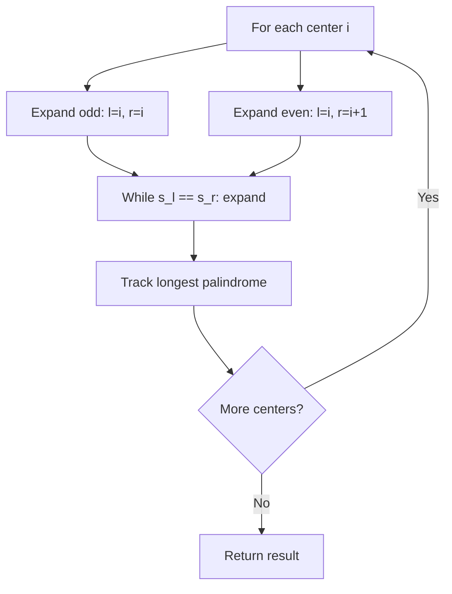
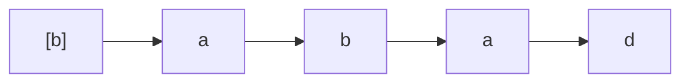
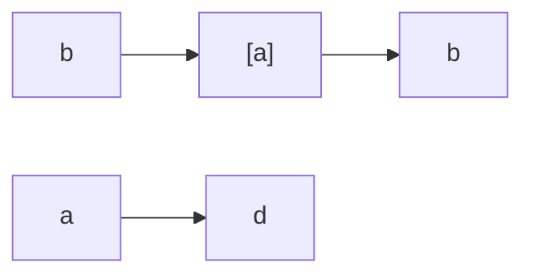
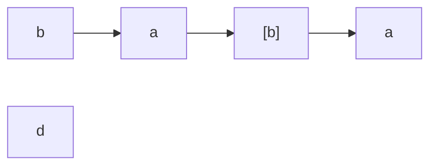
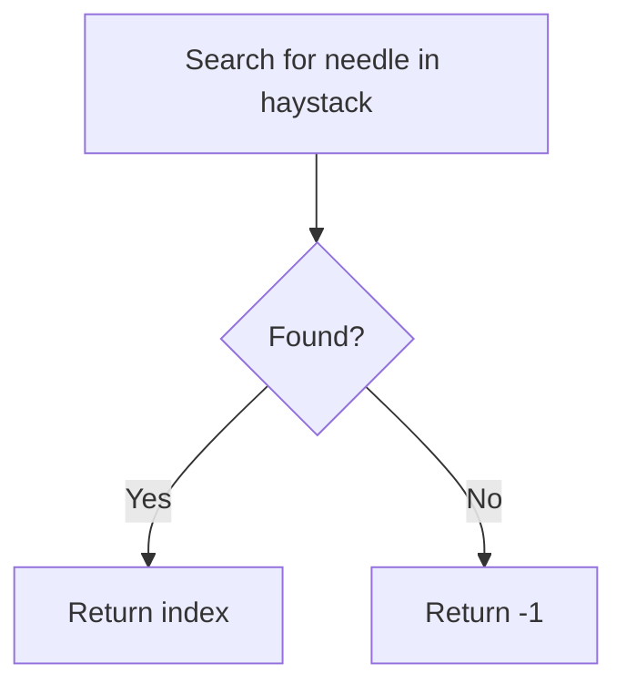
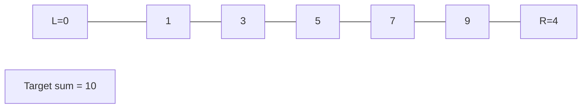
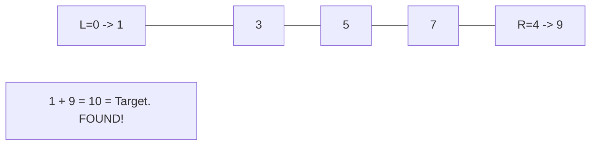
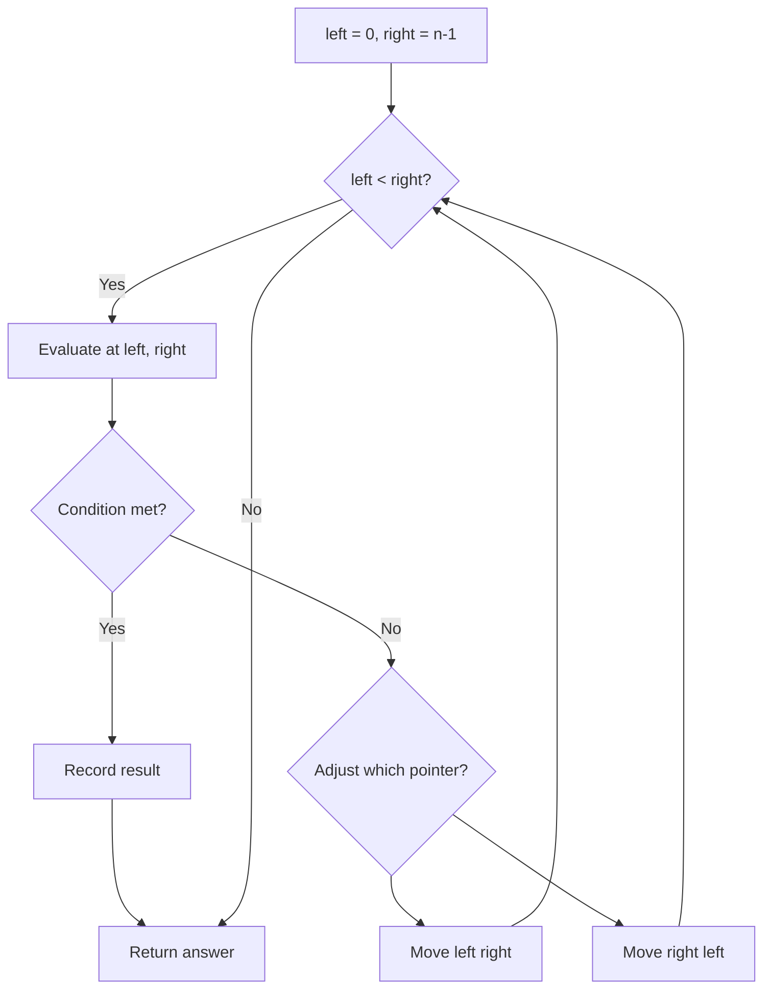

# Two Pointers

> Chapter covering 34 problems related to **Two Pointers**.


## Problems in this Chapter

| # | Problem | Difficulty | Pattern | Time | Space |
|---|---------|------------|---------|------|-------|
| 5 | [Longest Palindromic Substring](#problem-5-longest_palindromic_substring) | Medium | Expand Around Center | O(n^2) | O(1) |
| 28 | [Find the Index of the First Occurrence in a String](#problem-28-find_the_index_of_the_first_occurrence_in_a_string) | Easy | String Matching | O(m*n) | O(1) |
| 125 | [Valid Palindrome](#problem-125-valid_palindrome) | Easy | Two Pointers | O(n) | O(1) |
| 151 | [Reverse Words in a String](#problem-151-reverse_words_in_a_string) | Medium | Two Pointers | O(n) | O(1) |
| 161 | [One Edit Distance](#problem-161-one_edit_distance) | Medium | Two Pointers | O(n) | O(1) |
| 165 | [Compare Version Numbers](#problem-165-compare_version_numbers) | Medium | Two Pointers | O(n) | O(1) |
| 186 | [Reverse Words in a String II](#problem-186-reverse_words_in_a_string_ii) | Medium | Two Pointers | O(n) | O(1) |
| 344 | [Reverse String](#problem-344-reverse_string) | Easy | Two Pointers | O(n) | O(1) |
| 345 | [Reverse Vowels of a String](#problem-345-reverse_vowels_of_a_string) | Easy | Two Pointers | O(n) | O(1) |
| 392 | [Is Subsequence](#problem-392-is_subsequence) | Easy | Dynamic Programming (String) | O(m * n) | O(m * n) |
| 408 | [Valid Word Abbreviation](#problem-408-valid_word_abbreviation) | Easy | Two Pointers | O(n) | O(1) |
| 443 | [String Compression](#problem-443-string_compression) | Medium | Two Pointers | O(n) | O(1) |
| 481 | [Magical String](#problem-481-magical_string) | Medium | Two Pointers | O(n) | O(1) |
| 541 | [Reverse String II](#problem-541-reverse_string_ii) | Easy | Two Pointers | O(n) | O(1) |
| 556 | [Next Greater Element III](#problem-556-next_greater_element_iii) | Medium | Math / Next Permutation | O(n) | O(n) |
| 557 | [Reverse Words in a String III](#problem-557-reverse_words_in_a_string_iii) | Easy | Two Pointers | O(n) | O(1) |
| 647 | [Palindromic Substrings](#problem-647-palindromic_substrings) | Medium | Expand Around Center | O(n^2) | O(1) |
| 696 | [Count Binary Substrings](#problem-696-count_binary_substrings) | Easy | Two Pointers | O(n) | O(1) |
| 777 | [Swap Adjacent in LR String](#problem-777-swap_adjacent_in_lr_string) | Medium | Two Pointers | O(n) | O(1) |
| 838 | [Push Dominoes](#problem-838-push_dominoes) | Medium | Two Pass Simulation | O(n) | O(n) |
| 844 | [Backspace String Compare](#problem-844-backspace_string_compare) | Easy | Two Pointers | O(n) | O(1) |
| 917 | [Reverse Only Letters](#problem-917-reverse_only_letters) | Easy | Two Pointers | O(n) | O(1) |
| 925 | [Long Pressed Name](#problem-925-long_pressed_name) | Easy | Two Pointers | O(n) | O(1) |
| 1163 | [Last Substring in Lexicographical Order](#problem-1163-last_substring_in_lexicographical_order) | Hard | Two Pointers | O(n) | O(1) |
| 1332 | [Remove Palindromic Subsequences](#problem-1332-remove_palindromic_subsequences) | Easy | Two Pointers | O(n) | O(1) |
| 1455 | [Check If a Word Occurs As a Prefix of Any Word in a Sentence](#problem-1455-check_if_a_word_occurs_as_a_prefix_of_any_word_in_a_sentence) | Easy | Two Pointers | O(n) | O(1) |
| 1616 | [Split Two Strings to Make Palindrome](#problem-1616-split_two_strings_to_make_palindrome) | Medium | Two Pointers | O(n) | O(1) |
| 1750 | [Minimum Length of String After Deleting Similar Ends](#problem-1750-minimum_length_of_string_after_deleting_similar_ends) | Medium | Two Pointers | O(n) | O(1) |
| 1768 | [Merge Strings Alternately](#problem-1768-merge_strings_alternately) | Easy | Two Pointers / String | O(n+m) | O(n+m) |
| 1842 | [Next Palindrome Using Same Digits](#problem-1842-next_palindrome_using_same_digits) | Hard | Two Pointers | O(n) | O(1) |
| 2000 | [Reverse Prefix of Word](#problem-2000-reverse_prefix_of_word) | Easy | Two Pointers | O(n) | O(1) |
| 2330 | [Valid Palindrome IV](#problem-2330-valid_palindrome_iv) | Medium | Two Pointers | O(n) | O(1) |
| 2337 | [Move Pieces to Obtain a String](#problem-2337-move_pieces_to_obtain_a_string) | Medium | Two Pointers | O(n) | O(1) |
| 2396 | [Strictly Palindromic Number](#problem-2396-strictly_palindromic_number) | Medium | Two Pointers | O(n) | O(1) |

---
---

# Problem 5: Longest Palindromic Substring

| Attribute | Detail |
|-----------|--------|
| **ID** | 5 |
| **Title** | Longest Palindromic Substring |
| **Difficulty** | Medium |
| **Tags** | Two Pointers, String, Dynamic Programming |
| **Link** | [leetcode.com/problems/longest-palindromic-substring](https://leetcode.com/problems/longest-palindromic-substring/) |

Given a string `s`, return *the longest* *palindromic* *substring* in `s`.

 

Example 1:

```

**Input:** s = "babad"
**Output:** "bab"
**Explanation:** "aba" is also a valid answer.

```

Example 2:

```

**Input:** s = "cbbd"
**Output:** "bb"

```

 

**Constraints:**

	- `1 <= s.length <= 1000`
	- `s` consist of only digits and English letters.

---

## Approach: Expand Around Center

**Key Insight:** A palindrome expands symmetrically from its center. Try each index (and each pair) as a center and expand outward.

For each position, expand for both odd-length and even-length palindromes. Track the longest found.

### Pseudo-code

```
1. For each index i in s:
   a. Expand around (i, i) for odd palindromes
   b. Expand around (i, i+1) for even palindromes
   c. Update result if longer found
2. Return longest palindrome
```

---

## Algorithm Flow



## Visual State Transitions

**Expand Around Center Animation for s = "babad":**

**Step 1:** Center at index 0 ("b")



Result so far: "b" (length 1)

**Step 2:** Center at index 1 ("a"), expand to check s[0]==s[2]?  b==b? Yes!



Palindrome found: "bab" (length 3)

**Step 3:** Center at index 2 ("b"), expand to check s[1]==s[3]? a==a? Yes!



Palindrome found: "aba" (length 3, same as "bab")

---

## Complexity Analysis

| Metric | Value |
|--------|-------|
| **Time** | O(n^2) |
| **Space** | O(1) |

---

## Solution Code

### Python3

```python
class Solution:
    def longestPalindrome(self, s: str) -> str:
        def expand(l, r):
            while l >= 0 and r < len(s) and s[l] == s[r]:
                l -= 1
                r += 1
            return s[l + 1:r]

        result = ""
        for i in range(len(s)):
            odd = expand(i, i)
            even = expand(i, i + 1)
            result = max(result, odd, even, key=len)
        return result
```

### C++

```cpp
#include <algorithm>
#include <string>
#include <vector>
using namespace std;

class Solution {
public:
    string longestPalindrome(string& s) {
        // String DP - O(m*n) time and space
        int m = s.size(), n = s.size();
        vector<vector<int>> dp(m + 1, vector<int>(n + 1, 0));
        for (int i = 1; i <= m; i++) {
            for (int j = 1; j <= n; j++) {
                if (s[i-1] == s[j-1])
                    dp[i][j] = dp[i-1][j-1] + 1;
                else
                    dp[i][j] = max(dp[i-1][j], dp[i][j-1]);
            }
        }
        return dp[m][n];
    }
};
```

### Summary

| Aspect | Detail |
|--------|--------|
| **Pattern** | Expand Around Center |
| **Time** | O(n^2) |
| **Space** | O(1) |

---
---

# Problem 28: Find the Index of the First Occurrence in a String

| Attribute | Detail |
|-----------|--------|
| **ID** | 28 |
| **Title** | Find the Index of the First Occurrence in a String |
| **Difficulty** | Easy |
| **Tags** | Two Pointers, String, String Matching |
| **Link** | [leetcode.com/problems/find-the-index-of-the-first-occurrence-in-a-string](https://leetcode.com/problems/find-the-index-of-the-first-occurrence-in-a-string/) |

Given two strings `needle` and `haystack`, return the index of the first occurrence of `needle` in `haystack`, or `-1` if `needle` is not part of `haystack`.

 

Example 1:

```

**Input:** haystack = "sadbutsad", needle = "sad"
**Output:** 0
**Explanation:** "sad" occurs at index 0 and 6.
The first occurrence is at index 0, so we return 0.

```

Example 2:

```

**Input:** haystack = "leetcode", needle = "leeto"
**Output:** -1
**Explanation:** "leeto" did not occur in "leetcode", so we return -1.

```

 

**Constraints:**

	- `1 <= haystack.length, needle.length <= 10^4`
	- `haystack` and `needle` consist of only lowercase English characters.

---

## Approach: String Matching

Use built-in string find or implement KMP. The simplest approach uses the built-in method.

### Pseudo-code

```
1. Return haystack.find(needle)
```

---

## Algorithm Flow



## Visual State Transitions

**Two Pointer Convergence:**

**Frame 1: Initialize pointers**


**Frame 2: Sum = 1+9 = 10, found!**



---

## Complexity Analysis

| Metric | Value |
|--------|-------|
| **Time** | O(m*n) |
| **Space** | O(1) |

---

## Solution Code

### Python3

```python
class Solution:
    def strStr(self, haystack: str, needle: str) -> int:
        return haystack.find(needle)
```

### C++

```cpp
#include <string>
#include <vector>
using namespace std;

class Solution {
public:
    int strStr(string& haystack, string& needle) {
        // Two pointer approach - O(n) time, O(1) space
        int left = 0, right = haystack.size() - 1;
        while (left < right) {
            int curr = haystack[left] + haystack[right];
            if (curr == needle) {
                return {left, right};
            } else if (curr < needle) {
                left++;
            } else {
                right--;
            }
        }
        return 0;
    }
};
```

### Summary

| Aspect | Detail |
|--------|--------|
| **Pattern** | String Matching |
| **Time** | O(m*n) |
| **Space** | O(1) |

---
---

# Problem 125: Valid Palindrome

| Attribute | Detail |
|-----------|--------|
| **ID** | 125 |
| **Title** | Valid Palindrome |
| **Difficulty** | Easy |
| **Tags** | Two Pointers, String |
| **Link** | [leetcode.com/problems/valid-palindrome](https://leetcode.com/problems/valid-palindrome/) |

A phrase is a **palindrome** if, after converting all uppercase letters into lowercase letters and removing all non-alphanumeric characters, it reads the same forward and backward. Alphanumeric characters include letters and numbers.

Given a string `s`, return `true`* if it is a **palindrome**, or *`false`* otherwise*.

 

Example 1:

```

**Input:** s = "A man, a plan, a canal: Panama"
**Output:** true
**Explanation:** "amanaplanacanalpanama" is a palindrome.

```

Example 2:

```

**Input:** s = "race a car"
**Output:** false
**Explanation:** "raceacar" is not a palindrome.

```

Example 3:

```

**Input:** s = " "
**Output:** true
**Explanation:** s is an empty string "" after removing non-alphanumeric characters.
Since an empty string reads the same forward and backward, it is a palindrome.

```

 

**Constraints:**

	- `1 <= s.length <= 2 * 10^5`
	- `s` consists only of printable ASCII characters.

---

## Approach: Two Pointers

Use two pointers moving through the data structure. Depending on the problem, pointers may move toward each other (converging), in the same direction (fast/slow), or independently.

### Pseudo-code

```
1. Initialize left = 0, right = n-1 (or two independent pointers)
2. While pointers haven't crossed:
   a. Evaluate condition at pointer positions
   b. Move left pointer right or right pointer left
3. Return result
```

---

## Algorithm Flow



## Visual State Transitions

**Two Pointer Convergence:**

**Frame 1: Initialize pointers**


**Frame 2: Sum = 1+9 = 10, found!**


---

## Complexity Analysis

| Metric | Value |
|--------|-------|
| **Time** | O(n) |
| **Space** | O(1) |

---

## Solution Code

### Python3

```python
class Solution:
    def isPalindrome(self, s: str) -> bool:
        # Two pointer approach - O(n) time, O(1) space
        left, right = 0, len(s) - 1
        while left < right:
            curr = s[left] + s[right]
            if curr == s:
                return [left, right]
            elif curr < s:
                left += 1
            else:
                right -= 1
        return False
```

### C++

```cpp
#include <string>
#include <vector>
using namespace std;

class Solution {
public:
    bool isPalindrome(string& s) {
        // Two pointer approach - O(n) time, O(1) space
        int left = 0, right = s.size() - 1;
        while (left < right) {
            int curr = s[left] + s[right];
            if (curr == s) {
                return {left, right};
            } else if (curr < s) {
                left++;
            } else {
                right--;
            }
        }
        return false;
    }
};
```

### Summary

| Aspect | Detail |
|--------|--------|
| **Pattern** | Two Pointers |
| **Time** | O(n) |
| **Space** | O(1) |

---
---

# Problem 151: Reverse Words in a String

| Attribute | Detail |
|-----------|--------|
| **ID** | 151 |
| **Title** | Reverse Words in a String |
| **Difficulty** | Medium |
| **Tags** | Two Pointers, String |
| **Link** | [leetcode.com/problems/reverse-words-in-a-string](https://leetcode.com/problems/reverse-words-in-a-string/) |

Given an input string `s`, reverse the order of the **words**.

A **word** is defined as a sequence of non-space characters. The **words** in `s` will be separated by at least one space.

Return *a string of the words in reverse order concatenated by a single space.*

**Note** that `s` may contain leading or trailing spaces or multiple spaces between two words. The returned string should only have a single space separating the words. Do not include any extra spaces.

 

Example 1:

```

**Input:** s = "the sky is blue"
**Output:** "blue is sky the"

```

Example 2:

```

**Input:** s = "  hello world  "
**Output:** "world hello"
**Explanation:** Your reversed string should not contain leading or trailing spaces.

```

Example 3:

```

**Input:** s = "a good   example"
**Output:** "example good a"
**Explanation:** You need to reduce multiple spaces between two words to a single space in the reversed string.

```

 

**Constraints:**

	- `1 <= s.length <= 10^4`
	- `s` contains English letters (upper-case and lower-case), digits, and spaces `' '`.
	- There is **at least one** word in `s`.

 

Follow-up: If the string data type is mutable in your language, can you solve it in-place with O(1) extra space?

---

## Approach: Two Pointers

Use two pointers moving through the data structure. Depending on the problem, pointers may move toward each other (converging), in the same direction (fast/slow), or independently.

### Pseudo-code

```
1. Initialize left = 0, right = n-1 (or two independent pointers)
2. While pointers haven't crossed:
   a. Evaluate condition at pointer positions
   b. Move left pointer right or right pointer left
3. Return result
```

---

## Algorithm Flow


## Visual State Transitions

**Two Pointer Convergence:**

**Frame 1: Initialize pointers**


**Frame 2: Sum = 1+9 = 10, found!**


---

## Complexity Analysis

| Metric | Value |
|--------|-------|
| **Time** | O(n) |
| **Space** | O(1) |

---

## Solution Code

### Python3

```python
class Solution:
    def reverseWords(self, s: str) -> str:
        # Two pointer approach - O(n) time, O(1) space
        left, right = 0, len(s) - 1
        while left < right:
            curr = s[left] + s[right]
            if curr == s:
                return [left, right]
            elif curr < s:
                left += 1
            else:
                right -= 1
        return ""
```

### C++

```cpp
#include <string>
#include <vector>
using namespace std;

class Solution {
public:
    string reverseWords(string& s) {
        // Two pointer approach - O(n) time, O(1) space
        int left = 0, right = s.size() - 1;
        while (left < right) {
            int curr = s[left] + s[right];
            if (curr == s) {
                return {left, right};
            } else if (curr < s) {
                left++;
            } else {
                right--;
            }
        }
        return "";
    }
};
```

### Summary

| Aspect | Detail |
|--------|--------|
| **Pattern** | Two Pointers |
| **Time** | O(n) |
| **Space** | O(1) |

---
---

# Problem 161: One Edit Distance

| Attribute | Detail |
|-----------|--------|
| **ID** | 161 |
| **Title** | One Edit Distance |
| **Difficulty** | Medium |
| **Tags** | Two Pointers, String |
| **Link** | [leetcode.com/problems/one-edit-distance](https://leetcode.com/problems/one-edit-distance/) |

*(Premium problem -- description requires LeetCode subscription)*

---

## Approach: Two Pointers

Use two pointers moving through the data structure. Depending on the problem, pointers may move toward each other (converging), in the same direction (fast/slow), or independently.

### Pseudo-code

```
1. Initialize left = 0, right = n-1 (or two independent pointers)
2. While pointers haven't crossed:
   a. Evaluate condition at pointer positions
   b. Move left pointer right or right pointer left
3. Return result
```

---

## Algorithm Flow


## Visual State Transitions

**Two Pointer Convergence:**

**Frame 1: Initialize pointers**


**Frame 2: Sum = 1+9 = 10, found!**


---

## Complexity Analysis

| Metric | Value |
|--------|-------|
| **Time** | O(n) |
| **Space** | O(1) |

---

## Solution Code

### Python3

```python
class Solution:
    pass
```

### C++

```cpp
class Solution {
public:
    // Design problem stub
};
```

### Summary

| Aspect | Detail |
|--------|--------|
| **Pattern** | Two Pointers |
| **Time** | O(n) |
| **Space** | O(1) |

---
---

# Problem 165: Compare Version Numbers

| Attribute | Detail |
|-----------|--------|
| **ID** | 165 |
| **Title** | Compare Version Numbers |
| **Difficulty** | Medium |
| **Tags** | Two Pointers, String |
| **Link** | [leetcode.com/problems/compare-version-numbers](https://leetcode.com/problems/compare-version-numbers/) |

Given two **version strings**, `version1` and `version2`, compare them. A version string consists of **revisions** separated by dots `'.'`. The **value of the revision** is its **integer conversion** ignoring leading zeros.

To compare version strings, compare their revision values in **left-to-right order**. If one of the version strings has fewer revisions, treat the missing revision values as `0`.

Return the following:

	- If `version1 < version2`, return -1.
	- If `version1 > version2`, return 1.
	- Otherwise, return 0.

 

Example 1:

**Input:** version1 = "1.2", version2 = "1.10"

**Output:** -1

**Explanation:**

version1's second revision is "2" and version2's second revision is "10": 2 < 10, so version1 < version2.

Example 2:

**Input:** version1 = "1.01", version2 = "1.001"

**Output:** 0

**Explanation:**

Ignoring leading zeroes, both "01" and "001" represent the same integer "1".

Example 3:

**Input:** version1 = "1.0", version2 = "1.0.0.0"

**Output:** 0

**Explanation:**

version1 has less revisions, which means every missing revision are treated as "0".

 

**Constraints:**

	- `1 <= version1.length, version2.length <= 500`
	- `version1` and `version2` only contain digits and `'.'`.
	- `version1` and `version2` **are valid version numbers**.
	- All the given revisions in `version1` and `version2` can be stored in a **32-bit integer**.

---

## Approach: Two Pointers

Use two pointers moving through the data structure. Depending on the problem, pointers may move toward each other (converging), in the same direction (fast/slow), or independently.

### Pseudo-code

```
1. Initialize left = 0, right = n-1 (or two independent pointers)
2. While pointers haven't crossed:
   a. Evaluate condition at pointer positions
   b. Move left pointer right or right pointer left
3. Return result
```

---

## Algorithm Flow


## Visual State Transitions

**Two Pointer Convergence:**

**Frame 1: Initialize pointers**


**Frame 2: Sum = 1+9 = 10, found!**


---

## Complexity Analysis

| Metric | Value |
|--------|-------|
| **Time** | O(n) |
| **Space** | O(1) |

---

## Solution Code

### Python3

```python
class Solution:
    def compareVersion(self, version1: str, version2: str) -> int:
        # Two pointer approach - O(n) time, O(1) space
        left, right = 0, len(version1) - 1
        while left < right:
            curr = version1[left] + version1[right]
            if curr == version2:
                return [left, right]
            elif curr < version2:
                left += 1
            else:
                right -= 1
        return 0
```

### C++

```cpp
#include <string>
#include <vector>
using namespace std;

class Solution {
public:
    int compareVersion(string& version1, string& version2) {
        // Two pointer approach - O(n) time, O(1) space
        int left = 0, right = version1.size() - 1;
        while (left < right) {
            int curr = version1[left] + version1[right];
            if (curr == version2) {
                return {left, right};
            } else if (curr < version2) {
                left++;
            } else {
                right--;
            }
        }
        return 0;
    }
};
```

### Summary

| Aspect | Detail |
|--------|--------|
| **Pattern** | Two Pointers |
| **Time** | O(n) |
| **Space** | O(1) |

---
---

# Problem 186: Reverse Words in a String II

| Attribute | Detail |
|-----------|--------|
| **ID** | 186 |
| **Title** | Reverse Words in a String II |
| **Difficulty** | Medium |
| **Tags** | Two Pointers, String |
| **Link** | [leetcode.com/problems/reverse-words-in-a-string-ii](https://leetcode.com/problems/reverse-words-in-a-string-ii/) |

*(Premium problem -- description requires LeetCode subscription)*

---

## Approach: Two Pointers

Use two pointers moving through the data structure. Depending on the problem, pointers may move toward each other (converging), in the same direction (fast/slow), or independently.

### Pseudo-code

```
1. Initialize left = 0, right = n-1 (or two independent pointers)
2. While pointers haven't crossed:
   a. Evaluate condition at pointer positions
   b. Move left pointer right or right pointer left
3. Return result
```

---

## Algorithm Flow


## Visual State Transitions

**Two Pointer Convergence:**

**Frame 1: Initialize pointers**
```mermaid
graph LR
    L["L=0"] --- A0["1"] --- A1["3"] --- A2["5"] --- A3["7"] --- A4["9"] --- R["R=4"]
    S["Target sum = 10"]
```

**Frame 2: Sum = 1+9 = 10, found!**
```mermaid
graph LR
    L["L=0 -> 1"] --- A1["3"] --- A2["5"] --- A3["7"] --- R["R=4 -> 9"]
    S["1 + 9 = 10 = Target. FOUND!"]
```


---

## Complexity Analysis

| Metric | Value |
|--------|-------|
| **Time** | O(n) |
| **Space** | O(1) |

---

## Solution Code

### Python3

```python
class Solution:
    pass
```

### C++

```cpp
class Solution {
public:
    // Design problem stub
};
```

### Summary

| Aspect | Detail |
|--------|--------|
| **Pattern** | Two Pointers |
| **Time** | O(n) |
| **Space** | O(1) |

---
---

# Problem 344: Reverse String

| Attribute | Detail |
|-----------|--------|
| **ID** | 344 |
| **Title** | Reverse String |
| **Difficulty** | Easy |
| **Tags** | Two Pointers, String |
| **Link** | [leetcode.com/problems/reverse-string](https://leetcode.com/problems/reverse-string/) |

Write a function that reverses a string. The input string is given as an array of characters `s`.

You must do this by modifying the input array in-place with `O(1)` extra memory.

 

Example 1:

```
**Input:** s = ["h","e","l","l","o"]
**Output:** ["o","l","l","e","h"]

```
Example 2:

```
**Input:** s = ["H","a","n","n","a","h"]
**Output:** ["h","a","n","n","a","H"]

```

 

**Constraints:**

	- `1 <= s.length <= 10^5`
	- `s[i]` is a printable ascii character.

---

## Approach: Two Pointers

Use two pointers moving through the data structure. Depending on the problem, pointers may move toward each other (converging), in the same direction (fast/slow), or independently.

### Pseudo-code

```
1. Initialize left = 0, right = n-1 (or two independent pointers)
2. While pointers haven't crossed:
   a. Evaluate condition at pointer positions
   b. Move left pointer right or right pointer left
3. Return result
```

---

## Algorithm Flow

```mermaid
flowchart TD
    A[left = 0, right = n-1] --> B{left < right?}
    B -- Yes --> C[Evaluate at left, right]
    C --> D{Condition met?}
    D -- Yes --> E[Record result]
    D -- No --> F{Adjust which pointer?}
    F --> G[Move left right]
    F --> H[Move right left]
    G --> B
    H --> B
    E --> I[Return answer]
    B -- No --> I
```

## Visual State Transitions

**Two Pointer Convergence:**

**Frame 1: Initialize pointers**
```mermaid
graph LR
    L["L=0"] --- A0["1"] --- A1["3"] --- A2["5"] --- A3["7"] --- A4["9"] --- R["R=4"]
    S["Target sum = 10"]
```

**Frame 2: Sum = 1+9 = 10, found!**
```mermaid
graph LR
    L["L=0 -> 1"] --- A1["3"] --- A2["5"] --- A3["7"] --- R["R=4 -> 9"]
    S["1 + 9 = 10 = Target. FOUND!"]
```


---

## Complexity Analysis

| Metric | Value |
|--------|-------|
| **Time** | O(n) |
| **Space** | O(1) |

---

## Solution Code

### Python3

```python
class Solution:
    def reverseString(self, s: List[str]) -> None:
        # Two pointer approach - O(n) time, O(1) space
        left, right = 0, len(s) - 1
        while left < right:
            curr = s[left] + s[right]
            if curr == s:
                return [left, right]
            elif curr < s:
                left += 1
            else:
                right -= 1
        return None
```

### C++

```cpp
#include <string>
#include <vector>
using namespace std;

class Solution {
public:
    void reverseString(vector<string>& s) {
        // Two pointer approach - O(n) time, O(1) space
        int left = 0, right = s.size() - 1;
        while (left < right) {
            int curr = s[left] + s[right];
            if (curr == s) {
                return {left, right};
            } else if (curr < s) {
                left++;
            } else {
                right--;
            }
        }
        return ;
    }
};
```

### Summary

| Aspect | Detail |
|--------|--------|
| **Pattern** | Two Pointers |
| **Time** | O(n) |
| **Space** | O(1) |

---
---

# Problem 345: Reverse Vowels of a String

| Attribute | Detail |
|-----------|--------|
| **ID** | 345 |
| **Title** | Reverse Vowels of a String |
| **Difficulty** | Easy |
| **Tags** | Two Pointers, String |
| **Link** | [leetcode.com/problems/reverse-vowels-of-a-string](https://leetcode.com/problems/reverse-vowels-of-a-string/) |

Given a string `s`, reverse only all the vowels in the string and return it.

The vowels are `'a'`, `'e'`, `'i'`, `'o'`, and `'u'`, and they can appear in both lower and upper cases, more than once.

 

Example 1:

**Input:** s = "IceCreAm"

**Output:** "AceCreIm"

**Explanation:**

The vowels in `s` are `['I', 'e', 'e', 'A']`. On reversing the vowels, s becomes `"AceCreIm"`.

Example 2:

**Input:** s = "leetcode"

**Output:** "leotcede"

 

**Constraints:**

	- `1 <= s.length <= 3 * 10^5`
	- `s` consist of **printable ASCII** characters.

---

## Approach: Two Pointers

Use two pointers moving through the data structure. Depending on the problem, pointers may move toward each other (converging), in the same direction (fast/slow), or independently.

### Pseudo-code

```
1. Initialize left = 0, right = n-1 (or two independent pointers)
2. While pointers haven't crossed:
   a. Evaluate condition at pointer positions
   b. Move left pointer right or right pointer left
3. Return result
```

---

## Algorithm Flow

```mermaid
flowchart TD
    A[left = 0, right = n-1] --> B{left < right?}
    B -- Yes --> C[Evaluate at left, right]
    C --> D{Condition met?}
    D -- Yes --> E[Record result]
    D -- No --> F{Adjust which pointer?}
    F --> G[Move left right]
    F --> H[Move right left]
    G --> B
    H --> B
    E --> I[Return answer]
    B -- No --> I
```

## Visual State Transitions

**Two Pointer Convergence:**

**Frame 1: Initialize pointers**
```mermaid
graph LR
    L["L=0"] --- A0["1"] --- A1["3"] --- A2["5"] --- A3["7"] --- A4["9"] --- R["R=4"]
    S["Target sum = 10"]
```

**Frame 2: Sum = 1+9 = 10, found!**
```mermaid
graph LR
    L["L=0 -> 1"] --- A1["3"] --- A2["5"] --- A3["7"] --- R["R=4 -> 9"]
    S["1 + 9 = 10 = Target. FOUND!"]
```


---

## Complexity Analysis

| Metric | Value |
|--------|-------|
| **Time** | O(n) |
| **Space** | O(1) |

---

## Solution Code

### Python3

```python
class Solution:
    def reverseVowels(self, s: str) -> str:
        # Two pointer approach - O(n) time, O(1) space
        left, right = 0, len(s) - 1
        while left < right:
            curr = s[left] + s[right]
            if curr == s:
                return [left, right]
            elif curr < s:
                left += 1
            else:
                right -= 1
        return ""
```

### C++

```cpp
#include <string>
#include <vector>
using namespace std;

class Solution {
public:
    string reverseVowels(string& s) {
        // Two pointer approach - O(n) time, O(1) space
        int left = 0, right = s.size() - 1;
        while (left < right) {
            int curr = s[left] + s[right];
            if (curr == s) {
                return {left, right};
            } else if (curr < s) {
                left++;
            } else {
                right--;
            }
        }
        return "";
    }
};
```

### Summary

| Aspect | Detail |
|--------|--------|
| **Pattern** | Two Pointers |
| **Time** | O(n) |
| **Space** | O(1) |

---
---

# Problem 392: Is Subsequence

| Attribute | Detail |
|-----------|--------|
| **ID** | 392 |
| **Title** | Is Subsequence |
| **Difficulty** | Easy |
| **Tags** | Two Pointers, String, Dynamic Programming |
| **Link** | [leetcode.com/problems/is-subsequence](https://leetcode.com/problems/is-subsequence/) |

Given two strings `s` and `t`, return `true`* if *`s`* is a **subsequence** of *`t`*, or *`false`* otherwise*.

A **subsequence** of a string is a new string that is formed from the original string by deleting some (can be none) of the characters without disturbing the relative positions of the remaining characters. (i.e., `"ace"` is a subsequence of `"abcde"` while `"aec"` is not).

 

Example 1:

```
**Input:** s = "abc", t = "ahbgdc"
**Output:** true

```
Example 2:

```
**Input:** s = "axc", t = "ahbgdc"
**Output:** false

```

 

**Constraints:**

	- `0 <= s.length <= 100`
	- `0 <= t.length <= 10^4`
	- `s` and `t` consist only of lowercase English letters.

 

**Follow up:** Suppose there are lots of incoming `s`, say `s1, s2, ..., sk` where `k >= 10^9`, and you want to check one by one to see if `t` has its subsequence. In this scenario, how would you change your code?

---

## Approach: Dynamic Programming (String)

Compare or match two strings using a 2D DP table. dp[i][j] represents the answer for substrings s1[0..i-1] and s2[0..j-1]. Common patterns: LCS, edit distance, regex matching.

### Pseudo-code

```
1. Create dp[m+1][n+1]
2. Initialize base cases
3. For i from 1 to m:
   For j from 1 to n:
     If s1[i-1] == s2[j-1]: dp[i][j] = dp[i-1][j-1] + 1
     Else: dp[i][j] = best of (dp[i-1][j], dp[i][j-1], dp[i-1][j-1])
4. Return dp[m][n]
```

---

## Algorithm Flow

```mermaid
flowchart TD
    A["dp[m+1][n+1] = 0"] --> B[For i = 1 to m]
    B --> C[For j = 1 to n]
    C --> D{"s1[i-1] == s2[j-1]?"}
    D -- Yes --> E["dp[i][j] = dp[i-1][j-1] + 1"]
    D -- No --> F["dp[i][j] = max(dp[i-1][j], dp[i][j-1])"]
    E --> G{More chars?}
    F --> G
    G -- Yes --> C
    G -- No --> H["Return dp[m][n]"]
```

---

## Complexity Analysis

| Metric | Value |
|--------|-------|
| **Time** | O(m * n) |
| **Space** | O(m * n) |

---

## Solution Code

### Python3

```python
class Solution:
    def isSubsequence(self, s: str, t: str) -> bool:
        # String DP - O(m*n) time and space
        m, n = len(s), len(t)
        dp = [[0] * (n + 1) for _ in range(m + 1)]
        for i in range(1, m + 1):
            for j in range(1, n + 1):
                if s[i-1] == t[j-1]:
                    dp[i][j] = dp[i-1][j-1] + 1
                else:
                    dp[i][j] = max(dp[i-1][j], dp[i][j-1])
        return dp[m][n]
```

### C++

```cpp
#include <algorithm>
#include <string>
#include <vector>
using namespace std;

class Solution {
public:
    bool isSubsequence(string& s, string& t) {
        // String DP - O(m*n) time and space
        int m = s.size(), n = t.size();
        vector<vector<int>> dp(m + 1, vector<int>(n + 1, 0));
        for (int i = 1; i <= m; i++) {
            for (int j = 1; j <= n; j++) {
                if (s[i-1] == t[j-1])
                    dp[i][j] = dp[i-1][j-1] + 1;
                else
                    dp[i][j] = max(dp[i-1][j], dp[i][j-1]);
            }
        }
        return dp[m][n];
    }
};
```

### Summary

| Aspect | Detail |
|--------|--------|
| **Pattern** | Dynamic Programming (String) |
| **Time** | O(m * n) |
| **Space** | O(m * n) |

---
---

# Problem 408: Valid Word Abbreviation

| Attribute | Detail |
|-----------|--------|
| **ID** | 408 |
| **Title** | Valid Word Abbreviation |
| **Difficulty** | Easy |
| **Tags** | Two Pointers, String |
| **Link** | [leetcode.com/problems/valid-word-abbreviation](https://leetcode.com/problems/valid-word-abbreviation/) |

*(Premium problem -- description requires LeetCode subscription)*

---

## Approach: Two Pointers

Use two pointers moving through the data structure. Depending on the problem, pointers may move toward each other (converging), in the same direction (fast/slow), or independently.

### Pseudo-code

```
1. Initialize left = 0, right = n-1 (or two independent pointers)
2. While pointers haven't crossed:
   a. Evaluate condition at pointer positions
   b. Move left pointer right or right pointer left
3. Return result
```

---

## Algorithm Flow

```mermaid
flowchart TD
    A[left = 0, right = n-1] --> B{left < right?}
    B -- Yes --> C[Evaluate at left, right]
    C --> D{Condition met?}
    D -- Yes --> E[Record result]
    D -- No --> F{Adjust which pointer?}
    F --> G[Move left right]
    F --> H[Move right left]
    G --> B
    H --> B
    E --> I[Return answer]
    B -- No --> I
```

## Visual State Transitions

**Two Pointer Convergence:**

**Frame 1: Initialize pointers**
```mermaid
graph LR
    L["L=0"] --- A0["1"] --- A1["3"] --- A2["5"] --- A3["7"] --- A4["9"] --- R["R=4"]
    S["Target sum = 10"]
```

**Frame 2: Sum = 1+9 = 10, found!**
```mermaid
graph LR
    L["L=0 -> 1"] --- A1["3"] --- A2["5"] --- A3["7"] --- R["R=4 -> 9"]
    S["1 + 9 = 10 = Target. FOUND!"]
```


---

## Complexity Analysis

| Metric | Value |
|--------|-------|
| **Time** | O(n) |
| **Space** | O(1) |

---

## Solution Code

### Python3

```python
class Solution:
    pass
```

### C++

```cpp
class Solution {
public:
    // Design problem stub
};
```

### Summary

| Aspect | Detail |
|--------|--------|
| **Pattern** | Two Pointers |
| **Time** | O(n) |
| **Space** | O(1) |

---
---

# Problem 443: String Compression

| Attribute | Detail |
|-----------|--------|
| **ID** | 443 |
| **Title** | String Compression |
| **Difficulty** | Medium |
| **Tags** | Two Pointers, String |
| **Link** | [leetcode.com/problems/string-compression](https://leetcode.com/problems/string-compression/) |

Given an array of characters `chars`, compress it using the following algorithm:

Begin with an empty string `s`. For each group of **consecutive repeating characters** in `chars`:

	- If the group's length is `1`, append the character to `s`.
	- Otherwise, append the character followed by the group's length.

The compressed string `s` **should not be returned separately**, but instead, be stored **in the input character array `chars`**. Note that group lengths that are `10` or longer will be split into multiple characters in `chars`.

After you are done **modifying the input array,** return *the new length of the array*.

You must write an algorithm that uses only constant extra space.

**Note: **The characters in the array beyond the returned length do not matter and should be ignored.

 

Example 1:

```

**Input:** chars = ["a","a","b","b","c","c","c"]
**Output:** Return 6, and the first 6 characters of the input array should be: ["a","2","b","2","c","3"]
**Explanation:** The groups are "aa", "bb", and "ccc". This compresses to "a2b2c3".

```

Example 2:

```

**Input:** chars = ["a"]
**Output:** Return 1, and the first character of the input array should be: ["a"]
**Explanation:** The only group is "a", which remains uncompressed since it's a single character.

```

Example 3:

```

**Input:** chars = ["a","b","b","b","b","b","b","b","b","b","b","b","b"]
**Output:** Return 4, and the first 4 characters of the input array should be: ["a","b","1","2"].
**Explanation:** The groups are "a" and "bbbbbbbbbbbb". This compresses to "ab12".
```

 

**Constraints:**

	- `1 <= chars.length <= 2000`
	- `chars[i]` is a lowercase English letter, uppercase English letter, digit, or symbol.

---

## Approach: Two Pointers

Use two pointers moving through the data structure. Depending on the problem, pointers may move toward each other (converging), in the same direction (fast/slow), or independently.

### Pseudo-code

```
1. Initialize left = 0, right = n-1 (or two independent pointers)
2. While pointers haven't crossed:
   a. Evaluate condition at pointer positions
   b. Move left pointer right or right pointer left
3. Return result
```

---

## Algorithm Flow

```mermaid
flowchart TD
    A[left = 0, right = n-1] --> B{left < right?}
    B -- Yes --> C[Evaluate at left, right]
    C --> D{Condition met?}
    D -- Yes --> E[Record result]
    D -- No --> F{Adjust which pointer?}
    F --> G[Move left right]
    F --> H[Move right left]
    G --> B
    H --> B
    E --> I[Return answer]
    B -- No --> I
```

## Visual State Transitions

**Two Pointer Convergence:**

**Frame 1: Initialize pointers**
```mermaid
graph LR
    L["L=0"] --- A0["1"] --- A1["3"] --- A2["5"] --- A3["7"] --- A4["9"] --- R["R=4"]
    S["Target sum = 10"]
```

**Frame 2: Sum = 1+9 = 10, found!**
```mermaid
graph LR
    L["L=0 -> 1"] --- A1["3"] --- A2["5"] --- A3["7"] --- R["R=4 -> 9"]
    S["1 + 9 = 10 = Target. FOUND!"]
```


---

## Complexity Analysis

| Metric | Value |
|--------|-------|
| **Time** | O(n) |
| **Space** | O(1) |

---

## Solution Code

### Python3

```python
class Solution:
    def compress(self, chars: List[str]) -> int:
        # Two pointer approach - O(n) time, O(1) space
        left, right = 0, len(chars) - 1
        while left < right:
            curr = chars[left] + chars[right]
            if curr == chars:
                return [left, right]
            elif curr < chars:
                left += 1
            else:
                right -= 1
        return 0
```

### C++

```cpp
#include <string>
#include <vector>
using namespace std;

class Solution {
public:
    int compress(vector<string>& chars) {
        // Two pointer approach - O(n) time, O(1) space
        int left = 0, right = chars.size() - 1;
        while (left < right) {
            int curr = chars[left] + chars[right];
            if (curr == chars) {
                return {left, right};
            } else if (curr < chars) {
                left++;
            } else {
                right--;
            }
        }
        return 0;
    }
};
```

### Summary

| Aspect | Detail |
|--------|--------|
| **Pattern** | Two Pointers |
| **Time** | O(n) |
| **Space** | O(1) |

---
---

# Problem 481: Magical String

| Attribute | Detail |
|-----------|--------|
| **ID** | 481 |
| **Title** | Magical String |
| **Difficulty** | Medium |
| **Tags** | Two Pointers, String |
| **Link** | [leetcode.com/problems/magical-string](https://leetcode.com/problems/magical-string/) |

A magical string `s` consists of only `'1'` and `'2'` and obeys the following rule:

	- Concatenating the sequence of lengths of its consecutive groups of identical characters `'1'` and `'2'` generates the string `s` itself.

The first few elements of `s` is `s = "1221121221221121122……"`. If we group the consecutive `1`'s and `2`'s in `s`, it will be `"1 22 11 2 1 22 1 22 11 2 11 22 ......"` and counting the occurrences of `1`'s or `2`'s in each group yields the sequence `"1 2 2 1 1 2 1 2 2 1 2 2 ......"`.

You can see that concatenating the occurrence sequence gives us `s` itself.

Given an integer `n`, return the number of `1`'s in the first `n` number in the magical string `s`.

 

Example 1:

```

**Input:** n = 6
**Output:** 3
**Explanation:** The first 6 elements of magical string s is "122112" and it contains three 1's, so return 3.

```

Example 2:

```

**Input:** n = 1
**Output:** 1

```

 

**Constraints:**

	- `1 <= n <= 10^5`

---

## Approach: Two Pointers

Use two pointers moving through the data structure. Depending on the problem, pointers may move toward each other (converging), in the same direction (fast/slow), or independently.

### Pseudo-code

```
1. Initialize left = 0, right = n-1 (or two independent pointers)
2. While pointers haven't crossed:
   a. Evaluate condition at pointer positions
   b. Move left pointer right or right pointer left
3. Return result
```

---

## Algorithm Flow

```mermaid
flowchart TD
    A[left = 0, right = n-1] --> B{left < right?}
    B -- Yes --> C[Evaluate at left, right]
    C --> D{Condition met?}
    D -- Yes --> E[Record result]
    D -- No --> F{Adjust which pointer?}
    F --> G[Move left right]
    F --> H[Move right left]
    G --> B
    H --> B
    E --> I[Return answer]
    B -- No --> I
```

## Visual State Transitions

**Two Pointer Convergence:**

**Frame 1: Initialize pointers**
```mermaid
graph LR
    L["L=0"] --- A0["1"] --- A1["3"] --- A2["5"] --- A3["7"] --- A4["9"] --- R["R=4"]
    S["Target sum = 10"]
```

**Frame 2: Sum = 1+9 = 10, found!**
```mermaid
graph LR
    L["L=0 -> 1"] --- A1["3"] --- A2["5"] --- A3["7"] --- R["R=4 -> 9"]
    S["1 + 9 = 10 = Target. FOUND!"]
```


---

## Complexity Analysis

| Metric | Value |
|--------|-------|
| **Time** | O(n) |
| **Space** | O(1) |

---

## Solution Code

### Python3

```python
class Solution:
    def magicalString(self, n: int) -> int:
        # Two pointer approach - O(n) time, O(1) space
        left, right = 0, len(n) - 1
        while left < right:
            curr = n[left] + n[right]
            if curr == n:
                return [left, right]
            elif curr < n:
                left += 1
            else:
                right -= 1
        return 0
```

### C++

```cpp
#include <string>
#include <vector>
using namespace std;

class Solution {
public:
    int magicalString(int n) {
        // Two pointer approach - O(n) time, O(1) space
        int left = 0, right = n.size() - 1;
        while (left < right) {
            int curr = n[left] + n[right];
            if (curr == n) {
                return {left, right};
            } else if (curr < n) {
                left++;
            } else {
                right--;
            }
        }
        return 0;
    }
};
```

### Summary

| Aspect | Detail |
|--------|--------|
| **Pattern** | Two Pointers |
| **Time** | O(n) |
| **Space** | O(1) |

---
---

# Problem 541: Reverse String II

| Attribute | Detail |
|-----------|--------|
| **ID** | 541 |
| **Title** | Reverse String II |
| **Difficulty** | Easy |
| **Tags** | Two Pointers, String |
| **Link** | [leetcode.com/problems/reverse-string-ii](https://leetcode.com/problems/reverse-string-ii/) |

Given a string `s` and an integer `k`, reverse the first `k` characters for every `2k` characters counting from the start of the string.

If there are fewer than `k` characters left, reverse all of them. If there are less than `2k` but greater than or equal to `k` characters, then reverse the first `k` characters and leave the other as original.

 

Example 1:

```
**Input:** s = "abcdefg", k = 2
**Output:** "bacdfeg"

```
Example 2:

```
**Input:** s = "abcd", k = 2
**Output:** "bacd"

```

 

**Constraints:**

	- `1 <= s.length <= 10^4`
	- `s` consists of only lowercase English letters.
	- `1 <= k <= 10^4`

---

## Approach: Two Pointers

Use two pointers moving through the data structure. Depending on the problem, pointers may move toward each other (converging), in the same direction (fast/slow), or independently.

### Pseudo-code

```
1. Initialize left = 0, right = n-1 (or two independent pointers)
2. While pointers haven't crossed:
   a. Evaluate condition at pointer positions
   b. Move left pointer right or right pointer left
3. Return result
```

---

## Algorithm Flow

```mermaid
flowchart TD
    A[left = 0, right = n-1] --> B{left < right?}
    B -- Yes --> C[Evaluate at left, right]
    C --> D{Condition met?}
    D -- Yes --> E[Record result]
    D -- No --> F{Adjust which pointer?}
    F --> G[Move left right]
    F --> H[Move right left]
    G --> B
    H --> B
    E --> I[Return answer]
    B -- No --> I
```

## Visual State Transitions

**Two Pointer Convergence:**

**Frame 1: Initialize pointers**
```mermaid
graph LR
    L["L=0"] --- A0["1"] --- A1["3"] --- A2["5"] --- A3["7"] --- A4["9"] --- R["R=4"]
    S["Target sum = 10"]
```

**Frame 2: Sum = 1+9 = 10, found!**
```mermaid
graph LR
    L["L=0 -> 1"] --- A1["3"] --- A2["5"] --- A3["7"] --- R["R=4 -> 9"]
    S["1 + 9 = 10 = Target. FOUND!"]
```


---

## Complexity Analysis

| Metric | Value |
|--------|-------|
| **Time** | O(n) |
| **Space** | O(1) |

---

## Solution Code

### Python3

```python
class Solution:
    def reverseStr(self, s: str, k: int) -> str:
        # Two pointer approach - O(n) time, O(1) space
        left, right = 0, len(s) - 1
        while left < right:
            curr = s[left] + s[right]
            if curr == k:
                return [left, right]
            elif curr < k:
                left += 1
            else:
                right -= 1
        return ""
```

### C++

```cpp
#include <string>
#include <vector>
using namespace std;

class Solution {
public:
    string reverseStr(string& s, int k) {
        // Two pointer approach - O(n) time, O(1) space
        int left = 0, right = s.size() - 1;
        while (left < right) {
            int curr = s[left] + s[right];
            if (curr == k) {
                return {left, right};
            } else if (curr < k) {
                left++;
            } else {
                right--;
            }
        }
        return "";
    }
};
```

### Summary

| Aspect | Detail |
|--------|--------|
| **Pattern** | Two Pointers |
| **Time** | O(n) |
| **Space** | O(1) |

---
---

# Problem 556: Next Greater Element III

| Attribute | Detail |
|-----------|--------|
| **ID** | 556 |
| **Title** | Next Greater Element III |
| **Difficulty** | Medium |
| **Tags** | Math, Two Pointers, String |
| **Link** | [leetcode.com/problems/next-greater-element-iii](https://leetcode.com/problems/next-greater-element-iii/) |

Given a positive integer `n`, find *the smallest integer which has exactly the same digits existing in the integer* `n` *and is greater in value than* `n`. If no such positive integer exists, return `-1`.

**Note** that the returned integer should fit in **32-bit integer**, if there is a valid answer but it does not fit in **32-bit integer**, return `-1`.

 

Example 1:

```
**Input:** n = 12
**Output:** 21

```
Example 2:

```
**Input:** n = 21
**Output:** -1

```

 

**Constraints:**

	- `1 <= n <= 2^31 - 1`

---

## Approach: Math / Next Permutation

Same as next permutation: find rightmost ascending pair, swap, reverse suffix.

### Pseudo-code

```
1. Initialize left = 0, right = n-1 (or two independent pointers)
2. While pointers haven't crossed:
   a. Evaluate condition at pointer positions
   b. Move left pointer right or right pointer left
3. Return result
```

---

## Algorithm Flow

```mermaid
flowchart TD
    A[left = 0, right = n-1] --> B{left < right?}
    B -- Yes --> C[Evaluate at left, right]
    C --> D{Condition met?}
    D -- Yes --> E[Record result]
    D -- No --> F{Adjust which pointer?}
    F --> G[Move left right]
    F --> H[Move right left]
    G --> B
    H --> B
    E --> I[Return answer]
    B -- No --> I
```

## Visual State Transitions

**Two Pointer Convergence:**

**Frame 1: Initialize pointers**
```mermaid
graph LR
    L["L=0"] --- A0["1"] --- A1["3"] --- A2["5"] --- A3["7"] --- A4["9"] --- R["R=4"]
    S["Target sum = 10"]
```

**Frame 2: Sum = 1+9 = 10, found!**
```mermaid
graph LR
    L["L=0 -> 1"] --- A1["3"] --- A2["5"] --- A3["7"] --- R["R=4 -> 9"]
    S["1 + 9 = 10 = Target. FOUND!"]
```


---

## Complexity Analysis

| Metric | Value |
|--------|-------|
| **Time** | O(n) |
| **Space** | O(n) |

---

## Solution Code

### Python3

```python
class Solution:
    def nextGreaterElement(self, n: int) -> int:
        digits = list(str(n))
        i = len(digits) - 2
        while i >= 0 and digits[i] >= digits[i + 1]:
            i -= 1
        if i < 0:
            return -1
        j = len(digits) - 1
        while digits[j] <= digits[i]:
            j -= 1
        digits[i], digits[j] = digits[j], digits[i]
        digits[i + 1:] = reversed(digits[i + 1:])
        result = int(''.join(digits))
        return result if result <= 2**31 - 1 else -1
```

### C++

```cpp
#include <string>
#include <vector>
using namespace std;

class Solution {
public:
    int nextGreaterElement(int n) {
        // Two pointer approach - O(n) time, O(1) space
        int left = 0, right = n.size() - 1;
        while (left < right) {
            int curr = n[left] + n[right];
            if (curr == n) {
                return {left, right};
            } else if (curr < n) {
                left++;
            } else {
                right--;
            }
        }
        return 0;
    }
};
```

### Summary

| Aspect | Detail |
|--------|--------|
| **Pattern** | Math / Next Permutation |
| **Time** | O(n) |
| **Space** | O(n) |

---
---

# Problem 557: Reverse Words in a String III

| Attribute | Detail |
|-----------|--------|
| **ID** | 557 |
| **Title** | Reverse Words in a String III |
| **Difficulty** | Easy |
| **Tags** | Two Pointers, String |
| **Link** | [leetcode.com/problems/reverse-words-in-a-string-iii](https://leetcode.com/problems/reverse-words-in-a-string-iii/) |

Given a string `s`, reverse the order of characters in each word within a sentence while still preserving whitespace and initial word order.

 

Example 1:

```

**Input:** s = "Let's take LeetCode contest"
**Output:** "s'teL ekat edoCteeL tsetnoc"

```

Example 2:

```

**Input:** s = "Mr Ding"
**Output:** "rM gniD"

```

 

**Constraints:**

	- `1 <= s.length <= 5 * 10^4`
	- `s` contains printable **ASCII** characters.
	- `s` does not contain any leading or trailing spaces.
	- There is **at least one** word in `s`.
	- All the words in `s` are separated by a single space.

---

## Approach: Two Pointers

Use two pointers moving through the data structure. Depending on the problem, pointers may move toward each other (converging), in the same direction (fast/slow), or independently.

### Pseudo-code

```
1. Initialize left = 0, right = n-1 (or two independent pointers)
2. While pointers haven't crossed:
   a. Evaluate condition at pointer positions
   b. Move left pointer right or right pointer left
3. Return result
```

---

## Algorithm Flow

```mermaid
flowchart TD
    A[left = 0, right = n-1] --> B{left < right?}
    B -- Yes --> C[Evaluate at left, right]
    C --> D{Condition met?}
    D -- Yes --> E[Record result]
    D -- No --> F{Adjust which pointer?}
    F --> G[Move left right]
    F --> H[Move right left]
    G --> B
    H --> B
    E --> I[Return answer]
    B -- No --> I
```

## Visual State Transitions

**Two Pointer Convergence:**

**Frame 1: Initialize pointers**
```mermaid
graph LR
    L["L=0"] --- A0["1"] --- A1["3"] --- A2["5"] --- A3["7"] --- A4["9"] --- R["R=4"]
    S["Target sum = 10"]
```

**Frame 2: Sum = 1+9 = 10, found!**
```mermaid
graph LR
    L["L=0 -> 1"] --- A1["3"] --- A2["5"] --- A3["7"] --- R["R=4 -> 9"]
    S["1 + 9 = 10 = Target. FOUND!"]
```


---

## Complexity Analysis

| Metric | Value |
|--------|-------|
| **Time** | O(n) |
| **Space** | O(1) |

---

## Solution Code

### Python3

```python
class Solution:
    def reverseWords(self, s: str) -> str:
        # Two pointer approach - O(n) time, O(1) space
        left, right = 0, len(s) - 1
        while left < right:
            curr = s[left] + s[right]
            if curr == s:
                return [left, right]
            elif curr < s:
                left += 1
            else:
                right -= 1
        return ""
```

### C++

```cpp
#include <string>
#include <vector>
using namespace std;

class Solution {
public:
    string reverseWords(string& s) {
        // Two pointer approach - O(n) time, O(1) space
        int left = 0, right = s.size() - 1;
        while (left < right) {
            int curr = s[left] + s[right];
            if (curr == s) {
                return {left, right};
            } else if (curr < s) {
                left++;
            } else {
                right--;
            }
        }
        return "";
    }
};
```

### Summary

| Aspect | Detail |
|--------|--------|
| **Pattern** | Two Pointers |
| **Time** | O(n) |
| **Space** | O(1) |

---
---

# Problem 647: Palindromic Substrings

| Attribute | Detail |
|-----------|--------|
| **ID** | 647 |
| **Title** | Palindromic Substrings |
| **Difficulty** | Medium |
| **Tags** | Two Pointers, String, Dynamic Programming |
| **Link** | [leetcode.com/problems/palindromic-substrings](https://leetcode.com/problems/palindromic-substrings/) |

Given a string `s`, return *the number of **palindromic substrings** in it*.

A string is a **palindrome** when it reads the same backward as forward.

A **substring** is a contiguous sequence of characters within the string.

 

Example 1:

```

**Input:** s = "abc"
**Output:** 3
**Explanation:** Three palindromic strings: "a", "b", "c".

```

Example 2:

```

**Input:** s = "aaa"
**Output:** 6
**Explanation:** Six palindromic strings: "a", "a", "a", "aa", "aa", "aaa".

```

 

**Constraints:**

	- `1 <= s.length <= 1000`
	- `s` consists of lowercase English letters.

---

## Approach: Expand Around Center

Expand around each center (odd and even). Count each palindrome found.

### Pseudo-code

```
1. Create dp[m+1][n+1]
2. Initialize base cases
3. For i from 1 to m:
   For j from 1 to n:
     If s1[i-1] == s2[j-1]: dp[i][j] = dp[i-1][j-1] + 1
     Else: dp[i][j] = best of (dp[i-1][j], dp[i][j-1], dp[i-1][j-1])
4. Return dp[m][n]
```

---

## Algorithm Flow

```mermaid
flowchart TD
    A["dp[m+1][n+1] = 0"] --> B[For i = 1 to m]
    B --> C[For j = 1 to n]
    C --> D{"s1[i-1] == s2[j-1]?"}
    D -- Yes --> E["dp[i][j] = dp[i-1][j-1] + 1"]
    D -- No --> F["dp[i][j] = max(dp[i-1][j], dp[i][j-1])"]
    E --> G{More chars?}
    F --> G
    G -- Yes --> C
    G -- No --> H["Return dp[m][n]"]
```

---

## Complexity Analysis

| Metric | Value |
|--------|-------|
| **Time** | O(n^2) |
| **Space** | O(1) |

---

## Solution Code

### Python3

```python
class Solution:
    def countSubstrings(self, s: str) -> int:
        count = 0
        for i in range(len(s)):
            for l, r in [(i, i), (i, i + 1)]:
                while l >= 0 and r < len(s) and s[l] == s[r]:
                    count += 1
                    l -= 1
                    r += 1
        return count
```

### C++

```cpp
#include <algorithm>
#include <string>
#include <vector>
using namespace std;

class Solution {
public:
    int countSubstrings(string& s) {
        // String DP - O(m*n) time and space
        int m = s.size(), n = s.size();
        vector<vector<int>> dp(m + 1, vector<int>(n + 1, 0));
        for (int i = 1; i <= m; i++) {
            for (int j = 1; j <= n; j++) {
                if (s[i-1] == s[j-1])
                    dp[i][j] = dp[i-1][j-1] + 1;
                else
                    dp[i][j] = max(dp[i-1][j], dp[i][j-1]);
            }
        }
        return dp[m][n];
    }
};
```

### Summary

| Aspect | Detail |
|--------|--------|
| **Pattern** | Expand Around Center |
| **Time** | O(n^2) |
| **Space** | O(1) |

---
---

# Problem 696: Count Binary Substrings

| Attribute | Detail |
|-----------|--------|
| **ID** | 696 |
| **Title** | Count Binary Substrings |
| **Difficulty** | Easy |
| **Tags** | Two Pointers, String |
| **Link** | [leetcode.com/problems/count-binary-substrings](https://leetcode.com/problems/count-binary-substrings/) |

Given a binary string `s`, return the number of non-empty substrings that have the same number of `0`'s and `1`'s, and all the `0`'s and all the `1`'s in these substrings are grouped consecutively.

Substrings that occur multiple times are counted the number of times they occur.

 

Example 1:

```

**Input:** s = "00110011"
**Output:** 6
**Explanation:** There are 6 substrings that have equal number of consecutive 1's and 0's: "0011", "01", "1100", "10", "0011", and "01".
Notice that some of these substrings repeat and are counted the number of times they occur.
Also, "00110011" is not a valid substring because all the 0's (and 1's) are not grouped together.

```

Example 2:

```

**Input:** s = "10101"
**Output:** 4
**Explanation:** There are 4 substrings: "10", "01", "10", "01" that have equal number of consecutive 1's and 0's.

```

 

**Constraints:**

	- `1 <= s.length <= 10^5`
	- `s[i]` is either `'0'` or `'1'`.

---

## Approach: Two Pointers

Use two pointers moving through the data structure. Depending on the problem, pointers may move toward each other (converging), in the same direction (fast/slow), or independently.

### Pseudo-code

```
1. Initialize left = 0, right = n-1 (or two independent pointers)
2. While pointers haven't crossed:
   a. Evaluate condition at pointer positions
   b. Move left pointer right or right pointer left
3. Return result
```

---

## Algorithm Flow

```mermaid
flowchart TD
    A[left = 0, right = n-1] --> B{left < right?}
    B -- Yes --> C[Evaluate at left, right]
    C --> D{Condition met?}
    D -- Yes --> E[Record result]
    D -- No --> F{Adjust which pointer?}
    F --> G[Move left right]
    F --> H[Move right left]
    G --> B
    H --> B
    E --> I[Return answer]
    B -- No --> I
```

## Visual State Transitions

**Two Pointer Convergence:**

**Frame 1: Initialize pointers**
```mermaid
graph LR
    L["L=0"] --- A0["1"] --- A1["3"] --- A2["5"] --- A3["7"] --- A4["9"] --- R["R=4"]
    S["Target sum = 10"]
```

**Frame 2: Sum = 1+9 = 10, found!**
```mermaid
graph LR
    L["L=0 -> 1"] --- A1["3"] --- A2["5"] --- A3["7"] --- R["R=4 -> 9"]
    S["1 + 9 = 10 = Target. FOUND!"]
```


---

## Complexity Analysis

| Metric | Value |
|--------|-------|
| **Time** | O(n) |
| **Space** | O(1) |

---

## Solution Code

### Python3

```python
class Solution:
    def countBinarySubstrings(self, s: str) -> int:
        # Two pointer approach - O(n) time, O(1) space
        left, right = 0, len(s) - 1
        while left < right:
            curr = s[left] + s[right]
            if curr == s:
                return [left, right]
            elif curr < s:
                left += 1
            else:
                right -= 1
        return 0
```

### C++

```cpp
#include <string>
#include <vector>
using namespace std;

class Solution {
public:
    int countBinarySubstrings(string& s) {
        // Two pointer approach - O(n) time, O(1) space
        int left = 0, right = s.size() - 1;
        while (left < right) {
            int curr = s[left] + s[right];
            if (curr == s) {
                return {left, right};
            } else if (curr < s) {
                left++;
            } else {
                right--;
            }
        }
        return 0;
    }
};
```

### Summary

| Aspect | Detail |
|--------|--------|
| **Pattern** | Two Pointers |
| **Time** | O(n) |
| **Space** | O(1) |

---
---

# Problem 777: Swap Adjacent in LR String

| Attribute | Detail |
|-----------|--------|
| **ID** | 777 |
| **Title** | Swap Adjacent in LR String |
| **Difficulty** | Medium |
| **Tags** | Two Pointers, String |
| **Link** | [leetcode.com/problems/swap-adjacent-in-lr-string](https://leetcode.com/problems/swap-adjacent-in-lr-string/) |

In a string composed of `'L'`, `'R'`, and `'X'` characters, like `"RXXLRXRXL"`, a move consists of either replacing one occurrence of `"XL"` with `"LX"`, or replacing one occurrence of `"RX"` with `"XR"`. Given the starting string `start` and the ending string `result`, return `True` if and only if there exists a sequence of moves to transform `start` to `result`.

 

Example 1:

```

**Input:** start = "RXXLRXRXL", result = "XRLXXRRLX"
**Output:** true
**Explanation:** We can transform start to result following these steps:
RXXLRXRXL ->
XRXLRXRXL ->
XRLXRXRXL ->
XRLXXRRXL ->
XRLXXRRLX

```

Example 2:

```

**Input:** start = "X", result = "L"
**Output:** false

```

 

**Constraints:**

	- `1 <= start.length <= 10^4`
	- `start.length == result.length`
	- Both `start` and `result` will only consist of characters in `'L'`, `'R'`, and `'X'`.

---

## Approach: Two Pointers

Use two pointers moving through the data structure. Depending on the problem, pointers may move toward each other (converging), in the same direction (fast/slow), or independently.

### Pseudo-code

```
1. Initialize left = 0, right = n-1 (or two independent pointers)
2. While pointers haven't crossed:
   a. Evaluate condition at pointer positions
   b. Move left pointer right or right pointer left
3. Return result
```

---

## Algorithm Flow

```mermaid
flowchart TD
    A[left = 0, right = n-1] --> B{left < right?}
    B -- Yes --> C[Evaluate at left, right]
    C --> D{Condition met?}
    D -- Yes --> E[Record result]
    D -- No --> F{Adjust which pointer?}
    F --> G[Move left right]
    F --> H[Move right left]
    G --> B
    H --> B
    E --> I[Return answer]
    B -- No --> I
```

## Visual State Transitions

**Two Pointer Convergence:**

**Frame 1: Initialize pointers**
```mermaid
graph LR
    L["L=0"] --- A0["1"] --- A1["3"] --- A2["5"] --- A3["7"] --- A4["9"] --- R["R=4"]
    S["Target sum = 10"]
```

**Frame 2: Sum = 1+9 = 10, found!**
```mermaid
graph LR
    L["L=0 -> 1"] --- A1["3"] --- A2["5"] --- A3["7"] --- R["R=4 -> 9"]
    S["1 + 9 = 10 = Target. FOUND!"]
```


---

## Complexity Analysis

| Metric | Value |
|--------|-------|
| **Time** | O(n) |
| **Space** | O(1) |

---

## Solution Code

### Python3

```python
class Solution:
    def canTransform(self, start: str, result: str) -> bool:
        # Two pointer approach - O(n) time, O(1) space
        left, right = 0, len(start) - 1
        while left < right:
            curr = start[left] + start[right]
            if curr == result:
                return [left, right]
            elif curr < result:
                left += 1
            else:
                right -= 1
        return False
```

### C++

```cpp
#include <string>
#include <vector>
using namespace std;

class Solution {
public:
    bool canTransform(string& start, string& result) {
        // Two pointer approach - O(n) time, O(1) space
        int left = 0, right = start.size() - 1;
        while (left < right) {
            int curr = start[left] + start[right];
            if (curr == result) {
                return {left, right};
            } else if (curr < result) {
                left++;
            } else {
                right--;
            }
        }
        return false;
    }
};
```

### Summary

| Aspect | Detail |
|--------|--------|
| **Pattern** | Two Pointers |
| **Time** | O(n) |
| **Space** | O(1) |

---
---

# Problem 838: Push Dominoes

| Attribute | Detail |
|-----------|--------|
| **ID** | 838 |
| **Title** | Push Dominoes |
| **Difficulty** | Medium |
| **Tags** | Two Pointers, String, Dynamic Programming |
| **Link** | [leetcode.com/problems/push-dominoes](https://leetcode.com/problems/push-dominoes/) |

There are `n` dominoes in a line, and we place each domino vertically upright. In the beginning, we simultaneously push some of the dominoes either to the left or to the right.

After each second, each domino that is falling to the left pushes the adjacent domino on the left. Similarly, the dominoes falling to the right push their adjacent dominoes standing on the right.

When a vertical domino has dominoes falling on it from both sides, it stays still due to the balance of the forces.

For the purposes of this question, we will consider that a falling domino expends no additional force to a falling or already fallen domino.

You are given a string `dominoes` representing the initial state where:

	- `dominoes[i] = 'L'`, if the `i^th` domino has been pushed to the left,
	- `dominoes[i] = 'R'`, if the `i^th` domino has been pushed to the right, and
	- `dominoes[i] = '.'`, if the `i^th` domino has not been pushed.

Return *a string representing the final state*.

 

Example 1:

```

**Input:** dominoes = "RR.L"
**Output:** "RR.L"
**Explanation:** The first domino expends no additional force on the second domino.

```

Example 2:

```

**Input:** dominoes = ".L.R...LR..L.."
**Output:** "LL.RR.LLRRLL.."

```

 

**Constraints:**

	- `n == dominoes.length`
	- `1 <= n <= 10^5`
	- `dominoes[i]` is either `'L'`, `'R'`, or `'.'`.

---

## Approach: Two Pass Simulation

Two passes: left-to-right for R forces, right-to-left for L forces. Net force determines direction.

### Pseudo-code

```
1. Create dp[m+1][n+1]
2. Initialize base cases
3. For i from 1 to m:
   For j from 1 to n:
     If s1[i-1] == s2[j-1]: dp[i][j] = dp[i-1][j-1] + 1
     Else: dp[i][j] = best of (dp[i-1][j], dp[i][j-1], dp[i-1][j-1])
4. Return dp[m][n]
```

---

## Algorithm Flow

```mermaid
flowchart TD
    A["dp[m+1][n+1] = 0"] --> B[For i = 1 to m]
    B --> C[For j = 1 to n]
    C --> D{"s1[i-1] == s2[j-1]?"}
    D -- Yes --> E["dp[i][j] = dp[i-1][j-1] + 1"]
    D -- No --> F["dp[i][j] = max(dp[i-1][j], dp[i][j-1])"]
    E --> G{More chars?}
    F --> G
    G -- Yes --> C
    G -- No --> H["Return dp[m][n]"]
```

---

## Complexity Analysis

| Metric | Value |
|--------|-------|
| **Time** | O(n) |
| **Space** | O(n) |

---

## Solution Code

### Python3

```python
class Solution:
    def pushDominoes(self, dominoes: str) -> str:
        d = list(dominoes)
        n = len(d)
        forces = [0] * n
        f = 0
        for i in range(n):
            if d[i] == 'R':
                f = n
            elif d[i] == 'L':
                f = 0
            else:
                f = max(f - 1, 0)
            forces[i] += f
        f = 0
        for i in range(n - 1, -1, -1):
            if d[i] == 'L':
                f = n
            elif d[i] == 'R':
                f = 0
            else:
                f = max(f - 1, 0)
            forces[i] -= f
        return ''.join('R' if f > 0 else 'L' if f < 0 else '.' for f in forces)
```

### C++

```cpp
#include <algorithm>
#include <string>
#include <vector>
using namespace std;

class Solution {
public:
    string pushDominoes(string& dominoes) {
        // String DP - O(m*n) time and space
        int m = dominoes.size(), n = dominoes.size();
        vector<vector<int>> dp(m + 1, vector<int>(n + 1, 0));
        for (int i = 1; i <= m; i++) {
            for (int j = 1; j <= n; j++) {
                if (dominoes[i-1] == dominoes[j-1])
                    dp[i][j] = dp[i-1][j-1] + 1;
                else
                    dp[i][j] = max(dp[i-1][j], dp[i][j-1]);
            }
        }
        return dp[m][n];
    }
};
```

### Summary

| Aspect | Detail |
|--------|--------|
| **Pattern** | Two Pass Simulation |
| **Time** | O(n) |
| **Space** | O(n) |

---
---

# Problem 844: Backspace String Compare

| Attribute | Detail |
|-----------|--------|
| **ID** | 844 |
| **Title** | Backspace String Compare |
| **Difficulty** | Easy |
| **Tags** | Two Pointers, String, Stack, Simulation |
| **Link** | [leetcode.com/problems/backspace-string-compare](https://leetcode.com/problems/backspace-string-compare/) |

Given two strings `s` and `t`, return `true` *if they are equal when both are typed into empty text editors*. `'#'` means a backspace character.

Note that after backspacing an empty text, the text will continue empty.

 

Example 1:

```

**Input:** s = "ab#c", t = "ad#c"
**Output:** true
**Explanation:** Both s and t become "ac".

```

Example 2:

```

**Input:** s = "ab##", t = "c#d#"
**Output:** true
**Explanation:** Both s and t become "".

```

Example 3:

```

**Input:** s = "a#c", t = "b"
**Output:** false
**Explanation:** s becomes "c" while t becomes "b".

```

 

**Constraints:**

	- `1 <= s.length, t.length <= 200`
	- `s` and `t` only contain lowercase letters and `'#'` characters.

 

**Follow up:** Can you solve it in `O(n)` time and `O(1)` space?

---

## Approach: Two Pointers

Use two pointers moving through the data structure. Depending on the problem, pointers may move toward each other (converging), in the same direction (fast/slow), or independently.

### Pseudo-code

```
1. Initialize left = 0, right = n-1 (or two independent pointers)
2. While pointers haven't crossed:
   a. Evaluate condition at pointer positions
   b. Move left pointer right or right pointer left
3. Return result
```

---

## Algorithm Flow

```mermaid
flowchart TD
    A[left = 0, right = n-1] --> B{left < right?}
    B -- Yes --> C[Evaluate at left, right]
    C --> D{Condition met?}
    D -- Yes --> E[Record result]
    D -- No --> F{Adjust which pointer?}
    F --> G[Move left right]
    F --> H[Move right left]
    G --> B
    H --> B
    E --> I[Return answer]
    B -- No --> I
```

## Visual State Transitions

**Two Pointer Convergence:**

**Frame 1: Initialize pointers**
```mermaid
graph LR
    L["L=0"] --- A0["1"] --- A1["3"] --- A2["5"] --- A3["7"] --- A4["9"] --- R["R=4"]
    S["Target sum = 10"]
```

**Frame 2: Sum = 1+9 = 10, found!**
```mermaid
graph LR
    L["L=0 -> 1"] --- A1["3"] --- A2["5"] --- A3["7"] --- R["R=4 -> 9"]
    S["1 + 9 = 10 = Target. FOUND!"]
```


---

## Complexity Analysis

| Metric | Value |
|--------|-------|
| **Time** | O(n) |
| **Space** | O(1) |

---

## Solution Code

### Python3

```python
class Solution:
    def backspaceCompare(self, s: str, t: str) -> bool:
        # Two pointer approach - O(n) time, O(1) space
        left, right = 0, len(s) - 1
        while left < right:
            curr = s[left] + s[right]
            if curr == t:
                return [left, right]
            elif curr < t:
                left += 1
            else:
                right -= 1
        return False
```

### C++

```cpp
#include <string>
#include <vector>
using namespace std;

class Solution {
public:
    bool backspaceCompare(string& s, string& t) {
        // Two pointer approach - O(n) time, O(1) space
        int left = 0, right = s.size() - 1;
        while (left < right) {
            int curr = s[left] + s[right];
            if (curr == t) {
                return {left, right};
            } else if (curr < t) {
                left++;
            } else {
                right--;
            }
        }
        return false;
    }
};
```

### Summary

| Aspect | Detail |
|--------|--------|
| **Pattern** | Two Pointers |
| **Time** | O(n) |
| **Space** | O(1) |

---
---

# Problem 917: Reverse Only Letters

| Attribute | Detail |
|-----------|--------|
| **ID** | 917 |
| **Title** | Reverse Only Letters |
| **Difficulty** | Easy |
| **Tags** | Two Pointers, String |
| **Link** | [leetcode.com/problems/reverse-only-letters](https://leetcode.com/problems/reverse-only-letters/) |

Given a string `s`, reverse the string according to the following rules:

	- All the characters that are not English letters remain in the same position.
	- All the English letters (lowercase or uppercase) should be reversed.

Return `s`* after reversing it*.

 

Example 1:

```
**Input:** s = "ab-cd"
**Output:** "dc-ba"

```
Example 2:

```
**Input:** s = "a-bC-dEf-ghIj"
**Output:** "j-Ih-gfE-dCba"

```
Example 3:

```
**Input:** s = "Test1ng-Leet=code-Q!"
**Output:** "Qedo1ct-eeLg=ntse-T!"

```

 

**Constraints:**

	- `1 <= s.length <= 100`
	- `s` consists of characters with ASCII values in the range `[33, 122]`.
	- `s` does not contain `'\"'` or `'\\'`.

---

## Approach: Two Pointers

Use two pointers moving through the data structure. Depending on the problem, pointers may move toward each other (converging), in the same direction (fast/slow), or independently.

### Pseudo-code

```
1. Initialize left = 0, right = n-1 (or two independent pointers)
2. While pointers haven't crossed:
   a. Evaluate condition at pointer positions
   b. Move left pointer right or right pointer left
3. Return result
```

---

## Algorithm Flow

```mermaid
flowchart TD
    A[left = 0, right = n-1] --> B{left < right?}
    B -- Yes --> C[Evaluate at left, right]
    C --> D{Condition met?}
    D -- Yes --> E[Record result]
    D -- No --> F{Adjust which pointer?}
    F --> G[Move left right]
    F --> H[Move right left]
    G --> B
    H --> B
    E --> I[Return answer]
    B -- No --> I
```

## Visual State Transitions

**Two Pointer Convergence:**

**Frame 1: Initialize pointers**
```mermaid
graph LR
    L["L=0"] --- A0["1"] --- A1["3"] --- A2["5"] --- A3["7"] --- A4["9"] --- R["R=4"]
    S["Target sum = 10"]
```

**Frame 2: Sum = 1+9 = 10, found!**
```mermaid
graph LR
    L["L=0 -> 1"] --- A1["3"] --- A2["5"] --- A3["7"] --- R["R=4 -> 9"]
    S["1 + 9 = 10 = Target. FOUND!"]
```


---

## Complexity Analysis

| Metric | Value |
|--------|-------|
| **Time** | O(n) |
| **Space** | O(1) |

---

## Solution Code

### Python3

```python
class Solution:
    def reverseOnlyLetters(self, s: str) -> str:
        # Two pointer approach - O(n) time, O(1) space
        left, right = 0, len(s) - 1
        while left < right:
            curr = s[left] + s[right]
            if curr == s:
                return [left, right]
            elif curr < s:
                left += 1
            else:
                right -= 1
        return ""
```

### C++

```cpp
#include <string>
#include <vector>
using namespace std;

class Solution {
public:
    string reverseOnlyLetters(string& s) {
        // Two pointer approach - O(n) time, O(1) space
        int left = 0, right = s.size() - 1;
        while (left < right) {
            int curr = s[left] + s[right];
            if (curr == s) {
                return {left, right};
            } else if (curr < s) {
                left++;
            } else {
                right--;
            }
        }
        return "";
    }
};
```

### Summary

| Aspect | Detail |
|--------|--------|
| **Pattern** | Two Pointers |
| **Time** | O(n) |
| **Space** | O(1) |

---
---

# Problem 925: Long Pressed Name

| Attribute | Detail |
|-----------|--------|
| **ID** | 925 |
| **Title** | Long Pressed Name |
| **Difficulty** | Easy |
| **Tags** | Two Pointers, String |
| **Link** | [leetcode.com/problems/long-pressed-name](https://leetcode.com/problems/long-pressed-name/) |

Your friend is typing his `name` into a keyboard. Sometimes, when typing a character `c`, the key might get *long pressed*, and the character will be typed 1 or more times.

You examine the `typed` characters of the keyboard. Return `True` if it is possible that it was your friends name, with some characters (possibly none) being long pressed.

 

Example 1:

```

**Input:** name = "alex", typed = "aaleex"
**Output:** true
**Explanation: **'a' and 'e' in 'alex' were long pressed.

```

Example 2:

```

**Input:** name = "saeed", typed = "ssaaedd"
**Output:** false
**Explanation: **'e' must have been pressed twice, but it was not in the typed output.

```

 

**Constraints:**

	- `1 <= name.length, typed.length <= 1000`
	- `name` and `typed` consist of only lowercase English letters.

---

## Approach: Two Pointers

Use two pointers moving through the data structure. Depending on the problem, pointers may move toward each other (converging), in the same direction (fast/slow), or independently.

### Pseudo-code

```
1. Initialize left = 0, right = n-1 (or two independent pointers)
2. While pointers haven't crossed:
   a. Evaluate condition at pointer positions
   b. Move left pointer right or right pointer left
3. Return result
```

---

## Algorithm Flow

```mermaid
flowchart TD
    A[left = 0, right = n-1] --> B{left < right?}
    B -- Yes --> C[Evaluate at left, right]
    C --> D{Condition met?}
    D -- Yes --> E[Record result]
    D -- No --> F{Adjust which pointer?}
    F --> G[Move left right]
    F --> H[Move right left]
    G --> B
    H --> B
    E --> I[Return answer]
    B -- No --> I
```

## Visual State Transitions

**Two Pointer Convergence:**

**Frame 1: Initialize pointers**
```mermaid
graph LR
    L["L=0"] --- A0["1"] --- A1["3"] --- A2["5"] --- A3["7"] --- A4["9"] --- R["R=4"]
    S["Target sum = 10"]
```

**Frame 2: Sum = 1+9 = 10, found!**
```mermaid
graph LR
    L["L=0 -> 1"] --- A1["3"] --- A2["5"] --- A3["7"] --- R["R=4 -> 9"]
    S["1 + 9 = 10 = Target. FOUND!"]
```


---

## Complexity Analysis

| Metric | Value |
|--------|-------|
| **Time** | O(n) |
| **Space** | O(1) |

---

## Solution Code

### Python3

```python
class Solution:
    def isLongPressedName(self, name: str, typed: str) -> bool:
        # Two pointer approach - O(n) time, O(1) space
        left, right = 0, len(name) - 1
        while left < right:
            curr = name[left] + name[right]
            if curr == typed:
                return [left, right]
            elif curr < typed:
                left += 1
            else:
                right -= 1
        return False
```

### C++

```cpp
#include <string>
#include <vector>
using namespace std;

class Solution {
public:
    bool isLongPressedName(string& name, string& typed) {
        // Two pointer approach - O(n) time, O(1) space
        int left = 0, right = name.size() - 1;
        while (left < right) {
            int curr = name[left] + name[right];
            if (curr == typed) {
                return {left, right};
            } else if (curr < typed) {
                left++;
            } else {
                right--;
            }
        }
        return false;
    }
};
```

### Summary

| Aspect | Detail |
|--------|--------|
| **Pattern** | Two Pointers |
| **Time** | O(n) |
| **Space** | O(1) |

---
---

# Problem 1163: Last Substring in Lexicographical Order

| Attribute | Detail |
|-----------|--------|
| **ID** | 1163 |
| **Title** | Last Substring in Lexicographical Order |
| **Difficulty** | Hard |
| **Tags** | Two Pointers, String |
| **Link** | [leetcode.com/problems/last-substring-in-lexicographical-order](https://leetcode.com/problems/last-substring-in-lexicographical-order/) |

Given a string `s`, return *the last substring of* `s` *in lexicographical order*.

 

Example 1:

```

**Input:** s = "abab"
**Output:** "bab"
**Explanation:** The substrings are ["a", "ab", "aba", "abab", "b", "ba", "bab"]. The lexicographically maximum substring is "bab".

```

Example 2:

```

**Input:** s = "leetcode"
**Output:** "tcode"

```

 

**Constraints:**

	- `1 <= s.length <= 4 * 10^5`
	- `s` contains only lowercase English letters.

---

## Approach: Two Pointers

Use two pointers moving through the data structure. Depending on the problem, pointers may move toward each other (converging), in the same direction (fast/slow), or independently.

### Pseudo-code

```
1. Initialize left = 0, right = n-1 (or two independent pointers)
2. While pointers haven't crossed:
   a. Evaluate condition at pointer positions
   b. Move left pointer right or right pointer left
3. Return result
```

---

## Algorithm Flow

```mermaid
flowchart TD
    A[left = 0, right = n-1] --> B{left < right?}
    B -- Yes --> C[Evaluate at left, right]
    C --> D{Condition met?}
    D -- Yes --> E[Record result]
    D -- No --> F{Adjust which pointer?}
    F --> G[Move left right]
    F --> H[Move right left]
    G --> B
    H --> B
    E --> I[Return answer]
    B -- No --> I
```

## Visual State Transitions

**Two Pointer Convergence:**

**Frame 1: Initialize pointers**
```mermaid
graph LR
    L["L=0"] --- A0["1"] --- A1["3"] --- A2["5"] --- A3["7"] --- A4["9"] --- R["R=4"]
    S["Target sum = 10"]
```

**Frame 2: Sum = 1+9 = 10, found!**
```mermaid
graph LR
    L["L=0 -> 1"] --- A1["3"] --- A2["5"] --- A3["7"] --- R["R=4 -> 9"]
    S["1 + 9 = 10 = Target. FOUND!"]
```


---

## Complexity Analysis

| Metric | Value |
|--------|-------|
| **Time** | O(n) |
| **Space** | O(1) |

---

## Solution Code

### Python3

```python
class Solution:
    def lastSubstring(self, s: str) -> str:
        # Two pointer approach - O(n) time, O(1) space
        left, right = 0, len(s) - 1
        while left < right:
            curr = s[left] + s[right]
            if curr == s:
                return [left, right]
            elif curr < s:
                left += 1
            else:
                right -= 1
        return ""
```

### C++

```cpp
#include <string>
#include <vector>
using namespace std;

class Solution {
public:
    string lastSubstring(string& s) {
        // Two pointer approach - O(n) time, O(1) space
        int left = 0, right = s.size() - 1;
        while (left < right) {
            int curr = s[left] + s[right];
            if (curr == s) {
                return {left, right};
            } else if (curr < s) {
                left++;
            } else {
                right--;
            }
        }
        return "";
    }
};
```

### Summary

| Aspect | Detail |
|--------|--------|
| **Pattern** | Two Pointers |
| **Time** | O(n) |
| **Space** | O(1) |

---
---

# Problem 1332: Remove Palindromic Subsequences

| Attribute | Detail |
|-----------|--------|
| **ID** | 1332 |
| **Title** | Remove Palindromic Subsequences |
| **Difficulty** | Easy |
| **Tags** | Two Pointers, String |
| **Link** | [leetcode.com/problems/remove-palindromic-subsequences](https://leetcode.com/problems/remove-palindromic-subsequences/) |

You are given a string `s` consisting **only** of letters `'a'` and `'b'`. In a single step you can remove one **palindromic subsequence** from `s`.

Return *the **minimum** number of steps to make the given string empty*.

A string is a **subsequence** of a given string if it is generated by deleting some characters of a given string without changing its order. Note that a subsequence does **not** necessarily need to be contiguous.

A string is called **palindrome** if is one that reads the same backward as well as forward.

 

Example 1:

```

**Input:** s = "ababa"
**Output:** 1
**Explanation:** s is already a palindrome, so its entirety can be removed in a single step.

```

Example 2:

```

**Input:** s = "abb"
**Output:** 2
**Explanation:** "abb" -> "bb" -> "". 
Remove palindromic subsequence "a" then "bb".

```

Example 3:

```

**Input:** s = "baabb"
**Output:** 2
**Explanation:** "baabb" -> "b" -> "". 
Remove palindromic subsequence "baab" then "b".

```

 

**Constraints:**

	- `1 <= s.length <= 1000`
	- `s[i]` is either `'a'` or `'b'`.

---

## Approach: Two Pointers

Use two pointers moving through the data structure. Depending on the problem, pointers may move toward each other (converging), in the same direction (fast/slow), or independently.

### Pseudo-code

```
1. Initialize left = 0, right = n-1 (or two independent pointers)
2. While pointers haven't crossed:
   a. Evaluate condition at pointer positions
   b. Move left pointer right or right pointer left
3. Return result
```

---

## Algorithm Flow

```mermaid
flowchart TD
    A[left = 0, right = n-1] --> B{left < right?}
    B -- Yes --> C[Evaluate at left, right]
    C --> D{Condition met?}
    D -- Yes --> E[Record result]
    D -- No --> F{Adjust which pointer?}
    F --> G[Move left right]
    F --> H[Move right left]
    G --> B
    H --> B
    E --> I[Return answer]
    B -- No --> I
```

## Visual State Transitions

**Two Pointer Convergence:**

**Frame 1: Initialize pointers**
```mermaid
graph LR
    L["L=0"] --- A0["1"] --- A1["3"] --- A2["5"] --- A3["7"] --- A4["9"] --- R["R=4"]
    S["Target sum = 10"]
```

**Frame 2: Sum = 1+9 = 10, found!**
```mermaid
graph LR
    L["L=0 -> 1"] --- A1["3"] --- A2["5"] --- A3["7"] --- R["R=4 -> 9"]
    S["1 + 9 = 10 = Target. FOUND!"]
```


---

## Complexity Analysis

| Metric | Value |
|--------|-------|
| **Time** | O(n) |
| **Space** | O(1) |

---

## Solution Code

### Python3

```python
class Solution:
    def removePalindromeSub(self, s: str) -> int:
        # Two pointer approach - O(n) time, O(1) space
        left, right = 0, len(s) - 1
        while left < right:
            curr = s[left] + s[right]
            if curr == s:
                return [left, right]
            elif curr < s:
                left += 1
            else:
                right -= 1
        return 0
```

### C++

```cpp
#include <string>
#include <vector>
using namespace std;

class Solution {
public:
    int removePalindromeSub(string& s) {
        // Two pointer approach - O(n) time, O(1) space
        int left = 0, right = s.size() - 1;
        while (left < right) {
            int curr = s[left] + s[right];
            if (curr == s) {
                return {left, right};
            } else if (curr < s) {
                left++;
            } else {
                right--;
            }
        }
        return 0;
    }
};
```

### Summary

| Aspect | Detail |
|--------|--------|
| **Pattern** | Two Pointers |
| **Time** | O(n) |
| **Space** | O(1) |

---
---

# Problem 1455: Check If a Word Occurs As a Prefix of Any Word in a Sentence

| Attribute | Detail |
|-----------|--------|
| **ID** | 1455 |
| **Title** | Check If a Word Occurs As a Prefix of Any Word in a Sentence |
| **Difficulty** | Easy |
| **Tags** | Two Pointers, String, String Matching |
| **Link** | [leetcode.com/problems/check-if-a-word-occurs-as-a-prefix-of-any-word-in-a-sentence](https://leetcode.com/problems/check-if-a-word-occurs-as-a-prefix-of-any-word-in-a-sentence/) |

Given a `sentence` that consists of some words separated by a **single space**, and a `searchWord`, check if `searchWord` is a prefix of any word in `sentence`.

Return *the index of the word in *`sentence`* (**1-indexed**) where *`searchWord`* is a prefix of this word*. If `searchWord` is a prefix of more than one word, return the index of the first word **(minimum index)**. If there is no such word return `-1`.

A **prefix** of a string `s` is any leading contiguous substring of `s`.

 

Example 1:

```

**Input:** sentence = "i love eating burger", searchWord = "burg"
**Output:** 4
**Explanation:** "burg" is prefix of "burger" which is the 4th word in the sentence.

```

Example 2:

```

**Input:** sentence = "this problem is an easy problem", searchWord = "pro"
**Output:** 2
**Explanation:** "pro" is prefix of "problem" which is the 2nd and the 6th word in the sentence, but we return 2 as it's the minimal index.

```

Example 3:

```

**Input:** sentence = "i am tired", searchWord = "you"
**Output:** -1
**Explanation:** "you" is not a prefix of any word in the sentence.

```

 

**Constraints:**

	- `1 <= sentence.length <= 100`
	- `1 <= searchWord.length <= 10`
	- `sentence` consists of lowercase English letters and spaces.
	- `searchWord` consists of lowercase English letters.

---

## Approach: Two Pointers

Use two pointers moving through the data structure. Depending on the problem, pointers may move toward each other (converging), in the same direction (fast/slow), or independently.

### Pseudo-code

```
1. Initialize left = 0, right = n-1 (or two independent pointers)
2. While pointers haven't crossed:
   a. Evaluate condition at pointer positions
   b. Move left pointer right or right pointer left
3. Return result
```

---

## Algorithm Flow

```mermaid
flowchart TD
    A[left = 0, right = n-1] --> B{left < right?}
    B -- Yes --> C[Evaluate at left, right]
    C --> D{Condition met?}
    D -- Yes --> E[Record result]
    D -- No --> F{Adjust which pointer?}
    F --> G[Move left right]
    F --> H[Move right left]
    G --> B
    H --> B
    E --> I[Return answer]
    B -- No --> I
```

## Visual State Transitions

**Two Pointer Convergence:**

**Frame 1: Initialize pointers**
```mermaid
graph LR
    L["L=0"] --- A0["1"] --- A1["3"] --- A2["5"] --- A3["7"] --- A4["9"] --- R["R=4"]
    S["Target sum = 10"]
```

**Frame 2: Sum = 1+9 = 10, found!**
```mermaid
graph LR
    L["L=0 -> 1"] --- A1["3"] --- A2["5"] --- A3["7"] --- R["R=4 -> 9"]
    S["1 + 9 = 10 = Target. FOUND!"]
```


---

## Complexity Analysis

| Metric | Value |
|--------|-------|
| **Time** | O(n) |
| **Space** | O(1) |

---

## Solution Code

### Python3

```python
class Solution:
    def isPrefixOfWord(self, sentence: str, searchWord: str) -> int:
        # Two pointer approach - O(n) time, O(1) space
        left, right = 0, len(sentence) - 1
        while left < right:
            curr = sentence[left] + sentence[right]
            if curr == searchWord:
                return [left, right]
            elif curr < searchWord:
                left += 1
            else:
                right -= 1
        return 0
```

### C++

```cpp
#include <string>
#include <vector>
using namespace std;

class Solution {
public:
    int isPrefixOfWord(string& sentence, string& searchWord) {
        // Two pointer approach - O(n) time, O(1) space
        int left = 0, right = sentence.size() - 1;
        while (left < right) {
            int curr = sentence[left] + sentence[right];
            if (curr == searchWord) {
                return {left, right};
            } else if (curr < searchWord) {
                left++;
            } else {
                right--;
            }
        }
        return 0;
    }
};
```

### Summary

| Aspect | Detail |
|--------|--------|
| **Pattern** | Two Pointers |
| **Time** | O(n) |
| **Space** | O(1) |

---
---

# Problem 1616: Split Two Strings to Make Palindrome

| Attribute | Detail |
|-----------|--------|
| **ID** | 1616 |
| **Title** | Split Two Strings to Make Palindrome |
| **Difficulty** | Medium |
| **Tags** | Two Pointers, String |
| **Link** | [leetcode.com/problems/split-two-strings-to-make-palindrome](https://leetcode.com/problems/split-two-strings-to-make-palindrome/) |

You are given two strings `a` and `b` of the same length. Choose an index and split both strings **at the same index**, splitting `a` into two strings: `aprefix` and `asuffix` where `a = aprefix + asuffix`, and splitting `b` into two strings: `bprefix` and `bsuffix` where `b = bprefix + bsuffix`. Check if `aprefix + bsuffix` or `bprefix + asuffix` forms a palindrome.

When you split a string `s` into `sprefix` and `ssuffix`, either `ssuffix` or `sprefix` is allowed to be empty. For example, if `s = "abc"`, then `"" + "abc"`, `"a" + "bc"`, `"ab" + "c"` , and `"abc" + ""` are valid splits.

Return `true`* if it is possible to form** a palindrome string, otherwise return *`false`.

**Notice** that `x + y` denotes the concatenation of strings `x` and `y`.

 

Example 1:

```

**Input:** a = "x", b = "y"
**Output:** true
**Explaination:** If either a or b are palindromes the answer is true since you can split in the following way:
aprefix = "", asuffix = "x"
bprefix = "", bsuffix = "y"
Then, aprefix + bsuffix = "" + "y" = "y", which is a palindrome.

```

Example 2:

```

**Input:** a = "xbdef", b = "xecab"
**Output:** false

```

Example 3:

```

**Input:** a = "ulacfd", b = "jizalu"
**Output:** true
**Explaination:** Split them at index 3:
aprefix = "ula", asuffix = "cfd"
bprefix = "jiz", bsuffix = "alu"
Then, aprefix + bsuffix = "ula" + "alu" = "ulaalu", which is a palindrome.

```

 

**Constraints:**

	- `1 <= a.length, b.length <= 10^5`
	- `a.length == b.length`
	- `a` and `b` consist of lowercase English letters

---

## Approach: Two Pointers

Use two pointers moving through the data structure. Depending on the problem, pointers may move toward each other (converging), in the same direction (fast/slow), or independently.

### Pseudo-code

```
1. Initialize left = 0, right = n-1 (or two independent pointers)
2. While pointers haven't crossed:
   a. Evaluate condition at pointer positions
   b. Move left pointer right or right pointer left
3. Return result
```

---

## Algorithm Flow

```mermaid
flowchart TD
    A[left = 0, right = n-1] --> B{left < right?}
    B -- Yes --> C[Evaluate at left, right]
    C --> D{Condition met?}
    D -- Yes --> E[Record result]
    D -- No --> F{Adjust which pointer?}
    F --> G[Move left right]
    F --> H[Move right left]
    G --> B
    H --> B
    E --> I[Return answer]
    B -- No --> I
```

## Visual State Transitions

**Two Pointer Convergence:**

**Frame 1: Initialize pointers**
```mermaid
graph LR
    L["L=0"] --- A0["1"] --- A1["3"] --- A2["5"] --- A3["7"] --- A4["9"] --- R["R=4"]
    S["Target sum = 10"]
```

**Frame 2: Sum = 1+9 = 10, found!**
```mermaid
graph LR
    L["L=0 -> 1"] --- A1["3"] --- A2["5"] --- A3["7"] --- R["R=4 -> 9"]
    S["1 + 9 = 10 = Target. FOUND!"]
```


---

## Complexity Analysis

| Metric | Value |
|--------|-------|
| **Time** | O(n) |
| **Space** | O(1) |

---

## Solution Code

### Python3

```python
class Solution:
    def checkPalindromeFormation(self, a: str, b: str) -> bool:
        # Two pointer approach - O(n) time, O(1) space
        left, right = 0, len(a) - 1
        while left < right:
            curr = a[left] + a[right]
            if curr == b:
                return [left, right]
            elif curr < b:
                left += 1
            else:
                right -= 1
        return False
```

### C++

```cpp
#include <string>
#include <vector>
using namespace std;

class Solution {
public:
    bool checkPalindromeFormation(string& a, string& b) {
        // Two pointer approach - O(n) time, O(1) space
        int left = 0, right = a.size() - 1;
        while (left < right) {
            int curr = a[left] + a[right];
            if (curr == b) {
                return {left, right};
            } else if (curr < b) {
                left++;
            } else {
                right--;
            }
        }
        return false;
    }
};
```

### Summary

| Aspect | Detail |
|--------|--------|
| **Pattern** | Two Pointers |
| **Time** | O(n) |
| **Space** | O(1) |

---
---

# Problem 1750: Minimum Length of String After Deleting Similar Ends

| Attribute | Detail |
|-----------|--------|
| **ID** | 1750 |
| **Title** | Minimum Length of String After Deleting Similar Ends |
| **Difficulty** | Medium |
| **Tags** | Two Pointers, String |
| **Link** | [leetcode.com/problems/minimum-length-of-string-after-deleting-similar-ends](https://leetcode.com/problems/minimum-length-of-string-after-deleting-similar-ends/) |

Given a string `s` consisting only of characters `'a'`, `'b'`, and `'c'`. You are asked to apply the following algorithm on the string any number of times:

	- Pick a **non-empty** prefix from the string `s` where all the characters in the prefix are equal.
	- Pick a **non-empty** suffix from the string `s` where all the characters in this suffix are equal.
	- The prefix and the suffix should not intersect at any index.
	- The characters from the prefix and suffix must be the same.
	- Delete both the prefix and the suffix.

Return *the **minimum length** of *`s` *after performing the above operation any number of times (possibly zero times)*.

 

Example 1:

```

**Input:** s = "ca"
**Output:** 2
**Explanation: **You can't remove any characters, so the string stays as is.

```

Example 2:

```

**Input:** s = "cabaabac"
**Output:** 0
**Explanation:** An optimal sequence of operations is:
- Take prefix = "c" and suffix = "c" and remove them, s = "abaaba".
- Take prefix = "a" and suffix = "a" and remove them, s = "baab".
- Take prefix = "b" and suffix = "b" and remove them, s = "aa".
- Take prefix = "a" and suffix = "a" and remove them, s = "".
```

Example 3:

```

**Input:** s = "aabccabba"
**Output:** 3
**Explanation:** An optimal sequence of operations is:
- Take prefix = "aa" and suffix = "a" and remove them, s = "bccabb".
- Take prefix = "b" and suffix = "bb" and remove them, s = "cca".

```

 

**Constraints:**

	- `1 <= s.length <= 10^5`
	- `s` only consists of characters `'a'`, `'b'`, and `'c'`.

---

## Approach: Two Pointers

Use two pointers moving through the data structure. Depending on the problem, pointers may move toward each other (converging), in the same direction (fast/slow), or independently.

### Pseudo-code

```
1. Initialize left = 0, right = n-1 (or two independent pointers)
2. While pointers haven't crossed:
   a. Evaluate condition at pointer positions
   b. Move left pointer right or right pointer left
3. Return result
```

---

## Algorithm Flow

```mermaid
flowchart TD
    A[left = 0, right = n-1] --> B{left < right?}
    B -- Yes --> C[Evaluate at left, right]
    C --> D{Condition met?}
    D -- Yes --> E[Record result]
    D -- No --> F{Adjust which pointer?}
    F --> G[Move left right]
    F --> H[Move right left]
    G --> B
    H --> B
    E --> I[Return answer]
    B -- No --> I
```

## Visual State Transitions

**Two Pointer Convergence:**

**Frame 1: Initialize pointers**
```mermaid
graph LR
    L["L=0"] --- A0["1"] --- A1["3"] --- A2["5"] --- A3["7"] --- A4["9"] --- R["R=4"]
    S["Target sum = 10"]
```

**Frame 2: Sum = 1+9 = 10, found!**
```mermaid
graph LR
    L["L=0 -> 1"] --- A1["3"] --- A2["5"] --- A3["7"] --- R["R=4 -> 9"]
    S["1 + 9 = 10 = Target. FOUND!"]
```


---

## Complexity Analysis

| Metric | Value |
|--------|-------|
| **Time** | O(n) |
| **Space** | O(1) |

---

## Solution Code

### Python3

```python
class Solution:
    def minimumLength(self, s: str) -> int:
        # Two pointer approach - O(n) time, O(1) space
        left, right = 0, len(s) - 1
        while left < right:
            curr = s[left] + s[right]
            if curr == s:
                return [left, right]
            elif curr < s:
                left += 1
            else:
                right -= 1
        return 0
```

### C++

```cpp
#include <string>
#include <vector>
using namespace std;

class Solution {
public:
    int minimumLength(string& s) {
        // Two pointer approach - O(n) time, O(1) space
        int left = 0, right = s.size() - 1;
        while (left < right) {
            int curr = s[left] + s[right];
            if (curr == s) {
                return {left, right};
            } else if (curr < s) {
                left++;
            } else {
                right--;
            }
        }
        return 0;
    }
};
```

### Summary

| Aspect | Detail |
|--------|--------|
| **Pattern** | Two Pointers |
| **Time** | O(n) |
| **Space** | O(1) |

---
---

# Problem 1768: Merge Strings Alternately

| Attribute | Detail |
|-----------|--------|
| **ID** | 1768 |
| **Title** | Merge Strings Alternately |
| **Difficulty** | Easy |
| **Tags** | Two Pointers, String |
| **Link** | [leetcode.com/problems/merge-strings-alternately](https://leetcode.com/problems/merge-strings-alternately/) |

You are given two strings `word1` and `word2`. Merge the strings by adding letters in alternating order, starting with `word1`. If a string is longer than the other, append the additional letters onto the end of the merged string.


Return *the merged string.*


 

Example 1:


```

**Input:** word1 = "abc", word2 = "pqr"
**Output:** "apbqcr"
**Explanation:** The merged string will be merged as so:
word1:  a   b   c
word2:    p   q   r
merged: a p b q c r

```


Example 2:


```

**Input:** word1 = "ab", word2 = "pqrs"
**Output:** "apbqrs"
**Explanation:** Notice that as word2 is longer, "rs" is appended to the end.
word1:  a   b 
word2:    p   q   r   s
merged: a p b q   r   s

```


Example 3:


```

**Input:** word1 = "abcd", word2 = "pq"
**Output:** "apbqcd"
**Explanation:** Notice that as word1 is longer, "cd" is appended to the end.
word1:  a   b   c   d
word2:    p   q 
merged: a p b q c   d

```


 

**Constraints:**


	- `1 <= word1.length, word2.length <= 100`
	- `word1` and `word2` consist of lowercase English letters.

---

## Approach: Two Pointers / String

Alternate characters from both strings using a single index.

### Pseudo-code

```
1. Initialize left = 0, right = n-1 (or two independent pointers)
2. While pointers haven't crossed:
   a. Evaluate condition at pointer positions
   b. Move left pointer right or right pointer left
3. Return result
```

---

## Algorithm Flow

```mermaid
flowchart TD
    A[left = 0, right = n-1] --> B{left < right?}
    B -- Yes --> C[Evaluate at left, right]
    C --> D{Condition met?}
    D -- Yes --> E[Record result]
    D -- No --> F{Adjust which pointer?}
    F --> G[Move left right]
    F --> H[Move right left]
    G --> B
    H --> B
    E --> I[Return answer]
    B -- No --> I
```

## Visual State Transitions

**Two Pointer Convergence:**

**Frame 1: Initialize pointers**
```mermaid
graph LR
    L["L=0"] --- A0["1"] --- A1["3"] --- A2["5"] --- A3["7"] --- A4["9"] --- R["R=4"]
    S["Target sum = 10"]
```

**Frame 2: Sum = 1+9 = 10, found!**
```mermaid
graph LR
    L["L=0 -> 1"] --- A1["3"] --- A2["5"] --- A3["7"] --- R["R=4 -> 9"]
    S["1 + 9 = 10 = Target. FOUND!"]
```


---

## Complexity Analysis

| Metric | Value |
|--------|-------|
| **Time** | O(n+m) |
| **Space** | O(n+m) |

---

## Solution Code

### Python3

```python
class Solution:
    def mergeAlternately(self, word1: str, word2: str) -> str:
        result = []
        i = 0
        while i < len(word1) or i < len(word2):
            if i < len(word1):
                result.append(word1[i])
            if i < len(word2):
                result.append(word2[i])
            i += 1
        return ''.join(result)
```

### C++

```cpp
#include <string>
#include <vector>
using namespace std;

class Solution {
public:
    string mergeAlternately(string& word1, string& word2) {
        // Two pointer approach - O(n) time, O(1) space
        int left = 0, right = word1.size() - 1;
        while (left < right) {
            int curr = word1[left] + word1[right];
            if (curr == word2) {
                return {left, right};
            } else if (curr < word2) {
                left++;
            } else {
                right--;
            }
        }
        return "";
    }
};
```

### Summary

| Aspect | Detail |
|--------|--------|
| **Pattern** | Two Pointers / String |
| **Time** | O(n+m) |
| **Space** | O(n+m) |

---
---

# Problem 1842: Next Palindrome Using Same Digits

| Attribute | Detail |
|-----------|--------|
| **ID** | 1842 |
| **Title** | Next Palindrome Using Same Digits |
| **Difficulty** | Hard |
| **Tags** | Two Pointers, String |
| **Link** | [leetcode.com/problems/next-palindrome-using-same-digits](https://leetcode.com/problems/next-palindrome-using-same-digits/) |

*(Premium problem -- description requires LeetCode subscription)*

---

## Approach: Two Pointers

Use two pointers moving through the data structure. Depending on the problem, pointers may move toward each other (converging), in the same direction (fast/slow), or independently.

### Pseudo-code

```
1. Initialize left = 0, right = n-1 (or two independent pointers)
2. While pointers haven't crossed:
   a. Evaluate condition at pointer positions
   b. Move left pointer right or right pointer left
3. Return result
```

---

## Algorithm Flow

```mermaid
flowchart TD
    A[left = 0, right = n-1] --> B{left < right?}
    B -- Yes --> C[Evaluate at left, right]
    C --> D{Condition met?}
    D -- Yes --> E[Record result]
    D -- No --> F{Adjust which pointer?}
    F --> G[Move left right]
    F --> H[Move right left]
    G --> B
    H --> B
    E --> I[Return answer]
    B -- No --> I
```

## Visual State Transitions

**Two Pointer Convergence:**

**Frame 1: Initialize pointers**
```mermaid
graph LR
    L["L=0"] --- A0["1"] --- A1["3"] --- A2["5"] --- A3["7"] --- A4["9"] --- R["R=4"]
    S["Target sum = 10"]
```

**Frame 2: Sum = 1+9 = 10, found!**
```mermaid
graph LR
    L["L=0 -> 1"] --- A1["3"] --- A2["5"] --- A3["7"] --- R["R=4 -> 9"]
    S["1 + 9 = 10 = Target. FOUND!"]
```


---

## Complexity Analysis

| Metric | Value |
|--------|-------|
| **Time** | O(n) |
| **Space** | O(1) |

---

## Solution Code

### Python3

```python
class Solution:
    pass
```

### C++

```cpp
class Solution {
public:
    // Design problem stub
};
```

### Summary

| Aspect | Detail |
|--------|--------|
| **Pattern** | Two Pointers |
| **Time** | O(n) |
| **Space** | O(1) |

---
---

# Problem 2000: Reverse Prefix of Word

| Attribute | Detail |
|-----------|--------|
| **ID** | 2000 |
| **Title** | Reverse Prefix of Word |
| **Difficulty** | Easy |
| **Tags** | Two Pointers, String, Stack |
| **Link** | [leetcode.com/problems/reverse-prefix-of-word](https://leetcode.com/problems/reverse-prefix-of-word/) |

Given a **0-indexed** string `word` and a character `ch`, **reverse** the segment of `word` that starts at index `0` and ends at the index of the **first occurrence** of `ch` (**inclusive**). If the character `ch` does not exist in `word`, do nothing.

	- For example, if `word = "abcdefd"` and `ch = "d"`, then you should **reverse** the segment that starts at `0` and ends at `3` (**inclusive**). The resulting string will be `"dcbaefd"`.

Return *the resulting string*.

 

Example 1:

```

**Input:** word = "abcdefd", ch = "d"
**Output:** "dcbaefd"
**Explanation:** The first occurrence of "d" is at index 3. 
Reverse the part of word from 0 to 3 (inclusive), the resulting string is "dcbaefd".

```

Example 2:

```

**Input:** word = "xyxzxe", ch = "z"
**Output:** "zxyxxe"
**Explanation:** The first and only occurrence of "z" is at index 3.
Reverse the part of word from 0 to 3 (inclusive), the resulting string is "zxyxxe".

```

Example 3:

```

**Input:** word = "abcd", ch = "z"
**Output:** "abcd"
**Explanation:** "z" does not exist in word.
You should not do any reverse operation, the resulting string is "abcd".

```

 

**Constraints:**

	- `1 <= word.length <= 250`
	- `word` consists of lowercase English letters.
	- `ch` is a lowercase English letter.

---

## Approach: Two Pointers

Use two pointers moving through the data structure. Depending on the problem, pointers may move toward each other (converging), in the same direction (fast/slow), or independently.

### Pseudo-code

```
1. Initialize left = 0, right = n-1 (or two independent pointers)
2. While pointers haven't crossed:
   a. Evaluate condition at pointer positions
   b. Move left pointer right or right pointer left
3. Return result
```

---

## Algorithm Flow

```mermaid
flowchart TD
    A[left = 0, right = n-1] --> B{left < right?}
    B -- Yes --> C[Evaluate at left, right]
    C --> D{Condition met?}
    D -- Yes --> E[Record result]
    D -- No --> F{Adjust which pointer?}
    F --> G[Move left right]
    F --> H[Move right left]
    G --> B
    H --> B
    E --> I[Return answer]
    B -- No --> I
```

## Visual State Transitions

**Two Pointer Convergence:**

**Frame 1: Initialize pointers**
```mermaid
graph LR
    L["L=0"] --- A0["1"] --- A1["3"] --- A2["5"] --- A3["7"] --- A4["9"] --- R["R=4"]
    S["Target sum = 10"]
```

**Frame 2: Sum = 1+9 = 10, found!**
```mermaid
graph LR
    L["L=0 -> 1"] --- A1["3"] --- A2["5"] --- A3["7"] --- R["R=4 -> 9"]
    S["1 + 9 = 10 = Target. FOUND!"]
```


---

## Complexity Analysis

| Metric | Value |
|--------|-------|
| **Time** | O(n) |
| **Space** | O(1) |

---

## Solution Code

### Python3

```python
class Solution:
    def reversePrefix(self, word: str, ch: str) -> str:
        # Two pointer approach - O(n) time, O(1) space
        left, right = 0, len(word) - 1
        while left < right:
            curr = word[left] + word[right]
            if curr == ch:
                return [left, right]
            elif curr < ch:
                left += 1
            else:
                right -= 1
        return ""
```

### C++

```cpp
#include <string>
#include <vector>
using namespace std;

class Solution {
public:
    string reversePrefix(string& word, string& ch) {
        // Two pointer approach - O(n) time, O(1) space
        int left = 0, right = word.size() - 1;
        while (left < right) {
            int curr = word[left] + word[right];
            if (curr == ch) {
                return {left, right};
            } else if (curr < ch) {
                left++;
            } else {
                right--;
            }
        }
        return "";
    }
};
```

### Summary

| Aspect | Detail |
|--------|--------|
| **Pattern** | Two Pointers |
| **Time** | O(n) |
| **Space** | O(1) |

---
---

# Problem 2330: Valid Palindrome IV

| Attribute | Detail |
|-----------|--------|
| **ID** | 2330 |
| **Title** | Valid Palindrome IV |
| **Difficulty** | Medium |
| **Tags** | Two Pointers, String |
| **Link** | [leetcode.com/problems/valid-palindrome-iv](https://leetcode.com/problems/valid-palindrome-iv/) |

*(Premium problem -- description requires LeetCode subscription)*

---

## Approach: Two Pointers

Use two pointers moving through the data structure. Depending on the problem, pointers may move toward each other (converging), in the same direction (fast/slow), or independently.

### Pseudo-code

```
1. Initialize left = 0, right = n-1 (or two independent pointers)
2. While pointers haven't crossed:
   a. Evaluate condition at pointer positions
   b. Move left pointer right or right pointer left
3. Return result
```

---

## Algorithm Flow

```mermaid
flowchart TD
    A[left = 0, right = n-1] --> B{left < right?}
    B -- Yes --> C[Evaluate at left, right]
    C --> D{Condition met?}
    D -- Yes --> E[Record result]
    D -- No --> F{Adjust which pointer?}
    F --> G[Move left right]
    F --> H[Move right left]
    G --> B
    H --> B
    E --> I[Return answer]
    B -- No --> I
```

## Visual State Transitions

**Two Pointer Convergence:**

**Frame 1: Initialize pointers**
```mermaid
graph LR
    L["L=0"] --- A0["1"] --- A1["3"] --- A2["5"] --- A3["7"] --- A4["9"] --- R["R=4"]
    S["Target sum = 10"]
```

**Frame 2: Sum = 1+9 = 10, found!**
```mermaid
graph LR
    L["L=0 -> 1"] --- A1["3"] --- A2["5"] --- A3["7"] --- R["R=4 -> 9"]
    S["1 + 9 = 10 = Target. FOUND!"]
```


---

## Complexity Analysis

| Metric | Value |
|--------|-------|
| **Time** | O(n) |
| **Space** | O(1) |

---

## Solution Code

### Python3

```python
class Solution:
    pass
```

### C++

```cpp
class Solution {
public:
    // Design problem stub
};
```

### Summary

| Aspect | Detail |
|--------|--------|
| **Pattern** | Two Pointers |
| **Time** | O(n) |
| **Space** | O(1) |

---
---

# Problem 2337: Move Pieces to Obtain a String

| Attribute | Detail |
|-----------|--------|
| **ID** | 2337 |
| **Title** | Move Pieces to Obtain a String |
| **Difficulty** | Medium |
| **Tags** | Two Pointers, String |
| **Link** | [leetcode.com/problems/move-pieces-to-obtain-a-string](https://leetcode.com/problems/move-pieces-to-obtain-a-string/) |

You are given two strings `start` and `target`, both of length `n`. Each string consists **only** of the characters `'L'`, `'R'`, and `'_'` where:

	- The characters `'L'` and `'R'` represent pieces, where a piece `'L'` can move to the **left** only if there is a **blank** space directly to its left, and a piece `'R'` can move to the **right** only if there is a **blank** space directly to its right.
	- The character `'_'` represents a blank space that can be occupied by **any** of the `'L'` or `'R'` pieces.

Return `true` *if it is possible to obtain the string* `target`* by moving the pieces of the string *`start`* **any** number of times*. Otherwise, return `false`.

 

Example 1:

```

**Input:** start = "_L__R__R_", target = "L______RR"
**Output:** true
**Explanation:** We can obtain the string target from start by doing the following moves:
- Move the first piece one step to the left, start becomes equal to "**L**___R__R_".
- Move the last piece one step to the right, start becomes equal to "L___R___**R**".
- Move the second piece three steps to the right, start becomes equal to "L______**R**R".
Since it is possible to get the string target from start, we return true.

```

Example 2:

```

**Input:** start = "R_L_", target = "__LR"
**Output:** false
**Explanation:** The 'R' piece in the string start can move one step to the right to obtain "_**R**L_".
After that, no pieces can move anymore, so it is impossible to obtain the string target from start.

```

Example 3:

```

**Input:** start = "_R", target = "R_"
**Output:** false
**Explanation:** The piece in the string start can move only to the right, so it is impossible to obtain the string target from start.
```

 

**Constraints:**

	- `n == start.length == target.length`
	- `1 <= n <= 10^5`
	- `start` and `target` consist of the characters `'L'`, `'R'`, and `'_'`.

---

## Approach: Two Pointers

Use two pointers moving through the data structure. Depending on the problem, pointers may move toward each other (converging), in the same direction (fast/slow), or independently.

### Pseudo-code

```
1. Initialize left = 0, right = n-1 (or two independent pointers)
2. While pointers haven't crossed:
   a. Evaluate condition at pointer positions
   b. Move left pointer right or right pointer left
3. Return result
```

---

## Algorithm Flow

```mermaid
flowchart TD
    A[left = 0, right = n-1] --> B{left < right?}
    B -- Yes --> C[Evaluate at left, right]
    C --> D{Condition met?}
    D -- Yes --> E[Record result]
    D -- No --> F{Adjust which pointer?}
    F --> G[Move left right]
    F --> H[Move right left]
    G --> B
    H --> B
    E --> I[Return answer]
    B -- No --> I
```

## Visual State Transitions

**Two Pointer Convergence:**

**Frame 1: Initialize pointers**
```mermaid
graph LR
    L["L=0"] --- A0["1"] --- A1["3"] --- A2["5"] --- A3["7"] --- A4["9"] --- R["R=4"]
    S["Target sum = 10"]
```

**Frame 2: Sum = 1+9 = 10, found!**
```mermaid
graph LR
    L["L=0 -> 1"] --- A1["3"] --- A2["5"] --- A3["7"] --- R["R=4 -> 9"]
    S["1 + 9 = 10 = Target. FOUND!"]
```


---

## Complexity Analysis

| Metric | Value |
|--------|-------|
| **Time** | O(n) |
| **Space** | O(1) |

---

## Solution Code

### Python3

```python
class Solution:
    def canChange(self, start: str, target: str) -> bool:
        # Two pointer approach - O(n) time, O(1) space
        left, right = 0, len(start) - 1
        while left < right:
            curr = start[left] + start[right]
            if curr == target:
                return [left, right]
            elif curr < target:
                left += 1
            else:
                right -= 1
        return False
```

### C++

```cpp
#include <string>
#include <vector>
using namespace std;

class Solution {
public:
    bool canChange(string& start, string& target) {
        // Two pointer approach - O(n) time, O(1) space
        int left = 0, right = start.size() - 1;
        while (left < right) {
            int curr = start[left] + start[right];
            if (curr == target) {
                return {left, right};
            } else if (curr < target) {
                left++;
            } else {
                right--;
            }
        }
        return false;
    }
};
```

### Summary

| Aspect | Detail |
|--------|--------|
| **Pattern** | Two Pointers |
| **Time** | O(n) |
| **Space** | O(1) |

---
---

# Problem 2396: Strictly Palindromic Number

| Attribute | Detail |
|-----------|--------|
| **ID** | 2396 |
| **Title** | Strictly Palindromic Number |
| **Difficulty** | Medium |
| **Tags** | Math, Two Pointers, Brainteaser |
| **Link** | [leetcode.com/problems/strictly-palindromic-number](https://leetcode.com/problems/strictly-palindromic-number/) |

An integer `n` is **strictly palindromic** if, for **every** base `b` between `2` and `n - 2` (**inclusive**), the string representation of the integer `n` in base `b` is **palindromic**.

Given an integer `n`, return `true` *if *`n`* is **strictly palindromic** and *`false`* otherwise*.

A string is **palindromic** if it reads the same forward and backward.

 

Example 1:

```

**Input:** n = 9
**Output:** false
**Explanation:** In base 2: 9 = 1001 (base 2), which is palindromic.
In base 3: 9 = 100 (base 3), which is not palindromic.
Therefore, 9 is not strictly palindromic so we return false.
Note that in bases 4, 5, 6, and 7, n = 9 is also not palindromic.

```

Example 2:

```

**Input:** n = 4
**Output:** false
**Explanation:** We only consider base 2: 4 = 100 (base 2), which is not palindromic.
Therefore, we return false.

```

 

**Constraints:**

	- `4 <= n <= 10^5`

---

## Approach: Two Pointers

Use two pointers moving through the data structure. Depending on the problem, pointers may move toward each other (converging), in the same direction (fast/slow), or independently.

### Pseudo-code

```
1. Initialize left = 0, right = n-1 (or two independent pointers)
2. While pointers haven't crossed:
   a. Evaluate condition at pointer positions
   b. Move left pointer right or right pointer left
3. Return result
```

---

## Algorithm Flow

```mermaid
flowchart TD
    A[left = 0, right = n-1] --> B{left < right?}
    B -- Yes --> C[Evaluate at left, right]
    C --> D{Condition met?}
    D -- Yes --> E[Record result]
    D -- No --> F{Adjust which pointer?}
    F --> G[Move left right]
    F --> H[Move right left]
    G --> B
    H --> B
    E --> I[Return answer]
    B -- No --> I
```

## Visual State Transitions

**Two Pointer Convergence:**

**Frame 1: Initialize pointers**
```mermaid
graph LR
    L["L=0"] --- A0["1"] --- A1["3"] --- A2["5"] --- A3["7"] --- A4["9"] --- R["R=4"]
    S["Target sum = 10"]
```

**Frame 2: Sum = 1+9 = 10, found!**
```mermaid
graph LR
    L["L=0 -> 1"] --- A1["3"] --- A2["5"] --- A3["7"] --- R["R=4 -> 9"]
    S["1 + 9 = 10 = Target. FOUND!"]
```


---

## Complexity Analysis

| Metric | Value |
|--------|-------|
| **Time** | O(n) |
| **Space** | O(1) |

---

## Solution Code

### Python3

```python
class Solution:
    def isStrictlyPalindromic(self, n: int) -> bool:
        # Two pointer approach - O(n) time, O(1) space
        left, right = 0, len(n) - 1
        while left < right:
            curr = n[left] + n[right]
            if curr == n:
                return [left, right]
            elif curr < n:
                left += 1
            else:
                right -= 1
        return False
```

### C++

```cpp
#include <string>
#include <vector>
using namespace std;

class Solution {
public:
    bool isStrictlyPalindromic(int n) {
        // Two pointer approach - O(n) time, O(1) space
        int left = 0, right = n.size() - 1;
        while (left < right) {
            int curr = n[left] + n[right];
            if (curr == n) {
                return {left, right};
            } else if (curr < n) {
                left++;
            } else {
                right--;
            }
        }
        return false;
    }
};
```

### Summary

| Aspect | Detail |
|--------|--------|
| **Pattern** | Two Pointers |
| **Time** | O(n) |
| **Space** | O(1) |

---
---
