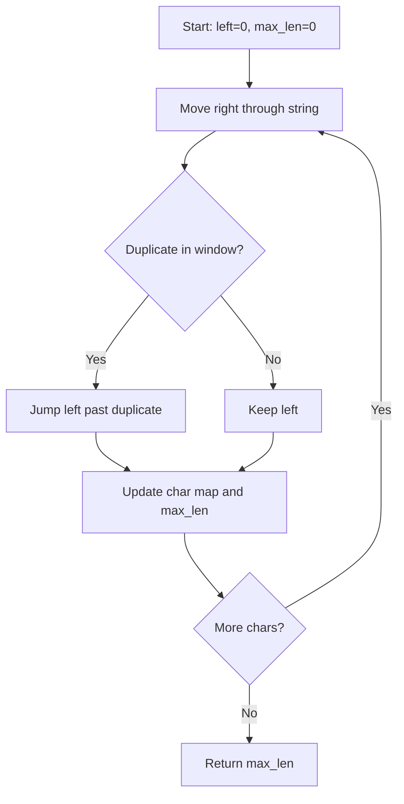
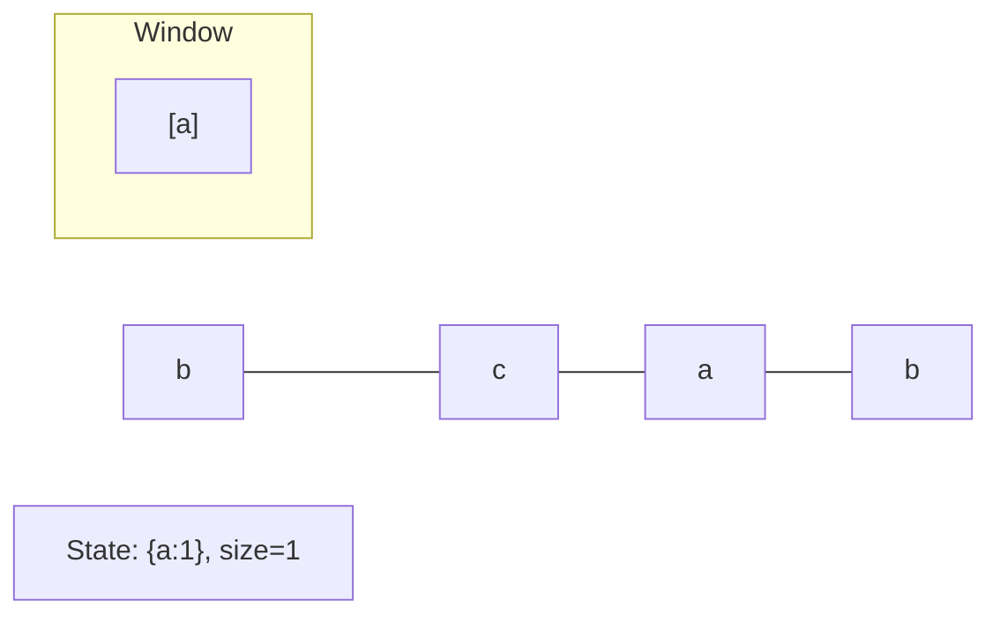
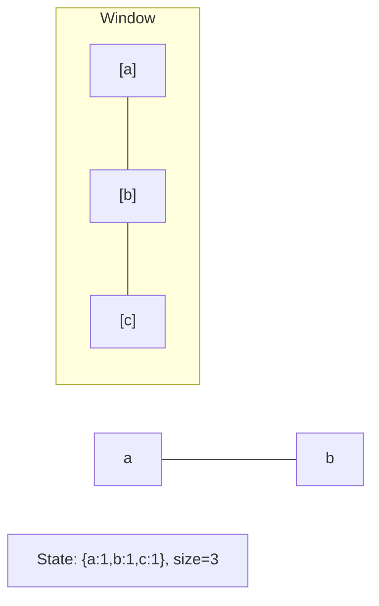
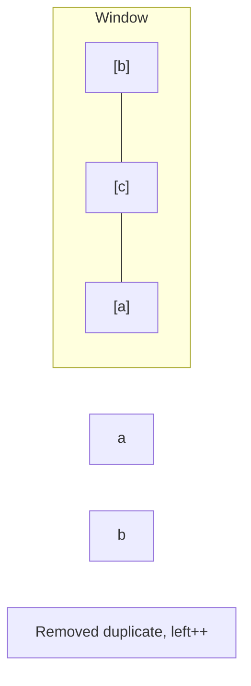
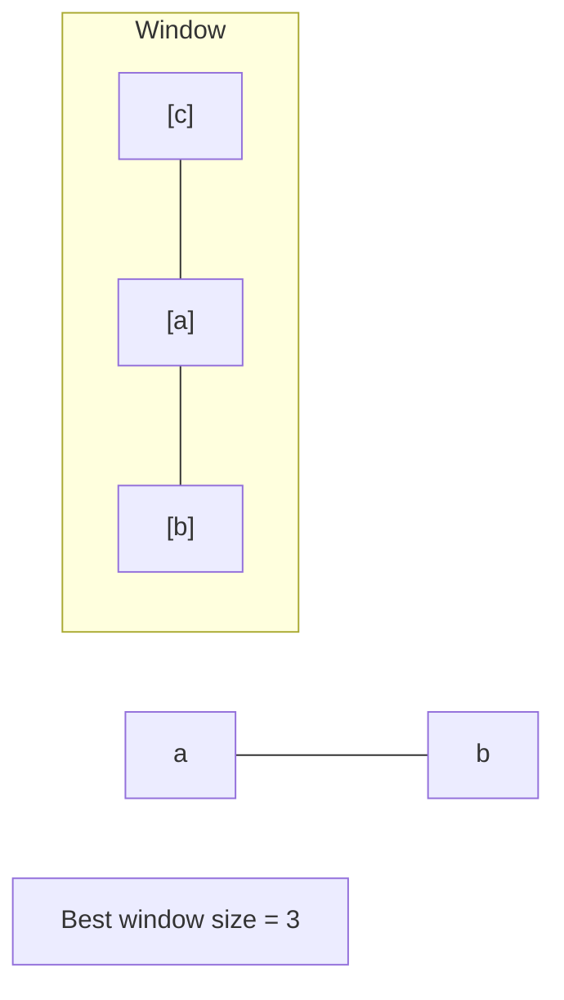
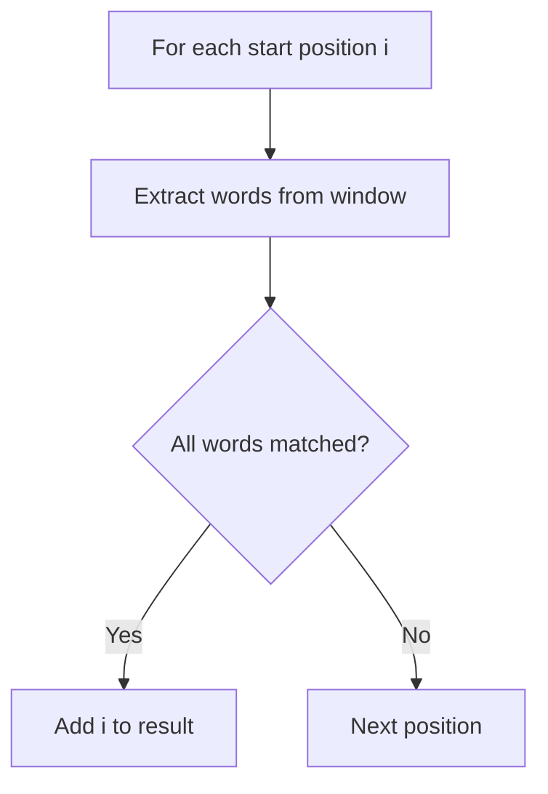
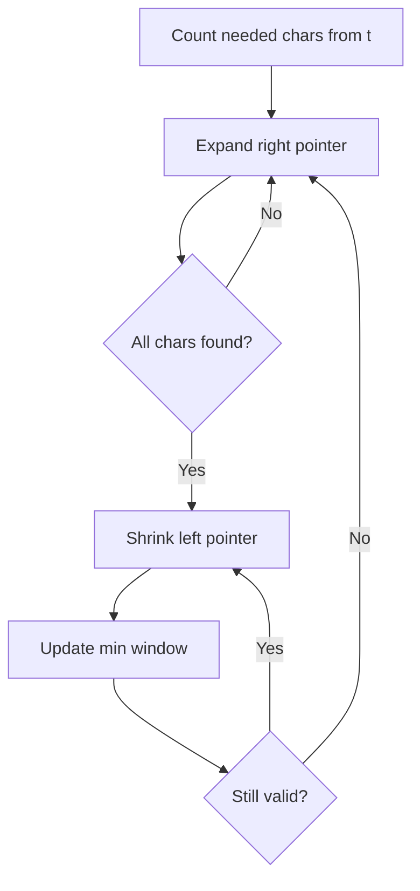
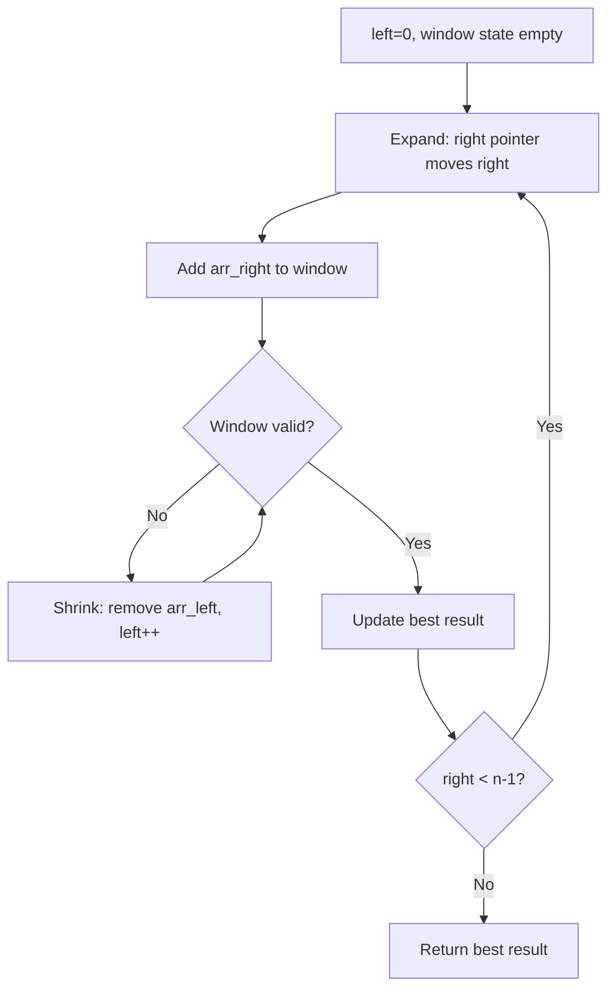

# Sliding Window

> Chapter covering 68 problems related to **Sliding Window**.


## Problems in this Chapter

| # | Problem | Difficulty | Pattern | Time | Space |
|---|---------|------------|---------|------|-------|
| 3 | [Longest Substring Without Repeating Characters](#problem-3-longest_substring_without_repeating_characters) | Medium | Sliding Window | O(n) | O(min(n,m)) |
| 30 | [Substring with Concatenation of All Words](#problem-30-substring_with_concatenation_of_all_words) | Hard | Sliding Window / Hash Map | O(n * m * w) where n=len(s), m=num words, w=word len | O(m) |
| 76 | [Minimum Window Substring](#problem-76-minimum_window_substring) | Hard | Sliding Window | O(m+n) | O(m+n) |
| 159 | [Longest Substring with At Most Two Distinct Characters](#problem-159-longest_substring_with_at_most_two_distinct_characters) | Medium | Sliding Window | O(n) | O(k) |
| 187 | [Repeated DNA Sequences](#problem-187-repeated_dna_sequences) | Medium | Sliding Window | O(n) | O(k) |
| 219 | [Contains Duplicate II](#problem-219-contains_duplicate_ii) | Easy | Sliding Window | O(n) | O(k) |
| 220 | [Contains Duplicate III](#problem-220-contains_duplicate_iii) | Hard | Sliding Window | O(n) | O(k) |
| 239 | [Sliding Window Maximum](#problem-239-sliding_window_maximum) | Hard | Monotonic Deque | O(n) | O(k) |
| 340 | [Longest Substring with At Most K Distinct Characters](#problem-340-longest_substring_with_at_most_k_distinct_characters) | Medium | Sliding Window | O(n) | O(k) |
| 395 | [Longest Substring with At Least K Repeating Characters](#problem-395-longest_substring_with_at_least_k_repeating_characters) | Medium | Sliding Window | O(n) | O(k) |
| 413 | [Arithmetic Slices](#problem-413-arithmetic_slices) | Medium | Sliding Window | O(n) | O(k) |
| 424 | [Longest Repeating Character Replacement](#problem-424-longest_repeating_character_replacement) | Medium | Sliding Window | O(n) | O(k) |
| 438 | [Find All Anagrams in a String](#problem-438-find_all_anagrams_in_a_string) | Medium | Sliding Window | O(n) | O(k) |
| 480 | [Sliding Window Median](#problem-480-sliding_window_median) | Hard | Sliding Window | O(n) | O(k) |
| 487 | [Max Consecutive Ones II](#problem-487-max_consecutive_ones_ii) | Medium | Sliding Window | O(n) | O(k) |
| 567 | [Permutation in String](#problem-567-permutation_in_string) | Medium | Sliding Window | O(n) | O(1) |
| 594 | [Longest Harmonious Subsequence](#problem-594-longest_harmonious_subsequence) | Easy | Sliding Window | O(n) | O(k) |
| 643 | [Maximum Average Subarray I](#problem-643-maximum_average_subarray_i) | Easy | Sliding Window (Fixed) | O(n) | O(1) |
| 683 | [K Empty Slots](#problem-683-k_empty_slots) | Hard | Monotonic Queue / Deque | O(n) | O(k) |
| 689 | [Maximum Sum of 3 Non-Overlapping Subarrays](#problem-689-maximum_sum_of_3_non_overlapping_subarrays) | Hard | Sliding Window | O(n) | O(k) |
| 727 | [Minimum Window Subsequence](#problem-727-minimum_window_subsequence) | Hard | Sliding Window | O(n) | O(k) |
| 837 | [New 21 Game](#problem-837-new_21_game) | Medium | Sliding Window | O(n) | O(k) |
| 904 | [Fruit Into Baskets](#problem-904-fruit_into_baskets) | Medium | Sliding Window | O(n) | O(k) |
| 930 | [Binary Subarrays With Sum](#problem-930-binary_subarrays_with_sum) | Medium | Sliding Window | O(n) | O(k) |
| 978 | [Longest Turbulent Subarray](#problem-978-longest_turbulent_subarray) | Medium | Sliding Window | O(n) | O(k) |
| 992 | [Subarrays with K Different Integers](#problem-992-subarrays_with_k_different_integers) | Hard | Sliding Window | O(n) | O(k) |
| 995 | [Minimum Number of K Consecutive Bit Flips](#problem-995-minimum_number_of_k_consecutive_bit_flips) | Hard | Sliding Window | O(n) | O(k) |
| 1016 | [Binary String With Substrings Representing 1 To N](#problem-1016-binary_string_with_substrings_representing_1_to_n) | Medium | Sliding Window | O(n) | O(k) |
| 1031 | [Maximum Sum of Two Non-Overlapping Subarrays](#problem-1031-maximum_sum_of_two_non_overlapping_subarrays) | Medium | Sliding Window | O(n) | O(k) |
| 1040 | [Moving Stones Until Consecutive II](#problem-1040-moving_stones_until_consecutive_ii) | Medium | Sliding Window | O(n) | O(k) |
| 1052 | [Grumpy Bookstore Owner](#problem-1052-grumpy_bookstore_owner) | Medium | Sliding Window | O(n) | O(k) |
| 1100 | [Find K-Length Substrings With No Repeated Characters](#problem-1100-find_k_length_substrings_with_no_repeated_characters) | Medium | Sliding Window | O(n) | O(k) |
| 1151 | [Minimum Swaps to Group All 1's Together](#problem-1151-minimum_swaps_to_group_all_1s_together) | Medium | Sliding Window | O(n) | O(k) |
| 1156 | [Swap For Longest Repeated Character Substring](#problem-1156-swap_for_longest_repeated_character_substring) | Medium | Sliding Window | O(n) | O(k) |
| 1176 | [Diet Plan Performance](#problem-1176-diet_plan_performance) | Easy | Sliding Window | O(n) | O(k) |
| 1234 | [Replace the Substring for Balanced String](#problem-1234-replace_the_substring_for_balanced_string) | Medium | Sliding Window | O(n) | O(k) |
| 1248 | [Count Number of Nice Subarrays](#problem-1248-count_number_of_nice_subarrays) | Medium | Sliding Window | O(n) | O(k) |
| 1297 | [Maximum Number of Occurrences of a Substring](#problem-1297-maximum_number_of_occurrences_of_a_substring) | Medium | Sliding Window | O(n) | O(k) |
| 1343 | [Number of Sub-arrays of Size K and Average Greater than or Equal to Threshold](#problem-1343-number_of_sub_arrays_of_size_k_and_average_greater_than_or_equal_to_threshold) | Medium | Sliding Window | O(n) | O(k) |
| 1358 | [Number of Substrings Containing All Three Characters](#problem-1358-number_of_substrings_containing_all_three_characters) | Medium | Sliding Window | O(n) | O(k) |
| 1423 | [Maximum Points You Can Obtain from Cards](#problem-1423-maximum_points_you_can_obtain_from_cards) | Medium | Sliding Window | O(n) | O(k) |
| 1425 | [Constrained Subsequence Sum](#problem-1425-constrained_subsequence_sum) | Hard | Monotonic Queue / Deque | O(n) | O(k) |
| 1438 | [Longest Continuous Subarray With Absolute Diff Less Than or Equal to Limit](#problem-1438-longest_continuous_subarray_with_absolute_diff_less_than_or_equal_to_limit) | Medium | Monotonic Queue / Deque | O(n) | O(k) |
| 1456 | [Maximum Number of Vowels in a Substring of Given Length](#problem-1456-maximum_number_of_vowels_in_a_substring_of_given_length) | Medium | Sliding Window (Fixed) | O(n) | O(1) |
| 1493 | [Longest Subarray of 1's After Deleting One Element](#problem-1493-longest_subarray_of_1s_after_deleting_one_element) | Medium | Sliding Window | O(n) | O(1) |
| 1499 | [Max Value of Equation](#problem-1499-max_value_of_equation) | Hard | Monotonic Queue / Deque | O(n) | O(k) |
| 1610 | [Maximum Number of Visible Points](#problem-1610-maximum_number_of_visible_points) | Hard | Sliding Window | O(n) | O(k) |
| 1652 | [Defuse the Bomb](#problem-1652-defuse_the_bomb) | Easy | Sliding Window | O(n) | O(k) |
| 1695 | [Maximum Erasure Value](#problem-1695-maximum_erasure_value) | Medium | Sliding Window | O(n) | O(k) |
| 1763 | [Longest Nice Substring](#problem-1763-longest_nice_substring) | Easy | Sliding Window | O(n) | O(k) |
| 1839 | [Longest Substring Of All Vowels in Order](#problem-1839-longest_substring_of_all_vowels_in_order) | Medium | Sliding Window | O(n) | O(k) |
| 1852 | [Distinct Numbers in Each Subarray](#problem-1852-distinct_numbers_in_each_subarray) | Medium | Sliding Window | O(n) | O(k) |
| 1871 | [Jump Game VII](#problem-1871-jump_game_vii) | Medium | Sliding Window | O(n) | O(k) |
| 1876 | [Substrings of Size Three with Distinct Characters](#problem-1876-substrings_of_size_three_with_distinct_characters) | Easy | Sliding Window | O(n) | O(k) |
| 1888 | [Minimum Number of Flips to Make the Binary String Alternating](#problem-1888-minimum_number_of_flips_to_make_the_binary_string_alternating) | Medium | Sliding Window | O(n) | O(k) |
| 1984 | [Minimum Difference Between Highest and Lowest of K Scores](#problem-1984-minimum_difference_between_highest_and_lowest_of_k_scores) | Easy | Sliding Window | O(n) | O(k) |
| 2067 | [Number of Equal Count Substrings](#problem-2067-number_of_equal_count_substrings) | Medium | Sliding Window | O(n) | O(k) |
| 2090 | [K Radius Subarray Averages](#problem-2090-k_radius_subarray_averages) | Medium | Sliding Window | O(n) | O(k) |
| 2107 | [Number of Unique Flavors After Sharing K Candies](#problem-2107-number_of_unique_flavors_after_sharing_k_candies) | Medium | Sliding Window | O(n) | O(k) |
| 2110 | [Number of Smooth Descent Periods of a Stock](#problem-2110-number_of_smooth_descent_periods_of_a_stock) | Medium | Sliding Window | O(n) | O(k) |
| 2134 | [Minimum Swaps to Group All 1's Together II](#problem-2134-minimum_swaps_to_group_all_1s_together_ii) | Medium | Sliding Window | O(n) | O(k) |
| 2156 | [Find Substring With Given Hash Value](#problem-2156-find_substring_with_given_hash_value) | Hard | Sliding Window | O(n) | O(k) |
| 2260 | [Minimum Consecutive Cards to Pick Up](#problem-2260-minimum_consecutive_cards_to_pick_up) | Medium | Sliding Window | O(n) | O(k) |
| 2269 | [Find the K-Beauty of a Number](#problem-2269-find_the_k_beauty_of_a_number) | Easy | Sliding Window | O(n) | O(k) |
| 2379 | [Minimum Recolors to Get K Consecutive Black Blocks](#problem-2379-minimum_recolors_to_get_k_consecutive_black_blocks) | Easy | Sliding Window | O(n) | O(k) |
| 2401 | [Longest Nice Subarray](#problem-2401-longest_nice_subarray) | Medium | Sliding Window | O(n) | O(k) |
| 2444 | [Count Subarrays With Fixed Bounds](#problem-2444-count_subarrays_with_fixed_bounds) | Hard | Monotonic Queue / Deque | O(n) | O(k) |
| 2461 | [Maximum Sum of Distinct Subarrays With Length K](#problem-2461-maximum_sum_of_distinct_subarrays_with_length_k) | Medium | Sliding Window | O(n) | O(k) |

---
---

# Problem 3: Longest Substring Without Repeating Characters

| Attribute | Detail |
|-----------|--------|
| **ID** | 3 |
| **Title** | Longest Substring Without Repeating Characters |
| **Difficulty** | Medium |
| **Tags** | Hash Table, String, Sliding Window |
| **Link** | [leetcode.com/problems/longest-substring-without-repeating-characters](https://leetcode.com/problems/longest-substring-without-repeating-characters/) |

Given a string `s`, find the length of the **longest** **substring** without duplicate characters.

 

Example 1:

```

**Input:** s = "abcabcbb"
**Output:** 3
**Explanation:** The answer is "abc", with the length of 3. Note that `"bca"` and `"cab"` are also correct answers.

```

Example 2:

```

**Input:** s = "bbbbb"
**Output:** 1
**Explanation:** The answer is "b", with the length of 1.

```

Example 3:

```

**Input:** s = "pwwkew"
**Output:** 3
**Explanation:** The answer is "wke", with the length of 3.
Notice that the answer must be a substring, "pwke" is a subsequence and not a substring.

```

 

**Constraints:**

	- `0 <= s.length <= 5 * 10^4`
	- `s` consists of English letters, digits, symbols and spaces.

---

## Approach: Sliding Window

**Key Insight:** Maintain a window [left, right] with unique characters. When a duplicate is found, jump left past the previous occurrence.

Use a hash map to track last-seen index of each character.

### Pseudo-code

```
1. char_index = {}, left = 0, max_len = 0
2. For right, ch in enumerate(s):
   a. If ch in map and map[ch] >= left: left = map[ch] + 1
   b. map[ch] = right
   c. max_len = max(max_len, right - left + 1)
3. Return max_len
```

---

## Algorithm Flow



## Visual State Transitions

**Sliding Window Step-by-Step:**

**Frame 1: Initial window (left=0, right=0)**


**Frame 2: Expand right (right=2)**


**Frame 3: Violation - shrink left**


**Frame 4: Continue expanding**



### Walkthrough

**Input:** `s = "abcabcbb"`

| Step | right | char | left | Window | max_len |
|------|-------|------|------|--------|---------|
| 1 | 0 | a | 0 | "a" | 1 |
| 2 | 1 | b | 0 | "ab" | 2 |
| 3 | 2 | c | 0 | "abc" | 3 |
| 4 | 3 | a | 1 | "bca" | 3 |
| 5 | 4 | b | 2 | "cab" | 3 |

---

## Complexity Analysis

| Metric | Value |
|--------|-------|
| **Time** | O(n) |
| **Space** | O(min(n,m)) |

---

## Solution Code

### Python3

```python
class Solution:
    def lengthOfLongestSubstring(self, s: str) -> int:
        char_index = {}
        left = 0
        max_len = 0
        for right, ch in enumerate(s):
            if ch in char_index and char_index[ch] >= left:
                left = char_index[ch] + 1
            char_index[ch] = right
            max_len = max(max_len, right - left + 1)
        return max_len
```

### C++

```cpp
#include <algorithm>
#include <string>
#include <unordered_map>
#include <vector>
using namespace std;

class Solution {
public:
    int lengthOfLongestSubstring(string& s) {
        // Sliding window approach - O(n) time, O(k) space
        unordered_map<char, int> window;
        int left = 0, result = 0;
        for (int right = 0; right < s.size(); right++) {
            window[s[right]]++;
            while ((int)window.size() > s) {
                window[s[left]]--;
                if (window[s[left]] == 0)
                    window.erase(s[left]);
                left++;
            }
            result = max(result, right - left + 1);
        }
        return result;
    }
};
```

### Summary

| Aspect | Detail |
|--------|--------|
| **Pattern** | Sliding Window |
| **Time** | O(n) |
| **Space** | O(min(n,m)) |

---
---

# Problem 30: Substring with Concatenation of All Words

| Attribute | Detail |
|-----------|--------|
| **ID** | 30 |
| **Title** | Substring with Concatenation of All Words |
| **Difficulty** | Hard |
| **Tags** | Hash Table, String, Sliding Window |
| **Link** | [leetcode.com/problems/substring-with-concatenation-of-all-words](https://leetcode.com/problems/substring-with-concatenation-of-all-words/) |

You are given a string `s` and an array of strings `words`. All the strings of `words` are of **the same length**.

A **concatenated string** is a string that exactly contains all the strings of any permutation of `words` concatenated.

	- For example, if `words = ["ab","cd","ef"]`, then `"abcdef"`, `"abefcd"`, `"cdabef"`, `"cdefab"`, `"efabcd"`, and `"efcdab"` are all concatenated strings. `"acdbef"` is not a concatenated string because it is not the concatenation of any permutation of `words`.

Return an array of *the starting indices* of all the concatenated substrings in `s`. You can return the answer in **any order**.

 

Example 1:

**Input:** s = "barfoothefoobarman", words = ["foo","bar"]

**Output:** [0,9]

**Explanation:**

The substring starting at 0 is `"barfoo"`. It is the concatenation of `["bar","foo"]` which is a permutation of `words`.

The substring starting at 9 is `"foobar"`. It is the concatenation of `["foo","bar"]` which is a permutation of `words`.

Example 2:

**Input:** s = "wordgoodgoodgoodbestword", words = ["word","good","best","word"]

**Output:** []

**Explanation:**

There is no concatenated substring.

Example 3:

**Input:** s = "barfoofoobarthefoobarman", words = ["bar","foo","the"]

**Output:** [6,9,12]

**Explanation:**

The substring starting at 6 is `"foobarthe"`. It is the concatenation of `["foo","bar","the"]`.

The substring starting at 9 is `"barthefoo"`. It is the concatenation of `["bar","the","foo"]`.

The substring starting at 12 is `"thefoobar"`. It is the concatenation of `["the","foo","bar"]`.

 

**Constraints:**

	- `1 <= s.length <= 10^4`
	- `1 <= words.length <= 5000`
	- `1 <= words[i].length <= 30`
	- `s` and `words[i]` consist of lowercase English letters.

---

## Approach: Sliding Window / Hash Map

Check every starting position. For each, try to match all words using a counter map.

### Pseudo-code

```
1. For each start position i:
   Count words in window
   Compare with target word counts
   If all match: add i to result
```

---

## Algorithm Flow



## Visual State Transitions

**Sliding Window Step-by-Step:**

**Frame 1: Initial window (left=0, right=0)**


**Frame 2: Expand right (right=2)**


**Frame 3: Violation - shrink left**


**Frame 4: Continue expanding**


---

## Complexity Analysis

| Metric | Value |
|--------|-------|
| **Time** | O(n * m * w) where n=len(s), m=num words, w=word len |
| **Space** | O(m) |

---

## Solution Code

### Python3

```python
from collections import Counter

class Solution:
    def findSubstring(self, s, words):
        if not s or not words:
            return []
        word_len = len(words[0])
        total_len = word_len * len(words)
        word_count = Counter(words)
        result = []
        for i in range(len(s) - total_len + 1):
            seen = Counter()
            j = 0
            while j < len(words):
                word = s[i + j * word_len: i + (j + 1) * word_len]
                if word in word_count:
                    seen[word] += 1
                    if seen[word] > word_count[word]:
                        break
                else:
                    break
                j += 1
            if j == len(words):
                result.append(i)
        return result
```

### C++

```cpp
#include <algorithm>
#include <string>
#include <unordered_map>
#include <vector>
using namespace std;

class Solution {
public:
    vector<int> findSubstring(string& s, vector<string>& words) {
        // Sliding window approach - O(n) time, O(k) space
        unordered_map<char, int> window;
        int left = 0, result = 0;
        for (int right = 0; right < s.size(); right++) {
            window[s[right]]++;
            while ((int)window.size() > words) {
                window[s[left]]--;
                if (window[s[left]] == 0)
                    window.erase(s[left]);
                left++;
            }
            result = max(result, right - left + 1);
        }
        return result;
    }
};
```

### Summary

| Aspect | Detail |
|--------|--------|
| **Pattern** | Sliding Window / Hash Map |
| **Time** | O(n * m * w) where n=len(s), m=num words, w=word len |
| **Space** | O(m) |

---
---

# Problem 76: Minimum Window Substring

| Attribute | Detail |
|-----------|--------|
| **ID** | 76 |
| **Title** | Minimum Window Substring |
| **Difficulty** | Hard |
| **Tags** | Hash Table, String, Sliding Window |
| **Link** | [leetcode.com/problems/minimum-window-substring](https://leetcode.com/problems/minimum-window-substring/) |

Given two strings `s` and `t` of lengths `m` and `n` respectively, return *the **minimum window*** ***substring**** of *`s`* such that every character in *`t`* (**including duplicates**) is included in the window*. If there is no such substring, return *the empty string *`""`.

The testcases will be generated such that the answer is **unique**.

 

Example 1:

```

**Input:** s = "ADOBECODEBANC", t = "ABC"
**Output:** "BANC"
**Explanation:** The minimum window substring "BANC" includes 'A', 'B', and 'C' from string t.

```

Example 2:

```

**Input:** s = "a", t = "a"
**Output:** "a"
**Explanation:** The entire string s is the minimum window.

```

Example 3:

```

**Input:** s = "a", t = "aa"
**Output:** ""
**Explanation:** Both 'a's from t must be included in the window.
Since the largest window of s only has one 'a', return empty string.

```

 

**Constraints:**

	- `m == s.length`
	- `n == t.length`
	- `1 <= m, n <= 10^5`
	- `s` and `t` consist of uppercase and lowercase English letters.

 

**Follow up:** Could you find an algorithm that runs in `O(m + n)` time?

---

## Approach: Sliding Window

**Key Insight:** Expand right to include all needed chars, then shrink left to minimize window. Track missing count.

### Pseudo-code

```
1. Count needed chars
2. Expand right: decrement need, if was needed decrement missing
3. While missing==0: try shrink left, update best window
4. Return minimum window
```

---

## Algorithm Flow



## Visual State Transitions

**Sliding Window Step-by-Step:**

**Frame 1: Initial window (left=0, right=0)**


**Frame 2: Expand right (right=2)**


**Frame 3: Violation - shrink left**


**Frame 4: Continue expanding**


---

## Complexity Analysis

| Metric | Value |
|--------|-------|
| **Time** | O(m+n) |
| **Space** | O(m+n) |

---

## Solution Code

### Python3

```python
from collections import Counter

class Solution:
    def minWindow(self, s: str, t: str) -> str:
        need = Counter(t)
        missing = len(t)
        left = 0
        start, end = 0, float('inf')
        for right, ch in enumerate(s):
            if need[ch] > 0:
                missing -= 1
            need[ch] -= 1
            while missing == 0:
                if right - left < end - start:
                    start, end = left, right
                need[s[left]] += 1
                if need[s[left]] > 0:
                    missing += 1
                left += 1
        return s[start:end+1] if end != float('inf') else '' 
```

### C++

```cpp
#include <algorithm>
#include <string>
#include <unordered_map>
#include <vector>
using namespace std;

class Solution {
public:
    string minWindow(string& s, string& t) {
        // Sliding window approach - O(n) time, O(k) space
        unordered_map<char, int> window;
        int left = 0, result = 0;
        for (int right = 0; right < s.size(); right++) {
            window[s[right]]++;
            while ((int)window.size() > t) {
                window[s[left]]--;
                if (window[s[left]] == 0)
                    window.erase(s[left]);
                left++;
            }
            result = max(result, right - left + 1);
        }
        return result;
    }
};
```

### Summary

| Aspect | Detail |
|--------|--------|
| **Pattern** | Sliding Window |
| **Time** | O(m+n) |
| **Space** | O(m+n) |

---
---

# Problem 159: Longest Substring with At Most Two Distinct Characters

| Attribute | Detail |
|-----------|--------|
| **ID** | 159 |
| **Title** | Longest Substring with At Most Two Distinct Characters |
| **Difficulty** | Medium |
| **Tags** | Hash Table, String, Sliding Window |
| **Link** | [leetcode.com/problems/longest-substring-with-at-most-two-distinct-characters](https://leetcode.com/problems/longest-substring-with-at-most-two-distinct-characters/) |

*(Premium problem -- description requires LeetCode subscription)*

---

## Approach: Sliding Window

Maintain a window over the data using two pointers. Expand the right boundary to include new elements, and shrink the left boundary when the window constraint is violated. Track the optimal window.

### Pseudo-code

```
1. Initialize left = 0, result = initial_value
2. For right in range(n):
   a. Add element at right to window state
   b. While window is invalid:
      - Remove element at left from window state
      - left++
   c. Update result = best of (result, window size/value)
3. Return result
```

---

## Algorithm Flow



## Visual State Transitions

**Sliding Window Step-by-Step:**

**Frame 1: Initial window (left=0, right=0)**


**Frame 2: Expand right (right=2)**


**Frame 3: Violation - shrink left**


**Frame 4: Continue expanding**


---

## Complexity Analysis

| Metric | Value |
|--------|-------|
| **Time** | O(n) |
| **Space** | O(k) |

---

## Solution Code

### Python3

```python
class Solution:
    pass
```

### C++

```cpp
class Solution {
public:
    // Design problem stub
};
```

### Summary

| Aspect | Detail |
|--------|--------|
| **Pattern** | Sliding Window |
| **Time** | O(n) |
| **Space** | O(k) |

---
---

# Problem 187: Repeated DNA Sequences

| Attribute | Detail |
|-----------|--------|
| **ID** | 187 |
| **Title** | Repeated DNA Sequences |
| **Difficulty** | Medium |
| **Tags** | Hash Table, String, Bit Manipulation, Sliding Window, Rolling Hash, Hash Function |
| **Link** | [leetcode.com/problems/repeated-dna-sequences](https://leetcode.com/problems/repeated-dna-sequences/) |

The **DNA sequence** is composed of a series of nucleotides abbreviated as `'A'`, `'C'`, `'G'`, and `'T'`.

	- For example, `"ACGAATTCCG"` is a **DNA sequence**.

When studying **DNA**, it is useful to identify repeated sequences within the DNA.

Given a string `s` that represents a **DNA sequence**, return all the **`10`-letter-long** sequences (substrings) that occur more than once in a DNA molecule. You may return the answer in **any order**.

 

Example 1:

```
**Input:** s = "AAAAACCCCCAAAAACCCCCCAAAAAGGGTTT"
**Output:** ["AAAAACCCCC","CCCCCAAAAA"]

```
Example 2:

```
**Input:** s = "AAAAAAAAAAAAA"
**Output:** ["AAAAAAAAAA"]

```

 

**Constraints:**

	- `1 <= s.length <= 10^5`
	- `s[i]` is either `'A'`, `'C'`, `'G'`, or `'T'`.

---

## Approach: Sliding Window

Maintain a window over the data using two pointers. Expand the right boundary to include new elements, and shrink the left boundary when the window constraint is violated. Track the optimal window.

### Pseudo-code

```
1. Initialize left = 0, result = initial_value
2. For right in range(n):
   a. Add element at right to window state
   b. While window is invalid:
      - Remove element at left from window state
      - left++
   c. Update result = best of (result, window size/value)
3. Return result
```

---

## Algorithm Flow

```mermaid
flowchart TD
    A[left=0, window state empty] --> B[Expand: right pointer moves right]
    B --> C[Add arr_right to window]
    C --> D{Window valid?}
    D -- No --> E[Shrink: remove arr_left, left++]
    E --> D
    D -- Yes --> F[Update best result]
    F --> G{right < n-1?}
    G -- Yes --> B
    G -- No --> H[Return best result]
```

## Visual State Transitions

**Sliding Window Step-by-Step:**

**Frame 1: Initial window (left=0, right=0)**
```mermaid
graph LR
    subgraph Window [Window]
        W0["[a]"]
    end
    O0[b] --- O1[c] --- O2[a] --- O3[b]
    S["State: {a:1}, size=1"]
```

**Frame 2: Expand right (right=2)**
```mermaid
graph LR
    subgraph Window [Window]
        W0["[a]"] --- W1["[b]"] --- W2["[c]"]
    end
    O0[a] --- O1[b]
    S["State: {a:1,b:1,c:1}, size=3"]
```

**Frame 3: Violation - shrink left**
```mermaid
graph LR
    O0[a]
    subgraph Window [Window]
        W0["[b]"] --- W1["[c]"] --- W2["[a]"]
    end
    O1[b]
    S["Removed duplicate, left++"]
```

**Frame 4: Continue expanding**
```mermaid
graph LR
    O0[a] --- O1[b]
    subgraph Window [Window]
        W0["[c]"] --- W1["[a]"] --- W2["[b]"]
    end
    S["Best window size = 3"]
```


---

## Complexity Analysis

| Metric | Value |
|--------|-------|
| **Time** | O(n) |
| **Space** | O(k) |

---

## Solution Code

### Python3

```python
class Solution:
    def findRepeatedDnaSequences(self, s: str) -> List[str]:
        # Sliding window approach - O(n) time, O(k) space
        from collections import defaultdict
        window = defaultdict(int)
        left = 0
        result = 0
        for right in range(len(s)):
            window[s[right]] += 1
            while len(window) > (s if isinstance(s, int) else len(s)):
                window[s[left]] -= 1
                if window[s[left]] == 0:
                    del window[s[left]]
                left += 1
            result = max(result, right - left + 1)
        return result
```

### C++

```cpp
#include <algorithm>
#include <string>
#include <unordered_map>
#include <vector>
using namespace std;

class Solution {
public:
    vector<string> findRepeatedDnaSequences(string& s) {
        // Sliding window approach - O(n) time, O(k) space
        unordered_map<char, int> window;
        int left = 0, result = 0;
        for (int right = 0; right < s.size(); right++) {
            window[s[right]]++;
            while ((int)window.size() > s) {
                window[s[left]]--;
                if (window[s[left]] == 0)
                    window.erase(s[left]);
                left++;
            }
            result = max(result, right - left + 1);
        }
        return result;
    }
};
```

### Summary

| Aspect | Detail |
|--------|--------|
| **Pattern** | Sliding Window |
| **Time** | O(n) |
| **Space** | O(k) |

---
---

# Problem 219: Contains Duplicate II

| Attribute | Detail |
|-----------|--------|
| **ID** | 219 |
| **Title** | Contains Duplicate II |
| **Difficulty** | Easy |
| **Tags** | Array, Hash Table, Sliding Window |
| **Link** | [leetcode.com/problems/contains-duplicate-ii](https://leetcode.com/problems/contains-duplicate-ii/) |

Given an integer array `nums` and an integer `k`, return `true` *if there are two **distinct indices** *`i`* and *`j`* in the array such that *`nums[i] == nums[j]`* and *`abs(i - j) <= k`.

 

Example 1:

```

**Input:** nums = [1,2,3,1], k = 3
**Output:** true

```

Example 2:

```

**Input:** nums = [1,0,1,1], k = 1
**Output:** true

```

Example 3:

```

**Input:** nums = [1,2,3,1,2,3], k = 2
**Output:** false

```

 

**Constraints:**

	- `1 <= nums.length <= 10^5`
	- `-10^9 <= nums[i] <= 10^9`
	- `0 <= k <= 10^5`

---

## Approach: Sliding Window

Maintain a window over the data using two pointers. Expand the right boundary to include new elements, and shrink the left boundary when the window constraint is violated. Track the optimal window.

### Pseudo-code

```
1. Initialize left = 0, result = initial_value
2. For right in range(n):
   a. Add element at right to window state
   b. While window is invalid:
      - Remove element at left from window state
      - left++
   c. Update result = best of (result, window size/value)
3. Return result
```

---

## Algorithm Flow

```mermaid
flowchart TD
    A[left=0, window state empty] --> B[Expand: right pointer moves right]
    B --> C[Add arr_right to window]
    C --> D{Window valid?}
    D -- No --> E[Shrink: remove arr_left, left++]
    E --> D
    D -- Yes --> F[Update best result]
    F --> G{right < n-1?}
    G -- Yes --> B
    G -- No --> H[Return best result]
```

## Visual State Transitions

**Sliding Window Step-by-Step:**

**Frame 1: Initial window (left=0, right=0)**
```mermaid
graph LR
    subgraph Window [Window]
        W0["[a]"]
    end
    O0[b] --- O1[c] --- O2[a] --- O3[b]
    S["State: {a:1}, size=1"]
```

**Frame 2: Expand right (right=2)**
```mermaid
graph LR
    subgraph Window [Window]
        W0["[a]"] --- W1["[b]"] --- W2["[c]"]
    end
    O0[a] --- O1[b]
    S["State: {a:1,b:1,c:1}, size=3"]
```

**Frame 3: Violation - shrink left**
```mermaid
graph LR
    O0[a]
    subgraph Window [Window]
        W0["[b]"] --- W1["[c]"] --- W2["[a]"]
    end
    O1[b]
    S["Removed duplicate, left++"]
```

**Frame 4: Continue expanding**
```mermaid
graph LR
    O0[a] --- O1[b]
    subgraph Window [Window]
        W0["[c]"] --- W1["[a]"] --- W2["[b]"]
    end
    S["Best window size = 3"]
```


---

## Complexity Analysis

| Metric | Value |
|--------|-------|
| **Time** | O(n) |
| **Space** | O(k) |

---

## Solution Code

### Python3

```python
class Solution:
    def containsNearbyDuplicate(self, nums: List[int], k: int) -> bool:
        # Sliding window approach - O(n) time, O(k) space
        from collections import defaultdict
        window = defaultdict(int)
        left = 0
        result = 0
        for right in range(len(nums)):
            window[nums[right]] += 1
            while len(window) > (k if isinstance(k, int) else len(nums)):
                window[nums[left]] -= 1
                if window[nums[left]] == 0:
                    del window[nums[left]]
                left += 1
            result = max(result, right - left + 1)
        return result
```

### C++

```cpp
#include <algorithm>
#include <string>
#include <unordered_map>
#include <vector>
using namespace std;

class Solution {
public:
    bool containsNearbyDuplicate(vector<int>& nums, int k) {
        // Sliding window approach - O(n) time, O(k) space
        unordered_map<char, int> window;
        int left = 0, result = 0;
        for (int right = 0; right < nums.size(); right++) {
            window[nums[right]]++;
            while ((int)window.size() > k) {
                window[nums[left]]--;
                if (window[nums[left]] == 0)
                    window.erase(nums[left]);
                left++;
            }
            result = max(result, right - left + 1);
        }
        return result;
    }
};
```

### Summary

| Aspect | Detail |
|--------|--------|
| **Pattern** | Sliding Window |
| **Time** | O(n) |
| **Space** | O(k) |

---
---

# Problem 220: Contains Duplicate III

| Attribute | Detail |
|-----------|--------|
| **ID** | 220 |
| **Title** | Contains Duplicate III |
| **Difficulty** | Hard |
| **Tags** | Array, Sliding Window, Sorting, Bucket Sort, Ordered Set |
| **Link** | [leetcode.com/problems/contains-duplicate-iii](https://leetcode.com/problems/contains-duplicate-iii/) |

You are given an integer array `nums` and two integers `indexDiff` and `valueDiff`.

Find a pair of indices `(i, j)` such that:

	- `i != j`,
	- `abs(i - j) <= indexDiff`.
	- `abs(nums[i] - nums[j]) <= valueDiff`, and

Return `true`* if such pair exists or *`false`* otherwise*.

 

Example 1:

```

**Input:** nums = [1,2,3,1], indexDiff = 3, valueDiff = 0
**Output:** true
**Explanation:** We can choose (i, j) = (0, 3).
We satisfy the three conditions:
i != j --> 0 != 3
abs(i - j) <= indexDiff --> abs(0 - 3) <= 3
abs(nums[i] - nums[j]) <= valueDiff --> abs(1 - 1) <= 0

```

Example 2:

```

**Input:** nums = [1,5,9,1,5,9], indexDiff = 2, valueDiff = 3
**Output:** false
**Explanation:** After trying all the possible pairs (i, j), we cannot satisfy the three conditions, so we return false.

```

 

**Constraints:**

	- `2 <= nums.length <= 10^5`
	- `-10^9 <= nums[i] <= 10^9`
	- `1 <= indexDiff <= nums.length`
	- `0 <= valueDiff <= 10^9`

---

## Approach: Sliding Window

Maintain a window over the data using two pointers. Expand the right boundary to include new elements, and shrink the left boundary when the window constraint is violated. Track the optimal window.

### Pseudo-code

```
1. Initialize left = 0, result = initial_value
2. For right in range(n):
   a. Add element at right to window state
   b. While window is invalid:
      - Remove element at left from window state
      - left++
   c. Update result = best of (result, window size/value)
3. Return result
```

---

## Algorithm Flow

```mermaid
flowchart TD
    A[left=0, window state empty] --> B[Expand: right pointer moves right]
    B --> C[Add arr_right to window]
    C --> D{Window valid?}
    D -- No --> E[Shrink: remove arr_left, left++]
    E --> D
    D -- Yes --> F[Update best result]
    F --> G{right < n-1?}
    G -- Yes --> B
    G -- No --> H[Return best result]
```

## Visual State Transitions

**Sliding Window Step-by-Step:**

**Frame 1: Initial window (left=0, right=0)**
```mermaid
graph LR
    subgraph Window [Window]
        W0["[a]"]
    end
    O0[b] --- O1[c] --- O2[a] --- O3[b]
    S["State: {a:1}, size=1"]
```

**Frame 2: Expand right (right=2)**
```mermaid
graph LR
    subgraph Window [Window]
        W0["[a]"] --- W1["[b]"] --- W2["[c]"]
    end
    O0[a] --- O1[b]
    S["State: {a:1,b:1,c:1}, size=3"]
```

**Frame 3: Violation - shrink left**
```mermaid
graph LR
    O0[a]
    subgraph Window [Window]
        W0["[b]"] --- W1["[c]"] --- W2["[a]"]
    end
    O1[b]
    S["Removed duplicate, left++"]
```

**Frame 4: Continue expanding**
```mermaid
graph LR
    O0[a] --- O1[b]
    subgraph Window [Window]
        W0["[c]"] --- W1["[a]"] --- W2["[b]"]
    end
    S["Best window size = 3"]
```


---

## Complexity Analysis

| Metric | Value |
|--------|-------|
| **Time** | O(n) |
| **Space** | O(k) |

---

## Solution Code

### Python3

```python
class Solution:
    def containsNearbyAlmostDuplicate(self, nums: List[int], indexDiff: int, valueDiff: int) -> bool:
        # Sliding window approach - O(n) time, O(k) space
        from collections import defaultdict
        window = defaultdict(int)
        left = 0
        result = 0
        for right in range(len(nums)):
            window[nums[right]] += 1
            while len(window) > (indexDiff if isinstance(indexDiff, int) else len(nums)):
                window[nums[left]] -= 1
                if window[nums[left]] == 0:
                    del window[nums[left]]
                left += 1
            result = max(result, right - left + 1)
        return result
```

### C++

```cpp
#include <algorithm>
#include <string>
#include <unordered_map>
#include <vector>
using namespace std;

class Solution {
public:
    bool containsNearbyAlmostDuplicate(vector<int>& nums, int indexDiff, int valueDiff) {
        // Sliding window approach - O(n) time, O(k) space
        unordered_map<char, int> window;
        int left = 0, result = 0;
        for (int right = 0; right < nums.size(); right++) {
            window[nums[right]]++;
            while ((int)window.size() > indexDiff) {
                window[nums[left]]--;
                if (window[nums[left]] == 0)
                    window.erase(nums[left]);
                left++;
            }
            result = max(result, right - left + 1);
        }
        return result;
    }
};
```

### Summary

| Aspect | Detail |
|--------|--------|
| **Pattern** | Sliding Window |
| **Time** | O(n) |
| **Space** | O(k) |

---
---

# Problem 239: Sliding Window Maximum

| Attribute | Detail |
|-----------|--------|
| **ID** | 239 |
| **Title** | Sliding Window Maximum |
| **Difficulty** | Hard |
| **Tags** | Array, Queue, Sliding Window, Heap (Priority Queue), Monotonic Queue |
| **Link** | [leetcode.com/problems/sliding-window-maximum](https://leetcode.com/problems/sliding-window-maximum/) |

You are given an array of integers `nums`, there is a sliding window of size `k` which is moving from the very left of the array to the very right. You can only see the `k` numbers in the window. Each time the sliding window moves right by one position.

Return *the max sliding window*.

 

Example 1:

```

**Input:** nums = [1,3,-1,-3,5,3,6,7], k = 3
**Output:** [3,3,5,5,6,7]
**Explanation:** 
Window position                Max
---------------               -----
[1  3  -1] -3  5  3  6  7       **3**
 1 [3  -1  -3] 5  3  6  7       **3**
 1  3 [-1  -3  5] 3  6  7      ** 5**
 1  3  -1 [-3  5  3] 6  7       **5**
 1  3  -1  -3 [5  3  6] 7       **6**
 1  3  -1  -3  5 [3  6  7]      **7**

```

Example 2:

```

**Input:** nums = [1], k = 1
**Output:** [1]

```

 

**Constraints:**

	- `1 <= nums.length <= 10^5`
	- `-10^4 <= nums[i] <= 10^4`
	- `1 <= k <= nums.length`

---

## Approach: Monotonic Deque

**Monotonic decreasing deque:** Front is always the window max. Remove expired and smaller elements.

### Pseudo-code

```
1. Deque stores indices in decreasing order of values
2. Remove expired (outside window)
3. Remove smaller than current from back
4. Front = window max
```

---

## Algorithm Flow

```mermaid
flowchart TD
    A[For each element i] --> B[Remove expired from front]
    B --> C[Remove smaller from back]
    C --> D[Append i to deque]
    D --> E{Window full?}
    E -- Yes --> F[Record deque front as max]
    E -- No --> A
```

---

## Complexity Analysis

| Metric | Value |
|--------|-------|
| **Time** | O(n) |
| **Space** | O(k) |

---

## Solution Code

### Python3

```python
from collections import deque

class Solution:
    def maxSlidingWindow(self, nums: list[int], k: int) -> list[int]:
        dq = deque()
        result = []
        for i in range(len(nums)):
            while dq and dq[0] < i - k + 1:
                dq.popleft()
            while dq and nums[dq[-1]] < nums[i]:
                dq.pop()
            dq.append(i)
            if i >= k - 1:
                result.append(nums[dq[0]])
        return result
```

### C++

```cpp
#include <deque>
#include <string>
#include <vector>
using namespace std;

class Solution {
public:
    vector<int> maxSlidingWindow(vector<int>& nums, int k) {
        // Monotonic deque - O(n) time
        deque<int> dq;
        vector<int> result;
        int k = k;
        for (int i = 0; i < (int)nums.size(); i++) {
            while (!dq.empty() && dq.front() < i - k + 1)
                dq.pop_front();
            while (!dq.empty() && nums[dq.back()] < nums[i])
                dq.pop_back();
            dq.push_back(i);
            if (i >= k - 1)
                result.push_back(nums[dq.front()]);
        }
        return result;
    }
};
```

### Summary

| Aspect | Detail |
|--------|--------|
| **Pattern** | Monotonic Deque |
| **Time** | O(n) |
| **Space** | O(k) |

---
---

# Problem 340: Longest Substring with At Most K Distinct Characters

| Attribute | Detail |
|-----------|--------|
| **ID** | 340 |
| **Title** | Longest Substring with At Most K Distinct Characters |
| **Difficulty** | Medium |
| **Tags** | Hash Table, String, Sliding Window |
| **Link** | [leetcode.com/problems/longest-substring-with-at-most-k-distinct-characters](https://leetcode.com/problems/longest-substring-with-at-most-k-distinct-characters/) |

*(Premium problem -- description requires LeetCode subscription)*

---

## Approach: Sliding Window

Maintain a window over the data using two pointers. Expand the right boundary to include new elements, and shrink the left boundary when the window constraint is violated. Track the optimal window.

### Pseudo-code

```
1. Initialize left = 0, result = initial_value
2. For right in range(n):
   a. Add element at right to window state
   b. While window is invalid:
      - Remove element at left from window state
      - left++
   c. Update result = best of (result, window size/value)
3. Return result
```

---

## Algorithm Flow

```mermaid
flowchart TD
    A[left=0, window state empty] --> B[Expand: right pointer moves right]
    B --> C[Add arr_right to window]
    C --> D{Window valid?}
    D -- No --> E[Shrink: remove arr_left, left++]
    E --> D
    D -- Yes --> F[Update best result]
    F --> G{right < n-1?}
    G -- Yes --> B
    G -- No --> H[Return best result]
```

## Visual State Transitions

**Sliding Window Step-by-Step:**

**Frame 1: Initial window (left=0, right=0)**
```mermaid
graph LR
    subgraph Window [Window]
        W0["[a]"]
    end
    O0[b] --- O1[c] --- O2[a] --- O3[b]
    S["State: {a:1}, size=1"]
```

**Frame 2: Expand right (right=2)**
```mermaid
graph LR
    subgraph Window [Window]
        W0["[a]"] --- W1["[b]"] --- W2["[c]"]
    end
    O0[a] --- O1[b]
    S["State: {a:1,b:1,c:1}, size=3"]
```

**Frame 3: Violation - shrink left**
```mermaid
graph LR
    O0[a]
    subgraph Window [Window]
        W0["[b]"] --- W1["[c]"] --- W2["[a]"]
    end
    O1[b]
    S["Removed duplicate, left++"]
```

**Frame 4: Continue expanding**
```mermaid
graph LR
    O0[a] --- O1[b]
    subgraph Window [Window]
        W0["[c]"] --- W1["[a]"] --- W2["[b]"]
    end
    S["Best window size = 3"]
```


---

## Complexity Analysis

| Metric | Value |
|--------|-------|
| **Time** | O(n) |
| **Space** | O(k) |

---

## Solution Code

### Python3

```python
class Solution:
    pass
```

### C++

```cpp
class Solution {
public:
    // Design problem stub
};
```

### Summary

| Aspect | Detail |
|--------|--------|
| **Pattern** | Sliding Window |
| **Time** | O(n) |
| **Space** | O(k) |

---
---

# Problem 395: Longest Substring with At Least K Repeating Characters

| Attribute | Detail |
|-----------|--------|
| **ID** | 395 |
| **Title** | Longest Substring with At Least K Repeating Characters |
| **Difficulty** | Medium |
| **Tags** | Hash Table, String, Divide and Conquer, Sliding Window |
| **Link** | [leetcode.com/problems/longest-substring-with-at-least-k-repeating-characters](https://leetcode.com/problems/longest-substring-with-at-least-k-repeating-characters/) |

Given a string `s` and an integer `k`, return *the length of the longest substring of* `s` *such that the frequency of each character in this substring is greater than or equal to* `k`.

if no such substring exists, return 0.

 

Example 1:

```

**Input:** s = "aaabb", k = 3
**Output:** 3
**Explanation:** The longest substring is "aaa", as 'a' is repeated 3 times.

```

Example 2:

```

**Input:** s = "ababbc", k = 2
**Output:** 5
**Explanation:** The longest substring is "ababb", as 'a' is repeated 2 times and 'b' is repeated 3 times.

```

 

**Constraints:**

	- `1 <= s.length <= 10^4`
	- `s` consists of only lowercase English letters.
	- `1 <= k <= 10^5`

---

## Approach: Sliding Window

Maintain a window over the data using two pointers. Expand the right boundary to include new elements, and shrink the left boundary when the window constraint is violated. Track the optimal window.

### Pseudo-code

```
1. Initialize left = 0, result = initial_value
2. For right in range(n):
   a. Add element at right to window state
   b. While window is invalid:
      - Remove element at left from window state
      - left++
   c. Update result = best of (result, window size/value)
3. Return result
```

---

## Algorithm Flow

```mermaid
flowchart TD
    A[left=0, window state empty] --> B[Expand: right pointer moves right]
    B --> C[Add arr_right to window]
    C --> D{Window valid?}
    D -- No --> E[Shrink: remove arr_left, left++]
    E --> D
    D -- Yes --> F[Update best result]
    F --> G{right < n-1?}
    G -- Yes --> B
    G -- No --> H[Return best result]
```

## Visual State Transitions

**Sliding Window Step-by-Step:**

**Frame 1: Initial window (left=0, right=0)**
```mermaid
graph LR
    subgraph Window [Window]
        W0["[a]"]
    end
    O0[b] --- O1[c] --- O2[a] --- O3[b]
    S["State: {a:1}, size=1"]
```

**Frame 2: Expand right (right=2)**
```mermaid
graph LR
    subgraph Window [Window]
        W0["[a]"] --- W1["[b]"] --- W2["[c]"]
    end
    O0[a] --- O1[b]
    S["State: {a:1,b:1,c:1}, size=3"]
```

**Frame 3: Violation - shrink left**
```mermaid
graph LR
    O0[a]
    subgraph Window [Window]
        W0["[b]"] --- W1["[c]"] --- W2["[a]"]
    end
    O1[b]
    S["Removed duplicate, left++"]
```

**Frame 4: Continue expanding**
```mermaid
graph LR
    O0[a] --- O1[b]
    subgraph Window [Window]
        W0["[c]"] --- W1["[a]"] --- W2["[b]"]
    end
    S["Best window size = 3"]
```


---

## Complexity Analysis

| Metric | Value |
|--------|-------|
| **Time** | O(n) |
| **Space** | O(k) |

---

## Solution Code

### Python3

```python
class Solution:
    def longestSubstring(self, s: str, k: int) -> int:
        # Sliding window approach - O(n) time, O(k) space
        from collections import defaultdict
        window = defaultdict(int)
        left = 0
        result = 0
        for right in range(len(s)):
            window[s[right]] += 1
            while len(window) > (k if isinstance(k, int) else len(s)):
                window[s[left]] -= 1
                if window[s[left]] == 0:
                    del window[s[left]]
                left += 1
            result = max(result, right - left + 1)
        return result
```

### C++

```cpp
#include <algorithm>
#include <string>
#include <unordered_map>
#include <vector>
using namespace std;

class Solution {
public:
    int longestSubstring(string& s, int k) {
        // Sliding window approach - O(n) time, O(k) space
        unordered_map<char, int> window;
        int left = 0, result = 0;
        for (int right = 0; right < s.size(); right++) {
            window[s[right]]++;
            while ((int)window.size() > k) {
                window[s[left]]--;
                if (window[s[left]] == 0)
                    window.erase(s[left]);
                left++;
            }
            result = max(result, right - left + 1);
        }
        return result;
    }
};
```

### Summary

| Aspect | Detail |
|--------|--------|
| **Pattern** | Sliding Window |
| **Time** | O(n) |
| **Space** | O(k) |

---
---

# Problem 413: Arithmetic Slices

| Attribute | Detail |
|-----------|--------|
| **ID** | 413 |
| **Title** | Arithmetic Slices |
| **Difficulty** | Medium |
| **Tags** | Array, Dynamic Programming, Sliding Window |
| **Link** | [leetcode.com/problems/arithmetic-slices](https://leetcode.com/problems/arithmetic-slices/) |

An integer array is called arithmetic if it consists of **at least three elements** and if the difference between any two consecutive elements is the same.

	- For example, `[1,3,5,7,9]`, `[7,7,7,7]`, and `[3,-1,-5,-9]` are arithmetic sequences.

Given an integer array `nums`, return *the number of arithmetic **subarrays** of* `nums`.

A **subarray** is a contiguous subsequence of the array.

 

Example 1:

```

**Input:** nums = [1,2,3,4]
**Output:** 3
**Explanation:** We have 3 arithmetic slices in nums: [1, 2, 3], [2, 3, 4] and [1,2,3,4] itself.

```

Example 2:

```

**Input:** nums = [1]
**Output:** 0

```

 

**Constraints:**

	- `1 <= nums.length <= 5000`
	- `-1000 <= nums[i] <= 1000`

---

## Approach: Sliding Window

Maintain a window over the data using two pointers. Expand the right boundary to include new elements, and shrink the left boundary when the window constraint is violated. Track the optimal window.

### Pseudo-code

```
1. Initialize left = 0, result = initial_value
2. For right in range(n):
   a. Add element at right to window state
   b. While window is invalid:
      - Remove element at left from window state
      - left++
   c. Update result = best of (result, window size/value)
3. Return result
```

---

## Algorithm Flow

```mermaid
flowchart TD
    A[left=0, window state empty] --> B[Expand: right pointer moves right]
    B --> C[Add arr_right to window]
    C --> D{Window valid?}
    D -- No --> E[Shrink: remove arr_left, left++]
    E --> D
    D -- Yes --> F[Update best result]
    F --> G{right < n-1?}
    G -- Yes --> B
    G -- No --> H[Return best result]
```

## Visual State Transitions

**Sliding Window Step-by-Step:**

**Frame 1: Initial window (left=0, right=0)**
```mermaid
graph LR
    subgraph Window [Window]
        W0["[a]"]
    end
    O0[b] --- O1[c] --- O2[a] --- O3[b]
    S["State: {a:1}, size=1"]
```

**Frame 2: Expand right (right=2)**
```mermaid
graph LR
    subgraph Window [Window]
        W0["[a]"] --- W1["[b]"] --- W2["[c]"]
    end
    O0[a] --- O1[b]
    S["State: {a:1,b:1,c:1}, size=3"]
```

**Frame 3: Violation - shrink left**
```mermaid
graph LR
    O0[a]
    subgraph Window [Window]
        W0["[b]"] --- W1["[c]"] --- W2["[a]"]
    end
    O1[b]
    S["Removed duplicate, left++"]
```

**Frame 4: Continue expanding**
```mermaid
graph LR
    O0[a] --- O1[b]
    subgraph Window [Window]
        W0["[c]"] --- W1["[a]"] --- W2["[b]"]
    end
    S["Best window size = 3"]
```


---

## Complexity Analysis

| Metric | Value |
|--------|-------|
| **Time** | O(n) |
| **Space** | O(k) |

---

## Solution Code

### Python3

```python
class Solution:
    def numberOfArithmeticSlices(self, nums: List[int]) -> int:
        # Sliding window approach - O(n) time, O(k) space
        from collections import defaultdict
        window = defaultdict(int)
        left = 0
        result = 0
        for right in range(len(nums)):
            window[nums[right]] += 1
            while len(window) > (nums if isinstance(nums, int) else len(nums)):
                window[nums[left]] -= 1
                if window[nums[left]] == 0:
                    del window[nums[left]]
                left += 1
            result = max(result, right - left + 1)
        return result
```

### C++

```cpp
#include <algorithm>
#include <string>
#include <unordered_map>
#include <vector>
using namespace std;

class Solution {
public:
    int numberOfArithmeticSlices(vector<int>& nums) {
        // Sliding window approach - O(n) time, O(k) space
        unordered_map<char, int> window;
        int left = 0, result = 0;
        for (int right = 0; right < nums.size(); right++) {
            window[nums[right]]++;
            while ((int)window.size() > nums) {
                window[nums[left]]--;
                if (window[nums[left]] == 0)
                    window.erase(nums[left]);
                left++;
            }
            result = max(result, right - left + 1);
        }
        return result;
    }
};
```

### Summary

| Aspect | Detail |
|--------|--------|
| **Pattern** | Sliding Window |
| **Time** | O(n) |
| **Space** | O(k) |

---
---

# Problem 424: Longest Repeating Character Replacement

| Attribute | Detail |
|-----------|--------|
| **ID** | 424 |
| **Title** | Longest Repeating Character Replacement |
| **Difficulty** | Medium |
| **Tags** | Hash Table, String, Sliding Window |
| **Link** | [leetcode.com/problems/longest-repeating-character-replacement](https://leetcode.com/problems/longest-repeating-character-replacement/) |

You are given a string `s` and an integer `k`. You can choose any character of the string and change it to any other uppercase English character. You can perform this operation at most `k` times.

Return *the length of the longest substring containing the same letter you can get after performing the above operations*.

 

Example 1:

```

**Input:** s = "ABAB", k = 2
**Output:** 4
**Explanation:** Replace the two 'A's with two 'B's or vice versa.

```

Example 2:

```

**Input:** s = "AABABBA", k = 1
**Output:** 4
**Explanation:** Replace the one 'A' in the middle with 'B' and form "AABBBBA".
The substring "BBBB" has the longest repeating letters, which is 4.
There may exists other ways to achieve this answer too.
```

 

**Constraints:**

	- `1 <= s.length <= 10^5`
	- `s` consists of only uppercase English letters.
	- `0 <= k <= s.length`

---

## Approach: Sliding Window

Maintain a window over the data using two pointers. Expand the right boundary to include new elements, and shrink the left boundary when the window constraint is violated. Track the optimal window.

### Pseudo-code

```
1. Initialize left = 0, result = initial_value
2. For right in range(n):
   a. Add element at right to window state
   b. While window is invalid:
      - Remove element at left from window state
      - left++
   c. Update result = best of (result, window size/value)
3. Return result
```

---

## Algorithm Flow

```mermaid
flowchart TD
    A[left=0, window state empty] --> B[Expand: right pointer moves right]
    B --> C[Add arr_right to window]
    C --> D{Window valid?}
    D -- No --> E[Shrink: remove arr_left, left++]
    E --> D
    D -- Yes --> F[Update best result]
    F --> G{right < n-1?}
    G -- Yes --> B
    G -- No --> H[Return best result]
```

## Visual State Transitions

**Sliding Window Step-by-Step:**

**Frame 1: Initial window (left=0, right=0)**
```mermaid
graph LR
    subgraph Window [Window]
        W0["[a]"]
    end
    O0[b] --- O1[c] --- O2[a] --- O3[b]
    S["State: {a:1}, size=1"]
```

**Frame 2: Expand right (right=2)**
```mermaid
graph LR
    subgraph Window [Window]
        W0["[a]"] --- W1["[b]"] --- W2["[c]"]
    end
    O0[a] --- O1[b]
    S["State: {a:1,b:1,c:1}, size=3"]
```

**Frame 3: Violation - shrink left**
```mermaid
graph LR
    O0[a]
    subgraph Window [Window]
        W0["[b]"] --- W1["[c]"] --- W2["[a]"]
    end
    O1[b]
    S["Removed duplicate, left++"]
```

**Frame 4: Continue expanding**
```mermaid
graph LR
    O0[a] --- O1[b]
    subgraph Window [Window]
        W0["[c]"] --- W1["[a]"] --- W2["[b]"]
    end
    S["Best window size = 3"]
```


---

## Complexity Analysis

| Metric | Value |
|--------|-------|
| **Time** | O(n) |
| **Space** | O(k) |

---

## Solution Code

### Python3

```python
class Solution:
    def characterReplacement(self, s: str, k: int) -> int:
        # Sliding window approach - O(n) time, O(k) space
        from collections import defaultdict
        window = defaultdict(int)
        left = 0
        result = 0
        for right in range(len(s)):
            window[s[right]] += 1
            while len(window) > (k if isinstance(k, int) else len(s)):
                window[s[left]] -= 1
                if window[s[left]] == 0:
                    del window[s[left]]
                left += 1
            result = max(result, right - left + 1)
        return result
```

### C++

```cpp
#include <algorithm>
#include <string>
#include <unordered_map>
#include <vector>
using namespace std;

class Solution {
public:
    int characterReplacement(string& s, int k) {
        // Sliding window approach - O(n) time, O(k) space
        unordered_map<char, int> window;
        int left = 0, result = 0;
        for (int right = 0; right < s.size(); right++) {
            window[s[right]]++;
            while ((int)window.size() > k) {
                window[s[left]]--;
                if (window[s[left]] == 0)
                    window.erase(s[left]);
                left++;
            }
            result = max(result, right - left + 1);
        }
        return result;
    }
};
```

### Summary

| Aspect | Detail |
|--------|--------|
| **Pattern** | Sliding Window |
| **Time** | O(n) |
| **Space** | O(k) |

---
---

# Problem 438: Find All Anagrams in a String

| Attribute | Detail |
|-----------|--------|
| **ID** | 438 |
| **Title** | Find All Anagrams in a String |
| **Difficulty** | Medium |
| **Tags** | Hash Table, String, Sliding Window |
| **Link** | [leetcode.com/problems/find-all-anagrams-in-a-string](https://leetcode.com/problems/find-all-anagrams-in-a-string/) |

Given two strings `s` and `p`, return an array of all the start indices of `p`'s anagrams in `s`. You may return the answer in **any order**.

 

Example 1:

```

**Input:** s = "cbaebabacd", p = "abc"
**Output:** [0,6]
**Explanation:**
The substring with start index = 0 is "cba", which is an anagram of "abc".
The substring with start index = 6 is "bac", which is an anagram of "abc".

```

Example 2:

```

**Input:** s = "abab", p = "ab"
**Output:** [0,1,2]
**Explanation:**
The substring with start index = 0 is "ab", which is an anagram of "ab".
The substring with start index = 1 is "ba", which is an anagram of "ab".
The substring with start index = 2 is "ab", which is an anagram of "ab".

```

 

**Constraints:**

	- `1 <= s.length, p.length <= 3 * 10^4`
	- `s` and `p` consist of lowercase English letters.

---

## Approach: Sliding Window

Maintain a window over the data using two pointers. Expand the right boundary to include new elements, and shrink the left boundary when the window constraint is violated. Track the optimal window.

### Pseudo-code

```
1. Initialize left = 0, result = initial_value
2. For right in range(n):
   a. Add element at right to window state
   b. While window is invalid:
      - Remove element at left from window state
      - left++
   c. Update result = best of (result, window size/value)
3. Return result
```

---

## Algorithm Flow

```mermaid
flowchart TD
    A[left=0, window state empty] --> B[Expand: right pointer moves right]
    B --> C[Add arr_right to window]
    C --> D{Window valid?}
    D -- No --> E[Shrink: remove arr_left, left++]
    E --> D
    D -- Yes --> F[Update best result]
    F --> G{right < n-1?}
    G -- Yes --> B
    G -- No --> H[Return best result]
```

## Visual State Transitions

**Sliding Window Step-by-Step:**

**Frame 1: Initial window (left=0, right=0)**
```mermaid
graph LR
    subgraph Window [Window]
        W0["[a]"]
    end
    O0[b] --- O1[c] --- O2[a] --- O3[b]
    S["State: {a:1}, size=1"]
```

**Frame 2: Expand right (right=2)**
```mermaid
graph LR
    subgraph Window [Window]
        W0["[a]"] --- W1["[b]"] --- W2["[c]"]
    end
    O0[a] --- O1[b]
    S["State: {a:1,b:1,c:1}, size=3"]
```

**Frame 3: Violation - shrink left**
```mermaid
graph LR
    O0[a]
    subgraph Window [Window]
        W0["[b]"] --- W1["[c]"] --- W2["[a]"]
    end
    O1[b]
    S["Removed duplicate, left++"]
```

**Frame 4: Continue expanding**
```mermaid
graph LR
    O0[a] --- O1[b]
    subgraph Window [Window]
        W0["[c]"] --- W1["[a]"] --- W2["[b]"]
    end
    S["Best window size = 3"]
```


---

## Complexity Analysis

| Metric | Value |
|--------|-------|
| **Time** | O(n) |
| **Space** | O(k) |

---

## Solution Code

### Python3

```python
class Solution:
    def findAnagrams(self, s: str, p: str) -> List[int]:
        # Sliding window approach - O(n) time, O(k) space
        from collections import defaultdict
        window = defaultdict(int)
        left = 0
        result = 0
        for right in range(len(s)):
            window[s[right]] += 1
            while len(window) > (p if isinstance(p, int) else len(s)):
                window[s[left]] -= 1
                if window[s[left]] == 0:
                    del window[s[left]]
                left += 1
            result = max(result, right - left + 1)
        return result
```

### C++

```cpp
#include <algorithm>
#include <string>
#include <unordered_map>
#include <vector>
using namespace std;

class Solution {
public:
    vector<int> findAnagrams(string& s, string& p) {
        // Sliding window approach - O(n) time, O(k) space
        unordered_map<char, int> window;
        int left = 0, result = 0;
        for (int right = 0; right < s.size(); right++) {
            window[s[right]]++;
            while ((int)window.size() > p) {
                window[s[left]]--;
                if (window[s[left]] == 0)
                    window.erase(s[left]);
                left++;
            }
            result = max(result, right - left + 1);
        }
        return result;
    }
};
```

### Summary

| Aspect | Detail |
|--------|--------|
| **Pattern** | Sliding Window |
| **Time** | O(n) |
| **Space** | O(k) |

---
---

# Problem 480: Sliding Window Median

| Attribute | Detail |
|-----------|--------|
| **ID** | 480 |
| **Title** | Sliding Window Median |
| **Difficulty** | Hard |
| **Tags** | Array, Hash Table, Sliding Window, Heap (Priority Queue) |
| **Link** | [leetcode.com/problems/sliding-window-median](https://leetcode.com/problems/sliding-window-median/) |

The **median** is the middle value in an ordered integer list. If the size of the list is even, there is no middle value. So the median is the mean of the two middle values.

	- For examples, if `arr = [2,3,4]`, the median is `3`.
	- For examples, if `arr = [1,2,3,4]`, the median is `(2 + 3) / 2 = 2.5`.

You are given an integer array `nums` and an integer `k`. There is a sliding window of size `k` which is moving from the very left of the array to the very right. You can only see the `k` numbers in the window. Each time the sliding window moves right by one position.

Return *the median array for each window in the original array*. Answers within `10^-5` of the actual value will be accepted.

 

Example 1:

```

**Input:** nums = [1,3,-1,-3,5,3,6,7], k = 3
**Output:** [1.00000,-1.00000,-1.00000,3.00000,5.00000,6.00000]
**Explanation:** 
Window position                Median
---------------                -----
[**1  3  -1**] -3  5  3  6  7        1
 1 [**3  -1  -3**] 5  3  6  7       -1
 1  3 [**-1  -3  5**] 3  6  7       -1
 1  3  -1 [**-3  5  3**] 6  7        3
 1  3  -1  -3 [**5  3  6**] 7        5
 1  3  -1  -3  5 [**3  6  7**]       6

```

Example 2:

```

**Input:** nums = [1,2,3,4,2,3,1,4,2], k = 3
**Output:** [2.00000,3.00000,3.00000,3.00000,2.00000,3.00000,2.00000]

```

 

**Constraints:**

	- `1 <= k <= nums.length <= 10^5`
	- `-2^31 <= nums[i] <= 2^31 - 1`

---

## Approach: Sliding Window

Maintain a window over the data using two pointers. Expand the right boundary to include new elements, and shrink the left boundary when the window constraint is violated. Track the optimal window.

### Pseudo-code

```
1. Initialize left = 0, result = initial_value
2. For right in range(n):
   a. Add element at right to window state
   b. While window is invalid:
      - Remove element at left from window state
      - left++
   c. Update result = best of (result, window size/value)
3. Return result
```

---

## Algorithm Flow

```mermaid
flowchart TD
    A[left=0, window state empty] --> B[Expand: right pointer moves right]
    B --> C[Add arr_right to window]
    C --> D{Window valid?}
    D -- No --> E[Shrink: remove arr_left, left++]
    E --> D
    D -- Yes --> F[Update best result]
    F --> G{right < n-1?}
    G -- Yes --> B
    G -- No --> H[Return best result]
```

## Visual State Transitions

**Sliding Window Step-by-Step:**

**Frame 1: Initial window (left=0, right=0)**
```mermaid
graph LR
    subgraph Window [Window]
        W0["[a]"]
    end
    O0[b] --- O1[c] --- O2[a] --- O3[b]
    S["State: {a:1}, size=1"]
```

**Frame 2: Expand right (right=2)**
```mermaid
graph LR
    subgraph Window [Window]
        W0["[a]"] --- W1["[b]"] --- W2["[c]"]
    end
    O0[a] --- O1[b]
    S["State: {a:1,b:1,c:1}, size=3"]
```

**Frame 3: Violation - shrink left**
```mermaid
graph LR
    O0[a]
    subgraph Window [Window]
        W0["[b]"] --- W1["[c]"] --- W2["[a]"]
    end
    O1[b]
    S["Removed duplicate, left++"]
```

**Frame 4: Continue expanding**
```mermaid
graph LR
    O0[a] --- O1[b]
    subgraph Window [Window]
        W0["[c]"] --- W1["[a]"] --- W2["[b]"]
    end
    S["Best window size = 3"]
```


---

## Complexity Analysis

| Metric | Value |
|--------|-------|
| **Time** | O(n) |
| **Space** | O(k) |

---

## Solution Code

### Python3

```python
class Solution:
    def medianSlidingWindow(self, nums: List[int], k: int) -> List[float]:
        # Sliding window approach - O(n) time, O(k) space
        from collections import defaultdict
        window = defaultdict(int)
        left = 0
        result = 0
        for right in range(len(nums)):
            window[nums[right]] += 1
            while len(window) > (k if isinstance(k, int) else len(nums)):
                window[nums[left]] -= 1
                if window[nums[left]] == 0:
                    del window[nums[left]]
                left += 1
            result = max(result, right - left + 1)
        return result
```

### C++

```cpp
#include <algorithm>
#include <string>
#include <unordered_map>
#include <vector>
using namespace std;

class Solution {
public:
    vector<double> medianSlidingWindow(vector<int>& nums, int k) {
        // Sliding window approach - O(n) time, O(k) space
        unordered_map<char, int> window;
        int left = 0, result = 0;
        for (int right = 0; right < nums.size(); right++) {
            window[nums[right]]++;
            while ((int)window.size() > k) {
                window[nums[left]]--;
                if (window[nums[left]] == 0)
                    window.erase(nums[left]);
                left++;
            }
            result = max(result, right - left + 1);
        }
        return result;
    }
};
```

### Summary

| Aspect | Detail |
|--------|--------|
| **Pattern** | Sliding Window |
| **Time** | O(n) |
| **Space** | O(k) |

---
---

# Problem 487: Max Consecutive Ones II

| Attribute | Detail |
|-----------|--------|
| **ID** | 487 |
| **Title** | Max Consecutive Ones II |
| **Difficulty** | Medium |
| **Tags** | Array, Dynamic Programming, Sliding Window |
| **Link** | [leetcode.com/problems/max-consecutive-ones-ii](https://leetcode.com/problems/max-consecutive-ones-ii/) |

*(Premium problem -- description requires LeetCode subscription)*

---

## Approach: Sliding Window

Maintain a window over the data using two pointers. Expand the right boundary to include new elements, and shrink the left boundary when the window constraint is violated. Track the optimal window.

### Pseudo-code

```
1. Initialize left = 0, result = initial_value
2. For right in range(n):
   a. Add element at right to window state
   b. While window is invalid:
      - Remove element at left from window state
      - left++
   c. Update result = best of (result, window size/value)
3. Return result
```

---

## Algorithm Flow

```mermaid
flowchart TD
    A[left=0, window state empty] --> B[Expand: right pointer moves right]
    B --> C[Add arr_right to window]
    C --> D{Window valid?}
    D -- No --> E[Shrink: remove arr_left, left++]
    E --> D
    D -- Yes --> F[Update best result]
    F --> G{right < n-1?}
    G -- Yes --> B
    G -- No --> H[Return best result]
```

## Visual State Transitions

**Sliding Window Step-by-Step:**

**Frame 1: Initial window (left=0, right=0)**
```mermaid
graph LR
    subgraph Window [Window]
        W0["[a]"]
    end
    O0[b] --- O1[c] --- O2[a] --- O3[b]
    S["State: {a:1}, size=1"]
```

**Frame 2: Expand right (right=2)**
```mermaid
graph LR
    subgraph Window [Window]
        W0["[a]"] --- W1["[b]"] --- W2["[c]"]
    end
    O0[a] --- O1[b]
    S["State: {a:1,b:1,c:1}, size=3"]
```

**Frame 3: Violation - shrink left**
```mermaid
graph LR
    O0[a]
    subgraph Window [Window]
        W0["[b]"] --- W1["[c]"] --- W2["[a]"]
    end
    O1[b]
    S["Removed duplicate, left++"]
```

**Frame 4: Continue expanding**
```mermaid
graph LR
    O0[a] --- O1[b]
    subgraph Window [Window]
        W0["[c]"] --- W1["[a]"] --- W2["[b]"]
    end
    S["Best window size = 3"]
```


---

## Complexity Analysis

| Metric | Value |
|--------|-------|
| **Time** | O(n) |
| **Space** | O(k) |

---

## Solution Code

### Python3

```python
class Solution:
    pass
```

### C++

```cpp
class Solution {
public:
    // Design problem stub
};
```

### Summary

| Aspect | Detail |
|--------|--------|
| **Pattern** | Sliding Window |
| **Time** | O(n) |
| **Space** | O(k) |

---
---

# Problem 567: Permutation in String

| Attribute | Detail |
|-----------|--------|
| **ID** | 567 |
| **Title** | Permutation in String |
| **Difficulty** | Medium |
| **Tags** | Hash Table, Two Pointers, String, Sliding Window |
| **Link** | [leetcode.com/problems/permutation-in-string](https://leetcode.com/problems/permutation-in-string/) |

Given two strings `s1` and `s2`, return `true` if `s2` contains a permutation of `s1`, or `false` otherwise.

In other words, return `true` if one of `s1`'s permutations is the substring of `s2`.

 

Example 1:

```

**Input:** s1 = "ab", s2 = "eidbaooo"
**Output:** true
**Explanation:** s2 contains one permutation of s1 ("ba").

```

Example 2:

```

**Input:** s1 = "ab", s2 = "eidboaoo"
**Output:** false

```

 

**Constraints:**

	- `1 <= s1.length, s2.length <= 10^4`
	- `s1` and `s2` consist of lowercase English letters.

---

## Approach: Sliding Window

Fixed-size sliding window with character frequency comparison.

### Pseudo-code

```
1. Initialize left = 0, result = initial_value
2. For right in range(n):
   a. Add element at right to window state
   b. While window is invalid:
      - Remove element at left from window state
      - left++
   c. Update result = best of (result, window size/value)
3. Return result
```

---

## Algorithm Flow

```mermaid
flowchart TD
    A[left=0, window state empty] --> B[Expand: right pointer moves right]
    B --> C[Add arr_right to window]
    C --> D{Window valid?}
    D -- No --> E[Shrink: remove arr_left, left++]
    E --> D
    D -- Yes --> F[Update best result]
    F --> G{right < n-1?}
    G -- Yes --> B
    G -- No --> H[Return best result]
```

## Visual State Transitions

**Sliding Window Step-by-Step:**

**Frame 1: Initial window (left=0, right=0)**
```mermaid
graph LR
    subgraph Window [Window]
        W0["[a]"]
    end
    O0[b] --- O1[c] --- O2[a] --- O3[b]
    S["State: {a:1}, size=1"]
```

**Frame 2: Expand right (right=2)**
```mermaid
graph LR
    subgraph Window [Window]
        W0["[a]"] --- W1["[b]"] --- W2["[c]"]
    end
    O0[a] --- O1[b]
    S["State: {a:1,b:1,c:1}, size=3"]
```

**Frame 3: Violation - shrink left**
```mermaid
graph LR
    O0[a]
    subgraph Window [Window]
        W0["[b]"] --- W1["[c]"] --- W2["[a]"]
    end
    O1[b]
    S["Removed duplicate, left++"]
```

**Frame 4: Continue expanding**
```mermaid
graph LR
    O0[a] --- O1[b]
    subgraph Window [Window]
        W0["[c]"] --- W1["[a]"] --- W2["[b]"]
    end
    S["Best window size = 3"]
```


---

## Complexity Analysis

| Metric | Value |
|--------|-------|
| **Time** | O(n) |
| **Space** | O(1) |

---

## Solution Code

### Python3

```python
from collections import Counter

class Solution:
    def checkInclusion(self, s1: str, s2: str) -> bool:
        if len(s1) > len(s2):
            return False
        s1_count = Counter(s1)
        window = Counter(s2[:len(s1)])
        if window == s1_count:
            return True
        for i in range(len(s1), len(s2)):
            window[s2[i]] += 1
            left = s2[i - len(s1)]
            window[left] -= 1
            if window[left] == 0:
                del window[left]
            if window == s1_count:
                return True
        return False
```

### C++

```cpp
#include <algorithm>
#include <string>
#include <unordered_map>
#include <vector>
using namespace std;

class Solution {
public:
    bool checkInclusion(string& s1, string& s2) {
        // Sliding window approach - O(n) time, O(k) space
        unordered_map<char, int> window;
        int left = 0, result = 0;
        for (int right = 0; right < s1.size(); right++) {
            window[s1[right]]++;
            while ((int)window.size() > s2) {
                window[s1[left]]--;
                if (window[s1[left]] == 0)
                    window.erase(s1[left]);
                left++;
            }
            result = max(result, right - left + 1);
        }
        return result;
    }
};
```

### Summary

| Aspect | Detail |
|--------|--------|
| **Pattern** | Sliding Window |
| **Time** | O(n) |
| **Space** | O(1) |

---
---

# Problem 594: Longest Harmonious Subsequence

| Attribute | Detail |
|-----------|--------|
| **ID** | 594 |
| **Title** | Longest Harmonious Subsequence |
| **Difficulty** | Easy |
| **Tags** | Array, Hash Table, Sliding Window, Sorting, Counting |
| **Link** | [leetcode.com/problems/longest-harmonious-subsequence](https://leetcode.com/problems/longest-harmonious-subsequence/) |

We define a harmonious array as an array where the difference between its maximum value and its minimum value is **exactly** `1`.

Given an integer array `nums`, return the length of its longest harmonious subsequence among all its possible subsequences.

 

Example 1:

**Input:** nums = [1,3,2,2,5,2,3,7]

**Output:** 5

**Explanation:**

The longest harmonious subsequence is `[3,2,2,2,3]`.

Example 2:

**Input:** nums = [1,2,3,4]

**Output:** 2

**Explanation:**

The longest harmonious subsequences are `[1,2]`, `[2,3]`, and `[3,4]`, all of which have a length of 2.

Example 3:

**Input:** nums = [1,1,1,1]

**Output:** 0

**Explanation:**

No harmonic subsequence exists.

 

**Constraints:**

	- `1 <= nums.length <= 2 * 10^4`
	- `-10^9 <= nums[i] <= 10^9`

---

## Approach: Sliding Window

Maintain a window over the data using two pointers. Expand the right boundary to include new elements, and shrink the left boundary when the window constraint is violated. Track the optimal window.

### Pseudo-code

```
1. Initialize left = 0, result = initial_value
2. For right in range(n):
   a. Add element at right to window state
   b. While window is invalid:
      - Remove element at left from window state
      - left++
   c. Update result = best of (result, window size/value)
3. Return result
```

---

## Algorithm Flow

```mermaid
flowchart TD
    A[left=0, window state empty] --> B[Expand: right pointer moves right]
    B --> C[Add arr_right to window]
    C --> D{Window valid?}
    D -- No --> E[Shrink: remove arr_left, left++]
    E --> D
    D -- Yes --> F[Update best result]
    F --> G{right < n-1?}
    G -- Yes --> B
    G -- No --> H[Return best result]
```

## Visual State Transitions

**Sliding Window Step-by-Step:**

**Frame 1: Initial window (left=0, right=0)**
```mermaid
graph LR
    subgraph Window [Window]
        W0["[a]"]
    end
    O0[b] --- O1[c] --- O2[a] --- O3[b]
    S["State: {a:1}, size=1"]
```

**Frame 2: Expand right (right=2)**
```mermaid
graph LR
    subgraph Window [Window]
        W0["[a]"] --- W1["[b]"] --- W2["[c]"]
    end
    O0[a] --- O1[b]
    S["State: {a:1,b:1,c:1}, size=3"]
```

**Frame 3: Violation - shrink left**
```mermaid
graph LR
    O0[a]
    subgraph Window [Window]
        W0["[b]"] --- W1["[c]"] --- W2["[a]"]
    end
    O1[b]
    S["Removed duplicate, left++"]
```

**Frame 4: Continue expanding**
```mermaid
graph LR
    O0[a] --- O1[b]
    subgraph Window [Window]
        W0["[c]"] --- W1["[a]"] --- W2["[b]"]
    end
    S["Best window size = 3"]
```


---

## Complexity Analysis

| Metric | Value |
|--------|-------|
| **Time** | O(n) |
| **Space** | O(k) |

---

## Solution Code

### Python3

```python
class Solution:
    def findLHS(self, nums: List[int]) -> int:
        # Sliding window approach - O(n) time, O(k) space
        from collections import defaultdict
        window = defaultdict(int)
        left = 0
        result = 0
        for right in range(len(nums)):
            window[nums[right]] += 1
            while len(window) > (nums if isinstance(nums, int) else len(nums)):
                window[nums[left]] -= 1
                if window[nums[left]] == 0:
                    del window[nums[left]]
                left += 1
            result = max(result, right - left + 1)
        return result
```

### C++

```cpp
#include <algorithm>
#include <string>
#include <unordered_map>
#include <vector>
using namespace std;

class Solution {
public:
    int findLHS(vector<int>& nums) {
        // Sliding window approach - O(n) time, O(k) space
        unordered_map<char, int> window;
        int left = 0, result = 0;
        for (int right = 0; right < nums.size(); right++) {
            window[nums[right]]++;
            while ((int)window.size() > nums) {
                window[nums[left]]--;
                if (window[nums[left]] == 0)
                    window.erase(nums[left]);
                left++;
            }
            result = max(result, right - left + 1);
        }
        return result;
    }
};
```

### Summary

| Aspect | Detail |
|--------|--------|
| **Pattern** | Sliding Window |
| **Time** | O(n) |
| **Space** | O(k) |

---
---

# Problem 643: Maximum Average Subarray I

| Attribute | Detail |
|-----------|--------|
| **ID** | 643 |
| **Title** | Maximum Average Subarray I |
| **Difficulty** | Easy |
| **Tags** | Array, Sliding Window |
| **Link** | [leetcode.com/problems/maximum-average-subarray-i](https://leetcode.com/problems/maximum-average-subarray-i/) |

You are given an integer array `nums` consisting of `n` elements, and an integer `k`.

Find a contiguous subarray whose **length is equal to** `k` that has the maximum average value and return *this value*. Any answer with a calculation error less than `10^-5` will be accepted.

 

Example 1:

```

**Input:** nums = [1,12,-5,-6,50,3], k = 4
**Output:** 12.75000
**Explanation:** Maximum average is (12 - 5 - 6 + 50) / 4 = 51 / 4 = 12.75

```

Example 2:

```

**Input:** nums = [5], k = 1
**Output:** 5.00000

```

 

**Constraints:**

	- `n == nums.length`
	- `1 <= k <= n <= 10^5`
	- `-10^4 <= nums[i] <= 10^4`

---

## Approach: Sliding Window (Fixed)

Fixed-size sliding window of size k. Track maximum window sum.

### Pseudo-code

```
1. Initialize left = 0, result = initial_value
2. For right in range(n):
   a. Add element at right to window state
   b. While window is invalid:
      - Remove element at left from window state
      - left++
   c. Update result = best of (result, window size/value)
3. Return result
```

---

## Algorithm Flow

```mermaid
flowchart TD
    A[left=0, window state empty] --> B[Expand: right pointer moves right]
    B --> C[Add arr_right to window]
    C --> D{Window valid?}
    D -- No --> E[Shrink: remove arr_left, left++]
    E --> D
    D -- Yes --> F[Update best result]
    F --> G{right < n-1?}
    G -- Yes --> B
    G -- No --> H[Return best result]
```

## Visual State Transitions

**Sliding Window Step-by-Step:**

**Frame 1: Initial window (left=0, right=0)**
```mermaid
graph LR
    subgraph Window [Window]
        W0["[a]"]
    end
    O0[b] --- O1[c] --- O2[a] --- O3[b]
    S["State: {a:1}, size=1"]
```

**Frame 2: Expand right (right=2)**
```mermaid
graph LR
    subgraph Window [Window]
        W0["[a]"] --- W1["[b]"] --- W2["[c]"]
    end
    O0[a] --- O1[b]
    S["State: {a:1,b:1,c:1}, size=3"]
```

**Frame 3: Violation - shrink left**
```mermaid
graph LR
    O0[a]
    subgraph Window [Window]
        W0["[b]"] --- W1["[c]"] --- W2["[a]"]
    end
    O1[b]
    S["Removed duplicate, left++"]
```

**Frame 4: Continue expanding**
```mermaid
graph LR
    O0[a] --- O1[b]
    subgraph Window [Window]
        W0["[c]"] --- W1["[a]"] --- W2["[b]"]
    end
    S["Best window size = 3"]
```


---

## Complexity Analysis

| Metric | Value |
|--------|-------|
| **Time** | O(n) |
| **Space** | O(1) |

---

## Solution Code

### Python3

```python
class Solution:
    def findMaxAverage(self, nums: list[int], k: int) -> float:
        window_sum = sum(nums[:k])
        max_sum = window_sum
        for i in range(k, len(nums)):
            window_sum += nums[i] - nums[i - k]
            max_sum = max(max_sum, window_sum)
        return max_sum / k
```

### C++

```cpp
#include <algorithm>
#include <string>
#include <unordered_map>
#include <vector>
using namespace std;

class Solution {
public:
    double findMaxAverage(vector<int>& nums, int k) {
        // Sliding window approach - O(n) time, O(k) space
        unordered_map<char, int> window;
        int left = 0, result = 0;
        for (int right = 0; right < nums.size(); right++) {
            window[nums[right]]++;
            while ((int)window.size() > k) {
                window[nums[left]]--;
                if (window[nums[left]] == 0)
                    window.erase(nums[left]);
                left++;
            }
            result = max(result, right - left + 1);
        }
        return result;
    }
};
```

### Summary

| Aspect | Detail |
|--------|--------|
| **Pattern** | Sliding Window (Fixed) |
| **Time** | O(n) |
| **Space** | O(1) |

---
---

# Problem 683: K Empty Slots

| Attribute | Detail |
|-----------|--------|
| **ID** | 683 |
| **Title** | K Empty Slots |
| **Difficulty** | Hard |
| **Tags** | Array, Binary Indexed Tree, Segment Tree, Queue, Sliding Window, Heap (Priority Queue), Ordered Set, Monotonic Queue |
| **Link** | [leetcode.com/problems/k-empty-slots](https://leetcode.com/problems/k-empty-slots/) |

*(Premium problem -- description requires LeetCode subscription)*

---

## Approach: Monotonic Queue / Deque

Use a deque to maintain a monotonic window of elements. Remove from the back to maintain order, remove from the front when elements leave the window.

### Pseudo-code

```
1. Initialize deque
2. For each element:
   a. Remove from back while deque back <= current
   b. Add current to back
   c. Remove from front if outside window
   d. Front of deque is the window max/min
3. Return results
```

---

## Algorithm Flow

```mermaid
flowchart TD
    A[Initialize deque] --> B[For each element i]
    B --> C[Remove from back while back <= arr_i]
    C --> D[Push i to back]
    D --> E[Remove front if outside window]
    E --> F["Window max/min = deque front"]
    F --> G{More elements?}
    G -- Yes --> B
    G -- No --> H[Return results]
```

---

## Complexity Analysis

| Metric | Value |
|--------|-------|
| **Time** | O(n) |
| **Space** | O(k) |

---

## Solution Code

### Python3

```python
class Solution:
    pass
```

### C++

```cpp
class Solution {
public:
    // Design problem stub
};
```

### Summary

| Aspect | Detail |
|--------|--------|
| **Pattern** | Monotonic Queue / Deque |
| **Time** | O(n) |
| **Space** | O(k) |

---
---

# Problem 689: Maximum Sum of 3 Non-Overlapping Subarrays

| Attribute | Detail |
|-----------|--------|
| **ID** | 689 |
| **Title** | Maximum Sum of 3 Non-Overlapping Subarrays |
| **Difficulty** | Hard |
| **Tags** | Array, Dynamic Programming, Sliding Window, Prefix Sum |
| **Link** | [leetcode.com/problems/maximum-sum-of-3-non-overlapping-subarrays](https://leetcode.com/problems/maximum-sum-of-3-non-overlapping-subarrays/) |

Given an integer array `nums` and an integer `k`, find three non-overlapping subarrays of length `k` with maximum sum and return them.

Return the result as a list of indices representing the starting position of each interval (**0-indexed**). If there are multiple answers, return the lexicographically smallest one.

 

Example 1:

```

**Input:** nums = [1,2,1,2,6,7,5,1], k = 2
**Output:** [0,3,5]
**Explanation:** Subarrays [1, 2], [2, 6], [7, 5] correspond to the starting indices [0, 3, 5].
We could have also taken [2, 1], but an answer of [1, 3, 5] would be lexicographically larger.

```

Example 2:

```

**Input:** nums = [1,2,1,2,1,2,1,2,1], k = 2
**Output:** [0,2,4]

```

 

**Constraints:**

	- `1 <= nums.length <= 2 * 10^4`
	- `1 <= nums[i] < 2^16`
	- `1 <= k <= floor(nums.length / 3)`

---

## Approach: Sliding Window

Maintain a window over the data using two pointers. Expand the right boundary to include new elements, and shrink the left boundary when the window constraint is violated. Track the optimal window.

### Pseudo-code

```
1. Initialize left = 0, result = initial_value
2. For right in range(n):
   a. Add element at right to window state
   b. While window is invalid:
      - Remove element at left from window state
      - left++
   c. Update result = best of (result, window size/value)
3. Return result
```

---

## Algorithm Flow

```mermaid
flowchart TD
    A[left=0, window state empty] --> B[Expand: right pointer moves right]
    B --> C[Add arr_right to window]
    C --> D{Window valid?}
    D -- No --> E[Shrink: remove arr_left, left++]
    E --> D
    D -- Yes --> F[Update best result]
    F --> G{right < n-1?}
    G -- Yes --> B
    G -- No --> H[Return best result]
```

## Visual State Transitions

**Sliding Window Step-by-Step:**

**Frame 1: Initial window (left=0, right=0)**
```mermaid
graph LR
    subgraph Window [Window]
        W0["[a]"]
    end
    O0[b] --- O1[c] --- O2[a] --- O3[b]
    S["State: {a:1}, size=1"]
```

**Frame 2: Expand right (right=2)**
```mermaid
graph LR
    subgraph Window [Window]
        W0["[a]"] --- W1["[b]"] --- W2["[c]"]
    end
    O0[a] --- O1[b]
    S["State: {a:1,b:1,c:1}, size=3"]
```

**Frame 3: Violation - shrink left**
```mermaid
graph LR
    O0[a]
    subgraph Window [Window]
        W0["[b]"] --- W1["[c]"] --- W2["[a]"]
    end
    O1[b]
    S["Removed duplicate, left++"]
```

**Frame 4: Continue expanding**
```mermaid
graph LR
    O0[a] --- O1[b]
    subgraph Window [Window]
        W0["[c]"] --- W1["[a]"] --- W2["[b]"]
    end
    S["Best window size = 3"]
```


---

## Complexity Analysis

| Metric | Value |
|--------|-------|
| **Time** | O(n) |
| **Space** | O(k) |

---

## Solution Code

### Python3

```python
class Solution:
    def maxSumOfThreeSubarrays(self, nums: List[int], k: int) -> List[int]:
        # Sliding window approach - O(n) time, O(k) space
        from collections import defaultdict
        window = defaultdict(int)
        left = 0
        result = 0
        for right in range(len(nums)):
            window[nums[right]] += 1
            while len(window) > (k if isinstance(k, int) else len(nums)):
                window[nums[left]] -= 1
                if window[nums[left]] == 0:
                    del window[nums[left]]
                left += 1
            result = max(result, right - left + 1)
        return result
```

### C++

```cpp
#include <algorithm>
#include <string>
#include <unordered_map>
#include <vector>
using namespace std;

class Solution {
public:
    vector<int> maxSumOfThreeSubarrays(vector<int>& nums, int k) {
        // Sliding window approach - O(n) time, O(k) space
        unordered_map<char, int> window;
        int left = 0, result = 0;
        for (int right = 0; right < nums.size(); right++) {
            window[nums[right]]++;
            while ((int)window.size() > k) {
                window[nums[left]]--;
                if (window[nums[left]] == 0)
                    window.erase(nums[left]);
                left++;
            }
            result = max(result, right - left + 1);
        }
        return result;
    }
};
```

### Summary

| Aspect | Detail |
|--------|--------|
| **Pattern** | Sliding Window |
| **Time** | O(n) |
| **Space** | O(k) |

---
---

# Problem 727: Minimum Window Subsequence

| Attribute | Detail |
|-----------|--------|
| **ID** | 727 |
| **Title** | Minimum Window Subsequence |
| **Difficulty** | Hard |
| **Tags** | String, Dynamic Programming, Sliding Window |
| **Link** | [leetcode.com/problems/minimum-window-subsequence](https://leetcode.com/problems/minimum-window-subsequence/) |

*(Premium problem -- description requires LeetCode subscription)*

---

## Approach: Sliding Window

Maintain a window over the data using two pointers. Expand the right boundary to include new elements, and shrink the left boundary when the window constraint is violated. Track the optimal window.

### Pseudo-code

```
1. Initialize left = 0, result = initial_value
2. For right in range(n):
   a. Add element at right to window state
   b. While window is invalid:
      - Remove element at left from window state
      - left++
   c. Update result = best of (result, window size/value)
3. Return result
```

---

## Algorithm Flow

```mermaid
flowchart TD
    A[left=0, window state empty] --> B[Expand: right pointer moves right]
    B --> C[Add arr_right to window]
    C --> D{Window valid?}
    D -- No --> E[Shrink: remove arr_left, left++]
    E --> D
    D -- Yes --> F[Update best result]
    F --> G{right < n-1?}
    G -- Yes --> B
    G -- No --> H[Return best result]
```

## Visual State Transitions

**Sliding Window Step-by-Step:**

**Frame 1: Initial window (left=0, right=0)**
```mermaid
graph LR
    subgraph Window [Window]
        W0["[a]"]
    end
    O0[b] --- O1[c] --- O2[a] --- O3[b]
    S["State: {a:1}, size=1"]
```

**Frame 2: Expand right (right=2)**
```mermaid
graph LR
    subgraph Window [Window]
        W0["[a]"] --- W1["[b]"] --- W2["[c]"]
    end
    O0[a] --- O1[b]
    S["State: {a:1,b:1,c:1}, size=3"]
```

**Frame 3: Violation - shrink left**
```mermaid
graph LR
    O0[a]
    subgraph Window [Window]
        W0["[b]"] --- W1["[c]"] --- W2["[a]"]
    end
    O1[b]
    S["Removed duplicate, left++"]
```

**Frame 4: Continue expanding**
```mermaid
graph LR
    O0[a] --- O1[b]
    subgraph Window [Window]
        W0["[c]"] --- W1["[a]"] --- W2["[b]"]
    end
    S["Best window size = 3"]
```


---

## Complexity Analysis

| Metric | Value |
|--------|-------|
| **Time** | O(n) |
| **Space** | O(k) |

---

## Solution Code

### Python3

```python
class Solution:
    pass
```

### C++

```cpp
class Solution {
public:
    // Design problem stub
};
```

### Summary

| Aspect | Detail |
|--------|--------|
| **Pattern** | Sliding Window |
| **Time** | O(n) |
| **Space** | O(k) |

---
---

# Problem 837: New 21 Game

| Attribute | Detail |
|-----------|--------|
| **ID** | 837 |
| **Title** | New 21 Game |
| **Difficulty** | Medium |
| **Tags** | Math, Dynamic Programming, Sliding Window, Probability and Statistics |
| **Link** | [leetcode.com/problems/new-21-game](https://leetcode.com/problems/new-21-game/) |

Alice plays the following game, loosely based on the card game **"21"**.

Alice starts with `0` points and draws numbers while she has less than `k` points. During each draw, she gains an integer number of points randomly from the range `[1, maxPts]`, where `maxPts` is an integer. Each draw is independent and the outcomes have equal probabilities.

Alice stops drawing numbers when she gets `k` **or more points**.

Return the probability that Alice has `n` or fewer points.

Answers within `10^-5` of the actual answer are considered accepted.

 

Example 1:

```

**Input:** n = 10, k = 1, maxPts = 10
**Output:** 1.00000
**Explanation:** Alice gets a single card, then stops.

```

Example 2:

```

**Input:** n = 6, k = 1, maxPts = 10
**Output:** 0.60000
**Explanation:** Alice gets a single card, then stops.
In 6 out of 10 possibilities, she is at or below 6 points.

```

Example 3:

```

**Input:** n = 21, k = 17, maxPts = 10
**Output:** 0.73278

```

 

**Constraints:**

	- `0 <= k <= n <= 10^4`
	- `1 <= maxPts <= 10^4`

---

## Approach: Sliding Window

Maintain a window over the data using two pointers. Expand the right boundary to include new elements, and shrink the left boundary when the window constraint is violated. Track the optimal window.

### Pseudo-code

```
1. Initialize left = 0, result = initial_value
2. For right in range(n):
   a. Add element at right to window state
   b. While window is invalid:
      - Remove element at left from window state
      - left++
   c. Update result = best of (result, window size/value)
3. Return result
```

---

## Algorithm Flow

```mermaid
flowchart TD
    A[left=0, window state empty] --> B[Expand: right pointer moves right]
    B --> C[Add arr_right to window]
    C --> D{Window valid?}
    D -- No --> E[Shrink: remove arr_left, left++]
    E --> D
    D -- Yes --> F[Update best result]
    F --> G{right < n-1?}
    G -- Yes --> B
    G -- No --> H[Return best result]
```

## Visual State Transitions

**Sliding Window Step-by-Step:**

**Frame 1: Initial window (left=0, right=0)**
```mermaid
graph LR
    subgraph Window [Window]
        W0["[a]"]
    end
    O0[b] --- O1[c] --- O2[a] --- O3[b]
    S["State: {a:1}, size=1"]
```

**Frame 2: Expand right (right=2)**
```mermaid
graph LR
    subgraph Window [Window]
        W0["[a]"] --- W1["[b]"] --- W2["[c]"]
    end
    O0[a] --- O1[b]
    S["State: {a:1,b:1,c:1}, size=3"]
```

**Frame 3: Violation - shrink left**
```mermaid
graph LR
    O0[a]
    subgraph Window [Window]
        W0["[b]"] --- W1["[c]"] --- W2["[a]"]
    end
    O1[b]
    S["Removed duplicate, left++"]
```

**Frame 4: Continue expanding**
```mermaid
graph LR
    O0[a] --- O1[b]
    subgraph Window [Window]
        W0["[c]"] --- W1["[a]"] --- W2["[b]"]
    end
    S["Best window size = 3"]
```


---

## Complexity Analysis

| Metric | Value |
|--------|-------|
| **Time** | O(n) |
| **Space** | O(k) |

---

## Solution Code

### Python3

```python
class Solution:
    def new21Game(self, n: int, k: int, maxPts: int) -> float:
        # Sliding window approach - O(n) time, O(k) space
        from collections import defaultdict
        window = defaultdict(int)
        left = 0
        result = 0
        for right in range(len(n)):
            window[n[right]] += 1
            while len(window) > (k if isinstance(k, int) else len(n)):
                window[n[left]] -= 1
                if window[n[left]] == 0:
                    del window[n[left]]
                left += 1
            result = max(result, right - left + 1)
        return result
```

### C++

```cpp
#include <algorithm>
#include <string>
#include <unordered_map>
#include <vector>
using namespace std;

class Solution {
public:
    double new21Game(int n, int k, int maxPts) {
        // Sliding window approach - O(n) time, O(k) space
        unordered_map<char, int> window;
        int left = 0, result = 0;
        for (int right = 0; right < n.size(); right++) {
            window[n[right]]++;
            while ((int)window.size() > k) {
                window[n[left]]--;
                if (window[n[left]] == 0)
                    window.erase(n[left]);
                left++;
            }
            result = max(result, right - left + 1);
        }
        return result;
    }
};
```

### Summary

| Aspect | Detail |
|--------|--------|
| **Pattern** | Sliding Window |
| **Time** | O(n) |
| **Space** | O(k) |

---
---

# Problem 904: Fruit Into Baskets

| Attribute | Detail |
|-----------|--------|
| **ID** | 904 |
| **Title** | Fruit Into Baskets |
| **Difficulty** | Medium |
| **Tags** | Array, Hash Table, Sliding Window |
| **Link** | [leetcode.com/problems/fruit-into-baskets](https://leetcode.com/problems/fruit-into-baskets/) |

You are visiting a farm that has a single row of fruit trees arranged from left to right. The trees are represented by an integer array `fruits` where `fruits[i]` is the **type** of fruit the `i^th` tree produces.

You want to collect as much fruit as possible. However, the owner has some strict rules that you must follow:

	- You only have **two** baskets, and each basket can only hold a **single type** of fruit. There is no limit on the amount of fruit each basket can hold.
	- Starting from any tree of your choice, you must pick **exactly one fruit** from **every** tree (including the start tree) while moving to the right. The picked fruits must fit in one of your baskets.
	- Once you reach a tree with fruit that cannot fit in your baskets, you must stop.

Given the integer array `fruits`, return *the **maximum** number of fruits you can pick*.

 

Example 1:

```

**Input:** fruits = [1,2,1]
**Output:** 3
**Explanation:** We can pick from all 3 trees.

```

Example 2:

```

**Input:** fruits = [0,1,2,2]
**Output:** 3
**Explanation:** We can pick from trees [1,2,2].
If we had started at the first tree, we would only pick from trees [0,1].

```

Example 3:

```

**Input:** fruits = [1,2,3,2,2]
**Output:** 4
**Explanation:** We can pick from trees [2,3,2,2].
If we had started at the first tree, we would only pick from trees [1,2].

```

 

**Constraints:**

	- `1 <= fruits.length <= 10^5`
	- `0 <= fruits[i] < fruits.length`

---

## Approach: Sliding Window

Maintain a window over the data using two pointers. Expand the right boundary to include new elements, and shrink the left boundary when the window constraint is violated. Track the optimal window.

### Pseudo-code

```
1. Initialize left = 0, result = initial_value
2. For right in range(n):
   a. Add element at right to window state
   b. While window is invalid:
      - Remove element at left from window state
      - left++
   c. Update result = best of (result, window size/value)
3. Return result
```

---

## Algorithm Flow

```mermaid
flowchart TD
    A[left=0, window state empty] --> B[Expand: right pointer moves right]
    B --> C[Add arr_right to window]
    C --> D{Window valid?}
    D -- No --> E[Shrink: remove arr_left, left++]
    E --> D
    D -- Yes --> F[Update best result]
    F --> G{right < n-1?}
    G -- Yes --> B
    G -- No --> H[Return best result]
```

## Visual State Transitions

**Sliding Window Step-by-Step:**

**Frame 1: Initial window (left=0, right=0)**
```mermaid
graph LR
    subgraph Window [Window]
        W0["[a]"]
    end
    O0[b] --- O1[c] --- O2[a] --- O3[b]
    S["State: {a:1}, size=1"]
```

**Frame 2: Expand right (right=2)**
```mermaid
graph LR
    subgraph Window [Window]
        W0["[a]"] --- W1["[b]"] --- W2["[c]"]
    end
    O0[a] --- O1[b]
    S["State: {a:1,b:1,c:1}, size=3"]
```

**Frame 3: Violation - shrink left**
```mermaid
graph LR
    O0[a]
    subgraph Window [Window]
        W0["[b]"] --- W1["[c]"] --- W2["[a]"]
    end
    O1[b]
    S["Removed duplicate, left++"]
```

**Frame 4: Continue expanding**
```mermaid
graph LR
    O0[a] --- O1[b]
    subgraph Window [Window]
        W0["[c]"] --- W1["[a]"] --- W2["[b]"]
    end
    S["Best window size = 3"]
```


---

## Complexity Analysis

| Metric | Value |
|--------|-------|
| **Time** | O(n) |
| **Space** | O(k) |

---

## Solution Code

### Python3

```python
class Solution:
    def totalFruit(self, fruits: List[int]) -> int:
        # Sliding window approach - O(n) time, O(k) space
        from collections import defaultdict
        window = defaultdict(int)
        left = 0
        result = 0
        for right in range(len(fruits)):
            window[fruits[right]] += 1
            while len(window) > (fruits if isinstance(fruits, int) else len(fruits)):
                window[fruits[left]] -= 1
                if window[fruits[left]] == 0:
                    del window[fruits[left]]
                left += 1
            result = max(result, right - left + 1)
        return result
```

### C++

```cpp
#include <algorithm>
#include <string>
#include <unordered_map>
#include <vector>
using namespace std;

class Solution {
public:
    int totalFruit(vector<int>& fruits) {
        // Sliding window approach - O(n) time, O(k) space
        unordered_map<char, int> window;
        int left = 0, result = 0;
        for (int right = 0; right < fruits.size(); right++) {
            window[fruits[right]]++;
            while ((int)window.size() > fruits) {
                window[fruits[left]]--;
                if (window[fruits[left]] == 0)
                    window.erase(fruits[left]);
                left++;
            }
            result = max(result, right - left + 1);
        }
        return result;
    }
};
```

### Summary

| Aspect | Detail |
|--------|--------|
| **Pattern** | Sliding Window |
| **Time** | O(n) |
| **Space** | O(k) |

---
---

# Problem 930: Binary Subarrays With Sum

| Attribute | Detail |
|-----------|--------|
| **ID** | 930 |
| **Title** | Binary Subarrays With Sum |
| **Difficulty** | Medium |
| **Tags** | Array, Hash Table, Sliding Window, Prefix Sum |
| **Link** | [leetcode.com/problems/binary-subarrays-with-sum](https://leetcode.com/problems/binary-subarrays-with-sum/) |

Given a binary array `nums` and an integer `goal`, return *the number of non-empty **subarrays** with a sum* `goal`.

A **subarray** is a contiguous part of the array.

 

Example 1:

```

**Input:** nums = [1,0,1,0,1], goal = 2
**Output:** 4
**Explanation:** The 4 subarrays are bolded and underlined below:
[**1,0,1**,0,1]
[**1,0,1,0**,1]
[1,**0,1,0,1**]
[1,0,**1,0,1**]

```

Example 2:

```

**Input:** nums = [0,0,0,0,0], goal = 0
**Output:** 15

```

 

**Constraints:**

	- `1 <= nums.length <= 3 * 10^4`
	- `nums[i]` is either `0` or `1`.
	- `0 <= goal <= nums.length`

---

## Approach: Sliding Window

Maintain a window over the data using two pointers. Expand the right boundary to include new elements, and shrink the left boundary when the window constraint is violated. Track the optimal window.

### Pseudo-code

```
1. Initialize left = 0, result = initial_value
2. For right in range(n):
   a. Add element at right to window state
   b. While window is invalid:
      - Remove element at left from window state
      - left++
   c. Update result = best of (result, window size/value)
3. Return result
```

---

## Algorithm Flow

```mermaid
flowchart TD
    A[left=0, window state empty] --> B[Expand: right pointer moves right]
    B --> C[Add arr_right to window]
    C --> D{Window valid?}
    D -- No --> E[Shrink: remove arr_left, left++]
    E --> D
    D -- Yes --> F[Update best result]
    F --> G{right < n-1?}
    G -- Yes --> B
    G -- No --> H[Return best result]
```

## Visual State Transitions

**Sliding Window Step-by-Step:**

**Frame 1: Initial window (left=0, right=0)**
```mermaid
graph LR
    subgraph Window [Window]
        W0["[a]"]
    end
    O0[b] --- O1[c] --- O2[a] --- O3[b]
    S["State: {a:1}, size=1"]
```

**Frame 2: Expand right (right=2)**
```mermaid
graph LR
    subgraph Window [Window]
        W0["[a]"] --- W1["[b]"] --- W2["[c]"]
    end
    O0[a] --- O1[b]
    S["State: {a:1,b:1,c:1}, size=3"]
```

**Frame 3: Violation - shrink left**
```mermaid
graph LR
    O0[a]
    subgraph Window [Window]
        W0["[b]"] --- W1["[c]"] --- W2["[a]"]
    end
    O1[b]
    S["Removed duplicate, left++"]
```

**Frame 4: Continue expanding**
```mermaid
graph LR
    O0[a] --- O1[b]
    subgraph Window [Window]
        W0["[c]"] --- W1["[a]"] --- W2["[b]"]
    end
    S["Best window size = 3"]
```


---

## Complexity Analysis

| Metric | Value |
|--------|-------|
| **Time** | O(n) |
| **Space** | O(k) |

---

## Solution Code

### Python3

```python
class Solution:
    def numSubarraysWithSum(self, nums: List[int], goal: int) -> int:
        # Sliding window approach - O(n) time, O(k) space
        from collections import defaultdict
        window = defaultdict(int)
        left = 0
        result = 0
        for right in range(len(nums)):
            window[nums[right]] += 1
            while len(window) > (goal if isinstance(goal, int) else len(nums)):
                window[nums[left]] -= 1
                if window[nums[left]] == 0:
                    del window[nums[left]]
                left += 1
            result = max(result, right - left + 1)
        return result
```

### C++

```cpp
#include <algorithm>
#include <string>
#include <unordered_map>
#include <vector>
using namespace std;

class Solution {
public:
    int numSubarraysWithSum(vector<int>& nums, int goal) {
        // Sliding window approach - O(n) time, O(k) space
        unordered_map<char, int> window;
        int left = 0, result = 0;
        for (int right = 0; right < nums.size(); right++) {
            window[nums[right]]++;
            while ((int)window.size() > goal) {
                window[nums[left]]--;
                if (window[nums[left]] == 0)
                    window.erase(nums[left]);
                left++;
            }
            result = max(result, right - left + 1);
        }
        return result;
    }
};
```

### Summary

| Aspect | Detail |
|--------|--------|
| **Pattern** | Sliding Window |
| **Time** | O(n) |
| **Space** | O(k) |

---
---

# Problem 978: Longest Turbulent Subarray

| Attribute | Detail |
|-----------|--------|
| **ID** | 978 |
| **Title** | Longest Turbulent Subarray |
| **Difficulty** | Medium |
| **Tags** | Array, Dynamic Programming, Sliding Window |
| **Link** | [leetcode.com/problems/longest-turbulent-subarray](https://leetcode.com/problems/longest-turbulent-subarray/) |

Given an integer array `arr`, return *the length of a maximum size turbulent subarray of* `arr`.

A subarray is **turbulent** if the comparison sign flips between each adjacent pair of elements in the subarray.

More formally, a subarray `[arr[i], arr[i + 1], ..., arr[j]]` of `arr` is said to be turbulent if and only if:

	- For `i <= k < j`:

	
		`arr[k] > arr[k + 1]` when `k` is odd, and
		- `arr[k] < arr[k + 1]` when `k` is even.
	
	
	- Or, for `i <= k < j`:
	
		`arr[k] > arr[k + 1]` when `k` is even, and
		- `arr[k] < arr[k + 1]` when `k` is odd.
	
	

 

Example 1:

```

**Input:** arr = [9,4,2,10,7,8,8,1,9]
**Output:** 5
**Explanation:** arr[1] > arr[2] < arr[3] > arr[4] < arr[5]

```

Example 2:

```

**Input:** arr = [4,8,12,16]
**Output:** 2

```

Example 3:

```

**Input:** arr = [100]
**Output:** 1

```

 

**Constraints:**

	- `1 <= arr.length <= 4 * 10^4`
	- `0 <= arr[i] <= 10^9`

---

## Approach: Sliding Window

Maintain a window over the data using two pointers. Expand the right boundary to include new elements, and shrink the left boundary when the window constraint is violated. Track the optimal window.

### Pseudo-code

```
1. Initialize left = 0, result = initial_value
2. For right in range(n):
   a. Add element at right to window state
   b. While window is invalid:
      - Remove element at left from window state
      - left++
   c. Update result = best of (result, window size/value)
3. Return result
```

---

## Algorithm Flow

```mermaid
flowchart TD
    A[left=0, window state empty] --> B[Expand: right pointer moves right]
    B --> C[Add arr_right to window]
    C --> D{Window valid?}
    D -- No --> E[Shrink: remove arr_left, left++]
    E --> D
    D -- Yes --> F[Update best result]
    F --> G{right < n-1?}
    G -- Yes --> B
    G -- No --> H[Return best result]
```

## Visual State Transitions

**Sliding Window Step-by-Step:**

**Frame 1: Initial window (left=0, right=0)**
```mermaid
graph LR
    subgraph Window [Window]
        W0["[a]"]
    end
    O0[b] --- O1[c] --- O2[a] --- O3[b]
    S["State: {a:1}, size=1"]
```

**Frame 2: Expand right (right=2)**
```mermaid
graph LR
    subgraph Window [Window]
        W0["[a]"] --- W1["[b]"] --- W2["[c]"]
    end
    O0[a] --- O1[b]
    S["State: {a:1,b:1,c:1}, size=3"]
```

**Frame 3: Violation - shrink left**
```mermaid
graph LR
    O0[a]
    subgraph Window [Window]
        W0["[b]"] --- W1["[c]"] --- W2["[a]"]
    end
    O1[b]
    S["Removed duplicate, left++"]
```

**Frame 4: Continue expanding**
```mermaid
graph LR
    O0[a] --- O1[b]
    subgraph Window [Window]
        W0["[c]"] --- W1["[a]"] --- W2["[b]"]
    end
    S["Best window size = 3"]
```


---

## Complexity Analysis

| Metric | Value |
|--------|-------|
| **Time** | O(n) |
| **Space** | O(k) |

---

## Solution Code

### Python3

```python
class Solution:
    def maxTurbulenceSize(self, arr: List[int]) -> int:
        # Sliding window approach - O(n) time, O(k) space
        from collections import defaultdict
        window = defaultdict(int)
        left = 0
        result = 0
        for right in range(len(arr)):
            window[arr[right]] += 1
            while len(window) > (arr if isinstance(arr, int) else len(arr)):
                window[arr[left]] -= 1
                if window[arr[left]] == 0:
                    del window[arr[left]]
                left += 1
            result = max(result, right - left + 1)
        return result
```

### C++

```cpp
#include <algorithm>
#include <string>
#include <unordered_map>
#include <vector>
using namespace std;

class Solution {
public:
    int maxTurbulenceSize(vector<int>& arr) {
        // Sliding window approach - O(n) time, O(k) space
        unordered_map<char, int> window;
        int left = 0, result = 0;
        for (int right = 0; right < arr.size(); right++) {
            window[arr[right]]++;
            while ((int)window.size() > arr) {
                window[arr[left]]--;
                if (window[arr[left]] == 0)
                    window.erase(arr[left]);
                left++;
            }
            result = max(result, right - left + 1);
        }
        return result;
    }
};
```

### Summary

| Aspect | Detail |
|--------|--------|
| **Pattern** | Sliding Window |
| **Time** | O(n) |
| **Space** | O(k) |

---
---

# Problem 992: Subarrays with K Different Integers

| Attribute | Detail |
|-----------|--------|
| **ID** | 992 |
| **Title** | Subarrays with K Different Integers |
| **Difficulty** | Hard |
| **Tags** | Array, Hash Table, Sliding Window, Counting |
| **Link** | [leetcode.com/problems/subarrays-with-k-different-integers](https://leetcode.com/problems/subarrays-with-k-different-integers/) |

Given an integer array `nums` and an integer `k`, return *the number of **good subarrays** of *`nums`.

A **good array** is an array where the number of different integers in that array is exactly `k`.

	- For example, `[1,2,3,1,2]` has `3` different integers: `1`, `2`, and `3`.

A **subarray** is a **contiguous** part of an array.

 

Example 1:

```

**Input:** nums = [1,2,1,2,3], k = 2
**Output:** 7
**Explanation:** Subarrays formed with exactly 2 different integers: [1,2], [2,1], [1,2], [2,3], [1,2,1], [2,1,2], [1,2,1,2]

```

Example 2:

```

**Input:** nums = [1,2,1,3,4], k = 3
**Output:** 3
**Explanation:** Subarrays formed with exactly 3 different integers: [1,2,1,3], [2,1,3], [1,3,4].

```

 

**Constraints:**

	- `1 <= nums.length <= 2 * 10^4`
	- `1 <= nums[i], k <= nums.length`

---

## Approach: Sliding Window

Maintain a window over the data using two pointers. Expand the right boundary to include new elements, and shrink the left boundary when the window constraint is violated. Track the optimal window.

### Pseudo-code

```
1. Initialize left = 0, result = initial_value
2. For right in range(n):
   a. Add element at right to window state
   b. While window is invalid:
      - Remove element at left from window state
      - left++
   c. Update result = best of (result, window size/value)
3. Return result
```

---

## Algorithm Flow

```mermaid
flowchart TD
    A[left=0, window state empty] --> B[Expand: right pointer moves right]
    B --> C[Add arr_right to window]
    C --> D{Window valid?}
    D -- No --> E[Shrink: remove arr_left, left++]
    E --> D
    D -- Yes --> F[Update best result]
    F --> G{right < n-1?}
    G -- Yes --> B
    G -- No --> H[Return best result]
```

## Visual State Transitions

**Sliding Window Step-by-Step:**

**Frame 1: Initial window (left=0, right=0)**
```mermaid
graph LR
    subgraph Window [Window]
        W0["[a]"]
    end
    O0[b] --- O1[c] --- O2[a] --- O3[b]
    S["State: {a:1}, size=1"]
```

**Frame 2: Expand right (right=2)**
```mermaid
graph LR
    subgraph Window [Window]
        W0["[a]"] --- W1["[b]"] --- W2["[c]"]
    end
    O0[a] --- O1[b]
    S["State: {a:1,b:1,c:1}, size=3"]
```

**Frame 3: Violation - shrink left**
```mermaid
graph LR
    O0[a]
    subgraph Window [Window]
        W0["[b]"] --- W1["[c]"] --- W2["[a]"]
    end
    O1[b]
    S["Removed duplicate, left++"]
```

**Frame 4: Continue expanding**
```mermaid
graph LR
    O0[a] --- O1[b]
    subgraph Window [Window]
        W0["[c]"] --- W1["[a]"] --- W2["[b]"]
    end
    S["Best window size = 3"]
```


---

## Complexity Analysis

| Metric | Value |
|--------|-------|
| **Time** | O(n) |
| **Space** | O(k) |

---

## Solution Code

### Python3

```python
class Solution:
    def subarraysWithKDistinct(self, nums: List[int], k: int) -> int:
        # Sliding window approach - O(n) time, O(k) space
        from collections import defaultdict
        window = defaultdict(int)
        left = 0
        result = 0
        for right in range(len(nums)):
            window[nums[right]] += 1
            while len(window) > (k if isinstance(k, int) else len(nums)):
                window[nums[left]] -= 1
                if window[nums[left]] == 0:
                    del window[nums[left]]
                left += 1
            result = max(result, right - left + 1)
        return result
```

### C++

```cpp
#include <algorithm>
#include <string>
#include <unordered_map>
#include <vector>
using namespace std;

class Solution {
public:
    int subarraysWithKDistinct(vector<int>& nums, int k) {
        // Sliding window approach - O(n) time, O(k) space
        unordered_map<char, int> window;
        int left = 0, result = 0;
        for (int right = 0; right < nums.size(); right++) {
            window[nums[right]]++;
            while ((int)window.size() > k) {
                window[nums[left]]--;
                if (window[nums[left]] == 0)
                    window.erase(nums[left]);
                left++;
            }
            result = max(result, right - left + 1);
        }
        return result;
    }
};
```

### Summary

| Aspect | Detail |
|--------|--------|
| **Pattern** | Sliding Window |
| **Time** | O(n) |
| **Space** | O(k) |

---
---

# Problem 995: Minimum Number of K Consecutive Bit Flips

| Attribute | Detail |
|-----------|--------|
| **ID** | 995 |
| **Title** | Minimum Number of K Consecutive Bit Flips |
| **Difficulty** | Hard |
| **Tags** | Array, Bit Manipulation, Queue, Sliding Window, Prefix Sum |
| **Link** | [leetcode.com/problems/minimum-number-of-k-consecutive-bit-flips](https://leetcode.com/problems/minimum-number-of-k-consecutive-bit-flips/) |

You are given a binary array `nums` and an integer `k`.

A **k-bit flip** is choosing a **subarray** of length `k` from `nums` and simultaneously changing every `0` in the subarray to `1`, and every `1` in the subarray to `0`.

Return *the minimum number of **k-bit flips** required so that there is no *`0`* in the array*. If it is not possible, return `-1`.

A **subarray** is a **contiguous** part of an array.

 

Example 1:

```

**Input:** nums = [0,1,0], k = 1
**Output:** 2
**Explanation:** Flip nums[0], then flip nums[2].

```

Example 2:

```

**Input:** nums = [1,1,0], k = 2
**Output:** -1
**Explanation:** No matter how we flip subarrays of size 2, we cannot make the array become [1,1,1].

```

Example 3:

```

**Input:** nums = [0,0,0,1,0,1,1,0], k = 3
**Output:** 3
**Explanation:** 
Flip nums[0],nums[1],nums[2]: nums becomes [1,1,1,1,0,1,1,0]
Flip nums[4],nums[5],nums[6]: nums becomes [1,1,1,1,1,0,0,0]
Flip nums[5],nums[6],nums[7]: nums becomes [1,1,1,1,1,1,1,1]

```

 

**Constraints:**

	- `1 <= nums.length <= 10^5`
	- `1 <= k <= nums.length`

---

## Approach: Sliding Window

Maintain a window over the data using two pointers. Expand the right boundary to include new elements, and shrink the left boundary when the window constraint is violated. Track the optimal window.

### Pseudo-code

```
1. Initialize left = 0, result = initial_value
2. For right in range(n):
   a. Add element at right to window state
   b. While window is invalid:
      - Remove element at left from window state
      - left++
   c. Update result = best of (result, window size/value)
3. Return result
```

---

## Algorithm Flow

```mermaid
flowchart TD
    A[left=0, window state empty] --> B[Expand: right pointer moves right]
    B --> C[Add arr_right to window]
    C --> D{Window valid?}
    D -- No --> E[Shrink: remove arr_left, left++]
    E --> D
    D -- Yes --> F[Update best result]
    F --> G{right < n-1?}
    G -- Yes --> B
    G -- No --> H[Return best result]
```

## Visual State Transitions

**Sliding Window Step-by-Step:**

**Frame 1: Initial window (left=0, right=0)**
```mermaid
graph LR
    subgraph Window [Window]
        W0["[a]"]
    end
    O0[b] --- O1[c] --- O2[a] --- O3[b]
    S["State: {a:1}, size=1"]
```

**Frame 2: Expand right (right=2)**
```mermaid
graph LR
    subgraph Window [Window]
        W0["[a]"] --- W1["[b]"] --- W2["[c]"]
    end
    O0[a] --- O1[b]
    S["State: {a:1,b:1,c:1}, size=3"]
```

**Frame 3: Violation - shrink left**
```mermaid
graph LR
    O0[a]
    subgraph Window [Window]
        W0["[b]"] --- W1["[c]"] --- W2["[a]"]
    end
    O1[b]
    S["Removed duplicate, left++"]
```

**Frame 4: Continue expanding**
```mermaid
graph LR
    O0[a] --- O1[b]
    subgraph Window [Window]
        W0["[c]"] --- W1["[a]"] --- W2["[b]"]
    end
    S["Best window size = 3"]
```


---

## Complexity Analysis

| Metric | Value |
|--------|-------|
| **Time** | O(n) |
| **Space** | O(k) |

---

## Solution Code

### Python3

```python
class Solution:
    def minKBitFlips(self, nums: List[int], k: int) -> int:
        # Sliding window approach - O(n) time, O(k) space
        from collections import defaultdict
        window = defaultdict(int)
        left = 0
        result = 0
        for right in range(len(nums)):
            window[nums[right]] += 1
            while len(window) > (k if isinstance(k, int) else len(nums)):
                window[nums[left]] -= 1
                if window[nums[left]] == 0:
                    del window[nums[left]]
                left += 1
            result = max(result, right - left + 1)
        return result
```

### C++

```cpp
#include <algorithm>
#include <string>
#include <unordered_map>
#include <vector>
using namespace std;

class Solution {
public:
    int minKBitFlips(vector<int>& nums, int k) {
        // Sliding window approach - O(n) time, O(k) space
        unordered_map<char, int> window;
        int left = 0, result = 0;
        for (int right = 0; right < nums.size(); right++) {
            window[nums[right]]++;
            while ((int)window.size() > k) {
                window[nums[left]]--;
                if (window[nums[left]] == 0)
                    window.erase(nums[left]);
                left++;
            }
            result = max(result, right - left + 1);
        }
        return result;
    }
};
```

### Summary

| Aspect | Detail |
|--------|--------|
| **Pattern** | Sliding Window |
| **Time** | O(n) |
| **Space** | O(k) |

---
---

# Problem 1016: Binary String With Substrings Representing 1 To N

| Attribute | Detail |
|-----------|--------|
| **ID** | 1016 |
| **Title** | Binary String With Substrings Representing 1 To N |
| **Difficulty** | Medium |
| **Tags** | Hash Table, String, Bit Manipulation, Sliding Window |
| **Link** | [leetcode.com/problems/binary-string-with-substrings-representing-1-to-n](https://leetcode.com/problems/binary-string-with-substrings-representing-1-to-n/) |

Given a binary string `s` and a positive integer `n`, return `true`* if the binary representation of all the integers in the range *`[1, n]`* are **substrings** of *`s`*, or *`false`* otherwise*.

A **substring** is a contiguous sequence of characters within a string.

 

Example 1:

```
**Input:** s = "0110", n = 3
**Output:** true

```
Example 2:

```
**Input:** s = "0110", n = 4
**Output:** false

```

 

**Constraints:**

	- `1 <= s.length <= 1000`
	- `s[i]` is either `'0'` or `'1'`.
	- `1 <= n <= 10^9`

---

## Approach: Sliding Window

Maintain a window over the data using two pointers. Expand the right boundary to include new elements, and shrink the left boundary when the window constraint is violated. Track the optimal window.

### Pseudo-code

```
1. Initialize left = 0, result = initial_value
2. For right in range(n):
   a. Add element at right to window state
   b. While window is invalid:
      - Remove element at left from window state
      - left++
   c. Update result = best of (result, window size/value)
3. Return result
```

---

## Algorithm Flow

```mermaid
flowchart TD
    A[left=0, window state empty] --> B[Expand: right pointer moves right]
    B --> C[Add arr_right to window]
    C --> D{Window valid?}
    D -- No --> E[Shrink: remove arr_left, left++]
    E --> D
    D -- Yes --> F[Update best result]
    F --> G{right < n-1?}
    G -- Yes --> B
    G -- No --> H[Return best result]
```

## Visual State Transitions

**Sliding Window Step-by-Step:**

**Frame 1: Initial window (left=0, right=0)**
```mermaid
graph LR
    subgraph Window [Window]
        W0["[a]"]
    end
    O0[b] --- O1[c] --- O2[a] --- O3[b]
    S["State: {a:1}, size=1"]
```

**Frame 2: Expand right (right=2)**
```mermaid
graph LR
    subgraph Window [Window]
        W0["[a]"] --- W1["[b]"] --- W2["[c]"]
    end
    O0[a] --- O1[b]
    S["State: {a:1,b:1,c:1}, size=3"]
```

**Frame 3: Violation - shrink left**
```mermaid
graph LR
    O0[a]
    subgraph Window [Window]
        W0["[b]"] --- W1["[c]"] --- W2["[a]"]
    end
    O1[b]
    S["Removed duplicate, left++"]
```

**Frame 4: Continue expanding**
```mermaid
graph LR
    O0[a] --- O1[b]
    subgraph Window [Window]
        W0["[c]"] --- W1["[a]"] --- W2["[b]"]
    end
    S["Best window size = 3"]
```


---

## Complexity Analysis

| Metric | Value |
|--------|-------|
| **Time** | O(n) |
| **Space** | O(k) |

---

## Solution Code

### Python3

```python
class Solution:
    def queryString(self, s: str, n: int) -> bool:
        # Sliding window approach - O(n) time, O(k) space
        from collections import defaultdict
        window = defaultdict(int)
        left = 0
        result = 0
        for right in range(len(s)):
            window[s[right]] += 1
            while len(window) > (n if isinstance(n, int) else len(s)):
                window[s[left]] -= 1
                if window[s[left]] == 0:
                    del window[s[left]]
                left += 1
            result = max(result, right - left + 1)
        return result
```

### C++

```cpp
#include <algorithm>
#include <string>
#include <unordered_map>
#include <vector>
using namespace std;

class Solution {
public:
    bool queryString(string& s, int n) {
        // Sliding window approach - O(n) time, O(k) space
        unordered_map<char, int> window;
        int left = 0, result = 0;
        for (int right = 0; right < s.size(); right++) {
            window[s[right]]++;
            while ((int)window.size() > n) {
                window[s[left]]--;
                if (window[s[left]] == 0)
                    window.erase(s[left]);
                left++;
            }
            result = max(result, right - left + 1);
        }
        return result;
    }
};
```

### Summary

| Aspect | Detail |
|--------|--------|
| **Pattern** | Sliding Window |
| **Time** | O(n) |
| **Space** | O(k) |

---
---

# Problem 1031: Maximum Sum of Two Non-Overlapping Subarrays

| Attribute | Detail |
|-----------|--------|
| **ID** | 1031 |
| **Title** | Maximum Sum of Two Non-Overlapping Subarrays |
| **Difficulty** | Medium |
| **Tags** | Array, Dynamic Programming, Sliding Window |
| **Link** | [leetcode.com/problems/maximum-sum-of-two-non-overlapping-subarrays](https://leetcode.com/problems/maximum-sum-of-two-non-overlapping-subarrays/) |

Given an integer array `nums` and two integers `firstLen` and `secondLen`, return *the maximum sum of elements in two non-overlapping **subarrays** with lengths *`firstLen`* and *`secondLen`.

The array with length `firstLen` could occur before or after the array with length `secondLen`, but they have to be non-overlapping.

A **subarray** is a **contiguous** part of an array.

 

Example 1:

```

**Input:** nums = [0,6,5,2,2,5,1,9,4], firstLen = 1, secondLen = 2
**Output:** 20
**Explanation:** One choice of subarrays is [9] with length 1, and [6,5] with length 2.

```

Example 2:

```

**Input:** nums = [3,8,1,3,2,1,8,9,0], firstLen = 3, secondLen = 2
**Output:** 29
**Explanation:** One choice of subarrays is [3,8,1] with length 3, and [8,9] with length 2.

```

Example 3:

```

**Input:** nums = [2,1,5,6,0,9,5,0,3,8], firstLen = 4, secondLen = 3
**Output:** 31
**Explanation:** One choice of subarrays is [5,6,0,9] with length 4, and [0,3,8] with length 3.

```

 

**Constraints:**

	- `1 <= firstLen, secondLen <= 1000`
	- `2 <= firstLen + secondLen <= 1000`
	- `firstLen + secondLen <= nums.length <= 1000`
	- `0 <= nums[i] <= 1000`

---

## Approach: Sliding Window

Maintain a window over the data using two pointers. Expand the right boundary to include new elements, and shrink the left boundary when the window constraint is violated. Track the optimal window.

### Pseudo-code

```
1. Initialize left = 0, result = initial_value
2. For right in range(n):
   a. Add element at right to window state
   b. While window is invalid:
      - Remove element at left from window state
      - left++
   c. Update result = best of (result, window size/value)
3. Return result
```

---

## Algorithm Flow

```mermaid
flowchart TD
    A[left=0, window state empty] --> B[Expand: right pointer moves right]
    B --> C[Add arr_right to window]
    C --> D{Window valid?}
    D -- No --> E[Shrink: remove arr_left, left++]
    E --> D
    D -- Yes --> F[Update best result]
    F --> G{right < n-1?}
    G -- Yes --> B
    G -- No --> H[Return best result]
```

## Visual State Transitions

**Sliding Window Step-by-Step:**

**Frame 1: Initial window (left=0, right=0)**
```mermaid
graph LR
    subgraph Window [Window]
        W0["[a]"]
    end
    O0[b] --- O1[c] --- O2[a] --- O3[b]
    S["State: {a:1}, size=1"]
```

**Frame 2: Expand right (right=2)**
```mermaid
graph LR
    subgraph Window [Window]
        W0["[a]"] --- W1["[b]"] --- W2["[c]"]
    end
    O0[a] --- O1[b]
    S["State: {a:1,b:1,c:1}, size=3"]
```

**Frame 3: Violation - shrink left**
```mermaid
graph LR
    O0[a]
    subgraph Window [Window]
        W0["[b]"] --- W1["[c]"] --- W2["[a]"]
    end
    O1[b]
    S["Removed duplicate, left++"]
```

**Frame 4: Continue expanding**
```mermaid
graph LR
    O0[a] --- O1[b]
    subgraph Window [Window]
        W0["[c]"] --- W1["[a]"] --- W2["[b]"]
    end
    S["Best window size = 3"]
```


---

## Complexity Analysis

| Metric | Value |
|--------|-------|
| **Time** | O(n) |
| **Space** | O(k) |

---

## Solution Code

### Python3

```python
class Solution:
    def maxSumTwoNoOverlap(self, nums: List[int], firstLen: int, secondLen: int) -> int:
        # Sliding window approach - O(n) time, O(k) space
        from collections import defaultdict
        window = defaultdict(int)
        left = 0
        result = 0
        for right in range(len(nums)):
            window[nums[right]] += 1
            while len(window) > (firstLen if isinstance(firstLen, int) else len(nums)):
                window[nums[left]] -= 1
                if window[nums[left]] == 0:
                    del window[nums[left]]
                left += 1
            result = max(result, right - left + 1)
        return result
```

### C++

```cpp
#include <algorithm>
#include <string>
#include <unordered_map>
#include <vector>
using namespace std;

class Solution {
public:
    int maxSumTwoNoOverlap(vector<int>& nums, int firstLen, int secondLen) {
        // Sliding window approach - O(n) time, O(k) space
        unordered_map<char, int> window;
        int left = 0, result = 0;
        for (int right = 0; right < nums.size(); right++) {
            window[nums[right]]++;
            while ((int)window.size() > firstLen) {
                window[nums[left]]--;
                if (window[nums[left]] == 0)
                    window.erase(nums[left]);
                left++;
            }
            result = max(result, right - left + 1);
        }
        return result;
    }
};
```

### Summary

| Aspect | Detail |
|--------|--------|
| **Pattern** | Sliding Window |
| **Time** | O(n) |
| **Space** | O(k) |

---
---

# Problem 1040: Moving Stones Until Consecutive II

| Attribute | Detail |
|-----------|--------|
| **ID** | 1040 |
| **Title** | Moving Stones Until Consecutive II |
| **Difficulty** | Medium |
| **Tags** | Array, Math, Sliding Window, Sorting |
| **Link** | [leetcode.com/problems/moving-stones-until-consecutive-ii](https://leetcode.com/problems/moving-stones-until-consecutive-ii/) |

There are some stones in different positions on the X-axis. You are given an integer array `stones`, the positions of the stones.

Call a stone an **endpoint stone** if it has the smallest or largest position. In one move, you pick up an **endpoint stone** and move it to an unoccupied position so that it is no longer an **endpoint stone**.

	- In particular, if the stones are at say, `stones = [1,2,5]`, you cannot move the endpoint stone at position `5`, since moving it to any position (such as `0`, or `3`) will still keep that stone as an endpoint stone.

The game ends when you cannot make any more moves (i.e., the stones are in three consecutive positions).

Return *an integer array *`answer`* of length *`2`* where*:

	- `answer[0]` *is the minimum number of moves you can play, and*
	- `answer[1]` *is the maximum number of moves you can play*.

 

Example 1:

```

**Input:** stones = [7,4,9]
**Output:** [1,2]
**Explanation:** We can move 4 -> 8 for one move to finish the game.
Or, we can move 9 -> 5, 4 -> 6 for two moves to finish the game.

```

Example 2:

```

**Input:** stones = [6,5,4,3,10]
**Output:** [2,3]
**Explanation:** We can move 3 -> 8 then 10 -> 7 to finish the game.
Or, we can move 3 -> 7, 4 -> 8, 5 -> 9 to finish the game.
Notice we cannot move 10 -> 2 to finish the game, because that would be an illegal move.

```

 

**Constraints:**

	- `3 <= stones.length <= 10^4`
	- `1 <= stones[i] <= 10^9`
	- All the values of `stones` are **unique**.

---

## Approach: Sliding Window

Maintain a window over the data using two pointers. Expand the right boundary to include new elements, and shrink the left boundary when the window constraint is violated. Track the optimal window.

### Pseudo-code

```
1. Initialize left = 0, result = initial_value
2. For right in range(n):
   a. Add element at right to window state
   b. While window is invalid:
      - Remove element at left from window state
      - left++
   c. Update result = best of (result, window size/value)
3. Return result
```

---

## Algorithm Flow

```mermaid
flowchart TD
    A[left=0, window state empty] --> B[Expand: right pointer moves right]
    B --> C[Add arr_right to window]
    C --> D{Window valid?}
    D -- No --> E[Shrink: remove arr_left, left++]
    E --> D
    D -- Yes --> F[Update best result]
    F --> G{right < n-1?}
    G -- Yes --> B
    G -- No --> H[Return best result]
```

## Visual State Transitions

**Sliding Window Step-by-Step:**

**Frame 1: Initial window (left=0, right=0)**
```mermaid
graph LR
    subgraph Window [Window]
        W0["[a]"]
    end
    O0[b] --- O1[c] --- O2[a] --- O3[b]
    S["State: {a:1}, size=1"]
```

**Frame 2: Expand right (right=2)**
```mermaid
graph LR
    subgraph Window [Window]
        W0["[a]"] --- W1["[b]"] --- W2["[c]"]
    end
    O0[a] --- O1[b]
    S["State: {a:1,b:1,c:1}, size=3"]
```

**Frame 3: Violation - shrink left**
```mermaid
graph LR
    O0[a]
    subgraph Window [Window]
        W0["[b]"] --- W1["[c]"] --- W2["[a]"]
    end
    O1[b]
    S["Removed duplicate, left++"]
```

**Frame 4: Continue expanding**
```mermaid
graph LR
    O0[a] --- O1[b]
    subgraph Window [Window]
        W0["[c]"] --- W1["[a]"] --- W2["[b]"]
    end
    S["Best window size = 3"]
```


---

## Complexity Analysis

| Metric | Value |
|--------|-------|
| **Time** | O(n) |
| **Space** | O(k) |

---

## Solution Code

### Python3

```python
class Solution:
    def numMovesStonesII(self, stones: List[int]) -> List[int]:
        # Sliding window approach - O(n) time, O(k) space
        from collections import defaultdict
        window = defaultdict(int)
        left = 0
        result = 0
        for right in range(len(stones)):
            window[stones[right]] += 1
            while len(window) > (stones if isinstance(stones, int) else len(stones)):
                window[stones[left]] -= 1
                if window[stones[left]] == 0:
                    del window[stones[left]]
                left += 1
            result = max(result, right - left + 1)
        return result
```

### C++

```cpp
#include <algorithm>
#include <string>
#include <unordered_map>
#include <vector>
using namespace std;

class Solution {
public:
    vector<int> numMovesStonesII(vector<int>& stones) {
        // Sliding window approach - O(n) time, O(k) space
        unordered_map<char, int> window;
        int left = 0, result = 0;
        for (int right = 0; right < stones.size(); right++) {
            window[stones[right]]++;
            while ((int)window.size() > stones) {
                window[stones[left]]--;
                if (window[stones[left]] == 0)
                    window.erase(stones[left]);
                left++;
            }
            result = max(result, right - left + 1);
        }
        return result;
    }
};
```

### Summary

| Aspect | Detail |
|--------|--------|
| **Pattern** | Sliding Window |
| **Time** | O(n) |
| **Space** | O(k) |

---
---

# Problem 1052: Grumpy Bookstore Owner

| Attribute | Detail |
|-----------|--------|
| **ID** | 1052 |
| **Title** | Grumpy Bookstore Owner |
| **Difficulty** | Medium |
| **Tags** | Array, Sliding Window |
| **Link** | [leetcode.com/problems/grumpy-bookstore-owner](https://leetcode.com/problems/grumpy-bookstore-owner/) |

There is a bookstore owner that has a store open for `n` minutes. You are given an integer array `customers` of length `n` where `customers[i]` is the number of the customers that enter the store at the start of the `i^th` minute and all those customers leave after the end of that minute.

During certain minutes, the bookstore owner is grumpy. You are given a binary array grumpy where `grumpy[i]` is `1` if the bookstore owner is grumpy during the `i^th` minute, and is `0` otherwise.

When the bookstore owner is grumpy, the customers entering during that minute are not **satisfied**. Otherwise, they are satisfied.

The bookstore owner knows a secret technique to remain **not grumpy** for `minutes` consecutive minutes, but this technique can only be used **once**.

Return the **maximum** number of customers that can be *satisfied* throughout the day.

 

Example 1:

**Input:** customers = [1,0,1,2,1,1,7,5], grumpy = [0,1,0,1,0,1,0,1], minutes = 3

**Output:** 16

**Explanation:**

The bookstore owner keeps themselves not grumpy for the last 3 minutes.

The maximum number of customers that can be satisfied = 1 + 1 + 1 + 1 + 7 + 5 = 16.

Example 2:

**Input:** customers = [1], grumpy = [0], minutes = 1

**Output:** 1

 

**Constraints:**

	- `n == customers.length == grumpy.length`
	- `1 <= minutes <= n <= 2 * 10^4`
	- `0 <= customers[i] <= 1000`
	- `grumpy[i]` is either `0` or `1`.

---

## Approach: Sliding Window

Maintain a window over the data using two pointers. Expand the right boundary to include new elements, and shrink the left boundary when the window constraint is violated. Track the optimal window.

### Pseudo-code

```
1. Initialize left = 0, result = initial_value
2. For right in range(n):
   a. Add element at right to window state
   b. While window is invalid:
      - Remove element at left from window state
      - left++
   c. Update result = best of (result, window size/value)
3. Return result
```

---

## Algorithm Flow

```mermaid
flowchart TD
    A[left=0, window state empty] --> B[Expand: right pointer moves right]
    B --> C[Add arr_right to window]
    C --> D{Window valid?}
    D -- No --> E[Shrink: remove arr_left, left++]
    E --> D
    D -- Yes --> F[Update best result]
    F --> G{right < n-1?}
    G -- Yes --> B
    G -- No --> H[Return best result]
```

## Visual State Transitions

**Sliding Window Step-by-Step:**

**Frame 1: Initial window (left=0, right=0)**
```mermaid
graph LR
    subgraph Window [Window]
        W0["[a]"]
    end
    O0[b] --- O1[c] --- O2[a] --- O3[b]
    S["State: {a:1}, size=1"]
```

**Frame 2: Expand right (right=2)**
```mermaid
graph LR
    subgraph Window [Window]
        W0["[a]"] --- W1["[b]"] --- W2["[c]"]
    end
    O0[a] --- O1[b]
    S["State: {a:1,b:1,c:1}, size=3"]
```

**Frame 3: Violation - shrink left**
```mermaid
graph LR
    O0[a]
    subgraph Window [Window]
        W0["[b]"] --- W1["[c]"] --- W2["[a]"]
    end
    O1[b]
    S["Removed duplicate, left++"]
```

**Frame 4: Continue expanding**
```mermaid
graph LR
    O0[a] --- O1[b]
    subgraph Window [Window]
        W0["[c]"] --- W1["[a]"] --- W2["[b]"]
    end
    S["Best window size = 3"]
```


---

## Complexity Analysis

| Metric | Value |
|--------|-------|
| **Time** | O(n) |
| **Space** | O(k) |

---

## Solution Code

### Python3

```python
class Solution:
    def maxSatisfied(self, customers: List[int], grumpy: List[int], minutes: int) -> int:
        # Sliding window approach - O(n) time, O(k) space
        from collections import defaultdict
        window = defaultdict(int)
        left = 0
        result = 0
        for right in range(len(customers)):
            window[customers[right]] += 1
            while len(window) > (grumpy if isinstance(grumpy, int) else len(customers)):
                window[customers[left]] -= 1
                if window[customers[left]] == 0:
                    del window[customers[left]]
                left += 1
            result = max(result, right - left + 1)
        return result
```

### C++

```cpp
#include <algorithm>
#include <string>
#include <unordered_map>
#include <vector>
using namespace std;

class Solution {
public:
    int maxSatisfied(vector<int>& customers, vector<int>& grumpy, int minutes) {
        // Sliding window approach - O(n) time, O(k) space
        unordered_map<char, int> window;
        int left = 0, result = 0;
        for (int right = 0; right < customers.size(); right++) {
            window[customers[right]]++;
            while ((int)window.size() > grumpy) {
                window[customers[left]]--;
                if (window[customers[left]] == 0)
                    window.erase(customers[left]);
                left++;
            }
            result = max(result, right - left + 1);
        }
        return result;
    }
};
```

### Summary

| Aspect | Detail |
|--------|--------|
| **Pattern** | Sliding Window |
| **Time** | O(n) |
| **Space** | O(k) |

---
---

# Problem 1100: Find K-Length Substrings With No Repeated Characters

| Attribute | Detail |
|-----------|--------|
| **ID** | 1100 |
| **Title** | Find K-Length Substrings With No Repeated Characters |
| **Difficulty** | Medium |
| **Tags** | Hash Table, String, Sliding Window |
| **Link** | [leetcode.com/problems/find-k-length-substrings-with-no-repeated-characters](https://leetcode.com/problems/find-k-length-substrings-with-no-repeated-characters/) |

*(Premium problem -- description requires LeetCode subscription)*

---

## Approach: Sliding Window

Maintain a window over the data using two pointers. Expand the right boundary to include new elements, and shrink the left boundary when the window constraint is violated. Track the optimal window.

### Pseudo-code

```
1. Initialize left = 0, result = initial_value
2. For right in range(n):
   a. Add element at right to window state
   b. While window is invalid:
      - Remove element at left from window state
      - left++
   c. Update result = best of (result, window size/value)
3. Return result
```

---

## Algorithm Flow

```mermaid
flowchart TD
    A[left=0, window state empty] --> B[Expand: right pointer moves right]
    B --> C[Add arr_right to window]
    C --> D{Window valid?}
    D -- No --> E[Shrink: remove arr_left, left++]
    E --> D
    D -- Yes --> F[Update best result]
    F --> G{right < n-1?}
    G -- Yes --> B
    G -- No --> H[Return best result]
```

## Visual State Transitions

**Sliding Window Step-by-Step:**

**Frame 1: Initial window (left=0, right=0)**
```mermaid
graph LR
    subgraph Window [Window]
        W0["[a]"]
    end
    O0[b] --- O1[c] --- O2[a] --- O3[b]
    S["State: {a:1}, size=1"]
```

**Frame 2: Expand right (right=2)**
```mermaid
graph LR
    subgraph Window [Window]
        W0["[a]"] --- W1["[b]"] --- W2["[c]"]
    end
    O0[a] --- O1[b]
    S["State: {a:1,b:1,c:1}, size=3"]
```

**Frame 3: Violation - shrink left**
```mermaid
graph LR
    O0[a]
    subgraph Window [Window]
        W0["[b]"] --- W1["[c]"] --- W2["[a]"]
    end
    O1[b]
    S["Removed duplicate, left++"]
```

**Frame 4: Continue expanding**
```mermaid
graph LR
    O0[a] --- O1[b]
    subgraph Window [Window]
        W0["[c]"] --- W1["[a]"] --- W2["[b]"]
    end
    S["Best window size = 3"]
```


---

## Complexity Analysis

| Metric | Value |
|--------|-------|
| **Time** | O(n) |
| **Space** | O(k) |

---

## Solution Code

### Python3

```python
class Solution:
    pass
```

### C++

```cpp
class Solution {
public:
    // Design problem stub
};
```

### Summary

| Aspect | Detail |
|--------|--------|
| **Pattern** | Sliding Window |
| **Time** | O(n) |
| **Space** | O(k) |

---
---

# Problem 1151: Minimum Swaps to Group All 1's Together

| Attribute | Detail |
|-----------|--------|
| **ID** | 1151 |
| **Title** | Minimum Swaps to Group All 1's Together |
| **Difficulty** | Medium |
| **Tags** | Array, Sliding Window |
| **Link** | [leetcode.com/problems/minimum-swaps-to-group-all-1s-together](https://leetcode.com/problems/minimum-swaps-to-group-all-1s-together/) |

*(Premium problem -- description requires LeetCode subscription)*

---

## Approach: Sliding Window

Maintain a window over the data using two pointers. Expand the right boundary to include new elements, and shrink the left boundary when the window constraint is violated. Track the optimal window.

### Pseudo-code

```
1. Initialize left = 0, result = initial_value
2. For right in range(n):
   a. Add element at right to window state
   b. While window is invalid:
      - Remove element at left from window state
      - left++
   c. Update result = best of (result, window size/value)
3. Return result
```

---

## Algorithm Flow

```mermaid
flowchart TD
    A[left=0, window state empty] --> B[Expand: right pointer moves right]
    B --> C[Add arr_right to window]
    C --> D{Window valid?}
    D -- No --> E[Shrink: remove arr_left, left++]
    E --> D
    D -- Yes --> F[Update best result]
    F --> G{right < n-1?}
    G -- Yes --> B
    G -- No --> H[Return best result]
```

## Visual State Transitions

**Sliding Window Step-by-Step:**

**Frame 1: Initial window (left=0, right=0)**
```mermaid
graph LR
    subgraph Window [Window]
        W0["[a]"]
    end
    O0[b] --- O1[c] --- O2[a] --- O3[b]
    S["State: {a:1}, size=1"]
```

**Frame 2: Expand right (right=2)**
```mermaid
graph LR
    subgraph Window [Window]
        W0["[a]"] --- W1["[b]"] --- W2["[c]"]
    end
    O0[a] --- O1[b]
    S["State: {a:1,b:1,c:1}, size=3"]
```

**Frame 3: Violation - shrink left**
```mermaid
graph LR
    O0[a]
    subgraph Window [Window]
        W0["[b]"] --- W1["[c]"] --- W2["[a]"]
    end
    O1[b]
    S["Removed duplicate, left++"]
```

**Frame 4: Continue expanding**
```mermaid
graph LR
    O0[a] --- O1[b]
    subgraph Window [Window]
        W0["[c]"] --- W1["[a]"] --- W2["[b]"]
    end
    S["Best window size = 3"]
```


---

## Complexity Analysis

| Metric | Value |
|--------|-------|
| **Time** | O(n) |
| **Space** | O(k) |

---

## Solution Code

### Python3

```python
class Solution:
    pass
```

### C++

```cpp
class Solution {
public:
    // Design problem stub
};
```

### Summary

| Aspect | Detail |
|--------|--------|
| **Pattern** | Sliding Window |
| **Time** | O(n) |
| **Space** | O(k) |

---
---

# Problem 1156: Swap For Longest Repeated Character Substring

| Attribute | Detail |
|-----------|--------|
| **ID** | 1156 |
| **Title** | Swap For Longest Repeated Character Substring |
| **Difficulty** | Medium |
| **Tags** | Hash Table, String, Sliding Window |
| **Link** | [leetcode.com/problems/swap-for-longest-repeated-character-substring](https://leetcode.com/problems/swap-for-longest-repeated-character-substring/) |

You are given a string `text`. You can swap two of the characters in the `text`.

Return *the length of the longest substring with repeated characters*.

 

Example 1:

```

**Input:** text = "ababa"
**Output:** 3
**Explanation:** We can swap the first 'b' with the last 'a', or the last 'b' with the first 'a'. Then, the longest repeated character substring is "aaa" with length 3.

```

Example 2:

```

**Input:** text = "aaabaaa"
**Output:** 6
**Explanation:** Swap 'b' with the last 'a' (or the first 'a'), and we get longest repeated character substring "aaaaaa" with length 6.

```

Example 3:

```

**Input:** text = "aaaaa"
**Output:** 5
**Explanation:** No need to swap, longest repeated character substring is "aaaaa" with length is 5.

```

 

**Constraints:**

	- `1 <= text.length <= 2 * 10^4`
	- `text` consist of lowercase English characters only.

---

## Approach: Sliding Window

Maintain a window over the data using two pointers. Expand the right boundary to include new elements, and shrink the left boundary when the window constraint is violated. Track the optimal window.

### Pseudo-code

```
1. Initialize left = 0, result = initial_value
2. For right in range(n):
   a. Add element at right to window state
   b. While window is invalid:
      - Remove element at left from window state
      - left++
   c. Update result = best of (result, window size/value)
3. Return result
```

---

## Algorithm Flow

```mermaid
flowchart TD
    A[left=0, window state empty] --> B[Expand: right pointer moves right]
    B --> C[Add arr_right to window]
    C --> D{Window valid?}
    D -- No --> E[Shrink: remove arr_left, left++]
    E --> D
    D -- Yes --> F[Update best result]
    F --> G{right < n-1?}
    G -- Yes --> B
    G -- No --> H[Return best result]
```

## Visual State Transitions

**Sliding Window Step-by-Step:**

**Frame 1: Initial window (left=0, right=0)**
```mermaid
graph LR
    subgraph Window [Window]
        W0["[a]"]
    end
    O0[b] --- O1[c] --- O2[a] --- O3[b]
    S["State: {a:1}, size=1"]
```

**Frame 2: Expand right (right=2)**
```mermaid
graph LR
    subgraph Window [Window]
        W0["[a]"] --- W1["[b]"] --- W2["[c]"]
    end
    O0[a] --- O1[b]
    S["State: {a:1,b:1,c:1}, size=3"]
```

**Frame 3: Violation - shrink left**
```mermaid
graph LR
    O0[a]
    subgraph Window [Window]
        W0["[b]"] --- W1["[c]"] --- W2["[a]"]
    end
    O1[b]
    S["Removed duplicate, left++"]
```

**Frame 4: Continue expanding**
```mermaid
graph LR
    O0[a] --- O1[b]
    subgraph Window [Window]
        W0["[c]"] --- W1["[a]"] --- W2["[b]"]
    end
    S["Best window size = 3"]
```


---

## Complexity Analysis

| Metric | Value |
|--------|-------|
| **Time** | O(n) |
| **Space** | O(k) |

---

## Solution Code

### Python3

```python
class Solution:
    def maxRepOpt1(self, text: str) -> int:
        # Sliding window approach - O(n) time, O(k) space
        from collections import defaultdict
        window = defaultdict(int)
        left = 0
        result = 0
        for right in range(len(text)):
            window[text[right]] += 1
            while len(window) > (text if isinstance(text, int) else len(text)):
                window[text[left]] -= 1
                if window[text[left]] == 0:
                    del window[text[left]]
                left += 1
            result = max(result, right - left + 1)
        return result
```

### C++

```cpp
#include <algorithm>
#include <string>
#include <unordered_map>
#include <vector>
using namespace std;

class Solution {
public:
    int maxRepOpt1(string& text) {
        // Sliding window approach - O(n) time, O(k) space
        unordered_map<char, int> window;
        int left = 0, result = 0;
        for (int right = 0; right < text.size(); right++) {
            window[text[right]]++;
            while ((int)window.size() > text) {
                window[text[left]]--;
                if (window[text[left]] == 0)
                    window.erase(text[left]);
                left++;
            }
            result = max(result, right - left + 1);
        }
        return result;
    }
};
```

### Summary

| Aspect | Detail |
|--------|--------|
| **Pattern** | Sliding Window |
| **Time** | O(n) |
| **Space** | O(k) |

---
---

# Problem 1176: Diet Plan Performance

| Attribute | Detail |
|-----------|--------|
| **ID** | 1176 |
| **Title** | Diet Plan Performance |
| **Difficulty** | Easy |
| **Tags** | Array, Sliding Window |
| **Link** | [leetcode.com/problems/diet-plan-performance](https://leetcode.com/problems/diet-plan-performance/) |

*(Premium problem -- description requires LeetCode subscription)*

---

## Approach: Sliding Window

Maintain a window over the data using two pointers. Expand the right boundary to include new elements, and shrink the left boundary when the window constraint is violated. Track the optimal window.

### Pseudo-code

```
1. Initialize left = 0, result = initial_value
2. For right in range(n):
   a. Add element at right to window state
   b. While window is invalid:
      - Remove element at left from window state
      - left++
   c. Update result = best of (result, window size/value)
3. Return result
```

---

## Algorithm Flow

```mermaid
flowchart TD
    A[left=0, window state empty] --> B[Expand: right pointer moves right]
    B --> C[Add arr_right to window]
    C --> D{Window valid?}
    D -- No --> E[Shrink: remove arr_left, left++]
    E --> D
    D -- Yes --> F[Update best result]
    F --> G{right < n-1?}
    G -- Yes --> B
    G -- No --> H[Return best result]
```

## Visual State Transitions

**Sliding Window Step-by-Step:**

**Frame 1: Initial window (left=0, right=0)**
```mermaid
graph LR
    subgraph Window [Window]
        W0["[a]"]
    end
    O0[b] --- O1[c] --- O2[a] --- O3[b]
    S["State: {a:1}, size=1"]
```

**Frame 2: Expand right (right=2)**
```mermaid
graph LR
    subgraph Window [Window]
        W0["[a]"] --- W1["[b]"] --- W2["[c]"]
    end
    O0[a] --- O1[b]
    S["State: {a:1,b:1,c:1}, size=3"]
```

**Frame 3: Violation - shrink left**
```mermaid
graph LR
    O0[a]
    subgraph Window [Window]
        W0["[b]"] --- W1["[c]"] --- W2["[a]"]
    end
    O1[b]
    S["Removed duplicate, left++"]
```

**Frame 4: Continue expanding**
```mermaid
graph LR
    O0[a] --- O1[b]
    subgraph Window [Window]
        W0["[c]"] --- W1["[a]"] --- W2["[b]"]
    end
    S["Best window size = 3"]
```


---

## Complexity Analysis

| Metric | Value |
|--------|-------|
| **Time** | O(n) |
| **Space** | O(k) |

---

## Solution Code

### Python3

```python
class Solution:
    pass
```

### C++

```cpp
class Solution {
public:
    // Design problem stub
};
```

### Summary

| Aspect | Detail |
|--------|--------|
| **Pattern** | Sliding Window |
| **Time** | O(n) |
| **Space** | O(k) |

---
---

# Problem 1234: Replace the Substring for Balanced String

| Attribute | Detail |
|-----------|--------|
| **ID** | 1234 |
| **Title** | Replace the Substring for Balanced String |
| **Difficulty** | Medium |
| **Tags** | String, Sliding Window |
| **Link** | [leetcode.com/problems/replace-the-substring-for-balanced-string](https://leetcode.com/problems/replace-the-substring-for-balanced-string/) |

You are given a string s of length `n` containing only four kinds of characters: `'Q'`, `'W'`, `'E'`, and `'R'`.

A string is said to be **balanced*** *if each of its characters appears `n / 4` times where `n` is the length of the string.

Return *the minimum length of the substring that can be replaced with **any** other string of the same length to make *`s`* **balanced***. If s is already **balanced**, return `0`.

 

Example 1:

```

**Input:** s = "QWER"
**Output:** 0
**Explanation:** s is already balanced.

```

Example 2:

```

**Input:** s = "QQWE"
**Output:** 1
**Explanation:** We need to replace a 'Q' to 'R', so that "RQWE" (or "QRWE") is balanced.

```

Example 3:

```

**Input:** s = "QQQW"
**Output:** 2
**Explanation:** We can replace the first "QQ" to "ER". 

```

 

**Constraints:**

	- `n == s.length`
	- `4 <= n <= 10^5`
	- `n` is a multiple of `4`.
	- `s` contains only `'Q'`, `'W'`, `'E'`, and `'R'`.

---

## Approach: Sliding Window

Maintain a window over the data using two pointers. Expand the right boundary to include new elements, and shrink the left boundary when the window constraint is violated. Track the optimal window.

### Pseudo-code

```
1. Initialize left = 0, result = initial_value
2. For right in range(n):
   a. Add element at right to window state
   b. While window is invalid:
      - Remove element at left from window state
      - left++
   c. Update result = best of (result, window size/value)
3. Return result
```

---

## Algorithm Flow

```mermaid
flowchart TD
    A[left=0, window state empty] --> B[Expand: right pointer moves right]
    B --> C[Add arr_right to window]
    C --> D{Window valid?}
    D -- No --> E[Shrink: remove arr_left, left++]
    E --> D
    D -- Yes --> F[Update best result]
    F --> G{right < n-1?}
    G -- Yes --> B
    G -- No --> H[Return best result]
```

## Visual State Transitions

**Sliding Window Step-by-Step:**

**Frame 1: Initial window (left=0, right=0)**
```mermaid
graph LR
    subgraph Window [Window]
        W0["[a]"]
    end
    O0[b] --- O1[c] --- O2[a] --- O3[b]
    S["State: {a:1}, size=1"]
```

**Frame 2: Expand right (right=2)**
```mermaid
graph LR
    subgraph Window [Window]
        W0["[a]"] --- W1["[b]"] --- W2["[c]"]
    end
    O0[a] --- O1[b]
    S["State: {a:1,b:1,c:1}, size=3"]
```

**Frame 3: Violation - shrink left**
```mermaid
graph LR
    O0[a]
    subgraph Window [Window]
        W0["[b]"] --- W1["[c]"] --- W2["[a]"]
    end
    O1[b]
    S["Removed duplicate, left++"]
```

**Frame 4: Continue expanding**
```mermaid
graph LR
    O0[a] --- O1[b]
    subgraph Window [Window]
        W0["[c]"] --- W1["[a]"] --- W2["[b]"]
    end
    S["Best window size = 3"]
```


---

## Complexity Analysis

| Metric | Value |
|--------|-------|
| **Time** | O(n) |
| **Space** | O(k) |

---

## Solution Code

### Python3

```python
class Solution:
    def balancedString(self, s: str) -> int:
        # Sliding window approach - O(n) time, O(k) space
        from collections import defaultdict
        window = defaultdict(int)
        left = 0
        result = 0
        for right in range(len(s)):
            window[s[right]] += 1
            while len(window) > (s if isinstance(s, int) else len(s)):
                window[s[left]] -= 1
                if window[s[left]] == 0:
                    del window[s[left]]
                left += 1
            result = max(result, right - left + 1)
        return result
```

### C++

```cpp
#include <algorithm>
#include <string>
#include <unordered_map>
#include <vector>
using namespace std;

class Solution {
public:
    int balancedString(string& s) {
        // Sliding window approach - O(n) time, O(k) space
        unordered_map<char, int> window;
        int left = 0, result = 0;
        for (int right = 0; right < s.size(); right++) {
            window[s[right]]++;
            while ((int)window.size() > s) {
                window[s[left]]--;
                if (window[s[left]] == 0)
                    window.erase(s[left]);
                left++;
            }
            result = max(result, right - left + 1);
        }
        return result;
    }
};
```

### Summary

| Aspect | Detail |
|--------|--------|
| **Pattern** | Sliding Window |
| **Time** | O(n) |
| **Space** | O(k) |

---
---

# Problem 1248: Count Number of Nice Subarrays

| Attribute | Detail |
|-----------|--------|
| **ID** | 1248 |
| **Title** | Count Number of Nice Subarrays |
| **Difficulty** | Medium |
| **Tags** | Array, Hash Table, Math, Sliding Window, Prefix Sum |
| **Link** | [leetcode.com/problems/count-number-of-nice-subarrays](https://leetcode.com/problems/count-number-of-nice-subarrays/) |

Given an array of integers `nums` and an integer `k`. A continuous subarray is called **nice** if there are `k` odd numbers on it.

Return *the number of **nice** sub-arrays*.

 

Example 1:

```

**Input:** nums = [1,1,2,1,1], k = 3
**Output:** 2
**Explanation:** The only sub-arrays with 3 odd numbers are [1,1,2,1] and [1,2,1,1].

```

Example 2:

```

**Input:** nums = [2,4,6], k = 1
**Output:** 0
**Explanation:** There are no odd numbers in the array.

```

Example 3:

```

**Input:** nums = [2,2,2,1,2,2,1,2,2,2], k = 2
**Output:** 16

```

 

**Constraints:**

	- `1 <= nums.length <= 50000`
	- `1 <= nums[i] <= 10^5`
	- `1 <= k <= nums.length`

---

## Approach: Sliding Window

Maintain a window over the data using two pointers. Expand the right boundary to include new elements, and shrink the left boundary when the window constraint is violated. Track the optimal window.

### Pseudo-code

```
1. Initialize left = 0, result = initial_value
2. For right in range(n):
   a. Add element at right to window state
   b. While window is invalid:
      - Remove element at left from window state
      - left++
   c. Update result = best of (result, window size/value)
3. Return result
```

---

## Algorithm Flow

```mermaid
flowchart TD
    A[left=0, window state empty] --> B[Expand: right pointer moves right]
    B --> C[Add arr_right to window]
    C --> D{Window valid?}
    D -- No --> E[Shrink: remove arr_left, left++]
    E --> D
    D -- Yes --> F[Update best result]
    F --> G{right < n-1?}
    G -- Yes --> B
    G -- No --> H[Return best result]
```

## Visual State Transitions

**Sliding Window Step-by-Step:**

**Frame 1: Initial window (left=0, right=0)**
```mermaid
graph LR
    subgraph Window [Window]
        W0["[a]"]
    end
    O0[b] --- O1[c] --- O2[a] --- O3[b]
    S["State: {a:1}, size=1"]
```

**Frame 2: Expand right (right=2)**
```mermaid
graph LR
    subgraph Window [Window]
        W0["[a]"] --- W1["[b]"] --- W2["[c]"]
    end
    O0[a] --- O1[b]
    S["State: {a:1,b:1,c:1}, size=3"]
```

**Frame 3: Violation - shrink left**
```mermaid
graph LR
    O0[a]
    subgraph Window [Window]
        W0["[b]"] --- W1["[c]"] --- W2["[a]"]
    end
    O1[b]
    S["Removed duplicate, left++"]
```

**Frame 4: Continue expanding**
```mermaid
graph LR
    O0[a] --- O1[b]
    subgraph Window [Window]
        W0["[c]"] --- W1["[a]"] --- W2["[b]"]
    end
    S["Best window size = 3"]
```


---

## Complexity Analysis

| Metric | Value |
|--------|-------|
| **Time** | O(n) |
| **Space** | O(k) |

---

## Solution Code

### Python3

```python
class Solution:
    def numberOfSubarrays(self, nums: List[int], k: int) -> int:
        # Sliding window approach - O(n) time, O(k) space
        from collections import defaultdict
        window = defaultdict(int)
        left = 0
        result = 0
        for right in range(len(nums)):
            window[nums[right]] += 1
            while len(window) > (k if isinstance(k, int) else len(nums)):
                window[nums[left]] -= 1
                if window[nums[left]] == 0:
                    del window[nums[left]]
                left += 1
            result = max(result, right - left + 1)
        return result
```

### C++

```cpp
#include <algorithm>
#include <string>
#include <unordered_map>
#include <vector>
using namespace std;

class Solution {
public:
    int numberOfSubarrays(vector<int>& nums, int k) {
        // Sliding window approach - O(n) time, O(k) space
        unordered_map<char, int> window;
        int left = 0, result = 0;
        for (int right = 0; right < nums.size(); right++) {
            window[nums[right]]++;
            while ((int)window.size() > k) {
                window[nums[left]]--;
                if (window[nums[left]] == 0)
                    window.erase(nums[left]);
                left++;
            }
            result = max(result, right - left + 1);
        }
        return result;
    }
};
```

### Summary

| Aspect | Detail |
|--------|--------|
| **Pattern** | Sliding Window |
| **Time** | O(n) |
| **Space** | O(k) |

---
---

# Problem 1297: Maximum Number of Occurrences of a Substring

| Attribute | Detail |
|-----------|--------|
| **ID** | 1297 |
| **Title** | Maximum Number of Occurrences of a Substring |
| **Difficulty** | Medium |
| **Tags** | Hash Table, String, Sliding Window |
| **Link** | [leetcode.com/problems/maximum-number-of-occurrences-of-a-substring](https://leetcode.com/problems/maximum-number-of-occurrences-of-a-substring/) |

Given a string `s`, return the maximum number of occurrences of **any** substring under the following rules:

	- The number of unique characters in the substring must be less than or equal to `maxLetters`.
	- The substring size must be between `minSize` and `maxSize` inclusive.

 

Example 1:

```

**Input:** s = "aababcaab", maxLetters = 2, minSize = 3, maxSize = 4
**Output:** 2
**Explanation:** Substring "aab" has 2 occurrences in the original string.
It satisfies the conditions, 2 unique letters and size 3 (between minSize and maxSize).

```

Example 2:

```

**Input:** s = "aaaa", maxLetters = 1, minSize = 3, maxSize = 3
**Output:** 2
**Explanation:** Substring "aaa" occur 2 times in the string. It can overlap.

```

 

**Constraints:**

	- `1 <= s.length <= 10^5`
	- `1 <= maxLetters <= 26`
	- `1 <= minSize <= maxSize <= min(26, s.length)`
	- `s` consists of only lowercase English letters.

---

## Approach: Sliding Window

Maintain a window over the data using two pointers. Expand the right boundary to include new elements, and shrink the left boundary when the window constraint is violated. Track the optimal window.

### Pseudo-code

```
1. Initialize left = 0, result = initial_value
2. For right in range(n):
   a. Add element at right to window state
   b. While window is invalid:
      - Remove element at left from window state
      - left++
   c. Update result = best of (result, window size/value)
3. Return result
```

---

## Algorithm Flow

```mermaid
flowchart TD
    A[left=0, window state empty] --> B[Expand: right pointer moves right]
    B --> C[Add arr_right to window]
    C --> D{Window valid?}
    D -- No --> E[Shrink: remove arr_left, left++]
    E --> D
    D -- Yes --> F[Update best result]
    F --> G{right < n-1?}
    G -- Yes --> B
    G -- No --> H[Return best result]
```

## Visual State Transitions

**Sliding Window Step-by-Step:**

**Frame 1: Initial window (left=0, right=0)**
```mermaid
graph LR
    subgraph Window [Window]
        W0["[a]"]
    end
    O0[b] --- O1[c] --- O2[a] --- O3[b]
    S["State: {a:1}, size=1"]
```

**Frame 2: Expand right (right=2)**
```mermaid
graph LR
    subgraph Window [Window]
        W0["[a]"] --- W1["[b]"] --- W2["[c]"]
    end
    O0[a] --- O1[b]
    S["State: {a:1,b:1,c:1}, size=3"]
```

**Frame 3: Violation - shrink left**
```mermaid
graph LR
    O0[a]
    subgraph Window [Window]
        W0["[b]"] --- W1["[c]"] --- W2["[a]"]
    end
    O1[b]
    S["Removed duplicate, left++"]
```

**Frame 4: Continue expanding**
```mermaid
graph LR
    O0[a] --- O1[b]
    subgraph Window [Window]
        W0["[c]"] --- W1["[a]"] --- W2["[b]"]
    end
    S["Best window size = 3"]
```


---

## Complexity Analysis

| Metric | Value |
|--------|-------|
| **Time** | O(n) |
| **Space** | O(k) |

---

## Solution Code

### Python3

```python
class Solution:
    def maxFreq(self, s: str, maxLetters: int, minSize: int, maxSize: int) -> int:
        # Sliding window approach - O(n) time, O(k) space
        from collections import defaultdict
        window = defaultdict(int)
        left = 0
        result = 0
        for right in range(len(s)):
            window[s[right]] += 1
            while len(window) > (maxLetters if isinstance(maxLetters, int) else len(s)):
                window[s[left]] -= 1
                if window[s[left]] == 0:
                    del window[s[left]]
                left += 1
            result = max(result, right - left + 1)
        return result
```

### C++

```cpp
#include <algorithm>
#include <string>
#include <unordered_map>
#include <vector>
using namespace std;

class Solution {
public:
    int maxFreq(string& s, int maxLetters, int minSize, int maxSize) {
        // Sliding window approach - O(n) time, O(k) space
        unordered_map<char, int> window;
        int left = 0, result = 0;
        for (int right = 0; right < s.size(); right++) {
            window[s[right]]++;
            while ((int)window.size() > maxLetters) {
                window[s[left]]--;
                if (window[s[left]] == 0)
                    window.erase(s[left]);
                left++;
            }
            result = max(result, right - left + 1);
        }
        return result;
    }
};
```

### Summary

| Aspect | Detail |
|--------|--------|
| **Pattern** | Sliding Window |
| **Time** | O(n) |
| **Space** | O(k) |

---
---

# Problem 1343: Number of Sub-arrays of Size K and Average Greater than or Equal to Threshold

| Attribute | Detail |
|-----------|--------|
| **ID** | 1343 |
| **Title** | Number of Sub-arrays of Size K and Average Greater than or Equal to Threshold |
| **Difficulty** | Medium |
| **Tags** | Array, Sliding Window |
| **Link** | [leetcode.com/problems/number-of-sub-arrays-of-size-k-and-average-greater-than-or-equal-to-threshold](https://leetcode.com/problems/number-of-sub-arrays-of-size-k-and-average-greater-than-or-equal-to-threshold/) |

Given an array of integers `arr` and two integers `k` and `threshold`, return *the number of sub-arrays of size *`k`* and average greater than or equal to *`threshold`.

 

Example 1:

```

**Input:** arr = [2,2,2,2,5,5,5,8], k = 3, threshold = 4
**Output:** 3
**Explanation:** Sub-arrays [2,5,5],[5,5,5] and [5,5,8] have averages 4, 5 and 6 respectively. All other sub-arrays of size 3 have averages less than 4 (the threshold).

```

Example 2:

```

**Input:** arr = [11,13,17,23,29,31,7,5,2,3], k = 3, threshold = 5
**Output:** 6
**Explanation:** The first 6 sub-arrays of size 3 have averages greater than 5. Note that averages are not integers.

```

 

**Constraints:**

	- `1 <= arr.length <= 10^5`
	- `1 <= arr[i] <= 10^4`
	- `1 <= k <= arr.length`
	- `0 <= threshold <= 10^4`

---

## Approach: Sliding Window

Maintain a window over the data using two pointers. Expand the right boundary to include new elements, and shrink the left boundary when the window constraint is violated. Track the optimal window.

### Pseudo-code

```
1. Initialize left = 0, result = initial_value
2. For right in range(n):
   a. Add element at right to window state
   b. While window is invalid:
      - Remove element at left from window state
      - left++
   c. Update result = best of (result, window size/value)
3. Return result
```

---

## Algorithm Flow

```mermaid
flowchart TD
    A[left=0, window state empty] --> B[Expand: right pointer moves right]
    B --> C[Add arr_right to window]
    C --> D{Window valid?}
    D -- No --> E[Shrink: remove arr_left, left++]
    E --> D
    D -- Yes --> F[Update best result]
    F --> G{right < n-1?}
    G -- Yes --> B
    G -- No --> H[Return best result]
```

## Visual State Transitions

**Sliding Window Step-by-Step:**

**Frame 1: Initial window (left=0, right=0)**
```mermaid
graph LR
    subgraph Window [Window]
        W0["[a]"]
    end
    O0[b] --- O1[c] --- O2[a] --- O3[b]
    S["State: {a:1}, size=1"]
```

**Frame 2: Expand right (right=2)**
```mermaid
graph LR
    subgraph Window [Window]
        W0["[a]"] --- W1["[b]"] --- W2["[c]"]
    end
    O0[a] --- O1[b]
    S["State: {a:1,b:1,c:1}, size=3"]
```

**Frame 3: Violation - shrink left**
```mermaid
graph LR
    O0[a]
    subgraph Window [Window]
        W0["[b]"] --- W1["[c]"] --- W2["[a]"]
    end
    O1[b]
    S["Removed duplicate, left++"]
```

**Frame 4: Continue expanding**
```mermaid
graph LR
    O0[a] --- O1[b]
    subgraph Window [Window]
        W0["[c]"] --- W1["[a]"] --- W2["[b]"]
    end
    S["Best window size = 3"]
```


---

## Complexity Analysis

| Metric | Value |
|--------|-------|
| **Time** | O(n) |
| **Space** | O(k) |

---

## Solution Code

### Python3

```python
class Solution:
    def numOfSubarrays(self, arr: List[int], k: int, threshold: int) -> int:
        # Sliding window approach - O(n) time, O(k) space
        from collections import defaultdict
        window = defaultdict(int)
        left = 0
        result = 0
        for right in range(len(arr)):
            window[arr[right]] += 1
            while len(window) > (k if isinstance(k, int) else len(arr)):
                window[arr[left]] -= 1
                if window[arr[left]] == 0:
                    del window[arr[left]]
                left += 1
            result = max(result, right - left + 1)
        return result
```

### C++

```cpp
#include <algorithm>
#include <string>
#include <unordered_map>
#include <vector>
using namespace std;

class Solution {
public:
    int numOfSubarrays(vector<int>& arr, int k, int threshold) {
        // Sliding window approach - O(n) time, O(k) space
        unordered_map<char, int> window;
        int left = 0, result = 0;
        for (int right = 0; right < arr.size(); right++) {
            window[arr[right]]++;
            while ((int)window.size() > k) {
                window[arr[left]]--;
                if (window[arr[left]] == 0)
                    window.erase(arr[left]);
                left++;
            }
            result = max(result, right - left + 1);
        }
        return result;
    }
};
```

### Summary

| Aspect | Detail |
|--------|--------|
| **Pattern** | Sliding Window |
| **Time** | O(n) |
| **Space** | O(k) |

---
---

# Problem 1358: Number of Substrings Containing All Three Characters

| Attribute | Detail |
|-----------|--------|
| **ID** | 1358 |
| **Title** | Number of Substrings Containing All Three Characters |
| **Difficulty** | Medium |
| **Tags** | Hash Table, String, Sliding Window |
| **Link** | [leetcode.com/problems/number-of-substrings-containing-all-three-characters](https://leetcode.com/problems/number-of-substrings-containing-all-three-characters/) |

Given a string `s` consisting only of characters *a*, *b* and *c*.

Return the number of substrings containing **at least** one occurrence of all these characters *a*, *b* and *c*.

 

Example 1:

```

**Input:** s = "abcabc"
**Output:** 10
**Explanation:** The substrings containing at least one occurrence of the characters *a*, *b* and *c are "*abc*", "*abca*", "*abcab*", "*abcabc*", "*bca*", "*bcab*", "*bcabc*", "*cab*", "*cabc*" *and* "*abc*" *(**again**)*. *

```

Example 2:

```

**Input:** s = "aaacb"
**Output:** 3
**Explanation:** The substrings containing at least one occurrence of the characters *a*, *b* and *c are "*aaacb*", "*aacb*" *and* "*acb*".** *

```

Example 3:

```

**Input:** s = "abc"
**Output:** 1

```

 

**Constraints:**

	- `3 <= s.length <= 5 x 10^4`
	- `s` only consists of *a*, *b* or *c *characters.

---

## Approach: Sliding Window

Maintain a window over the data using two pointers. Expand the right boundary to include new elements, and shrink the left boundary when the window constraint is violated. Track the optimal window.

### Pseudo-code

```
1. Initialize left = 0, result = initial_value
2. For right in range(n):
   a. Add element at right to window state
   b. While window is invalid:
      - Remove element at left from window state
      - left++
   c. Update result = best of (result, window size/value)
3. Return result
```

---

## Algorithm Flow

```mermaid
flowchart TD
    A[left=0, window state empty] --> B[Expand: right pointer moves right]
    B --> C[Add arr_right to window]
    C --> D{Window valid?}
    D -- No --> E[Shrink: remove arr_left, left++]
    E --> D
    D -- Yes --> F[Update best result]
    F --> G{right < n-1?}
    G -- Yes --> B
    G -- No --> H[Return best result]
```

## Visual State Transitions

**Sliding Window Step-by-Step:**

**Frame 1: Initial window (left=0, right=0)**
```mermaid
graph LR
    subgraph Window [Window]
        W0["[a]"]
    end
    O0[b] --- O1[c] --- O2[a] --- O3[b]
    S["State: {a:1}, size=1"]
```

**Frame 2: Expand right (right=2)**
```mermaid
graph LR
    subgraph Window [Window]
        W0["[a]"] --- W1["[b]"] --- W2["[c]"]
    end
    O0[a] --- O1[b]
    S["State: {a:1,b:1,c:1}, size=3"]
```

**Frame 3: Violation - shrink left**
```mermaid
graph LR
    O0[a]
    subgraph Window [Window]
        W0["[b]"] --- W1["[c]"] --- W2["[a]"]
    end
    O1[b]
    S["Removed duplicate, left++"]
```

**Frame 4: Continue expanding**
```mermaid
graph LR
    O0[a] --- O1[b]
    subgraph Window [Window]
        W0["[c]"] --- W1["[a]"] --- W2["[b]"]
    end
    S["Best window size = 3"]
```


---

## Complexity Analysis

| Metric | Value |
|--------|-------|
| **Time** | O(n) |
| **Space** | O(k) |

---

## Solution Code

### Python3

```python
class Solution:
    def numberOfSubstrings(self, s: str) -> int:
        # Sliding window approach - O(n) time, O(k) space
        from collections import defaultdict
        window = defaultdict(int)
        left = 0
        result = 0
        for right in range(len(s)):
            window[s[right]] += 1
            while len(window) > (s if isinstance(s, int) else len(s)):
                window[s[left]] -= 1
                if window[s[left]] == 0:
                    del window[s[left]]
                left += 1
            result = max(result, right - left + 1)
        return result
```

### C++

```cpp
#include <algorithm>
#include <string>
#include <unordered_map>
#include <vector>
using namespace std;

class Solution {
public:
    int numberOfSubstrings(string& s) {
        // Sliding window approach - O(n) time, O(k) space
        unordered_map<char, int> window;
        int left = 0, result = 0;
        for (int right = 0; right < s.size(); right++) {
            window[s[right]]++;
            while ((int)window.size() > s) {
                window[s[left]]--;
                if (window[s[left]] == 0)
                    window.erase(s[left]);
                left++;
            }
            result = max(result, right - left + 1);
        }
        return result;
    }
};
```

### Summary

| Aspect | Detail |
|--------|--------|
| **Pattern** | Sliding Window |
| **Time** | O(n) |
| **Space** | O(k) |

---
---

# Problem 1423: Maximum Points You Can Obtain from Cards

| Attribute | Detail |
|-----------|--------|
| **ID** | 1423 |
| **Title** | Maximum Points You Can Obtain from Cards |
| **Difficulty** | Medium |
| **Tags** | Array, Sliding Window, Prefix Sum |
| **Link** | [leetcode.com/problems/maximum-points-you-can-obtain-from-cards](https://leetcode.com/problems/maximum-points-you-can-obtain-from-cards/) |

There are several cards **arranged in a row**, and each card has an associated number of points. The points are given in the integer array `cardPoints`.

In one step, you can take one card from the beginning or from the end of the row. You have to take exactly `k` cards.

Your score is the sum of the points of the cards you have taken.

Given the integer array `cardPoints` and the integer `k`, return the *maximum score* you can obtain.

 

Example 1:

```

**Input:** cardPoints = [1,2,3,4,5,6,1], k = 3
**Output:** 12
**Explanation:** After the first step, your score will always be 1. However, choosing the rightmost card first will maximize your total score. The optimal strategy is to take the three cards on the right, giving a final score of 1 + 6 + 5 = 12.

```

Example 2:

```

**Input:** cardPoints = [2,2,2], k = 2
**Output:** 4
**Explanation:** Regardless of which two cards you take, your score will always be 4.

```

Example 3:

```

**Input:** cardPoints = [9,7,7,9,7,7,9], k = 7
**Output:** 55
**Explanation:** You have to take all the cards. Your score is the sum of points of all cards.

```

 

**Constraints:**

	- `1 <= cardPoints.length <= 10^5`
	- `1 <= cardPoints[i] <= 10^4`
	- `1 <= k <= cardPoints.length`

---

## Approach: Sliding Window

Maintain a window over the data using two pointers. Expand the right boundary to include new elements, and shrink the left boundary when the window constraint is violated. Track the optimal window.

### Pseudo-code

```
1. Initialize left = 0, result = initial_value
2. For right in range(n):
   a. Add element at right to window state
   b. While window is invalid:
      - Remove element at left from window state
      - left++
   c. Update result = best of (result, window size/value)
3. Return result
```

---

## Algorithm Flow

```mermaid
flowchart TD
    A[left=0, window state empty] --> B[Expand: right pointer moves right]
    B --> C[Add arr_right to window]
    C --> D{Window valid?}
    D -- No --> E[Shrink: remove arr_left, left++]
    E --> D
    D -- Yes --> F[Update best result]
    F --> G{right < n-1?}
    G -- Yes --> B
    G -- No --> H[Return best result]
```

## Visual State Transitions

**Sliding Window Step-by-Step:**

**Frame 1: Initial window (left=0, right=0)**
```mermaid
graph LR
    subgraph Window [Window]
        W0["[a]"]
    end
    O0[b] --- O1[c] --- O2[a] --- O3[b]
    S["State: {a:1}, size=1"]
```

**Frame 2: Expand right (right=2)**
```mermaid
graph LR
    subgraph Window [Window]
        W0["[a]"] --- W1["[b]"] --- W2["[c]"]
    end
    O0[a] --- O1[b]
    S["State: {a:1,b:1,c:1}, size=3"]
```

**Frame 3: Violation - shrink left**
```mermaid
graph LR
    O0[a]
    subgraph Window [Window]
        W0["[b]"] --- W1["[c]"] --- W2["[a]"]
    end
    O1[b]
    S["Removed duplicate, left++"]
```

**Frame 4: Continue expanding**
```mermaid
graph LR
    O0[a] --- O1[b]
    subgraph Window [Window]
        W0["[c]"] --- W1["[a]"] --- W2["[b]"]
    end
    S["Best window size = 3"]
```


---

## Complexity Analysis

| Metric | Value |
|--------|-------|
| **Time** | O(n) |
| **Space** | O(k) |

---

## Solution Code

### Python3

```python
class Solution:
    def maxScore(self, cardPoints: List[int], k: int) -> int:
        # Sliding window approach - O(n) time, O(k) space
        from collections import defaultdict
        window = defaultdict(int)
        left = 0
        result = 0
        for right in range(len(cardPoints)):
            window[cardPoints[right]] += 1
            while len(window) > (k if isinstance(k, int) else len(cardPoints)):
                window[cardPoints[left]] -= 1
                if window[cardPoints[left]] == 0:
                    del window[cardPoints[left]]
                left += 1
            result = max(result, right - left + 1)
        return result
```

### C++

```cpp
#include <algorithm>
#include <string>
#include <unordered_map>
#include <vector>
using namespace std;

class Solution {
public:
    int maxScore(vector<int>& cardPoints, int k) {
        // Sliding window approach - O(n) time, O(k) space
        unordered_map<char, int> window;
        int left = 0, result = 0;
        for (int right = 0; right < cardPoints.size(); right++) {
            window[cardPoints[right]]++;
            while ((int)window.size() > k) {
                window[cardPoints[left]]--;
                if (window[cardPoints[left]] == 0)
                    window.erase(cardPoints[left]);
                left++;
            }
            result = max(result, right - left + 1);
        }
        return result;
    }
};
```

### Summary

| Aspect | Detail |
|--------|--------|
| **Pattern** | Sliding Window |
| **Time** | O(n) |
| **Space** | O(k) |

---
---

# Problem 1425: Constrained Subsequence Sum

| Attribute | Detail |
|-----------|--------|
| **ID** | 1425 |
| **Title** | Constrained Subsequence Sum |
| **Difficulty** | Hard |
| **Tags** | Array, Dynamic Programming, Queue, Sliding Window, Heap (Priority Queue), Monotonic Queue |
| **Link** | [leetcode.com/problems/constrained-subsequence-sum](https://leetcode.com/problems/constrained-subsequence-sum/) |

Given an integer array `nums` and an integer `k`, return the maximum sum of a **non-empty** subsequence of that array such that for every two **consecutive** integers in the subsequence, `nums[i]` and `nums[j]`, where `i < j`, the condition `j - i <= k` is satisfied.

A *subsequence* of an array is obtained by deleting some number of elements (can be zero) from the array, leaving the remaining elements in their original order.

 

Example 1:

```

**Input:** nums = [10,2,-10,5,20], k = 2
**Output:** 37
**Explanation:** The subsequence is [10, 2, 5, 20].

```

Example 2:

```

**Input:** nums = [-1,-2,-3], k = 1
**Output:** -1
**Explanation:** The subsequence must be non-empty, so we choose the largest number.

```

Example 3:

```

**Input:** nums = [10,-2,-10,-5,20], k = 2
**Output:** 23
**Explanation:** The subsequence is [10, -2, -5, 20].

```

 

**Constraints:**

	- `1 <= k <= nums.length <= 10^5`
	- `-10^4 <= nums[i] <= 10^4`

---

## Approach: Monotonic Queue / Deque

Use a deque to maintain a monotonic window of elements. Remove from the back to maintain order, remove from the front when elements leave the window.

### Pseudo-code

```
1. Initialize deque
2. For each element:
   a. Remove from back while deque back <= current
   b. Add current to back
   c. Remove from front if outside window
   d. Front of deque is the window max/min
3. Return results
```

---

## Algorithm Flow

```mermaid
flowchart TD
    A[Initialize deque] --> B[For each element i]
    B --> C[Remove from back while back <= arr_i]
    C --> D[Push i to back]
    D --> E[Remove front if outside window]
    E --> F["Window max/min = deque front"]
    F --> G{More elements?}
    G -- Yes --> B
    G -- No --> H[Return results]
```

---

## Complexity Analysis

| Metric | Value |
|--------|-------|
| **Time** | O(n) |
| **Space** | O(k) |

---

## Solution Code

### Python3

```python
class Solution:
    def constrainedSubsetSum(self, nums: List[int], k: int) -> int:
        # Monotonic deque - O(n) time
        from collections import deque
        dq = deque()  # store indices
        result = []
        k = k if isinstance(k, int) else 1
        for i in range(len(nums)):
            while dq and dq[0] < i - k + 1:
                dq.popleft()
            while dq and nums[dq[-1]] < nums[i]:
                dq.pop()
            dq.append(i)
            if i >= k - 1:
                result.append(nums[dq[0]])
        return result
```

### C++

```cpp
#include <deque>
#include <string>
#include <vector>
using namespace std;

class Solution {
public:
    int constrainedSubsetSum(vector<int>& nums, int k) {
        // Monotonic deque - O(n) time
        deque<int> dq;
        vector<int> result;
        int k = k;
        for (int i = 0; i < (int)nums.size(); i++) {
            while (!dq.empty() && dq.front() < i - k + 1)
                dq.pop_front();
            while (!dq.empty() && nums[dq.back()] < nums[i])
                dq.pop_back();
            dq.push_back(i);
            if (i >= k - 1)
                result.push_back(nums[dq.front()]);
        }
        return result;
    }
};
```

### Summary

| Aspect | Detail |
|--------|--------|
| **Pattern** | Monotonic Queue / Deque |
| **Time** | O(n) |
| **Space** | O(k) |

---
---

# Problem 1438: Longest Continuous Subarray With Absolute Diff Less Than or Equal to Limit

| Attribute | Detail |
|-----------|--------|
| **ID** | 1438 |
| **Title** | Longest Continuous Subarray With Absolute Diff Less Than or Equal to Limit |
| **Difficulty** | Medium |
| **Tags** | Array, Queue, Sliding Window, Heap (Priority Queue), Ordered Set, Monotonic Queue |
| **Link** | [leetcode.com/problems/longest-continuous-subarray-with-absolute-diff-less-than-or-equal-to-limit](https://leetcode.com/problems/longest-continuous-subarray-with-absolute-diff-less-than-or-equal-to-limit/) |

Given an array of integers `nums` and an integer `limit`, return the size of the longest **non-empty** subarray such that the absolute difference between any two elements of this subarray is less than or equal to `limit`*.*

 

Example 1:

```

**Input:** nums = [8,2,4,7], limit = 4
**Output:** 2 
**Explanation:** All subarrays are: 
[8] with maximum absolute diff |8-8| = 0 <= 4.
[8,2] with maximum absolute diff |8-2| = 6 > 4. 
[8,2,4] with maximum absolute diff |8-2| = 6 > 4.
[8,2,4,7] with maximum absolute diff |8-2| = 6 > 4.
[2] with maximum absolute diff |2-2| = 0 <= 4.
[2,4] with maximum absolute diff |2-4| = 2 <= 4.
[2,4,7] with maximum absolute diff |2-7| = 5 > 4.
[4] with maximum absolute diff |4-4| = 0 <= 4.
[4,7] with maximum absolute diff |4-7| = 3 <= 4.
[7] with maximum absolute diff |7-7| = 0 <= 4. 
Therefore, the size of the longest subarray is 2.

```

Example 2:

```

**Input:** nums = [10,1,2,4,7,2], limit = 5
**Output:** 4 
**Explanation:** The subarray [2,4,7,2] is the longest since the maximum absolute diff is |2-7| = 5 <= 5.

```

Example 3:

```

**Input:** nums = [4,2,2,2,4,4,2,2], limit = 0
**Output:** 3

```

 

**Constraints:**

	- `1 <= nums.length <= 10^5`
	- `1 <= nums[i] <= 10^9`
	- `0 <= limit <= 10^9`

---

## Approach: Monotonic Queue / Deque

Use a deque to maintain a monotonic window of elements. Remove from the back to maintain order, remove from the front when elements leave the window.

### Pseudo-code

```
1. Initialize deque
2. For each element:
   a. Remove from back while deque back <= current
   b. Add current to back
   c. Remove from front if outside window
   d. Front of deque is the window max/min
3. Return results
```

---

## Algorithm Flow

```mermaid
flowchart TD
    A[Initialize deque] --> B[For each element i]
    B --> C[Remove from back while back <= arr_i]
    C --> D[Push i to back]
    D --> E[Remove front if outside window]
    E --> F["Window max/min = deque front"]
    F --> G{More elements?}
    G -- Yes --> B
    G -- No --> H[Return results]
```

---

## Complexity Analysis

| Metric | Value |
|--------|-------|
| **Time** | O(n) |
| **Space** | O(k) |

---

## Solution Code

### Python3

```python
class Solution:
    def longestSubarray(self, nums: List[int], limit: int) -> int:
        # Monotonic deque - O(n) time
        from collections import deque
        dq = deque()  # store indices
        result = []
        k = limit if isinstance(limit, int) else 1
        for i in range(len(nums)):
            while dq and dq[0] < i - k + 1:
                dq.popleft()
            while dq and nums[dq[-1]] < nums[i]:
                dq.pop()
            dq.append(i)
            if i >= k - 1:
                result.append(nums[dq[0]])
        return result
```

### C++

```cpp
#include <deque>
#include <string>
#include <vector>
using namespace std;

class Solution {
public:
    int longestSubarray(vector<int>& nums, int limit) {
        // Monotonic deque - O(n) time
        deque<int> dq;
        vector<int> result;
        int k = limit;
        for (int i = 0; i < (int)nums.size(); i++) {
            while (!dq.empty() && dq.front() < i - k + 1)
                dq.pop_front();
            while (!dq.empty() && nums[dq.back()] < nums[i])
                dq.pop_back();
            dq.push_back(i);
            if (i >= k - 1)
                result.push_back(nums[dq.front()]);
        }
        return result;
    }
};
```

### Summary

| Aspect | Detail |
|--------|--------|
| **Pattern** | Monotonic Queue / Deque |
| **Time** | O(n) |
| **Space** | O(k) |

---
---

# Problem 1456: Maximum Number of Vowels in a Substring of Given Length

| Attribute | Detail |
|-----------|--------|
| **ID** | 1456 |
| **Title** | Maximum Number of Vowels in a Substring of Given Length |
| **Difficulty** | Medium |
| **Tags** | String, Sliding Window |
| **Link** | [leetcode.com/problems/maximum-number-of-vowels-in-a-substring-of-given-length](https://leetcode.com/problems/maximum-number-of-vowels-in-a-substring-of-given-length/) |

Given a string `s` and an integer `k`, return *the maximum number of vowel letters in any substring of *`s`* with length *`k`.

**Vowel letters** in English are `'a'`, `'e'`, `'i'`, `'o'`, and `'u'`.

 

Example 1:

```

**Input:** s = "abciiidef", k = 3
**Output:** 3
**Explanation:** The substring "iii" contains 3 vowel letters.

```

Example 2:

```

**Input:** s = "aeiou", k = 2
**Output:** 2
**Explanation:** Any substring of length 2 contains 2 vowels.

```

Example 3:

```

**Input:** s = "leetcode", k = 3
**Output:** 2
**Explanation:** "lee", "eet" and "ode" contain 2 vowels.

```

 

**Constraints:**

	- `1 <= s.length <= 10^5`
	- `s` consists of lowercase English letters.
	- `1 <= k <= s.length`

---

## Approach: Sliding Window (Fixed)

Fixed sliding window of size k. Track vowel count.

### Pseudo-code

```
1. Initialize left = 0, result = initial_value
2. For right in range(n):
   a. Add element at right to window state
   b. While window is invalid:
      - Remove element at left from window state
      - left++
   c. Update result = best of (result, window size/value)
3. Return result
```

---

## Algorithm Flow

```mermaid
flowchart TD
    A[left=0, window state empty] --> B[Expand: right pointer moves right]
    B --> C[Add arr_right to window]
    C --> D{Window valid?}
    D -- No --> E[Shrink: remove arr_left, left++]
    E --> D
    D -- Yes --> F[Update best result]
    F --> G{right < n-1?}
    G -- Yes --> B
    G -- No --> H[Return best result]
```

## Visual State Transitions

**Sliding Window Step-by-Step:**

**Frame 1: Initial window (left=0, right=0)**
```mermaid
graph LR
    subgraph Window [Window]
        W0["[a]"]
    end
    O0[b] --- O1[c] --- O2[a] --- O3[b]
    S["State: {a:1}, size=1"]
```

**Frame 2: Expand right (right=2)**
```mermaid
graph LR
    subgraph Window [Window]
        W0["[a]"] --- W1["[b]"] --- W2["[c]"]
    end
    O0[a] --- O1[b]
    S["State: {a:1,b:1,c:1}, size=3"]
```

**Frame 3: Violation - shrink left**
```mermaid
graph LR
    O0[a]
    subgraph Window [Window]
        W0["[b]"] --- W1["[c]"] --- W2["[a]"]
    end
    O1[b]
    S["Removed duplicate, left++"]
```

**Frame 4: Continue expanding**
```mermaid
graph LR
    O0[a] --- O1[b]
    subgraph Window [Window]
        W0["[c]"] --- W1["[a]"] --- W2["[b]"]
    end
    S["Best window size = 3"]
```


---

## Complexity Analysis

| Metric | Value |
|--------|-------|
| **Time** | O(n) |
| **Space** | O(1) |

---

## Solution Code

### Python3

```python
class Solution:
    def maxVowels(self, s: str, k: int) -> int:
        vowels = set('aeiou')
        count = sum(1 for c in s[:k] if c in vowels)
        max_count = count
        for i in range(k, len(s)):
            count += (s[i] in vowels) - (s[i-k] in vowels)
            max_count = max(max_count, count)
        return max_count
```

### C++

```cpp
#include <algorithm>
#include <string>
#include <unordered_map>
#include <vector>
using namespace std;

class Solution {
public:
    int maxVowels(string& s, int k) {
        // Sliding window approach - O(n) time, O(k) space
        unordered_map<char, int> window;
        int left = 0, result = 0;
        for (int right = 0; right < s.size(); right++) {
            window[s[right]]++;
            while ((int)window.size() > k) {
                window[s[left]]--;
                if (window[s[left]] == 0)
                    window.erase(s[left]);
                left++;
            }
            result = max(result, right - left + 1);
        }
        return result;
    }
};
```

### Summary

| Aspect | Detail |
|--------|--------|
| **Pattern** | Sliding Window (Fixed) |
| **Time** | O(n) |
| **Space** | O(1) |

---
---

# Problem 1493: Longest Subarray of 1's After Deleting One Element

| Attribute | Detail |
|-----------|--------|
| **ID** | 1493 |
| **Title** | Longest Subarray of 1's After Deleting One Element |
| **Difficulty** | Medium |
| **Tags** | Array, Dynamic Programming, Sliding Window |
| **Link** | [leetcode.com/problems/longest-subarray-of-1s-after-deleting-one-element](https://leetcode.com/problems/longest-subarray-of-1s-after-deleting-one-element/) |

Given a binary array `nums`, you should delete one element from it.

Return *the size of the longest non-empty subarray containing only *`1`*'s in the resulting array*. Return `0` if there is no such subarray.

 

Example 1:

```

**Input:** nums = [1,1,0,1]
**Output:** 3
**Explanation:** After deleting the number in position 2, [1,1,1] contains 3 numbers with value of 1's.

```

Example 2:

```

**Input:** nums = [0,1,1,1,0,1,1,0,1]
**Output:** 5
**Explanation:** After deleting the number in position 4, [0,1,1,1,1,1,0,1] longest subarray with value of 1's is [1,1,1,1,1].

```

Example 3:

```

**Input:** nums = [1,1,1]
**Output:** 2
**Explanation:** You must delete one element.

```

 

**Constraints:**

	- `1 <= nums.length <= 10^5`
	- `nums[i]` is either `0` or `1`.

---

## Approach: Sliding Window

Sliding window with at most 1 zero. Return max window size - 1 (must delete one).

### Pseudo-code

```
1. Initialize left = 0, result = initial_value
2. For right in range(n):
   a. Add element at right to window state
   b. While window is invalid:
      - Remove element at left from window state
      - left++
   c. Update result = best of (result, window size/value)
3. Return result
```

---

## Algorithm Flow

```mermaid
flowchart TD
    A[left=0, window state empty] --> B[Expand: right pointer moves right]
    B --> C[Add arr_right to window]
    C --> D{Window valid?}
    D -- No --> E[Shrink: remove arr_left, left++]
    E --> D
    D -- Yes --> F[Update best result]
    F --> G{right < n-1?}
    G -- Yes --> B
    G -- No --> H[Return best result]
```

## Visual State Transitions

**Sliding Window Step-by-Step:**

**Frame 1: Initial window (left=0, right=0)**
```mermaid
graph LR
    subgraph Window [Window]
        W0["[a]"]
    end
    O0[b] --- O1[c] --- O2[a] --- O3[b]
    S["State: {a:1}, size=1"]
```

**Frame 2: Expand right (right=2)**
```mermaid
graph LR
    subgraph Window [Window]
        W0["[a]"] --- W1["[b]"] --- W2["[c]"]
    end
    O0[a] --- O1[b]
    S["State: {a:1,b:1,c:1}, size=3"]
```

**Frame 3: Violation - shrink left**
```mermaid
graph LR
    O0[a]
    subgraph Window [Window]
        W0["[b]"] --- W1["[c]"] --- W2["[a]"]
    end
    O1[b]
    S["Removed duplicate, left++"]
```

**Frame 4: Continue expanding**
```mermaid
graph LR
    O0[a] --- O1[b]
    subgraph Window [Window]
        W0["[c]"] --- W1["[a]"] --- W2["[b]"]
    end
    S["Best window size = 3"]
```


---

## Complexity Analysis

| Metric | Value |
|--------|-------|
| **Time** | O(n) |
| **Space** | O(1) |

---

## Solution Code

### Python3

```python
class Solution:
    def longestSubarray(self, nums: list[int]) -> int:
        left = 0
        zeros = 0
        max_len = 0
        for right in range(len(nums)):
            if nums[right] == 0:
                zeros += 1
            while zeros > 1:
                if nums[left] == 0:
                    zeros -= 1
                left += 1
            max_len = max(max_len, right - left)
        return max_len
```

### C++

```cpp
#include <algorithm>
#include <string>
#include <unordered_map>
#include <vector>
using namespace std;

class Solution {
public:
    int longestSubarray(vector<int>& nums) {
        // Sliding window approach - O(n) time, O(k) space
        unordered_map<char, int> window;
        int left = 0, result = 0;
        for (int right = 0; right < nums.size(); right++) {
            window[nums[right]]++;
            while ((int)window.size() > nums) {
                window[nums[left]]--;
                if (window[nums[left]] == 0)
                    window.erase(nums[left]);
                left++;
            }
            result = max(result, right - left + 1);
        }
        return result;
    }
};
```

### Summary

| Aspect | Detail |
|--------|--------|
| **Pattern** | Sliding Window |
| **Time** | O(n) |
| **Space** | O(1) |

---
---

# Problem 1499: Max Value of Equation

| Attribute | Detail |
|-----------|--------|
| **ID** | 1499 |
| **Title** | Max Value of Equation |
| **Difficulty** | Hard |
| **Tags** | Array, Queue, Sliding Window, Heap (Priority Queue), Monotonic Queue |
| **Link** | [leetcode.com/problems/max-value-of-equation](https://leetcode.com/problems/max-value-of-equation/) |

You are given an array `points` containing the coordinates of points on a 2D plane, sorted by the x-values, where `points[i] = [xi, yi]` such that `xi < xj` for all `1 <= i < j <= points.length`. You are also given an integer `k`.

Return *the maximum value of the equation *`yi + yj + |xi - xj|` where `|xi - xj| <= k` and `1 <= i < j <= points.length`.

It is guaranteed that there exists at least one pair of points that satisfy the constraint `|xi - xj| <= k`.

 

Example 1:

```

**Input:** points = [[1,3],[2,0],[5,10],[6,-10]], k = 1
**Output:** 4
**Explanation:** The first two points satisfy the condition |xi - xj| <= 1 and if we calculate the equation we get 3 + 0 + |1 - 2| = 4. Third and fourth points also satisfy the condition and give a value of 10 + -10 + |5 - 6| = 1.
No other pairs satisfy the condition, so we return the max of 4 and 1.

```

Example 2:

```

**Input:** points = [[0,0],[3,0],[9,2]], k = 3
**Output:** 3
**Explanation: **Only the first two points have an absolute difference of 3 or less in the x-values, and give the value of 0 + 0 + |0 - 3| = 3.

```

 

**Constraints:**

	- `2 <= points.length <= 10^5`
	- `points[i].length == 2`
	- `-10^8 <= xi, yi <= 10^8`
	- `0 <= k <= 2 * 10^8`
	- `xi < xj` for all `1 <= i < j <= points.length`
	- `xi` form a strictly increasing sequence.

---

## Approach: Monotonic Queue / Deque

Use a deque to maintain a monotonic window of elements. Remove from the back to maintain order, remove from the front when elements leave the window.

### Pseudo-code

```
1. Initialize deque
2. For each element:
   a. Remove from back while deque back <= current
   b. Add current to back
   c. Remove from front if outside window
   d. Front of deque is the window max/min
3. Return results
```

---

## Algorithm Flow

```mermaid
flowchart TD
    A[Initialize deque] --> B[For each element i]
    B --> C[Remove from back while back <= arr_i]
    C --> D[Push i to back]
    D --> E[Remove front if outside window]
    E --> F["Window max/min = deque front"]
    F --> G{More elements?}
    G -- Yes --> B
    G -- No --> H[Return results]
```

---

## Complexity Analysis

| Metric | Value |
|--------|-------|
| **Time** | O(n) |
| **Space** | O(k) |

---

## Solution Code

### Python3

```python
class Solution:
    def findMaxValueOfEquation(self, points: List[List[int]], k: int) -> int:
        # Monotonic deque - O(n) time
        from collections import deque
        dq = deque()  # store indices
        result = []
        k = k if isinstance(k, int) else 1
        for i in range(len(points)):
            while dq and dq[0] < i - k + 1:
                dq.popleft()
            while dq and points[dq[-1]] < points[i]:
                dq.pop()
            dq.append(i)
            if i >= k - 1:
                result.append(points[dq[0]])
        return result
```

### C++

```cpp
#include <deque>
#include <string>
#include <vector>
using namespace std;

class Solution {
public:
    int findMaxValueOfEquation(vector<vector<int>>& points, int k) {
        // Monotonic deque - O(n) time
        deque<int> dq;
        vector<int> result;
        int k = k;
        for (int i = 0; i < (int)points.size(); i++) {
            while (!dq.empty() && dq.front() < i - k + 1)
                dq.pop_front();
            while (!dq.empty() && points[dq.back()] < points[i])
                dq.pop_back();
            dq.push_back(i);
            if (i >= k - 1)
                result.push_back(points[dq.front()]);
        }
        return result;
    }
};
```

### Summary

| Aspect | Detail |
|--------|--------|
| **Pattern** | Monotonic Queue / Deque |
| **Time** | O(n) |
| **Space** | O(k) |

---
---

# Problem 1610: Maximum Number of Visible Points

| Attribute | Detail |
|-----------|--------|
| **ID** | 1610 |
| **Title** | Maximum Number of Visible Points |
| **Difficulty** | Hard |
| **Tags** | Array, Math, Geometry, Sliding Window, Sorting |
| **Link** | [leetcode.com/problems/maximum-number-of-visible-points](https://leetcode.com/problems/maximum-number-of-visible-points/) |

You are given an array `points`, an integer `angle`, and your `location`, where `location = [posx, posy]` and `points[i] = [xi, yi]` both denote **integral coordinates** on the X-Y plane.

Initially, you are facing directly east from your position. You **cannot move** from your position, but you can **rotate**. In other words, `posx` and `posy` cannot be changed. Your field of view in **degrees** is represented by `angle`, determining how wide you can see from any given view direction. Let `d` be the amount in degrees that you rotate counterclockwise. Then, your field of view is the **inclusive** range of angles `[d - angle/2, d + angle/2]`.

Your browser does not support the video tag or this video format.

You can **see** some set of points if, for each point, the **angle** formed by the point, your position, and the immediate east direction from your position is **in your field of view**.

There can be multiple points at one coordinate. There may be points at your location, and you can always see these points regardless of your rotation. Points do not obstruct your vision to other points.

Return *the maximum number of points you can see*.

 

Example 1:

```

**Input:** points = [[2,1],[2,2],[3,3]], angle = 90, location = [1,1]
**Output:** 3
**Explanation:** The shaded region represents your field of view. All points can be made visible in your field of view, including [3,3] even though [2,2] is in front and in the same line of sight.

```

Example 2:

```

**Input:** points = [[2,1],[2,2],[3,4],[1,1]], angle = 90, location = [1,1]
**Output:** 4
**Explanation:** All points can be made visible in your field of view, including the one at your location.

```

Example 3:

```

**Input:** points = [[1,0],[2,1]], angle = 13, location = [1,1]
**Output:** 1
**Explanation:** You can only see one of the two points, as shown above.

```

 

**Constraints:**

	- `1 <= points.length <= 10^5`
	- `points[i].length == 2`
	- `location.length == 2`
	- `0 <= angle < 360`
	- `0 <= posx, posy, xi, yi <= 100`

---

## Approach: Sliding Window

Maintain a window over the data using two pointers. Expand the right boundary to include new elements, and shrink the left boundary when the window constraint is violated. Track the optimal window.

### Pseudo-code

```
1. Initialize left = 0, result = initial_value
2. For right in range(n):
   a. Add element at right to window state
   b. While window is invalid:
      - Remove element at left from window state
      - left++
   c. Update result = best of (result, window size/value)
3. Return result
```

---

## Algorithm Flow

```mermaid
flowchart TD
    A[left=0, window state empty] --> B[Expand: right pointer moves right]
    B --> C[Add arr_right to window]
    C --> D{Window valid?}
    D -- No --> E[Shrink: remove arr_left, left++]
    E --> D
    D -- Yes --> F[Update best result]
    F --> G{right < n-1?}
    G -- Yes --> B
    G -- No --> H[Return best result]
```

## Visual State Transitions

**Sliding Window Step-by-Step:**

**Frame 1: Initial window (left=0, right=0)**
```mermaid
graph LR
    subgraph Window [Window]
        W0["[a]"]
    end
    O0[b] --- O1[c] --- O2[a] --- O3[b]
    S["State: {a:1}, size=1"]
```

**Frame 2: Expand right (right=2)**
```mermaid
graph LR
    subgraph Window [Window]
        W0["[a]"] --- W1["[b]"] --- W2["[c]"]
    end
    O0[a] --- O1[b]
    S["State: {a:1,b:1,c:1}, size=3"]
```

**Frame 3: Violation - shrink left**
```mermaid
graph LR
    O0[a]
    subgraph Window [Window]
        W0["[b]"] --- W1["[c]"] --- W2["[a]"]
    end
    O1[b]
    S["Removed duplicate, left++"]
```

**Frame 4: Continue expanding**
```mermaid
graph LR
    O0[a] --- O1[b]
    subgraph Window [Window]
        W0["[c]"] --- W1["[a]"] --- W2["[b]"]
    end
    S["Best window size = 3"]
```


---

## Complexity Analysis

| Metric | Value |
|--------|-------|
| **Time** | O(n) |
| **Space** | O(k) |

---

## Solution Code

### Python3

```python
class Solution:
    def visiblePoints(self, points: List[List[int]], angle: int, location: List[int]) -> int:
        # Sliding window approach - O(n) time, O(k) space
        from collections import defaultdict
        window = defaultdict(int)
        left = 0
        result = 0
        for right in range(len(points)):
            window[points[right]] += 1
            while len(window) > (angle if isinstance(angle, int) else len(points)):
                window[points[left]] -= 1
                if window[points[left]] == 0:
                    del window[points[left]]
                left += 1
            result = max(result, right - left + 1)
        return result
```

### C++

```cpp
#include <algorithm>
#include <string>
#include <unordered_map>
#include <vector>
using namespace std;

class Solution {
public:
    int visiblePoints(vector<vector<int>>& points, int angle, vector<int>& location) {
        // Sliding window approach - O(n) time, O(k) space
        unordered_map<char, int> window;
        int left = 0, result = 0;
        for (int right = 0; right < points.size(); right++) {
            window[points[right]]++;
            while ((int)window.size() > angle) {
                window[points[left]]--;
                if (window[points[left]] == 0)
                    window.erase(points[left]);
                left++;
            }
            result = max(result, right - left + 1);
        }
        return result;
    }
};
```

### Summary

| Aspect | Detail |
|--------|--------|
| **Pattern** | Sliding Window |
| **Time** | O(n) |
| **Space** | O(k) |

---
---

# Problem 1652: Defuse the Bomb

| Attribute | Detail |
|-----------|--------|
| **ID** | 1652 |
| **Title** | Defuse the Bomb |
| **Difficulty** | Easy |
| **Tags** | Array, Sliding Window |
| **Link** | [leetcode.com/problems/defuse-the-bomb](https://leetcode.com/problems/defuse-the-bomb/) |

You have a bomb to defuse, and your time is running out! Your informer will provide you with a **circular** array `code` of length of `n` and a key `k`.

To decrypt the code, you must replace every number. All the numbers are replaced **simultaneously**.

	- If `k > 0`, replace the `i^th` number with the sum of the **next** `k` numbers.
	- If `k < 0`, replace the `i^th` number with the sum of the **previous** `k` numbers.
	- If `k == 0`, replace the `i^th` number with `0`.

As `code` is circular, the next element of `code[n-1]` is `code[0]`, and the previous element of `code[0]` is `code[n-1]`.

Given the **circular** array `code` and an integer key `k`, return *the decrypted code to defuse the bomb*!

 

Example 1:

```

**Input:** code = [5,7,1,4], k = 3
**Output:** [12,10,16,13]
**Explanation:** Each number is replaced by the sum of the next 3 numbers. The decrypted code is [7+1+4, 1+4+5, 4+5+7, 5+7+1]. Notice that the numbers wrap around.

```

Example 2:

```

**Input:** code = [1,2,3,4], k = 0
**Output:** [0,0,0,0]
**Explanation:** When k is zero, the numbers are replaced by 0. 

```

Example 3:

```

**Input:** code = [2,4,9,3], k = -2
**Output:** [12,5,6,13]
**Explanation:** The decrypted code is [3+9, 2+3, 4+2, 9+4]. Notice that the numbers wrap around again. If k is negative, the sum is of the **previous** numbers.

```

 

**Constraints:**

	- `n == code.length`
	- `1 <= n <= 100`
	- `1 <= code[i] <= 100`
	- `-(n - 1) <= k <= n - 1`

---

## Approach: Sliding Window

Maintain a window over the data using two pointers. Expand the right boundary to include new elements, and shrink the left boundary when the window constraint is violated. Track the optimal window.

### Pseudo-code

```
1. Initialize left = 0, result = initial_value
2. For right in range(n):
   a. Add element at right to window state
   b. While window is invalid:
      - Remove element at left from window state
      - left++
   c. Update result = best of (result, window size/value)
3. Return result
```

---

## Algorithm Flow

```mermaid
flowchart TD
    A[left=0, window state empty] --> B[Expand: right pointer moves right]
    B --> C[Add arr_right to window]
    C --> D{Window valid?}
    D -- No --> E[Shrink: remove arr_left, left++]
    E --> D
    D -- Yes --> F[Update best result]
    F --> G{right < n-1?}
    G -- Yes --> B
    G -- No --> H[Return best result]
```

## Visual State Transitions

**Sliding Window Step-by-Step:**

**Frame 1: Initial window (left=0, right=0)**
```mermaid
graph LR
    subgraph Window [Window]
        W0["[a]"]
    end
    O0[b] --- O1[c] --- O2[a] --- O3[b]
    S["State: {a:1}, size=1"]
```

**Frame 2: Expand right (right=2)**
```mermaid
graph LR
    subgraph Window [Window]
        W0["[a]"] --- W1["[b]"] --- W2["[c]"]
    end
    O0[a] --- O1[b]
    S["State: {a:1,b:1,c:1}, size=3"]
```

**Frame 3: Violation - shrink left**
```mermaid
graph LR
    O0[a]
    subgraph Window [Window]
        W0["[b]"] --- W1["[c]"] --- W2["[a]"]
    end
    O1[b]
    S["Removed duplicate, left++"]
```

**Frame 4: Continue expanding**
```mermaid
graph LR
    O0[a] --- O1[b]
    subgraph Window [Window]
        W0["[c]"] --- W1["[a]"] --- W2["[b]"]
    end
    S["Best window size = 3"]
```


---

## Complexity Analysis

| Metric | Value |
|--------|-------|
| **Time** | O(n) |
| **Space** | O(k) |

---

## Solution Code

### Python3

```python
class Solution:
    def decrypt(self, code: List[int], k: int) -> List[int]:
        # Sliding window approach - O(n) time, O(k) space
        from collections import defaultdict
        window = defaultdict(int)
        left = 0
        result = 0
        for right in range(len(code)):
            window[code[right]] += 1
            while len(window) > (k if isinstance(k, int) else len(code)):
                window[code[left]] -= 1
                if window[code[left]] == 0:
                    del window[code[left]]
                left += 1
            result = max(result, right - left + 1)
        return result
```

### C++

```cpp
#include <algorithm>
#include <string>
#include <unordered_map>
#include <vector>
using namespace std;

class Solution {
public:
    vector<int> decrypt(vector<int>& code, int k) {
        // Sliding window approach - O(n) time, O(k) space
        unordered_map<char, int> window;
        int left = 0, result = 0;
        for (int right = 0; right < code.size(); right++) {
            window[code[right]]++;
            while ((int)window.size() > k) {
                window[code[left]]--;
                if (window[code[left]] == 0)
                    window.erase(code[left]);
                left++;
            }
            result = max(result, right - left + 1);
        }
        return result;
    }
};
```

### Summary

| Aspect | Detail |
|--------|--------|
| **Pattern** | Sliding Window |
| **Time** | O(n) |
| **Space** | O(k) |

---
---

# Problem 1695: Maximum Erasure Value

| Attribute | Detail |
|-----------|--------|
| **ID** | 1695 |
| **Title** | Maximum Erasure Value |
| **Difficulty** | Medium |
| **Tags** | Array, Hash Table, Sliding Window |
| **Link** | [leetcode.com/problems/maximum-erasure-value](https://leetcode.com/problems/maximum-erasure-value/) |

You are given an array of positive integers `nums` and want to erase a subarray containing **unique elements**. The **score** you get by erasing the subarray is equal to the **sum** of its elements.

Return *the **maximum score** you can get by erasing **exactly one** subarray.*

An array `b` is called to be a subarray of `a` if it forms a contiguous subsequence of `a`, that is, if it is equal to `a[l],a[l+1],...,a[r]` for some `(l,r)`.

 

Example 1:

```

**Input:** nums = [4,2,4,5,6]
**Output:** 17
**Explanation:** The optimal subarray here is [2,4,5,6].

```

Example 2:

```

**Input:** nums = [5,2,1,2,5,2,1,2,5]
**Output:** 8
**Explanation:** The optimal subarray here is [5,2,1] or [1,2,5].

```

 

**Constraints:**

	- `1 <= nums.length <= 10^5`
	- `1 <= nums[i] <= 10^4`

---

## Approach: Sliding Window

Maintain a window over the data using two pointers. Expand the right boundary to include new elements, and shrink the left boundary when the window constraint is violated. Track the optimal window.

### Pseudo-code

```
1. Initialize left = 0, result = initial_value
2. For right in range(n):
   a. Add element at right to window state
   b. While window is invalid:
      - Remove element at left from window state
      - left++
   c. Update result = best of (result, window size/value)
3. Return result
```

---

## Algorithm Flow

```mermaid
flowchart TD
    A[left=0, window state empty] --> B[Expand: right pointer moves right]
    B --> C[Add arr_right to window]
    C --> D{Window valid?}
    D -- No --> E[Shrink: remove arr_left, left++]
    E --> D
    D -- Yes --> F[Update best result]
    F --> G{right < n-1?}
    G -- Yes --> B
    G -- No --> H[Return best result]
```

## Visual State Transitions

**Sliding Window Step-by-Step:**

**Frame 1: Initial window (left=0, right=0)**
```mermaid
graph LR
    subgraph Window [Window]
        W0["[a]"]
    end
    O0[b] --- O1[c] --- O2[a] --- O3[b]
    S["State: {a:1}, size=1"]
```

**Frame 2: Expand right (right=2)**
```mermaid
graph LR
    subgraph Window [Window]
        W0["[a]"] --- W1["[b]"] --- W2["[c]"]
    end
    O0[a] --- O1[b]
    S["State: {a:1,b:1,c:1}, size=3"]
```

**Frame 3: Violation - shrink left**
```mermaid
graph LR
    O0[a]
    subgraph Window [Window]
        W0["[b]"] --- W1["[c]"] --- W2["[a]"]
    end
    O1[b]
    S["Removed duplicate, left++"]
```

**Frame 4: Continue expanding**
```mermaid
graph LR
    O0[a] --- O1[b]
    subgraph Window [Window]
        W0["[c]"] --- W1["[a]"] --- W2["[b]"]
    end
    S["Best window size = 3"]
```


---

## Complexity Analysis

| Metric | Value |
|--------|-------|
| **Time** | O(n) |
| **Space** | O(k) |

---

## Solution Code

### Python3

```python
class Solution:
    def maximumUniqueSubarray(self, nums: List[int]) -> int:
        # Sliding window approach - O(n) time, O(k) space
        from collections import defaultdict
        window = defaultdict(int)
        left = 0
        result = 0
        for right in range(len(nums)):
            window[nums[right]] += 1
            while len(window) > (nums if isinstance(nums, int) else len(nums)):
                window[nums[left]] -= 1
                if window[nums[left]] == 0:
                    del window[nums[left]]
                left += 1
            result = max(result, right - left + 1)
        return result
```

### C++

```cpp
#include <algorithm>
#include <string>
#include <unordered_map>
#include <vector>
using namespace std;

class Solution {
public:
    int maximumUniqueSubarray(vector<int>& nums) {
        // Sliding window approach - O(n) time, O(k) space
        unordered_map<char, int> window;
        int left = 0, result = 0;
        for (int right = 0; right < nums.size(); right++) {
            window[nums[right]]++;
            while ((int)window.size() > nums) {
                window[nums[left]]--;
                if (window[nums[left]] == 0)
                    window.erase(nums[left]);
                left++;
            }
            result = max(result, right - left + 1);
        }
        return result;
    }
};
```

### Summary

| Aspect | Detail |
|--------|--------|
| **Pattern** | Sliding Window |
| **Time** | O(n) |
| **Space** | O(k) |

---
---

# Problem 1763: Longest Nice Substring

| Attribute | Detail |
|-----------|--------|
| **ID** | 1763 |
| **Title** | Longest Nice Substring |
| **Difficulty** | Easy |
| **Tags** | Hash Table, String, Divide and Conquer, Bit Manipulation, Sliding Window |
| **Link** | [leetcode.com/problems/longest-nice-substring](https://leetcode.com/problems/longest-nice-substring/) |

A string `s` is **nice** if, for every letter of the alphabet that `s` contains, it appears **both** in uppercase and lowercase. For example, `"abABB"` is nice because `'A'` and `'a'` appear, and `'B'` and `'b'` appear. However, `"abA"` is not because `'b'` appears, but `'B'` does not.

Given a string `s`, return *the longest **substring** of `s` that is **nice**. If there are multiple, return the substring of the **earliest** occurrence. If there are none, return an empty string*.

 

Example 1:

```

**Input:** s = "YazaAay"
**Output:** "aAa"
**Explanation: **"aAa" is a nice string because 'A/a' is the only letter of the alphabet in s, and both 'A' and 'a' appear.
"aAa" is the longest nice substring.

```

Example 2:

```

**Input:** s = "Bb"
**Output:** "Bb"
**Explanation:** "Bb" is a nice string because both 'B' and 'b' appear. The whole string is a substring.

```

Example 3:

```

**Input:** s = "c"
**Output:** ""
**Explanation:** There are no nice substrings.

```

 

**Constraints:**

	- `1 <= s.length <= 100`
	- `s` consists of uppercase and lowercase English letters.

---

## Approach: Sliding Window

Maintain a window over the data using two pointers. Expand the right boundary to include new elements, and shrink the left boundary when the window constraint is violated. Track the optimal window.

### Pseudo-code

```
1. Initialize left = 0, result = initial_value
2. For right in range(n):
   a. Add element at right to window state
   b. While window is invalid:
      - Remove element at left from window state
      - left++
   c. Update result = best of (result, window size/value)
3. Return result
```

---

## Algorithm Flow

```mermaid
flowchart TD
    A[left=0, window state empty] --> B[Expand: right pointer moves right]
    B --> C[Add arr_right to window]
    C --> D{Window valid?}
    D -- No --> E[Shrink: remove arr_left, left++]
    E --> D
    D -- Yes --> F[Update best result]
    F --> G{right < n-1?}
    G -- Yes --> B
    G -- No --> H[Return best result]
```

## Visual State Transitions

**Sliding Window Step-by-Step:**

**Frame 1: Initial window (left=0, right=0)**
```mermaid
graph LR
    subgraph Window [Window]
        W0["[a]"]
    end
    O0[b] --- O1[c] --- O2[a] --- O3[b]
    S["State: {a:1}, size=1"]
```

**Frame 2: Expand right (right=2)**
```mermaid
graph LR
    subgraph Window [Window]
        W0["[a]"] --- W1["[b]"] --- W2["[c]"]
    end
    O0[a] --- O1[b]
    S["State: {a:1,b:1,c:1}, size=3"]
```

**Frame 3: Violation - shrink left**
```mermaid
graph LR
    O0[a]
    subgraph Window [Window]
        W0["[b]"] --- W1["[c]"] --- W2["[a]"]
    end
    O1[b]
    S["Removed duplicate, left++"]
```

**Frame 4: Continue expanding**
```mermaid
graph LR
    O0[a] --- O1[b]
    subgraph Window [Window]
        W0["[c]"] --- W1["[a]"] --- W2["[b]"]
    end
    S["Best window size = 3"]
```


---

## Complexity Analysis

| Metric | Value |
|--------|-------|
| **Time** | O(n) |
| **Space** | O(k) |

---

## Solution Code

### Python3

```python
class Solution:
    def longestNiceSubstring(self, s: str) -> str:
        # Sliding window approach - O(n) time, O(k) space
        from collections import defaultdict
        window = defaultdict(int)
        left = 0
        result = 0
        for right in range(len(s)):
            window[s[right]] += 1
            while len(window) > (s if isinstance(s, int) else len(s)):
                window[s[left]] -= 1
                if window[s[left]] == 0:
                    del window[s[left]]
                left += 1
            result = max(result, right - left + 1)
        return result
```

### C++

```cpp
#include <algorithm>
#include <string>
#include <unordered_map>
#include <vector>
using namespace std;

class Solution {
public:
    string longestNiceSubstring(string& s) {
        // Sliding window approach - O(n) time, O(k) space
        unordered_map<char, int> window;
        int left = 0, result = 0;
        for (int right = 0; right < s.size(); right++) {
            window[s[right]]++;
            while ((int)window.size() > s) {
                window[s[left]]--;
                if (window[s[left]] == 0)
                    window.erase(s[left]);
                left++;
            }
            result = max(result, right - left + 1);
        }
        return result;
    }
};
```

### Summary

| Aspect | Detail |
|--------|--------|
| **Pattern** | Sliding Window |
| **Time** | O(n) |
| **Space** | O(k) |

---
---

# Problem 1839: Longest Substring Of All Vowels in Order

| Attribute | Detail |
|-----------|--------|
| **ID** | 1839 |
| **Title** | Longest Substring Of All Vowels in Order |
| **Difficulty** | Medium |
| **Tags** | String, Sliding Window |
| **Link** | [leetcode.com/problems/longest-substring-of-all-vowels-in-order](https://leetcode.com/problems/longest-substring-of-all-vowels-in-order/) |

A string is considered **beautiful** if it satisfies the following conditions:

	- Each of the 5 English vowels (`'a'`, `'e'`, `'i'`, `'o'`, `'u'`) must appear **at least once** in it.
	- The letters must be sorted in **alphabetical order** (i.e. all `'a'`s before `'e'`s, all `'e'`s before `'i'`s, etc.).

For example, strings `"aeiou"` and `"aaaaaaeiiiioou"` are considered **beautiful**, but `"uaeio"`, `"aeoiu"`, and `"aaaeeeooo"` are **not beautiful**.

Given a string `word` consisting of English vowels, return *the **length of the longest beautiful substring** of *`word`*. If no such substring exists, return *`0`.

A **substring** is a contiguous sequence of characters in a string.

 

Example 1:

```

**Input:** word = "aeiaaioaaaaeiiiiouuuooaauuaeiu"
**Output:** 13
**Explanation:** The longest beautiful substring in word is "aaaaeiiiiouuu" of length 13.
```

Example 2:

```

**Input:** word = "aeeeiiiioooauuuaeiou"
**Output:** 5
**Explanation:** The longest beautiful substring in word is "aeiou" of length 5.

```

Example 3:

```

**Input:** word = "a"
**Output:** 0
**Explanation:** There is no beautiful substring, so return 0.

```

 

**Constraints:**

	- `1 <= word.length <= 5 * 10^5`
	- `word` consists of characters `'a'`, `'e'`, `'i'`, `'o'`, and `'u'`.

---

## Approach: Sliding Window

Maintain a window over the data using two pointers. Expand the right boundary to include new elements, and shrink the left boundary when the window constraint is violated. Track the optimal window.

### Pseudo-code

```
1. Initialize left = 0, result = initial_value
2. For right in range(n):
   a. Add element at right to window state
   b. While window is invalid:
      - Remove element at left from window state
      - left++
   c. Update result = best of (result, window size/value)
3. Return result
```

---

## Algorithm Flow

```mermaid
flowchart TD
    A[left=0, window state empty] --> B[Expand: right pointer moves right]
    B --> C[Add arr_right to window]
    C --> D{Window valid?}
    D -- No --> E[Shrink: remove arr_left, left++]
    E --> D
    D -- Yes --> F[Update best result]
    F --> G{right < n-1?}
    G -- Yes --> B
    G -- No --> H[Return best result]
```

## Visual State Transitions

**Sliding Window Step-by-Step:**

**Frame 1: Initial window (left=0, right=0)**
```mermaid
graph LR
    subgraph Window [Window]
        W0["[a]"]
    end
    O0[b] --- O1[c] --- O2[a] --- O3[b]
    S["State: {a:1}, size=1"]
```

**Frame 2: Expand right (right=2)**
```mermaid
graph LR
    subgraph Window [Window]
        W0["[a]"] --- W1["[b]"] --- W2["[c]"]
    end
    O0[a] --- O1[b]
    S["State: {a:1,b:1,c:1}, size=3"]
```

**Frame 3: Violation - shrink left**
```mermaid
graph LR
    O0[a]
    subgraph Window [Window]
        W0["[b]"] --- W1["[c]"] --- W2["[a]"]
    end
    O1[b]
    S["Removed duplicate, left++"]
```

**Frame 4: Continue expanding**
```mermaid
graph LR
    O0[a] --- O1[b]
    subgraph Window [Window]
        W0["[c]"] --- W1["[a]"] --- W2["[b]"]
    end
    S["Best window size = 3"]
```


---

## Complexity Analysis

| Metric | Value |
|--------|-------|
| **Time** | O(n) |
| **Space** | O(k) |

---

## Solution Code

### Python3

```python
class Solution:
    def longestBeautifulSubstring(self, word: str) -> int:
        # Sliding window approach - O(n) time, O(k) space
        from collections import defaultdict
        window = defaultdict(int)
        left = 0
        result = 0
        for right in range(len(word)):
            window[word[right]] += 1
            while len(window) > (word if isinstance(word, int) else len(word)):
                window[word[left]] -= 1
                if window[word[left]] == 0:
                    del window[word[left]]
                left += 1
            result = max(result, right - left + 1)
        return result
```

### C++

```cpp
#include <algorithm>
#include <string>
#include <unordered_map>
#include <vector>
using namespace std;

class Solution {
public:
    int longestBeautifulSubstring(string& word) {
        // Sliding window approach - O(n) time, O(k) space
        unordered_map<char, int> window;
        int left = 0, result = 0;
        for (int right = 0; right < word.size(); right++) {
            window[word[right]]++;
            while ((int)window.size() > word) {
                window[word[left]]--;
                if (window[word[left]] == 0)
                    window.erase(word[left]);
                left++;
            }
            result = max(result, right - left + 1);
        }
        return result;
    }
};
```

### Summary

| Aspect | Detail |
|--------|--------|
| **Pattern** | Sliding Window |
| **Time** | O(n) |
| **Space** | O(k) |

---
---

# Problem 1852: Distinct Numbers in Each Subarray

| Attribute | Detail |
|-----------|--------|
| **ID** | 1852 |
| **Title** | Distinct Numbers in Each Subarray |
| **Difficulty** | Medium |
| **Tags** | Array, Hash Table, Sliding Window |
| **Link** | [leetcode.com/problems/distinct-numbers-in-each-subarray](https://leetcode.com/problems/distinct-numbers-in-each-subarray/) |

*(Premium problem -- description requires LeetCode subscription)*

---

## Approach: Sliding Window

Maintain a window over the data using two pointers. Expand the right boundary to include new elements, and shrink the left boundary when the window constraint is violated. Track the optimal window.

### Pseudo-code

```
1. Initialize left = 0, result = initial_value
2. For right in range(n):
   a. Add element at right to window state
   b. While window is invalid:
      - Remove element at left from window state
      - left++
   c. Update result = best of (result, window size/value)
3. Return result
```

---

## Algorithm Flow

```mermaid
flowchart TD
    A[left=0, window state empty] --> B[Expand: right pointer moves right]
    B --> C[Add arr_right to window]
    C --> D{Window valid?}
    D -- No --> E[Shrink: remove arr_left, left++]
    E --> D
    D -- Yes --> F[Update best result]
    F --> G{right < n-1?}
    G -- Yes --> B
    G -- No --> H[Return best result]
```

## Visual State Transitions

**Sliding Window Step-by-Step:**

**Frame 1: Initial window (left=0, right=0)**
```mermaid
graph LR
    subgraph Window [Window]
        W0["[a]"]
    end
    O0[b] --- O1[c] --- O2[a] --- O3[b]
    S["State: {a:1}, size=1"]
```

**Frame 2: Expand right (right=2)**
```mermaid
graph LR
    subgraph Window [Window]
        W0["[a]"] --- W1["[b]"] --- W2["[c]"]
    end
    O0[a] --- O1[b]
    S["State: {a:1,b:1,c:1}, size=3"]
```

**Frame 3: Violation - shrink left**
```mermaid
graph LR
    O0[a]
    subgraph Window [Window]
        W0["[b]"] --- W1["[c]"] --- W2["[a]"]
    end
    O1[b]
    S["Removed duplicate, left++"]
```

**Frame 4: Continue expanding**
```mermaid
graph LR
    O0[a] --- O1[b]
    subgraph Window [Window]
        W0["[c]"] --- W1["[a]"] --- W2["[b]"]
    end
    S["Best window size = 3"]
```


---

## Complexity Analysis

| Metric | Value |
|--------|-------|
| **Time** | O(n) |
| **Space** | O(k) |

---

## Solution Code

### Python3

```python
class Solution:
    pass
```

### C++

```cpp
class Solution {
public:
    // Design problem stub
};
```

### Summary

| Aspect | Detail |
|--------|--------|
| **Pattern** | Sliding Window |
| **Time** | O(n) |
| **Space** | O(k) |

---
---

# Problem 1871: Jump Game VII

| Attribute | Detail |
|-----------|--------|
| **ID** | 1871 |
| **Title** | Jump Game VII |
| **Difficulty** | Medium |
| **Tags** | String, Dynamic Programming, Sliding Window, Prefix Sum |
| **Link** | [leetcode.com/problems/jump-game-vii](https://leetcode.com/problems/jump-game-vii/) |

You are given a **0-indexed** binary string `s` and two integers `minJump` and `maxJump`. In the beginning, you are standing at index `0`, which is equal to `'0'`. You can move from index `i` to index `j` if the following conditions are fulfilled:

	- `i + minJump <= j <= min(i + maxJump, s.length - 1)`, and
	- `s[j] == '0'`.

Return `true`* if you can reach index *`s.length - 1`* in *`s`*, or *`false`* otherwise.*

 

Example 1:

```

**Input:** s = "011010", minJump = 2, maxJump = 3
**Output:** true
**Explanation:**
In the first step, move from index 0 to index 3. 
In the second step, move from index 3 to index 5.

```

Example 2:

```

**Input:** s = "01101110", minJump = 2, maxJump = 3
**Output:** false

```

 

**Constraints:**

	- `2 <= s.length <= 10^5`
	- `s[i]` is either `'0'` or `'1'`.
	- `s[0] == '0'`
	- `1 <= minJump <= maxJump < s.length`

---

## Approach: Sliding Window

Maintain a window over the data using two pointers. Expand the right boundary to include new elements, and shrink the left boundary when the window constraint is violated. Track the optimal window.

### Pseudo-code

```
1. Initialize left = 0, result = initial_value
2. For right in range(n):
   a. Add element at right to window state
   b. While window is invalid:
      - Remove element at left from window state
      - left++
   c. Update result = best of (result, window size/value)
3. Return result
```

---

## Algorithm Flow

```mermaid
flowchart TD
    A[left=0, window state empty] --> B[Expand: right pointer moves right]
    B --> C[Add arr_right to window]
    C --> D{Window valid?}
    D -- No --> E[Shrink: remove arr_left, left++]
    E --> D
    D -- Yes --> F[Update best result]
    F --> G{right < n-1?}
    G -- Yes --> B
    G -- No --> H[Return best result]
```

## Visual State Transitions

**Sliding Window Step-by-Step:**

**Frame 1: Initial window (left=0, right=0)**
```mermaid
graph LR
    subgraph Window [Window]
        W0["[a]"]
    end
    O0[b] --- O1[c] --- O2[a] --- O3[b]
    S["State: {a:1}, size=1"]
```

**Frame 2: Expand right (right=2)**
```mermaid
graph LR
    subgraph Window [Window]
        W0["[a]"] --- W1["[b]"] --- W2["[c]"]
    end
    O0[a] --- O1[b]
    S["State: {a:1,b:1,c:1}, size=3"]
```

**Frame 3: Violation - shrink left**
```mermaid
graph LR
    O0[a]
    subgraph Window [Window]
        W0["[b]"] --- W1["[c]"] --- W2["[a]"]
    end
    O1[b]
    S["Removed duplicate, left++"]
```

**Frame 4: Continue expanding**
```mermaid
graph LR
    O0[a] --- O1[b]
    subgraph Window [Window]
        W0["[c]"] --- W1["[a]"] --- W2["[b]"]
    end
    S["Best window size = 3"]
```


---

## Complexity Analysis

| Metric | Value |
|--------|-------|
| **Time** | O(n) |
| **Space** | O(k) |

---

## Solution Code

### Python3

```python
class Solution:
    def canReach(self, s: str, minJump: int, maxJump: int) -> bool:
        # Sliding window approach - O(n) time, O(k) space
        from collections import defaultdict
        window = defaultdict(int)
        left = 0
        result = 0
        for right in range(len(s)):
            window[s[right]] += 1
            while len(window) > (minJump if isinstance(minJump, int) else len(s)):
                window[s[left]] -= 1
                if window[s[left]] == 0:
                    del window[s[left]]
                left += 1
            result = max(result, right - left + 1)
        return result
```

### C++

```cpp
#include <algorithm>
#include <string>
#include <unordered_map>
#include <vector>
using namespace std;

class Solution {
public:
    bool canReach(string& s, int minJump, int maxJump) {
        // Sliding window approach - O(n) time, O(k) space
        unordered_map<char, int> window;
        int left = 0, result = 0;
        for (int right = 0; right < s.size(); right++) {
            window[s[right]]++;
            while ((int)window.size() > minJump) {
                window[s[left]]--;
                if (window[s[left]] == 0)
                    window.erase(s[left]);
                left++;
            }
            result = max(result, right - left + 1);
        }
        return result;
    }
};
```

### Summary

| Aspect | Detail |
|--------|--------|
| **Pattern** | Sliding Window |
| **Time** | O(n) |
| **Space** | O(k) |

---
---

# Problem 1876: Substrings of Size Three with Distinct Characters

| Attribute | Detail |
|-----------|--------|
| **ID** | 1876 |
| **Title** | Substrings of Size Three with Distinct Characters |
| **Difficulty** | Easy |
| **Tags** | Hash Table, String, Sliding Window, Counting |
| **Link** | [leetcode.com/problems/substrings-of-size-three-with-distinct-characters](https://leetcode.com/problems/substrings-of-size-three-with-distinct-characters/) |

A string is **good** if there are no repeated characters.

Given a string `s`​​​​​, return *the number of **good substrings** of length **three **in *`s`​​​​​​.

Note that if there are multiple occurrences of the same substring, every occurrence should be counted.

A **substring** is a contiguous sequence of characters in a string.

 

Example 1:

```

**Input:** s = "xyzzaz"
**Output:** 1
**Explanation:** There are 4 substrings of size 3: "xyz", "yzz", "zza", and "zaz". 
The only good substring of length 3 is "xyz".

```

Example 2:

```

**Input:** s = "aababcabc"
**Output:** 4
**Explanation:** There are 7 substrings of size 3: "aab", "aba", "bab", "abc", "bca", "cab", and "abc".
The good substrings are "abc", "bca", "cab", and "abc".

```

 

**Constraints:**

	- `1 <= s.length <= 100`
	- `s`​​​​​​ consists of lowercase English letters.

---

## Approach: Sliding Window

Maintain a window over the data using two pointers. Expand the right boundary to include new elements, and shrink the left boundary when the window constraint is violated. Track the optimal window.

### Pseudo-code

```
1. Initialize left = 0, result = initial_value
2. For right in range(n):
   a. Add element at right to window state
   b. While window is invalid:
      - Remove element at left from window state
      - left++
   c. Update result = best of (result, window size/value)
3. Return result
```

---

## Algorithm Flow

```mermaid
flowchart TD
    A[left=0, window state empty] --> B[Expand: right pointer moves right]
    B --> C[Add arr_right to window]
    C --> D{Window valid?}
    D -- No --> E[Shrink: remove arr_left, left++]
    E --> D
    D -- Yes --> F[Update best result]
    F --> G{right < n-1?}
    G -- Yes --> B
    G -- No --> H[Return best result]
```

## Visual State Transitions

**Sliding Window Step-by-Step:**

**Frame 1: Initial window (left=0, right=0)**
```mermaid
graph LR
    subgraph Window [Window]
        W0["[a]"]
    end
    O0[b] --- O1[c] --- O2[a] --- O3[b]
    S["State: {a:1}, size=1"]
```

**Frame 2: Expand right (right=2)**
```mermaid
graph LR
    subgraph Window [Window]
        W0["[a]"] --- W1["[b]"] --- W2["[c]"]
    end
    O0[a] --- O1[b]
    S["State: {a:1,b:1,c:1}, size=3"]
```

**Frame 3: Violation - shrink left**
```mermaid
graph LR
    O0[a]
    subgraph Window [Window]
        W0["[b]"] --- W1["[c]"] --- W2["[a]"]
    end
    O1[b]
    S["Removed duplicate, left++"]
```

**Frame 4: Continue expanding**
```mermaid
graph LR
    O0[a] --- O1[b]
    subgraph Window [Window]
        W0["[c]"] --- W1["[a]"] --- W2["[b]"]
    end
    S["Best window size = 3"]
```


---

## Complexity Analysis

| Metric | Value |
|--------|-------|
| **Time** | O(n) |
| **Space** | O(k) |

---

## Solution Code

### Python3

```python
class Solution:
    def countGoodSubstrings(self, s: str) -> int:
        # Sliding window approach - O(n) time, O(k) space
        from collections import defaultdict
        window = defaultdict(int)
        left = 0
        result = 0
        for right in range(len(s)):
            window[s[right]] += 1
            while len(window) > (s if isinstance(s, int) else len(s)):
                window[s[left]] -= 1
                if window[s[left]] == 0:
                    del window[s[left]]
                left += 1
            result = max(result, right - left + 1)
        return result
```

### C++

```cpp
#include <algorithm>
#include <string>
#include <unordered_map>
#include <vector>
using namespace std;

class Solution {
public:
    int countGoodSubstrings(string& s) {
        // Sliding window approach - O(n) time, O(k) space
        unordered_map<char, int> window;
        int left = 0, result = 0;
        for (int right = 0; right < s.size(); right++) {
            window[s[right]]++;
            while ((int)window.size() > s) {
                window[s[left]]--;
                if (window[s[left]] == 0)
                    window.erase(s[left]);
                left++;
            }
            result = max(result, right - left + 1);
        }
        return result;
    }
};
```

### Summary

| Aspect | Detail |
|--------|--------|
| **Pattern** | Sliding Window |
| **Time** | O(n) |
| **Space** | O(k) |

---
---

# Problem 1888: Minimum Number of Flips to Make the Binary String Alternating

| Attribute | Detail |
|-----------|--------|
| **ID** | 1888 |
| **Title** | Minimum Number of Flips to Make the Binary String Alternating |
| **Difficulty** | Medium |
| **Tags** | String, Dynamic Programming, Sliding Window |
| **Link** | [leetcode.com/problems/minimum-number-of-flips-to-make-the-binary-string-alternating](https://leetcode.com/problems/minimum-number-of-flips-to-make-the-binary-string-alternating/) |

You are given a binary string `s`. You are allowed to perform two types of operations on the string in any sequence:

	- **Type-1: Remove** the character at the start of the string `s` and **append** it to the end of the string.
	- **Type-2: Pick** any character in `s` and **flip** its value, i.e., if its value is `'0'` it becomes `'1'` and vice-versa.

Return *the **minimum** number of **type-2** operations you need to perform* *such that *`s` *becomes **alternating**.*

The string is called **alternating** if no two adjacent characters are equal.

	- For example, the strings `"010"` and `"1010"` are alternating, while the string `"0100"` is not.

 

Example 1:

```

**Input:** s = "111000"
**Output:** 2
**Explanation**: Use the first operation two times to make s = "100011".
Then, use the second operation on the third and sixth elements to make s = "101010".

```

Example 2:

```

**Input:** s = "010"
**Output:** 0
**Explanation**: The string is already alternating.

```

Example 3:

```

**Input:** s = "1110"
**Output:** 1
**Explanation**: Use the second operation on the second element to make s = "1010".

```

 

**Constraints:**

	- `1 <= s.length <= 10^5`
	- `s[i]` is either `'0'` or `'1'`.

---

## Approach: Sliding Window

Maintain a window over the data using two pointers. Expand the right boundary to include new elements, and shrink the left boundary when the window constraint is violated. Track the optimal window.

### Pseudo-code

```
1. Initialize left = 0, result = initial_value
2. For right in range(n):
   a. Add element at right to window state
   b. While window is invalid:
      - Remove element at left from window state
      - left++
   c. Update result = best of (result, window size/value)
3. Return result
```

---

## Algorithm Flow

```mermaid
flowchart TD
    A[left=0, window state empty] --> B[Expand: right pointer moves right]
    B --> C[Add arr_right to window]
    C --> D{Window valid?}
    D -- No --> E[Shrink: remove arr_left, left++]
    E --> D
    D -- Yes --> F[Update best result]
    F --> G{right < n-1?}
    G -- Yes --> B
    G -- No --> H[Return best result]
```

## Visual State Transitions

**Sliding Window Step-by-Step:**

**Frame 1: Initial window (left=0, right=0)**
```mermaid
graph LR
    subgraph Window [Window]
        W0["[a]"]
    end
    O0[b] --- O1[c] --- O2[a] --- O3[b]
    S["State: {a:1}, size=1"]
```

**Frame 2: Expand right (right=2)**
```mermaid
graph LR
    subgraph Window [Window]
        W0["[a]"] --- W1["[b]"] --- W2["[c]"]
    end
    O0[a] --- O1[b]
    S["State: {a:1,b:1,c:1}, size=3"]
```

**Frame 3: Violation - shrink left**
```mermaid
graph LR
    O0[a]
    subgraph Window [Window]
        W0["[b]"] --- W1["[c]"] --- W2["[a]"]
    end
    O1[b]
    S["Removed duplicate, left++"]
```

**Frame 4: Continue expanding**
```mermaid
graph LR
    O0[a] --- O1[b]
    subgraph Window [Window]
        W0["[c]"] --- W1["[a]"] --- W2["[b]"]
    end
    S["Best window size = 3"]
```


---

## Complexity Analysis

| Metric | Value |
|--------|-------|
| **Time** | O(n) |
| **Space** | O(k) |

---

## Solution Code

### Python3

```python
class Solution:
    def minFlips(self, s: str) -> int:
        # Sliding window approach - O(n) time, O(k) space
        from collections import defaultdict
        window = defaultdict(int)
        left = 0
        result = 0
        for right in range(len(s)):
            window[s[right]] += 1
            while len(window) > (s if isinstance(s, int) else len(s)):
                window[s[left]] -= 1
                if window[s[left]] == 0:
                    del window[s[left]]
                left += 1
            result = max(result, right - left + 1)
        return result
```

### C++

```cpp
#include <algorithm>
#include <string>
#include <unordered_map>
#include <vector>
using namespace std;

class Solution {
public:
    int minFlips(string& s) {
        // Sliding window approach - O(n) time, O(k) space
        unordered_map<char, int> window;
        int left = 0, result = 0;
        for (int right = 0; right < s.size(); right++) {
            window[s[right]]++;
            while ((int)window.size() > s) {
                window[s[left]]--;
                if (window[s[left]] == 0)
                    window.erase(s[left]);
                left++;
            }
            result = max(result, right - left + 1);
        }
        return result;
    }
};
```

### Summary

| Aspect | Detail |
|--------|--------|
| **Pattern** | Sliding Window |
| **Time** | O(n) |
| **Space** | O(k) |

---
---

# Problem 1984: Minimum Difference Between Highest and Lowest of K Scores

| Attribute | Detail |
|-----------|--------|
| **ID** | 1984 |
| **Title** | Minimum Difference Between Highest and Lowest of K Scores |
| **Difficulty** | Easy |
| **Tags** | Array, Sliding Window, Sorting |
| **Link** | [leetcode.com/problems/minimum-difference-between-highest-and-lowest-of-k-scores](https://leetcode.com/problems/minimum-difference-between-highest-and-lowest-of-k-scores/) |

You are given a **0-indexed** integer array `nums`, where `nums[i]` represents the score of the `i^th` student. You are also given an integer `k`.

Pick the scores of any `k` students from the array so that the **difference** between the **highest** and the **lowest** of the `k` scores is **minimized**.

Return *the **minimum** possible difference*.

 

Example 1:

```

**Input:** nums = [90], k = 1
**Output:** 0
**Explanation:** There is one way to pick score(s) of one student:
- [**90**]. The difference between the highest and lowest score is 90 - 90 = 0.
The minimum possible difference is 0.

```

Example 2:

```

**Input:** nums = [9,4,1,7], k = 2
**Output:** 2
**Explanation:** There are six ways to pick score(s) of two students:
- [**9**,**4**,1,7]. The difference between the highest and lowest score is 9 - 4 = 5.
- [**9**,4,**1**,7]. The difference between the highest and lowest score is 9 - 1 = 8.
- [**9**,4,1,**7**]. The difference between the highest and lowest score is 9 - 7 = 2.
- [9,**4**,**1**,7]. The difference between the highest and lowest score is 4 - 1 = 3.
- [9,**4**,1,**7**]. The difference between the highest and lowest score is 7 - 4 = 3.
- [9,4,**1**,**7**]. The difference between the highest and lowest score is 7 - 1 = 6.
The minimum possible difference is 2.
```

 

**Constraints:**

	- `1 <= k <= nums.length <= 1000`
	- `0 <= nums[i] <= 10^5`

---

## Approach: Sliding Window

Maintain a window over the data using two pointers. Expand the right boundary to include new elements, and shrink the left boundary when the window constraint is violated. Track the optimal window.

### Pseudo-code

```
1. Initialize left = 0, result = initial_value
2. For right in range(n):
   a. Add element at right to window state
   b. While window is invalid:
      - Remove element at left from window state
      - left++
   c. Update result = best of (result, window size/value)
3. Return result
```

---

## Algorithm Flow

```mermaid
flowchart TD
    A[left=0, window state empty] --> B[Expand: right pointer moves right]
    B --> C[Add arr_right to window]
    C --> D{Window valid?}
    D -- No --> E[Shrink: remove arr_left, left++]
    E --> D
    D -- Yes --> F[Update best result]
    F --> G{right < n-1?}
    G -- Yes --> B
    G -- No --> H[Return best result]
```

## Visual State Transitions

**Sliding Window Step-by-Step:**

**Frame 1: Initial window (left=0, right=0)**
```mermaid
graph LR
    subgraph Window [Window]
        W0["[a]"]
    end
    O0[b] --- O1[c] --- O2[a] --- O3[b]
    S["State: {a:1}, size=1"]
```

**Frame 2: Expand right (right=2)**
```mermaid
graph LR
    subgraph Window [Window]
        W0["[a]"] --- W1["[b]"] --- W2["[c]"]
    end
    O0[a] --- O1[b]
    S["State: {a:1,b:1,c:1}, size=3"]
```

**Frame 3: Violation - shrink left**
```mermaid
graph LR
    O0[a]
    subgraph Window [Window]
        W0["[b]"] --- W1["[c]"] --- W2["[a]"]
    end
    O1[b]
    S["Removed duplicate, left++"]
```

**Frame 4: Continue expanding**
```mermaid
graph LR
    O0[a] --- O1[b]
    subgraph Window [Window]
        W0["[c]"] --- W1["[a]"] --- W2["[b]"]
    end
    S["Best window size = 3"]
```


---

## Complexity Analysis

| Metric | Value |
|--------|-------|
| **Time** | O(n) |
| **Space** | O(k) |

---

## Solution Code

### Python3

```python
class Solution:
    def minimumDifference(self, nums: List[int], k: int) -> int:
        # Sliding window approach - O(n) time, O(k) space
        from collections import defaultdict
        window = defaultdict(int)
        left = 0
        result = 0
        for right in range(len(nums)):
            window[nums[right]] += 1
            while len(window) > (k if isinstance(k, int) else len(nums)):
                window[nums[left]] -= 1
                if window[nums[left]] == 0:
                    del window[nums[left]]
                left += 1
            result = max(result, right - left + 1)
        return result
```

### C++

```cpp
#include <algorithm>
#include <string>
#include <unordered_map>
#include <vector>
using namespace std;

class Solution {
public:
    int minimumDifference(vector<int>& nums, int k) {
        // Sliding window approach - O(n) time, O(k) space
        unordered_map<char, int> window;
        int left = 0, result = 0;
        for (int right = 0; right < nums.size(); right++) {
            window[nums[right]]++;
            while ((int)window.size() > k) {
                window[nums[left]]--;
                if (window[nums[left]] == 0)
                    window.erase(nums[left]);
                left++;
            }
            result = max(result, right - left + 1);
        }
        return result;
    }
};
```

### Summary

| Aspect | Detail |
|--------|--------|
| **Pattern** | Sliding Window |
| **Time** | O(n) |
| **Space** | O(k) |

---
---

# Problem 2067: Number of Equal Count Substrings

| Attribute | Detail |
|-----------|--------|
| **ID** | 2067 |
| **Title** | Number of Equal Count Substrings |
| **Difficulty** | Medium |
| **Tags** | Hash Table, String, Sliding Window, Counting |
| **Link** | [leetcode.com/problems/number-of-equal-count-substrings](https://leetcode.com/problems/number-of-equal-count-substrings/) |

*(Premium problem -- description requires LeetCode subscription)*

---

## Approach: Sliding Window

Maintain a window over the data using two pointers. Expand the right boundary to include new elements, and shrink the left boundary when the window constraint is violated. Track the optimal window.

### Pseudo-code

```
1. Initialize left = 0, result = initial_value
2. For right in range(n):
   a. Add element at right to window state
   b. While window is invalid:
      - Remove element at left from window state
      - left++
   c. Update result = best of (result, window size/value)
3. Return result
```

---

## Algorithm Flow

```mermaid
flowchart TD
    A[left=0, window state empty] --> B[Expand: right pointer moves right]
    B --> C[Add arr_right to window]
    C --> D{Window valid?}
    D -- No --> E[Shrink: remove arr_left, left++]
    E --> D
    D -- Yes --> F[Update best result]
    F --> G{right < n-1?}
    G -- Yes --> B
    G -- No --> H[Return best result]
```

## Visual State Transitions

**Sliding Window Step-by-Step:**

**Frame 1: Initial window (left=0, right=0)**
```mermaid
graph LR
    subgraph Window [Window]
        W0["[a]"]
    end
    O0[b] --- O1[c] --- O2[a] --- O3[b]
    S["State: {a:1}, size=1"]
```

**Frame 2: Expand right (right=2)**
```mermaid
graph LR
    subgraph Window [Window]
        W0["[a]"] --- W1["[b]"] --- W2["[c]"]
    end
    O0[a] --- O1[b]
    S["State: {a:1,b:1,c:1}, size=3"]
```

**Frame 3: Violation - shrink left**
```mermaid
graph LR
    O0[a]
    subgraph Window [Window]
        W0["[b]"] --- W1["[c]"] --- W2["[a]"]
    end
    O1[b]
    S["Removed duplicate, left++"]
```

**Frame 4: Continue expanding**
```mermaid
graph LR
    O0[a] --- O1[b]
    subgraph Window [Window]
        W0["[c]"] --- W1["[a]"] --- W2["[b]"]
    end
    S["Best window size = 3"]
```


---

## Complexity Analysis

| Metric | Value |
|--------|-------|
| **Time** | O(n) |
| **Space** | O(k) |

---

## Solution Code

### Python3

```python
class Solution:
    pass
```

### C++

```cpp
class Solution {
public:
    // Design problem stub
};
```

### Summary

| Aspect | Detail |
|--------|--------|
| **Pattern** | Sliding Window |
| **Time** | O(n) |
| **Space** | O(k) |

---
---

# Problem 2090: K Radius Subarray Averages

| Attribute | Detail |
|-----------|--------|
| **ID** | 2090 |
| **Title** | K Radius Subarray Averages |
| **Difficulty** | Medium |
| **Tags** | Array, Sliding Window |
| **Link** | [leetcode.com/problems/k-radius-subarray-averages](https://leetcode.com/problems/k-radius-subarray-averages/) |

You are given a **0-indexed** array `nums` of `n` integers, and an integer `k`.

The **k-radius average** for a subarray of `nums` **centered** at some index `i` with the **radius** `k` is the average of **all** elements in `nums` between the indices `i - k` and `i + k` (**inclusive**). If there are less than `k` elements before **or** after the index `i`, then the **k-radius average** is `-1`.

Build and return *an array *`avgs`* of length *`n`* where *`avgs[i]`* is the **k-radius average** for the subarray centered at index *`i`.

The **average** of `x` elements is the sum of the `x` elements divided by `x`, using **integer division**. The integer division truncates toward zero, which means losing its fractional part.

	- For example, the average of four elements `2`, `3`, `1`, and `5` is `(2 + 3 + 1 + 5) / 4 = 11 / 4 = 2.75`, which truncates to `2`.

 

Example 1:

```

**Input:** nums = [7,4,3,9,1,8,5,2,6], k = 3
**Output:** [-1,-1,-1,5,4,4,-1,-1,-1]
**Explanation:**
- avg[0], avg[1], and avg[2] are -1 because there are less than k elements **before** each index.
- The sum of the subarray centered at index 3 with radius 3 is: 7 + 4 + 3 + 9 + 1 + 8 + 5 = 37.
  Using **integer division**, avg[3] = 37 / 7 = 5.
- For the subarray centered at index 4, avg[4] = (4 + 3 + 9 + 1 + 8 + 5 + 2) / 7 = 4.
- For the subarray centered at index 5, avg[5] = (3 + 9 + 1 + 8 + 5 + 2 + 6) / 7 = 4.
- avg[6], avg[7], and avg[8] are -1 because there are less than k elements **after** each index.

```

Example 2:

```

**Input:** nums = [100000], k = 0
**Output:** [100000]
**Explanation:**
- The sum of the subarray centered at index 0 with radius 0 is: 100000.
  avg[0] = 100000 / 1 = 100000.

```

Example 3:

```

**Input:** nums = [8], k = 100000
**Output:** [-1]
**Explanation:** 
- avg[0] is -1 because there are less than k elements before and after index 0.

```

 

**Constraints:**

	- `n == nums.length`
	- `1 <= n <= 10^5`
	- `0 <= nums[i], k <= 10^5`

---

## Approach: Sliding Window

Maintain a window over the data using two pointers. Expand the right boundary to include new elements, and shrink the left boundary when the window constraint is violated. Track the optimal window.

### Pseudo-code

```
1. Initialize left = 0, result = initial_value
2. For right in range(n):
   a. Add element at right to window state
   b. While window is invalid:
      - Remove element at left from window state
      - left++
   c. Update result = best of (result, window size/value)
3. Return result
```

---

## Algorithm Flow

```mermaid
flowchart TD
    A[left=0, window state empty] --> B[Expand: right pointer moves right]
    B --> C[Add arr_right to window]
    C --> D{Window valid?}
    D -- No --> E[Shrink: remove arr_left, left++]
    E --> D
    D -- Yes --> F[Update best result]
    F --> G{right < n-1?}
    G -- Yes --> B
    G -- No --> H[Return best result]
```

## Visual State Transitions

**Sliding Window Step-by-Step:**

**Frame 1: Initial window (left=0, right=0)**
```mermaid
graph LR
    subgraph Window [Window]
        W0["[a]"]
    end
    O0[b] --- O1[c] --- O2[a] --- O3[b]
    S["State: {a:1}, size=1"]
```

**Frame 2: Expand right (right=2)**
```mermaid
graph LR
    subgraph Window [Window]
        W0["[a]"] --- W1["[b]"] --- W2["[c]"]
    end
    O0[a] --- O1[b]
    S["State: {a:1,b:1,c:1}, size=3"]
```

**Frame 3: Violation - shrink left**
```mermaid
graph LR
    O0[a]
    subgraph Window [Window]
        W0["[b]"] --- W1["[c]"] --- W2["[a]"]
    end
    O1[b]
    S["Removed duplicate, left++"]
```

**Frame 4: Continue expanding**
```mermaid
graph LR
    O0[a] --- O1[b]
    subgraph Window [Window]
        W0["[c]"] --- W1["[a]"] --- W2["[b]"]
    end
    S["Best window size = 3"]
```


---

## Complexity Analysis

| Metric | Value |
|--------|-------|
| **Time** | O(n) |
| **Space** | O(k) |

---

## Solution Code

### Python3

```python
class Solution:
    def getAverages(self, nums: List[int], k: int) -> List[int]:
        # Sliding window approach - O(n) time, O(k) space
        from collections import defaultdict
        window = defaultdict(int)
        left = 0
        result = 0
        for right in range(len(nums)):
            window[nums[right]] += 1
            while len(window) > (k if isinstance(k, int) else len(nums)):
                window[nums[left]] -= 1
                if window[nums[left]] == 0:
                    del window[nums[left]]
                left += 1
            result = max(result, right - left + 1)
        return result
```

### C++

```cpp
#include <algorithm>
#include <string>
#include <unordered_map>
#include <vector>
using namespace std;

class Solution {
public:
    vector<int> getAverages(vector<int>& nums, int k) {
        // Sliding window approach - O(n) time, O(k) space
        unordered_map<char, int> window;
        int left = 0, result = 0;
        for (int right = 0; right < nums.size(); right++) {
            window[nums[right]]++;
            while ((int)window.size() > k) {
                window[nums[left]]--;
                if (window[nums[left]] == 0)
                    window.erase(nums[left]);
                left++;
            }
            result = max(result, right - left + 1);
        }
        return result;
    }
};
```

### Summary

| Aspect | Detail |
|--------|--------|
| **Pattern** | Sliding Window |
| **Time** | O(n) |
| **Space** | O(k) |

---
---

# Problem 2107: Number of Unique Flavors After Sharing K Candies

| Attribute | Detail |
|-----------|--------|
| **ID** | 2107 |
| **Title** | Number of Unique Flavors After Sharing K Candies |
| **Difficulty** | Medium |
| **Tags** | Array, Hash Table, Sliding Window |
| **Link** | [leetcode.com/problems/number-of-unique-flavors-after-sharing-k-candies](https://leetcode.com/problems/number-of-unique-flavors-after-sharing-k-candies/) |

*(Premium problem -- description requires LeetCode subscription)*

---

## Approach: Sliding Window

Maintain a window over the data using two pointers. Expand the right boundary to include new elements, and shrink the left boundary when the window constraint is violated. Track the optimal window.

### Pseudo-code

```
1. Initialize left = 0, result = initial_value
2. For right in range(n):
   a. Add element at right to window state
   b. While window is invalid:
      - Remove element at left from window state
      - left++
   c. Update result = best of (result, window size/value)
3. Return result
```

---

## Algorithm Flow

```mermaid
flowchart TD
    A[left=0, window state empty] --> B[Expand: right pointer moves right]
    B --> C[Add arr_right to window]
    C --> D{Window valid?}
    D -- No --> E[Shrink: remove arr_left, left++]
    E --> D
    D -- Yes --> F[Update best result]
    F --> G{right < n-1?}
    G -- Yes --> B
    G -- No --> H[Return best result]
```

## Visual State Transitions

**Sliding Window Step-by-Step:**

**Frame 1: Initial window (left=0, right=0)**
```mermaid
graph LR
    subgraph Window [Window]
        W0["[a]"]
    end
    O0[b] --- O1[c] --- O2[a] --- O3[b]
    S["State: {a:1}, size=1"]
```

**Frame 2: Expand right (right=2)**
```mermaid
graph LR
    subgraph Window [Window]
        W0["[a]"] --- W1["[b]"] --- W2["[c]"]
    end
    O0[a] --- O1[b]
    S["State: {a:1,b:1,c:1}, size=3"]
```

**Frame 3: Violation - shrink left**
```mermaid
graph LR
    O0[a]
    subgraph Window [Window]
        W0["[b]"] --- W1["[c]"] --- W2["[a]"]
    end
    O1[b]
    S["Removed duplicate, left++"]
```

**Frame 4: Continue expanding**
```mermaid
graph LR
    O0[a] --- O1[b]
    subgraph Window [Window]
        W0["[c]"] --- W1["[a]"] --- W2["[b]"]
    end
    S["Best window size = 3"]
```


---

## Complexity Analysis

| Metric | Value |
|--------|-------|
| **Time** | O(n) |
| **Space** | O(k) |

---

## Solution Code

### Python3

```python
class Solution:
    pass
```

### C++

```cpp
class Solution {
public:
    // Design problem stub
};
```

### Summary

| Aspect | Detail |
|--------|--------|
| **Pattern** | Sliding Window |
| **Time** | O(n) |
| **Space** | O(k) |

---
---

# Problem 2110: Number of Smooth Descent Periods of a Stock

| Attribute | Detail |
|-----------|--------|
| **ID** | 2110 |
| **Title** | Number of Smooth Descent Periods of a Stock |
| **Difficulty** | Medium |
| **Tags** | Array, Math, Two Pointers, Dynamic Programming, Sliding Window |
| **Link** | [leetcode.com/problems/number-of-smooth-descent-periods-of-a-stock](https://leetcode.com/problems/number-of-smooth-descent-periods-of-a-stock/) |

You are given an integer array `prices` representing the daily price history of a stock, where `prices[i]` is the stock price on the `i^th` day.

A **smooth descent period** of a stock consists of **one or more contiguous** days such that the price on each day is **lower** than the price on the **preceding day** by **exactly** `1`. The first day of the period is exempted from this rule.

Return *the number of **smooth descent periods***.

 

Example 1:

```

**Input:** prices = [3,2,1,4]
**Output:** 7
**Explanation:** There are 7 smooth descent periods:
[3], [2], [1], [4], [3,2], [2,1], and [3,2,1]
Note that a period with one day is a smooth descent period by the definition.

```

Example 2:

```

**Input:** prices = [8,6,7,7]
**Output:** 4
**Explanation:** There are 4 smooth descent periods: [8], [6], [7], and [7]
Note that [8,6] is not a smooth descent period as 8 - 6 ≠ 1.

```

Example 3:

```

**Input:** prices = [1]
**Output:** 1
**Explanation:** There is 1 smooth descent period: [1]

```

 

**Constraints:**

	- `1 <= prices.length <= 10^5`
	- `1 <= prices[i] <= 10^5`

---

## Approach: Sliding Window

Maintain a window over the data using two pointers. Expand the right boundary to include new elements, and shrink the left boundary when the window constraint is violated. Track the optimal window.

### Pseudo-code

```
1. Initialize left = 0, result = initial_value
2. For right in range(n):
   a. Add element at right to window state
   b. While window is invalid:
      - Remove element at left from window state
      - left++
   c. Update result = best of (result, window size/value)
3. Return result
```

---

## Algorithm Flow

```mermaid
flowchart TD
    A[left=0, window state empty] --> B[Expand: right pointer moves right]
    B --> C[Add arr_right to window]
    C --> D{Window valid?}
    D -- No --> E[Shrink: remove arr_left, left++]
    E --> D
    D -- Yes --> F[Update best result]
    F --> G{right < n-1?}
    G -- Yes --> B
    G -- No --> H[Return best result]
```

## Visual State Transitions

**Sliding Window Step-by-Step:**

**Frame 1: Initial window (left=0, right=0)**
```mermaid
graph LR
    subgraph Window [Window]
        W0["[a]"]
    end
    O0[b] --- O1[c] --- O2[a] --- O3[b]
    S["State: {a:1}, size=1"]
```

**Frame 2: Expand right (right=2)**
```mermaid
graph LR
    subgraph Window [Window]
        W0["[a]"] --- W1["[b]"] --- W2["[c]"]
    end
    O0[a] --- O1[b]
    S["State: {a:1,b:1,c:1}, size=3"]
```

**Frame 3: Violation - shrink left**
```mermaid
graph LR
    O0[a]
    subgraph Window [Window]
        W0["[b]"] --- W1["[c]"] --- W2["[a]"]
    end
    O1[b]
    S["Removed duplicate, left++"]
```

**Frame 4: Continue expanding**
```mermaid
graph LR
    O0[a] --- O1[b]
    subgraph Window [Window]
        W0["[c]"] --- W1["[a]"] --- W2["[b]"]
    end
    S["Best window size = 3"]
```


---

## Complexity Analysis

| Metric | Value |
|--------|-------|
| **Time** | O(n) |
| **Space** | O(k) |

---

## Solution Code

### Python3

```python
class Solution:
    def getDescentPeriods(self, prices: List[int]) -> int:
        # Sliding window approach - O(n) time, O(k) space
        from collections import defaultdict
        window = defaultdict(int)
        left = 0
        result = 0
        for right in range(len(prices)):
            window[prices[right]] += 1
            while len(window) > (prices if isinstance(prices, int) else len(prices)):
                window[prices[left]] -= 1
                if window[prices[left]] == 0:
                    del window[prices[left]]
                left += 1
            result = max(result, right - left + 1)
        return result
```

### C++

```cpp
#include <algorithm>
#include <string>
#include <unordered_map>
#include <vector>
using namespace std;

class Solution {
public:
    int getDescentPeriods(vector<int>& prices) {
        // Sliding window approach - O(n) time, O(k) space
        unordered_map<char, int> window;
        int left = 0, result = 0;
        for (int right = 0; right < prices.size(); right++) {
            window[prices[right]]++;
            while ((int)window.size() > prices) {
                window[prices[left]]--;
                if (window[prices[left]] == 0)
                    window.erase(prices[left]);
                left++;
            }
            result = max(result, right - left + 1);
        }
        return result;
    }
};
```

### Summary

| Aspect | Detail |
|--------|--------|
| **Pattern** | Sliding Window |
| **Time** | O(n) |
| **Space** | O(k) |

---
---

# Problem 2134: Minimum Swaps to Group All 1's Together II

| Attribute | Detail |
|-----------|--------|
| **ID** | 2134 |
| **Title** | Minimum Swaps to Group All 1's Together II |
| **Difficulty** | Medium |
| **Tags** | Array, Sliding Window |
| **Link** | [leetcode.com/problems/minimum-swaps-to-group-all-1s-together-ii](https://leetcode.com/problems/minimum-swaps-to-group-all-1s-together-ii/) |

A **swap** is defined as taking two **distinct** positions in an array and swapping the values in them.

A **circular** array is defined as an array where we consider the **first** element and the **last** element to be **adjacent**.

Given a **binary** **circular** array `nums`, return *the minimum number of swaps required to group all *`1`*'s present in the array together at **any location***.

 

Example 1:

```

**Input:** nums = [0,1,0,1,1,0,0]
**Output:** 1
**Explanation:** Here are a few of the ways to group all the 1's together:
[0,0,1,1,1,0,0] using 1 swap.
[0,1,1,1,0,0,0] using 1 swap.
[1,1,0,0,0,0,1] using 2 swaps (using the circular property of the array).
There is no way to group all 1's together with 0 swaps.
Thus, the minimum number of swaps required is 1.

```

Example 2:

```

**Input:** nums = [0,1,1,1,0,0,1,1,0]
**Output:** 2
**Explanation:** Here are a few of the ways to group all the 1's together:
[1,1,1,0,0,0,0,1,1] using 2 swaps (using the circular property of the array).
[1,1,1,1,1,0,0,0,0] using 2 swaps.
There is no way to group all 1's together with 0 or 1 swaps.
Thus, the minimum number of swaps required is 2.

```

Example 3:

```

**Input:** nums = [1,1,0,0,1]
**Output:** 0
**Explanation:** All the 1's are already grouped together due to the circular property of the array.
Thus, the minimum number of swaps required is 0.

```

 

**Constraints:**

	- `1 <= nums.length <= 10^5`
	- `nums[i]` is either `0` or `1`.

---

## Approach: Sliding Window

Maintain a window over the data using two pointers. Expand the right boundary to include new elements, and shrink the left boundary when the window constraint is violated. Track the optimal window.

### Pseudo-code

```
1. Initialize left = 0, result = initial_value
2. For right in range(n):
   a. Add element at right to window state
   b. While window is invalid:
      - Remove element at left from window state
      - left++
   c. Update result = best of (result, window size/value)
3. Return result
```

---

## Algorithm Flow

```mermaid
flowchart TD
    A[left=0, window state empty] --> B[Expand: right pointer moves right]
    B --> C[Add arr_right to window]
    C --> D{Window valid?}
    D -- No --> E[Shrink: remove arr_left, left++]
    E --> D
    D -- Yes --> F[Update best result]
    F --> G{right < n-1?}
    G -- Yes --> B
    G -- No --> H[Return best result]
```

## Visual State Transitions

**Sliding Window Step-by-Step:**

**Frame 1: Initial window (left=0, right=0)**
```mermaid
graph LR
    subgraph Window [Window]
        W0["[a]"]
    end
    O0[b] --- O1[c] --- O2[a] --- O3[b]
    S["State: {a:1}, size=1"]
```

**Frame 2: Expand right (right=2)**
```mermaid
graph LR
    subgraph Window [Window]
        W0["[a]"] --- W1["[b]"] --- W2["[c]"]
    end
    O0[a] --- O1[b]
    S["State: {a:1,b:1,c:1}, size=3"]
```

**Frame 3: Violation - shrink left**
```mermaid
graph LR
    O0[a]
    subgraph Window [Window]
        W0["[b]"] --- W1["[c]"] --- W2["[a]"]
    end
    O1[b]
    S["Removed duplicate, left++"]
```

**Frame 4: Continue expanding**
```mermaid
graph LR
    O0[a] --- O1[b]
    subgraph Window [Window]
        W0["[c]"] --- W1["[a]"] --- W2["[b]"]
    end
    S["Best window size = 3"]
```


---

## Complexity Analysis

| Metric | Value |
|--------|-------|
| **Time** | O(n) |
| **Space** | O(k) |

---

## Solution Code

### Python3

```python
class Solution:
    def minSwaps(self, nums: List[int]) -> int:
        # Sliding window approach - O(n) time, O(k) space
        from collections import defaultdict
        window = defaultdict(int)
        left = 0
        result = 0
        for right in range(len(nums)):
            window[nums[right]] += 1
            while len(window) > (nums if isinstance(nums, int) else len(nums)):
                window[nums[left]] -= 1
                if window[nums[left]] == 0:
                    del window[nums[left]]
                left += 1
            result = max(result, right - left + 1)
        return result
```

### C++

```cpp
#include <algorithm>
#include <string>
#include <unordered_map>
#include <vector>
using namespace std;

class Solution {
public:
    int minSwaps(vector<int>& nums) {
        // Sliding window approach - O(n) time, O(k) space
        unordered_map<char, int> window;
        int left = 0, result = 0;
        for (int right = 0; right < nums.size(); right++) {
            window[nums[right]]++;
            while ((int)window.size() > nums) {
                window[nums[left]]--;
                if (window[nums[left]] == 0)
                    window.erase(nums[left]);
                left++;
            }
            result = max(result, right - left + 1);
        }
        return result;
    }
};
```

### Summary

| Aspect | Detail |
|--------|--------|
| **Pattern** | Sliding Window |
| **Time** | O(n) |
| **Space** | O(k) |

---
---

# Problem 2156: Find Substring With Given Hash Value

| Attribute | Detail |
|-----------|--------|
| **ID** | 2156 |
| **Title** | Find Substring With Given Hash Value |
| **Difficulty** | Hard |
| **Tags** | String, Sliding Window, Rolling Hash, Hash Function |
| **Link** | [leetcode.com/problems/find-substring-with-given-hash-value](https://leetcode.com/problems/find-substring-with-given-hash-value/) |

The hash of a **0-indexed** string `s` of length `k`, given integers `p` and `m`, is computed using the following function:

	- `hash(s, p, m) = (val(s[0]) * p^0 + val(s[1]) * p^1 + ... + val(s[k-1]) * p^k-1) mod m`.

Where `val(s[i])` represents the index of `s[i]` in the alphabet from `val('a') = 1` to `val('z') = 26`.

You are given a string `s` and the integers `power`, `modulo`, `k`, and `hashValue.` Return `sub`,* the **first** **substring** of *`s`* of length *`k`* such that *`hash(sub, power, modulo) == hashValue`.

The test cases will be generated such that an answer always **exists**.

A **substring** is a contiguous non-empty sequence of characters within a string.

 

Example 1:

```

**Input:** s = "leetcode", power = 7, modulo = 20, k = 2, hashValue = 0
**Output:** "ee"
**Explanation:** The hash of "ee" can be computed to be hash("ee", 7, 20) = (5 * 1 + 5 * 7) mod 20 = 40 mod 20 = 0. 
"ee" is the first substring of length 2 with hashValue 0. Hence, we return "ee".

```

Example 2:

```

**Input:** s = "fbxzaad", power = 31, modulo = 100, k = 3, hashValue = 32
**Output:** "fbx"
**Explanation:** The hash of "fbx" can be computed to be hash("fbx", 31, 100) = (6 * 1 + 2 * 31 + 24 * 312) mod 100 = 23132 mod 100 = 32. 
The hash of "bxz" can be computed to be hash("bxz", 31, 100) = (2 * 1 + 24 * 31 + 26 * 312) mod 100 = 25732 mod 100 = 32. 
"fbx" is the first substring of length 3 with hashValue 32. Hence, we return "fbx".
Note that "bxz" also has a hash of 32 but it appears later than "fbx".

```

 

**Constraints:**

	- `1 <= k <= s.length <= 2 * 10^4`
	- `1 <= power, modulo <= 10^9`
	- `0 <= hashValue < modulo`
	- `s` consists of lowercase English letters only.
	- The test cases are generated such that an answer always **exists**.

---

## Approach: Sliding Window

Maintain a window over the data using two pointers. Expand the right boundary to include new elements, and shrink the left boundary when the window constraint is violated. Track the optimal window.

### Pseudo-code

```
1. Initialize left = 0, result = initial_value
2. For right in range(n):
   a. Add element at right to window state
   b. While window is invalid:
      - Remove element at left from window state
      - left++
   c. Update result = best of (result, window size/value)
3. Return result
```

---

## Algorithm Flow

```mermaid
flowchart TD
    A[left=0, window state empty] --> B[Expand: right pointer moves right]
    B --> C[Add arr_right to window]
    C --> D{Window valid?}
    D -- No --> E[Shrink: remove arr_left, left++]
    E --> D
    D -- Yes --> F[Update best result]
    F --> G{right < n-1?}
    G -- Yes --> B
    G -- No --> H[Return best result]
```

## Visual State Transitions

**Sliding Window Step-by-Step:**

**Frame 1: Initial window (left=0, right=0)**
```mermaid
graph LR
    subgraph Window [Window]
        W0["[a]"]
    end
    O0[b] --- O1[c] --- O2[a] --- O3[b]
    S["State: {a:1}, size=1"]
```

**Frame 2: Expand right (right=2)**
```mermaid
graph LR
    subgraph Window [Window]
        W0["[a]"] --- W1["[b]"] --- W2["[c]"]
    end
    O0[a] --- O1[b]
    S["State: {a:1,b:1,c:1}, size=3"]
```

**Frame 3: Violation - shrink left**
```mermaid
graph LR
    O0[a]
    subgraph Window [Window]
        W0["[b]"] --- W1["[c]"] --- W2["[a]"]
    end
    O1[b]
    S["Removed duplicate, left++"]
```

**Frame 4: Continue expanding**
```mermaid
graph LR
    O0[a] --- O1[b]
    subgraph Window [Window]
        W0["[c]"] --- W1["[a]"] --- W2["[b]"]
    end
    S["Best window size = 3"]
```


---

## Complexity Analysis

| Metric | Value |
|--------|-------|
| **Time** | O(n) |
| **Space** | O(k) |

---

## Solution Code

### Python3

```python
class Solution:
    def subStrHash(self, s: str, power: int, modulo: int, k: int, hashValue: int) -> str:
        # Sliding window approach - O(n) time, O(k) space
        from collections import defaultdict
        window = defaultdict(int)
        left = 0
        result = 0
        for right in range(len(s)):
            window[s[right]] += 1
            while len(window) > (power if isinstance(power, int) else len(s)):
                window[s[left]] -= 1
                if window[s[left]] == 0:
                    del window[s[left]]
                left += 1
            result = max(result, right - left + 1)
        return result
```

### C++

```cpp
#include <algorithm>
#include <string>
#include <unordered_map>
#include <vector>
using namespace std;

class Solution {
public:
    string subStrHash(string& s, int power, int modulo, int k, int hashValue) {
        // Sliding window approach - O(n) time, O(k) space
        unordered_map<char, int> window;
        int left = 0, result = 0;
        for (int right = 0; right < s.size(); right++) {
            window[s[right]]++;
            while ((int)window.size() > power) {
                window[s[left]]--;
                if (window[s[left]] == 0)
                    window.erase(s[left]);
                left++;
            }
            result = max(result, right - left + 1);
        }
        return result;
    }
};
```

### Summary

| Aspect | Detail |
|--------|--------|
| **Pattern** | Sliding Window |
| **Time** | O(n) |
| **Space** | O(k) |

---
---

# Problem 2260: Minimum Consecutive Cards to Pick Up

| Attribute | Detail |
|-----------|--------|
| **ID** | 2260 |
| **Title** | Minimum Consecutive Cards to Pick Up |
| **Difficulty** | Medium |
| **Tags** | Array, Hash Table, Sliding Window |
| **Link** | [leetcode.com/problems/minimum-consecutive-cards-to-pick-up](https://leetcode.com/problems/minimum-consecutive-cards-to-pick-up/) |

You are given an integer array `cards` where `cards[i]` represents the **value** of the `i^th` card. A pair of cards are **matching** if the cards have the **same** value.

Return* the **minimum** number of **consecutive** cards you have to pick up to have a pair of **matching** cards among the picked cards.* If it is impossible to have matching cards, return `-1`.

 

Example 1:

```

**Input:** cards = [3,4,2,3,4,7]
**Output:** 4
**Explanation:** We can pick up the cards [3,4,2,3] which contain a matching pair of cards with value 3. Note that picking up the cards [4,2,3,4] is also optimal.

```

Example 2:

```

**Input:** cards = [1,0,5,3]
**Output:** -1
**Explanation:** There is no way to pick up a set of consecutive cards that contain a pair of matching cards.

```

 

**Constraints:**

	- `1 <= cards.length <= 10^5`
	- `0 <= cards[i] <= 10^6`

---

## Approach: Sliding Window

Maintain a window over the data using two pointers. Expand the right boundary to include new elements, and shrink the left boundary when the window constraint is violated. Track the optimal window.

### Pseudo-code

```
1. Initialize left = 0, result = initial_value
2. For right in range(n):
   a. Add element at right to window state
   b. While window is invalid:
      - Remove element at left from window state
      - left++
   c. Update result = best of (result, window size/value)
3. Return result
```

---

## Algorithm Flow

```mermaid
flowchart TD
    A[left=0, window state empty] --> B[Expand: right pointer moves right]
    B --> C[Add arr_right to window]
    C --> D{Window valid?}
    D -- No --> E[Shrink: remove arr_left, left++]
    E --> D
    D -- Yes --> F[Update best result]
    F --> G{right < n-1?}
    G -- Yes --> B
    G -- No --> H[Return best result]
```

## Visual State Transitions

**Sliding Window Step-by-Step:**

**Frame 1: Initial window (left=0, right=0)**
```mermaid
graph LR
    subgraph Window [Window]
        W0["[a]"]
    end
    O0[b] --- O1[c] --- O2[a] --- O3[b]
    S["State: {a:1}, size=1"]
```

**Frame 2: Expand right (right=2)**
```mermaid
graph LR
    subgraph Window [Window]
        W0["[a]"] --- W1["[b]"] --- W2["[c]"]
    end
    O0[a] --- O1[b]
    S["State: {a:1,b:1,c:1}, size=3"]
```

**Frame 3: Violation - shrink left**
```mermaid
graph LR
    O0[a]
    subgraph Window [Window]
        W0["[b]"] --- W1["[c]"] --- W2["[a]"]
    end
    O1[b]
    S["Removed duplicate, left++"]
```

**Frame 4: Continue expanding**
```mermaid
graph LR
    O0[a] --- O1[b]
    subgraph Window [Window]
        W0["[c]"] --- W1["[a]"] --- W2["[b]"]
    end
    S["Best window size = 3"]
```


---

## Complexity Analysis

| Metric | Value |
|--------|-------|
| **Time** | O(n) |
| **Space** | O(k) |

---

## Solution Code

### Python3

```python
class Solution:
    def minimumCardPickup(self, cards: List[int]) -> int:
        # Sliding window approach - O(n) time, O(k) space
        from collections import defaultdict
        window = defaultdict(int)
        left = 0
        result = 0
        for right in range(len(cards)):
            window[cards[right]] += 1
            while len(window) > (cards if isinstance(cards, int) else len(cards)):
                window[cards[left]] -= 1
                if window[cards[left]] == 0:
                    del window[cards[left]]
                left += 1
            result = max(result, right - left + 1)
        return result
```

### C++

```cpp
#include <algorithm>
#include <string>
#include <unordered_map>
#include <vector>
using namespace std;

class Solution {
public:
    int minimumCardPickup(vector<int>& cards) {
        // Sliding window approach - O(n) time, O(k) space
        unordered_map<char, int> window;
        int left = 0, result = 0;
        for (int right = 0; right < cards.size(); right++) {
            window[cards[right]]++;
            while ((int)window.size() > cards) {
                window[cards[left]]--;
                if (window[cards[left]] == 0)
                    window.erase(cards[left]);
                left++;
            }
            result = max(result, right - left + 1);
        }
        return result;
    }
};
```

### Summary

| Aspect | Detail |
|--------|--------|
| **Pattern** | Sliding Window |
| **Time** | O(n) |
| **Space** | O(k) |

---
---

# Problem 2269: Find the K-Beauty of a Number

| Attribute | Detail |
|-----------|--------|
| **ID** | 2269 |
| **Title** | Find the K-Beauty of a Number |
| **Difficulty** | Easy |
| **Tags** | Math, String, Sliding Window |
| **Link** | [leetcode.com/problems/find-the-k-beauty-of-a-number](https://leetcode.com/problems/find-the-k-beauty-of-a-number/) |

The **k-beauty** of an integer `num` is defined as the number of **substrings** of `num` when it is read as a string that meet the following conditions:

	- It has a length of `k`.
	- It is a divisor of `num`.

Given integers `num` and `k`, return *the k-beauty of *`num`.

Note:

	- **Leading zeros** are allowed.
	- `0` is not a divisor of any value.

A **substring** is a contiguous sequence of characters in a string.

 

Example 1:

```

**Input:** num = 240, k = 2
**Output:** 2
**Explanation:** The following are the substrings of num of length k:
- "24" from "**24**0": 24 is a divisor of 240.
- "40" from "2**40**": 40 is a divisor of 240.
Therefore, the k-beauty is 2.

```

Example 2:

```

**Input:** num = 430043, k = 2
**Output:** 2
**Explanation:** The following are the substrings of num of length k:
- "43" from "**43**0043": 43 is a divisor of 430043.
- "30" from "4**30**043": 30 is not a divisor of 430043.
- "00" from "43**00**43": 0 is not a divisor of 430043.
- "04" from "430**04**3": 4 is not a divisor of 430043.
- "43" from "4300**43**": 43 is a divisor of 430043.
Therefore, the k-beauty is 2.

```

 

**Constraints:**

	- `1 <= num <= 10^9`
	- `1 <= k <= num.length` (taking `num` as a string)

---

## Approach: Sliding Window

Maintain a window over the data using two pointers. Expand the right boundary to include new elements, and shrink the left boundary when the window constraint is violated. Track the optimal window.

### Pseudo-code

```
1. Initialize left = 0, result = initial_value
2. For right in range(n):
   a. Add element at right to window state
   b. While window is invalid:
      - Remove element at left from window state
      - left++
   c. Update result = best of (result, window size/value)
3. Return result
```

---

## Algorithm Flow

```mermaid
flowchart TD
    A[left=0, window state empty] --> B[Expand: right pointer moves right]
    B --> C[Add arr_right to window]
    C --> D{Window valid?}
    D -- No --> E[Shrink: remove arr_left, left++]
    E --> D
    D -- Yes --> F[Update best result]
    F --> G{right < n-1?}
    G -- Yes --> B
    G -- No --> H[Return best result]
```

## Visual State Transitions

**Sliding Window Step-by-Step:**

**Frame 1: Initial window (left=0, right=0)**
```mermaid
graph LR
    subgraph Window [Window]
        W0["[a]"]
    end
    O0[b] --- O1[c] --- O2[a] --- O3[b]
    S["State: {a:1}, size=1"]
```

**Frame 2: Expand right (right=2)**
```mermaid
graph LR
    subgraph Window [Window]
        W0["[a]"] --- W1["[b]"] --- W2["[c]"]
    end
    O0[a] --- O1[b]
    S["State: {a:1,b:1,c:1}, size=3"]
```

**Frame 3: Violation - shrink left**
```mermaid
graph LR
    O0[a]
    subgraph Window [Window]
        W0["[b]"] --- W1["[c]"] --- W2["[a]"]
    end
    O1[b]
    S["Removed duplicate, left++"]
```

**Frame 4: Continue expanding**
```mermaid
graph LR
    O0[a] --- O1[b]
    subgraph Window [Window]
        W0["[c]"] --- W1["[a]"] --- W2["[b]"]
    end
    S["Best window size = 3"]
```


---

## Complexity Analysis

| Metric | Value |
|--------|-------|
| **Time** | O(n) |
| **Space** | O(k) |

---

## Solution Code

### Python3

```python
class Solution:
    def divisorSubstrings(self, num: int, k: int) -> int:
        # Sliding window approach - O(n) time, O(k) space
        from collections import defaultdict
        window = defaultdict(int)
        left = 0
        result = 0
        for right in range(len(num)):
            window[num[right]] += 1
            while len(window) > (k if isinstance(k, int) else len(num)):
                window[num[left]] -= 1
                if window[num[left]] == 0:
                    del window[num[left]]
                left += 1
            result = max(result, right - left + 1)
        return result
```

### C++

```cpp
#include <algorithm>
#include <string>
#include <unordered_map>
#include <vector>
using namespace std;

class Solution {
public:
    int divisorSubstrings(int num, int k) {
        // Sliding window approach - O(n) time, O(k) space
        unordered_map<char, int> window;
        int left = 0, result = 0;
        for (int right = 0; right < num.size(); right++) {
            window[num[right]]++;
            while ((int)window.size() > k) {
                window[num[left]]--;
                if (window[num[left]] == 0)
                    window.erase(num[left]);
                left++;
            }
            result = max(result, right - left + 1);
        }
        return result;
    }
};
```

### Summary

| Aspect | Detail |
|--------|--------|
| **Pattern** | Sliding Window |
| **Time** | O(n) |
| **Space** | O(k) |

---
---

# Problem 2379: Minimum Recolors to Get K Consecutive Black Blocks

| Attribute | Detail |
|-----------|--------|
| **ID** | 2379 |
| **Title** | Minimum Recolors to Get K Consecutive Black Blocks |
| **Difficulty** | Easy |
| **Tags** | String, Sliding Window |
| **Link** | [leetcode.com/problems/minimum-recolors-to-get-k-consecutive-black-blocks](https://leetcode.com/problems/minimum-recolors-to-get-k-consecutive-black-blocks/) |

You are given a **0-indexed** string `blocks` of length `n`, where `blocks[i]` is either `'W'` or `'B'`, representing the color of the `i^th` block. The characters `'W'` and `'B'` denote the colors white and black, respectively.

You are also given an integer `k`, which is the desired number of **consecutive** black blocks.

In one operation, you can **recolor** a white block such that it becomes a black block.

Return* the **minimum** number of operations needed such that there is at least **one** occurrence of *`k`* consecutive black blocks.*

 

Example 1:

```

**Input:** blocks = "WBBWWBBWBW", k = 7
**Output:** 3
**Explanation:**
One way to achieve 7 consecutive black blocks is to recolor the 0th, 3rd, and 4th blocks
so that blocks = "BBBBBBBWBW". 
It can be shown that there is no way to achieve 7 consecutive black blocks in less than 3 operations.
Therefore, we return 3.

```

Example 2:

```

**Input:** blocks = "WBWBBBW", k = 2
**Output:** 0
**Explanation:**
No changes need to be made, since 2 consecutive black blocks already exist.
Therefore, we return 0.

```

 

**Constraints:**

	- `n == blocks.length`
	- `1 <= n <= 100`
	- `blocks[i]` is either `'W'` or `'B'`.
	- `1 <= k <= n`

---

## Approach: Sliding Window

Maintain a window over the data using two pointers. Expand the right boundary to include new elements, and shrink the left boundary when the window constraint is violated. Track the optimal window.

### Pseudo-code

```
1. Initialize left = 0, result = initial_value
2. For right in range(n):
   a. Add element at right to window state
   b. While window is invalid:
      - Remove element at left from window state
      - left++
   c. Update result = best of (result, window size/value)
3. Return result
```

---

## Algorithm Flow

```mermaid
flowchart TD
    A[left=0, window state empty] --> B[Expand: right pointer moves right]
    B --> C[Add arr_right to window]
    C --> D{Window valid?}
    D -- No --> E[Shrink: remove arr_left, left++]
    E --> D
    D -- Yes --> F[Update best result]
    F --> G{right < n-1?}
    G -- Yes --> B
    G -- No --> H[Return best result]
```

## Visual State Transitions

**Sliding Window Step-by-Step:**

**Frame 1: Initial window (left=0, right=0)**
```mermaid
graph LR
    subgraph Window [Window]
        W0["[a]"]
    end
    O0[b] --- O1[c] --- O2[a] --- O3[b]
    S["State: {a:1}, size=1"]
```

**Frame 2: Expand right (right=2)**
```mermaid
graph LR
    subgraph Window [Window]
        W0["[a]"] --- W1["[b]"] --- W2["[c]"]
    end
    O0[a] --- O1[b]
    S["State: {a:1,b:1,c:1}, size=3"]
```

**Frame 3: Violation - shrink left**
```mermaid
graph LR
    O0[a]
    subgraph Window [Window]
        W0["[b]"] --- W1["[c]"] --- W2["[a]"]
    end
    O1[b]
    S["Removed duplicate, left++"]
```

**Frame 4: Continue expanding**
```mermaid
graph LR
    O0[a] --- O1[b]
    subgraph Window [Window]
        W0["[c]"] --- W1["[a]"] --- W2["[b]"]
    end
    S["Best window size = 3"]
```


---

## Complexity Analysis

| Metric | Value |
|--------|-------|
| **Time** | O(n) |
| **Space** | O(k) |

---

## Solution Code

### Python3

```python
class Solution:
    def minimumRecolors(self, blocks: str, k: int) -> int:
        # Sliding window approach - O(n) time, O(k) space
        from collections import defaultdict
        window = defaultdict(int)
        left = 0
        result = 0
        for right in range(len(blocks)):
            window[blocks[right]] += 1
            while len(window) > (k if isinstance(k, int) else len(blocks)):
                window[blocks[left]] -= 1
                if window[blocks[left]] == 0:
                    del window[blocks[left]]
                left += 1
            result = max(result, right - left + 1)
        return result
```

### C++

```cpp
#include <algorithm>
#include <string>
#include <unordered_map>
#include <vector>
using namespace std;

class Solution {
public:
    int minimumRecolors(string& blocks, int k) {
        // Sliding window approach - O(n) time, O(k) space
        unordered_map<char, int> window;
        int left = 0, result = 0;
        for (int right = 0; right < blocks.size(); right++) {
            window[blocks[right]]++;
            while ((int)window.size() > k) {
                window[blocks[left]]--;
                if (window[blocks[left]] == 0)
                    window.erase(blocks[left]);
                left++;
            }
            result = max(result, right - left + 1);
        }
        return result;
    }
};
```

### Summary

| Aspect | Detail |
|--------|--------|
| **Pattern** | Sliding Window |
| **Time** | O(n) |
| **Space** | O(k) |

---
---

# Problem 2401: Longest Nice Subarray

| Attribute | Detail |
|-----------|--------|
| **ID** | 2401 |
| **Title** | Longest Nice Subarray |
| **Difficulty** | Medium |
| **Tags** | Array, Bit Manipulation, Sliding Window |
| **Link** | [leetcode.com/problems/longest-nice-subarray](https://leetcode.com/problems/longest-nice-subarray/) |

You are given an array `nums` consisting of **positive** integers.

We call a subarray of `nums` **nice** if the bitwise **AND** of every pair of elements that are in **different** positions in the subarray is equal to `0`.

Return *the length of the **longest** nice subarray*.

A **subarray** is a **contiguous** part of an array.

**Note** that subarrays of length `1` are always considered nice.

 

Example 1:

```

**Input:** nums = [1,3,8,48,10]
**Output:** 3
**Explanation:** The longest nice subarray is [3,8,48]. This subarray satisfies the conditions:
- 3 AND 8 = 0.
- 3 AND 48 = 0.
- 8 AND 48 = 0.
It can be proven that no longer nice subarray can be obtained, so we return 3.
```

Example 2:

```

**Input:** nums = [3,1,5,11,13]
**Output:** 1
**Explanation:** The length of the longest nice subarray is 1. Any subarray of length 1 can be chosen.

```

 

**Constraints:**

	- `1 <= nums.length <= 10^5`
	- `1 <= nums[i] <= 10^9`

---

## Approach: Sliding Window

Maintain a window over the data using two pointers. Expand the right boundary to include new elements, and shrink the left boundary when the window constraint is violated. Track the optimal window.

### Pseudo-code

```
1. Initialize left = 0, result = initial_value
2. For right in range(n):
   a. Add element at right to window state
   b. While window is invalid:
      - Remove element at left from window state
      - left++
   c. Update result = best of (result, window size/value)
3. Return result
```

---

## Algorithm Flow

```mermaid
flowchart TD
    A[left=0, window state empty] --> B[Expand: right pointer moves right]
    B --> C[Add arr_right to window]
    C --> D{Window valid?}
    D -- No --> E[Shrink: remove arr_left, left++]
    E --> D
    D -- Yes --> F[Update best result]
    F --> G{right < n-1?}
    G -- Yes --> B
    G -- No --> H[Return best result]
```

## Visual State Transitions

**Sliding Window Step-by-Step:**

**Frame 1: Initial window (left=0, right=0)**
```mermaid
graph LR
    subgraph Window [Window]
        W0["[a]"]
    end
    O0[b] --- O1[c] --- O2[a] --- O3[b]
    S["State: {a:1}, size=1"]
```

**Frame 2: Expand right (right=2)**
```mermaid
graph LR
    subgraph Window [Window]
        W0["[a]"] --- W1["[b]"] --- W2["[c]"]
    end
    O0[a] --- O1[b]
    S["State: {a:1,b:1,c:1}, size=3"]
```

**Frame 3: Violation - shrink left**
```mermaid
graph LR
    O0[a]
    subgraph Window [Window]
        W0["[b]"] --- W1["[c]"] --- W2["[a]"]
    end
    O1[b]
    S["Removed duplicate, left++"]
```

**Frame 4: Continue expanding**
```mermaid
graph LR
    O0[a] --- O1[b]
    subgraph Window [Window]
        W0["[c]"] --- W1["[a]"] --- W2["[b]"]
    end
    S["Best window size = 3"]
```


---

## Complexity Analysis

| Metric | Value |
|--------|-------|
| **Time** | O(n) |
| **Space** | O(k) |

---

## Solution Code

### Python3

```python
class Solution:
    def longestNiceSubarray(self, nums: List[int]) -> int:
        # Sliding window approach - O(n) time, O(k) space
        from collections import defaultdict
        window = defaultdict(int)
        left = 0
        result = 0
        for right in range(len(nums)):
            window[nums[right]] += 1
            while len(window) > (nums if isinstance(nums, int) else len(nums)):
                window[nums[left]] -= 1
                if window[nums[left]] == 0:
                    del window[nums[left]]
                left += 1
            result = max(result, right - left + 1)
        return result
```

### C++

```cpp
#include <algorithm>
#include <string>
#include <unordered_map>
#include <vector>
using namespace std;

class Solution {
public:
    int longestNiceSubarray(vector<int>& nums) {
        // Sliding window approach - O(n) time, O(k) space
        unordered_map<char, int> window;
        int left = 0, result = 0;
        for (int right = 0; right < nums.size(); right++) {
            window[nums[right]]++;
            while ((int)window.size() > nums) {
                window[nums[left]]--;
                if (window[nums[left]] == 0)
                    window.erase(nums[left]);
                left++;
            }
            result = max(result, right - left + 1);
        }
        return result;
    }
};
```

### Summary

| Aspect | Detail |
|--------|--------|
| **Pattern** | Sliding Window |
| **Time** | O(n) |
| **Space** | O(k) |

---
---

# Problem 2444: Count Subarrays With Fixed Bounds

| Attribute | Detail |
|-----------|--------|
| **ID** | 2444 |
| **Title** | Count Subarrays With Fixed Bounds |
| **Difficulty** | Hard |
| **Tags** | Array, Queue, Sliding Window, Monotonic Queue |
| **Link** | [leetcode.com/problems/count-subarrays-with-fixed-bounds](https://leetcode.com/problems/count-subarrays-with-fixed-bounds/) |

You are given an integer array `nums` and two integers `minK` and `maxK`.

A **fixed-bound subarray** of `nums` is a subarray that satisfies the following conditions:

	- The **minimum** value in the subarray is equal to `minK`.
	- The **maximum** value in the subarray is equal to `maxK`.

Return *the **number** of fixed-bound subarrays*.

A **subarray** is a **contiguous** part of an array.

 

Example 1:

```

**Input:** nums = [1,3,5,2,7,5], minK = 1, maxK = 5
**Output:** 2
**Explanation:** The fixed-bound subarrays are [1,3,5] and [1,3,5,2].

```

Example 2:

```

**Input:** nums = [1,1,1,1], minK = 1, maxK = 1
**Output:** 10
**Explanation:** Every subarray of nums is a fixed-bound subarray. There are 10 possible subarrays.

```

 

**Constraints:**

	- `2 <= nums.length <= 10^5`
	- `1 <= nums[i], minK, maxK <= 10^6`

---

## Approach: Monotonic Queue / Deque

Use a deque to maintain a monotonic window of elements. Remove from the back to maintain order, remove from the front when elements leave the window.

### Pseudo-code

```
1. Initialize deque
2. For each element:
   a. Remove from back while deque back <= current
   b. Add current to back
   c. Remove from front if outside window
   d. Front of deque is the window max/min
3. Return results
```

---

## Algorithm Flow

```mermaid
flowchart TD
    A[Initialize deque] --> B[For each element i]
    B --> C[Remove from back while back <= arr_i]
    C --> D[Push i to back]
    D --> E[Remove front if outside window]
    E --> F["Window max/min = deque front"]
    F --> G{More elements?}
    G -- Yes --> B
    G -- No --> H[Return results]
```

---

## Complexity Analysis

| Metric | Value |
|--------|-------|
| **Time** | O(n) |
| **Space** | O(k) |

---

## Solution Code

### Python3

```python
class Solution:
    def countSubarrays(self, nums: List[int], minK: int, maxK: int) -> int:
        # Monotonic deque - O(n) time
        from collections import deque
        dq = deque()  # store indices
        result = []
        k = minK if isinstance(minK, int) else 1
        for i in range(len(nums)):
            while dq and dq[0] < i - k + 1:
                dq.popleft()
            while dq and nums[dq[-1]] < nums[i]:
                dq.pop()
            dq.append(i)
            if i >= k - 1:
                result.append(nums[dq[0]])
        return result
```

### C++

```cpp
#include <deque>
#include <string>
#include <vector>
using namespace std;

class Solution {
public:
    int countSubarrays(vector<int>& nums, int minK, int maxK) {
        // Monotonic deque - O(n) time
        deque<int> dq;
        vector<int> result;
        int k = minK;
        for (int i = 0; i < (int)nums.size(); i++) {
            while (!dq.empty() && dq.front() < i - k + 1)
                dq.pop_front();
            while (!dq.empty() && nums[dq.back()] < nums[i])
                dq.pop_back();
            dq.push_back(i);
            if (i >= k - 1)
                result.push_back(nums[dq.front()]);
        }
        return result;
    }
};
```

### Summary

| Aspect | Detail |
|--------|--------|
| **Pattern** | Monotonic Queue / Deque |
| **Time** | O(n) |
| **Space** | O(k) |

---
---

# Problem 2461: Maximum Sum of Distinct Subarrays With Length K

| Attribute | Detail |
|-----------|--------|
| **ID** | 2461 |
| **Title** | Maximum Sum of Distinct Subarrays With Length K |
| **Difficulty** | Medium |
| **Tags** | Array, Hash Table, Sliding Window |
| **Link** | [leetcode.com/problems/maximum-sum-of-distinct-subarrays-with-length-k](https://leetcode.com/problems/maximum-sum-of-distinct-subarrays-with-length-k/) |

You are given an integer array `nums` and an integer `k`. Find the maximum subarray sum of all the subarrays of `nums` that meet the following conditions:

	- The length of the subarray is `k`, and
	- All the elements of the subarray are **distinct**.

Return *the maximum subarray sum of all the subarrays that meet the conditions**.* If no subarray meets the conditions, return `0`.

*A **subarray** is a contiguous non-empty sequence of elements within an array.*

 

Example 1:

```

**Input:** nums = [1,5,4,2,9,9,9], k = 3
**Output:** 15
**Explanation:** The subarrays of nums with length 3 are:
- [1,5,4] which meets the requirements and has a sum of 10.
- [5,4,2] which meets the requirements and has a sum of 11.
- [4,2,9] which meets the requirements and has a sum of 15.
- [2,9,9] which does not meet the requirements because the element 9 is repeated.
- [9,9,9] which does not meet the requirements because the element 9 is repeated.
We return 15 because it is the maximum subarray sum of all the subarrays that meet the conditions

```

Example 2:

```

**Input:** nums = [4,4,4], k = 3
**Output:** 0
**Explanation:** The subarrays of nums with length 3 are:
- [4,4,4] which does not meet the requirements because the element 4 is repeated.
We return 0 because no subarrays meet the conditions.

```

 

**Constraints:**

	- `1 <= k <= nums.length <= 10^5`
	- `1 <= nums[i] <= 10^5`

---

## Approach: Sliding Window

Maintain a window over the data using two pointers. Expand the right boundary to include new elements, and shrink the left boundary when the window constraint is violated. Track the optimal window.

### Pseudo-code

```
1. Initialize left = 0, result = initial_value
2. For right in range(n):
   a. Add element at right to window state
   b. While window is invalid:
      - Remove element at left from window state
      - left++
   c. Update result = best of (result, window size/value)
3. Return result
```

---

## Algorithm Flow

```mermaid
flowchart TD
    A[left=0, window state empty] --> B[Expand: right pointer moves right]
    B --> C[Add arr_right to window]
    C --> D{Window valid?}
    D -- No --> E[Shrink: remove arr_left, left++]
    E --> D
    D -- Yes --> F[Update best result]
    F --> G{right < n-1?}
    G -- Yes --> B
    G -- No --> H[Return best result]
```

## Visual State Transitions

**Sliding Window Step-by-Step:**

**Frame 1: Initial window (left=0, right=0)**
```mermaid
graph LR
    subgraph Window [Window]
        W0["[a]"]
    end
    O0[b] --- O1[c] --- O2[a] --- O3[b]
    S["State: {a:1}, size=1"]
```

**Frame 2: Expand right (right=2)**
```mermaid
graph LR
    subgraph Window [Window]
        W0["[a]"] --- W1["[b]"] --- W2["[c]"]
    end
    O0[a] --- O1[b]
    S["State: {a:1,b:1,c:1}, size=3"]
```

**Frame 3: Violation - shrink left**
```mermaid
graph LR
    O0[a]
    subgraph Window [Window]
        W0["[b]"] --- W1["[c]"] --- W2["[a]"]
    end
    O1[b]
    S["Removed duplicate, left++"]
```

**Frame 4: Continue expanding**
```mermaid
graph LR
    O0[a] --- O1[b]
    subgraph Window [Window]
        W0["[c]"] --- W1["[a]"] --- W2["[b]"]
    end
    S["Best window size = 3"]
```


---

## Complexity Analysis

| Metric | Value |
|--------|-------|
| **Time** | O(n) |
| **Space** | O(k) |

---

## Solution Code

### Python3

```python
class Solution:
    def maximumSubarraySum(self, nums: List[int], k: int) -> int:
        # Sliding window approach - O(n) time, O(k) space
        from collections import defaultdict
        window = defaultdict(int)
        left = 0
        result = 0
        for right in range(len(nums)):
            window[nums[right]] += 1
            while len(window) > (k if isinstance(k, int) else len(nums)):
                window[nums[left]] -= 1
                if window[nums[left]] == 0:
                    del window[nums[left]]
                left += 1
            result = max(result, right - left + 1)
        return result
```

### C++

```cpp
#include <algorithm>
#include <string>
#include <unordered_map>
#include <vector>
using namespace std;

class Solution {
public:
    int maximumSubarraySum(vector<int>& nums, int k) {
        // Sliding window approach - O(n) time, O(k) space
        unordered_map<char, int> window;
        int left = 0, result = 0;
        for (int right = 0; right < nums.size(); right++) {
            window[nums[right]]++;
            while ((int)window.size() > k) {
                window[nums[left]]--;
                if (window[nums[left]] == 0)
                    window.erase(nums[left]);
                left++;
            }
            result = max(result, right - left + 1);
        }
        return result;
    }
};
```

### Summary

| Aspect | Detail |
|--------|--------|
| **Pattern** | Sliding Window |
| **Time** | O(n) |
| **Space** | O(k) |

---
---
