# Linked List

> Chapter covering 72 problems related to **Linked List**.


## Problems in this Chapter

| # | Problem | Difficulty | Pattern | Time | Space |
|---|---------|------------|---------|------|-------|
| 2 | [Add Two Numbers](#problem-2-add_two_numbers) | Medium | Linked List Math | O(max(m,n)) | O(max(m,n)) |
| 19 | [Remove Nth Node From End of List](#problem-19-remove_nth_node_from_end_of_list) | Medium | Fast and Slow Pointers | O(L) where L = list length | O(1) |
| 21 | [Merge Two Sorted Lists](#problem-21-merge_two_sorted_lists) | Easy | Two Pointers / Merge | O(m+n) | O(1) |
| 23 | [Merge k Sorted Lists](#problem-23-merge_k_sorted_lists) | Hard | Heap / Priority Queue | O(N log k) | O(k) |
| 24 | [Swap Nodes in Pairs](#problem-24-swap_nodes_in_pairs) | Medium | Linked List | O(n) | O(1) |
| 25 | [Reverse Nodes in k-Group](#problem-25-reverse_nodes_in_k_group) | Hard | Linked List | O(n) | O(1) |
| 61 | [Rotate List](#problem-61-rotate_list) | Medium | Linked List | O(n) | O(1) |
| 82 | [Remove Duplicates from Sorted List II](#problem-82-remove_duplicates_from_sorted_list_ii) | Medium | Linked List | O(n) | O(1) |
| 83 | [Remove Duplicates from Sorted List](#problem-83-remove_duplicates_from_sorted_list) | Easy | Linked List | O(n) | O(1) |
| 86 | [Partition List](#problem-86-partition_list) | Medium | Linked List | O(n) | O(1) |
| 92 | [Reverse Linked List II](#problem-92-reverse_linked_list_ii) | Medium | Linked List | O(n) | O(1) |
| 109 | [Convert Sorted List to Binary Search Tree](#problem-109-convert_sorted_list_to_binary_search_tree) | Medium | Linked List | O(n) | O(1) |
| 114 | [Flatten Binary Tree to Linked List](#problem-114-flatten_binary_tree_to_linked_list) | Medium | Linked List | O(n) | O(1) |
| 116 | [Populating Next Right Pointers in Each Node](#problem-116-populating_next_right_pointers_in_each_node) | Medium | Linked List | O(n) | O(1) |
| 117 | [Populating Next Right Pointers in Each Node II](#problem-117-populating_next_right_pointers_in_each_node_ii) | Medium | Linked List | O(n) | O(1) |
| 138 | [Copy List with Random Pointer](#problem-138-copy_list_with_random_pointer) | Medium | Linked List | O(n) | O(1) |
| 141 | [Linked List Cycle](#problem-141-linked_list_cycle) | Easy | Fast and Slow Pointers | O(n) | O(1) |
| 142 | [Linked List Cycle II](#problem-142-linked_list_cycle_ii) | Medium | Linked List | O(n) | O(1) |
| 143 | [Reorder List](#problem-143-reorder_list) | Medium | Linked List | O(n) | O(1) |
| 146 | [LRU Cache](#problem-146-lru_cache) | Medium | Design / Hash Map + Linked List | O(1) per operation | O(capacity) |
| 147 | [Insertion Sort List](#problem-147-insertion_sort_list) | Medium | Linked List | O(n) | O(1) |
| 148 | [Sort List](#problem-148-sort_list) | Medium | Merge Sort / Linked List | O(n log n) | O(log n) |
| 160 | [Intersection of Two Linked Lists](#problem-160-intersection_of_two_linked_lists) | Easy | Two Pointers | O(m+n) | O(1) |
| 203 | [Remove Linked List Elements](#problem-203-remove_linked_list_elements) | Easy | Linked List | O(n) | O(1) |
| 206 | [Reverse Linked List](#problem-206-reverse_linked_list) | Easy | Linked List Reversal | O(n) | O(1) |
| 234 | [Palindrome Linked List](#problem-234-palindrome_linked_list) | Easy | Linked List | O(n) | O(1) |
| 237 | [Delete Node in a Linked List](#problem-237-delete_node_in_a_linked_list) | Medium | Linked List | O(n) | O(1) |
| 328 | [Odd Even Linked List](#problem-328-odd_even_linked_list) | Medium | Linked List | O(n) | O(1) |
| 355 | [Design Twitter](#problem-355-design_twitter) | Medium | Linked List | O(n) | O(1) |
| 369 | [Plus One Linked List](#problem-369-plus_one_linked_list) | Medium | Linked List | O(n) | O(1) |
| 379 | [Design Phone Directory](#problem-379-design_phone_directory) | Medium | Linked List | O(n) | O(1) |
| 382 | [Linked List Random Node](#problem-382-linked_list_random_node) | Medium | Reservoir Sampling | O(n) | O(k) |
| 426 | [Convert Binary Search Tree to Sorted Doubly Linked List](#problem-426-convert_binary_search_tree_to_sorted_doubly_linked_list) | Medium | Linked List | O(n) | O(1) |
| 430 | [Flatten a Multilevel Doubly Linked List](#problem-430-flatten_a_multilevel_doubly_linked_list) | Medium | Linked List | O(n) | O(1) |
| 432 | [All O`one Data Structure](#problem-432-all_oone_data_structure) | Hard | Linked List | O(n) | O(1) |
| 445 | [Add Two Numbers II](#problem-445-add_two_numbers_ii) | Medium | Linked List | O(n) | O(1) |
| 460 | [LFU Cache](#problem-460-lfu_cache) | Hard | Linked List | O(n) | O(1) |
| 622 | [Design Circular Queue](#problem-622-design_circular_queue) | Medium | Linked List | O(n) | O(1) |
| 641 | [Design Circular Deque](#problem-641-design_circular_deque) | Medium | Linked List | O(n) | O(1) |
| 705 | [Design HashSet](#problem-705-design_hashset) | Easy | Linked List | O(n) | O(1) |
| 706 | [Design HashMap](#problem-706-design_hashmap) | Easy | Linked List | O(n) | O(1) |
| 707 | [Design Linked List](#problem-707-design_linked_list) | Medium | Linked List | O(n) | O(1) |
| 708 | [Insert into a Sorted Circular Linked List](#problem-708-insert_into_a_sorted_circular_linked_list) | Medium | Linked List | O(n) | O(1) |
| 716 | [Max Stack](#problem-716-max_stack) | Hard | Ordered Set / SortedList | O(n log n) | O(n) |
| 725 | [Split Linked List in Parts](#problem-725-split_linked_list_in_parts) | Medium | Linked List | O(n) | O(1) |
| 817 | [Linked List Components](#problem-817-linked_list_components) | Medium | Linked List | O(n) | O(1) |
| 876 | [Middle of the Linked List](#problem-876-middle_of_the_linked_list) | Easy | Linked List | O(n) | O(1) |
| 1019 | [Next Greater Node In Linked List](#problem-1019-next_greater_node_in_linked_list) | Medium | Monotonic Stack | O(n) | O(n) |
| 1171 | [Remove Zero Sum Consecutive Nodes from Linked List](#problem-1171-remove_zero_sum_consecutive_nodes_from_linked_list) | Medium | Linked List | O(n) | O(1) |
| 1206 | [Design Skiplist](#problem-1206-design_skiplist) | Hard | Linked List | O(n) | O(1) |
| 1265 | [Print Immutable Linked List in Reverse](#problem-1265-print_immutable_linked_list_in_reverse) | Medium | Linked List | O(n) | O(1) |
| 1290 | [Convert Binary Number in a Linked List to Integer](#problem-1290-convert_binary_number_in_a_linked_list_to_integer) | Easy | Linked List | O(n) | O(1) |
| 1367 | [Linked List in Binary Tree](#problem-1367-linked_list_in_binary_tree) | Medium | Linked List | O(n) | O(1) |
| 1472 | [Design Browser History](#problem-1472-design_browser_history) | Medium | Linked List | O(n) | O(1) |
| 1474 | [Delete N Nodes After M Nodes of a Linked List](#problem-1474-delete_n_nodes_after_m_nodes_of_a_linked_list) | Easy | Linked List | O(n) | O(1) |
| 1634 | [Add Two Polynomials Represented as Linked Lists](#problem-1634-add_two_polynomials_represented_as_linked_lists) | Medium | Linked List | O(n) | O(1) |
| 1669 | [Merge In Between Linked Lists](#problem-1669-merge_in_between_linked_lists) | Medium | Linked List | O(n) | O(1) |
| 1670 | [Design Front Middle Back Queue](#problem-1670-design_front_middle_back_queue) | Medium | Linked List | O(n) | O(1) |
| 1721 | [Swapping Nodes in a Linked List](#problem-1721-swapping_nodes_in_a_linked_list) | Medium | Linked List | O(n) | O(1) |
| 1756 | [Design Most Recently Used Queue](#problem-1756-design_most_recently_used_queue) | Medium | Linked List | O(n) | O(1) |
| 1797 | [Design Authentication Manager](#problem-1797-design_authentication_manager) | Medium | Linked List | O(n) | O(1) |
| 1836 | [Remove Duplicates From an Unsorted Linked List](#problem-1836-remove_duplicates_from_an_unsorted_linked_list) | Medium | Linked List | O(n) | O(1) |
| 2046 | [Sort Linked List Already Sorted Using Absolute Values](#problem-2046-sort_linked_list_already_sorted_using_absolute_values) | Medium | Linked List | O(n) | O(1) |
| 2058 | [Find the Minimum and Maximum Number of Nodes Between Critical Points](#problem-2058-find_the_minimum_and_maximum_number_of_nodes_between_critical_points) | Medium | Linked List | O(n) | O(1) |
| 2074 | [Reverse Nodes in Even Length Groups](#problem-2074-reverse_nodes_in_even_length_groups) | Medium | Linked List | O(n) | O(1) |
| 2095 | [Delete the Middle Node of a Linked List](#problem-2095-delete_the_middle_node_of_a_linked_list) | Medium | Linked List / Fast-Slow Pointers | O(n) | O(1) |
| 2130 | [Maximum Twin Sum of a Linked List](#problem-2130-maximum_twin_sum_of_a_linked_list) | Medium | Linked List / Two Pointers | O(n) | O(1) |
| 2181 | [Merge Nodes in Between Zeros](#problem-2181-merge_nodes_in_between_zeros) | Medium | Linked List | O(n) | O(1) |
| 2289 | [Steps to Make Array Non-decreasing](#problem-2289-steps_to_make_array_non_decreasing) | Medium | Monotonic Stack | O(n) | O(n) |
| 2296 | [Design a Text Editor](#problem-2296-design_a_text_editor) | Hard | Linked List | O(n) | O(1) |
| 2326 | [Spiral Matrix IV](#problem-2326-spiral_matrix_iv) | Medium | Linked List | O(n) | O(1) |
| 2487 | [Remove Nodes From Linked List](#problem-2487-remove_nodes_from_linked_list) | Medium | Monotonic Stack | O(n) | O(n) |

---
---

# Problem 2: Add Two Numbers

| Attribute | Detail |
|-----------|--------|
| **ID** | 2 |
| **Title** | Add Two Numbers |
| **Difficulty** | Medium |
| **Tags** | Linked List, Math, Recursion |
| **Link** | [leetcode.com/problems/add-two-numbers](https://leetcode.com/problems/add-two-numbers/) |

You are given two **non-empty** linked lists representing two non-negative integers. The digits are stored in **reverse order**, and each of their nodes contains a single digit. Add the two numbers and return the sum as a linked list.

You may assume the two numbers do not contain any leading zero, except the number 0 itself.

 

Example 1:

```

**Input:** l1 = [2,4,3], l2 = [5,6,4]
**Output:** [7,0,8]
**Explanation:** 342 + 465 = 807.

```

Example 2:

```

**Input:** l1 = [0], l2 = [0]
**Output:** [0]

```

Example 3:

```

**Input:** l1 = [9,9,9,9,9,9,9], l2 = [9,9,9,9]
**Output:** [8,9,9,9,0,0,0,1]

```

 

**Constraints:**

	- The number of nodes in each linked list is in the range `[1, 100]`.
	- `0 <= Node.val <= 9`
	- It is guaranteed that the list represents a number that does not have leading zeros.

---

## Approach: Linked List Math

**Key Insight:** Digits are in reverse order, so add digit-by-digit from head with a carry variable.

Use a dummy head node. Iterate both lists simultaneously, computing sum + carry at each position.

### Pseudo-code

```
1. dummy = ListNode(0), curr = dummy, carry = 0
2. While l1 or l2 or carry:
   a. v1 = l1.val or 0, v2 = l2.val or 0
   b. total = v1 + v2 + carry
   c. carry = total // 10
   d. curr.next = ListNode(total % 10)
   e. Advance pointers
3. Return dummy.next
```

---

## Algorithm Flow

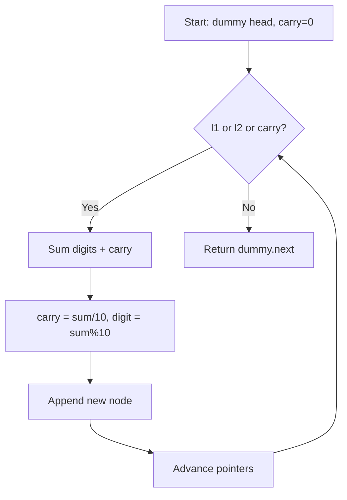

## Visual State Transitions

**Linked List Addition Step-by-Step:**

**Step 1:** Process first digits (carry=0)

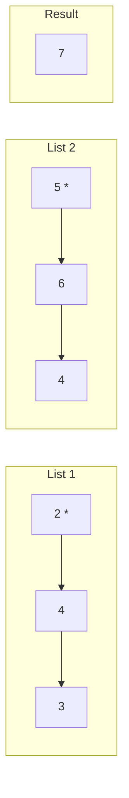

**Step 2:** Process second digits (carry=0)

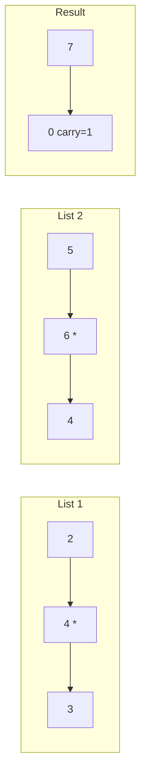

**Step 3:** Process third digits (carry=1)

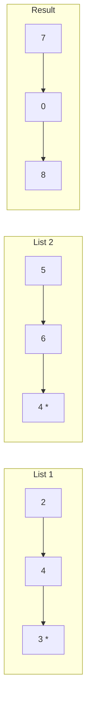

### Walkthrough

**Input:** `l1 = [2,4,3]`, `l2 = [5,6,4]`

| Step | v1 | v2 | carry_in | total | digit | carry_out | Result |
|------|----|----|----------|-------|-------|-----------|--------|
| 1 | 2 | 5 | 0 | 7 | 7 | 0 | [7] |
| 2 | 4 | 6 | 0 | 10 | 0 | 1 | [7,0] |
| 3 | 3 | 4 | 1 | 8 | 8 | 0 | [7,0,8] |

---

## Complexity Analysis

| Metric | Value |
|--------|-------|
| **Time** | O(max(m,n)) |
| **Space** | O(max(m,n)) |

---

## Solution Code

### Python3

```python
class Solution:
    def addTwoNumbers(self, l1, l2):
        dummy = ListNode(0)
        curr = dummy
        carry = 0
        while l1 or l2 or carry:
            v1 = l1.val if l1 else 0
            v2 = l2.val if l2 else 0
            total = v1 + v2 + carry
            carry = total // 10
            curr.next = ListNode(total % 10)
            curr = curr.next
            l1 = l1.next if l1 else None
            l2 = l2.next if l2 else None
        return dummy.next
```

### C++

```cpp
#include <string>
#include <vector>
using namespace std;

class Solution {
public:
    ListNode* addTwoNumbers(ListNode* l1, ListNode* l2) {
        // Linked list traversal/manipulation
        ListNode dummy(0);
        dummy.next = l1;
        ListNode* prev = &dummy;
        ListNode* curr = l1;
        while (curr) {
            ListNode* nxt = curr->next;
            // Process current node
            prev = curr;
            curr = nxt;
        }
        return dummy.next;
    }
};
```

### Summary

| Aspect | Detail |
|--------|--------|
| **Pattern** | Linked List Math |
| **Time** | O(max(m,n)) |
| **Space** | O(max(m,n)) |

---
---

# Problem 19: Remove Nth Node From End of List

| Attribute | Detail |
|-----------|--------|
| **ID** | 19 |
| **Title** | Remove Nth Node From End of List |
| **Difficulty** | Medium |
| **Tags** | Linked List, Two Pointers |
| **Link** | [leetcode.com/problems/remove-nth-node-from-end-of-list](https://leetcode.com/problems/remove-nth-node-from-end-of-list/) |

Given the `head` of a linked list, remove the `n^th` node from the end of the list and return its head.

 

Example 1:

```

**Input:** head = [1,2,3,4,5], n = 2
**Output:** [1,2,3,5]

```

Example 2:

```

**Input:** head = [1], n = 1
**Output:** []

```

Example 3:

```

**Input:** head = [1,2], n = 1
**Output:** [1]

```

 

**Constraints:**

	- The number of nodes in the list is `sz`.
	- `1 <= sz <= 30`
	- `0 <= Node.val <= 100`
	- `1 <= n <= sz`

 

**Follow up:** Could you do this in one pass?

---

## Approach: Fast and Slow Pointers

**Key Insight:** Use two pointers with a gap of n+1. When fast reaches end, slow is just before the node to remove.

Dummy head handles edge case of removing the first node.

### Pseudo-code

```
1. dummy -> head, fast = slow = dummy
2. Advance fast by n+1 steps
3. Move both until fast is null
4. slow.next = slow.next.next
5. Return dummy.next
```

---

## Algorithm Flow

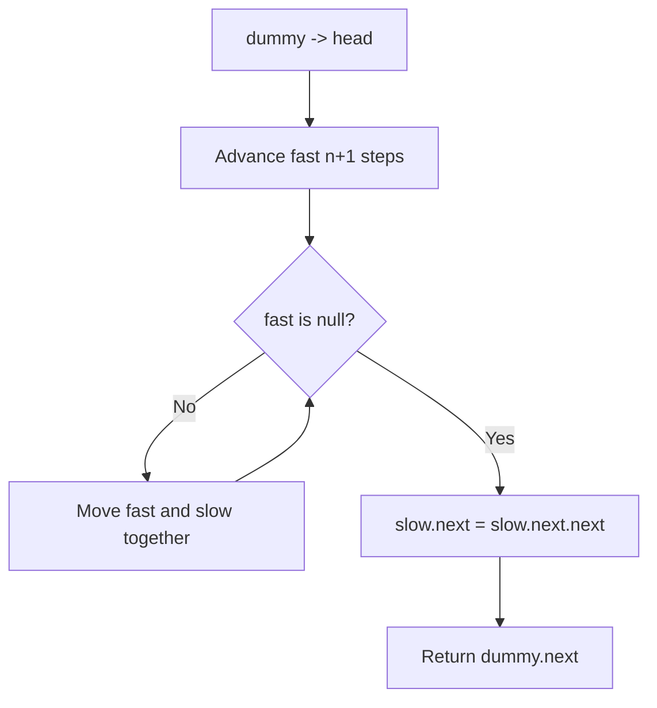

## Visual State Transitions

**Two-Pointer Gap Animation for n=2, list=[1,2,3,4,5]:**

**Step 1:** Advance fast 3 steps ahead of slow

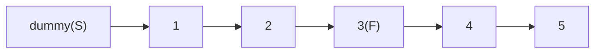

**Step 2:** Move both until fast reaches end

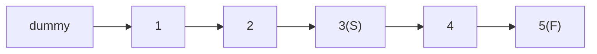

**Step 3:** Remove slow.next (node 4)

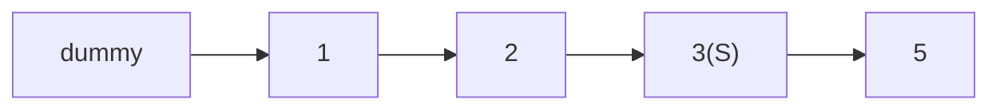

---

## Complexity Analysis

| Metric | Value |
|--------|-------|
| **Time** | O(L) where L = list length |
| **Space** | O(1) |

---

## Solution Code

### Python3

```python
class Solution:
    def removeNthFromEnd(self, head, n):
        dummy = ListNode(0, head)
        fast = slow = dummy
        for _ in range(n + 1):
            fast = fast.next
        while fast:
            fast = fast.next
            slow = slow.next
        slow.next = slow.next.next
        return dummy.next
```

### C++

```cpp
#include <string>
#include <vector>
using namespace std;

class Solution {
public:
    ListNode* removeNthFromEnd(ListNode* head, int n) {
        // Linked list traversal/manipulation
        ListNode dummy(0);
        dummy.next = head;
        ListNode* prev = &dummy;
        ListNode* curr = head;
        while (curr) {
            ListNode* nxt = curr->next;
            // Process current node
            prev = curr;
            curr = nxt;
        }
        return dummy.next;
    }
};
```

### Summary

| Aspect | Detail |
|--------|--------|
| **Pattern** | Fast and Slow Pointers |
| **Time** | O(L) where L = list length |
| **Space** | O(1) |

---
---

# Problem 21: Merge Two Sorted Lists

| Attribute | Detail |
|-----------|--------|
| **ID** | 21 |
| **Title** | Merge Two Sorted Lists |
| **Difficulty** | Easy |
| **Tags** | Linked List, Recursion |
| **Link** | [leetcode.com/problems/merge-two-sorted-lists](https://leetcode.com/problems/merge-two-sorted-lists/) |

You are given the heads of two sorted linked lists `list1` and `list2`.

Merge the two lists into one **sorted** list. The list should be made by splicing together the nodes of the first two lists.

Return *the head of the merged linked list*.

 

Example 1:

```

**Input:** list1 = [1,2,4], list2 = [1,3,4]
**Output:** [1,1,2,3,4,4]

```

Example 2:

```

**Input:** list1 = [], list2 = []
**Output:** []

```

Example 3:

```

**Input:** list1 = [], list2 = [0]
**Output:** [0]

```

 

**Constraints:**

	- The number of nodes in both lists is in the range `[0, 50]`.
	- `-100 <= Node.val <= 100`
	- Both `list1` and `list2` are sorted in **non-decreasing** order.

---

## Approach: Two Pointers / Merge

Compare heads of both lists, attach the smaller one. When one list is exhausted, attach the remainder.

### Pseudo-code

```
1. dummy node, curr pointer
2. While both lists: attach smaller, advance
3. Attach remaining list
4. Return dummy.next
```

---

## Algorithm Flow

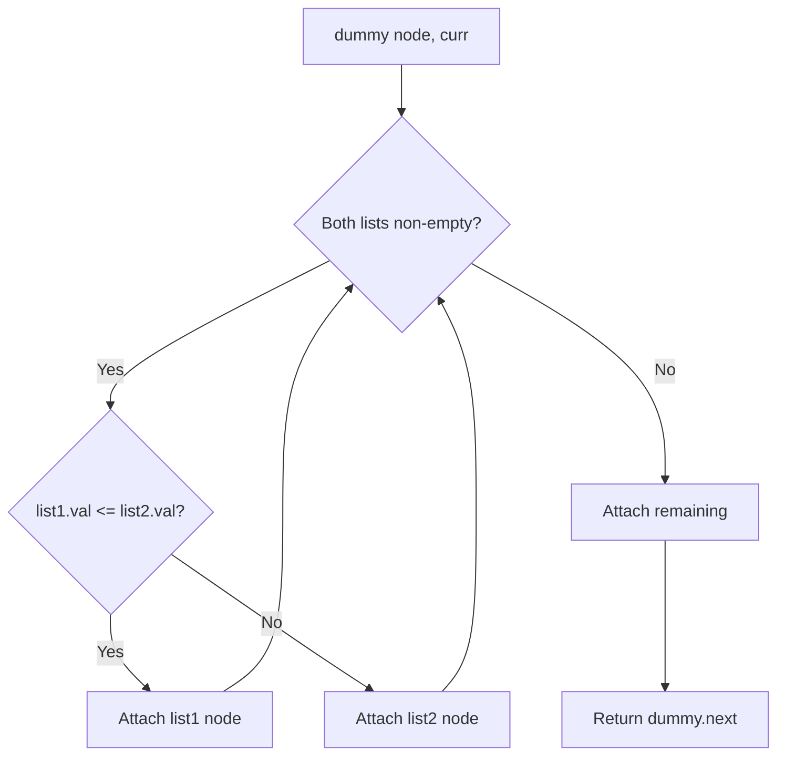

## Visual State Transitions

**Linked List Operation (Reverse):**

**Frame 1: Initial list**
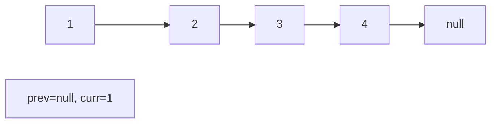

**Frame 2: Reverse first link**
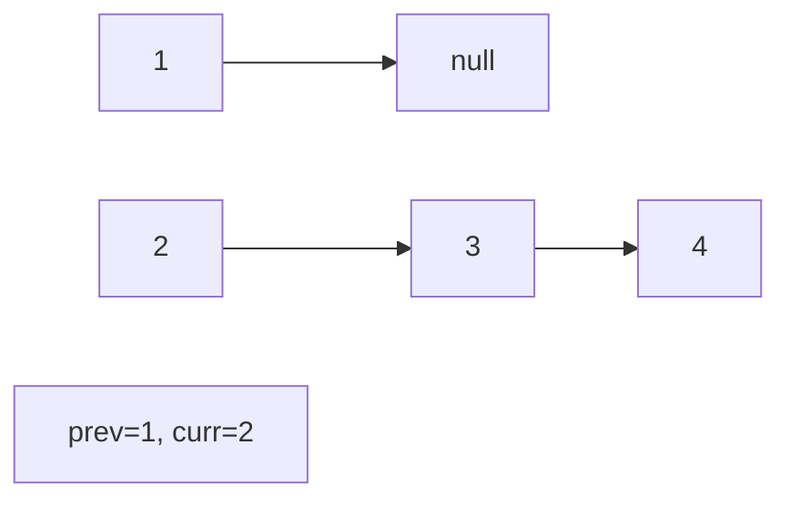

**Frame 3: Reverse second link**
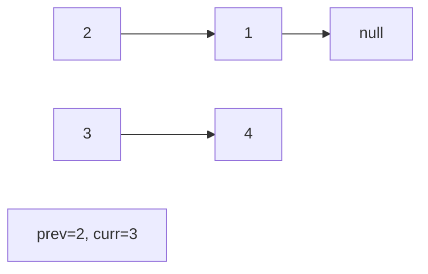

**Frame 4: Fully reversed**
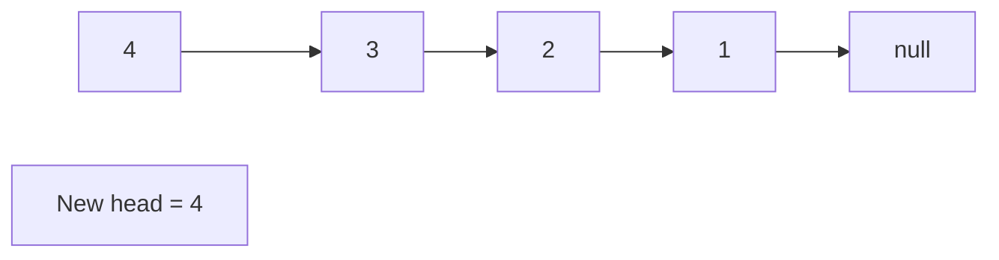


---

## Complexity Analysis

| Metric | Value |
|--------|-------|
| **Time** | O(m+n) |
| **Space** | O(1) |

---

## Solution Code

### Python3

```python
class Solution:
    def mergeTwoLists(self, list1, list2):
        dummy = ListNode(0)
        curr = dummy
        while list1 and list2:
            if list1.val <= list2.val:
                curr.next = list1
                list1 = list1.next
            else:
                curr.next = list2
                list2 = list2.next
            curr = curr.next
        curr.next = list1 or list2
        return dummy.next
```

### C++

```cpp
#include <string>
#include <vector>
using namespace std;

class Solution {
public:
    ListNode* mergeTwoLists(ListNode* list1, ListNode* list2) {
        // Linked list traversal/manipulation
        ListNode dummy(0);
        dummy.next = list1;
        ListNode* prev = &dummy;
        ListNode* curr = list1;
        while (curr) {
            ListNode* nxt = curr->next;
            // Process current node
            prev = curr;
            curr = nxt;
        }
        return dummy.next;
    }
};
```

### Summary

| Aspect | Detail |
|--------|--------|
| **Pattern** | Two Pointers / Merge |
| **Time** | O(m+n) |
| **Space** | O(1) |

---
---

# Problem 23: Merge k Sorted Lists

| Attribute | Detail |
|-----------|--------|
| **ID** | 23 |
| **Title** | Merge k Sorted Lists |
| **Difficulty** | Hard |
| **Tags** | Linked List, Divide and Conquer, Heap (Priority Queue), Merge Sort |
| **Link** | [leetcode.com/problems/merge-k-sorted-lists](https://leetcode.com/problems/merge-k-sorted-lists/) |

You are given an array of `k` linked-lists `lists`, each linked-list is sorted in ascending order.

*Merge all the linked-lists into one sorted linked-list and return it.*

 

Example 1:

```

**Input:** lists = [[1,4,5],[1,3,4],[2,6]]
**Output:** [1,1,2,3,4,4,5,6]
**Explanation:** The linked-lists are:
[
  1->4->5,
  1->3->4,
  2->6
]
merging them into one sorted linked list:
1->1->2->3->4->4->5->6

```

Example 2:

```

**Input:** lists = []
**Output:** []

```

Example 3:

```

**Input:** lists = [[]]
**Output:** []

```

 

**Constraints:**

	- `k == lists.length`
	- `0 <= k <= 10^4`
	- `0 <= lists[i].length <= 500`
	- `-10^4 <= lists[i][j] <= 10^4`
	- `lists[i]` is sorted in **ascending order**.
	- The sum of `lists[i].length` will not exceed `10^4`.

---

## Approach: Heap / Priority Queue

**Key Insight:** Use a min-heap of size k. Always extract the smallest head, advance that list, and push the next node.

N = total number of nodes across all lists.

### Pseudo-code

```
1. Push head of each list into min-heap
2. While heap not empty:
   Pop smallest, attach to result
   If popped node has next, push it
3. Return dummy.next
```

---

## Algorithm Flow

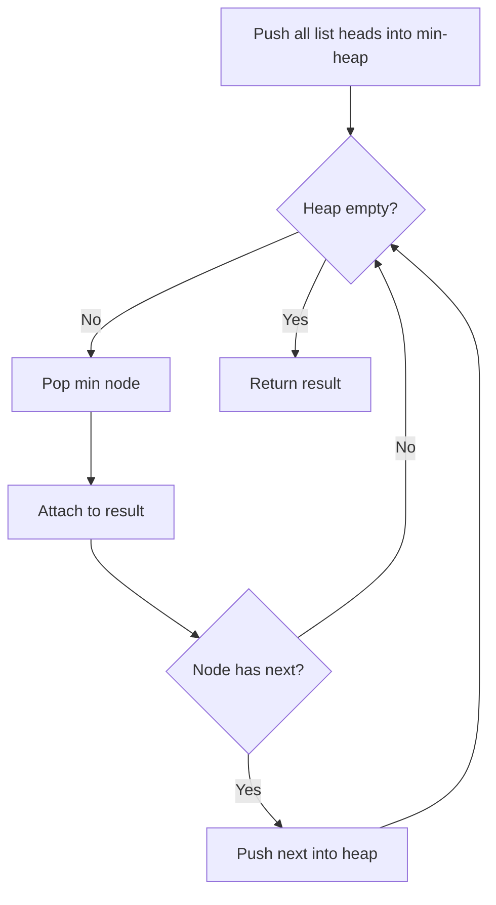

---

## Complexity Analysis

| Metric | Value |
|--------|-------|
| **Time** | O(N log k) |
| **Space** | O(k) |

---

## Solution Code

### Python3

```python
import heapq

class Solution:
    def mergeKLists(self, lists):
        heap = []
        for i, node in enumerate(lists):
            if node:
                heapq.heappush(heap, (node.val, i, node))
        dummy = ListNode(0)
        curr = dummy
        while heap:
            val, i, node = heapq.heappop(heap)
            curr.next = node
            curr = curr.next
            if node.next:
                heapq.heappush(heap, (node.next.val, i, node.next))
        return dummy.next
```

### C++

```cpp
#include <functional>
#include <string>
#include <vector>
using namespace std;

class Solution {
public:
    ListNode* mergeKLists(vector<ListNode*>& lists) {
        // Merge sort - O(n log n)
        function<void(int, int)> mergeSort = [&](int l, int r) {
            if (l >= r) return;
            int mid = (l + r) / 2;
            mergeSort(l, mid);
            mergeSort(mid + 1, r);
            vector<int> temp;
            int i = l, j = mid + 1;
            while (i <= mid && j <= r) {
                if (lists[i] <= lists[j]) temp.push_back(lists[i++]);
                else temp.push_back(lists[j++]);
            }
            while (i <= mid) temp.push_back(lists[i++]);
            while (j <= r) temp.push_back(lists[j++]);
            for (int k = l; k <= r; k++) lists[k] = temp[k - l];
        };
        mergeSort(0, lists.size() - 1);
        return lists;
    }
};
```

### Summary

| Aspect | Detail |
|--------|--------|
| **Pattern** | Heap / Priority Queue |
| **Time** | O(N log k) |
| **Space** | O(k) |

---
---

# Problem 24: Swap Nodes in Pairs

| Attribute | Detail |
|-----------|--------|
| **ID** | 24 |
| **Title** | Swap Nodes in Pairs |
| **Difficulty** | Medium |
| **Tags** | Linked List, Recursion |
| **Link** | [leetcode.com/problems/swap-nodes-in-pairs](https://leetcode.com/problems/swap-nodes-in-pairs/) |

Given a linked list, swap every two adjacent nodes and return its head. You must solve the problem without modifying the values in the list's nodes (i.e., only nodes themselves may be changed.)

 

Example 1:

**Input:** head = [1,2,3,4]

**Output:** [2,1,4,3]

**Explanation:**

Example 2:

**Input:** head = []

**Output:** []

Example 3:

**Input:** head = [1]

**Output:** [1]

Example 4:

**Input:** head = [1,2,3]

**Output:** [2,1,3]

 

**Constraints:**

	- The number of nodes in the list is in the range `[0, 100]`.
	- `0 <= Node.val <= 100`

---

## Approach: Linked List

Iteratively swap adjacent pairs using pointer manipulation. Use a dummy node to handle the head swap.

### Pseudo-code

```
1. dummy -> head, prev = dummy
2. While two nodes ahead exist:
   a, b = prev.next, prev.next.next
   Rewire: prev->b->a->b.next
   prev = a
3. Return dummy.next
```

---

## Algorithm Flow

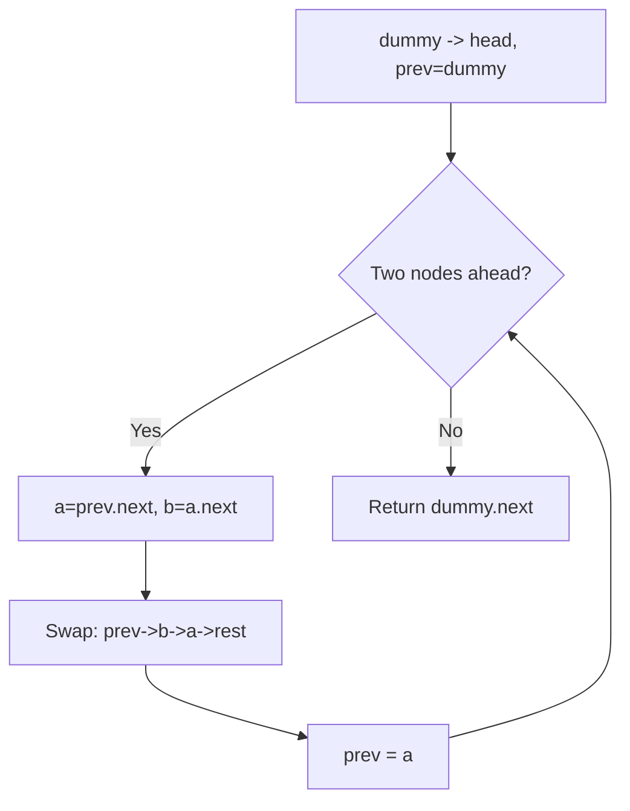

## Visual State Transitions

**Linked List Operation (Reverse):**

**Frame 1: Initial list**


**Frame 2: Reverse first link**


**Frame 3: Reverse second link**


**Frame 4: Fully reversed**


---

## Complexity Analysis

| Metric | Value |
|--------|-------|
| **Time** | O(n) |
| **Space** | O(1) |

---

## Solution Code

### Python3

```python
class Solution:
    def swapPairs(self, head):
        dummy = ListNode(0, head)
        prev = dummy
        while prev.next and prev.next.next:
            a, b = prev.next, prev.next.next
            prev.next, a.next, b.next = b, b.next, a
            prev = a
        return dummy.next
```

### C++

```cpp
#include <string>
#include <vector>
using namespace std;

class Solution {
public:
    ListNode* swapPairs(ListNode* head) {
        // Linked list traversal/manipulation
        ListNode dummy(0);
        dummy.next = head;
        ListNode* prev = &dummy;
        ListNode* curr = head;
        while (curr) {
            ListNode* nxt = curr->next;
            // Process current node
            prev = curr;
            curr = nxt;
        }
        return dummy.next;
    }
};
```

### Summary

| Aspect | Detail |
|--------|--------|
| **Pattern** | Linked List |
| **Time** | O(n) |
| **Space** | O(1) |

---
---

# Problem 25: Reverse Nodes in k-Group

| Attribute | Detail |
|-----------|--------|
| **ID** | 25 |
| **Title** | Reverse Nodes in k-Group |
| **Difficulty** | Hard |
| **Tags** | Linked List, Recursion |
| **Link** | [leetcode.com/problems/reverse-nodes-in-k-group](https://leetcode.com/problems/reverse-nodes-in-k-group/) |

Given the `head` of a linked list, reverse the nodes of the list `k` at a time, and return *the modified list*.

`k` is a positive integer and is less than or equal to the length of the linked list. If the number of nodes is not a multiple of `k` then left-out nodes, in the end, should remain as it is.

You may not alter the values in the list's nodes, only nodes themselves may be changed.

 

Example 1:

```

**Input:** head = [1,2,3,4,5], k = 2
**Output:** [2,1,4,3,5]

```

Example 2:

```

**Input:** head = [1,2,3,4,5], k = 3
**Output:** [3,2,1,4,5]

```

 

**Constraints:**

	- The number of nodes in the list is `n`.
	- `1 <= k <= n <= 5000`
	- `0 <= Node.val <= 1000`

 

**Follow-up:** Can you solve the problem in `O(1)` extra memory space?

---

## Approach: Linked List

Find the kth node, reverse that segment, reconnect. Repeat until fewer than k nodes remain.

### Pseudo-code

```
1. For each group of k nodes:
   Find kth node (if < k remain, stop)
   Reverse k nodes
   Reconnect with previous group
   Move to next group
```

---

## Algorithm Flow

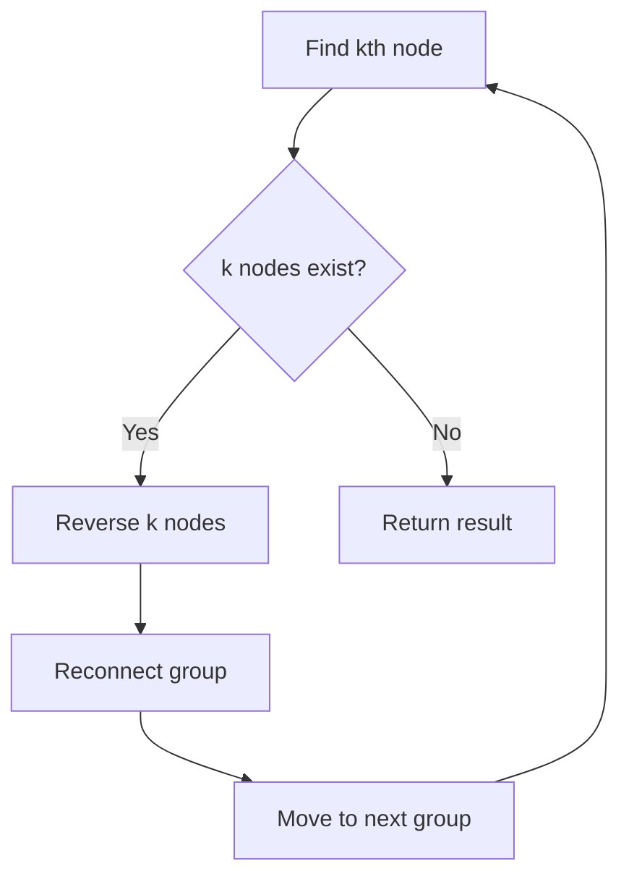

## Visual State Transitions

**Linked List Operation (Reverse):**

**Frame 1: Initial list**
```mermaid
graph LR
    A["1"] --> B["2"] --> C["3"] --> D["4"] --> N[null]
    P["prev=null, curr=1"]
```

**Frame 2: Reverse first link**
```mermaid
graph LR
    A["1"] --> N[null]
    B["2"] --> C["3"] --> D["4"]
    P["prev=1, curr=2"]
```

**Frame 3: Reverse second link**
```mermaid
graph LR
    B["2"] --> A["1"] --> N[null]
    C["3"] --> D["4"]
    P["prev=2, curr=3"]
```

**Frame 4: Fully reversed**
```mermaid
graph LR
    D["4"] --> C["3"] --> B["2"] --> A["1"] --> N[null]
    P["New head = 4"]
```


---

## Complexity Analysis

| Metric | Value |
|--------|-------|
| **Time** | O(n) |
| **Space** | O(1) |

---

## Solution Code

### Python3

```python
class Solution:
    def reverseKGroup(self, head, k):
        def reverse(head, k):
            prev, curr = None, head
            for _ in range(k):
                nxt = curr.next
                curr.next = prev
                prev = curr
                curr = nxt
            return prev

        dummy = ListNode(0, head)
        prev_group = dummy
        while True:
            kth = prev_group
            for _ in range(k):
                kth = kth.next
                if not kth:
                    return dummy.next
            next_group = kth.next
            new_head = reverse(prev_group.next, k)
            tail = prev_group.next
            tail.next = next_group
            prev_group.next = new_head
            prev_group = tail
        return dummy.next
```

### C++

```cpp
#include <string>
#include <vector>
using namespace std;

class Solution {
public:
    ListNode* reverseKGroup(ListNode* head, int k) {
        // Linked list traversal/manipulation
        ListNode dummy(0);
        dummy.next = head;
        ListNode* prev = &dummy;
        ListNode* curr = head;
        while (curr) {
            ListNode* nxt = curr->next;
            // Process current node
            prev = curr;
            curr = nxt;
        }
        return dummy.next;
    }
};
```

### Summary

| Aspect | Detail |
|--------|--------|
| **Pattern** | Linked List |
| **Time** | O(n) |
| **Space** | O(1) |

---
---

# Problem 61: Rotate List

| Attribute | Detail |
|-----------|--------|
| **ID** | 61 |
| **Title** | Rotate List |
| **Difficulty** | Medium |
| **Tags** | Linked List, Two Pointers |
| **Link** | [leetcode.com/problems/rotate-list](https://leetcode.com/problems/rotate-list/) |

Given the `head` of a linked list, rotate the list to the right by `k` places.

 

Example 1:

```

**Input:** head = [1,2,3,4,5], k = 2
**Output:** [4,5,1,2,3]

```

Example 2:

```

**Input:** head = [0,1,2], k = 4
**Output:** [2,0,1]

```

 

**Constraints:**

	- The number of nodes in the list is in the range `[0, 500]`.
	- `-100 <= Node.val <= 100`
	- `0 <= k <= 2 * 10^9`

---

## Approach: Linked List

Make list circular, then break at the right point. k %= length to handle large k.

### Pseudo-code

```
1. Find length, connect tail to head
2. k %= length
3. Walk length-k steps from head, break the link
```

---

## Algorithm Flow

```mermaid
flowchart TD
    A[Create dummy head node] --> B[curr = head]
    B --> C{curr is not null?}
    C -- Yes --> D[Process current node]
    D --> E[Adjust pointers / links]
    E --> F[curr = curr.next]
    F --> C
    C -- No --> G[Return dummy.next or result]
```

## Visual State Transitions

**Linked List Operation (Reverse):**

**Frame 1: Initial list**
```mermaid
graph LR
    A["1"] --> B["2"] --> C["3"] --> D["4"] --> N[null]
    P["prev=null, curr=1"]
```

**Frame 2: Reverse first link**
```mermaid
graph LR
    A["1"] --> N[null]
    B["2"] --> C["3"] --> D["4"]
    P["prev=1, curr=2"]
```

**Frame 3: Reverse second link**
```mermaid
graph LR
    B["2"] --> A["1"] --> N[null]
    C["3"] --> D["4"]
    P["prev=2, curr=3"]
```

**Frame 4: Fully reversed**
```mermaid
graph LR
    D["4"] --> C["3"] --> B["2"] --> A["1"] --> N[null]
    P["New head = 4"]
```


---

## Complexity Analysis

| Metric | Value |
|--------|-------|
| **Time** | O(n) |
| **Space** | O(1) |

---

## Solution Code

### Python3

```python
class Solution:
    def rotateRight(self, head, k):
        if not head or not head.next or k == 0:
            return head
        length = 1
        tail = head
        while tail.next:
            tail = tail.next
            length += 1
        k %= length
        if k == 0:
            return head
        tail.next = head
        steps = length - k
        new_tail = head
        for _ in range(steps - 1):
            new_tail = new_tail.next
        new_head = new_tail.next
        new_tail.next = None
        return new_head
```

### C++

```cpp
#include <string>
#include <vector>
using namespace std;

class Solution {
public:
    ListNode* rotateRight(ListNode* head, int k) {
        // Linked list traversal/manipulation
        ListNode dummy(0);
        dummy.next = head;
        ListNode* prev = &dummy;
        ListNode* curr = head;
        while (curr) {
            ListNode* nxt = curr->next;
            // Process current node
            prev = curr;
            curr = nxt;
        }
        return dummy.next;
    }
};
```

### Summary

| Aspect | Detail |
|--------|--------|
| **Pattern** | Linked List |
| **Time** | O(n) |
| **Space** | O(1) |

---
---

# Problem 82: Remove Duplicates from Sorted List II

| Attribute | Detail |
|-----------|--------|
| **ID** | 82 |
| **Title** | Remove Duplicates from Sorted List II |
| **Difficulty** | Medium |
| **Tags** | Linked List, Two Pointers |
| **Link** | [leetcode.com/problems/remove-duplicates-from-sorted-list-ii](https://leetcode.com/problems/remove-duplicates-from-sorted-list-ii/) |

Given the `head` of a sorted linked list, *delete all nodes that have duplicate numbers, leaving only distinct numbers from the original list*. Return *the linked list **sorted** as well*.

 

Example 1:

```

**Input:** head = [1,2,3,3,4,4,5]
**Output:** [1,2,5]

```

Example 2:

```

**Input:** head = [1,1,1,2,3]
**Output:** [2,3]

```

 

**Constraints:**

	- The number of nodes in the list is in the range `[0, 300]`.
	- `-100 <= Node.val <= 100`
	- The list is guaranteed to be **sorted** in ascending order.

---

## Approach: Linked List

Traverse or manipulate the linked list using pointer techniques. Common patterns: dummy head node for edge cases, fast/slow pointers for cycle detection or middle finding, in-place reversal, and merge operations.

### Pseudo-code

```
1. Create dummy head if needed
2. Initialize pointer(s) at head
3. Traverse / modify list:
   a. Process current node
   b. Adjust next pointers as needed
   c. Move to next node
4. Return dummy.next or result
```

---

## Algorithm Flow

```mermaid
flowchart TD
    A[Create dummy head node] --> B[curr = head]
    B --> C{curr is not null?}
    C -- Yes --> D[Process current node]
    D --> E[Adjust pointers / links]
    E --> F[curr = curr.next]
    F --> C
    C -- No --> G[Return dummy.next or result]
```

## Visual State Transitions

**Linked List Operation (Reverse):**

**Frame 1: Initial list**
```mermaid
graph LR
    A["1"] --> B["2"] --> C["3"] --> D["4"] --> N[null]
    P["prev=null, curr=1"]
```

**Frame 2: Reverse first link**
```mermaid
graph LR
    A["1"] --> N[null]
    B["2"] --> C["3"] --> D["4"]
    P["prev=1, curr=2"]
```

**Frame 3: Reverse second link**
```mermaid
graph LR
    B["2"] --> A["1"] --> N[null]
    C["3"] --> D["4"]
    P["prev=2, curr=3"]
```

**Frame 4: Fully reversed**
```mermaid
graph LR
    D["4"] --> C["3"] --> B["2"] --> A["1"] --> N[null]
    P["New head = 4"]
```


---

## Complexity Analysis

| Metric | Value |
|--------|-------|
| **Time** | O(n) |
| **Space** | O(1) |

---

## Solution Code

### Python3

```python
class Solution:
    def deleteDuplicates(self, head: Optional[ListNode]) -> Optional[ListNode]:
        # Linked list traversal/manipulation
        dummy = ListNode(0)
        dummy.next = head
        prev, curr = dummy, head
        while curr:
            nxt = curr.next
            # Process current node
            prev = curr
            curr = nxt
        return dummy.next
```

### C++

```cpp
#include <string>
#include <vector>
using namespace std;

class Solution {
public:
    ListNode* deleteDuplicates(ListNode* head) {
        // Linked list traversal/manipulation
        ListNode dummy(0);
        dummy.next = head;
        ListNode* prev = &dummy;
        ListNode* curr = head;
        while (curr) {
            ListNode* nxt = curr->next;
            // Process current node
            prev = curr;
            curr = nxt;
        }
        return dummy.next;
    }
};
```

### Summary

| Aspect | Detail |
|--------|--------|
| **Pattern** | Linked List |
| **Time** | O(n) |
| **Space** | O(1) |

---
---

# Problem 83: Remove Duplicates from Sorted List

| Attribute | Detail |
|-----------|--------|
| **ID** | 83 |
| **Title** | Remove Duplicates from Sorted List |
| **Difficulty** | Easy |
| **Tags** | Linked List |
| **Link** | [leetcode.com/problems/remove-duplicates-from-sorted-list](https://leetcode.com/problems/remove-duplicates-from-sorted-list/) |

Given the `head` of a sorted linked list, *delete all duplicates such that each element appears only once*. Return *the linked list **sorted** as well*.

 

Example 1:

```

**Input:** head = [1,1,2]
**Output:** [1,2]

```

Example 2:

```

**Input:** head = [1,1,2,3,3]
**Output:** [1,2,3]

```

 

**Constraints:**

	- The number of nodes in the list is in the range `[0, 300]`.
	- `-100 <= Node.val <= 100`
	- The list is guaranteed to be **sorted** in ascending order.

---

## Approach: Linked List

Traverse or manipulate the linked list using pointer techniques. Common patterns: dummy head node for edge cases, fast/slow pointers for cycle detection or middle finding, in-place reversal, and merge operations.

### Pseudo-code

```
1. Create dummy head if needed
2. Initialize pointer(s) at head
3. Traverse / modify list:
   a. Process current node
   b. Adjust next pointers as needed
   c. Move to next node
4. Return dummy.next or result
```

---

## Algorithm Flow

```mermaid
flowchart TD
    A[Create dummy head node] --> B[curr = head]
    B --> C{curr is not null?}
    C -- Yes --> D[Process current node]
    D --> E[Adjust pointers / links]
    E --> F[curr = curr.next]
    F --> C
    C -- No --> G[Return dummy.next or result]
```

## Visual State Transitions

**Linked List Operation (Reverse):**

**Frame 1: Initial list**
```mermaid
graph LR
    A["1"] --> B["2"] --> C["3"] --> D["4"] --> N[null]
    P["prev=null, curr=1"]
```

**Frame 2: Reverse first link**
```mermaid
graph LR
    A["1"] --> N[null]
    B["2"] --> C["3"] --> D["4"]
    P["prev=1, curr=2"]
```

**Frame 3: Reverse second link**
```mermaid
graph LR
    B["2"] --> A["1"] --> N[null]
    C["3"] --> D["4"]
    P["prev=2, curr=3"]
```

**Frame 4: Fully reversed**
```mermaid
graph LR
    D["4"] --> C["3"] --> B["2"] --> A["1"] --> N[null]
    P["New head = 4"]
```


---

## Complexity Analysis

| Metric | Value |
|--------|-------|
| **Time** | O(n) |
| **Space** | O(1) |

---

## Solution Code

### Python3

```python
class Solution:
    def deleteDuplicates(self, head: Optional[ListNode]) -> Optional[ListNode]:
        # Linked list traversal/manipulation
        dummy = ListNode(0)
        dummy.next = head
        prev, curr = dummy, head
        while curr:
            nxt = curr.next
            # Process current node
            prev = curr
            curr = nxt
        return dummy.next
```

### C++

```cpp
#include <string>
#include <vector>
using namespace std;

class Solution {
public:
    ListNode* deleteDuplicates(ListNode* head) {
        // Linked list traversal/manipulation
        ListNode dummy(0);
        dummy.next = head;
        ListNode* prev = &dummy;
        ListNode* curr = head;
        while (curr) {
            ListNode* nxt = curr->next;
            // Process current node
            prev = curr;
            curr = nxt;
        }
        return dummy.next;
    }
};
```

### Summary

| Aspect | Detail |
|--------|--------|
| **Pattern** | Linked List |
| **Time** | O(n) |
| **Space** | O(1) |

---
---

# Problem 86: Partition List

| Attribute | Detail |
|-----------|--------|
| **ID** | 86 |
| **Title** | Partition List |
| **Difficulty** | Medium |
| **Tags** | Linked List, Two Pointers |
| **Link** | [leetcode.com/problems/partition-list](https://leetcode.com/problems/partition-list/) |

Given the `head` of a linked list and a value `x`, partition it such that all nodes **less than** `x` come before nodes **greater than or equal** to `x`.

You should **preserve** the original relative order of the nodes in each of the two partitions.

 

Example 1:

```

**Input:** head = [1,4,3,2,5,2], x = 3
**Output:** [1,2,2,4,3,5]

```

Example 2:

```

**Input:** head = [2,1], x = 2
**Output:** [1,2]

```

 

**Constraints:**

	- The number of nodes in the list is in the range `[0, 200]`.
	- `-100 <= Node.val <= 100`
	- `-200 <= x <= 200`

---

## Approach: Linked List

Traverse or manipulate the linked list using pointer techniques. Common patterns: dummy head node for edge cases, fast/slow pointers for cycle detection or middle finding, in-place reversal, and merge operations.

### Pseudo-code

```
1. Create dummy head if needed
2. Initialize pointer(s) at head
3. Traverse / modify list:
   a. Process current node
   b. Adjust next pointers as needed
   c. Move to next node
4. Return dummy.next or result
```

---

## Algorithm Flow

```mermaid
flowchart TD
    A[Create dummy head node] --> B[curr = head]
    B --> C{curr is not null?}
    C -- Yes --> D[Process current node]
    D --> E[Adjust pointers / links]
    E --> F[curr = curr.next]
    F --> C
    C -- No --> G[Return dummy.next or result]
```

## Visual State Transitions

**Linked List Operation (Reverse):**

**Frame 1: Initial list**
```mermaid
graph LR
    A["1"] --> B["2"] --> C["3"] --> D["4"] --> N[null]
    P["prev=null, curr=1"]
```

**Frame 2: Reverse first link**
```mermaid
graph LR
    A["1"] --> N[null]
    B["2"] --> C["3"] --> D["4"]
    P["prev=1, curr=2"]
```

**Frame 3: Reverse second link**
```mermaid
graph LR
    B["2"] --> A["1"] --> N[null]
    C["3"] --> D["4"]
    P["prev=2, curr=3"]
```

**Frame 4: Fully reversed**
```mermaid
graph LR
    D["4"] --> C["3"] --> B["2"] --> A["1"] --> N[null]
    P["New head = 4"]
```


---

## Complexity Analysis

| Metric | Value |
|--------|-------|
| **Time** | O(n) |
| **Space** | O(1) |

---

## Solution Code

### Python3

```python
class Solution:
    def partition(self, head: Optional[ListNode], x: int) -> Optional[ListNode]:
        # Linked list traversal/manipulation
        dummy = ListNode(0)
        dummy.next = head
        prev, curr = dummy, head
        while curr:
            nxt = curr.next
            # Process current node
            prev = curr
            curr = nxt
        return dummy.next
```

### C++

```cpp
#include <string>
#include <vector>
using namespace std;

class Solution {
public:
    ListNode* partition(ListNode* head, int x) {
        // Linked list traversal/manipulation
        ListNode dummy(0);
        dummy.next = head;
        ListNode* prev = &dummy;
        ListNode* curr = head;
        while (curr) {
            ListNode* nxt = curr->next;
            // Process current node
            prev = curr;
            curr = nxt;
        }
        return dummy.next;
    }
};
```

### Summary

| Aspect | Detail |
|--------|--------|
| **Pattern** | Linked List |
| **Time** | O(n) |
| **Space** | O(1) |

---
---

# Problem 92: Reverse Linked List II

| Attribute | Detail |
|-----------|--------|
| **ID** | 92 |
| **Title** | Reverse Linked List II |
| **Difficulty** | Medium |
| **Tags** | Linked List |
| **Link** | [leetcode.com/problems/reverse-linked-list-ii](https://leetcode.com/problems/reverse-linked-list-ii/) |

Given the `head` of a singly linked list and two integers `left` and `right` where `left <= right`, reverse the nodes of the list from position `left` to position `right`, and return *the reversed list*.

 

Example 1:

```

**Input:** head = [1,2,3,4,5], left = 2, right = 4
**Output:** [1,4,3,2,5]

```

Example 2:

```

**Input:** head = [5], left = 1, right = 1
**Output:** [5]

```

 

**Constraints:**

	- The number of nodes in the list is `n`.
	- `1 <= n <= 500`
	- `-500 <= Node.val <= 500`
	- `1 <= left <= right <= n`

 

**Follow up:** Could you do it in one pass?

---

## Approach: Linked List

Traverse or manipulate the linked list using pointer techniques. Common patterns: dummy head node for edge cases, fast/slow pointers for cycle detection or middle finding, in-place reversal, and merge operations.

### Pseudo-code

```
1. Create dummy head if needed
2. Initialize pointer(s) at head
3. Traverse / modify list:
   a. Process current node
   b. Adjust next pointers as needed
   c. Move to next node
4. Return dummy.next or result
```

---

## Algorithm Flow

```mermaid
flowchart TD
    A[Create dummy head node] --> B[curr = head]
    B --> C{curr is not null?}
    C -- Yes --> D[Process current node]
    D --> E[Adjust pointers / links]
    E --> F[curr = curr.next]
    F --> C
    C -- No --> G[Return dummy.next or result]
```

## Visual State Transitions

**Linked List Operation (Reverse):**

**Frame 1: Initial list**
```mermaid
graph LR
    A["1"] --> B["2"] --> C["3"] --> D["4"] --> N[null]
    P["prev=null, curr=1"]
```

**Frame 2: Reverse first link**
```mermaid
graph LR
    A["1"] --> N[null]
    B["2"] --> C["3"] --> D["4"]
    P["prev=1, curr=2"]
```

**Frame 3: Reverse second link**
```mermaid
graph LR
    B["2"] --> A["1"] --> N[null]
    C["3"] --> D["4"]
    P["prev=2, curr=3"]
```

**Frame 4: Fully reversed**
```mermaid
graph LR
    D["4"] --> C["3"] --> B["2"] --> A["1"] --> N[null]
    P["New head = 4"]
```


---

## Complexity Analysis

| Metric | Value |
|--------|-------|
| **Time** | O(n) |
| **Space** | O(1) |

---

## Solution Code

### Python3

```python
class Solution:
    def reverseBetween(self, head: Optional[ListNode], left: int, right: int) -> Optional[ListNode]:
        # Linked list traversal/manipulation
        dummy = ListNode(0)
        dummy.next = head
        prev, curr = dummy, head
        while curr:
            nxt = curr.next
            # Process current node
            prev = curr
            curr = nxt
        return dummy.next
```

### C++

```cpp
#include <string>
#include <vector>
using namespace std;

class Solution {
public:
    ListNode* reverseBetween(ListNode* head, int left, int right) {
        // Linked list traversal/manipulation
        ListNode dummy(0);
        dummy.next = head;
        ListNode* prev = &dummy;
        ListNode* curr = head;
        while (curr) {
            ListNode* nxt = curr->next;
            // Process current node
            prev = curr;
            curr = nxt;
        }
        return dummy.next;
    }
};
```

### Summary

| Aspect | Detail |
|--------|--------|
| **Pattern** | Linked List |
| **Time** | O(n) |
| **Space** | O(1) |

---
---

# Problem 109: Convert Sorted List to Binary Search Tree

| Attribute | Detail |
|-----------|--------|
| **ID** | 109 |
| **Title** | Convert Sorted List to Binary Search Tree |
| **Difficulty** | Medium |
| **Tags** | Linked List, Divide and Conquer, Tree, Binary Search Tree, Binary Tree |
| **Link** | [leetcode.com/problems/convert-sorted-list-to-binary-search-tree](https://leetcode.com/problems/convert-sorted-list-to-binary-search-tree/) |

Given the `head` of a singly linked list where elements are sorted in **ascending order**, convert *it to a ****height-balanced*** *binary search tree*.

 

Example 1:

```

**Input:** head = [-10,-3,0,5,9]
**Output:** [0,-3,9,-10,null,5]
**Explanation:** One possible answer is [0,-3,9,-10,null,5], which represents the shown height balanced BST.

```

Example 2:

```

**Input:** head = []
**Output:** []

```

 

**Constraints:**

	- The number of nodes in `head` is in the range `[0, 2 * 10^4]`.
	- `-10^5 <= Node.val <= 10^5`

---

## Approach: Linked List

Traverse or manipulate the linked list using pointer techniques. Common patterns: dummy head node for edge cases, fast/slow pointers for cycle detection or middle finding, in-place reversal, and merge operations.

### Pseudo-code

```
1. Create dummy head if needed
2. Initialize pointer(s) at head
3. Traverse / modify list:
   a. Process current node
   b. Adjust next pointers as needed
   c. Move to next node
4. Return dummy.next or result
```

---

## Algorithm Flow

```mermaid
flowchart TD
    A[Create dummy head node] --> B[curr = head]
    B --> C{curr is not null?}
    C -- Yes --> D[Process current node]
    D --> E[Adjust pointers / links]
    E --> F[curr = curr.next]
    F --> C
    C -- No --> G[Return dummy.next or result]
```

## Visual State Transitions

**Linked List Operation (Reverse):**

**Frame 1: Initial list**
```mermaid
graph LR
    A["1"] --> B["2"] --> C["3"] --> D["4"] --> N[null]
    P["prev=null, curr=1"]
```

**Frame 2: Reverse first link**
```mermaid
graph LR
    A["1"] --> N[null]
    B["2"] --> C["3"] --> D["4"]
    P["prev=1, curr=2"]
```

**Frame 3: Reverse second link**
```mermaid
graph LR
    B["2"] --> A["1"] --> N[null]
    C["3"] --> D["4"]
    P["prev=2, curr=3"]
```

**Frame 4: Fully reversed**
```mermaid
graph LR
    D["4"] --> C["3"] --> B["2"] --> A["1"] --> N[null]
    P["New head = 4"]
```


---

## Complexity Analysis

| Metric | Value |
|--------|-------|
| **Time** | O(n) |
| **Space** | O(1) |

---

## Solution Code

### Python3

```python
class Solution:
    def sortedListToBST(self, head: Optional[ListNode]) -> Optional[TreeNode]:
        # Linked list traversal/manipulation
        dummy = ListNode(0)
        dummy.next = head
        prev, curr = dummy, head
        while curr:
            nxt = curr.next
            # Process current node
            prev = curr
            curr = nxt
        return dummy.next
```

### C++

```cpp
#include <string>
#include <vector>
using namespace std;

class Solution {
public:
    TreeNode* sortedListToBST(ListNode* head) {
        // Linked list traversal/manipulation
        ListNode dummy(0);
        dummy.next = head;
        ListNode* prev = &dummy;
        ListNode* curr = head;
        while (curr) {
            ListNode* nxt = curr->next;
            // Process current node
            prev = curr;
            curr = nxt;
        }
        return dummy.next;
    }
};
```

### Summary

| Aspect | Detail |
|--------|--------|
| **Pattern** | Linked List |
| **Time** | O(n) |
| **Space** | O(1) |

---
---

# Problem 114: Flatten Binary Tree to Linked List

| Attribute | Detail |
|-----------|--------|
| **ID** | 114 |
| **Title** | Flatten Binary Tree to Linked List |
| **Difficulty** | Medium |
| **Tags** | Linked List, Stack, Tree, Depth-First Search, Binary Tree |
| **Link** | [leetcode.com/problems/flatten-binary-tree-to-linked-list](https://leetcode.com/problems/flatten-binary-tree-to-linked-list/) |

Given the `root` of a binary tree, flatten the tree into a "linked list":

	- The "linked list" should use the same `TreeNode` class where the `right` child pointer points to the next node in the list and the `left` child pointer is always `null`.
	- The "linked list" should be in the same order as a **pre-order**** traversal** of the binary tree.

 

Example 1:

```

**Input:** root = [1,2,5,3,4,null,6]
**Output:** [1,null,2,null,3,null,4,null,5,null,6]

```

Example 2:

```

**Input:** root = []
**Output:** []

```

Example 3:

```

**Input:** root = [0]
**Output:** [0]

```

 

**Constraints:**

	- The number of nodes in the tree is in the range `[0, 2000]`.
	- `-100 <= Node.val <= 100`

 

**Follow up:** Can you flatten the tree in-place (with `O(1)` extra space)?

---

## Approach: Linked List

Traverse or manipulate the linked list using pointer techniques. Common patterns: dummy head node for edge cases, fast/slow pointers for cycle detection or middle finding, in-place reversal, and merge operations.

### Pseudo-code

```
1. Create dummy head if needed
2. Initialize pointer(s) at head
3. Traverse / modify list:
   a. Process current node
   b. Adjust next pointers as needed
   c. Move to next node
4. Return dummy.next or result
```

---

## Algorithm Flow

```mermaid
flowchart TD
    A[Create dummy head node] --> B[curr = head]
    B --> C{curr is not null?}
    C -- Yes --> D[Process current node]
    D --> E[Adjust pointers / links]
    E --> F[curr = curr.next]
    F --> C
    C -- No --> G[Return dummy.next or result]
```

## Visual State Transitions

**Linked List Operation (Reverse):**

**Frame 1: Initial list**
```mermaid
graph LR
    A["1"] --> B["2"] --> C["3"] --> D["4"] --> N[null]
    P["prev=null, curr=1"]
```

**Frame 2: Reverse first link**
```mermaid
graph LR
    A["1"] --> N[null]
    B["2"] --> C["3"] --> D["4"]
    P["prev=1, curr=2"]
```

**Frame 3: Reverse second link**
```mermaid
graph LR
    B["2"] --> A["1"] --> N[null]
    C["3"] --> D["4"]
    P["prev=2, curr=3"]
```

**Frame 4: Fully reversed**
```mermaid
graph LR
    D["4"] --> C["3"] --> B["2"] --> A["1"] --> N[null]
    P["New head = 4"]
```


---

## Complexity Analysis

| Metric | Value |
|--------|-------|
| **Time** | O(n) |
| **Space** | O(1) |

---

## Solution Code

### Python3

```python
class Solution:
    def flatten(self, root: Optional[TreeNode]) -> None:
        # Linked list traversal/manipulation
        dummy = ListNode(0)
        dummy.next = root
        prev, curr = dummy, root
        while curr:
            nxt = curr.next
            # Process current node
            prev = curr
            curr = nxt
        return dummy.next
```

### C++

```cpp
#include <string>
#include <vector>
using namespace std;

class Solution {
public:
    void flatten(TreeNode* root) {
        // Linked list traversal/manipulation
        ListNode dummy(0);
        dummy.next = root;
        ListNode* prev = &dummy;
        ListNode* curr = root;
        while (curr) {
            ListNode* nxt = curr->next;
            // Process current node
            prev = curr;
            curr = nxt;
        }
        return dummy.next;
    }
};
```

### Summary

| Aspect | Detail |
|--------|--------|
| **Pattern** | Linked List |
| **Time** | O(n) |
| **Space** | O(1) |

---
---

# Problem 116: Populating Next Right Pointers in Each Node

| Attribute | Detail |
|-----------|--------|
| **ID** | 116 |
| **Title** | Populating Next Right Pointers in Each Node |
| **Difficulty** | Medium |
| **Tags** | Linked List, Tree, Depth-First Search, Breadth-First Search, Binary Tree |
| **Link** | [leetcode.com/problems/populating-next-right-pointers-in-each-node](https://leetcode.com/problems/populating-next-right-pointers-in-each-node/) |

You are given a **perfect binary tree** where all leaves are on the same level, and every parent has two children. The binary tree has the following definition:

```

struct Node {
  int val;
  Node *left;
  Node *right;
  Node *next;
}

```

Populate each next pointer to point to its next right node. If there is no next right node, the next pointer should be set to `NULL`.

Initially, all next pointers are set to `NULL`.

 

Example 1:

```

**Input:** root = [1,2,3,4,5,6,7]
**Output:** [1,#,2,3,#,4,5,6,7,#]
**Explanation: **Given the above perfect binary tree (Figure A), your function should populate each next pointer to point to its next right node, just like in Figure B. The serialized output is in level order as connected by the next pointers, with '#' signifying the end of each level.

```

Example 2:

```

**Input:** root = []
**Output:** []

```

 

**Constraints:**

	- The number of nodes in the tree is in the range `[0, 2^12 - 1]`.
	- `-1000 <= Node.val <= 1000`

 

**Follow-up:**

	- You may only use constant extra space.
	- The recursive approach is fine. You may assume implicit stack space does not count as extra space for this problem.

---

## Approach: Linked List

Traverse or manipulate the linked list using pointer techniques. Common patterns: dummy head node for edge cases, fast/slow pointers for cycle detection or middle finding, in-place reversal, and merge operations.

### Pseudo-code

```
1. Create dummy head if needed
2. Initialize pointer(s) at head
3. Traverse / modify list:
   a. Process current node
   b. Adjust next pointers as needed
   c. Move to next node
4. Return dummy.next or result
```

---

## Algorithm Flow

```mermaid
flowchart TD
    A[Create dummy head node] --> B[curr = head]
    B --> C{curr is not null?}
    C -- Yes --> D[Process current node]
    D --> E[Adjust pointers / links]
    E --> F[curr = curr.next]
    F --> C
    C -- No --> G[Return dummy.next or result]
```

## Visual State Transitions

**Linked List Operation (Reverse):**

**Frame 1: Initial list**
```mermaid
graph LR
    A["1"] --> B["2"] --> C["3"] --> D["4"] --> N[null]
    P["prev=null, curr=1"]
```

**Frame 2: Reverse first link**
```mermaid
graph LR
    A["1"] --> N[null]
    B["2"] --> C["3"] --> D["4"]
    P["prev=1, curr=2"]
```

**Frame 3: Reverse second link**
```mermaid
graph LR
    B["2"] --> A["1"] --> N[null]
    C["3"] --> D["4"]
    P["prev=2, curr=3"]
```

**Frame 4: Fully reversed**
```mermaid
graph LR
    D["4"] --> C["3"] --> B["2"] --> A["1"] --> N[null]
    P["New head = 4"]
```


---

## Complexity Analysis

| Metric | Value |
|--------|-------|
| **Time** | O(n) |
| **Space** | O(1) |

---

## Solution Code

### Python3

```python
class Node:
    def __init__(self, val: int, left: 'Node', right: 'Node', next: 'Node'):
        # Initialize data structure
        self.val = val
        self.left = left
        self.right = right
        self.next = next

    def connect(self, root: 'Optional[Node]') -> 'Optional[Node]':
        return None

```

### C++

```cpp
#include <string>
#include <vector>
using namespace std;

class Node {
public:
    Node(int val, Node* left, Node* right, Node* next) {
        // Initialize
    }

    Node* connect(Node* root) {
        return nullptr;
    }

};
```

### Summary

| Aspect | Detail |
|--------|--------|
| **Pattern** | Linked List |
| **Time** | O(n) |
| **Space** | O(1) |

---
---

# Problem 117: Populating Next Right Pointers in Each Node II

| Attribute | Detail |
|-----------|--------|
| **ID** | 117 |
| **Title** | Populating Next Right Pointers in Each Node II |
| **Difficulty** | Medium |
| **Tags** | Linked List, Tree, Depth-First Search, Breadth-First Search, Binary Tree |
| **Link** | [leetcode.com/problems/populating-next-right-pointers-in-each-node-ii](https://leetcode.com/problems/populating-next-right-pointers-in-each-node-ii/) |

Given a binary tree

```

struct Node {
  int val;
  Node *left;
  Node *right;
  Node *next;
}

```

Populate each next pointer to point to its next right node. If there is no next right node, the next pointer should be set to `NULL`.

Initially, all next pointers are set to `NULL`.

 

Example 1:

```

**Input:** root = [1,2,3,4,5,null,7]
**Output:** [1,#,2,3,#,4,5,7,#]
**Explanation: **Given the above binary tree (Figure A), your function should populate each next pointer to point to its next right node, just like in Figure B. The serialized output is in level order as connected by the next pointers, with '#' signifying the end of each level.

```

Example 2:

```

**Input:** root = []
**Output:** []

```

 

**Constraints:**

	- The number of nodes in the tree is in the range `[0, 6000]`.
	- `-100 <= Node.val <= 100`

 

**Follow-up:**

	- You may only use constant extra space.
	- The recursive approach is fine. You may assume implicit stack space does not count as extra space for this problem.

---

## Approach: Linked List

Traverse or manipulate the linked list using pointer techniques. Common patterns: dummy head node for edge cases, fast/slow pointers for cycle detection or middle finding, in-place reversal, and merge operations.

### Pseudo-code

```
1. Create dummy head if needed
2. Initialize pointer(s) at head
3. Traverse / modify list:
   a. Process current node
   b. Adjust next pointers as needed
   c. Move to next node
4. Return dummy.next or result
```

---

## Algorithm Flow

```mermaid
flowchart TD
    A[Create dummy head node] --> B[curr = head]
    B --> C{curr is not null?}
    C -- Yes --> D[Process current node]
    D --> E[Adjust pointers / links]
    E --> F[curr = curr.next]
    F --> C
    C -- No --> G[Return dummy.next or result]
```

## Visual State Transitions

**Linked List Operation (Reverse):**

**Frame 1: Initial list**
```mermaid
graph LR
    A["1"] --> B["2"] --> C["3"] --> D["4"] --> N[null]
    P["prev=null, curr=1"]
```

**Frame 2: Reverse first link**
```mermaid
graph LR
    A["1"] --> N[null]
    B["2"] --> C["3"] --> D["4"]
    P["prev=1, curr=2"]
```

**Frame 3: Reverse second link**
```mermaid
graph LR
    B["2"] --> A["1"] --> N[null]
    C["3"] --> D["4"]
    P["prev=2, curr=3"]
```

**Frame 4: Fully reversed**
```mermaid
graph LR
    D["4"] --> C["3"] --> B["2"] --> A["1"] --> N[null]
    P["New head = 4"]
```


---

## Complexity Analysis

| Metric | Value |
|--------|-------|
| **Time** | O(n) |
| **Space** | O(1) |

---

## Solution Code

### Python3

```python
class Node:
    def __init__(self, val: int, left: 'Node', right: 'Node', next: 'Node'):
        # Initialize data structure
        self.val = val
        self.left = left
        self.right = right
        self.next = next

    def connect(self, root: 'Node') -> 'Node':
        return None

```

### C++

```cpp
#include <string>
#include <vector>
using namespace std;

class Node {
public:
    Node(int val, Node* left, Node* right, Node* next) {
        // Initialize
    }

    Node* connect(Node* root) {
        return nullptr;
    }

};
```

### Summary

| Aspect | Detail |
|--------|--------|
| **Pattern** | Linked List |
| **Time** | O(n) |
| **Space** | O(1) |

---
---

# Problem 138: Copy List with Random Pointer

| Attribute | Detail |
|-----------|--------|
| **ID** | 138 |
| **Title** | Copy List with Random Pointer |
| **Difficulty** | Medium |
| **Tags** | Hash Table, Linked List |
| **Link** | [leetcode.com/problems/copy-list-with-random-pointer](https://leetcode.com/problems/copy-list-with-random-pointer/) |

A linked list of length `n` is given such that each node contains an additional random pointer, which could point to any node in the list, or `null`.

Construct a **deep copy** of the list. The deep copy should consist of exactly `n` **brand new** nodes, where each new node has its value set to the value of its corresponding original node. Both the `next` and `random` pointer of the new nodes should point to new nodes in the copied list such that the pointers in the original list and copied list represent the same list state. **None of the pointers in the new list should point to nodes in the original list**.

For example, if there are two nodes `X` and `Y` in the original list, where `X.random --> Y`, then for the corresponding two nodes `x` and `y` in the copied list, `x.random --> y`.

Return *the head of the copied linked list*.

The linked list is represented in the input/output as a list of `n` nodes. Each node is represented as a pair of `[val, random_index]` where:

	- `val`: an integer representing `Node.val`
	- `random_index`: the index of the node (range from `0` to `n-1`) that the `random` pointer points to, or `null` if it does not point to any node.

Your code will **only** be given the `head` of the original linked list.

 

Example 1:

```

**Input:** head = [[7,null],[13,0],[11,4],[10,2],[1,0]]
**Output:** [[7,null],[13,0],[11,4],[10,2],[1,0]]

```

Example 2:

```

**Input:** head = [[1,1],[2,1]]
**Output:** [[1,1],[2,1]]

```

Example 3:

****

```

**Input:** head = [[3,null],[3,0],[3,null]]
**Output:** [[3,null],[3,0],[3,null]]

```

 

**Constraints:**

	- `0 <= n <= 1000`
	- `-10^4 <= Node.val <= 10^4`
	- `Node.random` is `null` or is pointing to some node in the linked list.

---

## Approach: Linked List

Traverse or manipulate the linked list using pointer techniques. Common patterns: dummy head node for edge cases, fast/slow pointers for cycle detection or middle finding, in-place reversal, and merge operations.

### Pseudo-code

```
1. Create dummy head if needed
2. Initialize pointer(s) at head
3. Traverse / modify list:
   a. Process current node
   b. Adjust next pointers as needed
   c. Move to next node
4. Return dummy.next or result
```

---

## Algorithm Flow

```mermaid
flowchart TD
    A[Create dummy head node] --> B[curr = head]
    B --> C{curr is not null?}
    C -- Yes --> D[Process current node]
    D --> E[Adjust pointers / links]
    E --> F[curr = curr.next]
    F --> C
    C -- No --> G[Return dummy.next or result]
```

## Visual State Transitions

**Linked List Operation (Reverse):**

**Frame 1: Initial list**
```mermaid
graph LR
    A["1"] --> B["2"] --> C["3"] --> D["4"] --> N[null]
    P["prev=null, curr=1"]
```

**Frame 2: Reverse first link**
```mermaid
graph LR
    A["1"] --> N[null]
    B["2"] --> C["3"] --> D["4"]
    P["prev=1, curr=2"]
```

**Frame 3: Reverse second link**
```mermaid
graph LR
    B["2"] --> A["1"] --> N[null]
    C["3"] --> D["4"]
    P["prev=2, curr=3"]
```

**Frame 4: Fully reversed**
```mermaid
graph LR
    D["4"] --> C["3"] --> B["2"] --> A["1"] --> N[null]
    P["New head = 4"]
```


---

## Complexity Analysis

| Metric | Value |
|--------|-------|
| **Time** | O(n) |
| **Space** | O(1) |

---

## Solution Code

### Python3

```python
class Node:
    def __init__(self, x: int, next: 'Node', random: 'Node'):
        # Initialize data structure
        self.x = x
        self.next = next
        self.random = random

    def copyRandomList(self, head: 'Optional[Node]') -> 'Optional[Node]':
        return None

```

### C++

```cpp
#include <string>
#include <vector>
using namespace std;

class Node {
public:
    Node(int x, Node* next, Node* random) {
        // Initialize
    }

    Node* copyRandomList(Node* head) {
        return nullptr;
    }

};
```

### Summary

| Aspect | Detail |
|--------|--------|
| **Pattern** | Linked List |
| **Time** | O(n) |
| **Space** | O(1) |

---
---

# Problem 141: Linked List Cycle

| Attribute | Detail |
|-----------|--------|
| **ID** | 141 |
| **Title** | Linked List Cycle |
| **Difficulty** | Easy |
| **Tags** | Hash Table, Linked List, Two Pointers |
| **Link** | [leetcode.com/problems/linked-list-cycle](https://leetcode.com/problems/linked-list-cycle/) |

Given `head`, the head of a linked list, determine if the linked list has a cycle in it.

There is a cycle in a linked list if there is some node in the list that can be reached again by continuously following the `next` pointer. Internally, `pos` is used to denote the index of the node that tail's `next` pointer is connected to. **Note that `pos` is not passed as a parameter**.

Return `true`* if there is a cycle in the linked list*. Otherwise, return `false`.

 

Example 1:

```

**Input:** head = [3,2,0,-4], pos = 1
**Output:** true
**Explanation:** There is a cycle in the linked list, where the tail connects to the 1st node (0-indexed).

```

Example 2:

```

**Input:** head = [1,2], pos = 0
**Output:** true
**Explanation:** There is a cycle in the linked list, where the tail connects to the 0th node.

```

Example 3:

```

**Input:** head = [1], pos = -1
**Output:** false
**Explanation:** There is no cycle in the linked list.

```

 

**Constraints:**

	- The number of the nodes in the list is in the range `[0, 10^4]`.
	- `-10^5 <= Node.val <= 10^5`
	- `pos` is `-1` or a **valid index** in the linked-list.

 

**Follow up:** Can you solve it using `O(1)` (i.e. constant) memory?

---

## Approach: Fast and Slow Pointers

**Floyd's Cycle Detection:** Slow moves 1 step, fast moves 2. If they meet, there's a cycle.

### Pseudo-code

```
1. slow = fast = head
2. While fast and fast.next:
   slow++, fast+=2
   If slow == fast: cycle!
3. Return False
```

---

## Algorithm Flow

```mermaid
flowchart TD
    A[slow = fast = head] --> B{fast and fast.next?}
    B -- Yes --> C[slow += 1, fast += 2]
    C --> D{slow == fast?}
    D -- Yes --> E[Return True - cycle]
    D -- No --> B
    B -- No --> F[Return False - no cycle]
```

## Visual State Transitions

**Floyd's Cycle Detection on [3,2,0,-4] with cycle at pos 1:**

**Step 1:** Both at start

```mermaid
flowchart LR
    N3["3(S,F)"] --> N2[2] --> N0[0] --> N4[-4]
    N4 --> N2
```

**Step 2:** slow=2, fast=0

```mermaid
flowchart LR
    N3[3] --> N2["2(S)"] --> N0["0(F)"] --> N4[-4]
    N4 --> N2
```

**Step 3:** slow=0, fast=2 -- They meet!

```mermaid
flowchart LR
    N3[3] --> N2["2(F)"] --> N0["0(S)"] --> N4[-4]
    N4 --> N2
```

Cycle detected at step 3!

---

## Complexity Analysis

| Metric | Value |
|--------|-------|
| **Time** | O(n) |
| **Space** | O(1) |

---

## Solution Code

### Python3

```python
class Solution:
    def hasCycle(self, head) -> bool:
        slow = fast = head
        while fast and fast.next:
            slow = slow.next
            fast = fast.next.next
            if slow == fast:
                return True
        return False
```

### C++

```cpp
#include <string>
#include <vector>
using namespace std;

class Solution {
public:
    bool hasCycle(ListNode* head) {
        // Linked list traversal/manipulation
        ListNode dummy(0);
        dummy.next = head;
        ListNode* prev = &dummy;
        ListNode* curr = head;
        while (curr) {
            ListNode* nxt = curr->next;
            // Process current node
            prev = curr;
            curr = nxt;
        }
        return dummy.next;
    }
};
```

### Summary

| Aspect | Detail |
|--------|--------|
| **Pattern** | Fast and Slow Pointers |
| **Time** | O(n) |
| **Space** | O(1) |

---
---

# Problem 142: Linked List Cycle II

| Attribute | Detail |
|-----------|--------|
| **ID** | 142 |
| **Title** | Linked List Cycle II |
| **Difficulty** | Medium |
| **Tags** | Hash Table, Linked List, Two Pointers |
| **Link** | [leetcode.com/problems/linked-list-cycle-ii](https://leetcode.com/problems/linked-list-cycle-ii/) |

Given the `head` of a linked list, return *the node where the cycle begins. If there is no cycle, return *`null`.

There is a cycle in a linked list if there is some node in the list that can be reached again by continuously following the `next` pointer. Internally, `pos` is used to denote the index of the node that tail's `next` pointer is connected to (**0-indexed**). It is `-1` if there is no cycle. **Note that** `pos` **is not passed as a parameter**.

**Do not modify** the linked list.

 

Example 1:

```

**Input:** head = [3,2,0,-4], pos = 1
**Output:** tail connects to node index 1
**Explanation:** There is a cycle in the linked list, where tail connects to the second node.

```

Example 2:

```

**Input:** head = [1,2], pos = 0
**Output:** tail connects to node index 0
**Explanation:** There is a cycle in the linked list, where tail connects to the first node.

```

Example 3:

```

**Input:** head = [1], pos = -1
**Output:** no cycle
**Explanation:** There is no cycle in the linked list.

```

 

**Constraints:**

	- The number of the nodes in the list is in the range `[0, 10^4]`.
	- `-10^5 <= Node.val <= 10^5`
	- `pos` is `-1` or a **valid index** in the linked-list.

 

**Follow up:** Can you solve it using `O(1)` (i.e. constant) memory?

---

## Approach: Linked List

Traverse or manipulate the linked list using pointer techniques. Common patterns: dummy head node for edge cases, fast/slow pointers for cycle detection or middle finding, in-place reversal, and merge operations.

### Pseudo-code

```
1. Create dummy head if needed
2. Initialize pointer(s) at head
3. Traverse / modify list:
   a. Process current node
   b. Adjust next pointers as needed
   c. Move to next node
4. Return dummy.next or result
```

---

## Algorithm Flow

```mermaid
flowchart TD
    A[Create dummy head node] --> B[curr = head]
    B --> C{curr is not null?}
    C -- Yes --> D[Process current node]
    D --> E[Adjust pointers / links]
    E --> F[curr = curr.next]
    F --> C
    C -- No --> G[Return dummy.next or result]
```

## Visual State Transitions

**Linked List Operation (Reverse):**

**Frame 1: Initial list**
```mermaid
graph LR
    A["1"] --> B["2"] --> C["3"] --> D["4"] --> N[null]
    P["prev=null, curr=1"]
```

**Frame 2: Reverse first link**
```mermaid
graph LR
    A["1"] --> N[null]
    B["2"] --> C["3"] --> D["4"]
    P["prev=1, curr=2"]
```

**Frame 3: Reverse second link**
```mermaid
graph LR
    B["2"] --> A["1"] --> N[null]
    C["3"] --> D["4"]
    P["prev=2, curr=3"]
```

**Frame 4: Fully reversed**
```mermaid
graph LR
    D["4"] --> C["3"] --> B["2"] --> A["1"] --> N[null]
    P["New head = 4"]
```


---

## Complexity Analysis

| Metric | Value |
|--------|-------|
| **Time** | O(n) |
| **Space** | O(1) |

---

## Solution Code

### Python3

```python
class Solution:
    def detectCycle(self, head: Optional[ListNode]) -> Optional[ListNode]:
        # Linked list traversal/manipulation
        dummy = ListNode(0)
        dummy.next = head
        prev, curr = dummy, head
        while curr:
            nxt = curr.next
            # Process current node
            prev = curr
            curr = nxt
        return dummy.next
```

### C++

```cpp
#include <string>
#include <vector>
using namespace std;

class Solution {
public:
    ListNode* detectCycle(ListNode* head) {
        // Linked list traversal/manipulation
        ListNode dummy(0);
        dummy.next = head;
        ListNode* prev = &dummy;
        ListNode* curr = head;
        while (curr) {
            ListNode* nxt = curr->next;
            // Process current node
            prev = curr;
            curr = nxt;
        }
        return dummy.next;
    }
};
```

### Summary

| Aspect | Detail |
|--------|--------|
| **Pattern** | Linked List |
| **Time** | O(n) |
| **Space** | O(1) |

---
---

# Problem 143: Reorder List

| Attribute | Detail |
|-----------|--------|
| **ID** | 143 |
| **Title** | Reorder List |
| **Difficulty** | Medium |
| **Tags** | Linked List, Two Pointers, Stack, Recursion |
| **Link** | [leetcode.com/problems/reorder-list](https://leetcode.com/problems/reorder-list/) |

You are given the head of a singly linked-list. The list can be represented as:

```

L0 → L1 → … → Ln - 1 → Ln

```

*Reorder the list to be on the following form:*

```

L0 → Ln → L1 → Ln - 1 → L2 → Ln - 2 → …

```

You may not modify the values in the list's nodes. Only nodes themselves may be changed.

 

Example 1:

```

**Input:** head = [1,2,3,4]
**Output:** [1,4,2,3]

```

Example 2:

```

**Input:** head = [1,2,3,4,5]
**Output:** [1,5,2,4,3]

```

 

**Constraints:**

	- The number of nodes in the list is in the range `[1, 5 * 10^4]`.
	- `1 <= Node.val <= 1000`

---

## Approach: Linked List

Traverse or manipulate the linked list using pointer techniques. Common patterns: dummy head node for edge cases, fast/slow pointers for cycle detection or middle finding, in-place reversal, and merge operations.

### Pseudo-code

```
1. Create dummy head if needed
2. Initialize pointer(s) at head
3. Traverse / modify list:
   a. Process current node
   b. Adjust next pointers as needed
   c. Move to next node
4. Return dummy.next or result
```

---

## Algorithm Flow

```mermaid
flowchart TD
    A[Create dummy head node] --> B[curr = head]
    B --> C{curr is not null?}
    C -- Yes --> D[Process current node]
    D --> E[Adjust pointers / links]
    E --> F[curr = curr.next]
    F --> C
    C -- No --> G[Return dummy.next or result]
```

## Visual State Transitions

**Linked List Operation (Reverse):**

**Frame 1: Initial list**
```mermaid
graph LR
    A["1"] --> B["2"] --> C["3"] --> D["4"] --> N[null]
    P["prev=null, curr=1"]
```

**Frame 2: Reverse first link**
```mermaid
graph LR
    A["1"] --> N[null]
    B["2"] --> C["3"] --> D["4"]
    P["prev=1, curr=2"]
```

**Frame 3: Reverse second link**
```mermaid
graph LR
    B["2"] --> A["1"] --> N[null]
    C["3"] --> D["4"]
    P["prev=2, curr=3"]
```

**Frame 4: Fully reversed**
```mermaid
graph LR
    D["4"] --> C["3"] --> B["2"] --> A["1"] --> N[null]
    P["New head = 4"]
```


---

## Complexity Analysis

| Metric | Value |
|--------|-------|
| **Time** | O(n) |
| **Space** | O(1) |

---

## Solution Code

### Python3

```python
class Solution:
    def reorderList(self, head: Optional[ListNode]) -> None:
        # Linked list traversal/manipulation
        dummy = ListNode(0)
        dummy.next = head
        prev, curr = dummy, head
        while curr:
            nxt = curr.next
            # Process current node
            prev = curr
            curr = nxt
        return dummy.next
```

### C++

```cpp
#include <string>
#include <vector>
using namespace std;

class Solution {
public:
    void reorderList(ListNode* head) {
        // Linked list traversal/manipulation
        ListNode dummy(0);
        dummy.next = head;
        ListNode* prev = &dummy;
        ListNode* curr = head;
        while (curr) {
            ListNode* nxt = curr->next;
            // Process current node
            prev = curr;
            curr = nxt;
        }
        return dummy.next;
    }
};
```

### Summary

| Aspect | Detail |
|--------|--------|
| **Pattern** | Linked List |
| **Time** | O(n) |
| **Space** | O(1) |

---
---

# Problem 146: LRU Cache

| Attribute | Detail |
|-----------|--------|
| **ID** | 146 |
| **Title** | LRU Cache |
| **Difficulty** | Medium |
| **Tags** | Hash Table, Linked List, Design, Doubly-Linked List |
| **Link** | [leetcode.com/problems/lru-cache](https://leetcode.com/problems/lru-cache/) |

Design a data structure that follows the constraints of a **Least Recently Used (LRU) cache**.

Implement the `LRUCache` class:

	- `LRUCache(int capacity)` Initialize the LRU cache with **positive** size `capacity`.
	- `int get(int key)` Return the value of the `key` if the key exists, otherwise return `-1`.
	- `void put(int key, int value)` Update the value of the `key` if the `key` exists. Otherwise, add the `key-value` pair to the cache. If the number of keys exceeds the `capacity` from this operation, **evict** the least recently used key.

The functions `get` and `put` must each run in `O(1)` average time complexity.

 

Example 1:

```

**Input**
["LRUCache", "put", "put", "get", "put", "get", "put", "get", "get", "get"]
[[2], [1, 1], [2, 2], [1], [3, 3], [2], [4, 4], [1], [3], [4]]
**Output**
[null, null, null, 1, null, -1, null, -1, 3, 4]

**Explanation**
LRUCache lRUCache = new LRUCache(2);
lRUCache.put(1, 1); // cache is {1=1}
lRUCache.put(2, 2); // cache is {1=1, 2=2}
lRUCache.get(1);    // return 1
lRUCache.put(3, 3); // LRU key was 2, evicts key 2, cache is {1=1, 3=3}
lRUCache.get(2);    // returns -1 (not found)
lRUCache.put(4, 4); // LRU key was 1, evicts key 1, cache is {4=4, 3=3}
lRUCache.get(1);    // return -1 (not found)
lRUCache.get(3);    // return 3
lRUCache.get(4);    // return 4

```

 

**Constraints:**

	- `1 <= capacity <= 3000`
	- `0 <= key <= 10^4`
	- `0 <= value <= 10^5`
	- At most `2 * 10^5` calls will be made to `get` and `put`.

---

## Approach: Design / Hash Map + Linked List

OrderedDict gives O(1) access + ordering. Move to end on access, pop from front when full.

### Pseudo-code

```
1. get: if exists, move to end, return value
2. put: insert/update, move to end
3. If over capacity: evict least recently used (front)
```

---

## Algorithm Flow

```mermaid
flowchart TD
    A["get(key)"] --> B{key in cache?}
    B -- Yes --> C[Move to end, return value]
    B -- No --> D[Return -1]
    E["put(key, val)"] --> F[Insert/update, move to end]
    F --> G{Over capacity?}
    G -- Yes --> H[Evict LRU from front]
    G -- No --> I[Done]
```

## Visual State Transitions

**Linked List Operation (Reverse):**

**Frame 1: Initial list**
```mermaid
graph LR
    A["1"] --> B["2"] --> C["3"] --> D["4"] --> N[null]
    P["prev=null, curr=1"]
```

**Frame 2: Reverse first link**
```mermaid
graph LR
    A["1"] --> N[null]
    B["2"] --> C["3"] --> D["4"]
    P["prev=1, curr=2"]
```

**Frame 3: Reverse second link**
```mermaid
graph LR
    B["2"] --> A["1"] --> N[null]
    C["3"] --> D["4"]
    P["prev=2, curr=3"]
```

**Frame 4: Fully reversed**
```mermaid
graph LR
    D["4"] --> C["3"] --> B["2"] --> A["1"] --> N[null]
    P["New head = 4"]
```


---

## Complexity Analysis

| Metric | Value |
|--------|-------|
| **Time** | O(1) per operation |
| **Space** | O(capacity) |

---

## Solution Code

### Python3

```python
from collections import OrderedDict

class Solution:
    pass

class LRUCache:
    def __init__(self, capacity: int):
        self.cache = OrderedDict()
        self.capacity = capacity

    def get(self, key: int) -> int:
        if key not in self.cache:
            return -1
        self.cache.move_to_end(key)
        return self.cache[key]

    def put(self, key: int, value: int) -> None:
        if key in self.cache:
            self.cache.move_to_end(key)
        self.cache[key] = value
        if len(self.cache) > self.capacity:
            self.cache.popitem(last=False)
```

### C++

```cpp
class LRUCache {
    int cap;
    list<pair<int,int>> lst;
    unordered_map<int, list<pair<int,int>>::iterator> mp;
public:
    LRUCache(int capacity) : cap(capacity) {}
    
    int get(int key) {
        if (!mp.count(key)) return -1;
        lst.splice(lst.end(), lst, mp[key]);
        return mp[key]->second;
    }
    
    void put(int key, int value) {
        if (mp.count(key)) {
            mp[key]->second = value;
            lst.splice(lst.end(), lst, mp[key]);
            return;
        }
        if ((int)lst.size() == cap) {
            mp.erase(lst.front().first);
            lst.pop_front();
        }
        lst.push_back({key, value});
        mp[key] = prev(lst.end());
    }
};
```

### Summary

| Aspect | Detail |
|--------|--------|
| **Pattern** | Design / Hash Map + Linked List |
| **Time** | O(1) per operation |
| **Space** | O(capacity) |

---
---

# Problem 147: Insertion Sort List

| Attribute | Detail |
|-----------|--------|
| **ID** | 147 |
| **Title** | Insertion Sort List |
| **Difficulty** | Medium |
| **Tags** | Linked List, Sorting |
| **Link** | [leetcode.com/problems/insertion-sort-list](https://leetcode.com/problems/insertion-sort-list/) |

Given the `head` of a singly linked list, sort the list using **insertion sort**, and return *the sorted list's head*.

The steps of the **insertion sort** algorithm:

	- Insertion sort iterates, consuming one input element each repetition and growing a sorted output list.
	- At each iteration, insertion sort removes one element from the input data, finds the location it belongs within the sorted list and inserts it there.
	- It repeats until no input elements remain.

The following is a graphical example of the insertion sort algorithm. The partially sorted list (black) initially contains only the first element in the list. One element (red) is removed from the input data and inserted in-place into the sorted list with each iteration.

 

Example 1:

```

**Input:** head = [4,2,1,3]
**Output:** [1,2,3,4]

```

Example 2:

```

**Input:** head = [-1,5,3,4,0]
**Output:** [-1,0,3,4,5]

```

 

**Constraints:**

	- The number of nodes in the list is in the range `[1, 5000]`.
	- `-5000 <= Node.val <= 5000`

---

## Approach: Linked List

Traverse or manipulate the linked list using pointer techniques. Common patterns: dummy head node for edge cases, fast/slow pointers for cycle detection or middle finding, in-place reversal, and merge operations.

### Pseudo-code

```
1. Create dummy head if needed
2. Initialize pointer(s) at head
3. Traverse / modify list:
   a. Process current node
   b. Adjust next pointers as needed
   c. Move to next node
4. Return dummy.next or result
```

---

## Algorithm Flow

```mermaid
flowchart TD
    A[Create dummy head node] --> B[curr = head]
    B --> C{curr is not null?}
    C -- Yes --> D[Process current node]
    D --> E[Adjust pointers / links]
    E --> F[curr = curr.next]
    F --> C
    C -- No --> G[Return dummy.next or result]
```

## Visual State Transitions

**Linked List Operation (Reverse):**

**Frame 1: Initial list**
```mermaid
graph LR
    A["1"] --> B["2"] --> C["3"] --> D["4"] --> N[null]
    P["prev=null, curr=1"]
```

**Frame 2: Reverse first link**
```mermaid
graph LR
    A["1"] --> N[null]
    B["2"] --> C["3"] --> D["4"]
    P["prev=1, curr=2"]
```

**Frame 3: Reverse second link**
```mermaid
graph LR
    B["2"] --> A["1"] --> N[null]
    C["3"] --> D["4"]
    P["prev=2, curr=3"]
```

**Frame 4: Fully reversed**
```mermaid
graph LR
    D["4"] --> C["3"] --> B["2"] --> A["1"] --> N[null]
    P["New head = 4"]
```


---

## Complexity Analysis

| Metric | Value |
|--------|-------|
| **Time** | O(n) |
| **Space** | O(1) |

---

## Solution Code

### Python3

```python
class Solution:
    def insertionSortList(self, head: Optional[ListNode]) -> Optional[ListNode]:
        # Linked list traversal/manipulation
        dummy = ListNode(0)
        dummy.next = head
        prev, curr = dummy, head
        while curr:
            nxt = curr.next
            # Process current node
            prev = curr
            curr = nxt
        return dummy.next
```

### C++

```cpp
#include <string>
#include <vector>
using namespace std;

class Solution {
public:
    ListNode* insertionSortList(ListNode* head) {
        // Linked list traversal/manipulation
        ListNode dummy(0);
        dummy.next = head;
        ListNode* prev = &dummy;
        ListNode* curr = head;
        while (curr) {
            ListNode* nxt = curr->next;
            // Process current node
            prev = curr;
            curr = nxt;
        }
        return dummy.next;
    }
};
```

### Summary

| Aspect | Detail |
|--------|--------|
| **Pattern** | Linked List |
| **Time** | O(n) |
| **Space** | O(1) |

---
---

# Problem 148: Sort List

| Attribute | Detail |
|-----------|--------|
| **ID** | 148 |
| **Title** | Sort List |
| **Difficulty** | Medium |
| **Tags** | Linked List, Two Pointers, Divide and Conquer, Sorting, Merge Sort |
| **Link** | [leetcode.com/problems/sort-list](https://leetcode.com/problems/sort-list/) |

Given the `head` of a linked list, return *the list after sorting it in **ascending order***.

 

Example 1:

```

**Input:** head = [4,2,1,3]
**Output:** [1,2,3,4]

```

Example 2:

```

**Input:** head = [-1,5,3,4,0]
**Output:** [-1,0,3,4,5]

```

Example 3:

```

**Input:** head = []
**Output:** []

```

 

**Constraints:**

	- The number of nodes in the list is in the range `[0, 5 * 10^4]`.
	- `-10^5 <= Node.val <= 10^5`

 

**Follow up:** Can you sort the linked list in `O(n logn)` time and `O(1)` memory (i.e. constant space)?

---

## Approach: Merge Sort / Linked List

Merge sort on linked list: find middle, split, sort halves, merge.

### Pseudo-code

```
1. Find middle with slow/fast
2. Split list in two
3. Recursively sort each half
4. Merge sorted halves
```

---

## Algorithm Flow

```mermaid
flowchart TD
    A["mergeSort(arr)"] --> B{len <= 1?}
    B -- Yes --> C[Return arr]
    B -- No --> D[Split into left, right]
    D --> E["left = mergeSort(left half)"]
    E --> F["right = mergeSort(right half)"]
    F --> G["Merge left and right"]
    G --> H[Return sorted array]
```

---

## Complexity Analysis

| Metric | Value |
|--------|-------|
| **Time** | O(n log n) |
| **Space** | O(log n) |

---

## Solution Code

### Python3

```python
class Solution:
    def sortList(self, head):
        if not head or not head.next:
            return head
        slow, fast = head, head.next
        while fast and fast.next:
            slow = slow.next
            fast = fast.next.next
        mid = slow.next
        slow.next = None
        left = self.sortList(head)
        right = self.sortList(mid)
        dummy = ListNode(0)
        curr = dummy
        while left and right:
            if left.val <= right.val:
                curr.next = left; left = left.next
            else:
                curr.next = right; right = right.next
            curr = curr.next
        curr.next = left or right
        return dummy.next
```

### C++

```cpp
#include <functional>
#include <string>
#include <vector>
using namespace std;

class Solution {
public:
    ListNode* sortList(ListNode* head) {
        // Merge sort - O(n log n)
        function<void(int, int)> mergeSort = [&](int l, int r) {
            if (l >= r) return;
            int mid = (l + r) / 2;
            mergeSort(l, mid);
            mergeSort(mid + 1, r);
            vector<int> temp;
            int i = l, j = mid + 1;
            while (i <= mid && j <= r) {
                if (head[i] <= head[j]) temp.push_back(head[i++]);
                else temp.push_back(head[j++]);
            }
            while (i <= mid) temp.push_back(head[i++]);
            while (j <= r) temp.push_back(head[j++]);
            for (int k = l; k <= r; k++) head[k] = temp[k - l];
        };
        mergeSort(0, head.size() - 1);
        return head;
    }
};
```

### Summary

| Aspect | Detail |
|--------|--------|
| **Pattern** | Merge Sort / Linked List |
| **Time** | O(n log n) |
| **Space** | O(log n) |

---
---

# Problem 160: Intersection of Two Linked Lists

| Attribute | Detail |
|-----------|--------|
| **ID** | 160 |
| **Title** | Intersection of Two Linked Lists |
| **Difficulty** | Easy |
| **Tags** | Hash Table, Linked List, Two Pointers |
| **Link** | [leetcode.com/problems/intersection-of-two-linked-lists](https://leetcode.com/problems/intersection-of-two-linked-lists/) |

Given the heads of two singly linked-lists `headA` and `headB`, return *the node at which the two lists intersect*. If the two linked lists have no intersection at all, return `null`.

For example, the following two linked lists begin to intersect at node `c1`:

The test cases are generated such that there are no cycles anywhere in the entire linked structure.

**Note** that the linked lists must **retain their original structure** after the function returns.

**Custom Judge:**

The inputs to the **judge** are given as follows (your program is **not** given these inputs):

	- `intersectVal` - The value of the node where the intersection occurs. This is `0` if there is no intersected node.
	- `listA` - The first linked list.
	- `listB` - The second linked list.
	- `skipA` - The number of nodes to skip ahead in `listA` (starting from the head) to get to the intersected node.
	- `skipB` - The number of nodes to skip ahead in `listB` (starting from the head) to get to the intersected node.

The judge will then create the linked structure based on these inputs and pass the two heads, `headA` and `headB` to your program. If you correctly return the intersected node, then your solution will be **accepted**.

 

Example 1:

```

**Input:** intersectVal = 8, listA = [4,1,8,4,5], listB = [5,6,1,8,4,5], skipA = 2, skipB = 3
**Output:** Intersected at '8'
**Explanation:** The intersected node's value is 8 (note that this must not be 0 if the two lists intersect).
From the head of A, it reads as [4,1,8,4,5]. From the head of B, it reads as [5,6,1,8,4,5]. There are 2 nodes before the intersected node in A; There are 3 nodes before the intersected node in B.
- Note that the intersected node's value is not 1 because the nodes with value 1 in A and B (2nd node in A and 3rd node in B) are different node references. In other words, they point to two different locations in memory, while the nodes with value 8 in A and B (3rd node in A and 4th node in B) point to the same location in memory.

```

Example 2:

```

**Input:** intersectVal = 2, listA = [1,9,1,2,4], listB = [3,2,4], skipA = 3, skipB = 1
**Output:** Intersected at '2'
**Explanation:** The intersected node's value is 2 (note that this must not be 0 if the two lists intersect).
From the head of A, it reads as [1,9,1,2,4]. From the head of B, it reads as [3,2,4]. There are 3 nodes before the intersected node in A; There are 1 node before the intersected node in B.

```

Example 3:

```

**Input:** intersectVal = 0, listA = [2,6,4], listB = [1,5], skipA = 3, skipB = 2
**Output:** No intersection
**Explanation:** From the head of A, it reads as [2,6,4]. From the head of B, it reads as [1,5]. Since the two lists do not intersect, intersectVal must be 0, while skipA and skipB can be arbitrary values.
Explanation: The two lists do not intersect, so return null.

```

 

**Constraints:**

	- The number of nodes of `listA` is in the `m`.
	- The number of nodes of `listB` is in the `n`.
	- `1 <= m, n <= 3 * 10^4`
	- `1 <= Node.val <= 10^5`
	- `0 <= skipA <= m`
	- `0 <= skipB <= n`
	- `intersectVal` is `0` if `listA` and `listB` do not intersect.
	- `intersectVal == listA[skipA] == listB[skipB]` if `listA` and `listB` intersect.

 

**Follow up:** Could you write a solution that runs in `O(m + n)` time and use only `O(1)` memory?

---

## Approach: Two Pointers

**Key Insight:** When pointer a reaches end of list A, redirect to head of B (and vice versa). They meet at intersection or both reach null.

### Pseudo-code

```
1. a=headA, b=headB
2. While a != b:
   a = a.next or headB
   b = b.next or headA
3. Return a (intersection or null)
```

---

## Algorithm Flow

```mermaid
flowchart TD
    A[Create dummy head node] --> B[curr = head]
    B --> C{curr is not null?}
    C -- Yes --> D[Process current node]
    D --> E[Adjust pointers / links]
    E --> F[curr = curr.next]
    F --> C
    C -- No --> G[Return dummy.next or result]
```

## Visual State Transitions

**Linked List Operation (Reverse):**

**Frame 1: Initial list**
```mermaid
graph LR
    A["1"] --> B["2"] --> C["3"] --> D["4"] --> N[null]
    P["prev=null, curr=1"]
```

**Frame 2: Reverse first link**
```mermaid
graph LR
    A["1"] --> N[null]
    B["2"] --> C["3"] --> D["4"]
    P["prev=1, curr=2"]
```

**Frame 3: Reverse second link**
```mermaid
graph LR
    B["2"] --> A["1"] --> N[null]
    C["3"] --> D["4"]
    P["prev=2, curr=3"]
```

**Frame 4: Fully reversed**
```mermaid
graph LR
    D["4"] --> C["3"] --> B["2"] --> A["1"] --> N[null]
    P["New head = 4"]
```


---

## Complexity Analysis

| Metric | Value |
|--------|-------|
| **Time** | O(m+n) |
| **Space** | O(1) |

---

## Solution Code

### Python3

```python
class Solution:
    def getIntersectionNode(self, headA, headB):
        a, b = headA, headB
        while a != b:
            a = a.next if a else headB
            b = b.next if b else headA
        return a
```

### C++

```cpp
#include <string>
#include <vector>
using namespace std;

class Solution {
public:
    ListNode* getIntersectionNode(ListNode* headA, ListNode* headB) {
        // Linked list traversal/manipulation
        ListNode dummy(0);
        dummy.next = headA;
        ListNode* prev = &dummy;
        ListNode* curr = headA;
        while (curr) {
            ListNode* nxt = curr->next;
            // Process current node
            prev = curr;
            curr = nxt;
        }
        return dummy.next;
    }
};
```

### Summary

| Aspect | Detail |
|--------|--------|
| **Pattern** | Two Pointers |
| **Time** | O(m+n) |
| **Space** | O(1) |

---
---

# Problem 203: Remove Linked List Elements

| Attribute | Detail |
|-----------|--------|
| **ID** | 203 |
| **Title** | Remove Linked List Elements |
| **Difficulty** | Easy |
| **Tags** | Linked List, Recursion |
| **Link** | [leetcode.com/problems/remove-linked-list-elements](https://leetcode.com/problems/remove-linked-list-elements/) |

Given the `head` of a linked list and an integer `val`, remove all the nodes of the linked list that has `Node.val == val`, and return *the new head*.

 

Example 1:

```

**Input:** head = [1,2,6,3,4,5,6], val = 6
**Output:** [1,2,3,4,5]

```

Example 2:

```

**Input:** head = [], val = 1
**Output:** []

```

Example 3:

```

**Input:** head = [7,7,7,7], val = 7
**Output:** []

```

 

**Constraints:**

	- The number of nodes in the list is in the range `[0, 10^4]`.
	- `1 <= Node.val <= 50`
	- `0 <= val <= 50`

---

## Approach: Linked List

Traverse or manipulate the linked list using pointer techniques. Common patterns: dummy head node for edge cases, fast/slow pointers for cycle detection or middle finding, in-place reversal, and merge operations.

### Pseudo-code

```
1. Create dummy head if needed
2. Initialize pointer(s) at head
3. Traverse / modify list:
   a. Process current node
   b. Adjust next pointers as needed
   c. Move to next node
4. Return dummy.next or result
```

---

## Algorithm Flow

```mermaid
flowchart TD
    A[Create dummy head node] --> B[curr = head]
    B --> C{curr is not null?}
    C -- Yes --> D[Process current node]
    D --> E[Adjust pointers / links]
    E --> F[curr = curr.next]
    F --> C
    C -- No --> G[Return dummy.next or result]
```

## Visual State Transitions

**Linked List Operation (Reverse):**

**Frame 1: Initial list**
```mermaid
graph LR
    A["1"] --> B["2"] --> C["3"] --> D["4"] --> N[null]
    P["prev=null, curr=1"]
```

**Frame 2: Reverse first link**
```mermaid
graph LR
    A["1"] --> N[null]
    B["2"] --> C["3"] --> D["4"]
    P["prev=1, curr=2"]
```

**Frame 3: Reverse second link**
```mermaid
graph LR
    B["2"] --> A["1"] --> N[null]
    C["3"] --> D["4"]
    P["prev=2, curr=3"]
```

**Frame 4: Fully reversed**
```mermaid
graph LR
    D["4"] --> C["3"] --> B["2"] --> A["1"] --> N[null]
    P["New head = 4"]
```


---

## Complexity Analysis

| Metric | Value |
|--------|-------|
| **Time** | O(n) |
| **Space** | O(1) |

---

## Solution Code

### Python3

```python
class Solution:
    def removeElements(self, head: Optional[ListNode], val: int) -> Optional[ListNode]:
        # Linked list traversal/manipulation
        dummy = ListNode(0)
        dummy.next = head
        prev, curr = dummy, head
        while curr:
            nxt = curr.next
            # Process current node
            prev = curr
            curr = nxt
        return dummy.next
```

### C++

```cpp
#include <string>
#include <vector>
using namespace std;

class Solution {
public:
    ListNode* removeElements(ListNode* head, int val) {
        // Linked list traversal/manipulation
        ListNode dummy(0);
        dummy.next = head;
        ListNode* prev = &dummy;
        ListNode* curr = head;
        while (curr) {
            ListNode* nxt = curr->next;
            // Process current node
            prev = curr;
            curr = nxt;
        }
        return dummy.next;
    }
};
```

### Summary

| Aspect | Detail |
|--------|--------|
| **Pattern** | Linked List |
| **Time** | O(n) |
| **Space** | O(1) |

---
---

# Problem 206: Reverse Linked List

| Attribute | Detail |
|-----------|--------|
| **ID** | 206 |
| **Title** | Reverse Linked List |
| **Difficulty** | Easy |
| **Tags** | Linked List, Recursion |
| **Link** | [leetcode.com/problems/reverse-linked-list](https://leetcode.com/problems/reverse-linked-list/) |

Given the `head` of a singly linked list, reverse the list, and return *the reversed list*.

 

Example 1:

```

**Input:** head = [1,2,3,4,5]
**Output:** [5,4,3,2,1]

```

Example 2:

```

**Input:** head = [1,2]
**Output:** [2,1]

```

Example 3:

```

**Input:** head = []
**Output:** []

```

 

**Constraints:**

	- The number of nodes in the list is the range `[0, 5000]`.
	- `-5000 <= Node.val <= 5000`

 

**Follow up:** A linked list can be reversed either iteratively or recursively. Could you implement both?

---

## Approach: Linked List Reversal

Iterative reversal: maintain prev and curr pointers, reverse links one at a time.

### Pseudo-code

```
1. prev=None, curr=head
2. While curr: save next, reverse link, advance
3. Return prev
```

---

## Algorithm Flow

```mermaid
flowchart TD
    A[prev=None, curr=head] --> B{curr not null?}
    B -- Yes --> C[nxt = curr.next]
    C --> D[curr.next = prev]
    D --> E[prev = curr, curr = nxt]
    E --> B
    B -- No --> F[Return prev]
```

## Visual State Transitions

**Linked List Operation (Reverse):**

**Frame 1: Initial list**
```mermaid
graph LR
    A["1"] --> B["2"] --> C["3"] --> D["4"] --> N[null]
    P["prev=null, curr=1"]
```

**Frame 2: Reverse first link**
```mermaid
graph LR
    A["1"] --> N[null]
    B["2"] --> C["3"] --> D["4"]
    P["prev=1, curr=2"]
```

**Frame 3: Reverse second link**
```mermaid
graph LR
    B["2"] --> A["1"] --> N[null]
    C["3"] --> D["4"]
    P["prev=2, curr=3"]
```

**Frame 4: Fully reversed**
```mermaid
graph LR
    D["4"] --> C["3"] --> B["2"] --> A["1"] --> N[null]
    P["New head = 4"]
```


---

## Complexity Analysis

| Metric | Value |
|--------|-------|
| **Time** | O(n) |
| **Space** | O(1) |

---

## Solution Code

### Python3

```python
class Solution:
    def reverseList(self, head):
        prev = None
        curr = head
        while curr:
            nxt = curr.next
            curr.next = prev
            prev = curr
            curr = nxt
        return prev
```

### C++

```cpp
#include <string>
#include <vector>
using namespace std;

class Solution {
public:
    ListNode* reverseList(ListNode* head) {
        // Linked list traversal/manipulation
        ListNode dummy(0);
        dummy.next = head;
        ListNode* prev = &dummy;
        ListNode* curr = head;
        while (curr) {
            ListNode* nxt = curr->next;
            // Process current node
            prev = curr;
            curr = nxt;
        }
        return dummy.next;
    }
};
```

### Summary

| Aspect | Detail |
|--------|--------|
| **Pattern** | Linked List Reversal |
| **Time** | O(n) |
| **Space** | O(1) |

---
---

# Problem 234: Palindrome Linked List

| Attribute | Detail |
|-----------|--------|
| **ID** | 234 |
| **Title** | Palindrome Linked List |
| **Difficulty** | Easy |
| **Tags** | Linked List, Two Pointers, Stack, Recursion |
| **Link** | [leetcode.com/problems/palindrome-linked-list](https://leetcode.com/problems/palindrome-linked-list/) |

Given the `head` of a singly linked list, return `true`* if it is a **palindrome** or *`false`* otherwise*.

 

Example 1:

```

**Input:** head = [1,2,2,1]
**Output:** true

```

Example 2:

```

**Input:** head = [1,2]
**Output:** false

```

 

**Constraints:**

	- The number of nodes in the list is in the range `[1, 10^5]`.
	- `0 <= Node.val <= 9`

 

**Follow up:** Could you do it in `O(n)` time and `O(1)` space?

---

## Approach: Linked List

Traverse or manipulate the linked list using pointer techniques. Common patterns: dummy head node for edge cases, fast/slow pointers for cycle detection or middle finding, in-place reversal, and merge operations.

### Pseudo-code

```
1. Create dummy head if needed
2. Initialize pointer(s) at head
3. Traverse / modify list:
   a. Process current node
   b. Adjust next pointers as needed
   c. Move to next node
4. Return dummy.next or result
```

---

## Algorithm Flow

```mermaid
flowchart TD
    A[Create dummy head node] --> B[curr = head]
    B --> C{curr is not null?}
    C -- Yes --> D[Process current node]
    D --> E[Adjust pointers / links]
    E --> F[curr = curr.next]
    F --> C
    C -- No --> G[Return dummy.next or result]
```

## Visual State Transitions

**Linked List Operation (Reverse):**

**Frame 1: Initial list**
```mermaid
graph LR
    A["1"] --> B["2"] --> C["3"] --> D["4"] --> N[null]
    P["prev=null, curr=1"]
```

**Frame 2: Reverse first link**
```mermaid
graph LR
    A["1"] --> N[null]
    B["2"] --> C["3"] --> D["4"]
    P["prev=1, curr=2"]
```

**Frame 3: Reverse second link**
```mermaid
graph LR
    B["2"] --> A["1"] --> N[null]
    C["3"] --> D["4"]
    P["prev=2, curr=3"]
```

**Frame 4: Fully reversed**
```mermaid
graph LR
    D["4"] --> C["3"] --> B["2"] --> A["1"] --> N[null]
    P["New head = 4"]
```


---

## Complexity Analysis

| Metric | Value |
|--------|-------|
| **Time** | O(n) |
| **Space** | O(1) |

---

## Solution Code

### Python3

```python
class Solution:
    def isPalindrome(self, head: Optional[ListNode]) -> bool:
        # Linked list traversal/manipulation
        dummy = ListNode(0)
        dummy.next = head
        prev, curr = dummy, head
        while curr:
            nxt = curr.next
            # Process current node
            prev = curr
            curr = nxt
        return dummy.next
```

### C++

```cpp
#include <string>
#include <vector>
using namespace std;

class Solution {
public:
    bool isPalindrome(ListNode* head) {
        // Linked list traversal/manipulation
        ListNode dummy(0);
        dummy.next = head;
        ListNode* prev = &dummy;
        ListNode* curr = head;
        while (curr) {
            ListNode* nxt = curr->next;
            // Process current node
            prev = curr;
            curr = nxt;
        }
        return dummy.next;
    }
};
```

### Summary

| Aspect | Detail |
|--------|--------|
| **Pattern** | Linked List |
| **Time** | O(n) |
| **Space** | O(1) |

---
---

# Problem 237: Delete Node in a Linked List

| Attribute | Detail |
|-----------|--------|
| **ID** | 237 |
| **Title** | Delete Node in a Linked List |
| **Difficulty** | Medium |
| **Tags** | Linked List |
| **Link** | [leetcode.com/problems/delete-node-in-a-linked-list](https://leetcode.com/problems/delete-node-in-a-linked-list/) |

There is a singly-linked list `head` and we want to delete a node `node` in it.

You are given the node to be deleted `node`. You will **not be given access** to the first node of `head`.

All the values of the linked list are **unique**, and it is guaranteed that the given node `node` is not the last node in the linked list.

Delete the given node. Note that by deleting the node, we do not mean removing it from memory. We mean:

	- The value of the given node should not exist in the linked list.
	- The number of nodes in the linked list should decrease by one.
	- All the values before `node` should be in the same order.
	- All the values after `node` should be in the same order.

**Custom testing:**

	- For the input, you should provide the entire linked list `head` and the node to be given `node`. `node` should not be the last node of the list and should be an actual node in the list.
	- We will build the linked list and pass the node to your function.
	- The output will be the entire list after calling your function.

 

Example 1:

```

**Input:** head = [4,5,1,9], node = 5
**Output:** [4,1,9]
**Explanation: **You are given the second node with value 5, the linked list should become 4 -> 1 -> 9 after calling your function.

```

Example 2:

```

**Input:** head = [4,5,1,9], node = 1
**Output:** [4,5,9]
**Explanation: **You are given the third node with value 1, the linked list should become 4 -> 5 -> 9 after calling your function.

```

 

**Constraints:**

	- The number of the nodes in the given list is in the range `[2, 1000]`.
	- `-1000 <= Node.val <= 1000`
	- The value of each node in the list is **unique**.
	- The `node` to be deleted is **in the list** and is **not a tail** node.

---

## Approach: Linked List

Traverse or manipulate the linked list using pointer techniques. Common patterns: dummy head node for edge cases, fast/slow pointers for cycle detection or middle finding, in-place reversal, and merge operations.

### Pseudo-code

```
1. Create dummy head if needed
2. Initialize pointer(s) at head
3. Traverse / modify list:
   a. Process current node
   b. Adjust next pointers as needed
   c. Move to next node
4. Return dummy.next or result
```

---

## Algorithm Flow

```mermaid
flowchart TD
    A[Create dummy head node] --> B[curr = head]
    B --> C{curr is not null?}
    C -- Yes --> D[Process current node]
    D --> E[Adjust pointers / links]
    E --> F[curr = curr.next]
    F --> C
    C -- No --> G[Return dummy.next or result]
```

## Visual State Transitions

**Linked List Operation (Reverse):**

**Frame 1: Initial list**
```mermaid
graph LR
    A["1"] --> B["2"] --> C["3"] --> D["4"] --> N[null]
    P["prev=null, curr=1"]
```

**Frame 2: Reverse first link**
```mermaid
graph LR
    A["1"] --> N[null]
    B["2"] --> C["3"] --> D["4"]
    P["prev=1, curr=2"]
```

**Frame 3: Reverse second link**
```mermaid
graph LR
    B["2"] --> A["1"] --> N[null]
    C["3"] --> D["4"]
    P["prev=2, curr=3"]
```

**Frame 4: Fully reversed**
```mermaid
graph LR
    D["4"] --> C["3"] --> B["2"] --> A["1"] --> N[null]
    P["New head = 4"]
```


---

## Complexity Analysis

| Metric | Value |
|--------|-------|
| **Time** | O(n) |
| **Space** | O(1) |

---

## Solution Code

### Python3

```python
class Solution:
    def deleteNode(self, node: int) -> None:
        # Linked list traversal/manipulation
        dummy = ListNode(0)
        dummy.next = node
        prev, curr = dummy, node
        while curr:
            nxt = curr.next
            # Process current node
            prev = curr
            curr = nxt
        return dummy.next
```

### C++

```cpp
#include <string>
#include <vector>
using namespace std;

class Solution {
public:
    void deleteNode(int node) {
        // Linked list traversal/manipulation
        ListNode dummy(0);
        dummy.next = node;
        ListNode* prev = &dummy;
        ListNode* curr = node;
        while (curr) {
            ListNode* nxt = curr->next;
            // Process current node
            prev = curr;
            curr = nxt;
        }
        return dummy.next;
    }
};
```

### Summary

| Aspect | Detail |
|--------|--------|
| **Pattern** | Linked List |
| **Time** | O(n) |
| **Space** | O(1) |

---
---

# Problem 328: Odd Even Linked List

| Attribute | Detail |
|-----------|--------|
| **ID** | 328 |
| **Title** | Odd Even Linked List |
| **Difficulty** | Medium |
| **Tags** | Linked List |
| **Link** | [leetcode.com/problems/odd-even-linked-list](https://leetcode.com/problems/odd-even-linked-list/) |

Given the `head` of a singly linked list, group all the nodes with odd indices together followed by the nodes with even indices, and return *the reordered list*.

The **first** node is considered **odd**, and the **second** node is **even**, and so on.

Note that the relative order inside both the even and odd groups should remain as it was in the input.

You must solve the problem in `O(1)` extra space complexity and `O(n)` time complexity.

 

Example 1:

```

**Input:** head = [1,2,3,4,5]
**Output:** [1,3,5,2,4]

```

Example 2:

```

**Input:** head = [2,1,3,5,6,4,7]
**Output:** [2,3,6,7,1,5,4]

```

 

**Constraints:**

	- The number of nodes in the linked list is in the range `[0, 10^4]`.
	- `-10^6 <= Node.val <= 10^6`

---

## Approach: Linked List

Traverse or manipulate the linked list using pointer techniques. Common patterns: dummy head node for edge cases, fast/slow pointers for cycle detection or middle finding, in-place reversal, and merge operations.

### Pseudo-code

```
1. Create dummy head if needed
2. Initialize pointer(s) at head
3. Traverse / modify list:
   a. Process current node
   b. Adjust next pointers as needed
   c. Move to next node
4. Return dummy.next or result
```

---

## Algorithm Flow

```mermaid
flowchart TD
    A[Create dummy head node] --> B[curr = head]
    B --> C{curr is not null?}
    C -- Yes --> D[Process current node]
    D --> E[Adjust pointers / links]
    E --> F[curr = curr.next]
    F --> C
    C -- No --> G[Return dummy.next or result]
```

## Visual State Transitions

**Linked List Operation (Reverse):**

**Frame 1: Initial list**
```mermaid
graph LR
    A["1"] --> B["2"] --> C["3"] --> D["4"] --> N[null]
    P["prev=null, curr=1"]
```

**Frame 2: Reverse first link**
```mermaid
graph LR
    A["1"] --> N[null]
    B["2"] --> C["3"] --> D["4"]
    P["prev=1, curr=2"]
```

**Frame 3: Reverse second link**
```mermaid
graph LR
    B["2"] --> A["1"] --> N[null]
    C["3"] --> D["4"]
    P["prev=2, curr=3"]
```

**Frame 4: Fully reversed**
```mermaid
graph LR
    D["4"] --> C["3"] --> B["2"] --> A["1"] --> N[null]
    P["New head = 4"]
```


---

## Complexity Analysis

| Metric | Value |
|--------|-------|
| **Time** | O(n) |
| **Space** | O(1) |

---

## Solution Code

### Python3

```python
class Solution:
    def oddEvenList(self, head: Optional[ListNode]) -> Optional[ListNode]:
        # Linked list traversal/manipulation
        dummy = ListNode(0)
        dummy.next = head
        prev, curr = dummy, head
        while curr:
            nxt = curr.next
            # Process current node
            prev = curr
            curr = nxt
        return dummy.next
```

### C++

```cpp
#include <string>
#include <vector>
using namespace std;

class Solution {
public:
    ListNode* oddEvenList(ListNode* head) {
        // Linked list traversal/manipulation
        ListNode dummy(0);
        dummy.next = head;
        ListNode* prev = &dummy;
        ListNode* curr = head;
        while (curr) {
            ListNode* nxt = curr->next;
            // Process current node
            prev = curr;
            curr = nxt;
        }
        return dummy.next;
    }
};
```

### Summary

| Aspect | Detail |
|--------|--------|
| **Pattern** | Linked List |
| **Time** | O(n) |
| **Space** | O(1) |

---
---

# Problem 355: Design Twitter

| Attribute | Detail |
|-----------|--------|
| **ID** | 355 |
| **Title** | Design Twitter |
| **Difficulty** | Medium |
| **Tags** | Hash Table, Linked List, Design, Heap (Priority Queue) |
| **Link** | [leetcode.com/problems/design-twitter](https://leetcode.com/problems/design-twitter/) |

Design a simplified version of Twitter where users can post tweets, follow/unfollow another user, and is able to see the `10` most recent tweets in the user's news feed.

Implement the `Twitter` class:

	- `Twitter()` Initializes your twitter object.
	- `void postTweet(int userId, int tweetId)` Composes a new tweet with ID `tweetId` by the user `userId`. Each call to this function will be made with a unique `tweetId`.
	- `List<Integer> getNewsFeed(int userId)` Retrieves the `10` most recent tweet IDs in the user's news feed. Each item in the news feed must be posted by users who the user followed or by the user themself. Tweets must be **ordered from most recent to least recent**.
	- `void follow(int followerId, int followeeId)` The user with ID `followerId` started following the user with ID `followeeId`.
	- `void unfollow(int followerId, int followeeId)` The user with ID `followerId` started unfollowing the user with ID `followeeId`.

 

Example 1:

```

**Input**
["Twitter", "postTweet", "getNewsFeed", "follow", "postTweet", "getNewsFeed", "unfollow", "getNewsFeed"]
[[], [1, 5], [1], [1, 2], [2, 6], [1], [1, 2], [1]]
**Output**
[null, null, [5], null, null, [6, 5], null, [5]]

**Explanation**
Twitter twitter = new Twitter();
twitter.postTweet(1, 5); // User 1 posts a new tweet (id = 5).
twitter.getNewsFeed(1);  // User 1's news feed should return a list with 1 tweet id -> [5]. return [5]
twitter.follow(1, 2);    // User 1 follows user 2.
twitter.postTweet(2, 6); // User 2 posts a new tweet (id = 6).
twitter.getNewsFeed(1);  // User 1's news feed should return a list with 2 tweet ids -> [6, 5]. Tweet id 6 should precede tweet id 5 because it is posted after tweet id 5.
twitter.unfollow(1, 2);  // User 1 unfollows user 2.
twitter.getNewsFeed(1);  // User 1's news feed should return a list with 1 tweet id -> [5], since user 1 is no longer following user 2.

```

 

**Constraints:**

	- `1 <= userId, followerId, followeeId <= 500`
	- `0 <= tweetId <= 10^4`
	- All the tweets have **unique** IDs.
	- At most `3 * 10^4` calls will be made to `postTweet`, `getNewsFeed`, `follow`, and `unfollow`.
	- A user cannot follow himself.

---

## Approach: Linked List

Traverse or manipulate the linked list using pointer techniques. Common patterns: dummy head node for edge cases, fast/slow pointers for cycle detection or middle finding, in-place reversal, and merge operations.

### Pseudo-code

```
1. Create dummy head if needed
2. Initialize pointer(s) at head
3. Traverse / modify list:
   a. Process current node
   b. Adjust next pointers as needed
   c. Move to next node
4. Return dummy.next or result
```

---

## Algorithm Flow

```mermaid
flowchart TD
    A[Create dummy head node] --> B[curr = head]
    B --> C{curr is not null?}
    C -- Yes --> D[Process current node]
    D --> E[Adjust pointers / links]
    E --> F[curr = curr.next]
    F --> C
    C -- No --> G[Return dummy.next or result]
```

## Visual State Transitions

**Linked List Operation (Reverse):**

**Frame 1: Initial list**
```mermaid
graph LR
    A["1"] --> B["2"] --> C["3"] --> D["4"] --> N[null]
    P["prev=null, curr=1"]
```

**Frame 2: Reverse first link**
```mermaid
graph LR
    A["1"] --> N[null]
    B["2"] --> C["3"] --> D["4"]
    P["prev=1, curr=2"]
```

**Frame 3: Reverse second link**
```mermaid
graph LR
    B["2"] --> A["1"] --> N[null]
    C["3"] --> D["4"]
    P["prev=2, curr=3"]
```

**Frame 4: Fully reversed**
```mermaid
graph LR
    D["4"] --> C["3"] --> B["2"] --> A["1"] --> N[null]
    P["New head = 4"]
```


---

## Complexity Analysis

| Metric | Value |
|--------|-------|
| **Time** | O(n) |
| **Space** | O(1) |

---

## Solution Code

### Python3

```python
class Twitter:
    def __init__(self):
        # Initialize data structure
        pass

    def postTweet(self, userId: int, tweetId: int) -> None:
        return None

    def getNewsFeed(self, userId: int) -> List[int]:
        return []

    def follow(self, followerId: int, followeeId: int) -> None:
        return None

    def unfollow(self, followerId: int, followeeId: int) -> None:
        return None

```

### C++

```cpp
#include <string>
#include <vector>
using namespace std;

class Twitter {
public:
    Twitter() {
        // Initialize
    }

    void postTweet(int userId, int tweetId) {
        return ;
    }

    vector<int> getNewsFeed(int userId) {
        return {};
    }

    void follow(int followerId, int followeeId) {
        return ;
    }

    void unfollow(int followerId, int followeeId) {
        return ;
    }

};
```

### Summary

| Aspect | Detail |
|--------|--------|
| **Pattern** | Linked List |
| **Time** | O(n) |
| **Space** | O(1) |

---
---

# Problem 369: Plus One Linked List

| Attribute | Detail |
|-----------|--------|
| **ID** | 369 |
| **Title** | Plus One Linked List |
| **Difficulty** | Medium |
| **Tags** | Linked List, Math |
| **Link** | [leetcode.com/problems/plus-one-linked-list](https://leetcode.com/problems/plus-one-linked-list/) |

*(Premium problem -- description requires LeetCode subscription)*

---

## Approach: Linked List

Traverse or manipulate the linked list using pointer techniques. Common patterns: dummy head node for edge cases, fast/slow pointers for cycle detection or middle finding, in-place reversal, and merge operations.

### Pseudo-code

```
1. Create dummy head if needed
2. Initialize pointer(s) at head
3. Traverse / modify list:
   a. Process current node
   b. Adjust next pointers as needed
   c. Move to next node
4. Return dummy.next or result
```

---

## Algorithm Flow

```mermaid
flowchart TD
    A[Create dummy head node] --> B[curr = head]
    B --> C{curr is not null?}
    C -- Yes --> D[Process current node]
    D --> E[Adjust pointers / links]
    E --> F[curr = curr.next]
    F --> C
    C -- No --> G[Return dummy.next or result]
```

## Visual State Transitions

**Linked List Operation (Reverse):**

**Frame 1: Initial list**
```mermaid
graph LR
    A["1"] --> B["2"] --> C["3"] --> D["4"] --> N[null]
    P["prev=null, curr=1"]
```

**Frame 2: Reverse first link**
```mermaid
graph LR
    A["1"] --> N[null]
    B["2"] --> C["3"] --> D["4"]
    P["prev=1, curr=2"]
```

**Frame 3: Reverse second link**
```mermaid
graph LR
    B["2"] --> A["1"] --> N[null]
    C["3"] --> D["4"]
    P["prev=2, curr=3"]
```

**Frame 4: Fully reversed**
```mermaid
graph LR
    D["4"] --> C["3"] --> B["2"] --> A["1"] --> N[null]
    P["New head = 4"]
```


---

## Complexity Analysis

| Metric | Value |
|--------|-------|
| **Time** | O(n) |
| **Space** | O(1) |

---

## Solution Code

### Python3

```python
class Solution:
    pass
```

### C++

```cpp
class Solution {
public:
    // Design problem stub
};
```

### Summary

| Aspect | Detail |
|--------|--------|
| **Pattern** | Linked List |
| **Time** | O(n) |
| **Space** | O(1) |

---
---

# Problem 379: Design Phone Directory

| Attribute | Detail |
|-----------|--------|
| **ID** | 379 |
| **Title** | Design Phone Directory |
| **Difficulty** | Medium |
| **Tags** | Array, Hash Table, Linked List, Design, Queue |
| **Link** | [leetcode.com/problems/design-phone-directory](https://leetcode.com/problems/design-phone-directory/) |

*(Premium problem -- description requires LeetCode subscription)*

---

## Approach: Linked List

Traverse or manipulate the linked list using pointer techniques. Common patterns: dummy head node for edge cases, fast/slow pointers for cycle detection or middle finding, in-place reversal, and merge operations.

### Pseudo-code

```
1. Create dummy head if needed
2. Initialize pointer(s) at head
3. Traverse / modify list:
   a. Process current node
   b. Adjust next pointers as needed
   c. Move to next node
4. Return dummy.next or result
```

---

## Algorithm Flow

```mermaid
flowchart TD
    A[Create dummy head node] --> B[curr = head]
    B --> C{curr is not null?}
    C -- Yes --> D[Process current node]
    D --> E[Adjust pointers / links]
    E --> F[curr = curr.next]
    F --> C
    C -- No --> G[Return dummy.next or result]
```

## Visual State Transitions

**Linked List Operation (Reverse):**

**Frame 1: Initial list**
```mermaid
graph LR
    A["1"] --> B["2"] --> C["3"] --> D["4"] --> N[null]
    P["prev=null, curr=1"]
```

**Frame 2: Reverse first link**
```mermaid
graph LR
    A["1"] --> N[null]
    B["2"] --> C["3"] --> D["4"]
    P["prev=1, curr=2"]
```

**Frame 3: Reverse second link**
```mermaid
graph LR
    B["2"] --> A["1"] --> N[null]
    C["3"] --> D["4"]
    P["prev=2, curr=3"]
```

**Frame 4: Fully reversed**
```mermaid
graph LR
    D["4"] --> C["3"] --> B["2"] --> A["1"] --> N[null]
    P["New head = 4"]
```


---

## Complexity Analysis

| Metric | Value |
|--------|-------|
| **Time** | O(n) |
| **Space** | O(1) |

---

## Solution Code

### Python3

```python
class Solution:
    pass
```

### C++

```cpp
class Solution {
public:
    // Design problem stub
};
```

### Summary

| Aspect | Detail |
|--------|--------|
| **Pattern** | Linked List |
| **Time** | O(n) |
| **Space** | O(1) |

---
---

# Problem 382: Linked List Random Node

| Attribute | Detail |
|-----------|--------|
| **ID** | 382 |
| **Title** | Linked List Random Node |
| **Difficulty** | Medium |
| **Tags** | Linked List, Math, Reservoir Sampling, Randomized |
| **Link** | [leetcode.com/problems/linked-list-random-node](https://leetcode.com/problems/linked-list-random-node/) |

Given a singly linked list, return a random node's value from the linked list. Each node must have the **same probability** of being chosen.

Implement the `Solution` class:

	- `Solution(ListNode head)` Initializes the object with the head of the singly-linked list `head`.
	- `int getRandom()` Chooses a node randomly from the list and returns its value. All the nodes of the list should be equally likely to be chosen.

 

Example 1:

```

**Input**
["Solution", "getRandom", "getRandom", "getRandom", "getRandom", "getRandom"]
[[[1, 2, 3]], [], [], [], [], []]
**Output**
[null, 1, 3, 2, 2, 3]

**Explanation**
Solution solution = new Solution([1, 2, 3]);
solution.getRandom(); // return 1
solution.getRandom(); // return 3
solution.getRandom(); // return 2
solution.getRandom(); // return 2
solution.getRandom(); // return 3
// getRandom() should return either 1, 2, or 3 randomly. Each element should have equal probability of returning.

```

 

**Constraints:**

	- The number of nodes in the linked list will be in the range `[1, 10^4]`.
	- `-10^4 <= Node.val <= 10^4`
	- At most `10^4` calls will be made to `getRandom`.

 

**Follow up:**

	- What if the linked list is extremely large and its length is unknown to you?
	- Could you solve this efficiently without using extra space?

---

## Approach: Reservoir Sampling

Select k random items from a stream of unknown length with uniform probability. Keep a reservoir of k items; replace items with decreasing probability.

### Pseudo-code

```
1. Fill reservoir with first k items
2. For each subsequent item i (i >= k):
   a. Generate random j in [0, i]
   b. If j < k: replace reservoir[j] with item i
3. Return reservoir
```

---

## Algorithm Flow

```mermaid
flowchart TD
    A[Fill reservoir with first k items] --> B[For each new item i]
    B --> C["Random j in [0, i]"]
    C --> D{j < k?}
    D -- Yes --> E["reservoir[j] = item i"]
    D -- No --> F[Skip item]
    E --> B
    F --> B
```

---

## Complexity Analysis

| Metric | Value |
|--------|-------|
| **Time** | O(n) |
| **Space** | O(k) |

---

## Solution Code

### Python3

```python
class Solution:
    def __init__(self, head: Optional[ListNode]):
        # Initialize data structure
        self.head = head

    def getRandom(self) -> int:
        return 0

```

### C++

```cpp
#include <cstdlib>
#include <ctime>
#include <string>
#include <vector>
using namespace std;

class Solution {
public:
    Solution(ListNode* head) {
        // Initialize
    }

    int getRandom() {
        return 0;
    }

};
```

### Summary

| Aspect | Detail |
|--------|--------|
| **Pattern** | Reservoir Sampling |
| **Time** | O(n) |
| **Space** | O(k) |

---
---

# Problem 426: Convert Binary Search Tree to Sorted Doubly Linked List

| Attribute | Detail |
|-----------|--------|
| **ID** | 426 |
| **Title** | Convert Binary Search Tree to Sorted Doubly Linked List |
| **Difficulty** | Medium |
| **Tags** | Linked List, Stack, Tree, Depth-First Search, Binary Search Tree, Binary Tree, Doubly-Linked List |
| **Link** | [leetcode.com/problems/convert-binary-search-tree-to-sorted-doubly-linked-list](https://leetcode.com/problems/convert-binary-search-tree-to-sorted-doubly-linked-list/) |

*(Premium problem -- description requires LeetCode subscription)*

---

## Approach: Linked List

Traverse or manipulate the linked list using pointer techniques. Common patterns: dummy head node for edge cases, fast/slow pointers for cycle detection or middle finding, in-place reversal, and merge operations.

### Pseudo-code

```
1. Create dummy head if needed
2. Initialize pointer(s) at head
3. Traverse / modify list:
   a. Process current node
   b. Adjust next pointers as needed
   c. Move to next node
4. Return dummy.next or result
```

---

## Algorithm Flow

```mermaid
flowchart TD
    A[Create dummy head node] --> B[curr = head]
    B --> C{curr is not null?}
    C -- Yes --> D[Process current node]
    D --> E[Adjust pointers / links]
    E --> F[curr = curr.next]
    F --> C
    C -- No --> G[Return dummy.next or result]
```

## Visual State Transitions

**Linked List Operation (Reverse):**

**Frame 1: Initial list**
```mermaid
graph LR
    A["1"] --> B["2"] --> C["3"] --> D["4"] --> N[null]
    P["prev=null, curr=1"]
```

**Frame 2: Reverse first link**
```mermaid
graph LR
    A["1"] --> N[null]
    B["2"] --> C["3"] --> D["4"]
    P["prev=1, curr=2"]
```

**Frame 3: Reverse second link**
```mermaid
graph LR
    B["2"] --> A["1"] --> N[null]
    C["3"] --> D["4"]
    P["prev=2, curr=3"]
```

**Frame 4: Fully reversed**
```mermaid
graph LR
    D["4"] --> C["3"] --> B["2"] --> A["1"] --> N[null]
    P["New head = 4"]
```


---

## Complexity Analysis

| Metric | Value |
|--------|-------|
| **Time** | O(n) |
| **Space** | O(1) |

---

## Solution Code

### Python3

```python
class Solution:
    pass
```

### C++

```cpp
class Solution {
public:
    // Design problem stub
};
```

### Summary

| Aspect | Detail |
|--------|--------|
| **Pattern** | Linked List |
| **Time** | O(n) |
| **Space** | O(1) |

---
---

# Problem 430: Flatten a Multilevel Doubly Linked List

| Attribute | Detail |
|-----------|--------|
| **ID** | 430 |
| **Title** | Flatten a Multilevel Doubly Linked List |
| **Difficulty** | Medium |
| **Tags** | Linked List, Depth-First Search, Doubly-Linked List |
| **Link** | [leetcode.com/problems/flatten-a-multilevel-doubly-linked-list](https://leetcode.com/problems/flatten-a-multilevel-doubly-linked-list/) |

You are given a doubly linked list, which contains nodes that have a next pointer, a previous pointer, and an additional **child pointer**. This child pointer may or may not point to a separate doubly linked list, also containing these special nodes. These child lists may have one or more children of their own, and so on, to produce a **multilevel data structure** as shown in the example below.

Given the `head` of the first level of the list, **flatten** the list so that all the nodes appear in a single-level, doubly linked list. Let `curr` be a node with a child list. The nodes in the child list should appear **after** `curr` and **before** `curr.next` in the flattened list.

Return *the *`head`* of the flattened list. The nodes in the list must have **all** of their child pointers set to *`null`.

 

Example 1:

```

**Input:** head = [1,2,3,4,5,6,null,null,null,7,8,9,10,null,null,11,12]
**Output:** [1,2,3,7,8,11,12,9,10,4,5,6]
**Explanation:** The multilevel linked list in the input is shown.
After flattening the multilevel linked list it becomes:

```

Example 2:

```

**Input:** head = [1,2,null,3]
**Output:** [1,3,2]
**Explanation:** The multilevel linked list in the input is shown.
After flattening the multilevel linked list it becomes:

```

Example 3:

```

**Input:** head = []
**Output:** []
**Explanation:** There could be empty list in the input.

```

 

**Constraints:**

	- The number of Nodes will not exceed `1000`.
	- `1 <= Node.val <= 10^5`

 

**How the multilevel linked list is represented in test cases:**

We use the multilevel linked list from **Example 1** above:

```

 1---2---3---4---5---6--NULL
         |
         7---8---9---10--NULL
             |
             11--12--NULL
```

The serialization of each level is as follows:

```

[1,2,3,4,5,6,null]
[7,8,9,10,null]
[11,12,null]

```

To serialize all levels together, we will add nulls in each level to signify no node connects to the upper node of the previous level. The serialization becomes:

```

[1,    2,    3, 4, 5, 6, null]
             |
[null, null, 7,    8, 9, 10, null]
                   |
[            null, 11, 12, null]

```

Merging the serialization of each level and removing trailing nulls we obtain:

```

[1,2,3,4,5,6,null,null,null,7,8,9,10,null,null,11,12]

```

---

## Approach: Linked List

Traverse or manipulate the linked list using pointer techniques. Common patterns: dummy head node for edge cases, fast/slow pointers for cycle detection or middle finding, in-place reversal, and merge operations.

### Pseudo-code

```
1. Create dummy head if needed
2. Initialize pointer(s) at head
3. Traverse / modify list:
   a. Process current node
   b. Adjust next pointers as needed
   c. Move to next node
4. Return dummy.next or result
```

---

## Algorithm Flow

```mermaid
flowchart TD
    A[Create dummy head node] --> B[curr = head]
    B --> C{curr is not null?}
    C -- Yes --> D[Process current node]
    D --> E[Adjust pointers / links]
    E --> F[curr = curr.next]
    F --> C
    C -- No --> G[Return dummy.next or result]
```

## Visual State Transitions

**Linked List Operation (Reverse):**

**Frame 1: Initial list**
```mermaid
graph LR
    A["1"] --> B["2"] --> C["3"] --> D["4"] --> N[null]
    P["prev=null, curr=1"]
```

**Frame 2: Reverse first link**
```mermaid
graph LR
    A["1"] --> N[null]
    B["2"] --> C["3"] --> D["4"]
    P["prev=1, curr=2"]
```

**Frame 3: Reverse second link**
```mermaid
graph LR
    B["2"] --> A["1"] --> N[null]
    C["3"] --> D["4"]
    P["prev=2, curr=3"]
```

**Frame 4: Fully reversed**
```mermaid
graph LR
    D["4"] --> C["3"] --> B["2"] --> A["1"] --> N[null]
    P["New head = 4"]
```


---

## Complexity Analysis

| Metric | Value |
|--------|-------|
| **Time** | O(n) |
| **Space** | O(1) |

---

## Solution Code

### Python3

```python
class Node:
    def __init__(self, val: int, prev: int, next: int, child: int):
        # Initialize data structure
        self.val = val
        self.prev = prev
        self.next = next
        self.child = child

    def flatten(self, head: 'Optional[Node]') -> 'Optional[Node]':
        return None

```

### C++

```cpp
#include <string>
#include <vector>
using namespace std;

class Node {
public:
    Node(int val, int prev, int next, int child) {
        // Initialize
    }

    Node* flatten(Node* head) {
        return nullptr;
    }

};
```

### Summary

| Aspect | Detail |
|--------|--------|
| **Pattern** | Linked List |
| **Time** | O(n) |
| **Space** | O(1) |

---
---

# Problem 432: All O`one Data Structure

| Attribute | Detail |
|-----------|--------|
| **ID** | 432 |
| **Title** | All O`one Data Structure |
| **Difficulty** | Hard |
| **Tags** | Hash Table, Linked List, Design, Doubly-Linked List |
| **Link** | [leetcode.com/problems/all-oone-data-structure](https://leetcode.com/problems/all-oone-data-structure/) |

Design a data structure to store the strings' count with the ability to return the strings with minimum and maximum counts.

Implement the `AllOne` class:

	- `AllOne()` Initializes the object of the data structure.
	- `inc(String key)` Increments the count of the string `key` by `1`. If `key` does not exist in the data structure, insert it with count `1`.
	- `dec(String key)` Decrements the count of the string `key` by `1`. If the count of `key` is `0` after the decrement, remove it from the data structure. It is guaranteed that `key` exists in the data structure before the decrement.
	- `getMaxKey()` Returns one of the keys with the maximal count. If no element exists, return an empty string `""`.
	- `getMinKey()` Returns one of the keys with the minimum count. If no element exists, return an empty string `""`.

**Note** that each function must run in `O(1)` average time complexity.

 

Example 1:

```

**Input**
["AllOne", "inc", "inc", "getMaxKey", "getMinKey", "inc", "getMaxKey", "getMinKey"]
[[], ["hello"], ["hello"], [], [], ["leet"], [], []]
**Output**
[null, null, null, "hello", "hello", null, "hello", "leet"]

**Explanation**
AllOne allOne = new AllOne();
allOne.inc("hello");
allOne.inc("hello");
allOne.getMaxKey(); // return "hello"
allOne.getMinKey(); // return "hello"
allOne.inc("leet");
allOne.getMaxKey(); // return "hello"
allOne.getMinKey(); // return "leet"

```

 

**Constraints:**

	- `1 <= key.length <= 10`
	- `key` consists of lowercase English letters.
	- It is guaranteed that for each call to `dec`, `key` is existing in the data structure.
	- At most `5 * 10^4` calls will be made to `inc`, `dec`, `getMaxKey`, and `getMinKey`.

---

## Approach: Linked List

Traverse or manipulate the linked list using pointer techniques. Common patterns: dummy head node for edge cases, fast/slow pointers for cycle detection or middle finding, in-place reversal, and merge operations.

### Pseudo-code

```
1. Create dummy head if needed
2. Initialize pointer(s) at head
3. Traverse / modify list:
   a. Process current node
   b. Adjust next pointers as needed
   c. Move to next node
4. Return dummy.next or result
```

---

## Algorithm Flow

```mermaid
flowchart TD
    A[Create dummy head node] --> B[curr = head]
    B --> C{curr is not null?}
    C -- Yes --> D[Process current node]
    D --> E[Adjust pointers / links]
    E --> F[curr = curr.next]
    F --> C
    C -- No --> G[Return dummy.next or result]
```

## Visual State Transitions

**Linked List Operation (Reverse):**

**Frame 1: Initial list**
```mermaid
graph LR
    A["1"] --> B["2"] --> C["3"] --> D["4"] --> N[null]
    P["prev=null, curr=1"]
```

**Frame 2: Reverse first link**
```mermaid
graph LR
    A["1"] --> N[null]
    B["2"] --> C["3"] --> D["4"]
    P["prev=1, curr=2"]
```

**Frame 3: Reverse second link**
```mermaid
graph LR
    B["2"] --> A["1"] --> N[null]
    C["3"] --> D["4"]
    P["prev=2, curr=3"]
```

**Frame 4: Fully reversed**
```mermaid
graph LR
    D["4"] --> C["3"] --> B["2"] --> A["1"] --> N[null]
    P["New head = 4"]
```


---

## Complexity Analysis

| Metric | Value |
|--------|-------|
| **Time** | O(n) |
| **Space** | O(1) |

---

## Solution Code

### Python3

```python
class AllOne:
    def __init__(self):
        # Initialize data structure
        pass

    def inc(self, key: str) -> None:
        return None

    def dec(self, key: str) -> None:
        return None

    def getMaxKey(self) -> str:
        return ""

    def getMinKey(self) -> str:
        return ""

```

### C++

```cpp
#include <string>
#include <vector>
using namespace std;

class AllOne {
public:
    AllOne() {
        // Initialize
    }

    void inc(string& key) {
        return ;
    }

    void dec(string& key) {
        return ;
    }

    string getMaxKey() {
        return "";
    }

    string getMinKey() {
        return "";
    }

};
```

### Summary

| Aspect | Detail |
|--------|--------|
| **Pattern** | Linked List |
| **Time** | O(n) |
| **Space** | O(1) |

---
---

# Problem 445: Add Two Numbers II

| Attribute | Detail |
|-----------|--------|
| **ID** | 445 |
| **Title** | Add Two Numbers II |
| **Difficulty** | Medium |
| **Tags** | Linked List, Math, Stack |
| **Link** | [leetcode.com/problems/add-two-numbers-ii](https://leetcode.com/problems/add-two-numbers-ii/) |

You are given two **non-empty** linked lists representing two non-negative integers. The most significant digit comes first and each of their nodes contains a single digit. Add the two numbers and return the sum as a linked list.

You may assume the two numbers do not contain any leading zero, except the number 0 itself.

 

Example 1:

```

**Input:** l1 = [7,2,4,3], l2 = [5,6,4]
**Output:** [7,8,0,7]

```

Example 2:

```

**Input:** l1 = [2,4,3], l2 = [5,6,4]
**Output:** [8,0,7]

```

Example 3:

```

**Input:** l1 = [0], l2 = [0]
**Output:** [0]

```

 

**Constraints:**

	- The number of nodes in each linked list is in the range `[1, 100]`.
	- `0 <= Node.val <= 9`
	- It is guaranteed that the list represents a number that does not have leading zeros.

 

**Follow up:** Could you solve it without reversing the input lists?

---

## Approach: Linked List

Traverse or manipulate the linked list using pointer techniques. Common patterns: dummy head node for edge cases, fast/slow pointers for cycle detection or middle finding, in-place reversal, and merge operations.

### Pseudo-code

```
1. Create dummy head if needed
2. Initialize pointer(s) at head
3. Traverse / modify list:
   a. Process current node
   b. Adjust next pointers as needed
   c. Move to next node
4. Return dummy.next or result
```

---

## Algorithm Flow

```mermaid
flowchart TD
    A[Create dummy head node] --> B[curr = head]
    B --> C{curr is not null?}
    C -- Yes --> D[Process current node]
    D --> E[Adjust pointers / links]
    E --> F[curr = curr.next]
    F --> C
    C -- No --> G[Return dummy.next or result]
```

## Visual State Transitions

**Linked List Operation (Reverse):**

**Frame 1: Initial list**
```mermaid
graph LR
    A["1"] --> B["2"] --> C["3"] --> D["4"] --> N[null]
    P["prev=null, curr=1"]
```

**Frame 2: Reverse first link**
```mermaid
graph LR
    A["1"] --> N[null]
    B["2"] --> C["3"] --> D["4"]
    P["prev=1, curr=2"]
```

**Frame 3: Reverse second link**
```mermaid
graph LR
    B["2"] --> A["1"] --> N[null]
    C["3"] --> D["4"]
    P["prev=2, curr=3"]
```

**Frame 4: Fully reversed**
```mermaid
graph LR
    D["4"] --> C["3"] --> B["2"] --> A["1"] --> N[null]
    P["New head = 4"]
```


---

## Complexity Analysis

| Metric | Value |
|--------|-------|
| **Time** | O(n) |
| **Space** | O(1) |

---

## Solution Code

### Python3

```python
class Solution:
    def addTwoNumbers(self, l1: Optional[ListNode], l2: Optional[ListNode]) -> Optional[ListNode]:
        # Linked list traversal/manipulation
        dummy = ListNode(0)
        dummy.next = l1
        prev, curr = dummy, l1
        while curr:
            nxt = curr.next
            # Process current node
            prev = curr
            curr = nxt
        return dummy.next
```

### C++

```cpp
#include <string>
#include <vector>
using namespace std;

class Solution {
public:
    ListNode* addTwoNumbers(ListNode* l1, ListNode* l2) {
        // Linked list traversal/manipulation
        ListNode dummy(0);
        dummy.next = l1;
        ListNode* prev = &dummy;
        ListNode* curr = l1;
        while (curr) {
            ListNode* nxt = curr->next;
            // Process current node
            prev = curr;
            curr = nxt;
        }
        return dummy.next;
    }
};
```

### Summary

| Aspect | Detail |
|--------|--------|
| **Pattern** | Linked List |
| **Time** | O(n) |
| **Space** | O(1) |

---
---

# Problem 460: LFU Cache

| Attribute | Detail |
|-----------|--------|
| **ID** | 460 |
| **Title** | LFU Cache |
| **Difficulty** | Hard |
| **Tags** | Hash Table, Linked List, Design, Doubly-Linked List |
| **Link** | [leetcode.com/problems/lfu-cache](https://leetcode.com/problems/lfu-cache/) |

Design and implement a data structure for a Least Frequently Used (LFU) cache.

Implement the `LFUCache` class:

	- `LFUCache(int capacity)` Initializes the object with the `capacity` of the data structure.
	- `int get(int key)` Gets the value of the `key` if the `key` exists in the cache. Otherwise, returns `-1`.
	- `void put(int key, int value)` Update the value of the `key` if present, or inserts the `key` if not already present. When the cache reaches its `capacity`, it should invalidate and remove the **least frequently used** key before inserting a new item. For this problem, when there is a **tie** (i.e., two or more keys with the same frequency), the **least recently used** `key` would be invalidated.

To determine the least frequently used key, a **use counter** is maintained for each key in the cache. The key with the smallest **use counter** is the least frequently used key.

When a key is first inserted into the cache, its **use counter** is set to `1` (due to the `put` operation). The **use counter** for a key in the cache is incremented either a `get` or `put` operation is called on it.

The functions get and put must each run in `O(1)` average time complexity.

 

Example 1:

```

**Input**
["LFUCache", "put", "put", "get", "put", "get", "get", "put", "get", "get", "get"]
[[2], [1, 1], [2, 2], [1], [3, 3], [2], [3], [4, 4], [1], [3], [4]]
**Output**
[null, null, null, 1, null, -1, 3, null, -1, 3, 4]

**Explanation**
// cnt(x) = the use counter for key x
// cache=[] will show the last used order for tiebreakers (leftmost element is  most recent)
LFUCache lfu = new LFUCache(2);
lfu.put(1, 1);   // cache=[1,_], cnt(1)=1
lfu.put(2, 2);   // cache=[2,1], cnt(2)=1, cnt(1)=1
lfu.get(1);      // return 1
                 // cache=[1,2], cnt(2)=1, cnt(1)=2
lfu.put(3, 3);   // 2 is the LFU key because cnt(2)=1 is the smallest, invalidate 2.
                 // cache=[3,1], cnt(3)=1, cnt(1)=2
lfu.get(2);      // return -1 (not found)
lfu.get(3);      // return 3
                 // cache=[3,1], cnt(3)=2, cnt(1)=2
lfu.put(4, 4);   // Both 1 and 3 have the same cnt, but 1 is LRU, invalidate 1.
                 // cache=[4,3], cnt(4)=1, cnt(3)=2
lfu.get(1);      // return -1 (not found)
lfu.get(3);      // return 3
                 // cache=[3,4], cnt(4)=1, cnt(3)=3
lfu.get(4);      // return 4
                 // cache=[4,3], cnt(4)=2, cnt(3)=3

```

 

**Constraints:**

	- `1 <= capacity <= 10^4`
	- `0 <= key <= 10^5`
	- `0 <= value <= 10^9`
	- At most `2 * 10^5` calls will be made to `get` and `put`.

---

## Approach: Linked List

Traverse or manipulate the linked list using pointer techniques. Common patterns: dummy head node for edge cases, fast/slow pointers for cycle detection or middle finding, in-place reversal, and merge operations.

### Pseudo-code

```
1. Create dummy head if needed
2. Initialize pointer(s) at head
3. Traverse / modify list:
   a. Process current node
   b. Adjust next pointers as needed
   c. Move to next node
4. Return dummy.next or result
```

---

## Algorithm Flow

```mermaid
flowchart TD
    A[Create dummy head node] --> B[curr = head]
    B --> C{curr is not null?}
    C -- Yes --> D[Process current node]
    D --> E[Adjust pointers / links]
    E --> F[curr = curr.next]
    F --> C
    C -- No --> G[Return dummy.next or result]
```

## Visual State Transitions

**Linked List Operation (Reverse):**

**Frame 1: Initial list**
```mermaid
graph LR
    A["1"] --> B["2"] --> C["3"] --> D["4"] --> N[null]
    P["prev=null, curr=1"]
```

**Frame 2: Reverse first link**
```mermaid
graph LR
    A["1"] --> N[null]
    B["2"] --> C["3"] --> D["4"]
    P["prev=1, curr=2"]
```

**Frame 3: Reverse second link**
```mermaid
graph LR
    B["2"] --> A["1"] --> N[null]
    C["3"] --> D["4"]
    P["prev=2, curr=3"]
```

**Frame 4: Fully reversed**
```mermaid
graph LR
    D["4"] --> C["3"] --> B["2"] --> A["1"] --> N[null]
    P["New head = 4"]
```


---

## Complexity Analysis

| Metric | Value |
|--------|-------|
| **Time** | O(n) |
| **Space** | O(1) |

---

## Solution Code

### Python3

```python
class LFUCache:
    def __init__(self, capacity: int):
        # Initialize data structure
        self.capacity = capacity

    def get(self, key: int) -> int:
        return 0

    def put(self, key: int, value: int) -> None:
        return None

```

### C++

```cpp
#include <string>
#include <vector>
using namespace std;

class LFUCache {
public:
    LFUCache(int capacity) {
        // Initialize
    }

    int get(int key) {
        return 0;
    }

    void put(int key, int value) {
        return ;
    }

};
```

### Summary

| Aspect | Detail |
|--------|--------|
| **Pattern** | Linked List |
| **Time** | O(n) |
| **Space** | O(1) |

---
---

# Problem 622: Design Circular Queue

| Attribute | Detail |
|-----------|--------|
| **ID** | 622 |
| **Title** | Design Circular Queue |
| **Difficulty** | Medium |
| **Tags** | Array, Linked List, Design, Queue |
| **Link** | [leetcode.com/problems/design-circular-queue](https://leetcode.com/problems/design-circular-queue/) |

Design your implementation of the circular queue. The circular queue is a linear data structure in which the operations are performed based on FIFO (First In First Out) principle, and the last position is connected back to the first position to make a circle. It is also called "Ring Buffer".

One of the benefits of the circular queue is that we can make use of the spaces in front of the queue. In a normal queue, once the queue becomes full, we cannot insert the next element even if there is a space in front of the queue. But using the circular queue, we can use the space to store new values.

Implement the `MyCircularQueue` class:

	- `MyCircularQueue(k)` Initializes the object with the size of the queue to be `k`.
	- `int Front()` Gets the front item from the queue. If the queue is empty, return `-1`.
	- `int Rear()` Gets the last item from the queue. If the queue is empty, return `-1`.
	- `boolean enQueue(int value)` Inserts an element into the circular queue. Return `true` if the operation is successful.
	- `boolean deQueue()` Deletes an element from the circular queue. Return `true` if the operation is successful.
	- `boolean isEmpty()` Checks whether the circular queue is empty or not.
	- `boolean isFull()` Checks whether the circular queue is full or not.

You must solve the problem without using the built-in queue data structure in your programming language. 

 

Example 1:

```

**Input**
["MyCircularQueue", "enQueue", "enQueue", "enQueue", "enQueue", "Rear", "isFull", "deQueue", "enQueue", "Rear"]
[[3], [1], [2], [3], [4], [], [], [], [4], []]
**Output**
[null, true, true, true, false, 3, true, true, true, 4]

**Explanation**
MyCircularQueue myCircularQueue = new MyCircularQueue(3);
myCircularQueue.enQueue(1); // return True
myCircularQueue.enQueue(2); // return True
myCircularQueue.enQueue(3); // return True
myCircularQueue.enQueue(4); // return False
myCircularQueue.Rear();     // return 3
myCircularQueue.isFull();   // return True
myCircularQueue.deQueue();  // return True
myCircularQueue.enQueue(4); // return True
myCircularQueue.Rear();     // return 4

```

 

**Constraints:**

	- `1 <= k <= 1000`
	- `0 <= value <= 1000`
	- At most `3000` calls will be made to `enQueue`, `deQueue`, `Front`, `Rear`, `isEmpty`, and `isFull`.

---

## Approach: Linked List

Traverse or manipulate the linked list using pointer techniques. Common patterns: dummy head node for edge cases, fast/slow pointers for cycle detection or middle finding, in-place reversal, and merge operations.

### Pseudo-code

```
1. Create dummy head if needed
2. Initialize pointer(s) at head
3. Traverse / modify list:
   a. Process current node
   b. Adjust next pointers as needed
   c. Move to next node
4. Return dummy.next or result
```

---

## Algorithm Flow

```mermaid
flowchart TD
    A[Create dummy head node] --> B[curr = head]
    B --> C{curr is not null?}
    C -- Yes --> D[Process current node]
    D --> E[Adjust pointers / links]
    E --> F[curr = curr.next]
    F --> C
    C -- No --> G[Return dummy.next or result]
```

## Visual State Transitions

**Linked List Operation (Reverse):**

**Frame 1: Initial list**
```mermaid
graph LR
    A["1"] --> B["2"] --> C["3"] --> D["4"] --> N[null]
    P["prev=null, curr=1"]
```

**Frame 2: Reverse first link**
```mermaid
graph LR
    A["1"] --> N[null]
    B["2"] --> C["3"] --> D["4"]
    P["prev=1, curr=2"]
```

**Frame 3: Reverse second link**
```mermaid
graph LR
    B["2"] --> A["1"] --> N[null]
    C["3"] --> D["4"]
    P["prev=2, curr=3"]
```

**Frame 4: Fully reversed**
```mermaid
graph LR
    D["4"] --> C["3"] --> B["2"] --> A["1"] --> N[null]
    P["New head = 4"]
```


---

## Complexity Analysis

| Metric | Value |
|--------|-------|
| **Time** | O(n) |
| **Space** | O(1) |

---

## Solution Code

### Python3

```python
class MyCircularQueue:
    def __init__(self, k: int):
        # Initialize data structure
        self.k = k

    def enQueue(self, value: int) -> bool:
        return False

    def deQueue(self) -> bool:
        return False

    def Front(self) -> int:
        return 0

    def Rear(self) -> int:
        return 0

    def isEmpty(self) -> bool:
        return False

    def isFull(self) -> bool:
        return False

```

### C++

```cpp
#include <string>
#include <vector>
using namespace std;

class MyCircularQueue {
public:
    MyCircularQueue(int k) {
        // Initialize
    }

    bool enQueue(int value) {
        return false;
    }

    bool deQueue() {
        return false;
    }

    int Front() {
        return 0;
    }

    int Rear() {
        return 0;
    }

    bool isEmpty() {
        return false;
    }

    bool isFull() {
        return false;
    }

};
```

### Summary

| Aspect | Detail |
|--------|--------|
| **Pattern** | Linked List |
| **Time** | O(n) |
| **Space** | O(1) |

---
---

# Problem 641: Design Circular Deque

| Attribute | Detail |
|-----------|--------|
| **ID** | 641 |
| **Title** | Design Circular Deque |
| **Difficulty** | Medium |
| **Tags** | Array, Linked List, Design, Queue |
| **Link** | [leetcode.com/problems/design-circular-deque](https://leetcode.com/problems/design-circular-deque/) |

Design your implementation of the circular double-ended queue (deque).

Implement the `MyCircularDeque` class:

	- `MyCircularDeque(int k)` Initializes the deque with a maximum size of `k`.
	- `boolean insertFront()` Adds an item at the front of Deque. Returns `true` if the operation is successful, or `false` otherwise.
	- `boolean insertLast()` Adds an item at the rear of Deque. Returns `true` if the operation is successful, or `false` otherwise.
	- `boolean deleteFront()` Deletes an item from the front of Deque. Returns `true` if the operation is successful, or `false` otherwise.
	- `boolean deleteLast()` Deletes an item from the rear of Deque. Returns `true` if the operation is successful, or `false` otherwise.
	- `int getFront()` Returns the front item from the Deque. Returns `-1` if the deque is empty.
	- `int getRear()` Returns the last item from Deque. Returns `-1` if the deque is empty.
	- `boolean isEmpty()` Returns `true` if the deque is empty, or `false` otherwise.
	- `boolean isFull()` Returns `true` if the deque is full, or `false` otherwise.

 

Example 1:

```

**Input**
["MyCircularDeque", "insertLast", "insertLast", "insertFront", "insertFront", "getRear", "isFull", "deleteLast", "insertFront", "getFront"]
[[3], [1], [2], [3], [4], [], [], [], [4], []]
**Output**
[null, true, true, true, false, 2, true, true, true, 4]

**Explanation**
MyCircularDeque myCircularDeque = new MyCircularDeque(3);
myCircularDeque.insertLast(1);  // return True
myCircularDeque.insertLast(2);  // return True
myCircularDeque.insertFront(3); // return True
myCircularDeque.insertFront(4); // return False, the queue is full.
myCircularDeque.getRear();      // return 2
myCircularDeque.isFull();       // return True
myCircularDeque.deleteLast();   // return True
myCircularDeque.insertFront(4); // return True
myCircularDeque.getFront();     // return 4

```

 

**Constraints:**

	- `1 <= k <= 1000`
	- `0 <= value <= 1000`
	- At most `2000` calls will be made to `insertFront`, `insertLast`, `deleteFront`, `deleteLast`, `getFront`, `getRear`, `isEmpty`, `isFull`.

---

## Approach: Linked List

Traverse or manipulate the linked list using pointer techniques. Common patterns: dummy head node for edge cases, fast/slow pointers for cycle detection or middle finding, in-place reversal, and merge operations.

### Pseudo-code

```
1. Create dummy head if needed
2. Initialize pointer(s) at head
3. Traverse / modify list:
   a. Process current node
   b. Adjust next pointers as needed
   c. Move to next node
4. Return dummy.next or result
```

---

## Algorithm Flow

```mermaid
flowchart TD
    A[Create dummy head node] --> B[curr = head]
    B --> C{curr is not null?}
    C -- Yes --> D[Process current node]
    D --> E[Adjust pointers / links]
    E --> F[curr = curr.next]
    F --> C
    C -- No --> G[Return dummy.next or result]
```

## Visual State Transitions

**Linked List Operation (Reverse):**

**Frame 1: Initial list**
```mermaid
graph LR
    A["1"] --> B["2"] --> C["3"] --> D["4"] --> N[null]
    P["prev=null, curr=1"]
```

**Frame 2: Reverse first link**
```mermaid
graph LR
    A["1"] --> N[null]
    B["2"] --> C["3"] --> D["4"]
    P["prev=1, curr=2"]
```

**Frame 3: Reverse second link**
```mermaid
graph LR
    B["2"] --> A["1"] --> N[null]
    C["3"] --> D["4"]
    P["prev=2, curr=3"]
```

**Frame 4: Fully reversed**
```mermaid
graph LR
    D["4"] --> C["3"] --> B["2"] --> A["1"] --> N[null]
    P["New head = 4"]
```


---

## Complexity Analysis

| Metric | Value |
|--------|-------|
| **Time** | O(n) |
| **Space** | O(1) |

---

## Solution Code

### Python3

```python
class MyCircularDeque:
    def __init__(self, k: int):
        # Initialize data structure
        self.k = k

    def insertFront(self, value: int) -> bool:
        return False

    def insertLast(self, value: int) -> bool:
        return False

    def deleteFront(self) -> bool:
        return False

    def deleteLast(self) -> bool:
        return False

    def getFront(self) -> int:
        return 0

    def getRear(self) -> int:
        return 0

    def isEmpty(self) -> bool:
        return False

    def isFull(self) -> bool:
        return False

```

### C++

```cpp
#include <string>
#include <vector>
using namespace std;

class MyCircularDeque {
public:
    MyCircularDeque(int k) {
        // Initialize
    }

    bool insertFront(int value) {
        return false;
    }

    bool insertLast(int value) {
        return false;
    }

    bool deleteFront() {
        return false;
    }

    bool deleteLast() {
        return false;
    }

    int getFront() {
        return 0;
    }

    int getRear() {
        return 0;
    }

    bool isEmpty() {
        return false;
    }

    bool isFull() {
        return false;
    }

};
```

### Summary

| Aspect | Detail |
|--------|--------|
| **Pattern** | Linked List |
| **Time** | O(n) |
| **Space** | O(1) |

---
---

# Problem 705: Design HashSet

| Attribute | Detail |
|-----------|--------|
| **ID** | 705 |
| **Title** | Design HashSet |
| **Difficulty** | Easy |
| **Tags** | Array, Hash Table, Linked List, Design, Hash Function |
| **Link** | [leetcode.com/problems/design-hashset](https://leetcode.com/problems/design-hashset/) |

Design a HashSet without using any built-in hash table libraries.

Implement `MyHashSet` class:

	- `void add(key)` Inserts the value `key` into the HashSet.
	- `bool contains(key)` Returns whether the value `key` exists in the HashSet or not.
	- `void remove(key)` Removes the value `key` in the HashSet. If `key` does not exist in the HashSet, do nothing.

 

Example 1:

```

**Input**
["MyHashSet", "add", "add", "contains", "contains", "add", "contains", "remove", "contains"]
[[], [1], [2], [1], [3], [2], [2], [2], [2]]
**Output**
[null, null, null, true, false, null, true, null, false]

**Explanation**
MyHashSet myHashSet = new MyHashSet();
myHashSet.add(1);      // set = [1]
myHashSet.add(2);      // set = [1, 2]
myHashSet.contains(1); // return True
myHashSet.contains(3); // return False, (not found)
myHashSet.add(2);      // set = [1, 2]
myHashSet.contains(2); // return True
myHashSet.remove(2);   // set = [1]
myHashSet.contains(2); // return False, (already removed)
```

 

**Constraints:**

	- `0 <= key <= 10^6`
	- At most `10^4` calls will be made to `add`, `remove`, and `contains`.

---

## Approach: Linked List

Traverse or manipulate the linked list using pointer techniques. Common patterns: dummy head node for edge cases, fast/slow pointers for cycle detection or middle finding, in-place reversal, and merge operations.

### Pseudo-code

```
1. Create dummy head if needed
2. Initialize pointer(s) at head
3. Traverse / modify list:
   a. Process current node
   b. Adjust next pointers as needed
   c. Move to next node
4. Return dummy.next or result
```

---

## Algorithm Flow

```mermaid
flowchart TD
    A[Create dummy head node] --> B[curr = head]
    B --> C{curr is not null?}
    C -- Yes --> D[Process current node]
    D --> E[Adjust pointers / links]
    E --> F[curr = curr.next]
    F --> C
    C -- No --> G[Return dummy.next or result]
```

## Visual State Transitions

**Linked List Operation (Reverse):**

**Frame 1: Initial list**
```mermaid
graph LR
    A["1"] --> B["2"] --> C["3"] --> D["4"] --> N[null]
    P["prev=null, curr=1"]
```

**Frame 2: Reverse first link**
```mermaid
graph LR
    A["1"] --> N[null]
    B["2"] --> C["3"] --> D["4"]
    P["prev=1, curr=2"]
```

**Frame 3: Reverse second link**
```mermaid
graph LR
    B["2"] --> A["1"] --> N[null]
    C["3"] --> D["4"]
    P["prev=2, curr=3"]
```

**Frame 4: Fully reversed**
```mermaid
graph LR
    D["4"] --> C["3"] --> B["2"] --> A["1"] --> N[null]
    P["New head = 4"]
```


---

## Complexity Analysis

| Metric | Value |
|--------|-------|
| **Time** | O(n) |
| **Space** | O(1) |

---

## Solution Code

### Python3

```python
class MyHashSet:
    def __init__(self):
        # Initialize data structure
        pass

    def add(self, key: int) -> None:
        return None

    def remove(self, key: int) -> None:
        return None

    def contains(self, key: int) -> bool:
        return False

```

### C++

```cpp
#include <string>
#include <vector>
using namespace std;

class MyHashSet {
public:
    MyHashSet() {
        // Initialize
    }

    void add(int key) {
        return ;
    }

    void remove(int key) {
        return ;
    }

    bool contains(int key) {
        return false;
    }

};
```

### Summary

| Aspect | Detail |
|--------|--------|
| **Pattern** | Linked List |
| **Time** | O(n) |
| **Space** | O(1) |

---
---

# Problem 706: Design HashMap

| Attribute | Detail |
|-----------|--------|
| **ID** | 706 |
| **Title** | Design HashMap |
| **Difficulty** | Easy |
| **Tags** | Array, Hash Table, Linked List, Design, Hash Function |
| **Link** | [leetcode.com/problems/design-hashmap](https://leetcode.com/problems/design-hashmap/) |

Design a HashMap without using any built-in hash table libraries.

Implement the `MyHashMap` class:

	- `MyHashMap()` initializes the object with an empty map.
	- `void put(int key, int value)` inserts a `(key, value)` pair into the HashMap. If the `key` already exists in the map, update the corresponding `value`.
	- `int get(int key)` returns the `value` to which the specified `key` is mapped, or `-1` if this map contains no mapping for the `key`.
	- `void remove(key)` removes the `key` and its corresponding `value` if the map contains the mapping for the `key`.

 

Example 1:

```

**Input**
["MyHashMap", "put", "put", "get", "get", "put", "get", "remove", "get"]
[[], [1, 1], [2, 2], [1], [3], [2, 1], [2], [2], [2]]
**Output**
[null, null, null, 1, -1, null, 1, null, -1]

**Explanation**
MyHashMap myHashMap = new MyHashMap();
myHashMap.put(1, 1); // The map is now [[1,1]]
myHashMap.put(2, 2); // The map is now [[1,1], [2,2]]
myHashMap.get(1);    // return 1, The map is now [[1,1], [2,2]]
myHashMap.get(3);    // return -1 (i.e., not found), The map is now [[1,1], [2,2]]
myHashMap.put(2, 1); // The map is now [[1,1], [2,1]] (i.e., update the existing value)
myHashMap.get(2);    // return 1, The map is now [[1,1], [2,1]]
myHashMap.remove(2); // remove the mapping for 2, The map is now [[1,1]]
myHashMap.get(2);    // return -1 (i.e., not found), The map is now [[1,1]]

```

 

**Constraints:**

	- `0 <= key, value <= 10^6`
	- At most `10^4` calls will be made to `put`, `get`, and `remove`.

---

## Approach: Linked List

Traverse or manipulate the linked list using pointer techniques. Common patterns: dummy head node for edge cases, fast/slow pointers for cycle detection or middle finding, in-place reversal, and merge operations.

### Pseudo-code

```
1. Create dummy head if needed
2. Initialize pointer(s) at head
3. Traverse / modify list:
   a. Process current node
   b. Adjust next pointers as needed
   c. Move to next node
4. Return dummy.next or result
```

---

## Algorithm Flow

```mermaid
flowchart TD
    A[Create dummy head node] --> B[curr = head]
    B --> C{curr is not null?}
    C -- Yes --> D[Process current node]
    D --> E[Adjust pointers / links]
    E --> F[curr = curr.next]
    F --> C
    C -- No --> G[Return dummy.next or result]
```

## Visual State Transitions

**Linked List Operation (Reverse):**

**Frame 1: Initial list**
```mermaid
graph LR
    A["1"] --> B["2"] --> C["3"] --> D["4"] --> N[null]
    P["prev=null, curr=1"]
```

**Frame 2: Reverse first link**
```mermaid
graph LR
    A["1"] --> N[null]
    B["2"] --> C["3"] --> D["4"]
    P["prev=1, curr=2"]
```

**Frame 3: Reverse second link**
```mermaid
graph LR
    B["2"] --> A["1"] --> N[null]
    C["3"] --> D["4"]
    P["prev=2, curr=3"]
```

**Frame 4: Fully reversed**
```mermaid
graph LR
    D["4"] --> C["3"] --> B["2"] --> A["1"] --> N[null]
    P["New head = 4"]
```


---

## Complexity Analysis

| Metric | Value |
|--------|-------|
| **Time** | O(n) |
| **Space** | O(1) |

---

## Solution Code

### Python3

```python
class MyHashMap:
    def __init__(self):
        # Initialize data structure
        pass

    def put(self, key: int, value: int) -> None:
        return None

    def get(self, key: int) -> int:
        return 0

    def remove(self, key: int) -> None:
        return None

```

### C++

```cpp
#include <string>
#include <vector>
using namespace std;

class MyHashMap {
public:
    MyHashMap() {
        // Initialize
    }

    void put(int key, int value) {
        return ;
    }

    int get(int key) {
        return 0;
    }

    void remove(int key) {
        return ;
    }

};
```

### Summary

| Aspect | Detail |
|--------|--------|
| **Pattern** | Linked List |
| **Time** | O(n) |
| **Space** | O(1) |

---
---

# Problem 707: Design Linked List

| Attribute | Detail |
|-----------|--------|
| **ID** | 707 |
| **Title** | Design Linked List |
| **Difficulty** | Medium |
| **Tags** | Linked List, Design |
| **Link** | [leetcode.com/problems/design-linked-list](https://leetcode.com/problems/design-linked-list/) |

Design your implementation of the linked list. You can choose to use a singly or doubly linked list.

A node in a singly linked list should have two attributes: `val` and `next`. `val` is the value of the current node, and `next` is a pointer/reference to the next node.

If you want to use the doubly linked list, you will need one more attribute `prev` to indicate the previous node in the linked list. Assume all nodes in the linked list are **0-indexed**.

Implement the `MyLinkedList` class:

	- `MyLinkedList()` Initializes the `MyLinkedList` object.
	- `int get(int index)` Get the value of the `index^th` node in the linked list. If the index is invalid, return `-1`.
	- `void addAtHead(int val)` Add a node of value `val` before the first element of the linked list. After the insertion, the new node will be the first node of the linked list.
	- `void addAtTail(int val)` Append a node of value `val` as the last element of the linked list.
	- `void addAtIndex(int index, int val)` Add a node of value `val` before the `index^th` node in the linked list. If `index` equals the length of the linked list, the node will be appended to the end of the linked list. If `index` is greater than the length, the node **will not be inserted**.
	- `void deleteAtIndex(int index)` Delete the `index^th` node in the linked list, if the index is valid.

 

Example 1:

```

**Input**
["MyLinkedList", "addAtHead", "addAtTail", "addAtIndex", "get", "deleteAtIndex", "get"]
[[], [1], [3], [1, 2], [1], [1], [1]]
**Output**
[null, null, null, null, 2, null, 3]

**Explanation**
MyLinkedList myLinkedList = new MyLinkedList();
myLinkedList.addAtHead(1);
myLinkedList.addAtTail(3);
myLinkedList.addAtIndex(1, 2);    // linked list becomes 1->2->3
myLinkedList.get(1);              // return 2
myLinkedList.deleteAtIndex(1);    // now the linked list is 1->3
myLinkedList.get(1);              // return 3

```

 

**Constraints:**

	- `0 <= index, val <= 1000`
	- Please do not use the built-in LinkedList library.
	- At most `2000` calls will be made to `get`, `addAtHead`, `addAtTail`, `addAtIndex` and `deleteAtIndex`.

---

## Approach: Linked List

Traverse or manipulate the linked list using pointer techniques. Common patterns: dummy head node for edge cases, fast/slow pointers for cycle detection or middle finding, in-place reversal, and merge operations.

### Pseudo-code

```
1. Create dummy head if needed
2. Initialize pointer(s) at head
3. Traverse / modify list:
   a. Process current node
   b. Adjust next pointers as needed
   c. Move to next node
4. Return dummy.next or result
```

---

## Algorithm Flow

```mermaid
flowchart TD
    A[Create dummy head node] --> B[curr = head]
    B --> C{curr is not null?}
    C -- Yes --> D[Process current node]
    D --> E[Adjust pointers / links]
    E --> F[curr = curr.next]
    F --> C
    C -- No --> G[Return dummy.next or result]
```

## Visual State Transitions

**Linked List Operation (Reverse):**

**Frame 1: Initial list**
```mermaid
graph LR
    A["1"] --> B["2"] --> C["3"] --> D["4"] --> N[null]
    P["prev=null, curr=1"]
```

**Frame 2: Reverse first link**
```mermaid
graph LR
    A["1"] --> N[null]
    B["2"] --> C["3"] --> D["4"]
    P["prev=1, curr=2"]
```

**Frame 3: Reverse second link**
```mermaid
graph LR
    B["2"] --> A["1"] --> N[null]
    C["3"] --> D["4"]
    P["prev=2, curr=3"]
```

**Frame 4: Fully reversed**
```mermaid
graph LR
    D["4"] --> C["3"] --> B["2"] --> A["1"] --> N[null]
    P["New head = 4"]
```


---

## Complexity Analysis

| Metric | Value |
|--------|-------|
| **Time** | O(n) |
| **Space** | O(1) |

---

## Solution Code

### Python3

```python
class MyLinkedList:
    def __init__(self):
        # Initialize data structure
        pass

    def get(self, index: int) -> int:
        return 0

    def addAtHead(self, val: int) -> None:
        return None

    def addAtTail(self, val: int) -> None:
        return None

    def addAtIndex(self, index: int, val: int) -> None:
        return None

    def deleteAtIndex(self, index: int) -> None:
        return None

```

### C++

```cpp
#include <string>
#include <vector>
using namespace std;

class MyLinkedList {
public:
    MyLinkedList() {
        // Initialize
    }

    int get(int index) {
        return 0;
    }

    void addAtHead(int val) {
        return ;
    }

    void addAtTail(int val) {
        return ;
    }

    void addAtIndex(int index, int val) {
        return ;
    }

    void deleteAtIndex(int index) {
        return ;
    }

};
```

### Summary

| Aspect | Detail |
|--------|--------|
| **Pattern** | Linked List |
| **Time** | O(n) |
| **Space** | O(1) |

---
---

# Problem 708: Insert into a Sorted Circular Linked List

| Attribute | Detail |
|-----------|--------|
| **ID** | 708 |
| **Title** | Insert into a Sorted Circular Linked List |
| **Difficulty** | Medium |
| **Tags** | Linked List |
| **Link** | [leetcode.com/problems/insert-into-a-sorted-circular-linked-list](https://leetcode.com/problems/insert-into-a-sorted-circular-linked-list/) |

*(Premium problem -- description requires LeetCode subscription)*

---

## Approach: Linked List

Traverse or manipulate the linked list using pointer techniques. Common patterns: dummy head node for edge cases, fast/slow pointers for cycle detection or middle finding, in-place reversal, and merge operations.

### Pseudo-code

```
1. Create dummy head if needed
2. Initialize pointer(s) at head
3. Traverse / modify list:
   a. Process current node
   b. Adjust next pointers as needed
   c. Move to next node
4. Return dummy.next or result
```

---

## Algorithm Flow

```mermaid
flowchart TD
    A[Create dummy head node] --> B[curr = head]
    B --> C{curr is not null?}
    C -- Yes --> D[Process current node]
    D --> E[Adjust pointers / links]
    E --> F[curr = curr.next]
    F --> C
    C -- No --> G[Return dummy.next or result]
```

## Visual State Transitions

**Linked List Operation (Reverse):**

**Frame 1: Initial list**
```mermaid
graph LR
    A["1"] --> B["2"] --> C["3"] --> D["4"] --> N[null]
    P["prev=null, curr=1"]
```

**Frame 2: Reverse first link**
```mermaid
graph LR
    A["1"] --> N[null]
    B["2"] --> C["3"] --> D["4"]
    P["prev=1, curr=2"]
```

**Frame 3: Reverse second link**
```mermaid
graph LR
    B["2"] --> A["1"] --> N[null]
    C["3"] --> D["4"]
    P["prev=2, curr=3"]
```

**Frame 4: Fully reversed**
```mermaid
graph LR
    D["4"] --> C["3"] --> B["2"] --> A["1"] --> N[null]
    P["New head = 4"]
```


---

## Complexity Analysis

| Metric | Value |
|--------|-------|
| **Time** | O(n) |
| **Space** | O(1) |

---

## Solution Code

### Python3

```python
class Solution:
    pass
```

### C++

```cpp
class Solution {
public:
    // Design problem stub
};
```

### Summary

| Aspect | Detail |
|--------|--------|
| **Pattern** | Linked List |
| **Time** | O(n) |
| **Space** | O(1) |

---
---

# Problem 716: Max Stack

| Attribute | Detail |
|-----------|--------|
| **ID** | 716 |
| **Title** | Max Stack |
| **Difficulty** | Hard |
| **Tags** | Linked List, Stack, Design, Doubly-Linked List, Ordered Set |
| **Link** | [leetcode.com/problems/max-stack](https://leetcode.com/problems/max-stack/) |

*(Premium problem -- description requires LeetCode subscription)*

---

## Approach: Ordered Set / SortedList

Maintain elements in sorted order for efficient insertion, deletion, and rank queries. Use balanced BST, skip list, or sorted container.

### Pseudo-code

```
1. Initialize sorted container
2. For each operation:
   - Insert: add element in sorted position O(log n)
   - Delete: remove element O(log n)
   - Query: find kth element, count, or range O(log n)
3. Return results
```

---

## Algorithm Flow

```mermaid
flowchart TD
    A[Initialize sorted container] --> B{Operation?}
    B -- Insert --> C[Add in sorted position]
    B -- Delete --> D[Remove element]
    B -- Query --> E[Find by rank or range]
    C --> F[Container stays sorted]
    D --> F
    E --> G[Return query result]
```

---

## Complexity Analysis

| Metric | Value |
|--------|-------|
| **Time** | O(n log n) |
| **Space** | O(n) |

---

## Solution Code

### Python3

```python
class Solution:
    pass
```

### C++

```cpp
class Solution {
public:
    // Design problem stub
};
```

### Summary

| Aspect | Detail |
|--------|--------|
| **Pattern** | Ordered Set / SortedList |
| **Time** | O(n log n) |
| **Space** | O(n) |

---
---

# Problem 725: Split Linked List in Parts

| Attribute | Detail |
|-----------|--------|
| **ID** | 725 |
| **Title** | Split Linked List in Parts |
| **Difficulty** | Medium |
| **Tags** | Linked List |
| **Link** | [leetcode.com/problems/split-linked-list-in-parts](https://leetcode.com/problems/split-linked-list-in-parts/) |

Given the `head` of a singly linked list and an integer `k`, split the linked list into `k` consecutive linked list parts.

The length of each part should be as equal as possible: no two parts should have a size differing by more than one. This may lead to some parts being null.

The parts should be in the order of occurrence in the input list, and parts occurring earlier should always have a size greater than or equal to parts occurring later.

Return *an array of the *`k`* parts*.

 

Example 1:

```

**Input:** head = [1,2,3], k = 5
**Output:** [[1],[2],[3],[],[]]
**Explanation:**
The first element output[0] has output[0].val = 1, output[0].next = null.
The last element output[4] is null, but its string representation as a ListNode is [].

```

Example 2:

```

**Input:** head = [1,2,3,4,5,6,7,8,9,10], k = 3
**Output:** [[1,2,3,4],[5,6,7],[8,9,10]]
**Explanation:**
The input has been split into consecutive parts with size difference at most 1, and earlier parts are a larger size than the later parts.

```

 

**Constraints:**

	- The number of nodes in the list is in the range `[0, 1000]`.
	- `0 <= Node.val <= 1000`
	- `1 <= k <= 50`

---

## Approach: Linked List

Traverse or manipulate the linked list using pointer techniques. Common patterns: dummy head node for edge cases, fast/slow pointers for cycle detection or middle finding, in-place reversal, and merge operations.

### Pseudo-code

```
1. Create dummy head if needed
2. Initialize pointer(s) at head
3. Traverse / modify list:
   a. Process current node
   b. Adjust next pointers as needed
   c. Move to next node
4. Return dummy.next or result
```

---

## Algorithm Flow

```mermaid
flowchart TD
    A[Create dummy head node] --> B[curr = head]
    B --> C{curr is not null?}
    C -- Yes --> D[Process current node]
    D --> E[Adjust pointers / links]
    E --> F[curr = curr.next]
    F --> C
    C -- No --> G[Return dummy.next or result]
```

## Visual State Transitions

**Linked List Operation (Reverse):**

**Frame 1: Initial list**
```mermaid
graph LR
    A["1"] --> B["2"] --> C["3"] --> D["4"] --> N[null]
    P["prev=null, curr=1"]
```

**Frame 2: Reverse first link**
```mermaid
graph LR
    A["1"] --> N[null]
    B["2"] --> C["3"] --> D["4"]
    P["prev=1, curr=2"]
```

**Frame 3: Reverse second link**
```mermaid
graph LR
    B["2"] --> A["1"] --> N[null]
    C["3"] --> D["4"]
    P["prev=2, curr=3"]
```

**Frame 4: Fully reversed**
```mermaid
graph LR
    D["4"] --> C["3"] --> B["2"] --> A["1"] --> N[null]
    P["New head = 4"]
```


---

## Complexity Analysis

| Metric | Value |
|--------|-------|
| **Time** | O(n) |
| **Space** | O(1) |

---

## Solution Code

### Python3

```python
class Solution:
    def splitListToParts(self, head: Optional[ListNode], k: int) -> List[Optional[ListNode]]:
        # Linked list traversal/manipulation
        dummy = ListNode(0)
        dummy.next = head
        prev, curr = dummy, head
        while curr:
            nxt = curr.next
            # Process current node
            prev = curr
            curr = nxt
        return dummy.next
```

### C++

```cpp
#include <string>
#include <vector>
using namespace std;

class Solution {
public:
    vector<ListNode*> splitListToParts(ListNode* head, int k) {
        // Linked list traversal/manipulation
        ListNode dummy(0);
        dummy.next = head;
        ListNode* prev = &dummy;
        ListNode* curr = head;
        while (curr) {
            ListNode* nxt = curr->next;
            // Process current node
            prev = curr;
            curr = nxt;
        }
        return dummy.next;
    }
};
```

### Summary

| Aspect | Detail |
|--------|--------|
| **Pattern** | Linked List |
| **Time** | O(n) |
| **Space** | O(1) |

---
---

# Problem 817: Linked List Components

| Attribute | Detail |
|-----------|--------|
| **ID** | 817 |
| **Title** | Linked List Components |
| **Difficulty** | Medium |
| **Tags** | Array, Hash Table, Linked List |
| **Link** | [leetcode.com/problems/linked-list-components](https://leetcode.com/problems/linked-list-components/) |

You are given the `head` of a linked list containing unique integer values and an integer array `nums` that is a subset of the linked list values.

Return *the number of connected components in *`nums`* where two values are connected if they appear **consecutively** in the linked list*.

 

Example 1:

```

**Input:** head = [0,1,2,3], nums = [0,1,3]
**Output:** 2
**Explanation:** 0 and 1 are connected, so [0, 1] and [3] are the two connected components.

```

Example 2:

```

**Input:** head = [0,1,2,3,4], nums = [0,3,1,4]
**Output:** 2
**Explanation:** 0 and 1 are connected, 3 and 4 are connected, so [0, 1] and [3, 4] are the two connected components.

```

 

**Constraints:**

	- The number of nodes in the linked list is `n`.
	- `1 <= n <= 10^4`
	- `0 <= Node.val < n`
	- All the values `Node.val` are **unique**.
	- `1 <= nums.length <= n`
	- `0 <= nums[i] < n`
	- All the values of `nums` are **unique**.

---

## Approach: Linked List

Traverse or manipulate the linked list using pointer techniques. Common patterns: dummy head node for edge cases, fast/slow pointers for cycle detection or middle finding, in-place reversal, and merge operations.

### Pseudo-code

```
1. Create dummy head if needed
2. Initialize pointer(s) at head
3. Traverse / modify list:
   a. Process current node
   b. Adjust next pointers as needed
   c. Move to next node
4. Return dummy.next or result
```

---

## Algorithm Flow

```mermaid
flowchart TD
    A[Create dummy head node] --> B[curr = head]
    B --> C{curr is not null?}
    C -- Yes --> D[Process current node]
    D --> E[Adjust pointers / links]
    E --> F[curr = curr.next]
    F --> C
    C -- No --> G[Return dummy.next or result]
```

## Visual State Transitions

**Linked List Operation (Reverse):**

**Frame 1: Initial list**
```mermaid
graph LR
    A["1"] --> B["2"] --> C["3"] --> D["4"] --> N[null]
    P["prev=null, curr=1"]
```

**Frame 2: Reverse first link**
```mermaid
graph LR
    A["1"] --> N[null]
    B["2"] --> C["3"] --> D["4"]
    P["prev=1, curr=2"]
```

**Frame 3: Reverse second link**
```mermaid
graph LR
    B["2"] --> A["1"] --> N[null]
    C["3"] --> D["4"]
    P["prev=2, curr=3"]
```

**Frame 4: Fully reversed**
```mermaid
graph LR
    D["4"] --> C["3"] --> B["2"] --> A["1"] --> N[null]
    P["New head = 4"]
```


---

## Complexity Analysis

| Metric | Value |
|--------|-------|
| **Time** | O(n) |
| **Space** | O(1) |

---

## Solution Code

### Python3

```python
class Solution:
    def numComponents(self, head: Optional[ListNode], nums: List[int]) -> int:
        # Linked list traversal/manipulation
        dummy = ListNode(0)
        dummy.next = head
        prev, curr = dummy, head
        while curr:
            nxt = curr.next
            # Process current node
            prev = curr
            curr = nxt
        return dummy.next
```

### C++

```cpp
#include <string>
#include <vector>
using namespace std;

class Solution {
public:
    int numComponents(ListNode* head, vector<int>& nums) {
        // Linked list traversal/manipulation
        ListNode dummy(0);
        dummy.next = head;
        ListNode* prev = &dummy;
        ListNode* curr = head;
        while (curr) {
            ListNode* nxt = curr->next;
            // Process current node
            prev = curr;
            curr = nxt;
        }
        return dummy.next;
    }
};
```

### Summary

| Aspect | Detail |
|--------|--------|
| **Pattern** | Linked List |
| **Time** | O(n) |
| **Space** | O(1) |

---
---

# Problem 876: Middle of the Linked List

| Attribute | Detail |
|-----------|--------|
| **ID** | 876 |
| **Title** | Middle of the Linked List |
| **Difficulty** | Easy |
| **Tags** | Linked List, Two Pointers |
| **Link** | [leetcode.com/problems/middle-of-the-linked-list](https://leetcode.com/problems/middle-of-the-linked-list/) |

Given the `head` of a singly linked list, return *the middle node of the linked list*.

If there are two middle nodes, return **the second middle** node.

 

Example 1:

```

**Input:** head = [1,2,3,4,5]
**Output:** [3,4,5]
**Explanation:** The middle node of the list is node 3.

```

Example 2:

```

**Input:** head = [1,2,3,4,5,6]
**Output:** [4,5,6]
**Explanation:** Since the list has two middle nodes with values 3 and 4, we return the second one.

```

 

**Constraints:**

	- The number of nodes in the list is in the range `[1, 100]`.
	- `1 <= Node.val <= 100`

---

## Approach: Linked List

Traverse or manipulate the linked list using pointer techniques. Common patterns: dummy head node for edge cases, fast/slow pointers for cycle detection or middle finding, in-place reversal, and merge operations.

### Pseudo-code

```
1. Create dummy head if needed
2. Initialize pointer(s) at head
3. Traverse / modify list:
   a. Process current node
   b. Adjust next pointers as needed
   c. Move to next node
4. Return dummy.next or result
```

---

## Algorithm Flow

```mermaid
flowchart TD
    A[Create dummy head node] --> B[curr = head]
    B --> C{curr is not null?}
    C -- Yes --> D[Process current node]
    D --> E[Adjust pointers / links]
    E --> F[curr = curr.next]
    F --> C
    C -- No --> G[Return dummy.next or result]
```

## Visual State Transitions

**Linked List Operation (Reverse):**

**Frame 1: Initial list**
```mermaid
graph LR
    A["1"] --> B["2"] --> C["3"] --> D["4"] --> N[null]
    P["prev=null, curr=1"]
```

**Frame 2: Reverse first link**
```mermaid
graph LR
    A["1"] --> N[null]
    B["2"] --> C["3"] --> D["4"]
    P["prev=1, curr=2"]
```

**Frame 3: Reverse second link**
```mermaid
graph LR
    B["2"] --> A["1"] --> N[null]
    C["3"] --> D["4"]
    P["prev=2, curr=3"]
```

**Frame 4: Fully reversed**
```mermaid
graph LR
    D["4"] --> C["3"] --> B["2"] --> A["1"] --> N[null]
    P["New head = 4"]
```


---

## Complexity Analysis

| Metric | Value |
|--------|-------|
| **Time** | O(n) |
| **Space** | O(1) |

---

## Solution Code

### Python3

```python
class Solution:
    def middleNode(self, head: Optional[ListNode]) -> Optional[ListNode]:
        # Linked list traversal/manipulation
        dummy = ListNode(0)
        dummy.next = head
        prev, curr = dummy, head
        while curr:
            nxt = curr.next
            # Process current node
            prev = curr
            curr = nxt
        return dummy.next
```

### C++

```cpp
#include <string>
#include <vector>
using namespace std;

class Solution {
public:
    ListNode* middleNode(ListNode* head) {
        // Linked list traversal/manipulation
        ListNode dummy(0);
        dummy.next = head;
        ListNode* prev = &dummy;
        ListNode* curr = head;
        while (curr) {
            ListNode* nxt = curr->next;
            // Process current node
            prev = curr;
            curr = nxt;
        }
        return dummy.next;
    }
};
```

### Summary

| Aspect | Detail |
|--------|--------|
| **Pattern** | Linked List |
| **Time** | O(n) |
| **Space** | O(1) |

---
---

# Problem 1019: Next Greater Node In Linked List

| Attribute | Detail |
|-----------|--------|
| **ID** | 1019 |
| **Title** | Next Greater Node In Linked List |
| **Difficulty** | Medium |
| **Tags** | Array, Linked List, Stack, Monotonic Stack |
| **Link** | [leetcode.com/problems/next-greater-node-in-linked-list](https://leetcode.com/problems/next-greater-node-in-linked-list/) |

You are given the `head` of a linked list with `n` nodes.

For each node in the list, find the value of the **next greater node**. That is, for each node, find the value of the first node that is next to it and has a **strictly larger** value than it.

Return an integer array `answer` where `answer[i]` is the value of the next greater node of the `i^th` node (**1-indexed**). If the `i^th` node does not have a next greater node, set `answer[i] = 0`.

 

Example 1:

```

**Input:** head = [2,1,5]
**Output:** [5,5,0]

```

Example 2:

```

**Input:** head = [2,7,4,3,5]
**Output:** [7,0,5,5,0]

```

 

**Constraints:**

	- The number of nodes in the list is `n`.
	- `1 <= n <= 10^4`
	- `1 <= Node.val <= 10^9`

---

## Approach: Monotonic Stack

Maintain a stack where elements are always in monotonic order (increasing or decreasing). When a new element violates the monotonic property, pop elements and compute results (e.g., next greater/smaller element, spans, areas).

### Pseudo-code

```
1. Initialize empty stack, result array
2. For each element (index i):
   a. While stack not empty and arr[i] breaks monotonic order:
      - Pop index j from stack
      - result[j] = compute(i, j)
   b. Push i onto stack
3. Handle remaining elements in stack
4. Return result
```

---

## Algorithm Flow

```mermaid
flowchart TD
    A[Stack = empty, result = default] --> B[For each element at index i]
    B --> C{Stack top violates monotonic order?}
    C -- Yes --> D[Pop index j from stack]
    D --> E["result[j] = f(i, j)"]
    E --> C
    C -- No --> F[Push i onto stack]
    F --> G{More elements?}
    G -- Yes --> B
    G -- No --> H[Handle remaining stack items]
    H --> I[Return result]
```

## Visual State Transitions

**Monotonic Stack (Next Greater Element):**

**Frame 1: Process first elements**
```mermaid
graph LR
    subgraph Array
        A0["4"] --- A1["2"] --- A2["1"] --- A3["3"] --- A4["5"]
    end
    S["Stack: [4]  Result: [-,-,-,-,-]"]
```

**Frame 2: Push smaller elements**
```mermaid
graph LR
    subgraph Array
        A0["4"] --- A1["2"] --- A2["1"] --- A3["3"] --- A4["5"]
    end
    S["Stack: [4,2,1]  Result: [-,-,-,-,-]"]
```

**Frame 3: Element 3 pops 1 and 2**
```mermaid
graph LR
    subgraph Array
        A0["4"] --- A1["2"] --- A2["1"] --- A3["3"] --- A4["5"]
    end
    S["Pop 1->NGE=3, Pop 2->NGE=3"]
    R["Stack: [4,3]  Result: [-,3,3,-,-]"]
```

**Frame 4: Element 5 pops all**
```mermaid
graph LR
    subgraph Array
        A0["4"] --- A1["2"] --- A2["1"] --- A3["3"] --- A4["5"]
    end
    S["Pop 3->NGE=5, Pop 4->NGE=5"]
    R["Stack: [5]  Result: [5,3,3,5,-]"]
```


---

## Complexity Analysis

| Metric | Value |
|--------|-------|
| **Time** | O(n) |
| **Space** | O(n) |

---

## Solution Code

### Python3

```python
class Solution:
    def nextLargerNodes(self, head: Optional[ListNode]) -> List[int]:
        # Monotonic stack - O(n) time, O(n) space
        n = len(head)
        result = [0] * n
        stack = []  # indices
        for i in range(n):
            while stack and head[i] > head[stack[-1]]:
                idx = stack.pop()
                result[idx] = i - idx
            stack.append(i)
        return result
```

### C++

```cpp
#include <stack>
#include <string>
#include <vector>
using namespace std;

class Solution {
public:
    vector<int> nextLargerNodes(ListNode* head) {
        // Monotonic stack - O(n) time, O(n) space
        int n = head.size();
        vector<int> result(n, 0);
        stack<int> st;
        for (int i = 0; i < n; i++) {
            while (!st.empty() && head[i] > head[st.top()]) {
                int idx = st.top(); st.pop();
                result[idx] = i - idx;
            }
            st.push(i);
        }
        return result;
    }
};
```

### Summary

| Aspect | Detail |
|--------|--------|
| **Pattern** | Monotonic Stack |
| **Time** | O(n) |
| **Space** | O(n) |

---
---

# Problem 1171: Remove Zero Sum Consecutive Nodes from Linked List

| Attribute | Detail |
|-----------|--------|
| **ID** | 1171 |
| **Title** | Remove Zero Sum Consecutive Nodes from Linked List |
| **Difficulty** | Medium |
| **Tags** | Hash Table, Linked List |
| **Link** | [leetcode.com/problems/remove-zero-sum-consecutive-nodes-from-linked-list](https://leetcode.com/problems/remove-zero-sum-consecutive-nodes-from-linked-list/) |

Given the `head` of a linked list, we repeatedly delete consecutive sequences of nodes that sum to `0` until there are no such sequences.


After doing so, return the head of the final linked list.  You may return any such answer.


 

(Note that in the examples below, all sequences are serializations of `ListNode` objects.)

Example 1:

```

**Input:** head = [1,2,-3,3,1]
**Output:** [3,1]
**Note:** The answer [1,2,1] would also be accepted.

```

Example 2:

```

**Input:** head = [1,2,3,-3,4]
**Output:** [1,2,4]

```

Example 3:

```

**Input:** head = [1,2,3,-3,-2]
**Output:** [1]

```

 

**Constraints:**

	- The given linked list will contain between `1` and `1000` nodes.
	- Each node in the linked list has `-1000 <= node.val <= 1000`.

---

## Approach: Linked List

Traverse or manipulate the linked list using pointer techniques. Common patterns: dummy head node for edge cases, fast/slow pointers for cycle detection or middle finding, in-place reversal, and merge operations.

### Pseudo-code

```
1. Create dummy head if needed
2. Initialize pointer(s) at head
3. Traverse / modify list:
   a. Process current node
   b. Adjust next pointers as needed
   c. Move to next node
4. Return dummy.next or result
```

---

## Algorithm Flow

```mermaid
flowchart TD
    A[Create dummy head node] --> B[curr = head]
    B --> C{curr is not null?}
    C -- Yes --> D[Process current node]
    D --> E[Adjust pointers / links]
    E --> F[curr = curr.next]
    F --> C
    C -- No --> G[Return dummy.next or result]
```

## Visual State Transitions

**Linked List Operation (Reverse):**

**Frame 1: Initial list**
```mermaid
graph LR
    A["1"] --> B["2"] --> C["3"] --> D["4"] --> N[null]
    P["prev=null, curr=1"]
```

**Frame 2: Reverse first link**
```mermaid
graph LR
    A["1"] --> N[null]
    B["2"] --> C["3"] --> D["4"]
    P["prev=1, curr=2"]
```

**Frame 3: Reverse second link**
```mermaid
graph LR
    B["2"] --> A["1"] --> N[null]
    C["3"] --> D["4"]
    P["prev=2, curr=3"]
```

**Frame 4: Fully reversed**
```mermaid
graph LR
    D["4"] --> C["3"] --> B["2"] --> A["1"] --> N[null]
    P["New head = 4"]
```


---

## Complexity Analysis

| Metric | Value |
|--------|-------|
| **Time** | O(n) |
| **Space** | O(1) |

---

## Solution Code

### Python3

```python
class Solution:
    def removeZeroSumSublists(self, head: Optional[ListNode]) -> Optional[ListNode]:
        # Linked list traversal/manipulation
        dummy = ListNode(0)
        dummy.next = head
        prev, curr = dummy, head
        while curr:
            nxt = curr.next
            # Process current node
            prev = curr
            curr = nxt
        return dummy.next
```

### C++

```cpp
#include <string>
#include <vector>
using namespace std;

class Solution {
public:
    ListNode* removeZeroSumSublists(ListNode* head) {
        // Linked list traversal/manipulation
        ListNode dummy(0);
        dummy.next = head;
        ListNode* prev = &dummy;
        ListNode* curr = head;
        while (curr) {
            ListNode* nxt = curr->next;
            // Process current node
            prev = curr;
            curr = nxt;
        }
        return dummy.next;
    }
};
```

### Summary

| Aspect | Detail |
|--------|--------|
| **Pattern** | Linked List |
| **Time** | O(n) |
| **Space** | O(1) |

---
---

# Problem 1206: Design Skiplist

| Attribute | Detail |
|-----------|--------|
| **ID** | 1206 |
| **Title** | Design Skiplist |
| **Difficulty** | Hard |
| **Tags** | Linked List, Design |
| **Link** | [leetcode.com/problems/design-skiplist](https://leetcode.com/problems/design-skiplist/) |

Design a **Skiplist** without using any built-in libraries.

A **skiplist** is a data structure that takes `O(log(n))` time to add, erase and search. Comparing with treap and red-black tree which has the same function and performance, the code length of Skiplist can be comparatively short and the idea behind Skiplists is just simple linked lists.

For example, we have a Skiplist containing `[30,40,50,60,70,90]` and we want to add `80` and `45` into it. The Skiplist works this way:

Artyom Kalinin [CC BY-SA 3.0], via Wikimedia Commons

You can see there are many layers in the Skiplist. Each layer is a sorted linked list. With the help of the top layers, add, erase and search can be faster than `O(n)`. It can be proven that the average time complexity for each operation is `O(log(n))` and space complexity is `O(n)`.

See more about Skiplist: https://en.wikipedia.org/wiki/Skip_list

Implement the `Skiplist` class:

	- `Skiplist()` Initializes the object of the skiplist.
	- `bool search(int target)` Returns `true` if the integer `target` exists in the Skiplist or `false` otherwise.
	- `void add(int num)` Inserts the value `num` into the SkipList.
	- `bool erase(int num)` Removes the value `num` from the Skiplist and returns `true`. If `num` does not exist in the Skiplist, do nothing and return `false`. If there exist multiple `num` values, removing any one of them is fine.

Note that duplicates may exist in the Skiplist, your code needs to handle this situation.

 

Example 1:

```

**Input**
["Skiplist", "add", "add", "add", "search", "add", "search", "erase", "erase", "search"]
[[], [1], [2], [3], [0], [4], [1], [0], [1], [1]]
**Output**
[null, null, null, null, false, null, true, false, true, false]

**Explanation**
Skiplist skiplist = new Skiplist();
skiplist.add(1);
skiplist.add(2);
skiplist.add(3);
skiplist.search(0); // return False
skiplist.add(4);
skiplist.search(1); // return True
skiplist.erase(0);  // return False, 0 is not in skiplist.
skiplist.erase(1);  // return True
skiplist.search(1); // return False, 1 has already been erased.
```

 

**Constraints:**

	- `0 <= num, target <= 2 * 10^4`
	- At most `5 * 10^4` calls will be made to `search`, `add`, and `erase`.

---

## Approach: Linked List

Traverse or manipulate the linked list using pointer techniques. Common patterns: dummy head node for edge cases, fast/slow pointers for cycle detection or middle finding, in-place reversal, and merge operations.

### Pseudo-code

```
1. Create dummy head if needed
2. Initialize pointer(s) at head
3. Traverse / modify list:
   a. Process current node
   b. Adjust next pointers as needed
   c. Move to next node
4. Return dummy.next or result
```

---

## Algorithm Flow

```mermaid
flowchart TD
    A[Create dummy head node] --> B[curr = head]
    B --> C{curr is not null?}
    C -- Yes --> D[Process current node]
    D --> E[Adjust pointers / links]
    E --> F[curr = curr.next]
    F --> C
    C -- No --> G[Return dummy.next or result]
```

## Visual State Transitions

**Linked List Operation (Reverse):**

**Frame 1: Initial list**
```mermaid
graph LR
    A["1"] --> B["2"] --> C["3"] --> D["4"] --> N[null]
    P["prev=null, curr=1"]
```

**Frame 2: Reverse first link**
```mermaid
graph LR
    A["1"] --> N[null]
    B["2"] --> C["3"] --> D["4"]
    P["prev=1, curr=2"]
```

**Frame 3: Reverse second link**
```mermaid
graph LR
    B["2"] --> A["1"] --> N[null]
    C["3"] --> D["4"]
    P["prev=2, curr=3"]
```

**Frame 4: Fully reversed**
```mermaid
graph LR
    D["4"] --> C["3"] --> B["2"] --> A["1"] --> N[null]
    P["New head = 4"]
```


---

## Complexity Analysis

| Metric | Value |
|--------|-------|
| **Time** | O(n) |
| **Space** | O(1) |

---

## Solution Code

### Python3

```python
class Skiplist:
    def __init__(self):
        # Initialize data structure
        pass

    def search(self, target: int) -> bool:
        return False

    def add(self, num: int) -> None:
        return None

    def erase(self, num: int) -> bool:
        return False

```

### C++

```cpp
#include <string>
#include <vector>
using namespace std;

class Skiplist {
public:
    Skiplist() {
        // Initialize
    }

    bool search(int target) {
        return false;
    }

    void add(int num) {
        return ;
    }

    bool erase(int num) {
        return false;
    }

};
```

### Summary

| Aspect | Detail |
|--------|--------|
| **Pattern** | Linked List |
| **Time** | O(n) |
| **Space** | O(1) |

---
---

# Problem 1265: Print Immutable Linked List in Reverse

| Attribute | Detail |
|-----------|--------|
| **ID** | 1265 |
| **Title** | Print Immutable Linked List in Reverse |
| **Difficulty** | Medium |
| **Tags** | Linked List, Two Pointers, Stack, Recursion |
| **Link** | [leetcode.com/problems/print-immutable-linked-list-in-reverse](https://leetcode.com/problems/print-immutable-linked-list-in-reverse/) |

*(Premium problem -- description requires LeetCode subscription)*

---

## Approach: Linked List

Traverse or manipulate the linked list using pointer techniques. Common patterns: dummy head node for edge cases, fast/slow pointers for cycle detection or middle finding, in-place reversal, and merge operations.

### Pseudo-code

```
1. Create dummy head if needed
2. Initialize pointer(s) at head
3. Traverse / modify list:
   a. Process current node
   b. Adjust next pointers as needed
   c. Move to next node
4. Return dummy.next or result
```

---

## Algorithm Flow

```mermaid
flowchart TD
    A[Create dummy head node] --> B[curr = head]
    B --> C{curr is not null?}
    C -- Yes --> D[Process current node]
    D --> E[Adjust pointers / links]
    E --> F[curr = curr.next]
    F --> C
    C -- No --> G[Return dummy.next or result]
```

## Visual State Transitions

**Linked List Operation (Reverse):**

**Frame 1: Initial list**
```mermaid
graph LR
    A["1"] --> B["2"] --> C["3"] --> D["4"] --> N[null]
    P["prev=null, curr=1"]
```

**Frame 2: Reverse first link**
```mermaid
graph LR
    A["1"] --> N[null]
    B["2"] --> C["3"] --> D["4"]
    P["prev=1, curr=2"]
```

**Frame 3: Reverse second link**
```mermaid
graph LR
    B["2"] --> A["1"] --> N[null]
    C["3"] --> D["4"]
    P["prev=2, curr=3"]
```

**Frame 4: Fully reversed**
```mermaid
graph LR
    D["4"] --> C["3"] --> B["2"] --> A["1"] --> N[null]
    P["New head = 4"]
```


---

## Complexity Analysis

| Metric | Value |
|--------|-------|
| **Time** | O(n) |
| **Space** | O(1) |

---

## Solution Code

### Python3

```python
class Solution:
    pass
```

### C++

```cpp
class Solution {
public:
    // Design problem stub
};
```

### Summary

| Aspect | Detail |
|--------|--------|
| **Pattern** | Linked List |
| **Time** | O(n) |
| **Space** | O(1) |

---
---

# Problem 1290: Convert Binary Number in a Linked List to Integer

| Attribute | Detail |
|-----------|--------|
| **ID** | 1290 |
| **Title** | Convert Binary Number in a Linked List to Integer |
| **Difficulty** | Easy |
| **Tags** | Linked List, Math |
| **Link** | [leetcode.com/problems/convert-binary-number-in-a-linked-list-to-integer](https://leetcode.com/problems/convert-binary-number-in-a-linked-list-to-integer/) |

Given `head` which is a reference node to a singly-linked list. The value of each node in the linked list is either `0` or `1`. The linked list holds the binary representation of a number.

Return the *decimal value* of the number in the linked list.

The **most significant bit** is at the head of the linked list.

 

Example 1:

```

**Input:** head = [1,0,1]
**Output:** 5
**Explanation:** (101) in base 2 = (5) in base 10

```

Example 2:

```

**Input:** head = [0]
**Output:** 0

```

 

**Constraints:**

	- The Linked List is not empty.
	- Number of nodes will not exceed `30`.
	- Each node's value is either `0` or `1`.

---

## Approach: Linked List

Traverse or manipulate the linked list using pointer techniques. Common patterns: dummy head node for edge cases, fast/slow pointers for cycle detection or middle finding, in-place reversal, and merge operations.

### Pseudo-code

```
1. Create dummy head if needed
2. Initialize pointer(s) at head
3. Traverse / modify list:
   a. Process current node
   b. Adjust next pointers as needed
   c. Move to next node
4. Return dummy.next or result
```

---

## Algorithm Flow

```mermaid
flowchart TD
    A[Create dummy head node] --> B[curr = head]
    B --> C{curr is not null?}
    C -- Yes --> D[Process current node]
    D --> E[Adjust pointers / links]
    E --> F[curr = curr.next]
    F --> C
    C -- No --> G[Return dummy.next or result]
```

## Visual State Transitions

**Linked List Operation (Reverse):**

**Frame 1: Initial list**
```mermaid
graph LR
    A["1"] --> B["2"] --> C["3"] --> D["4"] --> N[null]
    P["prev=null, curr=1"]
```

**Frame 2: Reverse first link**
```mermaid
graph LR
    A["1"] --> N[null]
    B["2"] --> C["3"] --> D["4"]
    P["prev=1, curr=2"]
```

**Frame 3: Reverse second link**
```mermaid
graph LR
    B["2"] --> A["1"] --> N[null]
    C["3"] --> D["4"]
    P["prev=2, curr=3"]
```

**Frame 4: Fully reversed**
```mermaid
graph LR
    D["4"] --> C["3"] --> B["2"] --> A["1"] --> N[null]
    P["New head = 4"]
```


---

## Complexity Analysis

| Metric | Value |
|--------|-------|
| **Time** | O(n) |
| **Space** | O(1) |

---

## Solution Code

### Python3

```python
class Solution:
    def getDecimalValue(self, head: Optional[ListNode]) -> int:
        # Linked list traversal/manipulation
        dummy = ListNode(0)
        dummy.next = head
        prev, curr = dummy, head
        while curr:
            nxt = curr.next
            # Process current node
            prev = curr
            curr = nxt
        return dummy.next
```

### C++

```cpp
#include <string>
#include <vector>
using namespace std;

class Solution {
public:
    int getDecimalValue(ListNode* head) {
        // Linked list traversal/manipulation
        ListNode dummy(0);
        dummy.next = head;
        ListNode* prev = &dummy;
        ListNode* curr = head;
        while (curr) {
            ListNode* nxt = curr->next;
            // Process current node
            prev = curr;
            curr = nxt;
        }
        return dummy.next;
    }
};
```

### Summary

| Aspect | Detail |
|--------|--------|
| **Pattern** | Linked List |
| **Time** | O(n) |
| **Space** | O(1) |

---
---

# Problem 1367: Linked List in Binary Tree

| Attribute | Detail |
|-----------|--------|
| **ID** | 1367 |
| **Title** | Linked List in Binary Tree |
| **Difficulty** | Medium |
| **Tags** | Linked List, Tree, Depth-First Search, Binary Tree |
| **Link** | [leetcode.com/problems/linked-list-in-binary-tree](https://leetcode.com/problems/linked-list-in-binary-tree/) |

Given a binary tree `root` and a linked list with `head` as the first node. 

Return True if all the elements in the linked list starting from the `head` correspond to some *downward path* connected in the binary tree otherwise return False.

In this context downward path means a path that starts at some node and goes downwards.

 

Example 1:

****

```

**Input:** head = [4,2,8], root = [1,4,4,null,2,2,null,1,null,6,8,null,null,null,null,1,3]
**Output:** true
**Explanation:** Nodes in blue form a subpath in the binary Tree.  

```

Example 2:

****

```

**Input:** head = [1,4,2,6], root = [1,4,4,null,2,2,null,1,null,6,8,null,null,null,null,1,3]
**Output:** true

```

Example 3:

```

**Input:** head = [1,4,2,6,8], root = [1,4,4,null,2,2,null,1,null,6,8,null,null,null,null,1,3]
**Output:** false
**Explanation:** There is no path in the binary tree that contains all the elements of the linked list from `head`.

```

 

**Constraints:**

	- The number of nodes in the tree will be in the range `[1, 2500]`.
	- The number of nodes in the list will be in the range `[1, 100]`.
	- `1 <= Node.val <= 100` for each node in the linked list and binary tree.

---

## Approach: Linked List

Traverse or manipulate the linked list using pointer techniques. Common patterns: dummy head node for edge cases, fast/slow pointers for cycle detection or middle finding, in-place reversal, and merge operations.

### Pseudo-code

```
1. Create dummy head if needed
2. Initialize pointer(s) at head
3. Traverse / modify list:
   a. Process current node
   b. Adjust next pointers as needed
   c. Move to next node
4. Return dummy.next or result
```

---

## Algorithm Flow

```mermaid
flowchart TD
    A[Create dummy head node] --> B[curr = head]
    B --> C{curr is not null?}
    C -- Yes --> D[Process current node]
    D --> E[Adjust pointers / links]
    E --> F[curr = curr.next]
    F --> C
    C -- No --> G[Return dummy.next or result]
```

## Visual State Transitions

**Linked List Operation (Reverse):**

**Frame 1: Initial list**
```mermaid
graph LR
    A["1"] --> B["2"] --> C["3"] --> D["4"] --> N[null]
    P["prev=null, curr=1"]
```

**Frame 2: Reverse first link**
```mermaid
graph LR
    A["1"] --> N[null]
    B["2"] --> C["3"] --> D["4"]
    P["prev=1, curr=2"]
```

**Frame 3: Reverse second link**
```mermaid
graph LR
    B["2"] --> A["1"] --> N[null]
    C["3"] --> D["4"]
    P["prev=2, curr=3"]
```

**Frame 4: Fully reversed**
```mermaid
graph LR
    D["4"] --> C["3"] --> B["2"] --> A["1"] --> N[null]
    P["New head = 4"]
```


---

## Complexity Analysis

| Metric | Value |
|--------|-------|
| **Time** | O(n) |
| **Space** | O(1) |

---

## Solution Code

### Python3

```python
class Solution:
    def isSubPath(self, head: Optional[ListNode], root: Optional[TreeNode]) -> bool:
        # Linked list traversal/manipulation
        dummy = ListNode(0)
        dummy.next = head
        prev, curr = dummy, head
        while curr:
            nxt = curr.next
            # Process current node
            prev = curr
            curr = nxt
        return dummy.next
```

### C++

```cpp
#include <string>
#include <vector>
using namespace std;

class Solution {
public:
    bool isSubPath(ListNode* head, TreeNode* root) {
        // Linked list traversal/manipulation
        ListNode dummy(0);
        dummy.next = head;
        ListNode* prev = &dummy;
        ListNode* curr = head;
        while (curr) {
            ListNode* nxt = curr->next;
            // Process current node
            prev = curr;
            curr = nxt;
        }
        return dummy.next;
    }
};
```

### Summary

| Aspect | Detail |
|--------|--------|
| **Pattern** | Linked List |
| **Time** | O(n) |
| **Space** | O(1) |

---
---

# Problem 1472: Design Browser History

| Attribute | Detail |
|-----------|--------|
| **ID** | 1472 |
| **Title** | Design Browser History |
| **Difficulty** | Medium |
| **Tags** | Array, Linked List, Stack, Design, Doubly-Linked List, Data Stream |
| **Link** | [leetcode.com/problems/design-browser-history](https://leetcode.com/problems/design-browser-history/) |

You have a **browser** of one tab where you start on the `homepage` and you can visit another `url`, get back in the history number of `steps` or move forward in the history number of `steps`.

Implement the `BrowserHistory` class:

	- `BrowserHistory(string homepage)` Initializes the object with the `homepage` of the browser.
	- `void visit(string url)` Visits `url` from the current page. It clears up all the forward history.
	- `string back(int steps)` Move `steps` back in history. If you can only return `x` steps in the history and `steps > x`, you will return only `x` steps. Return the current `url` after moving back in history **at most** `steps`.
	- `string forward(int steps)` Move `steps` forward in history. If you can only forward `x` steps in the history and `steps > x`, you will forward only `x` steps. Return the current `url` after forwarding in history **at most** `steps`.

 

Example:

```

**Input:**
["BrowserHistory","visit","visit","visit","back","back","forward","visit","forward","back","back"]
[["leetcode.com"],["google.com"],["facebook.com"],["youtube.com"],[1],[1],[1],["linkedin.com"],[2],[2],[7]]
**Output:**
[null,null,null,null,"facebook.com","google.com","facebook.com",null,"linkedin.com","google.com","leetcode.com"]

**Explanation:**
BrowserHistory browserHistory = new BrowserHistory("leetcode.com");
browserHistory.visit("google.com");       // You are in "leetcode.com". Visit "google.com"
browserHistory.visit("facebook.com");     // You are in "google.com". Visit "facebook.com"
browserHistory.visit("youtube.com");      // You are in "facebook.com". Visit "youtube.com"
browserHistory.back(1);                   // You are in "youtube.com", move back to "facebook.com" return "facebook.com"
browserHistory.back(1);                   // You are in "facebook.com", move back to "google.com" return "google.com"
browserHistory.forward(1);                // You are in "google.com", move forward to "facebook.com" return "facebook.com"
browserHistory.visit("linkedin.com");     // You are in "facebook.com". Visit "linkedin.com"
browserHistory.forward(2);                // You are in "linkedin.com", you cannot move forward any steps.
browserHistory.back(2);                   // You are in "linkedin.com", move back two steps to "facebook.com" then to "google.com". return "google.com"
browserHistory.back(7);                   // You are in "google.com", you can move back only one step to "leetcode.com". return "leetcode.com"

```

 

**Constraints:**

	- `1 <= homepage.length <= 20`
	- `1 <= url.length <= 20`
	- `1 <= steps <= 100`
	- `homepage` and `url` consist of  '.' or lower case English letters.
	- At most `5000` calls will be made to `visit`, `back`, and `forward`.

---

## Approach: Linked List

Traverse or manipulate the linked list using pointer techniques. Common patterns: dummy head node for edge cases, fast/slow pointers for cycle detection or middle finding, in-place reversal, and merge operations.

### Pseudo-code

```
1. Create dummy head if needed
2. Initialize pointer(s) at head
3. Traverse / modify list:
   a. Process current node
   b. Adjust next pointers as needed
   c. Move to next node
4. Return dummy.next or result
```

---

## Algorithm Flow

```mermaid
flowchart TD
    A[Create dummy head node] --> B[curr = head]
    B --> C{curr is not null?}
    C -- Yes --> D[Process current node]
    D --> E[Adjust pointers / links]
    E --> F[curr = curr.next]
    F --> C
    C -- No --> G[Return dummy.next or result]
```

## Visual State Transitions

**Linked List Operation (Reverse):**

**Frame 1: Initial list**
```mermaid
graph LR
    A["1"] --> B["2"] --> C["3"] --> D["4"] --> N[null]
    P["prev=null, curr=1"]
```

**Frame 2: Reverse first link**
```mermaid
graph LR
    A["1"] --> N[null]
    B["2"] --> C["3"] --> D["4"]
    P["prev=1, curr=2"]
```

**Frame 3: Reverse second link**
```mermaid
graph LR
    B["2"] --> A["1"] --> N[null]
    C["3"] --> D["4"]
    P["prev=2, curr=3"]
```

**Frame 4: Fully reversed**
```mermaid
graph LR
    D["4"] --> C["3"] --> B["2"] --> A["1"] --> N[null]
    P["New head = 4"]
```


---

## Complexity Analysis

| Metric | Value |
|--------|-------|
| **Time** | O(n) |
| **Space** | O(1) |

---

## Solution Code

### Python3

```python
class BrowserHistory:
    def __init__(self, homepage: str):
        # Initialize data structure
        self.homepage = homepage

    def visit(self, url: str) -> None:
        return None

    def back(self, steps: int) -> str:
        return ""

    def forward(self, steps: int) -> str:
        return ""

```

### C++

```cpp
#include <string>
#include <vector>
using namespace std;

class BrowserHistory {
public:
    BrowserHistory(string& homepage) {
        // Initialize
    }

    void visit(string& url) {
        return ;
    }

    string back(int steps) {
        return "";
    }

    string forward(int steps) {
        return "";
    }

};
```

### Summary

| Aspect | Detail |
|--------|--------|
| **Pattern** | Linked List |
| **Time** | O(n) |
| **Space** | O(1) |

---
---

# Problem 1474: Delete N Nodes After M Nodes of a Linked List

| Attribute | Detail |
|-----------|--------|
| **ID** | 1474 |
| **Title** | Delete N Nodes After M Nodes of a Linked List |
| **Difficulty** | Easy |
| **Tags** | Linked List |
| **Link** | [leetcode.com/problems/delete-n-nodes-after-m-nodes-of-a-linked-list](https://leetcode.com/problems/delete-n-nodes-after-m-nodes-of-a-linked-list/) |

*(Premium problem -- description requires LeetCode subscription)*

---

## Approach: Linked List

Traverse or manipulate the linked list using pointer techniques. Common patterns: dummy head node for edge cases, fast/slow pointers for cycle detection or middle finding, in-place reversal, and merge operations.

### Pseudo-code

```
1. Create dummy head if needed
2. Initialize pointer(s) at head
3. Traverse / modify list:
   a. Process current node
   b. Adjust next pointers as needed
   c. Move to next node
4. Return dummy.next or result
```

---

## Algorithm Flow

```mermaid
flowchart TD
    A[Create dummy head node] --> B[curr = head]
    B --> C{curr is not null?}
    C -- Yes --> D[Process current node]
    D --> E[Adjust pointers / links]
    E --> F[curr = curr.next]
    F --> C
    C -- No --> G[Return dummy.next or result]
```

## Visual State Transitions

**Linked List Operation (Reverse):**

**Frame 1: Initial list**
```mermaid
graph LR
    A["1"] --> B["2"] --> C["3"] --> D["4"] --> N[null]
    P["prev=null, curr=1"]
```

**Frame 2: Reverse first link**
```mermaid
graph LR
    A["1"] --> N[null]
    B["2"] --> C["3"] --> D["4"]
    P["prev=1, curr=2"]
```

**Frame 3: Reverse second link**
```mermaid
graph LR
    B["2"] --> A["1"] --> N[null]
    C["3"] --> D["4"]
    P["prev=2, curr=3"]
```

**Frame 4: Fully reversed**
```mermaid
graph LR
    D["4"] --> C["3"] --> B["2"] --> A["1"] --> N[null]
    P["New head = 4"]
```


---

## Complexity Analysis

| Metric | Value |
|--------|-------|
| **Time** | O(n) |
| **Space** | O(1) |

---

## Solution Code

### Python3

```python
class Solution:
    pass
```

### C++

```cpp
class Solution {
public:
    // Design problem stub
};
```

### Summary

| Aspect | Detail |
|--------|--------|
| **Pattern** | Linked List |
| **Time** | O(n) |
| **Space** | O(1) |

---
---

# Problem 1634: Add Two Polynomials Represented as Linked Lists

| Attribute | Detail |
|-----------|--------|
| **ID** | 1634 |
| **Title** | Add Two Polynomials Represented as Linked Lists |
| **Difficulty** | Medium |
| **Tags** | Linked List, Math, Two Pointers |
| **Link** | [leetcode.com/problems/add-two-polynomials-represented-as-linked-lists](https://leetcode.com/problems/add-two-polynomials-represented-as-linked-lists/) |

*(Premium problem -- description requires LeetCode subscription)*

---

## Approach: Linked List

Traverse or manipulate the linked list using pointer techniques. Common patterns: dummy head node for edge cases, fast/slow pointers for cycle detection or middle finding, in-place reversal, and merge operations.

### Pseudo-code

```
1. Create dummy head if needed
2. Initialize pointer(s) at head
3. Traverse / modify list:
   a. Process current node
   b. Adjust next pointers as needed
   c. Move to next node
4. Return dummy.next or result
```

---

## Algorithm Flow

```mermaid
flowchart TD
    A[Create dummy head node] --> B[curr = head]
    B --> C{curr is not null?}
    C -- Yes --> D[Process current node]
    D --> E[Adjust pointers / links]
    E --> F[curr = curr.next]
    F --> C
    C -- No --> G[Return dummy.next or result]
```

## Visual State Transitions

**Linked List Operation (Reverse):**

**Frame 1: Initial list**
```mermaid
graph LR
    A["1"] --> B["2"] --> C["3"] --> D["4"] --> N[null]
    P["prev=null, curr=1"]
```

**Frame 2: Reverse first link**
```mermaid
graph LR
    A["1"] --> N[null]
    B["2"] --> C["3"] --> D["4"]
    P["prev=1, curr=2"]
```

**Frame 3: Reverse second link**
```mermaid
graph LR
    B["2"] --> A["1"] --> N[null]
    C["3"] --> D["4"]
    P["prev=2, curr=3"]
```

**Frame 4: Fully reversed**
```mermaid
graph LR
    D["4"] --> C["3"] --> B["2"] --> A["1"] --> N[null]
    P["New head = 4"]
```


---

## Complexity Analysis

| Metric | Value |
|--------|-------|
| **Time** | O(n) |
| **Space** | O(1) |

---

## Solution Code

### Python3

```python
class Solution:
    pass
```

### C++

```cpp
class Solution {
public:
    // Design problem stub
};
```

### Summary

| Aspect | Detail |
|--------|--------|
| **Pattern** | Linked List |
| **Time** | O(n) |
| **Space** | O(1) |

---
---

# Problem 1669: Merge In Between Linked Lists

| Attribute | Detail |
|-----------|--------|
| **ID** | 1669 |
| **Title** | Merge In Between Linked Lists |
| **Difficulty** | Medium |
| **Tags** | Linked List |
| **Link** | [leetcode.com/problems/merge-in-between-linked-lists](https://leetcode.com/problems/merge-in-between-linked-lists/) |

You are given two linked lists: `list1` and `list2` of sizes `n` and `m` respectively.

Remove `list1`'s nodes from the `a^th` node to the `b^th` node, and put `list2` in their place.

The blue edges and nodes in the following figure indicate the result:

*Build the result list and return its head.*

 

Example 1:

```

**Input:** list1 = [10,1,13,6,9,5], a = 3, b = 4, list2 = [1000000,1000001,1000002]
**Output:** [10,1,13,1000000,1000001,1000002,5]
**Explanation:** We remove the nodes 3 and 4 and put the entire list2 in their place. The blue edges and nodes in the above figure indicate the result.

```

Example 2:

```

**Input:** list1 = [0,1,2,3,4,5,6], a = 2, b = 5, list2 = [1000000,1000001,1000002,1000003,1000004]
**Output:** [0,1,1000000,1000001,1000002,1000003,1000004,6]
**Explanation:** The blue edges and nodes in the above figure indicate the result.

```

 

**Constraints:**

	- `3 <= list1.length <= 10^4`
	- `1 <= a <= b < list1.length - 1`
	- `1 <= list2.length <= 10^4`

---

## Approach: Linked List

Traverse or manipulate the linked list using pointer techniques. Common patterns: dummy head node for edge cases, fast/slow pointers for cycle detection or middle finding, in-place reversal, and merge operations.

### Pseudo-code

```
1. Create dummy head if needed
2. Initialize pointer(s) at head
3. Traverse / modify list:
   a. Process current node
   b. Adjust next pointers as needed
   c. Move to next node
4. Return dummy.next or result
```

---

## Algorithm Flow

```mermaid
flowchart TD
    A[Create dummy head node] --> B[curr = head]
    B --> C{curr is not null?}
    C -- Yes --> D[Process current node]
    D --> E[Adjust pointers / links]
    E --> F[curr = curr.next]
    F --> C
    C -- No --> G[Return dummy.next or result]
```

## Visual State Transitions

**Linked List Operation (Reverse):**

**Frame 1: Initial list**
```mermaid
graph LR
    A["1"] --> B["2"] --> C["3"] --> D["4"] --> N[null]
    P["prev=null, curr=1"]
```

**Frame 2: Reverse first link**
```mermaid
graph LR
    A["1"] --> N[null]
    B["2"] --> C["3"] --> D["4"]
    P["prev=1, curr=2"]
```

**Frame 3: Reverse second link**
```mermaid
graph LR
    B["2"] --> A["1"] --> N[null]
    C["3"] --> D["4"]
    P["prev=2, curr=3"]
```

**Frame 4: Fully reversed**
```mermaid
graph LR
    D["4"] --> C["3"] --> B["2"] --> A["1"] --> N[null]
    P["New head = 4"]
```


---

## Complexity Analysis

| Metric | Value |
|--------|-------|
| **Time** | O(n) |
| **Space** | O(1) |

---

## Solution Code

### Python3

```python
class Solution:
    def mergeInBetween(self, list1: ListNode, a: int, b: int, list2: ListNode) -> ListNode:
        # Linked list traversal/manipulation
        dummy = ListNode(0)
        dummy.next = list1
        prev, curr = dummy, list1
        while curr:
            nxt = curr.next
            # Process current node
            prev = curr
            curr = nxt
        return dummy.next
```

### C++

```cpp
#include <string>
#include <vector>
using namespace std;

class Solution {
public:
    ListNode* mergeInBetween(ListNode* list1, int a, int b, ListNode* list2) {
        // Linked list traversal/manipulation
        ListNode dummy(0);
        dummy.next = list1;
        ListNode* prev = &dummy;
        ListNode* curr = list1;
        while (curr) {
            ListNode* nxt = curr->next;
            // Process current node
            prev = curr;
            curr = nxt;
        }
        return dummy.next;
    }
};
```

### Summary

| Aspect | Detail |
|--------|--------|
| **Pattern** | Linked List |
| **Time** | O(n) |
| **Space** | O(1) |

---
---

# Problem 1670: Design Front Middle Back Queue

| Attribute | Detail |
|-----------|--------|
| **ID** | 1670 |
| **Title** | Design Front Middle Back Queue |
| **Difficulty** | Medium |
| **Tags** | Array, Linked List, Design, Queue, Doubly-Linked List, Data Stream |
| **Link** | [leetcode.com/problems/design-front-middle-back-queue](https://leetcode.com/problems/design-front-middle-back-queue/) |

Design a queue that supports `push` and `pop` operations in the front, middle, and back.

Implement the `FrontMiddleBack` class:

	- `FrontMiddleBack()` Initializes the queue.
	- `void pushFront(int val)` Adds `val` to the **front** of the queue.
	- `void pushMiddle(int val)` Adds `val` to the **middle** of the queue.
	- `void pushBack(int val)` Adds `val` to the **back** of the queue.
	- `int popFront()` Removes the **front** element of the queue and returns it. If the queue is empty, return `-1`.
	- `int popMiddle()` Removes the **middle** element of the queue and returns it. If the queue is empty, return `-1`.
	- `int popBack()` Removes the **back** element of the queue and returns it. If the queue is empty, return `-1`.

**Notice** that when there are **two** middle position choices, the operation is performed on the **frontmost** middle position choice. For example:

	- Pushing `6` into the middle of `[1, 2, 3, 4, 5]` results in `[1, 2, 6, 3, 4, 5]`.
	- Popping the middle from `[1, 2, 3, 4, 5, 6]` returns `3` and results in `[1, 2, 4, 5, 6]`.

 

Example 1:

```

**Input:**
["FrontMiddleBackQueue", "pushFront", "pushBack", "pushMiddle", "pushMiddle", "popFront", "popMiddle", "popMiddle", "popBack", "popFront"]
[[], [1], [2], [3], [4], [], [], [], [], []]
**Output:**
[null, null, null, null, null, 1, 3, 4, 2, -1]

**Explanation:**
FrontMiddleBackQueue q = new FrontMiddleBackQueue();
q.pushFront(1);   // [1]
q.pushBack(2);    // [1, 2]
q.pushMiddle(3);  // [1, 3, 2]
q.pushMiddle(4);  // [1, 4, 3, 2]
q.popFront();     // return 1 -> [4, 3, 2]
q.popMiddle();    // return 3 -> [4, 2]
q.popMiddle();    // return 4 -> [2]
q.popBack();      // return 2 -> []
q.popFront();     // return -1 -> [] (The queue is empty)

```

 

**Constraints:**

	- `1 <= val <= 10^9`
	- At most `1000` calls will be made to `pushFront`, `pushMiddle`, `pushBack`, `popFront`, `popMiddle`, and `popBack`.

---

## Approach: Linked List

Traverse or manipulate the linked list using pointer techniques. Common patterns: dummy head node for edge cases, fast/slow pointers for cycle detection or middle finding, in-place reversal, and merge operations.

### Pseudo-code

```
1. Create dummy head if needed
2. Initialize pointer(s) at head
3. Traverse / modify list:
   a. Process current node
   b. Adjust next pointers as needed
   c. Move to next node
4. Return dummy.next or result
```

---

## Algorithm Flow

```mermaid
flowchart TD
    A[Create dummy head node] --> B[curr = head]
    B --> C{curr is not null?}
    C -- Yes --> D[Process current node]
    D --> E[Adjust pointers / links]
    E --> F[curr = curr.next]
    F --> C
    C -- No --> G[Return dummy.next or result]
```

## Visual State Transitions

**Linked List Operation (Reverse):**

**Frame 1: Initial list**
```mermaid
graph LR
    A["1"] --> B["2"] --> C["3"] --> D["4"] --> N[null]
    P["prev=null, curr=1"]
```

**Frame 2: Reverse first link**
```mermaid
graph LR
    A["1"] --> N[null]
    B["2"] --> C["3"] --> D["4"]
    P["prev=1, curr=2"]
```

**Frame 3: Reverse second link**
```mermaid
graph LR
    B["2"] --> A["1"] --> N[null]
    C["3"] --> D["4"]
    P["prev=2, curr=3"]
```

**Frame 4: Fully reversed**
```mermaid
graph LR
    D["4"] --> C["3"] --> B["2"] --> A["1"] --> N[null]
    P["New head = 4"]
```


---

## Complexity Analysis

| Metric | Value |
|--------|-------|
| **Time** | O(n) |
| **Space** | O(1) |

---

## Solution Code

### Python3

```python
class FrontMiddleBackQueue:
    def __init__(self):
        # Initialize data structure
        pass

    def pushFront(self, val: int) -> None:
        return None

    def pushMiddle(self, val: int) -> None:
        return None

    def pushBack(self, val: int) -> None:
        return None

    def popFront(self) -> int:
        return 0

    def popMiddle(self) -> int:
        return 0

    def popBack(self) -> int:
        return 0

```

### C++

```cpp
#include <string>
#include <vector>
using namespace std;

class FrontMiddleBackQueue {
public:
    FrontMiddleBackQueue() {
        // Initialize
    }

    void pushFront(int val) {
        return ;
    }

    void pushMiddle(int val) {
        return ;
    }

    void pushBack(int val) {
        return ;
    }

    int popFront() {
        return 0;
    }

    int popMiddle() {
        return 0;
    }

    int popBack() {
        return 0;
    }

};
```

### Summary

| Aspect | Detail |
|--------|--------|
| **Pattern** | Linked List |
| **Time** | O(n) |
| **Space** | O(1) |

---
---

# Problem 1721: Swapping Nodes in a Linked List

| Attribute | Detail |
|-----------|--------|
| **ID** | 1721 |
| **Title** | Swapping Nodes in a Linked List |
| **Difficulty** | Medium |
| **Tags** | Linked List, Two Pointers |
| **Link** | [leetcode.com/problems/swapping-nodes-in-a-linked-list](https://leetcode.com/problems/swapping-nodes-in-a-linked-list/) |

You are given the `head` of a linked list, and an integer `k`.

Return *the head of the linked list after **swapping** the values of the *`k^th` *node from the beginning and the *`k^th` *node from the end (the list is **1-indexed**).*

 

Example 1:

```

**Input:** head = [1,2,3,4,5], k = 2
**Output:** [1,4,3,2,5]

```

Example 2:

```

**Input:** head = [7,9,6,6,7,8,3,0,9,5], k = 5
**Output:** [7,9,6,6,8,7,3,0,9,5]

```

 

**Constraints:**

	- The number of nodes in the list is `n`.
	- `1 <= k <= n <= 10^5`
	- `0 <= Node.val <= 100`

---

## Approach: Linked List

Traverse or manipulate the linked list using pointer techniques. Common patterns: dummy head node for edge cases, fast/slow pointers for cycle detection or middle finding, in-place reversal, and merge operations.

### Pseudo-code

```
1. Create dummy head if needed
2. Initialize pointer(s) at head
3. Traverse / modify list:
   a. Process current node
   b. Adjust next pointers as needed
   c. Move to next node
4. Return dummy.next or result
```

---

## Algorithm Flow

```mermaid
flowchart TD
    A[Create dummy head node] --> B[curr = head]
    B --> C{curr is not null?}
    C -- Yes --> D[Process current node]
    D --> E[Adjust pointers / links]
    E --> F[curr = curr.next]
    F --> C
    C -- No --> G[Return dummy.next or result]
```

## Visual State Transitions

**Linked List Operation (Reverse):**

**Frame 1: Initial list**
```mermaid
graph LR
    A["1"] --> B["2"] --> C["3"] --> D["4"] --> N[null]
    P["prev=null, curr=1"]
```

**Frame 2: Reverse first link**
```mermaid
graph LR
    A["1"] --> N[null]
    B["2"] --> C["3"] --> D["4"]
    P["prev=1, curr=2"]
```

**Frame 3: Reverse second link**
```mermaid
graph LR
    B["2"] --> A["1"] --> N[null]
    C["3"] --> D["4"]
    P["prev=2, curr=3"]
```

**Frame 4: Fully reversed**
```mermaid
graph LR
    D["4"] --> C["3"] --> B["2"] --> A["1"] --> N[null]
    P["New head = 4"]
```


---

## Complexity Analysis

| Metric | Value |
|--------|-------|
| **Time** | O(n) |
| **Space** | O(1) |

---

## Solution Code

### Python3

```python
class Solution:
    def swapNodes(self, head: Optional[ListNode], k: int) -> Optional[ListNode]:
        # Linked list traversal/manipulation
        dummy = ListNode(0)
        dummy.next = head
        prev, curr = dummy, head
        while curr:
            nxt = curr.next
            # Process current node
            prev = curr
            curr = nxt
        return dummy.next
```

### C++

```cpp
#include <string>
#include <vector>
using namespace std;

class Solution {
public:
    ListNode* swapNodes(ListNode* head, int k) {
        // Linked list traversal/manipulation
        ListNode dummy(0);
        dummy.next = head;
        ListNode* prev = &dummy;
        ListNode* curr = head;
        while (curr) {
            ListNode* nxt = curr->next;
            // Process current node
            prev = curr;
            curr = nxt;
        }
        return dummy.next;
    }
};
```

### Summary

| Aspect | Detail |
|--------|--------|
| **Pattern** | Linked List |
| **Time** | O(n) |
| **Space** | O(1) |

---
---

# Problem 1756: Design Most Recently Used Queue

| Attribute | Detail |
|-----------|--------|
| **ID** | 1756 |
| **Title** | Design Most Recently Used Queue |
| **Difficulty** | Medium |
| **Tags** | Array, Linked List, Divide and Conquer, Design, Simulation, Doubly-Linked List |
| **Link** | [leetcode.com/problems/design-most-recently-used-queue](https://leetcode.com/problems/design-most-recently-used-queue/) |

*(Premium problem -- description requires LeetCode subscription)*

---

## Approach: Linked List

Traverse or manipulate the linked list using pointer techniques. Common patterns: dummy head node for edge cases, fast/slow pointers for cycle detection or middle finding, in-place reversal, and merge operations.

### Pseudo-code

```
1. Create dummy head if needed
2. Initialize pointer(s) at head
3. Traverse / modify list:
   a. Process current node
   b. Adjust next pointers as needed
   c. Move to next node
4. Return dummy.next or result
```

---

## Algorithm Flow

```mermaid
flowchart TD
    A[Create dummy head node] --> B[curr = head]
    B --> C{curr is not null?}
    C -- Yes --> D[Process current node]
    D --> E[Adjust pointers / links]
    E --> F[curr = curr.next]
    F --> C
    C -- No --> G[Return dummy.next or result]
```

## Visual State Transitions

**Linked List Operation (Reverse):**

**Frame 1: Initial list**
```mermaid
graph LR
    A["1"] --> B["2"] --> C["3"] --> D["4"] --> N[null]
    P["prev=null, curr=1"]
```

**Frame 2: Reverse first link**
```mermaid
graph LR
    A["1"] --> N[null]
    B["2"] --> C["3"] --> D["4"]
    P["prev=1, curr=2"]
```

**Frame 3: Reverse second link**
```mermaid
graph LR
    B["2"] --> A["1"] --> N[null]
    C["3"] --> D["4"]
    P["prev=2, curr=3"]
```

**Frame 4: Fully reversed**
```mermaid
graph LR
    D["4"] --> C["3"] --> B["2"] --> A["1"] --> N[null]
    P["New head = 4"]
```


---

## Complexity Analysis

| Metric | Value |
|--------|-------|
| **Time** | O(n) |
| **Space** | O(1) |

---

## Solution Code

### Python3

```python
class Solution:
    pass
```

### C++

```cpp
class Solution {
public:
    // Design problem stub
};
```

### Summary

| Aspect | Detail |
|--------|--------|
| **Pattern** | Linked List |
| **Time** | O(n) |
| **Space** | O(1) |

---
---

# Problem 1797: Design Authentication Manager

| Attribute | Detail |
|-----------|--------|
| **ID** | 1797 |
| **Title** | Design Authentication Manager |
| **Difficulty** | Medium |
| **Tags** | Hash Table, Linked List, Design, Doubly-Linked List |
| **Link** | [leetcode.com/problems/design-authentication-manager](https://leetcode.com/problems/design-authentication-manager/) |

There is an authentication system that works with authentication tokens. For each session, the user will receive a new authentication token that will expire `timeToLive` seconds after the `currentTime`. If the token is renewed, the expiry time will be **extended** to expire `timeToLive` seconds after the (potentially different) `currentTime`.

Implement the `AuthenticationManager` class:

	- `AuthenticationManager(int timeToLive)` constructs the `AuthenticationManager` and sets the `timeToLive`.
	- `generate(string tokenId, int currentTime)` generates a new token with the given `tokenId` at the given `currentTime` in seconds.
	- `renew(string tokenId, int currentTime)` renews the **unexpired** token with the given `tokenId` at the given `currentTime` in seconds. If there are no unexpired tokens with the given `tokenId`, the request is ignored, and nothing happens.
	- `countUnexpiredTokens(int currentTime)` returns the number of **unexpired** tokens at the given currentTime.

Note that if a token expires at time `t`, and another action happens on time `t` (`renew` or `countUnexpiredTokens`), the expiration takes place **before** the other actions.

 

Example 1:

```

**Input**
["AuthenticationManager", "`renew`", "generate", "`countUnexpiredTokens`", "generate", "`renew`", "`renew`", "`countUnexpiredTokens`"]
[[5], ["aaa", 1], ["aaa", 2], [6], ["bbb", 7], ["aaa", 8], ["bbb", 10], [15]]
**Output**
[null, null, null, 1, null, null, null, 0]

**Explanation**
AuthenticationManager authenticationManager = new AuthenticationManager(5); // Constructs the AuthenticationManager with `timeToLive` = 5 seconds.
authenticationManager.`renew`("aaa", 1); // No token exists with tokenId "aaa" at time 1, so nothing happens.
authenticationManager.generate("aaa", 2); // Generates a new token with tokenId "aaa" at time 2.
authenticationManager.`countUnexpiredTokens`(6); // The token with tokenId "aaa" is the only unexpired one at time 6, so return 1.
authenticationManager.generate("bbb", 7); // Generates a new token with tokenId "bbb" at time 7.
authenticationManager.`renew`("aaa", 8); // The token with tokenId "aaa" expired at time 7, and 8 >= 7, so at time 8 the `renew` request is ignored, and nothing happens.
authenticationManager.`renew`("bbb", 10); // The token with tokenId "bbb" is unexpired at time 10, so the `renew` request is fulfilled and now the token will expire at time 15.
authenticationManager.`countUnexpiredTokens`(15); // The token with tokenId "bbb" expires at time 15, and the token with tokenId "aaa" expired at time 7, so currently no token is unexpired, so return 0.

```

 

**Constraints:**

	- `1 <= timeToLive <= 10^8`
	- `1 <= currentTime <= 10^8`
	- `1 <= tokenId.length <= 5`
	- `tokenId` consists only of lowercase letters.
	- All calls to `generate` will contain unique values of `tokenId`.
	- The values of `currentTime` across all the function calls will be **strictly increasing**.
	- At most `2000` calls will be made to all functions combined.

---

## Approach: Linked List

Traverse or manipulate the linked list using pointer techniques. Common patterns: dummy head node for edge cases, fast/slow pointers for cycle detection or middle finding, in-place reversal, and merge operations.

### Pseudo-code

```
1. Create dummy head if needed
2. Initialize pointer(s) at head
3. Traverse / modify list:
   a. Process current node
   b. Adjust next pointers as needed
   c. Move to next node
4. Return dummy.next or result
```

---

## Algorithm Flow

```mermaid
flowchart TD
    A[Create dummy head node] --> B[curr = head]
    B --> C{curr is not null?}
    C -- Yes --> D[Process current node]
    D --> E[Adjust pointers / links]
    E --> F[curr = curr.next]
    F --> C
    C -- No --> G[Return dummy.next or result]
```

## Visual State Transitions

**Linked List Operation (Reverse):**

**Frame 1: Initial list**
```mermaid
graph LR
    A["1"] --> B["2"] --> C["3"] --> D["4"] --> N[null]
    P["prev=null, curr=1"]
```

**Frame 2: Reverse first link**
```mermaid
graph LR
    A["1"] --> N[null]
    B["2"] --> C["3"] --> D["4"]
    P["prev=1, curr=2"]
```

**Frame 3: Reverse second link**
```mermaid
graph LR
    B["2"] --> A["1"] --> N[null]
    C["3"] --> D["4"]
    P["prev=2, curr=3"]
```

**Frame 4: Fully reversed**
```mermaid
graph LR
    D["4"] --> C["3"] --> B["2"] --> A["1"] --> N[null]
    P["New head = 4"]
```


---

## Complexity Analysis

| Metric | Value |
|--------|-------|
| **Time** | O(n) |
| **Space** | O(1) |

---

## Solution Code

### Python3

```python
class AuthenticationManager:
    def __init__(self, timeToLive: int):
        # Initialize data structure
        self.timeToLive = timeToLive

    def generate(self, tokenId: str, currentTime: int) -> None:
        return None

    def renew(self, tokenId: str, currentTime: int) -> None:
        return None

    def countUnexpiredTokens(self, currentTime: int) -> int:
        return 0

```

### C++

```cpp
#include <string>
#include <vector>
using namespace std;

class AuthenticationManager {
public:
    AuthenticationManager(int timeToLive) {
        // Initialize
    }

    void generate(string& tokenId, int currentTime) {
        return ;
    }

    void renew(string& tokenId, int currentTime) {
        return ;
    }

    int countUnexpiredTokens(int currentTime) {
        return 0;
    }

};
```

### Summary

| Aspect | Detail |
|--------|--------|
| **Pattern** | Linked List |
| **Time** | O(n) |
| **Space** | O(1) |

---
---

# Problem 1836: Remove Duplicates From an Unsorted Linked List

| Attribute | Detail |
|-----------|--------|
| **ID** | 1836 |
| **Title** | Remove Duplicates From an Unsorted Linked List |
| **Difficulty** | Medium |
| **Tags** | Hash Table, Linked List |
| **Link** | [leetcode.com/problems/remove-duplicates-from-an-unsorted-linked-list](https://leetcode.com/problems/remove-duplicates-from-an-unsorted-linked-list/) |

*(Premium problem -- description requires LeetCode subscription)*

---

## Approach: Linked List

Traverse or manipulate the linked list using pointer techniques. Common patterns: dummy head node for edge cases, fast/slow pointers for cycle detection or middle finding, in-place reversal, and merge operations.

### Pseudo-code

```
1. Create dummy head if needed
2. Initialize pointer(s) at head
3. Traverse / modify list:
   a. Process current node
   b. Adjust next pointers as needed
   c. Move to next node
4. Return dummy.next or result
```

---

## Algorithm Flow

```mermaid
flowchart TD
    A[Create dummy head node] --> B[curr = head]
    B --> C{curr is not null?}
    C -- Yes --> D[Process current node]
    D --> E[Adjust pointers / links]
    E --> F[curr = curr.next]
    F --> C
    C -- No --> G[Return dummy.next or result]
```

## Visual State Transitions

**Linked List Operation (Reverse):**

**Frame 1: Initial list**
```mermaid
graph LR
    A["1"] --> B["2"] --> C["3"] --> D["4"] --> N[null]
    P["prev=null, curr=1"]
```

**Frame 2: Reverse first link**
```mermaid
graph LR
    A["1"] --> N[null]
    B["2"] --> C["3"] --> D["4"]
    P["prev=1, curr=2"]
```

**Frame 3: Reverse second link**
```mermaid
graph LR
    B["2"] --> A["1"] --> N[null]
    C["3"] --> D["4"]
    P["prev=2, curr=3"]
```

**Frame 4: Fully reversed**
```mermaid
graph LR
    D["4"] --> C["3"] --> B["2"] --> A["1"] --> N[null]
    P["New head = 4"]
```


---

## Complexity Analysis

| Metric | Value |
|--------|-------|
| **Time** | O(n) |
| **Space** | O(1) |

---

## Solution Code

### Python3

```python
class Solution:
    pass
```

### C++

```cpp
class Solution {
public:
    // Design problem stub
};
```

### Summary

| Aspect | Detail |
|--------|--------|
| **Pattern** | Linked List |
| **Time** | O(n) |
| **Space** | O(1) |

---
---

# Problem 2046: Sort Linked List Already Sorted Using Absolute Values

| Attribute | Detail |
|-----------|--------|
| **ID** | 2046 |
| **Title** | Sort Linked List Already Sorted Using Absolute Values |
| **Difficulty** | Medium |
| **Tags** | Linked List, Two Pointers, Sorting |
| **Link** | [leetcode.com/problems/sort-linked-list-already-sorted-using-absolute-values](https://leetcode.com/problems/sort-linked-list-already-sorted-using-absolute-values/) |

*(Premium problem -- description requires LeetCode subscription)*

---

## Approach: Linked List

Traverse or manipulate the linked list using pointer techniques. Common patterns: dummy head node for edge cases, fast/slow pointers for cycle detection or middle finding, in-place reversal, and merge operations.

### Pseudo-code

```
1. Create dummy head if needed
2. Initialize pointer(s) at head
3. Traverse / modify list:
   a. Process current node
   b. Adjust next pointers as needed
   c. Move to next node
4. Return dummy.next or result
```

---

## Algorithm Flow

```mermaid
flowchart TD
    A[Create dummy head node] --> B[curr = head]
    B --> C{curr is not null?}
    C -- Yes --> D[Process current node]
    D --> E[Adjust pointers / links]
    E --> F[curr = curr.next]
    F --> C
    C -- No --> G[Return dummy.next or result]
```

## Visual State Transitions

**Linked List Operation (Reverse):**

**Frame 1: Initial list**
```mermaid
graph LR
    A["1"] --> B["2"] --> C["3"] --> D["4"] --> N[null]
    P["prev=null, curr=1"]
```

**Frame 2: Reverse first link**
```mermaid
graph LR
    A["1"] --> N[null]
    B["2"] --> C["3"] --> D["4"]
    P["prev=1, curr=2"]
```

**Frame 3: Reverse second link**
```mermaid
graph LR
    B["2"] --> A["1"] --> N[null]
    C["3"] --> D["4"]
    P["prev=2, curr=3"]
```

**Frame 4: Fully reversed**
```mermaid
graph LR
    D["4"] --> C["3"] --> B["2"] --> A["1"] --> N[null]
    P["New head = 4"]
```


---

## Complexity Analysis

| Metric | Value |
|--------|-------|
| **Time** | O(n) |
| **Space** | O(1) |

---

## Solution Code

### Python3

```python
class Solution:
    pass
```

### C++

```cpp
class Solution {
public:
    // Design problem stub
};
```

### Summary

| Aspect | Detail |
|--------|--------|
| **Pattern** | Linked List |
| **Time** | O(n) |
| **Space** | O(1) |

---
---

# Problem 2058: Find the Minimum and Maximum Number of Nodes Between Critical Points

| Attribute | Detail |
|-----------|--------|
| **ID** | 2058 |
| **Title** | Find the Minimum and Maximum Number of Nodes Between Critical Points |
| **Difficulty** | Medium |
| **Tags** | Linked List |
| **Link** | [leetcode.com/problems/find-the-minimum-and-maximum-number-of-nodes-between-critical-points](https://leetcode.com/problems/find-the-minimum-and-maximum-number-of-nodes-between-critical-points/) |

A **critical point** in a linked list is defined as **either** a **local maxima** or a **local minima**.

A node is a **local maxima** if the current node has a value **strictly greater** than the previous node and the next node.

A node is a **local minima** if the current node has a value **strictly smaller** than the previous node and the next node.

Note that a node can only be a local maxima/minima if there exists **both** a previous node and a next node.

Given a linked list `head`, return *an array of length 2 containing *`[minDistance, maxDistance]`* where *`minDistance`* is the **minimum distance** between **any two distinct** critical points and *`maxDistance`* is the **maximum distance** between **any two distinct** critical points. If there are **fewer** than two critical points, return *`[-1, -1]`.

 

Example 1:

```

**Input:** head = [3,1]
**Output:** [-1,-1]
**Explanation:** There are no critical points in [3,1].

```

Example 2:

```

**Input:** head = [5,3,1,2,5,1,2]
**Output:** [1,3]
**Explanation:** There are three critical points:
- [5,3,**1**,2,5,1,2]: The third node is a local minima because 1 is less than 3 and 2.
- [5,3,1,2,**5**,1,2]: The fifth node is a local maxima because 5 is greater than 2 and 1.
- [5,3,1,2,5,**1**,2]: The sixth node is a local minima because 1 is less than 5 and 2.
The minimum distance is between the fifth and the sixth node. minDistance = 6 - 5 = 1.
The maximum distance is between the third and the sixth node. maxDistance = 6 - 3 = 3.

```

Example 3:

```

**Input:** head = [1,3,2,2,3,2,2,2,7]
**Output:** [3,3]
**Explanation:** There are two critical points:
- [1,**3**,2,2,3,2,2,2,7]: The second node is a local maxima because 3 is greater than 1 and 2.
- [1,3,2,2,**3**,2,2,2,7]: The fifth node is a local maxima because 3 is greater than 2 and 2.
Both the minimum and maximum distances are between the second and the fifth node.
Thus, minDistance and maxDistance is 5 - 2 = 3.
Note that the last node is not considered a local maxima because it does not have a next node.

```

 

**Constraints:**

	- The number of nodes in the list is in the range `[2, 10^5]`.
	- `1 <= Node.val <= 10^5`

---

## Approach: Linked List

Traverse or manipulate the linked list using pointer techniques. Common patterns: dummy head node for edge cases, fast/slow pointers for cycle detection or middle finding, in-place reversal, and merge operations.

### Pseudo-code

```
1. Create dummy head if needed
2. Initialize pointer(s) at head
3. Traverse / modify list:
   a. Process current node
   b. Adjust next pointers as needed
   c. Move to next node
4. Return dummy.next or result
```

---

## Algorithm Flow

```mermaid
flowchart TD
    A[Create dummy head node] --> B[curr = head]
    B --> C{curr is not null?}
    C -- Yes --> D[Process current node]
    D --> E[Adjust pointers / links]
    E --> F[curr = curr.next]
    F --> C
    C -- No --> G[Return dummy.next or result]
```

## Visual State Transitions

**Linked List Operation (Reverse):**

**Frame 1: Initial list**
```mermaid
graph LR
    A["1"] --> B["2"] --> C["3"] --> D["4"] --> N[null]
    P["prev=null, curr=1"]
```

**Frame 2: Reverse first link**
```mermaid
graph LR
    A["1"] --> N[null]
    B["2"] --> C["3"] --> D["4"]
    P["prev=1, curr=2"]
```

**Frame 3: Reverse second link**
```mermaid
graph LR
    B["2"] --> A["1"] --> N[null]
    C["3"] --> D["4"]
    P["prev=2, curr=3"]
```

**Frame 4: Fully reversed**
```mermaid
graph LR
    D["4"] --> C["3"] --> B["2"] --> A["1"] --> N[null]
    P["New head = 4"]
```


---

## Complexity Analysis

| Metric | Value |
|--------|-------|
| **Time** | O(n) |
| **Space** | O(1) |

---

## Solution Code

### Python3

```python
class Solution:
    def nodesBetweenCriticalPoints(self, head: Optional[ListNode]) -> List[int]:
        # Linked list traversal/manipulation
        dummy = ListNode(0)
        dummy.next = head
        prev, curr = dummy, head
        while curr:
            nxt = curr.next
            # Process current node
            prev = curr
            curr = nxt
        return dummy.next
```

### C++

```cpp
#include <string>
#include <vector>
using namespace std;

class Solution {
public:
    vector<int> nodesBetweenCriticalPoints(ListNode* head) {
        // Linked list traversal/manipulation
        ListNode dummy(0);
        dummy.next = head;
        ListNode* prev = &dummy;
        ListNode* curr = head;
        while (curr) {
            ListNode* nxt = curr->next;
            // Process current node
            prev = curr;
            curr = nxt;
        }
        return dummy.next;
    }
};
```

### Summary

| Aspect | Detail |
|--------|--------|
| **Pattern** | Linked List |
| **Time** | O(n) |
| **Space** | O(1) |

---
---

# Problem 2074: Reverse Nodes in Even Length Groups

| Attribute | Detail |
|-----------|--------|
| **ID** | 2074 |
| **Title** | Reverse Nodes in Even Length Groups |
| **Difficulty** | Medium |
| **Tags** | Linked List |
| **Link** | [leetcode.com/problems/reverse-nodes-in-even-length-groups](https://leetcode.com/problems/reverse-nodes-in-even-length-groups/) |

You are given the `head` of a linked list.

The nodes in the linked list are **sequentially** assigned to **non-empty** groups whose lengths form the sequence of the natural numbers (`1, 2, 3, 4, ...`). The **length** of a group is the number of nodes assigned to it. In other words,

	- The `1^st` node is assigned to the first group.
	- The `2^nd` and the `3^rd` nodes are assigned to the second group.
	- The `4^th`, `5^th`, and `6^th` nodes are assigned to the third group, and so on.

Note that the length of the last group may be less than or equal to `1 + the length of the second to last group`.

**Reverse** the nodes in each group with an **even** length, and return *the* `head` *of the modified linked list*.

 

Example 1:

```

**Input:** head = [5,2,6,3,9,1,7,3,8,4]
**Output:** [5,6,2,3,9,1,4,8,3,7]
**Explanation:**
- The length of the first group is 1, which is odd, hence no reversal occurs.
- The length of the second group is 2, which is even, hence the nodes are reversed.
- The length of the third group is 3, which is odd, hence no reversal occurs.
- The length of the last group is 4, which is even, hence the nodes are reversed.

```

Example 2:

```

**Input:** head = [1,1,0,6]
**Output:** [1,0,1,6]
**Explanation:**
- The length of the first group is 1. No reversal occurs.
- The length of the second group is 2. The nodes are reversed.
- The length of the last group is 1. No reversal occurs.

```

Example 3:

```

**Input:** head = [1,1,0,6,5]
**Output:** [1,0,1,5,6]
**Explanation:**
- The length of the first group is 1. No reversal occurs.
- The length of the second group is 2. The nodes are reversed.
- The length of the last group is 2. The nodes are reversed.

```

 

**Constraints:**

	- The number of nodes in the list is in the range `[1, 10^5]`.
	- `0 <= Node.val <= 10^5`

---

## Approach: Linked List

Traverse or manipulate the linked list using pointer techniques. Common patterns: dummy head node for edge cases, fast/slow pointers for cycle detection or middle finding, in-place reversal, and merge operations.

### Pseudo-code

```
1. Create dummy head if needed
2. Initialize pointer(s) at head
3. Traverse / modify list:
   a. Process current node
   b. Adjust next pointers as needed
   c. Move to next node
4. Return dummy.next or result
```

---

## Algorithm Flow

```mermaid
flowchart TD
    A[Create dummy head node] --> B[curr = head]
    B --> C{curr is not null?}
    C -- Yes --> D[Process current node]
    D --> E[Adjust pointers / links]
    E --> F[curr = curr.next]
    F --> C
    C -- No --> G[Return dummy.next or result]
```

## Visual State Transitions

**Linked List Operation (Reverse):**

**Frame 1: Initial list**
```mermaid
graph LR
    A["1"] --> B["2"] --> C["3"] --> D["4"] --> N[null]
    P["prev=null, curr=1"]
```

**Frame 2: Reverse first link**
```mermaid
graph LR
    A["1"] --> N[null]
    B["2"] --> C["3"] --> D["4"]
    P["prev=1, curr=2"]
```

**Frame 3: Reverse second link**
```mermaid
graph LR
    B["2"] --> A["1"] --> N[null]
    C["3"] --> D["4"]
    P["prev=2, curr=3"]
```

**Frame 4: Fully reversed**
```mermaid
graph LR
    D["4"] --> C["3"] --> B["2"] --> A["1"] --> N[null]
    P["New head = 4"]
```


---

## Complexity Analysis

| Metric | Value |
|--------|-------|
| **Time** | O(n) |
| **Space** | O(1) |

---

## Solution Code

### Python3

```python
class Solution:
    def reverseEvenLengthGroups(self, head: Optional[ListNode]) -> Optional[ListNode]:
        # Linked list traversal/manipulation
        dummy = ListNode(0)
        dummy.next = head
        prev, curr = dummy, head
        while curr:
            nxt = curr.next
            # Process current node
            prev = curr
            curr = nxt
        return dummy.next
```

### C++

```cpp
#include <string>
#include <vector>
using namespace std;

class Solution {
public:
    ListNode* reverseEvenLengthGroups(ListNode* head) {
        // Linked list traversal/manipulation
        ListNode dummy(0);
        dummy.next = head;
        ListNode* prev = &dummy;
        ListNode* curr = head;
        while (curr) {
            ListNode* nxt = curr->next;
            // Process current node
            prev = curr;
            curr = nxt;
        }
        return dummy.next;
    }
};
```

### Summary

| Aspect | Detail |
|--------|--------|
| **Pattern** | Linked List |
| **Time** | O(n) |
| **Space** | O(1) |

---
---

# Problem 2095: Delete the Middle Node of a Linked List

| Attribute | Detail |
|-----------|--------|
| **ID** | 2095 |
| **Title** | Delete the Middle Node of a Linked List |
| **Difficulty** | Medium |
| **Tags** | Linked List, Two Pointers |
| **Link** | [leetcode.com/problems/delete-the-middle-node-of-a-linked-list](https://leetcode.com/problems/delete-the-middle-node-of-a-linked-list/) |

You are given the `head` of a linked list. **Delete** the **middle node**, and return *the* `head` *of the modified linked list*.

The **middle node** of a linked list of size `n` is the `⌊n / 2⌋^th` node from the **start** using **0-based indexing**, where `⌊x⌋` denotes the largest integer less than or equal to `x`.

	- For `n` = `1`, `2`, `3`, `4`, and `5`, the middle nodes are `0`, `1`, `1`, `2`, and `2`, respectively.

 

Example 1:

```

**Input:** head = [1,3,4,7,1,2,6]
**Output:** [1,3,4,1,2,6]
**Explanation:**
The above figure represents the given linked list. The indices of the nodes are written below.
Since n = 7, node 3 with value 7 is the middle node, which is marked in red.
We return the new list after removing this node. 

```

Example 2:

```

**Input:** head = [1,2,3,4]
**Output:** [1,2,4]
**Explanation:**
The above figure represents the given linked list.
For n = 4, node 2 with value 3 is the middle node, which is marked in red.

```

Example 3:

```

**Input:** head = [2,1]
**Output:** [2]
**Explanation:**
The above figure represents the given linked list.
For n = 2, node 1 with value 1 is the middle node, which is marked in red.
Node 0 with value 2 is the only node remaining after removing node 1.
```

 

**Constraints:**

	- The number of nodes in the list is in the range `[1, 10^5]`.
	- `1 <= Node.val <= 10^5`

---

## Approach: Linked List / Fast-Slow Pointers

Fast pointer starts 2 ahead. When fast reaches end, slow is before middle. Delete slow.next.

### Pseudo-code

```
1. Create dummy head if needed
2. Initialize pointer(s) at head
3. Traverse / modify list:
   a. Process current node
   b. Adjust next pointers as needed
   c. Move to next node
4. Return dummy.next or result
```

---

## Algorithm Flow

```mermaid
flowchart TD
    A[Create dummy head node] --> B[curr = head]
    B --> C{curr is not null?}
    C -- Yes --> D[Process current node]
    D --> E[Adjust pointers / links]
    E --> F[curr = curr.next]
    F --> C
    C -- No --> G[Return dummy.next or result]
```

## Visual State Transitions

**Linked List Operation (Reverse):**

**Frame 1: Initial list**
```mermaid
graph LR
    A["1"] --> B["2"] --> C["3"] --> D["4"] --> N[null]
    P["prev=null, curr=1"]
```

**Frame 2: Reverse first link**
```mermaid
graph LR
    A["1"] --> N[null]
    B["2"] --> C["3"] --> D["4"]
    P["prev=1, curr=2"]
```

**Frame 3: Reverse second link**
```mermaid
graph LR
    B["2"] --> A["1"] --> N[null]
    C["3"] --> D["4"]
    P["prev=2, curr=3"]
```

**Frame 4: Fully reversed**
```mermaid
graph LR
    D["4"] --> C["3"] --> B["2"] --> A["1"] --> N[null]
    P["New head = 4"]
```


---

## Complexity Analysis

| Metric | Value |
|--------|-------|
| **Time** | O(n) |
| **Space** | O(1) |

---

## Solution Code

### Python3

```python
class Solution:
    def deleteMiddle(self, head):
        if not head.next:
            return None
        slow = head
        fast = head.next.next
        while fast and fast.next:
            slow = slow.next
            fast = fast.next.next
        slow.next = slow.next.next
        return head
```

### C++

```cpp
#include <string>
#include <vector>
using namespace std;

class Solution {
public:
    ListNode* deleteMiddle(ListNode* head) {
        // Linked list traversal/manipulation
        ListNode dummy(0);
        dummy.next = head;
        ListNode* prev = &dummy;
        ListNode* curr = head;
        while (curr) {
            ListNode* nxt = curr->next;
            // Process current node
            prev = curr;
            curr = nxt;
        }
        return dummy.next;
    }
};
```

### Summary

| Aspect | Detail |
|--------|--------|
| **Pattern** | Linked List / Fast-Slow Pointers |
| **Time** | O(n) |
| **Space** | O(1) |

---
---

# Problem 2130: Maximum Twin Sum of a Linked List

| Attribute | Detail |
|-----------|--------|
| **ID** | 2130 |
| **Title** | Maximum Twin Sum of a Linked List |
| **Difficulty** | Medium |
| **Tags** | Linked List, Two Pointers, Stack |
| **Link** | [leetcode.com/problems/maximum-twin-sum-of-a-linked-list](https://leetcode.com/problems/maximum-twin-sum-of-a-linked-list/) |

In a linked list of size `n`, where `n` is **even**, the `i^th` node (**0-indexed**) of the linked list is known as the **twin** of the `(n-1-i)^th` node, if `0 <= i <= (n / 2) - 1`.

	- For example, if `n = 4`, then node `0` is the twin of node `3`, and node `1` is the twin of node `2`. These are the only nodes with twins for `n = 4`.

The **twin sum **is defined as the sum of a node and its twin.

Given the `head` of a linked list with even length, return *the **maximum twin sum** of the linked list*.

 

Example 1:

```

**Input:** head = [5,4,2,1]
**Output:** 6
**Explanation:**
Nodes 0 and 1 are the twins of nodes 3 and 2, respectively. All have twin sum = 6.
There are no other nodes with twins in the linked list.
Thus, the maximum twin sum of the linked list is 6. 

```

Example 2:

```

**Input:** head = [4,2,2,3]
**Output:** 7
**Explanation:**
The nodes with twins present in this linked list are:
- Node 0 is the twin of node 3 having a twin sum of 4 + 3 = 7.
- Node 1 is the twin of node 2 having a twin sum of 2 + 2 = 4.
Thus, the maximum twin sum of the linked list is max(7, 4) = 7. 

```

Example 3:

```

**Input:** head = [1,100000]
**Output:** 100001
**Explanation:**
There is only one node with a twin in the linked list having twin sum of 1 + 100000 = 100001.

```

 

**Constraints:**

	- The number of nodes in the list is an **even** integer in the range `[2, 10^5]`.
	- `1 <= Node.val <= 10^5`

---

## Approach: Linked List / Two Pointers

Find middle, reverse second half, compute pairwise sums.

### Pseudo-code

```
1. Create dummy head if needed
2. Initialize pointer(s) at head
3. Traverse / modify list:
   a. Process current node
   b. Adjust next pointers as needed
   c. Move to next node
4. Return dummy.next or result
```

---

## Algorithm Flow

```mermaid
flowchart TD
    A[Create dummy head node] --> B[curr = head]
    B --> C{curr is not null?}
    C -- Yes --> D[Process current node]
    D --> E[Adjust pointers / links]
    E --> F[curr = curr.next]
    F --> C
    C -- No --> G[Return dummy.next or result]
```

## Visual State Transitions

**Linked List Operation (Reverse):**

**Frame 1: Initial list**
```mermaid
graph LR
    A["1"] --> B["2"] --> C["3"] --> D["4"] --> N[null]
    P["prev=null, curr=1"]
```

**Frame 2: Reverse first link**
```mermaid
graph LR
    A["1"] --> N[null]
    B["2"] --> C["3"] --> D["4"]
    P["prev=1, curr=2"]
```

**Frame 3: Reverse second link**
```mermaid
graph LR
    B["2"] --> A["1"] --> N[null]
    C["3"] --> D["4"]
    P["prev=2, curr=3"]
```

**Frame 4: Fully reversed**
```mermaid
graph LR
    D["4"] --> C["3"] --> B["2"] --> A["1"] --> N[null]
    P["New head = 4"]
```


---

## Complexity Analysis

| Metric | Value |
|--------|-------|
| **Time** | O(n) |
| **Space** | O(1) |

---

## Solution Code

### Python3

```python
class Solution:
    def pairSum(self, head) -> int:
        # Find middle
        slow = fast = head
        while fast and fast.next:
            slow = slow.next
            fast = fast.next.next
        # Reverse second half
        prev = None
        while slow:
            slow.next, prev, slow = prev, slow, slow.next
        # Find max twin sum
        max_sum = 0
        while prev:
            max_sum = max(max_sum, head.val + prev.val)
            head = head.next
            prev = prev.next
        return max_sum
```

### C++

```cpp
#include <string>
#include <vector>
using namespace std;

class Solution {
public:
    int pairSum(ListNode* head) {
        // Linked list traversal/manipulation
        ListNode dummy(0);
        dummy.next = head;
        ListNode* prev = &dummy;
        ListNode* curr = head;
        while (curr) {
            ListNode* nxt = curr->next;
            // Process current node
            prev = curr;
            curr = nxt;
        }
        return dummy.next;
    }
};
```

### Summary

| Aspect | Detail |
|--------|--------|
| **Pattern** | Linked List / Two Pointers |
| **Time** | O(n) |
| **Space** | O(1) |

---
---

# Problem 2181: Merge Nodes in Between Zeros

| Attribute | Detail |
|-----------|--------|
| **ID** | 2181 |
| **Title** | Merge Nodes in Between Zeros |
| **Difficulty** | Medium |
| **Tags** | Linked List, Simulation |
| **Link** | [leetcode.com/problems/merge-nodes-in-between-zeros](https://leetcode.com/problems/merge-nodes-in-between-zeros/) |

You are given the `head` of a linked list, which contains a series of integers **separated** by `0`'s. The **beginning** and **end** of the linked list will have `Node.val == 0`.

For **every **two consecutive `0`'s, **merge** all the nodes lying in between them into a single node whose value is the **sum** of all the merged nodes. The modified list should not contain any `0`'s.

Return *the* `head` *of the modified linked list*.

 

Example 1:

```

**Input:** head = [0,3,1,0,4,5,2,0]
**Output:** [4,11]
**Explanation:** 
The above figure represents the given linked list. The modified list contains
- The sum of the nodes marked in green: 3 + 1 = 4.
- The sum of the nodes marked in red: 4 + 5 + 2 = 11.

```

Example 2:

```

**Input:** head = [0,1,0,3,0,2,2,0]
**Output:** [1,3,4]
**Explanation:** 
The above figure represents the given linked list. The modified list contains
- The sum of the nodes marked in green: 1 = 1.
- The sum of the nodes marked in red: 3 = 3.
- The sum of the nodes marked in yellow: 2 + 2 = 4.

```

 

**Constraints:**

	- The number of nodes in the list is in the range `[3, 2 * 10^5]`.
	- `0 <= Node.val <= 1000`
	- There are **no** two consecutive nodes with `Node.val == 0`.
	- The **beginning** and **end** of the linked list have `Node.val == 0`.

---

## Approach: Linked List

Traverse or manipulate the linked list using pointer techniques. Common patterns: dummy head node for edge cases, fast/slow pointers for cycle detection or middle finding, in-place reversal, and merge operations.

### Pseudo-code

```
1. Create dummy head if needed
2. Initialize pointer(s) at head
3. Traverse / modify list:
   a. Process current node
   b. Adjust next pointers as needed
   c. Move to next node
4. Return dummy.next or result
```

---

## Algorithm Flow

```mermaid
flowchart TD
    A[Create dummy head node] --> B[curr = head]
    B --> C{curr is not null?}
    C -- Yes --> D[Process current node]
    D --> E[Adjust pointers / links]
    E --> F[curr = curr.next]
    F --> C
    C -- No --> G[Return dummy.next or result]
```

## Visual State Transitions

**Linked List Operation (Reverse):**

**Frame 1: Initial list**
```mermaid
graph LR
    A["1"] --> B["2"] --> C["3"] --> D["4"] --> N[null]
    P["prev=null, curr=1"]
```

**Frame 2: Reverse first link**
```mermaid
graph LR
    A["1"] --> N[null]
    B["2"] --> C["3"] --> D["4"]
    P["prev=1, curr=2"]
```

**Frame 3: Reverse second link**
```mermaid
graph LR
    B["2"] --> A["1"] --> N[null]
    C["3"] --> D["4"]
    P["prev=2, curr=3"]
```

**Frame 4: Fully reversed**
```mermaid
graph LR
    D["4"] --> C["3"] --> B["2"] --> A["1"] --> N[null]
    P["New head = 4"]
```


---

## Complexity Analysis

| Metric | Value |
|--------|-------|
| **Time** | O(n) |
| **Space** | O(1) |

---

## Solution Code

### Python3

```python
class Solution:
    def mergeNodes(self, head: Optional[ListNode]) -> Optional[ListNode]:
        # Linked list traversal/manipulation
        dummy = ListNode(0)
        dummy.next = head
        prev, curr = dummy, head
        while curr:
            nxt = curr.next
            # Process current node
            prev = curr
            curr = nxt
        return dummy.next
```

### C++

```cpp
#include <string>
#include <vector>
using namespace std;

class Solution {
public:
    ListNode* mergeNodes(ListNode* head) {
        // Linked list traversal/manipulation
        ListNode dummy(0);
        dummy.next = head;
        ListNode* prev = &dummy;
        ListNode* curr = head;
        while (curr) {
            ListNode* nxt = curr->next;
            // Process current node
            prev = curr;
            curr = nxt;
        }
        return dummy.next;
    }
};
```

### Summary

| Aspect | Detail |
|--------|--------|
| **Pattern** | Linked List |
| **Time** | O(n) |
| **Space** | O(1) |

---
---

# Problem 2289: Steps to Make Array Non-decreasing

| Attribute | Detail |
|-----------|--------|
| **ID** | 2289 |
| **Title** | Steps to Make Array Non-decreasing |
| **Difficulty** | Medium |
| **Tags** | Array, Linked List, Stack, Monotonic Stack |
| **Link** | [leetcode.com/problems/steps-to-make-array-non-decreasing](https://leetcode.com/problems/steps-to-make-array-non-decreasing/) |

You are given a **0-indexed** integer array `nums`. In one step, **remove** all elements `nums[i]` where `nums[i - 1] > nums[i]` for all `0 < i < nums.length`.

Return *the number of steps performed until *`nums`* becomes a **non-decreasing** array*.

 

Example 1:

```

**Input:** nums = [5,3,4,4,7,3,6,11,8,5,11]
**Output:** 3
**Explanation:** The following are the steps performed:
- Step 1: [5,**3**,4,4,7,**3**,6,11,**8**,**5**,11] becomes [5,4,4,7,6,11,11]
- Step 2: [5,**4**,4,7,**6**,11,11] becomes [5,4,7,11,11]
- Step 3: [5,**4**,7,11,11] becomes [5,7,11,11]
[5,7,11,11] is a non-decreasing array. Therefore, we return 3.

```

Example 2:

```

**Input:** nums = [4,5,7,7,13]
**Output:** 0
**Explanation:** nums is already a non-decreasing array. Therefore, we return 0.

```

 

**Constraints:**

	- `1 <= nums.length <= 10^5`
	- `1 <= nums[i] <= 10^9`

---

## Approach: Monotonic Stack

Maintain a stack where elements are always in monotonic order (increasing or decreasing). When a new element violates the monotonic property, pop elements and compute results (e.g., next greater/smaller element, spans, areas).

### Pseudo-code

```
1. Initialize empty stack, result array
2. For each element (index i):
   a. While stack not empty and arr[i] breaks monotonic order:
      - Pop index j from stack
      - result[j] = compute(i, j)
   b. Push i onto stack
3. Handle remaining elements in stack
4. Return result
```

---

## Algorithm Flow

```mermaid
flowchart TD
    A[Stack = empty, result = default] --> B[For each element at index i]
    B --> C{Stack top violates monotonic order?}
    C -- Yes --> D[Pop index j from stack]
    D --> E["result[j] = f(i, j)"]
    E --> C
    C -- No --> F[Push i onto stack]
    F --> G{More elements?}
    G -- Yes --> B
    G -- No --> H[Handle remaining stack items]
    H --> I[Return result]
```

## Visual State Transitions

**Monotonic Stack (Next Greater Element):**

**Frame 1: Process first elements**
```mermaid
graph LR
    subgraph Array
        A0["4"] --- A1["2"] --- A2["1"] --- A3["3"] --- A4["5"]
    end
    S["Stack: [4]  Result: [-,-,-,-,-]"]
```

**Frame 2: Push smaller elements**
```mermaid
graph LR
    subgraph Array
        A0["4"] --- A1["2"] --- A2["1"] --- A3["3"] --- A4["5"]
    end
    S["Stack: [4,2,1]  Result: [-,-,-,-,-]"]
```

**Frame 3: Element 3 pops 1 and 2**
```mermaid
graph LR
    subgraph Array
        A0["4"] --- A1["2"] --- A2["1"] --- A3["3"] --- A4["5"]
    end
    S["Pop 1->NGE=3, Pop 2->NGE=3"]
    R["Stack: [4,3]  Result: [-,3,3,-,-]"]
```

**Frame 4: Element 5 pops all**
```mermaid
graph LR
    subgraph Array
        A0["4"] --- A1["2"] --- A2["1"] --- A3["3"] --- A4["5"]
    end
    S["Pop 3->NGE=5, Pop 4->NGE=5"]
    R["Stack: [5]  Result: [5,3,3,5,-]"]
```


---

## Complexity Analysis

| Metric | Value |
|--------|-------|
| **Time** | O(n) |
| **Space** | O(n) |

---

## Solution Code

### Python3

```python
class Solution:
    def totalSteps(self, nums: List[int]) -> int:
        # Monotonic stack - O(n) time, O(n) space
        n = len(nums)
        result = [0] * n
        stack = []  # indices
        for i in range(n):
            while stack and nums[i] > nums[stack[-1]]:
                idx = stack.pop()
                result[idx] = i - idx
            stack.append(i)
        return result
```

### C++

```cpp
#include <stack>
#include <string>
#include <vector>
using namespace std;

class Solution {
public:
    int totalSteps(vector<int>& nums) {
        // Monotonic stack - O(n) time, O(n) space
        int n = nums.size();
        vector<int> result(n, 0);
        stack<int> st;
        for (int i = 0; i < n; i++) {
            while (!st.empty() && nums[i] > nums[st.top()]) {
                int idx = st.top(); st.pop();
                result[idx] = i - idx;
            }
            st.push(i);
        }
        return result;
    }
};
```

### Summary

| Aspect | Detail |
|--------|--------|
| **Pattern** | Monotonic Stack |
| **Time** | O(n) |
| **Space** | O(n) |

---
---

# Problem 2296: Design a Text Editor

| Attribute | Detail |
|-----------|--------|
| **ID** | 2296 |
| **Title** | Design a Text Editor |
| **Difficulty** | Hard |
| **Tags** | Linked List, String, Stack, Design, Simulation, Doubly-Linked List |
| **Link** | [leetcode.com/problems/design-a-text-editor](https://leetcode.com/problems/design-a-text-editor/) |

Design a text editor with a cursor that can do the following:

	- **Add** text to where the cursor is.
	- **Delete** text from where the cursor is (simulating the backspace key).
	- **Move** the cursor either left or right.

When deleting text, only characters to the left of the cursor will be deleted. The cursor will also remain within the actual text and cannot be moved beyond it. More formally, we have that `0 <= cursor.position <= currentText.length` always holds.

Implement the `TextEditor` class:

	- `TextEditor()` Initializes the object with empty text.
	- `void addText(string text)` Appends `text` to where the cursor is. The cursor ends to the right of `text`.
	- `int deleteText(int k)` Deletes `k` characters to the left of the cursor. Returns the number of characters actually deleted.
	- `string cursorLeft(int k)` Moves the cursor to the left `k` times. Returns the last `min(10, len)` characters to the left of the cursor, where `len` is the number of characters to the left of the cursor.
	- `string cursorRight(int k)` Moves the cursor to the right `k` times. Returns the last `min(10, len)` characters to the left of the cursor, where `len` is the number of characters to the left of the cursor.

 

Example 1:

```

**Input**
["TextEditor", "addText", "deleteText", "addText", "cursorRight", "cursorLeft", "deleteText", "cursorLeft", "cursorRight"]
[[], ["leetcode"], [4], ["practice"], [3], [8], [10], [2], [6]]
**Output**
[null, null, 4, null, "etpractice", "leet", 4, "", "practi"]

**Explanation**
TextEditor textEditor = new TextEditor(); // The current text is "|". (The '|' character represents the cursor)
textEditor.addText("leetcode"); // The current text is "leetcode|".
textEditor.deleteText(4); // return 4
                          // The current text is "leet|". 
                          // 4 characters were deleted.
textEditor.addText("practice"); // The current text is "leetpractice|". 
textEditor.cursorRight(3); // return "etpractice"
                           // The current text is "leetpractice|". 
                           // The cursor cannot be moved beyond the actual text and thus did not move.
                           // "etpractice" is the last 10 characters to the left of the cursor.
textEditor.cursorLeft(8); // return "leet"
                          // The current text is "leet|practice".
                          // "leet" is the last min(10, 4) = 4 characters to the left of the cursor.
textEditor.deleteText(10); // return 4
                           // The current text is "|practice".
                           // Only 4 characters were deleted.
textEditor.cursorLeft(2); // return ""
                          // The current text is "|practice".
                          // The cursor cannot be moved beyond the actual text and thus did not move. 
                          // "" is the last min(10, 0) = 0 characters to the left of the cursor.
textEditor.cursorRight(6); // return "practi"
                           // The current text is "practi|ce".
                           // "practi" is the last min(10, 6) = 6 characters to the left of the cursor.

```

 

**Constraints:**

	- `1 <= text.length, k <= 40`
	- `text` consists of lowercase English letters.
	- At most `2 * 10^4` calls **in total** will be made to `addText`, `deleteText`, `cursorLeft` and `cursorRight`.

 

**Follow-up:** Could you find a solution with time complexity of `O(k)` per call?

---

## Approach: Linked List

Traverse or manipulate the linked list using pointer techniques. Common patterns: dummy head node for edge cases, fast/slow pointers for cycle detection or middle finding, in-place reversal, and merge operations.

### Pseudo-code

```
1. Create dummy head if needed
2. Initialize pointer(s) at head
3. Traverse / modify list:
   a. Process current node
   b. Adjust next pointers as needed
   c. Move to next node
4. Return dummy.next or result
```

---

## Algorithm Flow

```mermaid
flowchart TD
    A[Create dummy head node] --> B[curr = head]
    B --> C{curr is not null?}
    C -- Yes --> D[Process current node]
    D --> E[Adjust pointers / links]
    E --> F[curr = curr.next]
    F --> C
    C -- No --> G[Return dummy.next or result]
```

## Visual State Transitions

**Linked List Operation (Reverse):**

**Frame 1: Initial list**
```mermaid
graph LR
    A["1"] --> B["2"] --> C["3"] --> D["4"] --> N[null]
    P["prev=null, curr=1"]
```

**Frame 2: Reverse first link**
```mermaid
graph LR
    A["1"] --> N[null]
    B["2"] --> C["3"] --> D["4"]
    P["prev=1, curr=2"]
```

**Frame 3: Reverse second link**
```mermaid
graph LR
    B["2"] --> A["1"] --> N[null]
    C["3"] --> D["4"]
    P["prev=2, curr=3"]
```

**Frame 4: Fully reversed**
```mermaid
graph LR
    D["4"] --> C["3"] --> B["2"] --> A["1"] --> N[null]
    P["New head = 4"]
```


---

## Complexity Analysis

| Metric | Value |
|--------|-------|
| **Time** | O(n) |
| **Space** | O(1) |

---

## Solution Code

### Python3

```python
class TextEditor:
    def __init__(self):
        # Initialize data structure
        pass

    def addText(self, text: str) -> None:
        return None

    def deleteText(self, k: int) -> int:
        return 0

    def cursorLeft(self, k: int) -> str:
        return ""

    def cursorRight(self, k: int) -> str:
        return ""

```

### C++

```cpp
#include <string>
#include <vector>
using namespace std;

class TextEditor {
public:
    TextEditor() {
        // Initialize
    }

    void addText(string& text) {
        return ;
    }

    int deleteText(int k) {
        return 0;
    }

    string cursorLeft(int k) {
        return "";
    }

    string cursorRight(int k) {
        return "";
    }

};
```

### Summary

| Aspect | Detail |
|--------|--------|
| **Pattern** | Linked List |
| **Time** | O(n) |
| **Space** | O(1) |

---
---

# Problem 2326: Spiral Matrix IV

| Attribute | Detail |
|-----------|--------|
| **ID** | 2326 |
| **Title** | Spiral Matrix IV |
| **Difficulty** | Medium |
| **Tags** | Array, Linked List, Matrix, Simulation |
| **Link** | [leetcode.com/problems/spiral-matrix-iv](https://leetcode.com/problems/spiral-matrix-iv/) |

You are given two integers `m` and `n`, which represent the dimensions of a matrix.

You are also given the `head` of a linked list of integers.

Generate an `m x n` matrix that contains the integers in the linked list presented in **spiral** order **(clockwise)**, starting from the **top-left** of the matrix. If there are remaining empty spaces, fill them with `-1`.

Return *the generated matrix*.

 

Example 1:

```

**Input:** m = 3, n = 5, head = [3,0,2,6,8,1,7,9,4,2,5,5,0]
**Output:** [[3,0,2,6,8],[5,0,-1,-1,1],[5,2,4,9,7]]
**Explanation:** The diagram above shows how the values are printed in the matrix.
Note that the remaining spaces in the matrix are filled with -1.

```

Example 2:

```

**Input:** m = 1, n = 4, head = [0,1,2]
**Output:** [[0,1,2,-1]]
**Explanation:** The diagram above shows how the values are printed from left to right in the matrix.
The last space in the matrix is set to -1.
```

 

**Constraints:**

	- `1 <= m, n <= 10^5`
	- `1 <= m * n <= 10^5`
	- The number of nodes in the list is in the range `[1, m * n]`.
	- `0 <= Node.val <= 1000`

---

## Approach: Linked List

Traverse or manipulate the linked list using pointer techniques. Common patterns: dummy head node for edge cases, fast/slow pointers for cycle detection or middle finding, in-place reversal, and merge operations.

### Pseudo-code

```
1. Create dummy head if needed
2. Initialize pointer(s) at head
3. Traverse / modify list:
   a. Process current node
   b. Adjust next pointers as needed
   c. Move to next node
4. Return dummy.next or result
```

---

## Algorithm Flow

```mermaid
flowchart TD
    A[Create dummy head node] --> B[curr = head]
    B --> C{curr is not null?}
    C -- Yes --> D[Process current node]
    D --> E[Adjust pointers / links]
    E --> F[curr = curr.next]
    F --> C
    C -- No --> G[Return dummy.next or result]
```

## Visual State Transitions

**Linked List Operation (Reverse):**

**Frame 1: Initial list**
```mermaid
graph LR
    A["1"] --> B["2"] --> C["3"] --> D["4"] --> N[null]
    P["prev=null, curr=1"]
```

**Frame 2: Reverse first link**
```mermaid
graph LR
    A["1"] --> N[null]
    B["2"] --> C["3"] --> D["4"]
    P["prev=1, curr=2"]
```

**Frame 3: Reverse second link**
```mermaid
graph LR
    B["2"] --> A["1"] --> N[null]
    C["3"] --> D["4"]
    P["prev=2, curr=3"]
```

**Frame 4: Fully reversed**
```mermaid
graph LR
    D["4"] --> C["3"] --> B["2"] --> A["1"] --> N[null]
    P["New head = 4"]
```


---

## Complexity Analysis

| Metric | Value |
|--------|-------|
| **Time** | O(n) |
| **Space** | O(1) |

---

## Solution Code

### Python3

```python
class Solution:
    def spiralMatrix(self, m: int, n: int, head: Optional[ListNode]) -> List[List[int]]:
        # Linked list traversal/manipulation
        dummy = ListNode(0)
        dummy.next = m
        prev, curr = dummy, m
        while curr:
            nxt = curr.next
            # Process current node
            prev = curr
            curr = nxt
        return dummy.next
```

### C++

```cpp
#include <string>
#include <vector>
using namespace std;

class Solution {
public:
    vector<vector<int>> spiralMatrix(int m, int n, ListNode* head) {
        // Linked list traversal/manipulation
        ListNode dummy(0);
        dummy.next = m;
        ListNode* prev = &dummy;
        ListNode* curr = m;
        while (curr) {
            ListNode* nxt = curr->next;
            // Process current node
            prev = curr;
            curr = nxt;
        }
        return dummy.next;
    }
};
```

### Summary

| Aspect | Detail |
|--------|--------|
| **Pattern** | Linked List |
| **Time** | O(n) |
| **Space** | O(1) |

---
---

# Problem 2487: Remove Nodes From Linked List

| Attribute | Detail |
|-----------|--------|
| **ID** | 2487 |
| **Title** | Remove Nodes From Linked List |
| **Difficulty** | Medium |
| **Tags** | Linked List, Stack, Recursion, Monotonic Stack |
| **Link** | [leetcode.com/problems/remove-nodes-from-linked-list](https://leetcode.com/problems/remove-nodes-from-linked-list/) |

You are given the `head` of a linked list.

Remove every node which has a node with a greater value anywhere to the right side of it.

Return *the *`head`* of the modified linked list.*

 

Example 1:

```

**Input:** head = [5,2,13,3,8]
**Output:** [13,8]
**Explanation:** The nodes that should be removed are 5, 2 and 3.
- Node 13 is to the right of node 5.
- Node 13 is to the right of node 2.
- Node 8 is to the right of node 3.

```

Example 2:

```

**Input:** head = [1,1,1,1]
**Output:** [1,1,1,1]
**Explanation:** Every node has value 1, so no nodes are removed.

```

 

**Constraints:**

	- The number of the nodes in the given list is in the range `[1, 10^5]`.
	- `1 <= Node.val <= 10^5`

---

## Approach: Monotonic Stack

Maintain a stack where elements are always in monotonic order (increasing or decreasing). When a new element violates the monotonic property, pop elements and compute results (e.g., next greater/smaller element, spans, areas).

### Pseudo-code

```
1. Initialize empty stack, result array
2. For each element (index i):
   a. While stack not empty and arr[i] breaks monotonic order:
      - Pop index j from stack
      - result[j] = compute(i, j)
   b. Push i onto stack
3. Handle remaining elements in stack
4. Return result
```

---

## Algorithm Flow

```mermaid
flowchart TD
    A[Stack = empty, result = default] --> B[For each element at index i]
    B --> C{Stack top violates monotonic order?}
    C -- Yes --> D[Pop index j from stack]
    D --> E["result[j] = f(i, j)"]
    E --> C
    C -- No --> F[Push i onto stack]
    F --> G{More elements?}
    G -- Yes --> B
    G -- No --> H[Handle remaining stack items]
    H --> I[Return result]
```

## Visual State Transitions

**Monotonic Stack (Next Greater Element):**

**Frame 1: Process first elements**
```mermaid
graph LR
    subgraph Array
        A0["4"] --- A1["2"] --- A2["1"] --- A3["3"] --- A4["5"]
    end
    S["Stack: [4]  Result: [-,-,-,-,-]"]
```

**Frame 2: Push smaller elements**
```mermaid
graph LR
    subgraph Array
        A0["4"] --- A1["2"] --- A2["1"] --- A3["3"] --- A4["5"]
    end
    S["Stack: [4,2,1]  Result: [-,-,-,-,-]"]
```

**Frame 3: Element 3 pops 1 and 2**
```mermaid
graph LR
    subgraph Array
        A0["4"] --- A1["2"] --- A2["1"] --- A3["3"] --- A4["5"]
    end
    S["Pop 1->NGE=3, Pop 2->NGE=3"]
    R["Stack: [4,3]  Result: [-,3,3,-,-]"]
```

**Frame 4: Element 5 pops all**
```mermaid
graph LR
    subgraph Array
        A0["4"] --- A1["2"] --- A2["1"] --- A3["3"] --- A4["5"]
    end
    S["Pop 3->NGE=5, Pop 4->NGE=5"]
    R["Stack: [5]  Result: [5,3,3,5,-]"]
```


---

## Complexity Analysis

| Metric | Value |
|--------|-------|
| **Time** | O(n) |
| **Space** | O(n) |

---

## Solution Code

### Python3

```python
class Solution:
    def removeNodes(self, head: Optional[ListNode]) -> Optional[ListNode]:
        # Monotonic stack - O(n) time, O(n) space
        n = len(head)
        result = [0] * n
        stack = []  # indices
        for i in range(n):
            while stack and head[i] > head[stack[-1]]:
                idx = stack.pop()
                result[idx] = i - idx
            stack.append(i)
        return result
```

### C++

```cpp
#include <stack>
#include <string>
#include <vector>
using namespace std;

class Solution {
public:
    ListNode* removeNodes(ListNode* head) {
        // Monotonic stack - O(n) time, O(n) space
        int n = head.size();
        vector<int> result(n, 0);
        stack<int> st;
        for (int i = 0; i < n; i++) {
            while (!st.empty() && head[i] > head[st.top()]) {
                int idx = st.top(); st.pop();
                result[idx] = i - idx;
            }
            st.push(i);
        }
        return result;
    }
};
```

### Summary

| Aspect | Detail |
|--------|--------|
| **Pattern** | Monotonic Stack |
| **Time** | O(n) |
| **Space** | O(n) |

---
---
