# Stack and Queue

> Chapter covering 41 problems related to **Stack and Queue**.


## Problems in this Chapter

| # | Problem | Difficulty | Pattern | Time | Space |
|---|---------|------------|---------|------|-------|
| 20 | [Valid Parentheses](#problem-20-valid_parentheses) | Easy | Stack | O(n) | O(n) |
| 32 | [Longest Valid Parentheses](#problem-32-longest_valid_parentheses) | Hard | Stack | O(n) | O(n) |
| 71 | [Simplify Path](#problem-71-simplify_path) | Medium | Stack | O(n) | O(n) |
| 94 | [Binary Tree Inorder Traversal](#problem-94-binary_tree_inorder_traversal) | Easy | Tree Traversal / Stack | O(n) | O(n) |
| 144 | [Binary Tree Preorder Traversal](#problem-144-binary_tree_preorder_traversal) | Easy | DFS Tree Traversal | O(n) | O(h) |
| 145 | [Binary Tree Postorder Traversal](#problem-145-binary_tree_postorder_traversal) | Easy | DFS Tree Traversal | O(n) | O(h) |
| 224 | [Basic Calculator](#problem-224-basic_calculator) | Hard | Stack | O(n) | O(n) |
| 227 | [Basic Calculator II](#problem-227-basic_calculator_ii) | Medium | Stack | O(n) | O(n) |
| 331 | [Verify Preorder Serialization of a Binary Tree](#problem-331-verify_preorder_serialization_of_a_binary_tree) | Medium | Tree Traversal | O(n) | O(h) |
| 364 | [Nested List Weight Sum II](#problem-364-nested_list_weight_sum_ii) | Medium | DFS Graph Traversal | O(V + E) | O(V) |
| 385 | [Mini Parser](#problem-385-mini_parser) | Medium | DFS Graph Traversal | O(V + E) | O(V) |
| 388 | [Longest Absolute File Path](#problem-388-longest_absolute_file_path) | Medium | DFS Graph Traversal | O(V + E) | O(V) |
| 394 | [Decode String](#problem-394-decode_string) | Medium | Stack | O(n) | O(n) |
| 439 | [Ternary Expression Parser](#problem-439-ternary_expression_parser) | Medium | Stack | O(n) | O(n) |
| 488 | [Zuma Game](#problem-488-zuma_game) | Hard | BFS Graph Traversal | O(V + E) | O(V) |
| 536 | [Construct Binary Tree from String](#problem-536-construct_binary_tree_from_string) | Medium | DFS Tree Traversal | O(n) | O(h) |
| 589 | [N-ary Tree Preorder Traversal](#problem-589-n_ary_tree_preorder_traversal) | Easy | DFS Tree Traversal | O(n) | O(h) |
| 590 | [N-ary Tree Postorder Traversal](#problem-590-n_ary_tree_postorder_traversal) | Easy | DFS Tree Traversal | O(n) | O(h) |
| 591 | [Tag Validator](#problem-591-tag_validator) | Hard | Stack | O(n) | O(n) |
| 772 | [Basic Calculator III](#problem-772-basic_calculator_iii) | Hard | Stack | O(n) | O(n) |
| 856 | [Score of Parentheses](#problem-856-score_of_parentheses) | Medium | Stack | O(n) | O(n) |
| 880 | [Decoded String at Index](#problem-880-decoded_string_at_index) | Medium | Stack | O(n) | O(n) |
| 897 | [Increasing Order Search Tree](#problem-897-increasing_order_search_tree) | Easy | Binary Search Tree | O(h) | O(h) |
| 1003 | [Check If Word Is Valid After Substitutions](#problem-1003-check_if_word_is_valid_after_substitutions) | Medium | Stack | O(n) | O(n) |
| 1006 | [Clumsy Factorial](#problem-1006-clumsy_factorial) | Medium | Stack | O(n) | O(n) |
| 1021 | [Remove Outermost Parentheses](#problem-1021-remove_outermost_parentheses) | Easy | Stack | O(n) | O(n) |
| 1047 | [Remove All Adjacent Duplicates In String](#problem-1047-remove_all_adjacent_duplicates_in_string) | Easy | Stack | O(n) | O(n) |
| 1106 | [Parsing A Boolean Expression](#problem-1106-parsing_a_boolean_expression) | Hard | Stack | O(n) | O(n) |
| 1111 | [Maximum Nesting Depth of Two Valid Parentheses Strings](#problem-1111-maximum_nesting_depth_of_two_valid_parentheses_strings) | Medium | Stack | O(n) | O(n) |
| 1190 | [Reverse Substrings Between Each Pair of Parentheses](#problem-1190-reverse_substrings_between_each_pair_of_parentheses) | Medium | Stack | O(n) | O(n) |
| 1209 | [Remove All Adjacent Duplicates in String II](#problem-1209-remove_all_adjacent_duplicates_in_string_ii) | Medium | Stack | O(n) | O(n) |
| 1249 | [Minimum Remove to Make Valid Parentheses](#problem-1249-minimum_remove_to_make_valid_parentheses) | Medium | Stack | O(n) | O(n) |
| 1544 | [Make The String Great](#problem-1544-make_the_string_great) | Easy | Stack | O(n) | O(n) |
| 1597 | [Build Binary Expression Tree From Infix Expression](#problem-1597-build_binary_expression_tree_from_infix_expression) | Hard | Tree Traversal | O(n) | O(h) |
| 1614 | [Maximum Nesting Depth of the Parentheses](#problem-1614-maximum_nesting_depth_of_the_parentheses) | Easy | Stack | O(n) | O(n) |
| 1653 | [Minimum Deletions to Make String Balanced](#problem-1653-minimum_deletions_to_make_string_balanced) | Medium | Dynamic Programming (String) | O(m * n) | O(m * n) |
| 1896 | [Minimum Cost to Change the Final Value of Expression](#problem-1896-minimum_cost_to_change_the_final_value_of_expression) | Hard | Dynamic Programming (String) | O(m * n) | O(m * n) |
| 1910 | [Remove All Occurrences of a Substring](#problem-1910-remove_all_occurrences_of_a_substring) | Medium | Stack | O(n) | O(n) |
| 2211 | [Count Collisions on a Road](#problem-2211-count_collisions_on_a_road) | Medium | Stack | O(n) | O(n) |
| 2327 | [Number of People Aware of a Secret](#problem-2327-number_of_people_aware_of_a_secret) | Medium | Dynamic Programming (1D) | O(n) | O(n) |
| 2390 | [Removing Stars From a String](#problem-2390-removing_stars_from_a_string) | Medium | Stack | O(n) | O(n) |

---
---

# Problem 20: Valid Parentheses

| Attribute | Detail |
|-----------|--------|
| **ID** | 20 |
| **Title** | Valid Parentheses |
| **Difficulty** | Easy |
| **Tags** | String, Stack |
| **Link** | [leetcode.com/problems/valid-parentheses](https://leetcode.com/problems/valid-parentheses/) |

Given a string `s` containing just the characters `'('`, `')'`, `'{'`, `'}'`, `'['` and `']'`, determine if the input string is valid.

An input string is valid if:

	- Open brackets must be closed by the same type of brackets.
	- Open brackets must be closed in the correct order.
	- Every close bracket has a corresponding open bracket of the same type.

 

Example 1:

**Input:** s = "()"

**Output:** true

Example 2:

**Input:** s = "()[]{}"

**Output:** true

Example 3:

**Input:** s = "(]"

**Output:** false

Example 4:

**Input:** s = "([])"

**Output:** true

Example 5:

**Input:** s = "([)]"

**Output:** false

 

**Constraints:**

	- `1 <= s.length <= 10^4`
	- `s` consists of parentheses only `'()[]{}'`.

---

## Approach: Stack

Use a stack. Push opening brackets, pop on matching closing brackets. Invalid if mismatch or stack not empty at end.

### Pseudo-code

```
1. For each char:
   If closing: check stack top matches, pop
   If opening: push
2. Return stack is empty
```

---

## Algorithm Flow

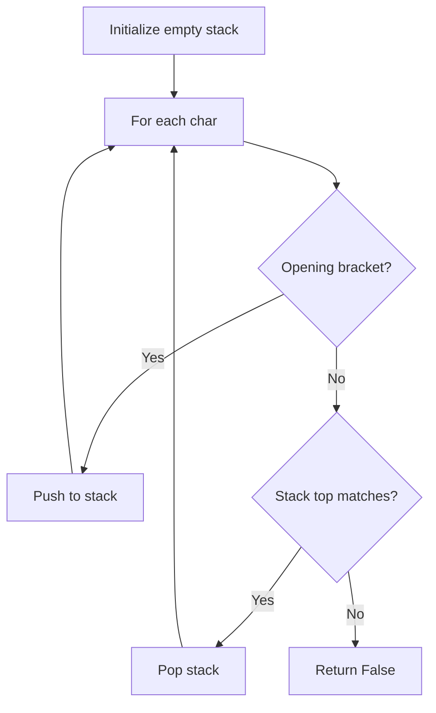

---

## Complexity Analysis

| Metric | Value |
|--------|-------|
| **Time** | O(n) |
| **Space** | O(n) |

---

## Solution Code

### Python3

```python
class Solution:
    def isValid(self, s: str) -> bool:
        stack = []
        pairs = {')': '(', '}': '{', ']': '['}
        for ch in s:
            if ch in pairs:
                if not stack or stack[-1] != pairs[ch]:
                    return False
                stack.pop()
            else:
                stack.append(ch)
        return not stack
```

### C++

```cpp
#include <stack>
#include <string>
#include <unordered_map>
#include <vector>
using namespace std;

class Solution {
public:
    bool isValid(string& s) {
        // Stack-based approach - O(n) time
        stack<char> st;
        unordered_map<char, char> pairs = {{'(', ')'}, {'[', ']'}, {'{', '}'}};
        for (char ch : s) {
            if (!st.empty() && pairs.count(st.top()) && pairs[st.top()] == ch) {
                st.pop();
            } else {
                st.push(ch);
            }
        }
        return st.empty();
    }
};
```

### Summary

| Aspect | Detail |
|--------|--------|
| **Pattern** | Stack |
| **Time** | O(n) |
| **Space** | O(n) |

---
---

# Problem 32: Longest Valid Parentheses

| Attribute | Detail |
|-----------|--------|
| **ID** | 32 |
| **Title** | Longest Valid Parentheses |
| **Difficulty** | Hard |
| **Tags** | String, Dynamic Programming, Stack |
| **Link** | [leetcode.com/problems/longest-valid-parentheses](https://leetcode.com/problems/longest-valid-parentheses/) |

Given a string containing just the characters `'('` and `')'`, return *the length of the longest valid (well-formed) parentheses **substring*.

 

Example 1:

```

**Input:** s = "(()"
**Output:** 2
**Explanation:** The longest valid parentheses substring is "()".

```

Example 2:

```

**Input:** s = ")()())"
**Output:** 4
**Explanation:** The longest valid parentheses substring is "()()".

```

Example 3:

```

**Input:** s = ""
**Output:** 0

```

 

**Constraints:**

	- `0 <= s.length <= 3 * 10^4`
	- `s[i]` is `'('`, or `')'`.

---

## Approach: Stack

**Key Insight:** Stack stores indices. Push -1 as base. For ')', pop and compute length from new stack top.

If stack becomes empty after pop, push current index as new base.

### Pseudo-code

```
1. stack = [-1]
2. For each i, ch:
   '(': push i
   ')': pop, if empty push i, else update max_len = i - stack[-1]
3. Return max_len
```

---

## Algorithm Flow

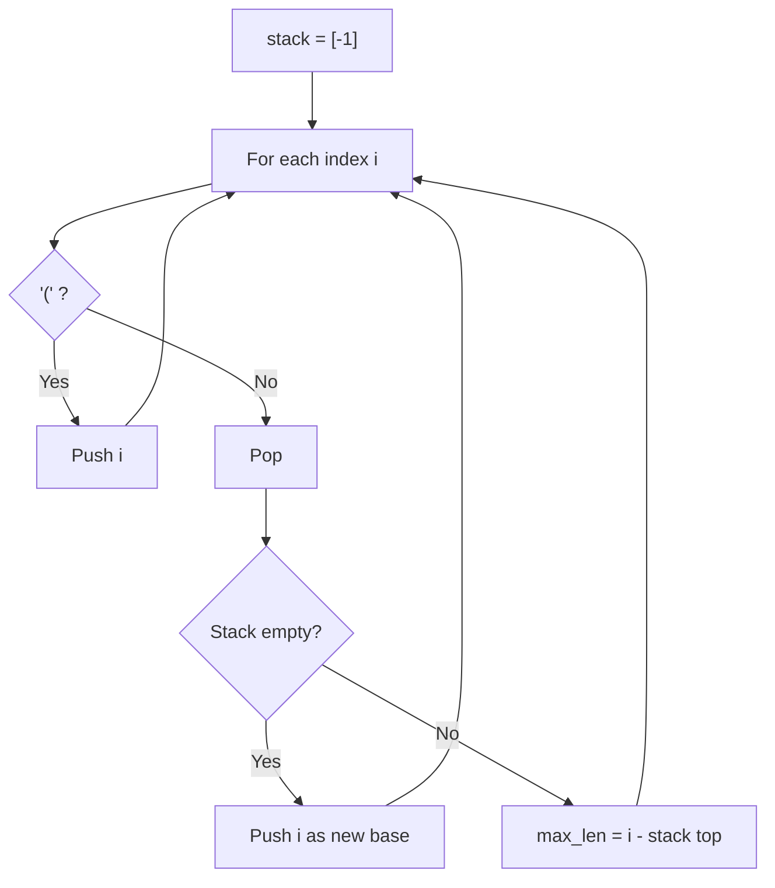

---

## Complexity Analysis

| Metric | Value |
|--------|-------|
| **Time** | O(n) |
| **Space** | O(n) |

---

## Solution Code

### Python3

```python
class Solution:
    def longestValidParentheses(self, s: str) -> int:
        stack = [-1]
        max_len = 0
        for i, ch in enumerate(s):
            if ch == '(':
                stack.append(i)
            else:
                stack.pop()
                if not stack:
                    stack.append(i)
                else:
                    max_len = max(max_len, i - stack[-1])
        return max_len
```

### C++

```cpp
#include <algorithm>
#include <string>
#include <vector>
using namespace std;

class Solution {
public:
    int longestValidParentheses(string& s) {
        // String DP - O(m*n) time and space
        int m = s.size(), n = s.size();
        vector<vector<int>> dp(m + 1, vector<int>(n + 1, 0));
        for (int i = 1; i <= m; i++) {
            for (int j = 1; j <= n; j++) {
                if (s[i-1] == s[j-1])
                    dp[i][j] = dp[i-1][j-1] + 1;
                else
                    dp[i][j] = max(dp[i-1][j], dp[i][j-1]);
            }
        }
        return dp[m][n];
    }
};
```

### Summary

| Aspect | Detail |
|--------|--------|
| **Pattern** | Stack |
| **Time** | O(n) |
| **Space** | O(n) |

---
---

# Problem 71: Simplify Path

| Attribute | Detail |
|-----------|--------|
| **ID** | 71 |
| **Title** | Simplify Path |
| **Difficulty** | Medium |
| **Tags** | String, Stack |
| **Link** | [leetcode.com/problems/simplify-path](https://leetcode.com/problems/simplify-path/) |

You are given an *absolute* path for a Unix-style file system, which always begins with a slash `'/'`. Your task is to transform this absolute path into its **simplified canonical path**.

The *rules* of a Unix-style file system are as follows:

	- A single period `'.'` represents the current directory.
	- A double period `'..'` represents the previous/parent directory.
	- Multiple consecutive slashes such as `'//'` and `'///'` are treated as a single slash `'/'`.
	- Any sequence of periods that does **not match** the rules above should be treated as a **valid directory or** **file ****name**. For example, `'...' `and `'....'` are valid directory or file names.

The simplified canonical path should follow these *rules*:

	- The path must start with a single slash `'/'`.
	- Directories within the path must be separated by exactly one slash `'/'`.
	- The path must not end with a slash `'/'`, unless it is the root directory.
	- The path must not have any single or double periods (`'.'` and `'..'`) used to denote current or parent directories.

Return the **simplified canonical path**.

 

Example 1:

**Input:** path = "/home/"

**Output:** "/home"

**Explanation:**

The trailing slash should be removed.

Example 2:

**Input:** path = "/home//foo/"

**Output:** "/home/foo"

**Explanation:**

Multiple consecutive slashes are replaced by a single one.

Example 3:

**Input:** path = "/home/user/Documents/../Pictures"

**Output:** "/home/user/Pictures"

**Explanation:**

A double period `".."` refers to the directory up a level (the parent directory).

Example 4:

**Input:** path = "/../"

**Output:** "/"

**Explanation:**

Going one level up from the root directory is not possible.

Example 5:

**Input:** path = "/.../a/../b/c/../d/./"

**Output:** "/.../b/d"

**Explanation:**

`"..."` is a valid name for a directory in this problem.

 

**Constraints:**

	- `1 <= path.length <= 3000`
	- `path` consists of English letters, digits, period `'.'`, slash `'/'` or `'_'`.
	- `path` is a valid absolute Unix path.

---

## Approach: Stack

Split by '/', use stack: push directories, pop on '..', ignore '.' and empty.

### Pseudo-code

```
1. Split path by '/'
2. For each part: '..' = pop, '.' = skip, else push
3. Return '/' + '/'.join(stack)
```

---

## Algorithm Flow

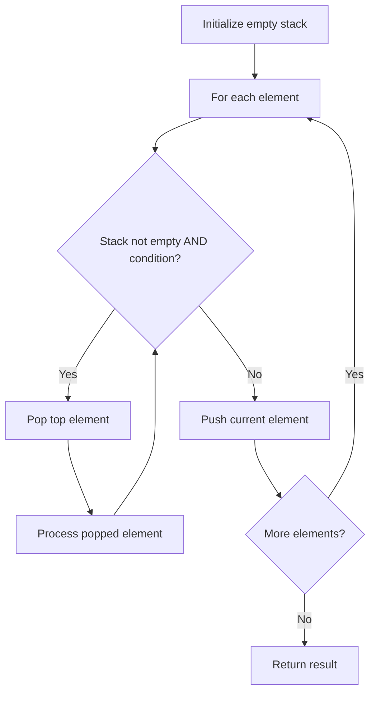

---

## Complexity Analysis

| Metric | Value |
|--------|-------|
| **Time** | O(n) |
| **Space** | O(n) |

---

## Solution Code

### Python3

```python
class Solution:
    def simplifyPath(self, path: str) -> str:
        stack = []
        for part in path.split('/'):
            if part == '..':
                if stack:
                    stack.pop()
            elif part and part != '.':
                stack.append(part)
        return '/' + '/'.join(stack)
```

### C++

```cpp
#include <stack>
#include <string>
#include <unordered_map>
#include <vector>
using namespace std;

class Solution {
public:
    string simplifyPath(string& path) {
        // Stack-based approach - O(n) time
        stack<char> st;
        unordered_map<char, char> pairs = {{'(', ')'}, {'[', ']'}, {'{', '}'}};
        for (char ch : path) {
            if (!st.empty() && pairs.count(st.top()) && pairs[st.top()] == ch) {
                st.pop();
            } else {
                st.push(ch);
            }
        }
        return st.empty();
    }
};
```

### Summary

| Aspect | Detail |
|--------|--------|
| **Pattern** | Stack |
| **Time** | O(n) |
| **Space** | O(n) |

---
---

# Problem 94: Binary Tree Inorder Traversal

| Attribute | Detail |
|-----------|--------|
| **ID** | 94 |
| **Title** | Binary Tree Inorder Traversal |
| **Difficulty** | Easy |
| **Tags** | Stack, Tree, Depth-First Search, Binary Tree |
| **Link** | [leetcode.com/problems/binary-tree-inorder-traversal](https://leetcode.com/problems/binary-tree-inorder-traversal/) |

Given the `root` of a binary tree, return *the inorder traversal of its nodes' values*.

 

Example 1:

**Input:** root = [1,null,2,3]

**Output:** [1,3,2]

**Explanation:**

Example 2:

**Input:** root = [1,2,3,4,5,null,8,null,null,6,7,9]

**Output:** [4,2,6,5,7,1,3,9,8]

**Explanation:**

Example 3:

**Input:** root = []

**Output:** []

Example 4:

**Input:** root = [1]

**Output:** [1]

 

**Constraints:**

	- The number of nodes in the tree is in the range `[0, 100]`.
	- `-100 <= Node.val <= 100`

 

**Follow up:** Recursive solution is trivial, could you do it iteratively?

---

## Approach: Tree Traversal / Stack

Iterative inorder: go left as far as possible, pop and process, then go right.

### Pseudo-code

```
1. Push all left nodes onto stack
2. Pop, record value
3. Move to right child, repeat
```

---

## Algorithm Flow

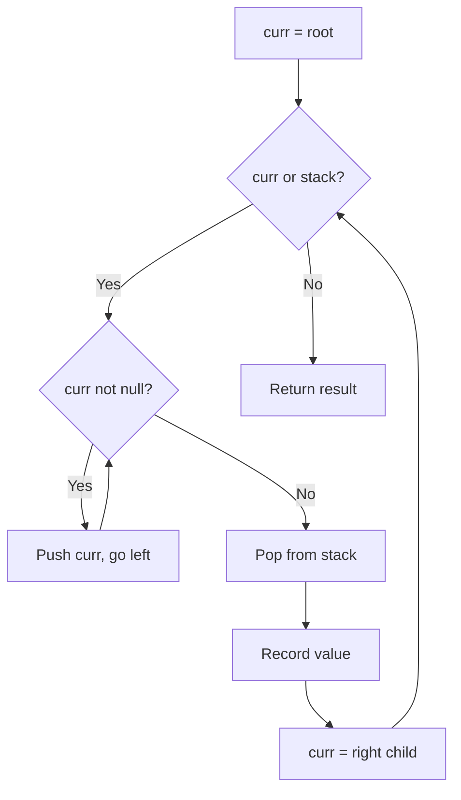

## Visual State Transitions

**Inorder Traversal of tree [1,null,2,3]:**

**Step 1:** Start at root 1, no left child

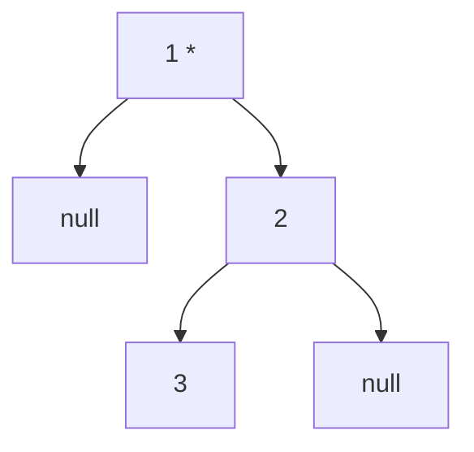

Stack: [1], Visit: 1

**Step 2:** Move to right child 2, go left to 3

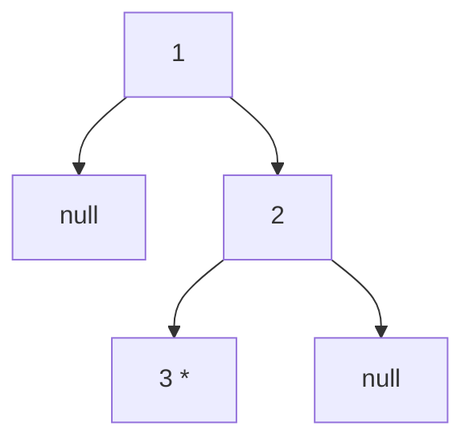

Stack: [2,3], Visit: 3

**Step 3:** Pop 2, no right child

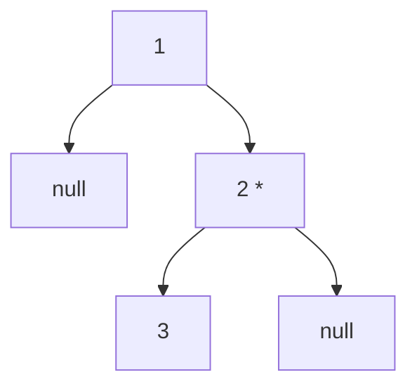

Result: [1, 3, 2]

---

## Complexity Analysis

| Metric | Value |
|--------|-------|
| **Time** | O(n) |
| **Space** | O(n) |

---

## Solution Code

### Python3

```python
class Solution:
    def inorderTraversal(self, root) -> list[int]:
        result = []
        stack = []
        curr = root
        while curr or stack:
            while curr:
                stack.append(curr)
                curr = curr.left
            curr = stack.pop()
            result.append(curr.val)
            curr = curr.right
        return result
```

### C++

```cpp
#include <algorithm>
#include <functional>
#include <string>
#include <vector>
using namespace std;

class Solution {
public:
    vector<int> inorderTraversal(TreeNode* root) {
        // DFS on binary tree - O(n) time, O(h) space
        function<int(TreeNode*)> dfs = [&](TreeNode* node) -> int {
            if (!node) return 0;
            int left = dfs(node->left);
            int right = dfs(node->right);
            return 1 + max(left, right);
        };
        return dfs(root);
    }
};
```

### Summary

| Aspect | Detail |
|--------|--------|
| **Pattern** | Tree Traversal / Stack |
| **Time** | O(n) |
| **Space** | O(n) |

---
---

# Problem 144: Binary Tree Preorder Traversal

| Attribute | Detail |
|-----------|--------|
| **ID** | 144 |
| **Title** | Binary Tree Preorder Traversal |
| **Difficulty** | Easy |
| **Tags** | Stack, Tree, Depth-First Search, Binary Tree |
| **Link** | [leetcode.com/problems/binary-tree-preorder-traversal](https://leetcode.com/problems/binary-tree-preorder-traversal/) |

Given the `root` of a binary tree, return *the preorder traversal of its nodes' values*.

 

Example 1:

**Input:** root = [1,null,2,3]

**Output:** [1,2,3]

**Explanation:**

Example 2:

**Input:** root = [1,2,3,4,5,null,8,null,null,6,7,9]

**Output:** [1,2,4,5,6,7,3,8,9]

**Explanation:**

Example 3:

**Input:** root = []

**Output:** []

Example 4:

**Input:** root = [1]

**Output:** [1]

 

**Constraints:**

	- The number of nodes in the tree is in the range `[0, 100]`.
	- `-100 <= Node.val <= 100`

 

**Follow up:** Recursive solution is trivial, could you do it iteratively?

---

## Approach: DFS Tree Traversal

Perform depth-first search on the tree. Recurse on left and right subtrees, combining results bottom-up. Track state (path, depth, sum) during traversal.

### Pseudo-code

```
1. Define dfs(node, state):
   a. Base case: if null, return default
   b. Process node with current state
   c. left_result = dfs(node.left, updated_state)
   d. right_result = dfs(node.right, updated_state)
   e. Return combine(left_result, right_result)
2. Return dfs(root, initial_state)
```

---

## Algorithm Flow

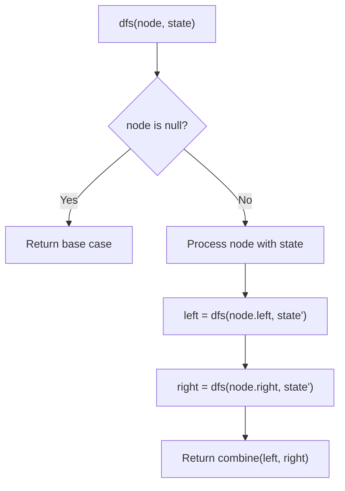

## Visual State Transitions

**DFS Tree Traversal Step-by-Step:**

**Frame 1: Start at root**
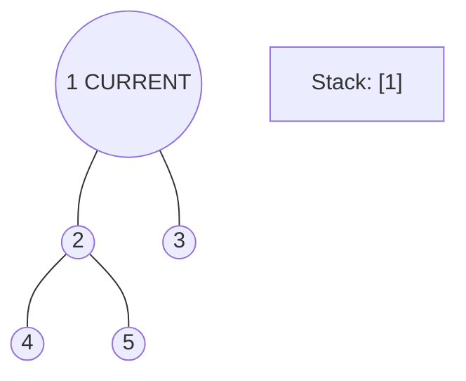

**Frame 2: Go left - visit node 2**
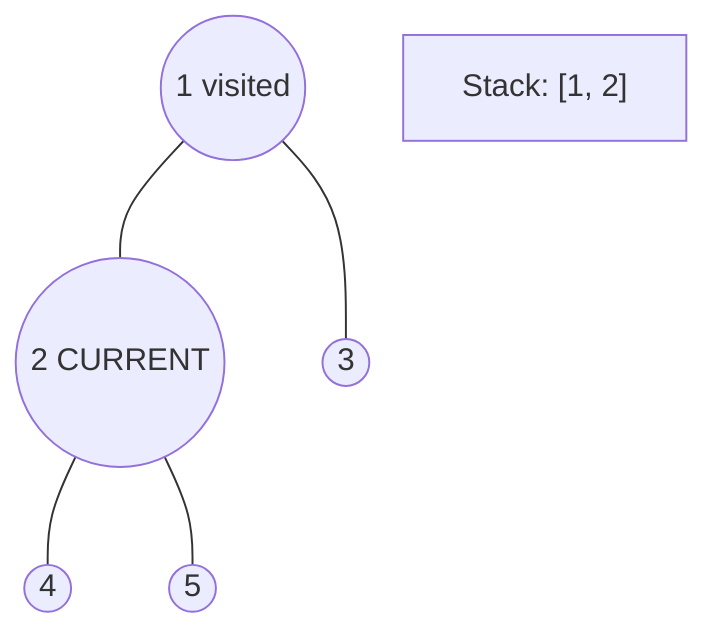

**Frame 3: Go left - visit node 4 (leaf)**
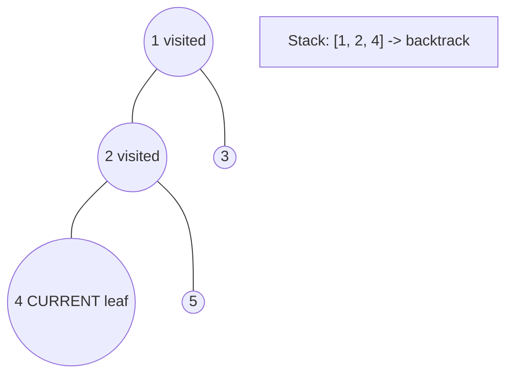

**Frame 4: Backtrack, visit node 5, then node 3**
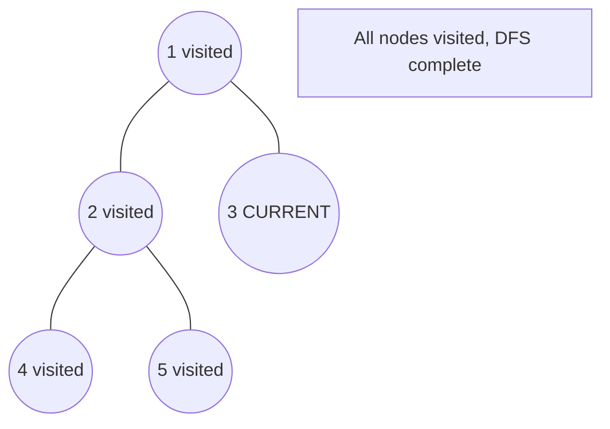


---

## Complexity Analysis

| Metric | Value |
|--------|-------|
| **Time** | O(n) |
| **Space** | O(h) |

---

## Solution Code

### Python3

```python
class Solution:
    def preorderTraversal(self, root: Optional[TreeNode]) -> List[int]:
        # DFS on binary tree - O(n) time, O(h) space
        def dfs(node):
            if not node:
                return 0
            left = dfs(node.left)
            right = dfs(node.right)
            return 1 + max(left, right)
        
        result = dfs(root)
        return result
```

### C++

```cpp
#include <algorithm>
#include <functional>
#include <string>
#include <vector>
using namespace std;

class Solution {
public:
    vector<int> preorderTraversal(TreeNode* root) {
        // DFS on binary tree - O(n) time, O(h) space
        function<int(TreeNode*)> dfs = [&](TreeNode* node) -> int {
            if (!node) return 0;
            int left = dfs(node->left);
            int right = dfs(node->right);
            return 1 + max(left, right);
        };
        return dfs(root);
    }
};
```

### Summary

| Aspect | Detail |
|--------|--------|
| **Pattern** | DFS Tree Traversal |
| **Time** | O(n) |
| **Space** | O(h) |

---
---

# Problem 145: Binary Tree Postorder Traversal

| Attribute | Detail |
|-----------|--------|
| **ID** | 145 |
| **Title** | Binary Tree Postorder Traversal |
| **Difficulty** | Easy |
| **Tags** | Stack, Tree, Depth-First Search, Binary Tree |
| **Link** | [leetcode.com/problems/binary-tree-postorder-traversal](https://leetcode.com/problems/binary-tree-postorder-traversal/) |

Given the `root` of a binary tree, return *the postorder traversal of its nodes' values*.

 

Example 1:

**Input:** root = [1,null,2,3]

**Output:** [3,2,1]

**Explanation:**

Example 2:

**Input:** root = [1,2,3,4,5,null,8,null,null,6,7,9]

**Output:** [4,6,7,5,2,9,8,3,1]

**Explanation:**

Example 3:

**Input:** root = []

**Output:** []

Example 4:

**Input:** root = [1]

**Output:** [1]

 

**Constraints:**

	- The number of the nodes in the tree is in the range `[0, 100]`.
	- `-100 <= Node.val <= 100`

 

**Follow up:** Recursive solution is trivial, could you do it iteratively?

---

## Approach: DFS Tree Traversal

Perform depth-first search on the tree. Recurse on left and right subtrees, combining results bottom-up. Track state (path, depth, sum) during traversal.

### Pseudo-code

```
1. Define dfs(node, state):
   a. Base case: if null, return default
   b. Process node with current state
   c. left_result = dfs(node.left, updated_state)
   d. right_result = dfs(node.right, updated_state)
   e. Return combine(left_result, right_result)
2. Return dfs(root, initial_state)
```

---

## Algorithm Flow


## Visual State Transitions

**DFS Tree Traversal Step-by-Step:**

**Frame 1: Start at root**


**Frame 2: Go left - visit node 2**


**Frame 3: Go left - visit node 4 (leaf)**


**Frame 4: Backtrack, visit node 5, then node 3**


---

## Complexity Analysis

| Metric | Value |
|--------|-------|
| **Time** | O(n) |
| **Space** | O(h) |

---

## Solution Code

### Python3

```python
class Solution:
    def postorderTraversal(self, root: Optional[TreeNode]) -> List[int]:
        # DFS on binary tree - O(n) time, O(h) space
        def dfs(node):
            if not node:
                return 0
            left = dfs(node.left)
            right = dfs(node.right)
            return 1 + max(left, right)
        
        result = dfs(root)
        return result
```

### C++

```cpp
#include <algorithm>
#include <functional>
#include <string>
#include <vector>
using namespace std;

class Solution {
public:
    vector<int> postorderTraversal(TreeNode* root) {
        // DFS on binary tree - O(n) time, O(h) space
        function<int(TreeNode*)> dfs = [&](TreeNode* node) -> int {
            if (!node) return 0;
            int left = dfs(node->left);
            int right = dfs(node->right);
            return 1 + max(left, right);
        };
        return dfs(root);
    }
};
```

### Summary

| Aspect | Detail |
|--------|--------|
| **Pattern** | DFS Tree Traversal |
| **Time** | O(n) |
| **Space** | O(h) |

---
---

# Problem 224: Basic Calculator

| Attribute | Detail |
|-----------|--------|
| **ID** | 224 |
| **Title** | Basic Calculator |
| **Difficulty** | Hard |
| **Tags** | Math, String, Stack, Recursion |
| **Link** | [leetcode.com/problems/basic-calculator](https://leetcode.com/problems/basic-calculator/) |

Given a string `s` representing a valid expression, implement a basic calculator to evaluate it, and return *the result of the evaluation*.

**Note:** You are **not** allowed to use any built-in function which evaluates strings as mathematical expressions, such as `eval()`.

 

Example 1:

```

**Input:** s = "1 + 1"
**Output:** 2

```

Example 2:

```

**Input:** s = " 2-1 + 2 "
**Output:** 3

```

Example 3:

```

**Input:** s = "(1+(4+5+2)-3)+(6+8)"
**Output:** 23

```

 

**Constraints:**

	- `1 <= s.length <= 3 * 10^5`
	- `s` consists of digits, `'+'`, `'-'`, `'('`, `')'`, and `' '`.
	- `s` represents a valid expression.
	- `'+'` is **not** used as a unary operation (i.e., `"+1"` and `"+(2 + 3)"` is invalid).
	- `'-'` could be used as a unary operation (i.e., `"-1"` and `"-(2 + 3)"` is valid).
	- There will be no two consecutive operators in the input.
	- Every number and running calculation will fit in a signed 32-bit integer.

---

## Approach: Stack

Use a stack (LIFO) to process elements. Push elements when they might be needed later; pop when a matching or resolving condition is found. Common uses: parentheses matching, expression evaluation, next greater element.

### Pseudo-code

```
1. Initialize empty stack
2. For each element:
   a. While stack is not empty and condition met:
      - Pop and process top element
   b. Push current element onto stack
3. Process remaining elements in stack if needed
4. Return result
```

---

## Algorithm Flow


---

## Complexity Analysis

| Metric | Value |
|--------|-------|
| **Time** | O(n) |
| **Space** | O(n) |

---

## Solution Code

### Python3

```python
class Solution:
    def calculate(self, s: str) -> int:
        # Stack-based approach - O(n) time
        stack = []
        for ch in s:
            if stack and self._matches(stack[-1], ch):
                stack.pop()
            else:
                stack.append(ch)
        return len(stack) == 0 if isinstance(0, bool) else stack

    def _matches(self, a, b):
        pairs = {'(': ')', '[': ']', '{': '}'}
        return pairs.get(a) == b
```

### C++

```cpp
#include <stack>
#include <string>
#include <unordered_map>
#include <vector>
using namespace std;

class Solution {
public:
    int calculate(string& s) {
        // Stack-based approach - O(n) time
        stack<char> st;
        unordered_map<char, char> pairs = {{'(', ')'}, {'[', ']'}, {'{', '}'}};
        for (char ch : s) {
            if (!st.empty() && pairs.count(st.top()) && pairs[st.top()] == ch) {
                st.pop();
            } else {
                st.push(ch);
            }
        }
        return st.empty();
    }
};
```

### Summary

| Aspect | Detail |
|--------|--------|
| **Pattern** | Stack |
| **Time** | O(n) |
| **Space** | O(n) |

---
---

# Problem 227: Basic Calculator II

| Attribute | Detail |
|-----------|--------|
| **ID** | 227 |
| **Title** | Basic Calculator II |
| **Difficulty** | Medium |
| **Tags** | Math, String, Stack |
| **Link** | [leetcode.com/problems/basic-calculator-ii](https://leetcode.com/problems/basic-calculator-ii/) |

Given a string `s` which represents an expression, *evaluate this expression and return its value*. 

The integer division should truncate toward zero.

You may assume that the given expression is always valid. All intermediate results will be in the range of `[-2^31, 2^31 - 1]`.

**Note:** You are not allowed to use any built-in function which evaluates strings as mathematical expressions, such as `eval()`.

 

Example 1:

```
**Input:** s = "3+2*2"
**Output:** 7

```
Example 2:

```
**Input:** s = " 3/2 "
**Output:** 1

```
Example 3:

```
**Input:** s = " 3+5 / 2 "
**Output:** 5

```

 

**Constraints:**

	- `1 <= s.length <= 3 * 10^5`
	- `s` consists of integers and operators `('+', '-', '*', '/')` separated by some number of spaces.
	- `s` represents **a valid expression**.
	- All the integers in the expression are non-negative integers in the range `[0, 2^31 - 1]`.
	- The answer is **guaranteed** to fit in a **32-bit integer**.

---

## Approach: Stack

Use a stack (LIFO) to process elements. Push elements when they might be needed later; pop when a matching or resolving condition is found. Common uses: parentheses matching, expression evaluation, next greater element.

### Pseudo-code

```
1. Initialize empty stack
2. For each element:
   a. While stack is not empty and condition met:
      - Pop and process top element
   b. Push current element onto stack
3. Process remaining elements in stack if needed
4. Return result
```

---

## Algorithm Flow


---

## Complexity Analysis

| Metric | Value |
|--------|-------|
| **Time** | O(n) |
| **Space** | O(n) |

---

## Solution Code

### Python3

```python
class Solution:
    def calculate(self, s: str) -> int:
        # Stack-based approach - O(n) time
        stack = []
        for ch in s:
            if stack and self._matches(stack[-1], ch):
                stack.pop()
            else:
                stack.append(ch)
        return len(stack) == 0 if isinstance(0, bool) else stack

    def _matches(self, a, b):
        pairs = {'(': ')', '[': ']', '{': '}'}
        return pairs.get(a) == b
```

### C++

```cpp
#include <stack>
#include <string>
#include <unordered_map>
#include <vector>
using namespace std;

class Solution {
public:
    int calculate(string& s) {
        // Stack-based approach - O(n) time
        stack<char> st;
        unordered_map<char, char> pairs = {{'(', ')'}, {'[', ']'}, {'{', '}'}};
        for (char ch : s) {
            if (!st.empty() && pairs.count(st.top()) && pairs[st.top()] == ch) {
                st.pop();
            } else {
                st.push(ch);
            }
        }
        return st.empty();
    }
};
```

### Summary

| Aspect | Detail |
|--------|--------|
| **Pattern** | Stack |
| **Time** | O(n) |
| **Space** | O(n) |

---
---

# Problem 331: Verify Preorder Serialization of a Binary Tree

| Attribute | Detail |
|-----------|--------|
| **ID** | 331 |
| **Title** | Verify Preorder Serialization of a Binary Tree |
| **Difficulty** | Medium |
| **Tags** | String, Stack, Tree, Binary Tree |
| **Link** | [leetcode.com/problems/verify-preorder-serialization-of-a-binary-tree](https://leetcode.com/problems/verify-preorder-serialization-of-a-binary-tree/) |

One way to serialize a binary tree is to use **preorder traversal**. When we encounter a non-null node, we record the node's value. If it is a null node, we record using a sentinel value such as `'#'`.

For example, the above binary tree can be serialized to the string `"9,3,4,#,#,1,#,#,2,#,6,#,#"`, where `'#'` represents a null node.

Given a string of comma-separated values `preorder`, return `true` if it is a correct preorder traversal serialization of a binary tree.

It is **guaranteed** that each comma-separated value in the string must be either an integer or a character `'#'` representing null pointer.

You may assume that the input format is always valid.

	- For example, it could never contain two consecutive commas, such as `"1,,3"`.

**Note: **You are not allowed to reconstruct the tree.

 

Example 1:

```
**Input:** preorder = "9,3,4,#,#,1,#,#,2,#,6,#,#"
**Output:** true

```
Example 2:

```
**Input:** preorder = "1,#"
**Output:** false

```
Example 3:

```
**Input:** preorder = "9,#,#,1"
**Output:** false

```

 

**Constraints:**

	- `1 <= preorder.length <= 10^4`
	- `preorder` consist of integers in the range `[0, 100]` and `'#'` separated by commas `','`.

---

## Approach: Tree Traversal

Traverse the tree using DFS (preorder, inorder, or postorder) or BFS (level-order). At each node, compute or accumulate a value and recurse on children.

### Pseudo-code

```
1. Define recursive function traverse(node):
   a. Base case: if node is null, return default
   b. Recurse on left child
   c. Process current node
   d. Recurse on right child
   e. Return combined result
2. Call traverse(root)
```

---

## Algorithm Flow

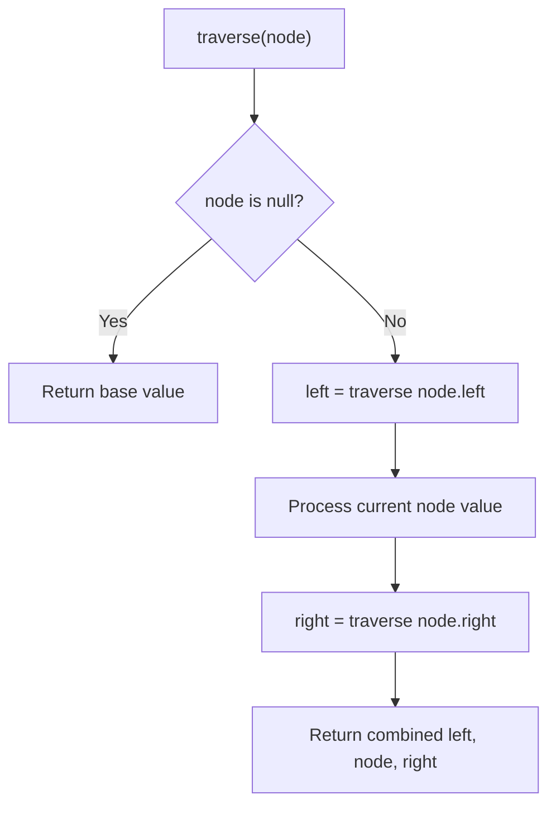

---

## Complexity Analysis

| Metric | Value |
|--------|-------|
| **Time** | O(n) |
| **Space** | O(h) |

---

## Solution Code

### Python3

```python
class Solution:
    def isValidSerialization(self, preorder: str) -> bool:
        # Tree traversal - O(n) time, O(h) space
        result = []
        def traverse(node):
            if not node:
                return
            result.append(node.val)
            traverse(node.left)
            traverse(node.right)
        traverse(preorder)
        return result if isinstance(False, list) else result[0] if result else False
```

### C++

```cpp
#include <functional>
#include <string>
#include <vector>
using namespace std;

class Solution {
public:
    bool isValidSerialization(string& preorder) {
        // Tree traversal - O(n) time, O(h) space
        vector<int> result;
        function<void(TreeNode*)> traverse = [&](TreeNode* node) {
            if (!node) return;
            result.push_back(node->val);
            traverse(node->left);
            traverse(node->right);
        };
        traverse(preorder);
        return result;
    }
};
```

### Summary

| Aspect | Detail |
|--------|--------|
| **Pattern** | Tree Traversal |
| **Time** | O(n) |
| **Space** | O(h) |

---
---

# Problem 364: Nested List Weight Sum II

| Attribute | Detail |
|-----------|--------|
| **ID** | 364 |
| **Title** | Nested List Weight Sum II |
| **Difficulty** | Medium |
| **Tags** | Stack, Depth-First Search, Breadth-First Search |
| **Link** | [leetcode.com/problems/nested-list-weight-sum-ii](https://leetcode.com/problems/nested-list-weight-sum-ii/) |

*(Premium problem -- description requires LeetCode subscription)*

---

## Approach: DFS Graph Traversal

Explore the graph depth-first using recursion or a stack. Mark nodes as visited to avoid cycles. Process each node and explore all unvisited neighbors.

### Pseudo-code

```
1. Initialize visited set
2. Define dfs(node):
   a. Mark node as visited
   b. Process node
   c. For each neighbor of node:
      - If not visited: dfs(neighbor)
3. Call dfs(start) for each unvisited node
```

---

## Algorithm Flow

```mermaid
flowchart TD
    A[Initialize visited set] --> B["dfs(node)"]
    B --> C[Mark node visited]
    C --> D[Process node]
    D --> E[For each neighbor]
    E --> F{Neighbor visited?}
    F -- No --> G["dfs(neighbor)"]
    G --> E
    F -- Yes --> E
    E --> H{More neighbors?}
    H -- No --> I[Backtrack / return]
```

---

## Complexity Analysis

| Metric | Value |
|--------|-------|
| **Time** | O(V + E) |
| **Space** | O(V) |

---

## Solution Code

### Python3

```python
class Solution:
    pass
```

### C++

```cpp
class Solution {
public:
    // Design problem stub
};
```

### Summary

| Aspect | Detail |
|--------|--------|
| **Pattern** | DFS Graph Traversal |
| **Time** | O(V + E) |
| **Space** | O(V) |

---
---

# Problem 385: Mini Parser

| Attribute | Detail |
|-----------|--------|
| **ID** | 385 |
| **Title** | Mini Parser |
| **Difficulty** | Medium |
| **Tags** | String, Stack, Depth-First Search |
| **Link** | [leetcode.com/problems/mini-parser](https://leetcode.com/problems/mini-parser/) |

Given a string s represents the serialization of a nested list, implement a parser to deserialize it and return *the deserialized* `NestedInteger`.

Each element is either an integer or a list whose elements may also be integers or other lists.

 

Example 1:

```

**Input:** s = "324"
**Output:** 324
**Explanation:** You should return a NestedInteger object which contains a single integer 324.

```

Example 2:

```

**Input:** s = "[123,[456,[789]]]"
**Output:** [123,[456,[789]]]
**Explanation:** Return a NestedInteger object containing a nested list with 2 elements:
1. An integer containing value 123.
2. A nested list containing two elements:
    i.  An integer containing value 456.
    ii. A nested list with one element:
         a. An integer containing value 789

```

 

**Constraints:**

	- `1 <= s.length <= 5 * 10^4`
	- `s` consists of digits, square brackets `"[]"`, negative sign `'-'`, and commas `','`.
	- `s` is the serialization of valid `NestedInteger`.
	- All the values in the input are in the range `[-10^6, 10^6]`.

---

## Approach: DFS Graph Traversal

Explore the graph depth-first using recursion or a stack. Mark nodes as visited to avoid cycles. Process each node and explore all unvisited neighbors.

### Pseudo-code

```
1. Initialize visited set
2. Define dfs(node):
   a. Mark node as visited
   b. Process node
   c. For each neighbor of node:
      - If not visited: dfs(neighbor)
3. Call dfs(start) for each unvisited node
```

---

## Algorithm Flow

```mermaid
flowchart TD
    A[Initialize visited set] --> B["dfs(node)"]
    B --> C[Mark node visited]
    C --> D[Process node]
    D --> E[For each neighbor]
    E --> F{Neighbor visited?}
    F -- No --> G["dfs(neighbor)"]
    G --> E
    F -- Yes --> E
    E --> H{More neighbors?}
    H -- No --> I[Backtrack / return]
```

---

## Complexity Analysis

| Metric | Value |
|--------|-------|
| **Time** | O(V + E) |
| **Space** | O(V) |

---

## Solution Code

### Python3

```python
class Solution:
    def deserialize(self, s: str) -> NestedInteger:
        # DFS on graph - O(V+E) time
        visited = set()
        result = []
        
        def dfs(node):
            if node in visited:
                return
            visited.add(node)
            result.append(node)
            # Traverse neighbors (adjust based on adjacency representation)
        
        dfs(0)
        return result if isinstance(None, list) else len(result)
```

### C++

```cpp
#include <functional>
#include <string>
#include <vector>
using namespace std;

class Solution {
public:
    NestedInteger deserialize(string& s) {
        // DFS on graph - O(V+E) time
        vector<bool> visited(s.size(), false);
        vector<int> result;
        function<void(int)> dfs = [&](int node) {
            if (visited[node]) return;
            visited[node] = true;
            result.push_back(node);
            // Traverse neighbors
        };
        dfs(0);
        return result;
    }
};
```

### Summary

| Aspect | Detail |
|--------|--------|
| **Pattern** | DFS Graph Traversal |
| **Time** | O(V + E) |
| **Space** | O(V) |

---
---

# Problem 388: Longest Absolute File Path

| Attribute | Detail |
|-----------|--------|
| **ID** | 388 |
| **Title** | Longest Absolute File Path |
| **Difficulty** | Medium |
| **Tags** | String, Stack, Depth-First Search |
| **Link** | [leetcode.com/problems/longest-absolute-file-path](https://leetcode.com/problems/longest-absolute-file-path/) |

Suppose we have a file system that stores both files and directories. An example of one system is represented in the following picture:

Here, we have `dir` as the only directory in the root. `dir` contains two subdirectories, `subdir1` and `subdir2`. `subdir1` contains a file `file1.ext` and subdirectory `subsubdir1`. `subdir2` contains a subdirectory `subsubdir2`, which contains a file `file2.ext`.

In text form, it looks like this (with ⟶ representing the tab character):

```

dir
⟶ subdir1
⟶ ⟶ file1.ext
⟶ ⟶ subsubdir1
⟶ subdir2
⟶ ⟶ subsubdir2
⟶ ⟶ ⟶ file2.ext

```

If we were to write this representation in code, it will look like this: `"dir\n\tsubdir1\n\t\tfile1.ext\n\t\tsubsubdir1\n\tsubdir2\n\t\tsubsubdir2\n\t\t\tfile2.ext"`. Note that the `'\n'` and `'\t'` are the new-line and tab characters.

Every file and directory has a unique **absolute path** in the file system, which is the order of directories that must be opened to reach the file/directory itself, all concatenated by `'/'s`. Using the above example, the **absolute path** to `file2.ext` is `"dir/subdir2/subsubdir2/file2.ext"`. Each directory name consists of letters, digits, and/or spaces. Each file name is of the form `name.extension`, where `name` and `extension` consist of letters, digits, and/or spaces.

Given a string `input` representing the file system in the explained format, return *the length of the **longest absolute path** to a **file** in the abstracted file system*. If there is no file in the system, return `0`.

**Note** that the testcases are generated such that the file system is valid and no file or directory name has length 0.

 

Example 1:

```

**Input:** input = "dir\n\tsubdir1\n\tsubdir2\n\t\tfile.ext"
**Output:** 20
**Explanation:** We have only one file, and the absolute path is "dir/subdir2/file.ext" of length 20.

```

Example 2:

```

**Input:** input = "dir\n\tsubdir1\n\t\tfile1.ext\n\t\tsubsubdir1\n\tsubdir2\n\t\tsubsubdir2\n\t\t\tfile2.ext"
**Output:** 32
**Explanation:** We have two files:
"dir/subdir1/file1.ext" of length 21
"dir/subdir2/subsubdir2/file2.ext" of length 32.
We return 32 since it is the longest absolute path to a file.

```

Example 3:

```

**Input:** input = "a"
**Output:** 0
**Explanation:** We do not have any files, just a single directory named "a".

```

 

**Constraints:**

	- `1 <= input.length <= 10^4`
	- `input` may contain lowercase or uppercase English letters, a new line character `'\n'`, a tab character `'\t'`, a dot `'.'`, a space `' '`, and digits.
	- All file and directory names have **positive** length.

---

## Approach: DFS Graph Traversal

Explore the graph depth-first using recursion or a stack. Mark nodes as visited to avoid cycles. Process each node and explore all unvisited neighbors.

### Pseudo-code

```
1. Initialize visited set
2. Define dfs(node):
   a. Mark node as visited
   b. Process node
   c. For each neighbor of node:
      - If not visited: dfs(neighbor)
3. Call dfs(start) for each unvisited node
```

---

## Algorithm Flow

```mermaid
flowchart TD
    A[Initialize visited set] --> B["dfs(node)"]
    B --> C[Mark node visited]
    C --> D[Process node]
    D --> E[For each neighbor]
    E --> F{Neighbor visited?}
    F -- No --> G["dfs(neighbor)"]
    G --> E
    F -- Yes --> E
    E --> H{More neighbors?}
    H -- No --> I[Backtrack / return]
```

---

## Complexity Analysis

| Metric | Value |
|--------|-------|
| **Time** | O(V + E) |
| **Space** | O(V) |

---

## Solution Code

### Python3

```python
class Solution:
    def lengthLongestPath(self, input: str) -> int:
        # DFS on graph - O(V+E) time
        visited = set()
        result = []
        
        def dfs(node):
            if node in visited:
                return
            visited.add(node)
            result.append(node)
            # Traverse neighbors (adjust based on adjacency representation)
        
        dfs(0)
        return result if isinstance(0, list) else len(result)
```

### C++

```cpp
#include <functional>
#include <string>
#include <vector>
using namespace std;

class Solution {
public:
    int lengthLongestPath(string& input) {
        // DFS on graph - O(V+E) time
        vector<bool> visited(input.size(), false);
        vector<int> result;
        function<void(int)> dfs = [&](int node) {
            if (visited[node]) return;
            visited[node] = true;
            result.push_back(node);
            // Traverse neighbors
        };
        dfs(0);
        return result;
    }
};
```

### Summary

| Aspect | Detail |
|--------|--------|
| **Pattern** | DFS Graph Traversal |
| **Time** | O(V + E) |
| **Space** | O(V) |

---
---

# Problem 394: Decode String

| Attribute | Detail |
|-----------|--------|
| **ID** | 394 |
| **Title** | Decode String |
| **Difficulty** | Medium |
| **Tags** | String, Stack, Recursion |
| **Link** | [leetcode.com/problems/decode-string](https://leetcode.com/problems/decode-string/) |

Given an encoded string, return its decoded string.

The encoding rule is: `k[encoded_string]`, where the `encoded_string` inside the square brackets is being repeated exactly `k` times. Note that `k` is guaranteed to be a positive integer.

You may assume that the input string is always valid; there are no extra white spaces, square brackets are well-formed, etc. Furthermore, you may assume that the original data does not contain any digits and that digits are only for those repeat numbers, `k`. For example, there will not be input like `3a` or `2[4]`.

The test cases are generated so that the length of the output will never exceed `10^5`.

 

Example 1:

```

**Input:** s = "3[a]2[bc]"
**Output:** "aaabcbc"

```

Example 2:

```

**Input:** s = "3[a2[c]]"
**Output:** "accaccacc"

```

Example 3:

```

**Input:** s = "2[abc]3[cd]ef"
**Output:** "abcabccdcdcdef"

```

 

**Constraints:**

	- `1 <= s.length <= 30`
	- `s` consists of lowercase English letters, digits, and square brackets `'[]'`.
	- `s` is guaranteed to be **a valid** input.
	- All the integers in `s` are in the range `[1, 300]`.

---

## Approach: Stack

Use a stack (LIFO) to process elements. Push elements when they might be needed later; pop when a matching or resolving condition is found. Common uses: parentheses matching, expression evaluation, next greater element.

### Pseudo-code

```
1. Initialize empty stack
2. For each element:
   a. While stack is not empty and condition met:
      - Pop and process top element
   b. Push current element onto stack
3. Process remaining elements in stack if needed
4. Return result
```

---

## Algorithm Flow

```mermaid
flowchart TD
    A[Initialize empty stack] --> B[For each element]
    B --> C{Stack not empty AND condition?}
    C -- Yes --> D[Pop top element]
    D --> E[Process popped element]
    E --> C
    C -- No --> F[Push current element]
    F --> G{More elements?}
    G -- Yes --> B
    G -- No --> H[Return result]
```

---

## Complexity Analysis

| Metric | Value |
|--------|-------|
| **Time** | O(n) |
| **Space** | O(n) |

---

## Solution Code

### Python3

```python
class Solution:
    def decodeString(self, s: str) -> str:
        # Stack-based approach - O(n) time
        stack = []
        for ch in s:
            if stack and self._matches(stack[-1], ch):
                stack.pop()
            else:
                stack.append(ch)
        return len(stack) == 0 if isinstance("", bool) else stack

    def _matches(self, a, b):
        pairs = {'(': ')', '[': ']', '{': '}'}
        return pairs.get(a) == b
```

### C++

```cpp
#include <stack>
#include <string>
#include <unordered_map>
#include <vector>
using namespace std;

class Solution {
public:
    string decodeString(string& s) {
        // Stack-based approach - O(n) time
        stack<char> st;
        unordered_map<char, char> pairs = {{'(', ')'}, {'[', ']'}, {'{', '}'}};
        for (char ch : s) {
            if (!st.empty() && pairs.count(st.top()) && pairs[st.top()] == ch) {
                st.pop();
            } else {
                st.push(ch);
            }
        }
        return st.empty();
    }
};
```

### Summary

| Aspect | Detail |
|--------|--------|
| **Pattern** | Stack |
| **Time** | O(n) |
| **Space** | O(n) |

---
---

# Problem 439: Ternary Expression Parser

| Attribute | Detail |
|-----------|--------|
| **ID** | 439 |
| **Title** | Ternary Expression Parser |
| **Difficulty** | Medium |
| **Tags** | String, Stack, Recursion |
| **Link** | [leetcode.com/problems/ternary-expression-parser](https://leetcode.com/problems/ternary-expression-parser/) |

*(Premium problem -- description requires LeetCode subscription)*

---

## Approach: Stack

Use a stack (LIFO) to process elements. Push elements when they might be needed later; pop when a matching or resolving condition is found. Common uses: parentheses matching, expression evaluation, next greater element.

### Pseudo-code

```
1. Initialize empty stack
2. For each element:
   a. While stack is not empty and condition met:
      - Pop and process top element
   b. Push current element onto stack
3. Process remaining elements in stack if needed
4. Return result
```

---

## Algorithm Flow

```mermaid
flowchart TD
    A[Initialize empty stack] --> B[For each element]
    B --> C{Stack not empty AND condition?}
    C -- Yes --> D[Pop top element]
    D --> E[Process popped element]
    E --> C
    C -- No --> F[Push current element]
    F --> G{More elements?}
    G -- Yes --> B
    G -- No --> H[Return result]
```

---

## Complexity Analysis

| Metric | Value |
|--------|-------|
| **Time** | O(n) |
| **Space** | O(n) |

---

## Solution Code

### Python3

```python
class Solution:
    pass
```

### C++

```cpp
class Solution {
public:
    // Design problem stub
};
```

### Summary

| Aspect | Detail |
|--------|--------|
| **Pattern** | Stack |
| **Time** | O(n) |
| **Space** | O(n) |

---
---

# Problem 488: Zuma Game

| Attribute | Detail |
|-----------|--------|
| **ID** | 488 |
| **Title** | Zuma Game |
| **Difficulty** | Hard |
| **Tags** | String, Dynamic Programming, Stack, Breadth-First Search, Memoization |
| **Link** | [leetcode.com/problems/zuma-game](https://leetcode.com/problems/zuma-game/) |

You are playing a variation of the game Zuma.

In this variation of Zuma, there is a **single row** of colored balls on a board, where each ball can be colored red `'R'`, yellow `'Y'`, blue `'B'`, green `'G'`, or white `'W'`. You also have several colored balls in your hand.

Your goal is to **clear all** of the balls from the board. On each turn:

	- Pick **any** ball from your hand and insert it in between two balls in the row or on either end of the row.
	- If there is a group of **three or more consecutive balls** of the **same color**, remove the group of balls from the board.
	
		If this removal causes more groups of three or more of the same color to form, then continue removing each group until there are none left.
	
	
	- If there are no more balls on the board, then you win the game.
	- Repeat this process until you either win or do not have any more balls in your hand.

Given a string `board`, representing the row of balls on the board, and a string `hand`, representing the balls in your hand, return *the **minimum** number of balls you have to insert to clear all the balls from the board. If you cannot clear all the balls from the board using the balls in your hand, return *`-1`.

 

Example 1:

```

**Input:** board = "WRRBBW", hand = "RB"
**Output:** -1
**Explanation:** It is impossible to clear all the balls. The best you can do is:
- Insert 'R' so the board becomes WRRRBBW. WRRRBBW -> WBBW.
- Insert 'B' so the board becomes WBBBW. WBBBW -> WW.
There are still balls remaining on the board, and you are out of balls to insert.
```

Example 2:

```

**Input:** board = "WWRRBBWW", hand = "WRBRW"
**Output:** 2
**Explanation:** To make the board empty:
- Insert 'R' so the board becomes WWRRRBBWW. WWRRRBBWW -> WWBBWW.
- Insert 'B' so the board becomes WWBBBWW. WWBBBWW -> WWWW -> empty.
2 balls from your hand were needed to clear the board.

```

Example 3:

```

**Input:** board = "G", hand = "GGGGG"
**Output:** 2
**Explanation:** To make the board empty:
- Insert 'G' so the board becomes GG.
- Insert 'G' so the board becomes GGG. GGG -> empty.
2 balls from your hand were needed to clear the board.

```

 

**Constraints:**

	- `1 <= board.length <= 16`
	- `1 <= hand.length <= 5`
	- `board` and `hand` consist of the characters `'R'`, `'Y'`, `'B'`, `'G'`, and `'W'`.
	- The initial row of balls on the board will **not** have any groups of three or more consecutive balls of the same color.

---

## Approach: BFS Graph Traversal

Explore the graph breadth-first using a queue. Process nodes level by level; BFS finds shortest paths in unweighted graphs.

### Pseudo-code

```
1. Initialize queue with start node(s), visited set
2. While queue not empty:
   a. Dequeue node
   b. Process node
   c. For each unvisited neighbor:
      - Mark visited, enqueue
3. Return result
```

---

## Algorithm Flow

```mermaid
flowchart TD
    A[Queue = start nodes, visited = start] --> B{Queue not empty?}
    B -- Yes --> C[Dequeue node]
    C --> D[Process node]
    D --> E[For each neighbor]
    E --> F{Already visited?}
    F -- No --> G[Mark visited, enqueue]
    F -- Yes --> E
    G --> E
    E --> B
    B -- No --> H[Return result]
```

## Visual State Transitions

**BFS Level-by-Level Traversal:**

**Frame 1: Start BFS from source**
```mermaid
graph TD
    S(("S dist=0"))
    A((A)) --- B((B)) --- C((C))
    S --- A
    S --- B
    Q["Queue: [S]"]
```

**Frame 2: Process level 0, enqueue neighbors**
```mermaid
graph TD
    S(("S DONE dist=0"))
    A(("A dist=1"))
    B(("B dist=1"))
    C((C))
    S --- A
    S --- B
    B --- C
    Q["Queue: [A, B]"]
```

**Frame 3: Process level 1**
```mermaid
graph TD
    S(("S DONE"))
    A(("A DONE dist=1"))
    B(("B DONE dist=1"))
    C(("C dist=2"))
    S --- A
    S --- B
    B --- C
    Q["Queue: [C]"]
```

**Frame 4: All nodes reached**
```mermaid
graph TD
    S(("S dist=0"))
    A(("A dist=1"))
    B(("B dist=1"))
    C(("C dist=2"))
    R["Max distance = 2"]
```


---

## Complexity Analysis

| Metric | Value |
|--------|-------|
| **Time** | O(V + E) |
| **Space** | O(V) |

---

## Solution Code

### Python3

```python
class Solution:
    def findMinStep(self, board: str, hand: str) -> int:
        # BFS on graph - O(V+E) time
        from collections import deque
        if not board:
            return 0
        visited = set()
        queue = deque([0])
        visited.add(0)
        dist = 0
        while queue:
            for _ in range(len(queue)):
                node = queue.popleft()
                # Process node
            dist += 1
        return dist
```

### C++

```cpp
#include <queue>
#include <string>
#include <unordered_set>
#include <vector>
using namespace std;

class Solution {
public:
    int findMinStep(string& board, string& hand) {
        // BFS on graph - O(V+E) time
        if (board.empty()) return 0;
        queue<int> q;
        unordered_set<int> visited;
        q.push(0);
        visited.insert(0);
        int dist = 0;
        while (!q.empty()) {
            int sz = q.size();
            for (int i = 0; i < sz; i++) {
                int node = q.front(); q.pop();
                // Process node
            }
            dist++;
        }
        return dist;
    }
};
```

### Summary

| Aspect | Detail |
|--------|--------|
| **Pattern** | BFS Graph Traversal |
| **Time** | O(V + E) |
| **Space** | O(V) |

---
---

# Problem 536: Construct Binary Tree from String

| Attribute | Detail |
|-----------|--------|
| **ID** | 536 |
| **Title** | Construct Binary Tree from String |
| **Difficulty** | Medium |
| **Tags** | String, Stack, Tree, Depth-First Search, Binary Tree |
| **Link** | [leetcode.com/problems/construct-binary-tree-from-string](https://leetcode.com/problems/construct-binary-tree-from-string/) |

*(Premium problem -- description requires LeetCode subscription)*

---

## Approach: DFS Tree Traversal

Perform depth-first search on the tree. Recurse on left and right subtrees, combining results bottom-up. Track state (path, depth, sum) during traversal.

### Pseudo-code

```
1. Define dfs(node, state):
   a. Base case: if null, return default
   b. Process node with current state
   c. left_result = dfs(node.left, updated_state)
   d. right_result = dfs(node.right, updated_state)
   e. Return combine(left_result, right_result)
2. Return dfs(root, initial_state)
```

---

## Algorithm Flow

```mermaid
flowchart TD
    A["dfs(node, state)"] --> B{node is null?}
    B -- Yes --> C[Return base case]
    B -- No --> D[Process node with state]
    D --> E["left = dfs(node.left, state')"]
    E --> F["right = dfs(node.right, state')"]
    F --> G["Return combine(left, right)"]
```

## Visual State Transitions

**DFS Tree Traversal Step-by-Step:**

**Frame 1: Start at root**
```mermaid
graph TD
    A(("1 CURRENT"))
    A --- B((2))
    A --- C((3))
    B --- D((4))
    B --- E((5))
    S["Stack: [1]"]
```

**Frame 2: Go left - visit node 2**
```mermaid
graph TD
    A(("1 visited"))
    A --- B(("2 CURRENT"))
    A --- C((3))
    B --- D((4))
    B --- E((5))
    S["Stack: [1, 2]"]
```

**Frame 3: Go left - visit node 4 (leaf)**
```mermaid
graph TD
    A(("1 visited"))
    A --- B(("2 visited"))
    A --- C((3))
    B --- D(("4 CURRENT leaf"))
    B --- E((5))
    S["Stack: [1, 2, 4] -> backtrack"]
```

**Frame 4: Backtrack, visit node 5, then node 3**
```mermaid
graph TD
    A(("1 visited"))
    A --- B(("2 visited"))
    A --- C(("3 CURRENT"))
    B --- D(("4 visited"))
    B --- E(("5 visited"))
    S["All nodes visited, DFS complete"]
```


---

## Complexity Analysis

| Metric | Value |
|--------|-------|
| **Time** | O(n) |
| **Space** | O(h) |

---

## Solution Code

### Python3

```python
class Solution:
    pass
```

### C++

```cpp
class Solution {
public:
    // Design problem stub
};
```

### Summary

| Aspect | Detail |
|--------|--------|
| **Pattern** | DFS Tree Traversal |
| **Time** | O(n) |
| **Space** | O(h) |

---
---

# Problem 589: N-ary Tree Preorder Traversal

| Attribute | Detail |
|-----------|--------|
| **ID** | 589 |
| **Title** | N-ary Tree Preorder Traversal |
| **Difficulty** | Easy |
| **Tags** | Stack, Tree, Depth-First Search |
| **Link** | [leetcode.com/problems/n-ary-tree-preorder-traversal](https://leetcode.com/problems/n-ary-tree-preorder-traversal/) |

Given the `root` of an n-ary tree, return *the preorder traversal of its nodes' values*.

Nary-Tree input serialization is represented in their level order traversal. Each group of children is separated by the null value (See examples)

 

Example 1:

```

**Input:** root = [1,null,3,2,4,null,5,6]
**Output:** [1,3,5,6,2,4]

```

Example 2:

```

**Input:** root = [1,null,2,3,4,5,null,null,6,7,null,8,null,9,10,null,null,11,null,12,null,13,null,null,14]
**Output:** [1,2,3,6,7,11,14,4,8,12,5,9,13,10]

```

 

**Constraints:**

	- The number of nodes in the tree is in the range `[0, 10^4]`.
	- `0 <= Node.val <= 10^4`
	- The height of the n-ary tree is less than or equal to `1000`.

 

**Follow up:** Recursive solution is trivial, could you do it iteratively?

---

## Approach: DFS Tree Traversal

Perform depth-first search on the tree. Recurse on left and right subtrees, combining results bottom-up. Track state (path, depth, sum) during traversal.

### Pseudo-code

```
1. Define dfs(node, state):
   a. Base case: if null, return default
   b. Process node with current state
   c. left_result = dfs(node.left, updated_state)
   d. right_result = dfs(node.right, updated_state)
   e. Return combine(left_result, right_result)
2. Return dfs(root, initial_state)
```

---

## Algorithm Flow

```mermaid
flowchart TD
    A["dfs(node, state)"] --> B{node is null?}
    B -- Yes --> C[Return base case]
    B -- No --> D[Process node with state]
    D --> E["left = dfs(node.left, state')"]
    E --> F["right = dfs(node.right, state')"]
    F --> G["Return combine(left, right)"]
```

## Visual State Transitions

**DFS Tree Traversal Step-by-Step:**

**Frame 1: Start at root**
```mermaid
graph TD
    A(("1 CURRENT"))
    A --- B((2))
    A --- C((3))
    B --- D((4))
    B --- E((5))
    S["Stack: [1]"]
```

**Frame 2: Go left - visit node 2**
```mermaid
graph TD
    A(("1 visited"))
    A --- B(("2 CURRENT"))
    A --- C((3))
    B --- D((4))
    B --- E((5))
    S["Stack: [1, 2]"]
```

**Frame 3: Go left - visit node 4 (leaf)**
```mermaid
graph TD
    A(("1 visited"))
    A --- B(("2 visited"))
    A --- C((3))
    B --- D(("4 CURRENT leaf"))
    B --- E((5))
    S["Stack: [1, 2, 4] -> backtrack"]
```

**Frame 4: Backtrack, visit node 5, then node 3**
```mermaid
graph TD
    A(("1 visited"))
    A --- B(("2 visited"))
    A --- C(("3 CURRENT"))
    B --- D(("4 visited"))
    B --- E(("5 visited"))
    S["All nodes visited, DFS complete"]
```


---

## Complexity Analysis

| Metric | Value |
|--------|-------|
| **Time** | O(n) |
| **Space** | O(h) |

---

## Solution Code

### Python3

```python
class Node:
    def __init__(self, val: Optional[int], children: Optional[List['Node']]):
        # Initialize data structure
        self.val = val
        self.children = children

    def preorder(self, root: 'Node') -> List[int]:
        return []

```

### C++

```cpp
#include <algorithm>
#include <functional>
#include <string>
#include <vector>
using namespace std;

class Node {
public:
    Node(int val, vector<Node*>& children) {
        // Initialize
    }

    vector<int> preorder(Node* root) {
        return {};
    }

};
```

### Summary

| Aspect | Detail |
|--------|--------|
| **Pattern** | DFS Tree Traversal |
| **Time** | O(n) |
| **Space** | O(h) |

---
---

# Problem 590: N-ary Tree Postorder Traversal

| Attribute | Detail |
|-----------|--------|
| **ID** | 590 |
| **Title** | N-ary Tree Postorder Traversal |
| **Difficulty** | Easy |
| **Tags** | Stack, Tree, Depth-First Search |
| **Link** | [leetcode.com/problems/n-ary-tree-postorder-traversal](https://leetcode.com/problems/n-ary-tree-postorder-traversal/) |

Given the `root` of an n-ary tree, return *the postorder traversal of its nodes' values*.

Nary-Tree input serialization is represented in their level order traversal. Each group of children is separated by the null value (See examples)

 

Example 1:

```

**Input:** root = [1,null,3,2,4,null,5,6]
**Output:** [5,6,3,2,4,1]

```

Example 2:

```

**Input:** root = [1,null,2,3,4,5,null,null,6,7,null,8,null,9,10,null,null,11,null,12,null,13,null,null,14]
**Output:** [2,6,14,11,7,3,12,8,4,13,9,10,5,1]

```

 

**Constraints:**

	- The number of nodes in the tree is in the range `[0, 10^4]`.
	- `0 <= Node.val <= 10^4`
	- The height of the n-ary tree is less than or equal to `1000`.

 

**Follow up:** Recursive solution is trivial, could you do it iteratively?

---

## Approach: DFS Tree Traversal

Perform depth-first search on the tree. Recurse on left and right subtrees, combining results bottom-up. Track state (path, depth, sum) during traversal.

### Pseudo-code

```
1. Define dfs(node, state):
   a. Base case: if null, return default
   b. Process node with current state
   c. left_result = dfs(node.left, updated_state)
   d. right_result = dfs(node.right, updated_state)
   e. Return combine(left_result, right_result)
2. Return dfs(root, initial_state)
```

---

## Algorithm Flow

```mermaid
flowchart TD
    A["dfs(node, state)"] --> B{node is null?}
    B -- Yes --> C[Return base case]
    B -- No --> D[Process node with state]
    D --> E["left = dfs(node.left, state')"]
    E --> F["right = dfs(node.right, state')"]
    F --> G["Return combine(left, right)"]
```

## Visual State Transitions

**DFS Tree Traversal Step-by-Step:**

**Frame 1: Start at root**
```mermaid
graph TD
    A(("1 CURRENT"))
    A --- B((2))
    A --- C((3))
    B --- D((4))
    B --- E((5))
    S["Stack: [1]"]
```

**Frame 2: Go left - visit node 2**
```mermaid
graph TD
    A(("1 visited"))
    A --- B(("2 CURRENT"))
    A --- C((3))
    B --- D((4))
    B --- E((5))
    S["Stack: [1, 2]"]
```

**Frame 3: Go left - visit node 4 (leaf)**
```mermaid
graph TD
    A(("1 visited"))
    A --- B(("2 visited"))
    A --- C((3))
    B --- D(("4 CURRENT leaf"))
    B --- E((5))
    S["Stack: [1, 2, 4] -> backtrack"]
```

**Frame 4: Backtrack, visit node 5, then node 3**
```mermaid
graph TD
    A(("1 visited"))
    A --- B(("2 visited"))
    A --- C(("3 CURRENT"))
    B --- D(("4 visited"))
    B --- E(("5 visited"))
    S["All nodes visited, DFS complete"]
```


---

## Complexity Analysis

| Metric | Value |
|--------|-------|
| **Time** | O(n) |
| **Space** | O(h) |

---

## Solution Code

### Python3

```python
class Node:
    def __init__(self, val: Optional[int], children: Optional[List['Node']]):
        # Initialize data structure
        self.val = val
        self.children = children

    def postorder(self, root: 'Node') -> List[int]:
        return []

```

### C++

```cpp
#include <algorithm>
#include <functional>
#include <string>
#include <vector>
using namespace std;

class Node {
public:
    Node(int val, vector<Node*>& children) {
        // Initialize
    }

    vector<int> postorder(Node* root) {
        return {};
    }

};
```

### Summary

| Aspect | Detail |
|--------|--------|
| **Pattern** | DFS Tree Traversal |
| **Time** | O(n) |
| **Space** | O(h) |

---
---

# Problem 591: Tag Validator

| Attribute | Detail |
|-----------|--------|
| **ID** | 591 |
| **Title** | Tag Validator |
| **Difficulty** | Hard |
| **Tags** | String, Stack |
| **Link** | [leetcode.com/problems/tag-validator](https://leetcode.com/problems/tag-validator/) |

Given a string representing a code snippet, implement a tag validator to parse the code and return whether it is valid.

A code snippet is valid if all the following rules hold:

	- The code must be wrapped in a **valid closed tag**. Otherwise, the code is invalid.
	- A **closed tag** (not necessarily valid) has exactly the following format : `<TAG_NAME>TAG_CONTENT</TAG_NAME>`. Among them, `<TAG_NAME>` is the start tag, and `</TAG_NAME>` is the end tag. The TAG_NAME in start and end tags should be the same. A closed tag is **valid** if and only if the TAG_NAME and TAG_CONTENT are valid.
	- A **valid** `TAG_NAME` only contain **upper-case letters**, and has length in range [1,9]. Otherwise, the `TAG_NAME` is **invalid**.
	- A **valid** `TAG_CONTENT` may contain other **valid closed tags**, **cdata** and any characters (see note1) **EXCEPT** unmatched `<`, unmatched start and end tag, and unmatched or closed tags with invalid TAG_NAME. Otherwise, the `TAG_CONTENT` is **invalid**.
	- A start tag is unmatched if no end tag exists with the same TAG_NAME, and vice versa. However, you also need to consider the issue of unbalanced when tags are nested.
	- A `<` is unmatched if you cannot find a subsequent `>`. And when you find a `<` or `</`, all the subsequent characters until the next `>` should be parsed as TAG_NAME (not necessarily valid).
	- The cdata has the following format : `<![CDATA[CDATA_CONTENT]]>`. The range of `CDATA_CONTENT` is defined as the characters between `<![CDATA[` and the **first subsequent** `]]>`.
	- `CDATA_CONTENT` may contain **any characters**. The function of cdata is to forbid the validator to parse `CDATA_CONTENT`, so even it has some characters that can be parsed as tag (no matter valid or invalid), you should treat it as **regular characters**.

 

Example 1:

```

**Input:** code = "<DIV>This is the first line <![CDATA[<div>]]></DIV>"
**Output:** true
**Explanation:** 
The code is wrapped in a closed tag : <DIV> and </DIV>. 
The TAG_NAME is valid, the TAG_CONTENT consists of some characters and cdata. 
Although CDATA_CONTENT has an unmatched start tag with invalid TAG_NAME, it should be considered as plain text, not parsed as a tag.
So TAG_CONTENT is valid, and then the code is valid. Thus return true.

```

Example 2:

```

**Input:** code = "<DIV>>>  ![cdata[]] <![CDATA[<div>]>]]>]]>>]</DIV>"
**Output:** true
**Explanation:**
We first separate the code into : start_tag|tag_content|end_tag.
start_tag -> **"<DIV>"**
end_tag -> **"</DIV>"**
tag_content could also be separated into : text1|cdata|text2.
text1 -> **">>  ![cdata[]] "**
cdata -> **"<![CDATA[<div>]>]]>"**, where the CDATA_CONTENT is **"<div>]>"**
text2 -> **"]]>>]"**
The reason why start_tag is NOT **"<DIV>>>"** is because of the rule 6.
The reason why cdata is NOT **"<![CDATA[<div>]>]]>]]>"** is because of the rule 7.

```

Example 3:

```

**Input:** code = "<A>  <B> </A>   </B>"
**Output:** false
**Explanation:** Unbalanced. If "<A>" is closed, then "<B>" must be unmatched, and vice versa.

```

 

**Constraints:**

	- `1 <= code.length <= 500`
	- `code` consists of English letters, digits, `'<'`, `'>'`, `'/'`, `'!'`, `'['`, `']'`, `'.'`, and `' '`.

---

## Approach: Stack

Use a stack (LIFO) to process elements. Push elements when they might be needed later; pop when a matching or resolving condition is found. Common uses: parentheses matching, expression evaluation, next greater element.

### Pseudo-code

```
1. Initialize empty stack
2. For each element:
   a. While stack is not empty and condition met:
      - Pop and process top element
   b. Push current element onto stack
3. Process remaining elements in stack if needed
4. Return result
```

---

## Algorithm Flow

```mermaid
flowchart TD
    A[Initialize empty stack] --> B[For each element]
    B --> C{Stack not empty AND condition?}
    C -- Yes --> D[Pop top element]
    D --> E[Process popped element]
    E --> C
    C -- No --> F[Push current element]
    F --> G{More elements?}
    G -- Yes --> B
    G -- No --> H[Return result]
```

---

## Complexity Analysis

| Metric | Value |
|--------|-------|
| **Time** | O(n) |
| **Space** | O(n) |

---

## Solution Code

### Python3

```python
class Solution:
    def isValid(self, code: str) -> bool:
        # Stack-based approach - O(n) time
        stack = []
        for ch in code:
            if stack and self._matches(stack[-1], ch):
                stack.pop()
            else:
                stack.append(ch)
        return len(stack) == 0 if isinstance(False, bool) else stack

    def _matches(self, a, b):
        pairs = {'(': ')', '[': ']', '{': '}'}
        return pairs.get(a) == b
```

### C++

```cpp
#include <stack>
#include <string>
#include <unordered_map>
#include <vector>
using namespace std;

class Solution {
public:
    bool isValid(string& code) {
        // Stack-based approach - O(n) time
        stack<char> st;
        unordered_map<char, char> pairs = {{'(', ')'}, {'[', ']'}, {'{', '}'}};
        for (char ch : code) {
            if (!st.empty() && pairs.count(st.top()) && pairs[st.top()] == ch) {
                st.pop();
            } else {
                st.push(ch);
            }
        }
        return st.empty();
    }
};
```

### Summary

| Aspect | Detail |
|--------|--------|
| **Pattern** | Stack |
| **Time** | O(n) |
| **Space** | O(n) |

---
---

# Problem 772: Basic Calculator III

| Attribute | Detail |
|-----------|--------|
| **ID** | 772 |
| **Title** | Basic Calculator III |
| **Difficulty** | Hard |
| **Tags** | Math, String, Stack, Recursion |
| **Link** | [leetcode.com/problems/basic-calculator-iii](https://leetcode.com/problems/basic-calculator-iii/) |

*(Premium problem -- description requires LeetCode subscription)*

---

## Approach: Stack

Use a stack (LIFO) to process elements. Push elements when they might be needed later; pop when a matching or resolving condition is found. Common uses: parentheses matching, expression evaluation, next greater element.

### Pseudo-code

```
1. Initialize empty stack
2. For each element:
   a. While stack is not empty and condition met:
      - Pop and process top element
   b. Push current element onto stack
3. Process remaining elements in stack if needed
4. Return result
```

---

## Algorithm Flow

```mermaid
flowchart TD
    A[Initialize empty stack] --> B[For each element]
    B --> C{Stack not empty AND condition?}
    C -- Yes --> D[Pop top element]
    D --> E[Process popped element]
    E --> C
    C -- No --> F[Push current element]
    F --> G{More elements?}
    G -- Yes --> B
    G -- No --> H[Return result]
```

---

## Complexity Analysis

| Metric | Value |
|--------|-------|
| **Time** | O(n) |
| **Space** | O(n) |

---

## Solution Code

### Python3

```python
class Solution:
    pass
```

### C++

```cpp
class Solution {
public:
    // Design problem stub
};
```

### Summary

| Aspect | Detail |
|--------|--------|
| **Pattern** | Stack |
| **Time** | O(n) |
| **Space** | O(n) |

---
---

# Problem 856: Score of Parentheses

| Attribute | Detail |
|-----------|--------|
| **ID** | 856 |
| **Title** | Score of Parentheses |
| **Difficulty** | Medium |
| **Tags** | String, Stack |
| **Link** | [leetcode.com/problems/score-of-parentheses](https://leetcode.com/problems/score-of-parentheses/) |

Given a balanced parentheses string `s`, return *the **score** of the string*.

The **score** of a balanced parentheses string is based on the following rule:

	- `"()"` has score `1`.
	- `AB` has score `A + B`, where `A` and `B` are balanced parentheses strings.
	- `(A)` has score `2 * A`, where `A` is a balanced parentheses string.

 

Example 1:

```

**Input:** s = "()"
**Output:** 1

```

Example 2:

```

**Input:** s = "(())"
**Output:** 2

```

Example 3:

```

**Input:** s = "()()"
**Output:** 2

```

 

**Constraints:**

	- `2 <= s.length <= 50`
	- `s` consists of only `'('` and `')'`.
	- `s` is a balanced parentheses string.

---

## Approach: Stack

Use a stack (LIFO) to process elements. Push elements when they might be needed later; pop when a matching or resolving condition is found. Common uses: parentheses matching, expression evaluation, next greater element.

### Pseudo-code

```
1. Initialize empty stack
2. For each element:
   a. While stack is not empty and condition met:
      - Pop and process top element
   b. Push current element onto stack
3. Process remaining elements in stack if needed
4. Return result
```

---

## Algorithm Flow

```mermaid
flowchart TD
    A[Initialize empty stack] --> B[For each element]
    B --> C{Stack not empty AND condition?}
    C -- Yes --> D[Pop top element]
    D --> E[Process popped element]
    E --> C
    C -- No --> F[Push current element]
    F --> G{More elements?}
    G -- Yes --> B
    G -- No --> H[Return result]
```

---

## Complexity Analysis

| Metric | Value |
|--------|-------|
| **Time** | O(n) |
| **Space** | O(n) |

---

## Solution Code

### Python3

```python
class Solution:
    def scoreOfParentheses(self, s: str) -> int:
        # Stack-based approach - O(n) time
        stack = []
        for ch in s:
            if stack and self._matches(stack[-1], ch):
                stack.pop()
            else:
                stack.append(ch)
        return len(stack) == 0 if isinstance(0, bool) else stack

    def _matches(self, a, b):
        pairs = {'(': ')', '[': ']', '{': '}'}
        return pairs.get(a) == b
```

### C++

```cpp
#include <stack>
#include <string>
#include <unordered_map>
#include <vector>
using namespace std;

class Solution {
public:
    int scoreOfParentheses(string& s) {
        // Stack-based approach - O(n) time
        stack<char> st;
        unordered_map<char, char> pairs = {{'(', ')'}, {'[', ']'}, {'{', '}'}};
        for (char ch : s) {
            if (!st.empty() && pairs.count(st.top()) && pairs[st.top()] == ch) {
                st.pop();
            } else {
                st.push(ch);
            }
        }
        return st.empty();
    }
};
```

### Summary

| Aspect | Detail |
|--------|--------|
| **Pattern** | Stack |
| **Time** | O(n) |
| **Space** | O(n) |

---
---

# Problem 880: Decoded String at Index

| Attribute | Detail |
|-----------|--------|
| **ID** | 880 |
| **Title** | Decoded String at Index |
| **Difficulty** | Medium |
| **Tags** | String, Stack |
| **Link** | [leetcode.com/problems/decoded-string-at-index](https://leetcode.com/problems/decoded-string-at-index/) |

You are given an encoded string `s`. To decode the string to a tape, the encoded string is read one character at a time and the following steps are taken:

	- If the character read is a letter, that letter is written onto the tape.
	- If the character read is a digit `d`, the entire current tape is repeatedly written `d - 1` more times in total.

Given an integer `k`, return *the *`k^th`* letter (**1-indexed)** in the decoded string*.

 

Example 1:

```

**Input:** s = "leet2code3", k = 10
**Output:** "o"
**Explanation:** The decoded string is "leetleetcodeleetleetcodeleetleetcode".
The 10th letter in the string is "o".

```

Example 2:

```

**Input:** s = "ha22", k = 5
**Output:** "h"
**Explanation:** The decoded string is "hahahaha".
The 5th letter is "h".

```

Example 3:

```

**Input:** s = "a2345678999999999999999", k = 1
**Output:** "a"
**Explanation:** The decoded string is "a" repeated 8301530446056247680 times.
The 1st letter is "a".

```

 

**Constraints:**

	- `2 <= s.length <= 100`
	- `s` consists of lowercase English letters and digits `2` through `9`.
	- `s` starts with a letter.
	- `1 <= k <= 10^9`
	- It is guaranteed that `k` is less than or equal to the length of the decoded string.
	- The decoded string is guaranteed to have less than `2^63` letters.

---

## Approach: Stack

Use a stack (LIFO) to process elements. Push elements when they might be needed later; pop when a matching or resolving condition is found. Common uses: parentheses matching, expression evaluation, next greater element.

### Pseudo-code

```
1. Initialize empty stack
2. For each element:
   a. While stack is not empty and condition met:
      - Pop and process top element
   b. Push current element onto stack
3. Process remaining elements in stack if needed
4. Return result
```

---

## Algorithm Flow

```mermaid
flowchart TD
    A[Initialize empty stack] --> B[For each element]
    B --> C{Stack not empty AND condition?}
    C -- Yes --> D[Pop top element]
    D --> E[Process popped element]
    E --> C
    C -- No --> F[Push current element]
    F --> G{More elements?}
    G -- Yes --> B
    G -- No --> H[Return result]
```

---

## Complexity Analysis

| Metric | Value |
|--------|-------|
| **Time** | O(n) |
| **Space** | O(n) |

---

## Solution Code

### Python3

```python
class Solution:
    def decodeAtIndex(self, s: str, k: int) -> str:
        # Stack-based approach - O(n) time
        stack = []
        for ch in s:
            if stack and self._matches(stack[-1], ch):
                stack.pop()
            else:
                stack.append(ch)
        return len(stack) == 0 if isinstance("", bool) else stack

    def _matches(self, a, b):
        pairs = {'(': ')', '[': ']', '{': '}'}
        return pairs.get(a) == b
```

### C++

```cpp
#include <stack>
#include <string>
#include <unordered_map>
#include <vector>
using namespace std;

class Solution {
public:
    string decodeAtIndex(string& s, int k) {
        // Stack-based approach - O(n) time
        stack<char> st;
        unordered_map<char, char> pairs = {{'(', ')'}, {'[', ']'}, {'{', '}'}};
        for (char ch : s) {
            if (!st.empty() && pairs.count(st.top()) && pairs[st.top()] == ch) {
                st.pop();
            } else {
                st.push(ch);
            }
        }
        return st.empty();
    }
};
```

### Summary

| Aspect | Detail |
|--------|--------|
| **Pattern** | Stack |
| **Time** | O(n) |
| **Space** | O(n) |

---
---

# Problem 897: Increasing Order Search Tree

| Attribute | Detail |
|-----------|--------|
| **ID** | 897 |
| **Title** | Increasing Order Search Tree |
| **Difficulty** | Easy |
| **Tags** | Stack, Tree, Depth-First Search, Binary Search Tree, Binary Tree |
| **Link** | [leetcode.com/problems/increasing-order-search-tree](https://leetcode.com/problems/increasing-order-search-tree/) |

Given the `root` of a binary search tree, rearrange the tree in **in-order** so that the leftmost node in the tree is now the root of the tree, and every node has no left child and only one right child.

 

Example 1:

```

**Input:** root = [5,3,6,2,4,null,8,1,null,null,null,7,9]
**Output:** [1,null,2,null,3,null,4,null,5,null,6,null,7,null,8,null,9]

```

Example 2:

```

**Input:** root = [5,1,7]
**Output:** [1,null,5,null,7]

```

 

**Constraints:**

	- The number of nodes in the given tree will be in the range `[1, 100]`.
	- `0 <= Node.val <= 1000`

---

## Approach: Binary Search Tree

Leverage BST property: left < root < right. Navigate left for smaller values, right for larger values. Inorder traversal yields sorted order.

### Pseudo-code

```
1. Start at root
2. Compare target with current node:
   a. If target < node.val: go left
   b. If target > node.val: go right
   c. If equal: found
3. Return result
```

---

## Algorithm Flow

```mermaid
flowchart TD
    A[Start at root] --> B{node is null?}
    B -- Yes --> C[Not found / insert here]
    B -- No --> D{target vs node.val?}
    D -- Less --> E[Go to node.left]
    D -- Greater --> F[Go to node.right]
    D -- Equal --> G[Found target node]
    E --> B
    F --> B
```

---

## Complexity Analysis

| Metric | Value |
|--------|-------|
| **Time** | O(h) |
| **Space** | O(h) |

---

## Solution Code

### Python3

```python
class Solution:
    def increasingBST(self, root: Optional[TreeNode]) -> Optional[TreeNode]:
        # BST search/insert - O(h) time
        def search(node, target):
            if not node:
                return None
            if target == node.val:
                return node
            elif target < node.val:
                return search(node.left, target)
            else:
                return search(node.right, target)
        return search(root, root if 'root' != 'root' else 0)
```

### C++

```cpp
#include <functional>
#include <string>
#include <vector>
using namespace std;

class Solution {
public:
    TreeNode* increasingBST(TreeNode* root) {
        // BST search/insert - O(h) time
        function<TreeNode*(TreeNode*, int)> search = [&](TreeNode* node, int target) -> TreeNode* {
            if (!node) return nullptr;
            if (target == node->val) return node;
            else if (target < node->val) return search(node->left, target);
            else return search(node->right, target);
        };
        return search(root, root);
    }
};
```

### Summary

| Aspect | Detail |
|--------|--------|
| **Pattern** | Binary Search Tree |
| **Time** | O(h) |
| **Space** | O(h) |

---
---

# Problem 1003: Check If Word Is Valid After Substitutions

| Attribute | Detail |
|-----------|--------|
| **ID** | 1003 |
| **Title** | Check If Word Is Valid After Substitutions |
| **Difficulty** | Medium |
| **Tags** | String, Stack |
| **Link** | [leetcode.com/problems/check-if-word-is-valid-after-substitutions](https://leetcode.com/problems/check-if-word-is-valid-after-substitutions/) |

Given a string `s`, determine if it is **valid**.

A string `s` is **valid** if, starting with an empty string `t = ""`, you can **transform **`t`** into **`s` after performing the following operation **any number of times**:

	- Insert string `"abc"` into any position in `t`. More formally, `t` becomes `tleft + "abc" + tright`, where `t == tleft + tright`. Note that `tleft` and `tright` may be **empty**.

Return `true` *if *`s`* is a **valid** string, otherwise, return* `false`.

 

Example 1:

```

**Input:** s = "aabcbc"
**Output:** true
**Explanation:**
"" -> "abc" -> "aabcbc"
Thus, "aabcbc" is valid.
```

Example 2:

```

**Input:** s = "abcabcababcc"
**Output:** true
**Explanation:**
"" -> "abc" -> "abcabc" -> "abcabcabc" -> "abcabcababcc"
Thus, "abcabcababcc" is valid.

```

Example 3:

```

**Input:** s = "abccba"
**Output:** false
**Explanation:** It is impossible to get "abccba" using the operation.

```

 

**Constraints:**

	- `1 <= s.length <= 2 * 10^4`
	- `s` consists of letters `'a'`, `'b'`, and `'c'`

---

## Approach: Stack

Use a stack (LIFO) to process elements. Push elements when they might be needed later; pop when a matching or resolving condition is found. Common uses: parentheses matching, expression evaluation, next greater element.

### Pseudo-code

```
1. Initialize empty stack
2. For each element:
   a. While stack is not empty and condition met:
      - Pop and process top element
   b. Push current element onto stack
3. Process remaining elements in stack if needed
4. Return result
```

---

## Algorithm Flow

```mermaid
flowchart TD
    A[Initialize empty stack] --> B[For each element]
    B --> C{Stack not empty AND condition?}
    C -- Yes --> D[Pop top element]
    D --> E[Process popped element]
    E --> C
    C -- No --> F[Push current element]
    F --> G{More elements?}
    G -- Yes --> B
    G -- No --> H[Return result]
```

---

## Complexity Analysis

| Metric | Value |
|--------|-------|
| **Time** | O(n) |
| **Space** | O(n) |

---

## Solution Code

### Python3

```python
class Solution:
    def isValid(self, s: str) -> bool:
        # Stack-based approach - O(n) time
        stack = []
        for ch in s:
            if stack and self._matches(stack[-1], ch):
                stack.pop()
            else:
                stack.append(ch)
        return len(stack) == 0 if isinstance(False, bool) else stack

    def _matches(self, a, b):
        pairs = {'(': ')', '[': ']', '{': '}'}
        return pairs.get(a) == b
```

### C++

```cpp
#include <stack>
#include <string>
#include <unordered_map>
#include <vector>
using namespace std;

class Solution {
public:
    bool isValid(string& s) {
        // Stack-based approach - O(n) time
        stack<char> st;
        unordered_map<char, char> pairs = {{'(', ')'}, {'[', ']'}, {'{', '}'}};
        for (char ch : s) {
            if (!st.empty() && pairs.count(st.top()) && pairs[st.top()] == ch) {
                st.pop();
            } else {
                st.push(ch);
            }
        }
        return st.empty();
    }
};
```

### Summary

| Aspect | Detail |
|--------|--------|
| **Pattern** | Stack |
| **Time** | O(n) |
| **Space** | O(n) |

---
---

# Problem 1006: Clumsy Factorial

| Attribute | Detail |
|-----------|--------|
| **ID** | 1006 |
| **Title** | Clumsy Factorial |
| **Difficulty** | Medium |
| **Tags** | Math, Stack, Simulation |
| **Link** | [leetcode.com/problems/clumsy-factorial](https://leetcode.com/problems/clumsy-factorial/) |

The **factorial** of a positive integer `n` is the product of all positive integers less than or equal to `n`.

	- For example, `factorial(10) = 10 * 9 * 8 * 7 * 6 * 5 * 4 * 3 * 2 * 1`.

We make a **clumsy factorial** using the integers in decreasing order by swapping out the multiply operations for a fixed rotation of operations with multiply `'*'`, divide `'/'`, add `'+'`, and subtract `'-'` in this order.

	- For example, `clumsy(10) = 10 * 9 / 8 + 7 - 6 * 5 / 4 + 3 - 2 * 1`.

However, these operations are still applied using the usual order of operations of arithmetic. We do all multiplication and division steps before any addition or subtraction steps, and multiplication and division steps are processed left to right.

Additionally, the division that we use is floor division such that `10 * 9 / 8 = 90 / 8 = 11`.

Given an integer `n`, return *the clumsy factorial of *`n`.

 

Example 1:

```

**Input:** n = 4
**Output:** 7
**Explanation:** 7 = 4 * 3 / 2 + 1

```

Example 2:

```

**Input:** n = 10
**Output:** 12
**Explanation:** 12 = 10 * 9 / 8 + 7 - 6 * 5 / 4 + 3 - 2 * 1

```

 

**Constraints:**

	- `1 <= n <= 10^4`

---

## Approach: Stack

Use a stack (LIFO) to process elements. Push elements when they might be needed later; pop when a matching or resolving condition is found. Common uses: parentheses matching, expression evaluation, next greater element.

### Pseudo-code

```
1. Initialize empty stack
2. For each element:
   a. While stack is not empty and condition met:
      - Pop and process top element
   b. Push current element onto stack
3. Process remaining elements in stack if needed
4. Return result
```

---

## Algorithm Flow

```mermaid
flowchart TD
    A[Initialize empty stack] --> B[For each element]
    B --> C{Stack not empty AND condition?}
    C -- Yes --> D[Pop top element]
    D --> E[Process popped element]
    E --> C
    C -- No --> F[Push current element]
    F --> G{More elements?}
    G -- Yes --> B
    G -- No --> H[Return result]
```

---

## Complexity Analysis

| Metric | Value |
|--------|-------|
| **Time** | O(n) |
| **Space** | O(n) |

---

## Solution Code

### Python3

```python
class Solution:
    def clumsy(self, n: int) -> int:
        # Stack-based approach - O(n) time
        stack = []
        for ch in n:
            if stack and self._matches(stack[-1], ch):
                stack.pop()
            else:
                stack.append(ch)
        return len(stack) == 0 if isinstance(0, bool) else stack

    def _matches(self, a, b):
        pairs = {'(': ')', '[': ']', '{': '}'}
        return pairs.get(a) == b
```

### C++

```cpp
#include <stack>
#include <string>
#include <unordered_map>
#include <vector>
using namespace std;

class Solution {
public:
    int clumsy(int n) {
        // Stack-based approach - O(n) time
        stack<char> st;
        unordered_map<char, char> pairs = {{'(', ')'}, {'[', ']'}, {'{', '}'}};
        for (char ch : n) {
            if (!st.empty() && pairs.count(st.top()) && pairs[st.top()] == ch) {
                st.pop();
            } else {
                st.push(ch);
            }
        }
        return st.empty();
    }
};
```

### Summary

| Aspect | Detail |
|--------|--------|
| **Pattern** | Stack |
| **Time** | O(n) |
| **Space** | O(n) |

---
---

# Problem 1021: Remove Outermost Parentheses

| Attribute | Detail |
|-----------|--------|
| **ID** | 1021 |
| **Title** | Remove Outermost Parentheses |
| **Difficulty** | Easy |
| **Tags** | String, Stack |
| **Link** | [leetcode.com/problems/remove-outermost-parentheses](https://leetcode.com/problems/remove-outermost-parentheses/) |

A valid parentheses string is either empty `""`, `"(" + A + ")"`, or `A + B`, where `A` and `B` are valid parentheses strings, and `+` represents string concatenation.

	- For example, `""`, `"()"`, `"(())()"`, and `"(()(()))"` are all valid parentheses strings.

A valid parentheses string `s` is primitive if it is nonempty, and there does not exist a way to split it into `s = A + B`, with `A` and `B` nonempty valid parentheses strings.

Given a valid parentheses string `s`, consider its primitive decomposition: `s = P1 + P2 + ... + Pk`, where `Pi` are primitive valid parentheses strings.

Return `s` *after removing the outermost parentheses of every primitive string in the primitive decomposition of *`s`.

 

Example 1:

```

**Input:** s = "(()())(())"
**Output:** "()()()"
**Explanation:** 
The input string is "(()())(())", with primitive decomposition "(()())" + "(())".
After removing outer parentheses of each part, this is "()()" + "()" = "()()()".

```

Example 2:

```

**Input:** s = "(()())(())(()(()))"
**Output:** "()()()()(())"
**Explanation:** 
The input string is "(()())(())(()(()))", with primitive decomposition "(()())" + "(())" + "(()(()))".
After removing outer parentheses of each part, this is "()()" + "()" + "()(())" = "()()()()(())".

```

Example 3:

```

**Input:** s = "()()"
**Output:** ""
**Explanation:** 
The input string is "()()", with primitive decomposition "()" + "()".
After removing outer parentheses of each part, this is "" + "" = "".

```

 

**Constraints:**

	- `1 <= s.length <= 10^5`
	- `s[i]` is either `'('` or `')'`.
	- `s` is a valid parentheses string.

---

## Approach: Stack

Use a stack (LIFO) to process elements. Push elements when they might be needed later; pop when a matching or resolving condition is found. Common uses: parentheses matching, expression evaluation, next greater element.

### Pseudo-code

```
1. Initialize empty stack
2. For each element:
   a. While stack is not empty and condition met:
      - Pop and process top element
   b. Push current element onto stack
3. Process remaining elements in stack if needed
4. Return result
```

---

## Algorithm Flow

```mermaid
flowchart TD
    A[Initialize empty stack] --> B[For each element]
    B --> C{Stack not empty AND condition?}
    C -- Yes --> D[Pop top element]
    D --> E[Process popped element]
    E --> C
    C -- No --> F[Push current element]
    F --> G{More elements?}
    G -- Yes --> B
    G -- No --> H[Return result]
```

---

## Complexity Analysis

| Metric | Value |
|--------|-------|
| **Time** | O(n) |
| **Space** | O(n) |

---

## Solution Code

### Python3

```python
class Solution:
    def removeOuterParentheses(self, s: str) -> str:
        # Stack-based approach - O(n) time
        stack = []
        for ch in s:
            if stack and self._matches(stack[-1], ch):
                stack.pop()
            else:
                stack.append(ch)
        return len(stack) == 0 if isinstance("", bool) else stack

    def _matches(self, a, b):
        pairs = {'(': ')', '[': ']', '{': '}'}
        return pairs.get(a) == b
```

### C++

```cpp
#include <stack>
#include <string>
#include <unordered_map>
#include <vector>
using namespace std;

class Solution {
public:
    string removeOuterParentheses(string& s) {
        // Stack-based approach - O(n) time
        stack<char> st;
        unordered_map<char, char> pairs = {{'(', ')'}, {'[', ']'}, {'{', '}'}};
        for (char ch : s) {
            if (!st.empty() && pairs.count(st.top()) && pairs[st.top()] == ch) {
                st.pop();
            } else {
                st.push(ch);
            }
        }
        return st.empty();
    }
};
```

### Summary

| Aspect | Detail |
|--------|--------|
| **Pattern** | Stack |
| **Time** | O(n) |
| **Space** | O(n) |

---
---

# Problem 1047: Remove All Adjacent Duplicates In String

| Attribute | Detail |
|-----------|--------|
| **ID** | 1047 |
| **Title** | Remove All Adjacent Duplicates In String |
| **Difficulty** | Easy |
| **Tags** | String, Stack |
| **Link** | [leetcode.com/problems/remove-all-adjacent-duplicates-in-string](https://leetcode.com/problems/remove-all-adjacent-duplicates-in-string/) |

You are given a string `s` consisting of lowercase English letters. A **duplicate removal** consists of choosing two **adjacent** and **equal** letters and removing them.

We repeatedly make **duplicate removals** on `s` until we no longer can.

Return *the final string after all such duplicate removals have been made*. It can be proven that the answer is **unique**.

 

Example 1:

```

**Input:** s = "abbaca"
**Output:** "ca"
**Explanation:** 
For example, in "abbaca" we could remove "bb" since the letters are adjacent and equal, and this is the only possible move.  The result of this move is that the string is "aaca", of which only "aa" is possible, so the final string is "ca".

```

Example 2:

```

**Input:** s = "azxxzy"
**Output:** "ay"

```

 

**Constraints:**

	- `1 <= s.length <= 10^5`
	- `s` consists of lowercase English letters.

---

## Approach: Stack

Use a stack (LIFO) to process elements. Push elements when they might be needed later; pop when a matching or resolving condition is found. Common uses: parentheses matching, expression evaluation, next greater element.

### Pseudo-code

```
1. Initialize empty stack
2. For each element:
   a. While stack is not empty and condition met:
      - Pop and process top element
   b. Push current element onto stack
3. Process remaining elements in stack if needed
4. Return result
```

---

## Algorithm Flow

```mermaid
flowchart TD
    A[Initialize empty stack] --> B[For each element]
    B --> C{Stack not empty AND condition?}
    C -- Yes --> D[Pop top element]
    D --> E[Process popped element]
    E --> C
    C -- No --> F[Push current element]
    F --> G{More elements?}
    G -- Yes --> B
    G -- No --> H[Return result]
```

---

## Complexity Analysis

| Metric | Value |
|--------|-------|
| **Time** | O(n) |
| **Space** | O(n) |

---

## Solution Code

### Python3

```python
class Solution:
    def removeDuplicates(self, s: str) -> str:
        # Stack-based approach - O(n) time
        stack = []
        for ch in s:
            if stack and self._matches(stack[-1], ch):
                stack.pop()
            else:
                stack.append(ch)
        return len(stack) == 0 if isinstance("", bool) else stack

    def _matches(self, a, b):
        pairs = {'(': ')', '[': ']', '{': '}'}
        return pairs.get(a) == b
```

### C++

```cpp
#include <stack>
#include <string>
#include <unordered_map>
#include <vector>
using namespace std;

class Solution {
public:
    string removeDuplicates(string& s) {
        // Stack-based approach - O(n) time
        stack<char> st;
        unordered_map<char, char> pairs = {{'(', ')'}, {'[', ']'}, {'{', '}'}};
        for (char ch : s) {
            if (!st.empty() && pairs.count(st.top()) && pairs[st.top()] == ch) {
                st.pop();
            } else {
                st.push(ch);
            }
        }
        return st.empty();
    }
};
```

### Summary

| Aspect | Detail |
|--------|--------|
| **Pattern** | Stack |
| **Time** | O(n) |
| **Space** | O(n) |

---
---

# Problem 1106: Parsing A Boolean Expression

| Attribute | Detail |
|-----------|--------|
| **ID** | 1106 |
| **Title** | Parsing A Boolean Expression |
| **Difficulty** | Hard |
| **Tags** | String, Stack, Recursion |
| **Link** | [leetcode.com/problems/parsing-a-boolean-expression](https://leetcode.com/problems/parsing-a-boolean-expression/) |

A **boolean expression** is an expression that evaluates to either `true` or `false`. It can be in one of the following shapes:

	- `'t'` that evaluates to `true`.
	- `'f'` that evaluates to `false`.
	- `'!(subExpr)'` that evaluates to **the logical NOT** of the inner expression `subExpr`.
	- `'&(subExpr1, subExpr2, ..., subExprn)'` that evaluates to **the logical AND** of the inner expressions `subExpr1, subExpr2, ..., subExprn` where `n >= 1`.
	- `'|(subExpr1, subExpr2, ..., subExprn)'` that evaluates to **the logical OR** of the inner expressions `subExpr1, subExpr2, ..., subExprn` where `n >= 1`.

Given a string `expression` that represents a **boolean expression**, return *the evaluation of that expression*.

It is **guaranteed** that the given expression is valid and follows the given rules.

 

Example 1:

```

**Input:** expression = "&(|(f))"
**Output:** false
**Explanation:** 
First, evaluate |(f) --> f. The expression is now "&(f)".
Then, evaluate &(f) --> f. The expression is now "f".
Finally, return false.

```

Example 2:

```

**Input:** expression = "|(f,f,f,t)"
**Output:** true
**Explanation:** The evaluation of (false OR false OR false OR true) is true.

```

Example 3:

```

**Input:** expression = "!(&(f,t))"
**Output:** true
**Explanation:** 
First, evaluate &(f,t) --> (false AND true) --> false --> f. The expression is now "!(f)".
Then, evaluate !(f) --> NOT false --> true. We return true.

```

 

**Constraints:**

	- `1 <= expression.length <= 2 * 10^4`
	- expression[i] is one following characters: `'('`, `')'`, `'&'`, `'|'`, `'!'`, `'t'`, `'f'`, and `','`.

---

## Approach: Stack

Use a stack (LIFO) to process elements. Push elements when they might be needed later; pop when a matching or resolving condition is found. Common uses: parentheses matching, expression evaluation, next greater element.

### Pseudo-code

```
1. Initialize empty stack
2. For each element:
   a. While stack is not empty and condition met:
      - Pop and process top element
   b. Push current element onto stack
3. Process remaining elements in stack if needed
4. Return result
```

---

## Algorithm Flow

```mermaid
flowchart TD
    A[Initialize empty stack] --> B[For each element]
    B --> C{Stack not empty AND condition?}
    C -- Yes --> D[Pop top element]
    D --> E[Process popped element]
    E --> C
    C -- No --> F[Push current element]
    F --> G{More elements?}
    G -- Yes --> B
    G -- No --> H[Return result]
```

---

## Complexity Analysis

| Metric | Value |
|--------|-------|
| **Time** | O(n) |
| **Space** | O(n) |

---

## Solution Code

### Python3

```python
class Solution:
    def parseBoolExpr(self, expression: str) -> bool:
        # Stack-based approach - O(n) time
        stack = []
        for ch in expression:
            if stack and self._matches(stack[-1], ch):
                stack.pop()
            else:
                stack.append(ch)
        return len(stack) == 0 if isinstance(False, bool) else stack

    def _matches(self, a, b):
        pairs = {'(': ')', '[': ']', '{': '}'}
        return pairs.get(a) == b
```

### C++

```cpp
#include <stack>
#include <string>
#include <unordered_map>
#include <vector>
using namespace std;

class Solution {
public:
    bool parseBoolExpr(string& expression) {
        // Stack-based approach - O(n) time
        stack<char> st;
        unordered_map<char, char> pairs = {{'(', ')'}, {'[', ']'}, {'{', '}'}};
        for (char ch : expression) {
            if (!st.empty() && pairs.count(st.top()) && pairs[st.top()] == ch) {
                st.pop();
            } else {
                st.push(ch);
            }
        }
        return st.empty();
    }
};
```

### Summary

| Aspect | Detail |
|--------|--------|
| **Pattern** | Stack |
| **Time** | O(n) |
| **Space** | O(n) |

---
---

# Problem 1111: Maximum Nesting Depth of Two Valid Parentheses Strings

| Attribute | Detail |
|-----------|--------|
| **ID** | 1111 |
| **Title** | Maximum Nesting Depth of Two Valid Parentheses Strings |
| **Difficulty** | Medium |
| **Tags** | String, Stack |
| **Link** | [leetcode.com/problems/maximum-nesting-depth-of-two-valid-parentheses-strings](https://leetcode.com/problems/maximum-nesting-depth-of-two-valid-parentheses-strings/) |

A string is a *valid parentheses string* (denoted VPS) if and only if it consists of `"("` and `")"` characters only, and:


	- It is the empty string, or
	- It can be written as `AB` (`A` concatenated with `B`), where `A` and `B` are VPS's, or
	- It can be written as `(A)`, where `A` is a VPS.


We can similarly define the *nesting depth* `depth(S)` of any VPS `S` as follows:


	- `depth("") = 0`
	- `depth(A + B) = max(depth(A), depth(B))`, where `A` and `B` are VPS's
	- `depth("(" + A + ")") = 1 + depth(A)`, where `A` is a VPS.


For example,  `""`, `"()()"`, and `"()(()())"` are VPS's (with nesting depths 0, 1, and 2), and `")("` and `"(()"` are not VPS's.


 


Given a VPS seq, split it into two disjoint subsequences `A` and `B`, such that `A` and `B` are VPS's (and `A.length + B.length = seq.length`).


Now choose **any** such `A` and `B` such that `max(depth(A), depth(B))` is the minimum possible value.


Return an `answer` array (of length `seq.length`) that encodes such a choice of `A` and `B`:  `answer[i] = 0` if `seq[i]` is part of `A`, else `answer[i] = 1`.  Note that even though multiple answers may exist, you may return any of them.


 

Example 1:

```

**Input:** seq = "(()())"
**Output:** [0,1,1,1,1,0]

```

Example 2:

```

**Input:** seq = "()(())()"
**Output:** [0,0,0,1,1,0,1,1]

```

 

**Constraints:**

	- `1 <= seq.size <= 10000`

---

## Approach: Stack

Use a stack (LIFO) to process elements. Push elements when they might be needed later; pop when a matching or resolving condition is found. Common uses: parentheses matching, expression evaluation, next greater element.

### Pseudo-code

```
1. Initialize empty stack
2. For each element:
   a. While stack is not empty and condition met:
      - Pop and process top element
   b. Push current element onto stack
3. Process remaining elements in stack if needed
4. Return result
```

---

## Algorithm Flow

```mermaid
flowchart TD
    A[Initialize empty stack] --> B[For each element]
    B --> C{Stack not empty AND condition?}
    C -- Yes --> D[Pop top element]
    D --> E[Process popped element]
    E --> C
    C -- No --> F[Push current element]
    F --> G{More elements?}
    G -- Yes --> B
    G -- No --> H[Return result]
```

---

## Complexity Analysis

| Metric | Value |
|--------|-------|
| **Time** | O(n) |
| **Space** | O(n) |

---

## Solution Code

### Python3

```python
class Solution:
    def maxDepthAfterSplit(self, seq: str) -> List[int]:
        # Stack-based approach - O(n) time
        stack = []
        for ch in seq:
            if stack and self._matches(stack[-1], ch):
                stack.pop()
            else:
                stack.append(ch)
        return len(stack) == 0 if isinstance([], bool) else stack

    def _matches(self, a, b):
        pairs = {'(': ')', '[': ']', '{': '}'}
        return pairs.get(a) == b
```

### C++

```cpp
#include <stack>
#include <string>
#include <unordered_map>
#include <vector>
using namespace std;

class Solution {
public:
    vector<int> maxDepthAfterSplit(string& seq) {
        // Stack-based approach - O(n) time
        stack<char> st;
        unordered_map<char, char> pairs = {{'(', ')'}, {'[', ']'}, {'{', '}'}};
        for (char ch : seq) {
            if (!st.empty() && pairs.count(st.top()) && pairs[st.top()] == ch) {
                st.pop();
            } else {
                st.push(ch);
            }
        }
        return st.empty();
    }
};
```

### Summary

| Aspect | Detail |
|--------|--------|
| **Pattern** | Stack |
| **Time** | O(n) |
| **Space** | O(n) |

---
---

# Problem 1190: Reverse Substrings Between Each Pair of Parentheses

| Attribute | Detail |
|-----------|--------|
| **ID** | 1190 |
| **Title** | Reverse Substrings Between Each Pair of Parentheses |
| **Difficulty** | Medium |
| **Tags** | String, Stack |
| **Link** | [leetcode.com/problems/reverse-substrings-between-each-pair-of-parentheses](https://leetcode.com/problems/reverse-substrings-between-each-pair-of-parentheses/) |

You are given a string `s` that consists of lower case English letters and brackets.

Reverse the strings in each pair of matching parentheses, starting from the innermost one.

Your result should **not** contain any brackets.

 

Example 1:

```

**Input:** s = "(abcd)"
**Output:** "dcba"

```

Example 2:

```

**Input:** s = "(u(love)i)"
**Output:** "iloveu"
**Explanation:** The substring "love" is reversed first, then the whole string is reversed.

```

Example 3:

```

**Input:** s = "(ed(et(oc))el)"
**Output:** "leetcode"
**Explanation:** First, we reverse the substring "oc", then "etco", and finally, the whole string.

```

 

**Constraints:**

	- `1 <= s.length <= 2000`
	- `s` only contains lower case English characters and parentheses.
	- It is guaranteed that all parentheses are balanced.

---

## Approach: Stack

Use a stack (LIFO) to process elements. Push elements when they might be needed later; pop when a matching or resolving condition is found. Common uses: parentheses matching, expression evaluation, next greater element.

### Pseudo-code

```
1. Initialize empty stack
2. For each element:
   a. While stack is not empty and condition met:
      - Pop and process top element
   b. Push current element onto stack
3. Process remaining elements in stack if needed
4. Return result
```

---

## Algorithm Flow

```mermaid
flowchart TD
    A[Initialize empty stack] --> B[For each element]
    B --> C{Stack not empty AND condition?}
    C -- Yes --> D[Pop top element]
    D --> E[Process popped element]
    E --> C
    C -- No --> F[Push current element]
    F --> G{More elements?}
    G -- Yes --> B
    G -- No --> H[Return result]
```

---

## Complexity Analysis

| Metric | Value |
|--------|-------|
| **Time** | O(n) |
| **Space** | O(n) |

---

## Solution Code

### Python3

```python
class Solution:
    def reverseParentheses(self, s: str) -> str:
        # Stack-based approach - O(n) time
        stack = []
        for ch in s:
            if stack and self._matches(stack[-1], ch):
                stack.pop()
            else:
                stack.append(ch)
        return len(stack) == 0 if isinstance("", bool) else stack

    def _matches(self, a, b):
        pairs = {'(': ')', '[': ']', '{': '}'}
        return pairs.get(a) == b
```

### C++

```cpp
#include <stack>
#include <string>
#include <unordered_map>
#include <vector>
using namespace std;

class Solution {
public:
    string reverseParentheses(string& s) {
        // Stack-based approach - O(n) time
        stack<char> st;
        unordered_map<char, char> pairs = {{'(', ')'}, {'[', ']'}, {'{', '}'}};
        for (char ch : s) {
            if (!st.empty() && pairs.count(st.top()) && pairs[st.top()] == ch) {
                st.pop();
            } else {
                st.push(ch);
            }
        }
        return st.empty();
    }
};
```

### Summary

| Aspect | Detail |
|--------|--------|
| **Pattern** | Stack |
| **Time** | O(n) |
| **Space** | O(n) |

---
---

# Problem 1209: Remove All Adjacent Duplicates in String II

| Attribute | Detail |
|-----------|--------|
| **ID** | 1209 |
| **Title** | Remove All Adjacent Duplicates in String II |
| **Difficulty** | Medium |
| **Tags** | String, Stack |
| **Link** | [leetcode.com/problems/remove-all-adjacent-duplicates-in-string-ii](https://leetcode.com/problems/remove-all-adjacent-duplicates-in-string-ii/) |

You are given a string `s` and an integer `k`, a `k` **duplicate removal** consists of choosing `k` adjacent and equal letters from `s` and removing them, causing the left and the right side of the deleted substring to concatenate together.

We repeatedly make `k` **duplicate removals** on `s` until we no longer can.

Return *the final string after all such duplicate removals have been made*. It is guaranteed that the answer is **unique**.

 

Example 1:

```

**Input:** s = "abcd", k = 2
**Output:** "abcd"
**Explanation: **There's nothing to delete.
```

Example 2:

```

**Input:** s = "deeedbbcccbdaa", k = 3
**Output:** "aa"
Explanation: 
First delete "eee" and "ccc", get "ddbbbdaa"
Then delete "bbb", get "dddaa"
Finally delete "ddd", get "aa"
```

Example 3:

```

**Input:** s = "pbbcggttciiippooaais", k = 2
**Output:** "ps"

```

 

**Constraints:**

	- `1 <= s.length <= 10^5`
	- `2 <= k <= 10^4`
	- `s` only contains lowercase English letters.

---

## Approach: Stack

Use a stack (LIFO) to process elements. Push elements when they might be needed later; pop when a matching or resolving condition is found. Common uses: parentheses matching, expression evaluation, next greater element.

### Pseudo-code

```
1. Initialize empty stack
2. For each element:
   a. While stack is not empty and condition met:
      - Pop and process top element
   b. Push current element onto stack
3. Process remaining elements in stack if needed
4. Return result
```

---

## Algorithm Flow

```mermaid
flowchart TD
    A[Initialize empty stack] --> B[For each element]
    B --> C{Stack not empty AND condition?}
    C -- Yes --> D[Pop top element]
    D --> E[Process popped element]
    E --> C
    C -- No --> F[Push current element]
    F --> G{More elements?}
    G -- Yes --> B
    G -- No --> H[Return result]
```

---

## Complexity Analysis

| Metric | Value |
|--------|-------|
| **Time** | O(n) |
| **Space** | O(n) |

---

## Solution Code

### Python3

```python
class Solution:
    def removeDuplicates(self, s: str, k: int) -> str:
        # Stack-based approach - O(n) time
        stack = []
        for ch in s:
            if stack and self._matches(stack[-1], ch):
                stack.pop()
            else:
                stack.append(ch)
        return len(stack) == 0 if isinstance("", bool) else stack

    def _matches(self, a, b):
        pairs = {'(': ')', '[': ']', '{': '}'}
        return pairs.get(a) == b
```

### C++

```cpp
#include <stack>
#include <string>
#include <unordered_map>
#include <vector>
using namespace std;

class Solution {
public:
    string removeDuplicates(string& s, int k) {
        // Stack-based approach - O(n) time
        stack<char> st;
        unordered_map<char, char> pairs = {{'(', ')'}, {'[', ']'}, {'{', '}'}};
        for (char ch : s) {
            if (!st.empty() && pairs.count(st.top()) && pairs[st.top()] == ch) {
                st.pop();
            } else {
                st.push(ch);
            }
        }
        return st.empty();
    }
};
```

### Summary

| Aspect | Detail |
|--------|--------|
| **Pattern** | Stack |
| **Time** | O(n) |
| **Space** | O(n) |

---
---

# Problem 1249: Minimum Remove to Make Valid Parentheses

| Attribute | Detail |
|-----------|--------|
| **ID** | 1249 |
| **Title** | Minimum Remove to Make Valid Parentheses |
| **Difficulty** | Medium |
| **Tags** | String, Stack |
| **Link** | [leetcode.com/problems/minimum-remove-to-make-valid-parentheses](https://leetcode.com/problems/minimum-remove-to-make-valid-parentheses/) |

Given a string s of `'('` , `')'` and lowercase English characters.

Your task is to remove the minimum number of parentheses ( `'('` or `')'`, in any positions ) so that the resulting *parentheses string* is valid and return **any** valid string.

Formally, a *parentheses string* is valid if and only if:

	- It is the empty string, contains only lowercase characters, or
	- It can be written as `AB` (`A` concatenated with `B`), where `A` and `B` are valid strings, or
	- It can be written as `(A)`, where `A` is a valid string.

 

Example 1:

```

**Input:** s = "lee(t(c)o)de)"
**Output:** "lee(t(c)o)de"
**Explanation:** "lee(t(co)de)" , "lee(t(c)ode)" would also be accepted.

```

Example 2:

```

**Input:** s = "a)b(c)d"
**Output:** "ab(c)d"

```

Example 3:

```

**Input:** s = "))(("
**Output:** ""
**Explanation:** An empty string is also valid.

```

 

**Constraints:**

	- `1 <= s.length <= 10^5`
	- `s[i]` is either `'('` , `')'`, or lowercase English letter.

---

## Approach: Stack

Use a stack (LIFO) to process elements. Push elements when they might be needed later; pop when a matching or resolving condition is found. Common uses: parentheses matching, expression evaluation, next greater element.

### Pseudo-code

```
1. Initialize empty stack
2. For each element:
   a. While stack is not empty and condition met:
      - Pop and process top element
   b. Push current element onto stack
3. Process remaining elements in stack if needed
4. Return result
```

---

## Algorithm Flow

```mermaid
flowchart TD
    A[Initialize empty stack] --> B[For each element]
    B --> C{Stack not empty AND condition?}
    C -- Yes --> D[Pop top element]
    D --> E[Process popped element]
    E --> C
    C -- No --> F[Push current element]
    F --> G{More elements?}
    G -- Yes --> B
    G -- No --> H[Return result]
```

---

## Complexity Analysis

| Metric | Value |
|--------|-------|
| **Time** | O(n) |
| **Space** | O(n) |

---

## Solution Code

### Python3

```python
class Solution:
    def minRemoveToMakeValid(self, s: str) -> str:
        # Stack-based approach - O(n) time
        stack = []
        for ch in s:
            if stack and self._matches(stack[-1], ch):
                stack.pop()
            else:
                stack.append(ch)
        return len(stack) == 0 if isinstance("", bool) else stack

    def _matches(self, a, b):
        pairs = {'(': ')', '[': ']', '{': '}'}
        return pairs.get(a) == b
```

### C++

```cpp
#include <stack>
#include <string>
#include <unordered_map>
#include <vector>
using namespace std;

class Solution {
public:
    string minRemoveToMakeValid(string& s) {
        // Stack-based approach - O(n) time
        stack<char> st;
        unordered_map<char, char> pairs = {{'(', ')'}, {'[', ']'}, {'{', '}'}};
        for (char ch : s) {
            if (!st.empty() && pairs.count(st.top()) && pairs[st.top()] == ch) {
                st.pop();
            } else {
                st.push(ch);
            }
        }
        return st.empty();
    }
};
```

### Summary

| Aspect | Detail |
|--------|--------|
| **Pattern** | Stack |
| **Time** | O(n) |
| **Space** | O(n) |

---
---

# Problem 1544: Make The String Great

| Attribute | Detail |
|-----------|--------|
| **ID** | 1544 |
| **Title** | Make The String Great |
| **Difficulty** | Easy |
| **Tags** | String, Stack |
| **Link** | [leetcode.com/problems/make-the-string-great](https://leetcode.com/problems/make-the-string-great/) |

Given a string `s` of lower and upper case English letters.

A good string is a string which doesn't have **two adjacent characters** `s[i]` and `s[i + 1]` where:

	- `0 <= i <= s.length - 2`
	- `s[i]` is a lower-case letter and `s[i + 1]` is the same letter but in upper-case or **vice-versa**.

To make the string good, you can choose **two adjacent** characters that make the string bad and remove them. You can keep doing this until the string becomes good.

Return *the string* after making it good. The answer is guaranteed to be unique under the given constraints.

**Notice** that an empty string is also good.

 

Example 1:

```

**Input:** s = "leEeetcode"
**Output:** "leetcode"
**Explanation:** In the first step, either you choose i = 1 or i = 2, both will result "leEeetcode" to be reduced to "leetcode".

```

Example 2:

```

**Input:** s = "abBAcC"
**Output:** ""
**Explanation:** We have many possible scenarios, and all lead to the same answer. For example:
"abBAcC" --> "aAcC" --> "cC" --> ""
"abBAcC" --> "abBA" --> "aA" --> ""

```

Example 3:

```

**Input:** s = "s"
**Output:** "s"

```

 

**Constraints:**

	- `1 <= s.length <= 100`
	- `s` contains only lower and upper case English letters.

---

## Approach: Stack

Use a stack (LIFO) to process elements. Push elements when they might be needed later; pop when a matching or resolving condition is found. Common uses: parentheses matching, expression evaluation, next greater element.

### Pseudo-code

```
1. Initialize empty stack
2. For each element:
   a. While stack is not empty and condition met:
      - Pop and process top element
   b. Push current element onto stack
3. Process remaining elements in stack if needed
4. Return result
```

---

## Algorithm Flow

```mermaid
flowchart TD
    A[Initialize empty stack] --> B[For each element]
    B --> C{Stack not empty AND condition?}
    C -- Yes --> D[Pop top element]
    D --> E[Process popped element]
    E --> C
    C -- No --> F[Push current element]
    F --> G{More elements?}
    G -- Yes --> B
    G -- No --> H[Return result]
```

---

## Complexity Analysis

| Metric | Value |
|--------|-------|
| **Time** | O(n) |
| **Space** | O(n) |

---

## Solution Code

### Python3

```python
class Solution:
    def makeGood(self, s: str) -> str:
        # Stack-based approach - O(n) time
        stack = []
        for ch in s:
            if stack and self._matches(stack[-1], ch):
                stack.pop()
            else:
                stack.append(ch)
        return len(stack) == 0 if isinstance("", bool) else stack

    def _matches(self, a, b):
        pairs = {'(': ')', '[': ']', '{': '}'}
        return pairs.get(a) == b
```

### C++

```cpp
#include <stack>
#include <string>
#include <unordered_map>
#include <vector>
using namespace std;

class Solution {
public:
    string makeGood(string& s) {
        // Stack-based approach - O(n) time
        stack<char> st;
        unordered_map<char, char> pairs = {{'(', ')'}, {'[', ']'}, {'{', '}'}};
        for (char ch : s) {
            if (!st.empty() && pairs.count(st.top()) && pairs[st.top()] == ch) {
                st.pop();
            } else {
                st.push(ch);
            }
        }
        return st.empty();
    }
};
```

### Summary

| Aspect | Detail |
|--------|--------|
| **Pattern** | Stack |
| **Time** | O(n) |
| **Space** | O(n) |

---
---

# Problem 1597: Build Binary Expression Tree From Infix Expression

| Attribute | Detail |
|-----------|--------|
| **ID** | 1597 |
| **Title** | Build Binary Expression Tree From Infix Expression |
| **Difficulty** | Hard |
| **Tags** | String, Stack, Tree, Binary Tree |
| **Link** | [leetcode.com/problems/build-binary-expression-tree-from-infix-expression](https://leetcode.com/problems/build-binary-expression-tree-from-infix-expression/) |

*(Premium problem -- description requires LeetCode subscription)*

---

## Approach: Tree Traversal

Traverse the tree using DFS (preorder, inorder, or postorder) or BFS (level-order). At each node, compute or accumulate a value and recurse on children.

### Pseudo-code

```
1. Define recursive function traverse(node):
   a. Base case: if node is null, return default
   b. Recurse on left child
   c. Process current node
   d. Recurse on right child
   e. Return combined result
2. Call traverse(root)
```

---

## Algorithm Flow

```mermaid
flowchart TD
    A["traverse(node)"] --> B{node is null?}
    B -- Yes --> C[Return base value]
    B -- No --> D[left = traverse node.left]
    D --> E[Process current node value]
    E --> F[right = traverse node.right]
    F --> G[Return combined left, node, right]
```

---

## Complexity Analysis

| Metric | Value |
|--------|-------|
| **Time** | O(n) |
| **Space** | O(h) |

---

## Solution Code

### Python3

```python
class Solution:
    pass
```

### C++

```cpp
class Solution {
public:
    // Design problem stub
};
```

### Summary

| Aspect | Detail |
|--------|--------|
| **Pattern** | Tree Traversal |
| **Time** | O(n) |
| **Space** | O(h) |

---
---

# Problem 1614: Maximum Nesting Depth of the Parentheses

| Attribute | Detail |
|-----------|--------|
| **ID** | 1614 |
| **Title** | Maximum Nesting Depth of the Parentheses |
| **Difficulty** | Easy |
| **Tags** | String, Stack |
| **Link** | [leetcode.com/problems/maximum-nesting-depth-of-the-parentheses](https://leetcode.com/problems/maximum-nesting-depth-of-the-parentheses/) |

Given a **valid parentheses string** `s`, return the **nesting depth** of* *`s`. The nesting depth is the **maximum** number of nested parentheses.

 

Example 1:

**Input:** s = "(1+(2*3)+((8)/4))+1"

**Output:** 3

**Explanation:**

Digit 8 is inside of 3 nested parentheses in the string.

Example 2:

**Input:** s = "(1)+((2))+(((3)))"

**Output:** 3

**Explanation:**

Digit 3 is inside of 3 nested parentheses in the string.

Example 3:

**Input:** s = "()(())((()()))"

**Output:** 3

 

**Constraints:**

	- `1 <= s.length <= 100`
	- `s` consists of digits `0-9` and characters `'+'`, `'-'`, `'*'`, `'/'`, `'('`, and `')'`.
	- It is guaranteed that parentheses expression `s` is a VPS.

---

## Approach: Stack

Use a stack (LIFO) to process elements. Push elements when they might be needed later; pop when a matching or resolving condition is found. Common uses: parentheses matching, expression evaluation, next greater element.

### Pseudo-code

```
1. Initialize empty stack
2. For each element:
   a. While stack is not empty and condition met:
      - Pop and process top element
   b. Push current element onto stack
3. Process remaining elements in stack if needed
4. Return result
```

---

## Algorithm Flow

```mermaid
flowchart TD
    A[Initialize empty stack] --> B[For each element]
    B --> C{Stack not empty AND condition?}
    C -- Yes --> D[Pop top element]
    D --> E[Process popped element]
    E --> C
    C -- No --> F[Push current element]
    F --> G{More elements?}
    G -- Yes --> B
    G -- No --> H[Return result]
```

---

## Complexity Analysis

| Metric | Value |
|--------|-------|
| **Time** | O(n) |
| **Space** | O(n) |

---

## Solution Code

### Python3

```python
class Solution:
    def maxDepth(self, s: str) -> int:
        # Stack-based approach - O(n) time
        stack = []
        for ch in s:
            if stack and self._matches(stack[-1], ch):
                stack.pop()
            else:
                stack.append(ch)
        return len(stack) == 0 if isinstance(0, bool) else stack

    def _matches(self, a, b):
        pairs = {'(': ')', '[': ']', '{': '}'}
        return pairs.get(a) == b
```

### C++

```cpp
#include <stack>
#include <string>
#include <unordered_map>
#include <vector>
using namespace std;

class Solution {
public:
    int maxDepth(string& s) {
        // Stack-based approach - O(n) time
        stack<char> st;
        unordered_map<char, char> pairs = {{'(', ')'}, {'[', ']'}, {'{', '}'}};
        for (char ch : s) {
            if (!st.empty() && pairs.count(st.top()) && pairs[st.top()] == ch) {
                st.pop();
            } else {
                st.push(ch);
            }
        }
        return st.empty();
    }
};
```

### Summary

| Aspect | Detail |
|--------|--------|
| **Pattern** | Stack |
| **Time** | O(n) |
| **Space** | O(n) |

---
---

# Problem 1653: Minimum Deletions to Make String Balanced

| Attribute | Detail |
|-----------|--------|
| **ID** | 1653 |
| **Title** | Minimum Deletions to Make String Balanced |
| **Difficulty** | Medium |
| **Tags** | String, Dynamic Programming, Stack |
| **Link** | [leetcode.com/problems/minimum-deletions-to-make-string-balanced](https://leetcode.com/problems/minimum-deletions-to-make-string-balanced/) |

You are given a string `s` consisting only of characters `'a'` and `'b'`​​​​.

You can delete any number of characters in `s` to make `s` **balanced**. `s` is **balanced** if there is no pair of indices `(i,j)` such that `i < j` and `s[i] = 'b'` and `s[j]= 'a'`.

Return *the **minimum** number of deletions needed to make *`s`* **balanced***.

 

Example 1:

```

**Input:** s = "aababbab"
**Output:** 2
**Explanation:** You can either:
Delete the characters at 0-indexed positions 2 and 6 ("aababbab" -> "aaabbb"), or
Delete the characters at 0-indexed positions 3 and 6 ("aababbab" -> "aabbbb").

```

Example 2:

```

**Input:** s = "bbaaaaabb"
**Output:** 2
**Explanation:** The only solution is to delete the first two characters.

```

 

**Constraints:**

	- `1 <= s.length <= 10^5`
	- `s[i]` is `'a'` or `'b'`​​.

---

## Approach: Dynamic Programming (String)

Compare or match two strings using a 2D DP table. dp[i][j] represents the answer for substrings s1[0..i-1] and s2[0..j-1]. Common patterns: LCS, edit distance, regex matching.

### Pseudo-code

```
1. Create dp[m+1][n+1]
2. Initialize base cases
3. For i from 1 to m:
   For j from 1 to n:
     If s1[i-1] == s2[j-1]: dp[i][j] = dp[i-1][j-1] + 1
     Else: dp[i][j] = best of (dp[i-1][j], dp[i][j-1], dp[i-1][j-1])
4. Return dp[m][n]
```

---

## Algorithm Flow

```mermaid
flowchart TD
    A["dp[m+1][n+1] = 0"] --> B[For i = 1 to m]
    B --> C[For j = 1 to n]
    C --> D{"s1[i-1] == s2[j-1]?"}
    D -- Yes --> E["dp[i][j] = dp[i-1][j-1] + 1"]
    D -- No --> F["dp[i][j] = max(dp[i-1][j], dp[i][j-1])"]
    E --> G{More chars?}
    F --> G
    G -- Yes --> C
    G -- No --> H["Return dp[m][n]"]
```

---

## Complexity Analysis

| Metric | Value |
|--------|-------|
| **Time** | O(m * n) |
| **Space** | O(m * n) |

---

## Solution Code

### Python3

```python
class Solution:
    def minimumDeletions(self, s: str) -> int:
        # String DP - O(m*n) time and space
        m, n = len(s), len(s)
        dp = [[0] * (n + 1) for _ in range(m + 1)]
        for i in range(1, m + 1):
            for j in range(1, n + 1):
                if s[i-1] == s[j-1]:
                    dp[i][j] = dp[i-1][j-1] + 1
                else:
                    dp[i][j] = max(dp[i-1][j], dp[i][j-1])
        return dp[m][n]
```

### C++

```cpp
#include <algorithm>
#include <string>
#include <vector>
using namespace std;

class Solution {
public:
    int minimumDeletions(string& s) {
        // String DP - O(m*n) time and space
        int m = s.size(), n = s.size();
        vector<vector<int>> dp(m + 1, vector<int>(n + 1, 0));
        for (int i = 1; i <= m; i++) {
            for (int j = 1; j <= n; j++) {
                if (s[i-1] == s[j-1])
                    dp[i][j] = dp[i-1][j-1] + 1;
                else
                    dp[i][j] = max(dp[i-1][j], dp[i][j-1]);
            }
        }
        return dp[m][n];
    }
};
```

### Summary

| Aspect | Detail |
|--------|--------|
| **Pattern** | Dynamic Programming (String) |
| **Time** | O(m * n) |
| **Space** | O(m * n) |

---
---

# Problem 1896: Minimum Cost to Change the Final Value of Expression

| Attribute | Detail |
|-----------|--------|
| **ID** | 1896 |
| **Title** | Minimum Cost to Change the Final Value of Expression |
| **Difficulty** | Hard |
| **Tags** | Math, String, Dynamic Programming, Stack |
| **Link** | [leetcode.com/problems/minimum-cost-to-change-the-final-value-of-expression](https://leetcode.com/problems/minimum-cost-to-change-the-final-value-of-expression/) |

You are given a **valid** boolean expression as a string `expression` consisting of the characters `'1'`,`'0'`,`'&'` (bitwise **AND** operator),`'|'` (bitwise **OR** operator),`'('`, and `')'`.

	- For example, `"()1|1"` and `"(1)&()"` are **not valid** while `"1"`, `"(((1))|(0))"`, and `"1|(0&(1))"` are **valid** expressions.

Return* the **minimum cost** to change the final value of the expression*.

	- For example, if `expression = "1|1|(0&0)&1"`, its **value** is `1|1|(0&0)&1 = 1|1|0&1 = 1|0&1 = 1&1 = 1`. We want to apply operations so that the** new** expression evaluates to `0`.

The **cost** of changing the final value of an expression is the **number of operations** performed on the expression. The types of **operations** are described as follows:

	- Turn a `'1'` into a `'0'`.
	- Turn a `'0'` into a `'1'`.
	- Turn a `'&'` into a `'|'`.
	- Turn a `'|'` into a `'&'`.

**Note:** `'&'` does **not** take precedence over `'|'` in the **order of calculation**. Evaluate parentheses **first**, then in **left-to-right** order.

 

Example 1:

```

**Input:** expression = "1&(0|1)"
**Output:** 1
**Explanation:** We can turn "1&(0**|**1)" into "1&(0**&**1)" by changing the '|' to a '&' using 1 operation.
The new expression evaluates to 0. 

```

Example 2:

```

**Input:** expression = "(0&0)&(0&0&0)"
**Output:** 3
**Explanation:** We can turn "(0**&0**)**&**(0&0&0)" into "(0**|1**)**|**(0&0&0)" using 3 operations.
The new expression evaluates to 1.

```

Example 3:

```

**Input:** expression = "(0|(1|0&1))"
**Output:** 1
**Explanation:** We can turn "(0|(**1**|0&1))" into "(0|(**0**|0&1))" using 1 operation.
The new expression evaluates to 0.
```

 

**Constraints:**

	- `1 <= expression.length <= 10^5`
	- `expression` only contains `'1'`,`'0'`,`'&'`,`'|'`,`'('`, and `')'`
	- All parentheses are properly matched.
	- There will be no empty parentheses (i.e: `"()"` is not a substring of `expression`).

---

## Approach: Dynamic Programming (String)

Compare or match two strings using a 2D DP table. dp[i][j] represents the answer for substrings s1[0..i-1] and s2[0..j-1]. Common patterns: LCS, edit distance, regex matching.

### Pseudo-code

```
1. Create dp[m+1][n+1]
2. Initialize base cases
3. For i from 1 to m:
   For j from 1 to n:
     If s1[i-1] == s2[j-1]: dp[i][j] = dp[i-1][j-1] + 1
     Else: dp[i][j] = best of (dp[i-1][j], dp[i][j-1], dp[i-1][j-1])
4. Return dp[m][n]
```

---

## Algorithm Flow

```mermaid
flowchart TD
    A["dp[m+1][n+1] = 0"] --> B[For i = 1 to m]
    B --> C[For j = 1 to n]
    C --> D{"s1[i-1] == s2[j-1]?"}
    D -- Yes --> E["dp[i][j] = dp[i-1][j-1] + 1"]
    D -- No --> F["dp[i][j] = max(dp[i-1][j], dp[i][j-1])"]
    E --> G{More chars?}
    F --> G
    G -- Yes --> C
    G -- No --> H["Return dp[m][n]"]
```

---

## Complexity Analysis

| Metric | Value |
|--------|-------|
| **Time** | O(m * n) |
| **Space** | O(m * n) |

---

## Solution Code

### Python3

```python
class Solution:
    def minOperationsToFlip(self, expression: str) -> int:
        # String DP - O(m*n) time and space
        m, n = len(expression), len(expression)
        dp = [[0] * (n + 1) for _ in range(m + 1)]
        for i in range(1, m + 1):
            for j in range(1, n + 1):
                if expression[i-1] == expression[j-1]:
                    dp[i][j] = dp[i-1][j-1] + 1
                else:
                    dp[i][j] = max(dp[i-1][j], dp[i][j-1])
        return dp[m][n]
```

### C++

```cpp
#include <algorithm>
#include <string>
#include <vector>
using namespace std;

class Solution {
public:
    int minOperationsToFlip(string& expression) {
        // String DP - O(m*n) time and space
        int m = expression.size(), n = expression.size();
        vector<vector<int>> dp(m + 1, vector<int>(n + 1, 0));
        for (int i = 1; i <= m; i++) {
            for (int j = 1; j <= n; j++) {
                if (expression[i-1] == expression[j-1])
                    dp[i][j] = dp[i-1][j-1] + 1;
                else
                    dp[i][j] = max(dp[i-1][j], dp[i][j-1]);
            }
        }
        return dp[m][n];
    }
};
```

### Summary

| Aspect | Detail |
|--------|--------|
| **Pattern** | Dynamic Programming (String) |
| **Time** | O(m * n) |
| **Space** | O(m * n) |

---
---

# Problem 1910: Remove All Occurrences of a Substring

| Attribute | Detail |
|-----------|--------|
| **ID** | 1910 |
| **Title** | Remove All Occurrences of a Substring |
| **Difficulty** | Medium |
| **Tags** | String, Stack, Simulation |
| **Link** | [leetcode.com/problems/remove-all-occurrences-of-a-substring](https://leetcode.com/problems/remove-all-occurrences-of-a-substring/) |

Given two strings `s` and `part`, perform the following operation on `s` until **all** occurrences of the substring `part` are removed:

	- Find the **leftmost** occurrence of the substring `part` and **remove** it from `s`.

Return `s`* after removing all occurrences of *`part`.

A **substring** is a contiguous sequence of characters in a string.

 

Example 1:

```

**Input:** s = "daabcbaabcbc", part = "abc"
**Output:** "dab"
**Explanation**: The following operations are done:
- s = "da**abc**baabcbc", remove "abc" starting at index 2, so s = "dabaabcbc".
- s = "daba**abc**bc", remove "abc" starting at index 4, so s = "dababc".
- s = "dab**abc**", remove "abc" starting at index 3, so s = "dab".
Now s has no occurrences of "abc".

```

Example 2:

```

**Input:** s = "axxxxyyyyb", part = "xy"
**Output:** "ab"
**Explanation**: The following operations are done:
- s = "axxx**xy**yyyb", remove "xy" starting at index 4 so s = "axxxyyyb".
- s = "axx**xy**yyb", remove "xy" starting at index 3 so s = "axxyyb".
- s = "ax**xy**yb", remove "xy" starting at index 2 so s = "axyb".
- s = "a**xy**b", remove "xy" starting at index 1 so s = "ab".
Now s has no occurrences of "xy".

```

 

**Constraints:**

	- `1 <= s.length <= 1000`
	- `1 <= part.length <= 1000`
	- `s`​​​​​​ and `part` consists of lowercase English letters.

---

## Approach: Stack

Use a stack (LIFO) to process elements. Push elements when they might be needed later; pop when a matching or resolving condition is found. Common uses: parentheses matching, expression evaluation, next greater element.

### Pseudo-code

```
1. Initialize empty stack
2. For each element:
   a. While stack is not empty and condition met:
      - Pop and process top element
   b. Push current element onto stack
3. Process remaining elements in stack if needed
4. Return result
```

---

## Algorithm Flow

```mermaid
flowchart TD
    A[Initialize empty stack] --> B[For each element]
    B --> C{Stack not empty AND condition?}
    C -- Yes --> D[Pop top element]
    D --> E[Process popped element]
    E --> C
    C -- No --> F[Push current element]
    F --> G{More elements?}
    G -- Yes --> B
    G -- No --> H[Return result]
```

---

## Complexity Analysis

| Metric | Value |
|--------|-------|
| **Time** | O(n) |
| **Space** | O(n) |

---

## Solution Code

### Python3

```python
class Solution:
    def removeOccurrences(self, s: str, part: str) -> str:
        # Stack-based approach - O(n) time
        stack = []
        for ch in s:
            if stack and self._matches(stack[-1], ch):
                stack.pop()
            else:
                stack.append(ch)
        return len(stack) == 0 if isinstance("", bool) else stack

    def _matches(self, a, b):
        pairs = {'(': ')', '[': ']', '{': '}'}
        return pairs.get(a) == b
```

### C++

```cpp
#include <stack>
#include <string>
#include <unordered_map>
#include <vector>
using namespace std;

class Solution {
public:
    string removeOccurrences(string& s, string& part) {
        // Stack-based approach - O(n) time
        stack<char> st;
        unordered_map<char, char> pairs = {{'(', ')'}, {'[', ']'}, {'{', '}'}};
        for (char ch : s) {
            if (!st.empty() && pairs.count(st.top()) && pairs[st.top()] == ch) {
                st.pop();
            } else {
                st.push(ch);
            }
        }
        return st.empty();
    }
};
```

### Summary

| Aspect | Detail |
|--------|--------|
| **Pattern** | Stack |
| **Time** | O(n) |
| **Space** | O(n) |

---
---

# Problem 2211: Count Collisions on a Road

| Attribute | Detail |
|-----------|--------|
| **ID** | 2211 |
| **Title** | Count Collisions on a Road |
| **Difficulty** | Medium |
| **Tags** | String, Stack, Simulation |
| **Link** | [leetcode.com/problems/count-collisions-on-a-road](https://leetcode.com/problems/count-collisions-on-a-road/) |

There are `n` cars on an infinitely long road. The cars are numbered from `0` to `n - 1` from left to right and each car is present at a **unique** point.

You are given a **0-indexed** string `directions` of length `n`. `directions[i]` can be either `'L'`, `'R'`, or `'S'` denoting whether the `i^th` car is moving towards the **left**, towards the **right**, or **staying** at its current point respectively. Each moving car has the **same speed**.

The number of collisions can be calculated as follows:

	- When two cars moving in **opposite** directions collide with each other, the number of collisions increases by `2`.
	- When a moving car collides with a stationary car, the number of collisions increases by `1`.

After a collision, the cars involved can no longer move and will stay at the point where they collided. Other than that, cars cannot change their state or direction of motion.

Return *the **total number of collisions** that will happen on the road*.

 

Example 1:

```

**Input:** directions = "RLRSLL"
**Output:** 5
**Explanation:**
The collisions that will happen on the road are:
- Cars 0 and 1 will collide with each other. Since they are moving in opposite directions, the number of collisions becomes 0 + 2 = 2.
- Cars 2 and 3 will collide with each other. Since car 3 is stationary, the number of collisions becomes 2 + 1 = 3.
- Cars 3 and 4 will collide with each other. Since car 3 is stationary, the number of collisions becomes 3 + 1 = 4.
- Cars 4 and 5 will collide with each other. After car 4 collides with car 3, it will stay at the point of collision and get hit by car 5. The number of collisions becomes 4 + 1 = 5.
Thus, the total number of collisions that will happen on the road is 5. 

```

Example 2:

```

**Input:** directions = "LLRR"
**Output:** 0
**Explanation:**
No cars will collide with each other. Thus, the total number of collisions that will happen on the road is 0.
```

 

**Constraints:**

	- `1 <= directions.length <= 10^5`
	- `directions[i]` is either `'L'`, `'R'`, or `'S'`.

---

## Approach: Stack

Use a stack (LIFO) to process elements. Push elements when they might be needed later; pop when a matching or resolving condition is found. Common uses: parentheses matching, expression evaluation, next greater element.

### Pseudo-code

```
1. Initialize empty stack
2. For each element:
   a. While stack is not empty and condition met:
      - Pop and process top element
   b. Push current element onto stack
3. Process remaining elements in stack if needed
4. Return result
```

---

## Algorithm Flow

```mermaid
flowchart TD
    A[Initialize empty stack] --> B[For each element]
    B --> C{Stack not empty AND condition?}
    C -- Yes --> D[Pop top element]
    D --> E[Process popped element]
    E --> C
    C -- No --> F[Push current element]
    F --> G{More elements?}
    G -- Yes --> B
    G -- No --> H[Return result]
```

---

## Complexity Analysis

| Metric | Value |
|--------|-------|
| **Time** | O(n) |
| **Space** | O(n) |

---

## Solution Code

### Python3

```python
class Solution:
    def countCollisions(self, directions: str) -> int:
        # Stack-based approach - O(n) time
        stack = []
        for ch in directions:
            if stack and self._matches(stack[-1], ch):
                stack.pop()
            else:
                stack.append(ch)
        return len(stack) == 0 if isinstance(0, bool) else stack

    def _matches(self, a, b):
        pairs = {'(': ')', '[': ']', '{': '}'}
        return pairs.get(a) == b
```

### C++

```cpp
#include <stack>
#include <string>
#include <unordered_map>
#include <vector>
using namespace std;

class Solution {
public:
    int countCollisions(string& directions) {
        // Stack-based approach - O(n) time
        stack<char> st;
        unordered_map<char, char> pairs = {{'(', ')'}, {'[', ']'}, {'{', '}'}};
        for (char ch : directions) {
            if (!st.empty() && pairs.count(st.top()) && pairs[st.top()] == ch) {
                st.pop();
            } else {
                st.push(ch);
            }
        }
        return st.empty();
    }
};
```

### Summary

| Aspect | Detail |
|--------|--------|
| **Pattern** | Stack |
| **Time** | O(n) |
| **Space** | O(n) |

---
---

# Problem 2327: Number of People Aware of a Secret

| Attribute | Detail |
|-----------|--------|
| **ID** | 2327 |
| **Title** | Number of People Aware of a Secret |
| **Difficulty** | Medium |
| **Tags** | Dynamic Programming, Queue, Simulation |
| **Link** | [leetcode.com/problems/number-of-people-aware-of-a-secret](https://leetcode.com/problems/number-of-people-aware-of-a-secret/) |

On day `1`, one person discovers a secret.

You are given an integer `delay`, which means that each person will **share** the secret with a new person **every day**, starting from `delay` days after discovering the secret. You are also given an integer `forget`, which means that each person will **forget** the secret `forget` days after discovering it. A person **cannot** share the secret on the same day they forgot it, or on any day afterwards.

Given an integer `n`, return* the number of people who know the secret at the end of day *`n`. Since the answer may be very large, return it **modulo** `10^9 + 7`.

 

Example 1:

```

**Input:** n = 6, delay = 2, forget = 4
**Output:** 5
**Explanation:**
Day 1: Suppose the first person is named A. (1 person)
Day 2: A is the only person who knows the secret. (1 person)
Day 3: A shares the secret with a new person, B. (2 people)
Day 4: A shares the secret with a new person, C. (3 people)
Day 5: A forgets the secret, and B shares the secret with a new person, D. (3 people)
Day 6: B shares the secret with E, and C shares the secret with F. (5 people)

```

Example 2:

```

**Input:** n = 4, delay = 1, forget = 3
**Output:** 6
**Explanation:**
Day 1: The first person is named A. (1 person)
Day 2: A shares the secret with B. (2 people)
Day 3: A and B share the secret with 2 new people, C and D. (4 people)
Day 4: A forgets the secret. B, C, and D share the secret with 3 new people. (6 people)

```

 

**Constraints:**

	- `2 <= n <= 1000`
	- `1 <= delay < forget <= n`

---

## Approach: Dynamic Programming (1D)

Break the problem into overlapping subproblems. Define dp[i] as the optimal value for the subproblem ending at or considering index i. Build the solution bottom-up, using previously computed dp values.

### Pseudo-code

```
1. Define dp[i] = optimal value for subproblem i
2. Base case: dp[0] = initial value
3. For i from 1 to n:
   a. dp[i] = recurrence(dp[i-1], dp[i-2], ...)
4. Return dp[n] or max/min of dp
```

---

## Algorithm Flow

```mermaid
flowchart TD
    A["Define dp[i] meaning"] --> B["Base case: dp[0]"]
    B --> C[For i = 1 to n]
    C --> D["dp[i] = f(dp[i-1], dp[i-2], ...)"]
    D --> E{i < n?}
    E -- Yes --> C
    E -- No --> F["Return dp[n] or aggregate"]
```

## Visual State Transitions

**1D Dynamic Programming Table Build:**

**Frame 1: Initialize base cases**
```mermaid
graph LR
    subgraph DP [DP Table]
        D0["dp[0]=base"]
        D1["dp[1]=?"]
        D2["dp[2]=?"]
        D3["dp[3]=?"]
        D4["dp[4]=?"]
    end
```

**Frame 2: Fill dp[1] from dp[0]**
```mermaid
graph LR
    subgraph DP [DP Table]
        D0["dp[0]=base"]
        D1["dp[1]=f(dp[0])"]
        D2["dp[2]=?"]
        D3["dp[3]=?"]
        D4["dp[4]=?"]
    end
    D0 -.->|"transition"| D1
```

**Frame 3: Fill remaining cells**
```mermaid
graph LR
    subgraph DP [DP Table]
        D0["dp[0]=base"]
        D1["dp[1]=f(dp[0])"]
        D2["dp[2]=f(dp[0],dp[1])"]
        D3["dp[3]=f(dp[1],dp[2])"]
        D4["dp[4]=f(dp[2],dp[3])"]
    end
    A["Answer = dp[4]"]
```


---

## Complexity Analysis

| Metric | Value |
|--------|-------|
| **Time** | O(n) |
| **Space** | O(n) |

---

## Solution Code

### Python3

```python
class Solution:
    def peopleAwareOfSecret(self, n: int, delay: int, forget: int) -> int:
        # Dynamic programming (1D) - O(n) time, O(n) space
        if not n:
            return 0
        n = len(n) if isinstance(n, list) else n
        dp = [0] * (n + 1)
        dp[0] = 1  # base case
        for i in range(1, n + 1):
            dp[i] = dp[i-1]  # transition (customize per problem)
            if i >= 2:
                dp[i] += dp[i-2]
        return dp[n]
```

### C++

```cpp
#include <string>
#include <vector>
using namespace std;

class Solution {
public:
    int peopleAwareOfSecret(int n, int delay, int forget) {
        // Dynamic programming (1D) - O(n) time, O(n) space
        int n = n;
        if (n <= 0) return 0;
        vector<int> dp(n + 1, 0);
        dp[0] = 1;
        for (int i = 1; i <= n; i++) {
            dp[i] = dp[i-1];
            if (i >= 2) dp[i] += dp[i-2];
        }
        return dp[n];
    }
};
```

### Summary

| Aspect | Detail |
|--------|--------|
| **Pattern** | Dynamic Programming (1D) |
| **Time** | O(n) |
| **Space** | O(n) |

---
---

# Problem 2390: Removing Stars From a String

| Attribute | Detail |
|-----------|--------|
| **ID** | 2390 |
| **Title** | Removing Stars From a String |
| **Difficulty** | Medium |
| **Tags** | String, Stack, Simulation |
| **Link** | [leetcode.com/problems/removing-stars-from-a-string](https://leetcode.com/problems/removing-stars-from-a-string/) |

You are given a string `s`, which contains stars `*`.

In one operation, you can:

	- Choose a star in `s`.
	- Remove the closest **non-star** character to its **left**, as well as remove the star itself.

Return *the string after **all** stars have been removed*.

**Note:**

	- The input will be generated such that the operation is always possible.
	- It can be shown that the resulting string will always be unique.

 

Example 1:

```

**Input:** s = "leet**cod*e"
**Output:** "lecoe"
**Explanation:** Performing the removals from left to right:
- The closest character to the 1st star is 't' in "lee**t****cod*e". s becomes "lee*cod*e".
- The closest character to the 2nd star is 'e' in "le**e***cod*e". s becomes "lecod*e".
- The closest character to the 3rd star is 'd' in "leco**d***e". s becomes "lecoe".
There are no more stars, so we return "lecoe".
```

Example 2:

```

**Input:** s = "erase*****"
**Output:** ""
**Explanation:** The entire string is removed, so we return an empty string.

```

 

**Constraints:**

	- `1 <= s.length <= 10^5`
	- `s` consists of lowercase English letters and stars `*`.
	- The operation above can be performed on `s`.

---

## Approach: Stack

Stack: push non-star chars, pop on star.

### Pseudo-code

```
1. Initialize empty stack
2. For each element:
   a. While stack is not empty and condition met:
      - Pop and process top element
   b. Push current element onto stack
3. Process remaining elements in stack if needed
4. Return result
```

---

## Algorithm Flow

```mermaid
flowchart TD
    A[Initialize empty stack] --> B[For each element]
    B --> C{Stack not empty AND condition?}
    C -- Yes --> D[Pop top element]
    D --> E[Process popped element]
    E --> C
    C -- No --> F[Push current element]
    F --> G{More elements?}
    G -- Yes --> B
    G -- No --> H[Return result]
```

---

## Complexity Analysis

| Metric | Value |
|--------|-------|
| **Time** | O(n) |
| **Space** | O(n) |

---

## Solution Code

### Python3

```python
class Solution:
    def removeStars(self, s: str) -> str:
        stack = []
        for c in s:
            if c == '*':
                if stack:
                    stack.pop()
            else:
                stack.append(c)
        return ''.join(stack)
```

### C++

```cpp
#include <stack>
#include <string>
#include <unordered_map>
#include <vector>
using namespace std;

class Solution {
public:
    string removeStars(string& s) {
        // Stack-based approach - O(n) time
        stack<char> st;
        unordered_map<char, char> pairs = {{'(', ')'}, {'[', ']'}, {'{', '}'}};
        for (char ch : s) {
            if (!st.empty() && pairs.count(st.top()) && pairs[st.top()] == ch) {
                st.pop();
            } else {
                st.push(ch);
            }
        }
        return st.empty();
    }
};
```

### Summary

| Aspect | Detail |
|--------|--------|
| **Pattern** | Stack |
| **Time** | O(n) |
| **Space** | O(n) |

---
---
