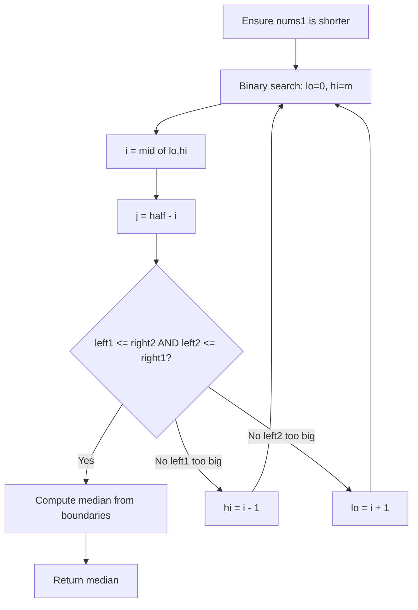
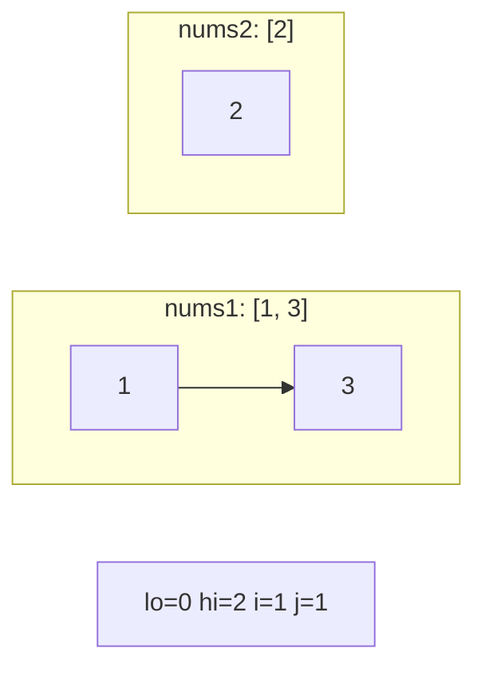
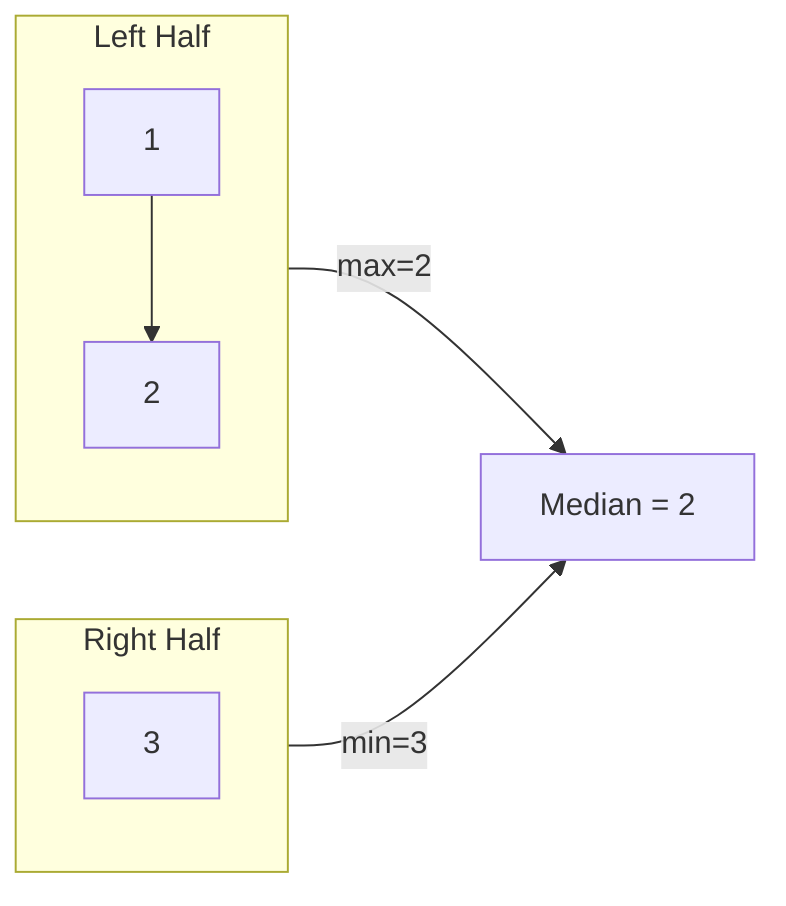
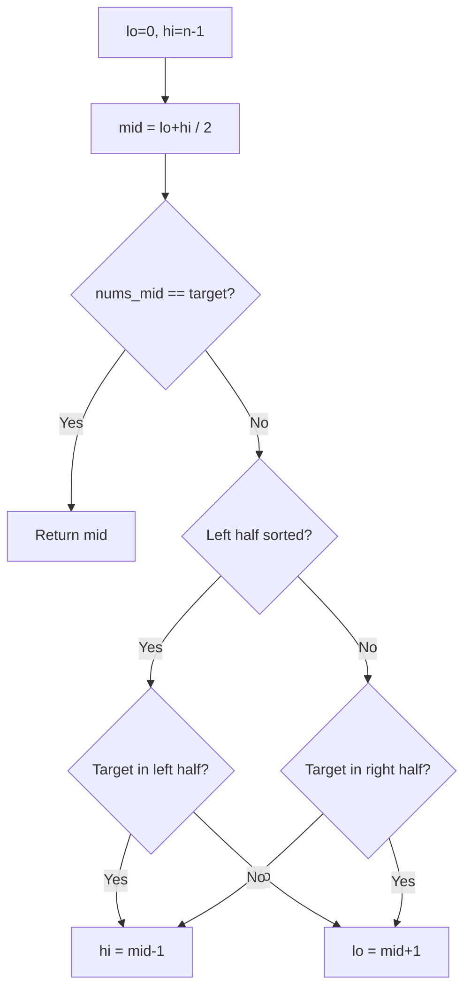
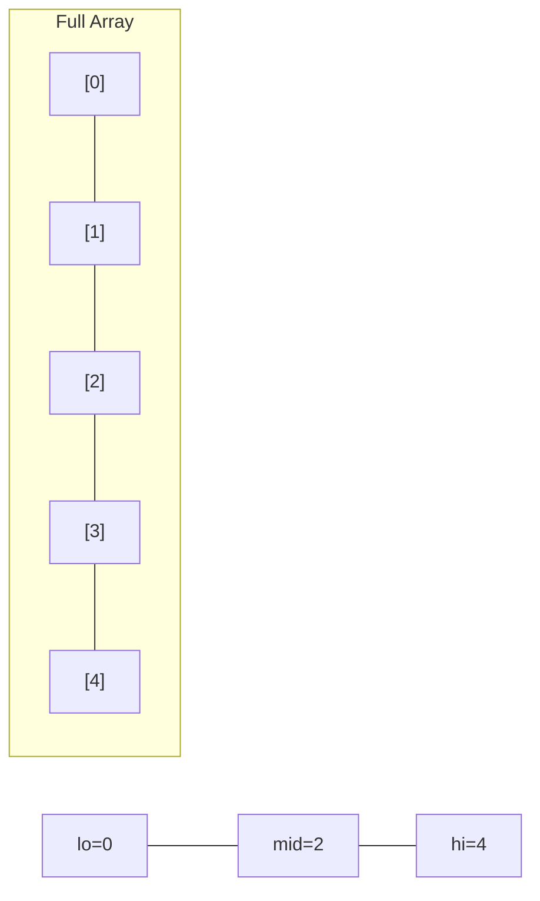
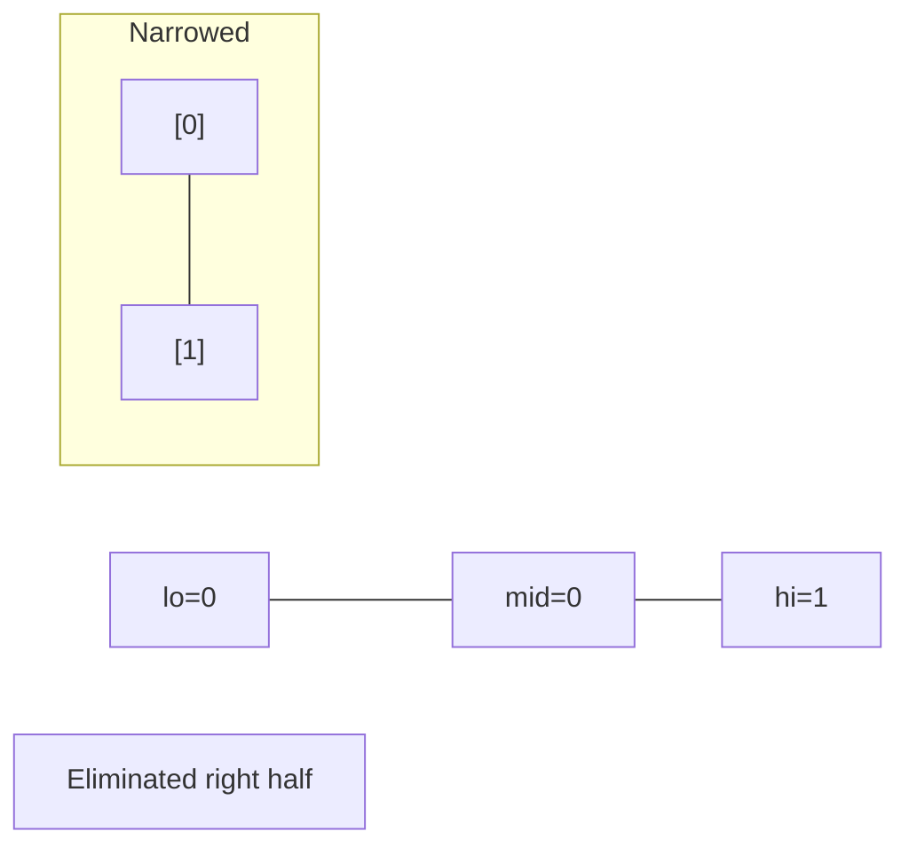
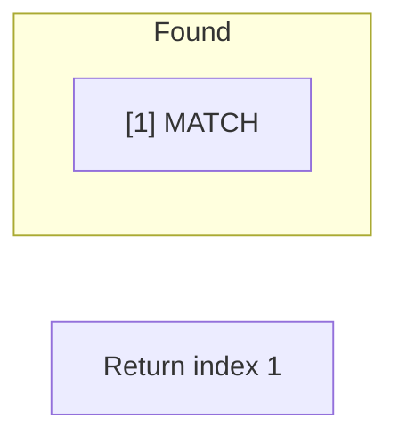
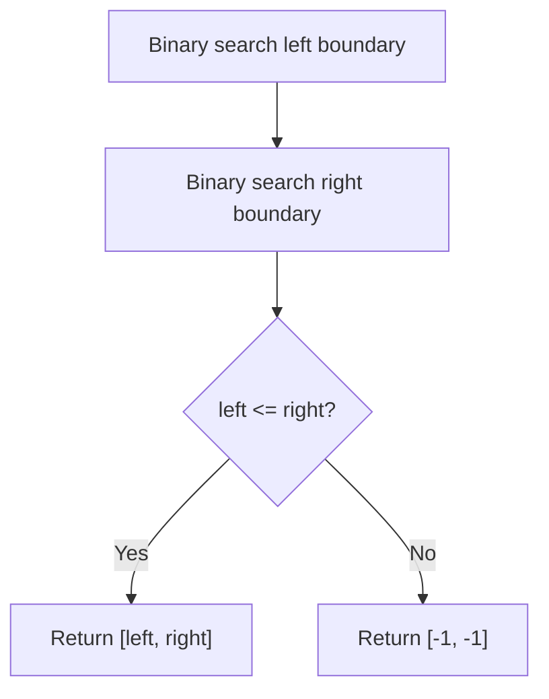
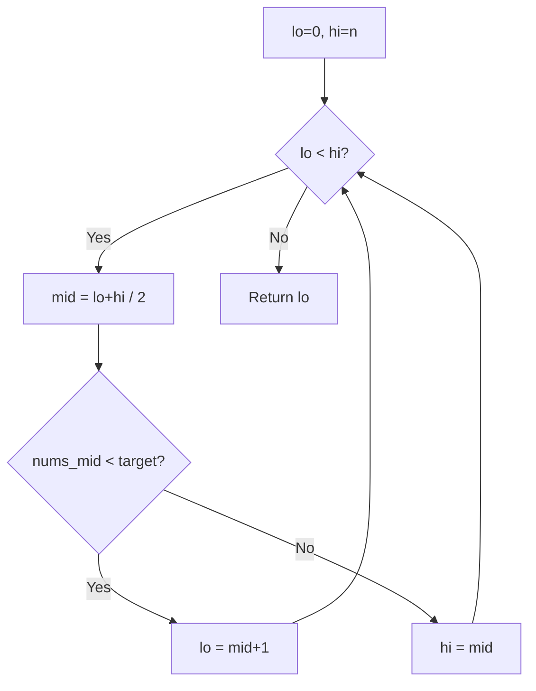
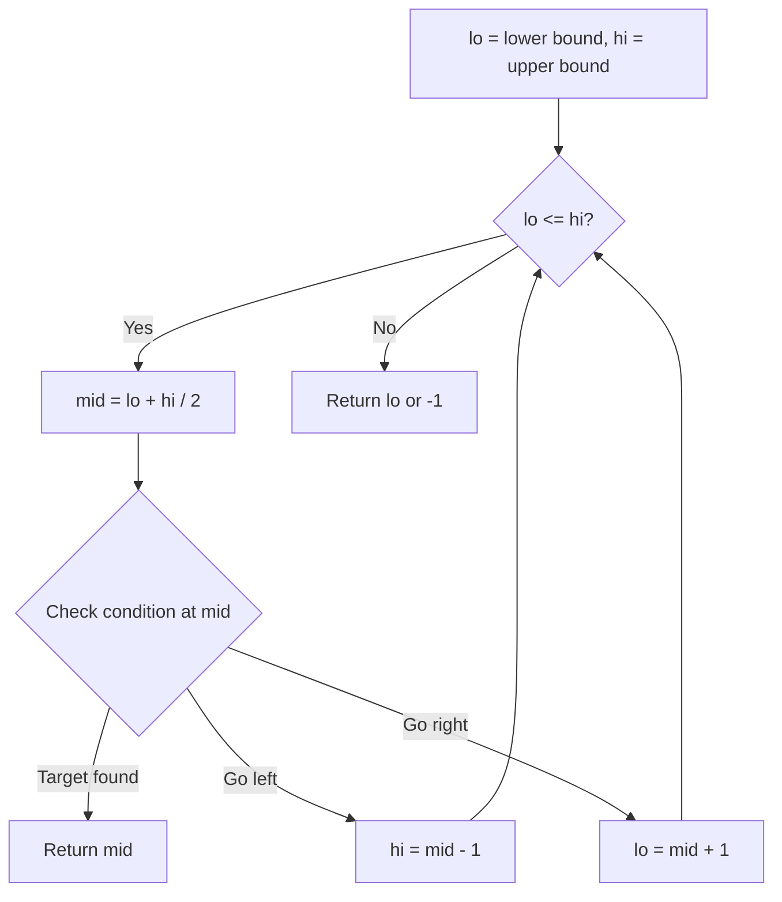

# Binary Search

> Chapter covering 205 problems related to **Binary Search**.


## Problems in this Chapter

| # | Problem | Difficulty | Pattern | Time | Space |
|---|---------|------------|---------|------|-------|
| 4 | [Median of Two Sorted Arrays](#problem-4-median_of_two_sorted_arrays) | Hard | Binary Search | O(log(min(m,n))) | O(1) |
| 33 | [Search in Rotated Sorted Array](#problem-33-search_in_rotated_sorted_array) | Medium | Binary Search | O(log n) | O(1) |
| 34 | [Find First and Last Position of Element in Sorted Array](#problem-34-find_first_and_last_position_of_element_in_sorted_array) | Medium | Binary Search | O(log n) | O(1) |
| 35 | [Search Insert Position](#problem-35-search_insert_position) | Easy | Binary Search | O(log n) | O(1) |
| 69 | [Sqrt(x)](#problem-69-sqrtx) | Easy | Binary Search | O(log n) | O(1) |
| 74 | [Search a 2D Matrix](#problem-74-search_a_2d_matrix) | Medium | Binary Search | O(log(m*n)) | O(1) |
| 81 | [Search in Rotated Sorted Array II](#problem-81-search_in_rotated_sorted_array_ii) | Medium | Binary Search | O(n) worst, O(log n) avg | O(1) |
| 153 | [Find Minimum in Rotated Sorted Array](#problem-153-find_minimum_in_rotated_sorted_array) | Medium | Binary Search | O(log n) | O(1) |
| 154 | [Find Minimum in Rotated Sorted Array II](#problem-154-find_minimum_in_rotated_sorted_array_ii) | Hard | Binary Search | O(log n) | O(1) |
| 162 | [Find Peak Element](#problem-162-find_peak_element) | Medium | Binary Search | O(log n) | O(1) |
| 167 | [Two Sum II - Input Array Is Sorted](#problem-167-two_sum_ii_input_array_is_sorted) | Medium | Binary Search | O(log n) | O(1) |
| 209 | [Minimum Size Subarray Sum](#problem-209-minimum_size_subarray_sum) | Medium | Sliding Window | O(n) | O(k) |
| 222 | [Count Complete Tree Nodes](#problem-222-count_complete_tree_nodes) | Easy | Binary Search | O(log n) | O(1) |
| 240 | [Search a 2D Matrix II](#problem-240-search_a_2d_matrix_ii) | Medium | Binary Search | O(log n) | O(1) |
| 259 | [3Sum Smaller](#problem-259-3sum_smaller) | Medium | Binary Search | O(log n) | O(1) |
| 268 | [Missing Number](#problem-268-missing_number) | Easy | Math / XOR | O(n) | O(1) |
| 270 | [Closest Binary Search Tree Value](#problem-270-closest_binary_search_tree_value) | Easy | Binary Search Tree | O(h) | O(h) |
| 275 | [H-Index II](#problem-275-h_index_ii) | Medium | Binary Search | O(log n) | O(1) |
| 278 | [First Bad Version](#problem-278-first_bad_version) | Easy | Binary Search | O(log n) | O(1) |
| 287 | [Find the Duplicate Number](#problem-287-find_the_duplicate_number) | Medium | Binary Search | O(log n) | O(1) |
| 300 | [Longest Increasing Subsequence](#problem-300-longest_increasing_subsequence) | Medium | Binary Search / DP | O(n log n) | O(n) |
| 302 | [Smallest Rectangle Enclosing Black Pixels](#problem-302-smallest_rectangle_enclosing_black_pixels) | Hard | Binary Search | O(log n) | O(1) |
| 315 | [Count of Smaller Numbers After Self](#problem-315-count_of_smaller_numbers_after_self) | Hard | Segment Tree | O(n log n) build, O(log n) query/update | O(n) |
| 327 | [Count of Range Sum](#problem-327-count_of_range_sum) | Hard | Segment Tree | O(n log n) build, O(log n) query/update | O(n) |
| 349 | [Intersection of Two Arrays](#problem-349-intersection_of_two_arrays) | Easy | Binary Search | O(log n) | O(1) |
| 350 | [Intersection of Two Arrays II](#problem-350-intersection_of_two_arrays_ii) | Easy | Binary Search | O(log n) | O(1) |
| 352 | [Data Stream as Disjoint Intervals](#problem-352-data_stream_as_disjoint_intervals) | Hard | Union-Find / Disjoint Set | O(n * alpha(n)) | O(n) |
| 354 | [Russian Doll Envelopes](#problem-354-russian_doll_envelopes) | Hard | Binary Search | O(log n) | O(1) |
| 362 | [Design Hit Counter](#problem-362-design_hit_counter) | Medium | Binary Search | O(log n) | O(1) |
| 363 | [Max Sum of Rectangle No Larger Than K](#problem-363-max_sum_of_rectangle_no_larger_than_k) | Hard | Ordered Set / SortedList | O(n log n) | O(n) |
| 367 | [Valid Perfect Square](#problem-367-valid_perfect_square) | Easy | Binary Search | O(log n) | O(1) |
| 374 | [Guess Number Higher or Lower](#problem-374-guess_number_higher_or_lower) | Easy | Binary Search | O(log n) | O(1) |
| 378 | [Kth Smallest Element in a Sorted Matrix](#problem-378-kth_smallest_element_in_a_sorted_matrix) | Medium | Heap / Priority Queue | O(n log n) | O(n) |
| 400 | [Nth Digit](#problem-400-nth_digit) | Medium | Binary Search | O(log n) | O(1) |
| 410 | [Split Array Largest Sum](#problem-410-split_array_largest_sum) | Hard | Binary Search | O(log n) | O(1) |
| 436 | [Find Right Interval](#problem-436-find_right_interval) | Medium | Binary Search | O(log n) | O(1) |
| 441 | [Arranging Coins](#problem-441-arranging_coins) | Easy | Binary Search | O(log n) | O(1) |
| 456 | [132 Pattern](#problem-456-132_pattern) | Medium | Monotonic Stack | O(n) | O(n) |
| 475 | [Heaters](#problem-475-heaters) | Medium | Binary Search | O(log n) | O(1) |
| 483 | [Smallest Good Base](#problem-483-smallest_good_base) | Hard | Binary Search | O(log n) | O(1) |
| 493 | [Reverse Pairs](#problem-493-reverse_pairs) | Hard | Segment Tree | O(n log n) build, O(log n) query/update | O(n) |
| 497 | [Random Point in Non-overlapping Rectangles](#problem-497-random_point_in_non_overlapping_rectangles) | Medium | Reservoir Sampling | O(n) | O(k) |
| 528 | [Random Pick with Weight](#problem-528-random_pick_with_weight) | Medium | Binary Search | O(log n) | O(1) |
| 532 | [K-diff Pairs in an Array](#problem-532-k_diff_pairs_in_an_array) | Medium | Hash Map | O(n) | O(n) |
| 540 | [Single Element in a Sorted Array](#problem-540-single_element_in_a_sorted_array) | Medium | Binary Search | O(log n) | O(1) |
| 611 | [Valid Triangle Number](#problem-611-valid_triangle_number) | Medium | Binary Search | O(log n) | O(1) |
| 633 | [Sum of Square Numbers](#problem-633-sum_of_square_numbers) | Medium | Binary Search | O(log n) | O(1) |
| 644 | [Maximum Average Subarray II](#problem-644-maximum_average_subarray_ii) | Hard | Binary Search | O(log n) | O(1) |
| 658 | [Find K Closest Elements](#problem-658-find_k_closest_elements) | Medium | Sliding Window | O(n) | O(k) |
| 668 | [Kth Smallest Number in Multiplication Table](#problem-668-kth_smallest_number_in_multiplication_table) | Hard | Binary Search | O(log n) | O(1) |
| 702 | [Search in a Sorted Array of Unknown Size](#problem-702-search_in_a_sorted_array_of_unknown_size) | Medium | Binary Search | O(log n) | O(1) |
| 704 | [Binary Search](#problem-704-binary_search) | Easy | Binary Search | O(log n) | O(1) |
| 710 | [Random Pick with Blacklist](#problem-710-random_pick_with_blacklist) | Hard | Binary Search | O(log n) | O(1) |
| 713 | [Subarray Product Less Than K](#problem-713-subarray_product_less_than_k) | Medium | Sliding Window | O(n) | O(k) |
| 718 | [Maximum Length of Repeated Subarray](#problem-718-maximum_length_of_repeated_subarray) | Medium | Sliding Window | O(n) | O(k) |
| 719 | [Find K-th Smallest Pair Distance](#problem-719-find_k_th_smallest_pair_distance) | Hard | Binary Search | O(log n) | O(1) |
| 729 | [My Calendar I](#problem-729-my_calendar_i) | Medium | Segment Tree | O(n log n) build, O(log n) query/update | O(n) |
| 731 | [My Calendar II](#problem-731-my_calendar_ii) | Medium | Segment Tree | O(n log n) build, O(log n) query/update | O(n) |
| 732 | [My Calendar III](#problem-732-my_calendar_iii) | Hard | Segment Tree | O(n log n) build, O(log n) query/update | O(n) |
| 744 | [Find Smallest Letter Greater Than Target](#problem-744-find_smallest_letter_greater_than_target) | Easy | Binary Search | O(log n) | O(1) |
| 754 | [Reach a Number](#problem-754-reach_a_number) | Medium | Binary Search | O(log n) | O(1) |
| 774 | [Minimize Max Distance to Gas Station](#problem-774-minimize_max_distance_to_gas_station) | Hard | Binary Search | O(log n) | O(1) |
| 778 | [Swim in Rising Water](#problem-778-swim_in_rising_water) | Hard | Union-Find / Disjoint Set | O(n * alpha(n)) | O(n) |
| 786 | [K-th Smallest Prime Fraction](#problem-786-k_th_smallest_prime_fraction) | Medium | Heap / Priority Queue | O(n log n) | O(n) |
| 792 | [Number of Matching Subsequences](#problem-792-number_of_matching_subsequences) | Medium | Trie / Prefix Tree | O(L) per operation | O(N * L) |
| 793 | [Preimage Size of Factorial Zeroes Function](#problem-793-preimage_size_of_factorial_zeroes_function) | Hard | Binary Search | O(log n) | O(1) |
| 825 | [Friends Of Appropriate Ages](#problem-825-friends_of_appropriate_ages) | Medium | Binary Search | O(log n) | O(1) |
| 826 | [Most Profit Assigning Work](#problem-826-most_profit_assigning_work) | Medium | Binary Search | O(log n) | O(1) |
| 852 | [Peak Index in a Mountain Array](#problem-852-peak_index_in_a_mountain_array) | Medium | Binary Search | O(log n) | O(1) |
| 862 | [Shortest Subarray with Sum at Least K](#problem-862-shortest_subarray_with_sum_at_least_k) | Hard | Monotonic Queue / Deque | O(n) | O(k) |
| 875 | [Koko Eating Bananas](#problem-875-koko_eating_bananas) | Medium | Binary Search on Answer | O(n log m) | O(1) |
| 878 | [Nth Magical Number](#problem-878-nth_magical_number) | Hard | Binary Search | O(log n) | O(1) |
| 887 | [Super Egg Drop](#problem-887-super_egg_drop) | Hard | Binary Search | O(log n) | O(1) |
| 888 | [Fair Candy Swap](#problem-888-fair_candy_swap) | Easy | Binary Search | O(log n) | O(1) |
| 902 | [Numbers At Most N Given Digit Set](#problem-902-numbers_at_most_n_given_digit_set) | Hard | Binary Search | O(log n) | O(1) |
| 911 | [Online Election](#problem-911-online_election) | Medium | Binary Search | O(log n) | O(1) |
| 981 | [Time Based Key-Value Store](#problem-981-time_based_key_value_store) | Medium | Binary Search / Design | O(log n) get, O(1) set | O(n) |
| 1004 | [Max Consecutive Ones III](#problem-1004-max_consecutive_ones_iii) | Medium | Sliding Window | O(n) | O(1) |
| 1011 | [Capacity To Ship Packages Within D Days](#problem-1011-capacity_to_ship_packages_within_d_days) | Medium | Binary Search on Answer | O(n log S) | O(1) |
| 1027 | [Longest Arithmetic Subsequence](#problem-1027-longest_arithmetic_subsequence) | Medium | Binary Search | O(log n) | O(1) |
| 1044 | [Longest Duplicate Substring](#problem-1044-longest_duplicate_substring) | Hard | Sliding Window | O(n) | O(k) |
| 1055 | [Shortest Way to Form String](#problem-1055-shortest_way_to_form_string) | Medium | Binary Search | O(log n) | O(1) |
| 1060 | [Missing Element in Sorted Array](#problem-1060-missing_element_in_sorted_array) | Medium | Binary Search | O(log n) | O(1) |
| 1062 | [Longest Repeating Substring](#problem-1062-longest_repeating_substring) | Medium | Binary Search | O(log n) | O(1) |
| 1064 | [Fixed Point](#problem-1064-fixed_point) | Easy | Binary Search | O(log n) | O(1) |
| 1095 | [Find in Mountain Array](#problem-1095-find_in_mountain_array) | Hard | Binary Search | O(log n) | O(1) |
| 1099 | [Two Sum Less Than K](#problem-1099-two_sum_less_than_k) | Easy | Binary Search | O(log n) | O(1) |
| 1102 | [Path With Maximum Minimum Value](#problem-1102-path_with_maximum_minimum_value) | Medium | Union-Find / Disjoint Set | O(n * alpha(n)) | O(n) |
| 1146 | [Snapshot Array](#problem-1146-snapshot_array) | Medium | Binary Search | O(log n) | O(1) |
| 1150 | [Check If a Number Is Majority Element in a Sorted Array](#problem-1150-check_if_a_number_is_majority_element_in_a_sorted_array) | Easy | Binary Search | O(log n) | O(1) |
| 1157 | [Online Majority Element In Subarray](#problem-1157-online_majority_element_in_subarray) | Hard | Segment Tree | O(n log n) build, O(log n) query/update | O(n) |
| 1170 | [Compare Strings by Frequency of the Smallest Character](#problem-1170-compare_strings_by_frequency_of_the_smallest_character) | Medium | Binary Search | O(log n) | O(1) |
| 1182 | [Shortest Distance to Target Color](#problem-1182-shortest_distance_to_target_color) | Medium | Binary Search | O(log n) | O(1) |
| 1187 | [Make Array Strictly Increasing](#problem-1187-make_array_strictly_increasing) | Hard | Binary Search | O(log n) | O(1) |
| 1198 | [Find Smallest Common Element in All Rows](#problem-1198-find_smallest_common_element_in_all_rows) | Medium | Binary Search | O(log n) | O(1) |
| 1201 | [Ugly Number III](#problem-1201-ugly_number_iii) | Medium | Binary Search | O(log n) | O(1) |
| 1208 | [Get Equal Substrings Within Budget](#problem-1208-get_equal_substrings_within_budget) | Medium | Sliding Window | O(n) | O(k) |
| 1213 | [Intersection of Three Sorted Arrays](#problem-1213-intersection_of_three_sorted_arrays) | Easy | Binary Search | O(log n) | O(1) |
| 1214 | [Two Sum BSTs](#problem-1214-two_sum_bsts) | Medium | Binary Search Tree | O(h) | O(h) |
| 1231 | [Divide Chocolate](#problem-1231-divide_chocolate) | Hard | Binary Search | O(log n) | O(1) |
| 1235 | [Maximum Profit in Job Scheduling](#problem-1235-maximum_profit_in_job_scheduling) | Hard | Dynamic Programming + Binary Search | O(n log n) | O(n) |
| 1237 | [Find Positive Integer Solution for a Given Equation](#problem-1237-find_positive_integer_solution_for_a_given_equation) | Medium | Binary Search | O(log n) | O(1) |
| 1268 | [Search Suggestions System](#problem-1268-search_suggestions_system) | Medium | Binary Search / Trie | O(n log n + m*log n) | O(1) extra |
| 1283 | [Find the Smallest Divisor Given a Threshold](#problem-1283-find_the_smallest_divisor_given_a_threshold) | Medium | Binary Search | O(log n) | O(1) |
| 1292 | [Maximum Side Length of a Square with Sum Less than or Equal to Threshold](#problem-1292-maximum_side_length_of_a_square_with_sum_less_than_or_equal_to_threshold) | Medium | Binary Search | O(log n) | O(1) |
| 1300 | [Sum of Mutated Array Closest to Target](#problem-1300-sum_of_mutated_array_closest_to_target) | Medium | Binary Search | O(log n) | O(1) |
| 1337 | [The K Weakest Rows in a Matrix](#problem-1337-the_k_weakest_rows_in_a_matrix) | Easy | Heap / Sorting | O(m*n + k*log m) | O(m) |
| 1346 | [Check If N and Its Double Exist](#problem-1346-check_if_n_and_its_double_exist) | Easy | Binary Search | O(log n) | O(1) |
| 1348 | [Tweet Counts Per Frequency](#problem-1348-tweet_counts_per_frequency) | Medium | Ordered Set / SortedList | O(n log n) | O(n) |
| 1351 | [Count Negative Numbers in a Sorted Matrix](#problem-1351-count_negative_numbers_in_a_sorted_matrix) | Easy | Binary Search | O(log n) | O(1) |
| 1385 | [Find the Distance Value Between Two Arrays](#problem-1385-find_the_distance_value_between_two_arrays) | Easy | Binary Search | O(log n) | O(1) |
| 1428 | [Leftmost Column with at Least a One](#problem-1428-leftmost_column_with_at_least_a_one) | Medium | Binary Search | O(log n) | O(1) |
| 1439 | [Find the Kth Smallest Sum of a Matrix With Sorted Rows](#problem-1439-find_the_kth_smallest_sum_of_a_matrix_with_sorted_rows) | Hard | Heap / Priority Queue | O(n log n) | O(n) |
| 1477 | [Find Two Non-overlapping Sub-arrays Each With Target Sum](#problem-1477-find_two_non_overlapping_sub_arrays_each_with_target_sum) | Medium | Sliding Window | O(n) | O(k) |
| 1482 | [Minimum Number of Days to Make m Bouquets](#problem-1482-minimum_number_of_days_to_make_m_bouquets) | Medium | Binary Search | O(log n) | O(1) |
| 1483 | [Kth Ancestor of a Tree Node](#problem-1483-kth_ancestor_of_a_tree_node) | Hard | Binary Search | O(log n) | O(1) |
| 1488 | [Avoid Flood in The City](#problem-1488-avoid_flood_in_the_city) | Medium | Heap / Priority Queue | O(n log n) | O(n) |
| 1498 | [Number of Subsequences That Satisfy the Given Sum Condition](#problem-1498-number_of_subsequences_that_satisfy_the_given_sum_condition) | Medium | Binary Search | O(log n) | O(1) |
| 1508 | [Range Sum of Sorted Subarray Sums](#problem-1508-range_sum_of_sorted_subarray_sums) | Medium | Binary Search | O(log n) | O(1) |
| 1521 | [Find a Value of a Mysterious Function Closest to Target](#problem-1521-find_a_value_of_a_mysterious_function_closest_to_target) | Hard | Segment Tree | O(n log n) build, O(log n) query/update | O(n) |
| 1533 | [Find the Index of the Large Integer](#problem-1533-find_the_index_of_the_large_integer) | Medium | Binary Search | O(log n) | O(1) |
| 1539 | [Kth Missing Positive Number](#problem-1539-kth_missing_positive_number) | Easy | Binary Search | O(log n) | O(1) |
| 1552 | [Magnetic Force Between Two Balls](#problem-1552-magnetic_force_between_two_balls) | Medium | Binary Search | O(log n) | O(1) |
| 1562 | [Find Latest Group of Size M](#problem-1562-find_latest_group_of_size_m) | Medium | Binary Search | O(log n) | O(1) |
| 1574 | [Shortest Subarray to be Removed to Make Array Sorted](#problem-1574-shortest_subarray_to_be_removed_to_make_array_sorted) | Medium | Monotonic Stack | O(n) | O(n) |
| 1608 | [Special Array With X Elements Greater Than or Equal X](#problem-1608-special_array_with_x_elements_greater_than_or_equal_x) | Easy | Binary Search | O(log n) | O(1) |
| 1618 | [Maximum Font to Fit a Sentence in a Screen](#problem-1618-maximum_font_to_fit_a_sentence_in_a_screen) | Medium | Binary Search | O(log n) | O(1) |
| 1631 | [Path With Minimum Effort](#problem-1631-path_with_minimum_effort) | Medium | Dijkstra / Graph | O(mn log(mn)) | O(mn) |
| 1648 | [Sell Diminishing-Valued Colored Balls](#problem-1648-sell_diminishing_valued_colored_balls) | Medium | Heap / Priority Queue | O(n log n) | O(n) |
| 1649 | [Create Sorted Array through Instructions](#problem-1649-create_sorted_array_through_instructions) | Hard | Segment Tree | O(n log n) build, O(log n) query/update | O(n) |
| 1658 | [Minimum Operations to Reduce X to Zero](#problem-1658-minimum_operations_to_reduce_x_to_zero) | Medium | Sliding Window | O(n) | O(k) |
| 1671 | [Minimum Number of Removals to Make Mountain Array](#problem-1671-minimum_number_of_removals_to_make_mountain_array) | Hard | Binary Search | O(log n) | O(1) |
| 1712 | [Ways to Split Array Into Three Subarrays](#problem-1712-ways_to_split_array_into_three_subarrays) | Medium | Binary Search | O(log n) | O(1) |
| 1713 | [Minimum Operations to Make a Subsequence](#problem-1713-minimum_operations_to_make_a_subsequence) | Hard | Binary Search | O(log n) | O(1) |
| 1739 | [Building Boxes](#problem-1739-building_boxes) | Hard | Binary Search | O(log n) | O(1) |
| 1751 | [Maximum Number of Events That Can Be Attended II](#problem-1751-maximum_number_of_events_that_can_be_attended_ii) | Hard | Binary Search | O(log n) | O(1) |
| 1760 | [Minimum Limit of Balls in a Bag](#problem-1760-minimum_limit_of_balls_in_a_bag) | Medium | Binary Search | O(log n) | O(1) |
| 1782 | [Count Pairs Of Nodes](#problem-1782-count_pairs_of_nodes) | Hard | Binary Search | O(log n) | O(1) |
| 1793 | [Maximum Score of a Good Subarray](#problem-1793-maximum_score_of_a_good_subarray) | Hard | Monotonic Stack | O(n) | O(n) |
| 1802 | [Maximum Value at a Given Index in a Bounded Array](#problem-1802-maximum_value_at_a_given_index_in_a_bounded_array) | Medium | Binary Search | O(log n) | O(1) |
| 1818 | [Minimum Absolute Sum Difference](#problem-1818-minimum_absolute_sum_difference) | Medium | Ordered Set / SortedList | O(n log n) | O(n) |
| 1838 | [Frequency of the Most Frequent Element](#problem-1838-frequency_of_the_most_frequent_element) | Medium | Sliding Window | O(n) | O(k) |
| 1847 | [Closest Room](#problem-1847-closest_room) | Hard | Ordered Set / SortedList | O(n log n) | O(n) |
| 1851 | [Minimum Interval to Include Each Query](#problem-1851-minimum_interval_to_include_each_query) | Hard | Heap + Sorting | O((n+q) log n) | O(n+q) |
| 1855 | [Maximum Distance Between a Pair of Values](#problem-1855-maximum_distance_between_a_pair_of_values) | Medium | Binary Search | O(log n) | O(1) |
| 1862 | [Sum of Floored Pairs](#problem-1862-sum_of_floored_pairs) | Hard | Binary Search | O(log n) | O(1) |
| 1870 | [Minimum Speed to Arrive on Time](#problem-1870-minimum_speed_to_arrive_on_time) | Medium | Binary Search | O(log n) | O(1) |
| 1885 | [Count Pairs in Two Arrays](#problem-1885-count_pairs_in_two_arrays) | Medium | Binary Search | O(log n) | O(1) |
| 1889 | [Minimum Space Wasted From Packaging](#problem-1889-minimum_space_wasted_from_packaging) | Hard | Binary Search | O(log n) | O(1) |
| 1891 | [Cutting Ribbons](#problem-1891-cutting_ribbons) | Medium | Binary Search | O(log n) | O(1) |
| 1894 | [Find the Student that Will Replace the Chalk](#problem-1894-find_the_student_that_will_replace_the_chalk) | Medium | Binary Search | O(log n) | O(1) |
| 1898 | [Maximum Number of Removable Characters](#problem-1898-maximum_number_of_removable_characters) | Medium | Binary Search | O(log n) | O(1) |
| 1901 | [Find a Peak Element II](#problem-1901-find_a_peak_element_ii) | Medium | Binary Search | O(log n) | O(1) |
| 1918 | [Kth Smallest Subarray Sum](#problem-1918-kth_smallest_subarray_sum) | Medium | Sliding Window | O(n) | O(k) |
| 1923 | [Longest Common Subpath](#problem-1923-longest_common_subpath) | Hard | Binary Search | O(log n) | O(1) |
| 1954 | [Minimum Garden Perimeter to Collect Enough Apples](#problem-1954-minimum_garden_perimeter_to_collect_enough_apples) | Medium | Binary Search | O(log n) | O(1) |
| 1956 | [Minimum Time For K Virus Variants to Spread](#problem-1956-minimum_time_for_k_virus_variants_to_spread) | Hard | Binary Search | O(log n) | O(1) |
| 1964 | [Find the Longest Valid Obstacle Course at Each Position](#problem-1964-find_the_longest_valid_obstacle_course_at_each_position) | Hard | Binary Indexed Tree / Fenwick Tree | O(n log n) build, O(log n) query/update | O(n) |
| 1966 | [Binary Searchable Numbers in an Unsorted Array](#problem-1966-binary_searchable_numbers_in_an_unsorted_array) | Medium | Binary Search | O(log n) | O(1) |
| 1970 | [Last Day Where You Can Still Cross](#problem-1970-last_day_where_you_can_still_cross) | Hard | Union-Find / Disjoint Set | O(n * alpha(n)) | O(n) |
| 2008 | [Maximum Earnings From Taxi](#problem-2008-maximum_earnings_from_taxi) | Medium | Binary Search | O(log n) | O(1) |
| 2009 | [Minimum Number of Operations to Make Array Continuous](#problem-2009-minimum_number_of_operations_to_make_array_continuous) | Hard | Sliding Window | O(n) | O(k) |
| 2024 | [Maximize the Confusion of an Exam](#problem-2024-maximize_the_confusion_of_an_exam) | Medium | Sliding Window | O(n) | O(k) |
| 2031 | [Count Subarrays With More Ones Than Zeros](#problem-2031-count_subarrays_with_more_ones_than_zeros) | Medium | Segment Tree | O(n log n) build, O(log n) query/update | O(n) |
| 2035 | [Partition Array Into Two Arrays to Minimize Sum Difference](#problem-2035-partition_array_into_two_arrays_to_minimize_sum_difference) | Hard | Ordered Set / SortedList | O(n log n) | O(n) |
| 2040 | [Kth Smallest Product of Two Sorted Arrays](#problem-2040-kth_smallest_product_of_two_sorted_arrays) | Hard | Binary Search | O(log n) | O(1) |
| 2054 | [Two Best Non-Overlapping Events](#problem-2054-two_best_non_overlapping_events) | Medium | Heap / Priority Queue | O(n log n) | O(n) |
| 2055 | [Plates Between Candles](#problem-2055-plates_between_candles) | Medium | Binary Search | O(log n) | O(1) |
| 2064 | [Minimized Maximum of Products Distributed to Any Store](#problem-2064-minimized_maximum_of_products_distributed_to_any_store) | Medium | Binary Search | O(log n) | O(1) |
| 2070 | [Most Beautiful Item for Each Query](#problem-2070-most_beautiful_item_for_each_query) | Medium | Binary Search | O(log n) | O(1) |
| 2071 | [Maximum Number of Tasks You Can Assign](#problem-2071-maximum_number_of_tasks_you_can_assign) | Hard | Monotonic Queue / Deque | O(n) | O(k) |
| 2080 | [Range Frequency Queries](#problem-2080-range_frequency_queries) | Medium | Segment Tree | O(n log n) build, O(log n) query/update | O(n) |
| 2089 | [Find Target Indices After Sorting Array](#problem-2089-find_target_indices_after_sorting_array) | Easy | Binary Search | O(log n) | O(1) |
| 2106 | [Maximum Fruits Harvested After at Most K Steps](#problem-2106-maximum_fruits_harvested_after_at_most_k_steps) | Hard | Sliding Window | O(n) | O(k) |
| 2111 | [Minimum Operations to Make the Array K-Increasing](#problem-2111-minimum_operations_to_make_the_array_k_increasing) | Hard | Binary Search | O(log n) | O(1) |
| 2137 | [Pour Water Between Buckets to Make Water Levels Equal](#problem-2137-pour_water_between_buckets_to_make_water_levels_equal) | Medium | Binary Search | O(log n) | O(1) |
| 2141 | [Maximum Running Time of N Computers](#problem-2141-maximum_running_time_of_n_computers) | Hard | Binary Search | O(log n) | O(1) |
| 2179 | [Count Good Triplets in an Array](#problem-2179-count_good_triplets_in_an_array) | Hard | Segment Tree | O(n log n) build, O(log n) query/update | O(n) |
| 2187 | [Minimum Time to Complete Trips](#problem-2187-minimum_time_to_complete_trips) | Medium | Binary Search | O(log n) | O(1) |
| 2223 | [Sum of Scores of Built Strings](#problem-2223-sum_of_scores_of_built_strings) | Hard | Binary Search | O(log n) | O(1) |
| 2226 | [Maximum Candies Allocated to K Children](#problem-2226-maximum_candies_allocated_to_k_children) | Medium | Binary Search | O(log n) | O(1) |
| 2234 | [Maximum Total Beauty of the Gardens](#problem-2234-maximum_total_beauty_of_the_gardens) | Hard | Binary Search | O(log n) | O(1) |
| 2250 | [Count Number of Rectangles Containing Each Point](#problem-2250-count_number_of_rectangles_containing_each_point) | Medium | Binary Indexed Tree / Fenwick Tree | O(n log n) build, O(log n) query/update | O(n) |
| 2251 | [Number of Flowers in Full Bloom](#problem-2251-number_of_flowers_in_full_bloom) | Hard | Ordered Set / SortedList | O(n log n) | O(n) |
| 2258 | [Escape the Spreading Fire](#problem-2258-escape_the_spreading_fire) | Hard | Binary Search | O(log n) | O(1) |
| 2271 | [Maximum White Tiles Covered by a Carpet](#problem-2271-maximum_white_tiles_covered_by_a_carpet) | Medium | Sliding Window | O(n) | O(k) |
| 2286 | [Booking Concert Tickets in Groups](#problem-2286-booking_concert_tickets_in_groups) | Hard | Segment Tree | O(n log n) build, O(log n) query/update | O(n) |
| 2300 | [Successful Pairs of Spells and Potions](#problem-2300-successful_pairs_of_spells_and_potions) | Medium | Binary Search + Sorting | O((m+n) log n) | O(1) extra |
| 2302 | [Count Subarrays With Score Less Than K](#problem-2302-count_subarrays_with_score_less_than_k) | Hard | Sliding Window | O(n) | O(k) |
| 2332 | [The Latest Time to Catch a Bus](#problem-2332-the_latest_time_to_catch_a_bus) | Medium | Binary Search | O(log n) | O(1) |
| 2333 | [Minimum Sum of Squared Difference](#problem-2333-minimum_sum_of_squared_difference) | Medium | Heap / Priority Queue | O(n log n) | O(n) |
| 2354 | [Number of Excellent Pairs](#problem-2354-number_of_excellent_pairs) | Hard | Binary Search | O(log n) | O(1) |
| 2358 | [Maximum Number of Groups Entering a Competition](#problem-2358-maximum_number_of_groups_entering_a_competition) | Medium | Binary Search | O(log n) | O(1) |
| 2387 | [Median of a Row Wise Sorted Matrix](#problem-2387-median_of_a_row_wise_sorted_matrix) | Medium | Binary Search | O(log n) | O(1) |
| 2389 | [Longest Subsequence With Limited Sum](#problem-2389-longest_subsequence_with_limited_sum) | Easy | Binary Search | O(log n) | O(1) |
| 2398 | [Maximum Number of Robots Within Budget](#problem-2398-maximum_number_of_robots_within_budget) | Hard | Monotonic Queue / Deque | O(n) | O(k) |
| 2411 | [Smallest Subarrays With Maximum Bitwise OR](#problem-2411-smallest_subarrays_with_maximum_bitwise_or) | Medium | Sliding Window | O(n) | O(k) |
| 2424 | [Longest Uploaded Prefix](#problem-2424-longest_uploaded_prefix) | Medium | Union-Find / Disjoint Set | O(n * alpha(n)) | O(n) |
| 2426 | [Number of Pairs Satisfying Inequality](#problem-2426-number_of_pairs_satisfying_inequality) | Hard | Segment Tree | O(n log n) build, O(log n) query/update | O(n) |
| 2439 | [Minimize Maximum of Array](#problem-2439-minimize_maximum_of_array) | Medium | Binary Search | O(log n) | O(1) |
| 2448 | [Minimum Cost to Make Array Equal](#problem-2448-minimum_cost_to_make_array_equal) | Hard | Binary Search | O(log n) | O(1) |
| 2454 | [Next Greater Element IV](#problem-2454-next_greater_element_iv) | Hard | Monotonic Stack | O(n) | O(n) |
| 2468 | [Split Message Based on Limit](#problem-2468-split_message_based_on_limit) | Hard | Binary Search | O(log n) | O(1) |
| 2476 | [Closest Nodes Queries in a Binary Search Tree](#problem-2476-closest_nodes_queries_in_a_binary_search_tree) | Medium | Binary Search Tree | O(h) | O(h) |
| 2498 | [Frog Jump II](#problem-2498-frog_jump_ii) | Medium | Binary Search | O(log n) | O(1) |

---
---

# Problem 4: Median of Two Sorted Arrays

| Attribute | Detail |
|-----------|--------|
| **ID** | 4 |
| **Title** | Median of Two Sorted Arrays |
| **Difficulty** | Hard |
| **Tags** | Array, Binary Search, Divide and Conquer |
| **Link** | [leetcode.com/problems/median-of-two-sorted-arrays](https://leetcode.com/problems/median-of-two-sorted-arrays/) |

Given two sorted arrays `nums1` and `nums2` of size `m` and `n` respectively, return **the median** of the two sorted arrays.

The overall run time complexity should be `O(log (m+n))`.

 

Example 1:

```

**Input:** nums1 = [1,3], nums2 = [2]
**Output:** 2.00000
**Explanation:** merged array = [1,2,3] and median is 2.

```

Example 2:

```

**Input:** nums1 = [1,2], nums2 = [3,4]
**Output:** 2.50000
**Explanation:** merged array = [1,2,3,4] and median is (2 + 3) / 2 = 2.5.

```

 

**Constraints:**

	- `nums1.length == m`
	- `nums2.length == n`
	- `0 <= m <= 1000`
	- `0 <= n <= 1000`
	- `1 <= m + n <= 2000`
	- `-10^6 <= nums1[i], nums2[i] <= 10^6`

---

## Approach: Binary Search

**Key Insight:** Binary search on the shorter array to find the correct partition. At the correct partition, all left elements <= all right elements.

Binary search the partition index `i` in the shorter array. Compute `j` for the other array such that left half has `(m+n+1)//2` elements total.

### Pseudo-code

```
1. Ensure nums1 is shorter
2. Binary search i in [0, m]
3. j = (m+n+1)//2 - i
4. Check left1<=right2 and left2<=right1
5. If valid: compute median from boundary elements
6. Else adjust lo/hi
```

---

## Algorithm Flow



## Visual State Transitions

**Binary Search Partition Animation:**

**Step 1:** Initial state - search full range of shorter array



**Step 2:** Check partition i=1, j=1: left=[1,2] right=[3] -- Valid!



---

## Complexity Analysis

| Metric | Value |
|--------|-------|
| **Time** | O(log(min(m,n))) |
| **Space** | O(1) |

---

## Solution Code

### Python3

```python
class Solution:
    def findMedianSortedArrays(self, nums1: list[int], nums2: list[int]) -> float:
        if len(nums1) > len(nums2):
            nums1, nums2 = nums2, nums1
        m, n = len(nums1), len(nums2)
        lo, hi = 0, m
        while lo <= hi:
            i = (lo + hi) // 2
            j = (m + n + 1) // 2 - i
            left1 = nums1[i - 1] if i > 0 else float('-inf')
            right1 = nums1[i] if i < m else float('inf')
            left2 = nums2[j - 1] if j > 0 else float('-inf')
            right2 = nums2[j] if j < n else float('inf')
            if left1 <= right2 and left2 <= right1:
                if (m + n) % 2 == 0:
                    return (max(left1, left2) + min(right1, right2)) / 2
                return max(left1, left2)
            elif left1 > right2:
                hi = i - 1
            else:
                lo = i + 1
        return 0.0
```

### C++

```cpp
#include <string>
#include <vector>
using namespace std;

class Solution {
public:
    double findMedianSortedArrays(vector<int>& nums1, vector<int>& nums2) {
        // Binary search - O(log n) time, O(1) space
        int lo = 0, hi = nums1.size() - 1;
        while (lo <= hi) {
            int mid = lo + (hi - lo) / 2;
            if (nums1[mid] == nums2) {
                return mid;
            } else if (nums1[mid] < nums2) {
                lo = mid + 1;
            } else {
                hi = mid - 1;
            }
        }
        return 0.0;
    }
};
```

### Summary

| Aspect | Detail |
|--------|--------|
| **Pattern** | Binary Search |
| **Time** | O(log(min(m,n))) |
| **Space** | O(1) |

---
---

# Problem 33: Search in Rotated Sorted Array

| Attribute | Detail |
|-----------|--------|
| **ID** | 33 |
| **Title** | Search in Rotated Sorted Array |
| **Difficulty** | Medium |
| **Tags** | Array, Binary Search |
| **Link** | [leetcode.com/problems/search-in-rotated-sorted-array](https://leetcode.com/problems/search-in-rotated-sorted-array/) |

There is an integer array `nums` sorted in ascending order (with **distinct** values).

Prior to being passed to your function, `nums` is **possibly left rotated** at an unknown index `k` (`1 <= k < nums.length`) such that the resulting array is `[nums[k], nums[k+1], ..., nums[n-1], nums[0], nums[1], ..., nums[k-1]]` (**0-indexed**). For example, `[0,1,2,4,5,6,7]` might be left rotated by `3` indices and become `[4,5,6,7,0,1,2]`.

Given the array `nums` **after** the possible rotation and an integer `target`, return *the index of *`target`* if it is in *`nums`*, or *`-1`* if it is not in *`nums`.

You must write an algorithm with `O(log n)` runtime complexity.

 

Example 1:

```
**Input:** nums = [4,5,6,7,0,1,2], target = 0
**Output:** 4

```
Example 2:

```
**Input:** nums = [4,5,6,7,0,1,2], target = 3
**Output:** -1

```
Example 3:

```
**Input:** nums = [1], target = 0
**Output:** -1

```

 

**Constraints:**

	- `1 <= nums.length <= 5000`
	- `-10^4 <= nums[i] <= 10^4`
	- All values of `nums` are **unique**.
	- `nums` is an ascending array that is possibly rotated.
	- `-10^4 <= target <= 10^4`

---

## Approach: Binary Search

**Key Insight:** One half is always sorted. Determine which half is sorted, then check if target lies within that half.

### Pseudo-code

```
1. lo=0, hi=n-1
2. mid = (lo+hi)//2
3. If left half sorted: check if target in left half
4. Else right half sorted: check if target in right half
5. Adjust lo/hi accordingly
```

---

## Algorithm Flow



## Visual State Transitions

**Binary Search Step-by-Step:**

**Frame 1: Initial search space**


**Frame 2: Compare mid, narrow search**


**Frame 3: Found target**



---

## Complexity Analysis

| Metric | Value |
|--------|-------|
| **Time** | O(log n) |
| **Space** | O(1) |

---

## Solution Code

### Python3

```python
class Solution:
    def search(self, nums: list[int], target: int) -> int:
        lo, hi = 0, len(nums) - 1
        while lo <= hi:
            mid = (lo + hi) // 2
            if nums[mid] == target:
                return mid
            if nums[lo] <= nums[mid]:
                if nums[lo] <= target < nums[mid]:
                    hi = mid - 1
                else:
                    lo = mid + 1
            else:
                if nums[mid] < target <= nums[hi]:
                    lo = mid + 1
                else:
                    hi = mid - 1
        return -1
```

### C++

```cpp
#include <string>
#include <vector>
using namespace std;

class Solution {
public:
    int search(vector<int>& nums, int target) {
        // Binary search - O(log n) time, O(1) space
        int lo = 0, hi = nums.size() - 1;
        while (lo <= hi) {
            int mid = lo + (hi - lo) / 2;
            if (nums[mid] == target) {
                return mid;
            } else if (nums[mid] < target) {
                lo = mid + 1;
            } else {
                hi = mid - 1;
            }
        }
        return 0;
    }
};
```

### Summary

| Aspect | Detail |
|--------|--------|
| **Pattern** | Binary Search |
| **Time** | O(log n) |
| **Space** | O(1) |

---
---

# Problem 34: Find First and Last Position of Element in Sorted Array

| Attribute | Detail |
|-----------|--------|
| **ID** | 34 |
| **Title** | Find First and Last Position of Element in Sorted Array |
| **Difficulty** | Medium |
| **Tags** | Array, Binary Search |
| **Link** | [leetcode.com/problems/find-first-and-last-position-of-element-in-sorted-array](https://leetcode.com/problems/find-first-and-last-position-of-element-in-sorted-array/) |

Given an array of integers `nums` sorted in non-decreasing order, find the starting and ending position of a given `target` value.

If `target` is not found in the array, return `[-1, -1]`.

You must write an algorithm with `O(log n)` runtime complexity.

 

Example 1:

```
**Input:** nums = [5,7,7,8,8,10], target = 8
**Output:** [3,4]

```
Example 2:

```
**Input:** nums = [5,7,7,8,8,10], target = 6
**Output:** [-1,-1]

```
Example 3:

```
**Input:** nums = [], target = 0
**Output:** [-1,-1]

```

 

**Constraints:**

	- `0 <= nums.length <= 10^5`
	- `-10^9 <= nums[i] <= 10^9`
	- `nums` is a non-decreasing array.
	- `-10^9 <= target <= 10^9`

---

## Approach: Binary Search

Two binary searches: one for the leftmost occurrence, one for the rightmost.

### Pseudo-code

```
1. Binary search for leftmost target index
2. Binary search for rightmost target index
3. If left <= right: return [left, right]
4. Else: return [-1, -1]
```

---

## Algorithm Flow



## Visual State Transitions

**Binary Search Step-by-Step:**

**Frame 1: Initial search space**


**Frame 2: Compare mid, narrow search**


**Frame 3: Found target**


---

## Complexity Analysis

| Metric | Value |
|--------|-------|
| **Time** | O(log n) |
| **Space** | O(1) |

---

## Solution Code

### Python3

```python
class Solution:
    def searchRange(self, nums: list[int], target: int) -> list[int]:
        def find_left():
            lo, hi = 0, len(nums) - 1
            while lo <= hi:
                mid = (lo + hi) // 2
                if nums[mid] < target:
                    lo = mid + 1
                else:
                    hi = mid - 1
            return lo

        def find_right():
            lo, hi = 0, len(nums) - 1
            while lo <= hi:
                mid = (lo + hi) // 2
                if nums[mid] <= target:
                    lo = mid + 1
                else:
                    hi = mid - 1
            return hi

        left, right = find_left(), find_right()
        if left <= right:
            return [left, right]
        return [-1, -1]
```

### C++

```cpp
#include <string>
#include <vector>
using namespace std;

class Solution {
public:
    vector<int> searchRange(vector<int>& nums, int target) {
        // Binary search - O(log n) time, O(1) space
        int lo = 0, hi = nums.size() - 1;
        while (lo <= hi) {
            int mid = lo + (hi - lo) / 2;
            if (nums[mid] == target) {
                return mid;
            } else if (nums[mid] < target) {
                lo = mid + 1;
            } else {
                hi = mid - 1;
            }
        }
        return {};
    }
};
```

### Summary

| Aspect | Detail |
|--------|--------|
| **Pattern** | Binary Search |
| **Time** | O(log n) |
| **Space** | O(1) |

---
---

# Problem 35: Search Insert Position

| Attribute | Detail |
|-----------|--------|
| **ID** | 35 |
| **Title** | Search Insert Position |
| **Difficulty** | Easy |
| **Tags** | Array, Binary Search |
| **Link** | [leetcode.com/problems/search-insert-position](https://leetcode.com/problems/search-insert-position/) |

Given a sorted array of distinct integers and a target value, return the index if the target is found. If not, return the index where it would be if it were inserted in order.

You must write an algorithm with `O(log n)` runtime complexity.

 

Example 1:

```

**Input:** nums = [1,3,5,6], target = 5
**Output:** 2

```

Example 2:

```

**Input:** nums = [1,3,5,6], target = 2
**Output:** 1

```

Example 3:

```

**Input:** nums = [1,3,5,6], target = 7
**Output:** 4

```

 

**Constraints:**

	- `1 <= nums.length <= 10^4`
	- `-10^4 <= nums[i] <= 10^4`
	- `nums` contains **distinct** values sorted in **ascending** order.
	- `-10^4 <= target <= 10^4`

---

## Approach: Binary Search

Standard binary search. Return lo when the loop ends -- it's the insertion point.

### Pseudo-code

```
1. lo=0, hi=n
2. While lo < hi: mid check
3. Return lo as insertion point
```

---

## Algorithm Flow



## Visual State Transitions

**Binary Search Step-by-Step:**

**Frame 1: Initial search space**


**Frame 2: Compare mid, narrow search**


**Frame 3: Found target**


---

## Complexity Analysis

| Metric | Value |
|--------|-------|
| **Time** | O(log n) |
| **Space** | O(1) |

---

## Solution Code

### Python3

```python
class Solution:
    def searchInsert(self, nums: list[int], target: int) -> int:
        lo, hi = 0, len(nums)
        while lo < hi:
            mid = (lo + hi) // 2
            if nums[mid] < target:
                lo = mid + 1
            else:
                hi = mid
        return lo
```

### C++

```cpp
#include <string>
#include <vector>
using namespace std;

class Solution {
public:
    int searchInsert(vector<int>& nums, int target) {
        // Binary search - O(log n) time, O(1) space
        int lo = 0, hi = nums.size() - 1;
        while (lo <= hi) {
            int mid = lo + (hi - lo) / 2;
            if (nums[mid] == target) {
                return mid;
            } else if (nums[mid] < target) {
                lo = mid + 1;
            } else {
                hi = mid - 1;
            }
        }
        return 0;
    }
};
```

### Summary

| Aspect | Detail |
|--------|--------|
| **Pattern** | Binary Search |
| **Time** | O(log n) |
| **Space** | O(1) |

---
---

# Problem 69: Sqrt(x)

| Attribute | Detail |
|-----------|--------|
| **ID** | 69 |
| **Title** | Sqrt(x) |
| **Difficulty** | Easy |
| **Tags** | Math, Binary Search |
| **Link** | [leetcode.com/problems/sqrtx](https://leetcode.com/problems/sqrtx/) |

Given a non-negative integer `x`, return *the square root of *`x`* rounded down to the nearest integer*. The returned integer should be **non-negative** as well.

You **must not use** any built-in exponent function or operator.

	- For example, do not use `pow(x, 0.5)` in c++ or `x ** 0.5` in python.

 

Example 1:

```

**Input:** x = 4
**Output:** 2
**Explanation:** The square root of 4 is 2, so we return 2.

```

Example 2:

```

**Input:** x = 8
**Output:** 2
**Explanation:** The square root of 8 is 2.82842..., and since we round it down to the nearest integer, 2 is returned.

```

 

**Constraints:**

	- `0 <= x <= 2^31 - 1`

---

## Approach: Binary Search

Binary search for the integer square root. Find largest mid where mid^2 <= x.

### Pseudo-code

```
1. Binary search [0, x]
2. If mid^2 <= x < (mid+1)^2: return mid
3. Adjust lo/hi accordingly
```

---

## Algorithm Flow



## Visual State Transitions

**Binary Search Step-by-Step:**

**Frame 1: Initial search space**


**Frame 2: Compare mid, narrow search**


**Frame 3: Found target**


---

## Complexity Analysis

| Metric | Value |
|--------|-------|
| **Time** | O(log n) |
| **Space** | O(1) |

---

## Solution Code

### Python3

```python
class Solution:
    def mySqrt(self, x: int) -> int:
        lo, hi = 0, x
        while lo <= hi:
            mid = (lo + hi) // 2
            if mid * mid <= x < (mid + 1) * (mid + 1):
                return mid
            elif mid * mid > x:
                hi = mid - 1
            else:
                lo = mid + 1
        return lo
```

### C++

```cpp
#include <string>
#include <vector>
using namespace std;

class Solution {
public:
    int mySqrt(int x) {
        // Binary search - O(log n) time, O(1) space
        int lo = 0, hi = x.size() - 1;
        while (lo <= hi) {
            int mid = lo + (hi - lo) / 2;
            if (x[mid] == x) {
                return mid;
            } else if (x[mid] < x) {
                lo = mid + 1;
            } else {
                hi = mid - 1;
            }
        }
        return 0;
    }
};
```

### Summary

| Aspect | Detail |
|--------|--------|
| **Pattern** | Binary Search |
| **Time** | O(log n) |
| **Space** | O(1) |

---
---

# Problem 74: Search a 2D Matrix

| Attribute | Detail |
|-----------|--------|
| **ID** | 74 |
| **Title** | Search a 2D Matrix |
| **Difficulty** | Medium |
| **Tags** | Array, Binary Search, Matrix |
| **Link** | [leetcode.com/problems/search-a-2d-matrix](https://leetcode.com/problems/search-a-2d-matrix/) |

You are given an `m x n` integer matrix `matrix` with the following two properties:

	- Each row is sorted in non-decreasing order.
	- The first integer of each row is greater than the last integer of the previous row.

Given an integer `target`, return `true` *if* `target` *is in* `matrix` *or* `false` *otherwise*.

You must write a solution in `O(log(m * n))` time complexity.

 

Example 1:

```

**Input:** matrix = [[1,3,5,7],[10,11,16,20],[23,30,34,60]], target = 3
**Output:** true

```

Example 2:

```

**Input:** matrix = [[1,3,5,7],[10,11,16,20],[23,30,34,60]], target = 13
**Output:** false

```

 

**Constraints:**

	- `m == matrix.length`
	- `n == matrix[i].length`
	- `1 <= m, n <= 100`
	- `-10^4 <= matrix[i][j], target <= 10^4`

---

## Approach: Binary Search

Treat 2D matrix as 1D sorted array. Binary search with index mapping: row=mid//n, col=mid%n.

### Pseudo-code

```
1. Binary search [0, m*n-1]
2. Map mid to matrix[mid//n][mid%n]
3. Standard binary search logic
```

---

## Algorithm Flow


## Visual State Transitions

**Binary Search Step-by-Step:**

**Frame 1: Initial search space**
```mermaid
graph LR
    subgraph SearchSpace [Full Array]
        A0["[0]"] --- A1["[1]"] --- A2["[2]"] --- A3["[3]"] --- A4["[4]"]
    end
    L["lo=0"] --- M["mid=2"] --- H["hi=4"]
```

**Frame 2: Compare mid, narrow search**
```mermaid
graph LR
    subgraph SearchSpace [Narrowed]
        A0["[0]"] --- A1["[1]"]
    end
    L["lo=0"] --- M["mid=0"] --- H["hi=1"]
    N["Eliminated right half"]
```

**Frame 3: Found target**
```mermaid
graph LR
    subgraph SearchSpace [Found]
        A1["[1] MATCH"]
    end
    R["Return index 1"]
```


---

## Complexity Analysis

| Metric | Value |
|--------|-------|
| **Time** | O(log(m*n)) |
| **Space** | O(1) |

---

## Solution Code

### Python3

```python
class Solution:
    def searchMatrix(self, matrix: list[list[int]], target: int) -> bool:
        m, n = len(matrix), len(matrix[0])
        lo, hi = 0, m * n - 1
        while lo <= hi:
            mid = (lo + hi) // 2
            val = matrix[mid // n][mid % n]
            if val == target:
                return True
            elif val < target:
                lo = mid + 1
            else:
                hi = mid - 1
        return False
```

### C++

```cpp
#include <string>
#include <vector>
using namespace std;

class Solution {
public:
    bool searchMatrix(vector<vector<int>>& matrix, int target) {
        // Binary search - O(log n) time, O(1) space
        int lo = 0, hi = matrix.size() - 1;
        while (lo <= hi) {
            int mid = lo + (hi - lo) / 2;
            if (matrix[mid] == target) {
                return mid;
            } else if (matrix[mid] < target) {
                lo = mid + 1;
            } else {
                hi = mid - 1;
            }
        }
        return false;
    }
};
```

### Summary

| Aspect | Detail |
|--------|--------|
| **Pattern** | Binary Search |
| **Time** | O(log(m*n)) |
| **Space** | O(1) |

---
---

# Problem 81: Search in Rotated Sorted Array II

| Attribute | Detail |
|-----------|--------|
| **ID** | 81 |
| **Title** | Search in Rotated Sorted Array II |
| **Difficulty** | Medium |
| **Tags** | Array, Binary Search |
| **Link** | [leetcode.com/problems/search-in-rotated-sorted-array-ii](https://leetcode.com/problems/search-in-rotated-sorted-array-ii/) |

There is an integer array `nums` sorted in non-decreasing order (not necessarily with **distinct** values).

Before being passed to your function, `nums` is **rotated** at an unknown pivot index `k` (`0 <= k < nums.length`) such that the resulting array is `[nums[k], nums[k+1], ..., nums[n-1], nums[0], nums[1], ..., nums[k-1]]` (**0-indexed**). For example, `[0,1,2,4,4,4,5,6,6,7]` might be rotated at pivot index `5` and become `[4,5,6,6,7,0,1,2,4,4]`.

Given the array `nums` **after** the rotation and an integer `target`, return `true`* if *`target`* is in *`nums`*, or *`false`* if it is not in *`nums`*.*

You must decrease the overall operation steps as much as possible.

 

Example 1:

```
**Input:** nums = [2,5,6,0,0,1,2], target = 0
**Output:** true

```
Example 2:

```
**Input:** nums = [2,5,6,0,0,1,2], target = 3
**Output:** false

```

 

**Constraints:**

	- `1 <= nums.length <= 5000`
	- `-10^4 <= nums[i] <= 10^4`
	- `nums` is guaranteed to be rotated at some pivot.
	- `-10^4 <= target <= 10^4`

 

**Follow up:** This problem is similar to Search in Rotated Sorted Array, but `nums` may contain **duplicates**. Would this affect the runtime complexity? How and why?

---

## Approach: Binary Search

Like problem 33 but handle duplicates by shrinking both ends when ambiguous.

### Pseudo-code

```
1. Same as Search in Rotated Sorted Array
2. When lo==mid==hi: shrink both ends
3. Otherwise determine sorted half and search
```

---

## Algorithm Flow

```mermaid
flowchart TD
    A[lo = lower bound, hi = upper bound] --> B{lo <= hi?}
    B -- Yes --> C[mid = lo + hi / 2]
    C --> D{Check condition at mid}
    D -- Target found --> E[Return mid]
    D -- Go left --> F[hi = mid - 1]
    D -- Go right --> G[lo = mid + 1]
    F --> B
    G --> B
    B -- No --> H[Return lo or -1]
```

## Visual State Transitions

**Binary Search Step-by-Step:**

**Frame 1: Initial search space**
```mermaid
graph LR
    subgraph SearchSpace [Full Array]
        A0["[0]"] --- A1["[1]"] --- A2["[2]"] --- A3["[3]"] --- A4["[4]"]
    end
    L["lo=0"] --- M["mid=2"] --- H["hi=4"]
```

**Frame 2: Compare mid, narrow search**
```mermaid
graph LR
    subgraph SearchSpace [Narrowed]
        A0["[0]"] --- A1["[1]"]
    end
    L["lo=0"] --- M["mid=0"] --- H["hi=1"]
    N["Eliminated right half"]
```

**Frame 3: Found target**
```mermaid
graph LR
    subgraph SearchSpace [Found]
        A1["[1] MATCH"]
    end
    R["Return index 1"]
```


---

## Complexity Analysis

| Metric | Value |
|--------|-------|
| **Time** | O(n) worst, O(log n) avg |
| **Space** | O(1) |

---

## Solution Code

### Python3

```python
class Solution:
    def search(self, nums: list[int], target: int) -> bool:
        lo, hi = 0, len(nums) - 1
        while lo <= hi:
            mid = (lo + hi) // 2
            if nums[mid] == target:
                return True
            if nums[lo] == nums[mid] == nums[hi]:
                lo += 1; hi -= 1
            elif nums[lo] <= nums[mid]:
                if nums[lo] <= target < nums[mid]:
                    hi = mid - 1
                else:
                    lo = mid + 1
            else:
                if nums[mid] < target <= nums[hi]:
                    lo = mid + 1
                else:
                    hi = mid - 1
        return False
```

### C++

```cpp
#include <string>
#include <vector>
using namespace std;

class Solution {
public:
    bool search(vector<int>& nums, int target) {
        // Binary search - O(log n) time, O(1) space
        int lo = 0, hi = nums.size() - 1;
        while (lo <= hi) {
            int mid = lo + (hi - lo) / 2;
            if (nums[mid] == target) {
                return mid;
            } else if (nums[mid] < target) {
                lo = mid + 1;
            } else {
                hi = mid - 1;
            }
        }
        return false;
    }
};
```

### Summary

| Aspect | Detail |
|--------|--------|
| **Pattern** | Binary Search |
| **Time** | O(n) worst, O(log n) avg |
| **Space** | O(1) |

---
---

# Problem 153: Find Minimum in Rotated Sorted Array

| Attribute | Detail |
|-----------|--------|
| **ID** | 153 |
| **Title** | Find Minimum in Rotated Sorted Array |
| **Difficulty** | Medium |
| **Tags** | Array, Binary Search |
| **Link** | [leetcode.com/problems/find-minimum-in-rotated-sorted-array](https://leetcode.com/problems/find-minimum-in-rotated-sorted-array/) |

Suppose an array of length `n` sorted in ascending order is **rotated** between `1` and `n` times. For example, the array `nums = [0,1,2,4,5,6,7]` might become:

	- `[4,5,6,7,0,1,2]` if it was rotated `4` times.
	- `[0,1,2,4,5,6,7]` if it was rotated `7` times.

Notice that **rotating** an array `[a[0], a[1], a[2], ..., a[n-1]]` 1 time results in the array `[a[n-1], a[0], a[1], a[2], ..., a[n-2]]`.

Given the sorted rotated array `nums` of **unique** elements, return *the minimum element of this array*.

You must write an algorithm that runs in `O(log n) time`.

 

Example 1:

```

**Input:** nums = [3,4,5,1,2]
**Output:** 1
**Explanation:** The original array was [1,2,3,4,5] rotated 3 times.

```

Example 2:

```

**Input:** nums = [4,5,6,7,0,1,2]
**Output:** 0
**Explanation:** The original array was [0,1,2,4,5,6,7] and it was rotated 4 times.

```

Example 3:

```

**Input:** nums = [11,13,15,17]
**Output:** 11
**Explanation:** The original array was [11,13,15,17] and it was rotated 4 times. 

```

 

**Constraints:**

	- `n == nums.length`
	- `1 <= n <= 5000`
	- `-5000 <= nums[i] <= 5000`
	- All the integers of `nums` are **unique**.
	- `nums` is sorted and rotated between `1` and `n` times.

---

## Approach: Binary Search

Binary search: if mid > hi, min is in right half; else in left half (including mid).

### Pseudo-code

```
1. lo=0, hi=n-1
2. While lo < hi: mid check
3. If nums[mid] > nums[hi]: lo = mid+1
4. Else: hi = mid
5. Return nums[lo]
```

---

## Algorithm Flow

```mermaid
flowchart TD
    A[lo = lower bound, hi = upper bound] --> B{lo <= hi?}
    B -- Yes --> C[mid = lo + hi / 2]
    C --> D{Check condition at mid}
    D -- Target found --> E[Return mid]
    D -- Go left --> F[hi = mid - 1]
    D -- Go right --> G[lo = mid + 1]
    F --> B
    G --> B
    B -- No --> H[Return lo or -1]
```

## Visual State Transitions

**Binary Search Step-by-Step:**

**Frame 1: Initial search space**
```mermaid
graph LR
    subgraph SearchSpace [Full Array]
        A0["[0]"] --- A1["[1]"] --- A2["[2]"] --- A3["[3]"] --- A4["[4]"]
    end
    L["lo=0"] --- M["mid=2"] --- H["hi=4"]
```

**Frame 2: Compare mid, narrow search**
```mermaid
graph LR
    subgraph SearchSpace [Narrowed]
        A0["[0]"] --- A1["[1]"]
    end
    L["lo=0"] --- M["mid=0"] --- H["hi=1"]
    N["Eliminated right half"]
```

**Frame 3: Found target**
```mermaid
graph LR
    subgraph SearchSpace [Found]
        A1["[1] MATCH"]
    end
    R["Return index 1"]
```


---

## Complexity Analysis

| Metric | Value |
|--------|-------|
| **Time** | O(log n) |
| **Space** | O(1) |

---

## Solution Code

### Python3

```python
class Solution:
    def findMin(self, nums: list[int]) -> int:
        lo, hi = 0, len(nums) - 1
        while lo < hi:
            mid = (lo + hi) // 2
            if nums[mid] > nums[hi]:
                lo = mid + 1
            else:
                hi = mid
        return nums[lo]
```

### C++

```cpp
#include <string>
#include <vector>
using namespace std;

class Solution {
public:
    int findMin(vector<int>& nums) {
        // Binary search - O(log n) time, O(1) space
        int lo = 0, hi = nums.size() - 1;
        while (lo <= hi) {
            int mid = lo + (hi - lo) / 2;
            if (nums[mid] == nums) {
                return mid;
            } else if (nums[mid] < nums) {
                lo = mid + 1;
            } else {
                hi = mid - 1;
            }
        }
        return 0;
    }
};
```

### Summary

| Aspect | Detail |
|--------|--------|
| **Pattern** | Binary Search |
| **Time** | O(log n) |
| **Space** | O(1) |

---
---

# Problem 154: Find Minimum in Rotated Sorted Array II

| Attribute | Detail |
|-----------|--------|
| **ID** | 154 |
| **Title** | Find Minimum in Rotated Sorted Array II |
| **Difficulty** | Hard |
| **Tags** | Array, Binary Search |
| **Link** | [leetcode.com/problems/find-minimum-in-rotated-sorted-array-ii](https://leetcode.com/problems/find-minimum-in-rotated-sorted-array-ii/) |

Suppose an array of length `n` sorted in ascending order is **rotated** between `1` and `n` times. For example, the array `nums = [0,1,4,4,5,6,7]` might become:

	- `[4,5,6,7,0,1,4]` if it was rotated `4` times.
	- `[0,1,4,4,5,6,7]` if it was rotated `7` times.

Notice that **rotating** an array `[a[0], a[1], a[2], ..., a[n-1]]` 1 time results in the array `[a[n-1], a[0], a[1], a[2], ..., a[n-2]]`.

Given the sorted rotated array `nums` that may contain **duplicates**, return *the minimum element of this array*.

You must decrease the overall operation steps as much as possible.

 

Example 1:

```
**Input:** nums = [1,3,5]
**Output:** 1

```
Example 2:

```
**Input:** nums = [2,2,2,0,1]
**Output:** 0

```

 

**Constraints:**

	- `n == nums.length`
	- `1 <= n <= 5000`
	- `-5000 <= nums[i] <= 5000`
	- `nums` is sorted and rotated between `1` and `n` times.

 

**Follow up:** This problem is similar to Find Minimum in Rotated Sorted Array, but `nums` may contain **duplicates**. Would this affect the runtime complexity? How and why?

---

## Approach: Binary Search

Use binary search to halve the search space each iteration. Define the search range [lo, hi], compute mid, and decide which half to keep based on the problem's monotonic condition.

### Pseudo-code

```
1. lo = lower_bound, hi = upper_bound
2. While lo <= hi (or lo < hi):
   a. mid = (lo + hi) // 2
   b. If condition(mid) is satisfied: record answer, search left half
   c. Else: search right half
3. Return answer
```

---

## Algorithm Flow

```mermaid
flowchart TD
    A[lo = lower bound, hi = upper bound] --> B{lo <= hi?}
    B -- Yes --> C[mid = lo + hi / 2]
    C --> D{Check condition at mid}
    D -- Target found --> E[Return mid]
    D -- Go left --> F[hi = mid - 1]
    D -- Go right --> G[lo = mid + 1]
    F --> B
    G --> B
    B -- No --> H[Return lo or -1]
```

## Visual State Transitions

**Binary Search Step-by-Step:**

**Frame 1: Initial search space**
```mermaid
graph LR
    subgraph SearchSpace [Full Array]
        A0["[0]"] --- A1["[1]"] --- A2["[2]"] --- A3["[3]"] --- A4["[4]"]
    end
    L["lo=0"] --- M["mid=2"] --- H["hi=4"]
```

**Frame 2: Compare mid, narrow search**
```mermaid
graph LR
    subgraph SearchSpace [Narrowed]
        A0["[0]"] --- A1["[1]"]
    end
    L["lo=0"] --- M["mid=0"] --- H["hi=1"]
    N["Eliminated right half"]
```

**Frame 3: Found target**
```mermaid
graph LR
    subgraph SearchSpace [Found]
        A1["[1] MATCH"]
    end
    R["Return index 1"]
```


---

## Complexity Analysis

| Metric | Value |
|--------|-------|
| **Time** | O(log n) |
| **Space** | O(1) |

---

## Solution Code

### Python3

```python
class Solution:
    def findMin(self, nums: List[int]) -> int:
        # Binary search - O(log n) time, O(1) space
        lo, hi = 0, len(nums) - 1
        while lo <= hi:
            mid = lo + (hi - lo) // 2
            if nums[mid] == nums:
                return mid
            elif nums[mid] < nums:
                lo = mid + 1
            else:
                hi = mid - 1
        return 0
```

### C++

```cpp
#include <string>
#include <vector>
using namespace std;

class Solution {
public:
    int findMin(vector<int>& nums) {
        // Binary search - O(log n) time, O(1) space
        int lo = 0, hi = nums.size() - 1;
        while (lo <= hi) {
            int mid = lo + (hi - lo) / 2;
            if (nums[mid] == nums) {
                return mid;
            } else if (nums[mid] < nums) {
                lo = mid + 1;
            } else {
                hi = mid - 1;
            }
        }
        return 0;
    }
};
```

### Summary

| Aspect | Detail |
|--------|--------|
| **Pattern** | Binary Search |
| **Time** | O(log n) |
| **Space** | O(1) |

---
---

# Problem 162: Find Peak Element

| Attribute | Detail |
|-----------|--------|
| **ID** | 162 |
| **Title** | Find Peak Element |
| **Difficulty** | Medium |
| **Tags** | Array, Binary Search |
| **Link** | [leetcode.com/problems/find-peak-element](https://leetcode.com/problems/find-peak-element/) |

A peak element is an element that is strictly greater than its neighbors.

Given a **0-indexed** integer array `nums`, find a peak element, and return its index. If the array contains multiple peaks, return the index to **any of the peaks**.

You may imagine that `nums[-1] = nums[n] = -∞`. In other words, an element is always considered to be strictly greater than a neighbor that is outside the array.

You must write an algorithm that runs in `O(log n)` time.

 

Example 1:

```

**Input:** nums = [1,2,3,1]
**Output:** 2
**Explanation:** 3 is a peak element and your function should return the index number 2.
```

Example 2:

```

**Input:** nums = [1,2,1,3,5,6,4]
**Output:** 5
**Explanation:** Your function can return either index number 1 where the peak element is 2, or index number 5 where the peak element is 6.
```

 

**Constraints:**

	- `1 <= nums.length <= 1000`
	- `-2^31 <= nums[i] <= 2^31 - 1`
	- `nums[i] != nums[i + 1]` for all valid `i`.

---

## Approach: Binary Search

Use binary search to halve the search space each iteration. Define the search range [lo, hi], compute mid, and decide which half to keep based on the problem's monotonic condition.

### Pseudo-code

```
1. lo = lower_bound, hi = upper_bound
2. While lo <= hi (or lo < hi):
   a. mid = (lo + hi) // 2
   b. If condition(mid) is satisfied: record answer, search left half
   c. Else: search right half
3. Return answer
```

---

## Algorithm Flow

```mermaid
flowchart TD
    A[lo = lower bound, hi = upper bound] --> B{lo <= hi?}
    B -- Yes --> C[mid = lo + hi / 2]
    C --> D{Check condition at mid}
    D -- Target found --> E[Return mid]
    D -- Go left --> F[hi = mid - 1]
    D -- Go right --> G[lo = mid + 1]
    F --> B
    G --> B
    B -- No --> H[Return lo or -1]
```

## Visual State Transitions

**Binary Search Step-by-Step:**

**Frame 1: Initial search space**
```mermaid
graph LR
    subgraph SearchSpace [Full Array]
        A0["[0]"] --- A1["[1]"] --- A2["[2]"] --- A3["[3]"] --- A4["[4]"]
    end
    L["lo=0"] --- M["mid=2"] --- H["hi=4"]
```

**Frame 2: Compare mid, narrow search**
```mermaid
graph LR
    subgraph SearchSpace [Narrowed]
        A0["[0]"] --- A1["[1]"]
    end
    L["lo=0"] --- M["mid=0"] --- H["hi=1"]
    N["Eliminated right half"]
```

**Frame 3: Found target**
```mermaid
graph LR
    subgraph SearchSpace [Found]
        A1["[1] MATCH"]
    end
    R["Return index 1"]
```


---

## Complexity Analysis

| Metric | Value |
|--------|-------|
| **Time** | O(log n) |
| **Space** | O(1) |

---

## Solution Code

### Python3

```python
class Solution:
    def findPeakElement(self, nums: List[int]) -> int:
        # Binary search - O(log n) time, O(1) space
        lo, hi = 0, len(nums) - 1
        while lo <= hi:
            mid = lo + (hi - lo) // 2
            if nums[mid] == nums:
                return mid
            elif nums[mid] < nums:
                lo = mid + 1
            else:
                hi = mid - 1
        return 0
```

### C++

```cpp
#include <string>
#include <vector>
using namespace std;

class Solution {
public:
    int findPeakElement(vector<int>& nums) {
        // Binary search - O(log n) time, O(1) space
        int lo = 0, hi = nums.size() - 1;
        while (lo <= hi) {
            int mid = lo + (hi - lo) / 2;
            if (nums[mid] == nums) {
                return mid;
            } else if (nums[mid] < nums) {
                lo = mid + 1;
            } else {
                hi = mid - 1;
            }
        }
        return 0;
    }
};
```

### Summary

| Aspect | Detail |
|--------|--------|
| **Pattern** | Binary Search |
| **Time** | O(log n) |
| **Space** | O(1) |

---
---

# Problem 167: Two Sum II - Input Array Is Sorted

| Attribute | Detail |
|-----------|--------|
| **ID** | 167 |
| **Title** | Two Sum II - Input Array Is Sorted |
| **Difficulty** | Medium |
| **Tags** | Array, Two Pointers, Binary Search |
| **Link** | [leetcode.com/problems/two-sum-ii-input-array-is-sorted](https://leetcode.com/problems/two-sum-ii-input-array-is-sorted/) |

Given a **1-indexed** array of integers `numbers` that is already ***sorted in non-decreasing order***, find two numbers such that they add up to a specific `target` number. Let these two numbers be `numbers[index1]` and `numbers[index2]` where `1 <= index1 < index2 <= numbers.length`.

Return* the indices of the two numbers, *`index1`* and *`index2`*, **added by one** as an integer array *`[index1, index2]`* of length 2.*

The tests are generated such that there is **exactly one solution**. You **may not** use the same element twice.

Your solution must use only constant extra space.

 

Example 1:

```

**Input:** numbers = [2,7,11,15], target = 9
**Output:** [1,2]
**Explanation:** The sum of 2 and 7 is 9. Therefore, index1 = 1, index2 = 2. We return [1, 2].

```

Example 2:

```

**Input:** numbers = [2,3,4], target = 6
**Output:** [1,3]
**Explanation:** The sum of 2 and 4 is 6. Therefore index1 = 1, index2 = 3. We return [1, 3].

```

Example 3:

```

**Input:** numbers = [-1,0], target = -1
**Output:** [1,2]
**Explanation:** The sum of -1 and 0 is -1. Therefore index1 = 1, index2 = 2. We return [1, 2].

```

 

**Constraints:**

	- `2 <= numbers.length <= 3 * 10^4`
	- `-1000 <= numbers[i] <= 1000`
	- `numbers` is sorted in **non-decreasing order**.
	- `-1000 <= target <= 1000`
	- The tests are generated such that there is **exactly one solution**.

---

## Approach: Binary Search

Use binary search to halve the search space each iteration. Define the search range [lo, hi], compute mid, and decide which half to keep based on the problem's monotonic condition.

### Pseudo-code

```
1. lo = lower_bound, hi = upper_bound
2. While lo <= hi (or lo < hi):
   a. mid = (lo + hi) // 2
   b. If condition(mid) is satisfied: record answer, search left half
   c. Else: search right half
3. Return answer
```

---

## Algorithm Flow

```mermaid
flowchart TD
    A[lo = lower bound, hi = upper bound] --> B{lo <= hi?}
    B -- Yes --> C[mid = lo + hi / 2]
    C --> D{Check condition at mid}
    D -- Target found --> E[Return mid]
    D -- Go left --> F[hi = mid - 1]
    D -- Go right --> G[lo = mid + 1]
    F --> B
    G --> B
    B -- No --> H[Return lo or -1]
```

## Visual State Transitions

**Binary Search Step-by-Step:**

**Frame 1: Initial search space**
```mermaid
graph LR
    subgraph SearchSpace [Full Array]
        A0["[0]"] --- A1["[1]"] --- A2["[2]"] --- A3["[3]"] --- A4["[4]"]
    end
    L["lo=0"] --- M["mid=2"] --- H["hi=4"]
```

**Frame 2: Compare mid, narrow search**
```mermaid
graph LR
    subgraph SearchSpace [Narrowed]
        A0["[0]"] --- A1["[1]"]
    end
    L["lo=0"] --- M["mid=0"] --- H["hi=1"]
    N["Eliminated right half"]
```

**Frame 3: Found target**
```mermaid
graph LR
    subgraph SearchSpace [Found]
        A1["[1] MATCH"]
    end
    R["Return index 1"]
```


---

## Complexity Analysis

| Metric | Value |
|--------|-------|
| **Time** | O(log n) |
| **Space** | O(1) |

---

## Solution Code

### Python3

```python
class Solution:
    def twoSum(self, numbers: List[int], target: int) -> List[int]:
        # Binary search - O(log n) time, O(1) space
        lo, hi = 0, len(numbers) - 1
        while lo <= hi:
            mid = lo + (hi - lo) // 2
            if numbers[mid] == target:
                return mid
            elif numbers[mid] < target:
                lo = mid + 1
            else:
                hi = mid - 1
        return []
```

### C++

```cpp
#include <string>
#include <vector>
using namespace std;

class Solution {
public:
    vector<int> twoSum(vector<int>& numbers, int target) {
        // Binary search - O(log n) time, O(1) space
        int lo = 0, hi = numbers.size() - 1;
        while (lo <= hi) {
            int mid = lo + (hi - lo) / 2;
            if (numbers[mid] == target) {
                return mid;
            } else if (numbers[mid] < target) {
                lo = mid + 1;
            } else {
                hi = mid - 1;
            }
        }
        return {};
    }
};
```

### Summary

| Aspect | Detail |
|--------|--------|
| **Pattern** | Binary Search |
| **Time** | O(log n) |
| **Space** | O(1) |

---
---

# Problem 209: Minimum Size Subarray Sum

| Attribute | Detail |
|-----------|--------|
| **ID** | 209 |
| **Title** | Minimum Size Subarray Sum |
| **Difficulty** | Medium |
| **Tags** | Array, Binary Search, Sliding Window, Prefix Sum |
| **Link** | [leetcode.com/problems/minimum-size-subarray-sum](https://leetcode.com/problems/minimum-size-subarray-sum/) |

Given an array of positive integers `nums` and a positive integer `target`, return *the **minimal length** of a **subarray** whose sum is greater than or equal to* `target`. If there is no such subarray, return `0` instead.

 

Example 1:

```

**Input:** target = 7, nums = [2,3,1,2,4,3]
**Output:** 2
**Explanation:** The subarray [4,3] has the minimal length under the problem constraint.

```

Example 2:

```

**Input:** target = 4, nums = [1,4,4]
**Output:** 1

```

Example 3:

```

**Input:** target = 11, nums = [1,1,1,1,1,1,1,1]
**Output:** 0

```

 

**Constraints:**

	- `1 <= target <= 10^9`
	- `1 <= nums.length <= 10^5`
	- `1 <= nums[i] <= 10^4`

 

**Follow up:** If you have figured out the `O(n)` solution, try coding another solution of which the time complexity is `O(n log(n))`.

---

## Approach: Sliding Window

Maintain a window over the data using two pointers. Expand the right boundary to include new elements, and shrink the left boundary when the window constraint is violated. Track the optimal window.

### Pseudo-code

```
1. Initialize left = 0, result = initial_value
2. For right in range(n):
   a. Add element at right to window state
   b. While window is invalid:
      - Remove element at left from window state
      - left++
   c. Update result = best of (result, window size/value)
3. Return result
```

---

## Algorithm Flow

```mermaid
flowchart TD
    A[left=0, window state empty] --> B[Expand: right pointer moves right]
    B --> C[Add arr_right to window]
    C --> D{Window valid?}
    D -- No --> E[Shrink: remove arr_left, left++]
    E --> D
    D -- Yes --> F[Update best result]
    F --> G{right < n-1?}
    G -- Yes --> B
    G -- No --> H[Return best result]
```

## Visual State Transitions

**Sliding Window Step-by-Step:**

**Frame 1: Initial window (left=0, right=0)**
```mermaid
graph LR
    subgraph Window [Window]
        W0["[a]"]
    end
    O0[b] --- O1[c] --- O2[a] --- O3[b]
    S["State: {a:1}, size=1"]
```

**Frame 2: Expand right (right=2)**
```mermaid
graph LR
    subgraph Window [Window]
        W0["[a]"] --- W1["[b]"] --- W2["[c]"]
    end
    O0[a] --- O1[b]
    S["State: {a:1,b:1,c:1}, size=3"]
```

**Frame 3: Violation - shrink left**
```mermaid
graph LR
    O0[a]
    subgraph Window [Window]
        W0["[b]"] --- W1["[c]"] --- W2["[a]"]
    end
    O1[b]
    S["Removed duplicate, left++"]
```

**Frame 4: Continue expanding**
```mermaid
graph LR
    O0[a] --- O1[b]
    subgraph Window [Window]
        W0["[c]"] --- W1["[a]"] --- W2["[b]"]
    end
    S["Best window size = 3"]
```


---

## Complexity Analysis

| Metric | Value |
|--------|-------|
| **Time** | O(n) |
| **Space** | O(k) |

---

## Solution Code

### Python3

```python
class Solution:
    def minSubArrayLen(self, target: int, nums: List[int]) -> int:
        # Sliding window approach - O(n) time, O(k) space
        from collections import defaultdict
        window = defaultdict(int)
        left = 0
        result = 0
        for right in range(len(target)):
            window[target[right]] += 1
            while len(window) > (nums if isinstance(nums, int) else len(target)):
                window[target[left]] -= 1
                if window[target[left]] == 0:
                    del window[target[left]]
                left += 1
            result = max(result, right - left + 1)
        return result
```

### C++

```cpp
#include <algorithm>
#include <string>
#include <unordered_map>
#include <vector>
using namespace std;

class Solution {
public:
    int minSubArrayLen(int target, vector<int>& nums) {
        // Sliding window approach - O(n) time, O(k) space
        unordered_map<char, int> window;
        int left = 0, result = 0;
        for (int right = 0; right < target.size(); right++) {
            window[target[right]]++;
            while ((int)window.size() > nums) {
                window[target[left]]--;
                if (window[target[left]] == 0)
                    window.erase(target[left]);
                left++;
            }
            result = max(result, right - left + 1);
        }
        return result;
    }
};
```

### Summary

| Aspect | Detail |
|--------|--------|
| **Pattern** | Sliding Window |
| **Time** | O(n) |
| **Space** | O(k) |

---
---

# Problem 222: Count Complete Tree Nodes

| Attribute | Detail |
|-----------|--------|
| **ID** | 222 |
| **Title** | Count Complete Tree Nodes |
| **Difficulty** | Easy |
| **Tags** | Binary Search, Bit Manipulation, Tree, Binary Tree |
| **Link** | [leetcode.com/problems/count-complete-tree-nodes](https://leetcode.com/problems/count-complete-tree-nodes/) |

Given the `root` of a **complete** binary tree, return the number of the nodes in the tree.

According to **Wikipedia**, every level, except possibly the last, is completely filled in a complete binary tree, and all nodes in the last level are as far left as possible. It can have between `1` and `2^h` nodes inclusive at the last level `h`.

Design an algorithm that runs in less than O(n) time complexity.

 

Example 1:

```

**Input:** root = [1,2,3,4,5,6]
**Output:** 6

```

Example 2:

```

**Input:** root = []
**Output:** 0

```

Example 3:

```

**Input:** root = [1]
**Output:** 1

```

 

**Constraints:**

	- The number of nodes in the tree is in the range `[0, 5 * 10^4]`.
	- `0 <= Node.val <= 5 * 10^4`
	- The tree is guaranteed to be **complete**.

---

## Approach: Binary Search

Use binary search to halve the search space each iteration. Define the search range [lo, hi], compute mid, and decide which half to keep based on the problem's monotonic condition.

### Pseudo-code

```
1. lo = lower_bound, hi = upper_bound
2. While lo <= hi (or lo < hi):
   a. mid = (lo + hi) // 2
   b. If condition(mid) is satisfied: record answer, search left half
   c. Else: search right half
3. Return answer
```

---

## Algorithm Flow

```mermaid
flowchart TD
    A[lo = lower bound, hi = upper bound] --> B{lo <= hi?}
    B -- Yes --> C[mid = lo + hi / 2]
    C --> D{Check condition at mid}
    D -- Target found --> E[Return mid]
    D -- Go left --> F[hi = mid - 1]
    D -- Go right --> G[lo = mid + 1]
    F --> B
    G --> B
    B -- No --> H[Return lo or -1]
```

## Visual State Transitions

**Binary Search Step-by-Step:**

**Frame 1: Initial search space**
```mermaid
graph LR
    subgraph SearchSpace [Full Array]
        A0["[0]"] --- A1["[1]"] --- A2["[2]"] --- A3["[3]"] --- A4["[4]"]
    end
    L["lo=0"] --- M["mid=2"] --- H["hi=4"]
```

**Frame 2: Compare mid, narrow search**
```mermaid
graph LR
    subgraph SearchSpace [Narrowed]
        A0["[0]"] --- A1["[1]"]
    end
    L["lo=0"] --- M["mid=0"] --- H["hi=1"]
    N["Eliminated right half"]
```

**Frame 3: Found target**
```mermaid
graph LR
    subgraph SearchSpace [Found]
        A1["[1] MATCH"]
    end
    R["Return index 1"]
```


---

## Complexity Analysis

| Metric | Value |
|--------|-------|
| **Time** | O(log n) |
| **Space** | O(1) |

---

## Solution Code

### Python3

```python
class Solution:
    def countNodes(self, root: Optional[TreeNode]) -> int:
        # Binary search - O(log n) time, O(1) space
        lo, hi = 0, len(root) - 1
        while lo <= hi:
            mid = lo + (hi - lo) // 2
            if root[mid] == root:
                return mid
            elif root[mid] < root:
                lo = mid + 1
            else:
                hi = mid - 1
        return 0
```

### C++

```cpp
#include <string>
#include <vector>
using namespace std;

class Solution {
public:
    int countNodes(TreeNode* root) {
        // Binary search - O(log n) time, O(1) space
        int lo = 0, hi = root.size() - 1;
        while (lo <= hi) {
            int mid = lo + (hi - lo) / 2;
            if (root[mid] == root) {
                return mid;
            } else if (root[mid] < root) {
                lo = mid + 1;
            } else {
                hi = mid - 1;
            }
        }
        return 0;
    }
};
```

### Summary

| Aspect | Detail |
|--------|--------|
| **Pattern** | Binary Search |
| **Time** | O(log n) |
| **Space** | O(1) |

---
---

# Problem 240: Search a 2D Matrix II

| Attribute | Detail |
|-----------|--------|
| **ID** | 240 |
| **Title** | Search a 2D Matrix II |
| **Difficulty** | Medium |
| **Tags** | Array, Binary Search, Divide and Conquer, Matrix |
| **Link** | [leetcode.com/problems/search-a-2d-matrix-ii](https://leetcode.com/problems/search-a-2d-matrix-ii/) |

Write an efficient algorithm that searches for a value `target` in an `m x n` integer matrix `matrix`. This matrix has the following properties:

	- Integers in each row are sorted in ascending from left to right.
	- Integers in each column are sorted in ascending from top to bottom.

 

Example 1:

```

**Input:** matrix = [[1,4,7,11,15],[2,5,8,12,19],[3,6,9,16,22],[10,13,14,17,24],[18,21,23,26,30]], target = 5
**Output:** true

```

Example 2:

```

**Input:** matrix = [[1,4,7,11,15],[2,5,8,12,19],[3,6,9,16,22],[10,13,14,17,24],[18,21,23,26,30]], target = 20
**Output:** false

```

 

**Constraints:**

	- `m == matrix.length`
	- `n == matrix[i].length`
	- `1 <= n, m <= 300`
	- `-10^9 <= matrix[i][j] <= 10^9`
	- All the integers in each row are **sorted** in ascending order.
	- All the integers in each column are **sorted** in ascending order.
	- `-10^9 <= target <= 10^9`

---

## Approach: Binary Search

Use binary search to halve the search space each iteration. Define the search range [lo, hi], compute mid, and decide which half to keep based on the problem's monotonic condition.

### Pseudo-code

```
1. lo = lower_bound, hi = upper_bound
2. While lo <= hi (or lo < hi):
   a. mid = (lo + hi) // 2
   b. If condition(mid) is satisfied: record answer, search left half
   c. Else: search right half
3. Return answer
```

---

## Algorithm Flow

```mermaid
flowchart TD
    A[lo = lower bound, hi = upper bound] --> B{lo <= hi?}
    B -- Yes --> C[mid = lo + hi / 2]
    C --> D{Check condition at mid}
    D -- Target found --> E[Return mid]
    D -- Go left --> F[hi = mid - 1]
    D -- Go right --> G[lo = mid + 1]
    F --> B
    G --> B
    B -- No --> H[Return lo or -1]
```

## Visual State Transitions

**Binary Search Step-by-Step:**

**Frame 1: Initial search space**
```mermaid
graph LR
    subgraph SearchSpace [Full Array]
        A0["[0]"] --- A1["[1]"] --- A2["[2]"] --- A3["[3]"] --- A4["[4]"]
    end
    L["lo=0"] --- M["mid=2"] --- H["hi=4"]
```

**Frame 2: Compare mid, narrow search**
```mermaid
graph LR
    subgraph SearchSpace [Narrowed]
        A0["[0]"] --- A1["[1]"]
    end
    L["lo=0"] --- M["mid=0"] --- H["hi=1"]
    N["Eliminated right half"]
```

**Frame 3: Found target**
```mermaid
graph LR
    subgraph SearchSpace [Found]
        A1["[1] MATCH"]
    end
    R["Return index 1"]
```


---

## Complexity Analysis

| Metric | Value |
|--------|-------|
| **Time** | O(log n) |
| **Space** | O(1) |

---

## Solution Code

### Python3

```python
class Solution:
    def searchMatrix(self, matrix: List[List[int]], target: int) -> bool:
        # Binary search - O(log n) time, O(1) space
        lo, hi = 0, len(matrix) - 1
        while lo <= hi:
            mid = lo + (hi - lo) // 2
            if matrix[mid] == target:
                return mid
            elif matrix[mid] < target:
                lo = mid + 1
            else:
                hi = mid - 1
        return False
```

### C++

```cpp
#include <string>
#include <vector>
using namespace std;

class Solution {
public:
    bool searchMatrix(vector<vector<int>>& matrix, int target) {
        // Binary search - O(log n) time, O(1) space
        int lo = 0, hi = matrix.size() - 1;
        while (lo <= hi) {
            int mid = lo + (hi - lo) / 2;
            if (matrix[mid] == target) {
                return mid;
            } else if (matrix[mid] < target) {
                lo = mid + 1;
            } else {
                hi = mid - 1;
            }
        }
        return false;
    }
};
```

### Summary

| Aspect | Detail |
|--------|--------|
| **Pattern** | Binary Search |
| **Time** | O(log n) |
| **Space** | O(1) |

---
---

# Problem 259: 3Sum Smaller

| Attribute | Detail |
|-----------|--------|
| **ID** | 259 |
| **Title** | 3Sum Smaller |
| **Difficulty** | Medium |
| **Tags** | Array, Two Pointers, Binary Search, Sorting |
| **Link** | [leetcode.com/problems/3sum-smaller](https://leetcode.com/problems/3sum-smaller/) |

*(Premium problem -- description requires LeetCode subscription)*

---

## Approach: Binary Search

Use binary search to halve the search space each iteration. Define the search range [lo, hi], compute mid, and decide which half to keep based on the problem's monotonic condition.

### Pseudo-code

```
1. lo = lower_bound, hi = upper_bound
2. While lo <= hi (or lo < hi):
   a. mid = (lo + hi) // 2
   b. If condition(mid) is satisfied: record answer, search left half
   c. Else: search right half
3. Return answer
```

---

## Algorithm Flow

```mermaid
flowchart TD
    A[lo = lower bound, hi = upper bound] --> B{lo <= hi?}
    B -- Yes --> C[mid = lo + hi / 2]
    C --> D{Check condition at mid}
    D -- Target found --> E[Return mid]
    D -- Go left --> F[hi = mid - 1]
    D -- Go right --> G[lo = mid + 1]
    F --> B
    G --> B
    B -- No --> H[Return lo or -1]
```

## Visual State Transitions

**Binary Search Step-by-Step:**

**Frame 1: Initial search space**
```mermaid
graph LR
    subgraph SearchSpace [Full Array]
        A0["[0]"] --- A1["[1]"] --- A2["[2]"] --- A3["[3]"] --- A4["[4]"]
    end
    L["lo=0"] --- M["mid=2"] --- H["hi=4"]
```

**Frame 2: Compare mid, narrow search**
```mermaid
graph LR
    subgraph SearchSpace [Narrowed]
        A0["[0]"] --- A1["[1]"]
    end
    L["lo=0"] --- M["mid=0"] --- H["hi=1"]
    N["Eliminated right half"]
```

**Frame 3: Found target**
```mermaid
graph LR
    subgraph SearchSpace [Found]
        A1["[1] MATCH"]
    end
    R["Return index 1"]
```


---

## Complexity Analysis

| Metric | Value |
|--------|-------|
| **Time** | O(log n) |
| **Space** | O(1) |

---

## Solution Code

### Python3

```python
class Solution:
    pass
```

### C++

```cpp
class Solution {
public:
    // Design problem stub
};
```

### Summary

| Aspect | Detail |
|--------|--------|
| **Pattern** | Binary Search |
| **Time** | O(log n) |
| **Space** | O(1) |

---
---

# Problem 268: Missing Number

| Attribute | Detail |
|-----------|--------|
| **ID** | 268 |
| **Title** | Missing Number |
| **Difficulty** | Easy |
| **Tags** | Array, Hash Table, Math, Binary Search, Bit Manipulation, Sorting |
| **Link** | [leetcode.com/problems/missing-number](https://leetcode.com/problems/missing-number/) |

Given an array `nums` containing `n` distinct numbers in the range `[0, n]`, return *the only number in the range that is missing from the array.*

 

Example 1:

**Input:** nums = [3,0,1]

**Output:** 2

**Explanation:**

`n = 3` since there are 3 numbers, so all numbers are in the range `[0,3]`. 2 is the missing number in the range since it does not appear in `nums`.

Example 2:

**Input:** nums = [0,1]

**Output:** 2

**Explanation:**

`n = 2` since there are 2 numbers, so all numbers are in the range `[0,2]`. 2 is the missing number in the range since it does not appear in `nums`.

Example 3:

**Input:** nums = [9,6,4,2,3,5,7,0,1]

**Output:** 8

**Explanation:**

`n = 9` since there are 9 numbers, so all numbers are in the range `[0,9]`. 8 is the missing number in the range since it does not appear in `nums`.

 

 

 

 

 

**Constraints:**

	- `n == nums.length`
	- `1 <= n <= 10^4`
	- `0 <= nums[i] <= n`
	- All the numbers of `nums` are **unique**.

 

**Follow up:** Could you implement a solution using only `O(1)` extra space complexity and `O(n)` runtime complexity?

---

## Approach: Math / XOR

Expected sum of 0..n minus actual sum gives the missing number.

### Pseudo-code

```
1. expected = n*(n+1)/2
2. Return expected - sum(nums)
```

---

## Algorithm Flow

```mermaid
flowchart TD
    A[lo = lower bound, hi = upper bound] --> B{lo <= hi?}
    B -- Yes --> C[mid = lo + hi / 2]
    C --> D{Check condition at mid}
    D -- Target found --> E[Return mid]
    D -- Go left --> F[hi = mid - 1]
    D -- Go right --> G[lo = mid + 1]
    F --> B
    G --> B
    B -- No --> H[Return lo or -1]
```

## Visual State Transitions

**Binary Search Step-by-Step:**

**Frame 1: Initial search space**
```mermaid
graph LR
    subgraph SearchSpace [Full Array]
        A0["[0]"] --- A1["[1]"] --- A2["[2]"] --- A3["[3]"] --- A4["[4]"]
    end
    L["lo=0"] --- M["mid=2"] --- H["hi=4"]
```

**Frame 2: Compare mid, narrow search**
```mermaid
graph LR
    subgraph SearchSpace [Narrowed]
        A0["[0]"] --- A1["[1]"]
    end
    L["lo=0"] --- M["mid=0"] --- H["hi=1"]
    N["Eliminated right half"]
```

**Frame 3: Found target**
```mermaid
graph LR
    subgraph SearchSpace [Found]
        A1["[1] MATCH"]
    end
    R["Return index 1"]
```


---

## Complexity Analysis

| Metric | Value |
|--------|-------|
| **Time** | O(n) |
| **Space** | O(1) |

---

## Solution Code

### Python3

```python
class Solution:
    def missingNumber(self, nums: list[int]) -> int:
        n = len(nums)
        return n * (n + 1) // 2 - sum(nums)
```

### C++

```cpp
#include <string>
#include <vector>
using namespace std;

class Solution {
public:
    int missingNumber(vector<int>& nums) {
        // Binary search - O(log n) time, O(1) space
        int lo = 0, hi = nums.size() - 1;
        while (lo <= hi) {
            int mid = lo + (hi - lo) / 2;
            if (nums[mid] == nums) {
                return mid;
            } else if (nums[mid] < nums) {
                lo = mid + 1;
            } else {
                hi = mid - 1;
            }
        }
        return 0;
    }
};
```

### Summary

| Aspect | Detail |
|--------|--------|
| **Pattern** | Math / XOR |
| **Time** | O(n) |
| **Space** | O(1) |

---
---

# Problem 270: Closest Binary Search Tree Value

| Attribute | Detail |
|-----------|--------|
| **ID** | 270 |
| **Title** | Closest Binary Search Tree Value |
| **Difficulty** | Easy |
| **Tags** | Binary Search, Tree, Depth-First Search, Binary Search Tree, Binary Tree |
| **Link** | [leetcode.com/problems/closest-binary-search-tree-value](https://leetcode.com/problems/closest-binary-search-tree-value/) |

*(Premium problem -- description requires LeetCode subscription)*

---

## Approach: Binary Search Tree

Leverage BST property: left < root < right. Navigate left for smaller values, right for larger values. Inorder traversal yields sorted order.

### Pseudo-code

```
1. Start at root
2. Compare target with current node:
   a. If target < node.val: go left
   b. If target > node.val: go right
   c. If equal: found
3. Return result
```

---

## Algorithm Flow

```mermaid
flowchart TD
    A[Start at root] --> B{node is null?}
    B -- Yes --> C[Not found / insert here]
    B -- No --> D{target vs node.val?}
    D -- Less --> E[Go to node.left]
    D -- Greater --> F[Go to node.right]
    D -- Equal --> G[Found target node]
    E --> B
    F --> B
```

---

## Complexity Analysis

| Metric | Value |
|--------|-------|
| **Time** | O(h) |
| **Space** | O(h) |

---

## Solution Code

### Python3

```python
class Solution:
    pass
```

### C++

```cpp
class Solution {
public:
    // Design problem stub
};
```

### Summary

| Aspect | Detail |
|--------|--------|
| **Pattern** | Binary Search Tree |
| **Time** | O(h) |
| **Space** | O(h) |

---
---

# Problem 275: H-Index II

| Attribute | Detail |
|-----------|--------|
| **ID** | 275 |
| **Title** | H-Index II |
| **Difficulty** | Medium |
| **Tags** | Array, Binary Search |
| **Link** | [leetcode.com/problems/h-index-ii](https://leetcode.com/problems/h-index-ii/) |

Given an array of integers `citations` where `citations[i]` is the number of citations a researcher received for their `i^th` paper and `citations` is sorted in **non-descending order**, return *the researcher's h-index*.

According to the definition of h-index on Wikipedia: The h-index is defined as the maximum value of `h` such that the given researcher has published at least `h` papers that have each been cited at least `h` times.

You must write an algorithm that runs in logarithmic time.

 

Example 1:

```

**Input:** citations = [0,1,3,5,6]
**Output:** 3
**Explanation:** [0,1,3,5,6] means the researcher has 5 papers in total and each of them had received 0, 1, 3, 5, 6 citations respectively.
Since the researcher has 3 papers with at least 3 citations each and the remaining two with no more than 3 citations each, their h-index is 3.

```

Example 2:

```

**Input:** citations = [1,2,100]
**Output:** 2

```

 

**Constraints:**

	- `n == citations.length`
	- `1 <= n <= 10^5`
	- `0 <= citations[i] <= 1000`
	- `citations` is sorted in **ascending order**.

---

## Approach: Binary Search

Use binary search to halve the search space each iteration. Define the search range [lo, hi], compute mid, and decide which half to keep based on the problem's monotonic condition.

### Pseudo-code

```
1. lo = lower_bound, hi = upper_bound
2. While lo <= hi (or lo < hi):
   a. mid = (lo + hi) // 2
   b. If condition(mid) is satisfied: record answer, search left half
   c. Else: search right half
3. Return answer
```

---

## Algorithm Flow

```mermaid
flowchart TD
    A[lo = lower bound, hi = upper bound] --> B{lo <= hi?}
    B -- Yes --> C[mid = lo + hi / 2]
    C --> D{Check condition at mid}
    D -- Target found --> E[Return mid]
    D -- Go left --> F[hi = mid - 1]
    D -- Go right --> G[lo = mid + 1]
    F --> B
    G --> B
    B -- No --> H[Return lo or -1]
```

## Visual State Transitions

**Binary Search Step-by-Step:**

**Frame 1: Initial search space**
```mermaid
graph LR
    subgraph SearchSpace [Full Array]
        A0["[0]"] --- A1["[1]"] --- A2["[2]"] --- A3["[3]"] --- A4["[4]"]
    end
    L["lo=0"] --- M["mid=2"] --- H["hi=4"]
```

**Frame 2: Compare mid, narrow search**
```mermaid
graph LR
    subgraph SearchSpace [Narrowed]
        A0["[0]"] --- A1["[1]"]
    end
    L["lo=0"] --- M["mid=0"] --- H["hi=1"]
    N["Eliminated right half"]
```

**Frame 3: Found target**
```mermaid
graph LR
    subgraph SearchSpace [Found]
        A1["[1] MATCH"]
    end
    R["Return index 1"]
```


---

## Complexity Analysis

| Metric | Value |
|--------|-------|
| **Time** | O(log n) |
| **Space** | O(1) |

---

## Solution Code

### Python3

```python
class Solution:
    def hIndex(self, citations: List[int]) -> int:
        # Binary search - O(log n) time, O(1) space
        lo, hi = 0, len(citations) - 1
        while lo <= hi:
            mid = lo + (hi - lo) // 2
            if citations[mid] == citations:
                return mid
            elif citations[mid] < citations:
                lo = mid + 1
            else:
                hi = mid - 1
        return 0
```

### C++

```cpp
#include <string>
#include <vector>
using namespace std;

class Solution {
public:
    int hIndex(vector<int>& citations) {
        // Binary search - O(log n) time, O(1) space
        int lo = 0, hi = citations.size() - 1;
        while (lo <= hi) {
            int mid = lo + (hi - lo) / 2;
            if (citations[mid] == citations) {
                return mid;
            } else if (citations[mid] < citations) {
                lo = mid + 1;
            } else {
                hi = mid - 1;
            }
        }
        return 0;
    }
};
```

### Summary

| Aspect | Detail |
|--------|--------|
| **Pattern** | Binary Search |
| **Time** | O(log n) |
| **Space** | O(1) |

---
---

# Problem 278: First Bad Version

| Attribute | Detail |
|-----------|--------|
| **ID** | 278 |
| **Title** | First Bad Version |
| **Difficulty** | Easy |
| **Tags** | Binary Search, Interactive |
| **Link** | [leetcode.com/problems/first-bad-version](https://leetcode.com/problems/first-bad-version/) |

You are a product manager and currently leading a team to develop a new product. Unfortunately, the latest version of your product fails the quality check. Since each version is developed based on the previous version, all the versions after a bad version are also bad.

Suppose you have `n` versions `[1, 2, ..., n]` and you want to find out the first bad one, which causes all the following ones to be bad.

You are given an API `bool isBadVersion(version)` which returns whether `version` is bad. Implement a function to find the first bad version. You should minimize the number of calls to the API.

 

Example 1:

```

**Input:** n = 5, bad = 4
**Output:** 4
**Explanation:**
call isBadVersion(3) -> false
call isBadVersion(5) -> true
call isBadVersion(4) -> true
Then 4 is the first bad version.

```

Example 2:

```

**Input:** n = 1, bad = 1
**Output:** 1

```

 

**Constraints:**

	- `1 <= bad <= n <= 2^31 - 1`

---

## Approach: Binary Search

Use binary search to halve the search space each iteration. Define the search range [lo, hi], compute mid, and decide which half to keep based on the problem's monotonic condition.

### Pseudo-code

```
1. lo = lower_bound, hi = upper_bound
2. While lo <= hi (or lo < hi):
   a. mid = (lo + hi) // 2
   b. If condition(mid) is satisfied: record answer, search left half
   c. Else: search right half
3. Return answer
```

---

## Algorithm Flow

```mermaid
flowchart TD
    A[lo = lower bound, hi = upper bound] --> B{lo <= hi?}
    B -- Yes --> C[mid = lo + hi / 2]
    C --> D{Check condition at mid}
    D -- Target found --> E[Return mid]
    D -- Go left --> F[hi = mid - 1]
    D -- Go right --> G[lo = mid + 1]
    F --> B
    G --> B
    B -- No --> H[Return lo or -1]
```

## Visual State Transitions

**Binary Search Step-by-Step:**

**Frame 1: Initial search space**
```mermaid
graph LR
    subgraph SearchSpace [Full Array]
        A0["[0]"] --- A1["[1]"] --- A2["[2]"] --- A3["[3]"] --- A4["[4]"]
    end
    L["lo=0"] --- M["mid=2"] --- H["hi=4"]
```

**Frame 2: Compare mid, narrow search**
```mermaid
graph LR
    subgraph SearchSpace [Narrowed]
        A0["[0]"] --- A1["[1]"]
    end
    L["lo=0"] --- M["mid=0"] --- H["hi=1"]
    N["Eliminated right half"]
```

**Frame 3: Found target**
```mermaid
graph LR
    subgraph SearchSpace [Found]
        A1["[1] MATCH"]
    end
    R["Return index 1"]
```


---

## Complexity Analysis

| Metric | Value |
|--------|-------|
| **Time** | O(log n) |
| **Space** | O(1) |

---

## Solution Code

### Python3

```python
class Solution:
    def firstBadVersion(self, n: int) -> int:
        # Binary search - O(log n) time, O(1) space
        lo, hi = 0, len(n) - 1
        while lo <= hi:
            mid = lo + (hi - lo) // 2
            if n[mid] == n:
                return mid
            elif n[mid] < n:
                lo = mid + 1
            else:
                hi = mid - 1
        return 0
```

### C++

```cpp
#include <string>
#include <vector>
using namespace std;

class Solution {
public:
    int firstBadVersion(int n) {
        // Binary search - O(log n) time, O(1) space
        int lo = 0, hi = n.size() - 1;
        while (lo <= hi) {
            int mid = lo + (hi - lo) / 2;
            if (n[mid] == n) {
                return mid;
            } else if (n[mid] < n) {
                lo = mid + 1;
            } else {
                hi = mid - 1;
            }
        }
        return 0;
    }
};
```

### Summary

| Aspect | Detail |
|--------|--------|
| **Pattern** | Binary Search |
| **Time** | O(log n) |
| **Space** | O(1) |

---
---

# Problem 287: Find the Duplicate Number

| Attribute | Detail |
|-----------|--------|
| **ID** | 287 |
| **Title** | Find the Duplicate Number |
| **Difficulty** | Medium |
| **Tags** | Array, Two Pointers, Binary Search, Bit Manipulation |
| **Link** | [leetcode.com/problems/find-the-duplicate-number](https://leetcode.com/problems/find-the-duplicate-number/) |

Given an array of integers `nums` containing `n + 1` integers where each integer is in the range `[1, n]` inclusive.

There is only **one repeated number** in `nums`, return *this repeated number*.

You must solve the problem **without** modifying the array `nums` and using only constant extra space.

 

Example 1:

```

**Input:** nums = [1,3,4,2,2]
**Output:** 2

```

Example 2:

```

**Input:** nums = [3,1,3,4,2]
**Output:** 3

```

Example 3:

```

**Input:** nums = [3,3,3,3,3]
**Output:** 3
```

 

**Constraints:**

	- `1 <= n <= 10^5`
	- `nums.length == n + 1`
	- `1 <= nums[i] <= n`
	- All the integers in `nums` appear only **once** except for **precisely one integer** which appears **two or more** times.

 

**Follow up:**

	- How can we prove that at least one duplicate number must exist in `nums`?
	- Can you solve the problem in linear runtime complexity?

---

## Approach: Binary Search

Use binary search to halve the search space each iteration. Define the search range [lo, hi], compute mid, and decide which half to keep based on the problem's monotonic condition.

### Pseudo-code

```
1. lo = lower_bound, hi = upper_bound
2. While lo <= hi (or lo < hi):
   a. mid = (lo + hi) // 2
   b. If condition(mid) is satisfied: record answer, search left half
   c. Else: search right half
3. Return answer
```

---

## Algorithm Flow

```mermaid
flowchart TD
    A[lo = lower bound, hi = upper bound] --> B{lo <= hi?}
    B -- Yes --> C[mid = lo + hi / 2]
    C --> D{Check condition at mid}
    D -- Target found --> E[Return mid]
    D -- Go left --> F[hi = mid - 1]
    D -- Go right --> G[lo = mid + 1]
    F --> B
    G --> B
    B -- No --> H[Return lo or -1]
```

## Visual State Transitions

**Binary Search Step-by-Step:**

**Frame 1: Initial search space**
```mermaid
graph LR
    subgraph SearchSpace [Full Array]
        A0["[0]"] --- A1["[1]"] --- A2["[2]"] --- A3["[3]"] --- A4["[4]"]
    end
    L["lo=0"] --- M["mid=2"] --- H["hi=4"]
```

**Frame 2: Compare mid, narrow search**
```mermaid
graph LR
    subgraph SearchSpace [Narrowed]
        A0["[0]"] --- A1["[1]"]
    end
    L["lo=0"] --- M["mid=0"] --- H["hi=1"]
    N["Eliminated right half"]
```

**Frame 3: Found target**
```mermaid
graph LR
    subgraph SearchSpace [Found]
        A1["[1] MATCH"]
    end
    R["Return index 1"]
```


---

## Complexity Analysis

| Metric | Value |
|--------|-------|
| **Time** | O(log n) |
| **Space** | O(1) |

---

## Solution Code

### Python3

```python
class Solution:
    def findDuplicate(self, nums: List[int]) -> int:
        # Binary search - O(log n) time, O(1) space
        lo, hi = 0, len(nums) - 1
        while lo <= hi:
            mid = lo + (hi - lo) // 2
            if nums[mid] == nums:
                return mid
            elif nums[mid] < nums:
                lo = mid + 1
            else:
                hi = mid - 1
        return 0
```

### C++

```cpp
#include <string>
#include <vector>
using namespace std;

class Solution {
public:
    int findDuplicate(vector<int>& nums) {
        // Binary search - O(log n) time, O(1) space
        int lo = 0, hi = nums.size() - 1;
        while (lo <= hi) {
            int mid = lo + (hi - lo) / 2;
            if (nums[mid] == nums) {
                return mid;
            } else if (nums[mid] < nums) {
                lo = mid + 1;
            } else {
                hi = mid - 1;
            }
        }
        return 0;
    }
};
```

### Summary

| Aspect | Detail |
|--------|--------|
| **Pattern** | Binary Search |
| **Time** | O(log n) |
| **Space** | O(1) |

---
---

# Problem 300: Longest Increasing Subsequence

| Attribute | Detail |
|-----------|--------|
| **ID** | 300 |
| **Title** | Longest Increasing Subsequence |
| **Difficulty** | Medium |
| **Tags** | Array, Binary Search, Dynamic Programming |
| **Link** | [leetcode.com/problems/longest-increasing-subsequence](https://leetcode.com/problems/longest-increasing-subsequence/) |

Given an integer array `nums`, return *the length of the longest **strictly increasing ******subsequence***.

 

Example 1:

```

**Input:** nums = [10,9,2,5,3,7,101,18]
**Output:** 4
**Explanation:** The longest increasing subsequence is [2,3,7,101], therefore the length is 4.

```

Example 2:

```

**Input:** nums = [0,1,0,3,2,3]
**Output:** 4

```

Example 3:

```

**Input:** nums = [7,7,7,7,7,7,7]
**Output:** 1

```

 

**Constraints:**

	- `1 <= nums.length <= 2500`
	- `-10^4 <= nums[i] <= 10^4`

 

**Follow up:** Can you come up with an algorithm that runs in `O(n log(n))` time complexity?

---

## Approach: Binary Search / DP

**Patience Sorting:** Maintain tails array. Binary search for insertion point.

### Pseudo-code

```
1. tails = []
2. For each num: binary search position in tails
   If pos == end: append
   Else: replace tails[pos]
3. Return len(tails)
```

---

## Algorithm Flow

```mermaid
flowchart TD
    A["tails = []"] --> B[For each num]
    B --> C[Binary search position in tails]
    C --> D{pos == end?}
    D -- Yes --> E[Append num]
    D -- No --> F["Replace tails[pos]"]
    E --> B
    F --> B
```

## Visual State Transitions

**Binary Search Step-by-Step:**

**Frame 1: Initial search space**
```mermaid
graph LR
    subgraph SearchSpace [Full Array]
        A0["[0]"] --- A1["[1]"] --- A2["[2]"] --- A3["[3]"] --- A4["[4]"]
    end
    L["lo=0"] --- M["mid=2"] --- H["hi=4"]
```

**Frame 2: Compare mid, narrow search**
```mermaid
graph LR
    subgraph SearchSpace [Narrowed]
        A0["[0]"] --- A1["[1]"]
    end
    L["lo=0"] --- M["mid=0"] --- H["hi=1"]
    N["Eliminated right half"]
```

**Frame 3: Found target**
```mermaid
graph LR
    subgraph SearchSpace [Found]
        A1["[1] MATCH"]
    end
    R["Return index 1"]
```


---

## Complexity Analysis

| Metric | Value |
|--------|-------|
| **Time** | O(n log n) |
| **Space** | O(n) |

---

## Solution Code

### Python3

```python
class Solution:
    def lengthOfLIS(self, nums: list[int]) -> int:
        from bisect import bisect_left
        tails = []
        for num in nums:
            pos = bisect_left(tails, num)
            if pos == len(tails):
                tails.append(num)
            else:
                tails[pos] = num
        return len(tails)
```

### C++

```cpp
#include <string>
#include <vector>
using namespace std;

class Solution {
public:
    int lengthOfLIS(vector<int>& nums) {
        // Binary search - O(log n) time, O(1) space
        int lo = 0, hi = nums.size() - 1;
        while (lo <= hi) {
            int mid = lo + (hi - lo) / 2;
            if (nums[mid] == nums) {
                return mid;
            } else if (nums[mid] < nums) {
                lo = mid + 1;
            } else {
                hi = mid - 1;
            }
        }
        return 0;
    }
};
```

### Summary

| Aspect | Detail |
|--------|--------|
| **Pattern** | Binary Search / DP |
| **Time** | O(n log n) |
| **Space** | O(n) |

---
---

# Problem 302: Smallest Rectangle Enclosing Black Pixels

| Attribute | Detail |
|-----------|--------|
| **ID** | 302 |
| **Title** | Smallest Rectangle Enclosing Black Pixels |
| **Difficulty** | Hard |
| **Tags** | Array, Binary Search, Depth-First Search, Breadth-First Search, Matrix |
| **Link** | [leetcode.com/problems/smallest-rectangle-enclosing-black-pixels](https://leetcode.com/problems/smallest-rectangle-enclosing-black-pixels/) |

*(Premium problem -- description requires LeetCode subscription)*

---

## Approach: Binary Search

Use binary search to halve the search space each iteration. Define the search range [lo, hi], compute mid, and decide which half to keep based on the problem's monotonic condition.

### Pseudo-code

```
1. lo = lower_bound, hi = upper_bound
2. While lo <= hi (or lo < hi):
   a. mid = (lo + hi) // 2
   b. If condition(mid) is satisfied: record answer, search left half
   c. Else: search right half
3. Return answer
```

---

## Algorithm Flow

```mermaid
flowchart TD
    A[lo = lower bound, hi = upper bound] --> B{lo <= hi?}
    B -- Yes --> C[mid = lo + hi / 2]
    C --> D{Check condition at mid}
    D -- Target found --> E[Return mid]
    D -- Go left --> F[hi = mid - 1]
    D -- Go right --> G[lo = mid + 1]
    F --> B
    G --> B
    B -- No --> H[Return lo or -1]
```

## Visual State Transitions

**Binary Search Step-by-Step:**

**Frame 1: Initial search space**
```mermaid
graph LR
    subgraph SearchSpace [Full Array]
        A0["[0]"] --- A1["[1]"] --- A2["[2]"] --- A3["[3]"] --- A4["[4]"]
    end
    L["lo=0"] --- M["mid=2"] --- H["hi=4"]
```

**Frame 2: Compare mid, narrow search**
```mermaid
graph LR
    subgraph SearchSpace [Narrowed]
        A0["[0]"] --- A1["[1]"]
    end
    L["lo=0"] --- M["mid=0"] --- H["hi=1"]
    N["Eliminated right half"]
```

**Frame 3: Found target**
```mermaid
graph LR
    subgraph SearchSpace [Found]
        A1["[1] MATCH"]
    end
    R["Return index 1"]
```


---

## Complexity Analysis

| Metric | Value |
|--------|-------|
| **Time** | O(log n) |
| **Space** | O(1) |

---

## Solution Code

### Python3

```python
class Solution:
    pass
```

### C++

```cpp
class Solution {
public:
    // Design problem stub
};
```

### Summary

| Aspect | Detail |
|--------|--------|
| **Pattern** | Binary Search |
| **Time** | O(log n) |
| **Space** | O(1) |

---
---

# Problem 315: Count of Smaller Numbers After Self

| Attribute | Detail |
|-----------|--------|
| **ID** | 315 |
| **Title** | Count of Smaller Numbers After Self |
| **Difficulty** | Hard |
| **Tags** | Array, Binary Search, Divide and Conquer, Binary Indexed Tree, Segment Tree, Merge Sort, Ordered Set |
| **Link** | [leetcode.com/problems/count-of-smaller-numbers-after-self](https://leetcode.com/problems/count-of-smaller-numbers-after-self/) |

Given an integer array `nums`, return* an integer array *`counts`* where *`counts[i]`* is the number of smaller elements to the right of *`nums[i]`.

 

Example 1:

```

**Input:** nums = [5,2,6,1]
**Output:** [2,1,1,0]
**Explanation:**
To the right of 5 there are **2** smaller elements (2 and 1).
To the right of 2 there is only **1** smaller element (1).
To the right of 6 there is **1** smaller element (1).
To the right of 1 there is **0** smaller element.

```

Example 2:

```

**Input:** nums = [-1]
**Output:** [0]

```

Example 3:

```

**Input:** nums = [-1,-1]
**Output:** [0,0]

```

 

**Constraints:**

	- `1 <= nums.length <= 10^5`
	- `-10^4 <= nums[i] <= 10^4`

---

## Approach: Segment Tree

Build a segment tree for range queries (sum, min, max) with point or range updates. Each node covers a range; queries are answered by combining relevant segments.

### Pseudo-code

```
1. Build segment tree from array (O(n))
2. Query(l, r):
   - If node range within [l,r]: return node value
   - If no overlap: return identity
   - Else: combine query(left_child) and query(right_child)
3. Update(i, val): update leaf and propagate up
```

---

## Algorithm Flow

```mermaid
flowchart TD
    A[Build segment tree from array] --> B{"Query or Update?"}
    B -- "Query(l,r)" --> C{Node range in query range?}
    C -- Fully inside --> D[Return node value]
    C -- No overlap --> E[Return identity]
    C -- Partial --> F[Query both children, combine]
    B -- "Update(i,v)" --> G[Update leaf node]
    G --> H[Propagate changes up to root]
```

---

## Complexity Analysis

| Metric | Value |
|--------|-------|
| **Time** | O(n log n) build, O(log n) query/update |
| **Space** | O(n) |

---

## Solution Code

### Python3

```python
class Solution:
    def countSmaller(self, nums: List[int]) -> List[int]:
        # Segment tree for range queries - O(n log n) build, O(log n) query
        n = len(nums)
        tree = [0] * (4 * n)
        
        def build(node, start, end):
            if start == end:
                tree[node] = nums[start]
                return
            mid = (start + end) // 2
            build(2*node, start, mid)
            build(2*node+1, mid+1, end)
            tree[node] = tree[2*node] + tree[2*node+1]
        
        def query(node, start, end, l, r):
            if r < start or end < l:
                return 0
            if l <= start and end <= r:
                return tree[node]
            mid = (start + end) // 2
            return query(2*node, start, mid, l, r) + query(2*node+1, mid+1, end, l, r)
        
        build(1, 0, n-1)
        return []
```

### C++

```cpp
#include <functional>
#include <string>
#include <vector>
using namespace std;

class Solution {
public:
    vector<int> countSmaller(vector<int>& nums) {
        // Segment tree for range queries
        int n = nums.size();
        vector<int> tree(4 * n, 0);
        function<void(int, int, int)> build = [&](int node, int s, int e) {
            if (s == e) { tree[node] = nums[s]; return; }
            int mid = (s + e) / 2;
            build(2*node, s, mid);
            build(2*node+1, mid+1, e);
            tree[node] = tree[2*node] + tree[2*node+1];
        };
        function<int(int, int, int, int, int)> query = [&](int node, int s, int e, int l, int r) -> int {
            if (r < s || e < l) return 0;
            if (l <= s && e <= r) return tree[node];
            int mid = (s + e) / 2;
            return query(2*node, s, mid, l, r) + query(2*node+1, mid+1, e, l, r);
        };
        build(1, 0, n-1);
        return {};
    }
};
```

### Summary

| Aspect | Detail |
|--------|--------|
| **Pattern** | Segment Tree |
| **Time** | O(n log n) build, O(log n) query/update |
| **Space** | O(n) |

---
---

# Problem 327: Count of Range Sum

| Attribute | Detail |
|-----------|--------|
| **ID** | 327 |
| **Title** | Count of Range Sum |
| **Difficulty** | Hard |
| **Tags** | Array, Binary Search, Divide and Conquer, Binary Indexed Tree, Segment Tree, Merge Sort, Ordered Set |
| **Link** | [leetcode.com/problems/count-of-range-sum](https://leetcode.com/problems/count-of-range-sum/) |

Given an integer array `nums` and two integers `lower` and `upper`, return *the number of range sums that lie in* `[lower, upper]` *inclusive*.

Range sum `S(i, j)` is defined as the sum of the elements in `nums` between indices `i` and `j` inclusive, where `i <= j`.

 

Example 1:

```

**Input:** nums = [-2,5,-1], lower = -2, upper = 2
**Output:** 3
**Explanation:** The three ranges are: [0,0], [2,2], and [0,2] and their respective sums are: -2, -1, 2.

```

Example 2:

```

**Input:** nums = [0], lower = 0, upper = 0
**Output:** 1

```

 

**Constraints:**

	- `1 <= nums.length <= 10^5`
	- `-2^31 <= nums[i] <= 2^31 - 1`
	- `-10^5 <= lower <= upper <= 10^5`
	- The answer is **guaranteed** to fit in a **32-bit** integer.

---

## Approach: Segment Tree

Build a segment tree for range queries (sum, min, max) with point or range updates. Each node covers a range; queries are answered by combining relevant segments.

### Pseudo-code

```
1. Build segment tree from array (O(n))
2. Query(l, r):
   - If node range within [l,r]: return node value
   - If no overlap: return identity
   - Else: combine query(left_child) and query(right_child)
3. Update(i, val): update leaf and propagate up
```

---

## Algorithm Flow

```mermaid
flowchart TD
    A[Build segment tree from array] --> B{"Query or Update?"}
    B -- "Query(l,r)" --> C{Node range in query range?}
    C -- Fully inside --> D[Return node value]
    C -- No overlap --> E[Return identity]
    C -- Partial --> F[Query both children, combine]
    B -- "Update(i,v)" --> G[Update leaf node]
    G --> H[Propagate changes up to root]
```

---

## Complexity Analysis

| Metric | Value |
|--------|-------|
| **Time** | O(n log n) build, O(log n) query/update |
| **Space** | O(n) |

---

## Solution Code

### Python3

```python
class Solution:
    def countRangeSum(self, nums: List[int], lower: int, upper: int) -> int:
        # Segment tree for range queries - O(n log n) build, O(log n) query
        n = len(nums)
        tree = [0] * (4 * n)
        
        def build(node, start, end):
            if start == end:
                tree[node] = nums[start]
                return
            mid = (start + end) // 2
            build(2*node, start, mid)
            build(2*node+1, mid+1, end)
            tree[node] = tree[2*node] + tree[2*node+1]
        
        def query(node, start, end, l, r):
            if r < start or end < l:
                return 0
            if l <= start and end <= r:
                return tree[node]
            mid = (start + end) // 2
            return query(2*node, start, mid, l, r) + query(2*node+1, mid+1, end, l, r)
        
        build(1, 0, n-1)
        return 0
```

### C++

```cpp
#include <functional>
#include <string>
#include <vector>
using namespace std;

class Solution {
public:
    int countRangeSum(vector<int>& nums, int lower, int upper) {
        // Segment tree for range queries
        int n = nums.size();
        vector<int> tree(4 * n, 0);
        function<void(int, int, int)> build = [&](int node, int s, int e) {
            if (s == e) { tree[node] = nums[s]; return; }
            int mid = (s + e) / 2;
            build(2*node, s, mid);
            build(2*node+1, mid+1, e);
            tree[node] = tree[2*node] + tree[2*node+1];
        };
        function<int(int, int, int, int, int)> query = [&](int node, int s, int e, int l, int r) -> int {
            if (r < s || e < l) return 0;
            if (l <= s && e <= r) return tree[node];
            int mid = (s + e) / 2;
            return query(2*node, s, mid, l, r) + query(2*node+1, mid+1, e, l, r);
        };
        build(1, 0, n-1);
        return 0;
    }
};
```

### Summary

| Aspect | Detail |
|--------|--------|
| **Pattern** | Segment Tree |
| **Time** | O(n log n) build, O(log n) query/update |
| **Space** | O(n) |

---
---

# Problem 349: Intersection of Two Arrays

| Attribute | Detail |
|-----------|--------|
| **ID** | 349 |
| **Title** | Intersection of Two Arrays |
| **Difficulty** | Easy |
| **Tags** | Array, Hash Table, Two Pointers, Binary Search, Sorting |
| **Link** | [leetcode.com/problems/intersection-of-two-arrays](https://leetcode.com/problems/intersection-of-two-arrays/) |

Given two integer arrays `nums1` and `nums2`, return *an array of their intersection*. Each element in the result must be **unique** and you may return the result in **any order**.

 

Example 1:

```

**Input:** nums1 = [1,2,2,1], nums2 = [2,2]
**Output:** [2]

```

Example 2:

```

**Input:** nums1 = [4,9,5], nums2 = [9,4,9,8,4]
**Output:** [9,4]
**Explanation:** [4,9] is also accepted.

```

 

**Constraints:**

	- `1 <= nums1.length, nums2.length <= 1000`
	- `0 <= nums1[i], nums2[i] <= 1000`

---

## Approach: Binary Search

Use binary search to halve the search space each iteration. Define the search range [lo, hi], compute mid, and decide which half to keep based on the problem's monotonic condition.

### Pseudo-code

```
1. lo = lower_bound, hi = upper_bound
2. While lo <= hi (or lo < hi):
   a. mid = (lo + hi) // 2
   b. If condition(mid) is satisfied: record answer, search left half
   c. Else: search right half
3. Return answer
```

---

## Algorithm Flow

```mermaid
flowchart TD
    A[lo = lower bound, hi = upper bound] --> B{lo <= hi?}
    B -- Yes --> C[mid = lo + hi / 2]
    C --> D{Check condition at mid}
    D -- Target found --> E[Return mid]
    D -- Go left --> F[hi = mid - 1]
    D -- Go right --> G[lo = mid + 1]
    F --> B
    G --> B
    B -- No --> H[Return lo or -1]
```

## Visual State Transitions

**Binary Search Step-by-Step:**

**Frame 1: Initial search space**
```mermaid
graph LR
    subgraph SearchSpace [Full Array]
        A0["[0]"] --- A1["[1]"] --- A2["[2]"] --- A3["[3]"] --- A4["[4]"]
    end
    L["lo=0"] --- M["mid=2"] --- H["hi=4"]
```

**Frame 2: Compare mid, narrow search**
```mermaid
graph LR
    subgraph SearchSpace [Narrowed]
        A0["[0]"] --- A1["[1]"]
    end
    L["lo=0"] --- M["mid=0"] --- H["hi=1"]
    N["Eliminated right half"]
```

**Frame 3: Found target**
```mermaid
graph LR
    subgraph SearchSpace [Found]
        A1["[1] MATCH"]
    end
    R["Return index 1"]
```


---

## Complexity Analysis

| Metric | Value |
|--------|-------|
| **Time** | O(log n) |
| **Space** | O(1) |

---

## Solution Code

### Python3

```python
class Solution:
    def intersection(self, nums1: List[int], nums2: List[int]) -> List[int]:
        # Binary search - O(log n) time, O(1) space
        lo, hi = 0, len(nums1) - 1
        while lo <= hi:
            mid = lo + (hi - lo) // 2
            if nums1[mid] == nums2:
                return mid
            elif nums1[mid] < nums2:
                lo = mid + 1
            else:
                hi = mid - 1
        return []
```

### C++

```cpp
#include <string>
#include <vector>
using namespace std;

class Solution {
public:
    vector<int> intersection(vector<int>& nums1, vector<int>& nums2) {
        // Binary search - O(log n) time, O(1) space
        int lo = 0, hi = nums1.size() - 1;
        while (lo <= hi) {
            int mid = lo + (hi - lo) / 2;
            if (nums1[mid] == nums2) {
                return mid;
            } else if (nums1[mid] < nums2) {
                lo = mid + 1;
            } else {
                hi = mid - 1;
            }
        }
        return {};
    }
};
```

### Summary

| Aspect | Detail |
|--------|--------|
| **Pattern** | Binary Search |
| **Time** | O(log n) |
| **Space** | O(1) |

---
---

# Problem 350: Intersection of Two Arrays II

| Attribute | Detail |
|-----------|--------|
| **ID** | 350 |
| **Title** | Intersection of Two Arrays II |
| **Difficulty** | Easy |
| **Tags** | Array, Hash Table, Two Pointers, Binary Search, Sorting |
| **Link** | [leetcode.com/problems/intersection-of-two-arrays-ii](https://leetcode.com/problems/intersection-of-two-arrays-ii/) |

Given two integer arrays `nums1` and `nums2`, return *an array of their intersection*. Each element in the result must appear as many times as it shows in both arrays and you may return the result in **any order**.

 

Example 1:

```

**Input:** nums1 = [1,2,2,1], nums2 = [2,2]
**Output:** [2,2]

```

Example 2:

```

**Input:** nums1 = [4,9,5], nums2 = [9,4,9,8,4]
**Output:** [4,9]
**Explanation:** [9,4] is also accepted.

```

 

**Constraints:**

	- `1 <= nums1.length, nums2.length <= 1000`
	- `0 <= nums1[i], nums2[i] <= 1000`

 

**Follow up:**

	- What if the given array is already sorted? How would you optimize your algorithm?
	- What if `nums1`'s size is small compared to `nums2`'s size? Which algorithm is better?
	- What if elements of `nums2` are stored on disk, and the memory is limited such that you cannot load all elements into the memory at once?

---

## Approach: Binary Search

Use binary search to halve the search space each iteration. Define the search range [lo, hi], compute mid, and decide which half to keep based on the problem's monotonic condition.

### Pseudo-code

```
1. lo = lower_bound, hi = upper_bound
2. While lo <= hi (or lo < hi):
   a. mid = (lo + hi) // 2
   b. If condition(mid) is satisfied: record answer, search left half
   c. Else: search right half
3. Return answer
```

---

## Algorithm Flow

```mermaid
flowchart TD
    A[lo = lower bound, hi = upper bound] --> B{lo <= hi?}
    B -- Yes --> C[mid = lo + hi / 2]
    C --> D{Check condition at mid}
    D -- Target found --> E[Return mid]
    D -- Go left --> F[hi = mid - 1]
    D -- Go right --> G[lo = mid + 1]
    F --> B
    G --> B
    B -- No --> H[Return lo or -1]
```

## Visual State Transitions

**Binary Search Step-by-Step:**

**Frame 1: Initial search space**
```mermaid
graph LR
    subgraph SearchSpace [Full Array]
        A0["[0]"] --- A1["[1]"] --- A2["[2]"] --- A3["[3]"] --- A4["[4]"]
    end
    L["lo=0"] --- M["mid=2"] --- H["hi=4"]
```

**Frame 2: Compare mid, narrow search**
```mermaid
graph LR
    subgraph SearchSpace [Narrowed]
        A0["[0]"] --- A1["[1]"]
    end
    L["lo=0"] --- M["mid=0"] --- H["hi=1"]
    N["Eliminated right half"]
```

**Frame 3: Found target**
```mermaid
graph LR
    subgraph SearchSpace [Found]
        A1["[1] MATCH"]
    end
    R["Return index 1"]
```


---

## Complexity Analysis

| Metric | Value |
|--------|-------|
| **Time** | O(log n) |
| **Space** | O(1) |

---

## Solution Code

### Python3

```python
class Solution:
    def intersect(self, nums1: List[int], nums2: List[int]) -> List[int]:
        # Binary search - O(log n) time, O(1) space
        lo, hi = 0, len(nums1) - 1
        while lo <= hi:
            mid = lo + (hi - lo) // 2
            if nums1[mid] == nums2:
                return mid
            elif nums1[mid] < nums2:
                lo = mid + 1
            else:
                hi = mid - 1
        return []
```

### C++

```cpp
#include <string>
#include <vector>
using namespace std;

class Solution {
public:
    vector<int> intersect(vector<int>& nums1, vector<int>& nums2) {
        // Binary search - O(log n) time, O(1) space
        int lo = 0, hi = nums1.size() - 1;
        while (lo <= hi) {
            int mid = lo + (hi - lo) / 2;
            if (nums1[mid] == nums2) {
                return mid;
            } else if (nums1[mid] < nums2) {
                lo = mid + 1;
            } else {
                hi = mid - 1;
            }
        }
        return {};
    }
};
```

### Summary

| Aspect | Detail |
|--------|--------|
| **Pattern** | Binary Search |
| **Time** | O(log n) |
| **Space** | O(1) |

---
---

# Problem 352: Data Stream as Disjoint Intervals

| Attribute | Detail |
|-----------|--------|
| **ID** | 352 |
| **Title** | Data Stream as Disjoint Intervals |
| **Difficulty** | Hard |
| **Tags** | Hash Table, Binary Search, Union-Find, Design, Data Stream, Ordered Set |
| **Link** | [leetcode.com/problems/data-stream-as-disjoint-intervals](https://leetcode.com/problems/data-stream-as-disjoint-intervals/) |

Given a data stream input of non-negative integers `a1, a2, ..., an`, summarize the numbers seen so far as a list of disjoint intervals.

Implement the `SummaryRanges` class:

	- `SummaryRanges()` Initializes the object with an empty stream.
	- `void addNum(int value)` Adds the integer `value` to the stream.
	- `int[][] getIntervals()` Returns a summary of the integers in the stream currently as a list of disjoint intervals `[starti, endi]`. The answer should be sorted by `starti`.

 

Example 1:

```

**Input**
["SummaryRanges", "addNum", "getIntervals", "addNum", "getIntervals", "addNum", "getIntervals", "addNum", "getIntervals", "addNum", "getIntervals"]
[[], [1], [], [3], [], [7], [], [2], [], [6], []]
**Output**
[null, null, [[1, 1]], null, [[1, 1], [3, 3]], null, [[1, 1], [3, 3], [7, 7]], null, [[1, 3], [7, 7]], null, [[1, 3], [6, 7]]]

**Explanation**
SummaryRanges summaryRanges = new SummaryRanges();
summaryRanges.addNum(1);      // arr = [1]
summaryRanges.getIntervals(); // return [[1, 1]]
summaryRanges.addNum(3);      // arr = [1, 3]
summaryRanges.getIntervals(); // return [[1, 1], [3, 3]]
summaryRanges.addNum(7);      // arr = [1, 3, 7]
summaryRanges.getIntervals(); // return [[1, 1], [3, 3], [7, 7]]
summaryRanges.addNum(2);      // arr = [1, 2, 3, 7]
summaryRanges.getIntervals(); // return [[1, 3], [7, 7]]
summaryRanges.addNum(6);      // arr = [1, 2, 3, 6, 7]
summaryRanges.getIntervals(); // return [[1, 3], [6, 7]]

```

 

**Constraints:**

	- `0 <= value <= 10^4`
	- At most `3 * 10^4` calls will be made to `addNum` and `getIntervals`.
	- At most `10^2` calls will be made to `getIntervals`.

 

**Follow up:** What if there are lots of merges and the number of disjoint intervals is small compared to the size of the data stream?

---

## Approach: Union-Find / Disjoint Set

Use Union-Find with path compression and union by rank to efficiently manage connected components. Find(x) returns the root of x's component; Union(x,y) merges two components.

### Pseudo-code

```
1. parent[i] = i for all nodes (each is its own set)
2. find(x): follow parent pointers to root (with path compression)
3. union(x, y): merge sets of x and y by rank
4. Process edges/operations:
   a. For each edge (u, v): union(u, v)
5. Answer queries using find()
```

---

## Algorithm Flow

```mermaid
flowchart TD
    A["parent[i] = i for all nodes"] --> B[For each edge or query]
    B --> C{"Operation type?"}
    C -- Union --> D["find root of u and v"]
    D --> E{Same root?}
    E -- Yes --> F[Already connected / cycle]
    E -- No --> G[Merge smaller tree under larger]
    C -- Find --> H[Follow parent to root]
    H --> I[Path compression: flatten tree]
    G --> B
    F --> B
    I --> J[Return root]
```

## Visual State Transitions

**Union-Find Step-by-Step:**

**Frame 1: Initial - each node is own parent**
```mermaid
graph TD
    N1((1)) --- P1["parent=1"]
    N2((2)) --- P2["parent=2"]
    N3((3)) --- P3["parent=3"]
    N4((4)) --- P4["parent=4"]
```

**Frame 2: Union(1,2) - merge components**
```mermaid
graph TD
    N1((1))
    N2((2)) -->|parent| N1
    N3((3))
    N4((4))
    E["find(1)=1, find(2)=2 -> merge"]
```

**Frame 3: Union(3,4) then Union(2,3)**
```mermaid
graph TD
    N1((1))
    N2((2)) -->|parent| N1
    N3((3)) -->|parent| N1
    N4((4)) -->|parent| N3
    E["All nodes in one component"]
```

**Frame 4: Path compression on find(4)**
```mermaid
graph TD
    N1((1))
    N2((2)) -->|parent| N1
    N3((3)) -->|parent| N1
    N4((4)) -->|parent| N1
    E["After find(4): path compressed to root"]
```


---

## Complexity Analysis

| Metric | Value |
|--------|-------|
| **Time** | O(n * alpha(n)) |
| **Space** | O(n) |

---

## Solution Code

### Python3

```python
class SummaryRanges:
    def __init__(self):
        # Initialize data structure
        pass

    def addNum(self, value: int) -> None:
        return None

    def getIntervals(self) -> List[List[int]]:
        return []

```

### C++

```cpp
#include <functional>
#include <numeric>
#include <string>
#include <vector>
using namespace std;

class SummaryRanges {
public:
    SummaryRanges() {
        // Initialize
    }

    void addNum(int value) {
        return ;
    }

    vector<vector<int>> getIntervals() {
        return {};
    }

};
```

### Summary

| Aspect | Detail |
|--------|--------|
| **Pattern** | Union-Find / Disjoint Set |
| **Time** | O(n * alpha(n)) |
| **Space** | O(n) |

---
---

# Problem 354: Russian Doll Envelopes

| Attribute | Detail |
|-----------|--------|
| **ID** | 354 |
| **Title** | Russian Doll Envelopes |
| **Difficulty** | Hard |
| **Tags** | Array, Binary Search, Dynamic Programming, Sorting |
| **Link** | [leetcode.com/problems/russian-doll-envelopes](https://leetcode.com/problems/russian-doll-envelopes/) |

You are given a 2D array of integers `envelopes` where `envelopes[i] = [wi, hi]` represents the width and the height of an envelope.

One envelope can fit into another if and only if both the width and height of one envelope are greater than the other envelope's width and height.

Return *the maximum number of envelopes you can Russian doll (i.e., put one inside the other)*.

**Note:** You cannot rotate an envelope.

 

Example 1:

```

**Input:** envelopes = [[5,4],[6,4],[6,7],[2,3]]
**Output:** 3
**Explanation:** The maximum number of envelopes you can Russian doll is `3` ([2,3] => [5,4] => [6,7]).

```

Example 2:

```

**Input:** envelopes = [[1,1],[1,1],[1,1]]
**Output:** 1

```

 

**Constraints:**

	- `1 <= envelopes.length <= 10^5`
	- `envelopes[i].length == 2`
	- `1 <= wi, hi <= 10^5`

---

## Approach: Binary Search

Use binary search to halve the search space each iteration. Define the search range [lo, hi], compute mid, and decide which half to keep based on the problem's monotonic condition.

### Pseudo-code

```
1. lo = lower_bound, hi = upper_bound
2. While lo <= hi (or lo < hi):
   a. mid = (lo + hi) // 2
   b. If condition(mid) is satisfied: record answer, search left half
   c. Else: search right half
3. Return answer
```

---

## Algorithm Flow

```mermaid
flowchart TD
    A[lo = lower bound, hi = upper bound] --> B{lo <= hi?}
    B -- Yes --> C[mid = lo + hi / 2]
    C --> D{Check condition at mid}
    D -- Target found --> E[Return mid]
    D -- Go left --> F[hi = mid - 1]
    D -- Go right --> G[lo = mid + 1]
    F --> B
    G --> B
    B -- No --> H[Return lo or -1]
```

## Visual State Transitions

**Binary Search Step-by-Step:**

**Frame 1: Initial search space**
```mermaid
graph LR
    subgraph SearchSpace [Full Array]
        A0["[0]"] --- A1["[1]"] --- A2["[2]"] --- A3["[3]"] --- A4["[4]"]
    end
    L["lo=0"] --- M["mid=2"] --- H["hi=4"]
```

**Frame 2: Compare mid, narrow search**
```mermaid
graph LR
    subgraph SearchSpace [Narrowed]
        A0["[0]"] --- A1["[1]"]
    end
    L["lo=0"] --- M["mid=0"] --- H["hi=1"]
    N["Eliminated right half"]
```

**Frame 3: Found target**
```mermaid
graph LR
    subgraph SearchSpace [Found]
        A1["[1] MATCH"]
    end
    R["Return index 1"]
```


---

## Complexity Analysis

| Metric | Value |
|--------|-------|
| **Time** | O(log n) |
| **Space** | O(1) |

---

## Solution Code

### Python3

```python
class Solution:
    def maxEnvelopes(self, envelopes: List[List[int]]) -> int:
        # Binary search - O(log n) time, O(1) space
        lo, hi = 0, len(envelopes) - 1
        while lo <= hi:
            mid = lo + (hi - lo) // 2
            if envelopes[mid] == envelopes:
                return mid
            elif envelopes[mid] < envelopes:
                lo = mid + 1
            else:
                hi = mid - 1
        return 0
```

### C++

```cpp
#include <string>
#include <vector>
using namespace std;

class Solution {
public:
    int maxEnvelopes(vector<vector<int>>& envelopes) {
        // Binary search - O(log n) time, O(1) space
        int lo = 0, hi = envelopes.size() - 1;
        while (lo <= hi) {
            int mid = lo + (hi - lo) / 2;
            if (envelopes[mid] == envelopes) {
                return mid;
            } else if (envelopes[mid] < envelopes) {
                lo = mid + 1;
            } else {
                hi = mid - 1;
            }
        }
        return 0;
    }
};
```

### Summary

| Aspect | Detail |
|--------|--------|
| **Pattern** | Binary Search |
| **Time** | O(log n) |
| **Space** | O(1) |

---
---

# Problem 362: Design Hit Counter

| Attribute | Detail |
|-----------|--------|
| **ID** | 362 |
| **Title** | Design Hit Counter |
| **Difficulty** | Medium |
| **Tags** | Array, Binary Search, Design, Queue, Data Stream |
| **Link** | [leetcode.com/problems/design-hit-counter](https://leetcode.com/problems/design-hit-counter/) |

*(Premium problem -- description requires LeetCode subscription)*

---

## Approach: Binary Search

Use binary search to halve the search space each iteration. Define the search range [lo, hi], compute mid, and decide which half to keep based on the problem's monotonic condition.

### Pseudo-code

```
1. lo = lower_bound, hi = upper_bound
2. While lo <= hi (or lo < hi):
   a. mid = (lo + hi) // 2
   b. If condition(mid) is satisfied: record answer, search left half
   c. Else: search right half
3. Return answer
```

---

## Algorithm Flow

```mermaid
flowchart TD
    A[lo = lower bound, hi = upper bound] --> B{lo <= hi?}
    B -- Yes --> C[mid = lo + hi / 2]
    C --> D{Check condition at mid}
    D -- Target found --> E[Return mid]
    D -- Go left --> F[hi = mid - 1]
    D -- Go right --> G[lo = mid + 1]
    F --> B
    G --> B
    B -- No --> H[Return lo or -1]
```

## Visual State Transitions

**Binary Search Step-by-Step:**

**Frame 1: Initial search space**
```mermaid
graph LR
    subgraph SearchSpace [Full Array]
        A0["[0]"] --- A1["[1]"] --- A2["[2]"] --- A3["[3]"] --- A4["[4]"]
    end
    L["lo=0"] --- M["mid=2"] --- H["hi=4"]
```

**Frame 2: Compare mid, narrow search**
```mermaid
graph LR
    subgraph SearchSpace [Narrowed]
        A0["[0]"] --- A1["[1]"]
    end
    L["lo=0"] --- M["mid=0"] --- H["hi=1"]
    N["Eliminated right half"]
```

**Frame 3: Found target**
```mermaid
graph LR
    subgraph SearchSpace [Found]
        A1["[1] MATCH"]
    end
    R["Return index 1"]
```


---

## Complexity Analysis

| Metric | Value |
|--------|-------|
| **Time** | O(log n) |
| **Space** | O(1) |

---

## Solution Code

### Python3

```python
class Solution:
    pass
```

### C++

```cpp
class Solution {
public:
    // Design problem stub
};
```

### Summary

| Aspect | Detail |
|--------|--------|
| **Pattern** | Binary Search |
| **Time** | O(log n) |
| **Space** | O(1) |

---
---

# Problem 363: Max Sum of Rectangle No Larger Than K

| Attribute | Detail |
|-----------|--------|
| **ID** | 363 |
| **Title** | Max Sum of Rectangle No Larger Than K |
| **Difficulty** | Hard |
| **Tags** | Array, Binary Search, Matrix, Prefix Sum, Ordered Set |
| **Link** | [leetcode.com/problems/max-sum-of-rectangle-no-larger-than-k](https://leetcode.com/problems/max-sum-of-rectangle-no-larger-than-k/) |

Given an `m x n` matrix `matrix` and an integer `k`, return *the max sum of a rectangle in the matrix such that its sum is no larger than* `k`.

It is **guaranteed** that there will be a rectangle with a sum no larger than `k`.

 

Example 1:

```

**Input:** matrix = [[1,0,1],[0,-2,3]], k = 2
**Output:** 2
**Explanation:** Because the sum of the blue rectangle [[0, 1], [-2, 3]] is 2, and 2 is the max number no larger than k (k = 2).

```

Example 2:

```

**Input:** matrix = [[2,2,-1]], k = 3
**Output:** 3

```

 

**Constraints:**

	- `m == matrix.length`
	- `n == matrix[i].length`
	- `1 <= m, n <= 100`
	- `-100 <= matrix[i][j] <= 100`
	- `-10^5 <= k <= 10^5`

 

**Follow up:** What if the number of rows is much larger than the number of columns?

---

## Approach: Ordered Set / SortedList

Maintain elements in sorted order for efficient insertion, deletion, and rank queries. Use balanced BST, skip list, or sorted container.

### Pseudo-code

```
1. Initialize sorted container
2. For each operation:
   - Insert: add element in sorted position O(log n)
   - Delete: remove element O(log n)
   - Query: find kth element, count, or range O(log n)
3. Return results
```

---

## Algorithm Flow

```mermaid
flowchart TD
    A[Initialize sorted container] --> B{Operation?}
    B -- Insert --> C[Add in sorted position]
    B -- Delete --> D[Remove element]
    B -- Query --> E[Find by rank or range]
    C --> F[Container stays sorted]
    D --> F
    E --> G[Return query result]
```

---

## Complexity Analysis

| Metric | Value |
|--------|-------|
| **Time** | O(n log n) |
| **Space** | O(n) |

---

## Solution Code

### Python3

```python
class Solution:
    def maxSumSubmatrix(self, matrix: List[List[int]], k: int) -> int:
        # Ordered set / SortedList - O(n log n) time
        from sortedcontainers import SortedList
        sl = SortedList()
        result = 0
        for val in matrix:
            pos = sl.bisect_left(val)
            if pos < len(sl):
                result = max(result, sl[pos] - val)
            sl.add(val)
        return result
```

### C++

```cpp
#include <algorithm>
#include <set>
#include <string>
#include <vector>
using namespace std;

class Solution {
public:
    int maxSumSubmatrix(vector<vector<int>>& matrix, int k) {
        // Ordered set - O(n log n) time
        set<int> ordered;
        int result = 0;
        for (int val : matrix) {
            auto it = ordered.lower_bound(val);
            if (it != ordered.end()) {
                result = max(result, *it - val);
            }
            ordered.insert(val);
        }
        return result;
    }
};
```

### Summary

| Aspect | Detail |
|--------|--------|
| **Pattern** | Ordered Set / SortedList |
| **Time** | O(n log n) |
| **Space** | O(n) |

---
---

# Problem 367: Valid Perfect Square

| Attribute | Detail |
|-----------|--------|
| **ID** | 367 |
| **Title** | Valid Perfect Square |
| **Difficulty** | Easy |
| **Tags** | Math, Binary Search |
| **Link** | [leetcode.com/problems/valid-perfect-square](https://leetcode.com/problems/valid-perfect-square/) |

Given a positive integer num, return `true` *if* `num` *is a perfect square or* `false` *otherwise*.

A **perfect square** is an integer that is the square of an integer. In other words, it is the product of some integer with itself.

You must not use any built-in library function, such as `sqrt`.

 

Example 1:

```

**Input:** num = 16
**Output:** true
**Explanation:** We return true because 4 * 4 = 16 and 4 is an integer.

```

Example 2:

```

**Input:** num = 14
**Output:** false
**Explanation:** We return false because 3.742 * 3.742 = 14 and 3.742 is not an integer.

```

 

**Constraints:**

	- `1 <= num <= 2^31 - 1`

---

## Approach: Binary Search

Use binary search to halve the search space each iteration. Define the search range [lo, hi], compute mid, and decide which half to keep based on the problem's monotonic condition.

### Pseudo-code

```
1. lo = lower_bound, hi = upper_bound
2. While lo <= hi (or lo < hi):
   a. mid = (lo + hi) // 2
   b. If condition(mid) is satisfied: record answer, search left half
   c. Else: search right half
3. Return answer
```

---

## Algorithm Flow

```mermaid
flowchart TD
    A[lo = lower bound, hi = upper bound] --> B{lo <= hi?}
    B -- Yes --> C[mid = lo + hi / 2]
    C --> D{Check condition at mid}
    D -- Target found --> E[Return mid]
    D -- Go left --> F[hi = mid - 1]
    D -- Go right --> G[lo = mid + 1]
    F --> B
    G --> B
    B -- No --> H[Return lo or -1]
```

## Visual State Transitions

**Binary Search Step-by-Step:**

**Frame 1: Initial search space**
```mermaid
graph LR
    subgraph SearchSpace [Full Array]
        A0["[0]"] --- A1["[1]"] --- A2["[2]"] --- A3["[3]"] --- A4["[4]"]
    end
    L["lo=0"] --- M["mid=2"] --- H["hi=4"]
```

**Frame 2: Compare mid, narrow search**
```mermaid
graph LR
    subgraph SearchSpace [Narrowed]
        A0["[0]"] --- A1["[1]"]
    end
    L["lo=0"] --- M["mid=0"] --- H["hi=1"]
    N["Eliminated right half"]
```

**Frame 3: Found target**
```mermaid
graph LR
    subgraph SearchSpace [Found]
        A1["[1] MATCH"]
    end
    R["Return index 1"]
```


---

## Complexity Analysis

| Metric | Value |
|--------|-------|
| **Time** | O(log n) |
| **Space** | O(1) |

---

## Solution Code

### Python3

```python
class Solution:
    def isPerfectSquare(self, num: int) -> bool:
        # Binary search - O(log n) time, O(1) space
        lo, hi = 0, len(num) - 1
        while lo <= hi:
            mid = lo + (hi - lo) // 2
            if num[mid] == num:
                return mid
            elif num[mid] < num:
                lo = mid + 1
            else:
                hi = mid - 1
        return False
```

### C++

```cpp
#include <string>
#include <vector>
using namespace std;

class Solution {
public:
    bool isPerfectSquare(int num) {
        // Binary search - O(log n) time, O(1) space
        int lo = 0, hi = num.size() - 1;
        while (lo <= hi) {
            int mid = lo + (hi - lo) / 2;
            if (num[mid] == num) {
                return mid;
            } else if (num[mid] < num) {
                lo = mid + 1;
            } else {
                hi = mid - 1;
            }
        }
        return false;
    }
};
```

### Summary

| Aspect | Detail |
|--------|--------|
| **Pattern** | Binary Search |
| **Time** | O(log n) |
| **Space** | O(1) |

---
---

# Problem 374: Guess Number Higher or Lower

| Attribute | Detail |
|-----------|--------|
| **ID** | 374 |
| **Title** | Guess Number Higher or Lower |
| **Difficulty** | Easy |
| **Tags** | Binary Search, Interactive |
| **Link** | [leetcode.com/problems/guess-number-higher-or-lower](https://leetcode.com/problems/guess-number-higher-or-lower/) |

We are playing the Guess Game. The game is as follows:

I pick a number from `1` to `n`. You have to guess which number I picked (the number I picked stays the same throughout the game).

Every time you guess wrong, I will tell you whether the number I picked is higher or lower than your guess.

You call a pre-defined API `int guess(int num)`, which returns three possible results:

	- `-1`: Your guess is higher than the number I picked (i.e. `num > pick`).
	- `1`: Your guess is lower than the number I picked (i.e. `num < pick`).
	- `0`: your guess is equal to the number I picked (i.e. `num == pick`).

Return *the number that I picked*.

 

Example 1:

```

**Input:** n = 10, pick = 6
**Output:** 6

```

Example 2:

```

**Input:** n = 1, pick = 1
**Output:** 1

```

Example 3:

```

**Input:** n = 2, pick = 1
**Output:** 1

```

 

**Constraints:**

	- `1 <= n <= 2^31 - 1`
	- `1 <= pick <= n`

---

## Approach: Binary Search

Use binary search to halve the search space each iteration. Define the search range [lo, hi], compute mid, and decide which half to keep based on the problem's monotonic condition.

### Pseudo-code

```
1. lo = lower_bound, hi = upper_bound
2. While lo <= hi (or lo < hi):
   a. mid = (lo + hi) // 2
   b. If condition(mid) is satisfied: record answer, search left half
   c. Else: search right half
3. Return answer
```

---

## Algorithm Flow

```mermaid
flowchart TD
    A[lo = lower bound, hi = upper bound] --> B{lo <= hi?}
    B -- Yes --> C[mid = lo + hi / 2]
    C --> D{Check condition at mid}
    D -- Target found --> E[Return mid]
    D -- Go left --> F[hi = mid - 1]
    D -- Go right --> G[lo = mid + 1]
    F --> B
    G --> B
    B -- No --> H[Return lo or -1]
```

## Visual State Transitions

**Binary Search Step-by-Step:**

**Frame 1: Initial search space**
```mermaid
graph LR
    subgraph SearchSpace [Full Array]
        A0["[0]"] --- A1["[1]"] --- A2["[2]"] --- A3["[3]"] --- A4["[4]"]
    end
    L["lo=0"] --- M["mid=2"] --- H["hi=4"]
```

**Frame 2: Compare mid, narrow search**
```mermaid
graph LR
    subgraph SearchSpace [Narrowed]
        A0["[0]"] --- A1["[1]"]
    end
    L["lo=0"] --- M["mid=0"] --- H["hi=1"]
    N["Eliminated right half"]
```

**Frame 3: Found target**
```mermaid
graph LR
    subgraph SearchSpace [Found]
        A1["[1] MATCH"]
    end
    R["Return index 1"]
```


---

## Complexity Analysis

| Metric | Value |
|--------|-------|
| **Time** | O(log n) |
| **Space** | O(1) |

---

## Solution Code

### Python3

```python
class Solution:
    def guessNumber(self, n: int) -> int:
        # Binary search - O(log n) time, O(1) space
        lo, hi = 0, len(n) - 1
        while lo <= hi:
            mid = lo + (hi - lo) // 2
            if n[mid] == n:
                return mid
            elif n[mid] < n:
                lo = mid + 1
            else:
                hi = mid - 1
        return 0
```

### C++

```cpp
#include <string>
#include <vector>
using namespace std;

class Solution {
public:
    int guessNumber(int n) {
        // Binary search - O(log n) time, O(1) space
        int lo = 0, hi = n.size() - 1;
        while (lo <= hi) {
            int mid = lo + (hi - lo) / 2;
            if (n[mid] == n) {
                return mid;
            } else if (n[mid] < n) {
                lo = mid + 1;
            } else {
                hi = mid - 1;
            }
        }
        return 0;
    }
};
```

### Summary

| Aspect | Detail |
|--------|--------|
| **Pattern** | Binary Search |
| **Time** | O(log n) |
| **Space** | O(1) |

---
---

# Problem 378: Kth Smallest Element in a Sorted Matrix

| Attribute | Detail |
|-----------|--------|
| **ID** | 378 |
| **Title** | Kth Smallest Element in a Sorted Matrix |
| **Difficulty** | Medium |
| **Tags** | Array, Binary Search, Sorting, Heap (Priority Queue), Matrix |
| **Link** | [leetcode.com/problems/kth-smallest-element-in-a-sorted-matrix](https://leetcode.com/problems/kth-smallest-element-in-a-sorted-matrix/) |

Given an `n x n` `matrix` where each of the rows and columns is sorted in ascending order, return *the* `k^th` *smallest element in the matrix*.

Note that it is the `k^th` smallest element **in the sorted order**, not the `k^th` **distinct** element.

You must find a solution with a memory complexity better than `O(n^2)`.

 

Example 1:

```

**Input:** matrix = [[1,5,9],[10,11,13],[12,13,15]], k = 8
**Output:** 13
**Explanation:** The elements in the matrix are [1,5,9,10,11,12,13,**13**,15], and the 8th smallest number is 13

```

Example 2:

```

**Input:** matrix = [[-5]], k = 1
**Output:** -5

```

 

**Constraints:**

	- `n == matrix.length == matrix[i].length`
	- `1 <= n <= 300`
	- `-10^9 <= matrix[i][j] <= 10^9`
	- All the rows and columns of `matrix` are **guaranteed** to be sorted in **non-decreasing order**.
	- `1 <= k <= n^2`

 

**Follow up:**

	- Could you solve the problem with a constant memory (i.e., `O(1)` memory complexity)?
	- Could you solve the problem in `O(n)` time complexity? The solution may be too advanced for an interview but you may find reading this paper fun.

---

## Approach: Heap / Priority Queue

Use a min-heap or max-heap to efficiently access the smallest/largest element. Push elements and pop the top to process in priority order.

### Pseudo-code

```
1. Initialize heap (min or max)
2. Push initial elements onto heap
3. While heap not empty and condition:
   a. Pop top element (min or max)
   b. Process element
   c. Push new elements if needed
4. Return result
```

---

## Algorithm Flow

```mermaid
flowchart TD
    A[Initialize heap] --> B[Push starting elements]
    B --> C{Heap not empty?}
    C -- Yes --> D[Pop min or max element]
    D --> E[Process element]
    E --> F{Push new elements?}
    F -- Yes --> G[Push to heap]
    F -- No --> C
    G --> C
    C -- No --> H[Return result]
```

## Visual State Transitions

**Heap Operations (Min-Heap):**

**Frame 1: Initial heap**
```mermaid
graph TD
    A((3))
    A --- B((5))
    A --- C((7))
    B --- D((8))
    B --- E((10))
    S["Heap: [3, 5, 7, 8, 10]"]
```

**Frame 2: Insert 2 - bubble up**
```mermaid
graph TD
    A((2))
    A --- B((5))
    A --- C((3))
    B --- D((8))
    B --- E((10))
    C --- F((7))
    S["Insert 2: swapped up to root"]
```

**Frame 3: Pop minimum (2) - heapify down**
```mermaid
graph TD
    A((3))
    A --- B((5))
    A --- C((7))
    B --- D((8))
    B --- E((10))
    S["Popped 2. Root=3 after heapify"]
```


---

## Complexity Analysis

| Metric | Value |
|--------|-------|
| **Time** | O(n log n) |
| **Space** | O(n) |

---

## Solution Code

### Python3

```python
class Solution:
    def kthSmallest(self, matrix: List[List[int]], k: int) -> int:
        # Heap/Priority Queue - O(n log k) time
        import heapq
        if not matrix:
            return 0
        # Min heap (negate for max heap)
        heap = []
        for val in matrix:
            heapq.heappush(heap, val)
            if len(heap) > (k if isinstance(k, int) else len(matrix)):
                heapq.heappop(heap)
        return heap[0] if heap else 0
```

### C++

```cpp
#include <queue>
#include <string>
#include <vector>
using namespace std;

class Solution {
public:
    int kthSmallest(vector<vector<int>>& matrix, int k) {
        // Heap/Priority Queue - O(n log k) time
        priority_queue<int, vector<int>, greater<int>> pq;
        for (int val : matrix) {
            pq.push(val);
            if ((int)pq.size() > k)
                pq.pop();
        }
        return pq.empty() ? 0 : pq.top();
    }
};
```

### Summary

| Aspect | Detail |
|--------|--------|
| **Pattern** | Heap / Priority Queue |
| **Time** | O(n log n) |
| **Space** | O(n) |

---
---

# Problem 400: Nth Digit

| Attribute | Detail |
|-----------|--------|
| **ID** | 400 |
| **Title** | Nth Digit |
| **Difficulty** | Medium |
| **Tags** | Math, Binary Search |
| **Link** | [leetcode.com/problems/nth-digit](https://leetcode.com/problems/nth-digit/) |

Given an integer `n`, return the `n^th` digit of the infinite integer sequence `[1, 2, 3, 4, 5, 6, 7, 8, 9, 10, 11, ...]`.

 

Example 1:

```

**Input:** n = 3
**Output:** 3

```

Example 2:

```

**Input:** n = 11
**Output:** 0
**Explanation:** The 11th digit of the sequence 1, 2, 3, 4, 5, 6, 7, 8, 9, 10, 11, ... is a 0, which is part of the number 10.

```

 

**Constraints:**

	- `1 <= n <= 2^31 - 1`

---

## Approach: Binary Search

Use binary search to halve the search space each iteration. Define the search range [lo, hi], compute mid, and decide which half to keep based on the problem's monotonic condition.

### Pseudo-code

```
1. lo = lower_bound, hi = upper_bound
2. While lo <= hi (or lo < hi):
   a. mid = (lo + hi) // 2
   b. If condition(mid) is satisfied: record answer, search left half
   c. Else: search right half
3. Return answer
```

---

## Algorithm Flow

```mermaid
flowchart TD
    A[lo = lower bound, hi = upper bound] --> B{lo <= hi?}
    B -- Yes --> C[mid = lo + hi / 2]
    C --> D{Check condition at mid}
    D -- Target found --> E[Return mid]
    D -- Go left --> F[hi = mid - 1]
    D -- Go right --> G[lo = mid + 1]
    F --> B
    G --> B
    B -- No --> H[Return lo or -1]
```

## Visual State Transitions

**Binary Search Step-by-Step:**

**Frame 1: Initial search space**
```mermaid
graph LR
    subgraph SearchSpace [Full Array]
        A0["[0]"] --- A1["[1]"] --- A2["[2]"] --- A3["[3]"] --- A4["[4]"]
    end
    L["lo=0"] --- M["mid=2"] --- H["hi=4"]
```

**Frame 2: Compare mid, narrow search**
```mermaid
graph LR
    subgraph SearchSpace [Narrowed]
        A0["[0]"] --- A1["[1]"]
    end
    L["lo=0"] --- M["mid=0"] --- H["hi=1"]
    N["Eliminated right half"]
```

**Frame 3: Found target**
```mermaid
graph LR
    subgraph SearchSpace [Found]
        A1["[1] MATCH"]
    end
    R["Return index 1"]
```


---

## Complexity Analysis

| Metric | Value |
|--------|-------|
| **Time** | O(log n) |
| **Space** | O(1) |

---

## Solution Code

### Python3

```python
class Solution:
    def findNthDigit(self, n: int) -> int:
        # Binary search - O(log n) time, O(1) space
        lo, hi = 0, len(n) - 1
        while lo <= hi:
            mid = lo + (hi - lo) // 2
            if n[mid] == n:
                return mid
            elif n[mid] < n:
                lo = mid + 1
            else:
                hi = mid - 1
        return 0
```

### C++

```cpp
#include <string>
#include <vector>
using namespace std;

class Solution {
public:
    int findNthDigit(int n) {
        // Binary search - O(log n) time, O(1) space
        int lo = 0, hi = n.size() - 1;
        while (lo <= hi) {
            int mid = lo + (hi - lo) / 2;
            if (n[mid] == n) {
                return mid;
            } else if (n[mid] < n) {
                lo = mid + 1;
            } else {
                hi = mid - 1;
            }
        }
        return 0;
    }
};
```

### Summary

| Aspect | Detail |
|--------|--------|
| **Pattern** | Binary Search |
| **Time** | O(log n) |
| **Space** | O(1) |

---
---

# Problem 410: Split Array Largest Sum

| Attribute | Detail |
|-----------|--------|
| **ID** | 410 |
| **Title** | Split Array Largest Sum |
| **Difficulty** | Hard |
| **Tags** | Array, Binary Search, Dynamic Programming, Greedy, Prefix Sum |
| **Link** | [leetcode.com/problems/split-array-largest-sum](https://leetcode.com/problems/split-array-largest-sum/) |

Given an integer array `nums` and an integer `k`, split `nums` into `k` non-empty subarrays such that the largest sum of any subarray is **minimized**.

Return *the minimized largest sum of the split*.

A **subarray** is a contiguous part of the array.

 

Example 1:

```

**Input:** nums = [7,2,5,10,8], k = 2
**Output:** 18
**Explanation:** There are four ways to split nums into two subarrays.
The best way is to split it into [7,2,5] and [10,8], where the largest sum among the two subarrays is only 18.

```

Example 2:

```

**Input:** nums = [1,2,3,4,5], k = 2
**Output:** 9
**Explanation:** There are four ways to split nums into two subarrays.
The best way is to split it into [1,2,3] and [4,5], where the largest sum among the two subarrays is only 9.

```

 

**Constraints:**

	- `1 <= nums.length <= 1000`
	- `0 <= nums[i] <= 10^6`
	- `1 <= k <= min(50, nums.length)`

---

## Approach: Binary Search

Use binary search to halve the search space each iteration. Define the search range [lo, hi], compute mid, and decide which half to keep based on the problem's monotonic condition.

### Pseudo-code

```
1. lo = lower_bound, hi = upper_bound
2. While lo <= hi (or lo < hi):
   a. mid = (lo + hi) // 2
   b. If condition(mid) is satisfied: record answer, search left half
   c. Else: search right half
3. Return answer
```

---

## Algorithm Flow

```mermaid
flowchart TD
    A[lo = lower bound, hi = upper bound] --> B{lo <= hi?}
    B -- Yes --> C[mid = lo + hi / 2]
    C --> D{Check condition at mid}
    D -- Target found --> E[Return mid]
    D -- Go left --> F[hi = mid - 1]
    D -- Go right --> G[lo = mid + 1]
    F --> B
    G --> B
    B -- No --> H[Return lo or -1]
```

## Visual State Transitions

**Binary Search Step-by-Step:**

**Frame 1: Initial search space**
```mermaid
graph LR
    subgraph SearchSpace [Full Array]
        A0["[0]"] --- A1["[1]"] --- A2["[2]"] --- A3["[3]"] --- A4["[4]"]
    end
    L["lo=0"] --- M["mid=2"] --- H["hi=4"]
```

**Frame 2: Compare mid, narrow search**
```mermaid
graph LR
    subgraph SearchSpace [Narrowed]
        A0["[0]"] --- A1["[1]"]
    end
    L["lo=0"] --- M["mid=0"] --- H["hi=1"]
    N["Eliminated right half"]
```

**Frame 3: Found target**
```mermaid
graph LR
    subgraph SearchSpace [Found]
        A1["[1] MATCH"]
    end
    R["Return index 1"]
```


---

## Complexity Analysis

| Metric | Value |
|--------|-------|
| **Time** | O(log n) |
| **Space** | O(1) |

---

## Solution Code

### Python3

```python
class Solution:
    def splitArray(self, nums: List[int], k: int) -> int:
        # Binary search - O(log n) time, O(1) space
        lo, hi = 0, len(nums) - 1
        while lo <= hi:
            mid = lo + (hi - lo) // 2
            if nums[mid] == k:
                return mid
            elif nums[mid] < k:
                lo = mid + 1
            else:
                hi = mid - 1
        return 0
```

### C++

```cpp
#include <string>
#include <vector>
using namespace std;

class Solution {
public:
    int splitArray(vector<int>& nums, int k) {
        // Binary search - O(log n) time, O(1) space
        int lo = 0, hi = nums.size() - 1;
        while (lo <= hi) {
            int mid = lo + (hi - lo) / 2;
            if (nums[mid] == k) {
                return mid;
            } else if (nums[mid] < k) {
                lo = mid + 1;
            } else {
                hi = mid - 1;
            }
        }
        return 0;
    }
};
```

### Summary

| Aspect | Detail |
|--------|--------|
| **Pattern** | Binary Search |
| **Time** | O(log n) |
| **Space** | O(1) |

---
---

# Problem 436: Find Right Interval

| Attribute | Detail |
|-----------|--------|
| **ID** | 436 |
| **Title** | Find Right Interval |
| **Difficulty** | Medium |
| **Tags** | Array, Binary Search, Sorting |
| **Link** | [leetcode.com/problems/find-right-interval](https://leetcode.com/problems/find-right-interval/) |

You are given an array of `intervals`, where `intervals[i] = [starti, endi]` and each `starti` is **unique**.

The **right interval** for an interval `i` is an interval `j` such that `startj >= endi` and `startj` is **minimized**. Note that `i` may equal `j`.

Return *an array of **right interval** indices for each interval `i`*. If no **right interval** exists for interval `i`, then put `-1` at index `i`.

 

Example 1:

```

**Input:** intervals = [[1,2]]
**Output:** [-1]
**Explanation:** There is only one interval in the collection, so it outputs -1.

```

Example 2:

```

**Input:** intervals = [[3,4],[2,3],[1,2]]
**Output:** [-1,0,1]
**Explanation:** There is no right interval for [3,4].
The right interval for [2,3] is [3,4] since start0 = 3 is the smallest start that is >= end1 = 3.
The right interval for [1,2] is [2,3] since start1 = 2 is the smallest start that is >= end2 = 2.

```

Example 3:

```

**Input:** intervals = [[1,4],[2,3],[3,4]]
**Output:** [-1,2,-1]
**Explanation:** There is no right interval for [1,4] and [3,4].
The right interval for [2,3] is [3,4] since start2 = 3 is the smallest start that is >= end1 = 3.

```

 

**Constraints:**

	- `1 <= intervals.length <= 2 * 10^4`
	- `intervals[i].length == 2`
	- `-10^6 <= starti <= endi <= 10^6`
	- The start point of each interval is **unique**.

---

## Approach: Binary Search

Use binary search to halve the search space each iteration. Define the search range [lo, hi], compute mid, and decide which half to keep based on the problem's monotonic condition.

### Pseudo-code

```
1. lo = lower_bound, hi = upper_bound
2. While lo <= hi (or lo < hi):
   a. mid = (lo + hi) // 2
   b. If condition(mid) is satisfied: record answer, search left half
   c. Else: search right half
3. Return answer
```

---

## Algorithm Flow

```mermaid
flowchart TD
    A[lo = lower bound, hi = upper bound] --> B{lo <= hi?}
    B -- Yes --> C[mid = lo + hi / 2]
    C --> D{Check condition at mid}
    D -- Target found --> E[Return mid]
    D -- Go left --> F[hi = mid - 1]
    D -- Go right --> G[lo = mid + 1]
    F --> B
    G --> B
    B -- No --> H[Return lo or -1]
```

## Visual State Transitions

**Binary Search Step-by-Step:**

**Frame 1: Initial search space**
```mermaid
graph LR
    subgraph SearchSpace [Full Array]
        A0["[0]"] --- A1["[1]"] --- A2["[2]"] --- A3["[3]"] --- A4["[4]"]
    end
    L["lo=0"] --- M["mid=2"] --- H["hi=4"]
```

**Frame 2: Compare mid, narrow search**
```mermaid
graph LR
    subgraph SearchSpace [Narrowed]
        A0["[0]"] --- A1["[1]"]
    end
    L["lo=0"] --- M["mid=0"] --- H["hi=1"]
    N["Eliminated right half"]
```

**Frame 3: Found target**
```mermaid
graph LR
    subgraph SearchSpace [Found]
        A1["[1] MATCH"]
    end
    R["Return index 1"]
```


---

## Complexity Analysis

| Metric | Value |
|--------|-------|
| **Time** | O(log n) |
| **Space** | O(1) |

---

## Solution Code

### Python3

```python
class Solution:
    def findRightInterval(self, intervals: List[List[int]]) -> List[int]:
        # Binary search - O(log n) time, O(1) space
        lo, hi = 0, len(intervals) - 1
        while lo <= hi:
            mid = lo + (hi - lo) // 2
            if intervals[mid] == intervals:
                return mid
            elif intervals[mid] < intervals:
                lo = mid + 1
            else:
                hi = mid - 1
        return []
```

### C++

```cpp
#include <string>
#include <vector>
using namespace std;

class Solution {
public:
    vector<int> findRightInterval(vector<vector<int>>& intervals) {
        // Binary search - O(log n) time, O(1) space
        int lo = 0, hi = intervals.size() - 1;
        while (lo <= hi) {
            int mid = lo + (hi - lo) / 2;
            if (intervals[mid] == intervals) {
                return mid;
            } else if (intervals[mid] < intervals) {
                lo = mid + 1;
            } else {
                hi = mid - 1;
            }
        }
        return {};
    }
};
```

### Summary

| Aspect | Detail |
|--------|--------|
| **Pattern** | Binary Search |
| **Time** | O(log n) |
| **Space** | O(1) |

---
---

# Problem 441: Arranging Coins

| Attribute | Detail |
|-----------|--------|
| **ID** | 441 |
| **Title** | Arranging Coins |
| **Difficulty** | Easy |
| **Tags** | Math, Binary Search |
| **Link** | [leetcode.com/problems/arranging-coins](https://leetcode.com/problems/arranging-coins/) |

You have `n` coins and you want to build a staircase with these coins. The staircase consists of `k` rows where the `i^th` row has exactly `i` coins. The last row of the staircase **may be** incomplete.

Given the integer `n`, return *the number of **complete rows** of the staircase you will build*.

 

Example 1:

```

**Input:** n = 5
**Output:** 2
**Explanation:** Because the 3rd row is incomplete, we return 2.

```

Example 2:

```

**Input:** n = 8
**Output:** 3
**Explanation:** Because the 4th row is incomplete, we return 3.

```

 

**Constraints:**

	- `1 <= n <= 2^31 - 1`

---

## Approach: Binary Search

Use binary search to halve the search space each iteration. Define the search range [lo, hi], compute mid, and decide which half to keep based on the problem's monotonic condition.

### Pseudo-code

```
1. lo = lower_bound, hi = upper_bound
2. While lo <= hi (or lo < hi):
   a. mid = (lo + hi) // 2
   b. If condition(mid) is satisfied: record answer, search left half
   c. Else: search right half
3. Return answer
```

---

## Algorithm Flow

```mermaid
flowchart TD
    A[lo = lower bound, hi = upper bound] --> B{lo <= hi?}
    B -- Yes --> C[mid = lo + hi / 2]
    C --> D{Check condition at mid}
    D -- Target found --> E[Return mid]
    D -- Go left --> F[hi = mid - 1]
    D -- Go right --> G[lo = mid + 1]
    F --> B
    G --> B
    B -- No --> H[Return lo or -1]
```

## Visual State Transitions

**Binary Search Step-by-Step:**

**Frame 1: Initial search space**
```mermaid
graph LR
    subgraph SearchSpace [Full Array]
        A0["[0]"] --- A1["[1]"] --- A2["[2]"] --- A3["[3]"] --- A4["[4]"]
    end
    L["lo=0"] --- M["mid=2"] --- H["hi=4"]
```

**Frame 2: Compare mid, narrow search**
```mermaid
graph LR
    subgraph SearchSpace [Narrowed]
        A0["[0]"] --- A1["[1]"]
    end
    L["lo=0"] --- M["mid=0"] --- H["hi=1"]
    N["Eliminated right half"]
```

**Frame 3: Found target**
```mermaid
graph LR
    subgraph SearchSpace [Found]
        A1["[1] MATCH"]
    end
    R["Return index 1"]
```


---

## Complexity Analysis

| Metric | Value |
|--------|-------|
| **Time** | O(log n) |
| **Space** | O(1) |

---

## Solution Code

### Python3

```python
class Solution:
    def arrangeCoins(self, n: int) -> int:
        # Binary search - O(log n) time, O(1) space
        lo, hi = 0, len(n) - 1
        while lo <= hi:
            mid = lo + (hi - lo) // 2
            if n[mid] == n:
                return mid
            elif n[mid] < n:
                lo = mid + 1
            else:
                hi = mid - 1
        return 0
```

### C++

```cpp
#include <string>
#include <vector>
using namespace std;

class Solution {
public:
    int arrangeCoins(int n) {
        // Binary search - O(log n) time, O(1) space
        int lo = 0, hi = n.size() - 1;
        while (lo <= hi) {
            int mid = lo + (hi - lo) / 2;
            if (n[mid] == n) {
                return mid;
            } else if (n[mid] < n) {
                lo = mid + 1;
            } else {
                hi = mid - 1;
            }
        }
        return 0;
    }
};
```

### Summary

| Aspect | Detail |
|--------|--------|
| **Pattern** | Binary Search |
| **Time** | O(log n) |
| **Space** | O(1) |

---
---

# Problem 456: 132 Pattern

| Attribute | Detail |
|-----------|--------|
| **ID** | 456 |
| **Title** | 132 Pattern |
| **Difficulty** | Medium |
| **Tags** | Array, Binary Search, Stack, Monotonic Stack, Ordered Set |
| **Link** | [leetcode.com/problems/132-pattern](https://leetcode.com/problems/132-pattern/) |

Given an array of `n` integers `nums`, a **132 pattern** is a subsequence of three integers `nums[i]`, `nums[j]` and `nums[k]` such that `i < j < k` and `nums[i] < nums[k] < nums[j]`.

Return `true`* if there is a **132 pattern** in *`nums`*, otherwise, return *`false`*.*

 

Example 1:

```

**Input:** nums = [1,2,3,4]
**Output:** false
**Explanation:** There is no 132 pattern in the sequence.

```

Example 2:

```

**Input:** nums = [3,1,4,2]
**Output:** true
**Explanation:** There is a 132 pattern in the sequence: [1, 4, 2].

```

Example 3:

```

**Input:** nums = [-1,3,2,0]
**Output:** true
**Explanation:** There are three 132 patterns in the sequence: [-1, 3, 2], [-1, 3, 0] and [-1, 2, 0].

```

 

**Constraints:**

	- `n == nums.length`
	- `1 <= n <= 2 * 10^5`
	- `-10^9 <= nums[i] <= 10^9`

---

## Approach: Monotonic Stack

Maintain a stack where elements are always in monotonic order (increasing or decreasing). When a new element violates the monotonic property, pop elements and compute results (e.g., next greater/smaller element, spans, areas).

### Pseudo-code

```
1. Initialize empty stack, result array
2. For each element (index i):
   a. While stack not empty and arr[i] breaks monotonic order:
      - Pop index j from stack
      - result[j] = compute(i, j)
   b. Push i onto stack
3. Handle remaining elements in stack
4. Return result
```

---

## Algorithm Flow

```mermaid
flowchart TD
    A[Stack = empty, result = default] --> B[For each element at index i]
    B --> C{Stack top violates monotonic order?}
    C -- Yes --> D[Pop index j from stack]
    D --> E["result[j] = f(i, j)"]
    E --> C
    C -- No --> F[Push i onto stack]
    F --> G{More elements?}
    G -- Yes --> B
    G -- No --> H[Handle remaining stack items]
    H --> I[Return result]
```

## Visual State Transitions

**Monotonic Stack (Next Greater Element):**

**Frame 1: Process first elements**
```mermaid
graph LR
    subgraph Array
        A0["4"] --- A1["2"] --- A2["1"] --- A3["3"] --- A4["5"]
    end
    S["Stack: [4]  Result: [-,-,-,-,-]"]
```

**Frame 2: Push smaller elements**
```mermaid
graph LR
    subgraph Array
        A0["4"] --- A1["2"] --- A2["1"] --- A3["3"] --- A4["5"]
    end
    S["Stack: [4,2,1]  Result: [-,-,-,-,-]"]
```

**Frame 3: Element 3 pops 1 and 2**
```mermaid
graph LR
    subgraph Array
        A0["4"] --- A1["2"] --- A2["1"] --- A3["3"] --- A4["5"]
    end
    S["Pop 1->NGE=3, Pop 2->NGE=3"]
    R["Stack: [4,3]  Result: [-,3,3,-,-]"]
```

**Frame 4: Element 5 pops all**
```mermaid
graph LR
    subgraph Array
        A0["4"] --- A1["2"] --- A2["1"] --- A3["3"] --- A4["5"]
    end
    S["Pop 3->NGE=5, Pop 4->NGE=5"]
    R["Stack: [5]  Result: [5,3,3,5,-]"]
```


---

## Complexity Analysis

| Metric | Value |
|--------|-------|
| **Time** | O(n) |
| **Space** | O(n) |

---

## Solution Code

### Python3

```python
class Solution:
    def find132pattern(self, nums: List[int]) -> bool:
        # Monotonic stack - O(n) time, O(n) space
        n = len(nums)
        result = [0] * n
        stack = []  # indices
        for i in range(n):
            while stack and nums[i] > nums[stack[-1]]:
                idx = stack.pop()
                result[idx] = i - idx
            stack.append(i)
        return result
```

### C++

```cpp
#include <stack>
#include <string>
#include <vector>
using namespace std;

class Solution {
public:
    bool find132pattern(vector<int>& nums) {
        // Monotonic stack - O(n) time, O(n) space
        int n = nums.size();
        vector<int> result(n, 0);
        stack<int> st;
        for (int i = 0; i < n; i++) {
            while (!st.empty() && nums[i] > nums[st.top()]) {
                int idx = st.top(); st.pop();
                result[idx] = i - idx;
            }
            st.push(i);
        }
        return result;
    }
};
```

### Summary

| Aspect | Detail |
|--------|--------|
| **Pattern** | Monotonic Stack |
| **Time** | O(n) |
| **Space** | O(n) |

---
---

# Problem 475: Heaters

| Attribute | Detail |
|-----------|--------|
| **ID** | 475 |
| **Title** | Heaters |
| **Difficulty** | Medium |
| **Tags** | Array, Two Pointers, Binary Search, Sorting |
| **Link** | [leetcode.com/problems/heaters](https://leetcode.com/problems/heaters/) |

Winter is coming! During the contest, your first job is to design a standard heater with a fixed warm radius to warm all the houses.

Every house can be warmed, as long as the house is within the heater's warm radius range. 

Given the positions of `houses` and `heaters` on a horizontal line, return *the minimum radius standard of heaters so that those heaters could cover all houses.*

**Notice** that all the `heaters` follow your radius standard, and the warm radius will be the same.

 

Example 1:

```

**Input:** houses = [1,2,3], heaters = [2]
**Output:** 1
**Explanation:** The only heater was placed in the position 2, and if we use the radius 1 standard, then all the houses can be warmed.

```

Example 2:

```

**Input:** houses = [1,2,3,4], heaters = [1,4]
**Output:** 1
**Explanation:** The two heaters were placed at positions 1 and 4. We need to use a radius 1 standard, then all the houses can be warmed.

```

Example 3:

```

**Input:** houses = [1,5], heaters = [2]
**Output:** 3

```

 

**Constraints:**

	- `1 <= houses.length, heaters.length <= 3 * 10^4`
	- `1 <= houses[i], heaters[i] <= 10^9`

---

## Approach: Binary Search

Use binary search to halve the search space each iteration. Define the search range [lo, hi], compute mid, and decide which half to keep based on the problem's monotonic condition.

### Pseudo-code

```
1. lo = lower_bound, hi = upper_bound
2. While lo <= hi (or lo < hi):
   a. mid = (lo + hi) // 2
   b. If condition(mid) is satisfied: record answer, search left half
   c. Else: search right half
3. Return answer
```

---

## Algorithm Flow

```mermaid
flowchart TD
    A[lo = lower bound, hi = upper bound] --> B{lo <= hi?}
    B -- Yes --> C[mid = lo + hi / 2]
    C --> D{Check condition at mid}
    D -- Target found --> E[Return mid]
    D -- Go left --> F[hi = mid - 1]
    D -- Go right --> G[lo = mid + 1]
    F --> B
    G --> B
    B -- No --> H[Return lo or -1]
```

## Visual State Transitions

**Binary Search Step-by-Step:**

**Frame 1: Initial search space**
```mermaid
graph LR
    subgraph SearchSpace [Full Array]
        A0["[0]"] --- A1["[1]"] --- A2["[2]"] --- A3["[3]"] --- A4["[4]"]
    end
    L["lo=0"] --- M["mid=2"] --- H["hi=4"]
```

**Frame 2: Compare mid, narrow search**
```mermaid
graph LR
    subgraph SearchSpace [Narrowed]
        A0["[0]"] --- A1["[1]"]
    end
    L["lo=0"] --- M["mid=0"] --- H["hi=1"]
    N["Eliminated right half"]
```

**Frame 3: Found target**
```mermaid
graph LR
    subgraph SearchSpace [Found]
        A1["[1] MATCH"]
    end
    R["Return index 1"]
```


---

## Complexity Analysis

| Metric | Value |
|--------|-------|
| **Time** | O(log n) |
| **Space** | O(1) |

---

## Solution Code

### Python3

```python
class Solution:
    def findRadius(self, houses: List[int], heaters: List[int]) -> int:
        # Binary search - O(log n) time, O(1) space
        lo, hi = 0, len(houses) - 1
        while lo <= hi:
            mid = lo + (hi - lo) // 2
            if houses[mid] == heaters:
                return mid
            elif houses[mid] < heaters:
                lo = mid + 1
            else:
                hi = mid - 1
        return 0
```

### C++

```cpp
#include <string>
#include <vector>
using namespace std;

class Solution {
public:
    int findRadius(vector<int>& houses, vector<int>& heaters) {
        // Binary search - O(log n) time, O(1) space
        int lo = 0, hi = houses.size() - 1;
        while (lo <= hi) {
            int mid = lo + (hi - lo) / 2;
            if (houses[mid] == heaters) {
                return mid;
            } else if (houses[mid] < heaters) {
                lo = mid + 1;
            } else {
                hi = mid - 1;
            }
        }
        return 0;
    }
};
```

### Summary

| Aspect | Detail |
|--------|--------|
| **Pattern** | Binary Search |
| **Time** | O(log n) |
| **Space** | O(1) |

---
---

# Problem 483: Smallest Good Base

| Attribute | Detail |
|-----------|--------|
| **ID** | 483 |
| **Title** | Smallest Good Base |
| **Difficulty** | Hard |
| **Tags** | Math, Binary Search |
| **Link** | [leetcode.com/problems/smallest-good-base](https://leetcode.com/problems/smallest-good-base/) |

Given an integer `n` represented as a string, return *the smallest **good base** of* `n`.

We call `k >= 2` a **good base** of `n`, if all digits of `n` base `k` are `1`'s.

 

Example 1:

```

**Input:** n = "13"
**Output:** "3"
**Explanation:** 13 base 3 is 111.

```

Example 2:

```

**Input:** n = "4681"
**Output:** "8"
**Explanation:** 4681 base 8 is 11111.

```

Example 3:

```

**Input:** n = "1000000000000000000"
**Output:** "999999999999999999"
**Explanation:** 1000000000000000000 base 999999999999999999 is 11.

```

 

**Constraints:**

	- `n` is an integer in the range `[3, 10^18]`.
	- `n` does not contain any leading zeros.

---

## Approach: Binary Search

Use binary search to halve the search space each iteration. Define the search range [lo, hi], compute mid, and decide which half to keep based on the problem's monotonic condition.

### Pseudo-code

```
1. lo = lower_bound, hi = upper_bound
2. While lo <= hi (or lo < hi):
   a. mid = (lo + hi) // 2
   b. If condition(mid) is satisfied: record answer, search left half
   c. Else: search right half
3. Return answer
```

---

## Algorithm Flow

```mermaid
flowchart TD
    A[lo = lower bound, hi = upper bound] --> B{lo <= hi?}
    B -- Yes --> C[mid = lo + hi / 2]
    C --> D{Check condition at mid}
    D -- Target found --> E[Return mid]
    D -- Go left --> F[hi = mid - 1]
    D -- Go right --> G[lo = mid + 1]
    F --> B
    G --> B
    B -- No --> H[Return lo or -1]
```

## Visual State Transitions

**Binary Search Step-by-Step:**

**Frame 1: Initial search space**
```mermaid
graph LR
    subgraph SearchSpace [Full Array]
        A0["[0]"] --- A1["[1]"] --- A2["[2]"] --- A3["[3]"] --- A4["[4]"]
    end
    L["lo=0"] --- M["mid=2"] --- H["hi=4"]
```

**Frame 2: Compare mid, narrow search**
```mermaid
graph LR
    subgraph SearchSpace [Narrowed]
        A0["[0]"] --- A1["[1]"]
    end
    L["lo=0"] --- M["mid=0"] --- H["hi=1"]
    N["Eliminated right half"]
```

**Frame 3: Found target**
```mermaid
graph LR
    subgraph SearchSpace [Found]
        A1["[1] MATCH"]
    end
    R["Return index 1"]
```


---

## Complexity Analysis

| Metric | Value |
|--------|-------|
| **Time** | O(log n) |
| **Space** | O(1) |

---

## Solution Code

### Python3

```python
class Solution:
    def smallestGoodBase(self, n: str) -> str:
        # Binary search - O(log n) time, O(1) space
        lo, hi = 0, len(n) - 1
        while lo <= hi:
            mid = lo + (hi - lo) // 2
            if n[mid] == n:
                return mid
            elif n[mid] < n:
                lo = mid + 1
            else:
                hi = mid - 1
        return ""
```

### C++

```cpp
#include <string>
#include <vector>
using namespace std;

class Solution {
public:
    string smallestGoodBase(string& n) {
        // Binary search - O(log n) time, O(1) space
        int lo = 0, hi = n.size() - 1;
        while (lo <= hi) {
            int mid = lo + (hi - lo) / 2;
            if (n[mid] == n) {
                return mid;
            } else if (n[mid] < n) {
                lo = mid + 1;
            } else {
                hi = mid - 1;
            }
        }
        return "";
    }
};
```

### Summary

| Aspect | Detail |
|--------|--------|
| **Pattern** | Binary Search |
| **Time** | O(log n) |
| **Space** | O(1) |

---
---

# Problem 493: Reverse Pairs

| Attribute | Detail |
|-----------|--------|
| **ID** | 493 |
| **Title** | Reverse Pairs |
| **Difficulty** | Hard |
| **Tags** | Array, Binary Search, Divide and Conquer, Binary Indexed Tree, Segment Tree, Merge Sort, Ordered Set |
| **Link** | [leetcode.com/problems/reverse-pairs](https://leetcode.com/problems/reverse-pairs/) |

Given an integer array `nums`, return *the number of **reverse pairs** in the array*.

A **reverse pair** is a pair `(i, j)` where:

	- `0 <= i < j < nums.length` and
	- `nums[i] > 2 * nums[j]`.

 

Example 1:

```

**Input:** nums = [1,3,2,3,1]
**Output:** 2
**Explanation:** The reverse pairs are:
(1, 4) --> nums[1] = 3, nums[4] = 1, 3 > 2 * 1
(3, 4) --> nums[3] = 3, nums[4] = 1, 3 > 2 * 1

```

Example 2:

```

**Input:** nums = [2,4,3,5,1]
**Output:** 3
**Explanation:** The reverse pairs are:
(1, 4) --> nums[1] = 4, nums[4] = 1, 4 > 2 * 1
(2, 4) --> nums[2] = 3, nums[4] = 1, 3 > 2 * 1
(3, 4) --> nums[3] = 5, nums[4] = 1, 5 > 2 * 1

```

 

**Constraints:**

	- `1 <= nums.length <= 5 * 10^4`
	- `-2^31 <= nums[i] <= 2^31 - 1`

---

## Approach: Segment Tree

Build a segment tree for range queries (sum, min, max) with point or range updates. Each node covers a range; queries are answered by combining relevant segments.

### Pseudo-code

```
1. Build segment tree from array (O(n))
2. Query(l, r):
   - If node range within [l,r]: return node value
   - If no overlap: return identity
   - Else: combine query(left_child) and query(right_child)
3. Update(i, val): update leaf and propagate up
```

---

## Algorithm Flow

```mermaid
flowchart TD
    A[Build segment tree from array] --> B{"Query or Update?"}
    B -- "Query(l,r)" --> C{Node range in query range?}
    C -- Fully inside --> D[Return node value]
    C -- No overlap --> E[Return identity]
    C -- Partial --> F[Query both children, combine]
    B -- "Update(i,v)" --> G[Update leaf node]
    G --> H[Propagate changes up to root]
```

---

## Complexity Analysis

| Metric | Value |
|--------|-------|
| **Time** | O(n log n) build, O(log n) query/update |
| **Space** | O(n) |

---

## Solution Code

### Python3

```python
class Solution:
    def reversePairs(self, nums: List[int]) -> int:
        # Segment tree for range queries - O(n log n) build, O(log n) query
        n = len(nums)
        tree = [0] * (4 * n)
        
        def build(node, start, end):
            if start == end:
                tree[node] = nums[start]
                return
            mid = (start + end) // 2
            build(2*node, start, mid)
            build(2*node+1, mid+1, end)
            tree[node] = tree[2*node] + tree[2*node+1]
        
        def query(node, start, end, l, r):
            if r < start or end < l:
                return 0
            if l <= start and end <= r:
                return tree[node]
            mid = (start + end) // 2
            return query(2*node, start, mid, l, r) + query(2*node+1, mid+1, end, l, r)
        
        build(1, 0, n-1)
        return 0
```

### C++

```cpp
#include <functional>
#include <string>
#include <vector>
using namespace std;

class Solution {
public:
    int reversePairs(vector<int>& nums) {
        // Segment tree for range queries
        int n = nums.size();
        vector<int> tree(4 * n, 0);
        function<void(int, int, int)> build = [&](int node, int s, int e) {
            if (s == e) { tree[node] = nums[s]; return; }
            int mid = (s + e) / 2;
            build(2*node, s, mid);
            build(2*node+1, mid+1, e);
            tree[node] = tree[2*node] + tree[2*node+1];
        };
        function<int(int, int, int, int, int)> query = [&](int node, int s, int e, int l, int r) -> int {
            if (r < s || e < l) return 0;
            if (l <= s && e <= r) return tree[node];
            int mid = (s + e) / 2;
            return query(2*node, s, mid, l, r) + query(2*node+1, mid+1, e, l, r);
        };
        build(1, 0, n-1);
        return 0;
    }
};
```

### Summary

| Aspect | Detail |
|--------|--------|
| **Pattern** | Segment Tree |
| **Time** | O(n log n) build, O(log n) query/update |
| **Space** | O(n) |

---
---

# Problem 497: Random Point in Non-overlapping Rectangles

| Attribute | Detail |
|-----------|--------|
| **ID** | 497 |
| **Title** | Random Point in Non-overlapping Rectangles |
| **Difficulty** | Medium |
| **Tags** | Array, Math, Binary Search, Reservoir Sampling, Prefix Sum, Ordered Set, Randomized |
| **Link** | [leetcode.com/problems/random-point-in-non-overlapping-rectangles](https://leetcode.com/problems/random-point-in-non-overlapping-rectangles/) |

You are given an array of non-overlapping axis-aligned rectangles `rects` where `rects[i] = [ai, bi, xi, yi]` indicates that `(ai, bi)` is the bottom-left corner point of the `i^th` rectangle and `(xi, yi)` is the top-right corner point of the `i^th` rectangle. Design an algorithm to pick a random integer point inside the space covered by one of the given rectangles. A point on the perimeter of a rectangle is included in the space covered by the rectangle.

Any integer point inside the space covered by one of the given rectangles should be equally likely to be returned.

**Note** that an integer point is a point that has integer coordinates.

Implement the `Solution` class:

	- `Solution(int[][] rects)` Initializes the object with the given rectangles `rects`.
	- `int[] pick()` Returns a random integer point `[u, v]` inside the space covered by one of the given rectangles.

 

Example 1:

```

**Input**
["Solution", "pick", "pick", "pick", "pick", "pick"]
[[[[-2, -2, 1, 1], [2, 2, 4, 6]]], [], [], [], [], []]
**Output**
[null, [1, -2], [1, -1], [-1, -2], [-2, -2], [0, 0]]

**Explanation**
Solution solution = new Solution([[-2, -2, 1, 1], [2, 2, 4, 6]]);
solution.pick(); // return [1, -2]
solution.pick(); // return [1, -1]
solution.pick(); // return [-1, -2]
solution.pick(); // return [-2, -2]
solution.pick(); // return [0, 0]

```

 

**Constraints:**

	- `1 <= rects.length <= 100`
	- `rects[i].length == 4`
	- `-10^9 <= ai < xi <= 10^9`
	- `-10^9 <= bi < yi <= 10^9`
	- `xi - ai <= 2000`
	- `yi - bi <= 2000`
	- All the rectangles do not overlap.
	- At most `10^4` calls will be made to `pick`.

---

## Approach: Reservoir Sampling

Select k random items from a stream of unknown length with uniform probability. Keep a reservoir of k items; replace items with decreasing probability.

### Pseudo-code

```
1. Fill reservoir with first k items
2. For each subsequent item i (i >= k):
   a. Generate random j in [0, i]
   b. If j < k: replace reservoir[j] with item i
3. Return reservoir
```

---

## Algorithm Flow

```mermaid
flowchart TD
    A[Fill reservoir with first k items] --> B[For each new item i]
    B --> C["Random j in [0, i]"]
    C --> D{j < k?}
    D -- Yes --> E["reservoir[j] = item i"]
    D -- No --> F[Skip item]
    E --> B
    F --> B
```

---

## Complexity Analysis

| Metric | Value |
|--------|-------|
| **Time** | O(n) |
| **Space** | O(k) |

---

## Solution Code

### Python3

```python
class Solution:
    def __init__(self, rects: List[List[int]]):
        # Initialize data structure
        self.rects = rects

    def pick(self) -> List[int]:
        return []

```

### C++

```cpp
#include <cstdlib>
#include <ctime>
#include <string>
#include <vector>
using namespace std;

class Solution {
public:
    Solution(vector<vector<int>>& rects) {
        // Initialize
    }

    vector<int> pick() {
        return {};
    }

};
```

### Summary

| Aspect | Detail |
|--------|--------|
| **Pattern** | Reservoir Sampling |
| **Time** | O(n) |
| **Space** | O(k) |

---
---

# Problem 528: Random Pick with Weight

| Attribute | Detail |
|-----------|--------|
| **ID** | 528 |
| **Title** | Random Pick with Weight |
| **Difficulty** | Medium |
| **Tags** | Array, Math, Binary Search, Prefix Sum, Randomized |
| **Link** | [leetcode.com/problems/random-pick-with-weight](https://leetcode.com/problems/random-pick-with-weight/) |

You are given a **0-indexed** array of positive integers `w` where `w[i]` describes the **weight** of the `i^th` index.

You need to implement the function `pickIndex()`, which **randomly** picks an index in the range `[0, w.length - 1]` (**inclusive**) and returns it. The **probability** of picking an index `i` is `w[i] / sum(w)`.

	- For example, if `w = [1, 3]`, the probability of picking index `0` is `1 / (1 + 3) = 0.25` (i.e., `25%`), and the probability of picking index `1` is `3 / (1 + 3) = 0.75` (i.e., `75%`).

 

Example 1:

```

**Input**
["Solution","pickIndex"]
[[[1]],[]]
**Output**
[null,0]

**Explanation**
Solution solution = new Solution([1]);
solution.pickIndex(); // return 0. The only option is to return 0 since there is only one element in w.

```

Example 2:

```

**Input**
["Solution","pickIndex","pickIndex","pickIndex","pickIndex","pickIndex"]
[[[1,3]],[],[],[],[],[]]
**Output**
[null,1,1,1,1,0]

**Explanation**
Solution solution = new Solution([1, 3]);
solution.pickIndex(); // return 1. It is returning the second element (index = 1) that has a probability of 3/4.
solution.pickIndex(); // return 1
solution.pickIndex(); // return 1
solution.pickIndex(); // return 1
solution.pickIndex(); // return 0. It is returning the first element (index = 0) that has a probability of 1/4.

Since this is a randomization problem, multiple answers are allowed.
All of the following outputs can be considered correct:
[null,1,1,1,1,0]
[null,1,1,1,1,1]
[null,1,1,1,0,0]
[null,1,1,1,0,1]
[null,1,0,1,0,0]
......
and so on.

```

 

**Constraints:**

	- `1 <= w.length <= 10^4`
	- `1 <= w[i] <= 10^5`
	- `pickIndex` will be called at most `10^4` times.

---

## Approach: Binary Search

Use binary search to halve the search space each iteration. Define the search range [lo, hi], compute mid, and decide which half to keep based on the problem's monotonic condition.

### Pseudo-code

```
1. lo = lower_bound, hi = upper_bound
2. While lo <= hi (or lo < hi):
   a. mid = (lo + hi) // 2
   b. If condition(mid) is satisfied: record answer, search left half
   c. Else: search right half
3. Return answer
```

---

## Algorithm Flow

```mermaid
flowchart TD
    A[lo = lower bound, hi = upper bound] --> B{lo <= hi?}
    B -- Yes --> C[mid = lo + hi / 2]
    C --> D{Check condition at mid}
    D -- Target found --> E[Return mid]
    D -- Go left --> F[hi = mid - 1]
    D -- Go right --> G[lo = mid + 1]
    F --> B
    G --> B
    B -- No --> H[Return lo or -1]
```

## Visual State Transitions

**Binary Search Step-by-Step:**

**Frame 1: Initial search space**
```mermaid
graph LR
    subgraph SearchSpace [Full Array]
        A0["[0]"] --- A1["[1]"] --- A2["[2]"] --- A3["[3]"] --- A4["[4]"]
    end
    L["lo=0"] --- M["mid=2"] --- H["hi=4"]
```

**Frame 2: Compare mid, narrow search**
```mermaid
graph LR
    subgraph SearchSpace [Narrowed]
        A0["[0]"] --- A1["[1]"]
    end
    L["lo=0"] --- M["mid=0"] --- H["hi=1"]
    N["Eliminated right half"]
```

**Frame 3: Found target**
```mermaid
graph LR
    subgraph SearchSpace [Found]
        A1["[1] MATCH"]
    end
    R["Return index 1"]
```


---

## Complexity Analysis

| Metric | Value |
|--------|-------|
| **Time** | O(log n) |
| **Space** | O(1) |

---

## Solution Code

### Python3

```python
class Solution:
    def __init__(self, w: List[int]):
        # Initialize data structure
        self.w = w

    def pickIndex(self) -> int:
        return 0

```

### C++

```cpp
#include <string>
#include <vector>
using namespace std;

class Solution {
public:
    Solution(vector<int>& w) {
        // Initialize
    }

    int pickIndex() {
        return 0;
    }

};
```

### Summary

| Aspect | Detail |
|--------|--------|
| **Pattern** | Binary Search |
| **Time** | O(log n) |
| **Space** | O(1) |

---
---

# Problem 532: K-diff Pairs in an Array

| Attribute | Detail |
|-----------|--------|
| **ID** | 532 |
| **Title** | K-diff Pairs in an Array |
| **Difficulty** | Medium |
| **Tags** | Array, Hash Table, Two Pointers, Binary Search, Sorting |
| **Link** | [leetcode.com/problems/k-diff-pairs-in-an-array](https://leetcode.com/problems/k-diff-pairs-in-an-array/) |

Given an array of integers `nums` and an integer `k`, return *the number of **unique** k-diff pairs in the array*.

A **k-diff** pair is an integer pair `(nums[i], nums[j])`, where the following are true:

	- `0 <= i, j < nums.length`
	- `i != j`
	- `|nums[i] - nums[j]| == k`

**Notice** that `|val|` denotes the absolute value of `val`.

 

Example 1:

```

**Input:** nums = [3,1,4,1,5], k = 2
**Output:** 2
**Explanation:** There are two 2-diff pairs in the array, (1, 3) and (3, 5).
Although we have two 1s in the input, we should only return the number of **unique** pairs.

```

Example 2:

```

**Input:** nums = [1,2,3,4,5], k = 1
**Output:** 4
**Explanation:** There are four 1-diff pairs in the array, (1, 2), (2, 3), (3, 4) and (4, 5).

```

Example 3:

```

**Input:** nums = [1,3,1,5,4], k = 0
**Output:** 1
**Explanation:** There is one 0-diff pair in the array, (1, 1).

```

 

**Constraints:**

	- `1 <= nums.length <= 10^4`
	- `-10^7 <= nums[i] <= 10^7`
	- `0 <= k <= 10^7`

---

## Approach: Hash Map

Count occurrences. For k=0 check duplicates, else check if num+k exists.

### Pseudo-code

```
1. lo = lower_bound, hi = upper_bound
2. While lo <= hi (or lo < hi):
   a. mid = (lo + hi) // 2
   b. If condition(mid) is satisfied: record answer, search left half
   c. Else: search right half
3. Return answer
```

---

## Algorithm Flow

```mermaid
flowchart TD
    A[lo = lower bound, hi = upper bound] --> B{lo <= hi?}
    B -- Yes --> C[mid = lo + hi / 2]
    C --> D{Check condition at mid}
    D -- Target found --> E[Return mid]
    D -- Go left --> F[hi = mid - 1]
    D -- Go right --> G[lo = mid + 1]
    F --> B
    G --> B
    B -- No --> H[Return lo or -1]
```

## Visual State Transitions

**Binary Search Step-by-Step:**

**Frame 1: Initial search space**
```mermaid
graph LR
    subgraph SearchSpace [Full Array]
        A0["[0]"] --- A1["[1]"] --- A2["[2]"] --- A3["[3]"] --- A4["[4]"]
    end
    L["lo=0"] --- M["mid=2"] --- H["hi=4"]
```

**Frame 2: Compare mid, narrow search**
```mermaid
graph LR
    subgraph SearchSpace [Narrowed]
        A0["[0]"] --- A1["[1]"]
    end
    L["lo=0"] --- M["mid=0"] --- H["hi=1"]
    N["Eliminated right half"]
```

**Frame 3: Found target**
```mermaid
graph LR
    subgraph SearchSpace [Found]
        A1["[1] MATCH"]
    end
    R["Return index 1"]
```


---

## Complexity Analysis

| Metric | Value |
|--------|-------|
| **Time** | O(n) |
| **Space** | O(n) |

---

## Solution Code

### Python3

```python
class Solution:
    def findPairs(self, nums: list[int], k: int) -> int:
        from collections import Counter
        counter = Counter(nums)
        result = 0
        for num in counter:
            if k == 0 and counter[num] > 1:
                result += 1
            elif k > 0 and num + k in counter:
                result += 1
        return result
```

### C++

```cpp
#include <string>
#include <vector>
using namespace std;

class Solution {
public:
    int findPairs(vector<int>& nums, int k) {
        // Binary search - O(log n) time, O(1) space
        int lo = 0, hi = nums.size() - 1;
        while (lo <= hi) {
            int mid = lo + (hi - lo) / 2;
            if (nums[mid] == k) {
                return mid;
            } else if (nums[mid] < k) {
                lo = mid + 1;
            } else {
                hi = mid - 1;
            }
        }
        return 0;
    }
};
```

### Summary

| Aspect | Detail |
|--------|--------|
| **Pattern** | Hash Map |
| **Time** | O(n) |
| **Space** | O(n) |

---
---

# Problem 540: Single Element in a Sorted Array

| Attribute | Detail |
|-----------|--------|
| **ID** | 540 |
| **Title** | Single Element in a Sorted Array |
| **Difficulty** | Medium |
| **Tags** | Array, Binary Search |
| **Link** | [leetcode.com/problems/single-element-in-a-sorted-array](https://leetcode.com/problems/single-element-in-a-sorted-array/) |

You are given a sorted array consisting of only integers where every element appears exactly twice, except for one element which appears exactly once.

Return *the single element that appears only once*.

Your solution must run in `O(log n)` time and `O(1)` space.

 

Example 1:

```
**Input:** nums = [1,1,2,3,3,4,4,8,8]
**Output:** 2

```
Example 2:

```
**Input:** nums = [3,3,7,7,10,11,11]
**Output:** 10

```

 

**Constraints:**

	- `1 <= nums.length <= 10^5`
	- `0 <= nums[i] <= 10^5`

---

## Approach: Binary Search

Binary search: ensure mid is even. If pair matches, single element is on right.

### Pseudo-code

```
1. lo = lower_bound, hi = upper_bound
2. While lo <= hi (or lo < hi):
   a. mid = (lo + hi) // 2
   b. If condition(mid) is satisfied: record answer, search left half
   c. Else: search right half
3. Return answer
```

---

## Algorithm Flow

```mermaid
flowchart TD
    A[lo = lower bound, hi = upper bound] --> B{lo <= hi?}
    B -- Yes --> C[mid = lo + hi / 2]
    C --> D{Check condition at mid}
    D -- Target found --> E[Return mid]
    D -- Go left --> F[hi = mid - 1]
    D -- Go right --> G[lo = mid + 1]
    F --> B
    G --> B
    B -- No --> H[Return lo or -1]
```

## Visual State Transitions

**Binary Search Step-by-Step:**

**Frame 1: Initial search space**
```mermaid
graph LR
    subgraph SearchSpace [Full Array]
        A0["[0]"] --- A1["[1]"] --- A2["[2]"] --- A3["[3]"] --- A4["[4]"]
    end
    L["lo=0"] --- M["mid=2"] --- H["hi=4"]
```

**Frame 2: Compare mid, narrow search**
```mermaid
graph LR
    subgraph SearchSpace [Narrowed]
        A0["[0]"] --- A1["[1]"]
    end
    L["lo=0"] --- M["mid=0"] --- H["hi=1"]
    N["Eliminated right half"]
```

**Frame 3: Found target**
```mermaid
graph LR
    subgraph SearchSpace [Found]
        A1["[1] MATCH"]
    end
    R["Return index 1"]
```


---

## Complexity Analysis

| Metric | Value |
|--------|-------|
| **Time** | O(log n) |
| **Space** | O(1) |

---

## Solution Code

### Python3

```python
class Solution:
    def singleNonDuplicate(self, nums: list[int]) -> int:
        lo, hi = 0, len(nums) - 1
        while lo < hi:
            mid = lo + (hi - lo) // 2
            if mid % 2 == 1:
                mid -= 1
            if nums[mid] == nums[mid + 1]:
                lo = mid + 2
            else:
                hi = mid
        return nums[lo]
```

### C++

```cpp
#include <string>
#include <vector>
using namespace std;

class Solution {
public:
    int singleNonDuplicate(vector<int>& nums) {
        // Binary search - O(log n) time, O(1) space
        int lo = 0, hi = nums.size() - 1;
        while (lo <= hi) {
            int mid = lo + (hi - lo) / 2;
            if (nums[mid] == nums) {
                return mid;
            } else if (nums[mid] < nums) {
                lo = mid + 1;
            } else {
                hi = mid - 1;
            }
        }
        return 0;
    }
};
```

### Summary

| Aspect | Detail |
|--------|--------|
| **Pattern** | Binary Search |
| **Time** | O(log n) |
| **Space** | O(1) |

---
---

# Problem 611: Valid Triangle Number

| Attribute | Detail |
|-----------|--------|
| **ID** | 611 |
| **Title** | Valid Triangle Number |
| **Difficulty** | Medium |
| **Tags** | Array, Two Pointers, Binary Search, Greedy, Sorting |
| **Link** | [leetcode.com/problems/valid-triangle-number](https://leetcode.com/problems/valid-triangle-number/) |

Given an integer array `nums`, return *the number of triplets chosen from the array that can make triangles if we take them as side lengths of a triangle*.

 

Example 1:

```

**Input:** nums = [2,2,3,4]
**Output:** 3
**Explanation:** Valid combinations are: 
2,3,4 (using the first 2)
2,3,4 (using the second 2)
2,2,3

```

Example 2:

```

**Input:** nums = [4,2,3,4]
**Output:** 4

```

 

**Constraints:**

	- `1 <= nums.length <= 1000`
	- `0 <= nums[i] <= 1000`

---

## Approach: Binary Search

Use binary search to halve the search space each iteration. Define the search range [lo, hi], compute mid, and decide which half to keep based on the problem's monotonic condition.

### Pseudo-code

```
1. lo = lower_bound, hi = upper_bound
2. While lo <= hi (or lo < hi):
   a. mid = (lo + hi) // 2
   b. If condition(mid) is satisfied: record answer, search left half
   c. Else: search right half
3. Return answer
```

---

## Algorithm Flow

```mermaid
flowchart TD
    A[lo = lower bound, hi = upper bound] --> B{lo <= hi?}
    B -- Yes --> C[mid = lo + hi / 2]
    C --> D{Check condition at mid}
    D -- Target found --> E[Return mid]
    D -- Go left --> F[hi = mid - 1]
    D -- Go right --> G[lo = mid + 1]
    F --> B
    G --> B
    B -- No --> H[Return lo or -1]
```

## Visual State Transitions

**Binary Search Step-by-Step:**

**Frame 1: Initial search space**
```mermaid
graph LR
    subgraph SearchSpace [Full Array]
        A0["[0]"] --- A1["[1]"] --- A2["[2]"] --- A3["[3]"] --- A4["[4]"]
    end
    L["lo=0"] --- M["mid=2"] --- H["hi=4"]
```

**Frame 2: Compare mid, narrow search**
```mermaid
graph LR
    subgraph SearchSpace [Narrowed]
        A0["[0]"] --- A1["[1]"]
    end
    L["lo=0"] --- M["mid=0"] --- H["hi=1"]
    N["Eliminated right half"]
```

**Frame 3: Found target**
```mermaid
graph LR
    subgraph SearchSpace [Found]
        A1["[1] MATCH"]
    end
    R["Return index 1"]
```


---

## Complexity Analysis

| Metric | Value |
|--------|-------|
| **Time** | O(log n) |
| **Space** | O(1) |

---

## Solution Code

### Python3

```python
class Solution:
    def triangleNumber(self, nums: List[int]) -> int:
        # Binary search - O(log n) time, O(1) space
        lo, hi = 0, len(nums) - 1
        while lo <= hi:
            mid = lo + (hi - lo) // 2
            if nums[mid] == nums:
                return mid
            elif nums[mid] < nums:
                lo = mid + 1
            else:
                hi = mid - 1
        return 0
```

### C++

```cpp
#include <string>
#include <vector>
using namespace std;

class Solution {
public:
    int triangleNumber(vector<int>& nums) {
        // Binary search - O(log n) time, O(1) space
        int lo = 0, hi = nums.size() - 1;
        while (lo <= hi) {
            int mid = lo + (hi - lo) / 2;
            if (nums[mid] == nums) {
                return mid;
            } else if (nums[mid] < nums) {
                lo = mid + 1;
            } else {
                hi = mid - 1;
            }
        }
        return 0;
    }
};
```

### Summary

| Aspect | Detail |
|--------|--------|
| **Pattern** | Binary Search |
| **Time** | O(log n) |
| **Space** | O(1) |

---
---

# Problem 633: Sum of Square Numbers

| Attribute | Detail |
|-----------|--------|
| **ID** | 633 |
| **Title** | Sum of Square Numbers |
| **Difficulty** | Medium |
| **Tags** | Math, Two Pointers, Binary Search |
| **Link** | [leetcode.com/problems/sum-of-square-numbers](https://leetcode.com/problems/sum-of-square-numbers/) |

Given a non-negative integer `c`, decide whether there're two integers `a` and `b` such that `a^2 + b^2 = c`.

 

Example 1:

```

**Input:** c = 5
**Output:** true
**Explanation:** 1 * 1 + 2 * 2 = 5

```

Example 2:

```

**Input:** c = 3
**Output:** false

```

 

**Constraints:**

	- `0 <= c <= 2^31 - 1`

---

## Approach: Binary Search

Use binary search to halve the search space each iteration. Define the search range [lo, hi], compute mid, and decide which half to keep based on the problem's monotonic condition.

### Pseudo-code

```
1. lo = lower_bound, hi = upper_bound
2. While lo <= hi (or lo < hi):
   a. mid = (lo + hi) // 2
   b. If condition(mid) is satisfied: record answer, search left half
   c. Else: search right half
3. Return answer
```

---

## Algorithm Flow

```mermaid
flowchart TD
    A[lo = lower bound, hi = upper bound] --> B{lo <= hi?}
    B -- Yes --> C[mid = lo + hi / 2]
    C --> D{Check condition at mid}
    D -- Target found --> E[Return mid]
    D -- Go left --> F[hi = mid - 1]
    D -- Go right --> G[lo = mid + 1]
    F --> B
    G --> B
    B -- No --> H[Return lo or -1]
```

## Visual State Transitions

**Binary Search Step-by-Step:**

**Frame 1: Initial search space**
```mermaid
graph LR
    subgraph SearchSpace [Full Array]
        A0["[0]"] --- A1["[1]"] --- A2["[2]"] --- A3["[3]"] --- A4["[4]"]
    end
    L["lo=0"] --- M["mid=2"] --- H["hi=4"]
```

**Frame 2: Compare mid, narrow search**
```mermaid
graph LR
    subgraph SearchSpace [Narrowed]
        A0["[0]"] --- A1["[1]"]
    end
    L["lo=0"] --- M["mid=0"] --- H["hi=1"]
    N["Eliminated right half"]
```

**Frame 3: Found target**
```mermaid
graph LR
    subgraph SearchSpace [Found]
        A1["[1] MATCH"]
    end
    R["Return index 1"]
```


---

## Complexity Analysis

| Metric | Value |
|--------|-------|
| **Time** | O(log n) |
| **Space** | O(1) |

---

## Solution Code

### Python3

```python
class Solution:
    def judgeSquareSum(self, c: int) -> bool:
        # Binary search - O(log n) time, O(1) space
        lo, hi = 0, len(c) - 1
        while lo <= hi:
            mid = lo + (hi - lo) // 2
            if c[mid] == c:
                return mid
            elif c[mid] < c:
                lo = mid + 1
            else:
                hi = mid - 1
        return False
```

### C++

```cpp
#include <string>
#include <vector>
using namespace std;

class Solution {
public:
    bool judgeSquareSum(int c) {
        // Binary search - O(log n) time, O(1) space
        int lo = 0, hi = c.size() - 1;
        while (lo <= hi) {
            int mid = lo + (hi - lo) / 2;
            if (c[mid] == c) {
                return mid;
            } else if (c[mid] < c) {
                lo = mid + 1;
            } else {
                hi = mid - 1;
            }
        }
        return false;
    }
};
```

### Summary

| Aspect | Detail |
|--------|--------|
| **Pattern** | Binary Search |
| **Time** | O(log n) |
| **Space** | O(1) |

---
---

# Problem 644: Maximum Average Subarray II

| Attribute | Detail |
|-----------|--------|
| **ID** | 644 |
| **Title** | Maximum Average Subarray II |
| **Difficulty** | Hard |
| **Tags** | Array, Binary Search, Prefix Sum |
| **Link** | [leetcode.com/problems/maximum-average-subarray-ii](https://leetcode.com/problems/maximum-average-subarray-ii/) |

*(Premium problem -- description requires LeetCode subscription)*

---

## Approach: Binary Search

Use binary search to halve the search space each iteration. Define the search range [lo, hi], compute mid, and decide which half to keep based on the problem's monotonic condition.

### Pseudo-code

```
1. lo = lower_bound, hi = upper_bound
2. While lo <= hi (or lo < hi):
   a. mid = (lo + hi) // 2
   b. If condition(mid) is satisfied: record answer, search left half
   c. Else: search right half
3. Return answer
```

---

## Algorithm Flow

```mermaid
flowchart TD
    A[lo = lower bound, hi = upper bound] --> B{lo <= hi?}
    B -- Yes --> C[mid = lo + hi / 2]
    C --> D{Check condition at mid}
    D -- Target found --> E[Return mid]
    D -- Go left --> F[hi = mid - 1]
    D -- Go right --> G[lo = mid + 1]
    F --> B
    G --> B
    B -- No --> H[Return lo or -1]
```

## Visual State Transitions

**Binary Search Step-by-Step:**

**Frame 1: Initial search space**
```mermaid
graph LR
    subgraph SearchSpace [Full Array]
        A0["[0]"] --- A1["[1]"] --- A2["[2]"] --- A3["[3]"] --- A4["[4]"]
    end
    L["lo=0"] --- M["mid=2"] --- H["hi=4"]
```

**Frame 2: Compare mid, narrow search**
```mermaid
graph LR
    subgraph SearchSpace [Narrowed]
        A0["[0]"] --- A1["[1]"]
    end
    L["lo=0"] --- M["mid=0"] --- H["hi=1"]
    N["Eliminated right half"]
```

**Frame 3: Found target**
```mermaid
graph LR
    subgraph SearchSpace [Found]
        A1["[1] MATCH"]
    end
    R["Return index 1"]
```


---

## Complexity Analysis

| Metric | Value |
|--------|-------|
| **Time** | O(log n) |
| **Space** | O(1) |

---

## Solution Code

### Python3

```python
class Solution:
    pass
```

### C++

```cpp
class Solution {
public:
    // Design problem stub
};
```

### Summary

| Aspect | Detail |
|--------|--------|
| **Pattern** | Binary Search |
| **Time** | O(log n) |
| **Space** | O(1) |

---
---

# Problem 658: Find K Closest Elements

| Attribute | Detail |
|-----------|--------|
| **ID** | 658 |
| **Title** | Find K Closest Elements |
| **Difficulty** | Medium |
| **Tags** | Array, Two Pointers, Binary Search, Sliding Window, Sorting, Heap (Priority Queue) |
| **Link** | [leetcode.com/problems/find-k-closest-elements](https://leetcode.com/problems/find-k-closest-elements/) |

Given a **sorted** integer array `arr`, two integers `k` and `x`, return the `k` closest integers to `x` in the array. The result should also be sorted in ascending order.

An integer `a` is closer to `x` than an integer `b` if:

	- `|a - x| < |b - x|`, or
	- `|a - x| == |b - x|` and `a < b`

 

Example 1:

**Input:** arr = [1,2,3,4,5], k = 4, x = 3

**Output:** [1,2,3,4]

Example 2:

**Input:** arr = [1,1,2,3,4,5], k = 4, x = -1

**Output:** [1,1,2,3]

 

**Constraints:**

	- `1 <= k <= arr.length`
	- `1 <= arr.length <= 10^4`
	- `arr` is sorted in **ascending** order.
	- `-10^4 <= arr[i], x <= 10^4`

---

## Approach: Sliding Window

Maintain a window over the data using two pointers. Expand the right boundary to include new elements, and shrink the left boundary when the window constraint is violated. Track the optimal window.

### Pseudo-code

```
1. Initialize left = 0, result = initial_value
2. For right in range(n):
   a. Add element at right to window state
   b. While window is invalid:
      - Remove element at left from window state
      - left++
   c. Update result = best of (result, window size/value)
3. Return result
```

---

## Algorithm Flow

```mermaid
flowchart TD
    A[left=0, window state empty] --> B[Expand: right pointer moves right]
    B --> C[Add arr_right to window]
    C --> D{Window valid?}
    D -- No --> E[Shrink: remove arr_left, left++]
    E --> D
    D -- Yes --> F[Update best result]
    F --> G{right < n-1?}
    G -- Yes --> B
    G -- No --> H[Return best result]
```

## Visual State Transitions

**Sliding Window Step-by-Step:**

**Frame 1: Initial window (left=0, right=0)**
```mermaid
graph LR
    subgraph Window [Window]
        W0["[a]"]
    end
    O0[b] --- O1[c] --- O2[a] --- O3[b]
    S["State: {a:1}, size=1"]
```

**Frame 2: Expand right (right=2)**
```mermaid
graph LR
    subgraph Window [Window]
        W0["[a]"] --- W1["[b]"] --- W2["[c]"]
    end
    O0[a] --- O1[b]
    S["State: {a:1,b:1,c:1}, size=3"]
```

**Frame 3: Violation - shrink left**
```mermaid
graph LR
    O0[a]
    subgraph Window [Window]
        W0["[b]"] --- W1["[c]"] --- W2["[a]"]
    end
    O1[b]
    S["Removed duplicate, left++"]
```

**Frame 4: Continue expanding**
```mermaid
graph LR
    O0[a] --- O1[b]
    subgraph Window [Window]
        W0["[c]"] --- W1["[a]"] --- W2["[b]"]
    end
    S["Best window size = 3"]
```


---

## Complexity Analysis

| Metric | Value |
|--------|-------|
| **Time** | O(n) |
| **Space** | O(k) |

---

## Solution Code

### Python3

```python
class Solution:
    def findClosestElements(self, arr: List[int], k: int, x: int) -> List[int]:
        # Sliding window approach - O(n) time, O(k) space
        from collections import defaultdict
        window = defaultdict(int)
        left = 0
        result = 0
        for right in range(len(arr)):
            window[arr[right]] += 1
            while len(window) > (k if isinstance(k, int) else len(arr)):
                window[arr[left]] -= 1
                if window[arr[left]] == 0:
                    del window[arr[left]]
                left += 1
            result = max(result, right - left + 1)
        return result
```

### C++

```cpp
#include <algorithm>
#include <string>
#include <unordered_map>
#include <vector>
using namespace std;

class Solution {
public:
    vector<int> findClosestElements(vector<int>& arr, int k, int x) {
        // Sliding window approach - O(n) time, O(k) space
        unordered_map<char, int> window;
        int left = 0, result = 0;
        for (int right = 0; right < arr.size(); right++) {
            window[arr[right]]++;
            while ((int)window.size() > k) {
                window[arr[left]]--;
                if (window[arr[left]] == 0)
                    window.erase(arr[left]);
                left++;
            }
            result = max(result, right - left + 1);
        }
        return result;
    }
};
```

### Summary

| Aspect | Detail |
|--------|--------|
| **Pattern** | Sliding Window |
| **Time** | O(n) |
| **Space** | O(k) |

---
---

# Problem 668: Kth Smallest Number in Multiplication Table

| Attribute | Detail |
|-----------|--------|
| **ID** | 668 |
| **Title** | Kth Smallest Number in Multiplication Table |
| **Difficulty** | Hard |
| **Tags** | Math, Binary Search |
| **Link** | [leetcode.com/problems/kth-smallest-number-in-multiplication-table](https://leetcode.com/problems/kth-smallest-number-in-multiplication-table/) |

Nearly everyone has used the Multiplication Table. The multiplication table of size `m x n` is an integer matrix `mat` where `mat[i][j] == i * j` (**1-indexed**).

Given three integers `m`, `n`, and `k`, return *the *`k^th`* smallest element in the *`m x n`* multiplication table*.

 

Example 1:

```

**Input:** m = 3, n = 3, k = 5
**Output:** 3
**Explanation:** The 5th smallest number is 3.

```

Example 2:

```

**Input:** m = 2, n = 3, k = 6
**Output:** 6
**Explanation:** The 6th smallest number is 6.

```

 

**Constraints:**

	- `1 <= m, n <= 3 * 10^4`
	- `1 <= k <= m * n`

---

## Approach: Binary Search

Use binary search to halve the search space each iteration. Define the search range [lo, hi], compute mid, and decide which half to keep based on the problem's monotonic condition.

### Pseudo-code

```
1. lo = lower_bound, hi = upper_bound
2. While lo <= hi (or lo < hi):
   a. mid = (lo + hi) // 2
   b. If condition(mid) is satisfied: record answer, search left half
   c. Else: search right half
3. Return answer
```

---

## Algorithm Flow

```mermaid
flowchart TD
    A[lo = lower bound, hi = upper bound] --> B{lo <= hi?}
    B -- Yes --> C[mid = lo + hi / 2]
    C --> D{Check condition at mid}
    D -- Target found --> E[Return mid]
    D -- Go left --> F[hi = mid - 1]
    D -- Go right --> G[lo = mid + 1]
    F --> B
    G --> B
    B -- No --> H[Return lo or -1]
```

## Visual State Transitions

**Binary Search Step-by-Step:**

**Frame 1: Initial search space**
```mermaid
graph LR
    subgraph SearchSpace [Full Array]
        A0["[0]"] --- A1["[1]"] --- A2["[2]"] --- A3["[3]"] --- A4["[4]"]
    end
    L["lo=0"] --- M["mid=2"] --- H["hi=4"]
```

**Frame 2: Compare mid, narrow search**
```mermaid
graph LR
    subgraph SearchSpace [Narrowed]
        A0["[0]"] --- A1["[1]"]
    end
    L["lo=0"] --- M["mid=0"] --- H["hi=1"]
    N["Eliminated right half"]
```

**Frame 3: Found target**
```mermaid
graph LR
    subgraph SearchSpace [Found]
        A1["[1] MATCH"]
    end
    R["Return index 1"]
```


---

## Complexity Analysis

| Metric | Value |
|--------|-------|
| **Time** | O(log n) |
| **Space** | O(1) |

---

## Solution Code

### Python3

```python
class Solution:
    def findKthNumber(self, m: int, n: int, k: int) -> int:
        # Binary search - O(log n) time, O(1) space
        lo, hi = 0, len(m) - 1
        while lo <= hi:
            mid = lo + (hi - lo) // 2
            if m[mid] == n:
                return mid
            elif m[mid] < n:
                lo = mid + 1
            else:
                hi = mid - 1
        return 0
```

### C++

```cpp
#include <string>
#include <vector>
using namespace std;

class Solution {
public:
    int findKthNumber(int m, int n, int k) {
        // Binary search - O(log n) time, O(1) space
        int lo = 0, hi = m.size() - 1;
        while (lo <= hi) {
            int mid = lo + (hi - lo) / 2;
            if (m[mid] == n) {
                return mid;
            } else if (m[mid] < n) {
                lo = mid + 1;
            } else {
                hi = mid - 1;
            }
        }
        return 0;
    }
};
```

### Summary

| Aspect | Detail |
|--------|--------|
| **Pattern** | Binary Search |
| **Time** | O(log n) |
| **Space** | O(1) |

---
---

# Problem 702: Search in a Sorted Array of Unknown Size

| Attribute | Detail |
|-----------|--------|
| **ID** | 702 |
| **Title** | Search in a Sorted Array of Unknown Size |
| **Difficulty** | Medium |
| **Tags** | Array, Binary Search, Interactive |
| **Link** | [leetcode.com/problems/search-in-a-sorted-array-of-unknown-size](https://leetcode.com/problems/search-in-a-sorted-array-of-unknown-size/) |

*(Premium problem -- description requires LeetCode subscription)*

---

## Approach: Binary Search

Use binary search to halve the search space each iteration. Define the search range [lo, hi], compute mid, and decide which half to keep based on the problem's monotonic condition.

### Pseudo-code

```
1. lo = lower_bound, hi = upper_bound
2. While lo <= hi (or lo < hi):
   a. mid = (lo + hi) // 2
   b. If condition(mid) is satisfied: record answer, search left half
   c. Else: search right half
3. Return answer
```

---

## Algorithm Flow

```mermaid
flowchart TD
    A[lo = lower bound, hi = upper bound] --> B{lo <= hi?}
    B -- Yes --> C[mid = lo + hi / 2]
    C --> D{Check condition at mid}
    D -- Target found --> E[Return mid]
    D -- Go left --> F[hi = mid - 1]
    D -- Go right --> G[lo = mid + 1]
    F --> B
    G --> B
    B -- No --> H[Return lo or -1]
```

## Visual State Transitions

**Binary Search Step-by-Step:**

**Frame 1: Initial search space**
```mermaid
graph LR
    subgraph SearchSpace [Full Array]
        A0["[0]"] --- A1["[1]"] --- A2["[2]"] --- A3["[3]"] --- A4["[4]"]
    end
    L["lo=0"] --- M["mid=2"] --- H["hi=4"]
```

**Frame 2: Compare mid, narrow search**
```mermaid
graph LR
    subgraph SearchSpace [Narrowed]
        A0["[0]"] --- A1["[1]"]
    end
    L["lo=0"] --- M["mid=0"] --- H["hi=1"]
    N["Eliminated right half"]
```

**Frame 3: Found target**
```mermaid
graph LR
    subgraph SearchSpace [Found]
        A1["[1] MATCH"]
    end
    R["Return index 1"]
```


---

## Complexity Analysis

| Metric | Value |
|--------|-------|
| **Time** | O(log n) |
| **Space** | O(1) |

---

## Solution Code

### Python3

```python
class Solution:
    pass
```

### C++

```cpp
class Solution {
public:
    // Design problem stub
};
```

### Summary

| Aspect | Detail |
|--------|--------|
| **Pattern** | Binary Search |
| **Time** | O(log n) |
| **Space** | O(1) |

---
---

# Problem 704: Binary Search

| Attribute | Detail |
|-----------|--------|
| **ID** | 704 |
| **Title** | Binary Search |
| **Difficulty** | Easy |
| **Tags** | Array, Binary Search |
| **Link** | [leetcode.com/problems/binary-search](https://leetcode.com/problems/binary-search/) |

Given an array of integers `nums` which is sorted in ascending order, and an integer `target`, write a function to search `target` in `nums`. If `target` exists, then return its index. Otherwise, return `-1`.

You must write an algorithm with `O(log n)` runtime complexity.

 

Example 1:

```

**Input:** nums = [-1,0,3,5,9,12], target = 9
**Output:** 4
**Explanation:** 9 exists in nums and its index is 4

```

Example 2:

```

**Input:** nums = [-1,0,3,5,9,12], target = 2
**Output:** -1
**Explanation:** 2 does not exist in nums so return -1

```

 

**Constraints:**

	- `1 <= nums.length <= 10^4`
	- `-10^4 < nums[i], target < 10^4`
	- All the integers in `nums` are **unique**.
	- `nums` is sorted in ascending order.

---

## Approach: Binary Search

Classic binary search.

### Pseudo-code

```
1. lo = lower_bound, hi = upper_bound
2. While lo <= hi (or lo < hi):
   a. mid = (lo + hi) // 2
   b. If condition(mid) is satisfied: record answer, search left half
   c. Else: search right half
3. Return answer
```

---

## Algorithm Flow

```mermaid
flowchart TD
    A[lo=0, hi=n-1] --> B{lo <= hi?}
    B -- Yes --> C[mid = lo+hi / 2]
    C --> D{nums_mid == target?}
    D -- Yes --> E[Return mid]
    D -- No --> F{nums_mid < target?}
    F -- Yes --> G[lo = mid+1]
    F -- No --> H[hi = mid-1]
    G --> B
    H --> B
    B -- No --> I[Return -1]
```

## Visual State Transitions

**Binary Search Step-by-Step:**

**Frame 1: Initial search space**
```mermaid
graph LR
    subgraph SearchSpace [Full Array]
        A0["[0]"] --- A1["[1]"] --- A2["[2]"] --- A3["[3]"] --- A4["[4]"]
    end
    L["lo=0"] --- M["mid=2"] --- H["hi=4"]
```

**Frame 2: Compare mid, narrow search**
```mermaid
graph LR
    subgraph SearchSpace [Narrowed]
        A0["[0]"] --- A1["[1]"]
    end
    L["lo=0"] --- M["mid=0"] --- H["hi=1"]
    N["Eliminated right half"]
```

**Frame 3: Found target**
```mermaid
graph LR
    subgraph SearchSpace [Found]
        A1["[1] MATCH"]
    end
    R["Return index 1"]
```


---

## Complexity Analysis

| Metric | Value |
|--------|-------|
| **Time** | O(log n) |
| **Space** | O(1) |

---

## Solution Code

### Python3

```python
class Solution:
    def search(self, nums: list[int], target: int) -> int:
        lo, hi = 0, len(nums) - 1
        while lo <= hi:
            mid = (lo + hi) // 2
            if nums[mid] == target:
                return mid
            elif nums[mid] < target:
                lo = mid + 1
            else:
                hi = mid - 1
        return -1
```

### C++

```cpp
#include <string>
#include <vector>
using namespace std;

class Solution {
public:
    int search(vector<int>& nums, int target) {
        // Binary search - O(log n) time, O(1) space
        int lo = 0, hi = nums.size() - 1;
        while (lo <= hi) {
            int mid = lo + (hi - lo) / 2;
            if (nums[mid] == target) {
                return mid;
            } else if (nums[mid] < target) {
                lo = mid + 1;
            } else {
                hi = mid - 1;
            }
        }
        return 0;
    }
};
```

### Summary

| Aspect | Detail |
|--------|--------|
| **Pattern** | Binary Search |
| **Time** | O(log n) |
| **Space** | O(1) |

---
---

# Problem 710: Random Pick with Blacklist

| Attribute | Detail |
|-----------|--------|
| **ID** | 710 |
| **Title** | Random Pick with Blacklist |
| **Difficulty** | Hard |
| **Tags** | Array, Hash Table, Math, Binary Search, Sorting, Randomized |
| **Link** | [leetcode.com/problems/random-pick-with-blacklist](https://leetcode.com/problems/random-pick-with-blacklist/) |

You are given an integer `n` and an array of **unique** integers `blacklist`. Design an algorithm to pick a random integer in the range `[0, n - 1]` that is **not** in `blacklist`. Any integer that is in the mentioned range and not in `blacklist` should be **equally likely** to be returned.

Optimize your algorithm such that it minimizes the number of calls to the **built-in** random function of your language.

Implement the `Solution` class:

	- `Solution(int n, int[] blacklist)` Initializes the object with the integer `n` and the blacklisted integers `blacklist`.
	- `int pick()` Returns a random integer in the range `[0, n - 1]` and not in `blacklist`.

 

Example 1:

```

**Input**
["Solution", "pick", "pick", "pick", "pick", "pick", "pick", "pick"]
[[7, [2, 3, 5]], [], [], [], [], [], [], []]
**Output**
[null, 0, 4, 1, 6, 1, 0, 4]

**Explanation**
Solution solution = new Solution(7, [2, 3, 5]);
solution.pick(); // return 0, any integer from [0,1,4,6] should be ok. Note that for every call of pick,
                 // 0, 1, 4, and 6 must be equally likely to be returned (i.e., with probability 1/4).
solution.pick(); // return 4
solution.pick(); // return 1
solution.pick(); // return 6
solution.pick(); // return 1
solution.pick(); // return 0
solution.pick(); // return 4

```

 

**Constraints:**

	- `1 <= n <= 10^9`
	- `0 <= blacklist.length <= min(10^5, n - 1)`
	- `0 <= blacklist[i] < n`
	- All the values of `blacklist` are **unique**.
	- At most `2 * 10^4` calls will be made to `pick`.

---

## Approach: Binary Search

Use binary search to halve the search space each iteration. Define the search range [lo, hi], compute mid, and decide which half to keep based on the problem's monotonic condition.

### Pseudo-code

```
1. lo = lower_bound, hi = upper_bound
2. While lo <= hi (or lo < hi):
   a. mid = (lo + hi) // 2
   b. If condition(mid) is satisfied: record answer, search left half
   c. Else: search right half
3. Return answer
```

---

## Algorithm Flow

```mermaid
flowchart TD
    A[lo = lower bound, hi = upper bound] --> B{lo <= hi?}
    B -- Yes --> C[mid = lo + hi / 2]
    C --> D{Check condition at mid}
    D -- Target found --> E[Return mid]
    D -- Go left --> F[hi = mid - 1]
    D -- Go right --> G[lo = mid + 1]
    F --> B
    G --> B
    B -- No --> H[Return lo or -1]
```

## Visual State Transitions

**Binary Search Step-by-Step:**

**Frame 1: Initial search space**
```mermaid
graph LR
    subgraph SearchSpace [Full Array]
        A0["[0]"] --- A1["[1]"] --- A2["[2]"] --- A3["[3]"] --- A4["[4]"]
    end
    L["lo=0"] --- M["mid=2"] --- H["hi=4"]
```

**Frame 2: Compare mid, narrow search**
```mermaid
graph LR
    subgraph SearchSpace [Narrowed]
        A0["[0]"] --- A1["[1]"]
    end
    L["lo=0"] --- M["mid=0"] --- H["hi=1"]
    N["Eliminated right half"]
```

**Frame 3: Found target**
```mermaid
graph LR
    subgraph SearchSpace [Found]
        A1["[1] MATCH"]
    end
    R["Return index 1"]
```


---

## Complexity Analysis

| Metric | Value |
|--------|-------|
| **Time** | O(log n) |
| **Space** | O(1) |

---

## Solution Code

### Python3

```python
class Solution:
    def __init__(self, n: int, blacklist: List[int]):
        # Initialize data structure
        self.n = n
        self.blacklist = blacklist

    def pick(self) -> int:
        return 0

```

### C++

```cpp
#include <string>
#include <vector>
using namespace std;

class Solution {
public:
    Solution(int n, vector<int>& blacklist) {
        // Initialize
    }

    int pick() {
        return 0;
    }

};
```

### Summary

| Aspect | Detail |
|--------|--------|
| **Pattern** | Binary Search |
| **Time** | O(log n) |
| **Space** | O(1) |

---
---

# Problem 713: Subarray Product Less Than K

| Attribute | Detail |
|-----------|--------|
| **ID** | 713 |
| **Title** | Subarray Product Less Than K |
| **Difficulty** | Medium |
| **Tags** | Array, Binary Search, Sliding Window, Prefix Sum |
| **Link** | [leetcode.com/problems/subarray-product-less-than-k](https://leetcode.com/problems/subarray-product-less-than-k/) |

Given an array of integers `nums` and an integer `k`, return *the number of contiguous subarrays where the product of all the elements in the subarray is strictly less than *`k`.

 

Example 1:

```

**Input:** nums = [10,5,2,6], k = 100
**Output:** 8
**Explanation:** The 8 subarrays that have product less than 100 are:
[10], [5], [2], [6], [10, 5], [5, 2], [2, 6], [5, 2, 6]
Note that [10, 5, 2] is not included as the product of 100 is not strictly less than k.

```

Example 2:

```

**Input:** nums = [1,2,3], k = 0
**Output:** 0

```

 

**Constraints:**

	- `1 <= nums.length <= 3 * 10^4`
	- `1 <= nums[i] <= 1000`
	- `0 <= k <= 10^6`

---

## Approach: Sliding Window

Maintain a window over the data using two pointers. Expand the right boundary to include new elements, and shrink the left boundary when the window constraint is violated. Track the optimal window.

### Pseudo-code

```
1. Initialize left = 0, result = initial_value
2. For right in range(n):
   a. Add element at right to window state
   b. While window is invalid:
      - Remove element at left from window state
      - left++
   c. Update result = best of (result, window size/value)
3. Return result
```

---

## Algorithm Flow

```mermaid
flowchart TD
    A[left=0, window state empty] --> B[Expand: right pointer moves right]
    B --> C[Add arr_right to window]
    C --> D{Window valid?}
    D -- No --> E[Shrink: remove arr_left, left++]
    E --> D
    D -- Yes --> F[Update best result]
    F --> G{right < n-1?}
    G -- Yes --> B
    G -- No --> H[Return best result]
```

## Visual State Transitions

**Sliding Window Step-by-Step:**

**Frame 1: Initial window (left=0, right=0)**
```mermaid
graph LR
    subgraph Window [Window]
        W0["[a]"]
    end
    O0[b] --- O1[c] --- O2[a] --- O3[b]
    S["State: {a:1}, size=1"]
```

**Frame 2: Expand right (right=2)**
```mermaid
graph LR
    subgraph Window [Window]
        W0["[a]"] --- W1["[b]"] --- W2["[c]"]
    end
    O0[a] --- O1[b]
    S["State: {a:1,b:1,c:1}, size=3"]
```

**Frame 3: Violation - shrink left**
```mermaid
graph LR
    O0[a]
    subgraph Window [Window]
        W0["[b]"] --- W1["[c]"] --- W2["[a]"]
    end
    O1[b]
    S["Removed duplicate, left++"]
```

**Frame 4: Continue expanding**
```mermaid
graph LR
    O0[a] --- O1[b]
    subgraph Window [Window]
        W0["[c]"] --- W1["[a]"] --- W2["[b]"]
    end
    S["Best window size = 3"]
```


---

## Complexity Analysis

| Metric | Value |
|--------|-------|
| **Time** | O(n) |
| **Space** | O(k) |

---

## Solution Code

### Python3

```python
class Solution:
    def numSubarrayProductLessThanK(self, nums: List[int], k: int) -> int:
        # Sliding window approach - O(n) time, O(k) space
        from collections import defaultdict
        window = defaultdict(int)
        left = 0
        result = 0
        for right in range(len(nums)):
            window[nums[right]] += 1
            while len(window) > (k if isinstance(k, int) else len(nums)):
                window[nums[left]] -= 1
                if window[nums[left]] == 0:
                    del window[nums[left]]
                left += 1
            result = max(result, right - left + 1)
        return result
```

### C++

```cpp
#include <algorithm>
#include <string>
#include <unordered_map>
#include <vector>
using namespace std;

class Solution {
public:
    int numSubarrayProductLessThanK(vector<int>& nums, int k) {
        // Sliding window approach - O(n) time, O(k) space
        unordered_map<char, int> window;
        int left = 0, result = 0;
        for (int right = 0; right < nums.size(); right++) {
            window[nums[right]]++;
            while ((int)window.size() > k) {
                window[nums[left]]--;
                if (window[nums[left]] == 0)
                    window.erase(nums[left]);
                left++;
            }
            result = max(result, right - left + 1);
        }
        return result;
    }
};
```

### Summary

| Aspect | Detail |
|--------|--------|
| **Pattern** | Sliding Window |
| **Time** | O(n) |
| **Space** | O(k) |

---
---

# Problem 718: Maximum Length of Repeated Subarray

| Attribute | Detail |
|-----------|--------|
| **ID** | 718 |
| **Title** | Maximum Length of Repeated Subarray |
| **Difficulty** | Medium |
| **Tags** | Array, Binary Search, Dynamic Programming, Sliding Window, Rolling Hash, Hash Function |
| **Link** | [leetcode.com/problems/maximum-length-of-repeated-subarray](https://leetcode.com/problems/maximum-length-of-repeated-subarray/) |

Given two integer arrays `nums1` and `nums2`, return *the maximum length of a subarray that appears in **both** arrays*.

 

Example 1:

```

**Input:** nums1 = [1,2,3,2,1], nums2 = [3,2,1,4,7]
**Output:** 3
**Explanation:** The repeated subarray with maximum length is [3,2,1].

```

Example 2:

```

**Input:** nums1 = [0,0,0,0,0], nums2 = [0,0,0,0,0]
**Output:** 5
**Explanation:** The repeated subarray with maximum length is [0,0,0,0,0].

```

 

**Constraints:**

	- `1 <= nums1.length, nums2.length <= 1000`
	- `0 <= nums1[i], nums2[i] <= 100`

---

## Approach: Sliding Window

Maintain a window over the data using two pointers. Expand the right boundary to include new elements, and shrink the left boundary when the window constraint is violated. Track the optimal window.

### Pseudo-code

```
1. Initialize left = 0, result = initial_value
2. For right in range(n):
   a. Add element at right to window state
   b. While window is invalid:
      - Remove element at left from window state
      - left++
   c. Update result = best of (result, window size/value)
3. Return result
```

---

## Algorithm Flow

```mermaid
flowchart TD
    A[left=0, window state empty] --> B[Expand: right pointer moves right]
    B --> C[Add arr_right to window]
    C --> D{Window valid?}
    D -- No --> E[Shrink: remove arr_left, left++]
    E --> D
    D -- Yes --> F[Update best result]
    F --> G{right < n-1?}
    G -- Yes --> B
    G -- No --> H[Return best result]
```

## Visual State Transitions

**Sliding Window Step-by-Step:**

**Frame 1: Initial window (left=0, right=0)**
```mermaid
graph LR
    subgraph Window [Window]
        W0["[a]"]
    end
    O0[b] --- O1[c] --- O2[a] --- O3[b]
    S["State: {a:1}, size=1"]
```

**Frame 2: Expand right (right=2)**
```mermaid
graph LR
    subgraph Window [Window]
        W0["[a]"] --- W1["[b]"] --- W2["[c]"]
    end
    O0[a] --- O1[b]
    S["State: {a:1,b:1,c:1}, size=3"]
```

**Frame 3: Violation - shrink left**
```mermaid
graph LR
    O0[a]
    subgraph Window [Window]
        W0["[b]"] --- W1["[c]"] --- W2["[a]"]
    end
    O1[b]
    S["Removed duplicate, left++"]
```

**Frame 4: Continue expanding**
```mermaid
graph LR
    O0[a] --- O1[b]
    subgraph Window [Window]
        W0["[c]"] --- W1["[a]"] --- W2["[b]"]
    end
    S["Best window size = 3"]
```


---

## Complexity Analysis

| Metric | Value |
|--------|-------|
| **Time** | O(n) |
| **Space** | O(k) |

---

## Solution Code

### Python3

```python
class Solution:
    def findLength(self, nums1: List[int], nums2: List[int]) -> int:
        # Sliding window approach - O(n) time, O(k) space
        from collections import defaultdict
        window = defaultdict(int)
        left = 0
        result = 0
        for right in range(len(nums1)):
            window[nums1[right]] += 1
            while len(window) > (nums2 if isinstance(nums2, int) else len(nums1)):
                window[nums1[left]] -= 1
                if window[nums1[left]] == 0:
                    del window[nums1[left]]
                left += 1
            result = max(result, right - left + 1)
        return result
```

### C++

```cpp
#include <algorithm>
#include <string>
#include <unordered_map>
#include <vector>
using namespace std;

class Solution {
public:
    int findLength(vector<int>& nums1, vector<int>& nums2) {
        // Sliding window approach - O(n) time, O(k) space
        unordered_map<char, int> window;
        int left = 0, result = 0;
        for (int right = 0; right < nums1.size(); right++) {
            window[nums1[right]]++;
            while ((int)window.size() > nums2) {
                window[nums1[left]]--;
                if (window[nums1[left]] == 0)
                    window.erase(nums1[left]);
                left++;
            }
            result = max(result, right - left + 1);
        }
        return result;
    }
};
```

### Summary

| Aspect | Detail |
|--------|--------|
| **Pattern** | Sliding Window |
| **Time** | O(n) |
| **Space** | O(k) |

---
---

# Problem 719: Find K-th Smallest Pair Distance

| Attribute | Detail |
|-----------|--------|
| **ID** | 719 |
| **Title** | Find K-th Smallest Pair Distance |
| **Difficulty** | Hard |
| **Tags** | Array, Two Pointers, Binary Search, Sorting |
| **Link** | [leetcode.com/problems/find-k-th-smallest-pair-distance](https://leetcode.com/problems/find-k-th-smallest-pair-distance/) |

The **distance of a pair** of integers `a` and `b` is defined as the absolute difference between `a` and `b`.

Given an integer array `nums` and an integer `k`, return *the* `k^th` *smallest **distance among all the pairs*** `nums[i]` *and* `nums[j]` *where* `0 <= i < j < nums.length`.

 

Example 1:

```

**Input:** nums = [1,3,1], k = 1
**Output:** 0
**Explanation:** Here are all the pairs:
(1,3) -> 2
(1,1) -> 0
(3,1) -> 2
Then the 1st smallest distance pair is (1,1), and its distance is 0.

```

Example 2:

```

**Input:** nums = [1,1,1], k = 2
**Output:** 0

```

Example 3:

```

**Input:** nums = [1,6,1], k = 3
**Output:** 5

```

 

**Constraints:**

	- `n == nums.length`
	- `2 <= n <= 10^4`
	- `0 <= nums[i] <= 10^6`
	- `1 <= k <= n * (n - 1) / 2`

---

## Approach: Binary Search

Use binary search to halve the search space each iteration. Define the search range [lo, hi], compute mid, and decide which half to keep based on the problem's monotonic condition.

### Pseudo-code

```
1. lo = lower_bound, hi = upper_bound
2. While lo <= hi (or lo < hi):
   a. mid = (lo + hi) // 2
   b. If condition(mid) is satisfied: record answer, search left half
   c. Else: search right half
3. Return answer
```

---

## Algorithm Flow

```mermaid
flowchart TD
    A[lo = lower bound, hi = upper bound] --> B{lo <= hi?}
    B -- Yes --> C[mid = lo + hi / 2]
    C --> D{Check condition at mid}
    D -- Target found --> E[Return mid]
    D -- Go left --> F[hi = mid - 1]
    D -- Go right --> G[lo = mid + 1]
    F --> B
    G --> B
    B -- No --> H[Return lo or -1]
```

## Visual State Transitions

**Binary Search Step-by-Step:**

**Frame 1: Initial search space**
```mermaid
graph LR
    subgraph SearchSpace [Full Array]
        A0["[0]"] --- A1["[1]"] --- A2["[2]"] --- A3["[3]"] --- A4["[4]"]
    end
    L["lo=0"] --- M["mid=2"] --- H["hi=4"]
```

**Frame 2: Compare mid, narrow search**
```mermaid
graph LR
    subgraph SearchSpace [Narrowed]
        A0["[0]"] --- A1["[1]"]
    end
    L["lo=0"] --- M["mid=0"] --- H["hi=1"]
    N["Eliminated right half"]
```

**Frame 3: Found target**
```mermaid
graph LR
    subgraph SearchSpace [Found]
        A1["[1] MATCH"]
    end
    R["Return index 1"]
```


---

## Complexity Analysis

| Metric | Value |
|--------|-------|
| **Time** | O(log n) |
| **Space** | O(1) |

---

## Solution Code

### Python3

```python
class Solution:
    def smallestDistancePair(self, nums: List[int], k: int) -> int:
        # Binary search - O(log n) time, O(1) space
        lo, hi = 0, len(nums) - 1
        while lo <= hi:
            mid = lo + (hi - lo) // 2
            if nums[mid] == k:
                return mid
            elif nums[mid] < k:
                lo = mid + 1
            else:
                hi = mid - 1
        return 0
```

### C++

```cpp
#include <string>
#include <vector>
using namespace std;

class Solution {
public:
    int smallestDistancePair(vector<int>& nums, int k) {
        // Binary search - O(log n) time, O(1) space
        int lo = 0, hi = nums.size() - 1;
        while (lo <= hi) {
            int mid = lo + (hi - lo) / 2;
            if (nums[mid] == k) {
                return mid;
            } else if (nums[mid] < k) {
                lo = mid + 1;
            } else {
                hi = mid - 1;
            }
        }
        return 0;
    }
};
```

### Summary

| Aspect | Detail |
|--------|--------|
| **Pattern** | Binary Search |
| **Time** | O(log n) |
| **Space** | O(1) |

---
---

# Problem 729: My Calendar I

| Attribute | Detail |
|-----------|--------|
| **ID** | 729 |
| **Title** | My Calendar I |
| **Difficulty** | Medium |
| **Tags** | Array, Binary Search, Design, Segment Tree, Ordered Set |
| **Link** | [leetcode.com/problems/my-calendar-i](https://leetcode.com/problems/my-calendar-i/) |

You are implementing a program to use as your calendar. We can add a new event if adding the event will not cause a **double booking**.

A **double booking** happens when two events have some non-empty intersection (i.e., some moment is common to both events.).

The event can be represented as a pair of integers `startTime` and `endTime` that represents a booking on the half-open interval `[startTime, endTime)`, the range of real numbers `x` such that `startTime <= x < endTime`.

Implement the `MyCalendar` class:

	- `MyCalendar()` Initializes the calendar object.
	- `boolean book(int startTime, int endTime)` Returns `true` if the event can be added to the calendar successfully without causing a **double booking**. Otherwise, return `false` and do not add the event to the calendar.

 

Example 1:

```

**Input**
["MyCalendar", "book", "book", "book"]
[[], [10, 20], [15, 25], [20, 30]]
**Output**
[null, true, false, true]

**Explanation**
MyCalendar myCalendar = new MyCalendar();
myCalendar.book(10, 20); // return True
myCalendar.book(15, 25); // return False, It can not be booked because time 15 is already booked by another event.
myCalendar.book(20, 30); // return True, The event can be booked, as the first event takes every time less than 20, but not including 20.
```

 

**Constraints:**

	- `0 <= start < end <= 10^9`
	- At most `1000` calls will be made to `book`.

---

## Approach: Segment Tree

Build a segment tree for range queries (sum, min, max) with point or range updates. Each node covers a range; queries are answered by combining relevant segments.

### Pseudo-code

```
1. Build segment tree from array (O(n))
2. Query(l, r):
   - If node range within [l,r]: return node value
   - If no overlap: return identity
   - Else: combine query(left_child) and query(right_child)
3. Update(i, val): update leaf and propagate up
```

---

## Algorithm Flow

```mermaid
flowchart TD
    A[Build segment tree from array] --> B{"Query or Update?"}
    B -- "Query(l,r)" --> C{Node range in query range?}
    C -- Fully inside --> D[Return node value]
    C -- No overlap --> E[Return identity]
    C -- Partial --> F[Query both children, combine]
    B -- "Update(i,v)" --> G[Update leaf node]
    G --> H[Propagate changes up to root]
```

---

## Complexity Analysis

| Metric | Value |
|--------|-------|
| **Time** | O(n log n) build, O(log n) query/update |
| **Space** | O(n) |

---

## Solution Code

### Python3

```python
class MyCalendar:
    def __init__(self):
        # Initialize data structure
        pass

    def book(self, startTime: int, endTime: int) -> bool:
        return False

```

### C++

```cpp
#include <functional>
#include <string>
#include <vector>
using namespace std;

class MyCalendar {
public:
    MyCalendar() {
        // Initialize
    }

    bool book(int startTime, int endTime) {
        return false;
    }

};
```

### Summary

| Aspect | Detail |
|--------|--------|
| **Pattern** | Segment Tree |
| **Time** | O(n log n) build, O(log n) query/update |
| **Space** | O(n) |

---
---

# Problem 731: My Calendar II

| Attribute | Detail |
|-----------|--------|
| **ID** | 731 |
| **Title** | My Calendar II |
| **Difficulty** | Medium |
| **Tags** | Array, Binary Search, Design, Segment Tree, Prefix Sum, Ordered Set |
| **Link** | [leetcode.com/problems/my-calendar-ii](https://leetcode.com/problems/my-calendar-ii/) |

You are implementing a program to use as your calendar. We can add a new event if adding the event will not cause a **triple booking**.

A **triple booking** happens when three events have some non-empty intersection (i.e., some moment is common to all the three events.).

The event can be represented as a pair of integers `startTime` and `endTime` that represents a booking on the half-open interval `[startTime, endTime)`, the range of real numbers `x` such that `startTime <= x < endTime`.

Implement the `MyCalendarTwo` class:

	- `MyCalendarTwo()` Initializes the calendar object.
	- `boolean book(int startTime, int endTime)` Returns `true` if the event can be added to the calendar successfully without causing a **triple booking**. Otherwise, return `false` and do not add the event to the calendar.

 

Example 1:

```

**Input**
["MyCalendarTwo", "book", "book", "book", "book", "book", "book"]
[[], [10, 20], [50, 60], [10, 40], [5, 15], [5, 10], [25, 55]]
**Output**
[null, true, true, true, false, true, true]

**Explanation**
MyCalendarTwo myCalendarTwo = new MyCalendarTwo();
myCalendarTwo.book(10, 20); // return True, The event can be booked. 
myCalendarTwo.book(50, 60); // return True, The event can be booked. 
myCalendarTwo.book(10, 40); // return True, The event can be double booked. 
myCalendarTwo.book(5, 15);  // return False, The event cannot be booked, because it would result in a triple booking.
myCalendarTwo.book(5, 10); // return True, The event can be booked, as it does not use time 10 which is already double booked.
myCalendarTwo.book(25, 55); // return True, The event can be booked, as the time in [25, 40) will be double booked with the third event, the time [40, 50) will be single booked, and the time [50, 55) will be double booked with the second event.

```

 

**Constraints:**

	- `0 <= start < end <= 10^9`
	- At most `1000` calls will be made to `book`.

---

## Approach: Segment Tree

Build a segment tree for range queries (sum, min, max) with point or range updates. Each node covers a range; queries are answered by combining relevant segments.

### Pseudo-code

```
1. Build segment tree from array (O(n))
2. Query(l, r):
   - If node range within [l,r]: return node value
   - If no overlap: return identity
   - Else: combine query(left_child) and query(right_child)
3. Update(i, val): update leaf and propagate up
```

---

## Algorithm Flow

```mermaid
flowchart TD
    A[Build segment tree from array] --> B{"Query or Update?"}
    B -- "Query(l,r)" --> C{Node range in query range?}
    C -- Fully inside --> D[Return node value]
    C -- No overlap --> E[Return identity]
    C -- Partial --> F[Query both children, combine]
    B -- "Update(i,v)" --> G[Update leaf node]
    G --> H[Propagate changes up to root]
```

---

## Complexity Analysis

| Metric | Value |
|--------|-------|
| **Time** | O(n log n) build, O(log n) query/update |
| **Space** | O(n) |

---

## Solution Code

### Python3

```python
class MyCalendarTwo:
    def __init__(self):
        # Initialize data structure
        pass

    def book(self, startTime: int, endTime: int) -> bool:
        return False

```

### C++

```cpp
#include <functional>
#include <string>
#include <vector>
using namespace std;

class MyCalendarTwo {
public:
    MyCalendarTwo() {
        // Initialize
    }

    bool book(int startTime, int endTime) {
        return false;
    }

};
```

### Summary

| Aspect | Detail |
|--------|--------|
| **Pattern** | Segment Tree |
| **Time** | O(n log n) build, O(log n) query/update |
| **Space** | O(n) |

---
---

# Problem 732: My Calendar III

| Attribute | Detail |
|-----------|--------|
| **ID** | 732 |
| **Title** | My Calendar III |
| **Difficulty** | Hard |
| **Tags** | Binary Search, Design, Segment Tree, Prefix Sum, Ordered Set |
| **Link** | [leetcode.com/problems/my-calendar-iii](https://leetcode.com/problems/my-calendar-iii/) |

A `k`-booking happens when `k` events have some non-empty intersection (i.e., there is some time that is common to all `k` events.)

You are given some events `[startTime, endTime)`, after each given event, return an integer `k` representing the maximum `k`-booking between all the previous events.

Implement the `MyCalendarThree` class:

	- `MyCalendarThree()` Initializes the object.
	- `int book(int startTime, int endTime)` Returns an integer `k` representing the largest integer such that there exists a `k`-booking in the calendar.

 

Example 1:

```

**Input**
["MyCalendarThree", "book", "book", "book", "book", "book", "book"]
[[], [10, 20], [50, 60], [10, 40], [5, 15], [5, 10], [25, 55]]
**Output**
[null, 1, 1, 2, 3, 3, 3]

**Explanation**
MyCalendarThree myCalendarThree = new MyCalendarThree();
myCalendarThree.book(10, 20); // return 1
myCalendarThree.book(50, 60); // return 1
myCalendarThree.book(10, 40); // return 2
myCalendarThree.book(5, 15); // return 3
myCalendarThree.book(5, 10); // return 3
myCalendarThree.book(25, 55); // return 3

```

 

**Constraints:**

	- `0 <= startTime < endTime <= 10^9`
	- At most `400` calls will be made to `book`.

---

## Approach: Segment Tree

Build a segment tree for range queries (sum, min, max) with point or range updates. Each node covers a range; queries are answered by combining relevant segments.

### Pseudo-code

```
1. Build segment tree from array (O(n))
2. Query(l, r):
   - If node range within [l,r]: return node value
   - If no overlap: return identity
   - Else: combine query(left_child) and query(right_child)
3. Update(i, val): update leaf and propagate up
```

---

## Algorithm Flow

```mermaid
flowchart TD
    A[Build segment tree from array] --> B{"Query or Update?"}
    B -- "Query(l,r)" --> C{Node range in query range?}
    C -- Fully inside --> D[Return node value]
    C -- No overlap --> E[Return identity]
    C -- Partial --> F[Query both children, combine]
    B -- "Update(i,v)" --> G[Update leaf node]
    G --> H[Propagate changes up to root]
```

---

## Complexity Analysis

| Metric | Value |
|--------|-------|
| **Time** | O(n log n) build, O(log n) query/update |
| **Space** | O(n) |

---

## Solution Code

### Python3

```python
class MyCalendarThree:
    def __init__(self):
        # Initialize data structure
        pass

    def book(self, startTime: int, endTime: int) -> int:
        return 0

```

### C++

```cpp
#include <functional>
#include <string>
#include <vector>
using namespace std;

class MyCalendarThree {
public:
    MyCalendarThree() {
        // Initialize
    }

    int book(int startTime, int endTime) {
        return 0;
    }

};
```

### Summary

| Aspect | Detail |
|--------|--------|
| **Pattern** | Segment Tree |
| **Time** | O(n log n) build, O(log n) query/update |
| **Space** | O(n) |

---
---

# Problem 744: Find Smallest Letter Greater Than Target

| Attribute | Detail |
|-----------|--------|
| **ID** | 744 |
| **Title** | Find Smallest Letter Greater Than Target |
| **Difficulty** | Easy |
| **Tags** | Array, Binary Search |
| **Link** | [leetcode.com/problems/find-smallest-letter-greater-than-target](https://leetcode.com/problems/find-smallest-letter-greater-than-target/) |

You are given an array of characters `letters` that is sorted in **non-decreasing order**, and a character `target`. There are **at least two different** characters in `letters`.

Return *the smallest character in *`letters`* that is lexicographically greater than *`target`. If such a character does not exist, return the first character in `letters`.

 

Example 1:

```

**Input:** letters = ["c","f","j"], target = "a"
**Output:** "c"
**Explanation:** The smallest character that is lexicographically greater than 'a' in letters is 'c'.

```

Example 2:

```

**Input:** letters = ["c","f","j"], target = "c"
**Output:** "f"
**Explanation:** The smallest character that is lexicographically greater than 'c' in letters is 'f'.

```

Example 3:

```

**Input:** letters = ["x","x","y","y"], target = "z"
**Output:** "x"
**Explanation:** There are no characters in letters that is lexicographically greater than 'z' so we return letters[0].

```

 

**Constraints:**

	- `2 <= letters.length <= 10^4`
	- `letters[i]` is a lowercase English letter.
	- `letters` is sorted in **non-decreasing** order.
	- `letters` contains at least two different characters.
	- `target` is a lowercase English letter.

---

## Approach: Binary Search

Use binary search to halve the search space each iteration. Define the search range [lo, hi], compute mid, and decide which half to keep based on the problem's monotonic condition.

### Pseudo-code

```
1. lo = lower_bound, hi = upper_bound
2. While lo <= hi (or lo < hi):
   a. mid = (lo + hi) // 2
   b. If condition(mid) is satisfied: record answer, search left half
   c. Else: search right half
3. Return answer
```

---

## Algorithm Flow

```mermaid
flowchart TD
    A[lo = lower bound, hi = upper bound] --> B{lo <= hi?}
    B -- Yes --> C[mid = lo + hi / 2]
    C --> D{Check condition at mid}
    D -- Target found --> E[Return mid]
    D -- Go left --> F[hi = mid - 1]
    D -- Go right --> G[lo = mid + 1]
    F --> B
    G --> B
    B -- No --> H[Return lo or -1]
```

## Visual State Transitions

**Binary Search Step-by-Step:**

**Frame 1: Initial search space**
```mermaid
graph LR
    subgraph SearchSpace [Full Array]
        A0["[0]"] --- A1["[1]"] --- A2["[2]"] --- A3["[3]"] --- A4["[4]"]
    end
    L["lo=0"] --- M["mid=2"] --- H["hi=4"]
```

**Frame 2: Compare mid, narrow search**
```mermaid
graph LR
    subgraph SearchSpace [Narrowed]
        A0["[0]"] --- A1["[1]"]
    end
    L["lo=0"] --- M["mid=0"] --- H["hi=1"]
    N["Eliminated right half"]
```

**Frame 3: Found target**
```mermaid
graph LR
    subgraph SearchSpace [Found]
        A1["[1] MATCH"]
    end
    R["Return index 1"]
```


---

## Complexity Analysis

| Metric | Value |
|--------|-------|
| **Time** | O(log n) |
| **Space** | O(1) |

---

## Solution Code

### Python3

```python
class Solution:
    def nextGreatestLetter(self, letters: List[str], target: str) -> str:
        # Binary search - O(log n) time, O(1) space
        lo, hi = 0, len(letters) - 1
        while lo <= hi:
            mid = lo + (hi - lo) // 2
            if letters[mid] == target:
                return mid
            elif letters[mid] < target:
                lo = mid + 1
            else:
                hi = mid - 1
        return ""
```

### C++

```cpp
#include <string>
#include <vector>
using namespace std;

class Solution {
public:
    string nextGreatestLetter(vector<string>& letters, string& target) {
        // Binary search - O(log n) time, O(1) space
        int lo = 0, hi = letters.size() - 1;
        while (lo <= hi) {
            int mid = lo + (hi - lo) / 2;
            if (letters[mid] == target) {
                return mid;
            } else if (letters[mid] < target) {
                lo = mid + 1;
            } else {
                hi = mid - 1;
            }
        }
        return "";
    }
};
```

### Summary

| Aspect | Detail |
|--------|--------|
| **Pattern** | Binary Search |
| **Time** | O(log n) |
| **Space** | O(1) |

---
---

# Problem 754: Reach a Number

| Attribute | Detail |
|-----------|--------|
| **ID** | 754 |
| **Title** | Reach a Number |
| **Difficulty** | Medium |
| **Tags** | Math, Binary Search |
| **Link** | [leetcode.com/problems/reach-a-number](https://leetcode.com/problems/reach-a-number/) |

You are standing at position `0` on an infinite number line. There is a destination at position `target`.

You can make some number of moves `numMoves` so that:

	- On each move, you can either go left or right.
	- During the `i^th` move (starting from `i == 1` to `i == numMoves`), you take `i` steps in the chosen direction.

Given the integer `target`, return *the **minimum** number of moves required (i.e., the minimum *`numMoves`*) to reach the destination*.

 

Example 1:

```

**Input:** target = 2
**Output:** 3
**Explanation:**
On the 1st move, we step from 0 to 1 (1 step).
On the 2nd move, we step from 1 to -1 (2 steps).
On the 3rd move, we step from -1 to 2 (3 steps).

```

Example 2:

```

**Input:** target = 3
**Output:** 2
**Explanation:**
On the 1st move, we step from 0 to 1 (1 step).
On the 2nd move, we step from 1 to 3 (2 steps).

```

 

**Constraints:**

	- `-10^9 <= target <= 10^9`
	- `target != 0`

---

## Approach: Binary Search

Use binary search to halve the search space each iteration. Define the search range [lo, hi], compute mid, and decide which half to keep based on the problem's monotonic condition.

### Pseudo-code

```
1. lo = lower_bound, hi = upper_bound
2. While lo <= hi (or lo < hi):
   a. mid = (lo + hi) // 2
   b. If condition(mid) is satisfied: record answer, search left half
   c. Else: search right half
3. Return answer
```

---

## Algorithm Flow

```mermaid
flowchart TD
    A[lo = lower bound, hi = upper bound] --> B{lo <= hi?}
    B -- Yes --> C[mid = lo + hi / 2]
    C --> D{Check condition at mid}
    D -- Target found --> E[Return mid]
    D -- Go left --> F[hi = mid - 1]
    D -- Go right --> G[lo = mid + 1]
    F --> B
    G --> B
    B -- No --> H[Return lo or -1]
```

## Visual State Transitions

**Binary Search Step-by-Step:**

**Frame 1: Initial search space**
```mermaid
graph LR
    subgraph SearchSpace [Full Array]
        A0["[0]"] --- A1["[1]"] --- A2["[2]"] --- A3["[3]"] --- A4["[4]"]
    end
    L["lo=0"] --- M["mid=2"] --- H["hi=4"]
```

**Frame 2: Compare mid, narrow search**
```mermaid
graph LR
    subgraph SearchSpace [Narrowed]
        A0["[0]"] --- A1["[1]"]
    end
    L["lo=0"] --- M["mid=0"] --- H["hi=1"]
    N["Eliminated right half"]
```

**Frame 3: Found target**
```mermaid
graph LR
    subgraph SearchSpace [Found]
        A1["[1] MATCH"]
    end
    R["Return index 1"]
```


---

## Complexity Analysis

| Metric | Value |
|--------|-------|
| **Time** | O(log n) |
| **Space** | O(1) |

---

## Solution Code

### Python3

```python
class Solution:
    def reachNumber(self, target: int) -> int:
        # Binary search - O(log n) time, O(1) space
        lo, hi = 0, len(target) - 1
        while lo <= hi:
            mid = lo + (hi - lo) // 2
            if target[mid] == target:
                return mid
            elif target[mid] < target:
                lo = mid + 1
            else:
                hi = mid - 1
        return 0
```

### C++

```cpp
#include <string>
#include <vector>
using namespace std;

class Solution {
public:
    int reachNumber(int target) {
        // Binary search - O(log n) time, O(1) space
        int lo = 0, hi = target.size() - 1;
        while (lo <= hi) {
            int mid = lo + (hi - lo) / 2;
            if (target[mid] == target) {
                return mid;
            } else if (target[mid] < target) {
                lo = mid + 1;
            } else {
                hi = mid - 1;
            }
        }
        return 0;
    }
};
```

### Summary

| Aspect | Detail |
|--------|--------|
| **Pattern** | Binary Search |
| **Time** | O(log n) |
| **Space** | O(1) |

---
---

# Problem 774: Minimize Max Distance to Gas Station

| Attribute | Detail |
|-----------|--------|
| **ID** | 774 |
| **Title** | Minimize Max Distance to Gas Station |
| **Difficulty** | Hard |
| **Tags** | Array, Binary Search |
| **Link** | [leetcode.com/problems/minimize-max-distance-to-gas-station](https://leetcode.com/problems/minimize-max-distance-to-gas-station/) |

*(Premium problem -- description requires LeetCode subscription)*

---

## Approach: Binary Search

Use binary search to halve the search space each iteration. Define the search range [lo, hi], compute mid, and decide which half to keep based on the problem's monotonic condition.

### Pseudo-code

```
1. lo = lower_bound, hi = upper_bound
2. While lo <= hi (or lo < hi):
   a. mid = (lo + hi) // 2
   b. If condition(mid) is satisfied: record answer, search left half
   c. Else: search right half
3. Return answer
```

---

## Algorithm Flow

```mermaid
flowchart TD
    A[lo = lower bound, hi = upper bound] --> B{lo <= hi?}
    B -- Yes --> C[mid = lo + hi / 2]
    C --> D{Check condition at mid}
    D -- Target found --> E[Return mid]
    D -- Go left --> F[hi = mid - 1]
    D -- Go right --> G[lo = mid + 1]
    F --> B
    G --> B
    B -- No --> H[Return lo or -1]
```

## Visual State Transitions

**Binary Search Step-by-Step:**

**Frame 1: Initial search space**
```mermaid
graph LR
    subgraph SearchSpace [Full Array]
        A0["[0]"] --- A1["[1]"] --- A2["[2]"] --- A3["[3]"] --- A4["[4]"]
    end
    L["lo=0"] --- M["mid=2"] --- H["hi=4"]
```

**Frame 2: Compare mid, narrow search**
```mermaid
graph LR
    subgraph SearchSpace [Narrowed]
        A0["[0]"] --- A1["[1]"]
    end
    L["lo=0"] --- M["mid=0"] --- H["hi=1"]
    N["Eliminated right half"]
```

**Frame 3: Found target**
```mermaid
graph LR
    subgraph SearchSpace [Found]
        A1["[1] MATCH"]
    end
    R["Return index 1"]
```


---

## Complexity Analysis

| Metric | Value |
|--------|-------|
| **Time** | O(log n) |
| **Space** | O(1) |

---

## Solution Code

### Python3

```python
class Solution:
    pass
```

### C++

```cpp
class Solution {
public:
    // Design problem stub
};
```

### Summary

| Aspect | Detail |
|--------|--------|
| **Pattern** | Binary Search |
| **Time** | O(log n) |
| **Space** | O(1) |

---
---

# Problem 778: Swim in Rising Water

| Attribute | Detail |
|-----------|--------|
| **ID** | 778 |
| **Title** | Swim in Rising Water |
| **Difficulty** | Hard |
| **Tags** | Array, Binary Search, Depth-First Search, Breadth-First Search, Union-Find, Heap (Priority Queue), Matrix |
| **Link** | [leetcode.com/problems/swim-in-rising-water](https://leetcode.com/problems/swim-in-rising-water/) |

You are given an `n x n` integer matrix `grid` where each value `grid[i][j]` represents the elevation at that point `(i, j)`.

It starts raining, and water gradually rises over time. At time `t`, the water level is `t`, meaning **any** cell with elevation less than equal to `t` is submerged or reachable.

You can swim from a square to another 4-directionally adjacent square if and only if the elevation of both squares individually are at most `t`. You can swim infinite distances in zero time. Of course, you must stay within the boundaries of the grid during your swim.

Return *the minimum time until you can reach the bottom right square *`(n - 1, n - 1)`* if you start at the top left square *`(0, 0)`.

 

Example 1:

```

**Input:** grid = [[0,2],[1,3]]
**Output:** 3
Explanation:
At time 0, you are in grid location (0, 0).
You cannot go anywhere else because 4-directionally adjacent neighbors have a higher elevation than t = 0.
You cannot reach point (1, 1) until time 3.
When the depth of water is 3, we can swim anywhere inside the grid.

```

Example 2:

```

**Input:** grid = [[0,1,2,3,4],[24,23,22,21,5],[12,13,14,15,16],[11,17,18,19,20],[10,9,8,7,6]]
**Output:** 16
**Explanation:** The final route is shown.
We need to wait until time 16 so that (0, 0) and (4, 4) are connected.

```

 

**Constraints:**

	- `n == grid.length`
	- `n == grid[i].length`
	- `1 <= n <= 50`
	- `0 <= grid[i][j] < n^2`
	- Each value `grid[i][j]` is **unique**.

---

## Approach: Union-Find / Disjoint Set

Use Union-Find with path compression and union by rank to efficiently manage connected components. Find(x) returns the root of x's component; Union(x,y) merges two components.

### Pseudo-code

```
1. parent[i] = i for all nodes (each is its own set)
2. find(x): follow parent pointers to root (with path compression)
3. union(x, y): merge sets of x and y by rank
4. Process edges/operations:
   a. For each edge (u, v): union(u, v)
5. Answer queries using find()
```

---

## Algorithm Flow

```mermaid
flowchart TD
    A["parent[i] = i for all nodes"] --> B[For each edge or query]
    B --> C{"Operation type?"}
    C -- Union --> D["find root of u and v"]
    D --> E{Same root?}
    E -- Yes --> F[Already connected / cycle]
    E -- No --> G[Merge smaller tree under larger]
    C -- Find --> H[Follow parent to root]
    H --> I[Path compression: flatten tree]
    G --> B
    F --> B
    I --> J[Return root]
```

## Visual State Transitions

**Union-Find Step-by-Step:**

**Frame 1: Initial - each node is own parent**
```mermaid
graph TD
    N1((1)) --- P1["parent=1"]
    N2((2)) --- P2["parent=2"]
    N3((3)) --- P3["parent=3"]
    N4((4)) --- P4["parent=4"]
```

**Frame 2: Union(1,2) - merge components**
```mermaid
graph TD
    N1((1))
    N2((2)) -->|parent| N1
    N3((3))
    N4((4))
    E["find(1)=1, find(2)=2 -> merge"]
```

**Frame 3: Union(3,4) then Union(2,3)**
```mermaid
graph TD
    N1((1))
    N2((2)) -->|parent| N1
    N3((3)) -->|parent| N1
    N4((4)) -->|parent| N3
    E["All nodes in one component"]
```

**Frame 4: Path compression on find(4)**
```mermaid
graph TD
    N1((1))
    N2((2)) -->|parent| N1
    N3((3)) -->|parent| N1
    N4((4)) -->|parent| N1
    E["After find(4): path compressed to root"]
```


---

## Complexity Analysis

| Metric | Value |
|--------|-------|
| **Time** | O(n * alpha(n)) |
| **Space** | O(n) |

---

## Solution Code

### Python3

```python
class Solution:
    def swimInWater(self, grid: List[List[int]]) -> int:
        # Union Find (Disjoint Set Union) - O(n * alpha(n))
        parent = list(range(len(grid) + 1 if isinstance(grid, list) else grid + 1))
        rank = [0] * len(parent)
        
        def find(x):
            if parent[x] != x:
                parent[x] = find(parent[x])
            return parent[x]
        
        def union(x, y):
            px, py = find(x), find(y)
            if px == py:
                return False
            if rank[px] < rank[py]:
                px, py = py, px
            parent[py] = px
            if rank[px] == rank[py]:
                rank[px] += 1
            return True
        
        components = len(parent)
        # Process edges/connections
        return components
```

### C++

```cpp
#include <functional>
#include <numeric>
#include <string>
#include <vector>
using namespace std;

class Solution {
public:
    int swimInWater(vector<vector<int>>& grid) {
        // Union Find (DSU) - O(n * alpha(n))
        int n = grid.size();
        vector<int> parent(n + 1), rnk(n + 1, 0);
        iota(parent.begin(), parent.end(), 0);
        function<int(int)> find = [&](int x) -> int {
            return parent[x] == x ? x : parent[x] = find(parent[x]);
        };
        auto unite = [&](int x, int y) -> bool {
            int px = find(x), py = find(y);
            if (px == py) return false;
            if (rnk[px] < rnk[py]) swap(px, py);
            parent[py] = px;
            if (rnk[px] == rnk[py]) rnk[px]++;
            return true;
        };
        int components = n;
        return components;
    }
};
```

### Summary

| Aspect | Detail |
|--------|--------|
| **Pattern** | Union-Find / Disjoint Set |
| **Time** | O(n * alpha(n)) |
| **Space** | O(n) |

---
---

# Problem 786: K-th Smallest Prime Fraction

| Attribute | Detail |
|-----------|--------|
| **ID** | 786 |
| **Title** | K-th Smallest Prime Fraction |
| **Difficulty** | Medium |
| **Tags** | Array, Two Pointers, Binary Search, Sorting, Heap (Priority Queue) |
| **Link** | [leetcode.com/problems/k-th-smallest-prime-fraction](https://leetcode.com/problems/k-th-smallest-prime-fraction/) |

You are given a sorted integer array `arr` containing `1` and **prime** numbers, where all the integers of `arr` are unique. You are also given an integer `k`.

For every `i` and `j` where `0 <= i < j < arr.length`, we consider the fraction `arr[i] / arr[j]`.

Return *the* `k^th` *smallest fraction considered*. Return your answer as an array of integers of size `2`, where `answer[0] == arr[i]` and `answer[1] == arr[j]`.

 

Example 1:

```

**Input:** arr = [1,2,3,5], k = 3
**Output:** [2,5]
**Explanation:** The fractions to be considered in sorted order are:
1/5, 1/3, 2/5, 1/2, 3/5, and 2/3.
The third fraction is 2/5.

```

Example 2:

```

**Input:** arr = [1,7], k = 1
**Output:** [1,7]

```

 

**Constraints:**

	- `2 <= arr.length <= 1000`
	- `1 <= arr[i] <= 3 * 10^4`
	- `arr[0] == 1`
	- `arr[i]` is a **prime** number for `i > 0`.
	- All the numbers of `arr` are **unique** and sorted in **strictly increasing** order.
	- `1 <= k <= arr.length * (arr.length - 1) / 2`

 

**Follow up:** Can you solve the problem with better than `O(n^2)` complexity?

---

## Approach: Heap / Priority Queue

Use a min-heap or max-heap to efficiently access the smallest/largest element. Push elements and pop the top to process in priority order.

### Pseudo-code

```
1. Initialize heap (min or max)
2. Push initial elements onto heap
3. While heap not empty and condition:
   a. Pop top element (min or max)
   b. Process element
   c. Push new elements if needed
4. Return result
```

---

## Algorithm Flow

```mermaid
flowchart TD
    A[Initialize heap] --> B[Push starting elements]
    B --> C{Heap not empty?}
    C -- Yes --> D[Pop min or max element]
    D --> E[Process element]
    E --> F{Push new elements?}
    F -- Yes --> G[Push to heap]
    F -- No --> C
    G --> C
    C -- No --> H[Return result]
```

## Visual State Transitions

**Heap Operations (Min-Heap):**

**Frame 1: Initial heap**
```mermaid
graph TD
    A((3))
    A --- B((5))
    A --- C((7))
    B --- D((8))
    B --- E((10))
    S["Heap: [3, 5, 7, 8, 10]"]
```

**Frame 2: Insert 2 - bubble up**
```mermaid
graph TD
    A((2))
    A --- B((5))
    A --- C((3))
    B --- D((8))
    B --- E((10))
    C --- F((7))
    S["Insert 2: swapped up to root"]
```

**Frame 3: Pop minimum (2) - heapify down**
```mermaid
graph TD
    A((3))
    A --- B((5))
    A --- C((7))
    B --- D((8))
    B --- E((10))
    S["Popped 2. Root=3 after heapify"]
```


---

## Complexity Analysis

| Metric | Value |
|--------|-------|
| **Time** | O(n log n) |
| **Space** | O(n) |

---

## Solution Code

### Python3

```python
class Solution:
    def kthSmallestPrimeFraction(self, arr: List[int], k: int) -> List[int]:
        # Heap/Priority Queue - O(n log k) time
        import heapq
        if not arr:
            return []
        # Min heap (negate for max heap)
        heap = []
        for val in arr:
            heapq.heappush(heap, val)
            if len(heap) > (k if isinstance(k, int) else len(arr)):
                heapq.heappop(heap)
        return heap[0] if heap else []
```

### C++

```cpp
#include <queue>
#include <string>
#include <vector>
using namespace std;

class Solution {
public:
    vector<int> kthSmallestPrimeFraction(vector<int>& arr, int k) {
        // Heap/Priority Queue - O(n log k) time
        priority_queue<int, vector<int>, greater<int>> pq;
        for (int val : arr) {
            pq.push(val);
            if ((int)pq.size() > k)
                pq.pop();
        }
        return pq.empty() ? {} : pq.top();
    }
};
```

### Summary

| Aspect | Detail |
|--------|--------|
| **Pattern** | Heap / Priority Queue |
| **Time** | O(n log n) |
| **Space** | O(n) |

---
---

# Problem 792: Number of Matching Subsequences

| Attribute | Detail |
|-----------|--------|
| **ID** | 792 |
| **Title** | Number of Matching Subsequences |
| **Difficulty** | Medium |
| **Tags** | Array, Hash Table, String, Binary Search, Dynamic Programming, Trie, Sorting |
| **Link** | [leetcode.com/problems/number-of-matching-subsequences](https://leetcode.com/problems/number-of-matching-subsequences/) |

Given a string `s` and an array of strings `words`, return *the number of* `words[i]` *that is a subsequence of* `s`.

A **subsequence** of a string is a new string generated from the original string with some characters (can be none) deleted without changing the relative order of the remaining characters.

	- For example, `"ace"` is a subsequence of `"abcde"`.

 

Example 1:

```

**Input:** s = "abcde", words = ["a","bb","acd","ace"]
**Output:** 3
**Explanation:** There are three strings in words that are a subsequence of s: "a", "acd", "ace".

```

Example 2:

```

**Input:** s = "dsahjpjauf", words = ["ahjpjau","ja","ahbwzgqnuk","tnmlanowax"]
**Output:** 2

```

 

**Constraints:**

	- `1 <= s.length <= 5 * 10^4`
	- `1 <= words.length <= 5000`
	- `1 <= words[i].length <= 50`
	- `s` and `words[i]` consist of only lowercase English letters.

---

## Approach: Trie / Prefix Tree

Build a trie (prefix tree) where each node represents a character. Insert words character by character, and search by following child pointers. Supports efficient prefix matching.

### Pseudo-code

```
1. TrieNode: children = {}, is_end = False
2. Insert(word):
   - For each char: create child if absent, move to child
   - Mark last node as end
3. Search(word):
   - For each char: if child absent return False, move to child
   - Return node.is_end
4. StartsWith(prefix): same as search but return True at end
```

---

## Algorithm Flow

```mermaid
flowchart TD
    A[Root TrieNode] --> B{"Insert / Search / Prefix?"}
    B -- Insert --> C[For each character in word]
    C --> D{Child exists?}
    D -- No --> E[Create new TrieNode child]
    D -- Yes --> F[Move to child]
    E --> F
    F --> G{More characters?}
    G -- Yes --> C
    G -- No --> H[Mark is_end = True]
    B -- Search --> I[For each character in word]
    I --> J{Child exists?}
    J -- No --> K[Return False]
    J -- Yes --> L[Move to child]
    L --> M{More chars?}
    M -- Yes --> I
    M -- No --> N[Return node.is_end]
```

## Visual State Transitions

**Trie Insert and Search:**

**Frame 1: Empty trie**
```mermaid
graph TD
    R((root))
    S["Insert: 'app', 'apple'"]
```

**Frame 2: Insert 'app'**
```mermaid
graph TD
    R((root)) --> A((a))
    A --> P1((p))
    P1 --> P2(("p END"))
    S["'app' inserted, marked as end"]
```

**Frame 3: Insert 'apple'**
```mermaid
graph TD
    R((root)) --> A((a))
    A --> P1((p))
    P1 --> P2(("p END"))
    P2 --> L((l))
    L --> E(("e END"))
    S["'apple' extends existing path"]
```

**Frame 4: Search 'app' = True, 'ap' = False**
```mermaid
graph TD
    R((root)) --> A((a))
    A --> P1((p))
    P1 --> P2(("p END"))
    P2 --> L((l))
    L --> E(("e END"))
    S1["search('app'): follow a->p->p, is_end=True -> FOUND"]
    S2["search('ap'): follow a->p, is_end=False -> NOT FOUND"]
```


---

## Complexity Analysis

| Metric | Value |
|--------|-------|
| **Time** | O(L) per operation |
| **Space** | O(N * L) |

---

## Solution Code

### Python3

```python
class Solution:
    def numMatchingSubseq(self, s: str, words: List[str]) -> int:
        # Trie-based approach
        trie = {}
        # Build trie from word list
        words = s if isinstance(s, list) else [s]
        for word in words:
            node = trie
            for ch in word:
                if ch not in node:
                    node[ch] = {}
                node = node[ch]
            node['#'] = True
        
        # Search in trie
        def search(word):
            node = trie
            for ch in word:
                if ch not in node:
                    return False
                node = node[ch]
            return '#' in node
        
        return 0
```

### C++

```cpp
#include <string>
#include <vector>
using namespace std;

class Solution {
public:
    int numMatchingSubseq(string& s, vector<string>& words) {
        // Trie-based approach
        struct TrieNode {
            TrieNode* children[26] = {};
            bool isEnd = false;
        };
        TrieNode* root = new TrieNode();
        // Build trie
        for (auto& word : s) {
            TrieNode* node = root;
            for (char ch : word) {
                int idx = ch - 'a';
                if (!node->children[idx])
                    node->children[idx] = new TrieNode();
                node = node->children[idx];
            }
            node->isEnd = true;
        }
        return 0;
    }
};
```

### Summary

| Aspect | Detail |
|--------|--------|
| **Pattern** | Trie / Prefix Tree |
| **Time** | O(L) per operation |
| **Space** | O(N * L) |

---
---

# Problem 793: Preimage Size of Factorial Zeroes Function

| Attribute | Detail |
|-----------|--------|
| **ID** | 793 |
| **Title** | Preimage Size of Factorial Zeroes Function |
| **Difficulty** | Hard |
| **Tags** | Math, Binary Search |
| **Link** | [leetcode.com/problems/preimage-size-of-factorial-zeroes-function](https://leetcode.com/problems/preimage-size-of-factorial-zeroes-function/) |

Let `f(x)` be the number of zeroes at the end of `x!`. Recall that `x! = 1 * 2 * 3 * ... * x` and by convention, `0! = 1`.

	- For example, `f(3) = 0` because `3! = 6` has no zeroes at the end, while `f(11) = 2` because `11! = 39916800` has two zeroes at the end.

Given an integer `k`, return the number of non-negative integers `x` have the property that `f(x) = k`.

 

Example 1:

```

**Input:** k = 0
**Output:** 5
**Explanation:** 0!, 1!, 2!, 3!, and 4! end with k = 0 zeroes.

```

Example 2:

```

**Input:** k = 5
**Output:** 0
**Explanation:** There is no x such that x! ends in k = 5 zeroes.

```

Example 3:

```

**Input:** k = 3
**Output:** 5

```

 

**Constraints:**

	- `0 <= k <= 10^9`

---

## Approach: Binary Search

Use binary search to halve the search space each iteration. Define the search range [lo, hi], compute mid, and decide which half to keep based on the problem's monotonic condition.

### Pseudo-code

```
1. lo = lower_bound, hi = upper_bound
2. While lo <= hi (or lo < hi):
   a. mid = (lo + hi) // 2
   b. If condition(mid) is satisfied: record answer, search left half
   c. Else: search right half
3. Return answer
```

---

## Algorithm Flow

```mermaid
flowchart TD
    A[lo = lower bound, hi = upper bound] --> B{lo <= hi?}
    B -- Yes --> C[mid = lo + hi / 2]
    C --> D{Check condition at mid}
    D -- Target found --> E[Return mid]
    D -- Go left --> F[hi = mid - 1]
    D -- Go right --> G[lo = mid + 1]
    F --> B
    G --> B
    B -- No --> H[Return lo or -1]
```

## Visual State Transitions

**Binary Search Step-by-Step:**

**Frame 1: Initial search space**
```mermaid
graph LR
    subgraph SearchSpace [Full Array]
        A0["[0]"] --- A1["[1]"] --- A2["[2]"] --- A3["[3]"] --- A4["[4]"]
    end
    L["lo=0"] --- M["mid=2"] --- H["hi=4"]
```

**Frame 2: Compare mid, narrow search**
```mermaid
graph LR
    subgraph SearchSpace [Narrowed]
        A0["[0]"] --- A1["[1]"]
    end
    L["lo=0"] --- M["mid=0"] --- H["hi=1"]
    N["Eliminated right half"]
```

**Frame 3: Found target**
```mermaid
graph LR
    subgraph SearchSpace [Found]
        A1["[1] MATCH"]
    end
    R["Return index 1"]
```


---

## Complexity Analysis

| Metric | Value |
|--------|-------|
| **Time** | O(log n) |
| **Space** | O(1) |

---

## Solution Code

### Python3

```python
class Solution:
    def preimageSizeFZF(self, k: int) -> int:
        # Binary search - O(log n) time, O(1) space
        lo, hi = 0, len(k) - 1
        while lo <= hi:
            mid = lo + (hi - lo) // 2
            if k[mid] == k:
                return mid
            elif k[mid] < k:
                lo = mid + 1
            else:
                hi = mid - 1
        return 0
```

### C++

```cpp
#include <string>
#include <vector>
using namespace std;

class Solution {
public:
    int preimageSizeFZF(int k) {
        // Binary search - O(log n) time, O(1) space
        int lo = 0, hi = k.size() - 1;
        while (lo <= hi) {
            int mid = lo + (hi - lo) / 2;
            if (k[mid] == k) {
                return mid;
            } else if (k[mid] < k) {
                lo = mid + 1;
            } else {
                hi = mid - 1;
            }
        }
        return 0;
    }
};
```

### Summary

| Aspect | Detail |
|--------|--------|
| **Pattern** | Binary Search |
| **Time** | O(log n) |
| **Space** | O(1) |

---
---

# Problem 825: Friends Of Appropriate Ages

| Attribute | Detail |
|-----------|--------|
| **ID** | 825 |
| **Title** | Friends Of Appropriate Ages |
| **Difficulty** | Medium |
| **Tags** | Array, Two Pointers, Binary Search, Sorting |
| **Link** | [leetcode.com/problems/friends-of-appropriate-ages](https://leetcode.com/problems/friends-of-appropriate-ages/) |

There are `n` persons on a social media website. You are given an integer array `ages` where `ages[i]` is the age of the `i^th` person.

A Person `x` will not send a friend request to a person `y` (`x != y`) if any of the following conditions is true:

	- `age[y] <= 0.5 * age[x] + 7`
	- `age[y] > age[x]`
	- `age[y] > 100 && age[x] < 100`

Otherwise, `x` will send a friend request to `y`.

Note that if `x` sends a request to `y`, `y` will not necessarily send a request to `x`. Also, a person will not send a friend request to themself.

Return *the total number of friend requests made*.

 

Example 1:

```

**Input:** ages = [16,16]
**Output:** 2
**Explanation:** 2 people friend request each other.

```

Example 2:

```

**Input:** ages = [16,17,18]
**Output:** 2
**Explanation:** Friend requests are made 17 -> 16, 18 -> 17.

```

Example 3:

```

**Input:** ages = [20,30,100,110,120]
**Output:** 3
**Explanation:** Friend requests are made 110 -> 100, 120 -> 110, 120 -> 100.

```

 

**Constraints:**

	- `n == ages.length`
	- `1 <= n <= 2 * 10^4`
	- `1 <= ages[i] <= 120`

---

## Approach: Binary Search

Use binary search to halve the search space each iteration. Define the search range [lo, hi], compute mid, and decide which half to keep based on the problem's monotonic condition.

### Pseudo-code

```
1. lo = lower_bound, hi = upper_bound
2. While lo <= hi (or lo < hi):
   a. mid = (lo + hi) // 2
   b. If condition(mid) is satisfied: record answer, search left half
   c. Else: search right half
3. Return answer
```

---

## Algorithm Flow

```mermaid
flowchart TD
    A[lo = lower bound, hi = upper bound] --> B{lo <= hi?}
    B -- Yes --> C[mid = lo + hi / 2]
    C --> D{Check condition at mid}
    D -- Target found --> E[Return mid]
    D -- Go left --> F[hi = mid - 1]
    D -- Go right --> G[lo = mid + 1]
    F --> B
    G --> B
    B -- No --> H[Return lo or -1]
```

## Visual State Transitions

**Binary Search Step-by-Step:**

**Frame 1: Initial search space**
```mermaid
graph LR
    subgraph SearchSpace [Full Array]
        A0["[0]"] --- A1["[1]"] --- A2["[2]"] --- A3["[3]"] --- A4["[4]"]
    end
    L["lo=0"] --- M["mid=2"] --- H["hi=4"]
```

**Frame 2: Compare mid, narrow search**
```mermaid
graph LR
    subgraph SearchSpace [Narrowed]
        A0["[0]"] --- A1["[1]"]
    end
    L["lo=0"] --- M["mid=0"] --- H["hi=1"]
    N["Eliminated right half"]
```

**Frame 3: Found target**
```mermaid
graph LR
    subgraph SearchSpace [Found]
        A1["[1] MATCH"]
    end
    R["Return index 1"]
```


---

## Complexity Analysis

| Metric | Value |
|--------|-------|
| **Time** | O(log n) |
| **Space** | O(1) |

---

## Solution Code

### Python3

```python
class Solution:
    def numFriendRequests(self, ages: List[int]) -> int:
        # Binary search - O(log n) time, O(1) space
        lo, hi = 0, len(ages) - 1
        while lo <= hi:
            mid = lo + (hi - lo) // 2
            if ages[mid] == ages:
                return mid
            elif ages[mid] < ages:
                lo = mid + 1
            else:
                hi = mid - 1
        return 0
```

### C++

```cpp
#include <string>
#include <vector>
using namespace std;

class Solution {
public:
    int numFriendRequests(vector<int>& ages) {
        // Binary search - O(log n) time, O(1) space
        int lo = 0, hi = ages.size() - 1;
        while (lo <= hi) {
            int mid = lo + (hi - lo) / 2;
            if (ages[mid] == ages) {
                return mid;
            } else if (ages[mid] < ages) {
                lo = mid + 1;
            } else {
                hi = mid - 1;
            }
        }
        return 0;
    }
};
```

### Summary

| Aspect | Detail |
|--------|--------|
| **Pattern** | Binary Search |
| **Time** | O(log n) |
| **Space** | O(1) |

---
---

# Problem 826: Most Profit Assigning Work

| Attribute | Detail |
|-----------|--------|
| **ID** | 826 |
| **Title** | Most Profit Assigning Work |
| **Difficulty** | Medium |
| **Tags** | Array, Two Pointers, Binary Search, Greedy, Sorting |
| **Link** | [leetcode.com/problems/most-profit-assigning-work](https://leetcode.com/problems/most-profit-assigning-work/) |

You have `n` jobs and `m` workers. You are given three arrays: `difficulty`, `profit`, and `worker` where:

	- `difficulty[i]` and `profit[i]` are the difficulty and the profit of the `i^th` job, and
	- `worker[j]` is the ability of `j^th` worker (i.e., the `j^th` worker can only complete a job with difficulty at most `worker[j]`).

Every worker can be assigned **at most one job**, but one job can be **completed multiple times**.

	- For example, if three workers attempt the same job that pays `$1`, then the total profit will be `$3`. If a worker cannot complete any job, their profit is `$0`.

Return the maximum profit we can achieve after assigning the workers to the jobs.

 

Example 1:

```

**Input:** difficulty = [2,4,6,8,10], profit = [10,20,30,40,50], worker = [4,5,6,7]
**Output:** 100
**Explanation:** Workers are assigned jobs of difficulty [4,4,6,6] and they get a profit of [20,20,30,30] separately.

```

Example 2:

```

**Input:** difficulty = [85,47,57], profit = [24,66,99], worker = [40,25,25]
**Output:** 0

```

 

**Constraints:**

	- `n == difficulty.length`
	- `n == profit.length`
	- `m == worker.length`
	- `1 <= n, m <= 10^4`
	- `1 <= difficulty[i], profit[i], worker[i] <= 10^5`

---

## Approach: Binary Search

Use binary search to halve the search space each iteration. Define the search range [lo, hi], compute mid, and decide which half to keep based on the problem's monotonic condition.

### Pseudo-code

```
1. lo = lower_bound, hi = upper_bound
2. While lo <= hi (or lo < hi):
   a. mid = (lo + hi) // 2
   b. If condition(mid) is satisfied: record answer, search left half
   c. Else: search right half
3. Return answer
```

---

## Algorithm Flow

```mermaid
flowchart TD
    A[lo = lower bound, hi = upper bound] --> B{lo <= hi?}
    B -- Yes --> C[mid = lo + hi / 2]
    C --> D{Check condition at mid}
    D -- Target found --> E[Return mid]
    D -- Go left --> F[hi = mid - 1]
    D -- Go right --> G[lo = mid + 1]
    F --> B
    G --> B
    B -- No --> H[Return lo or -1]
```

## Visual State Transitions

**Binary Search Step-by-Step:**

**Frame 1: Initial search space**
```mermaid
graph LR
    subgraph SearchSpace [Full Array]
        A0["[0]"] --- A1["[1]"] --- A2["[2]"] --- A3["[3]"] --- A4["[4]"]
    end
    L["lo=0"] --- M["mid=2"] --- H["hi=4"]
```

**Frame 2: Compare mid, narrow search**
```mermaid
graph LR
    subgraph SearchSpace [Narrowed]
        A0["[0]"] --- A1["[1]"]
    end
    L["lo=0"] --- M["mid=0"] --- H["hi=1"]
    N["Eliminated right half"]
```

**Frame 3: Found target**
```mermaid
graph LR
    subgraph SearchSpace [Found]
        A1["[1] MATCH"]
    end
    R["Return index 1"]
```


---

## Complexity Analysis

| Metric | Value |
|--------|-------|
| **Time** | O(log n) |
| **Space** | O(1) |

---

## Solution Code

### Python3

```python
class Solution:
    def maxProfitAssignment(self, difficulty: List[int], profit: List[int], worker: List[int]) -> int:
        # Binary search - O(log n) time, O(1) space
        lo, hi = 0, len(difficulty) - 1
        while lo <= hi:
            mid = lo + (hi - lo) // 2
            if difficulty[mid] == profit:
                return mid
            elif difficulty[mid] < profit:
                lo = mid + 1
            else:
                hi = mid - 1
        return 0
```

### C++

```cpp
#include <string>
#include <vector>
using namespace std;

class Solution {
public:
    int maxProfitAssignment(vector<int>& difficulty, vector<int>& profit, vector<int>& worker) {
        // Binary search - O(log n) time, O(1) space
        int lo = 0, hi = difficulty.size() - 1;
        while (lo <= hi) {
            int mid = lo + (hi - lo) / 2;
            if (difficulty[mid] == profit) {
                return mid;
            } else if (difficulty[mid] < profit) {
                lo = mid + 1;
            } else {
                hi = mid - 1;
            }
        }
        return 0;
    }
};
```

### Summary

| Aspect | Detail |
|--------|--------|
| **Pattern** | Binary Search |
| **Time** | O(log n) |
| **Space** | O(1) |

---
---

# Problem 852: Peak Index in a Mountain Array

| Attribute | Detail |
|-----------|--------|
| **ID** | 852 |
| **Title** | Peak Index in a Mountain Array |
| **Difficulty** | Medium |
| **Tags** | Array, Binary Search |
| **Link** | [leetcode.com/problems/peak-index-in-a-mountain-array](https://leetcode.com/problems/peak-index-in-a-mountain-array/) |

You are given an integer **mountain** array `arr` of length `n` where the values increase to a **peak element** and then decrease.

Return the index of the peak element.

Your task is to solve it in `O(log(n))` time complexity.

 

Example 1:

**Input:** arr = [0,1,0]

**Output:** 1

Example 2:

**Input:** arr = [0,2,1,0]

**Output:** 1

Example 3:

**Input:** arr = [0,10,5,2]

**Output:** 1

 

**Constraints:**

	- `3 <= arr.length <= 10^5`
	- `0 <= arr[i] <= 10^6`
	- `arr` is **guaranteed** to be a mountain array.

---

## Approach: Binary Search

Use binary search to halve the search space each iteration. Define the search range [lo, hi], compute mid, and decide which half to keep based on the problem's monotonic condition.

### Pseudo-code

```
1. lo = lower_bound, hi = upper_bound
2. While lo <= hi (or lo < hi):
   a. mid = (lo + hi) // 2
   b. If condition(mid) is satisfied: record answer, search left half
   c. Else: search right half
3. Return answer
```

---

## Algorithm Flow

```mermaid
flowchart TD
    A[lo = lower bound, hi = upper bound] --> B{lo <= hi?}
    B -- Yes --> C[mid = lo + hi / 2]
    C --> D{Check condition at mid}
    D -- Target found --> E[Return mid]
    D -- Go left --> F[hi = mid - 1]
    D -- Go right --> G[lo = mid + 1]
    F --> B
    G --> B
    B -- No --> H[Return lo or -1]
```

## Visual State Transitions

**Binary Search Step-by-Step:**

**Frame 1: Initial search space**
```mermaid
graph LR
    subgraph SearchSpace [Full Array]
        A0["[0]"] --- A1["[1]"] --- A2["[2]"] --- A3["[3]"] --- A4["[4]"]
    end
    L["lo=0"] --- M["mid=2"] --- H["hi=4"]
```

**Frame 2: Compare mid, narrow search**
```mermaid
graph LR
    subgraph SearchSpace [Narrowed]
        A0["[0]"] --- A1["[1]"]
    end
    L["lo=0"] --- M["mid=0"] --- H["hi=1"]
    N["Eliminated right half"]
```

**Frame 3: Found target**
```mermaid
graph LR
    subgraph SearchSpace [Found]
        A1["[1] MATCH"]
    end
    R["Return index 1"]
```


---

## Complexity Analysis

| Metric | Value |
|--------|-------|
| **Time** | O(log n) |
| **Space** | O(1) |

---

## Solution Code

### Python3

```python
class Solution:
    def peakIndexInMountainArray(self, arr: List[int]) -> int:
        # Binary search - O(log n) time, O(1) space
        lo, hi = 0, len(arr) - 1
        while lo <= hi:
            mid = lo + (hi - lo) // 2
            if arr[mid] == arr:
                return mid
            elif arr[mid] < arr:
                lo = mid + 1
            else:
                hi = mid - 1
        return 0
```

### C++

```cpp
#include <string>
#include <vector>
using namespace std;

class Solution {
public:
    int peakIndexInMountainArray(vector<int>& arr) {
        // Binary search - O(log n) time, O(1) space
        int lo = 0, hi = arr.size() - 1;
        while (lo <= hi) {
            int mid = lo + (hi - lo) / 2;
            if (arr[mid] == arr) {
                return mid;
            } else if (arr[mid] < arr) {
                lo = mid + 1;
            } else {
                hi = mid - 1;
            }
        }
        return 0;
    }
};
```

### Summary

| Aspect | Detail |
|--------|--------|
| **Pattern** | Binary Search |
| **Time** | O(log n) |
| **Space** | O(1) |

---
---

# Problem 862: Shortest Subarray with Sum at Least K

| Attribute | Detail |
|-----------|--------|
| **ID** | 862 |
| **Title** | Shortest Subarray with Sum at Least K |
| **Difficulty** | Hard |
| **Tags** | Array, Binary Search, Queue, Sliding Window, Heap (Priority Queue), Prefix Sum, Monotonic Queue |
| **Link** | [leetcode.com/problems/shortest-subarray-with-sum-at-least-k](https://leetcode.com/problems/shortest-subarray-with-sum-at-least-k/) |

Given an integer array `nums` and an integer `k`, return *the length of the shortest non-empty **subarray** of *`nums`* with a sum of at least *`k`. If there is no such **subarray**, return `-1`.

A **subarray** is a **contiguous** part of an array.

 

Example 1:

```
**Input:** nums = [1], k = 1
**Output:** 1

```
Example 2:

```
**Input:** nums = [1,2], k = 4
**Output:** -1

```
Example 3:

```
**Input:** nums = [2,-1,2], k = 3
**Output:** 3

```

 

**Constraints:**

	- `1 <= nums.length <= 10^5`
	- `-10^5 <= nums[i] <= 10^5`
	- `1 <= k <= 10^9`

---

## Approach: Monotonic Queue / Deque

Use a deque to maintain a monotonic window of elements. Remove from the back to maintain order, remove from the front when elements leave the window.

### Pseudo-code

```
1. Initialize deque
2. For each element:
   a. Remove from back while deque back <= current
   b. Add current to back
   c. Remove from front if outside window
   d. Front of deque is the window max/min
3. Return results
```

---

## Algorithm Flow

```mermaid
flowchart TD
    A[Initialize deque] --> B[For each element i]
    B --> C[Remove from back while back <= arr_i]
    C --> D[Push i to back]
    D --> E[Remove front if outside window]
    E --> F["Window max/min = deque front"]
    F --> G{More elements?}
    G -- Yes --> B
    G -- No --> H[Return results]
```

---

## Complexity Analysis

| Metric | Value |
|--------|-------|
| **Time** | O(n) |
| **Space** | O(k) |

---

## Solution Code

### Python3

```python
class Solution:
    def shortestSubarray(self, nums: List[int], k: int) -> int:
        # Monotonic deque - O(n) time
        from collections import deque
        dq = deque()  # store indices
        result = []
        k = k if isinstance(k, int) else 1
        for i in range(len(nums)):
            while dq and dq[0] < i - k + 1:
                dq.popleft()
            while dq and nums[dq[-1]] < nums[i]:
                dq.pop()
            dq.append(i)
            if i >= k - 1:
                result.append(nums[dq[0]])
        return result
```

### C++

```cpp
#include <deque>
#include <string>
#include <vector>
using namespace std;

class Solution {
public:
    int shortestSubarray(vector<int>& nums, int k) {
        // Monotonic deque - O(n) time
        deque<int> dq;
        vector<int> result;
        int k = k;
        for (int i = 0; i < (int)nums.size(); i++) {
            while (!dq.empty() && dq.front() < i - k + 1)
                dq.pop_front();
            while (!dq.empty() && nums[dq.back()] < nums[i])
                dq.pop_back();
            dq.push_back(i);
            if (i >= k - 1)
                result.push_back(nums[dq.front()]);
        }
        return result;
    }
};
```

### Summary

| Aspect | Detail |
|--------|--------|
| **Pattern** | Monotonic Queue / Deque |
| **Time** | O(n) |
| **Space** | O(k) |

---
---

# Problem 875: Koko Eating Bananas

| Attribute | Detail |
|-----------|--------|
| **ID** | 875 |
| **Title** | Koko Eating Bananas |
| **Difficulty** | Medium |
| **Tags** | Array, Binary Search |
| **Link** | [leetcode.com/problems/koko-eating-bananas](https://leetcode.com/problems/koko-eating-bananas/) |

Koko loves to eat bananas. There are `n` piles of bananas, the `i^th` pile has `piles[i]` bananas. The guards have gone and will come back in `h` hours.

Koko can decide her bananas-per-hour eating speed of `k`. Each hour, she chooses some pile of bananas and eats `k` bananas from that pile. If the pile has less than `k` bananas, she eats all of them instead and will not eat any more bananas during this hour.

Koko likes to eat slowly but still wants to finish eating all the bananas before the guards return.

Return *the minimum integer* `k` *such that she can eat all the bananas within* `h` *hours*.

 

Example 1:

```

**Input:** piles = [3,6,7,11], h = 8
**Output:** 4

```

Example 2:

```

**Input:** piles = [30,11,23,4,20], h = 5
**Output:** 30

```

Example 3:

```

**Input:** piles = [30,11,23,4,20], h = 6
**Output:** 23

```

 

**Constraints:**

	- `1 <= piles.length <= 10^4`
	- `piles.length <= h <= 10^9`
	- `1 <= piles[i] <= 10^9`

---

## Approach: Binary Search on Answer

Binary search on eating speed k. For each k, compute total hours and compare with h.

### Pseudo-code

```
1. lo = lower_bound, hi = upper_bound
2. While lo <= hi (or lo < hi):
   a. mid = (lo + hi) // 2
   b. If condition(mid) is satisfied: record answer, search left half
   c. Else: search right half
3. Return answer
```

---

## Algorithm Flow

```mermaid
flowchart TD
    A[lo=1, hi=max piles] --> B{lo < hi?}
    B -- Yes --> C[mid = lo+hi / 2]
    C --> D[Compute hours at speed mid]
    D --> E{hours <= h?}
    E -- Yes --> F[hi = mid]
    E -- No --> G[lo = mid + 1]
    F --> B
    G --> B
    B -- No --> H[Return lo]
```

## Visual State Transitions

**Binary Search on Answer:**

**Input:** piles = [3, 6, 7, 11], h = 8

**Frame 1: Initial search space**
```mermaid
graph LR
    L["lo=1"] --- M["mid=6"] --- H["hi=11"]
    C["At speed 6: hours = 1+1+2+2 = 6 <= 8 -> go left"]
```

**Frame 2: Narrow to [1, 6]**
```mermaid
graph LR
    L["lo=1"] --- M["mid=3"] --- H["hi=6"]
    C["At speed 3: hours = 1+2+3+4 = 10 > 8 -> go right"]
```

**Frame 3: Narrow to [4, 6]**
```mermaid
graph LR
    L["lo=4"] --- M["mid=5"] --- H["hi=6"]
    C["At speed 5: hours = 1+2+2+3 = 8 <= 8 -> go left"]
```

**Frame 4: Narrow to [4, 5]**
```mermaid
graph LR
    L["lo=4"] --- M["mid=4"] --- H["hi=5"]
    C["At speed 4: hours = 1+2+2+3 = 8 <= 8 -> go left"]
```

**Frame 5: lo=4, hi=4 -> Answer = 4**
```mermaid
graph LR
    A["Minimum eating speed k = 4"]
    V["Verify: ceil(3/4)+ceil(6/4)+ceil(7/4)+ceil(11/4) = 1+2+2+3 = 8 <= 8"]
```


---

## Complexity Analysis

| Metric | Value |
|--------|-------|
| **Time** | O(n log m) |
| **Space** | O(1) |

---

## Solution Code

### Python3

```python
import math

class Solution:
    def minEatingSpeed(self, piles: list[int], h: int) -> int:
        lo, hi = 1, max(piles)
        while lo < hi:
            mid = (lo + hi) // 2
            hours = sum(math.ceil(p / mid) for p in piles)
            if hours <= h:
                hi = mid
            else:
                lo = mid + 1
        return lo
```

### C++

```cpp
#include <string>
#include <vector>
using namespace std;

class Solution {
public:
    int minEatingSpeed(vector<int>& piles, int h) {
        // Binary search - O(log n) time, O(1) space
        int lo = 0, hi = piles.size() - 1;
        while (lo <= hi) {
            int mid = lo + (hi - lo) / 2;
            if (piles[mid] == h) {
                return mid;
            } else if (piles[mid] < h) {
                lo = mid + 1;
            } else {
                hi = mid - 1;
            }
        }
        return 0;
    }
};
```

### Summary

| Aspect | Detail |
|--------|--------|
| **Pattern** | Binary Search on Answer |
| **Time** | O(n log m) |
| **Space** | O(1) |

---
---

# Problem 878: Nth Magical Number

| Attribute | Detail |
|-----------|--------|
| **ID** | 878 |
| **Title** | Nth Magical Number |
| **Difficulty** | Hard |
| **Tags** | Math, Binary Search |
| **Link** | [leetcode.com/problems/nth-magical-number](https://leetcode.com/problems/nth-magical-number/) |

A positive integer is *magical* if it is divisible by either `a` or `b`.

Given the three integers `n`, `a`, and `b`, return the `n^th` magical number. Since the answer may be very large, **return it modulo **`10^9 + 7`.

 

Example 1:

```

**Input:** n = 1, a = 2, b = 3
**Output:** 2

```

Example 2:

```

**Input:** n = 4, a = 2, b = 3
**Output:** 6

```

 

**Constraints:**

	- `1 <= n <= 10^9`
	- `2 <= a, b <= 4 * 10^4`

---

## Approach: Binary Search

Use binary search to halve the search space each iteration. Define the search range [lo, hi], compute mid, and decide which half to keep based on the problem's monotonic condition.

### Pseudo-code

```
1. lo = lower_bound, hi = upper_bound
2. While lo <= hi (or lo < hi):
   a. mid = (lo + hi) // 2
   b. If condition(mid) is satisfied: record answer, search left half
   c. Else: search right half
3. Return answer
```

---

## Algorithm Flow

```mermaid
flowchart TD
    A[lo = lower bound, hi = upper bound] --> B{lo <= hi?}
    B -- Yes --> C[mid = lo + hi / 2]
    C --> D{Check condition at mid}
    D -- Target found --> E[Return mid]
    D -- Go left --> F[hi = mid - 1]
    D -- Go right --> G[lo = mid + 1]
    F --> B
    G --> B
    B -- No --> H[Return lo or -1]
```

## Visual State Transitions

**Binary Search Step-by-Step:**

**Frame 1: Initial search space**
```mermaid
graph LR
    subgraph SearchSpace [Full Array]
        A0["[0]"] --- A1["[1]"] --- A2["[2]"] --- A3["[3]"] --- A4["[4]"]
    end
    L["lo=0"] --- M["mid=2"] --- H["hi=4"]
```

**Frame 2: Compare mid, narrow search**
```mermaid
graph LR
    subgraph SearchSpace [Narrowed]
        A0["[0]"] --- A1["[1]"]
    end
    L["lo=0"] --- M["mid=0"] --- H["hi=1"]
    N["Eliminated right half"]
```

**Frame 3: Found target**
```mermaid
graph LR
    subgraph SearchSpace [Found]
        A1["[1] MATCH"]
    end
    R["Return index 1"]
```


---

## Complexity Analysis

| Metric | Value |
|--------|-------|
| **Time** | O(log n) |
| **Space** | O(1) |

---

## Solution Code

### Python3

```python
class Solution:
    def nthMagicalNumber(self, n: int, a: int, b: int) -> int:
        # Binary search - O(log n) time, O(1) space
        lo, hi = 0, len(n) - 1
        while lo <= hi:
            mid = lo + (hi - lo) // 2
            if n[mid] == a:
                return mid
            elif n[mid] < a:
                lo = mid + 1
            else:
                hi = mid - 1
        return 0
```

### C++

```cpp
#include <string>
#include <vector>
using namespace std;

class Solution {
public:
    int nthMagicalNumber(int n, int a, int b) {
        // Binary search - O(log n) time, O(1) space
        int lo = 0, hi = n.size() - 1;
        while (lo <= hi) {
            int mid = lo + (hi - lo) / 2;
            if (n[mid] == a) {
                return mid;
            } else if (n[mid] < a) {
                lo = mid + 1;
            } else {
                hi = mid - 1;
            }
        }
        return 0;
    }
};
```

### Summary

| Aspect | Detail |
|--------|--------|
| **Pattern** | Binary Search |
| **Time** | O(log n) |
| **Space** | O(1) |

---
---

# Problem 887: Super Egg Drop

| Attribute | Detail |
|-----------|--------|
| **ID** | 887 |
| **Title** | Super Egg Drop |
| **Difficulty** | Hard |
| **Tags** | Math, Binary Search, Dynamic Programming |
| **Link** | [leetcode.com/problems/super-egg-drop](https://leetcode.com/problems/super-egg-drop/) |

You are given `k` identical eggs and you have access to a building with `n` floors labeled from `1` to `n`.

You know that there exists a floor `f` where `0 <= f <= n` such that any egg dropped at a floor **higher** than `f` will **break**, and any egg dropped **at or below** floor `f` will **not break**.

Each move, you may take an unbroken egg and drop it from any floor `x` (where `1 <= x <= n`). If the egg breaks, you can no longer use it. However, if the egg does not break, you may **reuse** it in future moves.

Return *the **minimum number of moves** that you need to determine **with certainty** what the value of *`f` is.

 

Example 1:

```

**Input:** k = 1, n = 2
**Output:** 2
**Explanation: **
Drop the egg from floor 1. If it breaks, we know that f = 0.
Otherwise, drop the egg from floor 2. If it breaks, we know that f = 1.
If it does not break, then we know f = 2.
Hence, we need at minimum 2 moves to determine with certainty what the value of f is.

```

Example 2:

```

**Input:** k = 2, n = 6
**Output:** 3

```

Example 3:

```

**Input:** k = 3, n = 14
**Output:** 4

```

 

**Constraints:**

	- `1 <= k <= 100`
	- `1 <= n <= 10^4`

---

## Approach: Binary Search

Use binary search to halve the search space each iteration. Define the search range [lo, hi], compute mid, and decide which half to keep based on the problem's monotonic condition.

### Pseudo-code

```
1. lo = lower_bound, hi = upper_bound
2. While lo <= hi (or lo < hi):
   a. mid = (lo + hi) // 2
   b. If condition(mid) is satisfied: record answer, search left half
   c. Else: search right half
3. Return answer
```

---

## Algorithm Flow

```mermaid
flowchart TD
    A[lo = lower bound, hi = upper bound] --> B{lo <= hi?}
    B -- Yes --> C[mid = lo + hi / 2]
    C --> D{Check condition at mid}
    D -- Target found --> E[Return mid]
    D -- Go left --> F[hi = mid - 1]
    D -- Go right --> G[lo = mid + 1]
    F --> B
    G --> B
    B -- No --> H[Return lo or -1]
```

## Visual State Transitions

**Binary Search Step-by-Step:**

**Frame 1: Initial search space**
```mermaid
graph LR
    subgraph SearchSpace [Full Array]
        A0["[0]"] --- A1["[1]"] --- A2["[2]"] --- A3["[3]"] --- A4["[4]"]
    end
    L["lo=0"] --- M["mid=2"] --- H["hi=4"]
```

**Frame 2: Compare mid, narrow search**
```mermaid
graph LR
    subgraph SearchSpace [Narrowed]
        A0["[0]"] --- A1["[1]"]
    end
    L["lo=0"] --- M["mid=0"] --- H["hi=1"]
    N["Eliminated right half"]
```

**Frame 3: Found target**
```mermaid
graph LR
    subgraph SearchSpace [Found]
        A1["[1] MATCH"]
    end
    R["Return index 1"]
```


---

## Complexity Analysis

| Metric | Value |
|--------|-------|
| **Time** | O(log n) |
| **Space** | O(1) |

---

## Solution Code

### Python3

```python
class Solution:
    def superEggDrop(self, k: int, n: int) -> int:
        # Binary search - O(log n) time, O(1) space
        lo, hi = 0, len(k) - 1
        while lo <= hi:
            mid = lo + (hi - lo) // 2
            if k[mid] == n:
                return mid
            elif k[mid] < n:
                lo = mid + 1
            else:
                hi = mid - 1
        return 0
```

### C++

```cpp
#include <string>
#include <vector>
using namespace std;

class Solution {
public:
    int superEggDrop(int k, int n) {
        // Binary search - O(log n) time, O(1) space
        int lo = 0, hi = k.size() - 1;
        while (lo <= hi) {
            int mid = lo + (hi - lo) / 2;
            if (k[mid] == n) {
                return mid;
            } else if (k[mid] < n) {
                lo = mid + 1;
            } else {
                hi = mid - 1;
            }
        }
        return 0;
    }
};
```

### Summary

| Aspect | Detail |
|--------|--------|
| **Pattern** | Binary Search |
| **Time** | O(log n) |
| **Space** | O(1) |

---
---

# Problem 888: Fair Candy Swap

| Attribute | Detail |
|-----------|--------|
| **ID** | 888 |
| **Title** | Fair Candy Swap |
| **Difficulty** | Easy |
| **Tags** | Array, Hash Table, Binary Search, Sorting |
| **Link** | [leetcode.com/problems/fair-candy-swap](https://leetcode.com/problems/fair-candy-swap/) |

Alice and Bob have a different total number of candies. You are given two integer arrays `aliceSizes` and `bobSizes` where `aliceSizes[i]` is the number of candies of the `i^th` box of candy that Alice has and `bobSizes[j]` is the number of candies of the `j^th` box of candy that Bob has.

Since they are friends, they would like to exchange one candy box each so that after the exchange, they both have the same total amount of candy. The total amount of candy a person has is the sum of the number of candies in each box they have.

Return a*n integer array *`answer`* where *`answer[0]`* is the number of candies in the box that Alice must exchange, and *`answer[1]`* is the number of candies in the box that Bob must exchange*. If there are multiple answers, you may **return any** one of them. It is guaranteed that at least one answer exists.

 

Example 1:

```

**Input:** aliceSizes = [1,1], bobSizes = [2,2]
**Output:** [1,2]

```

Example 2:

```

**Input:** aliceSizes = [1,2], bobSizes = [2,3]
**Output:** [1,2]

```

Example 3:

```

**Input:** aliceSizes = [2], bobSizes = [1,3]
**Output:** [2,3]

```

 

**Constraints:**

	- `1 <= aliceSizes.length, bobSizes.length <= 10^4`
	- `1 <= aliceSizes[i], bobSizes[j] <= 10^5`
	- Alice and Bob have a different total number of candies.
	- There will be at least one valid answer for the given input.

---

## Approach: Binary Search

Use binary search to halve the search space each iteration. Define the search range [lo, hi], compute mid, and decide which half to keep based on the problem's monotonic condition.

### Pseudo-code

```
1. lo = lower_bound, hi = upper_bound
2. While lo <= hi (or lo < hi):
   a. mid = (lo + hi) // 2
   b. If condition(mid) is satisfied: record answer, search left half
   c. Else: search right half
3. Return answer
```

---

## Algorithm Flow

```mermaid
flowchart TD
    A[lo = lower bound, hi = upper bound] --> B{lo <= hi?}
    B -- Yes --> C[mid = lo + hi / 2]
    C --> D{Check condition at mid}
    D -- Target found --> E[Return mid]
    D -- Go left --> F[hi = mid - 1]
    D -- Go right --> G[lo = mid + 1]
    F --> B
    G --> B
    B -- No --> H[Return lo or -1]
```

## Visual State Transitions

**Binary Search Step-by-Step:**

**Frame 1: Initial search space**
```mermaid
graph LR
    subgraph SearchSpace [Full Array]
        A0["[0]"] --- A1["[1]"] --- A2["[2]"] --- A3["[3]"] --- A4["[4]"]
    end
    L["lo=0"] --- M["mid=2"] --- H["hi=4"]
```

**Frame 2: Compare mid, narrow search**
```mermaid
graph LR
    subgraph SearchSpace [Narrowed]
        A0["[0]"] --- A1["[1]"]
    end
    L["lo=0"] --- M["mid=0"] --- H["hi=1"]
    N["Eliminated right half"]
```

**Frame 3: Found target**
```mermaid
graph LR
    subgraph SearchSpace [Found]
        A1["[1] MATCH"]
    end
    R["Return index 1"]
```


---

## Complexity Analysis

| Metric | Value |
|--------|-------|
| **Time** | O(log n) |
| **Space** | O(1) |

---

## Solution Code

### Python3

```python
class Solution:
    def fairCandySwap(self, aliceSizes: List[int], bobSizes: List[int]) -> List[int]:
        # Binary search - O(log n) time, O(1) space
        lo, hi = 0, len(aliceSizes) - 1
        while lo <= hi:
            mid = lo + (hi - lo) // 2
            if aliceSizes[mid] == bobSizes:
                return mid
            elif aliceSizes[mid] < bobSizes:
                lo = mid + 1
            else:
                hi = mid - 1
        return []
```

### C++

```cpp
#include <string>
#include <vector>
using namespace std;

class Solution {
public:
    vector<int> fairCandySwap(vector<int>& aliceSizes, vector<int>& bobSizes) {
        // Binary search - O(log n) time, O(1) space
        int lo = 0, hi = aliceSizes.size() - 1;
        while (lo <= hi) {
            int mid = lo + (hi - lo) / 2;
            if (aliceSizes[mid] == bobSizes) {
                return mid;
            } else if (aliceSizes[mid] < bobSizes) {
                lo = mid + 1;
            } else {
                hi = mid - 1;
            }
        }
        return {};
    }
};
```

### Summary

| Aspect | Detail |
|--------|--------|
| **Pattern** | Binary Search |
| **Time** | O(log n) |
| **Space** | O(1) |

---
---

# Problem 902: Numbers At Most N Given Digit Set

| Attribute | Detail |
|-----------|--------|
| **ID** | 902 |
| **Title** | Numbers At Most N Given Digit Set |
| **Difficulty** | Hard |
| **Tags** | Array, Math, String, Binary Search, Dynamic Programming |
| **Link** | [leetcode.com/problems/numbers-at-most-n-given-digit-set](https://leetcode.com/problems/numbers-at-most-n-given-digit-set/) |

Given an array of `digits` which is sorted in **non-decreasing** order. You can write numbers using each `digits[i]` as many times as we want. For example, if `digits = ['1','3','5']`, we may write numbers such as `'13'`, `'551'`, and `'1351315'`.

Return *the number of positive integers that can be generated *that are less than or equal to a given integer `n`.

 

Example 1:

```

**Input:** digits = ["1","3","5","7"], n = 100
**Output:** 20
**Explanation: **
The 20 numbers that can be written are:
1, 3, 5, 7, 11, 13, 15, 17, 31, 33, 35, 37, 51, 53, 55, 57, 71, 73, 75, 77.

```

Example 2:

```

**Input:** digits = ["1","4","9"], n = 1000000000
**Output:** 29523
**Explanation: **
We can write 3 one digit numbers, 9 two digit numbers, 27 three digit numbers,
81 four digit numbers, 243 five digit numbers, 729 six digit numbers,
2187 seven digit numbers, 6561 eight digit numbers, and 19683 nine digit numbers.
In total, this is 29523 integers that can be written using the digits array.

```

Example 3:

```

**Input:** digits = ["7"], n = 8
**Output:** 1

```

 

**Constraints:**

	- `1 <= digits.length <= 9`
	- `digits[i].length == 1`
	- `digits[i]` is a digit from `'1'` to `'9'`.
	- All the values in `digits` are **unique**.
	- `digits` is sorted in **non-decreasing** order.
	- `1 <= n <= 10^9`

---

## Approach: Binary Search

Use binary search to halve the search space each iteration. Define the search range [lo, hi], compute mid, and decide which half to keep based on the problem's monotonic condition.

### Pseudo-code

```
1. lo = lower_bound, hi = upper_bound
2. While lo <= hi (or lo < hi):
   a. mid = (lo + hi) // 2
   b. If condition(mid) is satisfied: record answer, search left half
   c. Else: search right half
3. Return answer
```

---

## Algorithm Flow

```mermaid
flowchart TD
    A[lo = lower bound, hi = upper bound] --> B{lo <= hi?}
    B -- Yes --> C[mid = lo + hi / 2]
    C --> D{Check condition at mid}
    D -- Target found --> E[Return mid]
    D -- Go left --> F[hi = mid - 1]
    D -- Go right --> G[lo = mid + 1]
    F --> B
    G --> B
    B -- No --> H[Return lo or -1]
```

## Visual State Transitions

**Binary Search Step-by-Step:**

**Frame 1: Initial search space**
```mermaid
graph LR
    subgraph SearchSpace [Full Array]
        A0["[0]"] --- A1["[1]"] --- A2["[2]"] --- A3["[3]"] --- A4["[4]"]
    end
    L["lo=0"] --- M["mid=2"] --- H["hi=4"]
```

**Frame 2: Compare mid, narrow search**
```mermaid
graph LR
    subgraph SearchSpace [Narrowed]
        A0["[0]"] --- A1["[1]"]
    end
    L["lo=0"] --- M["mid=0"] --- H["hi=1"]
    N["Eliminated right half"]
```

**Frame 3: Found target**
```mermaid
graph LR
    subgraph SearchSpace [Found]
        A1["[1] MATCH"]
    end
    R["Return index 1"]
```


---

## Complexity Analysis

| Metric | Value |
|--------|-------|
| **Time** | O(log n) |
| **Space** | O(1) |

---

## Solution Code

### Python3

```python
class Solution:
    def atMostNGivenDigitSet(self, digits: List[str], n: int) -> int:
        # Binary search - O(log n) time, O(1) space
        lo, hi = 0, len(digits) - 1
        while lo <= hi:
            mid = lo + (hi - lo) // 2
            if digits[mid] == n:
                return mid
            elif digits[mid] < n:
                lo = mid + 1
            else:
                hi = mid - 1
        return 0
```

### C++

```cpp
#include <string>
#include <vector>
using namespace std;

class Solution {
public:
    int atMostNGivenDigitSet(vector<string>& digits, int n) {
        // Binary search - O(log n) time, O(1) space
        int lo = 0, hi = digits.size() - 1;
        while (lo <= hi) {
            int mid = lo + (hi - lo) / 2;
            if (digits[mid] == n) {
                return mid;
            } else if (digits[mid] < n) {
                lo = mid + 1;
            } else {
                hi = mid - 1;
            }
        }
        return 0;
    }
};
```

### Summary

| Aspect | Detail |
|--------|--------|
| **Pattern** | Binary Search |
| **Time** | O(log n) |
| **Space** | O(1) |

---
---

# Problem 911: Online Election

| Attribute | Detail |
|-----------|--------|
| **ID** | 911 |
| **Title** | Online Election |
| **Difficulty** | Medium |
| **Tags** | Array, Hash Table, Binary Search, Design |
| **Link** | [leetcode.com/problems/online-election](https://leetcode.com/problems/online-election/) |

You are given two integer arrays `persons` and `times`. In an election, the `i^th` vote was cast for `persons[i]` at time `times[i]`.

For each query at a time `t`, find the person that was leading the election at time `t`. Votes cast at time `t` will count towards our query. In the case of a tie, the most recent vote (among tied candidates) wins.

Implement the `TopVotedCandidate` class:

	- `TopVotedCandidate(int[] persons, int[] times)` Initializes the object with the `persons` and `times` arrays.
	- `int q(int t)` Returns the number of the person that was leading the election at time `t` according to the mentioned rules.

 

Example 1:

```

**Input**
["TopVotedCandidate", "q", "q", "q", "q", "q", "q"]
[[[0, 1, 1, 0, 0, 1, 0], [0, 5, 10, 15, 20, 25, 30]], [3], [12], [25], [15], [24], [8]]
**Output**
[null, 0, 1, 1, 0, 0, 1]

**Explanation**
TopVotedCandidate topVotedCandidate = new TopVotedCandidate([0, 1, 1, 0, 0, 1, 0], [0, 5, 10, 15, 20, 25, 30]);
topVotedCandidate.q(3); // return 0, At time 3, the votes are [0], and 0 is leading.
topVotedCandidate.q(12); // return 1, At time 12, the votes are [0,1,1], and 1 is leading.
topVotedCandidate.q(25); // return 1, At time 25, the votes are [0,1,1,0,0,1], and 1 is leading (as ties go to the most recent vote.)
topVotedCandidate.q(15); // return 0
topVotedCandidate.q(24); // return 0
topVotedCandidate.q(8); // return 1

```

 

**Constraints:**

	- `1 <= persons.length <= 5000`
	- `times.length == persons.length`
	- `0 <= persons[i] < persons.length`
	- `0 <= times[i] <= 10^9`
	- `times` is sorted in a strictly increasing order.
	- `times[0] <= t <= 10^9`
	- At most `10^4` calls will be made to `q`.

---

## Approach: Binary Search

Use binary search to halve the search space each iteration. Define the search range [lo, hi], compute mid, and decide which half to keep based on the problem's monotonic condition.

### Pseudo-code

```
1. lo = lower_bound, hi = upper_bound
2. While lo <= hi (or lo < hi):
   a. mid = (lo + hi) // 2
   b. If condition(mid) is satisfied: record answer, search left half
   c. Else: search right half
3. Return answer
```

---

## Algorithm Flow

```mermaid
flowchart TD
    A[lo = lower bound, hi = upper bound] --> B{lo <= hi?}
    B -- Yes --> C[mid = lo + hi / 2]
    C --> D{Check condition at mid}
    D -- Target found --> E[Return mid]
    D -- Go left --> F[hi = mid - 1]
    D -- Go right --> G[lo = mid + 1]
    F --> B
    G --> B
    B -- No --> H[Return lo or -1]
```

## Visual State Transitions

**Binary Search Step-by-Step:**

**Frame 1: Initial search space**
```mermaid
graph LR
    subgraph SearchSpace [Full Array]
        A0["[0]"] --- A1["[1]"] --- A2["[2]"] --- A3["[3]"] --- A4["[4]"]
    end
    L["lo=0"] --- M["mid=2"] --- H["hi=4"]
```

**Frame 2: Compare mid, narrow search**
```mermaid
graph LR
    subgraph SearchSpace [Narrowed]
        A0["[0]"] --- A1["[1]"]
    end
    L["lo=0"] --- M["mid=0"] --- H["hi=1"]
    N["Eliminated right half"]
```

**Frame 3: Found target**
```mermaid
graph LR
    subgraph SearchSpace [Found]
        A1["[1] MATCH"]
    end
    R["Return index 1"]
```


---

## Complexity Analysis

| Metric | Value |
|--------|-------|
| **Time** | O(log n) |
| **Space** | O(1) |

---

## Solution Code

### Python3

```python
class TopVotedCandidate:
    def __init__(self, persons: List[int], times: List[int]):
        # Initialize data structure
        self.persons = persons
        self.times = times

    def q(self, t: int) -> int:
        return 0

```

### C++

```cpp
#include <string>
#include <vector>
using namespace std;

class TopVotedCandidate {
public:
    TopVotedCandidate(vector<int>& persons, vector<int>& times) {
        // Initialize
    }

    int q(int t) {
        return 0;
    }

};
```

### Summary

| Aspect | Detail |
|--------|--------|
| **Pattern** | Binary Search |
| **Time** | O(log n) |
| **Space** | O(1) |

---
---

# Problem 981: Time Based Key-Value Store

| Attribute | Detail |
|-----------|--------|
| **ID** | 981 |
| **Title** | Time Based Key-Value Store |
| **Difficulty** | Medium |
| **Tags** | Hash Table, String, Binary Search, Design |
| **Link** | [leetcode.com/problems/time-based-key-value-store](https://leetcode.com/problems/time-based-key-value-store/) |

Design a time-based key-value data structure that can store multiple values for the same key at different time stamps and retrieve the key's value at a certain timestamp.

Implement the `TimeMap` class:

	- `TimeMap()` Initializes the object of the data structure.
	- `void set(String key, String value, int timestamp)` Stores the key `key` with the value `value` at the given time `timestamp`.
	- `String get(String key, int timestamp)` Returns a value such that `set` was called previously, with `timestamp_prev <= timestamp`. If there are multiple such values, it returns the value associated with the largest `timestamp_prev`. If there are no values, it returns `""`.

 

Example 1:

```

**Input**
["TimeMap", "set", "get", "get", "set", "get", "get"]
[[], ["foo", "bar", 1], ["foo", 1], ["foo", 3], ["foo", "bar2", 4], ["foo", 4], ["foo", 5]]
**Output**
[null, null, "bar", "bar", null, "bar2", "bar2"]

**Explanation**
TimeMap timeMap = new TimeMap();
timeMap.set("foo", "bar", 1);  // store the key "foo" and value "bar" along with timestamp = 1.
timeMap.get("foo", 1);         // return "bar"
timeMap.get("foo", 3);         // return "bar", since there is no value corresponding to foo at timestamp 3 and timestamp 2, then the only value is at timestamp 1 is "bar".
timeMap.set("foo", "bar2", 4); // store the key "foo" and value "bar2" along with timestamp = 4.
timeMap.get("foo", 4);         // return "bar2"
timeMap.get("foo", 5);         // return "bar2"

```

 

**Constraints:**

	- `1 <= key.length, value.length <= 100`
	- `key` and `value` consist of lowercase English letters and digits.
	- `1 <= timestamp <= 10^7`
	- All the timestamps `timestamp` of `set` are strictly increasing.
	- At most `2 * 10^5` calls will be made to `set` and `get`.

---

## Approach: Binary Search / Design

Store (timestamp, value) pairs sorted by timestamp. Binary search for largest timestamp <= query.

### Pseudo-code

```
1. lo = lower_bound, hi = upper_bound
2. While lo <= hi (or lo < hi):
   a. mid = (lo + hi) // 2
   b. If condition(mid) is satisfied: record answer, search left half
   c. Else: search right half
3. Return answer
```

---

## Algorithm Flow

```mermaid
flowchart TD
    A[lo = lower bound, hi = upper bound] --> B{lo <= hi?}
    B -- Yes --> C[mid = lo + hi / 2]
    C --> D{Check condition at mid}
    D -- Target found --> E[Return mid]
    D -- Go left --> F[hi = mid - 1]
    D -- Go right --> G[lo = mid + 1]
    F --> B
    G --> B
    B -- No --> H[Return lo or -1]
```

## Visual State Transitions

**Binary Search Step-by-Step:**

**Frame 1: Initial search space**
```mermaid
graph LR
    subgraph SearchSpace [Full Array]
        A0["[0]"] --- A1["[1]"] --- A2["[2]"] --- A3["[3]"] --- A4["[4]"]
    end
    L["lo=0"] --- M["mid=2"] --- H["hi=4"]
```

**Frame 2: Compare mid, narrow search**
```mermaid
graph LR
    subgraph SearchSpace [Narrowed]
        A0["[0]"] --- A1["[1]"]
    end
    L["lo=0"] --- M["mid=0"] --- H["hi=1"]
    N["Eliminated right half"]
```

**Frame 3: Found target**
```mermaid
graph LR
    subgraph SearchSpace [Found]
        A1["[1] MATCH"]
    end
    R["Return index 1"]
```


---

## Complexity Analysis

| Metric | Value |
|--------|-------|
| **Time** | O(log n) get, O(1) set |
| **Space** | O(n) |

---

## Solution Code

### Python3

```python
class TimeMap:
    def __init__(self):
        self.store = {}

    def set(self, key: str, value: str, timestamp: int) -> None:
        if key not in self.store:
            self.store[key] = []
        self.store[key].append((timestamp, value))

    def get(self, key: str, timestamp: int) -> str:
        if key not in self.store:
            return ''
        vals = self.store[key]
        lo, hi = 0, len(vals) - 1
        result = ''
        while lo <= hi:
            mid = (lo + hi) // 2
            if vals[mid][0] <= timestamp:
                result = vals[mid][1]
                lo = mid + 1
            else:
                hi = mid - 1
        return result
```

### C++

```cpp
#include <string>
#include <vector>
using namespace std;

class TimeMap {
public:
    TimeMap() {
        // Initialize
    }

    void set(string& key, string& value, int timestamp) {
        return ;
    }

    string get(string& key, int timestamp) {
        return "";
    }

};
```

### Summary

| Aspect | Detail |
|--------|--------|
| **Pattern** | Binary Search / Design |
| **Time** | O(log n) get, O(1) set |
| **Space** | O(n) |

---
---

# Problem 1004: Max Consecutive Ones III

| Attribute | Detail |
|-----------|--------|
| **ID** | 1004 |
| **Title** | Max Consecutive Ones III |
| **Difficulty** | Medium |
| **Tags** | Array, Binary Search, Sliding Window, Prefix Sum |
| **Link** | [leetcode.com/problems/max-consecutive-ones-iii](https://leetcode.com/problems/max-consecutive-ones-iii/) |

Given a binary array `nums` and an integer `k`, return *the maximum number of consecutive *`1`*'s in the array if you can flip at most* `k` `0`'s.

 

Example 1:

```

**Input:** nums = [1,1,1,0,0,0,1,1,1,1,0], k = 2
**Output:** 6
**Explanation:** [1,1,1,0,0,**1**,1,1,1,1,**1**]
Bolded numbers were flipped from 0 to 1. The longest subarray is underlined.
```

Example 2:

```

**Input:** nums = [0,0,1,1,0,0,1,1,1,0,1,1,0,0,0,1,1,1,1], k = 3
**Output:** 10
**Explanation:** [0,0,1,1,**1**,**1**,1,1,1,**1**,1,1,0,0,0,1,1,1,1]
Bolded numbers were flipped from 0 to 1. The longest subarray is underlined.

```

 

**Constraints:**

	- `1 <= nums.length <= 10^5`
	- `nums[i]` is either `0` or `1`.
	- `0 <= k <= nums.length`

---

## Approach: Sliding Window

Sliding window: track zeros count. Shrink window when zeros > k.

### Pseudo-code

```
1. Initialize left = 0, result = initial_value
2. For right in range(n):
   a. Add element at right to window state
   b. While window is invalid:
      - Remove element at left from window state
      - left++
   c. Update result = best of (result, window size/value)
3. Return result
```

---

## Algorithm Flow

```mermaid
flowchart TD
    A[left=0, window state empty] --> B[Expand: right pointer moves right]
    B --> C[Add arr_right to window]
    C --> D{Window valid?}
    D -- No --> E[Shrink: remove arr_left, left++]
    E --> D
    D -- Yes --> F[Update best result]
    F --> G{right < n-1?}
    G -- Yes --> B
    G -- No --> H[Return best result]
```

## Visual State Transitions

**Sliding Window Step-by-Step:**

**Frame 1: Initial window (left=0, right=0)**
```mermaid
graph LR
    subgraph Window [Window]
        W0["[a]"]
    end
    O0[b] --- O1[c] --- O2[a] --- O3[b]
    S["State: {a:1}, size=1"]
```

**Frame 2: Expand right (right=2)**
```mermaid
graph LR
    subgraph Window [Window]
        W0["[a]"] --- W1["[b]"] --- W2["[c]"]
    end
    O0[a] --- O1[b]
    S["State: {a:1,b:1,c:1}, size=3"]
```

**Frame 3: Violation - shrink left**
```mermaid
graph LR
    O0[a]
    subgraph Window [Window]
        W0["[b]"] --- W1["[c]"] --- W2["[a]"]
    end
    O1[b]
    S["Removed duplicate, left++"]
```

**Frame 4: Continue expanding**
```mermaid
graph LR
    O0[a] --- O1[b]
    subgraph Window [Window]
        W0["[c]"] --- W1["[a]"] --- W2["[b]"]
    end
    S["Best window size = 3"]
```


---

## Complexity Analysis

| Metric | Value |
|--------|-------|
| **Time** | O(n) |
| **Space** | O(1) |

---

## Solution Code

### Python3

```python
class Solution:
    def longestOnes(self, nums: list[int], k: int) -> int:
        left = 0
        zeros = 0
        max_len = 0
        for right in range(len(nums)):
            if nums[right] == 0:
                zeros += 1
            while zeros > k:
                if nums[left] == 0:
                    zeros -= 1
                left += 1
            max_len = max(max_len, right - left + 1)
        return max_len
```

### C++

```cpp
#include <algorithm>
#include <string>
#include <unordered_map>
#include <vector>
using namespace std;

class Solution {
public:
    int longestOnes(vector<int>& nums, int k) {
        // Sliding window approach - O(n) time, O(k) space
        unordered_map<char, int> window;
        int left = 0, result = 0;
        for (int right = 0; right < nums.size(); right++) {
            window[nums[right]]++;
            while ((int)window.size() > k) {
                window[nums[left]]--;
                if (window[nums[left]] == 0)
                    window.erase(nums[left]);
                left++;
            }
            result = max(result, right - left + 1);
        }
        return result;
    }
};
```

### Summary

| Aspect | Detail |
|--------|--------|
| **Pattern** | Sliding Window |
| **Time** | O(n) |
| **Space** | O(1) |

---
---

# Problem 1011: Capacity To Ship Packages Within D Days

| Attribute | Detail |
|-----------|--------|
| **ID** | 1011 |
| **Title** | Capacity To Ship Packages Within D Days |
| **Difficulty** | Medium |
| **Tags** | Array, Binary Search |
| **Link** | [leetcode.com/problems/capacity-to-ship-packages-within-d-days](https://leetcode.com/problems/capacity-to-ship-packages-within-d-days/) |

A conveyor belt has packages that must be shipped from one port to another within `days` days.

The `i^th` package on the conveyor belt has a weight of `weights[i]`. Each day, we load the ship with packages on the conveyor belt (in the order given by `weights`). We may not load more weight than the maximum weight capacity of the ship.

Return the least weight capacity of the ship that will result in all the packages on the conveyor belt being shipped within `days` days.

 

Example 1:

```

**Input:** weights = [1,2,3,4,5,6,7,8,9,10], days = 5
**Output:** 15
**Explanation:** A ship capacity of 15 is the minimum to ship all the packages in 5 days like this:
1st day: 1, 2, 3, 4, 5
2nd day: 6, 7
3rd day: 8
4th day: 9
5th day: 10

Note that the cargo must be shipped in the order given, so using a ship of capacity 14 and splitting the packages into parts like (2, 3, 4, 5), (1, 6, 7), (8), (9), (10) is not allowed.

```

Example 2:

```

**Input:** weights = [3,2,2,4,1,4], days = 3
**Output:** 6
**Explanation:** A ship capacity of 6 is the minimum to ship all the packages in 3 days like this:
1st day: 3, 2
2nd day: 2, 4
3rd day: 1, 4

```

Example 3:

```

**Input:** weights = [1,2,3,1,1], days = 4
**Output:** 3
**Explanation:**
1st day: 1
2nd day: 2
3rd day: 3
4th day: 1, 1

```

 

**Constraints:**

	- `1 <= days <= weights.length <= 5 * 10^4`
	- `1 <= weights[i] <= 500`

---

## Approach: Binary Search on Answer

Binary search on ship capacity. For each capacity, check if packages fit in 'days' days.

### Pseudo-code

```
1. lo = lower_bound, hi = upper_bound
2. While lo <= hi (or lo < hi):
   a. mid = (lo + hi) // 2
   b. If condition(mid) is satisfied: record answer, search left half
   c. Else: search right half
3. Return answer
```

---

## Algorithm Flow

```mermaid
flowchart TD
    A[lo = lower bound, hi = upper bound] --> B{lo <= hi?}
    B -- Yes --> C[mid = lo + hi / 2]
    C --> D{Check condition at mid}
    D -- Target found --> E[Return mid]
    D -- Go left --> F[hi = mid - 1]
    D -- Go right --> G[lo = mid + 1]
    F --> B
    G --> B
    B -- No --> H[Return lo or -1]
```

## Visual State Transitions

**Binary Search Step-by-Step:**

**Frame 1: Initial search space**
```mermaid
graph LR
    subgraph SearchSpace [Full Array]
        A0["[0]"] --- A1["[1]"] --- A2["[2]"] --- A3["[3]"] --- A4["[4]"]
    end
    L["lo=0"] --- M["mid=2"] --- H["hi=4"]
```

**Frame 2: Compare mid, narrow search**
```mermaid
graph LR
    subgraph SearchSpace [Narrowed]
        A0["[0]"] --- A1["[1]"]
    end
    L["lo=0"] --- M["mid=0"] --- H["hi=1"]
    N["Eliminated right half"]
```

**Frame 3: Found target**
```mermaid
graph LR
    subgraph SearchSpace [Found]
        A1["[1] MATCH"]
    end
    R["Return index 1"]
```


---

## Complexity Analysis

| Metric | Value |
|--------|-------|
| **Time** | O(n log S) |
| **Space** | O(1) |

---

## Solution Code

### Python3

```python
class Solution:
    def shipWithinDays(self, weights: list[int], days: int) -> int:
        lo, hi = max(weights), sum(weights)
        while lo < hi:
            mid = (lo + hi) // 2
            d, curr = 1, 0
            for w in weights:
                if curr + w > mid:
                    d += 1
                    curr = 0
                curr += w
            if d <= days:
                hi = mid
            else:
                lo = mid + 1
        return lo
```

### C++

```cpp
#include <string>
#include <vector>
using namespace std;

class Solution {
public:
    int shipWithinDays(vector<int>& weights, int days) {
        // Binary search - O(log n) time, O(1) space
        int lo = 0, hi = weights.size() - 1;
        while (lo <= hi) {
            int mid = lo + (hi - lo) / 2;
            if (weights[mid] == days) {
                return mid;
            } else if (weights[mid] < days) {
                lo = mid + 1;
            } else {
                hi = mid - 1;
            }
        }
        return 0;
    }
};
```

### Summary

| Aspect | Detail |
|--------|--------|
| **Pattern** | Binary Search on Answer |
| **Time** | O(n log S) |
| **Space** | O(1) |

---
---

# Problem 1027: Longest Arithmetic Subsequence

| Attribute | Detail |
|-----------|--------|
| **ID** | 1027 |
| **Title** | Longest Arithmetic Subsequence |
| **Difficulty** | Medium |
| **Tags** | Array, Hash Table, Binary Search, Dynamic Programming |
| **Link** | [leetcode.com/problems/longest-arithmetic-subsequence](https://leetcode.com/problems/longest-arithmetic-subsequence/) |

Given an array `nums` of integers, return *the length of the longest arithmetic subsequence in* `nums`.

**Note** that:

	- A **subsequence** is an array that can be derived from another array by deleting some or no elements without changing the order of the remaining elements.
	- A sequence `seq` is arithmetic if `seq[i + 1] - seq[i]` are all the same value (for `0 <= i < seq.length - 1`).

 

Example 1:

```

**Input:** nums = [3,6,9,12]
**Output:** 4
**Explanation: ** The whole array is an arithmetic sequence with steps of length = 3.

```

Example 2:

```

**Input:** nums = [9,4,7,2,10]
**Output:** 3
**Explanation: ** The longest arithmetic subsequence is [4,7,10].

```

Example 3:

```

**Input:** nums = [20,1,15,3,10,5,8]
**Output:** 4
**Explanation: ** The longest arithmetic subsequence is [20,15,10,5].

```

 

**Constraints:**

	- `2 <= nums.length <= 1000`
	- `0 <= nums[i] <= 500`

---

## Approach: Binary Search

Use binary search to halve the search space each iteration. Define the search range [lo, hi], compute mid, and decide which half to keep based on the problem's monotonic condition.

### Pseudo-code

```
1. lo = lower_bound, hi = upper_bound
2. While lo <= hi (or lo < hi):
   a. mid = (lo + hi) // 2
   b. If condition(mid) is satisfied: record answer, search left half
   c. Else: search right half
3. Return answer
```

---

## Algorithm Flow

```mermaid
flowchart TD
    A[lo = lower bound, hi = upper bound] --> B{lo <= hi?}
    B -- Yes --> C[mid = lo + hi / 2]
    C --> D{Check condition at mid}
    D -- Target found --> E[Return mid]
    D -- Go left --> F[hi = mid - 1]
    D -- Go right --> G[lo = mid + 1]
    F --> B
    G --> B
    B -- No --> H[Return lo or -1]
```

## Visual State Transitions

**Binary Search Step-by-Step:**

**Frame 1: Initial search space**
```mermaid
graph LR
    subgraph SearchSpace [Full Array]
        A0["[0]"] --- A1["[1]"] --- A2["[2]"] --- A3["[3]"] --- A4["[4]"]
    end
    L["lo=0"] --- M["mid=2"] --- H["hi=4"]
```

**Frame 2: Compare mid, narrow search**
```mermaid
graph LR
    subgraph SearchSpace [Narrowed]
        A0["[0]"] --- A1["[1]"]
    end
    L["lo=0"] --- M["mid=0"] --- H["hi=1"]
    N["Eliminated right half"]
```

**Frame 3: Found target**
```mermaid
graph LR
    subgraph SearchSpace [Found]
        A1["[1] MATCH"]
    end
    R["Return index 1"]
```


---

## Complexity Analysis

| Metric | Value |
|--------|-------|
| **Time** | O(log n) |
| **Space** | O(1) |

---

## Solution Code

### Python3

```python
class Solution:
    def longestArithSeqLength(self, nums: List[int]) -> int:
        # Binary search - O(log n) time, O(1) space
        lo, hi = 0, len(nums) - 1
        while lo <= hi:
            mid = lo + (hi - lo) // 2
            if nums[mid] == nums:
                return mid
            elif nums[mid] < nums:
                lo = mid + 1
            else:
                hi = mid - 1
        return 0
```

### C++

```cpp
#include <string>
#include <vector>
using namespace std;

class Solution {
public:
    int longestArithSeqLength(vector<int>& nums) {
        // Binary search - O(log n) time, O(1) space
        int lo = 0, hi = nums.size() - 1;
        while (lo <= hi) {
            int mid = lo + (hi - lo) / 2;
            if (nums[mid] == nums) {
                return mid;
            } else if (nums[mid] < nums) {
                lo = mid + 1;
            } else {
                hi = mid - 1;
            }
        }
        return 0;
    }
};
```

### Summary

| Aspect | Detail |
|--------|--------|
| **Pattern** | Binary Search |
| **Time** | O(log n) |
| **Space** | O(1) |

---
---

# Problem 1044: Longest Duplicate Substring

| Attribute | Detail |
|-----------|--------|
| **ID** | 1044 |
| **Title** | Longest Duplicate Substring |
| **Difficulty** | Hard |
| **Tags** | String, Binary Search, Sliding Window, Rolling Hash, Suffix Array, Hash Function |
| **Link** | [leetcode.com/problems/longest-duplicate-substring](https://leetcode.com/problems/longest-duplicate-substring/) |

Given a string `s`, consider all *duplicated substrings*: (contiguous) substrings of s that occur 2 or more times. The occurrences may overlap.

Return **any** duplicated substring that has the longest possible length. If `s` does not have a duplicated substring, the answer is `""`.

 

Example 1:

```
**Input:** s = "banana"
**Output:** "ana"

```
Example 2:

```
**Input:** s = "abcd"
**Output:** ""

```

 

**Constraints:**

	- `2 <= s.length <= 3 * 10^4`
	- `s` consists of lowercase English letters.

---

## Approach: Sliding Window

Maintain a window over the data using two pointers. Expand the right boundary to include new elements, and shrink the left boundary when the window constraint is violated. Track the optimal window.

### Pseudo-code

```
1. Initialize left = 0, result = initial_value
2. For right in range(n):
   a. Add element at right to window state
   b. While window is invalid:
      - Remove element at left from window state
      - left++
   c. Update result = best of (result, window size/value)
3. Return result
```

---

## Algorithm Flow

```mermaid
flowchart TD
    A[left=0, window state empty] --> B[Expand: right pointer moves right]
    B --> C[Add arr_right to window]
    C --> D{Window valid?}
    D -- No --> E[Shrink: remove arr_left, left++]
    E --> D
    D -- Yes --> F[Update best result]
    F --> G{right < n-1?}
    G -- Yes --> B
    G -- No --> H[Return best result]
```

## Visual State Transitions

**Sliding Window Step-by-Step:**

**Frame 1: Initial window (left=0, right=0)**
```mermaid
graph LR
    subgraph Window [Window]
        W0["[a]"]
    end
    O0[b] --- O1[c] --- O2[a] --- O3[b]
    S["State: {a:1}, size=1"]
```

**Frame 2: Expand right (right=2)**
```mermaid
graph LR
    subgraph Window [Window]
        W0["[a]"] --- W1["[b]"] --- W2["[c]"]
    end
    O0[a] --- O1[b]
    S["State: {a:1,b:1,c:1}, size=3"]
```

**Frame 3: Violation - shrink left**
```mermaid
graph LR
    O0[a]
    subgraph Window [Window]
        W0["[b]"] --- W1["[c]"] --- W2["[a]"]
    end
    O1[b]
    S["Removed duplicate, left++"]
```

**Frame 4: Continue expanding**
```mermaid
graph LR
    O0[a] --- O1[b]
    subgraph Window [Window]
        W0["[c]"] --- W1["[a]"] --- W2["[b]"]
    end
    S["Best window size = 3"]
```


---

## Complexity Analysis

| Metric | Value |
|--------|-------|
| **Time** | O(n) |
| **Space** | O(k) |

---

## Solution Code

### Python3

```python
class Solution:
    def longestDupSubstring(self, s: str) -> str:
        # Sliding window approach - O(n) time, O(k) space
        from collections import defaultdict
        window = defaultdict(int)
        left = 0
        result = 0
        for right in range(len(s)):
            window[s[right]] += 1
            while len(window) > (s if isinstance(s, int) else len(s)):
                window[s[left]] -= 1
                if window[s[left]] == 0:
                    del window[s[left]]
                left += 1
            result = max(result, right - left + 1)
        return result
```

### C++

```cpp
#include <algorithm>
#include <string>
#include <unordered_map>
#include <vector>
using namespace std;

class Solution {
public:
    string longestDupSubstring(string& s) {
        // Sliding window approach - O(n) time, O(k) space
        unordered_map<char, int> window;
        int left = 0, result = 0;
        for (int right = 0; right < s.size(); right++) {
            window[s[right]]++;
            while ((int)window.size() > s) {
                window[s[left]]--;
                if (window[s[left]] == 0)
                    window.erase(s[left]);
                left++;
            }
            result = max(result, right - left + 1);
        }
        return result;
    }
};
```

### Summary

| Aspect | Detail |
|--------|--------|
| **Pattern** | Sliding Window |
| **Time** | O(n) |
| **Space** | O(k) |

---
---

# Problem 1055: Shortest Way to Form String

| Attribute | Detail |
|-----------|--------|
| **ID** | 1055 |
| **Title** | Shortest Way to Form String |
| **Difficulty** | Medium |
| **Tags** | Two Pointers, String, Binary Search, Greedy |
| **Link** | [leetcode.com/problems/shortest-way-to-form-string](https://leetcode.com/problems/shortest-way-to-form-string/) |

*(Premium problem -- description requires LeetCode subscription)*

---

## Approach: Binary Search

Use binary search to halve the search space each iteration. Define the search range [lo, hi], compute mid, and decide which half to keep based on the problem's monotonic condition.

### Pseudo-code

```
1. lo = lower_bound, hi = upper_bound
2. While lo <= hi (or lo < hi):
   a. mid = (lo + hi) // 2
   b. If condition(mid) is satisfied: record answer, search left half
   c. Else: search right half
3. Return answer
```

---

## Algorithm Flow

```mermaid
flowchart TD
    A[lo = lower bound, hi = upper bound] --> B{lo <= hi?}
    B -- Yes --> C[mid = lo + hi / 2]
    C --> D{Check condition at mid}
    D -- Target found --> E[Return mid]
    D -- Go left --> F[hi = mid - 1]
    D -- Go right --> G[lo = mid + 1]
    F --> B
    G --> B
    B -- No --> H[Return lo or -1]
```

## Visual State Transitions

**Binary Search Step-by-Step:**

**Frame 1: Initial search space**
```mermaid
graph LR
    subgraph SearchSpace [Full Array]
        A0["[0]"] --- A1["[1]"] --- A2["[2]"] --- A3["[3]"] --- A4["[4]"]
    end
    L["lo=0"] --- M["mid=2"] --- H["hi=4"]
```

**Frame 2: Compare mid, narrow search**
```mermaid
graph LR
    subgraph SearchSpace [Narrowed]
        A0["[0]"] --- A1["[1]"]
    end
    L["lo=0"] --- M["mid=0"] --- H["hi=1"]
    N["Eliminated right half"]
```

**Frame 3: Found target**
```mermaid
graph LR
    subgraph SearchSpace [Found]
        A1["[1] MATCH"]
    end
    R["Return index 1"]
```


---

## Complexity Analysis

| Metric | Value |
|--------|-------|
| **Time** | O(log n) |
| **Space** | O(1) |

---

## Solution Code

### Python3

```python
class Solution:
    pass
```

### C++

```cpp
class Solution {
public:
    // Design problem stub
};
```

### Summary

| Aspect | Detail |
|--------|--------|
| **Pattern** | Binary Search |
| **Time** | O(log n) |
| **Space** | O(1) |

---
---

# Problem 1060: Missing Element in Sorted Array

| Attribute | Detail |
|-----------|--------|
| **ID** | 1060 |
| **Title** | Missing Element in Sorted Array |
| **Difficulty** | Medium |
| **Tags** | Array, Binary Search |
| **Link** | [leetcode.com/problems/missing-element-in-sorted-array](https://leetcode.com/problems/missing-element-in-sorted-array/) |

*(Premium problem -- description requires LeetCode subscription)*

---

## Approach: Binary Search

Use binary search to halve the search space each iteration. Define the search range [lo, hi], compute mid, and decide which half to keep based on the problem's monotonic condition.

### Pseudo-code

```
1. lo = lower_bound, hi = upper_bound
2. While lo <= hi (or lo < hi):
   a. mid = (lo + hi) // 2
   b. If condition(mid) is satisfied: record answer, search left half
   c. Else: search right half
3. Return answer
```

---

## Algorithm Flow

```mermaid
flowchart TD
    A[lo = lower bound, hi = upper bound] --> B{lo <= hi?}
    B -- Yes --> C[mid = lo + hi / 2]
    C --> D{Check condition at mid}
    D -- Target found --> E[Return mid]
    D -- Go left --> F[hi = mid - 1]
    D -- Go right --> G[lo = mid + 1]
    F --> B
    G --> B
    B -- No --> H[Return lo or -1]
```

## Visual State Transitions

**Binary Search Step-by-Step:**

**Frame 1: Initial search space**
```mermaid
graph LR
    subgraph SearchSpace [Full Array]
        A0["[0]"] --- A1["[1]"] --- A2["[2]"] --- A3["[3]"] --- A4["[4]"]
    end
    L["lo=0"] --- M["mid=2"] --- H["hi=4"]
```

**Frame 2: Compare mid, narrow search**
```mermaid
graph LR
    subgraph SearchSpace [Narrowed]
        A0["[0]"] --- A1["[1]"]
    end
    L["lo=0"] --- M["mid=0"] --- H["hi=1"]
    N["Eliminated right half"]
```

**Frame 3: Found target**
```mermaid
graph LR
    subgraph SearchSpace [Found]
        A1["[1] MATCH"]
    end
    R["Return index 1"]
```


---

## Complexity Analysis

| Metric | Value |
|--------|-------|
| **Time** | O(log n) |
| **Space** | O(1) |

---

## Solution Code

### Python3

```python
class Solution:
    pass
```

### C++

```cpp
class Solution {
public:
    // Design problem stub
};
```

### Summary

| Aspect | Detail |
|--------|--------|
| **Pattern** | Binary Search |
| **Time** | O(log n) |
| **Space** | O(1) |

---
---

# Problem 1062: Longest Repeating Substring

| Attribute | Detail |
|-----------|--------|
| **ID** | 1062 |
| **Title** | Longest Repeating Substring |
| **Difficulty** | Medium |
| **Tags** | String, Binary Search, Dynamic Programming, Rolling Hash, Suffix Array, Hash Function |
| **Link** | [leetcode.com/problems/longest-repeating-substring](https://leetcode.com/problems/longest-repeating-substring/) |

*(Premium problem -- description requires LeetCode subscription)*

---

## Approach: Binary Search

Use binary search to halve the search space each iteration. Define the search range [lo, hi], compute mid, and decide which half to keep based on the problem's monotonic condition.

### Pseudo-code

```
1. lo = lower_bound, hi = upper_bound
2. While lo <= hi (or lo < hi):
   a. mid = (lo + hi) // 2
   b. If condition(mid) is satisfied: record answer, search left half
   c. Else: search right half
3. Return answer
```

---

## Algorithm Flow

```mermaid
flowchart TD
    A[lo = lower bound, hi = upper bound] --> B{lo <= hi?}
    B -- Yes --> C[mid = lo + hi / 2]
    C --> D{Check condition at mid}
    D -- Target found --> E[Return mid]
    D -- Go left --> F[hi = mid - 1]
    D -- Go right --> G[lo = mid + 1]
    F --> B
    G --> B
    B -- No --> H[Return lo or -1]
```

## Visual State Transitions

**Binary Search Step-by-Step:**

**Frame 1: Initial search space**
```mermaid
graph LR
    subgraph SearchSpace [Full Array]
        A0["[0]"] --- A1["[1]"] --- A2["[2]"] --- A3["[3]"] --- A4["[4]"]
    end
    L["lo=0"] --- M["mid=2"] --- H["hi=4"]
```

**Frame 2: Compare mid, narrow search**
```mermaid
graph LR
    subgraph SearchSpace [Narrowed]
        A0["[0]"] --- A1["[1]"]
    end
    L["lo=0"] --- M["mid=0"] --- H["hi=1"]
    N["Eliminated right half"]
```

**Frame 3: Found target**
```mermaid
graph LR
    subgraph SearchSpace [Found]
        A1["[1] MATCH"]
    end
    R["Return index 1"]
```


---

## Complexity Analysis

| Metric | Value |
|--------|-------|
| **Time** | O(log n) |
| **Space** | O(1) |

---

## Solution Code

### Python3

```python
class Solution:
    pass
```

### C++

```cpp
class Solution {
public:
    // Design problem stub
};
```

### Summary

| Aspect | Detail |
|--------|--------|
| **Pattern** | Binary Search |
| **Time** | O(log n) |
| **Space** | O(1) |

---
---

# Problem 1064: Fixed Point

| Attribute | Detail |
|-----------|--------|
| **ID** | 1064 |
| **Title** | Fixed Point |
| **Difficulty** | Easy |
| **Tags** | Array, Binary Search |
| **Link** | [leetcode.com/problems/fixed-point](https://leetcode.com/problems/fixed-point/) |

*(Premium problem -- description requires LeetCode subscription)*

---

## Approach: Binary Search

Use binary search to halve the search space each iteration. Define the search range [lo, hi], compute mid, and decide which half to keep based on the problem's monotonic condition.

### Pseudo-code

```
1. lo = lower_bound, hi = upper_bound
2. While lo <= hi (or lo < hi):
   a. mid = (lo + hi) // 2
   b. If condition(mid) is satisfied: record answer, search left half
   c. Else: search right half
3. Return answer
```

---

## Algorithm Flow

```mermaid
flowchart TD
    A[lo = lower bound, hi = upper bound] --> B{lo <= hi?}
    B -- Yes --> C[mid = lo + hi / 2]
    C --> D{Check condition at mid}
    D -- Target found --> E[Return mid]
    D -- Go left --> F[hi = mid - 1]
    D -- Go right --> G[lo = mid + 1]
    F --> B
    G --> B
    B -- No --> H[Return lo or -1]
```

## Visual State Transitions

**Binary Search Step-by-Step:**

**Frame 1: Initial search space**
```mermaid
graph LR
    subgraph SearchSpace [Full Array]
        A0["[0]"] --- A1["[1]"] --- A2["[2]"] --- A3["[3]"] --- A4["[4]"]
    end
    L["lo=0"] --- M["mid=2"] --- H["hi=4"]
```

**Frame 2: Compare mid, narrow search**
```mermaid
graph LR
    subgraph SearchSpace [Narrowed]
        A0["[0]"] --- A1["[1]"]
    end
    L["lo=0"] --- M["mid=0"] --- H["hi=1"]
    N["Eliminated right half"]
```

**Frame 3: Found target**
```mermaid
graph LR
    subgraph SearchSpace [Found]
        A1["[1] MATCH"]
    end
    R["Return index 1"]
```


---

## Complexity Analysis

| Metric | Value |
|--------|-------|
| **Time** | O(log n) |
| **Space** | O(1) |

---

## Solution Code

### Python3

```python
class Solution:
    pass
```

### C++

```cpp
class Solution {
public:
    // Design problem stub
};
```

### Summary

| Aspect | Detail |
|--------|--------|
| **Pattern** | Binary Search |
| **Time** | O(log n) |
| **Space** | O(1) |

---
---

# Problem 1095: Find in Mountain Array

| Attribute | Detail |
|-----------|--------|
| **ID** | 1095 |
| **Title** | Find in Mountain Array |
| **Difficulty** | Hard |
| **Tags** | Array, Binary Search, Interactive |
| **Link** | [leetcode.com/problems/find-in-mountain-array](https://leetcode.com/problems/find-in-mountain-array/) |

*(This problem is an **interactive problem**.)*

You may recall that an array `arr` is a **mountain array** if and only if:

	- `arr.length >= 3`
	- There exists some `i` with `0 < i < arr.length - 1` such that:
	
		`arr[0] < arr[1] < ... < arr[i - 1] < arr[i]`
		- `arr[i] > arr[i + 1] > ... > arr[arr.length - 1]`
	
	

Given a mountain array `mountainArr`, return the **minimum** `index` such that `mountainArr.get(index) == target`. If such an `index` does not exist, return `-1`.

**You cannot access the mountain array directly.** You may only access the array using a `MountainArray` interface:

	- `MountainArray.get(k)` returns the element of the array at index `k` (0-indexed).
	- `MountainArray.length()` returns the length of the array.

Submissions making more than `100` calls to `MountainArray.get` will be judged *Wrong Answer*. Also, any solutions that attempt to circumvent the judge will result in disqualification.

 

Example 1:

```

**Input:** mountainArr = [1,2,3,4,5,3,1], target = 3
**Output:** 2
**Explanation:** 3 exists in the array, at index=2 and index=5. Return the minimum index, which is 2.
```

Example 2:

```

**Input:** mountainArr = [0,1,2,4,2,1], target = 3
**Output:** -1
**Explanation:** 3 does not exist in `the array,` so we return -1.

```

 

**Constraints:**

	- `3 <= mountainArr.length() <= 10^4`
	- `0 <= target <= 10^9`
	- `0 <= mountainArr.get(index) <= 10^9`

---

## Approach: Binary Search

Use binary search to halve the search space each iteration. Define the search range [lo, hi], compute mid, and decide which half to keep based on the problem's monotonic condition.

### Pseudo-code

```
1. lo = lower_bound, hi = upper_bound
2. While lo <= hi (or lo < hi):
   a. mid = (lo + hi) // 2
   b. If condition(mid) is satisfied: record answer, search left half
   c. Else: search right half
3. Return answer
```

---

## Algorithm Flow

```mermaid
flowchart TD
    A[lo = lower bound, hi = upper bound] --> B{lo <= hi?}
    B -- Yes --> C[mid = lo + hi / 2]
    C --> D{Check condition at mid}
    D -- Target found --> E[Return mid]
    D -- Go left --> F[hi = mid - 1]
    D -- Go right --> G[lo = mid + 1]
    F --> B
    G --> B
    B -- No --> H[Return lo or -1]
```

## Visual State Transitions

**Binary Search Step-by-Step:**

**Frame 1: Initial search space**
```mermaid
graph LR
    subgraph SearchSpace [Full Array]
        A0["[0]"] --- A1["[1]"] --- A2["[2]"] --- A3["[3]"] --- A4["[4]"]
    end
    L["lo=0"] --- M["mid=2"] --- H["hi=4"]
```

**Frame 2: Compare mid, narrow search**
```mermaid
graph LR
    subgraph SearchSpace [Narrowed]
        A0["[0]"] --- A1["[1]"]
    end
    L["lo=0"] --- M["mid=0"] --- H["hi=1"]
    N["Eliminated right half"]
```

**Frame 3: Found target**
```mermaid
graph LR
    subgraph SearchSpace [Found]
        A1["[1] MATCH"]
    end
    R["Return index 1"]
```


---

## Complexity Analysis

| Metric | Value |
|--------|-------|
| **Time** | O(log n) |
| **Space** | O(1) |

---

## Solution Code

### Python3

```python
class Solution:
    def findInMountainArray(self, target: int, mountainArr: 'MountainArray') -> int:
        # Binary search - O(log n) time, O(1) space
        lo, hi = 0, len(target) - 1
        while lo <= hi:
            mid = lo + (hi - lo) // 2
            if target[mid] == mountainArr:
                return mid
            elif target[mid] < mountainArr:
                lo = mid + 1
            else:
                hi = mid - 1
        return 0
```

### C++

```cpp
#include <string>
#include <vector>
using namespace std;

class Solution {
public:
    int findInMountainArray(int target, 'MountainArray' mountainArr) {
        // Binary search - O(log n) time, O(1) space
        int lo = 0, hi = target.size() - 1;
        while (lo <= hi) {
            int mid = lo + (hi - lo) / 2;
            if (target[mid] == mountainArr) {
                return mid;
            } else if (target[mid] < mountainArr) {
                lo = mid + 1;
            } else {
                hi = mid - 1;
            }
        }
        return 0;
    }
};
```

### Summary

| Aspect | Detail |
|--------|--------|
| **Pattern** | Binary Search |
| **Time** | O(log n) |
| **Space** | O(1) |

---
---

# Problem 1099: Two Sum Less Than K

| Attribute | Detail |
|-----------|--------|
| **ID** | 1099 |
| **Title** | Two Sum Less Than K |
| **Difficulty** | Easy |
| **Tags** | Array, Two Pointers, Binary Search, Sorting |
| **Link** | [leetcode.com/problems/two-sum-less-than-k](https://leetcode.com/problems/two-sum-less-than-k/) |

*(Premium problem -- description requires LeetCode subscription)*

---

## Approach: Binary Search

Use binary search to halve the search space each iteration. Define the search range [lo, hi], compute mid, and decide which half to keep based on the problem's monotonic condition.

### Pseudo-code

```
1. lo = lower_bound, hi = upper_bound
2. While lo <= hi (or lo < hi):
   a. mid = (lo + hi) // 2
   b. If condition(mid) is satisfied: record answer, search left half
   c. Else: search right half
3. Return answer
```

---

## Algorithm Flow

```mermaid
flowchart TD
    A[lo = lower bound, hi = upper bound] --> B{lo <= hi?}
    B -- Yes --> C[mid = lo + hi / 2]
    C --> D{Check condition at mid}
    D -- Target found --> E[Return mid]
    D -- Go left --> F[hi = mid - 1]
    D -- Go right --> G[lo = mid + 1]
    F --> B
    G --> B
    B -- No --> H[Return lo or -1]
```

## Visual State Transitions

**Binary Search Step-by-Step:**

**Frame 1: Initial search space**
```mermaid
graph LR
    subgraph SearchSpace [Full Array]
        A0["[0]"] --- A1["[1]"] --- A2["[2]"] --- A3["[3]"] --- A4["[4]"]
    end
    L["lo=0"] --- M["mid=2"] --- H["hi=4"]
```

**Frame 2: Compare mid, narrow search**
```mermaid
graph LR
    subgraph SearchSpace [Narrowed]
        A0["[0]"] --- A1["[1]"]
    end
    L["lo=0"] --- M["mid=0"] --- H["hi=1"]
    N["Eliminated right half"]
```

**Frame 3: Found target**
```mermaid
graph LR
    subgraph SearchSpace [Found]
        A1["[1] MATCH"]
    end
    R["Return index 1"]
```


---

## Complexity Analysis

| Metric | Value |
|--------|-------|
| **Time** | O(log n) |
| **Space** | O(1) |

---

## Solution Code

### Python3

```python
class Solution:
    pass
```

### C++

```cpp
class Solution {
public:
    // Design problem stub
};
```

### Summary

| Aspect | Detail |
|--------|--------|
| **Pattern** | Binary Search |
| **Time** | O(log n) |
| **Space** | O(1) |

---
---

# Problem 1102: Path With Maximum Minimum Value

| Attribute | Detail |
|-----------|--------|
| **ID** | 1102 |
| **Title** | Path With Maximum Minimum Value |
| **Difficulty** | Medium |
| **Tags** | Array, Binary Search, Depth-First Search, Breadth-First Search, Union-Find, Heap (Priority Queue), Matrix |
| **Link** | [leetcode.com/problems/path-with-maximum-minimum-value](https://leetcode.com/problems/path-with-maximum-minimum-value/) |

*(Premium problem -- description requires LeetCode subscription)*

---

## Approach: Union-Find / Disjoint Set

Use Union-Find with path compression and union by rank to efficiently manage connected components. Find(x) returns the root of x's component; Union(x,y) merges two components.

### Pseudo-code

```
1. parent[i] = i for all nodes (each is its own set)
2. find(x): follow parent pointers to root (with path compression)
3. union(x, y): merge sets of x and y by rank
4. Process edges/operations:
   a. For each edge (u, v): union(u, v)
5. Answer queries using find()
```

---

## Algorithm Flow

```mermaid
flowchart TD
    A["parent[i] = i for all nodes"] --> B[For each edge or query]
    B --> C{"Operation type?"}
    C -- Union --> D["find root of u and v"]
    D --> E{Same root?}
    E -- Yes --> F[Already connected / cycle]
    E -- No --> G[Merge smaller tree under larger]
    C -- Find --> H[Follow parent to root]
    H --> I[Path compression: flatten tree]
    G --> B
    F --> B
    I --> J[Return root]
```

## Visual State Transitions

**Union-Find Step-by-Step:**

**Frame 1: Initial - each node is own parent**
```mermaid
graph TD
    N1((1)) --- P1["parent=1"]
    N2((2)) --- P2["parent=2"]
    N3((3)) --- P3["parent=3"]
    N4((4)) --- P4["parent=4"]
```

**Frame 2: Union(1,2) - merge components**
```mermaid
graph TD
    N1((1))
    N2((2)) -->|parent| N1
    N3((3))
    N4((4))
    E["find(1)=1, find(2)=2 -> merge"]
```

**Frame 3: Union(3,4) then Union(2,3)**
```mermaid
graph TD
    N1((1))
    N2((2)) -->|parent| N1
    N3((3)) -->|parent| N1
    N4((4)) -->|parent| N3
    E["All nodes in one component"]
```

**Frame 4: Path compression on find(4)**
```mermaid
graph TD
    N1((1))
    N2((2)) -->|parent| N1
    N3((3)) -->|parent| N1
    N4((4)) -->|parent| N1
    E["After find(4): path compressed to root"]
```


---

## Complexity Analysis

| Metric | Value |
|--------|-------|
| **Time** | O(n * alpha(n)) |
| **Space** | O(n) |

---

## Solution Code

### Python3

```python
class Solution:
    pass
```

### C++

```cpp
class Solution {
public:
    // Design problem stub
};
```

### Summary

| Aspect | Detail |
|--------|--------|
| **Pattern** | Union-Find / Disjoint Set |
| **Time** | O(n * alpha(n)) |
| **Space** | O(n) |

---
---

# Problem 1146: Snapshot Array

| Attribute | Detail |
|-----------|--------|
| **ID** | 1146 |
| **Title** | Snapshot Array |
| **Difficulty** | Medium |
| **Tags** | Array, Hash Table, Binary Search, Design |
| **Link** | [leetcode.com/problems/snapshot-array](https://leetcode.com/problems/snapshot-array/) |

Implement a SnapshotArray that supports the following interface:

	- `SnapshotArray(int length)` initializes an array-like data structure with the given length. **Initially, each element equals 0**.
	- `void set(index, val)` sets the element at the given `index` to be equal to `val`.
	- `int snap()` takes a snapshot of the array and returns the `snap_id`: the total number of times we called `snap()` minus `1`.
	- `int get(index, snap_id)` returns the value at the given `index`, at the time we took the snapshot with the given `snap_id`

 

Example 1:

```

**Input:** ["SnapshotArray","set","snap","set","get"]
[[3],[0,5],[],[0,6],[0,0]]
**Output:** [null,null,0,null,5]
**Explanation: **
SnapshotArray snapshotArr = new SnapshotArray(3); // set the length to be 3
snapshotArr.set(0,5);  // Set array[0] = 5
snapshotArr.snap();  // Take a snapshot, return snap_id = 0
snapshotArr.set(0,6);
snapshotArr.get(0,0);  // Get the value of array[0] with snap_id = 0, return 5
```

 

**Constraints:**

	- `1 <= length <= 5 * 10^4`
	- `0 <= index < length`
	- `0 <= val <= 10^9`
	- `0 <= snap_id < `(the total number of times we call `snap()`)
	- At most `5 * 10^4` calls will be made to `set`, `snap`, and `get`.

---

## Approach: Binary Search

Use binary search to halve the search space each iteration. Define the search range [lo, hi], compute mid, and decide which half to keep based on the problem's monotonic condition.

### Pseudo-code

```
1. lo = lower_bound, hi = upper_bound
2. While lo <= hi (or lo < hi):
   a. mid = (lo + hi) // 2
   b. If condition(mid) is satisfied: record answer, search left half
   c. Else: search right half
3. Return answer
```

---

## Algorithm Flow

```mermaid
flowchart TD
    A[lo = lower bound, hi = upper bound] --> B{lo <= hi?}
    B -- Yes --> C[mid = lo + hi / 2]
    C --> D{Check condition at mid}
    D -- Target found --> E[Return mid]
    D -- Go left --> F[hi = mid - 1]
    D -- Go right --> G[lo = mid + 1]
    F --> B
    G --> B
    B -- No --> H[Return lo or -1]
```

## Visual State Transitions

**Binary Search Step-by-Step:**

**Frame 1: Initial search space**
```mermaid
graph LR
    subgraph SearchSpace [Full Array]
        A0["[0]"] --- A1["[1]"] --- A2["[2]"] --- A3["[3]"] --- A4["[4]"]
    end
    L["lo=0"] --- M["mid=2"] --- H["hi=4"]
```

**Frame 2: Compare mid, narrow search**
```mermaid
graph LR
    subgraph SearchSpace [Narrowed]
        A0["[0]"] --- A1["[1]"]
    end
    L["lo=0"] --- M["mid=0"] --- H["hi=1"]
    N["Eliminated right half"]
```

**Frame 3: Found target**
```mermaid
graph LR
    subgraph SearchSpace [Found]
        A1["[1] MATCH"]
    end
    R["Return index 1"]
```


---

## Complexity Analysis

| Metric | Value |
|--------|-------|
| **Time** | O(log n) |
| **Space** | O(1) |

---

## Solution Code

### Python3

```python
class SnapshotArray:
    def __init__(self, length: int):
        # Initialize data structure
        self.length = length

    def set(self, index: int, val: int) -> None:
        return None

    def snap(self) -> int:
        return 0

    def get(self, index: int, snap_id: int) -> int:
        return 0

```

### C++

```cpp
#include <string>
#include <vector>
using namespace std;

class SnapshotArray {
public:
    SnapshotArray(int length) {
        // Initialize
    }

    void set(int index, int val) {
        return ;
    }

    int snap() {
        return 0;
    }

    int get(int index, int snap_id) {
        return 0;
    }

};
```

### Summary

| Aspect | Detail |
|--------|--------|
| **Pattern** | Binary Search |
| **Time** | O(log n) |
| **Space** | O(1) |

---
---

# Problem 1150: Check If a Number Is Majority Element in a Sorted Array

| Attribute | Detail |
|-----------|--------|
| **ID** | 1150 |
| **Title** | Check If a Number Is Majority Element in a Sorted Array |
| **Difficulty** | Easy |
| **Tags** | Array, Binary Search |
| **Link** | [leetcode.com/problems/check-if-a-number-is-majority-element-in-a-sorted-array](https://leetcode.com/problems/check-if-a-number-is-majority-element-in-a-sorted-array/) |

*(Premium problem -- description requires LeetCode subscription)*

---

## Approach: Binary Search

Use binary search to halve the search space each iteration. Define the search range [lo, hi], compute mid, and decide which half to keep based on the problem's monotonic condition.

### Pseudo-code

```
1. lo = lower_bound, hi = upper_bound
2. While lo <= hi (or lo < hi):
   a. mid = (lo + hi) // 2
   b. If condition(mid) is satisfied: record answer, search left half
   c. Else: search right half
3. Return answer
```

---

## Algorithm Flow

```mermaid
flowchart TD
    A[lo = lower bound, hi = upper bound] --> B{lo <= hi?}
    B -- Yes --> C[mid = lo + hi / 2]
    C --> D{Check condition at mid}
    D -- Target found --> E[Return mid]
    D -- Go left --> F[hi = mid - 1]
    D -- Go right --> G[lo = mid + 1]
    F --> B
    G --> B
    B -- No --> H[Return lo or -1]
```

## Visual State Transitions

**Binary Search Step-by-Step:**

**Frame 1: Initial search space**
```mermaid
graph LR
    subgraph SearchSpace [Full Array]
        A0["[0]"] --- A1["[1]"] --- A2["[2]"] --- A3["[3]"] --- A4["[4]"]
    end
    L["lo=0"] --- M["mid=2"] --- H["hi=4"]
```

**Frame 2: Compare mid, narrow search**
```mermaid
graph LR
    subgraph SearchSpace [Narrowed]
        A0["[0]"] --- A1["[1]"]
    end
    L["lo=0"] --- M["mid=0"] --- H["hi=1"]
    N["Eliminated right half"]
```

**Frame 3: Found target**
```mermaid
graph LR
    subgraph SearchSpace [Found]
        A1["[1] MATCH"]
    end
    R["Return index 1"]
```


---

## Complexity Analysis

| Metric | Value |
|--------|-------|
| **Time** | O(log n) |
| **Space** | O(1) |

---

## Solution Code

### Python3

```python
class Solution:
    pass
```

### C++

```cpp
class Solution {
public:
    // Design problem stub
};
```

### Summary

| Aspect | Detail |
|--------|--------|
| **Pattern** | Binary Search |
| **Time** | O(log n) |
| **Space** | O(1) |

---
---

# Problem 1157: Online Majority Element In Subarray

| Attribute | Detail |
|-----------|--------|
| **ID** | 1157 |
| **Title** | Online Majority Element In Subarray |
| **Difficulty** | Hard |
| **Tags** | Array, Binary Search, Design, Binary Indexed Tree, Segment Tree |
| **Link** | [leetcode.com/problems/online-majority-element-in-subarray](https://leetcode.com/problems/online-majority-element-in-subarray/) |

Design a data structure that efficiently finds the **majority element** of a given subarray.

The **majority element** of a subarray is an element that occurs `threshold` times or more in the subarray.

Implementing the `MajorityChecker` class:

	- `MajorityChecker(int[] arr)` Initializes the instance of the class with the given array `arr`.
	- `int query(int left, int right, int threshold)` returns the element in the subarray `arr[left...right]` that occurs at least `threshold` times, or `-1` if no such element exists.

 

Example 1:

```

**Input**
["MajorityChecker", "query", "query", "query"]
[[[1, 1, 2, 2, 1, 1]], [0, 5, 4], [0, 3, 3], [2, 3, 2]]
**Output**
[null, 1, -1, 2]

**Explanation**
MajorityChecker majorityChecker = new MajorityChecker([1, 1, 2, 2, 1, 1]);
majorityChecker.query(0, 5, 4); // return 1
majorityChecker.query(0, 3, 3); // return -1
majorityChecker.query(2, 3, 2); // return 2

```

 

**Constraints:**

	- `1 <= arr.length <= 2 * 10^4`
	- `1 <= arr[i] <= 2 * 10^4`
	- `0 <= left <= right < arr.length`
	- `threshold <= right - left + 1`
	- `2 * threshold > right - left + 1`
	- At most `10^4` calls will be made to `query`.

---

## Approach: Segment Tree

Build a segment tree for range queries (sum, min, max) with point or range updates. Each node covers a range; queries are answered by combining relevant segments.

### Pseudo-code

```
1. Build segment tree from array (O(n))
2. Query(l, r):
   - If node range within [l,r]: return node value
   - If no overlap: return identity
   - Else: combine query(left_child) and query(right_child)
3. Update(i, val): update leaf and propagate up
```

---

## Algorithm Flow

```mermaid
flowchart TD
    A[Build segment tree from array] --> B{"Query or Update?"}
    B -- "Query(l,r)" --> C{Node range in query range?}
    C -- Fully inside --> D[Return node value]
    C -- No overlap --> E[Return identity]
    C -- Partial --> F[Query both children, combine]
    B -- "Update(i,v)" --> G[Update leaf node]
    G --> H[Propagate changes up to root]
```

---

## Complexity Analysis

| Metric | Value |
|--------|-------|
| **Time** | O(n log n) build, O(log n) query/update |
| **Space** | O(n) |

---

## Solution Code

### Python3

```python
class MajorityChecker:
    def __init__(self, arr: List[int]):
        # Initialize data structure
        self.arr = arr

    def query(self, left: int, right: int, threshold: int) -> int:
        return 0

```

### C++

```cpp
#include <functional>
#include <string>
#include <vector>
using namespace std;

class MajorityChecker {
public:
    MajorityChecker(vector<int>& arr) {
        // Initialize
    }

    int query(int left, int right, int threshold) {
        return 0;
    }

};
```

### Summary

| Aspect | Detail |
|--------|--------|
| **Pattern** | Segment Tree |
| **Time** | O(n log n) build, O(log n) query/update |
| **Space** | O(n) |

---
---

# Problem 1170: Compare Strings by Frequency of the Smallest Character

| Attribute | Detail |
|-----------|--------|
| **ID** | 1170 |
| **Title** | Compare Strings by Frequency of the Smallest Character |
| **Difficulty** | Medium |
| **Tags** | Array, Hash Table, String, Binary Search, Sorting |
| **Link** | [leetcode.com/problems/compare-strings-by-frequency-of-the-smallest-character](https://leetcode.com/problems/compare-strings-by-frequency-of-the-smallest-character/) |

Let the function `f(s)` be the **frequency of the lexicographically smallest character** in a non-empty string `s`. For example, if `s = "dcce"` then `f(s) = 2` because the lexicographically smallest character is `'c'`, which has a frequency of 2.

You are given an array of strings `words` and another array of query strings `queries`. For each query `queries[i]`, count the **number of words** in `words` such that `f(queries[i])` < `f(W)` for each `W` in `words`.

Return *an integer array *`answer`*, where each *`answer[i]`* is the answer to the *`i^th`* query*.

 

Example 1:

```

**Input:** queries = ["cbd"], words = ["zaaaz"]
**Output:** [1]
**Explanation:** On the first query we have f("cbd") = 1, f("zaaaz") = 3 so f("cbd") < f("zaaaz").

```

Example 2:

```

**Input:** queries = ["bbb","cc"], words = ["a","aa","aaa","aaaa"]
**Output:** [1,2]
**Explanation:** On the first query only f("bbb") < f("aaaa"). On the second query both f("aaa") and f("aaaa") are both > f("cc").

```

 

**Constraints:**

	- `1 <= queries.length <= 2000`
	- `1 <= words.length <= 2000`
	- `1 <= queries[i].length, words[i].length <= 10`
	- `queries[i][j]`, `words[i][j]` consist of lowercase English letters.

---

## Approach: Binary Search

Use binary search to halve the search space each iteration. Define the search range [lo, hi], compute mid, and decide which half to keep based on the problem's monotonic condition.

### Pseudo-code

```
1. lo = lower_bound, hi = upper_bound
2. While lo <= hi (or lo < hi):
   a. mid = (lo + hi) // 2
   b. If condition(mid) is satisfied: record answer, search left half
   c. Else: search right half
3. Return answer
```

---

## Algorithm Flow

```mermaid
flowchart TD
    A[lo = lower bound, hi = upper bound] --> B{lo <= hi?}
    B -- Yes --> C[mid = lo + hi / 2]
    C --> D{Check condition at mid}
    D -- Target found --> E[Return mid]
    D -- Go left --> F[hi = mid - 1]
    D -- Go right --> G[lo = mid + 1]
    F --> B
    G --> B
    B -- No --> H[Return lo or -1]
```

## Visual State Transitions

**Binary Search Step-by-Step:**

**Frame 1: Initial search space**
```mermaid
graph LR
    subgraph SearchSpace [Full Array]
        A0["[0]"] --- A1["[1]"] --- A2["[2]"] --- A3["[3]"] --- A4["[4]"]
    end
    L["lo=0"] --- M["mid=2"] --- H["hi=4"]
```

**Frame 2: Compare mid, narrow search**
```mermaid
graph LR
    subgraph SearchSpace [Narrowed]
        A0["[0]"] --- A1["[1]"]
    end
    L["lo=0"] --- M["mid=0"] --- H["hi=1"]
    N["Eliminated right half"]
```

**Frame 3: Found target**
```mermaid
graph LR
    subgraph SearchSpace [Found]
        A1["[1] MATCH"]
    end
    R["Return index 1"]
```


---

## Complexity Analysis

| Metric | Value |
|--------|-------|
| **Time** | O(log n) |
| **Space** | O(1) |

---

## Solution Code

### Python3

```python
class Solution:
    def numSmallerByFrequency(self, queries: List[str], words: List[str]) -> List[int]:
        # Binary search - O(log n) time, O(1) space
        lo, hi = 0, len(queries) - 1
        while lo <= hi:
            mid = lo + (hi - lo) // 2
            if queries[mid] == words:
                return mid
            elif queries[mid] < words:
                lo = mid + 1
            else:
                hi = mid - 1
        return []
```

### C++

```cpp
#include <string>
#include <vector>
using namespace std;

class Solution {
public:
    vector<int> numSmallerByFrequency(vector<string>& queries, vector<string>& words) {
        // Binary search - O(log n) time, O(1) space
        int lo = 0, hi = queries.size() - 1;
        while (lo <= hi) {
            int mid = lo + (hi - lo) / 2;
            if (queries[mid] == words) {
                return mid;
            } else if (queries[mid] < words) {
                lo = mid + 1;
            } else {
                hi = mid - 1;
            }
        }
        return {};
    }
};
```

### Summary

| Aspect | Detail |
|--------|--------|
| **Pattern** | Binary Search |
| **Time** | O(log n) |
| **Space** | O(1) |

---
---

# Problem 1182: Shortest Distance to Target Color

| Attribute | Detail |
|-----------|--------|
| **ID** | 1182 |
| **Title** | Shortest Distance to Target Color |
| **Difficulty** | Medium |
| **Tags** | Array, Binary Search, Dynamic Programming |
| **Link** | [leetcode.com/problems/shortest-distance-to-target-color](https://leetcode.com/problems/shortest-distance-to-target-color/) |

*(Premium problem -- description requires LeetCode subscription)*

---

## Approach: Binary Search

Use binary search to halve the search space each iteration. Define the search range [lo, hi], compute mid, and decide which half to keep based on the problem's monotonic condition.

### Pseudo-code

```
1. lo = lower_bound, hi = upper_bound
2. While lo <= hi (or lo < hi):
   a. mid = (lo + hi) // 2
   b. If condition(mid) is satisfied: record answer, search left half
   c. Else: search right half
3. Return answer
```

---

## Algorithm Flow

```mermaid
flowchart TD
    A[lo = lower bound, hi = upper bound] --> B{lo <= hi?}
    B -- Yes --> C[mid = lo + hi / 2]
    C --> D{Check condition at mid}
    D -- Target found --> E[Return mid]
    D -- Go left --> F[hi = mid - 1]
    D -- Go right --> G[lo = mid + 1]
    F --> B
    G --> B
    B -- No --> H[Return lo or -1]
```

## Visual State Transitions

**Binary Search Step-by-Step:**

**Frame 1: Initial search space**
```mermaid
graph LR
    subgraph SearchSpace [Full Array]
        A0["[0]"] --- A1["[1]"] --- A2["[2]"] --- A3["[3]"] --- A4["[4]"]
    end
    L["lo=0"] --- M["mid=2"] --- H["hi=4"]
```

**Frame 2: Compare mid, narrow search**
```mermaid
graph LR
    subgraph SearchSpace [Narrowed]
        A0["[0]"] --- A1["[1]"]
    end
    L["lo=0"] --- M["mid=0"] --- H["hi=1"]
    N["Eliminated right half"]
```

**Frame 3: Found target**
```mermaid
graph LR
    subgraph SearchSpace [Found]
        A1["[1] MATCH"]
    end
    R["Return index 1"]
```


---

## Complexity Analysis

| Metric | Value |
|--------|-------|
| **Time** | O(log n) |
| **Space** | O(1) |

---

## Solution Code

### Python3

```python
class Solution:
    pass
```

### C++

```cpp
class Solution {
public:
    // Design problem stub
};
```

### Summary

| Aspect | Detail |
|--------|--------|
| **Pattern** | Binary Search |
| **Time** | O(log n) |
| **Space** | O(1) |

---
---

# Problem 1187: Make Array Strictly Increasing

| Attribute | Detail |
|-----------|--------|
| **ID** | 1187 |
| **Title** | Make Array Strictly Increasing |
| **Difficulty** | Hard |
| **Tags** | Array, Binary Search, Dynamic Programming, Sorting |
| **Link** | [leetcode.com/problems/make-array-strictly-increasing](https://leetcode.com/problems/make-array-strictly-increasing/) |

Given two integer arrays `arr1` and `arr2`, return the minimum number of operations (possibly zero) needed to make `arr1` strictly increasing.

In one operation, you can choose two indices `0 <= i < arr1.length` and `0 <= j < arr2.length` and do the assignment `arr1[i] = arr2[j]`.

If there is no way to make `arr1` strictly increasing, return `-1`.

 

Example 1:

```

**Input:** arr1 = [1,5,3,6,7], arr2 = [1,3,2,4]
**Output:** 1
**Explanation:** Replace `5` with `2`, then `arr1 = [1, 2, 3, 6, 7]`.

```

Example 2:

```

**Input:** arr1 = [1,5,3,6,7], arr2 = [4,3,1]
**Output:** 2
**Explanation:** Replace `5` with `3` and then replace `3` with `4`. `arr1 = [1, 3, 4, 6, 7]`.

```

Example 3:

```

**Input:** arr1 = [1,5,3,6,7], arr2 = [1,6,3,3]
**Output:** -1
**Explanation:** You can't make `arr1` strictly increasing.
```

 

**Constraints:**

	- `1 <= arr1.length, arr2.length <= 2000`
	- `0 <= arr1[i], arr2[i] <= 10^9`

---

## Approach: Binary Search

Use binary search to halve the search space each iteration. Define the search range [lo, hi], compute mid, and decide which half to keep based on the problem's monotonic condition.

### Pseudo-code

```
1. lo = lower_bound, hi = upper_bound
2. While lo <= hi (or lo < hi):
   a. mid = (lo + hi) // 2
   b. If condition(mid) is satisfied: record answer, search left half
   c. Else: search right half
3. Return answer
```

---

## Algorithm Flow

```mermaid
flowchart TD
    A[lo = lower bound, hi = upper bound] --> B{lo <= hi?}
    B -- Yes --> C[mid = lo + hi / 2]
    C --> D{Check condition at mid}
    D -- Target found --> E[Return mid]
    D -- Go left --> F[hi = mid - 1]
    D -- Go right --> G[lo = mid + 1]
    F --> B
    G --> B
    B -- No --> H[Return lo or -1]
```

## Visual State Transitions

**Binary Search Step-by-Step:**

**Frame 1: Initial search space**
```mermaid
graph LR
    subgraph SearchSpace [Full Array]
        A0["[0]"] --- A1["[1]"] --- A2["[2]"] --- A3["[3]"] --- A4["[4]"]
    end
    L["lo=0"] --- M["mid=2"] --- H["hi=4"]
```

**Frame 2: Compare mid, narrow search**
```mermaid
graph LR
    subgraph SearchSpace [Narrowed]
        A0["[0]"] --- A1["[1]"]
    end
    L["lo=0"] --- M["mid=0"] --- H["hi=1"]
    N["Eliminated right half"]
```

**Frame 3: Found target**
```mermaid
graph LR
    subgraph SearchSpace [Found]
        A1["[1] MATCH"]
    end
    R["Return index 1"]
```


---

## Complexity Analysis

| Metric | Value |
|--------|-------|
| **Time** | O(log n) |
| **Space** | O(1) |

---

## Solution Code

### Python3

```python
class Solution:
    def makeArrayIncreasing(self, arr1: List[int], arr2: List[int]) -> int:
        # Binary search - O(log n) time, O(1) space
        lo, hi = 0, len(arr1) - 1
        while lo <= hi:
            mid = lo + (hi - lo) // 2
            if arr1[mid] == arr2:
                return mid
            elif arr1[mid] < arr2:
                lo = mid + 1
            else:
                hi = mid - 1
        return 0
```

### C++

```cpp
#include <string>
#include <vector>
using namespace std;

class Solution {
public:
    int makeArrayIncreasing(vector<int>& arr1, vector<int>& arr2) {
        // Binary search - O(log n) time, O(1) space
        int lo = 0, hi = arr1.size() - 1;
        while (lo <= hi) {
            int mid = lo + (hi - lo) / 2;
            if (arr1[mid] == arr2) {
                return mid;
            } else if (arr1[mid] < arr2) {
                lo = mid + 1;
            } else {
                hi = mid - 1;
            }
        }
        return 0;
    }
};
```

### Summary

| Aspect | Detail |
|--------|--------|
| **Pattern** | Binary Search |
| **Time** | O(log n) |
| **Space** | O(1) |

---
---

# Problem 1198: Find Smallest Common Element in All Rows

| Attribute | Detail |
|-----------|--------|
| **ID** | 1198 |
| **Title** | Find Smallest Common Element in All Rows |
| **Difficulty** | Medium |
| **Tags** | Array, Hash Table, Binary Search, Matrix, Counting |
| **Link** | [leetcode.com/problems/find-smallest-common-element-in-all-rows](https://leetcode.com/problems/find-smallest-common-element-in-all-rows/) |

*(Premium problem -- description requires LeetCode subscription)*

---

## Approach: Binary Search

Use binary search to halve the search space each iteration. Define the search range [lo, hi], compute mid, and decide which half to keep based on the problem's monotonic condition.

### Pseudo-code

```
1. lo = lower_bound, hi = upper_bound
2. While lo <= hi (or lo < hi):
   a. mid = (lo + hi) // 2
   b. If condition(mid) is satisfied: record answer, search left half
   c. Else: search right half
3. Return answer
```

---

## Algorithm Flow

```mermaid
flowchart TD
    A[lo = lower bound, hi = upper bound] --> B{lo <= hi?}
    B -- Yes --> C[mid = lo + hi / 2]
    C --> D{Check condition at mid}
    D -- Target found --> E[Return mid]
    D -- Go left --> F[hi = mid - 1]
    D -- Go right --> G[lo = mid + 1]
    F --> B
    G --> B
    B -- No --> H[Return lo or -1]
```

## Visual State Transitions

**Binary Search Step-by-Step:**

**Frame 1: Initial search space**
```mermaid
graph LR
    subgraph SearchSpace [Full Array]
        A0["[0]"] --- A1["[1]"] --- A2["[2]"] --- A3["[3]"] --- A4["[4]"]
    end
    L["lo=0"] --- M["mid=2"] --- H["hi=4"]
```

**Frame 2: Compare mid, narrow search**
```mermaid
graph LR
    subgraph SearchSpace [Narrowed]
        A0["[0]"] --- A1["[1]"]
    end
    L["lo=0"] --- M["mid=0"] --- H["hi=1"]
    N["Eliminated right half"]
```

**Frame 3: Found target**
```mermaid
graph LR
    subgraph SearchSpace [Found]
        A1["[1] MATCH"]
    end
    R["Return index 1"]
```


---

## Complexity Analysis

| Metric | Value |
|--------|-------|
| **Time** | O(log n) |
| **Space** | O(1) |

---

## Solution Code

### Python3

```python
class Solution:
    pass
```

### C++

```cpp
class Solution {
public:
    // Design problem stub
};
```

### Summary

| Aspect | Detail |
|--------|--------|
| **Pattern** | Binary Search |
| **Time** | O(log n) |
| **Space** | O(1) |

---
---

# Problem 1201: Ugly Number III

| Attribute | Detail |
|-----------|--------|
| **ID** | 1201 |
| **Title** | Ugly Number III |
| **Difficulty** | Medium |
| **Tags** | Math, Binary Search, Combinatorics, Number Theory |
| **Link** | [leetcode.com/problems/ugly-number-iii](https://leetcode.com/problems/ugly-number-iii/) |

An **ugly number** is a positive integer that is divisible by `a`, `b`, or `c`.

Given four integers `n`, `a`, `b`, and `c`, return the `n^th` **ugly number**.

 

Example 1:

```

**Input:** n = 3, a = 2, b = 3, c = 5
**Output:** 4
**Explanation:** The ugly numbers are 2, 3, 4, 5, 6, 8, 9, 10... The 3rd is 4.

```

Example 2:

```

**Input:** n = 4, a = 2, b = 3, c = 4
**Output:** 6
**Explanation:** The ugly numbers are 2, 3, 4, 6, 8, 9, 10, 12... The 4th is 6.

```

Example 3:

```

**Input:** n = 5, a = 2, b = 11, c = 13
**Output:** 10
**Explanation:** The ugly numbers are 2, 4, 6, 8, 10, 11, 12, 13... The 5th is 10.

```

 

**Constraints:**

	- `1 <= n, a, b, c <= 10^9`
	- `1 <= a * b * c <= 10^18`
	- It is guaranteed that the result will be in range `[1, 2 * 10^9]`.

---

## Approach: Binary Search

Use binary search to halve the search space each iteration. Define the search range [lo, hi], compute mid, and decide which half to keep based on the problem's monotonic condition.

### Pseudo-code

```
1. lo = lower_bound, hi = upper_bound
2. While lo <= hi (or lo < hi):
   a. mid = (lo + hi) // 2
   b. If condition(mid) is satisfied: record answer, search left half
   c. Else: search right half
3. Return answer
```

---

## Algorithm Flow

```mermaid
flowchart TD
    A[lo = lower bound, hi = upper bound] --> B{lo <= hi?}
    B -- Yes --> C[mid = lo + hi / 2]
    C --> D{Check condition at mid}
    D -- Target found --> E[Return mid]
    D -- Go left --> F[hi = mid - 1]
    D -- Go right --> G[lo = mid + 1]
    F --> B
    G --> B
    B -- No --> H[Return lo or -1]
```

## Visual State Transitions

**Binary Search Step-by-Step:**

**Frame 1: Initial search space**
```mermaid
graph LR
    subgraph SearchSpace [Full Array]
        A0["[0]"] --- A1["[1]"] --- A2["[2]"] --- A3["[3]"] --- A4["[4]"]
    end
    L["lo=0"] --- M["mid=2"] --- H["hi=4"]
```

**Frame 2: Compare mid, narrow search**
```mermaid
graph LR
    subgraph SearchSpace [Narrowed]
        A0["[0]"] --- A1["[1]"]
    end
    L["lo=0"] --- M["mid=0"] --- H["hi=1"]
    N["Eliminated right half"]
```

**Frame 3: Found target**
```mermaid
graph LR
    subgraph SearchSpace [Found]
        A1["[1] MATCH"]
    end
    R["Return index 1"]
```


---

## Complexity Analysis

| Metric | Value |
|--------|-------|
| **Time** | O(log n) |
| **Space** | O(1) |

---

## Solution Code

### Python3

```python
class Solution:
    def nthUglyNumber(self, n: int, a: int, b: int, c: int) -> int:
        # Binary search - O(log n) time, O(1) space
        lo, hi = 0, len(n) - 1
        while lo <= hi:
            mid = lo + (hi - lo) // 2
            if n[mid] == a:
                return mid
            elif n[mid] < a:
                lo = mid + 1
            else:
                hi = mid - 1
        return 0
```

### C++

```cpp
#include <string>
#include <vector>
using namespace std;

class Solution {
public:
    int nthUglyNumber(int n, int a, int b, int c) {
        // Binary search - O(log n) time, O(1) space
        int lo = 0, hi = n.size() - 1;
        while (lo <= hi) {
            int mid = lo + (hi - lo) / 2;
            if (n[mid] == a) {
                return mid;
            } else if (n[mid] < a) {
                lo = mid + 1;
            } else {
                hi = mid - 1;
            }
        }
        return 0;
    }
};
```

### Summary

| Aspect | Detail |
|--------|--------|
| **Pattern** | Binary Search |
| **Time** | O(log n) |
| **Space** | O(1) |

---
---

# Problem 1208: Get Equal Substrings Within Budget

| Attribute | Detail |
|-----------|--------|
| **ID** | 1208 |
| **Title** | Get Equal Substrings Within Budget |
| **Difficulty** | Medium |
| **Tags** | String, Binary Search, Sliding Window, Prefix Sum |
| **Link** | [leetcode.com/problems/get-equal-substrings-within-budget](https://leetcode.com/problems/get-equal-substrings-within-budget/) |

You are given two strings `s` and `t` of the same length and an integer `maxCost`.

You want to change `s` to `t`. Changing the `i^th` character of `s` to `i^th` character of `t` costs `|s[i] - t[i]|` (i.e., the absolute difference between the ASCII values of the characters).

Return *the maximum length of a substring of *`s`* that can be changed to be the same as the corresponding substring of *`t`* with a cost less than or equal to *`maxCost`. If there is no substring from `s` that can be changed to its corresponding substring from `t`, return `0`.

 

Example 1:

```

**Input:** s = "abcd", t = "bcdf", maxCost = 3
**Output:** 3
**Explanation:** "abc" of s can change to "bcd".
That costs 3, so the maximum length is 3.

```

Example 2:

```

**Input:** s = "abcd", t = "cdef", maxCost = 3
**Output:** 1
**Explanation:** Each character in s costs 2 to change to character in t,  so the maximum length is 1.

```

Example 3:

```

**Input:** s = "abcd", t = "acde", maxCost = 0
**Output:** 1
**Explanation:** You cannot make any change, so the maximum length is 1.

```

 

**Constraints:**

	- `1 <= s.length <= 10^5`
	- `t.length == s.length`
	- `0 <= maxCost <= 10^6`
	- `s` and `t` consist of only lowercase English letters.

---

## Approach: Sliding Window

Maintain a window over the data using two pointers. Expand the right boundary to include new elements, and shrink the left boundary when the window constraint is violated. Track the optimal window.

### Pseudo-code

```
1. Initialize left = 0, result = initial_value
2. For right in range(n):
   a. Add element at right to window state
   b. While window is invalid:
      - Remove element at left from window state
      - left++
   c. Update result = best of (result, window size/value)
3. Return result
```

---

## Algorithm Flow

```mermaid
flowchart TD
    A[left=0, window state empty] --> B[Expand: right pointer moves right]
    B --> C[Add arr_right to window]
    C --> D{Window valid?}
    D -- No --> E[Shrink: remove arr_left, left++]
    E --> D
    D -- Yes --> F[Update best result]
    F --> G{right < n-1?}
    G -- Yes --> B
    G -- No --> H[Return best result]
```

## Visual State Transitions

**Sliding Window Step-by-Step:**

**Frame 1: Initial window (left=0, right=0)**
```mermaid
graph LR
    subgraph Window [Window]
        W0["[a]"]
    end
    O0[b] --- O1[c] --- O2[a] --- O3[b]
    S["State: {a:1}, size=1"]
```

**Frame 2: Expand right (right=2)**
```mermaid
graph LR
    subgraph Window [Window]
        W0["[a]"] --- W1["[b]"] --- W2["[c]"]
    end
    O0[a] --- O1[b]
    S["State: {a:1,b:1,c:1}, size=3"]
```

**Frame 3: Violation - shrink left**
```mermaid
graph LR
    O0[a]
    subgraph Window [Window]
        W0["[b]"] --- W1["[c]"] --- W2["[a]"]
    end
    O1[b]
    S["Removed duplicate, left++"]
```

**Frame 4: Continue expanding**
```mermaid
graph LR
    O0[a] --- O1[b]
    subgraph Window [Window]
        W0["[c]"] --- W1["[a]"] --- W2["[b]"]
    end
    S["Best window size = 3"]
```


---

## Complexity Analysis

| Metric | Value |
|--------|-------|
| **Time** | O(n) |
| **Space** | O(k) |

---

## Solution Code

### Python3

```python
class Solution:
    def equalSubstring(self, s: str, t: str, maxCost: int) -> int:
        # Sliding window approach - O(n) time, O(k) space
        from collections import defaultdict
        window = defaultdict(int)
        left = 0
        result = 0
        for right in range(len(s)):
            window[s[right]] += 1
            while len(window) > (t if isinstance(t, int) else len(s)):
                window[s[left]] -= 1
                if window[s[left]] == 0:
                    del window[s[left]]
                left += 1
            result = max(result, right - left + 1)
        return result
```

### C++

```cpp
#include <algorithm>
#include <string>
#include <unordered_map>
#include <vector>
using namespace std;

class Solution {
public:
    int equalSubstring(string& s, string& t, int maxCost) {
        // Sliding window approach - O(n) time, O(k) space
        unordered_map<char, int> window;
        int left = 0, result = 0;
        for (int right = 0; right < s.size(); right++) {
            window[s[right]]++;
            while ((int)window.size() > t) {
                window[s[left]]--;
                if (window[s[left]] == 0)
                    window.erase(s[left]);
                left++;
            }
            result = max(result, right - left + 1);
        }
        return result;
    }
};
```

### Summary

| Aspect | Detail |
|--------|--------|
| **Pattern** | Sliding Window |
| **Time** | O(n) |
| **Space** | O(k) |

---
---

# Problem 1213: Intersection of Three Sorted Arrays

| Attribute | Detail |
|-----------|--------|
| **ID** | 1213 |
| **Title** | Intersection of Three Sorted Arrays |
| **Difficulty** | Easy |
| **Tags** | Array, Hash Table, Binary Search, Counting |
| **Link** | [leetcode.com/problems/intersection-of-three-sorted-arrays](https://leetcode.com/problems/intersection-of-three-sorted-arrays/) |

*(Premium problem -- description requires LeetCode subscription)*

---

## Approach: Binary Search

Use binary search to halve the search space each iteration. Define the search range [lo, hi], compute mid, and decide which half to keep based on the problem's monotonic condition.

### Pseudo-code

```
1. lo = lower_bound, hi = upper_bound
2. While lo <= hi (or lo < hi):
   a. mid = (lo + hi) // 2
   b. If condition(mid) is satisfied: record answer, search left half
   c. Else: search right half
3. Return answer
```

---

## Algorithm Flow

```mermaid
flowchart TD
    A[lo = lower bound, hi = upper bound] --> B{lo <= hi?}
    B -- Yes --> C[mid = lo + hi / 2]
    C --> D{Check condition at mid}
    D -- Target found --> E[Return mid]
    D -- Go left --> F[hi = mid - 1]
    D -- Go right --> G[lo = mid + 1]
    F --> B
    G --> B
    B -- No --> H[Return lo or -1]
```

## Visual State Transitions

**Binary Search Step-by-Step:**

**Frame 1: Initial search space**
```mermaid
graph LR
    subgraph SearchSpace [Full Array]
        A0["[0]"] --- A1["[1]"] --- A2["[2]"] --- A3["[3]"] --- A4["[4]"]
    end
    L["lo=0"] --- M["mid=2"] --- H["hi=4"]
```

**Frame 2: Compare mid, narrow search**
```mermaid
graph LR
    subgraph SearchSpace [Narrowed]
        A0["[0]"] --- A1["[1]"]
    end
    L["lo=0"] --- M["mid=0"] --- H["hi=1"]
    N["Eliminated right half"]
```

**Frame 3: Found target**
```mermaid
graph LR
    subgraph SearchSpace [Found]
        A1["[1] MATCH"]
    end
    R["Return index 1"]
```


---

## Complexity Analysis

| Metric | Value |
|--------|-------|
| **Time** | O(log n) |
| **Space** | O(1) |

---

## Solution Code

### Python3

```python
class Solution:
    pass
```

### C++

```cpp
class Solution {
public:
    // Design problem stub
};
```

### Summary

| Aspect | Detail |
|--------|--------|
| **Pattern** | Binary Search |
| **Time** | O(log n) |
| **Space** | O(1) |

---
---

# Problem 1214: Two Sum BSTs

| Attribute | Detail |
|-----------|--------|
| **ID** | 1214 |
| **Title** | Two Sum BSTs |
| **Difficulty** | Medium |
| **Tags** | Two Pointers, Binary Search, Stack, Tree, Depth-First Search, Binary Search Tree, Binary Tree |
| **Link** | [leetcode.com/problems/two-sum-bsts](https://leetcode.com/problems/two-sum-bsts/) |

*(Premium problem -- description requires LeetCode subscription)*

---

## Approach: Binary Search Tree

Leverage BST property: left < root < right. Navigate left for smaller values, right for larger values. Inorder traversal yields sorted order.

### Pseudo-code

```
1. Start at root
2. Compare target with current node:
   a. If target < node.val: go left
   b. If target > node.val: go right
   c. If equal: found
3. Return result
```

---

## Algorithm Flow

```mermaid
flowchart TD
    A[Start at root] --> B{node is null?}
    B -- Yes --> C[Not found / insert here]
    B -- No --> D{target vs node.val?}
    D -- Less --> E[Go to node.left]
    D -- Greater --> F[Go to node.right]
    D -- Equal --> G[Found target node]
    E --> B
    F --> B
```

---

## Complexity Analysis

| Metric | Value |
|--------|-------|
| **Time** | O(h) |
| **Space** | O(h) |

---

## Solution Code

### Python3

```python
class Solution:
    pass
```

### C++

```cpp
class Solution {
public:
    // Design problem stub
};
```

### Summary

| Aspect | Detail |
|--------|--------|
| **Pattern** | Binary Search Tree |
| **Time** | O(h) |
| **Space** | O(h) |

---
---

# Problem 1231: Divide Chocolate

| Attribute | Detail |
|-----------|--------|
| **ID** | 1231 |
| **Title** | Divide Chocolate |
| **Difficulty** | Hard |
| **Tags** | Array, Binary Search |
| **Link** | [leetcode.com/problems/divide-chocolate](https://leetcode.com/problems/divide-chocolate/) |

*(Premium problem -- description requires LeetCode subscription)*

---

## Approach: Binary Search

Use binary search to halve the search space each iteration. Define the search range [lo, hi], compute mid, and decide which half to keep based on the problem's monotonic condition.

### Pseudo-code

```
1. lo = lower_bound, hi = upper_bound
2. While lo <= hi (or lo < hi):
   a. mid = (lo + hi) // 2
   b. If condition(mid) is satisfied: record answer, search left half
   c. Else: search right half
3. Return answer
```

---

## Algorithm Flow

```mermaid
flowchart TD
    A[lo = lower bound, hi = upper bound] --> B{lo <= hi?}
    B -- Yes --> C[mid = lo + hi / 2]
    C --> D{Check condition at mid}
    D -- Target found --> E[Return mid]
    D -- Go left --> F[hi = mid - 1]
    D -- Go right --> G[lo = mid + 1]
    F --> B
    G --> B
    B -- No --> H[Return lo or -1]
```

## Visual State Transitions

**Binary Search Step-by-Step:**

**Frame 1: Initial search space**
```mermaid
graph LR
    subgraph SearchSpace [Full Array]
        A0["[0]"] --- A1["[1]"] --- A2["[2]"] --- A3["[3]"] --- A4["[4]"]
    end
    L["lo=0"] --- M["mid=2"] --- H["hi=4"]
```

**Frame 2: Compare mid, narrow search**
```mermaid
graph LR
    subgraph SearchSpace [Narrowed]
        A0["[0]"] --- A1["[1]"]
    end
    L["lo=0"] --- M["mid=0"] --- H["hi=1"]
    N["Eliminated right half"]
```

**Frame 3: Found target**
```mermaid
graph LR
    subgraph SearchSpace [Found]
        A1["[1] MATCH"]
    end
    R["Return index 1"]
```


---

## Complexity Analysis

| Metric | Value |
|--------|-------|
| **Time** | O(log n) |
| **Space** | O(1) |

---

## Solution Code

### Python3

```python
class Solution:
    pass
```

### C++

```cpp
class Solution {
public:
    // Design problem stub
};
```

### Summary

| Aspect | Detail |
|--------|--------|
| **Pattern** | Binary Search |
| **Time** | O(log n) |
| **Space** | O(1) |

---
---

# Problem 1235: Maximum Profit in Job Scheduling

| Attribute | Detail |
|-----------|--------|
| **ID** | 1235 |
| **Title** | Maximum Profit in Job Scheduling |
| **Difficulty** | Hard |
| **Tags** | Array, Binary Search, Dynamic Programming, Sorting |
| **Link** | [leetcode.com/problems/maximum-profit-in-job-scheduling](https://leetcode.com/problems/maximum-profit-in-job-scheduling/) |

We have `n` jobs, where every job is scheduled to be done from `startTime[i]` to `endTime[i]`, obtaining a profit of `profit[i]`.

You're given the `startTime`, `endTime` and `profit` arrays, return the maximum profit you can take such that there are no two jobs in the subset with overlapping time range.

If you choose a job that ends at time `X` you will be able to start another job that starts at time `X`.

 

Example 1:

****

```

**Input:** startTime = [1,2,3,3], endTime = [3,4,5,6], profit = [50,10,40,70]
**Output:** 120
**Explanation:** The subset chosen is the first and fourth job. 
Time range [1-3]+[3-6] , we get profit of 120 = 50 + 70.

```

Example 2:

** **

```

**Input:** startTime = [1,2,3,4,6], endTime = [3,5,10,6,9], profit = [20,20,100,70,60]
**Output:** 150
**Explanation:** The subset chosen is the first, fourth and fifth job. 
Profit obtained 150 = 20 + 70 + 60.

```

Example 3:

****

```

**Input:** startTime = [1,1,1], endTime = [2,3,4], profit = [5,6,4]
**Output:** 6

```

 

**Constraints:**

	- `1 <= startTime.length == endTime.length == profit.length <= 5 * 10^4`
	- `1 <= startTime[i] < endTime[i] <= 10^9`
	- `1 <= profit[i] <= 10^4`

---

## Approach: Dynamic Programming + Binary Search

Sort by end time. For each job, binary search for the latest non-overlapping job. dp[i] = max(skip, take).

### Pseudo-code

```
1. lo = lower_bound, hi = upper_bound
2. While lo <= hi (or lo < hi):
   a. mid = (lo + hi) // 2
   b. If condition(mid) is satisfied: record answer, search left half
   c. Else: search right half
3. Return answer
```

---

## Algorithm Flow

```mermaid
flowchart TD
    A[lo = lower bound, hi = upper bound] --> B{lo <= hi?}
    B -- Yes --> C[mid = lo + hi / 2]
    C --> D{Check condition at mid}
    D -- Target found --> E[Return mid]
    D -- Go left --> F[hi = mid - 1]
    D -- Go right --> G[lo = mid + 1]
    F --> B
    G --> B
    B -- No --> H[Return lo or -1]
```

## Visual State Transitions

**Job Scheduling DP:**

**Jobs sorted by end time:**

| Job | Start | End | Profit |
|-----|-------|-----|--------|
| A   | 1     | 2   | 50     |
| B   | 3     | 5   | 40     |
| C   | 1     | 5   | 60     |
| D   | 6     | 8   | 70     |

**Frame 1: dp[0] = 0 (no jobs)**
```mermaid
graph LR
    D["dp = [0, ?, ?, ?, ?]"]
```

**Frame 2: Job A (1-2, profit 50)**
```mermaid
graph LR
    D["dp = [0, 50, ?, ?, ?]"]
    C["dp[1] = max(dp[0]=0, dp[0]+50=50) = 50"]
```

**Frame 3: Job B (3-5, profit 40)**
```mermaid
graph LR
    D["dp = [0, 50, 90, ?, ?]"]
    C["Binary search: latest non-overlapping = job A"]
    C2["dp[2] = max(dp[1]=50, dp[1]+40=90) = 90"]
```

**Frame 4: Job C (1-5, profit 60) and Job D (6-8, profit 70)**
```mermaid
graph LR
    D["dp = [0, 50, 90, 90, 160]"]
    C["Job C: max(dp[2]=90, dp[0]+60=60) = 90"]
    C2["Job D: max(dp[3]=90, dp[2]+70=160) = 160"]
    A["Answer: 160 (take jobs A, B, D)"]
```


---

## Complexity Analysis

| Metric | Value |
|--------|-------|
| **Time** | O(n log n) |
| **Space** | O(n) |

---

## Solution Code

### Python3

```python
import bisect

class Solution:
    def jobScheduling(self, startTime, endTime, profit):
        jobs = sorted(zip(startTime, endTime, profit), key=lambda x: x[1])
        n = len(jobs)
        dp = [0] * (n + 1)
        ends = [j[1] for j in jobs]
        for i in range(1, n + 1):
            s, e, p = jobs[i-1]
            j = bisect.bisect_right(ends, s, 0, i-1)
            dp[i] = max(dp[i-1], dp[j] + p)
        return dp[n]
```

### C++

```cpp
#include <string>
#include <vector>
using namespace std;

class Solution {
public:
    int jobScheduling(vector<int>& startTime, vector<int>& endTime, vector<int>& profit) {
        // Binary search - O(log n) time, O(1) space
        int lo = 0, hi = startTime.size() - 1;
        while (lo <= hi) {
            int mid = lo + (hi - lo) / 2;
            if (startTime[mid] == endTime) {
                return mid;
            } else if (startTime[mid] < endTime) {
                lo = mid + 1;
            } else {
                hi = mid - 1;
            }
        }
        return 0;
    }
};
```

### Summary

| Aspect | Detail |
|--------|--------|
| **Pattern** | Dynamic Programming + Binary Search |
| **Time** | O(n log n) |
| **Space** | O(n) |

---
---

# Problem 1237: Find Positive Integer Solution for a Given Equation

| Attribute | Detail |
|-----------|--------|
| **ID** | 1237 |
| **Title** | Find Positive Integer Solution for a Given Equation |
| **Difficulty** | Medium |
| **Tags** | Math, Two Pointers, Binary Search, Interactive |
| **Link** | [leetcode.com/problems/find-positive-integer-solution-for-a-given-equation](https://leetcode.com/problems/find-positive-integer-solution-for-a-given-equation/) |

Given a callable function `f(x, y)` **with a hidden formula** and a value `z`, reverse engineer the formula and return *all positive integer pairs *`x`* and *`y`* where *`f(x,y) == z`. You may return the pairs in any order.

While the exact formula is hidden, the function is monotonically increasing, i.e.:

	- `f(x, y) < f(x + 1, y)`
	- `f(x, y) < f(x, y + 1)`

The function interface is defined like this:

```

interface CustomFunction {
public:
  // Returns some positive integer f(x, y) for two positive integers x and y based on a formula.
  int f(int x, int y);
};

```

We will judge your solution as follows:

	- The judge has a list of `9` hidden implementations of `CustomFunction`, along with a way to generate an **answer key** of all valid pairs for a specific `z`.
	- The judge will receive two inputs: a `function_id` (to determine which implementation to test your code with), and the target `z`.
	- The judge will call your `findSolution` and compare your results with the **answer key**.
	- If your results match the **answer key**, your solution will be `Accepted`.

 

Example 1:

```

**Input:** function_id = 1, z = 5
**Output:** [[1,4],[2,3],[3,2],[4,1]]
**Explanation:** The hidden formula for function_id = 1 is f(x, y) = x + y.
The following positive integer values of x and y make f(x, y) equal to 5:
x=1, y=4 -> f(1, 4) = 1 + 4 = 5.
x=2, y=3 -> f(2, 3) = 2 + 3 = 5.
x=3, y=2 -> f(3, 2) = 3 + 2 = 5.
x=4, y=1 -> f(4, 1) = 4 + 1 = 5.

```

Example 2:

```

**Input:** function_id = 2, z = 5
**Output:** [[1,5],[5,1]]
**Explanation:** The hidden formula for function_id = 2 is f(x, y) = x * y.
The following positive integer values of x and y make f(x, y) equal to 5:
x=1, y=5 -> f(1, 5) = 1 * 5 = 5.
x=5, y=1 -> f(5, 1) = 5 * 1 = 5.

```

 

**Constraints:**

	- `1 <= function_id <= 9`
	- `1 <= z <= 100`
	- It is guaranteed that the solutions of `f(x, y) == z` will be in the range `1 <= x, y <= 1000`.
	- It is also guaranteed that `f(x, y)` will fit in 32 bit signed integer if `1 <= x, y <= 1000`.

---

## Approach: Binary Search

Use binary search to halve the search space each iteration. Define the search range [lo, hi], compute mid, and decide which half to keep based on the problem's monotonic condition.

### Pseudo-code

```
1. lo = lower_bound, hi = upper_bound
2. While lo <= hi (or lo < hi):
   a. mid = (lo + hi) // 2
   b. If condition(mid) is satisfied: record answer, search left half
   c. Else: search right half
3. Return answer
```

---

## Algorithm Flow

```mermaid
flowchart TD
    A[lo = lower bound, hi = upper bound] --> B{lo <= hi?}
    B -- Yes --> C[mid = lo + hi / 2]
    C --> D{Check condition at mid}
    D -- Target found --> E[Return mid]
    D -- Go left --> F[hi = mid - 1]
    D -- Go right --> G[lo = mid + 1]
    F --> B
    G --> B
    B -- No --> H[Return lo or -1]
```

## Visual State Transitions

**Binary Search Step-by-Step:**

**Frame 1: Initial search space**
```mermaid
graph LR
    subgraph SearchSpace [Full Array]
        A0["[0]"] --- A1["[1]"] --- A2["[2]"] --- A3["[3]"] --- A4["[4]"]
    end
    L["lo=0"] --- M["mid=2"] --- H["hi=4"]
```

**Frame 2: Compare mid, narrow search**
```mermaid
graph LR
    subgraph SearchSpace [Narrowed]
        A0["[0]"] --- A1["[1]"]
    end
    L["lo=0"] --- M["mid=0"] --- H["hi=1"]
    N["Eliminated right half"]
```

**Frame 3: Found target**
```mermaid
graph LR
    subgraph SearchSpace [Found]
        A1["[1] MATCH"]
    end
    R["Return index 1"]
```


---

## Complexity Analysis

| Metric | Value |
|--------|-------|
| **Time** | O(log n) |
| **Space** | O(1) |

---

## Solution Code

### Python3

```python
class CustomFunction:
    def f(self, x: int, y: int) -> None:
        return None

    def findSolution(self, customfunction: 'CustomFunction', z: int) -> List[List[int]]:
        return []

```

### C++

```cpp
#include <string>
#include <vector>
using namespace std;

class CustomFunction {
public:
    void f(int x, int y) {
        return ;
    }

    vector<vector<int>> findSolution('CustomFunction' customfunction, int z) {
        return {};
    }

};
```

### Summary

| Aspect | Detail |
|--------|--------|
| **Pattern** | Binary Search |
| **Time** | O(log n) |
| **Space** | O(1) |

---
---

# Problem 1268: Search Suggestions System

| Attribute | Detail |
|-----------|--------|
| **ID** | 1268 |
| **Title** | Search Suggestions System |
| **Difficulty** | Medium |
| **Tags** | Array, String, Binary Search, Trie, Sorting, Heap (Priority Queue) |
| **Link** | [leetcode.com/problems/search-suggestions-system](https://leetcode.com/problems/search-suggestions-system/) |

You are given an array of strings `products` and a string `searchWord`.

Design a system that suggests at most three product names from `products` after each character of `searchWord` is typed. Suggested products should have common prefix with `searchWord`. If there are more than three products with a common prefix return the three lexicographically minimums products.

Return *a list of lists of the suggested products after each character of *`searchWord`* is typed*.

 

Example 1:

```

**Input:** products = ["mobile","mouse","moneypot","monitor","mousepad"], searchWord = "mouse"
**Output:** [["mobile","moneypot","monitor"],["mobile","moneypot","monitor"],["mouse","mousepad"],["mouse","mousepad"],["mouse","mousepad"]]
**Explanation:** products sorted lexicographically = ["mobile","moneypot","monitor","mouse","mousepad"].
After typing m and mo all products match and we show user ["mobile","moneypot","monitor"].
After typing mou, mous and mouse the system suggests ["mouse","mousepad"].

```

Example 2:

```

**Input:** products = ["havana"], searchWord = "havana"
**Output:** [["havana"],["havana"],["havana"],["havana"],["havana"],["havana"]]
**Explanation:** The only word "havana" will be always suggested while typing the search word.

```

 

**Constraints:**

	- `1 <= products.length <= 1000`
	- `1 <= products[i].length <= 3000`
	- `1 <= sum(products[i].length) <= 2 * 10^4`
	- All the strings of `products` are **unique**.
	- `products[i]` consists of lowercase English letters.
	- `1 <= searchWord.length <= 1000`
	- `searchWord` consists of lowercase English letters.

---

## Approach: Binary Search / Trie

Sort products. For each prefix, binary search for matching range, return first 3.

### Pseudo-code

```
1. TrieNode: children = {}, is_end = False
2. Insert(word):
   - For each char: create child if absent, move to child
   - Mark last node as end
3. Search(word):
   - For each char: if child absent return False, move to child
   - Return node.is_end
4. StartsWith(prefix): same as search but return True at end
```

---

## Algorithm Flow

```mermaid
flowchart TD
    A[Root TrieNode] --> B{"Insert / Search / Prefix?"}
    B -- Insert --> C[For each character in word]
    C --> D{Child exists?}
    D -- No --> E[Create new TrieNode child]
    D -- Yes --> F[Move to child]
    E --> F
    F --> G{More characters?}
    G -- Yes --> C
    G -- No --> H[Mark is_end = True]
    B -- Search --> I[For each character in word]
    I --> J{Child exists?}
    J -- No --> K[Return False]
    J -- Yes --> L[Move to child]
    L --> M{More chars?}
    M -- Yes --> I
    M -- No --> N[Return node.is_end]
```

## Visual State Transitions

**Trie Insert and Search:**

**Frame 1: Empty trie**
```mermaid
graph TD
    R((root))
    S["Insert: 'app', 'apple'"]
```

**Frame 2: Insert 'app'**
```mermaid
graph TD
    R((root)) --> A((a))
    A --> P1((p))
    P1 --> P2(("p END"))
    S["'app' inserted, marked as end"]
```

**Frame 3: Insert 'apple'**
```mermaid
graph TD
    R((root)) --> A((a))
    A --> P1((p))
    P1 --> P2(("p END"))
    P2 --> L((l))
    L --> E(("e END"))
    S["'apple' extends existing path"]
```

**Frame 4: Search 'app' = True, 'ap' = False**
```mermaid
graph TD
    R((root)) --> A((a))
    A --> P1((p))
    P1 --> P2(("p END"))
    P2 --> L((l))
    L --> E(("e END"))
    S1["search('app'): follow a->p->p, is_end=True -> FOUND"]
    S2["search('ap'): follow a->p, is_end=False -> NOT FOUND"]
```


---

## Complexity Analysis

| Metric | Value |
|--------|-------|
| **Time** | O(n log n + m*log n) |
| **Space** | O(1) extra |

---

## Solution Code

### Python3

```python
class Solution:
    def suggestedProducts(self, products: list[str], searchWord: str) -> list[list[str]]:
        products.sort()
        result = []
        prefix = ''
        start = 0
        for c in searchWord:
            prefix += c
            import bisect
            start = bisect.bisect_left(products, prefix, start)
            end = bisect.bisect_left(products, prefix[:-1] + chr(ord(prefix[-1]) + 1), start)
            result.append(products[start:min(start + 3, end)])
        return result
```

### C++

```cpp
#include <string>
#include <vector>
using namespace std;

class Solution {
public:
    vector<vector<string>> suggestedProducts(vector<string>& products, string& searchWord) {
        // Trie-based approach
        struct TrieNode {
            TrieNode* children[26] = {};
            bool isEnd = false;
        };
        TrieNode* root = new TrieNode();
        // Build trie
        for (auto& word : products) {
            TrieNode* node = root;
            for (char ch : word) {
                int idx = ch - 'a';
                if (!node->children[idx])
                    node->children[idx] = new TrieNode();
                node = node->children[idx];
            }
            node->isEnd = true;
        }
        return {};
    }
};
```

### Summary

| Aspect | Detail |
|--------|--------|
| **Pattern** | Binary Search / Trie |
| **Time** | O(n log n + m*log n) |
| **Space** | O(1) extra |

---
---

# Problem 1283: Find the Smallest Divisor Given a Threshold

| Attribute | Detail |
|-----------|--------|
| **ID** | 1283 |
| **Title** | Find the Smallest Divisor Given a Threshold |
| **Difficulty** | Medium |
| **Tags** | Array, Binary Search |
| **Link** | [leetcode.com/problems/find-the-smallest-divisor-given-a-threshold](https://leetcode.com/problems/find-the-smallest-divisor-given-a-threshold/) |

Given an array of integers `nums` and an integer `threshold`, we will choose a positive integer `divisor`, divide all the array by it, and sum the division's result. Find the **smallest** `divisor` such that the result mentioned above is less than or equal to `threshold`.

Each result of the division is rounded to the nearest integer greater than or equal to that element. (For example: `7/3 = 3` and `10/2 = 5`).

The test cases are generated so that there will be an answer.

 

Example 1:

```

**Input:** nums = [1,2,5,9], threshold = 6
**Output:** 5
**Explanation:** We can get a sum to 17 (1+2+5+9) if the divisor is 1. 
If the divisor is 4 we can get a sum of 7 (1+1+2+3) and if the divisor is 5 the sum will be 5 (1+1+1+2). 

```

Example 2:

```

**Input:** nums = [44,22,33,11,1], threshold = 5
**Output:** 44

```

 

**Constraints:**

	- `1 <= nums.length <= 5 * 10^4`
	- `1 <= nums[i] <= 10^6`
	- `nums.length <= threshold <= 10^6`

---

## Approach: Binary Search

Use binary search to halve the search space each iteration. Define the search range [lo, hi], compute mid, and decide which half to keep based on the problem's monotonic condition.

### Pseudo-code

```
1. lo = lower_bound, hi = upper_bound
2. While lo <= hi (or lo < hi):
   a. mid = (lo + hi) // 2
   b. If condition(mid) is satisfied: record answer, search left half
   c. Else: search right half
3. Return answer
```

---

## Algorithm Flow

```mermaid
flowchart TD
    A[lo = lower bound, hi = upper bound] --> B{lo <= hi?}
    B -- Yes --> C[mid = lo + hi / 2]
    C --> D{Check condition at mid}
    D -- Target found --> E[Return mid]
    D -- Go left --> F[hi = mid - 1]
    D -- Go right --> G[lo = mid + 1]
    F --> B
    G --> B
    B -- No --> H[Return lo or -1]
```

## Visual State Transitions

**Binary Search Step-by-Step:**

**Frame 1: Initial search space**
```mermaid
graph LR
    subgraph SearchSpace [Full Array]
        A0["[0]"] --- A1["[1]"] --- A2["[2]"] --- A3["[3]"] --- A4["[4]"]
    end
    L["lo=0"] --- M["mid=2"] --- H["hi=4"]
```

**Frame 2: Compare mid, narrow search**
```mermaid
graph LR
    subgraph SearchSpace [Narrowed]
        A0["[0]"] --- A1["[1]"]
    end
    L["lo=0"] --- M["mid=0"] --- H["hi=1"]
    N["Eliminated right half"]
```

**Frame 3: Found target**
```mermaid
graph LR
    subgraph SearchSpace [Found]
        A1["[1] MATCH"]
    end
    R["Return index 1"]
```


---

## Complexity Analysis

| Metric | Value |
|--------|-------|
| **Time** | O(log n) |
| **Space** | O(1) |

---

## Solution Code

### Python3

```python
class Solution:
    def smallestDivisor(self, nums: List[int], threshold: int) -> int:
        # Binary search - O(log n) time, O(1) space
        lo, hi = 0, len(nums) - 1
        while lo <= hi:
            mid = lo + (hi - lo) // 2
            if nums[mid] == threshold:
                return mid
            elif nums[mid] < threshold:
                lo = mid + 1
            else:
                hi = mid - 1
        return 0
```

### C++

```cpp
#include <string>
#include <vector>
using namespace std;

class Solution {
public:
    int smallestDivisor(vector<int>& nums, int threshold) {
        // Binary search - O(log n) time, O(1) space
        int lo = 0, hi = nums.size() - 1;
        while (lo <= hi) {
            int mid = lo + (hi - lo) / 2;
            if (nums[mid] == threshold) {
                return mid;
            } else if (nums[mid] < threshold) {
                lo = mid + 1;
            } else {
                hi = mid - 1;
            }
        }
        return 0;
    }
};
```

### Summary

| Aspect | Detail |
|--------|--------|
| **Pattern** | Binary Search |
| **Time** | O(log n) |
| **Space** | O(1) |

---
---

# Problem 1292: Maximum Side Length of a Square with Sum Less than or Equal to Threshold

| Attribute | Detail |
|-----------|--------|
| **ID** | 1292 |
| **Title** | Maximum Side Length of a Square with Sum Less than or Equal to Threshold |
| **Difficulty** | Medium |
| **Tags** | Array, Binary Search, Matrix, Prefix Sum |
| **Link** | [leetcode.com/problems/maximum-side-length-of-a-square-with-sum-less-than-or-equal-to-threshold](https://leetcode.com/problems/maximum-side-length-of-a-square-with-sum-less-than-or-equal-to-threshold/) |

Given a `m x n` matrix `mat` and an integer `threshold`, return *the maximum side-length of a square with a sum less than or equal to *`threshold`* or return *`0`* if there is no such square*.

 

Example 1:

```

**Input:** mat = [[1,1,3,2,4,3,2],[1,1,3,2,4,3,2],[1,1,3,2,4,3,2]], threshold = 4
**Output:** 2
**Explanation:** The maximum side length of square with sum less than or equal to 4 is 2 as shown.

```

Example 2:

```

**Input:** mat = [[2,2,2,2,2],[2,2,2,2,2],[2,2,2,2,2],[2,2,2,2,2],[2,2,2,2,2]], threshold = 1
**Output:** 0

```

 

**Constraints:**

	- `m == mat.length`
	- `n == mat[i].length`
	- `1 <= m, n <= 300`
	- `0 <= mat[i][j] <= 10^4`
	- `0 <= threshold <= 10^5`

---

## Approach: Binary Search

Use binary search to halve the search space each iteration. Define the search range [lo, hi], compute mid, and decide which half to keep based on the problem's monotonic condition.

### Pseudo-code

```
1. lo = lower_bound, hi = upper_bound
2. While lo <= hi (or lo < hi):
   a. mid = (lo + hi) // 2
   b. If condition(mid) is satisfied: record answer, search left half
   c. Else: search right half
3. Return answer
```

---

## Algorithm Flow

```mermaid
flowchart TD
    A[lo = lower bound, hi = upper bound] --> B{lo <= hi?}
    B -- Yes --> C[mid = lo + hi / 2]
    C --> D{Check condition at mid}
    D -- Target found --> E[Return mid]
    D -- Go left --> F[hi = mid - 1]
    D -- Go right --> G[lo = mid + 1]
    F --> B
    G --> B
    B -- No --> H[Return lo or -1]
```

## Visual State Transitions

**Binary Search Step-by-Step:**

**Frame 1: Initial search space**
```mermaid
graph LR
    subgraph SearchSpace [Full Array]
        A0["[0]"] --- A1["[1]"] --- A2["[2]"] --- A3["[3]"] --- A4["[4]"]
    end
    L["lo=0"] --- M["mid=2"] --- H["hi=4"]
```

**Frame 2: Compare mid, narrow search**
```mermaid
graph LR
    subgraph SearchSpace [Narrowed]
        A0["[0]"] --- A1["[1]"]
    end
    L["lo=0"] --- M["mid=0"] --- H["hi=1"]
    N["Eliminated right half"]
```

**Frame 3: Found target**
```mermaid
graph LR
    subgraph SearchSpace [Found]
        A1["[1] MATCH"]
    end
    R["Return index 1"]
```


---

## Complexity Analysis

| Metric | Value |
|--------|-------|
| **Time** | O(log n) |
| **Space** | O(1) |

---

## Solution Code

### Python3

```python
class Solution:
    def maxSideLength(self, mat: List[List[int]], threshold: int) -> int:
        # Binary search - O(log n) time, O(1) space
        lo, hi = 0, len(mat) - 1
        while lo <= hi:
            mid = lo + (hi - lo) // 2
            if mat[mid] == threshold:
                return mid
            elif mat[mid] < threshold:
                lo = mid + 1
            else:
                hi = mid - 1
        return 0
```

### C++

```cpp
#include <string>
#include <vector>
using namespace std;

class Solution {
public:
    int maxSideLength(vector<vector<int>>& mat, int threshold) {
        // Binary search - O(log n) time, O(1) space
        int lo = 0, hi = mat.size() - 1;
        while (lo <= hi) {
            int mid = lo + (hi - lo) / 2;
            if (mat[mid] == threshold) {
                return mid;
            } else if (mat[mid] < threshold) {
                lo = mid + 1;
            } else {
                hi = mid - 1;
            }
        }
        return 0;
    }
};
```

### Summary

| Aspect | Detail |
|--------|--------|
| **Pattern** | Binary Search |
| **Time** | O(log n) |
| **Space** | O(1) |

---
---

# Problem 1300: Sum of Mutated Array Closest to Target

| Attribute | Detail |
|-----------|--------|
| **ID** | 1300 |
| **Title** | Sum of Mutated Array Closest to Target |
| **Difficulty** | Medium |
| **Tags** | Array, Binary Search, Sorting |
| **Link** | [leetcode.com/problems/sum-of-mutated-array-closest-to-target](https://leetcode.com/problems/sum-of-mutated-array-closest-to-target/) |

Given an integer array `arr` and a target value `target`, return the integer `value` such that when we change all the integers larger than `value` in the given array to be equal to `value`, the sum of the array gets as close as possible (in absolute difference) to `target`.

In case of a tie, return the minimum such integer.

Notice that the answer is not neccesarilly a number from `arr`.

 

Example 1:

```

**Input:** arr = [4,9,3], target = 10
**Output:** 3
**Explanation:** When using 3 arr converts to [3, 3, 3] which sums 9 and that's the optimal answer.

```

Example 2:

```

**Input:** arr = [2,3,5], target = 10
**Output:** 5

```

Example 3:

```

**Input:** arr = [60864,25176,27249,21296,20204], target = 56803
**Output:** 11361

```

 

**Constraints:**

	- `1 <= arr.length <= 10^4`
	- `1 <= arr[i], target <= 10^5`

---

## Approach: Binary Search

Use binary search to halve the search space each iteration. Define the search range [lo, hi], compute mid, and decide which half to keep based on the problem's monotonic condition.

### Pseudo-code

```
1. lo = lower_bound, hi = upper_bound
2. While lo <= hi (or lo < hi):
   a. mid = (lo + hi) // 2
   b. If condition(mid) is satisfied: record answer, search left half
   c. Else: search right half
3. Return answer
```

---

## Algorithm Flow

```mermaid
flowchart TD
    A[lo = lower bound, hi = upper bound] --> B{lo <= hi?}
    B -- Yes --> C[mid = lo + hi / 2]
    C --> D{Check condition at mid}
    D -- Target found --> E[Return mid]
    D -- Go left --> F[hi = mid - 1]
    D -- Go right --> G[lo = mid + 1]
    F --> B
    G --> B
    B -- No --> H[Return lo or -1]
```

## Visual State Transitions

**Binary Search Step-by-Step:**

**Frame 1: Initial search space**
```mermaid
graph LR
    subgraph SearchSpace [Full Array]
        A0["[0]"] --- A1["[1]"] --- A2["[2]"] --- A3["[3]"] --- A4["[4]"]
    end
    L["lo=0"] --- M["mid=2"] --- H["hi=4"]
```

**Frame 2: Compare mid, narrow search**
```mermaid
graph LR
    subgraph SearchSpace [Narrowed]
        A0["[0]"] --- A1["[1]"]
    end
    L["lo=0"] --- M["mid=0"] --- H["hi=1"]
    N["Eliminated right half"]
```

**Frame 3: Found target**
```mermaid
graph LR
    subgraph SearchSpace [Found]
        A1["[1] MATCH"]
    end
    R["Return index 1"]
```


---

## Complexity Analysis

| Metric | Value |
|--------|-------|
| **Time** | O(log n) |
| **Space** | O(1) |

---

## Solution Code

### Python3

```python
class Solution:
    def findBestValue(self, arr: List[int], target: int) -> int:
        # Binary search - O(log n) time, O(1) space
        lo, hi = 0, len(arr) - 1
        while lo <= hi:
            mid = lo + (hi - lo) // 2
            if arr[mid] == target:
                return mid
            elif arr[mid] < target:
                lo = mid + 1
            else:
                hi = mid - 1
        return 0
```

### C++

```cpp
#include <string>
#include <vector>
using namespace std;

class Solution {
public:
    int findBestValue(vector<int>& arr, int target) {
        // Binary search - O(log n) time, O(1) space
        int lo = 0, hi = arr.size() - 1;
        while (lo <= hi) {
            int mid = lo + (hi - lo) / 2;
            if (arr[mid] == target) {
                return mid;
            } else if (arr[mid] < target) {
                lo = mid + 1;
            } else {
                hi = mid - 1;
            }
        }
        return 0;
    }
};
```

### Summary

| Aspect | Detail |
|--------|--------|
| **Pattern** | Binary Search |
| **Time** | O(log n) |
| **Space** | O(1) |

---
---

# Problem 1337: The K Weakest Rows in a Matrix

| Attribute | Detail |
|-----------|--------|
| **ID** | 1337 |
| **Title** | The K Weakest Rows in a Matrix |
| **Difficulty** | Easy |
| **Tags** | Array, Binary Search, Sorting, Heap (Priority Queue), Matrix |
| **Link** | [leetcode.com/problems/the-k-weakest-rows-in-a-matrix](https://leetcode.com/problems/the-k-weakest-rows-in-a-matrix/) |

You are given an `m x n` binary matrix `mat` of `1`'s (representing soldiers) and `0`'s (representing civilians). The soldiers are positioned **in front** of the civilians. That is, all the `1`'s will appear to the **left** of all the `0`'s in each row.

A row `i` is **weaker** than a row `j` if one of the following is true:

	- The number of soldiers in row `i` is less than the number of soldiers in row `j`.
	- Both rows have the same number of soldiers and `i < j`.

Return *the indices of the *`k`* **weakest** rows in the matrix ordered from weakest to strongest*.

 

Example 1:

```

**Input:** mat = 
[[1,1,0,0,0],
 [1,1,1,1,0],
 [1,0,0,0,0],
 [1,1,0,0,0],
 [1,1,1,1,1]], 
k = 3
**Output:** [2,0,3]
**Explanation:** 
The number of soldiers in each row is: 
- Row 0: 2 
- Row 1: 4 
- Row 2: 1 
- Row 3: 2 
- Row 4: 5 
The rows ordered from weakest to strongest are [2,0,3,1,4].

```

Example 2:

```

**Input:** mat = 
[[1,0,0,0],
 [1,1,1,1],
 [1,0,0,0],
 [1,0,0,0]], 
k = 2
**Output:** [0,2]
**Explanation:** 
The number of soldiers in each row is: 
- Row 0: 1 
- Row 1: 4 
- Row 2: 1 
- Row 3: 1 
The rows ordered from weakest to strongest are [0,2,3,1].

```

 

**Constraints:**

	- `m == mat.length`
	- `n == mat[i].length`
	- `2 <= n, m <= 100`
	- `1 <= k <= m`
	- `matrix[i][j]` is either 0 or 1.

---

## Approach: Heap / Sorting

Calculate strength per row, use min-heap to get k weakest.

### Pseudo-code

```
1. Initialize heap (min or max)
2. Push initial elements onto heap
3. While heap not empty and condition:
   a. Pop top element (min or max)
   b. Process element
   c. Push new elements if needed
4. Return result
```

---

## Algorithm Flow

```mermaid
flowchart TD
    A[Initialize heap] --> B[Push starting elements]
    B --> C{Heap not empty?}
    C -- Yes --> D[Pop min or max element]
    D --> E[Process element]
    E --> F{Push new elements?}
    F -- Yes --> G[Push to heap]
    F -- No --> C
    G --> C
    C -- No --> H[Return result]
```

## Visual State Transitions

**Heap Operations (Min-Heap):**

**Frame 1: Initial heap**
```mermaid
graph TD
    A((3))
    A --- B((5))
    A --- C((7))
    B --- D((8))
    B --- E((10))
    S["Heap: [3, 5, 7, 8, 10]"]
```

**Frame 2: Insert 2 - bubble up**
```mermaid
graph TD
    A((2))
    A --- B((5))
    A --- C((3))
    B --- D((8))
    B --- E((10))
    C --- F((7))
    S["Insert 2: swapped up to root"]
```

**Frame 3: Pop minimum (2) - heapify down**
```mermaid
graph TD
    A((3))
    A --- B((5))
    A --- C((7))
    B --- D((8))
    B --- E((10))
    S["Popped 2. Root=3 after heapify"]
```


---

## Complexity Analysis

| Metric | Value |
|--------|-------|
| **Time** | O(m*n + k*log m) |
| **Space** | O(m) |

---

## Solution Code

### Python3

```python
import heapq

class Solution:
    def kWeakestRows(self, mat: list[list[int]], k: int) -> list[int]:
        strengths = [(sum(row), i) for i, row in enumerate(mat)]
        heapq.heapify(strengths)
        return [heapq.heappop(strengths)[1] for _ in range(k)]
```

### C++

```cpp
#include <queue>
#include <string>
#include <vector>
using namespace std;

class Solution {
public:
    vector<int> kWeakestRows(vector<vector<int>>& mat, int k) {
        // Heap/Priority Queue - O(n log k) time
        priority_queue<int, vector<int>, greater<int>> pq;
        for (int val : mat) {
            pq.push(val);
            if ((int)pq.size() > k)
                pq.pop();
        }
        return pq.empty() ? {} : pq.top();
    }
};
```

### Summary

| Aspect | Detail |
|--------|--------|
| **Pattern** | Heap / Sorting |
| **Time** | O(m*n + k*log m) |
| **Space** | O(m) |

---
---

# Problem 1346: Check If N and Its Double Exist

| Attribute | Detail |
|-----------|--------|
| **ID** | 1346 |
| **Title** | Check If N and Its Double Exist |
| **Difficulty** | Easy |
| **Tags** | Array, Hash Table, Two Pointers, Binary Search, Sorting |
| **Link** | [leetcode.com/problems/check-if-n-and-its-double-exist](https://leetcode.com/problems/check-if-n-and-its-double-exist/) |

Given an array `arr` of integers, check if there exist two indices `i` and `j` such that :

	- `i != j`
	- `0 <= i, j < arr.length`
	- `arr[i] == 2 * arr[j]`

 

Example 1:

```

**Input:** arr = [10,2,5,3]
**Output:** true
**Explanation:** For i = 0 and j = 2, arr[i] == 10 == 2 * 5 == 2 * arr[j]

```

Example 2:

```

**Input:** arr = [3,1,7,11]
**Output:** false
**Explanation:** There is no i and j that satisfy the conditions.

```

 

**Constraints:**

	- `2 <= arr.length <= 500`
	- `-10^3 <= arr[i] <= 10^3`

---

## Approach: Binary Search

Use binary search to halve the search space each iteration. Define the search range [lo, hi], compute mid, and decide which half to keep based on the problem's monotonic condition.

### Pseudo-code

```
1. lo = lower_bound, hi = upper_bound
2. While lo <= hi (or lo < hi):
   a. mid = (lo + hi) // 2
   b. If condition(mid) is satisfied: record answer, search left half
   c. Else: search right half
3. Return answer
```

---

## Algorithm Flow

```mermaid
flowchart TD
    A[lo = lower bound, hi = upper bound] --> B{lo <= hi?}
    B -- Yes --> C[mid = lo + hi / 2]
    C --> D{Check condition at mid}
    D -- Target found --> E[Return mid]
    D -- Go left --> F[hi = mid - 1]
    D -- Go right --> G[lo = mid + 1]
    F --> B
    G --> B
    B -- No --> H[Return lo or -1]
```

## Visual State Transitions

**Binary Search Step-by-Step:**

**Frame 1: Initial search space**
```mermaid
graph LR
    subgraph SearchSpace [Full Array]
        A0["[0]"] --- A1["[1]"] --- A2["[2]"] --- A3["[3]"] --- A4["[4]"]
    end
    L["lo=0"] --- M["mid=2"] --- H["hi=4"]
```

**Frame 2: Compare mid, narrow search**
```mermaid
graph LR
    subgraph SearchSpace [Narrowed]
        A0["[0]"] --- A1["[1]"]
    end
    L["lo=0"] --- M["mid=0"] --- H["hi=1"]
    N["Eliminated right half"]
```

**Frame 3: Found target**
```mermaid
graph LR
    subgraph SearchSpace [Found]
        A1["[1] MATCH"]
    end
    R["Return index 1"]
```


---

## Complexity Analysis

| Metric | Value |
|--------|-------|
| **Time** | O(log n) |
| **Space** | O(1) |

---

## Solution Code

### Python3

```python
class Solution:
    def checkIfExist(self, arr: List[int]) -> bool:
        # Binary search - O(log n) time, O(1) space
        lo, hi = 0, len(arr) - 1
        while lo <= hi:
            mid = lo + (hi - lo) // 2
            if arr[mid] == arr:
                return mid
            elif arr[mid] < arr:
                lo = mid + 1
            else:
                hi = mid - 1
        return False
```

### C++

```cpp
#include <string>
#include <vector>
using namespace std;

class Solution {
public:
    bool checkIfExist(vector<int>& arr) {
        // Binary search - O(log n) time, O(1) space
        int lo = 0, hi = arr.size() - 1;
        while (lo <= hi) {
            int mid = lo + (hi - lo) / 2;
            if (arr[mid] == arr) {
                return mid;
            } else if (arr[mid] < arr) {
                lo = mid + 1;
            } else {
                hi = mid - 1;
            }
        }
        return false;
    }
};
```

### Summary

| Aspect | Detail |
|--------|--------|
| **Pattern** | Binary Search |
| **Time** | O(log n) |
| **Space** | O(1) |

---
---

# Problem 1348: Tweet Counts Per Frequency

| Attribute | Detail |
|-----------|--------|
| **ID** | 1348 |
| **Title** | Tweet Counts Per Frequency |
| **Difficulty** | Medium |
| **Tags** | Hash Table, String, Binary Search, Design, Sorting, Ordered Set |
| **Link** | [leetcode.com/problems/tweet-counts-per-frequency](https://leetcode.com/problems/tweet-counts-per-frequency/) |

A social media company is trying to monitor activity on their site by analyzing the number of tweets that occur in select periods of time. These periods can be partitioned into smaller **time chunks** based on a certain frequency (every **minute**, **hour**, or **day**).

For example, the period `[10, 10000]` (in **seconds**) would be partitioned into the following **time chunks** with these frequencies:

	- Every **minute** (60-second chunks): `[10,69]`, `[70,129]`, `[130,189]`, `...`, `[9970,10000]`
	- Every **hour** (3600-second chunks): `[10,3609]`, `[3610,7209]`, `[7210,10000]`
	- Every **day** (86400-second chunks): `[10,10000]`

Notice that the last chunk may be shorter than the specified frequency's chunk size and will always end with the end time of the period (`10000` in the above example).

Design and implement an API to help the company with their analysis.

Implement the `TweetCounts` class:

	- `TweetCounts()` Initializes the `TweetCounts` object.
	- `void recordTweet(String tweetName, int time)` Stores the `tweetName` at the recorded `time` (in **seconds**).
	- `List<Integer> getTweetCountsPerFrequency(String freq, String tweetName, int startTime, int endTime)` Returns a list of integers representing the number of tweets with `tweetName` in each **time chunk** for the given period of time `[startTime, endTime]` (in **seconds**) and frequency `freq`.
	
		`freq` is one of `"minute"`, `"hour"`, or `"day"` representing a frequency of every **minute**, **hour**, or **day** respectively.
	
	

 

Example:

```

**Input**
["TweetCounts","recordTweet","recordTweet","recordTweet","getTweetCountsPerFrequency","getTweetCountsPerFrequency","recordTweet","getTweetCountsPerFrequency"]
[[],["tweet3",0],["tweet3",60],["tweet3",10],["minute","tweet3",0,59],["minute","tweet3",0,60],["tweet3",120],["hour","tweet3",0,210]]

**Output**
[null,null,null,null,[2],[2,1],null,[4]]

**Explanation**
TweetCounts tweetCounts = new TweetCounts();
tweetCounts.recordTweet("tweet3", 0);                              // New tweet "tweet3" at time 0
tweetCounts.recordTweet("tweet3", 60);                             // New tweet "tweet3" at time 60
tweetCounts.recordTweet("tweet3", 10);                             // New tweet "tweet3" at time 10
tweetCounts.getTweetCountsPerFrequency("minute", "tweet3", 0, 59); // return [2]; chunk [0,59] had 2 tweets
tweetCounts.getTweetCountsPerFrequency("minute", "tweet3", 0, 60); // return [2,1]; chunk [0,59] had 2 tweets, chunk [60,60] had 1 tweet
tweetCounts.recordTweet("tweet3", 120);                            // New tweet "tweet3" at time 120
tweetCounts.getTweetCountsPerFrequency("hour", "tweet3", 0, 210);  // return [4]; chunk [0,210] had 4 tweets

```

 

**Constraints:**

	- `0 <= time, startTime, endTime <= 10^9`
	- `0 <= endTime - startTime <= 10^4`
	- There will be at most `10^4` calls **in total** to `recordTweet` and `getTweetCountsPerFrequency`.

---

## Approach: Ordered Set / SortedList

Maintain elements in sorted order for efficient insertion, deletion, and rank queries. Use balanced BST, skip list, or sorted container.

### Pseudo-code

```
1. Initialize sorted container
2. For each operation:
   - Insert: add element in sorted position O(log n)
   - Delete: remove element O(log n)
   - Query: find kth element, count, or range O(log n)
3. Return results
```

---

## Algorithm Flow

```mermaid
flowchart TD
    A[Initialize sorted container] --> B{Operation?}
    B -- Insert --> C[Add in sorted position]
    B -- Delete --> D[Remove element]
    B -- Query --> E[Find by rank or range]
    C --> F[Container stays sorted]
    D --> F
    E --> G[Return query result]
```

---

## Complexity Analysis

| Metric | Value |
|--------|-------|
| **Time** | O(n log n) |
| **Space** | O(n) |

---

## Solution Code

### Python3

```python
class TweetCounts:
    def __init__(self):
        # Initialize data structure
        pass

    def recordTweet(self, tweetName: str, time: int) -> None:
        return None

    def getTweetCountsPerFrequency(self, freq: str, tweetName: str, startTime: int, endTime: int) -> List[int]:
        return []

```

### C++

```cpp
#include <algorithm>
#include <set>
#include <string>
#include <vector>
using namespace std;

class TweetCounts {
public:
    TweetCounts() {
        // Initialize
    }

    void recordTweet(string& tweetName, int time) {
        return ;
    }

    vector<int> getTweetCountsPerFrequency(string& freq, string& tweetName, int startTime, int endTime) {
        return {};
    }

};
```

### Summary

| Aspect | Detail |
|--------|--------|
| **Pattern** | Ordered Set / SortedList |
| **Time** | O(n log n) |
| **Space** | O(n) |

---
---

# Problem 1351: Count Negative Numbers in a Sorted Matrix

| Attribute | Detail |
|-----------|--------|
| **ID** | 1351 |
| **Title** | Count Negative Numbers in a Sorted Matrix |
| **Difficulty** | Easy |
| **Tags** | Array, Binary Search, Matrix |
| **Link** | [leetcode.com/problems/count-negative-numbers-in-a-sorted-matrix](https://leetcode.com/problems/count-negative-numbers-in-a-sorted-matrix/) |

Given a `m x n` matrix `grid` which is sorted in non-increasing order both row-wise and column-wise, return *the number of **negative** numbers in* `grid`.

 

Example 1:

```

**Input:** grid = [[4,3,2,-1],[3,2,1,-1],[1,1,-1,-2],[-1,-1,-2,-3]]
**Output:** 8
**Explanation:** There are 8 negatives number in the matrix.

```

Example 2:

```

**Input:** grid = [[3,2],[1,0]]
**Output:** 0

```

 

**Constraints:**

	- `m == grid.length`
	- `n == grid[i].length`
	- `1 <= m, n <= 100`
	- `-100 <= grid[i][j] <= 100`

 

**Follow up:** Could you find an `O(n + m)` solution?

---

## Approach: Binary Search

Use binary search to halve the search space each iteration. Define the search range [lo, hi], compute mid, and decide which half to keep based on the problem's monotonic condition.

### Pseudo-code

```
1. lo = lower_bound, hi = upper_bound
2. While lo <= hi (or lo < hi):
   a. mid = (lo + hi) // 2
   b. If condition(mid) is satisfied: record answer, search left half
   c. Else: search right half
3. Return answer
```

---

## Algorithm Flow

```mermaid
flowchart TD
    A[lo = lower bound, hi = upper bound] --> B{lo <= hi?}
    B -- Yes --> C[mid = lo + hi / 2]
    C --> D{Check condition at mid}
    D -- Target found --> E[Return mid]
    D -- Go left --> F[hi = mid - 1]
    D -- Go right --> G[lo = mid + 1]
    F --> B
    G --> B
    B -- No --> H[Return lo or -1]
```

## Visual State Transitions

**Binary Search Step-by-Step:**

**Frame 1: Initial search space**
```mermaid
graph LR
    subgraph SearchSpace [Full Array]
        A0["[0]"] --- A1["[1]"] --- A2["[2]"] --- A3["[3]"] --- A4["[4]"]
    end
    L["lo=0"] --- M["mid=2"] --- H["hi=4"]
```

**Frame 2: Compare mid, narrow search**
```mermaid
graph LR
    subgraph SearchSpace [Narrowed]
        A0["[0]"] --- A1["[1]"]
    end
    L["lo=0"] --- M["mid=0"] --- H["hi=1"]
    N["Eliminated right half"]
```

**Frame 3: Found target**
```mermaid
graph LR
    subgraph SearchSpace [Found]
        A1["[1] MATCH"]
    end
    R["Return index 1"]
```


---

## Complexity Analysis

| Metric | Value |
|--------|-------|
| **Time** | O(log n) |
| **Space** | O(1) |

---

## Solution Code

### Python3

```python
class Solution:
    def countNegatives(self, grid: List[List[int]]) -> int:
        # Binary search - O(log n) time, O(1) space
        lo, hi = 0, len(grid) - 1
        while lo <= hi:
            mid = lo + (hi - lo) // 2
            if grid[mid] == grid:
                return mid
            elif grid[mid] < grid:
                lo = mid + 1
            else:
                hi = mid - 1
        return 0
```

### C++

```cpp
#include <string>
#include <vector>
using namespace std;

class Solution {
public:
    int countNegatives(vector<vector<int>>& grid) {
        // Binary search - O(log n) time, O(1) space
        int lo = 0, hi = grid.size() - 1;
        while (lo <= hi) {
            int mid = lo + (hi - lo) / 2;
            if (grid[mid] == grid) {
                return mid;
            } else if (grid[mid] < grid) {
                lo = mid + 1;
            } else {
                hi = mid - 1;
            }
        }
        return 0;
    }
};
```

### Summary

| Aspect | Detail |
|--------|--------|
| **Pattern** | Binary Search |
| **Time** | O(log n) |
| **Space** | O(1) |

---
---

# Problem 1385: Find the Distance Value Between Two Arrays

| Attribute | Detail |
|-----------|--------|
| **ID** | 1385 |
| **Title** | Find the Distance Value Between Two Arrays |
| **Difficulty** | Easy |
| **Tags** | Array, Two Pointers, Binary Search, Sorting |
| **Link** | [leetcode.com/problems/find-the-distance-value-between-two-arrays](https://leetcode.com/problems/find-the-distance-value-between-two-arrays/) |

Given two integer arrays `arr1` and `arr2`, and the integer `d`, *return the distance value between the two arrays*.

The distance value is defined as the number of elements `arr1[i]` such that there is not any element `arr2[j]` where `|arr1[i]-arr2[j]| <= d`.

 

Example 1:

```

**Input:** arr1 = [4,5,8], arr2 = [10,9,1,8], d = 2
**Output:** 2
**Explanation:** 
For arr1[0]=4 we have: 
|4-10|=6 > d=2 
|4-9|=5 > d=2 
|4-1|=3 > d=2 
|4-8|=4 > d=2 
For arr1[1]=5 we have: 
|5-10|=5 > d=2 
|5-9|=4 > d=2 
|5-1|=4 > d=2 
|5-8|=3 > d=2
For arr1[2]=8 we have:
**|8-10|=2 <= d=2**
**|8-9|=1 <= d=2**
|8-1|=7 > d=2
**|8-8|=0 <= d=2**

```

Example 2:

```

**Input:** arr1 = [1,4,2,3], arr2 = [-4,-3,6,10,20,30], d = 3
**Output:** 2

```

Example 3:

```

**Input:** arr1 = [2,1,100,3], arr2 = [-5,-2,10,-3,7], d = 6
**Output:** 1

```

 

**Constraints:**

	- `1 <= arr1.length, arr2.length <= 500`
	- `-1000 <= arr1[i], arr2[j] <= 1000`
	- `0 <= d <= 100`

---

## Approach: Binary Search

Use binary search to halve the search space each iteration. Define the search range [lo, hi], compute mid, and decide which half to keep based on the problem's monotonic condition.

### Pseudo-code

```
1. lo = lower_bound, hi = upper_bound
2. While lo <= hi (or lo < hi):
   a. mid = (lo + hi) // 2
   b. If condition(mid) is satisfied: record answer, search left half
   c. Else: search right half
3. Return answer
```

---

## Algorithm Flow

```mermaid
flowchart TD
    A[lo = lower bound, hi = upper bound] --> B{lo <= hi?}
    B -- Yes --> C[mid = lo + hi / 2]
    C --> D{Check condition at mid}
    D -- Target found --> E[Return mid]
    D -- Go left --> F[hi = mid - 1]
    D -- Go right --> G[lo = mid + 1]
    F --> B
    G --> B
    B -- No --> H[Return lo or -1]
```

## Visual State Transitions

**Binary Search Step-by-Step:**

**Frame 1: Initial search space**
```mermaid
graph LR
    subgraph SearchSpace [Full Array]
        A0["[0]"] --- A1["[1]"] --- A2["[2]"] --- A3["[3]"] --- A4["[4]"]
    end
    L["lo=0"] --- M["mid=2"] --- H["hi=4"]
```

**Frame 2: Compare mid, narrow search**
```mermaid
graph LR
    subgraph SearchSpace [Narrowed]
        A0["[0]"] --- A1["[1]"]
    end
    L["lo=0"] --- M["mid=0"] --- H["hi=1"]
    N["Eliminated right half"]
```

**Frame 3: Found target**
```mermaid
graph LR
    subgraph SearchSpace [Found]
        A1["[1] MATCH"]
    end
    R["Return index 1"]
```


---

## Complexity Analysis

| Metric | Value |
|--------|-------|
| **Time** | O(log n) |
| **Space** | O(1) |

---

## Solution Code

### Python3

```python
class Solution:
    def findTheDistanceValue(self, arr1: List[int], arr2: List[int], d: int) -> int:
        # Binary search - O(log n) time, O(1) space
        lo, hi = 0, len(arr1) - 1
        while lo <= hi:
            mid = lo + (hi - lo) // 2
            if arr1[mid] == arr2:
                return mid
            elif arr1[mid] < arr2:
                lo = mid + 1
            else:
                hi = mid - 1
        return 0
```

### C++

```cpp
#include <string>
#include <vector>
using namespace std;

class Solution {
public:
    int findTheDistanceValue(vector<int>& arr1, vector<int>& arr2, int d) {
        // Binary search - O(log n) time, O(1) space
        int lo = 0, hi = arr1.size() - 1;
        while (lo <= hi) {
            int mid = lo + (hi - lo) / 2;
            if (arr1[mid] == arr2) {
                return mid;
            } else if (arr1[mid] < arr2) {
                lo = mid + 1;
            } else {
                hi = mid - 1;
            }
        }
        return 0;
    }
};
```

### Summary

| Aspect | Detail |
|--------|--------|
| **Pattern** | Binary Search |
| **Time** | O(log n) |
| **Space** | O(1) |

---
---

# Problem 1428: Leftmost Column with at Least a One

| Attribute | Detail |
|-----------|--------|
| **ID** | 1428 |
| **Title** | Leftmost Column with at Least a One |
| **Difficulty** | Medium |
| **Tags** | Array, Binary Search, Matrix, Interactive |
| **Link** | [leetcode.com/problems/leftmost-column-with-at-least-a-one](https://leetcode.com/problems/leftmost-column-with-at-least-a-one/) |

*(Premium problem -- description requires LeetCode subscription)*

---

## Approach: Binary Search

Use binary search to halve the search space each iteration. Define the search range [lo, hi], compute mid, and decide which half to keep based on the problem's monotonic condition.

### Pseudo-code

```
1. lo = lower_bound, hi = upper_bound
2. While lo <= hi (or lo < hi):
   a. mid = (lo + hi) // 2
   b. If condition(mid) is satisfied: record answer, search left half
   c. Else: search right half
3. Return answer
```

---

## Algorithm Flow

```mermaid
flowchart TD
    A[lo = lower bound, hi = upper bound] --> B{lo <= hi?}
    B -- Yes --> C[mid = lo + hi / 2]
    C --> D{Check condition at mid}
    D -- Target found --> E[Return mid]
    D -- Go left --> F[hi = mid - 1]
    D -- Go right --> G[lo = mid + 1]
    F --> B
    G --> B
    B -- No --> H[Return lo or -1]
```

## Visual State Transitions

**Binary Search Step-by-Step:**

**Frame 1: Initial search space**
```mermaid
graph LR
    subgraph SearchSpace [Full Array]
        A0["[0]"] --- A1["[1]"] --- A2["[2]"] --- A3["[3]"] --- A4["[4]"]
    end
    L["lo=0"] --- M["mid=2"] --- H["hi=4"]
```

**Frame 2: Compare mid, narrow search**
```mermaid
graph LR
    subgraph SearchSpace [Narrowed]
        A0["[0]"] --- A1["[1]"]
    end
    L["lo=0"] --- M["mid=0"] --- H["hi=1"]
    N["Eliminated right half"]
```

**Frame 3: Found target**
```mermaid
graph LR
    subgraph SearchSpace [Found]
        A1["[1] MATCH"]
    end
    R["Return index 1"]
```


---

## Complexity Analysis

| Metric | Value |
|--------|-------|
| **Time** | O(log n) |
| **Space** | O(1) |

---

## Solution Code

### Python3

```python
class Solution:
    pass
```

### C++

```cpp
class Solution {
public:
    // Design problem stub
};
```

### Summary

| Aspect | Detail |
|--------|--------|
| **Pattern** | Binary Search |
| **Time** | O(log n) |
| **Space** | O(1) |

---
---

# Problem 1439: Find the Kth Smallest Sum of a Matrix With Sorted Rows

| Attribute | Detail |
|-----------|--------|
| **ID** | 1439 |
| **Title** | Find the Kth Smallest Sum of a Matrix With Sorted Rows |
| **Difficulty** | Hard |
| **Tags** | Array, Binary Search, Heap (Priority Queue), Matrix |
| **Link** | [leetcode.com/problems/find-the-kth-smallest-sum-of-a-matrix-with-sorted-rows](https://leetcode.com/problems/find-the-kth-smallest-sum-of-a-matrix-with-sorted-rows/) |

You are given an `m x n` matrix `mat` that has its rows sorted in non-decreasing order and an integer `k`.

You are allowed to choose **exactly one element** from each row to form an array.

Return *the *`k^th`* smallest array sum among all possible arrays*.

 

Example 1:

```

**Input:** mat = [[1,3,11],[2,4,6]], k = 5
**Output:** 7
**Explanation:** Choosing one element from each row, the first k smallest sum are:
[1,2], [1,4], [3,2], [3,4], [1,6]. Where the 5th sum is 7.

```

Example 2:

```

**Input:** mat = [[1,3,11],[2,4,6]], k = 9
**Output:** 17

```

Example 3:

```

**Input:** mat = [[1,10,10],[1,4,5],[2,3,6]], k = 7
**Output:** 9
**Explanation:** Choosing one element from each row, the first k smallest sum are:
[1,1,2], [1,1,3], [1,4,2], [1,4,3], [1,1,6], [1,5,2], [1,5,3]. Where the 7th sum is 9.  

```

 

**Constraints:**

	- `m == mat.length`
	- `n == mat.length[i]`
	- `1 <= m, n <= 40`
	- `1 <= mat[i][j] <= 5000`
	- `1 <= k <= min(200, n^m)`
	- `mat[i]` is a non-decreasing array.

---

## Approach: Heap / Priority Queue

Use a min-heap or max-heap to efficiently access the smallest/largest element. Push elements and pop the top to process in priority order.

### Pseudo-code

```
1. Initialize heap (min or max)
2. Push initial elements onto heap
3. While heap not empty and condition:
   a. Pop top element (min or max)
   b. Process element
   c. Push new elements if needed
4. Return result
```

---

## Algorithm Flow

```mermaid
flowchart TD
    A[Initialize heap] --> B[Push starting elements]
    B --> C{Heap not empty?}
    C -- Yes --> D[Pop min or max element]
    D --> E[Process element]
    E --> F{Push new elements?}
    F -- Yes --> G[Push to heap]
    F -- No --> C
    G --> C
    C -- No --> H[Return result]
```

## Visual State Transitions

**Heap Operations (Min-Heap):**

**Frame 1: Initial heap**
```mermaid
graph TD
    A((3))
    A --- B((5))
    A --- C((7))
    B --- D((8))
    B --- E((10))
    S["Heap: [3, 5, 7, 8, 10]"]
```

**Frame 2: Insert 2 - bubble up**
```mermaid
graph TD
    A((2))
    A --- B((5))
    A --- C((3))
    B --- D((8))
    B --- E((10))
    C --- F((7))
    S["Insert 2: swapped up to root"]
```

**Frame 3: Pop minimum (2) - heapify down**
```mermaid
graph TD
    A((3))
    A --- B((5))
    A --- C((7))
    B --- D((8))
    B --- E((10))
    S["Popped 2. Root=3 after heapify"]
```


---

## Complexity Analysis

| Metric | Value |
|--------|-------|
| **Time** | O(n log n) |
| **Space** | O(n) |

---

## Solution Code

### Python3

```python
class Solution:
    def kthSmallest(self, mat: List[List[int]], k: int) -> int:
        # Heap/Priority Queue - O(n log k) time
        import heapq
        if not mat:
            return 0
        # Min heap (negate for max heap)
        heap = []
        for val in mat:
            heapq.heappush(heap, val)
            if len(heap) > (k if isinstance(k, int) else len(mat)):
                heapq.heappop(heap)
        return heap[0] if heap else 0
```

### C++

```cpp
#include <queue>
#include <string>
#include <vector>
using namespace std;

class Solution {
public:
    int kthSmallest(vector<vector<int>>& mat, int k) {
        // Heap/Priority Queue - O(n log k) time
        priority_queue<int, vector<int>, greater<int>> pq;
        for (int val : mat) {
            pq.push(val);
            if ((int)pq.size() > k)
                pq.pop();
        }
        return pq.empty() ? 0 : pq.top();
    }
};
```

### Summary

| Aspect | Detail |
|--------|--------|
| **Pattern** | Heap / Priority Queue |
| **Time** | O(n log n) |
| **Space** | O(n) |

---
---

# Problem 1477: Find Two Non-overlapping Sub-arrays Each With Target Sum

| Attribute | Detail |
|-----------|--------|
| **ID** | 1477 |
| **Title** | Find Two Non-overlapping Sub-arrays Each With Target Sum |
| **Difficulty** | Medium |
| **Tags** | Array, Hash Table, Binary Search, Dynamic Programming, Sliding Window |
| **Link** | [leetcode.com/problems/find-two-non-overlapping-sub-arrays-each-with-target-sum](https://leetcode.com/problems/find-two-non-overlapping-sub-arrays-each-with-target-sum/) |

You are given an array of integers `arr` and an integer `target`.

You have to find **two non-overlapping sub-arrays** of `arr` each with a sum equal `target`. There can be multiple answers so you have to find an answer where the sum of the lengths of the two sub-arrays is **minimum**.

Return *the minimum sum of the lengths* of the two required sub-arrays, or return `-1` if you cannot find such two sub-arrays.

 

Example 1:

```

**Input:** arr = [3,2,2,4,3], target = 3
**Output:** 2
**Explanation:** Only two sub-arrays have sum = 3 ([3] and [3]). The sum of their lengths is 2.

```

Example 2:

```

**Input:** arr = [7,3,4,7], target = 7
**Output:** 2
**Explanation:** Although we have three non-overlapping sub-arrays of sum = 7 ([7], [3,4] and [7]), but we will choose the first and third sub-arrays as the sum of their lengths is 2.

```

Example 3:

```

**Input:** arr = [4,3,2,6,2,3,4], target = 6
**Output:** -1
**Explanation:** We have only one sub-array of sum = 6.

```

 

**Constraints:**

	- `1 <= arr.length <= 10^5`
	- `1 <= arr[i] <= 1000`
	- `1 <= target <= 10^8`

---

## Approach: Sliding Window

Maintain a window over the data using two pointers. Expand the right boundary to include new elements, and shrink the left boundary when the window constraint is violated. Track the optimal window.

### Pseudo-code

```
1. Initialize left = 0, result = initial_value
2. For right in range(n):
   a. Add element at right to window state
   b. While window is invalid:
      - Remove element at left from window state
      - left++
   c. Update result = best of (result, window size/value)
3. Return result
```

---

## Algorithm Flow

```mermaid
flowchart TD
    A[left=0, window state empty] --> B[Expand: right pointer moves right]
    B --> C[Add arr_right to window]
    C --> D{Window valid?}
    D -- No --> E[Shrink: remove arr_left, left++]
    E --> D
    D -- Yes --> F[Update best result]
    F --> G{right < n-1?}
    G -- Yes --> B
    G -- No --> H[Return best result]
```

## Visual State Transitions

**Sliding Window Step-by-Step:**

**Frame 1: Initial window (left=0, right=0)**
```mermaid
graph LR
    subgraph Window [Window]
        W0["[a]"]
    end
    O0[b] --- O1[c] --- O2[a] --- O3[b]
    S["State: {a:1}, size=1"]
```

**Frame 2: Expand right (right=2)**
```mermaid
graph LR
    subgraph Window [Window]
        W0["[a]"] --- W1["[b]"] --- W2["[c]"]
    end
    O0[a] --- O1[b]
    S["State: {a:1,b:1,c:1}, size=3"]
```

**Frame 3: Violation - shrink left**
```mermaid
graph LR
    O0[a]
    subgraph Window [Window]
        W0["[b]"] --- W1["[c]"] --- W2["[a]"]
    end
    O1[b]
    S["Removed duplicate, left++"]
```

**Frame 4: Continue expanding**
```mermaid
graph LR
    O0[a] --- O1[b]
    subgraph Window [Window]
        W0["[c]"] --- W1["[a]"] --- W2["[b]"]
    end
    S["Best window size = 3"]
```


---

## Complexity Analysis

| Metric | Value |
|--------|-------|
| **Time** | O(n) |
| **Space** | O(k) |

---

## Solution Code

### Python3

```python
class Solution:
    def minSumOfLengths(self, arr: List[int], target: int) -> int:
        # Sliding window approach - O(n) time, O(k) space
        from collections import defaultdict
        window = defaultdict(int)
        left = 0
        result = 0
        for right in range(len(arr)):
            window[arr[right]] += 1
            while len(window) > (target if isinstance(target, int) else len(arr)):
                window[arr[left]] -= 1
                if window[arr[left]] == 0:
                    del window[arr[left]]
                left += 1
            result = max(result, right - left + 1)
        return result
```

### C++

```cpp
#include <algorithm>
#include <string>
#include <unordered_map>
#include <vector>
using namespace std;

class Solution {
public:
    int minSumOfLengths(vector<int>& arr, int target) {
        // Sliding window approach - O(n) time, O(k) space
        unordered_map<char, int> window;
        int left = 0, result = 0;
        for (int right = 0; right < arr.size(); right++) {
            window[arr[right]]++;
            while ((int)window.size() > target) {
                window[arr[left]]--;
                if (window[arr[left]] == 0)
                    window.erase(arr[left]);
                left++;
            }
            result = max(result, right - left + 1);
        }
        return result;
    }
};
```

### Summary

| Aspect | Detail |
|--------|--------|
| **Pattern** | Sliding Window |
| **Time** | O(n) |
| **Space** | O(k) |

---
---

# Problem 1482: Minimum Number of Days to Make m Bouquets

| Attribute | Detail |
|-----------|--------|
| **ID** | 1482 |
| **Title** | Minimum Number of Days to Make m Bouquets |
| **Difficulty** | Medium |
| **Tags** | Array, Binary Search |
| **Link** | [leetcode.com/problems/minimum-number-of-days-to-make-m-bouquets](https://leetcode.com/problems/minimum-number-of-days-to-make-m-bouquets/) |

You are given an integer array `bloomDay`, an integer `m` and an integer `k`.

You want to make `m` bouquets. To make a bouquet, you need to use `k` **adjacent flowers** from the garden.

The garden consists of `n` flowers, the `i^th` flower will bloom in the `bloomDay[i]` and then can be used in **exactly one** bouquet.

Return *the minimum number of days you need to wait to be able to make *`m`* bouquets from the garden*. If it is impossible to make m bouquets return `-1`.

 

Example 1:

```

**Input:** bloomDay = [1,10,3,10,2], m = 3, k = 1
**Output:** 3
**Explanation:** Let us see what happened in the first three days. x means flower bloomed and _ means flower did not bloom in the garden.
We need 3 bouquets each should contain 1 flower.
After day 1: [x, _, _, _, _]   // we can only make one bouquet.
After day 2: [x, _, _, _, x]   // we can only make two bouquets.
After day 3: [x, _, x, _, x]   // we can make 3 bouquets. The answer is 3.

```

Example 2:

```

**Input:** bloomDay = [1,10,3,10,2], m = 3, k = 2
**Output:** -1
**Explanation:** We need 3 bouquets each has 2 flowers, that means we need 6 flowers. We only have 5 flowers so it is impossible to get the needed bouquets and we return -1.

```

Example 3:

```

**Input:** bloomDay = [7,7,7,7,12,7,7], m = 2, k = 3
**Output:** 12
**Explanation:** We need 2 bouquets each should have 3 flowers.
Here is the garden after the 7 and 12 days:
After day 7: [x, x, x, x, _, x, x]
We can make one bouquet of the first three flowers that bloomed. We cannot make another bouquet from the last three flowers that bloomed because they are not adjacent.
After day 12: [x, x, x, x, x, x, x]
It is obvious that we can make two bouquets in different ways.

```

 

**Constraints:**

	- `bloomDay.length == n`
	- `1 <= n <= 10^5`
	- `1 <= bloomDay[i] <= 10^9`
	- `1 <= m <= 10^6`
	- `1 <= k <= n`

---

## Approach: Binary Search

Use binary search to halve the search space each iteration. Define the search range [lo, hi], compute mid, and decide which half to keep based on the problem's monotonic condition.

### Pseudo-code

```
1. lo = lower_bound, hi = upper_bound
2. While lo <= hi (or lo < hi):
   a. mid = (lo + hi) // 2
   b. If condition(mid) is satisfied: record answer, search left half
   c. Else: search right half
3. Return answer
```

---

## Algorithm Flow

```mermaid
flowchart TD
    A[lo = lower bound, hi = upper bound] --> B{lo <= hi?}
    B -- Yes --> C[mid = lo + hi / 2]
    C --> D{Check condition at mid}
    D -- Target found --> E[Return mid]
    D -- Go left --> F[hi = mid - 1]
    D -- Go right --> G[lo = mid + 1]
    F --> B
    G --> B
    B -- No --> H[Return lo or -1]
```

## Visual State Transitions

**Binary Search Step-by-Step:**

**Frame 1: Initial search space**
```mermaid
graph LR
    subgraph SearchSpace [Full Array]
        A0["[0]"] --- A1["[1]"] --- A2["[2]"] --- A3["[3]"] --- A4["[4]"]
    end
    L["lo=0"] --- M["mid=2"] --- H["hi=4"]
```

**Frame 2: Compare mid, narrow search**
```mermaid
graph LR
    subgraph SearchSpace [Narrowed]
        A0["[0]"] --- A1["[1]"]
    end
    L["lo=0"] --- M["mid=0"] --- H["hi=1"]
    N["Eliminated right half"]
```

**Frame 3: Found target**
```mermaid
graph LR
    subgraph SearchSpace [Found]
        A1["[1] MATCH"]
    end
    R["Return index 1"]
```


---

## Complexity Analysis

| Metric | Value |
|--------|-------|
| **Time** | O(log n) |
| **Space** | O(1) |

---

## Solution Code

### Python3

```python
class Solution:
    def minDays(self, bloomDay: List[int], m: int, k: int) -> int:
        # Binary search - O(log n) time, O(1) space
        lo, hi = 0, len(bloomDay) - 1
        while lo <= hi:
            mid = lo + (hi - lo) // 2
            if bloomDay[mid] == m:
                return mid
            elif bloomDay[mid] < m:
                lo = mid + 1
            else:
                hi = mid - 1
        return 0
```

### C++

```cpp
#include <string>
#include <vector>
using namespace std;

class Solution {
public:
    int minDays(vector<int>& bloomDay, int m, int k) {
        // Binary search - O(log n) time, O(1) space
        int lo = 0, hi = bloomDay.size() - 1;
        while (lo <= hi) {
            int mid = lo + (hi - lo) / 2;
            if (bloomDay[mid] == m) {
                return mid;
            } else if (bloomDay[mid] < m) {
                lo = mid + 1;
            } else {
                hi = mid - 1;
            }
        }
        return 0;
    }
};
```

### Summary

| Aspect | Detail |
|--------|--------|
| **Pattern** | Binary Search |
| **Time** | O(log n) |
| **Space** | O(1) |

---
---

# Problem 1483: Kth Ancestor of a Tree Node

| Attribute | Detail |
|-----------|--------|
| **ID** | 1483 |
| **Title** | Kth Ancestor of a Tree Node |
| **Difficulty** | Hard |
| **Tags** | Binary Search, Dynamic Programming, Bit Manipulation, Tree, Depth-First Search, Breadth-First Search, Design |
| **Link** | [leetcode.com/problems/kth-ancestor-of-a-tree-node](https://leetcode.com/problems/kth-ancestor-of-a-tree-node/) |

You are given a tree with `n` nodes numbered from `0` to `n - 1` in the form of a parent array `parent` where `parent[i]` is the parent of `i^th` node. The root of the tree is node `0`. Find the `k^th` ancestor of a given node.

The `k^th` ancestor of a tree node is the `k^th` node in the path from that node to the root node.

Implement the `TreeAncestor` class:

	- `TreeAncestor(int n, int[] parent)` Initializes the object with the number of nodes in the tree and the parent array.
	- `int getKthAncestor(int node, int k)` return the `k^th` ancestor of the given node `node`. If there is no such ancestor, return `-1`.

 

Example 1:

```

**Input**
["TreeAncestor", "getKthAncestor", "getKthAncestor", "getKthAncestor"]
[[7, [-1, 0, 0, 1, 1, 2, 2]], [3, 1], [5, 2], [6, 3]]
**Output**
[null, 1, 0, -1]

**Explanation**
TreeAncestor treeAncestor = new TreeAncestor(7, [-1, 0, 0, 1, 1, 2, 2]);
treeAncestor.getKthAncestor(3, 1); // returns 1 which is the parent of 3
treeAncestor.getKthAncestor(5, 2); // returns 0 which is the grandparent of 5
treeAncestor.getKthAncestor(6, 3); // returns -1 because there is no such ancestor
```

 

**Constraints:**

	- `1 <= k <= n <= 5 * 10^4`
	- `parent.length == n`
	- `parent[0] == -1`
	- `0 <= parent[i] < n` for all `0 < i < n`
	- `0 <= node < n`
	- There will be at most `5 * 10^4` queries.

---

## Approach: Binary Search

Use binary search to halve the search space each iteration. Define the search range [lo, hi], compute mid, and decide which half to keep based on the problem's monotonic condition.

### Pseudo-code

```
1. lo = lower_bound, hi = upper_bound
2. While lo <= hi (or lo < hi):
   a. mid = (lo + hi) // 2
   b. If condition(mid) is satisfied: record answer, search left half
   c. Else: search right half
3. Return answer
```

---

## Algorithm Flow

```mermaid
flowchart TD
    A[lo = lower bound, hi = upper bound] --> B{lo <= hi?}
    B -- Yes --> C[mid = lo + hi / 2]
    C --> D{Check condition at mid}
    D -- Target found --> E[Return mid]
    D -- Go left --> F[hi = mid - 1]
    D -- Go right --> G[lo = mid + 1]
    F --> B
    G --> B
    B -- No --> H[Return lo or -1]
```

## Visual State Transitions

**Binary Search Step-by-Step:**

**Frame 1: Initial search space**
```mermaid
graph LR
    subgraph SearchSpace [Full Array]
        A0["[0]"] --- A1["[1]"] --- A2["[2]"] --- A3["[3]"] --- A4["[4]"]
    end
    L["lo=0"] --- M["mid=2"] --- H["hi=4"]
```

**Frame 2: Compare mid, narrow search**
```mermaid
graph LR
    subgraph SearchSpace [Narrowed]
        A0["[0]"] --- A1["[1]"]
    end
    L["lo=0"] --- M["mid=0"] --- H["hi=1"]
    N["Eliminated right half"]
```

**Frame 3: Found target**
```mermaid
graph LR
    subgraph SearchSpace [Found]
        A1["[1] MATCH"]
    end
    R["Return index 1"]
```


---

## Complexity Analysis

| Metric | Value |
|--------|-------|
| **Time** | O(log n) |
| **Space** | O(1) |

---

## Solution Code

### Python3

```python
class TreeAncestor:
    def __init__(self, n: int, parent: List[int]):
        # Initialize data structure
        self.n = n
        self.parent = parent

    def getKthAncestor(self, node: int, k: int) -> int:
        return 0

```

### C++

```cpp
#include <string>
#include <vector>
using namespace std;

class TreeAncestor {
public:
    TreeAncestor(int n, vector<int>& parent) {
        // Initialize
    }

    int getKthAncestor(int node, int k) {
        return 0;
    }

};
```

### Summary

| Aspect | Detail |
|--------|--------|
| **Pattern** | Binary Search |
| **Time** | O(log n) |
| **Space** | O(1) |

---
---

# Problem 1488: Avoid Flood in The City

| Attribute | Detail |
|-----------|--------|
| **ID** | 1488 |
| **Title** | Avoid Flood in The City |
| **Difficulty** | Medium |
| **Tags** | Array, Hash Table, Binary Search, Greedy, Heap (Priority Queue) |
| **Link** | [leetcode.com/problems/avoid-flood-in-the-city](https://leetcode.com/problems/avoid-flood-in-the-city/) |

Your country has 10^9 lakes. Initially, all the lakes are empty, but when it rains over the `n^th` lake, the `n^th` lake becomes full of water. If it rains over a lake that is **full of water**, there will be a **flood**. Your goal is to avoid floods in any lake.

Given an integer array `rains` where:

	- `rains[i] > 0` means there will be rains over the `rains[i]` lake.
	- `rains[i] == 0` means there are no rains this day and you **must** choose **one lake** this day and **dry it**.

Return *an array `ans`* where:

	- `ans.length == rains.length`
	- `ans[i] == -1` if `rains[i] > 0`.
	- `ans[i]` is the lake you choose to dry in the `ith` day if `rains[i] == 0`.

If there are multiple valid answers return **any** of them. If it is impossible to avoid flood return **an empty array**.

Notice that if you chose to dry a full lake, it becomes empty, but if you chose to dry an empty lake, nothing changes.

 

Example 1:

```

**Input:** rains = [1,2,3,4]
**Output:** [-1,-1,-1,-1]
**Explanation:** After the first day full lakes are [1]
After the second day full lakes are [1,2]
After the third day full lakes are [1,2,3]
After the fourth day full lakes are [1,2,3,4]
There's no day to dry any lake and there is no flood in any lake.

```

Example 2:

```

**Input:** rains = [1,2,0,0,2,1]
**Output:** [-1,-1,2,1,-1,-1]
**Explanation:** After the first day full lakes are [1]
After the second day full lakes are [1,2]
After the third day, we dry lake 2. Full lakes are [1]
After the fourth day, we dry lake 1. There is no full lakes.
After the fifth day, full lakes are [2].
After the sixth day, full lakes are [1,2].
It is easy that this scenario is flood-free. [-1,-1,1,2,-1,-1] is another acceptable scenario.

```

Example 3:

```

**Input:** rains = [1,2,0,1,2]
**Output:** []
**Explanation:** After the second day, full lakes are  [1,2]. We have to dry one lake in the third day.
After that, it will rain over lakes [1,2]. It's easy to prove that no matter which lake you choose to dry in the 3rd day, the other one will flood.

```

 

**Constraints:**

	- `1 <= rains.length <= 10^5`
	- `0 <= rains[i] <= 10^9`

---

## Approach: Heap / Priority Queue

Use a min-heap or max-heap to efficiently access the smallest/largest element. Push elements and pop the top to process in priority order.

### Pseudo-code

```
1. Initialize heap (min or max)
2. Push initial elements onto heap
3. While heap not empty and condition:
   a. Pop top element (min or max)
   b. Process element
   c. Push new elements if needed
4. Return result
```

---

## Algorithm Flow

```mermaid
flowchart TD
    A[Initialize heap] --> B[Push starting elements]
    B --> C{Heap not empty?}
    C -- Yes --> D[Pop min or max element]
    D --> E[Process element]
    E --> F{Push new elements?}
    F -- Yes --> G[Push to heap]
    F -- No --> C
    G --> C
    C -- No --> H[Return result]
```

## Visual State Transitions

**Heap Operations (Min-Heap):**

**Frame 1: Initial heap**
```mermaid
graph TD
    A((3))
    A --- B((5))
    A --- C((7))
    B --- D((8))
    B --- E((10))
    S["Heap: [3, 5, 7, 8, 10]"]
```

**Frame 2: Insert 2 - bubble up**
```mermaid
graph TD
    A((2))
    A --- B((5))
    A --- C((3))
    B --- D((8))
    B --- E((10))
    C --- F((7))
    S["Insert 2: swapped up to root"]
```

**Frame 3: Pop minimum (2) - heapify down**
```mermaid
graph TD
    A((3))
    A --- B((5))
    A --- C((7))
    B --- D((8))
    B --- E((10))
    S["Popped 2. Root=3 after heapify"]
```


---

## Complexity Analysis

| Metric | Value |
|--------|-------|
| **Time** | O(n log n) |
| **Space** | O(n) |

---

## Solution Code

### Python3

```python
class Solution:
    def avoidFlood(self, rains: List[int]) -> List[int]:
        # Heap/Priority Queue - O(n log k) time
        import heapq
        if not rains:
            return []
        # Min heap (negate for max heap)
        heap = []
        for val in rains:
            heapq.heappush(heap, val)
            if len(heap) > (rains if isinstance(rains, int) else len(rains)):
                heapq.heappop(heap)
        return heap[0] if heap else []
```

### C++

```cpp
#include <queue>
#include <string>
#include <vector>
using namespace std;

class Solution {
public:
    vector<int> avoidFlood(vector<int>& rains) {
        // Heap/Priority Queue - O(n log k) time
        priority_queue<int, vector<int>, greater<int>> pq;
        for (int val : rains) {
            pq.push(val);
            if ((int)pq.size() > rains)
                pq.pop();
        }
        return pq.empty() ? {} : pq.top();
    }
};
```

### Summary

| Aspect | Detail |
|--------|--------|
| **Pattern** | Heap / Priority Queue |
| **Time** | O(n log n) |
| **Space** | O(n) |

---
---

# Problem 1498: Number of Subsequences That Satisfy the Given Sum Condition

| Attribute | Detail |
|-----------|--------|
| **ID** | 1498 |
| **Title** | Number of Subsequences That Satisfy the Given Sum Condition |
| **Difficulty** | Medium |
| **Tags** | Array, Two Pointers, Binary Search, Sorting |
| **Link** | [leetcode.com/problems/number-of-subsequences-that-satisfy-the-given-sum-condition](https://leetcode.com/problems/number-of-subsequences-that-satisfy-the-given-sum-condition/) |

You are given an array of integers `nums` and an integer `target`.

Return *the number of **non-empty** subsequences of *`nums`* such that the sum of the minimum and maximum element on it is less or equal to *`target`. Since the answer may be too large, return it **modulo** `10^9 + 7`.

 

Example 1:

```

**Input:** nums = [3,5,6,7], target = 9
**Output:** 4
**Explanation:** There are 4 subsequences that satisfy the condition.
[3] -> Min value + max value <= target (3 + 3 <= 9)
[3,5] -> (3 + 5 <= 9)
[3,5,6] -> (3 + 6 <= 9)
[3,6] -> (3 + 6 <= 9)

```

Example 2:

```

**Input:** nums = [3,3,6,8], target = 10
**Output:** 6
**Explanation:** There are 6 subsequences that satisfy the condition. (nums can have repeated numbers).
[3] , [3] , [3,3], [3,6] , [3,6] , [3,3,6]

```

Example 3:

```

**Input:** nums = [2,3,3,4,6,7], target = 12
**Output:** 61
**Explanation:** There are 63 non-empty subsequences, two of them do not satisfy the condition ([6,7], [7]).
Number of valid subsequences (63 - 2 = 61).

```

 

**Constraints:**

	- `1 <= nums.length <= 10^5`
	- `1 <= nums[i] <= 10^6`
	- `1 <= target <= 10^6`

---

## Approach: Binary Search

Use binary search to halve the search space each iteration. Define the search range [lo, hi], compute mid, and decide which half to keep based on the problem's monotonic condition.

### Pseudo-code

```
1. lo = lower_bound, hi = upper_bound
2. While lo <= hi (or lo < hi):
   a. mid = (lo + hi) // 2
   b. If condition(mid) is satisfied: record answer, search left half
   c. Else: search right half
3. Return answer
```

---

## Algorithm Flow

```mermaid
flowchart TD
    A[lo = lower bound, hi = upper bound] --> B{lo <= hi?}
    B -- Yes --> C[mid = lo + hi / 2]
    C --> D{Check condition at mid}
    D -- Target found --> E[Return mid]
    D -- Go left --> F[hi = mid - 1]
    D -- Go right --> G[lo = mid + 1]
    F --> B
    G --> B
    B -- No --> H[Return lo or -1]
```

## Visual State Transitions

**Binary Search Step-by-Step:**

**Frame 1: Initial search space**
```mermaid
graph LR
    subgraph SearchSpace [Full Array]
        A0["[0]"] --- A1["[1]"] --- A2["[2]"] --- A3["[3]"] --- A4["[4]"]
    end
    L["lo=0"] --- M["mid=2"] --- H["hi=4"]
```

**Frame 2: Compare mid, narrow search**
```mermaid
graph LR
    subgraph SearchSpace [Narrowed]
        A0["[0]"] --- A1["[1]"]
    end
    L["lo=0"] --- M["mid=0"] --- H["hi=1"]
    N["Eliminated right half"]
```

**Frame 3: Found target**
```mermaid
graph LR
    subgraph SearchSpace [Found]
        A1["[1] MATCH"]
    end
    R["Return index 1"]
```


---

## Complexity Analysis

| Metric | Value |
|--------|-------|
| **Time** | O(log n) |
| **Space** | O(1) |

---

## Solution Code

### Python3

```python
class Solution:
    def numSubseq(self, nums: List[int], target: int) -> int:
        # Binary search - O(log n) time, O(1) space
        lo, hi = 0, len(nums) - 1
        while lo <= hi:
            mid = lo + (hi - lo) // 2
            if nums[mid] == target:
                return mid
            elif nums[mid] < target:
                lo = mid + 1
            else:
                hi = mid - 1
        return 0
```

### C++

```cpp
#include <string>
#include <vector>
using namespace std;

class Solution {
public:
    int numSubseq(vector<int>& nums, int target) {
        // Binary search - O(log n) time, O(1) space
        int lo = 0, hi = nums.size() - 1;
        while (lo <= hi) {
            int mid = lo + (hi - lo) / 2;
            if (nums[mid] == target) {
                return mid;
            } else if (nums[mid] < target) {
                lo = mid + 1;
            } else {
                hi = mid - 1;
            }
        }
        return 0;
    }
};
```

### Summary

| Aspect | Detail |
|--------|--------|
| **Pattern** | Binary Search |
| **Time** | O(log n) |
| **Space** | O(1) |

---
---

# Problem 1508: Range Sum of Sorted Subarray Sums

| Attribute | Detail |
|-----------|--------|
| **ID** | 1508 |
| **Title** | Range Sum of Sorted Subarray Sums |
| **Difficulty** | Medium |
| **Tags** | Array, Two Pointers, Binary Search, Sorting, Prefix Sum |
| **Link** | [leetcode.com/problems/range-sum-of-sorted-subarray-sums](https://leetcode.com/problems/range-sum-of-sorted-subarray-sums/) |

You are given the array `nums` consisting of `n` positive integers. You computed the sum of all non-empty continuous subarrays from the array and then sorted them in non-decreasing order, creating a new array of `n * (n + 1) / 2` numbers.

*Return the sum of the numbers from index *`left`* to index *`right` (**indexed from 1**)*, inclusive, in the new array. *Since the answer can be a huge number return it modulo `10^9 + 7`.

 

Example 1:

```

**Input:** nums = [1,2,3,4], n = 4, left = 1, right = 5
**Output:** 13 
**Explanation:** All subarray sums are 1, 3, 6, 10, 2, 5, 9, 3, 7, 4. After sorting them in non-decreasing order we have the new array [1, 2, 3, 3, 4, 5, 6, 7, 9, 10]. The sum of the numbers from index le = 1 to ri = 5 is 1 + 2 + 3 + 3 + 4 = 13. 

```

Example 2:

```

**Input:** nums = [1,2,3,4], n = 4, left = 3, right = 4
**Output:** 6
**Explanation:** The given array is the same as example 1. We have the new array [1, 2, 3, 3, 4, 5, 6, 7, 9, 10]. The sum of the numbers from index le = 3 to ri = 4 is 3 + 3 = 6.

```

Example 3:

```

**Input:** nums = [1,2,3,4], n = 4, left = 1, right = 10
**Output:** 50

```

 

**Constraints:**

	- `n == nums.length`
	- `1 <= nums.length <= 1000`
	- `1 <= nums[i] <= 100`
	- `1 <= left <= right <= n * (n + 1) / 2`

---

## Approach: Binary Search

Use binary search to halve the search space each iteration. Define the search range [lo, hi], compute mid, and decide which half to keep based on the problem's monotonic condition.

### Pseudo-code

```
1. lo = lower_bound, hi = upper_bound
2. While lo <= hi (or lo < hi):
   a. mid = (lo + hi) // 2
   b. If condition(mid) is satisfied: record answer, search left half
   c. Else: search right half
3. Return answer
```

---

## Algorithm Flow

```mermaid
flowchart TD
    A[lo = lower bound, hi = upper bound] --> B{lo <= hi?}
    B -- Yes --> C[mid = lo + hi / 2]
    C --> D{Check condition at mid}
    D -- Target found --> E[Return mid]
    D -- Go left --> F[hi = mid - 1]
    D -- Go right --> G[lo = mid + 1]
    F --> B
    G --> B
    B -- No --> H[Return lo or -1]
```

## Visual State Transitions

**Binary Search Step-by-Step:**

**Frame 1: Initial search space**
```mermaid
graph LR
    subgraph SearchSpace [Full Array]
        A0["[0]"] --- A1["[1]"] --- A2["[2]"] --- A3["[3]"] --- A4["[4]"]
    end
    L["lo=0"] --- M["mid=2"] --- H["hi=4"]
```

**Frame 2: Compare mid, narrow search**
```mermaid
graph LR
    subgraph SearchSpace [Narrowed]
        A0["[0]"] --- A1["[1]"]
    end
    L["lo=0"] --- M["mid=0"] --- H["hi=1"]
    N["Eliminated right half"]
```

**Frame 3: Found target**
```mermaid
graph LR
    subgraph SearchSpace [Found]
        A1["[1] MATCH"]
    end
    R["Return index 1"]
```


---

## Complexity Analysis

| Metric | Value |
|--------|-------|
| **Time** | O(log n) |
| **Space** | O(1) |

---

## Solution Code

### Python3

```python
class Solution:
    def rangeSum(self, nums: List[int], n: int, left: int, right: int) -> int:
        # Binary search - O(log n) time, O(1) space
        lo, hi = 0, len(nums) - 1
        while lo <= hi:
            mid = lo + (hi - lo) // 2
            if nums[mid] == n:
                return mid
            elif nums[mid] < n:
                lo = mid + 1
            else:
                hi = mid - 1
        return 0
```

### C++

```cpp
#include <string>
#include <vector>
using namespace std;

class Solution {
public:
    int rangeSum(vector<int>& nums, int n, int left, int right) {
        // Binary search - O(log n) time, O(1) space
        int lo = 0, hi = nums.size() - 1;
        while (lo <= hi) {
            int mid = lo + (hi - lo) / 2;
            if (nums[mid] == n) {
                return mid;
            } else if (nums[mid] < n) {
                lo = mid + 1;
            } else {
                hi = mid - 1;
            }
        }
        return 0;
    }
};
```

### Summary

| Aspect | Detail |
|--------|--------|
| **Pattern** | Binary Search |
| **Time** | O(log n) |
| **Space** | O(1) |

---
---

# Problem 1521: Find a Value of a Mysterious Function Closest to Target

| Attribute | Detail |
|-----------|--------|
| **ID** | 1521 |
| **Title** | Find a Value of a Mysterious Function Closest to Target |
| **Difficulty** | Hard |
| **Tags** | Array, Binary Search, Bit Manipulation, Segment Tree |
| **Link** | [leetcode.com/problems/find-a-value-of-a-mysterious-function-closest-to-target](https://leetcode.com/problems/find-a-value-of-a-mysterious-function-closest-to-target/) |

Winston was given the above mysterious function `func`. He has an integer array `arr` and an integer `target` and he wants to find the values `l` and `r` that make the value `|func(arr, l, r) - target|` minimum possible.

Return *the minimum possible value* of `|func(arr, l, r) - target|`.

Notice that `func` should be called with the values `l` and `r` where `0 <= l, r < arr.length`.

 

Example 1:

```

**Input:** arr = [9,12,3,7,15], target = 5
**Output:** 2
**Explanation:** Calling func with all the pairs of [l,r] = [[0,0],[1,1],[2,2],[3,3],[4,4],[0,1],[1,2],[2,3],[3,4],[0,2],[1,3],[2,4],[0,3],[1,4],[0,4]], Winston got the following results [9,12,3,7,15,8,0,3,7,0,0,3,0,0,0]. The value closest to 5 is 7 and 3, thus the minimum difference is 2.

```

Example 2:

```

**Input:** arr = [1000000,1000000,1000000], target = 1
**Output:** 999999
**Explanation:** Winston called the func with all possible values of [l,r] and he always got 1000000, thus the min difference is 999999.

```

Example 3:

```

**Input:** arr = [1,2,4,8,16], target = 0
**Output:** 0

```

 

**Constraints:**

	- `1 <= arr.length <= 10^5`
	- `1 <= arr[i] <= 10^6`
	- `0 <= target <= 10^7`

---

## Approach: Segment Tree

Build a segment tree for range queries (sum, min, max) with point or range updates. Each node covers a range; queries are answered by combining relevant segments.

### Pseudo-code

```
1. Build segment tree from array (O(n))
2. Query(l, r):
   - If node range within [l,r]: return node value
   - If no overlap: return identity
   - Else: combine query(left_child) and query(right_child)
3. Update(i, val): update leaf and propagate up
```

---

## Algorithm Flow

```mermaid
flowchart TD
    A[Build segment tree from array] --> B{"Query or Update?"}
    B -- "Query(l,r)" --> C{Node range in query range?}
    C -- Fully inside --> D[Return node value]
    C -- No overlap --> E[Return identity]
    C -- Partial --> F[Query both children, combine]
    B -- "Update(i,v)" --> G[Update leaf node]
    G --> H[Propagate changes up to root]
```

---

## Complexity Analysis

| Metric | Value |
|--------|-------|
| **Time** | O(n log n) build, O(log n) query/update |
| **Space** | O(n) |

---

## Solution Code

### Python3

```python
class Solution:
    def closestToTarget(self, arr: List[int], target: int) -> int:
        # Segment tree for range queries - O(n log n) build, O(log n) query
        n = len(arr)
        tree = [0] * (4 * n)
        
        def build(node, start, end):
            if start == end:
                tree[node] = arr[start]
                return
            mid = (start + end) // 2
            build(2*node, start, mid)
            build(2*node+1, mid+1, end)
            tree[node] = tree[2*node] + tree[2*node+1]
        
        def query(node, start, end, l, r):
            if r < start or end < l:
                return 0
            if l <= start and end <= r:
                return tree[node]
            mid = (start + end) // 2
            return query(2*node, start, mid, l, r) + query(2*node+1, mid+1, end, l, r)
        
        build(1, 0, n-1)
        return 0
```

### C++

```cpp
#include <functional>
#include <string>
#include <vector>
using namespace std;

class Solution {
public:
    int closestToTarget(vector<int>& arr, int target) {
        // Segment tree for range queries
        int n = arr.size();
        vector<int> tree(4 * n, 0);
        function<void(int, int, int)> build = [&](int node, int s, int e) {
            if (s == e) { tree[node] = arr[s]; return; }
            int mid = (s + e) / 2;
            build(2*node, s, mid);
            build(2*node+1, mid+1, e);
            tree[node] = tree[2*node] + tree[2*node+1];
        };
        function<int(int, int, int, int, int)> query = [&](int node, int s, int e, int l, int r) -> int {
            if (r < s || e < l) return 0;
            if (l <= s && e <= r) return tree[node];
            int mid = (s + e) / 2;
            return query(2*node, s, mid, l, r) + query(2*node+1, mid+1, e, l, r);
        };
        build(1, 0, n-1);
        return 0;
    }
};
```

### Summary

| Aspect | Detail |
|--------|--------|
| **Pattern** | Segment Tree |
| **Time** | O(n log n) build, O(log n) query/update |
| **Space** | O(n) |

---
---

# Problem 1533: Find the Index of the Large Integer

| Attribute | Detail |
|-----------|--------|
| **ID** | 1533 |
| **Title** | Find the Index of the Large Integer |
| **Difficulty** | Medium |
| **Tags** | Array, Binary Search, Interactive |
| **Link** | [leetcode.com/problems/find-the-index-of-the-large-integer](https://leetcode.com/problems/find-the-index-of-the-large-integer/) |

*(Premium problem -- description requires LeetCode subscription)*

---

## Approach: Binary Search

Use binary search to halve the search space each iteration. Define the search range [lo, hi], compute mid, and decide which half to keep based on the problem's monotonic condition.

### Pseudo-code

```
1. lo = lower_bound, hi = upper_bound
2. While lo <= hi (or lo < hi):
   a. mid = (lo + hi) // 2
   b. If condition(mid) is satisfied: record answer, search left half
   c. Else: search right half
3. Return answer
```

---

## Algorithm Flow

```mermaid
flowchart TD
    A[lo = lower bound, hi = upper bound] --> B{lo <= hi?}
    B -- Yes --> C[mid = lo + hi / 2]
    C --> D{Check condition at mid}
    D -- Target found --> E[Return mid]
    D -- Go left --> F[hi = mid - 1]
    D -- Go right --> G[lo = mid + 1]
    F --> B
    G --> B
    B -- No --> H[Return lo or -1]
```

## Visual State Transitions

**Binary Search Step-by-Step:**

**Frame 1: Initial search space**
```mermaid
graph LR
    subgraph SearchSpace [Full Array]
        A0["[0]"] --- A1["[1]"] --- A2["[2]"] --- A3["[3]"] --- A4["[4]"]
    end
    L["lo=0"] --- M["mid=2"] --- H["hi=4"]
```

**Frame 2: Compare mid, narrow search**
```mermaid
graph LR
    subgraph SearchSpace [Narrowed]
        A0["[0]"] --- A1["[1]"]
    end
    L["lo=0"] --- M["mid=0"] --- H["hi=1"]
    N["Eliminated right half"]
```

**Frame 3: Found target**
```mermaid
graph LR
    subgraph SearchSpace [Found]
        A1["[1] MATCH"]
    end
    R["Return index 1"]
```


---

## Complexity Analysis

| Metric | Value |
|--------|-------|
| **Time** | O(log n) |
| **Space** | O(1) |

---

## Solution Code

### Python3

```python
class Solution:
    pass
```

### C++

```cpp
class Solution {
public:
    // Design problem stub
};
```

### Summary

| Aspect | Detail |
|--------|--------|
| **Pattern** | Binary Search |
| **Time** | O(log n) |
| **Space** | O(1) |

---
---

# Problem 1539: Kth Missing Positive Number

| Attribute | Detail |
|-----------|--------|
| **ID** | 1539 |
| **Title** | Kth Missing Positive Number |
| **Difficulty** | Easy |
| **Tags** | Array, Binary Search |
| **Link** | [leetcode.com/problems/kth-missing-positive-number](https://leetcode.com/problems/kth-missing-positive-number/) |

Given an array `arr` of positive integers sorted in a **strictly increasing order**, and an integer `k`.

Return *the* `k^th` ***positive** integer that is **missing** from this array.*

 

Example 1:

```

**Input:** arr = [2,3,4,7,11], k = 5
**Output:** 9
**Explanation: **The missing positive integers are [1,5,6,8,9,10,12,13,...]. The 5th missing positive integer is 9.

```

Example 2:

```

**Input:** arr = [1,2,3,4], k = 2
**Output:** 6
**Explanation: **The missing positive integers are [5,6,7,...]. The 2nd missing positive integer is 6.

```

 

**Constraints:**

	- `1 <= arr.length <= 1000`
	- `1 <= arr[i] <= 1000`
	- `1 <= k <= 1000`
	- `arr[i] < arr[j]` for `1 <= i < j <= arr.length`

 

**Follow up:**

Could you solve this problem in less than O(n) complexity?

---

## Approach: Binary Search

Use binary search to halve the search space each iteration. Define the search range [lo, hi], compute mid, and decide which half to keep based on the problem's monotonic condition.

### Pseudo-code

```
1. lo = lower_bound, hi = upper_bound
2. While lo <= hi (or lo < hi):
   a. mid = (lo + hi) // 2
   b. If condition(mid) is satisfied: record answer, search left half
   c. Else: search right half
3. Return answer
```

---

## Algorithm Flow

```mermaid
flowchart TD
    A[lo = lower bound, hi = upper bound] --> B{lo <= hi?}
    B -- Yes --> C[mid = lo + hi / 2]
    C --> D{Check condition at mid}
    D -- Target found --> E[Return mid]
    D -- Go left --> F[hi = mid - 1]
    D -- Go right --> G[lo = mid + 1]
    F --> B
    G --> B
    B -- No --> H[Return lo or -1]
```

## Visual State Transitions

**Binary Search Step-by-Step:**

**Frame 1: Initial search space**
```mermaid
graph LR
    subgraph SearchSpace [Full Array]
        A0["[0]"] --- A1["[1]"] --- A2["[2]"] --- A3["[3]"] --- A4["[4]"]
    end
    L["lo=0"] --- M["mid=2"] --- H["hi=4"]
```

**Frame 2: Compare mid, narrow search**
```mermaid
graph LR
    subgraph SearchSpace [Narrowed]
        A0["[0]"] --- A1["[1]"]
    end
    L["lo=0"] --- M["mid=0"] --- H["hi=1"]
    N["Eliminated right half"]
```

**Frame 3: Found target**
```mermaid
graph LR
    subgraph SearchSpace [Found]
        A1["[1] MATCH"]
    end
    R["Return index 1"]
```


---

## Complexity Analysis

| Metric | Value |
|--------|-------|
| **Time** | O(log n) |
| **Space** | O(1) |

---

## Solution Code

### Python3

```python
class Solution:
    def findKthPositive(self, arr: List[int], k: int) -> int:
        # Binary search - O(log n) time, O(1) space
        lo, hi = 0, len(arr) - 1
        while lo <= hi:
            mid = lo + (hi - lo) // 2
            if arr[mid] == k:
                return mid
            elif arr[mid] < k:
                lo = mid + 1
            else:
                hi = mid - 1
        return 0
```

### C++

```cpp
#include <string>
#include <vector>
using namespace std;

class Solution {
public:
    int findKthPositive(vector<int>& arr, int k) {
        // Binary search - O(log n) time, O(1) space
        int lo = 0, hi = arr.size() - 1;
        while (lo <= hi) {
            int mid = lo + (hi - lo) / 2;
            if (arr[mid] == k) {
                return mid;
            } else if (arr[mid] < k) {
                lo = mid + 1;
            } else {
                hi = mid - 1;
            }
        }
        return 0;
    }
};
```

### Summary

| Aspect | Detail |
|--------|--------|
| **Pattern** | Binary Search |
| **Time** | O(log n) |
| **Space** | O(1) |

---
---

# Problem 1552: Magnetic Force Between Two Balls

| Attribute | Detail |
|-----------|--------|
| **ID** | 1552 |
| **Title** | Magnetic Force Between Two Balls |
| **Difficulty** | Medium |
| **Tags** | Array, Binary Search, Sorting |
| **Link** | [leetcode.com/problems/magnetic-force-between-two-balls](https://leetcode.com/problems/magnetic-force-between-two-balls/) |

In the universe Earth C-137, Rick discovered a special form of magnetic force between two balls if they are put in his new invented basket. Rick has `n` empty baskets, the `i^th` basket is at `position[i]`, Morty has `m` balls and needs to distribute the balls into the baskets such that the **minimum magnetic force** between any two balls is **maximum**.

Rick stated that magnetic force between two different balls at positions `x` and `y` is `|x - y|`.

Given the integer array `position` and the integer `m`. Return *the required force*.

 

Example 1:

```

**Input:** position = [1,2,3,4,7], m = 3
**Output:** 3
**Explanation:** Distributing the 3 balls into baskets 1, 4 and 7 will make the magnetic force between ball pairs [3, 3, 6]. The minimum magnetic force is 3. We cannot achieve a larger minimum magnetic force than 3.

```

Example 2:

```

**Input:** position = [5,4,3,2,1,1000000000], m = 2
**Output:** 999999999
**Explanation:** We can use baskets 1 and 1000000000.

```

 

**Constraints:**

	- `n == position.length`
	- `2 <= n <= 10^5`
	- `1 <= position[i] <= 10^9`
	- All integers in `position` are **distinct**.
	- `2 <= m <= position.length`

---

## Approach: Binary Search

Use binary search to halve the search space each iteration. Define the search range [lo, hi], compute mid, and decide which half to keep based on the problem's monotonic condition.

### Pseudo-code

```
1. lo = lower_bound, hi = upper_bound
2. While lo <= hi (or lo < hi):
   a. mid = (lo + hi) // 2
   b. If condition(mid) is satisfied: record answer, search left half
   c. Else: search right half
3. Return answer
```

---

## Algorithm Flow

```mermaid
flowchart TD
    A[lo = lower bound, hi = upper bound] --> B{lo <= hi?}
    B -- Yes --> C[mid = lo + hi / 2]
    C --> D{Check condition at mid}
    D -- Target found --> E[Return mid]
    D -- Go left --> F[hi = mid - 1]
    D -- Go right --> G[lo = mid + 1]
    F --> B
    G --> B
    B -- No --> H[Return lo or -1]
```

## Visual State Transitions

**Binary Search Step-by-Step:**

**Frame 1: Initial search space**
```mermaid
graph LR
    subgraph SearchSpace [Full Array]
        A0["[0]"] --- A1["[1]"] --- A2["[2]"] --- A3["[3]"] --- A4["[4]"]
    end
    L["lo=0"] --- M["mid=2"] --- H["hi=4"]
```

**Frame 2: Compare mid, narrow search**
```mermaid
graph LR
    subgraph SearchSpace [Narrowed]
        A0["[0]"] --- A1["[1]"]
    end
    L["lo=0"] --- M["mid=0"] --- H["hi=1"]
    N["Eliminated right half"]
```

**Frame 3: Found target**
```mermaid
graph LR
    subgraph SearchSpace [Found]
        A1["[1] MATCH"]
    end
    R["Return index 1"]
```


---

## Complexity Analysis

| Metric | Value |
|--------|-------|
| **Time** | O(log n) |
| **Space** | O(1) |

---

## Solution Code

### Python3

```python
class Solution:
    def maxDistance(self, position: List[int], m: int) -> int:
        # Binary search - O(log n) time, O(1) space
        lo, hi = 0, len(position) - 1
        while lo <= hi:
            mid = lo + (hi - lo) // 2
            if position[mid] == m:
                return mid
            elif position[mid] < m:
                lo = mid + 1
            else:
                hi = mid - 1
        return 0
```

### C++

```cpp
#include <string>
#include <vector>
using namespace std;

class Solution {
public:
    int maxDistance(vector<int>& position, int m) {
        // Binary search - O(log n) time, O(1) space
        int lo = 0, hi = position.size() - 1;
        while (lo <= hi) {
            int mid = lo + (hi - lo) / 2;
            if (position[mid] == m) {
                return mid;
            } else if (position[mid] < m) {
                lo = mid + 1;
            } else {
                hi = mid - 1;
            }
        }
        return 0;
    }
};
```

### Summary

| Aspect | Detail |
|--------|--------|
| **Pattern** | Binary Search |
| **Time** | O(log n) |
| **Space** | O(1) |

---
---

# Problem 1562: Find Latest Group of Size M

| Attribute | Detail |
|-----------|--------|
| **ID** | 1562 |
| **Title** | Find Latest Group of Size M |
| **Difficulty** | Medium |
| **Tags** | Array, Hash Table, Binary Search, Simulation |
| **Link** | [leetcode.com/problems/find-latest-group-of-size-m](https://leetcode.com/problems/find-latest-group-of-size-m/) |

Given an array `arr` that represents a permutation of numbers from `1` to `n`.

You have a binary string of size `n` that initially has all its bits set to zero. At each step `i` (assuming both the binary string and `arr` are 1-indexed) from `1` to `n`, the bit at position `arr[i]` is set to `1`.

You are also given an integer `m`. Find the latest step at which there exists a group of ones of length `m`. A group of ones is a contiguous substring of `1`'s such that it cannot be extended in either direction.

Return *the latest step at which there exists a group of ones of length **exactly*** `m`. *If no such group exists, return* `-1`.

 

Example 1:

```

**Input:** arr = [3,5,1,2,4], m = 1
**Output:** 4
**Explanation:** 
Step 1: "00100", groups: ["1"]
Step 2: "00101", groups: ["1", "1"]
Step 3: "10101", groups: ["1", "1", "1"]
Step 4: "11101", groups: ["111", "1"]
Step 5: "11111", groups: ["11111"]
The latest step at which there exists a group of size 1 is step 4.

```

Example 2:

```

**Input:** arr = [3,1,5,4,2], m = 2
**Output:** -1
**Explanation:** 
Step 1: "00100", groups: ["1"]
Step 2: "10100", groups: ["1", "1"]
Step 3: "10101", groups: ["1", "1", "1"]
Step 4: "10111", groups: ["1", "111"]
Step 5: "11111", groups: ["11111"]
No group of size 2 exists during any step.

```

 

**Constraints:**

	- `n == arr.length`
	- `1 <= m <= n <= 10^5`
	- `1 <= arr[i] <= n`
	- All integers in `arr` are **distinct**.

---

## Approach: Binary Search

Use binary search to halve the search space each iteration. Define the search range [lo, hi], compute mid, and decide which half to keep based on the problem's monotonic condition.

### Pseudo-code

```
1. lo = lower_bound, hi = upper_bound
2. While lo <= hi (or lo < hi):
   a. mid = (lo + hi) // 2
   b. If condition(mid) is satisfied: record answer, search left half
   c. Else: search right half
3. Return answer
```

---

## Algorithm Flow

```mermaid
flowchart TD
    A[lo = lower bound, hi = upper bound] --> B{lo <= hi?}
    B -- Yes --> C[mid = lo + hi / 2]
    C --> D{Check condition at mid}
    D -- Target found --> E[Return mid]
    D -- Go left --> F[hi = mid - 1]
    D -- Go right --> G[lo = mid + 1]
    F --> B
    G --> B
    B -- No --> H[Return lo or -1]
```

## Visual State Transitions

**Binary Search Step-by-Step:**

**Frame 1: Initial search space**
```mermaid
graph LR
    subgraph SearchSpace [Full Array]
        A0["[0]"] --- A1["[1]"] --- A2["[2]"] --- A3["[3]"] --- A4["[4]"]
    end
    L["lo=0"] --- M["mid=2"] --- H["hi=4"]
```

**Frame 2: Compare mid, narrow search**
```mermaid
graph LR
    subgraph SearchSpace [Narrowed]
        A0["[0]"] --- A1["[1]"]
    end
    L["lo=0"] --- M["mid=0"] --- H["hi=1"]
    N["Eliminated right half"]
```

**Frame 3: Found target**
```mermaid
graph LR
    subgraph SearchSpace [Found]
        A1["[1] MATCH"]
    end
    R["Return index 1"]
```


---

## Complexity Analysis

| Metric | Value |
|--------|-------|
| **Time** | O(log n) |
| **Space** | O(1) |

---

## Solution Code

### Python3

```python
class Solution:
    def findLatestStep(self, arr: List[int], m: int) -> int:
        # Binary search - O(log n) time, O(1) space
        lo, hi = 0, len(arr) - 1
        while lo <= hi:
            mid = lo + (hi - lo) // 2
            if arr[mid] == m:
                return mid
            elif arr[mid] < m:
                lo = mid + 1
            else:
                hi = mid - 1
        return 0
```

### C++

```cpp
#include <string>
#include <vector>
using namespace std;

class Solution {
public:
    int findLatestStep(vector<int>& arr, int m) {
        // Binary search - O(log n) time, O(1) space
        int lo = 0, hi = arr.size() - 1;
        while (lo <= hi) {
            int mid = lo + (hi - lo) / 2;
            if (arr[mid] == m) {
                return mid;
            } else if (arr[mid] < m) {
                lo = mid + 1;
            } else {
                hi = mid - 1;
            }
        }
        return 0;
    }
};
```

### Summary

| Aspect | Detail |
|--------|--------|
| **Pattern** | Binary Search |
| **Time** | O(log n) |
| **Space** | O(1) |

---
---

# Problem 1574: Shortest Subarray to be Removed to Make Array Sorted

| Attribute | Detail |
|-----------|--------|
| **ID** | 1574 |
| **Title** | Shortest Subarray to be Removed to Make Array Sorted |
| **Difficulty** | Medium |
| **Tags** | Array, Two Pointers, Binary Search, Stack, Monotonic Stack |
| **Link** | [leetcode.com/problems/shortest-subarray-to-be-removed-to-make-array-sorted](https://leetcode.com/problems/shortest-subarray-to-be-removed-to-make-array-sorted/) |

Given an integer array `arr`, remove a subarray (can be empty) from `arr` such that the remaining elements in `arr` are **non-decreasing**.

Return *the length of the shortest subarray to remove*.

A **subarray** is a contiguous subsequence of the array.

 

Example 1:

```

**Input:** arr = [1,2,3,10,4,2,3,5]
**Output:** 3
**Explanation:** The shortest subarray we can remove is [10,4,2] of length 3. The remaining elements after that will be [1,2,3,3,5] which are sorted.
Another correct solution is to remove the subarray [3,10,4].

```

Example 2:

```

**Input:** arr = [5,4,3,2,1]
**Output:** 4
**Explanation:** Since the array is strictly decreasing, we can only keep a single element. Therefore we need to remove a subarray of length 4, either [5,4,3,2] or [4,3,2,1].

```

Example 3:

```

**Input:** arr = [1,2,3]
**Output:** 0
**Explanation:** The array is already non-decreasing. We do not need to remove any elements.

```

 

**Constraints:**

	- `1 <= arr.length <= 10^5`
	- `0 <= arr[i] <= 10^9`

---

## Approach: Monotonic Stack

Maintain a stack where elements are always in monotonic order (increasing or decreasing). When a new element violates the monotonic property, pop elements and compute results (e.g., next greater/smaller element, spans, areas).

### Pseudo-code

```
1. Initialize empty stack, result array
2. For each element (index i):
   a. While stack not empty and arr[i] breaks monotonic order:
      - Pop index j from stack
      - result[j] = compute(i, j)
   b. Push i onto stack
3. Handle remaining elements in stack
4. Return result
```

---

## Algorithm Flow

```mermaid
flowchart TD
    A[Stack = empty, result = default] --> B[For each element at index i]
    B --> C{Stack top violates monotonic order?}
    C -- Yes --> D[Pop index j from stack]
    D --> E["result[j] = f(i, j)"]
    E --> C
    C -- No --> F[Push i onto stack]
    F --> G{More elements?}
    G -- Yes --> B
    G -- No --> H[Handle remaining stack items]
    H --> I[Return result]
```

## Visual State Transitions

**Monotonic Stack (Next Greater Element):**

**Frame 1: Process first elements**
```mermaid
graph LR
    subgraph Array
        A0["4"] --- A1["2"] --- A2["1"] --- A3["3"] --- A4["5"]
    end
    S["Stack: [4]  Result: [-,-,-,-,-]"]
```

**Frame 2: Push smaller elements**
```mermaid
graph LR
    subgraph Array
        A0["4"] --- A1["2"] --- A2["1"] --- A3["3"] --- A4["5"]
    end
    S["Stack: [4,2,1]  Result: [-,-,-,-,-]"]
```

**Frame 3: Element 3 pops 1 and 2**
```mermaid
graph LR
    subgraph Array
        A0["4"] --- A1["2"] --- A2["1"] --- A3["3"] --- A4["5"]
    end
    S["Pop 1->NGE=3, Pop 2->NGE=3"]
    R["Stack: [4,3]  Result: [-,3,3,-,-]"]
```

**Frame 4: Element 5 pops all**
```mermaid
graph LR
    subgraph Array
        A0["4"] --- A1["2"] --- A2["1"] --- A3["3"] --- A4["5"]
    end
    S["Pop 3->NGE=5, Pop 4->NGE=5"]
    R["Stack: [5]  Result: [5,3,3,5,-]"]
```


---

## Complexity Analysis

| Metric | Value |
|--------|-------|
| **Time** | O(n) |
| **Space** | O(n) |

---

## Solution Code

### Python3

```python
class Solution:
    def findLengthOfShortestSubarray(self, arr: List[int]) -> int:
        # Monotonic stack - O(n) time, O(n) space
        n = len(arr)
        result = [0] * n
        stack = []  # indices
        for i in range(n):
            while stack and arr[i] > arr[stack[-1]]:
                idx = stack.pop()
                result[idx] = i - idx
            stack.append(i)
        return result
```

### C++

```cpp
#include <stack>
#include <string>
#include <vector>
using namespace std;

class Solution {
public:
    int findLengthOfShortestSubarray(vector<int>& arr) {
        // Monotonic stack - O(n) time, O(n) space
        int n = arr.size();
        vector<int> result(n, 0);
        stack<int> st;
        for (int i = 0; i < n; i++) {
            while (!st.empty() && arr[i] > arr[st.top()]) {
                int idx = st.top(); st.pop();
                result[idx] = i - idx;
            }
            st.push(i);
        }
        return result;
    }
};
```

### Summary

| Aspect | Detail |
|--------|--------|
| **Pattern** | Monotonic Stack |
| **Time** | O(n) |
| **Space** | O(n) |

---
---

# Problem 1608: Special Array With X Elements Greater Than or Equal X

| Attribute | Detail |
|-----------|--------|
| **ID** | 1608 |
| **Title** | Special Array With X Elements Greater Than or Equal X |
| **Difficulty** | Easy |
| **Tags** | Array, Binary Search, Sorting |
| **Link** | [leetcode.com/problems/special-array-with-x-elements-greater-than-or-equal-x](https://leetcode.com/problems/special-array-with-x-elements-greater-than-or-equal-x/) |

You are given an array `nums` of non-negative integers. `nums` is considered **special** if there exists a number `x` such that there are **exactly** `x` numbers in `nums` that are **greater than or equal to** `x`.

Notice that `x` **does not** have to be an element in `nums`.

Return `x` *if the array is **special**, otherwise, return *`-1`. It can be proven that if `nums` is special, the value for `x` is **unique**.

 

Example 1:

```

**Input:** nums = [3,5]
**Output:** 2
**Explanation:** There are 2 values (3 and 5) that are greater than or equal to 2.

```

Example 2:

```

**Input:** nums = [0,0]
**Output:** -1
**Explanation:** No numbers fit the criteria for x.
If x = 0, there should be 0 numbers >= x, but there are 2.
If x = 1, there should be 1 number >= x, but there are 0.
If x = 2, there should be 2 numbers >= x, but there are 0.
x cannot be greater since there are only 2 numbers in nums.

```

Example 3:

```

**Input:** nums = [0,4,3,0,4]
**Output:** 3
**Explanation:** There are 3 values that are greater than or equal to 3.

```

 

**Constraints:**

	- `1 <= nums.length <= 100`
	- `0 <= nums[i] <= 1000`

---

## Approach: Binary Search

Use binary search to halve the search space each iteration. Define the search range [lo, hi], compute mid, and decide which half to keep based on the problem's monotonic condition.

### Pseudo-code

```
1. lo = lower_bound, hi = upper_bound
2. While lo <= hi (or lo < hi):
   a. mid = (lo + hi) // 2
   b. If condition(mid) is satisfied: record answer, search left half
   c. Else: search right half
3. Return answer
```

---

## Algorithm Flow

```mermaid
flowchart TD
    A[lo = lower bound, hi = upper bound] --> B{lo <= hi?}
    B -- Yes --> C[mid = lo + hi / 2]
    C --> D{Check condition at mid}
    D -- Target found --> E[Return mid]
    D -- Go left --> F[hi = mid - 1]
    D -- Go right --> G[lo = mid + 1]
    F --> B
    G --> B
    B -- No --> H[Return lo or -1]
```

## Visual State Transitions

**Binary Search Step-by-Step:**

**Frame 1: Initial search space**
```mermaid
graph LR
    subgraph SearchSpace [Full Array]
        A0["[0]"] --- A1["[1]"] --- A2["[2]"] --- A3["[3]"] --- A4["[4]"]
    end
    L["lo=0"] --- M["mid=2"] --- H["hi=4"]
```

**Frame 2: Compare mid, narrow search**
```mermaid
graph LR
    subgraph SearchSpace [Narrowed]
        A0["[0]"] --- A1["[1]"]
    end
    L["lo=0"] --- M["mid=0"] --- H["hi=1"]
    N["Eliminated right half"]
```

**Frame 3: Found target**
```mermaid
graph LR
    subgraph SearchSpace [Found]
        A1["[1] MATCH"]
    end
    R["Return index 1"]
```


---

## Complexity Analysis

| Metric | Value |
|--------|-------|
| **Time** | O(log n) |
| **Space** | O(1) |

---

## Solution Code

### Python3

```python
class Solution:
    def specialArray(self, nums: List[int]) -> int:
        # Binary search - O(log n) time, O(1) space
        lo, hi = 0, len(nums) - 1
        while lo <= hi:
            mid = lo + (hi - lo) // 2
            if nums[mid] == nums:
                return mid
            elif nums[mid] < nums:
                lo = mid + 1
            else:
                hi = mid - 1
        return 0
```

### C++

```cpp
#include <string>
#include <vector>
using namespace std;

class Solution {
public:
    int specialArray(vector<int>& nums) {
        // Binary search - O(log n) time, O(1) space
        int lo = 0, hi = nums.size() - 1;
        while (lo <= hi) {
            int mid = lo + (hi - lo) / 2;
            if (nums[mid] == nums) {
                return mid;
            } else if (nums[mid] < nums) {
                lo = mid + 1;
            } else {
                hi = mid - 1;
            }
        }
        return 0;
    }
};
```

### Summary

| Aspect | Detail |
|--------|--------|
| **Pattern** | Binary Search |
| **Time** | O(log n) |
| **Space** | O(1) |

---
---

# Problem 1618: Maximum Font to Fit a Sentence in a Screen

| Attribute | Detail |
|-----------|--------|
| **ID** | 1618 |
| **Title** | Maximum Font to Fit a Sentence in a Screen |
| **Difficulty** | Medium |
| **Tags** | Array, String, Binary Search, Interactive |
| **Link** | [leetcode.com/problems/maximum-font-to-fit-a-sentence-in-a-screen](https://leetcode.com/problems/maximum-font-to-fit-a-sentence-in-a-screen/) |

*(Premium problem -- description requires LeetCode subscription)*

---

## Approach: Binary Search

Use binary search to halve the search space each iteration. Define the search range [lo, hi], compute mid, and decide which half to keep based on the problem's monotonic condition.

### Pseudo-code

```
1. lo = lower_bound, hi = upper_bound
2. While lo <= hi (or lo < hi):
   a. mid = (lo + hi) // 2
   b. If condition(mid) is satisfied: record answer, search left half
   c. Else: search right half
3. Return answer
```

---

## Algorithm Flow

```mermaid
flowchart TD
    A[lo = lower bound, hi = upper bound] --> B{lo <= hi?}
    B -- Yes --> C[mid = lo + hi / 2]
    C --> D{Check condition at mid}
    D -- Target found --> E[Return mid]
    D -- Go left --> F[hi = mid - 1]
    D -- Go right --> G[lo = mid + 1]
    F --> B
    G --> B
    B -- No --> H[Return lo or -1]
```

## Visual State Transitions

**Binary Search Step-by-Step:**

**Frame 1: Initial search space**
```mermaid
graph LR
    subgraph SearchSpace [Full Array]
        A0["[0]"] --- A1["[1]"] --- A2["[2]"] --- A3["[3]"] --- A4["[4]"]
    end
    L["lo=0"] --- M["mid=2"] --- H["hi=4"]
```

**Frame 2: Compare mid, narrow search**
```mermaid
graph LR
    subgraph SearchSpace [Narrowed]
        A0["[0]"] --- A1["[1]"]
    end
    L["lo=0"] --- M["mid=0"] --- H["hi=1"]
    N["Eliminated right half"]
```

**Frame 3: Found target**
```mermaid
graph LR
    subgraph SearchSpace [Found]
        A1["[1] MATCH"]
    end
    R["Return index 1"]
```


---

## Complexity Analysis

| Metric | Value |
|--------|-------|
| **Time** | O(log n) |
| **Space** | O(1) |

---

## Solution Code

### Python3

```python
class Solution:
    pass
```

### C++

```cpp
class Solution {
public:
    // Design problem stub
};
```

### Summary

| Aspect | Detail |
|--------|--------|
| **Pattern** | Binary Search |
| **Time** | O(log n) |
| **Space** | O(1) |

---
---

# Problem 1631: Path With Minimum Effort

| Attribute | Detail |
|-----------|--------|
| **ID** | 1631 |
| **Title** | Path With Minimum Effort |
| **Difficulty** | Medium |
| **Tags** | Array, Binary Search, Depth-First Search, Breadth-First Search, Union-Find, Heap (Priority Queue), Matrix |
| **Link** | [leetcode.com/problems/path-with-minimum-effort](https://leetcode.com/problems/path-with-minimum-effort/) |

You are a hiker preparing for an upcoming hike. You are given `heights`, a 2D array of size `rows x columns`, where `heights[row][col]` represents the height of cell `(row, col)`. You are situated in the top-left cell, `(0, 0)`, and you hope to travel to the bottom-right cell, `(rows-1, columns-1)` (i.e., **0-indexed**). You can move **up**, **down**, **left**, or **right**, and you wish to find a route that requires the minimum **effort**.

A route's **effort** is the **maximum absolute difference**** **in heights between two consecutive cells of the route.

Return *the minimum **effort** required to travel from the top-left cell to the bottom-right cell.*

 

Example 1:

```

**Input:** heights = [[1,2,2],[3,8,2],[5,3,5]]
**Output:** 2
**Explanation:** The route of [1,3,5,3,5] has a maximum absolute difference of 2 in consecutive cells.
This is better than the route of [1,2,2,2,5], where the maximum absolute difference is 3.

```

Example 2:

```

**Input:** heights = [[1,2,3],[3,8,4],[5,3,5]]
**Output:** 1
**Explanation:** The route of [1,2,3,4,5] has a maximum absolute difference of 1 in consecutive cells, which is better than route [1,3,5,3,5].

```

Example 3:

```

**Input:** heights = [[1,2,1,1,1],[1,2,1,2,1],[1,2,1,2,1],[1,2,1,2,1],[1,1,1,2,1]]
**Output:** 0
**Explanation:** This route does not require any effort.

```

 

**Constraints:**

	- `rows == heights.length`
	- `columns == heights[i].length`
	- `1 <= rows, columns <= 100`
	- `1 <= heights[i][j] <= 10^6`

---

## Approach: Dijkstra / Graph

Modified Dijkstra: minimize maximum absolute difference along path.

### Pseudo-code

```
1. parent[i] = i for all nodes (each is its own set)
2. find(x): follow parent pointers to root (with path compression)
3. union(x, y): merge sets of x and y by rank
4. Process edges/operations:
   a. For each edge (u, v): union(u, v)
5. Answer queries using find()
```

---

## Algorithm Flow

```mermaid
flowchart TD
    A["parent[i] = i for all nodes"] --> B[For each edge or query]
    B --> C{"Operation type?"}
    C -- Union --> D["find root of u and v"]
    D --> E{Same root?}
    E -- Yes --> F[Already connected / cycle]
    E -- No --> G[Merge smaller tree under larger]
    C -- Find --> H[Follow parent to root]
    H --> I[Path compression: flatten tree]
    G --> B
    F --> B
    I --> J[Return root]
```

## Visual State Transitions

**Union-Find Step-by-Step:**

**Frame 1: Initial - each node is own parent**
```mermaid
graph TD
    N1((1)) --- P1["parent=1"]
    N2((2)) --- P2["parent=2"]
    N3((3)) --- P3["parent=3"]
    N4((4)) --- P4["parent=4"]
```

**Frame 2: Union(1,2) - merge components**
```mermaid
graph TD
    N1((1))
    N2((2)) -->|parent| N1
    N3((3))
    N4((4))
    E["find(1)=1, find(2)=2 -> merge"]
```

**Frame 3: Union(3,4) then Union(2,3)**
```mermaid
graph TD
    N1((1))
    N2((2)) -->|parent| N1
    N3((3)) -->|parent| N1
    N4((4)) -->|parent| N3
    E["All nodes in one component"]
```

**Frame 4: Path compression on find(4)**
```mermaid
graph TD
    N1((1))
    N2((2)) -->|parent| N1
    N3((3)) -->|parent| N1
    N4((4)) -->|parent| N1
    E["After find(4): path compressed to root"]
```


---

## Complexity Analysis

| Metric | Value |
|--------|-------|
| **Time** | O(mn log(mn)) |
| **Space** | O(mn) |

---

## Solution Code

### Python3

```python
import heapq

class Solution:
    def minimumEffortPath(self, heights):
        m, n = len(heights), len(heights[0])
        dist = [[float('inf')] * n for _ in range(m)]
        dist[0][0] = 0
        heap = [(0, 0, 0)]
        while heap:
            effort, r, c = heapq.heappop(heap)
            if r == m-1 and c == n-1:
                return effort
            if effort > dist[r][c]:
                continue
            for dr, dc in [(-1,0),(1,0),(0,-1),(0,1)]:
                nr, nc = r+dr, c+dc
                if 0 <= nr < m and 0 <= nc < n:
                    new_effort = max(effort, abs(heights[r][c] - heights[nr][nc]))
                    if new_effort < dist[nr][nc]:
                        dist[nr][nc] = new_effort
                        heapq.heappush(heap, (new_effort, nr, nc))
        return 0
```

### C++

```cpp
#include <functional>
#include <numeric>
#include <string>
#include <vector>
using namespace std;

class Solution {
public:
    int minimumEffortPath(vector<vector<int>>& heights) {
        // Union Find (DSU) - O(n * alpha(n))
        int n = heights.size();
        vector<int> parent(n + 1), rnk(n + 1, 0);
        iota(parent.begin(), parent.end(), 0);
        function<int(int)> find = [&](int x) -> int {
            return parent[x] == x ? x : parent[x] = find(parent[x]);
        };
        auto unite = [&](int x, int y) -> bool {
            int px = find(x), py = find(y);
            if (px == py) return false;
            if (rnk[px] < rnk[py]) swap(px, py);
            parent[py] = px;
            if (rnk[px] == rnk[py]) rnk[px]++;
            return true;
        };
        int components = n;
        return components;
    }
};
```

### Summary

| Aspect | Detail |
|--------|--------|
| **Pattern** | Dijkstra / Graph |
| **Time** | O(mn log(mn)) |
| **Space** | O(mn) |

---
---

# Problem 1648: Sell Diminishing-Valued Colored Balls

| Attribute | Detail |
|-----------|--------|
| **ID** | 1648 |
| **Title** | Sell Diminishing-Valued Colored Balls |
| **Difficulty** | Medium |
| **Tags** | Array, Math, Binary Search, Greedy, Sorting, Heap (Priority Queue) |
| **Link** | [leetcode.com/problems/sell-diminishing-valued-colored-balls](https://leetcode.com/problems/sell-diminishing-valued-colored-balls/) |

You have an `inventory` of different colored balls, and there is a customer that wants `orders` balls of **any** color.

The customer weirdly values the colored balls. Each colored ball's value is the number of balls **of that color **you currently have in your `inventory`. For example, if you own `6` yellow balls, the customer would pay `6` for the first yellow ball. After the transaction, there are only `5` yellow balls left, so the next yellow ball is then valued at `5` (i.e., the value of the balls decreases as you sell more to the customer).

You are given an integer array, `inventory`, where `inventory[i]` represents the number of balls of the `i^th` color that you initially own. You are also given an integer `orders`, which represents the total number of balls that the customer wants. You can sell the balls **in any order**.

Return *the **maximum** total value that you can attain after selling *`orders`* colored balls*. As the answer may be too large, return it **modulo **`10^9 + 7`.

 

Example 1:

```

**Input:** inventory = [2,5], orders = 4
**Output:** 14
**Explanation:** Sell the 1st color 1 time (2) and the 2nd color 3 times (5 + 4 + 3).
The maximum total value is 2 + 5 + 4 + 3 = 14.

```

Example 2:

```

**Input:** inventory = [3,5], orders = 6
**Output:** 19
**Explanation: **Sell the 1st color 2 times (3 + 2) and the 2nd color 4 times (5 + 4 + 3 + 2).
The maximum total value is 3 + 2 + 5 + 4 + 3 + 2 = 19.

```

 

**Constraints:**

	- `1 <= inventory.length <= 10^5`
	- `1 <= inventory[i] <= 10^9`
	- `1 <= orders <= min(sum(inventory[i]), 10^9)`

---

## Approach: Heap / Priority Queue

Use a min-heap or max-heap to efficiently access the smallest/largest element. Push elements and pop the top to process in priority order.

### Pseudo-code

```
1. Initialize heap (min or max)
2. Push initial elements onto heap
3. While heap not empty and condition:
   a. Pop top element (min or max)
   b. Process element
   c. Push new elements if needed
4. Return result
```

---

## Algorithm Flow

```mermaid
flowchart TD
    A[Initialize heap] --> B[Push starting elements]
    B --> C{Heap not empty?}
    C -- Yes --> D[Pop min or max element]
    D --> E[Process element]
    E --> F{Push new elements?}
    F -- Yes --> G[Push to heap]
    F -- No --> C
    G --> C
    C -- No --> H[Return result]
```

## Visual State Transitions

**Heap Operations (Min-Heap):**

**Frame 1: Initial heap**
```mermaid
graph TD
    A((3))
    A --- B((5))
    A --- C((7))
    B --- D((8))
    B --- E((10))
    S["Heap: [3, 5, 7, 8, 10]"]
```

**Frame 2: Insert 2 - bubble up**
```mermaid
graph TD
    A((2))
    A --- B((5))
    A --- C((3))
    B --- D((8))
    B --- E((10))
    C --- F((7))
    S["Insert 2: swapped up to root"]
```

**Frame 3: Pop minimum (2) - heapify down**
```mermaid
graph TD
    A((3))
    A --- B((5))
    A --- C((7))
    B --- D((8))
    B --- E((10))
    S["Popped 2. Root=3 after heapify"]
```


---

## Complexity Analysis

| Metric | Value |
|--------|-------|
| **Time** | O(n log n) |
| **Space** | O(n) |

---

## Solution Code

### Python3

```python
class Solution:
    def maxProfit(self, inventory: List[int], orders: int) -> int:
        # Heap/Priority Queue - O(n log k) time
        import heapq
        if not inventory:
            return 0
        # Min heap (negate for max heap)
        heap = []
        for val in inventory:
            heapq.heappush(heap, val)
            if len(heap) > (orders if isinstance(orders, int) else len(inventory)):
                heapq.heappop(heap)
        return heap[0] if heap else 0
```

### C++

```cpp
#include <queue>
#include <string>
#include <vector>
using namespace std;

class Solution {
public:
    int maxProfit(vector<int>& inventory, int orders) {
        // Heap/Priority Queue - O(n log k) time
        priority_queue<int, vector<int>, greater<int>> pq;
        for (int val : inventory) {
            pq.push(val);
            if ((int)pq.size() > orders)
                pq.pop();
        }
        return pq.empty() ? 0 : pq.top();
    }
};
```

### Summary

| Aspect | Detail |
|--------|--------|
| **Pattern** | Heap / Priority Queue |
| **Time** | O(n log n) |
| **Space** | O(n) |

---
---

# Problem 1649: Create Sorted Array through Instructions

| Attribute | Detail |
|-----------|--------|
| **ID** | 1649 |
| **Title** | Create Sorted Array through Instructions |
| **Difficulty** | Hard |
| **Tags** | Array, Binary Search, Divide and Conquer, Binary Indexed Tree, Segment Tree, Merge Sort, Ordered Set |
| **Link** | [leetcode.com/problems/create-sorted-array-through-instructions](https://leetcode.com/problems/create-sorted-array-through-instructions/) |

Given an integer array `instructions`, you are asked to create a sorted array from the elements in `instructions`. You start with an empty container `nums`. For each element from **left to right** in `instructions`, insert it into `nums`. The **cost** of each insertion is the **minimum** of the following:


	- The number of elements currently in `nums` that are **strictly less than** `instructions[i]`.
	- The number of elements currently in `nums` that are **strictly greater than** `instructions[i]`.


For example, if inserting element `3` into `nums = [1,2,3,5]`, the **cost** of insertion is `min(2, 1)` (elements `1` and `2` are less than `3`, element `5` is greater than `3`) and `nums` will become `[1,2,3,3,5]`.


Return *the **total cost** to insert all elements from *`instructions`* into *`nums`. Since the answer may be large, return it **modulo** `10^9 + 7`


 

Example 1:


```

**Input:** instructions = [1,5,6,2]
**Output:** 1
**Explanation:** Begin with nums = [].
Insert 1 with cost min(0, 0) = 0, now nums = [1].
Insert 5 with cost min(1, 0) = 0, now nums = [1,5].
Insert 6 with cost min(2, 0) = 0, now nums = [1,5,6].
Insert 2 with cost min(1, 2) = 1, now nums = [1,2,5,6].
The total cost is 0 + 0 + 0 + 1 = 1.
```


Example 2:


```

**Input:** instructions = [1,2,3,6,5,4]
**Output:** 3
**Explanation:** Begin with nums = [].
Insert 1 with cost min(0, 0) = 0, now nums = [1].
Insert 2 with cost min(1, 0) = 0, now nums = [1,2].
Insert 3 with cost min(2, 0) = 0, now nums = [1,2,3].
Insert 6 with cost min(3, 0) = 0, now nums = [1,2,3,6].
Insert 5 with cost min(3, 1) = 1, now nums = [1,2,3,5,6].
Insert 4 with cost min(3, 2) = 2, now nums = [1,2,3,4,5,6].
The total cost is 0 + 0 + 0 + 0 + 1 + 2 = 3.

```


Example 3:


```

**Input:** instructions = [1,3,3,3,2,4,2,1,2]
**Output:** 4
**Explanation:** Begin with nums = [].
Insert 1 with cost min(0, 0) = 0, now nums = [1].
Insert 3 with cost min(1, 0) = 0, now nums = [1,3].
Insert 3 with cost min(1, 0) = 0, now nums = [1,3,3].
Insert 3 with cost min(1, 0) = 0, now nums = [1,3,3,3].
Insert 2 with cost min(1, 3) = 1, now nums = [1,2,3,3,3].
Insert 4 with cost min(5, 0) = 0, now nums = [1,2,3,3,3,4].
​​​​​​​Insert 2 with cost min(1, 4) = 1, now nums = [1,2,2,3,3,3,4].
​​​​​​​Insert 1 with cost min(0, 6) = 0, now nums = [1,1,2,2,3,3,3,4].
​​​​​​​Insert 2 with cost min(2, 4) = 2, now nums = [1,1,2,2,2,3,3,3,4].
The total cost is 0 + 0 + 0 + 0 + 1 + 0 + 1 + 0 + 2 = 4.

```


 

**Constraints:**


	- `1 <= instructions.length <= 10^5`
	- `1 <= instructions[i] <= 10^5`

---

## Approach: Segment Tree

Build a segment tree for range queries (sum, min, max) with point or range updates. Each node covers a range; queries are answered by combining relevant segments.

### Pseudo-code

```
1. Build segment tree from array (O(n))
2. Query(l, r):
   - If node range within [l,r]: return node value
   - If no overlap: return identity
   - Else: combine query(left_child) and query(right_child)
3. Update(i, val): update leaf and propagate up
```

---

## Algorithm Flow

```mermaid
flowchart TD
    A[Build segment tree from array] --> B{"Query or Update?"}
    B -- "Query(l,r)" --> C{Node range in query range?}
    C -- Fully inside --> D[Return node value]
    C -- No overlap --> E[Return identity]
    C -- Partial --> F[Query both children, combine]
    B -- "Update(i,v)" --> G[Update leaf node]
    G --> H[Propagate changes up to root]
```

---

## Complexity Analysis

| Metric | Value |
|--------|-------|
| **Time** | O(n log n) build, O(log n) query/update |
| **Space** | O(n) |

---

## Solution Code

### Python3

```python
class Solution:
    def createSortedArray(self, instructions: List[int]) -> int:
        # Segment tree for range queries - O(n log n) build, O(log n) query
        n = len(instructions)
        tree = [0] * (4 * n)
        
        def build(node, start, end):
            if start == end:
                tree[node] = instructions[start]
                return
            mid = (start + end) // 2
            build(2*node, start, mid)
            build(2*node+1, mid+1, end)
            tree[node] = tree[2*node] + tree[2*node+1]
        
        def query(node, start, end, l, r):
            if r < start or end < l:
                return 0
            if l <= start and end <= r:
                return tree[node]
            mid = (start + end) // 2
            return query(2*node, start, mid, l, r) + query(2*node+1, mid+1, end, l, r)
        
        build(1, 0, n-1)
        return 0
```

### C++

```cpp
#include <functional>
#include <string>
#include <vector>
using namespace std;

class Solution {
public:
    int createSortedArray(vector<int>& instructions) {
        // Segment tree for range queries
        int n = instructions.size();
        vector<int> tree(4 * n, 0);
        function<void(int, int, int)> build = [&](int node, int s, int e) {
            if (s == e) { tree[node] = instructions[s]; return; }
            int mid = (s + e) / 2;
            build(2*node, s, mid);
            build(2*node+1, mid+1, e);
            tree[node] = tree[2*node] + tree[2*node+1];
        };
        function<int(int, int, int, int, int)> query = [&](int node, int s, int e, int l, int r) -> int {
            if (r < s || e < l) return 0;
            if (l <= s && e <= r) return tree[node];
            int mid = (s + e) / 2;
            return query(2*node, s, mid, l, r) + query(2*node+1, mid+1, e, l, r);
        };
        build(1, 0, n-1);
        return 0;
    }
};
```

### Summary

| Aspect | Detail |
|--------|--------|
| **Pattern** | Segment Tree |
| **Time** | O(n log n) build, O(log n) query/update |
| **Space** | O(n) |

---
---

# Problem 1658: Minimum Operations to Reduce X to Zero

| Attribute | Detail |
|-----------|--------|
| **ID** | 1658 |
| **Title** | Minimum Operations to Reduce X to Zero |
| **Difficulty** | Medium |
| **Tags** | Array, Hash Table, Binary Search, Sliding Window, Prefix Sum |
| **Link** | [leetcode.com/problems/minimum-operations-to-reduce-x-to-zero](https://leetcode.com/problems/minimum-operations-to-reduce-x-to-zero/) |

You are given an integer array `nums` and an integer `x`. In one operation, you can either remove the leftmost or the rightmost element from the array `nums` and subtract its value from `x`. Note that this **modifies** the array for future operations.

Return *the **minimum number** of operations to reduce *`x` *to **exactly*** `0` *if it is possible**, otherwise, return *`-1`.

 

Example 1:

```

**Input:** nums = [1,1,4,2,3], x = 5
**Output:** 2
**Explanation:** The optimal solution is to remove the last two elements to reduce x to zero.

```

Example 2:

```

**Input:** nums = [5,6,7,8,9], x = 4
**Output:** -1

```

Example 3:

```

**Input:** nums = [3,2,20,1,1,3], x = 10
**Output:** 5
**Explanation:** The optimal solution is to remove the last three elements and the first two elements (5 operations in total) to reduce x to zero.

```

 

**Constraints:**

	- `1 <= nums.length <= 10^5`
	- `1 <= nums[i] <= 10^4`
	- `1 <= x <= 10^9`

---

## Approach: Sliding Window

Maintain a window over the data using two pointers. Expand the right boundary to include new elements, and shrink the left boundary when the window constraint is violated. Track the optimal window.

### Pseudo-code

```
1. Initialize left = 0, result = initial_value
2. For right in range(n):
   a. Add element at right to window state
   b. While window is invalid:
      - Remove element at left from window state
      - left++
   c. Update result = best of (result, window size/value)
3. Return result
```

---

## Algorithm Flow

```mermaid
flowchart TD
    A[left=0, window state empty] --> B[Expand: right pointer moves right]
    B --> C[Add arr_right to window]
    C --> D{Window valid?}
    D -- No --> E[Shrink: remove arr_left, left++]
    E --> D
    D -- Yes --> F[Update best result]
    F --> G{right < n-1?}
    G -- Yes --> B
    G -- No --> H[Return best result]
```

## Visual State Transitions

**Sliding Window Step-by-Step:**

**Frame 1: Initial window (left=0, right=0)**
```mermaid
graph LR
    subgraph Window [Window]
        W0["[a]"]
    end
    O0[b] --- O1[c] --- O2[a] --- O3[b]
    S["State: {a:1}, size=1"]
```

**Frame 2: Expand right (right=2)**
```mermaid
graph LR
    subgraph Window [Window]
        W0["[a]"] --- W1["[b]"] --- W2["[c]"]
    end
    O0[a] --- O1[b]
    S["State: {a:1,b:1,c:1}, size=3"]
```

**Frame 3: Violation - shrink left**
```mermaid
graph LR
    O0[a]
    subgraph Window [Window]
        W0["[b]"] --- W1["[c]"] --- W2["[a]"]
    end
    O1[b]
    S["Removed duplicate, left++"]
```

**Frame 4: Continue expanding**
```mermaid
graph LR
    O0[a] --- O1[b]
    subgraph Window [Window]
        W0["[c]"] --- W1["[a]"] --- W2["[b]"]
    end
    S["Best window size = 3"]
```


---

## Complexity Analysis

| Metric | Value |
|--------|-------|
| **Time** | O(n) |
| **Space** | O(k) |

---

## Solution Code

### Python3

```python
class Solution:
    def minOperations(self, nums: List[int], x: int) -> int:
        # Sliding window approach - O(n) time, O(k) space
        from collections import defaultdict
        window = defaultdict(int)
        left = 0
        result = 0
        for right in range(len(nums)):
            window[nums[right]] += 1
            while len(window) > (x if isinstance(x, int) else len(nums)):
                window[nums[left]] -= 1
                if window[nums[left]] == 0:
                    del window[nums[left]]
                left += 1
            result = max(result, right - left + 1)
        return result
```

### C++

```cpp
#include <algorithm>
#include <string>
#include <unordered_map>
#include <vector>
using namespace std;

class Solution {
public:
    int minOperations(vector<int>& nums, int x) {
        // Sliding window approach - O(n) time, O(k) space
        unordered_map<char, int> window;
        int left = 0, result = 0;
        for (int right = 0; right < nums.size(); right++) {
            window[nums[right]]++;
            while ((int)window.size() > x) {
                window[nums[left]]--;
                if (window[nums[left]] == 0)
                    window.erase(nums[left]);
                left++;
            }
            result = max(result, right - left + 1);
        }
        return result;
    }
};
```

### Summary

| Aspect | Detail |
|--------|--------|
| **Pattern** | Sliding Window |
| **Time** | O(n) |
| **Space** | O(k) |

---
---

# Problem 1671: Minimum Number of Removals to Make Mountain Array

| Attribute | Detail |
|-----------|--------|
| **ID** | 1671 |
| **Title** | Minimum Number of Removals to Make Mountain Array |
| **Difficulty** | Hard |
| **Tags** | Array, Binary Search, Dynamic Programming, Greedy |
| **Link** | [leetcode.com/problems/minimum-number-of-removals-to-make-mountain-array](https://leetcode.com/problems/minimum-number-of-removals-to-make-mountain-array/) |

You may recall that an array `arr` is a **mountain array** if and only if:

	- `arr.length >= 3`
	- There exists some index `i` (**0-indexed**) with `0 < i < arr.length - 1` such that:
	
		`arr[0] < arr[1] < ... < arr[i - 1] < arr[i]`
		- `arr[i] > arr[i + 1] > ... > arr[arr.length - 1]`
	
	

Given an integer array `nums`​​​, return *the **minimum** number of elements to remove to make *`nums*​​​*`* **a **mountain array**.*

 

Example 1:

```

**Input:** nums = [1,3,1]
**Output:** 0
**Explanation:** The array itself is a mountain array so we do not need to remove any elements.

```

Example 2:

```

**Input:** nums = [2,1,1,5,6,2,3,1]
**Output:** 3
**Explanation:** One solution is to remove the elements at indices 0, 1, and 5, making the array nums = [1,5,6,3,1].

```

 

**Constraints:**

	- `3 <= nums.length <= 1000`
	- `1 <= nums[i] <= 10^9`
	- It is guaranteed that you can make a mountain array out of `nums`.

---

## Approach: Binary Search

Use binary search to halve the search space each iteration. Define the search range [lo, hi], compute mid, and decide which half to keep based on the problem's monotonic condition.

### Pseudo-code

```
1. lo = lower_bound, hi = upper_bound
2. While lo <= hi (or lo < hi):
   a. mid = (lo + hi) // 2
   b. If condition(mid) is satisfied: record answer, search left half
   c. Else: search right half
3. Return answer
```

---

## Algorithm Flow

```mermaid
flowchart TD
    A[lo = lower bound, hi = upper bound] --> B{lo <= hi?}
    B -- Yes --> C[mid = lo + hi / 2]
    C --> D{Check condition at mid}
    D -- Target found --> E[Return mid]
    D -- Go left --> F[hi = mid - 1]
    D -- Go right --> G[lo = mid + 1]
    F --> B
    G --> B
    B -- No --> H[Return lo or -1]
```

## Visual State Transitions

**Binary Search Step-by-Step:**

**Frame 1: Initial search space**
```mermaid
graph LR
    subgraph SearchSpace [Full Array]
        A0["[0]"] --- A1["[1]"] --- A2["[2]"] --- A3["[3]"] --- A4["[4]"]
    end
    L["lo=0"] --- M["mid=2"] --- H["hi=4"]
```

**Frame 2: Compare mid, narrow search**
```mermaid
graph LR
    subgraph SearchSpace [Narrowed]
        A0["[0]"] --- A1["[1]"]
    end
    L["lo=0"] --- M["mid=0"] --- H["hi=1"]
    N["Eliminated right half"]
```

**Frame 3: Found target**
```mermaid
graph LR
    subgraph SearchSpace [Found]
        A1["[1] MATCH"]
    end
    R["Return index 1"]
```


---

## Complexity Analysis

| Metric | Value |
|--------|-------|
| **Time** | O(log n) |
| **Space** | O(1) |

---

## Solution Code

### Python3

```python
class Solution:
    def minimumMountainRemovals(self, nums: List[int]) -> int:
        # Binary search - O(log n) time, O(1) space
        lo, hi = 0, len(nums) - 1
        while lo <= hi:
            mid = lo + (hi - lo) // 2
            if nums[mid] == nums:
                return mid
            elif nums[mid] < nums:
                lo = mid + 1
            else:
                hi = mid - 1
        return 0
```

### C++

```cpp
#include <string>
#include <vector>
using namespace std;

class Solution {
public:
    int minimumMountainRemovals(vector<int>& nums) {
        // Binary search - O(log n) time, O(1) space
        int lo = 0, hi = nums.size() - 1;
        while (lo <= hi) {
            int mid = lo + (hi - lo) / 2;
            if (nums[mid] == nums) {
                return mid;
            } else if (nums[mid] < nums) {
                lo = mid + 1;
            } else {
                hi = mid - 1;
            }
        }
        return 0;
    }
};
```

### Summary

| Aspect | Detail |
|--------|--------|
| **Pattern** | Binary Search |
| **Time** | O(log n) |
| **Space** | O(1) |

---
---

# Problem 1712: Ways to Split Array Into Three Subarrays

| Attribute | Detail |
|-----------|--------|
| **ID** | 1712 |
| **Title** | Ways to Split Array Into Three Subarrays |
| **Difficulty** | Medium |
| **Tags** | Array, Two Pointers, Binary Search, Prefix Sum |
| **Link** | [leetcode.com/problems/ways-to-split-array-into-three-subarrays](https://leetcode.com/problems/ways-to-split-array-into-three-subarrays/) |

A split of an integer array is **good** if:

	- The array is split into three **non-empty** contiguous subarrays - named `left`, `mid`, `right` respectively from left to right.
	- The sum of the elements in `left` is less than or equal to the sum of the elements in `mid`, and the sum of the elements in `mid` is less than or equal to the sum of the elements in `right`.

Given `nums`, an array of **non-negative** integers, return *the number of **good** ways to split* `nums`. As the number may be too large, return it **modulo** `10^9 + 7`.

 

Example 1:

```

**Input:** nums = [1,1,1]
**Output:** 1
**Explanation:** The only good way to split nums is [1] [1] [1].
```

Example 2:

```

**Input:** nums = [1,2,2,2,5,0]
**Output:** 3
**Explanation:** There are three good ways of splitting nums:
[1] [2] [2,2,5,0]
[1] [2,2] [2,5,0]
[1,2] [2,2] [5,0]

```

Example 3:

```

**Input:** nums = [3,2,1]
**Output:** 0
**Explanation:** There is no good way to split nums.
```

 

**Constraints:**

	- `3 <= nums.length <= 10^5`
	- `0 <= nums[i] <= 10^4`

---

## Approach: Binary Search

Use binary search to halve the search space each iteration. Define the search range [lo, hi], compute mid, and decide which half to keep based on the problem's monotonic condition.

### Pseudo-code

```
1. lo = lower_bound, hi = upper_bound
2. While lo <= hi (or lo < hi):
   a. mid = (lo + hi) // 2
   b. If condition(mid) is satisfied: record answer, search left half
   c. Else: search right half
3. Return answer
```

---

## Algorithm Flow

```mermaid
flowchart TD
    A[lo = lower bound, hi = upper bound] --> B{lo <= hi?}
    B -- Yes --> C[mid = lo + hi / 2]
    C --> D{Check condition at mid}
    D -- Target found --> E[Return mid]
    D -- Go left --> F[hi = mid - 1]
    D -- Go right --> G[lo = mid + 1]
    F --> B
    G --> B
    B -- No --> H[Return lo or -1]
```

## Visual State Transitions

**Binary Search Step-by-Step:**

**Frame 1: Initial search space**
```mermaid
graph LR
    subgraph SearchSpace [Full Array]
        A0["[0]"] --- A1["[1]"] --- A2["[2]"] --- A3["[3]"] --- A4["[4]"]
    end
    L["lo=0"] --- M["mid=2"] --- H["hi=4"]
```

**Frame 2: Compare mid, narrow search**
```mermaid
graph LR
    subgraph SearchSpace [Narrowed]
        A0["[0]"] --- A1["[1]"]
    end
    L["lo=0"] --- M["mid=0"] --- H["hi=1"]
    N["Eliminated right half"]
```

**Frame 3: Found target**
```mermaid
graph LR
    subgraph SearchSpace [Found]
        A1["[1] MATCH"]
    end
    R["Return index 1"]
```


---

## Complexity Analysis

| Metric | Value |
|--------|-------|
| **Time** | O(log n) |
| **Space** | O(1) |

---

## Solution Code

### Python3

```python
class Solution:
    def waysToSplit(self, nums: List[int]) -> int:
        # Binary search - O(log n) time, O(1) space
        lo, hi = 0, len(nums) - 1
        while lo <= hi:
            mid = lo + (hi - lo) // 2
            if nums[mid] == nums:
                return mid
            elif nums[mid] < nums:
                lo = mid + 1
            else:
                hi = mid - 1
        return 0
```

### C++

```cpp
#include <string>
#include <vector>
using namespace std;

class Solution {
public:
    int waysToSplit(vector<int>& nums) {
        // Binary search - O(log n) time, O(1) space
        int lo = 0, hi = nums.size() - 1;
        while (lo <= hi) {
            int mid = lo + (hi - lo) / 2;
            if (nums[mid] == nums) {
                return mid;
            } else if (nums[mid] < nums) {
                lo = mid + 1;
            } else {
                hi = mid - 1;
            }
        }
        return 0;
    }
};
```

### Summary

| Aspect | Detail |
|--------|--------|
| **Pattern** | Binary Search |
| **Time** | O(log n) |
| **Space** | O(1) |

---
---

# Problem 1713: Minimum Operations to Make a Subsequence

| Attribute | Detail |
|-----------|--------|
| **ID** | 1713 |
| **Title** | Minimum Operations to Make a Subsequence |
| **Difficulty** | Hard |
| **Tags** | Array, Hash Table, Binary Search, Greedy |
| **Link** | [leetcode.com/problems/minimum-operations-to-make-a-subsequence](https://leetcode.com/problems/minimum-operations-to-make-a-subsequence/) |

You are given an array `target` that consists of **distinct** integers and another integer array `arr` that **can** have duplicates.

In one operation, you can insert any integer at any position in `arr`. For example, if `arr = [1,4,1,2]`, you can add `3` in the middle and make it `[1,4,3,1,2]`. Note that you can insert the integer at the very beginning or end of the array.

Return *the **minimum** number of operations needed to make *`target`* a **subsequence** of *`arr`*.*

A **subsequence** of an array is a new array generated from the original array by deleting some elements (possibly none) without changing the remaining elements' relative order. For example, `[2,7,4]` is a subsequence of `[4,2,3,7,2,1,4]` (the underlined elements), while `[2,4,2]` is not.

 

Example 1:

```

**Input:** target = [5,1,3], `arr` = [9,4,2,3,4]
**Output:** 2
**Explanation:** You can add 5 and 1 in such a way that makes `arr` = [5,9,4,1,2,3,4], then target will be a subsequence of `arr`.

```

Example 2:

```

**Input:** target = [6,4,8,1,3,2], `arr` = [4,7,6,2,3,8,6,1]
**Output:** 3

```

 

**Constraints:**

	- `1 <= target.length, arr.length <= 10^5`
	- `1 <= target[i], arr[i] <= 10^9`
	- `target` contains no duplicates.

---

## Approach: Binary Search

Use binary search to halve the search space each iteration. Define the search range [lo, hi], compute mid, and decide which half to keep based on the problem's monotonic condition.

### Pseudo-code

```
1. lo = lower_bound, hi = upper_bound
2. While lo <= hi (or lo < hi):
   a. mid = (lo + hi) // 2
   b. If condition(mid) is satisfied: record answer, search left half
   c. Else: search right half
3. Return answer
```

---

## Algorithm Flow

```mermaid
flowchart TD
    A[lo = lower bound, hi = upper bound] --> B{lo <= hi?}
    B -- Yes --> C[mid = lo + hi / 2]
    C --> D{Check condition at mid}
    D -- Target found --> E[Return mid]
    D -- Go left --> F[hi = mid - 1]
    D -- Go right --> G[lo = mid + 1]
    F --> B
    G --> B
    B -- No --> H[Return lo or -1]
```

## Visual State Transitions

**Binary Search Step-by-Step:**

**Frame 1: Initial search space**
```mermaid
graph LR
    subgraph SearchSpace [Full Array]
        A0["[0]"] --- A1["[1]"] --- A2["[2]"] --- A3["[3]"] --- A4["[4]"]
    end
    L["lo=0"] --- M["mid=2"] --- H["hi=4"]
```

**Frame 2: Compare mid, narrow search**
```mermaid
graph LR
    subgraph SearchSpace [Narrowed]
        A0["[0]"] --- A1["[1]"]
    end
    L["lo=0"] --- M["mid=0"] --- H["hi=1"]
    N["Eliminated right half"]
```

**Frame 3: Found target**
```mermaid
graph LR
    subgraph SearchSpace [Found]
        A1["[1] MATCH"]
    end
    R["Return index 1"]
```


---

## Complexity Analysis

| Metric | Value |
|--------|-------|
| **Time** | O(log n) |
| **Space** | O(1) |

---

## Solution Code

### Python3

```python
class Solution:
    def minOperations(self, target: List[int], arr: List[int]) -> int:
        # Binary search - O(log n) time, O(1) space
        lo, hi = 0, len(target) - 1
        while lo <= hi:
            mid = lo + (hi - lo) // 2
            if target[mid] == arr:
                return mid
            elif target[mid] < arr:
                lo = mid + 1
            else:
                hi = mid - 1
        return 0
```

### C++

```cpp
#include <string>
#include <vector>
using namespace std;

class Solution {
public:
    int minOperations(vector<int>& target, vector<int>& arr) {
        // Binary search - O(log n) time, O(1) space
        int lo = 0, hi = target.size() - 1;
        while (lo <= hi) {
            int mid = lo + (hi - lo) / 2;
            if (target[mid] == arr) {
                return mid;
            } else if (target[mid] < arr) {
                lo = mid + 1;
            } else {
                hi = mid - 1;
            }
        }
        return 0;
    }
};
```

### Summary

| Aspect | Detail |
|--------|--------|
| **Pattern** | Binary Search |
| **Time** | O(log n) |
| **Space** | O(1) |

---
---

# Problem 1739: Building Boxes

| Attribute | Detail |
|-----------|--------|
| **ID** | 1739 |
| **Title** | Building Boxes |
| **Difficulty** | Hard |
| **Tags** | Math, Binary Search, Greedy |
| **Link** | [leetcode.com/problems/building-boxes](https://leetcode.com/problems/building-boxes/) |

You have a cubic storeroom where the width, length, and height of the room are all equal to `n` units. You are asked to place `n` boxes in this room where each box is a cube of unit side length. There are however some rules to placing the boxes:

	- You can place the boxes anywhere on the floor.
	- If box `x` is placed on top of the box `y`, then each side of the four vertical sides of the box `y` **must** either be adjacent to another box or to a wall.

Given an integer `n`, return* the **minimum** possible number of boxes touching the floor.*

 

Example 1:

```

**Input:** n = 3
**Output:** 3
**Explanation:** The figure above is for the placement of the three boxes.
These boxes are placed in the corner of the room, where the corner is on the left side.

```

Example 2:

```

**Input:** n = 4
**Output:** 3
**Explanation:** The figure above is for the placement of the four boxes.
These boxes are placed in the corner of the room, where the corner is on the left side.

```

Example 3:

```

**Input:** n = 10
**Output:** 6
**Explanation:** The figure above is for the placement of the ten boxes.
These boxes are placed in the corner of the room, where the corner is on the back side.
```

 

**Constraints:**

	- `1 <= n <= 10^9`

---

## Approach: Binary Search

Use binary search to halve the search space each iteration. Define the search range [lo, hi], compute mid, and decide which half to keep based on the problem's monotonic condition.

### Pseudo-code

```
1. lo = lower_bound, hi = upper_bound
2. While lo <= hi (or lo < hi):
   a. mid = (lo + hi) // 2
   b. If condition(mid) is satisfied: record answer, search left half
   c. Else: search right half
3. Return answer
```

---

## Algorithm Flow

```mermaid
flowchart TD
    A[lo = lower bound, hi = upper bound] --> B{lo <= hi?}
    B -- Yes --> C[mid = lo + hi / 2]
    C --> D{Check condition at mid}
    D -- Target found --> E[Return mid]
    D -- Go left --> F[hi = mid - 1]
    D -- Go right --> G[lo = mid + 1]
    F --> B
    G --> B
    B -- No --> H[Return lo or -1]
```

## Visual State Transitions

**Binary Search Step-by-Step:**

**Frame 1: Initial search space**
```mermaid
graph LR
    subgraph SearchSpace [Full Array]
        A0["[0]"] --- A1["[1]"] --- A2["[2]"] --- A3["[3]"] --- A4["[4]"]
    end
    L["lo=0"] --- M["mid=2"] --- H["hi=4"]
```

**Frame 2: Compare mid, narrow search**
```mermaid
graph LR
    subgraph SearchSpace [Narrowed]
        A0["[0]"] --- A1["[1]"]
    end
    L["lo=0"] --- M["mid=0"] --- H["hi=1"]
    N["Eliminated right half"]
```

**Frame 3: Found target**
```mermaid
graph LR
    subgraph SearchSpace [Found]
        A1["[1] MATCH"]
    end
    R["Return index 1"]
```


---

## Complexity Analysis

| Metric | Value |
|--------|-------|
| **Time** | O(log n) |
| **Space** | O(1) |

---

## Solution Code

### Python3

```python
class Solution:
    def minimumBoxes(self, n: int) -> int:
        # Binary search - O(log n) time, O(1) space
        lo, hi = 0, len(n) - 1
        while lo <= hi:
            mid = lo + (hi - lo) // 2
            if n[mid] == n:
                return mid
            elif n[mid] < n:
                lo = mid + 1
            else:
                hi = mid - 1
        return 0
```

### C++

```cpp
#include <string>
#include <vector>
using namespace std;

class Solution {
public:
    int minimumBoxes(int n) {
        // Binary search - O(log n) time, O(1) space
        int lo = 0, hi = n.size() - 1;
        while (lo <= hi) {
            int mid = lo + (hi - lo) / 2;
            if (n[mid] == n) {
                return mid;
            } else if (n[mid] < n) {
                lo = mid + 1;
            } else {
                hi = mid - 1;
            }
        }
        return 0;
    }
};
```

### Summary

| Aspect | Detail |
|--------|--------|
| **Pattern** | Binary Search |
| **Time** | O(log n) |
| **Space** | O(1) |

---
---

# Problem 1751: Maximum Number of Events That Can Be Attended II

| Attribute | Detail |
|-----------|--------|
| **ID** | 1751 |
| **Title** | Maximum Number of Events That Can Be Attended II |
| **Difficulty** | Hard |
| **Tags** | Array, Binary Search, Dynamic Programming, Sorting |
| **Link** | [leetcode.com/problems/maximum-number-of-events-that-can-be-attended-ii](https://leetcode.com/problems/maximum-number-of-events-that-can-be-attended-ii/) |

You are given an array of `events` where `events[i] = [startDayi, endDayi, valuei]`. The `i^th` event starts at `startDayi` and ends at `endDayi`, and if you attend this event, you will receive a value of `valuei`. You are also given an integer `k` which represents the maximum number of events you can attend.

You can only attend one event at a time. If you choose to attend an event, you must attend the **entire** event. Note that the end day is **inclusive**: that is, you cannot attend two events where one of them starts and the other ends on the same day.

Return *the **maximum sum** of values that you can receive by attending events.*

 

Example 1:

```

**Input:** events = [[1,2,4],[3,4,3],[2,3,1]], k = 2
**Output:** 7
**Explanation: **Choose the green events, 0 and 1 (0-indexed) for a total value of 4 + 3 = 7.
```

Example 2:

```

**Input:** events = [[1,2,4],[3,4,3],[2,3,10]], k = 2
**Output:** 10
**Explanation:** Choose event 2 for a total value of 10.
Notice that you cannot attend any other event as they overlap, and that you do **not** have to attend k events.
```

Example 3:

****

```

**Input:** events = [[1,1,1],[2,2,2],[3,3,3],[4,4,4]], k = 3
**Output:** 9
**Explanation:** Although the events do not overlap, you can only attend 3 events. Pick the highest valued three.
```

 

**Constraints:**

	- `1 <= k <= events.length`
	- `1 <= k * events.length <= 10^6`
	- `1 <= startDayi <= endDayi <= 10^9`
	- `1 <= valuei <= 10^6`

---

## Approach: Binary Search

Use binary search to halve the search space each iteration. Define the search range [lo, hi], compute mid, and decide which half to keep based on the problem's monotonic condition.

### Pseudo-code

```
1. lo = lower_bound, hi = upper_bound
2. While lo <= hi (or lo < hi):
   a. mid = (lo + hi) // 2
   b. If condition(mid) is satisfied: record answer, search left half
   c. Else: search right half
3. Return answer
```

---

## Algorithm Flow

```mermaid
flowchart TD
    A[lo = lower bound, hi = upper bound] --> B{lo <= hi?}
    B -- Yes --> C[mid = lo + hi / 2]
    C --> D{Check condition at mid}
    D -- Target found --> E[Return mid]
    D -- Go left --> F[hi = mid - 1]
    D -- Go right --> G[lo = mid + 1]
    F --> B
    G --> B
    B -- No --> H[Return lo or -1]
```

## Visual State Transitions

**Binary Search Step-by-Step:**

**Frame 1: Initial search space**
```mermaid
graph LR
    subgraph SearchSpace [Full Array]
        A0["[0]"] --- A1["[1]"] --- A2["[2]"] --- A3["[3]"] --- A4["[4]"]
    end
    L["lo=0"] --- M["mid=2"] --- H["hi=4"]
```

**Frame 2: Compare mid, narrow search**
```mermaid
graph LR
    subgraph SearchSpace [Narrowed]
        A0["[0]"] --- A1["[1]"]
    end
    L["lo=0"] --- M["mid=0"] --- H["hi=1"]
    N["Eliminated right half"]
```

**Frame 3: Found target**
```mermaid
graph LR
    subgraph SearchSpace [Found]
        A1["[1] MATCH"]
    end
    R["Return index 1"]
```


---

## Complexity Analysis

| Metric | Value |
|--------|-------|
| **Time** | O(log n) |
| **Space** | O(1) |

---

## Solution Code

### Python3

```python
class Solution:
    def maxValue(self, events: List[List[int]], k: int) -> int:
        # Binary search - O(log n) time, O(1) space
        lo, hi = 0, len(events) - 1
        while lo <= hi:
            mid = lo + (hi - lo) // 2
            if events[mid] == k:
                return mid
            elif events[mid] < k:
                lo = mid + 1
            else:
                hi = mid - 1
        return 0
```

### C++

```cpp
#include <string>
#include <vector>
using namespace std;

class Solution {
public:
    int maxValue(vector<vector<int>>& events, int k) {
        // Binary search - O(log n) time, O(1) space
        int lo = 0, hi = events.size() - 1;
        while (lo <= hi) {
            int mid = lo + (hi - lo) / 2;
            if (events[mid] == k) {
                return mid;
            } else if (events[mid] < k) {
                lo = mid + 1;
            } else {
                hi = mid - 1;
            }
        }
        return 0;
    }
};
```

### Summary

| Aspect | Detail |
|--------|--------|
| **Pattern** | Binary Search |
| **Time** | O(log n) |
| **Space** | O(1) |

---
---

# Problem 1760: Minimum Limit of Balls in a Bag

| Attribute | Detail |
|-----------|--------|
| **ID** | 1760 |
| **Title** | Minimum Limit of Balls in a Bag |
| **Difficulty** | Medium |
| **Tags** | Array, Binary Search |
| **Link** | [leetcode.com/problems/minimum-limit-of-balls-in-a-bag](https://leetcode.com/problems/minimum-limit-of-balls-in-a-bag/) |

You are given an integer array `nums` where the `i^th` bag contains `nums[i]` balls. You are also given an integer `maxOperations`.

You can perform the following operation at most `maxOperations` times:

	- Take any bag of balls and divide it into two new bags with a **positive **number of balls.

	
		For example, a bag of `5` balls can become two new bags of `1` and `4` balls, or two new bags of `2` and `3` balls.
	
	

Your penalty is the **maximum** number of balls in a bag. You want to **minimize** your penalty after the operations.

Return *the minimum possible penalty after performing the operations*.

 

Example 1:

```

**Input:** nums = [9], maxOperations = 2
**Output:** 3
**Explanation:** 
- Divide the bag with 9 balls into two bags of sizes 6 and 3. [**9**] -> [6,3].
- Divide the bag with 6 balls into two bags of sizes 3 and 3. [**6**,3] -> [3,3,3].
The bag with the most number of balls has 3 balls, so your penalty is 3 and you should return 3.

```

Example 2:

```

**Input:** nums = [2,4,8,2], maxOperations = 4
**Output:** 2
**Explanation:**
- Divide the bag with 8 balls into two bags of sizes 4 and 4. [2,4,**8**,2] -> [2,4,4,4,2].
- Divide the bag with 4 balls into two bags of sizes 2 and 2. [2,**4**,4,4,2] -> [2,2,2,4,4,2].
- Divide the bag with 4 balls into two bags of sizes 2 and 2. [2,2,2,**4**,4,2] -> [2,2,2,2,2,4,2].
- Divide the bag with 4 balls into two bags of sizes 2 and 2. [2,2,2,2,2,**4**,2] -> [2,2,2,2,2,2,2,2].
The bag with the most number of balls has 2 balls, so your penalty is 2, and you should return 2.

```

 

**Constraints:**

	- `1 <= nums.length <= 10^5`
	- `1 <= maxOperations, nums[i] <= 10^9`

---

## Approach: Binary Search

Use binary search to halve the search space each iteration. Define the search range [lo, hi], compute mid, and decide which half to keep based on the problem's monotonic condition.

### Pseudo-code

```
1. lo = lower_bound, hi = upper_bound
2. While lo <= hi (or lo < hi):
   a. mid = (lo + hi) // 2
   b. If condition(mid) is satisfied: record answer, search left half
   c. Else: search right half
3. Return answer
```

---

## Algorithm Flow

```mermaid
flowchart TD
    A[lo = lower bound, hi = upper bound] --> B{lo <= hi?}
    B -- Yes --> C[mid = lo + hi / 2]
    C --> D{Check condition at mid}
    D -- Target found --> E[Return mid]
    D -- Go left --> F[hi = mid - 1]
    D -- Go right --> G[lo = mid + 1]
    F --> B
    G --> B
    B -- No --> H[Return lo or -1]
```

## Visual State Transitions

**Binary Search Step-by-Step:**

**Frame 1: Initial search space**
```mermaid
graph LR
    subgraph SearchSpace [Full Array]
        A0["[0]"] --- A1["[1]"] --- A2["[2]"] --- A3["[3]"] --- A4["[4]"]
    end
    L["lo=0"] --- M["mid=2"] --- H["hi=4"]
```

**Frame 2: Compare mid, narrow search**
```mermaid
graph LR
    subgraph SearchSpace [Narrowed]
        A0["[0]"] --- A1["[1]"]
    end
    L["lo=0"] --- M["mid=0"] --- H["hi=1"]
    N["Eliminated right half"]
```

**Frame 3: Found target**
```mermaid
graph LR
    subgraph SearchSpace [Found]
        A1["[1] MATCH"]
    end
    R["Return index 1"]
```


---

## Complexity Analysis

| Metric | Value |
|--------|-------|
| **Time** | O(log n) |
| **Space** | O(1) |

---

## Solution Code

### Python3

```python
class Solution:
    def minimumSize(self, nums: List[int], maxOperations: int) -> int:
        # Binary search - O(log n) time, O(1) space
        lo, hi = 0, len(nums) - 1
        while lo <= hi:
            mid = lo + (hi - lo) // 2
            if nums[mid] == maxOperations:
                return mid
            elif nums[mid] < maxOperations:
                lo = mid + 1
            else:
                hi = mid - 1
        return 0
```

### C++

```cpp
#include <string>
#include <vector>
using namespace std;

class Solution {
public:
    int minimumSize(vector<int>& nums, int maxOperations) {
        // Binary search - O(log n) time, O(1) space
        int lo = 0, hi = nums.size() - 1;
        while (lo <= hi) {
            int mid = lo + (hi - lo) / 2;
            if (nums[mid] == maxOperations) {
                return mid;
            } else if (nums[mid] < maxOperations) {
                lo = mid + 1;
            } else {
                hi = mid - 1;
            }
        }
        return 0;
    }
};
```

### Summary

| Aspect | Detail |
|--------|--------|
| **Pattern** | Binary Search |
| **Time** | O(log n) |
| **Space** | O(1) |

---
---

# Problem 1782: Count Pairs Of Nodes

| Attribute | Detail |
|-----------|--------|
| **ID** | 1782 |
| **Title** | Count Pairs Of Nodes |
| **Difficulty** | Hard |
| **Tags** | Array, Hash Table, Two Pointers, Binary Search, Graph Theory, Sorting, Counting |
| **Link** | [leetcode.com/problems/count-pairs-of-nodes](https://leetcode.com/problems/count-pairs-of-nodes/) |

You are given an undirected graph defined by an integer `n`, the number of nodes, and a 2D integer array `edges`, the edges in the graph, where `edges[i] = [ui, vi]` indicates that there is an **undirected** edge between `ui` and `vi`. You are also given an integer array `queries`.

Let `incident(a, b)` be defined as the **number of edges** that are connected to **either** node `a` or `b`.

The answer to the `j^th` query is the **number of pairs** of nodes `(a, b)` that satisfy **both** of the following conditions:

	- `a < b`
	- `incident(a, b) > queries[j]`

Return *an array *`answers`* such that *`answers.length == queries.length`* and *`answers[j]`* is the answer of the *`j^th`* query*.

Note that there can be **multiple edges** between the same two nodes.

 

Example 1:

```

**Input:** n = 4, edges = [[1,2],[2,4],[1,3],[2,3],[2,1]], queries = [2,3]
**Output:** [6,5]
**Explanation:** The calculations for incident(a, b) are shown in the table above.
The answers for each of the queries are as follows:
- answers[0] = 6. All the pairs have an incident(a, b) value greater than 2.
- answers[1] = 5. All the pairs except (3, 4) have an incident(a, b) value greater than 3.

```

Example 2:

```

**Input:** n = 5, edges = [[1,5],[1,5],[3,4],[2,5],[1,3],[5,1],[2,3],[2,5]], queries = [1,2,3,4,5]
**Output:** [10,10,9,8,6]

```

 

**Constraints:**

	- `2 <= n <= 2 * 10^4`
	- `1 <= edges.length <= 10^5`
	- `1 <= ui, vi <= n`
	- `ui != vi`
	- `1 <= queries.length <= 20`
	- `0 <= queries[j] < edges.length`

---

## Approach: Binary Search

Use binary search to halve the search space each iteration. Define the search range [lo, hi], compute mid, and decide which half to keep based on the problem's monotonic condition.

### Pseudo-code

```
1. lo = lower_bound, hi = upper_bound
2. While lo <= hi (or lo < hi):
   a. mid = (lo + hi) // 2
   b. If condition(mid) is satisfied: record answer, search left half
   c. Else: search right half
3. Return answer
```

---

## Algorithm Flow

```mermaid
flowchart TD
    A[lo = lower bound, hi = upper bound] --> B{lo <= hi?}
    B -- Yes --> C[mid = lo + hi / 2]
    C --> D{Check condition at mid}
    D -- Target found --> E[Return mid]
    D -- Go left --> F[hi = mid - 1]
    D -- Go right --> G[lo = mid + 1]
    F --> B
    G --> B
    B -- No --> H[Return lo or -1]
```

## Visual State Transitions

**Binary Search Step-by-Step:**

**Frame 1: Initial search space**
```mermaid
graph LR
    subgraph SearchSpace [Full Array]
        A0["[0]"] --- A1["[1]"] --- A2["[2]"] --- A3["[3]"] --- A4["[4]"]
    end
    L["lo=0"] --- M["mid=2"] --- H["hi=4"]
```

**Frame 2: Compare mid, narrow search**
```mermaid
graph LR
    subgraph SearchSpace [Narrowed]
        A0["[0]"] --- A1["[1]"]
    end
    L["lo=0"] --- M["mid=0"] --- H["hi=1"]
    N["Eliminated right half"]
```

**Frame 3: Found target**
```mermaid
graph LR
    subgraph SearchSpace [Found]
        A1["[1] MATCH"]
    end
    R["Return index 1"]
```


---

## Complexity Analysis

| Metric | Value |
|--------|-------|
| **Time** | O(log n) |
| **Space** | O(1) |

---

## Solution Code

### Python3

```python
class Solution:
    def countPairs(self, n: int, edges: List[List[int]], queries: List[int]) -> List[int]:
        # Binary search - O(log n) time, O(1) space
        lo, hi = 0, len(n) - 1
        while lo <= hi:
            mid = lo + (hi - lo) // 2
            if n[mid] == edges:
                return mid
            elif n[mid] < edges:
                lo = mid + 1
            else:
                hi = mid - 1
        return []
```

### C++

```cpp
#include <string>
#include <vector>
using namespace std;

class Solution {
public:
    vector<int> countPairs(int n, vector<vector<int>>& edges, vector<int>& queries) {
        // Binary search - O(log n) time, O(1) space
        int lo = 0, hi = n.size() - 1;
        while (lo <= hi) {
            int mid = lo + (hi - lo) / 2;
            if (n[mid] == edges) {
                return mid;
            } else if (n[mid] < edges) {
                lo = mid + 1;
            } else {
                hi = mid - 1;
            }
        }
        return {};
    }
};
```

### Summary

| Aspect | Detail |
|--------|--------|
| **Pattern** | Binary Search |
| **Time** | O(log n) |
| **Space** | O(1) |

---
---

# Problem 1793: Maximum Score of a Good Subarray

| Attribute | Detail |
|-----------|--------|
| **ID** | 1793 |
| **Title** | Maximum Score of a Good Subarray |
| **Difficulty** | Hard |
| **Tags** | Array, Two Pointers, Binary Search, Stack, Monotonic Stack |
| **Link** | [leetcode.com/problems/maximum-score-of-a-good-subarray](https://leetcode.com/problems/maximum-score-of-a-good-subarray/) |

You are given an array of integers `nums` **(0-indexed)** and an integer `k`.

The **score** of a subarray `(i, j)` is defined as `min(nums[i], nums[i+1], ..., nums[j]) * (j - i + 1)`. A **good** subarray is a subarray where `i <= k <= j`.

Return *the maximum possible **score** of a **good** subarray.*

 

Example 1:

```

**Input:** nums = [1,4,3,7,4,5], k = 3
**Output:** 15
**Explanation:** The optimal subarray is (1, 5) with a score of min(4,3,7,4,5) * (5-1+1) = 3 * 5 = 15. 

```

Example 2:

```

**Input:** nums = [5,5,4,5,4,1,1,1], k = 0
**Output:** 20
**Explanation:** The optimal subarray is (0, 4) with a score of min(5,5,4,5,4) * (4-0+1) = 4 * 5 = 20.

```

 

**Constraints:**

	- `1 <= nums.length <= 10^5`
	- `1 <= nums[i] <= 2 * 10^4`
	- `0 <= k < nums.length`

---

## Approach: Monotonic Stack

Maintain a stack where elements are always in monotonic order (increasing or decreasing). When a new element violates the monotonic property, pop elements and compute results (e.g., next greater/smaller element, spans, areas).

### Pseudo-code

```
1. Initialize empty stack, result array
2. For each element (index i):
   a. While stack not empty and arr[i] breaks monotonic order:
      - Pop index j from stack
      - result[j] = compute(i, j)
   b. Push i onto stack
3. Handle remaining elements in stack
4. Return result
```

---

## Algorithm Flow

```mermaid
flowchart TD
    A[Stack = empty, result = default] --> B[For each element at index i]
    B --> C{Stack top violates monotonic order?}
    C -- Yes --> D[Pop index j from stack]
    D --> E["result[j] = f(i, j)"]
    E --> C
    C -- No --> F[Push i onto stack]
    F --> G{More elements?}
    G -- Yes --> B
    G -- No --> H[Handle remaining stack items]
    H --> I[Return result]
```

## Visual State Transitions

**Monotonic Stack (Next Greater Element):**

**Frame 1: Process first elements**
```mermaid
graph LR
    subgraph Array
        A0["4"] --- A1["2"] --- A2["1"] --- A3["3"] --- A4["5"]
    end
    S["Stack: [4]  Result: [-,-,-,-,-]"]
```

**Frame 2: Push smaller elements**
```mermaid
graph LR
    subgraph Array
        A0["4"] --- A1["2"] --- A2["1"] --- A3["3"] --- A4["5"]
    end
    S["Stack: [4,2,1]  Result: [-,-,-,-,-]"]
```

**Frame 3: Element 3 pops 1 and 2**
```mermaid
graph LR
    subgraph Array
        A0["4"] --- A1["2"] --- A2["1"] --- A3["3"] --- A4["5"]
    end
    S["Pop 1->NGE=3, Pop 2->NGE=3"]
    R["Stack: [4,3]  Result: [-,3,3,-,-]"]
```

**Frame 4: Element 5 pops all**
```mermaid
graph LR
    subgraph Array
        A0["4"] --- A1["2"] --- A2["1"] --- A3["3"] --- A4["5"]
    end
    S["Pop 3->NGE=5, Pop 4->NGE=5"]
    R["Stack: [5]  Result: [5,3,3,5,-]"]
```


---

## Complexity Analysis

| Metric | Value |
|--------|-------|
| **Time** | O(n) |
| **Space** | O(n) |

---

## Solution Code

### Python3

```python
class Solution:
    def maximumScore(self, nums: List[int], k: int) -> int:
        # Monotonic stack - O(n) time, O(n) space
        n = len(nums)
        result = [0] * n
        stack = []  # indices
        for i in range(n):
            while stack and nums[i] > nums[stack[-1]]:
                idx = stack.pop()
                result[idx] = i - idx
            stack.append(i)
        return result
```

### C++

```cpp
#include <stack>
#include <string>
#include <vector>
using namespace std;

class Solution {
public:
    int maximumScore(vector<int>& nums, int k) {
        // Monotonic stack - O(n) time, O(n) space
        int n = nums.size();
        vector<int> result(n, 0);
        stack<int> st;
        for (int i = 0; i < n; i++) {
            while (!st.empty() && nums[i] > nums[st.top()]) {
                int idx = st.top(); st.pop();
                result[idx] = i - idx;
            }
            st.push(i);
        }
        return result;
    }
};
```

### Summary

| Aspect | Detail |
|--------|--------|
| **Pattern** | Monotonic Stack |
| **Time** | O(n) |
| **Space** | O(n) |

---
---

# Problem 1802: Maximum Value at a Given Index in a Bounded Array

| Attribute | Detail |
|-----------|--------|
| **ID** | 1802 |
| **Title** | Maximum Value at a Given Index in a Bounded Array |
| **Difficulty** | Medium |
| **Tags** | Math, Binary Search, Greedy |
| **Link** | [leetcode.com/problems/maximum-value-at-a-given-index-in-a-bounded-array](https://leetcode.com/problems/maximum-value-at-a-given-index-in-a-bounded-array/) |

You are given three positive integers: `n`, `index`, and `maxSum`. You want to construct an array `nums` (**0-indexed**)** **that satisfies the following conditions:

	- `nums.length == n`
	- `nums[i]` is a **positive** integer where `0 <= i < n`.
	- `abs(nums[i] - nums[i+1]) <= 1` where `0 <= i < n-1`.
	- The sum of all the elements of `nums` does not exceed `maxSum`.
	- `nums[index]` is **maximized**.

Return `nums[index]`* of the constructed array*.

Note that `abs(x)` equals `x` if `x >= 0`, and `-x` otherwise.

 

Example 1:

```

**Input:** n = 4, index = 2,  maxSum = 6
**Output:** 2
**Explanation:** nums = [1,2,**2**,1] is one array that satisfies all the conditions.
There are no arrays that satisfy all the conditions and have nums[2] == 3, so 2 is the maximum nums[2].

```

Example 2:

```

**Input:** n = 6, index = 1,  maxSum = 10
**Output:** 3

```

 

**Constraints:**

	- `1 <= n <= maxSum <= 10^9`
	- `0 <= index < n`

---

## Approach: Binary Search

Use binary search to halve the search space each iteration. Define the search range [lo, hi], compute mid, and decide which half to keep based on the problem's monotonic condition.

### Pseudo-code

```
1. lo = lower_bound, hi = upper_bound
2. While lo <= hi (or lo < hi):
   a. mid = (lo + hi) // 2
   b. If condition(mid) is satisfied: record answer, search left half
   c. Else: search right half
3. Return answer
```

---

## Algorithm Flow

```mermaid
flowchart TD
    A[lo = lower bound, hi = upper bound] --> B{lo <= hi?}
    B -- Yes --> C[mid = lo + hi / 2]
    C --> D{Check condition at mid}
    D -- Target found --> E[Return mid]
    D -- Go left --> F[hi = mid - 1]
    D -- Go right --> G[lo = mid + 1]
    F --> B
    G --> B
    B -- No --> H[Return lo or -1]
```

## Visual State Transitions

**Binary Search Step-by-Step:**

**Frame 1: Initial search space**
```mermaid
graph LR
    subgraph SearchSpace [Full Array]
        A0["[0]"] --- A1["[1]"] --- A2["[2]"] --- A3["[3]"] --- A4["[4]"]
    end
    L["lo=0"] --- M["mid=2"] --- H["hi=4"]
```

**Frame 2: Compare mid, narrow search**
```mermaid
graph LR
    subgraph SearchSpace [Narrowed]
        A0["[0]"] --- A1["[1]"]
    end
    L["lo=0"] --- M["mid=0"] --- H["hi=1"]
    N["Eliminated right half"]
```

**Frame 3: Found target**
```mermaid
graph LR
    subgraph SearchSpace [Found]
        A1["[1] MATCH"]
    end
    R["Return index 1"]
```


---

## Complexity Analysis

| Metric | Value |
|--------|-------|
| **Time** | O(log n) |
| **Space** | O(1) |

---

## Solution Code

### Python3

```python
class Solution:
    def maxValue(self, n: int, index: int, maxSum: int) -> int:
        # Binary search - O(log n) time, O(1) space
        lo, hi = 0, len(n) - 1
        while lo <= hi:
            mid = lo + (hi - lo) // 2
            if n[mid] == index:
                return mid
            elif n[mid] < index:
                lo = mid + 1
            else:
                hi = mid - 1
        return 0
```

### C++

```cpp
#include <string>
#include <vector>
using namespace std;

class Solution {
public:
    int maxValue(int n, int index, int maxSum) {
        // Binary search - O(log n) time, O(1) space
        int lo = 0, hi = n.size() - 1;
        while (lo <= hi) {
            int mid = lo + (hi - lo) / 2;
            if (n[mid] == index) {
                return mid;
            } else if (n[mid] < index) {
                lo = mid + 1;
            } else {
                hi = mid - 1;
            }
        }
        return 0;
    }
};
```

### Summary

| Aspect | Detail |
|--------|--------|
| **Pattern** | Binary Search |
| **Time** | O(log n) |
| **Space** | O(1) |

---
---

# Problem 1818: Minimum Absolute Sum Difference

| Attribute | Detail |
|-----------|--------|
| **ID** | 1818 |
| **Title** | Minimum Absolute Sum Difference |
| **Difficulty** | Medium |
| **Tags** | Array, Binary Search, Sorting, Ordered Set |
| **Link** | [leetcode.com/problems/minimum-absolute-sum-difference](https://leetcode.com/problems/minimum-absolute-sum-difference/) |

You are given two positive integer arrays `nums1` and `nums2`, both of length `n`.

The **absolute sum difference** of arrays `nums1` and `nums2` is defined as the **sum** of `|nums1[i] - nums2[i]|` for each `0 <= i < n` (**0-indexed**).

You can replace **at most one** element of `nums1` with **any** other element in `nums1` to **minimize** the absolute sum difference.

Return the *minimum absolute sum difference **after** replacing at most one** **element in the array `nums1`.* Since the answer may be large, return it **modulo** `10^9 + 7`.

`|x|` is defined as:

	- `x` if `x >= 0`, or
	- `-x` if `x < 0`.

 

Example 1:

```

**Input:** nums1 = [1,7,5], nums2 = [2,3,5]
**Output:** 3
**Explanation: **There are two possible optimal solutions:
- Replace the second element with the first: [1,**7**,5] => [1,**1**,5], or
- Replace the second element with the third: [1,**7**,5] => [1,**5**,5].
Both will yield an absolute sum difference of `|1-2| + (|1-3| or |5-3|) + |5-5| = `3.

```

Example 2:

```

**Input:** nums1 = [2,4,6,8,10], nums2 = [2,4,6,8,10]
**Output:** 0
**Explanation: **nums1 is equal to nums2 so no replacement is needed. This will result in an 
absolute sum difference of 0.

```

Example 3:

```

**Input:** nums1 = [1,10,4,4,2,7], nums2 = [9,3,5,1,7,4]
**Output:** 20
**Explanation: **Replace the first element with the second: [**1**,10,4,4,2,7] => [**10**,10,4,4,2,7].
This yields an absolute sum difference of `|10-9| + |10-3| + |4-5| + |4-1| + |2-7| + |7-4| = 20`

```

 

**Constraints:**

	- `n == nums1.length`
	- `n == nums2.length`
	- `1 <= n <= 10^5`
	- `1 <= nums1[i], nums2[i] <= 10^5`

---

## Approach: Ordered Set / SortedList

Maintain elements in sorted order for efficient insertion, deletion, and rank queries. Use balanced BST, skip list, or sorted container.

### Pseudo-code

```
1. Initialize sorted container
2. For each operation:
   - Insert: add element in sorted position O(log n)
   - Delete: remove element O(log n)
   - Query: find kth element, count, or range O(log n)
3. Return results
```

---

## Algorithm Flow

```mermaid
flowchart TD
    A[Initialize sorted container] --> B{Operation?}
    B -- Insert --> C[Add in sorted position]
    B -- Delete --> D[Remove element]
    B -- Query --> E[Find by rank or range]
    C --> F[Container stays sorted]
    D --> F
    E --> G[Return query result]
```

---

## Complexity Analysis

| Metric | Value |
|--------|-------|
| **Time** | O(n log n) |
| **Space** | O(n) |

---

## Solution Code

### Python3

```python
class Solution:
    def minAbsoluteSumDiff(self, nums1: List[int], nums2: List[int]) -> int:
        # Ordered set / SortedList - O(n log n) time
        from sortedcontainers import SortedList
        sl = SortedList()
        result = 0
        for val in nums1:
            pos = sl.bisect_left(val)
            if pos < len(sl):
                result = max(result, sl[pos] - val)
            sl.add(val)
        return result
```

### C++

```cpp
#include <algorithm>
#include <set>
#include <string>
#include <vector>
using namespace std;

class Solution {
public:
    int minAbsoluteSumDiff(vector<int>& nums1, vector<int>& nums2) {
        // Ordered set - O(n log n) time
        set<int> ordered;
        int result = 0;
        for (int val : nums1) {
            auto it = ordered.lower_bound(val);
            if (it != ordered.end()) {
                result = max(result, *it - val);
            }
            ordered.insert(val);
        }
        return result;
    }
};
```

### Summary

| Aspect | Detail |
|--------|--------|
| **Pattern** | Ordered Set / SortedList |
| **Time** | O(n log n) |
| **Space** | O(n) |

---
---

# Problem 1838: Frequency of the Most Frequent Element

| Attribute | Detail |
|-----------|--------|
| **ID** | 1838 |
| **Title** | Frequency of the Most Frequent Element |
| **Difficulty** | Medium |
| **Tags** | Array, Binary Search, Greedy, Sliding Window, Sorting, Prefix Sum |
| **Link** | [leetcode.com/problems/frequency-of-the-most-frequent-element](https://leetcode.com/problems/frequency-of-the-most-frequent-element/) |

The **frequency** of an element is the number of times it occurs in an array.

You are given an integer array `nums` and an integer `k`. In one operation, you can choose an index of `nums` and increment the element at that index by `1`.

Return *the **maximum possible frequency** of an element after performing **at most** *`k`* operations*.

 

Example 1:

```

**Input:** nums = [1,2,4], k = 5
**Output:** 3
Explanation: Increment the first element three times and the second element two times to make nums = [4,4,4].
4 has a frequency of 3.
```

Example 2:

```

**Input:** nums = [1,4,8,13], k = 5
**Output:** 2
**Explanation:** There are multiple optimal solutions:
- Increment the first element three times to make nums = [4,4,8,13]. 4 has a frequency of 2.
- Increment the second element four times to make nums = [1,8,8,13]. 8 has a frequency of 2.
- Increment the third element five times to make nums = [1,4,13,13]. 13 has a frequency of 2.

```

Example 3:

```

**Input:** nums = [3,9,6], k = 2
**Output:** 1

```

 

**Constraints:**

	- `1 <= nums.length <= 10^5`
	- `1 <= nums[i] <= 10^5`
	- `1 <= k <= 10^5`

---

## Approach: Sliding Window

Maintain a window over the data using two pointers. Expand the right boundary to include new elements, and shrink the left boundary when the window constraint is violated. Track the optimal window.

### Pseudo-code

```
1. Initialize left = 0, result = initial_value
2. For right in range(n):
   a. Add element at right to window state
   b. While window is invalid:
      - Remove element at left from window state
      - left++
   c. Update result = best of (result, window size/value)
3. Return result
```

---

## Algorithm Flow

```mermaid
flowchart TD
    A[left=0, window state empty] --> B[Expand: right pointer moves right]
    B --> C[Add arr_right to window]
    C --> D{Window valid?}
    D -- No --> E[Shrink: remove arr_left, left++]
    E --> D
    D -- Yes --> F[Update best result]
    F --> G{right < n-1?}
    G -- Yes --> B
    G -- No --> H[Return best result]
```

## Visual State Transitions

**Sliding Window Step-by-Step:**

**Frame 1: Initial window (left=0, right=0)**
```mermaid
graph LR
    subgraph Window [Window]
        W0["[a]"]
    end
    O0[b] --- O1[c] --- O2[a] --- O3[b]
    S["State: {a:1}, size=1"]
```

**Frame 2: Expand right (right=2)**
```mermaid
graph LR
    subgraph Window [Window]
        W0["[a]"] --- W1["[b]"] --- W2["[c]"]
    end
    O0[a] --- O1[b]
    S["State: {a:1,b:1,c:1}, size=3"]
```

**Frame 3: Violation - shrink left**
```mermaid
graph LR
    O0[a]
    subgraph Window [Window]
        W0["[b]"] --- W1["[c]"] --- W2["[a]"]
    end
    O1[b]
    S["Removed duplicate, left++"]
```

**Frame 4: Continue expanding**
```mermaid
graph LR
    O0[a] --- O1[b]
    subgraph Window [Window]
        W0["[c]"] --- W1["[a]"] --- W2["[b]"]
    end
    S["Best window size = 3"]
```


---

## Complexity Analysis

| Metric | Value |
|--------|-------|
| **Time** | O(n) |
| **Space** | O(k) |

---

## Solution Code

### Python3

```python
class Solution:
    def maxFrequency(self, nums: List[int], k: int) -> int:
        # Sliding window approach - O(n) time, O(k) space
        from collections import defaultdict
        window = defaultdict(int)
        left = 0
        result = 0
        for right in range(len(nums)):
            window[nums[right]] += 1
            while len(window) > (k if isinstance(k, int) else len(nums)):
                window[nums[left]] -= 1
                if window[nums[left]] == 0:
                    del window[nums[left]]
                left += 1
            result = max(result, right - left + 1)
        return result
```

### C++

```cpp
#include <algorithm>
#include <string>
#include <unordered_map>
#include <vector>
using namespace std;

class Solution {
public:
    int maxFrequency(vector<int>& nums, int k) {
        // Sliding window approach - O(n) time, O(k) space
        unordered_map<char, int> window;
        int left = 0, result = 0;
        for (int right = 0; right < nums.size(); right++) {
            window[nums[right]]++;
            while ((int)window.size() > k) {
                window[nums[left]]--;
                if (window[nums[left]] == 0)
                    window.erase(nums[left]);
                left++;
            }
            result = max(result, right - left + 1);
        }
        return result;
    }
};
```

### Summary

| Aspect | Detail |
|--------|--------|
| **Pattern** | Sliding Window |
| **Time** | O(n) |
| **Space** | O(k) |

---
---

# Problem 1847: Closest Room

| Attribute | Detail |
|-----------|--------|
| **ID** | 1847 |
| **Title** | Closest Room |
| **Difficulty** | Hard |
| **Tags** | Array, Binary Search, Sorting, Ordered Set |
| **Link** | [leetcode.com/problems/closest-room](https://leetcode.com/problems/closest-room/) |

There is a hotel with `n` rooms. The rooms are represented by a 2D integer array `rooms` where `rooms[i] = [roomIdi, sizei]` denotes that there is a room with room number `roomIdi` and size equal to `sizei`. Each `roomIdi` is guaranteed to be **unique**.

You are also given `k` queries in a 2D array `queries` where `queries[j] = [preferredj, minSizej]`. The answer to the `j^th` query is the room number `id` of a room such that:

	- The room has a size of **at least** `minSizej`, and
	- `abs(id - preferredj)` is **minimized**, where `abs(x)` is the absolute value of `x`.

If there is a **tie** in the absolute difference, then use the room with the **smallest** such `id`. If there is **no such room**, the answer is `-1`.

Return *an array *`answer`* of length *`k`* where *`answer[j]`* contains the answer to the *`j^th`* query*.

 

Example 1:

```

**Input:** rooms = [[2,2],[1,2],[3,2]], queries = [[3,1],[3,3],[5,2]]
**Output:** [3,-1,3]
**Explanation: **The answers to the queries are as follows:
Query = [3,1]: Room number 3 is the closest as abs(3 - 3) = 0, and its size of 2 is at least 1. The answer is 3.
Query = [3,3]: There are no rooms with a size of at least 3, so the answer is -1.
Query = [5,2]: Room number 3 is the closest as abs(3 - 5) = 2, and its size of 2 is at least 2. The answer is 3.
```

Example 2:

```

**Input:** rooms = [[1,4],[2,3],[3,5],[4,1],[5,2]], queries = [[2,3],[2,4],[2,5]]
**Output:** [2,1,3]
**Explanation: **The answers to the queries are as follows:
Query = [2,3]: Room number 2 is the closest as abs(2 - 2) = 0, and its size of 3 is at least 3. The answer is 2.
Query = [2,4]: Room numbers 1 and 3 both have sizes of at least 4. The answer is 1 since it is smaller.
Query = [2,5]: Room number 3 is the only room with a size of at least 5. The answer is 3.
```

 

**Constraints:**

	- `n == rooms.length`
	- `1 <= n <= 10^5`
	- `k == queries.length`
	- `1 <= k <= 10^4`
	- `1 <= roomIdi, preferredj <= 10^7`
	- `1 <= sizei, minSizej <= 10^7`

---

## Approach: Ordered Set / SortedList

Maintain elements in sorted order for efficient insertion, deletion, and rank queries. Use balanced BST, skip list, or sorted container.

### Pseudo-code

```
1. Initialize sorted container
2. For each operation:
   - Insert: add element in sorted position O(log n)
   - Delete: remove element O(log n)
   - Query: find kth element, count, or range O(log n)
3. Return results
```

---

## Algorithm Flow

```mermaid
flowchart TD
    A[Initialize sorted container] --> B{Operation?}
    B -- Insert --> C[Add in sorted position]
    B -- Delete --> D[Remove element]
    B -- Query --> E[Find by rank or range]
    C --> F[Container stays sorted]
    D --> F
    E --> G[Return query result]
```

---

## Complexity Analysis

| Metric | Value |
|--------|-------|
| **Time** | O(n log n) |
| **Space** | O(n) |

---

## Solution Code

### Python3

```python
class Solution:
    def closestRoom(self, rooms: List[List[int]], queries: List[List[int]]) -> List[int]:
        # Ordered set / SortedList - O(n log n) time
        from sortedcontainers import SortedList
        sl = SortedList()
        result = 0
        for val in rooms:
            pos = sl.bisect_left(val)
            if pos < len(sl):
                result = max(result, sl[pos] - val)
            sl.add(val)
        return result
```

### C++

```cpp
#include <algorithm>
#include <set>
#include <string>
#include <vector>
using namespace std;

class Solution {
public:
    vector<int> closestRoom(vector<vector<int>>& rooms, vector<vector<int>>& queries) {
        // Ordered set - O(n log n) time
        set<int> ordered;
        int result = 0;
        for (int val : rooms) {
            auto it = ordered.lower_bound(val);
            if (it != ordered.end()) {
                result = max(result, *it - val);
            }
            ordered.insert(val);
        }
        return result;
    }
};
```

### Summary

| Aspect | Detail |
|--------|--------|
| **Pattern** | Ordered Set / SortedList |
| **Time** | O(n log n) |
| **Space** | O(n) |

---
---

# Problem 1851: Minimum Interval to Include Each Query

| Attribute | Detail |
|-----------|--------|
| **ID** | 1851 |
| **Title** | Minimum Interval to Include Each Query |
| **Difficulty** | Hard |
| **Tags** | Array, Binary Search, Sweep Line, Sorting, Heap (Priority Queue) |
| **Link** | [leetcode.com/problems/minimum-interval-to-include-each-query](https://leetcode.com/problems/minimum-interval-to-include-each-query/) |

You are given a 2D integer array `intervals`, where `intervals[i] = [lefti, righti]` describes the `i^th` interval starting at `lefti` and ending at `righti` **(inclusive)**. The **size** of an interval is defined as the number of integers it contains, or more formally `righti - lefti + 1`.

You are also given an integer array `queries`. The answer to the `j^th` query is the **size of the smallest interval** `i` such that `lefti <= queries[j] <= righti`. If no such interval exists, the answer is `-1`.

Return *an array containing the answers to the queries*.

 

Example 1:

```

**Input:** intervals = [[1,4],[2,4],[3,6],[4,4]], queries = [2,3,4,5]
**Output:** [3,3,1,4]
**Explanation:** The queries are processed as follows:
- Query = 2: The interval [2,4] is the smallest interval containing 2. The answer is 4 - 2 + 1 = 3.
- Query = 3: The interval [2,4] is the smallest interval containing 3. The answer is 4 - 2 + 1 = 3.
- Query = 4: The interval [4,4] is the smallest interval containing 4. The answer is 4 - 4 + 1 = 1.
- Query = 5: The interval [3,6] is the smallest interval containing 5. The answer is 6 - 3 + 1 = 4.

```

Example 2:

```

**Input:** intervals = [[2,3],[2,5],[1,8],[20,25]], queries = [2,19,5,22]
**Output:** [2,-1,4,6]
**Explanation:** The queries are processed as follows:
- Query = 2: The interval [2,3] is the smallest interval containing 2. The answer is 3 - 2 + 1 = 2.
- Query = 19: None of the intervals contain 19. The answer is -1.
- Query = 5: The interval [2,5] is the smallest interval containing 5. The answer is 5 - 2 + 1 = 4.
- Query = 22: The interval [20,25] is the smallest interval containing 22. The answer is 25 - 20 + 1 = 6.

```

 

**Constraints:**

	- `1 <= intervals.length <= 10^5`
	- `1 <= queries.length <= 10^5`
	- `intervals[i].length == 2`
	- `1 <= lefti <= righti <= 10^7`
	- `1 <= queries[j] <= 10^7`

---

## Approach: Heap + Sorting

Sort intervals and queries. For each query, add qualifying intervals to heap, remove expired. Min-heap by size.

### Pseudo-code

```
1. Initialize heap (min or max)
2. Push initial elements onto heap
3. While heap not empty and condition:
   a. Pop top element (min or max)
   b. Process element
   c. Push new elements if needed
4. Return result
```

---

## Algorithm Flow

```mermaid
flowchart TD
    A[Initialize heap] --> B[Push starting elements]
    B --> C{Heap not empty?}
    C -- Yes --> D[Pop min or max element]
    D --> E[Process element]
    E --> F{Push new elements?}
    F -- Yes --> G[Push to heap]
    F -- No --> C
    G --> C
    C -- No --> H[Return result]
```

## Visual State Transitions

**Heap Operations (Min-Heap):**

**Frame 1: Initial heap**
```mermaid
graph TD
    A((3))
    A --- B((5))
    A --- C((7))
    B --- D((8))
    B --- E((10))
    S["Heap: [3, 5, 7, 8, 10]"]
```

**Frame 2: Insert 2 - bubble up**
```mermaid
graph TD
    A((2))
    A --- B((5))
    A --- C((3))
    B --- D((8))
    B --- E((10))
    C --- F((7))
    S["Insert 2: swapped up to root"]
```

**Frame 3: Pop minimum (2) - heapify down**
```mermaid
graph TD
    A((3))
    A --- B((5))
    A --- C((7))
    B --- D((8))
    B --- E((10))
    S["Popped 2. Root=3 after heapify"]
```


---

## Complexity Analysis

| Metric | Value |
|--------|-------|
| **Time** | O((n+q) log n) |
| **Space** | O(n+q) |

---

## Solution Code

### Python3

```python
import heapq

class Solution:
    def minInterval(self, intervals, queries):
        intervals.sort()
        sorted_q = sorted(enumerate(queries), key=lambda x: x[1])
        result = [-1] * len(queries)
        heap = []
        i = 0
        for qi, q in sorted_q:
            while i < len(intervals) and intervals[i][0] <= q:
                l, r = intervals[i]
                heapq.heappush(heap, (r - l + 1, r))
                i += 1
            while heap and heap[0][1] < q:
                heapq.heappop(heap)
            if heap:
                result[qi] = heap[0][0]
        return result
```

### C++

```cpp
#include <queue>
#include <string>
#include <vector>
using namespace std;

class Solution {
public:
    vector<int> minInterval(vector<vector<int>>& intervals, vector<int>& queries) {
        // Heap/Priority Queue - O(n log k) time
        priority_queue<int, vector<int>, greater<int>> pq;
        for (int val : intervals) {
            pq.push(val);
            if ((int)pq.size() > queries)
                pq.pop();
        }
        return pq.empty() ? {} : pq.top();
    }
};
```

### Summary

| Aspect | Detail |
|--------|--------|
| **Pattern** | Heap + Sorting |
| **Time** | O((n+q) log n) |
| **Space** | O(n+q) |

---
---

# Problem 1855: Maximum Distance Between a Pair of Values

| Attribute | Detail |
|-----------|--------|
| **ID** | 1855 |
| **Title** | Maximum Distance Between a Pair of Values |
| **Difficulty** | Medium |
| **Tags** | Array, Two Pointers, Binary Search |
| **Link** | [leetcode.com/problems/maximum-distance-between-a-pair-of-values](https://leetcode.com/problems/maximum-distance-between-a-pair-of-values/) |

You are given two **non-increasing 0-indexed **integer arrays `nums1`​​​​​​ and `nums2`​​​​​​.

A pair of indices `(i, j)`, where `0 <= i < nums1.length` and `0 <= j < nums2.length`, is **valid** if both `i <= j` and `nums1[i] <= nums2[j]`. The **distance** of the pair is `j - i`​​​​.

Return *the **maximum distance** of any **valid** pair *`(i, j)`*. If there are no valid pairs, return *`0`.

An array `arr` is **non-increasing** if `arr[i-1] >= arr[i]` for every `1 <= i < arr.length`.

 

Example 1:

```

**Input:** nums1 = [55,30,5,4,2], nums2 = [100,20,10,10,5]
**Output:** 2
**Explanation:** The valid pairs are (0,0), (2,2), (2,3), (2,4), (3,3), (3,4), and (4,4).
The maximum distance is 2 with pair (2,4).

```

Example 2:

```

**Input:** nums1 = [2,2,2], nums2 = [10,10,1]
**Output:** 1
**Explanation:** The valid pairs are (0,0), (0,1), and (1,1).
The maximum distance is 1 with pair (0,1).

```

Example 3:

```

**Input:** nums1 = [30,29,19,5], nums2 = [25,25,25,25,25]
**Output:** 2
**Explanation:** The valid pairs are (2,2), (2,3), (2,4), (3,3), and (3,4).
The maximum distance is 2 with pair (2,4).

```

 

**Constraints:**

	- `1 <= nums1.length, nums2.length <= 10^5`
	- `1 <= nums1[i], nums2[j] <= 10^5`
	- Both `nums1` and `nums2` are **non-increasing**.

---

## Approach: Binary Search

Use binary search to halve the search space each iteration. Define the search range [lo, hi], compute mid, and decide which half to keep based on the problem's monotonic condition.

### Pseudo-code

```
1. lo = lower_bound, hi = upper_bound
2. While lo <= hi (or lo < hi):
   a. mid = (lo + hi) // 2
   b. If condition(mid) is satisfied: record answer, search left half
   c. Else: search right half
3. Return answer
```

---

## Algorithm Flow

```mermaid
flowchart TD
    A[lo = lower bound, hi = upper bound] --> B{lo <= hi?}
    B -- Yes --> C[mid = lo + hi / 2]
    C --> D{Check condition at mid}
    D -- Target found --> E[Return mid]
    D -- Go left --> F[hi = mid - 1]
    D -- Go right --> G[lo = mid + 1]
    F --> B
    G --> B
    B -- No --> H[Return lo or -1]
```

## Visual State Transitions

**Binary Search Step-by-Step:**

**Frame 1: Initial search space**
```mermaid
graph LR
    subgraph SearchSpace [Full Array]
        A0["[0]"] --- A1["[1]"] --- A2["[2]"] --- A3["[3]"] --- A4["[4]"]
    end
    L["lo=0"] --- M["mid=2"] --- H["hi=4"]
```

**Frame 2: Compare mid, narrow search**
```mermaid
graph LR
    subgraph SearchSpace [Narrowed]
        A0["[0]"] --- A1["[1]"]
    end
    L["lo=0"] --- M["mid=0"] --- H["hi=1"]
    N["Eliminated right half"]
```

**Frame 3: Found target**
```mermaid
graph LR
    subgraph SearchSpace [Found]
        A1["[1] MATCH"]
    end
    R["Return index 1"]
```


---

## Complexity Analysis

| Metric | Value |
|--------|-------|
| **Time** | O(log n) |
| **Space** | O(1) |

---

## Solution Code

### Python3

```python
class Solution:
    def maxDistance(self, nums1: List[int], nums2: List[int]) -> int:
        # Binary search - O(log n) time, O(1) space
        lo, hi = 0, len(nums1) - 1
        while lo <= hi:
            mid = lo + (hi - lo) // 2
            if nums1[mid] == nums2:
                return mid
            elif nums1[mid] < nums2:
                lo = mid + 1
            else:
                hi = mid - 1
        return 0
```

### C++

```cpp
#include <string>
#include <vector>
using namespace std;

class Solution {
public:
    int maxDistance(vector<int>& nums1, vector<int>& nums2) {
        // Binary search - O(log n) time, O(1) space
        int lo = 0, hi = nums1.size() - 1;
        while (lo <= hi) {
            int mid = lo + (hi - lo) / 2;
            if (nums1[mid] == nums2) {
                return mid;
            } else if (nums1[mid] < nums2) {
                lo = mid + 1;
            } else {
                hi = mid - 1;
            }
        }
        return 0;
    }
};
```

### Summary

| Aspect | Detail |
|--------|--------|
| **Pattern** | Binary Search |
| **Time** | O(log n) |
| **Space** | O(1) |

---
---

# Problem 1862: Sum of Floored Pairs

| Attribute | Detail |
|-----------|--------|
| **ID** | 1862 |
| **Title** | Sum of Floored Pairs |
| **Difficulty** | Hard |
| **Tags** | Array, Math, Binary Search, Counting, Enumeration, Prefix Sum |
| **Link** | [leetcode.com/problems/sum-of-floored-pairs](https://leetcode.com/problems/sum-of-floored-pairs/) |

Given an integer array `nums`, return the sum of `floor(nums[i] / nums[j])` for all pairs of indices `0 <= i, j < nums.length` in the array. Since the answer may be too large, return it **modulo** `10^9 + 7`.

The `floor()` function returns the integer part of the division.

 

Example 1:

```

**Input:** nums = [2,5,9]
**Output:** 10
**Explanation:**
floor(2 / 5) = floor(2 / 9) = floor(5 / 9) = 0
floor(2 / 2) = floor(5 / 5) = floor(9 / 9) = 1
floor(5 / 2) = 2
floor(9 / 2) = 4
floor(9 / 5) = 1
We calculate the floor of the division for every pair of indices in the array then sum them up.

```

Example 2:

```

**Input:** nums = [7,7,7,7,7,7,7]
**Output:** 49

```

 

**Constraints:**

	- `1 <= nums.length <= 10^5`
	- `1 <= nums[i] <= 10^5`

---

## Approach: Binary Search

Use binary search to halve the search space each iteration. Define the search range [lo, hi], compute mid, and decide which half to keep based on the problem's monotonic condition.

### Pseudo-code

```
1. lo = lower_bound, hi = upper_bound
2. While lo <= hi (or lo < hi):
   a. mid = (lo + hi) // 2
   b. If condition(mid) is satisfied: record answer, search left half
   c. Else: search right half
3. Return answer
```

---

## Algorithm Flow

```mermaid
flowchart TD
    A[lo = lower bound, hi = upper bound] --> B{lo <= hi?}
    B -- Yes --> C[mid = lo + hi / 2]
    C --> D{Check condition at mid}
    D -- Target found --> E[Return mid]
    D -- Go left --> F[hi = mid - 1]
    D -- Go right --> G[lo = mid + 1]
    F --> B
    G --> B
    B -- No --> H[Return lo or -1]
```

## Visual State Transitions

**Binary Search Step-by-Step:**

**Frame 1: Initial search space**
```mermaid
graph LR
    subgraph SearchSpace [Full Array]
        A0["[0]"] --- A1["[1]"] --- A2["[2]"] --- A3["[3]"] --- A4["[4]"]
    end
    L["lo=0"] --- M["mid=2"] --- H["hi=4"]
```

**Frame 2: Compare mid, narrow search**
```mermaid
graph LR
    subgraph SearchSpace [Narrowed]
        A0["[0]"] --- A1["[1]"]
    end
    L["lo=0"] --- M["mid=0"] --- H["hi=1"]
    N["Eliminated right half"]
```

**Frame 3: Found target**
```mermaid
graph LR
    subgraph SearchSpace [Found]
        A1["[1] MATCH"]
    end
    R["Return index 1"]
```


---

## Complexity Analysis

| Metric | Value |
|--------|-------|
| **Time** | O(log n) |
| **Space** | O(1) |

---

## Solution Code

### Python3

```python
class Solution:
    def sumOfFlooredPairs(self, nums: List[int]) -> int:
        # Binary search - O(log n) time, O(1) space
        lo, hi = 0, len(nums) - 1
        while lo <= hi:
            mid = lo + (hi - lo) // 2
            if nums[mid] == nums:
                return mid
            elif nums[mid] < nums:
                lo = mid + 1
            else:
                hi = mid - 1
        return 0
```

### C++

```cpp
#include <string>
#include <vector>
using namespace std;

class Solution {
public:
    int sumOfFlooredPairs(vector<int>& nums) {
        // Binary search - O(log n) time, O(1) space
        int lo = 0, hi = nums.size() - 1;
        while (lo <= hi) {
            int mid = lo + (hi - lo) / 2;
            if (nums[mid] == nums) {
                return mid;
            } else if (nums[mid] < nums) {
                lo = mid + 1;
            } else {
                hi = mid - 1;
            }
        }
        return 0;
    }
};
```

### Summary

| Aspect | Detail |
|--------|--------|
| **Pattern** | Binary Search |
| **Time** | O(log n) |
| **Space** | O(1) |

---
---

# Problem 1870: Minimum Speed to Arrive on Time

| Attribute | Detail |
|-----------|--------|
| **ID** | 1870 |
| **Title** | Minimum Speed to Arrive on Time |
| **Difficulty** | Medium |
| **Tags** | Array, Binary Search |
| **Link** | [leetcode.com/problems/minimum-speed-to-arrive-on-time](https://leetcode.com/problems/minimum-speed-to-arrive-on-time/) |

You are given a floating-point number `hour`, representing the amount of time you have to reach the office. To commute to the office, you must take `n` trains in sequential order. You are also given an integer array `dist` of length `n`, where `dist[i]` describes the distance (in kilometers) of the `i^th` train ride.

Each train can only depart at an integer hour, so you may need to wait in between each train ride.

	- For example, if the `1^st` train ride takes `1.5` hours, you must wait for an additional `0.5` hours before you can depart on the `2^nd` train ride at the 2 hour mark.

Return *the **minimum positive integer** speed **(in kilometers per hour)** that all the trains must travel at for you to reach the office on time, or *`-1`* if it is impossible to be on time*.

Tests are generated such that the answer will not exceed `10^7` and `hour` will have **at most two digits after the decimal point**.

 

Example 1:

```

**Input:** dist = [1,3,2], hour = 6
**Output:** 1
**Explanation: **At speed 1:
- The first train ride takes 1/1 = 1 hour.
- Since we are already at an integer hour, we depart immediately at the 1 hour mark. The second train takes 3/1 = 3 hours.
- Since we are already at an integer hour, we depart immediately at the 4 hour mark. The third train takes 2/1 = 2 hours.
- You will arrive at exactly the 6 hour mark.

```

Example 2:

```

**Input:** dist = [1,3,2], hour = 2.7
**Output:** 3
**Explanation: **At speed 3:
- The first train ride takes 1/3 = 0.33333 hours.
- Since we are not at an integer hour, we wait until the 1 hour mark to depart. The second train ride takes 3/3 = 1 hour.
- Since we are already at an integer hour, we depart immediately at the 2 hour mark. The third train takes 2/3 = 0.66667 hours.
- You will arrive at the 2.66667 hour mark.

```

Example 3:

```

**Input:** dist = [1,3,2], hour = 1.9
**Output:** -1
**Explanation:** It is impossible because the earliest the third train can depart is at the 2 hour mark.

```

 

**Constraints:**

	- `n == dist.length`
	- `1 <= n <= 10^5`
	- `1 <= dist[i] <= 10^5`
	- `1 <= hour <= 10^9`
	- There will be at most two digits after the decimal point in `hour`.

---

## Approach: Binary Search

Use binary search to halve the search space each iteration. Define the search range [lo, hi], compute mid, and decide which half to keep based on the problem's monotonic condition.

### Pseudo-code

```
1. lo = lower_bound, hi = upper_bound
2. While lo <= hi (or lo < hi):
   a. mid = (lo + hi) // 2
   b. If condition(mid) is satisfied: record answer, search left half
   c. Else: search right half
3. Return answer
```

---

## Algorithm Flow

```mermaid
flowchart TD
    A[lo = lower bound, hi = upper bound] --> B{lo <= hi?}
    B -- Yes --> C[mid = lo + hi / 2]
    C --> D{Check condition at mid}
    D -- Target found --> E[Return mid]
    D -- Go left --> F[hi = mid - 1]
    D -- Go right --> G[lo = mid + 1]
    F --> B
    G --> B
    B -- No --> H[Return lo or -1]
```

## Visual State Transitions

**Binary Search Step-by-Step:**

**Frame 1: Initial search space**
```mermaid
graph LR
    subgraph SearchSpace [Full Array]
        A0["[0]"] --- A1["[1]"] --- A2["[2]"] --- A3["[3]"] --- A4["[4]"]
    end
    L["lo=0"] --- M["mid=2"] --- H["hi=4"]
```

**Frame 2: Compare mid, narrow search**
```mermaid
graph LR
    subgraph SearchSpace [Narrowed]
        A0["[0]"] --- A1["[1]"]
    end
    L["lo=0"] --- M["mid=0"] --- H["hi=1"]
    N["Eliminated right half"]
```

**Frame 3: Found target**
```mermaid
graph LR
    subgraph SearchSpace [Found]
        A1["[1] MATCH"]
    end
    R["Return index 1"]
```


---

## Complexity Analysis

| Metric | Value |
|--------|-------|
| **Time** | O(log n) |
| **Space** | O(1) |

---

## Solution Code

### Python3

```python
class Solution:
    def minSpeedOnTime(self, dist: List[int], hour: float) -> int:
        # Binary search - O(log n) time, O(1) space
        lo, hi = 0, len(dist) - 1
        while lo <= hi:
            mid = lo + (hi - lo) // 2
            if dist[mid] == hour:
                return mid
            elif dist[mid] < hour:
                lo = mid + 1
            else:
                hi = mid - 1
        return 0
```

### C++

```cpp
#include <string>
#include <vector>
using namespace std;

class Solution {
public:
    int minSpeedOnTime(vector<int>& dist, double hour) {
        // Binary search - O(log n) time, O(1) space
        int lo = 0, hi = dist.size() - 1;
        while (lo <= hi) {
            int mid = lo + (hi - lo) / 2;
            if (dist[mid] == hour) {
                return mid;
            } else if (dist[mid] < hour) {
                lo = mid + 1;
            } else {
                hi = mid - 1;
            }
        }
        return 0;
    }
};
```

### Summary

| Aspect | Detail |
|--------|--------|
| **Pattern** | Binary Search |
| **Time** | O(log n) |
| **Space** | O(1) |

---
---

# Problem 1885: Count Pairs in Two Arrays

| Attribute | Detail |
|-----------|--------|
| **ID** | 1885 |
| **Title** | Count Pairs in Two Arrays |
| **Difficulty** | Medium |
| **Tags** | Array, Two Pointers, Binary Search, Sorting |
| **Link** | [leetcode.com/problems/count-pairs-in-two-arrays](https://leetcode.com/problems/count-pairs-in-two-arrays/) |

*(Premium problem -- description requires LeetCode subscription)*

---

## Approach: Binary Search

Use binary search to halve the search space each iteration. Define the search range [lo, hi], compute mid, and decide which half to keep based on the problem's monotonic condition.

### Pseudo-code

```
1. lo = lower_bound, hi = upper_bound
2. While lo <= hi (or lo < hi):
   a. mid = (lo + hi) // 2
   b. If condition(mid) is satisfied: record answer, search left half
   c. Else: search right half
3. Return answer
```

---

## Algorithm Flow

```mermaid
flowchart TD
    A[lo = lower bound, hi = upper bound] --> B{lo <= hi?}
    B -- Yes --> C[mid = lo + hi / 2]
    C --> D{Check condition at mid}
    D -- Target found --> E[Return mid]
    D -- Go left --> F[hi = mid - 1]
    D -- Go right --> G[lo = mid + 1]
    F --> B
    G --> B
    B -- No --> H[Return lo or -1]
```

## Visual State Transitions

**Binary Search Step-by-Step:**

**Frame 1: Initial search space**
```mermaid
graph LR
    subgraph SearchSpace [Full Array]
        A0["[0]"] --- A1["[1]"] --- A2["[2]"] --- A3["[3]"] --- A4["[4]"]
    end
    L["lo=0"] --- M["mid=2"] --- H["hi=4"]
```

**Frame 2: Compare mid, narrow search**
```mermaid
graph LR
    subgraph SearchSpace [Narrowed]
        A0["[0]"] --- A1["[1]"]
    end
    L["lo=0"] --- M["mid=0"] --- H["hi=1"]
    N["Eliminated right half"]
```

**Frame 3: Found target**
```mermaid
graph LR
    subgraph SearchSpace [Found]
        A1["[1] MATCH"]
    end
    R["Return index 1"]
```


---

## Complexity Analysis

| Metric | Value |
|--------|-------|
| **Time** | O(log n) |
| **Space** | O(1) |

---

## Solution Code

### Python3

```python
class Solution:
    pass
```

### C++

```cpp
class Solution {
public:
    // Design problem stub
};
```

### Summary

| Aspect | Detail |
|--------|--------|
| **Pattern** | Binary Search |
| **Time** | O(log n) |
| **Space** | O(1) |

---
---

# Problem 1889: Minimum Space Wasted From Packaging

| Attribute | Detail |
|-----------|--------|
| **ID** | 1889 |
| **Title** | Minimum Space Wasted From Packaging |
| **Difficulty** | Hard |
| **Tags** | Array, Binary Search, Sorting, Prefix Sum |
| **Link** | [leetcode.com/problems/minimum-space-wasted-from-packaging](https://leetcode.com/problems/minimum-space-wasted-from-packaging/) |

You have `n` packages that you are trying to place in boxes, **one package in each box**. There are `m` suppliers that each produce boxes of **different sizes** (with infinite supply). A package can be placed in a box if the size of the package is **less than or equal to** the size of the box.

The package sizes are given as an integer array `packages`, where `packages[i]` is the **size** of the `i^th` package. The suppliers are given as a 2D integer array `boxes`, where `boxes[j]` is an array of **box sizes** that the `j^th` supplier produces.

You want to choose a **single supplier** and use boxes from them such that the **total wasted space **is **minimized**. For each package in a box, we define the space **wasted** to be `size of the box - size of the package`. The **total wasted space** is the sum of the space wasted in **all** the boxes.

	- For example, if you have to fit packages with sizes `[2,3,5]` and the supplier offers boxes of sizes `[4,8]`, you can fit the packages of size-`2` and size-`3` into two boxes of size-`4` and the package with size-`5` into a box of size-`8`. This would result in a waste of `(4-2) + (4-3) + (8-5) = 6`.

Return *the **minimum total wasted space** by choosing the box supplier **optimally**, or *`-1` *if it is **impossible** to fit all the packages inside boxes. *Since the answer may be **large**, return it **modulo **`10^9 + 7`.

 

Example 1:

```

**Input:** packages = [2,3,5], boxes = [[4,8],[2,8]]
**Output:** 6
**Explanation**: It is optimal to choose the first supplier, using two size-4 boxes and one size-8 box.
The total waste is (4-2) + (4-3) + (8-5) = 6.

```

Example 2:

```

**Input:** packages = [2,3,5], boxes = [[1,4],[2,3],[3,4]]
**Output:** -1
**Explanation:** There is no box that the package of size 5 can fit in.

```

Example 3:

```

**Input:** packages = [3,5,8,10,11,12], boxes = [[12],[11,9],[10,5,14]]
**Output:** 9
**Explanation:** It is optimal to choose the third supplier, using two size-5 boxes, two size-10 boxes, and two size-14 boxes.
The total waste is (5-3) + (5-5) + (10-8) + (10-10) + (14-11) + (14-12) = 9.

```

 

**Constraints:**

	- `n == packages.length`
	- `m == boxes.length`
	- `1 <= n <= 10^5`
	- `1 <= m <= 10^5`
	- `1 <= packages[i] <= 10^5`
	- `1 <= boxes[j].length <= 10^5`
	- `1 <= boxes[j][k] <= 10^5`
	- `sum(boxes[j].length) <= 10^5`
	- The elements in `boxes[j]` are **distinct**.

---

## Approach: Binary Search

Use binary search to halve the search space each iteration. Define the search range [lo, hi], compute mid, and decide which half to keep based on the problem's monotonic condition.

### Pseudo-code

```
1. lo = lower_bound, hi = upper_bound
2. While lo <= hi (or lo < hi):
   a. mid = (lo + hi) // 2
   b. If condition(mid) is satisfied: record answer, search left half
   c. Else: search right half
3. Return answer
```

---

## Algorithm Flow

```mermaid
flowchart TD
    A[lo = lower bound, hi = upper bound] --> B{lo <= hi?}
    B -- Yes --> C[mid = lo + hi / 2]
    C --> D{Check condition at mid}
    D -- Target found --> E[Return mid]
    D -- Go left --> F[hi = mid - 1]
    D -- Go right --> G[lo = mid + 1]
    F --> B
    G --> B
    B -- No --> H[Return lo or -1]
```

## Visual State Transitions

**Binary Search Step-by-Step:**

**Frame 1: Initial search space**
```mermaid
graph LR
    subgraph SearchSpace [Full Array]
        A0["[0]"] --- A1["[1]"] --- A2["[2]"] --- A3["[3]"] --- A4["[4]"]
    end
    L["lo=0"] --- M["mid=2"] --- H["hi=4"]
```

**Frame 2: Compare mid, narrow search**
```mermaid
graph LR
    subgraph SearchSpace [Narrowed]
        A0["[0]"] --- A1["[1]"]
    end
    L["lo=0"] --- M["mid=0"] --- H["hi=1"]
    N["Eliminated right half"]
```

**Frame 3: Found target**
```mermaid
graph LR
    subgraph SearchSpace [Found]
        A1["[1] MATCH"]
    end
    R["Return index 1"]
```


---

## Complexity Analysis

| Metric | Value |
|--------|-------|
| **Time** | O(log n) |
| **Space** | O(1) |

---

## Solution Code

### Python3

```python
class Solution:
    def minWastedSpace(self, packages: List[int], boxes: List[List[int]]) -> int:
        # Binary search - O(log n) time, O(1) space
        lo, hi = 0, len(packages) - 1
        while lo <= hi:
            mid = lo + (hi - lo) // 2
            if packages[mid] == boxes:
                return mid
            elif packages[mid] < boxes:
                lo = mid + 1
            else:
                hi = mid - 1
        return 0
```

### C++

```cpp
#include <string>
#include <vector>
using namespace std;

class Solution {
public:
    int minWastedSpace(vector<int>& packages, vector<vector<int>>& boxes) {
        // Binary search - O(log n) time, O(1) space
        int lo = 0, hi = packages.size() - 1;
        while (lo <= hi) {
            int mid = lo + (hi - lo) / 2;
            if (packages[mid] == boxes) {
                return mid;
            } else if (packages[mid] < boxes) {
                lo = mid + 1;
            } else {
                hi = mid - 1;
            }
        }
        return 0;
    }
};
```

### Summary

| Aspect | Detail |
|--------|--------|
| **Pattern** | Binary Search |
| **Time** | O(log n) |
| **Space** | O(1) |

---
---

# Problem 1891: Cutting Ribbons

| Attribute | Detail |
|-----------|--------|
| **ID** | 1891 |
| **Title** | Cutting Ribbons |
| **Difficulty** | Medium |
| **Tags** | Array, Binary Search |
| **Link** | [leetcode.com/problems/cutting-ribbons](https://leetcode.com/problems/cutting-ribbons/) |

*(Premium problem -- description requires LeetCode subscription)*

---

## Approach: Binary Search

Use binary search to halve the search space each iteration. Define the search range [lo, hi], compute mid, and decide which half to keep based on the problem's monotonic condition.

### Pseudo-code

```
1. lo = lower_bound, hi = upper_bound
2. While lo <= hi (or lo < hi):
   a. mid = (lo + hi) // 2
   b. If condition(mid) is satisfied: record answer, search left half
   c. Else: search right half
3. Return answer
```

---

## Algorithm Flow

```mermaid
flowchart TD
    A[lo = lower bound, hi = upper bound] --> B{lo <= hi?}
    B -- Yes --> C[mid = lo + hi / 2]
    C --> D{Check condition at mid}
    D -- Target found --> E[Return mid]
    D -- Go left --> F[hi = mid - 1]
    D -- Go right --> G[lo = mid + 1]
    F --> B
    G --> B
    B -- No --> H[Return lo or -1]
```

## Visual State Transitions

**Binary Search Step-by-Step:**

**Frame 1: Initial search space**
```mermaid
graph LR
    subgraph SearchSpace [Full Array]
        A0["[0]"] --- A1["[1]"] --- A2["[2]"] --- A3["[3]"] --- A4["[4]"]
    end
    L["lo=0"] --- M["mid=2"] --- H["hi=4"]
```

**Frame 2: Compare mid, narrow search**
```mermaid
graph LR
    subgraph SearchSpace [Narrowed]
        A0["[0]"] --- A1["[1]"]
    end
    L["lo=0"] --- M["mid=0"] --- H["hi=1"]
    N["Eliminated right half"]
```

**Frame 3: Found target**
```mermaid
graph LR
    subgraph SearchSpace [Found]
        A1["[1] MATCH"]
    end
    R["Return index 1"]
```


---

## Complexity Analysis

| Metric | Value |
|--------|-------|
| **Time** | O(log n) |
| **Space** | O(1) |

---

## Solution Code

### Python3

```python
class Solution:
    pass
```

### C++

```cpp
class Solution {
public:
    // Design problem stub
};
```

### Summary

| Aspect | Detail |
|--------|--------|
| **Pattern** | Binary Search |
| **Time** | O(log n) |
| **Space** | O(1) |

---
---

# Problem 1894: Find the Student that Will Replace the Chalk

| Attribute | Detail |
|-----------|--------|
| **ID** | 1894 |
| **Title** | Find the Student that Will Replace the Chalk |
| **Difficulty** | Medium |
| **Tags** | Array, Binary Search, Simulation, Prefix Sum |
| **Link** | [leetcode.com/problems/find-the-student-that-will-replace-the-chalk](https://leetcode.com/problems/find-the-student-that-will-replace-the-chalk/) |

There are `n` students in a class numbered from `0` to `n - 1`. The teacher will give each student a problem starting with the student number `0`, then the student number `1`, and so on until the teacher reaches the student number `n - 1`. After that, the teacher will restart the process, starting with the student number `0` again.

You are given a **0-indexed** integer array `chalk` and an integer `k`. There are initially `k` pieces of chalk. When the student number `i` is given a problem to solve, they will use `chalk[i]` pieces of chalk to solve that problem. However, if the current number of chalk pieces is **strictly less** than `chalk[i]`, then the student number `i` will be asked to **replace** the chalk.

Return *the **index** of the student that will **replace** the chalk pieces*.

 

Example 1:

```

**Input:** chalk = [5,1,5], k = 22
**Output:** 0
**Explanation: **The students go in turns as follows:
- Student number 0 uses 5 chalk, so k = 17.
- Student number 1 uses 1 chalk, so k = 16.
- Student number 2 uses 5 chalk, so k = 11.
- Student number 0 uses 5 chalk, so k = 6.
- Student number 1 uses 1 chalk, so k = 5.
- Student number 2 uses 5 chalk, so k = 0.
Student number 0 does not have enough chalk, so they will have to replace it.
```

Example 2:

```

**Input:** chalk = [3,4,1,2], k = 25
**Output:** 1
**Explanation: **The students go in turns as follows:
- Student number 0 uses 3 chalk so k = 22.
- Student number 1 uses 4 chalk so k = 18.
- Student number 2 uses 1 chalk so k = 17.
- Student number 3 uses 2 chalk so k = 15.
- Student number 0 uses 3 chalk so k = 12.
- Student number 1 uses 4 chalk so k = 8.
- Student number 2 uses 1 chalk so k = 7.
- Student number 3 uses 2 chalk so k = 5.
- Student number 0 uses 3 chalk so k = 2.
Student number 1 does not have enough chalk, so they will have to replace it.

```

 

**Constraints:**

	- `chalk.length == n`
	- `1 <= n <= 10^5`
	- `1 <= chalk[i] <= 10^5`
	- `1 <= k <= 10^9`

---

## Approach: Binary Search

Use binary search to halve the search space each iteration. Define the search range [lo, hi], compute mid, and decide which half to keep based on the problem's monotonic condition.

### Pseudo-code

```
1. lo = lower_bound, hi = upper_bound
2. While lo <= hi (or lo < hi):
   a. mid = (lo + hi) // 2
   b. If condition(mid) is satisfied: record answer, search left half
   c. Else: search right half
3. Return answer
```

---

## Algorithm Flow

```mermaid
flowchart TD
    A[lo = lower bound, hi = upper bound] --> B{lo <= hi?}
    B -- Yes --> C[mid = lo + hi / 2]
    C --> D{Check condition at mid}
    D -- Target found --> E[Return mid]
    D -- Go left --> F[hi = mid - 1]
    D -- Go right --> G[lo = mid + 1]
    F --> B
    G --> B
    B -- No --> H[Return lo or -1]
```

## Visual State Transitions

**Binary Search Step-by-Step:**

**Frame 1: Initial search space**
```mermaid
graph LR
    subgraph SearchSpace [Full Array]
        A0["[0]"] --- A1["[1]"] --- A2["[2]"] --- A3["[3]"] --- A4["[4]"]
    end
    L["lo=0"] --- M["mid=2"] --- H["hi=4"]
```

**Frame 2: Compare mid, narrow search**
```mermaid
graph LR
    subgraph SearchSpace [Narrowed]
        A0["[0]"] --- A1["[1]"]
    end
    L["lo=0"] --- M["mid=0"] --- H["hi=1"]
    N["Eliminated right half"]
```

**Frame 3: Found target**
```mermaid
graph LR
    subgraph SearchSpace [Found]
        A1["[1] MATCH"]
    end
    R["Return index 1"]
```


---

## Complexity Analysis

| Metric | Value |
|--------|-------|
| **Time** | O(log n) |
| **Space** | O(1) |

---

## Solution Code

### Python3

```python
class Solution:
    def chalkReplacer(self, chalk: List[int], k: int) -> int:
        # Binary search - O(log n) time, O(1) space
        lo, hi = 0, len(chalk) - 1
        while lo <= hi:
            mid = lo + (hi - lo) // 2
            if chalk[mid] == k:
                return mid
            elif chalk[mid] < k:
                lo = mid + 1
            else:
                hi = mid - 1
        return 0
```

### C++

```cpp
#include <string>
#include <vector>
using namespace std;

class Solution {
public:
    int chalkReplacer(vector<int>& chalk, int k) {
        // Binary search - O(log n) time, O(1) space
        int lo = 0, hi = chalk.size() - 1;
        while (lo <= hi) {
            int mid = lo + (hi - lo) / 2;
            if (chalk[mid] == k) {
                return mid;
            } else if (chalk[mid] < k) {
                lo = mid + 1;
            } else {
                hi = mid - 1;
            }
        }
        return 0;
    }
};
```

### Summary

| Aspect | Detail |
|--------|--------|
| **Pattern** | Binary Search |
| **Time** | O(log n) |
| **Space** | O(1) |

---
---

# Problem 1898: Maximum Number of Removable Characters

| Attribute | Detail |
|-----------|--------|
| **ID** | 1898 |
| **Title** | Maximum Number of Removable Characters |
| **Difficulty** | Medium |
| **Tags** | Array, Two Pointers, String, Binary Search |
| **Link** | [leetcode.com/problems/maximum-number-of-removable-characters](https://leetcode.com/problems/maximum-number-of-removable-characters/) |

You are given two strings `s` and `p` where `p` is a **subsequence **of `s`. You are also given a **distinct 0-indexed **integer array `removable` containing a subset of indices of `s` (`s` is also **0-indexed**).

You want to choose an integer `k` (`0 <= k <= removable.length`) such that, after removing `k` characters from `s` using the **first** `k` indices in `removable`, `p` is still a **subsequence** of `s`. More formally, you will mark the character at `s[removable[i]]` for each `0 <= i < k`, then remove all marked characters and check if `p` is still a subsequence.

Return *the **maximum** *`k`* you can choose such that *`p`* is still a **subsequence** of *`s`* after the removals*.

A **subsequence** of a string is a new string generated from the original string with some characters (can be none) deleted without changing the relative order of the remaining characters.

 

Example 1:

```

**Input:** s = "abcacb", p = "ab", removable = [3,1,0]
**Output:** 2
**Explanation**: After removing the characters at indices 3 and 1, "a**b**c**a**cb" becomes "accb".
"ab" is a subsequence of "**a**cc**b**".
If we remove the characters at indices 3, 1, and 0, "**ab**c**a**cb" becomes "ccb", and "ab" is no longer a subsequence.
Hence, the maximum k is 2.

```

Example 2:

```

**Input:** s = "abcbddddd", p = "abcd", removable = [3,2,1,4,5,6]
**Output:** 1
**Explanation**: After removing the character at index 3, "abc**b**ddddd" becomes "abcddddd".
"abcd" is a subsequence of "**abcd**dddd".

```

Example 3:

```

**Input:** s = "abcab", p = "abc", removable = [0,1,2,3,4]
**Output:** 0
**Explanation**: If you remove the first index in the array removable, "abc" is no longer a subsequence.

```

 

**Constraints:**

	- `1 <= p.length <= s.length <= 10^5`
	- `0 <= removable.length < s.length`
	- `0 <= removable[i] < s.length`
	- `p` is a **subsequence** of `s`.
	- `s` and `p` both consist of lowercase English letters.
	- The elements in `removable` are **distinct**.

---

## Approach: Binary Search

Use binary search to halve the search space each iteration. Define the search range [lo, hi], compute mid, and decide which half to keep based on the problem's monotonic condition.

### Pseudo-code

```
1. lo = lower_bound, hi = upper_bound
2. While lo <= hi (or lo < hi):
   a. mid = (lo + hi) // 2
   b. If condition(mid) is satisfied: record answer, search left half
   c. Else: search right half
3. Return answer
```

---

## Algorithm Flow

```mermaid
flowchart TD
    A[lo = lower bound, hi = upper bound] --> B{lo <= hi?}
    B -- Yes --> C[mid = lo + hi / 2]
    C --> D{Check condition at mid}
    D -- Target found --> E[Return mid]
    D -- Go left --> F[hi = mid - 1]
    D -- Go right --> G[lo = mid + 1]
    F --> B
    G --> B
    B -- No --> H[Return lo or -1]
```

## Visual State Transitions

**Binary Search Step-by-Step:**

**Frame 1: Initial search space**
```mermaid
graph LR
    subgraph SearchSpace [Full Array]
        A0["[0]"] --- A1["[1]"] --- A2["[2]"] --- A3["[3]"] --- A4["[4]"]
    end
    L["lo=0"] --- M["mid=2"] --- H["hi=4"]
```

**Frame 2: Compare mid, narrow search**
```mermaid
graph LR
    subgraph SearchSpace [Narrowed]
        A0["[0]"] --- A1["[1]"]
    end
    L["lo=0"] --- M["mid=0"] --- H["hi=1"]
    N["Eliminated right half"]
```

**Frame 3: Found target**
```mermaid
graph LR
    subgraph SearchSpace [Found]
        A1["[1] MATCH"]
    end
    R["Return index 1"]
```


---

## Complexity Analysis

| Metric | Value |
|--------|-------|
| **Time** | O(log n) |
| **Space** | O(1) |

---

## Solution Code

### Python3

```python
class Solution:
    def maximumRemovals(self, s: str, p: str, removable: List[int]) -> int:
        # Binary search - O(log n) time, O(1) space
        lo, hi = 0, len(s) - 1
        while lo <= hi:
            mid = lo + (hi - lo) // 2
            if s[mid] == p:
                return mid
            elif s[mid] < p:
                lo = mid + 1
            else:
                hi = mid - 1
        return 0
```

### C++

```cpp
#include <string>
#include <vector>
using namespace std;

class Solution {
public:
    int maximumRemovals(string& s, string& p, vector<int>& removable) {
        // Binary search - O(log n) time, O(1) space
        int lo = 0, hi = s.size() - 1;
        while (lo <= hi) {
            int mid = lo + (hi - lo) / 2;
            if (s[mid] == p) {
                return mid;
            } else if (s[mid] < p) {
                lo = mid + 1;
            } else {
                hi = mid - 1;
            }
        }
        return 0;
    }
};
```

### Summary

| Aspect | Detail |
|--------|--------|
| **Pattern** | Binary Search |
| **Time** | O(log n) |
| **Space** | O(1) |

---
---

# Problem 1901: Find a Peak Element II

| Attribute | Detail |
|-----------|--------|
| **ID** | 1901 |
| **Title** | Find a Peak Element II |
| **Difficulty** | Medium |
| **Tags** | Array, Binary Search, Matrix |
| **Link** | [leetcode.com/problems/find-a-peak-element-ii](https://leetcode.com/problems/find-a-peak-element-ii/) |

A **peak** element in a 2D grid is an element that is **strictly greater** than all of its **adjacent **neighbors to the left, right, top, and bottom.

Given a **0-indexed** `m x n` matrix `mat` where **no two adjacent cells are equal**, find **any** peak element `mat[i][j]` and return *the length 2 array *`[i,j]`.

You may assume that the entire matrix is surrounded by an **outer perimeter** with the value `-1` in each cell.

You must write an algorithm that runs in `O(m log(n))` or `O(n log(m))` time.

 

Example 1:

```

**Input:** mat = [[1,4],[3,2]]
**Output:** [0,1]
**Explanation:** Both 3 and 4 are peak elements so [1,0] and [0,1] are both acceptable answers.

```

Example 2:

****

```

**Input:** mat = [[10,20,15],[21,30,14],[7,16,32]]
**Output:** [1,1]
**Explanation:** Both 30 and 32 are peak elements so [1,1] and [2,2] are both acceptable answers.

```

 

**Constraints:**

	- `m == mat.length`
	- `n == mat[i].length`
	- `1 <= m, n <= 500`
	- `1 <= mat[i][j] <= 10^5`
	- No two adjacent cells are equal.

---

## Approach: Binary Search

Use binary search to halve the search space each iteration. Define the search range [lo, hi], compute mid, and decide which half to keep based on the problem's monotonic condition.

### Pseudo-code

```
1. lo = lower_bound, hi = upper_bound
2. While lo <= hi (or lo < hi):
   a. mid = (lo + hi) // 2
   b. If condition(mid) is satisfied: record answer, search left half
   c. Else: search right half
3. Return answer
```

---

## Algorithm Flow

```mermaid
flowchart TD
    A[lo = lower bound, hi = upper bound] --> B{lo <= hi?}
    B -- Yes --> C[mid = lo + hi / 2]
    C --> D{Check condition at mid}
    D -- Target found --> E[Return mid]
    D -- Go left --> F[hi = mid - 1]
    D -- Go right --> G[lo = mid + 1]
    F --> B
    G --> B
    B -- No --> H[Return lo or -1]
```

## Visual State Transitions

**Binary Search Step-by-Step:**

**Frame 1: Initial search space**
```mermaid
graph LR
    subgraph SearchSpace [Full Array]
        A0["[0]"] --- A1["[1]"] --- A2["[2]"] --- A3["[3]"] --- A4["[4]"]
    end
    L["lo=0"] --- M["mid=2"] --- H["hi=4"]
```

**Frame 2: Compare mid, narrow search**
```mermaid
graph LR
    subgraph SearchSpace [Narrowed]
        A0["[0]"] --- A1["[1]"]
    end
    L["lo=0"] --- M["mid=0"] --- H["hi=1"]
    N["Eliminated right half"]
```

**Frame 3: Found target**
```mermaid
graph LR
    subgraph SearchSpace [Found]
        A1["[1] MATCH"]
    end
    R["Return index 1"]
```


---

## Complexity Analysis

| Metric | Value |
|--------|-------|
| **Time** | O(log n) |
| **Space** | O(1) |

---

## Solution Code

### Python3

```python
class Solution:
    def findPeakGrid(self, mat: List[List[int]]) -> List[int]:
        # Binary search - O(log n) time, O(1) space
        lo, hi = 0, len(mat) - 1
        while lo <= hi:
            mid = lo + (hi - lo) // 2
            if mat[mid] == mat:
                return mid
            elif mat[mid] < mat:
                lo = mid + 1
            else:
                hi = mid - 1
        return []
```

### C++

```cpp
#include <string>
#include <vector>
using namespace std;

class Solution {
public:
    vector<int> findPeakGrid(vector<vector<int>>& mat) {
        // Binary search - O(log n) time, O(1) space
        int lo = 0, hi = mat.size() - 1;
        while (lo <= hi) {
            int mid = lo + (hi - lo) / 2;
            if (mat[mid] == mat) {
                return mid;
            } else if (mat[mid] < mat) {
                lo = mid + 1;
            } else {
                hi = mid - 1;
            }
        }
        return {};
    }
};
```

### Summary

| Aspect | Detail |
|--------|--------|
| **Pattern** | Binary Search |
| **Time** | O(log n) |
| **Space** | O(1) |

---
---

# Problem 1918: Kth Smallest Subarray Sum

| Attribute | Detail |
|-----------|--------|
| **ID** | 1918 |
| **Title** | Kth Smallest Subarray Sum |
| **Difficulty** | Medium |
| **Tags** | Array, Binary Search, Sliding Window |
| **Link** | [leetcode.com/problems/kth-smallest-subarray-sum](https://leetcode.com/problems/kth-smallest-subarray-sum/) |

*(Premium problem -- description requires LeetCode subscription)*

---

## Approach: Sliding Window

Maintain a window over the data using two pointers. Expand the right boundary to include new elements, and shrink the left boundary when the window constraint is violated. Track the optimal window.

### Pseudo-code

```
1. Initialize left = 0, result = initial_value
2. For right in range(n):
   a. Add element at right to window state
   b. While window is invalid:
      - Remove element at left from window state
      - left++
   c. Update result = best of (result, window size/value)
3. Return result
```

---

## Algorithm Flow

```mermaid
flowchart TD
    A[left=0, window state empty] --> B[Expand: right pointer moves right]
    B --> C[Add arr_right to window]
    C --> D{Window valid?}
    D -- No --> E[Shrink: remove arr_left, left++]
    E --> D
    D -- Yes --> F[Update best result]
    F --> G{right < n-1?}
    G -- Yes --> B
    G -- No --> H[Return best result]
```

## Visual State Transitions

**Sliding Window Step-by-Step:**

**Frame 1: Initial window (left=0, right=0)**
```mermaid
graph LR
    subgraph Window [Window]
        W0["[a]"]
    end
    O0[b] --- O1[c] --- O2[a] --- O3[b]
    S["State: {a:1}, size=1"]
```

**Frame 2: Expand right (right=2)**
```mermaid
graph LR
    subgraph Window [Window]
        W0["[a]"] --- W1["[b]"] --- W2["[c]"]
    end
    O0[a] --- O1[b]
    S["State: {a:1,b:1,c:1}, size=3"]
```

**Frame 3: Violation - shrink left**
```mermaid
graph LR
    O0[a]
    subgraph Window [Window]
        W0["[b]"] --- W1["[c]"] --- W2["[a]"]
    end
    O1[b]
    S["Removed duplicate, left++"]
```

**Frame 4: Continue expanding**
```mermaid
graph LR
    O0[a] --- O1[b]
    subgraph Window [Window]
        W0["[c]"] --- W1["[a]"] --- W2["[b]"]
    end
    S["Best window size = 3"]
```


---

## Complexity Analysis

| Metric | Value |
|--------|-------|
| **Time** | O(n) |
| **Space** | O(k) |

---

## Solution Code

### Python3

```python
class Solution:
    pass
```

### C++

```cpp
class Solution {
public:
    // Design problem stub
};
```

### Summary

| Aspect | Detail |
|--------|--------|
| **Pattern** | Sliding Window |
| **Time** | O(n) |
| **Space** | O(k) |

---
---

# Problem 1923: Longest Common Subpath

| Attribute | Detail |
|-----------|--------|
| **ID** | 1923 |
| **Title** | Longest Common Subpath |
| **Difficulty** | Hard |
| **Tags** | Array, Binary Search, Rolling Hash, Suffix Array, Hash Function |
| **Link** | [leetcode.com/problems/longest-common-subpath](https://leetcode.com/problems/longest-common-subpath/) |

There is a country of `n` cities numbered from `0` to `n - 1`. In this country, there is a road connecting **every pair** of cities.

There are `m` friends numbered from `0` to `m - 1` who are traveling through the country. Each one of them will take a path consisting of some cities. Each path is represented by an integer array that contains the visited cities in order. The path may contain a city **more than once**, but the same city will not be listed consecutively.

Given an integer `n` and a 2D integer array `paths` where `paths[i]` is an integer array representing the path of the `i^th` friend, return *the length of the **longest common subpath** that is shared by **every** friend's path, or *`0`* if there is no common subpath at all*.

A **subpath** of a path is a contiguous sequence of cities within that path.

 

Example 1:

```

**Input:** n = 5, paths = [[0,1,2,3,4],
                       [2,3,4],
                       [4,0,1,2,3]]
**Output:** 2
**Explanation:** The longest common subpath is [2,3].

```

Example 2:

```

**Input:** n = 3, paths = [[0],[1],[2]]
**Output:** 0
**Explanation:** There is no common subpath shared by the three paths.

```

Example 3:

```

**Input:** n = 5, paths = [[0,1,2,3,4],
                       [4,3,2,1,0]]
**Output:** 1
**Explanation:** The possible longest common subpaths are [0], [1], [2], [3], and [4]. All have a length of 1.
```

 

**Constraints:**

	- `1 <= n <= 10^5`
	- `m == paths.length`
	- `2 <= m <= 10^5`
	- `sum(paths[i].length) <= 10^5`
	- `0 <= paths[i][j] < n`
	- The same city is not listed multiple times consecutively in `paths[i]`.

---

## Approach: Binary Search

Use binary search to halve the search space each iteration. Define the search range [lo, hi], compute mid, and decide which half to keep based on the problem's monotonic condition.

### Pseudo-code

```
1. lo = lower_bound, hi = upper_bound
2. While lo <= hi (or lo < hi):
   a. mid = (lo + hi) // 2
   b. If condition(mid) is satisfied: record answer, search left half
   c. Else: search right half
3. Return answer
```

---

## Algorithm Flow

```mermaid
flowchart TD
    A[lo = lower bound, hi = upper bound] --> B{lo <= hi?}
    B -- Yes --> C[mid = lo + hi / 2]
    C --> D{Check condition at mid}
    D -- Target found --> E[Return mid]
    D -- Go left --> F[hi = mid - 1]
    D -- Go right --> G[lo = mid + 1]
    F --> B
    G --> B
    B -- No --> H[Return lo or -1]
```

## Visual State Transitions

**Binary Search Step-by-Step:**

**Frame 1: Initial search space**
```mermaid
graph LR
    subgraph SearchSpace [Full Array]
        A0["[0]"] --- A1["[1]"] --- A2["[2]"] --- A3["[3]"] --- A4["[4]"]
    end
    L["lo=0"] --- M["mid=2"] --- H["hi=4"]
```

**Frame 2: Compare mid, narrow search**
```mermaid
graph LR
    subgraph SearchSpace [Narrowed]
        A0["[0]"] --- A1["[1]"]
    end
    L["lo=0"] --- M["mid=0"] --- H["hi=1"]
    N["Eliminated right half"]
```

**Frame 3: Found target**
```mermaid
graph LR
    subgraph SearchSpace [Found]
        A1["[1] MATCH"]
    end
    R["Return index 1"]
```


---

## Complexity Analysis

| Metric | Value |
|--------|-------|
| **Time** | O(log n) |
| **Space** | O(1) |

---

## Solution Code

### Python3

```python
class Solution:
    def longestCommonSubpath(self, n: int, paths: List[List[int]]) -> int:
        # Binary search - O(log n) time, O(1) space
        lo, hi = 0, len(n) - 1
        while lo <= hi:
            mid = lo + (hi - lo) // 2
            if n[mid] == paths:
                return mid
            elif n[mid] < paths:
                lo = mid + 1
            else:
                hi = mid - 1
        return 0
```

### C++

```cpp
#include <string>
#include <vector>
using namespace std;

class Solution {
public:
    int longestCommonSubpath(int n, vector<vector<int>>& paths) {
        // Binary search - O(log n) time, O(1) space
        int lo = 0, hi = n.size() - 1;
        while (lo <= hi) {
            int mid = lo + (hi - lo) / 2;
            if (n[mid] == paths) {
                return mid;
            } else if (n[mid] < paths) {
                lo = mid + 1;
            } else {
                hi = mid - 1;
            }
        }
        return 0;
    }
};
```

### Summary

| Aspect | Detail |
|--------|--------|
| **Pattern** | Binary Search |
| **Time** | O(log n) |
| **Space** | O(1) |

---
---

# Problem 1954: Minimum Garden Perimeter to Collect Enough Apples

| Attribute | Detail |
|-----------|--------|
| **ID** | 1954 |
| **Title** | Minimum Garden Perimeter to Collect Enough Apples |
| **Difficulty** | Medium |
| **Tags** | Math, Binary Search |
| **Link** | [leetcode.com/problems/minimum-garden-perimeter-to-collect-enough-apples](https://leetcode.com/problems/minimum-garden-perimeter-to-collect-enough-apples/) |

In a garden represented as an infinite 2D grid, there is an apple tree planted at **every** integer coordinate. The apple tree planted at an integer coordinate `(i, j)` has `|i| + |j|` apples growing on it.

You will buy an axis-aligned **square plot** of land that is centered at `(0, 0)`.

Given an integer `neededApples`, return *the **minimum perimeter** of a plot such that **at least***** **`neededApples` *apples are **inside or on** the perimeter of that plot*.

The value of `|x|` is defined as:

	- `x` if `x >= 0`
	- `-x` if `x < 0`

 

Example 1:

```

**Input:** neededApples = 1
**Output:** 8
**Explanation:** A square plot of side length 1 does not contain any apples.
However, a square plot of side length 2 has 12 apples inside (as depicted in the image above).
The perimeter is 2 * 4 = 8.

```

Example 2:

```

**Input:** neededApples = 13
**Output:** 16

```

Example 3:

```

**Input:** neededApples = 1000000000
**Output:** 5040

```

 

**Constraints:**

	- `1 <= neededApples <= 10^15`

---

## Approach: Binary Search

Use binary search to halve the search space each iteration. Define the search range [lo, hi], compute mid, and decide which half to keep based on the problem's monotonic condition.

### Pseudo-code

```
1. lo = lower_bound, hi = upper_bound
2. While lo <= hi (or lo < hi):
   a. mid = (lo + hi) // 2
   b. If condition(mid) is satisfied: record answer, search left half
   c. Else: search right half
3. Return answer
```

---

## Algorithm Flow

```mermaid
flowchart TD
    A[lo = lower bound, hi = upper bound] --> B{lo <= hi?}
    B -- Yes --> C[mid = lo + hi / 2]
    C --> D{Check condition at mid}
    D -- Target found --> E[Return mid]
    D -- Go left --> F[hi = mid - 1]
    D -- Go right --> G[lo = mid + 1]
    F --> B
    G --> B
    B -- No --> H[Return lo or -1]
```

## Visual State Transitions

**Binary Search Step-by-Step:**

**Frame 1: Initial search space**
```mermaid
graph LR
    subgraph SearchSpace [Full Array]
        A0["[0]"] --- A1["[1]"] --- A2["[2]"] --- A3["[3]"] --- A4["[4]"]
    end
    L["lo=0"] --- M["mid=2"] --- H["hi=4"]
```

**Frame 2: Compare mid, narrow search**
```mermaid
graph LR
    subgraph SearchSpace [Narrowed]
        A0["[0]"] --- A1["[1]"]
    end
    L["lo=0"] --- M["mid=0"] --- H["hi=1"]
    N["Eliminated right half"]
```

**Frame 3: Found target**
```mermaid
graph LR
    subgraph SearchSpace [Found]
        A1["[1] MATCH"]
    end
    R["Return index 1"]
```


---

## Complexity Analysis

| Metric | Value |
|--------|-------|
| **Time** | O(log n) |
| **Space** | O(1) |

---

## Solution Code

### Python3

```python
class Solution:
    def minimumPerimeter(self, neededApples: int) -> int:
        # Binary search - O(log n) time, O(1) space
        lo, hi = 0, len(neededApples) - 1
        while lo <= hi:
            mid = lo + (hi - lo) // 2
            if neededApples[mid] == neededApples:
                return mid
            elif neededApples[mid] < neededApples:
                lo = mid + 1
            else:
                hi = mid - 1
        return 0
```

### C++

```cpp
#include <string>
#include <vector>
using namespace std;

class Solution {
public:
    int minimumPerimeter(int neededApples) {
        // Binary search - O(log n) time, O(1) space
        int lo = 0, hi = neededApples.size() - 1;
        while (lo <= hi) {
            int mid = lo + (hi - lo) / 2;
            if (neededApples[mid] == neededApples) {
                return mid;
            } else if (neededApples[mid] < neededApples) {
                lo = mid + 1;
            } else {
                hi = mid - 1;
            }
        }
        return 0;
    }
};
```

### Summary

| Aspect | Detail |
|--------|--------|
| **Pattern** | Binary Search |
| **Time** | O(log n) |
| **Space** | O(1) |

---
---

# Problem 1956: Minimum Time For K Virus Variants to Spread

| Attribute | Detail |
|-----------|--------|
| **ID** | 1956 |
| **Title** | Minimum Time For K Virus Variants to Spread |
| **Difficulty** | Hard |
| **Tags** | Array, Math, Binary Search, Geometry, Enumeration |
| **Link** | [leetcode.com/problems/minimum-time-for-k-virus-variants-to-spread](https://leetcode.com/problems/minimum-time-for-k-virus-variants-to-spread/) |

*(Premium problem -- description requires LeetCode subscription)*

---

## Approach: Binary Search

Use binary search to halve the search space each iteration. Define the search range [lo, hi], compute mid, and decide which half to keep based on the problem's monotonic condition.

### Pseudo-code

```
1. lo = lower_bound, hi = upper_bound
2. While lo <= hi (or lo < hi):
   a. mid = (lo + hi) // 2
   b. If condition(mid) is satisfied: record answer, search left half
   c. Else: search right half
3. Return answer
```

---

## Algorithm Flow

```mermaid
flowchart TD
    A[lo = lower bound, hi = upper bound] --> B{lo <= hi?}
    B -- Yes --> C[mid = lo + hi / 2]
    C --> D{Check condition at mid}
    D -- Target found --> E[Return mid]
    D -- Go left --> F[hi = mid - 1]
    D -- Go right --> G[lo = mid + 1]
    F --> B
    G --> B
    B -- No --> H[Return lo or -1]
```

## Visual State Transitions

**Binary Search Step-by-Step:**

**Frame 1: Initial search space**
```mermaid
graph LR
    subgraph SearchSpace [Full Array]
        A0["[0]"] --- A1["[1]"] --- A2["[2]"] --- A3["[3]"] --- A4["[4]"]
    end
    L["lo=0"] --- M["mid=2"] --- H["hi=4"]
```

**Frame 2: Compare mid, narrow search**
```mermaid
graph LR
    subgraph SearchSpace [Narrowed]
        A0["[0]"] --- A1["[1]"]
    end
    L["lo=0"] --- M["mid=0"] --- H["hi=1"]
    N["Eliminated right half"]
```

**Frame 3: Found target**
```mermaid
graph LR
    subgraph SearchSpace [Found]
        A1["[1] MATCH"]
    end
    R["Return index 1"]
```


---

## Complexity Analysis

| Metric | Value |
|--------|-------|
| **Time** | O(log n) |
| **Space** | O(1) |

---

## Solution Code

### Python3

```python
class Solution:
    pass
```

### C++

```cpp
class Solution {
public:
    // Design problem stub
};
```

### Summary

| Aspect | Detail |
|--------|--------|
| **Pattern** | Binary Search |
| **Time** | O(log n) |
| **Space** | O(1) |

---
---

# Problem 1964: Find the Longest Valid Obstacle Course at Each Position

| Attribute | Detail |
|-----------|--------|
| **ID** | 1964 |
| **Title** | Find the Longest Valid Obstacle Course at Each Position |
| **Difficulty** | Hard |
| **Tags** | Array, Binary Search, Binary Indexed Tree |
| **Link** | [leetcode.com/problems/find-the-longest-valid-obstacle-course-at-each-position](https://leetcode.com/problems/find-the-longest-valid-obstacle-course-at-each-position/) |

You want to build some obstacle courses. You are given a **0-indexed** integer array `obstacles` of length `n`, where `obstacles[i]` describes the height of the `i^th` obstacle.

For every index `i` between `0` and `n - 1` (**inclusive**), find the length of the **longest obstacle course** in `obstacles` such that:

	- You choose any number of obstacles between `0` and `i` **inclusive**.
	- You must include the `i^th` obstacle in the course.
	- You must put the chosen obstacles in the **same order** as they appear in `obstacles`.
	- Every obstacle (except the first) is **taller** than or the **same height** as the obstacle immediately before it.

Return *an array* `ans` *of length* `n`, *where* `ans[i]` *is the length of the **longest obstacle course** for index* `i`* as described above*.

 

Example 1:

```

**Input:** obstacles = [1,2,3,2]
**Output:** [1,2,3,3]
**Explanation:** The longest valid obstacle course at each position is:
- i = 0: [1], [1] has length 1.
- i = 1: [1,2], [1,2] has length 2.
- i = 2: [1,2,3], [1,2,3] has length 3.
- i = 3: [1,2,3,2], [1,2,2] has length 3.

```

Example 2:

```

**Input:** obstacles = [2,2,1]
**Output:** [1,2,1]
**Explanation: **The longest valid obstacle course at each position is:
- i = 0: [2], [2] has length 1.
- i = 1: [2,2], [2,2] has length 2.
- i = 2: [2,2,1], [1] has length 1.

```

Example 3:

```

**Input:** obstacles = [3,1,5,6,4,2]
**Output:** [1,1,2,3,2,2]
**Explanation:** The longest valid obstacle course at each position is:
- i = 0: [3], [3] has length 1.
- i = 1: [3,1], [1] has length 1.
- i = 2: [3,1,5], [3,5] has length 2. [1,5] is also valid.
- i = 3: [3,1,5,6], [3,5,6] has length 3. [1,5,6] is also valid.
- i = 4: [3,1,5,6,4], [3,4] has length 2. [1,4] is also valid.
- i = 5: [3,1,5,6,4,2], [1,2] has length 2.

```

 

**Constraints:**

	- `n == obstacles.length`
	- `1 <= n <= 10^5`
	- `1 <= obstacles[i] <= 10^7`

---

## Approach: Binary Indexed Tree / Fenwick Tree

Efficient prefix sum queries and point updates using a BIT. Each index stores a partial sum determined by the lowest set bit.

### Pseudo-code

```
1. Initialize BIT array of size n+1
2. Update(i, delta): add delta to index i, propagate (i += i & -i)
3. Query(i): sum from 1 to i, traverse (i -= i & -i)
4. Range sum(l, r) = query(r) - query(l-1)
```

---

## Algorithm Flow

```mermaid
flowchart TD
    A["BIT array, size n+1"] --> B{Operation?}
    B -- "Update(i, delta)" --> C["Add delta at i"]
    C --> D["i += i AND -i (parent)"]
    D --> E{i <= n?}
    E -- Yes --> C
    B -- "Query(i)" --> F["Sum from 1 to i"]
    F --> G["Add BIT[i], i -= i AND -i"]
    G --> H{i > 0?}
    H -- Yes --> G
    H -- No --> I[Return sum]
```

---

## Complexity Analysis

| Metric | Value |
|--------|-------|
| **Time** | O(n log n) build, O(log n) query/update |
| **Space** | O(n) |

---

## Solution Code

### Python3

```python
class Solution:
    def longestObstacleCourseAtEachPosition(self, obstacles: List[int]) -> List[int]:
        # Binary Indexed Tree (Fenwick) - O(log n) update/query
        n = len(obstacles)
        bit = [0] * (n + 1)
        
        def update(i, delta):
            i += 1
            while i <= n:
                bit[i] += delta
                i += i & (-i)
        
        def query(i):
            i += 1
            s = 0
            while i > 0:
                s += bit[i]
                i -= i & (-i)
            return s
        
        for i, val in enumerate(obstacles):
            update(i, val)
        return []
```

### C++

```cpp
#include <string>
#include <vector>
using namespace std;

class Solution {
public:
    vector<int> longestObstacleCourseAtEachPosition(vector<int>& obstacles) {
        // Binary Indexed Tree (Fenwick) - O(log n) update/query
        int n = obstacles.size();
        vector<int> bit(n + 1, 0);
        auto update = [&](int i, int delta) {
            for (i++; i <= n; i += i & (-i))
                bit[i] += delta;
        };
        auto query = [&](int i) -> int {
            int s = 0;
            for (i++; i > 0; i -= i & (-i))
                s += bit[i];
            return s;
        };
        for (int i = 0; i < n; i++) update(i, obstacles[i]);
        return {};
    }
};
```

### Summary

| Aspect | Detail |
|--------|--------|
| **Pattern** | Binary Indexed Tree / Fenwick Tree |
| **Time** | O(n log n) build, O(log n) query/update |
| **Space** | O(n) |

---
---

# Problem 1966: Binary Searchable Numbers in an Unsorted Array

| Attribute | Detail |
|-----------|--------|
| **ID** | 1966 |
| **Title** | Binary Searchable Numbers in an Unsorted Array |
| **Difficulty** | Medium |
| **Tags** | Array, Binary Search |
| **Link** | [leetcode.com/problems/binary-searchable-numbers-in-an-unsorted-array](https://leetcode.com/problems/binary-searchable-numbers-in-an-unsorted-array/) |

*(Premium problem -- description requires LeetCode subscription)*

---

## Approach: Binary Search

Use binary search to halve the search space each iteration. Define the search range [lo, hi], compute mid, and decide which half to keep based on the problem's monotonic condition.

### Pseudo-code

```
1. lo = lower_bound, hi = upper_bound
2. While lo <= hi (or lo < hi):
   a. mid = (lo + hi) // 2
   b. If condition(mid) is satisfied: record answer, search left half
   c. Else: search right half
3. Return answer
```

---

## Algorithm Flow

```mermaid
flowchart TD
    A[lo = lower bound, hi = upper bound] --> B{lo <= hi?}
    B -- Yes --> C[mid = lo + hi / 2]
    C --> D{Check condition at mid}
    D -- Target found --> E[Return mid]
    D -- Go left --> F[hi = mid - 1]
    D -- Go right --> G[lo = mid + 1]
    F --> B
    G --> B
    B -- No --> H[Return lo or -1]
```

## Visual State Transitions

**Binary Search Step-by-Step:**

**Frame 1: Initial search space**
```mermaid
graph LR
    subgraph SearchSpace [Full Array]
        A0["[0]"] --- A1["[1]"] --- A2["[2]"] --- A3["[3]"] --- A4["[4]"]
    end
    L["lo=0"] --- M["mid=2"] --- H["hi=4"]
```

**Frame 2: Compare mid, narrow search**
```mermaid
graph LR
    subgraph SearchSpace [Narrowed]
        A0["[0]"] --- A1["[1]"]
    end
    L["lo=0"] --- M["mid=0"] --- H["hi=1"]
    N["Eliminated right half"]
```

**Frame 3: Found target**
```mermaid
graph LR
    subgraph SearchSpace [Found]
        A1["[1] MATCH"]
    end
    R["Return index 1"]
```


---

## Complexity Analysis

| Metric | Value |
|--------|-------|
| **Time** | O(log n) |
| **Space** | O(1) |

---

## Solution Code

### Python3

```python
class Solution:
    pass
```

### C++

```cpp
class Solution {
public:
    // Design problem stub
};
```

### Summary

| Aspect | Detail |
|--------|--------|
| **Pattern** | Binary Search |
| **Time** | O(log n) |
| **Space** | O(1) |

---
---

# Problem 1970: Last Day Where You Can Still Cross

| Attribute | Detail |
|-----------|--------|
| **ID** | 1970 |
| **Title** | Last Day Where You Can Still Cross |
| **Difficulty** | Hard |
| **Tags** | Array, Binary Search, Depth-First Search, Breadth-First Search, Union-Find, Matrix |
| **Link** | [leetcode.com/problems/last-day-where-you-can-still-cross](https://leetcode.com/problems/last-day-where-you-can-still-cross/) |

There is a **1-based** binary matrix where `0` represents land and `1` represents water. You are given integers `row` and `col` representing the number of rows and columns in the matrix, respectively.

Initially on day `0`, the **entire** matrix is **land**. However, each day a new cell becomes flooded with **water**. You are given a **1-based** 2D array `cells`, where `cells[i] = [ri, ci]` represents that on the `i^th` day, the cell on the `ri^th` row and `ci^th` column (**1-based** coordinates) will be covered with **water** (i.e., changed to `1`).

You want to find the **last** day that it is possible to walk from the **top** to the **bottom** by only walking on land cells. You can start from **any** cell in the top row and end at **any** cell in the bottom row. You can only travel in the** four** cardinal directions (left, right, up, and down).

Return *the **last** day where it is possible to walk from the **top** to the **bottom** by only walking on land cells*.

 

Example 1:

```

**Input:** row = 2, col = 2, cells = [[1,1],[2,1],[1,2],[2,2]]
**Output:** 2
**Explanation:** The above image depicts how the matrix changes each day starting from day 0.
The last day where it is possible to cross from top to bottom is on day 2.

```

Example 2:

```

**Input:** row = 2, col = 2, cells = [[1,1],[1,2],[2,1],[2,2]]
**Output:** 1
**Explanation:** The above image depicts how the matrix changes each day starting from day 0.
The last day where it is possible to cross from top to bottom is on day 1.

```

Example 3:

```

**Input:** row = 3, col = 3, cells = [[1,2],[2,1],[3,3],[2,2],[1,1],[1,3],[2,3],[3,2],[3,1]]
**Output:** 3
**Explanation:** The above image depicts how the matrix changes each day starting from day 0.
The last day where it is possible to cross from top to bottom is on day 3.

```

 

**Constraints:**

	- `2 <= row, col <= 2 * 10^4`
	- `4 <= row * col <= 2 * 10^4`
	- `cells.length == row * col`
	- `1 <= ri <= row`
	- `1 <= ci <= col`
	- All the values of `cells` are **unique**.

---

## Approach: Union-Find / Disjoint Set

Use Union-Find with path compression and union by rank to efficiently manage connected components. Find(x) returns the root of x's component; Union(x,y) merges two components.

### Pseudo-code

```
1. parent[i] = i for all nodes (each is its own set)
2. find(x): follow parent pointers to root (with path compression)
3. union(x, y): merge sets of x and y by rank
4. Process edges/operations:
   a. For each edge (u, v): union(u, v)
5. Answer queries using find()
```

---

## Algorithm Flow

```mermaid
flowchart TD
    A["parent[i] = i for all nodes"] --> B[For each edge or query]
    B --> C{"Operation type?"}
    C -- Union --> D["find root of u and v"]
    D --> E{Same root?}
    E -- Yes --> F[Already connected / cycle]
    E -- No --> G[Merge smaller tree under larger]
    C -- Find --> H[Follow parent to root]
    H --> I[Path compression: flatten tree]
    G --> B
    F --> B
    I --> J[Return root]
```

## Visual State Transitions

**Union-Find Step-by-Step:**

**Frame 1: Initial - each node is own parent**
```mermaid
graph TD
    N1((1)) --- P1["parent=1"]
    N2((2)) --- P2["parent=2"]
    N3((3)) --- P3["parent=3"]
    N4((4)) --- P4["parent=4"]
```

**Frame 2: Union(1,2) - merge components**
```mermaid
graph TD
    N1((1))
    N2((2)) -->|parent| N1
    N3((3))
    N4((4))
    E["find(1)=1, find(2)=2 -> merge"]
```

**Frame 3: Union(3,4) then Union(2,3)**
```mermaid
graph TD
    N1((1))
    N2((2)) -->|parent| N1
    N3((3)) -->|parent| N1
    N4((4)) -->|parent| N3
    E["All nodes in one component"]
```

**Frame 4: Path compression on find(4)**
```mermaid
graph TD
    N1((1))
    N2((2)) -->|parent| N1
    N3((3)) -->|parent| N1
    N4((4)) -->|parent| N1
    E["After find(4): path compressed to root"]
```


---

## Complexity Analysis

| Metric | Value |
|--------|-------|
| **Time** | O(n * alpha(n)) |
| **Space** | O(n) |

---

## Solution Code

### Python3

```python
class Solution:
    def latestDayToCross(self, row: int, col: int, cells: List[List[int]]) -> int:
        # Union Find (Disjoint Set Union) - O(n * alpha(n))
        parent = list(range(len(row) + 1 if isinstance(row, list) else row + 1))
        rank = [0] * len(parent)
        
        def find(x):
            if parent[x] != x:
                parent[x] = find(parent[x])
            return parent[x]
        
        def union(x, y):
            px, py = find(x), find(y)
            if px == py:
                return False
            if rank[px] < rank[py]:
                px, py = py, px
            parent[py] = px
            if rank[px] == rank[py]:
                rank[px] += 1
            return True
        
        components = len(parent)
        # Process edges/connections
        return components
```

### C++

```cpp
#include <functional>
#include <numeric>
#include <string>
#include <vector>
using namespace std;

class Solution {
public:
    int latestDayToCross(int row, int col, vector<vector<int>>& cells) {
        // Union Find (DSU) - O(n * alpha(n))
        int n = row.size();
        vector<int> parent(n + 1), rnk(n + 1, 0);
        iota(parent.begin(), parent.end(), 0);
        function<int(int)> find = [&](int x) -> int {
            return parent[x] == x ? x : parent[x] = find(parent[x]);
        };
        auto unite = [&](int x, int y) -> bool {
            int px = find(x), py = find(y);
            if (px == py) return false;
            if (rnk[px] < rnk[py]) swap(px, py);
            parent[py] = px;
            if (rnk[px] == rnk[py]) rnk[px]++;
            return true;
        };
        int components = n;
        return components;
    }
};
```

### Summary

| Aspect | Detail |
|--------|--------|
| **Pattern** | Union-Find / Disjoint Set |
| **Time** | O(n * alpha(n)) |
| **Space** | O(n) |

---
---

# Problem 2008: Maximum Earnings From Taxi

| Attribute | Detail |
|-----------|--------|
| **ID** | 2008 |
| **Title** | Maximum Earnings From Taxi |
| **Difficulty** | Medium |
| **Tags** | Array, Hash Table, Binary Search, Dynamic Programming, Sorting |
| **Link** | [leetcode.com/problems/maximum-earnings-from-taxi](https://leetcode.com/problems/maximum-earnings-from-taxi/) |

There are `n` points on a road you are driving your taxi on. The `n` points on the road are labeled from `1` to `n` in the direction you are going, and you want to drive from point `1` to point `n` to make money by picking up passengers. You cannot change the direction of the taxi.

The passengers are represented by a **0-indexed** 2D integer array `rides`, where `rides[i] = [starti, endi, tipi]` denotes the `i^th` passenger requesting a ride from point `starti` to point `endi` who is willing to give a `tipi` dollar tip.

For** each **passenger `i` you pick up, you **earn** `endi - starti + tipi` dollars. You may only drive **at most one **passenger at a time.

Given `n` and `rides`, return *the **maximum** number of dollars you can earn by picking up the passengers optimally.*

**Note:** You may drop off a passenger and pick up a different passenger at the same point.

 

Example 1:

```

**Input:** n = 5, rides = [[2,5,4],[1,5,1]]
**Output:** 7
**Explanation:** We can pick up passenger 0 to earn 5 - 2 + 4 = 7 dollars.

```

Example 2:

```

**Input:** n = 20, rides = [[1,6,1],[3,10,2],[10,12,3],[11,12,2],[12,15,2],[13,18,1]]
**Output:** 20
**Explanation:** We will pick up the following passengers:
- Drive passenger 1 from point 3 to point 10 for a profit of 10 - 3 + 2 = 9 dollars.
- Drive passenger 2 from point 10 to point 12 for a profit of 12 - 10 + 3 = 5 dollars.
- Drive passenger 5 from point 13 to point 18 for a profit of 18 - 13 + 1 = 6 dollars.
We earn 9 + 5 + 6 = 20 dollars in total.
```

 

**Constraints:**

	- `1 <= n <= 10^5`
	- `1 <= rides.length <= 3 * 10^4`
	- `rides[i].length == 3`
	- `1 <= starti < endi <= n`
	- `1 <= tipi <= 10^5`

---

## Approach: Binary Search

Use binary search to halve the search space each iteration. Define the search range [lo, hi], compute mid, and decide which half to keep based on the problem's monotonic condition.

### Pseudo-code

```
1. lo = lower_bound, hi = upper_bound
2. While lo <= hi (or lo < hi):
   a. mid = (lo + hi) // 2
   b. If condition(mid) is satisfied: record answer, search left half
   c. Else: search right half
3. Return answer
```

---

## Algorithm Flow

```mermaid
flowchart TD
    A[lo = lower bound, hi = upper bound] --> B{lo <= hi?}
    B -- Yes --> C[mid = lo + hi / 2]
    C --> D{Check condition at mid}
    D -- Target found --> E[Return mid]
    D -- Go left --> F[hi = mid - 1]
    D -- Go right --> G[lo = mid + 1]
    F --> B
    G --> B
    B -- No --> H[Return lo or -1]
```

## Visual State Transitions

**Binary Search Step-by-Step:**

**Frame 1: Initial search space**
```mermaid
graph LR
    subgraph SearchSpace [Full Array]
        A0["[0]"] --- A1["[1]"] --- A2["[2]"] --- A3["[3]"] --- A4["[4]"]
    end
    L["lo=0"] --- M["mid=2"] --- H["hi=4"]
```

**Frame 2: Compare mid, narrow search**
```mermaid
graph LR
    subgraph SearchSpace [Narrowed]
        A0["[0]"] --- A1["[1]"]
    end
    L["lo=0"] --- M["mid=0"] --- H["hi=1"]
    N["Eliminated right half"]
```

**Frame 3: Found target**
```mermaid
graph LR
    subgraph SearchSpace [Found]
        A1["[1] MATCH"]
    end
    R["Return index 1"]
```


---

## Complexity Analysis

| Metric | Value |
|--------|-------|
| **Time** | O(log n) |
| **Space** | O(1) |

---

## Solution Code

### Python3

```python
class Solution:
    def maxTaxiEarnings(self, n: int, rides: List[List[int]]) -> int:
        # Binary search - O(log n) time, O(1) space
        lo, hi = 0, len(n) - 1
        while lo <= hi:
            mid = lo + (hi - lo) // 2
            if n[mid] == rides:
                return mid
            elif n[mid] < rides:
                lo = mid + 1
            else:
                hi = mid - 1
        return 0
```

### C++

```cpp
#include <string>
#include <vector>
using namespace std;

class Solution {
public:
    int maxTaxiEarnings(int n, vector<vector<int>>& rides) {
        // Binary search - O(log n) time, O(1) space
        int lo = 0, hi = n.size() - 1;
        while (lo <= hi) {
            int mid = lo + (hi - lo) / 2;
            if (n[mid] == rides) {
                return mid;
            } else if (n[mid] < rides) {
                lo = mid + 1;
            } else {
                hi = mid - 1;
            }
        }
        return 0;
    }
};
```

### Summary

| Aspect | Detail |
|--------|--------|
| **Pattern** | Binary Search |
| **Time** | O(log n) |
| **Space** | O(1) |

---
---

# Problem 2009: Minimum Number of Operations to Make Array Continuous

| Attribute | Detail |
|-----------|--------|
| **ID** | 2009 |
| **Title** | Minimum Number of Operations to Make Array Continuous |
| **Difficulty** | Hard |
| **Tags** | Array, Hash Table, Binary Search, Sliding Window |
| **Link** | [leetcode.com/problems/minimum-number-of-operations-to-make-array-continuous](https://leetcode.com/problems/minimum-number-of-operations-to-make-array-continuous/) |

You are given an integer array `nums`. In one operation, you can replace **any** element in `nums` with **any** integer.

`nums` is considered **continuous** if both of the following conditions are fulfilled:

	- All elements in `nums` are **unique**.
	- The difference between the **maximum** element and the **minimum** element in `nums` equals `nums.length - 1`.

For example, `nums = [4, 2, 5, 3]` is **continuous**, but `nums = [1, 2, 3, 5, 6]` is **not continuous**.

Return *the **minimum** number of operations to make *`nums`* ****continuous***.

 

Example 1:

```

**Input:** nums = [4,2,5,3]
**Output:** 0
**Explanation:** nums is already continuous.

```

Example 2:

```

**Input:** nums = [1,2,3,5,6]
**Output:** 1
**Explanation:** One possible solution is to change the last element to 4.
The resulting array is [1,2,3,5,4], which is continuous.

```

Example 3:

```

**Input:** nums = [1,10,100,1000]
**Output:** 3
**Explanation:** One possible solution is to:
- Change the second element to 2.
- Change the third element to 3.
- Change the fourth element to 4.
The resulting array is [1,2,3,4], which is continuous.

```

 

**Constraints:**

	- `1 <= nums.length <= 10^5`
	- `1 <= nums[i] <= 10^9`

---

## Approach: Sliding Window

Maintain a window over the data using two pointers. Expand the right boundary to include new elements, and shrink the left boundary when the window constraint is violated. Track the optimal window.

### Pseudo-code

```
1. Initialize left = 0, result = initial_value
2. For right in range(n):
   a. Add element at right to window state
   b. While window is invalid:
      - Remove element at left from window state
      - left++
   c. Update result = best of (result, window size/value)
3. Return result
```

---

## Algorithm Flow

```mermaid
flowchart TD
    A[left=0, window state empty] --> B[Expand: right pointer moves right]
    B --> C[Add arr_right to window]
    C --> D{Window valid?}
    D -- No --> E[Shrink: remove arr_left, left++]
    E --> D
    D -- Yes --> F[Update best result]
    F --> G{right < n-1?}
    G -- Yes --> B
    G -- No --> H[Return best result]
```

## Visual State Transitions

**Sliding Window Step-by-Step:**

**Frame 1: Initial window (left=0, right=0)**
```mermaid
graph LR
    subgraph Window [Window]
        W0["[a]"]
    end
    O0[b] --- O1[c] --- O2[a] --- O3[b]
    S["State: {a:1}, size=1"]
```

**Frame 2: Expand right (right=2)**
```mermaid
graph LR
    subgraph Window [Window]
        W0["[a]"] --- W1["[b]"] --- W2["[c]"]
    end
    O0[a] --- O1[b]
    S["State: {a:1,b:1,c:1}, size=3"]
```

**Frame 3: Violation - shrink left**
```mermaid
graph LR
    O0[a]
    subgraph Window [Window]
        W0["[b]"] --- W1["[c]"] --- W2["[a]"]
    end
    O1[b]
    S["Removed duplicate, left++"]
```

**Frame 4: Continue expanding**
```mermaid
graph LR
    O0[a] --- O1[b]
    subgraph Window [Window]
        W0["[c]"] --- W1["[a]"] --- W2["[b]"]
    end
    S["Best window size = 3"]
```


---

## Complexity Analysis

| Metric | Value |
|--------|-------|
| **Time** | O(n) |
| **Space** | O(k) |

---

## Solution Code

### Python3

```python
class Solution:
    def minOperations(self, nums: List[int]) -> int:
        # Sliding window approach - O(n) time, O(k) space
        from collections import defaultdict
        window = defaultdict(int)
        left = 0
        result = 0
        for right in range(len(nums)):
            window[nums[right]] += 1
            while len(window) > (nums if isinstance(nums, int) else len(nums)):
                window[nums[left]] -= 1
                if window[nums[left]] == 0:
                    del window[nums[left]]
                left += 1
            result = max(result, right - left + 1)
        return result
```

### C++

```cpp
#include <algorithm>
#include <string>
#include <unordered_map>
#include <vector>
using namespace std;

class Solution {
public:
    int minOperations(vector<int>& nums) {
        // Sliding window approach - O(n) time, O(k) space
        unordered_map<char, int> window;
        int left = 0, result = 0;
        for (int right = 0; right < nums.size(); right++) {
            window[nums[right]]++;
            while ((int)window.size() > nums) {
                window[nums[left]]--;
                if (window[nums[left]] == 0)
                    window.erase(nums[left]);
                left++;
            }
            result = max(result, right - left + 1);
        }
        return result;
    }
};
```

### Summary

| Aspect | Detail |
|--------|--------|
| **Pattern** | Sliding Window |
| **Time** | O(n) |
| **Space** | O(k) |

---
---

# Problem 2024: Maximize the Confusion of an Exam

| Attribute | Detail |
|-----------|--------|
| **ID** | 2024 |
| **Title** | Maximize the Confusion of an Exam |
| **Difficulty** | Medium |
| **Tags** | String, Binary Search, Sliding Window, Prefix Sum |
| **Link** | [leetcode.com/problems/maximize-the-confusion-of-an-exam](https://leetcode.com/problems/maximize-the-confusion-of-an-exam/) |

A teacher is writing a test with `n` true/false questions, with `'T'` denoting true and `'F'` denoting false. He wants to confuse the students by **maximizing** the number of **consecutive** questions with the **same** answer (multiple trues or multiple falses in a row).

You are given a string `answerKey`, where `answerKey[i]` is the original answer to the `i^th` question. In addition, you are given an integer `k`, the maximum number of times you may perform the following operation:

	- Change the answer key for any question to `'T'` or `'F'` (i.e., set `answerKey[i]` to `'T'` or `'F'`).

Return *the **maximum** number of consecutive* `'T'`s or `'F'`s *in the answer key after performing the operation at most* `k` *times*.

 

Example 1:

```

**Input:** answerKey = "TTFF", k = 2
**Output:** 4
**Explanation:** We can replace both the 'F's with 'T's to make answerKey = "TTTT".
There are four consecutive 'T's.

```

Example 2:

```

**Input:** answerKey = "TFFT", k = 1
**Output:** 3
**Explanation:** We can replace the first 'T' with an 'F' to make answerKey = "FFFT".
Alternatively, we can replace the second 'T' with an 'F' to make answerKey = "TFFF".
In both cases, there are three consecutive 'F's.

```

Example 3:

```

**Input:** answerKey = "TTFTTFTT", k = 1
**Output:** 5
**Explanation:** We can replace the first 'F' to make answerKey = "TTTTTFTT"
Alternatively, we can replace the second 'F' to make answerKey = "TTFTTTTT". 
In both cases, there are five consecutive 'T's.

```

 

**Constraints:**

	- `n == answerKey.length`
	- `1 <= n <= 5 * 10^4`
	- `answerKey[i]` is either `'T'` or `'F'`
	- `1 <= k <= n`

---

## Approach: Sliding Window

Maintain a window over the data using two pointers. Expand the right boundary to include new elements, and shrink the left boundary when the window constraint is violated. Track the optimal window.

### Pseudo-code

```
1. Initialize left = 0, result = initial_value
2. For right in range(n):
   a. Add element at right to window state
   b. While window is invalid:
      - Remove element at left from window state
      - left++
   c. Update result = best of (result, window size/value)
3. Return result
```

---

## Algorithm Flow

```mermaid
flowchart TD
    A[left=0, window state empty] --> B[Expand: right pointer moves right]
    B --> C[Add arr_right to window]
    C --> D{Window valid?}
    D -- No --> E[Shrink: remove arr_left, left++]
    E --> D
    D -- Yes --> F[Update best result]
    F --> G{right < n-1?}
    G -- Yes --> B
    G -- No --> H[Return best result]
```

## Visual State Transitions

**Sliding Window Step-by-Step:**

**Frame 1: Initial window (left=0, right=0)**
```mermaid
graph LR
    subgraph Window [Window]
        W0["[a]"]
    end
    O0[b] --- O1[c] --- O2[a] --- O3[b]
    S["State: {a:1}, size=1"]
```

**Frame 2: Expand right (right=2)**
```mermaid
graph LR
    subgraph Window [Window]
        W0["[a]"] --- W1["[b]"] --- W2["[c]"]
    end
    O0[a] --- O1[b]
    S["State: {a:1,b:1,c:1}, size=3"]
```

**Frame 3: Violation - shrink left**
```mermaid
graph LR
    O0[a]
    subgraph Window [Window]
        W0["[b]"] --- W1["[c]"] --- W2["[a]"]
    end
    O1[b]
    S["Removed duplicate, left++"]
```

**Frame 4: Continue expanding**
```mermaid
graph LR
    O0[a] --- O1[b]
    subgraph Window [Window]
        W0["[c]"] --- W1["[a]"] --- W2["[b]"]
    end
    S["Best window size = 3"]
```


---

## Complexity Analysis

| Metric | Value |
|--------|-------|
| **Time** | O(n) |
| **Space** | O(k) |

---

## Solution Code

### Python3

```python
class Solution:
    def maxConsecutiveAnswers(self, answerKey: str, k: int) -> int:
        # Sliding window approach - O(n) time, O(k) space
        from collections import defaultdict
        window = defaultdict(int)
        left = 0
        result = 0
        for right in range(len(answerKey)):
            window[answerKey[right]] += 1
            while len(window) > (k if isinstance(k, int) else len(answerKey)):
                window[answerKey[left]] -= 1
                if window[answerKey[left]] == 0:
                    del window[answerKey[left]]
                left += 1
            result = max(result, right - left + 1)
        return result
```

### C++

```cpp
#include <algorithm>
#include <string>
#include <unordered_map>
#include <vector>
using namespace std;

class Solution {
public:
    int maxConsecutiveAnswers(string& answerKey, int k) {
        // Sliding window approach - O(n) time, O(k) space
        unordered_map<char, int> window;
        int left = 0, result = 0;
        for (int right = 0; right < answerKey.size(); right++) {
            window[answerKey[right]]++;
            while ((int)window.size() > k) {
                window[answerKey[left]]--;
                if (window[answerKey[left]] == 0)
                    window.erase(answerKey[left]);
                left++;
            }
            result = max(result, right - left + 1);
        }
        return result;
    }
};
```

### Summary

| Aspect | Detail |
|--------|--------|
| **Pattern** | Sliding Window |
| **Time** | O(n) |
| **Space** | O(k) |

---
---

# Problem 2031: Count Subarrays With More Ones Than Zeros

| Attribute | Detail |
|-----------|--------|
| **ID** | 2031 |
| **Title** | Count Subarrays With More Ones Than Zeros |
| **Difficulty** | Medium |
| **Tags** | Array, Hash Table, Binary Search, Divide and Conquer, Binary Indexed Tree, Segment Tree, Merge Sort, Ordered Set |
| **Link** | [leetcode.com/problems/count-subarrays-with-more-ones-than-zeros](https://leetcode.com/problems/count-subarrays-with-more-ones-than-zeros/) |

*(Premium problem -- description requires LeetCode subscription)*

---

## Approach: Segment Tree

Build a segment tree for range queries (sum, min, max) with point or range updates. Each node covers a range; queries are answered by combining relevant segments.

### Pseudo-code

```
1. Build segment tree from array (O(n))
2. Query(l, r):
   - If node range within [l,r]: return node value
   - If no overlap: return identity
   - Else: combine query(left_child) and query(right_child)
3. Update(i, val): update leaf and propagate up
```

---

## Algorithm Flow

```mermaid
flowchart TD
    A[Build segment tree from array] --> B{"Query or Update?"}
    B -- "Query(l,r)" --> C{Node range in query range?}
    C -- Fully inside --> D[Return node value]
    C -- No overlap --> E[Return identity]
    C -- Partial --> F[Query both children, combine]
    B -- "Update(i,v)" --> G[Update leaf node]
    G --> H[Propagate changes up to root]
```

---

## Complexity Analysis

| Metric | Value |
|--------|-------|
| **Time** | O(n log n) build, O(log n) query/update |
| **Space** | O(n) |

---

## Solution Code

### Python3

```python
class Solution:
    pass
```

### C++

```cpp
class Solution {
public:
    // Design problem stub
};
```

### Summary

| Aspect | Detail |
|--------|--------|
| **Pattern** | Segment Tree |
| **Time** | O(n log n) build, O(log n) query/update |
| **Space** | O(n) |

---
---

# Problem 2035: Partition Array Into Two Arrays to Minimize Sum Difference

| Attribute | Detail |
|-----------|--------|
| **ID** | 2035 |
| **Title** | Partition Array Into Two Arrays to Minimize Sum Difference |
| **Difficulty** | Hard |
| **Tags** | Array, Two Pointers, Binary Search, Dynamic Programming, Bit Manipulation, Sorting, Ordered Set, Bitmask |
| **Link** | [leetcode.com/problems/partition-array-into-two-arrays-to-minimize-sum-difference](https://leetcode.com/problems/partition-array-into-two-arrays-to-minimize-sum-difference/) |

You are given an integer array `nums` of `2 * n` integers. You need to partition `nums` into **two** arrays of length `n` to **minimize the absolute difference** of the **sums** of the arrays. To partition `nums`, put each element of `nums` into **one** of the two arrays.

Return *the **minimum** possible absolute difference*.

 

Example 1:

```

**Input:** nums = [3,9,7,3]
**Output:** 2
**Explanation:** One optimal partition is: [3,9] and [7,3].
The absolute difference between the sums of the arrays is abs((3 + 9) - (7 + 3)) = 2.

```

Example 2:

```

**Input:** nums = [-36,36]
**Output:** 72
**Explanation:** One optimal partition is: [-36] and [36].
The absolute difference between the sums of the arrays is abs((-36) - (36)) = 72.

```

Example 3:

```

**Input:** nums = [2,-1,0,4,-2,-9]
**Output:** 0
**Explanation:** One optimal partition is: [2,4,-9] and [-1,0,-2].
The absolute difference between the sums of the arrays is abs((2 + 4 + -9) - (-1 + 0 + -2)) = 0.

```

 

**Constraints:**

	- `1 <= n <= 15`
	- `nums.length == 2 * n`
	- `-10^7 <= nums[i] <= 10^7`

---

## Approach: Ordered Set / SortedList

Maintain elements in sorted order for efficient insertion, deletion, and rank queries. Use balanced BST, skip list, or sorted container.

### Pseudo-code

```
1. Initialize sorted container
2. For each operation:
   - Insert: add element in sorted position O(log n)
   - Delete: remove element O(log n)
   - Query: find kth element, count, or range O(log n)
3. Return results
```

---

## Algorithm Flow

```mermaid
flowchart TD
    A[Initialize sorted container] --> B{Operation?}
    B -- Insert --> C[Add in sorted position]
    B -- Delete --> D[Remove element]
    B -- Query --> E[Find by rank or range]
    C --> F[Container stays sorted]
    D --> F
    E --> G[Return query result]
```

---

## Complexity Analysis

| Metric | Value |
|--------|-------|
| **Time** | O(n log n) |
| **Space** | O(n) |

---

## Solution Code

### Python3

```python
class Solution:
    def minimumDifference(self, nums: List[int]) -> int:
        # Ordered set / SortedList - O(n log n) time
        from sortedcontainers import SortedList
        sl = SortedList()
        result = 0
        for val in nums:
            pos = sl.bisect_left(val)
            if pos < len(sl):
                result = max(result, sl[pos] - val)
            sl.add(val)
        return result
```

### C++

```cpp
#include <algorithm>
#include <set>
#include <string>
#include <vector>
using namespace std;

class Solution {
public:
    int minimumDifference(vector<int>& nums) {
        // Ordered set - O(n log n) time
        set<int> ordered;
        int result = 0;
        for (int val : nums) {
            auto it = ordered.lower_bound(val);
            if (it != ordered.end()) {
                result = max(result, *it - val);
            }
            ordered.insert(val);
        }
        return result;
    }
};
```

### Summary

| Aspect | Detail |
|--------|--------|
| **Pattern** | Ordered Set / SortedList |
| **Time** | O(n log n) |
| **Space** | O(n) |

---
---

# Problem 2040: Kth Smallest Product of Two Sorted Arrays

| Attribute | Detail |
|-----------|--------|
| **ID** | 2040 |
| **Title** | Kth Smallest Product of Two Sorted Arrays |
| **Difficulty** | Hard |
| **Tags** | Array, Binary Search |
| **Link** | [leetcode.com/problems/kth-smallest-product-of-two-sorted-arrays](https://leetcode.com/problems/kth-smallest-product-of-two-sorted-arrays/) |

Given two **sorted 0-indexed** integer arrays `nums1` and `nums2` as well as an integer `k`, return *the *`k^th`* (**1-based**) smallest product of *`nums1[i] * nums2[j]`* where *`0 <= i < nums1.length`* and *`0 <= j < nums2.length`.
 

Example 1:

```

**Input:** nums1 = [2,5], nums2 = [3,4], k = 2
**Output:** 8
**Explanation:** The 2 smallest products are:
- nums1[0] * nums2[0] = 2 * 3 = 6
- nums1[0] * nums2[1] = 2 * 4 = 8
The 2nd smallest product is 8.

```

Example 2:

```

**Input:** nums1 = [-4,-2,0,3], nums2 = [2,4], k = 6
**Output:** 0
**Explanation:** The 6 smallest products are:
- nums1[0] * nums2[1] = (-4) * 4 = -16
- nums1[0] * nums2[0] = (-4) * 2 = -8
- nums1[1] * nums2[1] = (-2) * 4 = -8
- nums1[1] * nums2[0] = (-2) * 2 = -4
- nums1[2] * nums2[0] = 0 * 2 = 0
- nums1[2] * nums2[1] = 0 * 4 = 0
The 6th smallest product is 0.

```

Example 3:

```

**Input:** nums1 = [-2,-1,0,1,2], nums2 = [-3,-1,2,4,5], k = 3
**Output:** -6
**Explanation:** The 3 smallest products are:
- nums1[0] * nums2[4] = (-2) * 5 = -10
- nums1[0] * nums2[3] = (-2) * 4 = -8
- nums1[4] * nums2[0] = 2 * (-3) = -6
The 3rd smallest product is -6.

```

 

**Constraints:**

	- `1 <= nums1.length, nums2.length <= 5 * 10^4`
	- `-10^5 <= nums1[i], nums2[j] <= 10^5`
	- `1 <= k <= nums1.length * nums2.length`
	- `nums1` and `nums2` are sorted.

---

## Approach: Binary Search

Use binary search to halve the search space each iteration. Define the search range [lo, hi], compute mid, and decide which half to keep based on the problem's monotonic condition.

### Pseudo-code

```
1. lo = lower_bound, hi = upper_bound
2. While lo <= hi (or lo < hi):
   a. mid = (lo + hi) // 2
   b. If condition(mid) is satisfied: record answer, search left half
   c. Else: search right half
3. Return answer
```

---

## Algorithm Flow

```mermaid
flowchart TD
    A[lo = lower bound, hi = upper bound] --> B{lo <= hi?}
    B -- Yes --> C[mid = lo + hi / 2]
    C --> D{Check condition at mid}
    D -- Target found --> E[Return mid]
    D -- Go left --> F[hi = mid - 1]
    D -- Go right --> G[lo = mid + 1]
    F --> B
    G --> B
    B -- No --> H[Return lo or -1]
```

## Visual State Transitions

**Binary Search Step-by-Step:**

**Frame 1: Initial search space**
```mermaid
graph LR
    subgraph SearchSpace [Full Array]
        A0["[0]"] --- A1["[1]"] --- A2["[2]"] --- A3["[3]"] --- A4["[4]"]
    end
    L["lo=0"] --- M["mid=2"] --- H["hi=4"]
```

**Frame 2: Compare mid, narrow search**
```mermaid
graph LR
    subgraph SearchSpace [Narrowed]
        A0["[0]"] --- A1["[1]"]
    end
    L["lo=0"] --- M["mid=0"] --- H["hi=1"]
    N["Eliminated right half"]
```

**Frame 3: Found target**
```mermaid
graph LR
    subgraph SearchSpace [Found]
        A1["[1] MATCH"]
    end
    R["Return index 1"]
```


---

## Complexity Analysis

| Metric | Value |
|--------|-------|
| **Time** | O(log n) |
| **Space** | O(1) |

---

## Solution Code

### Python3

```python
class Solution:
    def kthSmallestProduct(self, nums1: List[int], nums2: List[int], k: int) -> int:
        # Binary search - O(log n) time, O(1) space
        lo, hi = 0, len(nums1) - 1
        while lo <= hi:
            mid = lo + (hi - lo) // 2
            if nums1[mid] == nums2:
                return mid
            elif nums1[mid] < nums2:
                lo = mid + 1
            else:
                hi = mid - 1
        return 0
```

### C++

```cpp
#include <string>
#include <vector>
using namespace std;

class Solution {
public:
    int kthSmallestProduct(vector<int>& nums1, vector<int>& nums2, int k) {
        // Binary search - O(log n) time, O(1) space
        int lo = 0, hi = nums1.size() - 1;
        while (lo <= hi) {
            int mid = lo + (hi - lo) / 2;
            if (nums1[mid] == nums2) {
                return mid;
            } else if (nums1[mid] < nums2) {
                lo = mid + 1;
            } else {
                hi = mid - 1;
            }
        }
        return 0;
    }
};
```

### Summary

| Aspect | Detail |
|--------|--------|
| **Pattern** | Binary Search |
| **Time** | O(log n) |
| **Space** | O(1) |

---
---

# Problem 2054: Two Best Non-Overlapping Events

| Attribute | Detail |
|-----------|--------|
| **ID** | 2054 |
| **Title** | Two Best Non-Overlapping Events |
| **Difficulty** | Medium |
| **Tags** | Array, Binary Search, Dynamic Programming, Sorting, Heap (Priority Queue) |
| **Link** | [leetcode.com/problems/two-best-non-overlapping-events](https://leetcode.com/problems/two-best-non-overlapping-events/) |

You are given a **0-indexed** 2D integer array of `events` where `events[i] = [startTimei, endTimei, valuei]`. The `i^th` event starts at `startTimei` and ends at `endTimei`, and if you attend this event, you will receive a value of `valuei`. You can choose **at most** **two** **non-overlapping** events to attend such that the sum of their values is **maximized**.

Return *this **maximum** sum.*

Note that the start time and end time is **inclusive**: that is, you cannot attend two events where one of them starts and the other ends at the same time. More specifically, if you attend an event with end time `t`, the next event must start at or after `t + 1`.

 

Example 1:

```

**Input:** events = [[1,3,2],[4,5,2],[2,4,3]]
**Output:** 4
**Explanation: **Choose the green events, 0 and 1 for a sum of 2 + 2 = 4.

```

Example 2:

```

**Input:** events = [[1,3,2],[4,5,2],[1,5,5]]
**Output:** 5
**Explanation: **Choose event 2 for a sum of 5.

```

Example 3:

```

**Input:** events = [[1,5,3],[1,5,1],[6,6,5]]
**Output:** 8
**Explanation: **Choose events 0 and 2 for a sum of 3 + 5 = 8.
```

 

**Constraints:**

	- `2 <= events.length <= 10^5`
	- `events[i].length == 3`
	- `1 <= startTimei <= endTimei <= 10^9`
	- `1 <= valuei <= 10^6`

---

## Approach: Heap / Priority Queue

Use a min-heap or max-heap to efficiently access the smallest/largest element. Push elements and pop the top to process in priority order.

### Pseudo-code

```
1. Initialize heap (min or max)
2. Push initial elements onto heap
3. While heap not empty and condition:
   a. Pop top element (min or max)
   b. Process element
   c. Push new elements if needed
4. Return result
```

---

## Algorithm Flow

```mermaid
flowchart TD
    A[Initialize heap] --> B[Push starting elements]
    B --> C{Heap not empty?}
    C -- Yes --> D[Pop min or max element]
    D --> E[Process element]
    E --> F{Push new elements?}
    F -- Yes --> G[Push to heap]
    F -- No --> C
    G --> C
    C -- No --> H[Return result]
```

## Visual State Transitions

**Heap Operations (Min-Heap):**

**Frame 1: Initial heap**
```mermaid
graph TD
    A((3))
    A --- B((5))
    A --- C((7))
    B --- D((8))
    B --- E((10))
    S["Heap: [3, 5, 7, 8, 10]"]
```

**Frame 2: Insert 2 - bubble up**
```mermaid
graph TD
    A((2))
    A --- B((5))
    A --- C((3))
    B --- D((8))
    B --- E((10))
    C --- F((7))
    S["Insert 2: swapped up to root"]
```

**Frame 3: Pop minimum (2) - heapify down**
```mermaid
graph TD
    A((3))
    A --- B((5))
    A --- C((7))
    B --- D((8))
    B --- E((10))
    S["Popped 2. Root=3 after heapify"]
```


---

## Complexity Analysis

| Metric | Value |
|--------|-------|
| **Time** | O(n log n) |
| **Space** | O(n) |

---

## Solution Code

### Python3

```python
class Solution:
    def maxTwoEvents(self, events: List[List[int]]) -> int:
        # Heap/Priority Queue - O(n log k) time
        import heapq
        if not events:
            return 0
        # Min heap (negate for max heap)
        heap = []
        for val in events:
            heapq.heappush(heap, val)
            if len(heap) > (events if isinstance(events, int) else len(events)):
                heapq.heappop(heap)
        return heap[0] if heap else 0
```

### C++

```cpp
#include <queue>
#include <string>
#include <vector>
using namespace std;

class Solution {
public:
    int maxTwoEvents(vector<vector<int>>& events) {
        // Heap/Priority Queue - O(n log k) time
        priority_queue<int, vector<int>, greater<int>> pq;
        for (int val : events) {
            pq.push(val);
            if ((int)pq.size() > events)
                pq.pop();
        }
        return pq.empty() ? 0 : pq.top();
    }
};
```

### Summary

| Aspect | Detail |
|--------|--------|
| **Pattern** | Heap / Priority Queue |
| **Time** | O(n log n) |
| **Space** | O(n) |

---
---

# Problem 2055: Plates Between Candles

| Attribute | Detail |
|-----------|--------|
| **ID** | 2055 |
| **Title** | Plates Between Candles |
| **Difficulty** | Medium |
| **Tags** | Array, String, Binary Search, Prefix Sum |
| **Link** | [leetcode.com/problems/plates-between-candles](https://leetcode.com/problems/plates-between-candles/) |

There is a long table with a line of plates and candles arranged on top of it. You are given a **0-indexed** string `s` consisting of characters `'*'` and `'|'` only, where a `'*'` represents a **plate** and a `'|'` represents a **candle**.

You are also given a **0-indexed** 2D integer array `queries` where `queries[i] = [lefti, righti]` denotes the **substring** `s[lefti...righti]` (**inclusive**). For each query, you need to find the **number** of plates **between candles** that are **in the substring**. A plate is considered **between candles** if there is at least one candle to its left **and** at least one candle to its right **in the substring**.

	- For example, `s = "||**||**|*"`, and a query `[3, 8]` denotes the substring `"*||******|"`. The number of plates between candles in this substring is `2`, as each of the two plates has at least one candle **in the substring** to its left **and** right.

Return *an integer array* `answer` *where* `answer[i]` *is the answer to the* `i^th` *query*.

 

Example 1:

```

**Input:** s = "**|**|***|", queries = [[2,5],[5,9]]
**Output:** [2,3]
**Explanation:**
- queries[0] has two plates between candles.
- queries[1] has three plates between candles.

```

Example 2:

```

**Input:** s = "***|**|*****|**||**|*", queries = [[1,17],[4,5],[14,17],[5,11],[15,16]]
**Output:** [9,0,0,0,0]
**Explanation:**
- queries[0] has nine plates between candles.
- The other queries have zero plates between candles.

```

 

**Constraints:**

	- `3 <= s.length <= 10^5`
	- `s` consists of `'*'` and `'|'` characters.
	- `1 <= queries.length <= 10^5`
	- `queries[i].length == 2`
	- `0 <= lefti <= righti < s.length`

---

## Approach: Binary Search

Use binary search to halve the search space each iteration. Define the search range [lo, hi], compute mid, and decide which half to keep based on the problem's monotonic condition.

### Pseudo-code

```
1. lo = lower_bound, hi = upper_bound
2. While lo <= hi (or lo < hi):
   a. mid = (lo + hi) // 2
   b. If condition(mid) is satisfied: record answer, search left half
   c. Else: search right half
3. Return answer
```

---

## Algorithm Flow

```mermaid
flowchart TD
    A[lo = lower bound, hi = upper bound] --> B{lo <= hi?}
    B -- Yes --> C[mid = lo + hi / 2]
    C --> D{Check condition at mid}
    D -- Target found --> E[Return mid]
    D -- Go left --> F[hi = mid - 1]
    D -- Go right --> G[lo = mid + 1]
    F --> B
    G --> B
    B -- No --> H[Return lo or -1]
```

## Visual State Transitions

**Binary Search Step-by-Step:**

**Frame 1: Initial search space**
```mermaid
graph LR
    subgraph SearchSpace [Full Array]
        A0["[0]"] --- A1["[1]"] --- A2["[2]"] --- A3["[3]"] --- A4["[4]"]
    end
    L["lo=0"] --- M["mid=2"] --- H["hi=4"]
```

**Frame 2: Compare mid, narrow search**
```mermaid
graph LR
    subgraph SearchSpace [Narrowed]
        A0["[0]"] --- A1["[1]"]
    end
    L["lo=0"] --- M["mid=0"] --- H["hi=1"]
    N["Eliminated right half"]
```

**Frame 3: Found target**
```mermaid
graph LR
    subgraph SearchSpace [Found]
        A1["[1] MATCH"]
    end
    R["Return index 1"]
```


---

## Complexity Analysis

| Metric | Value |
|--------|-------|
| **Time** | O(log n) |
| **Space** | O(1) |

---

## Solution Code

### Python3

```python
class Solution:
    def platesBetweenCandles(self, s: str, queries: List[List[int]]) -> List[int]:
        # Binary search - O(log n) time, O(1) space
        lo, hi = 0, len(s) - 1
        while lo <= hi:
            mid = lo + (hi - lo) // 2
            if s[mid] == queries:
                return mid
            elif s[mid] < queries:
                lo = mid + 1
            else:
                hi = mid - 1
        return []
```

### C++

```cpp
#include <string>
#include <vector>
using namespace std;

class Solution {
public:
    vector<int> platesBetweenCandles(string& s, vector<vector<int>>& queries) {
        // Binary search - O(log n) time, O(1) space
        int lo = 0, hi = s.size() - 1;
        while (lo <= hi) {
            int mid = lo + (hi - lo) / 2;
            if (s[mid] == queries) {
                return mid;
            } else if (s[mid] < queries) {
                lo = mid + 1;
            } else {
                hi = mid - 1;
            }
        }
        return {};
    }
};
```

### Summary

| Aspect | Detail |
|--------|--------|
| **Pattern** | Binary Search |
| **Time** | O(log n) |
| **Space** | O(1) |

---
---

# Problem 2064: Minimized Maximum of Products Distributed to Any Store

| Attribute | Detail |
|-----------|--------|
| **ID** | 2064 |
| **Title** | Minimized Maximum of Products Distributed to Any Store |
| **Difficulty** | Medium |
| **Tags** | Array, Binary Search, Greedy |
| **Link** | [leetcode.com/problems/minimized-maximum-of-products-distributed-to-any-store](https://leetcode.com/problems/minimized-maximum-of-products-distributed-to-any-store/) |

You are given an integer `n` indicating there are `n` specialty retail stores. There are `m` product types of varying amounts, which are given as a **0-indexed** integer array `quantities`, where `quantities[i]` represents the number of products of the `i^th` product type.

You need to distribute **all products** to the retail stores following these rules:

	- A store can only be given **at most one product type** but can be given **any** amount of it.
	- After distribution, each store will have been given some number of products (possibly `0`). Let `x` represent the maximum number of products given to any store. You want `x` to be as small as possible, i.e., you want to **minimize** the **maximum** number of products that are given to any store.

Return *the minimum possible* `x`.

 

Example 1:

```

**Input:** n = 6, quantities = [11,6]
**Output:** 3
**Explanation:** One optimal way is:
- The 11 products of type 0 are distributed to the first four stores in these amounts: 2, 3, 3, 3
- The 6 products of type 1 are distributed to the other two stores in these amounts: 3, 3
The maximum number of products given to any store is max(2, 3, 3, 3, 3, 3) = 3.

```

Example 2:

```

**Input:** n = 7, quantities = [15,10,10]
**Output:** 5
**Explanation:** One optimal way is:
- The 15 products of type 0 are distributed to the first three stores in these amounts: 5, 5, 5
- The 10 products of type 1 are distributed to the next two stores in these amounts: 5, 5
- The 10 products of type 2 are distributed to the last two stores in these amounts: 5, 5
The maximum number of products given to any store is max(5, 5, 5, 5, 5, 5, 5) = 5.

```

Example 3:

```

**Input:** n = 1, quantities = [100000]
**Output:** 100000
**Explanation:** The only optimal way is:
- The 100000 products of type 0 are distributed to the only store.
The maximum number of products given to any store is max(100000) = 100000.

```

 

**Constraints:**

	- `m == quantities.length`
	- `1 <= m <= n <= 10^5`
	- `1 <= quantities[i] <= 10^5`

---

## Approach: Binary Search

Use binary search to halve the search space each iteration. Define the search range [lo, hi], compute mid, and decide which half to keep based on the problem's monotonic condition.

### Pseudo-code

```
1. lo = lower_bound, hi = upper_bound
2. While lo <= hi (or lo < hi):
   a. mid = (lo + hi) // 2
   b. If condition(mid) is satisfied: record answer, search left half
   c. Else: search right half
3. Return answer
```

---

## Algorithm Flow

```mermaid
flowchart TD
    A[lo = lower bound, hi = upper bound] --> B{lo <= hi?}
    B -- Yes --> C[mid = lo + hi / 2]
    C --> D{Check condition at mid}
    D -- Target found --> E[Return mid]
    D -- Go left --> F[hi = mid - 1]
    D -- Go right --> G[lo = mid + 1]
    F --> B
    G --> B
    B -- No --> H[Return lo or -1]
```

## Visual State Transitions

**Binary Search Step-by-Step:**

**Frame 1: Initial search space**
```mermaid
graph LR
    subgraph SearchSpace [Full Array]
        A0["[0]"] --- A1["[1]"] --- A2["[2]"] --- A3["[3]"] --- A4["[4]"]
    end
    L["lo=0"] --- M["mid=2"] --- H["hi=4"]
```

**Frame 2: Compare mid, narrow search**
```mermaid
graph LR
    subgraph SearchSpace [Narrowed]
        A0["[0]"] --- A1["[1]"]
    end
    L["lo=0"] --- M["mid=0"] --- H["hi=1"]
    N["Eliminated right half"]
```

**Frame 3: Found target**
```mermaid
graph LR
    subgraph SearchSpace [Found]
        A1["[1] MATCH"]
    end
    R["Return index 1"]
```


---

## Complexity Analysis

| Metric | Value |
|--------|-------|
| **Time** | O(log n) |
| **Space** | O(1) |

---

## Solution Code

### Python3

```python
class Solution:
    def minimizedMaximum(self, n: int, quantities: List[int]) -> int:
        # Binary search - O(log n) time, O(1) space
        lo, hi = 0, len(n) - 1
        while lo <= hi:
            mid = lo + (hi - lo) // 2
            if n[mid] == quantities:
                return mid
            elif n[mid] < quantities:
                lo = mid + 1
            else:
                hi = mid - 1
        return 0
```

### C++

```cpp
#include <string>
#include <vector>
using namespace std;

class Solution {
public:
    int minimizedMaximum(int n, vector<int>& quantities) {
        // Binary search - O(log n) time, O(1) space
        int lo = 0, hi = n.size() - 1;
        while (lo <= hi) {
            int mid = lo + (hi - lo) / 2;
            if (n[mid] == quantities) {
                return mid;
            } else if (n[mid] < quantities) {
                lo = mid + 1;
            } else {
                hi = mid - 1;
            }
        }
        return 0;
    }
};
```

### Summary

| Aspect | Detail |
|--------|--------|
| **Pattern** | Binary Search |
| **Time** | O(log n) |
| **Space** | O(1) |

---
---

# Problem 2070: Most Beautiful Item for Each Query

| Attribute | Detail |
|-----------|--------|
| **ID** | 2070 |
| **Title** | Most Beautiful Item for Each Query |
| **Difficulty** | Medium |
| **Tags** | Array, Binary Search, Sorting |
| **Link** | [leetcode.com/problems/most-beautiful-item-for-each-query](https://leetcode.com/problems/most-beautiful-item-for-each-query/) |

You are given a 2D integer array `items` where `items[i] = [pricei, beautyi]` denotes the **price** and **beauty** of an item respectively.

You are also given a **0-indexed** integer array `queries`. For each `queries[j]`, you want to determine the **maximum beauty** of an item whose **price** is **less than or equal** to `queries[j]`. If no such item exists, then the answer to this query is `0`.

Return *an array *`answer`* of the same length as *`queries`* where *`answer[j]`* is the answer to the *`j^th`* query*.

 

Example 1:

```

**Input:** items = [[1,2],[3,2],[2,4],[5,6],[3,5]], queries = [1,2,3,4,5,6]
**Output:** [2,4,5,5,6,6]
**Explanation:**
- For queries[0]=1, [1,2] is the only item which has price <= 1. Hence, the answer for this query is 2.
- For queries[1]=2, the items which can be considered are [1,2] and [2,4]. 
  The maximum beauty among them is 4.
- For queries[2]=3 and queries[3]=4, the items which can be considered are [1,2], [3,2], [2,4], and [3,5].
  The maximum beauty among them is 5.
- For queries[4]=5 and queries[5]=6, all items can be considered.
  Hence, the answer for them is the maximum beauty of all items, i.e., 6.

```

Example 2:

```

**Input:** items = [[1,2],[1,2],[1,3],[1,4]], queries = [1]
**Output:** [4]
**Explanation:** 
The price of every item is equal to 1, so we choose the item with the maximum beauty 4. 
Note that multiple items can have the same price and/or beauty.  

```

Example 3:

```

**Input:** items = [[10,1000]], queries = [5]
**Output:** [0]
**Explanation:**
No item has a price less than or equal to 5, so no item can be chosen.
Hence, the answer to the query is 0.

```

 

**Constraints:**

	- `1 <= items.length, queries.length <= 10^5`
	- `items[i].length == 2`
	- `1 <= pricei, beautyi, queries[j] <= 10^9`

---

## Approach: Binary Search

Use binary search to halve the search space each iteration. Define the search range [lo, hi], compute mid, and decide which half to keep based on the problem's monotonic condition.

### Pseudo-code

```
1. lo = lower_bound, hi = upper_bound
2. While lo <= hi (or lo < hi):
   a. mid = (lo + hi) // 2
   b. If condition(mid) is satisfied: record answer, search left half
   c. Else: search right half
3. Return answer
```

---

## Algorithm Flow

```mermaid
flowchart TD
    A[lo = lower bound, hi = upper bound] --> B{lo <= hi?}
    B -- Yes --> C[mid = lo + hi / 2]
    C --> D{Check condition at mid}
    D -- Target found --> E[Return mid]
    D -- Go left --> F[hi = mid - 1]
    D -- Go right --> G[lo = mid + 1]
    F --> B
    G --> B
    B -- No --> H[Return lo or -1]
```

## Visual State Transitions

**Binary Search Step-by-Step:**

**Frame 1: Initial search space**
```mermaid
graph LR
    subgraph SearchSpace [Full Array]
        A0["[0]"] --- A1["[1]"] --- A2["[2]"] --- A3["[3]"] --- A4["[4]"]
    end
    L["lo=0"] --- M["mid=2"] --- H["hi=4"]
```

**Frame 2: Compare mid, narrow search**
```mermaid
graph LR
    subgraph SearchSpace [Narrowed]
        A0["[0]"] --- A1["[1]"]
    end
    L["lo=0"] --- M["mid=0"] --- H["hi=1"]
    N["Eliminated right half"]
```

**Frame 3: Found target**
```mermaid
graph LR
    subgraph SearchSpace [Found]
        A1["[1] MATCH"]
    end
    R["Return index 1"]
```


---

## Complexity Analysis

| Metric | Value |
|--------|-------|
| **Time** | O(log n) |
| **Space** | O(1) |

---

## Solution Code

### Python3

```python
class Solution:
    def maximumBeauty(self, items: List[List[int]], queries: List[int]) -> List[int]:
        # Binary search - O(log n) time, O(1) space
        lo, hi = 0, len(items) - 1
        while lo <= hi:
            mid = lo + (hi - lo) // 2
            if items[mid] == queries:
                return mid
            elif items[mid] < queries:
                lo = mid + 1
            else:
                hi = mid - 1
        return []
```

### C++

```cpp
#include <string>
#include <vector>
using namespace std;

class Solution {
public:
    vector<int> maximumBeauty(vector<vector<int>>& items, vector<int>& queries) {
        // Binary search - O(log n) time, O(1) space
        int lo = 0, hi = items.size() - 1;
        while (lo <= hi) {
            int mid = lo + (hi - lo) / 2;
            if (items[mid] == queries) {
                return mid;
            } else if (items[mid] < queries) {
                lo = mid + 1;
            } else {
                hi = mid - 1;
            }
        }
        return {};
    }
};
```

### Summary

| Aspect | Detail |
|--------|--------|
| **Pattern** | Binary Search |
| **Time** | O(log n) |
| **Space** | O(1) |

---
---

# Problem 2071: Maximum Number of Tasks You Can Assign

| Attribute | Detail |
|-----------|--------|
| **ID** | 2071 |
| **Title** | Maximum Number of Tasks You Can Assign |
| **Difficulty** | Hard |
| **Tags** | Array, Two Pointers, Binary Search, Greedy, Queue, Sorting, Monotonic Queue |
| **Link** | [leetcode.com/problems/maximum-number-of-tasks-you-can-assign](https://leetcode.com/problems/maximum-number-of-tasks-you-can-assign/) |

You have `n` tasks and `m` workers. Each task has a strength requirement stored in a **0-indexed** integer array `tasks`, with the `i^th` task requiring `tasks[i]` strength to complete. The strength of each worker is stored in a **0-indexed** integer array `workers`, with the `j^th` worker having `workers[j]` strength. Each worker can only be assigned to a **single** task and must have a strength **greater than or equal** to the task's strength requirement (i.e., `workers[j] >= tasks[i]`).

Additionally, you have `pills` magical pills that will **increase a worker's strength** by `strength`. You can decide which workers receive the magical pills, however, you may only give each worker **at most one** magical pill.

Given the **0-indexed **integer arrays `tasks` and `workers` and the integers `pills` and `strength`, return *the **maximum** number of tasks that can be completed.*

 

Example 1:

```

**Input:** tasks = [**3**,**2**,**1**], workers = [**0**,**3**,**3**], pills = 1, strength = 1
**Output:** 3
**Explanation:**
We can assign the magical pill and tasks as follows:
- Give the magical pill to worker 0.
- Assign worker 0 to task 2 (0 + 1 >= 1)
- Assign worker 1 to task 1 (3 >= 2)
- Assign worker 2 to task 0 (3 >= 3)

```

Example 2:

```

**Input:** tasks = [**5**,4], workers = [**0**,0,0], pills = 1, strength = 5
**Output:** 1
**Explanation:**
We can assign the magical pill and tasks as follows:
- Give the magical pill to worker 0.
- Assign worker 0 to task 0 (0 + 5 >= 5)

```

Example 3:

```

**Input:** tasks = [**10**,**15**,30], workers = [**0**,**10**,10,10,10], pills = 3, strength = 10
**Output:** 2
**Explanation:**
We can assign the magical pills and tasks as follows:
- Give the magical pill to worker 0 and worker 1.
- Assign worker 0 to task 0 (0 + 10 >= 10)
- Assign worker 1 to task 1 (10 + 10 >= 15)
The last pill is not given because it will not make any worker strong enough for the last task.

```

 

**Constraints:**

	- `n == tasks.length`
	- `m == workers.length`
	- `1 <= n, m <= 5 * 10^4`
	- `0 <= pills <= m`
	- `0 <= tasks[i], workers[j], strength <= 10^9`

---

## Approach: Monotonic Queue / Deque

Use a deque to maintain a monotonic window of elements. Remove from the back to maintain order, remove from the front when elements leave the window.

### Pseudo-code

```
1. Initialize deque
2. For each element:
   a. Remove from back while deque back <= current
   b. Add current to back
   c. Remove from front if outside window
   d. Front of deque is the window max/min
3. Return results
```

---

## Algorithm Flow

```mermaid
flowchart TD
    A[Initialize deque] --> B[For each element i]
    B --> C[Remove from back while back <= arr_i]
    C --> D[Push i to back]
    D --> E[Remove front if outside window]
    E --> F["Window max/min = deque front"]
    F --> G{More elements?}
    G -- Yes --> B
    G -- No --> H[Return results]
```

---

## Complexity Analysis

| Metric | Value |
|--------|-------|
| **Time** | O(n) |
| **Space** | O(k) |

---

## Solution Code

### Python3

```python
class Solution:
    def maxTaskAssign(self, tasks: List[int], workers: List[int], pills: int, strength: int) -> int:
        # Monotonic deque - O(n) time
        from collections import deque
        dq = deque()  # store indices
        result = []
        k = workers if isinstance(workers, int) else 1
        for i in range(len(tasks)):
            while dq and dq[0] < i - k + 1:
                dq.popleft()
            while dq and tasks[dq[-1]] < tasks[i]:
                dq.pop()
            dq.append(i)
            if i >= k - 1:
                result.append(tasks[dq[0]])
        return result
```

### C++

```cpp
#include <deque>
#include <string>
#include <vector>
using namespace std;

class Solution {
public:
    int maxTaskAssign(vector<int>& tasks, vector<int>& workers, int pills, int strength) {
        // Monotonic deque - O(n) time
        deque<int> dq;
        vector<int> result;
        int k = workers;
        for (int i = 0; i < (int)tasks.size(); i++) {
            while (!dq.empty() && dq.front() < i - k + 1)
                dq.pop_front();
            while (!dq.empty() && tasks[dq.back()] < tasks[i])
                dq.pop_back();
            dq.push_back(i);
            if (i >= k - 1)
                result.push_back(tasks[dq.front()]);
        }
        return result;
    }
};
```

### Summary

| Aspect | Detail |
|--------|--------|
| **Pattern** | Monotonic Queue / Deque |
| **Time** | O(n) |
| **Space** | O(k) |

---
---

# Problem 2080: Range Frequency Queries

| Attribute | Detail |
|-----------|--------|
| **ID** | 2080 |
| **Title** | Range Frequency Queries |
| **Difficulty** | Medium |
| **Tags** | Array, Hash Table, Binary Search, Design, Segment Tree |
| **Link** | [leetcode.com/problems/range-frequency-queries](https://leetcode.com/problems/range-frequency-queries/) |

Design a data structure to find the **frequency** of a given value in a given subarray.

The **frequency** of a value in a subarray is the number of occurrences of that value in the subarray.

Implement the `RangeFreqQuery` class:

	- `RangeFreqQuery(int[] arr)` Constructs an instance of the class with the given **0-indexed** integer array `arr`.
	- `int query(int left, int right, int value)` Returns the **frequency** of `value` in the subarray `arr[left...right]`.

A **subarray** is a contiguous sequence of elements within an array. `arr[left...right]` denotes the subarray that contains the elements of `nums` between indices `left` and `right` (**inclusive**).

 

Example 1:

```

**Input**
["RangeFreqQuery", "query", "query"]
[[[12, 33, 4, 56, 22, 2, 34, 33, 22, 12, 34, 56]], [1, 2, 4], [0, 11, 33]]
**Output**
[null, 1, 2]

**Explanation**
RangeFreqQuery rangeFreqQuery = new RangeFreqQuery([12, 33, 4, 56, 22, 2, 34, 33, 22, 12, 34, 56]);
rangeFreqQuery.query(1, 2, 4); // return 1. The value 4 occurs 1 time in the subarray [33, 4]
rangeFreqQuery.query(0, 11, 33); // return 2. The value 33 occurs 2 times in the whole array.

```

 

**Constraints:**

	- `1 <= arr.length <= 10^5`
	- `1 <= arr[i], value <= 10^4`
	- `0 <= left <= right < arr.length`
	- At most `10^5` calls will be made to `query`

---

## Approach: Segment Tree

Build a segment tree for range queries (sum, min, max) with point or range updates. Each node covers a range; queries are answered by combining relevant segments.

### Pseudo-code

```
1. Build segment tree from array (O(n))
2. Query(l, r):
   - If node range within [l,r]: return node value
   - If no overlap: return identity
   - Else: combine query(left_child) and query(right_child)
3. Update(i, val): update leaf and propagate up
```

---

## Algorithm Flow

```mermaid
flowchart TD
    A[Build segment tree from array] --> B{"Query or Update?"}
    B -- "Query(l,r)" --> C{Node range in query range?}
    C -- Fully inside --> D[Return node value]
    C -- No overlap --> E[Return identity]
    C -- Partial --> F[Query both children, combine]
    B -- "Update(i,v)" --> G[Update leaf node]
    G --> H[Propagate changes up to root]
```

---

## Complexity Analysis

| Metric | Value |
|--------|-------|
| **Time** | O(n log n) build, O(log n) query/update |
| **Space** | O(n) |

---

## Solution Code

### Python3

```python
class RangeFreqQuery:
    def __init__(self, arr: List[int]):
        # Initialize data structure
        self.arr = arr

    def query(self, left: int, right: int, value: int) -> int:
        return 0

```

### C++

```cpp
#include <functional>
#include <string>
#include <vector>
using namespace std;

class RangeFreqQuery {
public:
    RangeFreqQuery(vector<int>& arr) {
        // Initialize
    }

    int query(int left, int right, int value) {
        return 0;
    }

};
```

### Summary

| Aspect | Detail |
|--------|--------|
| **Pattern** | Segment Tree |
| **Time** | O(n log n) build, O(log n) query/update |
| **Space** | O(n) |

---
---

# Problem 2089: Find Target Indices After Sorting Array

| Attribute | Detail |
|-----------|--------|
| **ID** | 2089 |
| **Title** | Find Target Indices After Sorting Array |
| **Difficulty** | Easy |
| **Tags** | Array, Binary Search, Sorting |
| **Link** | [leetcode.com/problems/find-target-indices-after-sorting-array](https://leetcode.com/problems/find-target-indices-after-sorting-array/) |

You are given a **0-indexed** integer array `nums` and a target element `target`.

A **target index** is an index `i` such that `nums[i] == target`.

Return *a list of the target indices of* `nums` after* sorting *`nums`* in **non-decreasing** order*. If there are no target indices, return *an **empty** list*. The returned list must be sorted in **increasing** order.

 

Example 1:

```

**Input:** nums = [1,2,5,2,3], target = 2
**Output:** [1,2]
**Explanation:** After sorting, nums is [1,**2**,**2**,3,5].
The indices where nums[i] == 2 are 1 and 2.

```

Example 2:

```

**Input:** nums = [1,2,5,2,3], target = 3
**Output:** [3]
**Explanation:** After sorting, nums is [1,2,2,**3**,5].
The index where nums[i] == 3 is 3.

```

Example 3:

```

**Input:** nums = [1,2,5,2,3], target = 5
**Output:** [4]
**Explanation:** After sorting, nums is [1,2,2,3,**5**].
The index where nums[i] == 5 is 4.

```

 

**Constraints:**

	- `1 <= nums.length <= 100`
	- `1 <= nums[i], target <= 100`

---

## Approach: Binary Search

Use binary search to halve the search space each iteration. Define the search range [lo, hi], compute mid, and decide which half to keep based on the problem's monotonic condition.

### Pseudo-code

```
1. lo = lower_bound, hi = upper_bound
2. While lo <= hi (or lo < hi):
   a. mid = (lo + hi) // 2
   b. If condition(mid) is satisfied: record answer, search left half
   c. Else: search right half
3. Return answer
```

---

## Algorithm Flow

```mermaid
flowchart TD
    A[lo = lower bound, hi = upper bound] --> B{lo <= hi?}
    B -- Yes --> C[mid = lo + hi / 2]
    C --> D{Check condition at mid}
    D -- Target found --> E[Return mid]
    D -- Go left --> F[hi = mid - 1]
    D -- Go right --> G[lo = mid + 1]
    F --> B
    G --> B
    B -- No --> H[Return lo or -1]
```

## Visual State Transitions

**Binary Search Step-by-Step:**

**Frame 1: Initial search space**
```mermaid
graph LR
    subgraph SearchSpace [Full Array]
        A0["[0]"] --- A1["[1]"] --- A2["[2]"] --- A3["[3]"] --- A4["[4]"]
    end
    L["lo=0"] --- M["mid=2"] --- H["hi=4"]
```

**Frame 2: Compare mid, narrow search**
```mermaid
graph LR
    subgraph SearchSpace [Narrowed]
        A0["[0]"] --- A1["[1]"]
    end
    L["lo=0"] --- M["mid=0"] --- H["hi=1"]
    N["Eliminated right half"]
```

**Frame 3: Found target**
```mermaid
graph LR
    subgraph SearchSpace [Found]
        A1["[1] MATCH"]
    end
    R["Return index 1"]
```


---

## Complexity Analysis

| Metric | Value |
|--------|-------|
| **Time** | O(log n) |
| **Space** | O(1) |

---

## Solution Code

### Python3

```python
class Solution:
    def targetIndices(self, nums: List[int], target: int) -> List[int]:
        # Binary search - O(log n) time, O(1) space
        lo, hi = 0, len(nums) - 1
        while lo <= hi:
            mid = lo + (hi - lo) // 2
            if nums[mid] == target:
                return mid
            elif nums[mid] < target:
                lo = mid + 1
            else:
                hi = mid - 1
        return []
```

### C++

```cpp
#include <string>
#include <vector>
using namespace std;

class Solution {
public:
    vector<int> targetIndices(vector<int>& nums, int target) {
        // Binary search - O(log n) time, O(1) space
        int lo = 0, hi = nums.size() - 1;
        while (lo <= hi) {
            int mid = lo + (hi - lo) / 2;
            if (nums[mid] == target) {
                return mid;
            } else if (nums[mid] < target) {
                lo = mid + 1;
            } else {
                hi = mid - 1;
            }
        }
        return {};
    }
};
```

### Summary

| Aspect | Detail |
|--------|--------|
| **Pattern** | Binary Search |
| **Time** | O(log n) |
| **Space** | O(1) |

---
---

# Problem 2106: Maximum Fruits Harvested After at Most K Steps

| Attribute | Detail |
|-----------|--------|
| **ID** | 2106 |
| **Title** | Maximum Fruits Harvested After at Most K Steps |
| **Difficulty** | Hard |
| **Tags** | Array, Binary Search, Sliding Window, Prefix Sum |
| **Link** | [leetcode.com/problems/maximum-fruits-harvested-after-at-most-k-steps](https://leetcode.com/problems/maximum-fruits-harvested-after-at-most-k-steps/) |

Fruits are available at some positions on an infinite x-axis. You are given a 2D integer array `fruits` where `fruits[i] = [positioni, amounti]` depicts `amounti` fruits at the position `positioni`. `fruits` is already **sorted** by `positioni` in **ascending order**, and each `positioni` is **unique**.

You are also given an integer `startPos` and an integer `k`. Initially, you are at the position `startPos`. From any position, you can either walk to the **left or right**. It takes **one step** to move **one unit** on the x-axis, and you can walk **at most** `k` steps in total. For every position you reach, you harvest all the fruits at that position, and the fruits will disappear from that position.

Return *the **maximum total number** of fruits you can harvest*.

 

Example 1:

```

**Input:** fruits = [[2,8],[6,3],[8,6]], startPos = 5, k = 4
**Output:** 9
**Explanation:** 
The optimal way is to:
- Move right to position 6 and harvest 3 fruits
- Move right to position 8 and harvest 6 fruits
You moved 3 steps and harvested 3 + 6 = 9 fruits in total.

```

Example 2:

```

**Input:** fruits = [[0,9],[4,1],[5,7],[6,2],[7,4],[10,9]], startPos = 5, k = 4
**Output:** 14
**Explanation:** 
You can move at most k = 4 steps, so you cannot reach position 0 nor 10.
The optimal way is to:
- Harvest the 7 fruits at the starting position 5
- Move left to position 4 and harvest 1 fruit
- Move right to position 6 and harvest 2 fruits
- Move right to position 7 and harvest 4 fruits
You moved 1 + 3 = 4 steps and harvested 7 + 1 + 2 + 4 = 14 fruits in total.

```

Example 3:

```

**Input:** fruits = [[0,3],[6,4],[8,5]], startPos = 3, k = 2
**Output:** 0
**Explanation:**
You can move at most k = 2 steps and cannot reach any position with fruits.

```

 

**Constraints:**

	- `1 <= fruits.length <= 10^5`
	- `fruits[i].length == 2`
	- `0 <= startPos, positioni <= 2 * 10^5`
	- `positioni-1 < positioni` for any `i > 0` (**0-indexed**)
	- `1 <= amounti <= 10^4`
	- `0 <= k <= 2 * 10^5`

---

## Approach: Sliding Window

Maintain a window over the data using two pointers. Expand the right boundary to include new elements, and shrink the left boundary when the window constraint is violated. Track the optimal window.

### Pseudo-code

```
1. Initialize left = 0, result = initial_value
2. For right in range(n):
   a. Add element at right to window state
   b. While window is invalid:
      - Remove element at left from window state
      - left++
   c. Update result = best of (result, window size/value)
3. Return result
```

---

## Algorithm Flow

```mermaid
flowchart TD
    A[left=0, window state empty] --> B[Expand: right pointer moves right]
    B --> C[Add arr_right to window]
    C --> D{Window valid?}
    D -- No --> E[Shrink: remove arr_left, left++]
    E --> D
    D -- Yes --> F[Update best result]
    F --> G{right < n-1?}
    G -- Yes --> B
    G -- No --> H[Return best result]
```

## Visual State Transitions

**Sliding Window Step-by-Step:**

**Frame 1: Initial window (left=0, right=0)**
```mermaid
graph LR
    subgraph Window [Window]
        W0["[a]"]
    end
    O0[b] --- O1[c] --- O2[a] --- O3[b]
    S["State: {a:1}, size=1"]
```

**Frame 2: Expand right (right=2)**
```mermaid
graph LR
    subgraph Window [Window]
        W0["[a]"] --- W1["[b]"] --- W2["[c]"]
    end
    O0[a] --- O1[b]
    S["State: {a:1,b:1,c:1}, size=3"]
```

**Frame 3: Violation - shrink left**
```mermaid
graph LR
    O0[a]
    subgraph Window [Window]
        W0["[b]"] --- W1["[c]"] --- W2["[a]"]
    end
    O1[b]
    S["Removed duplicate, left++"]
```

**Frame 4: Continue expanding**
```mermaid
graph LR
    O0[a] --- O1[b]
    subgraph Window [Window]
        W0["[c]"] --- W1["[a]"] --- W2["[b]"]
    end
    S["Best window size = 3"]
```


---

## Complexity Analysis

| Metric | Value |
|--------|-------|
| **Time** | O(n) |
| **Space** | O(k) |

---

## Solution Code

### Python3

```python
class Solution:
    def maxTotalFruits(self, fruits: List[List[int]], startPos: int, k: int) -> int:
        # Sliding window approach - O(n) time, O(k) space
        from collections import defaultdict
        window = defaultdict(int)
        left = 0
        result = 0
        for right in range(len(fruits)):
            window[fruits[right]] += 1
            while len(window) > (startPos if isinstance(startPos, int) else len(fruits)):
                window[fruits[left]] -= 1
                if window[fruits[left]] == 0:
                    del window[fruits[left]]
                left += 1
            result = max(result, right - left + 1)
        return result
```

### C++

```cpp
#include <algorithm>
#include <string>
#include <unordered_map>
#include <vector>
using namespace std;

class Solution {
public:
    int maxTotalFruits(vector<vector<int>>& fruits, int startPos, int k) {
        // Sliding window approach - O(n) time, O(k) space
        unordered_map<char, int> window;
        int left = 0, result = 0;
        for (int right = 0; right < fruits.size(); right++) {
            window[fruits[right]]++;
            while ((int)window.size() > startPos) {
                window[fruits[left]]--;
                if (window[fruits[left]] == 0)
                    window.erase(fruits[left]);
                left++;
            }
            result = max(result, right - left + 1);
        }
        return result;
    }
};
```

### Summary

| Aspect | Detail |
|--------|--------|
| **Pattern** | Sliding Window |
| **Time** | O(n) |
| **Space** | O(k) |

---
---

# Problem 2111: Minimum Operations to Make the Array K-Increasing

| Attribute | Detail |
|-----------|--------|
| **ID** | 2111 |
| **Title** | Minimum Operations to Make the Array K-Increasing |
| **Difficulty** | Hard |
| **Tags** | Array, Binary Search |
| **Link** | [leetcode.com/problems/minimum-operations-to-make-the-array-k-increasing](https://leetcode.com/problems/minimum-operations-to-make-the-array-k-increasing/) |

You are given a **0-indexed** array `arr` consisting of `n` positive integers, and a positive integer `k`.

The array `arr` is called **K-increasing** if `arr[i-k] <= arr[i]` holds for every index `i`, where `k <= i <= n-1`.

	- For example, `arr = [4, 1, 5, 2, 6, 2]` is K-increasing for `k = 2` because:

	
		`arr[0] <= arr[2] (4 <= 5)`
		- `arr[1] <= arr[3] (1 <= 2)`
		- `arr[2] <= arr[4] (5 <= 6)`
		- `arr[3] <= arr[5] (2 <= 2)`
	
	
	- However, the same `arr` is not K-increasing for `k = 1` (because `arr[0] > arr[1]`) or `k = 3` (because `arr[0] > arr[3]`).

In one **operation**, you can choose an index `i` and **change** `arr[i]` into **any** positive integer.

Return *the **minimum number of operations** required to make the array K-increasing for the given *`k`.

 

Example 1:

```

**Input:** arr = [5,4,3,2,1], k = 1
**Output:** 4
Explanation:
For k = 1, the resultant array has to be non-decreasing.
Some of the K-increasing arrays that can be formed are [5,**6**,**7**,**8**,**9**], [**1**,**1**,**1**,**1**,1], [**2**,**2**,3,**4**,**4**]. All of them require 4 operations.
It is suboptimal to change the array to, for example, [**6**,**7**,**8**,**9**,**10**] because it would take 5 operations.
It can be shown that we cannot make the array K-increasing in less than 4 operations.

```

Example 2:

```

**Input:** arr = [4,1,5,2,6,2], k = 2
**Output:** 0
**Explanation:**
This is the same example as the one in the problem description.
Here, for every index i where 2 <= i <= 5, arr[i-2] <=** **arr[i].
Since the given array is already K-increasing, we do not need to perform any operations.
```

Example 3:

```

**Input:** arr = [4,1,5,2,6,2], k = 3
**Output:** 2
**Explanation:**
Indices 3 and 5 are the only ones not satisfying arr[i-3] <= arr[i] for 3 <= i <= 5.
One of the ways we can make the array K-increasing is by changing arr[3] to 4 and arr[5] to 5.
The array will now be [4,1,5,**4**,6,**5**].
Note that there can be other ways to make the array K-increasing, but none of them require less than 2 operations.

```

 

**Constraints:**

	- `1 <= arr.length <= 10^5`
	- `1 <= arr[i], k <= arr.length`

---

## Approach: Binary Search

Use binary search to halve the search space each iteration. Define the search range [lo, hi], compute mid, and decide which half to keep based on the problem's monotonic condition.

### Pseudo-code

```
1. lo = lower_bound, hi = upper_bound
2. While lo <= hi (or lo < hi):
   a. mid = (lo + hi) // 2
   b. If condition(mid) is satisfied: record answer, search left half
   c. Else: search right half
3. Return answer
```

---

## Algorithm Flow

```mermaid
flowchart TD
    A[lo = lower bound, hi = upper bound] --> B{lo <= hi?}
    B -- Yes --> C[mid = lo + hi / 2]
    C --> D{Check condition at mid}
    D -- Target found --> E[Return mid]
    D -- Go left --> F[hi = mid - 1]
    D -- Go right --> G[lo = mid + 1]
    F --> B
    G --> B
    B -- No --> H[Return lo or -1]
```

## Visual State Transitions

**Binary Search Step-by-Step:**

**Frame 1: Initial search space**
```mermaid
graph LR
    subgraph SearchSpace [Full Array]
        A0["[0]"] --- A1["[1]"] --- A2["[2]"] --- A3["[3]"] --- A4["[4]"]
    end
    L["lo=0"] --- M["mid=2"] --- H["hi=4"]
```

**Frame 2: Compare mid, narrow search**
```mermaid
graph LR
    subgraph SearchSpace [Narrowed]
        A0["[0]"] --- A1["[1]"]
    end
    L["lo=0"] --- M["mid=0"] --- H["hi=1"]
    N["Eliminated right half"]
```

**Frame 3: Found target**
```mermaid
graph LR
    subgraph SearchSpace [Found]
        A1["[1] MATCH"]
    end
    R["Return index 1"]
```


---

## Complexity Analysis

| Metric | Value |
|--------|-------|
| **Time** | O(log n) |
| **Space** | O(1) |

---

## Solution Code

### Python3

```python
class Solution:
    def kIncreasing(self, arr: List[int], k: int) -> int:
        # Binary search - O(log n) time, O(1) space
        lo, hi = 0, len(arr) - 1
        while lo <= hi:
            mid = lo + (hi - lo) // 2
            if arr[mid] == k:
                return mid
            elif arr[mid] < k:
                lo = mid + 1
            else:
                hi = mid - 1
        return 0
```

### C++

```cpp
#include <string>
#include <vector>
using namespace std;

class Solution {
public:
    int kIncreasing(vector<int>& arr, int k) {
        // Binary search - O(log n) time, O(1) space
        int lo = 0, hi = arr.size() - 1;
        while (lo <= hi) {
            int mid = lo + (hi - lo) / 2;
            if (arr[mid] == k) {
                return mid;
            } else if (arr[mid] < k) {
                lo = mid + 1;
            } else {
                hi = mid - 1;
            }
        }
        return 0;
    }
};
```

### Summary

| Aspect | Detail |
|--------|--------|
| **Pattern** | Binary Search |
| **Time** | O(log n) |
| **Space** | O(1) |

---
---

# Problem 2137: Pour Water Between Buckets to Make Water Levels Equal

| Attribute | Detail |
|-----------|--------|
| **ID** | 2137 |
| **Title** | Pour Water Between Buckets to Make Water Levels Equal |
| **Difficulty** | Medium |
| **Tags** | Array, Binary Search |
| **Link** | [leetcode.com/problems/pour-water-between-buckets-to-make-water-levels-equal](https://leetcode.com/problems/pour-water-between-buckets-to-make-water-levels-equal/) |

*(Premium problem -- description requires LeetCode subscription)*

---

## Approach: Binary Search

Use binary search to halve the search space each iteration. Define the search range [lo, hi], compute mid, and decide which half to keep based on the problem's monotonic condition.

### Pseudo-code

```
1. lo = lower_bound, hi = upper_bound
2. While lo <= hi (or lo < hi):
   a. mid = (lo + hi) // 2
   b. If condition(mid) is satisfied: record answer, search left half
   c. Else: search right half
3. Return answer
```

---

## Algorithm Flow

```mermaid
flowchart TD
    A[lo = lower bound, hi = upper bound] --> B{lo <= hi?}
    B -- Yes --> C[mid = lo + hi / 2]
    C --> D{Check condition at mid}
    D -- Target found --> E[Return mid]
    D -- Go left --> F[hi = mid - 1]
    D -- Go right --> G[lo = mid + 1]
    F --> B
    G --> B
    B -- No --> H[Return lo or -1]
```

## Visual State Transitions

**Binary Search Step-by-Step:**

**Frame 1: Initial search space**
```mermaid
graph LR
    subgraph SearchSpace [Full Array]
        A0["[0]"] --- A1["[1]"] --- A2["[2]"] --- A3["[3]"] --- A4["[4]"]
    end
    L["lo=0"] --- M["mid=2"] --- H["hi=4"]
```

**Frame 2: Compare mid, narrow search**
```mermaid
graph LR
    subgraph SearchSpace [Narrowed]
        A0["[0]"] --- A1["[1]"]
    end
    L["lo=0"] --- M["mid=0"] --- H["hi=1"]
    N["Eliminated right half"]
```

**Frame 3: Found target**
```mermaid
graph LR
    subgraph SearchSpace [Found]
        A1["[1] MATCH"]
    end
    R["Return index 1"]
```


---

## Complexity Analysis

| Metric | Value |
|--------|-------|
| **Time** | O(log n) |
| **Space** | O(1) |

---

## Solution Code

### Python3

```python
class Solution:
    pass
```

### C++

```cpp
class Solution {
public:
    // Design problem stub
};
```

### Summary

| Aspect | Detail |
|--------|--------|
| **Pattern** | Binary Search |
| **Time** | O(log n) |
| **Space** | O(1) |

---
---

# Problem 2141: Maximum Running Time of N Computers

| Attribute | Detail |
|-----------|--------|
| **ID** | 2141 |
| **Title** | Maximum Running Time of N Computers |
| **Difficulty** | Hard |
| **Tags** | Array, Binary Search, Greedy, Sorting |
| **Link** | [leetcode.com/problems/maximum-running-time-of-n-computers](https://leetcode.com/problems/maximum-running-time-of-n-computers/) |

You have `n` computers. You are given the integer `n` and a **0-indexed** integer array `batteries` where the `i^th` battery can **run** a computer for `batteries[i]` minutes. You are interested in running **all** `n` computers **simultaneously** using the given batteries.

Initially, you can insert **at most one battery** into each computer. After that and at any integer time moment, you can remove a battery from a computer and insert another battery **any number of times**. The inserted battery can be a totally new battery or a battery from another computer. You may assume that the removing and inserting processes take no time.

Note that the batteries cannot be recharged.

Return *the **maximum** number of minutes you can run all the *`n`* computers simultaneously.*

 

Example 1:

```

**Input:** n = 2, batteries = [3,3,3]
**Output:** 4
**Explanation:** 
Initially, insert battery 0 into the first computer and battery 1 into the second computer.
After two minutes, remove battery 1 from the second computer and insert battery 2 instead. Note that battery 1 can still run for one minute.
At the end of the third minute, battery 0 is drained, and you need to remove it from the first computer and insert battery 1 instead.
By the end of the fourth minute, battery 1 is also drained, and the first computer is no longer running.
We can run the two computers simultaneously for at most 4 minutes, so we return 4.

```

Example 2:

```

**Input:** n = 2, batteries = [1,1,1,1]
**Output:** 2
**Explanation:** 
Initially, insert battery 0 into the first computer and battery 2 into the second computer. 
After one minute, battery 0 and battery 2 are drained so you need to remove them and insert battery 1 into the first computer and battery 3 into the second computer. 
After another minute, battery 1 and battery 3 are also drained so the first and second computers are no longer running.
We can run the two computers simultaneously for at most 2 minutes, so we return 2.

```

 

**Constraints:**

	- `1 <= n <= batteries.length <= 10^5`
	- `1 <= batteries[i] <= 10^9`

---

## Approach: Binary Search

Use binary search to halve the search space each iteration. Define the search range [lo, hi], compute mid, and decide which half to keep based on the problem's monotonic condition.

### Pseudo-code

```
1. lo = lower_bound, hi = upper_bound
2. While lo <= hi (or lo < hi):
   a. mid = (lo + hi) // 2
   b. If condition(mid) is satisfied: record answer, search left half
   c. Else: search right half
3. Return answer
```

---

## Algorithm Flow

```mermaid
flowchart TD
    A[lo = lower bound, hi = upper bound] --> B{lo <= hi?}
    B -- Yes --> C[mid = lo + hi / 2]
    C --> D{Check condition at mid}
    D -- Target found --> E[Return mid]
    D -- Go left --> F[hi = mid - 1]
    D -- Go right --> G[lo = mid + 1]
    F --> B
    G --> B
    B -- No --> H[Return lo or -1]
```

## Visual State Transitions

**Binary Search Step-by-Step:**

**Frame 1: Initial search space**
```mermaid
graph LR
    subgraph SearchSpace [Full Array]
        A0["[0]"] --- A1["[1]"] --- A2["[2]"] --- A3["[3]"] --- A4["[4]"]
    end
    L["lo=0"] --- M["mid=2"] --- H["hi=4"]
```

**Frame 2: Compare mid, narrow search**
```mermaid
graph LR
    subgraph SearchSpace [Narrowed]
        A0["[0]"] --- A1["[1]"]
    end
    L["lo=0"] --- M["mid=0"] --- H["hi=1"]
    N["Eliminated right half"]
```

**Frame 3: Found target**
```mermaid
graph LR
    subgraph SearchSpace [Found]
        A1["[1] MATCH"]
    end
    R["Return index 1"]
```


---

## Complexity Analysis

| Metric | Value |
|--------|-------|
| **Time** | O(log n) |
| **Space** | O(1) |

---

## Solution Code

### Python3

```python
class Solution:
    def maxRunTime(self, n: int, batteries: List[int]) -> int:
        # Binary search - O(log n) time, O(1) space
        lo, hi = 0, len(n) - 1
        while lo <= hi:
            mid = lo + (hi - lo) // 2
            if n[mid] == batteries:
                return mid
            elif n[mid] < batteries:
                lo = mid + 1
            else:
                hi = mid - 1
        return 0
```

### C++

```cpp
#include <string>
#include <vector>
using namespace std;

class Solution {
public:
    int maxRunTime(int n, vector<int>& batteries) {
        // Binary search - O(log n) time, O(1) space
        int lo = 0, hi = n.size() - 1;
        while (lo <= hi) {
            int mid = lo + (hi - lo) / 2;
            if (n[mid] == batteries) {
                return mid;
            } else if (n[mid] < batteries) {
                lo = mid + 1;
            } else {
                hi = mid - 1;
            }
        }
        return 0;
    }
};
```

### Summary

| Aspect | Detail |
|--------|--------|
| **Pattern** | Binary Search |
| **Time** | O(log n) |
| **Space** | O(1) |

---
---

# Problem 2179: Count Good Triplets in an Array

| Attribute | Detail |
|-----------|--------|
| **ID** | 2179 |
| **Title** | Count Good Triplets in an Array |
| **Difficulty** | Hard |
| **Tags** | Array, Binary Search, Divide and Conquer, Binary Indexed Tree, Segment Tree, Merge Sort, Ordered Set |
| **Link** | [leetcode.com/problems/count-good-triplets-in-an-array](https://leetcode.com/problems/count-good-triplets-in-an-array/) |

You are given two **0-indexed** arrays `nums1` and `nums2` of length `n`, both of which are **permutations** of `[0, 1, ..., n - 1]`.

A **good triplet** is a set of `3` **distinct** values which are present in **increasing order** by position both in `nums1` and `nums2`. In other words, if we consider `pos1v` as the index of the value `v` in `nums1` and `pos2v` as the index of the value `v` in `nums2`, then a good triplet will be a set `(x, y, z)` where `0 <= x, y, z <= n - 1`, such that `pos1x < pos1y < pos1z` and `pos2x < pos2y < pos2z`.

Return *the **total number** of good triplets*.

 

Example 1:

```

**Input:** nums1 = [2,0,1,3], nums2 = [0,1,2,3]
**Output:** 1
**Explanation:** 
There are 4 triplets (x,y,z) such that pos1x < pos1y < pos1z. They are (2,0,1), (2,0,3), (2,1,3), and (0,1,3). 
Out of those triplets, only the triplet (0,1,3) satisfies pos2x < pos2y < pos2z. Hence, there is only 1 good triplet.

```

Example 2:

```

**Input:** nums1 = [4,0,1,3,2], nums2 = [4,1,0,2,3]
**Output:** 4
**Explanation:** The 4 good triplets are (4,0,3), (4,0,2), (4,1,3), and (4,1,2).

```

 

**Constraints:**

	- `n == nums1.length == nums2.length`
	- `3 <= n <= 10^5`
	- `0 <= nums1[i], nums2[i] <= n - 1`
	- `nums1` and `nums2` are permutations of `[0, 1, ..., n - 1]`.

---

## Approach: Segment Tree

Build a segment tree for range queries (sum, min, max) with point or range updates. Each node covers a range; queries are answered by combining relevant segments.

### Pseudo-code

```
1. Build segment tree from array (O(n))
2. Query(l, r):
   - If node range within [l,r]: return node value
   - If no overlap: return identity
   - Else: combine query(left_child) and query(right_child)
3. Update(i, val): update leaf and propagate up
```

---

## Algorithm Flow

```mermaid
flowchart TD
    A[Build segment tree from array] --> B{"Query or Update?"}
    B -- "Query(l,r)" --> C{Node range in query range?}
    C -- Fully inside --> D[Return node value]
    C -- No overlap --> E[Return identity]
    C -- Partial --> F[Query both children, combine]
    B -- "Update(i,v)" --> G[Update leaf node]
    G --> H[Propagate changes up to root]
```

---

## Complexity Analysis

| Metric | Value |
|--------|-------|
| **Time** | O(n log n) build, O(log n) query/update |
| **Space** | O(n) |

---

## Solution Code

### Python3

```python
class Solution:
    def goodTriplets(self, nums1: List[int], nums2: List[int]) -> int:
        # Segment tree for range queries - O(n log n) build, O(log n) query
        n = len(nums1)
        tree = [0] * (4 * n)
        
        def build(node, start, end):
            if start == end:
                tree[node] = nums1[start]
                return
            mid = (start + end) // 2
            build(2*node, start, mid)
            build(2*node+1, mid+1, end)
            tree[node] = tree[2*node] + tree[2*node+1]
        
        def query(node, start, end, l, r):
            if r < start or end < l:
                return 0
            if l <= start and end <= r:
                return tree[node]
            mid = (start + end) // 2
            return query(2*node, start, mid, l, r) + query(2*node+1, mid+1, end, l, r)
        
        build(1, 0, n-1)
        return 0
```

### C++

```cpp
#include <functional>
#include <string>
#include <vector>
using namespace std;

class Solution {
public:
    int goodTriplets(vector<int>& nums1, vector<int>& nums2) {
        // Segment tree for range queries
        int n = nums1.size();
        vector<int> tree(4 * n, 0);
        function<void(int, int, int)> build = [&](int node, int s, int e) {
            if (s == e) { tree[node] = nums1[s]; return; }
            int mid = (s + e) / 2;
            build(2*node, s, mid);
            build(2*node+1, mid+1, e);
            tree[node] = tree[2*node] + tree[2*node+1];
        };
        function<int(int, int, int, int, int)> query = [&](int node, int s, int e, int l, int r) -> int {
            if (r < s || e < l) return 0;
            if (l <= s && e <= r) return tree[node];
            int mid = (s + e) / 2;
            return query(2*node, s, mid, l, r) + query(2*node+1, mid+1, e, l, r);
        };
        build(1, 0, n-1);
        return 0;
    }
};
```

### Summary

| Aspect | Detail |
|--------|--------|
| **Pattern** | Segment Tree |
| **Time** | O(n log n) build, O(log n) query/update |
| **Space** | O(n) |

---
---

# Problem 2187: Minimum Time to Complete Trips

| Attribute | Detail |
|-----------|--------|
| **ID** | 2187 |
| **Title** | Minimum Time to Complete Trips |
| **Difficulty** | Medium |
| **Tags** | Array, Binary Search |
| **Link** | [leetcode.com/problems/minimum-time-to-complete-trips](https://leetcode.com/problems/minimum-time-to-complete-trips/) |

You are given an array `time` where `time[i]` denotes the time taken by the `i^th` bus to complete **one trip**.

Each bus can make multiple trips **successively**; that is, the next trip can start **immediately after** completing the current trip. Also, each bus operates **independently**; that is, the trips of one bus do not influence the trips of any other bus.

You are also given an integer `totalTrips`, which denotes the number of trips all buses should make **in total**. Return *the **minimum time** required for all buses to complete **at least** *`totalTrips`* trips*.

 

Example 1:

```

**Input:** time = [1,2,3], totalTrips = 5
**Output:** 3
**Explanation:**
- At time t = 1, the number of trips completed by each bus are [1,0,0]. 
  The total number of trips completed is 1 + 0 + 0 = 1.
- At time t = 2, the number of trips completed by each bus are [2,1,0]. 
  The total number of trips completed is 2 + 1 + 0 = 3.
- At time t = 3, the number of trips completed by each bus are [3,1,1]. 
  The total number of trips completed is 3 + 1 + 1 = 5.
So the minimum time needed for all buses to complete at least 5 trips is 3.

```

Example 2:

```

**Input:** time = [2], totalTrips = 1
**Output:** 2
**Explanation:**
There is only one bus, and it will complete its first trip at t = 2.
So the minimum time needed to complete 1 trip is 2.

```

 

**Constraints:**

	- `1 <= time.length <= 10^5`
	- `1 <= time[i], totalTrips <= 10^7`

---

## Approach: Binary Search

Use binary search to halve the search space each iteration. Define the search range [lo, hi], compute mid, and decide which half to keep based on the problem's monotonic condition.

### Pseudo-code

```
1. lo = lower_bound, hi = upper_bound
2. While lo <= hi (or lo < hi):
   a. mid = (lo + hi) // 2
   b. If condition(mid) is satisfied: record answer, search left half
   c. Else: search right half
3. Return answer
```

---

## Algorithm Flow

```mermaid
flowchart TD
    A[lo = lower bound, hi = upper bound] --> B{lo <= hi?}
    B -- Yes --> C[mid = lo + hi / 2]
    C --> D{Check condition at mid}
    D -- Target found --> E[Return mid]
    D -- Go left --> F[hi = mid - 1]
    D -- Go right --> G[lo = mid + 1]
    F --> B
    G --> B
    B -- No --> H[Return lo or -1]
```

## Visual State Transitions

**Binary Search Step-by-Step:**

**Frame 1: Initial search space**
```mermaid
graph LR
    subgraph SearchSpace [Full Array]
        A0["[0]"] --- A1["[1]"] --- A2["[2]"] --- A3["[3]"] --- A4["[4]"]
    end
    L["lo=0"] --- M["mid=2"] --- H["hi=4"]
```

**Frame 2: Compare mid, narrow search**
```mermaid
graph LR
    subgraph SearchSpace [Narrowed]
        A0["[0]"] --- A1["[1]"]
    end
    L["lo=0"] --- M["mid=0"] --- H["hi=1"]
    N["Eliminated right half"]
```

**Frame 3: Found target**
```mermaid
graph LR
    subgraph SearchSpace [Found]
        A1["[1] MATCH"]
    end
    R["Return index 1"]
```


---

## Complexity Analysis

| Metric | Value |
|--------|-------|
| **Time** | O(log n) |
| **Space** | O(1) |

---

## Solution Code

### Python3

```python
class Solution:
    def minimumTime(self, time: List[int], totalTrips: int) -> int:
        # Binary search - O(log n) time, O(1) space
        lo, hi = 0, len(time) - 1
        while lo <= hi:
            mid = lo + (hi - lo) // 2
            if time[mid] == totalTrips:
                return mid
            elif time[mid] < totalTrips:
                lo = mid + 1
            else:
                hi = mid - 1
        return 0
```

### C++

```cpp
#include <string>
#include <vector>
using namespace std;

class Solution {
public:
    int minimumTime(vector<int>& time, int totalTrips) {
        // Binary search - O(log n) time, O(1) space
        int lo = 0, hi = time.size() - 1;
        while (lo <= hi) {
            int mid = lo + (hi - lo) / 2;
            if (time[mid] == totalTrips) {
                return mid;
            } else if (time[mid] < totalTrips) {
                lo = mid + 1;
            } else {
                hi = mid - 1;
            }
        }
        return 0;
    }
};
```

### Summary

| Aspect | Detail |
|--------|--------|
| **Pattern** | Binary Search |
| **Time** | O(log n) |
| **Space** | O(1) |

---
---

# Problem 2223: Sum of Scores of Built Strings

| Attribute | Detail |
|-----------|--------|
| **ID** | 2223 |
| **Title** | Sum of Scores of Built Strings |
| **Difficulty** | Hard |
| **Tags** | String, Binary Search, Rolling Hash, Suffix Array, String Matching, Hash Function |
| **Link** | [leetcode.com/problems/sum-of-scores-of-built-strings](https://leetcode.com/problems/sum-of-scores-of-built-strings/) |

You are **building** a string `s` of length `n` **one** character at a time, **prepending** each new character to the **front** of the string. The strings are labeled from `1` to `n`, where the string with length `i` is labeled `si`.

	- For example, for `s = "abaca"`, `s1 == "a"`, `s2 == "ca"`, `s3 == "aca"`, etc.

The **score** of `si` is the length of the **longest common prefix** between `si` and `sn` (Note that `s == sn`).

Given the final string `s`, return* the **sum** of the **score** of every *`si`.

 

Example 1:

```

**Input:** s = "babab"
**Output:** 9
**Explanation:**
For s1 == "b", the longest common prefix is "b" which has a score of 1.
For s2 == "ab", there is no common prefix so the score is 0.
For s3 == "bab", the longest common prefix is "bab" which has a score of 3.
For s4 == "abab", there is no common prefix so the score is 0.
For s5 == "babab", the longest common prefix is "babab" which has a score of 5.
The sum of the scores is 1 + 0 + 3 + 0 + 5 = 9, so we return 9.
```

Example 2:

```

**Input:** s = "azbazbzaz"
**Output:** 14
**Explanation:** 
For s2 == "az", the longest common prefix is "az" which has a score of 2.
For s6 == "azbzaz", the longest common prefix is "azb" which has a score of 3.
For s9 == "azbazbzaz", the longest common prefix is "azbazbzaz" which has a score of 9.
For all other si, the score is 0.
The sum of the scores is 2 + 3 + 9 = 14, so we return 14.

```

 

**Constraints:**

	- `1 <= s.length <= 10^5`
	- `s` consists of lowercase English letters.

---

## Approach: Binary Search

Use binary search to halve the search space each iteration. Define the search range [lo, hi], compute mid, and decide which half to keep based on the problem's monotonic condition.

### Pseudo-code

```
1. lo = lower_bound, hi = upper_bound
2. While lo <= hi (or lo < hi):
   a. mid = (lo + hi) // 2
   b. If condition(mid) is satisfied: record answer, search left half
   c. Else: search right half
3. Return answer
```

---

## Algorithm Flow

```mermaid
flowchart TD
    A[lo = lower bound, hi = upper bound] --> B{lo <= hi?}
    B -- Yes --> C[mid = lo + hi / 2]
    C --> D{Check condition at mid}
    D -- Target found --> E[Return mid]
    D -- Go left --> F[hi = mid - 1]
    D -- Go right --> G[lo = mid + 1]
    F --> B
    G --> B
    B -- No --> H[Return lo or -1]
```

## Visual State Transitions

**Binary Search Step-by-Step:**

**Frame 1: Initial search space**
```mermaid
graph LR
    subgraph SearchSpace [Full Array]
        A0["[0]"] --- A1["[1]"] --- A2["[2]"] --- A3["[3]"] --- A4["[4]"]
    end
    L["lo=0"] --- M["mid=2"] --- H["hi=4"]
```

**Frame 2: Compare mid, narrow search**
```mermaid
graph LR
    subgraph SearchSpace [Narrowed]
        A0["[0]"] --- A1["[1]"]
    end
    L["lo=0"] --- M["mid=0"] --- H["hi=1"]
    N["Eliminated right half"]
```

**Frame 3: Found target**
```mermaid
graph LR
    subgraph SearchSpace [Found]
        A1["[1] MATCH"]
    end
    R["Return index 1"]
```


---

## Complexity Analysis

| Metric | Value |
|--------|-------|
| **Time** | O(log n) |
| **Space** | O(1) |

---

## Solution Code

### Python3

```python
class Solution:
    def sumScores(self, s: str) -> int:
        # Binary search - O(log n) time, O(1) space
        lo, hi = 0, len(s) - 1
        while lo <= hi:
            mid = lo + (hi - lo) // 2
            if s[mid] == s:
                return mid
            elif s[mid] < s:
                lo = mid + 1
            else:
                hi = mid - 1
        return 0
```

### C++

```cpp
#include <string>
#include <vector>
using namespace std;

class Solution {
public:
    int sumScores(string& s) {
        // Binary search - O(log n) time, O(1) space
        int lo = 0, hi = s.size() - 1;
        while (lo <= hi) {
            int mid = lo + (hi - lo) / 2;
            if (s[mid] == s) {
                return mid;
            } else if (s[mid] < s) {
                lo = mid + 1;
            } else {
                hi = mid - 1;
            }
        }
        return 0;
    }
};
```

### Summary

| Aspect | Detail |
|--------|--------|
| **Pattern** | Binary Search |
| **Time** | O(log n) |
| **Space** | O(1) |

---
---

# Problem 2226: Maximum Candies Allocated to K Children

| Attribute | Detail |
|-----------|--------|
| **ID** | 2226 |
| **Title** | Maximum Candies Allocated to K Children |
| **Difficulty** | Medium |
| **Tags** | Array, Binary Search |
| **Link** | [leetcode.com/problems/maximum-candies-allocated-to-k-children](https://leetcode.com/problems/maximum-candies-allocated-to-k-children/) |

You are given a **0-indexed** integer array `candies`. Each element in the array denotes a pile of candies of size `candies[i]`. You can divide each pile into any number of **sub piles**, but you **cannot** merge two piles together.

You are also given an integer `k`. You should allocate piles of candies to `k` children such that each child gets the **same** number of candies. Each child can be allocated candies from **only one** pile of candies and some piles of candies may go unused.

Return *the **maximum number of candies** each child can get.*

 

Example 1:

```

**Input:** candies = [5,8,6], k = 3
**Output:** 5
**Explanation:** We can divide candies[1] into 2 piles of size 5 and 3, and candies[2] into 2 piles of size 5 and 1. We now have five piles of candies of sizes 5, 5, 3, 5, and 1. We can allocate the 3 piles of size 5 to 3 children. It can be proven that each child cannot receive more than 5 candies.

```

Example 2:

```

**Input:** candies = [2,5], k = 11
**Output:** 0
**Explanation:** There are 11 children but only 7 candies in total, so it is impossible to ensure each child receives at least one candy. Thus, each child gets no candy and the answer is 0.

```

 

**Constraints:**

	- `1 <= candies.length <= 10^5`
	- `1 <= candies[i] <= 10^7`
	- `1 <= k <= 10^12`

---

## Approach: Binary Search

Use binary search to halve the search space each iteration. Define the search range [lo, hi], compute mid, and decide which half to keep based on the problem's monotonic condition.

### Pseudo-code

```
1. lo = lower_bound, hi = upper_bound
2. While lo <= hi (or lo < hi):
   a. mid = (lo + hi) // 2
   b. If condition(mid) is satisfied: record answer, search left half
   c. Else: search right half
3. Return answer
```

---

## Algorithm Flow

```mermaid
flowchart TD
    A[lo = lower bound, hi = upper bound] --> B{lo <= hi?}
    B -- Yes --> C[mid = lo + hi / 2]
    C --> D{Check condition at mid}
    D -- Target found --> E[Return mid]
    D -- Go left --> F[hi = mid - 1]
    D -- Go right --> G[lo = mid + 1]
    F --> B
    G --> B
    B -- No --> H[Return lo or -1]
```

## Visual State Transitions

**Binary Search Step-by-Step:**

**Frame 1: Initial search space**
```mermaid
graph LR
    subgraph SearchSpace [Full Array]
        A0["[0]"] --- A1["[1]"] --- A2["[2]"] --- A3["[3]"] --- A4["[4]"]
    end
    L["lo=0"] --- M["mid=2"] --- H["hi=4"]
```

**Frame 2: Compare mid, narrow search**
```mermaid
graph LR
    subgraph SearchSpace [Narrowed]
        A0["[0]"] --- A1["[1]"]
    end
    L["lo=0"] --- M["mid=0"] --- H["hi=1"]
    N["Eliminated right half"]
```

**Frame 3: Found target**
```mermaid
graph LR
    subgraph SearchSpace [Found]
        A1["[1] MATCH"]
    end
    R["Return index 1"]
```


---

## Complexity Analysis

| Metric | Value |
|--------|-------|
| **Time** | O(log n) |
| **Space** | O(1) |

---

## Solution Code

### Python3

```python
class Solution:
    def maximumCandies(self, candies: List[int], k: int) -> int:
        # Binary search - O(log n) time, O(1) space
        lo, hi = 0, len(candies) - 1
        while lo <= hi:
            mid = lo + (hi - lo) // 2
            if candies[mid] == k:
                return mid
            elif candies[mid] < k:
                lo = mid + 1
            else:
                hi = mid - 1
        return 0
```

### C++

```cpp
#include <string>
#include <vector>
using namespace std;

class Solution {
public:
    int maximumCandies(vector<int>& candies, int k) {
        // Binary search - O(log n) time, O(1) space
        int lo = 0, hi = candies.size() - 1;
        while (lo <= hi) {
            int mid = lo + (hi - lo) / 2;
            if (candies[mid] == k) {
                return mid;
            } else if (candies[mid] < k) {
                lo = mid + 1;
            } else {
                hi = mid - 1;
            }
        }
        return 0;
    }
};
```

### Summary

| Aspect | Detail |
|--------|--------|
| **Pattern** | Binary Search |
| **Time** | O(log n) |
| **Space** | O(1) |

---
---

# Problem 2234: Maximum Total Beauty of the Gardens

| Attribute | Detail |
|-----------|--------|
| **ID** | 2234 |
| **Title** | Maximum Total Beauty of the Gardens |
| **Difficulty** | Hard |
| **Tags** | Array, Two Pointers, Binary Search, Greedy, Sorting, Enumeration, Prefix Sum |
| **Link** | [leetcode.com/problems/maximum-total-beauty-of-the-gardens](https://leetcode.com/problems/maximum-total-beauty-of-the-gardens/) |

Alice is a caretaker of `n` gardens and she wants to plant flowers to maximize the total beauty of all her gardens.

You are given a **0-indexed** integer array `flowers` of size `n`, where `flowers[i]` is the number of flowers already planted in the `i^th` garden. Flowers that are already planted **cannot** be removed. You are then given another integer `newFlowers`, which is the **maximum** number of flowers that Alice can additionally plant. You are also given the integers `target`, `full`, and `partial`.

A garden is considered **complete** if it has **at least** `target` flowers. The **total beauty** of the gardens is then determined as the **sum** of the following:

	- The number of **complete** gardens multiplied by `full`.
	- The **minimum** number of flowers in any of the **incomplete** gardens multiplied by `partial`. If there are no incomplete gardens, then this value will be `0`.

Return *the **maximum** total beauty that Alice can obtain after planting at most *`newFlowers`* flowers.*

 

Example 1:

```

**Input:** flowers = [1,3,1,1], newFlowers = 7, target = 6, full = 12, partial = 1
**Output:** 14
**Explanation:** Alice can plant
- 2 flowers in the 0th garden
- 3 flowers in the 1st garden
- 1 flower in the 2nd garden
- 1 flower in the 3rd garden
The gardens will then be [3,6,2,2]. She planted a total of 2 + 3 + 1 + 1 = 7 flowers.
There is 1 garden that is complete.
The minimum number of flowers in the incomplete gardens is 2.
Thus, the total beauty is 1 * 12 + 2 * 1 = 12 + 2 = 14.
No other way of planting flowers can obtain a total beauty higher than 14.

```

Example 2:

```

**Input:** flowers = [2,4,5,3], newFlowers = 10, target = 5, full = 2, partial = 6
**Output:** 30
**Explanation:** Alice can plant
- 3 flowers in the 0th garden
- 0 flowers in the 1st garden
- 0 flowers in the 2nd garden
- 2 flowers in the 3rd garden
The gardens will then be [5,4,5,5]. She planted a total of 3 + 0 + 0 + 2 = 5 flowers.
There are 3 gardens that are complete.
The minimum number of flowers in the incomplete gardens is 4.
Thus, the total beauty is 3 * 2 + 4 * 6 = 6 + 24 = 30.
No other way of planting flowers can obtain a total beauty higher than 30.
Note that Alice could make all the gardens complete but in this case, she would obtain a lower total beauty.

```

 

**Constraints:**

	- `1 <= flowers.length <= 10^5`
	- `1 <= flowers[i], target <= 10^5`
	- `1 <= newFlowers <= 10^10`
	- `1 <= full, partial <= 10^5`

---

## Approach: Binary Search

Use binary search to halve the search space each iteration. Define the search range [lo, hi], compute mid, and decide which half to keep based on the problem's monotonic condition.

### Pseudo-code

```
1. lo = lower_bound, hi = upper_bound
2. While lo <= hi (or lo < hi):
   a. mid = (lo + hi) // 2
   b. If condition(mid) is satisfied: record answer, search left half
   c. Else: search right half
3. Return answer
```

---

## Algorithm Flow

```mermaid
flowchart TD
    A[lo = lower bound, hi = upper bound] --> B{lo <= hi?}
    B -- Yes --> C[mid = lo + hi / 2]
    C --> D{Check condition at mid}
    D -- Target found --> E[Return mid]
    D -- Go left --> F[hi = mid - 1]
    D -- Go right --> G[lo = mid + 1]
    F --> B
    G --> B
    B -- No --> H[Return lo or -1]
```

## Visual State Transitions

**Binary Search Step-by-Step:**

**Frame 1: Initial search space**
```mermaid
graph LR
    subgraph SearchSpace [Full Array]
        A0["[0]"] --- A1["[1]"] --- A2["[2]"] --- A3["[3]"] --- A4["[4]"]
    end
    L["lo=0"] --- M["mid=2"] --- H["hi=4"]
```

**Frame 2: Compare mid, narrow search**
```mermaid
graph LR
    subgraph SearchSpace [Narrowed]
        A0["[0]"] --- A1["[1]"]
    end
    L["lo=0"] --- M["mid=0"] --- H["hi=1"]
    N["Eliminated right half"]
```

**Frame 3: Found target**
```mermaid
graph LR
    subgraph SearchSpace [Found]
        A1["[1] MATCH"]
    end
    R["Return index 1"]
```


---

## Complexity Analysis

| Metric | Value |
|--------|-------|
| **Time** | O(log n) |
| **Space** | O(1) |

---

## Solution Code

### Python3

```python
class Solution:
    def maximumBeauty(self, flowers: List[int], newFlowers: int, target: int, full: int, partial: int) -> int:
        # Binary search - O(log n) time, O(1) space
        lo, hi = 0, len(flowers) - 1
        while lo <= hi:
            mid = lo + (hi - lo) // 2
            if flowers[mid] == newFlowers:
                return mid
            elif flowers[mid] < newFlowers:
                lo = mid + 1
            else:
                hi = mid - 1
        return 0
```

### C++

```cpp
#include <string>
#include <vector>
using namespace std;

class Solution {
public:
    int maximumBeauty(vector<int>& flowers, int newFlowers, int target, int full, int partial) {
        // Binary search - O(log n) time, O(1) space
        int lo = 0, hi = flowers.size() - 1;
        while (lo <= hi) {
            int mid = lo + (hi - lo) / 2;
            if (flowers[mid] == newFlowers) {
                return mid;
            } else if (flowers[mid] < newFlowers) {
                lo = mid + 1;
            } else {
                hi = mid - 1;
            }
        }
        return 0;
    }
};
```

### Summary

| Aspect | Detail |
|--------|--------|
| **Pattern** | Binary Search |
| **Time** | O(log n) |
| **Space** | O(1) |

---
---

# Problem 2250: Count Number of Rectangles Containing Each Point

| Attribute | Detail |
|-----------|--------|
| **ID** | 2250 |
| **Title** | Count Number of Rectangles Containing Each Point |
| **Difficulty** | Medium |
| **Tags** | Array, Hash Table, Binary Search, Binary Indexed Tree, Sorting |
| **Link** | [leetcode.com/problems/count-number-of-rectangles-containing-each-point](https://leetcode.com/problems/count-number-of-rectangles-containing-each-point/) |

You are given a 2D integer array `rectangles` where `rectangles[i] = [li, hi]` indicates that `i^th` rectangle has a length of `li` and a height of `hi`. You are also given a 2D integer array `points` where `points[j] = [xj, yj]` is a point with coordinates `(xj, yj)`.

The `i^th` rectangle has its **bottom-left corner** point at the coordinates `(0, 0)` and its **top-right corner** point at `(li, hi)`.

Return* an integer array *`count`* of length *`points.length`* where *`count[j]`* is the number of rectangles that **contain** the *`j^th`* point.*

The `i^th` rectangle **contains** the `j^th` point if `0 <= xj <= li` and `0 <= yj <= hi`. Note that points that lie on the **edges** of a rectangle are also considered to be contained by that rectangle.

 

Example 1:

```

**Input:** rectangles = [[1,2],[2,3],[2,5]], points = [[2,1],[1,4]]
**Output:** [2,1]
**Explanation:** 
The first rectangle contains no points.
The second rectangle contains only the point (2, 1).
The third rectangle contains the points (2, 1) and (1, 4).
The number of rectangles that contain the point (2, 1) is 2.
The number of rectangles that contain the point (1, 4) is 1.
Therefore, we return [2, 1].

```

Example 2:

```

**Input:** rectangles = [[1,1],[2,2],[3,3]], points = [[1,3],[1,1]]
**Output:** [1,3]
Explanation:
The first rectangle contains only the point (1, 1).
The second rectangle contains only the point (1, 1).
The third rectangle contains the points (1, 3) and (1, 1).
The number of rectangles that contain the point (1, 3) is 1.
The number of rectangles that contain the point (1, 1) is 3.
Therefore, we return [1, 3].

```

 

**Constraints:**

	- `1 <= rectangles.length, points.length <= 5 * 10^4`
	- `rectangles[i].length == points[j].length == 2`
	- `1 <= li, xj <= 10^9`
	- `1 <= hi, yj <= 100`
	- All the `rectangles` are **unique**.
	- All the `points` are **unique**.

---

## Approach: Binary Indexed Tree / Fenwick Tree

Efficient prefix sum queries and point updates using a BIT. Each index stores a partial sum determined by the lowest set bit.

### Pseudo-code

```
1. Initialize BIT array of size n+1
2. Update(i, delta): add delta to index i, propagate (i += i & -i)
3. Query(i): sum from 1 to i, traverse (i -= i & -i)
4. Range sum(l, r) = query(r) - query(l-1)
```

---

## Algorithm Flow

```mermaid
flowchart TD
    A["BIT array, size n+1"] --> B{Operation?}
    B -- "Update(i, delta)" --> C["Add delta at i"]
    C --> D["i += i AND -i (parent)"]
    D --> E{i <= n?}
    E -- Yes --> C
    B -- "Query(i)" --> F["Sum from 1 to i"]
    F --> G["Add BIT[i], i -= i AND -i"]
    G --> H{i > 0?}
    H -- Yes --> G
    H -- No --> I[Return sum]
```

---

## Complexity Analysis

| Metric | Value |
|--------|-------|
| **Time** | O(n log n) build, O(log n) query/update |
| **Space** | O(n) |

---

## Solution Code

### Python3

```python
class Solution:
    def countRectangles(self, rectangles: List[List[int]], points: List[List[int]]) -> List[int]:
        # Binary Indexed Tree (Fenwick) - O(log n) update/query
        n = len(rectangles)
        bit = [0] * (n + 1)
        
        def update(i, delta):
            i += 1
            while i <= n:
                bit[i] += delta
                i += i & (-i)
        
        def query(i):
            i += 1
            s = 0
            while i > 0:
                s += bit[i]
                i -= i & (-i)
            return s
        
        for i, val in enumerate(rectangles):
            update(i, val)
        return []
```

### C++

```cpp
#include <string>
#include <vector>
using namespace std;

class Solution {
public:
    vector<int> countRectangles(vector<vector<int>>& rectangles, vector<vector<int>>& points) {
        // Binary Indexed Tree (Fenwick) - O(log n) update/query
        int n = rectangles.size();
        vector<int> bit(n + 1, 0);
        auto update = [&](int i, int delta) {
            for (i++; i <= n; i += i & (-i))
                bit[i] += delta;
        };
        auto query = [&](int i) -> int {
            int s = 0;
            for (i++; i > 0; i -= i & (-i))
                s += bit[i];
            return s;
        };
        for (int i = 0; i < n; i++) update(i, rectangles[i]);
        return {};
    }
};
```

### Summary

| Aspect | Detail |
|--------|--------|
| **Pattern** | Binary Indexed Tree / Fenwick Tree |
| **Time** | O(n log n) build, O(log n) query/update |
| **Space** | O(n) |

---
---

# Problem 2251: Number of Flowers in Full Bloom

| Attribute | Detail |
|-----------|--------|
| **ID** | 2251 |
| **Title** | Number of Flowers in Full Bloom |
| **Difficulty** | Hard |
| **Tags** | Array, Hash Table, Binary Search, Sorting, Prefix Sum, Ordered Set |
| **Link** | [leetcode.com/problems/number-of-flowers-in-full-bloom](https://leetcode.com/problems/number-of-flowers-in-full-bloom/) |

You are given a **0-indexed** 2D integer array `flowers`, where `flowers[i] = [starti, endi]` means the `i^th` flower will be in **full bloom** from `starti` to `endi` (**inclusive**). You are also given a **0-indexed** integer array `people` of size `n`, where `people[i]` is the time that the `i^th` person will arrive to see the flowers.

Return *an integer array *`answer`* of size *`n`*, where *`answer[i]`* is the **number** of flowers that are in full bloom when the *`i^th`* person arrives.*

 

Example 1:

```

**Input:** flowers = [[1,6],[3,7],[9,12],[4,13]], people = [2,3,7,11]
**Output:** [1,2,2,2]
**Explanation: **The figure above shows the times when the flowers are in full bloom and when the people arrive.
For each person, we return the number of flowers in full bloom during their arrival.

```

Example 2:

```

**Input:** flowers = [[1,10],[3,3]], people = [3,3,2]
**Output:** [2,2,1]
**Explanation:** The figure above shows the times when the flowers are in full bloom and when the people arrive.
For each person, we return the number of flowers in full bloom during their arrival.

```

 

**Constraints:**

	- `1 <= flowers.length <= 5 * 10^4`
	- `flowers[i].length == 2`
	- `1 <= starti <= endi <= 10^9`
	- `1 <= people.length <= 5 * 10^4`
	- `1 <= people[i] <= 10^9`

---

## Approach: Ordered Set / SortedList

Maintain elements in sorted order for efficient insertion, deletion, and rank queries. Use balanced BST, skip list, or sorted container.

### Pseudo-code

```
1. Initialize sorted container
2. For each operation:
   - Insert: add element in sorted position O(log n)
   - Delete: remove element O(log n)
   - Query: find kth element, count, or range O(log n)
3. Return results
```

---

## Algorithm Flow

```mermaid
flowchart TD
    A[Initialize sorted container] --> B{Operation?}
    B -- Insert --> C[Add in sorted position]
    B -- Delete --> D[Remove element]
    B -- Query --> E[Find by rank or range]
    C --> F[Container stays sorted]
    D --> F
    E --> G[Return query result]
```

---

## Complexity Analysis

| Metric | Value |
|--------|-------|
| **Time** | O(n log n) |
| **Space** | O(n) |

---

## Solution Code

### Python3

```python
class Solution:
    def fullBloomFlowers(self, flowers: List[List[int]], people: List[int]) -> List[int]:
        # Ordered set / SortedList - O(n log n) time
        from sortedcontainers import SortedList
        sl = SortedList()
        result = 0
        for val in flowers:
            pos = sl.bisect_left(val)
            if pos < len(sl):
                result = max(result, sl[pos] - val)
            sl.add(val)
        return result
```

### C++

```cpp
#include <algorithm>
#include <set>
#include <string>
#include <vector>
using namespace std;

class Solution {
public:
    vector<int> fullBloomFlowers(vector<vector<int>>& flowers, vector<int>& people) {
        // Ordered set - O(n log n) time
        set<int> ordered;
        int result = 0;
        for (int val : flowers) {
            auto it = ordered.lower_bound(val);
            if (it != ordered.end()) {
                result = max(result, *it - val);
            }
            ordered.insert(val);
        }
        return result;
    }
};
```

### Summary

| Aspect | Detail |
|--------|--------|
| **Pattern** | Ordered Set / SortedList |
| **Time** | O(n log n) |
| **Space** | O(n) |

---
---

# Problem 2258: Escape the Spreading Fire

| Attribute | Detail |
|-----------|--------|
| **ID** | 2258 |
| **Title** | Escape the Spreading Fire |
| **Difficulty** | Hard |
| **Tags** | Array, Binary Search, Breadth-First Search, Matrix |
| **Link** | [leetcode.com/problems/escape-the-spreading-fire](https://leetcode.com/problems/escape-the-spreading-fire/) |

You are given a **0-indexed** 2D integer array `grid` of size `m x n` which represents a field. Each cell has one of three values:

	- `0` represents grass,
	- `1` represents fire,
	- `2` represents a wall that you and fire cannot pass through.

You are situated in the top-left cell, `(0, 0)`, and you want to travel to the safehouse at the bottom-right cell, `(m - 1, n - 1)`. Every minute, you may move to an **adjacent** grass cell. **After** your move, every fire cell will spread to all **adjacent** cells that are not walls.

Return *the **maximum** number of minutes that you can stay in your initial position before moving while still safely reaching the safehouse*. If this is impossible, return `-1`. If you can **always** reach the safehouse regardless of the minutes stayed, return `10^9`.

Note that even if the fire spreads to the safehouse immediately after you have reached it, it will be counted as safely reaching the safehouse.

A cell is **adjacent** to another cell if the former is directly north, east, south, or west of the latter (i.e., their sides are touching).

 

Example 1:

```

**Input:** grid = [[0,2,0,0,0,0,0],[0,0,0,2,2,1,0],[0,2,0,0,1,2,0],[0,0,2,2,2,0,2],[0,0,0,0,0,0,0]]
**Output:** 3
**Explanation:** The figure above shows the scenario where you stay in the initial position for 3 minutes.
You will still be able to safely reach the safehouse.
Staying for more than 3 minutes will not allow you to safely reach the safehouse.
```

Example 2:

```

**Input:** grid = [[0,0,0,0],[0,1,2,0],[0,2,0,0]]
**Output:** -1
**Explanation:** The figure above shows the scenario where you immediately move towards the safehouse.
Fire will spread to any cell you move towards and it is impossible to safely reach the safehouse.
Thus, -1 is returned.

```

Example 3:

```

**Input:** grid = [[0,0,0],[2,2,0],[1,2,0]]
**Output:** 1000000000
**Explanation:** The figure above shows the initial grid.
Notice that the fire is contained by walls and you will always be able to safely reach the safehouse.
Thus, 109 is returned.

```

 

**Constraints:**

	- `m == grid.length`
	- `n == grid[i].length`
	- `2 <= m, n <= 300`
	- `4 <= m * n <= 2 * 10^4`
	- `grid[i][j]` is either `0`, `1`, or `2`.
	- `grid[0][0] == grid[m - 1][n - 1] == 0`

---

## Approach: Binary Search

Use binary search to halve the search space each iteration. Define the search range [lo, hi], compute mid, and decide which half to keep based on the problem's monotonic condition.

### Pseudo-code

```
1. lo = lower_bound, hi = upper_bound
2. While lo <= hi (or lo < hi):
   a. mid = (lo + hi) // 2
   b. If condition(mid) is satisfied: record answer, search left half
   c. Else: search right half
3. Return answer
```

---

## Algorithm Flow

```mermaid
flowchart TD
    A[lo = lower bound, hi = upper bound] --> B{lo <= hi?}
    B -- Yes --> C[mid = lo + hi / 2]
    C --> D{Check condition at mid}
    D -- Target found --> E[Return mid]
    D -- Go left --> F[hi = mid - 1]
    D -- Go right --> G[lo = mid + 1]
    F --> B
    G --> B
    B -- No --> H[Return lo or -1]
```

## Visual State Transitions

**Binary Search Step-by-Step:**

**Frame 1: Initial search space**
```mermaid
graph LR
    subgraph SearchSpace [Full Array]
        A0["[0]"] --- A1["[1]"] --- A2["[2]"] --- A3["[3]"] --- A4["[4]"]
    end
    L["lo=0"] --- M["mid=2"] --- H["hi=4"]
```

**Frame 2: Compare mid, narrow search**
```mermaid
graph LR
    subgraph SearchSpace [Narrowed]
        A0["[0]"] --- A1["[1]"]
    end
    L["lo=0"] --- M["mid=0"] --- H["hi=1"]
    N["Eliminated right half"]
```

**Frame 3: Found target**
```mermaid
graph LR
    subgraph SearchSpace [Found]
        A1["[1] MATCH"]
    end
    R["Return index 1"]
```


---

## Complexity Analysis

| Metric | Value |
|--------|-------|
| **Time** | O(log n) |
| **Space** | O(1) |

---

## Solution Code

### Python3

```python
class Solution:
    def maximumMinutes(self, grid: List[List[int]]) -> int:
        # Binary search - O(log n) time, O(1) space
        lo, hi = 0, len(grid) - 1
        while lo <= hi:
            mid = lo + (hi - lo) // 2
            if grid[mid] == grid:
                return mid
            elif grid[mid] < grid:
                lo = mid + 1
            else:
                hi = mid - 1
        return 0
```

### C++

```cpp
#include <string>
#include <vector>
using namespace std;

class Solution {
public:
    int maximumMinutes(vector<vector<int>>& grid) {
        // Binary search - O(log n) time, O(1) space
        int lo = 0, hi = grid.size() - 1;
        while (lo <= hi) {
            int mid = lo + (hi - lo) / 2;
            if (grid[mid] == grid) {
                return mid;
            } else if (grid[mid] < grid) {
                lo = mid + 1;
            } else {
                hi = mid - 1;
            }
        }
        return 0;
    }
};
```

### Summary

| Aspect | Detail |
|--------|--------|
| **Pattern** | Binary Search |
| **Time** | O(log n) |
| **Space** | O(1) |

---
---

# Problem 2271: Maximum White Tiles Covered by a Carpet

| Attribute | Detail |
|-----------|--------|
| **ID** | 2271 |
| **Title** | Maximum White Tiles Covered by a Carpet |
| **Difficulty** | Medium |
| **Tags** | Array, Binary Search, Greedy, Sliding Window, Sorting, Prefix Sum |
| **Link** | [leetcode.com/problems/maximum-white-tiles-covered-by-a-carpet](https://leetcode.com/problems/maximum-white-tiles-covered-by-a-carpet/) |

You are given a 2D integer array `tiles` where `tiles[i] = [li, ri]` represents that every tile `j` in the range `li <= j <= ri` is colored white.

You are also given an integer `carpetLen`, the length of a single carpet that can be placed **anywhere**.

Return *the **maximum** number of white tiles that can be covered by the carpet*.

 

Example 1:

```

**Input:** tiles = [[1,5],[10,11],[12,18],[20,25],[30,32]], carpetLen = 10
**Output:** 9
**Explanation:** Place the carpet starting on tile 10. 
It covers 9 white tiles, so we return 9.
Note that there may be other places where the carpet covers 9 white tiles.
It can be shown that the carpet cannot cover more than 9 white tiles.

```

Example 2:

```

**Input:** tiles = [[10,11],[1,1]], carpetLen = 2
**Output:** 2
**Explanation:** Place the carpet starting on tile 10. 
It covers 2 white tiles, so we return 2.

```

 

**Constraints:**

	- `1 <= tiles.length <= 5 * 10^4`
	- `tiles[i].length == 2`
	- `1 <= li <= ri <= 10^9`
	- `1 <= carpetLen <= 10^9`
	- The `tiles` are **non-overlapping**.

---

## Approach: Sliding Window

Maintain a window over the data using two pointers. Expand the right boundary to include new elements, and shrink the left boundary when the window constraint is violated. Track the optimal window.

### Pseudo-code

```
1. Initialize left = 0, result = initial_value
2. For right in range(n):
   a. Add element at right to window state
   b. While window is invalid:
      - Remove element at left from window state
      - left++
   c. Update result = best of (result, window size/value)
3. Return result
```

---

## Algorithm Flow

```mermaid
flowchart TD
    A[left=0, window state empty] --> B[Expand: right pointer moves right]
    B --> C[Add arr_right to window]
    C --> D{Window valid?}
    D -- No --> E[Shrink: remove arr_left, left++]
    E --> D
    D -- Yes --> F[Update best result]
    F --> G{right < n-1?}
    G -- Yes --> B
    G -- No --> H[Return best result]
```

## Visual State Transitions

**Sliding Window Step-by-Step:**

**Frame 1: Initial window (left=0, right=0)**
```mermaid
graph LR
    subgraph Window [Window]
        W0["[a]"]
    end
    O0[b] --- O1[c] --- O2[a] --- O3[b]
    S["State: {a:1}, size=1"]
```

**Frame 2: Expand right (right=2)**
```mermaid
graph LR
    subgraph Window [Window]
        W0["[a]"] --- W1["[b]"] --- W2["[c]"]
    end
    O0[a] --- O1[b]
    S["State: {a:1,b:1,c:1}, size=3"]
```

**Frame 3: Violation - shrink left**
```mermaid
graph LR
    O0[a]
    subgraph Window [Window]
        W0["[b]"] --- W1["[c]"] --- W2["[a]"]
    end
    O1[b]
    S["Removed duplicate, left++"]
```

**Frame 4: Continue expanding**
```mermaid
graph LR
    O0[a] --- O1[b]
    subgraph Window [Window]
        W0["[c]"] --- W1["[a]"] --- W2["[b]"]
    end
    S["Best window size = 3"]
```


---

## Complexity Analysis

| Metric | Value |
|--------|-------|
| **Time** | O(n) |
| **Space** | O(k) |

---

## Solution Code

### Python3

```python
class Solution:
    def maximumWhiteTiles(self, tiles: List[List[int]], carpetLen: int) -> int:
        # Sliding window approach - O(n) time, O(k) space
        from collections import defaultdict
        window = defaultdict(int)
        left = 0
        result = 0
        for right in range(len(tiles)):
            window[tiles[right]] += 1
            while len(window) > (carpetLen if isinstance(carpetLen, int) else len(tiles)):
                window[tiles[left]] -= 1
                if window[tiles[left]] == 0:
                    del window[tiles[left]]
                left += 1
            result = max(result, right - left + 1)
        return result
```

### C++

```cpp
#include <algorithm>
#include <string>
#include <unordered_map>
#include <vector>
using namespace std;

class Solution {
public:
    int maximumWhiteTiles(vector<vector<int>>& tiles, int carpetLen) {
        // Sliding window approach - O(n) time, O(k) space
        unordered_map<char, int> window;
        int left = 0, result = 0;
        for (int right = 0; right < tiles.size(); right++) {
            window[tiles[right]]++;
            while ((int)window.size() > carpetLen) {
                window[tiles[left]]--;
                if (window[tiles[left]] == 0)
                    window.erase(tiles[left]);
                left++;
            }
            result = max(result, right - left + 1);
        }
        return result;
    }
};
```

### Summary

| Aspect | Detail |
|--------|--------|
| **Pattern** | Sliding Window |
| **Time** | O(n) |
| **Space** | O(k) |

---
---

# Problem 2286: Booking Concert Tickets in Groups

| Attribute | Detail |
|-----------|--------|
| **ID** | 2286 |
| **Title** | Booking Concert Tickets in Groups |
| **Difficulty** | Hard |
| **Tags** | Binary Search, Design, Binary Indexed Tree, Segment Tree |
| **Link** | [leetcode.com/problems/booking-concert-tickets-in-groups](https://leetcode.com/problems/booking-concert-tickets-in-groups/) |

A concert hall has `n` rows numbered from `0` to `n - 1`, each with `m` seats, numbered from `0` to `m - 1`. You need to design a ticketing system that can allocate seats in the following cases:

	- If a group of `k` spectators can sit **together** in a row.
	- If **every** member of a group of `k` spectators can get a seat. They may or **may not** sit together.

Note that the spectators are very picky. Hence:

	- They will book seats only if each member of their group can get a seat with row number **less than or equal** to `maxRow`. `maxRow` can **vary** from group to group.
	- In case there are multiple rows to choose from, the row with the **smallest** number is chosen. If there are multiple seats to choose in the same row, the seat with the **smallest** number is chosen.

Implement the `BookMyShow` class:

	- `BookMyShow(int n, int m)` Initializes the object with `n` as number of rows and `m` as number of seats per row.
	- `int[] gather(int k, int maxRow)` Returns an array of length `2` denoting the row and seat number (respectively) of the **first seat** being allocated to the `k` members of the group, who must sit **together**. In other words, it returns the smallest possible `r` and `c` such that all `[c, c + k - 1]` seats are valid and empty in row `r`, and `r <= maxRow`. Returns `[]` in case it is **not possible** to allocate seats to the group.
	- `boolean scatter(int k, int maxRow)` Returns `true` if all `k` members of the group can be allocated seats in rows `0` to `maxRow`, who may or **may not** sit together. If the seats can be allocated, it allocates `k` seats to the group with the **smallest** row numbers, and the smallest possible seat numbers in each row. Otherwise, returns `false`.

 

Example 1:

```

**Input**
["BookMyShow", "gather", "gather", "scatter", "scatter"]
[[2, 5], [4, 0], [2, 0], [5, 1], [5, 1]]
**Output**
[null, [0, 0], [], true, false]

**Explanation**
BookMyShow bms = new BookMyShow(2, 5); // There are 2 rows with 5 seats each 
bms.gather(4, 0); // return [0, 0]
                  // The group books seats [0, 3] of row 0. 
bms.gather(2, 0); // return []
                  // There is only 1 seat left in row 0,
                  // so it is not possible to book 2 consecutive seats. 
bms.scatter(5, 1); // return True
                   // The group books seat 4 of row 0 and seats [0, 3] of row 1. 
bms.scatter(5, 1); // return False
                   // There is only one seat left in the hall.

```

 

**Constraints:**

	- `1 <= n <= 5 * 10^4`
	- `1 <= m, k <= 10^9`
	- `0 <= maxRow <= n - 1`
	- At most `5 * 10^4` calls **in total** will be made to `gather` and `scatter`.

---

## Approach: Segment Tree

Build a segment tree for range queries (sum, min, max) with point or range updates. Each node covers a range; queries are answered by combining relevant segments.

### Pseudo-code

```
1. Build segment tree from array (O(n))
2. Query(l, r):
   - If node range within [l,r]: return node value
   - If no overlap: return identity
   - Else: combine query(left_child) and query(right_child)
3. Update(i, val): update leaf and propagate up
```

---

## Algorithm Flow

```mermaid
flowchart TD
    A[Build segment tree from array] --> B{"Query or Update?"}
    B -- "Query(l,r)" --> C{Node range in query range?}
    C -- Fully inside --> D[Return node value]
    C -- No overlap --> E[Return identity]
    C -- Partial --> F[Query both children, combine]
    B -- "Update(i,v)" --> G[Update leaf node]
    G --> H[Propagate changes up to root]
```

---

## Complexity Analysis

| Metric | Value |
|--------|-------|
| **Time** | O(n log n) build, O(log n) query/update |
| **Space** | O(n) |

---

## Solution Code

### Python3

```python
class BookMyShow:
    def __init__(self, n: int, m: int):
        # Initialize data structure
        self.n = n
        self.m = m

    def gather(self, k: int, maxRow: int) -> List[int]:
        return []

    def scatter(self, k: int, maxRow: int) -> bool:
        return False

```

### C++

```cpp
#include <functional>
#include <string>
#include <vector>
using namespace std;

class BookMyShow {
public:
    BookMyShow(int n, int m) {
        // Initialize
    }

    vector<int> gather(int k, int maxRow) {
        return {};
    }

    bool scatter(int k, int maxRow) {
        return false;
    }

};
```

### Summary

| Aspect | Detail |
|--------|--------|
| **Pattern** | Segment Tree |
| **Time** | O(n log n) build, O(log n) query/update |
| **Space** | O(n) |

---
---

# Problem 2300: Successful Pairs of Spells and Potions

| Attribute | Detail |
|-----------|--------|
| **ID** | 2300 |
| **Title** | Successful Pairs of Spells and Potions |
| **Difficulty** | Medium |
| **Tags** | Array, Two Pointers, Binary Search, Sorting |
| **Link** | [leetcode.com/problems/successful-pairs-of-spells-and-potions](https://leetcode.com/problems/successful-pairs-of-spells-and-potions/) |

You are given two positive integer arrays `spells` and `potions`, of length `n` and `m` respectively, where `spells[i]` represents the strength of the `i^th` spell and `potions[j]` represents the strength of the `j^th` potion.

You are also given an integer `success`. A spell and potion pair is considered **successful** if the **product** of their strengths is **at least** `success`.

Return *an integer array *`pairs`* of length *`n`* where *`pairs[i]`* is the number of **potions** that will form a successful pair with the *`i^th`* spell.*

 

Example 1:

```

**Input:** spells = [5,1,3], potions = [1,2,3,4,5], success = 7
**Output:** [4,0,3]
**Explanation:**
- 0th spell: 5 * [1,2,3,4,5] = [5,**10**,**15**,**20**,**25**]. 4 pairs are successful.
- 1st spell: 1 * [1,2,3,4,5] = [1,2,3,4,5]. 0 pairs are successful.
- 2nd spell: 3 * [1,2,3,4,5] = [3,6,**9**,**12**,**15**]. 3 pairs are successful.
Thus, [4,0,3] is returned.

```

Example 2:

```

**Input:** spells = [3,1,2], potions = [8,5,8], success = 16
**Output:** [2,0,2]
**Explanation:**
- 0th spell: 3 * [8,5,8] = [**24**,15,**24**]. 2 pairs are successful.
- 1st spell: 1 * [8,5,8] = [8,5,8]. 0 pairs are successful. 
- 2nd spell: 2 * [8,5,8] = [**16**,10,**16**]. 2 pairs are successful. 
Thus, [2,0,2] is returned.

```

 

**Constraints:**

	- `n == spells.length`
	- `m == potions.length`
	- `1 <= n, m <= 10^5`
	- `1 <= spells[i], potions[i] <= 10^5`
	- `1 <= success <= 10^10`

---

## Approach: Binary Search + Sorting

Sort potions. For each spell, binary search for minimum potion needed.

### Pseudo-code

```
1. lo = lower_bound, hi = upper_bound
2. While lo <= hi (or lo < hi):
   a. mid = (lo + hi) // 2
   b. If condition(mid) is satisfied: record answer, search left half
   c. Else: search right half
3. Return answer
```

---

## Algorithm Flow

```mermaid
flowchart TD
    A[lo = lower bound, hi = upper bound] --> B{lo <= hi?}
    B -- Yes --> C[mid = lo + hi / 2]
    C --> D{Check condition at mid}
    D -- Target found --> E[Return mid]
    D -- Go left --> F[hi = mid - 1]
    D -- Go right --> G[lo = mid + 1]
    F --> B
    G --> B
    B -- No --> H[Return lo or -1]
```

## Visual State Transitions

**Binary Search Step-by-Step:**

**Frame 1: Initial search space**
```mermaid
graph LR
    subgraph SearchSpace [Full Array]
        A0["[0]"] --- A1["[1]"] --- A2["[2]"] --- A3["[3]"] --- A4["[4]"]
    end
    L["lo=0"] --- M["mid=2"] --- H["hi=4"]
```

**Frame 2: Compare mid, narrow search**
```mermaid
graph LR
    subgraph SearchSpace [Narrowed]
        A0["[0]"] --- A1["[1]"]
    end
    L["lo=0"] --- M["mid=0"] --- H["hi=1"]
    N["Eliminated right half"]
```

**Frame 3: Found target**
```mermaid
graph LR
    subgraph SearchSpace [Found]
        A1["[1] MATCH"]
    end
    R["Return index 1"]
```


---

## Complexity Analysis

| Metric | Value |
|--------|-------|
| **Time** | O((m+n) log n) |
| **Space** | O(1) extra |

---

## Solution Code

### Python3

```python
class Solution:
    def successfulPairs(self, spells, potions, success):
        potions.sort()
        n = len(potions)
        result = []
        for spell in spells:
            needed = (success + spell - 1) // spell
            from bisect import bisect_left
            idx = bisect_left(potions, needed)
            result.append(n - idx)
        return result
```

### C++

```cpp
#include <string>
#include <vector>
using namespace std;

class Solution {
public:
    vector<int> successfulPairs(vector<int>& spells, vector<int>& potions, int success) {
        // Binary search - O(log n) time, O(1) space
        int lo = 0, hi = spells.size() - 1;
        while (lo <= hi) {
            int mid = lo + (hi - lo) / 2;
            if (spells[mid] == potions) {
                return mid;
            } else if (spells[mid] < potions) {
                lo = mid + 1;
            } else {
                hi = mid - 1;
            }
        }
        return {};
    }
};
```

### Summary

| Aspect | Detail |
|--------|--------|
| **Pattern** | Binary Search + Sorting |
| **Time** | O((m+n) log n) |
| **Space** | O(1) extra |

---
---

# Problem 2302: Count Subarrays With Score Less Than K

| Attribute | Detail |
|-----------|--------|
| **ID** | 2302 |
| **Title** | Count Subarrays With Score Less Than K |
| **Difficulty** | Hard |
| **Tags** | Array, Binary Search, Sliding Window, Prefix Sum |
| **Link** | [leetcode.com/problems/count-subarrays-with-score-less-than-k](https://leetcode.com/problems/count-subarrays-with-score-less-than-k/) |

The **score** of an array is defined as the **product** of its sum and its length.

	- For example, the score of `[1, 2, 3, 4, 5]` is `(1 + 2 + 3 + 4 + 5) * 5 = 75`.

Given a positive integer array `nums` and an integer `k`, return *the **number of non-empty subarrays** of* `nums` *whose score is **strictly less** than* `k`.

A **subarray** is a contiguous sequence of elements within an array.

 

Example 1:

```

**Input:** nums = [2,1,4,3,5], k = 10
**Output:** 6
**Explanation:**
The 6 subarrays having scores less than 10 are:
- [2] with score 2 * 1 = 2.
- [1] with score 1 * 1 = 1.
- [4] with score 4 * 1 = 4.
- [3] with score 3 * 1 = 3. 
- [5] with score 5 * 1 = 5.
- [2,1] with score (2 + 1) * 2 = 6.
Note that subarrays such as [1,4] and [4,3,5] are not considered because their scores are 10 and 36 respectively, while we need scores strictly less than 10.
```

Example 2:

```

**Input:** nums = [1,1,1], k = 5
**Output:** 5
**Explanation:**
Every subarray except [1,1,1] has a score less than 5.
[1,1,1] has a score (1 + 1 + 1) * 3 = 9, which is greater than 5.
Thus, there are 5 subarrays having scores less than 5.

```

 

**Constraints:**

	- `1 <= nums.length <= 10^5`
	- `1 <= nums[i] <= 10^5`
	- `1 <= k <= 10^15`

---

## Approach: Sliding Window

Maintain a window over the data using two pointers. Expand the right boundary to include new elements, and shrink the left boundary when the window constraint is violated. Track the optimal window.

### Pseudo-code

```
1. Initialize left = 0, result = initial_value
2. For right in range(n):
   a. Add element at right to window state
   b. While window is invalid:
      - Remove element at left from window state
      - left++
   c. Update result = best of (result, window size/value)
3. Return result
```

---

## Algorithm Flow

```mermaid
flowchart TD
    A[left=0, window state empty] --> B[Expand: right pointer moves right]
    B --> C[Add arr_right to window]
    C --> D{Window valid?}
    D -- No --> E[Shrink: remove arr_left, left++]
    E --> D
    D -- Yes --> F[Update best result]
    F --> G{right < n-1?}
    G -- Yes --> B
    G -- No --> H[Return best result]
```

## Visual State Transitions

**Sliding Window Step-by-Step:**

**Frame 1: Initial window (left=0, right=0)**
```mermaid
graph LR
    subgraph Window [Window]
        W0["[a]"]
    end
    O0[b] --- O1[c] --- O2[a] --- O3[b]
    S["State: {a:1}, size=1"]
```

**Frame 2: Expand right (right=2)**
```mermaid
graph LR
    subgraph Window [Window]
        W0["[a]"] --- W1["[b]"] --- W2["[c]"]
    end
    O0[a] --- O1[b]
    S["State: {a:1,b:1,c:1}, size=3"]
```

**Frame 3: Violation - shrink left**
```mermaid
graph LR
    O0[a]
    subgraph Window [Window]
        W0["[b]"] --- W1["[c]"] --- W2["[a]"]
    end
    O1[b]
    S["Removed duplicate, left++"]
```

**Frame 4: Continue expanding**
```mermaid
graph LR
    O0[a] --- O1[b]
    subgraph Window [Window]
        W0["[c]"] --- W1["[a]"] --- W2["[b]"]
    end
    S["Best window size = 3"]
```


---

## Complexity Analysis

| Metric | Value |
|--------|-------|
| **Time** | O(n) |
| **Space** | O(k) |

---

## Solution Code

### Python3

```python
class Solution:
    def countSubarrays(self, nums: List[int], k: int) -> int:
        # Sliding window approach - O(n) time, O(k) space
        from collections import defaultdict
        window = defaultdict(int)
        left = 0
        result = 0
        for right in range(len(nums)):
            window[nums[right]] += 1
            while len(window) > (k if isinstance(k, int) else len(nums)):
                window[nums[left]] -= 1
                if window[nums[left]] == 0:
                    del window[nums[left]]
                left += 1
            result = max(result, right - left + 1)
        return result
```

### C++

```cpp
#include <algorithm>
#include <string>
#include <unordered_map>
#include <vector>
using namespace std;

class Solution {
public:
    int countSubarrays(vector<int>& nums, int k) {
        // Sliding window approach - O(n) time, O(k) space
        unordered_map<char, int> window;
        int left = 0, result = 0;
        for (int right = 0; right < nums.size(); right++) {
            window[nums[right]]++;
            while ((int)window.size() > k) {
                window[nums[left]]--;
                if (window[nums[left]] == 0)
                    window.erase(nums[left]);
                left++;
            }
            result = max(result, right - left + 1);
        }
        return result;
    }
};
```

### Summary

| Aspect | Detail |
|--------|--------|
| **Pattern** | Sliding Window |
| **Time** | O(n) |
| **Space** | O(k) |

---
---

# Problem 2332: The Latest Time to Catch a Bus

| Attribute | Detail |
|-----------|--------|
| **ID** | 2332 |
| **Title** | The Latest Time to Catch a Bus |
| **Difficulty** | Medium |
| **Tags** | Array, Two Pointers, Binary Search, Sorting |
| **Link** | [leetcode.com/problems/the-latest-time-to-catch-a-bus](https://leetcode.com/problems/the-latest-time-to-catch-a-bus/) |

You are given a **0-indexed** integer array `buses` of length `n`, where `buses[i]` represents the departure time of the `i^th` bus. You are also given a **0-indexed** integer array `passengers` of length `m`, where `passengers[j]` represents the arrival time of the `j^th` passenger. All bus departure times are unique. All passenger arrival times are unique.

You are given an integer `capacity`, which represents the **maximum** number of passengers that can get on each bus.

When a passenger arrives, they will wait in line for the next available bus. You can get on a bus that departs at `x` minutes if you arrive at `y` minutes where `y <= x`, and the bus is not full. Passengers with the **earliest** arrival times get on the bus first.

More formally when a bus arrives, either:

	- If `capacity` or fewer passengers are waiting for a bus, they will **all** get on the bus, or
	- The `capacity` passengers with the **earliest** arrival times will get on the bus.

Return *the latest time you may arrive at the bus station to catch a bus*. You **cannot** arrive at the same time as another passenger.

**Note: **The arrays `buses` and `passengers` are not necessarily sorted.

 

Example 1:

```

**Input:** buses = [10,20], passengers = [2,17,18,19], capacity = 2
**Output:** 16
**Explanation:** Suppose you arrive at time 16.
At time 10, the first bus departs with the 0th passenger. 
At time 20, the second bus departs with you and the 1st passenger.
Note that you may not arrive at the same time as another passenger, which is why you must arrive before the 1st passenger to catch the bus.
```

Example 2:

```

**Input:** buses = [20,30,10], passengers = [19,13,26,4,25,11,21], capacity = 2
**Output:** 20
**Explanation:** Suppose you arrive at time 20.
At time 10, the first bus departs with the 3rd passenger. 
At time 20, the second bus departs with the 5th and 1st passengers.
At time 30, the third bus departs with the 0th passenger and you.
Notice if you had arrived any later, then the 6th passenger would have taken your seat on the third bus.
```

 

**Constraints:**

	- `n == buses.length`
	- `m == passengers.length`
	- `1 <= n, m, capacity <= 10^5`
	- `2 <= buses[i], passengers[i] <= 10^9`
	- Each element in `buses` is **unique**.
	- Each element in `passengers` is **unique**.

---

## Approach: Binary Search

Use binary search to halve the search space each iteration. Define the search range [lo, hi], compute mid, and decide which half to keep based on the problem's monotonic condition.

### Pseudo-code

```
1. lo = lower_bound, hi = upper_bound
2. While lo <= hi (or lo < hi):
   a. mid = (lo + hi) // 2
   b. If condition(mid) is satisfied: record answer, search left half
   c. Else: search right half
3. Return answer
```

---

## Algorithm Flow

```mermaid
flowchart TD
    A[lo = lower bound, hi = upper bound] --> B{lo <= hi?}
    B -- Yes --> C[mid = lo + hi / 2]
    C --> D{Check condition at mid}
    D -- Target found --> E[Return mid]
    D -- Go left --> F[hi = mid - 1]
    D -- Go right --> G[lo = mid + 1]
    F --> B
    G --> B
    B -- No --> H[Return lo or -1]
```

## Visual State Transitions

**Binary Search Step-by-Step:**

**Frame 1: Initial search space**
```mermaid
graph LR
    subgraph SearchSpace [Full Array]
        A0["[0]"] --- A1["[1]"] --- A2["[2]"] --- A3["[3]"] --- A4["[4]"]
    end
    L["lo=0"] --- M["mid=2"] --- H["hi=4"]
```

**Frame 2: Compare mid, narrow search**
```mermaid
graph LR
    subgraph SearchSpace [Narrowed]
        A0["[0]"] --- A1["[1]"]
    end
    L["lo=0"] --- M["mid=0"] --- H["hi=1"]
    N["Eliminated right half"]
```

**Frame 3: Found target**
```mermaid
graph LR
    subgraph SearchSpace [Found]
        A1["[1] MATCH"]
    end
    R["Return index 1"]
```


---

## Complexity Analysis

| Metric | Value |
|--------|-------|
| **Time** | O(log n) |
| **Space** | O(1) |

---

## Solution Code

### Python3

```python
class Solution:
    def latestTimeCatchTheBus(self, buses: List[int], passengers: List[int], capacity: int) -> int:
        # Binary search - O(log n) time, O(1) space
        lo, hi = 0, len(buses) - 1
        while lo <= hi:
            mid = lo + (hi - lo) // 2
            if buses[mid] == passengers:
                return mid
            elif buses[mid] < passengers:
                lo = mid + 1
            else:
                hi = mid - 1
        return 0
```

### C++

```cpp
#include <string>
#include <vector>
using namespace std;

class Solution {
public:
    int latestTimeCatchTheBus(vector<int>& buses, vector<int>& passengers, int capacity) {
        // Binary search - O(log n) time, O(1) space
        int lo = 0, hi = buses.size() - 1;
        while (lo <= hi) {
            int mid = lo + (hi - lo) / 2;
            if (buses[mid] == passengers) {
                return mid;
            } else if (buses[mid] < passengers) {
                lo = mid + 1;
            } else {
                hi = mid - 1;
            }
        }
        return 0;
    }
};
```

### Summary

| Aspect | Detail |
|--------|--------|
| **Pattern** | Binary Search |
| **Time** | O(log n) |
| **Space** | O(1) |

---
---

# Problem 2333: Minimum Sum of Squared Difference

| Attribute | Detail |
|-----------|--------|
| **ID** | 2333 |
| **Title** | Minimum Sum of Squared Difference |
| **Difficulty** | Medium |
| **Tags** | Array, Binary Search, Greedy, Sorting, Heap (Priority Queue) |
| **Link** | [leetcode.com/problems/minimum-sum-of-squared-difference](https://leetcode.com/problems/minimum-sum-of-squared-difference/) |

You are given two positive **0-indexed** integer arrays `nums1` and `nums2`, both of length `n`.

The **sum of squared difference** of arrays `nums1` and `nums2` is defined as the **sum** of `(nums1[i] - nums2[i])^2` for each `0 <= i < n`.

You are also given two positive integers `k1` and `k2`. You can modify any of the elements of `nums1` by `+1` or `-1` at most `k1` times. Similarly, you can modify any of the elements of `nums2` by `+1` or `-1` at most `k2` times.

Return *the minimum **sum of squared difference** after modifying array *`nums1`* at most *`k1`* times and modifying array *`nums2`* at most *`k2`* times*.

**Note**: You are allowed to modify the array elements to become **negative** integers.

 

Example 1:

```

**Input:** nums1 = [1,2,3,4], nums2 = [2,10,20,19], k1 = 0, k2 = 0
**Output:** 579
**Explanation:** The elements in nums1 and nums2 cannot be modified because k1 = 0 and k2 = 0. 
The sum of square difference will be: (1 - 2)2 + (2 - 10)2 + (3 - 20)2 + (4 - 19)2 = 579.

```

Example 2:

```

**Input:** nums1 = [1,4,10,12], nums2 = [5,8,6,9], k1 = 1, k2 = 1
**Output:** 43
**Explanation:** One way to obtain the minimum sum of square difference is: 
- Increase nums1[0] once.
- Increase nums2[2] once.
The minimum of the sum of square difference will be: 
(2 - 5)2 + (4 - 8)2 + (10 - 7)2 + (12 - 9)2 = 43.
Note that, there are other ways to obtain the minimum of the sum of square difference, but there is no way to obtain a sum smaller than 43.
```

 

**Constraints:**

	- `n == nums1.length == nums2.length`
	- `1 <= n <= 10^5`
	- `0 <= nums1[i], nums2[i] <= 10^5`
	- `0 <= k1, k2 <= 10^9`

---

## Approach: Heap / Priority Queue

Use a min-heap or max-heap to efficiently access the smallest/largest element. Push elements and pop the top to process in priority order.

### Pseudo-code

```
1. Initialize heap (min or max)
2. Push initial elements onto heap
3. While heap not empty and condition:
   a. Pop top element (min or max)
   b. Process element
   c. Push new elements if needed
4. Return result
```

---

## Algorithm Flow

```mermaid
flowchart TD
    A[Initialize heap] --> B[Push starting elements]
    B --> C{Heap not empty?}
    C -- Yes --> D[Pop min or max element]
    D --> E[Process element]
    E --> F{Push new elements?}
    F -- Yes --> G[Push to heap]
    F -- No --> C
    G --> C
    C -- No --> H[Return result]
```

## Visual State Transitions

**Heap Operations (Min-Heap):**

**Frame 1: Initial heap**
```mermaid
graph TD
    A((3))
    A --- B((5))
    A --- C((7))
    B --- D((8))
    B --- E((10))
    S["Heap: [3, 5, 7, 8, 10]"]
```

**Frame 2: Insert 2 - bubble up**
```mermaid
graph TD
    A((2))
    A --- B((5))
    A --- C((3))
    B --- D((8))
    B --- E((10))
    C --- F((7))
    S["Insert 2: swapped up to root"]
```

**Frame 3: Pop minimum (2) - heapify down**
```mermaid
graph TD
    A((3))
    A --- B((5))
    A --- C((7))
    B --- D((8))
    B --- E((10))
    S["Popped 2. Root=3 after heapify"]
```


---

## Complexity Analysis

| Metric | Value |
|--------|-------|
| **Time** | O(n log n) |
| **Space** | O(n) |

---

## Solution Code

### Python3

```python
class Solution:
    def minSumSquareDiff(self, nums1: List[int], nums2: List[int], k1: int, k2: int) -> int:
        # Heap/Priority Queue - O(n log k) time
        import heapq
        if not nums1:
            return 0
        # Min heap (negate for max heap)
        heap = []
        for val in nums1:
            heapq.heappush(heap, val)
            if len(heap) > (nums2 if isinstance(nums2, int) else len(nums1)):
                heapq.heappop(heap)
        return heap[0] if heap else 0
```

### C++

```cpp
#include <queue>
#include <string>
#include <vector>
using namespace std;

class Solution {
public:
    int minSumSquareDiff(vector<int>& nums1, vector<int>& nums2, int k1, int k2) {
        // Heap/Priority Queue - O(n log k) time
        priority_queue<int, vector<int>, greater<int>> pq;
        for (int val : nums1) {
            pq.push(val);
            if ((int)pq.size() > nums2)
                pq.pop();
        }
        return pq.empty() ? 0 : pq.top();
    }
};
```

### Summary

| Aspect | Detail |
|--------|--------|
| **Pattern** | Heap / Priority Queue |
| **Time** | O(n log n) |
| **Space** | O(n) |

---
---

# Problem 2354: Number of Excellent Pairs

| Attribute | Detail |
|-----------|--------|
| **ID** | 2354 |
| **Title** | Number of Excellent Pairs |
| **Difficulty** | Hard |
| **Tags** | Array, Hash Table, Binary Search, Bit Manipulation |
| **Link** | [leetcode.com/problems/number-of-excellent-pairs](https://leetcode.com/problems/number-of-excellent-pairs/) |

You are given a **0-indexed** positive integer array `nums` and a positive integer `k`.

A pair of numbers `(num1, num2)` is called **excellent** if the following conditions are satisfied:

	- **Both** the numbers `num1` and `num2` exist in the array `nums`.
	- The sum of the number of set bits in `num1 OR num2` and `num1 AND num2` is greater than or equal to `k`, where `OR` is the bitwise **OR** operation and `AND` is the bitwise **AND** operation.

Return *the number of **distinct** excellent pairs*.

Two pairs `(a, b)` and `(c, d)` are considered distinct if either `a != c` or `b != d`. For example, `(1, 2)` and `(2, 1)` are distinct.

**Note** that a pair `(num1, num2)` such that `num1 == num2` can also be excellent if you have at least **one** occurrence of `num1` in the array.

 

Example 1:

```

**Input:** nums = [1,2,3,1], k = 3
**Output:** 5
**Explanation:** The excellent pairs are the following:
- (3, 3). (3 AND 3) and (3 OR 3) are both equal to (11) in binary. The total number of set bits is 2 + 2 = 4, which is greater than or equal to k = 3.
- (2, 3) and (3, 2). (2 AND 3) is equal to (10) in binary, and (2 OR 3) is equal to (11) in binary. The total number of set bits is 1 + 2 = 3.
- (1, 3) and (3, 1). (1 AND 3) is equal to (01) in binary, and (1 OR 3) is equal to (11) in binary. The total number of set bits is 1 + 2 = 3.
So the number of excellent pairs is 5.
```

Example 2:

```

**Input:** nums = [5,1,1], k = 10
**Output:** 0
**Explanation:** There are no excellent pairs for this array.

```

 

**Constraints:**

	- `1 <= nums.length <= 10^5`
	- `1 <= nums[i] <= 10^9`
	- `1 <= k <= 60`

---

## Approach: Binary Search

Use binary search to halve the search space each iteration. Define the search range [lo, hi], compute mid, and decide which half to keep based on the problem's monotonic condition.

### Pseudo-code

```
1. lo = lower_bound, hi = upper_bound
2. While lo <= hi (or lo < hi):
   a. mid = (lo + hi) // 2
   b. If condition(mid) is satisfied: record answer, search left half
   c. Else: search right half
3. Return answer
```

---

## Algorithm Flow

```mermaid
flowchart TD
    A[lo = lower bound, hi = upper bound] --> B{lo <= hi?}
    B -- Yes --> C[mid = lo + hi / 2]
    C --> D{Check condition at mid}
    D -- Target found --> E[Return mid]
    D -- Go left --> F[hi = mid - 1]
    D -- Go right --> G[lo = mid + 1]
    F --> B
    G --> B
    B -- No --> H[Return lo or -1]
```

## Visual State Transitions

**Binary Search Step-by-Step:**

**Frame 1: Initial search space**
```mermaid
graph LR
    subgraph SearchSpace [Full Array]
        A0["[0]"] --- A1["[1]"] --- A2["[2]"] --- A3["[3]"] --- A4["[4]"]
    end
    L["lo=0"] --- M["mid=2"] --- H["hi=4"]
```

**Frame 2: Compare mid, narrow search**
```mermaid
graph LR
    subgraph SearchSpace [Narrowed]
        A0["[0]"] --- A1["[1]"]
    end
    L["lo=0"] --- M["mid=0"] --- H["hi=1"]
    N["Eliminated right half"]
```

**Frame 3: Found target**
```mermaid
graph LR
    subgraph SearchSpace [Found]
        A1["[1] MATCH"]
    end
    R["Return index 1"]
```


---

## Complexity Analysis

| Metric | Value |
|--------|-------|
| **Time** | O(log n) |
| **Space** | O(1) |

---

## Solution Code

### Python3

```python
class Solution:
    def countExcellentPairs(self, nums: List[int], k: int) -> int:
        # Binary search - O(log n) time, O(1) space
        lo, hi = 0, len(nums) - 1
        while lo <= hi:
            mid = lo + (hi - lo) // 2
            if nums[mid] == k:
                return mid
            elif nums[mid] < k:
                lo = mid + 1
            else:
                hi = mid - 1
        return 0
```

### C++

```cpp
#include <string>
#include <vector>
using namespace std;

class Solution {
public:
    int countExcellentPairs(vector<int>& nums, int k) {
        // Binary search - O(log n) time, O(1) space
        int lo = 0, hi = nums.size() - 1;
        while (lo <= hi) {
            int mid = lo + (hi - lo) / 2;
            if (nums[mid] == k) {
                return mid;
            } else if (nums[mid] < k) {
                lo = mid + 1;
            } else {
                hi = mid - 1;
            }
        }
        return 0;
    }
};
```

### Summary

| Aspect | Detail |
|--------|--------|
| **Pattern** | Binary Search |
| **Time** | O(log n) |
| **Space** | O(1) |

---
---

# Problem 2358: Maximum Number of Groups Entering a Competition

| Attribute | Detail |
|-----------|--------|
| **ID** | 2358 |
| **Title** | Maximum Number of Groups Entering a Competition |
| **Difficulty** | Medium |
| **Tags** | Array, Math, Binary Search, Greedy |
| **Link** | [leetcode.com/problems/maximum-number-of-groups-entering-a-competition](https://leetcode.com/problems/maximum-number-of-groups-entering-a-competition/) |

You are given a positive integer array `grades` which represents the grades of students in a university. You would like to enter **all** these students into a competition in **ordered** non-empty groups, such that the ordering meets the following conditions:

	- The sum of the grades of students in the `i^th` group is **less than** the sum of the grades of students in the `(i + 1)^th` group, for all groups (except the last).
	- The total number of students in the `i^th` group is **less than** the total number of students in the `(i + 1)^th` group, for all groups (except the last).

Return *the **maximum** number of groups that can be formed*.

 

Example 1:

```

**Input:** grades = [10,6,12,7,3,5]
**Output:** 3
**Explanation:** The following is a possible way to form 3 groups of students:
- 1st group has the students with grades = [12]. Sum of grades: 12. Student count: 1
- 2nd group has the students with grades = [6,7]. Sum of grades: 6 + 7 = 13. Student count: 2
- 3rd group has the students with grades = [10,3,5]. Sum of grades: 10 + 3 + 5 = 18. Student count: 3
It can be shown that it is not possible to form more than 3 groups.

```

Example 2:

```

**Input:** grades = [8,8]
**Output:** 1
**Explanation:** We can only form 1 group, since forming 2 groups would lead to an equal number of students in both groups.

```

 

**Constraints:**

	- `1 <= grades.length <= 10^5`
	- `1 <= grades[i] <= 10^5`

---

## Approach: Binary Search

Use binary search to halve the search space each iteration. Define the search range [lo, hi], compute mid, and decide which half to keep based on the problem's monotonic condition.

### Pseudo-code

```
1. lo = lower_bound, hi = upper_bound
2. While lo <= hi (or lo < hi):
   a. mid = (lo + hi) // 2
   b. If condition(mid) is satisfied: record answer, search left half
   c. Else: search right half
3. Return answer
```

---

## Algorithm Flow

```mermaid
flowchart TD
    A[lo = lower bound, hi = upper bound] --> B{lo <= hi?}
    B -- Yes --> C[mid = lo + hi / 2]
    C --> D{Check condition at mid}
    D -- Target found --> E[Return mid]
    D -- Go left --> F[hi = mid - 1]
    D -- Go right --> G[lo = mid + 1]
    F --> B
    G --> B
    B -- No --> H[Return lo or -1]
```

## Visual State Transitions

**Binary Search Step-by-Step:**

**Frame 1: Initial search space**
```mermaid
graph LR
    subgraph SearchSpace [Full Array]
        A0["[0]"] --- A1["[1]"] --- A2["[2]"] --- A3["[3]"] --- A4["[4]"]
    end
    L["lo=0"] --- M["mid=2"] --- H["hi=4"]
```

**Frame 2: Compare mid, narrow search**
```mermaid
graph LR
    subgraph SearchSpace [Narrowed]
        A0["[0]"] --- A1["[1]"]
    end
    L["lo=0"] --- M["mid=0"] --- H["hi=1"]
    N["Eliminated right half"]
```

**Frame 3: Found target**
```mermaid
graph LR
    subgraph SearchSpace [Found]
        A1["[1] MATCH"]
    end
    R["Return index 1"]
```


---

## Complexity Analysis

| Metric | Value |
|--------|-------|
| **Time** | O(log n) |
| **Space** | O(1) |

---

## Solution Code

### Python3

```python
class Solution:
    def maximumGroups(self, grades: List[int]) -> int:
        # Binary search - O(log n) time, O(1) space
        lo, hi = 0, len(grades) - 1
        while lo <= hi:
            mid = lo + (hi - lo) // 2
            if grades[mid] == grades:
                return mid
            elif grades[mid] < grades:
                lo = mid + 1
            else:
                hi = mid - 1
        return 0
```

### C++

```cpp
#include <string>
#include <vector>
using namespace std;

class Solution {
public:
    int maximumGroups(vector<int>& grades) {
        // Binary search - O(log n) time, O(1) space
        int lo = 0, hi = grades.size() - 1;
        while (lo <= hi) {
            int mid = lo + (hi - lo) / 2;
            if (grades[mid] == grades) {
                return mid;
            } else if (grades[mid] < grades) {
                lo = mid + 1;
            } else {
                hi = mid - 1;
            }
        }
        return 0;
    }
};
```

### Summary

| Aspect | Detail |
|--------|--------|
| **Pattern** | Binary Search |
| **Time** | O(log n) |
| **Space** | O(1) |

---
---

# Problem 2387: Median of a Row Wise Sorted Matrix

| Attribute | Detail |
|-----------|--------|
| **ID** | 2387 |
| **Title** | Median of a Row Wise Sorted Matrix |
| **Difficulty** | Medium |
| **Tags** | Array, Binary Search, Matrix |
| **Link** | [leetcode.com/problems/median-of-a-row-wise-sorted-matrix](https://leetcode.com/problems/median-of-a-row-wise-sorted-matrix/) |

*(Premium problem -- description requires LeetCode subscription)*

---

## Approach: Binary Search

Use binary search to halve the search space each iteration. Define the search range [lo, hi], compute mid, and decide which half to keep based on the problem's monotonic condition.

### Pseudo-code

```
1. lo = lower_bound, hi = upper_bound
2. While lo <= hi (or lo < hi):
   a. mid = (lo + hi) // 2
   b. If condition(mid) is satisfied: record answer, search left half
   c. Else: search right half
3. Return answer
```

---

## Algorithm Flow

```mermaid
flowchart TD
    A[lo = lower bound, hi = upper bound] --> B{lo <= hi?}
    B -- Yes --> C[mid = lo + hi / 2]
    C --> D{Check condition at mid}
    D -- Target found --> E[Return mid]
    D -- Go left --> F[hi = mid - 1]
    D -- Go right --> G[lo = mid + 1]
    F --> B
    G --> B
    B -- No --> H[Return lo or -1]
```

## Visual State Transitions

**Binary Search Step-by-Step:**

**Frame 1: Initial search space**
```mermaid
graph LR
    subgraph SearchSpace [Full Array]
        A0["[0]"] --- A1["[1]"] --- A2["[2]"] --- A3["[3]"] --- A4["[4]"]
    end
    L["lo=0"] --- M["mid=2"] --- H["hi=4"]
```

**Frame 2: Compare mid, narrow search**
```mermaid
graph LR
    subgraph SearchSpace [Narrowed]
        A0["[0]"] --- A1["[1]"]
    end
    L["lo=0"] --- M["mid=0"] --- H["hi=1"]
    N["Eliminated right half"]
```

**Frame 3: Found target**
```mermaid
graph LR
    subgraph SearchSpace [Found]
        A1["[1] MATCH"]
    end
    R["Return index 1"]
```


---

## Complexity Analysis

| Metric | Value |
|--------|-------|
| **Time** | O(log n) |
| **Space** | O(1) |

---

## Solution Code

### Python3

```python
class Solution:
    pass
```

### C++

```cpp
class Solution {
public:
    // Design problem stub
};
```

### Summary

| Aspect | Detail |
|--------|--------|
| **Pattern** | Binary Search |
| **Time** | O(log n) |
| **Space** | O(1) |

---
---

# Problem 2389: Longest Subsequence With Limited Sum

| Attribute | Detail |
|-----------|--------|
| **ID** | 2389 |
| **Title** | Longest Subsequence With Limited Sum |
| **Difficulty** | Easy |
| **Tags** | Array, Binary Search, Greedy, Sorting, Prefix Sum |
| **Link** | [leetcode.com/problems/longest-subsequence-with-limited-sum](https://leetcode.com/problems/longest-subsequence-with-limited-sum/) |

You are given an integer array `nums` of length `n`, and an integer array `queries` of length `m`.

Return *an array *`answer`* of length *`m`* where *`answer[i]`* is the **maximum** size of a **subsequence** that you can take from *`nums`* such that the **sum** of its elements is less than or equal to *`queries[i]`.

A **subsequence** is an array that can be derived from another array by deleting some or no elements without changing the order of the remaining elements.

 

Example 1:

```

**Input:** nums = [4,5,2,1], queries = [3,10,21]
**Output:** [2,3,4]
**Explanation:** We answer the queries as follows:
- The subsequence [2,1] has a sum less than or equal to 3. It can be proven that 2 is the maximum size of such a subsequence, so answer[0] = 2.
- The subsequence [4,5,1] has a sum less than or equal to 10. It can be proven that 3 is the maximum size of such a subsequence, so answer[1] = 3.
- The subsequence [4,5,2,1] has a sum less than or equal to 21. It can be proven that 4 is the maximum size of such a subsequence, so answer[2] = 4.

```

Example 2:

```

**Input:** nums = [2,3,4,5], queries = [1]
**Output:** [0]
**Explanation:** The empty subsequence is the only subsequence that has a sum less than or equal to 1, so answer[0] = 0.
```

 

**Constraints:**

	- `n == nums.length`
	- `m == queries.length`
	- `1 <= n, m <= 1000`
	- `1 <= nums[i], queries[i] <= 10^6`

---

## Approach: Binary Search

Use binary search to halve the search space each iteration. Define the search range [lo, hi], compute mid, and decide which half to keep based on the problem's monotonic condition.

### Pseudo-code

```
1. lo = lower_bound, hi = upper_bound
2. While lo <= hi (or lo < hi):
   a. mid = (lo + hi) // 2
   b. If condition(mid) is satisfied: record answer, search left half
   c. Else: search right half
3. Return answer
```

---

## Algorithm Flow

```mermaid
flowchart TD
    A[lo = lower bound, hi = upper bound] --> B{lo <= hi?}
    B -- Yes --> C[mid = lo + hi / 2]
    C --> D{Check condition at mid}
    D -- Target found --> E[Return mid]
    D -- Go left --> F[hi = mid - 1]
    D -- Go right --> G[lo = mid + 1]
    F --> B
    G --> B
    B -- No --> H[Return lo or -1]
```

## Visual State Transitions

**Binary Search Step-by-Step:**

**Frame 1: Initial search space**
```mermaid
graph LR
    subgraph SearchSpace [Full Array]
        A0["[0]"] --- A1["[1]"] --- A2["[2]"] --- A3["[3]"] --- A4["[4]"]
    end
    L["lo=0"] --- M["mid=2"] --- H["hi=4"]
```

**Frame 2: Compare mid, narrow search**
```mermaid
graph LR
    subgraph SearchSpace [Narrowed]
        A0["[0]"] --- A1["[1]"]
    end
    L["lo=0"] --- M["mid=0"] --- H["hi=1"]
    N["Eliminated right half"]
```

**Frame 3: Found target**
```mermaid
graph LR
    subgraph SearchSpace [Found]
        A1["[1] MATCH"]
    end
    R["Return index 1"]
```


---

## Complexity Analysis

| Metric | Value |
|--------|-------|
| **Time** | O(log n) |
| **Space** | O(1) |

---

## Solution Code

### Python3

```python
class Solution:
    def answerQueries(self, nums: List[int], queries: List[int]) -> List[int]:
        # Binary search - O(log n) time, O(1) space
        lo, hi = 0, len(nums) - 1
        while lo <= hi:
            mid = lo + (hi - lo) // 2
            if nums[mid] == queries:
                return mid
            elif nums[mid] < queries:
                lo = mid + 1
            else:
                hi = mid - 1
        return []
```

### C++

```cpp
#include <string>
#include <vector>
using namespace std;

class Solution {
public:
    vector<int> answerQueries(vector<int>& nums, vector<int>& queries) {
        // Binary search - O(log n) time, O(1) space
        int lo = 0, hi = nums.size() - 1;
        while (lo <= hi) {
            int mid = lo + (hi - lo) / 2;
            if (nums[mid] == queries) {
                return mid;
            } else if (nums[mid] < queries) {
                lo = mid + 1;
            } else {
                hi = mid - 1;
            }
        }
        return {};
    }
};
```

### Summary

| Aspect | Detail |
|--------|--------|
| **Pattern** | Binary Search |
| **Time** | O(log n) |
| **Space** | O(1) |

---
---

# Problem 2398: Maximum Number of Robots Within Budget

| Attribute | Detail |
|-----------|--------|
| **ID** | 2398 |
| **Title** | Maximum Number of Robots Within Budget |
| **Difficulty** | Hard |
| **Tags** | Array, Binary Search, Queue, Sliding Window, Heap (Priority Queue), Prefix Sum, Monotonic Queue |
| **Link** | [leetcode.com/problems/maximum-number-of-robots-within-budget](https://leetcode.com/problems/maximum-number-of-robots-within-budget/) |

You have `n` robots. You are given two **0-indexed** integer arrays, `chargeTimes` and `runningCosts`, both of length `n`. The `i^th` robot costs `chargeTimes[i]` units to charge and costs `runningCosts[i]` units to run. You are also given an integer `budget`.

The **total cost** of running `k` chosen robots is equal to `max(chargeTimes) + k * sum(runningCosts)`, where `max(chargeTimes)` is the largest charge cost among the `k` robots and `sum(runningCosts)` is the sum of running costs among the `k` robots.

Return* the **maximum** number of **consecutive** robots you can run such that the total cost **does not** exceed *`budget`.

 

Example 1:

```

**Input:** chargeTimes = [3,6,1,3,4], runningCosts = [2,1,3,4,5], budget = 25
**Output:** 3
**Explanation:** 
It is possible to run all individual and consecutive pairs of robots within budget.
To obtain answer 3, consider the first 3 robots. The total cost will be max(3,6,1) + 3 * sum(2,1,3) = 6 + 3 * 6 = 24 which is less than 25.
It can be shown that it is not possible to run more than 3 consecutive robots within budget, so we return 3.

```

Example 2:

```

**Input:** chargeTimes = [11,12,19], runningCosts = [10,8,7], budget = 19
**Output:** 0
**Explanation:** No robot can be run that does not exceed the budget, so we return 0.

```

 

**Constraints:**

	- `chargeTimes.length == runningCosts.length == n`
	- `1 <= n <= 5 * 10^4`
	- `1 <= chargeTimes[i], runningCosts[i] <= 10^5`
	- `1 <= budget <= 10^15`

---

## Approach: Monotonic Queue / Deque

Use a deque to maintain a monotonic window of elements. Remove from the back to maintain order, remove from the front when elements leave the window.

### Pseudo-code

```
1. Initialize deque
2. For each element:
   a. Remove from back while deque back <= current
   b. Add current to back
   c. Remove from front if outside window
   d. Front of deque is the window max/min
3. Return results
```

---

## Algorithm Flow

```mermaid
flowchart TD
    A[Initialize deque] --> B[For each element i]
    B --> C[Remove from back while back <= arr_i]
    C --> D[Push i to back]
    D --> E[Remove front if outside window]
    E --> F["Window max/min = deque front"]
    F --> G{More elements?}
    G -- Yes --> B
    G -- No --> H[Return results]
```

---

## Complexity Analysis

| Metric | Value |
|--------|-------|
| **Time** | O(n) |
| **Space** | O(k) |

---

## Solution Code

### Python3

```python
class Solution:
    def maximumRobots(self, chargeTimes: List[int], runningCosts: List[int], budget: int) -> int:
        # Monotonic deque - O(n) time
        from collections import deque
        dq = deque()  # store indices
        result = []
        k = runningCosts if isinstance(runningCosts, int) else 1
        for i in range(len(chargeTimes)):
            while dq and dq[0] < i - k + 1:
                dq.popleft()
            while dq and chargeTimes[dq[-1]] < chargeTimes[i]:
                dq.pop()
            dq.append(i)
            if i >= k - 1:
                result.append(chargeTimes[dq[0]])
        return result
```

### C++

```cpp
#include <deque>
#include <string>
#include <vector>
using namespace std;

class Solution {
public:
    int maximumRobots(vector<int>& chargeTimes, vector<int>& runningCosts, int budget) {
        // Monotonic deque - O(n) time
        deque<int> dq;
        vector<int> result;
        int k = runningCosts;
        for (int i = 0; i < (int)chargeTimes.size(); i++) {
            while (!dq.empty() && dq.front() < i - k + 1)
                dq.pop_front();
            while (!dq.empty() && chargeTimes[dq.back()] < chargeTimes[i])
                dq.pop_back();
            dq.push_back(i);
            if (i >= k - 1)
                result.push_back(chargeTimes[dq.front()]);
        }
        return result;
    }
};
```

### Summary

| Aspect | Detail |
|--------|--------|
| **Pattern** | Monotonic Queue / Deque |
| **Time** | O(n) |
| **Space** | O(k) |

---
---

# Problem 2411: Smallest Subarrays With Maximum Bitwise OR

| Attribute | Detail |
|-----------|--------|
| **ID** | 2411 |
| **Title** | Smallest Subarrays With Maximum Bitwise OR |
| **Difficulty** | Medium |
| **Tags** | Array, Binary Search, Bit Manipulation, Sliding Window |
| **Link** | [leetcode.com/problems/smallest-subarrays-with-maximum-bitwise-or](https://leetcode.com/problems/smallest-subarrays-with-maximum-bitwise-or/) |

You are given a **0-indexed** array `nums` of length `n`, consisting of non-negative integers. For each index `i` from `0` to `n - 1`, you must determine the size of the **minimum sized** non-empty subarray of `nums` starting at `i` (**inclusive**) that has the **maximum** possible **bitwise OR**.

	- In other words, let `Bij` be the bitwise OR of the subarray `nums[i...j]`. You need to find the smallest subarray starting at `i`, such that bitwise OR of this subarray is equal to `max(Bik)` where `i <= k <= n - 1`.

The bitwise OR of an array is the bitwise OR of all the numbers in it.

Return *an integer array *`answer`* of size *`n`* where *`answer[i]`* is the length of the **minimum** sized subarray starting at *`i`* with **maximum** bitwise OR.*

A **subarray** is a contiguous non-empty sequence of elements within an array.

 

Example 1:

```

**Input:** nums = [1,0,2,1,3]
**Output:** [3,3,2,2,1]
**Explanation:**
The maximum possible bitwise OR starting at any index is 3. 
- Starting at index 0, the shortest subarray that yields it is [1,0,2].
- Starting at index 1, the shortest subarray that yields the maximum bitwise OR is [0,2,1].
- Starting at index 2, the shortest subarray that yields the maximum bitwise OR is [2,1].
- Starting at index 3, the shortest subarray that yields the maximum bitwise OR is [1,3].
- Starting at index 4, the shortest subarray that yields the maximum bitwise OR is [3].
Therefore, we return [3,3,2,2,1]. 

```

Example 2:

```

**Input:** nums = [1,2]
**Output:** [2,1]
Explanation:
Starting at index 0, the shortest subarray that yields the maximum bitwise OR is of length 2.
Starting at index 1, the shortest subarray that yields the maximum bitwise OR is of length 1.
Therefore, we return [2,1].

```

 

**Constraints:**

	- `n == nums.length`
	- `1 <= n <= 10^5`
	- `0 <= nums[i] <= 10^9`

---

## Approach: Sliding Window

Maintain a window over the data using two pointers. Expand the right boundary to include new elements, and shrink the left boundary when the window constraint is violated. Track the optimal window.

### Pseudo-code

```
1. Initialize left = 0, result = initial_value
2. For right in range(n):
   a. Add element at right to window state
   b. While window is invalid:
      - Remove element at left from window state
      - left++
   c. Update result = best of (result, window size/value)
3. Return result
```

---

## Algorithm Flow

```mermaid
flowchart TD
    A[left=0, window state empty] --> B[Expand: right pointer moves right]
    B --> C[Add arr_right to window]
    C --> D{Window valid?}
    D -- No --> E[Shrink: remove arr_left, left++]
    E --> D
    D -- Yes --> F[Update best result]
    F --> G{right < n-1?}
    G -- Yes --> B
    G -- No --> H[Return best result]
```

## Visual State Transitions

**Sliding Window Step-by-Step:**

**Frame 1: Initial window (left=0, right=0)**
```mermaid
graph LR
    subgraph Window [Window]
        W0["[a]"]
    end
    O0[b] --- O1[c] --- O2[a] --- O3[b]
    S["State: {a:1}, size=1"]
```

**Frame 2: Expand right (right=2)**
```mermaid
graph LR
    subgraph Window [Window]
        W0["[a]"] --- W1["[b]"] --- W2["[c]"]
    end
    O0[a] --- O1[b]
    S["State: {a:1,b:1,c:1}, size=3"]
```

**Frame 3: Violation - shrink left**
```mermaid
graph LR
    O0[a]
    subgraph Window [Window]
        W0["[b]"] --- W1["[c]"] --- W2["[a]"]
    end
    O1[b]
    S["Removed duplicate, left++"]
```

**Frame 4: Continue expanding**
```mermaid
graph LR
    O0[a] --- O1[b]
    subgraph Window [Window]
        W0["[c]"] --- W1["[a]"] --- W2["[b]"]
    end
    S["Best window size = 3"]
```


---

## Complexity Analysis

| Metric | Value |
|--------|-------|
| **Time** | O(n) |
| **Space** | O(k) |

---

## Solution Code

### Python3

```python
class Solution:
    def smallestSubarrays(self, nums: List[int]) -> List[int]:
        # Sliding window approach - O(n) time, O(k) space
        from collections import defaultdict
        window = defaultdict(int)
        left = 0
        result = 0
        for right in range(len(nums)):
            window[nums[right]] += 1
            while len(window) > (nums if isinstance(nums, int) else len(nums)):
                window[nums[left]] -= 1
                if window[nums[left]] == 0:
                    del window[nums[left]]
                left += 1
            result = max(result, right - left + 1)
        return result
```

### C++

```cpp
#include <algorithm>
#include <string>
#include <unordered_map>
#include <vector>
using namespace std;

class Solution {
public:
    vector<int> smallestSubarrays(vector<int>& nums) {
        // Sliding window approach - O(n) time, O(k) space
        unordered_map<char, int> window;
        int left = 0, result = 0;
        for (int right = 0; right < nums.size(); right++) {
            window[nums[right]]++;
            while ((int)window.size() > nums) {
                window[nums[left]]--;
                if (window[nums[left]] == 0)
                    window.erase(nums[left]);
                left++;
            }
            result = max(result, right - left + 1);
        }
        return result;
    }
};
```

### Summary

| Aspect | Detail |
|--------|--------|
| **Pattern** | Sliding Window |
| **Time** | O(n) |
| **Space** | O(k) |

---
---

# Problem 2424: Longest Uploaded Prefix

| Attribute | Detail |
|-----------|--------|
| **ID** | 2424 |
| **Title** | Longest Uploaded Prefix |
| **Difficulty** | Medium |
| **Tags** | Hash Table, Binary Search, Union-Find, Design, Binary Indexed Tree, Segment Tree, Heap (Priority Queue), Ordered Set |
| **Link** | [leetcode.com/problems/longest-uploaded-prefix](https://leetcode.com/problems/longest-uploaded-prefix/) |

You are given a stream of `n` videos, each represented by a **distinct** number from `1` to `n` that you need to "upload" to a server. You need to implement a data structure that calculates the length of the **longest uploaded prefix** at various points in the upload process.

We consider `i` to be an uploaded prefix if all videos in the range `1` to `i` (**inclusive**) have been uploaded to the server. The longest uploaded prefix is the **maximum **value of `i` that satisfies this definition.

Implement the `LUPrefix `class:

	- `LUPrefix(int n)` Initializes the object for a stream of `n` videos.
	- `void upload(int video)` Uploads `video` to the server.
	- `int longest()` Returns the length of the **longest uploaded prefix** defined above.

 

Example 1:

```

**Input**
["LUPrefix", "upload", "longest", "upload", "longest", "upload", "longest"]
[[4], [3], [], [1], [], [2], []]
**Output**
[null, null, 0, null, 1, null, 3]

**Explanation**
LUPrefix server = new LUPrefix(4);   // Initialize a stream of 4 videos.
server.upload(3);                    // Upload video 3.
server.longest();                    // Since video 1 has not been uploaded yet, there is no prefix.
                                     // So, we return 0.
server.upload(1);                    // Upload video 1.
server.longest();                    // The prefix [1] is the longest uploaded prefix, so we return 1.
server.upload(2);                    // Upload video 2.
server.longest();                    // The prefix [1,2,3] is the longest uploaded prefix, so we return 3.

```

 

**Constraints:**

	- `1 <= n <= 10^5`
	- `1 <= video <= n`
	- All values of `video` are **distinct**.
	- At most `2 * 10^5` calls **in total** will be made to `upload` and `longest`.
	- At least one call will be made to `longest`.

---

## Approach: Union-Find / Disjoint Set

Use Union-Find with path compression and union by rank to efficiently manage connected components. Find(x) returns the root of x's component; Union(x,y) merges two components.

### Pseudo-code

```
1. parent[i] = i for all nodes (each is its own set)
2. find(x): follow parent pointers to root (with path compression)
3. union(x, y): merge sets of x and y by rank
4. Process edges/operations:
   a. For each edge (u, v): union(u, v)
5. Answer queries using find()
```

---

## Algorithm Flow

```mermaid
flowchart TD
    A["parent[i] = i for all nodes"] --> B[For each edge or query]
    B --> C{"Operation type?"}
    C -- Union --> D["find root of u and v"]
    D --> E{Same root?}
    E -- Yes --> F[Already connected / cycle]
    E -- No --> G[Merge smaller tree under larger]
    C -- Find --> H[Follow parent to root]
    H --> I[Path compression: flatten tree]
    G --> B
    F --> B
    I --> J[Return root]
```

## Visual State Transitions

**Union-Find Step-by-Step:**

**Frame 1: Initial - each node is own parent**
```mermaid
graph TD
    N1((1)) --- P1["parent=1"]
    N2((2)) --- P2["parent=2"]
    N3((3)) --- P3["parent=3"]
    N4((4)) --- P4["parent=4"]
```

**Frame 2: Union(1,2) - merge components**
```mermaid
graph TD
    N1((1))
    N2((2)) -->|parent| N1
    N3((3))
    N4((4))
    E["find(1)=1, find(2)=2 -> merge"]
```

**Frame 3: Union(3,4) then Union(2,3)**
```mermaid
graph TD
    N1((1))
    N2((2)) -->|parent| N1
    N3((3)) -->|parent| N1
    N4((4)) -->|parent| N3
    E["All nodes in one component"]
```

**Frame 4: Path compression on find(4)**
```mermaid
graph TD
    N1((1))
    N2((2)) -->|parent| N1
    N3((3)) -->|parent| N1
    N4((4)) -->|parent| N1
    E["After find(4): path compressed to root"]
```


---

## Complexity Analysis

| Metric | Value |
|--------|-------|
| **Time** | O(n * alpha(n)) |
| **Space** | O(n) |

---

## Solution Code

### Python3

```python
class LUPrefix:
    def __init__(self, n: int):
        # Initialize data structure
        self.n = n

    def upload(self, video: int) -> None:
        return None

    def longest(self) -> int:
        return 0

```

### C++

```cpp
#include <functional>
#include <numeric>
#include <string>
#include <vector>
using namespace std;

class LUPrefix {
public:
    LUPrefix(int n) {
        // Initialize
    }

    void upload(int video) {
        return ;
    }

    int longest() {
        return 0;
    }

};
```

### Summary

| Aspect | Detail |
|--------|--------|
| **Pattern** | Union-Find / Disjoint Set |
| **Time** | O(n * alpha(n)) |
| **Space** | O(n) |

---
---

# Problem 2426: Number of Pairs Satisfying Inequality

| Attribute | Detail |
|-----------|--------|
| **ID** | 2426 |
| **Title** | Number of Pairs Satisfying Inequality |
| **Difficulty** | Hard |
| **Tags** | Array, Binary Search, Divide and Conquer, Binary Indexed Tree, Segment Tree, Merge Sort, Ordered Set |
| **Link** | [leetcode.com/problems/number-of-pairs-satisfying-inequality](https://leetcode.com/problems/number-of-pairs-satisfying-inequality/) |

You are given two **0-indexed** integer arrays `nums1` and `nums2`, each of size `n`, and an integer `diff`. Find the number of **pairs** `(i, j)` such that:

	- `0 <= i < j <= n - 1` **and**
	- `nums1[i] - nums1[j] <= nums2[i] - nums2[j] + diff`.

Return* the **number of pairs** that satisfy the conditions.*

 

Example 1:

```

**Input:** nums1 = [3,2,5], nums2 = [2,2,1], diff = 1
**Output:** 3
**Explanation:**
There are 3 pairs that satisfy the conditions:
1. i = 0, j = 1: 3 - 2 <= 2 - 2 + 1. Since i < j and 1 <= 1, this pair satisfies the conditions.
2. i = 0, j = 2: 3 - 5 <= 2 - 1 + 1. Since i < j and -2 <= 2, this pair satisfies the conditions.
3. i = 1, j = 2: 2 - 5 <= 2 - 1 + 1. Since i < j and -3 <= 2, this pair satisfies the conditions.
Therefore, we return 3.

```

Example 2:

```

**Input:** nums1 = [3,-1], nums2 = [-2,2], diff = -1
**Output:** 0
**Explanation:**
Since there does not exist any pair that satisfies the conditions, we return 0.

```

 

**Constraints:**

	- `n == nums1.length == nums2.length`
	- `2 <= n <= 10^5`
	- `-10^4 <= nums1[i], nums2[i] <= 10^4`
	- `-10^4 <= diff <= 10^4`

---

## Approach: Segment Tree

Build a segment tree for range queries (sum, min, max) with point or range updates. Each node covers a range; queries are answered by combining relevant segments.

### Pseudo-code

```
1. Build segment tree from array (O(n))
2. Query(l, r):
   - If node range within [l,r]: return node value
   - If no overlap: return identity
   - Else: combine query(left_child) and query(right_child)
3. Update(i, val): update leaf and propagate up
```

---

## Algorithm Flow

```mermaid
flowchart TD
    A[Build segment tree from array] --> B{"Query or Update?"}
    B -- "Query(l,r)" --> C{Node range in query range?}
    C -- Fully inside --> D[Return node value]
    C -- No overlap --> E[Return identity]
    C -- Partial --> F[Query both children, combine]
    B -- "Update(i,v)" --> G[Update leaf node]
    G --> H[Propagate changes up to root]
```

---

## Complexity Analysis

| Metric | Value |
|--------|-------|
| **Time** | O(n log n) build, O(log n) query/update |
| **Space** | O(n) |

---

## Solution Code

### Python3

```python
class Solution:
    def numberOfPairs(self, nums1: List[int], nums2: List[int], diff: int) -> int:
        # Segment tree for range queries - O(n log n) build, O(log n) query
        n = len(nums1)
        tree = [0] * (4 * n)
        
        def build(node, start, end):
            if start == end:
                tree[node] = nums1[start]
                return
            mid = (start + end) // 2
            build(2*node, start, mid)
            build(2*node+1, mid+1, end)
            tree[node] = tree[2*node] + tree[2*node+1]
        
        def query(node, start, end, l, r):
            if r < start or end < l:
                return 0
            if l <= start and end <= r:
                return tree[node]
            mid = (start + end) // 2
            return query(2*node, start, mid, l, r) + query(2*node+1, mid+1, end, l, r)
        
        build(1, 0, n-1)
        return 0
```

### C++

```cpp
#include <functional>
#include <string>
#include <vector>
using namespace std;

class Solution {
public:
    int numberOfPairs(vector<int>& nums1, vector<int>& nums2, int diff) {
        // Segment tree for range queries
        int n = nums1.size();
        vector<int> tree(4 * n, 0);
        function<void(int, int, int)> build = [&](int node, int s, int e) {
            if (s == e) { tree[node] = nums1[s]; return; }
            int mid = (s + e) / 2;
            build(2*node, s, mid);
            build(2*node+1, mid+1, e);
            tree[node] = tree[2*node] + tree[2*node+1];
        };
        function<int(int, int, int, int, int)> query = [&](int node, int s, int e, int l, int r) -> int {
            if (r < s || e < l) return 0;
            if (l <= s && e <= r) return tree[node];
            int mid = (s + e) / 2;
            return query(2*node, s, mid, l, r) + query(2*node+1, mid+1, e, l, r);
        };
        build(1, 0, n-1);
        return 0;
    }
};
```

### Summary

| Aspect | Detail |
|--------|--------|
| **Pattern** | Segment Tree |
| **Time** | O(n log n) build, O(log n) query/update |
| **Space** | O(n) |

---
---

# Problem 2439: Minimize Maximum of Array

| Attribute | Detail |
|-----------|--------|
| **ID** | 2439 |
| **Title** | Minimize Maximum of Array |
| **Difficulty** | Medium |
| **Tags** | Array, Binary Search, Dynamic Programming, Greedy, Prefix Sum |
| **Link** | [leetcode.com/problems/minimize-maximum-of-array](https://leetcode.com/problems/minimize-maximum-of-array/) |

You are given a **0-indexed** array `nums` comprising of `n` non-negative integers.

In one operation, you must:

	- Choose an integer `i` such that `1 <= i < n` and `nums[i] > 0`.
	- Decrease `nums[i]` by 1.
	- Increase `nums[i - 1]` by 1.

Return* the **minimum** possible value of the **maximum** integer of *`nums`* after performing **any** number of operations*.

 

Example 1:

```

**Input:** nums = [3,7,1,6]
**Output:** 5
**Explanation:**
One set of optimal operations is as follows:
1. Choose i = 1, and nums becomes [4,6,1,6].
2. Choose i = 3, and nums becomes [4,6,2,5].
3. Choose i = 1, and nums becomes [5,5,2,5].
The maximum integer of nums is 5. It can be shown that the maximum number cannot be less than 5.
Therefore, we return 5.

```

Example 2:

```

**Input:** nums = [10,1]
**Output:** 10
**Explanation:**
It is optimal to leave nums as is, and since 10 is the maximum value, we return 10.

```

 

**Constraints:**

	- `n == nums.length`
	- `2 <= n <= 10^5`
	- `0 <= nums[i] <= 10^9`

---

## Approach: Binary Search

Use binary search to halve the search space each iteration. Define the search range [lo, hi], compute mid, and decide which half to keep based on the problem's monotonic condition.

### Pseudo-code

```
1. lo = lower_bound, hi = upper_bound
2. While lo <= hi (or lo < hi):
   a. mid = (lo + hi) // 2
   b. If condition(mid) is satisfied: record answer, search left half
   c. Else: search right half
3. Return answer
```

---

## Algorithm Flow

```mermaid
flowchart TD
    A[lo = lower bound, hi = upper bound] --> B{lo <= hi?}
    B -- Yes --> C[mid = lo + hi / 2]
    C --> D{Check condition at mid}
    D -- Target found --> E[Return mid]
    D -- Go left --> F[hi = mid - 1]
    D -- Go right --> G[lo = mid + 1]
    F --> B
    G --> B
    B -- No --> H[Return lo or -1]
```

## Visual State Transitions

**Binary Search Step-by-Step:**

**Frame 1: Initial search space**
```mermaid
graph LR
    subgraph SearchSpace [Full Array]
        A0["[0]"] --- A1["[1]"] --- A2["[2]"] --- A3["[3]"] --- A4["[4]"]
    end
    L["lo=0"] --- M["mid=2"] --- H["hi=4"]
```

**Frame 2: Compare mid, narrow search**
```mermaid
graph LR
    subgraph SearchSpace [Narrowed]
        A0["[0]"] --- A1["[1]"]
    end
    L["lo=0"] --- M["mid=0"] --- H["hi=1"]
    N["Eliminated right half"]
```

**Frame 3: Found target**
```mermaid
graph LR
    subgraph SearchSpace [Found]
        A1["[1] MATCH"]
    end
    R["Return index 1"]
```


---

## Complexity Analysis

| Metric | Value |
|--------|-------|
| **Time** | O(log n) |
| **Space** | O(1) |

---

## Solution Code

### Python3

```python
class Solution:
    def minimizeArrayValue(self, nums: List[int]) -> int:
        # Binary search - O(log n) time, O(1) space
        lo, hi = 0, len(nums) - 1
        while lo <= hi:
            mid = lo + (hi - lo) // 2
            if nums[mid] == nums:
                return mid
            elif nums[mid] < nums:
                lo = mid + 1
            else:
                hi = mid - 1
        return 0
```

### C++

```cpp
#include <string>
#include <vector>
using namespace std;

class Solution {
public:
    int minimizeArrayValue(vector<int>& nums) {
        // Binary search - O(log n) time, O(1) space
        int lo = 0, hi = nums.size() - 1;
        while (lo <= hi) {
            int mid = lo + (hi - lo) / 2;
            if (nums[mid] == nums) {
                return mid;
            } else if (nums[mid] < nums) {
                lo = mid + 1;
            } else {
                hi = mid - 1;
            }
        }
        return 0;
    }
};
```

### Summary

| Aspect | Detail |
|--------|--------|
| **Pattern** | Binary Search |
| **Time** | O(log n) |
| **Space** | O(1) |

---
---

# Problem 2448: Minimum Cost to Make Array Equal

| Attribute | Detail |
|-----------|--------|
| **ID** | 2448 |
| **Title** | Minimum Cost to Make Array Equal |
| **Difficulty** | Hard |
| **Tags** | Array, Binary Search, Greedy, Sorting, Prefix Sum |
| **Link** | [leetcode.com/problems/minimum-cost-to-make-array-equal](https://leetcode.com/problems/minimum-cost-to-make-array-equal/) |

You are given two **0-indexed** arrays `nums` and `cost` consisting each of `n` **positive** integers.

You can do the following operation **any** number of times:

	- Increase or decrease **any** element of the array `nums` by `1`.

The cost of doing one operation on the `i^th` element is `cost[i]`.

Return *the **minimum** total cost such that all the elements of the array *`nums`* become **equal***.

 

Example 1:

```

**Input:** nums = [1,3,5,2], cost = [2,3,1,14]
**Output:** 8
**Explanation:** We can make all the elements equal to 2 in the following way:
- Increase the 0th element one time. The cost is 2.
- Decrease the 1st element one time. The cost is 3.
- Decrease the 2nd element three times. The cost is 1 + 1 + 1 = 3.
The total cost is 2 + 3 + 3 = 8.
It can be shown that we cannot make the array equal with a smaller cost.

```

Example 2:

```

**Input:** nums = [2,2,2,2,2], cost = [4,2,8,1,3]
**Output:** 0
**Explanation:** All the elements are already equal, so no operations are needed.

```

 

**Constraints:**

	- `n == nums.length == cost.length`
	- `1 <= n <= 10^5`
	- `1 <= nums[i], cost[i] <= 10^6`
	- Test cases are generated in a way that the output doesn't exceed 2^53-1

---

## Approach: Binary Search

Use binary search to halve the search space each iteration. Define the search range [lo, hi], compute mid, and decide which half to keep based on the problem's monotonic condition.

### Pseudo-code

```
1. lo = lower_bound, hi = upper_bound
2. While lo <= hi (or lo < hi):
   a. mid = (lo + hi) // 2
   b. If condition(mid) is satisfied: record answer, search left half
   c. Else: search right half
3. Return answer
```

---

## Algorithm Flow

```mermaid
flowchart TD
    A[lo = lower bound, hi = upper bound] --> B{lo <= hi?}
    B -- Yes --> C[mid = lo + hi / 2]
    C --> D{Check condition at mid}
    D -- Target found --> E[Return mid]
    D -- Go left --> F[hi = mid - 1]
    D -- Go right --> G[lo = mid + 1]
    F --> B
    G --> B
    B -- No --> H[Return lo or -1]
```

## Visual State Transitions

**Binary Search Step-by-Step:**

**Frame 1: Initial search space**
```mermaid
graph LR
    subgraph SearchSpace [Full Array]
        A0["[0]"] --- A1["[1]"] --- A2["[2]"] --- A3["[3]"] --- A4["[4]"]
    end
    L["lo=0"] --- M["mid=2"] --- H["hi=4"]
```

**Frame 2: Compare mid, narrow search**
```mermaid
graph LR
    subgraph SearchSpace [Narrowed]
        A0["[0]"] --- A1["[1]"]
    end
    L["lo=0"] --- M["mid=0"] --- H["hi=1"]
    N["Eliminated right half"]
```

**Frame 3: Found target**
```mermaid
graph LR
    subgraph SearchSpace [Found]
        A1["[1] MATCH"]
    end
    R["Return index 1"]
```


---

## Complexity Analysis

| Metric | Value |
|--------|-------|
| **Time** | O(log n) |
| **Space** | O(1) |

---

## Solution Code

### Python3

```python
class Solution:
    def minCost(self, nums: List[int], cost: List[int]) -> int:
        # Binary search - O(log n) time, O(1) space
        lo, hi = 0, len(nums) - 1
        while lo <= hi:
            mid = lo + (hi - lo) // 2
            if nums[mid] == cost:
                return mid
            elif nums[mid] < cost:
                lo = mid + 1
            else:
                hi = mid - 1
        return 0
```

### C++

```cpp
#include <string>
#include <vector>
using namespace std;

class Solution {
public:
    int minCost(vector<int>& nums, vector<int>& cost) {
        // Binary search - O(log n) time, O(1) space
        int lo = 0, hi = nums.size() - 1;
        while (lo <= hi) {
            int mid = lo + (hi - lo) / 2;
            if (nums[mid] == cost) {
                return mid;
            } else if (nums[mid] < cost) {
                lo = mid + 1;
            } else {
                hi = mid - 1;
            }
        }
        return 0;
    }
};
```

### Summary

| Aspect | Detail |
|--------|--------|
| **Pattern** | Binary Search |
| **Time** | O(log n) |
| **Space** | O(1) |

---
---

# Problem 2454: Next Greater Element IV

| Attribute | Detail |
|-----------|--------|
| **ID** | 2454 |
| **Title** | Next Greater Element IV |
| **Difficulty** | Hard |
| **Tags** | Array, Binary Search, Stack, Sorting, Heap (Priority Queue), Monotonic Stack |
| **Link** | [leetcode.com/problems/next-greater-element-iv](https://leetcode.com/problems/next-greater-element-iv/) |

You are given a **0-indexed** array of non-negative integers `nums`. For each integer in `nums`, you must find its respective **second greater** integer.

The **second greater** integer of `nums[i]` is `nums[j]` such that:

	- `j > i`
	- `nums[j] > nums[i]`
	- There exists **exactly one** index `k` such that `nums[k] > nums[i]` and `i < k < j`.

If there is no such `nums[j]`, the second greater integer is considered to be `-1`.

	- For example, in the array `[1, 2, 4, 3]`, the second greater integer of `1` is `4`, `2` is `3`, and that of `3` and `4` is `-1`.

Return* an integer array *`answer`*, where *`answer[i]`* is the second greater integer of *`nums[i]`*.*

 

Example 1:

```

**Input:** nums = [2,4,0,9,6]
**Output:** [9,6,6,-1,-1]
**Explanation:**
0th index: 4 is the first integer greater than 2, and 9 is the second integer greater than 2, to the right of 2.
1st index: 9 is the first, and 6 is the second integer greater than 4, to the right of 4.
2nd index: 9 is the first, and 6 is the second integer greater than 0, to the right of 0.
3rd index: There is no integer greater than 9 to its right, so the second greater integer is considered to be -1.
4th index: There is no integer greater than 6 to its right, so the second greater integer is considered to be -1.
Thus, we return [9,6,6,-1,-1].

```

Example 2:

```

**Input:** nums = [3,3]
**Output:** [-1,-1]
**Explanation:**
We return [-1,-1] since neither integer has any integer greater than it.

```

 

**Constraints:**

	- `1 <= nums.length <= 10^5`
	- `0 <= nums[i] <= 10^9`

---

## Approach: Monotonic Stack

Maintain a stack where elements are always in monotonic order (increasing or decreasing). When a new element violates the monotonic property, pop elements and compute results (e.g., next greater/smaller element, spans, areas).

### Pseudo-code

```
1. Initialize empty stack, result array
2. For each element (index i):
   a. While stack not empty and arr[i] breaks monotonic order:
      - Pop index j from stack
      - result[j] = compute(i, j)
   b. Push i onto stack
3. Handle remaining elements in stack
4. Return result
```

---

## Algorithm Flow

```mermaid
flowchart TD
    A[Stack = empty, result = default] --> B[For each element at index i]
    B --> C{Stack top violates monotonic order?}
    C -- Yes --> D[Pop index j from stack]
    D --> E["result[j] = f(i, j)"]
    E --> C
    C -- No --> F[Push i onto stack]
    F --> G{More elements?}
    G -- Yes --> B
    G -- No --> H[Handle remaining stack items]
    H --> I[Return result]
```

## Visual State Transitions

**Monotonic Stack (Next Greater Element):**

**Frame 1: Process first elements**
```mermaid
graph LR
    subgraph Array
        A0["4"] --- A1["2"] --- A2["1"] --- A3["3"] --- A4["5"]
    end
    S["Stack: [4]  Result: [-,-,-,-,-]"]
```

**Frame 2: Push smaller elements**
```mermaid
graph LR
    subgraph Array
        A0["4"] --- A1["2"] --- A2["1"] --- A3["3"] --- A4["5"]
    end
    S["Stack: [4,2,1]  Result: [-,-,-,-,-]"]
```

**Frame 3: Element 3 pops 1 and 2**
```mermaid
graph LR
    subgraph Array
        A0["4"] --- A1["2"] --- A2["1"] --- A3["3"] --- A4["5"]
    end
    S["Pop 1->NGE=3, Pop 2->NGE=3"]
    R["Stack: [4,3]  Result: [-,3,3,-,-]"]
```

**Frame 4: Element 5 pops all**
```mermaid
graph LR
    subgraph Array
        A0["4"] --- A1["2"] --- A2["1"] --- A3["3"] --- A4["5"]
    end
    S["Pop 3->NGE=5, Pop 4->NGE=5"]
    R["Stack: [5]  Result: [5,3,3,5,-]"]
```


---

## Complexity Analysis

| Metric | Value |
|--------|-------|
| **Time** | O(n) |
| **Space** | O(n) |

---

## Solution Code

### Python3

```python
class Solution:
    def secondGreaterElement(self, nums: List[int]) -> List[int]:
        # Monotonic stack - O(n) time, O(n) space
        n = len(nums)
        result = [0] * n
        stack = []  # indices
        for i in range(n):
            while stack and nums[i] > nums[stack[-1]]:
                idx = stack.pop()
                result[idx] = i - idx
            stack.append(i)
        return result
```

### C++

```cpp
#include <stack>
#include <string>
#include <vector>
using namespace std;

class Solution {
public:
    vector<int> secondGreaterElement(vector<int>& nums) {
        // Monotonic stack - O(n) time, O(n) space
        int n = nums.size();
        vector<int> result(n, 0);
        stack<int> st;
        for (int i = 0; i < n; i++) {
            while (!st.empty() && nums[i] > nums[st.top()]) {
                int idx = st.top(); st.pop();
                result[idx] = i - idx;
            }
            st.push(i);
        }
        return result;
    }
};
```

### Summary

| Aspect | Detail |
|--------|--------|
| **Pattern** | Monotonic Stack |
| **Time** | O(n) |
| **Space** | O(n) |

---
---

# Problem 2468: Split Message Based on Limit

| Attribute | Detail |
|-----------|--------|
| **ID** | 2468 |
| **Title** | Split Message Based on Limit |
| **Difficulty** | Hard |
| **Tags** | String, Binary Search, Enumeration |
| **Link** | [leetcode.com/problems/split-message-based-on-limit](https://leetcode.com/problems/split-message-based-on-limit/) |

You are given a string, `message`, and a positive integer, `limit`.

You must **split** `message` into one or more **parts** based on `limit`. Each resulting part should have the suffix `"<a/b>"`, where `"b"` is to be **replaced** with the total number of parts and `"a"` is to be **replaced** with the index of the part, starting from `1` and going up to `b`. Additionally, the length of each resulting part (including its suffix) should be **equal** to `limit`, except for the last part whose length can be **at most** `limit`.

The resulting parts should be formed such that when their suffixes are removed and they are all concatenated **in order**, they should be equal to `message`. Also, the result should contain as few parts as possible.

Return* the parts *`message`* would be split into as an array of strings*. If it is impossible to split `message` as required, return* an empty array*.

 

Example 1:

```

**Input:** message = "this is really a very awesome message", limit = 9
**Output:** ["thi<1/14>","s i<2/14>","s r<3/14>","eal<4/14>","ly <5/14>","a v<6/14>","ery<7/14>"," aw<8/14>","eso<9/14>","me<10/14>"," m<11/14>","es<12/14>","sa<13/14>","ge<14/14>"]
**Explanation:**
The first 9 parts take 3 characters each from the beginning of message.
The next 5 parts take 2 characters each to finish splitting message. 
In this example, each part, including the last, has length 9. 
It can be shown it is not possible to split message into less than 14 parts.

```

Example 2:

```

**Input:** message = "short message", limit = 15
**Output:** ["short mess<1/2>","age<2/2>"]
**Explanation:**
Under the given constraints, the string can be split into two parts: 
- The first part comprises of the first 10 characters, and has a length 15.
- The next part comprises of the last 3 characters, and has a length 8.

```

 

**Constraints:**

	- `1 <= message.length <= 10^4`
	- `message` consists only of lowercase English letters and `' '`.
	- `1 <= limit <= 10^4`

---

## Approach: Binary Search

Use binary search to halve the search space each iteration. Define the search range [lo, hi], compute mid, and decide which half to keep based on the problem's monotonic condition.

### Pseudo-code

```
1. lo = lower_bound, hi = upper_bound
2. While lo <= hi (or lo < hi):
   a. mid = (lo + hi) // 2
   b. If condition(mid) is satisfied: record answer, search left half
   c. Else: search right half
3. Return answer
```

---

## Algorithm Flow

```mermaid
flowchart TD
    A[lo = lower bound, hi = upper bound] --> B{lo <= hi?}
    B -- Yes --> C[mid = lo + hi / 2]
    C --> D{Check condition at mid}
    D -- Target found --> E[Return mid]
    D -- Go left --> F[hi = mid - 1]
    D -- Go right --> G[lo = mid + 1]
    F --> B
    G --> B
    B -- No --> H[Return lo or -1]
```

## Visual State Transitions

**Binary Search Step-by-Step:**

**Frame 1: Initial search space**
```mermaid
graph LR
    subgraph SearchSpace [Full Array]
        A0["[0]"] --- A1["[1]"] --- A2["[2]"] --- A3["[3]"] --- A4["[4]"]
    end
    L["lo=0"] --- M["mid=2"] --- H["hi=4"]
```

**Frame 2: Compare mid, narrow search**
```mermaid
graph LR
    subgraph SearchSpace [Narrowed]
        A0["[0]"] --- A1["[1]"]
    end
    L["lo=0"] --- M["mid=0"] --- H["hi=1"]
    N["Eliminated right half"]
```

**Frame 3: Found target**
```mermaid
graph LR
    subgraph SearchSpace [Found]
        A1["[1] MATCH"]
    end
    R["Return index 1"]
```


---

## Complexity Analysis

| Metric | Value |
|--------|-------|
| **Time** | O(log n) |
| **Space** | O(1) |

---

## Solution Code

### Python3

```python
class Solution:
    def splitMessage(self, message: str, limit: int) -> List[str]:
        # Binary search - O(log n) time, O(1) space
        lo, hi = 0, len(message) - 1
        while lo <= hi:
            mid = lo + (hi - lo) // 2
            if message[mid] == limit:
                return mid
            elif message[mid] < limit:
                lo = mid + 1
            else:
                hi = mid - 1
        return []
```

### C++

```cpp
#include <string>
#include <vector>
using namespace std;

class Solution {
public:
    vector<string> splitMessage(string& message, int limit) {
        // Binary search - O(log n) time, O(1) space
        int lo = 0, hi = message.size() - 1;
        while (lo <= hi) {
            int mid = lo + (hi - lo) / 2;
            if (message[mid] == limit) {
                return mid;
            } else if (message[mid] < limit) {
                lo = mid + 1;
            } else {
                hi = mid - 1;
            }
        }
        return {};
    }
};
```

### Summary

| Aspect | Detail |
|--------|--------|
| **Pattern** | Binary Search |
| **Time** | O(log n) |
| **Space** | O(1) |

---
---

# Problem 2476: Closest Nodes Queries in a Binary Search Tree

| Attribute | Detail |
|-----------|--------|
| **ID** | 2476 |
| **Title** | Closest Nodes Queries in a Binary Search Tree |
| **Difficulty** | Medium |
| **Tags** | Array, Binary Search, Tree, Depth-First Search, Binary Search Tree, Binary Tree |
| **Link** | [leetcode.com/problems/closest-nodes-queries-in-a-binary-search-tree](https://leetcode.com/problems/closest-nodes-queries-in-a-binary-search-tree/) |

You are given the `root` of a **binary search tree **and an array `queries` of size `n` consisting of positive integers.

Find a **2D** array `answer` of size `n` where `answer[i] = [mini, maxi]`:

	- `mini` is the **largest** value in the tree that is smaller than or equal to `queries[i]`. If a such value does not exist, add `-1` instead.
	- `maxi` is the **smallest** value in the tree that is greater than or equal to `queries[i]`. If a such value does not exist, add `-1` instead.

Return *the array* `answer`.

 

Example 1:

```

**Input:** root = [6,2,13,1,4,9,15,null,null,null,null,null,null,14], queries = [2,5,16]
**Output:** [[2,2],[4,6],[15,-1]]
**Explanation:** We answer the queries in the following way:
- The largest number that is smaller or equal than 2 in the tree is 2, and the smallest number that is greater or equal than 2 is still 2. So the answer for the first query is [2,2].
- The largest number that is smaller or equal than 5 in the tree is 4, and the smallest number that is greater or equal than 5 is 6. So the answer for the second query is [4,6].
- The largest number that is smaller or equal than 16 in the tree is 15, and the smallest number that is greater or equal than 16 does not exist. So the answer for the third query is [15,-1].

```

Example 2:

```

**Input:** root = [4,null,9], queries = [3]
**Output:** [[-1,4]]
**Explanation:** The largest number that is smaller or equal to 3 in the tree does not exist, and the smallest number that is greater or equal to 3 is 4. So the answer for the query is [-1,4].

```

 

**Constraints:**

	- The number of nodes in the tree is in the range `[2, 10^5]`.
	- `1 <= Node.val <= 10^6`
	- `n == queries.length`
	- `1 <= n <= 10^5`
	- `1 <= queries[i] <= 10^6`

---

## Approach: Binary Search Tree

Leverage BST property: left < root < right. Navigate left for smaller values, right for larger values. Inorder traversal yields sorted order.

### Pseudo-code

```
1. Start at root
2. Compare target with current node:
   a. If target < node.val: go left
   b. If target > node.val: go right
   c. If equal: found
3. Return result
```

---

## Algorithm Flow

```mermaid
flowchart TD
    A[Start at root] --> B{node is null?}
    B -- Yes --> C[Not found / insert here]
    B -- No --> D{target vs node.val?}
    D -- Less --> E[Go to node.left]
    D -- Greater --> F[Go to node.right]
    D -- Equal --> G[Found target node]
    E --> B
    F --> B
```

---

## Complexity Analysis

| Metric | Value |
|--------|-------|
| **Time** | O(h) |
| **Space** | O(h) |

---

## Solution Code

### Python3

```python
class Solution:
    def closestNodes(self, root: Optional[TreeNode], queries: List[int]) -> List[List[int]]:
        # BST search/insert - O(h) time
        def search(node, target):
            if not node:
                return None
            if target == node.val:
                return node
            elif target < node.val:
                return search(node.left, target)
            else:
                return search(node.right, target)
        return search(root, queries if 'queries' != 'root' else 0)
```

### C++

```cpp
#include <functional>
#include <string>
#include <vector>
using namespace std;

class Solution {
public:
    vector<vector<int>> closestNodes(TreeNode* root, vector<int>& queries) {
        // BST search/insert - O(h) time
        function<TreeNode*(TreeNode*, int)> search = [&](TreeNode* node, int target) -> TreeNode* {
            if (!node) return nullptr;
            if (target == node->val) return node;
            else if (target < node->val) return search(node->left, target);
            else return search(node->right, target);
        };
        return search(root, queries);
    }
};
```

### Summary

| Aspect | Detail |
|--------|--------|
| **Pattern** | Binary Search Tree |
| **Time** | O(h) |
| **Space** | O(h) |

---
---

# Problem 2498: Frog Jump II

| Attribute | Detail |
|-----------|--------|
| **ID** | 2498 |
| **Title** | Frog Jump II |
| **Difficulty** | Medium |
| **Tags** | Array, Binary Search, Greedy |
| **Link** | [leetcode.com/problems/frog-jump-ii](https://leetcode.com/problems/frog-jump-ii/) |

You are given a **0-indexed** integer array `stones` sorted in **strictly increasing order** representing the positions of stones in a river.

A frog, initially on the first stone, wants to travel to the last stone and then return to the first stone. However, it can jump to any stone **at most once**.

The **length** of a jump is the absolute difference between the position of the stone the frog is currently on and the position of the stone to which the frog jumps.

	- More formally, if the frog is at `stones[i]` and is jumping to `stones[j]`, the length of the jump is `|stones[i] - stones[j]|`.

The **cost** of a path is the **maximum length of a jump** among all jumps in the path.

Return *the **minimum** cost of a path for the frog*.

 

Example 1:

```

**Input:** stones = [0,2,5,6,7]
**Output:** 5
**Explanation:** The above figure represents one of the optimal paths the frog can take.
The cost of this path is 5, which is the maximum length of a jump.
Since it is not possible to achieve a cost of less than 5, we return it.

```

Example 2:

```

**Input:** stones = [0,3,9]
**Output:** 9
**Explanation:** 
The frog can jump directly to the last stone and come back to the first stone. 
In this case, the length of each jump will be 9. The cost for the path will be max(9, 9) = 9.
It can be shown that this is the minimum achievable cost.

```

 

**Constraints:**

	- `2 <= stones.length <= 10^5`
	- `0 <= stones[i] <= 10^9`
	- `stones[0] == 0`
	- `stones` is sorted in a strictly increasing order.

---

## Approach: Binary Search

Use binary search to halve the search space each iteration. Define the search range [lo, hi], compute mid, and decide which half to keep based on the problem's monotonic condition.

### Pseudo-code

```
1. lo = lower_bound, hi = upper_bound
2. While lo <= hi (or lo < hi):
   a. mid = (lo + hi) // 2
   b. If condition(mid) is satisfied: record answer, search left half
   c. Else: search right half
3. Return answer
```

---

## Algorithm Flow

```mermaid
flowchart TD
    A[lo = lower bound, hi = upper bound] --> B{lo <= hi?}
    B -- Yes --> C[mid = lo + hi / 2]
    C --> D{Check condition at mid}
    D -- Target found --> E[Return mid]
    D -- Go left --> F[hi = mid - 1]
    D -- Go right --> G[lo = mid + 1]
    F --> B
    G --> B
    B -- No --> H[Return lo or -1]
```

## Visual State Transitions

**Binary Search Step-by-Step:**

**Frame 1: Initial search space**
```mermaid
graph LR
    subgraph SearchSpace [Full Array]
        A0["[0]"] --- A1["[1]"] --- A2["[2]"] --- A3["[3]"] --- A4["[4]"]
    end
    L["lo=0"] --- M["mid=2"] --- H["hi=4"]
```

**Frame 2: Compare mid, narrow search**
```mermaid
graph LR
    subgraph SearchSpace [Narrowed]
        A0["[0]"] --- A1["[1]"]
    end
    L["lo=0"] --- M["mid=0"] --- H["hi=1"]
    N["Eliminated right half"]
```

**Frame 3: Found target**
```mermaid
graph LR
    subgraph SearchSpace [Found]
        A1["[1] MATCH"]
    end
    R["Return index 1"]
```


---

## Complexity Analysis

| Metric | Value |
|--------|-------|
| **Time** | O(log n) |
| **Space** | O(1) |

---

## Solution Code

### Python3

```python
class Solution:
    def maxJump(self, stones: List[int]) -> int:
        # Binary search - O(log n) time, O(1) space
        lo, hi = 0, len(stones) - 1
        while lo <= hi:
            mid = lo + (hi - lo) // 2
            if stones[mid] == stones:
                return mid
            elif stones[mid] < stones:
                lo = mid + 1
            else:
                hi = mid - 1
        return 0
```

### C++

```cpp
#include <string>
#include <vector>
using namespace std;

class Solution {
public:
    int maxJump(vector<int>& stones) {
        // Binary search - O(log n) time, O(1) space
        int lo = 0, hi = stones.size() - 1;
        while (lo <= hi) {
            int mid = lo + (hi - lo) / 2;
            if (stones[mid] == stones) {
                return mid;
            } else if (stones[mid] < stones) {
                lo = mid + 1;
            } else {
                hi = mid - 1;
            }
        }
        return 0;
    }
};
```

### Summary

| Aspect | Detail |
|--------|--------|
| **Pattern** | Binary Search |
| **Time** | O(log n) |
| **Space** | O(1) |

---
---
