# Trees and BST

> Chapter covering 110 problems related to **Trees and BST**.


## Problems in this Chapter

| # | Problem | Difficulty | Pattern | Time | Space |
|---|---------|------------|---------|------|-------|
| 96 | [Unique Binary Search Trees](#problem-96-unique_binary_search_trees) | Medium | Binary Search Tree | O(h) | O(h) |
| 98 | [Validate Binary Search Tree](#problem-98-validate_binary_search_tree) | Medium | Tree / DFS | O(n) | O(h) |
| 99 | [Recover Binary Search Tree](#problem-99-recover_binary_search_tree) | Medium | Binary Search Tree | O(h) | O(h) |
| 100 | [Same Tree](#problem-100-same_tree) | Easy | Tree / DFS | O(n) | O(h) |
| 101 | [Symmetric Tree](#problem-101-symmetric_tree) | Easy | Tree / DFS | O(n) | O(h) |
| 102 | [Binary Tree Level Order Traversal](#problem-102-binary_tree_level_order_traversal) | Medium | BFS / Tree | O(n) | O(n) |
| 103 | [Binary Tree Zigzag Level Order Traversal](#problem-103-binary_tree_zigzag_level_order_traversal) | Medium | BFS Level-Order Traversal | O(n) | O(w) |
| 104 | [Maximum Depth of Binary Tree](#problem-104-maximum_depth_of_binary_tree) | Easy | Tree / DFS | O(n) | O(h) |
| 107 | [Binary Tree Level Order Traversal II](#problem-107-binary_tree_level_order_traversal_ii) | Medium | BFS Level-Order Traversal | O(n) | O(w) |
| 110 | [Balanced Binary Tree](#problem-110-balanced_binary_tree) | Easy | DFS Tree Traversal | O(n) | O(h) |
| 111 | [Minimum Depth of Binary Tree](#problem-111-minimum_depth_of_binary_tree) | Easy | DFS Tree Traversal | O(n) | O(h) |
| 112 | [Path Sum](#problem-112-path_sum) | Easy | DFS Tree Traversal | O(n) | O(h) |
| 124 | [Binary Tree Maximum Path Sum](#problem-124-binary_tree_maximum_path_sum) | Hard | DFS Tree Traversal | O(n) | O(h) |
| 129 | [Sum Root to Leaf Numbers](#problem-129-sum_root_to_leaf_numbers) | Medium | DFS Tree Traversal | O(n) | O(h) |
| 156 | [Binary Tree Upside Down](#problem-156-binary_tree_upside_down) | Medium | DFS Tree Traversal | O(n) | O(h) |
| 199 | [Binary Tree Right Side View](#problem-199-binary_tree_right_side_view) | Medium | DFS Tree Traversal | O(n) | O(h) |
| 226 | [Invert Binary Tree](#problem-226-invert_binary_tree) | Easy | Tree / DFS | O(n) | O(h) |
| 230 | [Kth Smallest Element in a BST](#problem-230-kth_smallest_element_in_a_bst) | Medium | Tree / Inorder Traversal | O(h+k) | O(h) |
| 235 | [Lowest Common Ancestor of a Binary Search Tree](#problem-235-lowest_common_ancestor_of_a_binary_search_tree) | Medium | Binary Search Tree | O(h) | O(h) |
| 236 | [Lowest Common Ancestor of a Binary Tree](#problem-236-lowest_common_ancestor_of_a_binary_tree) | Medium | Tree / DFS | O(n) | O(h) |
| 250 | [Count Univalue Subtrees](#problem-250-count_univalue_subtrees) | Medium | DFS Tree Traversal | O(n) | O(h) |
| 285 | [Inorder Successor in BST](#problem-285-inorder_successor_in_bst) | Medium | Binary Search Tree | O(h) | O(h) |
| 298 | [Binary Tree Longest Consecutive Sequence](#problem-298-binary_tree_longest_consecutive_sequence) | Medium | DFS Tree Traversal | O(n) | O(h) |
| 333 | [Largest BST Subtree](#problem-333-largest_bst_subtree) | Medium | Binary Search Tree | O(h) | O(h) |
| 337 | [House Robber III](#problem-337-house_robber_iii) | Medium | DFS Tree Traversal | O(n) | O(h) |
| 366 | [Find Leaves of Binary Tree](#problem-366-find_leaves_of_binary_tree) | Medium | DFS Tree Traversal | O(n) | O(h) |
| 404 | [Sum of Left Leaves](#problem-404-sum_of_left_leaves) | Easy | DFS Tree Traversal | O(n) | O(h) |
| 428 | [Serialize and Deserialize N-ary Tree](#problem-428-serialize_and_deserialize_n_ary_tree) | Hard | DFS Tree Traversal | O(n) | O(h) |
| 429 | [N-ary Tree Level Order Traversal](#problem-429-n_ary_tree_level_order_traversal) | Medium | BFS Level-Order Traversal | O(n) | O(w) |
| 437 | [Path Sum III](#problem-437-path_sum_iii) | Medium | DFS Tree Traversal | O(n) | O(h) |
| 450 | [Delete Node in a BST](#problem-450-delete_node_in_a_bst) | Medium | Binary Search Tree | O(h) | O(h) |
| 501 | [Find Mode in Binary Search Tree](#problem-501-find_mode_in_binary_search_tree) | Easy | Binary Search Tree | O(h) | O(h) |
| 510 | [Inorder Successor in BST II](#problem-510-inorder_successor_in_bst_ii) | Medium | Binary Search Tree | O(h) | O(h) |
| 513 | [Find Bottom Left Tree Value](#problem-513-find_bottom_left_tree_value) | Medium | BFS / Tree | O(n) | O(n) |
| 515 | [Find Largest Value in Each Tree Row](#problem-515-find_largest_value_in_each_tree_row) | Medium | DFS Tree Traversal | O(n) | O(h) |
| 530 | [Minimum Absolute Difference in BST](#problem-530-minimum_absolute_difference_in_bst) | Easy | BST / Inorder Traversal | O(n) | O(h) |
| 538 | [Convert BST to Greater Tree](#problem-538-convert_bst_to_greater_tree) | Medium | BST / Reverse Inorder | O(n) | O(h) |
| 543 | [Diameter of Binary Tree](#problem-543-diameter_of_binary_tree) | Easy | Tree / DFS | O(n) | O(h) |
| 545 | [Boundary of Binary Tree](#problem-545-boundary_of_binary_tree) | Medium | DFS Tree Traversal | O(n) | O(h) |
| 549 | [Binary Tree Longest Consecutive Sequence II](#problem-549-binary_tree_longest_consecutive_sequence_ii) | Medium | DFS Tree Traversal | O(n) | O(h) |
| 558 | [Logical OR of Two Binary Grids Represented as Quad-Trees](#problem-558-logical_or_of_two_binary_grids_represented_as_quad_trees) | Medium | Tree Traversal | O(n) | O(h) |
| 559 | [Maximum Depth of N-ary Tree](#problem-559-maximum_depth_of_n_ary_tree) | Easy | DFS Tree Traversal | O(n) | O(h) |
| 563 | [Binary Tree Tilt](#problem-563-binary_tree_tilt) | Easy | DFS Tree Traversal | O(n) | O(h) |
| 572 | [Subtree of Another Tree](#problem-572-subtree_of_another_tree) | Easy | Tree / DFS | O(m*n) | O(h) |
| 606 | [Construct String from Binary Tree](#problem-606-construct_string_from_binary_tree) | Medium | DFS Tree Traversal | O(n) | O(h) |
| 617 | [Merge Two Binary Trees](#problem-617-merge_two_binary_trees) | Easy | Tree / DFS | O(n) | O(h) |
| 623 | [Add One Row to Tree](#problem-623-add_one_row_to_tree) | Medium | DFS Tree Traversal | O(n) | O(h) |
| 637 | [Average of Levels in Binary Tree](#problem-637-average_of_levels_in_binary_tree) | Easy | DFS Tree Traversal | O(n) | O(h) |
| 655 | [Print Binary Tree](#problem-655-print_binary_tree) | Medium | DFS Tree Traversal | O(n) | O(h) |
| 662 | [Maximum Width of Binary Tree](#problem-662-maximum_width_of_binary_tree) | Medium | DFS Tree Traversal | O(n) | O(h) |
| 663 | [Equal Tree Partition](#problem-663-equal_tree_partition) | Medium | DFS Tree Traversal | O(n) | O(h) |
| 669 | [Trim a Binary Search Tree](#problem-669-trim_a_binary_search_tree) | Medium | Binary Search Tree | O(h) | O(h) |
| 671 | [Second Minimum Node In a Binary Tree](#problem-671-second_minimum_node_in_a_binary_tree) | Easy | DFS Tree Traversal | O(n) | O(h) |
| 687 | [Longest Univalue Path](#problem-687-longest_univalue_path) | Medium | DFS Tree Traversal | O(n) | O(h) |
| 700 | [Search in a Binary Search Tree](#problem-700-search_in_a_binary_search_tree) | Easy | Binary Search Tree | O(h) | O(h) |
| 701 | [Insert into a Binary Search Tree](#problem-701-insert_into_a_binary_search_tree) | Medium | Binary Search Tree | O(h) | O(h) |
| 742 | [Closest Leaf in a Binary Tree](#problem-742-closest_leaf_in_a_binary_tree) | Medium | DFS Tree Traversal | O(n) | O(h) |
| 776 | [Split BST](#problem-776-split_bst) | Medium | Binary Search Tree | O(h) | O(h) |
| 783 | [Minimum Distance Between BST Nodes](#problem-783-minimum_distance_between_bst_nodes) | Easy | Binary Search Tree | O(h) | O(h) |
| 814 | [Binary Tree Pruning](#problem-814-binary_tree_pruning) | Medium | DFS Tree Traversal | O(n) | O(h) |
| 872 | [Leaf-Similar Trees](#problem-872-leaf_similar_trees) | Easy | DFS Tree Traversal | O(n) | O(h) |
| 894 | [All Possible Full Binary Trees](#problem-894-all_possible_full_binary_trees) | Medium | Tree Traversal | O(n) | O(h) |
| 938 | [Range Sum of BST](#problem-938-range_sum_of_bst) | Easy | Binary Search Tree | O(h) | O(h) |
| 951 | [Flip Equivalent Binary Trees](#problem-951-flip_equivalent_binary_trees) | Medium | DFS Tree Traversal | O(n) | O(h) |
| 958 | [Check Completeness of a Binary Tree](#problem-958-check_completeness_of_a_binary_tree) | Medium | BFS Level-Order Traversal | O(n) | O(w) |
| 965 | [Univalued Binary Tree](#problem-965-univalued_binary_tree) | Easy | DFS Tree Traversal | O(n) | O(h) |
| 968 | [Binary Tree Cameras](#problem-968-binary_tree_cameras) | Hard | DFS Tree Traversal | O(n) | O(h) |
| 971 | [Flip Binary Tree To Match Preorder Traversal](#problem-971-flip_binary_tree_to_match_preorder_traversal) | Medium | DFS Tree Traversal | O(n) | O(h) |
| 979 | [Distribute Coins in Binary Tree](#problem-979-distribute_coins_in_binary_tree) | Medium | DFS Tree Traversal | O(n) | O(h) |
| 993 | [Cousins in Binary Tree](#problem-993-cousins_in_binary_tree) | Easy | DFS Tree Traversal | O(n) | O(h) |
| 998 | [Maximum Binary Tree II](#problem-998-maximum_binary_tree_ii) | Medium | Tree Traversal | O(n) | O(h) |
| 1022 | [Sum of Root To Leaf Binary Numbers](#problem-1022-sum_of_root_to_leaf_binary_numbers) | Easy | DFS Tree Traversal | O(n) | O(h) |
| 1026 | [Maximum Difference Between Node and Ancestor](#problem-1026-maximum_difference_between_node_and_ancestor) | Medium | DFS Tree Traversal | O(n) | O(h) |
| 1028 | [Recover a Tree From Preorder Traversal](#problem-1028-recover_a_tree_from_preorder_traversal) | Hard | DFS Tree Traversal | O(n) | O(h) |
| 1038 | [Binary Search Tree to Greater Sum Tree](#problem-1038-binary_search_tree_to_greater_sum_tree) | Medium | Binary Search Tree | O(h) | O(h) |
| 1080 | [Insufficient Nodes in Root to Leaf Paths](#problem-1080-insufficient_nodes_in_root_to_leaf_paths) | Medium | DFS Tree Traversal | O(n) | O(h) |
| 1104 | [Path In Zigzag Labelled Binary Tree](#problem-1104-path_in_zigzag_labelled_binary_tree) | Medium | Tree Traversal | O(n) | O(h) |
| 1120 | [Maximum Average Subtree](#problem-1120-maximum_average_subtree) | Medium | DFS Tree Traversal | O(n) | O(h) |
| 1145 | [Binary Tree Coloring Game](#problem-1145-binary_tree_coloring_game) | Medium | DFS Tree Traversal | O(n) | O(h) |
| 1161 | [Maximum Level Sum of a Binary Tree](#problem-1161-maximum_level_sum_of_a_binary_tree) | Medium | DFS Tree Traversal | O(n) | O(h) |
| 1302 | [Deepest Leaves Sum](#problem-1302-deepest_leaves_sum) | Medium | DFS Tree Traversal | O(n) | O(h) |
| 1315 | [Sum of Nodes with Even-Valued Grandparent](#problem-1315-sum_of_nodes_with_even_valued_grandparent) | Medium | DFS Tree Traversal | O(n) | O(h) |
| 1325 | [Delete Leaves With a Given Value](#problem-1325-delete_leaves_with_a_given_value) | Medium | DFS Tree Traversal | O(n) | O(h) |
| 1339 | [Maximum Product of Splitted Binary Tree](#problem-1339-maximum_product_of_splitted_binary_tree) | Medium | DFS Tree Traversal | O(n) | O(h) |
| 1372 | [Longest ZigZag Path in a Binary Tree](#problem-1372-longest_zigzag_path_in_a_binary_tree) | Medium | DFS Tree Traversal | O(n) | O(h) |
| 1373 | [Maximum Sum BST in Binary Tree](#problem-1373-maximum_sum_bst_in_binary_tree) | Hard | Binary Search Tree | O(h) | O(h) |
| 1376 | [Time Needed to Inform All Employees](#problem-1376-time_needed_to_inform_all_employees) | Medium | DFS Tree Traversal | O(n) | O(h) |
| 1379 | [Find a Corresponding Node of a Binary Tree in a Clone of That Tree](#problem-1379-find_a_corresponding_node_of_a_binary_tree_in_a_clone_of_that_tree) | Easy | DFS Tree Traversal | O(n) | O(h) |
| 1430 | [Check If a String Is a Valid Sequence from Root to Leaves Path in a Binary Tree](#problem-1430-check_if_a_string_is_a_valid_sequence_from_root_to_leaves_path_in_a_binary_tree) | Medium | DFS Tree Traversal | O(n) | O(h) |
| 1448 | [Count Good Nodes in Binary Tree](#problem-1448-count_good_nodes_in_binary_tree) | Medium | Tree / DFS | O(n) | O(h) |
| 1457 | [Pseudo-Palindromic Paths in a Binary Tree](#problem-1457-pseudo_palindromic_paths_in_a_binary_tree) | Medium | DFS Tree Traversal | O(n) | O(h) |
| 1469 | [Find All The Lonely Nodes](#problem-1469-find_all_the_lonely_nodes) | Easy | DFS Tree Traversal | O(n) | O(h) |
| 1516 | [Move Sub-Tree of N-Ary Tree](#problem-1516-move_sub_tree_of_n_ary_tree) | Hard | DFS Tree Traversal | O(n) | O(h) |
| 1522 | [Diameter of N-Ary Tree](#problem-1522-diameter_of_n_ary_tree) | Medium | DFS Tree Traversal | O(n) | O(h) |
| 1530 | [Number of Good Leaf Nodes Pairs](#problem-1530-number_of_good_leaf_nodes_pairs) | Medium | DFS Tree Traversal | O(n) | O(h) |
| 1602 | [Find Nearest Right Node in Binary Tree](#problem-1602-find_nearest_right_node_in_binary_tree) | Medium | BFS Level-Order Traversal | O(n) | O(w) |
| 1609 | [Even Odd Tree](#problem-1609-even_odd_tree) | Medium | BFS Level-Order Traversal | O(n) | O(w) |
| 1617 | [Count Subtrees With Max Distance Between Cities](#problem-1617-count_subtrees_with_max_distance_between_cities) | Hard | Tree Traversal | O(n) | O(h) |
| 1644 | [Lowest Common Ancestor of a Binary Tree II](#problem-1644-lowest_common_ancestor_of_a_binary_tree_ii) | Medium | DFS Tree Traversal | O(n) | O(h) |
| 1666 | [Change the Root of a Binary Tree](#problem-1666-change_the_root_of_a_binary_tree) | Medium | DFS Tree Traversal | O(n) | O(h) |
| 1973 | [Count Nodes Equal to Sum of Descendants](#problem-1973-count_nodes_equal_to_sum_of_descendants) | Medium | DFS Tree Traversal | O(n) | O(h) |
| 2005 | [Subtree Removal Game with Fibonacci Tree](#problem-2005-subtree_removal_game_with_fibonacci_tree) | Hard | Tree Traversal | O(n) | O(h) |
| 2096 | [Step-By-Step Directions From a Binary Tree Node to Another](#problem-2096-step_by_step_directions_from_a_binary_tree_node_to_another) | Medium | DFS Tree Traversal | O(n) | O(h) |
| 2236 | [Root Equals Sum of Children](#problem-2236-root_equals_sum_of_children) | Easy | Tree Traversal | O(n) | O(h) |
| 2265 | [Count Nodes Equal to Average of Subtree](#problem-2265-count_nodes_equal_to_average_of_subtree) | Medium | DFS Tree Traversal | O(n) | O(h) |
| 2313 | [Minimum Flips in Binary Tree to Get Result](#problem-2313-minimum_flips_in_binary_tree_to_get_result) | Hard | DFS Tree Traversal | O(n) | O(h) |
| 2331 | [Evaluate Boolean Binary Tree](#problem-2331-evaluate_boolean_binary_tree) | Easy | DFS Tree Traversal | O(n) | O(h) |
| 2378 | [Choose Edges to Maximize Score in a Tree](#problem-2378-choose_edges_to_maximize_score_in_a_tree) | Medium | DFS Tree Traversal | O(n) | O(h) |
| 2415 | [Reverse Odd Levels of Binary Tree](#problem-2415-reverse_odd_levels_of_binary_tree) | Medium | DFS Tree Traversal | O(n) | O(h) |
| 2471 | [Minimum Number of Operations to Sort a Binary Tree by Level](#problem-2471-minimum_number_of_operations_to_sort_a_binary_tree_by_level) | Medium | BFS Level-Order Traversal | O(n) | O(w) |

---
---

# Problem 96: Unique Binary Search Trees

| Attribute | Detail |
|-----------|--------|
| **ID** | 96 |
| **Title** | Unique Binary Search Trees |
| **Difficulty** | Medium |
| **Tags** | Math, Dynamic Programming, Tree, Binary Search Tree, Binary Tree |
| **Link** | [leetcode.com/problems/unique-binary-search-trees](https://leetcode.com/problems/unique-binary-search-trees/) |

Given an integer `n`, return *the number of structurally unique **BST'**s (binary search trees) which has exactly *`n`* nodes of unique values from* `1` *to* `n`.

 

Example 1:

```

**Input:** n = 3
**Output:** 5

```

Example 2:

```

**Input:** n = 1
**Output:** 1

```

 

**Constraints:**

	- `1 <= n <= 19`

---

## Approach: Binary Search Tree

Leverage BST property: left < root < right. Navigate left for smaller values, right for larger values. Inorder traversal yields sorted order.

### Pseudo-code

```
1. Start at root
2. Compare target with current node:
   a. If target < node.val: go left
   b. If target > node.val: go right
   c. If equal: found
3. Return result
```

---

## Algorithm Flow

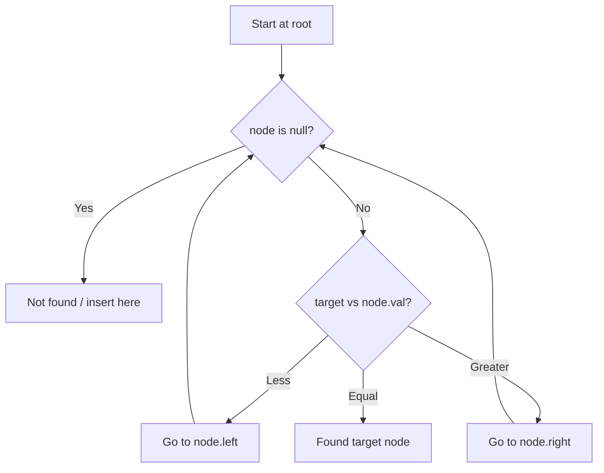

---

## Complexity Analysis

| Metric | Value |
|--------|-------|
| **Time** | O(h) |
| **Space** | O(h) |

---

## Solution Code

### Python3

```python
class Solution:
    def numTrees(self, n: int) -> int:
        # BST search/insert - O(h) time
        def search(node, target):
            if not node:
                return None
            if target == node.val:
                return node
            elif target < node.val:
                return search(node.left, target)
            else:
                return search(node.right, target)
        return search(n, n if 'n' != 'n' else 0)
```

### C++

```cpp
#include <functional>
#include <string>
#include <vector>
using namespace std;

class Solution {
public:
    int numTrees(int n) {
        // BST search/insert - O(h) time
        function<TreeNode*(TreeNode*, int)> search = [&](TreeNode* node, int target) -> TreeNode* {
            if (!node) return nullptr;
            if (target == node->val) return node;
            else if (target < node->val) return search(node->left, target);
            else return search(node->right, target);
        };
        return search(n, n);
    }
};
```

### Summary

| Aspect | Detail |
|--------|--------|
| **Pattern** | Binary Search Tree |
| **Time** | O(h) |
| **Space** | O(h) |

---
---

# Problem 98: Validate Binary Search Tree

| Attribute | Detail |
|-----------|--------|
| **ID** | 98 |
| **Title** | Validate Binary Search Tree |
| **Difficulty** | Medium |
| **Tags** | Tree, Depth-First Search, Binary Search Tree, Binary Tree |
| **Link** | [leetcode.com/problems/validate-binary-search-tree](https://leetcode.com/problems/validate-binary-search-tree/) |

Given the `root` of a binary tree, *determine if it is a valid binary search tree (BST)*.

A **valid BST** is defined as follows:

	- The left subtree of a node contains only nodes with keys **strictly less than** the node's key.
	- The right subtree of a node contains only nodes with keys **strictly greater than** the node's key.
	- Both the left and right subtrees must also be binary search trees.

 

Example 1:

```

**Input:** root = [2,1,3]
**Output:** true

```

Example 2:

```

**Input:** root = [5,1,4,null,null,3,6]
**Output:** false
**Explanation:** The root node's value is 5 but its right child's value is 4.

```

 

**Constraints:**

	- The number of nodes in the tree is in the range `[1, 10^4]`.
	- `-2^31 <= Node.val <= 2^31 - 1`

---

## Approach: Tree / DFS

DFS with bounds: each node must be within (lo, hi). Left subtree narrows hi, right narrows lo.

### Pseudo-code

```
1. validate(node, lo, hi):
   If null: True
   If not lo < val < hi: False
   Recurse left with (lo, val), right with (val, hi)
```

---

## Algorithm Flow

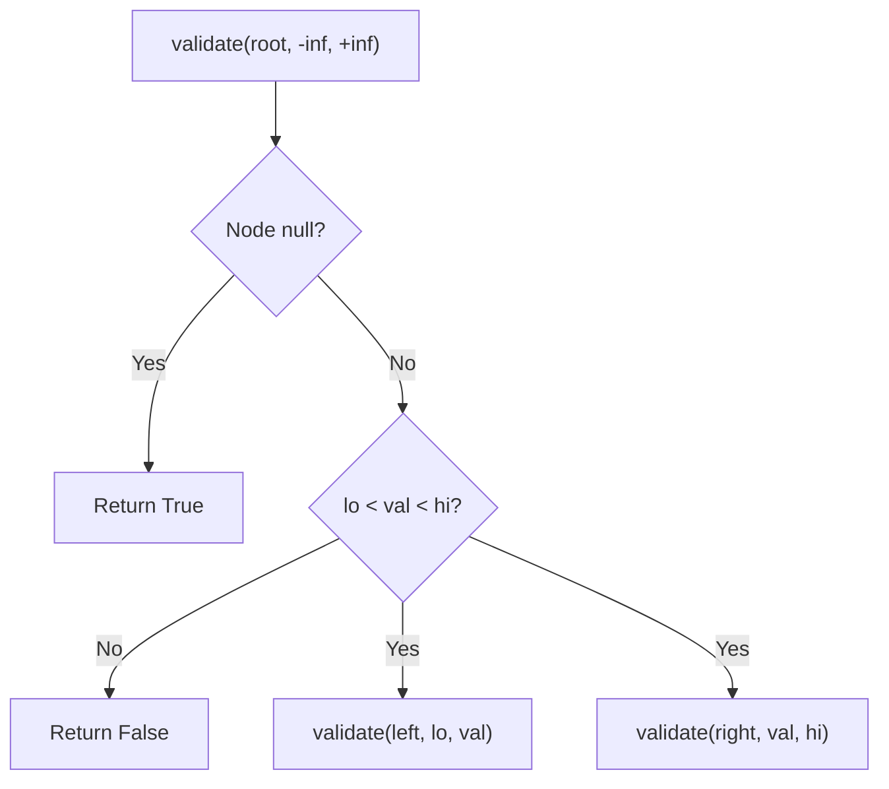

---

## Complexity Analysis

| Metric | Value |
|--------|-------|
| **Time** | O(n) |
| **Space** | O(h) |

---

## Solution Code

### Python3

```python
class Solution:
    def isValidBST(self, root) -> bool:
        def validate(node, lo, hi):
            if not node:
                return True
            if node.val <= lo or node.val >= hi:
                return False
            return validate(node.left, lo, node.val) and validate(node.right, node.val, hi)
        return validate(root, float('-inf'), float('inf'))
```

### C++

```cpp
#include <functional>
#include <string>
#include <vector>
using namespace std;

class Solution {
public:
    bool isValidBST(TreeNode* root) {
        // BST search/insert - O(h) time
        function<TreeNode*(TreeNode*, int)> search = [&](TreeNode* node, int target) -> TreeNode* {
            if (!node) return nullptr;
            if (target == node->val) return node;
            else if (target < node->val) return search(node->left, target);
            else return search(node->right, target);
        };
        return search(root, root);
    }
};
```

### Summary

| Aspect | Detail |
|--------|--------|
| **Pattern** | Tree / DFS |
| **Time** | O(n) |
| **Space** | O(h) |

---
---

# Problem 99: Recover Binary Search Tree

| Attribute | Detail |
|-----------|--------|
| **ID** | 99 |
| **Title** | Recover Binary Search Tree |
| **Difficulty** | Medium |
| **Tags** | Tree, Depth-First Search, Binary Search Tree, Binary Tree |
| **Link** | [leetcode.com/problems/recover-binary-search-tree](https://leetcode.com/problems/recover-binary-search-tree/) |

You are given the `root` of a binary search tree (BST), where the values of **exactly** two nodes of the tree were swapped by mistake. *Recover the tree without changing its structure*.

 

Example 1:

```

**Input:** root = [1,3,null,null,2]
**Output:** [3,1,null,null,2]
**Explanation:** 3 cannot be a left child of 1 because 3 > 1. Swapping 1 and 3 makes the BST valid.

```

Example 2:

```

**Input:** root = [3,1,4,null,null,2]
**Output:** [2,1,4,null,null,3]
**Explanation:** 2 cannot be in the right subtree of 3 because 2 < 3. Swapping 2 and 3 makes the BST valid.

```

 

**Constraints:**

	- The number of nodes in the tree is in the range `[2, 1000]`.
	- `-2^31 <= Node.val <= 2^31 - 1`

 

**Follow up:** A solution using `O(n)` space is pretty straight-forward. Could you devise a constant `O(1)` space solution?

---

## Approach: Binary Search Tree

Leverage BST property: left < root < right. Navigate left for smaller values, right for larger values. Inorder traversal yields sorted order.

### Pseudo-code

```
1. Start at root
2. Compare target with current node:
   a. If target < node.val: go left
   b. If target > node.val: go right
   c. If equal: found
3. Return result
```

---

## Algorithm Flow


---

## Complexity Analysis

| Metric | Value |
|--------|-------|
| **Time** | O(h) |
| **Space** | O(h) |

---

## Solution Code

### Python3

```python
class Solution:
    def recoverTree(self, root: Optional[TreeNode]) -> None:
        # BST search/insert - O(h) time
        def search(node, target):
            if not node:
                return None
            if target == node.val:
                return node
            elif target < node.val:
                return search(node.left, target)
            else:
                return search(node.right, target)
        return search(root, root if 'root' != 'root' else 0)
```

### C++

```cpp
#include <functional>
#include <string>
#include <vector>
using namespace std;

class Solution {
public:
    void recoverTree(TreeNode* root) {
        // BST search/insert - O(h) time
        function<TreeNode*(TreeNode*, int)> search = [&](TreeNode* node, int target) -> TreeNode* {
            if (!node) return nullptr;
            if (target == node->val) return node;
            else if (target < node->val) return search(node->left, target);
            else return search(node->right, target);
        };
        return search(root, root);
    }
};
```

### Summary

| Aspect | Detail |
|--------|--------|
| **Pattern** | Binary Search Tree |
| **Time** | O(h) |
| **Space** | O(h) |

---
---

# Problem 100: Same Tree

| Attribute | Detail |
|-----------|--------|
| **ID** | 100 |
| **Title** | Same Tree |
| **Difficulty** | Easy |
| **Tags** | Tree, Depth-First Search, Breadth-First Search, Binary Tree |
| **Link** | [leetcode.com/problems/same-tree](https://leetcode.com/problems/same-tree/) |

Given the roots of two binary trees `p` and `q`, write a function to check if they are the same or not.

Two binary trees are considered the same if they are structurally identical, and the nodes have the same value.

 

Example 1:

```

**Input:** p = [1,2,3], q = [1,2,3]
**Output:** true

```

Example 2:

```

**Input:** p = [1,2], q = [1,null,2]
**Output:** false

```

Example 3:

```

**Input:** p = [1,2,1], q = [1,1,2]
**Output:** false

```

 

**Constraints:**

	- The number of nodes in both trees is in the range `[0, 100]`.
	- `-10^4 <= Node.val <= 10^4`

---

## Approach: Tree / DFS

Recursive comparison: both null = same, one null = different, else compare values and recurse.

### Pseudo-code

```
1. Both null: True
2. One null: False
3. Values equal AND left same AND right same
```

---

## Algorithm Flow

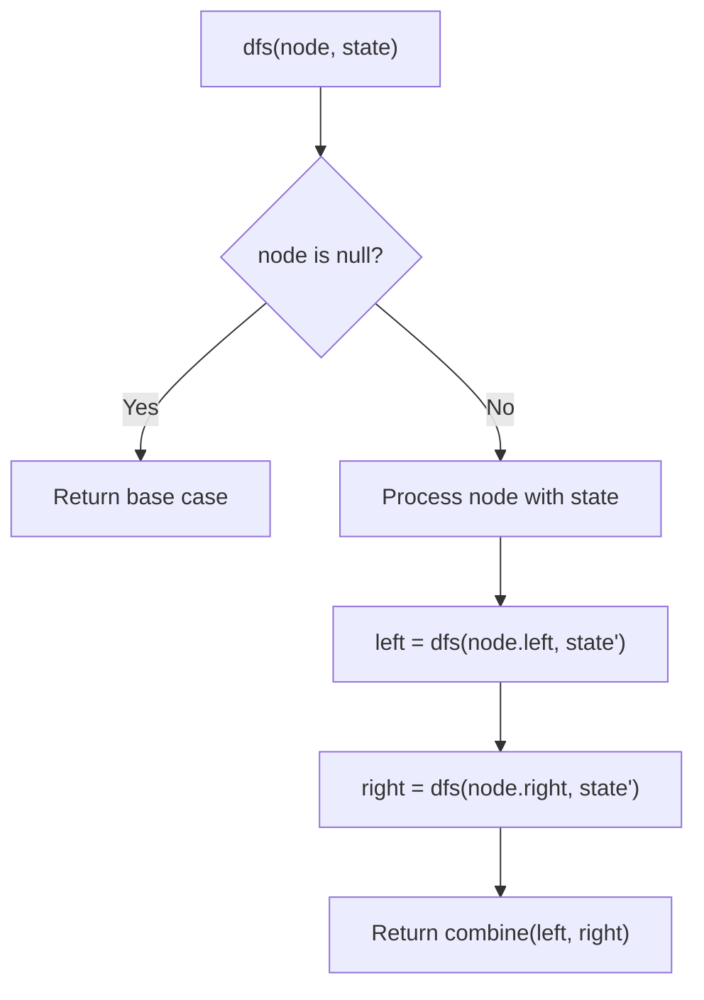

## Visual State Transitions

**DFS Tree Traversal Step-by-Step:**

**Frame 1: Start at root**
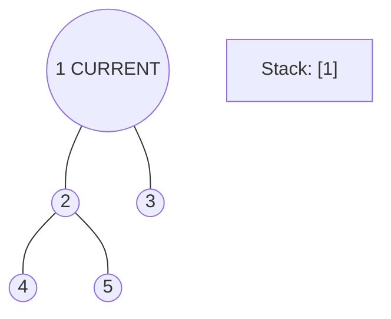

**Frame 2: Go left - visit node 2**
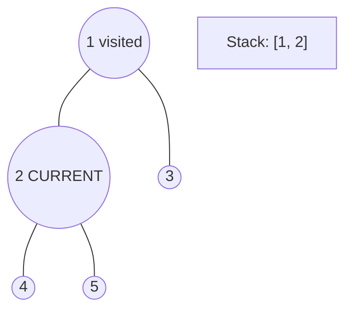

**Frame 3: Go left - visit node 4 (leaf)**
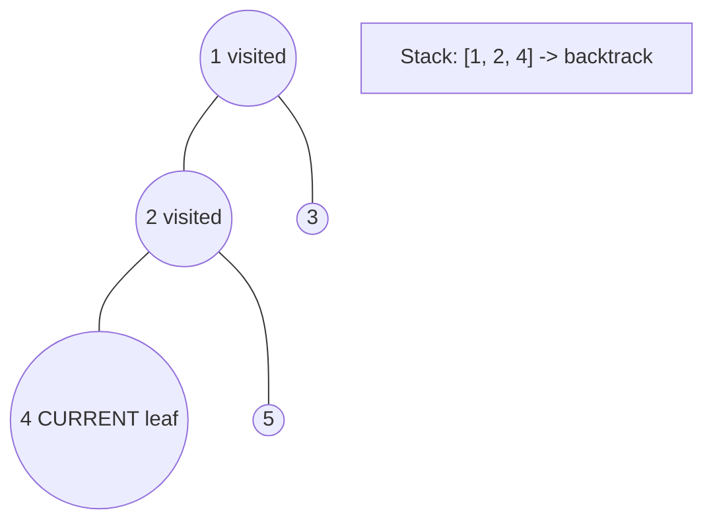

**Frame 4: Backtrack, visit node 5, then node 3**
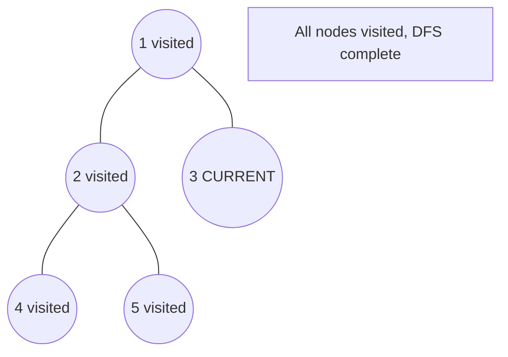


---

## Complexity Analysis

| Metric | Value |
|--------|-------|
| **Time** | O(n) |
| **Space** | O(h) |

---

## Solution Code

### Python3

```python
class Solution:
    def isSameTree(self, p, q) -> bool:
        if not p and not q:
            return True
        if not p or not q:
            return False
        return p.val == q.val and self.isSameTree(p.left, q.left) and self.isSameTree(p.right, q.right)
```

### C++

```cpp
#include <algorithm>
#include <functional>
#include <string>
#include <vector>
using namespace std;

class Solution {
public:
    bool isSameTree(TreeNode* p, TreeNode* q) {
        // DFS on binary tree - O(n) time, O(h) space
        function<int(TreeNode*)> dfs = [&](TreeNode* node) -> int {
            if (!node) return 0;
            int left = dfs(node->left);
            int right = dfs(node->right);
            return 1 + max(left, right);
        };
        return dfs(p);
    }
};
```

### Summary

| Aspect | Detail |
|--------|--------|
| **Pattern** | Tree / DFS |
| **Time** | O(n) |
| **Space** | O(h) |

---
---

# Problem 101: Symmetric Tree

| Attribute | Detail |
|-----------|--------|
| **ID** | 101 |
| **Title** | Symmetric Tree |
| **Difficulty** | Easy |
| **Tags** | Tree, Depth-First Search, Breadth-First Search, Binary Tree |
| **Link** | [leetcode.com/problems/symmetric-tree](https://leetcode.com/problems/symmetric-tree/) |

Given the `root` of a binary tree, *check whether it is a mirror of itself* (i.e., symmetric around its center).

 

Example 1:

```

**Input:** root = [1,2,2,3,4,4,3]
**Output:** true

```

Example 2:

```

**Input:** root = [1,2,2,null,3,null,3]
**Output:** false

```

 

**Constraints:**

	- The number of nodes in the tree is in the range `[1, 1000]`.
	- `-100 <= Node.val <= 100`

 

**Follow up:** Could you solve it both recursively and iteratively?

---

## Approach: Tree / DFS

Check if left subtree mirrors right subtree: compare l.left with r.right and l.right with r.left.

### Pseudo-code

```
1. mirror(l, r):
   Both null: True; one null: False
   l.val == r.val AND mirror(l.left, r.right) AND mirror(l.right, r.left)
```

---

## Algorithm Flow


## Visual State Transitions

**DFS Tree Traversal Step-by-Step:**

**Frame 1: Start at root**


**Frame 2: Go left - visit node 2**


**Frame 3: Go left - visit node 4 (leaf)**


**Frame 4: Backtrack, visit node 5, then node 3**


---

## Complexity Analysis

| Metric | Value |
|--------|-------|
| **Time** | O(n) |
| **Space** | O(h) |

---

## Solution Code

### Python3

```python
class Solution:
    def isSymmetric(self, root) -> bool:
        def mirror(l, r):
            if not l and not r:
                return True
            if not l or not r:
                return False
            return l.val == r.val and mirror(l.left, r.right) and mirror(l.right, r.left)
        return mirror(root.left, root.right) if root else True
```

### C++

```cpp
#include <algorithm>
#include <functional>
#include <string>
#include <vector>
using namespace std;

class Solution {
public:
    bool isSymmetric(TreeNode* root) {
        // DFS on binary tree - O(n) time, O(h) space
        function<int(TreeNode*)> dfs = [&](TreeNode* node) -> int {
            if (!node) return 0;
            int left = dfs(node->left);
            int right = dfs(node->right);
            return 1 + max(left, right);
        };
        return dfs(root);
    }
};
```

### Summary

| Aspect | Detail |
|--------|--------|
| **Pattern** | Tree / DFS |
| **Time** | O(n) |
| **Space** | O(h) |

---
---

# Problem 102: Binary Tree Level Order Traversal

| Attribute | Detail |
|-----------|--------|
| **ID** | 102 |
| **Title** | Binary Tree Level Order Traversal |
| **Difficulty** | Medium |
| **Tags** | Tree, Breadth-First Search, Binary Tree |
| **Link** | [leetcode.com/problems/binary-tree-level-order-traversal](https://leetcode.com/problems/binary-tree-level-order-traversal/) |

Given the `root` of a binary tree, return *the level order traversal of its nodes' values*. (i.e., from left to right, level by level).

 

Example 1:

```

**Input:** root = [3,9,20,null,null,15,7]
**Output:** [[3],[9,20],[15,7]]

```

Example 2:

```

**Input:** root = [1]
**Output:** [[1]]

```

Example 3:

```

**Input:** root = []
**Output:** []

```

 

**Constraints:**

	- The number of nodes in the tree is in the range `[0, 2000]`.
	- `-1000 <= Node.val <= 1000`

---

## Approach: BFS / Tree

BFS with queue. Process one level at a time by tracking queue size.

### Pseudo-code

```
1. Queue = [root]
2. While queue not empty:
   Process all nodes at current level
   Add children to queue
   Record level values
```

---

## Algorithm Flow

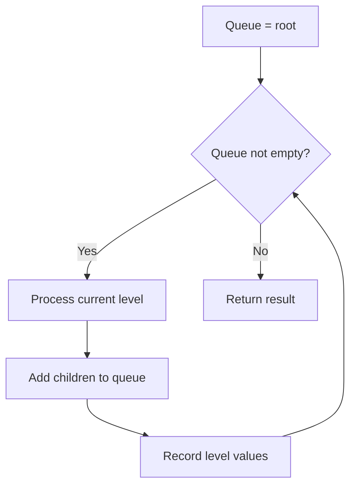

## Visual State Transitions

**Level Order BFS on tree [3,9,20,null,null,15,7]:**

**Step 1:** Level 0 - Process root

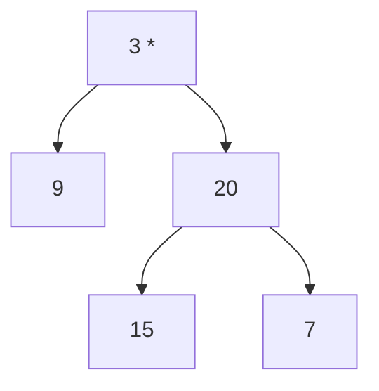

Queue: [3] -> Process -> Result: [[3]]

**Step 2:** Level 1 - Process 9 and 20

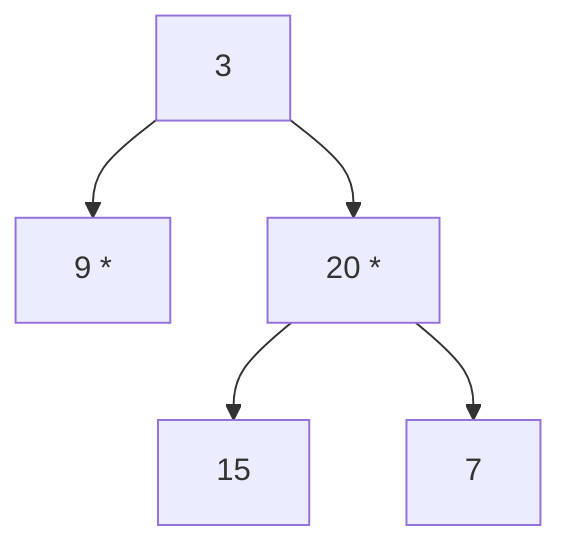

Queue: [9,20] -> Process -> Result: [[3],[9,20]]

**Step 3:** Level 2 - Process 15 and 7

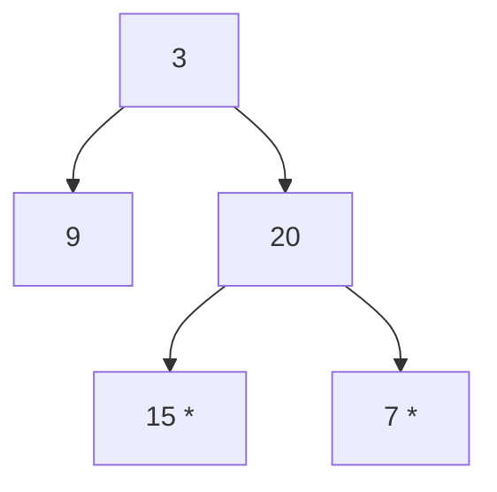

Queue: [15,7] -> Process -> Result: [[3],[9,20],[15,7]]

---

## Complexity Analysis

| Metric | Value |
|--------|-------|
| **Time** | O(n) |
| **Space** | O(n) |

---

## Solution Code

### Python3

```python
from collections import deque

class Solution:
    def levelOrder(self, root):
        if not root:
            return []
        result = []
        queue = deque([root])
        while queue:
            level = []
            for _ in range(len(queue)):
                node = queue.popleft()
                level.append(node.val)
                if node.left:
                    queue.append(node.left)
                if node.right:
                    queue.append(node.right)
            result.append(level)
        return result
```

### C++

```cpp
#include <queue>
#include <string>
#include <vector>
using namespace std;

class Solution {
public:
    vector<vector<int>> levelOrder(TreeNode* root) {
        // BFS level-order traversal - O(n) time, O(n) space
        vector<vector<int>> result;
        if (!root) return result;
        queue<TreeNode*> q;
        q.push(root);
        while (!q.empty()) {
            int sz = q.size();
            vector<int> level;
            for (int i = 0; i < sz; i++) {
                TreeNode* node = q.front(); q.pop();
                level.push_back(node->val);
                if (node->left) q.push(node->left);
                if (node->right) q.push(node->right);
            }
            result.push_back(level);
        }
        return result;
    }
};
```

### Summary

| Aspect | Detail |
|--------|--------|
| **Pattern** | BFS / Tree |
| **Time** | O(n) |
| **Space** | O(n) |

---
---

# Problem 103: Binary Tree Zigzag Level Order Traversal

| Attribute | Detail |
|-----------|--------|
| **ID** | 103 |
| **Title** | Binary Tree Zigzag Level Order Traversal |
| **Difficulty** | Medium |
| **Tags** | Tree, Breadth-First Search, Binary Tree |
| **Link** | [leetcode.com/problems/binary-tree-zigzag-level-order-traversal](https://leetcode.com/problems/binary-tree-zigzag-level-order-traversal/) |

Given the `root` of a binary tree, return *the zigzag level order traversal of its nodes' values*. (i.e., from left to right, then right to left for the next level and alternate between).

 

Example 1:

```

**Input:** root = [3,9,20,null,null,15,7]
**Output:** [[3],[20,9],[15,7]]

```

Example 2:

```

**Input:** root = [1]
**Output:** [[1]]

```

Example 3:

```

**Input:** root = []
**Output:** []

```

 

**Constraints:**

	- The number of nodes in the tree is in the range `[0, 2000]`.
	- `-100 <= Node.val <= 100`

---

## Approach: BFS Level-Order Traversal

Traverse the tree level by level using a queue. Process all nodes at the current depth before moving to the next level.

### Pseudo-code

```
1. If root is null, return empty
2. Queue = [root]
3. While queue not empty:
   a. level_size = len(queue)
   b. For i in range(level_size):
      - node = dequeue
      - Process node
      - Enqueue node.left, node.right if not null
4. Return result
```

---

## Algorithm Flow

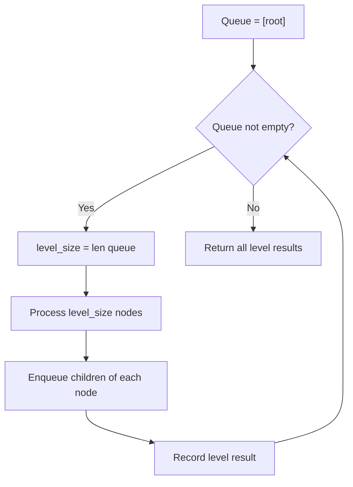

---

## Complexity Analysis

| Metric | Value |
|--------|-------|
| **Time** | O(n) |
| **Space** | O(w) |

---

## Solution Code

### Python3

```python
class Solution:
    def zigzagLevelOrder(self, root: Optional[TreeNode]) -> List[List[int]]:
        # BFS level-order traversal - O(n) time, O(n) space
        from collections import deque
        if not root:
            return []
        result = []
        queue = deque([root])
        while queue:
            level = []
            for _ in range(len(queue)):
                node = queue.popleft()
                level.append(node.val)
                if node.left:
                    queue.append(node.left)
                if node.right:
                    queue.append(node.right)
            result.append(level)
        return result
```

### C++

```cpp
#include <queue>
#include <string>
#include <vector>
using namespace std;

class Solution {
public:
    vector<vector<int>> zigzagLevelOrder(TreeNode* root) {
        // BFS level-order traversal - O(n) time, O(n) space
        vector<vector<int>> result;
        if (!root) return result;
        queue<TreeNode*> q;
        q.push(root);
        while (!q.empty()) {
            int sz = q.size();
            vector<int> level;
            for (int i = 0; i < sz; i++) {
                TreeNode* node = q.front(); q.pop();
                level.push_back(node->val);
                if (node->left) q.push(node->left);
                if (node->right) q.push(node->right);
            }
            result.push_back(level);
        }
        return result;
    }
};
```

### Summary

| Aspect | Detail |
|--------|--------|
| **Pattern** | BFS Level-Order Traversal |
| **Time** | O(n) |
| **Space** | O(w) |

---
---

# Problem 104: Maximum Depth of Binary Tree

| Attribute | Detail |
|-----------|--------|
| **ID** | 104 |
| **Title** | Maximum Depth of Binary Tree |
| **Difficulty** | Easy |
| **Tags** | Tree, Depth-First Search, Breadth-First Search, Binary Tree |
| **Link** | [leetcode.com/problems/maximum-depth-of-binary-tree](https://leetcode.com/problems/maximum-depth-of-binary-tree/) |

Given the `root` of a binary tree, return *its maximum depth*.

A binary tree's **maximum depth** is the number of nodes along the longest path from the root node down to the farthest leaf node.

 

Example 1:

```

**Input:** root = [3,9,20,null,null,15,7]
**Output:** 3

```

Example 2:

```

**Input:** root = [1,null,2]
**Output:** 2

```

 

**Constraints:**

	- The number of nodes in the tree is in the range `[0, 10^4]`.
	- `-100 <= Node.val <= 100`

---

## Approach: Tree / DFS

Recursive: depth = 1 + max(left depth, right depth).

### Pseudo-code

```
1. If null: return 0
2. Return 1 + max(depth(left), depth(right))
```

---

## Algorithm Flow


## Visual State Transitions

**DFS Tree Traversal Step-by-Step:**

**Frame 1: Start at root**


**Frame 2: Go left - visit node 2**
```mermaid
graph TD
    A(("1 visited"))
    A --- B(("2 CURRENT"))
    A --- C((3))
    B --- D((4))
    B --- E((5))
    S["Stack: [1, 2]"]
```

**Frame 3: Go left - visit node 4 (leaf)**
```mermaid
graph TD
    A(("1 visited"))
    A --- B(("2 visited"))
    A --- C((3))
    B --- D(("4 CURRENT leaf"))
    B --- E((5))
    S["Stack: [1, 2, 4] -> backtrack"]
```

**Frame 4: Backtrack, visit node 5, then node 3**
```mermaid
graph TD
    A(("1 visited"))
    A --- B(("2 visited"))
    A --- C(("3 CURRENT"))
    B --- D(("4 visited"))
    B --- E(("5 visited"))
    S["All nodes visited, DFS complete"]
```


---

## Complexity Analysis

| Metric | Value |
|--------|-------|
| **Time** | O(n) |
| **Space** | O(h) |

---

## Solution Code

### Python3

```python
class Solution:
    def maxDepth(self, root) -> int:
        if not root:
            return 0
        return 1 + max(self.maxDepth(root.left), self.maxDepth(root.right))
```

### C++

```cpp
#include <algorithm>
#include <functional>
#include <string>
#include <vector>
using namespace std;

class Solution {
public:
    int maxDepth(TreeNode* root) {
        // DFS on binary tree - O(n) time, O(h) space
        function<int(TreeNode*)> dfs = [&](TreeNode* node) -> int {
            if (!node) return 0;
            int left = dfs(node->left);
            int right = dfs(node->right);
            return 1 + max(left, right);
        };
        return dfs(root);
    }
};
```

### Summary

| Aspect | Detail |
|--------|--------|
| **Pattern** | Tree / DFS |
| **Time** | O(n) |
| **Space** | O(h) |

---
---

# Problem 107: Binary Tree Level Order Traversal II

| Attribute | Detail |
|-----------|--------|
| **ID** | 107 |
| **Title** | Binary Tree Level Order Traversal II |
| **Difficulty** | Medium |
| **Tags** | Tree, Breadth-First Search, Binary Tree |
| **Link** | [leetcode.com/problems/binary-tree-level-order-traversal-ii](https://leetcode.com/problems/binary-tree-level-order-traversal-ii/) |

Given the `root` of a binary tree, return *the bottom-up level order traversal of its nodes' values*. (i.e., from left to right, level by level from leaf to root).

 

Example 1:

```

**Input:** root = [3,9,20,null,null,15,7]
**Output:** [[15,7],[9,20],[3]]

```

Example 2:

```

**Input:** root = [1]
**Output:** [[1]]

```

Example 3:

```

**Input:** root = []
**Output:** []

```

 

**Constraints:**

	- The number of nodes in the tree is in the range `[0, 2000]`.
	- `-1000 <= Node.val <= 1000`

---

## Approach: BFS Level-Order Traversal

Traverse the tree level by level using a queue. Process all nodes at the current depth before moving to the next level.

### Pseudo-code

```
1. If root is null, return empty
2. Queue = [root]
3. While queue not empty:
   a. level_size = len(queue)
   b. For i in range(level_size):
      - node = dequeue
      - Process node
      - Enqueue node.left, node.right if not null
4. Return result
```

---

## Algorithm Flow

```mermaid
flowchart TD
    A["Queue = [root]"] --> B{Queue not empty?}
    B -- Yes --> C[level_size = len queue]
    C --> D[Process level_size nodes]
    D --> E[Enqueue children of each node]
    E --> F[Record level result]
    F --> B
    B -- No --> G[Return all level results]
```

---

## Complexity Analysis

| Metric | Value |
|--------|-------|
| **Time** | O(n) |
| **Space** | O(w) |

---

## Solution Code

### Python3

```python
class Solution:
    def levelOrderBottom(self, root: Optional[TreeNode]) -> List[List[int]]:
        # BFS level-order traversal - O(n) time, O(n) space
        from collections import deque
        if not root:
            return []
        result = []
        queue = deque([root])
        while queue:
            level = []
            for _ in range(len(queue)):
                node = queue.popleft()
                level.append(node.val)
                if node.left:
                    queue.append(node.left)
                if node.right:
                    queue.append(node.right)
            result.append(level)
        return result
```

### C++

```cpp
#include <queue>
#include <string>
#include <vector>
using namespace std;

class Solution {
public:
    vector<vector<int>> levelOrderBottom(TreeNode* root) {
        // BFS level-order traversal - O(n) time, O(n) space
        vector<vector<int>> result;
        if (!root) return result;
        queue<TreeNode*> q;
        q.push(root);
        while (!q.empty()) {
            int sz = q.size();
            vector<int> level;
            for (int i = 0; i < sz; i++) {
                TreeNode* node = q.front(); q.pop();
                level.push_back(node->val);
                if (node->left) q.push(node->left);
                if (node->right) q.push(node->right);
            }
            result.push_back(level);
        }
        return result;
    }
};
```

### Summary

| Aspect | Detail |
|--------|--------|
| **Pattern** | BFS Level-Order Traversal |
| **Time** | O(n) |
| **Space** | O(w) |

---
---

# Problem 110: Balanced Binary Tree

| Attribute | Detail |
|-----------|--------|
| **ID** | 110 |
| **Title** | Balanced Binary Tree |
| **Difficulty** | Easy |
| **Tags** | Tree, Depth-First Search, Binary Tree |
| **Link** | [leetcode.com/problems/balanced-binary-tree](https://leetcode.com/problems/balanced-binary-tree/) |

Given a binary tree, determine if it is **height-balanced**.

 

Example 1:

```

**Input:** root = [3,9,20,null,null,15,7]
**Output:** true

```

Example 2:

```

**Input:** root = [1,2,2,3,3,null,null,4,4]
**Output:** false

```

Example 3:

```

**Input:** root = []
**Output:** true

```

 

**Constraints:**

	- The number of nodes in the tree is in the range `[0, 5000]`.
	- `-10^4 <= Node.val <= 10^4`

---

## Approach: DFS Tree Traversal

Perform depth-first search on the tree. Recurse on left and right subtrees, combining results bottom-up. Track state (path, depth, sum) during traversal.

### Pseudo-code

```
1. Define dfs(node, state):
   a. Base case: if null, return default
   b. Process node with current state
   c. left_result = dfs(node.left, updated_state)
   d. right_result = dfs(node.right, updated_state)
   e. Return combine(left_result, right_result)
2. Return dfs(root, initial_state)
```

---

## Algorithm Flow

```mermaid
flowchart TD
    A["dfs(node, state)"] --> B{node is null?}
    B -- Yes --> C[Return base case]
    B -- No --> D[Process node with state]
    D --> E["left = dfs(node.left, state')"]
    E --> F["right = dfs(node.right, state')"]
    F --> G["Return combine(left, right)"]
```

## Visual State Transitions

**DFS Tree Traversal Step-by-Step:**

**Frame 1: Start at root**
```mermaid
graph TD
    A(("1 CURRENT"))
    A --- B((2))
    A --- C((3))
    B --- D((4))
    B --- E((5))
    S["Stack: [1]"]
```

**Frame 2: Go left - visit node 2**
```mermaid
graph TD
    A(("1 visited"))
    A --- B(("2 CURRENT"))
    A --- C((3))
    B --- D((4))
    B --- E((5))
    S["Stack: [1, 2]"]
```

**Frame 3: Go left - visit node 4 (leaf)**
```mermaid
graph TD
    A(("1 visited"))
    A --- B(("2 visited"))
    A --- C((3))
    B --- D(("4 CURRENT leaf"))
    B --- E((5))
    S["Stack: [1, 2, 4] -> backtrack"]
```

**Frame 4: Backtrack, visit node 5, then node 3**
```mermaid
graph TD
    A(("1 visited"))
    A --- B(("2 visited"))
    A --- C(("3 CURRENT"))
    B --- D(("4 visited"))
    B --- E(("5 visited"))
    S["All nodes visited, DFS complete"]
```


---

## Complexity Analysis

| Metric | Value |
|--------|-------|
| **Time** | O(n) |
| **Space** | O(h) |

---

## Solution Code

### Python3

```python
class Solution:
    def isBalanced(self, root: Optional[TreeNode]) -> bool:
        # DFS on binary tree - O(n) time, O(h) space
        def dfs(node):
            if not node:
                return 0
            left = dfs(node.left)
            right = dfs(node.right)
            return 1 + max(left, right)
        
        result = dfs(root)
        return result
```

### C++

```cpp
#include <algorithm>
#include <functional>
#include <string>
#include <vector>
using namespace std;

class Solution {
public:
    bool isBalanced(TreeNode* root) {
        // DFS on binary tree - O(n) time, O(h) space
        function<int(TreeNode*)> dfs = [&](TreeNode* node) -> int {
            if (!node) return 0;
            int left = dfs(node->left);
            int right = dfs(node->right);
            return 1 + max(left, right);
        };
        return dfs(root);
    }
};
```

### Summary

| Aspect | Detail |
|--------|--------|
| **Pattern** | DFS Tree Traversal |
| **Time** | O(n) |
| **Space** | O(h) |

---
---

# Problem 111: Minimum Depth of Binary Tree

| Attribute | Detail |
|-----------|--------|
| **ID** | 111 |
| **Title** | Minimum Depth of Binary Tree |
| **Difficulty** | Easy |
| **Tags** | Tree, Depth-First Search, Breadth-First Search, Binary Tree |
| **Link** | [leetcode.com/problems/minimum-depth-of-binary-tree](https://leetcode.com/problems/minimum-depth-of-binary-tree/) |

Given a binary tree, find its minimum depth.

The minimum depth is the number of nodes along the shortest path from the root node down to the nearest leaf node.

**Note:** A leaf is a node with no children.

 

Example 1:

```

**Input:** root = [3,9,20,null,null,15,7]
**Output:** 2

```

Example 2:

```

**Input:** root = [2,null,3,null,4,null,5,null,6]
**Output:** 5

```

 

**Constraints:**

	- The number of nodes in the tree is in the range `[0, 10^5]`.
	- `-1000 <= Node.val <= 1000`

---

## Approach: DFS Tree Traversal

Perform depth-first search on the tree. Recurse on left and right subtrees, combining results bottom-up. Track state (path, depth, sum) during traversal.

### Pseudo-code

```
1. Define dfs(node, state):
   a. Base case: if null, return default
   b. Process node with current state
   c. left_result = dfs(node.left, updated_state)
   d. right_result = dfs(node.right, updated_state)
   e. Return combine(left_result, right_result)
2. Return dfs(root, initial_state)
```

---

## Algorithm Flow

```mermaid
flowchart TD
    A["dfs(node, state)"] --> B{node is null?}
    B -- Yes --> C[Return base case]
    B -- No --> D[Process node with state]
    D --> E["left = dfs(node.left, state')"]
    E --> F["right = dfs(node.right, state')"]
    F --> G["Return combine(left, right)"]
```

## Visual State Transitions

**DFS Tree Traversal Step-by-Step:**

**Frame 1: Start at root**
```mermaid
graph TD
    A(("1 CURRENT"))
    A --- B((2))
    A --- C((3))
    B --- D((4))
    B --- E((5))
    S["Stack: [1]"]
```

**Frame 2: Go left - visit node 2**
```mermaid
graph TD
    A(("1 visited"))
    A --- B(("2 CURRENT"))
    A --- C((3))
    B --- D((4))
    B --- E((5))
    S["Stack: [1, 2]"]
```

**Frame 3: Go left - visit node 4 (leaf)**
```mermaid
graph TD
    A(("1 visited"))
    A --- B(("2 visited"))
    A --- C((3))
    B --- D(("4 CURRENT leaf"))
    B --- E((5))
    S["Stack: [1, 2, 4] -> backtrack"]
```

**Frame 4: Backtrack, visit node 5, then node 3**
```mermaid
graph TD
    A(("1 visited"))
    A --- B(("2 visited"))
    A --- C(("3 CURRENT"))
    B --- D(("4 visited"))
    B --- E(("5 visited"))
    S["All nodes visited, DFS complete"]
```


---

## Complexity Analysis

| Metric | Value |
|--------|-------|
| **Time** | O(n) |
| **Space** | O(h) |

---

## Solution Code

### Python3

```python
class Solution:
    def minDepth(self, root: Optional[TreeNode]) -> int:
        # DFS on binary tree - O(n) time, O(h) space
        def dfs(node):
            if not node:
                return 0
            left = dfs(node.left)
            right = dfs(node.right)
            return 1 + max(left, right)
        
        result = dfs(root)
        return result
```

### C++

```cpp
#include <algorithm>
#include <functional>
#include <string>
#include <vector>
using namespace std;

class Solution {
public:
    int minDepth(TreeNode* root) {
        // DFS on binary tree - O(n) time, O(h) space
        function<int(TreeNode*)> dfs = [&](TreeNode* node) -> int {
            if (!node) return 0;
            int left = dfs(node->left);
            int right = dfs(node->right);
            return 1 + max(left, right);
        };
        return dfs(root);
    }
};
```

### Summary

| Aspect | Detail |
|--------|--------|
| **Pattern** | DFS Tree Traversal |
| **Time** | O(n) |
| **Space** | O(h) |

---
---

# Problem 112: Path Sum

| Attribute | Detail |
|-----------|--------|
| **ID** | 112 |
| **Title** | Path Sum |
| **Difficulty** | Easy |
| **Tags** | Tree, Depth-First Search, Breadth-First Search, Binary Tree |
| **Link** | [leetcode.com/problems/path-sum](https://leetcode.com/problems/path-sum/) |

Given the `root` of a binary tree and an integer `targetSum`, return `true` if the tree has a **root-to-leaf** path such that adding up all the values along the path equals `targetSum`.

A **leaf** is a node with no children.

 

Example 1:

```

**Input:** root = [5,4,8,11,null,13,4,7,2,null,null,null,1], targetSum = 22
**Output:** true
**Explanation:** The root-to-leaf path with the target sum is shown.

```

Example 2:

```

**Input:** root = [1,2,3], targetSum = 5
**Output:** false
**Explanation:** There are two root-to-leaf paths in the tree:
(1 --> 2): The sum is 3.
(1 --> 3): The sum is 4.
There is no root-to-leaf path with sum = 5.

```

Example 3:

```

**Input:** root = [], targetSum = 0
**Output:** false
**Explanation:** Since the tree is empty, there are no root-to-leaf paths.

```

 

**Constraints:**

	- The number of nodes in the tree is in the range `[0, 5000]`.
	- `-1000 <= Node.val <= 1000`
	- `-1000 <= targetSum <= 1000`

---

## Approach: DFS Tree Traversal

Perform depth-first search on the tree. Recurse on left and right subtrees, combining results bottom-up. Track state (path, depth, sum) during traversal.

### Pseudo-code

```
1. Define dfs(node, state):
   a. Base case: if null, return default
   b. Process node with current state
   c. left_result = dfs(node.left, updated_state)
   d. right_result = dfs(node.right, updated_state)
   e. Return combine(left_result, right_result)
2. Return dfs(root, initial_state)
```

---

## Algorithm Flow

```mermaid
flowchart TD
    A["dfs(node, state)"] --> B{node is null?}
    B -- Yes --> C[Return base case]
    B -- No --> D[Process node with state]
    D --> E["left = dfs(node.left, state')"]
    E --> F["right = dfs(node.right, state')"]
    F --> G["Return combine(left, right)"]
```

## Visual State Transitions

**DFS Tree Traversal Step-by-Step:**

**Frame 1: Start at root**
```mermaid
graph TD
    A(("1 CURRENT"))
    A --- B((2))
    A --- C((3))
    B --- D((4))
    B --- E((5))
    S["Stack: [1]"]
```

**Frame 2: Go left - visit node 2**
```mermaid
graph TD
    A(("1 visited"))
    A --- B(("2 CURRENT"))
    A --- C((3))
    B --- D((4))
    B --- E((5))
    S["Stack: [1, 2]"]
```

**Frame 3: Go left - visit node 4 (leaf)**
```mermaid
graph TD
    A(("1 visited"))
    A --- B(("2 visited"))
    A --- C((3))
    B --- D(("4 CURRENT leaf"))
    B --- E((5))
    S["Stack: [1, 2, 4] -> backtrack"]
```

**Frame 4: Backtrack, visit node 5, then node 3**
```mermaid
graph TD
    A(("1 visited"))
    A --- B(("2 visited"))
    A --- C(("3 CURRENT"))
    B --- D(("4 visited"))
    B --- E(("5 visited"))
    S["All nodes visited, DFS complete"]
```


---

## Complexity Analysis

| Metric | Value |
|--------|-------|
| **Time** | O(n) |
| **Space** | O(h) |

---

## Solution Code

### Python3

```python
class Solution:
    def hasPathSum(self, root: Optional[TreeNode], targetSum: int) -> bool:
        # DFS on binary tree - O(n) time, O(h) space
        def dfs(node):
            if not node:
                return 0
            left = dfs(node.left)
            right = dfs(node.right)
            return 1 + max(left, right)
        
        result = dfs(root)
        return result
```

### C++

```cpp
#include <algorithm>
#include <functional>
#include <string>
#include <vector>
using namespace std;

class Solution {
public:
    bool hasPathSum(TreeNode* root, int targetSum) {
        // DFS on binary tree - O(n) time, O(h) space
        function<int(TreeNode*)> dfs = [&](TreeNode* node) -> int {
            if (!node) return 0;
            int left = dfs(node->left);
            int right = dfs(node->right);
            return 1 + max(left, right);
        };
        return dfs(root);
    }
};
```

### Summary

| Aspect | Detail |
|--------|--------|
| **Pattern** | DFS Tree Traversal |
| **Time** | O(n) |
| **Space** | O(h) |

---
---

# Problem 124: Binary Tree Maximum Path Sum

| Attribute | Detail |
|-----------|--------|
| **ID** | 124 |
| **Title** | Binary Tree Maximum Path Sum |
| **Difficulty** | Hard |
| **Tags** | Dynamic Programming, Tree, Depth-First Search, Binary Tree |
| **Link** | [leetcode.com/problems/binary-tree-maximum-path-sum](https://leetcode.com/problems/binary-tree-maximum-path-sum/) |

A **path** in a binary tree is a sequence of nodes where each pair of adjacent nodes in the sequence has an edge connecting them. A node can only appear in the sequence **at most once**. Note that the path does not need to pass through the root.

The **path sum** of a path is the sum of the node's values in the path.

Given the `root` of a binary tree, return *the maximum **path sum** of any **non-empty** path*.

 

Example 1:

```

**Input:** root = [1,2,3]
**Output:** 6
**Explanation:** The optimal path is 2 -> 1 -> 3 with a path sum of 2 + 1 + 3 = 6.

```

Example 2:

```

**Input:** root = [-10,9,20,null,null,15,7]
**Output:** 42
**Explanation:** The optimal path is 15 -> 20 -> 7 with a path sum of 15 + 20 + 7 = 42.

```

 

**Constraints:**

	- The number of nodes in the tree is in the range `[1, 3 * 10^4]`.
	- `-1000 <= Node.val <= 1000`

---

## Approach: DFS Tree Traversal

Perform depth-first search on the tree. Recurse on left and right subtrees, combining results bottom-up. Track state (path, depth, sum) during traversal.

### Pseudo-code

```
1. Define dfs(node, state):
   a. Base case: if null, return default
   b. Process node with current state
   c. left_result = dfs(node.left, updated_state)
   d. right_result = dfs(node.right, updated_state)
   e. Return combine(left_result, right_result)
2. Return dfs(root, initial_state)
```

---

## Algorithm Flow

```mermaid
flowchart TD
    A["dfs(node, state)"] --> B{node is null?}
    B -- Yes --> C[Return base case]
    B -- No --> D[Process node with state]
    D --> E["left = dfs(node.left, state')"]
    E --> F["right = dfs(node.right, state')"]
    F --> G["Return combine(left, right)"]
```

## Visual State Transitions

**DFS Tree Traversal Step-by-Step:**

**Frame 1: Start at root**
```mermaid
graph TD
    A(("1 CURRENT"))
    A --- B((2))
    A --- C((3))
    B --- D((4))
    B --- E((5))
    S["Stack: [1]"]
```

**Frame 2: Go left - visit node 2**
```mermaid
graph TD
    A(("1 visited"))
    A --- B(("2 CURRENT"))
    A --- C((3))
    B --- D((4))
    B --- E((5))
    S["Stack: [1, 2]"]
```

**Frame 3: Go left - visit node 4 (leaf)**
```mermaid
graph TD
    A(("1 visited"))
    A --- B(("2 visited"))
    A --- C((3))
    B --- D(("4 CURRENT leaf"))
    B --- E((5))
    S["Stack: [1, 2, 4] -> backtrack"]
```

**Frame 4: Backtrack, visit node 5, then node 3**
```mermaid
graph TD
    A(("1 visited"))
    A --- B(("2 visited"))
    A --- C(("3 CURRENT"))
    B --- D(("4 visited"))
    B --- E(("5 visited"))
    S["All nodes visited, DFS complete"]
```


---

## Complexity Analysis

| Metric | Value |
|--------|-------|
| **Time** | O(n) |
| **Space** | O(h) |

---

## Solution Code

### Python3

```python
class Solution:
    def maxPathSum(self, root: Optional[TreeNode]) -> int:
        # DFS on binary tree - O(n) time, O(h) space
        def dfs(node):
            if not node:
                return 0
            left = dfs(node.left)
            right = dfs(node.right)
            return 1 + max(left, right)
        
        result = dfs(root)
        return result
```

### C++

```cpp
#include <algorithm>
#include <functional>
#include <string>
#include <vector>
using namespace std;

class Solution {
public:
    int maxPathSum(TreeNode* root) {
        // DFS on binary tree - O(n) time, O(h) space
        function<int(TreeNode*)> dfs = [&](TreeNode* node) -> int {
            if (!node) return 0;
            int left = dfs(node->left);
            int right = dfs(node->right);
            return 1 + max(left, right);
        };
        return dfs(root);
    }
};
```

### Summary

| Aspect | Detail |
|--------|--------|
| **Pattern** | DFS Tree Traversal |
| **Time** | O(n) |
| **Space** | O(h) |

---
---

# Problem 129: Sum Root to Leaf Numbers

| Attribute | Detail |
|-----------|--------|
| **ID** | 129 |
| **Title** | Sum Root to Leaf Numbers |
| **Difficulty** | Medium |
| **Tags** | Tree, Depth-First Search, Binary Tree |
| **Link** | [leetcode.com/problems/sum-root-to-leaf-numbers](https://leetcode.com/problems/sum-root-to-leaf-numbers/) |

You are given the `root` of a binary tree containing digits from `0` to `9` only.

Each root-to-leaf path in the tree represents a number.

	- For example, the root-to-leaf path `1 -> 2 -> 3` represents the number `123`.

Return *the total sum of all root-to-leaf numbers*. Test cases are generated so that the answer will fit in a **32-bit** integer.

A **leaf** node is a node with no children.

 

Example 1:

```

**Input:** root = [1,2,3]
**Output:** 25
**Explanation:**
The root-to-leaf path `1->2` represents the number `12`.
The root-to-leaf path `1->3` represents the number `13`.
Therefore, sum = 12 + 13 = `25`.

```

Example 2:

```

**Input:** root = [4,9,0,5,1]
**Output:** 1026
**Explanation:**
The root-to-leaf path `4->9->5` represents the number 495.
The root-to-leaf path `4->9->1` represents the number 491.
The root-to-leaf path `4->0` represents the number 40.
Therefore, sum = 495 + 491 + 40 = `1026`.

```

 

**Constraints:**

	- The number of nodes in the tree is in the range `[1, 1000]`.
	- `0 <= Node.val <= 9`
	- The depth of the tree will not exceed `10`.

---

## Approach: DFS Tree Traversal

Perform depth-first search on the tree. Recurse on left and right subtrees, combining results bottom-up. Track state (path, depth, sum) during traversal.

### Pseudo-code

```
1. Define dfs(node, state):
   a. Base case: if null, return default
   b. Process node with current state
   c. left_result = dfs(node.left, updated_state)
   d. right_result = dfs(node.right, updated_state)
   e. Return combine(left_result, right_result)
2. Return dfs(root, initial_state)
```

---

## Algorithm Flow

```mermaid
flowchart TD
    A["dfs(node, state)"] --> B{node is null?}
    B -- Yes --> C[Return base case]
    B -- No --> D[Process node with state]
    D --> E["left = dfs(node.left, state')"]
    E --> F["right = dfs(node.right, state')"]
    F --> G["Return combine(left, right)"]
```

## Visual State Transitions

**DFS Tree Traversal Step-by-Step:**

**Frame 1: Start at root**
```mermaid
graph TD
    A(("1 CURRENT"))
    A --- B((2))
    A --- C((3))
    B --- D((4))
    B --- E((5))
    S["Stack: [1]"]
```

**Frame 2: Go left - visit node 2**
```mermaid
graph TD
    A(("1 visited"))
    A --- B(("2 CURRENT"))
    A --- C((3))
    B --- D((4))
    B --- E((5))
    S["Stack: [1, 2]"]
```

**Frame 3: Go left - visit node 4 (leaf)**
```mermaid
graph TD
    A(("1 visited"))
    A --- B(("2 visited"))
    A --- C((3))
    B --- D(("4 CURRENT leaf"))
    B --- E((5))
    S["Stack: [1, 2, 4] -> backtrack"]
```

**Frame 4: Backtrack, visit node 5, then node 3**
```mermaid
graph TD
    A(("1 visited"))
    A --- B(("2 visited"))
    A --- C(("3 CURRENT"))
    B --- D(("4 visited"))
    B --- E(("5 visited"))
    S["All nodes visited, DFS complete"]
```


---

## Complexity Analysis

| Metric | Value |
|--------|-------|
| **Time** | O(n) |
| **Space** | O(h) |

---

## Solution Code

### Python3

```python
class Solution:
    def sumNumbers(self, root: Optional[TreeNode]) -> int:
        # DFS on binary tree - O(n) time, O(h) space
        def dfs(node):
            if not node:
                return 0
            left = dfs(node.left)
            right = dfs(node.right)
            return 1 + max(left, right)
        
        result = dfs(root)
        return result
```

### C++

```cpp
#include <algorithm>
#include <functional>
#include <string>
#include <vector>
using namespace std;

class Solution {
public:
    int sumNumbers(TreeNode* root) {
        // DFS on binary tree - O(n) time, O(h) space
        function<int(TreeNode*)> dfs = [&](TreeNode* node) -> int {
            if (!node) return 0;
            int left = dfs(node->left);
            int right = dfs(node->right);
            return 1 + max(left, right);
        };
        return dfs(root);
    }
};
```

### Summary

| Aspect | Detail |
|--------|--------|
| **Pattern** | DFS Tree Traversal |
| **Time** | O(n) |
| **Space** | O(h) |

---
---

# Problem 156: Binary Tree Upside Down

| Attribute | Detail |
|-----------|--------|
| **ID** | 156 |
| **Title** | Binary Tree Upside Down |
| **Difficulty** | Medium |
| **Tags** | Tree, Depth-First Search, Binary Tree |
| **Link** | [leetcode.com/problems/binary-tree-upside-down](https://leetcode.com/problems/binary-tree-upside-down/) |

*(Premium problem -- description requires LeetCode subscription)*

---

## Approach: DFS Tree Traversal

Perform depth-first search on the tree. Recurse on left and right subtrees, combining results bottom-up. Track state (path, depth, sum) during traversal.

### Pseudo-code

```
1. Define dfs(node, state):
   a. Base case: if null, return default
   b. Process node with current state
   c. left_result = dfs(node.left, updated_state)
   d. right_result = dfs(node.right, updated_state)
   e. Return combine(left_result, right_result)
2. Return dfs(root, initial_state)
```

---

## Algorithm Flow

```mermaid
flowchart TD
    A["dfs(node, state)"] --> B{node is null?}
    B -- Yes --> C[Return base case]
    B -- No --> D[Process node with state]
    D --> E["left = dfs(node.left, state')"]
    E --> F["right = dfs(node.right, state')"]
    F --> G["Return combine(left, right)"]
```

## Visual State Transitions

**DFS Tree Traversal Step-by-Step:**

**Frame 1: Start at root**
```mermaid
graph TD
    A(("1 CURRENT"))
    A --- B((2))
    A --- C((3))
    B --- D((4))
    B --- E((5))
    S["Stack: [1]"]
```

**Frame 2: Go left - visit node 2**
```mermaid
graph TD
    A(("1 visited"))
    A --- B(("2 CURRENT"))
    A --- C((3))
    B --- D((4))
    B --- E((5))
    S["Stack: [1, 2]"]
```

**Frame 3: Go left - visit node 4 (leaf)**
```mermaid
graph TD
    A(("1 visited"))
    A --- B(("2 visited"))
    A --- C((3))
    B --- D(("4 CURRENT leaf"))
    B --- E((5))
    S["Stack: [1, 2, 4] -> backtrack"]
```

**Frame 4: Backtrack, visit node 5, then node 3**
```mermaid
graph TD
    A(("1 visited"))
    A --- B(("2 visited"))
    A --- C(("3 CURRENT"))
    B --- D(("4 visited"))
    B --- E(("5 visited"))
    S["All nodes visited, DFS complete"]
```


---

## Complexity Analysis

| Metric | Value |
|--------|-------|
| **Time** | O(n) |
| **Space** | O(h) |

---

## Solution Code

### Python3

```python
class Solution:
    pass
```

### C++

```cpp
class Solution {
public:
    // Design problem stub
};
```

### Summary

| Aspect | Detail |
|--------|--------|
| **Pattern** | DFS Tree Traversal |
| **Time** | O(n) |
| **Space** | O(h) |

---
---

# Problem 199: Binary Tree Right Side View

| Attribute | Detail |
|-----------|--------|
| **ID** | 199 |
| **Title** | Binary Tree Right Side View |
| **Difficulty** | Medium |
| **Tags** | Tree, Depth-First Search, Breadth-First Search, Binary Tree |
| **Link** | [leetcode.com/problems/binary-tree-right-side-view](https://leetcode.com/problems/binary-tree-right-side-view/) |

Given the `root` of a binary tree, imagine yourself standing on the **right side** of it, return *the values of the nodes you can see ordered from top to bottom*.

 

Example 1:

**Input:** root = [1,2,3,null,5,null,4]

**Output:** [1,3,4]

**Explanation:**

Example 2:

**Input:** root = [1,2,3,4,null,null,null,5]

**Output:** [1,3,4,5]

**Explanation:**

Example 3:

**Input:** root = [1,null,3]

**Output:** [1,3]

Example 4:

**Input:** root = []

**Output:** []

 

**Constraints:**

	- The number of nodes in the tree is in the range `[0, 100]`.
	- `-100 <= Node.val <= 100`

---

## Approach: DFS Tree Traversal

Perform depth-first search on the tree. Recurse on left and right subtrees, combining results bottom-up. Track state (path, depth, sum) during traversal.

### Pseudo-code

```
1. Define dfs(node, state):
   a. Base case: if null, return default
   b. Process node with current state
   c. left_result = dfs(node.left, updated_state)
   d. right_result = dfs(node.right, updated_state)
   e. Return combine(left_result, right_result)
2. Return dfs(root, initial_state)
```

---

## Algorithm Flow

```mermaid
flowchart TD
    A["dfs(node, state)"] --> B{node is null?}
    B -- Yes --> C[Return base case]
    B -- No --> D[Process node with state]
    D --> E["left = dfs(node.left, state')"]
    E --> F["right = dfs(node.right, state')"]
    F --> G["Return combine(left, right)"]
```

## Visual State Transitions

**DFS Tree Traversal Step-by-Step:**

**Frame 1: Start at root**
```mermaid
graph TD
    A(("1 CURRENT"))
    A --- B((2))
    A --- C((3))
    B --- D((4))
    B --- E((5))
    S["Stack: [1]"]
```

**Frame 2: Go left - visit node 2**
```mermaid
graph TD
    A(("1 visited"))
    A --- B(("2 CURRENT"))
    A --- C((3))
    B --- D((4))
    B --- E((5))
    S["Stack: [1, 2]"]
```

**Frame 3: Go left - visit node 4 (leaf)**
```mermaid
graph TD
    A(("1 visited"))
    A --- B(("2 visited"))
    A --- C((3))
    B --- D(("4 CURRENT leaf"))
    B --- E((5))
    S["Stack: [1, 2, 4] -> backtrack"]
```

**Frame 4: Backtrack, visit node 5, then node 3**
```mermaid
graph TD
    A(("1 visited"))
    A --- B(("2 visited"))
    A --- C(("3 CURRENT"))
    B --- D(("4 visited"))
    B --- E(("5 visited"))
    S["All nodes visited, DFS complete"]
```


---

## Complexity Analysis

| Metric | Value |
|--------|-------|
| **Time** | O(n) |
| **Space** | O(h) |

---

## Solution Code

### Python3

```python
class Solution:
    def rightSideView(self, root: Optional[TreeNode]) -> List[int]:
        # DFS on binary tree - O(n) time, O(h) space
        def dfs(node):
            if not node:
                return 0
            left = dfs(node.left)
            right = dfs(node.right)
            return 1 + max(left, right)
        
        result = dfs(root)
        return result
```

### C++

```cpp
#include <algorithm>
#include <functional>
#include <string>
#include <vector>
using namespace std;

class Solution {
public:
    vector<int> rightSideView(TreeNode* root) {
        // DFS on binary tree - O(n) time, O(h) space
        function<int(TreeNode*)> dfs = [&](TreeNode* node) -> int {
            if (!node) return 0;
            int left = dfs(node->left);
            int right = dfs(node->right);
            return 1 + max(left, right);
        };
        return dfs(root);
    }
};
```

### Summary

| Aspect | Detail |
|--------|--------|
| **Pattern** | DFS Tree Traversal |
| **Time** | O(n) |
| **Space** | O(h) |

---
---

# Problem 226: Invert Binary Tree

| Attribute | Detail |
|-----------|--------|
| **ID** | 226 |
| **Title** | Invert Binary Tree |
| **Difficulty** | Easy |
| **Tags** | Tree, Depth-First Search, Breadth-First Search, Binary Tree |
| **Link** | [leetcode.com/problems/invert-binary-tree](https://leetcode.com/problems/invert-binary-tree/) |

Given the `root` of a binary tree, invert the tree, and return *its root*.

 

Example 1:

```

**Input:** root = [4,2,7,1,3,6,9]
**Output:** [4,7,2,9,6,3,1]

```

Example 2:

```

**Input:** root = [2,1,3]
**Output:** [2,3,1]

```

Example 3:

```

**Input:** root = []
**Output:** []

```

 

**Constraints:**

	- The number of nodes in the tree is in the range `[0, 100]`.
	- `-100 <= Node.val <= 100`

---

## Approach: Tree / DFS

Recursively swap left and right children.

### Pseudo-code

```
1. If null: return None
2. Swap left and right subtrees recursively
3. Return root
```

---

## Algorithm Flow

```mermaid
flowchart TD
    A["dfs(node, state)"] --> B{node is null?}
    B -- Yes --> C[Return base case]
    B -- No --> D[Process node with state]
    D --> E["left = dfs(node.left, state')"]
    E --> F["right = dfs(node.right, state')"]
    F --> G["Return combine(left, right)"]
```

## Visual State Transitions

**DFS Tree Traversal Step-by-Step:**

**Frame 1: Start at root**
```mermaid
graph TD
    A(("1 CURRENT"))
    A --- B((2))
    A --- C((3))
    B --- D((4))
    B --- E((5))
    S["Stack: [1]"]
```

**Frame 2: Go left - visit node 2**
```mermaid
graph TD
    A(("1 visited"))
    A --- B(("2 CURRENT"))
    A --- C((3))
    B --- D((4))
    B --- E((5))
    S["Stack: [1, 2]"]
```

**Frame 3: Go left - visit node 4 (leaf)**
```mermaid
graph TD
    A(("1 visited"))
    A --- B(("2 visited"))
    A --- C((3))
    B --- D(("4 CURRENT leaf"))
    B --- E((5))
    S["Stack: [1, 2, 4] -> backtrack"]
```

**Frame 4: Backtrack, visit node 5, then node 3**
```mermaid
graph TD
    A(("1 visited"))
    A --- B(("2 visited"))
    A --- C(("3 CURRENT"))
    B --- D(("4 visited"))
    B --- E(("5 visited"))
    S["All nodes visited, DFS complete"]
```


---

## Complexity Analysis

| Metric | Value |
|--------|-------|
| **Time** | O(n) |
| **Space** | O(h) |

---

## Solution Code

### Python3

```python
class Solution:
    def invertTree(self, root):
        if not root:
            return None
        root.left, root.right = self.invertTree(root.right), self.invertTree(root.left)
        return root
```

### C++

```cpp
#include <algorithm>
#include <functional>
#include <string>
#include <vector>
using namespace std;

class Solution {
public:
    TreeNode* invertTree(TreeNode* root) {
        // DFS on binary tree - O(n) time, O(h) space
        function<int(TreeNode*)> dfs = [&](TreeNode* node) -> int {
            if (!node) return 0;
            int left = dfs(node->left);
            int right = dfs(node->right);
            return 1 + max(left, right);
        };
        return dfs(root);
    }
};
```

### Summary

| Aspect | Detail |
|--------|--------|
| **Pattern** | Tree / DFS |
| **Time** | O(n) |
| **Space** | O(h) |

---
---

# Problem 230: Kth Smallest Element in a BST

| Attribute | Detail |
|-----------|--------|
| **ID** | 230 |
| **Title** | Kth Smallest Element in a BST |
| **Difficulty** | Medium |
| **Tags** | Tree, Depth-First Search, Binary Search Tree, Binary Tree |
| **Link** | [leetcode.com/problems/kth-smallest-element-in-a-bst](https://leetcode.com/problems/kth-smallest-element-in-a-bst/) |

Given the `root` of a binary search tree, and an integer `k`, return *the* `k^th` *smallest value (**1-indexed**) of all the values of the nodes in the tree*.

 

Example 1:

```

**Input:** root = [3,1,4,null,2], k = 1
**Output:** 1

```

Example 2:

```

**Input:** root = [5,3,6,2,4,null,null,1], k = 3
**Output:** 3

```

 

**Constraints:**

	- The number of nodes in the tree is `n`.
	- `1 <= k <= n <= 10^4`
	- `0 <= Node.val <= 10^4`

 

**Follow up:** If the BST is modified often (i.e., we can do insert and delete operations) and you need to find the kth smallest frequently, how would you optimize?

---

## Approach: Tree / Inorder Traversal

Inorder traversal gives sorted order. Stop at kth element.

### Pseudo-code

```
1. Inorder traversal with stack
2. Decrement k on each visit
3. When k==0: return current value
```

---

## Algorithm Flow

```mermaid
flowchart TD
    A[Start at root] --> B{node is null?}
    B -- Yes --> C[Not found / insert here]
    B -- No --> D{target vs node.val?}
    D -- Less --> E[Go to node.left]
    D -- Greater --> F[Go to node.right]
    D -- Equal --> G[Found target node]
    E --> B
    F --> B
```

---

## Complexity Analysis

| Metric | Value |
|--------|-------|
| **Time** | O(h+k) |
| **Space** | O(h) |

---

## Solution Code

### Python3

```python
class Solution:
    def kthSmallest(self, root, k: int) -> int:
        stack = []
        curr = root
        while curr or stack:
            while curr:
                stack.append(curr)
                curr = curr.left
            curr = stack.pop()
            k -= 1
            if k == 0:
                return curr.val
            curr = curr.right
        return -1
```

### C++

```cpp
#include <functional>
#include <string>
#include <vector>
using namespace std;

class Solution {
public:
    int kthSmallest(TreeNode* root, int k) {
        // BST search/insert - O(h) time
        function<TreeNode*(TreeNode*, int)> search = [&](TreeNode* node, int target) -> TreeNode* {
            if (!node) return nullptr;
            if (target == node->val) return node;
            else if (target < node->val) return search(node->left, target);
            else return search(node->right, target);
        };
        return search(root, k);
    }
};
```

### Summary

| Aspect | Detail |
|--------|--------|
| **Pattern** | Tree / Inorder Traversal |
| **Time** | O(h+k) |
| **Space** | O(h) |

---
---

# Problem 235: Lowest Common Ancestor of a Binary Search Tree

| Attribute | Detail |
|-----------|--------|
| **ID** | 235 |
| **Title** | Lowest Common Ancestor of a Binary Search Tree |
| **Difficulty** | Medium |
| **Tags** | Tree, Depth-First Search, Binary Search Tree, Binary Tree |
| **Link** | [leetcode.com/problems/lowest-common-ancestor-of-a-binary-search-tree](https://leetcode.com/problems/lowest-common-ancestor-of-a-binary-search-tree/) |

Given a binary search tree (BST), find the lowest common ancestor (LCA) node of two given nodes in the BST.

According to the definition of LCA on Wikipedia: “The lowest common ancestor is defined between two nodes `p` and `q` as the lowest node in `T` that has both `p` and `q` as descendants (where we allow **a node to be a descendant of itself**).”

 

Example 1:

```

**Input:** root = [6,2,8,0,4,7,9,null,null,3,5], p = 2, q = 8
**Output:** 6
**Explanation:** The LCA of nodes 2 and 8 is 6.

```

Example 2:

```

**Input:** root = [6,2,8,0,4,7,9,null,null,3,5], p = 2, q = 4
**Output:** 2
**Explanation:** The LCA of nodes 2 and 4 is 2, since a node can be a descendant of itself according to the LCA definition.

```

Example 3:

```

**Input:** root = [2,1], p = 2, q = 1
**Output:** 2

```

 

**Constraints:**

	- The number of nodes in the tree is in the range `[2, 10^5]`.
	- `-10^9 <= Node.val <= 10^9`
	- All `Node.val` are **unique**.
	- `p != q`
	- `p` and `q` will exist in the BST.

---

## Approach: Binary Search Tree

Leverage BST property: left < root < right. Navigate left for smaller values, right for larger values. Inorder traversal yields sorted order.

### Pseudo-code

```
1. Start at root
2. Compare target with current node:
   a. If target < node.val: go left
   b. If target > node.val: go right
   c. If equal: found
3. Return result
```

---

## Algorithm Flow

```mermaid
flowchart TD
    A[Start at root] --> B{node is null?}
    B -- Yes --> C[Not found / insert here]
    B -- No --> D{target vs node.val?}
    D -- Less --> E[Go to node.left]
    D -- Greater --> F[Go to node.right]
    D -- Equal --> G[Found target node]
    E --> B
    F --> B
```

---

## Complexity Analysis

| Metric | Value |
|--------|-------|
| **Time** | O(h) |
| **Space** | O(h) |

---

## Solution Code

### Python3

```python
class Solution:
    def lowestCommonAncestor(self, root: 'TreeNode', p: 'TreeNode', q: 'TreeNode') -> 'TreeNode':
        # BST search/insert - O(h) time
        def search(node, target):
            if not node:
                return None
            if target == node.val:
                return node
            elif target < node.val:
                return search(node.left, target)
            else:
                return search(node.right, target)
        return search(root, p if 'p' != 'root' else 0)
```

### C++

```cpp
#include <functional>
#include <string>
#include <vector>
using namespace std;

class Solution {
public:
    TreeNode* lowestCommonAncestor(TreeNode* root, TreeNode* p, TreeNode* q) {
        // BST search/insert - O(h) time
        function<TreeNode*(TreeNode*, int)> search = [&](TreeNode* node, int target) -> TreeNode* {
            if (!node) return nullptr;
            if (target == node->val) return node;
            else if (target < node->val) return search(node->left, target);
            else return search(node->right, target);
        };
        return search(root, p);
    }
};
```

### Summary

| Aspect | Detail |
|--------|--------|
| **Pattern** | Binary Search Tree |
| **Time** | O(h) |
| **Space** | O(h) |

---
---

# Problem 236: Lowest Common Ancestor of a Binary Tree

| Attribute | Detail |
|-----------|--------|
| **ID** | 236 |
| **Title** | Lowest Common Ancestor of a Binary Tree |
| **Difficulty** | Medium |
| **Tags** | Tree, Depth-First Search, Binary Tree |
| **Link** | [leetcode.com/problems/lowest-common-ancestor-of-a-binary-tree](https://leetcode.com/problems/lowest-common-ancestor-of-a-binary-tree/) |

Given a binary tree, find the lowest common ancestor (LCA) of two given nodes in the tree.

According to the definition of LCA on Wikipedia: “The lowest common ancestor is defined between two nodes `p` and `q` as the lowest node in `T` that has both `p` and `q` as descendants (where we allow **a node to be a descendant of itself**).”

 

Example 1:

```

**Input:** root = [3,5,1,6,2,0,8,null,null,7,4], p = 5, q = 1
**Output:** 3
**Explanation:** The LCA of nodes 5 and 1 is 3.

```

Example 2:

```

**Input:** root = [3,5,1,6,2,0,8,null,null,7,4], p = 5, q = 4
**Output:** 5
**Explanation:** The LCA of nodes 5 and 4 is 5, since a node can be a descendant of itself according to the LCA definition.

```

Example 3:

```

**Input:** root = [1,2], p = 1, q = 2
**Output:** 1

```

 

**Constraints:**

	- The number of nodes in the tree is in the range `[2, 10^5]`.
	- `-10^9 <= Node.val <= 10^9`
	- All `Node.val` are **unique**.
	- `p != q`
	- `p` and `q` will exist in the tree.

---

## Approach: Tree / DFS

**Key Insight:** If p and q are in different subtrees, current node is LCA. If both in same subtree, recurse.

### Pseudo-code

```
1. If root is null, p, or q: return root
2. Recurse left and right
3. If both found: root is LCA
4. Else return whichever found
```

---

## Algorithm Flow

```mermaid
flowchart TD
    A[Check root] --> B{root is null, p, or q?}
    B -- Yes --> C[Return root]
    B -- No --> D[Search left subtree]
    D --> E[Search right subtree]
    E --> F{Both found?}
    F -- Yes --> G[Root is LCA]
    F -- No --> H[Return whichever found]
```

## Visual State Transitions

**DFS Tree Traversal Step-by-Step:**

**Frame 1: Start at root**
```mermaid
graph TD
    A(("1 CURRENT"))
    A --- B((2))
    A --- C((3))
    B --- D((4))
    B --- E((5))
    S["Stack: [1]"]
```

**Frame 2: Go left - visit node 2**
```mermaid
graph TD
    A(("1 visited"))
    A --- B(("2 CURRENT"))
    A --- C((3))
    B --- D((4))
    B --- E((5))
    S["Stack: [1, 2]"]
```

**Frame 3: Go left - visit node 4 (leaf)**
```mermaid
graph TD
    A(("1 visited"))
    A --- B(("2 visited"))
    A --- C((3))
    B --- D(("4 CURRENT leaf"))
    B --- E((5))
    S["Stack: [1, 2, 4] -> backtrack"]
```

**Frame 4: Backtrack, visit node 5, then node 3**
```mermaid
graph TD
    A(("1 visited"))
    A --- B(("2 visited"))
    A --- C(("3 CURRENT"))
    B --- D(("4 visited"))
    B --- E(("5 visited"))
    S["All nodes visited, DFS complete"]
```


---

## Complexity Analysis

| Metric | Value |
|--------|-------|
| **Time** | O(n) |
| **Space** | O(h) |

---

## Solution Code

### Python3

```python
class Solution:
    def lowestCommonAncestor(self, root, p, q):
        if not root or root == p or root == q:
            return root
        left = self.lowestCommonAncestor(root.left, p, q)
        right = self.lowestCommonAncestor(root.right, p, q)
        if left and right:
            return root
        return left or right
```

### C++

```cpp
#include <algorithm>
#include <functional>
#include <string>
#include <vector>
using namespace std;

class Solution {
public:
    TreeNode* lowestCommonAncestor(TreeNode* root, TreeNode* p, TreeNode* q) {
        // DFS on binary tree - O(n) time, O(h) space
        function<int(TreeNode*)> dfs = [&](TreeNode* node) -> int {
            if (!node) return 0;
            int left = dfs(node->left);
            int right = dfs(node->right);
            return 1 + max(left, right);
        };
        return dfs(root);
    }
};
```

### Summary

| Aspect | Detail |
|--------|--------|
| **Pattern** | Tree / DFS |
| **Time** | O(n) |
| **Space** | O(h) |

---
---

# Problem 250: Count Univalue Subtrees

| Attribute | Detail |
|-----------|--------|
| **ID** | 250 |
| **Title** | Count Univalue Subtrees |
| **Difficulty** | Medium |
| **Tags** | Tree, Depth-First Search, Binary Tree |
| **Link** | [leetcode.com/problems/count-univalue-subtrees](https://leetcode.com/problems/count-univalue-subtrees/) |

*(Premium problem -- description requires LeetCode subscription)*

---

## Approach: DFS Tree Traversal

Perform depth-first search on the tree. Recurse on left and right subtrees, combining results bottom-up. Track state (path, depth, sum) during traversal.

### Pseudo-code

```
1. Define dfs(node, state):
   a. Base case: if null, return default
   b. Process node with current state
   c. left_result = dfs(node.left, updated_state)
   d. right_result = dfs(node.right, updated_state)
   e. Return combine(left_result, right_result)
2. Return dfs(root, initial_state)
```

---

## Algorithm Flow

```mermaid
flowchart TD
    A["dfs(node, state)"] --> B{node is null?}
    B -- Yes --> C[Return base case]
    B -- No --> D[Process node with state]
    D --> E["left = dfs(node.left, state')"]
    E --> F["right = dfs(node.right, state')"]
    F --> G["Return combine(left, right)"]
```

## Visual State Transitions

**DFS Tree Traversal Step-by-Step:**

**Frame 1: Start at root**
```mermaid
graph TD
    A(("1 CURRENT"))
    A --- B((2))
    A --- C((3))
    B --- D((4))
    B --- E((5))
    S["Stack: [1]"]
```

**Frame 2: Go left - visit node 2**
```mermaid
graph TD
    A(("1 visited"))
    A --- B(("2 CURRENT"))
    A --- C((3))
    B --- D((4))
    B --- E((5))
    S["Stack: [1, 2]"]
```

**Frame 3: Go left - visit node 4 (leaf)**
```mermaid
graph TD
    A(("1 visited"))
    A --- B(("2 visited"))
    A --- C((3))
    B --- D(("4 CURRENT leaf"))
    B --- E((5))
    S["Stack: [1, 2, 4] -> backtrack"]
```

**Frame 4: Backtrack, visit node 5, then node 3**
```mermaid
graph TD
    A(("1 visited"))
    A --- B(("2 visited"))
    A --- C(("3 CURRENT"))
    B --- D(("4 visited"))
    B --- E(("5 visited"))
    S["All nodes visited, DFS complete"]
```


---

## Complexity Analysis

| Metric | Value |
|--------|-------|
| **Time** | O(n) |
| **Space** | O(h) |

---

## Solution Code

### Python3

```python
class Solution:
    pass
```

### C++

```cpp
class Solution {
public:
    // Design problem stub
};
```

### Summary

| Aspect | Detail |
|--------|--------|
| **Pattern** | DFS Tree Traversal |
| **Time** | O(n) |
| **Space** | O(h) |

---
---

# Problem 285: Inorder Successor in BST

| Attribute | Detail |
|-----------|--------|
| **ID** | 285 |
| **Title** | Inorder Successor in BST |
| **Difficulty** | Medium |
| **Tags** | Tree, Depth-First Search, Binary Search Tree, Binary Tree |
| **Link** | [leetcode.com/problems/inorder-successor-in-bst](https://leetcode.com/problems/inorder-successor-in-bst/) |

*(Premium problem -- description requires LeetCode subscription)*

---

## Approach: Binary Search Tree

Leverage BST property: left < root < right. Navigate left for smaller values, right for larger values. Inorder traversal yields sorted order.

### Pseudo-code

```
1. Start at root
2. Compare target with current node:
   a. If target < node.val: go left
   b. If target > node.val: go right
   c. If equal: found
3. Return result
```

---

## Algorithm Flow

```mermaid
flowchart TD
    A[Start at root] --> B{node is null?}
    B -- Yes --> C[Not found / insert here]
    B -- No --> D{target vs node.val?}
    D -- Less --> E[Go to node.left]
    D -- Greater --> F[Go to node.right]
    D -- Equal --> G[Found target node]
    E --> B
    F --> B
```

---

## Complexity Analysis

| Metric | Value |
|--------|-------|
| **Time** | O(h) |
| **Space** | O(h) |

---

## Solution Code

### Python3

```python
class Solution:
    pass
```

### C++

```cpp
class Solution {
public:
    // Design problem stub
};
```

### Summary

| Aspect | Detail |
|--------|--------|
| **Pattern** | Binary Search Tree |
| **Time** | O(h) |
| **Space** | O(h) |

---
---

# Problem 298: Binary Tree Longest Consecutive Sequence

| Attribute | Detail |
|-----------|--------|
| **ID** | 298 |
| **Title** | Binary Tree Longest Consecutive Sequence |
| **Difficulty** | Medium |
| **Tags** | Tree, Depth-First Search, Binary Tree |
| **Link** | [leetcode.com/problems/binary-tree-longest-consecutive-sequence](https://leetcode.com/problems/binary-tree-longest-consecutive-sequence/) |

*(Premium problem -- description requires LeetCode subscription)*

---

## Approach: DFS Tree Traversal

Perform depth-first search on the tree. Recurse on left and right subtrees, combining results bottom-up. Track state (path, depth, sum) during traversal.

### Pseudo-code

```
1. Define dfs(node, state):
   a. Base case: if null, return default
   b. Process node with current state
   c. left_result = dfs(node.left, updated_state)
   d. right_result = dfs(node.right, updated_state)
   e. Return combine(left_result, right_result)
2. Return dfs(root, initial_state)
```

---

## Algorithm Flow

```mermaid
flowchart TD
    A["dfs(node, state)"] --> B{node is null?}
    B -- Yes --> C[Return base case]
    B -- No --> D[Process node with state]
    D --> E["left = dfs(node.left, state')"]
    E --> F["right = dfs(node.right, state')"]
    F --> G["Return combine(left, right)"]
```

## Visual State Transitions

**DFS Tree Traversal Step-by-Step:**

**Frame 1: Start at root**
```mermaid
graph TD
    A(("1 CURRENT"))
    A --- B((2))
    A --- C((3))
    B --- D((4))
    B --- E((5))
    S["Stack: [1]"]
```

**Frame 2: Go left - visit node 2**
```mermaid
graph TD
    A(("1 visited"))
    A --- B(("2 CURRENT"))
    A --- C((3))
    B --- D((4))
    B --- E((5))
    S["Stack: [1, 2]"]
```

**Frame 3: Go left - visit node 4 (leaf)**
```mermaid
graph TD
    A(("1 visited"))
    A --- B(("2 visited"))
    A --- C((3))
    B --- D(("4 CURRENT leaf"))
    B --- E((5))
    S["Stack: [1, 2, 4] -> backtrack"]
```

**Frame 4: Backtrack, visit node 5, then node 3**
```mermaid
graph TD
    A(("1 visited"))
    A --- B(("2 visited"))
    A --- C(("3 CURRENT"))
    B --- D(("4 visited"))
    B --- E(("5 visited"))
    S["All nodes visited, DFS complete"]
```


---

## Complexity Analysis

| Metric | Value |
|--------|-------|
| **Time** | O(n) |
| **Space** | O(h) |

---

## Solution Code

### Python3

```python
class Solution:
    pass
```

### C++

```cpp
class Solution {
public:
    // Design problem stub
};
```

### Summary

| Aspect | Detail |
|--------|--------|
| **Pattern** | DFS Tree Traversal |
| **Time** | O(n) |
| **Space** | O(h) |

---
---

# Problem 333: Largest BST Subtree

| Attribute | Detail |
|-----------|--------|
| **ID** | 333 |
| **Title** | Largest BST Subtree |
| **Difficulty** | Medium |
| **Tags** | Dynamic Programming, Tree, Depth-First Search, Binary Search Tree, Binary Tree |
| **Link** | [leetcode.com/problems/largest-bst-subtree](https://leetcode.com/problems/largest-bst-subtree/) |

*(Premium problem -- description requires LeetCode subscription)*

---

## Approach: Binary Search Tree

Leverage BST property: left < root < right. Navigate left for smaller values, right for larger values. Inorder traversal yields sorted order.

### Pseudo-code

```
1. Start at root
2. Compare target with current node:
   a. If target < node.val: go left
   b. If target > node.val: go right
   c. If equal: found
3. Return result
```

---

## Algorithm Flow

```mermaid
flowchart TD
    A[Start at root] --> B{node is null?}
    B -- Yes --> C[Not found / insert here]
    B -- No --> D{target vs node.val?}
    D -- Less --> E[Go to node.left]
    D -- Greater --> F[Go to node.right]
    D -- Equal --> G[Found target node]
    E --> B
    F --> B
```

---

## Complexity Analysis

| Metric | Value |
|--------|-------|
| **Time** | O(h) |
| **Space** | O(h) |

---

## Solution Code

### Python3

```python
class Solution:
    pass
```

### C++

```cpp
class Solution {
public:
    // Design problem stub
};
```

### Summary

| Aspect | Detail |
|--------|--------|
| **Pattern** | Binary Search Tree |
| **Time** | O(h) |
| **Space** | O(h) |

---
---

# Problem 337: House Robber III

| Attribute | Detail |
|-----------|--------|
| **ID** | 337 |
| **Title** | House Robber III |
| **Difficulty** | Medium |
| **Tags** | Dynamic Programming, Tree, Depth-First Search, Binary Tree |
| **Link** | [leetcode.com/problems/house-robber-iii](https://leetcode.com/problems/house-robber-iii/) |

The thief has found himself a new place for his thievery again. There is only one entrance to this area, called `root`.

Besides the `root`, each house has one and only one parent house. After a tour, the smart thief realized that all houses in this place form a binary tree. It will automatically contact the police if **two directly-linked houses were broken into on the same night**.

Given the `root` of the binary tree, return *the maximum amount of money the thief can rob **without alerting the police***.

 

Example 1:

```

**Input:** root = [3,2,3,null,3,null,1]
**Output:** 7
**Explanation:** Maximum amount of money the thief can rob = 3 + 3 + 1 = 7.

```

Example 2:

```

**Input:** root = [3,4,5,1,3,null,1]
**Output:** 9
**Explanation:** Maximum amount of money the thief can rob = 4 + 5 = 9.

```

 

**Constraints:**

	- The number of nodes in the tree is in the range `[1, 10^4]`.
	- `0 <= Node.val <= 10^4`

---

## Approach: DFS Tree Traversal

Perform depth-first search on the tree. Recurse on left and right subtrees, combining results bottom-up. Track state (path, depth, sum) during traversal.

### Pseudo-code

```
1. Define dfs(node, state):
   a. Base case: if null, return default
   b. Process node with current state
   c. left_result = dfs(node.left, updated_state)
   d. right_result = dfs(node.right, updated_state)
   e. Return combine(left_result, right_result)
2. Return dfs(root, initial_state)
```

---

## Algorithm Flow

```mermaid
flowchart TD
    A["dfs(node, state)"] --> B{node is null?}
    B -- Yes --> C[Return base case]
    B -- No --> D[Process node with state]
    D --> E["left = dfs(node.left, state')"]
    E --> F["right = dfs(node.right, state')"]
    F --> G["Return combine(left, right)"]
```

## Visual State Transitions

**DFS Tree Traversal Step-by-Step:**

**Frame 1: Start at root**
```mermaid
graph TD
    A(("1 CURRENT"))
    A --- B((2))
    A --- C((3))
    B --- D((4))
    B --- E((5))
    S["Stack: [1]"]
```

**Frame 2: Go left - visit node 2**
```mermaid
graph TD
    A(("1 visited"))
    A --- B(("2 CURRENT"))
    A --- C((3))
    B --- D((4))
    B --- E((5))
    S["Stack: [1, 2]"]
```

**Frame 3: Go left - visit node 4 (leaf)**
```mermaid
graph TD
    A(("1 visited"))
    A --- B(("2 visited"))
    A --- C((3))
    B --- D(("4 CURRENT leaf"))
    B --- E((5))
    S["Stack: [1, 2, 4] -> backtrack"]
```

**Frame 4: Backtrack, visit node 5, then node 3**
```mermaid
graph TD
    A(("1 visited"))
    A --- B(("2 visited"))
    A --- C(("3 CURRENT"))
    B --- D(("4 visited"))
    B --- E(("5 visited"))
    S["All nodes visited, DFS complete"]
```


---

## Complexity Analysis

| Metric | Value |
|--------|-------|
| **Time** | O(n) |
| **Space** | O(h) |

---

## Solution Code

### Python3

```python
class Solution:
    def rob(self, root: Optional[TreeNode]) -> int:
        # DFS on binary tree - O(n) time, O(h) space
        def dfs(node):
            if not node:
                return 0
            left = dfs(node.left)
            right = dfs(node.right)
            return 1 + max(left, right)
        
        result = dfs(root)
        return result
```

### C++

```cpp
#include <algorithm>
#include <functional>
#include <string>
#include <vector>
using namespace std;

class Solution {
public:
    int rob(TreeNode* root) {
        // DFS on binary tree - O(n) time, O(h) space
        function<int(TreeNode*)> dfs = [&](TreeNode* node) -> int {
            if (!node) return 0;
            int left = dfs(node->left);
            int right = dfs(node->right);
            return 1 + max(left, right);
        };
        return dfs(root);
    }
};
```

### Summary

| Aspect | Detail |
|--------|--------|
| **Pattern** | DFS Tree Traversal |
| **Time** | O(n) |
| **Space** | O(h) |

---
---

# Problem 366: Find Leaves of Binary Tree

| Attribute | Detail |
|-----------|--------|
| **ID** | 366 |
| **Title** | Find Leaves of Binary Tree |
| **Difficulty** | Medium |
| **Tags** | Tree, Depth-First Search, Binary Tree |
| **Link** | [leetcode.com/problems/find-leaves-of-binary-tree](https://leetcode.com/problems/find-leaves-of-binary-tree/) |

*(Premium problem -- description requires LeetCode subscription)*

---

## Approach: DFS Tree Traversal

Perform depth-first search on the tree. Recurse on left and right subtrees, combining results bottom-up. Track state (path, depth, sum) during traversal.

### Pseudo-code

```
1. Define dfs(node, state):
   a. Base case: if null, return default
   b. Process node with current state
   c. left_result = dfs(node.left, updated_state)
   d. right_result = dfs(node.right, updated_state)
   e. Return combine(left_result, right_result)
2. Return dfs(root, initial_state)
```

---

## Algorithm Flow

```mermaid
flowchart TD
    A["dfs(node, state)"] --> B{node is null?}
    B -- Yes --> C[Return base case]
    B -- No --> D[Process node with state]
    D --> E["left = dfs(node.left, state')"]
    E --> F["right = dfs(node.right, state')"]
    F --> G["Return combine(left, right)"]
```

## Visual State Transitions

**DFS Tree Traversal Step-by-Step:**

**Frame 1: Start at root**
```mermaid
graph TD
    A(("1 CURRENT"))
    A --- B((2))
    A --- C((3))
    B --- D((4))
    B --- E((5))
    S["Stack: [1]"]
```

**Frame 2: Go left - visit node 2**
```mermaid
graph TD
    A(("1 visited"))
    A --- B(("2 CURRENT"))
    A --- C((3))
    B --- D((4))
    B --- E((5))
    S["Stack: [1, 2]"]
```

**Frame 3: Go left - visit node 4 (leaf)**
```mermaid
graph TD
    A(("1 visited"))
    A --- B(("2 visited"))
    A --- C((3))
    B --- D(("4 CURRENT leaf"))
    B --- E((5))
    S["Stack: [1, 2, 4] -> backtrack"]
```

**Frame 4: Backtrack, visit node 5, then node 3**
```mermaid
graph TD
    A(("1 visited"))
    A --- B(("2 visited"))
    A --- C(("3 CURRENT"))
    B --- D(("4 visited"))
    B --- E(("5 visited"))
    S["All nodes visited, DFS complete"]
```


---

## Complexity Analysis

| Metric | Value |
|--------|-------|
| **Time** | O(n) |
| **Space** | O(h) |

---

## Solution Code

### Python3

```python
class Solution:
    pass
```

### C++

```cpp
class Solution {
public:
    // Design problem stub
};
```

### Summary

| Aspect | Detail |
|--------|--------|
| **Pattern** | DFS Tree Traversal |
| **Time** | O(n) |
| **Space** | O(h) |

---
---

# Problem 404: Sum of Left Leaves

| Attribute | Detail |
|-----------|--------|
| **ID** | 404 |
| **Title** | Sum of Left Leaves |
| **Difficulty** | Easy |
| **Tags** | Tree, Depth-First Search, Breadth-First Search, Binary Tree |
| **Link** | [leetcode.com/problems/sum-of-left-leaves](https://leetcode.com/problems/sum-of-left-leaves/) |

Given the `root` of a binary tree, return *the sum of all left leaves.*

A **leaf** is a node with no children. A **left leaf** is a leaf that is the left child of another node.

 

Example 1:

```

**Input:** root = [3,9,20,null,null,15,7]
**Output:** 24
**Explanation:** There are two left leaves in the binary tree, with values 9 and 15 respectively.

```

Example 2:

```

**Input:** root = [1]
**Output:** 0

```

 

**Constraints:**

	- The number of nodes in the tree is in the range `[1, 1000]`.
	- `-1000 <= Node.val <= 1000`

---

## Approach: DFS Tree Traversal

Perform depth-first search on the tree. Recurse on left and right subtrees, combining results bottom-up. Track state (path, depth, sum) during traversal.

### Pseudo-code

```
1. Define dfs(node, state):
   a. Base case: if null, return default
   b. Process node with current state
   c. left_result = dfs(node.left, updated_state)
   d. right_result = dfs(node.right, updated_state)
   e. Return combine(left_result, right_result)
2. Return dfs(root, initial_state)
```

---

## Algorithm Flow

```mermaid
flowchart TD
    A["dfs(node, state)"] --> B{node is null?}
    B -- Yes --> C[Return base case]
    B -- No --> D[Process node with state]
    D --> E["left = dfs(node.left, state')"]
    E --> F["right = dfs(node.right, state')"]
    F --> G["Return combine(left, right)"]
```

## Visual State Transitions

**DFS Tree Traversal Step-by-Step:**

**Frame 1: Start at root**
```mermaid
graph TD
    A(("1 CURRENT"))
    A --- B((2))
    A --- C((3))
    B --- D((4))
    B --- E((5))
    S["Stack: [1]"]
```

**Frame 2: Go left - visit node 2**
```mermaid
graph TD
    A(("1 visited"))
    A --- B(("2 CURRENT"))
    A --- C((3))
    B --- D((4))
    B --- E((5))
    S["Stack: [1, 2]"]
```

**Frame 3: Go left - visit node 4 (leaf)**
```mermaid
graph TD
    A(("1 visited"))
    A --- B(("2 visited"))
    A --- C((3))
    B --- D(("4 CURRENT leaf"))
    B --- E((5))
    S["Stack: [1, 2, 4] -> backtrack"]
```

**Frame 4: Backtrack, visit node 5, then node 3**
```mermaid
graph TD
    A(("1 visited"))
    A --- B(("2 visited"))
    A --- C(("3 CURRENT"))
    B --- D(("4 visited"))
    B --- E(("5 visited"))
    S["All nodes visited, DFS complete"]
```


---

## Complexity Analysis

| Metric | Value |
|--------|-------|
| **Time** | O(n) |
| **Space** | O(h) |

---

## Solution Code

### Python3

```python
class Solution:
    def sumOfLeftLeaves(self, root: Optional[TreeNode]) -> int:
        # DFS on binary tree - O(n) time, O(h) space
        def dfs(node):
            if not node:
                return 0
            left = dfs(node.left)
            right = dfs(node.right)
            return 1 + max(left, right)
        
        result = dfs(root)
        return result
```

### C++

```cpp
#include <algorithm>
#include <functional>
#include <string>
#include <vector>
using namespace std;

class Solution {
public:
    int sumOfLeftLeaves(TreeNode* root) {
        // DFS on binary tree - O(n) time, O(h) space
        function<int(TreeNode*)> dfs = [&](TreeNode* node) -> int {
            if (!node) return 0;
            int left = dfs(node->left);
            int right = dfs(node->right);
            return 1 + max(left, right);
        };
        return dfs(root);
    }
};
```

### Summary

| Aspect | Detail |
|--------|--------|
| **Pattern** | DFS Tree Traversal |
| **Time** | O(n) |
| **Space** | O(h) |

---
---

# Problem 428: Serialize and Deserialize N-ary Tree

| Attribute | Detail |
|-----------|--------|
| **ID** | 428 |
| **Title** | Serialize and Deserialize N-ary Tree |
| **Difficulty** | Hard |
| **Tags** | String, Tree, Depth-First Search, Breadth-First Search |
| **Link** | [leetcode.com/problems/serialize-and-deserialize-n-ary-tree](https://leetcode.com/problems/serialize-and-deserialize-n-ary-tree/) |

*(Premium problem -- description requires LeetCode subscription)*

---

## Approach: DFS Tree Traversal

Perform depth-first search on the tree. Recurse on left and right subtrees, combining results bottom-up. Track state (path, depth, sum) during traversal.

### Pseudo-code

```
1. Define dfs(node, state):
   a. Base case: if null, return default
   b. Process node with current state
   c. left_result = dfs(node.left, updated_state)
   d. right_result = dfs(node.right, updated_state)
   e. Return combine(left_result, right_result)
2. Return dfs(root, initial_state)
```

---

## Algorithm Flow

```mermaid
flowchart TD
    A["dfs(node, state)"] --> B{node is null?}
    B -- Yes --> C[Return base case]
    B -- No --> D[Process node with state]
    D --> E["left = dfs(node.left, state')"]
    E --> F["right = dfs(node.right, state')"]
    F --> G["Return combine(left, right)"]
```

## Visual State Transitions

**DFS Tree Traversal Step-by-Step:**

**Frame 1: Start at root**
```mermaid
graph TD
    A(("1 CURRENT"))
    A --- B((2))
    A --- C((3))
    B --- D((4))
    B --- E((5))
    S["Stack: [1]"]
```

**Frame 2: Go left - visit node 2**
```mermaid
graph TD
    A(("1 visited"))
    A --- B(("2 CURRENT"))
    A --- C((3))
    B --- D((4))
    B --- E((5))
    S["Stack: [1, 2]"]
```

**Frame 3: Go left - visit node 4 (leaf)**
```mermaid
graph TD
    A(("1 visited"))
    A --- B(("2 visited"))
    A --- C((3))
    B --- D(("4 CURRENT leaf"))
    B --- E((5))
    S["Stack: [1, 2, 4] -> backtrack"]
```

**Frame 4: Backtrack, visit node 5, then node 3**
```mermaid
graph TD
    A(("1 visited"))
    A --- B(("2 visited"))
    A --- C(("3 CURRENT"))
    B --- D(("4 visited"))
    B --- E(("5 visited"))
    S["All nodes visited, DFS complete"]
```


---

## Complexity Analysis

| Metric | Value |
|--------|-------|
| **Time** | O(n) |
| **Space** | O(h) |

---

## Solution Code

### Python3

```python
class Solution:
    pass
```

### C++

```cpp
class Solution {
public:
    // Design problem stub
};
```

### Summary

| Aspect | Detail |
|--------|--------|
| **Pattern** | DFS Tree Traversal |
| **Time** | O(n) |
| **Space** | O(h) |

---
---

# Problem 429: N-ary Tree Level Order Traversal

| Attribute | Detail |
|-----------|--------|
| **ID** | 429 |
| **Title** | N-ary Tree Level Order Traversal |
| **Difficulty** | Medium |
| **Tags** | Tree, Breadth-First Search |
| **Link** | [leetcode.com/problems/n-ary-tree-level-order-traversal](https://leetcode.com/problems/n-ary-tree-level-order-traversal/) |

Given an n-ary tree, return the *level order* traversal of its nodes' values.

*Nary-Tree input serialization is represented in their level order traversal, each group of children is separated by the null value (See examples).*

 

Example 1:

```

**Input:** root = [1,null,3,2,4,null,5,6]
**Output:** [[1],[3,2,4],[5,6]]

```

Example 2:

```

**Input:** root = [1,null,2,3,4,5,null,null,6,7,null,8,null,9,10,null,null,11,null,12,null,13,null,null,14]
**Output:** [[1],[2,3,4,5],[6,7,8,9,10],[11,12,13],[14]]

```

 

**Constraints:**

	- The height of the n-ary tree is less than or equal to `1000`
	- The total number of nodes is between `[0, 10^4]`

---

## Approach: BFS Level-Order Traversal

Traverse the tree level by level using a queue. Process all nodes at the current depth before moving to the next level.

### Pseudo-code

```
1. If root is null, return empty
2. Queue = [root]
3. While queue not empty:
   a. level_size = len(queue)
   b. For i in range(level_size):
      - node = dequeue
      - Process node
      - Enqueue node.left, node.right if not null
4. Return result
```

---

## Algorithm Flow

```mermaid
flowchart TD
    A["Queue = [root]"] --> B{Queue not empty?}
    B -- Yes --> C[level_size = len queue]
    C --> D[Process level_size nodes]
    D --> E[Enqueue children of each node]
    E --> F[Record level result]
    F --> B
    B -- No --> G[Return all level results]
```

---

## Complexity Analysis

| Metric | Value |
|--------|-------|
| **Time** | O(n) |
| **Space** | O(w) |

---

## Solution Code

### Python3

```python
class Node:
    def __init__(self, val: Optional[int], children: Optional[List['Node']]):
        # Initialize data structure
        self.val = val
        self.children = children

    def levelOrder(self, root: 'Node') -> List[List[int]]:
        return []

```

### C++

```cpp
#include <queue>
#include <string>
#include <vector>
using namespace std;

class Node {
public:
    Node(int val, vector<Node*>& children) {
        // Initialize
    }

    vector<vector<int>> levelOrder(Node* root) {
        return {};
    }

};
```

### Summary

| Aspect | Detail |
|--------|--------|
| **Pattern** | BFS Level-Order Traversal |
| **Time** | O(n) |
| **Space** | O(w) |

---
---

# Problem 437: Path Sum III

| Attribute | Detail |
|-----------|--------|
| **ID** | 437 |
| **Title** | Path Sum III |
| **Difficulty** | Medium |
| **Tags** | Tree, Depth-First Search, Binary Tree |
| **Link** | [leetcode.com/problems/path-sum-iii](https://leetcode.com/problems/path-sum-iii/) |

Given the `root` of a binary tree and an integer `targetSum`, return *the number of paths where the sum of the values along the path equals* `targetSum`.

The path does not need to start or end at the root or a leaf, but it must go downwards (i.e., traveling only from parent nodes to child nodes).

 

Example 1:

```

**Input:** root = [10,5,-3,3,2,null,11,3,-2,null,1], targetSum = 8
**Output:** 3
**Explanation:** The paths that sum to 8 are shown.

```

Example 2:

```

**Input:** root = [5,4,8,11,null,13,4,7,2,null,null,5,1], targetSum = 22
**Output:** 3

```

 

**Constraints:**

	- The number of nodes in the tree is in the range `[0, 1000]`.
	- `-10^9 <= Node.val <= 10^9`
	- `-1000 <= targetSum <= 1000`

---

## Approach: DFS Tree Traversal

Perform depth-first search on the tree. Recurse on left and right subtrees, combining results bottom-up. Track state (path, depth, sum) during traversal.

### Pseudo-code

```
1. Define dfs(node, state):
   a. Base case: if null, return default
   b. Process node with current state
   c. left_result = dfs(node.left, updated_state)
   d. right_result = dfs(node.right, updated_state)
   e. Return combine(left_result, right_result)
2. Return dfs(root, initial_state)
```

---

## Algorithm Flow

```mermaid
flowchart TD
    A["dfs(node, state)"] --> B{node is null?}
    B -- Yes --> C[Return base case]
    B -- No --> D[Process node with state]
    D --> E["left = dfs(node.left, state')"]
    E --> F["right = dfs(node.right, state')"]
    F --> G["Return combine(left, right)"]
```

## Visual State Transitions

**DFS Tree Traversal Step-by-Step:**

**Frame 1: Start at root**
```mermaid
graph TD
    A(("1 CURRENT"))
    A --- B((2))
    A --- C((3))
    B --- D((4))
    B --- E((5))
    S["Stack: [1]"]
```

**Frame 2: Go left - visit node 2**
```mermaid
graph TD
    A(("1 visited"))
    A --- B(("2 CURRENT"))
    A --- C((3))
    B --- D((4))
    B --- E((5))
    S["Stack: [1, 2]"]
```

**Frame 3: Go left - visit node 4 (leaf)**
```mermaid
graph TD
    A(("1 visited"))
    A --- B(("2 visited"))
    A --- C((3))
    B --- D(("4 CURRENT leaf"))
    B --- E((5))
    S["Stack: [1, 2, 4] -> backtrack"]
```

**Frame 4: Backtrack, visit node 5, then node 3**
```mermaid
graph TD
    A(("1 visited"))
    A --- B(("2 visited"))
    A --- C(("3 CURRENT"))
    B --- D(("4 visited"))
    B --- E(("5 visited"))
    S["All nodes visited, DFS complete"]
```


---

## Complexity Analysis

| Metric | Value |
|--------|-------|
| **Time** | O(n) |
| **Space** | O(h) |

---

## Solution Code

### Python3

```python
class Solution:
    def pathSum(self, root: Optional[TreeNode], targetSum: int) -> int:
        # DFS on binary tree - O(n) time, O(h) space
        def dfs(node):
            if not node:
                return 0
            left = dfs(node.left)
            right = dfs(node.right)
            return 1 + max(left, right)
        
        result = dfs(root)
        return result
```

### C++

```cpp
#include <algorithm>
#include <functional>
#include <string>
#include <vector>
using namespace std;

class Solution {
public:
    int pathSum(TreeNode* root, int targetSum) {
        // DFS on binary tree - O(n) time, O(h) space
        function<int(TreeNode*)> dfs = [&](TreeNode* node) -> int {
            if (!node) return 0;
            int left = dfs(node->left);
            int right = dfs(node->right);
            return 1 + max(left, right);
        };
        return dfs(root);
    }
};
```

### Summary

| Aspect | Detail |
|--------|--------|
| **Pattern** | DFS Tree Traversal |
| **Time** | O(n) |
| **Space** | O(h) |

---
---

# Problem 450: Delete Node in a BST

| Attribute | Detail |
|-----------|--------|
| **ID** | 450 |
| **Title** | Delete Node in a BST |
| **Difficulty** | Medium |
| **Tags** | Tree, Binary Search Tree, Binary Tree |
| **Link** | [leetcode.com/problems/delete-node-in-a-bst](https://leetcode.com/problems/delete-node-in-a-bst/) |

Given a root node reference of a BST and a key, delete the node with the given key in the BST. Return *the **root node reference** (possibly updated) of the BST*.

Basically, the deletion can be divided into two stages:

	- Search for a node to remove.
	- If the node is found, delete the node.

 

Example 1:

```

**Input:** root = [5,3,6,2,4,null,7], key = 3
**Output:** [5,4,6,2,null,null,7]
**Explanation:** Given key to delete is 3. So we find the node with value 3 and delete it.
One valid answer is [5,4,6,2,null,null,7], shown in the above BST.
Please notice that another valid answer is [5,2,6,null,4,null,7] and it's also accepted.

```

Example 2:

```

**Input:** root = [5,3,6,2,4,null,7], key = 0
**Output:** [5,3,6,2,4,null,7]
**Explanation:** The tree does not contain a node with value = 0.

```

Example 3:

```

**Input:** root = [], key = 0
**Output:** []

```

 

**Constraints:**

	- The number of nodes in the tree is in the range `[0, 10^4]`.
	- `-10^5 <= Node.val <= 10^5`
	- Each node has a **unique** value.
	- `root` is a valid binary search tree.
	- `-10^5 <= key <= 10^5`

 

**Follow up:** Could you solve it with time complexity `O(height of tree)`?

---

## Approach: Binary Search Tree

Leverage BST property: left < root < right. Navigate left for smaller values, right for larger values. Inorder traversal yields sorted order.

### Pseudo-code

```
1. Start at root
2. Compare target with current node:
   a. If target < node.val: go left
   b. If target > node.val: go right
   c. If equal: found
3. Return result
```

---

## Algorithm Flow

```mermaid
flowchart TD
    A[Start at root] --> B{node is null?}
    B -- Yes --> C[Not found / insert here]
    B -- No --> D{target vs node.val?}
    D -- Less --> E[Go to node.left]
    D -- Greater --> F[Go to node.right]
    D -- Equal --> G[Found target node]
    E --> B
    F --> B
```

---

## Complexity Analysis

| Metric | Value |
|--------|-------|
| **Time** | O(h) |
| **Space** | O(h) |

---

## Solution Code

### Python3

```python
class Solution:
    def deleteNode(self, root: Optional[TreeNode], key: int) -> Optional[TreeNode]:
        # BST search/insert - O(h) time
        def search(node, target):
            if not node:
                return None
            if target == node.val:
                return node
            elif target < node.val:
                return search(node.left, target)
            else:
                return search(node.right, target)
        return search(root, key if 'key' != 'root' else 0)
```

### C++

```cpp
#include <functional>
#include <string>
#include <vector>
using namespace std;

class Solution {
public:
    TreeNode* deleteNode(TreeNode* root, int key) {
        // BST search/insert - O(h) time
        function<TreeNode*(TreeNode*, int)> search = [&](TreeNode* node, int target) -> TreeNode* {
            if (!node) return nullptr;
            if (target == node->val) return node;
            else if (target < node->val) return search(node->left, target);
            else return search(node->right, target);
        };
        return search(root, key);
    }
};
```

### Summary

| Aspect | Detail |
|--------|--------|
| **Pattern** | Binary Search Tree |
| **Time** | O(h) |
| **Space** | O(h) |

---
---

# Problem 501: Find Mode in Binary Search Tree

| Attribute | Detail |
|-----------|--------|
| **ID** | 501 |
| **Title** | Find Mode in Binary Search Tree |
| **Difficulty** | Easy |
| **Tags** | Tree, Depth-First Search, Binary Search Tree, Binary Tree |
| **Link** | [leetcode.com/problems/find-mode-in-binary-search-tree](https://leetcode.com/problems/find-mode-in-binary-search-tree/) |

Given the `root` of a binary search tree (BST) with duplicates, return *all the mode(s) (i.e., the most frequently occurred element) in it*.

If the tree has more than one mode, return them in **any order**.

Assume a BST is defined as follows:

	- The left subtree of a node contains only nodes with keys **less than or equal to** the node's key.
	- The right subtree of a node contains only nodes with keys **greater than or equal to** the node's key.
	- Both the left and right subtrees must also be binary search trees.

 

Example 1:

```

**Input:** root = [1,null,2,2]
**Output:** [2]

```

Example 2:

```

**Input:** root = [0]
**Output:** [0]

```

 

**Constraints:**

	- The number of nodes in the tree is in the range `[1, 10^4]`.
	- `-10^5 <= Node.val <= 10^5`

 

**Follow up:** Could you do that without using any extra space? (Assume that the implicit stack space incurred due to recursion does not count).

---

## Approach: Binary Search Tree

Leverage BST property: left < root < right. Navigate left for smaller values, right for larger values. Inorder traversal yields sorted order.

### Pseudo-code

```
1. Start at root
2. Compare target with current node:
   a. If target < node.val: go left
   b. If target > node.val: go right
   c. If equal: found
3. Return result
```

---

## Algorithm Flow

```mermaid
flowchart TD
    A[Start at root] --> B{node is null?}
    B -- Yes --> C[Not found / insert here]
    B -- No --> D{target vs node.val?}
    D -- Less --> E[Go to node.left]
    D -- Greater --> F[Go to node.right]
    D -- Equal --> G[Found target node]
    E --> B
    F --> B
```

---

## Complexity Analysis

| Metric | Value |
|--------|-------|
| **Time** | O(h) |
| **Space** | O(h) |

---

## Solution Code

### Python3

```python
class Solution:
    def findMode(self, root: Optional[TreeNode]) -> List[int]:
        # BST search/insert - O(h) time
        def search(node, target):
            if not node:
                return None
            if target == node.val:
                return node
            elif target < node.val:
                return search(node.left, target)
            else:
                return search(node.right, target)
        return search(root, root if 'root' != 'root' else 0)
```

### C++

```cpp
#include <functional>
#include <string>
#include <vector>
using namespace std;

class Solution {
public:
    vector<int> findMode(TreeNode* root) {
        // BST search/insert - O(h) time
        function<TreeNode*(TreeNode*, int)> search = [&](TreeNode* node, int target) -> TreeNode* {
            if (!node) return nullptr;
            if (target == node->val) return node;
            else if (target < node->val) return search(node->left, target);
            else return search(node->right, target);
        };
        return search(root, root);
    }
};
```

### Summary

| Aspect | Detail |
|--------|--------|
| **Pattern** | Binary Search Tree |
| **Time** | O(h) |
| **Space** | O(h) |

---
---

# Problem 510: Inorder Successor in BST II

| Attribute | Detail |
|-----------|--------|
| **ID** | 510 |
| **Title** | Inorder Successor in BST II |
| **Difficulty** | Medium |
| **Tags** | Tree, Binary Search Tree, Binary Tree |
| **Link** | [leetcode.com/problems/inorder-successor-in-bst-ii](https://leetcode.com/problems/inorder-successor-in-bst-ii/) |

*(Premium problem -- description requires LeetCode subscription)*

---

## Approach: Binary Search Tree

Leverage BST property: left < root < right. Navigate left for smaller values, right for larger values. Inorder traversal yields sorted order.

### Pseudo-code

```
1. Start at root
2. Compare target with current node:
   a. If target < node.val: go left
   b. If target > node.val: go right
   c. If equal: found
3. Return result
```

---

## Algorithm Flow

```mermaid
flowchart TD
    A[Start at root] --> B{node is null?}
    B -- Yes --> C[Not found / insert here]
    B -- No --> D{target vs node.val?}
    D -- Less --> E[Go to node.left]
    D -- Greater --> F[Go to node.right]
    D -- Equal --> G[Found target node]
    E --> B
    F --> B
```

---

## Complexity Analysis

| Metric | Value |
|--------|-------|
| **Time** | O(h) |
| **Space** | O(h) |

---

## Solution Code

### Python3

```python
class Solution:
    pass
```

### C++

```cpp
class Solution {
public:
    // Design problem stub
};
```

### Summary

| Aspect | Detail |
|--------|--------|
| **Pattern** | Binary Search Tree |
| **Time** | O(h) |
| **Space** | O(h) |

---
---

# Problem 513: Find Bottom Left Tree Value

| Attribute | Detail |
|-----------|--------|
| **ID** | 513 |
| **Title** | Find Bottom Left Tree Value |
| **Difficulty** | Medium |
| **Tags** | Tree, Depth-First Search, Breadth-First Search, Binary Tree |
| **Link** | [leetcode.com/problems/find-bottom-left-tree-value](https://leetcode.com/problems/find-bottom-left-tree-value/) |

Given the `root` of a binary tree, return the leftmost value in the last row of the tree.

 

Example 1:

```

**Input:** root = [2,1,3]
**Output:** 1

```

Example 2:

```

**Input:** root = [1,2,3,4,null,5,6,null,null,7]
**Output:** 7

```

 

**Constraints:**

	- The number of nodes in the tree is in the range `[1, 10^4]`.
	- `-2^31 <= Node.val <= 2^31 - 1`

---

## Approach: BFS / Tree

Level-order traversal. Track first node of each level. Last level's first node is answer.

### Pseudo-code

```
1. Define dfs(node, state):
   a. Base case: if null, return default
   b. Process node with current state
   c. left_result = dfs(node.left, updated_state)
   d. right_result = dfs(node.right, updated_state)
   e. Return combine(left_result, right_result)
2. Return dfs(root, initial_state)
```

---

## Algorithm Flow

```mermaid
flowchart TD
    A["dfs(node, state)"] --> B{node is null?}
    B -- Yes --> C[Return base case]
    B -- No --> D[Process node with state]
    D --> E["left = dfs(node.left, state')"]
    E --> F["right = dfs(node.right, state')"]
    F --> G["Return combine(left, right)"]
```

## Visual State Transitions

**DFS Tree Traversal Step-by-Step:**

**Frame 1: Start at root**
```mermaid
graph TD
    A(("1 CURRENT"))
    A --- B((2))
    A --- C((3))
    B --- D((4))
    B --- E((5))
    S["Stack: [1]"]
```

**Frame 2: Go left - visit node 2**
```mermaid
graph TD
    A(("1 visited"))
    A --- B(("2 CURRENT"))
    A --- C((3))
    B --- D((4))
    B --- E((5))
    S["Stack: [1, 2]"]
```

**Frame 3: Go left - visit node 4 (leaf)**
```mermaid
graph TD
    A(("1 visited"))
    A --- B(("2 visited"))
    A --- C((3))
    B --- D(("4 CURRENT leaf"))
    B --- E((5))
    S["Stack: [1, 2, 4] -> backtrack"]
```

**Frame 4: Backtrack, visit node 5, then node 3**
```mermaid
graph TD
    A(("1 visited"))
    A --- B(("2 visited"))
    A --- C(("3 CURRENT"))
    B --- D(("4 visited"))
    B --- E(("5 visited"))
    S["All nodes visited, DFS complete"]
```


---

## Complexity Analysis

| Metric | Value |
|--------|-------|
| **Time** | O(n) |
| **Space** | O(n) |

---

## Solution Code

### Python3

```python
from collections import deque

class Solution:
    def findBottomLeftValue(self, root) -> int:
        queue = deque([root])
        result = root.val
        while queue:
            for i in range(len(queue)):
                node = queue.popleft()
                if i == 0:
                    result = node.val
                if node.left:
                    queue.append(node.left)
                if node.right:
                    queue.append(node.right)
        return result
```

### C++

```cpp
#include <algorithm>
#include <functional>
#include <string>
#include <vector>
using namespace std;

class Solution {
public:
    int findBottomLeftValue(TreeNode* root) {
        // DFS on binary tree - O(n) time, O(h) space
        function<int(TreeNode*)> dfs = [&](TreeNode* node) -> int {
            if (!node) return 0;
            int left = dfs(node->left);
            int right = dfs(node->right);
            return 1 + max(left, right);
        };
        return dfs(root);
    }
};
```

### Summary

| Aspect | Detail |
|--------|--------|
| **Pattern** | BFS / Tree |
| **Time** | O(n) |
| **Space** | O(n) |

---
---

# Problem 515: Find Largest Value in Each Tree Row

| Attribute | Detail |
|-----------|--------|
| **ID** | 515 |
| **Title** | Find Largest Value in Each Tree Row |
| **Difficulty** | Medium |
| **Tags** | Tree, Depth-First Search, Breadth-First Search, Binary Tree |
| **Link** | [leetcode.com/problems/find-largest-value-in-each-tree-row](https://leetcode.com/problems/find-largest-value-in-each-tree-row/) |

Given the `root` of a binary tree, return *an array of the largest value in each row* of the tree **(0-indexed)**.

 

Example 1:

```

**Input:** root = [1,3,2,5,3,null,9]
**Output:** [1,3,9]

```

Example 2:

```

**Input:** root = [1,2,3]
**Output:** [1,3]

```

 

**Constraints:**

	- The number of nodes in the tree will be in the range `[0, 10^4]`.
	- `-2^31 <= Node.val <= 2^31 - 1`

---

## Approach: DFS Tree Traversal

Perform depth-first search on the tree. Recurse on left and right subtrees, combining results bottom-up. Track state (path, depth, sum) during traversal.

### Pseudo-code

```
1. Define dfs(node, state):
   a. Base case: if null, return default
   b. Process node with current state
   c. left_result = dfs(node.left, updated_state)
   d. right_result = dfs(node.right, updated_state)
   e. Return combine(left_result, right_result)
2. Return dfs(root, initial_state)
```

---

## Algorithm Flow

```mermaid
flowchart TD
    A["dfs(node, state)"] --> B{node is null?}
    B -- Yes --> C[Return base case]
    B -- No --> D[Process node with state]
    D --> E["left = dfs(node.left, state')"]
    E --> F["right = dfs(node.right, state')"]
    F --> G["Return combine(left, right)"]
```

## Visual State Transitions

**DFS Tree Traversal Step-by-Step:**

**Frame 1: Start at root**
```mermaid
graph TD
    A(("1 CURRENT"))
    A --- B((2))
    A --- C((3))
    B --- D((4))
    B --- E((5))
    S["Stack: [1]"]
```

**Frame 2: Go left - visit node 2**
```mermaid
graph TD
    A(("1 visited"))
    A --- B(("2 CURRENT"))
    A --- C((3))
    B --- D((4))
    B --- E((5))
    S["Stack: [1, 2]"]
```

**Frame 3: Go left - visit node 4 (leaf)**
```mermaid
graph TD
    A(("1 visited"))
    A --- B(("2 visited"))
    A --- C((3))
    B --- D(("4 CURRENT leaf"))
    B --- E((5))
    S["Stack: [1, 2, 4] -> backtrack"]
```

**Frame 4: Backtrack, visit node 5, then node 3**
```mermaid
graph TD
    A(("1 visited"))
    A --- B(("2 visited"))
    A --- C(("3 CURRENT"))
    B --- D(("4 visited"))
    B --- E(("5 visited"))
    S["All nodes visited, DFS complete"]
```


---

## Complexity Analysis

| Metric | Value |
|--------|-------|
| **Time** | O(n) |
| **Space** | O(h) |

---

## Solution Code

### Python3

```python
class Solution:
    def largestValues(self, root: Optional[TreeNode]) -> List[int]:
        # DFS on binary tree - O(n) time, O(h) space
        def dfs(node):
            if not node:
                return 0
            left = dfs(node.left)
            right = dfs(node.right)
            return 1 + max(left, right)
        
        result = dfs(root)
        return result
```

### C++

```cpp
#include <algorithm>
#include <functional>
#include <string>
#include <vector>
using namespace std;

class Solution {
public:
    vector<int> largestValues(TreeNode* root) {
        // DFS on binary tree - O(n) time, O(h) space
        function<int(TreeNode*)> dfs = [&](TreeNode* node) -> int {
            if (!node) return 0;
            int left = dfs(node->left);
            int right = dfs(node->right);
            return 1 + max(left, right);
        };
        return dfs(root);
    }
};
```

### Summary

| Aspect | Detail |
|--------|--------|
| **Pattern** | DFS Tree Traversal |
| **Time** | O(n) |
| **Space** | O(h) |

---
---

# Problem 530: Minimum Absolute Difference in BST

| Attribute | Detail |
|-----------|--------|
| **ID** | 530 |
| **Title** | Minimum Absolute Difference in BST |
| **Difficulty** | Easy |
| **Tags** | Tree, Depth-First Search, Breadth-First Search, Binary Search Tree, Binary Tree |
| **Link** | [leetcode.com/problems/minimum-absolute-difference-in-bst](https://leetcode.com/problems/minimum-absolute-difference-in-bst/) |

Given the `root` of a Binary Search Tree (BST), return *the minimum absolute difference between the values of any two different nodes in the tree*.

 

Example 1:

```

**Input:** root = [4,2,6,1,3]
**Output:** 1

```

Example 2:

```

**Input:** root = [1,0,48,null,null,12,49]
**Output:** 1

```

 

**Constraints:**

	- The number of nodes in the tree is in the range `[2, 10^4]`.
	- `0 <= Node.val <= 10^5`

 

**Note:** This question is the same as 783: https://leetcode.com/problems/minimum-distance-between-bst-nodes/

---

## Approach: BST / Inorder Traversal

Inorder traversal gives sorted order. Min difference is between adjacent values.

### Pseudo-code

```
1. Start at root
2. Compare target with current node:
   a. If target < node.val: go left
   b. If target > node.val: go right
   c. If equal: found
3. Return result
```

---

## Algorithm Flow

```mermaid
flowchart TD
    A[Start at root] --> B{node is null?}
    B -- Yes --> C[Not found / insert here]
    B -- No --> D{target vs node.val?}
    D -- Less --> E[Go to node.left]
    D -- Greater --> F[Go to node.right]
    D -- Equal --> G[Found target node]
    E --> B
    F --> B
```

---

## Complexity Analysis

| Metric | Value |
|--------|-------|
| **Time** | O(n) |
| **Space** | O(h) |

---

## Solution Code

### Python3

```python
class Solution:
    def getMinimumDifference(self, root) -> int:
        self.prev = None
        self.min_diff = float('inf')
        def inorder(node):
            if not node:
                return
            inorder(node.left)
            if self.prev is not None:
                self.min_diff = min(self.min_diff, node.val - self.prev)
            self.prev = node.val
            inorder(node.right)
        inorder(root)
        return self.min_diff
```

### C++

```cpp
#include <functional>
#include <string>
#include <vector>
using namespace std;

class Solution {
public:
    int getMinimumDifference(TreeNode* root) {
        // BST search/insert - O(h) time
        function<TreeNode*(TreeNode*, int)> search = [&](TreeNode* node, int target) -> TreeNode* {
            if (!node) return nullptr;
            if (target == node->val) return node;
            else if (target < node->val) return search(node->left, target);
            else return search(node->right, target);
        };
        return search(root, root);
    }
};
```

### Summary

| Aspect | Detail |
|--------|--------|
| **Pattern** | BST / Inorder Traversal |
| **Time** | O(n) |
| **Space** | O(h) |

---
---

# Problem 538: Convert BST to Greater Tree

| Attribute | Detail |
|-----------|--------|
| **ID** | 538 |
| **Title** | Convert BST to Greater Tree |
| **Difficulty** | Medium |
| **Tags** | Tree, Depth-First Search, Binary Search Tree, Binary Tree |
| **Link** | [leetcode.com/problems/convert-bst-to-greater-tree](https://leetcode.com/problems/convert-bst-to-greater-tree/) |

Given the `root` of a Binary Search Tree (BST), convert it to a Greater Tree such that every key of the original BST is changed to the original key plus the sum of all keys greater than the original key in BST.

As a reminder, a *binary search tree* is a tree that satisfies these constraints:

	- The left subtree of a node contains only nodes with keys **less than** the node's key.
	- The right subtree of a node contains only nodes with keys **greater than** the node's key.
	- Both the left and right subtrees must also be binary search trees.

 

Example 1:

```

**Input:** root = [4,1,6,0,2,5,7,null,null,null,3,null,null,null,8]
**Output:** [30,36,21,36,35,26,15,null,null,null,33,null,null,null,8]

```

Example 2:

```

**Input:** root = [0,null,1]
**Output:** [1,null,1]

```

 

**Constraints:**

	- The number of nodes in the tree is in the range `[0, 10^4]`.
	- `-10^4 <= Node.val <= 10^4`
	- All the values in the tree are **unique**.
	- `root` is guaranteed to be a valid binary search tree.

 

**Note:** This question is the same as 1038: https://leetcode.com/problems/binary-search-tree-to-greater-sum-tree/

---

## Approach: BST / Reverse Inorder

Reverse inorder (right-root-left) accumulates running sum.

### Pseudo-code

```
1. Start at root
2. Compare target with current node:
   a. If target < node.val: go left
   b. If target > node.val: go right
   c. If equal: found
3. Return result
```

---

## Algorithm Flow

```mermaid
flowchart TD
    A[Start at root] --> B{node is null?}
    B -- Yes --> C[Not found / insert here]
    B -- No --> D{target vs node.val?}
    D -- Less --> E[Go to node.left]
    D -- Greater --> F[Go to node.right]
    D -- Equal --> G[Found target node]
    E --> B
    F --> B
```

---

## Complexity Analysis

| Metric | Value |
|--------|-------|
| **Time** | O(n) |
| **Space** | O(h) |

---

## Solution Code

### Python3

```python
class Solution:
    def convertBST(self, root):
        self.total = 0
        def traverse(node):
            if not node:
                return
            traverse(node.right)
            self.total += node.val
            node.val = self.total
            traverse(node.left)
        traverse(root)
        return root
```

### C++

```cpp
#include <functional>
#include <string>
#include <vector>
using namespace std;

class Solution {
public:
    TreeNode* convertBST(TreeNode* root) {
        // BST search/insert - O(h) time
        function<TreeNode*(TreeNode*, int)> search = [&](TreeNode* node, int target) -> TreeNode* {
            if (!node) return nullptr;
            if (target == node->val) return node;
            else if (target < node->val) return search(node->left, target);
            else return search(node->right, target);
        };
        return search(root, root);
    }
};
```

### Summary

| Aspect | Detail |
|--------|--------|
| **Pattern** | BST / Reverse Inorder |
| **Time** | O(n) |
| **Space** | O(h) |

---
---

# Problem 543: Diameter of Binary Tree

| Attribute | Detail |
|-----------|--------|
| **ID** | 543 |
| **Title** | Diameter of Binary Tree |
| **Difficulty** | Easy |
| **Tags** | Tree, Depth-First Search, Binary Tree |
| **Link** | [leetcode.com/problems/diameter-of-binary-tree](https://leetcode.com/problems/diameter-of-binary-tree/) |

Given the `root` of a binary tree, return *the length of the **diameter** of the tree*.

The **diameter** of a binary tree is the **length** of the longest path between any two nodes in a tree. This path may or may not pass through the `root`.

The **length** of a path between two nodes is represented by the number of edges between them.

 

Example 1:

```

**Input:** root = [1,2,3,4,5]
**Output:** 3
**Explanation:** 3 is the length of the path [4,2,1,3] or [5,2,1,3].

```

Example 2:

```

**Input:** root = [1,2]
**Output:** 1

```

 

**Constraints:**

	- The number of nodes in the tree is in the range `[1, 10^4]`.
	- `-100 <= Node.val <= 100`

---

## Approach: Tree / DFS

At each node, diameter through it = left_depth + right_depth. Track global max.

### Pseudo-code

```
1. Define dfs(node, state):
   a. Base case: if null, return default
   b. Process node with current state
   c. left_result = dfs(node.left, updated_state)
   d. right_result = dfs(node.right, updated_state)
   e. Return combine(left_result, right_result)
2. Return dfs(root, initial_state)
```

---

## Algorithm Flow

```mermaid
flowchart TD
    A["depth(node)"] --> B{null?}
    B -- Yes --> C[Return 0]
    B -- No --> D[left = depth left child]
    D --> E[right = depth right child]
    E --> F[Update diameter = max diameter, left+right]
    F --> G[Return 1 + max left,right]
```

## Visual State Transitions

**DFS Tree Traversal Step-by-Step:**

**Frame 1: Start at root**
```mermaid
graph TD
    A(("1 CURRENT"))
    A --- B((2))
    A --- C((3))
    B --- D((4))
    B --- E((5))
    S["Stack: [1]"]
```

**Frame 2: Go left - visit node 2**
```mermaid
graph TD
    A(("1 visited"))
    A --- B(("2 CURRENT"))
    A --- C((3))
    B --- D((4))
    B --- E((5))
    S["Stack: [1, 2]"]
```

**Frame 3: Go left - visit node 4 (leaf)**
```mermaid
graph TD
    A(("1 visited"))
    A --- B(("2 visited"))
    A --- C((3))
    B --- D(("4 CURRENT leaf"))
    B --- E((5))
    S["Stack: [1, 2, 4] -> backtrack"]
```

**Frame 4: Backtrack, visit node 5, then node 3**
```mermaid
graph TD
    A(("1 visited"))
    A --- B(("2 visited"))
    A --- C(("3 CURRENT"))
    B --- D(("4 visited"))
    B --- E(("5 visited"))
    S["All nodes visited, DFS complete"]
```


---

## Complexity Analysis

| Metric | Value |
|--------|-------|
| **Time** | O(n) |
| **Space** | O(h) |

---

## Solution Code

### Python3

```python
class Solution:
    def diameterOfBinaryTree(self, root) -> int:
        self.diameter = 0
        def depth(node):
            if not node:
                return 0
            left = depth(node.left)
            right = depth(node.right)
            self.diameter = max(self.diameter, left + right)
            return 1 + max(left, right)
        depth(root)
        return self.diameter
```

### C++

```cpp
#include <algorithm>
#include <functional>
#include <string>
#include <vector>
using namespace std;

class Solution {
public:
    int diameterOfBinaryTree(TreeNode* root) {
        // DFS on binary tree - O(n) time, O(h) space
        function<int(TreeNode*)> dfs = [&](TreeNode* node) -> int {
            if (!node) return 0;
            int left = dfs(node->left);
            int right = dfs(node->right);
            return 1 + max(left, right);
        };
        return dfs(root);
    }
};
```

### Summary

| Aspect | Detail |
|--------|--------|
| **Pattern** | Tree / DFS |
| **Time** | O(n) |
| **Space** | O(h) |

---
---

# Problem 545: Boundary of Binary Tree

| Attribute | Detail |
|-----------|--------|
| **ID** | 545 |
| **Title** | Boundary of Binary Tree |
| **Difficulty** | Medium |
| **Tags** | Tree, Depth-First Search, Binary Tree |
| **Link** | [leetcode.com/problems/boundary-of-binary-tree](https://leetcode.com/problems/boundary-of-binary-tree/) |

*(Premium problem -- description requires LeetCode subscription)*

---

## Approach: DFS Tree Traversal

Perform depth-first search on the tree. Recurse on left and right subtrees, combining results bottom-up. Track state (path, depth, sum) during traversal.

### Pseudo-code

```
1. Define dfs(node, state):
   a. Base case: if null, return default
   b. Process node with current state
   c. left_result = dfs(node.left, updated_state)
   d. right_result = dfs(node.right, updated_state)
   e. Return combine(left_result, right_result)
2. Return dfs(root, initial_state)
```

---

## Algorithm Flow

```mermaid
flowchart TD
    A["dfs(node, state)"] --> B{node is null?}
    B -- Yes --> C[Return base case]
    B -- No --> D[Process node with state]
    D --> E["left = dfs(node.left, state')"]
    E --> F["right = dfs(node.right, state')"]
    F --> G["Return combine(left, right)"]
```

## Visual State Transitions

**DFS Tree Traversal Step-by-Step:**

**Frame 1: Start at root**
```mermaid
graph TD
    A(("1 CURRENT"))
    A --- B((2))
    A --- C((3))
    B --- D((4))
    B --- E((5))
    S["Stack: [1]"]
```

**Frame 2: Go left - visit node 2**
```mermaid
graph TD
    A(("1 visited"))
    A --- B(("2 CURRENT"))
    A --- C((3))
    B --- D((4))
    B --- E((5))
    S["Stack: [1, 2]"]
```

**Frame 3: Go left - visit node 4 (leaf)**
```mermaid
graph TD
    A(("1 visited"))
    A --- B(("2 visited"))
    A --- C((3))
    B --- D(("4 CURRENT leaf"))
    B --- E((5))
    S["Stack: [1, 2, 4] -> backtrack"]
```

**Frame 4: Backtrack, visit node 5, then node 3**
```mermaid
graph TD
    A(("1 visited"))
    A --- B(("2 visited"))
    A --- C(("3 CURRENT"))
    B --- D(("4 visited"))
    B --- E(("5 visited"))
    S["All nodes visited, DFS complete"]
```


---

## Complexity Analysis

| Metric | Value |
|--------|-------|
| **Time** | O(n) |
| **Space** | O(h) |

---

## Solution Code

### Python3

```python
class Solution:
    pass
```

### C++

```cpp
class Solution {
public:
    // Design problem stub
};
```

### Summary

| Aspect | Detail |
|--------|--------|
| **Pattern** | DFS Tree Traversal |
| **Time** | O(n) |
| **Space** | O(h) |

---
---

# Problem 549: Binary Tree Longest Consecutive Sequence II

| Attribute | Detail |
|-----------|--------|
| **ID** | 549 |
| **Title** | Binary Tree Longest Consecutive Sequence II |
| **Difficulty** | Medium |
| **Tags** | Tree, Depth-First Search, Binary Tree |
| **Link** | [leetcode.com/problems/binary-tree-longest-consecutive-sequence-ii](https://leetcode.com/problems/binary-tree-longest-consecutive-sequence-ii/) |

*(Premium problem -- description requires LeetCode subscription)*

---

## Approach: DFS Tree Traversal

Perform depth-first search on the tree. Recurse on left and right subtrees, combining results bottom-up. Track state (path, depth, sum) during traversal.

### Pseudo-code

```
1. Define dfs(node, state):
   a. Base case: if null, return default
   b. Process node with current state
   c. left_result = dfs(node.left, updated_state)
   d. right_result = dfs(node.right, updated_state)
   e. Return combine(left_result, right_result)
2. Return dfs(root, initial_state)
```

---

## Algorithm Flow

```mermaid
flowchart TD
    A["dfs(node, state)"] --> B{node is null?}
    B -- Yes --> C[Return base case]
    B -- No --> D[Process node with state]
    D --> E["left = dfs(node.left, state')"]
    E --> F["right = dfs(node.right, state')"]
    F --> G["Return combine(left, right)"]
```

## Visual State Transitions

**DFS Tree Traversal Step-by-Step:**

**Frame 1: Start at root**
```mermaid
graph TD
    A(("1 CURRENT"))
    A --- B((2))
    A --- C((3))
    B --- D((4))
    B --- E((5))
    S["Stack: [1]"]
```

**Frame 2: Go left - visit node 2**
```mermaid
graph TD
    A(("1 visited"))
    A --- B(("2 CURRENT"))
    A --- C((3))
    B --- D((4))
    B --- E((5))
    S["Stack: [1, 2]"]
```

**Frame 3: Go left - visit node 4 (leaf)**
```mermaid
graph TD
    A(("1 visited"))
    A --- B(("2 visited"))
    A --- C((3))
    B --- D(("4 CURRENT leaf"))
    B --- E((5))
    S["Stack: [1, 2, 4] -> backtrack"]
```

**Frame 4: Backtrack, visit node 5, then node 3**
```mermaid
graph TD
    A(("1 visited"))
    A --- B(("2 visited"))
    A --- C(("3 CURRENT"))
    B --- D(("4 visited"))
    B --- E(("5 visited"))
    S["All nodes visited, DFS complete"]
```


---

## Complexity Analysis

| Metric | Value |
|--------|-------|
| **Time** | O(n) |
| **Space** | O(h) |

---

## Solution Code

### Python3

```python
class Solution:
    pass
```

### C++

```cpp
class Solution {
public:
    // Design problem stub
};
```

### Summary

| Aspect | Detail |
|--------|--------|
| **Pattern** | DFS Tree Traversal |
| **Time** | O(n) |
| **Space** | O(h) |

---
---

# Problem 558: Logical OR of Two Binary Grids Represented as Quad-Trees

| Attribute | Detail |
|-----------|--------|
| **ID** | 558 |
| **Title** | Logical OR of Two Binary Grids Represented as Quad-Trees |
| **Difficulty** | Medium |
| **Tags** | Divide and Conquer, Tree |
| **Link** | [leetcode.com/problems/logical-or-of-two-binary-grids-represented-as-quad-trees](https://leetcode.com/problems/logical-or-of-two-binary-grids-represented-as-quad-trees/) |

A Binary Matrix is a matrix in which all the elements are either **0** or **1**.

Given `quadTree1` and `quadTree2`. `quadTree1` represents a `n * n` binary matrix and `quadTree2` represents another `n * n` binary matrix.

Return *a Quad-Tree* representing the `n * n` binary matrix which is the result of **logical bitwise OR** of the two binary matrixes represented by `quadTree1` and `quadTree2`.

Notice that you can assign the value of a node to **True** or **False** when `isLeaf` is **False**, and both are **accepted** in the answer.

A Quad-Tree is a tree data structure in which each internal node has exactly four children. Besides, each node has two attributes:

	- `val`: True if the node represents a grid of 1's or False if the node represents a grid of 0's.
	- `isLeaf`: True if the node is leaf node on the tree or False if the node has the four children.

```

class Node {
    public boolean val;
    public boolean isLeaf;
    public Node topLeft;
    public Node topRight;
    public Node bottomLeft;
    public Node bottomRight;
}
```

We can construct a Quad-Tree from a two-dimensional area using the following steps:

	- If the current grid has the same value (i.e all `1's` or all `0's`) set `isLeaf` True and set `val` to the value of the grid and set the four children to Null and stop.
	- If the current grid has different values, set `isLeaf` to False and set `val` to any value and divide the current grid into four sub-grids as shown in the photo.
	- Recurse for each of the children with the proper sub-grid.

If you want to know more about the Quad-Tree, you can refer to the wiki.

**Quad-Tree format:**

The input/output represents the serialized format of a Quad-Tree using level order traversal, where `null` signifies a path terminator where no node exists below.

It is very similar to the serialization of the binary tree. The only difference is that the node is represented as a list `[isLeaf, val]`.

If the value of `isLeaf` or `val` is True we represent it as **1** in the list `[isLeaf, val]` and if the value of `isLeaf` or `val` is False we represent it as **0**.

 

Example 1:

 

```

**Input:** quadTree1 = [[0,1],[1,1],[1,1],[1,0],[1,0]]
, quadTree2 = [[0,1],[1,1],[0,1],[1,1],[1,0],null,null,null,null,[1,0],[1,0],[1,1],[1,1]]
**Output:** [[0,0],[1,1],[1,1],[1,1],[1,0]]
**Explanation:** quadTree1 and quadTree2 are shown above. You can see the binary matrix which is represented by each Quad-Tree.
If we apply logical bitwise OR on the two binary matrices we get the binary matrix below which is represented by the result Quad-Tree.
Notice that the binary matrices shown are only for illustration, you don't have to construct the binary matrix to get the result tree.

```

Example 2:

```

**Input:** quadTree1 = [[1,0]], quadTree2 = [[1,0]]
**Output:** [[1,0]]
**Explanation:** Each tree represents a binary matrix of size 1*1. Each matrix contains only zero.
The resulting matrix is of size 1*1 with also zero.

```

 

**Constraints:**

	- `quadTree1` and `quadTree2` are both **valid** Quad-Trees each representing a `n * n` grid.
	- `n == 2^x` where `0 <= x <= 9`.

---

## Approach: Tree Traversal

Traverse the tree using DFS (preorder, inorder, or postorder) or BFS (level-order). At each node, compute or accumulate a value and recurse on children.

### Pseudo-code

```
1. Define recursive function traverse(node):
   a. Base case: if node is null, return default
   b. Recurse on left child
   c. Process current node
   d. Recurse on right child
   e. Return combined result
2. Call traverse(root)
```

---

## Algorithm Flow

```mermaid
flowchart TD
    A["traverse(node)"] --> B{node is null?}
    B -- Yes --> C[Return base value]
    B -- No --> D[left = traverse node.left]
    D --> E[Process current node value]
    E --> F[right = traverse node.right]
    F --> G[Return combined left, node, right]
```

---

## Complexity Analysis

| Metric | Value |
|--------|-------|
| **Time** | O(n) |
| **Space** | O(h) |

---

## Solution Code

### Python3

```python
class Node:
    def __init__(self, val: int, isLeaf: int, topLeft: int, topRight: int, bottomLeft: int, bottomRight: int):
        # Initialize data structure
        self.val = val
        self.isLeaf = isLeaf
        self.topLeft = topLeft
        self.topRight = topRight
        self.bottomLeft = bottomLeft
        self.bottomRight = bottomRight

    def intersect(self, quadTree1: 'Node', quadTree2: 'Node') -> 'Node':
        return None

```

### C++

```cpp
#include <functional>
#include <string>
#include <vector>
using namespace std;

class Node {
public:
    Node(int val, int isLeaf, int topLeft, int topRight, int bottomLeft, int bottomRight) {
        // Initialize
    }

    Node* intersect(Node* quadTree1, Node* quadTree2) {
        return nullptr;
    }

};
```

### Summary

| Aspect | Detail |
|--------|--------|
| **Pattern** | Tree Traversal |
| **Time** | O(n) |
| **Space** | O(h) |

---
---

# Problem 559: Maximum Depth of N-ary Tree

| Attribute | Detail |
|-----------|--------|
| **ID** | 559 |
| **Title** | Maximum Depth of N-ary Tree |
| **Difficulty** | Easy |
| **Tags** | Tree, Depth-First Search, Breadth-First Search |
| **Link** | [leetcode.com/problems/maximum-depth-of-n-ary-tree](https://leetcode.com/problems/maximum-depth-of-n-ary-tree/) |

Given a n-ary tree, find its maximum depth.

The maximum depth is the number of nodes along the longest path from the root node down to the farthest leaf node.

*Nary-Tree input serialization is represented in their level order traversal, each group of children is separated by the null value (See examples).*

 

Example 1:

```

**Input:** root = [1,null,3,2,4,null,5,6]
**Output:** 3

```

Example 2:

```

**Input:** root = [1,null,2,3,4,5,null,null,6,7,null,8,null,9,10,null,null,11,null,12,null,13,null,null,14]
**Output:** 5

```

 

**Constraints:**

	- The total number of nodes is in the range `[0, 10^4]`.
	- The depth of the n-ary tree is less than or equal to `1000`.

---

## Approach: DFS Tree Traversal

Perform depth-first search on the tree. Recurse on left and right subtrees, combining results bottom-up. Track state (path, depth, sum) during traversal.

### Pseudo-code

```
1. Define dfs(node, state):
   a. Base case: if null, return default
   b. Process node with current state
   c. left_result = dfs(node.left, updated_state)
   d. right_result = dfs(node.right, updated_state)
   e. Return combine(left_result, right_result)
2. Return dfs(root, initial_state)
```

---

## Algorithm Flow

```mermaid
flowchart TD
    A["dfs(node, state)"] --> B{node is null?}
    B -- Yes --> C[Return base case]
    B -- No --> D[Process node with state]
    D --> E["left = dfs(node.left, state')"]
    E --> F["right = dfs(node.right, state')"]
    F --> G["Return combine(left, right)"]
```

## Visual State Transitions

**DFS Tree Traversal Step-by-Step:**

**Frame 1: Start at root**
```mermaid
graph TD
    A(("1 CURRENT"))
    A --- B((2))
    A --- C((3))
    B --- D((4))
    B --- E((5))
    S["Stack: [1]"]
```

**Frame 2: Go left - visit node 2**
```mermaid
graph TD
    A(("1 visited"))
    A --- B(("2 CURRENT"))
    A --- C((3))
    B --- D((4))
    B --- E((5))
    S["Stack: [1, 2]"]
```

**Frame 3: Go left - visit node 4 (leaf)**
```mermaid
graph TD
    A(("1 visited"))
    A --- B(("2 visited"))
    A --- C((3))
    B --- D(("4 CURRENT leaf"))
    B --- E((5))
    S["Stack: [1, 2, 4] -> backtrack"]
```

**Frame 4: Backtrack, visit node 5, then node 3**
```mermaid
graph TD
    A(("1 visited"))
    A --- B(("2 visited"))
    A --- C(("3 CURRENT"))
    B --- D(("4 visited"))
    B --- E(("5 visited"))
    S["All nodes visited, DFS complete"]
```


---

## Complexity Analysis

| Metric | Value |
|--------|-------|
| **Time** | O(n) |
| **Space** | O(h) |

---

## Solution Code

### Python3

```python
class Node:
    def __init__(self, val: Optional[int], children: Optional[List['Node']]):
        # Initialize data structure
        self.val = val
        self.children = children

    def maxDepth(self, root: 'Node') -> int:
        return 0

```

### C++

```cpp
#include <algorithm>
#include <functional>
#include <string>
#include <vector>
using namespace std;

class Node {
public:
    Node(int val, vector<Node*>& children) {
        // Initialize
    }

    int maxDepth(Node* root) {
        return 0;
    }

};
```

### Summary

| Aspect | Detail |
|--------|--------|
| **Pattern** | DFS Tree Traversal |
| **Time** | O(n) |
| **Space** | O(h) |

---
---

# Problem 563: Binary Tree Tilt

| Attribute | Detail |
|-----------|--------|
| **ID** | 563 |
| **Title** | Binary Tree Tilt |
| **Difficulty** | Easy |
| **Tags** | Tree, Depth-First Search, Binary Tree |
| **Link** | [leetcode.com/problems/binary-tree-tilt](https://leetcode.com/problems/binary-tree-tilt/) |

Given the `root` of a binary tree, return *the sum of every tree node's **tilt**.*

The **tilt** of a tree node is the **absolute difference** between the sum of all left subtree node **values** and all right subtree node **values**. If a node does not have a left child, then the sum of the left subtree node **values** is treated as `0`. The rule is similar if the node does not have a right child.

 

Example 1:

```

**Input:** root = [1,2,3]
**Output:** 1
**Explanation:** 
Tilt of node 2 : |0-0| = 0 (no children)
Tilt of node 3 : |0-0| = 0 (no children)
Tilt of node 1 : |2-3| = 1 (left subtree is just left child, so sum is 2; right subtree is just right child, so sum is 3)
Sum of every tilt : 0 + 0 + 1 = 1

```

Example 2:

```

**Input:** root = [4,2,9,3,5,null,7]
**Output:** 15
**Explanation:** 
Tilt of node 3 : |0-0| = 0 (no children)
Tilt of node 5 : |0-0| = 0 (no children)
Tilt of node 7 : |0-0| = 0 (no children)
Tilt of node 2 : |3-5| = 2 (left subtree is just left child, so sum is 3; right subtree is just right child, so sum is 5)
Tilt of node 9 : |0-7| = 7 (no left child, so sum is 0; right subtree is just right child, so sum is 7)
Tilt of node 4 : |(3+5+2)-(9+7)| = |10-16| = 6 (left subtree values are 3, 5, and 2, which sums to 10; right subtree values are 9 and 7, which sums to 16)
Sum of every tilt : 0 + 0 + 0 + 2 + 7 + 6 = 15

```

Example 3:

```

**Input:** root = [21,7,14,1,1,2,2,3,3]
**Output:** 9

```

 

**Constraints:**

	- The number of nodes in the tree is in the range `[0, 10^4]`.
	- `-1000 <= Node.val <= 1000`

---

## Approach: DFS Tree Traversal

Perform depth-first search on the tree. Recurse on left and right subtrees, combining results bottom-up. Track state (path, depth, sum) during traversal.

### Pseudo-code

```
1. Define dfs(node, state):
   a. Base case: if null, return default
   b. Process node with current state
   c. left_result = dfs(node.left, updated_state)
   d. right_result = dfs(node.right, updated_state)
   e. Return combine(left_result, right_result)
2. Return dfs(root, initial_state)
```

---

## Algorithm Flow

```mermaid
flowchart TD
    A["dfs(node, state)"] --> B{node is null?}
    B -- Yes --> C[Return base case]
    B -- No --> D[Process node with state]
    D --> E["left = dfs(node.left, state')"]
    E --> F["right = dfs(node.right, state')"]
    F --> G["Return combine(left, right)"]
```

## Visual State Transitions

**DFS Tree Traversal Step-by-Step:**

**Frame 1: Start at root**
```mermaid
graph TD
    A(("1 CURRENT"))
    A --- B((2))
    A --- C((3))
    B --- D((4))
    B --- E((5))
    S["Stack: [1]"]
```

**Frame 2: Go left - visit node 2**
```mermaid
graph TD
    A(("1 visited"))
    A --- B(("2 CURRENT"))
    A --- C((3))
    B --- D((4))
    B --- E((5))
    S["Stack: [1, 2]"]
```

**Frame 3: Go left - visit node 4 (leaf)**
```mermaid
graph TD
    A(("1 visited"))
    A --- B(("2 visited"))
    A --- C((3))
    B --- D(("4 CURRENT leaf"))
    B --- E((5))
    S["Stack: [1, 2, 4] -> backtrack"]
```

**Frame 4: Backtrack, visit node 5, then node 3**
```mermaid
graph TD
    A(("1 visited"))
    A --- B(("2 visited"))
    A --- C(("3 CURRENT"))
    B --- D(("4 visited"))
    B --- E(("5 visited"))
    S["All nodes visited, DFS complete"]
```


---

## Complexity Analysis

| Metric | Value |
|--------|-------|
| **Time** | O(n) |
| **Space** | O(h) |

---

## Solution Code

### Python3

```python
class Solution:
    def findTilt(self, root: Optional[TreeNode]) -> int:
        # DFS on binary tree - O(n) time, O(h) space
        def dfs(node):
            if not node:
                return 0
            left = dfs(node.left)
            right = dfs(node.right)
            return 1 + max(left, right)
        
        result = dfs(root)
        return result
```

### C++

```cpp
#include <algorithm>
#include <functional>
#include <string>
#include <vector>
using namespace std;

class Solution {
public:
    int findTilt(TreeNode* root) {
        // DFS on binary tree - O(n) time, O(h) space
        function<int(TreeNode*)> dfs = [&](TreeNode* node) -> int {
            if (!node) return 0;
            int left = dfs(node->left);
            int right = dfs(node->right);
            return 1 + max(left, right);
        };
        return dfs(root);
    }
};
```

### Summary

| Aspect | Detail |
|--------|--------|
| **Pattern** | DFS Tree Traversal |
| **Time** | O(n) |
| **Space** | O(h) |

---
---

# Problem 572: Subtree of Another Tree

| Attribute | Detail |
|-----------|--------|
| **ID** | 572 |
| **Title** | Subtree of Another Tree |
| **Difficulty** | Easy |
| **Tags** | Tree, Depth-First Search, String Matching, Binary Tree, Hash Function |
| **Link** | [leetcode.com/problems/subtree-of-another-tree](https://leetcode.com/problems/subtree-of-another-tree/) |

Given the roots of two binary trees `root` and `subRoot`, return `true` if there is a subtree of `root` with the same structure and node values of` subRoot` and `false` otherwise.

A subtree of a binary tree `tree` is a tree that consists of a node in `tree` and all of this node's descendants. The tree `tree` could also be considered as a subtree of itself.

 

Example 1:

```

**Input:** root = [3,4,5,1,2], subRoot = [4,1,2]
**Output:** true

```

Example 2:

```

**Input:** root = [3,4,5,1,2,null,null,null,null,0], subRoot = [4,1,2]
**Output:** false

```

 

**Constraints:**

	- The number of nodes in the `root` tree is in the range `[1, 2000]`.
	- The number of nodes in the `subRoot` tree is in the range `[1, 1000]`.
	- `-10^4 <= root.val <= 10^4`
	- `-10^4 <= subRoot.val <= 10^4`

---

## Approach: Tree / DFS

Check each node in root tree as potential match for subRoot.

### Pseudo-code

```
1. Define dfs(node, state):
   a. Base case: if null, return default
   b. Process node with current state
   c. left_result = dfs(node.left, updated_state)
   d. right_result = dfs(node.right, updated_state)
   e. Return combine(left_result, right_result)
2. Return dfs(root, initial_state)
```

---

## Algorithm Flow

```mermaid
flowchart TD
    A["dfs(node, state)"] --> B{node is null?}
    B -- Yes --> C[Return base case]
    B -- No --> D[Process node with state]
    D --> E["left = dfs(node.left, state')"]
    E --> F["right = dfs(node.right, state')"]
    F --> G["Return combine(left, right)"]
```

## Visual State Transitions

**DFS Tree Traversal Step-by-Step:**

**Frame 1: Start at root**
```mermaid
graph TD
    A(("1 CURRENT"))
    A --- B((2))
    A --- C((3))
    B --- D((4))
    B --- E((5))
    S["Stack: [1]"]
```

**Frame 2: Go left - visit node 2**
```mermaid
graph TD
    A(("1 visited"))
    A --- B(("2 CURRENT"))
    A --- C((3))
    B --- D((4))
    B --- E((5))
    S["Stack: [1, 2]"]
```

**Frame 3: Go left - visit node 4 (leaf)**
```mermaid
graph TD
    A(("1 visited"))
    A --- B(("2 visited"))
    A --- C((3))
    B --- D(("4 CURRENT leaf"))
    B --- E((5))
    S["Stack: [1, 2, 4] -> backtrack"]
```

**Frame 4: Backtrack, visit node 5, then node 3**
```mermaid
graph TD
    A(("1 visited"))
    A --- B(("2 visited"))
    A --- C(("3 CURRENT"))
    B --- D(("4 visited"))
    B --- E(("5 visited"))
    S["All nodes visited, DFS complete"]
```


---

## Complexity Analysis

| Metric | Value |
|--------|-------|
| **Time** | O(m*n) |
| **Space** | O(h) |

---

## Solution Code

### Python3

```python
class Solution:
    def isSubtree(self, root, subRoot) -> bool:
        if not root:
            return False
        if self.isSame(root, subRoot):
            return True
        return self.isSubtree(root.left, subRoot) or self.isSubtree(root.right, subRoot)

    def isSame(self, p, q):
        if not p and not q:
            return True
        if not p or not q:
            return False
        return p.val == q.val and self.isSame(p.left, q.left) and self.isSame(p.right, q.right)
```

### C++

```cpp
#include <algorithm>
#include <functional>
#include <string>
#include <vector>
using namespace std;

class Solution {
public:
    bool isSubtree(TreeNode* root, TreeNode* subRoot) {
        // DFS on binary tree - O(n) time, O(h) space
        function<int(TreeNode*)> dfs = [&](TreeNode* node) -> int {
            if (!node) return 0;
            int left = dfs(node->left);
            int right = dfs(node->right);
            return 1 + max(left, right);
        };
        return dfs(root);
    }
};
```

### Summary

| Aspect | Detail |
|--------|--------|
| **Pattern** | Tree / DFS |
| **Time** | O(m*n) |
| **Space** | O(h) |

---
---

# Problem 606: Construct String from Binary Tree

| Attribute | Detail |
|-----------|--------|
| **ID** | 606 |
| **Title** | Construct String from Binary Tree |
| **Difficulty** | Medium |
| **Tags** | String, Tree, Depth-First Search, Binary Tree |
| **Link** | [leetcode.com/problems/construct-string-from-binary-tree](https://leetcode.com/problems/construct-string-from-binary-tree/) |

Given the `root` node of a binary tree, your task is to create a string representation of the tree following a specific set of formatting rules. The representation should be based on a preorder traversal of the binary tree and must adhere to the following guidelines:

	- 
	**Node Representation**: Each node in the tree should be represented by its integer value.

	
	- 
	**Parentheses for Children**: If a node has at least one child (either left or right), its children should be represented inside parentheses. Specifically:

	
		If a node has a left child, the value of the left child should be enclosed in parentheses immediately following the node's value.
		- If a node has a right child, the value of the right child should also be enclosed in parentheses. The parentheses for the right child should follow those of the left child.
	
	
	- 
	**Omitting Empty Parentheses**: Any empty parentheses pairs (i.e., `()`) should be omitted from the final string representation of the tree, with one specific exception: when a node has a right child but no left child. In such cases, you must include an empty pair of parentheses to indicate the absence of the left child. This ensures that the one-to-one mapping between the string representation and the original binary tree structure is maintained.

	In summary, empty parentheses pairs should be omitted when a node has only a left child or no children. However, when a node has a right child but no left child, an empty pair of parentheses must precede the representation of the right child to reflect the tree's structure accurately.

	

 

Example 1:

```

**Input:** root = [1,2,3,4]
**Output:** "1(2(4))(3)"
**Explanation:** Originally, it needs to be "1(2(4)())(3()())", but you need to omit all the empty parenthesis pairs. And it will be "1(2(4))(3)".

```

Example 2:

```

**Input:** root = [1,2,3,null,4]
**Output:** "1(2()(4))(3)"
**Explanation:** Almost the same as the first example, except the `()` after `2` is necessary to indicate the absence of a left child for `2` and the presence of a right child.

```

 

**Constraints:**

	- The number of nodes in the tree is in the range `[1, 10^4]`.
	- `-1000 <= Node.val <= 1000`

---

## Approach: DFS Tree Traversal

Perform depth-first search on the tree. Recurse on left and right subtrees, combining results bottom-up. Track state (path, depth, sum) during traversal.

### Pseudo-code

```
1. Define dfs(node, state):
   a. Base case: if null, return default
   b. Process node with current state
   c. left_result = dfs(node.left, updated_state)
   d. right_result = dfs(node.right, updated_state)
   e. Return combine(left_result, right_result)
2. Return dfs(root, initial_state)
```

---

## Algorithm Flow

```mermaid
flowchart TD
    A["dfs(node, state)"] --> B{node is null?}
    B -- Yes --> C[Return base case]
    B -- No --> D[Process node with state]
    D --> E["left = dfs(node.left, state')"]
    E --> F["right = dfs(node.right, state')"]
    F --> G["Return combine(left, right)"]
```

## Visual State Transitions

**DFS Tree Traversal Step-by-Step:**

**Frame 1: Start at root**
```mermaid
graph TD
    A(("1 CURRENT"))
    A --- B((2))
    A --- C((3))
    B --- D((4))
    B --- E((5))
    S["Stack: [1]"]
```

**Frame 2: Go left - visit node 2**
```mermaid
graph TD
    A(("1 visited"))
    A --- B(("2 CURRENT"))
    A --- C((3))
    B --- D((4))
    B --- E((5))
    S["Stack: [1, 2]"]
```

**Frame 3: Go left - visit node 4 (leaf)**
```mermaid
graph TD
    A(("1 visited"))
    A --- B(("2 visited"))
    A --- C((3))
    B --- D(("4 CURRENT leaf"))
    B --- E((5))
    S["Stack: [1, 2, 4] -> backtrack"]
```

**Frame 4: Backtrack, visit node 5, then node 3**
```mermaid
graph TD
    A(("1 visited"))
    A --- B(("2 visited"))
    A --- C(("3 CURRENT"))
    B --- D(("4 visited"))
    B --- E(("5 visited"))
    S["All nodes visited, DFS complete"]
```


---

## Complexity Analysis

| Metric | Value |
|--------|-------|
| **Time** | O(n) |
| **Space** | O(h) |

---

## Solution Code

### Python3

```python
class Solution:
    def tree2str(self, root: Optional[TreeNode]) -> str:
        # DFS on binary tree - O(n) time, O(h) space
        def dfs(node):
            if not node:
                return 0
            left = dfs(node.left)
            right = dfs(node.right)
            return 1 + max(left, right)
        
        result = dfs(root)
        return result
```

### C++

```cpp
#include <algorithm>
#include <functional>
#include <string>
#include <vector>
using namespace std;

class Solution {
public:
    string tree2str(TreeNode* root) {
        // DFS on binary tree - O(n) time, O(h) space
        function<int(TreeNode*)> dfs = [&](TreeNode* node) -> int {
            if (!node) return 0;
            int left = dfs(node->left);
            int right = dfs(node->right);
            return 1 + max(left, right);
        };
        return dfs(root);
    }
};
```

### Summary

| Aspect | Detail |
|--------|--------|
| **Pattern** | DFS Tree Traversal |
| **Time** | O(n) |
| **Space** | O(h) |

---
---

# Problem 617: Merge Two Binary Trees

| Attribute | Detail |
|-----------|--------|
| **ID** | 617 |
| **Title** | Merge Two Binary Trees |
| **Difficulty** | Easy |
| **Tags** | Tree, Depth-First Search, Breadth-First Search, Binary Tree |
| **Link** | [leetcode.com/problems/merge-two-binary-trees](https://leetcode.com/problems/merge-two-binary-trees/) |

You are given two binary trees `root1` and `root2`.

Imagine that when you put one of them to cover the other, some nodes of the two trees are overlapped while the others are not. You need to merge the two trees into a new binary tree. The merge rule is that if two nodes overlap, then sum node values up as the new value of the merged node. Otherwise, the NOT null node will be used as the node of the new tree.

Return *the merged tree*.

**Note:** The merging process must start from the root nodes of both trees.

 

Example 1:

```

**Input:** root1 = [1,3,2,5], root2 = [2,1,3,null,4,null,7]
**Output:** [3,4,5,5,4,null,7]

```

Example 2:

```

**Input:** root1 = [1], root2 = [1,2]
**Output:** [2,2]

```

 

**Constraints:**

	- The number of nodes in both trees is in the range `[0, 2000]`.
	- `-10^4 <= Node.val <= 10^4`

---

## Approach: Tree / DFS

Recursively merge: add values, recurse on left/right children.

### Pseudo-code

```
1. Define dfs(node, state):
   a. Base case: if null, return default
   b. Process node with current state
   c. left_result = dfs(node.left, updated_state)
   d. right_result = dfs(node.right, updated_state)
   e. Return combine(left_result, right_result)
2. Return dfs(root, initial_state)
```

---

## Algorithm Flow

```mermaid
flowchart TD
    A["dfs(node, state)"] --> B{node is null?}
    B -- Yes --> C[Return base case]
    B -- No --> D[Process node with state]
    D --> E["left = dfs(node.left, state')"]
    E --> F["right = dfs(node.right, state')"]
    F --> G["Return combine(left, right)"]
```

## Visual State Transitions

**DFS Tree Traversal Step-by-Step:**

**Frame 1: Start at root**
```mermaid
graph TD
    A(("1 CURRENT"))
    A --- B((2))
    A --- C((3))
    B --- D((4))
    B --- E((5))
    S["Stack: [1]"]
```

**Frame 2: Go left - visit node 2**
```mermaid
graph TD
    A(("1 visited"))
    A --- B(("2 CURRENT"))
    A --- C((3))
    B --- D((4))
    B --- E((5))
    S["Stack: [1, 2]"]
```

**Frame 3: Go left - visit node 4 (leaf)**
```mermaid
graph TD
    A(("1 visited"))
    A --- B(("2 visited"))
    A --- C((3))
    B --- D(("4 CURRENT leaf"))
    B --- E((5))
    S["Stack: [1, 2, 4] -> backtrack"]
```

**Frame 4: Backtrack, visit node 5, then node 3**
```mermaid
graph TD
    A(("1 visited"))
    A --- B(("2 visited"))
    A --- C(("3 CURRENT"))
    B --- D(("4 visited"))
    B --- E(("5 visited"))
    S["All nodes visited, DFS complete"]
```


---

## Complexity Analysis

| Metric | Value |
|--------|-------|
| **Time** | O(n) |
| **Space** | O(h) |

---

## Solution Code

### Python3

```python
class Solution:
    def mergeTrees(self, root1, root2):
        if not root1:
            return root2
        if not root2:
            return root1
        root1.val += root2.val
        root1.left = self.mergeTrees(root1.left, root2.left)
        root1.right = self.mergeTrees(root1.right, root2.right)
        return root1
```

### C++

```cpp
#include <algorithm>
#include <functional>
#include <string>
#include <vector>
using namespace std;

class Solution {
public:
    TreeNode* mergeTrees(TreeNode* root1, TreeNode* root2) {
        // DFS on binary tree - O(n) time, O(h) space
        function<int(TreeNode*)> dfs = [&](TreeNode* node) -> int {
            if (!node) return 0;
            int left = dfs(node->left);
            int right = dfs(node->right);
            return 1 + max(left, right);
        };
        return dfs(root1);
    }
};
```

### Summary

| Aspect | Detail |
|--------|--------|
| **Pattern** | Tree / DFS |
| **Time** | O(n) |
| **Space** | O(h) |

---
---

# Problem 623: Add One Row to Tree

| Attribute | Detail |
|-----------|--------|
| **ID** | 623 |
| **Title** | Add One Row to Tree |
| **Difficulty** | Medium |
| **Tags** | Tree, Depth-First Search, Breadth-First Search, Binary Tree |
| **Link** | [leetcode.com/problems/add-one-row-to-tree](https://leetcode.com/problems/add-one-row-to-tree/) |

Given the `root` of a binary tree and two integers `val` and `depth`, add a row of nodes with value `val` at the given depth `depth`.

Note that the `root` node is at depth `1`.

The adding rule is:

	- Given the integer `depth`, for each not null tree node `cur` at the depth `depth - 1`, create two tree nodes with value `val` as `cur`'s left subtree root and right subtree root.
	- `cur`'s original left subtree should be the left subtree of the new left subtree root.
	- `cur`'s original right subtree should be the right subtree of the new right subtree root.
	- If `depth == 1` that means there is no depth `depth - 1` at all, then create a tree node with value `val` as the new root of the whole original tree, and the original tree is the new root's left subtree.

 

Example 1:

```

**Input:** root = [4,2,6,3,1,5], val = 1, depth = 2
**Output:** [4,1,1,2,null,null,6,3,1,5]

```

Example 2:

```

**Input:** root = [4,2,null,3,1], val = 1, depth = 3
**Output:** [4,2,null,1,1,3,null,null,1]

```

 

**Constraints:**

	- The number of nodes in the tree is in the range `[1, 10^4]`.
	- The depth of the tree is in the range `[1, 10^4]`.
	- `-100 <= Node.val <= 100`
	- `-10^5 <= val <= 10^5`
	- `1 <= depth <= the depth of tree + 1`

---

## Approach: DFS Tree Traversal

Perform depth-first search on the tree. Recurse on left and right subtrees, combining results bottom-up. Track state (path, depth, sum) during traversal.

### Pseudo-code

```
1. Define dfs(node, state):
   a. Base case: if null, return default
   b. Process node with current state
   c. left_result = dfs(node.left, updated_state)
   d. right_result = dfs(node.right, updated_state)
   e. Return combine(left_result, right_result)
2. Return dfs(root, initial_state)
```

---

## Algorithm Flow

```mermaid
flowchart TD
    A["dfs(node, state)"] --> B{node is null?}
    B -- Yes --> C[Return base case]
    B -- No --> D[Process node with state]
    D --> E["left = dfs(node.left, state')"]
    E --> F["right = dfs(node.right, state')"]
    F --> G["Return combine(left, right)"]
```

## Visual State Transitions

**DFS Tree Traversal Step-by-Step:**

**Frame 1: Start at root**
```mermaid
graph TD
    A(("1 CURRENT"))
    A --- B((2))
    A --- C((3))
    B --- D((4))
    B --- E((5))
    S["Stack: [1]"]
```

**Frame 2: Go left - visit node 2**
```mermaid
graph TD
    A(("1 visited"))
    A --- B(("2 CURRENT"))
    A --- C((3))
    B --- D((4))
    B --- E((5))
    S["Stack: [1, 2]"]
```

**Frame 3: Go left - visit node 4 (leaf)**
```mermaid
graph TD
    A(("1 visited"))
    A --- B(("2 visited"))
    A --- C((3))
    B --- D(("4 CURRENT leaf"))
    B --- E((5))
    S["Stack: [1, 2, 4] -> backtrack"]
```

**Frame 4: Backtrack, visit node 5, then node 3**
```mermaid
graph TD
    A(("1 visited"))
    A --- B(("2 visited"))
    A --- C(("3 CURRENT"))
    B --- D(("4 visited"))
    B --- E(("5 visited"))
    S["All nodes visited, DFS complete"]
```


---

## Complexity Analysis

| Metric | Value |
|--------|-------|
| **Time** | O(n) |
| **Space** | O(h) |

---

## Solution Code

### Python3

```python
class Solution:
    def addOneRow(self, root: Optional[TreeNode], val: int, depth: int) -> Optional[TreeNode]:
        # DFS on binary tree - O(n) time, O(h) space
        def dfs(node):
            if not node:
                return 0
            left = dfs(node.left)
            right = dfs(node.right)
            return 1 + max(left, right)
        
        result = dfs(root)
        return result
```

### C++

```cpp
#include <algorithm>
#include <functional>
#include <string>
#include <vector>
using namespace std;

class Solution {
public:
    TreeNode* addOneRow(TreeNode* root, int val, int depth) {
        // DFS on binary tree - O(n) time, O(h) space
        function<int(TreeNode*)> dfs = [&](TreeNode* node) -> int {
            if (!node) return 0;
            int left = dfs(node->left);
            int right = dfs(node->right);
            return 1 + max(left, right);
        };
        return dfs(root);
    }
};
```

### Summary

| Aspect | Detail |
|--------|--------|
| **Pattern** | DFS Tree Traversal |
| **Time** | O(n) |
| **Space** | O(h) |

---
---

# Problem 637: Average of Levels in Binary Tree

| Attribute | Detail |
|-----------|--------|
| **ID** | 637 |
| **Title** | Average of Levels in Binary Tree |
| **Difficulty** | Easy |
| **Tags** | Tree, Depth-First Search, Breadth-First Search, Binary Tree |
| **Link** | [leetcode.com/problems/average-of-levels-in-binary-tree](https://leetcode.com/problems/average-of-levels-in-binary-tree/) |

Given the `root` of a binary tree, return *the average value of the nodes on each level in the form of an array*. Answers within `10^-5` of the actual answer will be accepted.
 

Example 1:

```

**Input:** root = [3,9,20,null,null,15,7]
**Output:** [3.00000,14.50000,11.00000]
Explanation: The average value of nodes on level 0 is 3, on level 1 is 14.5, and on level 2 is 11.
Hence return [3, 14.5, 11].

```

Example 2:

```

**Input:** root = [3,9,20,15,7]
**Output:** [3.00000,14.50000,11.00000]

```

 

**Constraints:**

	- The number of nodes in the tree is in the range `[1, 10^4]`.
	- `-2^31 <= Node.val <= 2^31 - 1`

---

## Approach: DFS Tree Traversal

Perform depth-first search on the tree. Recurse on left and right subtrees, combining results bottom-up. Track state (path, depth, sum) during traversal.

### Pseudo-code

```
1. Define dfs(node, state):
   a. Base case: if null, return default
   b. Process node with current state
   c. left_result = dfs(node.left, updated_state)
   d. right_result = dfs(node.right, updated_state)
   e. Return combine(left_result, right_result)
2. Return dfs(root, initial_state)
```

---

## Algorithm Flow

```mermaid
flowchart TD
    A["dfs(node, state)"] --> B{node is null?}
    B -- Yes --> C[Return base case]
    B -- No --> D[Process node with state]
    D --> E["left = dfs(node.left, state')"]
    E --> F["right = dfs(node.right, state')"]
    F --> G["Return combine(left, right)"]
```

## Visual State Transitions

**DFS Tree Traversal Step-by-Step:**

**Frame 1: Start at root**
```mermaid
graph TD
    A(("1 CURRENT"))
    A --- B((2))
    A --- C((3))
    B --- D((4))
    B --- E((5))
    S["Stack: [1]"]
```

**Frame 2: Go left - visit node 2**
```mermaid
graph TD
    A(("1 visited"))
    A --- B(("2 CURRENT"))
    A --- C((3))
    B --- D((4))
    B --- E((5))
    S["Stack: [1, 2]"]
```

**Frame 3: Go left - visit node 4 (leaf)**
```mermaid
graph TD
    A(("1 visited"))
    A --- B(("2 visited"))
    A --- C((3))
    B --- D(("4 CURRENT leaf"))
    B --- E((5))
    S["Stack: [1, 2, 4] -> backtrack"]
```

**Frame 4: Backtrack, visit node 5, then node 3**
```mermaid
graph TD
    A(("1 visited"))
    A --- B(("2 visited"))
    A --- C(("3 CURRENT"))
    B --- D(("4 visited"))
    B --- E(("5 visited"))
    S["All nodes visited, DFS complete"]
```


---

## Complexity Analysis

| Metric | Value |
|--------|-------|
| **Time** | O(n) |
| **Space** | O(h) |

---

## Solution Code

### Python3

```python
class Solution:
    def averageOfLevels(self, root: Optional[TreeNode]) -> List[float]:
        # DFS on binary tree - O(n) time, O(h) space
        def dfs(node):
            if not node:
                return 0
            left = dfs(node.left)
            right = dfs(node.right)
            return 1 + max(left, right)
        
        result = dfs(root)
        return result
```

### C++

```cpp
#include <algorithm>
#include <functional>
#include <string>
#include <vector>
using namespace std;

class Solution {
public:
    vector<double> averageOfLevels(TreeNode* root) {
        // DFS on binary tree - O(n) time, O(h) space
        function<int(TreeNode*)> dfs = [&](TreeNode* node) -> int {
            if (!node) return 0;
            int left = dfs(node->left);
            int right = dfs(node->right);
            return 1 + max(left, right);
        };
        return dfs(root);
    }
};
```

### Summary

| Aspect | Detail |
|--------|--------|
| **Pattern** | DFS Tree Traversal |
| **Time** | O(n) |
| **Space** | O(h) |

---
---

# Problem 655: Print Binary Tree

| Attribute | Detail |
|-----------|--------|
| **ID** | 655 |
| **Title** | Print Binary Tree |
| **Difficulty** | Medium |
| **Tags** | Tree, Depth-First Search, Breadth-First Search, Binary Tree |
| **Link** | [leetcode.com/problems/print-binary-tree](https://leetcode.com/problems/print-binary-tree/) |

Given the `root` of a binary tree, construct a **0-indexed** `m x n` string matrix `res` that represents a **formatted layout** of the tree. The formatted layout matrix should be constructed using the following rules:

	- The **height** of the tree is `height` and the number of rows `m` should be equal to `height + 1`.
	- The number of columns `n` should be equal to `2^height+1 - 1`.
	- Place the **root node** in the **middle** of the **top row** (more formally, at location `res[0][(n-1)/2]`).
	- For each node that has been placed in the matrix at position `res[r][c]`, place its **left child** at `res[r+1][c-2^height-r-1]` and its **right child** at `res[r+1][c+2^height-r-1]`.
	- Continue this process until all the nodes in the tree have been placed.
	- Any empty cells should contain the empty string `""`.

Return *the constructed matrix *`res`.

 

Example 1:

```

**Input:** root = [1,2]
**Output:** 
[["","1",""],
 ["2","",""]]

```

Example 2:

```

**Input:** root = [1,2,3,null,4]
**Output:** 
[["","","","1","","",""],
 ["","2","","","","3",""],
 ["","","4","","","",""]]

```

 

**Constraints:**

	- The number of nodes in the tree is in the range `[1, 2^10]`.
	- `-99 <= Node.val <= 99`
	- The depth of the tree will be in the range `[1, 10]`.

---

## Approach: DFS Tree Traversal

Perform depth-first search on the tree. Recurse on left and right subtrees, combining results bottom-up. Track state (path, depth, sum) during traversal.

### Pseudo-code

```
1. Define dfs(node, state):
   a. Base case: if null, return default
   b. Process node with current state
   c. left_result = dfs(node.left, updated_state)
   d. right_result = dfs(node.right, updated_state)
   e. Return combine(left_result, right_result)
2. Return dfs(root, initial_state)
```

---

## Algorithm Flow

```mermaid
flowchart TD
    A["dfs(node, state)"] --> B{node is null?}
    B -- Yes --> C[Return base case]
    B -- No --> D[Process node with state]
    D --> E["left = dfs(node.left, state')"]
    E --> F["right = dfs(node.right, state')"]
    F --> G["Return combine(left, right)"]
```

## Visual State Transitions

**DFS Tree Traversal Step-by-Step:**

**Frame 1: Start at root**
```mermaid
graph TD
    A(("1 CURRENT"))
    A --- B((2))
    A --- C((3))
    B --- D((4))
    B --- E((5))
    S["Stack: [1]"]
```

**Frame 2: Go left - visit node 2**
```mermaid
graph TD
    A(("1 visited"))
    A --- B(("2 CURRENT"))
    A --- C((3))
    B --- D((4))
    B --- E((5))
    S["Stack: [1, 2]"]
```

**Frame 3: Go left - visit node 4 (leaf)**
```mermaid
graph TD
    A(("1 visited"))
    A --- B(("2 visited"))
    A --- C((3))
    B --- D(("4 CURRENT leaf"))
    B --- E((5))
    S["Stack: [1, 2, 4] -> backtrack"]
```

**Frame 4: Backtrack, visit node 5, then node 3**
```mermaid
graph TD
    A(("1 visited"))
    A --- B(("2 visited"))
    A --- C(("3 CURRENT"))
    B --- D(("4 visited"))
    B --- E(("5 visited"))
    S["All nodes visited, DFS complete"]
```


---

## Complexity Analysis

| Metric | Value |
|--------|-------|
| **Time** | O(n) |
| **Space** | O(h) |

---

## Solution Code

### Python3

```python
class Solution:
    def printTree(self, root: Optional[TreeNode]) -> List[List[str]]:
        # DFS on binary tree - O(n) time, O(h) space
        def dfs(node):
            if not node:
                return 0
            left = dfs(node.left)
            right = dfs(node.right)
            return 1 + max(left, right)
        
        result = dfs(root)
        return result
```

### C++

```cpp
#include <algorithm>
#include <functional>
#include <string>
#include <vector>
using namespace std;

class Solution {
public:
    vector<vector<string>> printTree(TreeNode* root) {
        // DFS on binary tree - O(n) time, O(h) space
        function<int(TreeNode*)> dfs = [&](TreeNode* node) -> int {
            if (!node) return 0;
            int left = dfs(node->left);
            int right = dfs(node->right);
            return 1 + max(left, right);
        };
        return dfs(root);
    }
};
```

### Summary

| Aspect | Detail |
|--------|--------|
| **Pattern** | DFS Tree Traversal |
| **Time** | O(n) |
| **Space** | O(h) |

---
---

# Problem 662: Maximum Width of Binary Tree

| Attribute | Detail |
|-----------|--------|
| **ID** | 662 |
| **Title** | Maximum Width of Binary Tree |
| **Difficulty** | Medium |
| **Tags** | Tree, Depth-First Search, Breadth-First Search, Binary Tree |
| **Link** | [leetcode.com/problems/maximum-width-of-binary-tree](https://leetcode.com/problems/maximum-width-of-binary-tree/) |

Given the `root` of a binary tree, return *the **maximum width** of the given tree*.

The **maximum width** of a tree is the maximum **width** among all levels.

The **width** of one level is defined as the length between the end-nodes (the leftmost and rightmost non-null nodes), where the null nodes between the end-nodes that would be present in a complete binary tree extending down to that level are also counted into the length calculation.

It is **guaranteed** that the answer will in the range of a **32-bit** signed integer.

 

Example 1:

```

**Input:** root = [1,3,2,5,3,null,9]
**Output:** 4
**Explanation:** The maximum width exists in the third level with length 4 (5,3,null,9).

```

Example 2:

```

**Input:** root = [1,3,2,5,null,null,9,6,null,7]
**Output:** 7
**Explanation:** The maximum width exists in the fourth level with length 7 (6,null,null,null,null,null,7).

```

Example 3:

```

**Input:** root = [1,3,2,5]
**Output:** 2
**Explanation:** The maximum width exists in the second level with length 2 (3,2).

```

 

**Constraints:**

	- The number of nodes in the tree is in the range `[1, 3000]`.
	- `-100 <= Node.val <= 100`

---

## Approach: DFS Tree Traversal

Perform depth-first search on the tree. Recurse on left and right subtrees, combining results bottom-up. Track state (path, depth, sum) during traversal.

### Pseudo-code

```
1. Define dfs(node, state):
   a. Base case: if null, return default
   b. Process node with current state
   c. left_result = dfs(node.left, updated_state)
   d. right_result = dfs(node.right, updated_state)
   e. Return combine(left_result, right_result)
2. Return dfs(root, initial_state)
```

---

## Algorithm Flow

```mermaid
flowchart TD
    A["dfs(node, state)"] --> B{node is null?}
    B -- Yes --> C[Return base case]
    B -- No --> D[Process node with state]
    D --> E["left = dfs(node.left, state')"]
    E --> F["right = dfs(node.right, state')"]
    F --> G["Return combine(left, right)"]
```

## Visual State Transitions

**DFS Tree Traversal Step-by-Step:**

**Frame 1: Start at root**
```mermaid
graph TD
    A(("1 CURRENT"))
    A --- B((2))
    A --- C((3))
    B --- D((4))
    B --- E((5))
    S["Stack: [1]"]
```

**Frame 2: Go left - visit node 2**
```mermaid
graph TD
    A(("1 visited"))
    A --- B(("2 CURRENT"))
    A --- C((3))
    B --- D((4))
    B --- E((5))
    S["Stack: [1, 2]"]
```

**Frame 3: Go left - visit node 4 (leaf)**
```mermaid
graph TD
    A(("1 visited"))
    A --- B(("2 visited"))
    A --- C((3))
    B --- D(("4 CURRENT leaf"))
    B --- E((5))
    S["Stack: [1, 2, 4] -> backtrack"]
```

**Frame 4: Backtrack, visit node 5, then node 3**
```mermaid
graph TD
    A(("1 visited"))
    A --- B(("2 visited"))
    A --- C(("3 CURRENT"))
    B --- D(("4 visited"))
    B --- E(("5 visited"))
    S["All nodes visited, DFS complete"]
```


---

## Complexity Analysis

| Metric | Value |
|--------|-------|
| **Time** | O(n) |
| **Space** | O(h) |

---

## Solution Code

### Python3

```python
class Solution:
    def widthOfBinaryTree(self, root: Optional[TreeNode]) -> int:
        # DFS on binary tree - O(n) time, O(h) space
        def dfs(node):
            if not node:
                return 0
            left = dfs(node.left)
            right = dfs(node.right)
            return 1 + max(left, right)
        
        result = dfs(root)
        return result
```

### C++

```cpp
#include <algorithm>
#include <functional>
#include <string>
#include <vector>
using namespace std;

class Solution {
public:
    int widthOfBinaryTree(TreeNode* root) {
        // DFS on binary tree - O(n) time, O(h) space
        function<int(TreeNode*)> dfs = [&](TreeNode* node) -> int {
            if (!node) return 0;
            int left = dfs(node->left);
            int right = dfs(node->right);
            return 1 + max(left, right);
        };
        return dfs(root);
    }
};
```

### Summary

| Aspect | Detail |
|--------|--------|
| **Pattern** | DFS Tree Traversal |
| **Time** | O(n) |
| **Space** | O(h) |

---
---

# Problem 663: Equal Tree Partition

| Attribute | Detail |
|-----------|--------|
| **ID** | 663 |
| **Title** | Equal Tree Partition |
| **Difficulty** | Medium |
| **Tags** | Tree, Depth-First Search, Binary Tree |
| **Link** | [leetcode.com/problems/equal-tree-partition](https://leetcode.com/problems/equal-tree-partition/) |

*(Premium problem -- description requires LeetCode subscription)*

---

## Approach: DFS Tree Traversal

Perform depth-first search on the tree. Recurse on left and right subtrees, combining results bottom-up. Track state (path, depth, sum) during traversal.

### Pseudo-code

```
1. Define dfs(node, state):
   a. Base case: if null, return default
   b. Process node with current state
   c. left_result = dfs(node.left, updated_state)
   d. right_result = dfs(node.right, updated_state)
   e. Return combine(left_result, right_result)
2. Return dfs(root, initial_state)
```

---

## Algorithm Flow

```mermaid
flowchart TD
    A["dfs(node, state)"] --> B{node is null?}
    B -- Yes --> C[Return base case]
    B -- No --> D[Process node with state]
    D --> E["left = dfs(node.left, state')"]
    E --> F["right = dfs(node.right, state')"]
    F --> G["Return combine(left, right)"]
```

## Visual State Transitions

**DFS Tree Traversal Step-by-Step:**

**Frame 1: Start at root**
```mermaid
graph TD
    A(("1 CURRENT"))
    A --- B((2))
    A --- C((3))
    B --- D((4))
    B --- E((5))
    S["Stack: [1]"]
```

**Frame 2: Go left - visit node 2**
```mermaid
graph TD
    A(("1 visited"))
    A --- B(("2 CURRENT"))
    A --- C((3))
    B --- D((4))
    B --- E((5))
    S["Stack: [1, 2]"]
```

**Frame 3: Go left - visit node 4 (leaf)**
```mermaid
graph TD
    A(("1 visited"))
    A --- B(("2 visited"))
    A --- C((3))
    B --- D(("4 CURRENT leaf"))
    B --- E((5))
    S["Stack: [1, 2, 4] -> backtrack"]
```

**Frame 4: Backtrack, visit node 5, then node 3**
```mermaid
graph TD
    A(("1 visited"))
    A --- B(("2 visited"))
    A --- C(("3 CURRENT"))
    B --- D(("4 visited"))
    B --- E(("5 visited"))
    S["All nodes visited, DFS complete"]
```


---

## Complexity Analysis

| Metric | Value |
|--------|-------|
| **Time** | O(n) |
| **Space** | O(h) |

---

## Solution Code

### Python3

```python
class Solution:
    pass
```

### C++

```cpp
class Solution {
public:
    // Design problem stub
};
```

### Summary

| Aspect | Detail |
|--------|--------|
| **Pattern** | DFS Tree Traversal |
| **Time** | O(n) |
| **Space** | O(h) |

---
---

# Problem 669: Trim a Binary Search Tree

| Attribute | Detail |
|-----------|--------|
| **ID** | 669 |
| **Title** | Trim a Binary Search Tree |
| **Difficulty** | Medium |
| **Tags** | Tree, Depth-First Search, Binary Search Tree, Binary Tree |
| **Link** | [leetcode.com/problems/trim-a-binary-search-tree](https://leetcode.com/problems/trim-a-binary-search-tree/) |

Given the `root` of a binary search tree and the lowest and highest boundaries as `low` and `high`, trim the tree so that all its elements lies in `[low, high]`. Trimming the tree should **not** change the relative structure of the elements that will remain in the tree (i.e., any node's descendant should remain a descendant). It can be proven that there is a **unique answer**.

Return *the root of the trimmed binary search tree*. Note that the root may change depending on the given bounds.

 

Example 1:

```

**Input:** root = [1,0,2], low = 1, high = 2
**Output:** [1,null,2]

```

Example 2:

```

**Input:** root = [3,0,4,null,2,null,null,1], low = 1, high = 3
**Output:** [3,2,null,1]

```

 

**Constraints:**

	- The number of nodes in the tree is in the range `[1, 10^4]`.
	- `0 <= Node.val <= 10^4`
	- The value of each node in the tree is **unique**.
	- `root` is guaranteed to be a valid binary search tree.
	- `0 <= low <= high <= 10^4`

---

## Approach: Binary Search Tree

Leverage BST property: left < root < right. Navigate left for smaller values, right for larger values. Inorder traversal yields sorted order.

### Pseudo-code

```
1. Start at root
2. Compare target with current node:
   a. If target < node.val: go left
   b. If target > node.val: go right
   c. If equal: found
3. Return result
```

---

## Algorithm Flow

```mermaid
flowchart TD
    A[Start at root] --> B{node is null?}
    B -- Yes --> C[Not found / insert here]
    B -- No --> D{target vs node.val?}
    D -- Less --> E[Go to node.left]
    D -- Greater --> F[Go to node.right]
    D -- Equal --> G[Found target node]
    E --> B
    F --> B
```

---

## Complexity Analysis

| Metric | Value |
|--------|-------|
| **Time** | O(h) |
| **Space** | O(h) |

---

## Solution Code

### Python3

```python
class Solution:
    def trimBST(self, root: Optional[TreeNode], low: int, high: int) -> Optional[TreeNode]:
        # BST search/insert - O(h) time
        def search(node, target):
            if not node:
                return None
            if target == node.val:
                return node
            elif target < node.val:
                return search(node.left, target)
            else:
                return search(node.right, target)
        return search(root, low if 'low' != 'root' else 0)
```

### C++

```cpp
#include <functional>
#include <string>
#include <vector>
using namespace std;

class Solution {
public:
    TreeNode* trimBST(TreeNode* root, int low, int high) {
        // BST search/insert - O(h) time
        function<TreeNode*(TreeNode*, int)> search = [&](TreeNode* node, int target) -> TreeNode* {
            if (!node) return nullptr;
            if (target == node->val) return node;
            else if (target < node->val) return search(node->left, target);
            else return search(node->right, target);
        };
        return search(root, low);
    }
};
```

### Summary

| Aspect | Detail |
|--------|--------|
| **Pattern** | Binary Search Tree |
| **Time** | O(h) |
| **Space** | O(h) |

---
---

# Problem 671: Second Minimum Node In a Binary Tree

| Attribute | Detail |
|-----------|--------|
| **ID** | 671 |
| **Title** | Second Minimum Node In a Binary Tree |
| **Difficulty** | Easy |
| **Tags** | Tree, Depth-First Search, Binary Tree |
| **Link** | [leetcode.com/problems/second-minimum-node-in-a-binary-tree](https://leetcode.com/problems/second-minimum-node-in-a-binary-tree/) |

Given a non-empty special binary tree consisting of nodes with the non-negative value, where each node in this tree has exactly `two` or `zero` sub-node. If the node has two sub-nodes, then this node's value is the smaller value among its two sub-nodes. More formally, the property `root.val = min(root.left.val, root.right.val)` always holds.

Given such a binary tree, you need to output the **second minimum** value in the set made of all the nodes' value in the whole tree.

If no such second minimum value exists, output -1 instead.

 

 

Example 1:

```

**Input:** root = [2,2,5,null,null,5,7]
**Output:** 5
**Explanation:** The smallest value is 2, the second smallest value is 5.

```

Example 2:

```

**Input:** root = [2,2,2]
**Output:** -1
**Explanation:** The smallest value is 2, but there isn't any second smallest value.

```

 

**Constraints:**

	- The number of nodes in the tree is in the range `[1, 25]`.
	- `1 <= Node.val <= 2^31 - 1`
	- `root.val == min(root.left.val, root.right.val)` for each internal node of the tree.

---

## Approach: DFS Tree Traversal

Perform depth-first search on the tree. Recurse on left and right subtrees, combining results bottom-up. Track state (path, depth, sum) during traversal.

### Pseudo-code

```
1. Define dfs(node, state):
   a. Base case: if null, return default
   b. Process node with current state
   c. left_result = dfs(node.left, updated_state)
   d. right_result = dfs(node.right, updated_state)
   e. Return combine(left_result, right_result)
2. Return dfs(root, initial_state)
```

---

## Algorithm Flow

```mermaid
flowchart TD
    A["dfs(node, state)"] --> B{node is null?}
    B -- Yes --> C[Return base case]
    B -- No --> D[Process node with state]
    D --> E["left = dfs(node.left, state')"]
    E --> F["right = dfs(node.right, state')"]
    F --> G["Return combine(left, right)"]
```

## Visual State Transitions

**DFS Tree Traversal Step-by-Step:**

**Frame 1: Start at root**
```mermaid
graph TD
    A(("1 CURRENT"))
    A --- B((2))
    A --- C((3))
    B --- D((4))
    B --- E((5))
    S["Stack: [1]"]
```

**Frame 2: Go left - visit node 2**
```mermaid
graph TD
    A(("1 visited"))
    A --- B(("2 CURRENT"))
    A --- C((3))
    B --- D((4))
    B --- E((5))
    S["Stack: [1, 2]"]
```

**Frame 3: Go left - visit node 4 (leaf)**
```mermaid
graph TD
    A(("1 visited"))
    A --- B(("2 visited"))
    A --- C((3))
    B --- D(("4 CURRENT leaf"))
    B --- E((5))
    S["Stack: [1, 2, 4] -> backtrack"]
```

**Frame 4: Backtrack, visit node 5, then node 3**
```mermaid
graph TD
    A(("1 visited"))
    A --- B(("2 visited"))
    A --- C(("3 CURRENT"))
    B --- D(("4 visited"))
    B --- E(("5 visited"))
    S["All nodes visited, DFS complete"]
```


---

## Complexity Analysis

| Metric | Value |
|--------|-------|
| **Time** | O(n) |
| **Space** | O(h) |

---

## Solution Code

### Python3

```python
class Solution:
    def findSecondMinimumValue(self, root: Optional[TreeNode]) -> int:
        # DFS on binary tree - O(n) time, O(h) space
        def dfs(node):
            if not node:
                return 0
            left = dfs(node.left)
            right = dfs(node.right)
            return 1 + max(left, right)
        
        result = dfs(root)
        return result
```

### C++

```cpp
#include <algorithm>
#include <functional>
#include <string>
#include <vector>
using namespace std;

class Solution {
public:
    int findSecondMinimumValue(TreeNode* root) {
        // DFS on binary tree - O(n) time, O(h) space
        function<int(TreeNode*)> dfs = [&](TreeNode* node) -> int {
            if (!node) return 0;
            int left = dfs(node->left);
            int right = dfs(node->right);
            return 1 + max(left, right);
        };
        return dfs(root);
    }
};
```

### Summary

| Aspect | Detail |
|--------|--------|
| **Pattern** | DFS Tree Traversal |
| **Time** | O(n) |
| **Space** | O(h) |

---
---

# Problem 687: Longest Univalue Path

| Attribute | Detail |
|-----------|--------|
| **ID** | 687 |
| **Title** | Longest Univalue Path |
| **Difficulty** | Medium |
| **Tags** | Tree, Depth-First Search, Binary Tree |
| **Link** | [leetcode.com/problems/longest-univalue-path](https://leetcode.com/problems/longest-univalue-path/) |

Given the `root` of a binary tree, return *the length of the longest path, where each node in the path has the same value*. This path may or may not pass through the root.

**The length of the path** between two nodes is represented by the number of edges between them.

 

Example 1:

```

**Input:** root = [5,4,5,1,1,null,5]
**Output:** 2
**Explanation:** The shown image shows that the longest path of the same value (i.e. 5).

```

Example 2:

```

**Input:** root = [1,4,5,4,4,null,5]
**Output:** 2
**Explanation:** The shown image shows that the longest path of the same value (i.e. 4).

```

 

**Constraints:**

	- The number of nodes in the tree is in the range `[0, 10^4]`.
	- `-1000 <= Node.val <= 1000`
	- The depth of the tree will not exceed `1000`.

---

## Approach: DFS Tree Traversal

Perform depth-first search on the tree. Recurse on left and right subtrees, combining results bottom-up. Track state (path, depth, sum) during traversal.

### Pseudo-code

```
1. Define dfs(node, state):
   a. Base case: if null, return default
   b. Process node with current state
   c. left_result = dfs(node.left, updated_state)
   d. right_result = dfs(node.right, updated_state)
   e. Return combine(left_result, right_result)
2. Return dfs(root, initial_state)
```

---

## Algorithm Flow

```mermaid
flowchart TD
    A["dfs(node, state)"] --> B{node is null?}
    B -- Yes --> C[Return base case]
    B -- No --> D[Process node with state]
    D --> E["left = dfs(node.left, state')"]
    E --> F["right = dfs(node.right, state')"]
    F --> G["Return combine(left, right)"]
```

## Visual State Transitions

**DFS Tree Traversal Step-by-Step:**

**Frame 1: Start at root**
```mermaid
graph TD
    A(("1 CURRENT"))
    A --- B((2))
    A --- C((3))
    B --- D((4))
    B --- E((5))
    S["Stack: [1]"]
```

**Frame 2: Go left - visit node 2**
```mermaid
graph TD
    A(("1 visited"))
    A --- B(("2 CURRENT"))
    A --- C((3))
    B --- D((4))
    B --- E((5))
    S["Stack: [1, 2]"]
```

**Frame 3: Go left - visit node 4 (leaf)**
```mermaid
graph TD
    A(("1 visited"))
    A --- B(("2 visited"))
    A --- C((3))
    B --- D(("4 CURRENT leaf"))
    B --- E((5))
    S["Stack: [1, 2, 4] -> backtrack"]
```

**Frame 4: Backtrack, visit node 5, then node 3**
```mermaid
graph TD
    A(("1 visited"))
    A --- B(("2 visited"))
    A --- C(("3 CURRENT"))
    B --- D(("4 visited"))
    B --- E(("5 visited"))
    S["All nodes visited, DFS complete"]
```


---

## Complexity Analysis

| Metric | Value |
|--------|-------|
| **Time** | O(n) |
| **Space** | O(h) |

---

## Solution Code

### Python3

```python
class Solution:
    def longestUnivaluePath(self, root: Optional[TreeNode]) -> int:
        # DFS on binary tree - O(n) time, O(h) space
        def dfs(node):
            if not node:
                return 0
            left = dfs(node.left)
            right = dfs(node.right)
            return 1 + max(left, right)
        
        result = dfs(root)
        return result
```

### C++

```cpp
#include <algorithm>
#include <functional>
#include <string>
#include <vector>
using namespace std;

class Solution {
public:
    int longestUnivaluePath(TreeNode* root) {
        // DFS on binary tree - O(n) time, O(h) space
        function<int(TreeNode*)> dfs = [&](TreeNode* node) -> int {
            if (!node) return 0;
            int left = dfs(node->left);
            int right = dfs(node->right);
            return 1 + max(left, right);
        };
        return dfs(root);
    }
};
```

### Summary

| Aspect | Detail |
|--------|--------|
| **Pattern** | DFS Tree Traversal |
| **Time** | O(n) |
| **Space** | O(h) |

---
---

# Problem 700: Search in a Binary Search Tree

| Attribute | Detail |
|-----------|--------|
| **ID** | 700 |
| **Title** | Search in a Binary Search Tree |
| **Difficulty** | Easy |
| **Tags** | Tree, Binary Search Tree, Binary Tree |
| **Link** | [leetcode.com/problems/search-in-a-binary-search-tree](https://leetcode.com/problems/search-in-a-binary-search-tree/) |

You are given the `root` of a binary search tree (BST) and an integer `val`.

Find the node in the BST that the node's value equals `val` and return the subtree rooted with that node. If such a node does not exist, return `null`.

 

Example 1:

```

**Input:** root = [4,2,7,1,3], val = 2
**Output:** [2,1,3]

```

Example 2:

```

**Input:** root = [4,2,7,1,3], val = 5
**Output:** []

```

 

**Constraints:**

	- The number of nodes in the tree is in the range `[1, 5000]`.
	- `1 <= Node.val <= 10^7`
	- `root` is a binary search tree.
	- `1 <= val <= 10^7`

---

## Approach: Binary Search Tree

Leverage BST property: left < root < right. Navigate left for smaller values, right for larger values. Inorder traversal yields sorted order.

### Pseudo-code

```
1. Start at root
2. Compare target with current node:
   a. If target < node.val: go left
   b. If target > node.val: go right
   c. If equal: found
3. Return result
```

---

## Algorithm Flow

```mermaid
flowchart TD
    A[Start at root] --> B{node is null?}
    B -- Yes --> C[Not found / insert here]
    B -- No --> D{target vs node.val?}
    D -- Less --> E[Go to node.left]
    D -- Greater --> F[Go to node.right]
    D -- Equal --> G[Found target node]
    E --> B
    F --> B
```

---

## Complexity Analysis

| Metric | Value |
|--------|-------|
| **Time** | O(h) |
| **Space** | O(h) |

---

## Solution Code

### Python3

```python
class Solution:
    def searchBST(self, root: Optional[TreeNode], val: int) -> Optional[TreeNode]:
        # BST search/insert - O(h) time
        def search(node, target):
            if not node:
                return None
            if target == node.val:
                return node
            elif target < node.val:
                return search(node.left, target)
            else:
                return search(node.right, target)
        return search(root, val if 'val' != 'root' else 0)
```

### C++

```cpp
#include <functional>
#include <string>
#include <vector>
using namespace std;

class Solution {
public:
    TreeNode* searchBST(TreeNode* root, int val) {
        // BST search/insert - O(h) time
        function<TreeNode*(TreeNode*, int)> search = [&](TreeNode* node, int target) -> TreeNode* {
            if (!node) return nullptr;
            if (target == node->val) return node;
            else if (target < node->val) return search(node->left, target);
            else return search(node->right, target);
        };
        return search(root, val);
    }
};
```

### Summary

| Aspect | Detail |
|--------|--------|
| **Pattern** | Binary Search Tree |
| **Time** | O(h) |
| **Space** | O(h) |

---
---

# Problem 701: Insert into a Binary Search Tree

| Attribute | Detail |
|-----------|--------|
| **ID** | 701 |
| **Title** | Insert into a Binary Search Tree |
| **Difficulty** | Medium |
| **Tags** | Tree, Binary Search Tree, Binary Tree |
| **Link** | [leetcode.com/problems/insert-into-a-binary-search-tree](https://leetcode.com/problems/insert-into-a-binary-search-tree/) |

You are given the `root` node of a binary search tree (BST) and a `value` to insert into the tree. Return *the root node of the BST after the insertion*. It is **guaranteed** that the new value does not exist in the original BST.

**Notice** that there may exist multiple valid ways for the insertion, as long as the tree remains a BST after insertion. You can return **any of them**.

 

Example 1:

```

**Input:** root = [4,2,7,1,3], val = 5
**Output:** [4,2,7,1,3,5]
**Explanation:** Another accepted tree is:

```

Example 2:

```

**Input:** root = [40,20,60,10,30,50,70], val = 25
**Output:** [40,20,60,10,30,50,70,null,null,25]

```

Example 3:

```

**Input:** root = [4,2,7,1,3,null,null,null,null,null,null], val = 5
**Output:** [4,2,7,1,3,5]

```

 

**Constraints:**

	- The number of nodes in the tree will be in the range `[0, 10^4]`.
	- `-10^8 <= Node.val <= 10^8`
	- All the values `Node.val` are **unique**.
	- `-10^8 <= val <= 10^8`
	- It's **guaranteed** that `val` does not exist in the original BST.

---

## Approach: Binary Search Tree

Leverage BST property: left < root < right. Navigate left for smaller values, right for larger values. Inorder traversal yields sorted order.

### Pseudo-code

```
1. Start at root
2. Compare target with current node:
   a. If target < node.val: go left
   b. If target > node.val: go right
   c. If equal: found
3. Return result
```

---

## Algorithm Flow

```mermaid
flowchart TD
    A[Start at root] --> B{node is null?}
    B -- Yes --> C[Not found / insert here]
    B -- No --> D{target vs node.val?}
    D -- Less --> E[Go to node.left]
    D -- Greater --> F[Go to node.right]
    D -- Equal --> G[Found target node]
    E --> B
    F --> B
```

---

## Complexity Analysis

| Metric | Value |
|--------|-------|
| **Time** | O(h) |
| **Space** | O(h) |

---

## Solution Code

### Python3

```python
class Solution:
    def insertIntoBST(self, root: Optional[TreeNode], val: int) -> Optional[TreeNode]:
        # BST search/insert - O(h) time
        def search(node, target):
            if not node:
                return None
            if target == node.val:
                return node
            elif target < node.val:
                return search(node.left, target)
            else:
                return search(node.right, target)
        return search(root, val if 'val' != 'root' else 0)
```

### C++

```cpp
#include <functional>
#include <string>
#include <vector>
using namespace std;

class Solution {
public:
    TreeNode* insertIntoBST(TreeNode* root, int val) {
        // BST search/insert - O(h) time
        function<TreeNode*(TreeNode*, int)> search = [&](TreeNode* node, int target) -> TreeNode* {
            if (!node) return nullptr;
            if (target == node->val) return node;
            else if (target < node->val) return search(node->left, target);
            else return search(node->right, target);
        };
        return search(root, val);
    }
};
```

### Summary

| Aspect | Detail |
|--------|--------|
| **Pattern** | Binary Search Tree |
| **Time** | O(h) |
| **Space** | O(h) |

---
---

# Problem 742: Closest Leaf in a Binary Tree

| Attribute | Detail |
|-----------|--------|
| **ID** | 742 |
| **Title** | Closest Leaf in a Binary Tree |
| **Difficulty** | Medium |
| **Tags** | Tree, Depth-First Search, Breadth-First Search, Binary Tree |
| **Link** | [leetcode.com/problems/closest-leaf-in-a-binary-tree](https://leetcode.com/problems/closest-leaf-in-a-binary-tree/) |

*(Premium problem -- description requires LeetCode subscription)*

---

## Approach: DFS Tree Traversal

Perform depth-first search on the tree. Recurse on left and right subtrees, combining results bottom-up. Track state (path, depth, sum) during traversal.

### Pseudo-code

```
1. Define dfs(node, state):
   a. Base case: if null, return default
   b. Process node with current state
   c. left_result = dfs(node.left, updated_state)
   d. right_result = dfs(node.right, updated_state)
   e. Return combine(left_result, right_result)
2. Return dfs(root, initial_state)
```

---

## Algorithm Flow

```mermaid
flowchart TD
    A["dfs(node, state)"] --> B{node is null?}
    B -- Yes --> C[Return base case]
    B -- No --> D[Process node with state]
    D --> E["left = dfs(node.left, state')"]
    E --> F["right = dfs(node.right, state')"]
    F --> G["Return combine(left, right)"]
```

## Visual State Transitions

**DFS Tree Traversal Step-by-Step:**

**Frame 1: Start at root**
```mermaid
graph TD
    A(("1 CURRENT"))
    A --- B((2))
    A --- C((3))
    B --- D((4))
    B --- E((5))
    S["Stack: [1]"]
```

**Frame 2: Go left - visit node 2**
```mermaid
graph TD
    A(("1 visited"))
    A --- B(("2 CURRENT"))
    A --- C((3))
    B --- D((4))
    B --- E((5))
    S["Stack: [1, 2]"]
```

**Frame 3: Go left - visit node 4 (leaf)**
```mermaid
graph TD
    A(("1 visited"))
    A --- B(("2 visited"))
    A --- C((3))
    B --- D(("4 CURRENT leaf"))
    B --- E((5))
    S["Stack: [1, 2, 4] -> backtrack"]
```

**Frame 4: Backtrack, visit node 5, then node 3**
```mermaid
graph TD
    A(("1 visited"))
    A --- B(("2 visited"))
    A --- C(("3 CURRENT"))
    B --- D(("4 visited"))
    B --- E(("5 visited"))
    S["All nodes visited, DFS complete"]
```


---

## Complexity Analysis

| Metric | Value |
|--------|-------|
| **Time** | O(n) |
| **Space** | O(h) |

---

## Solution Code

### Python3

```python
class Solution:
    pass
```

### C++

```cpp
class Solution {
public:
    // Design problem stub
};
```

### Summary

| Aspect | Detail |
|--------|--------|
| **Pattern** | DFS Tree Traversal |
| **Time** | O(n) |
| **Space** | O(h) |

---
---

# Problem 776: Split BST

| Attribute | Detail |
|-----------|--------|
| **ID** | 776 |
| **Title** | Split BST |
| **Difficulty** | Medium |
| **Tags** | Tree, Binary Search Tree, Recursion, Binary Tree |
| **Link** | [leetcode.com/problems/split-bst](https://leetcode.com/problems/split-bst/) |

*(Premium problem -- description requires LeetCode subscription)*

---

## Approach: Binary Search Tree

Leverage BST property: left < root < right. Navigate left for smaller values, right for larger values. Inorder traversal yields sorted order.

### Pseudo-code

```
1. Start at root
2. Compare target with current node:
   a. If target < node.val: go left
   b. If target > node.val: go right
   c. If equal: found
3. Return result
```

---

## Algorithm Flow

```mermaid
flowchart TD
    A[Start at root] --> B{node is null?}
    B -- Yes --> C[Not found / insert here]
    B -- No --> D{target vs node.val?}
    D -- Less --> E[Go to node.left]
    D -- Greater --> F[Go to node.right]
    D -- Equal --> G[Found target node]
    E --> B
    F --> B
```

---

## Complexity Analysis

| Metric | Value |
|--------|-------|
| **Time** | O(h) |
| **Space** | O(h) |

---

## Solution Code

### Python3

```python
class Solution:
    pass
```

### C++

```cpp
class Solution {
public:
    // Design problem stub
};
```

### Summary

| Aspect | Detail |
|--------|--------|
| **Pattern** | Binary Search Tree |
| **Time** | O(h) |
| **Space** | O(h) |

---
---

# Problem 783: Minimum Distance Between BST Nodes

| Attribute | Detail |
|-----------|--------|
| **ID** | 783 |
| **Title** | Minimum Distance Between BST Nodes |
| **Difficulty** | Easy |
| **Tags** | Tree, Depth-First Search, Breadth-First Search, Binary Search Tree, Binary Tree |
| **Link** | [leetcode.com/problems/minimum-distance-between-bst-nodes](https://leetcode.com/problems/minimum-distance-between-bst-nodes/) |

Given the `root` of a Binary Search Tree (BST), return *the minimum difference between the values of any two different nodes in the tree*.

 

Example 1:

```

**Input:** root = [4,2,6,1,3]
**Output:** 1

```

Example 2:

```

**Input:** root = [1,0,48,null,null,12,49]
**Output:** 1

```

 

**Constraints:**

	- The number of nodes in the tree is in the range `[2, 100]`.
	- `0 <= Node.val <= 10^5`

 

**Note:** This question is the same as 530: https://leetcode.com/problems/minimum-absolute-difference-in-bst/

---

## Approach: Binary Search Tree

Leverage BST property: left < root < right. Navigate left for smaller values, right for larger values. Inorder traversal yields sorted order.

### Pseudo-code

```
1. Start at root
2. Compare target with current node:
   a. If target < node.val: go left
   b. If target > node.val: go right
   c. If equal: found
3. Return result
```

---

## Algorithm Flow

```mermaid
flowchart TD
    A[Start at root] --> B{node is null?}
    B -- Yes --> C[Not found / insert here]
    B -- No --> D{target vs node.val?}
    D -- Less --> E[Go to node.left]
    D -- Greater --> F[Go to node.right]
    D -- Equal --> G[Found target node]
    E --> B
    F --> B
```

---

## Complexity Analysis

| Metric | Value |
|--------|-------|
| **Time** | O(h) |
| **Space** | O(h) |

---

## Solution Code

### Python3

```python
class Solution:
    def minDiffInBST(self, root: Optional[TreeNode]) -> int:
        # BST search/insert - O(h) time
        def search(node, target):
            if not node:
                return None
            if target == node.val:
                return node
            elif target < node.val:
                return search(node.left, target)
            else:
                return search(node.right, target)
        return search(root, root if 'root' != 'root' else 0)
```

### C++

```cpp
#include <functional>
#include <string>
#include <vector>
using namespace std;

class Solution {
public:
    int minDiffInBST(TreeNode* root) {
        // BST search/insert - O(h) time
        function<TreeNode*(TreeNode*, int)> search = [&](TreeNode* node, int target) -> TreeNode* {
            if (!node) return nullptr;
            if (target == node->val) return node;
            else if (target < node->val) return search(node->left, target);
            else return search(node->right, target);
        };
        return search(root, root);
    }
};
```

### Summary

| Aspect | Detail |
|--------|--------|
| **Pattern** | Binary Search Tree |
| **Time** | O(h) |
| **Space** | O(h) |

---
---

# Problem 814: Binary Tree Pruning

| Attribute | Detail |
|-----------|--------|
| **ID** | 814 |
| **Title** | Binary Tree Pruning |
| **Difficulty** | Medium |
| **Tags** | Tree, Depth-First Search, Binary Tree |
| **Link** | [leetcode.com/problems/binary-tree-pruning](https://leetcode.com/problems/binary-tree-pruning/) |

Given the `root` of a binary tree, return *the same tree where every subtree (of the given tree) not containing a *`1`* has been removed*.

A subtree of a node `node` is `node` plus every node that is a descendant of `node`.

 

Example 1:

```

**Input:** root = [1,null,0,0,1]
**Output:** [1,null,0,null,1]
**Explanation:** 
Only the red nodes satisfy the property "every subtree not containing a 1".
The diagram on the right represents the answer.

```

Example 2:

```

**Input:** root = [1,0,1,0,0,0,1]
**Output:** [1,null,1,null,1]

```

Example 3:

```

**Input:** root = [1,1,0,1,1,0,1,0]
**Output:** [1,1,0,1,1,null,1]

```

 

**Constraints:**

	- The number of nodes in the tree is in the range `[1, 200]`.
	- `Node.val` is either `0` or `1`.

---

## Approach: DFS Tree Traversal

Perform depth-first search on the tree. Recurse on left and right subtrees, combining results bottom-up. Track state (path, depth, sum) during traversal.

### Pseudo-code

```
1. Define dfs(node, state):
   a. Base case: if null, return default
   b. Process node with current state
   c. left_result = dfs(node.left, updated_state)
   d. right_result = dfs(node.right, updated_state)
   e. Return combine(left_result, right_result)
2. Return dfs(root, initial_state)
```

---

## Algorithm Flow

```mermaid
flowchart TD
    A["dfs(node, state)"] --> B{node is null?}
    B -- Yes --> C[Return base case]
    B -- No --> D[Process node with state]
    D --> E["left = dfs(node.left, state')"]
    E --> F["right = dfs(node.right, state')"]
    F --> G["Return combine(left, right)"]
```

## Visual State Transitions

**DFS Tree Traversal Step-by-Step:**

**Frame 1: Start at root**
```mermaid
graph TD
    A(("1 CURRENT"))
    A --- B((2))
    A --- C((3))
    B --- D((4))
    B --- E((5))
    S["Stack: [1]"]
```

**Frame 2: Go left - visit node 2**
```mermaid
graph TD
    A(("1 visited"))
    A --- B(("2 CURRENT"))
    A --- C((3))
    B --- D((4))
    B --- E((5))
    S["Stack: [1, 2]"]
```

**Frame 3: Go left - visit node 4 (leaf)**
```mermaid
graph TD
    A(("1 visited"))
    A --- B(("2 visited"))
    A --- C((3))
    B --- D(("4 CURRENT leaf"))
    B --- E((5))
    S["Stack: [1, 2, 4] -> backtrack"]
```

**Frame 4: Backtrack, visit node 5, then node 3**
```mermaid
graph TD
    A(("1 visited"))
    A --- B(("2 visited"))
    A --- C(("3 CURRENT"))
    B --- D(("4 visited"))
    B --- E(("5 visited"))
    S["All nodes visited, DFS complete"]
```


---

## Complexity Analysis

| Metric | Value |
|--------|-------|
| **Time** | O(n) |
| **Space** | O(h) |

---

## Solution Code

### Python3

```python
class Solution:
    def pruneTree(self, root: Optional[TreeNode]) -> Optional[TreeNode]:
        # DFS on binary tree - O(n) time, O(h) space
        def dfs(node):
            if not node:
                return 0
            left = dfs(node.left)
            right = dfs(node.right)
            return 1 + max(left, right)
        
        result = dfs(root)
        return result
```

### C++

```cpp
#include <algorithm>
#include <functional>
#include <string>
#include <vector>
using namespace std;

class Solution {
public:
    TreeNode* pruneTree(TreeNode* root) {
        // DFS on binary tree - O(n) time, O(h) space
        function<int(TreeNode*)> dfs = [&](TreeNode* node) -> int {
            if (!node) return 0;
            int left = dfs(node->left);
            int right = dfs(node->right);
            return 1 + max(left, right);
        };
        return dfs(root);
    }
};
```

### Summary

| Aspect | Detail |
|--------|--------|
| **Pattern** | DFS Tree Traversal |
| **Time** | O(n) |
| **Space** | O(h) |

---
---

# Problem 872: Leaf-Similar Trees

| Attribute | Detail |
|-----------|--------|
| **ID** | 872 |
| **Title** | Leaf-Similar Trees |
| **Difficulty** | Easy |
| **Tags** | Tree, Depth-First Search, Binary Tree |
| **Link** | [leetcode.com/problems/leaf-similar-trees](https://leetcode.com/problems/leaf-similar-trees/) |

Consider all the leaves of a binary tree, from left to right order, the values of those leaves form a **leaf value sequence***.*

For example, in the given tree above, the leaf value sequence is `(6, 7, 4, 9, 8)`.

Two binary trees are considered *leaf-similar* if their leaf value sequence is the same.

Return `true` if and only if the two given trees with head nodes `root1` and `root2` are leaf-similar.

 

Example 1:

```

**Input:** root1 = [3,5,1,6,2,9,8,null,null,7,4], root2 = [3,5,1,6,7,4,2,null,null,null,null,null,null,9,8]
**Output:** true

```

Example 2:

```

**Input:** root1 = [1,2,3], root2 = [1,3,2]
**Output:** false

```

 

**Constraints:**

	- The number of nodes in each tree will be in the range `[1, 200]`.
	- Both of the given trees will have values in the range `[0, 200]`.

---

## Approach: DFS Tree Traversal

Perform depth-first search on the tree. Recurse on left and right subtrees, combining results bottom-up. Track state (path, depth, sum) during traversal.

### Pseudo-code

```
1. Define dfs(node, state):
   a. Base case: if null, return default
   b. Process node with current state
   c. left_result = dfs(node.left, updated_state)
   d. right_result = dfs(node.right, updated_state)
   e. Return combine(left_result, right_result)
2. Return dfs(root, initial_state)
```

---

## Algorithm Flow

```mermaid
flowchart TD
    A["dfs(node, state)"] --> B{node is null?}
    B -- Yes --> C[Return base case]
    B -- No --> D[Process node with state]
    D --> E["left = dfs(node.left, state')"]
    E --> F["right = dfs(node.right, state')"]
    F --> G["Return combine(left, right)"]
```

## Visual State Transitions

**DFS Tree Traversal Step-by-Step:**

**Frame 1: Start at root**
```mermaid
graph TD
    A(("1 CURRENT"))
    A --- B((2))
    A --- C((3))
    B --- D((4))
    B --- E((5))
    S["Stack: [1]"]
```

**Frame 2: Go left - visit node 2**
```mermaid
graph TD
    A(("1 visited"))
    A --- B(("2 CURRENT"))
    A --- C((3))
    B --- D((4))
    B --- E((5))
    S["Stack: [1, 2]"]
```

**Frame 3: Go left - visit node 4 (leaf)**
```mermaid
graph TD
    A(("1 visited"))
    A --- B(("2 visited"))
    A --- C((3))
    B --- D(("4 CURRENT leaf"))
    B --- E((5))
    S["Stack: [1, 2, 4] -> backtrack"]
```

**Frame 4: Backtrack, visit node 5, then node 3**
```mermaid
graph TD
    A(("1 visited"))
    A --- B(("2 visited"))
    A --- C(("3 CURRENT"))
    B --- D(("4 visited"))
    B --- E(("5 visited"))
    S["All nodes visited, DFS complete"]
```


---

## Complexity Analysis

| Metric | Value |
|--------|-------|
| **Time** | O(n) |
| **Space** | O(h) |

---

## Solution Code

### Python3

```python
class Solution:
    def leafSimilar(self, root1: Optional[TreeNode], root2: Optional[TreeNode]) -> bool:
        # DFS on binary tree - O(n) time, O(h) space
        def dfs(node):
            if not node:
                return 0
            left = dfs(node.left)
            right = dfs(node.right)
            return 1 + max(left, right)
        
        result = dfs(root1)
        return result
```

### C++

```cpp
#include <algorithm>
#include <functional>
#include <string>
#include <vector>
using namespace std;

class Solution {
public:
    bool leafSimilar(TreeNode* root1, TreeNode* root2) {
        // DFS on binary tree - O(n) time, O(h) space
        function<int(TreeNode*)> dfs = [&](TreeNode* node) -> int {
            if (!node) return 0;
            int left = dfs(node->left);
            int right = dfs(node->right);
            return 1 + max(left, right);
        };
        return dfs(root1);
    }
};
```

### Summary

| Aspect | Detail |
|--------|--------|
| **Pattern** | DFS Tree Traversal |
| **Time** | O(n) |
| **Space** | O(h) |

---
---

# Problem 894: All Possible Full Binary Trees

| Attribute | Detail |
|-----------|--------|
| **ID** | 894 |
| **Title** | All Possible Full Binary Trees |
| **Difficulty** | Medium |
| **Tags** | Dynamic Programming, Tree, Recursion, Memoization, Binary Tree |
| **Link** | [leetcode.com/problems/all-possible-full-binary-trees](https://leetcode.com/problems/all-possible-full-binary-trees/) |

Given an integer `n`, return *a list of all possible **full binary trees** with* `n` *nodes*. Each node of each tree in the answer must have `Node.val == 0`.

Each element of the answer is the root node of one possible tree. You may return the final list of trees in **any order**.

A **full binary tree** is a binary tree where each node has exactly `0` or `2` children.

 

Example 1:

```

**Input:** n = 7
**Output:** [[0,0,0,null,null,0,0,null,null,0,0],[0,0,0,null,null,0,0,0,0],[0,0,0,0,0,0,0],[0,0,0,0,0,null,null,null,null,0,0],[0,0,0,0,0,null,null,0,0]]

```

Example 2:

```

**Input:** n = 3
**Output:** [[0,0,0]]

```

 

**Constraints:**

	- `1 <= n <= 20`

---

## Approach: Tree Traversal

Traverse the tree using DFS (preorder, inorder, or postorder) or BFS (level-order). At each node, compute or accumulate a value and recurse on children.

### Pseudo-code

```
1. Define recursive function traverse(node):
   a. Base case: if node is null, return default
   b. Recurse on left child
   c. Process current node
   d. Recurse on right child
   e. Return combined result
2. Call traverse(root)
```

---

## Algorithm Flow

```mermaid
flowchart TD
    A["traverse(node)"] --> B{node is null?}
    B -- Yes --> C[Return base value]
    B -- No --> D[left = traverse node.left]
    D --> E[Process current node value]
    E --> F[right = traverse node.right]
    F --> G[Return combined left, node, right]
```

---

## Complexity Analysis

| Metric | Value |
|--------|-------|
| **Time** | O(n) |
| **Space** | O(h) |

---

## Solution Code

### Python3

```python
class Solution:
    def allPossibleFBT(self, n: int) -> List[Optional[TreeNode]]:
        # Tree traversal - O(n) time, O(h) space
        result = []
        def traverse(node):
            if not node:
                return
            result.append(node.val)
            traverse(node.left)
            traverse(node.right)
        traverse(n)
        return result if isinstance([], list) else result[0] if result else []
```

### C++

```cpp
#include <functional>
#include <string>
#include <vector>
using namespace std;

class Solution {
public:
    vector<TreeNode*> allPossibleFBT(int n) {
        // Tree traversal - O(n) time, O(h) space
        vector<int> result;
        function<void(TreeNode*)> traverse = [&](TreeNode* node) {
            if (!node) return;
            result.push_back(node->val);
            traverse(node->left);
            traverse(node->right);
        };
        traverse(n);
        return result;
    }
};
```

### Summary

| Aspect | Detail |
|--------|--------|
| **Pattern** | Tree Traversal |
| **Time** | O(n) |
| **Space** | O(h) |

---
---

# Problem 938: Range Sum of BST

| Attribute | Detail |
|-----------|--------|
| **ID** | 938 |
| **Title** | Range Sum of BST |
| **Difficulty** | Easy |
| **Tags** | Tree, Depth-First Search, Binary Search Tree, Binary Tree |
| **Link** | [leetcode.com/problems/range-sum-of-bst](https://leetcode.com/problems/range-sum-of-bst/) |

Given the `root` node of a binary search tree and two integers `low` and `high`, return *the sum of values of all nodes with a value in the **inclusive** range *`[low, high]`.

 

Example 1:

```

**Input:** root = [10,5,15,3,7,null,18], low = 7, high = 15
**Output:** 32
**Explanation:** Nodes 7, 10, and 15 are in the range [7, 15]. 7 + 10 + 15 = 32.

```

Example 2:

```

**Input:** root = [10,5,15,3,7,13,18,1,null,6], low = 6, high = 10
**Output:** 23
**Explanation:** Nodes 6, 7, and 10 are in the range [6, 10]. 6 + 7 + 10 = 23.

```

 

**Constraints:**

	- The number of nodes in the tree is in the range `[1, 2 * 10^4]`.
	- `1 <= Node.val <= 10^5`
	- `1 <= low <= high <= 10^5`
	- All `Node.val` are **unique**.

---

## Approach: Binary Search Tree

Leverage BST property: left < root < right. Navigate left for smaller values, right for larger values. Inorder traversal yields sorted order.

### Pseudo-code

```
1. Start at root
2. Compare target with current node:
   a. If target < node.val: go left
   b. If target > node.val: go right
   c. If equal: found
3. Return result
```

---

## Algorithm Flow

```mermaid
flowchart TD
    A[Start at root] --> B{node is null?}
    B -- Yes --> C[Not found / insert here]
    B -- No --> D{target vs node.val?}
    D -- Less --> E[Go to node.left]
    D -- Greater --> F[Go to node.right]
    D -- Equal --> G[Found target node]
    E --> B
    F --> B
```

---

## Complexity Analysis

| Metric | Value |
|--------|-------|
| **Time** | O(h) |
| **Space** | O(h) |

---

## Solution Code

### Python3

```python
class Solution:
    def rangeSumBST(self, root: Optional[TreeNode], low: int, high: int) -> int:
        # BST search/insert - O(h) time
        def search(node, target):
            if not node:
                return None
            if target == node.val:
                return node
            elif target < node.val:
                return search(node.left, target)
            else:
                return search(node.right, target)
        return search(root, low if 'low' != 'root' else 0)
```

### C++

```cpp
#include <functional>
#include <string>
#include <vector>
using namespace std;

class Solution {
public:
    int rangeSumBST(TreeNode* root, int low, int high) {
        // BST search/insert - O(h) time
        function<TreeNode*(TreeNode*, int)> search = [&](TreeNode* node, int target) -> TreeNode* {
            if (!node) return nullptr;
            if (target == node->val) return node;
            else if (target < node->val) return search(node->left, target);
            else return search(node->right, target);
        };
        return search(root, low);
    }
};
```

### Summary

| Aspect | Detail |
|--------|--------|
| **Pattern** | Binary Search Tree |
| **Time** | O(h) |
| **Space** | O(h) |

---
---

# Problem 951: Flip Equivalent Binary Trees

| Attribute | Detail |
|-----------|--------|
| **ID** | 951 |
| **Title** | Flip Equivalent Binary Trees |
| **Difficulty** | Medium |
| **Tags** | Tree, Depth-First Search, Binary Tree |
| **Link** | [leetcode.com/problems/flip-equivalent-binary-trees](https://leetcode.com/problems/flip-equivalent-binary-trees/) |

For a binary tree **T**, we can define a **flip operation** as follows: choose any node, and swap the left and right child subtrees.

A binary tree **X** is *flip equivalent* to a binary tree **Y** if and only if we can make **X** equal to **Y** after some number of flip operations.

Given the roots of two binary trees `root1` and `root2`, return `true` if the two trees are flip equivalent or `false` otherwise.

 

Example 1:

```

**Input:** root1 = [1,2,3,4,5,6,null,null,null,7,8], root2 = [1,3,2,null,6,4,5,null,null,null,null,8,7]
**Output:** true
**Explanation: **We flipped at nodes with values 1, 3, and 5.

```

Example 2:

```

**Input:** root1 = [], root2 = []
**Output:** true

```

Example 3:

```

**Input:** root1 = [], root2 = [1]
**Output:** false

```

 

**Constraints:**

	- The number of nodes in each tree is in the range `[0, 100]`.
	- Each tree will have **unique node values** in the range `[0, 99]`.

---

## Approach: DFS Tree Traversal

Perform depth-first search on the tree. Recurse on left and right subtrees, combining results bottom-up. Track state (path, depth, sum) during traversal.

### Pseudo-code

```
1. Define dfs(node, state):
   a. Base case: if null, return default
   b. Process node with current state
   c. left_result = dfs(node.left, updated_state)
   d. right_result = dfs(node.right, updated_state)
   e. Return combine(left_result, right_result)
2. Return dfs(root, initial_state)
```

---

## Algorithm Flow

```mermaid
flowchart TD
    A["dfs(node, state)"] --> B{node is null?}
    B -- Yes --> C[Return base case]
    B -- No --> D[Process node with state]
    D --> E["left = dfs(node.left, state')"]
    E --> F["right = dfs(node.right, state')"]
    F --> G["Return combine(left, right)"]
```

## Visual State Transitions

**DFS Tree Traversal Step-by-Step:**

**Frame 1: Start at root**
```mermaid
graph TD
    A(("1 CURRENT"))
    A --- B((2))
    A --- C((3))
    B --- D((4))
    B --- E((5))
    S["Stack: [1]"]
```

**Frame 2: Go left - visit node 2**
```mermaid
graph TD
    A(("1 visited"))
    A --- B(("2 CURRENT"))
    A --- C((3))
    B --- D((4))
    B --- E((5))
    S["Stack: [1, 2]"]
```

**Frame 3: Go left - visit node 4 (leaf)**
```mermaid
graph TD
    A(("1 visited"))
    A --- B(("2 visited"))
    A --- C((3))
    B --- D(("4 CURRENT leaf"))
    B --- E((5))
    S["Stack: [1, 2, 4] -> backtrack"]
```

**Frame 4: Backtrack, visit node 5, then node 3**
```mermaid
graph TD
    A(("1 visited"))
    A --- B(("2 visited"))
    A --- C(("3 CURRENT"))
    B --- D(("4 visited"))
    B --- E(("5 visited"))
    S["All nodes visited, DFS complete"]
```


---

## Complexity Analysis

| Metric | Value |
|--------|-------|
| **Time** | O(n) |
| **Space** | O(h) |

---

## Solution Code

### Python3

```python
class Solution:
    def flipEquiv(self, root1: Optional[TreeNode], root2: Optional[TreeNode]) -> bool:
        # DFS on binary tree - O(n) time, O(h) space
        def dfs(node):
            if not node:
                return 0
            left = dfs(node.left)
            right = dfs(node.right)
            return 1 + max(left, right)
        
        result = dfs(root1)
        return result
```

### C++

```cpp
#include <algorithm>
#include <functional>
#include <string>
#include <vector>
using namespace std;

class Solution {
public:
    bool flipEquiv(TreeNode* root1, TreeNode* root2) {
        // DFS on binary tree - O(n) time, O(h) space
        function<int(TreeNode*)> dfs = [&](TreeNode* node) -> int {
            if (!node) return 0;
            int left = dfs(node->left);
            int right = dfs(node->right);
            return 1 + max(left, right);
        };
        return dfs(root1);
    }
};
```

### Summary

| Aspect | Detail |
|--------|--------|
| **Pattern** | DFS Tree Traversal |
| **Time** | O(n) |
| **Space** | O(h) |

---
---

# Problem 958: Check Completeness of a Binary Tree

| Attribute | Detail |
|-----------|--------|
| **ID** | 958 |
| **Title** | Check Completeness of a Binary Tree |
| **Difficulty** | Medium |
| **Tags** | Tree, Breadth-First Search, Binary Tree |
| **Link** | [leetcode.com/problems/check-completeness-of-a-binary-tree](https://leetcode.com/problems/check-completeness-of-a-binary-tree/) |

Given the `root` of a binary tree, determine if it is a *complete binary tree*.

In a **complete binary tree**, every level, except possibly the last, is completely filled, and all nodes in the last level are as far left as possible. It can have between `1` and `2^h` nodes inclusive at the last level `h`.

 

Example 1:

```

**Input:** root = [1,2,3,4,5,6]
**Output:** true
**Explanation:** Every level before the last is full (ie. levels with node-values {1} and {2, 3}), and all nodes in the last level ({4, 5, 6}) are as far left as possible.

```

Example 2:

```

**Input:** root = [1,2,3,4,5,null,7]
**Output:** false
**Explanation:** The node with value 7 isn't as far left as possible.

```

 

**Constraints:**

	- The number of nodes in the tree is in the range `[1, 100]`.
	- `1 <= Node.val <= 1000`

---

## Approach: BFS Level-Order Traversal

Traverse the tree level by level using a queue. Process all nodes at the current depth before moving to the next level.

### Pseudo-code

```
1. If root is null, return empty
2. Queue = [root]
3. While queue not empty:
   a. level_size = len(queue)
   b. For i in range(level_size):
      - node = dequeue
      - Process node
      - Enqueue node.left, node.right if not null
4. Return result
```

---

## Algorithm Flow

```mermaid
flowchart TD
    A["Queue = [root]"] --> B{Queue not empty?}
    B -- Yes --> C[level_size = len queue]
    C --> D[Process level_size nodes]
    D --> E[Enqueue children of each node]
    E --> F[Record level result]
    F --> B
    B -- No --> G[Return all level results]
```

---

## Complexity Analysis

| Metric | Value |
|--------|-------|
| **Time** | O(n) |
| **Space** | O(w) |

---

## Solution Code

### Python3

```python
class Solution:
    def isCompleteTree(self, root: Optional[TreeNode]) -> bool:
        # BFS level-order traversal - O(n) time, O(n) space
        from collections import deque
        if not root:
            return False
        result = []
        queue = deque([root])
        while queue:
            level = []
            for _ in range(len(queue)):
                node = queue.popleft()
                level.append(node.val)
                if node.left:
                    queue.append(node.left)
                if node.right:
                    queue.append(node.right)
            result.append(level)
        return result
```

### C++

```cpp
#include <queue>
#include <string>
#include <vector>
using namespace std;

class Solution {
public:
    bool isCompleteTree(TreeNode* root) {
        // BFS level-order traversal - O(n) time, O(n) space
        vector<vector<int>> result;
        if (!root) return result;
        queue<TreeNode*> q;
        q.push(root);
        while (!q.empty()) {
            int sz = q.size();
            vector<int> level;
            for (int i = 0; i < sz; i++) {
                TreeNode* node = q.front(); q.pop();
                level.push_back(node->val);
                if (node->left) q.push(node->left);
                if (node->right) q.push(node->right);
            }
            result.push_back(level);
        }
        return result;
    }
};
```

### Summary

| Aspect | Detail |
|--------|--------|
| **Pattern** | BFS Level-Order Traversal |
| **Time** | O(n) |
| **Space** | O(w) |

---
---

# Problem 965: Univalued Binary Tree

| Attribute | Detail |
|-----------|--------|
| **ID** | 965 |
| **Title** | Univalued Binary Tree |
| **Difficulty** | Easy |
| **Tags** | Tree, Depth-First Search, Breadth-First Search, Binary Tree |
| **Link** | [leetcode.com/problems/univalued-binary-tree](https://leetcode.com/problems/univalued-binary-tree/) |

A binary tree is **uni-valued** if every node in the tree has the same value.

Given the `root` of a binary tree, return `true`* if the given tree is **uni-valued**, or *`false`* otherwise.*

 

Example 1:

```

**Input:** root = [1,1,1,1,1,null,1]
**Output:** true

```

Example 2:

```

**Input:** root = [2,2,2,5,2]
**Output:** false

```

 

**Constraints:**

	- The number of nodes in the tree is in the range `[1, 100]`.
	- `0 <= Node.val < 100`

---

## Approach: DFS Tree Traversal

Perform depth-first search on the tree. Recurse on left and right subtrees, combining results bottom-up. Track state (path, depth, sum) during traversal.

### Pseudo-code

```
1. Define dfs(node, state):
   a. Base case: if null, return default
   b. Process node with current state
   c. left_result = dfs(node.left, updated_state)
   d. right_result = dfs(node.right, updated_state)
   e. Return combine(left_result, right_result)
2. Return dfs(root, initial_state)
```

---

## Algorithm Flow

```mermaid
flowchart TD
    A["dfs(node, state)"] --> B{node is null?}
    B -- Yes --> C[Return base case]
    B -- No --> D[Process node with state]
    D --> E["left = dfs(node.left, state')"]
    E --> F["right = dfs(node.right, state')"]
    F --> G["Return combine(left, right)"]
```

## Visual State Transitions

**DFS Tree Traversal Step-by-Step:**

**Frame 1: Start at root**
```mermaid
graph TD
    A(("1 CURRENT"))
    A --- B((2))
    A --- C((3))
    B --- D((4))
    B --- E((5))
    S["Stack: [1]"]
```

**Frame 2: Go left - visit node 2**
```mermaid
graph TD
    A(("1 visited"))
    A --- B(("2 CURRENT"))
    A --- C((3))
    B --- D((4))
    B --- E((5))
    S["Stack: [1, 2]"]
```

**Frame 3: Go left - visit node 4 (leaf)**
```mermaid
graph TD
    A(("1 visited"))
    A --- B(("2 visited"))
    A --- C((3))
    B --- D(("4 CURRENT leaf"))
    B --- E((5))
    S["Stack: [1, 2, 4] -> backtrack"]
```

**Frame 4: Backtrack, visit node 5, then node 3**
```mermaid
graph TD
    A(("1 visited"))
    A --- B(("2 visited"))
    A --- C(("3 CURRENT"))
    B --- D(("4 visited"))
    B --- E(("5 visited"))
    S["All nodes visited, DFS complete"]
```


---

## Complexity Analysis

| Metric | Value |
|--------|-------|
| **Time** | O(n) |
| **Space** | O(h) |

---

## Solution Code

### Python3

```python
class Solution:
    def isUnivalTree(self, root: Optional[TreeNode]) -> bool:
        # DFS on binary tree - O(n) time, O(h) space
        def dfs(node):
            if not node:
                return 0
            left = dfs(node.left)
            right = dfs(node.right)
            return 1 + max(left, right)
        
        result = dfs(root)
        return result
```

### C++

```cpp
#include <algorithm>
#include <functional>
#include <string>
#include <vector>
using namespace std;

class Solution {
public:
    bool isUnivalTree(TreeNode* root) {
        // DFS on binary tree - O(n) time, O(h) space
        function<int(TreeNode*)> dfs = [&](TreeNode* node) -> int {
            if (!node) return 0;
            int left = dfs(node->left);
            int right = dfs(node->right);
            return 1 + max(left, right);
        };
        return dfs(root);
    }
};
```

### Summary

| Aspect | Detail |
|--------|--------|
| **Pattern** | DFS Tree Traversal |
| **Time** | O(n) |
| **Space** | O(h) |

---
---

# Problem 968: Binary Tree Cameras

| Attribute | Detail |
|-----------|--------|
| **ID** | 968 |
| **Title** | Binary Tree Cameras |
| **Difficulty** | Hard |
| **Tags** | Dynamic Programming, Tree, Depth-First Search, Binary Tree |
| **Link** | [leetcode.com/problems/binary-tree-cameras](https://leetcode.com/problems/binary-tree-cameras/) |

You are given the `root` of a binary tree. We install cameras on the tree nodes where each camera at a node can monitor its parent, itself, and its immediate children.

Return *the minimum number of cameras needed to monitor all nodes of the tree*.

 

Example 1:

```

**Input:** root = [0,0,null,0,0]
**Output:** 1
**Explanation:** One camera is enough to monitor all nodes if placed as shown.

```

Example 2:

```

**Input:** root = [0,0,null,0,null,0,null,null,0]
**Output:** 2
**Explanation:** At least two cameras are needed to monitor all nodes of the tree. The above image shows one of the valid configurations of camera placement.

```

 

**Constraints:**

	- The number of nodes in the tree is in the range `[1, 1000]`.
	- `Node.val == 0`

---

## Approach: DFS Tree Traversal

Perform depth-first search on the tree. Recurse on left and right subtrees, combining results bottom-up. Track state (path, depth, sum) during traversal.

### Pseudo-code

```
1. Define dfs(node, state):
   a. Base case: if null, return default
   b. Process node with current state
   c. left_result = dfs(node.left, updated_state)
   d. right_result = dfs(node.right, updated_state)
   e. Return combine(left_result, right_result)
2. Return dfs(root, initial_state)
```

---

## Algorithm Flow

```mermaid
flowchart TD
    A["dfs(node, state)"] --> B{node is null?}
    B -- Yes --> C[Return base case]
    B -- No --> D[Process node with state]
    D --> E["left = dfs(node.left, state')"]
    E --> F["right = dfs(node.right, state')"]
    F --> G["Return combine(left, right)"]
```

## Visual State Transitions

**DFS Tree Traversal Step-by-Step:**

**Frame 1: Start at root**
```mermaid
graph TD
    A(("1 CURRENT"))
    A --- B((2))
    A --- C((3))
    B --- D((4))
    B --- E((5))
    S["Stack: [1]"]
```

**Frame 2: Go left - visit node 2**
```mermaid
graph TD
    A(("1 visited"))
    A --- B(("2 CURRENT"))
    A --- C((3))
    B --- D((4))
    B --- E((5))
    S["Stack: [1, 2]"]
```

**Frame 3: Go left - visit node 4 (leaf)**
```mermaid
graph TD
    A(("1 visited"))
    A --- B(("2 visited"))
    A --- C((3))
    B --- D(("4 CURRENT leaf"))
    B --- E((5))
    S["Stack: [1, 2, 4] -> backtrack"]
```

**Frame 4: Backtrack, visit node 5, then node 3**
```mermaid
graph TD
    A(("1 visited"))
    A --- B(("2 visited"))
    A --- C(("3 CURRENT"))
    B --- D(("4 visited"))
    B --- E(("5 visited"))
    S["All nodes visited, DFS complete"]
```


---

## Complexity Analysis

| Metric | Value |
|--------|-------|
| **Time** | O(n) |
| **Space** | O(h) |

---

## Solution Code

### Python3

```python
class Solution:
    def minCameraCover(self, root: Optional[TreeNode]) -> int:
        # DFS on binary tree - O(n) time, O(h) space
        def dfs(node):
            if not node:
                return 0
            left = dfs(node.left)
            right = dfs(node.right)
            return 1 + max(left, right)
        
        result = dfs(root)
        return result
```

### C++

```cpp
#include <algorithm>
#include <functional>
#include <string>
#include <vector>
using namespace std;

class Solution {
public:
    int minCameraCover(TreeNode* root) {
        // DFS on binary tree - O(n) time, O(h) space
        function<int(TreeNode*)> dfs = [&](TreeNode* node) -> int {
            if (!node) return 0;
            int left = dfs(node->left);
            int right = dfs(node->right);
            return 1 + max(left, right);
        };
        return dfs(root);
    }
};
```

### Summary

| Aspect | Detail |
|--------|--------|
| **Pattern** | DFS Tree Traversal |
| **Time** | O(n) |
| **Space** | O(h) |

---
---

# Problem 971: Flip Binary Tree To Match Preorder Traversal

| Attribute | Detail |
|-----------|--------|
| **ID** | 971 |
| **Title** | Flip Binary Tree To Match Preorder Traversal |
| **Difficulty** | Medium |
| **Tags** | Tree, Depth-First Search, Binary Tree |
| **Link** | [leetcode.com/problems/flip-binary-tree-to-match-preorder-traversal](https://leetcode.com/problems/flip-binary-tree-to-match-preorder-traversal/) |

You are given the `root` of a binary tree with `n` nodes, where each node is uniquely assigned a value from `1` to `n`. You are also given a sequence of `n` values `voyage`, which is the **desired** **pre-order traversal** of the binary tree.

Any node in the binary tree can be **flipped** by swapping its left and right subtrees. For example, flipping node 1 will have the following effect:

Flip the **smallest** number of nodes so that the **pre-order traversal** of the tree **matches** `voyage`.

Return *a list of the values of all **flipped** nodes. You may return the answer in **any order**. If it is **impossible** to flip the nodes in the tree to make the pre-order traversal match *`voyage`*, return the list *`[-1]`.

 

Example 1:

```

**Input:** root = [1,2], voyage = [2,1]
**Output:** [-1]
**Explanation:** It is impossible to flip the nodes such that the pre-order traversal matches voyage.

```

Example 2:

```

**Input:** root = [1,2,3], voyage = [1,3,2]
**Output:** [1]
**Explanation:** Flipping node 1 swaps nodes 2 and 3, so the pre-order traversal matches voyage.
```

Example 3:

```

**Input:** root = [1,2,3], voyage = [1,2,3]
**Output:** []
**Explanation:** The tree's pre-order traversal already matches voyage, so no nodes need to be flipped.

```

 

**Constraints:**

	- The number of nodes in the tree is `n`.
	- `n == voyage.length`
	- `1 <= n <= 100`
	- `1 <= Node.val, voyage[i] <= n`
	- All the values in the tree are **unique**.
	- All the values in `voyage` are **unique**.

---

## Approach: DFS Tree Traversal

Perform depth-first search on the tree. Recurse on left and right subtrees, combining results bottom-up. Track state (path, depth, sum) during traversal.

### Pseudo-code

```
1. Define dfs(node, state):
   a. Base case: if null, return default
   b. Process node with current state
   c. left_result = dfs(node.left, updated_state)
   d. right_result = dfs(node.right, updated_state)
   e. Return combine(left_result, right_result)
2. Return dfs(root, initial_state)
```

---

## Algorithm Flow

```mermaid
flowchart TD
    A["dfs(node, state)"] --> B{node is null?}
    B -- Yes --> C[Return base case]
    B -- No --> D[Process node with state]
    D --> E["left = dfs(node.left, state')"]
    E --> F["right = dfs(node.right, state')"]
    F --> G["Return combine(left, right)"]
```

## Visual State Transitions

**DFS Tree Traversal Step-by-Step:**

**Frame 1: Start at root**
```mermaid
graph TD
    A(("1 CURRENT"))
    A --- B((2))
    A --- C((3))
    B --- D((4))
    B --- E((5))
    S["Stack: [1]"]
```

**Frame 2: Go left - visit node 2**
```mermaid
graph TD
    A(("1 visited"))
    A --- B(("2 CURRENT"))
    A --- C((3))
    B --- D((4))
    B --- E((5))
    S["Stack: [1, 2]"]
```

**Frame 3: Go left - visit node 4 (leaf)**
```mermaid
graph TD
    A(("1 visited"))
    A --- B(("2 visited"))
    A --- C((3))
    B --- D(("4 CURRENT leaf"))
    B --- E((5))
    S["Stack: [1, 2, 4] -> backtrack"]
```

**Frame 4: Backtrack, visit node 5, then node 3**
```mermaid
graph TD
    A(("1 visited"))
    A --- B(("2 visited"))
    A --- C(("3 CURRENT"))
    B --- D(("4 visited"))
    B --- E(("5 visited"))
    S["All nodes visited, DFS complete"]
```


---

## Complexity Analysis

| Metric | Value |
|--------|-------|
| **Time** | O(n) |
| **Space** | O(h) |

---

## Solution Code

### Python3

```python
class Solution:
    def flipMatchVoyage(self, root: Optional[TreeNode], voyage: List[int]) -> List[int]:
        # DFS on binary tree - O(n) time, O(h) space
        def dfs(node):
            if not node:
                return 0
            left = dfs(node.left)
            right = dfs(node.right)
            return 1 + max(left, right)
        
        result = dfs(root)
        return result
```

### C++

```cpp
#include <algorithm>
#include <functional>
#include <string>
#include <vector>
using namespace std;

class Solution {
public:
    vector<int> flipMatchVoyage(TreeNode* root, vector<int>& voyage) {
        // DFS on binary tree - O(n) time, O(h) space
        function<int(TreeNode*)> dfs = [&](TreeNode* node) -> int {
            if (!node) return 0;
            int left = dfs(node->left);
            int right = dfs(node->right);
            return 1 + max(left, right);
        };
        return dfs(root);
    }
};
```

### Summary

| Aspect | Detail |
|--------|--------|
| **Pattern** | DFS Tree Traversal |
| **Time** | O(n) |
| **Space** | O(h) |

---
---

# Problem 979: Distribute Coins in Binary Tree

| Attribute | Detail |
|-----------|--------|
| **ID** | 979 |
| **Title** | Distribute Coins in Binary Tree |
| **Difficulty** | Medium |
| **Tags** | Tree, Depth-First Search, Binary Tree |
| **Link** | [leetcode.com/problems/distribute-coins-in-binary-tree](https://leetcode.com/problems/distribute-coins-in-binary-tree/) |

You are given the `root` of a binary tree with `n` nodes where each `node` in the tree has `node.val` coins. There are `n` coins in total throughout the whole tree.

In one move, we may choose two adjacent nodes and move one coin from one node to another. A move may be from parent to child, or from child to parent.

Return *the **minimum** number of moves required to make every node have **exactly** one coin*.

 

Example 1:

```

**Input:** root = [3,0,0]
**Output:** 2
**Explanation: **From the root of the tree, we move one coin to its left child, and one coin to its right child.

```

Example 2:

```

**Input:** root = [0,3,0]
**Output:** 3
**Explanation: **From the left child of the root, we move two coins to the root [taking two moves]. Then, we move one coin from the root of the tree to the right child.

```

 

**Constraints:**

	- The number of nodes in the tree is `n`.
	- `1 <= n <= 100`
	- `0 <= Node.val <= n`
	- The sum of all `Node.val` is `n`.

---

## Approach: DFS Tree Traversal

Perform depth-first search on the tree. Recurse on left and right subtrees, combining results bottom-up. Track state (path, depth, sum) during traversal.

### Pseudo-code

```
1. Define dfs(node, state):
   a. Base case: if null, return default
   b. Process node with current state
   c. left_result = dfs(node.left, updated_state)
   d. right_result = dfs(node.right, updated_state)
   e. Return combine(left_result, right_result)
2. Return dfs(root, initial_state)
```

---

## Algorithm Flow

```mermaid
flowchart TD
    A["dfs(node, state)"] --> B{node is null?}
    B -- Yes --> C[Return base case]
    B -- No --> D[Process node with state]
    D --> E["left = dfs(node.left, state')"]
    E --> F["right = dfs(node.right, state')"]
    F --> G["Return combine(left, right)"]
```

## Visual State Transitions

**DFS Tree Traversal Step-by-Step:**

**Frame 1: Start at root**
```mermaid
graph TD
    A(("1 CURRENT"))
    A --- B((2))
    A --- C((3))
    B --- D((4))
    B --- E((5))
    S["Stack: [1]"]
```

**Frame 2: Go left - visit node 2**
```mermaid
graph TD
    A(("1 visited"))
    A --- B(("2 CURRENT"))
    A --- C((3))
    B --- D((4))
    B --- E((5))
    S["Stack: [1, 2]"]
```

**Frame 3: Go left - visit node 4 (leaf)**
```mermaid
graph TD
    A(("1 visited"))
    A --- B(("2 visited"))
    A --- C((3))
    B --- D(("4 CURRENT leaf"))
    B --- E((5))
    S["Stack: [1, 2, 4] -> backtrack"]
```

**Frame 4: Backtrack, visit node 5, then node 3**
```mermaid
graph TD
    A(("1 visited"))
    A --- B(("2 visited"))
    A --- C(("3 CURRENT"))
    B --- D(("4 visited"))
    B --- E(("5 visited"))
    S["All nodes visited, DFS complete"]
```


---

## Complexity Analysis

| Metric | Value |
|--------|-------|
| **Time** | O(n) |
| **Space** | O(h) |

---

## Solution Code

### Python3

```python
class Solution:
    def distributeCoins(self, root: Optional[TreeNode]) -> int:
        # DFS on binary tree - O(n) time, O(h) space
        def dfs(node):
            if not node:
                return 0
            left = dfs(node.left)
            right = dfs(node.right)
            return 1 + max(left, right)
        
        result = dfs(root)
        return result
```

### C++

```cpp
#include <algorithm>
#include <functional>
#include <string>
#include <vector>
using namespace std;

class Solution {
public:
    int distributeCoins(TreeNode* root) {
        // DFS on binary tree - O(n) time, O(h) space
        function<int(TreeNode*)> dfs = [&](TreeNode* node) -> int {
            if (!node) return 0;
            int left = dfs(node->left);
            int right = dfs(node->right);
            return 1 + max(left, right);
        };
        return dfs(root);
    }
};
```

### Summary

| Aspect | Detail |
|--------|--------|
| **Pattern** | DFS Tree Traversal |
| **Time** | O(n) |
| **Space** | O(h) |

---
---

# Problem 993: Cousins in Binary Tree

| Attribute | Detail |
|-----------|--------|
| **ID** | 993 |
| **Title** | Cousins in Binary Tree |
| **Difficulty** | Easy |
| **Tags** | Tree, Depth-First Search, Breadth-First Search, Binary Tree |
| **Link** | [leetcode.com/problems/cousins-in-binary-tree](https://leetcode.com/problems/cousins-in-binary-tree/) |

Given the `root` of a binary tree with unique values and the values of two different nodes of the tree `x` and `y`, return `true` *if the nodes corresponding to the values *`x`* and *`y`* in the tree are **cousins**, or *`false`* otherwise.*

Two nodes of a binary tree are **cousins** if they have the same depth with different parents.

Note that in a binary tree, the root node is at the depth `0`, and children of each depth `k` node are at the depth `k + 1`.

 

Example 1:

```

**Input:** root = [1,2,3,4], x = 4, y = 3
**Output:** false

```

Example 2:

```

**Input:** root = [1,2,3,null,4,null,5], x = 5, y = 4
**Output:** true

```

Example 3:

```

**Input:** root = [1,2,3,null,4], x = 2, y = 3
**Output:** false

```

 

**Constraints:**

	- The number of nodes in the tree is in the range `[2, 100]`.
	- `1 <= Node.val <= 100`
	- Each node has a **unique** value.
	- `x != y`
	- `x` and `y` are exist in the tree.

---

## Approach: DFS Tree Traversal

Perform depth-first search on the tree. Recurse on left and right subtrees, combining results bottom-up. Track state (path, depth, sum) during traversal.

### Pseudo-code

```
1. Define dfs(node, state):
   a. Base case: if null, return default
   b. Process node with current state
   c. left_result = dfs(node.left, updated_state)
   d. right_result = dfs(node.right, updated_state)
   e. Return combine(left_result, right_result)
2. Return dfs(root, initial_state)
```

---

## Algorithm Flow

```mermaid
flowchart TD
    A["dfs(node, state)"] --> B{node is null?}
    B -- Yes --> C[Return base case]
    B -- No --> D[Process node with state]
    D --> E["left = dfs(node.left, state')"]
    E --> F["right = dfs(node.right, state')"]
    F --> G["Return combine(left, right)"]
```

## Visual State Transitions

**DFS Tree Traversal Step-by-Step:**

**Frame 1: Start at root**
```mermaid
graph TD
    A(("1 CURRENT"))
    A --- B((2))
    A --- C((3))
    B --- D((4))
    B --- E((5))
    S["Stack: [1]"]
```

**Frame 2: Go left - visit node 2**
```mermaid
graph TD
    A(("1 visited"))
    A --- B(("2 CURRENT"))
    A --- C((3))
    B --- D((4))
    B --- E((5))
    S["Stack: [1, 2]"]
```

**Frame 3: Go left - visit node 4 (leaf)**
```mermaid
graph TD
    A(("1 visited"))
    A --- B(("2 visited"))
    A --- C((3))
    B --- D(("4 CURRENT leaf"))
    B --- E((5))
    S["Stack: [1, 2, 4] -> backtrack"]
```

**Frame 4: Backtrack, visit node 5, then node 3**
```mermaid
graph TD
    A(("1 visited"))
    A --- B(("2 visited"))
    A --- C(("3 CURRENT"))
    B --- D(("4 visited"))
    B --- E(("5 visited"))
    S["All nodes visited, DFS complete"]
```


---

## Complexity Analysis

| Metric | Value |
|--------|-------|
| **Time** | O(n) |
| **Space** | O(h) |

---

## Solution Code

### Python3

```python
class Solution:
    def isCousins(self, root: Optional[TreeNode], x: int, y: int) -> bool:
        # DFS on binary tree - O(n) time, O(h) space
        def dfs(node):
            if not node:
                return 0
            left = dfs(node.left)
            right = dfs(node.right)
            return 1 + max(left, right)
        
        result = dfs(root)
        return result
```

### C++

```cpp
#include <algorithm>
#include <functional>
#include <string>
#include <vector>
using namespace std;

class Solution {
public:
    bool isCousins(TreeNode* root, int x, int y) {
        // DFS on binary tree - O(n) time, O(h) space
        function<int(TreeNode*)> dfs = [&](TreeNode* node) -> int {
            if (!node) return 0;
            int left = dfs(node->left);
            int right = dfs(node->right);
            return 1 + max(left, right);
        };
        return dfs(root);
    }
};
```

### Summary

| Aspect | Detail |
|--------|--------|
| **Pattern** | DFS Tree Traversal |
| **Time** | O(n) |
| **Space** | O(h) |

---
---

# Problem 998: Maximum Binary Tree II

| Attribute | Detail |
|-----------|--------|
| **ID** | 998 |
| **Title** | Maximum Binary Tree II |
| **Difficulty** | Medium |
| **Tags** | Tree, Binary Tree |
| **Link** | [leetcode.com/problems/maximum-binary-tree-ii](https://leetcode.com/problems/maximum-binary-tree-ii/) |

A **maximum tree** is a tree where every node has a value greater than any other value in its subtree.

You are given the `root` of a maximum binary tree and an integer `val`.

Just as in the previous problem, the given tree was constructed from a list `a` (`root = Construct(a)`) recursively with the following `Construct(a)` routine:

	- If `a` is empty, return `null`.
	- Otherwise, let `a[i]` be the largest element of `a`. Create a `root` node with the value `a[i]`.
	- The left child of `root` will be `Construct([a[0], a[1], ..., a[i - 1]])`.
	- The right child of `root` will be `Construct([a[i + 1], a[i + 2], ..., a[a.length - 1]])`.
	- Return `root`.

Note that we were not given `a` directly, only a root node `root = Construct(a)`.

Suppose `b` is a copy of `a` with the value `val` appended to it. It is guaranteed that `b` has unique values.

Return `Construct(b)`.

 

Example 1:

```

**Input:** root = [4,1,3,null,null,2], val = 5
**Output:** [5,4,null,1,3,null,null,2]
**Explanation:** a = [1,4,2,3], b = [1,4,2,3,5]

```

Example 2:

```

**Input:** root = [5,2,4,null,1], val = 3
**Output:** [5,2,4,null,1,null,3]
**Explanation:** a = [2,1,5,4], b = [2,1,5,4,3]

```

Example 3:

```

**Input:** root = [5,2,3,null,1], val = 4
**Output:** [5,2,4,null,1,3]
**Explanation:** a = [2,1,5,3], b = [2,1,5,3,4]

```

 

**Constraints:**

	- The number of nodes in the tree is in the range `[1, 100]`.
	- `1 <= Node.val <= 100`
	- All the values of the tree are **unique**.
	- `1 <= val <= 100`

---

## Approach: Tree Traversal

Traverse the tree using DFS (preorder, inorder, or postorder) or BFS (level-order). At each node, compute or accumulate a value and recurse on children.

### Pseudo-code

```
1. Define recursive function traverse(node):
   a. Base case: if node is null, return default
   b. Recurse on left child
   c. Process current node
   d. Recurse on right child
   e. Return combined result
2. Call traverse(root)
```

---

## Algorithm Flow

```mermaid
flowchart TD
    A["traverse(node)"] --> B{node is null?}
    B -- Yes --> C[Return base value]
    B -- No --> D[left = traverse node.left]
    D --> E[Process current node value]
    E --> F[right = traverse node.right]
    F --> G[Return combined left, node, right]
```

---

## Complexity Analysis

| Metric | Value |
|--------|-------|
| **Time** | O(n) |
| **Space** | O(h) |

---

## Solution Code

### Python3

```python
class Solution:
    def insertIntoMaxTree(self, root: Optional[TreeNode], val: int) -> Optional[TreeNode]:
        # Tree traversal - O(n) time, O(h) space
        result = []
        def traverse(node):
            if not node:
                return
            result.append(node.val)
            traverse(node.left)
            traverse(node.right)
        traverse(root)
        return result if isinstance(None, list) else result[0] if result else None
```

### C++

```cpp
#include <functional>
#include <string>
#include <vector>
using namespace std;

class Solution {
public:
    TreeNode* insertIntoMaxTree(TreeNode* root, int val) {
        // Tree traversal - O(n) time, O(h) space
        vector<int> result;
        function<void(TreeNode*)> traverse = [&](TreeNode* node) {
            if (!node) return;
            result.push_back(node->val);
            traverse(node->left);
            traverse(node->right);
        };
        traverse(root);
        return result;
    }
};
```

### Summary

| Aspect | Detail |
|--------|--------|
| **Pattern** | Tree Traversal |
| **Time** | O(n) |
| **Space** | O(h) |

---
---

# Problem 1022: Sum of Root To Leaf Binary Numbers

| Attribute | Detail |
|-----------|--------|
| **ID** | 1022 |
| **Title** | Sum of Root To Leaf Binary Numbers |
| **Difficulty** | Easy |
| **Tags** | Tree, Depth-First Search, Binary Tree |
| **Link** | [leetcode.com/problems/sum-of-root-to-leaf-binary-numbers](https://leetcode.com/problems/sum-of-root-to-leaf-binary-numbers/) |

You are given the `root` of a binary tree where each node has a value `0` or `1`. Each root-to-leaf path represents a binary number starting with the most significant bit.

	- For example, if the path is `0 -> 1 -> 1 -> 0 -> 1`, then this could represent `01101` in binary, which is `13`.

For all leaves in the tree, consider the numbers represented by the path from the root to that leaf. Return *the sum of these numbers*.

The test cases are generated so that the answer fits in a **32-bits** integer.

 

Example 1:

```

**Input:** root = [1,0,1,0,1,0,1]
**Output:** 22
**Explanation: **(100) + (101) + (110) + (111) = 4 + 5 + 6 + 7 = 22

```

Example 2:

```

**Input:** root = [0]
**Output:** 0

```

 

**Constraints:**

	- The number of nodes in the tree is in the range `[1, 1000]`.
	- `Node.val` is `0` or `1`.

---

## Approach: DFS Tree Traversal

Perform depth-first search on the tree. Recurse on left and right subtrees, combining results bottom-up. Track state (path, depth, sum) during traversal.

### Pseudo-code

```
1. Define dfs(node, state):
   a. Base case: if null, return default
   b. Process node with current state
   c. left_result = dfs(node.left, updated_state)
   d. right_result = dfs(node.right, updated_state)
   e. Return combine(left_result, right_result)
2. Return dfs(root, initial_state)
```

---

## Algorithm Flow

```mermaid
flowchart TD
    A["dfs(node, state)"] --> B{node is null?}
    B -- Yes --> C[Return base case]
    B -- No --> D[Process node with state]
    D --> E["left = dfs(node.left, state')"]
    E --> F["right = dfs(node.right, state')"]
    F --> G["Return combine(left, right)"]
```

## Visual State Transitions

**DFS Tree Traversal Step-by-Step:**

**Frame 1: Start at root**
```mermaid
graph TD
    A(("1 CURRENT"))
    A --- B((2))
    A --- C((3))
    B --- D((4))
    B --- E((5))
    S["Stack: [1]"]
```

**Frame 2: Go left - visit node 2**
```mermaid
graph TD
    A(("1 visited"))
    A --- B(("2 CURRENT"))
    A --- C((3))
    B --- D((4))
    B --- E((5))
    S["Stack: [1, 2]"]
```

**Frame 3: Go left - visit node 4 (leaf)**
```mermaid
graph TD
    A(("1 visited"))
    A --- B(("2 visited"))
    A --- C((3))
    B --- D(("4 CURRENT leaf"))
    B --- E((5))
    S["Stack: [1, 2, 4] -> backtrack"]
```

**Frame 4: Backtrack, visit node 5, then node 3**
```mermaid
graph TD
    A(("1 visited"))
    A --- B(("2 visited"))
    A --- C(("3 CURRENT"))
    B --- D(("4 visited"))
    B --- E(("5 visited"))
    S["All nodes visited, DFS complete"]
```


---

## Complexity Analysis

| Metric | Value |
|--------|-------|
| **Time** | O(n) |
| **Space** | O(h) |

---

## Solution Code

### Python3

```python
class Solution:
    def sumRootToLeaf(self, root: Optional[TreeNode]) -> int:
        # DFS on binary tree - O(n) time, O(h) space
        def dfs(node):
            if not node:
                return 0
            left = dfs(node.left)
            right = dfs(node.right)
            return 1 + max(left, right)
        
        result = dfs(root)
        return result
```

### C++

```cpp
#include <algorithm>
#include <functional>
#include <string>
#include <vector>
using namespace std;

class Solution {
public:
    int sumRootToLeaf(TreeNode* root) {
        // DFS on binary tree - O(n) time, O(h) space
        function<int(TreeNode*)> dfs = [&](TreeNode* node) -> int {
            if (!node) return 0;
            int left = dfs(node->left);
            int right = dfs(node->right);
            return 1 + max(left, right);
        };
        return dfs(root);
    }
};
```

### Summary

| Aspect | Detail |
|--------|--------|
| **Pattern** | DFS Tree Traversal |
| **Time** | O(n) |
| **Space** | O(h) |

---
---

# Problem 1026: Maximum Difference Between Node and Ancestor

| Attribute | Detail |
|-----------|--------|
| **ID** | 1026 |
| **Title** | Maximum Difference Between Node and Ancestor |
| **Difficulty** | Medium |
| **Tags** | Tree, Depth-First Search, Binary Tree |
| **Link** | [leetcode.com/problems/maximum-difference-between-node-and-ancestor](https://leetcode.com/problems/maximum-difference-between-node-and-ancestor/) |

Given the `root` of a binary tree, find the maximum value `v` for which there exist **different** nodes `a` and `b` where `v = |a.val - b.val|` and `a` is an ancestor of `b`.

A node `a` is an ancestor of `b` if either: any child of `a` is equal to `b` or any child of `a` is an ancestor of `b`.

 

Example 1:

```

**Input:** root = [8,3,10,1,6,null,14,null,null,4,7,13]
**Output:** 7
**Explanation: **We have various ancestor-node differences, some of which are given below :
|8 - 3| = 5
|3 - 7| = 4
|8 - 1| = 7
|10 - 13| = 3
Among all possible differences, the maximum value of 7 is obtained by |8 - 1| = 7.
```

Example 2:

```

**Input:** root = [1,null,2,null,0,3]
**Output:** 3

```

 

**Constraints:**

	- The number of nodes in the tree is in the range `[2, 5000]`.
	- `0 <= Node.val <= 10^5`

---

## Approach: DFS Tree Traversal

Perform depth-first search on the tree. Recurse on left and right subtrees, combining results bottom-up. Track state (path, depth, sum) during traversal.

### Pseudo-code

```
1. Define dfs(node, state):
   a. Base case: if null, return default
   b. Process node with current state
   c. left_result = dfs(node.left, updated_state)
   d. right_result = dfs(node.right, updated_state)
   e. Return combine(left_result, right_result)
2. Return dfs(root, initial_state)
```

---

## Algorithm Flow

```mermaid
flowchart TD
    A["dfs(node, state)"] --> B{node is null?}
    B -- Yes --> C[Return base case]
    B -- No --> D[Process node with state]
    D --> E["left = dfs(node.left, state')"]
    E --> F["right = dfs(node.right, state')"]
    F --> G["Return combine(left, right)"]
```

## Visual State Transitions

**DFS Tree Traversal Step-by-Step:**

**Frame 1: Start at root**
```mermaid
graph TD
    A(("1 CURRENT"))
    A --- B((2))
    A --- C((3))
    B --- D((4))
    B --- E((5))
    S["Stack: [1]"]
```

**Frame 2: Go left - visit node 2**
```mermaid
graph TD
    A(("1 visited"))
    A --- B(("2 CURRENT"))
    A --- C((3))
    B --- D((4))
    B --- E((5))
    S["Stack: [1, 2]"]
```

**Frame 3: Go left - visit node 4 (leaf)**
```mermaid
graph TD
    A(("1 visited"))
    A --- B(("2 visited"))
    A --- C((3))
    B --- D(("4 CURRENT leaf"))
    B --- E((5))
    S["Stack: [1, 2, 4] -> backtrack"]
```

**Frame 4: Backtrack, visit node 5, then node 3**
```mermaid
graph TD
    A(("1 visited"))
    A --- B(("2 visited"))
    A --- C(("3 CURRENT"))
    B --- D(("4 visited"))
    B --- E(("5 visited"))
    S["All nodes visited, DFS complete"]
```


---

## Complexity Analysis

| Metric | Value |
|--------|-------|
| **Time** | O(n) |
| **Space** | O(h) |

---

## Solution Code

### Python3

```python
class Solution:
    def maxAncestorDiff(self, root: Optional[TreeNode]) -> int:
        # DFS on binary tree - O(n) time, O(h) space
        def dfs(node):
            if not node:
                return 0
            left = dfs(node.left)
            right = dfs(node.right)
            return 1 + max(left, right)
        
        result = dfs(root)
        return result
```

### C++

```cpp
#include <algorithm>
#include <functional>
#include <string>
#include <vector>
using namespace std;

class Solution {
public:
    int maxAncestorDiff(TreeNode* root) {
        // DFS on binary tree - O(n) time, O(h) space
        function<int(TreeNode*)> dfs = [&](TreeNode* node) -> int {
            if (!node) return 0;
            int left = dfs(node->left);
            int right = dfs(node->right);
            return 1 + max(left, right);
        };
        return dfs(root);
    }
};
```

### Summary

| Aspect | Detail |
|--------|--------|
| **Pattern** | DFS Tree Traversal |
| **Time** | O(n) |
| **Space** | O(h) |

---
---

# Problem 1028: Recover a Tree From Preorder Traversal

| Attribute | Detail |
|-----------|--------|
| **ID** | 1028 |
| **Title** | Recover a Tree From Preorder Traversal |
| **Difficulty** | Hard |
| **Tags** | String, Tree, Depth-First Search, Binary Tree |
| **Link** | [leetcode.com/problems/recover-a-tree-from-preorder-traversal](https://leetcode.com/problems/recover-a-tree-from-preorder-traversal/) |

We run a preorder depth-first search (DFS) on the `root` of a binary tree.

At each node in this traversal, we output `D` dashes (where `D` is the depth of this node), then we output the value of this node.  If the depth of a node is `D`, the depth of its immediate child is `D + 1`.  The depth of the `root` node is `0`.

If a node has only one child, that child is guaranteed to be **the left child**.

Given the output `traversal` of this traversal, recover the tree and return *its* `root`.

 

Example 1:

```

**Input:** traversal = "1-2--3--4-5--6--7"
**Output:** [1,2,5,3,4,6,7]

```

Example 2:

```

**Input:** traversal = "1-2--3---4-5--6---7"
**Output:** [1,2,5,3,null,6,null,4,null,7]

```

Example 3:

```

**Input:** traversal = "1-401--349---90--88"
**Output:** [1,401,null,349,88,90]

```

 

**Constraints:**

	- The number of nodes in the original tree is in the range `[1, 1000]`.
	- `1 <= Node.val <= 10^9`

---

## Approach: DFS Tree Traversal

Perform depth-first search on the tree. Recurse on left and right subtrees, combining results bottom-up. Track state (path, depth, sum) during traversal.

### Pseudo-code

```
1. Define dfs(node, state):
   a. Base case: if null, return default
   b. Process node with current state
   c. left_result = dfs(node.left, updated_state)
   d. right_result = dfs(node.right, updated_state)
   e. Return combine(left_result, right_result)
2. Return dfs(root, initial_state)
```

---

## Algorithm Flow

```mermaid
flowchart TD
    A["dfs(node, state)"] --> B{node is null?}
    B -- Yes --> C[Return base case]
    B -- No --> D[Process node with state]
    D --> E["left = dfs(node.left, state')"]
    E --> F["right = dfs(node.right, state')"]
    F --> G["Return combine(left, right)"]
```

## Visual State Transitions

**DFS Tree Traversal Step-by-Step:**

**Frame 1: Start at root**
```mermaid
graph TD
    A(("1 CURRENT"))
    A --- B((2))
    A --- C((3))
    B --- D((4))
    B --- E((5))
    S["Stack: [1]"]
```

**Frame 2: Go left - visit node 2**
```mermaid
graph TD
    A(("1 visited"))
    A --- B(("2 CURRENT"))
    A --- C((3))
    B --- D((4))
    B --- E((5))
    S["Stack: [1, 2]"]
```

**Frame 3: Go left - visit node 4 (leaf)**
```mermaid
graph TD
    A(("1 visited"))
    A --- B(("2 visited"))
    A --- C((3))
    B --- D(("4 CURRENT leaf"))
    B --- E((5))
    S["Stack: [1, 2, 4] -> backtrack"]
```

**Frame 4: Backtrack, visit node 5, then node 3**
```mermaid
graph TD
    A(("1 visited"))
    A --- B(("2 visited"))
    A --- C(("3 CURRENT"))
    B --- D(("4 visited"))
    B --- E(("5 visited"))
    S["All nodes visited, DFS complete"]
```


---

## Complexity Analysis

| Metric | Value |
|--------|-------|
| **Time** | O(n) |
| **Space** | O(h) |

---

## Solution Code

### Python3

```python
class Solution:
    def recoverFromPreorder(self, traversal: str) -> Optional[TreeNode]:
        # DFS on binary tree - O(n) time, O(h) space
        def dfs(node):
            if not node:
                return 0
            left = dfs(node.left)
            right = dfs(node.right)
            return 1 + max(left, right)
        
        result = dfs(traversal)
        return result
```

### C++

```cpp
#include <algorithm>
#include <functional>
#include <string>
#include <vector>
using namespace std;

class Solution {
public:
    TreeNode* recoverFromPreorder(string& traversal) {
        // DFS on binary tree - O(n) time, O(h) space
        function<int(TreeNode*)> dfs = [&](TreeNode* node) -> int {
            if (!node) return 0;
            int left = dfs(node->left);
            int right = dfs(node->right);
            return 1 + max(left, right);
        };
        return dfs(traversal);
    }
};
```

### Summary

| Aspect | Detail |
|--------|--------|
| **Pattern** | DFS Tree Traversal |
| **Time** | O(n) |
| **Space** | O(h) |

---
---

# Problem 1038: Binary Search Tree to Greater Sum Tree

| Attribute | Detail |
|-----------|--------|
| **ID** | 1038 |
| **Title** | Binary Search Tree to Greater Sum Tree |
| **Difficulty** | Medium |
| **Tags** | Tree, Depth-First Search, Binary Search Tree, Binary Tree |
| **Link** | [leetcode.com/problems/binary-search-tree-to-greater-sum-tree](https://leetcode.com/problems/binary-search-tree-to-greater-sum-tree/) |

Given the `root` of a Binary Search Tree (BST), convert it to a Greater Tree such that every key of the original BST is changed to the original key plus the sum of all keys greater than the original key in BST.

As a reminder, a *binary search tree* is a tree that satisfies these constraints:

	- The left subtree of a node contains only nodes with keys **less than** the node's key.
	- The right subtree of a node contains only nodes with keys **greater than** the node's key.
	- Both the left and right subtrees must also be binary search trees.

 

Example 1:

```

**Input:** root = [4,1,6,0,2,5,7,null,null,null,3,null,null,null,8]
**Output:** [30,36,21,36,35,26,15,null,null,null,33,null,null,null,8]

```

Example 2:

```

**Input:** root = [0,null,1]
**Output:** [1,null,1]

```

 

**Constraints:**

	- The number of nodes in the tree is in the range `[1, 100]`.
	- `0 <= Node.val <= 100`
	- All the values in the tree are **unique**.

 

**Note:** This question is the same as 538: https://leetcode.com/problems/convert-bst-to-greater-tree/

---

## Approach: Binary Search Tree

Leverage BST property: left < root < right. Navigate left for smaller values, right for larger values. Inorder traversal yields sorted order.

### Pseudo-code

```
1. Start at root
2. Compare target with current node:
   a. If target < node.val: go left
   b. If target > node.val: go right
   c. If equal: found
3. Return result
```

---

## Algorithm Flow

```mermaid
flowchart TD
    A[Start at root] --> B{node is null?}
    B -- Yes --> C[Not found / insert here]
    B -- No --> D{target vs node.val?}
    D -- Less --> E[Go to node.left]
    D -- Greater --> F[Go to node.right]
    D -- Equal --> G[Found target node]
    E --> B
    F --> B
```

---

## Complexity Analysis

| Metric | Value |
|--------|-------|
| **Time** | O(h) |
| **Space** | O(h) |

---

## Solution Code

### Python3

```python
class Solution:
    def bstToGst(self, root: Optional[TreeNode]) -> Optional[TreeNode]:
        # BST search/insert - O(h) time
        def search(node, target):
            if not node:
                return None
            if target == node.val:
                return node
            elif target < node.val:
                return search(node.left, target)
            else:
                return search(node.right, target)
        return search(root, root if 'root' != 'root' else 0)
```

### C++

```cpp
#include <functional>
#include <string>
#include <vector>
using namespace std;

class Solution {
public:
    TreeNode* bstToGst(TreeNode* root) {
        // BST search/insert - O(h) time
        function<TreeNode*(TreeNode*, int)> search = [&](TreeNode* node, int target) -> TreeNode* {
            if (!node) return nullptr;
            if (target == node->val) return node;
            else if (target < node->val) return search(node->left, target);
            else return search(node->right, target);
        };
        return search(root, root);
    }
};
```

### Summary

| Aspect | Detail |
|--------|--------|
| **Pattern** | Binary Search Tree |
| **Time** | O(h) |
| **Space** | O(h) |

---
---

# Problem 1080: Insufficient Nodes in Root to Leaf Paths

| Attribute | Detail |
|-----------|--------|
| **ID** | 1080 |
| **Title** | Insufficient Nodes in Root to Leaf Paths |
| **Difficulty** | Medium |
| **Tags** | Tree, Depth-First Search, Binary Tree |
| **Link** | [leetcode.com/problems/insufficient-nodes-in-root-to-leaf-paths](https://leetcode.com/problems/insufficient-nodes-in-root-to-leaf-paths/) |

Given the `root` of a binary tree and an integer `limit`, delete all **insufficient nodes** in the tree simultaneously, and return *the root of the resulting binary tree*.

A node is **insufficient** if every root to **leaf** path intersecting this node has a sum strictly less than `limit`.

A **leaf** is a node with no children.

 

Example 1:

```

**Input:** root = [1,2,3,4,-99,-99,7,8,9,-99,-99,12,13,-99,14], limit = 1
**Output:** [1,2,3,4,null,null,7,8,9,null,14]

```

Example 2:

```

**Input:** root = [5,4,8,11,null,17,4,7,1,null,null,5,3], limit = 22
**Output:** [5,4,8,11,null,17,4,7,null,null,null,5]

```

Example 3:

```

**Input:** root = [1,2,-3,-5,null,4,null], limit = -1
**Output:** [1,null,-3,4]

```

 

**Constraints:**

	- The number of nodes in the tree is in the range `[1, 5000]`.
	- `-10^5 <= Node.val <= 10^5`
	- `-10^9 <= limit <= 10^9`

---

## Approach: DFS Tree Traversal

Perform depth-first search on the tree. Recurse on left and right subtrees, combining results bottom-up. Track state (path, depth, sum) during traversal.

### Pseudo-code

```
1. Define dfs(node, state):
   a. Base case: if null, return default
   b. Process node with current state
   c. left_result = dfs(node.left, updated_state)
   d. right_result = dfs(node.right, updated_state)
   e. Return combine(left_result, right_result)
2. Return dfs(root, initial_state)
```

---

## Algorithm Flow

```mermaid
flowchart TD
    A["dfs(node, state)"] --> B{node is null?}
    B -- Yes --> C[Return base case]
    B -- No --> D[Process node with state]
    D --> E["left = dfs(node.left, state')"]
    E --> F["right = dfs(node.right, state')"]
    F --> G["Return combine(left, right)"]
```

## Visual State Transitions

**DFS Tree Traversal Step-by-Step:**

**Frame 1: Start at root**
```mermaid
graph TD
    A(("1 CURRENT"))
    A --- B((2))
    A --- C((3))
    B --- D((4))
    B --- E((5))
    S["Stack: [1]"]
```

**Frame 2: Go left - visit node 2**
```mermaid
graph TD
    A(("1 visited"))
    A --- B(("2 CURRENT"))
    A --- C((3))
    B --- D((4))
    B --- E((5))
    S["Stack: [1, 2]"]
```

**Frame 3: Go left - visit node 4 (leaf)**
```mermaid
graph TD
    A(("1 visited"))
    A --- B(("2 visited"))
    A --- C((3))
    B --- D(("4 CURRENT leaf"))
    B --- E((5))
    S["Stack: [1, 2, 4] -> backtrack"]
```

**Frame 4: Backtrack, visit node 5, then node 3**
```mermaid
graph TD
    A(("1 visited"))
    A --- B(("2 visited"))
    A --- C(("3 CURRENT"))
    B --- D(("4 visited"))
    B --- E(("5 visited"))
    S["All nodes visited, DFS complete"]
```


---

## Complexity Analysis

| Metric | Value |
|--------|-------|
| **Time** | O(n) |
| **Space** | O(h) |

---

## Solution Code

### Python3

```python
class Solution:
    def sufficientSubset(self, root: Optional[TreeNode], limit: int) -> Optional[TreeNode]:
        # DFS on binary tree - O(n) time, O(h) space
        def dfs(node):
            if not node:
                return 0
            left = dfs(node.left)
            right = dfs(node.right)
            return 1 + max(left, right)
        
        result = dfs(root)
        return result
```

### C++

```cpp
#include <algorithm>
#include <functional>
#include <string>
#include <vector>
using namespace std;

class Solution {
public:
    TreeNode* sufficientSubset(TreeNode* root, int limit) {
        // DFS on binary tree - O(n) time, O(h) space
        function<int(TreeNode*)> dfs = [&](TreeNode* node) -> int {
            if (!node) return 0;
            int left = dfs(node->left);
            int right = dfs(node->right);
            return 1 + max(left, right);
        };
        return dfs(root);
    }
};
```

### Summary

| Aspect | Detail |
|--------|--------|
| **Pattern** | DFS Tree Traversal |
| **Time** | O(n) |
| **Space** | O(h) |

---
---

# Problem 1104: Path In Zigzag Labelled Binary Tree

| Attribute | Detail |
|-----------|--------|
| **ID** | 1104 |
| **Title** | Path In Zigzag Labelled Binary Tree |
| **Difficulty** | Medium |
| **Tags** | Math, Tree, Binary Tree |
| **Link** | [leetcode.com/problems/path-in-zigzag-labelled-binary-tree](https://leetcode.com/problems/path-in-zigzag-labelled-binary-tree/) |

In an infinite binary tree where every node has two children, the nodes are labelled in row order.

In the odd numbered rows (ie., the first, third, fifth,...), the labelling is left to right, while in the even numbered rows (second, fourth, sixth,...), the labelling is right to left.

Given the `label` of a node in this tree, return the labels in the path from the root of the tree to the node with that `label`.

 

Example 1:

```

**Input:** label = 14
**Output:** [1,3,4,14]

```

Example 2:

```

**Input:** label = 26
**Output:** [1,2,6,10,26]

```

 

**Constraints:**

	- `1 <= label <= 10^6`

---

## Approach: Tree Traversal

Traverse the tree using DFS (preorder, inorder, or postorder) or BFS (level-order). At each node, compute or accumulate a value and recurse on children.

### Pseudo-code

```
1. Define recursive function traverse(node):
   a. Base case: if node is null, return default
   b. Recurse on left child
   c. Process current node
   d. Recurse on right child
   e. Return combined result
2. Call traverse(root)
```

---

## Algorithm Flow

```mermaid
flowchart TD
    A["traverse(node)"] --> B{node is null?}
    B -- Yes --> C[Return base value]
    B -- No --> D[left = traverse node.left]
    D --> E[Process current node value]
    E --> F[right = traverse node.right]
    F --> G[Return combined left, node, right]
```

---

## Complexity Analysis

| Metric | Value |
|--------|-------|
| **Time** | O(n) |
| **Space** | O(h) |

---

## Solution Code

### Python3

```python
class Solution:
    def pathInZigZagTree(self, label: int) -> List[int]:
        # Tree traversal - O(n) time, O(h) space
        result = []
        def traverse(node):
            if not node:
                return
            result.append(node.val)
            traverse(node.left)
            traverse(node.right)
        traverse(label)
        return result if isinstance([], list) else result[0] if result else []
```

### C++

```cpp
#include <functional>
#include <string>
#include <vector>
using namespace std;

class Solution {
public:
    vector<int> pathInZigZagTree(int label) {
        // Tree traversal - O(n) time, O(h) space
        vector<int> result;
        function<void(TreeNode*)> traverse = [&](TreeNode* node) {
            if (!node) return;
            result.push_back(node->val);
            traverse(node->left);
            traverse(node->right);
        };
        traverse(label);
        return result;
    }
};
```

### Summary

| Aspect | Detail |
|--------|--------|
| **Pattern** | Tree Traversal |
| **Time** | O(n) |
| **Space** | O(h) |

---
---

# Problem 1120: Maximum Average Subtree

| Attribute | Detail |
|-----------|--------|
| **ID** | 1120 |
| **Title** | Maximum Average Subtree |
| **Difficulty** | Medium |
| **Tags** | Tree, Depth-First Search, Binary Tree |
| **Link** | [leetcode.com/problems/maximum-average-subtree](https://leetcode.com/problems/maximum-average-subtree/) |

*(Premium problem -- description requires LeetCode subscription)*

---

## Approach: DFS Tree Traversal

Perform depth-first search on the tree. Recurse on left and right subtrees, combining results bottom-up. Track state (path, depth, sum) during traversal.

### Pseudo-code

```
1. Define dfs(node, state):
   a. Base case: if null, return default
   b. Process node with current state
   c. left_result = dfs(node.left, updated_state)
   d. right_result = dfs(node.right, updated_state)
   e. Return combine(left_result, right_result)
2. Return dfs(root, initial_state)
```

---

## Algorithm Flow

```mermaid
flowchart TD
    A["dfs(node, state)"] --> B{node is null?}
    B -- Yes --> C[Return base case]
    B -- No --> D[Process node with state]
    D --> E["left = dfs(node.left, state')"]
    E --> F["right = dfs(node.right, state')"]
    F --> G["Return combine(left, right)"]
```

## Visual State Transitions

**DFS Tree Traversal Step-by-Step:**

**Frame 1: Start at root**
```mermaid
graph TD
    A(("1 CURRENT"))
    A --- B((2))
    A --- C((3))
    B --- D((4))
    B --- E((5))
    S["Stack: [1]"]
```

**Frame 2: Go left - visit node 2**
```mermaid
graph TD
    A(("1 visited"))
    A --- B(("2 CURRENT"))
    A --- C((3))
    B --- D((4))
    B --- E((5))
    S["Stack: [1, 2]"]
```

**Frame 3: Go left - visit node 4 (leaf)**
```mermaid
graph TD
    A(("1 visited"))
    A --- B(("2 visited"))
    A --- C((3))
    B --- D(("4 CURRENT leaf"))
    B --- E((5))
    S["Stack: [1, 2, 4] -> backtrack"]
```

**Frame 4: Backtrack, visit node 5, then node 3**
```mermaid
graph TD
    A(("1 visited"))
    A --- B(("2 visited"))
    A --- C(("3 CURRENT"))
    B --- D(("4 visited"))
    B --- E(("5 visited"))
    S["All nodes visited, DFS complete"]
```


---

## Complexity Analysis

| Metric | Value |
|--------|-------|
| **Time** | O(n) |
| **Space** | O(h) |

---

## Solution Code

### Python3

```python
class Solution:
    pass
```

### C++

```cpp
class Solution {
public:
    // Design problem stub
};
```

### Summary

| Aspect | Detail |
|--------|--------|
| **Pattern** | DFS Tree Traversal |
| **Time** | O(n) |
| **Space** | O(h) |

---
---

# Problem 1145: Binary Tree Coloring Game

| Attribute | Detail |
|-----------|--------|
| **ID** | 1145 |
| **Title** | Binary Tree Coloring Game |
| **Difficulty** | Medium |
| **Tags** | Tree, Depth-First Search, Binary Tree |
| **Link** | [leetcode.com/problems/binary-tree-coloring-game](https://leetcode.com/problems/binary-tree-coloring-game/) |

Two players play a turn based game on a binary tree. We are given the `root` of this binary tree, and the number of nodes `n` in the tree. `n` is odd, and each node has a distinct value from `1` to `n`.

Initially, the first player names a value `x` with `1 <= x <= n`, and the second player names a value `y` with `1 <= y <= n` and `y != x`. The first player colors the node with value `x` red, and the second player colors the node with value `y` blue.

Then, the players take turns starting with the first player. In each turn, that player chooses a node of their color (red if player 1, blue if player 2) and colors an **uncolored** neighbor of the chosen node (either the left child, right child, or parent of the chosen node.)

If (and only if) a player cannot choose such a node in this way, they must pass their turn. If both players pass their turn, the game ends, and the winner is the player that colored more nodes.

You are the second player. If it is possible to choose such a `y` to ensure you win the game, return `true`. If it is not possible, return `false`.

 

Example 1:

```

**Input:** root = [1,2,3,4,5,6,7,8,9,10,11], n = 11, x = 3
**Output:** true
**Explanation: **The second player can choose the node with value 2.

```

Example 2:

```

**Input:** root = [1,2,3], n = 3, x = 1
**Output:** false

```

 

**Constraints:**

	- The number of nodes in the tree is `n`.
	- `1 <= x <= n <= 100`
	- `n` is odd.
	- 1 <= Node.val <= n
	- All the values of the tree are **unique**.

---

## Approach: DFS Tree Traversal

Perform depth-first search on the tree. Recurse on left and right subtrees, combining results bottom-up. Track state (path, depth, sum) during traversal.

### Pseudo-code

```
1. Define dfs(node, state):
   a. Base case: if null, return default
   b. Process node with current state
   c. left_result = dfs(node.left, updated_state)
   d. right_result = dfs(node.right, updated_state)
   e. Return combine(left_result, right_result)
2. Return dfs(root, initial_state)
```

---

## Algorithm Flow

```mermaid
flowchart TD
    A["dfs(node, state)"] --> B{node is null?}
    B -- Yes --> C[Return base case]
    B -- No --> D[Process node with state]
    D --> E["left = dfs(node.left, state')"]
    E --> F["right = dfs(node.right, state')"]
    F --> G["Return combine(left, right)"]
```

## Visual State Transitions

**DFS Tree Traversal Step-by-Step:**

**Frame 1: Start at root**
```mermaid
graph TD
    A(("1 CURRENT"))
    A --- B((2))
    A --- C((3))
    B --- D((4))
    B --- E((5))
    S["Stack: [1]"]
```

**Frame 2: Go left - visit node 2**
```mermaid
graph TD
    A(("1 visited"))
    A --- B(("2 CURRENT"))
    A --- C((3))
    B --- D((4))
    B --- E((5))
    S["Stack: [1, 2]"]
```

**Frame 3: Go left - visit node 4 (leaf)**
```mermaid
graph TD
    A(("1 visited"))
    A --- B(("2 visited"))
    A --- C((3))
    B --- D(("4 CURRENT leaf"))
    B --- E((5))
    S["Stack: [1, 2, 4] -> backtrack"]
```

**Frame 4: Backtrack, visit node 5, then node 3**
```mermaid
graph TD
    A(("1 visited"))
    A --- B(("2 visited"))
    A --- C(("3 CURRENT"))
    B --- D(("4 visited"))
    B --- E(("5 visited"))
    S["All nodes visited, DFS complete"]
```


---

## Complexity Analysis

| Metric | Value |
|--------|-------|
| **Time** | O(n) |
| **Space** | O(h) |

---

## Solution Code

### Python3

```python
class Solution:
    def btreeGameWinningMove(self, root: Optional[TreeNode], n: int, x: int) -> bool:
        # DFS on binary tree - O(n) time, O(h) space
        def dfs(node):
            if not node:
                return 0
            left = dfs(node.left)
            right = dfs(node.right)
            return 1 + max(left, right)
        
        result = dfs(root)
        return result
```

### C++

```cpp
#include <algorithm>
#include <functional>
#include <string>
#include <vector>
using namespace std;

class Solution {
public:
    bool btreeGameWinningMove(TreeNode* root, int n, int x) {
        // DFS on binary tree - O(n) time, O(h) space
        function<int(TreeNode*)> dfs = [&](TreeNode* node) -> int {
            if (!node) return 0;
            int left = dfs(node->left);
            int right = dfs(node->right);
            return 1 + max(left, right);
        };
        return dfs(root);
    }
};
```

### Summary

| Aspect | Detail |
|--------|--------|
| **Pattern** | DFS Tree Traversal |
| **Time** | O(n) |
| **Space** | O(h) |

---
---

# Problem 1161: Maximum Level Sum of a Binary Tree

| Attribute | Detail |
|-----------|--------|
| **ID** | 1161 |
| **Title** | Maximum Level Sum of a Binary Tree |
| **Difficulty** | Medium |
| **Tags** | Tree, Depth-First Search, Breadth-First Search, Binary Tree |
| **Link** | [leetcode.com/problems/maximum-level-sum-of-a-binary-tree](https://leetcode.com/problems/maximum-level-sum-of-a-binary-tree/) |

Given the `root` of a binary tree, the level of its root is `1`, the level of its children is `2`, and so on.

Return the **smallest** level `x` such that the sum of all the values of nodes at level `x` is **maximal**.

 

Example 1:

```

**Input:** root = [1,7,0,7,-8,null,null]
**Output:** 2
**Explanation: **
Level 1 sum = 1.
Level 2 sum = 7 + 0 = 7.
Level 3 sum = 7 + -8 = -1.
So we return the level with the maximum sum which is level 2.

```

Example 2:

```

**Input:** root = [989,null,10250,98693,-89388,null,null,null,-32127]
**Output:** 2

```

 

**Constraints:**

	- The number of nodes in the tree is in the range `[1, 10^4]`.
	- `-10^5 <= Node.val <= 10^5`

---

## Approach: DFS Tree Traversal

Perform depth-first search on the tree. Recurse on left and right subtrees, combining results bottom-up. Track state (path, depth, sum) during traversal.

### Pseudo-code

```
1. Define dfs(node, state):
   a. Base case: if null, return default
   b. Process node with current state
   c. left_result = dfs(node.left, updated_state)
   d. right_result = dfs(node.right, updated_state)
   e. Return combine(left_result, right_result)
2. Return dfs(root, initial_state)
```

---

## Algorithm Flow

```mermaid
flowchart TD
    A["dfs(node, state)"] --> B{node is null?}
    B -- Yes --> C[Return base case]
    B -- No --> D[Process node with state]
    D --> E["left = dfs(node.left, state')"]
    E --> F["right = dfs(node.right, state')"]
    F --> G["Return combine(left, right)"]
```

## Visual State Transitions

**DFS Tree Traversal Step-by-Step:**

**Frame 1: Start at root**
```mermaid
graph TD
    A(("1 CURRENT"))
    A --- B((2))
    A --- C((3))
    B --- D((4))
    B --- E((5))
    S["Stack: [1]"]
```

**Frame 2: Go left - visit node 2**
```mermaid
graph TD
    A(("1 visited"))
    A --- B(("2 CURRENT"))
    A --- C((3))
    B --- D((4))
    B --- E((5))
    S["Stack: [1, 2]"]
```

**Frame 3: Go left - visit node 4 (leaf)**
```mermaid
graph TD
    A(("1 visited"))
    A --- B(("2 visited"))
    A --- C((3))
    B --- D(("4 CURRENT leaf"))
    B --- E((5))
    S["Stack: [1, 2, 4] -> backtrack"]
```

**Frame 4: Backtrack, visit node 5, then node 3**
```mermaid
graph TD
    A(("1 visited"))
    A --- B(("2 visited"))
    A --- C(("3 CURRENT"))
    B --- D(("4 visited"))
    B --- E(("5 visited"))
    S["All nodes visited, DFS complete"]
```


---

## Complexity Analysis

| Metric | Value |
|--------|-------|
| **Time** | O(n) |
| **Space** | O(h) |

---

## Solution Code

### Python3

```python
class Solution:
    def maxLevelSum(self, root: Optional[TreeNode]) -> int:
        # DFS on binary tree - O(n) time, O(h) space
        def dfs(node):
            if not node:
                return 0
            left = dfs(node.left)
            right = dfs(node.right)
            return 1 + max(left, right)
        
        result = dfs(root)
        return result
```

### C++

```cpp
#include <algorithm>
#include <functional>
#include <string>
#include <vector>
using namespace std;

class Solution {
public:
    int maxLevelSum(TreeNode* root) {
        // DFS on binary tree - O(n) time, O(h) space
        function<int(TreeNode*)> dfs = [&](TreeNode* node) -> int {
            if (!node) return 0;
            int left = dfs(node->left);
            int right = dfs(node->right);
            return 1 + max(left, right);
        };
        return dfs(root);
    }
};
```

### Summary

| Aspect | Detail |
|--------|--------|
| **Pattern** | DFS Tree Traversal |
| **Time** | O(n) |
| **Space** | O(h) |

---
---

# Problem 1302: Deepest Leaves Sum

| Attribute | Detail |
|-----------|--------|
| **ID** | 1302 |
| **Title** | Deepest Leaves Sum |
| **Difficulty** | Medium |
| **Tags** | Tree, Depth-First Search, Breadth-First Search, Binary Tree |
| **Link** | [leetcode.com/problems/deepest-leaves-sum](https://leetcode.com/problems/deepest-leaves-sum/) |

Given the `root` of a binary tree, return *the sum of values of its deepest leaves*.
 

Example 1:

```

**Input:** root = [1,2,3,4,5,null,6,7,null,null,null,null,8]
**Output:** 15

```

Example 2:

```

**Input:** root = [6,7,8,2,7,1,3,9,null,1,4,null,null,null,5]
**Output:** 19

```

 

**Constraints:**

	- The number of nodes in the tree is in the range `[1, 10^4]`.
	- `1 <= Node.val <= 100`

---

## Approach: DFS Tree Traversal

Perform depth-first search on the tree. Recurse on left and right subtrees, combining results bottom-up. Track state (path, depth, sum) during traversal.

### Pseudo-code

```
1. Define dfs(node, state):
   a. Base case: if null, return default
   b. Process node with current state
   c. left_result = dfs(node.left, updated_state)
   d. right_result = dfs(node.right, updated_state)
   e. Return combine(left_result, right_result)
2. Return dfs(root, initial_state)
```

---

## Algorithm Flow

```mermaid
flowchart TD
    A["dfs(node, state)"] --> B{node is null?}
    B -- Yes --> C[Return base case]
    B -- No --> D[Process node with state]
    D --> E["left = dfs(node.left, state')"]
    E --> F["right = dfs(node.right, state')"]
    F --> G["Return combine(left, right)"]
```

## Visual State Transitions

**DFS Tree Traversal Step-by-Step:**

**Frame 1: Start at root**
```mermaid
graph TD
    A(("1 CURRENT"))
    A --- B((2))
    A --- C((3))
    B --- D((4))
    B --- E((5))
    S["Stack: [1]"]
```

**Frame 2: Go left - visit node 2**
```mermaid
graph TD
    A(("1 visited"))
    A --- B(("2 CURRENT"))
    A --- C((3))
    B --- D((4))
    B --- E((5))
    S["Stack: [1, 2]"]
```

**Frame 3: Go left - visit node 4 (leaf)**
```mermaid
graph TD
    A(("1 visited"))
    A --- B(("2 visited"))
    A --- C((3))
    B --- D(("4 CURRENT leaf"))
    B --- E((5))
    S["Stack: [1, 2, 4] -> backtrack"]
```

**Frame 4: Backtrack, visit node 5, then node 3**
```mermaid
graph TD
    A(("1 visited"))
    A --- B(("2 visited"))
    A --- C(("3 CURRENT"))
    B --- D(("4 visited"))
    B --- E(("5 visited"))
    S["All nodes visited, DFS complete"]
```


---

## Complexity Analysis

| Metric | Value |
|--------|-------|
| **Time** | O(n) |
| **Space** | O(h) |

---

## Solution Code

### Python3

```python
class Solution:
    def deepestLeavesSum(self, root: Optional[TreeNode]) -> int:
        # DFS on binary tree - O(n) time, O(h) space
        def dfs(node):
            if not node:
                return 0
            left = dfs(node.left)
            right = dfs(node.right)
            return 1 + max(left, right)
        
        result = dfs(root)
        return result
```

### C++

```cpp
#include <algorithm>
#include <functional>
#include <string>
#include <vector>
using namespace std;

class Solution {
public:
    int deepestLeavesSum(TreeNode* root) {
        // DFS on binary tree - O(n) time, O(h) space
        function<int(TreeNode*)> dfs = [&](TreeNode* node) -> int {
            if (!node) return 0;
            int left = dfs(node->left);
            int right = dfs(node->right);
            return 1 + max(left, right);
        };
        return dfs(root);
    }
};
```

### Summary

| Aspect | Detail |
|--------|--------|
| **Pattern** | DFS Tree Traversal |
| **Time** | O(n) |
| **Space** | O(h) |

---
---

# Problem 1315: Sum of Nodes with Even-Valued Grandparent

| Attribute | Detail |
|-----------|--------|
| **ID** | 1315 |
| **Title** | Sum of Nodes with Even-Valued Grandparent |
| **Difficulty** | Medium |
| **Tags** | Tree, Depth-First Search, Breadth-First Search, Binary Tree |
| **Link** | [leetcode.com/problems/sum-of-nodes-with-even-valued-grandparent](https://leetcode.com/problems/sum-of-nodes-with-even-valued-grandparent/) |

Given the `root` of a binary tree, return *the sum of values of nodes with an **even-valued grandparent***. If there are no nodes with an **even-valued grandparent**, return `0`.

A **grandparent** of a node is the parent of its parent if it exists.

 

Example 1:

```

**Input:** root = [6,7,8,2,7,1,3,9,null,1,4,null,null,null,5]
**Output:** 18
**Explanation:** The red nodes are the nodes with even-value grandparent while the blue nodes are the even-value grandparents.

```

Example 2:

```

**Input:** root = [1]
**Output:** 0

```

 

**Constraints:**

	- The number of nodes in the tree is in the range `[1, 10^4]`.
	- `1 <= Node.val <= 100`

---

## Approach: DFS Tree Traversal

Perform depth-first search on the tree. Recurse on left and right subtrees, combining results bottom-up. Track state (path, depth, sum) during traversal.

### Pseudo-code

```
1. Define dfs(node, state):
   a. Base case: if null, return default
   b. Process node with current state
   c. left_result = dfs(node.left, updated_state)
   d. right_result = dfs(node.right, updated_state)
   e. Return combine(left_result, right_result)
2. Return dfs(root, initial_state)
```

---

## Algorithm Flow

```mermaid
flowchart TD
    A["dfs(node, state)"] --> B{node is null?}
    B -- Yes --> C[Return base case]
    B -- No --> D[Process node with state]
    D --> E["left = dfs(node.left, state')"]
    E --> F["right = dfs(node.right, state')"]
    F --> G["Return combine(left, right)"]
```

## Visual State Transitions

**DFS Tree Traversal Step-by-Step:**

**Frame 1: Start at root**
```mermaid
graph TD
    A(("1 CURRENT"))
    A --- B((2))
    A --- C((3))
    B --- D((4))
    B --- E((5))
    S["Stack: [1]"]
```

**Frame 2: Go left - visit node 2**
```mermaid
graph TD
    A(("1 visited"))
    A --- B(("2 CURRENT"))
    A --- C((3))
    B --- D((4))
    B --- E((5))
    S["Stack: [1, 2]"]
```

**Frame 3: Go left - visit node 4 (leaf)**
```mermaid
graph TD
    A(("1 visited"))
    A --- B(("2 visited"))
    A --- C((3))
    B --- D(("4 CURRENT leaf"))
    B --- E((5))
    S["Stack: [1, 2, 4] -> backtrack"]
```

**Frame 4: Backtrack, visit node 5, then node 3**
```mermaid
graph TD
    A(("1 visited"))
    A --- B(("2 visited"))
    A --- C(("3 CURRENT"))
    B --- D(("4 visited"))
    B --- E(("5 visited"))
    S["All nodes visited, DFS complete"]
```


---

## Complexity Analysis

| Metric | Value |
|--------|-------|
| **Time** | O(n) |
| **Space** | O(h) |

---

## Solution Code

### Python3

```python
class Solution:
    def sumEvenGrandparent(self, root: Optional[TreeNode]) -> int:
        # DFS on binary tree - O(n) time, O(h) space
        def dfs(node):
            if not node:
                return 0
            left = dfs(node.left)
            right = dfs(node.right)
            return 1 + max(left, right)
        
        result = dfs(root)
        return result
```

### C++

```cpp
#include <algorithm>
#include <functional>
#include <string>
#include <vector>
using namespace std;

class Solution {
public:
    int sumEvenGrandparent(TreeNode* root) {
        // DFS on binary tree - O(n) time, O(h) space
        function<int(TreeNode*)> dfs = [&](TreeNode* node) -> int {
            if (!node) return 0;
            int left = dfs(node->left);
            int right = dfs(node->right);
            return 1 + max(left, right);
        };
        return dfs(root);
    }
};
```

### Summary

| Aspect | Detail |
|--------|--------|
| **Pattern** | DFS Tree Traversal |
| **Time** | O(n) |
| **Space** | O(h) |

---
---

# Problem 1325: Delete Leaves With a Given Value

| Attribute | Detail |
|-----------|--------|
| **ID** | 1325 |
| **Title** | Delete Leaves With a Given Value |
| **Difficulty** | Medium |
| **Tags** | Tree, Depth-First Search, Binary Tree |
| **Link** | [leetcode.com/problems/delete-leaves-with-a-given-value](https://leetcode.com/problems/delete-leaves-with-a-given-value/) |

Given a binary tree `root` and an integer `target`, delete all the **leaf nodes** with value `target`.

Note that once you delete a leaf node with value `target`**, **if its parent node becomes a leaf node and has the value `target`, it should also be deleted (you need to continue doing that until you cannot).

 

Example 1:

****

```

**Input:** root = [1,2,3,2,null,2,4], target = 2
**Output:** [1,null,3,null,4]
**Explanation:** Leaf nodes in green with value (target = 2) are removed (Picture in left). 
After removing, new nodes become leaf nodes with value (target = 2) (Picture in center).

```

Example 2:

****

```

**Input:** root = [1,3,3,3,2], target = 3
**Output:** [1,3,null,null,2]

```

Example 3:

****

```

**Input:** root = [1,2,null,2,null,2], target = 2
**Output:** [1]
**Explanation:** Leaf nodes in green with value (target = 2) are removed at each step.

```

 

**Constraints:**

	- The number of nodes in the tree is in the range `[1, 3000]`.
	- `1 <= Node.val, target <= 1000`

---

## Approach: DFS Tree Traversal

Perform depth-first search on the tree. Recurse on left and right subtrees, combining results bottom-up. Track state (path, depth, sum) during traversal.

### Pseudo-code

```
1. Define dfs(node, state):
   a. Base case: if null, return default
   b. Process node with current state
   c. left_result = dfs(node.left, updated_state)
   d. right_result = dfs(node.right, updated_state)
   e. Return combine(left_result, right_result)
2. Return dfs(root, initial_state)
```

---

## Algorithm Flow

```mermaid
flowchart TD
    A["dfs(node, state)"] --> B{node is null?}
    B -- Yes --> C[Return base case]
    B -- No --> D[Process node with state]
    D --> E["left = dfs(node.left, state')"]
    E --> F["right = dfs(node.right, state')"]
    F --> G["Return combine(left, right)"]
```

## Visual State Transitions

**DFS Tree Traversal Step-by-Step:**

**Frame 1: Start at root**
```mermaid
graph TD
    A(("1 CURRENT"))
    A --- B((2))
    A --- C((3))
    B --- D((4))
    B --- E((5))
    S["Stack: [1]"]
```

**Frame 2: Go left - visit node 2**
```mermaid
graph TD
    A(("1 visited"))
    A --- B(("2 CURRENT"))
    A --- C((3))
    B --- D((4))
    B --- E((5))
    S["Stack: [1, 2]"]
```

**Frame 3: Go left - visit node 4 (leaf)**
```mermaid
graph TD
    A(("1 visited"))
    A --- B(("2 visited"))
    A --- C((3))
    B --- D(("4 CURRENT leaf"))
    B --- E((5))
    S["Stack: [1, 2, 4] -> backtrack"]
```

**Frame 4: Backtrack, visit node 5, then node 3**
```mermaid
graph TD
    A(("1 visited"))
    A --- B(("2 visited"))
    A --- C(("3 CURRENT"))
    B --- D(("4 visited"))
    B --- E(("5 visited"))
    S["All nodes visited, DFS complete"]
```


---

## Complexity Analysis

| Metric | Value |
|--------|-------|
| **Time** | O(n) |
| **Space** | O(h) |

---

## Solution Code

### Python3

```python
class Solution:
    def removeLeafNodes(self, root: Optional[TreeNode], target: int) -> Optional[TreeNode]:
        # DFS on binary tree - O(n) time, O(h) space
        def dfs(node):
            if not node:
                return 0
            left = dfs(node.left)
            right = dfs(node.right)
            return 1 + max(left, right)
        
        result = dfs(root)
        return result
```

### C++

```cpp
#include <algorithm>
#include <functional>
#include <string>
#include <vector>
using namespace std;

class Solution {
public:
    TreeNode* removeLeafNodes(TreeNode* root, int target) {
        // DFS on binary tree - O(n) time, O(h) space
        function<int(TreeNode*)> dfs = [&](TreeNode* node) -> int {
            if (!node) return 0;
            int left = dfs(node->left);
            int right = dfs(node->right);
            return 1 + max(left, right);
        };
        return dfs(root);
    }
};
```

### Summary

| Aspect | Detail |
|--------|--------|
| **Pattern** | DFS Tree Traversal |
| **Time** | O(n) |
| **Space** | O(h) |

---
---

# Problem 1339: Maximum Product of Splitted Binary Tree

| Attribute | Detail |
|-----------|--------|
| **ID** | 1339 |
| **Title** | Maximum Product of Splitted Binary Tree |
| **Difficulty** | Medium |
| **Tags** | Tree, Depth-First Search, Binary Tree |
| **Link** | [leetcode.com/problems/maximum-product-of-splitted-binary-tree](https://leetcode.com/problems/maximum-product-of-splitted-binary-tree/) |

Given the `root` of a binary tree, split the binary tree into two subtrees by removing one edge such that the product of the sums of the subtrees is maximized.

Return *the maximum product of the sums of the two subtrees*. Since the answer may be too large, return it **modulo** `10^9 + 7`.

**Note** that you need to maximize the answer before taking the mod and not after taking it.

 

Example 1:

```

**Input:** root = [1,2,3,4,5,6]
**Output:** 110
**Explanation:** Remove the red edge and get 2 binary trees with sum 11 and 10. Their product is 110 (11*10)

```

Example 2:

```

**Input:** root = [1,null,2,3,4,null,null,5,6]
**Output:** 90
**Explanation:** Remove the red edge and get 2 binary trees with sum 15 and 6.Their product is 90 (15*6)

```

 

**Constraints:**

	- The number of nodes in the tree is in the range `[2, 5 * 10^4]`.
	- `1 <= Node.val <= 10^4`

---

## Approach: DFS Tree Traversal

Perform depth-first search on the tree. Recurse on left and right subtrees, combining results bottom-up. Track state (path, depth, sum) during traversal.

### Pseudo-code

```
1. Define dfs(node, state):
   a. Base case: if null, return default
   b. Process node with current state
   c. left_result = dfs(node.left, updated_state)
   d. right_result = dfs(node.right, updated_state)
   e. Return combine(left_result, right_result)
2. Return dfs(root, initial_state)
```

---

## Algorithm Flow

```mermaid
flowchart TD
    A["dfs(node, state)"] --> B{node is null?}
    B -- Yes --> C[Return base case]
    B -- No --> D[Process node with state]
    D --> E["left = dfs(node.left, state')"]
    E --> F["right = dfs(node.right, state')"]
    F --> G["Return combine(left, right)"]
```

## Visual State Transitions

**DFS Tree Traversal Step-by-Step:**

**Frame 1: Start at root**
```mermaid
graph TD
    A(("1 CURRENT"))
    A --- B((2))
    A --- C((3))
    B --- D((4))
    B --- E((5))
    S["Stack: [1]"]
```

**Frame 2: Go left - visit node 2**
```mermaid
graph TD
    A(("1 visited"))
    A --- B(("2 CURRENT"))
    A --- C((3))
    B --- D((4))
    B --- E((5))
    S["Stack: [1, 2]"]
```

**Frame 3: Go left - visit node 4 (leaf)**
```mermaid
graph TD
    A(("1 visited"))
    A --- B(("2 visited"))
    A --- C((3))
    B --- D(("4 CURRENT leaf"))
    B --- E((5))
    S["Stack: [1, 2, 4] -> backtrack"]
```

**Frame 4: Backtrack, visit node 5, then node 3**
```mermaid
graph TD
    A(("1 visited"))
    A --- B(("2 visited"))
    A --- C(("3 CURRENT"))
    B --- D(("4 visited"))
    B --- E(("5 visited"))
    S["All nodes visited, DFS complete"]
```


---

## Complexity Analysis

| Metric | Value |
|--------|-------|
| **Time** | O(n) |
| **Space** | O(h) |

---

## Solution Code

### Python3

```python
class Solution:
    def maxProduct(self, root: Optional[TreeNode]) -> int:
        # DFS on binary tree - O(n) time, O(h) space
        def dfs(node):
            if not node:
                return 0
            left = dfs(node.left)
            right = dfs(node.right)
            return 1 + max(left, right)
        
        result = dfs(root)
        return result
```

### C++

```cpp
#include <algorithm>
#include <functional>
#include <string>
#include <vector>
using namespace std;

class Solution {
public:
    int maxProduct(TreeNode* root) {
        // DFS on binary tree - O(n) time, O(h) space
        function<int(TreeNode*)> dfs = [&](TreeNode* node) -> int {
            if (!node) return 0;
            int left = dfs(node->left);
            int right = dfs(node->right);
            return 1 + max(left, right);
        };
        return dfs(root);
    }
};
```

### Summary

| Aspect | Detail |
|--------|--------|
| **Pattern** | DFS Tree Traversal |
| **Time** | O(n) |
| **Space** | O(h) |

---
---

# Problem 1372: Longest ZigZag Path in a Binary Tree

| Attribute | Detail |
|-----------|--------|
| **ID** | 1372 |
| **Title** | Longest ZigZag Path in a Binary Tree |
| **Difficulty** | Medium |
| **Tags** | Dynamic Programming, Tree, Depth-First Search, Binary Tree |
| **Link** | [leetcode.com/problems/longest-zigzag-path-in-a-binary-tree](https://leetcode.com/problems/longest-zigzag-path-in-a-binary-tree/) |

You are given the `root` of a binary tree.

A ZigZag path for a binary tree is defined as follow:

	- Choose **any **node in the binary tree and a direction (right or left).
	- If the current direction is right, move to the right child of the current node; otherwise, move to the left child.
	- Change the direction from right to left or from left to right.
	- Repeat the second and third steps until you can't move in the tree.

Zigzag length is defined as the number of nodes visited - 1. (A single node has a length of 0).

Return *the longest **ZigZag** path contained in that tree*.

 

Example 1:

```

**Input:** root = [1,null,1,1,1,null,null,1,1,null,1,null,null,null,1]
**Output:** 3
**Explanation:** Longest ZigZag path in blue nodes (right -> left -> right).

```

Example 2:

```

**Input:** root = [1,1,1,null,1,null,null,1,1,null,1]
**Output:** 4
**Explanation:** Longest ZigZag path in blue nodes (left -> right -> left -> right).

```

Example 3:

```

**Input:** root = [1]
**Output:** 0

```

 

**Constraints:**

	- The number of nodes in the tree is in the range `[1, 5 * 10^4]`.
	- `1 <= Node.val <= 100`

---

## Approach: DFS Tree Traversal

Perform depth-first search on the tree. Recurse on left and right subtrees, combining results bottom-up. Track state (path, depth, sum) during traversal.

### Pseudo-code

```
1. Define dfs(node, state):
   a. Base case: if null, return default
   b. Process node with current state
   c. left_result = dfs(node.left, updated_state)
   d. right_result = dfs(node.right, updated_state)
   e. Return combine(left_result, right_result)
2. Return dfs(root, initial_state)
```

---

## Algorithm Flow

```mermaid
flowchart TD
    A["dfs(node, state)"] --> B{node is null?}
    B -- Yes --> C[Return base case]
    B -- No --> D[Process node with state]
    D --> E["left = dfs(node.left, state')"]
    E --> F["right = dfs(node.right, state')"]
    F --> G["Return combine(left, right)"]
```

## Visual State Transitions

**DFS Tree Traversal Step-by-Step:**

**Frame 1: Start at root**
```mermaid
graph TD
    A(("1 CURRENT"))
    A --- B((2))
    A --- C((3))
    B --- D((4))
    B --- E((5))
    S["Stack: [1]"]
```

**Frame 2: Go left - visit node 2**
```mermaid
graph TD
    A(("1 visited"))
    A --- B(("2 CURRENT"))
    A --- C((3))
    B --- D((4))
    B --- E((5))
    S["Stack: [1, 2]"]
```

**Frame 3: Go left - visit node 4 (leaf)**
```mermaid
graph TD
    A(("1 visited"))
    A --- B(("2 visited"))
    A --- C((3))
    B --- D(("4 CURRENT leaf"))
    B --- E((5))
    S["Stack: [1, 2, 4] -> backtrack"]
```

**Frame 4: Backtrack, visit node 5, then node 3**
```mermaid
graph TD
    A(("1 visited"))
    A --- B(("2 visited"))
    A --- C(("3 CURRENT"))
    B --- D(("4 visited"))
    B --- E(("5 visited"))
    S["All nodes visited, DFS complete"]
```


---

## Complexity Analysis

| Metric | Value |
|--------|-------|
| **Time** | O(n) |
| **Space** | O(h) |

---

## Solution Code

### Python3

```python
class Solution:
    def longestZigZag(self, root: Optional[TreeNode]) -> int:
        # DFS on binary tree - O(n) time, O(h) space
        def dfs(node):
            if not node:
                return 0
            left = dfs(node.left)
            right = dfs(node.right)
            return 1 + max(left, right)
        
        result = dfs(root)
        return result
```

### C++

```cpp
#include <algorithm>
#include <functional>
#include <string>
#include <vector>
using namespace std;

class Solution {
public:
    int longestZigZag(TreeNode* root) {
        // DFS on binary tree - O(n) time, O(h) space
        function<int(TreeNode*)> dfs = [&](TreeNode* node) -> int {
            if (!node) return 0;
            int left = dfs(node->left);
            int right = dfs(node->right);
            return 1 + max(left, right);
        };
        return dfs(root);
    }
};
```

### Summary

| Aspect | Detail |
|--------|--------|
| **Pattern** | DFS Tree Traversal |
| **Time** | O(n) |
| **Space** | O(h) |

---
---

# Problem 1373: Maximum Sum BST in Binary Tree

| Attribute | Detail |
|-----------|--------|
| **ID** | 1373 |
| **Title** | Maximum Sum BST in Binary Tree |
| **Difficulty** | Hard |
| **Tags** | Dynamic Programming, Tree, Depth-First Search, Binary Search Tree, Binary Tree |
| **Link** | [leetcode.com/problems/maximum-sum-bst-in-binary-tree](https://leetcode.com/problems/maximum-sum-bst-in-binary-tree/) |

Given a **binary tree** `root`, return *the maximum sum of all keys of **any** sub-tree which is also a Binary Search Tree (BST)*.

Assume a BST is defined as follows:

	- The left subtree of a node contains only nodes with keys **less than** the node's key.
	- The right subtree of a node contains only nodes with keys **greater than** the node's key.
	- Both the left and right subtrees must also be binary search trees.

 

Example 1:

```

**Input:** root = [1,4,3,2,4,2,5,null,null,null,null,null,null,4,6]
**Output:** 20
**Explanation:** Maximum sum in a valid Binary search tree is obtained in root node with key equal to 3.

```

Example 2:

```

**Input:** root = [4,3,null,1,2]
**Output:** 2
**Explanation:** Maximum sum in a valid Binary search tree is obtained in a single root node with key equal to 2.

```

Example 3:

```

**Input:** root = [-4,-2,-5]
**Output:** 0
**Explanation:** All values are negatives. Return an empty BST.

```

 

**Constraints:**

	- The number of nodes in the tree is in the range `[1, 4 * 10^4]`.
	- `-4 * 10^4 <= Node.val <= 4 * 10^4`

---

## Approach: Binary Search Tree

Leverage BST property: left < root < right. Navigate left for smaller values, right for larger values. Inorder traversal yields sorted order.

### Pseudo-code

```
1. Start at root
2. Compare target with current node:
   a. If target < node.val: go left
   b. If target > node.val: go right
   c. If equal: found
3. Return result
```

---

## Algorithm Flow

```mermaid
flowchart TD
    A[Start at root] --> B{node is null?}
    B -- Yes --> C[Not found / insert here]
    B -- No --> D{target vs node.val?}
    D -- Less --> E[Go to node.left]
    D -- Greater --> F[Go to node.right]
    D -- Equal --> G[Found target node]
    E --> B
    F --> B
```

---

## Complexity Analysis

| Metric | Value |
|--------|-------|
| **Time** | O(h) |
| **Space** | O(h) |

---

## Solution Code

### Python3

```python
class Solution:
    def maxSumBST(self, root: Optional[TreeNode]) -> int:
        # BST search/insert - O(h) time
        def search(node, target):
            if not node:
                return None
            if target == node.val:
                return node
            elif target < node.val:
                return search(node.left, target)
            else:
                return search(node.right, target)
        return search(root, root if 'root' != 'root' else 0)
```

### C++

```cpp
#include <functional>
#include <string>
#include <vector>
using namespace std;

class Solution {
public:
    int maxSumBST(TreeNode* root) {
        // BST search/insert - O(h) time
        function<TreeNode*(TreeNode*, int)> search = [&](TreeNode* node, int target) -> TreeNode* {
            if (!node) return nullptr;
            if (target == node->val) return node;
            else if (target < node->val) return search(node->left, target);
            else return search(node->right, target);
        };
        return search(root, root);
    }
};
```

### Summary

| Aspect | Detail |
|--------|--------|
| **Pattern** | Binary Search Tree |
| **Time** | O(h) |
| **Space** | O(h) |

---
---

# Problem 1376: Time Needed to Inform All Employees

| Attribute | Detail |
|-----------|--------|
| **ID** | 1376 |
| **Title** | Time Needed to Inform All Employees |
| **Difficulty** | Medium |
| **Tags** | Tree, Depth-First Search, Breadth-First Search |
| **Link** | [leetcode.com/problems/time-needed-to-inform-all-employees](https://leetcode.com/problems/time-needed-to-inform-all-employees/) |

A company has `n` employees with a unique ID for each employee from `0` to `n - 1`. The head of the company is the one with `headID`.

Each employee has one direct manager given in the `manager` array where `manager[i]` is the direct manager of the `i-th` employee, `manager[headID] = -1`. Also, it is guaranteed that the subordination relationships have a tree structure.

The head of the company wants to inform all the company employees of an urgent piece of news. He will inform his direct subordinates, and they will inform their subordinates, and so on until all employees know about the urgent news.

The `i-th` employee needs `informTime[i]` minutes to inform all of his direct subordinates (i.e., After informTime[i] minutes, all his direct subordinates can start spreading the news).

Return *the number of minutes* needed to inform all the employees about the urgent news.

 

Example 1:

```

**Input:** n = 1, headID = 0, manager = [-1], informTime = [0]
**Output:** 0
**Explanation:** The head of the company is the only employee in the company.

```

Example 2:

```

**Input:** n = 6, headID = 2, manager = [2,2,-1,2,2,2], informTime = [0,0,1,0,0,0]
**Output:** 1
**Explanation:** The head of the company with id = 2 is the direct manager of all the employees in the company and needs 1 minute to inform them all.
The tree structure of the employees in the company is shown.

```

 

**Constraints:**

	- `1 <= n <= 10^5`
	- `0 <= headID < n`
	- `manager.length == n`
	- `0 <= manager[i] < n`
	- `manager[headID] == -1`
	- `informTime.length == n`
	- `0 <= informTime[i] <= 1000`
	- `informTime[i] == 0` if employee `i` has no subordinates.
	- It is **guaranteed** that all the employees can be informed.

---

## Approach: DFS Tree Traversal

Perform depth-first search on the tree. Recurse on left and right subtrees, combining results bottom-up. Track state (path, depth, sum) during traversal.

### Pseudo-code

```
1. Define dfs(node, state):
   a. Base case: if null, return default
   b. Process node with current state
   c. left_result = dfs(node.left, updated_state)
   d. right_result = dfs(node.right, updated_state)
   e. Return combine(left_result, right_result)
2. Return dfs(root, initial_state)
```

---

## Algorithm Flow

```mermaid
flowchart TD
    A["dfs(node, state)"] --> B{node is null?}
    B -- Yes --> C[Return base case]
    B -- No --> D[Process node with state]
    D --> E["left = dfs(node.left, state')"]
    E --> F["right = dfs(node.right, state')"]
    F --> G["Return combine(left, right)"]
```

## Visual State Transitions

**DFS Tree Traversal Step-by-Step:**

**Frame 1: Start at root**
```mermaid
graph TD
    A(("1 CURRENT"))
    A --- B((2))
    A --- C((3))
    B --- D((4))
    B --- E((5))
    S["Stack: [1]"]
```

**Frame 2: Go left - visit node 2**
```mermaid
graph TD
    A(("1 visited"))
    A --- B(("2 CURRENT"))
    A --- C((3))
    B --- D((4))
    B --- E((5))
    S["Stack: [1, 2]"]
```

**Frame 3: Go left - visit node 4 (leaf)**
```mermaid
graph TD
    A(("1 visited"))
    A --- B(("2 visited"))
    A --- C((3))
    B --- D(("4 CURRENT leaf"))
    B --- E((5))
    S["Stack: [1, 2, 4] -> backtrack"]
```

**Frame 4: Backtrack, visit node 5, then node 3**
```mermaid
graph TD
    A(("1 visited"))
    A --- B(("2 visited"))
    A --- C(("3 CURRENT"))
    B --- D(("4 visited"))
    B --- E(("5 visited"))
    S["All nodes visited, DFS complete"]
```


---

## Complexity Analysis

| Metric | Value |
|--------|-------|
| **Time** | O(n) |
| **Space** | O(h) |

---

## Solution Code

### Python3

```python
class Solution:
    def numOfMinutes(self, n: int, headID: int, manager: List[int], informTime: List[int]) -> int:
        # DFS on binary tree - O(n) time, O(h) space
        def dfs(node):
            if not node:
                return 0
            left = dfs(node.left)
            right = dfs(node.right)
            return 1 + max(left, right)
        
        result = dfs(n)
        return result
```

### C++

```cpp
#include <algorithm>
#include <functional>
#include <string>
#include <vector>
using namespace std;

class Solution {
public:
    int numOfMinutes(int n, int headID, vector<int>& manager, vector<int>& informTime) {
        // DFS on binary tree - O(n) time, O(h) space
        function<int(TreeNode*)> dfs = [&](TreeNode* node) -> int {
            if (!node) return 0;
            int left = dfs(node->left);
            int right = dfs(node->right);
            return 1 + max(left, right);
        };
        return dfs(n);
    }
};
```

### Summary

| Aspect | Detail |
|--------|--------|
| **Pattern** | DFS Tree Traversal |
| **Time** | O(n) |
| **Space** | O(h) |

---
---

# Problem 1379: Find a Corresponding Node of a Binary Tree in a Clone of That Tree

| Attribute | Detail |
|-----------|--------|
| **ID** | 1379 |
| **Title** | Find a Corresponding Node of a Binary Tree in a Clone of That Tree |
| **Difficulty** | Easy |
| **Tags** | Tree, Depth-First Search, Breadth-First Search, Binary Tree |
| **Link** | [leetcode.com/problems/find-a-corresponding-node-of-a-binary-tree-in-a-clone-of-that-tree](https://leetcode.com/problems/find-a-corresponding-node-of-a-binary-tree-in-a-clone-of-that-tree/) |

Given two binary trees `original` and `cloned` and given a reference to a node `target` in the original tree.

The `cloned` tree is a **copy of** the `original` tree.

Return *a reference to the same node* in the `cloned` tree.

**Note** that you are **not allowed** to change any of the two trees or the `target` node and the answer **must be** a reference to a node in the `cloned` tree.

 

Example 1:

```

**Input:** tree = [7,4,3,null,null,6,19], target = 3
**Output:** 3
**Explanation:** In all examples the original and cloned trees are shown. The target node is a green node from the original tree. The answer is the yellow node from the cloned tree.

```

Example 2:

```

**Input:** tree = [7], target =  7
**Output:** 7

```

Example 3:

```

**Input:** tree = [8,null,6,null,5,null,4,null,3,null,2,null,1], target = 4
**Output:** 4

```

 

**Constraints:**

	- The number of nodes in the `tree` is in the range `[1, 10^4]`.
	- The values of the nodes of the `tree` are unique.
	- `target` node is a node from the `original` tree and is not `null`.

 

**Follow up:** Could you solve the problem if repeated values on the tree are allowed?

---

## Approach: DFS Tree Traversal

Perform depth-first search on the tree. Recurse on left and right subtrees, combining results bottom-up. Track state (path, depth, sum) during traversal.

### Pseudo-code

```
1. Define dfs(node, state):
   a. Base case: if null, return default
   b. Process node with current state
   c. left_result = dfs(node.left, updated_state)
   d. right_result = dfs(node.right, updated_state)
   e. Return combine(left_result, right_result)
2. Return dfs(root, initial_state)
```

---

## Algorithm Flow

```mermaid
flowchart TD
    A["dfs(node, state)"] --> B{node is null?}
    B -- Yes --> C[Return base case]
    B -- No --> D[Process node with state]
    D --> E["left = dfs(node.left, state')"]
    E --> F["right = dfs(node.right, state')"]
    F --> G["Return combine(left, right)"]
```

## Visual State Transitions

**DFS Tree Traversal Step-by-Step:**

**Frame 1: Start at root**
```mermaid
graph TD
    A(("1 CURRENT"))
    A --- B((2))
    A --- C((3))
    B --- D((4))
    B --- E((5))
    S["Stack: [1]"]
```

**Frame 2: Go left - visit node 2**
```mermaid
graph TD
    A(("1 visited"))
    A --- B(("2 CURRENT"))
    A --- C((3))
    B --- D((4))
    B --- E((5))
    S["Stack: [1, 2]"]
```

**Frame 3: Go left - visit node 4 (leaf)**
```mermaid
graph TD
    A(("1 visited"))
    A --- B(("2 visited"))
    A --- C((3))
    B --- D(("4 CURRENT leaf"))
    B --- E((5))
    S["Stack: [1, 2, 4] -> backtrack"]
```

**Frame 4: Backtrack, visit node 5, then node 3**
```mermaid
graph TD
    A(("1 visited"))
    A --- B(("2 visited"))
    A --- C(("3 CURRENT"))
    B --- D(("4 visited"))
    B --- E(("5 visited"))
    S["All nodes visited, DFS complete"]
```


---

## Complexity Analysis

| Metric | Value |
|--------|-------|
| **Time** | O(n) |
| **Space** | O(h) |

---

## Solution Code

### Python3

```python
class Solution:
    def getTargetCopy(self, original: TreeNode, cloned: TreeNode, target: TreeNode) -> TreeNode:
        # DFS on binary tree - O(n) time, O(h) space
        def dfs(node):
            if not node:
                return 0
            left = dfs(node.left)
            right = dfs(node.right)
            return 1 + max(left, right)
        
        result = dfs(original)
        return result
```

### C++

```cpp
#include <algorithm>
#include <functional>
#include <string>
#include <vector>
using namespace std;

class Solution {
public:
    TreeNode* getTargetCopy(TreeNode* original, TreeNode* cloned, TreeNode* target) {
        // DFS on binary tree - O(n) time, O(h) space
        function<int(TreeNode*)> dfs = [&](TreeNode* node) -> int {
            if (!node) return 0;
            int left = dfs(node->left);
            int right = dfs(node->right);
            return 1 + max(left, right);
        };
        return dfs(original);
    }
};
```

### Summary

| Aspect | Detail |
|--------|--------|
| **Pattern** | DFS Tree Traversal |
| **Time** | O(n) |
| **Space** | O(h) |

---
---

# Problem 1430: Check If a String Is a Valid Sequence from Root to Leaves Path in a Binary Tree

| Attribute | Detail |
|-----------|--------|
| **ID** | 1430 |
| **Title** | Check If a String Is a Valid Sequence from Root to Leaves Path in a Binary Tree |
| **Difficulty** | Medium |
| **Tags** | Tree, Depth-First Search, Breadth-First Search, Binary Tree |
| **Link** | [leetcode.com/problems/check-if-a-string-is-a-valid-sequence-from-root-to-leaves-path-in-a-binary-tree](https://leetcode.com/problems/check-if-a-string-is-a-valid-sequence-from-root-to-leaves-path-in-a-binary-tree/) |

*(Premium problem -- description requires LeetCode subscription)*

---

## Approach: DFS Tree Traversal

Perform depth-first search on the tree. Recurse on left and right subtrees, combining results bottom-up. Track state (path, depth, sum) during traversal.

### Pseudo-code

```
1. Define dfs(node, state):
   a. Base case: if null, return default
   b. Process node with current state
   c. left_result = dfs(node.left, updated_state)
   d. right_result = dfs(node.right, updated_state)
   e. Return combine(left_result, right_result)
2. Return dfs(root, initial_state)
```

---

## Algorithm Flow

```mermaid
flowchart TD
    A["dfs(node, state)"] --> B{node is null?}
    B -- Yes --> C[Return base case]
    B -- No --> D[Process node with state]
    D --> E["left = dfs(node.left, state')"]
    E --> F["right = dfs(node.right, state')"]
    F --> G["Return combine(left, right)"]
```

## Visual State Transitions

**DFS Tree Traversal Step-by-Step:**

**Frame 1: Start at root**
```mermaid
graph TD
    A(("1 CURRENT"))
    A --- B((2))
    A --- C((3))
    B --- D((4))
    B --- E((5))
    S["Stack: [1]"]
```

**Frame 2: Go left - visit node 2**
```mermaid
graph TD
    A(("1 visited"))
    A --- B(("2 CURRENT"))
    A --- C((3))
    B --- D((4))
    B --- E((5))
    S["Stack: [1, 2]"]
```

**Frame 3: Go left - visit node 4 (leaf)**
```mermaid
graph TD
    A(("1 visited"))
    A --- B(("2 visited"))
    A --- C((3))
    B --- D(("4 CURRENT leaf"))
    B --- E((5))
    S["Stack: [1, 2, 4] -> backtrack"]
```

**Frame 4: Backtrack, visit node 5, then node 3**
```mermaid
graph TD
    A(("1 visited"))
    A --- B(("2 visited"))
    A --- C(("3 CURRENT"))
    B --- D(("4 visited"))
    B --- E(("5 visited"))
    S["All nodes visited, DFS complete"]
```


---

## Complexity Analysis

| Metric | Value |
|--------|-------|
| **Time** | O(n) |
| **Space** | O(h) |

---

## Solution Code

### Python3

```python
class Solution:
    pass
```

### C++

```cpp
class Solution {
public:
    // Design problem stub
};
```

### Summary

| Aspect | Detail |
|--------|--------|
| **Pattern** | DFS Tree Traversal |
| **Time** | O(n) |
| **Space** | O(h) |

---
---

# Problem 1448: Count Good Nodes in Binary Tree

| Attribute | Detail |
|-----------|--------|
| **ID** | 1448 |
| **Title** | Count Good Nodes in Binary Tree |
| **Difficulty** | Medium |
| **Tags** | Tree, Depth-First Search, Breadth-First Search, Binary Tree |
| **Link** | [leetcode.com/problems/count-good-nodes-in-binary-tree](https://leetcode.com/problems/count-good-nodes-in-binary-tree/) |

Given a binary tree `root`, a node *X* in the tree is named **good** if in the path from root to *X* there are no nodes with a value *greater than* X.


Return the number of **good** nodes in the binary tree.


 

Example 1:


****


```

**Input:** root = [3,1,4,3,null,1,5]
**Output:** 4
**Explanation:** Nodes in blue are **good**.
Root Node (3) is always a good node.
Node 4 -> (3,4) is the maximum value in the path starting from the root.
Node 5 -> (3,4,5) is the maximum value in the path
Node 3 -> (3,1,3) is the maximum value in the path.
```


Example 2:


****


```

**Input:** root = [3,3,null,4,2]
**Output:** 3
**Explanation:** Node 2 -> (3, 3, 2) is not good, because "3" is higher than it.
```


Example 3:


```

**Input:** root = [1]
**Output:** 1
**Explanation:** Root is considered as **good**.
```


 

**Constraints:**


	- The number of nodes in the binary tree is in the range `[1, 10^5]`.
	- Each node's value is between `[-10^4, 10^4]`.

---

## Approach: Tree / DFS

DFS tracking max value from root to current node. A node is 'good' if its value >= max_so_far.

### Pseudo-code

```
1. Define dfs(node, state):
   a. Base case: if null, return default
   b. Process node with current state
   c. left_result = dfs(node.left, updated_state)
   d. right_result = dfs(node.right, updated_state)
   e. Return combine(left_result, right_result)
2. Return dfs(root, initial_state)
```

---

## Algorithm Flow

```mermaid
flowchart TD
    A["dfs(node, state)"] --> B{node is null?}
    B -- Yes --> C[Return base case]
    B -- No --> D[Process node with state]
    D --> E["left = dfs(node.left, state')"]
    E --> F["right = dfs(node.right, state')"]
    F --> G["Return combine(left, right)"]
```

## Visual State Transitions

**DFS Tree Traversal Step-by-Step:**

**Frame 1: Start at root**
```mermaid
graph TD
    A(("1 CURRENT"))
    A --- B((2))
    A --- C((3))
    B --- D((4))
    B --- E((5))
    S["Stack: [1]"]
```

**Frame 2: Go left - visit node 2**
```mermaid
graph TD
    A(("1 visited"))
    A --- B(("2 CURRENT"))
    A --- C((3))
    B --- D((4))
    B --- E((5))
    S["Stack: [1, 2]"]
```

**Frame 3: Go left - visit node 4 (leaf)**
```mermaid
graph TD
    A(("1 visited"))
    A --- B(("2 visited"))
    A --- C((3))
    B --- D(("4 CURRENT leaf"))
    B --- E((5))
    S["Stack: [1, 2, 4] -> backtrack"]
```

**Frame 4: Backtrack, visit node 5, then node 3**
```mermaid
graph TD
    A(("1 visited"))
    A --- B(("2 visited"))
    A --- C(("3 CURRENT"))
    B --- D(("4 visited"))
    B --- E(("5 visited"))
    S["All nodes visited, DFS complete"]
```


---

## Complexity Analysis

| Metric | Value |
|--------|-------|
| **Time** | O(n) |
| **Space** | O(h) |

---

## Solution Code

### Python3

```python
class Solution:
    def goodNodes(self, root) -> int:
        def dfs(node, max_so_far):
            if not node:
                return 0
            good = 1 if node.val >= max_so_far else 0
            new_max = max(max_so_far, node.val)
            return good + dfs(node.left, new_max) + dfs(node.right, new_max)
        return dfs(root, root.val)
```

### C++

```cpp
#include <algorithm>
#include <functional>
#include <string>
#include <vector>
using namespace std;

class Solution {
public:
    int goodNodes(TreeNode* root) {
        // DFS on binary tree - O(n) time, O(h) space
        function<int(TreeNode*)> dfs = [&](TreeNode* node) -> int {
            if (!node) return 0;
            int left = dfs(node->left);
            int right = dfs(node->right);
            return 1 + max(left, right);
        };
        return dfs(root);
    }
};
```

### Summary

| Aspect | Detail |
|--------|--------|
| **Pattern** | Tree / DFS |
| **Time** | O(n) |
| **Space** | O(h) |

---
---

# Problem 1457: Pseudo-Palindromic Paths in a Binary Tree

| Attribute | Detail |
|-----------|--------|
| **ID** | 1457 |
| **Title** | Pseudo-Palindromic Paths in a Binary Tree |
| **Difficulty** | Medium |
| **Tags** | Bit Manipulation, Tree, Depth-First Search, Breadth-First Search, Binary Tree |
| **Link** | [leetcode.com/problems/pseudo-palindromic-paths-in-a-binary-tree](https://leetcode.com/problems/pseudo-palindromic-paths-in-a-binary-tree/) |

Given a binary tree where node values are digits from 1 to 9. A path in the binary tree is said to be **pseudo-palindromic** if at least one permutation of the node values in the path is a palindrome.

*Return the number of **pseudo-palindromic** paths going from the root node to leaf nodes.*

 

Example 1:

```

**Input:** root = [2,3,1,3,1,null,1]
**Output:** 2 
**Explanation:** The figure above represents the given binary tree. There are three paths going from the root node to leaf nodes: the red path [2,3,3], the green path [2,1,1], and the path [2,3,1]. Among these paths only red path and green path are pseudo-palindromic paths since the red path [2,3,3] can be rearranged in [3,2,3] (palindrome) and the green path [2,1,1] can be rearranged in [1,2,1] (palindrome).

```

Example 2:

****

```

**Input:** root = [2,1,1,1,3,null,null,null,null,null,1]
**Output:** 1 
**Explanation:** The figure above represents the given binary tree. There are three paths going from the root node to leaf nodes: the green path [2,1,1], the path [2,1,3,1], and the path [2,1]. Among these paths only the green path is pseudo-palindromic since [2,1,1] can be rearranged in [1,2,1] (palindrome).

```

Example 3:

```

**Input:** root = [9]
**Output:** 1

```

 

**Constraints:**

	- The number of nodes in the tree is in the range `[1, 10^5]`.
	- `1 <= Node.val <= 9`

---

## Approach: DFS Tree Traversal

Perform depth-first search on the tree. Recurse on left and right subtrees, combining results bottom-up. Track state (path, depth, sum) during traversal.

### Pseudo-code

```
1. Define dfs(node, state):
   a. Base case: if null, return default
   b. Process node with current state
   c. left_result = dfs(node.left, updated_state)
   d. right_result = dfs(node.right, updated_state)
   e. Return combine(left_result, right_result)
2. Return dfs(root, initial_state)
```

---

## Algorithm Flow

```mermaid
flowchart TD
    A["dfs(node, state)"] --> B{node is null?}
    B -- Yes --> C[Return base case]
    B -- No --> D[Process node with state]
    D --> E["left = dfs(node.left, state')"]
    E --> F["right = dfs(node.right, state')"]
    F --> G["Return combine(left, right)"]
```

## Visual State Transitions

**DFS Tree Traversal Step-by-Step:**

**Frame 1: Start at root**
```mermaid
graph TD
    A(("1 CURRENT"))
    A --- B((2))
    A --- C((3))
    B --- D((4))
    B --- E((5))
    S["Stack: [1]"]
```

**Frame 2: Go left - visit node 2**
```mermaid
graph TD
    A(("1 visited"))
    A --- B(("2 CURRENT"))
    A --- C((3))
    B --- D((4))
    B --- E((5))
    S["Stack: [1, 2]"]
```

**Frame 3: Go left - visit node 4 (leaf)**
```mermaid
graph TD
    A(("1 visited"))
    A --- B(("2 visited"))
    A --- C((3))
    B --- D(("4 CURRENT leaf"))
    B --- E((5))
    S["Stack: [1, 2, 4] -> backtrack"]
```

**Frame 4: Backtrack, visit node 5, then node 3**
```mermaid
graph TD
    A(("1 visited"))
    A --- B(("2 visited"))
    A --- C(("3 CURRENT"))
    B --- D(("4 visited"))
    B --- E(("5 visited"))
    S["All nodes visited, DFS complete"]
```


---

## Complexity Analysis

| Metric | Value |
|--------|-------|
| **Time** | O(n) |
| **Space** | O(h) |

---

## Solution Code

### Python3

```python
class Solution:
    def pseudoPalindromicPaths(self, root: Optional[TreeNode]) -> int:
        # DFS on binary tree - O(n) time, O(h) space
        def dfs(node):
            if not node:
                return 0
            left = dfs(node.left)
            right = dfs(node.right)
            return 1 + max(left, right)
        
        result = dfs(root)
        return result
```

### C++

```cpp
#include <algorithm>
#include <functional>
#include <string>
#include <vector>
using namespace std;

class Solution {
public:
    int pseudoPalindromicPaths(TreeNode* root) {
        // DFS on binary tree - O(n) time, O(h) space
        function<int(TreeNode*)> dfs = [&](TreeNode* node) -> int {
            if (!node) return 0;
            int left = dfs(node->left);
            int right = dfs(node->right);
            return 1 + max(left, right);
        };
        return dfs(root);
    }
};
```

### Summary

| Aspect | Detail |
|--------|--------|
| **Pattern** | DFS Tree Traversal |
| **Time** | O(n) |
| **Space** | O(h) |

---
---

# Problem 1469: Find All The Lonely Nodes

| Attribute | Detail |
|-----------|--------|
| **ID** | 1469 |
| **Title** | Find All The Lonely Nodes |
| **Difficulty** | Easy |
| **Tags** | Tree, Depth-First Search, Breadth-First Search, Binary Tree |
| **Link** | [leetcode.com/problems/find-all-the-lonely-nodes](https://leetcode.com/problems/find-all-the-lonely-nodes/) |

*(Premium problem -- description requires LeetCode subscription)*

---

## Approach: DFS Tree Traversal

Perform depth-first search on the tree. Recurse on left and right subtrees, combining results bottom-up. Track state (path, depth, sum) during traversal.

### Pseudo-code

```
1. Define dfs(node, state):
   a. Base case: if null, return default
   b. Process node with current state
   c. left_result = dfs(node.left, updated_state)
   d. right_result = dfs(node.right, updated_state)
   e. Return combine(left_result, right_result)
2. Return dfs(root, initial_state)
```

---

## Algorithm Flow

```mermaid
flowchart TD
    A["dfs(node, state)"] --> B{node is null?}
    B -- Yes --> C[Return base case]
    B -- No --> D[Process node with state]
    D --> E["left = dfs(node.left, state')"]
    E --> F["right = dfs(node.right, state')"]
    F --> G["Return combine(left, right)"]
```

## Visual State Transitions

**DFS Tree Traversal Step-by-Step:**

**Frame 1: Start at root**
```mermaid
graph TD
    A(("1 CURRENT"))
    A --- B((2))
    A --- C((3))
    B --- D((4))
    B --- E((5))
    S["Stack: [1]"]
```

**Frame 2: Go left - visit node 2**
```mermaid
graph TD
    A(("1 visited"))
    A --- B(("2 CURRENT"))
    A --- C((3))
    B --- D((4))
    B --- E((5))
    S["Stack: [1, 2]"]
```

**Frame 3: Go left - visit node 4 (leaf)**
```mermaid
graph TD
    A(("1 visited"))
    A --- B(("2 visited"))
    A --- C((3))
    B --- D(("4 CURRENT leaf"))
    B --- E((5))
    S["Stack: [1, 2, 4] -> backtrack"]
```

**Frame 4: Backtrack, visit node 5, then node 3**
```mermaid
graph TD
    A(("1 visited"))
    A --- B(("2 visited"))
    A --- C(("3 CURRENT"))
    B --- D(("4 visited"))
    B --- E(("5 visited"))
    S["All nodes visited, DFS complete"]
```


---

## Complexity Analysis

| Metric | Value |
|--------|-------|
| **Time** | O(n) |
| **Space** | O(h) |

---

## Solution Code

### Python3

```python
class Solution:
    pass
```

### C++

```cpp
class Solution {
public:
    // Design problem stub
};
```

### Summary

| Aspect | Detail |
|--------|--------|
| **Pattern** | DFS Tree Traversal |
| **Time** | O(n) |
| **Space** | O(h) |

---
---

# Problem 1516: Move Sub-Tree of N-Ary Tree

| Attribute | Detail |
|-----------|--------|
| **ID** | 1516 |
| **Title** | Move Sub-Tree of N-Ary Tree |
| **Difficulty** | Hard |
| **Tags** | Tree, Depth-First Search |
| **Link** | [leetcode.com/problems/move-sub-tree-of-n-ary-tree](https://leetcode.com/problems/move-sub-tree-of-n-ary-tree/) |

*(Premium problem -- description requires LeetCode subscription)*

---

## Approach: DFS Tree Traversal

Perform depth-first search on the tree. Recurse on left and right subtrees, combining results bottom-up. Track state (path, depth, sum) during traversal.

### Pseudo-code

```
1. Define dfs(node, state):
   a. Base case: if null, return default
   b. Process node with current state
   c. left_result = dfs(node.left, updated_state)
   d. right_result = dfs(node.right, updated_state)
   e. Return combine(left_result, right_result)
2. Return dfs(root, initial_state)
```

---

## Algorithm Flow

```mermaid
flowchart TD
    A["dfs(node, state)"] --> B{node is null?}
    B -- Yes --> C[Return base case]
    B -- No --> D[Process node with state]
    D --> E["left = dfs(node.left, state')"]
    E --> F["right = dfs(node.right, state')"]
    F --> G["Return combine(left, right)"]
```

## Visual State Transitions

**DFS Tree Traversal Step-by-Step:**

**Frame 1: Start at root**
```mermaid
graph TD
    A(("1 CURRENT"))
    A --- B((2))
    A --- C((3))
    B --- D((4))
    B --- E((5))
    S["Stack: [1]"]
```

**Frame 2: Go left - visit node 2**
```mermaid
graph TD
    A(("1 visited"))
    A --- B(("2 CURRENT"))
    A --- C((3))
    B --- D((4))
    B --- E((5))
    S["Stack: [1, 2]"]
```

**Frame 3: Go left - visit node 4 (leaf)**
```mermaid
graph TD
    A(("1 visited"))
    A --- B(("2 visited"))
    A --- C((3))
    B --- D(("4 CURRENT leaf"))
    B --- E((5))
    S["Stack: [1, 2, 4] -> backtrack"]
```

**Frame 4: Backtrack, visit node 5, then node 3**
```mermaid
graph TD
    A(("1 visited"))
    A --- B(("2 visited"))
    A --- C(("3 CURRENT"))
    B --- D(("4 visited"))
    B --- E(("5 visited"))
    S["All nodes visited, DFS complete"]
```


---

## Complexity Analysis

| Metric | Value |
|--------|-------|
| **Time** | O(n) |
| **Space** | O(h) |

---

## Solution Code

### Python3

```python
class Solution:
    pass
```

### C++

```cpp
class Solution {
public:
    // Design problem stub
};
```

### Summary

| Aspect | Detail |
|--------|--------|
| **Pattern** | DFS Tree Traversal |
| **Time** | O(n) |
| **Space** | O(h) |

---
---

# Problem 1522: Diameter of N-Ary Tree

| Attribute | Detail |
|-----------|--------|
| **ID** | 1522 |
| **Title** | Diameter of N-Ary Tree |
| **Difficulty** | Medium |
| **Tags** | Tree, Depth-First Search |
| **Link** | [leetcode.com/problems/diameter-of-n-ary-tree](https://leetcode.com/problems/diameter-of-n-ary-tree/) |

*(Premium problem -- description requires LeetCode subscription)*

---

## Approach: DFS Tree Traversal

Perform depth-first search on the tree. Recurse on left and right subtrees, combining results bottom-up. Track state (path, depth, sum) during traversal.

### Pseudo-code

```
1. Define dfs(node, state):
   a. Base case: if null, return default
   b. Process node with current state
   c. left_result = dfs(node.left, updated_state)
   d. right_result = dfs(node.right, updated_state)
   e. Return combine(left_result, right_result)
2. Return dfs(root, initial_state)
```

---

## Algorithm Flow

```mermaid
flowchart TD
    A["dfs(node, state)"] --> B{node is null?}
    B -- Yes --> C[Return base case]
    B -- No --> D[Process node with state]
    D --> E["left = dfs(node.left, state')"]
    E --> F["right = dfs(node.right, state')"]
    F --> G["Return combine(left, right)"]
```

## Visual State Transitions

**DFS Tree Traversal Step-by-Step:**

**Frame 1: Start at root**
```mermaid
graph TD
    A(("1 CURRENT"))
    A --- B((2))
    A --- C((3))
    B --- D((4))
    B --- E((5))
    S["Stack: [1]"]
```

**Frame 2: Go left - visit node 2**
```mermaid
graph TD
    A(("1 visited"))
    A --- B(("2 CURRENT"))
    A --- C((3))
    B --- D((4))
    B --- E((5))
    S["Stack: [1, 2]"]
```

**Frame 3: Go left - visit node 4 (leaf)**
```mermaid
graph TD
    A(("1 visited"))
    A --- B(("2 visited"))
    A --- C((3))
    B --- D(("4 CURRENT leaf"))
    B --- E((5))
    S["Stack: [1, 2, 4] -> backtrack"]
```

**Frame 4: Backtrack, visit node 5, then node 3**
```mermaid
graph TD
    A(("1 visited"))
    A --- B(("2 visited"))
    A --- C(("3 CURRENT"))
    B --- D(("4 visited"))
    B --- E(("5 visited"))
    S["All nodes visited, DFS complete"]
```


---

## Complexity Analysis

| Metric | Value |
|--------|-------|
| **Time** | O(n) |
| **Space** | O(h) |

---

## Solution Code

### Python3

```python
class Solution:
    pass
```

### C++

```cpp
class Solution {
public:
    // Design problem stub
};
```

### Summary

| Aspect | Detail |
|--------|--------|
| **Pattern** | DFS Tree Traversal |
| **Time** | O(n) |
| **Space** | O(h) |

---
---

# Problem 1530: Number of Good Leaf Nodes Pairs

| Attribute | Detail |
|-----------|--------|
| **ID** | 1530 |
| **Title** | Number of Good Leaf Nodes Pairs |
| **Difficulty** | Medium |
| **Tags** | Tree, Depth-First Search, Binary Tree |
| **Link** | [leetcode.com/problems/number-of-good-leaf-nodes-pairs](https://leetcode.com/problems/number-of-good-leaf-nodes-pairs/) |

You are given the `root` of a binary tree and an integer `distance`. A pair of two different **leaf** nodes of a binary tree is said to be good if the length of **the shortest path** between them is less than or equal to `distance`.

Return *the number of good leaf node pairs* in the tree.

 

Example 1:

```

**Input:** root = [1,2,3,null,4], distance = 3
**Output:** 1
**Explanation:** The leaf nodes of the tree are 3 and 4 and the length of the shortest path between them is 3. This is the only good pair.

```

Example 2:

```

**Input:** root = [1,2,3,4,5,6,7], distance = 3
**Output:** 2
**Explanation:** The good pairs are [4,5] and [6,7] with shortest path = 2. The pair [4,6] is not good because the length of ther shortest path between them is 4.

```

Example 3:

```

**Input:** root = [7,1,4,6,null,5,3,null,null,null,null,null,2], distance = 3
**Output:** 1
**Explanation:** The only good pair is [2,5].

```

 

**Constraints:**

	- The number of nodes in the `tree` is in the range `[1, 2^10].`
	- `1 <= Node.val <= 100`
	- `1 <= distance <= 10`

---

## Approach: DFS Tree Traversal

Perform depth-first search on the tree. Recurse on left and right subtrees, combining results bottom-up. Track state (path, depth, sum) during traversal.

### Pseudo-code

```
1. Define dfs(node, state):
   a. Base case: if null, return default
   b. Process node with current state
   c. left_result = dfs(node.left, updated_state)
   d. right_result = dfs(node.right, updated_state)
   e. Return combine(left_result, right_result)
2. Return dfs(root, initial_state)
```

---

## Algorithm Flow

```mermaid
flowchart TD
    A["dfs(node, state)"] --> B{node is null?}
    B -- Yes --> C[Return base case]
    B -- No --> D[Process node with state]
    D --> E["left = dfs(node.left, state')"]
    E --> F["right = dfs(node.right, state')"]
    F --> G["Return combine(left, right)"]
```

## Visual State Transitions

**DFS Tree Traversal Step-by-Step:**

**Frame 1: Start at root**
```mermaid
graph TD
    A(("1 CURRENT"))
    A --- B((2))
    A --- C((3))
    B --- D((4))
    B --- E((5))
    S["Stack: [1]"]
```

**Frame 2: Go left - visit node 2**
```mermaid
graph TD
    A(("1 visited"))
    A --- B(("2 CURRENT"))
    A --- C((3))
    B --- D((4))
    B --- E((5))
    S["Stack: [1, 2]"]
```

**Frame 3: Go left - visit node 4 (leaf)**
```mermaid
graph TD
    A(("1 visited"))
    A --- B(("2 visited"))
    A --- C((3))
    B --- D(("4 CURRENT leaf"))
    B --- E((5))
    S["Stack: [1, 2, 4] -> backtrack"]
```

**Frame 4: Backtrack, visit node 5, then node 3**
```mermaid
graph TD
    A(("1 visited"))
    A --- B(("2 visited"))
    A --- C(("3 CURRENT"))
    B --- D(("4 visited"))
    B --- E(("5 visited"))
    S["All nodes visited, DFS complete"]
```


---

## Complexity Analysis

| Metric | Value |
|--------|-------|
| **Time** | O(n) |
| **Space** | O(h) |

---

## Solution Code

### Python3

```python
class Solution:
    def countPairs(self, root: Optional[TreeNode], distance: int) -> int:
        # DFS on binary tree - O(n) time, O(h) space
        def dfs(node):
            if not node:
                return 0
            left = dfs(node.left)
            right = dfs(node.right)
            return 1 + max(left, right)
        
        result = dfs(root)
        return result
```

### C++

```cpp
#include <algorithm>
#include <functional>
#include <string>
#include <vector>
using namespace std;

class Solution {
public:
    int countPairs(TreeNode* root, int distance) {
        // DFS on binary tree - O(n) time, O(h) space
        function<int(TreeNode*)> dfs = [&](TreeNode* node) -> int {
            if (!node) return 0;
            int left = dfs(node->left);
            int right = dfs(node->right);
            return 1 + max(left, right);
        };
        return dfs(root);
    }
};
```

### Summary

| Aspect | Detail |
|--------|--------|
| **Pattern** | DFS Tree Traversal |
| **Time** | O(n) |
| **Space** | O(h) |

---
---

# Problem 1602: Find Nearest Right Node in Binary Tree

| Attribute | Detail |
|-----------|--------|
| **ID** | 1602 |
| **Title** | Find Nearest Right Node in Binary Tree |
| **Difficulty** | Medium |
| **Tags** | Tree, Breadth-First Search, Binary Tree |
| **Link** | [leetcode.com/problems/find-nearest-right-node-in-binary-tree](https://leetcode.com/problems/find-nearest-right-node-in-binary-tree/) |

*(Premium problem -- description requires LeetCode subscription)*

---

## Approach: BFS Level-Order Traversal

Traverse the tree level by level using a queue. Process all nodes at the current depth before moving to the next level.

### Pseudo-code

```
1. If root is null, return empty
2. Queue = [root]
3. While queue not empty:
   a. level_size = len(queue)
   b. For i in range(level_size):
      - node = dequeue
      - Process node
      - Enqueue node.left, node.right if not null
4. Return result
```

---

## Algorithm Flow

```mermaid
flowchart TD
    A["Queue = [root]"] --> B{Queue not empty?}
    B -- Yes --> C[level_size = len queue]
    C --> D[Process level_size nodes]
    D --> E[Enqueue children of each node]
    E --> F[Record level result]
    F --> B
    B -- No --> G[Return all level results]
```

---

## Complexity Analysis

| Metric | Value |
|--------|-------|
| **Time** | O(n) |
| **Space** | O(w) |

---

## Solution Code

### Python3

```python
class Solution:
    pass
```

### C++

```cpp
class Solution {
public:
    // Design problem stub
};
```

### Summary

| Aspect | Detail |
|--------|--------|
| **Pattern** | BFS Level-Order Traversal |
| **Time** | O(n) |
| **Space** | O(w) |

---
---

# Problem 1609: Even Odd Tree

| Attribute | Detail |
|-----------|--------|
| **ID** | 1609 |
| **Title** | Even Odd Tree |
| **Difficulty** | Medium |
| **Tags** | Tree, Breadth-First Search, Binary Tree |
| **Link** | [leetcode.com/problems/even-odd-tree](https://leetcode.com/problems/even-odd-tree/) |

A binary tree is named **Even-Odd** if it meets the following conditions:

	- The root of the binary tree is at level index `0`, its children are at level index `1`, their children are at level index `2`, etc.
	- For every **even-indexed** level, all nodes at the level have **odd** integer values in **strictly increasing** order (from left to right).
	- For every **odd-indexed** level, all nodes at the level have **even** integer values in **strictly decreasing** order (from left to right).

Given the `root` of a binary tree, *return *`true`* if the binary tree is **Even-Odd**, otherwise return *`false`*.*

 

Example 1:

```

**Input:** root = [1,10,4,3,null,7,9,12,8,6,null,null,2]
**Output:** true
**Explanation:** The node values on each level are:
Level 0: [1]
Level 1: [10,4]
Level 2: [3,7,9]
Level 3: [12,8,6,2]
Since levels 0 and 2 are all odd and increasing and levels 1 and 3 are all even and decreasing, the tree is Even-Odd.

```

Example 2:

```

**Input:** root = [5,4,2,3,3,7]
**Output:** false
**Explanation:** The node values on each level are:
Level 0: [5]
Level 1: [4,2]
Level 2: [3,3,7]
Node values in level 2 must be in strictly increasing order, so the tree is not Even-Odd.

```

Example 3:

```

**Input:** root = [5,9,1,3,5,7]
**Output:** false
**Explanation:** Node values in the level 1 should be even integers.

```

 

**Constraints:**

	- The number of nodes in the tree is in the range `[1, 10^5]`.
	- `1 <= Node.val <= 10^6`

---

## Approach: BFS Level-Order Traversal

Traverse the tree level by level using a queue. Process all nodes at the current depth before moving to the next level.

### Pseudo-code

```
1. If root is null, return empty
2. Queue = [root]
3. While queue not empty:
   a. level_size = len(queue)
   b. For i in range(level_size):
      - node = dequeue
      - Process node
      - Enqueue node.left, node.right if not null
4. Return result
```

---

## Algorithm Flow

```mermaid
flowchart TD
    A["Queue = [root]"] --> B{Queue not empty?}
    B -- Yes --> C[level_size = len queue]
    C --> D[Process level_size nodes]
    D --> E[Enqueue children of each node]
    E --> F[Record level result]
    F --> B
    B -- No --> G[Return all level results]
```

---

## Complexity Analysis

| Metric | Value |
|--------|-------|
| **Time** | O(n) |
| **Space** | O(w) |

---

## Solution Code

### Python3

```python
class Solution:
    def isEvenOddTree(self, root: Optional[TreeNode]) -> bool:
        # BFS level-order traversal - O(n) time, O(n) space
        from collections import deque
        if not root:
            return False
        result = []
        queue = deque([root])
        while queue:
            level = []
            for _ in range(len(queue)):
                node = queue.popleft()
                level.append(node.val)
                if node.left:
                    queue.append(node.left)
                if node.right:
                    queue.append(node.right)
            result.append(level)
        return result
```

### C++

```cpp
#include <queue>
#include <string>
#include <vector>
using namespace std;

class Solution {
public:
    bool isEvenOddTree(TreeNode* root) {
        // BFS level-order traversal - O(n) time, O(n) space
        vector<vector<int>> result;
        if (!root) return result;
        queue<TreeNode*> q;
        q.push(root);
        while (!q.empty()) {
            int sz = q.size();
            vector<int> level;
            for (int i = 0; i < sz; i++) {
                TreeNode* node = q.front(); q.pop();
                level.push_back(node->val);
                if (node->left) q.push(node->left);
                if (node->right) q.push(node->right);
            }
            result.push_back(level);
        }
        return result;
    }
};
```

### Summary

| Aspect | Detail |
|--------|--------|
| **Pattern** | BFS Level-Order Traversal |
| **Time** | O(n) |
| **Space** | O(w) |

---
---

# Problem 1617: Count Subtrees With Max Distance Between Cities

| Attribute | Detail |
|-----------|--------|
| **ID** | 1617 |
| **Title** | Count Subtrees With Max Distance Between Cities |
| **Difficulty** | Hard |
| **Tags** | Dynamic Programming, Bit Manipulation, Tree, Enumeration, Bitmask |
| **Link** | [leetcode.com/problems/count-subtrees-with-max-distance-between-cities](https://leetcode.com/problems/count-subtrees-with-max-distance-between-cities/) |

There are `n` cities numbered from `1` to `n`. You are given an array `edges` of size `n-1`, where `edges[i] = [ui, vi]` represents a bidirectional edge between cities `ui` and `vi`. There exists a unique path between each pair of cities. In other words, the cities form a **tree**.


A **subtree** is a subset of cities where every city is reachable from every other city in the subset, where the path between each pair passes through only the cities from the subset. Two subtrees are different if there is a city in one subtree that is not present in the other.


For each `d` from `1` to `n-1`, find the number of subtrees in which the **maximum distance** between any two cities in the subtree is equal to `d`.


Return *an array of size* `n-1` *where the *`d^th`* **element **(1-indexed)** is the number of subtrees in which the **maximum distance** between any two cities is equal to *`d`.


**Notice** that the **distance** between the two cities is the number of edges in the path between them.


 

Example 1:


****


```

**Input:** n = 4, edges = [[1,2],[2,3],[2,4]]
**Output:** [3,4,0]
Explanation:
The subtrees with subsets {1,2}, {2,3} and {2,4} have a max distance of 1.
The subtrees with subsets {1,2,3}, {1,2,4}, {2,3,4} and {1,2,3,4} have a max distance of 2.
No subtree has two nodes where the max distance between them is 3.

```


Example 2:


```

**Input:** n = 2, edges = [[1,2]]
**Output:** [1]

```


Example 3:


```

**Input:** n = 3, edges = [[1,2],[2,3]]
**Output:** [2,1]

```


 

**Constraints:**


	- `2 <= n <= 15`
	- `edges.length == n-1`
	- `edges[i].length == 2`
	- `1 <= ui, vi <= n`
	- All pairs `(ui, vi)` are distinct.

---

## Approach: Tree Traversal

Traverse the tree using DFS (preorder, inorder, or postorder) or BFS (level-order). At each node, compute or accumulate a value and recurse on children.

### Pseudo-code

```
1. Define recursive function traverse(node):
   a. Base case: if node is null, return default
   b. Recurse on left child
   c. Process current node
   d. Recurse on right child
   e. Return combined result
2. Call traverse(root)
```

---

## Algorithm Flow

```mermaid
flowchart TD
    A["traverse(node)"] --> B{node is null?}
    B -- Yes --> C[Return base value]
    B -- No --> D[left = traverse node.left]
    D --> E[Process current node value]
    E --> F[right = traverse node.right]
    F --> G[Return combined left, node, right]
```

---

## Complexity Analysis

| Metric | Value |
|--------|-------|
| **Time** | O(n) |
| **Space** | O(h) |

---

## Solution Code

### Python3

```python
class Solution:
    def countSubgraphsForEachDiameter(self, n: int, edges: List[List[int]]) -> List[int]:
        # Tree traversal - O(n) time, O(h) space
        result = []
        def traverse(node):
            if not node:
                return
            result.append(node.val)
            traverse(node.left)
            traverse(node.right)
        traverse(n)
        return result if isinstance([], list) else result[0] if result else []
```

### C++

```cpp
#include <functional>
#include <string>
#include <vector>
using namespace std;

class Solution {
public:
    vector<int> countSubgraphsForEachDiameter(int n, vector<vector<int>>& edges) {
        // Tree traversal - O(n) time, O(h) space
        vector<int> result;
        function<void(TreeNode*)> traverse = [&](TreeNode* node) {
            if (!node) return;
            result.push_back(node->val);
            traverse(node->left);
            traverse(node->right);
        };
        traverse(n);
        return result;
    }
};
```

### Summary

| Aspect | Detail |
|--------|--------|
| **Pattern** | Tree Traversal |
| **Time** | O(n) |
| **Space** | O(h) |

---
---

# Problem 1644: Lowest Common Ancestor of a Binary Tree II

| Attribute | Detail |
|-----------|--------|
| **ID** | 1644 |
| **Title** | Lowest Common Ancestor of a Binary Tree II |
| **Difficulty** | Medium |
| **Tags** | Tree, Depth-First Search, Binary Tree |
| **Link** | [leetcode.com/problems/lowest-common-ancestor-of-a-binary-tree-ii](https://leetcode.com/problems/lowest-common-ancestor-of-a-binary-tree-ii/) |

*(Premium problem -- description requires LeetCode subscription)*

---

## Approach: DFS Tree Traversal

Perform depth-first search on the tree. Recurse on left and right subtrees, combining results bottom-up. Track state (path, depth, sum) during traversal.

### Pseudo-code

```
1. Define dfs(node, state):
   a. Base case: if null, return default
   b. Process node with current state
   c. left_result = dfs(node.left, updated_state)
   d. right_result = dfs(node.right, updated_state)
   e. Return combine(left_result, right_result)
2. Return dfs(root, initial_state)
```

---

## Algorithm Flow

```mermaid
flowchart TD
    A["dfs(node, state)"] --> B{node is null?}
    B -- Yes --> C[Return base case]
    B -- No --> D[Process node with state]
    D --> E["left = dfs(node.left, state')"]
    E --> F["right = dfs(node.right, state')"]
    F --> G["Return combine(left, right)"]
```

## Visual State Transitions

**DFS Tree Traversal Step-by-Step:**

**Frame 1: Start at root**
```mermaid
graph TD
    A(("1 CURRENT"))
    A --- B((2))
    A --- C((3))
    B --- D((4))
    B --- E((5))
    S["Stack: [1]"]
```

**Frame 2: Go left - visit node 2**
```mermaid
graph TD
    A(("1 visited"))
    A --- B(("2 CURRENT"))
    A --- C((3))
    B --- D((4))
    B --- E((5))
    S["Stack: [1, 2]"]
```

**Frame 3: Go left - visit node 4 (leaf)**
```mermaid
graph TD
    A(("1 visited"))
    A --- B(("2 visited"))
    A --- C((3))
    B --- D(("4 CURRENT leaf"))
    B --- E((5))
    S["Stack: [1, 2, 4] -> backtrack"]
```

**Frame 4: Backtrack, visit node 5, then node 3**
```mermaid
graph TD
    A(("1 visited"))
    A --- B(("2 visited"))
    A --- C(("3 CURRENT"))
    B --- D(("4 visited"))
    B --- E(("5 visited"))
    S["All nodes visited, DFS complete"]
```


---

## Complexity Analysis

| Metric | Value |
|--------|-------|
| **Time** | O(n) |
| **Space** | O(h) |

---

## Solution Code

### Python3

```python
class Solution:
    pass
```

### C++

```cpp
class Solution {
public:
    // Design problem stub
};
```

### Summary

| Aspect | Detail |
|--------|--------|
| **Pattern** | DFS Tree Traversal |
| **Time** | O(n) |
| **Space** | O(h) |

---
---

# Problem 1666: Change the Root of a Binary Tree

| Attribute | Detail |
|-----------|--------|
| **ID** | 1666 |
| **Title** | Change the Root of a Binary Tree |
| **Difficulty** | Medium |
| **Tags** | Tree, Depth-First Search, Binary Tree |
| **Link** | [leetcode.com/problems/change-the-root-of-a-binary-tree](https://leetcode.com/problems/change-the-root-of-a-binary-tree/) |

*(Premium problem -- description requires LeetCode subscription)*

---

## Approach: DFS Tree Traversal

Perform depth-first search on the tree. Recurse on left and right subtrees, combining results bottom-up. Track state (path, depth, sum) during traversal.

### Pseudo-code

```
1. Define dfs(node, state):
   a. Base case: if null, return default
   b. Process node with current state
   c. left_result = dfs(node.left, updated_state)
   d. right_result = dfs(node.right, updated_state)
   e. Return combine(left_result, right_result)
2. Return dfs(root, initial_state)
```

---

## Algorithm Flow

```mermaid
flowchart TD
    A["dfs(node, state)"] --> B{node is null?}
    B -- Yes --> C[Return base case]
    B -- No --> D[Process node with state]
    D --> E["left = dfs(node.left, state')"]
    E --> F["right = dfs(node.right, state')"]
    F --> G["Return combine(left, right)"]
```

## Visual State Transitions

**DFS Tree Traversal Step-by-Step:**

**Frame 1: Start at root**
```mermaid
graph TD
    A(("1 CURRENT"))
    A --- B((2))
    A --- C((3))
    B --- D((4))
    B --- E((5))
    S["Stack: [1]"]
```

**Frame 2: Go left - visit node 2**
```mermaid
graph TD
    A(("1 visited"))
    A --- B(("2 CURRENT"))
    A --- C((3))
    B --- D((4))
    B --- E((5))
    S["Stack: [1, 2]"]
```

**Frame 3: Go left - visit node 4 (leaf)**
```mermaid
graph TD
    A(("1 visited"))
    A --- B(("2 visited"))
    A --- C((3))
    B --- D(("4 CURRENT leaf"))
    B --- E((5))
    S["Stack: [1, 2, 4] -> backtrack"]
```

**Frame 4: Backtrack, visit node 5, then node 3**
```mermaid
graph TD
    A(("1 visited"))
    A --- B(("2 visited"))
    A --- C(("3 CURRENT"))
    B --- D(("4 visited"))
    B --- E(("5 visited"))
    S["All nodes visited, DFS complete"]
```


---

## Complexity Analysis

| Metric | Value |
|--------|-------|
| **Time** | O(n) |
| **Space** | O(h) |

---

## Solution Code

### Python3

```python
class Solution:
    pass
```

### C++

```cpp
class Solution {
public:
    // Design problem stub
};
```

### Summary

| Aspect | Detail |
|--------|--------|
| **Pattern** | DFS Tree Traversal |
| **Time** | O(n) |
| **Space** | O(h) |

---
---

# Problem 1973: Count Nodes Equal to Sum of Descendants

| Attribute | Detail |
|-----------|--------|
| **ID** | 1973 |
| **Title** | Count Nodes Equal to Sum of Descendants |
| **Difficulty** | Medium |
| **Tags** | Tree, Depth-First Search, Binary Tree |
| **Link** | [leetcode.com/problems/count-nodes-equal-to-sum-of-descendants](https://leetcode.com/problems/count-nodes-equal-to-sum-of-descendants/) |

*(Premium problem -- description requires LeetCode subscription)*

---

## Approach: DFS Tree Traversal

Perform depth-first search on the tree. Recurse on left and right subtrees, combining results bottom-up. Track state (path, depth, sum) during traversal.

### Pseudo-code

```
1. Define dfs(node, state):
   a. Base case: if null, return default
   b. Process node with current state
   c. left_result = dfs(node.left, updated_state)
   d. right_result = dfs(node.right, updated_state)
   e. Return combine(left_result, right_result)
2. Return dfs(root, initial_state)
```

---

## Algorithm Flow

```mermaid
flowchart TD
    A["dfs(node, state)"] --> B{node is null?}
    B -- Yes --> C[Return base case]
    B -- No --> D[Process node with state]
    D --> E["left = dfs(node.left, state')"]
    E --> F["right = dfs(node.right, state')"]
    F --> G["Return combine(left, right)"]
```

## Visual State Transitions

**DFS Tree Traversal Step-by-Step:**

**Frame 1: Start at root**
```mermaid
graph TD
    A(("1 CURRENT"))
    A --- B((2))
    A --- C((3))
    B --- D((4))
    B --- E((5))
    S["Stack: [1]"]
```

**Frame 2: Go left - visit node 2**
```mermaid
graph TD
    A(("1 visited"))
    A --- B(("2 CURRENT"))
    A --- C((3))
    B --- D((4))
    B --- E((5))
    S["Stack: [1, 2]"]
```

**Frame 3: Go left - visit node 4 (leaf)**
```mermaid
graph TD
    A(("1 visited"))
    A --- B(("2 visited"))
    A --- C((3))
    B --- D(("4 CURRENT leaf"))
    B --- E((5))
    S["Stack: [1, 2, 4] -> backtrack"]
```

**Frame 4: Backtrack, visit node 5, then node 3**
```mermaid
graph TD
    A(("1 visited"))
    A --- B(("2 visited"))
    A --- C(("3 CURRENT"))
    B --- D(("4 visited"))
    B --- E(("5 visited"))
    S["All nodes visited, DFS complete"]
```


---

## Complexity Analysis

| Metric | Value |
|--------|-------|
| **Time** | O(n) |
| **Space** | O(h) |

---

## Solution Code

### Python3

```python
class Solution:
    pass
```

### C++

```cpp
class Solution {
public:
    // Design problem stub
};
```

### Summary

| Aspect | Detail |
|--------|--------|
| **Pattern** | DFS Tree Traversal |
| **Time** | O(n) |
| **Space** | O(h) |

---
---

# Problem 2005: Subtree Removal Game with Fibonacci Tree

| Attribute | Detail |
|-----------|--------|
| **ID** | 2005 |
| **Title** | Subtree Removal Game with Fibonacci Tree |
| **Difficulty** | Hard |
| **Tags** | Math, Dynamic Programming, Tree, Binary Tree, Game Theory |
| **Link** | [leetcode.com/problems/subtree-removal-game-with-fibonacci-tree](https://leetcode.com/problems/subtree-removal-game-with-fibonacci-tree/) |

*(Premium problem -- description requires LeetCode subscription)*

---

## Approach: Tree Traversal

Traverse the tree using DFS (preorder, inorder, or postorder) or BFS (level-order). At each node, compute or accumulate a value and recurse on children.

### Pseudo-code

```
1. Define recursive function traverse(node):
   a. Base case: if node is null, return default
   b. Recurse on left child
   c. Process current node
   d. Recurse on right child
   e. Return combined result
2. Call traverse(root)
```

---

## Algorithm Flow

```mermaid
flowchart TD
    A["traverse(node)"] --> B{node is null?}
    B -- Yes --> C[Return base value]
    B -- No --> D[left = traverse node.left]
    D --> E[Process current node value]
    E --> F[right = traverse node.right]
    F --> G[Return combined left, node, right]
```

---

## Complexity Analysis

| Metric | Value |
|--------|-------|
| **Time** | O(n) |
| **Space** | O(h) |

---

## Solution Code

### Python3

```python
class Solution:
    pass
```

### C++

```cpp
class Solution {
public:
    // Design problem stub
};
```

### Summary

| Aspect | Detail |
|--------|--------|
| **Pattern** | Tree Traversal |
| **Time** | O(n) |
| **Space** | O(h) |

---
---

# Problem 2096: Step-By-Step Directions From a Binary Tree Node to Another

| Attribute | Detail |
|-----------|--------|
| **ID** | 2096 |
| **Title** | Step-By-Step Directions From a Binary Tree Node to Another |
| **Difficulty** | Medium |
| **Tags** | String, Tree, Depth-First Search, Binary Tree |
| **Link** | [leetcode.com/problems/step-by-step-directions-from-a-binary-tree-node-to-another](https://leetcode.com/problems/step-by-step-directions-from-a-binary-tree-node-to-another/) |

You are given the `root` of a **binary tree** with `n` nodes. Each node is uniquely assigned a value from `1` to `n`. You are also given an integer `startValue` representing the value of the start node `s`, and a different integer `destValue` representing the value of the destination node `t`.

Find the **shortest path** starting from node `s` and ending at node `t`. Generate step-by-step directions of such path as a string consisting of only the **uppercase** letters `'L'`, `'R'`, and `'U'`. Each letter indicates a specific direction:

	- `'L'` means to go from a node to its **left child** node.
	- `'R'` means to go from a node to its **right child** node.
	- `'U'` means to go from a node to its **parent** node.

Return *the step-by-step directions of the **shortest path** from node *`s`* to node* `t`.

 

Example 1:

```

**Input:** root = [5,1,2,3,null,6,4], startValue = 3, destValue = 6
**Output:** "UURL"
**Explanation:** The shortest path is: 3 → 1 → 5 → 2 → 6.

```

Example 2:

```

**Input:** root = [2,1], startValue = 2, destValue = 1
**Output:** "L"
**Explanation:** The shortest path is: 2 → 1.

```

 

**Constraints:**

	- The number of nodes in the tree is `n`.
	- `2 <= n <= 10^5`
	- `1 <= Node.val <= n`
	- All the values in the tree are **unique**.
	- `1 <= startValue, destValue <= n`
	- `startValue != destValue`

---

## Approach: DFS Tree Traversal

Perform depth-first search on the tree. Recurse on left and right subtrees, combining results bottom-up. Track state (path, depth, sum) during traversal.

### Pseudo-code

```
1. Define dfs(node, state):
   a. Base case: if null, return default
   b. Process node with current state
   c. left_result = dfs(node.left, updated_state)
   d. right_result = dfs(node.right, updated_state)
   e. Return combine(left_result, right_result)
2. Return dfs(root, initial_state)
```

---

## Algorithm Flow

```mermaid
flowchart TD
    A["dfs(node, state)"] --> B{node is null?}
    B -- Yes --> C[Return base case]
    B -- No --> D[Process node with state]
    D --> E["left = dfs(node.left, state')"]
    E --> F["right = dfs(node.right, state')"]
    F --> G["Return combine(left, right)"]
```

## Visual State Transitions

**DFS Tree Traversal Step-by-Step:**

**Frame 1: Start at root**
```mermaid
graph TD
    A(("1 CURRENT"))
    A --- B((2))
    A --- C((3))
    B --- D((4))
    B --- E((5))
    S["Stack: [1]"]
```

**Frame 2: Go left - visit node 2**
```mermaid
graph TD
    A(("1 visited"))
    A --- B(("2 CURRENT"))
    A --- C((3))
    B --- D((4))
    B --- E((5))
    S["Stack: [1, 2]"]
```

**Frame 3: Go left - visit node 4 (leaf)**
```mermaid
graph TD
    A(("1 visited"))
    A --- B(("2 visited"))
    A --- C((3))
    B --- D(("4 CURRENT leaf"))
    B --- E((5))
    S["Stack: [1, 2, 4] -> backtrack"]
```

**Frame 4: Backtrack, visit node 5, then node 3**
```mermaid
graph TD
    A(("1 visited"))
    A --- B(("2 visited"))
    A --- C(("3 CURRENT"))
    B --- D(("4 visited"))
    B --- E(("5 visited"))
    S["All nodes visited, DFS complete"]
```


---

## Complexity Analysis

| Metric | Value |
|--------|-------|
| **Time** | O(n) |
| **Space** | O(h) |

---

## Solution Code

### Python3

```python
class Solution:
    def getDirections(self, root: Optional[TreeNode], startValue: int, destValue: int) -> str:
        # DFS on binary tree - O(n) time, O(h) space
        def dfs(node):
            if not node:
                return 0
            left = dfs(node.left)
            right = dfs(node.right)
            return 1 + max(left, right)
        
        result = dfs(root)
        return result
```

### C++

```cpp
#include <algorithm>
#include <functional>
#include <string>
#include <vector>
using namespace std;

class Solution {
public:
    string getDirections(TreeNode* root, int startValue, int destValue) {
        // DFS on binary tree - O(n) time, O(h) space
        function<int(TreeNode*)> dfs = [&](TreeNode* node) -> int {
            if (!node) return 0;
            int left = dfs(node->left);
            int right = dfs(node->right);
            return 1 + max(left, right);
        };
        return dfs(root);
    }
};
```

### Summary

| Aspect | Detail |
|--------|--------|
| **Pattern** | DFS Tree Traversal |
| **Time** | O(n) |
| **Space** | O(h) |

---
---

# Problem 2236: Root Equals Sum of Children

| Attribute | Detail |
|-----------|--------|
| **ID** | 2236 |
| **Title** | Root Equals Sum of Children |
| **Difficulty** | Easy |
| **Tags** | Tree, Binary Tree |
| **Link** | [leetcode.com/problems/root-equals-sum-of-children](https://leetcode.com/problems/root-equals-sum-of-children/) |

You are given the `root` of a **binary tree** that consists of exactly `3` nodes: the root, its left child, and its right child.

Return `true` *if the value of the root is equal to the **sum** of the values of its two children, or *`false`* otherwise*.

 

Example 1:

```

**Input:** root = [10,4,6]
**Output:** true
**Explanation:** The values of the root, its left child, and its right child are 10, 4, and 6, respectively.
10 is equal to 4 + 6, so we return true.

```

Example 2:

```

**Input:** root = [5,3,1]
**Output:** false
**Explanation:** The values of the root, its left child, and its right child are 5, 3, and 1, respectively.
5 is not equal to 3 + 1, so we return false.

```

 

**Constraints:**

	- The tree consists only of the root, its left child, and its right child.
	- `-100 <= Node.val <= 100`

---

## Approach: Tree Traversal

Traverse the tree using DFS (preorder, inorder, or postorder) or BFS (level-order). At each node, compute or accumulate a value and recurse on children.

### Pseudo-code

```
1. Define recursive function traverse(node):
   a. Base case: if node is null, return default
   b. Recurse on left child
   c. Process current node
   d. Recurse on right child
   e. Return combined result
2. Call traverse(root)
```

---

## Algorithm Flow

```mermaid
flowchart TD
    A["traverse(node)"] --> B{node is null?}
    B -- Yes --> C[Return base value]
    B -- No --> D[left = traverse node.left]
    D --> E[Process current node value]
    E --> F[right = traverse node.right]
    F --> G[Return combined left, node, right]
```

---

## Complexity Analysis

| Metric | Value |
|--------|-------|
| **Time** | O(n) |
| **Space** | O(h) |

---

## Solution Code

### Python3

```python
class Solution:
    def checkTree(self, root: Optional[TreeNode]) -> bool:
        # Tree traversal - O(n) time, O(h) space
        result = []
        def traverse(node):
            if not node:
                return
            result.append(node.val)
            traverse(node.left)
            traverse(node.right)
        traverse(root)
        return result if isinstance(False, list) else result[0] if result else False
```

### C++

```cpp
#include <functional>
#include <string>
#include <vector>
using namespace std;

class Solution {
public:
    bool checkTree(TreeNode* root) {
        // Tree traversal - O(n) time, O(h) space
        vector<int> result;
        function<void(TreeNode*)> traverse = [&](TreeNode* node) {
            if (!node) return;
            result.push_back(node->val);
            traverse(node->left);
            traverse(node->right);
        };
        traverse(root);
        return result;
    }
};
```

### Summary

| Aspect | Detail |
|--------|--------|
| **Pattern** | Tree Traversal |
| **Time** | O(n) |
| **Space** | O(h) |

---
---

# Problem 2265: Count Nodes Equal to Average of Subtree

| Attribute | Detail |
|-----------|--------|
| **ID** | 2265 |
| **Title** | Count Nodes Equal to Average of Subtree |
| **Difficulty** | Medium |
| **Tags** | Tree, Depth-First Search, Binary Tree |
| **Link** | [leetcode.com/problems/count-nodes-equal-to-average-of-subtree](https://leetcode.com/problems/count-nodes-equal-to-average-of-subtree/) |

Given the `root` of a binary tree, return *the number of nodes where the value of the node is equal to the **average** of the values in its **subtree***.

**Note:**

	- The **average** of `n` elements is the **sum** of the `n` elements divided by `n` and **rounded down** to the nearest integer.
	- A **subtree** of `root` is a tree consisting of `root` and all of its descendants.

 

Example 1:

```

**Input:** root = [4,8,5,0,1,null,6]
**Output:** 5
**Explanation:** 
For the node with value 4: The average of its subtree is (4 + 8 + 5 + 0 + 1 + 6) / 6 = 24 / 6 = 4.
For the node with value 5: The average of its subtree is (5 + 6) / 2 = 11 / 2 = 5.
For the node with value 0: The average of its subtree is 0 / 1 = 0.
For the node with value 1: The average of its subtree is 1 / 1 = 1.
For the node with value 6: The average of its subtree is 6 / 1 = 6.

```

Example 2:

```

**Input:** root = [1]
**Output:** 1
**Explanation:** For the node with value 1: The average of its subtree is 1 / 1 = 1.

```

 

**Constraints:**

	- The number of nodes in the tree is in the range `[1, 1000]`.
	- `0 <= Node.val <= 1000`

---

## Approach: DFS Tree Traversal

Perform depth-first search on the tree. Recurse on left and right subtrees, combining results bottom-up. Track state (path, depth, sum) during traversal.

### Pseudo-code

```
1. Define dfs(node, state):
   a. Base case: if null, return default
   b. Process node with current state
   c. left_result = dfs(node.left, updated_state)
   d. right_result = dfs(node.right, updated_state)
   e. Return combine(left_result, right_result)
2. Return dfs(root, initial_state)
```

---

## Algorithm Flow

```mermaid
flowchart TD
    A["dfs(node, state)"] --> B{node is null?}
    B -- Yes --> C[Return base case]
    B -- No --> D[Process node with state]
    D --> E["left = dfs(node.left, state')"]
    E --> F["right = dfs(node.right, state')"]
    F --> G["Return combine(left, right)"]
```

## Visual State Transitions

**DFS Tree Traversal Step-by-Step:**

**Frame 1: Start at root**
```mermaid
graph TD
    A(("1 CURRENT"))
    A --- B((2))
    A --- C((3))
    B --- D((4))
    B --- E((5))
    S["Stack: [1]"]
```

**Frame 2: Go left - visit node 2**
```mermaid
graph TD
    A(("1 visited"))
    A --- B(("2 CURRENT"))
    A --- C((3))
    B --- D((4))
    B --- E((5))
    S["Stack: [1, 2]"]
```

**Frame 3: Go left - visit node 4 (leaf)**
```mermaid
graph TD
    A(("1 visited"))
    A --- B(("2 visited"))
    A --- C((3))
    B --- D(("4 CURRENT leaf"))
    B --- E((5))
    S["Stack: [1, 2, 4] -> backtrack"]
```

**Frame 4: Backtrack, visit node 5, then node 3**
```mermaid
graph TD
    A(("1 visited"))
    A --- B(("2 visited"))
    A --- C(("3 CURRENT"))
    B --- D(("4 visited"))
    B --- E(("5 visited"))
    S["All nodes visited, DFS complete"]
```


---

## Complexity Analysis

| Metric | Value |
|--------|-------|
| **Time** | O(n) |
| **Space** | O(h) |

---

## Solution Code

### Python3

```python
class Solution:
    def averageOfSubtree(self, root: TreeNode) -> int:
        # DFS on binary tree - O(n) time, O(h) space
        def dfs(node):
            if not node:
                return 0
            left = dfs(node.left)
            right = dfs(node.right)
            return 1 + max(left, right)
        
        result = dfs(root)
        return result
```

### C++

```cpp
#include <algorithm>
#include <functional>
#include <string>
#include <vector>
using namespace std;

class Solution {
public:
    int averageOfSubtree(TreeNode* root) {
        // DFS on binary tree - O(n) time, O(h) space
        function<int(TreeNode*)> dfs = [&](TreeNode* node) -> int {
            if (!node) return 0;
            int left = dfs(node->left);
            int right = dfs(node->right);
            return 1 + max(left, right);
        };
        return dfs(root);
    }
};
```

### Summary

| Aspect | Detail |
|--------|--------|
| **Pattern** | DFS Tree Traversal |
| **Time** | O(n) |
| **Space** | O(h) |

---
---

# Problem 2313: Minimum Flips in Binary Tree to Get Result

| Attribute | Detail |
|-----------|--------|
| **ID** | 2313 |
| **Title** | Minimum Flips in Binary Tree to Get Result |
| **Difficulty** | Hard |
| **Tags** | Dynamic Programming, Tree, Depth-First Search, Binary Tree |
| **Link** | [leetcode.com/problems/minimum-flips-in-binary-tree-to-get-result](https://leetcode.com/problems/minimum-flips-in-binary-tree-to-get-result/) |

*(Premium problem -- description requires LeetCode subscription)*

---

## Approach: DFS Tree Traversal

Perform depth-first search on the tree. Recurse on left and right subtrees, combining results bottom-up. Track state (path, depth, sum) during traversal.

### Pseudo-code

```
1. Define dfs(node, state):
   a. Base case: if null, return default
   b. Process node with current state
   c. left_result = dfs(node.left, updated_state)
   d. right_result = dfs(node.right, updated_state)
   e. Return combine(left_result, right_result)
2. Return dfs(root, initial_state)
```

---

## Algorithm Flow

```mermaid
flowchart TD
    A["dfs(node, state)"] --> B{node is null?}
    B -- Yes --> C[Return base case]
    B -- No --> D[Process node with state]
    D --> E["left = dfs(node.left, state')"]
    E --> F["right = dfs(node.right, state')"]
    F --> G["Return combine(left, right)"]
```

## Visual State Transitions

**DFS Tree Traversal Step-by-Step:**

**Frame 1: Start at root**
```mermaid
graph TD
    A(("1 CURRENT"))
    A --- B((2))
    A --- C((3))
    B --- D((4))
    B --- E((5))
    S["Stack: [1]"]
```

**Frame 2: Go left - visit node 2**
```mermaid
graph TD
    A(("1 visited"))
    A --- B(("2 CURRENT"))
    A --- C((3))
    B --- D((4))
    B --- E((5))
    S["Stack: [1, 2]"]
```

**Frame 3: Go left - visit node 4 (leaf)**
```mermaid
graph TD
    A(("1 visited"))
    A --- B(("2 visited"))
    A --- C((3))
    B --- D(("4 CURRENT leaf"))
    B --- E((5))
    S["Stack: [1, 2, 4] -> backtrack"]
```

**Frame 4: Backtrack, visit node 5, then node 3**
```mermaid
graph TD
    A(("1 visited"))
    A --- B(("2 visited"))
    A --- C(("3 CURRENT"))
    B --- D(("4 visited"))
    B --- E(("5 visited"))
    S["All nodes visited, DFS complete"]
```


---

## Complexity Analysis

| Metric | Value |
|--------|-------|
| **Time** | O(n) |
| **Space** | O(h) |

---

## Solution Code

### Python3

```python
class Solution:
    pass
```

### C++

```cpp
class Solution {
public:
    // Design problem stub
};
```

### Summary

| Aspect | Detail |
|--------|--------|
| **Pattern** | DFS Tree Traversal |
| **Time** | O(n) |
| **Space** | O(h) |

---
---

# Problem 2331: Evaluate Boolean Binary Tree

| Attribute | Detail |
|-----------|--------|
| **ID** | 2331 |
| **Title** | Evaluate Boolean Binary Tree |
| **Difficulty** | Easy |
| **Tags** | Tree, Depth-First Search, Binary Tree |
| **Link** | [leetcode.com/problems/evaluate-boolean-binary-tree](https://leetcode.com/problems/evaluate-boolean-binary-tree/) |

You are given the `root` of a **full binary tree** with the following properties:

	- **Leaf nodes** have either the value `0` or `1`, where `0` represents `False` and `1` represents `True`.
	- **Non-leaf nodes** have either the value `2` or `3`, where `2` represents the boolean `OR` and `3` represents the boolean `AND`.

The **evaluation** of a node is as follows:

	- If the node is a leaf node, the evaluation is the **value** of the node, i.e. `True` or `False`.
	- Otherwise, **evaluate** the node's two children and **apply** the boolean operation of its value with the children's evaluations.

Return* the boolean result of **evaluating** the *`root`* node.*

A **full binary tree** is a binary tree where each node has either `0` or `2` children.

A **leaf node** is a node that has zero children.

 

Example 1:

```

**Input:** root = [2,1,3,null,null,0,1]
**Output:** true
**Explanation:** The above diagram illustrates the evaluation process.
The AND node evaluates to False AND True = False.
The OR node evaluates to True OR False = True.
The root node evaluates to True, so we return true.
```

Example 2:

```

**Input:** root = [0]
**Output:** false
**Explanation:** The root node is a leaf node and it evaluates to false, so we return false.

```

 

**Constraints:**

	- The number of nodes in the tree is in the range `[1, 1000]`.
	- `0 <= Node.val <= 3`
	- Every node has either `0` or `2` children.
	- Leaf nodes have a value of `0` or `1`.
	- Non-leaf nodes have a value of `2` or `3`.

---

## Approach: DFS Tree Traversal

Perform depth-first search on the tree. Recurse on left and right subtrees, combining results bottom-up. Track state (path, depth, sum) during traversal.

### Pseudo-code

```
1. Define dfs(node, state):
   a. Base case: if null, return default
   b. Process node with current state
   c. left_result = dfs(node.left, updated_state)
   d. right_result = dfs(node.right, updated_state)
   e. Return combine(left_result, right_result)
2. Return dfs(root, initial_state)
```

---

## Algorithm Flow

```mermaid
flowchart TD
    A["dfs(node, state)"] --> B{node is null?}
    B -- Yes --> C[Return base case]
    B -- No --> D[Process node with state]
    D --> E["left = dfs(node.left, state')"]
    E --> F["right = dfs(node.right, state')"]
    F --> G["Return combine(left, right)"]
```

## Visual State Transitions

**DFS Tree Traversal Step-by-Step:**

**Frame 1: Start at root**
```mermaid
graph TD
    A(("1 CURRENT"))
    A --- B((2))
    A --- C((3))
    B --- D((4))
    B --- E((5))
    S["Stack: [1]"]
```

**Frame 2: Go left - visit node 2**
```mermaid
graph TD
    A(("1 visited"))
    A --- B(("2 CURRENT"))
    A --- C((3))
    B --- D((4))
    B --- E((5))
    S["Stack: [1, 2]"]
```

**Frame 3: Go left - visit node 4 (leaf)**
```mermaid
graph TD
    A(("1 visited"))
    A --- B(("2 visited"))
    A --- C((3))
    B --- D(("4 CURRENT leaf"))
    B --- E((5))
    S["Stack: [1, 2, 4] -> backtrack"]
```

**Frame 4: Backtrack, visit node 5, then node 3**
```mermaid
graph TD
    A(("1 visited"))
    A --- B(("2 visited"))
    A --- C(("3 CURRENT"))
    B --- D(("4 visited"))
    B --- E(("5 visited"))
    S["All nodes visited, DFS complete"]
```


---

## Complexity Analysis

| Metric | Value |
|--------|-------|
| **Time** | O(n) |
| **Space** | O(h) |

---

## Solution Code

### Python3

```python
class Solution:
    def evaluateTree(self, root: Optional[TreeNode]) -> bool:
        # DFS on binary tree - O(n) time, O(h) space
        def dfs(node):
            if not node:
                return 0
            left = dfs(node.left)
            right = dfs(node.right)
            return 1 + max(left, right)
        
        result = dfs(root)
        return result
```

### C++

```cpp
#include <algorithm>
#include <functional>
#include <string>
#include <vector>
using namespace std;

class Solution {
public:
    bool evaluateTree(TreeNode* root) {
        // DFS on binary tree - O(n) time, O(h) space
        function<int(TreeNode*)> dfs = [&](TreeNode* node) -> int {
            if (!node) return 0;
            int left = dfs(node->left);
            int right = dfs(node->right);
            return 1 + max(left, right);
        };
        return dfs(root);
    }
};
```

### Summary

| Aspect | Detail |
|--------|--------|
| **Pattern** | DFS Tree Traversal |
| **Time** | O(n) |
| **Space** | O(h) |

---
---

# Problem 2378: Choose Edges to Maximize Score in a Tree

| Attribute | Detail |
|-----------|--------|
| **ID** | 2378 |
| **Title** | Choose Edges to Maximize Score in a Tree |
| **Difficulty** | Medium |
| **Tags** | Dynamic Programming, Tree, Depth-First Search |
| **Link** | [leetcode.com/problems/choose-edges-to-maximize-score-in-a-tree](https://leetcode.com/problems/choose-edges-to-maximize-score-in-a-tree/) |

*(Premium problem -- description requires LeetCode subscription)*

---

## Approach: DFS Tree Traversal

Perform depth-first search on the tree. Recurse on left and right subtrees, combining results bottom-up. Track state (path, depth, sum) during traversal.

### Pseudo-code

```
1. Define dfs(node, state):
   a. Base case: if null, return default
   b. Process node with current state
   c. left_result = dfs(node.left, updated_state)
   d. right_result = dfs(node.right, updated_state)
   e. Return combine(left_result, right_result)
2. Return dfs(root, initial_state)
```

---

## Algorithm Flow

```mermaid
flowchart TD
    A["dfs(node, state)"] --> B{node is null?}
    B -- Yes --> C[Return base case]
    B -- No --> D[Process node with state]
    D --> E["left = dfs(node.left, state')"]
    E --> F["right = dfs(node.right, state')"]
    F --> G["Return combine(left, right)"]
```

## Visual State Transitions

**DFS Tree Traversal Step-by-Step:**

**Frame 1: Start at root**
```mermaid
graph TD
    A(("1 CURRENT"))
    A --- B((2))
    A --- C((3))
    B --- D((4))
    B --- E((5))
    S["Stack: [1]"]
```

**Frame 2: Go left - visit node 2**
```mermaid
graph TD
    A(("1 visited"))
    A --- B(("2 CURRENT"))
    A --- C((3))
    B --- D((4))
    B --- E((5))
    S["Stack: [1, 2]"]
```

**Frame 3: Go left - visit node 4 (leaf)**
```mermaid
graph TD
    A(("1 visited"))
    A --- B(("2 visited"))
    A --- C((3))
    B --- D(("4 CURRENT leaf"))
    B --- E((5))
    S["Stack: [1, 2, 4] -> backtrack"]
```

**Frame 4: Backtrack, visit node 5, then node 3**
```mermaid
graph TD
    A(("1 visited"))
    A --- B(("2 visited"))
    A --- C(("3 CURRENT"))
    B --- D(("4 visited"))
    B --- E(("5 visited"))
    S["All nodes visited, DFS complete"]
```


---

## Complexity Analysis

| Metric | Value |
|--------|-------|
| **Time** | O(n) |
| **Space** | O(h) |

---

## Solution Code

### Python3

```python
class Solution:
    pass
```

### C++

```cpp
class Solution {
public:
    // Design problem stub
};
```

### Summary

| Aspect | Detail |
|--------|--------|
| **Pattern** | DFS Tree Traversal |
| **Time** | O(n) |
| **Space** | O(h) |

---
---

# Problem 2415: Reverse Odd Levels of Binary Tree

| Attribute | Detail |
|-----------|--------|
| **ID** | 2415 |
| **Title** | Reverse Odd Levels of Binary Tree |
| **Difficulty** | Medium |
| **Tags** | Tree, Depth-First Search, Breadth-First Search, Binary Tree |
| **Link** | [leetcode.com/problems/reverse-odd-levels-of-binary-tree](https://leetcode.com/problems/reverse-odd-levels-of-binary-tree/) |

Given the `root` of a **perfect** binary tree, reverse the node values at each **odd** level of the tree.

	- For example, suppose the node values at level 3 are `[2,1,3,4,7,11,29,18]`, then it should become `[18,29,11,7,4,3,1,2]`.

Return *the root of the reversed tree*.

A binary tree is **perfect** if all parent nodes have two children and all leaves are on the same level.

The **level** of a node is the number of edges along the path between it and the root node.

 

Example 1:

```

**Input:** root = [2,3,5,8,13,21,34]
**Output:** [2,5,3,8,13,21,34]
**Explanation:** 
The tree has only one odd level.
The nodes at level 1 are 3, 5 respectively, which are reversed and become 5, 3.

```

Example 2:

```

**Input:** root = [7,13,11]
**Output:** [7,11,13]
**Explanation:** 
The nodes at level 1 are 13, 11, which are reversed and become 11, 13.

```

Example 3:

```

**Input:** root = [0,1,2,0,0,0,0,1,1,1,1,2,2,2,2]
**Output:** [0,2,1,0,0,0,0,2,2,2,2,1,1,1,1]
**Explanation:** 
The odd levels have non-zero values.
The nodes at level 1 were 1, 2, and are 2, 1 after the reversal.
The nodes at level 3 were 1, 1, 1, 1, 2, 2, 2, 2, and are 2, 2, 2, 2, 1, 1, 1, 1 after the reversal.

```

 

**Constraints:**

	- The number of nodes in the tree is in the range `[1, 2^14]`.
	- `0 <= Node.val <= 10^5`
	- `root` is a **perfect** binary tree.

---

## Approach: DFS Tree Traversal

Perform depth-first search on the tree. Recurse on left and right subtrees, combining results bottom-up. Track state (path, depth, sum) during traversal.

### Pseudo-code

```
1. Define dfs(node, state):
   a. Base case: if null, return default
   b. Process node with current state
   c. left_result = dfs(node.left, updated_state)
   d. right_result = dfs(node.right, updated_state)
   e. Return combine(left_result, right_result)
2. Return dfs(root, initial_state)
```

---

## Algorithm Flow

```mermaid
flowchart TD
    A["dfs(node, state)"] --> B{node is null?}
    B -- Yes --> C[Return base case]
    B -- No --> D[Process node with state]
    D --> E["left = dfs(node.left, state')"]
    E --> F["right = dfs(node.right, state')"]
    F --> G["Return combine(left, right)"]
```

## Visual State Transitions

**DFS Tree Traversal Step-by-Step:**

**Frame 1: Start at root**
```mermaid
graph TD
    A(("1 CURRENT"))
    A --- B((2))
    A --- C((3))
    B --- D((4))
    B --- E((5))
    S["Stack: [1]"]
```

**Frame 2: Go left - visit node 2**
```mermaid
graph TD
    A(("1 visited"))
    A --- B(("2 CURRENT"))
    A --- C((3))
    B --- D((4))
    B --- E((5))
    S["Stack: [1, 2]"]
```

**Frame 3: Go left - visit node 4 (leaf)**
```mermaid
graph TD
    A(("1 visited"))
    A --- B(("2 visited"))
    A --- C((3))
    B --- D(("4 CURRENT leaf"))
    B --- E((5))
    S["Stack: [1, 2, 4] -> backtrack"]
```

**Frame 4: Backtrack, visit node 5, then node 3**
```mermaid
graph TD
    A(("1 visited"))
    A --- B(("2 visited"))
    A --- C(("3 CURRENT"))
    B --- D(("4 visited"))
    B --- E(("5 visited"))
    S["All nodes visited, DFS complete"]
```


---

## Complexity Analysis

| Metric | Value |
|--------|-------|
| **Time** | O(n) |
| **Space** | O(h) |

---

## Solution Code

### Python3

```python
class Solution:
    def reverseOddLevels(self, root: Optional[TreeNode]) -> Optional[TreeNode]:
        # DFS on binary tree - O(n) time, O(h) space
        def dfs(node):
            if not node:
                return 0
            left = dfs(node.left)
            right = dfs(node.right)
            return 1 + max(left, right)
        
        result = dfs(root)
        return result
```

### C++

```cpp
#include <algorithm>
#include <functional>
#include <string>
#include <vector>
using namespace std;

class Solution {
public:
    TreeNode* reverseOddLevels(TreeNode* root) {
        // DFS on binary tree - O(n) time, O(h) space
        function<int(TreeNode*)> dfs = [&](TreeNode* node) -> int {
            if (!node) return 0;
            int left = dfs(node->left);
            int right = dfs(node->right);
            return 1 + max(left, right);
        };
        return dfs(root);
    }
};
```

### Summary

| Aspect | Detail |
|--------|--------|
| **Pattern** | DFS Tree Traversal |
| **Time** | O(n) |
| **Space** | O(h) |

---
---

# Problem 2471: Minimum Number of Operations to Sort a Binary Tree by Level

| Attribute | Detail |
|-----------|--------|
| **ID** | 2471 |
| **Title** | Minimum Number of Operations to Sort a Binary Tree by Level |
| **Difficulty** | Medium |
| **Tags** | Tree, Breadth-First Search, Binary Tree |
| **Link** | [leetcode.com/problems/minimum-number-of-operations-to-sort-a-binary-tree-by-level](https://leetcode.com/problems/minimum-number-of-operations-to-sort-a-binary-tree-by-level/) |

You are given the `root` of a binary tree with **unique values**.

In one operation, you can choose any two nodes **at the same level** and swap their values.

Return *the minimum number of operations needed to make the values at each level sorted in a **strictly increasing order***.

The **level** of a node is the number of edges along the path between it and the root node*.*

 

Example 1:

```

**Input:** root = [1,4,3,7,6,8,5,null,null,null,null,9,null,10]
**Output:** 3
**Explanation:**
- Swap 4 and 3. The 2nd level becomes [3,4].
- Swap 7 and 5. The 3rd level becomes [5,6,8,7].
- Swap 8 and 7. The 3rd level becomes [5,6,7,8].
We used 3 operations so return 3.
It can be proven that 3 is the minimum number of operations needed.

```

Example 2:

```

**Input:** root = [1,3,2,7,6,5,4]
**Output:** 3
**Explanation:**
- Swap 3 and 2. The 2nd level becomes [2,3].
- Swap 7 and 4. The 3rd level becomes [4,6,5,7].
- Swap 6 and 5. The 3rd level becomes [4,5,6,7].
We used 3 operations so return 3.
It can be proven that 3 is the minimum number of operations needed.

```

Example 3:

```

**Input:** root = [1,2,3,4,5,6]
**Output:** 0
**Explanation:** Each level is already sorted in increasing order so return 0.

```

 

**Constraints:**

	- The number of nodes in the tree is in the range `[1, 10^5]`.
	- `1 <= Node.val <= 10^5`
	- All the values of the tree are **unique**.

---

## Approach: BFS Level-Order Traversal

Traverse the tree level by level using a queue. Process all nodes at the current depth before moving to the next level.

### Pseudo-code

```
1. If root is null, return empty
2. Queue = [root]
3. While queue not empty:
   a. level_size = len(queue)
   b. For i in range(level_size):
      - node = dequeue
      - Process node
      - Enqueue node.left, node.right if not null
4. Return result
```

---

## Algorithm Flow

```mermaid
flowchart TD
    A["Queue = [root]"] --> B{Queue not empty?}
    B -- Yes --> C[level_size = len queue]
    C --> D[Process level_size nodes]
    D --> E[Enqueue children of each node]
    E --> F[Record level result]
    F --> B
    B -- No --> G[Return all level results]
```

---

## Complexity Analysis

| Metric | Value |
|--------|-------|
| **Time** | O(n) |
| **Space** | O(w) |

---

## Solution Code

### Python3

```python
class Solution:
    def minimumOperations(self, root: Optional[TreeNode]) -> int:
        # BFS level-order traversal - O(n) time, O(n) space
        from collections import deque
        if not root:
            return 0
        result = []
        queue = deque([root])
        while queue:
            level = []
            for _ in range(len(queue)):
                node = queue.popleft()
                level.append(node.val)
                if node.left:
                    queue.append(node.left)
                if node.right:
                    queue.append(node.right)
            result.append(level)
        return result
```

### C++

```cpp
#include <queue>
#include <string>
#include <vector>
using namespace std;

class Solution {
public:
    int minimumOperations(TreeNode* root) {
        // BFS level-order traversal - O(n) time, O(n) space
        vector<vector<int>> result;
        if (!root) return result;
        queue<TreeNode*> q;
        q.push(root);
        while (!q.empty()) {
            int sz = q.size();
            vector<int> level;
            for (int i = 0; i < sz; i++) {
                TreeNode* node = q.front(); q.pop();
                level.push_back(node->val);
                if (node->left) q.push(node->left);
                if (node->right) q.push(node->right);
            }
            result.push_back(level);
        }
        return result;
    }
};
```

### Summary

| Aspect | Detail |
|--------|--------|
| **Pattern** | BFS Level-Order Traversal |
| **Time** | O(n) |
| **Space** | O(w) |

---
---
