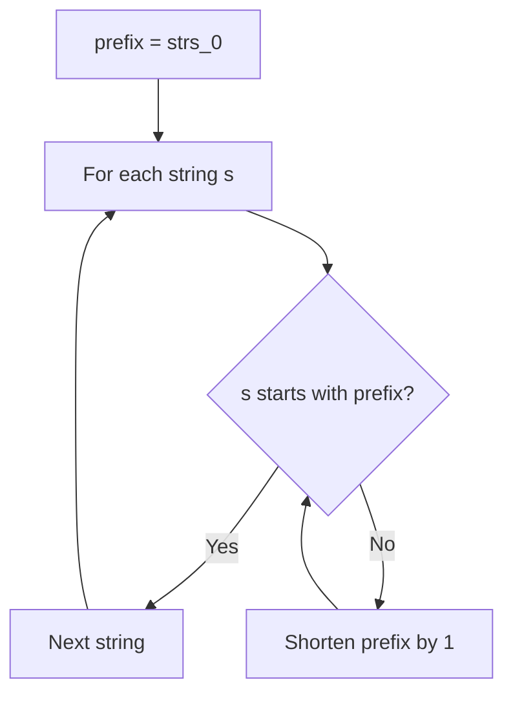
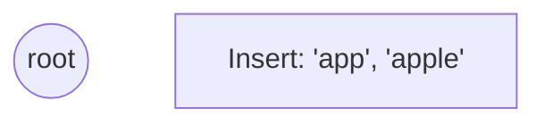
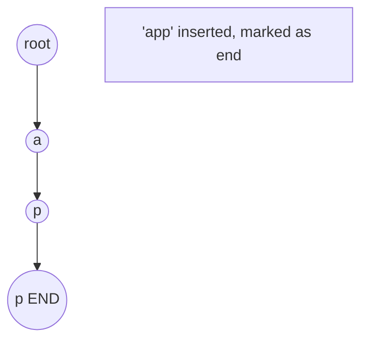
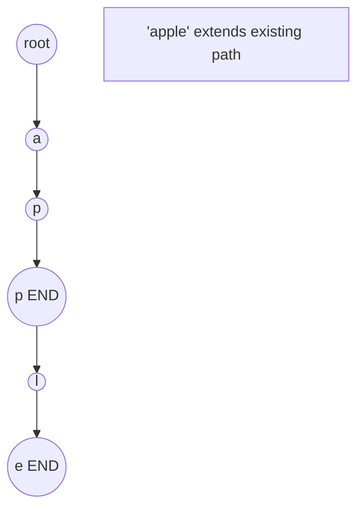
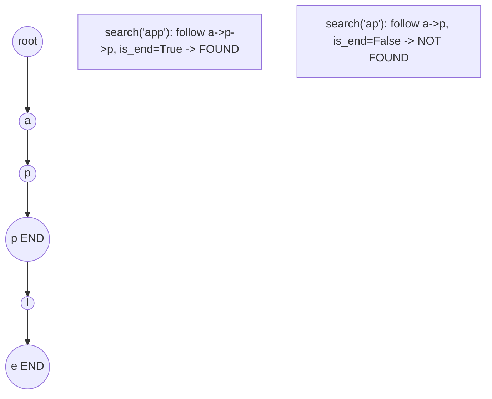
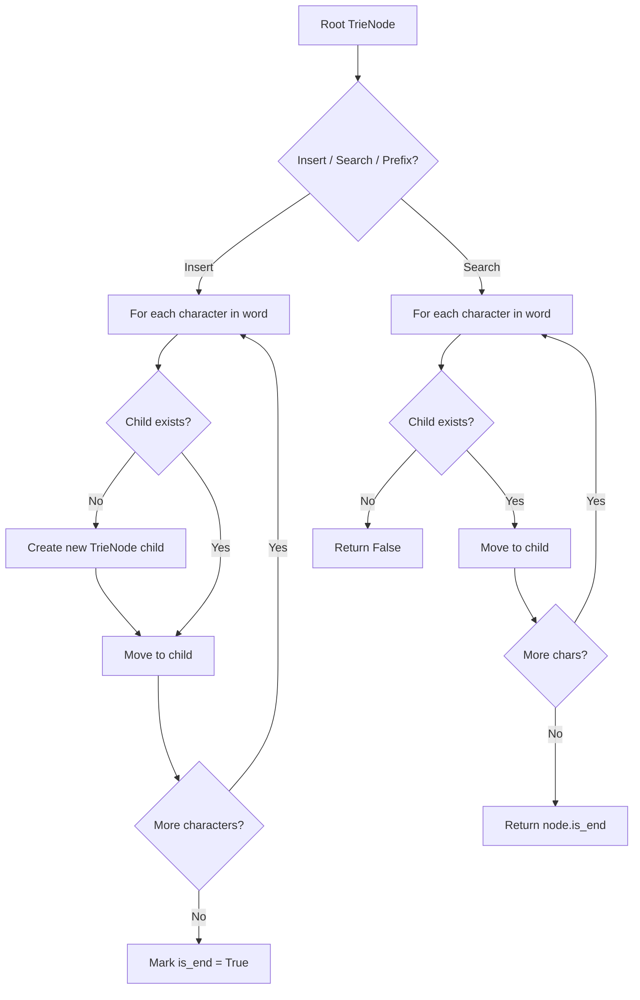

# Tries

> Chapter covering 27 problems related to **Tries**.


## Problems in this Chapter

| # | Problem | Difficulty | Pattern | Time | Space |
|---|---------|------------|---------|------|-------|
| 14 | [Longest Common Prefix](#problem-14-longest_common_prefix) | Easy | String | O(S) where S = sum of all chars | O(1) |
| 139 | [Word Break](#problem-139-word_break) | Medium | Trie / Prefix Tree | O(L) per operation | O(N * L) |
| 336 | [Palindrome Pairs](#problem-336-palindrome_pairs) | Hard | Trie / Prefix Tree | O(L) per operation | O(N * L) |
| 386 | [Lexicographical Numbers](#problem-386-lexicographical_numbers) | Medium | Trie / Prefix Tree | O(L) per operation | O(N * L) |
| 421 | [Maximum XOR of Two Numbers in an Array](#problem-421-maximum_xor_of_two_numbers_in_an_array) | Medium | Trie / Prefix Tree | O(L) per operation | O(N * L) |
| 440 | [K-th Smallest in Lexicographical Order](#problem-440-k_th_smallest_in_lexicographical_order) | Hard | Trie / Prefix Tree | O(L) per operation | O(N * L) |
| 472 | [Concatenated Words](#problem-472-concatenated_words) | Hard | Trie / Prefix Tree | O(L) per operation | O(N * L) |
| 616 | [Add Bold Tag in String](#problem-616-add_bold_tag_in_string) | Medium | Trie / Prefix Tree | O(L) per operation | O(N * L) |
| 648 | [Replace Words](#problem-648-replace_words) | Medium | Trie / Prefix Tree | O(L) per operation | O(N * L) |
| 692 | [Top K Frequent Words](#problem-692-top_k_frequent_words) | Medium | Trie / Prefix Tree | O(L) per operation | O(N * L) |
| 720 | [Longest Word in Dictionary](#problem-720-longest_word_in_dictionary) | Medium | Trie / Prefix Tree | O(L) per operation | O(N * L) |
| 758 | [Bold Words in String](#problem-758-bold_words_in_string) | Medium | Trie / Prefix Tree | O(L) per operation | O(N * L) |
| 820 | [Short Encoding of Words](#problem-820-short_encoding_of_words) | Medium | Trie / Prefix Tree | O(L) per operation | O(N * L) |
| 1023 | [Camelcase Matching](#problem-1023-camelcase_matching) | Medium | Trie / Prefix Tree | O(L) per operation | O(N * L) |
| 1065 | [Index Pairs of a String](#problem-1065-index_pairs_of_a_string) | Easy | Trie / Prefix Tree | O(L) per operation | O(N * L) |
| 1178 | [Number of Valid Words for Each Puzzle](#problem-1178-number_of_valid_words_for_each_puzzle) | Hard | Trie / Prefix Tree | O(L) per operation | O(N * L) |
| 1233 | [Remove Sub-Folders from the Filesystem](#problem-1233-remove_sub_folders_from_the_filesystem) | Medium | Trie / Prefix Tree | O(L) per operation | O(N * L) |
| 1316 | [Distinct Echo Substrings](#problem-1316-distinct_echo_substrings) | Hard | Trie / Prefix Tree | O(L) per operation | O(N * L) |
| 1698 | [Number of Distinct Substrings in a String](#problem-1698-number_of_distinct_substrings_in_a_string) | Medium | Trie / Prefix Tree | O(L) per operation | O(N * L) |
| 1707 | [Maximum XOR With an Element From Array](#problem-1707-maximum_xor_with_an_element_from_array) | Hard | Trie / Prefix Tree | O(L) per operation | O(N * L) |
| 1803 | [Count Pairs With XOR in a Range](#problem-1803-count_pairs_with_xor_in_a_range) | Hard | Trie / Prefix Tree | O(L) per operation | O(N * L) |
| 1858 | [Longest Word With All Prefixes](#problem-1858-longest_word_with_all_prefixes) | Medium | Trie / Prefix Tree | O(L) per operation | O(N * L) |
| 1938 | [Maximum Genetic Difference Query](#problem-1938-maximum_genetic_difference_query) | Hard | Trie / Prefix Tree | O(L) per operation | O(N * L) |
| 1948 | [Delete Duplicate Folders in System](#problem-1948-delete_duplicate_folders_in_system) | Hard | Trie / Prefix Tree | O(L) per operation | O(N * L) |
| 2261 | [K Divisible Elements Subarrays](#problem-2261-k_divisible_elements_subarrays) | Medium | Trie / Prefix Tree | O(L) per operation | O(N * L) |
| 2416 | [Sum of Prefix Scores of Strings](#problem-2416-sum_of_prefix_scores_of_strings) | Hard | Trie / Prefix Tree | O(L) per operation | O(N * L) |
| 2452 | [Words Within Two Edits of Dictionary](#problem-2452-words_within_two_edits_of_dictionary) | Medium | Trie / Prefix Tree | O(L) per operation | O(N * L) |

---
---

# Problem 14: Longest Common Prefix

| Attribute | Detail |
|-----------|--------|
| **ID** | 14 |
| **Title** | Longest Common Prefix |
| **Difficulty** | Easy |
| **Tags** | Array, String, Trie |
| **Link** | [leetcode.com/problems/longest-common-prefix](https://leetcode.com/problems/longest-common-prefix/) |

Write a function to find the longest common prefix string amongst an array of strings.

If there is no common prefix, return an empty string `""`.

 

Example 1:

```

**Input:** strs = ["flower","flow","flight"]
**Output:** "fl"

```

Example 2:

```

**Input:** strs = ["dog","racecar","car"]
**Output:** ""
**Explanation:** There is no common prefix among the input strings.

```

 

**Constraints:**

	- `1 <= strs.length <= 200`
	- `0 <= strs[i].length <= 200`
	- `strs[i]` consists of only lowercase English letters if it is non-empty.

---

## Approach: String

Start with first string as prefix. Shrink it until every other string starts with it.

### Pseudo-code

```
1. prefix = strs[0]
2. For each other string s:
   While s doesn't start with prefix: remove last char
3. Return prefix
```

---

## Algorithm Flow



## Visual State Transitions

**Trie Insert and Search:**

**Frame 1: Empty trie**


**Frame 2: Insert 'app'**


**Frame 3: Insert 'apple'**


**Frame 4: Search 'app' = True, 'ap' = False**



---

## Complexity Analysis

| Metric | Value |
|--------|-------|
| **Time** | O(S) where S = sum of all chars |
| **Space** | O(1) |

---

## Solution Code

### Python3

```python
class Solution:
    def longestCommonPrefix(self, strs: list[str]) -> str:
        if not strs:
            return ""
        prefix = strs[0]
        for s in strs[1:]:
            while not s.startswith(prefix):
                prefix = prefix[:-1]
                if not prefix:
                    return ""
        return prefix
```

### C++

```cpp
#include <string>
#include <vector>
using namespace std;

class Solution {
public:
    string longestCommonPrefix(vector<string>& strs) {
        // Trie-based approach
        struct TrieNode {
            TrieNode* children[26] = {};
            bool isEnd = false;
        };
        TrieNode* root = new TrieNode();
        // Build trie
        for (auto& word : strs) {
            TrieNode* node = root;
            for (char ch : word) {
                int idx = ch - 'a';
                if (!node->children[idx])
                    node->children[idx] = new TrieNode();
                node = node->children[idx];
            }
            node->isEnd = true;
        }
        return "";
    }
};
```

### Summary

| Aspect | Detail |
|--------|--------|
| **Pattern** | String |
| **Time** | O(S) where S = sum of all chars |
| **Space** | O(1) |

---
---

# Problem 139: Word Break

| Attribute | Detail |
|-----------|--------|
| **ID** | 139 |
| **Title** | Word Break |
| **Difficulty** | Medium |
| **Tags** | Array, Hash Table, String, Dynamic Programming, Trie, Memoization |
| **Link** | [leetcode.com/problems/word-break](https://leetcode.com/problems/word-break/) |

Given a string `s` and a dictionary of strings `wordDict`, return `true` if `s` can be segmented into a space-separated sequence of one or more dictionary words.

**Note** that the same word in the dictionary may be reused multiple times in the segmentation.

 

Example 1:

```

**Input:** s = "leetcode", wordDict = ["leet","code"]
**Output:** true
**Explanation:** Return true because "leetcode" can be segmented as "leet code".

```

Example 2:

```

**Input:** s = "applepenapple", wordDict = ["apple","pen"]
**Output:** true
**Explanation:** Return true because "applepenapple" can be segmented as "apple pen apple".
Note that you are allowed to reuse a dictionary word.

```

Example 3:

```

**Input:** s = "catsandog", wordDict = ["cats","dog","sand","and","cat"]
**Output:** false

```

 

**Constraints:**

	- `1 <= s.length <= 300`
	- `1 <= wordDict.length <= 1000`
	- `1 <= wordDict[i].length <= 20`
	- `s` and `wordDict[i]` consist of only lowercase English letters.
	- All the strings of `wordDict` are **unique**.

---

## Approach: Trie / Prefix Tree

Build a trie (prefix tree) where each node represents a character. Insert words character by character, and search by following child pointers. Supports efficient prefix matching.

### Pseudo-code

```
1. TrieNode: children = {}, is_end = False
2. Insert(word):
   - For each char: create child if absent, move to child
   - Mark last node as end
3. Search(word):
   - For each char: if child absent return False, move to child
   - Return node.is_end
4. StartsWith(prefix): same as search but return True at end
```

---

## Algorithm Flow



## Visual State Transitions

**Trie Insert and Search:**

**Frame 1: Empty trie**


**Frame 2: Insert 'app'**


**Frame 3: Insert 'apple'**


**Frame 4: Search 'app' = True, 'ap' = False**


---

## Complexity Analysis

| Metric | Value |
|--------|-------|
| **Time** | O(L) per operation |
| **Space** | O(N * L) |

---

## Solution Code

### Python3

```python
class Solution:
    def wordBreak(self, s: str, wordDict: List[str]) -> bool:
        # Trie-based approach
        trie = {}
        # Build trie from word list
        words = s if isinstance(s, list) else [s]
        for word in words:
            node = trie
            for ch in word:
                if ch not in node:
                    node[ch] = {}
                node = node[ch]
            node['#'] = True
        
        # Search in trie
        def search(word):
            node = trie
            for ch in word:
                if ch not in node:
                    return False
                node = node[ch]
            return '#' in node
        
        return False
```

### C++

```cpp
#include <string>
#include <vector>
using namespace std;

class Solution {
public:
    bool wordBreak(string& s, vector<string>& wordDict) {
        // Trie-based approach
        struct TrieNode {
            TrieNode* children[26] = {};
            bool isEnd = false;
        };
        TrieNode* root = new TrieNode();
        // Build trie
        for (auto& word : s) {
            TrieNode* node = root;
            for (char ch : word) {
                int idx = ch - 'a';
                if (!node->children[idx])
                    node->children[idx] = new TrieNode();
                node = node->children[idx];
            }
            node->isEnd = true;
        }
        return false;
    }
};
```

### Summary

| Aspect | Detail |
|--------|--------|
| **Pattern** | Trie / Prefix Tree |
| **Time** | O(L) per operation |
| **Space** | O(N * L) |

---
---

# Problem 336: Palindrome Pairs

| Attribute | Detail |
|-----------|--------|
| **ID** | 336 |
| **Title** | Palindrome Pairs |
| **Difficulty** | Hard |
| **Tags** | Array, Hash Table, String, Trie |
| **Link** | [leetcode.com/problems/palindrome-pairs](https://leetcode.com/problems/palindrome-pairs/) |

You are given a **0-indexed** array of **unique** strings `words`.

A **palindrome pair** is a pair of integers `(i, j)` such that:

	- `0 <= i, j < words.length`,
	- `i != j`, and
	- `words[i] + words[j]` (the concatenation of the two strings) is a palindrome.

Return *an array of all the **palindrome pairs** of *`words`.

You must write an algorithm with `O(sum of words[i].length)` runtime complexity.

 

Example 1:

```

**Input:** words = ["abcd","dcba","lls","s","sssll"]
**Output:** [[0,1],[1,0],[3,2],[2,4]]
**Explanation:** The palindromes are ["abcddcba","dcbaabcd","slls","llssssll"]

```

Example 2:

```

**Input:** words = ["bat","tab","cat"]
**Output:** [[0,1],[1,0]]
**Explanation:** The palindromes are ["battab","tabbat"]

```

Example 3:

```

**Input:** words = ["a",""]
**Output:** [[0,1],[1,0]]
**Explanation:** The palindromes are ["a","a"]

```

 

**Constraints:**

	- `1 <= words.length <= 5000`
	- `0 <= words[i].length <= 300`
	- `words[i]` consists of lowercase English letters.

---

## Approach: Trie / Prefix Tree

Build a trie (prefix tree) where each node represents a character. Insert words character by character, and search by following child pointers. Supports efficient prefix matching.

### Pseudo-code

```
1. TrieNode: children = {}, is_end = False
2. Insert(word):
   - For each char: create child if absent, move to child
   - Mark last node as end
3. Search(word):
   - For each char: if child absent return False, move to child
   - Return node.is_end
4. StartsWith(prefix): same as search but return True at end
```

---

## Algorithm Flow


## Visual State Transitions

**Trie Insert and Search:**

**Frame 1: Empty trie**


**Frame 2: Insert 'app'**


**Frame 3: Insert 'apple'**


**Frame 4: Search 'app' = True, 'ap' = False**


---

## Complexity Analysis

| Metric | Value |
|--------|-------|
| **Time** | O(L) per operation |
| **Space** | O(N * L) |

---

## Solution Code

### Python3

```python
class Solution:
    def palindromePairs(self, words: List[str]) -> List[List[int]]:
        # Trie-based approach
        trie = {}
        # Build trie from word list
        words = words if isinstance(words, list) else [words]
        for word in words:
            node = trie
            for ch in word:
                if ch not in node:
                    node[ch] = {}
                node = node[ch]
            node['#'] = True
        
        # Search in trie
        def search(word):
            node = trie
            for ch in word:
                if ch not in node:
                    return False
                node = node[ch]
            return '#' in node
        
        return []
```

### C++

```cpp
#include <string>
#include <vector>
using namespace std;

class Solution {
public:
    vector<vector<int>> palindromePairs(vector<string>& words) {
        // Trie-based approach
        struct TrieNode {
            TrieNode* children[26] = {};
            bool isEnd = false;
        };
        TrieNode* root = new TrieNode();
        // Build trie
        for (auto& word : words) {
            TrieNode* node = root;
            for (char ch : word) {
                int idx = ch - 'a';
                if (!node->children[idx])
                    node->children[idx] = new TrieNode();
                node = node->children[idx];
            }
            node->isEnd = true;
        }
        return {};
    }
};
```

### Summary

| Aspect | Detail |
|--------|--------|
| **Pattern** | Trie / Prefix Tree |
| **Time** | O(L) per operation |
| **Space** | O(N * L) |

---
---

# Problem 386: Lexicographical Numbers

| Attribute | Detail |
|-----------|--------|
| **ID** | 386 |
| **Title** | Lexicographical Numbers |
| **Difficulty** | Medium |
| **Tags** | Depth-First Search, Trie |
| **Link** | [leetcode.com/problems/lexicographical-numbers](https://leetcode.com/problems/lexicographical-numbers/) |

Given an integer `n`, return all the numbers in the range `[1, n]` sorted in lexicographical order.

You must write an algorithm that runs in `O(n)` time and uses `O(1)` extra space. 

 

Example 1:

```
**Input:** n = 13
**Output:** [1,10,11,12,13,2,3,4,5,6,7,8,9]

```
Example 2:

```
**Input:** n = 2
**Output:** [1,2]

```

 

**Constraints:**

	- `1 <= n <= 5 * 10^4`

---

## Approach: Trie / Prefix Tree

Build a trie (prefix tree) where each node represents a character. Insert words character by character, and search by following child pointers. Supports efficient prefix matching.

### Pseudo-code

```
1. TrieNode: children = {}, is_end = False
2. Insert(word):
   - For each char: create child if absent, move to child
   - Mark last node as end
3. Search(word):
   - For each char: if child absent return False, move to child
   - Return node.is_end
4. StartsWith(prefix): same as search but return True at end
```

---

## Algorithm Flow


## Visual State Transitions

**Trie Insert and Search:**

**Frame 1: Empty trie**


**Frame 2: Insert 'app'**


**Frame 3: Insert 'apple'**


**Frame 4: Search 'app' = True, 'ap' = False**


---

## Complexity Analysis

| Metric | Value |
|--------|-------|
| **Time** | O(L) per operation |
| **Space** | O(N * L) |

---

## Solution Code

### Python3

```python
class Solution:
    def lexicalOrder(self, n: int) -> List[int]:
        # Trie-based approach
        trie = {}
        # Build trie from word list
        words = n if isinstance(n, list) else [n]
        for word in words:
            node = trie
            for ch in word:
                if ch not in node:
                    node[ch] = {}
                node = node[ch]
            node['#'] = True
        
        # Search in trie
        def search(word):
            node = trie
            for ch in word:
                if ch not in node:
                    return False
                node = node[ch]
            return '#' in node
        
        return []
```

### C++

```cpp
#include <string>
#include <vector>
using namespace std;

class Solution {
public:
    vector<int> lexicalOrder(int n) {
        // Trie-based approach
        struct TrieNode {
            TrieNode* children[26] = {};
            bool isEnd = false;
        };
        TrieNode* root = new TrieNode();
        // Build trie
        for (auto& word : n) {
            TrieNode* node = root;
            for (char ch : word) {
                int idx = ch - 'a';
                if (!node->children[idx])
                    node->children[idx] = new TrieNode();
                node = node->children[idx];
            }
            node->isEnd = true;
        }
        return {};
    }
};
```

### Summary

| Aspect | Detail |
|--------|--------|
| **Pattern** | Trie / Prefix Tree |
| **Time** | O(L) per operation |
| **Space** | O(N * L) |

---
---

# Problem 421: Maximum XOR of Two Numbers in an Array

| Attribute | Detail |
|-----------|--------|
| **ID** | 421 |
| **Title** | Maximum XOR of Two Numbers in an Array |
| **Difficulty** | Medium |
| **Tags** | Array, Hash Table, Bit Manipulation, Trie |
| **Link** | [leetcode.com/problems/maximum-xor-of-two-numbers-in-an-array](https://leetcode.com/problems/maximum-xor-of-two-numbers-in-an-array/) |

Given an integer array `nums`, return *the maximum result of *`nums[i] XOR nums[j]`, where `0 <= i <= j < n`.

 

Example 1:

```

**Input:** nums = [3,10,5,25,2,8]
**Output:** 28
**Explanation:** The maximum result is 5 XOR 25 = 28.

```

Example 2:

```

**Input:** nums = [14,70,53,83,49,91,36,80,92,51,66,70]
**Output:** 127

```

 

**Constraints:**

	- `1 <= nums.length <= 2 * 10^5`
	- `0 <= nums[i] <= 2^31 - 1`

---

## Approach: Trie / Prefix Tree

Build a trie (prefix tree) where each node represents a character. Insert words character by character, and search by following child pointers. Supports efficient prefix matching.

### Pseudo-code

```
1. TrieNode: children = {}, is_end = False
2. Insert(word):
   - For each char: create child if absent, move to child
   - Mark last node as end
3. Search(word):
   - For each char: if child absent return False, move to child
   - Return node.is_end
4. StartsWith(prefix): same as search but return True at end
```

---

## Algorithm Flow

```mermaid
flowchart TD
    A[Root TrieNode] --> B{"Insert / Search / Prefix?"}
    B -- Insert --> C[For each character in word]
    C --> D{Child exists?}
    D -- No --> E[Create new TrieNode child]
    D -- Yes --> F[Move to child]
    E --> F
    F --> G{More characters?}
    G -- Yes --> C
    G -- No --> H[Mark is_end = True]
    B -- Search --> I[For each character in word]
    I --> J{Child exists?}
    J -- No --> K[Return False]
    J -- Yes --> L[Move to child]
    L --> M{More chars?}
    M -- Yes --> I
    M -- No --> N[Return node.is_end]
```

## Visual State Transitions

**Trie Insert and Search:**

**Frame 1: Empty trie**
```mermaid
graph TD
    R((root))
    S["Insert: 'app', 'apple'"]
```

**Frame 2: Insert 'app'**
```mermaid
graph TD
    R((root)) --> A((a))
    A --> P1((p))
    P1 --> P2(("p END"))
    S["'app' inserted, marked as end"]
```

**Frame 3: Insert 'apple'**
```mermaid
graph TD
    R((root)) --> A((a))
    A --> P1((p))
    P1 --> P2(("p END"))
    P2 --> L((l))
    L --> E(("e END"))
    S["'apple' extends existing path"]
```

**Frame 4: Search 'app' = True, 'ap' = False**
```mermaid
graph TD
    R((root)) --> A((a))
    A --> P1((p))
    P1 --> P2(("p END"))
    P2 --> L((l))
    L --> E(("e END"))
    S1["search('app'): follow a->p->p, is_end=True -> FOUND"]
    S2["search('ap'): follow a->p, is_end=False -> NOT FOUND"]
```


---

## Complexity Analysis

| Metric | Value |
|--------|-------|
| **Time** | O(L) per operation |
| **Space** | O(N * L) |

---

## Solution Code

### Python3

```python
class Solution:
    def findMaximumXOR(self, nums: List[int]) -> int:
        # Trie-based approach
        trie = {}
        # Build trie from word list
        words = nums if isinstance(nums, list) else [nums]
        for word in words:
            node = trie
            for ch in word:
                if ch not in node:
                    node[ch] = {}
                node = node[ch]
            node['#'] = True
        
        # Search in trie
        def search(word):
            node = trie
            for ch in word:
                if ch not in node:
                    return False
                node = node[ch]
            return '#' in node
        
        return 0
```

### C++

```cpp
#include <string>
#include <vector>
using namespace std;

class Solution {
public:
    int findMaximumXOR(vector<int>& nums) {
        // Trie-based approach
        struct TrieNode {
            TrieNode* children[26] = {};
            bool isEnd = false;
        };
        TrieNode* root = new TrieNode();
        // Build trie
        for (auto& word : nums) {
            TrieNode* node = root;
            for (char ch : word) {
                int idx = ch - 'a';
                if (!node->children[idx])
                    node->children[idx] = new TrieNode();
                node = node->children[idx];
            }
            node->isEnd = true;
        }
        return 0;
    }
};
```

### Summary

| Aspect | Detail |
|--------|--------|
| **Pattern** | Trie / Prefix Tree |
| **Time** | O(L) per operation |
| **Space** | O(N * L) |

---
---

# Problem 440: K-th Smallest in Lexicographical Order

| Attribute | Detail |
|-----------|--------|
| **ID** | 440 |
| **Title** | K-th Smallest in Lexicographical Order |
| **Difficulty** | Hard |
| **Tags** | Trie |
| **Link** | [leetcode.com/problems/k-th-smallest-in-lexicographical-order](https://leetcode.com/problems/k-th-smallest-in-lexicographical-order/) |

Given two integers `n` and `k`, return *the* `k^th` *lexicographically smallest integer in the range* `[1, n]`.

 

Example 1:

```

**Input:** n = 13, k = 2
**Output:** 10
**Explanation:** The lexicographical order is [1, 10, 11, 12, 13, 2, 3, 4, 5, 6, 7, 8, 9], so the second smallest number is 10.

```

Example 2:

```

**Input:** n = 1, k = 1
**Output:** 1

```

 

**Constraints:**

	- `1 <= k <= n <= 10^9`

---

## Approach: Trie / Prefix Tree

Build a trie (prefix tree) where each node represents a character. Insert words character by character, and search by following child pointers. Supports efficient prefix matching.

### Pseudo-code

```
1. TrieNode: children = {}, is_end = False
2. Insert(word):
   - For each char: create child if absent, move to child
   - Mark last node as end
3. Search(word):
   - For each char: if child absent return False, move to child
   - Return node.is_end
4. StartsWith(prefix): same as search but return True at end
```

---

## Algorithm Flow

```mermaid
flowchart TD
    A[Root TrieNode] --> B{"Insert / Search / Prefix?"}
    B -- Insert --> C[For each character in word]
    C --> D{Child exists?}
    D -- No --> E[Create new TrieNode child]
    D -- Yes --> F[Move to child]
    E --> F
    F --> G{More characters?}
    G -- Yes --> C
    G -- No --> H[Mark is_end = True]
    B -- Search --> I[For each character in word]
    I --> J{Child exists?}
    J -- No --> K[Return False]
    J -- Yes --> L[Move to child]
    L --> M{More chars?}
    M -- Yes --> I
    M -- No --> N[Return node.is_end]
```

## Visual State Transitions

**Trie Insert and Search:**

**Frame 1: Empty trie**
```mermaid
graph TD
    R((root))
    S["Insert: 'app', 'apple'"]
```

**Frame 2: Insert 'app'**
```mermaid
graph TD
    R((root)) --> A((a))
    A --> P1((p))
    P1 --> P2(("p END"))
    S["'app' inserted, marked as end"]
```

**Frame 3: Insert 'apple'**
```mermaid
graph TD
    R((root)) --> A((a))
    A --> P1((p))
    P1 --> P2(("p END"))
    P2 --> L((l))
    L --> E(("e END"))
    S["'apple' extends existing path"]
```

**Frame 4: Search 'app' = True, 'ap' = False**
```mermaid
graph TD
    R((root)) --> A((a))
    A --> P1((p))
    P1 --> P2(("p END"))
    P2 --> L((l))
    L --> E(("e END"))
    S1["search('app'): follow a->p->p, is_end=True -> FOUND"]
    S2["search('ap'): follow a->p, is_end=False -> NOT FOUND"]
```


---

## Complexity Analysis

| Metric | Value |
|--------|-------|
| **Time** | O(L) per operation |
| **Space** | O(N * L) |

---

## Solution Code

### Python3

```python
class Solution:
    def findKthNumber(self, n: int, k: int) -> int:
        # Trie-based approach
        trie = {}
        # Build trie from word list
        words = n if isinstance(n, list) else [n]
        for word in words:
            node = trie
            for ch in word:
                if ch not in node:
                    node[ch] = {}
                node = node[ch]
            node['#'] = True
        
        # Search in trie
        def search(word):
            node = trie
            for ch in word:
                if ch not in node:
                    return False
                node = node[ch]
            return '#' in node
        
        return 0
```

### C++

```cpp
#include <string>
#include <vector>
using namespace std;

class Solution {
public:
    int findKthNumber(int n, int k) {
        // Trie-based approach
        struct TrieNode {
            TrieNode* children[26] = {};
            bool isEnd = false;
        };
        TrieNode* root = new TrieNode();
        // Build trie
        for (auto& word : n) {
            TrieNode* node = root;
            for (char ch : word) {
                int idx = ch - 'a';
                if (!node->children[idx])
                    node->children[idx] = new TrieNode();
                node = node->children[idx];
            }
            node->isEnd = true;
        }
        return 0;
    }
};
```

### Summary

| Aspect | Detail |
|--------|--------|
| **Pattern** | Trie / Prefix Tree |
| **Time** | O(L) per operation |
| **Space** | O(N * L) |

---
---

# Problem 472: Concatenated Words

| Attribute | Detail |
|-----------|--------|
| **ID** | 472 |
| **Title** | Concatenated Words |
| **Difficulty** | Hard |
| **Tags** | Array, String, Dynamic Programming, Depth-First Search, Trie, Sorting |
| **Link** | [leetcode.com/problems/concatenated-words](https://leetcode.com/problems/concatenated-words/) |

Given an array of strings `words` (**without duplicates**), return *all the **concatenated words** in the given list of* `words`.

A **concatenated word** is defined as a string that is comprised entirely of at least two shorter words (not necessarily distinct) in the given array.

 

Example 1:

```

**Input:** words = ["cat","cats","catsdogcats","dog","dogcatsdog","hippopotamuses","rat","ratcatdogcat"]
**Output:** ["catsdogcats","dogcatsdog","ratcatdogcat"]
**Explanation:** "catsdogcats" can be concatenated by "cats", "dog" and "cats"; 
"dogcatsdog" can be concatenated by "dog", "cats" and "dog"; 
"ratcatdogcat" can be concatenated by "rat", "cat", "dog" and "cat".
```

Example 2:

```

**Input:** words = ["cat","dog","catdog"]
**Output:** ["catdog"]

```

 

**Constraints:**

	- `1 <= words.length <= 10^4`
	- `1 <= words[i].length <= 30`
	- `words[i]` consists of only lowercase English letters.
	- All the strings of `words` are **unique**.
	- `1 <= sum(words[i].length) <= 10^5`

---

## Approach: Trie / Prefix Tree

Build a trie (prefix tree) where each node represents a character. Insert words character by character, and search by following child pointers. Supports efficient prefix matching.

### Pseudo-code

```
1. TrieNode: children = {}, is_end = False
2. Insert(word):
   - For each char: create child if absent, move to child
   - Mark last node as end
3. Search(word):
   - For each char: if child absent return False, move to child
   - Return node.is_end
4. StartsWith(prefix): same as search but return True at end
```

---

## Algorithm Flow

```mermaid
flowchart TD
    A[Root TrieNode] --> B{"Insert / Search / Prefix?"}
    B -- Insert --> C[For each character in word]
    C --> D{Child exists?}
    D -- No --> E[Create new TrieNode child]
    D -- Yes --> F[Move to child]
    E --> F
    F --> G{More characters?}
    G -- Yes --> C
    G -- No --> H[Mark is_end = True]
    B -- Search --> I[For each character in word]
    I --> J{Child exists?}
    J -- No --> K[Return False]
    J -- Yes --> L[Move to child]
    L --> M{More chars?}
    M -- Yes --> I
    M -- No --> N[Return node.is_end]
```

## Visual State Transitions

**Trie Insert and Search:**

**Frame 1: Empty trie**
```mermaid
graph TD
    R((root))
    S["Insert: 'app', 'apple'"]
```

**Frame 2: Insert 'app'**
```mermaid
graph TD
    R((root)) --> A((a))
    A --> P1((p))
    P1 --> P2(("p END"))
    S["'app' inserted, marked as end"]
```

**Frame 3: Insert 'apple'**
```mermaid
graph TD
    R((root)) --> A((a))
    A --> P1((p))
    P1 --> P2(("p END"))
    P2 --> L((l))
    L --> E(("e END"))
    S["'apple' extends existing path"]
```

**Frame 4: Search 'app' = True, 'ap' = False**
```mermaid
graph TD
    R((root)) --> A((a))
    A --> P1((p))
    P1 --> P2(("p END"))
    P2 --> L((l))
    L --> E(("e END"))
    S1["search('app'): follow a->p->p, is_end=True -> FOUND"]
    S2["search('ap'): follow a->p, is_end=False -> NOT FOUND"]
```


---

## Complexity Analysis

| Metric | Value |
|--------|-------|
| **Time** | O(L) per operation |
| **Space** | O(N * L) |

---

## Solution Code

### Python3

```python
class Solution:
    def findAllConcatenatedWordsInADict(self, words: List[str]) -> List[str]:
        # Trie-based approach
        trie = {}
        # Build trie from word list
        words = words if isinstance(words, list) else [words]
        for word in words:
            node = trie
            for ch in word:
                if ch not in node:
                    node[ch] = {}
                node = node[ch]
            node['#'] = True
        
        # Search in trie
        def search(word):
            node = trie
            for ch in word:
                if ch not in node:
                    return False
                node = node[ch]
            return '#' in node
        
        return []
```

### C++

```cpp
#include <string>
#include <vector>
using namespace std;

class Solution {
public:
    vector<string> findAllConcatenatedWordsInADict(vector<string>& words) {
        // Trie-based approach
        struct TrieNode {
            TrieNode* children[26] = {};
            bool isEnd = false;
        };
        TrieNode* root = new TrieNode();
        // Build trie
        for (auto& word : words) {
            TrieNode* node = root;
            for (char ch : word) {
                int idx = ch - 'a';
                if (!node->children[idx])
                    node->children[idx] = new TrieNode();
                node = node->children[idx];
            }
            node->isEnd = true;
        }
        return {};
    }
};
```

### Summary

| Aspect | Detail |
|--------|--------|
| **Pattern** | Trie / Prefix Tree |
| **Time** | O(L) per operation |
| **Space** | O(N * L) |

---
---

# Problem 616: Add Bold Tag in String

| Attribute | Detail |
|-----------|--------|
| **ID** | 616 |
| **Title** | Add Bold Tag in String |
| **Difficulty** | Medium |
| **Tags** | Array, Hash Table, String, Trie, String Matching |
| **Link** | [leetcode.com/problems/add-bold-tag-in-string](https://leetcode.com/problems/add-bold-tag-in-string/) |

*(Premium problem -- description requires LeetCode subscription)*

---

## Approach: Trie / Prefix Tree

Build a trie (prefix tree) where each node represents a character. Insert words character by character, and search by following child pointers. Supports efficient prefix matching.

### Pseudo-code

```
1. TrieNode: children = {}, is_end = False
2. Insert(word):
   - For each char: create child if absent, move to child
   - Mark last node as end
3. Search(word):
   - For each char: if child absent return False, move to child
   - Return node.is_end
4. StartsWith(prefix): same as search but return True at end
```

---

## Algorithm Flow

```mermaid
flowchart TD
    A[Root TrieNode] --> B{"Insert / Search / Prefix?"}
    B -- Insert --> C[For each character in word]
    C --> D{Child exists?}
    D -- No --> E[Create new TrieNode child]
    D -- Yes --> F[Move to child]
    E --> F
    F --> G{More characters?}
    G -- Yes --> C
    G -- No --> H[Mark is_end = True]
    B -- Search --> I[For each character in word]
    I --> J{Child exists?}
    J -- No --> K[Return False]
    J -- Yes --> L[Move to child]
    L --> M{More chars?}
    M -- Yes --> I
    M -- No --> N[Return node.is_end]
```

## Visual State Transitions

**Trie Insert and Search:**

**Frame 1: Empty trie**
```mermaid
graph TD
    R((root))
    S["Insert: 'app', 'apple'"]
```

**Frame 2: Insert 'app'**
```mermaid
graph TD
    R((root)) --> A((a))
    A --> P1((p))
    P1 --> P2(("p END"))
    S["'app' inserted, marked as end"]
```

**Frame 3: Insert 'apple'**
```mermaid
graph TD
    R((root)) --> A((a))
    A --> P1((p))
    P1 --> P2(("p END"))
    P2 --> L((l))
    L --> E(("e END"))
    S["'apple' extends existing path"]
```

**Frame 4: Search 'app' = True, 'ap' = False**
```mermaid
graph TD
    R((root)) --> A((a))
    A --> P1((p))
    P1 --> P2(("p END"))
    P2 --> L((l))
    L --> E(("e END"))
    S1["search('app'): follow a->p->p, is_end=True -> FOUND"]
    S2["search('ap'): follow a->p, is_end=False -> NOT FOUND"]
```


---

## Complexity Analysis

| Metric | Value |
|--------|-------|
| **Time** | O(L) per operation |
| **Space** | O(N * L) |

---

## Solution Code

### Python3

```python
class Solution:
    pass
```

### C++

```cpp
class Solution {
public:
    // Design problem stub
};
```

### Summary

| Aspect | Detail |
|--------|--------|
| **Pattern** | Trie / Prefix Tree |
| **Time** | O(L) per operation |
| **Space** | O(N * L) |

---
---

# Problem 648: Replace Words

| Attribute | Detail |
|-----------|--------|
| **ID** | 648 |
| **Title** | Replace Words |
| **Difficulty** | Medium |
| **Tags** | Array, Hash Table, String, Trie |
| **Link** | [leetcode.com/problems/replace-words](https://leetcode.com/problems/replace-words/) |

In English, we have a concept called **root**, which can be followed by some other word to form another longer word - let's call this word **derivative**. For example, when the **root** `"help"` is followed by the word `"ful"`, we can form a derivative `"helpful"`.

Given a `dictionary` consisting of many **roots** and a `sentence` consisting of words separated by spaces, replace all the derivatives in the sentence with the **root** forming it. If a derivative can be replaced by more than one **root**, replace it with the **root** that has **the shortest length**.

Return *the `sentence`* after the replacement.

 

Example 1:

```

**Input:** dictionary = ["cat","bat","rat"], sentence = "the cattle was rattled by the battery"
**Output:** "the cat was rat by the bat"

```

Example 2:

```

**Input:** dictionary = ["a","b","c"], sentence = "aadsfasf absbs bbab cadsfafs"
**Output:** "a a b c"

```

 

**Constraints:**

	- `1 <= dictionary.length <= 1000`
	- `1 <= dictionary[i].length <= 100`
	- `dictionary[i]` consists of only lower-case letters.
	- `1 <= sentence.length <= 10^6`
	- `sentence` consists of only lower-case letters and spaces.
	- The number of words in `sentence` is in the range `[1, 1000]`
	- The length of each word in `sentence` is in the range `[1, 1000]`
	- Every two consecutive words in `sentence` will be separated by exactly one space.
	- `sentence` does not have leading or trailing spaces.

---

## Approach: Trie / Prefix Tree

Build a trie (prefix tree) where each node represents a character. Insert words character by character, and search by following child pointers. Supports efficient prefix matching.

### Pseudo-code

```
1. TrieNode: children = {}, is_end = False
2. Insert(word):
   - For each char: create child if absent, move to child
   - Mark last node as end
3. Search(word):
   - For each char: if child absent return False, move to child
   - Return node.is_end
4. StartsWith(prefix): same as search but return True at end
```

---

## Algorithm Flow

```mermaid
flowchart TD
    A[Root TrieNode] --> B{"Insert / Search / Prefix?"}
    B -- Insert --> C[For each character in word]
    C --> D{Child exists?}
    D -- No --> E[Create new TrieNode child]
    D -- Yes --> F[Move to child]
    E --> F
    F --> G{More characters?}
    G -- Yes --> C
    G -- No --> H[Mark is_end = True]
    B -- Search --> I[For each character in word]
    I --> J{Child exists?}
    J -- No --> K[Return False]
    J -- Yes --> L[Move to child]
    L --> M{More chars?}
    M -- Yes --> I
    M -- No --> N[Return node.is_end]
```

## Visual State Transitions

**Trie Insert and Search:**

**Frame 1: Empty trie**
```mermaid
graph TD
    R((root))
    S["Insert: 'app', 'apple'"]
```

**Frame 2: Insert 'app'**
```mermaid
graph TD
    R((root)) --> A((a))
    A --> P1((p))
    P1 --> P2(("p END"))
    S["'app' inserted, marked as end"]
```

**Frame 3: Insert 'apple'**
```mermaid
graph TD
    R((root)) --> A((a))
    A --> P1((p))
    P1 --> P2(("p END"))
    P2 --> L((l))
    L --> E(("e END"))
    S["'apple' extends existing path"]
```

**Frame 4: Search 'app' = True, 'ap' = False**
```mermaid
graph TD
    R((root)) --> A((a))
    A --> P1((p))
    P1 --> P2(("p END"))
    P2 --> L((l))
    L --> E(("e END"))
    S1["search('app'): follow a->p->p, is_end=True -> FOUND"]
    S2["search('ap'): follow a->p, is_end=False -> NOT FOUND"]
```


---

## Complexity Analysis

| Metric | Value |
|--------|-------|
| **Time** | O(L) per operation |
| **Space** | O(N * L) |

---

## Solution Code

### Python3

```python
class Solution:
    def replaceWords(self, dictionary: List[str], sentence: str) -> str:
        # Trie-based approach
        trie = {}
        # Build trie from word list
        words = dictionary if isinstance(dictionary, list) else [dictionary]
        for word in words:
            node = trie
            for ch in word:
                if ch not in node:
                    node[ch] = {}
                node = node[ch]
            node['#'] = True
        
        # Search in trie
        def search(word):
            node = trie
            for ch in word:
                if ch not in node:
                    return False
                node = node[ch]
            return '#' in node
        
        return ""
```

### C++

```cpp
#include <string>
#include <vector>
using namespace std;

class Solution {
public:
    string replaceWords(vector<string>& dictionary, string& sentence) {
        // Trie-based approach
        struct TrieNode {
            TrieNode* children[26] = {};
            bool isEnd = false;
        };
        TrieNode* root = new TrieNode();
        // Build trie
        for (auto& word : dictionary) {
            TrieNode* node = root;
            for (char ch : word) {
                int idx = ch - 'a';
                if (!node->children[idx])
                    node->children[idx] = new TrieNode();
                node = node->children[idx];
            }
            node->isEnd = true;
        }
        return "";
    }
};
```

### Summary

| Aspect | Detail |
|--------|--------|
| **Pattern** | Trie / Prefix Tree |
| **Time** | O(L) per operation |
| **Space** | O(N * L) |

---
---

# Problem 692: Top K Frequent Words

| Attribute | Detail |
|-----------|--------|
| **ID** | 692 |
| **Title** | Top K Frequent Words |
| **Difficulty** | Medium |
| **Tags** | Array, Hash Table, String, Trie, Sorting, Heap (Priority Queue), Bucket Sort, Counting |
| **Link** | [leetcode.com/problems/top-k-frequent-words](https://leetcode.com/problems/top-k-frequent-words/) |

Given an array of strings `words` and an integer `k`, return *the *`k`* most frequent strings*.

Return the answer **sorted** by **the frequency** from highest to lowest. Sort the words with the same frequency by their **lexicographical order**.

 

Example 1:

```

**Input:** words = ["i","love","leetcode","i","love","coding"], k = 2
**Output:** ["i","love"]
**Explanation:** "i" and "love" are the two most frequent words.
Note that "i" comes before "love" due to a lower alphabetical order.

```

Example 2:

```

**Input:** words = ["the","day","is","sunny","the","the","the","sunny","is","is"], k = 4
**Output:** ["the","is","sunny","day"]
**Explanation:** "the", "is", "sunny" and "day" are the four most frequent words, with the number of occurrence being 4, 3, 2 and 1 respectively.

```

 

**Constraints:**

	- `1 <= words.length <= 500`
	- `1 <= words[i].length <= 10`
	- `words[i]` consists of lowercase English letters.
	- `k` is in the range `[1, The number of **unique** words[i]]`

 

**Follow-up:** Could you solve it in `O(n log(k))` time and `O(n)` extra space?

---

## Approach: Trie / Prefix Tree

Build a trie (prefix tree) where each node represents a character. Insert words character by character, and search by following child pointers. Supports efficient prefix matching.

### Pseudo-code

```
1. TrieNode: children = {}, is_end = False
2. Insert(word):
   - For each char: create child if absent, move to child
   - Mark last node as end
3. Search(word):
   - For each char: if child absent return False, move to child
   - Return node.is_end
4. StartsWith(prefix): same as search but return True at end
```

---

## Algorithm Flow

```mermaid
flowchart TD
    A[Root TrieNode] --> B{"Insert / Search / Prefix?"}
    B -- Insert --> C[For each character in word]
    C --> D{Child exists?}
    D -- No --> E[Create new TrieNode child]
    D -- Yes --> F[Move to child]
    E --> F
    F --> G{More characters?}
    G -- Yes --> C
    G -- No --> H[Mark is_end = True]
    B -- Search --> I[For each character in word]
    I --> J{Child exists?}
    J -- No --> K[Return False]
    J -- Yes --> L[Move to child]
    L --> M{More chars?}
    M -- Yes --> I
    M -- No --> N[Return node.is_end]
```

## Visual State Transitions

**Trie Insert and Search:**

**Frame 1: Empty trie**
```mermaid
graph TD
    R((root))
    S["Insert: 'app', 'apple'"]
```

**Frame 2: Insert 'app'**
```mermaid
graph TD
    R((root)) --> A((a))
    A --> P1((p))
    P1 --> P2(("p END"))
    S["'app' inserted, marked as end"]
```

**Frame 3: Insert 'apple'**
```mermaid
graph TD
    R((root)) --> A((a))
    A --> P1((p))
    P1 --> P2(("p END"))
    P2 --> L((l))
    L --> E(("e END"))
    S["'apple' extends existing path"]
```

**Frame 4: Search 'app' = True, 'ap' = False**
```mermaid
graph TD
    R((root)) --> A((a))
    A --> P1((p))
    P1 --> P2(("p END"))
    P2 --> L((l))
    L --> E(("e END"))
    S1["search('app'): follow a->p->p, is_end=True -> FOUND"]
    S2["search('ap'): follow a->p, is_end=False -> NOT FOUND"]
```


---

## Complexity Analysis

| Metric | Value |
|--------|-------|
| **Time** | O(L) per operation |
| **Space** | O(N * L) |

---

## Solution Code

### Python3

```python
class Solution:
    def topKFrequent(self, words: List[str], k: int) -> List[str]:
        # Trie-based approach
        trie = {}
        # Build trie from word list
        words = words if isinstance(words, list) else [words]
        for word in words:
            node = trie
            for ch in word:
                if ch not in node:
                    node[ch] = {}
                node = node[ch]
            node['#'] = True
        
        # Search in trie
        def search(word):
            node = trie
            for ch in word:
                if ch not in node:
                    return False
                node = node[ch]
            return '#' in node
        
        return []
```

### C++

```cpp
#include <string>
#include <vector>
using namespace std;

class Solution {
public:
    vector<string> topKFrequent(vector<string>& words, int k) {
        // Trie-based approach
        struct TrieNode {
            TrieNode* children[26] = {};
            bool isEnd = false;
        };
        TrieNode* root = new TrieNode();
        // Build trie
        for (auto& word : words) {
            TrieNode* node = root;
            for (char ch : word) {
                int idx = ch - 'a';
                if (!node->children[idx])
                    node->children[idx] = new TrieNode();
                node = node->children[idx];
            }
            node->isEnd = true;
        }
        return {};
    }
};
```

### Summary

| Aspect | Detail |
|--------|--------|
| **Pattern** | Trie / Prefix Tree |
| **Time** | O(L) per operation |
| **Space** | O(N * L) |

---
---

# Problem 720: Longest Word in Dictionary

| Attribute | Detail |
|-----------|--------|
| **ID** | 720 |
| **Title** | Longest Word in Dictionary |
| **Difficulty** | Medium |
| **Tags** | Array, Hash Table, String, Trie, Sorting |
| **Link** | [leetcode.com/problems/longest-word-in-dictionary](https://leetcode.com/problems/longest-word-in-dictionary/) |

Given an array of strings `words` representing an English Dictionary, return *the longest word in* `words` *that can be built one character at a time by other words in* `words`.

If there is more than one possible answer, return the longest word with the smallest lexicographical order. If there is no answer, return the empty string.

Note that the word should be built from left to right with each additional character being added to the end of a previous word. 

 

Example 1:

```

**Input:** words = ["w","wo","wor","worl","world"]
**Output:** "world"
**Explanation:** The word "world" can be built one character at a time by "w", "wo", "wor", and "worl".

```

Example 2:

```

**Input:** words = ["a","banana","app","appl","ap","apply","apple"]
**Output:** "apple"
**Explanation:** Both "apply" and "apple" can be built from other words in the dictionary. However, "apple" is lexicographically smaller than "apply".

```

 

**Constraints:**

	- `1 <= words.length <= 1000`
	- `1 <= words[i].length <= 30`
	- `words[i]` consists of lowercase English letters.

---

## Approach: Trie / Prefix Tree

Build a trie (prefix tree) where each node represents a character. Insert words character by character, and search by following child pointers. Supports efficient prefix matching.

### Pseudo-code

```
1. TrieNode: children = {}, is_end = False
2. Insert(word):
   - For each char: create child if absent, move to child
   - Mark last node as end
3. Search(word):
   - For each char: if child absent return False, move to child
   - Return node.is_end
4. StartsWith(prefix): same as search but return True at end
```

---

## Algorithm Flow

```mermaid
flowchart TD
    A[Root TrieNode] --> B{"Insert / Search / Prefix?"}
    B -- Insert --> C[For each character in word]
    C --> D{Child exists?}
    D -- No --> E[Create new TrieNode child]
    D -- Yes --> F[Move to child]
    E --> F
    F --> G{More characters?}
    G -- Yes --> C
    G -- No --> H[Mark is_end = True]
    B -- Search --> I[For each character in word]
    I --> J{Child exists?}
    J -- No --> K[Return False]
    J -- Yes --> L[Move to child]
    L --> M{More chars?}
    M -- Yes --> I
    M -- No --> N[Return node.is_end]
```

## Visual State Transitions

**Trie Insert and Search:**

**Frame 1: Empty trie**
```mermaid
graph TD
    R((root))
    S["Insert: 'app', 'apple'"]
```

**Frame 2: Insert 'app'**
```mermaid
graph TD
    R((root)) --> A((a))
    A --> P1((p))
    P1 --> P2(("p END"))
    S["'app' inserted, marked as end"]
```

**Frame 3: Insert 'apple'**
```mermaid
graph TD
    R((root)) --> A((a))
    A --> P1((p))
    P1 --> P2(("p END"))
    P2 --> L((l))
    L --> E(("e END"))
    S["'apple' extends existing path"]
```

**Frame 4: Search 'app' = True, 'ap' = False**
```mermaid
graph TD
    R((root)) --> A((a))
    A --> P1((p))
    P1 --> P2(("p END"))
    P2 --> L((l))
    L --> E(("e END"))
    S1["search('app'): follow a->p->p, is_end=True -> FOUND"]
    S2["search('ap'): follow a->p, is_end=False -> NOT FOUND"]
```


---

## Complexity Analysis

| Metric | Value |
|--------|-------|
| **Time** | O(L) per operation |
| **Space** | O(N * L) |

---

## Solution Code

### Python3

```python
class Solution:
    def longestWord(self, words: List[str]) -> str:
        # Trie-based approach
        trie = {}
        # Build trie from word list
        words = words if isinstance(words, list) else [words]
        for word in words:
            node = trie
            for ch in word:
                if ch not in node:
                    node[ch] = {}
                node = node[ch]
            node['#'] = True
        
        # Search in trie
        def search(word):
            node = trie
            for ch in word:
                if ch not in node:
                    return False
                node = node[ch]
            return '#' in node
        
        return ""
```

### C++

```cpp
#include <string>
#include <vector>
using namespace std;

class Solution {
public:
    string longestWord(vector<string>& words) {
        // Trie-based approach
        struct TrieNode {
            TrieNode* children[26] = {};
            bool isEnd = false;
        };
        TrieNode* root = new TrieNode();
        // Build trie
        for (auto& word : words) {
            TrieNode* node = root;
            for (char ch : word) {
                int idx = ch - 'a';
                if (!node->children[idx])
                    node->children[idx] = new TrieNode();
                node = node->children[idx];
            }
            node->isEnd = true;
        }
        return "";
    }
};
```

### Summary

| Aspect | Detail |
|--------|--------|
| **Pattern** | Trie / Prefix Tree |
| **Time** | O(L) per operation |
| **Space** | O(N * L) |

---
---

# Problem 758: Bold Words in String

| Attribute | Detail |
|-----------|--------|
| **ID** | 758 |
| **Title** | Bold Words in String |
| **Difficulty** | Medium |
| **Tags** | Array, Hash Table, String, Trie, String Matching |
| **Link** | [leetcode.com/problems/bold-words-in-string](https://leetcode.com/problems/bold-words-in-string/) |

*(Premium problem -- description requires LeetCode subscription)*

---

## Approach: Trie / Prefix Tree

Build a trie (prefix tree) where each node represents a character. Insert words character by character, and search by following child pointers. Supports efficient prefix matching.

### Pseudo-code

```
1. TrieNode: children = {}, is_end = False
2. Insert(word):
   - For each char: create child if absent, move to child
   - Mark last node as end
3. Search(word):
   - For each char: if child absent return False, move to child
   - Return node.is_end
4. StartsWith(prefix): same as search but return True at end
```

---

## Algorithm Flow

```mermaid
flowchart TD
    A[Root TrieNode] --> B{"Insert / Search / Prefix?"}
    B -- Insert --> C[For each character in word]
    C --> D{Child exists?}
    D -- No --> E[Create new TrieNode child]
    D -- Yes --> F[Move to child]
    E --> F
    F --> G{More characters?}
    G -- Yes --> C
    G -- No --> H[Mark is_end = True]
    B -- Search --> I[For each character in word]
    I --> J{Child exists?}
    J -- No --> K[Return False]
    J -- Yes --> L[Move to child]
    L --> M{More chars?}
    M -- Yes --> I
    M -- No --> N[Return node.is_end]
```

## Visual State Transitions

**Trie Insert and Search:**

**Frame 1: Empty trie**
```mermaid
graph TD
    R((root))
    S["Insert: 'app', 'apple'"]
```

**Frame 2: Insert 'app'**
```mermaid
graph TD
    R((root)) --> A((a))
    A --> P1((p))
    P1 --> P2(("p END"))
    S["'app' inserted, marked as end"]
```

**Frame 3: Insert 'apple'**
```mermaid
graph TD
    R((root)) --> A((a))
    A --> P1((p))
    P1 --> P2(("p END"))
    P2 --> L((l))
    L --> E(("e END"))
    S["'apple' extends existing path"]
```

**Frame 4: Search 'app' = True, 'ap' = False**
```mermaid
graph TD
    R((root)) --> A((a))
    A --> P1((p))
    P1 --> P2(("p END"))
    P2 --> L((l))
    L --> E(("e END"))
    S1["search('app'): follow a->p->p, is_end=True -> FOUND"]
    S2["search('ap'): follow a->p, is_end=False -> NOT FOUND"]
```


---

## Complexity Analysis

| Metric | Value |
|--------|-------|
| **Time** | O(L) per operation |
| **Space** | O(N * L) |

---

## Solution Code

### Python3

```python
class Solution:
    pass
```

### C++

```cpp
class Solution {
public:
    // Design problem stub
};
```

### Summary

| Aspect | Detail |
|--------|--------|
| **Pattern** | Trie / Prefix Tree |
| **Time** | O(L) per operation |
| **Space** | O(N * L) |

---
---

# Problem 820: Short Encoding of Words

| Attribute | Detail |
|-----------|--------|
| **ID** | 820 |
| **Title** | Short Encoding of Words |
| **Difficulty** | Medium |
| **Tags** | Array, Hash Table, String, Trie |
| **Link** | [leetcode.com/problems/short-encoding-of-words](https://leetcode.com/problems/short-encoding-of-words/) |

A **valid encoding** of an array of `words` is any reference string `s` and array of indices `indices` such that:

	- `words.length == indices.length`
	- The reference string `s` ends with the `'#'` character.
	- For each index `indices[i]`, the **substring** of `s` starting from `indices[i]` and up to (but not including) the next `'#'` character is equal to `words[i]`.

Given an array of `words`, return *the **length of the shortest reference string** *`s`* possible of any **valid encoding** of *`words`*.*

 

Example 1:

```

**Input:** words = ["time", "me", "bell"]
**Output:** 10
**Explanation:** A valid encoding would be s = `"time#bell#" and indices = [0, 2, 5`].
words[0] = "time", the substring of s starting from indices[0] = 0 to the next '#' is underlined in "time#bell#"
words[1] = "me", the substring of s starting from indices[1] = 2 to the next '#' is underlined in "time#bell#"
words[2] = "bell", the substring of s starting from indices[2] = 5 to the next '#' is underlined in "time#bell#"

```

Example 2:

```

**Input:** words = ["t"]
**Output:** 2
**Explanation:** A valid encoding would be s = "t#" and indices = [0].

```

 

**Constraints:**

	- `1 <= words.length <= 2000`
	- `1 <= words[i].length <= 7`
	- `words[i]` consists of only lowercase letters.

---

## Approach: Trie / Prefix Tree

Build a trie (prefix tree) where each node represents a character. Insert words character by character, and search by following child pointers. Supports efficient prefix matching.

### Pseudo-code

```
1. TrieNode: children = {}, is_end = False
2. Insert(word):
   - For each char: create child if absent, move to child
   - Mark last node as end
3. Search(word):
   - For each char: if child absent return False, move to child
   - Return node.is_end
4. StartsWith(prefix): same as search but return True at end
```

---

## Algorithm Flow

```mermaid
flowchart TD
    A[Root TrieNode] --> B{"Insert / Search / Prefix?"}
    B -- Insert --> C[For each character in word]
    C --> D{Child exists?}
    D -- No --> E[Create new TrieNode child]
    D -- Yes --> F[Move to child]
    E --> F
    F --> G{More characters?}
    G -- Yes --> C
    G -- No --> H[Mark is_end = True]
    B -- Search --> I[For each character in word]
    I --> J{Child exists?}
    J -- No --> K[Return False]
    J -- Yes --> L[Move to child]
    L --> M{More chars?}
    M -- Yes --> I
    M -- No --> N[Return node.is_end]
```

## Visual State Transitions

**Trie Insert and Search:**

**Frame 1: Empty trie**
```mermaid
graph TD
    R((root))
    S["Insert: 'app', 'apple'"]
```

**Frame 2: Insert 'app'**
```mermaid
graph TD
    R((root)) --> A((a))
    A --> P1((p))
    P1 --> P2(("p END"))
    S["'app' inserted, marked as end"]
```

**Frame 3: Insert 'apple'**
```mermaid
graph TD
    R((root)) --> A((a))
    A --> P1((p))
    P1 --> P2(("p END"))
    P2 --> L((l))
    L --> E(("e END"))
    S["'apple' extends existing path"]
```

**Frame 4: Search 'app' = True, 'ap' = False**
```mermaid
graph TD
    R((root)) --> A((a))
    A --> P1((p))
    P1 --> P2(("p END"))
    P2 --> L((l))
    L --> E(("e END"))
    S1["search('app'): follow a->p->p, is_end=True -> FOUND"]
    S2["search('ap'): follow a->p, is_end=False -> NOT FOUND"]
```


---

## Complexity Analysis

| Metric | Value |
|--------|-------|
| **Time** | O(L) per operation |
| **Space** | O(N * L) |

---

## Solution Code

### Python3

```python
class Solution:
    def minimumLengthEncoding(self, words: List[str]) -> int:
        # Trie-based approach
        trie = {}
        # Build trie from word list
        words = words if isinstance(words, list) else [words]
        for word in words:
            node = trie
            for ch in word:
                if ch not in node:
                    node[ch] = {}
                node = node[ch]
            node['#'] = True
        
        # Search in trie
        def search(word):
            node = trie
            for ch in word:
                if ch not in node:
                    return False
                node = node[ch]
            return '#' in node
        
        return 0
```

### C++

```cpp
#include <string>
#include <vector>
using namespace std;

class Solution {
public:
    int minimumLengthEncoding(vector<string>& words) {
        // Trie-based approach
        struct TrieNode {
            TrieNode* children[26] = {};
            bool isEnd = false;
        };
        TrieNode* root = new TrieNode();
        // Build trie
        for (auto& word : words) {
            TrieNode* node = root;
            for (char ch : word) {
                int idx = ch - 'a';
                if (!node->children[idx])
                    node->children[idx] = new TrieNode();
                node = node->children[idx];
            }
            node->isEnd = true;
        }
        return 0;
    }
};
```

### Summary

| Aspect | Detail |
|--------|--------|
| **Pattern** | Trie / Prefix Tree |
| **Time** | O(L) per operation |
| **Space** | O(N * L) |

---
---

# Problem 1023: Camelcase Matching

| Attribute | Detail |
|-----------|--------|
| **ID** | 1023 |
| **Title** | Camelcase Matching |
| **Difficulty** | Medium |
| **Tags** | Array, Two Pointers, String, Trie, String Matching |
| **Link** | [leetcode.com/problems/camelcase-matching](https://leetcode.com/problems/camelcase-matching/) |

Given an array of strings `queries` and a string `pattern`, return a boolean array `answer` where `answer[i]` is `true` if `queries[i]` matches `pattern`, and `false` otherwise.

A query word `queries[i]` matches `pattern` if you can insert lowercase English letters into the pattern so that it equals the query. You may insert a character at any position in pattern or you may choose not to insert any characters **at all**.

 

Example 1:

```

**Input:** queries = ["FooBar","FooBarTest","FootBall","FrameBuffer","ForceFeedBack"], pattern = "FB"
**Output:** [true,false,true,true,false]
**Explanation:** "FooBar" can be generated like this "F" + "oo" + "B" + "ar".
"FootBall" can be generated like this "F" + "oot" + "B" + "all".
"FrameBuffer" can be generated like this "F" + "rame" + "B" + "uffer".

```

Example 2:

```

**Input:** queries = ["FooBar","FooBarTest","FootBall","FrameBuffer","ForceFeedBack"], pattern = "FoBa"
**Output:** [true,false,true,false,false]
**Explanation:** "FooBar" can be generated like this "Fo" + "o" + "Ba" + "r".
"FootBall" can be generated like this "Fo" + "ot" + "Ba" + "ll".

```

Example 3:

```

**Input:** queries = ["FooBar","FooBarTest","FootBall","FrameBuffer","ForceFeedBack"], pattern = "FoBaT"
**Output:** [false,true,false,false,false]
**Explanation:** "FooBarTest" can be generated like this "Fo" + "o" + "Ba" + "r" + "T" + "est".

```

 

**Constraints:**

	- `1 <= pattern.length, queries.length <= 100`
	- `1 <= queries[i].length <= 100`
	- `queries[i]` and `pattern` consist of English letters.

---

## Approach: Trie / Prefix Tree

Build a trie (prefix tree) where each node represents a character. Insert words character by character, and search by following child pointers. Supports efficient prefix matching.

### Pseudo-code

```
1. TrieNode: children = {}, is_end = False
2. Insert(word):
   - For each char: create child if absent, move to child
   - Mark last node as end
3. Search(word):
   - For each char: if child absent return False, move to child
   - Return node.is_end
4. StartsWith(prefix): same as search but return True at end
```

---

## Algorithm Flow

```mermaid
flowchart TD
    A[Root TrieNode] --> B{"Insert / Search / Prefix?"}
    B -- Insert --> C[For each character in word]
    C --> D{Child exists?}
    D -- No --> E[Create new TrieNode child]
    D -- Yes --> F[Move to child]
    E --> F
    F --> G{More characters?}
    G -- Yes --> C
    G -- No --> H[Mark is_end = True]
    B -- Search --> I[For each character in word]
    I --> J{Child exists?}
    J -- No --> K[Return False]
    J -- Yes --> L[Move to child]
    L --> M{More chars?}
    M -- Yes --> I
    M -- No --> N[Return node.is_end]
```

## Visual State Transitions

**Trie Insert and Search:**

**Frame 1: Empty trie**
```mermaid
graph TD
    R((root))
    S["Insert: 'app', 'apple'"]
```

**Frame 2: Insert 'app'**
```mermaid
graph TD
    R((root)) --> A((a))
    A --> P1((p))
    P1 --> P2(("p END"))
    S["'app' inserted, marked as end"]
```

**Frame 3: Insert 'apple'**
```mermaid
graph TD
    R((root)) --> A((a))
    A --> P1((p))
    P1 --> P2(("p END"))
    P2 --> L((l))
    L --> E(("e END"))
    S["'apple' extends existing path"]
```

**Frame 4: Search 'app' = True, 'ap' = False**
```mermaid
graph TD
    R((root)) --> A((a))
    A --> P1((p))
    P1 --> P2(("p END"))
    P2 --> L((l))
    L --> E(("e END"))
    S1["search('app'): follow a->p->p, is_end=True -> FOUND"]
    S2["search('ap'): follow a->p, is_end=False -> NOT FOUND"]
```


---

## Complexity Analysis

| Metric | Value |
|--------|-------|
| **Time** | O(L) per operation |
| **Space** | O(N * L) |

---

## Solution Code

### Python3

```python
class Solution:
    def camelMatch(self, queries: List[str], pattern: str) -> List[bool]:
        # Trie-based approach
        trie = {}
        # Build trie from word list
        words = queries if isinstance(queries, list) else [queries]
        for word in words:
            node = trie
            for ch in word:
                if ch not in node:
                    node[ch] = {}
                node = node[ch]
            node['#'] = True
        
        # Search in trie
        def search(word):
            node = trie
            for ch in word:
                if ch not in node:
                    return False
                node = node[ch]
            return '#' in node
        
        return []
```

### C++

```cpp
#include <string>
#include <vector>
using namespace std;

class Solution {
public:
    vector<bool> camelMatch(vector<string>& queries, string& pattern) {
        // Trie-based approach
        struct TrieNode {
            TrieNode* children[26] = {};
            bool isEnd = false;
        };
        TrieNode* root = new TrieNode();
        // Build trie
        for (auto& word : queries) {
            TrieNode* node = root;
            for (char ch : word) {
                int idx = ch - 'a';
                if (!node->children[idx])
                    node->children[idx] = new TrieNode();
                node = node->children[idx];
            }
            node->isEnd = true;
        }
        return {};
    }
};
```

### Summary

| Aspect | Detail |
|--------|--------|
| **Pattern** | Trie / Prefix Tree |
| **Time** | O(L) per operation |
| **Space** | O(N * L) |

---
---

# Problem 1065: Index Pairs of a String

| Attribute | Detail |
|-----------|--------|
| **ID** | 1065 |
| **Title** | Index Pairs of a String |
| **Difficulty** | Easy |
| **Tags** | Array, String, Trie, Sorting |
| **Link** | [leetcode.com/problems/index-pairs-of-a-string](https://leetcode.com/problems/index-pairs-of-a-string/) |

*(Premium problem -- description requires LeetCode subscription)*

---

## Approach: Trie / Prefix Tree

Build a trie (prefix tree) where each node represents a character. Insert words character by character, and search by following child pointers. Supports efficient prefix matching.

### Pseudo-code

```
1. TrieNode: children = {}, is_end = False
2. Insert(word):
   - For each char: create child if absent, move to child
   - Mark last node as end
3. Search(word):
   - For each char: if child absent return False, move to child
   - Return node.is_end
4. StartsWith(prefix): same as search but return True at end
```

---

## Algorithm Flow

```mermaid
flowchart TD
    A[Root TrieNode] --> B{"Insert / Search / Prefix?"}
    B -- Insert --> C[For each character in word]
    C --> D{Child exists?}
    D -- No --> E[Create new TrieNode child]
    D -- Yes --> F[Move to child]
    E --> F
    F --> G{More characters?}
    G -- Yes --> C
    G -- No --> H[Mark is_end = True]
    B -- Search --> I[For each character in word]
    I --> J{Child exists?}
    J -- No --> K[Return False]
    J -- Yes --> L[Move to child]
    L --> M{More chars?}
    M -- Yes --> I
    M -- No --> N[Return node.is_end]
```

## Visual State Transitions

**Trie Insert and Search:**

**Frame 1: Empty trie**
```mermaid
graph TD
    R((root))
    S["Insert: 'app', 'apple'"]
```

**Frame 2: Insert 'app'**
```mermaid
graph TD
    R((root)) --> A((a))
    A --> P1((p))
    P1 --> P2(("p END"))
    S["'app' inserted, marked as end"]
```

**Frame 3: Insert 'apple'**
```mermaid
graph TD
    R((root)) --> A((a))
    A --> P1((p))
    P1 --> P2(("p END"))
    P2 --> L((l))
    L --> E(("e END"))
    S["'apple' extends existing path"]
```

**Frame 4: Search 'app' = True, 'ap' = False**
```mermaid
graph TD
    R((root)) --> A((a))
    A --> P1((p))
    P1 --> P2(("p END"))
    P2 --> L((l))
    L --> E(("e END"))
    S1["search('app'): follow a->p->p, is_end=True -> FOUND"]
    S2["search('ap'): follow a->p, is_end=False -> NOT FOUND"]
```


---

## Complexity Analysis

| Metric | Value |
|--------|-------|
| **Time** | O(L) per operation |
| **Space** | O(N * L) |

---

## Solution Code

### Python3

```python
class Solution:
    pass
```

### C++

```cpp
class Solution {
public:
    // Design problem stub
};
```

### Summary

| Aspect | Detail |
|--------|--------|
| **Pattern** | Trie / Prefix Tree |
| **Time** | O(L) per operation |
| **Space** | O(N * L) |

---
---

# Problem 1178: Number of Valid Words for Each Puzzle

| Attribute | Detail |
|-----------|--------|
| **ID** | 1178 |
| **Title** | Number of Valid Words for Each Puzzle |
| **Difficulty** | Hard |
| **Tags** | Array, Hash Table, String, Bit Manipulation, Trie |
| **Link** | [leetcode.com/problems/number-of-valid-words-for-each-puzzle](https://leetcode.com/problems/number-of-valid-words-for-each-puzzle/) |

With respect to a given `puzzle` string, a `word` is *valid* if both the following conditions are satisfied:

	- `word` contains the first letter of `puzzle`.
	- For each letter in `word`, that letter is in `puzzle`.
	
		For example, if the puzzle is `"abcdefg"`, then valid words are `"faced"`, `"cabbage"`, and `"baggage"`, while
		- invalid words are `"beefed"` (does not include `'a'`) and `"based"` (includes `'s'` which is not in the puzzle).
	
	

Return *an array *`answer`*, where *`answer[i]`* is the number of words in the given word list *`words`* that is valid with respect to the puzzle *`puzzles[i]`.
 

Example 1:

```

**Input:** words = ["aaaa","asas","able","ability","actt","actor","access"], puzzles = ["aboveyz","abrodyz","abslute","absoryz","actresz","gaswxyz"]
**Output:** [1,1,3,2,4,0]
**Explanation:** 
1 valid word for "aboveyz" : "aaaa" 
1 valid word for "abrodyz" : "aaaa"
3 valid words for "abslute" : "aaaa", "asas", "able"
2 valid words for "absoryz" : "aaaa", "asas"
4 valid words for "actresz" : "aaaa", "asas", "actt", "access"
There are no valid words for "gaswxyz" cause none of the words in the list contains letter 'g'.

```

Example 2:

```

**Input:** words = ["apple","pleas","please"], puzzles = ["aelwxyz","aelpxyz","aelpsxy","saelpxy","xaelpsy"]
**Output:** [0,1,3,2,0]

```

 

**Constraints:**

	- `1 <= words.length <= 10^5`
	- `4 <= words[i].length <= 50`
	- `1 <= puzzles.length <= 10^4`
	- `puzzles[i].length == 7`
	- `words[i]` and `puzzles[i]` consist of lowercase English letters.
	- Each `puzzles[i] `does not contain repeated characters.

---

## Approach: Trie / Prefix Tree

Build a trie (prefix tree) where each node represents a character. Insert words character by character, and search by following child pointers. Supports efficient prefix matching.

### Pseudo-code

```
1. TrieNode: children = {}, is_end = False
2. Insert(word):
   - For each char: create child if absent, move to child
   - Mark last node as end
3. Search(word):
   - For each char: if child absent return False, move to child
   - Return node.is_end
4. StartsWith(prefix): same as search but return True at end
```

---

## Algorithm Flow

```mermaid
flowchart TD
    A[Root TrieNode] --> B{"Insert / Search / Prefix?"}
    B -- Insert --> C[For each character in word]
    C --> D{Child exists?}
    D -- No --> E[Create new TrieNode child]
    D -- Yes --> F[Move to child]
    E --> F
    F --> G{More characters?}
    G -- Yes --> C
    G -- No --> H[Mark is_end = True]
    B -- Search --> I[For each character in word]
    I --> J{Child exists?}
    J -- No --> K[Return False]
    J -- Yes --> L[Move to child]
    L --> M{More chars?}
    M -- Yes --> I
    M -- No --> N[Return node.is_end]
```

## Visual State Transitions

**Trie Insert and Search:**

**Frame 1: Empty trie**
```mermaid
graph TD
    R((root))
    S["Insert: 'app', 'apple'"]
```

**Frame 2: Insert 'app'**
```mermaid
graph TD
    R((root)) --> A((a))
    A --> P1((p))
    P1 --> P2(("p END"))
    S["'app' inserted, marked as end"]
```

**Frame 3: Insert 'apple'**
```mermaid
graph TD
    R((root)) --> A((a))
    A --> P1((p))
    P1 --> P2(("p END"))
    P2 --> L((l))
    L --> E(("e END"))
    S["'apple' extends existing path"]
```

**Frame 4: Search 'app' = True, 'ap' = False**
```mermaid
graph TD
    R((root)) --> A((a))
    A --> P1((p))
    P1 --> P2(("p END"))
    P2 --> L((l))
    L --> E(("e END"))
    S1["search('app'): follow a->p->p, is_end=True -> FOUND"]
    S2["search('ap'): follow a->p, is_end=False -> NOT FOUND"]
```


---

## Complexity Analysis

| Metric | Value |
|--------|-------|
| **Time** | O(L) per operation |
| **Space** | O(N * L) |

---

## Solution Code

### Python3

```python
class Solution:
    def findNumOfValidWords(self, words: List[str], puzzles: List[str]) -> List[int]:
        # Trie-based approach
        trie = {}
        # Build trie from word list
        words = words if isinstance(words, list) else [words]
        for word in words:
            node = trie
            for ch in word:
                if ch not in node:
                    node[ch] = {}
                node = node[ch]
            node['#'] = True
        
        # Search in trie
        def search(word):
            node = trie
            for ch in word:
                if ch not in node:
                    return False
                node = node[ch]
            return '#' in node
        
        return []
```

### C++

```cpp
#include <string>
#include <vector>
using namespace std;

class Solution {
public:
    vector<int> findNumOfValidWords(vector<string>& words, vector<string>& puzzles) {
        // Trie-based approach
        struct TrieNode {
            TrieNode* children[26] = {};
            bool isEnd = false;
        };
        TrieNode* root = new TrieNode();
        // Build trie
        for (auto& word : words) {
            TrieNode* node = root;
            for (char ch : word) {
                int idx = ch - 'a';
                if (!node->children[idx])
                    node->children[idx] = new TrieNode();
                node = node->children[idx];
            }
            node->isEnd = true;
        }
        return {};
    }
};
```

### Summary

| Aspect | Detail |
|--------|--------|
| **Pattern** | Trie / Prefix Tree |
| **Time** | O(L) per operation |
| **Space** | O(N * L) |

---
---

# Problem 1233: Remove Sub-Folders from the Filesystem

| Attribute | Detail |
|-----------|--------|
| **ID** | 1233 |
| **Title** | Remove Sub-Folders from the Filesystem |
| **Difficulty** | Medium |
| **Tags** | Array, String, Depth-First Search, Trie |
| **Link** | [leetcode.com/problems/remove-sub-folders-from-the-filesystem](https://leetcode.com/problems/remove-sub-folders-from-the-filesystem/) |

Given a list of folders `folder`, return *the folders after removing all **sub-folders** in those folders*. You may return the answer in **any order**.

If a `folder[i]` is located within another `folder[j]`, it is called a **sub-folder** of it. A sub-folder of `folder[j]` must start with `folder[j]`, followed by a `"/"`. For example, `"/a/b"` is a sub-folder of `"/a"`, but `"/b"` is not a sub-folder of `"/a/b/c"`.

The format of a path is one or more concatenated strings of the form: `'/'` followed by one or more lowercase English letters.

	- For example, `"/leetcode"` and `"/leetcode/problems"` are valid paths while an empty string and `"/"` are not.

 

Example 1:

```

**Input:** folder = ["/a","/a/b","/c/d","/c/d/e","/c/f"]
**Output:** ["/a","/c/d","/c/f"]
**Explanation:** Folders "/a/b" is a subfolder of "/a" and "/c/d/e" is inside of folder "/c/d" in our filesystem.

```

Example 2:

```

**Input:** folder = ["/a","/a/b/c","/a/b/d"]
**Output:** ["/a"]
**Explanation:** Folders "/a/b/c" and "/a/b/d" will be removed because they are subfolders of "/a".

```

Example 3:

```

**Input:** folder = ["/a/b/c","/a/b/ca","/a/b/d"]
**Output:** ["/a/b/c","/a/b/ca","/a/b/d"]

```

 

**Constraints:**

	- `1 <= folder.length <= 4 * 10^4`
	- `2 <= folder[i].length <= 100`
	- `folder[i]` contains only lowercase letters and `'/'`.
	- `folder[i]` always starts with the character `'/'`.
	- Each folder name is **unique**.

---

## Approach: Trie / Prefix Tree

Build a trie (prefix tree) where each node represents a character. Insert words character by character, and search by following child pointers. Supports efficient prefix matching.

### Pseudo-code

```
1. TrieNode: children = {}, is_end = False
2. Insert(word):
   - For each char: create child if absent, move to child
   - Mark last node as end
3. Search(word):
   - For each char: if child absent return False, move to child
   - Return node.is_end
4. StartsWith(prefix): same as search but return True at end
```

---

## Algorithm Flow

```mermaid
flowchart TD
    A[Root TrieNode] --> B{"Insert / Search / Prefix?"}
    B -- Insert --> C[For each character in word]
    C --> D{Child exists?}
    D -- No --> E[Create new TrieNode child]
    D -- Yes --> F[Move to child]
    E --> F
    F --> G{More characters?}
    G -- Yes --> C
    G -- No --> H[Mark is_end = True]
    B -- Search --> I[For each character in word]
    I --> J{Child exists?}
    J -- No --> K[Return False]
    J -- Yes --> L[Move to child]
    L --> M{More chars?}
    M -- Yes --> I
    M -- No --> N[Return node.is_end]
```

## Visual State Transitions

**Trie Insert and Search:**

**Frame 1: Empty trie**
```mermaid
graph TD
    R((root))
    S["Insert: 'app', 'apple'"]
```

**Frame 2: Insert 'app'**
```mermaid
graph TD
    R((root)) --> A((a))
    A --> P1((p))
    P1 --> P2(("p END"))
    S["'app' inserted, marked as end"]
```

**Frame 3: Insert 'apple'**
```mermaid
graph TD
    R((root)) --> A((a))
    A --> P1((p))
    P1 --> P2(("p END"))
    P2 --> L((l))
    L --> E(("e END"))
    S["'apple' extends existing path"]
```

**Frame 4: Search 'app' = True, 'ap' = False**
```mermaid
graph TD
    R((root)) --> A((a))
    A --> P1((p))
    P1 --> P2(("p END"))
    P2 --> L((l))
    L --> E(("e END"))
    S1["search('app'): follow a->p->p, is_end=True -> FOUND"]
    S2["search('ap'): follow a->p, is_end=False -> NOT FOUND"]
```


---

## Complexity Analysis

| Metric | Value |
|--------|-------|
| **Time** | O(L) per operation |
| **Space** | O(N * L) |

---

## Solution Code

### Python3

```python
class Solution:
    def removeSubfolders(self, folder: List[str]) -> List[str]:
        # Trie-based approach
        trie = {}
        # Build trie from word list
        words = folder if isinstance(folder, list) else [folder]
        for word in words:
            node = trie
            for ch in word:
                if ch not in node:
                    node[ch] = {}
                node = node[ch]
            node['#'] = True
        
        # Search in trie
        def search(word):
            node = trie
            for ch in word:
                if ch not in node:
                    return False
                node = node[ch]
            return '#' in node
        
        return []
```

### C++

```cpp
#include <string>
#include <vector>
using namespace std;

class Solution {
public:
    vector<string> removeSubfolders(vector<string>& folder) {
        // Trie-based approach
        struct TrieNode {
            TrieNode* children[26] = {};
            bool isEnd = false;
        };
        TrieNode* root = new TrieNode();
        // Build trie
        for (auto& word : folder) {
            TrieNode* node = root;
            for (char ch : word) {
                int idx = ch - 'a';
                if (!node->children[idx])
                    node->children[idx] = new TrieNode();
                node = node->children[idx];
            }
            node->isEnd = true;
        }
        return {};
    }
};
```

### Summary

| Aspect | Detail |
|--------|--------|
| **Pattern** | Trie / Prefix Tree |
| **Time** | O(L) per operation |
| **Space** | O(N * L) |

---
---

# Problem 1316: Distinct Echo Substrings

| Attribute | Detail |
|-----------|--------|
| **ID** | 1316 |
| **Title** | Distinct Echo Substrings |
| **Difficulty** | Hard |
| **Tags** | String, Trie, Rolling Hash, Hash Function |
| **Link** | [leetcode.com/problems/distinct-echo-substrings](https://leetcode.com/problems/distinct-echo-substrings/) |

Return the number of **distinct** non-empty substrings of `text` that can be written as the concatenation of some string with itself (i.e. it can be written as `a + a` where `a` is some string).

 

Example 1:

```

**Input:** text = "abcabcabc"
**Output:** 3
**Explanation: **The 3 substrings are "abcabc", "bcabca" and "cabcab".

```

Example 2:

```

**Input:** text = "leetcodeleetcode"
**Output:** 2
**Explanation: **The 2 substrings are "ee" and "leetcodeleetcode".

```

 

**Constraints:**

	- `1 <= text.length <= 2000`
	- `text` has only lowercase English letters.

---

## Approach: Trie / Prefix Tree

Build a trie (prefix tree) where each node represents a character. Insert words character by character, and search by following child pointers. Supports efficient prefix matching.

### Pseudo-code

```
1. TrieNode: children = {}, is_end = False
2. Insert(word):
   - For each char: create child if absent, move to child
   - Mark last node as end
3. Search(word):
   - For each char: if child absent return False, move to child
   - Return node.is_end
4. StartsWith(prefix): same as search but return True at end
```

---

## Algorithm Flow

```mermaid
flowchart TD
    A[Root TrieNode] --> B{"Insert / Search / Prefix?"}
    B -- Insert --> C[For each character in word]
    C --> D{Child exists?}
    D -- No --> E[Create new TrieNode child]
    D -- Yes --> F[Move to child]
    E --> F
    F --> G{More characters?}
    G -- Yes --> C
    G -- No --> H[Mark is_end = True]
    B -- Search --> I[For each character in word]
    I --> J{Child exists?}
    J -- No --> K[Return False]
    J -- Yes --> L[Move to child]
    L --> M{More chars?}
    M -- Yes --> I
    M -- No --> N[Return node.is_end]
```

## Visual State Transitions

**Trie Insert and Search:**

**Frame 1: Empty trie**
```mermaid
graph TD
    R((root))
    S["Insert: 'app', 'apple'"]
```

**Frame 2: Insert 'app'**
```mermaid
graph TD
    R((root)) --> A((a))
    A --> P1((p))
    P1 --> P2(("p END"))
    S["'app' inserted, marked as end"]
```

**Frame 3: Insert 'apple'**
```mermaid
graph TD
    R((root)) --> A((a))
    A --> P1((p))
    P1 --> P2(("p END"))
    P2 --> L((l))
    L --> E(("e END"))
    S["'apple' extends existing path"]
```

**Frame 4: Search 'app' = True, 'ap' = False**
```mermaid
graph TD
    R((root)) --> A((a))
    A --> P1((p))
    P1 --> P2(("p END"))
    P2 --> L((l))
    L --> E(("e END"))
    S1["search('app'): follow a->p->p, is_end=True -> FOUND"]
    S2["search('ap'): follow a->p, is_end=False -> NOT FOUND"]
```


---

## Complexity Analysis

| Metric | Value |
|--------|-------|
| **Time** | O(L) per operation |
| **Space** | O(N * L) |

---

## Solution Code

### Python3

```python
class Solution:
    def distinctEchoSubstrings(self, text: str) -> int:
        # Trie-based approach
        trie = {}
        # Build trie from word list
        words = text if isinstance(text, list) else [text]
        for word in words:
            node = trie
            for ch in word:
                if ch not in node:
                    node[ch] = {}
                node = node[ch]
            node['#'] = True
        
        # Search in trie
        def search(word):
            node = trie
            for ch in word:
                if ch not in node:
                    return False
                node = node[ch]
            return '#' in node
        
        return 0
```

### C++

```cpp
#include <string>
#include <vector>
using namespace std;

class Solution {
public:
    int distinctEchoSubstrings(string& text) {
        // Trie-based approach
        struct TrieNode {
            TrieNode* children[26] = {};
            bool isEnd = false;
        };
        TrieNode* root = new TrieNode();
        // Build trie
        for (auto& word : text) {
            TrieNode* node = root;
            for (char ch : word) {
                int idx = ch - 'a';
                if (!node->children[idx])
                    node->children[idx] = new TrieNode();
                node = node->children[idx];
            }
            node->isEnd = true;
        }
        return 0;
    }
};
```

### Summary

| Aspect | Detail |
|--------|--------|
| **Pattern** | Trie / Prefix Tree |
| **Time** | O(L) per operation |
| **Space** | O(N * L) |

---
---

# Problem 1698: Number of Distinct Substrings in a String

| Attribute | Detail |
|-----------|--------|
| **ID** | 1698 |
| **Title** | Number of Distinct Substrings in a String |
| **Difficulty** | Medium |
| **Tags** | String, Trie, Rolling Hash, Suffix Array, Hash Function |
| **Link** | [leetcode.com/problems/number-of-distinct-substrings-in-a-string](https://leetcode.com/problems/number-of-distinct-substrings-in-a-string/) |

*(Premium problem -- description requires LeetCode subscription)*

---

## Approach: Trie / Prefix Tree

Build a trie (prefix tree) where each node represents a character. Insert words character by character, and search by following child pointers. Supports efficient prefix matching.

### Pseudo-code

```
1. TrieNode: children = {}, is_end = False
2. Insert(word):
   - For each char: create child if absent, move to child
   - Mark last node as end
3. Search(word):
   - For each char: if child absent return False, move to child
   - Return node.is_end
4. StartsWith(prefix): same as search but return True at end
```

---

## Algorithm Flow

```mermaid
flowchart TD
    A[Root TrieNode] --> B{"Insert / Search / Prefix?"}
    B -- Insert --> C[For each character in word]
    C --> D{Child exists?}
    D -- No --> E[Create new TrieNode child]
    D -- Yes --> F[Move to child]
    E --> F
    F --> G{More characters?}
    G -- Yes --> C
    G -- No --> H[Mark is_end = True]
    B -- Search --> I[For each character in word]
    I --> J{Child exists?}
    J -- No --> K[Return False]
    J -- Yes --> L[Move to child]
    L --> M{More chars?}
    M -- Yes --> I
    M -- No --> N[Return node.is_end]
```

## Visual State Transitions

**Trie Insert and Search:**

**Frame 1: Empty trie**
```mermaid
graph TD
    R((root))
    S["Insert: 'app', 'apple'"]
```

**Frame 2: Insert 'app'**
```mermaid
graph TD
    R((root)) --> A((a))
    A --> P1((p))
    P1 --> P2(("p END"))
    S["'app' inserted, marked as end"]
```

**Frame 3: Insert 'apple'**
```mermaid
graph TD
    R((root)) --> A((a))
    A --> P1((p))
    P1 --> P2(("p END"))
    P2 --> L((l))
    L --> E(("e END"))
    S["'apple' extends existing path"]
```

**Frame 4: Search 'app' = True, 'ap' = False**
```mermaid
graph TD
    R((root)) --> A((a))
    A --> P1((p))
    P1 --> P2(("p END"))
    P2 --> L((l))
    L --> E(("e END"))
    S1["search('app'): follow a->p->p, is_end=True -> FOUND"]
    S2["search('ap'): follow a->p, is_end=False -> NOT FOUND"]
```


---

## Complexity Analysis

| Metric | Value |
|--------|-------|
| **Time** | O(L) per operation |
| **Space** | O(N * L) |

---

## Solution Code

### Python3

```python
class Solution:
    pass
```

### C++

```cpp
class Solution {
public:
    // Design problem stub
};
```

### Summary

| Aspect | Detail |
|--------|--------|
| **Pattern** | Trie / Prefix Tree |
| **Time** | O(L) per operation |
| **Space** | O(N * L) |

---
---

# Problem 1707: Maximum XOR With an Element From Array

| Attribute | Detail |
|-----------|--------|
| **ID** | 1707 |
| **Title** | Maximum XOR With an Element From Array |
| **Difficulty** | Hard |
| **Tags** | Array, Bit Manipulation, Trie |
| **Link** | [leetcode.com/problems/maximum-xor-with-an-element-from-array](https://leetcode.com/problems/maximum-xor-with-an-element-from-array/) |

You are given an array `nums` consisting of non-negative integers. You are also given a `queries` array, where `queries[i] = [xi, mi]`.

The answer to the `i^th` query is the maximum bitwise `XOR` value of `xi` and any element of `nums` that does not exceed `mi`. In other words, the answer is `max(nums[j] XOR xi)` for all `j` such that `nums[j] <= mi`. If all elements in `nums` are larger than `mi`, then the answer is `-1`.

Return *an integer array *`answer`* where *`answer.length == queries.length`* and *`answer[i]`* is the answer to the *`i^th`* query.*

 

Example 1:

```

**Input:** nums = [0,1,2,3,4], queries = [[3,1],[1,3],[5,6]]
**Output:** [3,3,7]
**Explanation:**
1) 0 and 1 are the only two integers not greater than 1. 0 XOR 3 = 3 and 1 XOR 3 = 2. The larger of the two is 3.
2) 1 XOR 2 = 3.
3) 5 XOR 2 = 7.

```

Example 2:

```

**Input:** nums = [5,2,4,6,6,3], queries = [[12,4],[8,1],[6,3]]
**Output:** [15,-1,5]

```

 

**Constraints:**

	- `1 <= nums.length, queries.length <= 10^5`
	- `queries[i].length == 2`
	- `0 <= nums[j], xi, mi <= 10^9`

---

## Approach: Trie / Prefix Tree

Build a trie (prefix tree) where each node represents a character. Insert words character by character, and search by following child pointers. Supports efficient prefix matching.

### Pseudo-code

```
1. TrieNode: children = {}, is_end = False
2. Insert(word):
   - For each char: create child if absent, move to child
   - Mark last node as end
3. Search(word):
   - For each char: if child absent return False, move to child
   - Return node.is_end
4. StartsWith(prefix): same as search but return True at end
```

---

## Algorithm Flow

```mermaid
flowchart TD
    A[Root TrieNode] --> B{"Insert / Search / Prefix?"}
    B -- Insert --> C[For each character in word]
    C --> D{Child exists?}
    D -- No --> E[Create new TrieNode child]
    D -- Yes --> F[Move to child]
    E --> F
    F --> G{More characters?}
    G -- Yes --> C
    G -- No --> H[Mark is_end = True]
    B -- Search --> I[For each character in word]
    I --> J{Child exists?}
    J -- No --> K[Return False]
    J -- Yes --> L[Move to child]
    L --> M{More chars?}
    M -- Yes --> I
    M -- No --> N[Return node.is_end]
```

## Visual State Transitions

**Trie Insert and Search:**

**Frame 1: Empty trie**
```mermaid
graph TD
    R((root))
    S["Insert: 'app', 'apple'"]
```

**Frame 2: Insert 'app'**
```mermaid
graph TD
    R((root)) --> A((a))
    A --> P1((p))
    P1 --> P2(("p END"))
    S["'app' inserted, marked as end"]
```

**Frame 3: Insert 'apple'**
```mermaid
graph TD
    R((root)) --> A((a))
    A --> P1((p))
    P1 --> P2(("p END"))
    P2 --> L((l))
    L --> E(("e END"))
    S["'apple' extends existing path"]
```

**Frame 4: Search 'app' = True, 'ap' = False**
```mermaid
graph TD
    R((root)) --> A((a))
    A --> P1((p))
    P1 --> P2(("p END"))
    P2 --> L((l))
    L --> E(("e END"))
    S1["search('app'): follow a->p->p, is_end=True -> FOUND"]
    S2["search('ap'): follow a->p, is_end=False -> NOT FOUND"]
```


---

## Complexity Analysis

| Metric | Value |
|--------|-------|
| **Time** | O(L) per operation |
| **Space** | O(N * L) |

---

## Solution Code

### Python3

```python
class Solution:
    def maximizeXor(self, nums: List[int], queries: List[List[int]]) -> List[int]:
        # Trie-based approach
        trie = {}
        # Build trie from word list
        words = nums if isinstance(nums, list) else [nums]
        for word in words:
            node = trie
            for ch in word:
                if ch not in node:
                    node[ch] = {}
                node = node[ch]
            node['#'] = True
        
        # Search in trie
        def search(word):
            node = trie
            for ch in word:
                if ch not in node:
                    return False
                node = node[ch]
            return '#' in node
        
        return []
```

### C++

```cpp
#include <string>
#include <vector>
using namespace std;

class Solution {
public:
    vector<int> maximizeXor(vector<int>& nums, vector<vector<int>>& queries) {
        // Trie-based approach
        struct TrieNode {
            TrieNode* children[26] = {};
            bool isEnd = false;
        };
        TrieNode* root = new TrieNode();
        // Build trie
        for (auto& word : nums) {
            TrieNode* node = root;
            for (char ch : word) {
                int idx = ch - 'a';
                if (!node->children[idx])
                    node->children[idx] = new TrieNode();
                node = node->children[idx];
            }
            node->isEnd = true;
        }
        return {};
    }
};
```

### Summary

| Aspect | Detail |
|--------|--------|
| **Pattern** | Trie / Prefix Tree |
| **Time** | O(L) per operation |
| **Space** | O(N * L) |

---
---

# Problem 1803: Count Pairs With XOR in a Range

| Attribute | Detail |
|-----------|--------|
| **ID** | 1803 |
| **Title** | Count Pairs With XOR in a Range |
| **Difficulty** | Hard |
| **Tags** | Array, Bit Manipulation, Trie |
| **Link** | [leetcode.com/problems/count-pairs-with-xor-in-a-range](https://leetcode.com/problems/count-pairs-with-xor-in-a-range/) |

Given a **(0-indexed)** integer array `nums` and two integers `low` and `high`, return *the number of **nice pairs***.


A **nice pair** is a pair `(i, j)` where `0 <= i < j < nums.length` and `low <= (nums[i] XOR nums[j]) <= high`.


 

Example 1:


```

**Input:** nums = [1,4,2,7], low = 2, high = 6
**Output:** 6
**Explanation:** All nice pairs (i, j) are as follows:
    - (0, 1): nums[0] XOR nums[1] = 5 
    - (0, 2): nums[0] XOR nums[2] = 3
    - (0, 3): nums[0] XOR nums[3] = 6
    - (1, 2): nums[1] XOR nums[2] = 6
    - (1, 3): nums[1] XOR nums[3] = 3
    - (2, 3): nums[2] XOR nums[3] = 5

```


Example 2:


```

**Input:** nums = [9,8,4,2,1], low = 5, high = 14
**Output:** 8
**Explanation:** All nice pairs (i, j) are as follows:
​​​​​    - (0, 2): nums[0] XOR nums[2] = 13
    - (0, 3): nums[0] XOR nums[3] = 11
    - (0, 4): nums[0] XOR nums[4] = 8
    - (1, 2): nums[1] XOR nums[2] = 12
    - (1, 3): nums[1] XOR nums[3] = 10
    - (1, 4): nums[1] XOR nums[4] = 9
    - (2, 3): nums[2] XOR nums[3] = 6
    - (2, 4): nums[2] XOR nums[4] = 5
```


 

**Constraints:**


	- `1 <= nums.length <= 2 * 10^4`
	- `1 <= nums[i] <= 2 * 10^4`
	- `1 <= low <= high <= 2 * 10^4`

---

## Approach: Trie / Prefix Tree

Build a trie (prefix tree) where each node represents a character. Insert words character by character, and search by following child pointers. Supports efficient prefix matching.

### Pseudo-code

```
1. TrieNode: children = {}, is_end = False
2. Insert(word):
   - For each char: create child if absent, move to child
   - Mark last node as end
3. Search(word):
   - For each char: if child absent return False, move to child
   - Return node.is_end
4. StartsWith(prefix): same as search but return True at end
```

---

## Algorithm Flow

```mermaid
flowchart TD
    A[Root TrieNode] --> B{"Insert / Search / Prefix?"}
    B -- Insert --> C[For each character in word]
    C --> D{Child exists?}
    D -- No --> E[Create new TrieNode child]
    D -- Yes --> F[Move to child]
    E --> F
    F --> G{More characters?}
    G -- Yes --> C
    G -- No --> H[Mark is_end = True]
    B -- Search --> I[For each character in word]
    I --> J{Child exists?}
    J -- No --> K[Return False]
    J -- Yes --> L[Move to child]
    L --> M{More chars?}
    M -- Yes --> I
    M -- No --> N[Return node.is_end]
```

## Visual State Transitions

**Trie Insert and Search:**

**Frame 1: Empty trie**
```mermaid
graph TD
    R((root))
    S["Insert: 'app', 'apple'"]
```

**Frame 2: Insert 'app'**
```mermaid
graph TD
    R((root)) --> A((a))
    A --> P1((p))
    P1 --> P2(("p END"))
    S["'app' inserted, marked as end"]
```

**Frame 3: Insert 'apple'**
```mermaid
graph TD
    R((root)) --> A((a))
    A --> P1((p))
    P1 --> P2(("p END"))
    P2 --> L((l))
    L --> E(("e END"))
    S["'apple' extends existing path"]
```

**Frame 4: Search 'app' = True, 'ap' = False**
```mermaid
graph TD
    R((root)) --> A((a))
    A --> P1((p))
    P1 --> P2(("p END"))
    P2 --> L((l))
    L --> E(("e END"))
    S1["search('app'): follow a->p->p, is_end=True -> FOUND"]
    S2["search('ap'): follow a->p, is_end=False -> NOT FOUND"]
```


---

## Complexity Analysis

| Metric | Value |
|--------|-------|
| **Time** | O(L) per operation |
| **Space** | O(N * L) |

---

## Solution Code

### Python3

```python
class Solution:
    def countPairs(self, nums: List[int], low: int, high: int) -> int:
        # Trie-based approach
        trie = {}
        # Build trie from word list
        words = nums if isinstance(nums, list) else [nums]
        for word in words:
            node = trie
            for ch in word:
                if ch not in node:
                    node[ch] = {}
                node = node[ch]
            node['#'] = True
        
        # Search in trie
        def search(word):
            node = trie
            for ch in word:
                if ch not in node:
                    return False
                node = node[ch]
            return '#' in node
        
        return 0
```

### C++

```cpp
#include <string>
#include <vector>
using namespace std;

class Solution {
public:
    int countPairs(vector<int>& nums, int low, int high) {
        // Trie-based approach
        struct TrieNode {
            TrieNode* children[26] = {};
            bool isEnd = false;
        };
        TrieNode* root = new TrieNode();
        // Build trie
        for (auto& word : nums) {
            TrieNode* node = root;
            for (char ch : word) {
                int idx = ch - 'a';
                if (!node->children[idx])
                    node->children[idx] = new TrieNode();
                node = node->children[idx];
            }
            node->isEnd = true;
        }
        return 0;
    }
};
```

### Summary

| Aspect | Detail |
|--------|--------|
| **Pattern** | Trie / Prefix Tree |
| **Time** | O(L) per operation |
| **Space** | O(N * L) |

---
---

# Problem 1858: Longest Word With All Prefixes

| Attribute | Detail |
|-----------|--------|
| **ID** | 1858 |
| **Title** | Longest Word With All Prefixes |
| **Difficulty** | Medium |
| **Tags** | Array, String, Depth-First Search, Trie |
| **Link** | [leetcode.com/problems/longest-word-with-all-prefixes](https://leetcode.com/problems/longest-word-with-all-prefixes/) |

*(Premium problem -- description requires LeetCode subscription)*

---

## Approach: Trie / Prefix Tree

Build a trie (prefix tree) where each node represents a character. Insert words character by character, and search by following child pointers. Supports efficient prefix matching.

### Pseudo-code

```
1. TrieNode: children = {}, is_end = False
2. Insert(word):
   - For each char: create child if absent, move to child
   - Mark last node as end
3. Search(word):
   - For each char: if child absent return False, move to child
   - Return node.is_end
4. StartsWith(prefix): same as search but return True at end
```

---

## Algorithm Flow

```mermaid
flowchart TD
    A[Root TrieNode] --> B{"Insert / Search / Prefix?"}
    B -- Insert --> C[For each character in word]
    C --> D{Child exists?}
    D -- No --> E[Create new TrieNode child]
    D -- Yes --> F[Move to child]
    E --> F
    F --> G{More characters?}
    G -- Yes --> C
    G -- No --> H[Mark is_end = True]
    B -- Search --> I[For each character in word]
    I --> J{Child exists?}
    J -- No --> K[Return False]
    J -- Yes --> L[Move to child]
    L --> M{More chars?}
    M -- Yes --> I
    M -- No --> N[Return node.is_end]
```

## Visual State Transitions

**Trie Insert and Search:**

**Frame 1: Empty trie**
```mermaid
graph TD
    R((root))
    S["Insert: 'app', 'apple'"]
```

**Frame 2: Insert 'app'**
```mermaid
graph TD
    R((root)) --> A((a))
    A --> P1((p))
    P1 --> P2(("p END"))
    S["'app' inserted, marked as end"]
```

**Frame 3: Insert 'apple'**
```mermaid
graph TD
    R((root)) --> A((a))
    A --> P1((p))
    P1 --> P2(("p END"))
    P2 --> L((l))
    L --> E(("e END"))
    S["'apple' extends existing path"]
```

**Frame 4: Search 'app' = True, 'ap' = False**
```mermaid
graph TD
    R((root)) --> A((a))
    A --> P1((p))
    P1 --> P2(("p END"))
    P2 --> L((l))
    L --> E(("e END"))
    S1["search('app'): follow a->p->p, is_end=True -> FOUND"]
    S2["search('ap'): follow a->p, is_end=False -> NOT FOUND"]
```


---

## Complexity Analysis

| Metric | Value |
|--------|-------|
| **Time** | O(L) per operation |
| **Space** | O(N * L) |

---

## Solution Code

### Python3

```python
class Solution:
    pass
```

### C++

```cpp
class Solution {
public:
    // Design problem stub
};
```

### Summary

| Aspect | Detail |
|--------|--------|
| **Pattern** | Trie / Prefix Tree |
| **Time** | O(L) per operation |
| **Space** | O(N * L) |

---
---

# Problem 1938: Maximum Genetic Difference Query

| Attribute | Detail |
|-----------|--------|
| **ID** | 1938 |
| **Title** | Maximum Genetic Difference Query |
| **Difficulty** | Hard |
| **Tags** | Array, Hash Table, Bit Manipulation, Depth-First Search, Trie |
| **Link** | [leetcode.com/problems/maximum-genetic-difference-query](https://leetcode.com/problems/maximum-genetic-difference-query/) |

There is a rooted tree consisting of `n` nodes numbered `0` to `n - 1`. Each node's number denotes its **unique genetic value** (i.e. the genetic value of node `x` is `x`). The **genetic difference** between two genetic values is defined as the **bitwise-****XOR** of their values. You are given the integer array `parents`, where `parents[i]` is the parent for node `i`. If node `x` is the **root** of the tree, then `parents[x] == -1`.

You are also given the array `queries` where `queries[i] = [nodei, vali]`. For each query `i`, find the **maximum genetic difference** between `vali` and `pi`, where `pi` is the genetic value of any node that is on the path between `nodei` and the root (including `nodei` and the root). More formally, you want to maximize `vali XOR pi`.

Return *an array *`ans`* where *`ans[i]`* is the answer to the *`i^th`* query*.

 

Example 1:

```

**Input:** parents = [-1,0,1,1], queries = [[0,2],[3,2],[2,5]]
**Output:** [2,3,7]
**Explanation: **The queries are processed as follows:
- [0,2]: The node with the maximum genetic difference is 0, with a difference of 2 XOR 0 = 2.
- [3,2]: The node with the maximum genetic difference is 1, with a difference of 2 XOR 1 = 3.
- [2,5]: The node with the maximum genetic difference is 2, with a difference of 5 XOR 2 = 7.

```

Example 2:

```

**Input:** parents = [3,7,-1,2,0,7,0,2], queries = [[4,6],[1,15],[0,5]]
**Output:** [6,14,7]
**Explanation: **The queries are processed as follows:
- [4,6]: The node with the maximum genetic difference is 0, with a difference of 6 XOR 0 = 6.
- [1,15]: The node with the maximum genetic difference is 1, with a difference of 15 XOR 1 = 14.
- [0,5]: The node with the maximum genetic difference is 2, with a difference of 5 XOR 2 = 7.

```

 

**Constraints:**

	- `2 <= parents.length <= 10^5`
	- `0 <= parents[i] <= parents.length - 1` for every node `i` that is **not** the root.
	- `parents[root] == -1`
	- `1 <= queries.length <= 3 * 10^4`
	- `0 <= nodei <= parents.length - 1`
	- `0 <= vali <= 2 * 10^5`

---

## Approach: Trie / Prefix Tree

Build a trie (prefix tree) where each node represents a character. Insert words character by character, and search by following child pointers. Supports efficient prefix matching.

### Pseudo-code

```
1. TrieNode: children = {}, is_end = False
2. Insert(word):
   - For each char: create child if absent, move to child
   - Mark last node as end
3. Search(word):
   - For each char: if child absent return False, move to child
   - Return node.is_end
4. StartsWith(prefix): same as search but return True at end
```

---

## Algorithm Flow

```mermaid
flowchart TD
    A[Root TrieNode] --> B{"Insert / Search / Prefix?"}
    B -- Insert --> C[For each character in word]
    C --> D{Child exists?}
    D -- No --> E[Create new TrieNode child]
    D -- Yes --> F[Move to child]
    E --> F
    F --> G{More characters?}
    G -- Yes --> C
    G -- No --> H[Mark is_end = True]
    B -- Search --> I[For each character in word]
    I --> J{Child exists?}
    J -- No --> K[Return False]
    J -- Yes --> L[Move to child]
    L --> M{More chars?}
    M -- Yes --> I
    M -- No --> N[Return node.is_end]
```

## Visual State Transitions

**Trie Insert and Search:**

**Frame 1: Empty trie**
```mermaid
graph TD
    R((root))
    S["Insert: 'app', 'apple'"]
```

**Frame 2: Insert 'app'**
```mermaid
graph TD
    R((root)) --> A((a))
    A --> P1((p))
    P1 --> P2(("p END"))
    S["'app' inserted, marked as end"]
```

**Frame 3: Insert 'apple'**
```mermaid
graph TD
    R((root)) --> A((a))
    A --> P1((p))
    P1 --> P2(("p END"))
    P2 --> L((l))
    L --> E(("e END"))
    S["'apple' extends existing path"]
```

**Frame 4: Search 'app' = True, 'ap' = False**
```mermaid
graph TD
    R((root)) --> A((a))
    A --> P1((p))
    P1 --> P2(("p END"))
    P2 --> L((l))
    L --> E(("e END"))
    S1["search('app'): follow a->p->p, is_end=True -> FOUND"]
    S2["search('ap'): follow a->p, is_end=False -> NOT FOUND"]
```


---

## Complexity Analysis

| Metric | Value |
|--------|-------|
| **Time** | O(L) per operation |
| **Space** | O(N * L) |

---

## Solution Code

### Python3

```python
class Solution:
    def maxGeneticDifference(self, parents: List[int], queries: List[List[int]]) -> List[int]:
        # Trie-based approach
        trie = {}
        # Build trie from word list
        words = parents if isinstance(parents, list) else [parents]
        for word in words:
            node = trie
            for ch in word:
                if ch not in node:
                    node[ch] = {}
                node = node[ch]
            node['#'] = True
        
        # Search in trie
        def search(word):
            node = trie
            for ch in word:
                if ch not in node:
                    return False
                node = node[ch]
            return '#' in node
        
        return []
```

### C++

```cpp
#include <string>
#include <vector>
using namespace std;

class Solution {
public:
    vector<int> maxGeneticDifference(vector<int>& parents, vector<vector<int>>& queries) {
        // Trie-based approach
        struct TrieNode {
            TrieNode* children[26] = {};
            bool isEnd = false;
        };
        TrieNode* root = new TrieNode();
        // Build trie
        for (auto& word : parents) {
            TrieNode* node = root;
            for (char ch : word) {
                int idx = ch - 'a';
                if (!node->children[idx])
                    node->children[idx] = new TrieNode();
                node = node->children[idx];
            }
            node->isEnd = true;
        }
        return {};
    }
};
```

### Summary

| Aspect | Detail |
|--------|--------|
| **Pattern** | Trie / Prefix Tree |
| **Time** | O(L) per operation |
| **Space** | O(N * L) |

---
---

# Problem 1948: Delete Duplicate Folders in System

| Attribute | Detail |
|-----------|--------|
| **ID** | 1948 |
| **Title** | Delete Duplicate Folders in System |
| **Difficulty** | Hard |
| **Tags** | Array, Hash Table, String, Trie, Hash Function |
| **Link** | [leetcode.com/problems/delete-duplicate-folders-in-system](https://leetcode.com/problems/delete-duplicate-folders-in-system/) |

Due to a bug, there are many duplicate folders in a file system. You are given a 2D array `paths`, where `paths[i]` is an array representing an absolute path to the `i^th` folder in the file system.

	- For example, `["one", "two", "three"]` represents the path `"/one/two/three"`.

Two folders (not necessarily on the same level) are **identical** if they contain the **same non-empty** set of identical subfolders and underlying subfolder structure. The folders **do not** need to be at the root level to be identical. If two or more folders are **identical**, then **mark** the folders as well as all their subfolders.

	- For example, folders `"/a"` and `"/b"` in the file structure below are identical. They (as well as their subfolders) should **all** be marked:

	
		`/a`
		- `/a/x`
		- `/a/x/y`
		- `/a/z`
		- `/b`
		- `/b/x`
		- `/b/x/y`
		- `/b/z`
	
	
	- However, if the file structure also included the path `"/b/w"`, then the folders `"/a"` and `"/b"` would not be identical. Note that `"/a/x"` and `"/b/x"` would still be considered identical even with the added folder.

Once all the identical folders and their subfolders have been marked, the file system will **delete** all of them. The file system only runs the deletion once, so any folders that become identical after the initial deletion are not deleted.

Return *the 2D array *`ans` *containing the paths of the **remaining** folders after deleting all the marked folders. The paths may be returned in **any** order*.

 

Example 1:

```

**Input:** paths = [["a"],["c"],["d"],["a","b"],["c","b"],["d","a"]]
**Output:** [["d"],["d","a"]]
**Explanation:** The file structure is as shown.
Folders "/a" and "/c" (and their subfolders) are marked for deletion because they both contain an empty
folder named "b".

```

Example 2:

```

**Input:** paths = [["a"],["c"],["a","b"],["c","b"],["a","b","x"],["a","b","x","y"],["w"],["w","y"]]
**Output:** [["c"],["c","b"],["a"],["a","b"]]
**Explanation: **The file structure is as shown. 
Folders "/a/b/x" and "/w" (and their subfolders) are marked for deletion because they both contain an empty folder named "y".
Note that folders "/a" and "/c" are identical after the deletion, but they are not deleted because they were not marked beforehand.

```

Example 3:

```

**Input:** paths = [["a","b"],["c","d"],["c"],["a"]]
**Output:** [["c"],["c","d"],["a"],["a","b"]]
**Explanation:** All folders are unique in the file system.
Note that the returned array can be in a different order as the order does not matter.

```

 

**Constraints:**

	- `1 <= paths.length <= 2 * 10^4`
	- `1 <= paths[i].length <= 500`
	- `1 <= paths[i][j].length <= 10`
	- `1 <= sum(paths[i][j].length) <= 2 * 10^5`
	- `path[i][j]` consists of lowercase English letters.
	- No two paths lead to the same folder.
	- For any folder not at the root level, its parent folder will also be in the input.

---

## Approach: Trie / Prefix Tree

Build a trie (prefix tree) where each node represents a character. Insert words character by character, and search by following child pointers. Supports efficient prefix matching.

### Pseudo-code

```
1. TrieNode: children = {}, is_end = False
2. Insert(word):
   - For each char: create child if absent, move to child
   - Mark last node as end
3. Search(word):
   - For each char: if child absent return False, move to child
   - Return node.is_end
4. StartsWith(prefix): same as search but return True at end
```

---

## Algorithm Flow

```mermaid
flowchart TD
    A[Root TrieNode] --> B{"Insert / Search / Prefix?"}
    B -- Insert --> C[For each character in word]
    C --> D{Child exists?}
    D -- No --> E[Create new TrieNode child]
    D -- Yes --> F[Move to child]
    E --> F
    F --> G{More characters?}
    G -- Yes --> C
    G -- No --> H[Mark is_end = True]
    B -- Search --> I[For each character in word]
    I --> J{Child exists?}
    J -- No --> K[Return False]
    J -- Yes --> L[Move to child]
    L --> M{More chars?}
    M -- Yes --> I
    M -- No --> N[Return node.is_end]
```

## Visual State Transitions

**Trie Insert and Search:**

**Frame 1: Empty trie**
```mermaid
graph TD
    R((root))
    S["Insert: 'app', 'apple'"]
```

**Frame 2: Insert 'app'**
```mermaid
graph TD
    R((root)) --> A((a))
    A --> P1((p))
    P1 --> P2(("p END"))
    S["'app' inserted, marked as end"]
```

**Frame 3: Insert 'apple'**
```mermaid
graph TD
    R((root)) --> A((a))
    A --> P1((p))
    P1 --> P2(("p END"))
    P2 --> L((l))
    L --> E(("e END"))
    S["'apple' extends existing path"]
```

**Frame 4: Search 'app' = True, 'ap' = False**
```mermaid
graph TD
    R((root)) --> A((a))
    A --> P1((p))
    P1 --> P2(("p END"))
    P2 --> L((l))
    L --> E(("e END"))
    S1["search('app'): follow a->p->p, is_end=True -> FOUND"]
    S2["search('ap'): follow a->p, is_end=False -> NOT FOUND"]
```


---

## Complexity Analysis

| Metric | Value |
|--------|-------|
| **Time** | O(L) per operation |
| **Space** | O(N * L) |

---

## Solution Code

### Python3

```python
class Solution:
    def deleteDuplicateFolder(self, paths: List[List[str]]) -> List[List[str]]:
        # Trie-based approach
        trie = {}
        # Build trie from word list
        words = paths if isinstance(paths, list) else [paths]
        for word in words:
            node = trie
            for ch in word:
                if ch not in node:
                    node[ch] = {}
                node = node[ch]
            node['#'] = True
        
        # Search in trie
        def search(word):
            node = trie
            for ch in word:
                if ch not in node:
                    return False
                node = node[ch]
            return '#' in node
        
        return []
```

### C++

```cpp
#include <string>
#include <vector>
using namespace std;

class Solution {
public:
    vector<vector<string>> deleteDuplicateFolder(vector<vector<string>>& paths) {
        // Trie-based approach
        struct TrieNode {
            TrieNode* children[26] = {};
            bool isEnd = false;
        };
        TrieNode* root = new TrieNode();
        // Build trie
        for (auto& word : paths) {
            TrieNode* node = root;
            for (char ch : word) {
                int idx = ch - 'a';
                if (!node->children[idx])
                    node->children[idx] = new TrieNode();
                node = node->children[idx];
            }
            node->isEnd = true;
        }
        return {};
    }
};
```

### Summary

| Aspect | Detail |
|--------|--------|
| **Pattern** | Trie / Prefix Tree |
| **Time** | O(L) per operation |
| **Space** | O(N * L) |

---
---

# Problem 2261: K Divisible Elements Subarrays

| Attribute | Detail |
|-----------|--------|
| **ID** | 2261 |
| **Title** | K Divisible Elements Subarrays |
| **Difficulty** | Medium |
| **Tags** | Array, Hash Table, Trie, Rolling Hash, Hash Function, Enumeration |
| **Link** | [leetcode.com/problems/k-divisible-elements-subarrays](https://leetcode.com/problems/k-divisible-elements-subarrays/) |

Given an integer array `nums` and two integers `k` and `p`, return *the number of **distinct subarrays,** which have **at most*** `k` *elements *that are *divisible by* `p`.

Two arrays `nums1` and `nums2` are said to be **distinct** if:

	- They are of **different** lengths, or
	- There exists **at least** one index `i` where `nums1[i] != nums2[i]`.

A **subarray** is defined as a **non-empty** contiguous sequence of elements in an array.

 

Example 1:

```

**Input:** nums = [**2**,3,3,**2**,**2**], k = 2, p = 2
**Output:** 11
**Explanation:**
The elements at indices 0, 3, and 4 are divisible by p = 2.
The 11 distinct subarrays which have at most k = 2 elements divisible by 2 are:
[2], [2,3], [2,3,3], [2,3,3,2], [3], [3,3], [3,3,2], [3,3,2,2], [3,2], [3,2,2], and [2,2].
Note that the subarrays [2] and [3] occur more than once in nums, but they should each be counted only once.
The subarray [2,3,3,2,2] should not be counted because it has 3 elements that are divisible by 2.

```

Example 2:

```

**Input:** nums = [1,2,3,4], k = 4, p = 1
**Output:** 10
**Explanation:**
All element of nums are divisible by p = 1.
Also, every subarray of nums will have at most 4 elements that are divisible by 1.
Since all subarrays are distinct, the total number of subarrays satisfying all the constraints is 10.

```

 

**Constraints:**

	- `1 <= nums.length <= 200`
	- `1 <= nums[i], p <= 200`
	- `1 <= k <= nums.length`

 

**Follow up:**

Can you solve this problem in O(n^2) time complexity?

---

## Approach: Trie / Prefix Tree

Build a trie (prefix tree) where each node represents a character. Insert words character by character, and search by following child pointers. Supports efficient prefix matching.

### Pseudo-code

```
1. TrieNode: children = {}, is_end = False
2. Insert(word):
   - For each char: create child if absent, move to child
   - Mark last node as end
3. Search(word):
   - For each char: if child absent return False, move to child
   - Return node.is_end
4. StartsWith(prefix): same as search but return True at end
```

---

## Algorithm Flow

```mermaid
flowchart TD
    A[Root TrieNode] --> B{"Insert / Search / Prefix?"}
    B -- Insert --> C[For each character in word]
    C --> D{Child exists?}
    D -- No --> E[Create new TrieNode child]
    D -- Yes --> F[Move to child]
    E --> F
    F --> G{More characters?}
    G -- Yes --> C
    G -- No --> H[Mark is_end = True]
    B -- Search --> I[For each character in word]
    I --> J{Child exists?}
    J -- No --> K[Return False]
    J -- Yes --> L[Move to child]
    L --> M{More chars?}
    M -- Yes --> I
    M -- No --> N[Return node.is_end]
```

## Visual State Transitions

**Trie Insert and Search:**

**Frame 1: Empty trie**
```mermaid
graph TD
    R((root))
    S["Insert: 'app', 'apple'"]
```

**Frame 2: Insert 'app'**
```mermaid
graph TD
    R((root)) --> A((a))
    A --> P1((p))
    P1 --> P2(("p END"))
    S["'app' inserted, marked as end"]
```

**Frame 3: Insert 'apple'**
```mermaid
graph TD
    R((root)) --> A((a))
    A --> P1((p))
    P1 --> P2(("p END"))
    P2 --> L((l))
    L --> E(("e END"))
    S["'apple' extends existing path"]
```

**Frame 4: Search 'app' = True, 'ap' = False**
```mermaid
graph TD
    R((root)) --> A((a))
    A --> P1((p))
    P1 --> P2(("p END"))
    P2 --> L((l))
    L --> E(("e END"))
    S1["search('app'): follow a->p->p, is_end=True -> FOUND"]
    S2["search('ap'): follow a->p, is_end=False -> NOT FOUND"]
```


---

## Complexity Analysis

| Metric | Value |
|--------|-------|
| **Time** | O(L) per operation |
| **Space** | O(N * L) |

---

## Solution Code

### Python3

```python
class Solution:
    def countDistinct(self, nums: List[int], k: int, p: int) -> int:
        # Trie-based approach
        trie = {}
        # Build trie from word list
        words = nums if isinstance(nums, list) else [nums]
        for word in words:
            node = trie
            for ch in word:
                if ch not in node:
                    node[ch] = {}
                node = node[ch]
            node['#'] = True
        
        # Search in trie
        def search(word):
            node = trie
            for ch in word:
                if ch not in node:
                    return False
                node = node[ch]
            return '#' in node
        
        return 0
```

### C++

```cpp
#include <string>
#include <vector>
using namespace std;

class Solution {
public:
    int countDistinct(vector<int>& nums, int k, int p) {
        // Trie-based approach
        struct TrieNode {
            TrieNode* children[26] = {};
            bool isEnd = false;
        };
        TrieNode* root = new TrieNode();
        // Build trie
        for (auto& word : nums) {
            TrieNode* node = root;
            for (char ch : word) {
                int idx = ch - 'a';
                if (!node->children[idx])
                    node->children[idx] = new TrieNode();
                node = node->children[idx];
            }
            node->isEnd = true;
        }
        return 0;
    }
};
```

### Summary

| Aspect | Detail |
|--------|--------|
| **Pattern** | Trie / Prefix Tree |
| **Time** | O(L) per operation |
| **Space** | O(N * L) |

---
---

# Problem 2416: Sum of Prefix Scores of Strings

| Attribute | Detail |
|-----------|--------|
| **ID** | 2416 |
| **Title** | Sum of Prefix Scores of Strings |
| **Difficulty** | Hard |
| **Tags** | Array, String, Trie, Counting |
| **Link** | [leetcode.com/problems/sum-of-prefix-scores-of-strings](https://leetcode.com/problems/sum-of-prefix-scores-of-strings/) |

You are given an array `words` of size `n` consisting of **non-empty** strings.

We define the **score** of a string `term` as the **number** of strings `words[i]` such that `term` is a **prefix** of `words[i]`.

	- For example, if `words = ["a", "ab", "abc", "cab"]`, then the score of `"ab"` is `2`, since `"ab"` is a prefix of both `"ab"` and `"abc"`.

Return *an array *`answer`* of size *`n`* where *`answer[i]`* is the **sum** of scores of every **non-empty** prefix of *`words[i]`.

**Note** that a string is considered as a prefix of itself.

 

Example 1:

```

**Input:** words = ["abc","ab","bc","b"]
**Output:** [5,4,3,2]
**Explanation:** The answer for each string is the following:
- "abc" has 3 prefixes: "a", "ab", and "abc".
- There are 2 strings with the prefix "a", 2 strings with the prefix "ab", and 1 string with the prefix "abc".
The total is answer[0] = 2 + 2 + 1 = 5.
- "ab" has 2 prefixes: "a" and "ab".
- There are 2 strings with the prefix "a", and 2 strings with the prefix "ab".
The total is answer[1] = 2 + 2 = 4.
- "bc" has 2 prefixes: "b" and "bc".
- There are 2 strings with the prefix "b", and 1 string with the prefix "bc".
The total is answer[2] = 2 + 1 = 3.
- "b" has 1 prefix: "b".
- There are 2 strings with the prefix "b".
The total is answer[3] = 2.

```

Example 2:

```

**Input:** words = ["abcd"]
**Output:** [4]
**Explanation:**
"abcd" has 4 prefixes: "a", "ab", "abc", and "abcd".
Each prefix has a score of one, so the total is answer[0] = 1 + 1 + 1 + 1 = 4.

```

 

**Constraints:**

	- `1 <= words.length <= 1000`
	- `1 <= words[i].length <= 1000`
	- `words[i]` consists of lowercase English letters.

---

## Approach: Trie / Prefix Tree

Build a trie (prefix tree) where each node represents a character. Insert words character by character, and search by following child pointers. Supports efficient prefix matching.

### Pseudo-code

```
1. TrieNode: children = {}, is_end = False
2. Insert(word):
   - For each char: create child if absent, move to child
   - Mark last node as end
3. Search(word):
   - For each char: if child absent return False, move to child
   - Return node.is_end
4. StartsWith(prefix): same as search but return True at end
```

---

## Algorithm Flow

```mermaid
flowchart TD
    A[Root TrieNode] --> B{"Insert / Search / Prefix?"}
    B -- Insert --> C[For each character in word]
    C --> D{Child exists?}
    D -- No --> E[Create new TrieNode child]
    D -- Yes --> F[Move to child]
    E --> F
    F --> G{More characters?}
    G -- Yes --> C
    G -- No --> H[Mark is_end = True]
    B -- Search --> I[For each character in word]
    I --> J{Child exists?}
    J -- No --> K[Return False]
    J -- Yes --> L[Move to child]
    L --> M{More chars?}
    M -- Yes --> I
    M -- No --> N[Return node.is_end]
```

## Visual State Transitions

**Trie Insert and Search:**

**Frame 1: Empty trie**
```mermaid
graph TD
    R((root))
    S["Insert: 'app', 'apple'"]
```

**Frame 2: Insert 'app'**
```mermaid
graph TD
    R((root)) --> A((a))
    A --> P1((p))
    P1 --> P2(("p END"))
    S["'app' inserted, marked as end"]
```

**Frame 3: Insert 'apple'**
```mermaid
graph TD
    R((root)) --> A((a))
    A --> P1((p))
    P1 --> P2(("p END"))
    P2 --> L((l))
    L --> E(("e END"))
    S["'apple' extends existing path"]
```

**Frame 4: Search 'app' = True, 'ap' = False**
```mermaid
graph TD
    R((root)) --> A((a))
    A --> P1((p))
    P1 --> P2(("p END"))
    P2 --> L((l))
    L --> E(("e END"))
    S1["search('app'): follow a->p->p, is_end=True -> FOUND"]
    S2["search('ap'): follow a->p, is_end=False -> NOT FOUND"]
```


---

## Complexity Analysis

| Metric | Value |
|--------|-------|
| **Time** | O(L) per operation |
| **Space** | O(N * L) |

---

## Solution Code

### Python3

```python
class Solution:
    def sumPrefixScores(self, words: List[str]) -> List[int]:
        # Trie-based approach
        trie = {}
        # Build trie from word list
        words = words if isinstance(words, list) else [words]
        for word in words:
            node = trie
            for ch in word:
                if ch not in node:
                    node[ch] = {}
                node = node[ch]
            node['#'] = True
        
        # Search in trie
        def search(word):
            node = trie
            for ch in word:
                if ch not in node:
                    return False
                node = node[ch]
            return '#' in node
        
        return []
```

### C++

```cpp
#include <string>
#include <vector>
using namespace std;

class Solution {
public:
    vector<int> sumPrefixScores(vector<string>& words) {
        // Trie-based approach
        struct TrieNode {
            TrieNode* children[26] = {};
            bool isEnd = false;
        };
        TrieNode* root = new TrieNode();
        // Build trie
        for (auto& word : words) {
            TrieNode* node = root;
            for (char ch : word) {
                int idx = ch - 'a';
                if (!node->children[idx])
                    node->children[idx] = new TrieNode();
                node = node->children[idx];
            }
            node->isEnd = true;
        }
        return {};
    }
};
```

### Summary

| Aspect | Detail |
|--------|--------|
| **Pattern** | Trie / Prefix Tree |
| **Time** | O(L) per operation |
| **Space** | O(N * L) |

---
---

# Problem 2452: Words Within Two Edits of Dictionary

| Attribute | Detail |
|-----------|--------|
| **ID** | 2452 |
| **Title** | Words Within Two Edits of Dictionary |
| **Difficulty** | Medium |
| **Tags** | Array, String, Trie |
| **Link** | [leetcode.com/problems/words-within-two-edits-of-dictionary](https://leetcode.com/problems/words-within-two-edits-of-dictionary/) |

You are given two string arrays, `queries` and `dictionary`. All words in each array comprise of lowercase English letters and have the same length.

In one **edit** you can take a word from `queries`, and change any letter in it to any other letter. Find all words from `queries` that, after a **maximum** of two edits, equal some word from `dictionary`.

Return* a list of all words from *`queries`*, **that match with some word from *`dictionary`* after a maximum of **two edits***. Return the words in the **same order** they appear in `queries`.

 

Example 1:

```

**Input:** queries = ["word","note","ants","wood"], dictionary = ["wood","joke","moat"]
**Output:** ["word","note","wood"]
**Explanation:**
- Changing the 'r' in "word" to 'o' allows it to equal the dictionary word "wood".
- Changing the 'n' to 'j' and the 't' to 'k' in "note" changes it to "joke".
- It would take more than 2 edits for "ants" to equal a dictionary word.
- "wood" can remain unchanged (0 edits) and match the corresponding dictionary word.
Thus, we return ["word","note","wood"].

```

Example 2:

```

**Input:** queries = ["yes"], dictionary = ["not"]
**Output:** []
**Explanation:**
Applying any two edits to "yes" cannot make it equal to "not". Thus, we return an empty array.

```

 

**Constraints:**

	- `1 <= queries.length, dictionary.length <= 100`
	- `n == queries[i].length == dictionary[j].length`
	- `1 <= n <= 100`
	- All `queries[i]` and `dictionary[j]` are composed of lowercase English letters.

---

## Approach: Trie / Prefix Tree

Build a trie (prefix tree) where each node represents a character. Insert words character by character, and search by following child pointers. Supports efficient prefix matching.

### Pseudo-code

```
1. TrieNode: children = {}, is_end = False
2. Insert(word):
   - For each char: create child if absent, move to child
   - Mark last node as end
3. Search(word):
   - For each char: if child absent return False, move to child
   - Return node.is_end
4. StartsWith(prefix): same as search but return True at end
```

---

## Algorithm Flow

```mermaid
flowchart TD
    A[Root TrieNode] --> B{"Insert / Search / Prefix?"}
    B -- Insert --> C[For each character in word]
    C --> D{Child exists?}
    D -- No --> E[Create new TrieNode child]
    D -- Yes --> F[Move to child]
    E --> F
    F --> G{More characters?}
    G -- Yes --> C
    G -- No --> H[Mark is_end = True]
    B -- Search --> I[For each character in word]
    I --> J{Child exists?}
    J -- No --> K[Return False]
    J -- Yes --> L[Move to child]
    L --> M{More chars?}
    M -- Yes --> I
    M -- No --> N[Return node.is_end]
```

## Visual State Transitions

**Trie Insert and Search:**

**Frame 1: Empty trie**
```mermaid
graph TD
    R((root))
    S["Insert: 'app', 'apple'"]
```

**Frame 2: Insert 'app'**
```mermaid
graph TD
    R((root)) --> A((a))
    A --> P1((p))
    P1 --> P2(("p END"))
    S["'app' inserted, marked as end"]
```

**Frame 3: Insert 'apple'**
```mermaid
graph TD
    R((root)) --> A((a))
    A --> P1((p))
    P1 --> P2(("p END"))
    P2 --> L((l))
    L --> E(("e END"))
    S["'apple' extends existing path"]
```

**Frame 4: Search 'app' = True, 'ap' = False**
```mermaid
graph TD
    R((root)) --> A((a))
    A --> P1((p))
    P1 --> P2(("p END"))
    P2 --> L((l))
    L --> E(("e END"))
    S1["search('app'): follow a->p->p, is_end=True -> FOUND"]
    S2["search('ap'): follow a->p, is_end=False -> NOT FOUND"]
```


---

## Complexity Analysis

| Metric | Value |
|--------|-------|
| **Time** | O(L) per operation |
| **Space** | O(N * L) |

---

## Solution Code

### Python3

```python
class Solution:
    def twoEditWords(self, queries: List[str], dictionary: List[str]) -> List[str]:
        # Trie-based approach
        trie = {}
        # Build trie from word list
        words = queries if isinstance(queries, list) else [queries]
        for word in words:
            node = trie
            for ch in word:
                if ch not in node:
                    node[ch] = {}
                node = node[ch]
            node['#'] = True
        
        # Search in trie
        def search(word):
            node = trie
            for ch in word:
                if ch not in node:
                    return False
                node = node[ch]
            return '#' in node
        
        return []
```

### C++

```cpp
#include <string>
#include <vector>
using namespace std;

class Solution {
public:
    vector<string> twoEditWords(vector<string>& queries, vector<string>& dictionary) {
        // Trie-based approach
        struct TrieNode {
            TrieNode* children[26] = {};
            bool isEnd = false;
        };
        TrieNode* root = new TrieNode();
        // Build trie
        for (auto& word : queries) {
            TrieNode* node = root;
            for (char ch : word) {
                int idx = ch - 'a';
                if (!node->children[idx])
                    node->children[idx] = new TrieNode();
                node = node->children[idx];
            }
            node->isEnd = true;
        }
        return {};
    }
};
```

### Summary

| Aspect | Detail |
|--------|--------|
| **Pattern** | Trie / Prefix Tree |
| **Time** | O(L) per operation |
| **Space** | O(N * L) |

---
---
