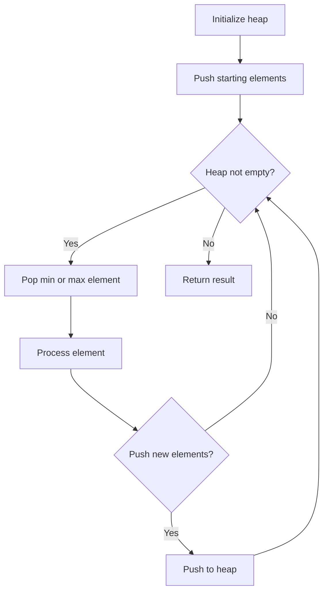
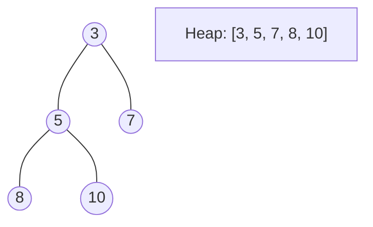
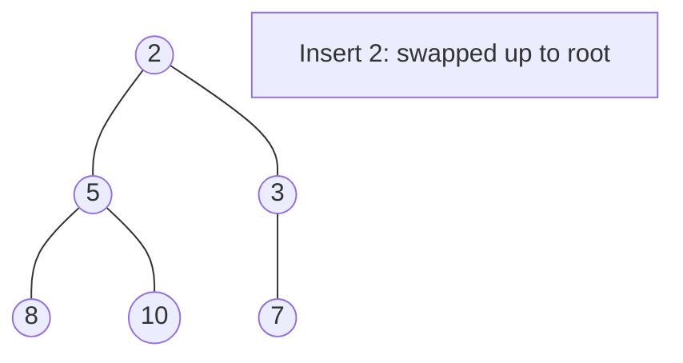
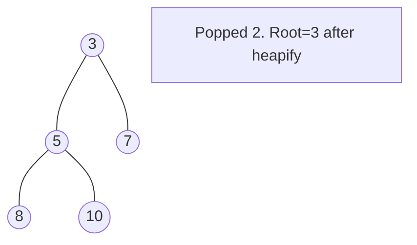

# Heap and Priority Queue

> Chapter covering 17 problems related to **Heap and Priority Queue**.


## Problems in this Chapter

| # | Problem | Difficulty | Pattern | Time | Space |
|---|---------|------------|---------|------|-------|
| 264 | [Ugly Number II](#problem-264-ugly_number_ii) | Medium | Heap / Priority Queue | O(n log n) | O(n) |
| 272 | [Closest Binary Search Tree Value II](#problem-272-closest_binary_search_tree_value_ii) | Hard | Heap / Priority Queue | O(n log n) | O(n) |
| 373 | [Find K Pairs with Smallest Sums](#problem-373-find_k_pairs_with_smallest_sums) | Medium | Heap / Priority Queue | O(n log n) | O(n) |
| 407 | [Trapping Rain Water II](#problem-407-trapping_rain_water_ii) | Hard | Heap / Priority Queue | O(n log n) | O(n) |
| 675 | [Cut Off Trees for Golf Event](#problem-675-cut_off_trees_for_golf_event) | Hard | Heap / Priority Queue | O(n log n) | O(n) |
| 1046 | [Last Stone Weight](#problem-1046-last_stone_weight) | Easy | Heap | O(n log n) | O(n) |
| 1263 | [Minimum Moves to Move a Box to Their Target Location](#problem-1263-minimum_moves_to_move_a_box_to_their_target_location) | Hard | Heap / Priority Queue | O(n log n) | O(n) |
| 1354 | [Construct Target Array With Multiple Sums](#problem-1354-construct_target_array_with_multiple_sums) | Hard | Heap / Priority Queue | O(n log n) | O(n) |
| 1606 | [Find Servers That Handled Most Number of Requests](#problem-1606-find_servers_that_handled_most_number_of_requests) | Hard | Ordered Set / SortedList | O(n log n) | O(n) |
| 1687 | [Delivering Boxes from Storage to Ports](#problem-1687-delivering_boxes_from_storage_to_ports) | Hard | Monotonic Queue / Deque | O(n) | O(k) |
| 1696 | [Jump Game VI](#problem-1696-jump_game_vi) | Medium | Monotonic Queue / Deque | O(n) | O(k) |
| 1776 | [Car Fleet II](#problem-1776-car_fleet_ii) | Hard | Monotonic Stack | O(n) | O(n) |
| 1801 | [Number of Orders in the Backlog](#problem-1801-number_of_orders_in_the_backlog) | Medium | Heap / Priority Queue | O(n log n) | O(n) |
| 1882 | [Process Tasks Using Servers](#problem-1882-process_tasks_using_servers) | Medium | Heap / Priority Queue | O(n log n) | O(n) |
| 1942 | [The Number of the Smallest Unoccupied Chair](#problem-1942-the_number_of_the_smallest_unoccupied_chair) | Medium | Heap / Priority Queue | O(n log n) | O(n) |
| 2163 | [Minimum Difference in Sums After Removal of Elements](#problem-2163-minimum_difference_in_sums_after_removal_of_elements) | Hard | Heap / Priority Queue | O(n log n) | O(n) |
| 2462 | [Total Cost to Hire K Workers](#problem-2462-total_cost_to_hire_k_workers) | Medium | Two Heaps / Greedy | O((k+c) log c) | O(c) |

---
---

# Problem 264: Ugly Number II

| Attribute | Detail |
|-----------|--------|
| **ID** | 264 |
| **Title** | Ugly Number II |
| **Difficulty** | Medium |
| **Tags** | Hash Table, Math, Dynamic Programming, Heap (Priority Queue) |
| **Link** | [leetcode.com/problems/ugly-number-ii](https://leetcode.com/problems/ugly-number-ii/) |

An **ugly number** is a positive integer whose prime factors are limited to `2`, `3`, and `5`.

Given an integer `n`, return *the* `n^th` ***ugly number***.

 

Example 1:

```

**Input:** n = 10
**Output:** 12
**Explanation:** [1, 2, 3, 4, 5, 6, 8, 9, 10, 12] is the sequence of the first 10 ugly numbers.

```

Example 2:

```

**Input:** n = 1
**Output:** 1
**Explanation:** 1 has no prime factors, therefore all of its prime factors are limited to 2, 3, and 5.

```

 

**Constraints:**

	- `1 <= n <= 1690`

---

## Approach: Heap / Priority Queue

Use a min-heap or max-heap to efficiently access the smallest/largest element. Push elements and pop the top to process in priority order.

### Pseudo-code

```
1. Initialize heap (min or max)
2. Push initial elements onto heap
3. While heap not empty and condition:
   a. Pop top element (min or max)
   b. Process element
   c. Push new elements if needed
4. Return result
```

---

## Algorithm Flow



## Visual State Transitions

**Heap Operations (Min-Heap):**

**Frame 1: Initial heap**


**Frame 2: Insert 2 - bubble up**


**Frame 3: Pop minimum (2) - heapify down**



---

## Complexity Analysis

| Metric | Value |
|--------|-------|
| **Time** | O(n log n) |
| **Space** | O(n) |

---

## Solution Code

### Python3

```python
class Solution:
    def nthUglyNumber(self, n: int) -> int:
        # Heap/Priority Queue - O(n log k) time
        import heapq
        if not n:
            return 0
        # Min heap (negate for max heap)
        heap = []
        for val in n:
            heapq.heappush(heap, val)
            if len(heap) > (n if isinstance(n, int) else len(n)):
                heapq.heappop(heap)
        return heap[0] if heap else 0
```

### C++

```cpp
#include <queue>
#include <string>
#include <vector>
using namespace std;

class Solution {
public:
    int nthUglyNumber(int n) {
        // Heap/Priority Queue - O(n log k) time
        priority_queue<int, vector<int>, greater<int>> pq;
        for (int val : n) {
            pq.push(val);
            if ((int)pq.size() > n)
                pq.pop();
        }
        return pq.empty() ? 0 : pq.top();
    }
};
```

### Summary

| Aspect | Detail |
|--------|--------|
| **Pattern** | Heap / Priority Queue |
| **Time** | O(n log n) |
| **Space** | O(n) |

---
---

# Problem 272: Closest Binary Search Tree Value II

| Attribute | Detail |
|-----------|--------|
| **ID** | 272 |
| **Title** | Closest Binary Search Tree Value II |
| **Difficulty** | Hard |
| **Tags** | Two Pointers, Stack, Tree, Depth-First Search, Binary Search Tree, Heap (Priority Queue), Binary Tree |
| **Link** | [leetcode.com/problems/closest-binary-search-tree-value-ii](https://leetcode.com/problems/closest-binary-search-tree-value-ii/) |

*(Premium problem -- description requires LeetCode subscription)*

---

## Approach: Heap / Priority Queue

Use a min-heap or max-heap to efficiently access the smallest/largest element. Push elements and pop the top to process in priority order.

### Pseudo-code

```
1. Initialize heap (min or max)
2. Push initial elements onto heap
3. While heap not empty and condition:
   a. Pop top element (min or max)
   b. Process element
   c. Push new elements if needed
4. Return result
```

---

## Algorithm Flow


## Visual State Transitions

**Heap Operations (Min-Heap):**

**Frame 1: Initial heap**


**Frame 2: Insert 2 - bubble up**


**Frame 3: Pop minimum (2) - heapify down**


---

## Complexity Analysis

| Metric | Value |
|--------|-------|
| **Time** | O(n log n) |
| **Space** | O(n) |

---

## Solution Code

### Python3

```python
class Solution:
    pass
```

### C++

```cpp
class Solution {
public:
    // Design problem stub
};
```

### Summary

| Aspect | Detail |
|--------|--------|
| **Pattern** | Heap / Priority Queue |
| **Time** | O(n log n) |
| **Space** | O(n) |

---
---

# Problem 373: Find K Pairs with Smallest Sums

| Attribute | Detail |
|-----------|--------|
| **ID** | 373 |
| **Title** | Find K Pairs with Smallest Sums |
| **Difficulty** | Medium |
| **Tags** | Array, Heap (Priority Queue) |
| **Link** | [leetcode.com/problems/find-k-pairs-with-smallest-sums](https://leetcode.com/problems/find-k-pairs-with-smallest-sums/) |

You are given two integer arrays `nums1` and `nums2` sorted in **non-decreasing order** and an integer `k`.

Define a pair `(u, v)` which consists of one element from the first array and one element from the second array.

Return *the* `k` *pairs* `(u1, v1), (u2, v2), ..., (uk, vk)` *with the smallest sums*.

 

Example 1:

```

**Input:** nums1 = [1,7,11], nums2 = [2,4,6], k = 3
**Output:** [[1,2],[1,4],[1,6]]
**Explanation:** The first 3 pairs are returned from the sequence: [1,2],[1,4],[1,6],[7,2],[7,4],[11,2],[7,6],[11,4],[11,6]

```

Example 2:

```

**Input:** nums1 = [1,1,2], nums2 = [1,2,3], k = 2
**Output:** [[1,1],[1,1]]
**Explanation:** The first 2 pairs are returned from the sequence: [1,1],[1,1],[1,2],[2,1],[1,2],[2,2],[1,3],[1,3],[2,3]

```

 

**Constraints:**

	- `1 <= nums1.length, nums2.length <= 10^5`
	- `-10^9 <= nums1[i], nums2[i] <= 10^9`
	- `nums1` and `nums2` both are sorted in **non-decreasing order**.
	- `1 <= k <= 10^4`
	- `k <= nums1.length * nums2.length`

---

## Approach: Heap / Priority Queue

Use a min-heap or max-heap to efficiently access the smallest/largest element. Push elements and pop the top to process in priority order.

### Pseudo-code

```
1. Initialize heap (min or max)
2. Push initial elements onto heap
3. While heap not empty and condition:
   a. Pop top element (min or max)
   b. Process element
   c. Push new elements if needed
4. Return result
```

---

## Algorithm Flow


## Visual State Transitions

**Heap Operations (Min-Heap):**

**Frame 1: Initial heap**


**Frame 2: Insert 2 - bubble up**


**Frame 3: Pop minimum (2) - heapify down**


---

## Complexity Analysis

| Metric | Value |
|--------|-------|
| **Time** | O(n log n) |
| **Space** | O(n) |

---

## Solution Code

### Python3

```python
class Solution:
    def kSmallestPairs(self, nums1: List[int], nums2: List[int], k: int) -> List[List[int]]:
        # Heap/Priority Queue - O(n log k) time
        import heapq
        if not nums1:
            return []
        # Min heap (negate for max heap)
        heap = []
        for val in nums1:
            heapq.heappush(heap, val)
            if len(heap) > (nums2 if isinstance(nums2, int) else len(nums1)):
                heapq.heappop(heap)
        return heap[0] if heap else []
```

### C++

```cpp
#include <queue>
#include <string>
#include <vector>
using namespace std;

class Solution {
public:
    vector<vector<int>> kSmallestPairs(vector<int>& nums1, vector<int>& nums2, int k) {
        // Heap/Priority Queue - O(n log k) time
        priority_queue<int, vector<int>, greater<int>> pq;
        for (int val : nums1) {
            pq.push(val);
            if ((int)pq.size() > nums2)
                pq.pop();
        }
        return pq.empty() ? {} : pq.top();
    }
};
```

### Summary

| Aspect | Detail |
|--------|--------|
| **Pattern** | Heap / Priority Queue |
| **Time** | O(n log n) |
| **Space** | O(n) |

---
---

# Problem 407: Trapping Rain Water II

| Attribute | Detail |
|-----------|--------|
| **ID** | 407 |
| **Title** | Trapping Rain Water II |
| **Difficulty** | Hard |
| **Tags** | Array, Breadth-First Search, Heap (Priority Queue), Matrix |
| **Link** | [leetcode.com/problems/trapping-rain-water-ii](https://leetcode.com/problems/trapping-rain-water-ii/) |

Given an `m x n` integer matrix `heightMap` representing the height of each unit cell in a 2D elevation map, return *the volume of water it can trap after raining*.

 

Example 1:

```

**Input:** heightMap = [[1,4,3,1,3,2],[3,2,1,3,2,4],[2,3,3,2,3,1]]
**Output:** 4
**Explanation:** After the rain, water is trapped between the blocks.
We have two small ponds 1 and 3 units trapped.
The total volume of water trapped is 4.

```

Example 2:

```

**Input:** heightMap = [[3,3,3,3,3],[3,2,2,2,3],[3,2,1,2,3],[3,2,2,2,3],[3,3,3,3,3]]
**Output:** 10

```

 

**Constraints:**

	- `m == heightMap.length`
	- `n == heightMap[i].length`
	- `1 <= m, n <= 200`
	- `0 <= heightMap[i][j] <= 2 * 10^4`

---

## Approach: Heap / Priority Queue

Use a min-heap or max-heap to efficiently access the smallest/largest element. Push elements and pop the top to process in priority order.

### Pseudo-code

```
1. Initialize heap (min or max)
2. Push initial elements onto heap
3. While heap not empty and condition:
   a. Pop top element (min or max)
   b. Process element
   c. Push new elements if needed
4. Return result
```

---

## Algorithm Flow


## Visual State Transitions

**Heap Operations (Min-Heap):**

**Frame 1: Initial heap**


**Frame 2: Insert 2 - bubble up**


**Frame 3: Pop minimum (2) - heapify down**


---

## Complexity Analysis

| Metric | Value |
|--------|-------|
| **Time** | O(n log n) |
| **Space** | O(n) |

---

## Solution Code

### Python3

```python
class Solution:
    def trapRainWater(self, heightMap: List[List[int]]) -> int:
        # Heap/Priority Queue - O(n log k) time
        import heapq
        if not heightMap:
            return 0
        # Min heap (negate for max heap)
        heap = []
        for val in heightMap:
            heapq.heappush(heap, val)
            if len(heap) > (heightMap if isinstance(heightMap, int) else len(heightMap)):
                heapq.heappop(heap)
        return heap[0] if heap else 0
```

### C++

```cpp
#include <queue>
#include <string>
#include <vector>
using namespace std;

class Solution {
public:
    int trapRainWater(vector<vector<int>>& heightMap) {
        // Heap/Priority Queue - O(n log k) time
        priority_queue<int, vector<int>, greater<int>> pq;
        for (int val : heightMap) {
            pq.push(val);
            if ((int)pq.size() > heightMap)
                pq.pop();
        }
        return pq.empty() ? 0 : pq.top();
    }
};
```

### Summary

| Aspect | Detail |
|--------|--------|
| **Pattern** | Heap / Priority Queue |
| **Time** | O(n log n) |
| **Space** | O(n) |

---
---

# Problem 675: Cut Off Trees for Golf Event

| Attribute | Detail |
|-----------|--------|
| **ID** | 675 |
| **Title** | Cut Off Trees for Golf Event |
| **Difficulty** | Hard |
| **Tags** | Array, Breadth-First Search, Heap (Priority Queue), Matrix |
| **Link** | [leetcode.com/problems/cut-off-trees-for-golf-event](https://leetcode.com/problems/cut-off-trees-for-golf-event/) |

You are asked to cut off all the trees in a forest for a golf event. The forest is represented as an `m x n` matrix. In this matrix:

	- `0` means the cell cannot be walked through.
	- `1` represents an empty cell that can be walked through.
	- A number greater than `1` represents a tree in a cell that can be walked through, and this number is the tree's height.

In one step, you can walk in any of the four directions: north, east, south, and west. If you are standing in a cell with a tree, you can choose whether to cut it off.

You must cut off the trees in order from shortest to tallest. When you cut off a tree, the value at its cell becomes `1` (an empty cell).

Starting from the point `(0, 0)`, return *the minimum steps you need to walk to cut off all the trees*. If you cannot cut off all the trees, return `-1`.

**Note:** The input is generated such that no two trees have the same height, and there is at least one tree needs to be cut off.

 

Example 1:

```

**Input:** forest = [[1,2,3],[0,0,4],[7,6,5]]
**Output:** 6
**Explanation:** Following the path above allows you to cut off the trees from shortest to tallest in 6 steps.

```

Example 2:

```

**Input:** forest = [[1,2,3],[0,0,0],[7,6,5]]
**Output:** -1
**Explanation:** The trees in the bottom row cannot be accessed as the middle row is blocked.

```

Example 3:

```

**Input:** forest = [[2,3,4],[0,0,5],[8,7,6]]
**Output:** 6
**Explanation:** You can follow the same path as Example 1 to cut off all the trees.
Note that you can cut off the first tree at (0, 0) before making any steps.

```

 

**Constraints:**

	- `m == forest.length`
	- `n == forest[i].length`
	- `1 <= m, n <= 50`
	- `0 <= forest[i][j] <= 10^9`
	- Heights of all trees are **distinct**.

---

## Approach: Heap / Priority Queue

Use a min-heap or max-heap to efficiently access the smallest/largest element. Push elements and pop the top to process in priority order.

### Pseudo-code

```
1. Initialize heap (min or max)
2. Push initial elements onto heap
3. While heap not empty and condition:
   a. Pop top element (min or max)
   b. Process element
   c. Push new elements if needed
4. Return result
```

---

## Algorithm Flow


## Visual State Transitions

**Heap Operations (Min-Heap):**

**Frame 1: Initial heap**


**Frame 2: Insert 2 - bubble up**


**Frame 3: Pop minimum (2) - heapify down**


---

## Complexity Analysis

| Metric | Value |
|--------|-------|
| **Time** | O(n log n) |
| **Space** | O(n) |

---

## Solution Code

### Python3

```python
class Solution:
    def cutOffTree(self, forest: List[List[int]]) -> int:
        # Heap/Priority Queue - O(n log k) time
        import heapq
        if not forest:
            return 0
        # Min heap (negate for max heap)
        heap = []
        for val in forest:
            heapq.heappush(heap, val)
            if len(heap) > (forest if isinstance(forest, int) else len(forest)):
                heapq.heappop(heap)
        return heap[0] if heap else 0
```

### C++

```cpp
#include <queue>
#include <string>
#include <vector>
using namespace std;

class Solution {
public:
    int cutOffTree(vector<vector<int>>& forest) {
        // Heap/Priority Queue - O(n log k) time
        priority_queue<int, vector<int>, greater<int>> pq;
        for (int val : forest) {
            pq.push(val);
            if ((int)pq.size() > forest)
                pq.pop();
        }
        return pq.empty() ? 0 : pq.top();
    }
};
```

### Summary

| Aspect | Detail |
|--------|--------|
| **Pattern** | Heap / Priority Queue |
| **Time** | O(n log n) |
| **Space** | O(n) |

---
---

# Problem 1046: Last Stone Weight

| Attribute | Detail |
|-----------|--------|
| **ID** | 1046 |
| **Title** | Last Stone Weight |
| **Difficulty** | Easy |
| **Tags** | Array, Heap (Priority Queue) |
| **Link** | [leetcode.com/problems/last-stone-weight](https://leetcode.com/problems/last-stone-weight/) |

You are given an array of integers `stones` where `stones[i]` is the weight of the `i^th` stone.

We are playing a game with the stones. On each turn, we choose the **heaviest two stones** and smash them together. Suppose the heaviest two stones have weights `x` and `y` with `x <= y`. The result of this smash is:

	- If `x == y`, both stones are destroyed, and
	- If `x != y`, the stone of weight `x` is destroyed, and the stone of weight `y` has new weight `y - x`.

At the end of the game, there is **at most one** stone left.

Return *the weight of the last remaining stone*. If there are no stones left, return `0`.

 

Example 1:

```

**Input:** stones = [2,7,4,1,8,1]
**Output:** 1
**Explanation:** 
We combine 7 and 8 to get 1 so the array converts to [2,4,1,1,1] then,
we combine 2 and 4 to get 2 so the array converts to [2,1,1,1] then,
we combine 2 and 1 to get 1 so the array converts to [1,1,1] then,
we combine 1 and 1 to get 0 so the array converts to [1] then that's the value of the last stone.

```

Example 2:

```

**Input:** stones = [1]
**Output:** 1

```

 

**Constraints:**

	- `1 <= stones.length <= 30`
	- `1 <= stones[i] <= 1000`

---

## Approach: Heap

Max-heap (via negation). Smash two heaviest, push difference back.

### Pseudo-code

```
1. Initialize heap (min or max)
2. Push initial elements onto heap
3. While heap not empty and condition:
   a. Pop top element (min or max)
   b. Process element
   c. Push new elements if needed
4. Return result
```

---

## Algorithm Flow

```mermaid
flowchart TD
    A[Initialize heap] --> B[Push starting elements]
    B --> C{Heap not empty?}
    C -- Yes --> D[Pop min or max element]
    D --> E[Process element]
    E --> F{Push new elements?}
    F -- Yes --> G[Push to heap]
    F -- No --> C
    G --> C
    C -- No --> H[Return result]
```

## Visual State Transitions

**Heap Operations (Min-Heap):**

**Frame 1: Initial heap**
```mermaid
graph TD
    A((3))
    A --- B((5))
    A --- C((7))
    B --- D((8))
    B --- E((10))
    S["Heap: [3, 5, 7, 8, 10]"]
```

**Frame 2: Insert 2 - bubble up**
```mermaid
graph TD
    A((2))
    A --- B((5))
    A --- C((3))
    B --- D((8))
    B --- E((10))
    C --- F((7))
    S["Insert 2: swapped up to root"]
```

**Frame 3: Pop minimum (2) - heapify down**
```mermaid
graph TD
    A((3))
    A --- B((5))
    A --- C((7))
    B --- D((8))
    B --- E((10))
    S["Popped 2. Root=3 after heapify"]
```


---

## Complexity Analysis

| Metric | Value |
|--------|-------|
| **Time** | O(n log n) |
| **Space** | O(n) |

---

## Solution Code

### Python3

```python
import heapq

class Solution:
    def lastStoneWeight(self, stones: list[int]) -> int:
        stones = [-s for s in stones]
        heapq.heapify(stones)
        while len(stones) > 1:
            a = -heapq.heappop(stones)
            b = -heapq.heappop(stones)
            if a != b:
                heapq.heappush(stones, -(a - b))
        return -stones[0] if stones else 0
```

### C++

```cpp
#include <queue>
#include <string>
#include <vector>
using namespace std;

class Solution {
public:
    int lastStoneWeight(vector<int>& stones) {
        // Heap/Priority Queue - O(n log k) time
        priority_queue<int, vector<int>, greater<int>> pq;
        for (int val : stones) {
            pq.push(val);
            if ((int)pq.size() > stones)
                pq.pop();
        }
        return pq.empty() ? 0 : pq.top();
    }
};
```

### Summary

| Aspect | Detail |
|--------|--------|
| **Pattern** | Heap |
| **Time** | O(n log n) |
| **Space** | O(n) |

---
---

# Problem 1263: Minimum Moves to Move a Box to Their Target Location

| Attribute | Detail |
|-----------|--------|
| **ID** | 1263 |
| **Title** | Minimum Moves to Move a Box to Their Target Location |
| **Difficulty** | Hard |
| **Tags** | Array, Breadth-First Search, Heap (Priority Queue), Matrix |
| **Link** | [leetcode.com/problems/minimum-moves-to-move-a-box-to-their-target-location](https://leetcode.com/problems/minimum-moves-to-move-a-box-to-their-target-location/) |

A storekeeper is a game in which the player pushes boxes around in a warehouse trying to get them to target locations.

The game is represented by an `m x n` grid of characters `grid` where each element is a wall, floor, or box.

Your task is to move the box `'B'` to the target position `'T'` under the following rules:

	- The character `'S'` represents the player. The player can move up, down, left, right in `grid` if it is a floor (empty cell).
	- The character `'.'` represents the floor which means a free cell to walk.
	- The character `'#'` represents the wall which means an obstacle (impossible to walk there).
	- There is only one box `'B'` and one target cell `'T'` in the `grid`.
	- The box can be moved to an adjacent free cell by standing next to the box and then moving in the direction of the box. This is a **push**.
	- The player cannot walk through the box.

Return *the minimum number of **pushes** to move the box to the target*. If there is no way to reach the target, return `-1`.

 

Example 1:

```

**Input:** grid = [["#","#","#","#","#","#"],
               ["#","T","#","#","#","#"],
               ["#",".",".","B",".","#"],
               ["#",".","#","#",".","#"],
               ["#",".",".",".","S","#"],
               ["#","#","#","#","#","#"]]
**Output:** 3
**Explanation:** We return only the number of times the box is pushed.
```

Example 2:

```

**Input:** grid = [["#","#","#","#","#","#"],
               ["#","T","#","#","#","#"],
               ["#",".",".","B",".","#"],
               ["#","#","#","#",".","#"],
               ["#",".",".",".","S","#"],
               ["#","#","#","#","#","#"]]
**Output:** -1

```

Example 3:

```

**Input:** grid = [["#","#","#","#","#","#"],
               ["#","T",".",".","#","#"],
               ["#",".","#","B",".","#"],
               ["#",".",".",".",".","#"],
               ["#",".",".",".","S","#"],
               ["#","#","#","#","#","#"]]
**Output:** 5
**Explanation:** push the box down, left, left, up and up.

```

 

**Constraints:**

	- `m == grid.length`
	- `n == grid[i].length`
	- `1 <= m, n <= 20`
	- `grid` contains only characters `'.'`, `'#'`, `'S'`, `'T'`, or `'B'`.
	- There is only one character `'S'`, `'B'`, and `'T'` in the `grid`.

---

## Approach: Heap / Priority Queue

Use a min-heap or max-heap to efficiently access the smallest/largest element. Push elements and pop the top to process in priority order.

### Pseudo-code

```
1. Initialize heap (min or max)
2. Push initial elements onto heap
3. While heap not empty and condition:
   a. Pop top element (min or max)
   b. Process element
   c. Push new elements if needed
4. Return result
```

---

## Algorithm Flow

```mermaid
flowchart TD
    A[Initialize heap] --> B[Push starting elements]
    B --> C{Heap not empty?}
    C -- Yes --> D[Pop min or max element]
    D --> E[Process element]
    E --> F{Push new elements?}
    F -- Yes --> G[Push to heap]
    F -- No --> C
    G --> C
    C -- No --> H[Return result]
```

## Visual State Transitions

**Heap Operations (Min-Heap):**

**Frame 1: Initial heap**
```mermaid
graph TD
    A((3))
    A --- B((5))
    A --- C((7))
    B --- D((8))
    B --- E((10))
    S["Heap: [3, 5, 7, 8, 10]"]
```

**Frame 2: Insert 2 - bubble up**
```mermaid
graph TD
    A((2))
    A --- B((5))
    A --- C((3))
    B --- D((8))
    B --- E((10))
    C --- F((7))
    S["Insert 2: swapped up to root"]
```

**Frame 3: Pop minimum (2) - heapify down**
```mermaid
graph TD
    A((3))
    A --- B((5))
    A --- C((7))
    B --- D((8))
    B --- E((10))
    S["Popped 2. Root=3 after heapify"]
```


---

## Complexity Analysis

| Metric | Value |
|--------|-------|
| **Time** | O(n log n) |
| **Space** | O(n) |

---

## Solution Code

### Python3

```python
class Solution:
    def minPushBox(self, grid: List[List[str]]) -> int:
        # Heap/Priority Queue - O(n log k) time
        import heapq
        if not grid:
            return 0
        # Min heap (negate for max heap)
        heap = []
        for val in grid:
            heapq.heappush(heap, val)
            if len(heap) > (grid if isinstance(grid, int) else len(grid)):
                heapq.heappop(heap)
        return heap[0] if heap else 0
```

### C++

```cpp
#include <queue>
#include <string>
#include <vector>
using namespace std;

class Solution {
public:
    int minPushBox(vector<vector<string>>& grid) {
        // Heap/Priority Queue - O(n log k) time
        priority_queue<int, vector<int>, greater<int>> pq;
        for (int val : grid) {
            pq.push(val);
            if ((int)pq.size() > grid)
                pq.pop();
        }
        return pq.empty() ? 0 : pq.top();
    }
};
```

### Summary

| Aspect | Detail |
|--------|--------|
| **Pattern** | Heap / Priority Queue |
| **Time** | O(n log n) |
| **Space** | O(n) |

---
---

# Problem 1354: Construct Target Array With Multiple Sums

| Attribute | Detail |
|-----------|--------|
| **ID** | 1354 |
| **Title** | Construct Target Array With Multiple Sums |
| **Difficulty** | Hard |
| **Tags** | Array, Heap (Priority Queue) |
| **Link** | [leetcode.com/problems/construct-target-array-with-multiple-sums](https://leetcode.com/problems/construct-target-array-with-multiple-sums/) |

You are given an array `target` of n integers. From a starting array `arr` consisting of `n` 1's, you may perform the following procedure :

	- let `x` be the sum of all elements currently in your array.
	- choose index `i`, such that `0 <= i < n` and set the value of `arr` at index `i` to `x`.
	- You may repeat this procedure as many times as needed.

Return `true` *if it is possible to construct the* `target` *array from* `arr`*, otherwise, return* `false`.

 

Example 1:

```

**Input:** target = [9,3,5]
**Output:** true
**Explanation:** Start with arr = [1, 1, 1] 
[1, 1, 1], sum = 3 choose index 1
[1, 3, 1], sum = 5 choose index 2
[1, 3, 5], sum = 9 choose index 0
[9, 3, 5] Done

```

Example 2:

```

**Input:** target = [1,1,1,2]
**Output:** false
**Explanation:** Impossible to create target array from [1,1,1,1].

```

Example 3:

```

**Input:** target = [8,5]
**Output:** true

```

 

**Constraints:**

	- `n == target.length`
	- `1 <= n <= 5 * 10^4`
	- `1 <= target[i] <= 10^9`

---

## Approach: Heap / Priority Queue

Use a min-heap or max-heap to efficiently access the smallest/largest element. Push elements and pop the top to process in priority order.

### Pseudo-code

```
1. Initialize heap (min or max)
2. Push initial elements onto heap
3. While heap not empty and condition:
   a. Pop top element (min or max)
   b. Process element
   c. Push new elements if needed
4. Return result
```

---

## Algorithm Flow

```mermaid
flowchart TD
    A[Initialize heap] --> B[Push starting elements]
    B --> C{Heap not empty?}
    C -- Yes --> D[Pop min or max element]
    D --> E[Process element]
    E --> F{Push new elements?}
    F -- Yes --> G[Push to heap]
    F -- No --> C
    G --> C
    C -- No --> H[Return result]
```

## Visual State Transitions

**Heap Operations (Min-Heap):**

**Frame 1: Initial heap**
```mermaid
graph TD
    A((3))
    A --- B((5))
    A --- C((7))
    B --- D((8))
    B --- E((10))
    S["Heap: [3, 5, 7, 8, 10]"]
```

**Frame 2: Insert 2 - bubble up**
```mermaid
graph TD
    A((2))
    A --- B((5))
    A --- C((3))
    B --- D((8))
    B --- E((10))
    C --- F((7))
    S["Insert 2: swapped up to root"]
```

**Frame 3: Pop minimum (2) - heapify down**
```mermaid
graph TD
    A((3))
    A --- B((5))
    A --- C((7))
    B --- D((8))
    B --- E((10))
    S["Popped 2. Root=3 after heapify"]
```


---

## Complexity Analysis

| Metric | Value |
|--------|-------|
| **Time** | O(n log n) |
| **Space** | O(n) |

---

## Solution Code

### Python3

```python
class Solution:
    def isPossible(self, target: List[int]) -> bool:
        # Heap/Priority Queue - O(n log k) time
        import heapq
        if not target:
            return False
        # Min heap (negate for max heap)
        heap = []
        for val in target:
            heapq.heappush(heap, val)
            if len(heap) > (target if isinstance(target, int) else len(target)):
                heapq.heappop(heap)
        return heap[0] if heap else False
```

### C++

```cpp
#include <queue>
#include <string>
#include <vector>
using namespace std;

class Solution {
public:
    bool isPossible(vector<int>& target) {
        // Heap/Priority Queue - O(n log k) time
        priority_queue<int, vector<int>, greater<int>> pq;
        for (int val : target) {
            pq.push(val);
            if ((int)pq.size() > target)
                pq.pop();
        }
        return pq.empty() ? false : pq.top();
    }
};
```

### Summary

| Aspect | Detail |
|--------|--------|
| **Pattern** | Heap / Priority Queue |
| **Time** | O(n log n) |
| **Space** | O(n) |

---
---

# Problem 1606: Find Servers That Handled Most Number of Requests

| Attribute | Detail |
|-----------|--------|
| **ID** | 1606 |
| **Title** | Find Servers That Handled Most Number of Requests |
| **Difficulty** | Hard |
| **Tags** | Array, Heap (Priority Queue), Simulation, Ordered Set |
| **Link** | [leetcode.com/problems/find-servers-that-handled-most-number-of-requests](https://leetcode.com/problems/find-servers-that-handled-most-number-of-requests/) |

You have `k` servers numbered from `0` to `k-1` that are being used to handle multiple requests simultaneously. Each server has infinite computational capacity but **cannot handle more than one request at a time**. The requests are assigned to servers according to a specific algorithm:

	- The `i^th` (0-indexed) request arrives.
	- If all servers are busy, the request is dropped (not handled at all).
	- If the `(i % k)^th` server is available, assign the request to that server.
	- Otherwise, assign the request to the next available server (wrapping around the list of servers and starting from 0 if necessary). For example, if the `i^th` server is busy, try to assign the request to the `(i+1)^th` server, then the `(i+2)^th` server, and so on.

You are given a **strictly increasing** array `arrival` of positive integers, where `arrival[i]` represents the arrival time of the `i^th` request, and another array `load`, where `load[i]` represents the load of the `i^th` request (the time it takes to complete). Your goal is to find the **busiest server(s)**. A server is considered **busiest** if it handled the most number of requests successfully among all the servers.

Return *a list containing the IDs (0-indexed) of the **busiest server(s)***. You may return the IDs in any order.

 

Example 1:

```

**Input:** k = 3, arrival = [1,2,3,4,5], load = [5,2,3,3,3] 
**Output:** [1] 
**Explanation:** 
All of the servers start out available.
The first 3 requests are handled by the first 3 servers in order.
Request 3 comes in. Server 0 is busy, so it's assigned to the next available server, which is 1.
Request 4 comes in. It cannot be handled since all servers are busy, so it is dropped.
Servers 0 and 2 handled one request each, while server 1 handled two requests. Hence server 1 is the busiest server.

```

Example 2:

```

**Input:** k = 3, arrival = [1,2,3,4], load = [1,2,1,2]
**Output:** [0]
**Explanation:** 
The first 3 requests are handled by first 3 servers.
Request 3 comes in. It is handled by server 0 since the server is available.
Server 0 handled two requests, while servers 1 and 2 handled one request each. Hence server 0 is the busiest server.

```

Example 3:

```

**Input:** k = 3, arrival = [1,2,3], load = [10,12,11]
**Output:** [0,1,2]
**Explanation:** Each server handles a single request, so they are all considered the busiest.

```

 

**Constraints:**

	- `1 <= k <= 10^5`
	- `1 <= arrival.length, load.length <= 10^5`
	- `arrival.length == load.length`
	- `1 <= arrival[i], load[i] <= 10^9`
	- `arrival` is **strictly increasing**.

---

## Approach: Ordered Set / SortedList

Maintain elements in sorted order for efficient insertion, deletion, and rank queries. Use balanced BST, skip list, or sorted container.

### Pseudo-code

```
1. Initialize sorted container
2. For each operation:
   - Insert: add element in sorted position O(log n)
   - Delete: remove element O(log n)
   - Query: find kth element, count, or range O(log n)
3. Return results
```

---

## Algorithm Flow

```mermaid
flowchart TD
    A[Initialize sorted container] --> B{Operation?}
    B -- Insert --> C[Add in sorted position]
    B -- Delete --> D[Remove element]
    B -- Query --> E[Find by rank or range]
    C --> F[Container stays sorted]
    D --> F
    E --> G[Return query result]
```

---

## Complexity Analysis

| Metric | Value |
|--------|-------|
| **Time** | O(n log n) |
| **Space** | O(n) |

---

## Solution Code

### Python3

```python
class Solution:
    def busiestServers(self, k: int, arrival: List[int], load: List[int]) -> List[int]:
        # Ordered set / SortedList - O(n log n) time
        from sortedcontainers import SortedList
        sl = SortedList()
        result = 0
        for val in k:
            pos = sl.bisect_left(val)
            if pos < len(sl):
                result = max(result, sl[pos] - val)
            sl.add(val)
        return result
```

### C++

```cpp
#include <algorithm>
#include <set>
#include <string>
#include <vector>
using namespace std;

class Solution {
public:
    vector<int> busiestServers(int k, vector<int>& arrival, vector<int>& load) {
        // Ordered set - O(n log n) time
        set<int> ordered;
        int result = 0;
        for (int val : k) {
            auto it = ordered.lower_bound(val);
            if (it != ordered.end()) {
                result = max(result, *it - val);
            }
            ordered.insert(val);
        }
        return result;
    }
};
```

### Summary

| Aspect | Detail |
|--------|--------|
| **Pattern** | Ordered Set / SortedList |
| **Time** | O(n log n) |
| **Space** | O(n) |

---
---

# Problem 1687: Delivering Boxes from Storage to Ports

| Attribute | Detail |
|-----------|--------|
| **ID** | 1687 |
| **Title** | Delivering Boxes from Storage to Ports |
| **Difficulty** | Hard |
| **Tags** | Array, Dynamic Programming, Segment Tree, Queue, Heap (Priority Queue), Prefix Sum, Monotonic Queue |
| **Link** | [leetcode.com/problems/delivering-boxes-from-storage-to-ports](https://leetcode.com/problems/delivering-boxes-from-storage-to-ports/) |

You have the task of delivering some boxes from storage to their ports using only one ship. However, this ship has a **limit** on the **number of boxes** and the **total weight** that it can carry.

You are given an array `boxes`, where `boxes[i] = [ports​​i​, weighti]`, and three integers `portsCount`, `maxBoxes`, and `maxWeight`.

	- `ports​​i` is the port where you need to deliver the `i^th` box and `weightsi` is the weight of the `i^th` box.
	- `portsCount` is the number of ports.
	- `maxBoxes` and `maxWeight` are the respective box and weight limits of the ship.

The boxes need to be delivered **in the order they are given**. The ship will follow these steps:

	- The ship will take some number of boxes from the `boxes` queue, not violating the `maxBoxes` and `maxWeight` constraints.
	- For each loaded box **in order**, the ship will make a **trip** to the port the box needs to be delivered to and deliver it. If the ship is already at the correct port, no **trip** is needed, and the box can immediately be delivered.
	- The ship then makes a return **trip** to storage to take more boxes from the queue.

The ship must end at storage after all the boxes have been delivered.

Return *the **minimum** number of **trips** the ship needs to make to deliver all boxes to their respective ports.*

 

Example 1:

```

**Input:** boxes = [[1,1],[2,1],[1,1]], portsCount = 2, maxBoxes = 3, maxWeight = 3
**Output:** 4
**Explanation:** The optimal strategy is as follows: 
- The ship takes all the boxes in the queue, goes to port 1, then port 2, then port 1 again, then returns to storage. 4 trips.
So the total number of trips is 4.
Note that the first and third boxes cannot be delivered together because the boxes need to be delivered in order (i.e. the second box needs to be delivered at port 2 before the third box).

```

Example 2:

```

**Input:** boxes = [[1,2],[3,3],[3,1],[3,1],[2,4]], portsCount = 3, maxBoxes = 3, maxWeight = 6
**Output:** 6
**Explanation:** The optimal strategy is as follows: 
- The ship takes the first box, goes to port 1, then returns to storage. 2 trips.
- The ship takes the second, third and fourth boxes, goes to port 3, then returns to storage. 2 trips.
- The ship takes the fifth box, goes to port 2, then returns to storage. 2 trips.
So the total number of trips is 2 + 2 + 2 = 6.

```

Example 3:

```

**Input:** boxes = [[1,4],[1,2],[2,1],[2,1],[3,2],[3,4]], portsCount = 3, maxBoxes = 6, maxWeight = 7
**Output:** 6
**Explanation:** The optimal strategy is as follows:
- The ship takes the first and second boxes, goes to port 1, then returns to storage. 2 trips.
- The ship takes the third and fourth boxes, goes to port 2, then returns to storage. 2 trips.
- The ship takes the fifth and sixth boxes, goes to port 3, then returns to storage. 2 trips.
So the total number of trips is 2 + 2 + 2 = 6.

```

 

**Constraints:**

	- `1 <= boxes.length <= 10^5`
	- `1 <= portsCount, maxBoxes, maxWeight <= 10^5`
	- `1 <= ports​​i <= portsCount`
	- `1 <= weightsi <= maxWeight`

---

## Approach: Monotonic Queue / Deque

Use a deque to maintain a monotonic window of elements. Remove from the back to maintain order, remove from the front when elements leave the window.

### Pseudo-code

```
1. Initialize deque
2. For each element:
   a. Remove from back while deque back <= current
   b. Add current to back
   c. Remove from front if outside window
   d. Front of deque is the window max/min
3. Return results
```

---

## Algorithm Flow

```mermaid
flowchart TD
    A[Initialize deque] --> B[For each element i]
    B --> C[Remove from back while back <= arr_i]
    C --> D[Push i to back]
    D --> E[Remove front if outside window]
    E --> F["Window max/min = deque front"]
    F --> G{More elements?}
    G -- Yes --> B
    G -- No --> H[Return results]
```

---

## Complexity Analysis

| Metric | Value |
|--------|-------|
| **Time** | O(n) |
| **Space** | O(k) |

---

## Solution Code

### Python3

```python
class Solution:
    def boxDelivering(self, boxes: List[List[int]], portsCount: int, maxBoxes: int, maxWeight: int) -> int:
        # Monotonic deque - O(n) time
        from collections import deque
        dq = deque()  # store indices
        result = []
        k = portsCount if isinstance(portsCount, int) else 1
        for i in range(len(boxes)):
            while dq and dq[0] < i - k + 1:
                dq.popleft()
            while dq and boxes[dq[-1]] < boxes[i]:
                dq.pop()
            dq.append(i)
            if i >= k - 1:
                result.append(boxes[dq[0]])
        return result
```

### C++

```cpp
#include <deque>
#include <string>
#include <vector>
using namespace std;

class Solution {
public:
    int boxDelivering(vector<vector<int>>& boxes, int portsCount, int maxBoxes, int maxWeight) {
        // Monotonic deque - O(n) time
        deque<int> dq;
        vector<int> result;
        int k = portsCount;
        for (int i = 0; i < (int)boxes.size(); i++) {
            while (!dq.empty() && dq.front() < i - k + 1)
                dq.pop_front();
            while (!dq.empty() && boxes[dq.back()] < boxes[i])
                dq.pop_back();
            dq.push_back(i);
            if (i >= k - 1)
                result.push_back(boxes[dq.front()]);
        }
        return result;
    }
};
```

### Summary

| Aspect | Detail |
|--------|--------|
| **Pattern** | Monotonic Queue / Deque |
| **Time** | O(n) |
| **Space** | O(k) |

---
---

# Problem 1696: Jump Game VI

| Attribute | Detail |
|-----------|--------|
| **ID** | 1696 |
| **Title** | Jump Game VI |
| **Difficulty** | Medium |
| **Tags** | Array, Dynamic Programming, Queue, Heap (Priority Queue), Monotonic Queue |
| **Link** | [leetcode.com/problems/jump-game-vi](https://leetcode.com/problems/jump-game-vi/) |

You are given a **0-indexed** integer array `nums` and an integer `k`.

You are initially standing at index `0`. In one move, you can jump at most `k` steps forward without going outside the boundaries of the array. That is, you can jump from index `i` to any index in the range `[i + 1, min(n - 1, i + k)]` **inclusive**.

You want to reach the last index of the array (index `n - 1`). Your **score** is the **sum** of all `nums[j]` for each index `j` you visited in the array.

Return *the **maximum score** you can get*.

 

Example 1:

```

**Input:** nums = [1,-1,-2,4,-7,3], k = 2
**Output:** 7
**Explanation:** You can choose your jumps forming the subsequence [1,-1,4,3] (underlined above). The sum is 7.

```

Example 2:

```

**Input:** nums = [10,-5,-2,4,0,3], k = 3
**Output:** 17
**Explanation:** You can choose your jumps forming the subsequence [10,4,3] (underlined above). The sum is 17.

```

Example 3:

```

**Input:** nums = [1,-5,-20,4,-1,3,-6,-3], k = 2
**Output:** 0

```

 

**Constraints:**

	- `1 <= nums.length, k <= 10^5`
	- `-10^4 <= nums[i] <= 10^4`

---

## Approach: Monotonic Queue / Deque

Use a deque to maintain a monotonic window of elements. Remove from the back to maintain order, remove from the front when elements leave the window.

### Pseudo-code

```
1. Initialize deque
2. For each element:
   a. Remove from back while deque back <= current
   b. Add current to back
   c. Remove from front if outside window
   d. Front of deque is the window max/min
3. Return results
```

---

## Algorithm Flow

```mermaid
flowchart TD
    A[Initialize deque] --> B[For each element i]
    B --> C[Remove from back while back <= arr_i]
    C --> D[Push i to back]
    D --> E[Remove front if outside window]
    E --> F["Window max/min = deque front"]
    F --> G{More elements?}
    G -- Yes --> B
    G -- No --> H[Return results]
```

---

## Complexity Analysis

| Metric | Value |
|--------|-------|
| **Time** | O(n) |
| **Space** | O(k) |

---

## Solution Code

### Python3

```python
class Solution:
    def maxResult(self, nums: List[int], k: int) -> int:
        # Monotonic deque - O(n) time
        from collections import deque
        dq = deque()  # store indices
        result = []
        k = k if isinstance(k, int) else 1
        for i in range(len(nums)):
            while dq and dq[0] < i - k + 1:
                dq.popleft()
            while dq and nums[dq[-1]] < nums[i]:
                dq.pop()
            dq.append(i)
            if i >= k - 1:
                result.append(nums[dq[0]])
        return result
```

### C++

```cpp
#include <deque>
#include <string>
#include <vector>
using namespace std;

class Solution {
public:
    int maxResult(vector<int>& nums, int k) {
        // Monotonic deque - O(n) time
        deque<int> dq;
        vector<int> result;
        int k = k;
        for (int i = 0; i < (int)nums.size(); i++) {
            while (!dq.empty() && dq.front() < i - k + 1)
                dq.pop_front();
            while (!dq.empty() && nums[dq.back()] < nums[i])
                dq.pop_back();
            dq.push_back(i);
            if (i >= k - 1)
                result.push_back(nums[dq.front()]);
        }
        return result;
    }
};
```

### Summary

| Aspect | Detail |
|--------|--------|
| **Pattern** | Monotonic Queue / Deque |
| **Time** | O(n) |
| **Space** | O(k) |

---
---

# Problem 1776: Car Fleet II

| Attribute | Detail |
|-----------|--------|
| **ID** | 1776 |
| **Title** | Car Fleet II |
| **Difficulty** | Hard |
| **Tags** | Array, Math, Stack, Heap (Priority Queue), Monotonic Stack |
| **Link** | [leetcode.com/problems/car-fleet-ii](https://leetcode.com/problems/car-fleet-ii/) |

There are `n` cars traveling at different speeds in the same direction along a one-lane road. You are given an array `cars` of length `n`, where `cars[i] = [positioni, speedi]` represents:

	- `positioni` is the distance between the `i^th` car and the beginning of the road in meters. It is guaranteed that `positioni < positioni+1`.
	- `speedi` is the initial speed of the `i^th` car in meters per second.

For simplicity, cars can be considered as points moving along the number line. Two cars collide when they occupy the same position. Once a car collides with another car, they unite and form a single car fleet. The cars in the formed fleet will have the same position and the same speed, which is the initial speed of the **slowest** car in the fleet.

Return an array `answer`, where `answer[i]` is the time, in seconds, at which the `i^th` car collides with the next car, or `-1` if the car does not collide with the next car. Answers within `10^-5` of the actual answers are accepted.

 

Example 1:

```

**Input:** cars = [[1,2],[2,1],[4,3],[7,2]]
**Output:** [1.00000,-1.00000,3.00000,-1.00000]
**Explanation:** After exactly one second, the first car will collide with the second car, and form a car fleet with speed 1 m/s. After exactly 3 seconds, the third car will collide with the fourth car, and form a car fleet with speed 2 m/s.

```

Example 2:

```

**Input:** cars = [[3,4],[5,4],[6,3],[9,1]]
**Output:** [2.00000,1.00000,1.50000,-1.00000]

```

 

**Constraints:**

	- `1 <= cars.length <= 10^5`
	- `1 <= positioni, speedi <= 10^6`
	- `positioni < positioni+1`

---

## Approach: Monotonic Stack

Maintain a stack where elements are always in monotonic order (increasing or decreasing). When a new element violates the monotonic property, pop elements and compute results (e.g., next greater/smaller element, spans, areas).

### Pseudo-code

```
1. Initialize empty stack, result array
2. For each element (index i):
   a. While stack not empty and arr[i] breaks monotonic order:
      - Pop index j from stack
      - result[j] = compute(i, j)
   b. Push i onto stack
3. Handle remaining elements in stack
4. Return result
```

---

## Algorithm Flow

```mermaid
flowchart TD
    A[Stack = empty, result = default] --> B[For each element at index i]
    B --> C{Stack top violates monotonic order?}
    C -- Yes --> D[Pop index j from stack]
    D --> E["result[j] = f(i, j)"]
    E --> C
    C -- No --> F[Push i onto stack]
    F --> G{More elements?}
    G -- Yes --> B
    G -- No --> H[Handle remaining stack items]
    H --> I[Return result]
```

## Visual State Transitions

**Monotonic Stack (Next Greater Element):**

**Frame 1: Process first elements**
```mermaid
graph LR
    subgraph Array
        A0["4"] --- A1["2"] --- A2["1"] --- A3["3"] --- A4["5"]
    end
    S["Stack: [4]  Result: [-,-,-,-,-]"]
```

**Frame 2: Push smaller elements**
```mermaid
graph LR
    subgraph Array
        A0["4"] --- A1["2"] --- A2["1"] --- A3["3"] --- A4["5"]
    end
    S["Stack: [4,2,1]  Result: [-,-,-,-,-]"]
```

**Frame 3: Element 3 pops 1 and 2**
```mermaid
graph LR
    subgraph Array
        A0["4"] --- A1["2"] --- A2["1"] --- A3["3"] --- A4["5"]
    end
    S["Pop 1->NGE=3, Pop 2->NGE=3"]
    R["Stack: [4,3]  Result: [-,3,3,-,-]"]
```

**Frame 4: Element 5 pops all**
```mermaid
graph LR
    subgraph Array
        A0["4"] --- A1["2"] --- A2["1"] --- A3["3"] --- A4["5"]
    end
    S["Pop 3->NGE=5, Pop 4->NGE=5"]
    R["Stack: [5]  Result: [5,3,3,5,-]"]
```


---

## Complexity Analysis

| Metric | Value |
|--------|-------|
| **Time** | O(n) |
| **Space** | O(n) |

---

## Solution Code

### Python3

```python
class Solution:
    def getCollisionTimes(self, cars: List[List[int]]) -> List[float]:
        # Monotonic stack - O(n) time, O(n) space
        n = len(cars)
        result = [0] * n
        stack = []  # indices
        for i in range(n):
            while stack and cars[i] > cars[stack[-1]]:
                idx = stack.pop()
                result[idx] = i - idx
            stack.append(i)
        return result
```

### C++

```cpp
#include <stack>
#include <string>
#include <vector>
using namespace std;

class Solution {
public:
    vector<double> getCollisionTimes(vector<vector<int>>& cars) {
        // Monotonic stack - O(n) time, O(n) space
        int n = cars.size();
        vector<int> result(n, 0);
        stack<int> st;
        for (int i = 0; i < n; i++) {
            while (!st.empty() && cars[i] > cars[st.top()]) {
                int idx = st.top(); st.pop();
                result[idx] = i - idx;
            }
            st.push(i);
        }
        return result;
    }
};
```

### Summary

| Aspect | Detail |
|--------|--------|
| **Pattern** | Monotonic Stack |
| **Time** | O(n) |
| **Space** | O(n) |

---
---

# Problem 1801: Number of Orders in the Backlog

| Attribute | Detail |
|-----------|--------|
| **ID** | 1801 |
| **Title** | Number of Orders in the Backlog |
| **Difficulty** | Medium |
| **Tags** | Array, Heap (Priority Queue), Simulation |
| **Link** | [leetcode.com/problems/number-of-orders-in-the-backlog](https://leetcode.com/problems/number-of-orders-in-the-backlog/) |

You are given a 2D integer array `orders`, where each `orders[i] = [pricei, amounti, orderTypei]` denotes that `amounti` orders have been placed of type `orderTypei` at the price `pricei`. The `orderTypei` is:


	- `0` if it is a batch of `buy` orders, or
	- `1` if it is a batch of `sell` orders.


Note that `orders[i]` represents a batch of `amounti` independent orders with the same price and order type. All orders represented by `orders[i]` will be placed before all orders represented by `orders[i+1]` for all valid `i`.


There is a **backlog** that consists of orders that have not been executed. The backlog is initially empty. When an order is placed, the following happens:


	- If the order is a `buy` order, you look at the `sell` order with the **smallest** price in the backlog. If that `sell` order's price is **smaller than or equal to** the current `buy` order's price, they will match and be executed, and that `sell` order will be removed from the backlog. Else, the `buy` order is added to the backlog.
	- Vice versa, if the order is a `sell` order, you look at the `buy` order with the **largest** price in the backlog. If that `buy` order's price is **larger than or equal to** the current `sell` order's price, they will match and be executed, and that `buy` order will be removed from the backlog. Else, the `sell` order is added to the backlog.


Return *the total **amount** of orders in the backlog after placing all the orders from the input*. Since this number can be large, return it **modulo** `10^9 + 7`.


 

Example 1:


```

**Input:** orders = [[10,5,0],[15,2,1],[25,1,1],[30,4,0]]
**Output:** 6
**Explanation:** Here is what happens with the orders:
- 5 orders of type buy with price 10 are placed. There are no sell orders, so the 5 orders are added to the backlog.
- 2 orders of type sell with price 15 are placed. There are no buy orders with prices larger than or equal to 15, so the 2 orders are added to the backlog.
- 1 order of type sell with price 25 is placed. There are no buy orders with prices larger than or equal to 25 in the backlog, so this order is added to the backlog.
- 4 orders of type buy with price 30 are placed. The first 2 orders are matched with the 2 sell orders of the least price, which is 15 and these 2 sell orders are removed from the backlog. The 3rd order is matched with the sell order of the least price, which is 25 and this sell order is removed from the backlog. Then, there are no more sell orders in the backlog, so the 4th order is added to the backlog.
Finally, the backlog has 5 buy orders with price 10, and 1 buy order with price 30. So the total number of orders in the backlog is 6.

```


Example 2:


```

**Input:** orders = [[7,1000000000,1],[15,3,0],[5,999999995,0],[5,1,1]]
**Output:** 999999984
**Explanation:** Here is what happens with the orders:
- 109 orders of type sell with price 7 are placed. There are no buy orders, so the 109 orders are added to the backlog.
- 3 orders of type buy with price 15 are placed. They are matched with the 3 sell orders with the least price which is 7, and those 3 sell orders are removed from the backlog.
- 999999995 orders of type buy with price 5 are placed. The least price of a sell order is 7, so the 999999995 orders are added to the backlog.
- 1 order of type sell with price 5 is placed. It is matched with the buy order of the highest price, which is 5, and that buy order is removed from the backlog.
Finally, the backlog has (1000000000-3) sell orders with price 7, and (999999995-1) buy orders with price 5. So the total number of orders = 1999999991, which is equal to 999999984 % (109 + 7).

```


 

**Constraints:**


	- `1 <= orders.length <= 10^5`
	- `orders[i].length == 3`
	- `1 <= pricei, amounti <= 10^9`
	- `orderTypei` is either `0` or `1`.

---

## Approach: Heap / Priority Queue

Use a min-heap or max-heap to efficiently access the smallest/largest element. Push elements and pop the top to process in priority order.

### Pseudo-code

```
1. Initialize heap (min or max)
2. Push initial elements onto heap
3. While heap not empty and condition:
   a. Pop top element (min or max)
   b. Process element
   c. Push new elements if needed
4. Return result
```

---

## Algorithm Flow

```mermaid
flowchart TD
    A[Initialize heap] --> B[Push starting elements]
    B --> C{Heap not empty?}
    C -- Yes --> D[Pop min or max element]
    D --> E[Process element]
    E --> F{Push new elements?}
    F -- Yes --> G[Push to heap]
    F -- No --> C
    G --> C
    C -- No --> H[Return result]
```

## Visual State Transitions

**Heap Operations (Min-Heap):**

**Frame 1: Initial heap**
```mermaid
graph TD
    A((3))
    A --- B((5))
    A --- C((7))
    B --- D((8))
    B --- E((10))
    S["Heap: [3, 5, 7, 8, 10]"]
```

**Frame 2: Insert 2 - bubble up**
```mermaid
graph TD
    A((2))
    A --- B((5))
    A --- C((3))
    B --- D((8))
    B --- E((10))
    C --- F((7))
    S["Insert 2: swapped up to root"]
```

**Frame 3: Pop minimum (2) - heapify down**
```mermaid
graph TD
    A((3))
    A --- B((5))
    A --- C((7))
    B --- D((8))
    B --- E((10))
    S["Popped 2. Root=3 after heapify"]
```


---

## Complexity Analysis

| Metric | Value |
|--------|-------|
| **Time** | O(n log n) |
| **Space** | O(n) |

---

## Solution Code

### Python3

```python
class Solution:
    def getNumberOfBacklogOrders(self, orders: List[List[int]]) -> int:
        # Heap/Priority Queue - O(n log k) time
        import heapq
        if not orders:
            return 0
        # Min heap (negate for max heap)
        heap = []
        for val in orders:
            heapq.heappush(heap, val)
            if len(heap) > (orders if isinstance(orders, int) else len(orders)):
                heapq.heappop(heap)
        return heap[0] if heap else 0
```

### C++

```cpp
#include <queue>
#include <string>
#include <vector>
using namespace std;

class Solution {
public:
    int getNumberOfBacklogOrders(vector<vector<int>>& orders) {
        // Heap/Priority Queue - O(n log k) time
        priority_queue<int, vector<int>, greater<int>> pq;
        for (int val : orders) {
            pq.push(val);
            if ((int)pq.size() > orders)
                pq.pop();
        }
        return pq.empty() ? 0 : pq.top();
    }
};
```

### Summary

| Aspect | Detail |
|--------|--------|
| **Pattern** | Heap / Priority Queue |
| **Time** | O(n log n) |
| **Space** | O(n) |

---
---

# Problem 1882: Process Tasks Using Servers

| Attribute | Detail |
|-----------|--------|
| **ID** | 1882 |
| **Title** | Process Tasks Using Servers |
| **Difficulty** | Medium |
| **Tags** | Array, Heap (Priority Queue) |
| **Link** | [leetcode.com/problems/process-tasks-using-servers](https://leetcode.com/problems/process-tasks-using-servers/) |

You are given two **0-indexed** integer arrays `servers` and `tasks` of lengths `n`​​​​​​ and `m`​​​​​​ respectively. `servers[i]` is the **weight** of the `i^​​​​​​th`​​​​ server, and `tasks[j]` is the **time needed** to process the `j^​​​​​​th`​​​​ task **in seconds**.

Tasks are assigned to the servers using a **task queue**. Initially, all servers are free, and the queue is **empty**.

At second `j`, the `j^th` task is **inserted** into the queue (starting with the `0^th` task being inserted at second `0`). As long as there are free servers and the queue is not empty, the task in the front of the queue will be assigned to a free server with the **smallest weight**, and in case of a tie, it is assigned to a free server with the **smallest index**.

If there are no free servers and the queue is not empty, we wait until a server becomes free and immediately assign the next task. If multiple servers become free at the same time, then multiple tasks from the queue will be assigned **in order of insertion** following the weight and index priorities above.

A server that is assigned task `j` at second `t` will be free again at second `t + tasks[j]`.

Build an array `ans`​​​​ of length `m`, where `ans[j]` is the **index** of the server the `j^​​​​​​th` task will be assigned to.

Return *the array *`ans`​​​​.

 

Example 1:

```

**Input:** servers = [3,3,2], tasks = [1,2,3,2,1,2]
**Output:** [2,2,0,2,1,2]
**Explanation: **Events in chronological order go as follows:
- At second 0, task 0 is added and processed using server 2 until second 1.
- At second 1, server 2 becomes free. Task 1 is added and processed using server 2 until second 3.
- At second 2, task 2 is added and processed using server 0 until second 5.
- At second 3, server 2 becomes free. Task 3 is added and processed using server 2 until second 5.
- At second 4, task 4 is added and processed using server 1 until second 5.
- At second 5, all servers become free. Task 5 is added and processed using server 2 until second 7.
```

Example 2:

```

**Input:** servers = [5,1,4,3,2], tasks = [2,1,2,4,5,2,1]
**Output:** [1,4,1,4,1,3,2]
**Explanation: **Events in chronological order go as follows: 
- At second 0, task 0 is added and processed using server 1 until second 2.
- At second 1, task 1 is added and processed using server 4 until second 2.
- At second 2, servers 1 and 4 become free. Task 2 is added and processed using server 1 until second 4. 
- At second 3, task 3 is added and processed using server 4 until second 7.
- At second 4, server 1 becomes free. Task 4 is added and processed using server 1 until second 9. 
- At second 5, task 5 is added and processed using server 3 until second 7.
- At second 6, task 6 is added and processed using server 2 until second 7.

```

 

**Constraints:**

	- `servers.length == n`
	- `tasks.length == m`
	- `1 <= n, m <= 2 * 10^5`
	- `1 <= servers[i], tasks[j] <= 2 * 10^5`

---

## Approach: Heap / Priority Queue

Use a min-heap or max-heap to efficiently access the smallest/largest element. Push elements and pop the top to process in priority order.

### Pseudo-code

```
1. Initialize heap (min or max)
2. Push initial elements onto heap
3. While heap not empty and condition:
   a. Pop top element (min or max)
   b. Process element
   c. Push new elements if needed
4. Return result
```

---

## Algorithm Flow

```mermaid
flowchart TD
    A[Initialize heap] --> B[Push starting elements]
    B --> C{Heap not empty?}
    C -- Yes --> D[Pop min or max element]
    D --> E[Process element]
    E --> F{Push new elements?}
    F -- Yes --> G[Push to heap]
    F -- No --> C
    G --> C
    C -- No --> H[Return result]
```

## Visual State Transitions

**Heap Operations (Min-Heap):**

**Frame 1: Initial heap**
```mermaid
graph TD
    A((3))
    A --- B((5))
    A --- C((7))
    B --- D((8))
    B --- E((10))
    S["Heap: [3, 5, 7, 8, 10]"]
```

**Frame 2: Insert 2 - bubble up**
```mermaid
graph TD
    A((2))
    A --- B((5))
    A --- C((3))
    B --- D((8))
    B --- E((10))
    C --- F((7))
    S["Insert 2: swapped up to root"]
```

**Frame 3: Pop minimum (2) - heapify down**
```mermaid
graph TD
    A((3))
    A --- B((5))
    A --- C((7))
    B --- D((8))
    B --- E((10))
    S["Popped 2. Root=3 after heapify"]
```


---

## Complexity Analysis

| Metric | Value |
|--------|-------|
| **Time** | O(n log n) |
| **Space** | O(n) |

---

## Solution Code

### Python3

```python
class Solution:
    def assignTasks(self, servers: List[int], tasks: List[int]) -> List[int]:
        # Heap/Priority Queue - O(n log k) time
        import heapq
        if not servers:
            return []
        # Min heap (negate for max heap)
        heap = []
        for val in servers:
            heapq.heappush(heap, val)
            if len(heap) > (tasks if isinstance(tasks, int) else len(servers)):
                heapq.heappop(heap)
        return heap[0] if heap else []
```

### C++

```cpp
#include <queue>
#include <string>
#include <vector>
using namespace std;

class Solution {
public:
    vector<int> assignTasks(vector<int>& servers, vector<int>& tasks) {
        // Heap/Priority Queue - O(n log k) time
        priority_queue<int, vector<int>, greater<int>> pq;
        for (int val : servers) {
            pq.push(val);
            if ((int)pq.size() > tasks)
                pq.pop();
        }
        return pq.empty() ? {} : pq.top();
    }
};
```

### Summary

| Aspect | Detail |
|--------|--------|
| **Pattern** | Heap / Priority Queue |
| **Time** | O(n log n) |
| **Space** | O(n) |

---
---

# Problem 1942: The Number of the Smallest Unoccupied Chair

| Attribute | Detail |
|-----------|--------|
| **ID** | 1942 |
| **Title** | The Number of the Smallest Unoccupied Chair |
| **Difficulty** | Medium |
| **Tags** | Array, Hash Table, Heap (Priority Queue) |
| **Link** | [leetcode.com/problems/the-number-of-the-smallest-unoccupied-chair](https://leetcode.com/problems/the-number-of-the-smallest-unoccupied-chair/) |

There is a party where `n` friends numbered from `0` to `n - 1` are attending. There is an **infinite** number of chairs in this party that are numbered from `0` to `infinity`. When a friend arrives at the party, they sit on the unoccupied chair with the **smallest number**.

	- For example, if chairs `0`, `1`, and `5` are occupied when a friend comes, they will sit on chair number `2`.

When a friend leaves the party, their chair becomes unoccupied at the moment they leave. If another friend arrives at that same moment, they can sit in that chair.

You are given a **0-indexed** 2D integer array `times` where `times[i] = [arrivali, leavingi]`, indicating the arrival and leaving times of the `i^th` friend respectively, and an integer `targetFriend`. All arrival times are **distinct**.

Return* the **chair number** that the friend numbered *`targetFriend`* will sit on*.

 

Example 1:

```

**Input:** times = [[1,4],[2,3],[4,6]], targetFriend = 1
**Output:** 1
**Explanation:** 
- Friend 0 arrives at time 1 and sits on chair 0.
- Friend 1 arrives at time 2 and sits on chair 1.
- Friend 1 leaves at time 3 and chair 1 becomes empty.
- Friend 0 leaves at time 4 and chair 0 becomes empty.
- Friend 2 arrives at time 4 and sits on chair 0.
Since friend 1 sat on chair 1, we return 1.

```

Example 2:

```

**Input:** times = [[3,10],[1,5],[2,6]], targetFriend = 0
**Output:** 2
**Explanation:** 
- Friend 1 arrives at time 1 and sits on chair 0.
- Friend 2 arrives at time 2 and sits on chair 1.
- Friend 0 arrives at time 3 and sits on chair 2.
- Friend 1 leaves at time 5 and chair 0 becomes empty.
- Friend 2 leaves at time 6 and chair 1 becomes empty.
- Friend 0 leaves at time 10 and chair 2 becomes empty.
Since friend 0 sat on chair 2, we return 2.

```

 

**Constraints:**

	- `n == times.length`
	- `2 <= n <= 10^4`
	- `times[i].length == 2`
	- `1 <= arrivali < leavingi <= 10^5`
	- `0 <= targetFriend <= n - 1`
	- Each `arrivali` time is **distinct**.

---

## Approach: Heap / Priority Queue

Use a min-heap or max-heap to efficiently access the smallest/largest element. Push elements and pop the top to process in priority order.

### Pseudo-code

```
1. Initialize heap (min or max)
2. Push initial elements onto heap
3. While heap not empty and condition:
   a. Pop top element (min or max)
   b. Process element
   c. Push new elements if needed
4. Return result
```

---

## Algorithm Flow

```mermaid
flowchart TD
    A[Initialize heap] --> B[Push starting elements]
    B --> C{Heap not empty?}
    C -- Yes --> D[Pop min or max element]
    D --> E[Process element]
    E --> F{Push new elements?}
    F -- Yes --> G[Push to heap]
    F -- No --> C
    G --> C
    C -- No --> H[Return result]
```

## Visual State Transitions

**Heap Operations (Min-Heap):**

**Frame 1: Initial heap**
```mermaid
graph TD
    A((3))
    A --- B((5))
    A --- C((7))
    B --- D((8))
    B --- E((10))
    S["Heap: [3, 5, 7, 8, 10]"]
```

**Frame 2: Insert 2 - bubble up**
```mermaid
graph TD
    A((2))
    A --- B((5))
    A --- C((3))
    B --- D((8))
    B --- E((10))
    C --- F((7))
    S["Insert 2: swapped up to root"]
```

**Frame 3: Pop minimum (2) - heapify down**
```mermaid
graph TD
    A((3))
    A --- B((5))
    A --- C((7))
    B --- D((8))
    B --- E((10))
    S["Popped 2. Root=3 after heapify"]
```


---

## Complexity Analysis

| Metric | Value |
|--------|-------|
| **Time** | O(n log n) |
| **Space** | O(n) |

---

## Solution Code

### Python3

```python
class Solution:
    def smallestChair(self, times: List[List[int]], targetFriend: int) -> int:
        # Heap/Priority Queue - O(n log k) time
        import heapq
        if not times:
            return 0
        # Min heap (negate for max heap)
        heap = []
        for val in times:
            heapq.heappush(heap, val)
            if len(heap) > (targetFriend if isinstance(targetFriend, int) else len(times)):
                heapq.heappop(heap)
        return heap[0] if heap else 0
```

### C++

```cpp
#include <queue>
#include <string>
#include <vector>
using namespace std;

class Solution {
public:
    int smallestChair(vector<vector<int>>& times, int targetFriend) {
        // Heap/Priority Queue - O(n log k) time
        priority_queue<int, vector<int>, greater<int>> pq;
        for (int val : times) {
            pq.push(val);
            if ((int)pq.size() > targetFriend)
                pq.pop();
        }
        return pq.empty() ? 0 : pq.top();
    }
};
```

### Summary

| Aspect | Detail |
|--------|--------|
| **Pattern** | Heap / Priority Queue |
| **Time** | O(n log n) |
| **Space** | O(n) |

---
---

# Problem 2163: Minimum Difference in Sums After Removal of Elements

| Attribute | Detail |
|-----------|--------|
| **ID** | 2163 |
| **Title** | Minimum Difference in Sums After Removal of Elements |
| **Difficulty** | Hard |
| **Tags** | Array, Dynamic Programming, Heap (Priority Queue) |
| **Link** | [leetcode.com/problems/minimum-difference-in-sums-after-removal-of-elements](https://leetcode.com/problems/minimum-difference-in-sums-after-removal-of-elements/) |

You are given a **0-indexed** integer array `nums` consisting of `3 * n` elements.

You are allowed to remove any **subsequence** of elements of size **exactly** `n` from `nums`. The remaining `2 * n` elements will be divided into two **equal** parts:

	- The first `n` elements belonging to the first part and their sum is `sumfirst`.
	- The next `n` elements belonging to the second part and their sum is `sumsecond`.

The **difference in sums** of the two parts is denoted as `sumfirst - sumsecond`.

	- For example, if `sumfirst = 3` and `sumsecond = 2`, their difference is `1`.
	- Similarly, if `sumfirst = 2` and `sumsecond = 3`, their difference is `-1`.

Return *the **minimum difference** possible between the sums of the two parts after the removal of *`n`* elements*.

 

Example 1:

```

**Input:** nums = [3,1,2]
**Output:** -1
**Explanation:** Here, nums has 3 elements, so n = 1. 
Thus we have to remove 1 element from nums and divide the array into two equal parts.
- If we remove nums[0] = 3, the array will be [1,2]. The difference in sums of the two parts will be 1 - 2 = -1.
- If we remove nums[1] = 1, the array will be [3,2]. The difference in sums of the two parts will be 3 - 2 = 1.
- If we remove nums[2] = 2, the array will be [3,1]. The difference in sums of the two parts will be 3 - 1 = 2.
The minimum difference between sums of the two parts is min(-1,1,2) = -1. 

```

Example 2:

```

**Input:** nums = [7,9,5,8,1,3]
**Output:** 1
**Explanation:** Here n = 2. So we must remove 2 elements and divide the remaining array into two parts containing two elements each.
If we remove nums[2] = 5 and nums[3] = 8, the resultant array will be [7,9,1,3]. The difference in sums will be (7+9) - (1+3) = 12.
To obtain the minimum difference, we should remove nums[1] = 9 and nums[4] = 1. The resultant array becomes [7,5,8,3]. The difference in sums of the two parts is (7+5) - (8+3) = 1.
It can be shown that it is not possible to obtain a difference smaller than 1.

```

 

**Constraints:**

	- `nums.length == 3 * n`
	- `1 <= n <= 10^5`
	- `1 <= nums[i] <= 10^5`

---

## Approach: Heap / Priority Queue

Use a min-heap or max-heap to efficiently access the smallest/largest element. Push elements and pop the top to process in priority order.

### Pseudo-code

```
1. Initialize heap (min or max)
2. Push initial elements onto heap
3. While heap not empty and condition:
   a. Pop top element (min or max)
   b. Process element
   c. Push new elements if needed
4. Return result
```

---

## Algorithm Flow

```mermaid
flowchart TD
    A[Initialize heap] --> B[Push starting elements]
    B --> C{Heap not empty?}
    C -- Yes --> D[Pop min or max element]
    D --> E[Process element]
    E --> F{Push new elements?}
    F -- Yes --> G[Push to heap]
    F -- No --> C
    G --> C
    C -- No --> H[Return result]
```

## Visual State Transitions

**Heap Operations (Min-Heap):**

**Frame 1: Initial heap**
```mermaid
graph TD
    A((3))
    A --- B((5))
    A --- C((7))
    B --- D((8))
    B --- E((10))
    S["Heap: [3, 5, 7, 8, 10]"]
```

**Frame 2: Insert 2 - bubble up**
```mermaid
graph TD
    A((2))
    A --- B((5))
    A --- C((3))
    B --- D((8))
    B --- E((10))
    C --- F((7))
    S["Insert 2: swapped up to root"]
```

**Frame 3: Pop minimum (2) - heapify down**
```mermaid
graph TD
    A((3))
    A --- B((5))
    A --- C((7))
    B --- D((8))
    B --- E((10))
    S["Popped 2. Root=3 after heapify"]
```


---

## Complexity Analysis

| Metric | Value |
|--------|-------|
| **Time** | O(n log n) |
| **Space** | O(n) |

---

## Solution Code

### Python3

```python
class Solution:
    def minimumDifference(self, nums: List[int]) -> int:
        # Heap/Priority Queue - O(n log k) time
        import heapq
        if not nums:
            return 0
        # Min heap (negate for max heap)
        heap = []
        for val in nums:
            heapq.heappush(heap, val)
            if len(heap) > (nums if isinstance(nums, int) else len(nums)):
                heapq.heappop(heap)
        return heap[0] if heap else 0
```

### C++

```cpp
#include <queue>
#include <string>
#include <vector>
using namespace std;

class Solution {
public:
    int minimumDifference(vector<int>& nums) {
        // Heap/Priority Queue - O(n log k) time
        priority_queue<int, vector<int>, greater<int>> pq;
        for (int val : nums) {
            pq.push(val);
            if ((int)pq.size() > nums)
                pq.pop();
        }
        return pq.empty() ? 0 : pq.top();
    }
};
```

### Summary

| Aspect | Detail |
|--------|--------|
| **Pattern** | Heap / Priority Queue |
| **Time** | O(n log n) |
| **Space** | O(n) |

---
---

# Problem 2462: Total Cost to Hire K Workers

| Attribute | Detail |
|-----------|--------|
| **ID** | 2462 |
| **Title** | Total Cost to Hire K Workers |
| **Difficulty** | Medium |
| **Tags** | Array, Two Pointers, Heap (Priority Queue), Simulation |
| **Link** | [leetcode.com/problems/total-cost-to-hire-k-workers](https://leetcode.com/problems/total-cost-to-hire-k-workers/) |

You are given a **0-indexed** integer array `costs` where `costs[i]` is the cost of hiring the `i^th` worker.

You are also given two integers `k` and `candidates`. We want to hire exactly `k` workers according to the following rules:

	- You will run `k` sessions and hire exactly one worker in each session.
	- In each hiring session, choose the worker with the lowest cost from either the first `candidates` workers or the last `candidates` workers. Break the tie by the smallest index.
	
		For example, if `costs = [3,2,7,7,1,2]` and `candidates = 2`, then in the first hiring session, we will choose the `4^th` worker because they have the lowest cost `[3,2,7,7,**1**,2]`.
		- In the second hiring session, we will choose `1^st` worker because they have the same lowest cost as `4^th` worker but they have the smallest index `[3,**2**,7,7,2]`. Please note that the indexing may be changed in the process.
	
	
	- If there are fewer than candidates workers remaining, choose the worker with the lowest cost among them. Break the tie by the smallest index.
	- A worker can only be chosen once.

Return *the total cost to hire exactly *`k`* workers.*

 

Example 1:

```

**Input:** costs = [17,12,10,2,7,2,11,20,8], k = 3, candidates = 4
**Output:** 11
**Explanation:** We hire 3 workers in total. The total cost is initially 0.
- In the first hiring round we choose the worker from [17,12,10,2,7,2,11,20,8]. The lowest cost is 2, and we break the tie by the smallest index, which is 3. The total cost = 0 + 2 = 2.
- In the second hiring round we choose the worker from [17,12,10,7,2,11,20,8]. The lowest cost is 2 (index 4). The total cost = 2 + 2 = 4.
- In the third hiring round we choose the worker from [17,12,10,7,11,20,8]. The lowest cost is 7 (index 3). The total cost = 4 + 7 = 11. Notice that the worker with index 3 was common in the first and last four workers.
The total hiring cost is 11.

```

Example 2:

```

**Input:** costs = [1,2,4,1], k = 3, candidates = 3
**Output:** 4
**Explanation:** We hire 3 workers in total. The total cost is initially 0.
- In the first hiring round we choose the worker from [1,2,4,1]. The lowest cost is 1, and we break the tie by the smallest index, which is 0. The total cost = 0 + 1 = 1. Notice that workers with index 1 and 2 are common in the first and last 3 workers.
- In the second hiring round we choose the worker from [2,4,1]. The lowest cost is 1 (index 2). The total cost = 1 + 1 = 2.
- In the third hiring round there are less than three candidates. We choose the worker from the remaining workers [2,4]. The lowest cost is 2 (index 0). The total cost = 2 + 2 = 4.
The total hiring cost is 4.

```

 

**Constraints:**

	- `1 <= costs.length <= 10^5 `
	- `1 <= costs[i] <= 10^5`
	- `1 <= k, candidates <= costs.length`

---

## Approach: Two Heaps / Greedy

Two min-heaps for left and right candidates. Pick cheaper worker each round.

### Pseudo-code

```
1. Initialize heap (min or max)
2. Push initial elements onto heap
3. While heap not empty and condition:
   a. Pop top element (min or max)
   b. Process element
   c. Push new elements if needed
4. Return result
```

---

## Algorithm Flow

```mermaid
flowchart TD
    A[Initialize heap] --> B[Push starting elements]
    B --> C{Heap not empty?}
    C -- Yes --> D[Pop min or max element]
    D --> E[Process element]
    E --> F{Push new elements?}
    F -- Yes --> G[Push to heap]
    F -- No --> C
    G --> C
    C -- No --> H[Return result]
```

## Visual State Transitions

**Heap Operations (Min-Heap):**

**Frame 1: Initial heap**
```mermaid
graph TD
    A((3))
    A --- B((5))
    A --- C((7))
    B --- D((8))
    B --- E((10))
    S["Heap: [3, 5, 7, 8, 10]"]
```

**Frame 2: Insert 2 - bubble up**
```mermaid
graph TD
    A((2))
    A --- B((5))
    A --- C((3))
    B --- D((8))
    B --- E((10))
    C --- F((7))
    S["Insert 2: swapped up to root"]
```

**Frame 3: Pop minimum (2) - heapify down**
```mermaid
graph TD
    A((3))
    A --- B((5))
    A --- C((7))
    B --- D((8))
    B --- E((10))
    S["Popped 2. Root=3 after heapify"]
```


---

## Complexity Analysis

| Metric | Value |
|--------|-------|
| **Time** | O((k+c) log c) |
| **Space** | O(c) |

---

## Solution Code

### Python3

```python
import heapq

class Solution:
    def totalCost(self, costs, k, candidates):
        n = len(costs)
        left_heap = []
        right_heap = []
        l, r = 0, n - 1
        for i in range(candidates):
            if l <= r:
                heapq.heappush(left_heap, (costs[l], l))
                l += 1
        for i in range(candidates):
            if l <= r:
                heapq.heappush(right_heap, (costs[r], r))
                r -= 1
        total = 0
        for _ in range(k):
            left_val = left_heap[0] if left_heap else (float('inf'), -1)
            right_val = right_heap[0] if right_heap else (float('inf'), -1)
            if left_val <= right_val:
                cost, idx = heapq.heappop(left_heap)
                total += cost
                if l <= r:
                    heapq.heappush(left_heap, (costs[l], l))
                    l += 1
            else:
                cost, idx = heapq.heappop(right_heap)
                total += cost
                if l <= r:
                    heapq.heappush(right_heap, (costs[r], r))
                    r -= 1
        return total
```

### C++

```cpp
#include <queue>
#include <string>
#include <vector>
using namespace std;

class Solution {
public:
    int totalCost(vector<int>& costs, int k, int candidates) {
        // Heap/Priority Queue - O(n log k) time
        priority_queue<int, vector<int>, greater<int>> pq;
        for (int val : costs) {
            pq.push(val);
            if ((int)pq.size() > k)
                pq.pop();
        }
        return pq.empty() ? 0 : pq.top();
    }
};
```

### Summary

| Aspect | Detail |
|--------|--------|
| **Pattern** | Two Heaps / Greedy |
| **Time** | O((k+c) log c) |
| **Space** | O(c) |

---
---
