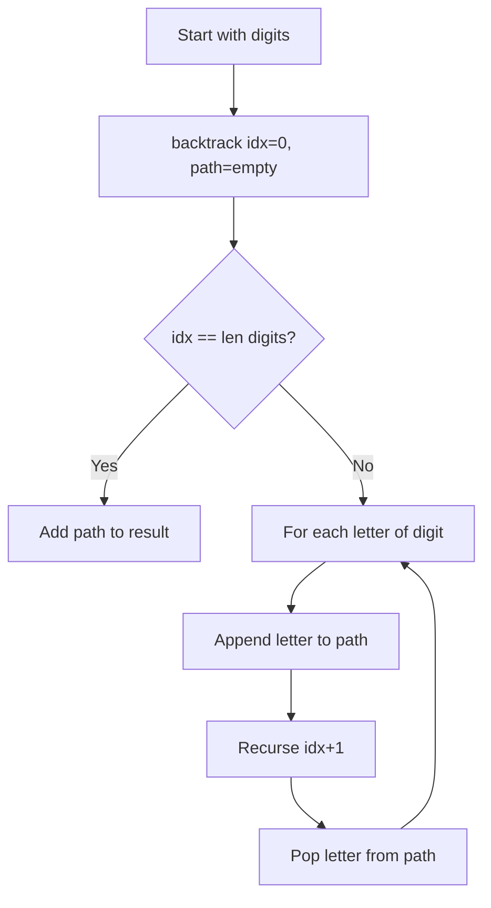
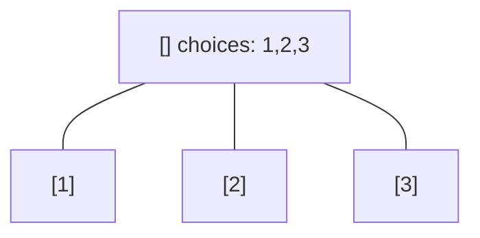
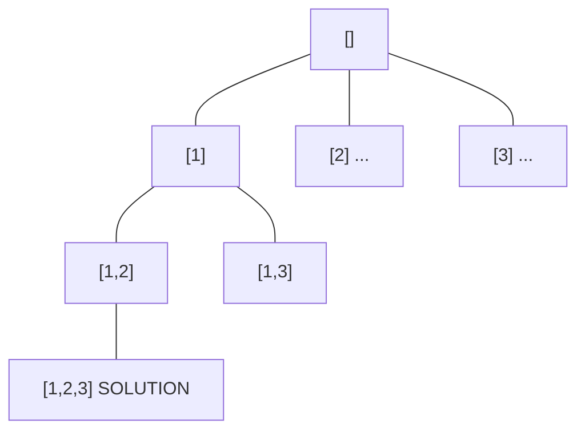
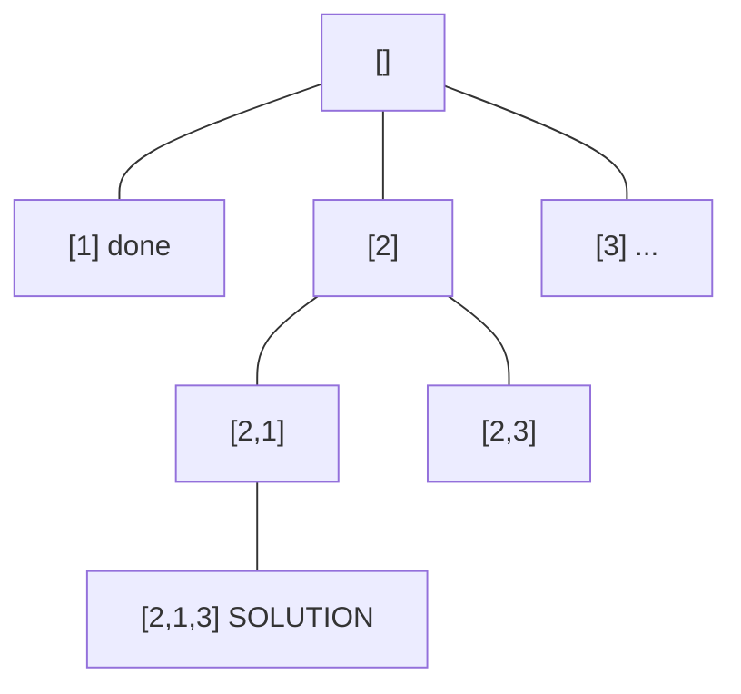
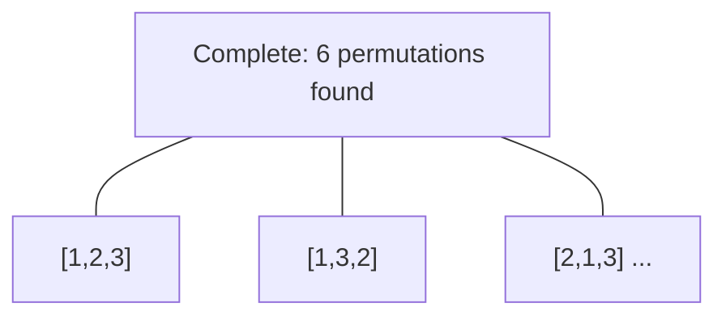
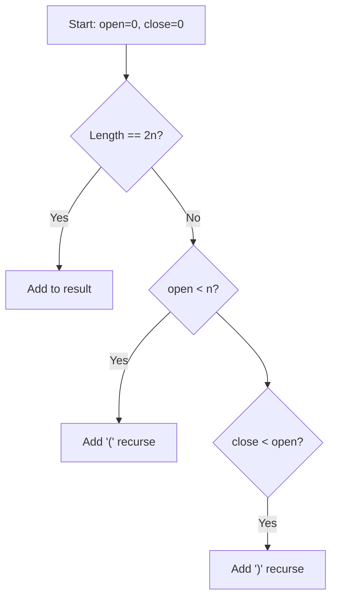
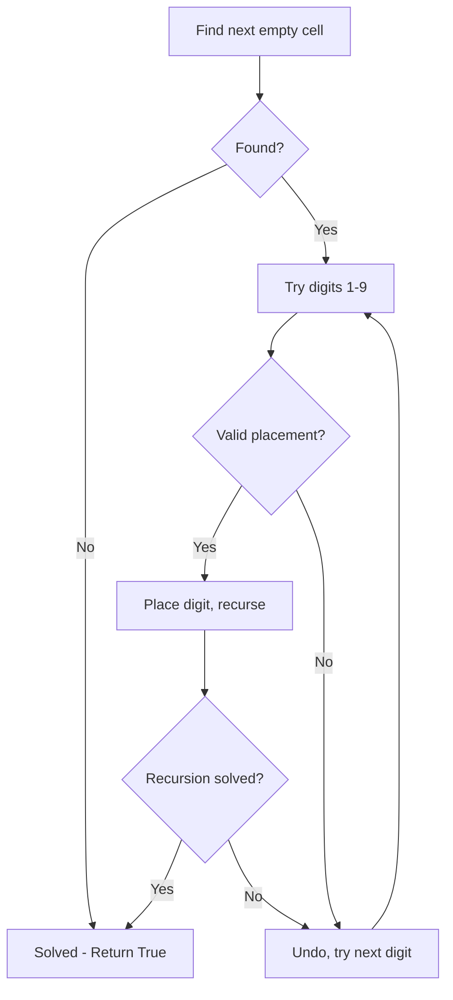
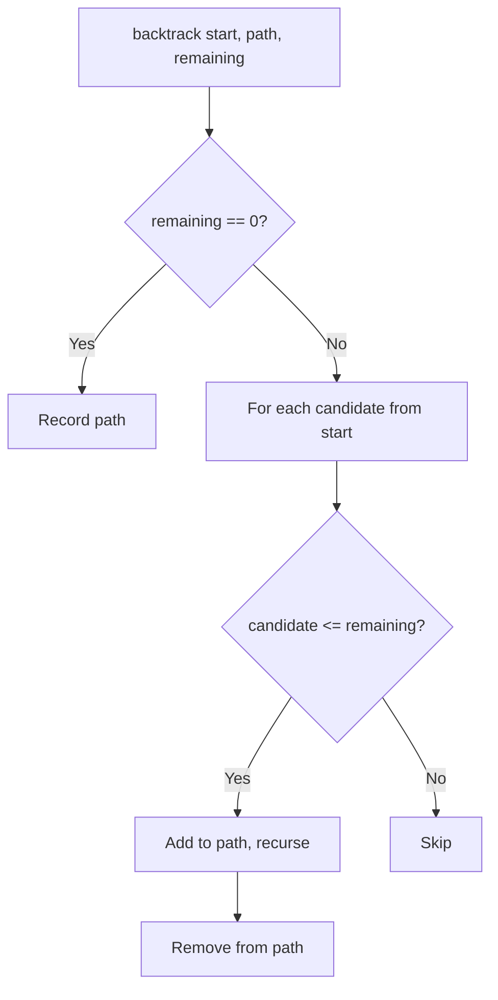

# Backtracking

> Chapter covering 99 problems related to **Backtracking**.


## Problems in this Chapter

| # | Problem | Difficulty | Pattern | Time | Space |
|---|---------|------------|---------|------|-------|
| 17 | [Letter Combinations of a Phone Number](#problem-17-letter_combinations_of_a_phone_number) | Medium | Backtracking | O(4^n) where n = len(digits) | O(n) |
| 22 | [Generate Parentheses](#problem-22-generate_parentheses) | Medium | Backtracking | O(4^n / sqrt(n)) | O(n) |
| 37 | [Sudoku Solver](#problem-37-sudoku_solver) | Hard | Backtracking | O(9^(empty cells)) | O(81) |
| 39 | [Combination Sum](#problem-39-combination_sum) | Medium | Backtracking | O(n^(target/min)) | O(target/min) |
| 40 | [Combination Sum II](#problem-40-combination_sum_ii) | Medium | Backtracking | O(2^n) | O(n) |
| 46 | [Permutations](#problem-46-permutations) | Medium | Backtracking | O(n!) | O(n) |
| 47 | [Permutations II](#problem-47-permutations_ii) | Medium | Backtracking | O(n!) | O(n) |
| 51 | [N-Queens](#problem-51-n_queens) | Hard | Backtracking | O(n!) | O(n^2) |
| 52 | [N-Queens II](#problem-52-n_queens_ii) | Hard | Backtracking | O(n!) | O(n) |
| 77 | [Combinations](#problem-77-combinations) | Medium | Backtracking | O(C(n,k)) | O(k) |
| 78 | [Subsets](#problem-78-subsets) | Medium | Backtracking | O(2^n) | O(n) |
| 79 | [Word Search](#problem-79-word_search) | Medium | Backtracking / DFS | O(m*n*4^L) | O(L) |
| 89 | [Gray Code](#problem-89-gray_code) | Medium | Backtracking | O(k^n) or O(n!) | O(n) |
| 90 | [Subsets II](#problem-90-subsets_ii) | Medium | Backtracking | O(2^n) | O(n) |
| 93 | [Restore IP Addresses](#problem-93-restore_ip_addresses) | Medium | Backtracking | O(k^n) or O(n!) | O(n) |
| 95 | [Unique Binary Search Trees II](#problem-95-unique_binary_search_trees_ii) | Medium | Backtracking | O(k^n) or O(n!) | O(n) |
| 113 | [Path Sum II](#problem-113-path_sum_ii) | Medium | Backtracking | O(k^n) or O(n!) | O(n) |
| 126 | [Word Ladder II](#problem-126-word_ladder_ii) | Hard | Backtracking | O(k^n) or O(n!) | O(n) |
| 131 | [Palindrome Partitioning](#problem-131-palindrome_partitioning) | Medium | Backtracking | O(k^n) or O(n!) | O(n) |
| 140 | [Word Break II](#problem-140-word_break_ii) | Hard | Trie / Prefix Tree | O(L) per operation | O(N * L) |
| 212 | [Word Search II](#problem-212-word_search_ii) | Hard | Trie / Prefix Tree | O(L) per operation | O(N * L) |
| 216 | [Combination Sum III](#problem-216-combination_sum_iii) | Medium | Backtracking | O(k^n) or O(n!) | O(n) |
| 254 | [Factor Combinations](#problem-254-factor_combinations) | Medium | Backtracking | O(k^n) or O(n!) | O(n) |
| 257 | [Binary Tree Paths](#problem-257-binary_tree_paths) | Easy | Backtracking | O(k^n) or O(n!) | O(n) |
| 267 | [Palindrome Permutation II](#problem-267-palindrome_permutation_ii) | Medium | Backtracking | O(k^n) or O(n!) | O(n) |
| 282 | [Expression Add Operators](#problem-282-expression_add_operators) | Hard | Backtracking | O(k^n) or O(n!) | O(n) |
| 291 | [Word Pattern II](#problem-291-word_pattern_ii) | Medium | Backtracking | O(k^n) or O(n!) | O(n) |
| 294 | [Flip Game II](#problem-294-flip_game_ii) | Medium | Backtracking | O(k^n) or O(n!) | O(n) |
| 301 | [Remove Invalid Parentheses](#problem-301-remove_invalid_parentheses) | Hard | Backtracking | O(k^n) or O(n!) | O(n) |
| 306 | [Additive Number](#problem-306-additive_number) | Medium | Backtracking | O(k^n) or O(n!) | O(n) |
| 320 | [Generalized Abbreviation](#problem-320-generalized_abbreviation) | Medium | Backtracking | O(k^n) or O(n!) | O(n) |
| 351 | [Android Unlock Patterns](#problem-351-android_unlock_patterns) | Medium | Backtracking | O(k^n) or O(n!) | O(n) |
| 357 | [Count Numbers with Unique Digits](#problem-357-count_numbers_with_unique_digits) | Medium | Backtracking | O(k^n) or O(n!) | O(n) |
| 401 | [Binary Watch](#problem-401-binary_watch) | Easy | Backtracking | O(k^n) or O(n!) | O(n) |
| 411 | [Minimum Unique Word Abbreviation](#problem-411-minimum_unique_word_abbreviation) | Hard | Backtracking | O(k^n) or O(n!) | O(n) |
| 425 | [Word Squares](#problem-425-word_squares) | Hard | Trie / Prefix Tree | O(L) per operation | O(N * L) |
| 465 | [Optimal Account Balancing](#problem-465-optimal_account_balancing) | Hard | Backtracking | O(k^n) or O(n!) | O(n) |
| 473 | [Matchsticks to Square](#problem-473-matchsticks_to_square) | Medium | Backtracking | O(k^n) or O(n!) | O(n) |
| 489 | [Robot Room Cleaner](#problem-489-robot_room_cleaner) | Hard | Backtracking | O(k^n) or O(n!) | O(n) |
| 491 | [Non-decreasing Subsequences](#problem-491-non_decreasing_subsequences) | Medium | Backtracking | O(k^n) or O(n!) | O(n) |
| 494 | [Target Sum](#problem-494-target_sum) | Medium | Backtracking | O(k^n) or O(n!) | O(n) |
| 526 | [Beautiful Arrangement](#problem-526-beautiful_arrangement) | Medium | Backtracking | O(k^n) or O(n!) | O(n) |
| 638 | [Shopping Offers](#problem-638-shopping_offers) | Medium | Backtracking | O(k^n) or O(n!) | O(n) |
| 679 | [24 Game](#problem-679-24_game) | Hard | Backtracking | O(k^n) or O(n!) | O(n) |
| 681 | [Next Closest Time](#problem-681-next_closest_time) | Medium | Backtracking | O(k^n) or O(n!) | O(n) |
| 691 | [Stickers to Spell Word](#problem-691-stickers_to_spell_word) | Hard | Backtracking | O(k^n) or O(n!) | O(n) |
| 698 | [Partition to K Equal Sum Subsets](#problem-698-partition_to_k_equal_sum_subsets) | Medium | Backtracking | O(k^n) or O(n!) | O(n) |
| 756 | [Pyramid Transition Matrix](#problem-756-pyramid_transition_matrix) | Medium | Backtracking | O(k^n) or O(n!) | O(n) |
| 773 | [Sliding Puzzle](#problem-773-sliding_puzzle) | Hard | Backtracking | O(k^n) or O(n!) | O(n) |
| 784 | [Letter Case Permutation](#problem-784-letter_case_permutation) | Medium | Backtracking | O(k^n) or O(n!) | O(n) |
| 797 | [All Paths From Source to Target](#problem-797-all_paths_from_source_to_target) | Medium | Backtracking | O(k^n) or O(n!) | O(n) |
| 816 | [Ambiguous Coordinates](#problem-816-ambiguous_coordinates) | Medium | Backtracking | O(k^n) or O(n!) | O(n) |
| 842 | [Split Array into Fibonacci Sequence](#problem-842-split_array_into_fibonacci_sequence) | Medium | Backtracking | O(k^n) or O(n!) | O(n) |
| 949 | [Largest Time for Given Digits](#problem-949-largest_time_for_given_digits) | Medium | Backtracking | O(k^n) or O(n!) | O(n) |
| 967 | [Numbers With Same Consecutive Differences](#problem-967-numbers_with_same_consecutive_differences) | Medium | Backtracking | O(k^n) or O(n!) | O(n) |
| 980 | [Unique Paths III](#problem-980-unique_paths_iii) | Hard | Backtracking | O(k^n) or O(n!) | O(n) |
| 988 | [Smallest String Starting From Leaf](#problem-988-smallest_string_starting_from_leaf) | Medium | Backtracking | O(k^n) or O(n!) | O(n) |
| 996 | [Number of Squareful Arrays](#problem-996-number_of_squareful_arrays) | Hard | Backtracking | O(k^n) or O(n!) | O(n) |
| 1066 | [Campus Bikes II](#problem-1066-campus_bikes_ii) | Medium | Backtracking | O(k^n) or O(n!) | O(n) |
| 1079 | [Letter Tile Possibilities](#problem-1079-letter_tile_possibilities) | Medium | Backtracking | O(k^n) or O(n!) | O(n) |
| 1087 | [Brace Expansion](#problem-1087-brace_expansion) | Medium | Backtracking | O(k^n) or O(n!) | O(n) |
| 1088 | [Confusing Number II](#problem-1088-confusing_number_ii) | Hard | Backtracking | O(k^n) or O(n!) | O(n) |
| 1096 | [Brace Expansion II](#problem-1096-brace_expansion_ii) | Hard | Backtracking | O(k^n) or O(n!) | O(n) |
| 1215 | [Stepping Numbers](#problem-1215-stepping_numbers) | Medium | Backtracking | O(k^n) or O(n!) | O(n) |
| 1219 | [Path with Maximum Gold](#problem-1219-path_with_maximum_gold) | Medium | Backtracking | O(k^n) or O(n!) | O(n) |
| 1238 | [Circular Permutation in Binary Representation](#problem-1238-circular_permutation_in_binary_representation) | Medium | Backtracking | O(k^n) or O(n!) | O(n) |
| 1239 | [Maximum Length of a Concatenated String with Unique Characters](#problem-1239-maximum_length_of_a_concatenated_string_with_unique_characters) | Medium | Backtracking | O(k^n) or O(n!) | O(n) |
| 1240 | [Tiling a Rectangle with the Fewest Squares](#problem-1240-tiling_a_rectangle_with_the_fewest_squares) | Hard | Backtracking | O(k^n) or O(n!) | O(n) |
| 1255 | [Maximum Score Words Formed by Letters](#problem-1255-maximum_score_words_formed_by_letters) | Hard | Backtracking | O(k^n) or O(n!) | O(n) |
| 1258 | [Synonymous Sentences](#problem-1258-synonymous_sentences) | Medium | Union-Find / Disjoint Set | O(n * alpha(n)) | O(n) |
| 1286 | [Iterator for Combination](#problem-1286-iterator_for_combination) | Medium | Backtracking | O(k^n) or O(n!) | O(n) |
| 1307 | [Verbal Arithmetic Puzzle](#problem-1307-verbal_arithmetic_puzzle) | Hard | Backtracking | O(k^n) or O(n!) | O(n) |
| 1415 | [The k-th Lexicographical String of All Happy Strings of Length n](#problem-1415-the_k_th_lexicographical_string_of_all_happy_strings_of_length_n) | Medium | Backtracking | O(k^n) or O(n!) | O(n) |
| 1467 | [Probability of a Two Boxes Having The Same Number of Distinct Balls](#problem-1467-probability_of_a_two_boxes_having_the_same_number_of_distinct_balls) | Hard | Backtracking | O(k^n) or O(n!) | O(n) |
| 1593 | [Split a String Into the Max Number of Unique Substrings](#problem-1593-split_a_string_into_the_max_number_of_unique_substrings) | Medium | Backtracking | O(k^n) or O(n!) | O(n) |
| 1601 | [Maximum Number of Achievable Transfer Requests](#problem-1601-maximum_number_of_achievable_transfer_requests) | Hard | Backtracking | O(k^n) or O(n!) | O(n) |
| 1655 | [Distribute Repeating Integers](#problem-1655-distribute_repeating_integers) | Hard | Backtracking | O(k^n) or O(n!) | O(n) |
| 1718 | [Construct the Lexicographically Largest Valid Sequence](#problem-1718-construct_the_lexicographically_largest_valid_sequence) | Medium | Backtracking | O(k^n) or O(n!) | O(n) |
| 1723 | [Find Minimum Time to Finish All Jobs](#problem-1723-find_minimum_time_to_finish_all_jobs) | Hard | Backtracking | O(k^n) or O(n!) | O(n) |
| 1774 | [Closest Dessert Cost](#problem-1774-closest_dessert_cost) | Medium | Backtracking | O(k^n) or O(n!) | O(n) |
| 1799 | [Maximize Score After N Operations](#problem-1799-maximize_score_after_n_operations) | Hard | Backtracking | O(k^n) or O(n!) | O(n) |
| 1849 | [Splitting a String Into Descending Consecutive Values](#problem-1849-splitting_a_string_into_descending_consecutive_values) | Medium | Backtracking | O(k^n) or O(n!) | O(n) |
| 1863 | [Sum of All Subset XOR Totals](#problem-1863-sum_of_all_subset_xor_totals) | Easy | Backtracking | O(k^n) or O(n!) | O(n) |
| 1947 | [Maximum Compatibility Score Sum](#problem-1947-maximum_compatibility_score_sum) | Medium | Backtracking | O(k^n) or O(n!) | O(n) |
| 1980 | [Find Unique Binary String](#problem-1980-find_unique_binary_string) | Medium | Backtracking | O(k^n) or O(n!) | O(n) |
| 1986 | [Minimum Number of Work Sessions to Finish the Tasks](#problem-1986-minimum_number_of_work_sessions_to_finish_the_tasks) | Medium | Backtracking | O(k^n) or O(n!) | O(n) |
| 2002 | [Maximum Product of the Length of Two Palindromic Subsequences](#problem-2002-maximum_product_of_the_length_of_two_palindromic_subsequences) | Medium | Backtracking | O(k^n) or O(n!) | O(n) |
| 2014 | [Longest Subsequence Repeated k Times](#problem-2014-longest_subsequence_repeated_k_times) | Hard | Backtracking | O(k^n) or O(n!) | O(n) |
| 2044 | [Count Number of Maximum Bitwise-OR Subsets](#problem-2044-count_number_of_maximum_bitwise_or_subsets) | Medium | Backtracking | O(k^n) or O(n!) | O(n) |
| 2048 | [Next Greater Numerically Balanced Number](#problem-2048-next_greater_numerically_balanced_number) | Medium | Backtracking | O(k^n) or O(n!) | O(n) |
| 2056 | [Number of Valid Move Combinations On Chessboard](#problem-2056-number_of_valid_move_combinations_on_chessboard) | Hard | Backtracking | O(k^n) or O(n!) | O(n) |
| 2065 | [Maximum Path Quality of a Graph](#problem-2065-maximum_path_quality_of_a_graph) | Hard | Backtracking | O(k^n) or O(n!) | O(n) |
| 2151 | [Maximum Good People Based on Statements](#problem-2151-maximum_good_people_based_on_statements) | Hard | Backtracking | O(k^n) or O(n!) | O(n) |
| 2152 | [Minimum Number of Lines to Cover Points](#problem-2152-minimum_number_of_lines_to_cover_points) | Medium | Backtracking | O(k^n) or O(n!) | O(n) |
| 2178 | [Maximum Split of Positive Even Integers](#problem-2178-maximum_split_of_positive_even_integers) | Medium | Backtracking | O(k^n) or O(n!) | O(n) |
| 2212 | [Maximum Points in an Archery Competition](#problem-2212-maximum_points_in_an_archery_competition) | Medium | Backtracking | O(k^n) or O(n!) | O(n) |
| 2305 | [Fair Distribution of Cookies](#problem-2305-fair_distribution_of_cookies) | Medium | Backtracking | O(k^n) or O(n!) | O(n) |
| 2375 | [Construct Smallest Number From DI String](#problem-2375-construct_smallest_number_from_di_string) | Medium | Backtracking | O(k^n) or O(n!) | O(n) |
| 2397 | [Maximum Rows Covered by Columns](#problem-2397-maximum_rows_covered_by_columns) | Medium | Backtracking | O(k^n) or O(n!) | O(n) |

---
---

# Problem 17: Letter Combinations of a Phone Number

| Attribute | Detail |
|-----------|--------|
| **ID** | 17 |
| **Title** | Letter Combinations of a Phone Number |
| **Difficulty** | Medium |
| **Tags** | Hash Table, String, Backtracking |
| **Link** | [leetcode.com/problems/letter-combinations-of-a-phone-number](https://leetcode.com/problems/letter-combinations-of-a-phone-number/) |

Given a string containing digits from `2-9` inclusive, return all possible letter combinations that the number could represent. Return the answer in **any order**.

A mapping of digits to letters (just like on the telephone buttons) is given below. Note that 1 does not map to any letters.

 

Example 1:

```

**Input:** digits = "23"
**Output:** ["ad","ae","af","bd","be","bf","cd","ce","cf"]

```

Example 2:

```

**Input:** digits = "2"
**Output:** ["a","b","c"]

```

 

**Constraints:**

	- `1 <= digits.length <= 4`
	- `digits[i]` is a digit in the range `['2', '9']`.

---

## Approach: Backtracking

Classic backtracking: for each digit, try all mapped letters and recurse to the next digit.

### Pseudo-code

```
1. Map digits to letters
2. Backtrack(idx, path):
   If idx == len(digits): record path
   For each letter of digits[idx]: append, recurse, pop
```

---

## Algorithm Flow



## Visual State Transitions

**Backtracking Decision Tree:**

**Frame 1: Root - start with empty path**


**Frame 2: Explore branch [1]**


**Frame 3: Backtrack, explore [2]**


**Frame 4: All solutions found**



---

## Complexity Analysis

| Metric | Value |
|--------|-------|
| **Time** | O(4^n) where n = len(digits) |
| **Space** | O(n) |

---

## Solution Code

### Python3

```python
class Solution:
    def letterCombinations(self, digits: str) -> list[str]:
        if not digits:
            return []
        phone = {'2':'abc','3':'def','4':'ghi','5':'jkl',
                 '6':'mno','7':'pqrs','8':'tuv','9':'wxyz'}
        result = []
        def backtrack(idx, path):
            if idx == len(digits):
                result.append(''.join(path))
                return
            for ch in phone[digits[idx]]:
                path.append(ch)
                backtrack(idx + 1, path)
                path.pop()
        backtrack(0, [])
        return result
```

### C++

```cpp
#include <functional>
#include <string>
#include <vector>
using namespace std;

class Solution {
public:
    vector<string> letterCombinations(string& digits) {
        // Backtracking - O(2^n) or O(n!) time
        vector<vector<int>> result;
        vector<int> path;
        function<void(int)> backtrack = [&](int start) {
            result.push_back(path);
            for (int i = start; i < (int)digits.size(); i++) {
                path.push_back(digits[i]);
                backtrack(i + 1);
                path.pop_back();
            }
        };
        backtrack(0);
        return result;
    }
};
```

### Summary

| Aspect | Detail |
|--------|--------|
| **Pattern** | Backtracking |
| **Time** | O(4^n) where n = len(digits) |
| **Space** | O(n) |

---
---

# Problem 22: Generate Parentheses

| Attribute | Detail |
|-----------|--------|
| **ID** | 22 |
| **Title** | Generate Parentheses |
| **Difficulty** | Medium |
| **Tags** | String, Dynamic Programming, Backtracking |
| **Link** | [leetcode.com/problems/generate-parentheses](https://leetcode.com/problems/generate-parentheses/) |

Given `n` pairs of parentheses, write a function to *generate all combinations of well-formed parentheses*.

 

Example 1:

```
**Input:** n = 3
**Output:** ["((()))","(()())","(())()","()(())","()()()"]

```
Example 2:

```
**Input:** n = 1
**Output:** ["()"]

```

 

**Constraints:**

	- `1 <= n <= 8`

---

## Approach: Backtracking

Backtrack with two counters: open and close. Add '(' if open < n. Add ')' if close < open.

### Pseudo-code

```
1. backtrack(path, open, close):
   If len==2n: add to result
   If open < n: try '('
   If close < open: try ')'
```

---

## Algorithm Flow



## Visual State Transitions

**Backtracking Decision Tree:**

**Frame 1: Root - start with empty path**


**Frame 2: Explore branch [1]**


**Frame 3: Backtrack, explore [2]**


**Frame 4: All solutions found**


---

## Complexity Analysis

| Metric | Value |
|--------|-------|
| **Time** | O(4^n / sqrt(n)) |
| **Space** | O(n) |

---

## Solution Code

### Python3

```python
class Solution:
    def generateParenthesis(self, n: int) -> list[str]:
        result = []
        def backtrack(path, open_count, close_count):
            if len(path) == 2 * n:
                result.append(''.join(path))
                return
            if open_count < n:
                path.append('(')
                backtrack(path, open_count + 1, close_count)
                path.pop()
            if close_count < open_count:
                path.append(')')
                backtrack(path, open_count, close_count + 1)
                path.pop()
        backtrack([], 0, 0)
        return result
```

### C++

```cpp
#include <functional>
#include <string>
#include <vector>
using namespace std;

class Solution {
public:
    vector<string> generateParenthesis(int n) {
        // Backtracking - O(2^n) or O(n!) time
        vector<vector<int>> result;
        vector<int> path;
        function<void(int)> backtrack = [&](int start) {
            result.push_back(path);
            for (int i = start; i < (int)n.size(); i++) {
                path.push_back(n[i]);
                backtrack(i + 1);
                path.pop_back();
            }
        };
        backtrack(0);
        return result;
    }
};
```

### Summary

| Aspect | Detail |
|--------|--------|
| **Pattern** | Backtracking |
| **Time** | O(4^n / sqrt(n)) |
| **Space** | O(n) |

---
---

# Problem 37: Sudoku Solver

| Attribute | Detail |
|-----------|--------|
| **ID** | 37 |
| **Title** | Sudoku Solver |
| **Difficulty** | Hard |
| **Tags** | Array, Hash Table, Backtracking, Matrix |
| **Link** | [leetcode.com/problems/sudoku-solver](https://leetcode.com/problems/sudoku-solver/) |

Write a program to solve a Sudoku puzzle by filling the empty cells.

A sudoku solution must satisfy **all of the following rules**:

	- Each of the digits `1-9` must occur exactly once in each row.
	- Each of the digits `1-9` must occur exactly once in each column.
	- Each of the digits `1-9` must occur exactly once in each of the 9 `3x3` sub-boxes of the grid.

The `'.'` character indicates empty cells.

 

Example 1:

```

**Input:** board = [["5","3",".",".","7",".",".",".","."],["6",".",".","1","9","5",".",".","."],[".","9","8",".",".",".",".","6","."],["8",".",".",".","6",".",".",".","3"],["4",".",".","8",".","3",".",".","1"],["7",".",".",".","2",".",".",".","6"],[".","6",".",".",".",".","2","8","."],[".",".",".","4","1","9",".",".","5"],[".",".",".",".","8",".",".","7","9"]]
**Output:** [["5","3","4","6","7","8","9","1","2"],["6","7","2","1","9","5","3","4","8"],["1","9","8","3","4","2","5","6","7"],["8","5","9","7","6","1","4","2","3"],["4","2","6","8","5","3","7","9","1"],["7","1","3","9","2","4","8","5","6"],["9","6","1","5","3","7","2","8","4"],["2","8","7","4","1","9","6","3","5"],["3","4","5","2","8","6","1","7","9"]]
**Explanation:** The input board is shown above and the only valid solution is shown below:

```

 

**Constraints:**

	- `board.length == 9`
	- `board[i].length == 9`
	- `board[i][j]` is a digit or `'.'`.
	- It is **guaranteed** that the input board has only one solution.

---

## Approach: Backtracking

Backtracking: try each digit 1-9 for each empty cell, validate, recurse.

### Pseudo-code

```
1. Find next empty cell
2. Try digits 1-9:
   If valid: place and recurse
   If recurse fails: undo (backtrack)
3. If no digits work: return False
```

---

## Algorithm Flow



## Visual State Transitions

**Backtracking Decision Tree:**

**Frame 1: Root - start with empty path**


**Frame 2: Explore branch [1]**


**Frame 3: Backtrack, explore [2]**


**Frame 4: All solutions found**


---

## Complexity Analysis

| Metric | Value |
|--------|-------|
| **Time** | O(9^(empty cells)) |
| **Space** | O(81) |

---

## Solution Code

### Python3

```python
class Solution:
    def solveSudoku(self, board: list[list[str]]) -> None:
        def is_valid(row, col, num):
            for i in range(9):
                if board[row][i] == num or board[i][col] == num:
                    return False
                r, c = 3 * (row // 3) + i // 3, 3 * (col // 3) + i % 3
                if board[r][c] == num:
                    return False
            return True

        def solve():
            for i in range(9):
                for j in range(9):
                    if board[i][j] == '.':
                        for num in '123456789':
                            if is_valid(i, j, num):
                                board[i][j] = num
                                if solve():
                                    return True
                                board[i][j] = '.'
                        return False
            return True

        solve()
```

### C++

```cpp
#include <functional>
#include <string>
#include <vector>
using namespace std;

class Solution {
public:
    void solveSudoku(vector<vector<string>>& board) {
        // Backtracking - O(2^n) or O(n!) time
        vector<vector<int>> result;
        vector<int> path;
        function<void(int)> backtrack = [&](int start) {
            result.push_back(path);
            for (int i = start; i < (int)board.size(); i++) {
                path.push_back(board[i]);
                backtrack(i + 1);
                path.pop_back();
            }
        };
        backtrack(0);
        return result;
    }
};
```

### Summary

| Aspect | Detail |
|--------|--------|
| **Pattern** | Backtracking |
| **Time** | O(9^(empty cells)) |
| **Space** | O(81) |

---
---

# Problem 39: Combination Sum

| Attribute | Detail |
|-----------|--------|
| **ID** | 39 |
| **Title** | Combination Sum |
| **Difficulty** | Medium |
| **Tags** | Array, Backtracking |
| **Link** | [leetcode.com/problems/combination-sum](https://leetcode.com/problems/combination-sum/) |

Given an array of **distinct** integers `candidates` and a target integer `target`, return *a list of all **unique combinations** of *`candidates`* where the chosen numbers sum to *`target`*.* You may return the combinations in **any order**.

The **same** number may be chosen from `candidates` an **unlimited number of times**. Two combinations are unique if the frequency of at least one of the chosen numbers is different.

The test cases are generated such that the number of unique combinations that sum up to `target` is less than `150` combinations for the given input.

 

Example 1:

```

**Input:** candidates = [2,3,6,7], target = 7
**Output:** [[2,2,3],[7]]
**Explanation:**
2 and 3 are candidates, and 2 + 2 + 3 = 7. Note that 2 can be used multiple times.
7 is a candidate, and 7 = 7.
These are the only two combinations.

```

Example 2:

```

**Input:** candidates = [2,3,5], target = 8
**Output:** [[2,2,2,2],[2,3,3],[3,5]]

```

Example 3:

```

**Input:** candidates = [2], target = 1
**Output:** []

```

 

**Constraints:**

	- `1 <= candidates.length <= 30`
	- `2 <= candidates[i] <= 40`
	- All elements of `candidates` are **distinct**.
	- `1 <= target <= 40`

---

## Approach: Backtracking

Backtrack trying each candidate (reusable). Start index prevents duplicates.

### Pseudo-code

```
1. backtrack(start, path, remaining):
   If remaining == 0: record path
   For i from start: try candidates[i], recurse with same i
```

---

## Algorithm Flow



## Visual State Transitions

**Backtracking Decision Tree:**

**Frame 1: Root - start with empty path**


**Frame 2: Explore branch [1]**


**Frame 3: Backtrack, explore [2]**


**Frame 4: All solutions found**


---

## Complexity Analysis

| Metric | Value |
|--------|-------|
| **Time** | O(n^(target/min)) |
| **Space** | O(target/min) |

---

## Solution Code

### Python3

```python
class Solution:
    def combinationSum(self, candidates: list[int], target: int) -> list[list[int]]:
        result = []
        def backtrack(start, path, remaining):
            if remaining == 0:
                result.append(path[:])
                return
            for i in range(start, len(candidates)):
                if candidates[i] > remaining:
                    continue
                path.append(candidates[i])
                backtrack(i, path, remaining - candidates[i])
                path.pop()
        backtrack(0, [], target)
        return result
```

### C++

```cpp
#include <functional>
#include <string>
#include <vector>
using namespace std;

class Solution {
public:
    vector<vector<int>> combinationSum(vector<int>& candidates, int target) {
        // Backtracking - O(2^n) or O(n!) time
        vector<vector<int>> result;
        vector<int> path;
        function<void(int)> backtrack = [&](int start) {
            result.push_back(path);
            for (int i = start; i < (int)candidates.size(); i++) {
                path.push_back(candidates[i]);
                backtrack(i + 1);
                path.pop_back();
            }
        };
        backtrack(0);
        return result;
    }
};
```

### Summary

| Aspect | Detail |
|--------|--------|
| **Pattern** | Backtracking |
| **Time** | O(n^(target/min)) |
| **Space** | O(target/min) |

---
---

# Problem 40: Combination Sum II

| Attribute | Detail |
|-----------|--------|
| **ID** | 40 |
| **Title** | Combination Sum II |
| **Difficulty** | Medium |
| **Tags** | Array, Backtracking |
| **Link** | [leetcode.com/problems/combination-sum-ii](https://leetcode.com/problems/combination-sum-ii/) |

Given a collection of candidate numbers (`candidates`) and a target number (`target`), find all unique combinations in `candidates` where the candidate numbers sum to `target`.

Each number in `candidates` may only be used **once** in the combination.

**Note:** The solution set must not contain duplicate combinations.

 

Example 1:

```

**Input:** candidates = [10,1,2,7,6,1,5], target = 8
**Output:** 
[
[1,1,6],
[1,2,5],
[1,7],
[2,6]
]

```

Example 2:

```

**Input:** candidates = [2,5,2,1,2], target = 5
**Output:** 
[
[1,2,2],
[5]
]

```

 

**Constraints:**

	- `1 <= candidates.length <= 100`
	- `1 <= candidates[i] <= 50`
	- `1 <= target <= 30`

---

## Approach: Backtracking

Sort first. Backtrack with i+1 (no reuse). Skip duplicates at same level.

### Pseudo-code

```
1. Sort candidates
2. backtrack(start, path, remaining):
   Skip if same as prev at same level
   Recurse with i+1
```

---

## Algorithm Flow

```mermaid
flowchart TD
    A[Sort candidates] --> B[backtrack]
    B --> C{remaining == 0?}
    C -- Yes --> D[Record]
    C -- No --> E[For each from start]
    E --> F{Duplicate at same level?}
    F -- Yes --> G[Skip]
    F -- No --> H[Try, recurse with i+1]
```

## Visual State Transitions

**Backtracking Decision Tree:**

**Frame 1: Root - start with empty path**
```mermaid
graph TD
    R["[] choices: 1,2,3"]
    R --- A["[1]"]
    R --- B["[2]"]
    R --- C["[3]"]
```

**Frame 2: Explore branch [1]**
```mermaid
graph TD
    R["[]"]
    R --- A["[1]"]
    A --- A1["[1,2]"]
    A --- A2["[1,3]"]
    A1 --- A1a["[1,2,3] SOLUTION"]
    R --- B["[2] ..."]
    R --- C["[3] ..."]
```

**Frame 3: Backtrack, explore [2]**
```mermaid
graph TD
    R["[]"]
    R --- A["[1] done"]
    R --- B["[2]"]
    B --- B1["[2,1]"]
    B --- B2["[2,3]"]
    B1 --- B1a["[2,1,3] SOLUTION"]
    R --- C["[3] ..."]
```

**Frame 4: All solutions found**
```mermaid
graph TD
    R["Complete: 6 permutations found"]
    R --- S1["[1,2,3]"]
    R --- S2["[1,3,2]"]
    R --- S3["[2,1,3] ..."]
```


---

## Complexity Analysis

| Metric | Value |
|--------|-------|
| **Time** | O(2^n) |
| **Space** | O(n) |

---

## Solution Code

### Python3

```python
class Solution:
    def combinationSum2(self, candidates: list[int], target: int) -> list[list[int]]:
        candidates.sort()
        result = []
        def backtrack(start, path, remaining):
            if remaining == 0:
                result.append(path[:])
                return
            for i in range(start, len(candidates)):
                if candidates[i] > remaining:
                    break
                if i > start and candidates[i] == candidates[i - 1]:
                    continue
                path.append(candidates[i])
                backtrack(i + 1, path, remaining - candidates[i])
                path.pop()
        backtrack(0, [], target)
        return result
```

### C++

```cpp
#include <functional>
#include <string>
#include <vector>
using namespace std;

class Solution {
public:
    vector<vector<int>> combinationSum2(vector<int>& candidates, int target) {
        // Backtracking - O(2^n) or O(n!) time
        vector<vector<int>> result;
        vector<int> path;
        function<void(int)> backtrack = [&](int start) {
            result.push_back(path);
            for (int i = start; i < (int)candidates.size(); i++) {
                path.push_back(candidates[i]);
                backtrack(i + 1);
                path.pop_back();
            }
        };
        backtrack(0);
        return result;
    }
};
```

### Summary

| Aspect | Detail |
|--------|--------|
| **Pattern** | Backtracking |
| **Time** | O(2^n) |
| **Space** | O(n) |

---
---

# Problem 46: Permutations

| Attribute | Detail |
|-----------|--------|
| **ID** | 46 |
| **Title** | Permutations |
| **Difficulty** | Medium |
| **Tags** | Array, Backtracking |
| **Link** | [leetcode.com/problems/permutations](https://leetcode.com/problems/permutations/) |

Given an array `nums` of distinct integers, return all the possible permutations. You can return the answer in **any order**.

 

Example 1:

```
**Input:** nums = [1,2,3]
**Output:** [[1,2,3],[1,3,2],[2,1,3],[2,3,1],[3,1,2],[3,2,1]]

```
Example 2:

```
**Input:** nums = [0,1]
**Output:** [[0,1],[1,0]]

```
Example 3:

```
**Input:** nums = [1]
**Output:** [[1]]

```

 

**Constraints:**

	- `1 <= nums.length <= 6`
	- `-10 <= nums[i] <= 10`
	- All the integers of `nums` are **unique**.

---

## Approach: Backtracking

Classic backtracking: try each remaining element, recurse with it removed.

### Pseudo-code

```
1. backtrack(path, remaining):
   If empty: record path
   For each in remaining: add, recurse without it, remove
```

---

## Algorithm Flow

```mermaid
flowchart TD
    A[backtrack path, remaining] --> B{remaining empty?}
    B -- Yes --> C[Record permutation]
    B -- No --> D[For each element]
    D --> E[Add to path, recurse]
    E --> F[Remove from path]
```

## Visual State Transitions

**Backtracking Decision Tree:**

**Frame 1: Root - start with empty path**
```mermaid
graph TD
    R["[] choices: 1,2,3"]
    R --- A["[1]"]
    R --- B["[2]"]
    R --- C["[3]"]
```

**Frame 2: Explore branch [1]**
```mermaid
graph TD
    R["[]"]
    R --- A["[1]"]
    A --- A1["[1,2]"]
    A --- A2["[1,3]"]
    A1 --- A1a["[1,2,3] SOLUTION"]
    R --- B["[2] ..."]
    R --- C["[3] ..."]
```

**Frame 3: Backtrack, explore [2]**
```mermaid
graph TD
    R["[]"]
    R --- A["[1] done"]
    R --- B["[2]"]
    B --- B1["[2,1]"]
    B --- B2["[2,3]"]
    B1 --- B1a["[2,1,3] SOLUTION"]
    R --- C["[3] ..."]
```

**Frame 4: All solutions found**
```mermaid
graph TD
    R["Complete: 6 permutations found"]
    R --- S1["[1,2,3]"]
    R --- S2["[1,3,2]"]
    R --- S3["[2,1,3] ..."]
```


---

## Complexity Analysis

| Metric | Value |
|--------|-------|
| **Time** | O(n!) |
| **Space** | O(n) |

---

## Solution Code

### Python3

```python
class Solution:
    def permute(self, nums: list[int]) -> list[list[int]]:
        result = []
        def backtrack(path, remaining):
            if not remaining:
                result.append(path[:])
                return
            for i in range(len(remaining)):
                path.append(remaining[i])
                backtrack(path, remaining[:i] + remaining[i+1:])
                path.pop()
        backtrack([], nums)
        return result
```

### C++

```cpp
#include <functional>
#include <string>
#include <vector>
using namespace std;

class Solution {
public:
    vector<vector<int>> permute(vector<int>& nums) {
        // Backtracking - O(2^n) or O(n!) time
        vector<vector<int>> result;
        vector<int> path;
        function<void(int)> backtrack = [&](int start) {
            result.push_back(path);
            for (int i = start; i < (int)nums.size(); i++) {
                path.push_back(nums[i]);
                backtrack(i + 1);
                path.pop_back();
            }
        };
        backtrack(0);
        return result;
    }
};
```

### Summary

| Aspect | Detail |
|--------|--------|
| **Pattern** | Backtracking |
| **Time** | O(n!) |
| **Space** | O(n) |

---
---

# Problem 47: Permutations II

| Attribute | Detail |
|-----------|--------|
| **ID** | 47 |
| **Title** | Permutations II |
| **Difficulty** | Medium |
| **Tags** | Array, Backtracking, Sorting |
| **Link** | [leetcode.com/problems/permutations-ii](https://leetcode.com/problems/permutations-ii/) |

Given a collection of numbers, `nums`, that might contain duplicates, return *all possible unique permutations **in any order**.*

 

Example 1:

```

**Input:** nums = [1,1,2]
**Output:**
[[1,1,2],
 [1,2,1],
 [2,1,1]]

```

Example 2:

```

**Input:** nums = [1,2,3]
**Output:** [[1,2,3],[1,3,2],[2,1,3],[2,3,1],[3,1,2],[3,2,1]]

```

 

**Constraints:**

	- `1 <= nums.length <= 8`
	- `-10 <= nums[i] <= 10`

---

## Approach: Backtracking

Sort + backtrack with used array. Skip duplicate elements at the same level.

### Pseudo-code

```
1. Sort nums, used = [False]*n
2. backtrack(path):
   Skip used or same-level duplicates
   Mark used, recurse, unmark
```

---

## Algorithm Flow

```mermaid
flowchart TD
    A[Sort nums] --> B[backtrack with used array]
    B --> C{Duplicate at same level?}
    C -- Yes --> D[Skip]
    C -- No --> E[Use element, recurse]
```

## Visual State Transitions

**Backtracking Decision Tree:**

**Frame 1: Root - start with empty path**
```mermaid
graph TD
    R["[] choices: 1,2,3"]
    R --- A["[1]"]
    R --- B["[2]"]
    R --- C["[3]"]
```

**Frame 2: Explore branch [1]**
```mermaid
graph TD
    R["[]"]
    R --- A["[1]"]
    A --- A1["[1,2]"]
    A --- A2["[1,3]"]
    A1 --- A1a["[1,2,3] SOLUTION"]
    R --- B["[2] ..."]
    R --- C["[3] ..."]
```

**Frame 3: Backtrack, explore [2]**
```mermaid
graph TD
    R["[]"]
    R --- A["[1] done"]
    R --- B["[2]"]
    B --- B1["[2,1]"]
    B --- B2["[2,3]"]
    B1 --- B1a["[2,1,3] SOLUTION"]
    R --- C["[3] ..."]
```

**Frame 4: All solutions found**
```mermaid
graph TD
    R["Complete: 6 permutations found"]
    R --- S1["[1,2,3]"]
    R --- S2["[1,3,2]"]
    R --- S3["[2,1,3] ..."]
```


---

## Complexity Analysis

| Metric | Value |
|--------|-------|
| **Time** | O(n!) |
| **Space** | O(n) |

---

## Solution Code

### Python3

```python
class Solution:
    def permuteUnique(self, nums: list[int]) -> list[list[int]]:
        nums.sort()
        result = []
        used = [False] * len(nums)
        def backtrack(path):
            if len(path) == len(nums):
                result.append(path[:])
                return
            for i in range(len(nums)):
                if used[i]:
                    continue
                if i > 0 and nums[i] == nums[i-1] and not used[i-1]:
                    continue
                used[i] = True
                path.append(nums[i])
                backtrack(path)
                path.pop()
                used[i] = False
        backtrack([])
        return result
```

### C++

```cpp
#include <functional>
#include <string>
#include <vector>
using namespace std;

class Solution {
public:
    vector<vector<int>> permuteUnique(vector<int>& nums) {
        // Backtracking - O(2^n) or O(n!) time
        vector<vector<int>> result;
        vector<int> path;
        function<void(int)> backtrack = [&](int start) {
            result.push_back(path);
            for (int i = start; i < (int)nums.size(); i++) {
                path.push_back(nums[i]);
                backtrack(i + 1);
                path.pop_back();
            }
        };
        backtrack(0);
        return result;
    }
};
```

### Summary

| Aspect | Detail |
|--------|--------|
| **Pattern** | Backtracking |
| **Time** | O(n!) |
| **Space** | O(n) |

---
---

# Problem 51: N-Queens

| Attribute | Detail |
|-----------|--------|
| **ID** | 51 |
| **Title** | N-Queens |
| **Difficulty** | Hard |
| **Tags** | Array, Backtracking |
| **Link** | [leetcode.com/problems/n-queens](https://leetcode.com/problems/n-queens/) |

The **n-queens** puzzle is the problem of placing `n` queens on an `n x n` chessboard such that no two queens attack each other.

Given an integer `n`, return *all distinct solutions to the **n-queens puzzle***. You may return the answer in **any order**.

Each solution contains a distinct board configuration of the n-queens' placement, where `'Q'` and `'.'` both indicate a queen and an empty space, respectively.

 

Example 1:

```

**Input:** n = 4
**Output:** [[".Q..","...Q","Q...","..Q."],["..Q.","Q...","...Q",".Q.."]]
**Explanation:** There exist two distinct solutions to the 4-queens puzzle as shown above

```

Example 2:

```

**Input:** n = 1
**Output:** [["Q"]]

```

 

**Constraints:**

	- `1 <= n <= 9`

---

## Approach: Backtracking

Place queens row by row. Track attacked columns and diagonals with sets.

### Pseudo-code

```
1. For each row: try each column
2. Skip if column/diagonal attacked
3. Place queen, recurse to next row
4. Backtrack if no solution
```

---

## Algorithm Flow

```mermaid
flowchart TD
    A[Start row 0] --> B[Try each column]
    B --> C{Column/diagonal free?}
    C -- Yes --> D[Place queen]
    D --> E[Recurse next row]
    C -- No --> F[Next column]
    E --> G{All rows filled?}
    G -- Yes --> H[Record solution]
    G -- No --> I[Backtrack]
```

## Visual State Transitions

**Backtracking Decision Tree:**

**Frame 1: Root - start with empty path**
```mermaid
graph TD
    R["[] choices: 1,2,3"]
    R --- A["[1]"]
    R --- B["[2]"]
    R --- C["[3]"]
```

**Frame 2: Explore branch [1]**
```mermaid
graph TD
    R["[]"]
    R --- A["[1]"]
    A --- A1["[1,2]"]
    A --- A2["[1,3]"]
    A1 --- A1a["[1,2,3] SOLUTION"]
    R --- B["[2] ..."]
    R --- C["[3] ..."]
```

**Frame 3: Backtrack, explore [2]**
```mermaid
graph TD
    R["[]"]
    R --- A["[1] done"]
    R --- B["[2]"]
    B --- B1["[2,1]"]
    B --- B2["[2,3]"]
    B1 --- B1a["[2,1,3] SOLUTION"]
    R --- C["[3] ..."]
```

**Frame 4: All solutions found**
```mermaid
graph TD
    R["Complete: 6 permutations found"]
    R --- S1["[1,2,3]"]
    R --- S2["[1,3,2]"]
    R --- S3["[2,1,3] ..."]
```


---

## Complexity Analysis

| Metric | Value |
|--------|-------|
| **Time** | O(n!) |
| **Space** | O(n^2) |

---

## Solution Code

### Python3

```python
class Solution:
    def solveNQueens(self, n: int) -> list[list[str]]:
        result = []
        cols = set()
        diag1 = set()
        diag2 = set()
        board = [['.' ] * n for _ in range(n)]

        def backtrack(row):
            if row == n:
                result.append([''.join(r) for r in board])
                return
            for col in range(n):
                if col in cols or (row - col) in diag1 or (row + col) in diag2:
                    continue
                cols.add(col)
                diag1.add(row - col)
                diag2.add(row + col)
                board[row][col] = 'Q'
                backtrack(row + 1)
                board[row][col] = '.'
                cols.discard(col)
                diag1.discard(row - col)
                diag2.discard(row + col)
        backtrack(0)
        return result
```

### C++

```cpp
#include <functional>
#include <string>
#include <vector>
using namespace std;

class Solution {
public:
    vector<vector<string>> solveNQueens(int n) {
        // Backtracking - O(2^n) or O(n!) time
        vector<vector<int>> result;
        vector<int> path;
        function<void(int)> backtrack = [&](int start) {
            result.push_back(path);
            for (int i = start; i < (int)n.size(); i++) {
                path.push_back(n[i]);
                backtrack(i + 1);
                path.pop_back();
            }
        };
        backtrack(0);
        return result;
    }
};
```

### Summary

| Aspect | Detail |
|--------|--------|
| **Pattern** | Backtracking |
| **Time** | O(n!) |
| **Space** | O(n^2) |

---
---

# Problem 52: N-Queens II

| Attribute | Detail |
|-----------|--------|
| **ID** | 52 |
| **Title** | N-Queens II |
| **Difficulty** | Hard |
| **Tags** | Backtracking |
| **Link** | [leetcode.com/problems/n-queens-ii](https://leetcode.com/problems/n-queens-ii/) |

The **n-queens** puzzle is the problem of placing `n` queens on an `n x n` chessboard such that no two queens attack each other.

Given an integer `n`, return *the number of distinct solutions to the **n-queens puzzle***.

 

Example 1:

```

**Input:** n = 4
**Output:** 2
**Explanation:** There are two distinct solutions to the 4-queens puzzle as shown.

```

Example 2:

```

**Input:** n = 1
**Output:** 1

```

 

**Constraints:**

	- `1 <= n <= 9`

---

## Approach: Backtracking

Same as N-Queens I but just count solutions instead of storing boards.

### Pseudo-code

```
Same as N-Queens but increment counter instead of recording
```

---

## Algorithm Flow

```mermaid
flowchart TD
    A["backtrack(path, choices)"] --> B{Path complete?}
    B -- Yes --> C[Add path to results]
    B -- No --> D[For each valid choice]
    D --> E[Add choice to path]
    E --> F["backtrack(path, remaining)"]
    F --> G[Remove choice from path]
    G --> D
    D --> H{All choices tried}
    H --> I[Return]
```

## Visual State Transitions

**Backtracking Decision Tree:**

**Frame 1: Root - start with empty path**
```mermaid
graph TD
    R["[] choices: 1,2,3"]
    R --- A["[1]"]
    R --- B["[2]"]
    R --- C["[3]"]
```

**Frame 2: Explore branch [1]**
```mermaid
graph TD
    R["[]"]
    R --- A["[1]"]
    A --- A1["[1,2]"]
    A --- A2["[1,3]"]
    A1 --- A1a["[1,2,3] SOLUTION"]
    R --- B["[2] ..."]
    R --- C["[3] ..."]
```

**Frame 3: Backtrack, explore [2]**
```mermaid
graph TD
    R["[]"]
    R --- A["[1] done"]
    R --- B["[2]"]
    B --- B1["[2,1]"]
    B --- B2["[2,3]"]
    B1 --- B1a["[2,1,3] SOLUTION"]
    R --- C["[3] ..."]
```

**Frame 4: All solutions found**
```mermaid
graph TD
    R["Complete: 6 permutations found"]
    R --- S1["[1,2,3]"]
    R --- S2["[1,3,2]"]
    R --- S3["[2,1,3] ..."]
```


---

## Complexity Analysis

| Metric | Value |
|--------|-------|
| **Time** | O(n!) |
| **Space** | O(n) |

---

## Solution Code

### Python3

```python
class Solution:
    def totalNQueens(self, n: int) -> int:
        self.count = 0
        cols, d1, d2 = set(), set(), set()
        def solve(row):
            if row == n:
                self.count += 1
                return
            for col in range(n):
                if col in cols or row-col in d1 or row+col in d2:
                    continue
                cols.add(col); d1.add(row-col); d2.add(row+col)
                solve(row+1)
                cols.discard(col); d1.discard(row-col); d2.discard(row+col)
        solve(0)
        return self.count
```

### C++

```cpp
#include <functional>
#include <string>
#include <vector>
using namespace std;

class Solution {
public:
    int totalNQueens(int n) {
        // Backtracking - O(2^n) or O(n!) time
        vector<vector<int>> result;
        vector<int> path;
        function<void(int)> backtrack = [&](int start) {
            result.push_back(path);
            for (int i = start; i < (int)n.size(); i++) {
                path.push_back(n[i]);
                backtrack(i + 1);
                path.pop_back();
            }
        };
        backtrack(0);
        return result;
    }
};
```

### Summary

| Aspect | Detail |
|--------|--------|
| **Pattern** | Backtracking |
| **Time** | O(n!) |
| **Space** | O(n) |

---
---

# Problem 77: Combinations

| Attribute | Detail |
|-----------|--------|
| **ID** | 77 |
| **Title** | Combinations |
| **Difficulty** | Medium |
| **Tags** | Backtracking |
| **Link** | [leetcode.com/problems/combinations](https://leetcode.com/problems/combinations/) |

Given two integers `n` and `k`, return *all possible combinations of* `k` *numbers chosen from the range* `[1, n]`.

You may return the answer in **any order**.

 

Example 1:

```

**Input:** n = 4, k = 2
**Output:** [[1,2],[1,3],[1,4],[2,3],[2,4],[3,4]]
**Explanation:** There are 4 choose 2 = 6 total combinations.
Note that combinations are unordered, i.e., [1,2] and [2,1] are considered to be the same combination.

```

Example 2:

```

**Input:** n = 1, k = 1
**Output:** [[1]]
**Explanation:** There is 1 choose 1 = 1 total combination.

```

 

**Constraints:**

	- `1 <= n <= 20`
	- `1 <= k <= n`

---

## Approach: Backtracking

Backtrack: pick elements in order to avoid duplicates.

### Pseudo-code

```
1. backtrack(start, path):
   If len(path)==k: record
   For i from start to n: try i, recurse with i+1
```

---

## Algorithm Flow

```mermaid
flowchart TD
    A["backtrack(path, choices)"] --> B{Path complete?}
    B -- Yes --> C[Add path to results]
    B -- No --> D[For each valid choice]
    D --> E[Add choice to path]
    E --> F["backtrack(path, remaining)"]
    F --> G[Remove choice from path]
    G --> D
    D --> H{All choices tried}
    H --> I[Return]
```

## Visual State Transitions

**Backtracking Decision Tree:**

**Frame 1: Root - start with empty path**
```mermaid
graph TD
    R["[] choices: 1,2,3"]
    R --- A["[1]"]
    R --- B["[2]"]
    R --- C["[3]"]
```

**Frame 2: Explore branch [1]**
```mermaid
graph TD
    R["[]"]
    R --- A["[1]"]
    A --- A1["[1,2]"]
    A --- A2["[1,3]"]
    A1 --- A1a["[1,2,3] SOLUTION"]
    R --- B["[2] ..."]
    R --- C["[3] ..."]
```

**Frame 3: Backtrack, explore [2]**
```mermaid
graph TD
    R["[]"]
    R --- A["[1] done"]
    R --- B["[2]"]
    B --- B1["[2,1]"]
    B --- B2["[2,3]"]
    B1 --- B1a["[2,1,3] SOLUTION"]
    R --- C["[3] ..."]
```

**Frame 4: All solutions found**
```mermaid
graph TD
    R["Complete: 6 permutations found"]
    R --- S1["[1,2,3]"]
    R --- S2["[1,3,2]"]
    R --- S3["[2,1,3] ..."]
```


---

## Complexity Analysis

| Metric | Value |
|--------|-------|
| **Time** | O(C(n,k)) |
| **Space** | O(k) |

---

## Solution Code

### Python3

```python
class Solution:
    def combine(self, n: int, k: int) -> list[list[int]]:
        result = []
        def backtrack(start, path):
            if len(path) == k:
                result.append(path[:])
                return
            for i in range(start, n + 1):
                path.append(i)
                backtrack(i + 1, path)
                path.pop()
        backtrack(1, [])
        return result
```

### C++

```cpp
#include <functional>
#include <string>
#include <vector>
using namespace std;

class Solution {
public:
    vector<vector<int>> combine(int n, int k) {
        // Backtracking - O(2^n) or O(n!) time
        vector<vector<int>> result;
        vector<int> path;
        function<void(int)> backtrack = [&](int start) {
            result.push_back(path);
            for (int i = start; i < (int)n.size(); i++) {
                path.push_back(n[i]);
                backtrack(i + 1);
                path.pop_back();
            }
        };
        backtrack(0);
        return result;
    }
};
```

### Summary

| Aspect | Detail |
|--------|--------|
| **Pattern** | Backtracking |
| **Time** | O(C(n,k)) |
| **Space** | O(k) |

---
---

# Problem 78: Subsets

| Attribute | Detail |
|-----------|--------|
| **ID** | 78 |
| **Title** | Subsets |
| **Difficulty** | Medium |
| **Tags** | Array, Backtracking, Bit Manipulation |
| **Link** | [leetcode.com/problems/subsets](https://leetcode.com/problems/subsets/) |

Given an integer array `nums` of **unique** elements, return *all possible* *subsets* *(the power set)*.

The solution set **must not** contain duplicate subsets. Return the solution in **any order**.

 

Example 1:

```

**Input:** nums = [1,2,3]
**Output:** [[],[1],[2],[1,2],[3],[1,3],[2,3],[1,2,3]]

```

Example 2:

```

**Input:** nums = [0]
**Output:** [[],[0]]

```

 

**Constraints:**

	- `1 <= nums.length <= 10`
	- `-10 <= nums[i] <= 10`
	- All the numbers of `nums` are **unique**.

---

## Approach: Backtracking

At each step, include or exclude the current element.

### Pseudo-code

```
1. backtrack(start, path):
   Record path (every subset valid)
   For i from start: add nums[i], recurse, remove
```

---

## Algorithm Flow

```mermaid
flowchart TD
    A["backtrack(path, choices)"] --> B{Path complete?}
    B -- Yes --> C[Add path to results]
    B -- No --> D[For each valid choice]
    D --> E[Add choice to path]
    E --> F["backtrack(path, remaining)"]
    F --> G[Remove choice from path]
    G --> D
    D --> H{All choices tried}
    H --> I[Return]
```

## Visual State Transitions

**Backtracking Decision Tree:**

**Frame 1: Root - start with empty path**
```mermaid
graph TD
    R["[] choices: 1,2,3"]
    R --- A["[1]"]
    R --- B["[2]"]
    R --- C["[3]"]
```

**Frame 2: Explore branch [1]**
```mermaid
graph TD
    R["[]"]
    R --- A["[1]"]
    A --- A1["[1,2]"]
    A --- A2["[1,3]"]
    A1 --- A1a["[1,2,3] SOLUTION"]
    R --- B["[2] ..."]
    R --- C["[3] ..."]
```

**Frame 3: Backtrack, explore [2]**
```mermaid
graph TD
    R["[]"]
    R --- A["[1] done"]
    R --- B["[2]"]
    B --- B1["[2,1]"]
    B --- B2["[2,3]"]
    B1 --- B1a["[2,1,3] SOLUTION"]
    R --- C["[3] ..."]
```

**Frame 4: All solutions found**
```mermaid
graph TD
    R["Complete: 6 permutations found"]
    R --- S1["[1,2,3]"]
    R --- S2["[1,3,2]"]
    R --- S3["[2,1,3] ..."]
```


---

## Complexity Analysis

| Metric | Value |
|--------|-------|
| **Time** | O(2^n) |
| **Space** | O(n) |

---

## Solution Code

### Python3

```python
class Solution:
    def subsets(self, nums: list[int]) -> list[list[int]]:
        result = []
        def backtrack(start, path):
            result.append(path[:])
            for i in range(start, len(nums)):
                path.append(nums[i])
                backtrack(i + 1, path)
                path.pop()
        backtrack(0, [])
        return result
```

### C++

```cpp
#include <functional>
#include <string>
#include <vector>
using namespace std;

class Solution {
public:
    vector<vector<int>> subsets(vector<int>& nums) {
        // Backtracking - O(2^n) or O(n!) time
        vector<vector<int>> result;
        vector<int> path;
        function<void(int)> backtrack = [&](int start) {
            result.push_back(path);
            for (int i = start; i < (int)nums.size(); i++) {
                path.push_back(nums[i]);
                backtrack(i + 1);
                path.pop_back();
            }
        };
        backtrack(0);
        return result;
    }
};
```

### Summary

| Aspect | Detail |
|--------|--------|
| **Pattern** | Backtracking |
| **Time** | O(2^n) |
| **Space** | O(n) |

---
---

# Problem 79: Word Search

| Attribute | Detail |
|-----------|--------|
| **ID** | 79 |
| **Title** | Word Search |
| **Difficulty** | Medium |
| **Tags** | Array, String, Backtracking, Depth-First Search, Matrix |
| **Link** | [leetcode.com/problems/word-search](https://leetcode.com/problems/word-search/) |

Given an `m x n` grid of characters `board` and a string `word`, return `true` *if* `word` *exists in the grid*.

The word can be constructed from letters of sequentially adjacent cells, where adjacent cells are horizontally or vertically neighboring. The same letter cell may not be used more than once.

 

Example 1:

```

**Input:** board = [["A","B","C","E"],["S","F","C","S"],["A","D","E","E"]], word = "ABCCED"
**Output:** true

```

Example 2:

```

**Input:** board = [["A","B","C","E"],["S","F","C","S"],["A","D","E","E"]], word = "SEE"
**Output:** true

```

Example 3:

```

**Input:** board = [["A","B","C","E"],["S","F","C","S"],["A","D","E","E"]], word = "ABCB"
**Output:** false

```

 

**Constraints:**

	- `m == board.length`
	- `n = board[i].length`
	- `1 <= m, n <= 6`
	- `1 <= word.length <= 15`
	- `board` and `word` consists of only lowercase and uppercase English letters.

 

**Follow up:** Could you use search pruning to make your solution faster with a larger `board`?

---

## Approach: Backtracking / DFS

DFS from each cell, mark visited, backtrack.

### Pseudo-code

```
1. For each cell: start DFS if first char matches
2. DFS: check bounds, mark visited, try 4 directions
3. Backtrack: restore cell
```

---

## Algorithm Flow

```mermaid
flowchart TD
    A["backtrack(path, choices)"] --> B{Path complete?}
    B -- Yes --> C[Add path to results]
    B -- No --> D[For each valid choice]
    D --> E[Add choice to path]
    E --> F["backtrack(path, remaining)"]
    F --> G[Remove choice from path]
    G --> D
    D --> H{All choices tried}
    H --> I[Return]
```

## Visual State Transitions

**Backtracking Decision Tree:**

**Frame 1: Root - start with empty path**
```mermaid
graph TD
    R["[] choices: 1,2,3"]
    R --- A["[1]"]
    R --- B["[2]"]
    R --- C["[3]"]
```

**Frame 2: Explore branch [1]**
```mermaid
graph TD
    R["[]"]
    R --- A["[1]"]
    A --- A1["[1,2]"]
    A --- A2["[1,3]"]
    A1 --- A1a["[1,2,3] SOLUTION"]
    R --- B["[2] ..."]
    R --- C["[3] ..."]
```

**Frame 3: Backtrack, explore [2]**
```mermaid
graph TD
    R["[]"]
    R --- A["[1] done"]
    R --- B["[2]"]
    B --- B1["[2,1]"]
    B --- B2["[2,3]"]
    B1 --- B1a["[2,1,3] SOLUTION"]
    R --- C["[3] ..."]
```

**Frame 4: All solutions found**
```mermaid
graph TD
    R["Complete: 6 permutations found"]
    R --- S1["[1,2,3]"]
    R --- S2["[1,3,2]"]
    R --- S3["[2,1,3] ..."]
```


---

## Complexity Analysis

| Metric | Value |
|--------|-------|
| **Time** | O(m*n*4^L) |
| **Space** | O(L) |

---

## Solution Code

### Python3

```python
class Solution:
    def exist(self, board: list[list[str]], word: str) -> bool:
        m, n = len(board), len(board[0])
        def dfs(i, j, k):
            if k == len(word):
                return True
            if i < 0 or i >= m or j < 0 or j >= n or board[i][j] != word[k]:
                return False
            tmp = board[i][j]
            board[i][j] = '#'
            found = any(dfs(i+di, j+dj, k+1) for di, dj in [(-1,0),(1,0),(0,-1),(0,1)])
            board[i][j] = tmp
            return found
        return any(dfs(i, j, 0) for i in range(m) for j in range(n))
```

### C++

```cpp
#include <functional>
#include <string>
#include <vector>
using namespace std;

class Solution {
public:
    bool exist(vector<vector<string>>& board, string& word) {
        // Backtracking - O(2^n) or O(n!) time
        vector<vector<int>> result;
        vector<int> path;
        function<void(int)> backtrack = [&](int start) {
            result.push_back(path);
            for (int i = start; i < (int)board.size(); i++) {
                path.push_back(board[i]);
                backtrack(i + 1);
                path.pop_back();
            }
        };
        backtrack(0);
        return result;
    }
};
```

### Summary

| Aspect | Detail |
|--------|--------|
| **Pattern** | Backtracking / DFS |
| **Time** | O(m*n*4^L) |
| **Space** | O(L) |

---
---

# Problem 89: Gray Code

| Attribute | Detail |
|-----------|--------|
| **ID** | 89 |
| **Title** | Gray Code |
| **Difficulty** | Medium |
| **Tags** | Math, Backtracking, Bit Manipulation |
| **Link** | [leetcode.com/problems/gray-code](https://leetcode.com/problems/gray-code/) |

An **n-bit gray code sequence** is a sequence of `2^n` integers where:

	- Every integer is in the **inclusive** range `[0, 2^n - 1]`,
	- The first integer is `0`,
	- An integer appears **no more than once** in the sequence,
	- The binary representation of every pair of **adjacent** integers differs by **exactly one bit**, and
	- The binary representation of the **first** and **last** integers differs by **exactly one bit**.

Given an integer `n`, return *any valid **n-bit gray code sequence***.

 

Example 1:

```

**Input:** n = 2
**Output:** [0,1,3,2]
**Explanation:**
The binary representation of [0,1,3,2] is [00,01,11,10].
- 00 and 01 differ by one bit
- 01 and 11 differ by one bit
- 11 and 10 differ by one bit
- 10 and 00 differ by one bit
[0,2,3,1] is also a valid gray code sequence, whose binary representation is [00,10,11,01].
- 00 and 10 differ by one bit
- 10 and 11 differ by one bit
- 11 and 01 differ by one bit
- 01 and 00 differ by one bit

```

Example 2:

```

**Input:** n = 1
**Output:** [0,1]

```

 

**Constraints:**

	- `1 <= n <= 16`

---

## Approach: Backtracking

Explore all possible solutions by building candidates incrementally. At each step, make a choice and recurse. If the choice leads to a dead end, undo the choice (backtrack) and try the next option.

### Pseudo-code

```
1. Define backtrack(path, choices):
   a. If path is a complete solution: add to results
   b. For each choice in choices:
      - If choice is valid:
        * Add choice to path
        * backtrack(path, remaining_choices)
        * Remove choice from path (backtrack)
2. Call backtrack([], all_choices)
```

---

## Algorithm Flow

```mermaid
flowchart TD
    A["backtrack(path, choices)"] --> B{Path complete?}
    B -- Yes --> C[Add path to results]
    B -- No --> D[For each valid choice]
    D --> E[Add choice to path]
    E --> F["backtrack(path, remaining)"]
    F --> G[Remove choice from path]
    G --> D
    D --> H{All choices tried}
    H --> I[Return]
```

## Visual State Transitions

**Backtracking Decision Tree:**

**Frame 1: Root - start with empty path**
```mermaid
graph TD
    R["[] choices: 1,2,3"]
    R --- A["[1]"]
    R --- B["[2]"]
    R --- C["[3]"]
```

**Frame 2: Explore branch [1]**
```mermaid
graph TD
    R["[]"]
    R --- A["[1]"]
    A --- A1["[1,2]"]
    A --- A2["[1,3]"]
    A1 --- A1a["[1,2,3] SOLUTION"]
    R --- B["[2] ..."]
    R --- C["[3] ..."]
```

**Frame 3: Backtrack, explore [2]**
```mermaid
graph TD
    R["[]"]
    R --- A["[1] done"]
    R --- B["[2]"]
    B --- B1["[2,1]"]
    B --- B2["[2,3]"]
    B1 --- B1a["[2,1,3] SOLUTION"]
    R --- C["[3] ..."]
```

**Frame 4: All solutions found**
```mermaid
graph TD
    R["Complete: 6 permutations found"]
    R --- S1["[1,2,3]"]
    R --- S2["[1,3,2]"]
    R --- S3["[2,1,3] ..."]
```


---

## Complexity Analysis

| Metric | Value |
|--------|-------|
| **Time** | O(k^n) or O(n!) |
| **Space** | O(n) |

---

## Solution Code

### Python3

```python
class Solution:
    def grayCode(self, n: int) -> List[int]:
        # Backtracking - O(2^n) or O(n!) time
        result = []
        
        def backtrack(path, start):
            result.append(path[:])
            for i in range(start, len(n)):
                path.append(n[i])
                backtrack(path, i + 1)
                path.pop()
        
        backtrack([], 0)
        return result
```

### C++

```cpp
#include <functional>
#include <string>
#include <vector>
using namespace std;

class Solution {
public:
    vector<int> grayCode(int n) {
        // Backtracking - O(2^n) or O(n!) time
        vector<vector<int>> result;
        vector<int> path;
        function<void(int)> backtrack = [&](int start) {
            result.push_back(path);
            for (int i = start; i < (int)n.size(); i++) {
                path.push_back(n[i]);
                backtrack(i + 1);
                path.pop_back();
            }
        };
        backtrack(0);
        return result;
    }
};
```

### Summary

| Aspect | Detail |
|--------|--------|
| **Pattern** | Backtracking |
| **Time** | O(k^n) or O(n!) |
| **Space** | O(n) |

---
---

# Problem 90: Subsets II

| Attribute | Detail |
|-----------|--------|
| **ID** | 90 |
| **Title** | Subsets II |
| **Difficulty** | Medium |
| **Tags** | Array, Backtracking, Bit Manipulation |
| **Link** | [leetcode.com/problems/subsets-ii](https://leetcode.com/problems/subsets-ii/) |

Given an integer array `nums` that may contain duplicates, return *all possible* *subsets** (the power set)*.

The solution set **must not** contain duplicate subsets. Return the solution in **any order**.

 

Example 1:

```
**Input:** nums = [1,2,2]
**Output:** [[],[1],[1,2],[1,2,2],[2],[2,2]]

```
Example 2:

```
**Input:** nums = [0]
**Output:** [[],[0]]

```

 

**Constraints:**

	- `1 <= nums.length <= 10`
	- `-10 <= nums[i] <= 10`

---

## Approach: Backtracking

Sort + backtrack, skip duplicates at same recursion level.

### Pseudo-code

```
1. Sort nums
2. backtrack: record path, skip same-level dupes
3. Recurse with i+1
```

---

## Algorithm Flow

```mermaid
flowchart TD
    A["backtrack(path, choices)"] --> B{Path complete?}
    B -- Yes --> C[Add path to results]
    B -- No --> D[For each valid choice]
    D --> E[Add choice to path]
    E --> F["backtrack(path, remaining)"]
    F --> G[Remove choice from path]
    G --> D
    D --> H{All choices tried}
    H --> I[Return]
```

## Visual State Transitions

**Backtracking Decision Tree:**

**Frame 1: Root - start with empty path**
```mermaid
graph TD
    R["[] choices: 1,2,3"]
    R --- A["[1]"]
    R --- B["[2]"]
    R --- C["[3]"]
```

**Frame 2: Explore branch [1]**
```mermaid
graph TD
    R["[]"]
    R --- A["[1]"]
    A --- A1["[1,2]"]
    A --- A2["[1,3]"]
    A1 --- A1a["[1,2,3] SOLUTION"]
    R --- B["[2] ..."]
    R --- C["[3] ..."]
```

**Frame 3: Backtrack, explore [2]**
```mermaid
graph TD
    R["[]"]
    R --- A["[1] done"]
    R --- B["[2]"]
    B --- B1["[2,1]"]
    B --- B2["[2,3]"]
    B1 --- B1a["[2,1,3] SOLUTION"]
    R --- C["[3] ..."]
```

**Frame 4: All solutions found**
```mermaid
graph TD
    R["Complete: 6 permutations found"]
    R --- S1["[1,2,3]"]
    R --- S2["[1,3,2]"]
    R --- S3["[2,1,3] ..."]
```


---

## Complexity Analysis

| Metric | Value |
|--------|-------|
| **Time** | O(2^n) |
| **Space** | O(n) |

---

## Solution Code

### Python3

```python
class Solution:
    def subsetsWithDup(self, nums: list[int]) -> list[list[int]]:
        nums.sort()
        result = []
        def backtrack(start, path):
            result.append(path[:])
            for i in range(start, len(nums)):
                if i > start and nums[i] == nums[i-1]:
                    continue
                path.append(nums[i])
                backtrack(i + 1, path)
                path.pop()
        backtrack(0, [])
        return result
```

### C++

```cpp
#include <functional>
#include <string>
#include <vector>
using namespace std;

class Solution {
public:
    vector<vector<int>> subsetsWithDup(vector<int>& nums) {
        // Backtracking - O(2^n) or O(n!) time
        vector<vector<int>> result;
        vector<int> path;
        function<void(int)> backtrack = [&](int start) {
            result.push_back(path);
            for (int i = start; i < (int)nums.size(); i++) {
                path.push_back(nums[i]);
                backtrack(i + 1);
                path.pop_back();
            }
        };
        backtrack(0);
        return result;
    }
};
```

### Summary

| Aspect | Detail |
|--------|--------|
| **Pattern** | Backtracking |
| **Time** | O(2^n) |
| **Space** | O(n) |

---
---

# Problem 93: Restore IP Addresses

| Attribute | Detail |
|-----------|--------|
| **ID** | 93 |
| **Title** | Restore IP Addresses |
| **Difficulty** | Medium |
| **Tags** | String, Backtracking |
| **Link** | [leetcode.com/problems/restore-ip-addresses](https://leetcode.com/problems/restore-ip-addresses/) |

A **valid IP address** consists of exactly four integers separated by single dots. Each integer is between `0` and `255` (**inclusive**) and cannot have leading zeros.

	- For example, `"0.1.2.201"` and `"192.168.1.1"` are **valid** IP addresses, but `"0.011.255.245"`, `"192.168.1.312"` and `"192.168@1.1"` are **invalid** IP addresses.

Given a string `s` containing only digits, return *all possible valid IP addresses that can be formed by inserting dots into *`s`. You are **not** allowed to reorder or remove any digits in `s`. You may return the valid IP addresses in **any** order.

 

Example 1:

```

**Input:** s = "25525511135"
**Output:** ["255.255.11.135","255.255.111.35"]

```

Example 2:

```

**Input:** s = "0000"
**Output:** ["0.0.0.0"]

```

Example 3:

```

**Input:** s = "101023"
**Output:** ["1.0.10.23","1.0.102.3","10.1.0.23","10.10.2.3","101.0.2.3"]

```

 

**Constraints:**

	- `1 <= s.length <= 20`
	- `s` consists of digits only.

---

## Approach: Backtracking

Explore all possible solutions by building candidates incrementally. At each step, make a choice and recurse. If the choice leads to a dead end, undo the choice (backtrack) and try the next option.

### Pseudo-code

```
1. Define backtrack(path, choices):
   a. If path is a complete solution: add to results
   b. For each choice in choices:
      - If choice is valid:
        * Add choice to path
        * backtrack(path, remaining_choices)
        * Remove choice from path (backtrack)
2. Call backtrack([], all_choices)
```

---

## Algorithm Flow

```mermaid
flowchart TD
    A["backtrack(path, choices)"] --> B{Path complete?}
    B -- Yes --> C[Add path to results]
    B -- No --> D[For each valid choice]
    D --> E[Add choice to path]
    E --> F["backtrack(path, remaining)"]
    F --> G[Remove choice from path]
    G --> D
    D --> H{All choices tried}
    H --> I[Return]
```

## Visual State Transitions

**Backtracking Decision Tree:**

**Frame 1: Root - start with empty path**
```mermaid
graph TD
    R["[] choices: 1,2,3"]
    R --- A["[1]"]
    R --- B["[2]"]
    R --- C["[3]"]
```

**Frame 2: Explore branch [1]**
```mermaid
graph TD
    R["[]"]
    R --- A["[1]"]
    A --- A1["[1,2]"]
    A --- A2["[1,3]"]
    A1 --- A1a["[1,2,3] SOLUTION"]
    R --- B["[2] ..."]
    R --- C["[3] ..."]
```

**Frame 3: Backtrack, explore [2]**
```mermaid
graph TD
    R["[]"]
    R --- A["[1] done"]
    R --- B["[2]"]
    B --- B1["[2,1]"]
    B --- B2["[2,3]"]
    B1 --- B1a["[2,1,3] SOLUTION"]
    R --- C["[3] ..."]
```

**Frame 4: All solutions found**
```mermaid
graph TD
    R["Complete: 6 permutations found"]
    R --- S1["[1,2,3]"]
    R --- S2["[1,3,2]"]
    R --- S3["[2,1,3] ..."]
```


---

## Complexity Analysis

| Metric | Value |
|--------|-------|
| **Time** | O(k^n) or O(n!) |
| **Space** | O(n) |

---

## Solution Code

### Python3

```python
class Solution:
    def restoreIpAddresses(self, s: str) -> List[str]:
        # Backtracking - O(2^n) or O(n!) time
        result = []
        
        def backtrack(path, start):
            result.append(path[:])
            for i in range(start, len(s)):
                path.append(s[i])
                backtrack(path, i + 1)
                path.pop()
        
        backtrack([], 0)
        return result
```

### C++

```cpp
#include <functional>
#include <string>
#include <vector>
using namespace std;

class Solution {
public:
    vector<string> restoreIpAddresses(string& s) {
        // Backtracking - O(2^n) or O(n!) time
        vector<vector<int>> result;
        vector<int> path;
        function<void(int)> backtrack = [&](int start) {
            result.push_back(path);
            for (int i = start; i < (int)s.size(); i++) {
                path.push_back(s[i]);
                backtrack(i + 1);
                path.pop_back();
            }
        };
        backtrack(0);
        return result;
    }
};
```

### Summary

| Aspect | Detail |
|--------|--------|
| **Pattern** | Backtracking |
| **Time** | O(k^n) or O(n!) |
| **Space** | O(n) |

---
---

# Problem 95: Unique Binary Search Trees II

| Attribute | Detail |
|-----------|--------|
| **ID** | 95 |
| **Title** | Unique Binary Search Trees II |
| **Difficulty** | Medium |
| **Tags** | Dynamic Programming, Backtracking, Tree, Binary Search Tree, Binary Tree |
| **Link** | [leetcode.com/problems/unique-binary-search-trees-ii](https://leetcode.com/problems/unique-binary-search-trees-ii/) |

Given an integer `n`, return *all the structurally unique **BST'**s (binary search trees), which has exactly *`n`* nodes of unique values from* `1` *to* `n`. Return the answer in **any order**.

 

Example 1:

```

**Input:** n = 3
**Output:** [[1,null,2,null,3],[1,null,3,2],[2,1,3],[3,1,null,null,2],[3,2,null,1]]

```

Example 2:

```

**Input:** n = 1
**Output:** [[1]]

```

 

**Constraints:**

	- `1 <= n <= 8`

---

## Approach: Backtracking

Explore all possible solutions by building candidates incrementally. At each step, make a choice and recurse. If the choice leads to a dead end, undo the choice (backtrack) and try the next option.

### Pseudo-code

```
1. Define backtrack(path, choices):
   a. If path is a complete solution: add to results
   b. For each choice in choices:
      - If choice is valid:
        * Add choice to path
        * backtrack(path, remaining_choices)
        * Remove choice from path (backtrack)
2. Call backtrack([], all_choices)
```

---

## Algorithm Flow

```mermaid
flowchart TD
    A["backtrack(path, choices)"] --> B{Path complete?}
    B -- Yes --> C[Add path to results]
    B -- No --> D[For each valid choice]
    D --> E[Add choice to path]
    E --> F["backtrack(path, remaining)"]
    F --> G[Remove choice from path]
    G --> D
    D --> H{All choices tried}
    H --> I[Return]
```

## Visual State Transitions

**Backtracking Decision Tree:**

**Frame 1: Root - start with empty path**
```mermaid
graph TD
    R["[] choices: 1,2,3"]
    R --- A["[1]"]
    R --- B["[2]"]
    R --- C["[3]"]
```

**Frame 2: Explore branch [1]**
```mermaid
graph TD
    R["[]"]
    R --- A["[1]"]
    A --- A1["[1,2]"]
    A --- A2["[1,3]"]
    A1 --- A1a["[1,2,3] SOLUTION"]
    R --- B["[2] ..."]
    R --- C["[3] ..."]
```

**Frame 3: Backtrack, explore [2]**
```mermaid
graph TD
    R["[]"]
    R --- A["[1] done"]
    R --- B["[2]"]
    B --- B1["[2,1]"]
    B --- B2["[2,3]"]
    B1 --- B1a["[2,1,3] SOLUTION"]
    R --- C["[3] ..."]
```

**Frame 4: All solutions found**
```mermaid
graph TD
    R["Complete: 6 permutations found"]
    R --- S1["[1,2,3]"]
    R --- S2["[1,3,2]"]
    R --- S3["[2,1,3] ..."]
```


---

## Complexity Analysis

| Metric | Value |
|--------|-------|
| **Time** | O(k^n) or O(n!) |
| **Space** | O(n) |

---

## Solution Code

### Python3

```python
class Solution:
    def generateTrees(self, n: int) -> List[Optional[TreeNode]]:
        # Backtracking - O(2^n) or O(n!) time
        result = []
        
        def backtrack(path, start):
            result.append(path[:])
            for i in range(start, len(n)):
                path.append(n[i])
                backtrack(path, i + 1)
                path.pop()
        
        backtrack([], 0)
        return result
```

### C++

```cpp
#include <functional>
#include <string>
#include <vector>
using namespace std;

class Solution {
public:
    vector<TreeNode*> generateTrees(int n) {
        // Backtracking - O(2^n) or O(n!) time
        vector<vector<int>> result;
        vector<int> path;
        function<void(int)> backtrack = [&](int start) {
            result.push_back(path);
            for (int i = start; i < (int)n.size(); i++) {
                path.push_back(n[i]);
                backtrack(i + 1);
                path.pop_back();
            }
        };
        backtrack(0);
        return result;
    }
};
```

### Summary

| Aspect | Detail |
|--------|--------|
| **Pattern** | Backtracking |
| **Time** | O(k^n) or O(n!) |
| **Space** | O(n) |

---
---

# Problem 113: Path Sum II

| Attribute | Detail |
|-----------|--------|
| **ID** | 113 |
| **Title** | Path Sum II |
| **Difficulty** | Medium |
| **Tags** | Backtracking, Tree, Depth-First Search, Binary Tree |
| **Link** | [leetcode.com/problems/path-sum-ii](https://leetcode.com/problems/path-sum-ii/) |

Given the `root` of a binary tree and an integer `targetSum`, return *all **root-to-leaf** paths where the sum of the node values in the path equals *`targetSum`*. Each path should be returned as a list of the node **values**, not node references*.

A **root-to-leaf** path is a path starting from the root and ending at any leaf node. A **leaf** is a node with no children.

 

Example 1:

```

**Input:** root = [5,4,8,11,null,13,4,7,2,null,null,5,1], targetSum = 22
**Output:** [[5,4,11,2],[5,8,4,5]]
**Explanation:** There are two paths whose sum equals targetSum:
5 + 4 + 11 + 2 = 22
5 + 8 + 4 + 5 = 22

```

Example 2:

```

**Input:** root = [1,2,3], targetSum = 5
**Output:** []

```

Example 3:

```

**Input:** root = [1,2], targetSum = 0
**Output:** []

```

 

**Constraints:**

	- The number of nodes in the tree is in the range `[0, 5000]`.
	- `-1000 <= Node.val <= 1000`
	- `-1000 <= targetSum <= 1000`

---

## Approach: Backtracking

Explore all possible solutions by building candidates incrementally. At each step, make a choice and recurse. If the choice leads to a dead end, undo the choice (backtrack) and try the next option.

### Pseudo-code

```
1. Define backtrack(path, choices):
   a. If path is a complete solution: add to results
   b. For each choice in choices:
      - If choice is valid:
        * Add choice to path
        * backtrack(path, remaining_choices)
        * Remove choice from path (backtrack)
2. Call backtrack([], all_choices)
```

---

## Algorithm Flow

```mermaid
flowchart TD
    A["backtrack(path, choices)"] --> B{Path complete?}
    B -- Yes --> C[Add path to results]
    B -- No --> D[For each valid choice]
    D --> E[Add choice to path]
    E --> F["backtrack(path, remaining)"]
    F --> G[Remove choice from path]
    G --> D
    D --> H{All choices tried}
    H --> I[Return]
```

## Visual State Transitions

**Backtracking Decision Tree:**

**Frame 1: Root - start with empty path**
```mermaid
graph TD
    R["[] choices: 1,2,3"]
    R --- A["[1]"]
    R --- B["[2]"]
    R --- C["[3]"]
```

**Frame 2: Explore branch [1]**
```mermaid
graph TD
    R["[]"]
    R --- A["[1]"]
    A --- A1["[1,2]"]
    A --- A2["[1,3]"]
    A1 --- A1a["[1,2,3] SOLUTION"]
    R --- B["[2] ..."]
    R --- C["[3] ..."]
```

**Frame 3: Backtrack, explore [2]**
```mermaid
graph TD
    R["[]"]
    R --- A["[1] done"]
    R --- B["[2]"]
    B --- B1["[2,1]"]
    B --- B2["[2,3]"]
    B1 --- B1a["[2,1,3] SOLUTION"]
    R --- C["[3] ..."]
```

**Frame 4: All solutions found**
```mermaid
graph TD
    R["Complete: 6 permutations found"]
    R --- S1["[1,2,3]"]
    R --- S2["[1,3,2]"]
    R --- S3["[2,1,3] ..."]
```


---

## Complexity Analysis

| Metric | Value |
|--------|-------|
| **Time** | O(k^n) or O(n!) |
| **Space** | O(n) |

---

## Solution Code

### Python3

```python
class Solution:
    def pathSum(self, root: Optional[TreeNode], targetSum: int) -> List[List[int]]:
        # Backtracking - O(2^n) or O(n!) time
        result = []
        
        def backtrack(path, start):
            result.append(path[:])
            for i in range(start, len(root)):
                path.append(root[i])
                backtrack(path, i + 1)
                path.pop()
        
        backtrack([], 0)
        return result
```

### C++

```cpp
#include <functional>
#include <string>
#include <vector>
using namespace std;

class Solution {
public:
    vector<vector<int>> pathSum(TreeNode* root, int targetSum) {
        // Backtracking - O(2^n) or O(n!) time
        vector<vector<int>> result;
        vector<int> path;
        function<void(int)> backtrack = [&](int start) {
            result.push_back(path);
            for (int i = start; i < (int)root.size(); i++) {
                path.push_back(root[i]);
                backtrack(i + 1);
                path.pop_back();
            }
        };
        backtrack(0);
        return result;
    }
};
```

### Summary

| Aspect | Detail |
|--------|--------|
| **Pattern** | Backtracking |
| **Time** | O(k^n) or O(n!) |
| **Space** | O(n) |

---
---

# Problem 126: Word Ladder II

| Attribute | Detail |
|-----------|--------|
| **ID** | 126 |
| **Title** | Word Ladder II |
| **Difficulty** | Hard |
| **Tags** | Hash Table, String, Backtracking, Breadth-First Search |
| **Link** | [leetcode.com/problems/word-ladder-ii](https://leetcode.com/problems/word-ladder-ii/) |

A **transformation sequence** from word `beginWord` to word `endWord` using a dictionary `wordList` is a sequence of words `beginWord -> s1 -> s2 -> ... -> sk` such that:

	- Every adjacent pair of words differs by a single letter.
	- Every `si` for `1 <= i <= k` is in `wordList`. Note that `beginWord` does not need to be in `wordList`.
	- `sk == endWord`

Given two words, `beginWord` and `endWord`, and a dictionary `wordList`, return *all the **shortest transformation sequences** from* `beginWord` *to* `endWord`*, or an empty list if no such sequence exists. Each sequence should be returned as a list of the words *`[beginWord, s1, s2, ..., sk]`.

 

Example 1:

```

**Input:** beginWord = "hit", endWord = "cog", wordList = ["hot","dot","dog","lot","log","cog"]
**Output:** [["hit","hot","dot","dog","cog"],["hit","hot","lot","log","cog"]]
**Explanation:** There are 2 shortest transformation sequences:
"hit" -> "hot" -> "dot" -> "dog" -> "cog"
"hit" -> "hot" -> "lot" -> "log" -> "cog"

```

Example 2:

```

**Input:** beginWord = "hit", endWord = "cog", wordList = ["hot","dot","dog","lot","log"]
**Output:** []
**Explanation:** The endWord "cog" is not in wordList, therefore there is no valid transformation sequence.

```

 

**Constraints:**

	- `1 <= beginWord.length <= 5`
	- `endWord.length == beginWord.length`
	- `1 <= wordList.length <= 500`
	- `wordList[i].length == beginWord.length`
	- `beginWord`, `endWord`, and `wordList[i]` consist of lowercase English letters.
	- `beginWord != endWord`
	- All the words in `wordList` are **unique**.
	- The **sum** of all shortest transformation sequences does not exceed `10^5`.

---

## Approach: Backtracking

Explore all possible solutions by building candidates incrementally. At each step, make a choice and recurse. If the choice leads to a dead end, undo the choice (backtrack) and try the next option.

### Pseudo-code

```
1. Define backtrack(path, choices):
   a. If path is a complete solution: add to results
   b. For each choice in choices:
      - If choice is valid:
        * Add choice to path
        * backtrack(path, remaining_choices)
        * Remove choice from path (backtrack)
2. Call backtrack([], all_choices)
```

---

## Algorithm Flow

```mermaid
flowchart TD
    A["backtrack(path, choices)"] --> B{Path complete?}
    B -- Yes --> C[Add path to results]
    B -- No --> D[For each valid choice]
    D --> E[Add choice to path]
    E --> F["backtrack(path, remaining)"]
    F --> G[Remove choice from path]
    G --> D
    D --> H{All choices tried}
    H --> I[Return]
```

## Visual State Transitions

**Backtracking Decision Tree:**

**Frame 1: Root - start with empty path**
```mermaid
graph TD
    R["[] choices: 1,2,3"]
    R --- A["[1]"]
    R --- B["[2]"]
    R --- C["[3]"]
```

**Frame 2: Explore branch [1]**
```mermaid
graph TD
    R["[]"]
    R --- A["[1]"]
    A --- A1["[1,2]"]
    A --- A2["[1,3]"]
    A1 --- A1a["[1,2,3] SOLUTION"]
    R --- B["[2] ..."]
    R --- C["[3] ..."]
```

**Frame 3: Backtrack, explore [2]**
```mermaid
graph TD
    R["[]"]
    R --- A["[1] done"]
    R --- B["[2]"]
    B --- B1["[2,1]"]
    B --- B2["[2,3]"]
    B1 --- B1a["[2,1,3] SOLUTION"]
    R --- C["[3] ..."]
```

**Frame 4: All solutions found**
```mermaid
graph TD
    R["Complete: 6 permutations found"]
    R --- S1["[1,2,3]"]
    R --- S2["[1,3,2]"]
    R --- S3["[2,1,3] ..."]
```


---

## Complexity Analysis

| Metric | Value |
|--------|-------|
| **Time** | O(k^n) or O(n!) |
| **Space** | O(n) |

---

## Solution Code

### Python3

```python
class Solution:
    def findLadders(self, beginWord: str, endWord: str, wordList: List[str]) -> List[List[str]]:
        # Backtracking - O(2^n) or O(n!) time
        result = []
        
        def backtrack(path, start):
            result.append(path[:])
            for i in range(start, len(beginWord)):
                path.append(beginWord[i])
                backtrack(path, i + 1)
                path.pop()
        
        backtrack([], 0)
        return result
```

### C++

```cpp
#include <functional>
#include <string>
#include <vector>
using namespace std;

class Solution {
public:
    vector<vector<string>> findLadders(string& beginWord, string& endWord, vector<string>& wordList) {
        // Backtracking - O(2^n) or O(n!) time
        vector<vector<int>> result;
        vector<int> path;
        function<void(int)> backtrack = [&](int start) {
            result.push_back(path);
            for (int i = start; i < (int)beginWord.size(); i++) {
                path.push_back(beginWord[i]);
                backtrack(i + 1);
                path.pop_back();
            }
        };
        backtrack(0);
        return result;
    }
};
```

### Summary

| Aspect | Detail |
|--------|--------|
| **Pattern** | Backtracking |
| **Time** | O(k^n) or O(n!) |
| **Space** | O(n) |

---
---

# Problem 131: Palindrome Partitioning

| Attribute | Detail |
|-----------|--------|
| **ID** | 131 |
| **Title** | Palindrome Partitioning |
| **Difficulty** | Medium |
| **Tags** | String, Dynamic Programming, Backtracking |
| **Link** | [leetcode.com/problems/palindrome-partitioning](https://leetcode.com/problems/palindrome-partitioning/) |

Given a string `s`, partition `s` such that every substring of the partition is a **palindrome**. Return *all possible palindrome partitioning of *`s`.

 

Example 1:

```
**Input:** s = "aab"
**Output:** [["a","a","b"],["aa","b"]]

```
Example 2:

```
**Input:** s = "a"
**Output:** [["a"]]

```

 

**Constraints:**

	- `1 <= s.length <= 16`
	- `s` contains only lowercase English letters.

---

## Approach: Backtracking

Explore all possible solutions by building candidates incrementally. At each step, make a choice and recurse. If the choice leads to a dead end, undo the choice (backtrack) and try the next option.

### Pseudo-code

```
1. Define backtrack(path, choices):
   a. If path is a complete solution: add to results
   b. For each choice in choices:
      - If choice is valid:
        * Add choice to path
        * backtrack(path, remaining_choices)
        * Remove choice from path (backtrack)
2. Call backtrack([], all_choices)
```

---

## Algorithm Flow

```mermaid
flowchart TD
    A["backtrack(path, choices)"] --> B{Path complete?}
    B -- Yes --> C[Add path to results]
    B -- No --> D[For each valid choice]
    D --> E[Add choice to path]
    E --> F["backtrack(path, remaining)"]
    F --> G[Remove choice from path]
    G --> D
    D --> H{All choices tried}
    H --> I[Return]
```

## Visual State Transitions

**Backtracking Decision Tree:**

**Frame 1: Root - start with empty path**
```mermaid
graph TD
    R["[] choices: 1,2,3"]
    R --- A["[1]"]
    R --- B["[2]"]
    R --- C["[3]"]
```

**Frame 2: Explore branch [1]**
```mermaid
graph TD
    R["[]"]
    R --- A["[1]"]
    A --- A1["[1,2]"]
    A --- A2["[1,3]"]
    A1 --- A1a["[1,2,3] SOLUTION"]
    R --- B["[2] ..."]
    R --- C["[3] ..."]
```

**Frame 3: Backtrack, explore [2]**
```mermaid
graph TD
    R["[]"]
    R --- A["[1] done"]
    R --- B["[2]"]
    B --- B1["[2,1]"]
    B --- B2["[2,3]"]
    B1 --- B1a["[2,1,3] SOLUTION"]
    R --- C["[3] ..."]
```

**Frame 4: All solutions found**
```mermaid
graph TD
    R["Complete: 6 permutations found"]
    R --- S1["[1,2,3]"]
    R --- S2["[1,3,2]"]
    R --- S3["[2,1,3] ..."]
```


---

## Complexity Analysis

| Metric | Value |
|--------|-------|
| **Time** | O(k^n) or O(n!) |
| **Space** | O(n) |

---

## Solution Code

### Python3

```python
class Solution:
    def partition(self, s: str) -> List[List[str]]:
        # Backtracking - O(2^n) or O(n!) time
        result = []
        
        def backtrack(path, start):
            result.append(path[:])
            for i in range(start, len(s)):
                path.append(s[i])
                backtrack(path, i + 1)
                path.pop()
        
        backtrack([], 0)
        return result
```

### C++

```cpp
#include <functional>
#include <string>
#include <vector>
using namespace std;

class Solution {
public:
    vector<vector<string>> partition(string& s) {
        // Backtracking - O(2^n) or O(n!) time
        vector<vector<int>> result;
        vector<int> path;
        function<void(int)> backtrack = [&](int start) {
            result.push_back(path);
            for (int i = start; i < (int)s.size(); i++) {
                path.push_back(s[i]);
                backtrack(i + 1);
                path.pop_back();
            }
        };
        backtrack(0);
        return result;
    }
};
```

### Summary

| Aspect | Detail |
|--------|--------|
| **Pattern** | Backtracking |
| **Time** | O(k^n) or O(n!) |
| **Space** | O(n) |

---
---

# Problem 140: Word Break II

| Attribute | Detail |
|-----------|--------|
| **ID** | 140 |
| **Title** | Word Break II |
| **Difficulty** | Hard |
| **Tags** | Array, Hash Table, String, Dynamic Programming, Backtracking, Trie, Memoization |
| **Link** | [leetcode.com/problems/word-break-ii](https://leetcode.com/problems/word-break-ii/) |

Given a string `s` and a dictionary of strings `wordDict`, add spaces in `s` to construct a sentence where each word is a valid dictionary word. Return all such possible sentences in **any order**.

**Note** that the same word in the dictionary may be reused multiple times in the segmentation.

 

Example 1:

```

**Input:** s = "catsanddog", wordDict = ["cat","cats","and","sand","dog"]
**Output:** ["cats and dog","cat sand dog"]

```

Example 2:

```

**Input:** s = "pineapplepenapple", wordDict = ["apple","pen","applepen","pine","pineapple"]
**Output:** ["pine apple pen apple","pineapple pen apple","pine applepen apple"]
**Explanation:** Note that you are allowed to reuse a dictionary word.

```

Example 3:

```

**Input:** s = "catsandog", wordDict = ["cats","dog","sand","and","cat"]
**Output:** []

```

 

**Constraints:**

	- `1 <= s.length <= 20`
	- `1 <= wordDict.length <= 1000`
	- `1 <= wordDict[i].length <= 10`
	- `s` and `wordDict[i]` consist of only lowercase English letters.
	- All the strings of `wordDict` are **unique**.
	- Input is generated in a way that the length of the answer doesn't exceed 10^5.

---

## Approach: Trie / Prefix Tree

Build a trie (prefix tree) where each node represents a character. Insert words character by character, and search by following child pointers. Supports efficient prefix matching.

### Pseudo-code

```
1. TrieNode: children = {}, is_end = False
2. Insert(word):
   - For each char: create child if absent, move to child
   - Mark last node as end
3. Search(word):
   - For each char: if child absent return False, move to child
   - Return node.is_end
4. StartsWith(prefix): same as search but return True at end
```

---

## Algorithm Flow

```mermaid
flowchart TD
    A[Root TrieNode] --> B{"Insert / Search / Prefix?"}
    B -- Insert --> C[For each character in word]
    C --> D{Child exists?}
    D -- No --> E[Create new TrieNode child]
    D -- Yes --> F[Move to child]
    E --> F
    F --> G{More characters?}
    G -- Yes --> C
    G -- No --> H[Mark is_end = True]
    B -- Search --> I[For each character in word]
    I --> J{Child exists?}
    J -- No --> K[Return False]
    J -- Yes --> L[Move to child]
    L --> M{More chars?}
    M -- Yes --> I
    M -- No --> N[Return node.is_end]
```

## Visual State Transitions

**Trie Insert and Search:**

**Frame 1: Empty trie**
```mermaid
graph TD
    R((root))
    S["Insert: 'app', 'apple'"]
```

**Frame 2: Insert 'app'**
```mermaid
graph TD
    R((root)) --> A((a))
    A --> P1((p))
    P1 --> P2(("p END"))
    S["'app' inserted, marked as end"]
```

**Frame 3: Insert 'apple'**
```mermaid
graph TD
    R((root)) --> A((a))
    A --> P1((p))
    P1 --> P2(("p END"))
    P2 --> L((l))
    L --> E(("e END"))
    S["'apple' extends existing path"]
```

**Frame 4: Search 'app' = True, 'ap' = False**
```mermaid
graph TD
    R((root)) --> A((a))
    A --> P1((p))
    P1 --> P2(("p END"))
    P2 --> L((l))
    L --> E(("e END"))
    S1["search('app'): follow a->p->p, is_end=True -> FOUND"]
    S2["search('ap'): follow a->p, is_end=False -> NOT FOUND"]
```


---

## Complexity Analysis

| Metric | Value |
|--------|-------|
| **Time** | O(L) per operation |
| **Space** | O(N * L) |

---

## Solution Code

### Python3

```python
class Solution:
    def wordBreak(self, s: str, wordDict: List[str]) -> List[str]:
        # Trie-based approach
        trie = {}
        # Build trie from word list
        words = s if isinstance(s, list) else [s]
        for word in words:
            node = trie
            for ch in word:
                if ch not in node:
                    node[ch] = {}
                node = node[ch]
            node['#'] = True
        
        # Search in trie
        def search(word):
            node = trie
            for ch in word:
                if ch not in node:
                    return False
                node = node[ch]
            return '#' in node
        
        return []
```

### C++

```cpp
#include <string>
#include <vector>
using namespace std;

class Solution {
public:
    vector<string> wordBreak(string& s, vector<string>& wordDict) {
        // Trie-based approach
        struct TrieNode {
            TrieNode* children[26] = {};
            bool isEnd = false;
        };
        TrieNode* root = new TrieNode();
        // Build trie
        for (auto& word : s) {
            TrieNode* node = root;
            for (char ch : word) {
                int idx = ch - 'a';
                if (!node->children[idx])
                    node->children[idx] = new TrieNode();
                node = node->children[idx];
            }
            node->isEnd = true;
        }
        return {};
    }
};
```

### Summary

| Aspect | Detail |
|--------|--------|
| **Pattern** | Trie / Prefix Tree |
| **Time** | O(L) per operation |
| **Space** | O(N * L) |

---
---

# Problem 212: Word Search II

| Attribute | Detail |
|-----------|--------|
| **ID** | 212 |
| **Title** | Word Search II |
| **Difficulty** | Hard |
| **Tags** | Array, String, Backtracking, Trie, Matrix |
| **Link** | [leetcode.com/problems/word-search-ii](https://leetcode.com/problems/word-search-ii/) |

Given an `m x n` `board` of characters and a list of strings `words`, return *all words on the board*.

Each word must be constructed from letters of sequentially adjacent cells, where **adjacent cells** are horizontally or vertically neighboring. The same letter cell may not be used more than once in a word.

 

Example 1:

```

**Input:** board = [["o","a","a","n"],["e","t","a","e"],["i","h","k","r"],["i","f","l","v"]], words = ["oath","pea","eat","rain"]
**Output:** ["eat","oath"]

```

Example 2:

```

**Input:** board = [["a","b"],["c","d"]], words = ["abcb"]
**Output:** []

```

 

**Constraints:**

	- `m == board.length`
	- `n == board[i].length`
	- `1 <= m, n <= 12`
	- `board[i][j]` is a lowercase English letter.
	- `1 <= words.length <= 3 * 10^4`
	- `1 <= words[i].length <= 10`
	- `words[i]` consists of lowercase English letters.
	- All the strings of `words` are unique.

---

## Approach: Trie / Prefix Tree

Build a trie (prefix tree) where each node represents a character. Insert words character by character, and search by following child pointers. Supports efficient prefix matching.

### Pseudo-code

```
1. TrieNode: children = {}, is_end = False
2. Insert(word):
   - For each char: create child if absent, move to child
   - Mark last node as end
3. Search(word):
   - For each char: if child absent return False, move to child
   - Return node.is_end
4. StartsWith(prefix): same as search but return True at end
```

---

## Algorithm Flow

```mermaid
flowchart TD
    A[Root TrieNode] --> B{"Insert / Search / Prefix?"}
    B -- Insert --> C[For each character in word]
    C --> D{Child exists?}
    D -- No --> E[Create new TrieNode child]
    D -- Yes --> F[Move to child]
    E --> F
    F --> G{More characters?}
    G -- Yes --> C
    G -- No --> H[Mark is_end = True]
    B -- Search --> I[For each character in word]
    I --> J{Child exists?}
    J -- No --> K[Return False]
    J -- Yes --> L[Move to child]
    L --> M{More chars?}
    M -- Yes --> I
    M -- No --> N[Return node.is_end]
```

## Visual State Transitions

**Trie Insert and Search:**

**Frame 1: Empty trie**
```mermaid
graph TD
    R((root))
    S["Insert: 'app', 'apple'"]
```

**Frame 2: Insert 'app'**
```mermaid
graph TD
    R((root)) --> A((a))
    A --> P1((p))
    P1 --> P2(("p END"))
    S["'app' inserted, marked as end"]
```

**Frame 3: Insert 'apple'**
```mermaid
graph TD
    R((root)) --> A((a))
    A --> P1((p))
    P1 --> P2(("p END"))
    P2 --> L((l))
    L --> E(("e END"))
    S["'apple' extends existing path"]
```

**Frame 4: Search 'app' = True, 'ap' = False**
```mermaid
graph TD
    R((root)) --> A((a))
    A --> P1((p))
    P1 --> P2(("p END"))
    P2 --> L((l))
    L --> E(("e END"))
    S1["search('app'): follow a->p->p, is_end=True -> FOUND"]
    S2["search('ap'): follow a->p, is_end=False -> NOT FOUND"]
```


---

## Complexity Analysis

| Metric | Value |
|--------|-------|
| **Time** | O(L) per operation |
| **Space** | O(N * L) |

---

## Solution Code

### Python3

```python
class Solution:
    def findWords(self, board: List[List[str]], words: List[str]) -> List[str]:
        # Trie-based approach
        trie = {}
        # Build trie from word list
        words = board if isinstance(board, list) else [board]
        for word in words:
            node = trie
            for ch in word:
                if ch not in node:
                    node[ch] = {}
                node = node[ch]
            node['#'] = True
        
        # Search in trie
        def search(word):
            node = trie
            for ch in word:
                if ch not in node:
                    return False
                node = node[ch]
            return '#' in node
        
        return []
```

### C++

```cpp
#include <string>
#include <vector>
using namespace std;

class Solution {
public:
    vector<string> findWords(vector<vector<string>>& board, vector<string>& words) {
        // Trie-based approach
        struct TrieNode {
            TrieNode* children[26] = {};
            bool isEnd = false;
        };
        TrieNode* root = new TrieNode();
        // Build trie
        for (auto& word : board) {
            TrieNode* node = root;
            for (char ch : word) {
                int idx = ch - 'a';
                if (!node->children[idx])
                    node->children[idx] = new TrieNode();
                node = node->children[idx];
            }
            node->isEnd = true;
        }
        return {};
    }
};
```

### Summary

| Aspect | Detail |
|--------|--------|
| **Pattern** | Trie / Prefix Tree |
| **Time** | O(L) per operation |
| **Space** | O(N * L) |

---
---

# Problem 216: Combination Sum III

| Attribute | Detail |
|-----------|--------|
| **ID** | 216 |
| **Title** | Combination Sum III |
| **Difficulty** | Medium |
| **Tags** | Array, Backtracking |
| **Link** | [leetcode.com/problems/combination-sum-iii](https://leetcode.com/problems/combination-sum-iii/) |

Find all valid combinations of `k` numbers that sum up to `n` such that the following conditions are true:

	- Only numbers `1` through `9` are used.
	- Each number is used **at most once**.

Return *a list of all possible valid combinations*. The list must not contain the same combination twice, and the combinations may be returned in any order.

 

Example 1:

```

**Input:** k = 3, n = 7
**Output:** [[1,2,4]]
**Explanation:**
1 + 2 + 4 = 7
There are no other valid combinations.
```

Example 2:

```

**Input:** k = 3, n = 9
**Output:** [[1,2,6],[1,3,5],[2,3,4]]
**Explanation:**
1 + 2 + 6 = 9
1 + 3 + 5 = 9
2 + 3 + 4 = 9
There are no other valid combinations.

```

Example 3:

```

**Input:** k = 4, n = 1
**Output:** []
**Explanation:** There are no valid combinations.
Using 4 different numbers in the range [1,9], the smallest sum we can get is 1+2+3+4 = 10 and since 10 > 1, there are no valid combination.

```

 

**Constraints:**

	- `2 <= k <= 9`
	- `1 <= n <= 60`

---

## Approach: Backtracking

Explore all possible solutions by building candidates incrementally. At each step, make a choice and recurse. If the choice leads to a dead end, undo the choice (backtrack) and try the next option.

### Pseudo-code

```
1. Define backtrack(path, choices):
   a. If path is a complete solution: add to results
   b. For each choice in choices:
      - If choice is valid:
        * Add choice to path
        * backtrack(path, remaining_choices)
        * Remove choice from path (backtrack)
2. Call backtrack([], all_choices)
```

---

## Algorithm Flow

```mermaid
flowchart TD
    A["backtrack(path, choices)"] --> B{Path complete?}
    B -- Yes --> C[Add path to results]
    B -- No --> D[For each valid choice]
    D --> E[Add choice to path]
    E --> F["backtrack(path, remaining)"]
    F --> G[Remove choice from path]
    G --> D
    D --> H{All choices tried}
    H --> I[Return]
```

## Visual State Transitions

**Backtracking Decision Tree:**

**Frame 1: Root - start with empty path**
```mermaid
graph TD
    R["[] choices: 1,2,3"]
    R --- A["[1]"]
    R --- B["[2]"]
    R --- C["[3]"]
```

**Frame 2: Explore branch [1]**
```mermaid
graph TD
    R["[]"]
    R --- A["[1]"]
    A --- A1["[1,2]"]
    A --- A2["[1,3]"]
    A1 --- A1a["[1,2,3] SOLUTION"]
    R --- B["[2] ..."]
    R --- C["[3] ..."]
```

**Frame 3: Backtrack, explore [2]**
```mermaid
graph TD
    R["[]"]
    R --- A["[1] done"]
    R --- B["[2]"]
    B --- B1["[2,1]"]
    B --- B2["[2,3]"]
    B1 --- B1a["[2,1,3] SOLUTION"]
    R --- C["[3] ..."]
```

**Frame 4: All solutions found**
```mermaid
graph TD
    R["Complete: 6 permutations found"]
    R --- S1["[1,2,3]"]
    R --- S2["[1,3,2]"]
    R --- S3["[2,1,3] ..."]
```


---

## Complexity Analysis

| Metric | Value |
|--------|-------|
| **Time** | O(k^n) or O(n!) |
| **Space** | O(n) |

---

## Solution Code

### Python3

```python
class Solution:
    def combinationSum3(self, k: int, n: int) -> List[List[int]]:
        # Backtracking - O(2^n) or O(n!) time
        result = []
        
        def backtrack(path, start):
            result.append(path[:])
            for i in range(start, len(k)):
                path.append(k[i])
                backtrack(path, i + 1)
                path.pop()
        
        backtrack([], 0)
        return result
```

### C++

```cpp
#include <functional>
#include <string>
#include <vector>
using namespace std;

class Solution {
public:
    vector<vector<int>> combinationSum3(int k, int n) {
        // Backtracking - O(2^n) or O(n!) time
        vector<vector<int>> result;
        vector<int> path;
        function<void(int)> backtrack = [&](int start) {
            result.push_back(path);
            for (int i = start; i < (int)k.size(); i++) {
                path.push_back(k[i]);
                backtrack(i + 1);
                path.pop_back();
            }
        };
        backtrack(0);
        return result;
    }
};
```

### Summary

| Aspect | Detail |
|--------|--------|
| **Pattern** | Backtracking |
| **Time** | O(k^n) or O(n!) |
| **Space** | O(n) |

---
---

# Problem 254: Factor Combinations

| Attribute | Detail |
|-----------|--------|
| **ID** | 254 |
| **Title** | Factor Combinations |
| **Difficulty** | Medium |
| **Tags** | Backtracking |
| **Link** | [leetcode.com/problems/factor-combinations](https://leetcode.com/problems/factor-combinations/) |

*(Premium problem -- description requires LeetCode subscription)*

---

## Approach: Backtracking

Explore all possible solutions by building candidates incrementally. At each step, make a choice and recurse. If the choice leads to a dead end, undo the choice (backtrack) and try the next option.

### Pseudo-code

```
1. Define backtrack(path, choices):
   a. If path is a complete solution: add to results
   b. For each choice in choices:
      - If choice is valid:
        * Add choice to path
        * backtrack(path, remaining_choices)
        * Remove choice from path (backtrack)
2. Call backtrack([], all_choices)
```

---

## Algorithm Flow

```mermaid
flowchart TD
    A["backtrack(path, choices)"] --> B{Path complete?}
    B -- Yes --> C[Add path to results]
    B -- No --> D[For each valid choice]
    D --> E[Add choice to path]
    E --> F["backtrack(path, remaining)"]
    F --> G[Remove choice from path]
    G --> D
    D --> H{All choices tried}
    H --> I[Return]
```

## Visual State Transitions

**Backtracking Decision Tree:**

**Frame 1: Root - start with empty path**
```mermaid
graph TD
    R["[] choices: 1,2,3"]
    R --- A["[1]"]
    R --- B["[2]"]
    R --- C["[3]"]
```

**Frame 2: Explore branch [1]**
```mermaid
graph TD
    R["[]"]
    R --- A["[1]"]
    A --- A1["[1,2]"]
    A --- A2["[1,3]"]
    A1 --- A1a["[1,2,3] SOLUTION"]
    R --- B["[2] ..."]
    R --- C["[3] ..."]
```

**Frame 3: Backtrack, explore [2]**
```mermaid
graph TD
    R["[]"]
    R --- A["[1] done"]
    R --- B["[2]"]
    B --- B1["[2,1]"]
    B --- B2["[2,3]"]
    B1 --- B1a["[2,1,3] SOLUTION"]
    R --- C["[3] ..."]
```

**Frame 4: All solutions found**
```mermaid
graph TD
    R["Complete: 6 permutations found"]
    R --- S1["[1,2,3]"]
    R --- S2["[1,3,2]"]
    R --- S3["[2,1,3] ..."]
```


---

## Complexity Analysis

| Metric | Value |
|--------|-------|
| **Time** | O(k^n) or O(n!) |
| **Space** | O(n) |

---

## Solution Code

### Python3

```python
class Solution:
    pass
```

### C++

```cpp
class Solution {
public:
    // Design problem stub
};
```

### Summary

| Aspect | Detail |
|--------|--------|
| **Pattern** | Backtracking |
| **Time** | O(k^n) or O(n!) |
| **Space** | O(n) |

---
---

# Problem 257: Binary Tree Paths

| Attribute | Detail |
|-----------|--------|
| **ID** | 257 |
| **Title** | Binary Tree Paths |
| **Difficulty** | Easy |
| **Tags** | String, Backtracking, Tree, Depth-First Search, Binary Tree |
| **Link** | [leetcode.com/problems/binary-tree-paths](https://leetcode.com/problems/binary-tree-paths/) |

Given the `root` of a binary tree, return *all root-to-leaf paths in **any order***.

A **leaf** is a node with no children.

 

Example 1:

```

**Input:** root = [1,2,3,null,5]
**Output:** ["1->2->5","1->3"]

```

Example 2:

```

**Input:** root = [1]
**Output:** ["1"]

```

 

**Constraints:**

	- The number of nodes in the tree is in the range `[1, 100]`.
	- `-100 <= Node.val <= 100`

---

## Approach: Backtracking

Explore all possible solutions by building candidates incrementally. At each step, make a choice and recurse. If the choice leads to a dead end, undo the choice (backtrack) and try the next option.

### Pseudo-code

```
1. Define backtrack(path, choices):
   a. If path is a complete solution: add to results
   b. For each choice in choices:
      - If choice is valid:
        * Add choice to path
        * backtrack(path, remaining_choices)
        * Remove choice from path (backtrack)
2. Call backtrack([], all_choices)
```

---

## Algorithm Flow

```mermaid
flowchart TD
    A["backtrack(path, choices)"] --> B{Path complete?}
    B -- Yes --> C[Add path to results]
    B -- No --> D[For each valid choice]
    D --> E[Add choice to path]
    E --> F["backtrack(path, remaining)"]
    F --> G[Remove choice from path]
    G --> D
    D --> H{All choices tried}
    H --> I[Return]
```

## Visual State Transitions

**Backtracking Decision Tree:**

**Frame 1: Root - start with empty path**
```mermaid
graph TD
    R["[] choices: 1,2,3"]
    R --- A["[1]"]
    R --- B["[2]"]
    R --- C["[3]"]
```

**Frame 2: Explore branch [1]**
```mermaid
graph TD
    R["[]"]
    R --- A["[1]"]
    A --- A1["[1,2]"]
    A --- A2["[1,3]"]
    A1 --- A1a["[1,2,3] SOLUTION"]
    R --- B["[2] ..."]
    R --- C["[3] ..."]
```

**Frame 3: Backtrack, explore [2]**
```mermaid
graph TD
    R["[]"]
    R --- A["[1] done"]
    R --- B["[2]"]
    B --- B1["[2,1]"]
    B --- B2["[2,3]"]
    B1 --- B1a["[2,1,3] SOLUTION"]
    R --- C["[3] ..."]
```

**Frame 4: All solutions found**
```mermaid
graph TD
    R["Complete: 6 permutations found"]
    R --- S1["[1,2,3]"]
    R --- S2["[1,3,2]"]
    R --- S3["[2,1,3] ..."]
```


---

## Complexity Analysis

| Metric | Value |
|--------|-------|
| **Time** | O(k^n) or O(n!) |
| **Space** | O(n) |

---

## Solution Code

### Python3

```python
class Solution:
    def binaryTreePaths(self, root: Optional[TreeNode]) -> List[str]:
        # Backtracking - O(2^n) or O(n!) time
        result = []
        
        def backtrack(path, start):
            result.append(path[:])
            for i in range(start, len(root)):
                path.append(root[i])
                backtrack(path, i + 1)
                path.pop()
        
        backtrack([], 0)
        return result
```

### C++

```cpp
#include <functional>
#include <string>
#include <vector>
using namespace std;

class Solution {
public:
    vector<string> binaryTreePaths(TreeNode* root) {
        // Backtracking - O(2^n) or O(n!) time
        vector<vector<int>> result;
        vector<int> path;
        function<void(int)> backtrack = [&](int start) {
            result.push_back(path);
            for (int i = start; i < (int)root.size(); i++) {
                path.push_back(root[i]);
                backtrack(i + 1);
                path.pop_back();
            }
        };
        backtrack(0);
        return result;
    }
};
```

### Summary

| Aspect | Detail |
|--------|--------|
| **Pattern** | Backtracking |
| **Time** | O(k^n) or O(n!) |
| **Space** | O(n) |

---
---

# Problem 267: Palindrome Permutation II

| Attribute | Detail |
|-----------|--------|
| **ID** | 267 |
| **Title** | Palindrome Permutation II |
| **Difficulty** | Medium |
| **Tags** | Hash Table, String, Backtracking |
| **Link** | [leetcode.com/problems/palindrome-permutation-ii](https://leetcode.com/problems/palindrome-permutation-ii/) |

*(Premium problem -- description requires LeetCode subscription)*

---

## Approach: Backtracking

Explore all possible solutions by building candidates incrementally. At each step, make a choice and recurse. If the choice leads to a dead end, undo the choice (backtrack) and try the next option.

### Pseudo-code

```
1. Define backtrack(path, choices):
   a. If path is a complete solution: add to results
   b. For each choice in choices:
      - If choice is valid:
        * Add choice to path
        * backtrack(path, remaining_choices)
        * Remove choice from path (backtrack)
2. Call backtrack([], all_choices)
```

---

## Algorithm Flow

```mermaid
flowchart TD
    A["backtrack(path, choices)"] --> B{Path complete?}
    B -- Yes --> C[Add path to results]
    B -- No --> D[For each valid choice]
    D --> E[Add choice to path]
    E --> F["backtrack(path, remaining)"]
    F --> G[Remove choice from path]
    G --> D
    D --> H{All choices tried}
    H --> I[Return]
```

## Visual State Transitions

**Backtracking Decision Tree:**

**Frame 1: Root - start with empty path**
```mermaid
graph TD
    R["[] choices: 1,2,3"]
    R --- A["[1]"]
    R --- B["[2]"]
    R --- C["[3]"]
```

**Frame 2: Explore branch [1]**
```mermaid
graph TD
    R["[]"]
    R --- A["[1]"]
    A --- A1["[1,2]"]
    A --- A2["[1,3]"]
    A1 --- A1a["[1,2,3] SOLUTION"]
    R --- B["[2] ..."]
    R --- C["[3] ..."]
```

**Frame 3: Backtrack, explore [2]**
```mermaid
graph TD
    R["[]"]
    R --- A["[1] done"]
    R --- B["[2]"]
    B --- B1["[2,1]"]
    B --- B2["[2,3]"]
    B1 --- B1a["[2,1,3] SOLUTION"]
    R --- C["[3] ..."]
```

**Frame 4: All solutions found**
```mermaid
graph TD
    R["Complete: 6 permutations found"]
    R --- S1["[1,2,3]"]
    R --- S2["[1,3,2]"]
    R --- S3["[2,1,3] ..."]
```


---

## Complexity Analysis

| Metric | Value |
|--------|-------|
| **Time** | O(k^n) or O(n!) |
| **Space** | O(n) |

---

## Solution Code

### Python3

```python
class Solution:
    pass
```

### C++

```cpp
class Solution {
public:
    // Design problem stub
};
```

### Summary

| Aspect | Detail |
|--------|--------|
| **Pattern** | Backtracking |
| **Time** | O(k^n) or O(n!) |
| **Space** | O(n) |

---
---

# Problem 282: Expression Add Operators

| Attribute | Detail |
|-----------|--------|
| **ID** | 282 |
| **Title** | Expression Add Operators |
| **Difficulty** | Hard |
| **Tags** | Math, String, Backtracking |
| **Link** | [leetcode.com/problems/expression-add-operators](https://leetcode.com/problems/expression-add-operators/) |

Given a string `num` that contains only digits and an integer `target`, return ***all possibilities** to insert the binary operators *`'+'`*, *`'-'`*, and/or *`'*'`* between the digits of *`num`* so that the resultant expression evaluates to the *`target`* value*.

Note that operands in the returned expressions **should not** contain leading zeros.

**Note** that a number can contain multiple digits.

 

Example 1:

```

**Input:** num = "123", target = 6
**Output:** ["1*2*3","1+2+3"]
**Explanation:** Both "1*2*3" and "1+2+3" evaluate to 6.

```

Example 2:

```

**Input:** num = "232", target = 8
**Output:** ["2*3+2","2+3*2"]
**Explanation:** Both "2*3+2" and "2+3*2" evaluate to 8.

```

Example 3:

```

**Input:** num = "3456237490", target = 9191
**Output:** []
**Explanation:** There are no expressions that can be created from "3456237490" to evaluate to 9191.

```

 

**Constraints:**

	- `1 <= num.length <= 10`
	- `num` consists of only digits.
	- `-2^31 <= target <= 2^31 - 1`

---

## Approach: Backtracking

Explore all possible solutions by building candidates incrementally. At each step, make a choice and recurse. If the choice leads to a dead end, undo the choice (backtrack) and try the next option.

### Pseudo-code

```
1. Define backtrack(path, choices):
   a. If path is a complete solution: add to results
   b. For each choice in choices:
      - If choice is valid:
        * Add choice to path
        * backtrack(path, remaining_choices)
        * Remove choice from path (backtrack)
2. Call backtrack([], all_choices)
```

---

## Algorithm Flow

```mermaid
flowchart TD
    A["backtrack(path, choices)"] --> B{Path complete?}
    B -- Yes --> C[Add path to results]
    B -- No --> D[For each valid choice]
    D --> E[Add choice to path]
    E --> F["backtrack(path, remaining)"]
    F --> G[Remove choice from path]
    G --> D
    D --> H{All choices tried}
    H --> I[Return]
```

## Visual State Transitions

**Backtracking Decision Tree:**

**Frame 1: Root - start with empty path**
```mermaid
graph TD
    R["[] choices: 1,2,3"]
    R --- A["[1]"]
    R --- B["[2]"]
    R --- C["[3]"]
```

**Frame 2: Explore branch [1]**
```mermaid
graph TD
    R["[]"]
    R --- A["[1]"]
    A --- A1["[1,2]"]
    A --- A2["[1,3]"]
    A1 --- A1a["[1,2,3] SOLUTION"]
    R --- B["[2] ..."]
    R --- C["[3] ..."]
```

**Frame 3: Backtrack, explore [2]**
```mermaid
graph TD
    R["[]"]
    R --- A["[1] done"]
    R --- B["[2]"]
    B --- B1["[2,1]"]
    B --- B2["[2,3]"]
    B1 --- B1a["[2,1,3] SOLUTION"]
    R --- C["[3] ..."]
```

**Frame 4: All solutions found**
```mermaid
graph TD
    R["Complete: 6 permutations found"]
    R --- S1["[1,2,3]"]
    R --- S2["[1,3,2]"]
    R --- S3["[2,1,3] ..."]
```


---

## Complexity Analysis

| Metric | Value |
|--------|-------|
| **Time** | O(k^n) or O(n!) |
| **Space** | O(n) |

---

## Solution Code

### Python3

```python
class Solution:
    def addOperators(self, num: str, target: int) -> List[str]:
        # Backtracking - O(2^n) or O(n!) time
        result = []
        
        def backtrack(path, start):
            result.append(path[:])
            for i in range(start, len(num)):
                path.append(num[i])
                backtrack(path, i + 1)
                path.pop()
        
        backtrack([], 0)
        return result
```

### C++

```cpp
#include <functional>
#include <string>
#include <vector>
using namespace std;

class Solution {
public:
    vector<string> addOperators(string& num, int target) {
        // Backtracking - O(2^n) or O(n!) time
        vector<vector<int>> result;
        vector<int> path;
        function<void(int)> backtrack = [&](int start) {
            result.push_back(path);
            for (int i = start; i < (int)num.size(); i++) {
                path.push_back(num[i]);
                backtrack(i + 1);
                path.pop_back();
            }
        };
        backtrack(0);
        return result;
    }
};
```

### Summary

| Aspect | Detail |
|--------|--------|
| **Pattern** | Backtracking |
| **Time** | O(k^n) or O(n!) |
| **Space** | O(n) |

---
---

# Problem 291: Word Pattern II

| Attribute | Detail |
|-----------|--------|
| **ID** | 291 |
| **Title** | Word Pattern II |
| **Difficulty** | Medium |
| **Tags** | Hash Table, String, Backtracking |
| **Link** | [leetcode.com/problems/word-pattern-ii](https://leetcode.com/problems/word-pattern-ii/) |

*(Premium problem -- description requires LeetCode subscription)*

---

## Approach: Backtracking

Explore all possible solutions by building candidates incrementally. At each step, make a choice and recurse. If the choice leads to a dead end, undo the choice (backtrack) and try the next option.

### Pseudo-code

```
1. Define backtrack(path, choices):
   a. If path is a complete solution: add to results
   b. For each choice in choices:
      - If choice is valid:
        * Add choice to path
        * backtrack(path, remaining_choices)
        * Remove choice from path (backtrack)
2. Call backtrack([], all_choices)
```

---

## Algorithm Flow

```mermaid
flowchart TD
    A["backtrack(path, choices)"] --> B{Path complete?}
    B -- Yes --> C[Add path to results]
    B -- No --> D[For each valid choice]
    D --> E[Add choice to path]
    E --> F["backtrack(path, remaining)"]
    F --> G[Remove choice from path]
    G --> D
    D --> H{All choices tried}
    H --> I[Return]
```

## Visual State Transitions

**Backtracking Decision Tree:**

**Frame 1: Root - start with empty path**
```mermaid
graph TD
    R["[] choices: 1,2,3"]
    R --- A["[1]"]
    R --- B["[2]"]
    R --- C["[3]"]
```

**Frame 2: Explore branch [1]**
```mermaid
graph TD
    R["[]"]
    R --- A["[1]"]
    A --- A1["[1,2]"]
    A --- A2["[1,3]"]
    A1 --- A1a["[1,2,3] SOLUTION"]
    R --- B["[2] ..."]
    R --- C["[3] ..."]
```

**Frame 3: Backtrack, explore [2]**
```mermaid
graph TD
    R["[]"]
    R --- A["[1] done"]
    R --- B["[2]"]
    B --- B1["[2,1]"]
    B --- B2["[2,3]"]
    B1 --- B1a["[2,1,3] SOLUTION"]
    R --- C["[3] ..."]
```

**Frame 4: All solutions found**
```mermaid
graph TD
    R["Complete: 6 permutations found"]
    R --- S1["[1,2,3]"]
    R --- S2["[1,3,2]"]
    R --- S3["[2,1,3] ..."]
```


---

## Complexity Analysis

| Metric | Value |
|--------|-------|
| **Time** | O(k^n) or O(n!) |
| **Space** | O(n) |

---

## Solution Code

### Python3

```python
class Solution:
    pass
```

### C++

```cpp
class Solution {
public:
    // Design problem stub
};
```

### Summary

| Aspect | Detail |
|--------|--------|
| **Pattern** | Backtracking |
| **Time** | O(k^n) or O(n!) |
| **Space** | O(n) |

---
---

# Problem 294: Flip Game II

| Attribute | Detail |
|-----------|--------|
| **ID** | 294 |
| **Title** | Flip Game II |
| **Difficulty** | Medium |
| **Tags** | Math, Dynamic Programming, Backtracking, Memoization, Game Theory |
| **Link** | [leetcode.com/problems/flip-game-ii](https://leetcode.com/problems/flip-game-ii/) |

*(Premium problem -- description requires LeetCode subscription)*

---

## Approach: Backtracking

Explore all possible solutions by building candidates incrementally. At each step, make a choice and recurse. If the choice leads to a dead end, undo the choice (backtrack) and try the next option.

### Pseudo-code

```
1. Define backtrack(path, choices):
   a. If path is a complete solution: add to results
   b. For each choice in choices:
      - If choice is valid:
        * Add choice to path
        * backtrack(path, remaining_choices)
        * Remove choice from path (backtrack)
2. Call backtrack([], all_choices)
```

---

## Algorithm Flow

```mermaid
flowchart TD
    A["backtrack(path, choices)"] --> B{Path complete?}
    B -- Yes --> C[Add path to results]
    B -- No --> D[For each valid choice]
    D --> E[Add choice to path]
    E --> F["backtrack(path, remaining)"]
    F --> G[Remove choice from path]
    G --> D
    D --> H{All choices tried}
    H --> I[Return]
```

## Visual State Transitions

**Backtracking Decision Tree:**

**Frame 1: Root - start with empty path**
```mermaid
graph TD
    R["[] choices: 1,2,3"]
    R --- A["[1]"]
    R --- B["[2]"]
    R --- C["[3]"]
```

**Frame 2: Explore branch [1]**
```mermaid
graph TD
    R["[]"]
    R --- A["[1]"]
    A --- A1["[1,2]"]
    A --- A2["[1,3]"]
    A1 --- A1a["[1,2,3] SOLUTION"]
    R --- B["[2] ..."]
    R --- C["[3] ..."]
```

**Frame 3: Backtrack, explore [2]**
```mermaid
graph TD
    R["[]"]
    R --- A["[1] done"]
    R --- B["[2]"]
    B --- B1["[2,1]"]
    B --- B2["[2,3]"]
    B1 --- B1a["[2,1,3] SOLUTION"]
    R --- C["[3] ..."]
```

**Frame 4: All solutions found**
```mermaid
graph TD
    R["Complete: 6 permutations found"]
    R --- S1["[1,2,3]"]
    R --- S2["[1,3,2]"]
    R --- S3["[2,1,3] ..."]
```


---

## Complexity Analysis

| Metric | Value |
|--------|-------|
| **Time** | O(k^n) or O(n!) |
| **Space** | O(n) |

---

## Solution Code

### Python3

```python
class Solution:
    pass
```

### C++

```cpp
class Solution {
public:
    // Design problem stub
};
```

### Summary

| Aspect | Detail |
|--------|--------|
| **Pattern** | Backtracking |
| **Time** | O(k^n) or O(n!) |
| **Space** | O(n) |

---
---

# Problem 301: Remove Invalid Parentheses

| Attribute | Detail |
|-----------|--------|
| **ID** | 301 |
| **Title** | Remove Invalid Parentheses |
| **Difficulty** | Hard |
| **Tags** | String, Backtracking, Breadth-First Search |
| **Link** | [leetcode.com/problems/remove-invalid-parentheses](https://leetcode.com/problems/remove-invalid-parentheses/) |

Given a string `s` that contains parentheses and letters, remove the minimum number of invalid parentheses to make the input string valid.

Return *a list of **unique strings** that are valid with the minimum number of removals*. You may return the answer in **any order**.

 

Example 1:

```

**Input:** s = "()())()"
**Output:** ["(())()","()()()"]

```

Example 2:

```

**Input:** s = "(a)())()"
**Output:** ["(a())()","(a)()()"]

```

Example 3:

```

**Input:** s = ")("
**Output:** [""]

```

 

**Constraints:**

	- `1 <= s.length <= 25`
	- `s` consists of lowercase English letters and parentheses `'('` and `')'`.
	- There will be at most `20` parentheses in `s`.

---

## Approach: Backtracking

Explore all possible solutions by building candidates incrementally. At each step, make a choice and recurse. If the choice leads to a dead end, undo the choice (backtrack) and try the next option.

### Pseudo-code

```
1. Define backtrack(path, choices):
   a. If path is a complete solution: add to results
   b. For each choice in choices:
      - If choice is valid:
        * Add choice to path
        * backtrack(path, remaining_choices)
        * Remove choice from path (backtrack)
2. Call backtrack([], all_choices)
```

---

## Algorithm Flow

```mermaid
flowchart TD
    A["backtrack(path, choices)"] --> B{Path complete?}
    B -- Yes --> C[Add path to results]
    B -- No --> D[For each valid choice]
    D --> E[Add choice to path]
    E --> F["backtrack(path, remaining)"]
    F --> G[Remove choice from path]
    G --> D
    D --> H{All choices tried}
    H --> I[Return]
```

## Visual State Transitions

**Backtracking Decision Tree:**

**Frame 1: Root - start with empty path**
```mermaid
graph TD
    R["[] choices: 1,2,3"]
    R --- A["[1]"]
    R --- B["[2]"]
    R --- C["[3]"]
```

**Frame 2: Explore branch [1]**
```mermaid
graph TD
    R["[]"]
    R --- A["[1]"]
    A --- A1["[1,2]"]
    A --- A2["[1,3]"]
    A1 --- A1a["[1,2,3] SOLUTION"]
    R --- B["[2] ..."]
    R --- C["[3] ..."]
```

**Frame 3: Backtrack, explore [2]**
```mermaid
graph TD
    R["[]"]
    R --- A["[1] done"]
    R --- B["[2]"]
    B --- B1["[2,1]"]
    B --- B2["[2,3]"]
    B1 --- B1a["[2,1,3] SOLUTION"]
    R --- C["[3] ..."]
```

**Frame 4: All solutions found**
```mermaid
graph TD
    R["Complete: 6 permutations found"]
    R --- S1["[1,2,3]"]
    R --- S2["[1,3,2]"]
    R --- S3["[2,1,3] ..."]
```


---

## Complexity Analysis

| Metric | Value |
|--------|-------|
| **Time** | O(k^n) or O(n!) |
| **Space** | O(n) |

---

## Solution Code

### Python3

```python
class Solution:
    def removeInvalidParentheses(self, s: str) -> List[str]:
        # Backtracking - O(2^n) or O(n!) time
        result = []
        
        def backtrack(path, start):
            result.append(path[:])
            for i in range(start, len(s)):
                path.append(s[i])
                backtrack(path, i + 1)
                path.pop()
        
        backtrack([], 0)
        return result
```

### C++

```cpp
#include <functional>
#include <string>
#include <vector>
using namespace std;

class Solution {
public:
    vector<string> removeInvalidParentheses(string& s) {
        // Backtracking - O(2^n) or O(n!) time
        vector<vector<int>> result;
        vector<int> path;
        function<void(int)> backtrack = [&](int start) {
            result.push_back(path);
            for (int i = start; i < (int)s.size(); i++) {
                path.push_back(s[i]);
                backtrack(i + 1);
                path.pop_back();
            }
        };
        backtrack(0);
        return result;
    }
};
```

### Summary

| Aspect | Detail |
|--------|--------|
| **Pattern** | Backtracking |
| **Time** | O(k^n) or O(n!) |
| **Space** | O(n) |

---
---

# Problem 306: Additive Number

| Attribute | Detail |
|-----------|--------|
| **ID** | 306 |
| **Title** | Additive Number |
| **Difficulty** | Medium |
| **Tags** | String, Backtracking |
| **Link** | [leetcode.com/problems/additive-number](https://leetcode.com/problems/additive-number/) |

An **additive number** is a string whose digits can form an **additive sequence**.

A valid **additive sequence** should contain **at least** three numbers. Except for the first two numbers, each subsequent number in the sequence must be the sum of the preceding two.

Given a string containing only digits, return `true` if it is an **additive number** or `false` otherwise.

**Note:** Numbers in the additive sequence **cannot** have leading zeros, so sequence `1, 2, 03` or `1, 02, 3` is invalid.

 

Example 1:

```

**Input:** "112358"
**Output:** true
**Explanation:** 
The digits can form an additive sequence: 1, 1, 2, 3, 5, 8. 
1 + 1 = 2, 1 + 2 = 3, 2 + 3 = 5, 3 + 5 = 8

```

Example 2:

```

**Input:** "199100199"
**Output:** true
**Explanation:** 
The additive sequence is: 1, 99, 100, 199. 
1 + 99 = 100, 99 + 100 = 199

```

 

**Constraints:**

	- `1 <= num.length <= 35`
	- `num` consists only of digits.

 

**Follow up:** How would you handle overflow for very large input integers?

---

## Approach: Backtracking

Explore all possible solutions by building candidates incrementally. At each step, make a choice and recurse. If the choice leads to a dead end, undo the choice (backtrack) and try the next option.

### Pseudo-code

```
1. Define backtrack(path, choices):
   a. If path is a complete solution: add to results
   b. For each choice in choices:
      - If choice is valid:
        * Add choice to path
        * backtrack(path, remaining_choices)
        * Remove choice from path (backtrack)
2. Call backtrack([], all_choices)
```

---

## Algorithm Flow

```mermaid
flowchart TD
    A["backtrack(path, choices)"] --> B{Path complete?}
    B -- Yes --> C[Add path to results]
    B -- No --> D[For each valid choice]
    D --> E[Add choice to path]
    E --> F["backtrack(path, remaining)"]
    F --> G[Remove choice from path]
    G --> D
    D --> H{All choices tried}
    H --> I[Return]
```

## Visual State Transitions

**Backtracking Decision Tree:**

**Frame 1: Root - start with empty path**
```mermaid
graph TD
    R["[] choices: 1,2,3"]
    R --- A["[1]"]
    R --- B["[2]"]
    R --- C["[3]"]
```

**Frame 2: Explore branch [1]**
```mermaid
graph TD
    R["[]"]
    R --- A["[1]"]
    A --- A1["[1,2]"]
    A --- A2["[1,3]"]
    A1 --- A1a["[1,2,3] SOLUTION"]
    R --- B["[2] ..."]
    R --- C["[3] ..."]
```

**Frame 3: Backtrack, explore [2]**
```mermaid
graph TD
    R["[]"]
    R --- A["[1] done"]
    R --- B["[2]"]
    B --- B1["[2,1]"]
    B --- B2["[2,3]"]
    B1 --- B1a["[2,1,3] SOLUTION"]
    R --- C["[3] ..."]
```

**Frame 4: All solutions found**
```mermaid
graph TD
    R["Complete: 6 permutations found"]
    R --- S1["[1,2,3]"]
    R --- S2["[1,3,2]"]
    R --- S3["[2,1,3] ..."]
```


---

## Complexity Analysis

| Metric | Value |
|--------|-------|
| **Time** | O(k^n) or O(n!) |
| **Space** | O(n) |

---

## Solution Code

### Python3

```python
class Solution:
    def isAdditiveNumber(self, num: str) -> bool:
        # Backtracking - O(2^n) or O(n!) time
        result = []
        
        def backtrack(path, start):
            result.append(path[:])
            for i in range(start, len(num)):
                path.append(num[i])
                backtrack(path, i + 1)
                path.pop()
        
        backtrack([], 0)
        return result
```

### C++

```cpp
#include <functional>
#include <string>
#include <vector>
using namespace std;

class Solution {
public:
    bool isAdditiveNumber(string& num) {
        // Backtracking - O(2^n) or O(n!) time
        vector<vector<int>> result;
        vector<int> path;
        function<void(int)> backtrack = [&](int start) {
            result.push_back(path);
            for (int i = start; i < (int)num.size(); i++) {
                path.push_back(num[i]);
                backtrack(i + 1);
                path.pop_back();
            }
        };
        backtrack(0);
        return result;
    }
};
```

### Summary

| Aspect | Detail |
|--------|--------|
| **Pattern** | Backtracking |
| **Time** | O(k^n) or O(n!) |
| **Space** | O(n) |

---
---

# Problem 320: Generalized Abbreviation

| Attribute | Detail |
|-----------|--------|
| **ID** | 320 |
| **Title** | Generalized Abbreviation |
| **Difficulty** | Medium |
| **Tags** | String, Backtracking, Bit Manipulation |
| **Link** | [leetcode.com/problems/generalized-abbreviation](https://leetcode.com/problems/generalized-abbreviation/) |

*(Premium problem -- description requires LeetCode subscription)*

---

## Approach: Backtracking

Explore all possible solutions by building candidates incrementally. At each step, make a choice and recurse. If the choice leads to a dead end, undo the choice (backtrack) and try the next option.

### Pseudo-code

```
1. Define backtrack(path, choices):
   a. If path is a complete solution: add to results
   b. For each choice in choices:
      - If choice is valid:
        * Add choice to path
        * backtrack(path, remaining_choices)
        * Remove choice from path (backtrack)
2. Call backtrack([], all_choices)
```

---

## Algorithm Flow

```mermaid
flowchart TD
    A["backtrack(path, choices)"] --> B{Path complete?}
    B -- Yes --> C[Add path to results]
    B -- No --> D[For each valid choice]
    D --> E[Add choice to path]
    E --> F["backtrack(path, remaining)"]
    F --> G[Remove choice from path]
    G --> D
    D --> H{All choices tried}
    H --> I[Return]
```

## Visual State Transitions

**Backtracking Decision Tree:**

**Frame 1: Root - start with empty path**
```mermaid
graph TD
    R["[] choices: 1,2,3"]
    R --- A["[1]"]
    R --- B["[2]"]
    R --- C["[3]"]
```

**Frame 2: Explore branch [1]**
```mermaid
graph TD
    R["[]"]
    R --- A["[1]"]
    A --- A1["[1,2]"]
    A --- A2["[1,3]"]
    A1 --- A1a["[1,2,3] SOLUTION"]
    R --- B["[2] ..."]
    R --- C["[3] ..."]
```

**Frame 3: Backtrack, explore [2]**
```mermaid
graph TD
    R["[]"]
    R --- A["[1] done"]
    R --- B["[2]"]
    B --- B1["[2,1]"]
    B --- B2["[2,3]"]
    B1 --- B1a["[2,1,3] SOLUTION"]
    R --- C["[3] ..."]
```

**Frame 4: All solutions found**
```mermaid
graph TD
    R["Complete: 6 permutations found"]
    R --- S1["[1,2,3]"]
    R --- S2["[1,3,2]"]
    R --- S3["[2,1,3] ..."]
```


---

## Complexity Analysis

| Metric | Value |
|--------|-------|
| **Time** | O(k^n) or O(n!) |
| **Space** | O(n) |

---

## Solution Code

### Python3

```python
class Solution:
    pass
```

### C++

```cpp
class Solution {
public:
    // Design problem stub
};
```

### Summary

| Aspect | Detail |
|--------|--------|
| **Pattern** | Backtracking |
| **Time** | O(k^n) or O(n!) |
| **Space** | O(n) |

---
---

# Problem 351: Android Unlock Patterns

| Attribute | Detail |
|-----------|--------|
| **ID** | 351 |
| **Title** | Android Unlock Patterns |
| **Difficulty** | Medium |
| **Tags** | Dynamic Programming, Backtracking, Bit Manipulation, Bitmask |
| **Link** | [leetcode.com/problems/android-unlock-patterns](https://leetcode.com/problems/android-unlock-patterns/) |

*(Premium problem -- description requires LeetCode subscription)*

---

## Approach: Backtracking

Explore all possible solutions by building candidates incrementally. At each step, make a choice and recurse. If the choice leads to a dead end, undo the choice (backtrack) and try the next option.

### Pseudo-code

```
1. Define backtrack(path, choices):
   a. If path is a complete solution: add to results
   b. For each choice in choices:
      - If choice is valid:
        * Add choice to path
        * backtrack(path, remaining_choices)
        * Remove choice from path (backtrack)
2. Call backtrack([], all_choices)
```

---

## Algorithm Flow

```mermaid
flowchart TD
    A["backtrack(path, choices)"] --> B{Path complete?}
    B -- Yes --> C[Add path to results]
    B -- No --> D[For each valid choice]
    D --> E[Add choice to path]
    E --> F["backtrack(path, remaining)"]
    F --> G[Remove choice from path]
    G --> D
    D --> H{All choices tried}
    H --> I[Return]
```

## Visual State Transitions

**Backtracking Decision Tree:**

**Frame 1: Root - start with empty path**
```mermaid
graph TD
    R["[] choices: 1,2,3"]
    R --- A["[1]"]
    R --- B["[2]"]
    R --- C["[3]"]
```

**Frame 2: Explore branch [1]**
```mermaid
graph TD
    R["[]"]
    R --- A["[1]"]
    A --- A1["[1,2]"]
    A --- A2["[1,3]"]
    A1 --- A1a["[1,2,3] SOLUTION"]
    R --- B["[2] ..."]
    R --- C["[3] ..."]
```

**Frame 3: Backtrack, explore [2]**
```mermaid
graph TD
    R["[]"]
    R --- A["[1] done"]
    R --- B["[2]"]
    B --- B1["[2,1]"]
    B --- B2["[2,3]"]
    B1 --- B1a["[2,1,3] SOLUTION"]
    R --- C["[3] ..."]
```

**Frame 4: All solutions found**
```mermaid
graph TD
    R["Complete: 6 permutations found"]
    R --- S1["[1,2,3]"]
    R --- S2["[1,3,2]"]
    R --- S3["[2,1,3] ..."]
```


---

## Complexity Analysis

| Metric | Value |
|--------|-------|
| **Time** | O(k^n) or O(n!) |
| **Space** | O(n) |

---

## Solution Code

### Python3

```python
class Solution:
    pass
```

### C++

```cpp
class Solution {
public:
    // Design problem stub
};
```

### Summary

| Aspect | Detail |
|--------|--------|
| **Pattern** | Backtracking |
| **Time** | O(k^n) or O(n!) |
| **Space** | O(n) |

---
---

# Problem 357: Count Numbers with Unique Digits

| Attribute | Detail |
|-----------|--------|
| **ID** | 357 |
| **Title** | Count Numbers with Unique Digits |
| **Difficulty** | Medium |
| **Tags** | Math, Dynamic Programming, Backtracking |
| **Link** | [leetcode.com/problems/count-numbers-with-unique-digits](https://leetcode.com/problems/count-numbers-with-unique-digits/) |

Given an integer `n`, return the count of all numbers with unique digits, `x`, where `0 <= x < 10^n`.

 

Example 1:

```

**Input:** n = 2
**Output:** 91
**Explanation:** The answer should be the total numbers in the range of 0 ≤ x < 100, excluding 11,22,33,44,55,66,77,88,99

```

Example 2:

```

**Input:** n = 0
**Output:** 1

```

 

**Constraints:**

	- `0 <= n <= 8`

---

## Approach: Backtracking

Explore all possible solutions by building candidates incrementally. At each step, make a choice and recurse. If the choice leads to a dead end, undo the choice (backtrack) and try the next option.

### Pseudo-code

```
1. Define backtrack(path, choices):
   a. If path is a complete solution: add to results
   b. For each choice in choices:
      - If choice is valid:
        * Add choice to path
        * backtrack(path, remaining_choices)
        * Remove choice from path (backtrack)
2. Call backtrack([], all_choices)
```

---

## Algorithm Flow

```mermaid
flowchart TD
    A["backtrack(path, choices)"] --> B{Path complete?}
    B -- Yes --> C[Add path to results]
    B -- No --> D[For each valid choice]
    D --> E[Add choice to path]
    E --> F["backtrack(path, remaining)"]
    F --> G[Remove choice from path]
    G --> D
    D --> H{All choices tried}
    H --> I[Return]
```

## Visual State Transitions

**Backtracking Decision Tree:**

**Frame 1: Root - start with empty path**
```mermaid
graph TD
    R["[] choices: 1,2,3"]
    R --- A["[1]"]
    R --- B["[2]"]
    R --- C["[3]"]
```

**Frame 2: Explore branch [1]**
```mermaid
graph TD
    R["[]"]
    R --- A["[1]"]
    A --- A1["[1,2]"]
    A --- A2["[1,3]"]
    A1 --- A1a["[1,2,3] SOLUTION"]
    R --- B["[2] ..."]
    R --- C["[3] ..."]
```

**Frame 3: Backtrack, explore [2]**
```mermaid
graph TD
    R["[]"]
    R --- A["[1] done"]
    R --- B["[2]"]
    B --- B1["[2,1]"]
    B --- B2["[2,3]"]
    B1 --- B1a["[2,1,3] SOLUTION"]
    R --- C["[3] ..."]
```

**Frame 4: All solutions found**
```mermaid
graph TD
    R["Complete: 6 permutations found"]
    R --- S1["[1,2,3]"]
    R --- S2["[1,3,2]"]
    R --- S3["[2,1,3] ..."]
```


---

## Complexity Analysis

| Metric | Value |
|--------|-------|
| **Time** | O(k^n) or O(n!) |
| **Space** | O(n) |

---

## Solution Code

### Python3

```python
class Solution:
    def countNumbersWithUniqueDigits(self, n: int) -> int:
        # Backtracking - O(2^n) or O(n!) time
        result = []
        
        def backtrack(path, start):
            result.append(path[:])
            for i in range(start, len(n)):
                path.append(n[i])
                backtrack(path, i + 1)
                path.pop()
        
        backtrack([], 0)
        return result
```

### C++

```cpp
#include <functional>
#include <string>
#include <vector>
using namespace std;

class Solution {
public:
    int countNumbersWithUniqueDigits(int n) {
        // Backtracking - O(2^n) or O(n!) time
        vector<vector<int>> result;
        vector<int> path;
        function<void(int)> backtrack = [&](int start) {
            result.push_back(path);
            for (int i = start; i < (int)n.size(); i++) {
                path.push_back(n[i]);
                backtrack(i + 1);
                path.pop_back();
            }
        };
        backtrack(0);
        return result;
    }
};
```

### Summary

| Aspect | Detail |
|--------|--------|
| **Pattern** | Backtracking |
| **Time** | O(k^n) or O(n!) |
| **Space** | O(n) |

---
---

# Problem 401: Binary Watch

| Attribute | Detail |
|-----------|--------|
| **ID** | 401 |
| **Title** | Binary Watch |
| **Difficulty** | Easy |
| **Tags** | Backtracking, Bit Manipulation |
| **Link** | [leetcode.com/problems/binary-watch](https://leetcode.com/problems/binary-watch/) |

A binary watch has 4 LEDs on the top to represent the hours (0-11), and 6 LEDs on the bottom to represent the minutes (0-59). Each LED represents a zero or one, with the least significant bit on the right.

	- For example, the below binary watch reads `"4:51"`.

Given an integer `turnedOn` which represents the number of LEDs that are currently on (ignoring the PM), return *all possible times the watch could represent*. You may return the answer in **any order**.

The hour must not contain a leading zero.

	- For example, `"01:00"` is not valid. It should be `"1:00"`.

The minute must consist of two digits and may contain a leading zero.

	- For example, `"10:2"` is not valid. It should be `"10:02"`.

 

Example 1:

```
**Input:** turnedOn = 1
**Output:** ["0:01","0:02","0:04","0:08","0:16","0:32","1:00","2:00","4:00","8:00"]

```
Example 2:

```
**Input:** turnedOn = 9
**Output:** []

```

 

**Constraints:**

	- `0 <= turnedOn <= 10`

---

## Approach: Backtracking

Explore all possible solutions by building candidates incrementally. At each step, make a choice and recurse. If the choice leads to a dead end, undo the choice (backtrack) and try the next option.

### Pseudo-code

```
1. Define backtrack(path, choices):
   a. If path is a complete solution: add to results
   b. For each choice in choices:
      - If choice is valid:
        * Add choice to path
        * backtrack(path, remaining_choices)
        * Remove choice from path (backtrack)
2. Call backtrack([], all_choices)
```

---

## Algorithm Flow

```mermaid
flowchart TD
    A["backtrack(path, choices)"] --> B{Path complete?}
    B -- Yes --> C[Add path to results]
    B -- No --> D[For each valid choice]
    D --> E[Add choice to path]
    E --> F["backtrack(path, remaining)"]
    F --> G[Remove choice from path]
    G --> D
    D --> H{All choices tried}
    H --> I[Return]
```

## Visual State Transitions

**Backtracking Decision Tree:**

**Frame 1: Root - start with empty path**
```mermaid
graph TD
    R["[] choices: 1,2,3"]
    R --- A["[1]"]
    R --- B["[2]"]
    R --- C["[3]"]
```

**Frame 2: Explore branch [1]**
```mermaid
graph TD
    R["[]"]
    R --- A["[1]"]
    A --- A1["[1,2]"]
    A --- A2["[1,3]"]
    A1 --- A1a["[1,2,3] SOLUTION"]
    R --- B["[2] ..."]
    R --- C["[3] ..."]
```

**Frame 3: Backtrack, explore [2]**
```mermaid
graph TD
    R["[]"]
    R --- A["[1] done"]
    R --- B["[2]"]
    B --- B1["[2,1]"]
    B --- B2["[2,3]"]
    B1 --- B1a["[2,1,3] SOLUTION"]
    R --- C["[3] ..."]
```

**Frame 4: All solutions found**
```mermaid
graph TD
    R["Complete: 6 permutations found"]
    R --- S1["[1,2,3]"]
    R --- S2["[1,3,2]"]
    R --- S3["[2,1,3] ..."]
```


---

## Complexity Analysis

| Metric | Value |
|--------|-------|
| **Time** | O(k^n) or O(n!) |
| **Space** | O(n) |

---

## Solution Code

### Python3

```python
class Solution:
    def readBinaryWatch(self, turnedOn: int) -> List[str]:
        # Backtracking - O(2^n) or O(n!) time
        result = []
        
        def backtrack(path, start):
            result.append(path[:])
            for i in range(start, len(turnedOn)):
                path.append(turnedOn[i])
                backtrack(path, i + 1)
                path.pop()
        
        backtrack([], 0)
        return result
```

### C++

```cpp
#include <functional>
#include <string>
#include <vector>
using namespace std;

class Solution {
public:
    vector<string> readBinaryWatch(int turnedOn) {
        // Backtracking - O(2^n) or O(n!) time
        vector<vector<int>> result;
        vector<int> path;
        function<void(int)> backtrack = [&](int start) {
            result.push_back(path);
            for (int i = start; i < (int)turnedOn.size(); i++) {
                path.push_back(turnedOn[i]);
                backtrack(i + 1);
                path.pop_back();
            }
        };
        backtrack(0);
        return result;
    }
};
```

### Summary

| Aspect | Detail |
|--------|--------|
| **Pattern** | Backtracking |
| **Time** | O(k^n) or O(n!) |
| **Space** | O(n) |

---
---

# Problem 411: Minimum Unique Word Abbreviation

| Attribute | Detail |
|-----------|--------|
| **ID** | 411 |
| **Title** | Minimum Unique Word Abbreviation |
| **Difficulty** | Hard |
| **Tags** | Array, String, Backtracking, Bit Manipulation |
| **Link** | [leetcode.com/problems/minimum-unique-word-abbreviation](https://leetcode.com/problems/minimum-unique-word-abbreviation/) |

*(Premium problem -- description requires LeetCode subscription)*

---

## Approach: Backtracking

Explore all possible solutions by building candidates incrementally. At each step, make a choice and recurse. If the choice leads to a dead end, undo the choice (backtrack) and try the next option.

### Pseudo-code

```
1. Define backtrack(path, choices):
   a. If path is a complete solution: add to results
   b. For each choice in choices:
      - If choice is valid:
        * Add choice to path
        * backtrack(path, remaining_choices)
        * Remove choice from path (backtrack)
2. Call backtrack([], all_choices)
```

---

## Algorithm Flow

```mermaid
flowchart TD
    A["backtrack(path, choices)"] --> B{Path complete?}
    B -- Yes --> C[Add path to results]
    B -- No --> D[For each valid choice]
    D --> E[Add choice to path]
    E --> F["backtrack(path, remaining)"]
    F --> G[Remove choice from path]
    G --> D
    D --> H{All choices tried}
    H --> I[Return]
```

## Visual State Transitions

**Backtracking Decision Tree:**

**Frame 1: Root - start with empty path**
```mermaid
graph TD
    R["[] choices: 1,2,3"]
    R --- A["[1]"]
    R --- B["[2]"]
    R --- C["[3]"]
```

**Frame 2: Explore branch [1]**
```mermaid
graph TD
    R["[]"]
    R --- A["[1]"]
    A --- A1["[1,2]"]
    A --- A2["[1,3]"]
    A1 --- A1a["[1,2,3] SOLUTION"]
    R --- B["[2] ..."]
    R --- C["[3] ..."]
```

**Frame 3: Backtrack, explore [2]**
```mermaid
graph TD
    R["[]"]
    R --- A["[1] done"]
    R --- B["[2]"]
    B --- B1["[2,1]"]
    B --- B2["[2,3]"]
    B1 --- B1a["[2,1,3] SOLUTION"]
    R --- C["[3] ..."]
```

**Frame 4: All solutions found**
```mermaid
graph TD
    R["Complete: 6 permutations found"]
    R --- S1["[1,2,3]"]
    R --- S2["[1,3,2]"]
    R --- S3["[2,1,3] ..."]
```


---

## Complexity Analysis

| Metric | Value |
|--------|-------|
| **Time** | O(k^n) or O(n!) |
| **Space** | O(n) |

---

## Solution Code

### Python3

```python
class Solution:
    pass
```

### C++

```cpp
class Solution {
public:
    // Design problem stub
};
```

### Summary

| Aspect | Detail |
|--------|--------|
| **Pattern** | Backtracking |
| **Time** | O(k^n) or O(n!) |
| **Space** | O(n) |

---
---

# Problem 425: Word Squares

| Attribute | Detail |
|-----------|--------|
| **ID** | 425 |
| **Title** | Word Squares |
| **Difficulty** | Hard |
| **Tags** | Array, String, Backtracking, Trie |
| **Link** | [leetcode.com/problems/word-squares](https://leetcode.com/problems/word-squares/) |

*(Premium problem -- description requires LeetCode subscription)*

---

## Approach: Trie / Prefix Tree

Build a trie (prefix tree) where each node represents a character. Insert words character by character, and search by following child pointers. Supports efficient prefix matching.

### Pseudo-code

```
1. TrieNode: children = {}, is_end = False
2. Insert(word):
   - For each char: create child if absent, move to child
   - Mark last node as end
3. Search(word):
   - For each char: if child absent return False, move to child
   - Return node.is_end
4. StartsWith(prefix): same as search but return True at end
```

---

## Algorithm Flow

```mermaid
flowchart TD
    A[Root TrieNode] --> B{"Insert / Search / Prefix?"}
    B -- Insert --> C[For each character in word]
    C --> D{Child exists?}
    D -- No --> E[Create new TrieNode child]
    D -- Yes --> F[Move to child]
    E --> F
    F --> G{More characters?}
    G -- Yes --> C
    G -- No --> H[Mark is_end = True]
    B -- Search --> I[For each character in word]
    I --> J{Child exists?}
    J -- No --> K[Return False]
    J -- Yes --> L[Move to child]
    L --> M{More chars?}
    M -- Yes --> I
    M -- No --> N[Return node.is_end]
```

## Visual State Transitions

**Trie Insert and Search:**

**Frame 1: Empty trie**
```mermaid
graph TD
    R((root))
    S["Insert: 'app', 'apple'"]
```

**Frame 2: Insert 'app'**
```mermaid
graph TD
    R((root)) --> A((a))
    A --> P1((p))
    P1 --> P2(("p END"))
    S["'app' inserted, marked as end"]
```

**Frame 3: Insert 'apple'**
```mermaid
graph TD
    R((root)) --> A((a))
    A --> P1((p))
    P1 --> P2(("p END"))
    P2 --> L((l))
    L --> E(("e END"))
    S["'apple' extends existing path"]
```

**Frame 4: Search 'app' = True, 'ap' = False**
```mermaid
graph TD
    R((root)) --> A((a))
    A --> P1((p))
    P1 --> P2(("p END"))
    P2 --> L((l))
    L --> E(("e END"))
    S1["search('app'): follow a->p->p, is_end=True -> FOUND"]
    S2["search('ap'): follow a->p, is_end=False -> NOT FOUND"]
```


---

## Complexity Analysis

| Metric | Value |
|--------|-------|
| **Time** | O(L) per operation |
| **Space** | O(N * L) |

---

## Solution Code

### Python3

```python
class Solution:
    pass
```

### C++

```cpp
class Solution {
public:
    // Design problem stub
};
```

### Summary

| Aspect | Detail |
|--------|--------|
| **Pattern** | Trie / Prefix Tree |
| **Time** | O(L) per operation |
| **Space** | O(N * L) |

---
---

# Problem 465: Optimal Account Balancing

| Attribute | Detail |
|-----------|--------|
| **ID** | 465 |
| **Title** | Optimal Account Balancing |
| **Difficulty** | Hard |
| **Tags** | Array, Dynamic Programming, Backtracking, Bit Manipulation, Bitmask |
| **Link** | [leetcode.com/problems/optimal-account-balancing](https://leetcode.com/problems/optimal-account-balancing/) |

*(Premium problem -- description requires LeetCode subscription)*

---

## Approach: Backtracking

Explore all possible solutions by building candidates incrementally. At each step, make a choice and recurse. If the choice leads to a dead end, undo the choice (backtrack) and try the next option.

### Pseudo-code

```
1. Define backtrack(path, choices):
   a. If path is a complete solution: add to results
   b. For each choice in choices:
      - If choice is valid:
        * Add choice to path
        * backtrack(path, remaining_choices)
        * Remove choice from path (backtrack)
2. Call backtrack([], all_choices)
```

---

## Algorithm Flow

```mermaid
flowchart TD
    A["backtrack(path, choices)"] --> B{Path complete?}
    B -- Yes --> C[Add path to results]
    B -- No --> D[For each valid choice]
    D --> E[Add choice to path]
    E --> F["backtrack(path, remaining)"]
    F --> G[Remove choice from path]
    G --> D
    D --> H{All choices tried}
    H --> I[Return]
```

## Visual State Transitions

**Backtracking Decision Tree:**

**Frame 1: Root - start with empty path**
```mermaid
graph TD
    R["[] choices: 1,2,3"]
    R --- A["[1]"]
    R --- B["[2]"]
    R --- C["[3]"]
```

**Frame 2: Explore branch [1]**
```mermaid
graph TD
    R["[]"]
    R --- A["[1]"]
    A --- A1["[1,2]"]
    A --- A2["[1,3]"]
    A1 --- A1a["[1,2,3] SOLUTION"]
    R --- B["[2] ..."]
    R --- C["[3] ..."]
```

**Frame 3: Backtrack, explore [2]**
```mermaid
graph TD
    R["[]"]
    R --- A["[1] done"]
    R --- B["[2]"]
    B --- B1["[2,1]"]
    B --- B2["[2,3]"]
    B1 --- B1a["[2,1,3] SOLUTION"]
    R --- C["[3] ..."]
```

**Frame 4: All solutions found**
```mermaid
graph TD
    R["Complete: 6 permutations found"]
    R --- S1["[1,2,3]"]
    R --- S2["[1,3,2]"]
    R --- S3["[2,1,3] ..."]
```


---

## Complexity Analysis

| Metric | Value |
|--------|-------|
| **Time** | O(k^n) or O(n!) |
| **Space** | O(n) |

---

## Solution Code

### Python3

```python
class Solution:
    pass
```

### C++

```cpp
class Solution {
public:
    // Design problem stub
};
```

### Summary

| Aspect | Detail |
|--------|--------|
| **Pattern** | Backtracking |
| **Time** | O(k^n) or O(n!) |
| **Space** | O(n) |

---
---

# Problem 473: Matchsticks to Square

| Attribute | Detail |
|-----------|--------|
| **ID** | 473 |
| **Title** | Matchsticks to Square |
| **Difficulty** | Medium |
| **Tags** | Array, Dynamic Programming, Backtracking, Bit Manipulation, Bitmask |
| **Link** | [leetcode.com/problems/matchsticks-to-square](https://leetcode.com/problems/matchsticks-to-square/) |

You are given an integer array `matchsticks` where `matchsticks[i]` is the length of the `i^th` matchstick. You want to use **all the matchsticks** to make one square. You **should not break** any stick, but you can link them up, and each matchstick must be used **exactly one time**.

Return `true` if you can make this square and `false` otherwise.

 

Example 1:

```

**Input:** matchsticks = [1,1,2,2,2]
**Output:** true
**Explanation:** You can form a square with length 2, one side of the square came two sticks with length 1.

```

Example 2:

```

**Input:** matchsticks = [3,3,3,3,4]
**Output:** false
**Explanation:** You cannot find a way to form a square with all the matchsticks.

```

 

**Constraints:**

	- `1 <= matchsticks.length <= 15`
	- `1 <= matchsticks[i] <= 10^8`

---

## Approach: Backtracking

Explore all possible solutions by building candidates incrementally. At each step, make a choice and recurse. If the choice leads to a dead end, undo the choice (backtrack) and try the next option.

### Pseudo-code

```
1. Define backtrack(path, choices):
   a. If path is a complete solution: add to results
   b. For each choice in choices:
      - If choice is valid:
        * Add choice to path
        * backtrack(path, remaining_choices)
        * Remove choice from path (backtrack)
2. Call backtrack([], all_choices)
```

---

## Algorithm Flow

```mermaid
flowchart TD
    A["backtrack(path, choices)"] --> B{Path complete?}
    B -- Yes --> C[Add path to results]
    B -- No --> D[For each valid choice]
    D --> E[Add choice to path]
    E --> F["backtrack(path, remaining)"]
    F --> G[Remove choice from path]
    G --> D
    D --> H{All choices tried}
    H --> I[Return]
```

## Visual State Transitions

**Backtracking Decision Tree:**

**Frame 1: Root - start with empty path**
```mermaid
graph TD
    R["[] choices: 1,2,3"]
    R --- A["[1]"]
    R --- B["[2]"]
    R --- C["[3]"]
```

**Frame 2: Explore branch [1]**
```mermaid
graph TD
    R["[]"]
    R --- A["[1]"]
    A --- A1["[1,2]"]
    A --- A2["[1,3]"]
    A1 --- A1a["[1,2,3] SOLUTION"]
    R --- B["[2] ..."]
    R --- C["[3] ..."]
```

**Frame 3: Backtrack, explore [2]**
```mermaid
graph TD
    R["[]"]
    R --- A["[1] done"]
    R --- B["[2]"]
    B --- B1["[2,1]"]
    B --- B2["[2,3]"]
    B1 --- B1a["[2,1,3] SOLUTION"]
    R --- C["[3] ..."]
```

**Frame 4: All solutions found**
```mermaid
graph TD
    R["Complete: 6 permutations found"]
    R --- S1["[1,2,3]"]
    R --- S2["[1,3,2]"]
    R --- S3["[2,1,3] ..."]
```


---

## Complexity Analysis

| Metric | Value |
|--------|-------|
| **Time** | O(k^n) or O(n!) |
| **Space** | O(n) |

---

## Solution Code

### Python3

```python
class Solution:
    def makesquare(self, matchsticks: List[int]) -> bool:
        # Backtracking - O(2^n) or O(n!) time
        result = []
        
        def backtrack(path, start):
            result.append(path[:])
            for i in range(start, len(matchsticks)):
                path.append(matchsticks[i])
                backtrack(path, i + 1)
                path.pop()
        
        backtrack([], 0)
        return result
```

### C++

```cpp
#include <functional>
#include <string>
#include <vector>
using namespace std;

class Solution {
public:
    bool makesquare(vector<int>& matchsticks) {
        // Backtracking - O(2^n) or O(n!) time
        vector<vector<int>> result;
        vector<int> path;
        function<void(int)> backtrack = [&](int start) {
            result.push_back(path);
            for (int i = start; i < (int)matchsticks.size(); i++) {
                path.push_back(matchsticks[i]);
                backtrack(i + 1);
                path.pop_back();
            }
        };
        backtrack(0);
        return result;
    }
};
```

### Summary

| Aspect | Detail |
|--------|--------|
| **Pattern** | Backtracking |
| **Time** | O(k^n) or O(n!) |
| **Space** | O(n) |

---
---

# Problem 489: Robot Room Cleaner

| Attribute | Detail |
|-----------|--------|
| **ID** | 489 |
| **Title** | Robot Room Cleaner |
| **Difficulty** | Hard |
| **Tags** | Backtracking, Interactive |
| **Link** | [leetcode.com/problems/robot-room-cleaner](https://leetcode.com/problems/robot-room-cleaner/) |

*(Premium problem -- description requires LeetCode subscription)*

---

## Approach: Backtracking

Explore all possible solutions by building candidates incrementally. At each step, make a choice and recurse. If the choice leads to a dead end, undo the choice (backtrack) and try the next option.

### Pseudo-code

```
1. Define backtrack(path, choices):
   a. If path is a complete solution: add to results
   b. For each choice in choices:
      - If choice is valid:
        * Add choice to path
        * backtrack(path, remaining_choices)
        * Remove choice from path (backtrack)
2. Call backtrack([], all_choices)
```

---

## Algorithm Flow

```mermaid
flowchart TD
    A["backtrack(path, choices)"] --> B{Path complete?}
    B -- Yes --> C[Add path to results]
    B -- No --> D[For each valid choice]
    D --> E[Add choice to path]
    E --> F["backtrack(path, remaining)"]
    F --> G[Remove choice from path]
    G --> D
    D --> H{All choices tried}
    H --> I[Return]
```

## Visual State Transitions

**Backtracking Decision Tree:**

**Frame 1: Root - start with empty path**
```mermaid
graph TD
    R["[] choices: 1,2,3"]
    R --- A["[1]"]
    R --- B["[2]"]
    R --- C["[3]"]
```

**Frame 2: Explore branch [1]**
```mermaid
graph TD
    R["[]"]
    R --- A["[1]"]
    A --- A1["[1,2]"]
    A --- A2["[1,3]"]
    A1 --- A1a["[1,2,3] SOLUTION"]
    R --- B["[2] ..."]
    R --- C["[3] ..."]
```

**Frame 3: Backtrack, explore [2]**
```mermaid
graph TD
    R["[]"]
    R --- A["[1] done"]
    R --- B["[2]"]
    B --- B1["[2,1]"]
    B --- B2["[2,3]"]
    B1 --- B1a["[2,1,3] SOLUTION"]
    R --- C["[3] ..."]
```

**Frame 4: All solutions found**
```mermaid
graph TD
    R["Complete: 6 permutations found"]
    R --- S1["[1,2,3]"]
    R --- S2["[1,3,2]"]
    R --- S3["[2,1,3] ..."]
```


---

## Complexity Analysis

| Metric | Value |
|--------|-------|
| **Time** | O(k^n) or O(n!) |
| **Space** | O(n) |

---

## Solution Code

### Python3

```python
class Solution:
    pass
```

### C++

```cpp
class Solution {
public:
    // Design problem stub
};
```

### Summary

| Aspect | Detail |
|--------|--------|
| **Pattern** | Backtracking |
| **Time** | O(k^n) or O(n!) |
| **Space** | O(n) |

---
---

# Problem 491: Non-decreasing Subsequences

| Attribute | Detail |
|-----------|--------|
| **ID** | 491 |
| **Title** | Non-decreasing Subsequences |
| **Difficulty** | Medium |
| **Tags** | Array, Hash Table, Backtracking, Bit Manipulation |
| **Link** | [leetcode.com/problems/non-decreasing-subsequences](https://leetcode.com/problems/non-decreasing-subsequences/) |

Given an integer array `nums`, return *all the different possible non-decreasing subsequences of the given array with at least two elements*. You may return the answer in **any order**.

 

Example 1:

```

**Input:** nums = [4,6,7,7]
**Output:** [[4,6],[4,6,7],[4,6,7,7],[4,7],[4,7,7],[6,7],[6,7,7],[7,7]]

```

Example 2:

```

**Input:** nums = [4,4,3,2,1]
**Output:** [[4,4]]

```

 

**Constraints:**

	- `1 <= nums.length <= 15`
	- `-100 <= nums[i] <= 100`

---

## Approach: Backtracking

Explore all possible solutions by building candidates incrementally. At each step, make a choice and recurse. If the choice leads to a dead end, undo the choice (backtrack) and try the next option.

### Pseudo-code

```
1. Define backtrack(path, choices):
   a. If path is a complete solution: add to results
   b. For each choice in choices:
      - If choice is valid:
        * Add choice to path
        * backtrack(path, remaining_choices)
        * Remove choice from path (backtrack)
2. Call backtrack([], all_choices)
```

---

## Algorithm Flow

```mermaid
flowchart TD
    A["backtrack(path, choices)"] --> B{Path complete?}
    B -- Yes --> C[Add path to results]
    B -- No --> D[For each valid choice]
    D --> E[Add choice to path]
    E --> F["backtrack(path, remaining)"]
    F --> G[Remove choice from path]
    G --> D
    D --> H{All choices tried}
    H --> I[Return]
```

## Visual State Transitions

**Backtracking Decision Tree:**

**Frame 1: Root - start with empty path**
```mermaid
graph TD
    R["[] choices: 1,2,3"]
    R --- A["[1]"]
    R --- B["[2]"]
    R --- C["[3]"]
```

**Frame 2: Explore branch [1]**
```mermaid
graph TD
    R["[]"]
    R --- A["[1]"]
    A --- A1["[1,2]"]
    A --- A2["[1,3]"]
    A1 --- A1a["[1,2,3] SOLUTION"]
    R --- B["[2] ..."]
    R --- C["[3] ..."]
```

**Frame 3: Backtrack, explore [2]**
```mermaid
graph TD
    R["[]"]
    R --- A["[1] done"]
    R --- B["[2]"]
    B --- B1["[2,1]"]
    B --- B2["[2,3]"]
    B1 --- B1a["[2,1,3] SOLUTION"]
    R --- C["[3] ..."]
```

**Frame 4: All solutions found**
```mermaid
graph TD
    R["Complete: 6 permutations found"]
    R --- S1["[1,2,3]"]
    R --- S2["[1,3,2]"]
    R --- S3["[2,1,3] ..."]
```


---

## Complexity Analysis

| Metric | Value |
|--------|-------|
| **Time** | O(k^n) or O(n!) |
| **Space** | O(n) |

---

## Solution Code

### Python3

```python
class Solution:
    def findSubsequences(self, nums: List[int]) -> List[List[int]]:
        # Backtracking - O(2^n) or O(n!) time
        result = []
        
        def backtrack(path, start):
            result.append(path[:])
            for i in range(start, len(nums)):
                path.append(nums[i])
                backtrack(path, i + 1)
                path.pop()
        
        backtrack([], 0)
        return result
```

### C++

```cpp
#include <functional>
#include <string>
#include <vector>
using namespace std;

class Solution {
public:
    vector<vector<int>> findSubsequences(vector<int>& nums) {
        // Backtracking - O(2^n) or O(n!) time
        vector<vector<int>> result;
        vector<int> path;
        function<void(int)> backtrack = [&](int start) {
            result.push_back(path);
            for (int i = start; i < (int)nums.size(); i++) {
                path.push_back(nums[i]);
                backtrack(i + 1);
                path.pop_back();
            }
        };
        backtrack(0);
        return result;
    }
};
```

### Summary

| Aspect | Detail |
|--------|--------|
| **Pattern** | Backtracking |
| **Time** | O(k^n) or O(n!) |
| **Space** | O(n) |

---
---

# Problem 494: Target Sum

| Attribute | Detail |
|-----------|--------|
| **ID** | 494 |
| **Title** | Target Sum |
| **Difficulty** | Medium |
| **Tags** | Array, Dynamic Programming, Backtracking |
| **Link** | [leetcode.com/problems/target-sum](https://leetcode.com/problems/target-sum/) |

You are given an integer array `nums` and an integer `target`.

You want to build an **expression** out of nums by adding one of the symbols `'+'` and `'-'` before each integer in nums and then concatenate all the integers.

	- For example, if `nums = [2, 1]`, you can add a `'+'` before `2` and a `'-'` before `1` and concatenate them to build the expression `"+2-1"`.

Return the number of different **expressions** that you can build, which evaluates to `target`.

 

Example 1:

```

**Input:** nums = [1,1,1,1,1], target = 3
**Output:** 5
**Explanation:** There are 5 ways to assign symbols to make the sum of nums be target 3.
-1 + 1 + 1 + 1 + 1 = 3
+1 - 1 + 1 + 1 + 1 = 3
+1 + 1 - 1 + 1 + 1 = 3
+1 + 1 + 1 - 1 + 1 = 3
+1 + 1 + 1 + 1 - 1 = 3

```

Example 2:

```

**Input:** nums = [1], target = 1
**Output:** 1

```

 

**Constraints:**

	- `1 <= nums.length <= 20`
	- `0 <= nums[i] <= 1000`
	- `0 <= sum(nums[i]) <= 1000`
	- `-1000 <= target <= 1000`

---

## Approach: Backtracking

Explore all possible solutions by building candidates incrementally. At each step, make a choice and recurse. If the choice leads to a dead end, undo the choice (backtrack) and try the next option.

### Pseudo-code

```
1. Define backtrack(path, choices):
   a. If path is a complete solution: add to results
   b. For each choice in choices:
      - If choice is valid:
        * Add choice to path
        * backtrack(path, remaining_choices)
        * Remove choice from path (backtrack)
2. Call backtrack([], all_choices)
```

---

## Algorithm Flow

```mermaid
flowchart TD
    A["backtrack(path, choices)"] --> B{Path complete?}
    B -- Yes --> C[Add path to results]
    B -- No --> D[For each valid choice]
    D --> E[Add choice to path]
    E --> F["backtrack(path, remaining)"]
    F --> G[Remove choice from path]
    G --> D
    D --> H{All choices tried}
    H --> I[Return]
```

## Visual State Transitions

**Backtracking Decision Tree:**

**Frame 1: Root - start with empty path**
```mermaid
graph TD
    R["[] choices: 1,2,3"]
    R --- A["[1]"]
    R --- B["[2]"]
    R --- C["[3]"]
```

**Frame 2: Explore branch [1]**
```mermaid
graph TD
    R["[]"]
    R --- A["[1]"]
    A --- A1["[1,2]"]
    A --- A2["[1,3]"]
    A1 --- A1a["[1,2,3] SOLUTION"]
    R --- B["[2] ..."]
    R --- C["[3] ..."]
```

**Frame 3: Backtrack, explore [2]**
```mermaid
graph TD
    R["[]"]
    R --- A["[1] done"]
    R --- B["[2]"]
    B --- B1["[2,1]"]
    B --- B2["[2,3]"]
    B1 --- B1a["[2,1,3] SOLUTION"]
    R --- C["[3] ..."]
```

**Frame 4: All solutions found**
```mermaid
graph TD
    R["Complete: 6 permutations found"]
    R --- S1["[1,2,3]"]
    R --- S2["[1,3,2]"]
    R --- S3["[2,1,3] ..."]
```


---

## Complexity Analysis

| Metric | Value |
|--------|-------|
| **Time** | O(k^n) or O(n!) |
| **Space** | O(n) |

---

## Solution Code

### Python3

```python
class Solution:
    def findTargetSumWays(self, nums: List[int], target: int) -> int:
        # Backtracking - O(2^n) or O(n!) time
        result = []
        
        def backtrack(path, start):
            result.append(path[:])
            for i in range(start, len(nums)):
                path.append(nums[i])
                backtrack(path, i + 1)
                path.pop()
        
        backtrack([], 0)
        return result
```

### C++

```cpp
#include <functional>
#include <string>
#include <vector>
using namespace std;

class Solution {
public:
    int findTargetSumWays(vector<int>& nums, int target) {
        // Backtracking - O(2^n) or O(n!) time
        vector<vector<int>> result;
        vector<int> path;
        function<void(int)> backtrack = [&](int start) {
            result.push_back(path);
            for (int i = start; i < (int)nums.size(); i++) {
                path.push_back(nums[i]);
                backtrack(i + 1);
                path.pop_back();
            }
        };
        backtrack(0);
        return result;
    }
};
```

### Summary

| Aspect | Detail |
|--------|--------|
| **Pattern** | Backtracking |
| **Time** | O(k^n) or O(n!) |
| **Space** | O(n) |

---
---

# Problem 526: Beautiful Arrangement

| Attribute | Detail |
|-----------|--------|
| **ID** | 526 |
| **Title** | Beautiful Arrangement |
| **Difficulty** | Medium |
| **Tags** | Array, Dynamic Programming, Backtracking, Bit Manipulation, Bitmask |
| **Link** | [leetcode.com/problems/beautiful-arrangement](https://leetcode.com/problems/beautiful-arrangement/) |

Suppose you have `n` integers labeled `1` through `n`. A permutation of those `n` integers `perm` (**1-indexed**) is considered a **beautiful arrangement** if for every `i` (`1 <= i <= n`), **either** of the following is true:

	- `perm[i]` is divisible by `i`.
	- `i` is divisible by `perm[i]`.

Given an integer `n`, return *the **number** of the **beautiful arrangements** that you can construct*.

 

Example 1:

```

**Input:** n = 2
**Output:** 2
**Explanation:** 
The first beautiful arrangement is [1,2]:
    - perm[1] = 1 is divisible by i = 1
    - perm[2] = 2 is divisible by i = 2
The second beautiful arrangement is [2,1]:
    - perm[1] = 2 is divisible by i = 1
    - i = 2 is divisible by perm[2] = 1

```

Example 2:

```

**Input:** n = 1
**Output:** 1

```

 

**Constraints:**

	- `1 <= n <= 15`

---

## Approach: Backtracking

Explore all possible solutions by building candidates incrementally. At each step, make a choice and recurse. If the choice leads to a dead end, undo the choice (backtrack) and try the next option.

### Pseudo-code

```
1. Define backtrack(path, choices):
   a. If path is a complete solution: add to results
   b. For each choice in choices:
      - If choice is valid:
        * Add choice to path
        * backtrack(path, remaining_choices)
        * Remove choice from path (backtrack)
2. Call backtrack([], all_choices)
```

---

## Algorithm Flow

```mermaid
flowchart TD
    A["backtrack(path, choices)"] --> B{Path complete?}
    B -- Yes --> C[Add path to results]
    B -- No --> D[For each valid choice]
    D --> E[Add choice to path]
    E --> F["backtrack(path, remaining)"]
    F --> G[Remove choice from path]
    G --> D
    D --> H{All choices tried}
    H --> I[Return]
```

## Visual State Transitions

**Backtracking Decision Tree:**

**Frame 1: Root - start with empty path**
```mermaid
graph TD
    R["[] choices: 1,2,3"]
    R --- A["[1]"]
    R --- B["[2]"]
    R --- C["[3]"]
```

**Frame 2: Explore branch [1]**
```mermaid
graph TD
    R["[]"]
    R --- A["[1]"]
    A --- A1["[1,2]"]
    A --- A2["[1,3]"]
    A1 --- A1a["[1,2,3] SOLUTION"]
    R --- B["[2] ..."]
    R --- C["[3] ..."]
```

**Frame 3: Backtrack, explore [2]**
```mermaid
graph TD
    R["[]"]
    R --- A["[1] done"]
    R --- B["[2]"]
    B --- B1["[2,1]"]
    B --- B2["[2,3]"]
    B1 --- B1a["[2,1,3] SOLUTION"]
    R --- C["[3] ..."]
```

**Frame 4: All solutions found**
```mermaid
graph TD
    R["Complete: 6 permutations found"]
    R --- S1["[1,2,3]"]
    R --- S2["[1,3,2]"]
    R --- S3["[2,1,3] ..."]
```


---

## Complexity Analysis

| Metric | Value |
|--------|-------|
| **Time** | O(k^n) or O(n!) |
| **Space** | O(n) |

---

## Solution Code

### Python3

```python
class Solution:
    def countArrangement(self, n: int) -> int:
        # Backtracking - O(2^n) or O(n!) time
        result = []
        
        def backtrack(path, start):
            result.append(path[:])
            for i in range(start, len(n)):
                path.append(n[i])
                backtrack(path, i + 1)
                path.pop()
        
        backtrack([], 0)
        return result
```

### C++

```cpp
#include <functional>
#include <string>
#include <vector>
using namespace std;

class Solution {
public:
    int countArrangement(int n) {
        // Backtracking - O(2^n) or O(n!) time
        vector<vector<int>> result;
        vector<int> path;
        function<void(int)> backtrack = [&](int start) {
            result.push_back(path);
            for (int i = start; i < (int)n.size(); i++) {
                path.push_back(n[i]);
                backtrack(i + 1);
                path.pop_back();
            }
        };
        backtrack(0);
        return result;
    }
};
```

### Summary

| Aspect | Detail |
|--------|--------|
| **Pattern** | Backtracking |
| **Time** | O(k^n) or O(n!) |
| **Space** | O(n) |

---
---

# Problem 638: Shopping Offers

| Attribute | Detail |
|-----------|--------|
| **ID** | 638 |
| **Title** | Shopping Offers |
| **Difficulty** | Medium |
| **Tags** | Array, Dynamic Programming, Backtracking, Bit Manipulation, Memoization, Bitmask |
| **Link** | [leetcode.com/problems/shopping-offers](https://leetcode.com/problems/shopping-offers/) |

In LeetCode Store, there are `n` items to sell. Each item has a price. However, there are some special offers, and a special offer consists of one or more different kinds of items with a sale price.

You are given an integer array `price` where `price[i]` is the price of the `i^th` item, and an integer array `needs` where `needs[i]` is the number of pieces of the `i^th` item you want to buy.

You are also given an array `special` where `special[i]` is of size `n + 1` where `special[i][j]` is the number of pieces of the `j^th` item in the `i^th` offer and `special[i][n]` (i.e., the last integer in the array) is the price of the `i^th` offer.

Return *the lowest price you have to pay for exactly certain items as given, where you could make optimal use of the special offers*. You are not allowed to buy more items than you want, even if that would lower the overall price. You could use any of the special offers as many times as you want.

 

Example 1:

```

**Input:** price = [2,5], special = [[3,0,5],[1,2,10]], needs = [3,2]
**Output:** 14
**Explanation:** There are two kinds of items, A and B. Their prices are $2 and $5 respectively. 
In special offer 1, you can pay $5 for 3A and 0B
In special offer 2, you can pay $10 for 1A and 2B. 
You need to buy 3A and 2B, so you may pay $10 for 1A and 2B (special offer #2), and $4 for 2A.

```

Example 2:

```

**Input:** price = [2,3,4], special = [[1,1,0,4],[2,2,1,9]], needs = [1,2,1]
**Output:** 11
**Explanation:** The price of A is $2, and $3 for B, $4 for C. 
You may pay $4 for 1A and 1B, and $9 for 2A ,2B and 1C. 
You need to buy 1A ,2B and 1C, so you may pay $4 for 1A and 1B (special offer #1), and $3 for 1B, $4 for 1C. 
You cannot add more items, though only $9 for 2A ,2B and 1C.

```

 

**Constraints:**

	- `n == price.length == needs.length`
	- `1 <= n <= 6`
	- `0 <= price[i], needs[i] <= 10`
	- `1 <= special.length <= 100`
	- `special[i].length == n + 1`
	- `0 <= special[i][j] <= 50`
	- The input is generated that at least one of `special[i][j]` is non-zero for `0 <= j <= n - 1`.

---

## Approach: Backtracking

Explore all possible solutions by building candidates incrementally. At each step, make a choice and recurse. If the choice leads to a dead end, undo the choice (backtrack) and try the next option.

### Pseudo-code

```
1. Define backtrack(path, choices):
   a. If path is a complete solution: add to results
   b. For each choice in choices:
      - If choice is valid:
        * Add choice to path
        * backtrack(path, remaining_choices)
        * Remove choice from path (backtrack)
2. Call backtrack([], all_choices)
```

---

## Algorithm Flow

```mermaid
flowchart TD
    A["backtrack(path, choices)"] --> B{Path complete?}
    B -- Yes --> C[Add path to results]
    B -- No --> D[For each valid choice]
    D --> E[Add choice to path]
    E --> F["backtrack(path, remaining)"]
    F --> G[Remove choice from path]
    G --> D
    D --> H{All choices tried}
    H --> I[Return]
```

## Visual State Transitions

**Backtracking Decision Tree:**

**Frame 1: Root - start with empty path**
```mermaid
graph TD
    R["[] choices: 1,2,3"]
    R --- A["[1]"]
    R --- B["[2]"]
    R --- C["[3]"]
```

**Frame 2: Explore branch [1]**
```mermaid
graph TD
    R["[]"]
    R --- A["[1]"]
    A --- A1["[1,2]"]
    A --- A2["[1,3]"]
    A1 --- A1a["[1,2,3] SOLUTION"]
    R --- B["[2] ..."]
    R --- C["[3] ..."]
```

**Frame 3: Backtrack, explore [2]**
```mermaid
graph TD
    R["[]"]
    R --- A["[1] done"]
    R --- B["[2]"]
    B --- B1["[2,1]"]
    B --- B2["[2,3]"]
    B1 --- B1a["[2,1,3] SOLUTION"]
    R --- C["[3] ..."]
```

**Frame 4: All solutions found**
```mermaid
graph TD
    R["Complete: 6 permutations found"]
    R --- S1["[1,2,3]"]
    R --- S2["[1,3,2]"]
    R --- S3["[2,1,3] ..."]
```


---

## Complexity Analysis

| Metric | Value |
|--------|-------|
| **Time** | O(k^n) or O(n!) |
| **Space** | O(n) |

---

## Solution Code

### Python3

```python
class Solution:
    def shoppingOffers(self, price: List[int], special: List[List[int]], needs: List[int]) -> int:
        # Backtracking - O(2^n) or O(n!) time
        result = []
        
        def backtrack(path, start):
            result.append(path[:])
            for i in range(start, len(price)):
                path.append(price[i])
                backtrack(path, i + 1)
                path.pop()
        
        backtrack([], 0)
        return result
```

### C++

```cpp
#include <functional>
#include <string>
#include <vector>
using namespace std;

class Solution {
public:
    int shoppingOffers(vector<int>& price, vector<vector<int>>& special, vector<int>& needs) {
        // Backtracking - O(2^n) or O(n!) time
        vector<vector<int>> result;
        vector<int> path;
        function<void(int)> backtrack = [&](int start) {
            result.push_back(path);
            for (int i = start; i < (int)price.size(); i++) {
                path.push_back(price[i]);
                backtrack(i + 1);
                path.pop_back();
            }
        };
        backtrack(0);
        return result;
    }
};
```

### Summary

| Aspect | Detail |
|--------|--------|
| **Pattern** | Backtracking |
| **Time** | O(k^n) or O(n!) |
| **Space** | O(n) |

---
---

# Problem 679: 24 Game

| Attribute | Detail |
|-----------|--------|
| **ID** | 679 |
| **Title** | 24 Game |
| **Difficulty** | Hard |
| **Tags** | Array, Math, Backtracking |
| **Link** | [leetcode.com/problems/24-game](https://leetcode.com/problems/24-game/) |

You are given an integer array `cards` of length `4`. You have four cards, each containing a number in the range `[1, 9]`. You should arrange the numbers on these cards in a mathematical expression using the operators `['+', '-', '*', '/']` and the parentheses `'('` and `')'` to get the value 24.

You are restricted with the following rules:

	- The division operator `'/'` represents real division, not integer division.

	
		For example, `4 / (1 - 2 / 3) = 4 / (1 / 3) = 12`.
	
	
	- Every operation done is between two numbers. In particular, we cannot use `'-'` as a unary operator.
	
		For example, if `cards = [1, 1, 1, 1]`, the expression `"-1 - 1 - 1 - 1"` is **not allowed**.
	
	
	- You cannot concatenate numbers together
	
		For example, if `cards = [1, 2, 1, 2]`, the expression `"12 + 12"` is not valid.
	
	

Return `true` if you can get such expression that evaluates to `24`, and `false` otherwise.

 

Example 1:

```

**Input:** cards = [4,1,8,7]
**Output:** true
**Explanation:** (8-4) * (7-1) = 24

```

Example 2:

```

**Input:** cards = [1,2,1,2]
**Output:** false

```

 

**Constraints:**

	- `cards.length == 4`
	- `1 <= cards[i] <= 9`

---

## Approach: Backtracking

Explore all possible solutions by building candidates incrementally. At each step, make a choice and recurse. If the choice leads to a dead end, undo the choice (backtrack) and try the next option.

### Pseudo-code

```
1. Define backtrack(path, choices):
   a. If path is a complete solution: add to results
   b. For each choice in choices:
      - If choice is valid:
        * Add choice to path
        * backtrack(path, remaining_choices)
        * Remove choice from path (backtrack)
2. Call backtrack([], all_choices)
```

---

## Algorithm Flow

```mermaid
flowchart TD
    A["backtrack(path, choices)"] --> B{Path complete?}
    B -- Yes --> C[Add path to results]
    B -- No --> D[For each valid choice]
    D --> E[Add choice to path]
    E --> F["backtrack(path, remaining)"]
    F --> G[Remove choice from path]
    G --> D
    D --> H{All choices tried}
    H --> I[Return]
```

## Visual State Transitions

**Backtracking Decision Tree:**

**Frame 1: Root - start with empty path**
```mermaid
graph TD
    R["[] choices: 1,2,3"]
    R --- A["[1]"]
    R --- B["[2]"]
    R --- C["[3]"]
```

**Frame 2: Explore branch [1]**
```mermaid
graph TD
    R["[]"]
    R --- A["[1]"]
    A --- A1["[1,2]"]
    A --- A2["[1,3]"]
    A1 --- A1a["[1,2,3] SOLUTION"]
    R --- B["[2] ..."]
    R --- C["[3] ..."]
```

**Frame 3: Backtrack, explore [2]**
```mermaid
graph TD
    R["[]"]
    R --- A["[1] done"]
    R --- B["[2]"]
    B --- B1["[2,1]"]
    B --- B2["[2,3]"]
    B1 --- B1a["[2,1,3] SOLUTION"]
    R --- C["[3] ..."]
```

**Frame 4: All solutions found**
```mermaid
graph TD
    R["Complete: 6 permutations found"]
    R --- S1["[1,2,3]"]
    R --- S2["[1,3,2]"]
    R --- S3["[2,1,3] ..."]
```


---

## Complexity Analysis

| Metric | Value |
|--------|-------|
| **Time** | O(k^n) or O(n!) |
| **Space** | O(n) |

---

## Solution Code

### Python3

```python
class Solution:
    def judgePoint24(self, cards: List[int]) -> bool:
        # Backtracking - O(2^n) or O(n!) time
        result = []
        
        def backtrack(path, start):
            result.append(path[:])
            for i in range(start, len(cards)):
                path.append(cards[i])
                backtrack(path, i + 1)
                path.pop()
        
        backtrack([], 0)
        return result
```

### C++

```cpp
#include <functional>
#include <string>
#include <vector>
using namespace std;

class Solution {
public:
    bool judgePoint24(vector<int>& cards) {
        // Backtracking - O(2^n) or O(n!) time
        vector<vector<int>> result;
        vector<int> path;
        function<void(int)> backtrack = [&](int start) {
            result.push_back(path);
            for (int i = start; i < (int)cards.size(); i++) {
                path.push_back(cards[i]);
                backtrack(i + 1);
                path.pop_back();
            }
        };
        backtrack(0);
        return result;
    }
};
```

### Summary

| Aspect | Detail |
|--------|--------|
| **Pattern** | Backtracking |
| **Time** | O(k^n) or O(n!) |
| **Space** | O(n) |

---
---

# Problem 681: Next Closest Time

| Attribute | Detail |
|-----------|--------|
| **ID** | 681 |
| **Title** | Next Closest Time |
| **Difficulty** | Medium |
| **Tags** | Hash Table, String, Backtracking, Enumeration |
| **Link** | [leetcode.com/problems/next-closest-time](https://leetcode.com/problems/next-closest-time/) |

*(Premium problem -- description requires LeetCode subscription)*

---

## Approach: Backtracking

Explore all possible solutions by building candidates incrementally. At each step, make a choice and recurse. If the choice leads to a dead end, undo the choice (backtrack) and try the next option.

### Pseudo-code

```
1. Define backtrack(path, choices):
   a. If path is a complete solution: add to results
   b. For each choice in choices:
      - If choice is valid:
        * Add choice to path
        * backtrack(path, remaining_choices)
        * Remove choice from path (backtrack)
2. Call backtrack([], all_choices)
```

---

## Algorithm Flow

```mermaid
flowchart TD
    A["backtrack(path, choices)"] --> B{Path complete?}
    B -- Yes --> C[Add path to results]
    B -- No --> D[For each valid choice]
    D --> E[Add choice to path]
    E --> F["backtrack(path, remaining)"]
    F --> G[Remove choice from path]
    G --> D
    D --> H{All choices tried}
    H --> I[Return]
```

## Visual State Transitions

**Backtracking Decision Tree:**

**Frame 1: Root - start with empty path**
```mermaid
graph TD
    R["[] choices: 1,2,3"]
    R --- A["[1]"]
    R --- B["[2]"]
    R --- C["[3]"]
```

**Frame 2: Explore branch [1]**
```mermaid
graph TD
    R["[]"]
    R --- A["[1]"]
    A --- A1["[1,2]"]
    A --- A2["[1,3]"]
    A1 --- A1a["[1,2,3] SOLUTION"]
    R --- B["[2] ..."]
    R --- C["[3] ..."]
```

**Frame 3: Backtrack, explore [2]**
```mermaid
graph TD
    R["[]"]
    R --- A["[1] done"]
    R --- B["[2]"]
    B --- B1["[2,1]"]
    B --- B2["[2,3]"]
    B1 --- B1a["[2,1,3] SOLUTION"]
    R --- C["[3] ..."]
```

**Frame 4: All solutions found**
```mermaid
graph TD
    R["Complete: 6 permutations found"]
    R --- S1["[1,2,3]"]
    R --- S2["[1,3,2]"]
    R --- S3["[2,1,3] ..."]
```


---

## Complexity Analysis

| Metric | Value |
|--------|-------|
| **Time** | O(k^n) or O(n!) |
| **Space** | O(n) |

---

## Solution Code

### Python3

```python
class Solution:
    pass
```

### C++

```cpp
class Solution {
public:
    // Design problem stub
};
```

### Summary

| Aspect | Detail |
|--------|--------|
| **Pattern** | Backtracking |
| **Time** | O(k^n) or O(n!) |
| **Space** | O(n) |

---
---

# Problem 691: Stickers to Spell Word

| Attribute | Detail |
|-----------|--------|
| **ID** | 691 |
| **Title** | Stickers to Spell Word |
| **Difficulty** | Hard |
| **Tags** | Array, Hash Table, String, Dynamic Programming, Backtracking, Bit Manipulation, Memoization, Bitmask |
| **Link** | [leetcode.com/problems/stickers-to-spell-word](https://leetcode.com/problems/stickers-to-spell-word/) |

We are given `n` different types of `stickers`. Each sticker has a lowercase English word on it.

You would like to spell out the given string `target` by cutting individual letters from your collection of stickers and rearranging them. You can use each sticker more than once if you want, and you have infinite quantities of each sticker.

Return *the minimum number of stickers that you need to spell out *`target`. If the task is impossible, return `-1`.

**Note:** In all test cases, all words were chosen randomly from the `1000` most common US English words, and `target` was chosen as a concatenation of two random words.

 

Example 1:

```

**Input:** stickers = ["with","example","science"], target = "thehat"
**Output:** 3
**Explanation:**
We can use 2 "with" stickers, and 1 "example" sticker.
After cutting and rearrange the letters of those stickers, we can form the target "thehat".
Also, this is the minimum number of stickers necessary to form the target string.

```

Example 2:

```

**Input:** stickers = ["notice","possible"], target = "basicbasic"
**Output:** -1
Explanation:
We cannot form the target "basicbasic" from cutting letters from the given stickers.

```

 

**Constraints:**

	- `n == stickers.length`
	- `1 <= n <= 50`
	- `1 <= stickers[i].length <= 10`
	- `1 <= target.length <= 15`
	- `stickers[i]` and `target` consist of lowercase English letters.

---

## Approach: Backtracking

Explore all possible solutions by building candidates incrementally. At each step, make a choice and recurse. If the choice leads to a dead end, undo the choice (backtrack) and try the next option.

### Pseudo-code

```
1. Define backtrack(path, choices):
   a. If path is a complete solution: add to results
   b. For each choice in choices:
      - If choice is valid:
        * Add choice to path
        * backtrack(path, remaining_choices)
        * Remove choice from path (backtrack)
2. Call backtrack([], all_choices)
```

---

## Algorithm Flow

```mermaid
flowchart TD
    A["backtrack(path, choices)"] --> B{Path complete?}
    B -- Yes --> C[Add path to results]
    B -- No --> D[For each valid choice]
    D --> E[Add choice to path]
    E --> F["backtrack(path, remaining)"]
    F --> G[Remove choice from path]
    G --> D
    D --> H{All choices tried}
    H --> I[Return]
```

## Visual State Transitions

**Backtracking Decision Tree:**

**Frame 1: Root - start with empty path**
```mermaid
graph TD
    R["[] choices: 1,2,3"]
    R --- A["[1]"]
    R --- B["[2]"]
    R --- C["[3]"]
```

**Frame 2: Explore branch [1]**
```mermaid
graph TD
    R["[]"]
    R --- A["[1]"]
    A --- A1["[1,2]"]
    A --- A2["[1,3]"]
    A1 --- A1a["[1,2,3] SOLUTION"]
    R --- B["[2] ..."]
    R --- C["[3] ..."]
```

**Frame 3: Backtrack, explore [2]**
```mermaid
graph TD
    R["[]"]
    R --- A["[1] done"]
    R --- B["[2]"]
    B --- B1["[2,1]"]
    B --- B2["[2,3]"]
    B1 --- B1a["[2,1,3] SOLUTION"]
    R --- C["[3] ..."]
```

**Frame 4: All solutions found**
```mermaid
graph TD
    R["Complete: 6 permutations found"]
    R --- S1["[1,2,3]"]
    R --- S2["[1,3,2]"]
    R --- S3["[2,1,3] ..."]
```


---

## Complexity Analysis

| Metric | Value |
|--------|-------|
| **Time** | O(k^n) or O(n!) |
| **Space** | O(n) |

---

## Solution Code

### Python3

```python
class Solution:
    def minStickers(self, stickers: List[str], target: str) -> int:
        # Backtracking - O(2^n) or O(n!) time
        result = []
        
        def backtrack(path, start):
            result.append(path[:])
            for i in range(start, len(stickers)):
                path.append(stickers[i])
                backtrack(path, i + 1)
                path.pop()
        
        backtrack([], 0)
        return result
```

### C++

```cpp
#include <functional>
#include <string>
#include <vector>
using namespace std;

class Solution {
public:
    int minStickers(vector<string>& stickers, string& target) {
        // Backtracking - O(2^n) or O(n!) time
        vector<vector<int>> result;
        vector<int> path;
        function<void(int)> backtrack = [&](int start) {
            result.push_back(path);
            for (int i = start; i < (int)stickers.size(); i++) {
                path.push_back(stickers[i]);
                backtrack(i + 1);
                path.pop_back();
            }
        };
        backtrack(0);
        return result;
    }
};
```

### Summary

| Aspect | Detail |
|--------|--------|
| **Pattern** | Backtracking |
| **Time** | O(k^n) or O(n!) |
| **Space** | O(n) |

---
---

# Problem 698: Partition to K Equal Sum Subsets

| Attribute | Detail |
|-----------|--------|
| **ID** | 698 |
| **Title** | Partition to K Equal Sum Subsets |
| **Difficulty** | Medium |
| **Tags** | Array, Dynamic Programming, Backtracking, Bit Manipulation, Memoization, Bitmask |
| **Link** | [leetcode.com/problems/partition-to-k-equal-sum-subsets](https://leetcode.com/problems/partition-to-k-equal-sum-subsets/) |

Given an integer array `nums` and an integer `k`, return `true` if it is possible to divide this array into `k` non-empty subsets whose sums are all equal.

 

Example 1:

```

**Input:** nums = [4,3,2,3,5,2,1], k = 4
**Output:** true
**Explanation:** It is possible to divide it into 4 subsets (5), (1, 4), (2,3), (2,3) with equal sums.

```

Example 2:

```

**Input:** nums = [1,2,3,4], k = 3
**Output:** false

```

 

**Constraints:**

	- `1 <= k <= nums.length <= 16`
	- `1 <= nums[i] <= 10^4`
	- The frequency of each element is in the range `[1, 4]`.

---

## Approach: Backtracking

Explore all possible solutions by building candidates incrementally. At each step, make a choice and recurse. If the choice leads to a dead end, undo the choice (backtrack) and try the next option.

### Pseudo-code

```
1. Define backtrack(path, choices):
   a. If path is a complete solution: add to results
   b. For each choice in choices:
      - If choice is valid:
        * Add choice to path
        * backtrack(path, remaining_choices)
        * Remove choice from path (backtrack)
2. Call backtrack([], all_choices)
```

---

## Algorithm Flow

```mermaid
flowchart TD
    A["backtrack(path, choices)"] --> B{Path complete?}
    B -- Yes --> C[Add path to results]
    B -- No --> D[For each valid choice]
    D --> E[Add choice to path]
    E --> F["backtrack(path, remaining)"]
    F --> G[Remove choice from path]
    G --> D
    D --> H{All choices tried}
    H --> I[Return]
```

## Visual State Transitions

**Backtracking Decision Tree:**

**Frame 1: Root - start with empty path**
```mermaid
graph TD
    R["[] choices: 1,2,3"]
    R --- A["[1]"]
    R --- B["[2]"]
    R --- C["[3]"]
```

**Frame 2: Explore branch [1]**
```mermaid
graph TD
    R["[]"]
    R --- A["[1]"]
    A --- A1["[1,2]"]
    A --- A2["[1,3]"]
    A1 --- A1a["[1,2,3] SOLUTION"]
    R --- B["[2] ..."]
    R --- C["[3] ..."]
```

**Frame 3: Backtrack, explore [2]**
```mermaid
graph TD
    R["[]"]
    R --- A["[1] done"]
    R --- B["[2]"]
    B --- B1["[2,1]"]
    B --- B2["[2,3]"]
    B1 --- B1a["[2,1,3] SOLUTION"]
    R --- C["[3] ..."]
```

**Frame 4: All solutions found**
```mermaid
graph TD
    R["Complete: 6 permutations found"]
    R --- S1["[1,2,3]"]
    R --- S2["[1,3,2]"]
    R --- S3["[2,1,3] ..."]
```


---

## Complexity Analysis

| Metric | Value |
|--------|-------|
| **Time** | O(k^n) or O(n!) |
| **Space** | O(n) |

---

## Solution Code

### Python3

```python
class Solution:
    def canPartitionKSubsets(self, nums: List[int], k: int) -> bool:
        # Backtracking - O(2^n) or O(n!) time
        result = []
        
        def backtrack(path, start):
            result.append(path[:])
            for i in range(start, len(nums)):
                path.append(nums[i])
                backtrack(path, i + 1)
                path.pop()
        
        backtrack([], 0)
        return result
```

### C++

```cpp
#include <functional>
#include <string>
#include <vector>
using namespace std;

class Solution {
public:
    bool canPartitionKSubsets(vector<int>& nums, int k) {
        // Backtracking - O(2^n) or O(n!) time
        vector<vector<int>> result;
        vector<int> path;
        function<void(int)> backtrack = [&](int start) {
            result.push_back(path);
            for (int i = start; i < (int)nums.size(); i++) {
                path.push_back(nums[i]);
                backtrack(i + 1);
                path.pop_back();
            }
        };
        backtrack(0);
        return result;
    }
};
```

### Summary

| Aspect | Detail |
|--------|--------|
| **Pattern** | Backtracking |
| **Time** | O(k^n) or O(n!) |
| **Space** | O(n) |

---
---

# Problem 756: Pyramid Transition Matrix

| Attribute | Detail |
|-----------|--------|
| **ID** | 756 |
| **Title** | Pyramid Transition Matrix |
| **Difficulty** | Medium |
| **Tags** | Hash Table, String, Backtracking, Bit Manipulation |
| **Link** | [leetcode.com/problems/pyramid-transition-matrix](https://leetcode.com/problems/pyramid-transition-matrix/) |

You are stacking blocks to form a pyramid. Each block has a color, which is represented by a single letter. Each row of blocks contains **one less block** than the row beneath it and is centered on top.

To make the pyramid aesthetically pleasing, there are only specific **triangular patterns** that are allowed. A triangular pattern consists of a **single block** stacked on top of **two blocks**. The patterns are given as a list of three-letter strings `allowed`, where the first two characters of a pattern represent the left and right bottom blocks respectively, and the third character is the top block.

	- For example, `"ABC"` represents a triangular pattern with a `'C'` block stacked on top of an `'A'` (left) and `'B'` (right) block. Note that this is different from `"BAC"` where `'B'` is on the left bottom and `'A'` is on the right bottom.

You start with a bottom row of blocks `bottom`, given as a single string, that you **must** use as the base of the pyramid.

Given `bottom` and `allowed`, return `true`* if you can build the pyramid all the way to the top such that **every triangular pattern** in the pyramid is in *`allowed`*, or *`false`* otherwise*.

 

Example 1:

```

**Input:** bottom = "BCD", allowed = ["BCC","CDE","CEA","FFF"]
**Output:** true
**Explanation:** The allowed triangular patterns are shown on the right.
Starting from the bottom (level 3), we can build "CE" on level 2 and then build "A" on level 1.
There are three triangular patterns in the pyramid, which are "BCC", "CDE", and "CEA". All are allowed.

```

Example 2:

```

**Input:** bottom = "AAAA", allowed = ["AAB","AAC","BCD","BBE","DEF"]
**Output:** false
**Explanation:** The allowed triangular patterns are shown on the right.
Starting from the bottom (level 4), there are multiple ways to build level 3, but trying all the possibilites, you will get always stuck before building level 1.

```

 

**Constraints:**

	- `2 <= bottom.length <= 6`
	- `0 <= allowed.length <= 216`
	- `allowed[i].length == 3`
	- The letters in all input strings are from the set `{'A', 'B', 'C', 'D', 'E', 'F'}`.
	- All the values of `allowed` are **unique**.

---

## Approach: Backtracking

Explore all possible solutions by building candidates incrementally. At each step, make a choice and recurse. If the choice leads to a dead end, undo the choice (backtrack) and try the next option.

### Pseudo-code

```
1. Define backtrack(path, choices):
   a. If path is a complete solution: add to results
   b. For each choice in choices:
      - If choice is valid:
        * Add choice to path
        * backtrack(path, remaining_choices)
        * Remove choice from path (backtrack)
2. Call backtrack([], all_choices)
```

---

## Algorithm Flow

```mermaid
flowchart TD
    A["backtrack(path, choices)"] --> B{Path complete?}
    B -- Yes --> C[Add path to results]
    B -- No --> D[For each valid choice]
    D --> E[Add choice to path]
    E --> F["backtrack(path, remaining)"]
    F --> G[Remove choice from path]
    G --> D
    D --> H{All choices tried}
    H --> I[Return]
```

## Visual State Transitions

**Backtracking Decision Tree:**

**Frame 1: Root - start with empty path**
```mermaid
graph TD
    R["[] choices: 1,2,3"]
    R --- A["[1]"]
    R --- B["[2]"]
    R --- C["[3]"]
```

**Frame 2: Explore branch [1]**
```mermaid
graph TD
    R["[]"]
    R --- A["[1]"]
    A --- A1["[1,2]"]
    A --- A2["[1,3]"]
    A1 --- A1a["[1,2,3] SOLUTION"]
    R --- B["[2] ..."]
    R --- C["[3] ..."]
```

**Frame 3: Backtrack, explore [2]**
```mermaid
graph TD
    R["[]"]
    R --- A["[1] done"]
    R --- B["[2]"]
    B --- B1["[2,1]"]
    B --- B2["[2,3]"]
    B1 --- B1a["[2,1,3] SOLUTION"]
    R --- C["[3] ..."]
```

**Frame 4: All solutions found**
```mermaid
graph TD
    R["Complete: 6 permutations found"]
    R --- S1["[1,2,3]"]
    R --- S2["[1,3,2]"]
    R --- S3["[2,1,3] ..."]
```


---

## Complexity Analysis

| Metric | Value |
|--------|-------|
| **Time** | O(k^n) or O(n!) |
| **Space** | O(n) |

---

## Solution Code

### Python3

```python
class Solution:
    def pyramidTransition(self, bottom: str, allowed: List[str]) -> bool:
        # Backtracking - O(2^n) or O(n!) time
        result = []
        
        def backtrack(path, start):
            result.append(path[:])
            for i in range(start, len(bottom)):
                path.append(bottom[i])
                backtrack(path, i + 1)
                path.pop()
        
        backtrack([], 0)
        return result
```

### C++

```cpp
#include <functional>
#include <string>
#include <vector>
using namespace std;

class Solution {
public:
    bool pyramidTransition(string& bottom, vector<string>& allowed) {
        // Backtracking - O(2^n) or O(n!) time
        vector<vector<int>> result;
        vector<int> path;
        function<void(int)> backtrack = [&](int start) {
            result.push_back(path);
            for (int i = start; i < (int)bottom.size(); i++) {
                path.push_back(bottom[i]);
                backtrack(i + 1);
                path.pop_back();
            }
        };
        backtrack(0);
        return result;
    }
};
```

### Summary

| Aspect | Detail |
|--------|--------|
| **Pattern** | Backtracking |
| **Time** | O(k^n) or O(n!) |
| **Space** | O(n) |

---
---

# Problem 773: Sliding Puzzle

| Attribute | Detail |
|-----------|--------|
| **ID** | 773 |
| **Title** | Sliding Puzzle |
| **Difficulty** | Hard |
| **Tags** | Array, Dynamic Programming, Backtracking, Breadth-First Search, Memoization, Matrix |
| **Link** | [leetcode.com/problems/sliding-puzzle](https://leetcode.com/problems/sliding-puzzle/) |

On an `2 x 3` board, there are five tiles labeled from `1` to `5`, and an empty square represented by `0`. A **move** consists of choosing `0` and a 4-directionally adjacent number and swapping it.

The state of the board is solved if and only if the board is `[[1,2,3],[4,5,0]]`.

Given the puzzle board `board`, return *the least number of moves required so that the state of the board is solved*. If it is impossible for the state of the board to be solved, return `-1`.

 

Example 1:

```

**Input:** board = [[1,2,3],[4,0,5]]
**Output:** 1
**Explanation:** Swap the 0 and the 5 in one move.

```

Example 2:

```

**Input:** board = [[1,2,3],[5,4,0]]
**Output:** -1
**Explanation:** No number of moves will make the board solved.

```

Example 3:

```

**Input:** board = [[4,1,2],[5,0,3]]
**Output:** 5
**Explanation:** 5 is the smallest number of moves that solves the board.
An example path:
After move 0: [[4,1,2],[5,0,3]]
After move 1: [[4,1,2],[0,5,3]]
After move 2: [[0,1,2],[4,5,3]]
After move 3: [[1,0,2],[4,5,3]]
After move 4: [[1,2,0],[4,5,3]]
After move 5: [[1,2,3],[4,5,0]]

```

 

**Constraints:**

	- `board.length == 2`
	- `board[i].length == 3`
	- `0 <= board[i][j] <= 5`
	- Each value `board[i][j]` is **unique**.

---

## Approach: Backtracking

Explore all possible solutions by building candidates incrementally. At each step, make a choice and recurse. If the choice leads to a dead end, undo the choice (backtrack) and try the next option.

### Pseudo-code

```
1. Define backtrack(path, choices):
   a. If path is a complete solution: add to results
   b. For each choice in choices:
      - If choice is valid:
        * Add choice to path
        * backtrack(path, remaining_choices)
        * Remove choice from path (backtrack)
2. Call backtrack([], all_choices)
```

---

## Algorithm Flow

```mermaid
flowchart TD
    A["backtrack(path, choices)"] --> B{Path complete?}
    B -- Yes --> C[Add path to results]
    B -- No --> D[For each valid choice]
    D --> E[Add choice to path]
    E --> F["backtrack(path, remaining)"]
    F --> G[Remove choice from path]
    G --> D
    D --> H{All choices tried}
    H --> I[Return]
```

## Visual State Transitions

**Backtracking Decision Tree:**

**Frame 1: Root - start with empty path**
```mermaid
graph TD
    R["[] choices: 1,2,3"]
    R --- A["[1]"]
    R --- B["[2]"]
    R --- C["[3]"]
```

**Frame 2: Explore branch [1]**
```mermaid
graph TD
    R["[]"]
    R --- A["[1]"]
    A --- A1["[1,2]"]
    A --- A2["[1,3]"]
    A1 --- A1a["[1,2,3] SOLUTION"]
    R --- B["[2] ..."]
    R --- C["[3] ..."]
```

**Frame 3: Backtrack, explore [2]**
```mermaid
graph TD
    R["[]"]
    R --- A["[1] done"]
    R --- B["[2]"]
    B --- B1["[2,1]"]
    B --- B2["[2,3]"]
    B1 --- B1a["[2,1,3] SOLUTION"]
    R --- C["[3] ..."]
```

**Frame 4: All solutions found**
```mermaid
graph TD
    R["Complete: 6 permutations found"]
    R --- S1["[1,2,3]"]
    R --- S2["[1,3,2]"]
    R --- S3["[2,1,3] ..."]
```


---

## Complexity Analysis

| Metric | Value |
|--------|-------|
| **Time** | O(k^n) or O(n!) |
| **Space** | O(n) |

---

## Solution Code

### Python3

```python
class Solution:
    def slidingPuzzle(self, board: List[List[int]]) -> int:
        # Backtracking - O(2^n) or O(n!) time
        result = []
        
        def backtrack(path, start):
            result.append(path[:])
            for i in range(start, len(board)):
                path.append(board[i])
                backtrack(path, i + 1)
                path.pop()
        
        backtrack([], 0)
        return result
```

### C++

```cpp
#include <functional>
#include <string>
#include <vector>
using namespace std;

class Solution {
public:
    int slidingPuzzle(vector<vector<int>>& board) {
        // Backtracking - O(2^n) or O(n!) time
        vector<vector<int>> result;
        vector<int> path;
        function<void(int)> backtrack = [&](int start) {
            result.push_back(path);
            for (int i = start; i < (int)board.size(); i++) {
                path.push_back(board[i]);
                backtrack(i + 1);
                path.pop_back();
            }
        };
        backtrack(0);
        return result;
    }
};
```

### Summary

| Aspect | Detail |
|--------|--------|
| **Pattern** | Backtracking |
| **Time** | O(k^n) or O(n!) |
| **Space** | O(n) |

---
---

# Problem 784: Letter Case Permutation

| Attribute | Detail |
|-----------|--------|
| **ID** | 784 |
| **Title** | Letter Case Permutation |
| **Difficulty** | Medium |
| **Tags** | String, Backtracking, Bit Manipulation |
| **Link** | [leetcode.com/problems/letter-case-permutation](https://leetcode.com/problems/letter-case-permutation/) |

Given a string `s`, you can transform every letter individually to be lowercase or uppercase to create another string.

Return *a list of all possible strings we could create*. Return the output in **any order**.

 

Example 1:

```

**Input:** s = "a1b2"
**Output:** ["a1b2","a1B2","A1b2","A1B2"]

```

Example 2:

```

**Input:** s = "3z4"
**Output:** ["3z4","3Z4"]

```

 

**Constraints:**

	- `1 <= s.length <= 12`
	- `s` consists of lowercase English letters, uppercase English letters, and digits.

---

## Approach: Backtracking

Explore all possible solutions by building candidates incrementally. At each step, make a choice and recurse. If the choice leads to a dead end, undo the choice (backtrack) and try the next option.

### Pseudo-code

```
1. Define backtrack(path, choices):
   a. If path is a complete solution: add to results
   b. For each choice in choices:
      - If choice is valid:
        * Add choice to path
        * backtrack(path, remaining_choices)
        * Remove choice from path (backtrack)
2. Call backtrack([], all_choices)
```

---

## Algorithm Flow

```mermaid
flowchart TD
    A["backtrack(path, choices)"] --> B{Path complete?}
    B -- Yes --> C[Add path to results]
    B -- No --> D[For each valid choice]
    D --> E[Add choice to path]
    E --> F["backtrack(path, remaining)"]
    F --> G[Remove choice from path]
    G --> D
    D --> H{All choices tried}
    H --> I[Return]
```

## Visual State Transitions

**Backtracking Decision Tree:**

**Frame 1: Root - start with empty path**
```mermaid
graph TD
    R["[] choices: 1,2,3"]
    R --- A["[1]"]
    R --- B["[2]"]
    R --- C["[3]"]
```

**Frame 2: Explore branch [1]**
```mermaid
graph TD
    R["[]"]
    R --- A["[1]"]
    A --- A1["[1,2]"]
    A --- A2["[1,3]"]
    A1 --- A1a["[1,2,3] SOLUTION"]
    R --- B["[2] ..."]
    R --- C["[3] ..."]
```

**Frame 3: Backtrack, explore [2]**
```mermaid
graph TD
    R["[]"]
    R --- A["[1] done"]
    R --- B["[2]"]
    B --- B1["[2,1]"]
    B --- B2["[2,3]"]
    B1 --- B1a["[2,1,3] SOLUTION"]
    R --- C["[3] ..."]
```

**Frame 4: All solutions found**
```mermaid
graph TD
    R["Complete: 6 permutations found"]
    R --- S1["[1,2,3]"]
    R --- S2["[1,3,2]"]
    R --- S3["[2,1,3] ..."]
```


---

## Complexity Analysis

| Metric | Value |
|--------|-------|
| **Time** | O(k^n) or O(n!) |
| **Space** | O(n) |

---

## Solution Code

### Python3

```python
class Solution:
    def letterCasePermutation(self, s: str) -> List[str]:
        # Backtracking - O(2^n) or O(n!) time
        result = []
        
        def backtrack(path, start):
            result.append(path[:])
            for i in range(start, len(s)):
                path.append(s[i])
                backtrack(path, i + 1)
                path.pop()
        
        backtrack([], 0)
        return result
```

### C++

```cpp
#include <functional>
#include <string>
#include <vector>
using namespace std;

class Solution {
public:
    vector<string> letterCasePermutation(string& s) {
        // Backtracking - O(2^n) or O(n!) time
        vector<vector<int>> result;
        vector<int> path;
        function<void(int)> backtrack = [&](int start) {
            result.push_back(path);
            for (int i = start; i < (int)s.size(); i++) {
                path.push_back(s[i]);
                backtrack(i + 1);
                path.pop_back();
            }
        };
        backtrack(0);
        return result;
    }
};
```

### Summary

| Aspect | Detail |
|--------|--------|
| **Pattern** | Backtracking |
| **Time** | O(k^n) or O(n!) |
| **Space** | O(n) |

---
---

# Problem 797: All Paths From Source to Target

| Attribute | Detail |
|-----------|--------|
| **ID** | 797 |
| **Title** | All Paths From Source to Target |
| **Difficulty** | Medium |
| **Tags** | Backtracking, Depth-First Search, Breadth-First Search, Graph Theory |
| **Link** | [leetcode.com/problems/all-paths-from-source-to-target](https://leetcode.com/problems/all-paths-from-source-to-target/) |

Given a directed acyclic graph (**DAG**) of `n` nodes labeled from `0` to `n - 1`, find all possible paths from node `0` to node `n - 1` and return them in **any order**.

The graph is given as follows: `graph[i]` is a list of all nodes you can visit from node `i` (i.e., there is a directed edge from node `i` to node `graph[i][j]`).

 

Example 1:

```

**Input:** graph = [[1,2],[3],[3],[]]
**Output:** [[0,1,3],[0,2,3]]
**Explanation:** There are two paths: 0 -> 1 -> 3 and 0 -> 2 -> 3.

```

Example 2:

```

**Input:** graph = [[4,3,1],[3,2,4],[3],[4],[]]
**Output:** [[0,4],[0,3,4],[0,1,3,4],[0,1,2,3,4],[0,1,4]]

```

 

**Constraints:**

	- `n == graph.length`
	- `2 <= n <= 15`
	- `0 <= graph[i][j] < n`
	- `graph[i][j] != i` (i.e., there will be no self-loops).
	- All the elements of `graph[i]` are **unique**.
	- The input graph is **guaranteed** to be a **DAG**.

---

## Approach: Backtracking

Explore all possible solutions by building candidates incrementally. At each step, make a choice and recurse. If the choice leads to a dead end, undo the choice (backtrack) and try the next option.

### Pseudo-code

```
1. Define backtrack(path, choices):
   a. If path is a complete solution: add to results
   b. For each choice in choices:
      - If choice is valid:
        * Add choice to path
        * backtrack(path, remaining_choices)
        * Remove choice from path (backtrack)
2. Call backtrack([], all_choices)
```

---

## Algorithm Flow

```mermaid
flowchart TD
    A["backtrack(path, choices)"] --> B{Path complete?}
    B -- Yes --> C[Add path to results]
    B -- No --> D[For each valid choice]
    D --> E[Add choice to path]
    E --> F["backtrack(path, remaining)"]
    F --> G[Remove choice from path]
    G --> D
    D --> H{All choices tried}
    H --> I[Return]
```

## Visual State Transitions

**Backtracking Decision Tree:**

**Frame 1: Root - start with empty path**
```mermaid
graph TD
    R["[] choices: 1,2,3"]
    R --- A["[1]"]
    R --- B["[2]"]
    R --- C["[3]"]
```

**Frame 2: Explore branch [1]**
```mermaid
graph TD
    R["[]"]
    R --- A["[1]"]
    A --- A1["[1,2]"]
    A --- A2["[1,3]"]
    A1 --- A1a["[1,2,3] SOLUTION"]
    R --- B["[2] ..."]
    R --- C["[3] ..."]
```

**Frame 3: Backtrack, explore [2]**
```mermaid
graph TD
    R["[]"]
    R --- A["[1] done"]
    R --- B["[2]"]
    B --- B1["[2,1]"]
    B --- B2["[2,3]"]
    B1 --- B1a["[2,1,3] SOLUTION"]
    R --- C["[3] ..."]
```

**Frame 4: All solutions found**
```mermaid
graph TD
    R["Complete: 6 permutations found"]
    R --- S1["[1,2,3]"]
    R --- S2["[1,3,2]"]
    R --- S3["[2,1,3] ..."]
```


---

## Complexity Analysis

| Metric | Value |
|--------|-------|
| **Time** | O(k^n) or O(n!) |
| **Space** | O(n) |

---

## Solution Code

### Python3

```python
class Solution:
    def allPathsSourceTarget(self, graph: List[List[int]]) -> List[List[int]]:
        # Backtracking - O(2^n) or O(n!) time
        result = []
        
        def backtrack(path, start):
            result.append(path[:])
            for i in range(start, len(graph)):
                path.append(graph[i])
                backtrack(path, i + 1)
                path.pop()
        
        backtrack([], 0)
        return result
```

### C++

```cpp
#include <functional>
#include <string>
#include <vector>
using namespace std;

class Solution {
public:
    vector<vector<int>> allPathsSourceTarget(vector<vector<int>>& graph) {
        // Backtracking - O(2^n) or O(n!) time
        vector<vector<int>> result;
        vector<int> path;
        function<void(int)> backtrack = [&](int start) {
            result.push_back(path);
            for (int i = start; i < (int)graph.size(); i++) {
                path.push_back(graph[i]);
                backtrack(i + 1);
                path.pop_back();
            }
        };
        backtrack(0);
        return result;
    }
};
```

### Summary

| Aspect | Detail |
|--------|--------|
| **Pattern** | Backtracking |
| **Time** | O(k^n) or O(n!) |
| **Space** | O(n) |

---
---

# Problem 816: Ambiguous Coordinates

| Attribute | Detail |
|-----------|--------|
| **ID** | 816 |
| **Title** | Ambiguous Coordinates |
| **Difficulty** | Medium |
| **Tags** | String, Backtracking, Enumeration |
| **Link** | [leetcode.com/problems/ambiguous-coordinates](https://leetcode.com/problems/ambiguous-coordinates/) |

We had some 2-dimensional coordinates, like `"(1, 3)"` or `"(2, 0.5)"`. Then, we removed all commas, decimal points, and spaces and ended up with the string s.

	- For example, `"(1, 3)"` becomes `s = "(13)"` and `"(2, 0.5)"` becomes `s = "(205)"`.

Return *a list of strings representing all possibilities for what our original coordinates could have been*.

Our original representation never had extraneous zeroes, so we never started with numbers like `"00"`, `"0.0"`, `"0.00"`, `"1.0"`, `"001"`, `"00.01"`, or any other number that can be represented with fewer digits. Also, a decimal point within a number never occurs without at least one digit occurring before it, so we never started with numbers like `".1"`.

The final answer list can be returned in any order. All coordinates in the final answer have exactly one space between them (occurring after the comma.)

 

Example 1:

```

**Input:** s = "(123)"
**Output:** ["(1, 2.3)","(1, 23)","(1.2, 3)","(12, 3)"]

```

Example 2:

```

**Input:** s = "(0123)"
**Output:** ["(0, 1.23)","(0, 12.3)","(0, 123)","(0.1, 2.3)","(0.1, 23)","(0.12, 3)"]
**Explanation:** 0.0, 00, 0001 or 00.01 are not allowed.

```

Example 3:

```

**Input:** s = "(00011)"
**Output:** ["(0, 0.011)","(0.001, 1)"]

```

 

**Constraints:**

	- `4 <= s.length <= 12`
	- `s[0] == '('` and `s[s.length - 1] == ')'`.
	- The rest of `s` are digits.

---

## Approach: Backtracking

Explore all possible solutions by building candidates incrementally. At each step, make a choice and recurse. If the choice leads to a dead end, undo the choice (backtrack) and try the next option.

### Pseudo-code

```
1. Define backtrack(path, choices):
   a. If path is a complete solution: add to results
   b. For each choice in choices:
      - If choice is valid:
        * Add choice to path
        * backtrack(path, remaining_choices)
        * Remove choice from path (backtrack)
2. Call backtrack([], all_choices)
```

---

## Algorithm Flow

```mermaid
flowchart TD
    A["backtrack(path, choices)"] --> B{Path complete?}
    B -- Yes --> C[Add path to results]
    B -- No --> D[For each valid choice]
    D --> E[Add choice to path]
    E --> F["backtrack(path, remaining)"]
    F --> G[Remove choice from path]
    G --> D
    D --> H{All choices tried}
    H --> I[Return]
```

## Visual State Transitions

**Backtracking Decision Tree:**

**Frame 1: Root - start with empty path**
```mermaid
graph TD
    R["[] choices: 1,2,3"]
    R --- A["[1]"]
    R --- B["[2]"]
    R --- C["[3]"]
```

**Frame 2: Explore branch [1]**
```mermaid
graph TD
    R["[]"]
    R --- A["[1]"]
    A --- A1["[1,2]"]
    A --- A2["[1,3]"]
    A1 --- A1a["[1,2,3] SOLUTION"]
    R --- B["[2] ..."]
    R --- C["[3] ..."]
```

**Frame 3: Backtrack, explore [2]**
```mermaid
graph TD
    R["[]"]
    R --- A["[1] done"]
    R --- B["[2]"]
    B --- B1["[2,1]"]
    B --- B2["[2,3]"]
    B1 --- B1a["[2,1,3] SOLUTION"]
    R --- C["[3] ..."]
```

**Frame 4: All solutions found**
```mermaid
graph TD
    R["Complete: 6 permutations found"]
    R --- S1["[1,2,3]"]
    R --- S2["[1,3,2]"]
    R --- S3["[2,1,3] ..."]
```


---

## Complexity Analysis

| Metric | Value |
|--------|-------|
| **Time** | O(k^n) or O(n!) |
| **Space** | O(n) |

---

## Solution Code

### Python3

```python
class Solution:
    def ambiguousCoordinates(self, s: str) -> List[str]:
        # Backtracking - O(2^n) or O(n!) time
        result = []
        
        def backtrack(path, start):
            result.append(path[:])
            for i in range(start, len(s)):
                path.append(s[i])
                backtrack(path, i + 1)
                path.pop()
        
        backtrack([], 0)
        return result
```

### C++

```cpp
#include <functional>
#include <string>
#include <vector>
using namespace std;

class Solution {
public:
    vector<string> ambiguousCoordinates(string& s) {
        // Backtracking - O(2^n) or O(n!) time
        vector<vector<int>> result;
        vector<int> path;
        function<void(int)> backtrack = [&](int start) {
            result.push_back(path);
            for (int i = start; i < (int)s.size(); i++) {
                path.push_back(s[i]);
                backtrack(i + 1);
                path.pop_back();
            }
        };
        backtrack(0);
        return result;
    }
};
```

### Summary

| Aspect | Detail |
|--------|--------|
| **Pattern** | Backtracking |
| **Time** | O(k^n) or O(n!) |
| **Space** | O(n) |

---
---

# Problem 842: Split Array into Fibonacci Sequence

| Attribute | Detail |
|-----------|--------|
| **ID** | 842 |
| **Title** | Split Array into Fibonacci Sequence |
| **Difficulty** | Medium |
| **Tags** | String, Backtracking |
| **Link** | [leetcode.com/problems/split-array-into-fibonacci-sequence](https://leetcode.com/problems/split-array-into-fibonacci-sequence/) |

You are given a string of digits `num`, such as `"123456579"`. We can split it into a Fibonacci-like sequence `[123, 456, 579]`.

Formally, a **Fibonacci-like** sequence is a list `f` of non-negative integers such that:

	- `0 <= f[i] < 2^31`, (that is, each integer fits in a **32-bit** signed integer type),
	- `f.length >= 3`, and
	- `f[i] + f[i + 1] == f[i + 2]` for all `0 <= i < f.length - 2`.

Note that when splitting the string into pieces, each piece must not have extra leading zeroes, except if the piece is the number `0` itself.

Return any Fibonacci-like sequence split from `num`, or return `[]` if it cannot be done.

 

Example 1:

```

**Input:** num = "1101111"
**Output:** [11,0,11,11]
**Explanation:** The output [110, 1, 111] would also be accepted.

```

Example 2:

```

**Input:** num = "112358130"
**Output:** []
**Explanation:** The task is impossible.

```

Example 3:

```

**Input:** num = "0123"
**Output:** []
**Explanation:** Leading zeroes are not allowed, so "01", "2", "3" is not valid.

```

 

**Constraints:**

	- `1 <= num.length <= 200`
	- `num` contains only digits.

---

## Approach: Backtracking

Explore all possible solutions by building candidates incrementally. At each step, make a choice and recurse. If the choice leads to a dead end, undo the choice (backtrack) and try the next option.

### Pseudo-code

```
1. Define backtrack(path, choices):
   a. If path is a complete solution: add to results
   b. For each choice in choices:
      - If choice is valid:
        * Add choice to path
        * backtrack(path, remaining_choices)
        * Remove choice from path (backtrack)
2. Call backtrack([], all_choices)
```

---

## Algorithm Flow

```mermaid
flowchart TD
    A["backtrack(path, choices)"] --> B{Path complete?}
    B -- Yes --> C[Add path to results]
    B -- No --> D[For each valid choice]
    D --> E[Add choice to path]
    E --> F["backtrack(path, remaining)"]
    F --> G[Remove choice from path]
    G --> D
    D --> H{All choices tried}
    H --> I[Return]
```

## Visual State Transitions

**Backtracking Decision Tree:**

**Frame 1: Root - start with empty path**
```mermaid
graph TD
    R["[] choices: 1,2,3"]
    R --- A["[1]"]
    R --- B["[2]"]
    R --- C["[3]"]
```

**Frame 2: Explore branch [1]**
```mermaid
graph TD
    R["[]"]
    R --- A["[1]"]
    A --- A1["[1,2]"]
    A --- A2["[1,3]"]
    A1 --- A1a["[1,2,3] SOLUTION"]
    R --- B["[2] ..."]
    R --- C["[3] ..."]
```

**Frame 3: Backtrack, explore [2]**
```mermaid
graph TD
    R["[]"]
    R --- A["[1] done"]
    R --- B["[2]"]
    B --- B1["[2,1]"]
    B --- B2["[2,3]"]
    B1 --- B1a["[2,1,3] SOLUTION"]
    R --- C["[3] ..."]
```

**Frame 4: All solutions found**
```mermaid
graph TD
    R["Complete: 6 permutations found"]
    R --- S1["[1,2,3]"]
    R --- S2["[1,3,2]"]
    R --- S3["[2,1,3] ..."]
```


---

## Complexity Analysis

| Metric | Value |
|--------|-------|
| **Time** | O(k^n) or O(n!) |
| **Space** | O(n) |

---

## Solution Code

### Python3

```python
class Solution:
    def splitIntoFibonacci(self, num: str) -> List[int]:
        # Backtracking - O(2^n) or O(n!) time
        result = []
        
        def backtrack(path, start):
            result.append(path[:])
            for i in range(start, len(num)):
                path.append(num[i])
                backtrack(path, i + 1)
                path.pop()
        
        backtrack([], 0)
        return result
```

### C++

```cpp
#include <functional>
#include <string>
#include <vector>
using namespace std;

class Solution {
public:
    vector<int> splitIntoFibonacci(string& num) {
        // Backtracking - O(2^n) or O(n!) time
        vector<vector<int>> result;
        vector<int> path;
        function<void(int)> backtrack = [&](int start) {
            result.push_back(path);
            for (int i = start; i < (int)num.size(); i++) {
                path.push_back(num[i]);
                backtrack(i + 1);
                path.pop_back();
            }
        };
        backtrack(0);
        return result;
    }
};
```

### Summary

| Aspect | Detail |
|--------|--------|
| **Pattern** | Backtracking |
| **Time** | O(k^n) or O(n!) |
| **Space** | O(n) |

---
---

# Problem 949: Largest Time for Given Digits

| Attribute | Detail |
|-----------|--------|
| **ID** | 949 |
| **Title** | Largest Time for Given Digits |
| **Difficulty** | Medium |
| **Tags** | Array, String, Backtracking, Enumeration |
| **Link** | [leetcode.com/problems/largest-time-for-given-digits](https://leetcode.com/problems/largest-time-for-given-digits/) |

Given an array `arr` of 4 digits, find the latest 24-hour time that can be made using each digit **exactly once**.

24-hour times are formatted as `"HH:MM"`, where `HH` is between `00` and `23`, and `MM` is between `00` and `59`. The earliest 24-hour time is `00:00`, and the latest is `23:59`.

Return *the latest 24-hour time in `"HH:MM"` format*. If no valid time can be made, return an empty string.

 

Example 1:

```

**Input:** arr = [1,2,3,4]
**Output:** "23:41"
**Explanation:** The valid 24-hour times are "12:34", "12:43", "13:24", "13:42", "14:23", "14:32", "21:34", "21:43", "23:14", and "23:41". Of these times, "23:41" is the latest.

```

Example 2:

```

**Input:** arr = [5,5,5,5]
**Output:** ""
**Explanation:** There are no valid 24-hour times as "55:55" is not valid.

```

 

**Constraints:**

	- `arr.length == 4`
	- `0 <= arr[i] <= 9`

---

## Approach: Backtracking

Explore all possible solutions by building candidates incrementally. At each step, make a choice and recurse. If the choice leads to a dead end, undo the choice (backtrack) and try the next option.

### Pseudo-code

```
1. Define backtrack(path, choices):
   a. If path is a complete solution: add to results
   b. For each choice in choices:
      - If choice is valid:
        * Add choice to path
        * backtrack(path, remaining_choices)
        * Remove choice from path (backtrack)
2. Call backtrack([], all_choices)
```

---

## Algorithm Flow

```mermaid
flowchart TD
    A["backtrack(path, choices)"] --> B{Path complete?}
    B -- Yes --> C[Add path to results]
    B -- No --> D[For each valid choice]
    D --> E[Add choice to path]
    E --> F["backtrack(path, remaining)"]
    F --> G[Remove choice from path]
    G --> D
    D --> H{All choices tried}
    H --> I[Return]
```

## Visual State Transitions

**Backtracking Decision Tree:**

**Frame 1: Root - start with empty path**
```mermaid
graph TD
    R["[] choices: 1,2,3"]
    R --- A["[1]"]
    R --- B["[2]"]
    R --- C["[3]"]
```

**Frame 2: Explore branch [1]**
```mermaid
graph TD
    R["[]"]
    R --- A["[1]"]
    A --- A1["[1,2]"]
    A --- A2["[1,3]"]
    A1 --- A1a["[1,2,3] SOLUTION"]
    R --- B["[2] ..."]
    R --- C["[3] ..."]
```

**Frame 3: Backtrack, explore [2]**
```mermaid
graph TD
    R["[]"]
    R --- A["[1] done"]
    R --- B["[2]"]
    B --- B1["[2,1]"]
    B --- B2["[2,3]"]
    B1 --- B1a["[2,1,3] SOLUTION"]
    R --- C["[3] ..."]
```

**Frame 4: All solutions found**
```mermaid
graph TD
    R["Complete: 6 permutations found"]
    R --- S1["[1,2,3]"]
    R --- S2["[1,3,2]"]
    R --- S3["[2,1,3] ..."]
```


---

## Complexity Analysis

| Metric | Value |
|--------|-------|
| **Time** | O(k^n) or O(n!) |
| **Space** | O(n) |

---

## Solution Code

### Python3

```python
class Solution:
    def largestTimeFromDigits(self, arr: List[int]) -> str:
        # Backtracking - O(2^n) or O(n!) time
        result = []
        
        def backtrack(path, start):
            result.append(path[:])
            for i in range(start, len(arr)):
                path.append(arr[i])
                backtrack(path, i + 1)
                path.pop()
        
        backtrack([], 0)
        return result
```

### C++

```cpp
#include <functional>
#include <string>
#include <vector>
using namespace std;

class Solution {
public:
    string largestTimeFromDigits(vector<int>& arr) {
        // Backtracking - O(2^n) or O(n!) time
        vector<vector<int>> result;
        vector<int> path;
        function<void(int)> backtrack = [&](int start) {
            result.push_back(path);
            for (int i = start; i < (int)arr.size(); i++) {
                path.push_back(arr[i]);
                backtrack(i + 1);
                path.pop_back();
            }
        };
        backtrack(0);
        return result;
    }
};
```

### Summary

| Aspect | Detail |
|--------|--------|
| **Pattern** | Backtracking |
| **Time** | O(k^n) or O(n!) |
| **Space** | O(n) |

---
---

# Problem 967: Numbers With Same Consecutive Differences

| Attribute | Detail |
|-----------|--------|
| **ID** | 967 |
| **Title** | Numbers With Same Consecutive Differences |
| **Difficulty** | Medium |
| **Tags** | Backtracking, Breadth-First Search |
| **Link** | [leetcode.com/problems/numbers-with-same-consecutive-differences](https://leetcode.com/problems/numbers-with-same-consecutive-differences/) |

Given two integers n and k, return *an array of all the integers of length *`n`* where the difference between every two consecutive digits is *`k`. You may return the answer in **any order**.

Note that the integers should not have leading zeros. Integers as `02` and `043` are not allowed.

 

Example 1:

```

**Input:** n = 3, k = 7
**Output:** [181,292,707,818,929]
**Explanation:** Note that 070 is not a valid number, because it has leading zeroes.

```

Example 2:

```

**Input:** n = 2, k = 1
**Output:** [10,12,21,23,32,34,43,45,54,56,65,67,76,78,87,89,98]

```

 

**Constraints:**

	- `2 <= n <= 9`
	- `0 <= k <= 9`

---

## Approach: Backtracking

Explore all possible solutions by building candidates incrementally. At each step, make a choice and recurse. If the choice leads to a dead end, undo the choice (backtrack) and try the next option.

### Pseudo-code

```
1. Define backtrack(path, choices):
   a. If path is a complete solution: add to results
   b. For each choice in choices:
      - If choice is valid:
        * Add choice to path
        * backtrack(path, remaining_choices)
        * Remove choice from path (backtrack)
2. Call backtrack([], all_choices)
```

---

## Algorithm Flow

```mermaid
flowchart TD
    A["backtrack(path, choices)"] --> B{Path complete?}
    B -- Yes --> C[Add path to results]
    B -- No --> D[For each valid choice]
    D --> E[Add choice to path]
    E --> F["backtrack(path, remaining)"]
    F --> G[Remove choice from path]
    G --> D
    D --> H{All choices tried}
    H --> I[Return]
```

## Visual State Transitions

**Backtracking Decision Tree:**

**Frame 1: Root - start with empty path**
```mermaid
graph TD
    R["[] choices: 1,2,3"]
    R --- A["[1]"]
    R --- B["[2]"]
    R --- C["[3]"]
```

**Frame 2: Explore branch [1]**
```mermaid
graph TD
    R["[]"]
    R --- A["[1]"]
    A --- A1["[1,2]"]
    A --- A2["[1,3]"]
    A1 --- A1a["[1,2,3] SOLUTION"]
    R --- B["[2] ..."]
    R --- C["[3] ..."]
```

**Frame 3: Backtrack, explore [2]**
```mermaid
graph TD
    R["[]"]
    R --- A["[1] done"]
    R --- B["[2]"]
    B --- B1["[2,1]"]
    B --- B2["[2,3]"]
    B1 --- B1a["[2,1,3] SOLUTION"]
    R --- C["[3] ..."]
```

**Frame 4: All solutions found**
```mermaid
graph TD
    R["Complete: 6 permutations found"]
    R --- S1["[1,2,3]"]
    R --- S2["[1,3,2]"]
    R --- S3["[2,1,3] ..."]
```


---

## Complexity Analysis

| Metric | Value |
|--------|-------|
| **Time** | O(k^n) or O(n!) |
| **Space** | O(n) |

---

## Solution Code

### Python3

```python
class Solution:
    def numsSameConsecDiff(self, n: int, k: int) -> List[int]:
        # Backtracking - O(2^n) or O(n!) time
        result = []
        
        def backtrack(path, start):
            result.append(path[:])
            for i in range(start, len(n)):
                path.append(n[i])
                backtrack(path, i + 1)
                path.pop()
        
        backtrack([], 0)
        return result
```

### C++

```cpp
#include <functional>
#include <string>
#include <vector>
using namespace std;

class Solution {
public:
    vector<int> numsSameConsecDiff(int n, int k) {
        // Backtracking - O(2^n) or O(n!) time
        vector<vector<int>> result;
        vector<int> path;
        function<void(int)> backtrack = [&](int start) {
            result.push_back(path);
            for (int i = start; i < (int)n.size(); i++) {
                path.push_back(n[i]);
                backtrack(i + 1);
                path.pop_back();
            }
        };
        backtrack(0);
        return result;
    }
};
```

### Summary

| Aspect | Detail |
|--------|--------|
| **Pattern** | Backtracking |
| **Time** | O(k^n) or O(n!) |
| **Space** | O(n) |

---
---

# Problem 980: Unique Paths III

| Attribute | Detail |
|-----------|--------|
| **ID** | 980 |
| **Title** | Unique Paths III |
| **Difficulty** | Hard |
| **Tags** | Array, Backtracking, Bit Manipulation, Matrix |
| **Link** | [leetcode.com/problems/unique-paths-iii](https://leetcode.com/problems/unique-paths-iii/) |

You are given an `m x n` integer array `grid` where `grid[i][j]` could be:

	- `1` representing the starting square. There is exactly one starting square.
	- `2` representing the ending square. There is exactly one ending square.
	- `0` representing empty squares we can walk over.
	- `-1` representing obstacles that we cannot walk over.

Return *the number of 4-directional walks from the starting square to the ending square, that walk over every non-obstacle square exactly once*.

 

Example 1:

```

**Input:** grid = [[1,0,0,0],[0,0,0,0],[0,0,2,-1]]
**Output:** 2
**Explanation:** We have the following two paths: 
1. (0,0),(0,1),(0,2),(0,3),(1,3),(1,2),(1,1),(1,0),(2,0),(2,1),(2,2)
2. (0,0),(1,0),(2,0),(2,1),(1,1),(0,1),(0,2),(0,3),(1,3),(1,2),(2,2)

```

Example 2:

```

**Input:** grid = [[1,0,0,0],[0,0,0,0],[0,0,0,2]]
**Output:** 4
**Explanation:** We have the following four paths: 
1. (0,0),(0,1),(0,2),(0,3),(1,3),(1,2),(1,1),(1,0),(2,0),(2,1),(2,2),(2,3)
2. (0,0),(0,1),(1,1),(1,0),(2,0),(2,1),(2,2),(1,2),(0,2),(0,3),(1,3),(2,3)
3. (0,0),(1,0),(2,0),(2,1),(2,2),(1,2),(1,1),(0,1),(0,2),(0,3),(1,3),(2,3)
4. (0,0),(1,0),(2,0),(2,1),(1,1),(0,1),(0,2),(0,3),(1,3),(1,2),(2,2),(2,3)

```

Example 3:

```

**Input:** grid = [[0,1],[2,0]]
**Output:** 0
**Explanation:** There is no path that walks over every empty square exactly once.
Note that the starting and ending square can be anywhere in the grid.

```

 

**Constraints:**

	- `m == grid.length`
	- `n == grid[i].length`
	- `1 <= m, n <= 20`
	- `1 <= m * n <= 20`
	- `-1 <= grid[i][j] <= 2`
	- There is exactly one starting cell and one ending cell.

---

## Approach: Backtracking

Explore all possible solutions by building candidates incrementally. At each step, make a choice and recurse. If the choice leads to a dead end, undo the choice (backtrack) and try the next option.

### Pseudo-code

```
1. Define backtrack(path, choices):
   a. If path is a complete solution: add to results
   b. For each choice in choices:
      - If choice is valid:
        * Add choice to path
        * backtrack(path, remaining_choices)
        * Remove choice from path (backtrack)
2. Call backtrack([], all_choices)
```

---

## Algorithm Flow

```mermaid
flowchart TD
    A["backtrack(path, choices)"] --> B{Path complete?}
    B -- Yes --> C[Add path to results]
    B -- No --> D[For each valid choice]
    D --> E[Add choice to path]
    E --> F["backtrack(path, remaining)"]
    F --> G[Remove choice from path]
    G --> D
    D --> H{All choices tried}
    H --> I[Return]
```

## Visual State Transitions

**Backtracking Decision Tree:**

**Frame 1: Root - start with empty path**
```mermaid
graph TD
    R["[] choices: 1,2,3"]
    R --- A["[1]"]
    R --- B["[2]"]
    R --- C["[3]"]
```

**Frame 2: Explore branch [1]**
```mermaid
graph TD
    R["[]"]
    R --- A["[1]"]
    A --- A1["[1,2]"]
    A --- A2["[1,3]"]
    A1 --- A1a["[1,2,3] SOLUTION"]
    R --- B["[2] ..."]
    R --- C["[3] ..."]
```

**Frame 3: Backtrack, explore [2]**
```mermaid
graph TD
    R["[]"]
    R --- A["[1] done"]
    R --- B["[2]"]
    B --- B1["[2,1]"]
    B --- B2["[2,3]"]
    B1 --- B1a["[2,1,3] SOLUTION"]
    R --- C["[3] ..."]
```

**Frame 4: All solutions found**
```mermaid
graph TD
    R["Complete: 6 permutations found"]
    R --- S1["[1,2,3]"]
    R --- S2["[1,3,2]"]
    R --- S3["[2,1,3] ..."]
```


---

## Complexity Analysis

| Metric | Value |
|--------|-------|
| **Time** | O(k^n) or O(n!) |
| **Space** | O(n) |

---

## Solution Code

### Python3

```python
class Solution:
    def uniquePathsIII(self, grid: List[List[int]]) -> int:
        # Backtracking - O(2^n) or O(n!) time
        result = []
        
        def backtrack(path, start):
            result.append(path[:])
            for i in range(start, len(grid)):
                path.append(grid[i])
                backtrack(path, i + 1)
                path.pop()
        
        backtrack([], 0)
        return result
```

### C++

```cpp
#include <functional>
#include <string>
#include <vector>
using namespace std;

class Solution {
public:
    int uniquePathsIII(vector<vector<int>>& grid) {
        // Backtracking - O(2^n) or O(n!) time
        vector<vector<int>> result;
        vector<int> path;
        function<void(int)> backtrack = [&](int start) {
            result.push_back(path);
            for (int i = start; i < (int)grid.size(); i++) {
                path.push_back(grid[i]);
                backtrack(i + 1);
                path.pop_back();
            }
        };
        backtrack(0);
        return result;
    }
};
```

### Summary

| Aspect | Detail |
|--------|--------|
| **Pattern** | Backtracking |
| **Time** | O(k^n) or O(n!) |
| **Space** | O(n) |

---
---

# Problem 988: Smallest String Starting From Leaf

| Attribute | Detail |
|-----------|--------|
| **ID** | 988 |
| **Title** | Smallest String Starting From Leaf |
| **Difficulty** | Medium |
| **Tags** | String, Backtracking, Tree, Depth-First Search, Binary Tree |
| **Link** | [leetcode.com/problems/smallest-string-starting-from-leaf](https://leetcode.com/problems/smallest-string-starting-from-leaf/) |

You are given the `root` of a binary tree where each node has a value in the range `[0, 25]` representing the letters `'a'` to `'z'`.

Return *the **lexicographically smallest** string that starts at a leaf of this tree and ends at the root*.

As a reminder, any shorter prefix of a string is **lexicographically smaller**.

	- For example, `"ab"` is lexicographically smaller than `"aba"`.

A leaf of a node is a node that has no children.

 

Example 1:

```

**Input:** root = [0,1,2,3,4,3,4]
**Output:** "dba"

```

Example 2:

```

**Input:** root = [25,1,3,1,3,0,2]
**Output:** "adz"

```

Example 3:

```

**Input:** root = [2,2,1,null,1,0,null,0]
**Output:** "abc"

```

 

**Constraints:**

	- The number of nodes in the tree is in the range `[1, 8500]`.
	- `0 <= Node.val <= 25`

---

## Approach: Backtracking

Explore all possible solutions by building candidates incrementally. At each step, make a choice and recurse. If the choice leads to a dead end, undo the choice (backtrack) and try the next option.

### Pseudo-code

```
1. Define backtrack(path, choices):
   a. If path is a complete solution: add to results
   b. For each choice in choices:
      - If choice is valid:
        * Add choice to path
        * backtrack(path, remaining_choices)
        * Remove choice from path (backtrack)
2. Call backtrack([], all_choices)
```

---

## Algorithm Flow

```mermaid
flowchart TD
    A["backtrack(path, choices)"] --> B{Path complete?}
    B -- Yes --> C[Add path to results]
    B -- No --> D[For each valid choice]
    D --> E[Add choice to path]
    E --> F["backtrack(path, remaining)"]
    F --> G[Remove choice from path]
    G --> D
    D --> H{All choices tried}
    H --> I[Return]
```

## Visual State Transitions

**Backtracking Decision Tree:**

**Frame 1: Root - start with empty path**
```mermaid
graph TD
    R["[] choices: 1,2,3"]
    R --- A["[1]"]
    R --- B["[2]"]
    R --- C["[3]"]
```

**Frame 2: Explore branch [1]**
```mermaid
graph TD
    R["[]"]
    R --- A["[1]"]
    A --- A1["[1,2]"]
    A --- A2["[1,3]"]
    A1 --- A1a["[1,2,3] SOLUTION"]
    R --- B["[2] ..."]
    R --- C["[3] ..."]
```

**Frame 3: Backtrack, explore [2]**
```mermaid
graph TD
    R["[]"]
    R --- A["[1] done"]
    R --- B["[2]"]
    B --- B1["[2,1]"]
    B --- B2["[2,3]"]
    B1 --- B1a["[2,1,3] SOLUTION"]
    R --- C["[3] ..."]
```

**Frame 4: All solutions found**
```mermaid
graph TD
    R["Complete: 6 permutations found"]
    R --- S1["[1,2,3]"]
    R --- S2["[1,3,2]"]
    R --- S3["[2,1,3] ..."]
```


---

## Complexity Analysis

| Metric | Value |
|--------|-------|
| **Time** | O(k^n) or O(n!) |
| **Space** | O(n) |

---

## Solution Code

### Python3

```python
class Solution:
    def smallestFromLeaf(self, root: Optional[TreeNode]) -> str:
        # Backtracking - O(2^n) or O(n!) time
        result = []
        
        def backtrack(path, start):
            result.append(path[:])
            for i in range(start, len(root)):
                path.append(root[i])
                backtrack(path, i + 1)
                path.pop()
        
        backtrack([], 0)
        return result
```

### C++

```cpp
#include <functional>
#include <string>
#include <vector>
using namespace std;

class Solution {
public:
    string smallestFromLeaf(TreeNode* root) {
        // Backtracking - O(2^n) or O(n!) time
        vector<vector<int>> result;
        vector<int> path;
        function<void(int)> backtrack = [&](int start) {
            result.push_back(path);
            for (int i = start; i < (int)root.size(); i++) {
                path.push_back(root[i]);
                backtrack(i + 1);
                path.pop_back();
            }
        };
        backtrack(0);
        return result;
    }
};
```

### Summary

| Aspect | Detail |
|--------|--------|
| **Pattern** | Backtracking |
| **Time** | O(k^n) or O(n!) |
| **Space** | O(n) |

---
---

# Problem 996: Number of Squareful Arrays

| Attribute | Detail |
|-----------|--------|
| **ID** | 996 |
| **Title** | Number of Squareful Arrays |
| **Difficulty** | Hard |
| **Tags** | Array, Hash Table, Math, Dynamic Programming, Backtracking, Bit Manipulation, Bitmask |
| **Link** | [leetcode.com/problems/number-of-squareful-arrays](https://leetcode.com/problems/number-of-squareful-arrays/) |

An array is **squareful** if the sum of every pair of adjacent elements is a **perfect square**.

Given an integer array nums, return *the number of permutations of *`nums`* that are **squareful***.

Two permutations `perm1` and `perm2` are different if there is some index `i` such that `perm1[i] != perm2[i]`.

 

Example 1:

```

**Input:** nums = [1,17,8]
**Output:** 2
**Explanation:** [1,8,17] and [17,8,1] are the valid permutations.

```

Example 2:

```

**Input:** nums = [2,2,2]
**Output:** 1

```

 

**Constraints:**

	- `1 <= nums.length <= 12`
	- `0 <= nums[i] <= 10^9`

---

## Approach: Backtracking

Explore all possible solutions by building candidates incrementally. At each step, make a choice and recurse. If the choice leads to a dead end, undo the choice (backtrack) and try the next option.

### Pseudo-code

```
1. Define backtrack(path, choices):
   a. If path is a complete solution: add to results
   b. For each choice in choices:
      - If choice is valid:
        * Add choice to path
        * backtrack(path, remaining_choices)
        * Remove choice from path (backtrack)
2. Call backtrack([], all_choices)
```

---

## Algorithm Flow

```mermaid
flowchart TD
    A["backtrack(path, choices)"] --> B{Path complete?}
    B -- Yes --> C[Add path to results]
    B -- No --> D[For each valid choice]
    D --> E[Add choice to path]
    E --> F["backtrack(path, remaining)"]
    F --> G[Remove choice from path]
    G --> D
    D --> H{All choices tried}
    H --> I[Return]
```

## Visual State Transitions

**Backtracking Decision Tree:**

**Frame 1: Root - start with empty path**
```mermaid
graph TD
    R["[] choices: 1,2,3"]
    R --- A["[1]"]
    R --- B["[2]"]
    R --- C["[3]"]
```

**Frame 2: Explore branch [1]**
```mermaid
graph TD
    R["[]"]
    R --- A["[1]"]
    A --- A1["[1,2]"]
    A --- A2["[1,3]"]
    A1 --- A1a["[1,2,3] SOLUTION"]
    R --- B["[2] ..."]
    R --- C["[3] ..."]
```

**Frame 3: Backtrack, explore [2]**
```mermaid
graph TD
    R["[]"]
    R --- A["[1] done"]
    R --- B["[2]"]
    B --- B1["[2,1]"]
    B --- B2["[2,3]"]
    B1 --- B1a["[2,1,3] SOLUTION"]
    R --- C["[3] ..."]
```

**Frame 4: All solutions found**
```mermaid
graph TD
    R["Complete: 6 permutations found"]
    R --- S1["[1,2,3]"]
    R --- S2["[1,3,2]"]
    R --- S3["[2,1,3] ..."]
```


---

## Complexity Analysis

| Metric | Value |
|--------|-------|
| **Time** | O(k^n) or O(n!) |
| **Space** | O(n) |

---

## Solution Code

### Python3

```python
class Solution:
    def numSquarefulPerms(self, nums: List[int]) -> int:
        # Backtracking - O(2^n) or O(n!) time
        result = []
        
        def backtrack(path, start):
            result.append(path[:])
            for i in range(start, len(nums)):
                path.append(nums[i])
                backtrack(path, i + 1)
                path.pop()
        
        backtrack([], 0)
        return result
```

### C++

```cpp
#include <functional>
#include <string>
#include <vector>
using namespace std;

class Solution {
public:
    int numSquarefulPerms(vector<int>& nums) {
        // Backtracking - O(2^n) or O(n!) time
        vector<vector<int>> result;
        vector<int> path;
        function<void(int)> backtrack = [&](int start) {
            result.push_back(path);
            for (int i = start; i < (int)nums.size(); i++) {
                path.push_back(nums[i]);
                backtrack(i + 1);
                path.pop_back();
            }
        };
        backtrack(0);
        return result;
    }
};
```

### Summary

| Aspect | Detail |
|--------|--------|
| **Pattern** | Backtracking |
| **Time** | O(k^n) or O(n!) |
| **Space** | O(n) |

---
---

# Problem 1066: Campus Bikes II

| Attribute | Detail |
|-----------|--------|
| **ID** | 1066 |
| **Title** | Campus Bikes II |
| **Difficulty** | Medium |
| **Tags** | Array, Dynamic Programming, Backtracking, Bit Manipulation, Bitmask |
| **Link** | [leetcode.com/problems/campus-bikes-ii](https://leetcode.com/problems/campus-bikes-ii/) |

*(Premium problem -- description requires LeetCode subscription)*

---

## Approach: Backtracking

Explore all possible solutions by building candidates incrementally. At each step, make a choice and recurse. If the choice leads to a dead end, undo the choice (backtrack) and try the next option.

### Pseudo-code

```
1. Define backtrack(path, choices):
   a. If path is a complete solution: add to results
   b. For each choice in choices:
      - If choice is valid:
        * Add choice to path
        * backtrack(path, remaining_choices)
        * Remove choice from path (backtrack)
2. Call backtrack([], all_choices)
```

---

## Algorithm Flow

```mermaid
flowchart TD
    A["backtrack(path, choices)"] --> B{Path complete?}
    B -- Yes --> C[Add path to results]
    B -- No --> D[For each valid choice]
    D --> E[Add choice to path]
    E --> F["backtrack(path, remaining)"]
    F --> G[Remove choice from path]
    G --> D
    D --> H{All choices tried}
    H --> I[Return]
```

## Visual State Transitions

**Backtracking Decision Tree:**

**Frame 1: Root - start with empty path**
```mermaid
graph TD
    R["[] choices: 1,2,3"]
    R --- A["[1]"]
    R --- B["[2]"]
    R --- C["[3]"]
```

**Frame 2: Explore branch [1]**
```mermaid
graph TD
    R["[]"]
    R --- A["[1]"]
    A --- A1["[1,2]"]
    A --- A2["[1,3]"]
    A1 --- A1a["[1,2,3] SOLUTION"]
    R --- B["[2] ..."]
    R --- C["[3] ..."]
```

**Frame 3: Backtrack, explore [2]**
```mermaid
graph TD
    R["[]"]
    R --- A["[1] done"]
    R --- B["[2]"]
    B --- B1["[2,1]"]
    B --- B2["[2,3]"]
    B1 --- B1a["[2,1,3] SOLUTION"]
    R --- C["[3] ..."]
```

**Frame 4: All solutions found**
```mermaid
graph TD
    R["Complete: 6 permutations found"]
    R --- S1["[1,2,3]"]
    R --- S2["[1,3,2]"]
    R --- S3["[2,1,3] ..."]
```


---

## Complexity Analysis

| Metric | Value |
|--------|-------|
| **Time** | O(k^n) or O(n!) |
| **Space** | O(n) |

---

## Solution Code

### Python3

```python
class Solution:
    pass
```

### C++

```cpp
class Solution {
public:
    // Design problem stub
};
```

### Summary

| Aspect | Detail |
|--------|--------|
| **Pattern** | Backtracking |
| **Time** | O(k^n) or O(n!) |
| **Space** | O(n) |

---
---

# Problem 1079: Letter Tile Possibilities

| Attribute | Detail |
|-----------|--------|
| **ID** | 1079 |
| **Title** | Letter Tile Possibilities |
| **Difficulty** | Medium |
| **Tags** | Hash Table, String, Backtracking, Counting |
| **Link** | [leetcode.com/problems/letter-tile-possibilities](https://leetcode.com/problems/letter-tile-possibilities/) |

You have `n`  `tiles`, where each tile has one letter `tiles[i]` printed on it.

Return *the number of possible non-empty sequences of letters* you can make using the letters printed on those `tiles`.

 

Example 1:

```

**Input:** tiles = "AAB"
**Output:** 8
**Explanation: **The possible sequences are "A", "B", "AA", "AB", "BA", "AAB", "ABA", "BAA".

```

Example 2:

```

**Input:** tiles = "AAABBC"
**Output:** 188

```

Example 3:

```

**Input:** tiles = "V"
**Output:** 1

```

 

**Constraints:**

	- `1 <= tiles.length <= 7`
	- `tiles` consists of uppercase English letters.

---

## Approach: Backtracking

Explore all possible solutions by building candidates incrementally. At each step, make a choice and recurse. If the choice leads to a dead end, undo the choice (backtrack) and try the next option.

### Pseudo-code

```
1. Define backtrack(path, choices):
   a. If path is a complete solution: add to results
   b. For each choice in choices:
      - If choice is valid:
        * Add choice to path
        * backtrack(path, remaining_choices)
        * Remove choice from path (backtrack)
2. Call backtrack([], all_choices)
```

---

## Algorithm Flow

```mermaid
flowchart TD
    A["backtrack(path, choices)"] --> B{Path complete?}
    B -- Yes --> C[Add path to results]
    B -- No --> D[For each valid choice]
    D --> E[Add choice to path]
    E --> F["backtrack(path, remaining)"]
    F --> G[Remove choice from path]
    G --> D
    D --> H{All choices tried}
    H --> I[Return]
```

## Visual State Transitions

**Backtracking Decision Tree:**

**Frame 1: Root - start with empty path**
```mermaid
graph TD
    R["[] choices: 1,2,3"]
    R --- A["[1]"]
    R --- B["[2]"]
    R --- C["[3]"]
```

**Frame 2: Explore branch [1]**
```mermaid
graph TD
    R["[]"]
    R --- A["[1]"]
    A --- A1["[1,2]"]
    A --- A2["[1,3]"]
    A1 --- A1a["[1,2,3] SOLUTION"]
    R --- B["[2] ..."]
    R --- C["[3] ..."]
```

**Frame 3: Backtrack, explore [2]**
```mermaid
graph TD
    R["[]"]
    R --- A["[1] done"]
    R --- B["[2]"]
    B --- B1["[2,1]"]
    B --- B2["[2,3]"]
    B1 --- B1a["[2,1,3] SOLUTION"]
    R --- C["[3] ..."]
```

**Frame 4: All solutions found**
```mermaid
graph TD
    R["Complete: 6 permutations found"]
    R --- S1["[1,2,3]"]
    R --- S2["[1,3,2]"]
    R --- S3["[2,1,3] ..."]
```


---

## Complexity Analysis

| Metric | Value |
|--------|-------|
| **Time** | O(k^n) or O(n!) |
| **Space** | O(n) |

---

## Solution Code

### Python3

```python
class Solution:
    def numTilePossibilities(self, tiles: str) -> int:
        # Backtracking - O(2^n) or O(n!) time
        result = []
        
        def backtrack(path, start):
            result.append(path[:])
            for i in range(start, len(tiles)):
                path.append(tiles[i])
                backtrack(path, i + 1)
                path.pop()
        
        backtrack([], 0)
        return result
```

### C++

```cpp
#include <functional>
#include <string>
#include <vector>
using namespace std;

class Solution {
public:
    int numTilePossibilities(string& tiles) {
        // Backtracking - O(2^n) or O(n!) time
        vector<vector<int>> result;
        vector<int> path;
        function<void(int)> backtrack = [&](int start) {
            result.push_back(path);
            for (int i = start; i < (int)tiles.size(); i++) {
                path.push_back(tiles[i]);
                backtrack(i + 1);
                path.pop_back();
            }
        };
        backtrack(0);
        return result;
    }
};
```

### Summary

| Aspect | Detail |
|--------|--------|
| **Pattern** | Backtracking |
| **Time** | O(k^n) or O(n!) |
| **Space** | O(n) |

---
---

# Problem 1087: Brace Expansion

| Attribute | Detail |
|-----------|--------|
| **ID** | 1087 |
| **Title** | Brace Expansion |
| **Difficulty** | Medium |
| **Tags** | String, Backtracking, Stack, Breadth-First Search, Sorting |
| **Link** | [leetcode.com/problems/brace-expansion](https://leetcode.com/problems/brace-expansion/) |

*(Premium problem -- description requires LeetCode subscription)*

---

## Approach: Backtracking

Explore all possible solutions by building candidates incrementally. At each step, make a choice and recurse. If the choice leads to a dead end, undo the choice (backtrack) and try the next option.

### Pseudo-code

```
1. Define backtrack(path, choices):
   a. If path is a complete solution: add to results
   b. For each choice in choices:
      - If choice is valid:
        * Add choice to path
        * backtrack(path, remaining_choices)
        * Remove choice from path (backtrack)
2. Call backtrack([], all_choices)
```

---

## Algorithm Flow

```mermaid
flowchart TD
    A["backtrack(path, choices)"] --> B{Path complete?}
    B -- Yes --> C[Add path to results]
    B -- No --> D[For each valid choice]
    D --> E[Add choice to path]
    E --> F["backtrack(path, remaining)"]
    F --> G[Remove choice from path]
    G --> D
    D --> H{All choices tried}
    H --> I[Return]
```

## Visual State Transitions

**Backtracking Decision Tree:**

**Frame 1: Root - start with empty path**
```mermaid
graph TD
    R["[] choices: 1,2,3"]
    R --- A["[1]"]
    R --- B["[2]"]
    R --- C["[3]"]
```

**Frame 2: Explore branch [1]**
```mermaid
graph TD
    R["[]"]
    R --- A["[1]"]
    A --- A1["[1,2]"]
    A --- A2["[1,3]"]
    A1 --- A1a["[1,2,3] SOLUTION"]
    R --- B["[2] ..."]
    R --- C["[3] ..."]
```

**Frame 3: Backtrack, explore [2]**
```mermaid
graph TD
    R["[]"]
    R --- A["[1] done"]
    R --- B["[2]"]
    B --- B1["[2,1]"]
    B --- B2["[2,3]"]
    B1 --- B1a["[2,1,3] SOLUTION"]
    R --- C["[3] ..."]
```

**Frame 4: All solutions found**
```mermaid
graph TD
    R["Complete: 6 permutations found"]
    R --- S1["[1,2,3]"]
    R --- S2["[1,3,2]"]
    R --- S3["[2,1,3] ..."]
```


---

## Complexity Analysis

| Metric | Value |
|--------|-------|
| **Time** | O(k^n) or O(n!) |
| **Space** | O(n) |

---

## Solution Code

### Python3

```python
class Solution:
    pass
```

### C++

```cpp
class Solution {
public:
    // Design problem stub
};
```

### Summary

| Aspect | Detail |
|--------|--------|
| **Pattern** | Backtracking |
| **Time** | O(k^n) or O(n!) |
| **Space** | O(n) |

---
---

# Problem 1088: Confusing Number II

| Attribute | Detail |
|-----------|--------|
| **ID** | 1088 |
| **Title** | Confusing Number II |
| **Difficulty** | Hard |
| **Tags** | Math, Backtracking |
| **Link** | [leetcode.com/problems/confusing-number-ii](https://leetcode.com/problems/confusing-number-ii/) |

*(Premium problem -- description requires LeetCode subscription)*

---

## Approach: Backtracking

Explore all possible solutions by building candidates incrementally. At each step, make a choice and recurse. If the choice leads to a dead end, undo the choice (backtrack) and try the next option.

### Pseudo-code

```
1. Define backtrack(path, choices):
   a. If path is a complete solution: add to results
   b. For each choice in choices:
      - If choice is valid:
        * Add choice to path
        * backtrack(path, remaining_choices)
        * Remove choice from path (backtrack)
2. Call backtrack([], all_choices)
```

---

## Algorithm Flow

```mermaid
flowchart TD
    A["backtrack(path, choices)"] --> B{Path complete?}
    B -- Yes --> C[Add path to results]
    B -- No --> D[For each valid choice]
    D --> E[Add choice to path]
    E --> F["backtrack(path, remaining)"]
    F --> G[Remove choice from path]
    G --> D
    D --> H{All choices tried}
    H --> I[Return]
```

## Visual State Transitions

**Backtracking Decision Tree:**

**Frame 1: Root - start with empty path**
```mermaid
graph TD
    R["[] choices: 1,2,3"]
    R --- A["[1]"]
    R --- B["[2]"]
    R --- C["[3]"]
```

**Frame 2: Explore branch [1]**
```mermaid
graph TD
    R["[]"]
    R --- A["[1]"]
    A --- A1["[1,2]"]
    A --- A2["[1,3]"]
    A1 --- A1a["[1,2,3] SOLUTION"]
    R --- B["[2] ..."]
    R --- C["[3] ..."]
```

**Frame 3: Backtrack, explore [2]**
```mermaid
graph TD
    R["[]"]
    R --- A["[1] done"]
    R --- B["[2]"]
    B --- B1["[2,1]"]
    B --- B2["[2,3]"]
    B1 --- B1a["[2,1,3] SOLUTION"]
    R --- C["[3] ..."]
```

**Frame 4: All solutions found**
```mermaid
graph TD
    R["Complete: 6 permutations found"]
    R --- S1["[1,2,3]"]
    R --- S2["[1,3,2]"]
    R --- S3["[2,1,3] ..."]
```


---

## Complexity Analysis

| Metric | Value |
|--------|-------|
| **Time** | O(k^n) or O(n!) |
| **Space** | O(n) |

---

## Solution Code

### Python3

```python
class Solution:
    pass
```

### C++

```cpp
class Solution {
public:
    // Design problem stub
};
```

### Summary

| Aspect | Detail |
|--------|--------|
| **Pattern** | Backtracking |
| **Time** | O(k^n) or O(n!) |
| **Space** | O(n) |

---
---

# Problem 1096: Brace Expansion II

| Attribute | Detail |
|-----------|--------|
| **ID** | 1096 |
| **Title** | Brace Expansion II |
| **Difficulty** | Hard |
| **Tags** | Hash Table, String, Backtracking, Stack, Breadth-First Search, Sorting |
| **Link** | [leetcode.com/problems/brace-expansion-ii](https://leetcode.com/problems/brace-expansion-ii/) |

Under the grammar given below, strings can represent a set of lowercase words. Let `R(expr)` denote the set of words the expression represents.

The grammar can best be understood through simple examples:

	- Single letters represent a singleton set containing that word.
	
		`R("a") = {"a"}`
		- `R("w") = {"w"}`
	
	
	- When we take a comma-delimited list of two or more expressions, we take the union of possibilities.
	
		`R("{a,b,c}") = {"a","b","c"}`
		- `R("{{a,b},{b,c}}") = {"a","b","c"}` (notice the final set only contains each word at most once)
	
	
	- When we concatenate two expressions, we take the set of possible concatenations between two words where the first word comes from the first expression and the second word comes from the second expression.
	
		`R("{a,b}{c,d}") = {"ac","ad","bc","bd"}`
		- `R("a{b,c}{d,e}f{g,h}") = {"abdfg", "abdfh", "abefg", "abefh", "acdfg", "acdfh", "acefg", "acefh"}`
	
	

Formally, the three rules for our grammar:

	- For every lowercase letter `x`, we have `R(x) = {x}`.
	- For expressions `e1, e2, ... , ek` with `k >= 2`, we have `R({e1, e2, ...}) = R(e1) ∪ R(e2) ∪ ...`
	- For expressions `e1` and `e2`, we have `R(e1 + e2) = {a + b for (a, b) in R(e1) × R(e2)}`, where `+` denotes concatenation, and `×` denotes the cartesian product.

Given an expression representing a set of words under the given grammar, return *the sorted list of words that the expression represents*.

 

Example 1:

```

**Input:** expression = "{a,b}{c,{d,e}}"
**Output:** ["ac","ad","ae","bc","bd","be"]

```

Example 2:

```

**Input:** expression = "{{a,z},a{b,c},{ab,z}}"
**Output:** ["a","ab","ac","z"]
**Explanation:** Each distinct word is written only once in the final answer.

```

 

**Constraints:**

	- `1 <= expression.length <= 60`
	- `expression[i]` consists of `'{'`, `'}'`, `','`or lowercase English letters.
	- The given `expression` represents a set of words based on the grammar given in the description.

---

## Approach: Backtracking

Explore all possible solutions by building candidates incrementally. At each step, make a choice and recurse. If the choice leads to a dead end, undo the choice (backtrack) and try the next option.

### Pseudo-code

```
1. Define backtrack(path, choices):
   a. If path is a complete solution: add to results
   b. For each choice in choices:
      - If choice is valid:
        * Add choice to path
        * backtrack(path, remaining_choices)
        * Remove choice from path (backtrack)
2. Call backtrack([], all_choices)
```

---

## Algorithm Flow

```mermaid
flowchart TD
    A["backtrack(path, choices)"] --> B{Path complete?}
    B -- Yes --> C[Add path to results]
    B -- No --> D[For each valid choice]
    D --> E[Add choice to path]
    E --> F["backtrack(path, remaining)"]
    F --> G[Remove choice from path]
    G --> D
    D --> H{All choices tried}
    H --> I[Return]
```

## Visual State Transitions

**Backtracking Decision Tree:**

**Frame 1: Root - start with empty path**
```mermaid
graph TD
    R["[] choices: 1,2,3"]
    R --- A["[1]"]
    R --- B["[2]"]
    R --- C["[3]"]
```

**Frame 2: Explore branch [1]**
```mermaid
graph TD
    R["[]"]
    R --- A["[1]"]
    A --- A1["[1,2]"]
    A --- A2["[1,3]"]
    A1 --- A1a["[1,2,3] SOLUTION"]
    R --- B["[2] ..."]
    R --- C["[3] ..."]
```

**Frame 3: Backtrack, explore [2]**
```mermaid
graph TD
    R["[]"]
    R --- A["[1] done"]
    R --- B["[2]"]
    B --- B1["[2,1]"]
    B --- B2["[2,3]"]
    B1 --- B1a["[2,1,3] SOLUTION"]
    R --- C["[3] ..."]
```

**Frame 4: All solutions found**
```mermaid
graph TD
    R["Complete: 6 permutations found"]
    R --- S1["[1,2,3]"]
    R --- S2["[1,3,2]"]
    R --- S3["[2,1,3] ..."]
```


---

## Complexity Analysis

| Metric | Value |
|--------|-------|
| **Time** | O(k^n) or O(n!) |
| **Space** | O(n) |

---

## Solution Code

### Python3

```python
class Solution:
    def braceExpansionII(self, expression: str) -> List[str]:
        # Backtracking - O(2^n) or O(n!) time
        result = []
        
        def backtrack(path, start):
            result.append(path[:])
            for i in range(start, len(expression)):
                path.append(expression[i])
                backtrack(path, i + 1)
                path.pop()
        
        backtrack([], 0)
        return result
```

### C++

```cpp
#include <functional>
#include <string>
#include <vector>
using namespace std;

class Solution {
public:
    vector<string> braceExpansionII(string& expression) {
        // Backtracking - O(2^n) or O(n!) time
        vector<vector<int>> result;
        vector<int> path;
        function<void(int)> backtrack = [&](int start) {
            result.push_back(path);
            for (int i = start; i < (int)expression.size(); i++) {
                path.push_back(expression[i]);
                backtrack(i + 1);
                path.pop_back();
            }
        };
        backtrack(0);
        return result;
    }
};
```

### Summary

| Aspect | Detail |
|--------|--------|
| **Pattern** | Backtracking |
| **Time** | O(k^n) or O(n!) |
| **Space** | O(n) |

---
---

# Problem 1215: Stepping Numbers

| Attribute | Detail |
|-----------|--------|
| **ID** | 1215 |
| **Title** | Stepping Numbers |
| **Difficulty** | Medium |
| **Tags** | Math, Backtracking, Breadth-First Search |
| **Link** | [leetcode.com/problems/stepping-numbers](https://leetcode.com/problems/stepping-numbers/) |

*(Premium problem -- description requires LeetCode subscription)*

---

## Approach: Backtracking

Explore all possible solutions by building candidates incrementally. At each step, make a choice and recurse. If the choice leads to a dead end, undo the choice (backtrack) and try the next option.

### Pseudo-code

```
1. Define backtrack(path, choices):
   a. If path is a complete solution: add to results
   b. For each choice in choices:
      - If choice is valid:
        * Add choice to path
        * backtrack(path, remaining_choices)
        * Remove choice from path (backtrack)
2. Call backtrack([], all_choices)
```

---

## Algorithm Flow

```mermaid
flowchart TD
    A["backtrack(path, choices)"] --> B{Path complete?}
    B -- Yes --> C[Add path to results]
    B -- No --> D[For each valid choice]
    D --> E[Add choice to path]
    E --> F["backtrack(path, remaining)"]
    F --> G[Remove choice from path]
    G --> D
    D --> H{All choices tried}
    H --> I[Return]
```

## Visual State Transitions

**Backtracking Decision Tree:**

**Frame 1: Root - start with empty path**
```mermaid
graph TD
    R["[] choices: 1,2,3"]
    R --- A["[1]"]
    R --- B["[2]"]
    R --- C["[3]"]
```

**Frame 2: Explore branch [1]**
```mermaid
graph TD
    R["[]"]
    R --- A["[1]"]
    A --- A1["[1,2]"]
    A --- A2["[1,3]"]
    A1 --- A1a["[1,2,3] SOLUTION"]
    R --- B["[2] ..."]
    R --- C["[3] ..."]
```

**Frame 3: Backtrack, explore [2]**
```mermaid
graph TD
    R["[]"]
    R --- A["[1] done"]
    R --- B["[2]"]
    B --- B1["[2,1]"]
    B --- B2["[2,3]"]
    B1 --- B1a["[2,1,3] SOLUTION"]
    R --- C["[3] ..."]
```

**Frame 4: All solutions found**
```mermaid
graph TD
    R["Complete: 6 permutations found"]
    R --- S1["[1,2,3]"]
    R --- S2["[1,3,2]"]
    R --- S3["[2,1,3] ..."]
```


---

## Complexity Analysis

| Metric | Value |
|--------|-------|
| **Time** | O(k^n) or O(n!) |
| **Space** | O(n) |

---

## Solution Code

### Python3

```python
class Solution:
    pass
```

### C++

```cpp
class Solution {
public:
    // Design problem stub
};
```

### Summary

| Aspect | Detail |
|--------|--------|
| **Pattern** | Backtracking |
| **Time** | O(k^n) or O(n!) |
| **Space** | O(n) |

---
---

# Problem 1219: Path with Maximum Gold

| Attribute | Detail |
|-----------|--------|
| **ID** | 1219 |
| **Title** | Path with Maximum Gold |
| **Difficulty** | Medium |
| **Tags** | Array, Backtracking, Matrix |
| **Link** | [leetcode.com/problems/path-with-maximum-gold](https://leetcode.com/problems/path-with-maximum-gold/) |

In a gold mine `grid` of size `m x n`, each cell in this mine has an integer representing the amount of gold in that cell, `0` if it is empty.

Return the maximum amount of gold you can collect under the conditions:

	- Every time you are located in a cell you will collect all the gold in that cell.
	- From your position, you can walk one step to the left, right, up, or down.
	- You can't visit the same cell more than once.
	- Never visit a cell with `0` gold.
	- You can start and stop collecting gold from **any **position in the grid that has some gold.

 

Example 1:

```

**Input:** grid = [[0,6,0],[5,8,7],[0,9,0]]
**Output:** 24
**Explanation:**
[[0,6,0],
 [5,8,7],
 [0,9,0]]
Path to get the maximum gold, 9 -> 8 -> 7.

```

Example 2:

```

**Input:** grid = [[1,0,7],[2,0,6],[3,4,5],[0,3,0],[9,0,20]]
**Output:** 28
**Explanation:**
[[1,0,7],
 [2,0,6],
 [3,4,5],
 [0,3,0],
 [9,0,20]]
Path to get the maximum gold, 1 -> 2 -> 3 -> 4 -> 5 -> 6 -> 7.

```

 

**Constraints:**

	- `m == grid.length`
	- `n == grid[i].length`
	- `1 <= m, n <= 15`
	- `0 <= grid[i][j] <= 100`
	- There are at most **25 **cells containing gold.

---

## Approach: Backtracking

Explore all possible solutions by building candidates incrementally. At each step, make a choice and recurse. If the choice leads to a dead end, undo the choice (backtrack) and try the next option.

### Pseudo-code

```
1. Define backtrack(path, choices):
   a. If path is a complete solution: add to results
   b. For each choice in choices:
      - If choice is valid:
        * Add choice to path
        * backtrack(path, remaining_choices)
        * Remove choice from path (backtrack)
2. Call backtrack([], all_choices)
```

---

## Algorithm Flow

```mermaid
flowchart TD
    A["backtrack(path, choices)"] --> B{Path complete?}
    B -- Yes --> C[Add path to results]
    B -- No --> D[For each valid choice]
    D --> E[Add choice to path]
    E --> F["backtrack(path, remaining)"]
    F --> G[Remove choice from path]
    G --> D
    D --> H{All choices tried}
    H --> I[Return]
```

## Visual State Transitions

**Backtracking Decision Tree:**

**Frame 1: Root - start with empty path**
```mermaid
graph TD
    R["[] choices: 1,2,3"]
    R --- A["[1]"]
    R --- B["[2]"]
    R --- C["[3]"]
```

**Frame 2: Explore branch [1]**
```mermaid
graph TD
    R["[]"]
    R --- A["[1]"]
    A --- A1["[1,2]"]
    A --- A2["[1,3]"]
    A1 --- A1a["[1,2,3] SOLUTION"]
    R --- B["[2] ..."]
    R --- C["[3] ..."]
```

**Frame 3: Backtrack, explore [2]**
```mermaid
graph TD
    R["[]"]
    R --- A["[1] done"]
    R --- B["[2]"]
    B --- B1["[2,1]"]
    B --- B2["[2,3]"]
    B1 --- B1a["[2,1,3] SOLUTION"]
    R --- C["[3] ..."]
```

**Frame 4: All solutions found**
```mermaid
graph TD
    R["Complete: 6 permutations found"]
    R --- S1["[1,2,3]"]
    R --- S2["[1,3,2]"]
    R --- S3["[2,1,3] ..."]
```


---

## Complexity Analysis

| Metric | Value |
|--------|-------|
| **Time** | O(k^n) or O(n!) |
| **Space** | O(n) |

---

## Solution Code

### Python3

```python
class Solution:
    def getMaximumGold(self, grid: List[List[int]]) -> int:
        # Backtracking - O(2^n) or O(n!) time
        result = []
        
        def backtrack(path, start):
            result.append(path[:])
            for i in range(start, len(grid)):
                path.append(grid[i])
                backtrack(path, i + 1)
                path.pop()
        
        backtrack([], 0)
        return result
```

### C++

```cpp
#include <functional>
#include <string>
#include <vector>
using namespace std;

class Solution {
public:
    int getMaximumGold(vector<vector<int>>& grid) {
        // Backtracking - O(2^n) or O(n!) time
        vector<vector<int>> result;
        vector<int> path;
        function<void(int)> backtrack = [&](int start) {
            result.push_back(path);
            for (int i = start; i < (int)grid.size(); i++) {
                path.push_back(grid[i]);
                backtrack(i + 1);
                path.pop_back();
            }
        };
        backtrack(0);
        return result;
    }
};
```

### Summary

| Aspect | Detail |
|--------|--------|
| **Pattern** | Backtracking |
| **Time** | O(k^n) or O(n!) |
| **Space** | O(n) |

---
---

# Problem 1238: Circular Permutation in Binary Representation

| Attribute | Detail |
|-----------|--------|
| **ID** | 1238 |
| **Title** | Circular Permutation in Binary Representation |
| **Difficulty** | Medium |
| **Tags** | Math, Backtracking, Bit Manipulation |
| **Link** | [leetcode.com/problems/circular-permutation-in-binary-representation](https://leetcode.com/problems/circular-permutation-in-binary-representation/) |

Given 2 integers `n` and `start`. Your task is return **any** permutation `p` of `(0,1,2.....,2^n -1) `such that :


	- `p[0] = start`
	- `p[i]` and `p[i+1]` differ by only one bit in their binary representation.
	- `p[0]` and `p[2^n -1]` must also differ by only one bit in their binary representation.


 

Example 1:


```

**Input:** n = 2, start = 3
**Output:** [3,2,0,1]
**Explanation:** The binary representation of the permutation is (11,10,00,01). 
All the adjacent element differ by one bit. Another valid permutation is [3,1,0,2]

```


Example 2:


```

**Input:** n = 3, start = 2
**Output:** [2,6,7,5,4,0,1,3]
**Explanation:** The binary representation of the permutation is (010,110,111,101,100,000,001,011).

```


 

**Constraints:**


	- `1 <= n <= 16`
	- `0 <= start < 2 ^ n`

---

## Approach: Backtracking

Explore all possible solutions by building candidates incrementally. At each step, make a choice and recurse. If the choice leads to a dead end, undo the choice (backtrack) and try the next option.

### Pseudo-code

```
1. Define backtrack(path, choices):
   a. If path is a complete solution: add to results
   b. For each choice in choices:
      - If choice is valid:
        * Add choice to path
        * backtrack(path, remaining_choices)
        * Remove choice from path (backtrack)
2. Call backtrack([], all_choices)
```

---

## Algorithm Flow

```mermaid
flowchart TD
    A["backtrack(path, choices)"] --> B{Path complete?}
    B -- Yes --> C[Add path to results]
    B -- No --> D[For each valid choice]
    D --> E[Add choice to path]
    E --> F["backtrack(path, remaining)"]
    F --> G[Remove choice from path]
    G --> D
    D --> H{All choices tried}
    H --> I[Return]
```

## Visual State Transitions

**Backtracking Decision Tree:**

**Frame 1: Root - start with empty path**
```mermaid
graph TD
    R["[] choices: 1,2,3"]
    R --- A["[1]"]
    R --- B["[2]"]
    R --- C["[3]"]
```

**Frame 2: Explore branch [1]**
```mermaid
graph TD
    R["[]"]
    R --- A["[1]"]
    A --- A1["[1,2]"]
    A --- A2["[1,3]"]
    A1 --- A1a["[1,2,3] SOLUTION"]
    R --- B["[2] ..."]
    R --- C["[3] ..."]
```

**Frame 3: Backtrack, explore [2]**
```mermaid
graph TD
    R["[]"]
    R --- A["[1] done"]
    R --- B["[2]"]
    B --- B1["[2,1]"]
    B --- B2["[2,3]"]
    B1 --- B1a["[2,1,3] SOLUTION"]
    R --- C["[3] ..."]
```

**Frame 4: All solutions found**
```mermaid
graph TD
    R["Complete: 6 permutations found"]
    R --- S1["[1,2,3]"]
    R --- S2["[1,3,2]"]
    R --- S3["[2,1,3] ..."]
```


---

## Complexity Analysis

| Metric | Value |
|--------|-------|
| **Time** | O(k^n) or O(n!) |
| **Space** | O(n) |

---

## Solution Code

### Python3

```python
class Solution:
    def circularPermutation(self, n: int, start: int) -> List[int]:
        # Backtracking - O(2^n) or O(n!) time
        result = []
        
        def backtrack(path, start):
            result.append(path[:])
            for i in range(start, len(n)):
                path.append(n[i])
                backtrack(path, i + 1)
                path.pop()
        
        backtrack([], 0)
        return result
```

### C++

```cpp
#include <functional>
#include <string>
#include <vector>
using namespace std;

class Solution {
public:
    vector<int> circularPermutation(int n, int start) {
        // Backtracking - O(2^n) or O(n!) time
        vector<vector<int>> result;
        vector<int> path;
        function<void(int)> backtrack = [&](int start) {
            result.push_back(path);
            for (int i = start; i < (int)n.size(); i++) {
                path.push_back(n[i]);
                backtrack(i + 1);
                path.pop_back();
            }
        };
        backtrack(0);
        return result;
    }
};
```

### Summary

| Aspect | Detail |
|--------|--------|
| **Pattern** | Backtracking |
| **Time** | O(k^n) or O(n!) |
| **Space** | O(n) |

---
---

# Problem 1239: Maximum Length of a Concatenated String with Unique Characters

| Attribute | Detail |
|-----------|--------|
| **ID** | 1239 |
| **Title** | Maximum Length of a Concatenated String with Unique Characters |
| **Difficulty** | Medium |
| **Tags** | Array, String, Backtracking, Bit Manipulation |
| **Link** | [leetcode.com/problems/maximum-length-of-a-concatenated-string-with-unique-characters](https://leetcode.com/problems/maximum-length-of-a-concatenated-string-with-unique-characters/) |

You are given an array of strings `arr`. A string `s` is formed by the **concatenation** of a **subsequence** of `arr` that has **unique characters**.

Return *the **maximum** possible length* of `s`.

A **subsequence** is an array that can be derived from another array by deleting some or no elements without changing the order of the remaining elements.

 

Example 1:

```

**Input:** arr = ["un","iq","ue"]
**Output:** 4
**Explanation:** All the valid concatenations are:
- ""
- "un"
- "iq"
- "ue"
- "uniq" ("un" + "iq")
- "ique" ("iq" + "ue")
Maximum length is 4.

```

Example 2:

```

**Input:** arr = ["cha","r","act","ers"]
**Output:** 6
**Explanation:** Possible longest valid concatenations are "chaers" ("cha" + "ers") and "acters" ("act" + "ers").

```

Example 3:

```

**Input:** arr = ["abcdefghijklmnopqrstuvwxyz"]
**Output:** 26
**Explanation:** The only string in arr has all 26 characters.

```

 

**Constraints:**

	- `1 <= arr.length <= 16`
	- `1 <= arr[i].length <= 26`
	- `arr[i]` contains only lowercase English letters.

---

## Approach: Backtracking

Explore all possible solutions by building candidates incrementally. At each step, make a choice and recurse. If the choice leads to a dead end, undo the choice (backtrack) and try the next option.

### Pseudo-code

```
1. Define backtrack(path, choices):
   a. If path is a complete solution: add to results
   b. For each choice in choices:
      - If choice is valid:
        * Add choice to path
        * backtrack(path, remaining_choices)
        * Remove choice from path (backtrack)
2. Call backtrack([], all_choices)
```

---

## Algorithm Flow

```mermaid
flowchart TD
    A["backtrack(path, choices)"] --> B{Path complete?}
    B -- Yes --> C[Add path to results]
    B -- No --> D[For each valid choice]
    D --> E[Add choice to path]
    E --> F["backtrack(path, remaining)"]
    F --> G[Remove choice from path]
    G --> D
    D --> H{All choices tried}
    H --> I[Return]
```

## Visual State Transitions

**Backtracking Decision Tree:**

**Frame 1: Root - start with empty path**
```mermaid
graph TD
    R["[] choices: 1,2,3"]
    R --- A["[1]"]
    R --- B["[2]"]
    R --- C["[3]"]
```

**Frame 2: Explore branch [1]**
```mermaid
graph TD
    R["[]"]
    R --- A["[1]"]
    A --- A1["[1,2]"]
    A --- A2["[1,3]"]
    A1 --- A1a["[1,2,3] SOLUTION"]
    R --- B["[2] ..."]
    R --- C["[3] ..."]
```

**Frame 3: Backtrack, explore [2]**
```mermaid
graph TD
    R["[]"]
    R --- A["[1] done"]
    R --- B["[2]"]
    B --- B1["[2,1]"]
    B --- B2["[2,3]"]
    B1 --- B1a["[2,1,3] SOLUTION"]
    R --- C["[3] ..."]
```

**Frame 4: All solutions found**
```mermaid
graph TD
    R["Complete: 6 permutations found"]
    R --- S1["[1,2,3]"]
    R --- S2["[1,3,2]"]
    R --- S3["[2,1,3] ..."]
```


---

## Complexity Analysis

| Metric | Value |
|--------|-------|
| **Time** | O(k^n) or O(n!) |
| **Space** | O(n) |

---

## Solution Code

### Python3

```python
class Solution:
    def maxLength(self, arr: List[str]) -> int:
        # Backtracking - O(2^n) or O(n!) time
        result = []
        
        def backtrack(path, start):
            result.append(path[:])
            for i in range(start, len(arr)):
                path.append(arr[i])
                backtrack(path, i + 1)
                path.pop()
        
        backtrack([], 0)
        return result
```

### C++

```cpp
#include <functional>
#include <string>
#include <vector>
using namespace std;

class Solution {
public:
    int maxLength(vector<string>& arr) {
        // Backtracking - O(2^n) or O(n!) time
        vector<vector<int>> result;
        vector<int> path;
        function<void(int)> backtrack = [&](int start) {
            result.push_back(path);
            for (int i = start; i < (int)arr.size(); i++) {
                path.push_back(arr[i]);
                backtrack(i + 1);
                path.pop_back();
            }
        };
        backtrack(0);
        return result;
    }
};
```

### Summary

| Aspect | Detail |
|--------|--------|
| **Pattern** | Backtracking |
| **Time** | O(k^n) or O(n!) |
| **Space** | O(n) |

---
---

# Problem 1240: Tiling a Rectangle with the Fewest Squares

| Attribute | Detail |
|-----------|--------|
| **ID** | 1240 |
| **Title** | Tiling a Rectangle with the Fewest Squares |
| **Difficulty** | Hard |
| **Tags** | Backtracking |
| **Link** | [leetcode.com/problems/tiling-a-rectangle-with-the-fewest-squares](https://leetcode.com/problems/tiling-a-rectangle-with-the-fewest-squares/) |

Given a rectangle of size `n` x `m`, return *the minimum number of integer-sided squares that tile the rectangle*.

 

Example 1:

```

**Input:** n = 2, m = 3
**Output:** 3
**Explanation:** `3` squares are necessary to cover the rectangle.
`2` (squares of `1x1`)
`1` (square of `2x2`)
```

Example 2:

```

**Input:** n = 5, m = 8
**Output:** 5

```

Example 3:

```

**Input:** n = 11, m = 13
**Output:** 6

```

 

**Constraints:**

	- `1 <= n, m <= 13`

---

## Approach: Backtracking

Explore all possible solutions by building candidates incrementally. At each step, make a choice and recurse. If the choice leads to a dead end, undo the choice (backtrack) and try the next option.

### Pseudo-code

```
1. Define backtrack(path, choices):
   a. If path is a complete solution: add to results
   b. For each choice in choices:
      - If choice is valid:
        * Add choice to path
        * backtrack(path, remaining_choices)
        * Remove choice from path (backtrack)
2. Call backtrack([], all_choices)
```

---

## Algorithm Flow

```mermaid
flowchart TD
    A["backtrack(path, choices)"] --> B{Path complete?}
    B -- Yes --> C[Add path to results]
    B -- No --> D[For each valid choice]
    D --> E[Add choice to path]
    E --> F["backtrack(path, remaining)"]
    F --> G[Remove choice from path]
    G --> D
    D --> H{All choices tried}
    H --> I[Return]
```

## Visual State Transitions

**Backtracking Decision Tree:**

**Frame 1: Root - start with empty path**
```mermaid
graph TD
    R["[] choices: 1,2,3"]
    R --- A["[1]"]
    R --- B["[2]"]
    R --- C["[3]"]
```

**Frame 2: Explore branch [1]**
```mermaid
graph TD
    R["[]"]
    R --- A["[1]"]
    A --- A1["[1,2]"]
    A --- A2["[1,3]"]
    A1 --- A1a["[1,2,3] SOLUTION"]
    R --- B["[2] ..."]
    R --- C["[3] ..."]
```

**Frame 3: Backtrack, explore [2]**
```mermaid
graph TD
    R["[]"]
    R --- A["[1] done"]
    R --- B["[2]"]
    B --- B1["[2,1]"]
    B --- B2["[2,3]"]
    B1 --- B1a["[2,1,3] SOLUTION"]
    R --- C["[3] ..."]
```

**Frame 4: All solutions found**
```mermaid
graph TD
    R["Complete: 6 permutations found"]
    R --- S1["[1,2,3]"]
    R --- S2["[1,3,2]"]
    R --- S3["[2,1,3] ..."]
```


---

## Complexity Analysis

| Metric | Value |
|--------|-------|
| **Time** | O(k^n) or O(n!) |
| **Space** | O(n) |

---

## Solution Code

### Python3

```python
class Solution:
    def tilingRectangle(self, n: int, m: int) -> int:
        # Backtracking - O(2^n) or O(n!) time
        result = []
        
        def backtrack(path, start):
            result.append(path[:])
            for i in range(start, len(n)):
                path.append(n[i])
                backtrack(path, i + 1)
                path.pop()
        
        backtrack([], 0)
        return result
```

### C++

```cpp
#include <functional>
#include <string>
#include <vector>
using namespace std;

class Solution {
public:
    int tilingRectangle(int n, int m) {
        // Backtracking - O(2^n) or O(n!) time
        vector<vector<int>> result;
        vector<int> path;
        function<void(int)> backtrack = [&](int start) {
            result.push_back(path);
            for (int i = start; i < (int)n.size(); i++) {
                path.push_back(n[i]);
                backtrack(i + 1);
                path.pop_back();
            }
        };
        backtrack(0);
        return result;
    }
};
```

### Summary

| Aspect | Detail |
|--------|--------|
| **Pattern** | Backtracking |
| **Time** | O(k^n) or O(n!) |
| **Space** | O(n) |

---
---

# Problem 1255: Maximum Score Words Formed by Letters

| Attribute | Detail |
|-----------|--------|
| **ID** | 1255 |
| **Title** | Maximum Score Words Formed by Letters |
| **Difficulty** | Hard |
| **Tags** | Array, Hash Table, String, Dynamic Programming, Backtracking, Bit Manipulation, Counting, Bitmask |
| **Link** | [leetcode.com/problems/maximum-score-words-formed-by-letters](https://leetcode.com/problems/maximum-score-words-formed-by-letters/) |

Given a list of `words`, list of  single `letters` (might be repeating) and `score` of every character.

Return the maximum score of **any** valid set of words formed by using the given letters (`words[i]` cannot be used two or more times).

It is not necessary to use all characters in `letters` and each letter can only be used once. Score of letters `'a'`, `'b'`, `'c'`, ... ,`'z'` is given by `score[0]`, `score[1]`, ... , `score[25]` respectively.

 

Example 1:

```

**Input:** words = ["dog","cat","dad","good"], letters = ["a","a","c","d","d","d","g","o","o"], score = [1,0,9,5,0,0,3,0,0,0,0,0,0,0,2,0,0,0,0,0,0,0,0,0,0,0]
**Output:** 23
**Explanation:**
Score  a=1, c=9, d=5, g=3, o=2
Given letters, we can form the words "dad" (5+1+5) and "good" (3+2+2+5) with a score of 23.
Words "dad" and "dog" only get a score of 21.
```

Example 2:

```

**Input:** words = ["xxxz","ax","bx","cx"], letters = ["z","a","b","c","x","x","x"], score = [4,4,4,0,0,0,0,0,0,0,0,0,0,0,0,0,0,0,0,0,0,0,0,5,0,10]
**Output:** 27
**Explanation:**
Score  a=4, b=4, c=4, x=5, z=10
Given letters, we can form the words "ax" (4+5), "bx" (4+5) and "cx" (4+5) with a score of 27.
Word "xxxz" only get a score of 25.
```

Example 3:

```

**Input:** words = ["leetcode"], letters = ["l","e","t","c","o","d"], score = [0,0,1,1,1,0,0,0,0,0,0,1,0,0,1,0,0,0,0,1,0,0,0,0,0,0]
**Output:** 0
**Explanation:**
Letter "e" can only be used once.
```

 

**Constraints:**

	- `1 <= words.length <= 14`
	- `1 <= words[i].length <= 15`
	- `1 <= letters.length <= 100`
	- `letters[i].length == 1`
	- `score.length == 26`
	- `0 <= score[i] <= 10`
	- `words[i]`, `letters[i]` contains only lower case English letters.

---

## Approach: Backtracking

Explore all possible solutions by building candidates incrementally. At each step, make a choice and recurse. If the choice leads to a dead end, undo the choice (backtrack) and try the next option.

### Pseudo-code

```
1. Define backtrack(path, choices):
   a. If path is a complete solution: add to results
   b. For each choice in choices:
      - If choice is valid:
        * Add choice to path
        * backtrack(path, remaining_choices)
        * Remove choice from path (backtrack)
2. Call backtrack([], all_choices)
```

---

## Algorithm Flow

```mermaid
flowchart TD
    A["backtrack(path, choices)"] --> B{Path complete?}
    B -- Yes --> C[Add path to results]
    B -- No --> D[For each valid choice]
    D --> E[Add choice to path]
    E --> F["backtrack(path, remaining)"]
    F --> G[Remove choice from path]
    G --> D
    D --> H{All choices tried}
    H --> I[Return]
```

## Visual State Transitions

**Backtracking Decision Tree:**

**Frame 1: Root - start with empty path**
```mermaid
graph TD
    R["[] choices: 1,2,3"]
    R --- A["[1]"]
    R --- B["[2]"]
    R --- C["[3]"]
```

**Frame 2: Explore branch [1]**
```mermaid
graph TD
    R["[]"]
    R --- A["[1]"]
    A --- A1["[1,2]"]
    A --- A2["[1,3]"]
    A1 --- A1a["[1,2,3] SOLUTION"]
    R --- B["[2] ..."]
    R --- C["[3] ..."]
```

**Frame 3: Backtrack, explore [2]**
```mermaid
graph TD
    R["[]"]
    R --- A["[1] done"]
    R --- B["[2]"]
    B --- B1["[2,1]"]
    B --- B2["[2,3]"]
    B1 --- B1a["[2,1,3] SOLUTION"]
    R --- C["[3] ..."]
```

**Frame 4: All solutions found**
```mermaid
graph TD
    R["Complete: 6 permutations found"]
    R --- S1["[1,2,3]"]
    R --- S2["[1,3,2]"]
    R --- S3["[2,1,3] ..."]
```


---

## Complexity Analysis

| Metric | Value |
|--------|-------|
| **Time** | O(k^n) or O(n!) |
| **Space** | O(n) |

---

## Solution Code

### Python3

```python
class Solution:
    def maxScoreWords(self, words: List[str], letters: List[str], score: List[int]) -> int:
        # Backtracking - O(2^n) or O(n!) time
        result = []
        
        def backtrack(path, start):
            result.append(path[:])
            for i in range(start, len(words)):
                path.append(words[i])
                backtrack(path, i + 1)
                path.pop()
        
        backtrack([], 0)
        return result
```

### C++

```cpp
#include <functional>
#include <string>
#include <vector>
using namespace std;

class Solution {
public:
    int maxScoreWords(vector<string>& words, vector<string>& letters, vector<int>& score) {
        // Backtracking - O(2^n) or O(n!) time
        vector<vector<int>> result;
        vector<int> path;
        function<void(int)> backtrack = [&](int start) {
            result.push_back(path);
            for (int i = start; i < (int)words.size(); i++) {
                path.push_back(words[i]);
                backtrack(i + 1);
                path.pop_back();
            }
        };
        backtrack(0);
        return result;
    }
};
```

### Summary

| Aspect | Detail |
|--------|--------|
| **Pattern** | Backtracking |
| **Time** | O(k^n) or O(n!) |
| **Space** | O(n) |

---
---

# Problem 1258: Synonymous Sentences

| Attribute | Detail |
|-----------|--------|
| **ID** | 1258 |
| **Title** | Synonymous Sentences |
| **Difficulty** | Medium |
| **Tags** | Array, Hash Table, String, Backtracking, Sort, Union-Find |
| **Link** | [leetcode.com/problems/synonymous-sentences](https://leetcode.com/problems/synonymous-sentences/) |

*(Premium problem -- description requires LeetCode subscription)*

---

## Approach: Union-Find / Disjoint Set

Use Union-Find with path compression and union by rank to efficiently manage connected components. Find(x) returns the root of x's component; Union(x,y) merges two components.

### Pseudo-code

```
1. parent[i] = i for all nodes (each is its own set)
2. find(x): follow parent pointers to root (with path compression)
3. union(x, y): merge sets of x and y by rank
4. Process edges/operations:
   a. For each edge (u, v): union(u, v)
5. Answer queries using find()
```

---

## Algorithm Flow

```mermaid
flowchart TD
    A["parent[i] = i for all nodes"] --> B[For each edge or query]
    B --> C{"Operation type?"}
    C -- Union --> D["find root of u and v"]
    D --> E{Same root?}
    E -- Yes --> F[Already connected / cycle]
    E -- No --> G[Merge smaller tree under larger]
    C -- Find --> H[Follow parent to root]
    H --> I[Path compression: flatten tree]
    G --> B
    F --> B
    I --> J[Return root]
```

## Visual State Transitions

**Union-Find Step-by-Step:**

**Frame 1: Initial - each node is own parent**
```mermaid
graph TD
    N1((1)) --- P1["parent=1"]
    N2((2)) --- P2["parent=2"]
    N3((3)) --- P3["parent=3"]
    N4((4)) --- P4["parent=4"]
```

**Frame 2: Union(1,2) - merge components**
```mermaid
graph TD
    N1((1))
    N2((2)) -->|parent| N1
    N3((3))
    N4((4))
    E["find(1)=1, find(2)=2 -> merge"]
```

**Frame 3: Union(3,4) then Union(2,3)**
```mermaid
graph TD
    N1((1))
    N2((2)) -->|parent| N1
    N3((3)) -->|parent| N1
    N4((4)) -->|parent| N3
    E["All nodes in one component"]
```

**Frame 4: Path compression on find(4)**
```mermaid
graph TD
    N1((1))
    N2((2)) -->|parent| N1
    N3((3)) -->|parent| N1
    N4((4)) -->|parent| N1
    E["After find(4): path compressed to root"]
```


---

## Complexity Analysis

| Metric | Value |
|--------|-------|
| **Time** | O(n * alpha(n)) |
| **Space** | O(n) |

---

## Solution Code

### Python3

```python
class Solution:
    pass
```

### C++

```cpp
class Solution {
public:
    // Design problem stub
};
```

### Summary

| Aspect | Detail |
|--------|--------|
| **Pattern** | Union-Find / Disjoint Set |
| **Time** | O(n * alpha(n)) |
| **Space** | O(n) |

---
---

# Problem 1286: Iterator for Combination

| Attribute | Detail |
|-----------|--------|
| **ID** | 1286 |
| **Title** | Iterator for Combination |
| **Difficulty** | Medium |
| **Tags** | String, Backtracking, Design, Iterator |
| **Link** | [leetcode.com/problems/iterator-for-combination](https://leetcode.com/problems/iterator-for-combination/) |

Design the `CombinationIterator` class:

	- `CombinationIterator(string characters, int combinationLength)` Initializes the object with a string `characters` of **sorted distinct** lowercase English letters and a number `combinationLength` as arguments.
	- `next()` Returns the next combination of length `combinationLength` in **lexicographical order**.
	- `hasNext()` Returns `true` if and only if there exists a next combination.

 

Example 1:

```

**Input**
["CombinationIterator", "next", "hasNext", "next", "hasNext", "next", "hasNext"]
[["abc", 2], [], [], [], [], [], []]
**Output**
[null, "ab", true, "ac", true, "bc", false]

**Explanation**
CombinationIterator itr = new CombinationIterator("abc", 2);
itr.next();    // return "ab"
itr.hasNext(); // return True
itr.next();    // return "ac"
itr.hasNext(); // return True
itr.next();    // return "bc"
itr.hasNext(); // return False

```

 

**Constraints:**

	- `1 <= combinationLength <= characters.length <= 15`
	- All the characters of `characters` are **unique**.
	- At most `10^4` calls will be made to `next` and `hasNext`.
	- It is guaranteed that all calls of the function `next` are valid.

---

## Approach: Backtracking

Explore all possible solutions by building candidates incrementally. At each step, make a choice and recurse. If the choice leads to a dead end, undo the choice (backtrack) and try the next option.

### Pseudo-code

```
1. Define backtrack(path, choices):
   a. If path is a complete solution: add to results
   b. For each choice in choices:
      - If choice is valid:
        * Add choice to path
        * backtrack(path, remaining_choices)
        * Remove choice from path (backtrack)
2. Call backtrack([], all_choices)
```

---

## Algorithm Flow

```mermaid
flowchart TD
    A["backtrack(path, choices)"] --> B{Path complete?}
    B -- Yes --> C[Add path to results]
    B -- No --> D[For each valid choice]
    D --> E[Add choice to path]
    E --> F["backtrack(path, remaining)"]
    F --> G[Remove choice from path]
    G --> D
    D --> H{All choices tried}
    H --> I[Return]
```

## Visual State Transitions

**Backtracking Decision Tree:**

**Frame 1: Root - start with empty path**
```mermaid
graph TD
    R["[] choices: 1,2,3"]
    R --- A["[1]"]
    R --- B["[2]"]
    R --- C["[3]"]
```

**Frame 2: Explore branch [1]**
```mermaid
graph TD
    R["[]"]
    R --- A["[1]"]
    A --- A1["[1,2]"]
    A --- A2["[1,3]"]
    A1 --- A1a["[1,2,3] SOLUTION"]
    R --- B["[2] ..."]
    R --- C["[3] ..."]
```

**Frame 3: Backtrack, explore [2]**
```mermaid
graph TD
    R["[]"]
    R --- A["[1] done"]
    R --- B["[2]"]
    B --- B1["[2,1]"]
    B --- B2["[2,3]"]
    B1 --- B1a["[2,1,3] SOLUTION"]
    R --- C["[3] ..."]
```

**Frame 4: All solutions found**
```mermaid
graph TD
    R["Complete: 6 permutations found"]
    R --- S1["[1,2,3]"]
    R --- S2["[1,3,2]"]
    R --- S3["[2,1,3] ..."]
```


---

## Complexity Analysis

| Metric | Value |
|--------|-------|
| **Time** | O(k^n) or O(n!) |
| **Space** | O(n) |

---

## Solution Code

### Python3

```python
class CombinationIterator:
    def __init__(self, characters: str, combinationLength: int):
        # Initialize data structure
        self.characters = characters
        self.combinationLength = combinationLength

    def next(self) -> str:
        return ""

    def hasNext(self) -> bool:
        return False

```

### C++

```cpp
#include <functional>
#include <string>
#include <vector>
using namespace std;

class CombinationIterator {
public:
    CombinationIterator(string& characters, int combinationLength) {
        // Initialize
    }

    string next() {
        return "";
    }

    bool hasNext() {
        return false;
    }

};
```

### Summary

| Aspect | Detail |
|--------|--------|
| **Pattern** | Backtracking |
| **Time** | O(k^n) or O(n!) |
| **Space** | O(n) |

---
---

# Problem 1307: Verbal Arithmetic Puzzle

| Attribute | Detail |
|-----------|--------|
| **ID** | 1307 |
| **Title** | Verbal Arithmetic Puzzle |
| **Difficulty** | Hard |
| **Tags** | Array, Math, String, Backtracking |
| **Link** | [leetcode.com/problems/verbal-arithmetic-puzzle](https://leetcode.com/problems/verbal-arithmetic-puzzle/) |

Given an equation, represented by `words` on the left side and the `result` on the right side.

You need to check if the equation is solvable under the following rules:

	- Each character is decoded as one digit (0 - 9).
	- No two characters can map to the same digit.
	- Each `words[i]` and `result` are decoded as one number **without** leading zeros.
	- Sum of numbers on the left side (`words`) will equal to the number on the right side (`result`).

Return `true` *if the equation is solvable, otherwise return* `false`.

 

Example 1:

```

**Input:** words = ["SEND","MORE"], result = "MONEY"
**Output:** true
**Explanation:** Map 'S'-> 9, 'E'->5, 'N'->6, 'D'->7, 'M'->1, 'O'->0, 'R'->8, 'Y'->'2'
Such that: "SEND" + "MORE" = "MONEY" ,  9567 + 1085 = 10652
```

Example 2:

```

**Input:** words = ["SIX","SEVEN","SEVEN"], result = "TWENTY"
**Output:** true
**Explanation:** Map 'S'-> 6, 'I'->5, 'X'->0, 'E'->8, 'V'->7, 'N'->2, 'T'->1, 'W'->'3', 'Y'->4
Such that: "SIX" + "SEVEN" + "SEVEN" = "TWENTY" ,  650 + 68782 + 68782 = 138214
```

Example 3:

```

**Input:** words = ["LEET","CODE"], result = "POINT"
**Output:** false
**Explanation:** There is no possible mapping to satisfy the equation, so we return false.
Note that two different characters cannot map to the same digit.

```

 

**Constraints:**

	- `2 <= words.length <= 5`
	- `1 <= words[i].length, result.length <= 7`
	- `words[i], result` contain only uppercase English letters.
	- The number of different characters used in the expression is at most `10`.

---

## Approach: Backtracking

Explore all possible solutions by building candidates incrementally. At each step, make a choice and recurse. If the choice leads to a dead end, undo the choice (backtrack) and try the next option.

### Pseudo-code

```
1. Define backtrack(path, choices):
   a. If path is a complete solution: add to results
   b. For each choice in choices:
      - If choice is valid:
        * Add choice to path
        * backtrack(path, remaining_choices)
        * Remove choice from path (backtrack)
2. Call backtrack([], all_choices)
```

---

## Algorithm Flow

```mermaid
flowchart TD
    A["backtrack(path, choices)"] --> B{Path complete?}
    B -- Yes --> C[Add path to results]
    B -- No --> D[For each valid choice]
    D --> E[Add choice to path]
    E --> F["backtrack(path, remaining)"]
    F --> G[Remove choice from path]
    G --> D
    D --> H{All choices tried}
    H --> I[Return]
```

## Visual State Transitions

**Backtracking Decision Tree:**

**Frame 1: Root - start with empty path**
```mermaid
graph TD
    R["[] choices: 1,2,3"]
    R --- A["[1]"]
    R --- B["[2]"]
    R --- C["[3]"]
```

**Frame 2: Explore branch [1]**
```mermaid
graph TD
    R["[]"]
    R --- A["[1]"]
    A --- A1["[1,2]"]
    A --- A2["[1,3]"]
    A1 --- A1a["[1,2,3] SOLUTION"]
    R --- B["[2] ..."]
    R --- C["[3] ..."]
```

**Frame 3: Backtrack, explore [2]**
```mermaid
graph TD
    R["[]"]
    R --- A["[1] done"]
    R --- B["[2]"]
    B --- B1["[2,1]"]
    B --- B2["[2,3]"]
    B1 --- B1a["[2,1,3] SOLUTION"]
    R --- C["[3] ..."]
```

**Frame 4: All solutions found**
```mermaid
graph TD
    R["Complete: 6 permutations found"]
    R --- S1["[1,2,3]"]
    R --- S2["[1,3,2]"]
    R --- S3["[2,1,3] ..."]
```


---

## Complexity Analysis

| Metric | Value |
|--------|-------|
| **Time** | O(k^n) or O(n!) |
| **Space** | O(n) |

---

## Solution Code

### Python3

```python
class Solution:
    def isSolvable(self, words: List[str], result: str) -> bool:
        # Backtracking - O(2^n) or O(n!) time
        result = []
        
        def backtrack(path, start):
            result.append(path[:])
            for i in range(start, len(words)):
                path.append(words[i])
                backtrack(path, i + 1)
                path.pop()
        
        backtrack([], 0)
        return result
```

### C++

```cpp
#include <functional>
#include <string>
#include <vector>
using namespace std;

class Solution {
public:
    bool isSolvable(vector<string>& words, string& result) {
        // Backtracking - O(2^n) or O(n!) time
        vector<vector<int>> result;
        vector<int> path;
        function<void(int)> backtrack = [&](int start) {
            result.push_back(path);
            for (int i = start; i < (int)words.size(); i++) {
                path.push_back(words[i]);
                backtrack(i + 1);
                path.pop_back();
            }
        };
        backtrack(0);
        return result;
    }
};
```

### Summary

| Aspect | Detail |
|--------|--------|
| **Pattern** | Backtracking |
| **Time** | O(k^n) or O(n!) |
| **Space** | O(n) |

---
---

# Problem 1415: The k-th Lexicographical String of All Happy Strings of Length n

| Attribute | Detail |
|-----------|--------|
| **ID** | 1415 |
| **Title** | The k-th Lexicographical String of All Happy Strings of Length n |
| **Difficulty** | Medium |
| **Tags** | String, Backtracking |
| **Link** | [leetcode.com/problems/the-k-th-lexicographical-string-of-all-happy-strings-of-length-n](https://leetcode.com/problems/the-k-th-lexicographical-string-of-all-happy-strings-of-length-n/) |

A **happy string** is a string that:

	- consists only of letters of the set `['a', 'b', 'c']`.
	- `s[i] != s[i + 1]` for all values of `i` from `1` to `s.length - 1` (string is 1-indexed).

For example, strings **"abc", "ac", "b"** and **"abcbabcbcb"** are all happy strings and strings **"aa", "baa"** and **"ababbc"** are not happy strings.

Given two integers `n` and `k`, consider a list of all happy strings of length `n` sorted in lexicographical order.

Return *the kth string* of this list or return an **empty string** if there are less than `k` happy strings of length `n`.

 

Example 1:

```

**Input:** n = 1, k = 3
**Output:** "c"
**Explanation:** The list ["a", "b", "c"] contains all happy strings of length 1. The third string is "c".

```

Example 2:

```

**Input:** n = 1, k = 4
**Output:** ""
**Explanation:** There are only 3 happy strings of length 1.

```

Example 3:

```

**Input:** n = 3, k = 9
**Output:** "cab"
**Explanation:** There are 12 different happy string of length 3 ["aba", "abc", "aca", "acb", "bab", "bac", "bca", "bcb", "cab", "cac", "cba", "cbc"]. You will find the 9th string = "cab"

```

 

**Constraints:**

	- `1 <= n <= 10`
	- `1 <= k <= 100`

---

## Approach: Backtracking

Explore all possible solutions by building candidates incrementally. At each step, make a choice and recurse. If the choice leads to a dead end, undo the choice (backtrack) and try the next option.

### Pseudo-code

```
1. Define backtrack(path, choices):
   a. If path is a complete solution: add to results
   b. For each choice in choices:
      - If choice is valid:
        * Add choice to path
        * backtrack(path, remaining_choices)
        * Remove choice from path (backtrack)
2. Call backtrack([], all_choices)
```

---

## Algorithm Flow

```mermaid
flowchart TD
    A["backtrack(path, choices)"] --> B{Path complete?}
    B -- Yes --> C[Add path to results]
    B -- No --> D[For each valid choice]
    D --> E[Add choice to path]
    E --> F["backtrack(path, remaining)"]
    F --> G[Remove choice from path]
    G --> D
    D --> H{All choices tried}
    H --> I[Return]
```

## Visual State Transitions

**Backtracking Decision Tree:**

**Frame 1: Root - start with empty path**
```mermaid
graph TD
    R["[] choices: 1,2,3"]
    R --- A["[1]"]
    R --- B["[2]"]
    R --- C["[3]"]
```

**Frame 2: Explore branch [1]**
```mermaid
graph TD
    R["[]"]
    R --- A["[1]"]
    A --- A1["[1,2]"]
    A --- A2["[1,3]"]
    A1 --- A1a["[1,2,3] SOLUTION"]
    R --- B["[2] ..."]
    R --- C["[3] ..."]
```

**Frame 3: Backtrack, explore [2]**
```mermaid
graph TD
    R["[]"]
    R --- A["[1] done"]
    R --- B["[2]"]
    B --- B1["[2,1]"]
    B --- B2["[2,3]"]
    B1 --- B1a["[2,1,3] SOLUTION"]
    R --- C["[3] ..."]
```

**Frame 4: All solutions found**
```mermaid
graph TD
    R["Complete: 6 permutations found"]
    R --- S1["[1,2,3]"]
    R --- S2["[1,3,2]"]
    R --- S3["[2,1,3] ..."]
```


---

## Complexity Analysis

| Metric | Value |
|--------|-------|
| **Time** | O(k^n) or O(n!) |
| **Space** | O(n) |

---

## Solution Code

### Python3

```python
class Solution:
    def getHappyString(self, n: int, k: int) -> str:
        # Backtracking - O(2^n) or O(n!) time
        result = []
        
        def backtrack(path, start):
            result.append(path[:])
            for i in range(start, len(n)):
                path.append(n[i])
                backtrack(path, i + 1)
                path.pop()
        
        backtrack([], 0)
        return result
```

### C++

```cpp
#include <functional>
#include <string>
#include <vector>
using namespace std;

class Solution {
public:
    string getHappyString(int n, int k) {
        // Backtracking - O(2^n) or O(n!) time
        vector<vector<int>> result;
        vector<int> path;
        function<void(int)> backtrack = [&](int start) {
            result.push_back(path);
            for (int i = start; i < (int)n.size(); i++) {
                path.push_back(n[i]);
                backtrack(i + 1);
                path.pop_back();
            }
        };
        backtrack(0);
        return result;
    }
};
```

### Summary

| Aspect | Detail |
|--------|--------|
| **Pattern** | Backtracking |
| **Time** | O(k^n) or O(n!) |
| **Space** | O(n) |

---
---

# Problem 1467: Probability of a Two Boxes Having The Same Number of Distinct Balls

| Attribute | Detail |
|-----------|--------|
| **ID** | 1467 |
| **Title** | Probability of a Two Boxes Having The Same Number of Distinct Balls |
| **Difficulty** | Hard |
| **Tags** | Array, Math, Dynamic Programming, Backtracking, Combinatorics, Probability and Statistics |
| **Link** | [leetcode.com/problems/probability-of-a-two-boxes-having-the-same-number-of-distinct-balls](https://leetcode.com/problems/probability-of-a-two-boxes-having-the-same-number-of-distinct-balls/) |

Given `2n` balls of `k` distinct colors. You will be given an integer array `balls` of size `k` where `balls[i]` is the number of balls of color `i`.

All the balls will be **shuffled uniformly at random**, then we will distribute the first `n` balls to the first box and the remaining `n` balls to the other box (Please read the explanation of the second example carefully).

Please note that the two boxes are considered different. For example, if we have two balls of colors `a` and `b`, and two boxes `[]` and `()`, then the distribution `[a] (b)` is considered different than the distribution `[b] (a) `(Please read the explanation of the first example carefully).

Return* the probability* that the two boxes have the same number of distinct balls. Answers within `10^-5` of the actual value will be accepted as correct.

 

Example 1:

```

**Input:** balls = [1,1]
**Output:** 1.00000
**Explanation:** Only 2 ways to divide the balls equally:
- A ball of color 1 to box 1 and a ball of color 2 to box 2
- A ball of color 2 to box 1 and a ball of color 1 to box 2
In both ways, the number of distinct colors in each box is equal. The probability is 2/2 = 1

```

Example 2:

```

**Input:** balls = [2,1,1]
**Output:** 0.66667
**Explanation:** We have the set of balls [1, 1, 2, 3]
This set of balls will be shuffled randomly and we may have one of the 12 distinct shuffles with equal probability (i.e. 1/12):
[1,1 / 2,3], [1,1 / 3,2], [1,2 / 1,3], [1,2 / 3,1], [1,3 / 1,2], [1,3 / 2,1], [2,1 / 1,3], [2,1 / 3,1], [2,3 / 1,1], [3,1 / 1,2], [3,1 / 2,1], [3,2 / 1,1]
After that, we add the first two balls to the first box and the second two balls to the second box.
We can see that 8 of these 12 possible random distributions have the same number of distinct colors of balls in each box.
Probability is 8/12 = 0.66667

```

Example 3:

```

**Input:** balls = [1,2,1,2]
**Output:** 0.60000
**Explanation:** The set of balls is [1, 2, 2, 3, 4, 4]. It is hard to display all the 180 possible random shuffles of this set but it is easy to check that 108 of them will have the same number of distinct colors in each box.
Probability = 108 / 180 = 0.6

```

 

**Constraints:**

	- `1 <= balls.length <= 8`
	- `1 <= balls[i] <= 6`
	- `sum(balls)` is even.

---

## Approach: Backtracking

Explore all possible solutions by building candidates incrementally. At each step, make a choice and recurse. If the choice leads to a dead end, undo the choice (backtrack) and try the next option.

### Pseudo-code

```
1. Define backtrack(path, choices):
   a. If path is a complete solution: add to results
   b. For each choice in choices:
      - If choice is valid:
        * Add choice to path
        * backtrack(path, remaining_choices)
        * Remove choice from path (backtrack)
2. Call backtrack([], all_choices)
```

---

## Algorithm Flow

```mermaid
flowchart TD
    A["backtrack(path, choices)"] --> B{Path complete?}
    B -- Yes --> C[Add path to results]
    B -- No --> D[For each valid choice]
    D --> E[Add choice to path]
    E --> F["backtrack(path, remaining)"]
    F --> G[Remove choice from path]
    G --> D
    D --> H{All choices tried}
    H --> I[Return]
```

## Visual State Transitions

**Backtracking Decision Tree:**

**Frame 1: Root - start with empty path**
```mermaid
graph TD
    R["[] choices: 1,2,3"]
    R --- A["[1]"]
    R --- B["[2]"]
    R --- C["[3]"]
```

**Frame 2: Explore branch [1]**
```mermaid
graph TD
    R["[]"]
    R --- A["[1]"]
    A --- A1["[1,2]"]
    A --- A2["[1,3]"]
    A1 --- A1a["[1,2,3] SOLUTION"]
    R --- B["[2] ..."]
    R --- C["[3] ..."]
```

**Frame 3: Backtrack, explore [2]**
```mermaid
graph TD
    R["[]"]
    R --- A["[1] done"]
    R --- B["[2]"]
    B --- B1["[2,1]"]
    B --- B2["[2,3]"]
    B1 --- B1a["[2,1,3] SOLUTION"]
    R --- C["[3] ..."]
```

**Frame 4: All solutions found**
```mermaid
graph TD
    R["Complete: 6 permutations found"]
    R --- S1["[1,2,3]"]
    R --- S2["[1,3,2]"]
    R --- S3["[2,1,3] ..."]
```


---

## Complexity Analysis

| Metric | Value |
|--------|-------|
| **Time** | O(k^n) or O(n!) |
| **Space** | O(n) |

---

## Solution Code

### Python3

```python
class Solution:
    def getProbability(self, balls: List[int]) -> float:
        # Backtracking - O(2^n) or O(n!) time
        result = []
        
        def backtrack(path, start):
            result.append(path[:])
            for i in range(start, len(balls)):
                path.append(balls[i])
                backtrack(path, i + 1)
                path.pop()
        
        backtrack([], 0)
        return result
```

### C++

```cpp
#include <functional>
#include <string>
#include <vector>
using namespace std;

class Solution {
public:
    double getProbability(vector<int>& balls) {
        // Backtracking - O(2^n) or O(n!) time
        vector<vector<int>> result;
        vector<int> path;
        function<void(int)> backtrack = [&](int start) {
            result.push_back(path);
            for (int i = start; i < (int)balls.size(); i++) {
                path.push_back(balls[i]);
                backtrack(i + 1);
                path.pop_back();
            }
        };
        backtrack(0);
        return result;
    }
};
```

### Summary

| Aspect | Detail |
|--------|--------|
| **Pattern** | Backtracking |
| **Time** | O(k^n) or O(n!) |
| **Space** | O(n) |

---
---

# Problem 1593: Split a String Into the Max Number of Unique Substrings

| Attribute | Detail |
|-----------|--------|
| **ID** | 1593 |
| **Title** | Split a String Into the Max Number of Unique Substrings |
| **Difficulty** | Medium |
| **Tags** | Hash Table, String, Backtracking |
| **Link** | [leetcode.com/problems/split-a-string-into-the-max-number-of-unique-substrings](https://leetcode.com/problems/split-a-string-into-the-max-number-of-unique-substrings/) |

Given a string `s`, return *the maximum number of unique substrings that the given string can be split into*.

You can split string `s` into any list of **non-empty substrings**, where the concatenation of the substrings forms the original string. However, you must split the substrings such that all of them are **unique**.

A **substring** is a contiguous sequence of characters within a string.

 

Example 1:

```

**Input:** s = "ababccc"
**Output:** 5
**Explanation**: One way to split maximally is ['a', 'b', 'ab', 'c', 'cc']. Splitting like ['a', 'b', 'a', 'b', 'c', 'cc'] is not valid as you have 'a' and 'b' multiple times.

```

Example 2:

```

**Input:** s = "aba"
**Output:** 2
**Explanation**: One way to split maximally is ['a', 'ba'].

```

Example 3:

```

**Input:** s = "aa"
**Output:** 1
**Explanation**: It is impossible to split the string any further.

```

 

**Constraints:**

	- 
	`1 <= s.length <= 16`

	
	- 
	`s` contains only lower case English letters.

---

## Approach: Backtracking

Explore all possible solutions by building candidates incrementally. At each step, make a choice and recurse. If the choice leads to a dead end, undo the choice (backtrack) and try the next option.

### Pseudo-code

```
1. Define backtrack(path, choices):
   a. If path is a complete solution: add to results
   b. For each choice in choices:
      - If choice is valid:
        * Add choice to path
        * backtrack(path, remaining_choices)
        * Remove choice from path (backtrack)
2. Call backtrack([], all_choices)
```

---

## Algorithm Flow

```mermaid
flowchart TD
    A["backtrack(path, choices)"] --> B{Path complete?}
    B -- Yes --> C[Add path to results]
    B -- No --> D[For each valid choice]
    D --> E[Add choice to path]
    E --> F["backtrack(path, remaining)"]
    F --> G[Remove choice from path]
    G --> D
    D --> H{All choices tried}
    H --> I[Return]
```

## Visual State Transitions

**Backtracking Decision Tree:**

**Frame 1: Root - start with empty path**
```mermaid
graph TD
    R["[] choices: 1,2,3"]
    R --- A["[1]"]
    R --- B["[2]"]
    R --- C["[3]"]
```

**Frame 2: Explore branch [1]**
```mermaid
graph TD
    R["[]"]
    R --- A["[1]"]
    A --- A1["[1,2]"]
    A --- A2["[1,3]"]
    A1 --- A1a["[1,2,3] SOLUTION"]
    R --- B["[2] ..."]
    R --- C["[3] ..."]
```

**Frame 3: Backtrack, explore [2]**
```mermaid
graph TD
    R["[]"]
    R --- A["[1] done"]
    R --- B["[2]"]
    B --- B1["[2,1]"]
    B --- B2["[2,3]"]
    B1 --- B1a["[2,1,3] SOLUTION"]
    R --- C["[3] ..."]
```

**Frame 4: All solutions found**
```mermaid
graph TD
    R["Complete: 6 permutations found"]
    R --- S1["[1,2,3]"]
    R --- S2["[1,3,2]"]
    R --- S3["[2,1,3] ..."]
```


---

## Complexity Analysis

| Metric | Value |
|--------|-------|
| **Time** | O(k^n) or O(n!) |
| **Space** | O(n) |

---

## Solution Code

### Python3

```python
class Solution:
    def maxUniqueSplit(self, s: str) -> int:
        # Backtracking - O(2^n) or O(n!) time
        result = []
        
        def backtrack(path, start):
            result.append(path[:])
            for i in range(start, len(s)):
                path.append(s[i])
                backtrack(path, i + 1)
                path.pop()
        
        backtrack([], 0)
        return result
```

### C++

```cpp
#include <functional>
#include <string>
#include <vector>
using namespace std;

class Solution {
public:
    int maxUniqueSplit(string& s) {
        // Backtracking - O(2^n) or O(n!) time
        vector<vector<int>> result;
        vector<int> path;
        function<void(int)> backtrack = [&](int start) {
            result.push_back(path);
            for (int i = start; i < (int)s.size(); i++) {
                path.push_back(s[i]);
                backtrack(i + 1);
                path.pop_back();
            }
        };
        backtrack(0);
        return result;
    }
};
```

### Summary

| Aspect | Detail |
|--------|--------|
| **Pattern** | Backtracking |
| **Time** | O(k^n) or O(n!) |
| **Space** | O(n) |

---
---

# Problem 1601: Maximum Number of Achievable Transfer Requests

| Attribute | Detail |
|-----------|--------|
| **ID** | 1601 |
| **Title** | Maximum Number of Achievable Transfer Requests |
| **Difficulty** | Hard |
| **Tags** | Array, Backtracking, Bit Manipulation, Enumeration |
| **Link** | [leetcode.com/problems/maximum-number-of-achievable-transfer-requests](https://leetcode.com/problems/maximum-number-of-achievable-transfer-requests/) |

We have `n` buildings numbered from `0` to `n - 1`. Each building has a number of employees. It's transfer season, and some employees want to change the building they reside in.

You are given an array `requests` where `requests[i] = [fromi, toi]` represents an employee's request to transfer from building `fromi` to building `toi`.

**All buildings are full**, so a list of requests is achievable only if for each building, the **net change in employee transfers is zero**. This means the number of employees **leaving** is **equal** to the number of employees **moving in**. For example if `n = 3` and two employees are leaving building `0`, one is leaving building `1`, and one is leaving building `2`, there should be two employees moving to building `0`, one employee moving to building `1`, and one employee moving to building `2`.

Return *the maximum number of achievable requests*.

 

Example 1:

```

**Input:** n = 5, requests = [[0,1],[1,0],[0,1],[1,2],[2,0],[3,4]]
**Output:** 5
**Explantion:** Let's see the requests:
From building 0 we have employees x and y and both want to move to building 1.
From building 1 we have employees a and b and they want to move to buildings 2 and 0 respectively.
From building 2 we have employee z and they want to move to building 0.
From building 3 we have employee c and they want to move to building 4.
From building 4 we don't have any requests.
We can achieve the requests of users x and b by swapping their places.
We can achieve the requests of users y, a and z by swapping the places in the 3 buildings.

```

Example 2:

```

**Input:** n = 3, requests = [[0,0],[1,2],[2,1]]
**Output:** 3
**Explantion:** Let's see the requests:
From building 0 we have employee x and they want to stay in the same building 0.
From building 1 we have employee y and they want to move to building 2.
From building 2 we have employee z and they want to move to building 1.
We can achieve all the requests. 
```

Example 3:

```

**Input:** n = 4, requests = [[0,3],[3,1],[1,2],[2,0]]
**Output:** 4

```

 

**Constraints:**

	- `1 <= n <= 20`
	- `1 <= requests.length <= 16`
	- `requests[i].length == 2`
	- `0 <= fromi, toi < n`

---

## Approach: Backtracking

Explore all possible solutions by building candidates incrementally. At each step, make a choice and recurse. If the choice leads to a dead end, undo the choice (backtrack) and try the next option.

### Pseudo-code

```
1. Define backtrack(path, choices):
   a. If path is a complete solution: add to results
   b. For each choice in choices:
      - If choice is valid:
        * Add choice to path
        * backtrack(path, remaining_choices)
        * Remove choice from path (backtrack)
2. Call backtrack([], all_choices)
```

---

## Algorithm Flow

```mermaid
flowchart TD
    A["backtrack(path, choices)"] --> B{Path complete?}
    B -- Yes --> C[Add path to results]
    B -- No --> D[For each valid choice]
    D --> E[Add choice to path]
    E --> F["backtrack(path, remaining)"]
    F --> G[Remove choice from path]
    G --> D
    D --> H{All choices tried}
    H --> I[Return]
```

## Visual State Transitions

**Backtracking Decision Tree:**

**Frame 1: Root - start with empty path**
```mermaid
graph TD
    R["[] choices: 1,2,3"]
    R --- A["[1]"]
    R --- B["[2]"]
    R --- C["[3]"]
```

**Frame 2: Explore branch [1]**
```mermaid
graph TD
    R["[]"]
    R --- A["[1]"]
    A --- A1["[1,2]"]
    A --- A2["[1,3]"]
    A1 --- A1a["[1,2,3] SOLUTION"]
    R --- B["[2] ..."]
    R --- C["[3] ..."]
```

**Frame 3: Backtrack, explore [2]**
```mermaid
graph TD
    R["[]"]
    R --- A["[1] done"]
    R --- B["[2]"]
    B --- B1["[2,1]"]
    B --- B2["[2,3]"]
    B1 --- B1a["[2,1,3] SOLUTION"]
    R --- C["[3] ..."]
```

**Frame 4: All solutions found**
```mermaid
graph TD
    R["Complete: 6 permutations found"]
    R --- S1["[1,2,3]"]
    R --- S2["[1,3,2]"]
    R --- S3["[2,1,3] ..."]
```


---

## Complexity Analysis

| Metric | Value |
|--------|-------|
| **Time** | O(k^n) or O(n!) |
| **Space** | O(n) |

---

## Solution Code

### Python3

```python
class Solution:
    def maximumRequests(self, n: int, requests: List[List[int]]) -> int:
        # Backtracking - O(2^n) or O(n!) time
        result = []
        
        def backtrack(path, start):
            result.append(path[:])
            for i in range(start, len(n)):
                path.append(n[i])
                backtrack(path, i + 1)
                path.pop()
        
        backtrack([], 0)
        return result
```

### C++

```cpp
#include <functional>
#include <string>
#include <vector>
using namespace std;

class Solution {
public:
    int maximumRequests(int n, vector<vector<int>>& requests) {
        // Backtracking - O(2^n) or O(n!) time
        vector<vector<int>> result;
        vector<int> path;
        function<void(int)> backtrack = [&](int start) {
            result.push_back(path);
            for (int i = start; i < (int)n.size(); i++) {
                path.push_back(n[i]);
                backtrack(i + 1);
                path.pop_back();
            }
        };
        backtrack(0);
        return result;
    }
};
```

### Summary

| Aspect | Detail |
|--------|--------|
| **Pattern** | Backtracking |
| **Time** | O(k^n) or O(n!) |
| **Space** | O(n) |

---
---

# Problem 1655: Distribute Repeating Integers

| Attribute | Detail |
|-----------|--------|
| **ID** | 1655 |
| **Title** | Distribute Repeating Integers |
| **Difficulty** | Hard |
| **Tags** | Array, Hash Table, Dynamic Programming, Backtracking, Bit Manipulation, Counting, Bitmask |
| **Link** | [leetcode.com/problems/distribute-repeating-integers](https://leetcode.com/problems/distribute-repeating-integers/) |

You are given an array of `n` integers, `nums`, where there are at most `50` unique values in the array. You are also given an array of `m` customer order quantities, `quantity`, where `quantity[i]` is the amount of integers the `i^th` customer ordered. Determine if it is possible to distribute `nums` such that:

	- The `i^th` customer gets **exactly** `quantity[i]` integers,
	- The integers the `i^th` customer gets are **all equal**, and
	- Every customer is satisfied.

Return `true`* if it is possible to distribute *`nums`* according to the above conditions*.

 

Example 1:

```

**Input:** nums = [1,2,3,4], quantity = [2]
**Output:** false
**Explanation:** The 0th customer cannot be given two different integers.

```

Example 2:

```

**Input:** nums = [1,2,3,3], quantity = [2]
**Output:** true
**Explanation:** The 0th customer is given [3,3]. The integers [1,2] are not used.

```

Example 3:

```

**Input:** nums = [1,1,2,2], quantity = [2,2]
**Output:** true
**Explanation:** The 0th customer is given [1,1], and the 1st customer is given [2,2].

```

 

**Constraints:**

	- `n == nums.length`
	- `1 <= n <= 10^5`
	- `1 <= nums[i] <= 1000`
	- `m == quantity.length`
	- `1 <= m <= 10`
	- `1 <= quantity[i] <= 10^5`
	- There are at most `50` unique values in `nums`.

---

## Approach: Backtracking

Explore all possible solutions by building candidates incrementally. At each step, make a choice and recurse. If the choice leads to a dead end, undo the choice (backtrack) and try the next option.

### Pseudo-code

```
1. Define backtrack(path, choices):
   a. If path is a complete solution: add to results
   b. For each choice in choices:
      - If choice is valid:
        * Add choice to path
        * backtrack(path, remaining_choices)
        * Remove choice from path (backtrack)
2. Call backtrack([], all_choices)
```

---

## Algorithm Flow

```mermaid
flowchart TD
    A["backtrack(path, choices)"] --> B{Path complete?}
    B -- Yes --> C[Add path to results]
    B -- No --> D[For each valid choice]
    D --> E[Add choice to path]
    E --> F["backtrack(path, remaining)"]
    F --> G[Remove choice from path]
    G --> D
    D --> H{All choices tried}
    H --> I[Return]
```

## Visual State Transitions

**Backtracking Decision Tree:**

**Frame 1: Root - start with empty path**
```mermaid
graph TD
    R["[] choices: 1,2,3"]
    R --- A["[1]"]
    R --- B["[2]"]
    R --- C["[3]"]
```

**Frame 2: Explore branch [1]**
```mermaid
graph TD
    R["[]"]
    R --- A["[1]"]
    A --- A1["[1,2]"]
    A --- A2["[1,3]"]
    A1 --- A1a["[1,2,3] SOLUTION"]
    R --- B["[2] ..."]
    R --- C["[3] ..."]
```

**Frame 3: Backtrack, explore [2]**
```mermaid
graph TD
    R["[]"]
    R --- A["[1] done"]
    R --- B["[2]"]
    B --- B1["[2,1]"]
    B --- B2["[2,3]"]
    B1 --- B1a["[2,1,3] SOLUTION"]
    R --- C["[3] ..."]
```

**Frame 4: All solutions found**
```mermaid
graph TD
    R["Complete: 6 permutations found"]
    R --- S1["[1,2,3]"]
    R --- S2["[1,3,2]"]
    R --- S3["[2,1,3] ..."]
```


---

## Complexity Analysis

| Metric | Value |
|--------|-------|
| **Time** | O(k^n) or O(n!) |
| **Space** | O(n) |

---

## Solution Code

### Python3

```python
class Solution:
    def canDistribute(self, nums: List[int], quantity: List[int]) -> bool:
        # Backtracking - O(2^n) or O(n!) time
        result = []
        
        def backtrack(path, start):
            result.append(path[:])
            for i in range(start, len(nums)):
                path.append(nums[i])
                backtrack(path, i + 1)
                path.pop()
        
        backtrack([], 0)
        return result
```

### C++

```cpp
#include <functional>
#include <string>
#include <vector>
using namespace std;

class Solution {
public:
    bool canDistribute(vector<int>& nums, vector<int>& quantity) {
        // Backtracking - O(2^n) or O(n!) time
        vector<vector<int>> result;
        vector<int> path;
        function<void(int)> backtrack = [&](int start) {
            result.push_back(path);
            for (int i = start; i < (int)nums.size(); i++) {
                path.push_back(nums[i]);
                backtrack(i + 1);
                path.pop_back();
            }
        };
        backtrack(0);
        return result;
    }
};
```

### Summary

| Aspect | Detail |
|--------|--------|
| **Pattern** | Backtracking |
| **Time** | O(k^n) or O(n!) |
| **Space** | O(n) |

---
---

# Problem 1718: Construct the Lexicographically Largest Valid Sequence

| Attribute | Detail |
|-----------|--------|
| **ID** | 1718 |
| **Title** | Construct the Lexicographically Largest Valid Sequence |
| **Difficulty** | Medium |
| **Tags** | Array, Backtracking |
| **Link** | [leetcode.com/problems/construct-the-lexicographically-largest-valid-sequence](https://leetcode.com/problems/construct-the-lexicographically-largest-valid-sequence/) |

Given an integer `n`, find a sequence with elements in the range `[1, n]` that satisfies all of the following:

	- The integer `1` occurs once in the sequence.
	- Each integer between `2` and `n` occurs twice in the sequence.
	- For every integer `i` between `2` and `n`, the **distance** between the two occurrences of `i` is exactly `i`.

The **distance** between two numbers on the sequence, `a[i]` and `a[j]`, is the absolute difference of their indices, `|j - i|`.

Return *the **lexicographically largest** sequence**. It is guaranteed that under the given constraints, there is always a solution. *

A sequence `a` is lexicographically larger than a sequence `b` (of the same length) if in the first position where `a` and `b` differ, sequence `a` has a number greater than the corresponding number in `b`. For example, `[0,1,9,0]` is lexicographically larger than `[0,1,5,6]` because the first position they differ is at the third number, and `9` is greater than `5`.

 

Example 1:

```

**Input:** n = 3
**Output:** [3,1,2,3,2]
**Explanation:** [2,3,2,1,3] is also a valid sequence, but [3,1,2,3,2] is the lexicographically largest valid sequence.

```

Example 2:

```

**Input:** n = 5
**Output:** [5,3,1,4,3,5,2,4,2]

```

 

**Constraints:**

	- `1 <= n <= 20`

---

## Approach: Backtracking

Explore all possible solutions by building candidates incrementally. At each step, make a choice and recurse. If the choice leads to a dead end, undo the choice (backtrack) and try the next option.

### Pseudo-code

```
1. Define backtrack(path, choices):
   a. If path is a complete solution: add to results
   b. For each choice in choices:
      - If choice is valid:
        * Add choice to path
        * backtrack(path, remaining_choices)
        * Remove choice from path (backtrack)
2. Call backtrack([], all_choices)
```

---

## Algorithm Flow

```mermaid
flowchart TD
    A["backtrack(path, choices)"] --> B{Path complete?}
    B -- Yes --> C[Add path to results]
    B -- No --> D[For each valid choice]
    D --> E[Add choice to path]
    E --> F["backtrack(path, remaining)"]
    F --> G[Remove choice from path]
    G --> D
    D --> H{All choices tried}
    H --> I[Return]
```

## Visual State Transitions

**Backtracking Decision Tree:**

**Frame 1: Root - start with empty path**
```mermaid
graph TD
    R["[] choices: 1,2,3"]
    R --- A["[1]"]
    R --- B["[2]"]
    R --- C["[3]"]
```

**Frame 2: Explore branch [1]**
```mermaid
graph TD
    R["[]"]
    R --- A["[1]"]
    A --- A1["[1,2]"]
    A --- A2["[1,3]"]
    A1 --- A1a["[1,2,3] SOLUTION"]
    R --- B["[2] ..."]
    R --- C["[3] ..."]
```

**Frame 3: Backtrack, explore [2]**
```mermaid
graph TD
    R["[]"]
    R --- A["[1] done"]
    R --- B["[2]"]
    B --- B1["[2,1]"]
    B --- B2["[2,3]"]
    B1 --- B1a["[2,1,3] SOLUTION"]
    R --- C["[3] ..."]
```

**Frame 4: All solutions found**
```mermaid
graph TD
    R["Complete: 6 permutations found"]
    R --- S1["[1,2,3]"]
    R --- S2["[1,3,2]"]
    R --- S3["[2,1,3] ..."]
```


---

## Complexity Analysis

| Metric | Value |
|--------|-------|
| **Time** | O(k^n) or O(n!) |
| **Space** | O(n) |

---

## Solution Code

### Python3

```python
class Solution:
    def constructDistancedSequence(self, n: int) -> List[int]:
        # Backtracking - O(2^n) or O(n!) time
        result = []
        
        def backtrack(path, start):
            result.append(path[:])
            for i in range(start, len(n)):
                path.append(n[i])
                backtrack(path, i + 1)
                path.pop()
        
        backtrack([], 0)
        return result
```

### C++

```cpp
#include <functional>
#include <string>
#include <vector>
using namespace std;

class Solution {
public:
    vector<int> constructDistancedSequence(int n) {
        // Backtracking - O(2^n) or O(n!) time
        vector<vector<int>> result;
        vector<int> path;
        function<void(int)> backtrack = [&](int start) {
            result.push_back(path);
            for (int i = start; i < (int)n.size(); i++) {
                path.push_back(n[i]);
                backtrack(i + 1);
                path.pop_back();
            }
        };
        backtrack(0);
        return result;
    }
};
```

### Summary

| Aspect | Detail |
|--------|--------|
| **Pattern** | Backtracking |
| **Time** | O(k^n) or O(n!) |
| **Space** | O(n) |

---
---

# Problem 1723: Find Minimum Time to Finish All Jobs

| Attribute | Detail |
|-----------|--------|
| **ID** | 1723 |
| **Title** | Find Minimum Time to Finish All Jobs |
| **Difficulty** | Hard |
| **Tags** | Array, Dynamic Programming, Backtracking, Bit Manipulation, Bitmask |
| **Link** | [leetcode.com/problems/find-minimum-time-to-finish-all-jobs](https://leetcode.com/problems/find-minimum-time-to-finish-all-jobs/) |

You are given an integer array `jobs`, where `jobs[i]` is the amount of time it takes to complete the `i^th` job.

There are `k` workers that you can assign jobs to. Each job should be assigned to **exactly** one worker. The **working time** of a worker is the sum of the time it takes to complete all jobs assigned to them. Your goal is to devise an optimal assignment such that the **maximum working time** of any worker is **minimized**.

*Return the **minimum** possible **maximum working time** of any assignment. *

 

Example 1:

```

**Input:** jobs = [3,2,3], k = 3
**Output:** 3
**Explanation:** By assigning each person one job, the maximum time is 3.

```

Example 2:

```

**Input:** jobs = [1,2,4,7,8], k = 2
**Output:** 11
**Explanation:** Assign the jobs the following way:
Worker 1: 1, 2, 8 (working time = 1 + 2 + 8 = 11)
Worker 2: 4, 7 (working time = 4 + 7 = 11)
The maximum working time is 11.
```

 

**Constraints:**

	- `1 <= k <= jobs.length <= 12`
	- `1 <= jobs[i] <= 10^7`

---

## Approach: Backtracking

Explore all possible solutions by building candidates incrementally. At each step, make a choice and recurse. If the choice leads to a dead end, undo the choice (backtrack) and try the next option.

### Pseudo-code

```
1. Define backtrack(path, choices):
   a. If path is a complete solution: add to results
   b. For each choice in choices:
      - If choice is valid:
        * Add choice to path
        * backtrack(path, remaining_choices)
        * Remove choice from path (backtrack)
2. Call backtrack([], all_choices)
```

---

## Algorithm Flow

```mermaid
flowchart TD
    A["backtrack(path, choices)"] --> B{Path complete?}
    B -- Yes --> C[Add path to results]
    B -- No --> D[For each valid choice]
    D --> E[Add choice to path]
    E --> F["backtrack(path, remaining)"]
    F --> G[Remove choice from path]
    G --> D
    D --> H{All choices tried}
    H --> I[Return]
```

## Visual State Transitions

**Backtracking Decision Tree:**

**Frame 1: Root - start with empty path**
```mermaid
graph TD
    R["[] choices: 1,2,3"]
    R --- A["[1]"]
    R --- B["[2]"]
    R --- C["[3]"]
```

**Frame 2: Explore branch [1]**
```mermaid
graph TD
    R["[]"]
    R --- A["[1]"]
    A --- A1["[1,2]"]
    A --- A2["[1,3]"]
    A1 --- A1a["[1,2,3] SOLUTION"]
    R --- B["[2] ..."]
    R --- C["[3] ..."]
```

**Frame 3: Backtrack, explore [2]**
```mermaid
graph TD
    R["[]"]
    R --- A["[1] done"]
    R --- B["[2]"]
    B --- B1["[2,1]"]
    B --- B2["[2,3]"]
    B1 --- B1a["[2,1,3] SOLUTION"]
    R --- C["[3] ..."]
```

**Frame 4: All solutions found**
```mermaid
graph TD
    R["Complete: 6 permutations found"]
    R --- S1["[1,2,3]"]
    R --- S2["[1,3,2]"]
    R --- S3["[2,1,3] ..."]
```


---

## Complexity Analysis

| Metric | Value |
|--------|-------|
| **Time** | O(k^n) or O(n!) |
| **Space** | O(n) |

---

## Solution Code

### Python3

```python
class Solution:
    def minimumTimeRequired(self, jobs: List[int], k: int) -> int:
        # Backtracking - O(2^n) or O(n!) time
        result = []
        
        def backtrack(path, start):
            result.append(path[:])
            for i in range(start, len(jobs)):
                path.append(jobs[i])
                backtrack(path, i + 1)
                path.pop()
        
        backtrack([], 0)
        return result
```

### C++

```cpp
#include <functional>
#include <string>
#include <vector>
using namespace std;

class Solution {
public:
    int minimumTimeRequired(vector<int>& jobs, int k) {
        // Backtracking - O(2^n) or O(n!) time
        vector<vector<int>> result;
        vector<int> path;
        function<void(int)> backtrack = [&](int start) {
            result.push_back(path);
            for (int i = start; i < (int)jobs.size(); i++) {
                path.push_back(jobs[i]);
                backtrack(i + 1);
                path.pop_back();
            }
        };
        backtrack(0);
        return result;
    }
};
```

### Summary

| Aspect | Detail |
|--------|--------|
| **Pattern** | Backtracking |
| **Time** | O(k^n) or O(n!) |
| **Space** | O(n) |

---
---

# Problem 1774: Closest Dessert Cost

| Attribute | Detail |
|-----------|--------|
| **ID** | 1774 |
| **Title** | Closest Dessert Cost |
| **Difficulty** | Medium |
| **Tags** | Array, Dynamic Programming, Backtracking |
| **Link** | [leetcode.com/problems/closest-dessert-cost](https://leetcode.com/problems/closest-dessert-cost/) |

You would like to make dessert and are preparing to buy the ingredients. You have `n` ice cream base flavors and `m` types of toppings to choose from. You must follow these rules when making your dessert:

	- There must be **exactly one** ice cream base.
	- You can add **one or more** types of topping or have no toppings at all.
	- There are **at most two** of **each type** of topping.

You are given three inputs:

	- `baseCosts`, an integer array of length `n`, where each `baseCosts[i]` represents the price of the `i^th` ice cream base flavor.
	- `toppingCosts`, an integer array of length `m`, where each `toppingCosts[i]` is the price of **one** of the `i^th` topping.
	- `target`, an integer representing your target price for dessert.

You want to make a dessert with a total cost as close to `target` as possible.

Return *the closest possible cost of the dessert to *`target`. If there are multiple, return *the **lower** one.*

 

Example 1:

```

**Input:** baseCosts = [1,7], toppingCosts = [3,4], target = 10
**Output:** 10
**Explanation:** Consider the following combination (all 0-indexed):
- Choose base 1: cost 7
- Take 1 of topping 0: cost 1 x 3 = 3
- Take 0 of topping 1: cost 0 x 4 = 0
Total: 7 + 3 + 0 = 10.

```

Example 2:

```

**Input:** baseCosts = [2,3], toppingCosts = [4,5,100], target = 18
**Output:** 17
**Explanation:** Consider the following combination (all 0-indexed):
- Choose base 1: cost 3
- Take 1 of topping 0: cost 1 x 4 = 4
- Take 2 of topping 1: cost 2 x 5 = 10
- Take 0 of topping 2: cost 0 x 100 = 0
Total: 3 + 4 + 10 + 0 = 17. You cannot make a dessert with a total cost of 18.

```

Example 3:

```

**Input:** baseCosts = [3,10], toppingCosts = [2,5], target = 9
**Output:** 8
**Explanation:** It is possible to make desserts with cost 8 and 10. Return 8 as it is the lower cost.

```

 

**Constraints:**

	- `n == baseCosts.length`
	- `m == toppingCosts.length`
	- `1 <= n, m <= 10`
	- `1 <= baseCosts[i], toppingCosts[i] <= 10^4`
	- `1 <= target <= 10^4`

---

## Approach: Backtracking

Explore all possible solutions by building candidates incrementally. At each step, make a choice and recurse. If the choice leads to a dead end, undo the choice (backtrack) and try the next option.

### Pseudo-code

```
1. Define backtrack(path, choices):
   a. If path is a complete solution: add to results
   b. For each choice in choices:
      - If choice is valid:
        * Add choice to path
        * backtrack(path, remaining_choices)
        * Remove choice from path (backtrack)
2. Call backtrack([], all_choices)
```

---

## Algorithm Flow

```mermaid
flowchart TD
    A["backtrack(path, choices)"] --> B{Path complete?}
    B -- Yes --> C[Add path to results]
    B -- No --> D[For each valid choice]
    D --> E[Add choice to path]
    E --> F["backtrack(path, remaining)"]
    F --> G[Remove choice from path]
    G --> D
    D --> H{All choices tried}
    H --> I[Return]
```

## Visual State Transitions

**Backtracking Decision Tree:**

**Frame 1: Root - start with empty path**
```mermaid
graph TD
    R["[] choices: 1,2,3"]
    R --- A["[1]"]
    R --- B["[2]"]
    R --- C["[3]"]
```

**Frame 2: Explore branch [1]**
```mermaid
graph TD
    R["[]"]
    R --- A["[1]"]
    A --- A1["[1,2]"]
    A --- A2["[1,3]"]
    A1 --- A1a["[1,2,3] SOLUTION"]
    R --- B["[2] ..."]
    R --- C["[3] ..."]
```

**Frame 3: Backtrack, explore [2]**
```mermaid
graph TD
    R["[]"]
    R --- A["[1] done"]
    R --- B["[2]"]
    B --- B1["[2,1]"]
    B --- B2["[2,3]"]
    B1 --- B1a["[2,1,3] SOLUTION"]
    R --- C["[3] ..."]
```

**Frame 4: All solutions found**
```mermaid
graph TD
    R["Complete: 6 permutations found"]
    R --- S1["[1,2,3]"]
    R --- S2["[1,3,2]"]
    R --- S3["[2,1,3] ..."]
```


---

## Complexity Analysis

| Metric | Value |
|--------|-------|
| **Time** | O(k^n) or O(n!) |
| **Space** | O(n) |

---

## Solution Code

### Python3

```python
class Solution:
    def closestCost(self, baseCosts: List[int], toppingCosts: List[int], target: int) -> int:
        # Backtracking - O(2^n) or O(n!) time
        result = []
        
        def backtrack(path, start):
            result.append(path[:])
            for i in range(start, len(baseCosts)):
                path.append(baseCosts[i])
                backtrack(path, i + 1)
                path.pop()
        
        backtrack([], 0)
        return result
```

### C++

```cpp
#include <functional>
#include <string>
#include <vector>
using namespace std;

class Solution {
public:
    int closestCost(vector<int>& baseCosts, vector<int>& toppingCosts, int target) {
        // Backtracking - O(2^n) or O(n!) time
        vector<vector<int>> result;
        vector<int> path;
        function<void(int)> backtrack = [&](int start) {
            result.push_back(path);
            for (int i = start; i < (int)baseCosts.size(); i++) {
                path.push_back(baseCosts[i]);
                backtrack(i + 1);
                path.pop_back();
            }
        };
        backtrack(0);
        return result;
    }
};
```

### Summary

| Aspect | Detail |
|--------|--------|
| **Pattern** | Backtracking |
| **Time** | O(k^n) or O(n!) |
| **Space** | O(n) |

---
---

# Problem 1799: Maximize Score After N Operations

| Attribute | Detail |
|-----------|--------|
| **ID** | 1799 |
| **Title** | Maximize Score After N Operations |
| **Difficulty** | Hard |
| **Tags** | Array, Math, Dynamic Programming, Backtracking, Bit Manipulation, Number Theory, Bitmask |
| **Link** | [leetcode.com/problems/maximize-score-after-n-operations](https://leetcode.com/problems/maximize-score-after-n-operations/) |

You are given `nums`, an array of positive integers of size `2 * n`. You must perform `n` operations on this array.

In the `i^th` operation **(1-indexed)**, you will:

	- Choose two elements, `x` and `y`.
	- Receive a score of `i * gcd(x, y)`.
	- Remove `x` and `y` from `nums`.

Return *the maximum score you can receive after performing *`n`* operations.*

The function `gcd(x, y)` is the greatest common divisor of `x` and `y`.

 

Example 1:

```

**Input:** nums = [1,2]
**Output:** 1
**Explanation:** The optimal choice of operations is:
(1 * gcd(1, 2)) = 1

```

Example 2:

```

**Input:** nums = [3,4,6,8]
**Output:** 11
**Explanation:** The optimal choice of operations is:
(1 * gcd(3, 6)) + (2 * gcd(4, 8)) = 3 + 8 = 11

```

Example 3:

```

**Input:** nums = [1,2,3,4,5,6]
**Output:** 14
**Explanation:** The optimal choice of operations is:
(1 * gcd(1, 5)) + (2 * gcd(2, 4)) + (3 * gcd(3, 6)) = 1 + 4 + 9 = 14

```

 

**Constraints:**

	- `1 <= n <= 7`
	- `nums.length == 2 * n`
	- `1 <= nums[i] <= 10^6`

---

## Approach: Backtracking

Explore all possible solutions by building candidates incrementally. At each step, make a choice and recurse. If the choice leads to a dead end, undo the choice (backtrack) and try the next option.

### Pseudo-code

```
1. Define backtrack(path, choices):
   a. If path is a complete solution: add to results
   b. For each choice in choices:
      - If choice is valid:
        * Add choice to path
        * backtrack(path, remaining_choices)
        * Remove choice from path (backtrack)
2. Call backtrack([], all_choices)
```

---

## Algorithm Flow

```mermaid
flowchart TD
    A["backtrack(path, choices)"] --> B{Path complete?}
    B -- Yes --> C[Add path to results]
    B -- No --> D[For each valid choice]
    D --> E[Add choice to path]
    E --> F["backtrack(path, remaining)"]
    F --> G[Remove choice from path]
    G --> D
    D --> H{All choices tried}
    H --> I[Return]
```

## Visual State Transitions

**Backtracking Decision Tree:**

**Frame 1: Root - start with empty path**
```mermaid
graph TD
    R["[] choices: 1,2,3"]
    R --- A["[1]"]
    R --- B["[2]"]
    R --- C["[3]"]
```

**Frame 2: Explore branch [1]**
```mermaid
graph TD
    R["[]"]
    R --- A["[1]"]
    A --- A1["[1,2]"]
    A --- A2["[1,3]"]
    A1 --- A1a["[1,2,3] SOLUTION"]
    R --- B["[2] ..."]
    R --- C["[3] ..."]
```

**Frame 3: Backtrack, explore [2]**
```mermaid
graph TD
    R["[]"]
    R --- A["[1] done"]
    R --- B["[2]"]
    B --- B1["[2,1]"]
    B --- B2["[2,3]"]
    B1 --- B1a["[2,1,3] SOLUTION"]
    R --- C["[3] ..."]
```

**Frame 4: All solutions found**
```mermaid
graph TD
    R["Complete: 6 permutations found"]
    R --- S1["[1,2,3]"]
    R --- S2["[1,3,2]"]
    R --- S3["[2,1,3] ..."]
```


---

## Complexity Analysis

| Metric | Value |
|--------|-------|
| **Time** | O(k^n) or O(n!) |
| **Space** | O(n) |

---

## Solution Code

### Python3

```python
class Solution:
    def maxScore(self, nums: List[int]) -> int:
        # Backtracking - O(2^n) or O(n!) time
        result = []
        
        def backtrack(path, start):
            result.append(path[:])
            for i in range(start, len(nums)):
                path.append(nums[i])
                backtrack(path, i + 1)
                path.pop()
        
        backtrack([], 0)
        return result
```

### C++

```cpp
#include <functional>
#include <string>
#include <vector>
using namespace std;

class Solution {
public:
    int maxScore(vector<int>& nums) {
        // Backtracking - O(2^n) or O(n!) time
        vector<vector<int>> result;
        vector<int> path;
        function<void(int)> backtrack = [&](int start) {
            result.push_back(path);
            for (int i = start; i < (int)nums.size(); i++) {
                path.push_back(nums[i]);
                backtrack(i + 1);
                path.pop_back();
            }
        };
        backtrack(0);
        return result;
    }
};
```

### Summary

| Aspect | Detail |
|--------|--------|
| **Pattern** | Backtracking |
| **Time** | O(k^n) or O(n!) |
| **Space** | O(n) |

---
---

# Problem 1849: Splitting a String Into Descending Consecutive Values

| Attribute | Detail |
|-----------|--------|
| **ID** | 1849 |
| **Title** | Splitting a String Into Descending Consecutive Values |
| **Difficulty** | Medium |
| **Tags** | String, Backtracking, Enumeration |
| **Link** | [leetcode.com/problems/splitting-a-string-into-descending-consecutive-values](https://leetcode.com/problems/splitting-a-string-into-descending-consecutive-values/) |

You are given a string `s` that consists of only digits.

Check if we can split `s` into **two or more non-empty substrings** such that the **numerical values** of the substrings are in **descending order** and the **difference** between numerical values of every two **adjacent** **substrings** is equal to `1`.

	- For example, the string `s = "0090089"` can be split into `["0090", "089"]` with numerical values `[90,89]`. The values are in descending order and adjacent values differ by `1`, so this way is valid.
	- Another example, the string `s = "001"` can be split into `["0", "01"]`, `["00", "1"]`, or `["0", "0", "1"]`. However all the ways are invalid because they have numerical values `[0,1]`, `[0,1]`, and `[0,0,1]` respectively, all of which are not in descending order.

Return `true` *if it is possible to split* `s`​​​​​​ *as described above**, or *`false`* otherwise.*

A **substring** is a contiguous sequence of characters in a string.

 

Example 1:

```

**Input:** s = "1234"
**Output:** false
**Explanation:** There is no valid way to split s.

```

Example 2:

```

**Input:** s = "050043"
**Output:** true
**Explanation:** s can be split into ["05", "004", "3"] with numerical values [5,4,3].
The values are in descending order with adjacent values differing by 1.

```

Example 3:

```

**Input:** s = "9080701"
**Output:** false
**Explanation:** There is no valid way to split s.

```

 

**Constraints:**

	- `1 <= s.length <= 20`
	- `s` only consists of digits.

---

## Approach: Backtracking

Explore all possible solutions by building candidates incrementally. At each step, make a choice and recurse. If the choice leads to a dead end, undo the choice (backtrack) and try the next option.

### Pseudo-code

```
1. Define backtrack(path, choices):
   a. If path is a complete solution: add to results
   b. For each choice in choices:
      - If choice is valid:
        * Add choice to path
        * backtrack(path, remaining_choices)
        * Remove choice from path (backtrack)
2. Call backtrack([], all_choices)
```

---

## Algorithm Flow

```mermaid
flowchart TD
    A["backtrack(path, choices)"] --> B{Path complete?}
    B -- Yes --> C[Add path to results]
    B -- No --> D[For each valid choice]
    D --> E[Add choice to path]
    E --> F["backtrack(path, remaining)"]
    F --> G[Remove choice from path]
    G --> D
    D --> H{All choices tried}
    H --> I[Return]
```

## Visual State Transitions

**Backtracking Decision Tree:**

**Frame 1: Root - start with empty path**
```mermaid
graph TD
    R["[] choices: 1,2,3"]
    R --- A["[1]"]
    R --- B["[2]"]
    R --- C["[3]"]
```

**Frame 2: Explore branch [1]**
```mermaid
graph TD
    R["[]"]
    R --- A["[1]"]
    A --- A1["[1,2]"]
    A --- A2["[1,3]"]
    A1 --- A1a["[1,2,3] SOLUTION"]
    R --- B["[2] ..."]
    R --- C["[3] ..."]
```

**Frame 3: Backtrack, explore [2]**
```mermaid
graph TD
    R["[]"]
    R --- A["[1] done"]
    R --- B["[2]"]
    B --- B1["[2,1]"]
    B --- B2["[2,3]"]
    B1 --- B1a["[2,1,3] SOLUTION"]
    R --- C["[3] ..."]
```

**Frame 4: All solutions found**
```mermaid
graph TD
    R["Complete: 6 permutations found"]
    R --- S1["[1,2,3]"]
    R --- S2["[1,3,2]"]
    R --- S3["[2,1,3] ..."]
```


---

## Complexity Analysis

| Metric | Value |
|--------|-------|
| **Time** | O(k^n) or O(n!) |
| **Space** | O(n) |

---

## Solution Code

### Python3

```python
class Solution:
    def splitString(self, s: str) -> bool:
        # Backtracking - O(2^n) or O(n!) time
        result = []
        
        def backtrack(path, start):
            result.append(path[:])
            for i in range(start, len(s)):
                path.append(s[i])
                backtrack(path, i + 1)
                path.pop()
        
        backtrack([], 0)
        return result
```

### C++

```cpp
#include <functional>
#include <string>
#include <vector>
using namespace std;

class Solution {
public:
    bool splitString(string& s) {
        // Backtracking - O(2^n) or O(n!) time
        vector<vector<int>> result;
        vector<int> path;
        function<void(int)> backtrack = [&](int start) {
            result.push_back(path);
            for (int i = start; i < (int)s.size(); i++) {
                path.push_back(s[i]);
                backtrack(i + 1);
                path.pop_back();
            }
        };
        backtrack(0);
        return result;
    }
};
```

### Summary

| Aspect | Detail |
|--------|--------|
| **Pattern** | Backtracking |
| **Time** | O(k^n) or O(n!) |
| **Space** | O(n) |

---
---

# Problem 1863: Sum of All Subset XOR Totals

| Attribute | Detail |
|-----------|--------|
| **ID** | 1863 |
| **Title** | Sum of All Subset XOR Totals |
| **Difficulty** | Easy |
| **Tags** | Array, Math, Backtracking, Bit Manipulation, Combinatorics, Enumeration |
| **Link** | [leetcode.com/problems/sum-of-all-subset-xor-totals](https://leetcode.com/problems/sum-of-all-subset-xor-totals/) |

The **XOR total** of an array is defined as the bitwise `XOR` of** all its elements**, or `0` if the array is** empty**.

	- For example, the **XOR total** of the array `[2,5,6]` is `2 XOR 5 XOR 6 = 1`.

Given an array `nums`, return *the **sum** of all **XOR totals** for every **subset** of *`nums`. 

**Note:** Subsets with the **same** elements should be counted **multiple** times.

An array `a` is a **subset** of an array `b` if `a` can be obtained from `b` by deleting some (possibly zero) elements of `b`.

 

Example 1:

```

**Input:** nums = [1,3]
**Output:** 6
**Explanation: **The 4 subsets of [1,3] are:
- The empty subset has an XOR total of 0.
- [1] has an XOR total of 1.
- [3] has an XOR total of 3.
- [1,3] has an XOR total of 1 XOR 3 = 2.
0 + 1 + 3 + 2 = 6

```

Example 2:

```

**Input:** nums = [5,1,6]
**Output:** 28
**Explanation: **The 8 subsets of [5,1,6] are:
- The empty subset has an XOR total of 0.
- [5] has an XOR total of 5.
- [1] has an XOR total of 1.
- [6] has an XOR total of 6.
- [5,1] has an XOR total of 5 XOR 1 = 4.
- [5,6] has an XOR total of 5 XOR 6 = 3.
- [1,6] has an XOR total of 1 XOR 6 = 7.
- [5,1,6] has an XOR total of 5 XOR 1 XOR 6 = 2.
0 + 5 + 1 + 6 + 4 + 3 + 7 + 2 = 28

```

Example 3:

```

**Input:** nums = [3,4,5,6,7,8]
**Output:** 480
**Explanation:** The sum of all XOR totals for every subset is 480.

```

 

**Constraints:**

	- `1 <= nums.length <= 12`
	- `1 <= nums[i] <= 20`

---

## Approach: Backtracking

Explore all possible solutions by building candidates incrementally. At each step, make a choice and recurse. If the choice leads to a dead end, undo the choice (backtrack) and try the next option.

### Pseudo-code

```
1. Define backtrack(path, choices):
   a. If path is a complete solution: add to results
   b. For each choice in choices:
      - If choice is valid:
        * Add choice to path
        * backtrack(path, remaining_choices)
        * Remove choice from path (backtrack)
2. Call backtrack([], all_choices)
```

---

## Algorithm Flow

```mermaid
flowchart TD
    A["backtrack(path, choices)"] --> B{Path complete?}
    B -- Yes --> C[Add path to results]
    B -- No --> D[For each valid choice]
    D --> E[Add choice to path]
    E --> F["backtrack(path, remaining)"]
    F --> G[Remove choice from path]
    G --> D
    D --> H{All choices tried}
    H --> I[Return]
```

## Visual State Transitions

**Backtracking Decision Tree:**

**Frame 1: Root - start with empty path**
```mermaid
graph TD
    R["[] choices: 1,2,3"]
    R --- A["[1]"]
    R --- B["[2]"]
    R --- C["[3]"]
```

**Frame 2: Explore branch [1]**
```mermaid
graph TD
    R["[]"]
    R --- A["[1]"]
    A --- A1["[1,2]"]
    A --- A2["[1,3]"]
    A1 --- A1a["[1,2,3] SOLUTION"]
    R --- B["[2] ..."]
    R --- C["[3] ..."]
```

**Frame 3: Backtrack, explore [2]**
```mermaid
graph TD
    R["[]"]
    R --- A["[1] done"]
    R --- B["[2]"]
    B --- B1["[2,1]"]
    B --- B2["[2,3]"]
    B1 --- B1a["[2,1,3] SOLUTION"]
    R --- C["[3] ..."]
```

**Frame 4: All solutions found**
```mermaid
graph TD
    R["Complete: 6 permutations found"]
    R --- S1["[1,2,3]"]
    R --- S2["[1,3,2]"]
    R --- S3["[2,1,3] ..."]
```


---

## Complexity Analysis

| Metric | Value |
|--------|-------|
| **Time** | O(k^n) or O(n!) |
| **Space** | O(n) |

---

## Solution Code

### Python3

```python
class Solution:
    def subsetXORSum(self, nums: List[int]) -> int:
        # Backtracking - O(2^n) or O(n!) time
        result = []
        
        def backtrack(path, start):
            result.append(path[:])
            for i in range(start, len(nums)):
                path.append(nums[i])
                backtrack(path, i + 1)
                path.pop()
        
        backtrack([], 0)
        return result
```

### C++

```cpp
#include <functional>
#include <string>
#include <vector>
using namespace std;

class Solution {
public:
    int subsetXORSum(vector<int>& nums) {
        // Backtracking - O(2^n) or O(n!) time
        vector<vector<int>> result;
        vector<int> path;
        function<void(int)> backtrack = [&](int start) {
            result.push_back(path);
            for (int i = start; i < (int)nums.size(); i++) {
                path.push_back(nums[i]);
                backtrack(i + 1);
                path.pop_back();
            }
        };
        backtrack(0);
        return result;
    }
};
```

### Summary

| Aspect | Detail |
|--------|--------|
| **Pattern** | Backtracking |
| **Time** | O(k^n) or O(n!) |
| **Space** | O(n) |

---
---

# Problem 1947: Maximum Compatibility Score Sum

| Attribute | Detail |
|-----------|--------|
| **ID** | 1947 |
| **Title** | Maximum Compatibility Score Sum |
| **Difficulty** | Medium |
| **Tags** | Array, Dynamic Programming, Backtracking, Bit Manipulation, Bitmask |
| **Link** | [leetcode.com/problems/maximum-compatibility-score-sum](https://leetcode.com/problems/maximum-compatibility-score-sum/) |

There is a survey that consists of `n` questions where each question's answer is either `0` (no) or `1` (yes).

The survey was given to `m` students numbered from `0` to `m - 1` and `m` mentors numbered from `0` to `m - 1`. The answers of the students are represented by a 2D integer array `students` where `students[i]` is an integer array that contains the answers of the `i^th` student (**0-indexed**). The answers of the mentors are represented by a 2D integer array `mentors` where `mentors[j]` is an integer array that contains the answers of the `j^th` mentor (**0-indexed**).

Each student will be assigned to **one** mentor, and each mentor will have **one** student assigned to them. The **compatibility score** of a student-mentor pair is the number of answers that are the same for both the student and the mentor.

	- For example, if the student's answers were `[1, 0, 1]` and the mentor's answers were `[0, 0, 1]`, then their compatibility score is 2 because only the second and the third answers are the same.

You are tasked with finding the optimal student-mentor pairings to **maximize** the** sum of the compatibility scores**.

Given `students` and `mentors`, return *the **maximum compatibility score sum** that can be achieved.*

 

Example 1:

```

**Input:** students = [[1,1,0],[1,0,1],[0,0,1]], mentors = [[1,0,0],[0,0,1],[1,1,0]]
**Output:** 8
**Explanation:** We assign students to mentors in the following way:
- student 0 to mentor 2 with a compatibility score of 3.
- student 1 to mentor 0 with a compatibility score of 2.
- student 2 to mentor 1 with a compatibility score of 3.
The compatibility score sum is 3 + 2 + 3 = 8.

```

Example 2:

```

**Input:** students = [[0,0],[0,0],[0,0]], mentors = [[1,1],[1,1],[1,1]]
**Output:** 0
**Explanation:** The compatibility score of any student-mentor pair is 0.

```

 

**Constraints:**

	- `m == students.length == mentors.length`
	- `n == students[i].length == mentors[j].length`
	- `1 <= m, n <= 8`
	- `students[i][k]` is either `0` or `1`.
	- `mentors[j][k]` is either `0` or `1`.

---

## Approach: Backtracking

Explore all possible solutions by building candidates incrementally. At each step, make a choice and recurse. If the choice leads to a dead end, undo the choice (backtrack) and try the next option.

### Pseudo-code

```
1. Define backtrack(path, choices):
   a. If path is a complete solution: add to results
   b. For each choice in choices:
      - If choice is valid:
        * Add choice to path
        * backtrack(path, remaining_choices)
        * Remove choice from path (backtrack)
2. Call backtrack([], all_choices)
```

---

## Algorithm Flow

```mermaid
flowchart TD
    A["backtrack(path, choices)"] --> B{Path complete?}
    B -- Yes --> C[Add path to results]
    B -- No --> D[For each valid choice]
    D --> E[Add choice to path]
    E --> F["backtrack(path, remaining)"]
    F --> G[Remove choice from path]
    G --> D
    D --> H{All choices tried}
    H --> I[Return]
```

## Visual State Transitions

**Backtracking Decision Tree:**

**Frame 1: Root - start with empty path**
```mermaid
graph TD
    R["[] choices: 1,2,3"]
    R --- A["[1]"]
    R --- B["[2]"]
    R --- C["[3]"]
```

**Frame 2: Explore branch [1]**
```mermaid
graph TD
    R["[]"]
    R --- A["[1]"]
    A --- A1["[1,2]"]
    A --- A2["[1,3]"]
    A1 --- A1a["[1,2,3] SOLUTION"]
    R --- B["[2] ..."]
    R --- C["[3] ..."]
```

**Frame 3: Backtrack, explore [2]**
```mermaid
graph TD
    R["[]"]
    R --- A["[1] done"]
    R --- B["[2]"]
    B --- B1["[2,1]"]
    B --- B2["[2,3]"]
    B1 --- B1a["[2,1,3] SOLUTION"]
    R --- C["[3] ..."]
```

**Frame 4: All solutions found**
```mermaid
graph TD
    R["Complete: 6 permutations found"]
    R --- S1["[1,2,3]"]
    R --- S2["[1,3,2]"]
    R --- S3["[2,1,3] ..."]
```


---

## Complexity Analysis

| Metric | Value |
|--------|-------|
| **Time** | O(k^n) or O(n!) |
| **Space** | O(n) |

---

## Solution Code

### Python3

```python
class Solution:
    def maxCompatibilitySum(self, students: List[List[int]], mentors: List[List[int]]) -> int:
        # Backtracking - O(2^n) or O(n!) time
        result = []
        
        def backtrack(path, start):
            result.append(path[:])
            for i in range(start, len(students)):
                path.append(students[i])
                backtrack(path, i + 1)
                path.pop()
        
        backtrack([], 0)
        return result
```

### C++

```cpp
#include <functional>
#include <string>
#include <vector>
using namespace std;

class Solution {
public:
    int maxCompatibilitySum(vector<vector<int>>& students, vector<vector<int>>& mentors) {
        // Backtracking - O(2^n) or O(n!) time
        vector<vector<int>> result;
        vector<int> path;
        function<void(int)> backtrack = [&](int start) {
            result.push_back(path);
            for (int i = start; i < (int)students.size(); i++) {
                path.push_back(students[i]);
                backtrack(i + 1);
                path.pop_back();
            }
        };
        backtrack(0);
        return result;
    }
};
```

### Summary

| Aspect | Detail |
|--------|--------|
| **Pattern** | Backtracking |
| **Time** | O(k^n) or O(n!) |
| **Space** | O(n) |

---
---

# Problem 1980: Find Unique Binary String

| Attribute | Detail |
|-----------|--------|
| **ID** | 1980 |
| **Title** | Find Unique Binary String |
| **Difficulty** | Medium |
| **Tags** | Array, Hash Table, String, Backtracking |
| **Link** | [leetcode.com/problems/find-unique-binary-string](https://leetcode.com/problems/find-unique-binary-string/) |

Given an array of strings `nums` containing `n` **unique** binary strings each of length `n`, return *a binary string of length *`n`* that **does not appear** in *`nums`*. If there are multiple answers, you may return **any** of them*.

 

Example 1:

```

**Input:** nums = ["01","10"]
**Output:** "11"
**Explanation:** "11" does not appear in nums. "00" would also be correct.

```

Example 2:

```

**Input:** nums = ["00","01"]
**Output:** "11"
**Explanation:** "11" does not appear in nums. "10" would also be correct.

```

Example 3:

```

**Input:** nums = ["111","011","001"]
**Output:** "101"
**Explanation:** "101" does not appear in nums. "000", "010", "100", and "110" would also be correct.

```

 

**Constraints:**

	- `n == nums.length`
	- `1 <= n <= 16`
	- `nums[i].length == n`
	- `nums[i] `is either `'0'` or `'1'`.
	- All the strings of `nums` are **unique**.

---

## Approach: Backtracking

Explore all possible solutions by building candidates incrementally. At each step, make a choice and recurse. If the choice leads to a dead end, undo the choice (backtrack) and try the next option.

### Pseudo-code

```
1. Define backtrack(path, choices):
   a. If path is a complete solution: add to results
   b. For each choice in choices:
      - If choice is valid:
        * Add choice to path
        * backtrack(path, remaining_choices)
        * Remove choice from path (backtrack)
2. Call backtrack([], all_choices)
```

---

## Algorithm Flow

```mermaid
flowchart TD
    A["backtrack(path, choices)"] --> B{Path complete?}
    B -- Yes --> C[Add path to results]
    B -- No --> D[For each valid choice]
    D --> E[Add choice to path]
    E --> F["backtrack(path, remaining)"]
    F --> G[Remove choice from path]
    G --> D
    D --> H{All choices tried}
    H --> I[Return]
```

## Visual State Transitions

**Backtracking Decision Tree:**

**Frame 1: Root - start with empty path**
```mermaid
graph TD
    R["[] choices: 1,2,3"]
    R --- A["[1]"]
    R --- B["[2]"]
    R --- C["[3]"]
```

**Frame 2: Explore branch [1]**
```mermaid
graph TD
    R["[]"]
    R --- A["[1]"]
    A --- A1["[1,2]"]
    A --- A2["[1,3]"]
    A1 --- A1a["[1,2,3] SOLUTION"]
    R --- B["[2] ..."]
    R --- C["[3] ..."]
```

**Frame 3: Backtrack, explore [2]**
```mermaid
graph TD
    R["[]"]
    R --- A["[1] done"]
    R --- B["[2]"]
    B --- B1["[2,1]"]
    B --- B2["[2,3]"]
    B1 --- B1a["[2,1,3] SOLUTION"]
    R --- C["[3] ..."]
```

**Frame 4: All solutions found**
```mermaid
graph TD
    R["Complete: 6 permutations found"]
    R --- S1["[1,2,3]"]
    R --- S2["[1,3,2]"]
    R --- S3["[2,1,3] ..."]
```


---

## Complexity Analysis

| Metric | Value |
|--------|-------|
| **Time** | O(k^n) or O(n!) |
| **Space** | O(n) |

---

## Solution Code

### Python3

```python
class Solution:
    def findDifferentBinaryString(self, nums: List[str]) -> str:
        # Backtracking - O(2^n) or O(n!) time
        result = []
        
        def backtrack(path, start):
            result.append(path[:])
            for i in range(start, len(nums)):
                path.append(nums[i])
                backtrack(path, i + 1)
                path.pop()
        
        backtrack([], 0)
        return result
```

### C++

```cpp
#include <functional>
#include <string>
#include <vector>
using namespace std;

class Solution {
public:
    string findDifferentBinaryString(vector<string>& nums) {
        // Backtracking - O(2^n) or O(n!) time
        vector<vector<int>> result;
        vector<int> path;
        function<void(int)> backtrack = [&](int start) {
            result.push_back(path);
            for (int i = start; i < (int)nums.size(); i++) {
                path.push_back(nums[i]);
                backtrack(i + 1);
                path.pop_back();
            }
        };
        backtrack(0);
        return result;
    }
};
```

### Summary

| Aspect | Detail |
|--------|--------|
| **Pattern** | Backtracking |
| **Time** | O(k^n) or O(n!) |
| **Space** | O(n) |

---
---

# Problem 1986: Minimum Number of Work Sessions to Finish the Tasks

| Attribute | Detail |
|-----------|--------|
| **ID** | 1986 |
| **Title** | Minimum Number of Work Sessions to Finish the Tasks |
| **Difficulty** | Medium |
| **Tags** | Array, Dynamic Programming, Backtracking, Bit Manipulation, Bitmask |
| **Link** | [leetcode.com/problems/minimum-number-of-work-sessions-to-finish-the-tasks](https://leetcode.com/problems/minimum-number-of-work-sessions-to-finish-the-tasks/) |

There are `n` tasks assigned to you. The task times are represented as an integer array `tasks` of length `n`, where the `i^th` task takes `tasks[i]` hours to finish. A **work session** is when you work for **at most** `sessionTime` consecutive hours and then take a break.

You should finish the given tasks in a way that satisfies the following conditions:

	- If you start a task in a work session, you must complete it in the **same** work session.
	- You can start a new task **immediately** after finishing the previous one.
	- You may complete the tasks in **any order**.

Given `tasks` and `sessionTime`, return *the **minimum** number of **work sessions** needed to finish all the tasks following the conditions above.*

The tests are generated such that `sessionTime` is **greater** than or **equal** to the **maximum** element in `tasks[i]`.

 

Example 1:

```

**Input:** tasks = [1,2,3], sessionTime = 3
**Output:** 2
**Explanation:** You can finish the tasks in two work sessions.
- First work session: finish the first and the second tasks in 1 + 2 = 3 hours.
- Second work session: finish the third task in 3 hours.

```

Example 2:

```

**Input:** tasks = [3,1,3,1,1], sessionTime = 8
**Output:** 2
**Explanation:** You can finish the tasks in two work sessions.
- First work session: finish all the tasks except the last one in 3 + 1 + 3 + 1 = 8 hours.
- Second work session: finish the last task in 1 hour.

```

Example 3:

```

**Input:** tasks = [1,2,3,4,5], sessionTime = 15
**Output:** 1
**Explanation:** You can finish all the tasks in one work session.

```

 

**Constraints:**

	- `n == tasks.length`
	- `1 <= n <= 14`
	- `1 <= tasks[i] <= 10`
	- `max(tasks[i]) <= sessionTime <= 15`

---

## Approach: Backtracking

Explore all possible solutions by building candidates incrementally. At each step, make a choice and recurse. If the choice leads to a dead end, undo the choice (backtrack) and try the next option.

### Pseudo-code

```
1. Define backtrack(path, choices):
   a. If path is a complete solution: add to results
   b. For each choice in choices:
      - If choice is valid:
        * Add choice to path
        * backtrack(path, remaining_choices)
        * Remove choice from path (backtrack)
2. Call backtrack([], all_choices)
```

---

## Algorithm Flow

```mermaid
flowchart TD
    A["backtrack(path, choices)"] --> B{Path complete?}
    B -- Yes --> C[Add path to results]
    B -- No --> D[For each valid choice]
    D --> E[Add choice to path]
    E --> F["backtrack(path, remaining)"]
    F --> G[Remove choice from path]
    G --> D
    D --> H{All choices tried}
    H --> I[Return]
```

## Visual State Transitions

**Backtracking Decision Tree:**

**Frame 1: Root - start with empty path**
```mermaid
graph TD
    R["[] choices: 1,2,3"]
    R --- A["[1]"]
    R --- B["[2]"]
    R --- C["[3]"]
```

**Frame 2: Explore branch [1]**
```mermaid
graph TD
    R["[]"]
    R --- A["[1]"]
    A --- A1["[1,2]"]
    A --- A2["[1,3]"]
    A1 --- A1a["[1,2,3] SOLUTION"]
    R --- B["[2] ..."]
    R --- C["[3] ..."]
```

**Frame 3: Backtrack, explore [2]**
```mermaid
graph TD
    R["[]"]
    R --- A["[1] done"]
    R --- B["[2]"]
    B --- B1["[2,1]"]
    B --- B2["[2,3]"]
    B1 --- B1a["[2,1,3] SOLUTION"]
    R --- C["[3] ..."]
```

**Frame 4: All solutions found**
```mermaid
graph TD
    R["Complete: 6 permutations found"]
    R --- S1["[1,2,3]"]
    R --- S2["[1,3,2]"]
    R --- S3["[2,1,3] ..."]
```


---

## Complexity Analysis

| Metric | Value |
|--------|-------|
| **Time** | O(k^n) or O(n!) |
| **Space** | O(n) |

---

## Solution Code

### Python3

```python
class Solution:
    def minSessions(self, tasks: List[int], sessionTime: int) -> int:
        # Backtracking - O(2^n) or O(n!) time
        result = []
        
        def backtrack(path, start):
            result.append(path[:])
            for i in range(start, len(tasks)):
                path.append(tasks[i])
                backtrack(path, i + 1)
                path.pop()
        
        backtrack([], 0)
        return result
```

### C++

```cpp
#include <functional>
#include <string>
#include <vector>
using namespace std;

class Solution {
public:
    int minSessions(vector<int>& tasks, int sessionTime) {
        // Backtracking - O(2^n) or O(n!) time
        vector<vector<int>> result;
        vector<int> path;
        function<void(int)> backtrack = [&](int start) {
            result.push_back(path);
            for (int i = start; i < (int)tasks.size(); i++) {
                path.push_back(tasks[i]);
                backtrack(i + 1);
                path.pop_back();
            }
        };
        backtrack(0);
        return result;
    }
};
```

### Summary

| Aspect | Detail |
|--------|--------|
| **Pattern** | Backtracking |
| **Time** | O(k^n) or O(n!) |
| **Space** | O(n) |

---
---

# Problem 2002: Maximum Product of the Length of Two Palindromic Subsequences

| Attribute | Detail |
|-----------|--------|
| **ID** | 2002 |
| **Title** | Maximum Product of the Length of Two Palindromic Subsequences |
| **Difficulty** | Medium |
| **Tags** | String, Dynamic Programming, Backtracking, Bit Manipulation, Bitmask |
| **Link** | [leetcode.com/problems/maximum-product-of-the-length-of-two-palindromic-subsequences](https://leetcode.com/problems/maximum-product-of-the-length-of-two-palindromic-subsequences/) |

Given a string `s`, find two **disjoint palindromic subsequences** of `s` such that the **product** of their lengths is **maximized**. The two subsequences are **disjoint** if they do not both pick a character at the same index.

Return *the **maximum** possible **product** of the lengths of the two palindromic subsequences*.

A **subsequence** is a string that can be derived from another string by deleting some or no characters without changing the order of the remaining characters. A string is **palindromic** if it reads the same forward and backward.

 

Example 1:

```

**Input:** s = "leetcodecom"
**Output:** 9
**Explanation**: An optimal solution is to choose "ete" for the 1st subsequence and "cdc" for the 2nd subsequence.
The product of their lengths is: 3 * 3 = 9.

```

Example 2:

```

**Input:** s = "bb"
**Output:** 1
**Explanation**: An optimal solution is to choose "b" (the first character) for the 1st subsequence and "b" (the second character) for the 2nd subsequence.
The product of their lengths is: 1 * 1 = 1.

```

Example 3:

```

**Input:** s = "accbcaxxcxx"
**Output:** 25
**Explanation**: An optimal solution is to choose "accca" for the 1st subsequence and "xxcxx" for the 2nd subsequence.
The product of their lengths is: 5 * 5 = 25.

```

 

**Constraints:**

	- `2 <= s.length <= 12`
	- `s` consists of lowercase English letters only.

---

## Approach: Backtracking

Explore all possible solutions by building candidates incrementally. At each step, make a choice and recurse. If the choice leads to a dead end, undo the choice (backtrack) and try the next option.

### Pseudo-code

```
1. Define backtrack(path, choices):
   a. If path is a complete solution: add to results
   b. For each choice in choices:
      - If choice is valid:
        * Add choice to path
        * backtrack(path, remaining_choices)
        * Remove choice from path (backtrack)
2. Call backtrack([], all_choices)
```

---

## Algorithm Flow

```mermaid
flowchart TD
    A["backtrack(path, choices)"] --> B{Path complete?}
    B -- Yes --> C[Add path to results]
    B -- No --> D[For each valid choice]
    D --> E[Add choice to path]
    E --> F["backtrack(path, remaining)"]
    F --> G[Remove choice from path]
    G --> D
    D --> H{All choices tried}
    H --> I[Return]
```

## Visual State Transitions

**Backtracking Decision Tree:**

**Frame 1: Root - start with empty path**
```mermaid
graph TD
    R["[] choices: 1,2,3"]
    R --- A["[1]"]
    R --- B["[2]"]
    R --- C["[3]"]
```

**Frame 2: Explore branch [1]**
```mermaid
graph TD
    R["[]"]
    R --- A["[1]"]
    A --- A1["[1,2]"]
    A --- A2["[1,3]"]
    A1 --- A1a["[1,2,3] SOLUTION"]
    R --- B["[2] ..."]
    R --- C["[3] ..."]
```

**Frame 3: Backtrack, explore [2]**
```mermaid
graph TD
    R["[]"]
    R --- A["[1] done"]
    R --- B["[2]"]
    B --- B1["[2,1]"]
    B --- B2["[2,3]"]
    B1 --- B1a["[2,1,3] SOLUTION"]
    R --- C["[3] ..."]
```

**Frame 4: All solutions found**
```mermaid
graph TD
    R["Complete: 6 permutations found"]
    R --- S1["[1,2,3]"]
    R --- S2["[1,3,2]"]
    R --- S3["[2,1,3] ..."]
```


---

## Complexity Analysis

| Metric | Value |
|--------|-------|
| **Time** | O(k^n) or O(n!) |
| **Space** | O(n) |

---

## Solution Code

### Python3

```python
class Solution:
    def maxProduct(self, s: str) -> int:
        # Backtracking - O(2^n) or O(n!) time
        result = []
        
        def backtrack(path, start):
            result.append(path[:])
            for i in range(start, len(s)):
                path.append(s[i])
                backtrack(path, i + 1)
                path.pop()
        
        backtrack([], 0)
        return result
```

### C++

```cpp
#include <functional>
#include <string>
#include <vector>
using namespace std;

class Solution {
public:
    int maxProduct(string& s) {
        // Backtracking - O(2^n) or O(n!) time
        vector<vector<int>> result;
        vector<int> path;
        function<void(int)> backtrack = [&](int start) {
            result.push_back(path);
            for (int i = start; i < (int)s.size(); i++) {
                path.push_back(s[i]);
                backtrack(i + 1);
                path.pop_back();
            }
        };
        backtrack(0);
        return result;
    }
};
```

### Summary

| Aspect | Detail |
|--------|--------|
| **Pattern** | Backtracking |
| **Time** | O(k^n) or O(n!) |
| **Space** | O(n) |

---
---

# Problem 2014: Longest Subsequence Repeated k Times

| Attribute | Detail |
|-----------|--------|
| **ID** | 2014 |
| **Title** | Longest Subsequence Repeated k Times |
| **Difficulty** | Hard |
| **Tags** | Hash Table, Two Pointers, String, Backtracking, Counting, Enumeration |
| **Link** | [leetcode.com/problems/longest-subsequence-repeated-k-times](https://leetcode.com/problems/longest-subsequence-repeated-k-times/) |

You are given a string `s` of length `n`, and an integer `k`. You are tasked to find the **longest subsequence repeated** `k` times in string `s`.

A **subsequence** is a string that can be derived from another string by deleting some or no characters without changing the order of the remaining characters.

A subsequence `seq` is **repeated** `k` times in the string `s` if `seq * k` is a subsequence of `s`, where `seq * k` represents a string constructed by concatenating `seq` `k` times.

	- For example, `"bba"` is repeated `2` times in the string `"bababcba"`, because the string `"bbabba"`, constructed by concatenating `"bba"` `2` times, is a subsequence of the string `"**b**a**bab**c**ba**"`.

Return *the **longest subsequence repeated** *`k`* times in string *`s`*. If multiple such subsequences are found, return the **lexicographically largest** one. If there is no such subsequence, return an **empty** string*.

 

Example 1:

```

**Input:** s = "letsleetcode", k = 2
**Output:** "let"
**Explanation:** There are two longest subsequences repeated 2 times: "let" and "ete".
"let" is the lexicographically largest one.

```

Example 2:

```

**Input:** s = "bb", k = 2
**Output:** "b"
**Explanation:** The longest subsequence repeated 2 times is "b".

```

Example 3:

```

**Input:** s = "ab", k = 2
**Output:** ""
**Explanation:** There is no subsequence repeated 2 times. Empty string is returned.

```

 

**Constraints:**

	- `n == s.length`
	- `2 <= k <= 2000`
	- `2 <= n < min(2001, k * 8)`
	- `s` consists of lowercase English letters.

---

## Approach: Backtracking

Explore all possible solutions by building candidates incrementally. At each step, make a choice and recurse. If the choice leads to a dead end, undo the choice (backtrack) and try the next option.

### Pseudo-code

```
1. Define backtrack(path, choices):
   a. If path is a complete solution: add to results
   b. For each choice in choices:
      - If choice is valid:
        * Add choice to path
        * backtrack(path, remaining_choices)
        * Remove choice from path (backtrack)
2. Call backtrack([], all_choices)
```

---

## Algorithm Flow

```mermaid
flowchart TD
    A["backtrack(path, choices)"] --> B{Path complete?}
    B -- Yes --> C[Add path to results]
    B -- No --> D[For each valid choice]
    D --> E[Add choice to path]
    E --> F["backtrack(path, remaining)"]
    F --> G[Remove choice from path]
    G --> D
    D --> H{All choices tried}
    H --> I[Return]
```

## Visual State Transitions

**Backtracking Decision Tree:**

**Frame 1: Root - start with empty path**
```mermaid
graph TD
    R["[] choices: 1,2,3"]
    R --- A["[1]"]
    R --- B["[2]"]
    R --- C["[3]"]
```

**Frame 2: Explore branch [1]**
```mermaid
graph TD
    R["[]"]
    R --- A["[1]"]
    A --- A1["[1,2]"]
    A --- A2["[1,3]"]
    A1 --- A1a["[1,2,3] SOLUTION"]
    R --- B["[2] ..."]
    R --- C["[3] ..."]
```

**Frame 3: Backtrack, explore [2]**
```mermaid
graph TD
    R["[]"]
    R --- A["[1] done"]
    R --- B["[2]"]
    B --- B1["[2,1]"]
    B --- B2["[2,3]"]
    B1 --- B1a["[2,1,3] SOLUTION"]
    R --- C["[3] ..."]
```

**Frame 4: All solutions found**
```mermaid
graph TD
    R["Complete: 6 permutations found"]
    R --- S1["[1,2,3]"]
    R --- S2["[1,3,2]"]
    R --- S3["[2,1,3] ..."]
```


---

## Complexity Analysis

| Metric | Value |
|--------|-------|
| **Time** | O(k^n) or O(n!) |
| **Space** | O(n) |

---

## Solution Code

### Python3

```python
class Solution:
    def longestSubsequenceRepeatedK(self, s: str, k: int) -> str:
        # Backtracking - O(2^n) or O(n!) time
        result = []
        
        def backtrack(path, start):
            result.append(path[:])
            for i in range(start, len(s)):
                path.append(s[i])
                backtrack(path, i + 1)
                path.pop()
        
        backtrack([], 0)
        return result
```

### C++

```cpp
#include <functional>
#include <string>
#include <vector>
using namespace std;

class Solution {
public:
    string longestSubsequenceRepeatedK(string& s, int k) {
        // Backtracking - O(2^n) or O(n!) time
        vector<vector<int>> result;
        vector<int> path;
        function<void(int)> backtrack = [&](int start) {
            result.push_back(path);
            for (int i = start; i < (int)s.size(); i++) {
                path.push_back(s[i]);
                backtrack(i + 1);
                path.pop_back();
            }
        };
        backtrack(0);
        return result;
    }
};
```

### Summary

| Aspect | Detail |
|--------|--------|
| **Pattern** | Backtracking |
| **Time** | O(k^n) or O(n!) |
| **Space** | O(n) |

---
---

# Problem 2044: Count Number of Maximum Bitwise-OR Subsets

| Attribute | Detail |
|-----------|--------|
| **ID** | 2044 |
| **Title** | Count Number of Maximum Bitwise-OR Subsets |
| **Difficulty** | Medium |
| **Tags** | Array, Backtracking, Bit Manipulation, Enumeration |
| **Link** | [leetcode.com/problems/count-number-of-maximum-bitwise-or-subsets](https://leetcode.com/problems/count-number-of-maximum-bitwise-or-subsets/) |

Given an integer array `nums`, find the **maximum** possible **bitwise OR** of a subset of `nums` and return *the **number of different non-empty subsets** with the maximum bitwise OR*.

An array `a` is a **subset** of an array `b` if `a` can be obtained from `b` by deleting some (possibly zero) elements of `b`. Two subsets are considered **different** if the indices of the elements chosen are different.

The bitwise OR of an array `a` is equal to `a[0] **OR** a[1] **OR** ... **OR** a[a.length - 1]` (**0-indexed**).

 

Example 1:

```

**Input:** nums = [3,1]
**Output:** 2
**Explanation:** The maximum possible bitwise OR of a subset is 3. There are 2 subsets with a bitwise OR of 3:
- [3]
- [3,1]

```

Example 2:

```

**Input:** nums = [2,2,2]
**Output:** 7
**Explanation:** All non-empty subsets of [2,2,2] have a bitwise OR of 2. There are 23 - 1 = 7 total subsets.

```

Example 3:

```

**Input:** nums = [3,2,1,5]
**Output:** 6
**Explanation:** The maximum possible bitwise OR of a subset is 7. There are 6 subsets with a bitwise OR of 7:
- [3,5]
- [3,1,5]
- [3,2,5]
- [3,2,1,5]
- [2,5]
- [2,1,5]
```

 

**Constraints:**

	- `1 <= nums.length <= 16`
	- `1 <= nums[i] <= 10^5`

---

## Approach: Backtracking

Explore all possible solutions by building candidates incrementally. At each step, make a choice and recurse. If the choice leads to a dead end, undo the choice (backtrack) and try the next option.

### Pseudo-code

```
1. Define backtrack(path, choices):
   a. If path is a complete solution: add to results
   b. For each choice in choices:
      - If choice is valid:
        * Add choice to path
        * backtrack(path, remaining_choices)
        * Remove choice from path (backtrack)
2. Call backtrack([], all_choices)
```

---

## Algorithm Flow

```mermaid
flowchart TD
    A["backtrack(path, choices)"] --> B{Path complete?}
    B -- Yes --> C[Add path to results]
    B -- No --> D[For each valid choice]
    D --> E[Add choice to path]
    E --> F["backtrack(path, remaining)"]
    F --> G[Remove choice from path]
    G --> D
    D --> H{All choices tried}
    H --> I[Return]
```

## Visual State Transitions

**Backtracking Decision Tree:**

**Frame 1: Root - start with empty path**
```mermaid
graph TD
    R["[] choices: 1,2,3"]
    R --- A["[1]"]
    R --- B["[2]"]
    R --- C["[3]"]
```

**Frame 2: Explore branch [1]**
```mermaid
graph TD
    R["[]"]
    R --- A["[1]"]
    A --- A1["[1,2]"]
    A --- A2["[1,3]"]
    A1 --- A1a["[1,2,3] SOLUTION"]
    R --- B["[2] ..."]
    R --- C["[3] ..."]
```

**Frame 3: Backtrack, explore [2]**
```mermaid
graph TD
    R["[]"]
    R --- A["[1] done"]
    R --- B["[2]"]
    B --- B1["[2,1]"]
    B --- B2["[2,3]"]
    B1 --- B1a["[2,1,3] SOLUTION"]
    R --- C["[3] ..."]
```

**Frame 4: All solutions found**
```mermaid
graph TD
    R["Complete: 6 permutations found"]
    R --- S1["[1,2,3]"]
    R --- S2["[1,3,2]"]
    R --- S3["[2,1,3] ..."]
```


---

## Complexity Analysis

| Metric | Value |
|--------|-------|
| **Time** | O(k^n) or O(n!) |
| **Space** | O(n) |

---

## Solution Code

### Python3

```python
class Solution:
    def countMaxOrSubsets(self, nums: List[int]) -> int:
        # Backtracking - O(2^n) or O(n!) time
        result = []
        
        def backtrack(path, start):
            result.append(path[:])
            for i in range(start, len(nums)):
                path.append(nums[i])
                backtrack(path, i + 1)
                path.pop()
        
        backtrack([], 0)
        return result
```

### C++

```cpp
#include <functional>
#include <string>
#include <vector>
using namespace std;

class Solution {
public:
    int countMaxOrSubsets(vector<int>& nums) {
        // Backtracking - O(2^n) or O(n!) time
        vector<vector<int>> result;
        vector<int> path;
        function<void(int)> backtrack = [&](int start) {
            result.push_back(path);
            for (int i = start; i < (int)nums.size(); i++) {
                path.push_back(nums[i]);
                backtrack(i + 1);
                path.pop_back();
            }
        };
        backtrack(0);
        return result;
    }
};
```

### Summary

| Aspect | Detail |
|--------|--------|
| **Pattern** | Backtracking |
| **Time** | O(k^n) or O(n!) |
| **Space** | O(n) |

---
---

# Problem 2048: Next Greater Numerically Balanced Number

| Attribute | Detail |
|-----------|--------|
| **ID** | 2048 |
| **Title** | Next Greater Numerically Balanced Number |
| **Difficulty** | Medium |
| **Tags** | Hash Table, Math, Backtracking, Counting, Enumeration |
| **Link** | [leetcode.com/problems/next-greater-numerically-balanced-number](https://leetcode.com/problems/next-greater-numerically-balanced-number/) |

An integer `x` is **numerically balanced** if for every digit `d` in the number `x`, there are **exactly** `d` occurrences of that digit in `x`.

Given an integer `n`, return *the **smallest numerically balanced** number **strictly greater** than *`n`*.*

 

Example 1:

```

**Input:** n = 1
**Output:** 22
**Explanation:** 
22 is numerically balanced since:
- The digit 2 occurs 2 times. 
It is also the smallest numerically balanced number strictly greater than 1.

```

Example 2:

```

**Input:** n = 1000
**Output:** 1333
**Explanation:** 
1333 is numerically balanced since:
- The digit 1 occurs 1 time.
- The digit 3 occurs 3 times. 
It is also the smallest numerically balanced number strictly greater than 1000.
Note that 1022 cannot be the answer because 0 appeared more than 0 times.

```

Example 3:

```

**Input:** n = 3000
**Output:** 3133
**Explanation:** 
3133 is numerically balanced since:
- The digit 1 occurs 1 time.
- The digit 3 occurs 3 times.
It is also the smallest numerically balanced number strictly greater than 3000.

```

 

**Constraints:**

	- `0 <= n <= 10^6`

---

## Approach: Backtracking

Explore all possible solutions by building candidates incrementally. At each step, make a choice and recurse. If the choice leads to a dead end, undo the choice (backtrack) and try the next option.

### Pseudo-code

```
1. Define backtrack(path, choices):
   a. If path is a complete solution: add to results
   b. For each choice in choices:
      - If choice is valid:
        * Add choice to path
        * backtrack(path, remaining_choices)
        * Remove choice from path (backtrack)
2. Call backtrack([], all_choices)
```

---

## Algorithm Flow

```mermaid
flowchart TD
    A["backtrack(path, choices)"] --> B{Path complete?}
    B -- Yes --> C[Add path to results]
    B -- No --> D[For each valid choice]
    D --> E[Add choice to path]
    E --> F["backtrack(path, remaining)"]
    F --> G[Remove choice from path]
    G --> D
    D --> H{All choices tried}
    H --> I[Return]
```

## Visual State Transitions

**Backtracking Decision Tree:**

**Frame 1: Root - start with empty path**
```mermaid
graph TD
    R["[] choices: 1,2,3"]
    R --- A["[1]"]
    R --- B["[2]"]
    R --- C["[3]"]
```

**Frame 2: Explore branch [1]**
```mermaid
graph TD
    R["[]"]
    R --- A["[1]"]
    A --- A1["[1,2]"]
    A --- A2["[1,3]"]
    A1 --- A1a["[1,2,3] SOLUTION"]
    R --- B["[2] ..."]
    R --- C["[3] ..."]
```

**Frame 3: Backtrack, explore [2]**
```mermaid
graph TD
    R["[]"]
    R --- A["[1] done"]
    R --- B["[2]"]
    B --- B1["[2,1]"]
    B --- B2["[2,3]"]
    B1 --- B1a["[2,1,3] SOLUTION"]
    R --- C["[3] ..."]
```

**Frame 4: All solutions found**
```mermaid
graph TD
    R["Complete: 6 permutations found"]
    R --- S1["[1,2,3]"]
    R --- S2["[1,3,2]"]
    R --- S3["[2,1,3] ..."]
```


---

## Complexity Analysis

| Metric | Value |
|--------|-------|
| **Time** | O(k^n) or O(n!) |
| **Space** | O(n) |

---

## Solution Code

### Python3

```python
class Solution:
    def nextBeautifulNumber(self, n: int) -> int:
        # Backtracking - O(2^n) or O(n!) time
        result = []
        
        def backtrack(path, start):
            result.append(path[:])
            for i in range(start, len(n)):
                path.append(n[i])
                backtrack(path, i + 1)
                path.pop()
        
        backtrack([], 0)
        return result
```

### C++

```cpp
#include <functional>
#include <string>
#include <vector>
using namespace std;

class Solution {
public:
    int nextBeautifulNumber(int n) {
        // Backtracking - O(2^n) or O(n!) time
        vector<vector<int>> result;
        vector<int> path;
        function<void(int)> backtrack = [&](int start) {
            result.push_back(path);
            for (int i = start; i < (int)n.size(); i++) {
                path.push_back(n[i]);
                backtrack(i + 1);
                path.pop_back();
            }
        };
        backtrack(0);
        return result;
    }
};
```

### Summary

| Aspect | Detail |
|--------|--------|
| **Pattern** | Backtracking |
| **Time** | O(k^n) or O(n!) |
| **Space** | O(n) |

---
---

# Problem 2056: Number of Valid Move Combinations On Chessboard

| Attribute | Detail |
|-----------|--------|
| **ID** | 2056 |
| **Title** | Number of Valid Move Combinations On Chessboard |
| **Difficulty** | Hard |
| **Tags** | Array, String, Backtracking, Simulation |
| **Link** | [leetcode.com/problems/number-of-valid-move-combinations-on-chessboard](https://leetcode.com/problems/number-of-valid-move-combinations-on-chessboard/) |

There is an `8 x 8` chessboard containing `n` pieces (rooks, queens, or bishops). You are given a string array `pieces` of length `n`, where `pieces[i]` describes the type (rook, queen, or bishop) of the `i^th` piece. In addition, you are given a 2D integer array `positions` also of length `n`, where `positions[i] = [ri, ci]` indicates that the `i^th` piece is currently at the **1-based** coordinate `(ri, ci)` on the chessboard.

When making a **move** for a piece, you choose a **destination** square that the piece will travel toward and stop on.

	- A rook can only travel **horizontally or vertically** from `(r, c)` to the direction of `(r+1, c)`, `(r-1, c)`, `(r, c+1)`, or `(r, c-1)`.
	- A queen can only travel **horizontally, vertically, or diagonally** from `(r, c)` to the direction of `(r+1, c)`, `(r-1, c)`, `(r, c+1)`, `(r, c-1)`, `(r+1, c+1)`, `(r+1, c-1)`, `(r-1, c+1)`, `(r-1, c-1)`.
	- A bishop can only travel **diagonally** from `(r, c)` to the direction of `(r+1, c+1)`, `(r+1, c-1)`, `(r-1, c+1)`, `(r-1, c-1)`.

You must make a **move** for every piece on the board simultaneously. A **move combination** consists of all the **moves** performed on all the given pieces. Every second, each piece will instantaneously travel **one square** towards their destination if they are not already at it. All pieces start traveling at the `0^th` second. A move combination is **invalid** if, at a given time, **two or more** pieces occupy the same square.

Return *the number of **valid** move combinations*​​​​​.

**Notes:**

	- **No two pieces** will start in the** same** square.
	- You may choose the square a piece is already on as its **destination**.
	- If two pieces are **directly adjacent** to each other, it is valid for them to **move past each other** and swap positions in one second.

 

Example 1:

```

**Input:** pieces = ["rook"], positions = [[1,1]]
**Output:** 15
**Explanation:** The image above shows the possible squares the piece can move to.

```

Example 2:

```

**Input:** pieces = ["queen"], positions = [[1,1]]
**Output:** 22
**Explanation:** The image above shows the possible squares the piece can move to.

```

Example 3:

```

**Input:** pieces = ["bishop"], positions = [[4,3]]
**Output:** 12
**Explanation:** The image above shows the possible squares the piece can move to.

```

 

**Constraints:**

	- `n == pieces.length `
	- `n == positions.length`
	- `1 <= n <= 4`
	- `pieces` only contains the strings `"rook"`, `"queen"`, and `"bishop"`.
	- There will be at most one queen on the chessboard.
	- `1 <= ri, ci <= 8`
	- Each `positions[i]` is distinct.

---

## Approach: Backtracking

Explore all possible solutions by building candidates incrementally. At each step, make a choice and recurse. If the choice leads to a dead end, undo the choice (backtrack) and try the next option.

### Pseudo-code

```
1. Define backtrack(path, choices):
   a. If path is a complete solution: add to results
   b. For each choice in choices:
      - If choice is valid:
        * Add choice to path
        * backtrack(path, remaining_choices)
        * Remove choice from path (backtrack)
2. Call backtrack([], all_choices)
```

---

## Algorithm Flow

```mermaid
flowchart TD
    A["backtrack(path, choices)"] --> B{Path complete?}
    B -- Yes --> C[Add path to results]
    B -- No --> D[For each valid choice]
    D --> E[Add choice to path]
    E --> F["backtrack(path, remaining)"]
    F --> G[Remove choice from path]
    G --> D
    D --> H{All choices tried}
    H --> I[Return]
```

## Visual State Transitions

**Backtracking Decision Tree:**

**Frame 1: Root - start with empty path**
```mermaid
graph TD
    R["[] choices: 1,2,3"]
    R --- A["[1]"]
    R --- B["[2]"]
    R --- C["[3]"]
```

**Frame 2: Explore branch [1]**
```mermaid
graph TD
    R["[]"]
    R --- A["[1]"]
    A --- A1["[1,2]"]
    A --- A2["[1,3]"]
    A1 --- A1a["[1,2,3] SOLUTION"]
    R --- B["[2] ..."]
    R --- C["[3] ..."]
```

**Frame 3: Backtrack, explore [2]**
```mermaid
graph TD
    R["[]"]
    R --- A["[1] done"]
    R --- B["[2]"]
    B --- B1["[2,1]"]
    B --- B2["[2,3]"]
    B1 --- B1a["[2,1,3] SOLUTION"]
    R --- C["[3] ..."]
```

**Frame 4: All solutions found**
```mermaid
graph TD
    R["Complete: 6 permutations found"]
    R --- S1["[1,2,3]"]
    R --- S2["[1,3,2]"]
    R --- S3["[2,1,3] ..."]
```


---

## Complexity Analysis

| Metric | Value |
|--------|-------|
| **Time** | O(k^n) or O(n!) |
| **Space** | O(n) |

---

## Solution Code

### Python3

```python
class Solution:
    def countCombinations(self, pieces: List[str], positions: List[List[int]]) -> int:
        # Backtracking - O(2^n) or O(n!) time
        result = []
        
        def backtrack(path, start):
            result.append(path[:])
            for i in range(start, len(pieces)):
                path.append(pieces[i])
                backtrack(path, i + 1)
                path.pop()
        
        backtrack([], 0)
        return result
```

### C++

```cpp
#include <functional>
#include <string>
#include <vector>
using namespace std;

class Solution {
public:
    int countCombinations(vector<string>& pieces, vector<vector<int>>& positions) {
        // Backtracking - O(2^n) or O(n!) time
        vector<vector<int>> result;
        vector<int> path;
        function<void(int)> backtrack = [&](int start) {
            result.push_back(path);
            for (int i = start; i < (int)pieces.size(); i++) {
                path.push_back(pieces[i]);
                backtrack(i + 1);
                path.pop_back();
            }
        };
        backtrack(0);
        return result;
    }
};
```

### Summary

| Aspect | Detail |
|--------|--------|
| **Pattern** | Backtracking |
| **Time** | O(k^n) or O(n!) |
| **Space** | O(n) |

---
---

# Problem 2065: Maximum Path Quality of a Graph

| Attribute | Detail |
|-----------|--------|
| **ID** | 2065 |
| **Title** | Maximum Path Quality of a Graph |
| **Difficulty** | Hard |
| **Tags** | Array, Backtracking, Graph Theory |
| **Link** | [leetcode.com/problems/maximum-path-quality-of-a-graph](https://leetcode.com/problems/maximum-path-quality-of-a-graph/) |

There is an **undirected** graph with `n` nodes numbered from `0` to `n - 1` (**inclusive**). You are given a **0-indexed** integer array `values` where `values[i]` is the **value **of the `i^th` node. You are also given a **0-indexed** 2D integer array `edges`, where each `edges[j] = [uj, vj, timej]` indicates that there is an undirected edge between the nodes `uj` and `vj`, and it takes `timej` seconds to travel between the two nodes. Finally, you are given an integer `maxTime`.

A **valid** **path** in the graph is any path that starts at node `0`, ends at node `0`, and takes **at most** `maxTime` seconds to complete. You may visit the same node multiple times. The **quality** of a valid path is the **sum** of the values of the **unique nodes** visited in the path (each node's value is added **at most once** to the sum).

Return *the **maximum** quality of a valid path*.

**Note:** There are **at most four** edges connected to each node.

 

Example 1:

```

**Input:** values = [0,32,10,43], edges = [[0,1,10],[1,2,15],[0,3,10]], maxTime = 49
**Output:** 75
**Explanation:**
One possible path is 0 -> 1 -> 0 -> 3 -> 0. The total time taken is 10 + 10 + 10 + 10 = 40 <= 49.
The nodes visited are 0, 1, and 3, giving a maximal path quality of 0 + 32 + 43 = 75.

```

Example 2:

```

**Input:** values = [5,10,15,20], edges = [[0,1,10],[1,2,10],[0,3,10]], maxTime = 30
**Output:** 25
**Explanation:**
One possible path is 0 -> 3 -> 0. The total time taken is 10 + 10 = 20 <= 30.
The nodes visited are 0 and 3, giving a maximal path quality of 5 + 20 = 25.

```

Example 3:

```

**Input:** values = [1,2,3,4], edges = [[0,1,10],[1,2,11],[2,3,12],[1,3,13]], maxTime = 50
**Output:** 7
**Explanation:**
One possible path is 0 -> 1 -> 3 -> 1 -> 0. The total time taken is 10 + 13 + 13 + 10 = 46 <= 50.
The nodes visited are 0, 1, and 3, giving a maximal path quality of 1 + 2 + 4 = 7.

```

 

**Constraints:**

	- `n == values.length`
	- `1 <= n <= 1000`
	- `0 <= values[i] <= 10^8`
	- `0 <= edges.length <= 2000`
	- `edges[j].length == 3 `
	- `0 <= uj < vj <= n - 1`
	- `10 <= timej, maxTime <= 100`
	- All the pairs `[uj, vj]` are **unique**.
	- There are **at most four** edges connected to each node.
	- The graph may not be connected.

---

## Approach: Backtracking

Explore all possible solutions by building candidates incrementally. At each step, make a choice and recurse. If the choice leads to a dead end, undo the choice (backtrack) and try the next option.

### Pseudo-code

```
1. Define backtrack(path, choices):
   a. If path is a complete solution: add to results
   b. For each choice in choices:
      - If choice is valid:
        * Add choice to path
        * backtrack(path, remaining_choices)
        * Remove choice from path (backtrack)
2. Call backtrack([], all_choices)
```

---

## Algorithm Flow

```mermaid
flowchart TD
    A["backtrack(path, choices)"] --> B{Path complete?}
    B -- Yes --> C[Add path to results]
    B -- No --> D[For each valid choice]
    D --> E[Add choice to path]
    E --> F["backtrack(path, remaining)"]
    F --> G[Remove choice from path]
    G --> D
    D --> H{All choices tried}
    H --> I[Return]
```

## Visual State Transitions

**Backtracking Decision Tree:**

**Frame 1: Root - start with empty path**
```mermaid
graph TD
    R["[] choices: 1,2,3"]
    R --- A["[1]"]
    R --- B["[2]"]
    R --- C["[3]"]
```

**Frame 2: Explore branch [1]**
```mermaid
graph TD
    R["[]"]
    R --- A["[1]"]
    A --- A1["[1,2]"]
    A --- A2["[1,3]"]
    A1 --- A1a["[1,2,3] SOLUTION"]
    R --- B["[2] ..."]
    R --- C["[3] ..."]
```

**Frame 3: Backtrack, explore [2]**
```mermaid
graph TD
    R["[]"]
    R --- A["[1] done"]
    R --- B["[2]"]
    B --- B1["[2,1]"]
    B --- B2["[2,3]"]
    B1 --- B1a["[2,1,3] SOLUTION"]
    R --- C["[3] ..."]
```

**Frame 4: All solutions found**
```mermaid
graph TD
    R["Complete: 6 permutations found"]
    R --- S1["[1,2,3]"]
    R --- S2["[1,3,2]"]
    R --- S3["[2,1,3] ..."]
```


---

## Complexity Analysis

| Metric | Value |
|--------|-------|
| **Time** | O(k^n) or O(n!) |
| **Space** | O(n) |

---

## Solution Code

### Python3

```python
class Solution:
    def maximalPathQuality(self, values: List[int], edges: List[List[int]], maxTime: int) -> int:
        # Backtracking - O(2^n) or O(n!) time
        result = []
        
        def backtrack(path, start):
            result.append(path[:])
            for i in range(start, len(values)):
                path.append(values[i])
                backtrack(path, i + 1)
                path.pop()
        
        backtrack([], 0)
        return result
```

### C++

```cpp
#include <functional>
#include <string>
#include <vector>
using namespace std;

class Solution {
public:
    int maximalPathQuality(vector<int>& values, vector<vector<int>>& edges, int maxTime) {
        // Backtracking - O(2^n) or O(n!) time
        vector<vector<int>> result;
        vector<int> path;
        function<void(int)> backtrack = [&](int start) {
            result.push_back(path);
            for (int i = start; i < (int)values.size(); i++) {
                path.push_back(values[i]);
                backtrack(i + 1);
                path.pop_back();
            }
        };
        backtrack(0);
        return result;
    }
};
```

### Summary

| Aspect | Detail |
|--------|--------|
| **Pattern** | Backtracking |
| **Time** | O(k^n) or O(n!) |
| **Space** | O(n) |

---
---

# Problem 2151: Maximum Good People Based on Statements

| Attribute | Detail |
|-----------|--------|
| **ID** | 2151 |
| **Title** | Maximum Good People Based on Statements |
| **Difficulty** | Hard |
| **Tags** | Array, Backtracking, Bit Manipulation, Enumeration |
| **Link** | [leetcode.com/problems/maximum-good-people-based-on-statements](https://leetcode.com/problems/maximum-good-people-based-on-statements/) |

There are two types of persons:

	- The **good person**: The person who always tells the truth.
	- The **bad person**: The person who might tell the truth and might lie.

You are given a **0-indexed** 2D integer array `statements` of size `n x n` that represents the statements made by `n` people about each other. More specifically, `statements[i][j]` could be one of the following:

	- `0` which represents a statement made by person `i` that person `j` is a **bad** person.
	- `1` which represents a statement made by person `i` that person `j` is a **good** person.
	- `2` represents that **no statement** is made by person `i` about person `j`.

Additionally, no person ever makes a statement about themselves. Formally, we have that `statements[i][i] = 2` for all `0 <= i < n`.

Return *the **maximum** number of people who can be **good** based on the statements made by the *`n`* people*.

 

Example 1:

```

**Input:** statements = [[2,1,2],[1,2,2],[2,0,2]]
**Output:** 2
**Explanation:** Each person makes a single statement.
- Person 0 states that person 1 is good.
- Person 1 states that person 0 is good.
- Person 2 states that person 1 is bad.
Let's take person 2 as the key.
- Assuming that person 2 is a good person:
    - Based on the statement made by person 2, person 1 is a bad person.
    - Now we know for sure that person 1 is bad and person 2 is good.
    - Based on the statement made by person 1, and since person 1 is bad, they could be:
        - telling the truth. There will be a contradiction in this case and this assumption is invalid.
        - lying. In this case, person 0 is also a bad person and lied in their statement.
    - **Following that person 2 is a good person, there will be only one good person in the group**.
- Assuming that person 2 is a bad person:
    - Based on the statement made by person 2, and since person 2 is bad, they could be:
        - telling the truth. Following this scenario, person 0 and 1 are both bad as explained before.
            - **Following that person 2 is bad but told the truth, there will be no good persons in the group**.
        - lying. In this case person 1 is a good person.
            - Since person 1 is a good person, person 0 is also a good person.
            - **Following that person 2 is bad and lied, there will be two good persons in the group**.
We can see that at most 2 persons are good in the best case, so we return 2.
Note that there is more than one way to arrive at this conclusion.

```

Example 2:

```

**Input:** statements = [[2,0],[0,2]]
**Output:** 1
**Explanation:** Each person makes a single statement.
- Person 0 states that person 1 is bad.
- Person 1 states that person 0 is bad.
Let's take person 0 as the key.
- Assuming that person 0 is a good person:
    - Based on the statement made by person 0, person 1 is a bad person and was lying.
    - **Following that person 0 is a good person, there will be only one good person in the group**.
- Assuming that person 0 is a bad person:
    - Based on the statement made by person 0, and since person 0 is bad, they could be:
        - telling the truth. Following this scenario, person 0 and 1 are both bad.
            - **Following that person 0 is bad but told the truth, there will be no good persons in the group**.
        - lying. In this case person 1 is a good person.
            - **Following that person 0 is bad and lied, there will be only one good person in the group**.
We can see that at most, one person is good in the best case, so we return 1.
Note that there is more than one way to arrive at this conclusion.

```

 

**Constraints:**

	- `n == statements.length == statements[i].length`
	- `2 <= n <= 15`
	- `statements[i][j]` is either `0`, `1`, or `2`.
	- `statements[i][i] == 2`

---

## Approach: Backtracking

Explore all possible solutions by building candidates incrementally. At each step, make a choice and recurse. If the choice leads to a dead end, undo the choice (backtrack) and try the next option.

### Pseudo-code

```
1. Define backtrack(path, choices):
   a. If path is a complete solution: add to results
   b. For each choice in choices:
      - If choice is valid:
        * Add choice to path
        * backtrack(path, remaining_choices)
        * Remove choice from path (backtrack)
2. Call backtrack([], all_choices)
```

---

## Algorithm Flow

```mermaid
flowchart TD
    A["backtrack(path, choices)"] --> B{Path complete?}
    B -- Yes --> C[Add path to results]
    B -- No --> D[For each valid choice]
    D --> E[Add choice to path]
    E --> F["backtrack(path, remaining)"]
    F --> G[Remove choice from path]
    G --> D
    D --> H{All choices tried}
    H --> I[Return]
```

## Visual State Transitions

**Backtracking Decision Tree:**

**Frame 1: Root - start with empty path**
```mermaid
graph TD
    R["[] choices: 1,2,3"]
    R --- A["[1]"]
    R --- B["[2]"]
    R --- C["[3]"]
```

**Frame 2: Explore branch [1]**
```mermaid
graph TD
    R["[]"]
    R --- A["[1]"]
    A --- A1["[1,2]"]
    A --- A2["[1,3]"]
    A1 --- A1a["[1,2,3] SOLUTION"]
    R --- B["[2] ..."]
    R --- C["[3] ..."]
```

**Frame 3: Backtrack, explore [2]**
```mermaid
graph TD
    R["[]"]
    R --- A["[1] done"]
    R --- B["[2]"]
    B --- B1["[2,1]"]
    B --- B2["[2,3]"]
    B1 --- B1a["[2,1,3] SOLUTION"]
    R --- C["[3] ..."]
```

**Frame 4: All solutions found**
```mermaid
graph TD
    R["Complete: 6 permutations found"]
    R --- S1["[1,2,3]"]
    R --- S2["[1,3,2]"]
    R --- S3["[2,1,3] ..."]
```


---

## Complexity Analysis

| Metric | Value |
|--------|-------|
| **Time** | O(k^n) or O(n!) |
| **Space** | O(n) |

---

## Solution Code

### Python3

```python
class Solution:
    def maximumGood(self, statements: List[List[int]]) -> int:
        # Backtracking - O(2^n) or O(n!) time
        result = []
        
        def backtrack(path, start):
            result.append(path[:])
            for i in range(start, len(statements)):
                path.append(statements[i])
                backtrack(path, i + 1)
                path.pop()
        
        backtrack([], 0)
        return result
```

### C++

```cpp
#include <functional>
#include <string>
#include <vector>
using namespace std;

class Solution {
public:
    int maximumGood(vector<vector<int>>& statements) {
        // Backtracking - O(2^n) or O(n!) time
        vector<vector<int>> result;
        vector<int> path;
        function<void(int)> backtrack = [&](int start) {
            result.push_back(path);
            for (int i = start; i < (int)statements.size(); i++) {
                path.push_back(statements[i]);
                backtrack(i + 1);
                path.pop_back();
            }
        };
        backtrack(0);
        return result;
    }
};
```

### Summary

| Aspect | Detail |
|--------|--------|
| **Pattern** | Backtracking |
| **Time** | O(k^n) or O(n!) |
| **Space** | O(n) |

---
---

# Problem 2152: Minimum Number of Lines to Cover Points

| Attribute | Detail |
|-----------|--------|
| **ID** | 2152 |
| **Title** | Minimum Number of Lines to Cover Points |
| **Difficulty** | Medium |
| **Tags** | Array, Hash Table, Math, Dynamic Programming, Backtracking, Bit Manipulation, Geometry, Bitmask |
| **Link** | [leetcode.com/problems/minimum-number-of-lines-to-cover-points](https://leetcode.com/problems/minimum-number-of-lines-to-cover-points/) |

*(Premium problem -- description requires LeetCode subscription)*

---

## Approach: Backtracking

Explore all possible solutions by building candidates incrementally. At each step, make a choice and recurse. If the choice leads to a dead end, undo the choice (backtrack) and try the next option.

### Pseudo-code

```
1. Define backtrack(path, choices):
   a. If path is a complete solution: add to results
   b. For each choice in choices:
      - If choice is valid:
        * Add choice to path
        * backtrack(path, remaining_choices)
        * Remove choice from path (backtrack)
2. Call backtrack([], all_choices)
```

---

## Algorithm Flow

```mermaid
flowchart TD
    A["backtrack(path, choices)"] --> B{Path complete?}
    B -- Yes --> C[Add path to results]
    B -- No --> D[For each valid choice]
    D --> E[Add choice to path]
    E --> F["backtrack(path, remaining)"]
    F --> G[Remove choice from path]
    G --> D
    D --> H{All choices tried}
    H --> I[Return]
```

## Visual State Transitions

**Backtracking Decision Tree:**

**Frame 1: Root - start with empty path**
```mermaid
graph TD
    R["[] choices: 1,2,3"]
    R --- A["[1]"]
    R --- B["[2]"]
    R --- C["[3]"]
```

**Frame 2: Explore branch [1]**
```mermaid
graph TD
    R["[]"]
    R --- A["[1]"]
    A --- A1["[1,2]"]
    A --- A2["[1,3]"]
    A1 --- A1a["[1,2,3] SOLUTION"]
    R --- B["[2] ..."]
    R --- C["[3] ..."]
```

**Frame 3: Backtrack, explore [2]**
```mermaid
graph TD
    R["[]"]
    R --- A["[1] done"]
    R --- B["[2]"]
    B --- B1["[2,1]"]
    B --- B2["[2,3]"]
    B1 --- B1a["[2,1,3] SOLUTION"]
    R --- C["[3] ..."]
```

**Frame 4: All solutions found**
```mermaid
graph TD
    R["Complete: 6 permutations found"]
    R --- S1["[1,2,3]"]
    R --- S2["[1,3,2]"]
    R --- S3["[2,1,3] ..."]
```


---

## Complexity Analysis

| Metric | Value |
|--------|-------|
| **Time** | O(k^n) or O(n!) |
| **Space** | O(n) |

---

## Solution Code

### Python3

```python
class Solution:
    pass
```

### C++

```cpp
class Solution {
public:
    // Design problem stub
};
```

### Summary

| Aspect | Detail |
|--------|--------|
| **Pattern** | Backtracking |
| **Time** | O(k^n) or O(n!) |
| **Space** | O(n) |

---
---

# Problem 2178: Maximum Split of Positive Even Integers

| Attribute | Detail |
|-----------|--------|
| **ID** | 2178 |
| **Title** | Maximum Split of Positive Even Integers |
| **Difficulty** | Medium |
| **Tags** | Math, Backtracking, Greedy |
| **Link** | [leetcode.com/problems/maximum-split-of-positive-even-integers](https://leetcode.com/problems/maximum-split-of-positive-even-integers/) |

You are given an integer `finalSum`. Split it into a sum of a **maximum** number of **unique** positive even integers.

	- For example, given `finalSum = 12`, the following splits are **valid** (unique positive even integers summing up to `finalSum`): `(12)`, `(2 + 10)`, `(2 + 4 + 6)`, and `(4 + 8)`. Among them, `(2 + 4 + 6)` contains the maximum number of integers. Note that `finalSum` cannot be split into `(2 + 2 + 4 + 4)` as all the numbers should be unique.

Return *a list of integers that represent a valid split containing a **maximum** number of integers*. If no valid split exists for `finalSum`, return *an **empty** list*. You may return the integers in **any** order.

 

Example 1:

```

**Input:** finalSum = 12
**Output:** [2,4,6]
**Explanation:** The following are valid splits: `(12)`, `(2 + 10)`, `(2 + 4 + 6)`, and `(4 + 8)`.
(2 + 4 + 6) has the maximum number of integers, which is 3. Thus, we return [2,4,6].
Note that [2,6,4], [6,2,4], etc. are also accepted.

```

Example 2:

```

**Input:** finalSum = 7
**Output:** []
**Explanation:** There are no valid splits for the given finalSum.
Thus, we return an empty array.

```

Example 3:

```

**Input:** finalSum = 28
**Output:** [6,8,2,12]
**Explanation:** The following are valid splits: `(2 + 26)`, `(6 + 8 + 2 + 12)`, and `(4 + 24)`. 
`(6 + 8 + 2 + 12)` has the maximum number of integers, which is 4. Thus, we return [6,8,2,12].
Note that [10,2,4,12], [6,2,4,16], etc. are also accepted.

```

 

**Constraints:**

	- `1 <= finalSum <= 10^10`

---

## Approach: Backtracking

Explore all possible solutions by building candidates incrementally. At each step, make a choice and recurse. If the choice leads to a dead end, undo the choice (backtrack) and try the next option.

### Pseudo-code

```
1. Define backtrack(path, choices):
   a. If path is a complete solution: add to results
   b. For each choice in choices:
      - If choice is valid:
        * Add choice to path
        * backtrack(path, remaining_choices)
        * Remove choice from path (backtrack)
2. Call backtrack([], all_choices)
```

---

## Algorithm Flow

```mermaid
flowchart TD
    A["backtrack(path, choices)"] --> B{Path complete?}
    B -- Yes --> C[Add path to results]
    B -- No --> D[For each valid choice]
    D --> E[Add choice to path]
    E --> F["backtrack(path, remaining)"]
    F --> G[Remove choice from path]
    G --> D
    D --> H{All choices tried}
    H --> I[Return]
```

## Visual State Transitions

**Backtracking Decision Tree:**

**Frame 1: Root - start with empty path**
```mermaid
graph TD
    R["[] choices: 1,2,3"]
    R --- A["[1]"]
    R --- B["[2]"]
    R --- C["[3]"]
```

**Frame 2: Explore branch [1]**
```mermaid
graph TD
    R["[]"]
    R --- A["[1]"]
    A --- A1["[1,2]"]
    A --- A2["[1,3]"]
    A1 --- A1a["[1,2,3] SOLUTION"]
    R --- B["[2] ..."]
    R --- C["[3] ..."]
```

**Frame 3: Backtrack, explore [2]**
```mermaid
graph TD
    R["[]"]
    R --- A["[1] done"]
    R --- B["[2]"]
    B --- B1["[2,1]"]
    B --- B2["[2,3]"]
    B1 --- B1a["[2,1,3] SOLUTION"]
    R --- C["[3] ..."]
```

**Frame 4: All solutions found**
```mermaid
graph TD
    R["Complete: 6 permutations found"]
    R --- S1["[1,2,3]"]
    R --- S2["[1,3,2]"]
    R --- S3["[2,1,3] ..."]
```


---

## Complexity Analysis

| Metric | Value |
|--------|-------|
| **Time** | O(k^n) or O(n!) |
| **Space** | O(n) |

---

## Solution Code

### Python3

```python
class Solution:
    def maximumEvenSplit(self, finalSum: int) -> List[int]:
        # Backtracking - O(2^n) or O(n!) time
        result = []
        
        def backtrack(path, start):
            result.append(path[:])
            for i in range(start, len(finalSum)):
                path.append(finalSum[i])
                backtrack(path, i + 1)
                path.pop()
        
        backtrack([], 0)
        return result
```

### C++

```cpp
#include <functional>
#include <string>
#include <vector>
using namespace std;

class Solution {
public:
    vector<int> maximumEvenSplit(int finalSum) {
        // Backtracking - O(2^n) or O(n!) time
        vector<vector<int>> result;
        vector<int> path;
        function<void(int)> backtrack = [&](int start) {
            result.push_back(path);
            for (int i = start; i < (int)finalSum.size(); i++) {
                path.push_back(finalSum[i]);
                backtrack(i + 1);
                path.pop_back();
            }
        };
        backtrack(0);
        return result;
    }
};
```

### Summary

| Aspect | Detail |
|--------|--------|
| **Pattern** | Backtracking |
| **Time** | O(k^n) or O(n!) |
| **Space** | O(n) |

---
---

# Problem 2212: Maximum Points in an Archery Competition

| Attribute | Detail |
|-----------|--------|
| **ID** | 2212 |
| **Title** | Maximum Points in an Archery Competition |
| **Difficulty** | Medium |
| **Tags** | Array, Backtracking, Bit Manipulation, Enumeration |
| **Link** | [leetcode.com/problems/maximum-points-in-an-archery-competition](https://leetcode.com/problems/maximum-points-in-an-archery-competition/) |

Alice and Bob are opponents in an archery competition. The competition has set the following rules:

	- Alice first shoots `numArrows` arrows and then Bob shoots `numArrows` arrows.
	- The points are then calculated as follows:
	
		The target has integer scoring sections ranging from `0` to `11` **inclusive**.
		- For **each** section of the target with score `k` (in between `0` to `11`), say Alice and Bob have shot `ak` and `bk` arrows on that section respectively. If `ak >= bk`, then Alice takes `k` points. If `ak < bk`, then Bob takes `k` points.
		- However, if `ak == bk == 0`, then **nobody** takes `k` points.
	
	

	- 
	For example, if Alice and Bob both shot `2` arrows on the section with score `11`, then Alice takes `11` points. On the other hand, if Alice shot `0` arrows on the section with score `11` and Bob shot `2` arrows on that same section, then Bob takes `11` points.

	

You are given the integer `numArrows` and an integer array `aliceArrows` of size `12`, which represents the number of arrows Alice shot on each scoring section from `0` to `11`. Now, Bob wants to **maximize** the total number of points he can obtain.

Return *the array *`bobArrows`* which represents the number of arrows Bob shot on **each** scoring section from *`0`* to *`11`. The sum of the values in `bobArrows` should equal `numArrows`.

If there are multiple ways for Bob to earn the maximum total points, return **any** one of them.

 

Example 1:

```

**Input:** numArrows = 9, aliceArrows = [1,1,0,1,0,0,2,1,0,1,2,0]
**Output:** [0,0,0,0,1,1,0,0,1,2,3,1]
**Explanation:** The table above shows how the competition is scored. 
Bob earns a total point of 4 + 5 + 8 + 9 + 10 + 11 = 47.
It can be shown that Bob cannot obtain a score higher than 47 points.

```

Example 2:

```

**Input:** numArrows = 3, aliceArrows = [0,0,1,0,0,0,0,0,0,0,0,2]
**Output:** [0,0,0,0,0,0,0,0,1,1,1,0]
**Explanation:** The table above shows how the competition is scored.
Bob earns a total point of 8 + 9 + 10 = 27.
It can be shown that Bob cannot obtain a score higher than 27 points.

```

 

**Constraints:**

	- `1 <= numArrows <= 10^5`
	- `aliceArrows.length == bobArrows.length == 12`
	- `0 <= aliceArrows[i], bobArrows[i] <= numArrows`
	- `sum(aliceArrows[i]) == numArrows`

---

## Approach: Backtracking

Explore all possible solutions by building candidates incrementally. At each step, make a choice and recurse. If the choice leads to a dead end, undo the choice (backtrack) and try the next option.

### Pseudo-code

```
1. Define backtrack(path, choices):
   a. If path is a complete solution: add to results
   b. For each choice in choices:
      - If choice is valid:
        * Add choice to path
        * backtrack(path, remaining_choices)
        * Remove choice from path (backtrack)
2. Call backtrack([], all_choices)
```

---

## Algorithm Flow

```mermaid
flowchart TD
    A["backtrack(path, choices)"] --> B{Path complete?}
    B -- Yes --> C[Add path to results]
    B -- No --> D[For each valid choice]
    D --> E[Add choice to path]
    E --> F["backtrack(path, remaining)"]
    F --> G[Remove choice from path]
    G --> D
    D --> H{All choices tried}
    H --> I[Return]
```

## Visual State Transitions

**Backtracking Decision Tree:**

**Frame 1: Root - start with empty path**
```mermaid
graph TD
    R["[] choices: 1,2,3"]
    R --- A["[1]"]
    R --- B["[2]"]
    R --- C["[3]"]
```

**Frame 2: Explore branch [1]**
```mermaid
graph TD
    R["[]"]
    R --- A["[1]"]
    A --- A1["[1,2]"]
    A --- A2["[1,3]"]
    A1 --- A1a["[1,2,3] SOLUTION"]
    R --- B["[2] ..."]
    R --- C["[3] ..."]
```

**Frame 3: Backtrack, explore [2]**
```mermaid
graph TD
    R["[]"]
    R --- A["[1] done"]
    R --- B["[2]"]
    B --- B1["[2,1]"]
    B --- B2["[2,3]"]
    B1 --- B1a["[2,1,3] SOLUTION"]
    R --- C["[3] ..."]
```

**Frame 4: All solutions found**
```mermaid
graph TD
    R["Complete: 6 permutations found"]
    R --- S1["[1,2,3]"]
    R --- S2["[1,3,2]"]
    R --- S3["[2,1,3] ..."]
```


---

## Complexity Analysis

| Metric | Value |
|--------|-------|
| **Time** | O(k^n) or O(n!) |
| **Space** | O(n) |

---

## Solution Code

### Python3

```python
class Solution:
    def maximumBobPoints(self, numArrows: int, aliceArrows: List[int]) -> List[int]:
        # Backtracking - O(2^n) or O(n!) time
        result = []
        
        def backtrack(path, start):
            result.append(path[:])
            for i in range(start, len(numArrows)):
                path.append(numArrows[i])
                backtrack(path, i + 1)
                path.pop()
        
        backtrack([], 0)
        return result
```

### C++

```cpp
#include <functional>
#include <string>
#include <vector>
using namespace std;

class Solution {
public:
    vector<int> maximumBobPoints(int numArrows, vector<int>& aliceArrows) {
        // Backtracking - O(2^n) or O(n!) time
        vector<vector<int>> result;
        vector<int> path;
        function<void(int)> backtrack = [&](int start) {
            result.push_back(path);
            for (int i = start; i < (int)numArrows.size(); i++) {
                path.push_back(numArrows[i]);
                backtrack(i + 1);
                path.pop_back();
            }
        };
        backtrack(0);
        return result;
    }
};
```

### Summary

| Aspect | Detail |
|--------|--------|
| **Pattern** | Backtracking |
| **Time** | O(k^n) or O(n!) |
| **Space** | O(n) |

---
---

# Problem 2305: Fair Distribution of Cookies

| Attribute | Detail |
|-----------|--------|
| **ID** | 2305 |
| **Title** | Fair Distribution of Cookies |
| **Difficulty** | Medium |
| **Tags** | Array, Dynamic Programming, Backtracking, Bit Manipulation, Bitmask |
| **Link** | [leetcode.com/problems/fair-distribution-of-cookies](https://leetcode.com/problems/fair-distribution-of-cookies/) |

You are given an integer array `cookies`, where `cookies[i]` denotes the number of cookies in the `i^th` bag. You are also given an integer `k` that denotes the number of children to distribute **all** the bags of cookies to. All the cookies in the same bag must go to the same child and cannot be split up.

The **unfairness** of a distribution is defined as the **maximum** **total** cookies obtained by a single child in the distribution.

Return *the **minimum** unfairness of all distributions*.

 

Example 1:

```

**Input:** cookies = [8,15,10,20,8], k = 2
**Output:** 31
**Explanation:** One optimal distribution is [8,15,8] and [10,20]
- The 1st child receives [8,15,8] which has a total of 8 + 15 + 8 = 31 cookies.
- The 2nd child receives [10,20] which has a total of 10 + 20 = 30 cookies.
The unfairness of the distribution is max(31,30) = 31.
It can be shown that there is no distribution with an unfairness less than 31.

```

Example 2:

```

**Input:** cookies = [6,1,3,2,2,4,1,2], k = 3
**Output:** 7
**Explanation:** One optimal distribution is [6,1], [3,2,2], and [4,1,2]
- The 1st child receives [6,1] which has a total of 6 + 1 = 7 cookies.
- The 2nd child receives [3,2,2] which has a total of 3 + 2 + 2 = 7 cookies.
- The 3rd child receives [4,1,2] which has a total of 4 + 1 + 2 = 7 cookies.
The unfairness of the distribution is max(7,7,7) = 7.
It can be shown that there is no distribution with an unfairness less than 7.

```

 

**Constraints:**

	- `2 <= cookies.length <= 8`
	- `1 <= cookies[i] <= 10^5`
	- `2 <= k <= cookies.length`

---

## Approach: Backtracking

Explore all possible solutions by building candidates incrementally. At each step, make a choice and recurse. If the choice leads to a dead end, undo the choice (backtrack) and try the next option.

### Pseudo-code

```
1. Define backtrack(path, choices):
   a. If path is a complete solution: add to results
   b. For each choice in choices:
      - If choice is valid:
        * Add choice to path
        * backtrack(path, remaining_choices)
        * Remove choice from path (backtrack)
2. Call backtrack([], all_choices)
```

---

## Algorithm Flow

```mermaid
flowchart TD
    A["backtrack(path, choices)"] --> B{Path complete?}
    B -- Yes --> C[Add path to results]
    B -- No --> D[For each valid choice]
    D --> E[Add choice to path]
    E --> F["backtrack(path, remaining)"]
    F --> G[Remove choice from path]
    G --> D
    D --> H{All choices tried}
    H --> I[Return]
```

## Visual State Transitions

**Backtracking Decision Tree:**

**Frame 1: Root - start with empty path**
```mermaid
graph TD
    R["[] choices: 1,2,3"]
    R --- A["[1]"]
    R --- B["[2]"]
    R --- C["[3]"]
```

**Frame 2: Explore branch [1]**
```mermaid
graph TD
    R["[]"]
    R --- A["[1]"]
    A --- A1["[1,2]"]
    A --- A2["[1,3]"]
    A1 --- A1a["[1,2,3] SOLUTION"]
    R --- B["[2] ..."]
    R --- C["[3] ..."]
```

**Frame 3: Backtrack, explore [2]**
```mermaid
graph TD
    R["[]"]
    R --- A["[1] done"]
    R --- B["[2]"]
    B --- B1["[2,1]"]
    B --- B2["[2,3]"]
    B1 --- B1a["[2,1,3] SOLUTION"]
    R --- C["[3] ..."]
```

**Frame 4: All solutions found**
```mermaid
graph TD
    R["Complete: 6 permutations found"]
    R --- S1["[1,2,3]"]
    R --- S2["[1,3,2]"]
    R --- S3["[2,1,3] ..."]
```


---

## Complexity Analysis

| Metric | Value |
|--------|-------|
| **Time** | O(k^n) or O(n!) |
| **Space** | O(n) |

---

## Solution Code

### Python3

```python
class Solution:
    def distributeCookies(self, cookies: List[int], k: int) -> int:
        # Backtracking - O(2^n) or O(n!) time
        result = []
        
        def backtrack(path, start):
            result.append(path[:])
            for i in range(start, len(cookies)):
                path.append(cookies[i])
                backtrack(path, i + 1)
                path.pop()
        
        backtrack([], 0)
        return result
```

### C++

```cpp
#include <functional>
#include <string>
#include <vector>
using namespace std;

class Solution {
public:
    int distributeCookies(vector<int>& cookies, int k) {
        // Backtracking - O(2^n) or O(n!) time
        vector<vector<int>> result;
        vector<int> path;
        function<void(int)> backtrack = [&](int start) {
            result.push_back(path);
            for (int i = start; i < (int)cookies.size(); i++) {
                path.push_back(cookies[i]);
                backtrack(i + 1);
                path.pop_back();
            }
        };
        backtrack(0);
        return result;
    }
};
```

### Summary

| Aspect | Detail |
|--------|--------|
| **Pattern** | Backtracking |
| **Time** | O(k^n) or O(n!) |
| **Space** | O(n) |

---
---

# Problem 2375: Construct Smallest Number From DI String

| Attribute | Detail |
|-----------|--------|
| **ID** | 2375 |
| **Title** | Construct Smallest Number From DI String |
| **Difficulty** | Medium |
| **Tags** | String, Backtracking, Stack, Greedy |
| **Link** | [leetcode.com/problems/construct-smallest-number-from-di-string](https://leetcode.com/problems/construct-smallest-number-from-di-string/) |

You are given a **0-indexed** string `pattern` of length `n` consisting of the characters `'I'` meaning **increasing** and `'D'` meaning **decreasing**.

A **0-indexed** string `num` of length `n + 1` is created using the following conditions:

	- `num` consists of the digits `'1'` to `'9'`, where each digit is used **at most** once.
	- If `pattern[i] == 'I'`, then `num[i] < num[i + 1]`.
	- If `pattern[i] == 'D'`, then `num[i] > num[i + 1]`.

Return *the lexicographically **smallest** possible string *`num`* that meets the conditions.*

 

Example 1:

```

**Input:** pattern = "IIIDIDDD"
**Output:** "123549876"
Explanation:
At indices 0, 1, 2, and 4 we must have that num[i] < num[i+1].
At indices 3, 5, 6, and 7 we must have that num[i] > num[i+1].
Some possible values of num are "245639871", "135749862", and "123849765".
It can be proven that "123549876" is the smallest possible num that meets the conditions.
Note that "123414321" is not possible because the digit '1' is used more than once.
```

Example 2:

```

**Input:** pattern = "DDD"
**Output:** "4321"
**Explanation:**
Some possible values of num are "9876", "7321", and "8742".
It can be proven that "4321" is the smallest possible num that meets the conditions.

```

 

**Constraints:**

	- `1 <= pattern.length <= 8`
	- `pattern` consists of only the letters `'I'` and `'D'`.

---

## Approach: Backtracking

Explore all possible solutions by building candidates incrementally. At each step, make a choice and recurse. If the choice leads to a dead end, undo the choice (backtrack) and try the next option.

### Pseudo-code

```
1. Define backtrack(path, choices):
   a. If path is a complete solution: add to results
   b. For each choice in choices:
      - If choice is valid:
        * Add choice to path
        * backtrack(path, remaining_choices)
        * Remove choice from path (backtrack)
2. Call backtrack([], all_choices)
```

---

## Algorithm Flow

```mermaid
flowchart TD
    A["backtrack(path, choices)"] --> B{Path complete?}
    B -- Yes --> C[Add path to results]
    B -- No --> D[For each valid choice]
    D --> E[Add choice to path]
    E --> F["backtrack(path, remaining)"]
    F --> G[Remove choice from path]
    G --> D
    D --> H{All choices tried}
    H --> I[Return]
```

## Visual State Transitions

**Backtracking Decision Tree:**

**Frame 1: Root - start with empty path**
```mermaid
graph TD
    R["[] choices: 1,2,3"]
    R --- A["[1]"]
    R --- B["[2]"]
    R --- C["[3]"]
```

**Frame 2: Explore branch [1]**
```mermaid
graph TD
    R["[]"]
    R --- A["[1]"]
    A --- A1["[1,2]"]
    A --- A2["[1,3]"]
    A1 --- A1a["[1,2,3] SOLUTION"]
    R --- B["[2] ..."]
    R --- C["[3] ..."]
```

**Frame 3: Backtrack, explore [2]**
```mermaid
graph TD
    R["[]"]
    R --- A["[1] done"]
    R --- B["[2]"]
    B --- B1["[2,1]"]
    B --- B2["[2,3]"]
    B1 --- B1a["[2,1,3] SOLUTION"]
    R --- C["[3] ..."]
```

**Frame 4: All solutions found**
```mermaid
graph TD
    R["Complete: 6 permutations found"]
    R --- S1["[1,2,3]"]
    R --- S2["[1,3,2]"]
    R --- S3["[2,1,3] ..."]
```


---

## Complexity Analysis

| Metric | Value |
|--------|-------|
| **Time** | O(k^n) or O(n!) |
| **Space** | O(n) |

---

## Solution Code

### Python3

```python
class Solution:
    def smallestNumber(self, pattern: str) -> str:
        # Backtracking - O(2^n) or O(n!) time
        result = []
        
        def backtrack(path, start):
            result.append(path[:])
            for i in range(start, len(pattern)):
                path.append(pattern[i])
                backtrack(path, i + 1)
                path.pop()
        
        backtrack([], 0)
        return result
```

### C++

```cpp
#include <functional>
#include <string>
#include <vector>
using namespace std;

class Solution {
public:
    string smallestNumber(string& pattern) {
        // Backtracking - O(2^n) or O(n!) time
        vector<vector<int>> result;
        vector<int> path;
        function<void(int)> backtrack = [&](int start) {
            result.push_back(path);
            for (int i = start; i < (int)pattern.size(); i++) {
                path.push_back(pattern[i]);
                backtrack(i + 1);
                path.pop_back();
            }
        };
        backtrack(0);
        return result;
    }
};
```

### Summary

| Aspect | Detail |
|--------|--------|
| **Pattern** | Backtracking |
| **Time** | O(k^n) or O(n!) |
| **Space** | O(n) |

---
---

# Problem 2397: Maximum Rows Covered by Columns

| Attribute | Detail |
|-----------|--------|
| **ID** | 2397 |
| **Title** | Maximum Rows Covered by Columns |
| **Difficulty** | Medium |
| **Tags** | Array, Backtracking, Bit Manipulation, Matrix, Enumeration |
| **Link** | [leetcode.com/problems/maximum-rows-covered-by-columns](https://leetcode.com/problems/maximum-rows-covered-by-columns/) |

You are given an `m x n` binary matrix `matrix` and an integer `numSelect`.

Your goal is to select exactly `numSelect` **distinct **columns from `matrix` such that you cover as many rows as possible.

A row is considered **covered** if all the `1`'s in that row are also part of a column that you have selected. If a row does not have any `1`s, it is also considered covered.

More formally, let us consider `selected = {c1, c2, ...., cnumSelect}` as the set of columns selected by you. A row `i` is **covered** by `selected` if:

	- For each cell where `matrix[i][j] == 1`, the column `j` is in `selected`.
	- Or, no cell in row `i` has a value of `1`.

Return the **maximum** number of rows that can be **covered** by a set of `numSelect` columns.

 

Example 1:

**Input:** matrix = [[0,0,0],[1,0,1],[0,1,1],[0,0,1]], numSelect = 2

**Output:** 3

**Explanation:**

One possible way to cover 3 rows is shown in the diagram above.

We choose s = {0, 2}.

- Row 0 is covered because it has no occurrences of 1.

- Row 1 is covered because the columns with value 1, i.e. 0 and 2 are present in s.

- Row 2 is not covered because matrix[2][1] == 1 but 1 is not present in s.

- Row 3 is covered because matrix[2][2] == 1 and 2 is present in s.

Thus, we can cover three rows.

Note that s = {1, 2} will also cover 3 rows, but it can be shown that no more than three rows can be covered.

Example 2:

**Input:** matrix = [[1],[0]], numSelect = 1

**Output:** 2

**Explanation:**

Selecting the only column will result in both rows being covered since the entire matrix is selected.

 

**Constraints:**

	- `m == matrix.length`
	- `n == matrix[i].length`
	- `1 <= m, n <= 12`
	- `matrix[i][j]` is either `0` or `1`.
	- `1 <= numSelect <= n`

---

## Approach: Backtracking

Explore all possible solutions by building candidates incrementally. At each step, make a choice and recurse. If the choice leads to a dead end, undo the choice (backtrack) and try the next option.

### Pseudo-code

```
1. Define backtrack(path, choices):
   a. If path is a complete solution: add to results
   b. For each choice in choices:
      - If choice is valid:
        * Add choice to path
        * backtrack(path, remaining_choices)
        * Remove choice from path (backtrack)
2. Call backtrack([], all_choices)
```

---

## Algorithm Flow

```mermaid
flowchart TD
    A["backtrack(path, choices)"] --> B{Path complete?}
    B -- Yes --> C[Add path to results]
    B -- No --> D[For each valid choice]
    D --> E[Add choice to path]
    E --> F["backtrack(path, remaining)"]
    F --> G[Remove choice from path]
    G --> D
    D --> H{All choices tried}
    H --> I[Return]
```

## Visual State Transitions

**Backtracking Decision Tree:**

**Frame 1: Root - start with empty path**
```mermaid
graph TD
    R["[] choices: 1,2,3"]
    R --- A["[1]"]
    R --- B["[2]"]
    R --- C["[3]"]
```

**Frame 2: Explore branch [1]**
```mermaid
graph TD
    R["[]"]
    R --- A["[1]"]
    A --- A1["[1,2]"]
    A --- A2["[1,3]"]
    A1 --- A1a["[1,2,3] SOLUTION"]
    R --- B["[2] ..."]
    R --- C["[3] ..."]
```

**Frame 3: Backtrack, explore [2]**
```mermaid
graph TD
    R["[]"]
    R --- A["[1] done"]
    R --- B["[2]"]
    B --- B1["[2,1]"]
    B --- B2["[2,3]"]
    B1 --- B1a["[2,1,3] SOLUTION"]
    R --- C["[3] ..."]
```

**Frame 4: All solutions found**
```mermaid
graph TD
    R["Complete: 6 permutations found"]
    R --- S1["[1,2,3]"]
    R --- S2["[1,3,2]"]
    R --- S3["[2,1,3] ..."]
```


---

## Complexity Analysis

| Metric | Value |
|--------|-------|
| **Time** | O(k^n) or O(n!) |
| **Space** | O(n) |

---

## Solution Code

### Python3

```python
class Solution:
    def maximumRows(self, matrix: List[List[int]], numSelect: int) -> int:
        # Backtracking - O(2^n) or O(n!) time
        result = []
        
        def backtrack(path, start):
            result.append(path[:])
            for i in range(start, len(matrix)):
                path.append(matrix[i])
                backtrack(path, i + 1)
                path.pop()
        
        backtrack([], 0)
        return result
```

### C++

```cpp
#include <functional>
#include <string>
#include <vector>
using namespace std;

class Solution {
public:
    int maximumRows(vector<vector<int>>& matrix, int numSelect) {
        // Backtracking - O(2^n) or O(n!) time
        vector<vector<int>> result;
        vector<int> path;
        function<void(int)> backtrack = [&](int start) {
            result.push_back(path);
            for (int i = start; i < (int)matrix.size(); i++) {
                path.push_back(matrix[i]);
                backtrack(i + 1);
                path.pop_back();
            }
        };
        backtrack(0);
        return result;
    }
};
```

### Summary

| Aspect | Detail |
|--------|--------|
| **Pattern** | Backtracking |
| **Time** | O(k^n) or O(n!) |
| **Space** | O(n) |

---
---
