# Graphs

> Chapter covering 153 problems related to **Graphs**.


## Problems in this Chapter

| # | Problem | Difficulty | Pattern | Time | Space |
|---|---------|------------|---------|------|-------|
| 128 | [Longest Consecutive Sequence](#problem-128-longest_consecutive_sequence) | Medium | Hash Set | O(n) | O(n) |
| 130 | [Surrounded Regions](#problem-130-surrounded_regions) | Medium | Union-Find / Disjoint Set | O(n * alpha(n)) | O(n) |
| 133 | [Clone Graph](#problem-133-clone_graph) | Medium | DFS Graph Traversal | O(V + E) | O(V) |
| 200 | [Number of Islands](#problem-200-number_of_islands) | Medium | DFS / Graph | O(m*n) | O(m*n) |
| 207 | [Course Schedule](#problem-207-course_schedule) | Medium | Topological Sort (BFS) | O(V+E) | O(V+E) |
| 210 | [Course Schedule II](#problem-210-course_schedule_ii) | Medium | Topological Sort | O(V + E) | O(V + E) |
| 261 | [Graph Valid Tree](#problem-261-graph_valid_tree) | Medium | Union Find | O(n * alpha(n)) | O(n) |
| 269 | [Alien Dictionary](#problem-269-alien_dictionary) | Hard | Topological Sort | O(V + E) | O(V + E) |
| 277 | [Find the Celebrity](#problem-277-find_the_celebrity) | Medium | Graph Algorithm | O(V + E) | O(V + E) |
| 279 | [Perfect Squares](#problem-279-perfect_squares) | Medium | BFS Graph Traversal | O(V + E) | O(V) |
| 305 | [Number of Islands II](#problem-305-number_of_islands_ii) | Hard | Union-Find / Disjoint Set | O(n * alpha(n)) | O(n) |
| 310 | [Minimum Height Trees](#problem-310-minimum_height_trees) | Medium | Topological Sort | O(V + E) | O(V + E) |
| 323 | [Number of Connected Components in an Undirected Graph](#problem-323-number_of_connected_components_in_an_undirected_graph) | Medium | Union-Find / Disjoint Set | O(n * alpha(n)) | O(n) |
| 329 | [Longest Increasing Path in a Matrix](#problem-329-longest_increasing_path_in_a_matrix) | Hard | Topological Sort | O(V + E) | O(V + E) |
| 332 | [Reconstruct Itinerary](#problem-332-reconstruct_itinerary) | Hard | Heap / Priority Queue | O(n log n) | O(n) |
| 339 | [Nested List Weight Sum](#problem-339-nested_list_weight_sum) | Medium | DFS Graph Traversal | O(V + E) | O(V) |
| 365 | [Water and Jug Problem](#problem-365-water_and_jug_problem) | Medium | DFS Graph Traversal | O(V + E) | O(V) |
| 399 | [Evaluate Division](#problem-399-evaluate_division) | Medium | Union-Find / Disjoint Set | O(n * alpha(n)) | O(n) |
| 444 | [Sequence Reconstruction](#problem-444-sequence_reconstruction) | Medium | Topological Sort | O(V + E) | O(V + E) |
| 499 | [The Maze III](#problem-499-the_maze_iii) | Hard | Heap / Priority Queue | O(n log n) | O(n) |
| 505 | [The Maze II](#problem-505-the_maze_ii) | Medium | Heap / Priority Queue | O(n log n) | O(n) |
| 514 | [Freedom Trail](#problem-514-freedom_trail) | Hard | DFS Graph Traversal | O(V + E) | O(V) |
| 547 | [Number of Provinces](#problem-547-number_of_provinces) | Medium | Union-Find / Disjoint Set | O(n * alpha(n)) | O(n) |
| 631 | [Design Excel Sum Formula](#problem-631-design_excel_sum_formula) | Hard | Topological Sort | O(V + E) | O(V + E) |
| 672 | [Bulb Switcher II](#problem-672-bulb_switcher_ii) | Medium | DFS Graph Traversal | O(V + E) | O(V) |
| 684 | [Redundant Connection](#problem-684-redundant_connection) | Medium | Union-Find | O(n * alpha(n)) | O(n) |
| 685 | [Redundant Connection II](#problem-685-redundant_connection_ii) | Hard | Union-Find / Disjoint Set | O(n * alpha(n)) | O(n) |
| 694 | [Number of Distinct Islands](#problem-694-number_of_distinct_islands) | Medium | Union-Find / Disjoint Set | O(n * alpha(n)) | O(n) |
| 695 | [Max Area of Island](#problem-695-max_area_of_island) | Medium | DFS / Graph | O(m*n) | O(m*n) |
| 711 | [Number of Distinct Islands II](#problem-711-number_of_distinct_islands_ii) | Hard | Union-Find / Disjoint Set | O(n * alpha(n)) | O(n) |
| 721 | [Accounts Merge](#problem-721-accounts_merge) | Medium | Union-Find / Disjoint Set | O(n * alpha(n)) | O(n) |
| 737 | [Sentence Similarity II](#problem-737-sentence_similarity_ii) | Medium | Union-Find / Disjoint Set | O(n * alpha(n)) | O(n) |
| 743 | [Network Delay Time](#problem-743-network_delay_time) | Medium | Dijkstra / Shortest Path | O(E log V) | O(V + E) |
| 753 | [Cracking the Safe](#problem-753-cracking_the_safe) | Hard | DFS Graph Traversal | O(V + E) | O(V) |
| 785 | [Is Graph Bipartite?](#problem-785-is_graph_bipartite) | Medium | BFS / Graph Coloring | O(V + E) | O(V) |
| 787 | [Cheapest Flights Within K Stops](#problem-787-cheapest_flights_within_k_stops) | Medium | Bellman-Ford (k stops) | O(k * E) | O(V) |
| 802 | [Find Eventual Safe States](#problem-802-find_eventual_safe_states) | Medium | Topological Sort | O(V + E) | O(V + E) |
| 803 | [Bricks Falling When Hit](#problem-803-bricks_falling_when_hit) | Hard | Union-Find / Disjoint Set | O(n * alpha(n)) | O(n) |
| 827 | [Making A Large Island](#problem-827-making_a_large_island) | Hard | Union-Find / Disjoint Set | O(n * alpha(n)) | O(n) |
| 834 | [Sum of Distances in Tree](#problem-834-sum_of_distances_in_tree) | Hard | DFS Tree Traversal | O(n) | O(h) |
| 839 | [Similar String Groups](#problem-839-similar_string_groups) | Hard | Union-Find / Disjoint Set | O(n * alpha(n)) | O(n) |
| 841 | [Keys and Rooms](#problem-841-keys_and_rooms) | Medium | DFS / Graph | O(V + E) | O(V) |
| 847 | [Shortest Path Visiting All Nodes](#problem-847-shortest_path_visiting_all_nodes) | Hard | BFS Graph Traversal | O(V + E) | O(V) |
| 851 | [Loud and Rich](#problem-851-loud_and_rich) | Medium | Topological Sort | O(V + E) | O(V + E) |
| 882 | [Reachable Nodes In Subdivided Graph](#problem-882-reachable_nodes_in_subdivided_graph) | Hard | Heap / Priority Queue | O(n log n) | O(n) |
| 886 | [Possible Bipartition](#problem-886-possible_bipartition) | Medium | Union-Find / Disjoint Set | O(n * alpha(n)) | O(n) |
| 913 | [Cat and Mouse](#problem-913-cat_and_mouse) | Hard | Topological Sort | O(V + E) | O(V + E) |
| 924 | [Minimize Malware Spread](#problem-924-minimize_malware_spread) | Hard | Union-Find / Disjoint Set | O(n * alpha(n)) | O(n) |
| 928 | [Minimize Malware Spread II](#problem-928-minimize_malware_spread_ii) | Hard | Union-Find / Disjoint Set | O(n * alpha(n)) | O(n) |
| 947 | [Most Stones Removed with Same Row or Column](#problem-947-most_stones_removed_with_same_row_or_column) | Medium | Union-Find / Disjoint Set | O(n * alpha(n)) | O(n) |
| 952 | [Largest Component Size by Common Factor](#problem-952-largest_component_size_by_common_factor) | Hard | Union-Find / Disjoint Set | O(n * alpha(n)) | O(n) |
| 959 | [Regions Cut By Slashes](#problem-959-regions_cut_by_slashes) | Medium | Union-Find / Disjoint Set | O(n * alpha(n)) | O(n) |
| 990 | [Satisfiability of Equality Equations](#problem-990-satisfiability_of_equality_equations) | Medium | Union-Find / Disjoint Set | O(n * alpha(n)) | O(n) |
| 997 | [Find the Town Judge](#problem-997-find_the_town_judge) | Easy | Graph Algorithm | O(V + E) | O(V + E) |
| 1020 | [Number of Enclaves](#problem-1020-number_of_enclaves) | Medium | DFS / Graph | O(m*n) | O(m*n) |
| 1042 | [Flower Planting With No Adjacent](#problem-1042-flower_planting_with_no_adjacent) | Medium | DFS Graph Traversal | O(V + E) | O(V) |
| 1059 | [All Paths from Source Lead to Destination](#problem-1059-all_paths_from_source_lead_to_destination) | Medium | Topological Sort | O(V + E) | O(V + E) |
| 1061 | [Lexicographically Smallest Equivalent String](#problem-1061-lexicographically_smallest_equivalent_string) | Medium | Union-Find / Disjoint Set | O(n * alpha(n)) | O(n) |
| 1101 | [The Earliest Moment When Everyone Become Friends](#problem-1101-the_earliest_moment_when_everyone_become_friends) | Medium | Union-Find / Disjoint Set | O(n * alpha(n)) | O(n) |
| 1129 | [Shortest Path with Alternating Colors](#problem-1129-shortest_path_with_alternating_colors) | Medium | BFS Graph Traversal | O(V + E) | O(V) |
| 1135 | [Connecting Cities With Minimum Cost](#problem-1135-connecting_cities_with_minimum_cost) | Medium | Union-Find / Disjoint Set | O(n * alpha(n)) | O(n) |
| 1136 | [Parallel Courses](#problem-1136-parallel_courses) | Medium | Topological Sort | O(V + E) | O(V + E) |
| 1153 | [String Transforms Into Another String](#problem-1153-string_transforms_into_another_string) | Hard | Graph Algorithm | O(V + E) | O(V + E) |
| 1168 | [Optimize Water Distribution in a Village](#problem-1168-optimize_water_distribution_in_a_village) | Hard | Union-Find / Disjoint Set | O(n * alpha(n)) | O(n) |
| 1192 | [Critical Connections in a Network](#problem-1192-critical_connections_in_a_network) | Hard | DFS Graph Traversal | O(V + E) | O(V) |
| 1197 | [Minimum Knight Moves](#problem-1197-minimum_knight_moves) | Medium | BFS Graph Traversal | O(V + E) | O(V) |
| 1202 | [Smallest String With Swaps](#problem-1202-smallest_string_with_swaps) | Medium | Union-Find / Disjoint Set | O(n * alpha(n)) | O(n) |
| 1203 | [Sort Items by Groups Respecting Dependencies](#problem-1203-sort_items_by_groups_respecting_dependencies) | Hard | Topological Sort | O(V + E) | O(V + E) |
| 1236 | [Web Crawler](#problem-1236-web_crawler) | Medium | DFS Graph Traversal | O(V + E) | O(V) |
| 1245 | [Tree Diameter](#problem-1245-tree_diameter) | Medium | Topological Sort | O(V + E) | O(V + E) |
| 1254 | [Number of Closed Islands](#problem-1254-number_of_closed_islands) | Medium | DFS / Graph | O(m*n) | O(m*n) |
| 1267 | [Count Servers that Communicate](#problem-1267-count_servers_that_communicate) | Medium | Union-Find / Disjoint Set | O(n * alpha(n)) | O(n) |
| 1298 | [Maximum Candies You Can Get from Boxes](#problem-1298-maximum_candies_you_can_get_from_boxes) | Hard | BFS Graph Traversal | O(V + E) | O(V) |
| 1311 | [Get Watched Videos by Your Friends](#problem-1311-get_watched_videos_by_your_friends) | Medium | BFS Graph Traversal | O(V + E) | O(V) |
| 1319 | [Number of Operations to Make Network Connected](#problem-1319-number_of_operations_to_make_network_connected) | Medium | Union-Find | O(n + E * alpha(n)) | O(n) |
| 1334 | [Find the City With the Smallest Number of Neighbors at a Threshold Distance](#problem-1334-find_the_city_with_the_smallest_number_of_neighbors_at_a_threshold_distance) | Medium | Shortest Path | O(E log V) | O(V + E) |
| 1361 | [Validate Binary Tree Nodes](#problem-1361-validate_binary_tree_nodes) | Medium | Union-Find / Disjoint Set | O(n * alpha(n)) | O(n) |
| 1368 | [Minimum Cost to Make at Least One Valid Path in a Grid](#problem-1368-minimum_cost_to_make_at_least_one_valid_path_in_a_grid) | Hard | Heap / Priority Queue | O(n log n) | O(n) |
| 1377 | [Frog Position After T Seconds](#problem-1377-frog_position_after_t_seconds) | Hard | DFS Tree Traversal | O(n) | O(h) |
| 1391 | [Check if There is a Valid Path in a Grid](#problem-1391-check_if_there_is_a_valid_path_in_a_grid) | Medium | Union-Find / Disjoint Set | O(n * alpha(n)) | O(n) |
| 1462 | [Course Schedule IV](#problem-1462-course_schedule_iv) | Medium | Topological Sort | O(V + E) | O(V + E) |
| 1466 | [Reorder Routes to Make All Paths Lead to the City Zero](#problem-1466-reorder_routes_to_make_all_paths_lead_to_the_city_zero) | Medium | DFS Graph Traversal | O(V + E) | O(V) |
| 1489 | [Find Critical and Pseudo-Critical Edges in Minimum Spanning Tree](#problem-1489-find_critical_and_pseudo_critical_edges_in_minimum_spanning_tree) | Hard | Union-Find / Disjoint Set | O(n * alpha(n)) | O(n) |
| 1494 | [Parallel Courses II](#problem-1494-parallel_courses_ii) | Hard | Graph Algorithm | O(V + E) | O(V + E) |
| 1514 | [Path with Maximum Probability](#problem-1514-path_with_maximum_probability) | Medium | Dijkstra (Max Probability) | O(E log V) | O(V + E) |
| 1548 | [The Most Similar Path in a Graph](#problem-1548-the_most_similar_path_in_a_graph) | Hard | Graph Algorithm | O(V + E) | O(V + E) |
| 1557 | [Minimum Number of Vertices to Reach All Nodes](#problem-1557-minimum_number_of_vertices_to_reach_all_nodes) | Medium | Graph / Indegree | O(V + E) | O(V) |
| 1559 | [Detect Cycles in 2D Grid](#problem-1559-detect_cycles_in_2d_grid) | Medium | Union-Find / Disjoint Set | O(n * alpha(n)) | O(n) |
| 1569 | [Number of Ways to Reorder Array to Get Same BST](#problem-1569-number_of_ways_to_reorder_array_to_get_same_bst) | Hard | Union-Find / Disjoint Set | O(n * alpha(n)) | O(n) |
| 1579 | [Remove Max Number of Edges to Keep Graph Fully Traversable](#problem-1579-remove_max_number_of_edges_to_keep_graph_fully_traversable) | Hard | Union-Find / Disjoint Set | O(n * alpha(n)) | O(n) |
| 1584 | [Min Cost to Connect All Points](#problem-1584-min_cost_to_connect_all_points) | Medium | Prim's MST / Graph | O(n^2 log n) | O(n^2) |
| 1591 | [Strange Printer II](#problem-1591-strange_printer_ii) | Hard | Topological Sort | O(V + E) | O(V + E) |
| 1615 | [Maximal Network Rank](#problem-1615-maximal_network_rank) | Medium | Graph Algorithm | O(V + E) | O(V + E) |
| 1625 | [Lexicographically Smallest String After Applying Operations](#problem-1625-lexicographically_smallest_string_after_applying_operations) | Medium | DFS Graph Traversal | O(V + E) | O(V) |
| 1627 | [Graph Connectivity With Threshold](#problem-1627-graph_connectivity_with_threshold) | Hard | Union-Find / Disjoint Set | O(n * alpha(n)) | O(n) |
| 1632 | [Rank Transform of a Matrix](#problem-1632-rank_transform_of_a_matrix) | Hard | Topological Sort | O(V + E) | O(V + E) |
| 1697 | [Checking Existence of Edge Length Limited Paths](#problem-1697-checking_existence_of_edge_length_limited_paths) | Hard | Union-Find / Disjoint Set | O(n * alpha(n)) | O(n) |
| 1719 | [Number Of Ways To Reconstruct A Tree](#problem-1719-number_of_ways_to_reconstruct_a_tree) | Hard | Tree Traversal | O(n) | O(h) |
| 1722 | [Minimize Hamming Distance After Swap Operations](#problem-1722-minimize_hamming_distance_after_swap_operations) | Medium | Union-Find / Disjoint Set | O(n * alpha(n)) | O(n) |
| 1724 | [Checking Existence of Edge Length Limited Paths II](#problem-1724-checking_existence_of_edge_length_limited_paths_ii) | Hard | Union-Find / Disjoint Set | O(n * alpha(n)) | O(n) |
| 1728 | [Cat and Mouse II](#problem-1728-cat_and_mouse_ii) | Hard | Topological Sort | O(V + E) | O(V + E) |
| 1761 | [Minimum Degree of a Connected Trio in a Graph](#problem-1761-minimum_degree_of_a_connected_trio_in_a_graph) | Hard | Graph Algorithm | O(V + E) | O(V + E) |
| 1786 | [Number of Restricted Paths From First to Last Node](#problem-1786-number_of_restricted_paths_from_first_to_last_node) | Medium | Topological Sort | O(V + E) | O(V + E) |
| 1791 | [Find Center of Star Graph](#problem-1791-find_center_of_star_graph) | Easy | Graph Algorithm | O(V + E) | O(V + E) |
| 1810 | [Minimum Path Cost in a Hidden Grid](#problem-1810-minimum_path_cost_in_a_hidden_grid) | Medium | Heap / Priority Queue | O(n log n) | O(n) |
| 1820 | [Maximum Number of Accepted Invitations](#problem-1820-maximum_number_of_accepted_invitations) | Medium | DFS on Matrix / Grid | O(m * n) | O(m * n) |
| 1857 | [Largest Color Value in a Directed Graph](#problem-1857-largest_color_value_in_a_directed_graph) | Hard | Topological Sort | O(V + E) | O(V + E) |
| 1905 | [Count Sub Islands](#problem-1905-count_sub_islands) | Medium | Union-Find / Disjoint Set | O(n * alpha(n)) | O(n) |
| 1916 | [Count Ways to Build Rooms in an Ant Colony](#problem-1916-count_ways_to_build_rooms_in_an_ant_colony) | Hard | Topological Sort | O(V + E) | O(V + E) |
| 1928 | [Minimum Cost to Reach Destination in Time](#problem-1928-minimum_cost_to_reach_destination_in_time) | Hard | Graph Algorithm | O(V + E) | O(V + E) |
| 1971 | [Find if Path Exists in Graph](#problem-1971-find_if_path_exists_in_graph) | Easy | Union-Find / Disjoint Set | O(n * alpha(n)) | O(n) |
| 1976 | [Number of Ways to Arrive at Destination](#problem-1976-number_of_ways_to_arrive_at_destination) | Medium | Topological Sort | O(V + E) | O(V + E) |
| 1998 | [GCD Sort of an Array](#problem-1998-gcd_sort_of_an_array) | Hard | Union-Find / Disjoint Set | O(n * alpha(n)) | O(n) |
| 2003 | [Smallest Missing Genetic Value in Each Subtree](#problem-2003-smallest_missing_genetic_value_in_each_subtree) | Hard | Union-Find / Disjoint Set | O(n * alpha(n)) | O(n) |
| 2039 | [The Time When the Network Becomes Idle](#problem-2039-the_time_when_the_network_becomes_idle) | Medium | BFS Graph Traversal | O(V + E) | O(V) |
| 2045 | [Second Minimum Time to Reach Destination](#problem-2045-second_minimum_time_to_reach_destination) | Hard | Shortest Path | O(E log V) | O(V + E) |
| 2050 | [Parallel Courses III](#problem-2050-parallel_courses_iii) | Hard | Topological Sort | O(V + E) | O(V + E) |
| 2076 | [Process Restricted Friend Requests](#problem-2076-process_restricted_friend_requests) | Hard | Union-Find / Disjoint Set | O(n * alpha(n)) | O(n) |
| 2077 | [Paths in Maze That Lead to Same Room](#problem-2077-paths_in_maze_that_lead_to_same_room) | Medium | Graph Algorithm | O(V + E) | O(V + E) |
| 2092 | [Find All People With Secret](#problem-2092-find_all_people_with_secret) | Hard | Union-Find / Disjoint Set | O(n * alpha(n)) | O(n) |
| 2093 | [Minimum Cost to Reach City With Discounts](#problem-2093-minimum_cost_to_reach_city_with_discounts) | Medium | Heap / Priority Queue | O(n log n) | O(n) |
| 2097 | [Valid Arrangement of Pairs](#problem-2097-valid_arrangement_of_pairs) | Hard | DFS Graph Traversal | O(V + E) | O(V) |
| 2101 | [Detonate the Maximum Bombs](#problem-2101-detonate_the_maximum_bombs) | Medium | DFS Graph Traversal | O(V + E) | O(V) |
| 2115 | [Find All Possible Recipes from Given Supplies](#problem-2115-find_all_possible_recipes_from_given_supplies) | Medium | Topological Sort | O(V + E) | O(V + E) |
| 2123 | [Minimum Operations to Remove Adjacent Ones in Matrix](#problem-2123-minimum_operations_to_remove_adjacent_ones_in_matrix) | Hard | Graph Algorithm | O(V + E) | O(V + E) |
| 2127 | [Maximum Employees to Be Invited to a Meeting](#problem-2127-maximum_employees_to_be_invited_to_a_meeting) | Hard | Topological Sort | O(V + E) | O(V + E) |
| 2157 | [Groups of Strings](#problem-2157-groups_of_strings) | Hard | Union-Find / Disjoint Set | O(n * alpha(n)) | O(n) |
| 2192 | [All Ancestors of a Node in a Directed Acyclic Graph](#problem-2192-all_ancestors_of_a_node_in_a_directed_acyclic_graph) | Medium | Topological Sort | O(V + E) | O(V + E) |
| 2203 | [Minimum Weighted Subgraph With the Required Paths](#problem-2203-minimum_weighted_subgraph_with_the_required_paths) | Hard | Heap / Priority Queue | O(n log n) | O(n) |
| 2204 | [Distance to a Cycle in Undirected Graph](#problem-2204-distance_to_a_cycle_in_undirected_graph) | Hard | Topological Sort | O(V + E) | O(V + E) |
| 2242 | [Maximum Score of a Node Sequence](#problem-2242-maximum_score_of_a_node_sequence) | Hard | Graph Algorithm | O(V + E) | O(V + E) |
| 2246 | [Longest Path With Different Adjacent Characters](#problem-2246-longest_path_with_different_adjacent_characters) | Hard | Topological Sort | O(V + E) | O(V + E) |
| 2247 | [Maximum Cost of Trip With K Highways](#problem-2247-maximum_cost_of_trip_with_k_highways) | Hard | Graph Algorithm | O(V + E) | O(V + E) |
| 2290 | [Minimum Obstacle Removal to Reach Corner](#problem-2290-minimum_obstacle_removal_to_reach_corner) | Hard | Heap / Priority Queue | O(n log n) | O(n) |
| 2297 | [Jump Game VIII](#problem-2297-jump_game_viii) | Medium | Monotonic Stack | O(n) | O(n) |
| 2307 | [Check for Contradictions in Equations](#problem-2307-check_for_contradictions_in_equations) | Hard | Union-Find / Disjoint Set | O(n * alpha(n)) | O(n) |
| 2316 | [Count Unreachable Pairs of Nodes in an Undirected Graph](#problem-2316-count_unreachable_pairs_of_nodes_in_an_undirected_graph) | Medium | Union-Find / Disjoint Set | O(n * alpha(n)) | O(n) |
| 2328 | [Number of Increasing Paths in a Grid](#problem-2328-number_of_increasing_paths_in_a_grid) | Hard | Topological Sort | O(V + E) | O(V + E) |
| 2334 | [Subarray With Elements Greater Than Varying Threshold](#problem-2334-subarray_with_elements_greater_than_varying_threshold) | Hard | Union-Find / Disjoint Set | O(n * alpha(n)) | O(n) |
| 2359 | [Find Closest Node to Given Two Nodes](#problem-2359-find_closest_node_to_given_two_nodes) | Medium | DFS Graph Traversal | O(V + E) | O(V) |
| 2360 | [Longest Cycle in a Graph](#problem-2360-longest_cycle_in_a_graph) | Hard | Topological Sort | O(V + E) | O(V + E) |
| 2368 | [Reachable Nodes With Restrictions](#problem-2368-reachable_nodes_with_restrictions) | Medium | Union-Find / Disjoint Set | O(n * alpha(n)) | O(n) |
| 2371 | [Minimize Maximum Value in a Grid](#problem-2371-minimize_maximum_value_in_a_grid) | Hard | Topological Sort | O(V + E) | O(V + E) |
| 2374 | [Node With Highest Edge Score](#problem-2374-node_with_highest_edge_score) | Medium | Graph Algorithm | O(V + E) | O(V + E) |
| 2382 | [Maximum Segment Sum After Removals](#problem-2382-maximum_segment_sum_after_removals) | Hard | Union-Find / Disjoint Set | O(n * alpha(n)) | O(n) |
| 2392 | [Build a Matrix With Conditions](#problem-2392-build_a_matrix_with_conditions) | Hard | Topological Sort | O(V + E) | O(V + E) |
| 2421 | [Number of Good Paths](#problem-2421-number_of_good_paths) | Hard | Union-Find / Disjoint Set | O(n * alpha(n)) | O(n) |
| 2467 | [Most Profitable Path in a Tree](#problem-2467-most_profitable_path_in_a_tree) | Medium | DFS Tree Traversal | O(n) | O(h) |
| 2473 | [Minimum Cost to Buy Apples](#problem-2473-minimum_cost_to_buy_apples) | Medium | Heap / Priority Queue | O(n log n) | O(n) |
| 2477 | [Minimum Fuel Cost to Report to the Capital](#problem-2477-minimum_fuel_cost_to_report_to_the_capital) | Medium | DFS Tree Traversal | O(n) | O(h) |
| 2479 | [Maximum XOR of Two Non-Overlapping Subtrees](#problem-2479-maximum_xor_of_two_non_overlapping_subtrees) | Hard | Trie / Prefix Tree | O(L) per operation | O(N * L) |
| 2492 | [Minimum Score of a Path Between Two Cities](#problem-2492-minimum_score_of_a_path_between_two_cities) | Medium | Union-Find / Disjoint Set | O(n * alpha(n)) | O(n) |
| 2493 | [Divide Nodes Into the Maximum Number of Groups](#problem-2493-divide_nodes_into_the_maximum_number_of_groups) | Hard | Union-Find / Disjoint Set | O(n * alpha(n)) | O(n) |

---
---

# Problem 128: Longest Consecutive Sequence

| Attribute | Detail |
|-----------|--------|
| **ID** | 128 |
| **Title** | Longest Consecutive Sequence |
| **Difficulty** | Medium |
| **Tags** | Array, Hash Table, Union-Find |
| **Link** | [leetcode.com/problems/longest-consecutive-sequence](https://leetcode.com/problems/longest-consecutive-sequence/) |

Given an unsorted array of integers `nums`, return *the length of the longest consecutive elements sequence.*

You must write an algorithm that runs in `O(n)` time.

 

Example 1:

```

**Input:** nums = [100,4,200,1,3,2]
**Output:** 4
**Explanation:** The longest consecutive elements sequence is `[1, 2, 3, 4]`. Therefore its length is 4.

```

Example 2:

```

**Input:** nums = [0,3,7,2,5,8,4,6,0,1]
**Output:** 9

```

Example 3:

```

**Input:** nums = [1,0,1,2]
**Output:** 3

```

 

**Constraints:**

	- `0 <= nums.length <= 10^5`
	- `-10^9 <= nums[i] <= 10^9`

---

## Approach: Hash Set

**Key Insight:** Only start counting from sequence beginnings (num-1 not in set). Count forward.

### Pseudo-code

```
1. num_set = set(nums)
2. For each num: if num-1 not in set: count forward
3. Track longest sequence
```

---

## Algorithm Flow

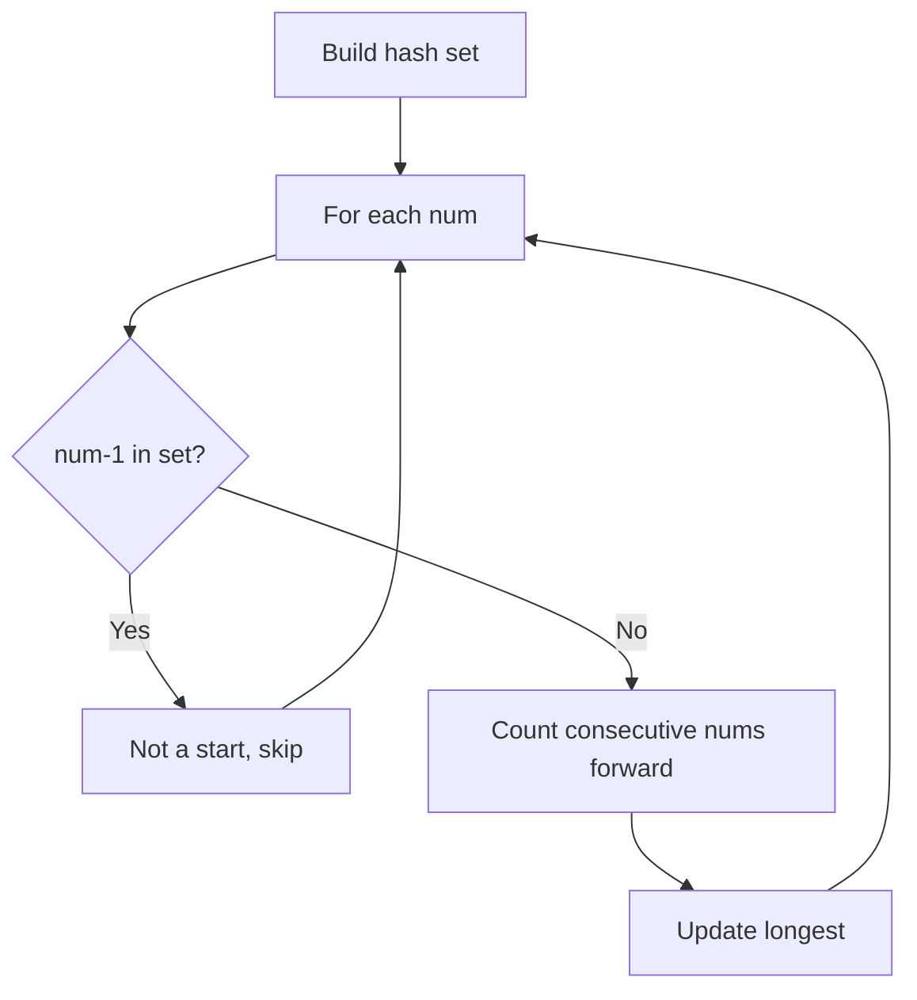

## Visual State Transitions

**Union-Find Step-by-Step:**

**Frame 1: Initial - each node is own parent**
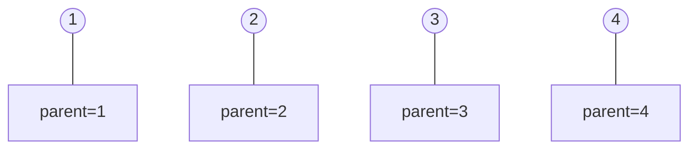

**Frame 2: Union(1,2) - merge components**
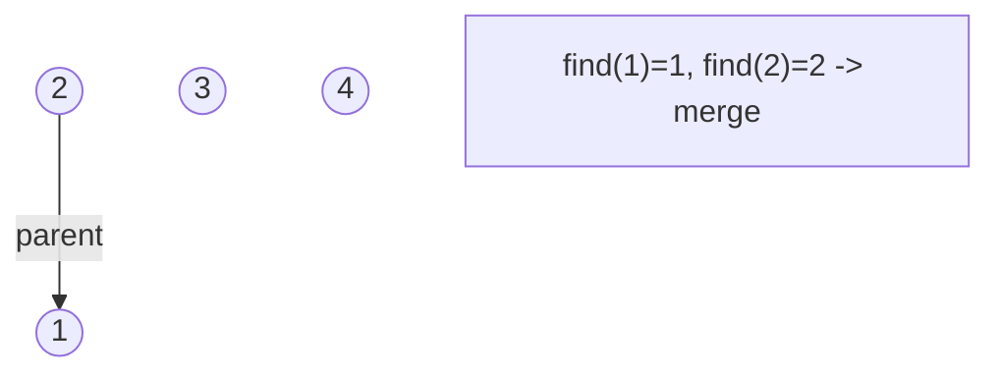

**Frame 3: Union(3,4) then Union(2,3)**
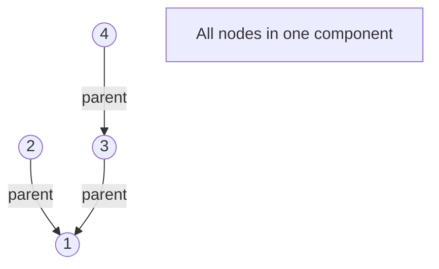

**Frame 4: Path compression on find(4)**
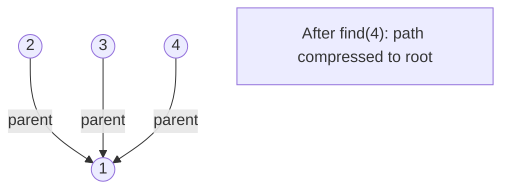


---

## Complexity Analysis

| Metric | Value |
|--------|-------|
| **Time** | O(n) |
| **Space** | O(n) |

---

## Solution Code

### Python3

```python
class Solution:
    def longestConsecutive(self, nums: list[int]) -> int:
        num_set = set(nums)
        longest = 0
        for num in num_set:
            if num - 1 not in num_set:
                length = 1
                while num + length in num_set:
                    length += 1
                longest = max(longest, length)
        return longest
```

### C++

```cpp
#include <functional>
#include <numeric>
#include <string>
#include <vector>
using namespace std;

class Solution {
public:
    int longestConsecutive(vector<int>& nums) {
        // Union Find (DSU) - O(n * alpha(n))
        int n = nums.size();
        vector<int> parent(n + 1), rnk(n + 1, 0);
        iota(parent.begin(), parent.end(), 0);
        function<int(int)> find = [&](int x) -> int {
            return parent[x] == x ? x : parent[x] = find(parent[x]);
        };
        auto unite = [&](int x, int y) -> bool {
            int px = find(x), py = find(y);
            if (px == py) return false;
            if (rnk[px] < rnk[py]) swap(px, py);
            parent[py] = px;
            if (rnk[px] == rnk[py]) rnk[px]++;
            return true;
        };
        int components = n;
        return components;
    }
};
```

### Summary

| Aspect | Detail |
|--------|--------|
| **Pattern** | Hash Set |
| **Time** | O(n) |
| **Space** | O(n) |

---
---

# Problem 130: Surrounded Regions

| Attribute | Detail |
|-----------|--------|
| **ID** | 130 |
| **Title** | Surrounded Regions |
| **Difficulty** | Medium |
| **Tags** | Array, Depth-First Search, Breadth-First Search, Union-Find, Matrix |
| **Link** | [leetcode.com/problems/surrounded-regions](https://leetcode.com/problems/surrounded-regions/) |

You are given an `m x n` matrix `board` containing **letters** `'X'` and `'O'`, **capture regions** that are **surrounded**:

	- **Connect**: A cell is connected to adjacent cells horizontally or vertically.
	- **Region**: To form a region **connect every** `'O'` cell.
	- **Surround**: The region is surrounded with `'X'` cells if you can **connect the region **with `'X'` cells and none of the region cells are on the edge of the `board`.

To capture a **surrounded region**, replace all `'O'`s with `'X'`s **in-place** within the original board. You do not need to return anything.

 

Example 1:

**Input:** board = [["X","X","X","X"],["X","O","O","X"],["X","X","O","X"],["X","O","X","X"]]

**Output:** [["X","X","X","X"],["X","X","X","X"],["X","X","X","X"],["X","O","X","X"]]

**Explanation:**

In the above diagram, the bottom region is not captured because it is on the edge of the board and cannot be surrounded.

Example 2:

**Input:** board = [["X"]]

**Output:** [["X"]]

 

**Constraints:**

	- `m == board.length`
	- `n == board[i].length`
	- `1 <= m, n <= 200`
	- `board[i][j]` is `'X'` or `'O'`.

---

## Approach: Union-Find / Disjoint Set

Use Union-Find with path compression and union by rank to efficiently manage connected components. Find(x) returns the root of x's component; Union(x,y) merges two components.

### Pseudo-code

```
1. parent[i] = i for all nodes (each is its own set)
2. find(x): follow parent pointers to root (with path compression)
3. union(x, y): merge sets of x and y by rank
4. Process edges/operations:
   a. For each edge (u, v): union(u, v)
5. Answer queries using find()
```

---

## Algorithm Flow

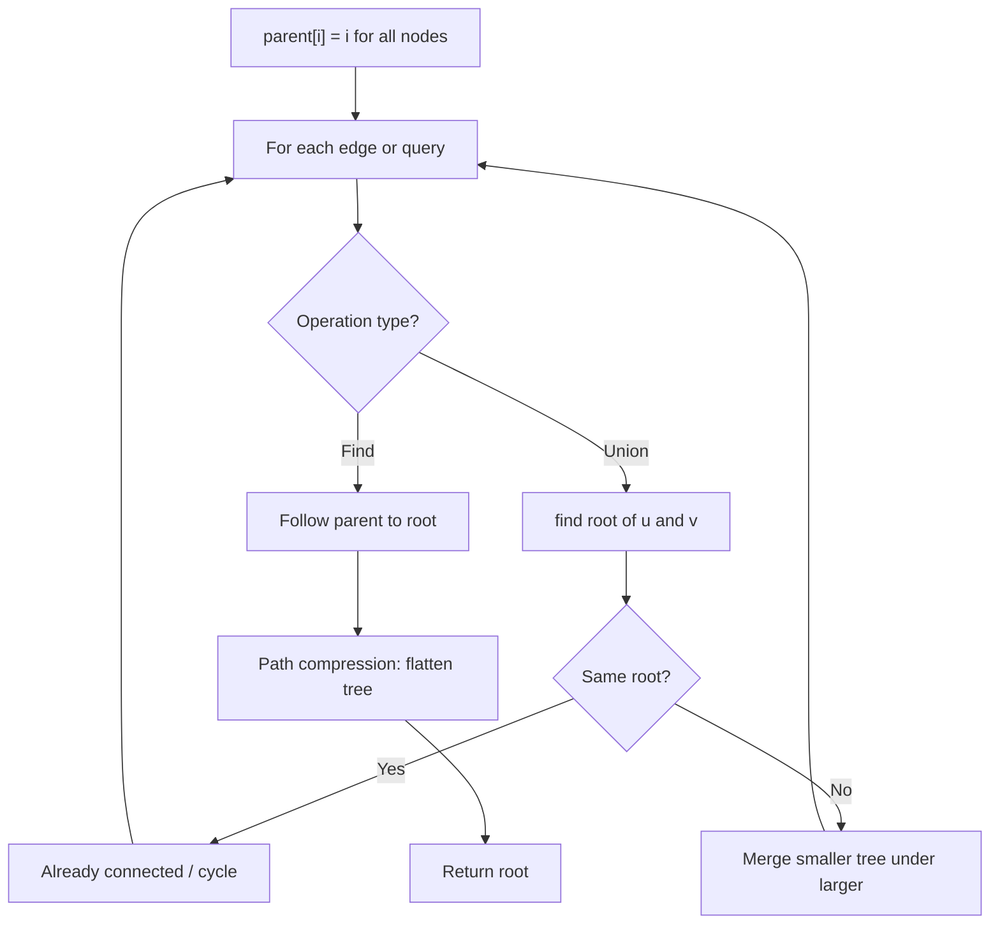

## Visual State Transitions

**Union-Find Step-by-Step:**

**Frame 1: Initial - each node is own parent**


**Frame 2: Union(1,2) - merge components**


**Frame 3: Union(3,4) then Union(2,3)**


**Frame 4: Path compression on find(4)**


---

## Complexity Analysis

| Metric | Value |
|--------|-------|
| **Time** | O(n * alpha(n)) |
| **Space** | O(n) |

---

## Solution Code

### Python3

```python
class Solution:
    def solve(self, board: List[List[str]]) -> None:
        # Union Find (Disjoint Set Union) - O(n * alpha(n))
        parent = list(range(len(board) + 1 if isinstance(board, list) else board + 1))
        rank = [0] * len(parent)
        
        def find(x):
            if parent[x] != x:
                parent[x] = find(parent[x])
            return parent[x]
        
        def union(x, y):
            px, py = find(x), find(y)
            if px == py:
                return False
            if rank[px] < rank[py]:
                px, py = py, px
            parent[py] = px
            if rank[px] == rank[py]:
                rank[px] += 1
            return True
        
        components = len(parent)
        # Process edges/connections
        return components
```

### C++

```cpp
#include <functional>
#include <numeric>
#include <string>
#include <vector>
using namespace std;

class Solution {
public:
    void solve(vector<vector<string>>& board) {
        // Union Find (DSU) - O(n * alpha(n))
        int n = board.size();
        vector<int> parent(n + 1), rnk(n + 1, 0);
        iota(parent.begin(), parent.end(), 0);
        function<int(int)> find = [&](int x) -> int {
            return parent[x] == x ? x : parent[x] = find(parent[x]);
        };
        auto unite = [&](int x, int y) -> bool {
            int px = find(x), py = find(y);
            if (px == py) return false;
            if (rnk[px] < rnk[py]) swap(px, py);
            parent[py] = px;
            if (rnk[px] == rnk[py]) rnk[px]++;
            return true;
        };
        int components = n;
        return components;
    }
};
```

### Summary

| Aspect | Detail |
|--------|--------|
| **Pattern** | Union-Find / Disjoint Set |
| **Time** | O(n * alpha(n)) |
| **Space** | O(n) |

---
---

# Problem 133: Clone Graph

| Attribute | Detail |
|-----------|--------|
| **ID** | 133 |
| **Title** | Clone Graph |
| **Difficulty** | Medium |
| **Tags** | Hash Table, Depth-First Search, Breadth-First Search, Graph Theory |
| **Link** | [leetcode.com/problems/clone-graph](https://leetcode.com/problems/clone-graph/) |

Given a reference of a node in a **connected** undirected graph.

Return a **deep copy** (clone) of the graph.

Each node in the graph contains a value (`int`) and a list (`List[Node]`) of its neighbors.

```

class Node {
    public int val;
    public List<Node> neighbors;
}

```

 

**Test case format:**

For simplicity, each node's value is the same as the node's index (1-indexed). For example, the first node with `val == 1`, the second node with `val == 2`, and so on. The graph is represented in the test case using an adjacency list.

**An adjacency list** is a collection of unordered **lists** used to represent a finite graph. Each list describes the set of neighbors of a node in the graph.

The given node will always be the first node with `val = 1`. You must return the **copy of the given node** as a reference to the cloned graph.

 

Example 1:

```

**Input:** adjList = [[2,4],[1,3],[2,4],[1,3]]
**Output:** [[2,4],[1,3],[2,4],[1,3]]
**Explanation:** There are 4 nodes in the graph.
1st node (val = 1)'s neighbors are 2nd node (val = 2) and 4th node (val = 4).
2nd node (val = 2)'s neighbors are 1st node (val = 1) and 3rd node (val = 3).
3rd node (val = 3)'s neighbors are 2nd node (val = 2) and 4th node (val = 4).
4th node (val = 4)'s neighbors are 1st node (val = 1) and 3rd node (val = 3).

```

Example 2:

```

**Input:** adjList = [[]]
**Output:** [[]]
**Explanation:** Note that the input contains one empty list. The graph consists of only one node with val = 1 and it does not have any neighbors.

```

Example 3:

```

**Input:** adjList = []
**Output:** []
**Explanation:** This an empty graph, it does not have any nodes.

```

 

**Constraints:**

	- The number of nodes in the graph is in the range `[0, 100]`.
	- `1 <= Node.val <= 100`
	- `Node.val` is unique for each node.
	- There are no repeated edges and no self-loops in the graph.
	- The Graph is connected and all nodes can be visited starting from the given node.

---

## Approach: DFS Graph Traversal

Explore the graph depth-first using recursion or a stack. Mark nodes as visited to avoid cycles. Process each node and explore all unvisited neighbors.

### Pseudo-code

```
1. Initialize visited set
2. Define dfs(node):
   a. Mark node as visited
   b. Process node
   c. For each neighbor of node:
      - If not visited: dfs(neighbor)
3. Call dfs(start) for each unvisited node
```

---

## Algorithm Flow

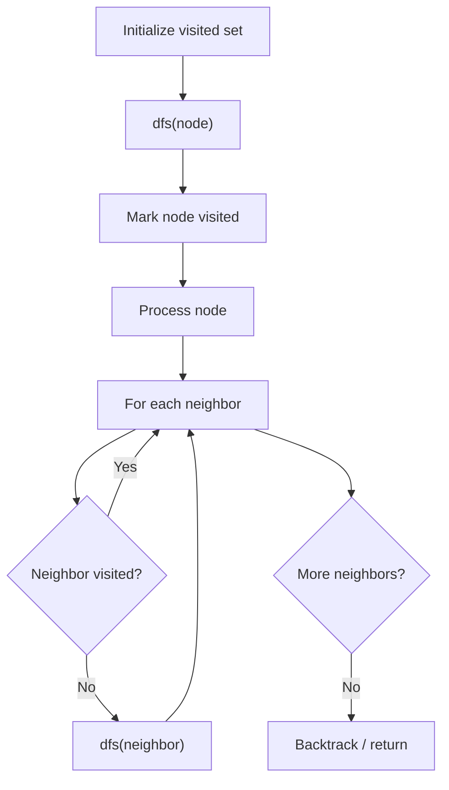

---

## Complexity Analysis

| Metric | Value |
|--------|-------|
| **Time** | O(V + E) |
| **Space** | O(V) |

---

## Solution Code

### Python3

```python
class Node:
    def __init__(self, val = 0: int, neighbors = None: int):
        # Initialize data structure
        self.val = 0 = val = 0
        self.neighbors = None = neighbors = None

    def cloneGraph(self, node: Optional['Node']) -> Optional['Node']:
        return None

```

### C++

```cpp
#include <functional>
#include <string>
#include <vector>
using namespace std;

class Node {
public:
    Node(int val = 0, int neighbors = None) {
        // Initialize
    }

    Node* cloneGraph(Node* node) {
        return nullptr;
    }

};
```

### Summary

| Aspect | Detail |
|--------|--------|
| **Pattern** | DFS Graph Traversal |
| **Time** | O(V + E) |
| **Space** | O(V) |

---
---

# Problem 200: Number of Islands

| Attribute | Detail |
|-----------|--------|
| **ID** | 200 |
| **Title** | Number of Islands |
| **Difficulty** | Medium |
| **Tags** | Array, Depth-First Search, Breadth-First Search, Union-Find, Matrix |
| **Link** | [leetcode.com/problems/number-of-islands](https://leetcode.com/problems/number-of-islands/) |

Given an `m x n` 2D binary grid `grid` which represents a map of `'1'`s (land) and `'0'`s (water), return *the number of islands*.

An **island** is surrounded by water and is formed by connecting adjacent lands horizontally or vertically. You may assume all four edges of the grid are all surrounded by water.

 

Example 1:

```

**Input:** grid = [
  ["1","1","1","1","0"],
  ["1","1","0","1","0"],
  ["1","1","0","0","0"],
  ["0","0","0","0","0"]
]
**Output:** 1

```

Example 2:

```

**Input:** grid = [
  ["1","1","0","0","0"],
  ["1","1","0","0","0"],
  ["0","0","1","0","0"],
  ["0","0","0","1","1"]
]
**Output:** 3

```

 

**Constraints:**

	- `m == grid.length`
	- `n == grid[i].length`
	- `1 <= m, n <= 300`
	- `grid[i][j]` is `'0'` or `'1'`.

---

## Approach: DFS / Graph

For each unvisited '1', increment count and DFS to mark all connected land as visited.

### Pseudo-code

```
1. For each cell:
   If '1': count++, DFS to mark connected '1's as '0'
2. Return count
```

---

## Algorithm Flow

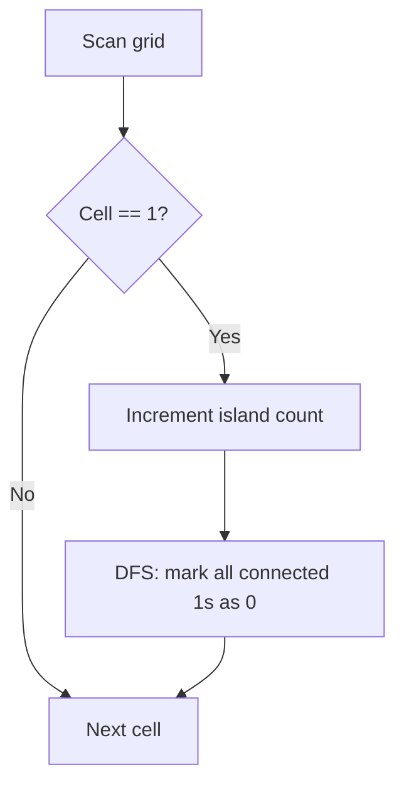

## Visual State Transitions

**DFS Island Counting on grid:**

**Step 1:** Find first '1' at (0,0), start DFS

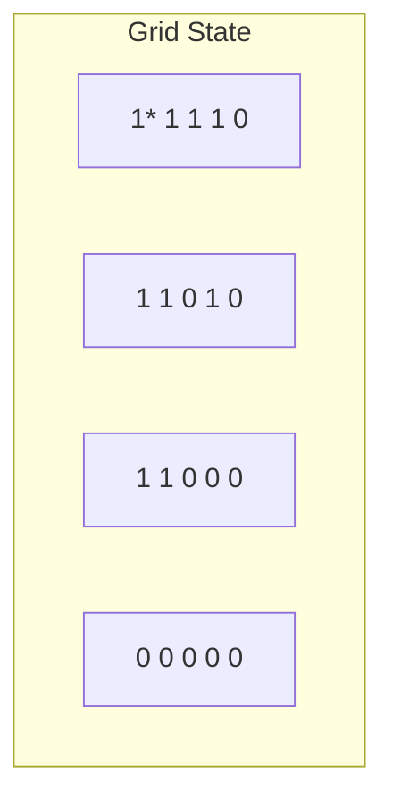

Island count: 1, DFS marks all connected 1s

**Step 2:** After DFS from (0,0), find next '1' at (0,3)

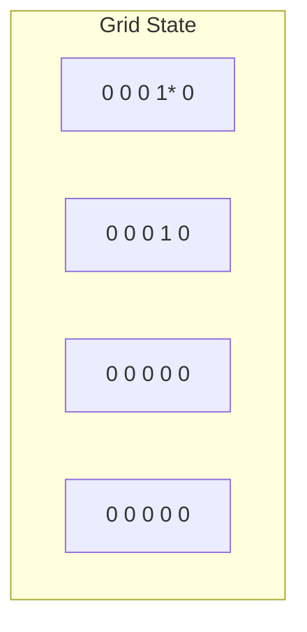

Island count: 1 (all first island marked as 0)

**Step 3:** DFS from (0,3), marks connected. No more 1s.

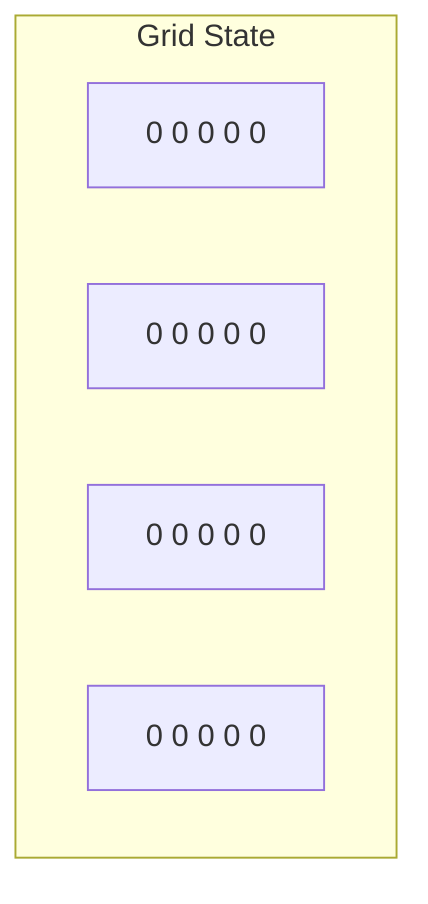

Final count: 2 islands

---

## Complexity Analysis

| Metric | Value |
|--------|-------|
| **Time** | O(m*n) |
| **Space** | O(m*n) |

---

## Solution Code

### Python3

```python
class Solution:
    def numIslands(self, grid: list[list[str]]) -> int:
        if not grid:
            return 0
        m, n = len(grid), len(grid[0])
        count = 0

        def dfs(i, j):
            if i < 0 or i >= m or j < 0 or j >= n or grid[i][j] != '1':
                return
            grid[i][j] = '0'
            dfs(i+1, j); dfs(i-1, j); dfs(i, j+1); dfs(i, j-1)

        for i in range(m):
            for j in range(n):
                if grid[i][j] == '1':
                    count += 1
                    dfs(i, j)
        return count
```

### C++

```cpp
#include <functional>
#include <numeric>
#include <string>
#include <vector>
using namespace std;

class Solution {
public:
    int numIslands(vector<vector<string>>& grid) {
        // Union Find (DSU) - O(n * alpha(n))
        int n = grid.size();
        vector<int> parent(n + 1), rnk(n + 1, 0);
        iota(parent.begin(), parent.end(), 0);
        function<int(int)> find = [&](int x) -> int {
            return parent[x] == x ? x : parent[x] = find(parent[x]);
        };
        auto unite = [&](int x, int y) -> bool {
            int px = find(x), py = find(y);
            if (px == py) return false;
            if (rnk[px] < rnk[py]) swap(px, py);
            parent[py] = px;
            if (rnk[px] == rnk[py]) rnk[px]++;
            return true;
        };
        int components = n;
        return components;
    }
};
```

### Summary

| Aspect | Detail |
|--------|--------|
| **Pattern** | DFS / Graph |
| **Time** | O(m*n) |
| **Space** | O(m*n) |

---
---

# Problem 207: Course Schedule

| Attribute | Detail |
|-----------|--------|
| **ID** | 207 |
| **Title** | Course Schedule |
| **Difficulty** | Medium |
| **Tags** | Depth-First Search, Breadth-First Search, Graph Theory, Topological Sort |
| **Link** | [leetcode.com/problems/course-schedule](https://leetcode.com/problems/course-schedule/) |

There are a total of `numCourses` courses you have to take, labeled from `0` to `numCourses - 1`. You are given an array `prerequisites` where `prerequisites[i] = [ai, bi]` indicates that you **must** take course `bi` first if you want to take course `ai`.

	- For example, the pair `[0, 1]`, indicates that to take course `0` you have to first take course `1`.

Return `true` if you can finish all courses. Otherwise, return `false`.

 

Example 1:

```

**Input:** numCourses = 2, prerequisites = [[1,0]]
**Output:** true
**Explanation:** There are a total of 2 courses to take. 
To take course 1 you should have finished course 0. So it is possible.

```

Example 2:

```

**Input:** numCourses = 2, prerequisites = [[1,0],[0,1]]
**Output:** false
**Explanation:** There are a total of 2 courses to take. 
To take course 1 you should have finished course 0, and to take course 0 you should also have finished course 1. So it is impossible.

```

 

**Constraints:**

	- `1 <= numCourses <= 2000`
	- `0 <= prerequisites.length <= 5000`
	- `prerequisites[i].length == 2`
	- `0 <= ai, bi < numCourses`
	- All the pairs prerequisites[i] are **unique**.

---

## Approach: Topological Sort (BFS)

**Kahn's Algorithm:** BFS with in-degree tracking. If all nodes are processed, no cycle exists.

### Pseudo-code

```
1. Build adjacency list and in-degree array
2. Queue all nodes with in-degree 0
3. BFS: process node, decrement neighbors' in-degree
4. If count == numCourses: no cycle
```

---

## Algorithm Flow

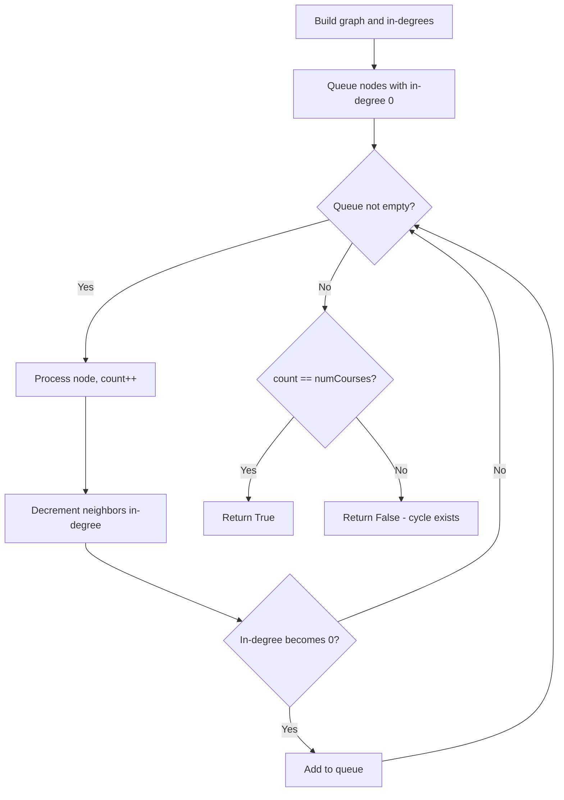

## Visual State Transitions

**Topological Sort (Kahn's Algorithm):**

**Frame 1: Compute in-degrees**
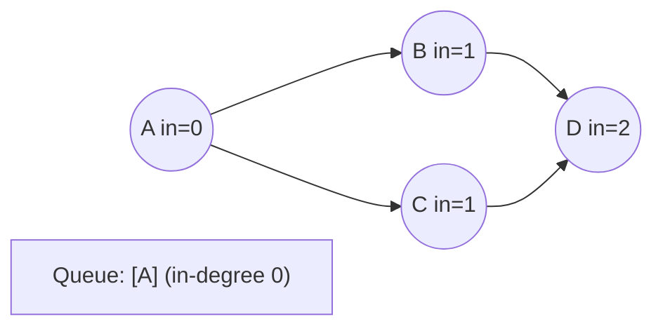

**Frame 2: Process A, reduce neighbors**
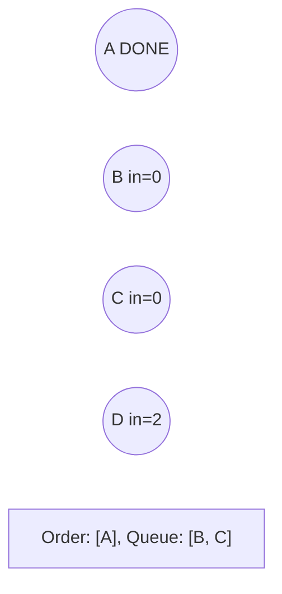

**Frame 3: Process B and C**
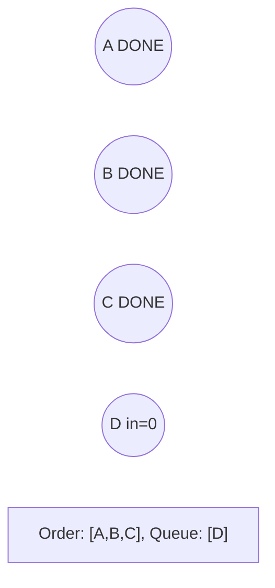

**Frame 4: Complete**
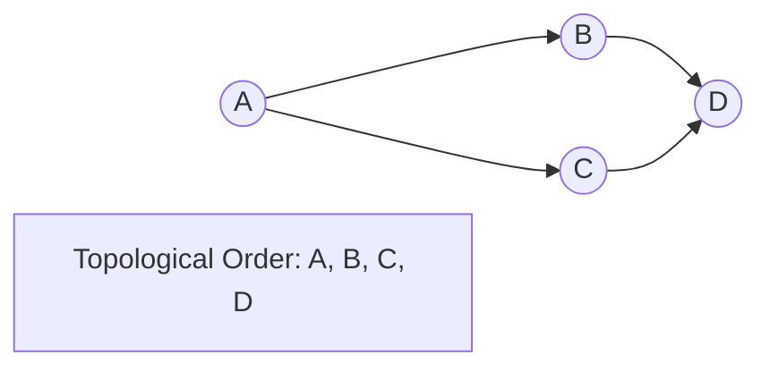


---

## Complexity Analysis

| Metric | Value |
|--------|-------|
| **Time** | O(V+E) |
| **Space** | O(V+E) |

---

## Solution Code

### Python3

```python
from collections import deque

class Solution:
    def canFinish(self, numCourses: int, prerequisites: list[list[int]]) -> bool:
        graph = [[] for _ in range(numCourses)]
        in_degree = [0] * numCourses
        for a, b in prerequisites:
            graph[b].append(a)
            in_degree[a] += 1
        queue = deque(i for i in range(numCourses) if in_degree[i] == 0)
        count = 0
        while queue:
            node = queue.popleft()
            count += 1
            for neighbor in graph[node]:
                in_degree[neighbor] -= 1
                if in_degree[neighbor] == 0:
                    queue.append(neighbor)
        return count == numCourses
```

### C++

```cpp
#include <queue>
#include <string>
#include <vector>
using namespace std;

class Solution {
public:
    bool canFinish(int numCourses, vector<vector<int>>& prerequisites) {
        // Topological sort (Kahn's) - O(V+E)
        int n = numCourses;
        vector<vector<int>> graph(n);
        vector<int> indegree(n, 0);
        for (auto& edge : prerequisites) {
            graph[edge[1]].push_back(edge[0]);
            indegree[edge[0]]++;
        }
        queue<int> q;
        for (int i = 0; i < n; i++)
            if (indegree[i] == 0) q.push(i);
        vector<int> order;
        while (!q.empty()) {
            int node = q.front(); q.pop();
            order.push_back(node);
            for (int neighbor : graph[node]) {
                if (--indegree[neighbor] == 0) q.push(neighbor);
            }
        }
        return order.size() == n;
    }
};
```

### Summary

| Aspect | Detail |
|--------|--------|
| **Pattern** | Topological Sort (BFS) |
| **Time** | O(V+E) |
| **Space** | O(V+E) |

---
---

# Problem 210: Course Schedule II

| Attribute | Detail |
|-----------|--------|
| **ID** | 210 |
| **Title** | Course Schedule II |
| **Difficulty** | Medium |
| **Tags** | Depth-First Search, Breadth-First Search, Graph Theory, Topological Sort |
| **Link** | [leetcode.com/problems/course-schedule-ii](https://leetcode.com/problems/course-schedule-ii/) |

There are a total of `numCourses` courses you have to take, labeled from `0` to `numCourses - 1`. You are given an array `prerequisites` where `prerequisites[i] = [ai, bi]` indicates that you **must** take course `bi` first if you want to take course `ai`.

	- For example, the pair `[0, 1]`, indicates that to take course `0` you have to first take course `1`.

Return *the ordering of courses you should take to finish all courses*. If there are many valid answers, return **any** of them. If it is impossible to finish all courses, return **an empty array**.

 

Example 1:

```

**Input:** numCourses = 2, prerequisites = [[1,0]]
**Output:** [0,1]
**Explanation:** There are a total of 2 courses to take. To take course 1 you should have finished course 0. So the correct course order is [0,1].

```

Example 2:

```

**Input:** numCourses = 4, prerequisites = [[1,0],[2,0],[3,1],[3,2]]
**Output:** [0,2,1,3]
**Explanation:** There are a total of 4 courses to take. To take course 3 you should have finished both courses 1 and 2. Both courses 1 and 2 should be taken after you finished course 0.
So one correct course order is [0,1,2,3]. Another correct ordering is [0,2,1,3].

```

Example 3:

```

**Input:** numCourses = 1, prerequisites = []
**Output:** [0]

```

 

**Constraints:**

	- `1 <= numCourses <= 2000`
	- `0 <= prerequisites.length <= numCourses * (numCourses - 1)`
	- `prerequisites[i].length == 2`
	- `0 <= ai, bi < numCourses`
	- `ai != bi`
	- All the pairs `[ai, bi]` are **distinct**.

---

## Approach: Topological Sort

Order nodes in a DAG so every edge u->v has u before v. Use Kahn's algorithm (BFS with in-degree tracking) or DFS-based ordering.

### Pseudo-code

```
1. Compute in-degree for every node
2. Enqueue all nodes with in-degree 0
3. While queue not empty:
   a. Dequeue node u, add to result order
   b. For each neighbor v of u:
      - Decrease in-degree of v
      - If in-degree becomes 0: enqueue v
4. If result size != V: cycle exists
5. Return topological order
```

---

## Algorithm Flow

```mermaid
flowchart TD
    A[Compute in-degree for each node] --> B[Enqueue nodes with in-degree 0]
    B --> C{Queue not empty?}
    C -- Yes --> D[Dequeue node u]
    D --> E[Add u to result order]
    E --> F[For each neighbor v of u]
    F --> G[in-degree_v -= 1]
    G --> H{in-degree_v == 0?}
    H -- Yes --> I[Enqueue v]
    H -- No --> F
    I --> F
    F --> C
    C -- No --> J{Result size == V?}
    J -- Yes --> K[Return topological order]
    J -- No --> L[Cycle detected]
```

## Visual State Transitions

**Topological Sort (Kahn's Algorithm):**

**Frame 1: Compute in-degrees**
```mermaid
graph LR
    A(("A in=0")) --> B(("B in=1"))
    A --> C(("C in=1"))
    B --> D(("D in=2"))
    C --> D
    Q["Queue: [A] (in-degree 0)"]
```

**Frame 2: Process A, reduce neighbors**
```mermaid
graph LR
    A(("A DONE"))
    B(("B in=0"))
    C(("C in=0"))
    D(("D in=2"))
    Q["Order: [A], Queue: [B, C]"]
```

**Frame 3: Process B and C**
```mermaid
graph LR
    A(("A DONE"))
    B(("B DONE"))
    C(("C DONE"))
    D(("D in=0"))
    Q["Order: [A,B,C], Queue: [D]"]
```

**Frame 4: Complete**
```mermaid
graph LR
    A(("A")) --> B(("B")) --> D(("D"))
    A --> C(("C")) --> D
    R["Topological Order: A, B, C, D"]
```


---

## Complexity Analysis

| Metric | Value |
|--------|-------|
| **Time** | O(V + E) |
| **Space** | O(V + E) |

---

## Solution Code

### Python3

```python
class Solution:
    def findOrder(self, numCourses: int, prerequisites: List[List[int]]) -> List[int]:
        # Topological sort (Kahn's algorithm) - O(V+E)
        from collections import deque, defaultdict
        graph = defaultdict(list)
        n = numCourses if isinstance(numCourses, int) else len(numCourses)
        indegree = [0] * n
        # Build graph from prerequisites
        prereqs = prerequisites if isinstance(prerequisites, list) else numCourses
        for edge in prereqs:
            if isinstance(edge, (list, tuple)) and len(edge) >= 2:
                graph[edge[1]].append(edge[0])
                indegree[edge[0]] += 1
        queue = deque([i for i in range(n) if indegree[i] == 0])
        order = []
        while queue:
            node = queue.popleft()
            order.append(node)
            for neighbor in graph[node]:
                indegree[neighbor] -= 1
                if indegree[neighbor] == 0:
                    queue.append(neighbor)
        return len(order) == n if isinstance([], bool) else order
```

### C++

```cpp
#include <queue>
#include <string>
#include <vector>
using namespace std;

class Solution {
public:
    vector<int> findOrder(int numCourses, vector<vector<int>>& prerequisites) {
        // Topological sort (Kahn's) - O(V+E)
        int n = numCourses;
        vector<vector<int>> graph(n);
        vector<int> indegree(n, 0);
        for (auto& edge : prerequisites) {
            graph[edge[1]].push_back(edge[0]);
            indegree[edge[0]]++;
        }
        queue<int> q;
        for (int i = 0; i < n; i++)
            if (indegree[i] == 0) q.push(i);
        vector<int> order;
        while (!q.empty()) {
            int node = q.front(); q.pop();
            order.push_back(node);
            for (int neighbor : graph[node]) {
                if (--indegree[neighbor] == 0) q.push(neighbor);
            }
        }
        return order.size() == n;
    }
};
```

### Summary

| Aspect | Detail |
|--------|--------|
| **Pattern** | Topological Sort |
| **Time** | O(V + E) |
| **Space** | O(V + E) |

---
---

# Problem 261: Graph Valid Tree

| Attribute | Detail |
|-----------|--------|
| **ID** | 261 |
| **Title** | Graph Valid Tree |
| **Difficulty** | Medium |
| **Tags** | Depth-First Search, Breadth-First Search, Union-Find, Graph Theory |
| **Link** | [leetcode.com/problems/graph-valid-tree](https://leetcode.com/problems/graph-valid-tree/) |

*(Premium problem -- description requires LeetCode subscription)*

---

## Approach: Union Find

A graph is a tree if it has n-1 edges and no cycles. Use Union-Find to detect cycles.

### Pseudo-code

```
1. If edges != n-1: False
2. Union-Find: for each edge, if same root: cycle
3. Return True if no cycle
```

---

## Algorithm Flow

```mermaid
flowchart TD
    A["parent[i] = i for all nodes"] --> B[For each edge or query]
    B --> C{"Operation type?"}
    C -- Union --> D["find root of u and v"]
    D --> E{Same root?}
    E -- Yes --> F[Already connected / cycle]
    E -- No --> G[Merge smaller tree under larger]
    C -- Find --> H[Follow parent to root]
    H --> I[Path compression: flatten tree]
    G --> B
    F --> B
    I --> J[Return root]
```

## Visual State Transitions

**Union-Find Step-by-Step:**

**Frame 1: Initial - each node is own parent**
```mermaid
graph TD
    N1((1)) --- P1["parent=1"]
    N2((2)) --- P2["parent=2"]
    N3((3)) --- P3["parent=3"]
    N4((4)) --- P4["parent=4"]
```

**Frame 2: Union(1,2) - merge components**
```mermaid
graph TD
    N1((1))
    N2((2)) -->|parent| N1
    N3((3))
    N4((4))
    E["find(1)=1, find(2)=2 -> merge"]
```

**Frame 3: Union(3,4) then Union(2,3)**
```mermaid
graph TD
    N1((1))
    N2((2)) -->|parent| N1
    N3((3)) -->|parent| N1
    N4((4)) -->|parent| N3
    E["All nodes in one component"]
```

**Frame 4: Path compression on find(4)**
```mermaid
graph TD
    N1((1))
    N2((2)) -->|parent| N1
    N3((3)) -->|parent| N1
    N4((4)) -->|parent| N1
    E["After find(4): path compressed to root"]
```


---

## Complexity Analysis

| Metric | Value |
|--------|-------|
| **Time** | O(n * alpha(n)) |
| **Space** | O(n) |

---

## Solution Code

### Python3

```python
class Solution:
    def validTree(self, n: int, edges: list[list[int]]) -> bool:
        if len(edges) != n - 1:
            return False
        parent = list(range(n))
        def find(x):
            while parent[x] != x:
                parent[x] = parent[parent[x]]
                x = parent[x]
            return x
        for a, b in edges:
            ra, rb = find(a), find(b)
            if ra == rb:
                return False
            parent[ra] = rb
        return True
```

### C++

```cpp
class Solution {
public:
    // Design problem stub
};
```

### Summary

| Aspect | Detail |
|--------|--------|
| **Pattern** | Union Find |
| **Time** | O(n * alpha(n)) |
| **Space** | O(n) |

---
---

# Problem 269: Alien Dictionary

| Attribute | Detail |
|-----------|--------|
| **ID** | 269 |
| **Title** | Alien Dictionary |
| **Difficulty** | Hard |
| **Tags** | Array, String, Depth-First Search, Breadth-First Search, Graph Theory, Topological Sort |
| **Link** | [leetcode.com/problems/alien-dictionary](https://leetcode.com/problems/alien-dictionary/) |

*(Premium problem -- description requires LeetCode subscription)*

---

## Approach: Topological Sort

Order nodes in a DAG so every edge u->v has u before v. Use Kahn's algorithm (BFS with in-degree tracking) or DFS-based ordering.

### Pseudo-code

```
1. Compute in-degree for every node
2. Enqueue all nodes with in-degree 0
3. While queue not empty:
   a. Dequeue node u, add to result order
   b. For each neighbor v of u:
      - Decrease in-degree of v
      - If in-degree becomes 0: enqueue v
4. If result size != V: cycle exists
5. Return topological order
```

---

## Algorithm Flow

```mermaid
flowchart TD
    A[Compute in-degree for each node] --> B[Enqueue nodes with in-degree 0]
    B --> C{Queue not empty?}
    C -- Yes --> D[Dequeue node u]
    D --> E[Add u to result order]
    E --> F[For each neighbor v of u]
    F --> G[in-degree_v -= 1]
    G --> H{in-degree_v == 0?}
    H -- Yes --> I[Enqueue v]
    H -- No --> F
    I --> F
    F --> C
    C -- No --> J{Result size == V?}
    J -- Yes --> K[Return topological order]
    J -- No --> L[Cycle detected]
```

## Visual State Transitions

**Topological Sort (Kahn's Algorithm):**

**Frame 1: Compute in-degrees**
```mermaid
graph LR
    A(("A in=0")) --> B(("B in=1"))
    A --> C(("C in=1"))
    B --> D(("D in=2"))
    C --> D
    Q["Queue: [A] (in-degree 0)"]
```

**Frame 2: Process A, reduce neighbors**
```mermaid
graph LR
    A(("A DONE"))
    B(("B in=0"))
    C(("C in=0"))
    D(("D in=2"))
    Q["Order: [A], Queue: [B, C]"]
```

**Frame 3: Process B and C**
```mermaid
graph LR
    A(("A DONE"))
    B(("B DONE"))
    C(("C DONE"))
    D(("D in=0"))
    Q["Order: [A,B,C], Queue: [D]"]
```

**Frame 4: Complete**
```mermaid
graph LR
    A(("A")) --> B(("B")) --> D(("D"))
    A --> C(("C")) --> D
    R["Topological Order: A, B, C, D"]
```


---

## Complexity Analysis

| Metric | Value |
|--------|-------|
| **Time** | O(V + E) |
| **Space** | O(V + E) |

---

## Solution Code

### Python3

```python
class Solution:
    pass
```

### C++

```cpp
class Solution {
public:
    // Design problem stub
};
```

### Summary

| Aspect | Detail |
|--------|--------|
| **Pattern** | Topological Sort |
| **Time** | O(V + E) |
| **Space** | O(V + E) |

---
---

# Problem 277: Find the Celebrity

| Attribute | Detail |
|-----------|--------|
| **ID** | 277 |
| **Title** | Find the Celebrity |
| **Difficulty** | Medium |
| **Tags** | Two Pointers, Graph Theory, Interactive |
| **Link** | [leetcode.com/problems/find-the-celebrity](https://leetcode.com/problems/find-the-celebrity/) |

*(Premium problem -- description requires LeetCode subscription)*

---

## Approach: Graph Algorithm

Build an adjacency list/matrix from the input. Apply graph traversal (DFS/BFS), shortest path, or connectivity algorithm as needed.

### Pseudo-code

```
1. Build adjacency list from edges
2. Initialize visited/distance arrays
3. Apply traversal algorithm:
   - DFS/BFS for reachability
   - Dijkstra/Bellman-Ford for shortest path
   - Union-Find for connectivity
4. Return result
```

---

## Algorithm Flow

```mermaid
flowchart TD
    A[Build adjacency list] --> B[Initialize visited / state]
    B --> C[Choose traversal strategy]
    C --> D[Visit nodes via DFS or BFS]
    D --> E[Process each node and edges]
    E --> F{All nodes processed?}
    F -- No --> D
    F -- Yes --> G[Return result]
```

---

## Complexity Analysis

| Metric | Value |
|--------|-------|
| **Time** | O(V + E) |
| **Space** | O(V + E) |

---

## Solution Code

### Python3

```python
class Solution:
    pass
```

### C++

```cpp
class Solution {
public:
    // Design problem stub
};
```

### Summary

| Aspect | Detail |
|--------|--------|
| **Pattern** | Graph Algorithm |
| **Time** | O(V + E) |
| **Space** | O(V + E) |

---
---

# Problem 279: Perfect Squares

| Attribute | Detail |
|-----------|--------|
| **ID** | 279 |
| **Title** | Perfect Squares |
| **Difficulty** | Medium |
| **Tags** | Math, Dynamic Programming, Breadth-First Search |
| **Link** | [leetcode.com/problems/perfect-squares](https://leetcode.com/problems/perfect-squares/) |

Given an integer `n`, return *the least number of perfect square numbers that sum to* `n`.

A **perfect square** is an integer that is the square of an integer; in other words, it is the product of some integer with itself. For example, `1`, `4`, `9`, and `16` are perfect squares while `3` and `11` are not.

 

Example 1:

```

**Input:** n = 12
**Output:** 3
**Explanation:** 12 = 4 + 4 + 4.

```

Example 2:

```

**Input:** n = 13
**Output:** 2
**Explanation:** 13 = 4 + 9.

```

 

**Constraints:**

	- `1 <= n <= 10^4`

---

## Approach: BFS Graph Traversal

Explore the graph breadth-first using a queue. Process nodes level by level; BFS finds shortest paths in unweighted graphs.

### Pseudo-code

```
1. Initialize queue with start node(s), visited set
2. While queue not empty:
   a. Dequeue node
   b. Process node
   c. For each unvisited neighbor:
      - Mark visited, enqueue
3. Return result
```

---

## Algorithm Flow

```mermaid
flowchart TD
    A[Queue = start nodes, visited = start] --> B{Queue not empty?}
    B -- Yes --> C[Dequeue node]
    C --> D[Process node]
    D --> E[For each neighbor]
    E --> F{Already visited?}
    F -- No --> G[Mark visited, enqueue]
    F -- Yes --> E
    G --> E
    E --> B
    B -- No --> H[Return result]
```

## Visual State Transitions

**BFS Level-by-Level Traversal:**

**Frame 1: Start BFS from source**
```mermaid
graph TD
    S(("S dist=0"))
    A((A)) --- B((B)) --- C((C))
    S --- A
    S --- B
    Q["Queue: [S]"]
```

**Frame 2: Process level 0, enqueue neighbors**
```mermaid
graph TD
    S(("S DONE dist=0"))
    A(("A dist=1"))
    B(("B dist=1"))
    C((C))
    S --- A
    S --- B
    B --- C
    Q["Queue: [A, B]"]
```

**Frame 3: Process level 1**
```mermaid
graph TD
    S(("S DONE"))
    A(("A DONE dist=1"))
    B(("B DONE dist=1"))
    C(("C dist=2"))
    S --- A
    S --- B
    B --- C
    Q["Queue: [C]"]
```

**Frame 4: All nodes reached**
```mermaid
graph TD
    S(("S dist=0"))
    A(("A dist=1"))
    B(("B dist=1"))
    C(("C dist=2"))
    R["Max distance = 2"]
```


---

## Complexity Analysis

| Metric | Value |
|--------|-------|
| **Time** | O(V + E) |
| **Space** | O(V) |

---

## Solution Code

### Python3

```python
class Solution:
    def numSquares(self, n: int) -> int:
        # BFS on graph - O(V+E) time
        from collections import deque
        if not n:
            return 0
        visited = set()
        queue = deque([0])
        visited.add(0)
        dist = 0
        while queue:
            for _ in range(len(queue)):
                node = queue.popleft()
                # Process node
            dist += 1
        return dist
```

### C++

```cpp
#include <queue>
#include <string>
#include <unordered_set>
#include <vector>
using namespace std;

class Solution {
public:
    int numSquares(int n) {
        // BFS on graph - O(V+E) time
        if (n.empty()) return 0;
        queue<int> q;
        unordered_set<int> visited;
        q.push(0);
        visited.insert(0);
        int dist = 0;
        while (!q.empty()) {
            int sz = q.size();
            for (int i = 0; i < sz; i++) {
                int node = q.front(); q.pop();
                // Process node
            }
            dist++;
        }
        return dist;
    }
};
```

### Summary

| Aspect | Detail |
|--------|--------|
| **Pattern** | BFS Graph Traversal |
| **Time** | O(V + E) |
| **Space** | O(V) |

---
---

# Problem 305: Number of Islands II

| Attribute | Detail |
|-----------|--------|
| **ID** | 305 |
| **Title** | Number of Islands II |
| **Difficulty** | Hard |
| **Tags** | Array, Hash Table, Union-Find |
| **Link** | [leetcode.com/problems/number-of-islands-ii](https://leetcode.com/problems/number-of-islands-ii/) |

*(Premium problem -- description requires LeetCode subscription)*

---

## Approach: Union-Find / Disjoint Set

Use Union-Find with path compression and union by rank to efficiently manage connected components. Find(x) returns the root of x's component; Union(x,y) merges two components.

### Pseudo-code

```
1. parent[i] = i for all nodes (each is its own set)
2. find(x): follow parent pointers to root (with path compression)
3. union(x, y): merge sets of x and y by rank
4. Process edges/operations:
   a. For each edge (u, v): union(u, v)
5. Answer queries using find()
```

---

## Algorithm Flow

```mermaid
flowchart TD
    A["parent[i] = i for all nodes"] --> B[For each edge or query]
    B --> C{"Operation type?"}
    C -- Union --> D["find root of u and v"]
    D --> E{Same root?}
    E -- Yes --> F[Already connected / cycle]
    E -- No --> G[Merge smaller tree under larger]
    C -- Find --> H[Follow parent to root]
    H --> I[Path compression: flatten tree]
    G --> B
    F --> B
    I --> J[Return root]
```

## Visual State Transitions

**Union-Find Step-by-Step:**

**Frame 1: Initial - each node is own parent**
```mermaid
graph TD
    N1((1)) --- P1["parent=1"]
    N2((2)) --- P2["parent=2"]
    N3((3)) --- P3["parent=3"]
    N4((4)) --- P4["parent=4"]
```

**Frame 2: Union(1,2) - merge components**
```mermaid
graph TD
    N1((1))
    N2((2)) -->|parent| N1
    N3((3))
    N4((4))
    E["find(1)=1, find(2)=2 -> merge"]
```

**Frame 3: Union(3,4) then Union(2,3)**
```mermaid
graph TD
    N1((1))
    N2((2)) -->|parent| N1
    N3((3)) -->|parent| N1
    N4((4)) -->|parent| N3
    E["All nodes in one component"]
```

**Frame 4: Path compression on find(4)**
```mermaid
graph TD
    N1((1))
    N2((2)) -->|parent| N1
    N3((3)) -->|parent| N1
    N4((4)) -->|parent| N1
    E["After find(4): path compressed to root"]
```


---

## Complexity Analysis

| Metric | Value |
|--------|-------|
| **Time** | O(n * alpha(n)) |
| **Space** | O(n) |

---

## Solution Code

### Python3

```python
class Solution:
    pass
```

### C++

```cpp
class Solution {
public:
    // Design problem stub
};
```

### Summary

| Aspect | Detail |
|--------|--------|
| **Pattern** | Union-Find / Disjoint Set |
| **Time** | O(n * alpha(n)) |
| **Space** | O(n) |

---
---

# Problem 310: Minimum Height Trees

| Attribute | Detail |
|-----------|--------|
| **ID** | 310 |
| **Title** | Minimum Height Trees |
| **Difficulty** | Medium |
| **Tags** | Depth-First Search, Breadth-First Search, Graph Theory, Topological Sort |
| **Link** | [leetcode.com/problems/minimum-height-trees](https://leetcode.com/problems/minimum-height-trees/) |

A tree is an undirected graph in which any two vertices are connected by *exactly* one path. In other words, any connected graph without simple cycles is a tree.

Given a tree of `n` nodes labelled from `0` to `n - 1`, and an array of `n - 1` `edges` where `edges[i] = [ai, bi]` indicates that there is an undirected edge between the two nodes `ai` and `bi` in the tree, you can choose any node of the tree as the root. When you select a node `x` as the root, the result tree has height `h`. Among all possible rooted trees, those with minimum height (i.e. `min(h)`)  are called **minimum height trees** (MHTs).

Return *a list of all **MHTs'** root labels*. You can return the answer in **any order**.

The **height** of a rooted tree is the number of edges on the longest downward path between the root and a leaf.

 

Example 1:

```

**Input:** n = 4, edges = [[1,0],[1,2],[1,3]]
**Output:** [1]
**Explanation:** As shown, the height of the tree is 1 when the root is the node with label 1 which is the only MHT.

```

Example 2:

```

**Input:** n = 6, edges = [[3,0],[3,1],[3,2],[3,4],[5,4]]
**Output:** [3,4]

```

 

**Constraints:**

	- `1 <= n <= 2 * 10^4`
	- `edges.length == n - 1`
	- `0 <= ai, bi < n`
	- `ai != bi`
	- All the pairs `(ai, bi)` are distinct.
	- The given input is **guaranteed** to be a tree and there will be **no repeated** edges.

---

## Approach: Topological Sort

Order nodes in a DAG so every edge u->v has u before v. Use Kahn's algorithm (BFS with in-degree tracking) or DFS-based ordering.

### Pseudo-code

```
1. Compute in-degree for every node
2. Enqueue all nodes with in-degree 0
3. While queue not empty:
   a. Dequeue node u, add to result order
   b. For each neighbor v of u:
      - Decrease in-degree of v
      - If in-degree becomes 0: enqueue v
4. If result size != V: cycle exists
5. Return topological order
```

---

## Algorithm Flow

```mermaid
flowchart TD
    A[Compute in-degree for each node] --> B[Enqueue nodes with in-degree 0]
    B --> C{Queue not empty?}
    C -- Yes --> D[Dequeue node u]
    D --> E[Add u to result order]
    E --> F[For each neighbor v of u]
    F --> G[in-degree_v -= 1]
    G --> H{in-degree_v == 0?}
    H -- Yes --> I[Enqueue v]
    H -- No --> F
    I --> F
    F --> C
    C -- No --> J{Result size == V?}
    J -- Yes --> K[Return topological order]
    J -- No --> L[Cycle detected]
```

## Visual State Transitions

**Topological Sort (Kahn's Algorithm):**

**Frame 1: Compute in-degrees**
```mermaid
graph LR
    A(("A in=0")) --> B(("B in=1"))
    A --> C(("C in=1"))
    B --> D(("D in=2"))
    C --> D
    Q["Queue: [A] (in-degree 0)"]
```

**Frame 2: Process A, reduce neighbors**
```mermaid
graph LR
    A(("A DONE"))
    B(("B in=0"))
    C(("C in=0"))
    D(("D in=2"))
    Q["Order: [A], Queue: [B, C]"]
```

**Frame 3: Process B and C**
```mermaid
graph LR
    A(("A DONE"))
    B(("B DONE"))
    C(("C DONE"))
    D(("D in=0"))
    Q["Order: [A,B,C], Queue: [D]"]
```

**Frame 4: Complete**
```mermaid
graph LR
    A(("A")) --> B(("B")) --> D(("D"))
    A --> C(("C")) --> D
    R["Topological Order: A, B, C, D"]
```


---

## Complexity Analysis

| Metric | Value |
|--------|-------|
| **Time** | O(V + E) |
| **Space** | O(V + E) |

---

## Solution Code

### Python3

```python
class Solution:
    def findMinHeightTrees(self, n: int, edges: List[List[int]]) -> List[int]:
        # Topological sort (Kahn's algorithm) - O(V+E)
        from collections import deque, defaultdict
        graph = defaultdict(list)
        n = n if isinstance(n, int) else len(n)
        indegree = [0] * n
        # Build graph from prerequisites
        prereqs = edges if isinstance(edges, list) else n
        for edge in prereqs:
            if isinstance(edge, (list, tuple)) and len(edge) >= 2:
                graph[edge[1]].append(edge[0])
                indegree[edge[0]] += 1
        queue = deque([i for i in range(n) if indegree[i] == 0])
        order = []
        while queue:
            node = queue.popleft()
            order.append(node)
            for neighbor in graph[node]:
                indegree[neighbor] -= 1
                if indegree[neighbor] == 0:
                    queue.append(neighbor)
        return len(order) == n if isinstance([], bool) else order
```

### C++

```cpp
#include <queue>
#include <string>
#include <vector>
using namespace std;

class Solution {
public:
    vector<int> findMinHeightTrees(int n, vector<vector<int>>& edges) {
        // Topological sort (Kahn's) - O(V+E)
        int n = n;
        vector<vector<int>> graph(n);
        vector<int> indegree(n, 0);
        for (auto& edge : edges) {
            graph[edge[1]].push_back(edge[0]);
            indegree[edge[0]]++;
        }
        queue<int> q;
        for (int i = 0; i < n; i++)
            if (indegree[i] == 0) q.push(i);
        vector<int> order;
        while (!q.empty()) {
            int node = q.front(); q.pop();
            order.push_back(node);
            for (int neighbor : graph[node]) {
                if (--indegree[neighbor] == 0) q.push(neighbor);
            }
        }
        return order.size() == n;
    }
};
```

### Summary

| Aspect | Detail |
|--------|--------|
| **Pattern** | Topological Sort |
| **Time** | O(V + E) |
| **Space** | O(V + E) |

---
---

# Problem 323: Number of Connected Components in an Undirected Graph

| Attribute | Detail |
|-----------|--------|
| **ID** | 323 |
| **Title** | Number of Connected Components in an Undirected Graph |
| **Difficulty** | Medium |
| **Tags** | Depth-First Search, Breadth-First Search, Union-Find, Graph Theory |
| **Link** | [leetcode.com/problems/number-of-connected-components-in-an-undirected-graph](https://leetcode.com/problems/number-of-connected-components-in-an-undirected-graph/) |

*(Premium problem -- description requires LeetCode subscription)*

---

## Approach: Union-Find / Disjoint Set

Use Union-Find with path compression and union by rank to efficiently manage connected components. Find(x) returns the root of x's component; Union(x,y) merges two components.

### Pseudo-code

```
1. parent[i] = i for all nodes (each is its own set)
2. find(x): follow parent pointers to root (with path compression)
3. union(x, y): merge sets of x and y by rank
4. Process edges/operations:
   a. For each edge (u, v): union(u, v)
5. Answer queries using find()
```

---

## Algorithm Flow

```mermaid
flowchart TD
    A["parent[i] = i for all nodes"] --> B[For each edge or query]
    B --> C{"Operation type?"}
    C -- Union --> D["find root of u and v"]
    D --> E{Same root?}
    E -- Yes --> F[Already connected / cycle]
    E -- No --> G[Merge smaller tree under larger]
    C -- Find --> H[Follow parent to root]
    H --> I[Path compression: flatten tree]
    G --> B
    F --> B
    I --> J[Return root]
```

## Visual State Transitions

**Union-Find Step-by-Step:**

**Frame 1: Initial - each node is own parent**
```mermaid
graph TD
    N1((1)) --- P1["parent=1"]
    N2((2)) --- P2["parent=2"]
    N3((3)) --- P3["parent=3"]
    N4((4)) --- P4["parent=4"]
```

**Frame 2: Union(1,2) - merge components**
```mermaid
graph TD
    N1((1))
    N2((2)) -->|parent| N1
    N3((3))
    N4((4))
    E["find(1)=1, find(2)=2 -> merge"]
```

**Frame 3: Union(3,4) then Union(2,3)**
```mermaid
graph TD
    N1((1))
    N2((2)) -->|parent| N1
    N3((3)) -->|parent| N1
    N4((4)) -->|parent| N3
    E["All nodes in one component"]
```

**Frame 4: Path compression on find(4)**
```mermaid
graph TD
    N1((1))
    N2((2)) -->|parent| N1
    N3((3)) -->|parent| N1
    N4((4)) -->|parent| N1
    E["After find(4): path compressed to root"]
```


---

## Complexity Analysis

| Metric | Value |
|--------|-------|
| **Time** | O(n * alpha(n)) |
| **Space** | O(n) |

---

## Solution Code

### Python3

```python
class Solution:
    pass
```

### C++

```cpp
class Solution {
public:
    // Design problem stub
};
```

### Summary

| Aspect | Detail |
|--------|--------|
| **Pattern** | Union-Find / Disjoint Set |
| **Time** | O(n * alpha(n)) |
| **Space** | O(n) |

---
---

# Problem 329: Longest Increasing Path in a Matrix

| Attribute | Detail |
|-----------|--------|
| **ID** | 329 |
| **Title** | Longest Increasing Path in a Matrix |
| **Difficulty** | Hard |
| **Tags** | Array, Dynamic Programming, Depth-First Search, Breadth-First Search, Graph Theory, Topological Sort, Memoization, Matrix |
| **Link** | [leetcode.com/problems/longest-increasing-path-in-a-matrix](https://leetcode.com/problems/longest-increasing-path-in-a-matrix/) |

Given an `m x n` integers `matrix`, return *the length of the longest increasing path in *`matrix`.

From each cell, you can either move in four directions: left, right, up, or down. You **may not** move **diagonally** or move **outside the boundary** (i.e., wrap-around is not allowed).

 

Example 1:

```

**Input:** matrix = [[9,9,4],[6,6,8],[2,1,1]]
**Output:** 4
**Explanation:** The longest increasing path is `[1, 2, 6, 9]`.

```

Example 2:

```

**Input:** matrix = [[3,4,5],[3,2,6],[2,2,1]]
**Output:** 4
**Explanation: **The longest increasing path is `[3, 4, 5, 6]`. Moving diagonally is not allowed.

```

Example 3:

```

**Input:** matrix = [[1]]
**Output:** 1

```

 

**Constraints:**

	- `m == matrix.length`
	- `n == matrix[i].length`
	- `1 <= m, n <= 200`
	- `0 <= matrix[i][j] <= 2^31 - 1`

---

## Approach: Topological Sort

Order nodes in a DAG so every edge u->v has u before v. Use Kahn's algorithm (BFS with in-degree tracking) or DFS-based ordering.

### Pseudo-code

```
1. Compute in-degree for every node
2. Enqueue all nodes with in-degree 0
3. While queue not empty:
   a. Dequeue node u, add to result order
   b. For each neighbor v of u:
      - Decrease in-degree of v
      - If in-degree becomes 0: enqueue v
4. If result size != V: cycle exists
5. Return topological order
```

---

## Algorithm Flow

```mermaid
flowchart TD
    A[Compute in-degree for each node] --> B[Enqueue nodes with in-degree 0]
    B --> C{Queue not empty?}
    C -- Yes --> D[Dequeue node u]
    D --> E[Add u to result order]
    E --> F[For each neighbor v of u]
    F --> G[in-degree_v -= 1]
    G --> H{in-degree_v == 0?}
    H -- Yes --> I[Enqueue v]
    H -- No --> F
    I --> F
    F --> C
    C -- No --> J{Result size == V?}
    J -- Yes --> K[Return topological order]
    J -- No --> L[Cycle detected]
```

## Visual State Transitions

**Topological Sort (Kahn's Algorithm):**

**Frame 1: Compute in-degrees**
```mermaid
graph LR
    A(("A in=0")) --> B(("B in=1"))
    A --> C(("C in=1"))
    B --> D(("D in=2"))
    C --> D
    Q["Queue: [A] (in-degree 0)"]
```

**Frame 2: Process A, reduce neighbors**
```mermaid
graph LR
    A(("A DONE"))
    B(("B in=0"))
    C(("C in=0"))
    D(("D in=2"))
    Q["Order: [A], Queue: [B, C]"]
```

**Frame 3: Process B and C**
```mermaid
graph LR
    A(("A DONE"))
    B(("B DONE"))
    C(("C DONE"))
    D(("D in=0"))
    Q["Order: [A,B,C], Queue: [D]"]
```

**Frame 4: Complete**
```mermaid
graph LR
    A(("A")) --> B(("B")) --> D(("D"))
    A --> C(("C")) --> D
    R["Topological Order: A, B, C, D"]
```


---

## Complexity Analysis

| Metric | Value |
|--------|-------|
| **Time** | O(V + E) |
| **Space** | O(V + E) |

---

## Solution Code

### Python3

```python
class Solution:
    def longestIncreasingPath(self, matrix: List[List[int]]) -> int:
        # Topological sort (Kahn's algorithm) - O(V+E)
        from collections import deque, defaultdict
        graph = defaultdict(list)
        n = matrix if isinstance(matrix, int) else len(matrix)
        indegree = [0] * n
        # Build graph from prerequisites
        prereqs = matrix if isinstance(matrix, list) else matrix
        for edge in prereqs:
            if isinstance(edge, (list, tuple)) and len(edge) >= 2:
                graph[edge[1]].append(edge[0])
                indegree[edge[0]] += 1
        queue = deque([i for i in range(n) if indegree[i] == 0])
        order = []
        while queue:
            node = queue.popleft()
            order.append(node)
            for neighbor in graph[node]:
                indegree[neighbor] -= 1
                if indegree[neighbor] == 0:
                    queue.append(neighbor)
        return len(order) == n if isinstance(0, bool) else order
```

### C++

```cpp
#include <queue>
#include <string>
#include <vector>
using namespace std;

class Solution {
public:
    int longestIncreasingPath(vector<vector<int>>& matrix) {
        // Topological sort (Kahn's) - O(V+E)
        int n = matrix;
        vector<vector<int>> graph(n);
        vector<int> indegree(n, 0);
        for (auto& edge : matrix) {
            graph[edge[1]].push_back(edge[0]);
            indegree[edge[0]]++;
        }
        queue<int> q;
        for (int i = 0; i < n; i++)
            if (indegree[i] == 0) q.push(i);
        vector<int> order;
        while (!q.empty()) {
            int node = q.front(); q.pop();
            order.push_back(node);
            for (int neighbor : graph[node]) {
                if (--indegree[neighbor] == 0) q.push(neighbor);
            }
        }
        return order.size() == n;
    }
};
```

### Summary

| Aspect | Detail |
|--------|--------|
| **Pattern** | Topological Sort |
| **Time** | O(V + E) |
| **Space** | O(V + E) |

---
---

# Problem 332: Reconstruct Itinerary

| Attribute | Detail |
|-----------|--------|
| **ID** | 332 |
| **Title** | Reconstruct Itinerary |
| **Difficulty** | Hard |
| **Tags** | Array, String, Depth-First Search, Graph Theory, Sorting, Heap (Priority Queue), Eulerian Circuit |
| **Link** | [leetcode.com/problems/reconstruct-itinerary](https://leetcode.com/problems/reconstruct-itinerary/) |

You are given a list of airline `tickets` where `tickets[i] = [fromi, toi]` represent the departure and the arrival airports of one flight. Reconstruct the itinerary in order and return it.

All of the tickets belong to a man who departs from `"JFK"`, thus, the itinerary must begin with `"JFK"`. If there are multiple valid itineraries, you should return the itinerary that has the smallest lexical order when read as a single string.

	- For example, the itinerary `["JFK", "LGA"]` has a smaller lexical order than `["JFK", "LGB"]`.

You may assume all tickets form at least one valid itinerary. You must use all the tickets once and only once.

 

Example 1:

```

**Input:** tickets = [["MUC","LHR"],["JFK","MUC"],["SFO","SJC"],["LHR","SFO"]]
**Output:** ["JFK","MUC","LHR","SFO","SJC"]

```

Example 2:

```

**Input:** tickets = [["JFK","SFO"],["JFK","ATL"],["SFO","ATL"],["ATL","JFK"],["ATL","SFO"]]
**Output:** ["JFK","ATL","JFK","SFO","ATL","SFO"]
**Explanation:** Another possible reconstruction is ["JFK","SFO","ATL","JFK","ATL","SFO"] but it is larger in lexical order.

```

 

**Constraints:**

	- `1 <= tickets.length <= 300`
	- `tickets[i].length == 2`
	- `fromi.length == 3`
	- `toi.length == 3`
	- `fromi` and `toi` consist of uppercase English letters.
	- `fromi != toi`

---

## Approach: Heap / Priority Queue

Use a min-heap or max-heap to efficiently access the smallest/largest element. Push elements and pop the top to process in priority order.

### Pseudo-code

```
1. Initialize heap (min or max)
2. Push initial elements onto heap
3. While heap not empty and condition:
   a. Pop top element (min or max)
   b. Process element
   c. Push new elements if needed
4. Return result
```

---

## Algorithm Flow

```mermaid
flowchart TD
    A[Initialize heap] --> B[Push starting elements]
    B --> C{Heap not empty?}
    C -- Yes --> D[Pop min or max element]
    D --> E[Process element]
    E --> F{Push new elements?}
    F -- Yes --> G[Push to heap]
    F -- No --> C
    G --> C
    C -- No --> H[Return result]
```

## Visual State Transitions

**Heap Operations (Min-Heap):**

**Frame 1: Initial heap**
```mermaid
graph TD
    A((3))
    A --- B((5))
    A --- C((7))
    B --- D((8))
    B --- E((10))
    S["Heap: [3, 5, 7, 8, 10]"]
```

**Frame 2: Insert 2 - bubble up**
```mermaid
graph TD
    A((2))
    A --- B((5))
    A --- C((3))
    B --- D((8))
    B --- E((10))
    C --- F((7))
    S["Insert 2: swapped up to root"]
```

**Frame 3: Pop minimum (2) - heapify down**
```mermaid
graph TD
    A((3))
    A --- B((5))
    A --- C((7))
    B --- D((8))
    B --- E((10))
    S["Popped 2. Root=3 after heapify"]
```


---

## Complexity Analysis

| Metric | Value |
|--------|-------|
| **Time** | O(n log n) |
| **Space** | O(n) |

---

## Solution Code

### Python3

```python
class Solution:
    def findItinerary(self, tickets: List[List[str]]) -> List[str]:
        # Heap/Priority Queue - O(n log k) time
        import heapq
        if not tickets:
            return []
        # Min heap (negate for max heap)
        heap = []
        for val in tickets:
            heapq.heappush(heap, val)
            if len(heap) > (tickets if isinstance(tickets, int) else len(tickets)):
                heapq.heappop(heap)
        return heap[0] if heap else []
```

### C++

```cpp
#include <queue>
#include <string>
#include <vector>
using namespace std;

class Solution {
public:
    vector<string> findItinerary(vector<vector<string>>& tickets) {
        // Heap/Priority Queue - O(n log k) time
        priority_queue<int, vector<int>, greater<int>> pq;
        for (int val : tickets) {
            pq.push(val);
            if ((int)pq.size() > tickets)
                pq.pop();
        }
        return pq.empty() ? {} : pq.top();
    }
};
```

### Summary

| Aspect | Detail |
|--------|--------|
| **Pattern** | Heap / Priority Queue |
| **Time** | O(n log n) |
| **Space** | O(n) |

---
---

# Problem 339: Nested List Weight Sum

| Attribute | Detail |
|-----------|--------|
| **ID** | 339 |
| **Title** | Nested List Weight Sum |
| **Difficulty** | Medium |
| **Tags** | Depth-First Search, Breadth-First Search |
| **Link** | [leetcode.com/problems/nested-list-weight-sum](https://leetcode.com/problems/nested-list-weight-sum/) |

*(Premium problem -- description requires LeetCode subscription)*

---

## Approach: DFS Graph Traversal

Explore the graph depth-first using recursion or a stack. Mark nodes as visited to avoid cycles. Process each node and explore all unvisited neighbors.

### Pseudo-code

```
1. Initialize visited set
2. Define dfs(node):
   a. Mark node as visited
   b. Process node
   c. For each neighbor of node:
      - If not visited: dfs(neighbor)
3. Call dfs(start) for each unvisited node
```

---

## Algorithm Flow

```mermaid
flowchart TD
    A[Initialize visited set] --> B["dfs(node)"]
    B --> C[Mark node visited]
    C --> D[Process node]
    D --> E[For each neighbor]
    E --> F{Neighbor visited?}
    F -- No --> G["dfs(neighbor)"]
    G --> E
    F -- Yes --> E
    E --> H{More neighbors?}
    H -- No --> I[Backtrack / return]
```

---

## Complexity Analysis

| Metric | Value |
|--------|-------|
| **Time** | O(V + E) |
| **Space** | O(V) |

---

## Solution Code

### Python3

```python
class Solution:
    pass
```

### C++

```cpp
class Solution {
public:
    // Design problem stub
};
```

### Summary

| Aspect | Detail |
|--------|--------|
| **Pattern** | DFS Graph Traversal |
| **Time** | O(V + E) |
| **Space** | O(V) |

---
---

# Problem 365: Water and Jug Problem

| Attribute | Detail |
|-----------|--------|
| **ID** | 365 |
| **Title** | Water and Jug Problem |
| **Difficulty** | Medium |
| **Tags** | Math, Depth-First Search, Breadth-First Search |
| **Link** | [leetcode.com/problems/water-and-jug-problem](https://leetcode.com/problems/water-and-jug-problem/) |

You are given two jugs with capacities `x` liters and `y` liters. You have an infinite water supply. Return whether the total amount of water in both jugs may reach `target` using the following operations:

	- Fill either jug completely with water.
	- Completely empty either jug.
	- Pour water from one jug into another until the receiving jug is full, or the transferring jug is empty.

 

Example 1: 

**Input: **  x = 3, y = 5, target = 4 

**Output: **  true 

**Explanation:**

Follow these steps to reach a total of 4 liters:

	- Fill the 5-liter jug (0, 5).
	- Pour from the 5-liter jug into the 3-liter jug, leaving 2 liters (3, 2).
	- Empty the 3-liter jug (0, 2).
	- Transfer the 2 liters from the 5-liter jug to the 3-liter jug (2, 0).
	- Fill the 5-liter jug again (2, 5).
	- Pour from the 5-liter jug into the 3-liter jug until the 3-liter jug is full. This leaves 4 liters in the 5-liter jug (3, 4).
	- Empty the 3-liter jug. Now, you have exactly 4 liters in the 5-liter jug (0, 4).

Reference: The Die Hard example.

Example 2: 

**Input: **  x = 2, y = 6, target = 5 

**Output: **  false 

Example 3: 

**Input: **  x = 1, y = 2, target = 3 

**Output: **  true 

**Explanation:** Fill both jugs. The total amount of water in both jugs is equal to 3 now.

 

**Constraints:**

	- `1 <= x, y, target <= 10^3`

---

## Approach: DFS Graph Traversal

Explore the graph depth-first using recursion or a stack. Mark nodes as visited to avoid cycles. Process each node and explore all unvisited neighbors.

### Pseudo-code

```
1. Initialize visited set
2. Define dfs(node):
   a. Mark node as visited
   b. Process node
   c. For each neighbor of node:
      - If not visited: dfs(neighbor)
3. Call dfs(start) for each unvisited node
```

---

## Algorithm Flow

```mermaid
flowchart TD
    A[Initialize visited set] --> B["dfs(node)"]
    B --> C[Mark node visited]
    C --> D[Process node]
    D --> E[For each neighbor]
    E --> F{Neighbor visited?}
    F -- No --> G["dfs(neighbor)"]
    G --> E
    F -- Yes --> E
    E --> H{More neighbors?}
    H -- No --> I[Backtrack / return]
```

---

## Complexity Analysis

| Metric | Value |
|--------|-------|
| **Time** | O(V + E) |
| **Space** | O(V) |

---

## Solution Code

### Python3

```python
class Solution:
    def canMeasureWater(self, x: int, y: int, target: int) -> bool:
        # DFS on graph - O(V+E) time
        visited = set()
        result = []
        
        def dfs(node):
            if node in visited:
                return
            visited.add(node)
            result.append(node)
            # Traverse neighbors (adjust based on adjacency representation)
        
        dfs(0)
        return result if isinstance(False, list) else len(result)
```

### C++

```cpp
#include <functional>
#include <string>
#include <vector>
using namespace std;

class Solution {
public:
    bool canMeasureWater(int x, int y, int target) {
        // DFS on graph - O(V+E) time
        vector<bool> visited(x.size(), false);
        vector<int> result;
        function<void(int)> dfs = [&](int node) {
            if (visited[node]) return;
            visited[node] = true;
            result.push_back(node);
            // Traverse neighbors
        };
        dfs(0);
        return result;
    }
};
```

### Summary

| Aspect | Detail |
|--------|--------|
| **Pattern** | DFS Graph Traversal |
| **Time** | O(V + E) |
| **Space** | O(V) |

---
---

# Problem 399: Evaluate Division

| Attribute | Detail |
|-----------|--------|
| **ID** | 399 |
| **Title** | Evaluate Division |
| **Difficulty** | Medium |
| **Tags** | Array, String, Depth-First Search, Breadth-First Search, Union-Find, Graph Theory, Shortest Path |
| **Link** | [leetcode.com/problems/evaluate-division](https://leetcode.com/problems/evaluate-division/) |

You are given an array of variable pairs `equations` and an array of real numbers `values`, where `equations[i] = [Ai, Bi]` and `values[i]` represent the equation `Ai / Bi = values[i]`. Each `Ai` or `Bi` is a string that represents a single variable.

You are also given some `queries`, where `queries[j] = [Cj, Dj]` represents the `j^th` query where you must find the answer for `Cj / Dj = ?`.

Return *the answers to all queries*. If a single answer cannot be determined, return `-1.0`.

**Note:** The input is always valid. You may assume that evaluating the queries will not result in division by zero and that there is no contradiction.

**Note: **The variables that do not occur in the list of equations are undefined, so the answer cannot be determined for them.

 

Example 1:

```

**Input:** equations = [["a","b"],["b","c"]], values = [2.0,3.0], queries = [["a","c"],["b","a"],["a","e"],["a","a"],["x","x"]]
**Output:** [6.00000,0.50000,-1.00000,1.00000,-1.00000]
**Explanation:** 
Given: *a / b = 2.0*, *b / c = 3.0*
queries are: *a / c = ?*, *b / a = ?*, *a / e = ?*, *a / a = ?*, *x / x = ? *
return: [6.0, 0.5, -1.0, 1.0, -1.0 ]
note: x is undefined => -1.0
```

Example 2:

```

**Input:** equations = [["a","b"],["b","c"],["bc","cd"]], values = [1.5,2.5,5.0], queries = [["a","c"],["c","b"],["bc","cd"],["cd","bc"]]
**Output:** [3.75000,0.40000,5.00000,0.20000]

```

Example 3:

```

**Input:** equations = [["a","b"]], values = [0.5], queries = [["a","b"],["b","a"],["a","c"],["x","y"]]
**Output:** [0.50000,2.00000,-1.00000,-1.00000]

```

 

**Constraints:**

	- `1 <= equations.length <= 20`
	- `equations[i].length == 2`
	- `1 <= Ai.length, Bi.length <= 5`
	- `values.length == equations.length`
	- `0.0 < values[i] <= 20.0`
	- `1 <= queries.length <= 20`
	- `queries[i].length == 2`
	- `1 <= Cj.length, Dj.length <= 5`
	- `Ai, Bi, Cj, Dj` consist of lower case English letters and digits.

---

## Approach: Union-Find / Disjoint Set

Use Union-Find with path compression and union by rank to efficiently manage connected components. Find(x) returns the root of x's component; Union(x,y) merges two components.

### Pseudo-code

```
1. parent[i] = i for all nodes (each is its own set)
2. find(x): follow parent pointers to root (with path compression)
3. union(x, y): merge sets of x and y by rank
4. Process edges/operations:
   a. For each edge (u, v): union(u, v)
5. Answer queries using find()
```

---

## Algorithm Flow

```mermaid
flowchart TD
    A["parent[i] = i for all nodes"] --> B[For each edge or query]
    B --> C{"Operation type?"}
    C -- Union --> D["find root of u and v"]
    D --> E{Same root?}
    E -- Yes --> F[Already connected / cycle]
    E -- No --> G[Merge smaller tree under larger]
    C -- Find --> H[Follow parent to root]
    H --> I[Path compression: flatten tree]
    G --> B
    F --> B
    I --> J[Return root]
```

## Visual State Transitions

**Union-Find Step-by-Step:**

**Frame 1: Initial - each node is own parent**
```mermaid
graph TD
    N1((1)) --- P1["parent=1"]
    N2((2)) --- P2["parent=2"]
    N3((3)) --- P3["parent=3"]
    N4((4)) --- P4["parent=4"]
```

**Frame 2: Union(1,2) - merge components**
```mermaid
graph TD
    N1((1))
    N2((2)) -->|parent| N1
    N3((3))
    N4((4))
    E["find(1)=1, find(2)=2 -> merge"]
```

**Frame 3: Union(3,4) then Union(2,3)**
```mermaid
graph TD
    N1((1))
    N2((2)) -->|parent| N1
    N3((3)) -->|parent| N1
    N4((4)) -->|parent| N3
    E["All nodes in one component"]
```

**Frame 4: Path compression on find(4)**
```mermaid
graph TD
    N1((1))
    N2((2)) -->|parent| N1
    N3((3)) -->|parent| N1
    N4((4)) -->|parent| N1
    E["After find(4): path compressed to root"]
```


---

## Complexity Analysis

| Metric | Value |
|--------|-------|
| **Time** | O(n * alpha(n)) |
| **Space** | O(n) |

---

## Solution Code

### Python3

```python
class Solution:
    def calcEquation(self, equations: List[List[str]], values: List[float], queries: List[List[str]]) -> List[float]:
        # Union Find (Disjoint Set Union) - O(n * alpha(n))
        parent = list(range(len(equations) + 1 if isinstance(equations, list) else equations + 1))
        rank = [0] * len(parent)
        
        def find(x):
            if parent[x] != x:
                parent[x] = find(parent[x])
            return parent[x]
        
        def union(x, y):
            px, py = find(x), find(y)
            if px == py:
                return False
            if rank[px] < rank[py]:
                px, py = py, px
            parent[py] = px
            if rank[px] == rank[py]:
                rank[px] += 1
            return True
        
        components = len(parent)
        # Process edges/connections
        return components
```

### C++

```cpp
#include <functional>
#include <numeric>
#include <string>
#include <vector>
using namespace std;

class Solution {
public:
    vector<double> calcEquation(vector<vector<string>>& equations, vector<double>& values, vector<vector<string>>& queries) {
        // Union Find (DSU) - O(n * alpha(n))
        int n = equations.size();
        vector<int> parent(n + 1), rnk(n + 1, 0);
        iota(parent.begin(), parent.end(), 0);
        function<int(int)> find = [&](int x) -> int {
            return parent[x] == x ? x : parent[x] = find(parent[x]);
        };
        auto unite = [&](int x, int y) -> bool {
            int px = find(x), py = find(y);
            if (px == py) return false;
            if (rnk[px] < rnk[py]) swap(px, py);
            parent[py] = px;
            if (rnk[px] == rnk[py]) rnk[px]++;
            return true;
        };
        int components = n;
        return components;
    }
};
```

### Summary

| Aspect | Detail |
|--------|--------|
| **Pattern** | Union-Find / Disjoint Set |
| **Time** | O(n * alpha(n)) |
| **Space** | O(n) |

---
---

# Problem 444: Sequence Reconstruction

| Attribute | Detail |
|-----------|--------|
| **ID** | 444 |
| **Title** | Sequence Reconstruction |
| **Difficulty** | Medium |
| **Tags** | Array, Graph Theory, Topological Sort |
| **Link** | [leetcode.com/problems/sequence-reconstruction](https://leetcode.com/problems/sequence-reconstruction/) |

*(Premium problem -- description requires LeetCode subscription)*

---

## Approach: Topological Sort

Order nodes in a DAG so every edge u->v has u before v. Use Kahn's algorithm (BFS with in-degree tracking) or DFS-based ordering.

### Pseudo-code

```
1. Compute in-degree for every node
2. Enqueue all nodes with in-degree 0
3. While queue not empty:
   a. Dequeue node u, add to result order
   b. For each neighbor v of u:
      - Decrease in-degree of v
      - If in-degree becomes 0: enqueue v
4. If result size != V: cycle exists
5. Return topological order
```

---

## Algorithm Flow

```mermaid
flowchart TD
    A[Compute in-degree for each node] --> B[Enqueue nodes with in-degree 0]
    B --> C{Queue not empty?}
    C -- Yes --> D[Dequeue node u]
    D --> E[Add u to result order]
    E --> F[For each neighbor v of u]
    F --> G[in-degree_v -= 1]
    G --> H{in-degree_v == 0?}
    H -- Yes --> I[Enqueue v]
    H -- No --> F
    I --> F
    F --> C
    C -- No --> J{Result size == V?}
    J -- Yes --> K[Return topological order]
    J -- No --> L[Cycle detected]
```

## Visual State Transitions

**Topological Sort (Kahn's Algorithm):**

**Frame 1: Compute in-degrees**
```mermaid
graph LR
    A(("A in=0")) --> B(("B in=1"))
    A --> C(("C in=1"))
    B --> D(("D in=2"))
    C --> D
    Q["Queue: [A] (in-degree 0)"]
```

**Frame 2: Process A, reduce neighbors**
```mermaid
graph LR
    A(("A DONE"))
    B(("B in=0"))
    C(("C in=0"))
    D(("D in=2"))
    Q["Order: [A], Queue: [B, C]"]
```

**Frame 3: Process B and C**
```mermaid
graph LR
    A(("A DONE"))
    B(("B DONE"))
    C(("C DONE"))
    D(("D in=0"))
    Q["Order: [A,B,C], Queue: [D]"]
```

**Frame 4: Complete**
```mermaid
graph LR
    A(("A")) --> B(("B")) --> D(("D"))
    A --> C(("C")) --> D
    R["Topological Order: A, B, C, D"]
```


---

## Complexity Analysis

| Metric | Value |
|--------|-------|
| **Time** | O(V + E) |
| **Space** | O(V + E) |

---

## Solution Code

### Python3

```python
class Solution:
    pass
```

### C++

```cpp
class Solution {
public:
    // Design problem stub
};
```

### Summary

| Aspect | Detail |
|--------|--------|
| **Pattern** | Topological Sort |
| **Time** | O(V + E) |
| **Space** | O(V + E) |

---
---

# Problem 499: The Maze III

| Attribute | Detail |
|-----------|--------|
| **ID** | 499 |
| **Title** | The Maze III |
| **Difficulty** | Hard |
| **Tags** | Array, String, Depth-First Search, Breadth-First Search, Graph Theory, Heap (Priority Queue), Matrix, Shortest Path |
| **Link** | [leetcode.com/problems/the-maze-iii](https://leetcode.com/problems/the-maze-iii/) |

*(Premium problem -- description requires LeetCode subscription)*

---

## Approach: Heap / Priority Queue

Use a min-heap or max-heap to efficiently access the smallest/largest element. Push elements and pop the top to process in priority order.

### Pseudo-code

```
1. Initialize heap (min or max)
2. Push initial elements onto heap
3. While heap not empty and condition:
   a. Pop top element (min or max)
   b. Process element
   c. Push new elements if needed
4. Return result
```

---

## Algorithm Flow

```mermaid
flowchart TD
    A[Initialize heap] --> B[Push starting elements]
    B --> C{Heap not empty?}
    C -- Yes --> D[Pop min or max element]
    D --> E[Process element]
    E --> F{Push new elements?}
    F -- Yes --> G[Push to heap]
    F -- No --> C
    G --> C
    C -- No --> H[Return result]
```

## Visual State Transitions

**Heap Operations (Min-Heap):**

**Frame 1: Initial heap**
```mermaid
graph TD
    A((3))
    A --- B((5))
    A --- C((7))
    B --- D((8))
    B --- E((10))
    S["Heap: [3, 5, 7, 8, 10]"]
```

**Frame 2: Insert 2 - bubble up**
```mermaid
graph TD
    A((2))
    A --- B((5))
    A --- C((3))
    B --- D((8))
    B --- E((10))
    C --- F((7))
    S["Insert 2: swapped up to root"]
```

**Frame 3: Pop minimum (2) - heapify down**
```mermaid
graph TD
    A((3))
    A --- B((5))
    A --- C((7))
    B --- D((8))
    B --- E((10))
    S["Popped 2. Root=3 after heapify"]
```


---

## Complexity Analysis

| Metric | Value |
|--------|-------|
| **Time** | O(n log n) |
| **Space** | O(n) |

---

## Solution Code

### Python3

```python
class Solution:
    pass
```

### C++

```cpp
class Solution {
public:
    // Design problem stub
};
```

### Summary

| Aspect | Detail |
|--------|--------|
| **Pattern** | Heap / Priority Queue |
| **Time** | O(n log n) |
| **Space** | O(n) |

---
---

# Problem 505: The Maze II

| Attribute | Detail |
|-----------|--------|
| **ID** | 505 |
| **Title** | The Maze II |
| **Difficulty** | Medium |
| **Tags** | Array, Depth-First Search, Breadth-First Search, Graph Theory, Heap (Priority Queue), Matrix, Shortest Path |
| **Link** | [leetcode.com/problems/the-maze-ii](https://leetcode.com/problems/the-maze-ii/) |

*(Premium problem -- description requires LeetCode subscription)*

---

## Approach: Heap / Priority Queue

Use a min-heap or max-heap to efficiently access the smallest/largest element. Push elements and pop the top to process in priority order.

### Pseudo-code

```
1. Initialize heap (min or max)
2. Push initial elements onto heap
3. While heap not empty and condition:
   a. Pop top element (min or max)
   b. Process element
   c. Push new elements if needed
4. Return result
```

---

## Algorithm Flow

```mermaid
flowchart TD
    A[Initialize heap] --> B[Push starting elements]
    B --> C{Heap not empty?}
    C -- Yes --> D[Pop min or max element]
    D --> E[Process element]
    E --> F{Push new elements?}
    F -- Yes --> G[Push to heap]
    F -- No --> C
    G --> C
    C -- No --> H[Return result]
```

## Visual State Transitions

**Heap Operations (Min-Heap):**

**Frame 1: Initial heap**
```mermaid
graph TD
    A((3))
    A --- B((5))
    A --- C((7))
    B --- D((8))
    B --- E((10))
    S["Heap: [3, 5, 7, 8, 10]"]
```

**Frame 2: Insert 2 - bubble up**
```mermaid
graph TD
    A((2))
    A --- B((5))
    A --- C((3))
    B --- D((8))
    B --- E((10))
    C --- F((7))
    S["Insert 2: swapped up to root"]
```

**Frame 3: Pop minimum (2) - heapify down**
```mermaid
graph TD
    A((3))
    A --- B((5))
    A --- C((7))
    B --- D((8))
    B --- E((10))
    S["Popped 2. Root=3 after heapify"]
```


---

## Complexity Analysis

| Metric | Value |
|--------|-------|
| **Time** | O(n log n) |
| **Space** | O(n) |

---

## Solution Code

### Python3

```python
class Solution:
    pass
```

### C++

```cpp
class Solution {
public:
    // Design problem stub
};
```

### Summary

| Aspect | Detail |
|--------|--------|
| **Pattern** | Heap / Priority Queue |
| **Time** | O(n log n) |
| **Space** | O(n) |

---
---

# Problem 514: Freedom Trail

| Attribute | Detail |
|-----------|--------|
| **ID** | 514 |
| **Title** | Freedom Trail |
| **Difficulty** | Hard |
| **Tags** | String, Dynamic Programming, Depth-First Search, Breadth-First Search |
| **Link** | [leetcode.com/problems/freedom-trail](https://leetcode.com/problems/freedom-trail/) |

In the video game Fallout 4, the quest **"Road to Freedom"** requires players to reach a metal dial called the **"Freedom Trail Ring"** and use the dial to spell a specific keyword to open the door.

Given a string `ring` that represents the code engraved on the outer ring and another string `key` that represents the keyword that needs to be spelled, return *the minimum number of steps to spell all the characters in the keyword*.

Initially, the first character of the ring is aligned at the `"12:00"` direction. You should spell all the characters in `key` one by one by rotating `ring` clockwise or anticlockwise to make each character of the string key aligned at the `"12:00"` direction and then by pressing the center button.

At the stage of rotating the ring to spell the key character `key[i]`:

	- You can rotate the ring clockwise or anticlockwise by one place, which counts as **one step**. The final purpose of the rotation is to align one of `ring`'s characters at the `"12:00"` direction, where this character must equal `key[i]`.
	- If the character `key[i]` has been aligned at the `"12:00"` direction, press the center button to spell, which also counts as **one step**. After the pressing, you could begin to spell the next character in the key (next stage). Otherwise, you have finished all the spelling.

 

Example 1:

```

**Input:** ring = "godding", key = "gd"
**Output:** 4
**Explanation:**
For the first key character 'g', since it is already in place, we just need 1 step to spell this character. 
For the second key character 'd', we need to rotate the ring "godding" anticlockwise by two steps to make it become "ddinggo".
Also, we need 1 more step for spelling.
So the final output is 4.

```

Example 2:

```

**Input:** ring = "godding", key = "godding"
**Output:** 13

```

 

**Constraints:**

	- `1 <= ring.length, key.length <= 100`
	- `ring` and `key` consist of only lower case English letters.
	- It is guaranteed that `key` could always be spelled by rotating `ring`.

---

## Approach: DFS Graph Traversal

Explore the graph depth-first using recursion or a stack. Mark nodes as visited to avoid cycles. Process each node and explore all unvisited neighbors.

### Pseudo-code

```
1. Initialize visited set
2. Define dfs(node):
   a. Mark node as visited
   b. Process node
   c. For each neighbor of node:
      - If not visited: dfs(neighbor)
3. Call dfs(start) for each unvisited node
```

---

## Algorithm Flow

```mermaid
flowchart TD
    A[Initialize visited set] --> B["dfs(node)"]
    B --> C[Mark node visited]
    C --> D[Process node]
    D --> E[For each neighbor]
    E --> F{Neighbor visited?}
    F -- No --> G["dfs(neighbor)"]
    G --> E
    F -- Yes --> E
    E --> H{More neighbors?}
    H -- No --> I[Backtrack / return]
```

---

## Complexity Analysis

| Metric | Value |
|--------|-------|
| **Time** | O(V + E) |
| **Space** | O(V) |

---

## Solution Code

### Python3

```python
class Solution:
    def findRotateSteps(self, ring: str, key: str) -> int:
        # DFS on graph - O(V+E) time
        visited = set()
        result = []
        
        def dfs(node):
            if node in visited:
                return
            visited.add(node)
            result.append(node)
            # Traverse neighbors (adjust based on adjacency representation)
        
        dfs(0)
        return result if isinstance(0, list) else len(result)
```

### C++

```cpp
#include <functional>
#include <string>
#include <vector>
using namespace std;

class Solution {
public:
    int findRotateSteps(string& ring, string& key) {
        // DFS on graph - O(V+E) time
        vector<bool> visited(ring.size(), false);
        vector<int> result;
        function<void(int)> dfs = [&](int node) {
            if (visited[node]) return;
            visited[node] = true;
            result.push_back(node);
            // Traverse neighbors
        };
        dfs(0);
        return result;
    }
};
```

### Summary

| Aspect | Detail |
|--------|--------|
| **Pattern** | DFS Graph Traversal |
| **Time** | O(V + E) |
| **Space** | O(V) |

---
---

# Problem 547: Number of Provinces

| Attribute | Detail |
|-----------|--------|
| **ID** | 547 |
| **Title** | Number of Provinces |
| **Difficulty** | Medium |
| **Tags** | Depth-First Search, Breadth-First Search, Union-Find, Graph Theory |
| **Link** | [leetcode.com/problems/number-of-provinces](https://leetcode.com/problems/number-of-provinces/) |

There are `n` cities. Some of them are connected, while some are not. If city `a` is connected directly with city `b`, and city `b` is connected directly with city `c`, then city `a` is connected indirectly with city `c`.

A **province** is a group of directly or indirectly connected cities and no other cities outside of the group.

You are given an `n x n` matrix `isConnected` where `isConnected[i][j] = 1` if the `i^th` city and the `j^th` city are directly connected, and `isConnected[i][j] = 0` otherwise.

Return *the total number of **provinces***.

 

Example 1:

```

**Input:** isConnected = [[1,1,0],[1,1,0],[0,0,1]]
**Output:** 2

```

Example 2:

```

**Input:** isConnected = [[1,0,0],[0,1,0],[0,0,1]]
**Output:** 3

```

 

**Constraints:**

	- `1 <= n <= 200`
	- `n == isConnected.length`
	- `n == isConnected[i].length`
	- `isConnected[i][j]` is `1` or `0`.
	- `isConnected[i][i] == 1`
	- `isConnected[i][j] == isConnected[j][i]`

---

## Approach: Union-Find / Disjoint Set

Use Union-Find with path compression and union by rank to efficiently manage connected components. Find(x) returns the root of x's component; Union(x,y) merges two components.

### Pseudo-code

```
1. parent[i] = i for all nodes (each is its own set)
2. find(x): follow parent pointers to root (with path compression)
3. union(x, y): merge sets of x and y by rank
4. Process edges/operations:
   a. For each edge (u, v): union(u, v)
5. Answer queries using find()
```

---

## Algorithm Flow

```mermaid
flowchart TD
    A["parent[i] = i for all nodes"] --> B[For each edge or query]
    B --> C{"Operation type?"}
    C -- Union --> D["find root of u and v"]
    D --> E{Same root?}
    E -- Yes --> F[Already connected / cycle]
    E -- No --> G[Merge smaller tree under larger]
    C -- Find --> H[Follow parent to root]
    H --> I[Path compression: flatten tree]
    G --> B
    F --> B
    I --> J[Return root]
```

## Visual State Transitions

**Union-Find Step-by-Step:**

**Frame 1: Initial - each node is own parent**
```mermaid
graph TD
    N1((1)) --- P1["parent=1"]
    N2((2)) --- P2["parent=2"]
    N3((3)) --- P3["parent=3"]
    N4((4)) --- P4["parent=4"]
```

**Frame 2: Union(1,2) - merge components**
```mermaid
graph TD
    N1((1))
    N2((2)) -->|parent| N1
    N3((3))
    N4((4))
    E["find(1)=1, find(2)=2 -> merge"]
```

**Frame 3: Union(3,4) then Union(2,3)**
```mermaid
graph TD
    N1((1))
    N2((2)) -->|parent| N1
    N3((3)) -->|parent| N1
    N4((4)) -->|parent| N3
    E["All nodes in one component"]
```

**Frame 4: Path compression on find(4)**
```mermaid
graph TD
    N1((1))
    N2((2)) -->|parent| N1
    N3((3)) -->|parent| N1
    N4((4)) -->|parent| N1
    E["After find(4): path compressed to root"]
```


---

## Complexity Analysis

| Metric | Value |
|--------|-------|
| **Time** | O(n * alpha(n)) |
| **Space** | O(n) |

---

## Solution Code

### Python3

```python
class Solution:
    def findCircleNum(self, isConnected: List[List[int]]) -> int:
        # Union Find (Disjoint Set Union) - O(n * alpha(n))
        parent = list(range(len(isConnected) + 1 if isinstance(isConnected, list) else isConnected + 1))
        rank = [0] * len(parent)
        
        def find(x):
            if parent[x] != x:
                parent[x] = find(parent[x])
            return parent[x]
        
        def union(x, y):
            px, py = find(x), find(y)
            if px == py:
                return False
            if rank[px] < rank[py]:
                px, py = py, px
            parent[py] = px
            if rank[px] == rank[py]:
                rank[px] += 1
            return True
        
        components = len(parent)
        # Process edges/connections
        return components
```

### C++

```cpp
#include <functional>
#include <numeric>
#include <string>
#include <vector>
using namespace std;

class Solution {
public:
    int findCircleNum(vector<vector<int>>& isConnected) {
        // Union Find (DSU) - O(n * alpha(n))
        int n = isConnected.size();
        vector<int> parent(n + 1), rnk(n + 1, 0);
        iota(parent.begin(), parent.end(), 0);
        function<int(int)> find = [&](int x) -> int {
            return parent[x] == x ? x : parent[x] = find(parent[x]);
        };
        auto unite = [&](int x, int y) -> bool {
            int px = find(x), py = find(y);
            if (px == py) return false;
            if (rnk[px] < rnk[py]) swap(px, py);
            parent[py] = px;
            if (rnk[px] == rnk[py]) rnk[px]++;
            return true;
        };
        int components = n;
        return components;
    }
};
```

### Summary

| Aspect | Detail |
|--------|--------|
| **Pattern** | Union-Find / Disjoint Set |
| **Time** | O(n * alpha(n)) |
| **Space** | O(n) |

---
---

# Problem 631: Design Excel Sum Formula

| Attribute | Detail |
|-----------|--------|
| **ID** | 631 |
| **Title** | Design Excel Sum Formula |
| **Difficulty** | Hard |
| **Tags** | Array, Hash Table, String, Graph Theory, Design, Topological Sort, Matrix |
| **Link** | [leetcode.com/problems/design-excel-sum-formula](https://leetcode.com/problems/design-excel-sum-formula/) |

*(Premium problem -- description requires LeetCode subscription)*

---

## Approach: Topological Sort

Order nodes in a DAG so every edge u->v has u before v. Use Kahn's algorithm (BFS with in-degree tracking) or DFS-based ordering.

### Pseudo-code

```
1. Compute in-degree for every node
2. Enqueue all nodes with in-degree 0
3. While queue not empty:
   a. Dequeue node u, add to result order
   b. For each neighbor v of u:
      - Decrease in-degree of v
      - If in-degree becomes 0: enqueue v
4. If result size != V: cycle exists
5. Return topological order
```

---

## Algorithm Flow

```mermaid
flowchart TD
    A[Compute in-degree for each node] --> B[Enqueue nodes with in-degree 0]
    B --> C{Queue not empty?}
    C -- Yes --> D[Dequeue node u]
    D --> E[Add u to result order]
    E --> F[For each neighbor v of u]
    F --> G[in-degree_v -= 1]
    G --> H{in-degree_v == 0?}
    H -- Yes --> I[Enqueue v]
    H -- No --> F
    I --> F
    F --> C
    C -- No --> J{Result size == V?}
    J -- Yes --> K[Return topological order]
    J -- No --> L[Cycle detected]
```

## Visual State Transitions

**Topological Sort (Kahn's Algorithm):**

**Frame 1: Compute in-degrees**
```mermaid
graph LR
    A(("A in=0")) --> B(("B in=1"))
    A --> C(("C in=1"))
    B --> D(("D in=2"))
    C --> D
    Q["Queue: [A] (in-degree 0)"]
```

**Frame 2: Process A, reduce neighbors**
```mermaid
graph LR
    A(("A DONE"))
    B(("B in=0"))
    C(("C in=0"))
    D(("D in=2"))
    Q["Order: [A], Queue: [B, C]"]
```

**Frame 3: Process B and C**
```mermaid
graph LR
    A(("A DONE"))
    B(("B DONE"))
    C(("C DONE"))
    D(("D in=0"))
    Q["Order: [A,B,C], Queue: [D]"]
```

**Frame 4: Complete**
```mermaid
graph LR
    A(("A")) --> B(("B")) --> D(("D"))
    A --> C(("C")) --> D
    R["Topological Order: A, B, C, D"]
```


---

## Complexity Analysis

| Metric | Value |
|--------|-------|
| **Time** | O(V + E) |
| **Space** | O(V + E) |

---

## Solution Code

### Python3

```python
class Solution:
    pass
```

### C++

```cpp
class Solution {
public:
    // Design problem stub
};
```

### Summary

| Aspect | Detail |
|--------|--------|
| **Pattern** | Topological Sort |
| **Time** | O(V + E) |
| **Space** | O(V + E) |

---
---

# Problem 672: Bulb Switcher II

| Attribute | Detail |
|-----------|--------|
| **ID** | 672 |
| **Title** | Bulb Switcher II |
| **Difficulty** | Medium |
| **Tags** | Math, Bit Manipulation, Depth-First Search, Breadth-First Search |
| **Link** | [leetcode.com/problems/bulb-switcher-ii](https://leetcode.com/problems/bulb-switcher-ii/) |

There is a room with `n` bulbs labeled from `1` to `n` that all are turned on initially, and **four buttons** on the wall. Each of the four buttons has a different functionality where:

	- **Button 1:** Flips the status of all the bulbs.
	- **Button 2:** Flips the status of all the bulbs with even labels (i.e., `2, 4, ...`).
	- **Button 3:** Flips the status of all the bulbs with odd labels (i.e., `1, 3, ...`).
	- **Button 4:** Flips the status of all the bulbs with a label `j = 3k + 1` where `k = 0, 1, 2, ...` (i.e., `1, 4, 7, 10, ...`).

You must make **exactly** `presses` button presses in total. For each press, you may pick **any** of the four buttons to press.

Given the two integers `n` and `presses`, return *the number of **different possible statuses** after performing all *`presses`* button presses*.

 

Example 1:

```

**Input:** n = 1, presses = 1
**Output:** 2
**Explanation:** Status can be:
- [off] by pressing button 1
- [on] by pressing button 2

```

Example 2:

```

**Input:** n = 2, presses = 1
**Output:** 3
**Explanation:** Status can be:
- [off, off] by pressing button 1
- [on, off] by pressing button 2
- [off, on] by pressing button 3

```

Example 3:

```

**Input:** n = 3, presses = 1
**Output:** 4
**Explanation:** Status can be:
- [off, off, off] by pressing button 1
- [on, off, on] by pressing button 2
- [off, on, off] by pressing button 3
- [off, on, on] by pressing button 4

```

 

**Constraints:**

	- `1 <= n <= 1000`
	- `0 <= presses <= 1000`

---

## Approach: DFS Graph Traversal

Explore the graph depth-first using recursion or a stack. Mark nodes as visited to avoid cycles. Process each node and explore all unvisited neighbors.

### Pseudo-code

```
1. Initialize visited set
2. Define dfs(node):
   a. Mark node as visited
   b. Process node
   c. For each neighbor of node:
      - If not visited: dfs(neighbor)
3. Call dfs(start) for each unvisited node
```

---

## Algorithm Flow

```mermaid
flowchart TD
    A[Initialize visited set] --> B["dfs(node)"]
    B --> C[Mark node visited]
    C --> D[Process node]
    D --> E[For each neighbor]
    E --> F{Neighbor visited?}
    F -- No --> G["dfs(neighbor)"]
    G --> E
    F -- Yes --> E
    E --> H{More neighbors?}
    H -- No --> I[Backtrack / return]
```

---

## Complexity Analysis

| Metric | Value |
|--------|-------|
| **Time** | O(V + E) |
| **Space** | O(V) |

---

## Solution Code

### Python3

```python
class Solution:
    def flipLights(self, n: int, presses: int) -> int:
        # DFS on graph - O(V+E) time
        visited = set()
        result = []
        
        def dfs(node):
            if node in visited:
                return
            visited.add(node)
            result.append(node)
            # Traverse neighbors (adjust based on adjacency representation)
        
        dfs(0)
        return result if isinstance(0, list) else len(result)
```

### C++

```cpp
#include <functional>
#include <string>
#include <vector>
using namespace std;

class Solution {
public:
    int flipLights(int n, int presses) {
        // DFS on graph - O(V+E) time
        vector<bool> visited(n.size(), false);
        vector<int> result;
        function<void(int)> dfs = [&](int node) {
            if (visited[node]) return;
            visited[node] = true;
            result.push_back(node);
            // Traverse neighbors
        };
        dfs(0);
        return result;
    }
};
```

### Summary

| Aspect | Detail |
|--------|--------|
| **Pattern** | DFS Graph Traversal |
| **Time** | O(V + E) |
| **Space** | O(V) |

---
---

# Problem 684: Redundant Connection

| Attribute | Detail |
|-----------|--------|
| **ID** | 684 |
| **Title** | Redundant Connection |
| **Difficulty** | Medium |
| **Tags** | Depth-First Search, Breadth-First Search, Union-Find, Graph Theory |
| **Link** | [leetcode.com/problems/redundant-connection](https://leetcode.com/problems/redundant-connection/) |

In this problem, a tree is an **undirected graph** that is connected and has no cycles.

You are given a graph that started as a tree with `n` nodes labeled from `1` to `n`, with one additional edge added. The added edge has two **different** vertices chosen from `1` to `n`, and was not an edge that already existed. The graph is represented as an array `edges` of length `n` where `edges[i] = [ai, bi]` indicates that there is an edge between nodes `ai` and `bi` in the graph.

Return *an edge that can be removed so that the resulting graph is a tree of *`n`* nodes*. If there are multiple answers, return the answer that occurs last in the input.

 

Example 1:

```

**Input:** edges = [[1,2],[1,3],[2,3]]
**Output:** [2,3]

```

Example 2:

```

**Input:** edges = [[1,2],[2,3],[3,4],[1,4],[1,5]]
**Output:** [1,4]

```

 

**Constraints:**

	- `n == edges.length`
	- `3 <= n <= 1000`
	- `edges[i].length == 2`
	- `1 <= ai < bi <= edges.length`
	- `ai != bi`
	- There are no repeated edges.
	- The given graph is connected.

---

## Approach: Union-Find

Union-Find with path compression and rank. The edge that creates a cycle is redundant.

### Pseudo-code

```
1. parent[i] = i for all nodes (each is its own set)
2. find(x): follow parent pointers to root (with path compression)
3. union(x, y): merge sets of x and y by rank
4. Process edges/operations:
   a. For each edge (u, v): union(u, v)
5. Answer queries using find()
```

---

## Algorithm Flow

```mermaid
flowchart TD
    A[Init: each node is its own parent] --> B[For each edge u,v]
    B --> C{find u == find v?}
    C -- Yes --> D[Return this edge - redundant]
    C -- No --> E[Union u and v]
    E --> B
```

## Visual State Transitions

**Union-Find Step-by-Step:**

**Edges:** [[1,2], [1,3], [2,3]]

**Frame 1: Initial - each node is own parent**
```mermaid
graph TD
    1((1)) --> 1p["parent=1"]
    2((2)) --> 2p["parent=2"]
    3((3)) --> 3p["parent=3"]
```

**Frame 2: Process edge [1,2] - union(1,2)**
```mermaid
graph TD
    1((1))
    2((2)) -->|parent| 1
    3((3))
    E["find(1)=1, find(2)=2 -> different, union OK"]
```

**Frame 3: Process edge [1,3] - union(1,3)**
```mermaid
graph TD
    1((1))
    2((2)) -->|parent| 1
    3((3)) -->|parent| 1
    E["find(1)=1, find(3)=3 -> different, union OK"]
```

**Frame 4: Process edge [2,3] - CYCLE DETECTED!**
```mermaid
graph TD
    1((1))
    2((2)) -->|parent| 1
    3((3)) -->|parent| 1
    E["find(2)=1, find(3)=1 -> SAME! Return [2,3]"]
    style E fill:#ff6666
```


---

## Complexity Analysis

| Metric | Value |
|--------|-------|
| **Time** | O(n * alpha(n)) |
| **Space** | O(n) |

---

## Solution Code

### Python3

```python
class Solution:
    def findRedundantConnection(self, edges):
        parent = list(range(len(edges) + 1))
        rank = [0] * (len(edges) + 1)
        def find(x):
            while parent[x] != x:
                parent[x] = parent[parent[x]]
                x = parent[x]
            return x
        def union(x, y):
            px, py = find(x), find(y)
            if px == py:
                return False
            if rank[px] < rank[py]:
                px, py = py, px
            parent[py] = px
            if rank[px] == rank[py]:
                rank[px] += 1
            return True
        for u, v in edges:
            if not union(u, v):
                return [u, v]
```

### C++

```cpp
#include <functional>
#include <numeric>
#include <string>
#include <vector>
using namespace std;

class Solution {
public:
    vector<int> findRedundantConnection(vector<vector<int>>& edges) {
        // Union Find (DSU) - O(n * alpha(n))
        int n = edges.size();
        vector<int> parent(n + 1), rnk(n + 1, 0);
        iota(parent.begin(), parent.end(), 0);
        function<int(int)> find = [&](int x) -> int {
            return parent[x] == x ? x : parent[x] = find(parent[x]);
        };
        auto unite = [&](int x, int y) -> bool {
            int px = find(x), py = find(y);
            if (px == py) return false;
            if (rnk[px] < rnk[py]) swap(px, py);
            parent[py] = px;
            if (rnk[px] == rnk[py]) rnk[px]++;
            return true;
        };
        int components = n;
        return components;
    }
};
```

### Summary

| Aspect | Detail |
|--------|--------|
| **Pattern** | Union-Find |
| **Time** | O(n * alpha(n)) |
| **Space** | O(n) |

---
---

# Problem 685: Redundant Connection II

| Attribute | Detail |
|-----------|--------|
| **ID** | 685 |
| **Title** | Redundant Connection II |
| **Difficulty** | Hard |
| **Tags** | Depth-First Search, Breadth-First Search, Union-Find, Graph Theory |
| **Link** | [leetcode.com/problems/redundant-connection-ii](https://leetcode.com/problems/redundant-connection-ii/) |

In this problem, a rooted tree is a **directed** graph such that, there is exactly one node (the root) for which all other nodes are descendants of this node, plus every node has exactly one parent, except for the root node which has no parents.

The given input is a directed graph that started as a rooted tree with `n` nodes (with distinct values from `1` to `n`), with one additional directed edge added. The added edge has two different vertices chosen from `1` to `n`, and was not an edge that already existed.

The resulting graph is given as a 2D-array of `edges`. Each element of `edges` is a pair `[ui, vi]` that represents a **directed** edge connecting nodes `ui` and `vi`, where `ui` is a parent of child `vi`.

Return *an edge that can be removed so that the resulting graph is a rooted tree of* `n` *nodes*. If there are multiple answers, return the answer that occurs last in the given 2D-array.

 

Example 1:

```

**Input:** edges = [[1,2],[1,3],[2,3]]
**Output:** [2,3]

```

Example 2:

```

**Input:** edges = [[1,2],[2,3],[3,4],[4,1],[1,5]]
**Output:** [4,1]

```

 

**Constraints:**

	- `n == edges.length`
	- `3 <= n <= 1000`
	- `edges[i].length == 2`
	- `1 <= ui, vi <= n`
	- `ui != vi`

---

## Approach: Union-Find / Disjoint Set

Use Union-Find with path compression and union by rank to efficiently manage connected components. Find(x) returns the root of x's component; Union(x,y) merges two components.

### Pseudo-code

```
1. parent[i] = i for all nodes (each is its own set)
2. find(x): follow parent pointers to root (with path compression)
3. union(x, y): merge sets of x and y by rank
4. Process edges/operations:
   a. For each edge (u, v): union(u, v)
5. Answer queries using find()
```

---

## Algorithm Flow

```mermaid
flowchart TD
    A["parent[i] = i for all nodes"] --> B[For each edge or query]
    B --> C{"Operation type?"}
    C -- Union --> D["find root of u and v"]
    D --> E{Same root?}
    E -- Yes --> F[Already connected / cycle]
    E -- No --> G[Merge smaller tree under larger]
    C -- Find --> H[Follow parent to root]
    H --> I[Path compression: flatten tree]
    G --> B
    F --> B
    I --> J[Return root]
```

## Visual State Transitions

**Union-Find Step-by-Step:**

**Frame 1: Initial - each node is own parent**
```mermaid
graph TD
    N1((1)) --- P1["parent=1"]
    N2((2)) --- P2["parent=2"]
    N3((3)) --- P3["parent=3"]
    N4((4)) --- P4["parent=4"]
```

**Frame 2: Union(1,2) - merge components**
```mermaid
graph TD
    N1((1))
    N2((2)) -->|parent| N1
    N3((3))
    N4((4))
    E["find(1)=1, find(2)=2 -> merge"]
```

**Frame 3: Union(3,4) then Union(2,3)**
```mermaid
graph TD
    N1((1))
    N2((2)) -->|parent| N1
    N3((3)) -->|parent| N1
    N4((4)) -->|parent| N3
    E["All nodes in one component"]
```

**Frame 4: Path compression on find(4)**
```mermaid
graph TD
    N1((1))
    N2((2)) -->|parent| N1
    N3((3)) -->|parent| N1
    N4((4)) -->|parent| N1
    E["After find(4): path compressed to root"]
```


---

## Complexity Analysis

| Metric | Value |
|--------|-------|
| **Time** | O(n * alpha(n)) |
| **Space** | O(n) |

---

## Solution Code

### Python3

```python
class Solution:
    def findRedundantDirectedConnection(self, edges: List[List[int]]) -> List[int]:
        # Union Find (Disjoint Set Union) - O(n * alpha(n))
        parent = list(range(len(edges) + 1 if isinstance(edges, list) else edges + 1))
        rank = [0] * len(parent)
        
        def find(x):
            if parent[x] != x:
                parent[x] = find(parent[x])
            return parent[x]
        
        def union(x, y):
            px, py = find(x), find(y)
            if px == py:
                return False
            if rank[px] < rank[py]:
                px, py = py, px
            parent[py] = px
            if rank[px] == rank[py]:
                rank[px] += 1
            return True
        
        components = len(parent)
        # Process edges/connections
        return components
```

### C++

```cpp
#include <functional>
#include <numeric>
#include <string>
#include <vector>
using namespace std;

class Solution {
public:
    vector<int> findRedundantDirectedConnection(vector<vector<int>>& edges) {
        // Union Find (DSU) - O(n * alpha(n))
        int n = edges.size();
        vector<int> parent(n + 1), rnk(n + 1, 0);
        iota(parent.begin(), parent.end(), 0);
        function<int(int)> find = [&](int x) -> int {
            return parent[x] == x ? x : parent[x] = find(parent[x]);
        };
        auto unite = [&](int x, int y) -> bool {
            int px = find(x), py = find(y);
            if (px == py) return false;
            if (rnk[px] < rnk[py]) swap(px, py);
            parent[py] = px;
            if (rnk[px] == rnk[py]) rnk[px]++;
            return true;
        };
        int components = n;
        return components;
    }
};
```

### Summary

| Aspect | Detail |
|--------|--------|
| **Pattern** | Union-Find / Disjoint Set |
| **Time** | O(n * alpha(n)) |
| **Space** | O(n) |

---
---

# Problem 694: Number of Distinct Islands

| Attribute | Detail |
|-----------|--------|
| **ID** | 694 |
| **Title** | Number of Distinct Islands |
| **Difficulty** | Medium |
| **Tags** | Array, Hash Table, Depth-First Search, Breadth-First Search, Union-Find, Sorting, Matrix, Hash Function |
| **Link** | [leetcode.com/problems/number-of-distinct-islands](https://leetcode.com/problems/number-of-distinct-islands/) |

*(Premium problem -- description requires LeetCode subscription)*

---

## Approach: Union-Find / Disjoint Set

Use Union-Find with path compression and union by rank to efficiently manage connected components. Find(x) returns the root of x's component; Union(x,y) merges two components.

### Pseudo-code

```
1. parent[i] = i for all nodes (each is its own set)
2. find(x): follow parent pointers to root (with path compression)
3. union(x, y): merge sets of x and y by rank
4. Process edges/operations:
   a. For each edge (u, v): union(u, v)
5. Answer queries using find()
```

---

## Algorithm Flow

```mermaid
flowchart TD
    A["parent[i] = i for all nodes"] --> B[For each edge or query]
    B --> C{"Operation type?"}
    C -- Union --> D["find root of u and v"]
    D --> E{Same root?}
    E -- Yes --> F[Already connected / cycle]
    E -- No --> G[Merge smaller tree under larger]
    C -- Find --> H[Follow parent to root]
    H --> I[Path compression: flatten tree]
    G --> B
    F --> B
    I --> J[Return root]
```

## Visual State Transitions

**Union-Find Step-by-Step:**

**Frame 1: Initial - each node is own parent**
```mermaid
graph TD
    N1((1)) --- P1["parent=1"]
    N2((2)) --- P2["parent=2"]
    N3((3)) --- P3["parent=3"]
    N4((4)) --- P4["parent=4"]
```

**Frame 2: Union(1,2) - merge components**
```mermaid
graph TD
    N1((1))
    N2((2)) -->|parent| N1
    N3((3))
    N4((4))
    E["find(1)=1, find(2)=2 -> merge"]
```

**Frame 3: Union(3,4) then Union(2,3)**
```mermaid
graph TD
    N1((1))
    N2((2)) -->|parent| N1
    N3((3)) -->|parent| N1
    N4((4)) -->|parent| N3
    E["All nodes in one component"]
```

**Frame 4: Path compression on find(4)**
```mermaid
graph TD
    N1((1))
    N2((2)) -->|parent| N1
    N3((3)) -->|parent| N1
    N4((4)) -->|parent| N1
    E["After find(4): path compressed to root"]
```


---

## Complexity Analysis

| Metric | Value |
|--------|-------|
| **Time** | O(n * alpha(n)) |
| **Space** | O(n) |

---

## Solution Code

### Python3

```python
class Solution:
    pass
```

### C++

```cpp
class Solution {
public:
    // Design problem stub
};
```

### Summary

| Aspect | Detail |
|--------|--------|
| **Pattern** | Union-Find / Disjoint Set |
| **Time** | O(n * alpha(n)) |
| **Space** | O(n) |

---
---

# Problem 695: Max Area of Island

| Attribute | Detail |
|-----------|--------|
| **ID** | 695 |
| **Title** | Max Area of Island |
| **Difficulty** | Medium |
| **Tags** | Array, Depth-First Search, Breadth-First Search, Union-Find, Matrix |
| **Link** | [leetcode.com/problems/max-area-of-island](https://leetcode.com/problems/max-area-of-island/) |

You are given an `m x n` binary matrix `grid`. An island is a group of `1`'s (representing land) connected **4-directionally** (horizontal or vertical.) You may assume all four edges of the grid are surrounded by water.

The **area** of an island is the number of cells with a value `1` in the island.

Return *the maximum **area** of an island in *`grid`. If there is no island, return `0`.

 

Example 1:

```

**Input:** grid = [[0,0,1,0,0,0,0,1,0,0,0,0,0],[0,0,0,0,0,0,0,1,1,1,0,0,0],[0,1,1,0,1,0,0,0,0,0,0,0,0],[0,1,0,0,1,1,0,0,1,0,1,0,0],[0,1,0,0,1,1,0,0,1,1,1,0,0],[0,0,0,0,0,0,0,0,0,0,1,0,0],[0,0,0,0,0,0,0,1,1,1,0,0,0],[0,0,0,0,0,0,0,1,1,0,0,0,0]]
**Output:** 6
**Explanation:** The answer is not 11, because the island must be connected 4-directionally.

```

Example 2:

```

**Input:** grid = [[0,0,0,0,0,0,0,0]]
**Output:** 0

```

 

**Constraints:**

	- `m == grid.length`
	- `n == grid[i].length`
	- `1 <= m, n <= 50`
	- `grid[i][j]` is either `0` or `1`.

---

## Approach: DFS / Graph

DFS from each land cell, counting area. Mark visited by setting to 0.

### Pseudo-code

```
1. parent[i] = i for all nodes (each is its own set)
2. find(x): follow parent pointers to root (with path compression)
3. union(x, y): merge sets of x and y by rank
4. Process edges/operations:
   a. For each edge (u, v): union(u, v)
5. Answer queries using find()
```

---

## Algorithm Flow

```mermaid
flowchart TD
    A["parent[i] = i for all nodes"] --> B[For each edge or query]
    B --> C{"Operation type?"}
    C -- Union --> D["find root of u and v"]
    D --> E{Same root?}
    E -- Yes --> F[Already connected / cycle]
    E -- No --> G[Merge smaller tree under larger]
    C -- Find --> H[Follow parent to root]
    H --> I[Path compression: flatten tree]
    G --> B
    F --> B
    I --> J[Return root]
```

## Visual State Transitions

**Union-Find Step-by-Step:**

**Frame 1: Initial - each node is own parent**
```mermaid
graph TD
    N1((1)) --- P1["parent=1"]
    N2((2)) --- P2["parent=2"]
    N3((3)) --- P3["parent=3"]
    N4((4)) --- P4["parent=4"]
```

**Frame 2: Union(1,2) - merge components**
```mermaid
graph TD
    N1((1))
    N2((2)) -->|parent| N1
    N3((3))
    N4((4))
    E["find(1)=1, find(2)=2 -> merge"]
```

**Frame 3: Union(3,4) then Union(2,3)**
```mermaid
graph TD
    N1((1))
    N2((2)) -->|parent| N1
    N3((3)) -->|parent| N1
    N4((4)) -->|parent| N3
    E["All nodes in one component"]
```

**Frame 4: Path compression on find(4)**
```mermaid
graph TD
    N1((1))
    N2((2)) -->|parent| N1
    N3((3)) -->|parent| N1
    N4((4)) -->|parent| N1
    E["After find(4): path compressed to root"]
```


---

## Complexity Analysis

| Metric | Value |
|--------|-------|
| **Time** | O(m*n) |
| **Space** | O(m*n) |

---

## Solution Code

### Python3

```python
class Solution:
    def maxAreaOfIsland(self, grid: list[list[int]]) -> int:
        m, n = len(grid), len(grid[0])
        def dfs(r, c):
            if r < 0 or r >= m or c < 0 or c >= n or grid[r][c] == 0:
                return 0
            grid[r][c] = 0
            return 1 + dfs(r+1,c) + dfs(r-1,c) + dfs(r,c+1) + dfs(r,c-1)
        return max((dfs(r, c) for r in range(m) for c in range(n)), default=0)
```

### C++

```cpp
#include <functional>
#include <numeric>
#include <string>
#include <vector>
using namespace std;

class Solution {
public:
    int maxAreaOfIsland(vector<vector<int>>& grid) {
        // Union Find (DSU) - O(n * alpha(n))
        int n = grid.size();
        vector<int> parent(n + 1), rnk(n + 1, 0);
        iota(parent.begin(), parent.end(), 0);
        function<int(int)> find = [&](int x) -> int {
            return parent[x] == x ? x : parent[x] = find(parent[x]);
        };
        auto unite = [&](int x, int y) -> bool {
            int px = find(x), py = find(y);
            if (px == py) return false;
            if (rnk[px] < rnk[py]) swap(px, py);
            parent[py] = px;
            if (rnk[px] == rnk[py]) rnk[px]++;
            return true;
        };
        int components = n;
        return components;
    }
};
```

### Summary

| Aspect | Detail |
|--------|--------|
| **Pattern** | DFS / Graph |
| **Time** | O(m*n) |
| **Space** | O(m*n) |

---
---

# Problem 711: Number of Distinct Islands II

| Attribute | Detail |
|-----------|--------|
| **ID** | 711 |
| **Title** | Number of Distinct Islands II |
| **Difficulty** | Hard |
| **Tags** | Array, Hash Table, Depth-First Search, Breadth-First Search, Union-Find, Sorting, Matrix, Hash Function |
| **Link** | [leetcode.com/problems/number-of-distinct-islands-ii](https://leetcode.com/problems/number-of-distinct-islands-ii/) |

*(Premium problem -- description requires LeetCode subscription)*

---

## Approach: Union-Find / Disjoint Set

Use Union-Find with path compression and union by rank to efficiently manage connected components. Find(x) returns the root of x's component; Union(x,y) merges two components.

### Pseudo-code

```
1. parent[i] = i for all nodes (each is its own set)
2. find(x): follow parent pointers to root (with path compression)
3. union(x, y): merge sets of x and y by rank
4. Process edges/operations:
   a. For each edge (u, v): union(u, v)
5. Answer queries using find()
```

---

## Algorithm Flow

```mermaid
flowchart TD
    A["parent[i] = i for all nodes"] --> B[For each edge or query]
    B --> C{"Operation type?"}
    C -- Union --> D["find root of u and v"]
    D --> E{Same root?}
    E -- Yes --> F[Already connected / cycle]
    E -- No --> G[Merge smaller tree under larger]
    C -- Find --> H[Follow parent to root]
    H --> I[Path compression: flatten tree]
    G --> B
    F --> B
    I --> J[Return root]
```

## Visual State Transitions

**Union-Find Step-by-Step:**

**Frame 1: Initial - each node is own parent**
```mermaid
graph TD
    N1((1)) --- P1["parent=1"]
    N2((2)) --- P2["parent=2"]
    N3((3)) --- P3["parent=3"]
    N4((4)) --- P4["parent=4"]
```

**Frame 2: Union(1,2) - merge components**
```mermaid
graph TD
    N1((1))
    N2((2)) -->|parent| N1
    N3((3))
    N4((4))
    E["find(1)=1, find(2)=2 -> merge"]
```

**Frame 3: Union(3,4) then Union(2,3)**
```mermaid
graph TD
    N1((1))
    N2((2)) -->|parent| N1
    N3((3)) -->|parent| N1
    N4((4)) -->|parent| N3
    E["All nodes in one component"]
```

**Frame 4: Path compression on find(4)**
```mermaid
graph TD
    N1((1))
    N2((2)) -->|parent| N1
    N3((3)) -->|parent| N1
    N4((4)) -->|parent| N1
    E["After find(4): path compressed to root"]
```


---

## Complexity Analysis

| Metric | Value |
|--------|-------|
| **Time** | O(n * alpha(n)) |
| **Space** | O(n) |

---

## Solution Code

### Python3

```python
class Solution:
    pass
```

### C++

```cpp
class Solution {
public:
    // Design problem stub
};
```

### Summary

| Aspect | Detail |
|--------|--------|
| **Pattern** | Union-Find / Disjoint Set |
| **Time** | O(n * alpha(n)) |
| **Space** | O(n) |

---
---

# Problem 721: Accounts Merge

| Attribute | Detail |
|-----------|--------|
| **ID** | 721 |
| **Title** | Accounts Merge |
| **Difficulty** | Medium |
| **Tags** | Array, Hash Table, String, Depth-First Search, Breadth-First Search, Union-Find, Sorting |
| **Link** | [leetcode.com/problems/accounts-merge](https://leetcode.com/problems/accounts-merge/) |

Given a list of `accounts` where each element `accounts[i]` is a list of strings, where the first element `accounts[i][0]` is a name, and the rest of the elements are **emails** representing emails of the account.

Now, we would like to merge these accounts. Two accounts definitely belong to the same person if there is some common email to both accounts. Note that even if two accounts have the same name, they may belong to different people as people could have the same name. A person can have any number of accounts initially, but all of their accounts definitely have the same name.

After merging the accounts, return the accounts in the following format: the first element of each account is the name, and the rest of the elements are emails **in sorted order**. The accounts themselves can be returned in **any order**.

 

Example 1:

```

**Input:** accounts = [["John","johnsmith@mail.com","john_newyork@mail.com"],["John","johnsmith@mail.com","john00@mail.com"],["Mary","mary@mail.com"],["John","johnnybravo@mail.com"]]
**Output:** [["John","john00@mail.com","john_newyork@mail.com","johnsmith@mail.com"],["Mary","mary@mail.com"],["John","johnnybravo@mail.com"]]
**Explanation:**
The first and second John's are the same person as they have the common email "johnsmith@mail.com".
The third John and Mary are different people as none of their email addresses are used by other accounts.
We could return these lists in any order, for example the answer [['Mary', 'mary@mail.com'], ['John', 'johnnybravo@mail.com'], 
['John', 'john00@mail.com', 'john_newyork@mail.com', 'johnsmith@mail.com']] would still be accepted.

```

Example 2:

```

**Input:** accounts = [["Gabe","Gabe0@m.co","Gabe3@m.co","Gabe1@m.co"],["Kevin","Kevin3@m.co","Kevin5@m.co","Kevin0@m.co"],["Ethan","Ethan5@m.co","Ethan4@m.co","Ethan0@m.co"],["Hanzo","Hanzo3@m.co","Hanzo1@m.co","Hanzo0@m.co"],["Fern","Fern5@m.co","Fern1@m.co","Fern0@m.co"]]
**Output:** [["Ethan","Ethan0@m.co","Ethan4@m.co","Ethan5@m.co"],["Gabe","Gabe0@m.co","Gabe1@m.co","Gabe3@m.co"],["Hanzo","Hanzo0@m.co","Hanzo1@m.co","Hanzo3@m.co"],["Kevin","Kevin0@m.co","Kevin3@m.co","Kevin5@m.co"],["Fern","Fern0@m.co","Fern1@m.co","Fern5@m.co"]]

```

 

**Constraints:**

	- `1 <= accounts.length <= 1000`
	- `2 <= accounts[i].length <= 10`
	- `1 <= accounts[i][j].length <= 30`
	- `accounts[i][0]` consists of English letters.
	- `accounts[i][j] (for j > 0)` is a valid email.

---

## Approach: Union-Find / Disjoint Set

Use Union-Find with path compression and union by rank to efficiently manage connected components. Find(x) returns the root of x's component; Union(x,y) merges two components.

### Pseudo-code

```
1. parent[i] = i for all nodes (each is its own set)
2. find(x): follow parent pointers to root (with path compression)
3. union(x, y): merge sets of x and y by rank
4. Process edges/operations:
   a. For each edge (u, v): union(u, v)
5. Answer queries using find()
```

---

## Algorithm Flow

```mermaid
flowchart TD
    A["parent[i] = i for all nodes"] --> B[For each edge or query]
    B --> C{"Operation type?"}
    C -- Union --> D["find root of u and v"]
    D --> E{Same root?}
    E -- Yes --> F[Already connected / cycle]
    E -- No --> G[Merge smaller tree under larger]
    C -- Find --> H[Follow parent to root]
    H --> I[Path compression: flatten tree]
    G --> B
    F --> B
    I --> J[Return root]
```

## Visual State Transitions

**Union-Find Step-by-Step:**

**Frame 1: Initial - each node is own parent**
```mermaid
graph TD
    N1((1)) --- P1["parent=1"]
    N2((2)) --- P2["parent=2"]
    N3((3)) --- P3["parent=3"]
    N4((4)) --- P4["parent=4"]
```

**Frame 2: Union(1,2) - merge components**
```mermaid
graph TD
    N1((1))
    N2((2)) -->|parent| N1
    N3((3))
    N4((4))
    E["find(1)=1, find(2)=2 -> merge"]
```

**Frame 3: Union(3,4) then Union(2,3)**
```mermaid
graph TD
    N1((1))
    N2((2)) -->|parent| N1
    N3((3)) -->|parent| N1
    N4((4)) -->|parent| N3
    E["All nodes in one component"]
```

**Frame 4: Path compression on find(4)**
```mermaid
graph TD
    N1((1))
    N2((2)) -->|parent| N1
    N3((3)) -->|parent| N1
    N4((4)) -->|parent| N1
    E["After find(4): path compressed to root"]
```


---

## Complexity Analysis

| Metric | Value |
|--------|-------|
| **Time** | O(n * alpha(n)) |
| **Space** | O(n) |

---

## Solution Code

### Python3

```python
class Solution:
    def accountsMerge(self, accounts: List[List[str]]) -> List[List[str]]:
        # Union Find (Disjoint Set Union) - O(n * alpha(n))
        parent = list(range(len(accounts) + 1 if isinstance(accounts, list) else accounts + 1))
        rank = [0] * len(parent)
        
        def find(x):
            if parent[x] != x:
                parent[x] = find(parent[x])
            return parent[x]
        
        def union(x, y):
            px, py = find(x), find(y)
            if px == py:
                return False
            if rank[px] < rank[py]:
                px, py = py, px
            parent[py] = px
            if rank[px] == rank[py]:
                rank[px] += 1
            return True
        
        components = len(parent)
        # Process edges/connections
        return components
```

### C++

```cpp
#include <functional>
#include <numeric>
#include <string>
#include <vector>
using namespace std;

class Solution {
public:
    vector<vector<string>> accountsMerge(vector<vector<string>>& accounts) {
        // Union Find (DSU) - O(n * alpha(n))
        int n = accounts.size();
        vector<int> parent(n + 1), rnk(n + 1, 0);
        iota(parent.begin(), parent.end(), 0);
        function<int(int)> find = [&](int x) -> int {
            return parent[x] == x ? x : parent[x] = find(parent[x]);
        };
        auto unite = [&](int x, int y) -> bool {
            int px = find(x), py = find(y);
            if (px == py) return false;
            if (rnk[px] < rnk[py]) swap(px, py);
            parent[py] = px;
            if (rnk[px] == rnk[py]) rnk[px]++;
            return true;
        };
        int components = n;
        return components;
    }
};
```

### Summary

| Aspect | Detail |
|--------|--------|
| **Pattern** | Union-Find / Disjoint Set |
| **Time** | O(n * alpha(n)) |
| **Space** | O(n) |

---
---

# Problem 737: Sentence Similarity II

| Attribute | Detail |
|-----------|--------|
| **ID** | 737 |
| **Title** | Sentence Similarity II |
| **Difficulty** | Medium |
| **Tags** | Array, Hash Table, String, Depth-First Search, Breadth-First Search, Union-Find |
| **Link** | [leetcode.com/problems/sentence-similarity-ii](https://leetcode.com/problems/sentence-similarity-ii/) |

*(Premium problem -- description requires LeetCode subscription)*

---

## Approach: Union-Find / Disjoint Set

Use Union-Find with path compression and union by rank to efficiently manage connected components. Find(x) returns the root of x's component; Union(x,y) merges two components.

### Pseudo-code

```
1. parent[i] = i for all nodes (each is its own set)
2. find(x): follow parent pointers to root (with path compression)
3. union(x, y): merge sets of x and y by rank
4. Process edges/operations:
   a. For each edge (u, v): union(u, v)
5. Answer queries using find()
```

---

## Algorithm Flow

```mermaid
flowchart TD
    A["parent[i] = i for all nodes"] --> B[For each edge or query]
    B --> C{"Operation type?"}
    C -- Union --> D["find root of u and v"]
    D --> E{Same root?}
    E -- Yes --> F[Already connected / cycle]
    E -- No --> G[Merge smaller tree under larger]
    C -- Find --> H[Follow parent to root]
    H --> I[Path compression: flatten tree]
    G --> B
    F --> B
    I --> J[Return root]
```

## Visual State Transitions

**Union-Find Step-by-Step:**

**Frame 1: Initial - each node is own parent**
```mermaid
graph TD
    N1((1)) --- P1["parent=1"]
    N2((2)) --- P2["parent=2"]
    N3((3)) --- P3["parent=3"]
    N4((4)) --- P4["parent=4"]
```

**Frame 2: Union(1,2) - merge components**
```mermaid
graph TD
    N1((1))
    N2((2)) -->|parent| N1
    N3((3))
    N4((4))
    E["find(1)=1, find(2)=2 -> merge"]
```

**Frame 3: Union(3,4) then Union(2,3)**
```mermaid
graph TD
    N1((1))
    N2((2)) -->|parent| N1
    N3((3)) -->|parent| N1
    N4((4)) -->|parent| N3
    E["All nodes in one component"]
```

**Frame 4: Path compression on find(4)**
```mermaid
graph TD
    N1((1))
    N2((2)) -->|parent| N1
    N3((3)) -->|parent| N1
    N4((4)) -->|parent| N1
    E["After find(4): path compressed to root"]
```


---

## Complexity Analysis

| Metric | Value |
|--------|-------|
| **Time** | O(n * alpha(n)) |
| **Space** | O(n) |

---

## Solution Code

### Python3

```python
class Solution:
    pass
```

### C++

```cpp
class Solution {
public:
    // Design problem stub
};
```

### Summary

| Aspect | Detail |
|--------|--------|
| **Pattern** | Union-Find / Disjoint Set |
| **Time** | O(n * alpha(n)) |
| **Space** | O(n) |

---
---

# Problem 743: Network Delay Time

| Attribute | Detail |
|-----------|--------|
| **ID** | 743 |
| **Title** | Network Delay Time |
| **Difficulty** | Medium |
| **Tags** | Depth-First Search, Breadth-First Search, Graph Theory, Heap (Priority Queue), Shortest Path |
| **Link** | [leetcode.com/problems/network-delay-time](https://leetcode.com/problems/network-delay-time/) |

You are given a network of `n` nodes, labeled from `1` to `n`. You are also given `times`, a list of travel times as directed edges `times[i] = (ui, vi, wi)`, where `ui` is the source node, `vi` is the target node, and `wi` is the time it takes for a signal to travel from source to target.

We will send a signal from a given node `k`. Return *the **minimum** time it takes for all the* `n` *nodes to receive the signal*. If it is impossible for all the `n` nodes to receive the signal, return `-1`.

 

Example 1:

```

**Input:** times = [[2,1,1],[2,3,1],[3,4,1]], n = 4, k = 2
**Output:** 2

```

Example 2:

```

**Input:** times = [[1,2,1]], n = 2, k = 1
**Output:** 1

```

Example 3:

```

**Input:** times = [[1,2,1]], n = 2, k = 2
**Output:** -1

```

 

**Constraints:**

	- `1 <= k <= n <= 100`
	- `1 <= times.length <= 6000`
	- `times[i].length == 3`
	- `1 <= ui, vi <= n`
	- `ui != vi`
	- `0 <= wi <= 100`
	- All the pairs `(ui, vi)` are **unique**. (i.e., no multiple edges.)

---

## Approach: Dijkstra / Shortest Path

Dijkstra's algorithm from source k. Answer is max of all shortest distances.

### Pseudo-code

```
1. Initialize heap (min or max)
2. Push initial elements onto heap
3. While heap not empty and condition:
   a. Pop top element (min or max)
   b. Process element
   c. Push new elements if needed
4. Return result
```

---

## Algorithm Flow

```mermaid
flowchart TD
    A["heap = [(0, k)]"] --> B{Heap not empty?}
    B -- Yes --> C[Pop minimum distance node]
    C --> D{Already visited?}
    D -- Yes --> B
    D -- No --> E[Record distance]
    E --> F[Push all neighbors]
    F --> B
    B -- No --> G{All nodes reached?}
    G -- Yes --> H[Return max distance]
    G -- No --> I[Return -1]
```

## Visual State Transitions

**Dijkstra's Algorithm Step-by-Step:**

**Frame 1: Initial State**
```mermaid
graph LR
    1(("1<br/>dist=INF"))
    2(("2 START<br/>dist=0"))
    3(("3<br/>dist=INF"))
    4(("4<br/>dist=INF"))
    2 -->|1| 1
    2 -->|1| 3
    3 -->|1| 4
```

**Frame 2: Process node 2 (dist=0)**
```mermaid
graph LR
    1(("1<br/>dist=1"))
    2(("2 DONE<br/>dist=0"))
    3(("3<br/>dist=1"))
    4(("4<br/>dist=INF"))
    2 -.->|1| 1
    2 -.->|1| 3
    3 -->|1| 4
```

**Frame 3: Process node 1 and 3 (dist=1)**
```mermaid
graph LR
    1(("1 DONE<br/>dist=1"))
    2(("2 DONE<br/>dist=0"))
    3(("3 DONE<br/>dist=1"))
    4(("4<br/>dist=2"))
    2 -.->|1| 1
    2 -.->|1| 3
    3 -.->|1| 4
```

**Frame 4: All processed - Answer = max(0,1,1,2) = 2**
```mermaid
graph LR
    1(("1 DONE<br/>dist=1"))
    2(("2 DONE<br/>dist=0"))
    3(("3 DONE<br/>dist=1"))
    4(("4 DONE<br/>dist=2"))
```


---

## Complexity Analysis

| Metric | Value |
|--------|-------|
| **Time** | O(E log V) |
| **Space** | O(V + E) |

---

## Solution Code

### Python3

```python
import heapq
from collections import defaultdict

class Solution:
    def networkDelayTime(self, times, n, k):
        graph = defaultdict(list)
        for u, v, w in times:
            graph[u].append((v, w))
        dist = {}
        heap = [(0, k)]
        while heap:
            d, u = heapq.heappop(heap)
            if u in dist:
                continue
            dist[u] = d
            for v, w in graph[u]:
                if v not in dist:
                    heapq.heappush(heap, (d + w, v))
        return max(dist.values()) if len(dist) == n else -1
```

### C++

```cpp
#include <queue>
#include <string>
#include <vector>
using namespace std;

class Solution {
public:
    int networkDelayTime(vector<vector<int>>& times, int n, int k) {
        // Heap/Priority Queue - O(n log k) time
        priority_queue<int, vector<int>, greater<int>> pq;
        for (int val : times) {
            pq.push(val);
            if ((int)pq.size() > n)
                pq.pop();
        }
        return pq.empty() ? 0 : pq.top();
    }
};
```

### Summary

| Aspect | Detail |
|--------|--------|
| **Pattern** | Dijkstra / Shortest Path |
| **Time** | O(E log V) |
| **Space** | O(V + E) |

---
---

# Problem 753: Cracking the Safe

| Attribute | Detail |
|-----------|--------|
| **ID** | 753 |
| **Title** | Cracking the Safe |
| **Difficulty** | Hard |
| **Tags** | String, Depth-First Search, Graph Theory, Eulerian Circuit |
| **Link** | [leetcode.com/problems/cracking-the-safe](https://leetcode.com/problems/cracking-the-safe/) |

There is a safe protected by a password. The password is a sequence of `n` digits where each digit can be in the range `[0, k - 1]`.

The safe has a peculiar way of checking the password. When you enter in a sequence, it checks the **most recent **`n`** digits** that were entered each time you type a digit.

	- For example, the correct password is `"345"` and you enter in `"012345"`:

	
		After typing `0`, the most recent `3` digits is `"0"`, which is incorrect.
		- After typing `1`, the most recent `3` digits is `"01"`, which is incorrect.
		- After typing `2`, the most recent `3` digits is `"012"`, which is incorrect.
		- After typing `3`, the most recent `3` digits is `"123"`, which is incorrect.
		- After typing `4`, the most recent `3` digits is `"234"`, which is incorrect.
		- After typing `5`, the most recent `3` digits is `"345"`, which is correct and the safe unlocks.
	
	

Return *any string of **minimum length** that will unlock the safe **at some point** of entering it*.

 

Example 1:

```

**Input:** n = 1, k = 2
**Output:** "10"
**Explanation:** The password is a single digit, so enter each digit. "01" would also unlock the safe.

```

Example 2:

```

**Input:** n = 2, k = 2
**Output:** "01100"
**Explanation:** For each possible password:
- "00" is typed in starting from the 4th digit.
- "01" is typed in starting from the 1st digit.
- "10" is typed in starting from the 3rd digit.
- "11" is typed in starting from the 2nd digit.
Thus "01100" will unlock the safe. "10011", and "11001" would also unlock the safe.

```

 

**Constraints:**

	- `1 <= n <= 4`
	- `1 <= k <= 10`
	- `1 <= k^n <= 4096`

---

## Approach: DFS Graph Traversal

Explore the graph depth-first using recursion or a stack. Mark nodes as visited to avoid cycles. Process each node and explore all unvisited neighbors.

### Pseudo-code

```
1. Initialize visited set
2. Define dfs(node):
   a. Mark node as visited
   b. Process node
   c. For each neighbor of node:
      - If not visited: dfs(neighbor)
3. Call dfs(start) for each unvisited node
```

---

## Algorithm Flow

```mermaid
flowchart TD
    A[Initialize visited set] --> B["dfs(node)"]
    B --> C[Mark node visited]
    C --> D[Process node]
    D --> E[For each neighbor]
    E --> F{Neighbor visited?}
    F -- No --> G["dfs(neighbor)"]
    G --> E
    F -- Yes --> E
    E --> H{More neighbors?}
    H -- No --> I[Backtrack / return]
```

---

## Complexity Analysis

| Metric | Value |
|--------|-------|
| **Time** | O(V + E) |
| **Space** | O(V) |

---

## Solution Code

### Python3

```python
class Solution:
    def crackSafe(self, n: int, k: int) -> str:
        # DFS on graph - O(V+E) time
        visited = set()
        result = []
        
        def dfs(node):
            if node in visited:
                return
            visited.add(node)
            result.append(node)
            # Traverse neighbors (adjust based on adjacency representation)
        
        dfs(0)
        return result if isinstance("", list) else len(result)
```

### C++

```cpp
#include <functional>
#include <string>
#include <vector>
using namespace std;

class Solution {
public:
    string crackSafe(int n, int k) {
        // DFS on graph - O(V+E) time
        vector<bool> visited(n.size(), false);
        vector<int> result;
        function<void(int)> dfs = [&](int node) {
            if (visited[node]) return;
            visited[node] = true;
            result.push_back(node);
            // Traverse neighbors
        };
        dfs(0);
        return result;
    }
};
```

### Summary

| Aspect | Detail |
|--------|--------|
| **Pattern** | DFS Graph Traversal |
| **Time** | O(V + E) |
| **Space** | O(V) |

---
---

# Problem 785: Is Graph Bipartite?

| Attribute | Detail |
|-----------|--------|
| **ID** | 785 |
| **Title** | Is Graph Bipartite? |
| **Difficulty** | Medium |
| **Tags** | Depth-First Search, Breadth-First Search, Union-Find, Graph Theory |
| **Link** | [leetcode.com/problems/is-graph-bipartite](https://leetcode.com/problems/is-graph-bipartite/) |

There is an **undirected** graph with `n` nodes, where each node is numbered between `0` and `n - 1`. You are given a 2D array `graph`, where `graph[u]` is an array of nodes that node `u` is adjacent to. More formally, for each `v` in `graph[u]`, there is an undirected edge between node `u` and node `v`. The graph has the following properties:

	- There are no self-edges (`graph[u]` does not contain `u`).
	- There are no parallel edges (`graph[u]` does not contain duplicate values).
	- If `v` is in `graph[u]`, then `u` is in `graph[v]` (the graph is undirected).
	- The graph may not be connected, meaning there may be two nodes `u` and `v` such that there is no path between them.

A graph is **bipartite** if the nodes can be partitioned into two independent sets `A` and `B` such that **every** edge in the graph connects a node in set `A` and a node in set `B`.

Return `true`* if and only if it is **bipartite***.

 

Example 1:

```

**Input:** graph = [[1,2,3],[0,2],[0,1,3],[0,2]]
**Output:** false
**Explanation:** There is no way to partition the nodes into two independent sets such that every edge connects a node in one and a node in the other.
```

Example 2:

```

**Input:** graph = [[1,3],[0,2],[1,3],[0,2]]
**Output:** true
**Explanation:** We can partition the nodes into two sets: {0, 2} and {1, 3}.
```

 

**Constraints:**

	- `graph.length == n`
	- `1 <= n <= 100`
	- `0 <= graph[u].length < n`
	- `0 <= graph[u][i] <= n - 1`
	- `graph[u]` does not contain `u`.
	- All the values of `graph[u]` are **unique**.
	- If `graph[u]` contains `v`, then `graph[v]` contains `u`.

---

## Approach: BFS / Graph Coloring

BFS coloring: try to 2-color the graph. If adjacent nodes have same color, not bipartite.

### Pseudo-code

```
1. parent[i] = i for all nodes (each is its own set)
2. find(x): follow parent pointers to root (with path compression)
3. union(x, y): merge sets of x and y by rank
4. Process edges/operations:
   a. For each edge (u, v): union(u, v)
5. Answer queries using find()
```

---

## Algorithm Flow

```mermaid
flowchart TD
    A["parent[i] = i for all nodes"] --> B[For each edge or query]
    B --> C{"Operation type?"}
    C -- Union --> D["find root of u and v"]
    D --> E{Same root?}
    E -- Yes --> F[Already connected / cycle]
    E -- No --> G[Merge smaller tree under larger]
    C -- Find --> H[Follow parent to root]
    H --> I[Path compression: flatten tree]
    G --> B
    F --> B
    I --> J[Return root]
```

## Visual State Transitions

**Union-Find Step-by-Step:**

**Frame 1: Initial - each node is own parent**
```mermaid
graph TD
    N1((1)) --- P1["parent=1"]
    N2((2)) --- P2["parent=2"]
    N3((3)) --- P3["parent=3"]
    N4((4)) --- P4["parent=4"]
```

**Frame 2: Union(1,2) - merge components**
```mermaid
graph TD
    N1((1))
    N2((2)) -->|parent| N1
    N3((3))
    N4((4))
    E["find(1)=1, find(2)=2 -> merge"]
```

**Frame 3: Union(3,4) then Union(2,3)**
```mermaid
graph TD
    N1((1))
    N2((2)) -->|parent| N1
    N3((3)) -->|parent| N1
    N4((4)) -->|parent| N3
    E["All nodes in one component"]
```

**Frame 4: Path compression on find(4)**
```mermaid
graph TD
    N1((1))
    N2((2)) -->|parent| N1
    N3((3)) -->|parent| N1
    N4((4)) -->|parent| N1
    E["After find(4): path compressed to root"]
```


---

## Complexity Analysis

| Metric | Value |
|--------|-------|
| **Time** | O(V + E) |
| **Space** | O(V) |

---

## Solution Code

### Python3

```python
from collections import deque

class Solution:
    def isBipartite(self, graph: list[list[int]]) -> bool:
        n = len(graph)
        color = [-1] * n
        for start in range(n):
            if color[start] != -1:
                continue
            queue = deque([start])
            color[start] = 0
            while queue:
                u = queue.popleft()
                for v in graph[u]:
                    if color[v] == -1:
                        color[v] = 1 - color[u]
                        queue.append(v)
                    elif color[v] == color[u]:
                        return False
        return True
```

### C++

```cpp
#include <functional>
#include <numeric>
#include <string>
#include <vector>
using namespace std;

class Solution {
public:
    bool isBipartite(vector<vector<int>>& graph) {
        // Union Find (DSU) - O(n * alpha(n))
        int n = graph.size();
        vector<int> parent(n + 1), rnk(n + 1, 0);
        iota(parent.begin(), parent.end(), 0);
        function<int(int)> find = [&](int x) -> int {
            return parent[x] == x ? x : parent[x] = find(parent[x]);
        };
        auto unite = [&](int x, int y) -> bool {
            int px = find(x), py = find(y);
            if (px == py) return false;
            if (rnk[px] < rnk[py]) swap(px, py);
            parent[py] = px;
            if (rnk[px] == rnk[py]) rnk[px]++;
            return true;
        };
        int components = n;
        return components;
    }
};
```

### Summary

| Aspect | Detail |
|--------|--------|
| **Pattern** | BFS / Graph Coloring |
| **Time** | O(V + E) |
| **Space** | O(V) |

---
---

# Problem 787: Cheapest Flights Within K Stops

| Attribute | Detail |
|-----------|--------|
| **ID** | 787 |
| **Title** | Cheapest Flights Within K Stops |
| **Difficulty** | Medium |
| **Tags** | Dynamic Programming, Depth-First Search, Breadth-First Search, Graph Theory, Heap (Priority Queue), Shortest Path |
| **Link** | [leetcode.com/problems/cheapest-flights-within-k-stops](https://leetcode.com/problems/cheapest-flights-within-k-stops/) |

There are `n` cities connected by some number of flights. You are given an array `flights` where `flights[i] = [fromi, toi, pricei]` indicates that there is a flight from city `fromi` to city `toi` with cost `pricei`.

You are also given three integers `src`, `dst`, and `k`, return ***the cheapest price** from *`src`* to *`dst`* with at most *`k`* stops. *If there is no such route, return* *`-1`.

 

Example 1:

```

**Input:** n = 4, flights = [[0,1,100],[1,2,100],[2,0,100],[1,3,600],[2,3,200]], src = 0, dst = 3, k = 1
**Output:** 700
**Explanation:**
The graph is shown above.
The optimal path with at most 1 stop from city 0 to 3 is marked in red and has cost 100 + 600 = 700.
Note that the path through cities [0,1,2,3] is cheaper but is invalid because it uses 2 stops.

```

Example 2:

```

**Input:** n = 3, flights = [[0,1,100],[1,2,100],[0,2,500]], src = 0, dst = 2, k = 1
**Output:** 200
**Explanation:**
The graph is shown above.
The optimal path with at most 1 stop from city 0 to 2 is marked in red and has cost 100 + 100 = 200.

```

Example 3:

```

**Input:** n = 3, flights = [[0,1,100],[1,2,100],[0,2,500]], src = 0, dst = 2, k = 0
**Output:** 500
**Explanation:**
The graph is shown above.
The optimal path with no stops from city 0 to 2 is marked in red and has cost 500.

```

 

**Constraints:**

	- `2 <= n <= 100`
	- `0 <= flights.length <= (n * (n - 1) / 2)`
	- `flights[i].length == 3`
	- `0 <= fromi, toi < n`
	- `fromi != toi`
	- `1 <= pricei <= 10^4`
	- There will not be any multiple flights between two cities.
	- `0 <= src, dst, k < n`
	- `src != dst`

---

## Approach: Bellman-Ford (k stops)

Modified Bellman-Ford: relax edges k+1 times. Use temp array to avoid using edges from current round.

### Pseudo-code

```
1. Initialize heap (min or max)
2. Push initial elements onto heap
3. While heap not empty and condition:
   a. Pop top element (min or max)
   b. Process element
   c. Push new elements if needed
4. Return result
```

---

## Algorithm Flow

```mermaid
flowchart TD
    A[Initialize heap] --> B[Push starting elements]
    B --> C{Heap not empty?}
    C -- Yes --> D[Pop min or max element]
    D --> E[Process element]
    E --> F{Push new elements?}
    F -- Yes --> G[Push to heap]
    F -- No --> C
    G --> C
    C -- No --> H[Return result]
```

## Visual State Transitions

**Heap Operations (Min-Heap):**

**Frame 1: Initial heap**
```mermaid
graph TD
    A((3))
    A --- B((5))
    A --- C((7))
    B --- D((8))
    B --- E((10))
    S["Heap: [3, 5, 7, 8, 10]"]
```

**Frame 2: Insert 2 - bubble up**
```mermaid
graph TD
    A((2))
    A --- B((5))
    A --- C((3))
    B --- D((8))
    B --- E((10))
    C --- F((7))
    S["Insert 2: swapped up to root"]
```

**Frame 3: Pop minimum (2) - heapify down**
```mermaid
graph TD
    A((3))
    A --- B((5))
    A --- C((7))
    B --- D((8))
    B --- E((10))
    S["Popped 2. Root=3 after heapify"]
```


---

## Complexity Analysis

| Metric | Value |
|--------|-------|
| **Time** | O(k * E) |
| **Space** | O(V) |

---

## Solution Code

### Python3

```python
class Solution:
    def findCheapestPrice(self, n, flights, src, dst, k):
        prices = [float('inf')] * n
        prices[src] = 0
        for _ in range(k + 1):
            temp = prices[:]
            for u, v, w in flights:
                if prices[u] != float('inf'):
                    temp[v] = min(temp[v], prices[u] + w)
            prices = temp
        return prices[dst] if prices[dst] != float('inf') else -1
```

### C++

```cpp
#include <queue>
#include <string>
#include <vector>
using namespace std;

class Solution {
public:
    int findCheapestPrice(int n, vector<vector<int>>& flights, int src, int dst, int k) {
        // Heap/Priority Queue - O(n log k) time
        priority_queue<int, vector<int>, greater<int>> pq;
        for (int val : n) {
            pq.push(val);
            if ((int)pq.size() > flights)
                pq.pop();
        }
        return pq.empty() ? 0 : pq.top();
    }
};
```

### Summary

| Aspect | Detail |
|--------|--------|
| **Pattern** | Bellman-Ford (k stops) |
| **Time** | O(k * E) |
| **Space** | O(V) |

---
---

# Problem 802: Find Eventual Safe States

| Attribute | Detail |
|-----------|--------|
| **ID** | 802 |
| **Title** | Find Eventual Safe States |
| **Difficulty** | Medium |
| **Tags** | Depth-First Search, Breadth-First Search, Graph Theory, Topological Sort |
| **Link** | [leetcode.com/problems/find-eventual-safe-states](https://leetcode.com/problems/find-eventual-safe-states/) |

There is a directed graph of `n` nodes with each node labeled from `0` to `n - 1`. The graph is represented by a **0-indexed** 2D integer array `graph` where `graph[i]` is an integer array of nodes adjacent to node `i`, meaning there is an edge from node `i` to each node in `graph[i]`.

A node is a **terminal node** if there are no outgoing edges. A node is a **safe node** if every possible path starting from that node leads to a **terminal node** (or another safe node).

Return *an array containing all the **safe nodes** of the graph*. The answer should be sorted in **ascending** order.

 

Example 1:

```

**Input:** graph = [[1,2],[2,3],[5],[0],[5],[],[]]
**Output:** [2,4,5,6]
**Explanation:** The given graph is shown above.
Nodes 5 and 6 are terminal nodes as there are no outgoing edges from either of them.
Every path starting at nodes 2, 4, 5, and 6 all lead to either node 5 or 6.
```

Example 2:

```

**Input:** graph = [[1,2,3,4],[1,2],[3,4],[0,4],[]]
**Output:** [4]
**Explanation:**
Only node 4 is a terminal node, and every path starting at node 4 leads to node 4.

```

 

**Constraints:**

	- `n == graph.length`
	- `1 <= n <= 10^4`
	- `0 <= graph[i].length <= n`
	- `0 <= graph[i][j] <= n - 1`
	- `graph[i]` is sorted in a strictly increasing order.
	- The graph may contain self-loops.
	- The number of edges in the graph will be in the range `[1, 4 * 10^4]`.

---

## Approach: Topological Sort

Order nodes in a DAG so every edge u->v has u before v. Use Kahn's algorithm (BFS with in-degree tracking) or DFS-based ordering.

### Pseudo-code

```
1. Compute in-degree for every node
2. Enqueue all nodes with in-degree 0
3. While queue not empty:
   a. Dequeue node u, add to result order
   b. For each neighbor v of u:
      - Decrease in-degree of v
      - If in-degree becomes 0: enqueue v
4. If result size != V: cycle exists
5. Return topological order
```

---

## Algorithm Flow

```mermaid
flowchart TD
    A[Compute in-degree for each node] --> B[Enqueue nodes with in-degree 0]
    B --> C{Queue not empty?}
    C -- Yes --> D[Dequeue node u]
    D --> E[Add u to result order]
    E --> F[For each neighbor v of u]
    F --> G[in-degree_v -= 1]
    G --> H{in-degree_v == 0?}
    H -- Yes --> I[Enqueue v]
    H -- No --> F
    I --> F
    F --> C
    C -- No --> J{Result size == V?}
    J -- Yes --> K[Return topological order]
    J -- No --> L[Cycle detected]
```

## Visual State Transitions

**Topological Sort (Kahn's Algorithm):**

**Frame 1: Compute in-degrees**
```mermaid
graph LR
    A(("A in=0")) --> B(("B in=1"))
    A --> C(("C in=1"))
    B --> D(("D in=2"))
    C --> D
    Q["Queue: [A] (in-degree 0)"]
```

**Frame 2: Process A, reduce neighbors**
```mermaid
graph LR
    A(("A DONE"))
    B(("B in=0"))
    C(("C in=0"))
    D(("D in=2"))
    Q["Order: [A], Queue: [B, C]"]
```

**Frame 3: Process B and C**
```mermaid
graph LR
    A(("A DONE"))
    B(("B DONE"))
    C(("C DONE"))
    D(("D in=0"))
    Q["Order: [A,B,C], Queue: [D]"]
```

**Frame 4: Complete**
```mermaid
graph LR
    A(("A")) --> B(("B")) --> D(("D"))
    A --> C(("C")) --> D
    R["Topological Order: A, B, C, D"]
```


---

## Complexity Analysis

| Metric | Value |
|--------|-------|
| **Time** | O(V + E) |
| **Space** | O(V + E) |

---

## Solution Code

### Python3

```python
class Solution:
    def eventualSafeNodes(self, graph: List[List[int]]) -> List[int]:
        # Topological sort (Kahn's algorithm) - O(V+E)
        from collections import deque, defaultdict
        graph = defaultdict(list)
        n = graph if isinstance(graph, int) else len(graph)
        indegree = [0] * n
        # Build graph from prerequisites
        prereqs = graph if isinstance(graph, list) else graph
        for edge in prereqs:
            if isinstance(edge, (list, tuple)) and len(edge) >= 2:
                graph[edge[1]].append(edge[0])
                indegree[edge[0]] += 1
        queue = deque([i for i in range(n) if indegree[i] == 0])
        order = []
        while queue:
            node = queue.popleft()
            order.append(node)
            for neighbor in graph[node]:
                indegree[neighbor] -= 1
                if indegree[neighbor] == 0:
                    queue.append(neighbor)
        return len(order) == n if isinstance([], bool) else order
```

### C++

```cpp
#include <queue>
#include <string>
#include <vector>
using namespace std;

class Solution {
public:
    vector<int> eventualSafeNodes(vector<vector<int>>& graph) {
        // Topological sort (Kahn's) - O(V+E)
        int n = graph;
        vector<vector<int>> graph(n);
        vector<int> indegree(n, 0);
        for (auto& edge : graph) {
            graph[edge[1]].push_back(edge[0]);
            indegree[edge[0]]++;
        }
        queue<int> q;
        for (int i = 0; i < n; i++)
            if (indegree[i] == 0) q.push(i);
        vector<int> order;
        while (!q.empty()) {
            int node = q.front(); q.pop();
            order.push_back(node);
            for (int neighbor : graph[node]) {
                if (--indegree[neighbor] == 0) q.push(neighbor);
            }
        }
        return order.size() == n;
    }
};
```

### Summary

| Aspect | Detail |
|--------|--------|
| **Pattern** | Topological Sort |
| **Time** | O(V + E) |
| **Space** | O(V + E) |

---
---

# Problem 803: Bricks Falling When Hit

| Attribute | Detail |
|-----------|--------|
| **ID** | 803 |
| **Title** | Bricks Falling When Hit |
| **Difficulty** | Hard |
| **Tags** | Array, Union-Find, Matrix |
| **Link** | [leetcode.com/problems/bricks-falling-when-hit](https://leetcode.com/problems/bricks-falling-when-hit/) |

You are given an `m x n` binary `grid`, where each `1` represents a brick and `0` represents an empty space. A brick is **stable** if:

	- It is directly connected to the top of the grid, or
	- At least one other brick in its four adjacent cells is **stable**.

You are also given an array `hits`, which is a sequence of erasures we want to apply. Each time we want to erase the brick at the location `hits[i] = (rowi, coli)`. The brick on that location (if it exists) will disappear. Some other bricks may no longer be stable because of that erasure and will **fall**. Once a brick falls, it is **immediately** erased from the `grid` (i.e., it does not land on other stable bricks).

Return *an array *`result`*, where each *`result[i]`* is the number of bricks that will **fall** after the *`i^th`* erasure is applied.*

**Note** that an erasure may refer to a location with no brick, and if it does, no bricks drop.

 

Example 1:

```

**Input:** grid = [[1,0,0,0],[1,1,1,0]], hits = [[1,0]]
**Output:** [2]
**Explanation: **Starting with the grid:
[[1,0,0,0],
 [1,1,1,0]]
We erase the underlined brick at (1,0), resulting in the grid:
[[1,0,0,0],
 [0,1,1,0]]
The two underlined bricks are no longer stable as they are no longer connected to the top nor adjacent to another stable brick, so they will fall. The resulting grid is:
[[1,0,0,0],
 [0,0,0,0]]
Hence the result is [2].

```

Example 2:

```

**Input:** grid = [[1,0,0,0],[1,1,0,0]], hits = [[1,1],[1,0]]
**Output:** [0,0]
**Explanation: **Starting with the grid:
[[1,0,0,0],
 [1,1,0,0]]
We erase the underlined brick at (1,1), resulting in the grid:
[[1,0,0,0],
 [1,0,0,0]]
All remaining bricks are still stable, so no bricks fall. The grid remains the same:
[[1,0,0,0],
 [1,0,0,0]]
Next, we erase the underlined brick at (1,0), resulting in the grid:
[[1,0,0,0],
 [0,0,0,0]]
Once again, all remaining bricks are still stable, so no bricks fall.
Hence the result is [0,0].

```

 

**Constraints:**

	- `m == grid.length`
	- `n == grid[i].length`
	- `1 <= m, n <= 200`
	- `grid[i][j]` is `0` or `1`.
	- `1 <= hits.length <= 4 * 10^4`
	- `hits[i].length == 2`
	- `0 <= xi <= m - 1`
	- `0 <= yi <= n - 1`
	- All `(xi, yi)` are unique.

---

## Approach: Union-Find / Disjoint Set

Use Union-Find with path compression and union by rank to efficiently manage connected components. Find(x) returns the root of x's component; Union(x,y) merges two components.

### Pseudo-code

```
1. parent[i] = i for all nodes (each is its own set)
2. find(x): follow parent pointers to root (with path compression)
3. union(x, y): merge sets of x and y by rank
4. Process edges/operations:
   a. For each edge (u, v): union(u, v)
5. Answer queries using find()
```

---

## Algorithm Flow

```mermaid
flowchart TD
    A["parent[i] = i for all nodes"] --> B[For each edge or query]
    B --> C{"Operation type?"}
    C -- Union --> D["find root of u and v"]
    D --> E{Same root?}
    E -- Yes --> F[Already connected / cycle]
    E -- No --> G[Merge smaller tree under larger]
    C -- Find --> H[Follow parent to root]
    H --> I[Path compression: flatten tree]
    G --> B
    F --> B
    I --> J[Return root]
```

## Visual State Transitions

**Union-Find Step-by-Step:**

**Frame 1: Initial - each node is own parent**
```mermaid
graph TD
    N1((1)) --- P1["parent=1"]
    N2((2)) --- P2["parent=2"]
    N3((3)) --- P3["parent=3"]
    N4((4)) --- P4["parent=4"]
```

**Frame 2: Union(1,2) - merge components**
```mermaid
graph TD
    N1((1))
    N2((2)) -->|parent| N1
    N3((3))
    N4((4))
    E["find(1)=1, find(2)=2 -> merge"]
```

**Frame 3: Union(3,4) then Union(2,3)**
```mermaid
graph TD
    N1((1))
    N2((2)) -->|parent| N1
    N3((3)) -->|parent| N1
    N4((4)) -->|parent| N3
    E["All nodes in one component"]
```

**Frame 4: Path compression on find(4)**
```mermaid
graph TD
    N1((1))
    N2((2)) -->|parent| N1
    N3((3)) -->|parent| N1
    N4((4)) -->|parent| N1
    E["After find(4): path compressed to root"]
```


---

## Complexity Analysis

| Metric | Value |
|--------|-------|
| **Time** | O(n * alpha(n)) |
| **Space** | O(n) |

---

## Solution Code

### Python3

```python
class Solution:
    def hitBricks(self, grid: List[List[int]], hits: List[List[int]]) -> List[int]:
        # Union Find (Disjoint Set Union) - O(n * alpha(n))
        parent = list(range(len(grid) + 1 if isinstance(grid, list) else grid + 1))
        rank = [0] * len(parent)
        
        def find(x):
            if parent[x] != x:
                parent[x] = find(parent[x])
            return parent[x]
        
        def union(x, y):
            px, py = find(x), find(y)
            if px == py:
                return False
            if rank[px] < rank[py]:
                px, py = py, px
            parent[py] = px
            if rank[px] == rank[py]:
                rank[px] += 1
            return True
        
        components = len(parent)
        # Process edges/connections
        return components
```

### C++

```cpp
#include <functional>
#include <numeric>
#include <string>
#include <vector>
using namespace std;

class Solution {
public:
    vector<int> hitBricks(vector<vector<int>>& grid, vector<vector<int>>& hits) {
        // Union Find (DSU) - O(n * alpha(n))
        int n = grid.size();
        vector<int> parent(n + 1), rnk(n + 1, 0);
        iota(parent.begin(), parent.end(), 0);
        function<int(int)> find = [&](int x) -> int {
            return parent[x] == x ? x : parent[x] = find(parent[x]);
        };
        auto unite = [&](int x, int y) -> bool {
            int px = find(x), py = find(y);
            if (px == py) return false;
            if (rnk[px] < rnk[py]) swap(px, py);
            parent[py] = px;
            if (rnk[px] == rnk[py]) rnk[px]++;
            return true;
        };
        int components = n;
        return components;
    }
};
```

### Summary

| Aspect | Detail |
|--------|--------|
| **Pattern** | Union-Find / Disjoint Set |
| **Time** | O(n * alpha(n)) |
| **Space** | O(n) |

---
---

# Problem 827: Making A Large Island

| Attribute | Detail |
|-----------|--------|
| **ID** | 827 |
| **Title** | Making A Large Island |
| **Difficulty** | Hard |
| **Tags** | Array, Depth-First Search, Breadth-First Search, Union-Find, Matrix |
| **Link** | [leetcode.com/problems/making-a-large-island](https://leetcode.com/problems/making-a-large-island/) |

You are given an `n x n` binary matrix `grid`. You are allowed to change **at most one** `0` to be `1`.

Return *the size of the largest **island** in* `grid` *after applying this operation*.

An **island** is a 4-directionally connected group of `1`s.

 

Example 1:

```

**Input:** grid = [[1,0],[0,1]]
**Output:** 3
**Explanation:** Change one 0 to 1 and connect two 1s, then we get an island with area = 3.

```

Example 2:

```

**Input:** grid = [[1,1],[1,0]]
**Output:** 4
**Explanation: **Change the 0 to 1 and make the island bigger, only one island with area = 4.
```

Example 3:

```

**Input:** grid = [[1,1],[1,1]]
**Output:** 4
**Explanation:** Can't change any 0 to 1, only one island with area = 4.

```

 

**Constraints:**

	- `n == grid.length`
	- `n == grid[i].length`
	- `1 <= n <= 500`
	- `grid[i][j]` is either `0` or `1`.

---

## Approach: Union-Find / Disjoint Set

Use Union-Find with path compression and union by rank to efficiently manage connected components. Find(x) returns the root of x's component; Union(x,y) merges two components.

### Pseudo-code

```
1. parent[i] = i for all nodes (each is its own set)
2. find(x): follow parent pointers to root (with path compression)
3. union(x, y): merge sets of x and y by rank
4. Process edges/operations:
   a. For each edge (u, v): union(u, v)
5. Answer queries using find()
```

---

## Algorithm Flow

```mermaid
flowchart TD
    A["parent[i] = i for all nodes"] --> B[For each edge or query]
    B --> C{"Operation type?"}
    C -- Union --> D["find root of u and v"]
    D --> E{Same root?}
    E -- Yes --> F[Already connected / cycle]
    E -- No --> G[Merge smaller tree under larger]
    C -- Find --> H[Follow parent to root]
    H --> I[Path compression: flatten tree]
    G --> B
    F --> B
    I --> J[Return root]
```

## Visual State Transitions

**Union-Find Step-by-Step:**

**Frame 1: Initial - each node is own parent**
```mermaid
graph TD
    N1((1)) --- P1["parent=1"]
    N2((2)) --- P2["parent=2"]
    N3((3)) --- P3["parent=3"]
    N4((4)) --- P4["parent=4"]
```

**Frame 2: Union(1,2) - merge components**
```mermaid
graph TD
    N1((1))
    N2((2)) -->|parent| N1
    N3((3))
    N4((4))
    E["find(1)=1, find(2)=2 -> merge"]
```

**Frame 3: Union(3,4) then Union(2,3)**
```mermaid
graph TD
    N1((1))
    N2((2)) -->|parent| N1
    N3((3)) -->|parent| N1
    N4((4)) -->|parent| N3
    E["All nodes in one component"]
```

**Frame 4: Path compression on find(4)**
```mermaid
graph TD
    N1((1))
    N2((2)) -->|parent| N1
    N3((3)) -->|parent| N1
    N4((4)) -->|parent| N1
    E["After find(4): path compressed to root"]
```


---

## Complexity Analysis

| Metric | Value |
|--------|-------|
| **Time** | O(n * alpha(n)) |
| **Space** | O(n) |

---

## Solution Code

### Python3

```python
class Solution:
    def largestIsland(self, grid: List[List[int]]) -> int:
        # Union Find (Disjoint Set Union) - O(n * alpha(n))
        parent = list(range(len(grid) + 1 if isinstance(grid, list) else grid + 1))
        rank = [0] * len(parent)
        
        def find(x):
            if parent[x] != x:
                parent[x] = find(parent[x])
            return parent[x]
        
        def union(x, y):
            px, py = find(x), find(y)
            if px == py:
                return False
            if rank[px] < rank[py]:
                px, py = py, px
            parent[py] = px
            if rank[px] == rank[py]:
                rank[px] += 1
            return True
        
        components = len(parent)
        # Process edges/connections
        return components
```

### C++

```cpp
#include <functional>
#include <numeric>
#include <string>
#include <vector>
using namespace std;

class Solution {
public:
    int largestIsland(vector<vector<int>>& grid) {
        // Union Find (DSU) - O(n * alpha(n))
        int n = grid.size();
        vector<int> parent(n + 1), rnk(n + 1, 0);
        iota(parent.begin(), parent.end(), 0);
        function<int(int)> find = [&](int x) -> int {
            return parent[x] == x ? x : parent[x] = find(parent[x]);
        };
        auto unite = [&](int x, int y) -> bool {
            int px = find(x), py = find(y);
            if (px == py) return false;
            if (rnk[px] < rnk[py]) swap(px, py);
            parent[py] = px;
            if (rnk[px] == rnk[py]) rnk[px]++;
            return true;
        };
        int components = n;
        return components;
    }
};
```

### Summary

| Aspect | Detail |
|--------|--------|
| **Pattern** | Union-Find / Disjoint Set |
| **Time** | O(n * alpha(n)) |
| **Space** | O(n) |

---
---

# Problem 834: Sum of Distances in Tree

| Attribute | Detail |
|-----------|--------|
| **ID** | 834 |
| **Title** | Sum of Distances in Tree |
| **Difficulty** | Hard |
| **Tags** | Dynamic Programming, Tree, Depth-First Search, Graph Theory |
| **Link** | [leetcode.com/problems/sum-of-distances-in-tree](https://leetcode.com/problems/sum-of-distances-in-tree/) |

There is an undirected connected tree with `n` nodes labeled from `0` to `n - 1` and `n - 1` edges.

You are given the integer `n` and the array `edges` where `edges[i] = [ai, bi]` indicates that there is an edge between nodes `ai` and `bi` in the tree.

Return an array `answer` of length `n` where `answer[i]` is the sum of the distances between the `i^th` node in the tree and all other nodes.

 

Example 1:

```

**Input:** n = 6, edges = [[0,1],[0,2],[2,3],[2,4],[2,5]]
**Output:** [8,12,6,10,10,10]
**Explanation:** The tree is shown above.
We can see that dist(0,1) + dist(0,2) + dist(0,3) + dist(0,4) + dist(0,5)
equals 1 + 1 + 2 + 2 + 2 = 8.
Hence, answer[0] = 8, and so on.

```

Example 2:

```

**Input:** n = 1, edges = []
**Output:** [0]

```

Example 3:

```

**Input:** n = 2, edges = [[1,0]]
**Output:** [1,1]

```

 

**Constraints:**

	- `1 <= n <= 3 * 10^4`
	- `edges.length == n - 1`
	- `edges[i].length == 2`
	- `0 <= ai, bi < n`
	- `ai != bi`
	- The given input represents a valid tree.

---

## Approach: DFS Tree Traversal

Perform depth-first search on the tree. Recurse on left and right subtrees, combining results bottom-up. Track state (path, depth, sum) during traversal.

### Pseudo-code

```
1. Define dfs(node, state):
   a. Base case: if null, return default
   b. Process node with current state
   c. left_result = dfs(node.left, updated_state)
   d. right_result = dfs(node.right, updated_state)
   e. Return combine(left_result, right_result)
2. Return dfs(root, initial_state)
```

---

## Algorithm Flow

```mermaid
flowchart TD
    A["dfs(node, state)"] --> B{node is null?}
    B -- Yes --> C[Return base case]
    B -- No --> D[Process node with state]
    D --> E["left = dfs(node.left, state')"]
    E --> F["right = dfs(node.right, state')"]
    F --> G["Return combine(left, right)"]
```

## Visual State Transitions

**DFS Tree Traversal Step-by-Step:**

**Frame 1: Start at root**
```mermaid
graph TD
    A(("1 CURRENT"))
    A --- B((2))
    A --- C((3))
    B --- D((4))
    B --- E((5))
    S["Stack: [1]"]
```

**Frame 2: Go left - visit node 2**
```mermaid
graph TD
    A(("1 visited"))
    A --- B(("2 CURRENT"))
    A --- C((3))
    B --- D((4))
    B --- E((5))
    S["Stack: [1, 2]"]
```

**Frame 3: Go left - visit node 4 (leaf)**
```mermaid
graph TD
    A(("1 visited"))
    A --- B(("2 visited"))
    A --- C((3))
    B --- D(("4 CURRENT leaf"))
    B --- E((5))
    S["Stack: [1, 2, 4] -> backtrack"]
```

**Frame 4: Backtrack, visit node 5, then node 3**
```mermaid
graph TD
    A(("1 visited"))
    A --- B(("2 visited"))
    A --- C(("3 CURRENT"))
    B --- D(("4 visited"))
    B --- E(("5 visited"))
    S["All nodes visited, DFS complete"]
```


---

## Complexity Analysis

| Metric | Value |
|--------|-------|
| **Time** | O(n) |
| **Space** | O(h) |

---

## Solution Code

### Python3

```python
class Solution:
    def sumOfDistancesInTree(self, n: int, edges: List[List[int]]) -> List[int]:
        # DFS on binary tree - O(n) time, O(h) space
        def dfs(node):
            if not node:
                return 0
            left = dfs(node.left)
            right = dfs(node.right)
            return 1 + max(left, right)
        
        result = dfs(n)
        return result
```

### C++

```cpp
#include <algorithm>
#include <functional>
#include <string>
#include <vector>
using namespace std;

class Solution {
public:
    vector<int> sumOfDistancesInTree(int n, vector<vector<int>>& edges) {
        // DFS on binary tree - O(n) time, O(h) space
        function<int(TreeNode*)> dfs = [&](TreeNode* node) -> int {
            if (!node) return 0;
            int left = dfs(node->left);
            int right = dfs(node->right);
            return 1 + max(left, right);
        };
        return dfs(n);
    }
};
```

### Summary

| Aspect | Detail |
|--------|--------|
| **Pattern** | DFS Tree Traversal |
| **Time** | O(n) |
| **Space** | O(h) |

---
---

# Problem 839: Similar String Groups

| Attribute | Detail |
|-----------|--------|
| **ID** | 839 |
| **Title** | Similar String Groups |
| **Difficulty** | Hard |
| **Tags** | Array, Hash Table, String, Depth-First Search, Breadth-First Search, Union-Find |
| **Link** | [leetcode.com/problems/similar-string-groups](https://leetcode.com/problems/similar-string-groups/) |

Two strings, `X` and `Y`, are considered similar if either they are identical or we can make them equivalent by swapping at most two letters (in distinct positions) within the string `X`.

For example, `"tars"` and `"rats"` are similar (swapping at positions `0` and `2`), and `"rats"` and `"arts"` are similar, but `"star"` is not similar to `"tars"`, `"rats"`, or `"arts"`.

Together, these form two connected groups by similarity: `{"tars", "rats", "arts"}` and `{"star"}`.  Notice that `"tars"` and `"arts"` are in the same group even though they are not similar.  Formally, each group is such that a word is in the group if and only if it is similar to at least one other word in the group.

We are given a list `strs` of strings where every string in `strs` is an anagram of every other string in `strs`. How many groups are there?

 

Example 1:

```

**Input:** strs = ["tars","rats","arts","star"]
**Output:** 2

```

Example 2:

```

**Input:** strs = ["omv","ovm"]
**Output:** 1

```

 

**Constraints:**

	- `1 <= strs.length <= 300`
	- `1 <= strs[i].length <= 300`
	- `strs[i]` consists of lowercase letters only.
	- All words in `strs` have the same length and are anagrams of each other.

---

## Approach: Union-Find / Disjoint Set

Use Union-Find with path compression and union by rank to efficiently manage connected components. Find(x) returns the root of x's component; Union(x,y) merges two components.

### Pseudo-code

```
1. parent[i] = i for all nodes (each is its own set)
2. find(x): follow parent pointers to root (with path compression)
3. union(x, y): merge sets of x and y by rank
4. Process edges/operations:
   a. For each edge (u, v): union(u, v)
5. Answer queries using find()
```

---

## Algorithm Flow

```mermaid
flowchart TD
    A["parent[i] = i for all nodes"] --> B[For each edge or query]
    B --> C{"Operation type?"}
    C -- Union --> D["find root of u and v"]
    D --> E{Same root?}
    E -- Yes --> F[Already connected / cycle]
    E -- No --> G[Merge smaller tree under larger]
    C -- Find --> H[Follow parent to root]
    H --> I[Path compression: flatten tree]
    G --> B
    F --> B
    I --> J[Return root]
```

## Visual State Transitions

**Union-Find Step-by-Step:**

**Frame 1: Initial - each node is own parent**
```mermaid
graph TD
    N1((1)) --- P1["parent=1"]
    N2((2)) --- P2["parent=2"]
    N3((3)) --- P3["parent=3"]
    N4((4)) --- P4["parent=4"]
```

**Frame 2: Union(1,2) - merge components**
```mermaid
graph TD
    N1((1))
    N2((2)) -->|parent| N1
    N3((3))
    N4((4))
    E["find(1)=1, find(2)=2 -> merge"]
```

**Frame 3: Union(3,4) then Union(2,3)**
```mermaid
graph TD
    N1((1))
    N2((2)) -->|parent| N1
    N3((3)) -->|parent| N1
    N4((4)) -->|parent| N3
    E["All nodes in one component"]
```

**Frame 4: Path compression on find(4)**
```mermaid
graph TD
    N1((1))
    N2((2)) -->|parent| N1
    N3((3)) -->|parent| N1
    N4((4)) -->|parent| N1
    E["After find(4): path compressed to root"]
```


---

## Complexity Analysis

| Metric | Value |
|--------|-------|
| **Time** | O(n * alpha(n)) |
| **Space** | O(n) |

---

## Solution Code

### Python3

```python
class Solution:
    def numSimilarGroups(self, strs: List[str]) -> int:
        # Union Find (Disjoint Set Union) - O(n * alpha(n))
        parent = list(range(len(strs) + 1 if isinstance(strs, list) else strs + 1))
        rank = [0] * len(parent)
        
        def find(x):
            if parent[x] != x:
                parent[x] = find(parent[x])
            return parent[x]
        
        def union(x, y):
            px, py = find(x), find(y)
            if px == py:
                return False
            if rank[px] < rank[py]:
                px, py = py, px
            parent[py] = px
            if rank[px] == rank[py]:
                rank[px] += 1
            return True
        
        components = len(parent)
        # Process edges/connections
        return components
```

### C++

```cpp
#include <functional>
#include <numeric>
#include <string>
#include <vector>
using namespace std;

class Solution {
public:
    int numSimilarGroups(vector<string>& strs) {
        // Union Find (DSU) - O(n * alpha(n))
        int n = strs.size();
        vector<int> parent(n + 1), rnk(n + 1, 0);
        iota(parent.begin(), parent.end(), 0);
        function<int(int)> find = [&](int x) -> int {
            return parent[x] == x ? x : parent[x] = find(parent[x]);
        };
        auto unite = [&](int x, int y) -> bool {
            int px = find(x), py = find(y);
            if (px == py) return false;
            if (rnk[px] < rnk[py]) swap(px, py);
            parent[py] = px;
            if (rnk[px] == rnk[py]) rnk[px]++;
            return true;
        };
        int components = n;
        return components;
    }
};
```

### Summary

| Aspect | Detail |
|--------|--------|
| **Pattern** | Union-Find / Disjoint Set |
| **Time** | O(n * alpha(n)) |
| **Space** | O(n) |

---
---

# Problem 841: Keys and Rooms

| Attribute | Detail |
|-----------|--------|
| **ID** | 841 |
| **Title** | Keys and Rooms |
| **Difficulty** | Medium |
| **Tags** | Depth-First Search, Breadth-First Search, Graph Theory |
| **Link** | [leetcode.com/problems/keys-and-rooms](https://leetcode.com/problems/keys-and-rooms/) |

There are `n` rooms labeled from `0` to `n - 1` and all the rooms are locked except for room `0`. Your goal is to visit all the rooms. However, you cannot enter a locked room without having its key.

When you visit a room, you may find a set of **distinct keys** in it. Each key has a number on it, denoting which room it unlocks, and you can take all of them with you to unlock the other rooms.

Given an array `rooms` where `rooms[i]` is the set of keys that you can obtain if you visited room `i`, return `true` *if you can visit **all** the rooms, or* `false` *otherwise*.

 

Example 1:

```

**Input:** rooms = [[1],[2],[3],[]]
**Output:** true
**Explanation:** 
We visit room 0 and pick up key 1.
We then visit room 1 and pick up key 2.
We then visit room 2 and pick up key 3.
We then visit room 3.
Since we were able to visit every room, we return true.

```

Example 2:

```

**Input:** rooms = [[1,3],[3,0,1],[2],[0]]
**Output:** false
**Explanation:** We can not enter room number 2 since the only key that unlocks it is in that room.

```

 

**Constraints:**

	- `n == rooms.length`
	- `2 <= n <= 1000`
	- `0 <= rooms[i].length <= 1000`
	- `1 <= sum(rooms[i].length) <= 3000`
	- `0 <= rooms[i][j] < n`
	- All the values of `rooms[i]` are **unique**.

---

## Approach: DFS / Graph

DFS/BFS from room 0. Check if all rooms visited.

### Pseudo-code

```
1. Initialize visited set
2. Define dfs(node):
   a. Mark node as visited
   b. Process node
   c. For each neighbor of node:
      - If not visited: dfs(neighbor)
3. Call dfs(start) for each unvisited node
```

---

## Algorithm Flow

```mermaid
flowchart TD
    A[Initialize visited set] --> B["dfs(node)"]
    B --> C[Mark node visited]
    C --> D[Process node]
    D --> E[For each neighbor]
    E --> F{Neighbor visited?}
    F -- No --> G["dfs(neighbor)"]
    G --> E
    F -- Yes --> E
    E --> H{More neighbors?}
    H -- No --> I[Backtrack / return]
```

---

## Complexity Analysis

| Metric | Value |
|--------|-------|
| **Time** | O(V + E) |
| **Space** | O(V) |

---

## Solution Code

### Python3

```python
class Solution:
    def canVisitAllRooms(self, rooms: list[list[int]]) -> bool:
        visited = set([0])
        stack = [0]
        while stack:
            room = stack.pop()
            for key in rooms[room]:
                if key not in visited:
                    visited.add(key)
                    stack.append(key)
        return len(visited) == len(rooms)
```

### C++

```cpp
#include <functional>
#include <string>
#include <vector>
using namespace std;

class Solution {
public:
    bool canVisitAllRooms(vector<vector<int>>& rooms) {
        // DFS on graph - O(V+E) time
        vector<bool> visited(rooms.size(), false);
        vector<int> result;
        function<void(int)> dfs = [&](int node) {
            if (visited[node]) return;
            visited[node] = true;
            result.push_back(node);
            // Traverse neighbors
        };
        dfs(0);
        return result;
    }
};
```

### Summary

| Aspect | Detail |
|--------|--------|
| **Pattern** | DFS / Graph |
| **Time** | O(V + E) |
| **Space** | O(V) |

---
---

# Problem 847: Shortest Path Visiting All Nodes

| Attribute | Detail |
|-----------|--------|
| **ID** | 847 |
| **Title** | Shortest Path Visiting All Nodes |
| **Difficulty** | Hard |
| **Tags** | Dynamic Programming, Bit Manipulation, Breadth-First Search, Graph Theory, Bitmask |
| **Link** | [leetcode.com/problems/shortest-path-visiting-all-nodes](https://leetcode.com/problems/shortest-path-visiting-all-nodes/) |

You have an undirected, connected graph of `n` nodes labeled from `0` to `n - 1`. You are given an array `graph` where `graph[i]` is a list of all the nodes connected with node `i` by an edge.

Return *the length of the shortest path that visits every node*. You may start and stop at any node, you may revisit nodes multiple times, and you may reuse edges.

 

Example 1:

```

**Input:** graph = [[1,2,3],[0],[0],[0]]
**Output:** 4
**Explanation:** One possible path is [1,0,2,0,3]

```

Example 2:

```

**Input:** graph = [[1],[0,2,4],[1,3,4],[2],[1,2]]
**Output:** 4
**Explanation:** One possible path is [0,1,4,2,3]

```

 

**Constraints:**

	- `n == graph.length`
	- `1 <= n <= 12`
	- `0 <= graph[i].length < n`
	- `graph[i]` does not contain `i`.
	- If `graph[a]` contains `b`, then `graph[b]` contains `a`.
	- The input graph is always connected.

---

## Approach: BFS Graph Traversal

Explore the graph breadth-first using a queue. Process nodes level by level; BFS finds shortest paths in unweighted graphs.

### Pseudo-code

```
1. Initialize queue with start node(s), visited set
2. While queue not empty:
   a. Dequeue node
   b. Process node
   c. For each unvisited neighbor:
      - Mark visited, enqueue
3. Return result
```

---

## Algorithm Flow

```mermaid
flowchart TD
    A[Queue = start nodes, visited = start] --> B{Queue not empty?}
    B -- Yes --> C[Dequeue node]
    C --> D[Process node]
    D --> E[For each neighbor]
    E --> F{Already visited?}
    F -- No --> G[Mark visited, enqueue]
    F -- Yes --> E
    G --> E
    E --> B
    B -- No --> H[Return result]
```

## Visual State Transitions

**BFS Level-by-Level Traversal:**

**Frame 1: Start BFS from source**
```mermaid
graph TD
    S(("S dist=0"))
    A((A)) --- B((B)) --- C((C))
    S --- A
    S --- B
    Q["Queue: [S]"]
```

**Frame 2: Process level 0, enqueue neighbors**
```mermaid
graph TD
    S(("S DONE dist=0"))
    A(("A dist=1"))
    B(("B dist=1"))
    C((C))
    S --- A
    S --- B
    B --- C
    Q["Queue: [A, B]"]
```

**Frame 3: Process level 1**
```mermaid
graph TD
    S(("S DONE"))
    A(("A DONE dist=1"))
    B(("B DONE dist=1"))
    C(("C dist=2"))
    S --- A
    S --- B
    B --- C
    Q["Queue: [C]"]
```

**Frame 4: All nodes reached**
```mermaid
graph TD
    S(("S dist=0"))
    A(("A dist=1"))
    B(("B dist=1"))
    C(("C dist=2"))
    R["Max distance = 2"]
```


---

## Complexity Analysis

| Metric | Value |
|--------|-------|
| **Time** | O(V + E) |
| **Space** | O(V) |

---

## Solution Code

### Python3

```python
class Solution:
    def shortestPathLength(self, graph: List[List[int]]) -> int:
        # BFS on graph - O(V+E) time
        from collections import deque
        if not graph:
            return 0
        visited = set()
        queue = deque([0])
        visited.add(0)
        dist = 0
        while queue:
            for _ in range(len(queue)):
                node = queue.popleft()
                # Process node
            dist += 1
        return dist
```

### C++

```cpp
#include <queue>
#include <string>
#include <unordered_set>
#include <vector>
using namespace std;

class Solution {
public:
    int shortestPathLength(vector<vector<int>>& graph) {
        // BFS on graph - O(V+E) time
        if (graph.empty()) return 0;
        queue<int> q;
        unordered_set<int> visited;
        q.push(0);
        visited.insert(0);
        int dist = 0;
        while (!q.empty()) {
            int sz = q.size();
            for (int i = 0; i < sz; i++) {
                int node = q.front(); q.pop();
                // Process node
            }
            dist++;
        }
        return dist;
    }
};
```

### Summary

| Aspect | Detail |
|--------|--------|
| **Pattern** | BFS Graph Traversal |
| **Time** | O(V + E) |
| **Space** | O(V) |

---
---

# Problem 851: Loud and Rich

| Attribute | Detail |
|-----------|--------|
| **ID** | 851 |
| **Title** | Loud and Rich |
| **Difficulty** | Medium |
| **Tags** | Array, Depth-First Search, Graph Theory, Topological Sort |
| **Link** | [leetcode.com/problems/loud-and-rich](https://leetcode.com/problems/loud-and-rich/) |

There is a group of `n` people labeled from `0` to `n - 1` where each person has a different amount of money and a different level of quietness.

You are given an array `richer` where `richer[i] = [ai, bi]` indicates that `ai` has more money than `bi` and an integer array `quiet` where `quiet[i]` is the quietness of the `i^th` person. All the given data in richer are **logically correct** (i.e., the data will not lead you to a situation where `x` is richer than `y` and `y` is richer than `x` at the same time).

Return *an integer array *`answer`* where *`answer[x] = y`* if *`y`* is the least quiet person (that is, the person *`y`* with the smallest value of *`quiet[y]`*) among all people who definitely have equal to or more money than the person *`x`.

 

Example 1:

```

**Input:** richer = [[1,0],[2,1],[3,1],[3,7],[4,3],[5,3],[6,3]], quiet = [3,2,5,4,6,1,7,0]
**Output:** [5,5,2,5,4,5,6,7]
**Explanation:** 
answer[0] = 5.
Person 5 has more money than 3, which has more money than 1, which has more money than 0.
The only person who is quieter (has lower quiet[x]) is person 7, but it is not clear if they have more money than person 0.
answer[7] = 7.
Among all people that definitely have equal to or more money than person 7 (which could be persons 3, 4, 5, 6, or 7), the person who is the quietest (has lower quiet[x]) is person 7.
The other answers can be filled out with similar reasoning.

```

Example 2:

```

**Input:** richer = [], quiet = [0]
**Output:** [0]

```

 

**Constraints:**

	- `n == quiet.length`
	- `1 <= n <= 500`
	- `0 <= quiet[i] < n`
	- All the values of `quiet` are **unique**.
	- `0 <= richer.length <= n * (n - 1) / 2`
	- `0 <= ai, bi < n`
	- `ai != bi`
	- All the pairs of `richer` are **unique**.
	- The observations in `richer` are all logically consistent.

---

## Approach: Topological Sort

Order nodes in a DAG so every edge u->v has u before v. Use Kahn's algorithm (BFS with in-degree tracking) or DFS-based ordering.

### Pseudo-code

```
1. Compute in-degree for every node
2. Enqueue all nodes with in-degree 0
3. While queue not empty:
   a. Dequeue node u, add to result order
   b. For each neighbor v of u:
      - Decrease in-degree of v
      - If in-degree becomes 0: enqueue v
4. If result size != V: cycle exists
5. Return topological order
```

---

## Algorithm Flow

```mermaid
flowchart TD
    A[Compute in-degree for each node] --> B[Enqueue nodes with in-degree 0]
    B --> C{Queue not empty?}
    C -- Yes --> D[Dequeue node u]
    D --> E[Add u to result order]
    E --> F[For each neighbor v of u]
    F --> G[in-degree_v -= 1]
    G --> H{in-degree_v == 0?}
    H -- Yes --> I[Enqueue v]
    H -- No --> F
    I --> F
    F --> C
    C -- No --> J{Result size == V?}
    J -- Yes --> K[Return topological order]
    J -- No --> L[Cycle detected]
```

## Visual State Transitions

**Topological Sort (Kahn's Algorithm):**

**Frame 1: Compute in-degrees**
```mermaid
graph LR
    A(("A in=0")) --> B(("B in=1"))
    A --> C(("C in=1"))
    B --> D(("D in=2"))
    C --> D
    Q["Queue: [A] (in-degree 0)"]
```

**Frame 2: Process A, reduce neighbors**
```mermaid
graph LR
    A(("A DONE"))
    B(("B in=0"))
    C(("C in=0"))
    D(("D in=2"))
    Q["Order: [A], Queue: [B, C]"]
```

**Frame 3: Process B and C**
```mermaid
graph LR
    A(("A DONE"))
    B(("B DONE"))
    C(("C DONE"))
    D(("D in=0"))
    Q["Order: [A,B,C], Queue: [D]"]
```

**Frame 4: Complete**
```mermaid
graph LR
    A(("A")) --> B(("B")) --> D(("D"))
    A --> C(("C")) --> D
    R["Topological Order: A, B, C, D"]
```


---

## Complexity Analysis

| Metric | Value |
|--------|-------|
| **Time** | O(V + E) |
| **Space** | O(V + E) |

---

## Solution Code

### Python3

```python
class Solution:
    def loudAndRich(self, richer: List[List[int]], quiet: List[int]) -> List[int]:
        # Topological sort (Kahn's algorithm) - O(V+E)
        from collections import deque, defaultdict
        graph = defaultdict(list)
        n = richer if isinstance(richer, int) else len(richer)
        indegree = [0] * n
        # Build graph from prerequisites
        prereqs = quiet if isinstance(quiet, list) else richer
        for edge in prereqs:
            if isinstance(edge, (list, tuple)) and len(edge) >= 2:
                graph[edge[1]].append(edge[0])
                indegree[edge[0]] += 1
        queue = deque([i for i in range(n) if indegree[i] == 0])
        order = []
        while queue:
            node = queue.popleft()
            order.append(node)
            for neighbor in graph[node]:
                indegree[neighbor] -= 1
                if indegree[neighbor] == 0:
                    queue.append(neighbor)
        return len(order) == n if isinstance([], bool) else order
```

### C++

```cpp
#include <queue>
#include <string>
#include <vector>
using namespace std;

class Solution {
public:
    vector<int> loudAndRich(vector<vector<int>>& richer, vector<int>& quiet) {
        // Topological sort (Kahn's) - O(V+E)
        int n = richer;
        vector<vector<int>> graph(n);
        vector<int> indegree(n, 0);
        for (auto& edge : quiet) {
            graph[edge[1]].push_back(edge[0]);
            indegree[edge[0]]++;
        }
        queue<int> q;
        for (int i = 0; i < n; i++)
            if (indegree[i] == 0) q.push(i);
        vector<int> order;
        while (!q.empty()) {
            int node = q.front(); q.pop();
            order.push_back(node);
            for (int neighbor : graph[node]) {
                if (--indegree[neighbor] == 0) q.push(neighbor);
            }
        }
        return order.size() == n;
    }
};
```

### Summary

| Aspect | Detail |
|--------|--------|
| **Pattern** | Topological Sort |
| **Time** | O(V + E) |
| **Space** | O(V + E) |

---
---

# Problem 882: Reachable Nodes In Subdivided Graph

| Attribute | Detail |
|-----------|--------|
| **ID** | 882 |
| **Title** | Reachable Nodes In Subdivided Graph |
| **Difficulty** | Hard |
| **Tags** | Graph Theory, Heap (Priority Queue), Shortest Path |
| **Link** | [leetcode.com/problems/reachable-nodes-in-subdivided-graph](https://leetcode.com/problems/reachable-nodes-in-subdivided-graph/) |

You are given an undirected graph (the **"original graph"**) with `n` nodes labeled from `0` to `n - 1`. You decide to **subdivide** each edge in the graph into a chain of nodes, with the number of new nodes varying between each edge.

The graph is given as a 2D array of `edges` where `edges[i] = [ui, vi, cnti]` indicates that there is an edge between nodes `ui` and `vi` in the original graph, and `cnti` is the total number of new nodes that you will **subdivide** the edge into. Note that `cnti == 0` means you will not subdivide the edge.

To **subdivide** the edge `[ui, vi]`, replace it with `(cnti + 1)` new edges and `cnti` new nodes. The new nodes are `x1`, `x2`, ..., `xcnti`, and the new edges are `[ui, x1]`, `[x1, x2]`, `[x2, x3]`, ..., `[xcnti-1, xcnti]`, `[xcnti, vi]`.

In this **new graph**, you want to know how many nodes are **reachable** from the node `0`, where a node is **reachable** if the distance is `maxMoves` or less.

Given the original graph and `maxMoves`, return *the number of nodes that are **reachable** from node *`0`* in the new graph*.

 

Example 1:

```

**Input:** edges = [[0,1,10],[0,2,1],[1,2,2]], maxMoves = 6, n = 3
**Output:** 13
**Explanation:** The edge subdivisions are shown in the image above.
The nodes that are reachable are highlighted in yellow.

```

Example 2:

```

**Input:** edges = [[0,1,4],[1,2,6],[0,2,8],[1,3,1]], maxMoves = 10, n = 4
**Output:** 23

```

Example 3:

```

**Input:** edges = [[1,2,4],[1,4,5],[1,3,1],[2,3,4],[3,4,5]], maxMoves = 17, n = 5
**Output:** 1
**Explanation:** Node 0 is disconnected from the rest of the graph, so only node 0 is reachable.

```

 

**Constraints:**

	- `0 <= edges.length <= min(n * (n - 1) / 2, 10^4)`
	- `edges[i].length == 3`
	- `0 <= ui < vi < n`
	- There are **no multiple edges** in the graph.
	- `0 <= cnti <= 10^4`
	- `0 <= maxMoves <= 10^9`
	- `1 <= n <= 3000`

---

## Approach: Heap / Priority Queue

Use a min-heap or max-heap to efficiently access the smallest/largest element. Push elements and pop the top to process in priority order.

### Pseudo-code

```
1. Initialize heap (min or max)
2. Push initial elements onto heap
3. While heap not empty and condition:
   a. Pop top element (min or max)
   b. Process element
   c. Push new elements if needed
4. Return result
```

---

## Algorithm Flow

```mermaid
flowchart TD
    A[Initialize heap] --> B[Push starting elements]
    B --> C{Heap not empty?}
    C -- Yes --> D[Pop min or max element]
    D --> E[Process element]
    E --> F{Push new elements?}
    F -- Yes --> G[Push to heap]
    F -- No --> C
    G --> C
    C -- No --> H[Return result]
```

## Visual State Transitions

**Heap Operations (Min-Heap):**

**Frame 1: Initial heap**
```mermaid
graph TD
    A((3))
    A --- B((5))
    A --- C((7))
    B --- D((8))
    B --- E((10))
    S["Heap: [3, 5, 7, 8, 10]"]
```

**Frame 2: Insert 2 - bubble up**
```mermaid
graph TD
    A((2))
    A --- B((5))
    A --- C((3))
    B --- D((8))
    B --- E((10))
    C --- F((7))
    S["Insert 2: swapped up to root"]
```

**Frame 3: Pop minimum (2) - heapify down**
```mermaid
graph TD
    A((3))
    A --- B((5))
    A --- C((7))
    B --- D((8))
    B --- E((10))
    S["Popped 2. Root=3 after heapify"]
```


---

## Complexity Analysis

| Metric | Value |
|--------|-------|
| **Time** | O(n log n) |
| **Space** | O(n) |

---

## Solution Code

### Python3

```python
class Solution:
    def reachableNodes(self, edges: List[List[int]], maxMoves: int, n: int) -> int:
        # Heap/Priority Queue - O(n log k) time
        import heapq
        if not edges:
            return 0
        # Min heap (negate for max heap)
        heap = []
        for val in edges:
            heapq.heappush(heap, val)
            if len(heap) > (maxMoves if isinstance(maxMoves, int) else len(edges)):
                heapq.heappop(heap)
        return heap[0] if heap else 0
```

### C++

```cpp
#include <queue>
#include <string>
#include <vector>
using namespace std;

class Solution {
public:
    int reachableNodes(vector<vector<int>>& edges, int maxMoves, int n) {
        // Heap/Priority Queue - O(n log k) time
        priority_queue<int, vector<int>, greater<int>> pq;
        for (int val : edges) {
            pq.push(val);
            if ((int)pq.size() > maxMoves)
                pq.pop();
        }
        return pq.empty() ? 0 : pq.top();
    }
};
```

### Summary

| Aspect | Detail |
|--------|--------|
| **Pattern** | Heap / Priority Queue |
| **Time** | O(n log n) |
| **Space** | O(n) |

---
---

# Problem 886: Possible Bipartition

| Attribute | Detail |
|-----------|--------|
| **ID** | 886 |
| **Title** | Possible Bipartition |
| **Difficulty** | Medium |
| **Tags** | Depth-First Search, Breadth-First Search, Union-Find, Graph Theory |
| **Link** | [leetcode.com/problems/possible-bipartition](https://leetcode.com/problems/possible-bipartition/) |

We want to split a group of `n` people (labeled from `1` to `n`) into two groups of **any size**. Each person may dislike some other people, and they should not go into the same group.

Given the integer `n` and the array `dislikes` where `dislikes[i] = [ai, bi]` indicates that the person labeled `ai` does not like the person labeled `bi`, return `true` *if it is possible to split everyone into two groups in this way*.

 

Example 1:

```

**Input:** n = 4, dislikes = [[1,2],[1,3],[2,4]]
**Output:** true
**Explanation:** The first group has [1,4], and the second group has [2,3].

```

Example 2:

```

**Input:** n = 3, dislikes = [[1,2],[1,3],[2,3]]
**Output:** false
**Explanation:** We need at least 3 groups to divide them. We cannot put them in two groups.

```

 

**Constraints:**

	- `1 <= n <= 2000`
	- `0 <= dislikes.length <= 10^4`
	- `dislikes[i].length == 2`
	- `1 <= ai < bi <= n`
	- All the pairs of `dislikes` are **unique**.

---

## Approach: Union-Find / Disjoint Set

Use Union-Find with path compression and union by rank to efficiently manage connected components. Find(x) returns the root of x's component; Union(x,y) merges two components.

### Pseudo-code

```
1. parent[i] = i for all nodes (each is its own set)
2. find(x): follow parent pointers to root (with path compression)
3. union(x, y): merge sets of x and y by rank
4. Process edges/operations:
   a. For each edge (u, v): union(u, v)
5. Answer queries using find()
```

---

## Algorithm Flow

```mermaid
flowchart TD
    A["parent[i] = i for all nodes"] --> B[For each edge or query]
    B --> C{"Operation type?"}
    C -- Union --> D["find root of u and v"]
    D --> E{Same root?}
    E -- Yes --> F[Already connected / cycle]
    E -- No --> G[Merge smaller tree under larger]
    C -- Find --> H[Follow parent to root]
    H --> I[Path compression: flatten tree]
    G --> B
    F --> B
    I --> J[Return root]
```

## Visual State Transitions

**Union-Find Step-by-Step:**

**Frame 1: Initial - each node is own parent**
```mermaid
graph TD
    N1((1)) --- P1["parent=1"]
    N2((2)) --- P2["parent=2"]
    N3((3)) --- P3["parent=3"]
    N4((4)) --- P4["parent=4"]
```

**Frame 2: Union(1,2) - merge components**
```mermaid
graph TD
    N1((1))
    N2((2)) -->|parent| N1
    N3((3))
    N4((4))
    E["find(1)=1, find(2)=2 -> merge"]
```

**Frame 3: Union(3,4) then Union(2,3)**
```mermaid
graph TD
    N1((1))
    N2((2)) -->|parent| N1
    N3((3)) -->|parent| N1
    N4((4)) -->|parent| N3
    E["All nodes in one component"]
```

**Frame 4: Path compression on find(4)**
```mermaid
graph TD
    N1((1))
    N2((2)) -->|parent| N1
    N3((3)) -->|parent| N1
    N4((4)) -->|parent| N1
    E["After find(4): path compressed to root"]
```


---

## Complexity Analysis

| Metric | Value |
|--------|-------|
| **Time** | O(n * alpha(n)) |
| **Space** | O(n) |

---

## Solution Code

### Python3

```python
class Solution:
    def possibleBipartition(self, n: int, dislikes: List[List[int]]) -> bool:
        # Union Find (Disjoint Set Union) - O(n * alpha(n))
        parent = list(range(len(n) + 1 if isinstance(n, list) else n + 1))
        rank = [0] * len(parent)
        
        def find(x):
            if parent[x] != x:
                parent[x] = find(parent[x])
            return parent[x]
        
        def union(x, y):
            px, py = find(x), find(y)
            if px == py:
                return False
            if rank[px] < rank[py]:
                px, py = py, px
            parent[py] = px
            if rank[px] == rank[py]:
                rank[px] += 1
            return True
        
        components = len(parent)
        # Process edges/connections
        return components
```

### C++

```cpp
#include <functional>
#include <numeric>
#include <string>
#include <vector>
using namespace std;

class Solution {
public:
    bool possibleBipartition(int n, vector<vector<int>>& dislikes) {
        // Union Find (DSU) - O(n * alpha(n))
        int n = n.size();
        vector<int> parent(n + 1), rnk(n + 1, 0);
        iota(parent.begin(), parent.end(), 0);
        function<int(int)> find = [&](int x) -> int {
            return parent[x] == x ? x : parent[x] = find(parent[x]);
        };
        auto unite = [&](int x, int y) -> bool {
            int px = find(x), py = find(y);
            if (px == py) return false;
            if (rnk[px] < rnk[py]) swap(px, py);
            parent[py] = px;
            if (rnk[px] == rnk[py]) rnk[px]++;
            return true;
        };
        int components = n;
        return components;
    }
};
```

### Summary

| Aspect | Detail |
|--------|--------|
| **Pattern** | Union-Find / Disjoint Set |
| **Time** | O(n * alpha(n)) |
| **Space** | O(n) |

---
---

# Problem 913: Cat and Mouse

| Attribute | Detail |
|-----------|--------|
| **ID** | 913 |
| **Title** | Cat and Mouse |
| **Difficulty** | Hard |
| **Tags** | Math, Dynamic Programming, Graph Theory, Topological Sort, Memoization, Game Theory |
| **Link** | [leetcode.com/problems/cat-and-mouse](https://leetcode.com/problems/cat-and-mouse/) |

A game on an **undirected** graph is played by two players, Mouse and Cat, who alternate turns.

The graph is given as follows: `graph[a]` is a list of all nodes `b` such that `ab` is an edge of the graph.

The mouse starts at node `1` and goes first, the cat starts at node `2` and goes second, and there is a hole at node `0`.

During each player's turn, they **must** travel along one edge of the graph that meets where they are.  For example, if the Mouse is at node 1, it **must** travel to any node in `graph[1]`.

Additionally, it is not allowed for the Cat to travel to the Hole (node `0`).

Then, the game can end in three ways:

	- If ever the Cat occupies the same node as the Mouse, the Cat wins.
	- If ever the Mouse reaches the Hole, the Mouse wins.
	- If ever a position is repeated (i.e., the players are in the same position as a previous turn, and it is the same player's turn to move), the game is a draw.

Given a `graph`, and assuming both players play optimally, return

	- `1` if the mouse wins the game,
	- `2` if the cat wins the game, or
	- `0` if the game is a draw.

 

Example 1:

```

**Input:** graph = [[2,5],[3],[0,4,5],[1,4,5],[2,3],[0,2,3]]
**Output:** 0

```

Example 2:

```

**Input:** graph = [[1,3],[0],[3],[0,2]]
**Output:** 1

```

 

**Constraints:**

	- `3 <= graph.length <= 50`
	- `1 <= graph[i].length < graph.length`
	- `0 <= graph[i][j] < graph.length`
	- `graph[i][j] != i`
	- `graph[i]` is unique.
	- The mouse and the cat can always move.

---

## Approach: Topological Sort

Order nodes in a DAG so every edge u->v has u before v. Use Kahn's algorithm (BFS with in-degree tracking) or DFS-based ordering.

### Pseudo-code

```
1. Compute in-degree for every node
2. Enqueue all nodes with in-degree 0
3. While queue not empty:
   a. Dequeue node u, add to result order
   b. For each neighbor v of u:
      - Decrease in-degree of v
      - If in-degree becomes 0: enqueue v
4. If result size != V: cycle exists
5. Return topological order
```

---

## Algorithm Flow

```mermaid
flowchart TD
    A[Compute in-degree for each node] --> B[Enqueue nodes with in-degree 0]
    B --> C{Queue not empty?}
    C -- Yes --> D[Dequeue node u]
    D --> E[Add u to result order]
    E --> F[For each neighbor v of u]
    F --> G[in-degree_v -= 1]
    G --> H{in-degree_v == 0?}
    H -- Yes --> I[Enqueue v]
    H -- No --> F
    I --> F
    F --> C
    C -- No --> J{Result size == V?}
    J -- Yes --> K[Return topological order]
    J -- No --> L[Cycle detected]
```

## Visual State Transitions

**Topological Sort (Kahn's Algorithm):**

**Frame 1: Compute in-degrees**
```mermaid
graph LR
    A(("A in=0")) --> B(("B in=1"))
    A --> C(("C in=1"))
    B --> D(("D in=2"))
    C --> D
    Q["Queue: [A] (in-degree 0)"]
```

**Frame 2: Process A, reduce neighbors**
```mermaid
graph LR
    A(("A DONE"))
    B(("B in=0"))
    C(("C in=0"))
    D(("D in=2"))
    Q["Order: [A], Queue: [B, C]"]
```

**Frame 3: Process B and C**
```mermaid
graph LR
    A(("A DONE"))
    B(("B DONE"))
    C(("C DONE"))
    D(("D in=0"))
    Q["Order: [A,B,C], Queue: [D]"]
```

**Frame 4: Complete**
```mermaid
graph LR
    A(("A")) --> B(("B")) --> D(("D"))
    A --> C(("C")) --> D
    R["Topological Order: A, B, C, D"]
```


---

## Complexity Analysis

| Metric | Value |
|--------|-------|
| **Time** | O(V + E) |
| **Space** | O(V + E) |

---

## Solution Code

### Python3

```python
class Solution:
    def catMouseGame(self, graph: List[List[int]]) -> int:
        # Topological sort (Kahn's algorithm) - O(V+E)
        from collections import deque, defaultdict
        graph = defaultdict(list)
        n = graph if isinstance(graph, int) else len(graph)
        indegree = [0] * n
        # Build graph from prerequisites
        prereqs = graph if isinstance(graph, list) else graph
        for edge in prereqs:
            if isinstance(edge, (list, tuple)) and len(edge) >= 2:
                graph[edge[1]].append(edge[0])
                indegree[edge[0]] += 1
        queue = deque([i for i in range(n) if indegree[i] == 0])
        order = []
        while queue:
            node = queue.popleft()
            order.append(node)
            for neighbor in graph[node]:
                indegree[neighbor] -= 1
                if indegree[neighbor] == 0:
                    queue.append(neighbor)
        return len(order) == n if isinstance(0, bool) else order
```

### C++

```cpp
#include <queue>
#include <string>
#include <vector>
using namespace std;

class Solution {
public:
    int catMouseGame(vector<vector<int>>& graph) {
        // Topological sort (Kahn's) - O(V+E)
        int n = graph;
        vector<vector<int>> graph(n);
        vector<int> indegree(n, 0);
        for (auto& edge : graph) {
            graph[edge[1]].push_back(edge[0]);
            indegree[edge[0]]++;
        }
        queue<int> q;
        for (int i = 0; i < n; i++)
            if (indegree[i] == 0) q.push(i);
        vector<int> order;
        while (!q.empty()) {
            int node = q.front(); q.pop();
            order.push_back(node);
            for (int neighbor : graph[node]) {
                if (--indegree[neighbor] == 0) q.push(neighbor);
            }
        }
        return order.size() == n;
    }
};
```

### Summary

| Aspect | Detail |
|--------|--------|
| **Pattern** | Topological Sort |
| **Time** | O(V + E) |
| **Space** | O(V + E) |

---
---

# Problem 924: Minimize Malware Spread

| Attribute | Detail |
|-----------|--------|
| **ID** | 924 |
| **Title** | Minimize Malware Spread |
| **Difficulty** | Hard |
| **Tags** | Array, Hash Table, Depth-First Search, Breadth-First Search, Union-Find, Graph Theory |
| **Link** | [leetcode.com/problems/minimize-malware-spread](https://leetcode.com/problems/minimize-malware-spread/) |

You are given a network of `n` nodes represented as an `n x n` adjacency matrix `graph`, where the `i^th` node is directly connected to the `j^th` node if `graph[i][j] == 1`.

Some nodes `initial` are initially infected by malware. Whenever two nodes are directly connected, and at least one of those two nodes is infected by malware, both nodes will be infected by malware. This spread of malware will continue until no more nodes can be infected in this manner.

Suppose `M(initial)` is the final number of nodes infected with malware in the entire network after the spread of malware stops. We will remove **exactly one node** from `initial`.

Return the node that, if removed, would minimize `M(initial)`. If multiple nodes could be removed to minimize `M(initial)`, return such a node with **the smallest index**.

Note that if a node was removed from the `initial` list of infected nodes, it might still be infected later due to the malware spread.

 

Example 1:

```
**Input:** graph = [[1,1,0],[1,1,0],[0,0,1]], initial = [0,1]
**Output:** 0

```
Example 2:

```
**Input:** graph = [[1,0,0],[0,1,0],[0,0,1]], initial = [0,2]
**Output:** 0

```
Example 3:

```
**Input:** graph = [[1,1,1],[1,1,1],[1,1,1]], initial = [1,2]
**Output:** 1

```

 

**Constraints:**

	- `n == graph.length`
	- `n == graph[i].length`
	- `2 <= n <= 300`
	- `graph[i][j]` is `0` or `1`.
	- `graph[i][j] == graph[j][i]`
	- `graph[i][i] == 1`
	- `1 <= initial.length <= n`
	- `0 <= initial[i] <= n - 1`
	- All the integers in `initial` are **unique**.

---

## Approach: Union-Find / Disjoint Set

Use Union-Find with path compression and union by rank to efficiently manage connected components. Find(x) returns the root of x's component; Union(x,y) merges two components.

### Pseudo-code

```
1. parent[i] = i for all nodes (each is its own set)
2. find(x): follow parent pointers to root (with path compression)
3. union(x, y): merge sets of x and y by rank
4. Process edges/operations:
   a. For each edge (u, v): union(u, v)
5. Answer queries using find()
```

---

## Algorithm Flow

```mermaid
flowchart TD
    A["parent[i] = i for all nodes"] --> B[For each edge or query]
    B --> C{"Operation type?"}
    C -- Union --> D["find root of u and v"]
    D --> E{Same root?}
    E -- Yes --> F[Already connected / cycle]
    E -- No --> G[Merge smaller tree under larger]
    C -- Find --> H[Follow parent to root]
    H --> I[Path compression: flatten tree]
    G --> B
    F --> B
    I --> J[Return root]
```

## Visual State Transitions

**Union-Find Step-by-Step:**

**Frame 1: Initial - each node is own parent**
```mermaid
graph TD
    N1((1)) --- P1["parent=1"]
    N2((2)) --- P2["parent=2"]
    N3((3)) --- P3["parent=3"]
    N4((4)) --- P4["parent=4"]
```

**Frame 2: Union(1,2) - merge components**
```mermaid
graph TD
    N1((1))
    N2((2)) -->|parent| N1
    N3((3))
    N4((4))
    E["find(1)=1, find(2)=2 -> merge"]
```

**Frame 3: Union(3,4) then Union(2,3)**
```mermaid
graph TD
    N1((1))
    N2((2)) -->|parent| N1
    N3((3)) -->|parent| N1
    N4((4)) -->|parent| N3
    E["All nodes in one component"]
```

**Frame 4: Path compression on find(4)**
```mermaid
graph TD
    N1((1))
    N2((2)) -->|parent| N1
    N3((3)) -->|parent| N1
    N4((4)) -->|parent| N1
    E["After find(4): path compressed to root"]
```


---

## Complexity Analysis

| Metric | Value |
|--------|-------|
| **Time** | O(n * alpha(n)) |
| **Space** | O(n) |

---

## Solution Code

### Python3

```python
class Solution:
    def minMalwareSpread(self, graph: List[List[int]], initial: List[int]) -> int:
        # Union Find (Disjoint Set Union) - O(n * alpha(n))
        parent = list(range(len(graph) + 1 if isinstance(graph, list) else graph + 1))
        rank = [0] * len(parent)
        
        def find(x):
            if parent[x] != x:
                parent[x] = find(parent[x])
            return parent[x]
        
        def union(x, y):
            px, py = find(x), find(y)
            if px == py:
                return False
            if rank[px] < rank[py]:
                px, py = py, px
            parent[py] = px
            if rank[px] == rank[py]:
                rank[px] += 1
            return True
        
        components = len(parent)
        # Process edges/connections
        return components
```

### C++

```cpp
#include <functional>
#include <numeric>
#include <string>
#include <vector>
using namespace std;

class Solution {
public:
    int minMalwareSpread(vector<vector<int>>& graph, vector<int>& initial) {
        // Union Find (DSU) - O(n * alpha(n))
        int n = graph.size();
        vector<int> parent(n + 1), rnk(n + 1, 0);
        iota(parent.begin(), parent.end(), 0);
        function<int(int)> find = [&](int x) -> int {
            return parent[x] == x ? x : parent[x] = find(parent[x]);
        };
        auto unite = [&](int x, int y) -> bool {
            int px = find(x), py = find(y);
            if (px == py) return false;
            if (rnk[px] < rnk[py]) swap(px, py);
            parent[py] = px;
            if (rnk[px] == rnk[py]) rnk[px]++;
            return true;
        };
        int components = n;
        return components;
    }
};
```

### Summary

| Aspect | Detail |
|--------|--------|
| **Pattern** | Union-Find / Disjoint Set |
| **Time** | O(n * alpha(n)) |
| **Space** | O(n) |

---
---

# Problem 928: Minimize Malware Spread II

| Attribute | Detail |
|-----------|--------|
| **ID** | 928 |
| **Title** | Minimize Malware Spread II |
| **Difficulty** | Hard |
| **Tags** | Array, Hash Table, Depth-First Search, Breadth-First Search, Union-Find, Graph Theory |
| **Link** | [leetcode.com/problems/minimize-malware-spread-ii](https://leetcode.com/problems/minimize-malware-spread-ii/) |

You are given a network of `n` nodes represented as an `n x n` adjacency matrix `graph`, where the `i^th` node is directly connected to the `j^th` node if `graph[i][j] == 1`.

Some nodes `initial` are initially infected by malware. Whenever two nodes are directly connected, and at least one of those two nodes is infected by malware, both nodes will be infected by malware. This spread of malware will continue until no more nodes can be infected in this manner.

Suppose `M(initial)` is the final number of nodes infected with malware in the entire network after the spread of malware stops.

We will remove **exactly one node** from `initial`, **completely removing it and any connections from this node to any other node**.

Return the node that, if removed, would minimize `M(initial)`. If multiple nodes could be removed to minimize `M(initial)`, return such a node with **the smallest index**.

 

Example 1:

```
**Input:** graph = [[1,1,0],[1,1,0],[0,0,1]], initial = [0,1]
**Output:** 0

```
Example 2:

```
**Input:** graph = [[1,1,0],[1,1,1],[0,1,1]], initial = [0,1]
**Output:** 1

```
Example 3:

```
**Input:** graph = [[1,1,0,0],[1,1,1,0],[0,1,1,1],[0,0,1,1]], initial = [0,1]
**Output:** 1

```

 

**Constraints:**

	- `n == graph.length`
	- `n == graph[i].length`
	- `2 <= n <= 300`
	- `graph[i][j]` is `0` or `1`.
	- `graph[i][j] == graph[j][i]`
	- `graph[i][i] == 1`
	- `1 <= initial.length < n`
	- `0 <= initial[i] <= n - 1`
	- All the integers in `initial` are **unique**.

---

## Approach: Union-Find / Disjoint Set

Use Union-Find with path compression and union by rank to efficiently manage connected components. Find(x) returns the root of x's component; Union(x,y) merges two components.

### Pseudo-code

```
1. parent[i] = i for all nodes (each is its own set)
2. find(x): follow parent pointers to root (with path compression)
3. union(x, y): merge sets of x and y by rank
4. Process edges/operations:
   a. For each edge (u, v): union(u, v)
5. Answer queries using find()
```

---

## Algorithm Flow

```mermaid
flowchart TD
    A["parent[i] = i for all nodes"] --> B[For each edge or query]
    B --> C{"Operation type?"}
    C -- Union --> D["find root of u and v"]
    D --> E{Same root?}
    E -- Yes --> F[Already connected / cycle]
    E -- No --> G[Merge smaller tree under larger]
    C -- Find --> H[Follow parent to root]
    H --> I[Path compression: flatten tree]
    G --> B
    F --> B
    I --> J[Return root]
```

## Visual State Transitions

**Union-Find Step-by-Step:**

**Frame 1: Initial - each node is own parent**
```mermaid
graph TD
    N1((1)) --- P1["parent=1"]
    N2((2)) --- P2["parent=2"]
    N3((3)) --- P3["parent=3"]
    N4((4)) --- P4["parent=4"]
```

**Frame 2: Union(1,2) - merge components**
```mermaid
graph TD
    N1((1))
    N2((2)) -->|parent| N1
    N3((3))
    N4((4))
    E["find(1)=1, find(2)=2 -> merge"]
```

**Frame 3: Union(3,4) then Union(2,3)**
```mermaid
graph TD
    N1((1))
    N2((2)) -->|parent| N1
    N3((3)) -->|parent| N1
    N4((4)) -->|parent| N3
    E["All nodes in one component"]
```

**Frame 4: Path compression on find(4)**
```mermaid
graph TD
    N1((1))
    N2((2)) -->|parent| N1
    N3((3)) -->|parent| N1
    N4((4)) -->|parent| N1
    E["After find(4): path compressed to root"]
```


---

## Complexity Analysis

| Metric | Value |
|--------|-------|
| **Time** | O(n * alpha(n)) |
| **Space** | O(n) |

---

## Solution Code

### Python3

```python
class Solution:
    def minMalwareSpread(self, graph: List[List[int]], initial: List[int]) -> int:
        # Union Find (Disjoint Set Union) - O(n * alpha(n))
        parent = list(range(len(graph) + 1 if isinstance(graph, list) else graph + 1))
        rank = [0] * len(parent)
        
        def find(x):
            if parent[x] != x:
                parent[x] = find(parent[x])
            return parent[x]
        
        def union(x, y):
            px, py = find(x), find(y)
            if px == py:
                return False
            if rank[px] < rank[py]:
                px, py = py, px
            parent[py] = px
            if rank[px] == rank[py]:
                rank[px] += 1
            return True
        
        components = len(parent)
        # Process edges/connections
        return components
```

### C++

```cpp
#include <functional>
#include <numeric>
#include <string>
#include <vector>
using namespace std;

class Solution {
public:
    int minMalwareSpread(vector<vector<int>>& graph, vector<int>& initial) {
        // Union Find (DSU) - O(n * alpha(n))
        int n = graph.size();
        vector<int> parent(n + 1), rnk(n + 1, 0);
        iota(parent.begin(), parent.end(), 0);
        function<int(int)> find = [&](int x) -> int {
            return parent[x] == x ? x : parent[x] = find(parent[x]);
        };
        auto unite = [&](int x, int y) -> bool {
            int px = find(x), py = find(y);
            if (px == py) return false;
            if (rnk[px] < rnk[py]) swap(px, py);
            parent[py] = px;
            if (rnk[px] == rnk[py]) rnk[px]++;
            return true;
        };
        int components = n;
        return components;
    }
};
```

### Summary

| Aspect | Detail |
|--------|--------|
| **Pattern** | Union-Find / Disjoint Set |
| **Time** | O(n * alpha(n)) |
| **Space** | O(n) |

---
---

# Problem 947: Most Stones Removed with Same Row or Column

| Attribute | Detail |
|-----------|--------|
| **ID** | 947 |
| **Title** | Most Stones Removed with Same Row or Column |
| **Difficulty** | Medium |
| **Tags** | Hash Table, Depth-First Search, Union-Find, Graph Theory |
| **Link** | [leetcode.com/problems/most-stones-removed-with-same-row-or-column](https://leetcode.com/problems/most-stones-removed-with-same-row-or-column/) |

On a 2D plane, we place `n` stones at some integer coordinate points. Each coordinate point may have at most one stone.

A stone can be removed if it shares either **the same row or the same column** as another stone that has not been removed.

Given an array `stones` of length `n` where `stones[i] = [xi, yi]` represents the location of the `i^th` stone, return *the largest possible number of stones that can be removed*.

 

Example 1:

```

**Input:** stones = [[0,0],[0,1],[1,0],[1,2],[2,1],[2,2]]
**Output:** 5
**Explanation:** One way to remove 5 stones is as follows:
1. Remove stone [2,2] because it shares the same row as [2,1].
2. Remove stone [2,1] because it shares the same column as [0,1].
3. Remove stone [1,2] because it shares the same row as [1,0].
4. Remove stone [1,0] because it shares the same column as [0,0].
5. Remove stone [0,1] because it shares the same row as [0,0].
Stone [0,0] cannot be removed since it does not share a row/column with another stone still on the plane.

```

Example 2:

```

**Input:** stones = [[0,0],[0,2],[1,1],[2,0],[2,2]]
**Output:** 3
**Explanation:** One way to make 3 moves is as follows:
1. Remove stone [2,2] because it shares the same row as [2,0].
2. Remove stone [2,0] because it shares the same column as [0,0].
3. Remove stone [0,2] because it shares the same row as [0,0].
Stones [0,0] and [1,1] cannot be removed since they do not share a row/column with another stone still on the plane.

```

Example 3:

```

**Input:** stones = [[0,0]]
**Output:** 0
**Explanation:** [0,0] is the only stone on the plane, so you cannot remove it.

```

 

**Constraints:**

	- `1 <= stones.length <= 1000`
	- `0 <= xi, yi <= 10^4`
	- No two stones are at the same coordinate point.

---

## Approach: Union-Find / Disjoint Set

Use Union-Find with path compression and union by rank to efficiently manage connected components. Find(x) returns the root of x's component; Union(x,y) merges two components.

### Pseudo-code

```
1. parent[i] = i for all nodes (each is its own set)
2. find(x): follow parent pointers to root (with path compression)
3. union(x, y): merge sets of x and y by rank
4. Process edges/operations:
   a. For each edge (u, v): union(u, v)
5. Answer queries using find()
```

---

## Algorithm Flow

```mermaid
flowchart TD
    A["parent[i] = i for all nodes"] --> B[For each edge or query]
    B --> C{"Operation type?"}
    C -- Union --> D["find root of u and v"]
    D --> E{Same root?}
    E -- Yes --> F[Already connected / cycle]
    E -- No --> G[Merge smaller tree under larger]
    C -- Find --> H[Follow parent to root]
    H --> I[Path compression: flatten tree]
    G --> B
    F --> B
    I --> J[Return root]
```

## Visual State Transitions

**Union-Find Step-by-Step:**

**Frame 1: Initial - each node is own parent**
```mermaid
graph TD
    N1((1)) --- P1["parent=1"]
    N2((2)) --- P2["parent=2"]
    N3((3)) --- P3["parent=3"]
    N4((4)) --- P4["parent=4"]
```

**Frame 2: Union(1,2) - merge components**
```mermaid
graph TD
    N1((1))
    N2((2)) -->|parent| N1
    N3((3))
    N4((4))
    E["find(1)=1, find(2)=2 -> merge"]
```

**Frame 3: Union(3,4) then Union(2,3)**
```mermaid
graph TD
    N1((1))
    N2((2)) -->|parent| N1
    N3((3)) -->|parent| N1
    N4((4)) -->|parent| N3
    E["All nodes in one component"]
```

**Frame 4: Path compression on find(4)**
```mermaid
graph TD
    N1((1))
    N2((2)) -->|parent| N1
    N3((3)) -->|parent| N1
    N4((4)) -->|parent| N1
    E["After find(4): path compressed to root"]
```


---

## Complexity Analysis

| Metric | Value |
|--------|-------|
| **Time** | O(n * alpha(n)) |
| **Space** | O(n) |

---

## Solution Code

### Python3

```python
class Solution:
    def removeStones(self, stones: List[List[int]]) -> int:
        # Union Find (Disjoint Set Union) - O(n * alpha(n))
        parent = list(range(len(stones) + 1 if isinstance(stones, list) else stones + 1))
        rank = [0] * len(parent)
        
        def find(x):
            if parent[x] != x:
                parent[x] = find(parent[x])
            return parent[x]
        
        def union(x, y):
            px, py = find(x), find(y)
            if px == py:
                return False
            if rank[px] < rank[py]:
                px, py = py, px
            parent[py] = px
            if rank[px] == rank[py]:
                rank[px] += 1
            return True
        
        components = len(parent)
        # Process edges/connections
        return components
```

### C++

```cpp
#include <functional>
#include <numeric>
#include <string>
#include <vector>
using namespace std;

class Solution {
public:
    int removeStones(vector<vector<int>>& stones) {
        // Union Find (DSU) - O(n * alpha(n))
        int n = stones.size();
        vector<int> parent(n + 1), rnk(n + 1, 0);
        iota(parent.begin(), parent.end(), 0);
        function<int(int)> find = [&](int x) -> int {
            return parent[x] == x ? x : parent[x] = find(parent[x]);
        };
        auto unite = [&](int x, int y) -> bool {
            int px = find(x), py = find(y);
            if (px == py) return false;
            if (rnk[px] < rnk[py]) swap(px, py);
            parent[py] = px;
            if (rnk[px] == rnk[py]) rnk[px]++;
            return true;
        };
        int components = n;
        return components;
    }
};
```

### Summary

| Aspect | Detail |
|--------|--------|
| **Pattern** | Union-Find / Disjoint Set |
| **Time** | O(n * alpha(n)) |
| **Space** | O(n) |

---
---

# Problem 952: Largest Component Size by Common Factor

| Attribute | Detail |
|-----------|--------|
| **ID** | 952 |
| **Title** | Largest Component Size by Common Factor |
| **Difficulty** | Hard |
| **Tags** | Array, Hash Table, Math, Union-Find, Number Theory |
| **Link** | [leetcode.com/problems/largest-component-size-by-common-factor](https://leetcode.com/problems/largest-component-size-by-common-factor/) |

You are given an integer array of unique positive integers `nums`. Consider the following graph:

	- There are `nums.length` nodes, labeled `nums[0]` to `nums[nums.length - 1]`,
	- There is an undirected edge between `nums[i]` and `nums[j]` if `nums[i]` and `nums[j]` share a common factor greater than `1`.

Return *the size of the largest connected component in the graph*.

 

Example 1:

```

**Input:** nums = [4,6,15,35]
**Output:** 4

```

Example 2:

```

**Input:** nums = [20,50,9,63]
**Output:** 2

```

Example 3:

```

**Input:** nums = [2,3,6,7,4,12,21,39]
**Output:** 8

```

 

**Constraints:**

	- `1 <= nums.length <= 2 * 10^4`
	- `1 <= nums[i] <= 10^5`
	- All the values of `nums` are **unique**.

---

## Approach: Union-Find / Disjoint Set

Use Union-Find with path compression and union by rank to efficiently manage connected components. Find(x) returns the root of x's component; Union(x,y) merges two components.

### Pseudo-code

```
1. parent[i] = i for all nodes (each is its own set)
2. find(x): follow parent pointers to root (with path compression)
3. union(x, y): merge sets of x and y by rank
4. Process edges/operations:
   a. For each edge (u, v): union(u, v)
5. Answer queries using find()
```

---

## Algorithm Flow

```mermaid
flowchart TD
    A["parent[i] = i for all nodes"] --> B[For each edge or query]
    B --> C{"Operation type?"}
    C -- Union --> D["find root of u and v"]
    D --> E{Same root?}
    E -- Yes --> F[Already connected / cycle]
    E -- No --> G[Merge smaller tree under larger]
    C -- Find --> H[Follow parent to root]
    H --> I[Path compression: flatten tree]
    G --> B
    F --> B
    I --> J[Return root]
```

## Visual State Transitions

**Union-Find Step-by-Step:**

**Frame 1: Initial - each node is own parent**
```mermaid
graph TD
    N1((1)) --- P1["parent=1"]
    N2((2)) --- P2["parent=2"]
    N3((3)) --- P3["parent=3"]
    N4((4)) --- P4["parent=4"]
```

**Frame 2: Union(1,2) - merge components**
```mermaid
graph TD
    N1((1))
    N2((2)) -->|parent| N1
    N3((3))
    N4((4))
    E["find(1)=1, find(2)=2 -> merge"]
```

**Frame 3: Union(3,4) then Union(2,3)**
```mermaid
graph TD
    N1((1))
    N2((2)) -->|parent| N1
    N3((3)) -->|parent| N1
    N4((4)) -->|parent| N3
    E["All nodes in one component"]
```

**Frame 4: Path compression on find(4)**
```mermaid
graph TD
    N1((1))
    N2((2)) -->|parent| N1
    N3((3)) -->|parent| N1
    N4((4)) -->|parent| N1
    E["After find(4): path compressed to root"]
```


---

## Complexity Analysis

| Metric | Value |
|--------|-------|
| **Time** | O(n * alpha(n)) |
| **Space** | O(n) |

---

## Solution Code

### Python3

```python
class Solution:
    def largestComponentSize(self, nums: List[int]) -> int:
        # Union Find (Disjoint Set Union) - O(n * alpha(n))
        parent = list(range(len(nums) + 1 if isinstance(nums, list) else nums + 1))
        rank = [0] * len(parent)
        
        def find(x):
            if parent[x] != x:
                parent[x] = find(parent[x])
            return parent[x]
        
        def union(x, y):
            px, py = find(x), find(y)
            if px == py:
                return False
            if rank[px] < rank[py]:
                px, py = py, px
            parent[py] = px
            if rank[px] == rank[py]:
                rank[px] += 1
            return True
        
        components = len(parent)
        # Process edges/connections
        return components
```

### C++

```cpp
#include <functional>
#include <numeric>
#include <string>
#include <vector>
using namespace std;

class Solution {
public:
    int largestComponentSize(vector<int>& nums) {
        // Union Find (DSU) - O(n * alpha(n))
        int n = nums.size();
        vector<int> parent(n + 1), rnk(n + 1, 0);
        iota(parent.begin(), parent.end(), 0);
        function<int(int)> find = [&](int x) -> int {
            return parent[x] == x ? x : parent[x] = find(parent[x]);
        };
        auto unite = [&](int x, int y) -> bool {
            int px = find(x), py = find(y);
            if (px == py) return false;
            if (rnk[px] < rnk[py]) swap(px, py);
            parent[py] = px;
            if (rnk[px] == rnk[py]) rnk[px]++;
            return true;
        };
        int components = n;
        return components;
    }
};
```

### Summary

| Aspect | Detail |
|--------|--------|
| **Pattern** | Union-Find / Disjoint Set |
| **Time** | O(n * alpha(n)) |
| **Space** | O(n) |

---
---

# Problem 959: Regions Cut By Slashes

| Attribute | Detail |
|-----------|--------|
| **ID** | 959 |
| **Title** | Regions Cut By Slashes |
| **Difficulty** | Medium |
| **Tags** | Array, Hash Table, Depth-First Search, Breadth-First Search, Union-Find, Matrix |
| **Link** | [leetcode.com/problems/regions-cut-by-slashes](https://leetcode.com/problems/regions-cut-by-slashes/) |

An `n x n` grid is composed of `1 x 1` squares where each `1 x 1` square consists of a `'/'`, `'\'`, or blank space `' '`. These characters divide the square into contiguous regions.

Given the grid `grid` represented as a string array, return *the number of regions*.

Note that backslash characters are escaped, so a `'\'` is represented as `'\\'`.

 

Example 1:

```

**Input:** grid = [" /","/ "]
**Output:** 2

```

Example 2:

```

**Input:** grid = [" /","  "]
**Output:** 1

```

Example 3:

```

**Input:** grid = ["/\\","\\/"]
**Output:** 5
**Explanation: **Recall that because \ characters are escaped, "\\/" refers to \/, and "/\\" refers to /\.

```

 

**Constraints:**

	- `n == grid.length == grid[i].length`
	- `1 <= n <= 30`
	- `grid[i][j]` is either `'/'`, `'\'`, or `' '`.

---

## Approach: Union-Find / Disjoint Set

Use Union-Find with path compression and union by rank to efficiently manage connected components. Find(x) returns the root of x's component; Union(x,y) merges two components.

### Pseudo-code

```
1. parent[i] = i for all nodes (each is its own set)
2. find(x): follow parent pointers to root (with path compression)
3. union(x, y): merge sets of x and y by rank
4. Process edges/operations:
   a. For each edge (u, v): union(u, v)
5. Answer queries using find()
```

---

## Algorithm Flow

```mermaid
flowchart TD
    A["parent[i] = i for all nodes"] --> B[For each edge or query]
    B --> C{"Operation type?"}
    C -- Union --> D["find root of u and v"]
    D --> E{Same root?}
    E -- Yes --> F[Already connected / cycle]
    E -- No --> G[Merge smaller tree under larger]
    C -- Find --> H[Follow parent to root]
    H --> I[Path compression: flatten tree]
    G --> B
    F --> B
    I --> J[Return root]
```

## Visual State Transitions

**Union-Find Step-by-Step:**

**Frame 1: Initial - each node is own parent**
```mermaid
graph TD
    N1((1)) --- P1["parent=1"]
    N2((2)) --- P2["parent=2"]
    N3((3)) --- P3["parent=3"]
    N4((4)) --- P4["parent=4"]
```

**Frame 2: Union(1,2) - merge components**
```mermaid
graph TD
    N1((1))
    N2((2)) -->|parent| N1
    N3((3))
    N4((4))
    E["find(1)=1, find(2)=2 -> merge"]
```

**Frame 3: Union(3,4) then Union(2,3)**
```mermaid
graph TD
    N1((1))
    N2((2)) -->|parent| N1
    N3((3)) -->|parent| N1
    N4((4)) -->|parent| N3
    E["All nodes in one component"]
```

**Frame 4: Path compression on find(4)**
```mermaid
graph TD
    N1((1))
    N2((2)) -->|parent| N1
    N3((3)) -->|parent| N1
    N4((4)) -->|parent| N1
    E["After find(4): path compressed to root"]
```


---

## Complexity Analysis

| Metric | Value |
|--------|-------|
| **Time** | O(n * alpha(n)) |
| **Space** | O(n) |

---

## Solution Code

### Python3

```python
class Solution:
    def regionsBySlashes(self, grid: List[str]) -> int:
        # Union Find (Disjoint Set Union) - O(n * alpha(n))
        parent = list(range(len(grid) + 1 if isinstance(grid, list) else grid + 1))
        rank = [0] * len(parent)
        
        def find(x):
            if parent[x] != x:
                parent[x] = find(parent[x])
            return parent[x]
        
        def union(x, y):
            px, py = find(x), find(y)
            if px == py:
                return False
            if rank[px] < rank[py]:
                px, py = py, px
            parent[py] = px
            if rank[px] == rank[py]:
                rank[px] += 1
            return True
        
        components = len(parent)
        # Process edges/connections
        return components
```

### C++

```cpp
#include <functional>
#include <numeric>
#include <string>
#include <vector>
using namespace std;

class Solution {
public:
    int regionsBySlashes(vector<string>& grid) {
        // Union Find (DSU) - O(n * alpha(n))
        int n = grid.size();
        vector<int> parent(n + 1), rnk(n + 1, 0);
        iota(parent.begin(), parent.end(), 0);
        function<int(int)> find = [&](int x) -> int {
            return parent[x] == x ? x : parent[x] = find(parent[x]);
        };
        auto unite = [&](int x, int y) -> bool {
            int px = find(x), py = find(y);
            if (px == py) return false;
            if (rnk[px] < rnk[py]) swap(px, py);
            parent[py] = px;
            if (rnk[px] == rnk[py]) rnk[px]++;
            return true;
        };
        int components = n;
        return components;
    }
};
```

### Summary

| Aspect | Detail |
|--------|--------|
| **Pattern** | Union-Find / Disjoint Set |
| **Time** | O(n * alpha(n)) |
| **Space** | O(n) |

---
---

# Problem 990: Satisfiability of Equality Equations

| Attribute | Detail |
|-----------|--------|
| **ID** | 990 |
| **Title** | Satisfiability of Equality Equations |
| **Difficulty** | Medium |
| **Tags** | Array, String, Union-Find, Graph Theory |
| **Link** | [leetcode.com/problems/satisfiability-of-equality-equations](https://leetcode.com/problems/satisfiability-of-equality-equations/) |

You are given an array of strings `equations` that represent relationships between variables where each string `equations[i]` is of length `4` and takes one of two different forms: `"xi==yi"` or `"xi!=yi"`.Here, `xi` and `yi` are lowercase letters (not necessarily different) that represent one-letter variable names.

Return `true`* if it is possible to assign integers to variable names so as to satisfy all the given equations, or *`false`* otherwise*.

 

Example 1:

```

**Input:** equations = ["a==b","b!=a"]
**Output:** false
**Explanation:** If we assign say, a = 1 and b = 1, then the first equation is satisfied, but not the second.
There is no way to assign the variables to satisfy both equations.

```

Example 2:

```

**Input:** equations = ["b==a","a==b"]
**Output:** true
**Explanation:** We could assign a = 1 and b = 1 to satisfy both equations.

```

 

**Constraints:**

	- `1 <= equations.length <= 500`
	- `equations[i].length == 4`
	- `equations[i][0]` is a lowercase letter.
	- `equations[i][1]` is either `'='` or `'!'`.
	- `equations[i][2]` is `'='`.
	- `equations[i][3]` is a lowercase letter.

---

## Approach: Union-Find / Disjoint Set

Use Union-Find with path compression and union by rank to efficiently manage connected components. Find(x) returns the root of x's component; Union(x,y) merges two components.

### Pseudo-code

```
1. parent[i] = i for all nodes (each is its own set)
2. find(x): follow parent pointers to root (with path compression)
3. union(x, y): merge sets of x and y by rank
4. Process edges/operations:
   a. For each edge (u, v): union(u, v)
5. Answer queries using find()
```

---

## Algorithm Flow

```mermaid
flowchart TD
    A["parent[i] = i for all nodes"] --> B[For each edge or query]
    B --> C{"Operation type?"}
    C -- Union --> D["find root of u and v"]
    D --> E{Same root?}
    E -- Yes --> F[Already connected / cycle]
    E -- No --> G[Merge smaller tree under larger]
    C -- Find --> H[Follow parent to root]
    H --> I[Path compression: flatten tree]
    G --> B
    F --> B
    I --> J[Return root]
```

## Visual State Transitions

**Union-Find Step-by-Step:**

**Frame 1: Initial - each node is own parent**
```mermaid
graph TD
    N1((1)) --- P1["parent=1"]
    N2((2)) --- P2["parent=2"]
    N3((3)) --- P3["parent=3"]
    N4((4)) --- P4["parent=4"]
```

**Frame 2: Union(1,2) - merge components**
```mermaid
graph TD
    N1((1))
    N2((2)) -->|parent| N1
    N3((3))
    N4((4))
    E["find(1)=1, find(2)=2 -> merge"]
```

**Frame 3: Union(3,4) then Union(2,3)**
```mermaid
graph TD
    N1((1))
    N2((2)) -->|parent| N1
    N3((3)) -->|parent| N1
    N4((4)) -->|parent| N3
    E["All nodes in one component"]
```

**Frame 4: Path compression on find(4)**
```mermaid
graph TD
    N1((1))
    N2((2)) -->|parent| N1
    N3((3)) -->|parent| N1
    N4((4)) -->|parent| N1
    E["After find(4): path compressed to root"]
```


---

## Complexity Analysis

| Metric | Value |
|--------|-------|
| **Time** | O(n * alpha(n)) |
| **Space** | O(n) |

---

## Solution Code

### Python3

```python
class Solution:
    def equationsPossible(self, equations: List[str]) -> bool:
        # Union Find (Disjoint Set Union) - O(n * alpha(n))
        parent = list(range(len(equations) + 1 if isinstance(equations, list) else equations + 1))
        rank = [0] * len(parent)
        
        def find(x):
            if parent[x] != x:
                parent[x] = find(parent[x])
            return parent[x]
        
        def union(x, y):
            px, py = find(x), find(y)
            if px == py:
                return False
            if rank[px] < rank[py]:
                px, py = py, px
            parent[py] = px
            if rank[px] == rank[py]:
                rank[px] += 1
            return True
        
        components = len(parent)
        # Process edges/connections
        return components
```

### C++

```cpp
#include <functional>
#include <numeric>
#include <string>
#include <vector>
using namespace std;

class Solution {
public:
    bool equationsPossible(vector<string>& equations) {
        // Union Find (DSU) - O(n * alpha(n))
        int n = equations.size();
        vector<int> parent(n + 1), rnk(n + 1, 0);
        iota(parent.begin(), parent.end(), 0);
        function<int(int)> find = [&](int x) -> int {
            return parent[x] == x ? x : parent[x] = find(parent[x]);
        };
        auto unite = [&](int x, int y) -> bool {
            int px = find(x), py = find(y);
            if (px == py) return false;
            if (rnk[px] < rnk[py]) swap(px, py);
            parent[py] = px;
            if (rnk[px] == rnk[py]) rnk[px]++;
            return true;
        };
        int components = n;
        return components;
    }
};
```

### Summary

| Aspect | Detail |
|--------|--------|
| **Pattern** | Union-Find / Disjoint Set |
| **Time** | O(n * alpha(n)) |
| **Space** | O(n) |

---
---

# Problem 997: Find the Town Judge

| Attribute | Detail |
|-----------|--------|
| **ID** | 997 |
| **Title** | Find the Town Judge |
| **Difficulty** | Easy |
| **Tags** | Array, Hash Table, Graph Theory |
| **Link** | [leetcode.com/problems/find-the-town-judge](https://leetcode.com/problems/find-the-town-judge/) |

In a town, there are `n` people labeled from `1` to `n`. There is a rumor that one of these people is secretly the town judge.

If the town judge exists, then:

	- The town judge trusts nobody.
	- Everybody (except for the town judge) trusts the town judge.
	- There is exactly one person that satisfies properties **1** and **2**.

You are given an array `trust` where `trust[i] = [ai, bi]` representing that the person labeled `ai` trusts the person labeled `bi`. If a trust relationship does not exist in `trust` array, then such a trust relationship does not exist.

Return *the label of the town judge if the town judge exists and can be identified, or return *`-1`* otherwise*.

 

Example 1:

```

**Input:** n = 2, trust = [[1,2]]
**Output:** 2

```

Example 2:

```

**Input:** n = 3, trust = [[1,3],[2,3]]
**Output:** 3

```

Example 3:

```

**Input:** n = 3, trust = [[1,3],[2,3],[3,1]]
**Output:** -1

```

 

**Constraints:**

	- `1 <= n <= 1000`
	- `0 <= trust.length <= 10^4`
	- `trust[i].length == 2`
	- All the pairs of `trust` are **unique**.
	- `ai != bi`
	- `1 <= ai, bi <= n`

---

## Approach: Graph Algorithm

Build an adjacency list/matrix from the input. Apply graph traversal (DFS/BFS), shortest path, or connectivity algorithm as needed.

### Pseudo-code

```
1. Build adjacency list from edges
2. Initialize visited/distance arrays
3. Apply traversal algorithm:
   - DFS/BFS for reachability
   - Dijkstra/Bellman-Ford for shortest path
   - Union-Find for connectivity
4. Return result
```

---

## Algorithm Flow

```mermaid
flowchart TD
    A[Build adjacency list] --> B[Initialize visited / state]
    B --> C[Choose traversal strategy]
    C --> D[Visit nodes via DFS or BFS]
    D --> E[Process each node and edges]
    E --> F{All nodes processed?}
    F -- No --> D
    F -- Yes --> G[Return result]
```

---

## Complexity Analysis

| Metric | Value |
|--------|-------|
| **Time** | O(V + E) |
| **Space** | O(V + E) |

---

## Solution Code

### Python3

```python
class Solution:
    def findJudge(self, n: int, trust: List[List[int]]) -> int:
        # Graph traversal - O(V+E) time
        from collections import defaultdict
        graph = defaultdict(list)
        # Build adjacency list from input
        n = len(n) if isinstance(n, list) else n
        visited = [False] * n
        result = 0
        
        def dfs(node):
            visited[node] = True
            for neighbor in graph[node]:
                if not visited[neighbor]:
                    dfs(neighbor)
        
        for i in range(n):
            if not visited[i]:
                dfs(i)
                result += 1
        return result
```

### C++

```cpp
#include <functional>
#include <string>
#include <vector>
using namespace std;

class Solution {
public:
    int findJudge(int n, vector<vector<int>>& trust) {
        // Graph traversal - O(V+E) time
        int n = n.size();
        vector<vector<int>> graph(n);
        vector<bool> visited(n, false);
        int result = 0;
        function<void(int)> dfs = [&](int node) {
            visited[node] = true;
            for (int neighbor : graph[node]) {
                if (!visited[neighbor]) dfs(neighbor);
            }
        };
        for (int i = 0; i < n; i++) {
            if (!visited[i]) {
                dfs(i);
                result++;
            }
        }
        return result;
    }
};
```

### Summary

| Aspect | Detail |
|--------|--------|
| **Pattern** | Graph Algorithm |
| **Time** | O(V + E) |
| **Space** | O(V + E) |

---
---

# Problem 1020: Number of Enclaves

| Attribute | Detail |
|-----------|--------|
| **ID** | 1020 |
| **Title** | Number of Enclaves |
| **Difficulty** | Medium |
| **Tags** | Array, Depth-First Search, Breadth-First Search, Union-Find, Matrix |
| **Link** | [leetcode.com/problems/number-of-enclaves](https://leetcode.com/problems/number-of-enclaves/) |

You are given an `m x n` binary matrix `grid`, where `0` represents a sea cell and `1` represents a land cell.

A **move** consists of walking from one land cell to another adjacent (**4-directionally**) land cell or walking off the boundary of the `grid`.

Return *the number of land cells in* `grid` *for which we cannot walk off the boundary of the grid in any number of **moves***.

 

Example 1:

```

**Input:** grid = [[0,0,0,0],[1,0,1,0],[0,1,1,0],[0,0,0,0]]
**Output:** 3
**Explanation:** There are three 1s that are enclosed by 0s, and one 1 that is not enclosed because its on the boundary.

```

Example 2:

```

**Input:** grid = [[0,1,1,0],[0,0,1,0],[0,0,1,0],[0,0,0,0]]
**Output:** 0
**Explanation:** All 1s are either on the boundary or can reach the boundary.

```

 

**Constraints:**

	- `m == grid.length`
	- `n == grid[i].length`
	- `1 <= m, n <= 500`
	- `grid[i][j]` is either `0` or `1`.

---

## Approach: DFS / Graph

DFS from border land cells to mark reachable. Count remaining land cells.

### Pseudo-code

```
1. parent[i] = i for all nodes (each is its own set)
2. find(x): follow parent pointers to root (with path compression)
3. union(x, y): merge sets of x and y by rank
4. Process edges/operations:
   a. For each edge (u, v): union(u, v)
5. Answer queries using find()
```

---

## Algorithm Flow

```mermaid
flowchart TD
    A["parent[i] = i for all nodes"] --> B[For each edge or query]
    B --> C{"Operation type?"}
    C -- Union --> D["find root of u and v"]
    D --> E{Same root?}
    E -- Yes --> F[Already connected / cycle]
    E -- No --> G[Merge smaller tree under larger]
    C -- Find --> H[Follow parent to root]
    H --> I[Path compression: flatten tree]
    G --> B
    F --> B
    I --> J[Return root]
```

## Visual State Transitions

**Union-Find Step-by-Step:**

**Frame 1: Initial - each node is own parent**
```mermaid
graph TD
    N1((1)) --- P1["parent=1"]
    N2((2)) --- P2["parent=2"]
    N3((3)) --- P3["parent=3"]
    N4((4)) --- P4["parent=4"]
```

**Frame 2: Union(1,2) - merge components**
```mermaid
graph TD
    N1((1))
    N2((2)) -->|parent| N1
    N3((3))
    N4((4))
    E["find(1)=1, find(2)=2 -> merge"]
```

**Frame 3: Union(3,4) then Union(2,3)**
```mermaid
graph TD
    N1((1))
    N2((2)) -->|parent| N1
    N3((3)) -->|parent| N1
    N4((4)) -->|parent| N3
    E["All nodes in one component"]
```

**Frame 4: Path compression on find(4)**
```mermaid
graph TD
    N1((1))
    N2((2)) -->|parent| N1
    N3((3)) -->|parent| N1
    N4((4)) -->|parent| N1
    E["After find(4): path compressed to root"]
```


---

## Complexity Analysis

| Metric | Value |
|--------|-------|
| **Time** | O(m*n) |
| **Space** | O(m*n) |

---

## Solution Code

### Python3

```python
class Solution:
    def numEnclaves(self, grid: list[list[int]]) -> int:
        m, n = len(grid), len(grid[0])
        def dfs(r, c):
            if r < 0 or r >= m or c < 0 or c >= n or grid[r][c] == 0:
                return
            grid[r][c] = 0
            dfs(r+1,c); dfs(r-1,c); dfs(r,c+1); dfs(r,c-1)
        for r in range(m):
            for c in range(n):
                if (r == 0 or r == m-1 or c == 0 or c == n-1) and grid[r][c] == 1:
                    dfs(r, c)
        return sum(sum(row) for row in grid)
```

### C++

```cpp
#include <functional>
#include <numeric>
#include <string>
#include <vector>
using namespace std;

class Solution {
public:
    int numEnclaves(vector<vector<int>>& grid) {
        // Union Find (DSU) - O(n * alpha(n))
        int n = grid.size();
        vector<int> parent(n + 1), rnk(n + 1, 0);
        iota(parent.begin(), parent.end(), 0);
        function<int(int)> find = [&](int x) -> int {
            return parent[x] == x ? x : parent[x] = find(parent[x]);
        };
        auto unite = [&](int x, int y) -> bool {
            int px = find(x), py = find(y);
            if (px == py) return false;
            if (rnk[px] < rnk[py]) swap(px, py);
            parent[py] = px;
            if (rnk[px] == rnk[py]) rnk[px]++;
            return true;
        };
        int components = n;
        return components;
    }
};
```

### Summary

| Aspect | Detail |
|--------|--------|
| **Pattern** | DFS / Graph |
| **Time** | O(m*n) |
| **Space** | O(m*n) |

---
---

# Problem 1042: Flower Planting With No Adjacent

| Attribute | Detail |
|-----------|--------|
| **ID** | 1042 |
| **Title** | Flower Planting With No Adjacent |
| **Difficulty** | Medium |
| **Tags** | Depth-First Search, Breadth-First Search, Graph Theory |
| **Link** | [leetcode.com/problems/flower-planting-with-no-adjacent](https://leetcode.com/problems/flower-planting-with-no-adjacent/) |

You have `n` gardens, labeled from `1` to `n`, and an array `paths` where `paths[i] = [xi, yi]` describes a bidirectional path between garden `xi` to garden `yi`. In each garden, you want to plant one of 4 types of flowers.

All gardens have **at most 3** paths coming into or leaving it.

Your task is to choose a flower type for each garden such that, for any two gardens connected by a path, they have different types of flowers.

Return ***any** such a choice as an array *`answer`*, where *`answer[i]`* is the type of flower planted in the *`(i+1)^th`* garden. The flower types are denoted *`1`*, *`2`*, *`3`*, or *`4`*. It is guaranteed an answer exists.*

 

Example 1:

```

**Input:** n = 3, paths = [[1,2],[2,3],[3,1]]
**Output:** [1,2,3]
**Explanation:**
Gardens 1 and 2 have different types.
Gardens 2 and 3 have different types.
Gardens 3 and 1 have different types.
Hence, [1,2,3] is a valid answer. Other valid answers include [1,2,4], [1,4,2], and [3,2,1].

```

Example 2:

```

**Input:** n = 4, paths = [[1,2],[3,4]]
**Output:** [1,2,1,2]

```

Example 3:

```

**Input:** n = 4, paths = [[1,2],[2,3],[3,4],[4,1],[1,3],[2,4]]
**Output:** [1,2,3,4]

```

 

**Constraints:**

	- `1 <= n <= 10^4`
	- `0 <= paths.length <= 2 * 10^4`
	- `paths[i].length == 2`
	- `1 <= xi, yi <= n`
	- `xi != yi`
	- Every garden has **at most 3** paths coming into or leaving it.

---

## Approach: DFS Graph Traversal

Explore the graph depth-first using recursion or a stack. Mark nodes as visited to avoid cycles. Process each node and explore all unvisited neighbors.

### Pseudo-code

```
1. Initialize visited set
2. Define dfs(node):
   a. Mark node as visited
   b. Process node
   c. For each neighbor of node:
      - If not visited: dfs(neighbor)
3. Call dfs(start) for each unvisited node
```

---

## Algorithm Flow

```mermaid
flowchart TD
    A[Initialize visited set] --> B["dfs(node)"]
    B --> C[Mark node visited]
    C --> D[Process node]
    D --> E[For each neighbor]
    E --> F{Neighbor visited?}
    F -- No --> G["dfs(neighbor)"]
    G --> E
    F -- Yes --> E
    E --> H{More neighbors?}
    H -- No --> I[Backtrack / return]
```

---

## Complexity Analysis

| Metric | Value |
|--------|-------|
| **Time** | O(V + E) |
| **Space** | O(V) |

---

## Solution Code

### Python3

```python
class Solution:
    def gardenNoAdj(self, n: int, paths: List[List[int]]) -> List[int]:
        # DFS on graph - O(V+E) time
        visited = set()
        result = []
        
        def dfs(node):
            if node in visited:
                return
            visited.add(node)
            result.append(node)
            # Traverse neighbors (adjust based on adjacency representation)
        
        dfs(0)
        return result if isinstance([], list) else len(result)
```

### C++

```cpp
#include <functional>
#include <string>
#include <vector>
using namespace std;

class Solution {
public:
    vector<int> gardenNoAdj(int n, vector<vector<int>>& paths) {
        // DFS on graph - O(V+E) time
        vector<bool> visited(n.size(), false);
        vector<int> result;
        function<void(int)> dfs = [&](int node) {
            if (visited[node]) return;
            visited[node] = true;
            result.push_back(node);
            // Traverse neighbors
        };
        dfs(0);
        return result;
    }
};
```

### Summary

| Aspect | Detail |
|--------|--------|
| **Pattern** | DFS Graph Traversal |
| **Time** | O(V + E) |
| **Space** | O(V) |

---
---

# Problem 1059: All Paths from Source Lead to Destination

| Attribute | Detail |
|-----------|--------|
| **ID** | 1059 |
| **Title** | All Paths from Source Lead to Destination |
| **Difficulty** | Medium |
| **Tags** | Graph Theory, Topological Sort |
| **Link** | [leetcode.com/problems/all-paths-from-source-lead-to-destination](https://leetcode.com/problems/all-paths-from-source-lead-to-destination/) |

*(Premium problem -- description requires LeetCode subscription)*

---

## Approach: Topological Sort

Order nodes in a DAG so every edge u->v has u before v. Use Kahn's algorithm (BFS with in-degree tracking) or DFS-based ordering.

### Pseudo-code

```
1. Compute in-degree for every node
2. Enqueue all nodes with in-degree 0
3. While queue not empty:
   a. Dequeue node u, add to result order
   b. For each neighbor v of u:
      - Decrease in-degree of v
      - If in-degree becomes 0: enqueue v
4. If result size != V: cycle exists
5. Return topological order
```

---

## Algorithm Flow

```mermaid
flowchart TD
    A[Compute in-degree for each node] --> B[Enqueue nodes with in-degree 0]
    B --> C{Queue not empty?}
    C -- Yes --> D[Dequeue node u]
    D --> E[Add u to result order]
    E --> F[For each neighbor v of u]
    F --> G[in-degree_v -= 1]
    G --> H{in-degree_v == 0?}
    H -- Yes --> I[Enqueue v]
    H -- No --> F
    I --> F
    F --> C
    C -- No --> J{Result size == V?}
    J -- Yes --> K[Return topological order]
    J -- No --> L[Cycle detected]
```

## Visual State Transitions

**Topological Sort (Kahn's Algorithm):**

**Frame 1: Compute in-degrees**
```mermaid
graph LR
    A(("A in=0")) --> B(("B in=1"))
    A --> C(("C in=1"))
    B --> D(("D in=2"))
    C --> D
    Q["Queue: [A] (in-degree 0)"]
```

**Frame 2: Process A, reduce neighbors**
```mermaid
graph LR
    A(("A DONE"))
    B(("B in=0"))
    C(("C in=0"))
    D(("D in=2"))
    Q["Order: [A], Queue: [B, C]"]
```

**Frame 3: Process B and C**
```mermaid
graph LR
    A(("A DONE"))
    B(("B DONE"))
    C(("C DONE"))
    D(("D in=0"))
    Q["Order: [A,B,C], Queue: [D]"]
```

**Frame 4: Complete**
```mermaid
graph LR
    A(("A")) --> B(("B")) --> D(("D"))
    A --> C(("C")) --> D
    R["Topological Order: A, B, C, D"]
```


---

## Complexity Analysis

| Metric | Value |
|--------|-------|
| **Time** | O(V + E) |
| **Space** | O(V + E) |

---

## Solution Code

### Python3

```python
class Solution:
    pass
```

### C++

```cpp
class Solution {
public:
    // Design problem stub
};
```

### Summary

| Aspect | Detail |
|--------|--------|
| **Pattern** | Topological Sort |
| **Time** | O(V + E) |
| **Space** | O(V + E) |

---
---

# Problem 1061: Lexicographically Smallest Equivalent String

| Attribute | Detail |
|-----------|--------|
| **ID** | 1061 |
| **Title** | Lexicographically Smallest Equivalent String |
| **Difficulty** | Medium |
| **Tags** | String, Union-Find |
| **Link** | [leetcode.com/problems/lexicographically-smallest-equivalent-string](https://leetcode.com/problems/lexicographically-smallest-equivalent-string/) |

You are given two strings of the same length `s1` and `s2` and a string `baseStr`.

We say `s1[i]` and `s2[i]` are equivalent characters.

	- For example, if `s1 = "abc"` and `s2 = "cde"`, then we have `'a' == 'c'`, `'b' == 'd'`, and `'c' == 'e'`.

Equivalent characters follow the usual rules of any equivalence relation:

	- **Reflexivity:** `'a' == 'a'`.
	- **Symmetry:** `'a' == 'b'` implies `'b' == 'a'`.
	- **Transitivity:** `'a' == 'b'` and `'b' == 'c'` implies `'a' == 'c'`.

For example, given the equivalency information from `s1 = "abc"` and `s2 = "cde"`, `"acd"` and `"aab"` are equivalent strings of `baseStr = "eed"`, and `"aab"` is the lexicographically smallest equivalent string of `baseStr`.

Return *the lexicographically smallest equivalent string of *`baseStr`* by using the equivalency information from *`s1`* and *`s2`.

 

Example 1:

```

**Input:** s1 = "parker", s2 = "morris", baseStr = "parser"
**Output:** "makkek"
**Explanation:** Based on the equivalency information in s1 and s2, we can group their characters as [m,p], [a,o], [k,r,s], [e,i].
The characters in each group are equivalent and sorted in lexicographical order.
So the answer is "makkek".

```

Example 2:

```

**Input:** s1 = "hello", s2 = "world", baseStr = "hold"
**Output:** "hdld"
**Explanation: **Based on the equivalency information in s1 and s2, we can group their characters as [h,w], [d,e,o], [l,r].
So only the second letter 'o' in baseStr is changed to 'd', the answer is "hdld".

```

Example 3:

```

**Input:** s1 = "leetcode", s2 = "programs", baseStr = "sourcecode"
**Output:** "aauaaaaada"
**Explanation:** We group the equivalent characters in s1 and s2 as [a,o,e,r,s,c], [l,p], [g,t] and [d,m], thus all letters in baseStr except 'u' and 'd' are transformed to 'a', the answer is "aauaaaaada".

```

 

**Constraints:**

	- `1 <= s1.length, s2.length, baseStr <= 1000`
	- `s1.length == s2.length`
	- `s1`, `s2`, and `baseStr` consist of lowercase English letters.

---

## Approach: Union-Find / Disjoint Set

Use Union-Find with path compression and union by rank to efficiently manage connected components. Find(x) returns the root of x's component; Union(x,y) merges two components.

### Pseudo-code

```
1. parent[i] = i for all nodes (each is its own set)
2. find(x): follow parent pointers to root (with path compression)
3. union(x, y): merge sets of x and y by rank
4. Process edges/operations:
   a. For each edge (u, v): union(u, v)
5. Answer queries using find()
```

---

## Algorithm Flow

```mermaid
flowchart TD
    A["parent[i] = i for all nodes"] --> B[For each edge or query]
    B --> C{"Operation type?"}
    C -- Union --> D["find root of u and v"]
    D --> E{Same root?}
    E -- Yes --> F[Already connected / cycle]
    E -- No --> G[Merge smaller tree under larger]
    C -- Find --> H[Follow parent to root]
    H --> I[Path compression: flatten tree]
    G --> B
    F --> B
    I --> J[Return root]
```

## Visual State Transitions

**Union-Find Step-by-Step:**

**Frame 1: Initial - each node is own parent**
```mermaid
graph TD
    N1((1)) --- P1["parent=1"]
    N2((2)) --- P2["parent=2"]
    N3((3)) --- P3["parent=3"]
    N4((4)) --- P4["parent=4"]
```

**Frame 2: Union(1,2) - merge components**
```mermaid
graph TD
    N1((1))
    N2((2)) -->|parent| N1
    N3((3))
    N4((4))
    E["find(1)=1, find(2)=2 -> merge"]
```

**Frame 3: Union(3,4) then Union(2,3)**
```mermaid
graph TD
    N1((1))
    N2((2)) -->|parent| N1
    N3((3)) -->|parent| N1
    N4((4)) -->|parent| N3
    E["All nodes in one component"]
```

**Frame 4: Path compression on find(4)**
```mermaid
graph TD
    N1((1))
    N2((2)) -->|parent| N1
    N3((3)) -->|parent| N1
    N4((4)) -->|parent| N1
    E["After find(4): path compressed to root"]
```


---

## Complexity Analysis

| Metric | Value |
|--------|-------|
| **Time** | O(n * alpha(n)) |
| **Space** | O(n) |

---

## Solution Code

### Python3

```python
class Solution:
    def smallestEquivalentString(self, s1: str, s2: str, baseStr: str) -> str:
        # Union Find (Disjoint Set Union) - O(n * alpha(n))
        parent = list(range(len(s1) + 1 if isinstance(s1, list) else s1 + 1))
        rank = [0] * len(parent)
        
        def find(x):
            if parent[x] != x:
                parent[x] = find(parent[x])
            return parent[x]
        
        def union(x, y):
            px, py = find(x), find(y)
            if px == py:
                return False
            if rank[px] < rank[py]:
                px, py = py, px
            parent[py] = px
            if rank[px] == rank[py]:
                rank[px] += 1
            return True
        
        components = len(parent)
        # Process edges/connections
        return components
```

### C++

```cpp
#include <functional>
#include <numeric>
#include <string>
#include <vector>
using namespace std;

class Solution {
public:
    string smallestEquivalentString(string& s1, string& s2, string& baseStr) {
        // Union Find (DSU) - O(n * alpha(n))
        int n = s1.size();
        vector<int> parent(n + 1), rnk(n + 1, 0);
        iota(parent.begin(), parent.end(), 0);
        function<int(int)> find = [&](int x) -> int {
            return parent[x] == x ? x : parent[x] = find(parent[x]);
        };
        auto unite = [&](int x, int y) -> bool {
            int px = find(x), py = find(y);
            if (px == py) return false;
            if (rnk[px] < rnk[py]) swap(px, py);
            parent[py] = px;
            if (rnk[px] == rnk[py]) rnk[px]++;
            return true;
        };
        int components = n;
        return components;
    }
};
```

### Summary

| Aspect | Detail |
|--------|--------|
| **Pattern** | Union-Find / Disjoint Set |
| **Time** | O(n * alpha(n)) |
| **Space** | O(n) |

---
---

# Problem 1101: The Earliest Moment When Everyone Become Friends

| Attribute | Detail |
|-----------|--------|
| **ID** | 1101 |
| **Title** | The Earliest Moment When Everyone Become Friends |
| **Difficulty** | Medium |
| **Tags** | Array, Union-Find, Sorting |
| **Link** | [leetcode.com/problems/the-earliest-moment-when-everyone-become-friends](https://leetcode.com/problems/the-earliest-moment-when-everyone-become-friends/) |

*(Premium problem -- description requires LeetCode subscription)*

---

## Approach: Union-Find / Disjoint Set

Use Union-Find with path compression and union by rank to efficiently manage connected components. Find(x) returns the root of x's component; Union(x,y) merges two components.

### Pseudo-code

```
1. parent[i] = i for all nodes (each is its own set)
2. find(x): follow parent pointers to root (with path compression)
3. union(x, y): merge sets of x and y by rank
4. Process edges/operations:
   a. For each edge (u, v): union(u, v)
5. Answer queries using find()
```

---

## Algorithm Flow

```mermaid
flowchart TD
    A["parent[i] = i for all nodes"] --> B[For each edge or query]
    B --> C{"Operation type?"}
    C -- Union --> D["find root of u and v"]
    D --> E{Same root?}
    E -- Yes --> F[Already connected / cycle]
    E -- No --> G[Merge smaller tree under larger]
    C -- Find --> H[Follow parent to root]
    H --> I[Path compression: flatten tree]
    G --> B
    F --> B
    I --> J[Return root]
```

## Visual State Transitions

**Union-Find Step-by-Step:**

**Frame 1: Initial - each node is own parent**
```mermaid
graph TD
    N1((1)) --- P1["parent=1"]
    N2((2)) --- P2["parent=2"]
    N3((3)) --- P3["parent=3"]
    N4((4)) --- P4["parent=4"]
```

**Frame 2: Union(1,2) - merge components**
```mermaid
graph TD
    N1((1))
    N2((2)) -->|parent| N1
    N3((3))
    N4((4))
    E["find(1)=1, find(2)=2 -> merge"]
```

**Frame 3: Union(3,4) then Union(2,3)**
```mermaid
graph TD
    N1((1))
    N2((2)) -->|parent| N1
    N3((3)) -->|parent| N1
    N4((4)) -->|parent| N3
    E["All nodes in one component"]
```

**Frame 4: Path compression on find(4)**
```mermaid
graph TD
    N1((1))
    N2((2)) -->|parent| N1
    N3((3)) -->|parent| N1
    N4((4)) -->|parent| N1
    E["After find(4): path compressed to root"]
```


---

## Complexity Analysis

| Metric | Value |
|--------|-------|
| **Time** | O(n * alpha(n)) |
| **Space** | O(n) |

---

## Solution Code

### Python3

```python
class Solution:
    pass
```

### C++

```cpp
class Solution {
public:
    // Design problem stub
};
```

### Summary

| Aspect | Detail |
|--------|--------|
| **Pattern** | Union-Find / Disjoint Set |
| **Time** | O(n * alpha(n)) |
| **Space** | O(n) |

---
---

# Problem 1129: Shortest Path with Alternating Colors

| Attribute | Detail |
|-----------|--------|
| **ID** | 1129 |
| **Title** | Shortest Path with Alternating Colors |
| **Difficulty** | Medium |
| **Tags** | Breadth-First Search, Graph Theory |
| **Link** | [leetcode.com/problems/shortest-path-with-alternating-colors](https://leetcode.com/problems/shortest-path-with-alternating-colors/) |

You are given an integer `n`, the number of nodes in a directed graph where the nodes are labeled from `0` to `n - 1`. Each edge is red or blue in this graph, and there could be self-edges and parallel edges.

You are given two arrays `redEdges` and `blueEdges` where:

	- `redEdges[i] = [ai, bi]` indicates that there is a directed red edge from node `ai` to node `bi` in the graph, and
	- `blueEdges[j] = [uj, vj]` indicates that there is a directed blue edge from node `uj` to node `vj` in the graph.

Return an array `answer` of length `n`, where each `answer[x]` is the length of the shortest path from node `0` to node `x` such that the edge colors alternate along the path, or `-1` if such a path does not exist.

 

Example 1:

```

**Input:** n = 3, redEdges = [[0,1],[1,2]], blueEdges = []
**Output:** [0,1,-1]

```

Example 2:

```

**Input:** n = 3, redEdges = [[0,1]], blueEdges = [[2,1]]
**Output:** [0,1,-1]

```

 

**Constraints:**

	- `1 <= n <= 100`
	- `0 <= redEdges.length, blueEdges.length <= 400`
	- `redEdges[i].length == blueEdges[j].length == 2`
	- `0 <= ai, bi, uj, vj < n`

---

## Approach: BFS Graph Traversal

Explore the graph breadth-first using a queue. Process nodes level by level; BFS finds shortest paths in unweighted graphs.

### Pseudo-code

```
1. Initialize queue with start node(s), visited set
2. While queue not empty:
   a. Dequeue node
   b. Process node
   c. For each unvisited neighbor:
      - Mark visited, enqueue
3. Return result
```

---

## Algorithm Flow

```mermaid
flowchart TD
    A[Queue = start nodes, visited = start] --> B{Queue not empty?}
    B -- Yes --> C[Dequeue node]
    C --> D[Process node]
    D --> E[For each neighbor]
    E --> F{Already visited?}
    F -- No --> G[Mark visited, enqueue]
    F -- Yes --> E
    G --> E
    E --> B
    B -- No --> H[Return result]
```

## Visual State Transitions

**BFS Level-by-Level Traversal:**

**Frame 1: Start BFS from source**
```mermaid
graph TD
    S(("S dist=0"))
    A((A)) --- B((B)) --- C((C))
    S --- A
    S --- B
    Q["Queue: [S]"]
```

**Frame 2: Process level 0, enqueue neighbors**
```mermaid
graph TD
    S(("S DONE dist=0"))
    A(("A dist=1"))
    B(("B dist=1"))
    C((C))
    S --- A
    S --- B
    B --- C
    Q["Queue: [A, B]"]
```

**Frame 3: Process level 1**
```mermaid
graph TD
    S(("S DONE"))
    A(("A DONE dist=1"))
    B(("B DONE dist=1"))
    C(("C dist=2"))
    S --- A
    S --- B
    B --- C
    Q["Queue: [C]"]
```

**Frame 4: All nodes reached**
```mermaid
graph TD
    S(("S dist=0"))
    A(("A dist=1"))
    B(("B dist=1"))
    C(("C dist=2"))
    R["Max distance = 2"]
```


---

## Complexity Analysis

| Metric | Value |
|--------|-------|
| **Time** | O(V + E) |
| **Space** | O(V) |

---

## Solution Code

### Python3

```python
class Solution:
    def shortestAlternatingPaths(self, n: int, redEdges: List[List[int]], blueEdges: List[List[int]]) -> List[int]:
        # BFS on graph - O(V+E) time
        from collections import deque
        if not n:
            return []
        visited = set()
        queue = deque([0])
        visited.add(0)
        dist = 0
        while queue:
            for _ in range(len(queue)):
                node = queue.popleft()
                # Process node
            dist += 1
        return dist
```

### C++

```cpp
#include <queue>
#include <string>
#include <unordered_set>
#include <vector>
using namespace std;

class Solution {
public:
    vector<int> shortestAlternatingPaths(int n, vector<vector<int>>& redEdges, vector<vector<int>>& blueEdges) {
        // BFS on graph - O(V+E) time
        if (n.empty()) return {};
        queue<int> q;
        unordered_set<int> visited;
        q.push(0);
        visited.insert(0);
        int dist = 0;
        while (!q.empty()) {
            int sz = q.size();
            for (int i = 0; i < sz; i++) {
                int node = q.front(); q.pop();
                // Process node
            }
            dist++;
        }
        return dist;
    }
};
```

### Summary

| Aspect | Detail |
|--------|--------|
| **Pattern** | BFS Graph Traversal |
| **Time** | O(V + E) |
| **Space** | O(V) |

---
---

# Problem 1135: Connecting Cities With Minimum Cost

| Attribute | Detail |
|-----------|--------|
| **ID** | 1135 |
| **Title** | Connecting Cities With Minimum Cost |
| **Difficulty** | Medium |
| **Tags** | Union-Find, Graph Theory, Heap (Priority Queue), Minimum Spanning Tree |
| **Link** | [leetcode.com/problems/connecting-cities-with-minimum-cost](https://leetcode.com/problems/connecting-cities-with-minimum-cost/) |

*(Premium problem -- description requires LeetCode subscription)*

---

## Approach: Union-Find / Disjoint Set

Use Union-Find with path compression and union by rank to efficiently manage connected components. Find(x) returns the root of x's component; Union(x,y) merges two components.

### Pseudo-code

```
1. parent[i] = i for all nodes (each is its own set)
2. find(x): follow parent pointers to root (with path compression)
3. union(x, y): merge sets of x and y by rank
4. Process edges/operations:
   a. For each edge (u, v): union(u, v)
5. Answer queries using find()
```

---

## Algorithm Flow

```mermaid
flowchart TD
    A["parent[i] = i for all nodes"] --> B[For each edge or query]
    B --> C{"Operation type?"}
    C -- Union --> D["find root of u and v"]
    D --> E{Same root?}
    E -- Yes --> F[Already connected / cycle]
    E -- No --> G[Merge smaller tree under larger]
    C -- Find --> H[Follow parent to root]
    H --> I[Path compression: flatten tree]
    G --> B
    F --> B
    I --> J[Return root]
```

## Visual State Transitions

**Union-Find Step-by-Step:**

**Frame 1: Initial - each node is own parent**
```mermaid
graph TD
    N1((1)) --- P1["parent=1"]
    N2((2)) --- P2["parent=2"]
    N3((3)) --- P3["parent=3"]
    N4((4)) --- P4["parent=4"]
```

**Frame 2: Union(1,2) - merge components**
```mermaid
graph TD
    N1((1))
    N2((2)) -->|parent| N1
    N3((3))
    N4((4))
    E["find(1)=1, find(2)=2 -> merge"]
```

**Frame 3: Union(3,4) then Union(2,3)**
```mermaid
graph TD
    N1((1))
    N2((2)) -->|parent| N1
    N3((3)) -->|parent| N1
    N4((4)) -->|parent| N3
    E["All nodes in one component"]
```

**Frame 4: Path compression on find(4)**
```mermaid
graph TD
    N1((1))
    N2((2)) -->|parent| N1
    N3((3)) -->|parent| N1
    N4((4)) -->|parent| N1
    E["After find(4): path compressed to root"]
```


---

## Complexity Analysis

| Metric | Value |
|--------|-------|
| **Time** | O(n * alpha(n)) |
| **Space** | O(n) |

---

## Solution Code

### Python3

```python
class Solution:
    pass
```

### C++

```cpp
class Solution {
public:
    // Design problem stub
};
```

### Summary

| Aspect | Detail |
|--------|--------|
| **Pattern** | Union-Find / Disjoint Set |
| **Time** | O(n * alpha(n)) |
| **Space** | O(n) |

---
---

# Problem 1136: Parallel Courses

| Attribute | Detail |
|-----------|--------|
| **ID** | 1136 |
| **Title** | Parallel Courses |
| **Difficulty** | Medium |
| **Tags** | Graph Theory, Topological Sort |
| **Link** | [leetcode.com/problems/parallel-courses](https://leetcode.com/problems/parallel-courses/) |

*(Premium problem -- description requires LeetCode subscription)*

---

## Approach: Topological Sort

Order nodes in a DAG so every edge u->v has u before v. Use Kahn's algorithm (BFS with in-degree tracking) or DFS-based ordering.

### Pseudo-code

```
1. Compute in-degree for every node
2. Enqueue all nodes with in-degree 0
3. While queue not empty:
   a. Dequeue node u, add to result order
   b. For each neighbor v of u:
      - Decrease in-degree of v
      - If in-degree becomes 0: enqueue v
4. If result size != V: cycle exists
5. Return topological order
```

---

## Algorithm Flow

```mermaid
flowchart TD
    A[Compute in-degree for each node] --> B[Enqueue nodes with in-degree 0]
    B --> C{Queue not empty?}
    C -- Yes --> D[Dequeue node u]
    D --> E[Add u to result order]
    E --> F[For each neighbor v of u]
    F --> G[in-degree_v -= 1]
    G --> H{in-degree_v == 0?}
    H -- Yes --> I[Enqueue v]
    H -- No --> F
    I --> F
    F --> C
    C -- No --> J{Result size == V?}
    J -- Yes --> K[Return topological order]
    J -- No --> L[Cycle detected]
```

## Visual State Transitions

**Topological Sort (Kahn's Algorithm):**

**Frame 1: Compute in-degrees**
```mermaid
graph LR
    A(("A in=0")) --> B(("B in=1"))
    A --> C(("C in=1"))
    B --> D(("D in=2"))
    C --> D
    Q["Queue: [A] (in-degree 0)"]
```

**Frame 2: Process A, reduce neighbors**
```mermaid
graph LR
    A(("A DONE"))
    B(("B in=0"))
    C(("C in=0"))
    D(("D in=2"))
    Q["Order: [A], Queue: [B, C]"]
```

**Frame 3: Process B and C**
```mermaid
graph LR
    A(("A DONE"))
    B(("B DONE"))
    C(("C DONE"))
    D(("D in=0"))
    Q["Order: [A,B,C], Queue: [D]"]
```

**Frame 4: Complete**
```mermaid
graph LR
    A(("A")) --> B(("B")) --> D(("D"))
    A --> C(("C")) --> D
    R["Topological Order: A, B, C, D"]
```


---

## Complexity Analysis

| Metric | Value |
|--------|-------|
| **Time** | O(V + E) |
| **Space** | O(V + E) |

---

## Solution Code

### Python3

```python
class Solution:
    pass
```

### C++

```cpp
class Solution {
public:
    // Design problem stub
};
```

### Summary

| Aspect | Detail |
|--------|--------|
| **Pattern** | Topological Sort |
| **Time** | O(V + E) |
| **Space** | O(V + E) |

---
---

# Problem 1153: String Transforms Into Another String

| Attribute | Detail |
|-----------|--------|
| **ID** | 1153 |
| **Title** | String Transforms Into Another String |
| **Difficulty** | Hard |
| **Tags** | Hash Table, String, Graph Theory |
| **Link** | [leetcode.com/problems/string-transforms-into-another-string](https://leetcode.com/problems/string-transforms-into-another-string/) |

*(Premium problem -- description requires LeetCode subscription)*

---

## Approach: Graph Algorithm

Build an adjacency list/matrix from the input. Apply graph traversal (DFS/BFS), shortest path, or connectivity algorithm as needed.

### Pseudo-code

```
1. Build adjacency list from edges
2. Initialize visited/distance arrays
3. Apply traversal algorithm:
   - DFS/BFS for reachability
   - Dijkstra/Bellman-Ford for shortest path
   - Union-Find for connectivity
4. Return result
```

---

## Algorithm Flow

```mermaid
flowchart TD
    A[Build adjacency list] --> B[Initialize visited / state]
    B --> C[Choose traversal strategy]
    C --> D[Visit nodes via DFS or BFS]
    D --> E[Process each node and edges]
    E --> F{All nodes processed?}
    F -- No --> D
    F -- Yes --> G[Return result]
```

---

## Complexity Analysis

| Metric | Value |
|--------|-------|
| **Time** | O(V + E) |
| **Space** | O(V + E) |

---

## Solution Code

### Python3

```python
class Solution:
    pass
```

### C++

```cpp
class Solution {
public:
    // Design problem stub
};
```

### Summary

| Aspect | Detail |
|--------|--------|
| **Pattern** | Graph Algorithm |
| **Time** | O(V + E) |
| **Space** | O(V + E) |

---
---

# Problem 1168: Optimize Water Distribution in a Village

| Attribute | Detail |
|-----------|--------|
| **ID** | 1168 |
| **Title** | Optimize Water Distribution in a Village |
| **Difficulty** | Hard |
| **Tags** | Union-Find, Graph Theory, Heap (Priority Queue), Minimum Spanning Tree |
| **Link** | [leetcode.com/problems/optimize-water-distribution-in-a-village](https://leetcode.com/problems/optimize-water-distribution-in-a-village/) |

*(Premium problem -- description requires LeetCode subscription)*

---

## Approach: Union-Find / Disjoint Set

Use Union-Find with path compression and union by rank to efficiently manage connected components. Find(x) returns the root of x's component; Union(x,y) merges two components.

### Pseudo-code

```
1. parent[i] = i for all nodes (each is its own set)
2. find(x): follow parent pointers to root (with path compression)
3. union(x, y): merge sets of x and y by rank
4. Process edges/operations:
   a. For each edge (u, v): union(u, v)
5. Answer queries using find()
```

---

## Algorithm Flow

```mermaid
flowchart TD
    A["parent[i] = i for all nodes"] --> B[For each edge or query]
    B --> C{"Operation type?"}
    C -- Union --> D["find root of u and v"]
    D --> E{Same root?}
    E -- Yes --> F[Already connected / cycle]
    E -- No --> G[Merge smaller tree under larger]
    C -- Find --> H[Follow parent to root]
    H --> I[Path compression: flatten tree]
    G --> B
    F --> B
    I --> J[Return root]
```

## Visual State Transitions

**Union-Find Step-by-Step:**

**Frame 1: Initial - each node is own parent**
```mermaid
graph TD
    N1((1)) --- P1["parent=1"]
    N2((2)) --- P2["parent=2"]
    N3((3)) --- P3["parent=3"]
    N4((4)) --- P4["parent=4"]
```

**Frame 2: Union(1,2) - merge components**
```mermaid
graph TD
    N1((1))
    N2((2)) -->|parent| N1
    N3((3))
    N4((4))
    E["find(1)=1, find(2)=2 -> merge"]
```

**Frame 3: Union(3,4) then Union(2,3)**
```mermaid
graph TD
    N1((1))
    N2((2)) -->|parent| N1
    N3((3)) -->|parent| N1
    N4((4)) -->|parent| N3
    E["All nodes in one component"]
```

**Frame 4: Path compression on find(4)**
```mermaid
graph TD
    N1((1))
    N2((2)) -->|parent| N1
    N3((3)) -->|parent| N1
    N4((4)) -->|parent| N1
    E["After find(4): path compressed to root"]
```


---

## Complexity Analysis

| Metric | Value |
|--------|-------|
| **Time** | O(n * alpha(n)) |
| **Space** | O(n) |

---

## Solution Code

### Python3

```python
class Solution:
    pass
```

### C++

```cpp
class Solution {
public:
    // Design problem stub
};
```

### Summary

| Aspect | Detail |
|--------|--------|
| **Pattern** | Union-Find / Disjoint Set |
| **Time** | O(n * alpha(n)) |
| **Space** | O(n) |

---
---

# Problem 1192: Critical Connections in a Network

| Attribute | Detail |
|-----------|--------|
| **ID** | 1192 |
| **Title** | Critical Connections in a Network |
| **Difficulty** | Hard |
| **Tags** | Depth-First Search, Graph Theory, Biconnected Component |
| **Link** | [leetcode.com/problems/critical-connections-in-a-network](https://leetcode.com/problems/critical-connections-in-a-network/) |

There are `n` servers numbered from `0` to `n - 1` connected by undirected server-to-server `connections` forming a network where `connections[i] = [ai, bi]` represents a connection between servers `ai` and `bi`. Any server can reach other servers directly or indirectly through the network.

A *critical connection* is a connection that, if removed, will make some servers unable to reach some other server.

Return all critical connections in the network in any order.

 

Example 1:

```

**Input:** n = 4, connections = [[0,1],[1,2],[2,0],[1,3]]
**Output:** [[1,3]]
**Explanation:** [[3,1]] is also accepted.

```

Example 2:

```

**Input:** n = 2, connections = [[0,1]]
**Output:** [[0,1]]

```

 

**Constraints:**

	- `2 <= n <= 10^5`
	- `n - 1 <= connections.length <= 10^5`
	- `0 <= ai, bi <= n - 1`
	- `ai != bi`
	- There are no repeated connections.

---

## Approach: DFS Graph Traversal

Explore the graph depth-first using recursion or a stack. Mark nodes as visited to avoid cycles. Process each node and explore all unvisited neighbors.

### Pseudo-code

```
1. Initialize visited set
2. Define dfs(node):
   a. Mark node as visited
   b. Process node
   c. For each neighbor of node:
      - If not visited: dfs(neighbor)
3. Call dfs(start) for each unvisited node
```

---

## Algorithm Flow

```mermaid
flowchart TD
    A[Initialize visited set] --> B["dfs(node)"]
    B --> C[Mark node visited]
    C --> D[Process node]
    D --> E[For each neighbor]
    E --> F{Neighbor visited?}
    F -- No --> G["dfs(neighbor)"]
    G --> E
    F -- Yes --> E
    E --> H{More neighbors?}
    H -- No --> I[Backtrack / return]
```

---

## Complexity Analysis

| Metric | Value |
|--------|-------|
| **Time** | O(V + E) |
| **Space** | O(V) |

---

## Solution Code

### Python3

```python
class Solution:
    def criticalConnections(self, n: int, connections: List[List[int]]) -> List[List[int]]:
        # DFS on graph - O(V+E) time
        visited = set()
        result = []
        
        def dfs(node):
            if node in visited:
                return
            visited.add(node)
            result.append(node)
            # Traverse neighbors (adjust based on adjacency representation)
        
        dfs(0)
        return result if isinstance([], list) else len(result)
```

### C++

```cpp
#include <functional>
#include <string>
#include <vector>
using namespace std;

class Solution {
public:
    vector<vector<int>> criticalConnections(int n, vector<vector<int>>& connections) {
        // DFS on graph - O(V+E) time
        vector<bool> visited(n.size(), false);
        vector<int> result;
        function<void(int)> dfs = [&](int node) {
            if (visited[node]) return;
            visited[node] = true;
            result.push_back(node);
            // Traverse neighbors
        };
        dfs(0);
        return result;
    }
};
```

### Summary

| Aspect | Detail |
|--------|--------|
| **Pattern** | DFS Graph Traversal |
| **Time** | O(V + E) |
| **Space** | O(V) |

---
---

# Problem 1197: Minimum Knight Moves

| Attribute | Detail |
|-----------|--------|
| **ID** | 1197 |
| **Title** | Minimum Knight Moves |
| **Difficulty** | Medium |
| **Tags** | Breadth-First Search |
| **Link** | [leetcode.com/problems/minimum-knight-moves](https://leetcode.com/problems/minimum-knight-moves/) |

*(Premium problem -- description requires LeetCode subscription)*

---

## Approach: BFS Graph Traversal

Explore the graph breadth-first using a queue. Process nodes level by level; BFS finds shortest paths in unweighted graphs.

### Pseudo-code

```
1. Initialize queue with start node(s), visited set
2. While queue not empty:
   a. Dequeue node
   b. Process node
   c. For each unvisited neighbor:
      - Mark visited, enqueue
3. Return result
```

---

## Algorithm Flow

```mermaid
flowchart TD
    A[Queue = start nodes, visited = start] --> B{Queue not empty?}
    B -- Yes --> C[Dequeue node]
    C --> D[Process node]
    D --> E[For each neighbor]
    E --> F{Already visited?}
    F -- No --> G[Mark visited, enqueue]
    F -- Yes --> E
    G --> E
    E --> B
    B -- No --> H[Return result]
```

## Visual State Transitions

**BFS Level-by-Level Traversal:**

**Frame 1: Start BFS from source**
```mermaid
graph TD
    S(("S dist=0"))
    A((A)) --- B((B)) --- C((C))
    S --- A
    S --- B
    Q["Queue: [S]"]
```

**Frame 2: Process level 0, enqueue neighbors**
```mermaid
graph TD
    S(("S DONE dist=0"))
    A(("A dist=1"))
    B(("B dist=1"))
    C((C))
    S --- A
    S --- B
    B --- C
    Q["Queue: [A, B]"]
```

**Frame 3: Process level 1**
```mermaid
graph TD
    S(("S DONE"))
    A(("A DONE dist=1"))
    B(("B DONE dist=1"))
    C(("C dist=2"))
    S --- A
    S --- B
    B --- C
    Q["Queue: [C]"]
```

**Frame 4: All nodes reached**
```mermaid
graph TD
    S(("S dist=0"))
    A(("A dist=1"))
    B(("B dist=1"))
    C(("C dist=2"))
    R["Max distance = 2"]
```


---

## Complexity Analysis

| Metric | Value |
|--------|-------|
| **Time** | O(V + E) |
| **Space** | O(V) |

---

## Solution Code

### Python3

```python
class Solution:
    pass
```

### C++

```cpp
class Solution {
public:
    // Design problem stub
};
```

### Summary

| Aspect | Detail |
|--------|--------|
| **Pattern** | BFS Graph Traversal |
| **Time** | O(V + E) |
| **Space** | O(V) |

---
---

# Problem 1202: Smallest String With Swaps

| Attribute | Detail |
|-----------|--------|
| **ID** | 1202 |
| **Title** | Smallest String With Swaps |
| **Difficulty** | Medium |
| **Tags** | Array, Hash Table, String, Depth-First Search, Breadth-First Search, Union-Find, Sorting |
| **Link** | [leetcode.com/problems/smallest-string-with-swaps](https://leetcode.com/problems/smallest-string-with-swaps/) |

You are given a string `s`, and an array of pairs of indices in the string `pairs` where `pairs[i] = [a, b]` indicates 2 indices(0-indexed) of the string.

You can swap the characters at any pair of indices in the given `pairs` **any number of times**.

Return the lexicographically smallest string that `s` can be changed to after using the swaps.

 

Example 1:

```

**Input:** s = "dcab", pairs = [[0,3],[1,2]]
**Output:** "bacd"
**Explaination:** 
Swap s[0] and s[3], s = "bcad"
Swap s[1] and s[2], s = "bacd"

```

Example 2:

```

**Input:** s = "dcab", pairs = [[0,3],[1,2],[0,2]]
**Output:** "abcd"
**Explaination: **
Swap s[0] and s[3], s = "bcad"
Swap s[0] and s[2], s = "acbd"
Swap s[1] and s[2], s = "abcd"
```

Example 3:

```

**Input:** s = "cba", pairs = [[0,1],[1,2]]
**Output:** "abc"
**Explaination: **
Swap s[0] and s[1], s = "bca"
Swap s[1] and s[2], s = "bac"
Swap s[0] and s[1], s = "abc"

```

 

**Constraints:**

	- `1 <= s.length <= 10^5`
	- `0 <= pairs.length <= 10^5`
	- `0 <= pairs[i][0], pairs[i][1] < s.length`
	- `s` only contains lower case English letters.

---

## Approach: Union-Find / Disjoint Set

Use Union-Find with path compression and union by rank to efficiently manage connected components. Find(x) returns the root of x's component; Union(x,y) merges two components.

### Pseudo-code

```
1. parent[i] = i for all nodes (each is its own set)
2. find(x): follow parent pointers to root (with path compression)
3. union(x, y): merge sets of x and y by rank
4. Process edges/operations:
   a. For each edge (u, v): union(u, v)
5. Answer queries using find()
```

---

## Algorithm Flow

```mermaid
flowchart TD
    A["parent[i] = i for all nodes"] --> B[For each edge or query]
    B --> C{"Operation type?"}
    C -- Union --> D["find root of u and v"]
    D --> E{Same root?}
    E -- Yes --> F[Already connected / cycle]
    E -- No --> G[Merge smaller tree under larger]
    C -- Find --> H[Follow parent to root]
    H --> I[Path compression: flatten tree]
    G --> B
    F --> B
    I --> J[Return root]
```

## Visual State Transitions

**Union-Find Step-by-Step:**

**Frame 1: Initial - each node is own parent**
```mermaid
graph TD
    N1((1)) --- P1["parent=1"]
    N2((2)) --- P2["parent=2"]
    N3((3)) --- P3["parent=3"]
    N4((4)) --- P4["parent=4"]
```

**Frame 2: Union(1,2) - merge components**
```mermaid
graph TD
    N1((1))
    N2((2)) -->|parent| N1
    N3((3))
    N4((4))
    E["find(1)=1, find(2)=2 -> merge"]
```

**Frame 3: Union(3,4) then Union(2,3)**
```mermaid
graph TD
    N1((1))
    N2((2)) -->|parent| N1
    N3((3)) -->|parent| N1
    N4((4)) -->|parent| N3
    E["All nodes in one component"]
```

**Frame 4: Path compression on find(4)**
```mermaid
graph TD
    N1((1))
    N2((2)) -->|parent| N1
    N3((3)) -->|parent| N1
    N4((4)) -->|parent| N1
    E["After find(4): path compressed to root"]
```


---

## Complexity Analysis

| Metric | Value |
|--------|-------|
| **Time** | O(n * alpha(n)) |
| **Space** | O(n) |

---

## Solution Code

### Python3

```python
class Solution:
    def smallestStringWithSwaps(self, s: str, pairs: List[List[int]]) -> str:
        # Union Find (Disjoint Set Union) - O(n * alpha(n))
        parent = list(range(len(s) + 1 if isinstance(s, list) else s + 1))
        rank = [0] * len(parent)
        
        def find(x):
            if parent[x] != x:
                parent[x] = find(parent[x])
            return parent[x]
        
        def union(x, y):
            px, py = find(x), find(y)
            if px == py:
                return False
            if rank[px] < rank[py]:
                px, py = py, px
            parent[py] = px
            if rank[px] == rank[py]:
                rank[px] += 1
            return True
        
        components = len(parent)
        # Process edges/connections
        return components
```

### C++

```cpp
#include <functional>
#include <numeric>
#include <string>
#include <vector>
using namespace std;

class Solution {
public:
    string smallestStringWithSwaps(string& s, vector<vector<int>>& pairs) {
        // Union Find (DSU) - O(n * alpha(n))
        int n = s.size();
        vector<int> parent(n + 1), rnk(n + 1, 0);
        iota(parent.begin(), parent.end(), 0);
        function<int(int)> find = [&](int x) -> int {
            return parent[x] == x ? x : parent[x] = find(parent[x]);
        };
        auto unite = [&](int x, int y) -> bool {
            int px = find(x), py = find(y);
            if (px == py) return false;
            if (rnk[px] < rnk[py]) swap(px, py);
            parent[py] = px;
            if (rnk[px] == rnk[py]) rnk[px]++;
            return true;
        };
        int components = n;
        return components;
    }
};
```

### Summary

| Aspect | Detail |
|--------|--------|
| **Pattern** | Union-Find / Disjoint Set |
| **Time** | O(n * alpha(n)) |
| **Space** | O(n) |

---
---

# Problem 1203: Sort Items by Groups Respecting Dependencies

| Attribute | Detail |
|-----------|--------|
| **ID** | 1203 |
| **Title** | Sort Items by Groups Respecting Dependencies |
| **Difficulty** | Hard |
| **Tags** | Depth-First Search, Breadth-First Search, Graph Theory, Topological Sort |
| **Link** | [leetcode.com/problems/sort-items-by-groups-respecting-dependencies](https://leetcode.com/problems/sort-items-by-groups-respecting-dependencies/) |

There are `n` items each belonging to zero or one of `m` groups where `group[i]` is the group that the `i`-th item belongs to and it's equal to `-1` if the `i`-th item belongs to no group. The items and the groups are zero indexed. A group can have no item belonging to it.

Return a sorted list of the items such that:

	- The items that belong to the same group are next to each other in the sorted list.
	- There are some relations between these items where `beforeItems[i]` is a list containing all the items that should come before the `i`-th item in the sorted array (to the left of the `i`-th item).

Return any solution if there is more than one solution and return an **empty list** if there is no solution.

 

Example 1:

****

```

**Input:** n = 8, m = 2, group = [-1,-1,1,0,0,1,0,-1], beforeItems = [[],[6],[5],[6],[3,6],[],[],[]]
**Output:** [6,3,4,1,5,2,0,7]

```

Example 2:

```

**Input:** n = 8, m = 2, group = [-1,-1,1,0,0,1,0,-1], beforeItems = [[],[6],[5],[6],[3],[],[4],[]]
**Output:** []
**Explanation:** This is the same as example 1 except that 4 needs to be before 6 in the sorted list.

```

 

**Constraints:**

	- `1 <= m <= n <= 3 * 10^4`
	- `group.length == beforeItems.length == n`
	- `-1 <= group[i] <= m - 1`
	- `0 <= beforeItems[i].length <= n - 1`
	- `0 <= beforeItems[i][j] <= n - 1`
	- `i != beforeItems[i][j]`
	- `beforeItems[i] `does not contain duplicates elements.

---

## Approach: Topological Sort

Order nodes in a DAG so every edge u->v has u before v. Use Kahn's algorithm (BFS with in-degree tracking) or DFS-based ordering.

### Pseudo-code

```
1. Compute in-degree for every node
2. Enqueue all nodes with in-degree 0
3. While queue not empty:
   a. Dequeue node u, add to result order
   b. For each neighbor v of u:
      - Decrease in-degree of v
      - If in-degree becomes 0: enqueue v
4. If result size != V: cycle exists
5. Return topological order
```

---

## Algorithm Flow

```mermaid
flowchart TD
    A[Compute in-degree for each node] --> B[Enqueue nodes with in-degree 0]
    B --> C{Queue not empty?}
    C -- Yes --> D[Dequeue node u]
    D --> E[Add u to result order]
    E --> F[For each neighbor v of u]
    F --> G[in-degree_v -= 1]
    G --> H{in-degree_v == 0?}
    H -- Yes --> I[Enqueue v]
    H -- No --> F
    I --> F
    F --> C
    C -- No --> J{Result size == V?}
    J -- Yes --> K[Return topological order]
    J -- No --> L[Cycle detected]
```

## Visual State Transitions

**Topological Sort (Kahn's Algorithm):**

**Frame 1: Compute in-degrees**
```mermaid
graph LR
    A(("A in=0")) --> B(("B in=1"))
    A --> C(("C in=1"))
    B --> D(("D in=2"))
    C --> D
    Q["Queue: [A] (in-degree 0)"]
```

**Frame 2: Process A, reduce neighbors**
```mermaid
graph LR
    A(("A DONE"))
    B(("B in=0"))
    C(("C in=0"))
    D(("D in=2"))
    Q["Order: [A], Queue: [B, C]"]
```

**Frame 3: Process B and C**
```mermaid
graph LR
    A(("A DONE"))
    B(("B DONE"))
    C(("C DONE"))
    D(("D in=0"))
    Q["Order: [A,B,C], Queue: [D]"]
```

**Frame 4: Complete**
```mermaid
graph LR
    A(("A")) --> B(("B")) --> D(("D"))
    A --> C(("C")) --> D
    R["Topological Order: A, B, C, D"]
```


---

## Complexity Analysis

| Metric | Value |
|--------|-------|
| **Time** | O(V + E) |
| **Space** | O(V + E) |

---

## Solution Code

### Python3

```python
class Solution:
    def sortItems(self, n: int, m: int, group: List[int], beforeItems: List[List[int]]) -> List[int]:
        # Topological sort (Kahn's algorithm) - O(V+E)
        from collections import deque, defaultdict
        graph = defaultdict(list)
        n = n if isinstance(n, int) else len(n)
        indegree = [0] * n
        # Build graph from prerequisites
        prereqs = m if isinstance(m, list) else n
        for edge in prereqs:
            if isinstance(edge, (list, tuple)) and len(edge) >= 2:
                graph[edge[1]].append(edge[0])
                indegree[edge[0]] += 1
        queue = deque([i for i in range(n) if indegree[i] == 0])
        order = []
        while queue:
            node = queue.popleft()
            order.append(node)
            for neighbor in graph[node]:
                indegree[neighbor] -= 1
                if indegree[neighbor] == 0:
                    queue.append(neighbor)
        return len(order) == n if isinstance([], bool) else order
```

### C++

```cpp
#include <queue>
#include <string>
#include <vector>
using namespace std;

class Solution {
public:
    vector<int> sortItems(int n, int m, vector<int>& group, vector<vector<int>>& beforeItems) {
        // Topological sort (Kahn's) - O(V+E)
        int n = n;
        vector<vector<int>> graph(n);
        vector<int> indegree(n, 0);
        for (auto& edge : m) {
            graph[edge[1]].push_back(edge[0]);
            indegree[edge[0]]++;
        }
        queue<int> q;
        for (int i = 0; i < n; i++)
            if (indegree[i] == 0) q.push(i);
        vector<int> order;
        while (!q.empty()) {
            int node = q.front(); q.pop();
            order.push_back(node);
            for (int neighbor : graph[node]) {
                if (--indegree[neighbor] == 0) q.push(neighbor);
            }
        }
        return order.size() == n;
    }
};
```

### Summary

| Aspect | Detail |
|--------|--------|
| **Pattern** | Topological Sort |
| **Time** | O(V + E) |
| **Space** | O(V + E) |

---
---

# Problem 1236: Web Crawler

| Attribute | Detail |
|-----------|--------|
| **ID** | 1236 |
| **Title** | Web Crawler |
| **Difficulty** | Medium |
| **Tags** | String, Depth-First Search, Breadth-First Search, Interactive |
| **Link** | [leetcode.com/problems/web-crawler](https://leetcode.com/problems/web-crawler/) |

*(Premium problem -- description requires LeetCode subscription)*

---

## Approach: DFS Graph Traversal

Explore the graph depth-first using recursion or a stack. Mark nodes as visited to avoid cycles. Process each node and explore all unvisited neighbors.

### Pseudo-code

```
1. Initialize visited set
2. Define dfs(node):
   a. Mark node as visited
   b. Process node
   c. For each neighbor of node:
      - If not visited: dfs(neighbor)
3. Call dfs(start) for each unvisited node
```

---

## Algorithm Flow

```mermaid
flowchart TD
    A[Initialize visited set] --> B["dfs(node)"]
    B --> C[Mark node visited]
    C --> D[Process node]
    D --> E[For each neighbor]
    E --> F{Neighbor visited?}
    F -- No --> G["dfs(neighbor)"]
    G --> E
    F -- Yes --> E
    E --> H{More neighbors?}
    H -- No --> I[Backtrack / return]
```

---

## Complexity Analysis

| Metric | Value |
|--------|-------|
| **Time** | O(V + E) |
| **Space** | O(V) |

---

## Solution Code

### Python3

```python
class Solution:
    pass
```

### C++

```cpp
class Solution {
public:
    // Design problem stub
};
```

### Summary

| Aspect | Detail |
|--------|--------|
| **Pattern** | DFS Graph Traversal |
| **Time** | O(V + E) |
| **Space** | O(V) |

---
---

# Problem 1245: Tree Diameter

| Attribute | Detail |
|-----------|--------|
| **ID** | 1245 |
| **Title** | Tree Diameter |
| **Difficulty** | Medium |
| **Tags** | Tree, Depth-First Search, Breadth-First Search, Graph Theory, Topological Sort |
| **Link** | [leetcode.com/problems/tree-diameter](https://leetcode.com/problems/tree-diameter/) |

*(Premium problem -- description requires LeetCode subscription)*

---

## Approach: Topological Sort

Order nodes in a DAG so every edge u->v has u before v. Use Kahn's algorithm (BFS with in-degree tracking) or DFS-based ordering.

### Pseudo-code

```
1. Compute in-degree for every node
2. Enqueue all nodes with in-degree 0
3. While queue not empty:
   a. Dequeue node u, add to result order
   b. For each neighbor v of u:
      - Decrease in-degree of v
      - If in-degree becomes 0: enqueue v
4. If result size != V: cycle exists
5. Return topological order
```

---

## Algorithm Flow

```mermaid
flowchart TD
    A[Compute in-degree for each node] --> B[Enqueue nodes with in-degree 0]
    B --> C{Queue not empty?}
    C -- Yes --> D[Dequeue node u]
    D --> E[Add u to result order]
    E --> F[For each neighbor v of u]
    F --> G[in-degree_v -= 1]
    G --> H{in-degree_v == 0?}
    H -- Yes --> I[Enqueue v]
    H -- No --> F
    I --> F
    F --> C
    C -- No --> J{Result size == V?}
    J -- Yes --> K[Return topological order]
    J -- No --> L[Cycle detected]
```

## Visual State Transitions

**Topological Sort (Kahn's Algorithm):**

**Frame 1: Compute in-degrees**
```mermaid
graph LR
    A(("A in=0")) --> B(("B in=1"))
    A --> C(("C in=1"))
    B --> D(("D in=2"))
    C --> D
    Q["Queue: [A] (in-degree 0)"]
```

**Frame 2: Process A, reduce neighbors**
```mermaid
graph LR
    A(("A DONE"))
    B(("B in=0"))
    C(("C in=0"))
    D(("D in=2"))
    Q["Order: [A], Queue: [B, C]"]
```

**Frame 3: Process B and C**
```mermaid
graph LR
    A(("A DONE"))
    B(("B DONE"))
    C(("C DONE"))
    D(("D in=0"))
    Q["Order: [A,B,C], Queue: [D]"]
```

**Frame 4: Complete**
```mermaid
graph LR
    A(("A")) --> B(("B")) --> D(("D"))
    A --> C(("C")) --> D
    R["Topological Order: A, B, C, D"]
```


---

## Complexity Analysis

| Metric | Value |
|--------|-------|
| **Time** | O(V + E) |
| **Space** | O(V + E) |

---

## Solution Code

### Python3

```python
class Solution:
    pass
```

### C++

```cpp
class Solution {
public:
    // Design problem stub
};
```

### Summary

| Aspect | Detail |
|--------|--------|
| **Pattern** | Topological Sort |
| **Time** | O(V + E) |
| **Space** | O(V + E) |

---
---

# Problem 1254: Number of Closed Islands

| Attribute | Detail |
|-----------|--------|
| **ID** | 1254 |
| **Title** | Number of Closed Islands |
| **Difficulty** | Medium |
| **Tags** | Array, Depth-First Search, Breadth-First Search, Union-Find, Matrix |
| **Link** | [leetcode.com/problems/number-of-closed-islands](https://leetcode.com/problems/number-of-closed-islands/) |

Given a 2D `grid` consists of `0s` (land) and `1s` (water).  An *island* is a maximal 4-directionally connected group of `0s` and a *closed island* is an island **totally** (all left, top, right, bottom) surrounded by `1s.`

Return the number of *closed islands*.

 

Example 1:

```

**Input:** grid = [[1,1,1,1,1,1,1,0],[1,0,0,0,0,1,1,0],[1,0,1,0,1,1,1,0],[1,0,0,0,0,1,0,1],[1,1,1,1,1,1,1,0]]
**Output:** 2
**Explanation:** 
Islands in gray are closed because they are completely surrounded by water (group of 1s).
```

Example 2:

```

**Input:** grid = [[0,0,1,0,0],[0,1,0,1,0],[0,1,1,1,0]]
**Output:** 1

```

Example 3:

```

**Input:** grid = [[1,1,1,1,1,1,1],
               [1,0,0,0,0,0,1],
               [1,0,1,1,1,0,1],
               [1,0,1,0,1,0,1],
               [1,0,1,1,1,0,1],
               [1,0,0,0,0,0,1],
               [1,1,1,1,1,1,1]]
**Output:** 2

```

 

**Constraints:**

	- `1 <= grid.length, grid[0].length <= 100`
	- `0 <= grid[i][j] <=1`

---

## Approach: DFS / Graph

DFS each land island. If DFS never goes out of bounds, it is closed.

### Pseudo-code

```
1. parent[i] = i for all nodes (each is its own set)
2. find(x): follow parent pointers to root (with path compression)
3. union(x, y): merge sets of x and y by rank
4. Process edges/operations:
   a. For each edge (u, v): union(u, v)
5. Answer queries using find()
```

---

## Algorithm Flow

```mermaid
flowchart TD
    A["parent[i] = i for all nodes"] --> B[For each edge or query]
    B --> C{"Operation type?"}
    C -- Union --> D["find root of u and v"]
    D --> E{Same root?}
    E -- Yes --> F[Already connected / cycle]
    E -- No --> G[Merge smaller tree under larger]
    C -- Find --> H[Follow parent to root]
    H --> I[Path compression: flatten tree]
    G --> B
    F --> B
    I --> J[Return root]
```

## Visual State Transitions

**Union-Find Step-by-Step:**

**Frame 1: Initial - each node is own parent**
```mermaid
graph TD
    N1((1)) --- P1["parent=1"]
    N2((2)) --- P2["parent=2"]
    N3((3)) --- P3["parent=3"]
    N4((4)) --- P4["parent=4"]
```

**Frame 2: Union(1,2) - merge components**
```mermaid
graph TD
    N1((1))
    N2((2)) -->|parent| N1
    N3((3))
    N4((4))
    E["find(1)=1, find(2)=2 -> merge"]
```

**Frame 3: Union(3,4) then Union(2,3)**
```mermaid
graph TD
    N1((1))
    N2((2)) -->|parent| N1
    N3((3)) -->|parent| N1
    N4((4)) -->|parent| N3
    E["All nodes in one component"]
```

**Frame 4: Path compression on find(4)**
```mermaid
graph TD
    N1((1))
    N2((2)) -->|parent| N1
    N3((3)) -->|parent| N1
    N4((4)) -->|parent| N1
    E["After find(4): path compressed to root"]
```


---

## Complexity Analysis

| Metric | Value |
|--------|-------|
| **Time** | O(m*n) |
| **Space** | O(m*n) |

---

## Solution Code

### Python3

```python
class Solution:
    def closedIsland(self, grid: list[list[int]]) -> int:
        m, n = len(grid), len(grid[0])
        def dfs(r, c):
            if r < 0 or r >= m or c < 0 or c >= n:
                return False
            if grid[r][c] == 1:
                return True
            grid[r][c] = 1
            a = dfs(r+1,c)
            b = dfs(r-1,c)
            c1 = dfs(r,c+1)
            d = dfs(r,c-1)
            return a and b and c1 and d
        count = 0
        for r in range(m):
            for c in range(n):
                if grid[r][c] == 0 and dfs(r, c):
                    count += 1
        return count
```

### C++

```cpp
#include <functional>
#include <numeric>
#include <string>
#include <vector>
using namespace std;

class Solution {
public:
    int closedIsland(vector<vector<int>>& grid) {
        // Union Find (DSU) - O(n * alpha(n))
        int n = grid.size();
        vector<int> parent(n + 1), rnk(n + 1, 0);
        iota(parent.begin(), parent.end(), 0);
        function<int(int)> find = [&](int x) -> int {
            return parent[x] == x ? x : parent[x] = find(parent[x]);
        };
        auto unite = [&](int x, int y) -> bool {
            int px = find(x), py = find(y);
            if (px == py) return false;
            if (rnk[px] < rnk[py]) swap(px, py);
            parent[py] = px;
            if (rnk[px] == rnk[py]) rnk[px]++;
            return true;
        };
        int components = n;
        return components;
    }
};
```

### Summary

| Aspect | Detail |
|--------|--------|
| **Pattern** | DFS / Graph |
| **Time** | O(m*n) |
| **Space** | O(m*n) |

---
---

# Problem 1267: Count Servers that Communicate

| Attribute | Detail |
|-----------|--------|
| **ID** | 1267 |
| **Title** | Count Servers that Communicate |
| **Difficulty** | Medium |
| **Tags** | Array, Depth-First Search, Breadth-First Search, Union-Find, Matrix, Counting |
| **Link** | [leetcode.com/problems/count-servers-that-communicate](https://leetcode.com/problems/count-servers-that-communicate/) |

You are given a map of a server center, represented as a `m * n` integer matrix `grid`, where 1 means that on that cell there is a server and 0 means that it is no server. Two servers are said to communicate if they are on the same row or on the same column.

Return the number of servers that communicate with any other server.

 

Example 1:

```

**Input:** grid = [[1,0],[0,1]]
**Output:** 0
**Explanation:** No servers can communicate with others.
```

Example 2:

****

```

**Input:** grid = [[1,0],[1,1]]
**Output:** 3
**Explanation:** All three servers can communicate with at least one other server.

```

Example 3:

```

**Input:** grid = [[1,1,0,0],[0,0,1,0],[0,0,1,0],[0,0,0,1]]
**Output:** 4
**Explanation:** The two servers in the first row can communicate with each other. The two servers in the third column can communicate with each other. The server at right bottom corner can't communicate with any other server.

```

 

**Constraints:**

	- `m == grid.length`
	- `n == grid[i].length`
	- `1 <= m <= 250`
	- `1 <= n <= 250`
	- `grid[i][j] == 0 or 1`

---

## Approach: Union-Find / Disjoint Set

Use Union-Find with path compression and union by rank to efficiently manage connected components. Find(x) returns the root of x's component; Union(x,y) merges two components.

### Pseudo-code

```
1. parent[i] = i for all nodes (each is its own set)
2. find(x): follow parent pointers to root (with path compression)
3. union(x, y): merge sets of x and y by rank
4. Process edges/operations:
   a. For each edge (u, v): union(u, v)
5. Answer queries using find()
```

---

## Algorithm Flow

```mermaid
flowchart TD
    A["parent[i] = i for all nodes"] --> B[For each edge or query]
    B --> C{"Operation type?"}
    C -- Union --> D["find root of u and v"]
    D --> E{Same root?}
    E -- Yes --> F[Already connected / cycle]
    E -- No --> G[Merge smaller tree under larger]
    C -- Find --> H[Follow parent to root]
    H --> I[Path compression: flatten tree]
    G --> B
    F --> B
    I --> J[Return root]
```

## Visual State Transitions

**Union-Find Step-by-Step:**

**Frame 1: Initial - each node is own parent**
```mermaid
graph TD
    N1((1)) --- P1["parent=1"]
    N2((2)) --- P2["parent=2"]
    N3((3)) --- P3["parent=3"]
    N4((4)) --- P4["parent=4"]
```

**Frame 2: Union(1,2) - merge components**
```mermaid
graph TD
    N1((1))
    N2((2)) -->|parent| N1
    N3((3))
    N4((4))
    E["find(1)=1, find(2)=2 -> merge"]
```

**Frame 3: Union(3,4) then Union(2,3)**
```mermaid
graph TD
    N1((1))
    N2((2)) -->|parent| N1
    N3((3)) -->|parent| N1
    N4((4)) -->|parent| N3
    E["All nodes in one component"]
```

**Frame 4: Path compression on find(4)**
```mermaid
graph TD
    N1((1))
    N2((2)) -->|parent| N1
    N3((3)) -->|parent| N1
    N4((4)) -->|parent| N1
    E["After find(4): path compressed to root"]
```


---

## Complexity Analysis

| Metric | Value |
|--------|-------|
| **Time** | O(n * alpha(n)) |
| **Space** | O(n) |

---

## Solution Code

### Python3

```python
class Solution:
    def countServers(self, grid: List[List[int]]) -> int:
        # Union Find (Disjoint Set Union) - O(n * alpha(n))
        parent = list(range(len(grid) + 1 if isinstance(grid, list) else grid + 1))
        rank = [0] * len(parent)
        
        def find(x):
            if parent[x] != x:
                parent[x] = find(parent[x])
            return parent[x]
        
        def union(x, y):
            px, py = find(x), find(y)
            if px == py:
                return False
            if rank[px] < rank[py]:
                px, py = py, px
            parent[py] = px
            if rank[px] == rank[py]:
                rank[px] += 1
            return True
        
        components = len(parent)
        # Process edges/connections
        return components
```

### C++

```cpp
#include <functional>
#include <numeric>
#include <string>
#include <vector>
using namespace std;

class Solution {
public:
    int countServers(vector<vector<int>>& grid) {
        // Union Find (DSU) - O(n * alpha(n))
        int n = grid.size();
        vector<int> parent(n + 1), rnk(n + 1, 0);
        iota(parent.begin(), parent.end(), 0);
        function<int(int)> find = [&](int x) -> int {
            return parent[x] == x ? x : parent[x] = find(parent[x]);
        };
        auto unite = [&](int x, int y) -> bool {
            int px = find(x), py = find(y);
            if (px == py) return false;
            if (rnk[px] < rnk[py]) swap(px, py);
            parent[py] = px;
            if (rnk[px] == rnk[py]) rnk[px]++;
            return true;
        };
        int components = n;
        return components;
    }
};
```

### Summary

| Aspect | Detail |
|--------|--------|
| **Pattern** | Union-Find / Disjoint Set |
| **Time** | O(n * alpha(n)) |
| **Space** | O(n) |

---
---

# Problem 1298: Maximum Candies You Can Get from Boxes

| Attribute | Detail |
|-----------|--------|
| **ID** | 1298 |
| **Title** | Maximum Candies You Can Get from Boxes |
| **Difficulty** | Hard |
| **Tags** | Array, Breadth-First Search, Graph Theory |
| **Link** | [leetcode.com/problems/maximum-candies-you-can-get-from-boxes](https://leetcode.com/problems/maximum-candies-you-can-get-from-boxes/) |

You have `n` boxes labeled from `0` to `n - 1`. You are given four arrays: `status`, `candies`, `keys`, and `containedBoxes` where:

	- `status[i]` is `1` if the `i^th` box is open and `0` if the `i^th` box is closed,
	- `candies[i]` is the number of candies in the `i^th` box,
	- `keys[i]` is a list of the labels of the boxes you can open after opening the `i^th` box.
	- `containedBoxes[i]` is a list of the boxes you found inside the `i^th` box.

You are given an integer array `initialBoxes` that contains the labels of the boxes you initially have. You can take all the candies in **any open box** and you can use the keys in it to open new boxes and you also can use the boxes you find in it.

Return *the maximum number of candies you can get following the rules above*.

 

Example 1:

```

**Input:** status = [1,0,1,0], candies = [7,5,4,100], keys = [[],[],[1],[]], containedBoxes = [[1,2],[3],[],[]], initialBoxes = [0]
**Output:** 16
**Explanation:** You will be initially given box 0. You will find 7 candies in it and boxes 1 and 2.
Box 1 is closed and you do not have a key for it so you will open box 2. You will find 4 candies and a key to box 1 in box 2.
In box 1, you will find 5 candies and box 3 but you will not find a key to box 3 so box 3 will remain closed.
Total number of candies collected = 7 + 4 + 5 = 16 candy.

```

Example 2:

```

**Input:** status = [1,0,0,0,0,0], candies = [1,1,1,1,1,1], keys = [[1,2,3,4,5],[],[],[],[],[]], containedBoxes = [[1,2,3,4,5],[],[],[],[],[]], initialBoxes = [0]
**Output:** 6
**Explanation:** You have initially box 0. Opening it you can find boxes 1,2,3,4 and 5 and their keys.
The total number of candies will be 6.

```

 

**Constraints:**

	- `n == status.length == candies.length == keys.length == containedBoxes.length`
	- `1 <= n <= 1000`
	- `status[i]` is either `0` or `1`.
	- `1 <= candies[i] <= 1000`
	- `0 <= keys[i].length <= n`
	- `0 <= keys[i][j] < n`
	- All values of `keys[i]` are **unique**.
	- `0 <= containedBoxes[i].length <= n`
	- `0 <= containedBoxes[i][j] < n`
	- All values of `containedBoxes[i]` are unique.
	- Each box is contained in one box at most.
	- `0 <= initialBoxes.length <= n`
	- `0 <= initialBoxes[i] < n`

---

## Approach: BFS Graph Traversal

Explore the graph breadth-first using a queue. Process nodes level by level; BFS finds shortest paths in unweighted graphs.

### Pseudo-code

```
1. Initialize queue with start node(s), visited set
2. While queue not empty:
   a. Dequeue node
   b. Process node
   c. For each unvisited neighbor:
      - Mark visited, enqueue
3. Return result
```

---

## Algorithm Flow

```mermaid
flowchart TD
    A[Queue = start nodes, visited = start] --> B{Queue not empty?}
    B -- Yes --> C[Dequeue node]
    C --> D[Process node]
    D --> E[For each neighbor]
    E --> F{Already visited?}
    F -- No --> G[Mark visited, enqueue]
    F -- Yes --> E
    G --> E
    E --> B
    B -- No --> H[Return result]
```

## Visual State Transitions

**BFS Level-by-Level Traversal:**

**Frame 1: Start BFS from source**
```mermaid
graph TD
    S(("S dist=0"))
    A((A)) --- B((B)) --- C((C))
    S --- A
    S --- B
    Q["Queue: [S]"]
```

**Frame 2: Process level 0, enqueue neighbors**
```mermaid
graph TD
    S(("S DONE dist=0"))
    A(("A dist=1"))
    B(("B dist=1"))
    C((C))
    S --- A
    S --- B
    B --- C
    Q["Queue: [A, B]"]
```

**Frame 3: Process level 1**
```mermaid
graph TD
    S(("S DONE"))
    A(("A DONE dist=1"))
    B(("B DONE dist=1"))
    C(("C dist=2"))
    S --- A
    S --- B
    B --- C
    Q["Queue: [C]"]
```

**Frame 4: All nodes reached**
```mermaid
graph TD
    S(("S dist=0"))
    A(("A dist=1"))
    B(("B dist=1"))
    C(("C dist=2"))
    R["Max distance = 2"]
```


---

## Complexity Analysis

| Metric | Value |
|--------|-------|
| **Time** | O(V + E) |
| **Space** | O(V) |

---

## Solution Code

### Python3

```python
class Solution:
    def maxCandies(self, status: List[int], candies: List[int], keys: List[List[int]], containedBoxes: List[List[int]], initialBoxes: List[int]) -> int:
        # BFS on graph - O(V+E) time
        from collections import deque
        if not status:
            return 0
        visited = set()
        queue = deque([0])
        visited.add(0)
        dist = 0
        while queue:
            for _ in range(len(queue)):
                node = queue.popleft()
                # Process node
            dist += 1
        return dist
```

### C++

```cpp
#include <queue>
#include <string>
#include <unordered_set>
#include <vector>
using namespace std;

class Solution {
public:
    int maxCandies(vector<int>& status, vector<int>& candies, vector<vector<int>>& keys, vector<vector<int>>& containedBoxes, vector<int>& initialBoxes) {
        // BFS on graph - O(V+E) time
        if (status.empty()) return 0;
        queue<int> q;
        unordered_set<int> visited;
        q.push(0);
        visited.insert(0);
        int dist = 0;
        while (!q.empty()) {
            int sz = q.size();
            for (int i = 0; i < sz; i++) {
                int node = q.front(); q.pop();
                // Process node
            }
            dist++;
        }
        return dist;
    }
};
```

### Summary

| Aspect | Detail |
|--------|--------|
| **Pattern** | BFS Graph Traversal |
| **Time** | O(V + E) |
| **Space** | O(V) |

---
---

# Problem 1311: Get Watched Videos by Your Friends

| Attribute | Detail |
|-----------|--------|
| **ID** | 1311 |
| **Title** | Get Watched Videos by Your Friends |
| **Difficulty** | Medium |
| **Tags** | Array, Hash Table, Breadth-First Search, Graph Theory, Sorting |
| **Link** | [leetcode.com/problems/get-watched-videos-by-your-friends](https://leetcode.com/problems/get-watched-videos-by-your-friends/) |

There are `n` people, each person has a unique *id* between `0` and `n-1`. Given the arrays `watchedVideos` and `friends`, where `watchedVideos[i]` and `friends[i]` contain the list of watched videos and the list of friends respectively for the person with `id = i`.

Level **1** of videos are all watched videos by your friends, level **2** of videos are all watched videos by the friends of your friends and so on. In general, the level `k` of videos are all watched videos by people with the shortest path **exactly** equal to `k` with you. Given your `id` and the `level` of videos, return the list of videos ordered by their frequencies (increasing). For videos with the same frequency order them alphabetically from least to greatest. 

 

Example 1:

****

```

**Input:** watchedVideos = [["A","B"],["C"],["B","C"],["D"]], friends = [[1,2],[0,3],[0,3],[1,2]], id = 0, level = 1
**Output:** ["B","C"] 
**Explanation:** 
You have id = 0 (green color in the figure) and your friends are (yellow color in the figure):
Person with id = 1 -> watchedVideos = ["C"] 
Person with id = 2 -> watchedVideos = ["B","C"] 
The frequencies of watchedVideos by your friends are: 
B -> 1 
C -> 2

```

Example 2:

****

```

**Input:** watchedVideos = [["A","B"],["C"],["B","C"],["D"]], friends = [[1,2],[0,3],[0,3],[1,2]], id = 0, level = 2
**Output:** ["D"]
**Explanation:** 
You have id = 0 (green color in the figure) and the only friend of your friends is the person with id = 3 (yellow color in the figure).

```

 

**Constraints:**

	- `n == watchedVideos.length == friends.length`
	- `2 <= n <= 100`
	- `1 <= watchedVideos[i].length <= 100`
	- `1 <= watchedVideos[i][j].length <= 8`
	- `0 <= friends[i].length < n`
	- `0 <= friends[i][j] < n`
	- `0 <= id < n`
	- `1 <= level < n`
	- if `friends[i]` contains `j`, then `friends[j]` contains `i`

---

## Approach: BFS Graph Traversal

Explore the graph breadth-first using a queue. Process nodes level by level; BFS finds shortest paths in unweighted graphs.

### Pseudo-code

```
1. Initialize queue with start node(s), visited set
2. While queue not empty:
   a. Dequeue node
   b. Process node
   c. For each unvisited neighbor:
      - Mark visited, enqueue
3. Return result
```

---

## Algorithm Flow

```mermaid
flowchart TD
    A[Queue = start nodes, visited = start] --> B{Queue not empty?}
    B -- Yes --> C[Dequeue node]
    C --> D[Process node]
    D --> E[For each neighbor]
    E --> F{Already visited?}
    F -- No --> G[Mark visited, enqueue]
    F -- Yes --> E
    G --> E
    E --> B
    B -- No --> H[Return result]
```

## Visual State Transitions

**BFS Level-by-Level Traversal:**

**Frame 1: Start BFS from source**
```mermaid
graph TD
    S(("S dist=0"))
    A((A)) --- B((B)) --- C((C))
    S --- A
    S --- B
    Q["Queue: [S]"]
```

**Frame 2: Process level 0, enqueue neighbors**
```mermaid
graph TD
    S(("S DONE dist=0"))
    A(("A dist=1"))
    B(("B dist=1"))
    C((C))
    S --- A
    S --- B
    B --- C
    Q["Queue: [A, B]"]
```

**Frame 3: Process level 1**
```mermaid
graph TD
    S(("S DONE"))
    A(("A DONE dist=1"))
    B(("B DONE dist=1"))
    C(("C dist=2"))
    S --- A
    S --- B
    B --- C
    Q["Queue: [C]"]
```

**Frame 4: All nodes reached**
```mermaid
graph TD
    S(("S dist=0"))
    A(("A dist=1"))
    B(("B dist=1"))
    C(("C dist=2"))
    R["Max distance = 2"]
```


---

## Complexity Analysis

| Metric | Value |
|--------|-------|
| **Time** | O(V + E) |
| **Space** | O(V) |

---

## Solution Code

### Python3

```python
class Solution:
    def watchedVideosByFriends(self, watchedVideos: List[List[str]], friends: List[List[int]], id: int, level: int) -> List[str]:
        # BFS on graph - O(V+E) time
        from collections import deque
        if not watchedVideos:
            return []
        visited = set()
        queue = deque([0])
        visited.add(0)
        dist = 0
        while queue:
            for _ in range(len(queue)):
                node = queue.popleft()
                # Process node
            dist += 1
        return dist
```

### C++

```cpp
#include <queue>
#include <string>
#include <unordered_set>
#include <vector>
using namespace std;

class Solution {
public:
    vector<string> watchedVideosByFriends(vector<vector<string>>& watchedVideos, vector<vector<int>>& friends, int id, int level) {
        // BFS on graph - O(V+E) time
        if (watchedVideos.empty()) return {};
        queue<int> q;
        unordered_set<int> visited;
        q.push(0);
        visited.insert(0);
        int dist = 0;
        while (!q.empty()) {
            int sz = q.size();
            for (int i = 0; i < sz; i++) {
                int node = q.front(); q.pop();
                // Process node
            }
            dist++;
        }
        return dist;
    }
};
```

### Summary

| Aspect | Detail |
|--------|--------|
| **Pattern** | BFS Graph Traversal |
| **Time** | O(V + E) |
| **Space** | O(V) |

---
---

# Problem 1319: Number of Operations to Make Network Connected

| Attribute | Detail |
|-----------|--------|
| **ID** | 1319 |
| **Title** | Number of Operations to Make Network Connected |
| **Difficulty** | Medium |
| **Tags** | Depth-First Search, Breadth-First Search, Union-Find, Graph Theory |
| **Link** | [leetcode.com/problems/number-of-operations-to-make-network-connected](https://leetcode.com/problems/number-of-operations-to-make-network-connected/) |

There are `n` computers numbered from `0` to `n - 1` connected by ethernet cables `connections` forming a network where `connections[i] = [ai, bi]` represents a connection between computers `ai` and `bi`. Any computer can reach any other computer directly or indirectly through the network.

You are given an initial computer network `connections`. You can extract certain cables between two directly connected computers, and place them between any pair of disconnected computers to make them directly connected.

Return *the minimum number of times you need to do this in order to make all the computers connected*. If it is not possible, return `-1`.

 

Example 1:

```

**Input:** n = 4, connections = [[0,1],[0,2],[1,2]]
**Output:** 1
**Explanation:** Remove cable between computer 1 and 2 and place between computers 1 and 3.

```

Example 2:

```

**Input:** n = 6, connections = [[0,1],[0,2],[0,3],[1,2],[1,3]]
**Output:** 2

```

Example 3:

```

**Input:** n = 6, connections = [[0,1],[0,2],[0,3],[1,2]]
**Output:** -1
**Explanation:** There are not enough cables.

```

 

**Constraints:**

	- `1 <= n <= 10^5`
	- `1 <= connections.length <= min(n * (n - 1) / 2, 10^5)`
	- `connections[i].length == 2`
	- `0 <= ai, bi < n`
	- `ai != bi`
	- There are no repeated connections.
	- No two computers are connected by more than one cable.

---

## Approach: Union-Find

Need n-1 cables minimum. Count connected components with Union-Find. Answer = components - 1.

### Pseudo-code

```
1. parent[i] = i for all nodes (each is its own set)
2. find(x): follow parent pointers to root (with path compression)
3. union(x, y): merge sets of x and y by rank
4. Process edges/operations:
   a. For each edge (u, v): union(u, v)
5. Answer queries using find()
```

---

## Algorithm Flow

```mermaid
flowchart TD
    A["parent[i] = i for all nodes"] --> B[For each edge or query]
    B --> C{"Operation type?"}
    C -- Union --> D["find root of u and v"]
    D --> E{Same root?}
    E -- Yes --> F[Already connected / cycle]
    E -- No --> G[Merge smaller tree under larger]
    C -- Find --> H[Follow parent to root]
    H --> I[Path compression: flatten tree]
    G --> B
    F --> B
    I --> J[Return root]
```

## Visual State Transitions

**Union-Find Step-by-Step:**

**Frame 1: Initial - each node is own parent**
```mermaid
graph TD
    N1((1)) --- P1["parent=1"]
    N2((2)) --- P2["parent=2"]
    N3((3)) --- P3["parent=3"]
    N4((4)) --- P4["parent=4"]
```

**Frame 2: Union(1,2) - merge components**
```mermaid
graph TD
    N1((1))
    N2((2)) -->|parent| N1
    N3((3))
    N4((4))
    E["find(1)=1, find(2)=2 -> merge"]
```

**Frame 3: Union(3,4) then Union(2,3)**
```mermaid
graph TD
    N1((1))
    N2((2)) -->|parent| N1
    N3((3)) -->|parent| N1
    N4((4)) -->|parent| N3
    E["All nodes in one component"]
```

**Frame 4: Path compression on find(4)**
```mermaid
graph TD
    N1((1))
    N2((2)) -->|parent| N1
    N3((3)) -->|parent| N1
    N4((4)) -->|parent| N1
    E["After find(4): path compressed to root"]
```


---

## Complexity Analysis

| Metric | Value |
|--------|-------|
| **Time** | O(n + E * alpha(n)) |
| **Space** | O(n) |

---

## Solution Code

### Python3

```python
class Solution:
    def makeConnected(self, n: int, connections) -> int:
        if len(connections) < n - 1:
            return -1
        parent = list(range(n))
        def find(x):
            while parent[x] != x:
                parent[x] = parent[parent[x]]
                x = parent[x]
            return x
        components = n
        for a, b in connections:
            pa, pb = find(a), find(b)
            if pa != pb:
                parent[pa] = pb
                components -= 1
        return components - 1
```

### C++

```cpp
#include <functional>
#include <numeric>
#include <string>
#include <vector>
using namespace std;

class Solution {
public:
    int makeConnected(int n, vector<vector<int>>& connections) {
        // Union Find (DSU) - O(n * alpha(n))
        int n = n.size();
        vector<int> parent(n + 1), rnk(n + 1, 0);
        iota(parent.begin(), parent.end(), 0);
        function<int(int)> find = [&](int x) -> int {
            return parent[x] == x ? x : parent[x] = find(parent[x]);
        };
        auto unite = [&](int x, int y) -> bool {
            int px = find(x), py = find(y);
            if (px == py) return false;
            if (rnk[px] < rnk[py]) swap(px, py);
            parent[py] = px;
            if (rnk[px] == rnk[py]) rnk[px]++;
            return true;
        };
        int components = n;
        return components;
    }
};
```

### Summary

| Aspect | Detail |
|--------|--------|
| **Pattern** | Union-Find |
| **Time** | O(n + E * alpha(n)) |
| **Space** | O(n) |

---
---

# Problem 1334: Find the City With the Smallest Number of Neighbors at a Threshold Distance

| Attribute | Detail |
|-----------|--------|
| **ID** | 1334 |
| **Title** | Find the City With the Smallest Number of Neighbors at a Threshold Distance |
| **Difficulty** | Medium |
| **Tags** | Dynamic Programming, Graph Theory, Shortest Path |
| **Link** | [leetcode.com/problems/find-the-city-with-the-smallest-number-of-neighbors-at-a-threshold-distance](https://leetcode.com/problems/find-the-city-with-the-smallest-number-of-neighbors-at-a-threshold-distance/) |

There are `n` cities numbered from `0` to `n-1`. Given the array `edges` where `edges[i] = [fromi, toi, weighti]` represents a bidirectional and weighted edge between cities `fromi` and `toi`, and given the integer `distanceThreshold`.

Return the city with the smallest number of cities that are reachable through some path and whose distance is **at most** `distanceThreshold`, If there are multiple such cities, return the city with the greatest number.

Notice that the distance of a path connecting cities ***i*** and ***j*** is equal to the sum of the edges' weights along that path.

 

Example 1:

```

**Input:** n = 4, edges = [[0,1,3],[1,2,1],[1,3,4],[2,3,1]], distanceThreshold = 4
**Output:** 3
**Explanation: **The figure above describes the graph. 
The neighboring cities at a distanceThreshold = 4 for each city are:
City 0 -> [City 1, City 2] 
City 1 -> [City 0, City 2, City 3] 
City 2 -> [City 0, City 1, City 3] 
City 3 -> [City 1, City 2] 
Cities 0 and 3 have 2 neighboring cities at a distanceThreshold = 4, but we have to return city 3 since it has the greatest number.

```

Example 2:

```

**Input:** n = 5, edges = [[0,1,2],[0,4,8],[1,2,3],[1,4,2],[2,3,1],[3,4,1]], distanceThreshold = 2
**Output:** 0
**Explanation: **The figure above describes the graph. 
The neighboring cities at a distanceThreshold = 2 for each city are:
City 0 -> [City 1] 
City 1 -> [City 0, City 4] 
City 2 -> [City 3, City 4] 
City 3 -> [City 2, City 4]
City 4 -> [City 1, City 2, City 3] 
The city 0 has 1 neighboring city at a distanceThreshold = 2.

```

 

**Constraints:**

	- `2 <= n <= 100`
	- `1 <= edges.length <= n * (n - 1) / 2`
	- `edges[i].length == 3`
	- `0 <= fromi < toi < n`
	- `1 <= weighti, distanceThreshold <= 10^4`
	- All pairs `(fromi, toi)` are distinct.

---

## Approach: Shortest Path

Use Dijkstra's algorithm (weighted, non-negative) or BFS (unweighted) to find shortest paths. Use a min-heap / priority queue for Dijkstra.

### Pseudo-code

```
1. Build adjacency list with weights
2. dist[start] = 0, all others = INF
3. Priority queue: push (0, start)
4. While queue not empty:
   a. Pop (d, u) with minimum distance
   b. If d > dist[u]: skip (stale)
   c. For each neighbor v with weight w:
      - If dist[u] + w < dist[v]:
        dist[v] = dist[u] + w, push (dist[v], v)
5. Return dist[target]
```

---

## Algorithm Flow

```mermaid
flowchart TD
    A["dist = [INF,...], dist[start]=0"] --> B["Heap = [(0, start)]"]
    B --> C{Heap not empty?}
    C -- Yes --> D["Pop (d, u) minimum"]
    D --> E{d > dist_u? stale?}
    E -- Yes --> C
    E -- No --> F[For each neighbor v]
    F --> G{dist_u + w < dist_v?}
    G -- Yes --> H[Update dist_v, push to heap]
    G -- No --> F
    H --> F
    F --> C
    C -- No --> I[Return dist array]
```

## Visual State Transitions

**Dijkstra's Algorithm Step-by-Step:**

**Frame 1: Initialize distances**
```mermaid
graph LR
    S(("S d=0")) -->|4| A(("A d=INF"))
    S -->|1| B(("B d=INF"))
    A -->|1| C(("C d=INF"))
    B -->|2| A
    B -->|5| C
```

**Frame 2: Process S (d=0)**
```mermaid
graph LR
    S(("S d=0 DONE")) -->|4| A(("A d=4"))
    S -->|1| B(("B d=1"))
    A -->|1| C(("C d=INF"))
    B -->|2| A
    B -->|5| C
    Q["Heap: [(1,B), (4,A)]"]
```

**Frame 3: Process B (d=1), update A**
```mermaid
graph LR
    S(("S DONE")) -->|4| A(("A d=3"))
    S -->|1| B(("B d=1 DONE"))
    A -->|1| C(("C d=INF"))
    B -->|2| A
    B -->|5| C
    Q["A updated: 1+2=3 < 4"]
```

**Frame 4: Process A (d=3), reach C**
```mermaid
graph LR
    S(("S d=0")) -->|4| A(("A d=3 DONE"))
    S -->|1| B(("B d=1 DONE"))
    A -->|1| C(("C d=4 DONE"))
    B -->|2| A
    B -->|5| C
    R["Shortest paths: S=0, B=1, A=3, C=4"]
```


---

## Complexity Analysis

| Metric | Value |
|--------|-------|
| **Time** | O(E log V) |
| **Space** | O(V + E) |

---

## Solution Code

### Python3

```python
class Solution:
    def findTheCity(self, n: int, edges: List[List[int]], distanceThreshold: int) -> int:
        # Dijkstra's shortest path - O(E log V)
        import heapq
        from collections import defaultdict
        graph = defaultdict(list)
        edges = n if isinstance(n, list) else []
        for u, v, w in edges:
            graph[u].append((v, w))
            graph[v].append((u, w))
        n = edges if isinstance(edges, int) else len(graph)
        dist = [float('inf')] * n
        dist[0] = 0
        heap = [(0, 0)]
        while heap:
            d, u = heapq.heappop(heap)
            if d > dist[u]:
                continue
            for v, w in graph[u]:
                if dist[u] + w < dist[v]:
                    dist[v] = dist[u] + w
                    heapq.heappush(heap, (dist[v], v))
        return max(dist) if max(dist) != float('inf') else -1
```

### C++

```cpp
#include <algorithm>
#include <climits>
#include <queue>
#include <string>
#include <vector>
using namespace std;

class Solution {
public:
    int findTheCity(int n, vector<vector<int>>& edges, int distanceThreshold) {
        // Dijkstra's shortest path - O(E log V)
        int n = edges;
        vector<vector<pair<int,int>>> graph(n);
        for (auto& e : n) {
            graph[e[0]].push_back({e[1], e[2]});
            graph[e[1]].push_back({e[0], e[2]});
        }
        vector<int> dist(n, INT_MAX);
        dist[0] = 0;
        priority_queue<pair<int,int>, vector<pair<int,int>>, greater<>> pq;
        pq.push({0, 0});
        while (!pq.empty()) {
            auto [d, u] = pq.top(); pq.pop();
            if (d > dist[u]) continue;
            for (auto [v, w] : graph[u]) {
                if (dist[u] + w < dist[v]) {
                    dist[v] = dist[u] + w;
                    pq.push({dist[v], v});
                }
            }
        }
        return *max_element(dist.begin(), dist.end());
    }
};
```

### Summary

| Aspect | Detail |
|--------|--------|
| **Pattern** | Shortest Path |
| **Time** | O(E log V) |
| **Space** | O(V + E) |

---
---

# Problem 1361: Validate Binary Tree Nodes

| Attribute | Detail |
|-----------|--------|
| **ID** | 1361 |
| **Title** | Validate Binary Tree Nodes |
| **Difficulty** | Medium |
| **Tags** | Tree, Depth-First Search, Breadth-First Search, Union-Find, Graph Theory, Binary Tree |
| **Link** | [leetcode.com/problems/validate-binary-tree-nodes](https://leetcode.com/problems/validate-binary-tree-nodes/) |

You have `n` binary tree nodes numbered from `0` to `n - 1` where node `i` has two children `leftChild[i]` and `rightChild[i]`, return `true` if and only if **all** the given nodes form **exactly one** valid binary tree.

If node `i` has no left child then `leftChild[i]` will equal `-1`, similarly for the right child.

Note that the nodes have no values and that we only use the node numbers in this problem.

 

Example 1:

```

**Input:** n = 4, leftChild = [1,-1,3,-1], rightChild = [2,-1,-1,-1]
**Output:** true

```

Example 2:

```

**Input:** n = 4, leftChild = [1,-1,3,-1], rightChild = [2,3,-1,-1]
**Output:** false

```

Example 3:

```

**Input:** n = 2, leftChild = [1,0], rightChild = [-1,-1]
**Output:** false

```

 

**Constraints:**

	- `n == leftChild.length == rightChild.length`
	- `1 <= n <= 10^4`
	- `-1 <= leftChild[i], rightChild[i] <= n - 1`

---

## Approach: Union-Find / Disjoint Set

Use Union-Find with path compression and union by rank to efficiently manage connected components. Find(x) returns the root of x's component; Union(x,y) merges two components.

### Pseudo-code

```
1. parent[i] = i for all nodes (each is its own set)
2. find(x): follow parent pointers to root (with path compression)
3. union(x, y): merge sets of x and y by rank
4. Process edges/operations:
   a. For each edge (u, v): union(u, v)
5. Answer queries using find()
```

---

## Algorithm Flow

```mermaid
flowchart TD
    A["parent[i] = i for all nodes"] --> B[For each edge or query]
    B --> C{"Operation type?"}
    C -- Union --> D["find root of u and v"]
    D --> E{Same root?}
    E -- Yes --> F[Already connected / cycle]
    E -- No --> G[Merge smaller tree under larger]
    C -- Find --> H[Follow parent to root]
    H --> I[Path compression: flatten tree]
    G --> B
    F --> B
    I --> J[Return root]
```

## Visual State Transitions

**Union-Find Step-by-Step:**

**Frame 1: Initial - each node is own parent**
```mermaid
graph TD
    N1((1)) --- P1["parent=1"]
    N2((2)) --- P2["parent=2"]
    N3((3)) --- P3["parent=3"]
    N4((4)) --- P4["parent=4"]
```

**Frame 2: Union(1,2) - merge components**
```mermaid
graph TD
    N1((1))
    N2((2)) -->|parent| N1
    N3((3))
    N4((4))
    E["find(1)=1, find(2)=2 -> merge"]
```

**Frame 3: Union(3,4) then Union(2,3)**
```mermaid
graph TD
    N1((1))
    N2((2)) -->|parent| N1
    N3((3)) -->|parent| N1
    N4((4)) -->|parent| N3
    E["All nodes in one component"]
```

**Frame 4: Path compression on find(4)**
```mermaid
graph TD
    N1((1))
    N2((2)) -->|parent| N1
    N3((3)) -->|parent| N1
    N4((4)) -->|parent| N1
    E["After find(4): path compressed to root"]
```


---

## Complexity Analysis

| Metric | Value |
|--------|-------|
| **Time** | O(n * alpha(n)) |
| **Space** | O(n) |

---

## Solution Code

### Python3

```python
class Solution:
    def validateBinaryTreeNodes(self, n: int, leftChild: List[int], rightChild: List[int]) -> bool:
        # Union Find (Disjoint Set Union) - O(n * alpha(n))
        parent = list(range(len(n) + 1 if isinstance(n, list) else n + 1))
        rank = [0] * len(parent)
        
        def find(x):
            if parent[x] != x:
                parent[x] = find(parent[x])
            return parent[x]
        
        def union(x, y):
            px, py = find(x), find(y)
            if px == py:
                return False
            if rank[px] < rank[py]:
                px, py = py, px
            parent[py] = px
            if rank[px] == rank[py]:
                rank[px] += 1
            return True
        
        components = len(parent)
        # Process edges/connections
        return components
```

### C++

```cpp
#include <functional>
#include <numeric>
#include <string>
#include <vector>
using namespace std;

class Solution {
public:
    bool validateBinaryTreeNodes(int n, vector<int>& leftChild, vector<int>& rightChild) {
        // Union Find (DSU) - O(n * alpha(n))
        int n = n.size();
        vector<int> parent(n + 1), rnk(n + 1, 0);
        iota(parent.begin(), parent.end(), 0);
        function<int(int)> find = [&](int x) -> int {
            return parent[x] == x ? x : parent[x] = find(parent[x]);
        };
        auto unite = [&](int x, int y) -> bool {
            int px = find(x), py = find(y);
            if (px == py) return false;
            if (rnk[px] < rnk[py]) swap(px, py);
            parent[py] = px;
            if (rnk[px] == rnk[py]) rnk[px]++;
            return true;
        };
        int components = n;
        return components;
    }
};
```

### Summary

| Aspect | Detail |
|--------|--------|
| **Pattern** | Union-Find / Disjoint Set |
| **Time** | O(n * alpha(n)) |
| **Space** | O(n) |

---
---

# Problem 1368: Minimum Cost to Make at Least One Valid Path in a Grid

| Attribute | Detail |
|-----------|--------|
| **ID** | 1368 |
| **Title** | Minimum Cost to Make at Least One Valid Path in a Grid |
| **Difficulty** | Hard |
| **Tags** | Array, Breadth-First Search, Graph Theory, Heap (Priority Queue), Matrix, Shortest Path |
| **Link** | [leetcode.com/problems/minimum-cost-to-make-at-least-one-valid-path-in-a-grid](https://leetcode.com/problems/minimum-cost-to-make-at-least-one-valid-path-in-a-grid/) |

Given an `m x n` grid. Each cell of the grid has a sign pointing to the next cell you should visit if you are currently in this cell. The sign of `grid[i][j]` can be:

	- `1` which means go to the cell to the right. (i.e go from `grid[i][j]` to `grid[i][j + 1]`)
	- `2` which means go to the cell to the left. (i.e go from `grid[i][j]` to `grid[i][j - 1]`)
	- `3` which means go to the lower cell. (i.e go from `grid[i][j]` to `grid[i + 1][j]`)
	- `4` which means go to the upper cell. (i.e go from `grid[i][j]` to `grid[i - 1][j]`)

Notice that there could be some signs on the cells of the grid that point outside the grid.

You will initially start at the upper left cell `(0, 0)`. A valid path in the grid is a path that starts from the upper left cell `(0, 0)` and ends at the bottom-right cell `(m - 1, n - 1)` following the signs on the grid. The valid path does not have to be the shortest.

You can modify the sign on a cell with `cost = 1`. You can modify the sign on a cell **one time only**.

Return *the minimum cost to make the grid have at least one valid path*.

 

Example 1:

```

**Input:** grid = [[1,1,1,1],[2,2,2,2],[1,1,1,1],[2,2,2,2]]
**Output:** 3
**Explanation:** You will start at point (0, 0).
The path to (3, 3) is as follows. (0, 0) --> (0, 1) --> (0, 2) --> (0, 3) change the arrow to down with cost = 1 --> (1, 3) --> (1, 2) --> (1, 1) --> (1, 0) change the arrow to down with cost = 1 --> (2, 0) --> (2, 1) --> (2, 2) --> (2, 3) change the arrow to down with cost = 1 --> (3, 3)
The total cost = 3.

```

Example 2:

```

**Input:** grid = [[1,1,3],[3,2,2],[1,1,4]]
**Output:** 0
**Explanation:** You can follow the path from (0, 0) to (2, 2).

```

Example 3:

```

**Input:** grid = [[1,2],[4,3]]
**Output:** 1

```

 

**Constraints:**

	- `m == grid.length`
	- `n == grid[i].length`
	- `1 <= m, n <= 100`
	- `1 <= grid[i][j] <= 4`

---

## Approach: Heap / Priority Queue

Use a min-heap or max-heap to efficiently access the smallest/largest element. Push elements and pop the top to process in priority order.

### Pseudo-code

```
1. Initialize heap (min or max)
2. Push initial elements onto heap
3. While heap not empty and condition:
   a. Pop top element (min or max)
   b. Process element
   c. Push new elements if needed
4. Return result
```

---

## Algorithm Flow

```mermaid
flowchart TD
    A[Initialize heap] --> B[Push starting elements]
    B --> C{Heap not empty?}
    C -- Yes --> D[Pop min or max element]
    D --> E[Process element]
    E --> F{Push new elements?}
    F -- Yes --> G[Push to heap]
    F -- No --> C
    G --> C
    C -- No --> H[Return result]
```

## Visual State Transitions

**Heap Operations (Min-Heap):**

**Frame 1: Initial heap**
```mermaid
graph TD
    A((3))
    A --- B((5))
    A --- C((7))
    B --- D((8))
    B --- E((10))
    S["Heap: [3, 5, 7, 8, 10]"]
```

**Frame 2: Insert 2 - bubble up**
```mermaid
graph TD
    A((2))
    A --- B((5))
    A --- C((3))
    B --- D((8))
    B --- E((10))
    C --- F((7))
    S["Insert 2: swapped up to root"]
```

**Frame 3: Pop minimum (2) - heapify down**
```mermaid
graph TD
    A((3))
    A --- B((5))
    A --- C((7))
    B --- D((8))
    B --- E((10))
    S["Popped 2. Root=3 after heapify"]
```


---

## Complexity Analysis

| Metric | Value |
|--------|-------|
| **Time** | O(n log n) |
| **Space** | O(n) |

---

## Solution Code

### Python3

```python
class Solution:
    def minCost(self, grid: List[List[int]]) -> int:
        # Heap/Priority Queue - O(n log k) time
        import heapq
        if not grid:
            return 0
        # Min heap (negate for max heap)
        heap = []
        for val in grid:
            heapq.heappush(heap, val)
            if len(heap) > (grid if isinstance(grid, int) else len(grid)):
                heapq.heappop(heap)
        return heap[0] if heap else 0
```

### C++

```cpp
#include <queue>
#include <string>
#include <vector>
using namespace std;

class Solution {
public:
    int minCost(vector<vector<int>>& grid) {
        // Heap/Priority Queue - O(n log k) time
        priority_queue<int, vector<int>, greater<int>> pq;
        for (int val : grid) {
            pq.push(val);
            if ((int)pq.size() > grid)
                pq.pop();
        }
        return pq.empty() ? 0 : pq.top();
    }
};
```

### Summary

| Aspect | Detail |
|--------|--------|
| **Pattern** | Heap / Priority Queue |
| **Time** | O(n log n) |
| **Space** | O(n) |

---
---

# Problem 1377: Frog Position After T Seconds

| Attribute | Detail |
|-----------|--------|
| **ID** | 1377 |
| **Title** | Frog Position After T Seconds |
| **Difficulty** | Hard |
| **Tags** | Tree, Depth-First Search, Breadth-First Search, Graph Theory |
| **Link** | [leetcode.com/problems/frog-position-after-t-seconds](https://leetcode.com/problems/frog-position-after-t-seconds/) |

Given an undirected tree consisting of `n` vertices numbered from `1` to `n`. A frog starts jumping from **vertex 1**. In one second, the frog jumps from its current vertex to another **unvisited** vertex if they are directly connected. The frog can not jump back to a visited vertex. In case the frog can jump to several vertices, it jumps randomly to one of them with the same probability. Otherwise, when the frog can not jump to any unvisited vertex, it jumps forever on the same vertex.

The edges of the undirected tree are given in the array `edges`, where `edges[i] = [ai, bi]` means that exists an edge connecting the vertices `ai` and `bi`.

*Return the probability that after `t` seconds the frog is on the vertex `target`. *Answers within `10^-5` of the actual answer will be accepted.

 

Example 1:

```

**Input:** n = 7, edges = [[1,2],[1,3],[1,7],[2,4],[2,6],[3,5]], t = 2, target = 4
**Output:** 0.16666666666666666 
**Explanation:** The figure above shows the given graph. The frog starts at vertex 1, jumping with 1/3 probability to the vertex 2 after **second 1** and then jumping with 1/2 probability to vertex 4 after **second 2**. Thus the probability for the frog is on the vertex 4 after 2 seconds is 1/3 * 1/2 = 1/6 = 0.16666666666666666. 

```

Example 2:

****

```

**Input:** n = 7, edges = [[1,2],[1,3],[1,7],[2,4],[2,6],[3,5]], t = 1, target = 7
**Output:** 0.3333333333333333
**Explanation: **The figure above shows the given graph. The frog starts at vertex 1, jumping with 1/3 = 0.3333333333333333 probability to the vertex 7 after **second 1**. 

```

 

**Constraints:**

	- `1 <= n <= 100`
	- `edges.length == n - 1`
	- `edges[i].length == 2`
	- `1 <= ai, bi <= n`
	- `1 <= t <= 50`
	- `1 <= target <= n`

---

## Approach: DFS Tree Traversal

Perform depth-first search on the tree. Recurse on left and right subtrees, combining results bottom-up. Track state (path, depth, sum) during traversal.

### Pseudo-code

```
1. Define dfs(node, state):
   a. Base case: if null, return default
   b. Process node with current state
   c. left_result = dfs(node.left, updated_state)
   d. right_result = dfs(node.right, updated_state)
   e. Return combine(left_result, right_result)
2. Return dfs(root, initial_state)
```

---

## Algorithm Flow

```mermaid
flowchart TD
    A["dfs(node, state)"] --> B{node is null?}
    B -- Yes --> C[Return base case]
    B -- No --> D[Process node with state]
    D --> E["left = dfs(node.left, state')"]
    E --> F["right = dfs(node.right, state')"]
    F --> G["Return combine(left, right)"]
```

## Visual State Transitions

**DFS Tree Traversal Step-by-Step:**

**Frame 1: Start at root**
```mermaid
graph TD
    A(("1 CURRENT"))
    A --- B((2))
    A --- C((3))
    B --- D((4))
    B --- E((5))
    S["Stack: [1]"]
```

**Frame 2: Go left - visit node 2**
```mermaid
graph TD
    A(("1 visited"))
    A --- B(("2 CURRENT"))
    A --- C((3))
    B --- D((4))
    B --- E((5))
    S["Stack: [1, 2]"]
```

**Frame 3: Go left - visit node 4 (leaf)**
```mermaid
graph TD
    A(("1 visited"))
    A --- B(("2 visited"))
    A --- C((3))
    B --- D(("4 CURRENT leaf"))
    B --- E((5))
    S["Stack: [1, 2, 4] -> backtrack"]
```

**Frame 4: Backtrack, visit node 5, then node 3**
```mermaid
graph TD
    A(("1 visited"))
    A --- B(("2 visited"))
    A --- C(("3 CURRENT"))
    B --- D(("4 visited"))
    B --- E(("5 visited"))
    S["All nodes visited, DFS complete"]
```


---

## Complexity Analysis

| Metric | Value |
|--------|-------|
| **Time** | O(n) |
| **Space** | O(h) |

---

## Solution Code

### Python3

```python
class Solution:
    def frogPosition(self, n: int, edges: List[List[int]], t: int, target: int) -> float:
        # DFS on binary tree - O(n) time, O(h) space
        def dfs(node):
            if not node:
                return 0
            left = dfs(node.left)
            right = dfs(node.right)
            return 1 + max(left, right)
        
        result = dfs(n)
        return result
```

### C++

```cpp
#include <algorithm>
#include <functional>
#include <string>
#include <vector>
using namespace std;

class Solution {
public:
    double frogPosition(int n, vector<vector<int>>& edges, int t, int target) {
        // DFS on binary tree - O(n) time, O(h) space
        function<int(TreeNode*)> dfs = [&](TreeNode* node) -> int {
            if (!node) return 0;
            int left = dfs(node->left);
            int right = dfs(node->right);
            return 1 + max(left, right);
        };
        return dfs(n);
    }
};
```

### Summary

| Aspect | Detail |
|--------|--------|
| **Pattern** | DFS Tree Traversal |
| **Time** | O(n) |
| **Space** | O(h) |

---
---

# Problem 1391: Check if There is a Valid Path in a Grid

| Attribute | Detail |
|-----------|--------|
| **ID** | 1391 |
| **Title** | Check if There is a Valid Path in a Grid |
| **Difficulty** | Medium |
| **Tags** | Array, Depth-First Search, Breadth-First Search, Union-Find, Matrix |
| **Link** | [leetcode.com/problems/check-if-there-is-a-valid-path-in-a-grid](https://leetcode.com/problems/check-if-there-is-a-valid-path-in-a-grid/) |

You are given an `m x n` `grid`. Each cell of `grid` represents a street. The street of `grid[i][j]` can be:

	- `1` which means a street connecting the left cell and the right cell.
	- `2` which means a street connecting the upper cell and the lower cell.
	- `3` which means a street connecting the left cell and the lower cell.
	- `4` which means a street connecting the right cell and the lower cell.
	- `5` which means a street connecting the left cell and the upper cell.
	- `6` which means a street connecting the right cell and the upper cell.

You will initially start at the street of the upper-left cell `(0, 0)`. A valid path in the grid is a path that starts from the upper left cell `(0, 0)` and ends at the bottom-right cell `(m - 1, n - 1)`. **The path should only follow the streets**.

**Notice** that you are **not allowed** to change any street.

Return `true`* if there is a valid path in the grid or *`false`* otherwise*.

 

Example 1:

```

**Input:** grid = [[2,4,3],[6,5,2]]
**Output:** true
**Explanation:** As shown you can start at cell (0, 0) and visit all the cells of the grid to reach (m - 1, n - 1).

```

Example 2:

```

**Input:** grid = [[1,2,1],[1,2,1]]
**Output:** false
**Explanation:** As shown you the street at cell (0, 0) is not connected with any street of any other cell and you will get stuck at cell (0, 0)

```

Example 3:

```

**Input:** grid = [[1,1,2]]
**Output:** false
**Explanation:** You will get stuck at cell (0, 1) and you cannot reach cell (0, 2).

```

 

**Constraints:**

	- `m == grid.length`
	- `n == grid[i].length`
	- `1 <= m, n <= 300`
	- `1 <= grid[i][j] <= 6`

---

## Approach: Union-Find / Disjoint Set

Use Union-Find with path compression and union by rank to efficiently manage connected components. Find(x) returns the root of x's component; Union(x,y) merges two components.

### Pseudo-code

```
1. parent[i] = i for all nodes (each is its own set)
2. find(x): follow parent pointers to root (with path compression)
3. union(x, y): merge sets of x and y by rank
4. Process edges/operations:
   a. For each edge (u, v): union(u, v)
5. Answer queries using find()
```

---

## Algorithm Flow

```mermaid
flowchart TD
    A["parent[i] = i for all nodes"] --> B[For each edge or query]
    B --> C{"Operation type?"}
    C -- Union --> D["find root of u and v"]
    D --> E{Same root?}
    E -- Yes --> F[Already connected / cycle]
    E -- No --> G[Merge smaller tree under larger]
    C -- Find --> H[Follow parent to root]
    H --> I[Path compression: flatten tree]
    G --> B
    F --> B
    I --> J[Return root]
```

## Visual State Transitions

**Union-Find Step-by-Step:**

**Frame 1: Initial - each node is own parent**
```mermaid
graph TD
    N1((1)) --- P1["parent=1"]
    N2((2)) --- P2["parent=2"]
    N3((3)) --- P3["parent=3"]
    N4((4)) --- P4["parent=4"]
```

**Frame 2: Union(1,2) - merge components**
```mermaid
graph TD
    N1((1))
    N2((2)) -->|parent| N1
    N3((3))
    N4((4))
    E["find(1)=1, find(2)=2 -> merge"]
```

**Frame 3: Union(3,4) then Union(2,3)**
```mermaid
graph TD
    N1((1))
    N2((2)) -->|parent| N1
    N3((3)) -->|parent| N1
    N4((4)) -->|parent| N3
    E["All nodes in one component"]
```

**Frame 4: Path compression on find(4)**
```mermaid
graph TD
    N1((1))
    N2((2)) -->|parent| N1
    N3((3)) -->|parent| N1
    N4((4)) -->|parent| N1
    E["After find(4): path compressed to root"]
```


---

## Complexity Analysis

| Metric | Value |
|--------|-------|
| **Time** | O(n * alpha(n)) |
| **Space** | O(n) |

---

## Solution Code

### Python3

```python
class Solution:
    def hasValidPath(self, grid: List[List[int]]) -> bool:
        # Union Find (Disjoint Set Union) - O(n * alpha(n))
        parent = list(range(len(grid) + 1 if isinstance(grid, list) else grid + 1))
        rank = [0] * len(parent)
        
        def find(x):
            if parent[x] != x:
                parent[x] = find(parent[x])
            return parent[x]
        
        def union(x, y):
            px, py = find(x), find(y)
            if px == py:
                return False
            if rank[px] < rank[py]:
                px, py = py, px
            parent[py] = px
            if rank[px] == rank[py]:
                rank[px] += 1
            return True
        
        components = len(parent)
        # Process edges/connections
        return components
```

### C++

```cpp
#include <functional>
#include <numeric>
#include <string>
#include <vector>
using namespace std;

class Solution {
public:
    bool hasValidPath(vector<vector<int>>& grid) {
        // Union Find (DSU) - O(n * alpha(n))
        int n = grid.size();
        vector<int> parent(n + 1), rnk(n + 1, 0);
        iota(parent.begin(), parent.end(), 0);
        function<int(int)> find = [&](int x) -> int {
            return parent[x] == x ? x : parent[x] = find(parent[x]);
        };
        auto unite = [&](int x, int y) -> bool {
            int px = find(x), py = find(y);
            if (px == py) return false;
            if (rnk[px] < rnk[py]) swap(px, py);
            parent[py] = px;
            if (rnk[px] == rnk[py]) rnk[px]++;
            return true;
        };
        int components = n;
        return components;
    }
};
```

### Summary

| Aspect | Detail |
|--------|--------|
| **Pattern** | Union-Find / Disjoint Set |
| **Time** | O(n * alpha(n)) |
| **Space** | O(n) |

---
---

# Problem 1462: Course Schedule IV

| Attribute | Detail |
|-----------|--------|
| **ID** | 1462 |
| **Title** | Course Schedule IV |
| **Difficulty** | Medium |
| **Tags** | Depth-First Search, Breadth-First Search, Graph Theory, Topological Sort |
| **Link** | [leetcode.com/problems/course-schedule-iv](https://leetcode.com/problems/course-schedule-iv/) |

There are a total of `numCourses` courses you have to take, labeled from `0` to `numCourses - 1`. You are given an array `prerequisites` where `prerequisites[i] = [ai, bi]` indicates that you **must** take course `ai` first if you want to take course `bi`.

	- For example, the pair `[0, 1]` indicates that you have to take course `0` before you can take course `1`.

Prerequisites can also be **indirect**. If course `a` is a prerequisite of course `b`, and course `b` is a prerequisite of course `c`, then course `a` is a prerequisite of course `c`.

You are also given an array `queries` where `queries[j] = [uj, vj]`. For the `j^th` query, you should answer whether course `uj` is a prerequisite of course `vj` or not.

Return *a boolean array *`answer`*, where *`answer[j]`* is the answer to the *`j^th`* query.*

 

Example 1:

```

**Input:** numCourses = 2, prerequisites = [[1,0]], queries = [[0,1],[1,0]]
**Output:** [false,true]
**Explanation:** The pair [1, 0] indicates that you have to take course 1 before you can take course 0.
Course 0 is not a prerequisite of course 1, but the opposite is true.

```

Example 2:

```

**Input:** numCourses = 2, prerequisites = [], queries = [[1,0],[0,1]]
**Output:** [false,false]
**Explanation:** There are no prerequisites, and each course is independent.

```

Example 3:

```

**Input:** numCourses = 3, prerequisites = [[1,2],[1,0],[2,0]], queries = [[1,0],[1,2]]
**Output:** [true,true]

```

 

**Constraints:**

	- `2 <= numCourses <= 100`
	- `0 <= prerequisites.length <= (numCourses * (numCourses - 1) / 2)`
	- `prerequisites[i].length == 2`
	- `0 <= ai, bi <= numCourses - 1`
	- `ai != bi`
	- All the pairs `[ai, bi]` are **unique**.
	- The prerequisites graph has no cycles.
	- `1 <= queries.length <= 10^4`
	- `0 <= ui, vi <= numCourses - 1`
	- `ui != vi`

---

## Approach: Topological Sort

Order nodes in a DAG so every edge u->v has u before v. Use Kahn's algorithm (BFS with in-degree tracking) or DFS-based ordering.

### Pseudo-code

```
1. Compute in-degree for every node
2. Enqueue all nodes with in-degree 0
3. While queue not empty:
   a. Dequeue node u, add to result order
   b. For each neighbor v of u:
      - Decrease in-degree of v
      - If in-degree becomes 0: enqueue v
4. If result size != V: cycle exists
5. Return topological order
```

---

## Algorithm Flow

```mermaid
flowchart TD
    A[Compute in-degree for each node] --> B[Enqueue nodes with in-degree 0]
    B --> C{Queue not empty?}
    C -- Yes --> D[Dequeue node u]
    D --> E[Add u to result order]
    E --> F[For each neighbor v of u]
    F --> G[in-degree_v -= 1]
    G --> H{in-degree_v == 0?}
    H -- Yes --> I[Enqueue v]
    H -- No --> F
    I --> F
    F --> C
    C -- No --> J{Result size == V?}
    J -- Yes --> K[Return topological order]
    J -- No --> L[Cycle detected]
```

## Visual State Transitions

**Topological Sort (Kahn's Algorithm):**

**Frame 1: Compute in-degrees**
```mermaid
graph LR
    A(("A in=0")) --> B(("B in=1"))
    A --> C(("C in=1"))
    B --> D(("D in=2"))
    C --> D
    Q["Queue: [A] (in-degree 0)"]
```

**Frame 2: Process A, reduce neighbors**
```mermaid
graph LR
    A(("A DONE"))
    B(("B in=0"))
    C(("C in=0"))
    D(("D in=2"))
    Q["Order: [A], Queue: [B, C]"]
```

**Frame 3: Process B and C**
```mermaid
graph LR
    A(("A DONE"))
    B(("B DONE"))
    C(("C DONE"))
    D(("D in=0"))
    Q["Order: [A,B,C], Queue: [D]"]
```

**Frame 4: Complete**
```mermaid
graph LR
    A(("A")) --> B(("B")) --> D(("D"))
    A --> C(("C")) --> D
    R["Topological Order: A, B, C, D"]
```


---

## Complexity Analysis

| Metric | Value |
|--------|-------|
| **Time** | O(V + E) |
| **Space** | O(V + E) |

---

## Solution Code

### Python3

```python
class Solution:
    def checkIfPrerequisite(self, numCourses: int, prerequisites: List[List[int]], queries: List[List[int]]) -> List[bool]:
        # Topological sort (Kahn's algorithm) - O(V+E)
        from collections import deque, defaultdict
        graph = defaultdict(list)
        n = numCourses if isinstance(numCourses, int) else len(numCourses)
        indegree = [0] * n
        # Build graph from prerequisites
        prereqs = prerequisites if isinstance(prerequisites, list) else numCourses
        for edge in prereqs:
            if isinstance(edge, (list, tuple)) and len(edge) >= 2:
                graph[edge[1]].append(edge[0])
                indegree[edge[0]] += 1
        queue = deque([i for i in range(n) if indegree[i] == 0])
        order = []
        while queue:
            node = queue.popleft()
            order.append(node)
            for neighbor in graph[node]:
                indegree[neighbor] -= 1
                if indegree[neighbor] == 0:
                    queue.append(neighbor)
        return len(order) == n if isinstance([], bool) else order
```

### C++

```cpp
#include <queue>
#include <string>
#include <vector>
using namespace std;

class Solution {
public:
    vector<bool> checkIfPrerequisite(int numCourses, vector<vector<int>>& prerequisites, vector<vector<int>>& queries) {
        // Topological sort (Kahn's) - O(V+E)
        int n = numCourses;
        vector<vector<int>> graph(n);
        vector<int> indegree(n, 0);
        for (auto& edge : prerequisites) {
            graph[edge[1]].push_back(edge[0]);
            indegree[edge[0]]++;
        }
        queue<int> q;
        for (int i = 0; i < n; i++)
            if (indegree[i] == 0) q.push(i);
        vector<int> order;
        while (!q.empty()) {
            int node = q.front(); q.pop();
            order.push_back(node);
            for (int neighbor : graph[node]) {
                if (--indegree[neighbor] == 0) q.push(neighbor);
            }
        }
        return order.size() == n;
    }
};
```

### Summary

| Aspect | Detail |
|--------|--------|
| **Pattern** | Topological Sort |
| **Time** | O(V + E) |
| **Space** | O(V + E) |

---
---

# Problem 1466: Reorder Routes to Make All Paths Lead to the City Zero

| Attribute | Detail |
|-----------|--------|
| **ID** | 1466 |
| **Title** | Reorder Routes to Make All Paths Lead to the City Zero |
| **Difficulty** | Medium |
| **Tags** | Depth-First Search, Breadth-First Search, Graph Theory |
| **Link** | [leetcode.com/problems/reorder-routes-to-make-all-paths-lead-to-the-city-zero](https://leetcode.com/problems/reorder-routes-to-make-all-paths-lead-to-the-city-zero/) |

There are `n` cities numbered from `0` to `n - 1` and `n - 1` roads such that there is only one way to travel between two different cities (this network form a tree). Last year, The ministry of transport decided to orient the roads in one direction because they are too narrow.

Roads are represented by `connections` where `connections[i] = [ai, bi]` represents a road from city `ai` to city `bi`.

This year, there will be a big event in the capital (city `0`), and many people want to travel to this city.

Your task consists of reorienting some roads such that each city can visit the city `0`. Return the **minimum** number of edges changed.

It's **guaranteed** that each city can reach city `0` after reorder.

 

Example 1:

```

**Input:** n = 6, connections = [[0,1],[1,3],[2,3],[4,0],[4,5]]
**Output:** 3
**Explanation: **Change the direction of edges show in red such that each node can reach the node 0 (capital).

```

Example 2:

```

**Input:** n = 5, connections = [[1,0],[1,2],[3,2],[3,4]]
**Output:** 2
**Explanation: **Change the direction of edges show in red such that each node can reach the node 0 (capital).

```

Example 3:

```

**Input:** n = 3, connections = [[1,0],[2,0]]
**Output:** 0

```

 

**Constraints:**

	- `2 <= n <= 5 * 10^4`
	- `connections.length == n - 1`
	- `connections[i].length == 2`
	- `0 <= ai, bi <= n - 1`
	- `ai != bi`

---

## Approach: DFS Graph Traversal

Explore the graph depth-first using recursion or a stack. Mark nodes as visited to avoid cycles. Process each node and explore all unvisited neighbors.

### Pseudo-code

```
1. Initialize visited set
2. Define dfs(node):
   a. Mark node as visited
   b. Process node
   c. For each neighbor of node:
      - If not visited: dfs(neighbor)
3. Call dfs(start) for each unvisited node
```

---

## Algorithm Flow

```mermaid
flowchart TD
    A[Initialize visited set] --> B["dfs(node)"]
    B --> C[Mark node visited]
    C --> D[Process node]
    D --> E[For each neighbor]
    E --> F{Neighbor visited?}
    F -- No --> G["dfs(neighbor)"]
    G --> E
    F -- Yes --> E
    E --> H{More neighbors?}
    H -- No --> I[Backtrack / return]
```

---

## Complexity Analysis

| Metric | Value |
|--------|-------|
| **Time** | O(V + E) |
| **Space** | O(V) |

---

## Solution Code

### Python3

```python
class Solution:
    def minReorder(self, n: int, connections: List[List[int]]) -> int:
        # DFS on graph - O(V+E) time
        visited = set()
        result = []
        
        def dfs(node):
            if node in visited:
                return
            visited.add(node)
            result.append(node)
            # Traverse neighbors (adjust based on adjacency representation)
        
        dfs(0)
        return result if isinstance(0, list) else len(result)
```

### C++

```cpp
#include <functional>
#include <string>
#include <vector>
using namespace std;

class Solution {
public:
    int minReorder(int n, vector<vector<int>>& connections) {
        // DFS on graph - O(V+E) time
        vector<bool> visited(n.size(), false);
        vector<int> result;
        function<void(int)> dfs = [&](int node) {
            if (visited[node]) return;
            visited[node] = true;
            result.push_back(node);
            // Traverse neighbors
        };
        dfs(0);
        return result;
    }
};
```

### Summary

| Aspect | Detail |
|--------|--------|
| **Pattern** | DFS Graph Traversal |
| **Time** | O(V + E) |
| **Space** | O(V) |

---
---

# Problem 1489: Find Critical and Pseudo-Critical Edges in Minimum Spanning Tree

| Attribute | Detail |
|-----------|--------|
| **ID** | 1489 |
| **Title** | Find Critical and Pseudo-Critical Edges in Minimum Spanning Tree |
| **Difficulty** | Hard |
| **Tags** | Union-Find, Graph Theory, Sorting, Minimum Spanning Tree, Strongly Connected Component |
| **Link** | [leetcode.com/problems/find-critical-and-pseudo-critical-edges-in-minimum-spanning-tree](https://leetcode.com/problems/find-critical-and-pseudo-critical-edges-in-minimum-spanning-tree/) |

Given a weighted undirected connected graph with `n` vertices numbered from `0` to `n - 1`, and an array `edges` where `edges[i] = [ai, bi, weighti]` represents a bidirectional and weighted edge between nodes `ai` and `bi`. A minimum spanning tree (MST) is a subset of the graph's edges that connects all vertices without cycles and with the minimum possible total edge weight.

Find *all the critical and pseudo-critical edges in the given graph's minimum spanning tree (MST)*. An MST edge whose deletion from the graph would cause the MST weight to increase is called a *critical edge*. On the other hand, a pseudo-critical edge is that which can appear in some MSTs but not all.

Note that you can return the indices of the edges in any order.

 

Example 1:

```

**Input:** n = 5, edges = [[0,1,1],[1,2,1],[2,3,2],[0,3,2],[0,4,3],[3,4,3],[1,4,6]]
**Output:** [[0,1],[2,3,4,5]]
**Explanation:** The figure above describes the graph.
The following figure shows all the possible MSTs:

Notice that the two edges 0 and 1 appear in all MSTs, therefore they are critical edges, so we return them in the first list of the output.
The edges 2, 3, 4, and 5 are only part of some MSTs, therefore they are considered pseudo-critical edges. We add them to the second list of the output.

```

Example 2:

```

**Input:** n = 4, edges = [[0,1,1],[1,2,1],[2,3,1],[0,3,1]]
**Output:** [[],[0,1,2,3]]
**Explanation:** We can observe that since all 4 edges have equal weight, choosing any 3 edges from the given 4 will yield an MST. Therefore all 4 edges are pseudo-critical.

```

 

**Constraints:**

	- `2 <= n <= 100`
	- `1 <= edges.length <= min(200, n * (n - 1) / 2)`
	- `edges[i].length == 3`
	- `0 <= ai < bi < n`
	- `1 <= weighti <= 1000`
	- All pairs `(ai, bi)` are **distinct**.

---

## Approach: Union-Find / Disjoint Set

Use Union-Find with path compression and union by rank to efficiently manage connected components. Find(x) returns the root of x's component; Union(x,y) merges two components.

### Pseudo-code

```
1. parent[i] = i for all nodes (each is its own set)
2. find(x): follow parent pointers to root (with path compression)
3. union(x, y): merge sets of x and y by rank
4. Process edges/operations:
   a. For each edge (u, v): union(u, v)
5. Answer queries using find()
```

---

## Algorithm Flow

```mermaid
flowchart TD
    A["parent[i] = i for all nodes"] --> B[For each edge or query]
    B --> C{"Operation type?"}
    C -- Union --> D["find root of u and v"]
    D --> E{Same root?}
    E -- Yes --> F[Already connected / cycle]
    E -- No --> G[Merge smaller tree under larger]
    C -- Find --> H[Follow parent to root]
    H --> I[Path compression: flatten tree]
    G --> B
    F --> B
    I --> J[Return root]
```

## Visual State Transitions

**Union-Find Step-by-Step:**

**Frame 1: Initial - each node is own parent**
```mermaid
graph TD
    N1((1)) --- P1["parent=1"]
    N2((2)) --- P2["parent=2"]
    N3((3)) --- P3["parent=3"]
    N4((4)) --- P4["parent=4"]
```

**Frame 2: Union(1,2) - merge components**
```mermaid
graph TD
    N1((1))
    N2((2)) -->|parent| N1
    N3((3))
    N4((4))
    E["find(1)=1, find(2)=2 -> merge"]
```

**Frame 3: Union(3,4) then Union(2,3)**
```mermaid
graph TD
    N1((1))
    N2((2)) -->|parent| N1
    N3((3)) -->|parent| N1
    N4((4)) -->|parent| N3
    E["All nodes in one component"]
```

**Frame 4: Path compression on find(4)**
```mermaid
graph TD
    N1((1))
    N2((2)) -->|parent| N1
    N3((3)) -->|parent| N1
    N4((4)) -->|parent| N1
    E["After find(4): path compressed to root"]
```


---

## Complexity Analysis

| Metric | Value |
|--------|-------|
| **Time** | O(n * alpha(n)) |
| **Space** | O(n) |

---

## Solution Code

### Python3

```python
class Solution:
    def findCriticalAndPseudoCriticalEdges(self, n: int, edges: List[List[int]]) -> List[List[int]]:
        # Union Find (Disjoint Set Union) - O(n * alpha(n))
        parent = list(range(len(n) + 1 if isinstance(n, list) else n + 1))
        rank = [0] * len(parent)
        
        def find(x):
            if parent[x] != x:
                parent[x] = find(parent[x])
            return parent[x]
        
        def union(x, y):
            px, py = find(x), find(y)
            if px == py:
                return False
            if rank[px] < rank[py]:
                px, py = py, px
            parent[py] = px
            if rank[px] == rank[py]:
                rank[px] += 1
            return True
        
        components = len(parent)
        # Process edges/connections
        return components
```

### C++

```cpp
#include <functional>
#include <numeric>
#include <string>
#include <vector>
using namespace std;

class Solution {
public:
    vector<vector<int>> findCriticalAndPseudoCriticalEdges(int n, vector<vector<int>>& edges) {
        // Union Find (DSU) - O(n * alpha(n))
        int n = n.size();
        vector<int> parent(n + 1), rnk(n + 1, 0);
        iota(parent.begin(), parent.end(), 0);
        function<int(int)> find = [&](int x) -> int {
            return parent[x] == x ? x : parent[x] = find(parent[x]);
        };
        auto unite = [&](int x, int y) -> bool {
            int px = find(x), py = find(y);
            if (px == py) return false;
            if (rnk[px] < rnk[py]) swap(px, py);
            parent[py] = px;
            if (rnk[px] == rnk[py]) rnk[px]++;
            return true;
        };
        int components = n;
        return components;
    }
};
```

### Summary

| Aspect | Detail |
|--------|--------|
| **Pattern** | Union-Find / Disjoint Set |
| **Time** | O(n * alpha(n)) |
| **Space** | O(n) |

---
---

# Problem 1494: Parallel Courses II

| Attribute | Detail |
|-----------|--------|
| **ID** | 1494 |
| **Title** | Parallel Courses II |
| **Difficulty** | Hard |
| **Tags** | Dynamic Programming, Bit Manipulation, Graph Theory, Bitmask |
| **Link** | [leetcode.com/problems/parallel-courses-ii](https://leetcode.com/problems/parallel-courses-ii/) |

You are given an integer `n`, which indicates that there are `n` courses labeled from `1` to `n`. You are also given an array `relations` where `relations[i] = [prevCoursei, nextCoursei]`, representing a prerequisite relationship between course `prevCoursei` and course `nextCoursei`: course `prevCoursei` has to be taken before course `nextCoursei`. Also, you are given the integer `k`.

In one semester, you can take **at most** `k` courses as long as you have taken all the prerequisites in the **previous** semesters for the courses you are taking.

Return *the **minimum** number of semesters needed to take all courses*. The testcases will be generated such that it is possible to take every course.

 

Example 1:

```

**Input:** n = 4, relations = [[2,1],[3,1],[1,4]], k = 2
**Output:** 3
**Explanation:** The figure above represents the given graph.
In the first semester, you can take courses 2 and 3.
In the second semester, you can take course 1.
In the third semester, you can take course 4.

```

Example 2:

```

**Input:** n = 5, relations = [[2,1],[3,1],[4,1],[1,5]], k = 2
**Output:** 4
**Explanation:** The figure above represents the given graph.
In the first semester, you can only take courses 2 and 3 since you cannot take more than two per semester.
In the second semester, you can take course 4.
In the third semester, you can take course 1.
In the fourth semester, you can take course 5.

```

 

**Constraints:**

	- `1 <= n <= 15`
	- `1 <= k <= n`
	- `0 <= relations.length <= n * (n-1) / 2`
	- `relations[i].length == 2`
	- `1 <= prevCoursei, nextCoursei <= n`
	- `prevCoursei != nextCoursei`
	- All the pairs `[prevCoursei, nextCoursei]` are **unique**.
	- The given graph is a directed acyclic graph.

---

## Approach: Graph Algorithm

Build an adjacency list/matrix from the input. Apply graph traversal (DFS/BFS), shortest path, or connectivity algorithm as needed.

### Pseudo-code

```
1. Build adjacency list from edges
2. Initialize visited/distance arrays
3. Apply traversal algorithm:
   - DFS/BFS for reachability
   - Dijkstra/Bellman-Ford for shortest path
   - Union-Find for connectivity
4. Return result
```

---

## Algorithm Flow

```mermaid
flowchart TD
    A[Build adjacency list] --> B[Initialize visited / state]
    B --> C[Choose traversal strategy]
    C --> D[Visit nodes via DFS or BFS]
    D --> E[Process each node and edges]
    E --> F{All nodes processed?}
    F -- No --> D
    F -- Yes --> G[Return result]
```

---

## Complexity Analysis

| Metric | Value |
|--------|-------|
| **Time** | O(V + E) |
| **Space** | O(V + E) |

---

## Solution Code

### Python3

```python
class Solution:
    def minNumberOfSemesters(self, n: int, relations: List[List[int]], k: int) -> int:
        # Graph traversal - O(V+E) time
        from collections import defaultdict
        graph = defaultdict(list)
        # Build adjacency list from input
        n = len(n) if isinstance(n, list) else n
        visited = [False] * n
        result = 0
        
        def dfs(node):
            visited[node] = True
            for neighbor in graph[node]:
                if not visited[neighbor]:
                    dfs(neighbor)
        
        for i in range(n):
            if not visited[i]:
                dfs(i)
                result += 1
        return result
```

### C++

```cpp
#include <functional>
#include <string>
#include <vector>
using namespace std;

class Solution {
public:
    int minNumberOfSemesters(int n, vector<vector<int>>& relations, int k) {
        // Graph traversal - O(V+E) time
        int n = n.size();
        vector<vector<int>> graph(n);
        vector<bool> visited(n, false);
        int result = 0;
        function<void(int)> dfs = [&](int node) {
            visited[node] = true;
            for (int neighbor : graph[node]) {
                if (!visited[neighbor]) dfs(neighbor);
            }
        };
        for (int i = 0; i < n; i++) {
            if (!visited[i]) {
                dfs(i);
                result++;
            }
        }
        return result;
    }
};
```

### Summary

| Aspect | Detail |
|--------|--------|
| **Pattern** | Graph Algorithm |
| **Time** | O(V + E) |
| **Space** | O(V + E) |

---
---

# Problem 1514: Path with Maximum Probability

| Attribute | Detail |
|-----------|--------|
| **ID** | 1514 |
| **Title** | Path with Maximum Probability |
| **Difficulty** | Medium |
| **Tags** | Array, Graph Theory, Heap (Priority Queue), Shortest Path |
| **Link** | [leetcode.com/problems/path-with-maximum-probability](https://leetcode.com/problems/path-with-maximum-probability/) |

You are given an undirected weighted graph of `n` nodes (0-indexed), represented by an edge list where `edges[i] = [a, b]` is an undirected edge connecting the nodes `a` and `b` with a probability of success of traversing that edge `succProb[i]`.

Given two nodes `start` and `end`, find the path with the maximum probability of success to go from `start` to `end` and return its success probability.

If there is no path from `start` to `end`, **return 0**. Your answer will be accepted if it differs from the correct answer by at most **1e-5**.

 

Example 1:

****

```

**Input:** n = 3, edges = [[0,1],[1,2],[0,2]], succProb = [0.5,0.5,0.2], start = 0, end = 2
**Output:** 0.25000
**Explanation:** There are two paths from start to end, one having a probability of success = 0.2 and the other has 0.5 * 0.5 = 0.25.

```

Example 2:

****

```

**Input:** n = 3, edges = [[0,1],[1,2],[0,2]], succProb = [0.5,0.5,0.3], start = 0, end = 2
**Output:** 0.30000

```

Example 3:

****

```

**Input:** n = 3, edges = [[0,1]], succProb = [0.5], start = 0, end = 2
**Output:** 0.00000
**Explanation:** There is no path between 0 and 2.

```

 

**Constraints:**

	- `2 <= n <= 10^4`
	- `0 <= start, end < n`
	- `start != end`
	- `0 <= a, b < n`
	- `a != b`
	- `0 <= succProb.length == edges.length <= 2*10^4`
	- `0 <= succProb[i] <= 1`
	- There is at most one edge between every two nodes.

---

## Approach: Dijkstra (Max Probability)

Modified Dijkstra: maximize probability instead of minimizing distance.

### Pseudo-code

```
1. Initialize heap (min or max)
2. Push initial elements onto heap
3. While heap not empty and condition:
   a. Pop top element (min or max)
   b. Process element
   c. Push new elements if needed
4. Return result
```

---

## Algorithm Flow

```mermaid
flowchart TD
    A[Initialize heap] --> B[Push starting elements]
    B --> C{Heap not empty?}
    C -- Yes --> D[Pop min or max element]
    D --> E[Process element]
    E --> F{Push new elements?}
    F -- Yes --> G[Push to heap]
    F -- No --> C
    G --> C
    C -- No --> H[Return result]
```

## Visual State Transitions

**Heap Operations (Min-Heap):**

**Frame 1: Initial heap**
```mermaid
graph TD
    A((3))
    A --- B((5))
    A --- C((7))
    B --- D((8))
    B --- E((10))
    S["Heap: [3, 5, 7, 8, 10]"]
```

**Frame 2: Insert 2 - bubble up**
```mermaid
graph TD
    A((2))
    A --- B((5))
    A --- C((3))
    B --- D((8))
    B --- E((10))
    C --- F((7))
    S["Insert 2: swapped up to root"]
```

**Frame 3: Pop minimum (2) - heapify down**
```mermaid
graph TD
    A((3))
    A --- B((5))
    A --- C((7))
    B --- D((8))
    B --- E((10))
    S["Popped 2. Root=3 after heapify"]
```


---

## Complexity Analysis

| Metric | Value |
|--------|-------|
| **Time** | O(E log V) |
| **Space** | O(V + E) |

---

## Solution Code

### Python3

```python
import heapq
from collections import defaultdict

class Solution:
    def maxProbability(self, n, edges, succProb, start_node, end_node):
        graph = defaultdict(list)
        for i, (a, b) in enumerate(edges):
            graph[a].append((b, succProb[i]))
            graph[b].append((a, succProb[i]))
        dist = [0.0] * n
        dist[start_node] = 1.0
        heap = [(-1.0, start_node)]
        while heap:
            neg_prob, u = heapq.heappop(heap)
            prob = -neg_prob
            if u == end_node:
                return prob
            if prob < dist[u]:
                continue
            for v, p in graph[u]:
                new_prob = prob * p
                if new_prob > dist[v]:
                    dist[v] = new_prob
                    heapq.heappush(heap, (-new_prob, v))
        return 0.0
```

### C++

```cpp
#include <queue>
#include <string>
#include <vector>
using namespace std;

class Solution {
public:
    double maxProbability(int n, vector<vector<int>>& edges, vector<double>& succProb, int start_node, int end_node) {
        // Heap/Priority Queue - O(n log k) time
        priority_queue<int, vector<int>, greater<int>> pq;
        for (int val : n) {
            pq.push(val);
            if ((int)pq.size() > edges)
                pq.pop();
        }
        return pq.empty() ? 0.0 : pq.top();
    }
};
```

### Summary

| Aspect | Detail |
|--------|--------|
| **Pattern** | Dijkstra (Max Probability) |
| **Time** | O(E log V) |
| **Space** | O(V + E) |

---
---

# Problem 1548: The Most Similar Path in a Graph

| Attribute | Detail |
|-----------|--------|
| **ID** | 1548 |
| **Title** | The Most Similar Path in a Graph |
| **Difficulty** | Hard |
| **Tags** | Dynamic Programming, Graph Theory |
| **Link** | [leetcode.com/problems/the-most-similar-path-in-a-graph](https://leetcode.com/problems/the-most-similar-path-in-a-graph/) |

*(Premium problem -- description requires LeetCode subscription)*

---

## Approach: Graph Algorithm

Build an adjacency list/matrix from the input. Apply graph traversal (DFS/BFS), shortest path, or connectivity algorithm as needed.

### Pseudo-code

```
1. Build adjacency list from edges
2. Initialize visited/distance arrays
3. Apply traversal algorithm:
   - DFS/BFS for reachability
   - Dijkstra/Bellman-Ford for shortest path
   - Union-Find for connectivity
4. Return result
```

---

## Algorithm Flow

```mermaid
flowchart TD
    A[Build adjacency list] --> B[Initialize visited / state]
    B --> C[Choose traversal strategy]
    C --> D[Visit nodes via DFS or BFS]
    D --> E[Process each node and edges]
    E --> F{All nodes processed?}
    F -- No --> D
    F -- Yes --> G[Return result]
```

---

## Complexity Analysis

| Metric | Value |
|--------|-------|
| **Time** | O(V + E) |
| **Space** | O(V + E) |

---

## Solution Code

### Python3

```python
class Solution:
    pass
```

### C++

```cpp
class Solution {
public:
    // Design problem stub
};
```

### Summary

| Aspect | Detail |
|--------|--------|
| **Pattern** | Graph Algorithm |
| **Time** | O(V + E) |
| **Space** | O(V + E) |

---
---

# Problem 1557: Minimum Number of Vertices to Reach All Nodes

| Attribute | Detail |
|-----------|--------|
| **ID** | 1557 |
| **Title** | Minimum Number of Vertices to Reach All Nodes |
| **Difficulty** | Medium |
| **Tags** | Graph Theory |
| **Link** | [leetcode.com/problems/minimum-number-of-vertices-to-reach-all-nodes](https://leetcode.com/problems/minimum-number-of-vertices-to-reach-all-nodes/) |

Given a** directed acyclic graph**, with `n` vertices numbered from `0` to `n-1`, and an array `edges` where `edges[i] = [fromi, toi]` represents a directed edge from node `fromi` to node `toi`.

Find *the smallest set of vertices from which all nodes in the graph are reachable*. It's guaranteed that a unique solution exists.

Notice that you can return the vertices in any order.

 

Example 1:

```

**Input:** n = 6, edges = [[0,1],[0,2],[2,5],[3,4],[4,2]]
**Output:** [0,3]
**Explanation: **It's not possible to reach all the nodes from a single vertex. From 0 we can reach [0,1,2,5]. From 3 we can reach [3,4,2,5]. So we output [0,3].
```

Example 2:

```

**Input:** n = 5, edges = [[0,1],[2,1],[3,1],[1,4],[2,4]]
**Output:** [0,2,3]
**Explanation: **Notice that vertices 0, 3 and 2 are not reachable from any other node, so we must include them. Also any of these vertices can reach nodes 1 and 4.

```

 

**Constraints:**

	- `2 <= n <= 10^5`
	- `1 <= edges.length <= min(10^5, n * (n - 1) / 2)`
	- `edges[i].length == 2`
	- `0 <= fromi, toi < n`
	- All pairs `(fromi, toi)` are distinct.

---

## Approach: Graph / Indegree

Nodes with 0 in-degree must be starting points. All other nodes are reachable from these.

### Pseudo-code

```
1. Build adjacency list from edges
2. Initialize visited/distance arrays
3. Apply traversal algorithm:
   - DFS/BFS for reachability
   - Dijkstra/Bellman-Ford for shortest path
   - Union-Find for connectivity
4. Return result
```

---

## Algorithm Flow

```mermaid
flowchart TD
    A[Build adjacency list] --> B[Initialize visited / state]
    B --> C[Choose traversal strategy]
    C --> D[Visit nodes via DFS or BFS]
    D --> E[Process each node and edges]
    E --> F{All nodes processed?}
    F -- No --> D
    F -- Yes --> G[Return result]
```

---

## Complexity Analysis

| Metric | Value |
|--------|-------|
| **Time** | O(V + E) |
| **Space** | O(V) |

---

## Solution Code

### Python3

```python
class Solution:
    def findSmallestSetOfVertices(self, n: int, edges) -> list[int]:
        has_incoming = set()
        for _, v in edges:
            has_incoming.add(v)
        return [i for i in range(n) if i not in has_incoming]
```

### C++

```cpp
#include <functional>
#include <string>
#include <vector>
using namespace std;

class Solution {
public:
    vector<int> findSmallestSetOfVertices(int n, vector<vector<int>>& edges) {
        // Graph traversal - O(V+E) time
        int n = n.size();
        vector<vector<int>> graph(n);
        vector<bool> visited(n, false);
        int result = 0;
        function<void(int)> dfs = [&](int node) {
            visited[node] = true;
            for (int neighbor : graph[node]) {
                if (!visited[neighbor]) dfs(neighbor);
            }
        };
        for (int i = 0; i < n; i++) {
            if (!visited[i]) {
                dfs(i);
                result++;
            }
        }
        return result;
    }
};
```

### Summary

| Aspect | Detail |
|--------|--------|
| **Pattern** | Graph / Indegree |
| **Time** | O(V + E) |
| **Space** | O(V) |

---
---

# Problem 1559: Detect Cycles in 2D Grid

| Attribute | Detail |
|-----------|--------|
| **ID** | 1559 |
| **Title** | Detect Cycles in 2D Grid |
| **Difficulty** | Medium |
| **Tags** | Array, Depth-First Search, Breadth-First Search, Union-Find, Matrix |
| **Link** | [leetcode.com/problems/detect-cycles-in-2d-grid](https://leetcode.com/problems/detect-cycles-in-2d-grid/) |

Given a 2D array of characters `grid` of size `m x n`, you need to find if there exists any cycle consisting of the **same value** in `grid`.

A cycle is a path of **length 4 or more** in the grid that starts and ends at the same cell. From a given cell, you can move to one of the cells adjacent to it - in one of the four directions (up, down, left, or right), if it has the **same value** of the current cell.

Also, you cannot move to the cell that you visited in your last move. For example, the cycle `(1, 1) -> (1, 2) -> (1, 1)` is invalid because from `(1, 2)` we visited `(1, 1)` which was the last visited cell.

Return `true` if any cycle of the same value exists in `grid`, otherwise, return `false`.

 

Example 1:

****

```

**Input:** grid = [["a","a","a","a"],["a","b","b","a"],["a","b","b","a"],["a","a","a","a"]]
**Output:** true
**Explanation: **There are two valid cycles shown in different colors in the image below:

```

Example 2:

****

```

**Input:** grid = [["c","c","c","a"],["c","d","c","c"],["c","c","e","c"],["f","c","c","c"]]
**Output:** true
**Explanation: **There is only one valid cycle highlighted in the image below:

```

Example 3:

****

```

**Input:** grid = [["a","b","b"],["b","z","b"],["b","b","a"]]
**Output:** false

```

 

**Constraints:**

	- `m == grid.length`
	- `n == grid[i].length`
	- `1 <= m, n <= 500`
	- `grid` consists only of lowercase English letters.

---

## Approach: Union-Find / Disjoint Set

Use Union-Find with path compression and union by rank to efficiently manage connected components. Find(x) returns the root of x's component; Union(x,y) merges two components.

### Pseudo-code

```
1. parent[i] = i for all nodes (each is its own set)
2. find(x): follow parent pointers to root (with path compression)
3. union(x, y): merge sets of x and y by rank
4. Process edges/operations:
   a. For each edge (u, v): union(u, v)
5. Answer queries using find()
```

---

## Algorithm Flow

```mermaid
flowchart TD
    A["parent[i] = i for all nodes"] --> B[For each edge or query]
    B --> C{"Operation type?"}
    C -- Union --> D["find root of u and v"]
    D --> E{Same root?}
    E -- Yes --> F[Already connected / cycle]
    E -- No --> G[Merge smaller tree under larger]
    C -- Find --> H[Follow parent to root]
    H --> I[Path compression: flatten tree]
    G --> B
    F --> B
    I --> J[Return root]
```

## Visual State Transitions

**Union-Find Step-by-Step:**

**Frame 1: Initial - each node is own parent**
```mermaid
graph TD
    N1((1)) --- P1["parent=1"]
    N2((2)) --- P2["parent=2"]
    N3((3)) --- P3["parent=3"]
    N4((4)) --- P4["parent=4"]
```

**Frame 2: Union(1,2) - merge components**
```mermaid
graph TD
    N1((1))
    N2((2)) -->|parent| N1
    N3((3))
    N4((4))
    E["find(1)=1, find(2)=2 -> merge"]
```

**Frame 3: Union(3,4) then Union(2,3)**
```mermaid
graph TD
    N1((1))
    N2((2)) -->|parent| N1
    N3((3)) -->|parent| N1
    N4((4)) -->|parent| N3
    E["All nodes in one component"]
```

**Frame 4: Path compression on find(4)**
```mermaid
graph TD
    N1((1))
    N2((2)) -->|parent| N1
    N3((3)) -->|parent| N1
    N4((4)) -->|parent| N1
    E["After find(4): path compressed to root"]
```


---

## Complexity Analysis

| Metric | Value |
|--------|-------|
| **Time** | O(n * alpha(n)) |
| **Space** | O(n) |

---

## Solution Code

### Python3

```python
class Solution:
    def containsCycle(self, grid: List[List[str]]) -> bool:
        # Union Find (Disjoint Set Union) - O(n * alpha(n))
        parent = list(range(len(grid) + 1 if isinstance(grid, list) else grid + 1))
        rank = [0] * len(parent)
        
        def find(x):
            if parent[x] != x:
                parent[x] = find(parent[x])
            return parent[x]
        
        def union(x, y):
            px, py = find(x), find(y)
            if px == py:
                return False
            if rank[px] < rank[py]:
                px, py = py, px
            parent[py] = px
            if rank[px] == rank[py]:
                rank[px] += 1
            return True
        
        components = len(parent)
        # Process edges/connections
        return components
```

### C++

```cpp
#include <functional>
#include <numeric>
#include <string>
#include <vector>
using namespace std;

class Solution {
public:
    bool containsCycle(vector<vector<string>>& grid) {
        // Union Find (DSU) - O(n * alpha(n))
        int n = grid.size();
        vector<int> parent(n + 1), rnk(n + 1, 0);
        iota(parent.begin(), parent.end(), 0);
        function<int(int)> find = [&](int x) -> int {
            return parent[x] == x ? x : parent[x] = find(parent[x]);
        };
        auto unite = [&](int x, int y) -> bool {
            int px = find(x), py = find(y);
            if (px == py) return false;
            if (rnk[px] < rnk[py]) swap(px, py);
            parent[py] = px;
            if (rnk[px] == rnk[py]) rnk[px]++;
            return true;
        };
        int components = n;
        return components;
    }
};
```

### Summary

| Aspect | Detail |
|--------|--------|
| **Pattern** | Union-Find / Disjoint Set |
| **Time** | O(n * alpha(n)) |
| **Space** | O(n) |

---
---

# Problem 1569: Number of Ways to Reorder Array to Get Same BST

| Attribute | Detail |
|-----------|--------|
| **ID** | 1569 |
| **Title** | Number of Ways to Reorder Array to Get Same BST |
| **Difficulty** | Hard |
| **Tags** | Array, Math, Divide and Conquer, Dynamic Programming, Tree, Union-Find, Binary Search Tree, Memoization, Combinatorics, Binary Tree |
| **Link** | [leetcode.com/problems/number-of-ways-to-reorder-array-to-get-same-bst](https://leetcode.com/problems/number-of-ways-to-reorder-array-to-get-same-bst/) |

Given an array `nums` that represents a permutation of integers from `1` to `n`. We are going to construct a binary search tree (BST) by inserting the elements of `nums` in order into an initially empty BST. Find the number of different ways to reorder `nums` so that the constructed BST is identical to that formed from the original array `nums`.

	- For example, given `nums = [2,1,3]`, we will have 2 as the root, 1 as a left child, and 3 as a right child. The array `[2,3,1]` also yields the same BST but `[3,2,1]` yields a different BST.

Return *the number of ways to reorder* `nums` *such that the BST formed is identical to the original BST formed from* `nums`.

Since the answer may be very large, **return it modulo **`10^9 + 7`.

 

Example 1:

```

**Input:** nums = [2,1,3]
**Output:** 1
**Explanation:** We can reorder nums to be [2,3,1] which will yield the same BST. There are no other ways to reorder nums which will yield the same BST.

```

Example 2:

```

**Input:** nums = [3,4,5,1,2]
**Output:** 5
**Explanation:** The following 5 arrays will yield the same BST: 
[3,1,2,4,5]
[3,1,4,2,5]
[3,1,4,5,2]
[3,4,1,2,5]
[3,4,1,5,2]

```

Example 3:

```

**Input:** nums = [1,2,3]
**Output:** 0
**Explanation:** There are no other orderings of nums that will yield the same BST.

```

 

**Constraints:**

	- `1 <= nums.length <= 1000`
	- `1 <= nums[i] <= nums.length`
	- All integers in `nums` are **distinct**.

---

## Approach: Union-Find / Disjoint Set

Use Union-Find with path compression and union by rank to efficiently manage connected components. Find(x) returns the root of x's component; Union(x,y) merges two components.

### Pseudo-code

```
1. parent[i] = i for all nodes (each is its own set)
2. find(x): follow parent pointers to root (with path compression)
3. union(x, y): merge sets of x and y by rank
4. Process edges/operations:
   a. For each edge (u, v): union(u, v)
5. Answer queries using find()
```

---

## Algorithm Flow

```mermaid
flowchart TD
    A["parent[i] = i for all nodes"] --> B[For each edge or query]
    B --> C{"Operation type?"}
    C -- Union --> D["find root of u and v"]
    D --> E{Same root?}
    E -- Yes --> F[Already connected / cycle]
    E -- No --> G[Merge smaller tree under larger]
    C -- Find --> H[Follow parent to root]
    H --> I[Path compression: flatten tree]
    G --> B
    F --> B
    I --> J[Return root]
```

## Visual State Transitions

**Union-Find Step-by-Step:**

**Frame 1: Initial - each node is own parent**
```mermaid
graph TD
    N1((1)) --- P1["parent=1"]
    N2((2)) --- P2["parent=2"]
    N3((3)) --- P3["parent=3"]
    N4((4)) --- P4["parent=4"]
```

**Frame 2: Union(1,2) - merge components**
```mermaid
graph TD
    N1((1))
    N2((2)) -->|parent| N1
    N3((3))
    N4((4))
    E["find(1)=1, find(2)=2 -> merge"]
```

**Frame 3: Union(3,4) then Union(2,3)**
```mermaid
graph TD
    N1((1))
    N2((2)) -->|parent| N1
    N3((3)) -->|parent| N1
    N4((4)) -->|parent| N3
    E["All nodes in one component"]
```

**Frame 4: Path compression on find(4)**
```mermaid
graph TD
    N1((1))
    N2((2)) -->|parent| N1
    N3((3)) -->|parent| N1
    N4((4)) -->|parent| N1
    E["After find(4): path compressed to root"]
```


---

## Complexity Analysis

| Metric | Value |
|--------|-------|
| **Time** | O(n * alpha(n)) |
| **Space** | O(n) |

---

## Solution Code

### Python3

```python
class Solution:
    def numOfWays(self, nums: List[int]) -> int:
        # Union Find (Disjoint Set Union) - O(n * alpha(n))
        parent = list(range(len(nums) + 1 if isinstance(nums, list) else nums + 1))
        rank = [0] * len(parent)
        
        def find(x):
            if parent[x] != x:
                parent[x] = find(parent[x])
            return parent[x]
        
        def union(x, y):
            px, py = find(x), find(y)
            if px == py:
                return False
            if rank[px] < rank[py]:
                px, py = py, px
            parent[py] = px
            if rank[px] == rank[py]:
                rank[px] += 1
            return True
        
        components = len(parent)
        # Process edges/connections
        return components
```

### C++

```cpp
#include <functional>
#include <numeric>
#include <string>
#include <vector>
using namespace std;

class Solution {
public:
    int numOfWays(vector<int>& nums) {
        // Union Find (DSU) - O(n * alpha(n))
        int n = nums.size();
        vector<int> parent(n + 1), rnk(n + 1, 0);
        iota(parent.begin(), parent.end(), 0);
        function<int(int)> find = [&](int x) -> int {
            return parent[x] == x ? x : parent[x] = find(parent[x]);
        };
        auto unite = [&](int x, int y) -> bool {
            int px = find(x), py = find(y);
            if (px == py) return false;
            if (rnk[px] < rnk[py]) swap(px, py);
            parent[py] = px;
            if (rnk[px] == rnk[py]) rnk[px]++;
            return true;
        };
        int components = n;
        return components;
    }
};
```

### Summary

| Aspect | Detail |
|--------|--------|
| **Pattern** | Union-Find / Disjoint Set |
| **Time** | O(n * alpha(n)) |
| **Space** | O(n) |

---
---

# Problem 1579: Remove Max Number of Edges to Keep Graph Fully Traversable

| Attribute | Detail |
|-----------|--------|
| **ID** | 1579 |
| **Title** | Remove Max Number of Edges to Keep Graph Fully Traversable |
| **Difficulty** | Hard |
| **Tags** | Union-Find, Graph Theory |
| **Link** | [leetcode.com/problems/remove-max-number-of-edges-to-keep-graph-fully-traversable](https://leetcode.com/problems/remove-max-number-of-edges-to-keep-graph-fully-traversable/) |

Alice and Bob have an undirected graph of `n` nodes and three types of edges:

	- Type 1: Can be traversed by Alice only.
	- Type 2: Can be traversed by Bob only.
	- Type 3: Can be traversed by both Alice and Bob.

Given an array `edges` where `edges[i] = [typei, ui, vi]` represents a bidirectional edge of type `typei` between nodes `ui` and `vi`, find the maximum number of edges you can remove so that after removing the edges, the graph can still be fully traversed by both Alice and Bob. The graph is fully traversed by Alice and Bob if starting from any node, they can reach all other nodes.

Return *the maximum number of edges you can remove, or return* `-1` *if Alice and Bob cannot fully traverse the graph.*

 

Example 1:

****

```

**Input:** n = 4, edges = [[3,1,2],[3,2,3],[1,1,3],[1,2,4],[1,1,2],[2,3,4]]
**Output:** 2
**Explanation: **If we remove the 2 edges [1,1,2] and [1,1,3]. The graph will still be fully traversable by Alice and Bob. Removing any additional edge will not make it so. So the maximum number of edges we can remove is 2.

```

Example 2:

****

```

**Input:** n = 4, edges = [[3,1,2],[3,2,3],[1,1,4],[2,1,4]]
**Output:** 0
**Explanation: **Notice that removing any edge will not make the graph fully traversable by Alice and Bob.

```

Example 3:

****

```

**Input:** n = 4, edges = [[3,2,3],[1,1,2],[2,3,4]]
**Output:** -1
**Explanation: **In the current graph, Alice cannot reach node 4 from the other nodes. Likewise, Bob cannot reach 1. Therefore it's impossible to make the graph fully traversable.
```

 

 

**Constraints:**

	- `1 <= n <= 10^5`
	- `1 <= edges.length <= min(10^5, 3 * n * (n - 1) / 2)`
	- `edges[i].length == 3`
	- `1 <= typei <= 3`
	- `1 <= ui < vi <= n`
	- All tuples `(typei, ui, vi)` are distinct.

---

## Approach: Union-Find / Disjoint Set

Use Union-Find with path compression and union by rank to efficiently manage connected components. Find(x) returns the root of x's component; Union(x,y) merges two components.

### Pseudo-code

```
1. parent[i] = i for all nodes (each is its own set)
2. find(x): follow parent pointers to root (with path compression)
3. union(x, y): merge sets of x and y by rank
4. Process edges/operations:
   a. For each edge (u, v): union(u, v)
5. Answer queries using find()
```

---

## Algorithm Flow

```mermaid
flowchart TD
    A["parent[i] = i for all nodes"] --> B[For each edge or query]
    B --> C{"Operation type?"}
    C -- Union --> D["find root of u and v"]
    D --> E{Same root?}
    E -- Yes --> F[Already connected / cycle]
    E -- No --> G[Merge smaller tree under larger]
    C -- Find --> H[Follow parent to root]
    H --> I[Path compression: flatten tree]
    G --> B
    F --> B
    I --> J[Return root]
```

## Visual State Transitions

**Union-Find Step-by-Step:**

**Frame 1: Initial - each node is own parent**
```mermaid
graph TD
    N1((1)) --- P1["parent=1"]
    N2((2)) --- P2["parent=2"]
    N3((3)) --- P3["parent=3"]
    N4((4)) --- P4["parent=4"]
```

**Frame 2: Union(1,2) - merge components**
```mermaid
graph TD
    N1((1))
    N2((2)) -->|parent| N1
    N3((3))
    N4((4))
    E["find(1)=1, find(2)=2 -> merge"]
```

**Frame 3: Union(3,4) then Union(2,3)**
```mermaid
graph TD
    N1((1))
    N2((2)) -->|parent| N1
    N3((3)) -->|parent| N1
    N4((4)) -->|parent| N3
    E["All nodes in one component"]
```

**Frame 4: Path compression on find(4)**
```mermaid
graph TD
    N1((1))
    N2((2)) -->|parent| N1
    N3((3)) -->|parent| N1
    N4((4)) -->|parent| N1
    E["After find(4): path compressed to root"]
```


---

## Complexity Analysis

| Metric | Value |
|--------|-------|
| **Time** | O(n * alpha(n)) |
| **Space** | O(n) |

---

## Solution Code

### Python3

```python
class Solution:
    def maxNumEdgesToRemove(self, n: int, edges: List[List[int]]) -> int:
        # Union Find (Disjoint Set Union) - O(n * alpha(n))
        parent = list(range(len(n) + 1 if isinstance(n, list) else n + 1))
        rank = [0] * len(parent)
        
        def find(x):
            if parent[x] != x:
                parent[x] = find(parent[x])
            return parent[x]
        
        def union(x, y):
            px, py = find(x), find(y)
            if px == py:
                return False
            if rank[px] < rank[py]:
                px, py = py, px
            parent[py] = px
            if rank[px] == rank[py]:
                rank[px] += 1
            return True
        
        components = len(parent)
        # Process edges/connections
        return components
```

### C++

```cpp
#include <functional>
#include <numeric>
#include <string>
#include <vector>
using namespace std;

class Solution {
public:
    int maxNumEdgesToRemove(int n, vector<vector<int>>& edges) {
        // Union Find (DSU) - O(n * alpha(n))
        int n = n.size();
        vector<int> parent(n + 1), rnk(n + 1, 0);
        iota(parent.begin(), parent.end(), 0);
        function<int(int)> find = [&](int x) -> int {
            return parent[x] == x ? x : parent[x] = find(parent[x]);
        };
        auto unite = [&](int x, int y) -> bool {
            int px = find(x), py = find(y);
            if (px == py) return false;
            if (rnk[px] < rnk[py]) swap(px, py);
            parent[py] = px;
            if (rnk[px] == rnk[py]) rnk[px]++;
            return true;
        };
        int components = n;
        return components;
    }
};
```

### Summary

| Aspect | Detail |
|--------|--------|
| **Pattern** | Union-Find / Disjoint Set |
| **Time** | O(n * alpha(n)) |
| **Space** | O(n) |

---
---

# Problem 1584: Min Cost to Connect All Points

| Attribute | Detail |
|-----------|--------|
| **ID** | 1584 |
| **Title** | Min Cost to Connect All Points |
| **Difficulty** | Medium |
| **Tags** | Array, Union-Find, Graph Theory, Minimum Spanning Tree |
| **Link** | [leetcode.com/problems/min-cost-to-connect-all-points](https://leetcode.com/problems/min-cost-to-connect-all-points/) |

You are given an array `points` representing integer coordinates of some points on a 2D-plane, where `points[i] = [xi, yi]`.

The cost of connecting two points `[xi, yi]` and `[xj, yj]` is the **manhattan distance** between them: `|xi - xj| + |yi - yj|`, where `|val|` denotes the absolute value of `val`.

Return *the minimum cost to make all points connected.* All points are connected if there is **exactly one** simple path between any two points.

 

Example 1:

```

**Input:** points = [[0,0],[2,2],[3,10],[5,2],[7,0]]
**Output:** 20
**Explanation:** 

We can connect the points as shown above to get the minimum cost of 20.
Notice that there is a unique path between every pair of points.

```

Example 2:

```

**Input:** points = [[3,12],[-2,5],[-4,1]]
**Output:** 18

```

 

**Constraints:**

	- `1 <= points.length <= 1000`
	- `-10^6 <= xi, yi <= 10^6`
	- All pairs `(xi, yi)` are distinct.

---

## Approach: Prim's MST / Graph

Prim's algorithm: greedily add cheapest edge to MST. Use min-heap.

### Pseudo-code

```
1. parent[i] = i for all nodes (each is its own set)
2. find(x): follow parent pointers to root (with path compression)
3. union(x, y): merge sets of x and y by rank
4. Process edges/operations:
   a. For each edge (u, v): union(u, v)
5. Answer queries using find()
```

---

## Algorithm Flow

```mermaid
flowchart TD
    A["parent[i] = i for all nodes"] --> B[For each edge or query]
    B --> C{"Operation type?"}
    C -- Union --> D["find root of u and v"]
    D --> E{Same root?}
    E -- Yes --> F[Already connected / cycle]
    E -- No --> G[Merge smaller tree under larger]
    C -- Find --> H[Follow parent to root]
    H --> I[Path compression: flatten tree]
    G --> B
    F --> B
    I --> J[Return root]
```

## Visual State Transitions

**Union-Find Step-by-Step:**

**Frame 1: Initial - each node is own parent**
```mermaid
graph TD
    N1((1)) --- P1["parent=1"]
    N2((2)) --- P2["parent=2"]
    N3((3)) --- P3["parent=3"]
    N4((4)) --- P4["parent=4"]
```

**Frame 2: Union(1,2) - merge components**
```mermaid
graph TD
    N1((1))
    N2((2)) -->|parent| N1
    N3((3))
    N4((4))
    E["find(1)=1, find(2)=2 -> merge"]
```

**Frame 3: Union(3,4) then Union(2,3)**
```mermaid
graph TD
    N1((1))
    N2((2)) -->|parent| N1
    N3((3)) -->|parent| N1
    N4((4)) -->|parent| N3
    E["All nodes in one component"]
```

**Frame 4: Path compression on find(4)**
```mermaid
graph TD
    N1((1))
    N2((2)) -->|parent| N1
    N3((3)) -->|parent| N1
    N4((4)) -->|parent| N1
    E["After find(4): path compressed to root"]
```


---

## Complexity Analysis

| Metric | Value |
|--------|-------|
| **Time** | O(n^2 log n) |
| **Space** | O(n^2) |

---

## Solution Code

### Python3

```python
class Solution:
    def minCostConnectPoints(self, points: list[list[int]]) -> int:
        import heapq
        n = len(points)
        visited = set()
        heap = [(0, 0)]
        cost = 0
        while len(visited) < n:
            d, u = heapq.heappop(heap)
            if u in visited:
                continue
            visited.add(u)
            cost += d
            for v in range(n):
                if v not in visited:
                    dist = abs(points[u][0]-points[v][0]) + abs(points[u][1]-points[v][1])
                    heapq.heappush(heap, (dist, v))
        return cost
```

### C++

```cpp
#include <functional>
#include <numeric>
#include <string>
#include <vector>
using namespace std;

class Solution {
public:
    int minCostConnectPoints(vector<vector<int>>& points) {
        // Union Find (DSU) - O(n * alpha(n))
        int n = points.size();
        vector<int> parent(n + 1), rnk(n + 1, 0);
        iota(parent.begin(), parent.end(), 0);
        function<int(int)> find = [&](int x) -> int {
            return parent[x] == x ? x : parent[x] = find(parent[x]);
        };
        auto unite = [&](int x, int y) -> bool {
            int px = find(x), py = find(y);
            if (px == py) return false;
            if (rnk[px] < rnk[py]) swap(px, py);
            parent[py] = px;
            if (rnk[px] == rnk[py]) rnk[px]++;
            return true;
        };
        int components = n;
        return components;
    }
};
```

### Summary

| Aspect | Detail |
|--------|--------|
| **Pattern** | Prim's MST / Graph |
| **Time** | O(n^2 log n) |
| **Space** | O(n^2) |

---
---

# Problem 1591: Strange Printer II

| Attribute | Detail |
|-----------|--------|
| **ID** | 1591 |
| **Title** | Strange Printer II |
| **Difficulty** | Hard |
| **Tags** | Array, Graph Theory, Topological Sort, Matrix |
| **Link** | [leetcode.com/problems/strange-printer-ii](https://leetcode.com/problems/strange-printer-ii/) |

There is a strange printer with the following two special requirements:

	- On each turn, the printer will print a solid rectangular pattern of a single color on the grid. This will cover up the existing colors in the rectangle.
	- Once the printer has used a color for the above operation, **the same color cannot be used again**.

You are given a `m x n` matrix `targetGrid`, where `targetGrid[row][col]` is the color in the position `(row, col)` of the grid.

Return `true`* if it is possible to print the matrix *`targetGrid`*,** otherwise, return *`false`.

 

Example 1:

```

**Input:** targetGrid = [[1,1,1,1],[1,2,2,1],[1,2,2,1],[1,1,1,1]]
**Output:** true

```

Example 2:

```

**Input:** targetGrid = [[1,1,1,1],[1,1,3,3],[1,1,3,4],[5,5,1,4]]
**Output:** true

```

Example 3:

```

**Input:** targetGrid = [[1,2,1],[2,1,2],[1,2,1]]
**Output:** false
**Explanation:** It is impossible to form targetGrid because it is not allowed to print the same color in different turns.

```

 

**Constraints:**

	- `m == targetGrid.length`
	- `n == targetGrid[i].length`
	- `1 <= m, n <= 60`
	- `1 <= targetGrid[row][col] <= 60`

---

## Approach: Topological Sort

Order nodes in a DAG so every edge u->v has u before v. Use Kahn's algorithm (BFS with in-degree tracking) or DFS-based ordering.

### Pseudo-code

```
1. Compute in-degree for every node
2. Enqueue all nodes with in-degree 0
3. While queue not empty:
   a. Dequeue node u, add to result order
   b. For each neighbor v of u:
      - Decrease in-degree of v
      - If in-degree becomes 0: enqueue v
4. If result size != V: cycle exists
5. Return topological order
```

---

## Algorithm Flow

```mermaid
flowchart TD
    A[Compute in-degree for each node] --> B[Enqueue nodes with in-degree 0]
    B --> C{Queue not empty?}
    C -- Yes --> D[Dequeue node u]
    D --> E[Add u to result order]
    E --> F[For each neighbor v of u]
    F --> G[in-degree_v -= 1]
    G --> H{in-degree_v == 0?}
    H -- Yes --> I[Enqueue v]
    H -- No --> F
    I --> F
    F --> C
    C -- No --> J{Result size == V?}
    J -- Yes --> K[Return topological order]
    J -- No --> L[Cycle detected]
```

## Visual State Transitions

**Topological Sort (Kahn's Algorithm):**

**Frame 1: Compute in-degrees**
```mermaid
graph LR
    A(("A in=0")) --> B(("B in=1"))
    A --> C(("C in=1"))
    B --> D(("D in=2"))
    C --> D
    Q["Queue: [A] (in-degree 0)"]
```

**Frame 2: Process A, reduce neighbors**
```mermaid
graph LR
    A(("A DONE"))
    B(("B in=0"))
    C(("C in=0"))
    D(("D in=2"))
    Q["Order: [A], Queue: [B, C]"]
```

**Frame 3: Process B and C**
```mermaid
graph LR
    A(("A DONE"))
    B(("B DONE"))
    C(("C DONE"))
    D(("D in=0"))
    Q["Order: [A,B,C], Queue: [D]"]
```

**Frame 4: Complete**
```mermaid
graph LR
    A(("A")) --> B(("B")) --> D(("D"))
    A --> C(("C")) --> D
    R["Topological Order: A, B, C, D"]
```


---

## Complexity Analysis

| Metric | Value |
|--------|-------|
| **Time** | O(V + E) |
| **Space** | O(V + E) |

---

## Solution Code

### Python3

```python
class Solution:
    def isPrintable(self, targetGrid: List[List[int]]) -> bool:
        # Topological sort (Kahn's algorithm) - O(V+E)
        from collections import deque, defaultdict
        graph = defaultdict(list)
        n = targetGrid if isinstance(targetGrid, int) else len(targetGrid)
        indegree = [0] * n
        # Build graph from prerequisites
        prereqs = targetGrid if isinstance(targetGrid, list) else targetGrid
        for edge in prereqs:
            if isinstance(edge, (list, tuple)) and len(edge) >= 2:
                graph[edge[1]].append(edge[0])
                indegree[edge[0]] += 1
        queue = deque([i for i in range(n) if indegree[i] == 0])
        order = []
        while queue:
            node = queue.popleft()
            order.append(node)
            for neighbor in graph[node]:
                indegree[neighbor] -= 1
                if indegree[neighbor] == 0:
                    queue.append(neighbor)
        return len(order) == n if isinstance(False, bool) else order
```

### C++

```cpp
#include <queue>
#include <string>
#include <vector>
using namespace std;

class Solution {
public:
    bool isPrintable(vector<vector<int>>& targetGrid) {
        // Topological sort (Kahn's) - O(V+E)
        int n = targetGrid;
        vector<vector<int>> graph(n);
        vector<int> indegree(n, 0);
        for (auto& edge : targetGrid) {
            graph[edge[1]].push_back(edge[0]);
            indegree[edge[0]]++;
        }
        queue<int> q;
        for (int i = 0; i < n; i++)
            if (indegree[i] == 0) q.push(i);
        vector<int> order;
        while (!q.empty()) {
            int node = q.front(); q.pop();
            order.push_back(node);
            for (int neighbor : graph[node]) {
                if (--indegree[neighbor] == 0) q.push(neighbor);
            }
        }
        return order.size() == n;
    }
};
```

### Summary

| Aspect | Detail |
|--------|--------|
| **Pattern** | Topological Sort |
| **Time** | O(V + E) |
| **Space** | O(V + E) |

---
---

# Problem 1615: Maximal Network Rank

| Attribute | Detail |
|-----------|--------|
| **ID** | 1615 |
| **Title** | Maximal Network Rank |
| **Difficulty** | Medium |
| **Tags** | Graph Theory |
| **Link** | [leetcode.com/problems/maximal-network-rank](https://leetcode.com/problems/maximal-network-rank/) |

There is an infrastructure of `n` cities with some number of `roads` connecting these cities. Each `roads[i] = [ai, bi]` indicates that there is a bidirectional road between cities `ai` and `bi`.

The **network rank*** *of **two different cities** is defined as the total number of **directly** connected roads to **either** city. If a road is directly connected to both cities, it is only counted **once**.

The **maximal network rank **of the infrastructure is the **maximum network rank** of all pairs of different cities.

Given the integer `n` and the array `roads`, return *the **maximal network rank** of the entire infrastructure*.

 

Example 1:

****

```

**Input:** n = 4, roads = [[0,1],[0,3],[1,2],[1,3]]
**Output:** 4
**Explanation:** The network rank of cities 0 and 1 is 4 as there are 4 roads that are connected to either 0 or 1. The road between 0 and 1 is only counted once.

```

Example 2:

****

```

**Input:** n = 5, roads = [[0,1],[0,3],[1,2],[1,3],[2,3],[2,4]]
**Output:** 5
**Explanation:** There are 5 roads that are connected to cities 1 or 2.

```

Example 3:

```

**Input:** n = 8, roads = [[0,1],[1,2],[2,3],[2,4],[5,6],[5,7]]
**Output:** 5
**Explanation:** The network rank of 2 and 5 is 5. Notice that all the cities do not have to be connected.

```

 

**Constraints:**

	- `2 <= n <= 100`
	- `0 <= roads.length <= n * (n - 1) / 2`
	- `roads[i].length == 2`
	- `0 <= ai, bi <= n-1`
	- `ai != bi`
	- Each pair of cities has **at most one** road connecting them.

---

## Approach: Graph Algorithm

Build an adjacency list/matrix from the input. Apply graph traversal (DFS/BFS), shortest path, or connectivity algorithm as needed.

### Pseudo-code

```
1. Build adjacency list from edges
2. Initialize visited/distance arrays
3. Apply traversal algorithm:
   - DFS/BFS for reachability
   - Dijkstra/Bellman-Ford for shortest path
   - Union-Find for connectivity
4. Return result
```

---

## Algorithm Flow

```mermaid
flowchart TD
    A[Build adjacency list] --> B[Initialize visited / state]
    B --> C[Choose traversal strategy]
    C --> D[Visit nodes via DFS or BFS]
    D --> E[Process each node and edges]
    E --> F{All nodes processed?}
    F -- No --> D
    F -- Yes --> G[Return result]
```

---

## Complexity Analysis

| Metric | Value |
|--------|-------|
| **Time** | O(V + E) |
| **Space** | O(V + E) |

---

## Solution Code

### Python3

```python
class Solution:
    def maximalNetworkRank(self, n: int, roads: List[List[int]]) -> int:
        # Graph traversal - O(V+E) time
        from collections import defaultdict
        graph = defaultdict(list)
        # Build adjacency list from input
        n = len(n) if isinstance(n, list) else n
        visited = [False] * n
        result = 0
        
        def dfs(node):
            visited[node] = True
            for neighbor in graph[node]:
                if not visited[neighbor]:
                    dfs(neighbor)
        
        for i in range(n):
            if not visited[i]:
                dfs(i)
                result += 1
        return result
```

### C++

```cpp
#include <functional>
#include <string>
#include <vector>
using namespace std;

class Solution {
public:
    int maximalNetworkRank(int n, vector<vector<int>>& roads) {
        // Graph traversal - O(V+E) time
        int n = n.size();
        vector<vector<int>> graph(n);
        vector<bool> visited(n, false);
        int result = 0;
        function<void(int)> dfs = [&](int node) {
            visited[node] = true;
            for (int neighbor : graph[node]) {
                if (!visited[neighbor]) dfs(neighbor);
            }
        };
        for (int i = 0; i < n; i++) {
            if (!visited[i]) {
                dfs(i);
                result++;
            }
        }
        return result;
    }
};
```

### Summary

| Aspect | Detail |
|--------|--------|
| **Pattern** | Graph Algorithm |
| **Time** | O(V + E) |
| **Space** | O(V + E) |

---
---

# Problem 1625: Lexicographically Smallest String After Applying Operations

| Attribute | Detail |
|-----------|--------|
| **ID** | 1625 |
| **Title** | Lexicographically Smallest String After Applying Operations |
| **Difficulty** | Medium |
| **Tags** | String, Depth-First Search, Breadth-First Search, Enumeration |
| **Link** | [leetcode.com/problems/lexicographically-smallest-string-after-applying-operations](https://leetcode.com/problems/lexicographically-smallest-string-after-applying-operations/) |

You are given a string `s` of **even length** consisting of digits from `0` to `9`, and two integers `a` and `b`.

You can apply either of the following two operations any number of times and in any order on `s`:

	- Add `a` to all odd indices of `s` **(0-indexed)**. Digits post `9` are cycled back to `0`. For example, if `s = "3456"` and `a = 5`, `s` becomes `"3951"`.
	- Rotate `s` to the right by `b` positions. For example, if `s = "3456"` and `b = 1`, `s` becomes `"6345"`.

Return *the **lexicographically smallest** string you can obtain by applying the above operations any number of times on* `s`.

A string `a` is lexicographically smaller than a string `b` (of the same length) if in the first position where `a` and `b` differ, string `a` has a letter that appears earlier in the alphabet than the corresponding letter in `b`. For example, `"0158"` is lexicographically smaller than `"0190"` because the first position they differ is at the third letter, and `'5'` comes before `'9'`.

 

Example 1:

```

**Input:** s = "5525", a = 9, b = 2
**Output:** "2050"
**Explanation:** We can apply the following operations:
Start:  "5525"
Rotate: "2555"
Add:    "2454"
Add:    "2353"
Rotate: "5323"
Add:    "5222"
Add:    "5121"
Rotate: "2151"
Add:    "2050"​​​​​
There is no way to obtain a string that is lexicographically smaller than "2050".

```

Example 2:

```

**Input:** s = "74", a = 5, b = 1
**Output:** "24"
**Explanation:** We can apply the following operations:
Start:  "74"
Rotate: "47"
​​​​​​​Add:    "42"
​​​​​​​Rotate: "24"​​​​​​​​​​​​
There is no way to obtain a string that is lexicographically smaller than "24".

```

Example 3:

```

**Input:** s = "0011", a = 4, b = 2
**Output:** "0011"
**Explanation:** There are no sequence of operations that will give us a lexicographically smaller string than "0011".

```

 

**Constraints:**

	- `2 <= s.length <= 100`
	- `s.length` is even.
	- `s` consists of digits from `0` to `9` only.
	- `1 <= a <= 9`
	- `1 <= b <= s.length - 1`

---

## Approach: DFS Graph Traversal

Explore the graph depth-first using recursion or a stack. Mark nodes as visited to avoid cycles. Process each node and explore all unvisited neighbors.

### Pseudo-code

```
1. Initialize visited set
2. Define dfs(node):
   a. Mark node as visited
   b. Process node
   c. For each neighbor of node:
      - If not visited: dfs(neighbor)
3. Call dfs(start) for each unvisited node
```

---

## Algorithm Flow

```mermaid
flowchart TD
    A[Initialize visited set] --> B["dfs(node)"]
    B --> C[Mark node visited]
    C --> D[Process node]
    D --> E[For each neighbor]
    E --> F{Neighbor visited?}
    F -- No --> G["dfs(neighbor)"]
    G --> E
    F -- Yes --> E
    E --> H{More neighbors?}
    H -- No --> I[Backtrack / return]
```

---

## Complexity Analysis

| Metric | Value |
|--------|-------|
| **Time** | O(V + E) |
| **Space** | O(V) |

---

## Solution Code

### Python3

```python
class Solution:
    def findLexSmallestString(self, s: str, a: int, b: int) -> str:
        # DFS on graph - O(V+E) time
        visited = set()
        result = []
        
        def dfs(node):
            if node in visited:
                return
            visited.add(node)
            result.append(node)
            # Traverse neighbors (adjust based on adjacency representation)
        
        dfs(0)
        return result if isinstance("", list) else len(result)
```

### C++

```cpp
#include <functional>
#include <string>
#include <vector>
using namespace std;

class Solution {
public:
    string findLexSmallestString(string& s, int a, int b) {
        // DFS on graph - O(V+E) time
        vector<bool> visited(s.size(), false);
        vector<int> result;
        function<void(int)> dfs = [&](int node) {
            if (visited[node]) return;
            visited[node] = true;
            result.push_back(node);
            // Traverse neighbors
        };
        dfs(0);
        return result;
    }
};
```

### Summary

| Aspect | Detail |
|--------|--------|
| **Pattern** | DFS Graph Traversal |
| **Time** | O(V + E) |
| **Space** | O(V) |

---
---

# Problem 1627: Graph Connectivity With Threshold

| Attribute | Detail |
|-----------|--------|
| **ID** | 1627 |
| **Title** | Graph Connectivity With Threshold |
| **Difficulty** | Hard |
| **Tags** | Array, Math, Union-Find, Number Theory |
| **Link** | [leetcode.com/problems/graph-connectivity-with-threshold](https://leetcode.com/problems/graph-connectivity-with-threshold/) |

We have `n` cities labeled from `1` to `n`. Two different cities with labels `x` and `y` are directly connected by a bidirectional road if and only if `x` and `y` share a common divisor **strictly greater** than some `threshold`. More formally, cities with labels `x` and `y` have a road between them if there exists an integer `z` such that all of the following are true:

	- `x % z == 0`,
	- `y % z == 0`, and
	- `z > threshold`.

Given the two integers, `n` and `threshold`, and an array of `queries`, you must determine for each `queries[i] = [ai, bi]` if cities `ai` and `bi` are connected directly or indirectly. (i.e. there is some path between them).

Return *an array *`answer`*, where *`answer.length == queries.length`* and *`answer[i]`* is *`true`* if for the *`i^th`* query, there is a path between *`ai`* and *`bi`*, or *`answer[i]`* is *`false`* if there is no path.*

 

Example 1:

```

**Input:** n = 6, threshold = 2, queries = [[1,4],[2,5],[3,6]]
**Output:** [false,false,true]
**Explanation:** The divisors for each number:
1:   1
2:   1, 2
3:   1, 3
4:   1, 2, 4
5:   1, 5
6:   1, 2, 3, 6
Using the underlined divisors above the threshold, only cities 3 and 6 share a common divisor, so they are the
only ones directly connected. The result of each query:
[1,4]   1 is not connected to 4
[2,5]   2 is not connected to 5
[3,6]   3 is connected to 6 through path 3--6

```

Example 2:

```

**Input:** n = 6, threshold = 0, queries = [[4,5],[3,4],[3,2],[2,6],[1,3]]
**Output:** [true,true,true,true,true]
**Explanation:** The divisors for each number are the same as the previous example. However, since the threshold is 0,
all divisors can be used. Since all numbers share 1 as a divisor, all cities are connected.

```

Example 3:

```

**Input:** n = 5, threshold = 1, queries = [[4,5],[4,5],[3,2],[2,3],[3,4]]
**Output:** [false,false,false,false,false]
**Explanation:** Only cities 2 and 4 share a common divisor 2 which is strictly greater than the threshold 1, so they are the only ones directly connected.
Please notice that there can be multiple queries for the same pair of nodes [x, y], and that the query [x, y] is equivalent to the query [y, x].

```

 

**Constraints:**

	- `2 <= n <= 10^4`
	- `0 <= threshold <= n`
	- `1 <= queries.length <= 10^5`
	- `queries[i].length == 2`
	- `1 <= ai, bi <= cities`
	- `ai != bi`

---

## Approach: Union-Find / Disjoint Set

Use Union-Find with path compression and union by rank to efficiently manage connected components. Find(x) returns the root of x's component; Union(x,y) merges two components.

### Pseudo-code

```
1. parent[i] = i for all nodes (each is its own set)
2. find(x): follow parent pointers to root (with path compression)
3. union(x, y): merge sets of x and y by rank
4. Process edges/operations:
   a. For each edge (u, v): union(u, v)
5. Answer queries using find()
```

---

## Algorithm Flow

```mermaid
flowchart TD
    A["parent[i] = i for all nodes"] --> B[For each edge or query]
    B --> C{"Operation type?"}
    C -- Union --> D["find root of u and v"]
    D --> E{Same root?}
    E -- Yes --> F[Already connected / cycle]
    E -- No --> G[Merge smaller tree under larger]
    C -- Find --> H[Follow parent to root]
    H --> I[Path compression: flatten tree]
    G --> B
    F --> B
    I --> J[Return root]
```

## Visual State Transitions

**Union-Find Step-by-Step:**

**Frame 1: Initial - each node is own parent**
```mermaid
graph TD
    N1((1)) --- P1["parent=1"]
    N2((2)) --- P2["parent=2"]
    N3((3)) --- P3["parent=3"]
    N4((4)) --- P4["parent=4"]
```

**Frame 2: Union(1,2) - merge components**
```mermaid
graph TD
    N1((1))
    N2((2)) -->|parent| N1
    N3((3))
    N4((4))
    E["find(1)=1, find(2)=2 -> merge"]
```

**Frame 3: Union(3,4) then Union(2,3)**
```mermaid
graph TD
    N1((1))
    N2((2)) -->|parent| N1
    N3((3)) -->|parent| N1
    N4((4)) -->|parent| N3
    E["All nodes in one component"]
```

**Frame 4: Path compression on find(4)**
```mermaid
graph TD
    N1((1))
    N2((2)) -->|parent| N1
    N3((3)) -->|parent| N1
    N4((4)) -->|parent| N1
    E["After find(4): path compressed to root"]
```


---

## Complexity Analysis

| Metric | Value |
|--------|-------|
| **Time** | O(n * alpha(n)) |
| **Space** | O(n) |

---

## Solution Code

### Python3

```python
class Solution:
    def areConnected(self, n: int, threshold: int, queries: List[List[int]]) -> List[bool]:
        # Union Find (Disjoint Set Union) - O(n * alpha(n))
        parent = list(range(len(n) + 1 if isinstance(n, list) else n + 1))
        rank = [0] * len(parent)
        
        def find(x):
            if parent[x] != x:
                parent[x] = find(parent[x])
            return parent[x]
        
        def union(x, y):
            px, py = find(x), find(y)
            if px == py:
                return False
            if rank[px] < rank[py]:
                px, py = py, px
            parent[py] = px
            if rank[px] == rank[py]:
                rank[px] += 1
            return True
        
        components = len(parent)
        # Process edges/connections
        return components
```

### C++

```cpp
#include <functional>
#include <numeric>
#include <string>
#include <vector>
using namespace std;

class Solution {
public:
    vector<bool> areConnected(int n, int threshold, vector<vector<int>>& queries) {
        // Union Find (DSU) - O(n * alpha(n))
        int n = n.size();
        vector<int> parent(n + 1), rnk(n + 1, 0);
        iota(parent.begin(), parent.end(), 0);
        function<int(int)> find = [&](int x) -> int {
            return parent[x] == x ? x : parent[x] = find(parent[x]);
        };
        auto unite = [&](int x, int y) -> bool {
            int px = find(x), py = find(y);
            if (px == py) return false;
            if (rnk[px] < rnk[py]) swap(px, py);
            parent[py] = px;
            if (rnk[px] == rnk[py]) rnk[px]++;
            return true;
        };
        int components = n;
        return components;
    }
};
```

### Summary

| Aspect | Detail |
|--------|--------|
| **Pattern** | Union-Find / Disjoint Set |
| **Time** | O(n * alpha(n)) |
| **Space** | O(n) |

---
---

# Problem 1632: Rank Transform of a Matrix

| Attribute | Detail |
|-----------|--------|
| **ID** | 1632 |
| **Title** | Rank Transform of a Matrix |
| **Difficulty** | Hard |
| **Tags** | Array, Union-Find, Graph Theory, Topological Sort, Sorting, Matrix |
| **Link** | [leetcode.com/problems/rank-transform-of-a-matrix](https://leetcode.com/problems/rank-transform-of-a-matrix/) |

Given an `m x n` `matrix`, return *a new matrix *`answer`* where *`answer[row][col]`* is the ****rank** of *`matrix[row][col]`.

The **rank** is an **integer** that represents how large an element is compared to other elements. It is calculated using the following rules:

	- The rank is an integer starting from `1`.
	- If two elements `p` and `q` are in the **same row or column**, then:
	
		If `p < q` then `rank(p) < rank(q)`
		- If `p == q` then `rank(p) == rank(q)`
		- If `p > q` then `rank(p) > rank(q)`
	
	
	- The **rank** should be as **small** as possible.

The test cases are generated so that `answer` is unique under the given rules.

 

Example 1:

```

**Input:** matrix = [[1,2],[3,4]]
**Output:** [[1,2],[2,3]]
**Explanation:**
The rank of matrix[0][0] is 1 because it is the smallest integer in its row and column.
The rank of matrix[0][1] is 2 because matrix[0][1] > matrix[0][0] and matrix[0][0] is rank 1.
The rank of matrix[1][0] is 2 because matrix[1][0] > matrix[0][0] and matrix[0][0] is rank 1.
The rank of matrix[1][1] is 3 because matrix[1][1] > matrix[0][1], matrix[1][1] > matrix[1][0], and both matrix[0][1] and matrix[1][0] are rank 2.

```

Example 2:

```

**Input:** matrix = [[7,7],[7,7]]
**Output:** [[1,1],[1,1]]

```

Example 3:

```

**Input:** matrix = [[20,-21,14],[-19,4,19],[22,-47,24],[-19,4,19]]
**Output:** [[4,2,3],[1,3,4],[5,1,6],[1,3,4]]

```

 

**Constraints:**

	- `m == matrix.length`
	- `n == matrix[i].length`
	- `1 <= m, n <= 500`
	- `-10^9 <= matrix[row][col] <= 10^9`

---

## Approach: Topological Sort

Order nodes in a DAG so every edge u->v has u before v. Use Kahn's algorithm (BFS with in-degree tracking) or DFS-based ordering.

### Pseudo-code

```
1. Compute in-degree for every node
2. Enqueue all nodes with in-degree 0
3. While queue not empty:
   a. Dequeue node u, add to result order
   b. For each neighbor v of u:
      - Decrease in-degree of v
      - If in-degree becomes 0: enqueue v
4. If result size != V: cycle exists
5. Return topological order
```

---

## Algorithm Flow

```mermaid
flowchart TD
    A[Compute in-degree for each node] --> B[Enqueue nodes with in-degree 0]
    B --> C{Queue not empty?}
    C -- Yes --> D[Dequeue node u]
    D --> E[Add u to result order]
    E --> F[For each neighbor v of u]
    F --> G[in-degree_v -= 1]
    G --> H{in-degree_v == 0?}
    H -- Yes --> I[Enqueue v]
    H -- No --> F
    I --> F
    F --> C
    C -- No --> J{Result size == V?}
    J -- Yes --> K[Return topological order]
    J -- No --> L[Cycle detected]
```

## Visual State Transitions

**Topological Sort (Kahn's Algorithm):**

**Frame 1: Compute in-degrees**
```mermaid
graph LR
    A(("A in=0")) --> B(("B in=1"))
    A --> C(("C in=1"))
    B --> D(("D in=2"))
    C --> D
    Q["Queue: [A] (in-degree 0)"]
```

**Frame 2: Process A, reduce neighbors**
```mermaid
graph LR
    A(("A DONE"))
    B(("B in=0"))
    C(("C in=0"))
    D(("D in=2"))
    Q["Order: [A], Queue: [B, C]"]
```

**Frame 3: Process B and C**
```mermaid
graph LR
    A(("A DONE"))
    B(("B DONE"))
    C(("C DONE"))
    D(("D in=0"))
    Q["Order: [A,B,C], Queue: [D]"]
```

**Frame 4: Complete**
```mermaid
graph LR
    A(("A")) --> B(("B")) --> D(("D"))
    A --> C(("C")) --> D
    R["Topological Order: A, B, C, D"]
```


---

## Complexity Analysis

| Metric | Value |
|--------|-------|
| **Time** | O(V + E) |
| **Space** | O(V + E) |

---

## Solution Code

### Python3

```python
class Solution:
    def matrixRankTransform(self, matrix: List[List[int]]) -> List[List[int]]:
        # Topological sort (Kahn's algorithm) - O(V+E)
        from collections import deque, defaultdict
        graph = defaultdict(list)
        n = matrix if isinstance(matrix, int) else len(matrix)
        indegree = [0] * n
        # Build graph from prerequisites
        prereqs = matrix if isinstance(matrix, list) else matrix
        for edge in prereqs:
            if isinstance(edge, (list, tuple)) and len(edge) >= 2:
                graph[edge[1]].append(edge[0])
                indegree[edge[0]] += 1
        queue = deque([i for i in range(n) if indegree[i] == 0])
        order = []
        while queue:
            node = queue.popleft()
            order.append(node)
            for neighbor in graph[node]:
                indegree[neighbor] -= 1
                if indegree[neighbor] == 0:
                    queue.append(neighbor)
        return len(order) == n if isinstance([], bool) else order
```

### C++

```cpp
#include <queue>
#include <string>
#include <vector>
using namespace std;

class Solution {
public:
    vector<vector<int>> matrixRankTransform(vector<vector<int>>& matrix) {
        // Topological sort (Kahn's) - O(V+E)
        int n = matrix;
        vector<vector<int>> graph(n);
        vector<int> indegree(n, 0);
        for (auto& edge : matrix) {
            graph[edge[1]].push_back(edge[0]);
            indegree[edge[0]]++;
        }
        queue<int> q;
        for (int i = 0; i < n; i++)
            if (indegree[i] == 0) q.push(i);
        vector<int> order;
        while (!q.empty()) {
            int node = q.front(); q.pop();
            order.push_back(node);
            for (int neighbor : graph[node]) {
                if (--indegree[neighbor] == 0) q.push(neighbor);
            }
        }
        return order.size() == n;
    }
};
```

### Summary

| Aspect | Detail |
|--------|--------|
| **Pattern** | Topological Sort |
| **Time** | O(V + E) |
| **Space** | O(V + E) |

---
---

# Problem 1697: Checking Existence of Edge Length Limited Paths

| Attribute | Detail |
|-----------|--------|
| **ID** | 1697 |
| **Title** | Checking Existence of Edge Length Limited Paths |
| **Difficulty** | Hard |
| **Tags** | Array, Two Pointers, Union-Find, Graph Theory, Sorting |
| **Link** | [leetcode.com/problems/checking-existence-of-edge-length-limited-paths](https://leetcode.com/problems/checking-existence-of-edge-length-limited-paths/) |

An undirected graph of `n` nodes is defined by `edgeList`, where `edgeList[i] = [ui, vi, disi]` denotes an edge between nodes `ui` and `vi` with distance `disi`. Note that there may be **multiple** edges between two nodes.

Given an array `queries`, where `queries[j] = [pj, qj, limitj]`, your task is to determine for each `queries[j]` whether there is a path between `pj` and `qj` such that each edge on the path has a distance **strictly less than** `limitj` .

Return *a **boolean array** *`answer`*, where *`answer.length == queries.length` *and the *`j^th` *value of *`answer` *is *`true`* if there is a path for *`queries[j]`* is *`true`*, and *`false`* otherwise*.

 

Example 1:

```

**Input:** n = 3, edgeList = [[0,1,2],[1,2,4],[2,0,8],[1,0,16]], queries = [[0,1,2],[0,2,5]]
**Output:** [false,true]
**Explanation:** The above figure shows the given graph. Note that there are two overlapping edges between 0 and 1 with distances 2 and 16.
For the first query, between 0 and 1 there is no path where each distance is less than 2, thus we return false for this query.
For the second query, there is a path (0 -> 1 -> 2) of two edges with distances less than 5, thus we return true for this query.

```

Example 2:

```

**Input:** n = 5, edgeList = [[0,1,10],[1,2,5],[2,3,9],[3,4,13]], queries = [[0,4,14],[1,4,13]]
**Output:** [true,false]
**Explanation:** The above figure shows the given graph.

```

 

**Constraints:**

	- `2 <= n <= 10^5`
	- `1 <= edgeList.length, queries.length <= 10^5`
	- `edgeList[i].length == 3`
	- `queries[j].length == 3`
	- `0 <= ui, vi, pj, qj <= n - 1`
	- `ui != vi`
	- `pj != qj`
	- `1 <= disi, limitj <= 10^9`
	- There may be **multiple** edges between two nodes.

---

## Approach: Union-Find / Disjoint Set

Use Union-Find with path compression and union by rank to efficiently manage connected components. Find(x) returns the root of x's component; Union(x,y) merges two components.

### Pseudo-code

```
1. parent[i] = i for all nodes (each is its own set)
2. find(x): follow parent pointers to root (with path compression)
3. union(x, y): merge sets of x and y by rank
4. Process edges/operations:
   a. For each edge (u, v): union(u, v)
5. Answer queries using find()
```

---

## Algorithm Flow

```mermaid
flowchart TD
    A["parent[i] = i for all nodes"] --> B[For each edge or query]
    B --> C{"Operation type?"}
    C -- Union --> D["find root of u and v"]
    D --> E{Same root?}
    E -- Yes --> F[Already connected / cycle]
    E -- No --> G[Merge smaller tree under larger]
    C -- Find --> H[Follow parent to root]
    H --> I[Path compression: flatten tree]
    G --> B
    F --> B
    I --> J[Return root]
```

## Visual State Transitions

**Union-Find Step-by-Step:**

**Frame 1: Initial - each node is own parent**
```mermaid
graph TD
    N1((1)) --- P1["parent=1"]
    N2((2)) --- P2["parent=2"]
    N3((3)) --- P3["parent=3"]
    N4((4)) --- P4["parent=4"]
```

**Frame 2: Union(1,2) - merge components**
```mermaid
graph TD
    N1((1))
    N2((2)) -->|parent| N1
    N3((3))
    N4((4))
    E["find(1)=1, find(2)=2 -> merge"]
```

**Frame 3: Union(3,4) then Union(2,3)**
```mermaid
graph TD
    N1((1))
    N2((2)) -->|parent| N1
    N3((3)) -->|parent| N1
    N4((4)) -->|parent| N3
    E["All nodes in one component"]
```

**Frame 4: Path compression on find(4)**
```mermaid
graph TD
    N1((1))
    N2((2)) -->|parent| N1
    N3((3)) -->|parent| N1
    N4((4)) -->|parent| N1
    E["After find(4): path compressed to root"]
```


---

## Complexity Analysis

| Metric | Value |
|--------|-------|
| **Time** | O(n * alpha(n)) |
| **Space** | O(n) |

---

## Solution Code

### Python3

```python
class Solution:
    def distanceLimitedPathsExist(self, n: int, edgeList: List[List[int]], queries: List[List[int]]) -> List[bool]:
        # Union Find (Disjoint Set Union) - O(n * alpha(n))
        parent = list(range(len(n) + 1 if isinstance(n, list) else n + 1))
        rank = [0] * len(parent)
        
        def find(x):
            if parent[x] != x:
                parent[x] = find(parent[x])
            return parent[x]
        
        def union(x, y):
            px, py = find(x), find(y)
            if px == py:
                return False
            if rank[px] < rank[py]:
                px, py = py, px
            parent[py] = px
            if rank[px] == rank[py]:
                rank[px] += 1
            return True
        
        components = len(parent)
        # Process edges/connections
        return components
```

### C++

```cpp
#include <functional>
#include <numeric>
#include <string>
#include <vector>
using namespace std;

class Solution {
public:
    vector<bool> distanceLimitedPathsExist(int n, vector<vector<int>>& edgeList, vector<vector<int>>& queries) {
        // Union Find (DSU) - O(n * alpha(n))
        int n = n.size();
        vector<int> parent(n + 1), rnk(n + 1, 0);
        iota(parent.begin(), parent.end(), 0);
        function<int(int)> find = [&](int x) -> int {
            return parent[x] == x ? x : parent[x] = find(parent[x]);
        };
        auto unite = [&](int x, int y) -> bool {
            int px = find(x), py = find(y);
            if (px == py) return false;
            if (rnk[px] < rnk[py]) swap(px, py);
            parent[py] = px;
            if (rnk[px] == rnk[py]) rnk[px]++;
            return true;
        };
        int components = n;
        return components;
    }
};
```

### Summary

| Aspect | Detail |
|--------|--------|
| **Pattern** | Union-Find / Disjoint Set |
| **Time** | O(n * alpha(n)) |
| **Space** | O(n) |

---
---

# Problem 1719: Number Of Ways To Reconstruct A Tree

| Attribute | Detail |
|-----------|--------|
| **ID** | 1719 |
| **Title** | Number Of Ways To Reconstruct A Tree |
| **Difficulty** | Hard |
| **Tags** | Array, Hash Table, Tree, Graph Theory, Simulation |
| **Link** | [leetcode.com/problems/number-of-ways-to-reconstruct-a-tree](https://leetcode.com/problems/number-of-ways-to-reconstruct-a-tree/) |

You are given an array `pairs`, where `pairs[i] = [xi, yi]`, and:

	- There are no duplicates.
	- `xi < yi`

Let `ways` be the number of rooted trees that satisfy the following conditions:

	- The tree consists of nodes whose values appeared in `pairs`.
	- A pair `[xi, yi]` exists in `pairs` **if and only if** `xi` is an ancestor of `yi` or `yi` is an ancestor of `xi`.
	- **Note:** the tree does not have to be a binary tree.

Two ways are considered to be different if there is at least one node that has different parents in both ways.

Return:

	- `0` if `ways == 0`
	- `1` if `ways == 1`
	- `2` if `ways > 1`

A **rooted tree** is a tree that has a single root node, and all edges are oriented to be outgoing from the root.

An **ancestor** of a node is any node on the path from the root to that node (excluding the node itself). The root has no ancestors.

 

Example 1:

```

**Input:** pairs = [[1,2],[2,3]]
**Output:** 1
**Explanation:** There is exactly one valid rooted tree, which is shown in the above figure.

```

Example 2:

```

**Input:** pairs = [[1,2],[2,3],[1,3]]
**Output:** 2
**Explanation:** There are multiple valid rooted trees. Three of them are shown in the above figures.

```

Example 3:

```

**Input:** pairs = [[1,2],[2,3],[2,4],[1,5]]
**Output:** 0
**Explanation:** There are no valid rooted trees.
```

 

**Constraints:**

	- `1 <= pairs.length <= 10^5`
	- `1 <= xi < yi <= 500`
	- The elements in `pairs` are unique.

---

## Approach: Tree Traversal

Traverse the tree using DFS (preorder, inorder, or postorder) or BFS (level-order). At each node, compute or accumulate a value and recurse on children.

### Pseudo-code

```
1. Define recursive function traverse(node):
   a. Base case: if node is null, return default
   b. Recurse on left child
   c. Process current node
   d. Recurse on right child
   e. Return combined result
2. Call traverse(root)
```

---

## Algorithm Flow

```mermaid
flowchart TD
    A["traverse(node)"] --> B{node is null?}
    B -- Yes --> C[Return base value]
    B -- No --> D[left = traverse node.left]
    D --> E[Process current node value]
    E --> F[right = traverse node.right]
    F --> G[Return combined left, node, right]
```

---

## Complexity Analysis

| Metric | Value |
|--------|-------|
| **Time** | O(n) |
| **Space** | O(h) |

---

## Solution Code

### Python3

```python
class Solution:
    def checkWays(self, pairs: List[List[int]]) -> int:
        # Tree traversal - O(n) time, O(h) space
        result = []
        def traverse(node):
            if not node:
                return
            result.append(node.val)
            traverse(node.left)
            traverse(node.right)
        traverse(pairs)
        return result if isinstance(0, list) else result[0] if result else 0
```

### C++

```cpp
#include <functional>
#include <string>
#include <vector>
using namespace std;

class Solution {
public:
    int checkWays(vector<vector<int>>& pairs) {
        // Tree traversal - O(n) time, O(h) space
        vector<int> result;
        function<void(TreeNode*)> traverse = [&](TreeNode* node) {
            if (!node) return;
            result.push_back(node->val);
            traverse(node->left);
            traverse(node->right);
        };
        traverse(pairs);
        return result;
    }
};
```

### Summary

| Aspect | Detail |
|--------|--------|
| **Pattern** | Tree Traversal |
| **Time** | O(n) |
| **Space** | O(h) |

---
---

# Problem 1722: Minimize Hamming Distance After Swap Operations

| Attribute | Detail |
|-----------|--------|
| **ID** | 1722 |
| **Title** | Minimize Hamming Distance After Swap Operations |
| **Difficulty** | Medium |
| **Tags** | Array, Depth-First Search, Union-Find |
| **Link** | [leetcode.com/problems/minimize-hamming-distance-after-swap-operations](https://leetcode.com/problems/minimize-hamming-distance-after-swap-operations/) |

You are given two integer arrays, `source` and `target`, both of length `n`. You are also given an array `allowedSwaps` where each `allowedSwaps[i] = [ai, bi]` indicates that you are allowed to swap the elements at index `ai` and index `bi` **(0-indexed)** of array `source`. Note that you can swap elements at a specific pair of indices **multiple** times and in **any** order.

The **Hamming distance** of two arrays of the same length, `source` and `target`, is the number of positions where the elements are different. Formally, it is the number of indices `i` for `0 <= i <= n-1` where `source[i] != target[i]` **(0-indexed)**.

Return *the **minimum Hamming distance** of *`source`* and *`target`* after performing **any** amount of swap operations on array *`source`*.*

 

Example 1:

```

**Input:** source = [1,2,3,4], target = [2,1,4,5], allowedSwaps = [[0,1],[2,3]]
**Output:** 1
**Explanation:** source can be transformed the following way:
- Swap indices 0 and 1: source = [2,1,3,4]
- Swap indices 2 and 3: source = [2,1,4,3]
The Hamming distance of source and target is 1 as they differ in 1 position: index 3.

```

Example 2:

```

**Input:** source = [1,2,3,4], target = [1,3,2,4], allowedSwaps = []
**Output:** 2
**Explanation:** There are no allowed swaps.
The Hamming distance of source and target is 2 as they differ in 2 positions: index 1 and index 2.

```

Example 3:

```

**Input:** source = [5,1,2,4,3], target = [1,5,4,2,3], allowedSwaps = [[0,4],[4,2],[1,3],[1,4]]
**Output:** 0

```

 

**Constraints:**

	- `n == source.length == target.length`
	- `1 <= n <= 10^5`
	- `1 <= source[i], target[i] <= 10^5`
	- `0 <= allowedSwaps.length <= 10^5`
	- `allowedSwaps[i].length == 2`
	- `0 <= ai, bi <= n - 1`
	- `ai != bi`

---

## Approach: Union-Find / Disjoint Set

Use Union-Find with path compression and union by rank to efficiently manage connected components. Find(x) returns the root of x's component; Union(x,y) merges two components.

### Pseudo-code

```
1. parent[i] = i for all nodes (each is its own set)
2. find(x): follow parent pointers to root (with path compression)
3. union(x, y): merge sets of x and y by rank
4. Process edges/operations:
   a. For each edge (u, v): union(u, v)
5. Answer queries using find()
```

---

## Algorithm Flow

```mermaid
flowchart TD
    A["parent[i] = i for all nodes"] --> B[For each edge or query]
    B --> C{"Operation type?"}
    C -- Union --> D["find root of u and v"]
    D --> E{Same root?}
    E -- Yes --> F[Already connected / cycle]
    E -- No --> G[Merge smaller tree under larger]
    C -- Find --> H[Follow parent to root]
    H --> I[Path compression: flatten tree]
    G --> B
    F --> B
    I --> J[Return root]
```

## Visual State Transitions

**Union-Find Step-by-Step:**

**Frame 1: Initial - each node is own parent**
```mermaid
graph TD
    N1((1)) --- P1["parent=1"]
    N2((2)) --- P2["parent=2"]
    N3((3)) --- P3["parent=3"]
    N4((4)) --- P4["parent=4"]
```

**Frame 2: Union(1,2) - merge components**
```mermaid
graph TD
    N1((1))
    N2((2)) -->|parent| N1
    N3((3))
    N4((4))
    E["find(1)=1, find(2)=2 -> merge"]
```

**Frame 3: Union(3,4) then Union(2,3)**
```mermaid
graph TD
    N1((1))
    N2((2)) -->|parent| N1
    N3((3)) -->|parent| N1
    N4((4)) -->|parent| N3
    E["All nodes in one component"]
```

**Frame 4: Path compression on find(4)**
```mermaid
graph TD
    N1((1))
    N2((2)) -->|parent| N1
    N3((3)) -->|parent| N1
    N4((4)) -->|parent| N1
    E["After find(4): path compressed to root"]
```


---

## Complexity Analysis

| Metric | Value |
|--------|-------|
| **Time** | O(n * alpha(n)) |
| **Space** | O(n) |

---

## Solution Code

### Python3

```python
class Solution:
    def minimumHammingDistance(self, source: List[int], target: List[int], allowedSwaps: List[List[int]]) -> int:
        # Union Find (Disjoint Set Union) - O(n * alpha(n))
        parent = list(range(len(source) + 1 if isinstance(source, list) else source + 1))
        rank = [0] * len(parent)
        
        def find(x):
            if parent[x] != x:
                parent[x] = find(parent[x])
            return parent[x]
        
        def union(x, y):
            px, py = find(x), find(y)
            if px == py:
                return False
            if rank[px] < rank[py]:
                px, py = py, px
            parent[py] = px
            if rank[px] == rank[py]:
                rank[px] += 1
            return True
        
        components = len(parent)
        # Process edges/connections
        return components
```

### C++

```cpp
#include <functional>
#include <numeric>
#include <string>
#include <vector>
using namespace std;

class Solution {
public:
    int minimumHammingDistance(vector<int>& source, vector<int>& target, vector<vector<int>>& allowedSwaps) {
        // Union Find (DSU) - O(n * alpha(n))
        int n = source.size();
        vector<int> parent(n + 1), rnk(n + 1, 0);
        iota(parent.begin(), parent.end(), 0);
        function<int(int)> find = [&](int x) -> int {
            return parent[x] == x ? x : parent[x] = find(parent[x]);
        };
        auto unite = [&](int x, int y) -> bool {
            int px = find(x), py = find(y);
            if (px == py) return false;
            if (rnk[px] < rnk[py]) swap(px, py);
            parent[py] = px;
            if (rnk[px] == rnk[py]) rnk[px]++;
            return true;
        };
        int components = n;
        return components;
    }
};
```

### Summary

| Aspect | Detail |
|--------|--------|
| **Pattern** | Union-Find / Disjoint Set |
| **Time** | O(n * alpha(n)) |
| **Space** | O(n) |

---
---

# Problem 1724: Checking Existence of Edge Length Limited Paths II

| Attribute | Detail |
|-----------|--------|
| **ID** | 1724 |
| **Title** | Checking Existence of Edge Length Limited Paths II |
| **Difficulty** | Hard |
| **Tags** | Depth-First Search, Union-Find, Graph Theory, Design, Sorting, Heap (Priority Queue), Minimum Spanning Tree |
| **Link** | [leetcode.com/problems/checking-existence-of-edge-length-limited-paths-ii](https://leetcode.com/problems/checking-existence-of-edge-length-limited-paths-ii/) |

*(Premium problem -- description requires LeetCode subscription)*

---

## Approach: Union-Find / Disjoint Set

Use Union-Find with path compression and union by rank to efficiently manage connected components. Find(x) returns the root of x's component; Union(x,y) merges two components.

### Pseudo-code

```
1. parent[i] = i for all nodes (each is its own set)
2. find(x): follow parent pointers to root (with path compression)
3. union(x, y): merge sets of x and y by rank
4. Process edges/operations:
   a. For each edge (u, v): union(u, v)
5. Answer queries using find()
```

---

## Algorithm Flow

```mermaid
flowchart TD
    A["parent[i] = i for all nodes"] --> B[For each edge or query]
    B --> C{"Operation type?"}
    C -- Union --> D["find root of u and v"]
    D --> E{Same root?}
    E -- Yes --> F[Already connected / cycle]
    E -- No --> G[Merge smaller tree under larger]
    C -- Find --> H[Follow parent to root]
    H --> I[Path compression: flatten tree]
    G --> B
    F --> B
    I --> J[Return root]
```

## Visual State Transitions

**Union-Find Step-by-Step:**

**Frame 1: Initial - each node is own parent**
```mermaid
graph TD
    N1((1)) --- P1["parent=1"]
    N2((2)) --- P2["parent=2"]
    N3((3)) --- P3["parent=3"]
    N4((4)) --- P4["parent=4"]
```

**Frame 2: Union(1,2) - merge components**
```mermaid
graph TD
    N1((1))
    N2((2)) -->|parent| N1
    N3((3))
    N4((4))
    E["find(1)=1, find(2)=2 -> merge"]
```

**Frame 3: Union(3,4) then Union(2,3)**
```mermaid
graph TD
    N1((1))
    N2((2)) -->|parent| N1
    N3((3)) -->|parent| N1
    N4((4)) -->|parent| N3
    E["All nodes in one component"]
```

**Frame 4: Path compression on find(4)**
```mermaid
graph TD
    N1((1))
    N2((2)) -->|parent| N1
    N3((3)) -->|parent| N1
    N4((4)) -->|parent| N1
    E["After find(4): path compressed to root"]
```


---

## Complexity Analysis

| Metric | Value |
|--------|-------|
| **Time** | O(n * alpha(n)) |
| **Space** | O(n) |

---

## Solution Code

### Python3

```python
class Solution:
    pass
```

### C++

```cpp
class Solution {
public:
    // Design problem stub
};
```

### Summary

| Aspect | Detail |
|--------|--------|
| **Pattern** | Union-Find / Disjoint Set |
| **Time** | O(n * alpha(n)) |
| **Space** | O(n) |

---
---

# Problem 1728: Cat and Mouse II

| Attribute | Detail |
|-----------|--------|
| **ID** | 1728 |
| **Title** | Cat and Mouse II |
| **Difficulty** | Hard |
| **Tags** | Array, Math, Dynamic Programming, Graph Theory, Topological Sort, Memoization, Matrix, Game Theory |
| **Link** | [leetcode.com/problems/cat-and-mouse-ii](https://leetcode.com/problems/cat-and-mouse-ii/) |

A game is played by a cat and a mouse named Cat and Mouse.

The environment is represented by a `grid` of size `rows x cols`, where each element is a wall, floor, player (Cat, Mouse), or food.

	- Players are represented by the characters `'C'`(Cat)`,'M'`(Mouse).
	- Floors are represented by the character `'.'` and can be walked on.
	- Walls are represented by the character `'#'` and cannot be walked on.
	- Food is represented by the character `'F'` and can be walked on.
	- There is only one of each character `'C'`, `'M'`, and `'F'` in `grid`.

Mouse and Cat play according to the following rules:

	- Mouse **moves first**, then they take turns to move.
	- During each turn, Cat and Mouse can jump in one of the four directions (left, right, up, down). They cannot jump over the wall nor outside of the `grid`.
	- `catJump, mouseJump` are the maximum lengths Cat and Mouse can jump at a time, respectively. Cat and Mouse can jump less than the maximum length.
	- Staying in the same position is allowed.
	- Mouse can jump over Cat.

The game can end in 4 ways:

	- If Cat occupies the same position as Mouse, Cat wins.
	- If Cat reaches the food first, Cat wins.
	- If Mouse reaches the food first, Mouse wins.
	- If Mouse cannot get to the food within 1000 turns, Cat wins.

Given a `rows x cols` matrix `grid` and two integers `catJump` and `mouseJump`, return `true`* if Mouse can win the game if both Cat and Mouse play optimally, otherwise return *`false`.

 

Example 1:

```

**Input:** grid = ["####F","#C...","M...."], catJump = 1, mouseJump = 2
**Output:** true
**Explanation:** Cat cannot catch Mouse on its turn nor can it get the food before Mouse.

```

Example 2:

```

**Input:** grid = ["M.C...F"], catJump = 1, mouseJump = 4
**Output:** true

```

Example 3:

```

**Input:** grid = ["M.C...F"], catJump = 1, mouseJump = 3
**Output:** false

```

 

**Constraints:**

	- `rows == grid.length`
	- `cols = grid[i].length`
	- `1 <= rows, cols <= 8`
	- `grid[i][j]` consist only of characters `'C'`, `'M'`, `'F'`, `'.'`, and `'#'`.
	- There is only one of each character `'C'`, `'M'`, and `'F'` in `grid`.
	- `1 <= catJump, mouseJump <= 8`

---

## Approach: Topological Sort

Order nodes in a DAG so every edge u->v has u before v. Use Kahn's algorithm (BFS with in-degree tracking) or DFS-based ordering.

### Pseudo-code

```
1. Compute in-degree for every node
2. Enqueue all nodes with in-degree 0
3. While queue not empty:
   a. Dequeue node u, add to result order
   b. For each neighbor v of u:
      - Decrease in-degree of v
      - If in-degree becomes 0: enqueue v
4. If result size != V: cycle exists
5. Return topological order
```

---

## Algorithm Flow

```mermaid
flowchart TD
    A[Compute in-degree for each node] --> B[Enqueue nodes with in-degree 0]
    B --> C{Queue not empty?}
    C -- Yes --> D[Dequeue node u]
    D --> E[Add u to result order]
    E --> F[For each neighbor v of u]
    F --> G[in-degree_v -= 1]
    G --> H{in-degree_v == 0?}
    H -- Yes --> I[Enqueue v]
    H -- No --> F
    I --> F
    F --> C
    C -- No --> J{Result size == V?}
    J -- Yes --> K[Return topological order]
    J -- No --> L[Cycle detected]
```

## Visual State Transitions

**Topological Sort (Kahn's Algorithm):**

**Frame 1: Compute in-degrees**
```mermaid
graph LR
    A(("A in=0")) --> B(("B in=1"))
    A --> C(("C in=1"))
    B --> D(("D in=2"))
    C --> D
    Q["Queue: [A] (in-degree 0)"]
```

**Frame 2: Process A, reduce neighbors**
```mermaid
graph LR
    A(("A DONE"))
    B(("B in=0"))
    C(("C in=0"))
    D(("D in=2"))
    Q["Order: [A], Queue: [B, C]"]
```

**Frame 3: Process B and C**
```mermaid
graph LR
    A(("A DONE"))
    B(("B DONE"))
    C(("C DONE"))
    D(("D in=0"))
    Q["Order: [A,B,C], Queue: [D]"]
```

**Frame 4: Complete**
```mermaid
graph LR
    A(("A")) --> B(("B")) --> D(("D"))
    A --> C(("C")) --> D
    R["Topological Order: A, B, C, D"]
```


---

## Complexity Analysis

| Metric | Value |
|--------|-------|
| **Time** | O(V + E) |
| **Space** | O(V + E) |

---

## Solution Code

### Python3

```python
class Solution:
    def canMouseWin(self, grid: List[str], catJump: int, mouseJump: int) -> bool:
        # Topological sort (Kahn's algorithm) - O(V+E)
        from collections import deque, defaultdict
        graph = defaultdict(list)
        n = grid if isinstance(grid, int) else len(grid)
        indegree = [0] * n
        # Build graph from prerequisites
        prereqs = catJump if isinstance(catJump, list) else grid
        for edge in prereqs:
            if isinstance(edge, (list, tuple)) and len(edge) >= 2:
                graph[edge[1]].append(edge[0])
                indegree[edge[0]] += 1
        queue = deque([i for i in range(n) if indegree[i] == 0])
        order = []
        while queue:
            node = queue.popleft()
            order.append(node)
            for neighbor in graph[node]:
                indegree[neighbor] -= 1
                if indegree[neighbor] == 0:
                    queue.append(neighbor)
        return len(order) == n if isinstance(False, bool) else order
```

### C++

```cpp
#include <queue>
#include <string>
#include <vector>
using namespace std;

class Solution {
public:
    bool canMouseWin(vector<string>& grid, int catJump, int mouseJump) {
        // Topological sort (Kahn's) - O(V+E)
        int n = grid;
        vector<vector<int>> graph(n);
        vector<int> indegree(n, 0);
        for (auto& edge : catJump) {
            graph[edge[1]].push_back(edge[0]);
            indegree[edge[0]]++;
        }
        queue<int> q;
        for (int i = 0; i < n; i++)
            if (indegree[i] == 0) q.push(i);
        vector<int> order;
        while (!q.empty()) {
            int node = q.front(); q.pop();
            order.push_back(node);
            for (int neighbor : graph[node]) {
                if (--indegree[neighbor] == 0) q.push(neighbor);
            }
        }
        return order.size() == n;
    }
};
```

### Summary

| Aspect | Detail |
|--------|--------|
| **Pattern** | Topological Sort |
| **Time** | O(V + E) |
| **Space** | O(V + E) |

---
---

# Problem 1761: Minimum Degree of a Connected Trio in a Graph

| Attribute | Detail |
|-----------|--------|
| **ID** | 1761 |
| **Title** | Minimum Degree of a Connected Trio in a Graph |
| **Difficulty** | Hard |
| **Tags** | Graph Theory, Enumeration |
| **Link** | [leetcode.com/problems/minimum-degree-of-a-connected-trio-in-a-graph](https://leetcode.com/problems/minimum-degree-of-a-connected-trio-in-a-graph/) |

You are given an undirected graph. You are given an integer `n` which is the number of nodes in the graph and an array `edges`, where each `edges[i] = [ui, vi]` indicates that there is an undirected edge between `ui` and `vi`.

A **connected trio** is a set of **three** nodes where there is an edge between **every** pair of them.

The **degree of a connected trio** is the number of edges where one endpoint is in the trio, and the other is not.

Return *the **minimum** degree of a connected trio in the graph, or* `-1` *if the graph has no connected trios.*

 

Example 1:

```

**Input:** n = 6, edges = [[1,2],[1,3],[3,2],[4,1],[5,2],[3,6]]
**Output:** 3
**Explanation:** There is exactly one trio, which is [1,2,3]. The edges that form its degree are bolded in the figure above.

```

Example 2:

```

**Input:** n = 7, edges = [[1,3],[4,1],[4,3],[2,5],[5,6],[6,7],[7,5],[2,6]]
**Output:** 0
**Explanation:** There are exactly three trios:
1) [1,4,3] with degree 0.
2) [2,5,6] with degree 2.
3) [5,6,7] with degree 2.

```

 

**Constraints:**

	- `2 <= n <= 400`
	- `edges[i].length == 2`
	- `1 <= edges.length <= n * (n-1) / 2`
	- `1 <= ui, vi <= n`
	- `ui != vi`
	- There are no repeated edges.

---

## Approach: Graph Algorithm

Build an adjacency list/matrix from the input. Apply graph traversal (DFS/BFS), shortest path, or connectivity algorithm as needed.

### Pseudo-code

```
1. Build adjacency list from edges
2. Initialize visited/distance arrays
3. Apply traversal algorithm:
   - DFS/BFS for reachability
   - Dijkstra/Bellman-Ford for shortest path
   - Union-Find for connectivity
4. Return result
```

---

## Algorithm Flow

```mermaid
flowchart TD
    A[Build adjacency list] --> B[Initialize visited / state]
    B --> C[Choose traversal strategy]
    C --> D[Visit nodes via DFS or BFS]
    D --> E[Process each node and edges]
    E --> F{All nodes processed?}
    F -- No --> D
    F -- Yes --> G[Return result]
```

---

## Complexity Analysis

| Metric | Value |
|--------|-------|
| **Time** | O(V + E) |
| **Space** | O(V + E) |

---

## Solution Code

### Python3

```python
class Solution:
    def minTrioDegree(self, n: int, edges: List[List[int]]) -> int:
        # Graph traversal - O(V+E) time
        from collections import defaultdict
        graph = defaultdict(list)
        # Build adjacency list from input
        n = len(n) if isinstance(n, list) else n
        visited = [False] * n
        result = 0
        
        def dfs(node):
            visited[node] = True
            for neighbor in graph[node]:
                if not visited[neighbor]:
                    dfs(neighbor)
        
        for i in range(n):
            if not visited[i]:
                dfs(i)
                result += 1
        return result
```

### C++

```cpp
#include <functional>
#include <string>
#include <vector>
using namespace std;

class Solution {
public:
    int minTrioDegree(int n, vector<vector<int>>& edges) {
        // Graph traversal - O(V+E) time
        int n = n.size();
        vector<vector<int>> graph(n);
        vector<bool> visited(n, false);
        int result = 0;
        function<void(int)> dfs = [&](int node) {
            visited[node] = true;
            for (int neighbor : graph[node]) {
                if (!visited[neighbor]) dfs(neighbor);
            }
        };
        for (int i = 0; i < n; i++) {
            if (!visited[i]) {
                dfs(i);
                result++;
            }
        }
        return result;
    }
};
```

### Summary

| Aspect | Detail |
|--------|--------|
| **Pattern** | Graph Algorithm |
| **Time** | O(V + E) |
| **Space** | O(V + E) |

---
---

# Problem 1786: Number of Restricted Paths From First to Last Node

| Attribute | Detail |
|-----------|--------|
| **ID** | 1786 |
| **Title** | Number of Restricted Paths From First to Last Node |
| **Difficulty** | Medium |
| **Tags** | Dynamic Programming, Graph Theory, Topological Sort, Heap (Priority Queue), Shortest Path |
| **Link** | [leetcode.com/problems/number-of-restricted-paths-from-first-to-last-node](https://leetcode.com/problems/number-of-restricted-paths-from-first-to-last-node/) |

There is an undirected weighted connected graph. You are given a positive integer `n` which denotes that the graph has `n` nodes labeled from `1` to `n`, and an array `edges` where each `edges[i] = [ui, vi, weighti]` denotes that there is an edge between nodes `ui` and `vi` with weight equal to `weighti`.

A path from node `start` to node `end` is a sequence of nodes `[z0, z1, z2, ..., zk]` such that `z0 = start` and `zk = end` and there is an edge between `zi` and `zi+1` where `0 <= i <= k-1`.

The distance of a path is the sum of the weights on the edges of the path. Let `distanceToLastNode(x)` denote the shortest distance of a path between node `n` and node `x`. A **restricted path** is a path that also satisfies that `distanceToLastNode(zi) > distanceToLastNode(zi+1)` where `0 <= i <= k-1`.

Return *the number of restricted paths from node* `1` *to node* `n`. Since that number may be too large, return it **modulo** `10^9 + 7`.

 

Example 1:

```

**Input:** n = 5, edges = [[1,2,3],[1,3,3],[2,3,1],[1,4,2],[5,2,2],[3,5,1],[5,4,10]]
**Output:** 3
**Explanation:** Each circle contains the node number in black and its `distanceToLastNode value in blue. `The three restricted paths are:
1) 1 --> 2 --> 5
2) 1 --> 2 --> 3 --> 5
3) 1 --> 3 --> 5

```

Example 2:

```

**Input:** n = 7, edges = [[1,3,1],[4,1,2],[7,3,4],[2,5,3],[5,6,1],[6,7,2],[7,5,3],[2,6,4]]
**Output:** 1
**Explanation:** Each circle contains the node number in black and its `distanceToLastNode value in blue. `The only restricted path is 1 --> 3 --> 7.

```

 

**Constraints:**

	- `1 <= n <= 2 * 10^4`
	- `n - 1 <= edges.length <= 4 * 10^4`
	- `edges[i].length == 3`
	- `1 <= ui, vi <= n`
	- `ui != vi`
	- `1 <= weighti <= 10^5`
	- There is at most one edge between any two nodes.
	- There is at least one path between any two nodes.

---

## Approach: Topological Sort

Order nodes in a DAG so every edge u->v has u before v. Use Kahn's algorithm (BFS with in-degree tracking) or DFS-based ordering.

### Pseudo-code

```
1. Compute in-degree for every node
2. Enqueue all nodes with in-degree 0
3. While queue not empty:
   a. Dequeue node u, add to result order
   b. For each neighbor v of u:
      - Decrease in-degree of v
      - If in-degree becomes 0: enqueue v
4. If result size != V: cycle exists
5. Return topological order
```

---

## Algorithm Flow

```mermaid
flowchart TD
    A[Compute in-degree for each node] --> B[Enqueue nodes with in-degree 0]
    B --> C{Queue not empty?}
    C -- Yes --> D[Dequeue node u]
    D --> E[Add u to result order]
    E --> F[For each neighbor v of u]
    F --> G[in-degree_v -= 1]
    G --> H{in-degree_v == 0?}
    H -- Yes --> I[Enqueue v]
    H -- No --> F
    I --> F
    F --> C
    C -- No --> J{Result size == V?}
    J -- Yes --> K[Return topological order]
    J -- No --> L[Cycle detected]
```

## Visual State Transitions

**Topological Sort (Kahn's Algorithm):**

**Frame 1: Compute in-degrees**
```mermaid
graph LR
    A(("A in=0")) --> B(("B in=1"))
    A --> C(("C in=1"))
    B --> D(("D in=2"))
    C --> D
    Q["Queue: [A] (in-degree 0)"]
```

**Frame 2: Process A, reduce neighbors**
```mermaid
graph LR
    A(("A DONE"))
    B(("B in=0"))
    C(("C in=0"))
    D(("D in=2"))
    Q["Order: [A], Queue: [B, C]"]
```

**Frame 3: Process B and C**
```mermaid
graph LR
    A(("A DONE"))
    B(("B DONE"))
    C(("C DONE"))
    D(("D in=0"))
    Q["Order: [A,B,C], Queue: [D]"]
```

**Frame 4: Complete**
```mermaid
graph LR
    A(("A")) --> B(("B")) --> D(("D"))
    A --> C(("C")) --> D
    R["Topological Order: A, B, C, D"]
```


---

## Complexity Analysis

| Metric | Value |
|--------|-------|
| **Time** | O(V + E) |
| **Space** | O(V + E) |

---

## Solution Code

### Python3

```python
class Solution:
    def countRestrictedPaths(self, n: int, edges: List[List[int]]) -> int:
        # Topological sort (Kahn's algorithm) - O(V+E)
        from collections import deque, defaultdict
        graph = defaultdict(list)
        n = n if isinstance(n, int) else len(n)
        indegree = [0] * n
        # Build graph from prerequisites
        prereqs = edges if isinstance(edges, list) else n
        for edge in prereqs:
            if isinstance(edge, (list, tuple)) and len(edge) >= 2:
                graph[edge[1]].append(edge[0])
                indegree[edge[0]] += 1
        queue = deque([i for i in range(n) if indegree[i] == 0])
        order = []
        while queue:
            node = queue.popleft()
            order.append(node)
            for neighbor in graph[node]:
                indegree[neighbor] -= 1
                if indegree[neighbor] == 0:
                    queue.append(neighbor)
        return len(order) == n if isinstance(0, bool) else order
```

### C++

```cpp
#include <queue>
#include <string>
#include <vector>
using namespace std;

class Solution {
public:
    int countRestrictedPaths(int n, vector<vector<int>>& edges) {
        // Topological sort (Kahn's) - O(V+E)
        int n = n;
        vector<vector<int>> graph(n);
        vector<int> indegree(n, 0);
        for (auto& edge : edges) {
            graph[edge[1]].push_back(edge[0]);
            indegree[edge[0]]++;
        }
        queue<int> q;
        for (int i = 0; i < n; i++)
            if (indegree[i] == 0) q.push(i);
        vector<int> order;
        while (!q.empty()) {
            int node = q.front(); q.pop();
            order.push_back(node);
            for (int neighbor : graph[node]) {
                if (--indegree[neighbor] == 0) q.push(neighbor);
            }
        }
        return order.size() == n;
    }
};
```

### Summary

| Aspect | Detail |
|--------|--------|
| **Pattern** | Topological Sort |
| **Time** | O(V + E) |
| **Space** | O(V + E) |

---
---

# Problem 1791: Find Center of Star Graph

| Attribute | Detail |
|-----------|--------|
| **ID** | 1791 |
| **Title** | Find Center of Star Graph |
| **Difficulty** | Easy |
| **Tags** | Graph Theory |
| **Link** | [leetcode.com/problems/find-center-of-star-graph](https://leetcode.com/problems/find-center-of-star-graph/) |

There is an undirected **star** graph consisting of `n` nodes labeled from `1` to `n`. A star graph is a graph where there is one **center** node and **exactly** `n - 1` edges that connect the center node with every other node.

You are given a 2D integer array `edges` where each `edges[i] = [ui, vi]` indicates that there is an edge between the nodes `ui` and `vi`. Return the center of the given star graph.

 

Example 1:

```

**Input:** edges = [[1,2],[2,3],[4,2]]
**Output:** 2
**Explanation:** As shown in the figure above, node 2 is connected to every other node, so 2 is the center.

```

Example 2:

```

**Input:** edges = [[1,2],[5,1],[1,3],[1,4]]
**Output:** 1

```

 

**Constraints:**

	- `3 <= n <= 10^5`
	- `edges.length == n - 1`
	- `edges[i].length == 2`
	- `1 <= ui, vi <= n`
	- `ui != vi`
	- The given `edges` represent a valid star graph.

---

## Approach: Graph Algorithm

Build an adjacency list/matrix from the input. Apply graph traversal (DFS/BFS), shortest path, or connectivity algorithm as needed.

### Pseudo-code

```
1. Build adjacency list from edges
2. Initialize visited/distance arrays
3. Apply traversal algorithm:
   - DFS/BFS for reachability
   - Dijkstra/Bellman-Ford for shortest path
   - Union-Find for connectivity
4. Return result
```

---

## Algorithm Flow

```mermaid
flowchart TD
    A[Build adjacency list] --> B[Initialize visited / state]
    B --> C[Choose traversal strategy]
    C --> D[Visit nodes via DFS or BFS]
    D --> E[Process each node and edges]
    E --> F{All nodes processed?}
    F -- No --> D
    F -- Yes --> G[Return result]
```

---

## Complexity Analysis

| Metric | Value |
|--------|-------|
| **Time** | O(V + E) |
| **Space** | O(V + E) |

---

## Solution Code

### Python3

```python
class Solution:
    def findCenter(self, edges: List[List[int]]) -> int:
        # Graph traversal - O(V+E) time
        from collections import defaultdict
        graph = defaultdict(list)
        # Build adjacency list from input
        n = len(edges) if isinstance(edges, list) else edges
        visited = [False] * n
        result = 0
        
        def dfs(node):
            visited[node] = True
            for neighbor in graph[node]:
                if not visited[neighbor]:
                    dfs(neighbor)
        
        for i in range(n):
            if not visited[i]:
                dfs(i)
                result += 1
        return result
```

### C++

```cpp
#include <functional>
#include <string>
#include <vector>
using namespace std;

class Solution {
public:
    int findCenter(vector<vector<int>>& edges) {
        // Graph traversal - O(V+E) time
        int n = edges.size();
        vector<vector<int>> graph(n);
        vector<bool> visited(n, false);
        int result = 0;
        function<void(int)> dfs = [&](int node) {
            visited[node] = true;
            for (int neighbor : graph[node]) {
                if (!visited[neighbor]) dfs(neighbor);
            }
        };
        for (int i = 0; i < n; i++) {
            if (!visited[i]) {
                dfs(i);
                result++;
            }
        }
        return result;
    }
};
```

### Summary

| Aspect | Detail |
|--------|--------|
| **Pattern** | Graph Algorithm |
| **Time** | O(V + E) |
| **Space** | O(V + E) |

---
---

# Problem 1810: Minimum Path Cost in a Hidden Grid

| Attribute | Detail |
|-----------|--------|
| **ID** | 1810 |
| **Title** | Minimum Path Cost in a Hidden Grid |
| **Difficulty** | Medium |
| **Tags** | Array, Depth-First Search, Breadth-First Search, Graph Theory, Heap (Priority Queue), Matrix, Interactive, Shortest Path |
| **Link** | [leetcode.com/problems/minimum-path-cost-in-a-hidden-grid](https://leetcode.com/problems/minimum-path-cost-in-a-hidden-grid/) |

*(Premium problem -- description requires LeetCode subscription)*

---

## Approach: Heap / Priority Queue

Use a min-heap or max-heap to efficiently access the smallest/largest element. Push elements and pop the top to process in priority order.

### Pseudo-code

```
1. Initialize heap (min or max)
2. Push initial elements onto heap
3. While heap not empty and condition:
   a. Pop top element (min or max)
   b. Process element
   c. Push new elements if needed
4. Return result
```

---

## Algorithm Flow

```mermaid
flowchart TD
    A[Initialize heap] --> B[Push starting elements]
    B --> C{Heap not empty?}
    C -- Yes --> D[Pop min or max element]
    D --> E[Process element]
    E --> F{Push new elements?}
    F -- Yes --> G[Push to heap]
    F -- No --> C
    G --> C
    C -- No --> H[Return result]
```

## Visual State Transitions

**Heap Operations (Min-Heap):**

**Frame 1: Initial heap**
```mermaid
graph TD
    A((3))
    A --- B((5))
    A --- C((7))
    B --- D((8))
    B --- E((10))
    S["Heap: [3, 5, 7, 8, 10]"]
```

**Frame 2: Insert 2 - bubble up**
```mermaid
graph TD
    A((2))
    A --- B((5))
    A --- C((3))
    B --- D((8))
    B --- E((10))
    C --- F((7))
    S["Insert 2: swapped up to root"]
```

**Frame 3: Pop minimum (2) - heapify down**
```mermaid
graph TD
    A((3))
    A --- B((5))
    A --- C((7))
    B --- D((8))
    B --- E((10))
    S["Popped 2. Root=3 after heapify"]
```


---

## Complexity Analysis

| Metric | Value |
|--------|-------|
| **Time** | O(n log n) |
| **Space** | O(n) |

---

## Solution Code

### Python3

```python
class Solution:
    pass
```

### C++

```cpp
class Solution {
public:
    // Design problem stub
};
```

### Summary

| Aspect | Detail |
|--------|--------|
| **Pattern** | Heap / Priority Queue |
| **Time** | O(n log n) |
| **Space** | O(n) |

---
---

# Problem 1820: Maximum Number of Accepted Invitations

| Attribute | Detail |
|-----------|--------|
| **ID** | 1820 |
| **Title** | Maximum Number of Accepted Invitations |
| **Difficulty** | Medium |
| **Tags** | Array, Depth-First Search, Graph Theory, Matrix |
| **Link** | [leetcode.com/problems/maximum-number-of-accepted-invitations](https://leetcode.com/problems/maximum-number-of-accepted-invitations/) |

*(Premium problem -- description requires LeetCode subscription)*

---

## Approach: DFS on Matrix / Grid

Treat the grid as a graph where each cell connects to its 4 (or 8) neighbors. DFS from target cells, marking visited to avoid revisiting.

### Pseudo-code

```
1. For each cell (r, c) in grid:
   a. If cell meets start condition:
      - Call dfs(r, c)
2. dfs(r, c):
   a. If out of bounds or visited or invalid: return
   b. Mark cell visited
   c. Recurse on 4 neighbors: up, down, left, right
3. Return result
```

---

## Algorithm Flow

```mermaid
flowchart TD
    A[For each cell in grid] --> B{Matches start condition?}
    B -- Yes --> C["dfs(r, c)"]
    B -- No --> A
    C --> D{Out of bounds or visited?}
    D -- Yes --> E[Return]
    D -- No --> F[Mark visited, process cell]
    F --> G["dfs(r+1,c), dfs(r-1,c)"]
    G --> H["dfs(r,c+1), dfs(r,c-1)"]
    H --> I[Return result]
```

## Visual State Transitions

**DFS on Grid (Island/Flood Fill):**

**Frame 1: Find first land cell**
```mermaid
graph TD
    subgraph Grid
        R0["1  1  0"]
        R1["1  0  0"]
        R2["0  0  1"]
    end
    S["Start DFS at (0,0)"]
```

**Frame 2: DFS explores connected cells**
```mermaid
graph TD
    subgraph Grid
        R0["V  1  0"]
        R1["1  0  0"]
        R2["0  0  1"]
    end
    S["Visited (0,0), explore neighbors"]
```

**Frame 3: Mark entire island**
```mermaid
graph TD
    subgraph Grid
        R0["V  V  0"]
        R1["V  0  0"]
        R2["0  0  1"]
    end
    S["Island 1 complete, area=3"]
```

**Frame 4: Find second island**
```mermaid
graph TD
    subgraph Grid
        R0["V  V  0"]
        R1["V  0  0"]
        R2["0  0  V"]
    end
    S["Island 2 at (2,2), area=1. Total=2 islands"]
```


---

## Complexity Analysis

| Metric | Value |
|--------|-------|
| **Time** | O(m * n) |
| **Space** | O(m * n) |

---

## Solution Code

### Python3

```python
class Solution:
    pass
```

### C++

```cpp
class Solution {
public:
    // Design problem stub
};
```

### Summary

| Aspect | Detail |
|--------|--------|
| **Pattern** | DFS on Matrix / Grid |
| **Time** | O(m * n) |
| **Space** | O(m * n) |

---
---

# Problem 1857: Largest Color Value in a Directed Graph

| Attribute | Detail |
|-----------|--------|
| **ID** | 1857 |
| **Title** | Largest Color Value in a Directed Graph |
| **Difficulty** | Hard |
| **Tags** | Hash Table, String, Dynamic Programming, Graph Theory, Topological Sort, Memoization, Counting |
| **Link** | [leetcode.com/problems/largest-color-value-in-a-directed-graph](https://leetcode.com/problems/largest-color-value-in-a-directed-graph/) |

There is a **directed graph** of `n` colored nodes and `m` edges. The nodes are numbered from `0` to `n - 1`.

You are given a string `colors` where `colors[i]` is a lowercase English letter representing the **color** of the `i^th` node in this graph (**0-indexed**). You are also given a 2D array `edges` where `edges[j] = [aj, bj]` indicates that there is a **directed edge** from node `aj` to node `bj`.

A valid **path** in the graph is a sequence of nodes `x1 -> x2 -> x3 -> ... -> xk` such that there is a directed edge from `xi` to `xi+1` for every `1 <= i < k`. The **color value** of the path is the number of nodes that are colored the **most frequently** occurring color along that path.

Return *the **largest color value** of any valid path in the given graph, or *`-1`* if the graph contains a cycle*.

 

Example 1:

```

**Input:** colors = "abaca", edges = [[0,1],[0,2],[2,3],[3,4]]
**Output:** 3
**Explanation:** The path 0 -> 2 -> 3 -> 4 contains 3 nodes that are colored `"a" (red in the above image)`.

```

Example 2:

```

**Input:** colors = "a", edges = [[0,0]]
**Output:** -1
**Explanation:** There is a cycle from 0 to 0.

```

 

**Constraints:**

	- `n == colors.length`
	- `m == edges.length`
	- `1 <= n <= 10^5`
	- `0 <= m <= 10^5`
	- `colors` consists of lowercase English letters.
	- `0 <= aj, bj < n`

---

## Approach: Topological Sort

Order nodes in a DAG so every edge u->v has u before v. Use Kahn's algorithm (BFS with in-degree tracking) or DFS-based ordering.

### Pseudo-code

```
1. Compute in-degree for every node
2. Enqueue all nodes with in-degree 0
3. While queue not empty:
   a. Dequeue node u, add to result order
   b. For each neighbor v of u:
      - Decrease in-degree of v
      - If in-degree becomes 0: enqueue v
4. If result size != V: cycle exists
5. Return topological order
```

---

## Algorithm Flow

```mermaid
flowchart TD
    A[Compute in-degree for each node] --> B[Enqueue nodes with in-degree 0]
    B --> C{Queue not empty?}
    C -- Yes --> D[Dequeue node u]
    D --> E[Add u to result order]
    E --> F[For each neighbor v of u]
    F --> G[in-degree_v -= 1]
    G --> H{in-degree_v == 0?}
    H -- Yes --> I[Enqueue v]
    H -- No --> F
    I --> F
    F --> C
    C -- No --> J{Result size == V?}
    J -- Yes --> K[Return topological order]
    J -- No --> L[Cycle detected]
```

## Visual State Transitions

**Topological Sort (Kahn's Algorithm):**

**Frame 1: Compute in-degrees**
```mermaid
graph LR
    A(("A in=0")) --> B(("B in=1"))
    A --> C(("C in=1"))
    B --> D(("D in=2"))
    C --> D
    Q["Queue: [A] (in-degree 0)"]
```

**Frame 2: Process A, reduce neighbors**
```mermaid
graph LR
    A(("A DONE"))
    B(("B in=0"))
    C(("C in=0"))
    D(("D in=2"))
    Q["Order: [A], Queue: [B, C]"]
```

**Frame 3: Process B and C**
```mermaid
graph LR
    A(("A DONE"))
    B(("B DONE"))
    C(("C DONE"))
    D(("D in=0"))
    Q["Order: [A,B,C], Queue: [D]"]
```

**Frame 4: Complete**
```mermaid
graph LR
    A(("A")) --> B(("B")) --> D(("D"))
    A --> C(("C")) --> D
    R["Topological Order: A, B, C, D"]
```


---

## Complexity Analysis

| Metric | Value |
|--------|-------|
| **Time** | O(V + E) |
| **Space** | O(V + E) |

---

## Solution Code

### Python3

```python
class Solution:
    def largestPathValue(self, colors: str, edges: List[List[int]]) -> int:
        # Topological sort (Kahn's algorithm) - O(V+E)
        from collections import deque, defaultdict
        graph = defaultdict(list)
        n = colors if isinstance(colors, int) else len(colors)
        indegree = [0] * n
        # Build graph from prerequisites
        prereqs = edges if isinstance(edges, list) else colors
        for edge in prereqs:
            if isinstance(edge, (list, tuple)) and len(edge) >= 2:
                graph[edge[1]].append(edge[0])
                indegree[edge[0]] += 1
        queue = deque([i for i in range(n) if indegree[i] == 0])
        order = []
        while queue:
            node = queue.popleft()
            order.append(node)
            for neighbor in graph[node]:
                indegree[neighbor] -= 1
                if indegree[neighbor] == 0:
                    queue.append(neighbor)
        return len(order) == n if isinstance(0, bool) else order
```

### C++

```cpp
#include <queue>
#include <string>
#include <vector>
using namespace std;

class Solution {
public:
    int largestPathValue(string& colors, vector<vector<int>>& edges) {
        // Topological sort (Kahn's) - O(V+E)
        int n = colors;
        vector<vector<int>> graph(n);
        vector<int> indegree(n, 0);
        for (auto& edge : edges) {
            graph[edge[1]].push_back(edge[0]);
            indegree[edge[0]]++;
        }
        queue<int> q;
        for (int i = 0; i < n; i++)
            if (indegree[i] == 0) q.push(i);
        vector<int> order;
        while (!q.empty()) {
            int node = q.front(); q.pop();
            order.push_back(node);
            for (int neighbor : graph[node]) {
                if (--indegree[neighbor] == 0) q.push(neighbor);
            }
        }
        return order.size() == n;
    }
};
```

### Summary

| Aspect | Detail |
|--------|--------|
| **Pattern** | Topological Sort |
| **Time** | O(V + E) |
| **Space** | O(V + E) |

---
---

# Problem 1905: Count Sub Islands

| Attribute | Detail |
|-----------|--------|
| **ID** | 1905 |
| **Title** | Count Sub Islands |
| **Difficulty** | Medium |
| **Tags** | Array, Depth-First Search, Breadth-First Search, Union-Find, Matrix |
| **Link** | [leetcode.com/problems/count-sub-islands](https://leetcode.com/problems/count-sub-islands/) |

You are given two `m x n` binary matrices `grid1` and `grid2` containing only `0`'s (representing water) and `1`'s (representing land). An **island** is a group of `1`'s connected **4-directionally** (horizontal or vertical). Any cells outside of the grid are considered water cells.

An island in `grid2` is considered a **sub-island **if there is an island in `grid1` that contains **all** the cells that make up **this** island in `grid2`.

Return the ***number** of islands in *`grid2` *that are considered **sub-islands***.

 

Example 1:

```

**Input:** grid1 = [[1,1,1,0,0],[0,1,1,1,1],[0,0,0,0,0],[1,0,0,0,0],[1,1,0,1,1]], grid2 = [[1,1,1,0,0],[0,0,1,1,1],[0,1,0,0,0],[1,0,1,1,0],[0,1,0,1,0]]
**Output:** 3
**Explanation: **In the picture above, the grid on the left is grid1 and the grid on the right is grid2.
The 1s colored red in grid2 are those considered to be part of a sub-island. There are three sub-islands.

```

Example 2:

```

**Input:** grid1 = [[1,0,1,0,1],[1,1,1,1,1],[0,0,0,0,0],[1,1,1,1,1],[1,0,1,0,1]], grid2 = [[0,0,0,0,0],[1,1,1,1,1],[0,1,0,1,0],[0,1,0,1,0],[1,0,0,0,1]]
**Output:** 2 
**Explanation: **In the picture above, the grid on the left is grid1 and the grid on the right is grid2.
The 1s colored red in grid2 are those considered to be part of a sub-island. There are two sub-islands.

```

 

**Constraints:**

	- `m == grid1.length == grid2.length`
	- `n == grid1[i].length == grid2[i].length`
	- `1 <= m, n <= 500`
	- `grid1[i][j]` and `grid2[i][j]` are either `0` or `1`.

---

## Approach: Union-Find / Disjoint Set

Use Union-Find with path compression and union by rank to efficiently manage connected components. Find(x) returns the root of x's component; Union(x,y) merges two components.

### Pseudo-code

```
1. parent[i] = i for all nodes (each is its own set)
2. find(x): follow parent pointers to root (with path compression)
3. union(x, y): merge sets of x and y by rank
4. Process edges/operations:
   a. For each edge (u, v): union(u, v)
5. Answer queries using find()
```

---

## Algorithm Flow

```mermaid
flowchart TD
    A["parent[i] = i for all nodes"] --> B[For each edge or query]
    B --> C{"Operation type?"}
    C -- Union --> D["find root of u and v"]
    D --> E{Same root?}
    E -- Yes --> F[Already connected / cycle]
    E -- No --> G[Merge smaller tree under larger]
    C -- Find --> H[Follow parent to root]
    H --> I[Path compression: flatten tree]
    G --> B
    F --> B
    I --> J[Return root]
```

## Visual State Transitions

**Union-Find Step-by-Step:**

**Frame 1: Initial - each node is own parent**
```mermaid
graph TD
    N1((1)) --- P1["parent=1"]
    N2((2)) --- P2["parent=2"]
    N3((3)) --- P3["parent=3"]
    N4((4)) --- P4["parent=4"]
```

**Frame 2: Union(1,2) - merge components**
```mermaid
graph TD
    N1((1))
    N2((2)) -->|parent| N1
    N3((3))
    N4((4))
    E["find(1)=1, find(2)=2 -> merge"]
```

**Frame 3: Union(3,4) then Union(2,3)**
```mermaid
graph TD
    N1((1))
    N2((2)) -->|parent| N1
    N3((3)) -->|parent| N1
    N4((4)) -->|parent| N3
    E["All nodes in one component"]
```

**Frame 4: Path compression on find(4)**
```mermaid
graph TD
    N1((1))
    N2((2)) -->|parent| N1
    N3((3)) -->|parent| N1
    N4((4)) -->|parent| N1
    E["After find(4): path compressed to root"]
```


---

## Complexity Analysis

| Metric | Value |
|--------|-------|
| **Time** | O(n * alpha(n)) |
| **Space** | O(n) |

---

## Solution Code

### Python3

```python
class Solution:
    def countSubIslands(self, grid1: List[List[int]], grid2: List[List[int]]) -> int:
        # Union Find (Disjoint Set Union) - O(n * alpha(n))
        parent = list(range(len(grid1) + 1 if isinstance(grid1, list) else grid1 + 1))
        rank = [0] * len(parent)
        
        def find(x):
            if parent[x] != x:
                parent[x] = find(parent[x])
            return parent[x]
        
        def union(x, y):
            px, py = find(x), find(y)
            if px == py:
                return False
            if rank[px] < rank[py]:
                px, py = py, px
            parent[py] = px
            if rank[px] == rank[py]:
                rank[px] += 1
            return True
        
        components = len(parent)
        # Process edges/connections
        return components
```

### C++

```cpp
#include <functional>
#include <numeric>
#include <string>
#include <vector>
using namespace std;

class Solution {
public:
    int countSubIslands(vector<vector<int>>& grid1, vector<vector<int>>& grid2) {
        // Union Find (DSU) - O(n * alpha(n))
        int n = grid1.size();
        vector<int> parent(n + 1), rnk(n + 1, 0);
        iota(parent.begin(), parent.end(), 0);
        function<int(int)> find = [&](int x) -> int {
            return parent[x] == x ? x : parent[x] = find(parent[x]);
        };
        auto unite = [&](int x, int y) -> bool {
            int px = find(x), py = find(y);
            if (px == py) return false;
            if (rnk[px] < rnk[py]) swap(px, py);
            parent[py] = px;
            if (rnk[px] == rnk[py]) rnk[px]++;
            return true;
        };
        int components = n;
        return components;
    }
};
```

### Summary

| Aspect | Detail |
|--------|--------|
| **Pattern** | Union-Find / Disjoint Set |
| **Time** | O(n * alpha(n)) |
| **Space** | O(n) |

---
---

# Problem 1916: Count Ways to Build Rooms in an Ant Colony

| Attribute | Detail |
|-----------|--------|
| **ID** | 1916 |
| **Title** | Count Ways to Build Rooms in an Ant Colony |
| **Difficulty** | Hard |
| **Tags** | Array, Math, Dynamic Programming, Tree, Depth-First Search, Graph Theory, Topological Sort, Combinatorics |
| **Link** | [leetcode.com/problems/count-ways-to-build-rooms-in-an-ant-colony](https://leetcode.com/problems/count-ways-to-build-rooms-in-an-ant-colony/) |

You are an ant tasked with adding `n` new rooms numbered `0` to `n-1` to your colony. You are given the expansion plan as a **0-indexed** integer array of length `n`, `prevRoom`, where `prevRoom[i]` indicates that you must build room `prevRoom[i]` before building room `i`, and these two rooms must be connected **directly**. Room `0` is already built, so `prevRoom[0] = -1`. The expansion plan is given such that once all the rooms are built, every room will be reachable from room `0`.


You can only build **one room** at a time, and you can travel freely between rooms you have **already built** only if they are **connected**. You can choose to build **any room** as long as its **previous room** is already built.


Return *the **number of different orders** you can build all the rooms in*. Since the answer may be large, return it **modulo** `10^9 + 7`.


 

Example 1:


```

**Input:** prevRoom = [-1,0,1]
**Output:** 1
**Explanation:** There is only one way to build the additional rooms: 0 → 1 → 2

```


Example 2:

****


```

**Input:** prevRoom = [-1,0,0,1,2]
**Output:** 6
Explanation:
The 6 ways are:
0 → 1 → 3 → 2 → 4
0 → 2 → 4 → 1 → 3
0 → 1 → 2 → 3 → 4
0 → 1 → 2 → 4 → 3
0 → 2 → 1 → 3 → 4
0 → 2 → 1 → 4 → 3

```


 

**Constraints:**


	- `n == prevRoom.length`
	- `2 <= n <= 10^5`
	- `prevRoom[0] == -1`
	- `0 <= prevRoom[i] < n` for all `1 <= i < n`
	- Every room is reachable from room `0` once all the rooms are built.

---

## Approach: Topological Sort

Order nodes in a DAG so every edge u->v has u before v. Use Kahn's algorithm (BFS with in-degree tracking) or DFS-based ordering.

### Pseudo-code

```
1. Compute in-degree for every node
2. Enqueue all nodes with in-degree 0
3. While queue not empty:
   a. Dequeue node u, add to result order
   b. For each neighbor v of u:
      - Decrease in-degree of v
      - If in-degree becomes 0: enqueue v
4. If result size != V: cycle exists
5. Return topological order
```

---

## Algorithm Flow

```mermaid
flowchart TD
    A[Compute in-degree for each node] --> B[Enqueue nodes with in-degree 0]
    B --> C{Queue not empty?}
    C -- Yes --> D[Dequeue node u]
    D --> E[Add u to result order]
    E --> F[For each neighbor v of u]
    F --> G[in-degree_v -= 1]
    G --> H{in-degree_v == 0?}
    H -- Yes --> I[Enqueue v]
    H -- No --> F
    I --> F
    F --> C
    C -- No --> J{Result size == V?}
    J -- Yes --> K[Return topological order]
    J -- No --> L[Cycle detected]
```

## Visual State Transitions

**Topological Sort (Kahn's Algorithm):**

**Frame 1: Compute in-degrees**
```mermaid
graph LR
    A(("A in=0")) --> B(("B in=1"))
    A --> C(("C in=1"))
    B --> D(("D in=2"))
    C --> D
    Q["Queue: [A] (in-degree 0)"]
```

**Frame 2: Process A, reduce neighbors**
```mermaid
graph LR
    A(("A DONE"))
    B(("B in=0"))
    C(("C in=0"))
    D(("D in=2"))
    Q["Order: [A], Queue: [B, C]"]
```

**Frame 3: Process B and C**
```mermaid
graph LR
    A(("A DONE"))
    B(("B DONE"))
    C(("C DONE"))
    D(("D in=0"))
    Q["Order: [A,B,C], Queue: [D]"]
```

**Frame 4: Complete**
```mermaid
graph LR
    A(("A")) --> B(("B")) --> D(("D"))
    A --> C(("C")) --> D
    R["Topological Order: A, B, C, D"]
```


---

## Complexity Analysis

| Metric | Value |
|--------|-------|
| **Time** | O(V + E) |
| **Space** | O(V + E) |

---

## Solution Code

### Python3

```python
class Solution:
    def waysToBuildRooms(self, prevRoom: List[int]) -> int:
        # Topological sort (Kahn's algorithm) - O(V+E)
        from collections import deque, defaultdict
        graph = defaultdict(list)
        n = prevRoom if isinstance(prevRoom, int) else len(prevRoom)
        indegree = [0] * n
        # Build graph from prerequisites
        prereqs = prevRoom if isinstance(prevRoom, list) else prevRoom
        for edge in prereqs:
            if isinstance(edge, (list, tuple)) and len(edge) >= 2:
                graph[edge[1]].append(edge[0])
                indegree[edge[0]] += 1
        queue = deque([i for i in range(n) if indegree[i] == 0])
        order = []
        while queue:
            node = queue.popleft()
            order.append(node)
            for neighbor in graph[node]:
                indegree[neighbor] -= 1
                if indegree[neighbor] == 0:
                    queue.append(neighbor)
        return len(order) == n if isinstance(0, bool) else order
```

### C++

```cpp
#include <queue>
#include <string>
#include <vector>
using namespace std;

class Solution {
public:
    int waysToBuildRooms(vector<int>& prevRoom) {
        // Topological sort (Kahn's) - O(V+E)
        int n = prevRoom;
        vector<vector<int>> graph(n);
        vector<int> indegree(n, 0);
        for (auto& edge : prevRoom) {
            graph[edge[1]].push_back(edge[0]);
            indegree[edge[0]]++;
        }
        queue<int> q;
        for (int i = 0; i < n; i++)
            if (indegree[i] == 0) q.push(i);
        vector<int> order;
        while (!q.empty()) {
            int node = q.front(); q.pop();
            order.push_back(node);
            for (int neighbor : graph[node]) {
                if (--indegree[neighbor] == 0) q.push(neighbor);
            }
        }
        return order.size() == n;
    }
};
```

### Summary

| Aspect | Detail |
|--------|--------|
| **Pattern** | Topological Sort |
| **Time** | O(V + E) |
| **Space** | O(V + E) |

---
---

# Problem 1928: Minimum Cost to Reach Destination in Time

| Attribute | Detail |
|-----------|--------|
| **ID** | 1928 |
| **Title** | Minimum Cost to Reach Destination in Time |
| **Difficulty** | Hard |
| **Tags** | Array, Dynamic Programming, Graph Theory |
| **Link** | [leetcode.com/problems/minimum-cost-to-reach-destination-in-time](https://leetcode.com/problems/minimum-cost-to-reach-destination-in-time/) |

There is a country of `n` cities numbered from `0` to `n - 1` where **all the cities are connected** by bi-directional roads. The roads are represented as a 2D integer array `edges` where `edges[i] = [xi, yi, timei]` denotes a road between cities `xi` and `yi` that takes `timei` minutes to travel. There may be multiple roads of differing travel times connecting the same two cities, but no road connects a city to itself.

Each time you pass through a city, you must pay a passing fee. This is represented as a **0-indexed** integer array `passingFees` of length `n` where `passingFees[j]` is the amount of dollars you must pay when you pass through city `j`.

In the beginning, you are at city `0` and want to reach city `n - 1` in `maxTime`** minutes or less**. The **cost** of your journey is the **summation of passing fees** for each city that you passed through at some moment of your journey (**including** the source and destination cities).

Given `maxTime`, `edges`, and `passingFees`, return *the **minimum cost** to complete your journey, or *`-1`* if you cannot complete it within *`maxTime`* minutes*.

 

Example 1:

```

**Input:** maxTime = 30, edges = [[0,1,10],[1,2,10],[2,5,10],[0,3,1],[3,4,10],[4,5,15]], passingFees = [5,1,2,20,20,3]
**Output:** 11
**Explanation:** The path to take is 0 -> 1 -> 2 -> 5, which takes 30 minutes and has $11 worth of passing fees.

```

Example 2:

****

```

**Input:** maxTime = 29, edges = [[0,1,10],[1,2,10],[2,5,10],[0,3,1],[3,4,10],[4,5,15]], passingFees = [5,1,2,20,20,3]
**Output:** 48
**Explanation:** The path to take is 0 -> 3 -> 4 -> 5, which takes 26 minutes and has $48 worth of passing fees.
You cannot take path 0 -> 1 -> 2 -> 5 since it would take too long.

```

Example 3:

```

**Input:** maxTime = 25, edges = [[0,1,10],[1,2,10],[2,5,10],[0,3,1],[3,4,10],[4,5,15]], passingFees = [5,1,2,20,20,3]
**Output:** -1
**Explanation:** There is no way to reach city 5 from city 0 within 25 minutes.

```

 

**Constraints:**

	- `1 <= maxTime <= 1000`
	- `n == passingFees.length`
	- `2 <= n <= 1000`
	- `n - 1 <= edges.length <= 1000`
	- `0 <= xi, yi <= n - 1`
	- `1 <= timei <= 1000`
	- `1 <= passingFees[j] <= 1000` 
	- The graph may contain multiple edges between two nodes.
	- The graph does not contain self loops.

---

## Approach: Graph Algorithm

Build an adjacency list/matrix from the input. Apply graph traversal (DFS/BFS), shortest path, or connectivity algorithm as needed.

### Pseudo-code

```
1. Build adjacency list from edges
2. Initialize visited/distance arrays
3. Apply traversal algorithm:
   - DFS/BFS for reachability
   - Dijkstra/Bellman-Ford for shortest path
   - Union-Find for connectivity
4. Return result
```

---

## Algorithm Flow

```mermaid
flowchart TD
    A[Build adjacency list] --> B[Initialize visited / state]
    B --> C[Choose traversal strategy]
    C --> D[Visit nodes via DFS or BFS]
    D --> E[Process each node and edges]
    E --> F{All nodes processed?}
    F -- No --> D
    F -- Yes --> G[Return result]
```

---

## Complexity Analysis

| Metric | Value |
|--------|-------|
| **Time** | O(V + E) |
| **Space** | O(V + E) |

---

## Solution Code

### Python3

```python
class Solution:
    def minCost(self, maxTime: int, edges: List[List[int]], passingFees: List[int]) -> int:
        # Graph traversal - O(V+E) time
        from collections import defaultdict
        graph = defaultdict(list)
        # Build adjacency list from input
        n = len(maxTime) if isinstance(maxTime, list) else maxTime
        visited = [False] * n
        result = 0
        
        def dfs(node):
            visited[node] = True
            for neighbor in graph[node]:
                if not visited[neighbor]:
                    dfs(neighbor)
        
        for i in range(n):
            if not visited[i]:
                dfs(i)
                result += 1
        return result
```

### C++

```cpp
#include <functional>
#include <string>
#include <vector>
using namespace std;

class Solution {
public:
    int minCost(int maxTime, vector<vector<int>>& edges, vector<int>& passingFees) {
        // Graph traversal - O(V+E) time
        int n = maxTime.size();
        vector<vector<int>> graph(n);
        vector<bool> visited(n, false);
        int result = 0;
        function<void(int)> dfs = [&](int node) {
            visited[node] = true;
            for (int neighbor : graph[node]) {
                if (!visited[neighbor]) dfs(neighbor);
            }
        };
        for (int i = 0; i < n; i++) {
            if (!visited[i]) {
                dfs(i);
                result++;
            }
        }
        return result;
    }
};
```

### Summary

| Aspect | Detail |
|--------|--------|
| **Pattern** | Graph Algorithm |
| **Time** | O(V + E) |
| **Space** | O(V + E) |

---
---

# Problem 1971: Find if Path Exists in Graph

| Attribute | Detail |
|-----------|--------|
| **ID** | 1971 |
| **Title** | Find if Path Exists in Graph |
| **Difficulty** | Easy |
| **Tags** | Depth-First Search, Breadth-First Search, Union-Find, Graph Theory |
| **Link** | [leetcode.com/problems/find-if-path-exists-in-graph](https://leetcode.com/problems/find-if-path-exists-in-graph/) |

There is a **bi-directional** graph with `n` vertices, where each vertex is labeled from `0` to `n - 1` (**inclusive**). The edges in the graph are represented as a 2D integer array `edges`, where each `edges[i] = [ui, vi]` denotes a bi-directional edge between vertex `ui` and vertex `vi`. Every vertex pair is connected by **at most one** edge, and no vertex has an edge to itself.

You want to determine if there is a **valid path** that exists from vertex `source` to vertex `destination`.

Given `edges` and the integers `n`, `source`, and `destination`, return `true`* if there is a **valid path** from *`source`* to *`destination`*, or *`false`* otherwise**.*

 

Example 1:

```

**Input:** n = 3, edges = [[0,1],[1,2],[2,0]], source = 0, destination = 2
**Output:** true
**Explanation:** There are two paths from vertex 0 to vertex 2:
- 0 → 1 → 2
- 0 → 2

```

Example 2:

```

**Input:** n = 6, edges = [[0,1],[0,2],[3,5],[5,4],[4,3]], source = 0, destination = 5
**Output:** false
**Explanation:** There is no path from vertex 0 to vertex 5.

```

 

**Constraints:**

	- `1 <= n <= 2 * 10^5`
	- `0 <= edges.length <= 2 * 10^5`
	- `edges[i].length == 2`
	- `0 <= ui, vi <= n - 1`
	- `ui != vi`
	- `0 <= source, destination <= n - 1`
	- There are no duplicate edges.
	- There are no self edges.

---

## Approach: Union-Find / Disjoint Set

Use Union-Find with path compression and union by rank to efficiently manage connected components. Find(x) returns the root of x's component; Union(x,y) merges two components.

### Pseudo-code

```
1. parent[i] = i for all nodes (each is its own set)
2. find(x): follow parent pointers to root (with path compression)
3. union(x, y): merge sets of x and y by rank
4. Process edges/operations:
   a. For each edge (u, v): union(u, v)
5. Answer queries using find()
```

---

## Algorithm Flow

```mermaid
flowchart TD
    A["parent[i] = i for all nodes"] --> B[For each edge or query]
    B --> C{"Operation type?"}
    C -- Union --> D["find root of u and v"]
    D --> E{Same root?}
    E -- Yes --> F[Already connected / cycle]
    E -- No --> G[Merge smaller tree under larger]
    C -- Find --> H[Follow parent to root]
    H --> I[Path compression: flatten tree]
    G --> B
    F --> B
    I --> J[Return root]
```

## Visual State Transitions

**Union-Find Step-by-Step:**

**Frame 1: Initial - each node is own parent**
```mermaid
graph TD
    N1((1)) --- P1["parent=1"]
    N2((2)) --- P2["parent=2"]
    N3((3)) --- P3["parent=3"]
    N4((4)) --- P4["parent=4"]
```

**Frame 2: Union(1,2) - merge components**
```mermaid
graph TD
    N1((1))
    N2((2)) -->|parent| N1
    N3((3))
    N4((4))
    E["find(1)=1, find(2)=2 -> merge"]
```

**Frame 3: Union(3,4) then Union(2,3)**
```mermaid
graph TD
    N1((1))
    N2((2)) -->|parent| N1
    N3((3)) -->|parent| N1
    N4((4)) -->|parent| N3
    E["All nodes in one component"]
```

**Frame 4: Path compression on find(4)**
```mermaid
graph TD
    N1((1))
    N2((2)) -->|parent| N1
    N3((3)) -->|parent| N1
    N4((4)) -->|parent| N1
    E["After find(4): path compressed to root"]
```


---

## Complexity Analysis

| Metric | Value |
|--------|-------|
| **Time** | O(n * alpha(n)) |
| **Space** | O(n) |

---

## Solution Code

### Python3

```python
class Solution:
    def validPath(self, n: int, edges: List[List[int]], source: int, destination: int) -> bool:
        # Union Find (Disjoint Set Union) - O(n * alpha(n))
        parent = list(range(len(n) + 1 if isinstance(n, list) else n + 1))
        rank = [0] * len(parent)
        
        def find(x):
            if parent[x] != x:
                parent[x] = find(parent[x])
            return parent[x]
        
        def union(x, y):
            px, py = find(x), find(y)
            if px == py:
                return False
            if rank[px] < rank[py]:
                px, py = py, px
            parent[py] = px
            if rank[px] == rank[py]:
                rank[px] += 1
            return True
        
        components = len(parent)
        # Process edges/connections
        return components
```

### C++

```cpp
#include <functional>
#include <numeric>
#include <string>
#include <vector>
using namespace std;

class Solution {
public:
    bool validPath(int n, vector<vector<int>>& edges, int source, int destination) {
        // Union Find (DSU) - O(n * alpha(n))
        int n = n.size();
        vector<int> parent(n + 1), rnk(n + 1, 0);
        iota(parent.begin(), parent.end(), 0);
        function<int(int)> find = [&](int x) -> int {
            return parent[x] == x ? x : parent[x] = find(parent[x]);
        };
        auto unite = [&](int x, int y) -> bool {
            int px = find(x), py = find(y);
            if (px == py) return false;
            if (rnk[px] < rnk[py]) swap(px, py);
            parent[py] = px;
            if (rnk[px] == rnk[py]) rnk[px]++;
            return true;
        };
        int components = n;
        return components;
    }
};
```

### Summary

| Aspect | Detail |
|--------|--------|
| **Pattern** | Union-Find / Disjoint Set |
| **Time** | O(n * alpha(n)) |
| **Space** | O(n) |

---
---

# Problem 1976: Number of Ways to Arrive at Destination

| Attribute | Detail |
|-----------|--------|
| **ID** | 1976 |
| **Title** | Number of Ways to Arrive at Destination |
| **Difficulty** | Medium |
| **Tags** | Dynamic Programming, Graph Theory, Topological Sort, Shortest Path |
| **Link** | [leetcode.com/problems/number-of-ways-to-arrive-at-destination](https://leetcode.com/problems/number-of-ways-to-arrive-at-destination/) |

You are in a city that consists of `n` intersections numbered from `0` to `n - 1` with **bi-directional** roads between some intersections. The inputs are generated such that you can reach any intersection from any other intersection and that there is at most one road between any two intersections.

You are given an integer `n` and a 2D integer array `roads` where `roads[i] = [ui, vi, timei]` means that there is a road between intersections `ui` and `vi` that takes `timei` minutes to travel. You want to know in how many ways you can travel from intersection `0` to intersection `n - 1` in the **shortest amount of time**.

Return *the **number of ways** you can arrive at your destination in the **shortest amount of time***. Since the answer may be large, return it **modulo** `10^9 + 7`.

 

Example 1:

```

**Input:** n = 7, roads = [[0,6,7],[0,1,2],[1,2,3],[1,3,3],[6,3,3],[3,5,1],[6,5,1],[2,5,1],[0,4,5],[4,6,2]]
**Output:** 4
**Explanation:** The shortest amount of time it takes to go from intersection 0 to intersection 6 is 7 minutes.
The four ways to get there in 7 minutes are:
- 0 ➝ 6
- 0 ➝ 4 ➝ 6
- 0 ➝ 1 ➝ 2 ➝ 5 ➝ 6
- 0 ➝ 1 ➝ 3 ➝ 5 ➝ 6

```

Example 2:

```

**Input:** n = 2, roads = [[1,0,10]]
**Output:** 1
**Explanation:** There is only one way to go from intersection 0 to intersection 1, and it takes 10 minutes.

```

 

**Constraints:**

	- `1 <= n <= 200`
	- `n - 1 <= roads.length <= n * (n - 1) / 2`
	- `roads[i].length == 3`
	- `0 <= ui, vi <= n - 1`
	- `1 <= timei <= 10^9`
	- `ui != vi`
	- There is at most one road connecting any two intersections.
	- You can reach any intersection from any other intersection.

---

## Approach: Topological Sort

Order nodes in a DAG so every edge u->v has u before v. Use Kahn's algorithm (BFS with in-degree tracking) or DFS-based ordering.

### Pseudo-code

```
1. Compute in-degree for every node
2. Enqueue all nodes with in-degree 0
3. While queue not empty:
   a. Dequeue node u, add to result order
   b. For each neighbor v of u:
      - Decrease in-degree of v
      - If in-degree becomes 0: enqueue v
4. If result size != V: cycle exists
5. Return topological order
```

---

## Algorithm Flow

```mermaid
flowchart TD
    A[Compute in-degree for each node] --> B[Enqueue nodes with in-degree 0]
    B --> C{Queue not empty?}
    C -- Yes --> D[Dequeue node u]
    D --> E[Add u to result order]
    E --> F[For each neighbor v of u]
    F --> G[in-degree_v -= 1]
    G --> H{in-degree_v == 0?}
    H -- Yes --> I[Enqueue v]
    H -- No --> F
    I --> F
    F --> C
    C -- No --> J{Result size == V?}
    J -- Yes --> K[Return topological order]
    J -- No --> L[Cycle detected]
```

## Visual State Transitions

**Topological Sort (Kahn's Algorithm):**

**Frame 1: Compute in-degrees**
```mermaid
graph LR
    A(("A in=0")) --> B(("B in=1"))
    A --> C(("C in=1"))
    B --> D(("D in=2"))
    C --> D
    Q["Queue: [A] (in-degree 0)"]
```

**Frame 2: Process A, reduce neighbors**
```mermaid
graph LR
    A(("A DONE"))
    B(("B in=0"))
    C(("C in=0"))
    D(("D in=2"))
    Q["Order: [A], Queue: [B, C]"]
```

**Frame 3: Process B and C**
```mermaid
graph LR
    A(("A DONE"))
    B(("B DONE"))
    C(("C DONE"))
    D(("D in=0"))
    Q["Order: [A,B,C], Queue: [D]"]
```

**Frame 4: Complete**
```mermaid
graph LR
    A(("A")) --> B(("B")) --> D(("D"))
    A --> C(("C")) --> D
    R["Topological Order: A, B, C, D"]
```


---

## Complexity Analysis

| Metric | Value |
|--------|-------|
| **Time** | O(V + E) |
| **Space** | O(V + E) |

---

## Solution Code

### Python3

```python
class Solution:
    def countPaths(self, n: int, roads: List[List[int]]) -> int:
        # Topological sort (Kahn's algorithm) - O(V+E)
        from collections import deque, defaultdict
        graph = defaultdict(list)
        n = n if isinstance(n, int) else len(n)
        indegree = [0] * n
        # Build graph from prerequisites
        prereqs = roads if isinstance(roads, list) else n
        for edge in prereqs:
            if isinstance(edge, (list, tuple)) and len(edge) >= 2:
                graph[edge[1]].append(edge[0])
                indegree[edge[0]] += 1
        queue = deque([i for i in range(n) if indegree[i] == 0])
        order = []
        while queue:
            node = queue.popleft()
            order.append(node)
            for neighbor in graph[node]:
                indegree[neighbor] -= 1
                if indegree[neighbor] == 0:
                    queue.append(neighbor)
        return len(order) == n if isinstance(0, bool) else order
```

### C++

```cpp
#include <queue>
#include <string>
#include <vector>
using namespace std;

class Solution {
public:
    int countPaths(int n, vector<vector<int>>& roads) {
        // Topological sort (Kahn's) - O(V+E)
        int n = n;
        vector<vector<int>> graph(n);
        vector<int> indegree(n, 0);
        for (auto& edge : roads) {
            graph[edge[1]].push_back(edge[0]);
            indegree[edge[0]]++;
        }
        queue<int> q;
        for (int i = 0; i < n; i++)
            if (indegree[i] == 0) q.push(i);
        vector<int> order;
        while (!q.empty()) {
            int node = q.front(); q.pop();
            order.push_back(node);
            for (int neighbor : graph[node]) {
                if (--indegree[neighbor] == 0) q.push(neighbor);
            }
        }
        return order.size() == n;
    }
};
```

### Summary

| Aspect | Detail |
|--------|--------|
| **Pattern** | Topological Sort |
| **Time** | O(V + E) |
| **Space** | O(V + E) |

---
---

# Problem 1998: GCD Sort of an Array

| Attribute | Detail |
|-----------|--------|
| **ID** | 1998 |
| **Title** | GCD Sort of an Array |
| **Difficulty** | Hard |
| **Tags** | Array, Math, Union-Find, Sorting, Number Theory |
| **Link** | [leetcode.com/problems/gcd-sort-of-an-array](https://leetcode.com/problems/gcd-sort-of-an-array/) |

You are given an integer array `nums`, and you can perform the following operation **any** number of times on `nums`:

	- Swap the positions of two elements `nums[i]` and `nums[j]` if `gcd(nums[i], nums[j]) > 1` where `gcd(nums[i], nums[j])` is the **greatest common divisor** of `nums[i]` and `nums[j]`.

Return `true` *if it is possible to sort *`nums`* in **non-decreasing** order using the above swap method, or *`false`* otherwise.*

 

Example 1:

```

**Input:** nums = [7,21,3]
**Output:** true
**Explanation:** We can sort [7,21,3] by performing the following operations:
- Swap 7 and 21 because gcd(7,21) = 7. nums = [**21**,**7**,3]
- Swap 21 and 3 because gcd(21,3) = 3. nums = [**3**,7,**21**]

```

Example 2:

```

**Input:** nums = [5,2,6,2]
**Output:** false
**Explanation:** It is impossible to sort the array because 5 cannot be swapped with any other element.

```

Example 3:

```

**Input:** nums = [10,5,9,3,15]
**Output:** true
We can sort [10,5,9,3,15] by performing the following operations:
- Swap 10 and 15 because gcd(10,15) = 5. nums = [**15**,5,9,3,**10**]
- Swap 15 and 3 because gcd(15,3) = 3. nums = [**3**,5,9,**15**,10]
- Swap 10 and 15 because gcd(10,15) = 5. nums = [3,5,9,**10**,**15**]

```

 

**Constraints:**

	- `1 <= nums.length <= 3 * 10^4`
	- `2 <= nums[i] <= 10^5`

---

## Approach: Union-Find / Disjoint Set

Use Union-Find with path compression and union by rank to efficiently manage connected components. Find(x) returns the root of x's component; Union(x,y) merges two components.

### Pseudo-code

```
1. parent[i] = i for all nodes (each is its own set)
2. find(x): follow parent pointers to root (with path compression)
3. union(x, y): merge sets of x and y by rank
4. Process edges/operations:
   a. For each edge (u, v): union(u, v)
5. Answer queries using find()
```

---

## Algorithm Flow

```mermaid
flowchart TD
    A["parent[i] = i for all nodes"] --> B[For each edge or query]
    B --> C{"Operation type?"}
    C -- Union --> D["find root of u and v"]
    D --> E{Same root?}
    E -- Yes --> F[Already connected / cycle]
    E -- No --> G[Merge smaller tree under larger]
    C -- Find --> H[Follow parent to root]
    H --> I[Path compression: flatten tree]
    G --> B
    F --> B
    I --> J[Return root]
```

## Visual State Transitions

**Union-Find Step-by-Step:**

**Frame 1: Initial - each node is own parent**
```mermaid
graph TD
    N1((1)) --- P1["parent=1"]
    N2((2)) --- P2["parent=2"]
    N3((3)) --- P3["parent=3"]
    N4((4)) --- P4["parent=4"]
```

**Frame 2: Union(1,2) - merge components**
```mermaid
graph TD
    N1((1))
    N2((2)) -->|parent| N1
    N3((3))
    N4((4))
    E["find(1)=1, find(2)=2 -> merge"]
```

**Frame 3: Union(3,4) then Union(2,3)**
```mermaid
graph TD
    N1((1))
    N2((2)) -->|parent| N1
    N3((3)) -->|parent| N1
    N4((4)) -->|parent| N3
    E["All nodes in one component"]
```

**Frame 4: Path compression on find(4)**
```mermaid
graph TD
    N1((1))
    N2((2)) -->|parent| N1
    N3((3)) -->|parent| N1
    N4((4)) -->|parent| N1
    E["After find(4): path compressed to root"]
```


---

## Complexity Analysis

| Metric | Value |
|--------|-------|
| **Time** | O(n * alpha(n)) |
| **Space** | O(n) |

---

## Solution Code

### Python3

```python
class Solution:
    def gcdSort(self, nums: List[int]) -> bool:
        # Union Find (Disjoint Set Union) - O(n * alpha(n))
        parent = list(range(len(nums) + 1 if isinstance(nums, list) else nums + 1))
        rank = [0] * len(parent)
        
        def find(x):
            if parent[x] != x:
                parent[x] = find(parent[x])
            return parent[x]
        
        def union(x, y):
            px, py = find(x), find(y)
            if px == py:
                return False
            if rank[px] < rank[py]:
                px, py = py, px
            parent[py] = px
            if rank[px] == rank[py]:
                rank[px] += 1
            return True
        
        components = len(parent)
        # Process edges/connections
        return components
```

### C++

```cpp
#include <functional>
#include <numeric>
#include <string>
#include <vector>
using namespace std;

class Solution {
public:
    bool gcdSort(vector<int>& nums) {
        // Union Find (DSU) - O(n * alpha(n))
        int n = nums.size();
        vector<int> parent(n + 1), rnk(n + 1, 0);
        iota(parent.begin(), parent.end(), 0);
        function<int(int)> find = [&](int x) -> int {
            return parent[x] == x ? x : parent[x] = find(parent[x]);
        };
        auto unite = [&](int x, int y) -> bool {
            int px = find(x), py = find(y);
            if (px == py) return false;
            if (rnk[px] < rnk[py]) swap(px, py);
            parent[py] = px;
            if (rnk[px] == rnk[py]) rnk[px]++;
            return true;
        };
        int components = n;
        return components;
    }
};
```

### Summary

| Aspect | Detail |
|--------|--------|
| **Pattern** | Union-Find / Disjoint Set |
| **Time** | O(n * alpha(n)) |
| **Space** | O(n) |

---
---

# Problem 2003: Smallest Missing Genetic Value in Each Subtree

| Attribute | Detail |
|-----------|--------|
| **ID** | 2003 |
| **Title** | Smallest Missing Genetic Value in Each Subtree |
| **Difficulty** | Hard |
| **Tags** | Array, Dynamic Programming, Tree, Depth-First Search, Union-Find |
| **Link** | [leetcode.com/problems/smallest-missing-genetic-value-in-each-subtree](https://leetcode.com/problems/smallest-missing-genetic-value-in-each-subtree/) |

There is a **family tree** rooted at `0` consisting of `n` nodes numbered `0` to `n - 1`. You are given a **0-indexed** integer array `parents`, where `parents[i]` is the parent for node `i`. Since node `0` is the **root**, `parents[0] == -1`.

There are `10^5` genetic values, each represented by an integer in the **inclusive** range `[1, 10^5]`. You are given a **0-indexed** integer array `nums`, where `nums[i]` is a **distinct **genetic value for node `i`.

Return *an array *`ans`* of length *`n`* where *`ans[i]`* is* *the **smallest** genetic value that is **missing** from the subtree rooted at node* `i`.

The **subtree** rooted at a node `x` contains node `x` and all of its **descendant** nodes.

 

Example 1:

```

**Input:** parents = [-1,0,0,2], nums = [1,2,3,4]
**Output:** [5,1,1,1]
**Explanation:** The answer for each subtree is calculated as follows:
- 0: The subtree contains nodes [0,1,2,3] with values [1,2,3,4]. 5 is the smallest missing value.
- 1: The subtree contains only node 1 with value 2. 1 is the smallest missing value.
- 2: The subtree contains nodes [2,3] with values [3,4]. 1 is the smallest missing value.
- 3: The subtree contains only node 3 with value 4. 1 is the smallest missing value.

```

Example 2:

```

**Input:** parents = [-1,0,1,0,3,3], nums = [5,4,6,2,1,3]
**Output:** [7,1,1,4,2,1]
**Explanation:** The answer for each subtree is calculated as follows:
- 0: The subtree contains nodes [0,1,2,3,4,5] with values [5,4,6,2,1,3]. 7 is the smallest missing value.
- 1: The subtree contains nodes [1,2] with values [4,6]. 1 is the smallest missing value.
- 2: The subtree contains only node 2 with value 6. 1 is the smallest missing value.
- 3: The subtree contains nodes [3,4,5] with values [2,1,3]. 4 is the smallest missing value.
- 4: The subtree contains only node 4 with value 1. 2 is the smallest missing value.
- 5: The subtree contains only node 5 with value 3. 1 is the smallest missing value.

```

Example 3:

```

**Input:** parents = [-1,2,3,0,2,4,1], nums = [2,3,4,5,6,7,8]
**Output:** [1,1,1,1,1,1,1]
**Explanation:** The value 1 is missing from all the subtrees.

```

 

**Constraints:**

	- `n == parents.length == nums.length`
	- `2 <= n <= 10^5`
	- `0 <= parents[i] <= n - 1` for `i != 0`
	- `parents[0] == -1`
	- `parents` represents a valid tree.
	- `1 <= nums[i] <= 10^5`
	- Each `nums[i]` is distinct.

---

## Approach: Union-Find / Disjoint Set

Use Union-Find with path compression and union by rank to efficiently manage connected components. Find(x) returns the root of x's component; Union(x,y) merges two components.

### Pseudo-code

```
1. parent[i] = i for all nodes (each is its own set)
2. find(x): follow parent pointers to root (with path compression)
3. union(x, y): merge sets of x and y by rank
4. Process edges/operations:
   a. For each edge (u, v): union(u, v)
5. Answer queries using find()
```

---

## Algorithm Flow

```mermaid
flowchart TD
    A["parent[i] = i for all nodes"] --> B[For each edge or query]
    B --> C{"Operation type?"}
    C -- Union --> D["find root of u and v"]
    D --> E{Same root?}
    E -- Yes --> F[Already connected / cycle]
    E -- No --> G[Merge smaller tree under larger]
    C -- Find --> H[Follow parent to root]
    H --> I[Path compression: flatten tree]
    G --> B
    F --> B
    I --> J[Return root]
```

## Visual State Transitions

**Union-Find Step-by-Step:**

**Frame 1: Initial - each node is own parent**
```mermaid
graph TD
    N1((1)) --- P1["parent=1"]
    N2((2)) --- P2["parent=2"]
    N3((3)) --- P3["parent=3"]
    N4((4)) --- P4["parent=4"]
```

**Frame 2: Union(1,2) - merge components**
```mermaid
graph TD
    N1((1))
    N2((2)) -->|parent| N1
    N3((3))
    N4((4))
    E["find(1)=1, find(2)=2 -> merge"]
```

**Frame 3: Union(3,4) then Union(2,3)**
```mermaid
graph TD
    N1((1))
    N2((2)) -->|parent| N1
    N3((3)) -->|parent| N1
    N4((4)) -->|parent| N3
    E["All nodes in one component"]
```

**Frame 4: Path compression on find(4)**
```mermaid
graph TD
    N1((1))
    N2((2)) -->|parent| N1
    N3((3)) -->|parent| N1
    N4((4)) -->|parent| N1
    E["After find(4): path compressed to root"]
```


---

## Complexity Analysis

| Metric | Value |
|--------|-------|
| **Time** | O(n * alpha(n)) |
| **Space** | O(n) |

---

## Solution Code

### Python3

```python
class Solution:
    def smallestMissingValueSubtree(self, parents: List[int], nums: List[int]) -> List[int]:
        # Union Find (Disjoint Set Union) - O(n * alpha(n))
        parent = list(range(len(parents) + 1 if isinstance(parents, list) else parents + 1))
        rank = [0] * len(parent)
        
        def find(x):
            if parent[x] != x:
                parent[x] = find(parent[x])
            return parent[x]
        
        def union(x, y):
            px, py = find(x), find(y)
            if px == py:
                return False
            if rank[px] < rank[py]:
                px, py = py, px
            parent[py] = px
            if rank[px] == rank[py]:
                rank[px] += 1
            return True
        
        components = len(parent)
        # Process edges/connections
        return components
```

### C++

```cpp
#include <functional>
#include <numeric>
#include <string>
#include <vector>
using namespace std;

class Solution {
public:
    vector<int> smallestMissingValueSubtree(vector<int>& parents, vector<int>& nums) {
        // Union Find (DSU) - O(n * alpha(n))
        int n = parents.size();
        vector<int> parent(n + 1), rnk(n + 1, 0);
        iota(parent.begin(), parent.end(), 0);
        function<int(int)> find = [&](int x) -> int {
            return parent[x] == x ? x : parent[x] = find(parent[x]);
        };
        auto unite = [&](int x, int y) -> bool {
            int px = find(x), py = find(y);
            if (px == py) return false;
            if (rnk[px] < rnk[py]) swap(px, py);
            parent[py] = px;
            if (rnk[px] == rnk[py]) rnk[px]++;
            return true;
        };
        int components = n;
        return components;
    }
};
```

### Summary

| Aspect | Detail |
|--------|--------|
| **Pattern** | Union-Find / Disjoint Set |
| **Time** | O(n * alpha(n)) |
| **Space** | O(n) |

---
---

# Problem 2039: The Time When the Network Becomes Idle

| Attribute | Detail |
|-----------|--------|
| **ID** | 2039 |
| **Title** | The Time When the Network Becomes Idle |
| **Difficulty** | Medium |
| **Tags** | Array, Breadth-First Search, Graph Theory |
| **Link** | [leetcode.com/problems/the-time-when-the-network-becomes-idle](https://leetcode.com/problems/the-time-when-the-network-becomes-idle/) |

There is a network of `n` servers, labeled from `0` to `n - 1`. You are given a 2D integer array `edges`, where `edges[i] = [ui, vi]` indicates there is a message channel between servers `ui` and `vi`, and they can pass **any** number of messages to **each other** directly in **one** second. You are also given a **0-indexed** integer array `patience` of length `n`.

All servers are **connected**, i.e., a message can be passed from one server to any other server(s) directly or indirectly through the message channels.

The server labeled `0` is the **master** server. The rest are **data** servers. Each data server needs to send its message to the master server for processing and wait for a reply. Messages move between servers **optimally**, so every message takes the **least amount of time** to arrive at the master server. The master server will process all newly arrived messages **instantly** and send a reply to the originating server via the **reversed path** the message had gone through.

At the beginning of second `0`, each data server sends its message to be processed. Starting from second `1`, at the **beginning** of **every** second, each data server will check if it has received a reply to the message it sent (including any newly arrived replies) from the master server:

	- If it has not, it will **resend** the message periodically. The data server `i` will resend the message every `patience[i]` second(s), i.e., the data server `i` will resend the message if `patience[i]` second(s) have **elapsed** since the **last** time the message was sent from this server.
	- Otherwise, **no more resending** will occur from this server.

The network becomes **idle** when there are **no** messages passing between servers or arriving at servers.

Return *the **earliest second** starting from which the network becomes **idle***.

 

Example 1:

```

**Input:** edges = [[0,1],[1,2]], patience = [0,2,1]
**Output:** 8
**Explanation:**
At (the beginning of) second 0,
- Data server 1 sends its message (denoted 1A) to the master server.
- Data server 2 sends its message (denoted 2A) to the master server.

At second 1,
- Message 1A arrives at the master server. Master server processes message 1A instantly and sends a reply 1A back.
- Server 1 has not received any reply. 1 second (1 < patience[1] = 2) elapsed since this server has sent the message, therefore it does not resend the message.
- Server 2 has not received any reply. 1 second (1 == patience[2] = 1) elapsed since this server has sent the message, therefore it resends the message (denoted 2B).

At second 2,
- The reply 1A arrives at server 1. No more resending will occur from server 1.
- Message 2A arrives at the master server. Master server processes message 2A instantly and sends a reply 2A back.
- Server 2 resends the message (denoted 2C).
...
At second 4,
- The reply 2A arrives at server 2. No more resending will occur from server 2.
...
At second 7, reply 2D arrives at server 2.

Starting from the beginning of the second 8, there are no messages passing between servers or arriving at servers.
This is the time when the network becomes idle.

```

Example 2:

```

**Input:** edges = [[0,1],[0,2],[1,2]], patience = [0,10,10]
**Output:** 3
**Explanation:** Data servers 1 and 2 receive a reply back at the beginning of second 2.
From the beginning of the second 3, the network becomes idle.

```

 

**Constraints:**

	- `n == patience.length`
	- `2 <= n <= 10^5`
	- `patience[0] == 0`
	- `1 <= patience[i] <= 10^5` for `1 <= i < n`
	- `1 <= edges.length <= min(10^5, n * (n - 1) / 2)`
	- `edges[i].length == 2`
	- `0 <= ui, vi < n`
	- `ui != vi`
	- There are no duplicate edges.
	- Each server can directly or indirectly reach another server.

---

## Approach: BFS Graph Traversal

Explore the graph breadth-first using a queue. Process nodes level by level; BFS finds shortest paths in unweighted graphs.

### Pseudo-code

```
1. Initialize queue with start node(s), visited set
2. While queue not empty:
   a. Dequeue node
   b. Process node
   c. For each unvisited neighbor:
      - Mark visited, enqueue
3. Return result
```

---

## Algorithm Flow

```mermaid
flowchart TD
    A[Queue = start nodes, visited = start] --> B{Queue not empty?}
    B -- Yes --> C[Dequeue node]
    C --> D[Process node]
    D --> E[For each neighbor]
    E --> F{Already visited?}
    F -- No --> G[Mark visited, enqueue]
    F -- Yes --> E
    G --> E
    E --> B
    B -- No --> H[Return result]
```

## Visual State Transitions

**BFS Level-by-Level Traversal:**

**Frame 1: Start BFS from source**
```mermaid
graph TD
    S(("S dist=0"))
    A((A)) --- B((B)) --- C((C))
    S --- A
    S --- B
    Q["Queue: [S]"]
```

**Frame 2: Process level 0, enqueue neighbors**
```mermaid
graph TD
    S(("S DONE dist=0"))
    A(("A dist=1"))
    B(("B dist=1"))
    C((C))
    S --- A
    S --- B
    B --- C
    Q["Queue: [A, B]"]
```

**Frame 3: Process level 1**
```mermaid
graph TD
    S(("S DONE"))
    A(("A DONE dist=1"))
    B(("B DONE dist=1"))
    C(("C dist=2"))
    S --- A
    S --- B
    B --- C
    Q["Queue: [C]"]
```

**Frame 4: All nodes reached**
```mermaid
graph TD
    S(("S dist=0"))
    A(("A dist=1"))
    B(("B dist=1"))
    C(("C dist=2"))
    R["Max distance = 2"]
```


---

## Complexity Analysis

| Metric | Value |
|--------|-------|
| **Time** | O(V + E) |
| **Space** | O(V) |

---

## Solution Code

### Python3

```python
class Solution:
    def networkBecomesIdle(self, edges: List[List[int]], patience: List[int]) -> int:
        # BFS on graph - O(V+E) time
        from collections import deque
        if not edges:
            return 0
        visited = set()
        queue = deque([0])
        visited.add(0)
        dist = 0
        while queue:
            for _ in range(len(queue)):
                node = queue.popleft()
                # Process node
            dist += 1
        return dist
```

### C++

```cpp
#include <queue>
#include <string>
#include <unordered_set>
#include <vector>
using namespace std;

class Solution {
public:
    int networkBecomesIdle(vector<vector<int>>& edges, vector<int>& patience) {
        // BFS on graph - O(V+E) time
        if (edges.empty()) return 0;
        queue<int> q;
        unordered_set<int> visited;
        q.push(0);
        visited.insert(0);
        int dist = 0;
        while (!q.empty()) {
            int sz = q.size();
            for (int i = 0; i < sz; i++) {
                int node = q.front(); q.pop();
                // Process node
            }
            dist++;
        }
        return dist;
    }
};
```

### Summary

| Aspect | Detail |
|--------|--------|
| **Pattern** | BFS Graph Traversal |
| **Time** | O(V + E) |
| **Space** | O(V) |

---
---

# Problem 2045: Second Minimum Time to Reach Destination

| Attribute | Detail |
|-----------|--------|
| **ID** | 2045 |
| **Title** | Second Minimum Time to Reach Destination |
| **Difficulty** | Hard |
| **Tags** | Breadth-First Search, Graph Theory, Shortest Path |
| **Link** | [leetcode.com/problems/second-minimum-time-to-reach-destination](https://leetcode.com/problems/second-minimum-time-to-reach-destination/) |

A city is represented as a **bi-directional connected** graph with `n` vertices where each vertex is labeled from `1` to `n` (**inclusive**). The edges in the graph are represented as a 2D integer array `edges`, where each `edges[i] = [ui, vi]` denotes a bi-directional edge between vertex `ui` and vertex `vi`. Every vertex pair is connected by **at most one** edge, and no vertex has an edge to itself. The time taken to traverse any edge is `time` minutes.

Each vertex has a traffic signal which changes its color from **green** to **red** and vice versa every `change` minutes. All signals change **at the same time**. You can enter a vertex at **any time**, but can leave a vertex **only when the signal is green**. You **cannot wait **at a vertex if the signal is **green**.

The **second minimum value** is defined as the smallest value** strictly larger **than the minimum value.

	- For example the second minimum value of `[2, 3, 4]` is `3`, and the second minimum value of `[2, 2, 4]` is `4`.

Given `n`, `edges`, `time`, and `change`, return *the **second minimum time** it will take to go from vertex *`1`* to vertex *`n`.

**Notes:**

	- You can go through any vertex **any** number of times, **including** `1` and `n`.
	- You can assume that when the journey **starts**, all signals have just turned **green**.

 

Example 1:

        

```

**Input:** n = 5, edges = [[1,2],[1,3],[1,4],[3,4],[4,5]], time = 3, change = 5
**Output:** 13
**Explanation:**
The figure on the left shows the given graph.
The blue path in the figure on the right is the minimum time path.
The time taken is:
- Start at 1, time elapsed=0
- 1 -> 4: 3 minutes, time elapsed=3
- 4 -> 5: 3 minutes, time elapsed=6
Hence the minimum time needed is 6 minutes.

The red path shows the path to get the second minimum time.
- Start at 1, time elapsed=0
- 1 -> 3: 3 minutes, time elapsed=3
- 3 -> 4: 3 minutes, time elapsed=6
- Wait at 4 for 4 minutes, time elapsed=10
- 4 -> 5: 3 minutes, time elapsed=13
Hence the second minimum time is 13 minutes.      

```

Example 2:

```

**Input:** n = 2, edges = [[1,2]], time = 3, change = 2
**Output:** 11
**Explanation:**
The minimum time path is 1 -> 2 with time = 3 minutes.
The second minimum time path is 1 -> 2 -> 1 -> 2 with time = 11 minutes.
```

 

**Constraints:**

	- `2 <= n <= 10^4`
	- `n - 1 <= edges.length <= min(2 * 10^4, n * (n - 1) / 2)`
	- `edges[i].length == 2`
	- `1 <= ui, vi <= n`
	- `ui != vi`
	- There are no duplicate edges.
	- Each vertex can be reached directly or indirectly from every other vertex.
	- `1 <= time, change <= 10^3`

---

## Approach: Shortest Path

Use Dijkstra's algorithm (weighted, non-negative) or BFS (unweighted) to find shortest paths. Use a min-heap / priority queue for Dijkstra.

### Pseudo-code

```
1. Build adjacency list with weights
2. dist[start] = 0, all others = INF
3. Priority queue: push (0, start)
4. While queue not empty:
   a. Pop (d, u) with minimum distance
   b. If d > dist[u]: skip (stale)
   c. For each neighbor v with weight w:
      - If dist[u] + w < dist[v]:
        dist[v] = dist[u] + w, push (dist[v], v)
5. Return dist[target]
```

---

## Algorithm Flow

```mermaid
flowchart TD
    A["dist = [INF,...], dist[start]=0"] --> B["Heap = [(0, start)]"]
    B --> C{Heap not empty?}
    C -- Yes --> D["Pop (d, u) minimum"]
    D --> E{d > dist_u? stale?}
    E -- Yes --> C
    E -- No --> F[For each neighbor v]
    F --> G{dist_u + w < dist_v?}
    G -- Yes --> H[Update dist_v, push to heap]
    G -- No --> F
    H --> F
    F --> C
    C -- No --> I[Return dist array]
```

## Visual State Transitions

**Dijkstra's Algorithm Step-by-Step:**

**Frame 1: Initialize distances**
```mermaid
graph LR
    S(("S d=0")) -->|4| A(("A d=INF"))
    S -->|1| B(("B d=INF"))
    A -->|1| C(("C d=INF"))
    B -->|2| A
    B -->|5| C
```

**Frame 2: Process S (d=0)**
```mermaid
graph LR
    S(("S d=0 DONE")) -->|4| A(("A d=4"))
    S -->|1| B(("B d=1"))
    A -->|1| C(("C d=INF"))
    B -->|2| A
    B -->|5| C
    Q["Heap: [(1,B), (4,A)]"]
```

**Frame 3: Process B (d=1), update A**
```mermaid
graph LR
    S(("S DONE")) -->|4| A(("A d=3"))
    S -->|1| B(("B d=1 DONE"))
    A -->|1| C(("C d=INF"))
    B -->|2| A
    B -->|5| C
    Q["A updated: 1+2=3 < 4"]
```

**Frame 4: Process A (d=3), reach C**
```mermaid
graph LR
    S(("S d=0")) -->|4| A(("A d=3 DONE"))
    S -->|1| B(("B d=1 DONE"))
    A -->|1| C(("C d=4 DONE"))
    B -->|2| A
    B -->|5| C
    R["Shortest paths: S=0, B=1, A=3, C=4"]
```


---

## Complexity Analysis

| Metric | Value |
|--------|-------|
| **Time** | O(E log V) |
| **Space** | O(V + E) |

---

## Solution Code

### Python3

```python
class Solution:
    def secondMinimum(self, n: int, edges: List[List[int]], time: int, change: int) -> int:
        # Dijkstra's shortest path - O(E log V)
        import heapq
        from collections import defaultdict
        graph = defaultdict(list)
        edges = n if isinstance(n, list) else []
        for u, v, w in edges:
            graph[u].append((v, w))
            graph[v].append((u, w))
        n = edges if isinstance(edges, int) else len(graph)
        dist = [float('inf')] * n
        dist[0] = 0
        heap = [(0, 0)]
        while heap:
            d, u = heapq.heappop(heap)
            if d > dist[u]:
                continue
            for v, w in graph[u]:
                if dist[u] + w < dist[v]:
                    dist[v] = dist[u] + w
                    heapq.heappush(heap, (dist[v], v))
        return max(dist) if max(dist) != float('inf') else -1
```

### C++

```cpp
#include <algorithm>
#include <climits>
#include <queue>
#include <string>
#include <vector>
using namespace std;

class Solution {
public:
    int secondMinimum(int n, vector<vector<int>>& edges, int time, int change) {
        // Dijkstra's shortest path - O(E log V)
        int n = edges;
        vector<vector<pair<int,int>>> graph(n);
        for (auto& e : n) {
            graph[e[0]].push_back({e[1], e[2]});
            graph[e[1]].push_back({e[0], e[2]});
        }
        vector<int> dist(n, INT_MAX);
        dist[0] = 0;
        priority_queue<pair<int,int>, vector<pair<int,int>>, greater<>> pq;
        pq.push({0, 0});
        while (!pq.empty()) {
            auto [d, u] = pq.top(); pq.pop();
            if (d > dist[u]) continue;
            for (auto [v, w] : graph[u]) {
                if (dist[u] + w < dist[v]) {
                    dist[v] = dist[u] + w;
                    pq.push({dist[v], v});
                }
            }
        }
        return *max_element(dist.begin(), dist.end());
    }
};
```

### Summary

| Aspect | Detail |
|--------|--------|
| **Pattern** | Shortest Path |
| **Time** | O(E log V) |
| **Space** | O(V + E) |

---
---

# Problem 2050: Parallel Courses III

| Attribute | Detail |
|-----------|--------|
| **ID** | 2050 |
| **Title** | Parallel Courses III |
| **Difficulty** | Hard |
| **Tags** | Array, Dynamic Programming, Graph Theory, Topological Sort |
| **Link** | [leetcode.com/problems/parallel-courses-iii](https://leetcode.com/problems/parallel-courses-iii/) |

You are given an integer `n`, which indicates that there are `n` courses labeled from `1` to `n`. You are also given a 2D integer array `relations` where `relations[j] = [prevCoursej, nextCoursej]` denotes that course `prevCoursej` has to be completed **before** course `nextCoursej` (prerequisite relationship). Furthermore, you are given a **0-indexed** integer array `time` where `time[i]` denotes how many **months** it takes to complete the `(i+1)^th` course.

You must find the **minimum** number of months needed to complete all the courses following these rules:

	- You may start taking a course at **any time** if the prerequisites are met.
	- **Any number of courses** can be taken at the **same time**.

Return *the **minimum** number of months needed to complete all the courses*.

**Note:** The test cases are generated such that it is possible to complete every course (i.e., the graph is a directed acyclic graph).

 

Example 1:

****

```

**Input:** n = 3, relations = [[1,3],[2,3]], time = [3,2,5]
**Output:** 8
**Explanation:** The figure above represents the given graph and the time required to complete each course. 
We start course 1 and course 2 simultaneously at month 0.
Course 1 takes 3 months and course 2 takes 2 months to complete respectively.
Thus, the earliest time we can start course 3 is at month 3, and the total time required is 3 + 5 = 8 months.

```

Example 2:

****

```

**Input:** n = 5, relations = [[1,5],[2,5],[3,5],[3,4],[4,5]], time = [1,2,3,4,5]
**Output:** 12
**Explanation:** The figure above represents the given graph and the time required to complete each course.
You can start courses 1, 2, and 3 at month 0.
You can complete them after 1, 2, and 3 months respectively.
Course 4 can be taken only after course 3 is completed, i.e., after 3 months. It is completed after 3 + 4 = 7 months.
Course 5 can be taken only after courses 1, 2, 3, and 4 have been completed, i.e., after max(1,2,3,7) = 7 months.
Thus, the minimum time needed to complete all the courses is 7 + 5 = 12 months.

```

 

**Constraints:**

	- `1 <= n <= 5 * 10^4`
	- `0 <= relations.length <= min(n * (n - 1) / 2, 5 * 10^4)`
	- `relations[j].length == 2`
	- `1 <= prevCoursej, nextCoursej <= n`
	- `prevCoursej != nextCoursej`
	- All the pairs `[prevCoursej, nextCoursej]` are **unique**.
	- `time.length == n`
	- `1 <= time[i] <= 10^4`
	- The given graph is a directed acyclic graph.

---

## Approach: Topological Sort

Order nodes in a DAG so every edge u->v has u before v. Use Kahn's algorithm (BFS with in-degree tracking) or DFS-based ordering.

### Pseudo-code

```
1. Compute in-degree for every node
2. Enqueue all nodes with in-degree 0
3. While queue not empty:
   a. Dequeue node u, add to result order
   b. For each neighbor v of u:
      - Decrease in-degree of v
      - If in-degree becomes 0: enqueue v
4. If result size != V: cycle exists
5. Return topological order
```

---

## Algorithm Flow

```mermaid
flowchart TD
    A[Compute in-degree for each node] --> B[Enqueue nodes with in-degree 0]
    B --> C{Queue not empty?}
    C -- Yes --> D[Dequeue node u]
    D --> E[Add u to result order]
    E --> F[For each neighbor v of u]
    F --> G[in-degree_v -= 1]
    G --> H{in-degree_v == 0?}
    H -- Yes --> I[Enqueue v]
    H -- No --> F
    I --> F
    F --> C
    C -- No --> J{Result size == V?}
    J -- Yes --> K[Return topological order]
    J -- No --> L[Cycle detected]
```

## Visual State Transitions

**Topological Sort (Kahn's Algorithm):**

**Frame 1: Compute in-degrees**
```mermaid
graph LR
    A(("A in=0")) --> B(("B in=1"))
    A --> C(("C in=1"))
    B --> D(("D in=2"))
    C --> D
    Q["Queue: [A] (in-degree 0)"]
```

**Frame 2: Process A, reduce neighbors**
```mermaid
graph LR
    A(("A DONE"))
    B(("B in=0"))
    C(("C in=0"))
    D(("D in=2"))
    Q["Order: [A], Queue: [B, C]"]
```

**Frame 3: Process B and C**
```mermaid
graph LR
    A(("A DONE"))
    B(("B DONE"))
    C(("C DONE"))
    D(("D in=0"))
    Q["Order: [A,B,C], Queue: [D]"]
```

**Frame 4: Complete**
```mermaid
graph LR
    A(("A")) --> B(("B")) --> D(("D"))
    A --> C(("C")) --> D
    R["Topological Order: A, B, C, D"]
```


---

## Complexity Analysis

| Metric | Value |
|--------|-------|
| **Time** | O(V + E) |
| **Space** | O(V + E) |

---

## Solution Code

### Python3

```python
class Solution:
    def minimumTime(self, n: int, relations: List[List[int]], time: List[int]) -> int:
        # Topological sort (Kahn's algorithm) - O(V+E)
        from collections import deque, defaultdict
        graph = defaultdict(list)
        n = n if isinstance(n, int) else len(n)
        indegree = [0] * n
        # Build graph from prerequisites
        prereqs = relations if isinstance(relations, list) else n
        for edge in prereqs:
            if isinstance(edge, (list, tuple)) and len(edge) >= 2:
                graph[edge[1]].append(edge[0])
                indegree[edge[0]] += 1
        queue = deque([i for i in range(n) if indegree[i] == 0])
        order = []
        while queue:
            node = queue.popleft()
            order.append(node)
            for neighbor in graph[node]:
                indegree[neighbor] -= 1
                if indegree[neighbor] == 0:
                    queue.append(neighbor)
        return len(order) == n if isinstance(0, bool) else order
```

### C++

```cpp
#include <queue>
#include <string>
#include <vector>
using namespace std;

class Solution {
public:
    int minimumTime(int n, vector<vector<int>>& relations, vector<int>& time) {
        // Topological sort (Kahn's) - O(V+E)
        int n = n;
        vector<vector<int>> graph(n);
        vector<int> indegree(n, 0);
        for (auto& edge : relations) {
            graph[edge[1]].push_back(edge[0]);
            indegree[edge[0]]++;
        }
        queue<int> q;
        for (int i = 0; i < n; i++)
            if (indegree[i] == 0) q.push(i);
        vector<int> order;
        while (!q.empty()) {
            int node = q.front(); q.pop();
            order.push_back(node);
            for (int neighbor : graph[node]) {
                if (--indegree[neighbor] == 0) q.push(neighbor);
            }
        }
        return order.size() == n;
    }
};
```

### Summary

| Aspect | Detail |
|--------|--------|
| **Pattern** | Topological Sort |
| **Time** | O(V + E) |
| **Space** | O(V + E) |

---
---

# Problem 2076: Process Restricted Friend Requests

| Attribute | Detail |
|-----------|--------|
| **ID** | 2076 |
| **Title** | Process Restricted Friend Requests |
| **Difficulty** | Hard |
| **Tags** | Union-Find, Graph Theory |
| **Link** | [leetcode.com/problems/process-restricted-friend-requests](https://leetcode.com/problems/process-restricted-friend-requests/) |

You are given an integer `n` indicating the number of people in a network. Each person is labeled from `0` to `n - 1`.

You are also given a **0-indexed** 2D integer array `restrictions`, where `restrictions[i] = [xi, yi]` means that person `xi` and person `yi` **cannot **become **friends**,** **either **directly** or **indirectly** through other people.

Initially, no one is friends with each other. You are given a list of friend requests as a **0-indexed** 2D integer array `requests`, where `requests[j] = [uj, vj]` is a friend request between person `uj` and person `vj`.

A friend request is **successful **if `uj` and `vj` can be **friends**. Each friend request is processed in the given order (i.e., `requests[j]` occurs before `requests[j + 1]`), and upon a successful request, `uj` and `vj` **become direct friends** for all future friend requests.

Return *a **boolean array** *`result`,* where each *`result[j]`* is *`true`* if the *`j^th`* friend request is **successful** or *`false`* if it is not*.

**Note:** If `uj` and `vj` are already direct friends, the request is still **successful**.

 

Example 1:

```

**Input:** n = 3, restrictions = [[0,1]], requests = [[0,2],[2,1]]
**Output:** [true,false]
Explanation:
Request 0: Person 0 and person 2 can be friends, so they become direct friends. 
Request 1: Person 2 and person 1 cannot be friends since person 0 and person 1 would be indirect friends (1--2--0).

```

Example 2:

```

**Input:** n = 3, restrictions = [[0,1]], requests = [[1,2],[0,2]]
**Output:** [true,false]
Explanation:
Request 0: Person 1 and person 2 can be friends, so they become direct friends.
Request 1: Person 0 and person 2 cannot be friends since person 0 and person 1 would be indirect friends (0--2--1).

```

Example 3:

```

**Input:** n = 5, restrictions = [[0,1],[1,2],[2,3]], requests = [[0,4],[1,2],[3,1],[3,4]]
**Output:** [true,false,true,false]
Explanation:
Request 0: Person 0 and person 4 can be friends, so they become direct friends.
Request 1: Person 1 and person 2 cannot be friends since they are directly restricted.
Request 2: Person 3 and person 1 can be friends, so they become direct friends.
Request 3: Person 3 and person 4 cannot be friends since person 0 and person 1 would be indirect friends (0--4--3--1).

```

 

**Constraints:**

	- `2 <= n <= 1000`
	- `0 <= restrictions.length <= 1000`
	- `restrictions[i].length == 2`
	- `0 <= xi, yi <= n - 1`
	- `xi != yi`
	- `1 <= requests.length <= 1000`
	- `requests[j].length == 2`
	- `0 <= uj, vj <= n - 1`
	- `uj != vj`

---

## Approach: Union-Find / Disjoint Set

Use Union-Find with path compression and union by rank to efficiently manage connected components. Find(x) returns the root of x's component; Union(x,y) merges two components.

### Pseudo-code

```
1. parent[i] = i for all nodes (each is its own set)
2. find(x): follow parent pointers to root (with path compression)
3. union(x, y): merge sets of x and y by rank
4. Process edges/operations:
   a. For each edge (u, v): union(u, v)
5. Answer queries using find()
```

---

## Algorithm Flow

```mermaid
flowchart TD
    A["parent[i] = i for all nodes"] --> B[For each edge or query]
    B --> C{"Operation type?"}
    C -- Union --> D["find root of u and v"]
    D --> E{Same root?}
    E -- Yes --> F[Already connected / cycle]
    E -- No --> G[Merge smaller tree under larger]
    C -- Find --> H[Follow parent to root]
    H --> I[Path compression: flatten tree]
    G --> B
    F --> B
    I --> J[Return root]
```

## Visual State Transitions

**Union-Find Step-by-Step:**

**Frame 1: Initial - each node is own parent**
```mermaid
graph TD
    N1((1)) --- P1["parent=1"]
    N2((2)) --- P2["parent=2"]
    N3((3)) --- P3["parent=3"]
    N4((4)) --- P4["parent=4"]
```

**Frame 2: Union(1,2) - merge components**
```mermaid
graph TD
    N1((1))
    N2((2)) -->|parent| N1
    N3((3))
    N4((4))
    E["find(1)=1, find(2)=2 -> merge"]
```

**Frame 3: Union(3,4) then Union(2,3)**
```mermaid
graph TD
    N1((1))
    N2((2)) -->|parent| N1
    N3((3)) -->|parent| N1
    N4((4)) -->|parent| N3
    E["All nodes in one component"]
```

**Frame 4: Path compression on find(4)**
```mermaid
graph TD
    N1((1))
    N2((2)) -->|parent| N1
    N3((3)) -->|parent| N1
    N4((4)) -->|parent| N1
    E["After find(4): path compressed to root"]
```


---

## Complexity Analysis

| Metric | Value |
|--------|-------|
| **Time** | O(n * alpha(n)) |
| **Space** | O(n) |

---

## Solution Code

### Python3

```python
class Solution:
    def friendRequests(self, n: int, restrictions: List[List[int]], requests: List[List[int]]) -> List[bool]:
        # Union Find (Disjoint Set Union) - O(n * alpha(n))
        parent = list(range(len(n) + 1 if isinstance(n, list) else n + 1))
        rank = [0] * len(parent)
        
        def find(x):
            if parent[x] != x:
                parent[x] = find(parent[x])
            return parent[x]
        
        def union(x, y):
            px, py = find(x), find(y)
            if px == py:
                return False
            if rank[px] < rank[py]:
                px, py = py, px
            parent[py] = px
            if rank[px] == rank[py]:
                rank[px] += 1
            return True
        
        components = len(parent)
        # Process edges/connections
        return components
```

### C++

```cpp
#include <functional>
#include <numeric>
#include <string>
#include <vector>
using namespace std;

class Solution {
public:
    vector<bool> friendRequests(int n, vector<vector<int>>& restrictions, vector<vector<int>>& requests) {
        // Union Find (DSU) - O(n * alpha(n))
        int n = n.size();
        vector<int> parent(n + 1), rnk(n + 1, 0);
        iota(parent.begin(), parent.end(), 0);
        function<int(int)> find = [&](int x) -> int {
            return parent[x] == x ? x : parent[x] = find(parent[x]);
        };
        auto unite = [&](int x, int y) -> bool {
            int px = find(x), py = find(y);
            if (px == py) return false;
            if (rnk[px] < rnk[py]) swap(px, py);
            parent[py] = px;
            if (rnk[px] == rnk[py]) rnk[px]++;
            return true;
        };
        int components = n;
        return components;
    }
};
```

### Summary

| Aspect | Detail |
|--------|--------|
| **Pattern** | Union-Find / Disjoint Set |
| **Time** | O(n * alpha(n)) |
| **Space** | O(n) |

---
---

# Problem 2077: Paths in Maze That Lead to Same Room

| Attribute | Detail |
|-----------|--------|
| **ID** | 2077 |
| **Title** | Paths in Maze That Lead to Same Room |
| **Difficulty** | Medium |
| **Tags** | Graph Theory |
| **Link** | [leetcode.com/problems/paths-in-maze-that-lead-to-same-room](https://leetcode.com/problems/paths-in-maze-that-lead-to-same-room/) |

*(Premium problem -- description requires LeetCode subscription)*

---

## Approach: Graph Algorithm

Build an adjacency list/matrix from the input. Apply graph traversal (DFS/BFS), shortest path, or connectivity algorithm as needed.

### Pseudo-code

```
1. Build adjacency list from edges
2. Initialize visited/distance arrays
3. Apply traversal algorithm:
   - DFS/BFS for reachability
   - Dijkstra/Bellman-Ford for shortest path
   - Union-Find for connectivity
4. Return result
```

---

## Algorithm Flow

```mermaid
flowchart TD
    A[Build adjacency list] --> B[Initialize visited / state]
    B --> C[Choose traversal strategy]
    C --> D[Visit nodes via DFS or BFS]
    D --> E[Process each node and edges]
    E --> F{All nodes processed?}
    F -- No --> D
    F -- Yes --> G[Return result]
```

---

## Complexity Analysis

| Metric | Value |
|--------|-------|
| **Time** | O(V + E) |
| **Space** | O(V + E) |

---

## Solution Code

### Python3

```python
class Solution:
    pass
```

### C++

```cpp
class Solution {
public:
    // Design problem stub
};
```

### Summary

| Aspect | Detail |
|--------|--------|
| **Pattern** | Graph Algorithm |
| **Time** | O(V + E) |
| **Space** | O(V + E) |

---
---

# Problem 2092: Find All People With Secret

| Attribute | Detail |
|-----------|--------|
| **ID** | 2092 |
| **Title** | Find All People With Secret |
| **Difficulty** | Hard |
| **Tags** | Depth-First Search, Breadth-First Search, Union-Find, Graph Theory, Sorting |
| **Link** | [leetcode.com/problems/find-all-people-with-secret](https://leetcode.com/problems/find-all-people-with-secret/) |

You are given an integer `n` indicating there are `n` people numbered from `0` to `n - 1`. You are also given a **0-indexed** 2D integer array `meetings` where `meetings[i] = [xi, yi, timei]` indicates that person `xi` and person `yi` have a meeting at `timei`. A person may attend **multiple meetings** at the same time. Finally, you are given an integer `firstPerson`.

Person `0` has a **secret** and initially shares the secret with a person `firstPerson` at time `0`. This secret is then shared every time a meeting takes place with a person that has the secret. More formally, for every meeting, if a person `xi` has the secret at `timei`, then they will share the secret with person `yi`, and vice versa.

The secrets are shared **instantaneously**. That is, a person may receive the secret and share it with people in other meetings within the same time frame.

Return *a list of all the people that have the secret after all the meetings have taken place. *You may return the answer in **any order**.

 

Example 1:

```

**Input:** n = 6, meetings = [[1,2,5],[2,3,8],[1,5,10]], firstPerson = 1
**Output:** [0,1,2,3,5]
Explanation:
At time 0, person 0 shares the secret with person 1.
At time 5, person 1 shares the secret with person 2.
At time 8, person 2 shares the secret with person 3.
At time 10, person 1 shares the secret with person 5.​​​​
Thus, people 0, 1, 2, 3, and 5 know the secret after all the meetings.

```

Example 2:

```

**Input:** n = 4, meetings = [[3,1,3],[1,2,2],[0,3,3]], firstPerson = 3
**Output:** [0,1,3]
**Explanation:**
At time 0, person 0 shares the secret with person 3.
At time 2, neither person 1 nor person 2 know the secret.
At time 3, person 3 shares the secret with person 0 and person 1.
Thus, people 0, 1, and 3 know the secret after all the meetings.

```

Example 3:

```

**Input:** n = 5, meetings = [[3,4,2],[1,2,1],[2,3,1]], firstPerson = 1
**Output:** [0,1,2,3,4]
**Explanation:**
At time 0, person 0 shares the secret with person 1.
At time 1, person 1 shares the secret with person 2, and person 2 shares the secret with person 3.
Note that person 2 can share the secret at the same time as receiving it.
At time 2, person 3 shares the secret with person 4.
Thus, people 0, 1, 2, 3, and 4 know the secret after all the meetings.

```

 

**Constraints:**

	- `2 <= n <= 10^5`
	- `1 <= meetings.length <= 10^5`
	- `meetings[i].length == 3`
	- `0 <= xi, yi <= n - 1`
	- `xi != yi`
	- `1 <= timei <= 10^5`
	- `1 <= firstPerson <= n - 1`

---

## Approach: Union-Find / Disjoint Set

Use Union-Find with path compression and union by rank to efficiently manage connected components. Find(x) returns the root of x's component; Union(x,y) merges two components.

### Pseudo-code

```
1. parent[i] = i for all nodes (each is its own set)
2. find(x): follow parent pointers to root (with path compression)
3. union(x, y): merge sets of x and y by rank
4. Process edges/operations:
   a. For each edge (u, v): union(u, v)
5. Answer queries using find()
```

---

## Algorithm Flow

```mermaid
flowchart TD
    A["parent[i] = i for all nodes"] --> B[For each edge or query]
    B --> C{"Operation type?"}
    C -- Union --> D["find root of u and v"]
    D --> E{Same root?}
    E -- Yes --> F[Already connected / cycle]
    E -- No --> G[Merge smaller tree under larger]
    C -- Find --> H[Follow parent to root]
    H --> I[Path compression: flatten tree]
    G --> B
    F --> B
    I --> J[Return root]
```

## Visual State Transitions

**Union-Find Step-by-Step:**

**Frame 1: Initial - each node is own parent**
```mermaid
graph TD
    N1((1)) --- P1["parent=1"]
    N2((2)) --- P2["parent=2"]
    N3((3)) --- P3["parent=3"]
    N4((4)) --- P4["parent=4"]
```

**Frame 2: Union(1,2) - merge components**
```mermaid
graph TD
    N1((1))
    N2((2)) -->|parent| N1
    N3((3))
    N4((4))
    E["find(1)=1, find(2)=2 -> merge"]
```

**Frame 3: Union(3,4) then Union(2,3)**
```mermaid
graph TD
    N1((1))
    N2((2)) -->|parent| N1
    N3((3)) -->|parent| N1
    N4((4)) -->|parent| N3
    E["All nodes in one component"]
```

**Frame 4: Path compression on find(4)**
```mermaid
graph TD
    N1((1))
    N2((2)) -->|parent| N1
    N3((3)) -->|parent| N1
    N4((4)) -->|parent| N1
    E["After find(4): path compressed to root"]
```


---

## Complexity Analysis

| Metric | Value |
|--------|-------|
| **Time** | O(n * alpha(n)) |
| **Space** | O(n) |

---

## Solution Code

### Python3

```python
class Solution:
    def findAllPeople(self, n: int, meetings: List[List[int]], firstPerson: int) -> List[int]:
        # Union Find (Disjoint Set Union) - O(n * alpha(n))
        parent = list(range(len(n) + 1 if isinstance(n, list) else n + 1))
        rank = [0] * len(parent)
        
        def find(x):
            if parent[x] != x:
                parent[x] = find(parent[x])
            return parent[x]
        
        def union(x, y):
            px, py = find(x), find(y)
            if px == py:
                return False
            if rank[px] < rank[py]:
                px, py = py, px
            parent[py] = px
            if rank[px] == rank[py]:
                rank[px] += 1
            return True
        
        components = len(parent)
        # Process edges/connections
        return components
```

### C++

```cpp
#include <functional>
#include <numeric>
#include <string>
#include <vector>
using namespace std;

class Solution {
public:
    vector<int> findAllPeople(int n, vector<vector<int>>& meetings, int firstPerson) {
        // Union Find (DSU) - O(n * alpha(n))
        int n = n.size();
        vector<int> parent(n + 1), rnk(n + 1, 0);
        iota(parent.begin(), parent.end(), 0);
        function<int(int)> find = [&](int x) -> int {
            return parent[x] == x ? x : parent[x] = find(parent[x]);
        };
        auto unite = [&](int x, int y) -> bool {
            int px = find(x), py = find(y);
            if (px == py) return false;
            if (rnk[px] < rnk[py]) swap(px, py);
            parent[py] = px;
            if (rnk[px] == rnk[py]) rnk[px]++;
            return true;
        };
        int components = n;
        return components;
    }
};
```

### Summary

| Aspect | Detail |
|--------|--------|
| **Pattern** | Union-Find / Disjoint Set |
| **Time** | O(n * alpha(n)) |
| **Space** | O(n) |

---
---

# Problem 2093: Minimum Cost to Reach City With Discounts

| Attribute | Detail |
|-----------|--------|
| **ID** | 2093 |
| **Title** | Minimum Cost to Reach City With Discounts |
| **Difficulty** | Medium |
| **Tags** | Graph Theory, Heap (Priority Queue), Shortest Path |
| **Link** | [leetcode.com/problems/minimum-cost-to-reach-city-with-discounts](https://leetcode.com/problems/minimum-cost-to-reach-city-with-discounts/) |

*(Premium problem -- description requires LeetCode subscription)*

---

## Approach: Heap / Priority Queue

Use a min-heap or max-heap to efficiently access the smallest/largest element. Push elements and pop the top to process in priority order.

### Pseudo-code

```
1. Initialize heap (min or max)
2. Push initial elements onto heap
3. While heap not empty and condition:
   a. Pop top element (min or max)
   b. Process element
   c. Push new elements if needed
4. Return result
```

---

## Algorithm Flow

```mermaid
flowchart TD
    A[Initialize heap] --> B[Push starting elements]
    B --> C{Heap not empty?}
    C -- Yes --> D[Pop min or max element]
    D --> E[Process element]
    E --> F{Push new elements?}
    F -- Yes --> G[Push to heap]
    F -- No --> C
    G --> C
    C -- No --> H[Return result]
```

## Visual State Transitions

**Heap Operations (Min-Heap):**

**Frame 1: Initial heap**
```mermaid
graph TD
    A((3))
    A --- B((5))
    A --- C((7))
    B --- D((8))
    B --- E((10))
    S["Heap: [3, 5, 7, 8, 10]"]
```

**Frame 2: Insert 2 - bubble up**
```mermaid
graph TD
    A((2))
    A --- B((5))
    A --- C((3))
    B --- D((8))
    B --- E((10))
    C --- F((7))
    S["Insert 2: swapped up to root"]
```

**Frame 3: Pop minimum (2) - heapify down**
```mermaid
graph TD
    A((3))
    A --- B((5))
    A --- C((7))
    B --- D((8))
    B --- E((10))
    S["Popped 2. Root=3 after heapify"]
```


---

## Complexity Analysis

| Metric | Value |
|--------|-------|
| **Time** | O(n log n) |
| **Space** | O(n) |

---

## Solution Code

### Python3

```python
class Solution:
    pass
```

### C++

```cpp
class Solution {
public:
    // Design problem stub
};
```

### Summary

| Aspect | Detail |
|--------|--------|
| **Pattern** | Heap / Priority Queue |
| **Time** | O(n log n) |
| **Space** | O(n) |

---
---

# Problem 2097: Valid Arrangement of Pairs

| Attribute | Detail |
|-----------|--------|
| **ID** | 2097 |
| **Title** | Valid Arrangement of Pairs |
| **Difficulty** | Hard |
| **Tags** | Array, Depth-First Search, Graph Theory, Eulerian Circuit |
| **Link** | [leetcode.com/problems/valid-arrangement-of-pairs](https://leetcode.com/problems/valid-arrangement-of-pairs/) |

You are given a **0-indexed** 2D integer array `pairs` where `pairs[i] = [starti, endi]`. An arrangement of `pairs` is **valid** if for every index `i` where `1 <= i < pairs.length`, we have `endi-1 == starti`.

Return ***any** valid arrangement of *`pairs`.

**Note:** The inputs will be generated such that there exists a valid arrangement of `pairs`.

 

Example 1:

```

**Input:** pairs = [[5,1],[4,5],[11,9],[9,4]]
**Output:** [[11,9],[9,4],[4,5],[5,1]]
Explanation:
This is a valid arrangement since endi-1 always equals starti.
end0 = 9 == 9 = start1 
end1 = 4 == 4 = start2
end2 = 5 == 5 = start3

```

Example 2:

```

**Input:** pairs = [[1,3],[3,2],[2,1]]
**Output:** [[1,3],[3,2],[2,1]]
**Explanation:**
This is a valid arrangement since endi-1 always equals starti.
end0 = 3 == 3 = start1
end1 = 2 == 2 = start2
The arrangements [[2,1],[1,3],[3,2]] and [[3,2],[2,1],[1,3]] are also valid.

```

Example 3:

```

**Input:** pairs = [[1,2],[1,3],[2,1]]
**Output:** [[1,2],[2,1],[1,3]]
**Explanation:**
This is a valid arrangement since endi-1 always equals starti.
end0 = 2 == 2 = start1
end1 = 1 == 1 = start2

```

 

**Constraints:**

	- `1 <= pairs.length <= 10^5`
	- `pairs[i].length == 2`
	- `0 <= starti, endi <= 10^9`
	- `starti != endi`
	- No two pairs are exactly the same.
	- There **exists** a valid arrangement of `pairs`.

---

## Approach: DFS Graph Traversal

Explore the graph depth-first using recursion or a stack. Mark nodes as visited to avoid cycles. Process each node and explore all unvisited neighbors.

### Pseudo-code

```
1. Initialize visited set
2. Define dfs(node):
   a. Mark node as visited
   b. Process node
   c. For each neighbor of node:
      - If not visited: dfs(neighbor)
3. Call dfs(start) for each unvisited node
```

---

## Algorithm Flow

```mermaid
flowchart TD
    A[Initialize visited set] --> B["dfs(node)"]
    B --> C[Mark node visited]
    C --> D[Process node]
    D --> E[For each neighbor]
    E --> F{Neighbor visited?}
    F -- No --> G["dfs(neighbor)"]
    G --> E
    F -- Yes --> E
    E --> H{More neighbors?}
    H -- No --> I[Backtrack / return]
```

---

## Complexity Analysis

| Metric | Value |
|--------|-------|
| **Time** | O(V + E) |
| **Space** | O(V) |

---

## Solution Code

### Python3

```python
class Solution:
    def validArrangement(self, pairs: List[List[int]]) -> List[List[int]]:
        # DFS on graph - O(V+E) time
        visited = set()
        result = []
        
        def dfs(node):
            if node in visited:
                return
            visited.add(node)
            result.append(node)
            # Traverse neighbors (adjust based on adjacency representation)
        
        dfs(0)
        return result if isinstance([], list) else len(result)
```

### C++

```cpp
#include <functional>
#include <string>
#include <vector>
using namespace std;

class Solution {
public:
    vector<vector<int>> validArrangement(vector<vector<int>>& pairs) {
        // DFS on graph - O(V+E) time
        vector<bool> visited(pairs.size(), false);
        vector<int> result;
        function<void(int)> dfs = [&](int node) {
            if (visited[node]) return;
            visited[node] = true;
            result.push_back(node);
            // Traverse neighbors
        };
        dfs(0);
        return result;
    }
};
```

### Summary

| Aspect | Detail |
|--------|--------|
| **Pattern** | DFS Graph Traversal |
| **Time** | O(V + E) |
| **Space** | O(V) |

---
---

# Problem 2101: Detonate the Maximum Bombs

| Attribute | Detail |
|-----------|--------|
| **ID** | 2101 |
| **Title** | Detonate the Maximum Bombs |
| **Difficulty** | Medium |
| **Tags** | Array, Math, Depth-First Search, Breadth-First Search, Graph Theory, Geometry |
| **Link** | [leetcode.com/problems/detonate-the-maximum-bombs](https://leetcode.com/problems/detonate-the-maximum-bombs/) |

You are given a list of bombs. The **range** of a bomb is defined as the area where its effect can be felt. This area is in the shape of a **circle** with the center as the location of the bomb.

The bombs are represented by a **0-indexed** 2D integer array `bombs` where `bombs[i] = [xi, yi, ri]`. `xi` and `yi` denote the X-coordinate and Y-coordinate of the location of the `i^th` bomb, whereas `ri` denotes the **radius** of its range.

You may choose to detonate a **single** bomb. When a bomb is detonated, it will detonate **all bombs** that lie in its range. These bombs will further detonate the bombs that lie in their ranges.

Given the list of `bombs`, return *the **maximum** number of bombs that can be detonated if you are allowed to detonate **only one** bomb*.

 

Example 1:

```

**Input:** bombs = [[2,1,3],[6,1,4]]
**Output:** 2
**Explanation:**
The above figure shows the positions and ranges of the 2 bombs.
If we detonate the left bomb, the right bomb will not be affected.
But if we detonate the right bomb, both bombs will be detonated.
So the maximum bombs that can be detonated is max(1, 2) = 2.

```

Example 2:

```

**Input:** bombs = [[1,1,5],[10,10,5]]
**Output:** 1
Explanation:
Detonating either bomb will not detonate the other bomb, so the maximum number of bombs that can be detonated is 1.

```

Example 3:

```

**Input:** bombs = [[1,2,3],[2,3,1],[3,4,2],[4,5,3],[5,6,4]]
**Output:** 5
**Explanation:**
The best bomb to detonate is bomb 0 because:
- Bomb 0 detonates bombs 1 and 2. The red circle denotes the range of bomb 0.
- Bomb 2 detonates bomb 3. The blue circle denotes the range of bomb 2.
- Bomb 3 detonates bomb 4. The green circle denotes the range of bomb 3.
Thus all 5 bombs are detonated.

```

 

**Constraints:**

	- `1 <= bombs.length <= 100`
	- `bombs[i].length == 3`
	- `1 <= xi, yi, ri <= 10^5`

---

## Approach: DFS Graph Traversal

Explore the graph depth-first using recursion or a stack. Mark nodes as visited to avoid cycles. Process each node and explore all unvisited neighbors.

### Pseudo-code

```
1. Initialize visited set
2. Define dfs(node):
   a. Mark node as visited
   b. Process node
   c. For each neighbor of node:
      - If not visited: dfs(neighbor)
3. Call dfs(start) for each unvisited node
```

---

## Algorithm Flow

```mermaid
flowchart TD
    A[Initialize visited set] --> B["dfs(node)"]
    B --> C[Mark node visited]
    C --> D[Process node]
    D --> E[For each neighbor]
    E --> F{Neighbor visited?}
    F -- No --> G["dfs(neighbor)"]
    G --> E
    F -- Yes --> E
    E --> H{More neighbors?}
    H -- No --> I[Backtrack / return]
```

---

## Complexity Analysis

| Metric | Value |
|--------|-------|
| **Time** | O(V + E) |
| **Space** | O(V) |

---

## Solution Code

### Python3

```python
class Solution:
    def maximumDetonation(self, bombs: List[List[int]]) -> int:
        # DFS on graph - O(V+E) time
        visited = set()
        result = []
        
        def dfs(node):
            if node in visited:
                return
            visited.add(node)
            result.append(node)
            # Traverse neighbors (adjust based on adjacency representation)
        
        dfs(0)
        return result if isinstance(0, list) else len(result)
```

### C++

```cpp
#include <functional>
#include <string>
#include <vector>
using namespace std;

class Solution {
public:
    int maximumDetonation(vector<vector<int>>& bombs) {
        // DFS on graph - O(V+E) time
        vector<bool> visited(bombs.size(), false);
        vector<int> result;
        function<void(int)> dfs = [&](int node) {
            if (visited[node]) return;
            visited[node] = true;
            result.push_back(node);
            // Traverse neighbors
        };
        dfs(0);
        return result;
    }
};
```

### Summary

| Aspect | Detail |
|--------|--------|
| **Pattern** | DFS Graph Traversal |
| **Time** | O(V + E) |
| **Space** | O(V) |

---
---

# Problem 2115: Find All Possible Recipes from Given Supplies

| Attribute | Detail |
|-----------|--------|
| **ID** | 2115 |
| **Title** | Find All Possible Recipes from Given Supplies |
| **Difficulty** | Medium |
| **Tags** | Array, Hash Table, String, Graph Theory, Topological Sort |
| **Link** | [leetcode.com/problems/find-all-possible-recipes-from-given-supplies](https://leetcode.com/problems/find-all-possible-recipes-from-given-supplies/) |

You have information about `n` different recipes. You are given a string array `recipes` and a 2D string array `ingredients`. The `i^th` recipe has the name `recipes[i]`, and you can **create** it if you have **all** the needed ingredients from `ingredients[i]`. A recipe can also be an ingredient for **other **recipes, i.e., `ingredients[i]` may contain a string that is in `recipes`.

You are also given a string array `supplies` containing all the ingredients that you initially have, and you have an infinite supply of all of them.

Return *a list of all the recipes that you can create. *You may return the answer in **any order**.

Note that two recipes may contain each other in their ingredients.

 

Example 1:

```

**Input:** recipes = ["bread"], ingredients = [["yeast","flour"]], supplies = ["yeast","flour","corn"]
**Output:** ["bread"]
**Explanation:**
We can create "bread" since we have the ingredients "yeast" and "flour".

```

Example 2:

```

**Input:** recipes = ["bread","sandwich"], ingredients = [["yeast","flour"],["bread","meat"]], supplies = ["yeast","flour","meat"]
**Output:** ["bread","sandwich"]
**Explanation:**
We can create "bread" since we have the ingredients "yeast" and "flour".
We can create "sandwich" since we have the ingredient "meat" and can create the ingredient "bread".

```

Example 3:

```

**Input:** recipes = ["bread","sandwich","burger"], ingredients = [["yeast","flour"],["bread","meat"],["sandwich","meat","bread"]], supplies = ["yeast","flour","meat"]
**Output:** ["bread","sandwich","burger"]
**Explanation:**
We can create "bread" since we have the ingredients "yeast" and "flour".
We can create "sandwich" since we have the ingredient "meat" and can create the ingredient "bread".
We can create "burger" since we have the ingredient "meat" and can create the ingredients "bread" and "sandwich".

```

 

**Constraints:**

	- `n == recipes.length == ingredients.length`
	- `1 <= n <= 100`
	- `1 <= ingredients[i].length, supplies.length <= 100`
	- `1 <= recipes[i].length, ingredients[i][j].length, supplies[k].length <= 10`
	- `recipes[i], ingredients[i][j]`, and `supplies[k]` consist only of lowercase English letters.
	- All the values of `recipes` and `supplies` combined are unique.
	- Each `ingredients[i]` does not contain any duplicate values.

---

## Approach: Topological Sort

Order nodes in a DAG so every edge u->v has u before v. Use Kahn's algorithm (BFS with in-degree tracking) or DFS-based ordering.

### Pseudo-code

```
1. Compute in-degree for every node
2. Enqueue all nodes with in-degree 0
3. While queue not empty:
   a. Dequeue node u, add to result order
   b. For each neighbor v of u:
      - Decrease in-degree of v
      - If in-degree becomes 0: enqueue v
4. If result size != V: cycle exists
5. Return topological order
```

---

## Algorithm Flow

```mermaid
flowchart TD
    A[Compute in-degree for each node] --> B[Enqueue nodes with in-degree 0]
    B --> C{Queue not empty?}
    C -- Yes --> D[Dequeue node u]
    D --> E[Add u to result order]
    E --> F[For each neighbor v of u]
    F --> G[in-degree_v -= 1]
    G --> H{in-degree_v == 0?}
    H -- Yes --> I[Enqueue v]
    H -- No --> F
    I --> F
    F --> C
    C -- No --> J{Result size == V?}
    J -- Yes --> K[Return topological order]
    J -- No --> L[Cycle detected]
```

## Visual State Transitions

**Topological Sort (Kahn's Algorithm):**

**Frame 1: Compute in-degrees**
```mermaid
graph LR
    A(("A in=0")) --> B(("B in=1"))
    A --> C(("C in=1"))
    B --> D(("D in=2"))
    C --> D
    Q["Queue: [A] (in-degree 0)"]
```

**Frame 2: Process A, reduce neighbors**
```mermaid
graph LR
    A(("A DONE"))
    B(("B in=0"))
    C(("C in=0"))
    D(("D in=2"))
    Q["Order: [A], Queue: [B, C]"]
```

**Frame 3: Process B and C**
```mermaid
graph LR
    A(("A DONE"))
    B(("B DONE"))
    C(("C DONE"))
    D(("D in=0"))
    Q["Order: [A,B,C], Queue: [D]"]
```

**Frame 4: Complete**
```mermaid
graph LR
    A(("A")) --> B(("B")) --> D(("D"))
    A --> C(("C")) --> D
    R["Topological Order: A, B, C, D"]
```


---

## Complexity Analysis

| Metric | Value |
|--------|-------|
| **Time** | O(V + E) |
| **Space** | O(V + E) |

---

## Solution Code

### Python3

```python
class Solution:
    def findAllRecipes(self, recipes: List[str], ingredients: List[List[str]], supplies: List[str]) -> List[str]:
        # Topological sort (Kahn's algorithm) - O(V+E)
        from collections import deque, defaultdict
        graph = defaultdict(list)
        n = recipes if isinstance(recipes, int) else len(recipes)
        indegree = [0] * n
        # Build graph from prerequisites
        prereqs = ingredients if isinstance(ingredients, list) else recipes
        for edge in prereqs:
            if isinstance(edge, (list, tuple)) and len(edge) >= 2:
                graph[edge[1]].append(edge[0])
                indegree[edge[0]] += 1
        queue = deque([i for i in range(n) if indegree[i] == 0])
        order = []
        while queue:
            node = queue.popleft()
            order.append(node)
            for neighbor in graph[node]:
                indegree[neighbor] -= 1
                if indegree[neighbor] == 0:
                    queue.append(neighbor)
        return len(order) == n if isinstance([], bool) else order
```

### C++

```cpp
#include <queue>
#include <string>
#include <vector>
using namespace std;

class Solution {
public:
    vector<string> findAllRecipes(vector<string>& recipes, vector<vector<string>>& ingredients, vector<string>& supplies) {
        // Topological sort (Kahn's) - O(V+E)
        int n = recipes;
        vector<vector<int>> graph(n);
        vector<int> indegree(n, 0);
        for (auto& edge : ingredients) {
            graph[edge[1]].push_back(edge[0]);
            indegree[edge[0]]++;
        }
        queue<int> q;
        for (int i = 0; i < n; i++)
            if (indegree[i] == 0) q.push(i);
        vector<int> order;
        while (!q.empty()) {
            int node = q.front(); q.pop();
            order.push_back(node);
            for (int neighbor : graph[node]) {
                if (--indegree[neighbor] == 0) q.push(neighbor);
            }
        }
        return order.size() == n;
    }
};
```

### Summary

| Aspect | Detail |
|--------|--------|
| **Pattern** | Topological Sort |
| **Time** | O(V + E) |
| **Space** | O(V + E) |

---
---

# Problem 2123: Minimum Operations to Remove Adjacent Ones in Matrix

| Attribute | Detail |
|-----------|--------|
| **ID** | 2123 |
| **Title** | Minimum Operations to Remove Adjacent Ones in Matrix |
| **Difficulty** | Hard |
| **Tags** | Array, Graph Theory, Matrix |
| **Link** | [leetcode.com/problems/minimum-operations-to-remove-adjacent-ones-in-matrix](https://leetcode.com/problems/minimum-operations-to-remove-adjacent-ones-in-matrix/) |

*(Premium problem -- description requires LeetCode subscription)*

---

## Approach: Graph Algorithm

Build an adjacency list/matrix from the input. Apply graph traversal (DFS/BFS), shortest path, or connectivity algorithm as needed.

### Pseudo-code

```
1. Build adjacency list from edges
2. Initialize visited/distance arrays
3. Apply traversal algorithm:
   - DFS/BFS for reachability
   - Dijkstra/Bellman-Ford for shortest path
   - Union-Find for connectivity
4. Return result
```

---

## Algorithm Flow

```mermaid
flowchart TD
    A[Build adjacency list] --> B[Initialize visited / state]
    B --> C[Choose traversal strategy]
    C --> D[Visit nodes via DFS or BFS]
    D --> E[Process each node and edges]
    E --> F{All nodes processed?}
    F -- No --> D
    F -- Yes --> G[Return result]
```

---

## Complexity Analysis

| Metric | Value |
|--------|-------|
| **Time** | O(V + E) |
| **Space** | O(V + E) |

---

## Solution Code

### Python3

```python
class Solution:
    pass
```

### C++

```cpp
class Solution {
public:
    // Design problem stub
};
```

### Summary

| Aspect | Detail |
|--------|--------|
| **Pattern** | Graph Algorithm |
| **Time** | O(V + E) |
| **Space** | O(V + E) |

---
---

# Problem 2127: Maximum Employees to Be Invited to a Meeting

| Attribute | Detail |
|-----------|--------|
| **ID** | 2127 |
| **Title** | Maximum Employees to Be Invited to a Meeting |
| **Difficulty** | Hard |
| **Tags** | Depth-First Search, Graph Theory, Topological Sort |
| **Link** | [leetcode.com/problems/maximum-employees-to-be-invited-to-a-meeting](https://leetcode.com/problems/maximum-employees-to-be-invited-to-a-meeting/) |

A company is organizing a meeting and has a list of `n` employees, waiting to be invited. They have arranged for a large **circular** table, capable of seating **any number** of employees.

The employees are numbered from `0` to `n - 1`. Each employee has a **favorite** person and they will attend the meeting **only if** they can sit next to their favorite person at the table. The favorite person of an employee is **not** themself.

Given a **0-indexed** integer array `favorite`, where `favorite[i]` denotes the favorite person of the `i^th` employee, return *the **maximum number of employees** that can be invited to the meeting*.

 

Example 1:

```

**Input:** favorite = [2,2,1,2]
**Output:** 3
**Explanation:**
The above figure shows how the company can invite employees 0, 1, and 2, and seat them at the round table.
All employees cannot be invited because employee 2 cannot sit beside employees 0, 1, and 3, simultaneously.
Note that the company can also invite employees 1, 2, and 3, and give them their desired seats.
The maximum number of employees that can be invited to the meeting is 3. 

```

Example 2:

```

**Input:** favorite = [1,2,0]
**Output:** 3
**Explanation:** 
Each employee is the favorite person of at least one other employee, and the only way the company can invite them is if they invite every employee.
The seating arrangement will be the same as that in the figure given in example 1:
- Employee 0 will sit between employees 2 and 1.
- Employee 1 will sit between employees 0 and 2.
- Employee 2 will sit between employees 1 and 0.
The maximum number of employees that can be invited to the meeting is 3.

```

Example 3:

```

**Input:** favorite = [3,0,1,4,1]
**Output:** 4
**Explanation:**
The above figure shows how the company will invite employees 0, 1, 3, and 4, and seat them at the round table.
Employee 2 cannot be invited because the two spots next to their favorite employee 1 are taken.
So the company leaves them out of the meeting.
The maximum number of employees that can be invited to the meeting is 4.

```

 

**Constraints:**

	- `n == favorite.length`
	- `2 <= n <= 10^5`
	- `0 <= favorite[i] <= n - 1`
	- `favorite[i] != i`

---

## Approach: Topological Sort

Order nodes in a DAG so every edge u->v has u before v. Use Kahn's algorithm (BFS with in-degree tracking) or DFS-based ordering.

### Pseudo-code

```
1. Compute in-degree for every node
2. Enqueue all nodes with in-degree 0
3. While queue not empty:
   a. Dequeue node u, add to result order
   b. For each neighbor v of u:
      - Decrease in-degree of v
      - If in-degree becomes 0: enqueue v
4. If result size != V: cycle exists
5. Return topological order
```

---

## Algorithm Flow

```mermaid
flowchart TD
    A[Compute in-degree for each node] --> B[Enqueue nodes with in-degree 0]
    B --> C{Queue not empty?}
    C -- Yes --> D[Dequeue node u]
    D --> E[Add u to result order]
    E --> F[For each neighbor v of u]
    F --> G[in-degree_v -= 1]
    G --> H{in-degree_v == 0?}
    H -- Yes --> I[Enqueue v]
    H -- No --> F
    I --> F
    F --> C
    C -- No --> J{Result size == V?}
    J -- Yes --> K[Return topological order]
    J -- No --> L[Cycle detected]
```

## Visual State Transitions

**Topological Sort (Kahn's Algorithm):**

**Frame 1: Compute in-degrees**
```mermaid
graph LR
    A(("A in=0")) --> B(("B in=1"))
    A --> C(("C in=1"))
    B --> D(("D in=2"))
    C --> D
    Q["Queue: [A] (in-degree 0)"]
```

**Frame 2: Process A, reduce neighbors**
```mermaid
graph LR
    A(("A DONE"))
    B(("B in=0"))
    C(("C in=0"))
    D(("D in=2"))
    Q["Order: [A], Queue: [B, C]"]
```

**Frame 3: Process B and C**
```mermaid
graph LR
    A(("A DONE"))
    B(("B DONE"))
    C(("C DONE"))
    D(("D in=0"))
    Q["Order: [A,B,C], Queue: [D]"]
```

**Frame 4: Complete**
```mermaid
graph LR
    A(("A")) --> B(("B")) --> D(("D"))
    A --> C(("C")) --> D
    R["Topological Order: A, B, C, D"]
```


---

## Complexity Analysis

| Metric | Value |
|--------|-------|
| **Time** | O(V + E) |
| **Space** | O(V + E) |

---

## Solution Code

### Python3

```python
class Solution:
    def maximumInvitations(self, favorite: List[int]) -> int:
        # Topological sort (Kahn's algorithm) - O(V+E)
        from collections import deque, defaultdict
        graph = defaultdict(list)
        n = favorite if isinstance(favorite, int) else len(favorite)
        indegree = [0] * n
        # Build graph from prerequisites
        prereqs = favorite if isinstance(favorite, list) else favorite
        for edge in prereqs:
            if isinstance(edge, (list, tuple)) and len(edge) >= 2:
                graph[edge[1]].append(edge[0])
                indegree[edge[0]] += 1
        queue = deque([i for i in range(n) if indegree[i] == 0])
        order = []
        while queue:
            node = queue.popleft()
            order.append(node)
            for neighbor in graph[node]:
                indegree[neighbor] -= 1
                if indegree[neighbor] == 0:
                    queue.append(neighbor)
        return len(order) == n if isinstance(0, bool) else order
```

### C++

```cpp
#include <queue>
#include <string>
#include <vector>
using namespace std;

class Solution {
public:
    int maximumInvitations(vector<int>& favorite) {
        // Topological sort (Kahn's) - O(V+E)
        int n = favorite;
        vector<vector<int>> graph(n);
        vector<int> indegree(n, 0);
        for (auto& edge : favorite) {
            graph[edge[1]].push_back(edge[0]);
            indegree[edge[0]]++;
        }
        queue<int> q;
        for (int i = 0; i < n; i++)
            if (indegree[i] == 0) q.push(i);
        vector<int> order;
        while (!q.empty()) {
            int node = q.front(); q.pop();
            order.push_back(node);
            for (int neighbor : graph[node]) {
                if (--indegree[neighbor] == 0) q.push(neighbor);
            }
        }
        return order.size() == n;
    }
};
```

### Summary

| Aspect | Detail |
|--------|--------|
| **Pattern** | Topological Sort |
| **Time** | O(V + E) |
| **Space** | O(V + E) |

---
---

# Problem 2157: Groups of Strings

| Attribute | Detail |
|-----------|--------|
| **ID** | 2157 |
| **Title** | Groups of Strings |
| **Difficulty** | Hard |
| **Tags** | String, Bit Manipulation, Union-Find |
| **Link** | [leetcode.com/problems/groups-of-strings](https://leetcode.com/problems/groups-of-strings/) |

You are given a **0-indexed** array of strings `words`. Each string consists of **lowercase English letters** only. No letter occurs more than once in any string of `words`.

Two strings `s1` and `s2` are said to be **connected** if the set of letters of `s2` can be obtained from the set of letters of `s1` by any **one** of the following operations:

	- Adding exactly one letter to the set of the letters of `s1`.
	- Deleting exactly one letter from the set of the letters of `s1`.
	- Replacing exactly one letter from the set of the letters of `s1` with any letter, **including** itself.

The array `words` can be divided into one or more non-intersecting **groups**. A string belongs to a group if any **one** of the following is true:

	- It is connected to **at least one** other string of the group.
	- It is the **only** string present in the group.

Note that the strings in `words` should be grouped in such a manner that a string belonging to a group cannot be connected to a string present in any other group. It can be proved that such an arrangement is always unique.

Return *an array* `ans` *of size* `2` *where:*

	- `ans[0]` *is the **maximum number** of groups* `words` *can be divided into, and*
	- `ans[1]` *is the **size of the largest** group*.

 

Example 1:

```

**Input:** words = ["a","b","ab","cde"]
**Output:** [2,3]
**Explanation:**
- words[0] can be used to obtain words[1] (by replacing 'a' with 'b'), and words[2] (by adding 'b'). So words[0] is connected to words[1] and words[2].
- words[1] can be used to obtain words[0] (by replacing 'b' with 'a'), and words[2] (by adding 'a'). So words[1] is connected to words[0] and words[2].
- words[2] can be used to obtain words[0] (by deleting 'b'), and words[1] (by deleting 'a'). So words[2] is connected to words[0] and words[1].
- words[3] is not connected to any string in words.
Thus, words can be divided into 2 groups ["a","b","ab"] and ["cde"]. The size of the largest group is 3.  

```

Example 2:

```

**Input:** words = ["a","ab","abc"]
**Output:** [1,3]
**Explanation:**
- words[0] is connected to words[1].
- words[1] is connected to words[0] and words[2].
- words[2] is connected to words[1].
Since all strings are connected to each other, they should be grouped together.
Thus, the size of the largest group is 3.

```

 

**Constraints:**

	- `1 <= words.length <= 2 * 10^4`
	- `1 <= words[i].length <= 26`
	- `words[i]` consists of lowercase English letters only.
	- No letter occurs more than once in `words[i]`.

---

## Approach: Union-Find / Disjoint Set

Use Union-Find with path compression and union by rank to efficiently manage connected components. Find(x) returns the root of x's component; Union(x,y) merges two components.

### Pseudo-code

```
1. parent[i] = i for all nodes (each is its own set)
2. find(x): follow parent pointers to root (with path compression)
3. union(x, y): merge sets of x and y by rank
4. Process edges/operations:
   a. For each edge (u, v): union(u, v)
5. Answer queries using find()
```

---

## Algorithm Flow

```mermaid
flowchart TD
    A["parent[i] = i for all nodes"] --> B[For each edge or query]
    B --> C{"Operation type?"}
    C -- Union --> D["find root of u and v"]
    D --> E{Same root?}
    E -- Yes --> F[Already connected / cycle]
    E -- No --> G[Merge smaller tree under larger]
    C -- Find --> H[Follow parent to root]
    H --> I[Path compression: flatten tree]
    G --> B
    F --> B
    I --> J[Return root]
```

## Visual State Transitions

**Union-Find Step-by-Step:**

**Frame 1: Initial - each node is own parent**
```mermaid
graph TD
    N1((1)) --- P1["parent=1"]
    N2((2)) --- P2["parent=2"]
    N3((3)) --- P3["parent=3"]
    N4((4)) --- P4["parent=4"]
```

**Frame 2: Union(1,2) - merge components**
```mermaid
graph TD
    N1((1))
    N2((2)) -->|parent| N1
    N3((3))
    N4((4))
    E["find(1)=1, find(2)=2 -> merge"]
```

**Frame 3: Union(3,4) then Union(2,3)**
```mermaid
graph TD
    N1((1))
    N2((2)) -->|parent| N1
    N3((3)) -->|parent| N1
    N4((4)) -->|parent| N3
    E["All nodes in one component"]
```

**Frame 4: Path compression on find(4)**
```mermaid
graph TD
    N1((1))
    N2((2)) -->|parent| N1
    N3((3)) -->|parent| N1
    N4((4)) -->|parent| N1
    E["After find(4): path compressed to root"]
```


---

## Complexity Analysis

| Metric | Value |
|--------|-------|
| **Time** | O(n * alpha(n)) |
| **Space** | O(n) |

---

## Solution Code

### Python3

```python
class Solution:
    def groupStrings(self, words: List[str]) -> List[int]:
        # Union Find (Disjoint Set Union) - O(n * alpha(n))
        parent = list(range(len(words) + 1 if isinstance(words, list) else words + 1))
        rank = [0] * len(parent)
        
        def find(x):
            if parent[x] != x:
                parent[x] = find(parent[x])
            return parent[x]
        
        def union(x, y):
            px, py = find(x), find(y)
            if px == py:
                return False
            if rank[px] < rank[py]:
                px, py = py, px
            parent[py] = px
            if rank[px] == rank[py]:
                rank[px] += 1
            return True
        
        components = len(parent)
        # Process edges/connections
        return components
```

### C++

```cpp
#include <functional>
#include <numeric>
#include <string>
#include <vector>
using namespace std;

class Solution {
public:
    vector<int> groupStrings(vector<string>& words) {
        // Union Find (DSU) - O(n * alpha(n))
        int n = words.size();
        vector<int> parent(n + 1), rnk(n + 1, 0);
        iota(parent.begin(), parent.end(), 0);
        function<int(int)> find = [&](int x) -> int {
            return parent[x] == x ? x : parent[x] = find(parent[x]);
        };
        auto unite = [&](int x, int y) -> bool {
            int px = find(x), py = find(y);
            if (px == py) return false;
            if (rnk[px] < rnk[py]) swap(px, py);
            parent[py] = px;
            if (rnk[px] == rnk[py]) rnk[px]++;
            return true;
        };
        int components = n;
        return components;
    }
};
```

### Summary

| Aspect | Detail |
|--------|--------|
| **Pattern** | Union-Find / Disjoint Set |
| **Time** | O(n * alpha(n)) |
| **Space** | O(n) |

---
---

# Problem 2192: All Ancestors of a Node in a Directed Acyclic Graph

| Attribute | Detail |
|-----------|--------|
| **ID** | 2192 |
| **Title** | All Ancestors of a Node in a Directed Acyclic Graph |
| **Difficulty** | Medium |
| **Tags** | Depth-First Search, Breadth-First Search, Graph Theory, Topological Sort |
| **Link** | [leetcode.com/problems/all-ancestors-of-a-node-in-a-directed-acyclic-graph](https://leetcode.com/problems/all-ancestors-of-a-node-in-a-directed-acyclic-graph/) |

You are given a positive integer `n` representing the number of nodes of a **Directed Acyclic Graph** (DAG). The nodes are numbered from `0` to `n - 1` (**inclusive**).

You are also given a 2D integer array `edges`, where `edges[i] = [fromi, toi]` denotes that there is a **unidirectional** edge from `fromi` to `toi` in the graph.

Return *a list* `answer`*, where *`answer[i]`* is the **list of ancestors** of the* `i^th` *node, sorted in **ascending order***.

A node `u` is an **ancestor** of another node `v` if `u` can reach `v` via a set of edges.

 

Example 1:

```

**Input:** n = 8, edgeList = [[0,3],[0,4],[1,3],[2,4],[2,7],[3,5],[3,6],[3,7],[4,6]]
**Output:** [[],[],[],[0,1],[0,2],[0,1,3],[0,1,2,3,4],[0,1,2,3]]
**Explanation:**
The above diagram represents the input graph.
- Nodes 0, 1, and 2 do not have any ancestors.
- Node 3 has two ancestors 0 and 1.
- Node 4 has two ancestors 0 and 2.
- Node 5 has three ancestors 0, 1, and 3.
- Node 6 has five ancestors 0, 1, 2, 3, and 4.
- Node 7 has four ancestors 0, 1, 2, and 3.

```

Example 2:

```

**Input:** n = 5, edgeList = [[0,1],[0,2],[0,3],[0,4],[1,2],[1,3],[1,4],[2,3],[2,4],[3,4]]
**Output:** [[],[0],[0,1],[0,1,2],[0,1,2,3]]
**Explanation:**
The above diagram represents the input graph.
- Node 0 does not have any ancestor.
- Node 1 has one ancestor 0.
- Node 2 has two ancestors 0 and 1.
- Node 3 has three ancestors 0, 1, and 2.
- Node 4 has four ancestors 0, 1, 2, and 3.

```

 

**Constraints:**

	- `1 <= n <= 1000`
	- `0 <= edges.length <= min(2000, n * (n - 1) / 2)`
	- `edges[i].length == 2`
	- `0 <= fromi, toi <= n - 1`
	- `fromi != toi`
	- There are no duplicate edges.
	- The graph is **directed** and **acyclic**.

---

## Approach: Topological Sort

Order nodes in a DAG so every edge u->v has u before v. Use Kahn's algorithm (BFS with in-degree tracking) or DFS-based ordering.

### Pseudo-code

```
1. Compute in-degree for every node
2. Enqueue all nodes with in-degree 0
3. While queue not empty:
   a. Dequeue node u, add to result order
   b. For each neighbor v of u:
      - Decrease in-degree of v
      - If in-degree becomes 0: enqueue v
4. If result size != V: cycle exists
5. Return topological order
```

---

## Algorithm Flow

```mermaid
flowchart TD
    A[Compute in-degree for each node] --> B[Enqueue nodes with in-degree 0]
    B --> C{Queue not empty?}
    C -- Yes --> D[Dequeue node u]
    D --> E[Add u to result order]
    E --> F[For each neighbor v of u]
    F --> G[in-degree_v -= 1]
    G --> H{in-degree_v == 0?}
    H -- Yes --> I[Enqueue v]
    H -- No --> F
    I --> F
    F --> C
    C -- No --> J{Result size == V?}
    J -- Yes --> K[Return topological order]
    J -- No --> L[Cycle detected]
```

## Visual State Transitions

**Topological Sort (Kahn's Algorithm):**

**Frame 1: Compute in-degrees**
```mermaid
graph LR
    A(("A in=0")) --> B(("B in=1"))
    A --> C(("C in=1"))
    B --> D(("D in=2"))
    C --> D
    Q["Queue: [A] (in-degree 0)"]
```

**Frame 2: Process A, reduce neighbors**
```mermaid
graph LR
    A(("A DONE"))
    B(("B in=0"))
    C(("C in=0"))
    D(("D in=2"))
    Q["Order: [A], Queue: [B, C]"]
```

**Frame 3: Process B and C**
```mermaid
graph LR
    A(("A DONE"))
    B(("B DONE"))
    C(("C DONE"))
    D(("D in=0"))
    Q["Order: [A,B,C], Queue: [D]"]
```

**Frame 4: Complete**
```mermaid
graph LR
    A(("A")) --> B(("B")) --> D(("D"))
    A --> C(("C")) --> D
    R["Topological Order: A, B, C, D"]
```


---

## Complexity Analysis

| Metric | Value |
|--------|-------|
| **Time** | O(V + E) |
| **Space** | O(V + E) |

---

## Solution Code

### Python3

```python
class Solution:
    def getAncestors(self, n: int, edges: List[List[int]]) -> List[List[int]]:
        # Topological sort (Kahn's algorithm) - O(V+E)
        from collections import deque, defaultdict
        graph = defaultdict(list)
        n = n if isinstance(n, int) else len(n)
        indegree = [0] * n
        # Build graph from prerequisites
        prereqs = edges if isinstance(edges, list) else n
        for edge in prereqs:
            if isinstance(edge, (list, tuple)) and len(edge) >= 2:
                graph[edge[1]].append(edge[0])
                indegree[edge[0]] += 1
        queue = deque([i for i in range(n) if indegree[i] == 0])
        order = []
        while queue:
            node = queue.popleft()
            order.append(node)
            for neighbor in graph[node]:
                indegree[neighbor] -= 1
                if indegree[neighbor] == 0:
                    queue.append(neighbor)
        return len(order) == n if isinstance([], bool) else order
```

### C++

```cpp
#include <queue>
#include <string>
#include <vector>
using namespace std;

class Solution {
public:
    vector<vector<int>> getAncestors(int n, vector<vector<int>>& edges) {
        // Topological sort (Kahn's) - O(V+E)
        int n = n;
        vector<vector<int>> graph(n);
        vector<int> indegree(n, 0);
        for (auto& edge : edges) {
            graph[edge[1]].push_back(edge[0]);
            indegree[edge[0]]++;
        }
        queue<int> q;
        for (int i = 0; i < n; i++)
            if (indegree[i] == 0) q.push(i);
        vector<int> order;
        while (!q.empty()) {
            int node = q.front(); q.pop();
            order.push_back(node);
            for (int neighbor : graph[node]) {
                if (--indegree[neighbor] == 0) q.push(neighbor);
            }
        }
        return order.size() == n;
    }
};
```

### Summary

| Aspect | Detail |
|--------|--------|
| **Pattern** | Topological Sort |
| **Time** | O(V + E) |
| **Space** | O(V + E) |

---
---

# Problem 2203: Minimum Weighted Subgraph With the Required Paths

| Attribute | Detail |
|-----------|--------|
| **ID** | 2203 |
| **Title** | Minimum Weighted Subgraph With the Required Paths |
| **Difficulty** | Hard |
| **Tags** | Graph Theory, Heap (Priority Queue), Shortest Path |
| **Link** | [leetcode.com/problems/minimum-weighted-subgraph-with-the-required-paths](https://leetcode.com/problems/minimum-weighted-subgraph-with-the-required-paths/) |

You are given an integer `n` denoting the number of nodes of a **weighted directed** graph. The nodes are numbered from `0` to `n - 1`.

You are also given a 2D integer array `edges` where `edges[i] = [fromi, toi, weighti]` denotes that there exists a **directed** edge from `fromi` to `toi` with weight `weighti`.

Lastly, you are given three **distinct** integers `src1`, `src2`, and `dest` denoting three distinct nodes of the graph.

Return *the **minimum weight** of a subgraph of the graph such that it is **possible** to reach* `dest` *from both* `src1` *and* `src2` *via a set of edges of this subgraph*. In case such a subgraph does not exist, return `-1`.

A **subgraph** is a graph whose vertices and edges are subsets of the original graph. The **weight** of a subgraph is the sum of weights of its constituent edges.

 

Example 1:

```

**Input:** n = 6, edges = [[0,2,2],[0,5,6],[1,0,3],[1,4,5],[2,1,1],[2,3,3],[2,3,4],[3,4,2],[4,5,1]], src1 = 0, src2 = 1, dest = 5
**Output:** 9
**Explanation:**
The above figure represents the input graph.
The blue edges represent one of the subgraphs that yield the optimal answer.
Note that the subgraph [[1,0,3],[0,5,6]] also yields the optimal answer. It is not possible to get a subgraph with less weight satisfying all the constraints.

```

Example 2:

```

**Input:** n = 3, edges = [[0,1,1],[2,1,1]], src1 = 0, src2 = 1, dest = 2
**Output:** -1
**Explanation:**
The above figure represents the input graph.
It can be seen that there does not exist any path from node 1 to node 2, hence there are no subgraphs satisfying all the constraints.

```

 

**Constraints:**

	- `3 <= n <= 10^5`
	- `0 <= edges.length <= 10^5`
	- `edges[i].length == 3`
	- `0 <= fromi, toi, src1, src2, dest <= n - 1`
	- `fromi != toi`
	- `src1`, `src2`, and `dest` are pairwise distinct.
	- `1 <= weight[i] <= 10^5`

---

## Approach: Heap / Priority Queue

Use a min-heap or max-heap to efficiently access the smallest/largest element. Push elements and pop the top to process in priority order.

### Pseudo-code

```
1. Initialize heap (min or max)
2. Push initial elements onto heap
3. While heap not empty and condition:
   a. Pop top element (min or max)
   b. Process element
   c. Push new elements if needed
4. Return result
```

---

## Algorithm Flow

```mermaid
flowchart TD
    A[Initialize heap] --> B[Push starting elements]
    B --> C{Heap not empty?}
    C -- Yes --> D[Pop min or max element]
    D --> E[Process element]
    E --> F{Push new elements?}
    F -- Yes --> G[Push to heap]
    F -- No --> C
    G --> C
    C -- No --> H[Return result]
```

## Visual State Transitions

**Heap Operations (Min-Heap):**

**Frame 1: Initial heap**
```mermaid
graph TD
    A((3))
    A --- B((5))
    A --- C((7))
    B --- D((8))
    B --- E((10))
    S["Heap: [3, 5, 7, 8, 10]"]
```

**Frame 2: Insert 2 - bubble up**
```mermaid
graph TD
    A((2))
    A --- B((5))
    A --- C((3))
    B --- D((8))
    B --- E((10))
    C --- F((7))
    S["Insert 2: swapped up to root"]
```

**Frame 3: Pop minimum (2) - heapify down**
```mermaid
graph TD
    A((3))
    A --- B((5))
    A --- C((7))
    B --- D((8))
    B --- E((10))
    S["Popped 2. Root=3 after heapify"]
```


---

## Complexity Analysis

| Metric | Value |
|--------|-------|
| **Time** | O(n log n) |
| **Space** | O(n) |

---

## Solution Code

### Python3

```python
class Solution:
    def minimumWeight(self, n: int, edges: List[List[int]], src1: int, src2: int, dest: int) -> int:
        # Heap/Priority Queue - O(n log k) time
        import heapq
        if not n:
            return 0
        # Min heap (negate for max heap)
        heap = []
        for val in n:
            heapq.heappush(heap, val)
            if len(heap) > (edges if isinstance(edges, int) else len(n)):
                heapq.heappop(heap)
        return heap[0] if heap else 0
```

### C++

```cpp
#include <queue>
#include <string>
#include <vector>
using namespace std;

class Solution {
public:
    int minimumWeight(int n, vector<vector<int>>& edges, int src1, int src2, int dest) {
        // Heap/Priority Queue - O(n log k) time
        priority_queue<int, vector<int>, greater<int>> pq;
        for (int val : n) {
            pq.push(val);
            if ((int)pq.size() > edges)
                pq.pop();
        }
        return pq.empty() ? 0 : pq.top();
    }
};
```

### Summary

| Aspect | Detail |
|--------|--------|
| **Pattern** | Heap / Priority Queue |
| **Time** | O(n log n) |
| **Space** | O(n) |

---
---

# Problem 2204: Distance to a Cycle in Undirected Graph

| Attribute | Detail |
|-----------|--------|
| **ID** | 2204 |
| **Title** | Distance to a Cycle in Undirected Graph |
| **Difficulty** | Hard |
| **Tags** | Depth-First Search, Breadth-First Search, Graph Theory, Topological Sort |
| **Link** | [leetcode.com/problems/distance-to-a-cycle-in-undirected-graph](https://leetcode.com/problems/distance-to-a-cycle-in-undirected-graph/) |

*(Premium problem -- description requires LeetCode subscription)*

---

## Approach: Topological Sort

Order nodes in a DAG so every edge u->v has u before v. Use Kahn's algorithm (BFS with in-degree tracking) or DFS-based ordering.

### Pseudo-code

```
1. Compute in-degree for every node
2. Enqueue all nodes with in-degree 0
3. While queue not empty:
   a. Dequeue node u, add to result order
   b. For each neighbor v of u:
      - Decrease in-degree of v
      - If in-degree becomes 0: enqueue v
4. If result size != V: cycle exists
5. Return topological order
```

---

## Algorithm Flow

```mermaid
flowchart TD
    A[Compute in-degree for each node] --> B[Enqueue nodes with in-degree 0]
    B --> C{Queue not empty?}
    C -- Yes --> D[Dequeue node u]
    D --> E[Add u to result order]
    E --> F[For each neighbor v of u]
    F --> G[in-degree_v -= 1]
    G --> H{in-degree_v == 0?}
    H -- Yes --> I[Enqueue v]
    H -- No --> F
    I --> F
    F --> C
    C -- No --> J{Result size == V?}
    J -- Yes --> K[Return topological order]
    J -- No --> L[Cycle detected]
```

## Visual State Transitions

**Topological Sort (Kahn's Algorithm):**

**Frame 1: Compute in-degrees**
```mermaid
graph LR
    A(("A in=0")) --> B(("B in=1"))
    A --> C(("C in=1"))
    B --> D(("D in=2"))
    C --> D
    Q["Queue: [A] (in-degree 0)"]
```

**Frame 2: Process A, reduce neighbors**
```mermaid
graph LR
    A(("A DONE"))
    B(("B in=0"))
    C(("C in=0"))
    D(("D in=2"))
    Q["Order: [A], Queue: [B, C]"]
```

**Frame 3: Process B and C**
```mermaid
graph LR
    A(("A DONE"))
    B(("B DONE"))
    C(("C DONE"))
    D(("D in=0"))
    Q["Order: [A,B,C], Queue: [D]"]
```

**Frame 4: Complete**
```mermaid
graph LR
    A(("A")) --> B(("B")) --> D(("D"))
    A --> C(("C")) --> D
    R["Topological Order: A, B, C, D"]
```


---

## Complexity Analysis

| Metric | Value |
|--------|-------|
| **Time** | O(V + E) |
| **Space** | O(V + E) |

---

## Solution Code

### Python3

```python
class Solution:
    pass
```

### C++

```cpp
class Solution {
public:
    // Design problem stub
};
```

### Summary

| Aspect | Detail |
|--------|--------|
| **Pattern** | Topological Sort |
| **Time** | O(V + E) |
| **Space** | O(V + E) |

---
---

# Problem 2242: Maximum Score of a Node Sequence

| Attribute | Detail |
|-----------|--------|
| **ID** | 2242 |
| **Title** | Maximum Score of a Node Sequence |
| **Difficulty** | Hard |
| **Tags** | Array, Graph Theory, Sorting, Enumeration |
| **Link** | [leetcode.com/problems/maximum-score-of-a-node-sequence](https://leetcode.com/problems/maximum-score-of-a-node-sequence/) |

There is an **undirected** graph with `n` nodes, numbered from `0` to `n - 1`.

You are given a **0-indexed** integer array `scores` of length `n` where `scores[i]` denotes the score of node `i`. You are also given a 2D integer array `edges` where `edges[i] = [ai, bi]` denotes that there exists an **undirected** edge connecting nodes `ai` and `bi`.

A node sequence is **valid** if it meets the following conditions:

	- There is an edge connecting every pair of **adjacent** nodes in the sequence.
	- No node appears more than once in the sequence.

The score of a node sequence is defined as the **sum** of the scores of the nodes in the sequence.

Return *the **maximum score** of a valid node sequence with a length of *`4`*. *If no such sequence exists, return* *`-1`.

 

Example 1:

```

**Input:** scores = [5,2,9,8,4], edges = [[0,1],[1,2],[2,3],[0,2],[1,3],[2,4]]
**Output:** 24
**Explanation:** The figure above shows the graph and the chosen node sequence [0,1,2,3].
The score of the node sequence is 5 + 2 + 9 + 8 = 24.
It can be shown that no other node sequence has a score of more than 24.
Note that the sequences [3,1,2,0] and [1,0,2,3] are also valid and have a score of 24.
The sequence [0,3,2,4] is not valid since no edge connects nodes 0 and 3.

```

Example 2:

```

**Input:** scores = [9,20,6,4,11,12], edges = [[0,3],[5,3],[2,4],[1,3]]
**Output:** -1
**Explanation:** The figure above shows the graph.
There are no valid node sequences of length 4, so we return -1.

```

 

**Constraints:**

	- `n == scores.length`
	- `4 <= n <= 5 * 10^4`
	- `1 <= scores[i] <= 10^8`
	- `0 <= edges.length <= 5 * 10^4`
	- `edges[i].length == 2`
	- `0 <= ai, bi <= n - 1`
	- `ai != bi`
	- There are no duplicate edges.

---

## Approach: Graph Algorithm

Build an adjacency list/matrix from the input. Apply graph traversal (DFS/BFS), shortest path, or connectivity algorithm as needed.

### Pseudo-code

```
1. Build adjacency list from edges
2. Initialize visited/distance arrays
3. Apply traversal algorithm:
   - DFS/BFS for reachability
   - Dijkstra/Bellman-Ford for shortest path
   - Union-Find for connectivity
4. Return result
```

---

## Algorithm Flow

```mermaid
flowchart TD
    A[Build adjacency list] --> B[Initialize visited / state]
    B --> C[Choose traversal strategy]
    C --> D[Visit nodes via DFS or BFS]
    D --> E[Process each node and edges]
    E --> F{All nodes processed?}
    F -- No --> D
    F -- Yes --> G[Return result]
```

---

## Complexity Analysis

| Metric | Value |
|--------|-------|
| **Time** | O(V + E) |
| **Space** | O(V + E) |

---

## Solution Code

### Python3

```python
class Solution:
    def maximumScore(self, scores: List[int], edges: List[List[int]]) -> int:
        # Graph traversal - O(V+E) time
        from collections import defaultdict
        graph = defaultdict(list)
        # Build adjacency list from input
        n = len(scores) if isinstance(scores, list) else scores
        visited = [False] * n
        result = 0
        
        def dfs(node):
            visited[node] = True
            for neighbor in graph[node]:
                if not visited[neighbor]:
                    dfs(neighbor)
        
        for i in range(n):
            if not visited[i]:
                dfs(i)
                result += 1
        return result
```

### C++

```cpp
#include <functional>
#include <string>
#include <vector>
using namespace std;

class Solution {
public:
    int maximumScore(vector<int>& scores, vector<vector<int>>& edges) {
        // Graph traversal - O(V+E) time
        int n = scores.size();
        vector<vector<int>> graph(n);
        vector<bool> visited(n, false);
        int result = 0;
        function<void(int)> dfs = [&](int node) {
            visited[node] = true;
            for (int neighbor : graph[node]) {
                if (!visited[neighbor]) dfs(neighbor);
            }
        };
        for (int i = 0; i < n; i++) {
            if (!visited[i]) {
                dfs(i);
                result++;
            }
        }
        return result;
    }
};
```

### Summary

| Aspect | Detail |
|--------|--------|
| **Pattern** | Graph Algorithm |
| **Time** | O(V + E) |
| **Space** | O(V + E) |

---
---

# Problem 2246: Longest Path With Different Adjacent Characters

| Attribute | Detail |
|-----------|--------|
| **ID** | 2246 |
| **Title** | Longest Path With Different Adjacent Characters |
| **Difficulty** | Hard |
| **Tags** | Array, String, Tree, Depth-First Search, Graph Theory, Topological Sort |
| **Link** | [leetcode.com/problems/longest-path-with-different-adjacent-characters](https://leetcode.com/problems/longest-path-with-different-adjacent-characters/) |

You are given a **tree** (i.e. a connected, undirected graph that has no cycles) **rooted** at node `0` consisting of `n` nodes numbered from `0` to `n - 1`. The tree is represented by a **0-indexed** array `parent` of size `n`, where `parent[i]` is the parent of node `i`. Since node `0` is the root, `parent[0] == -1`.

You are also given a string `s` of length `n`, where `s[i]` is the character assigned to node `i`.

Return *the length of the **longest path** in the tree such that no pair of **adjacent** nodes on the path have the same character assigned to them.*

 

Example 1:

```

**Input:** parent = [-1,0,0,1,1,2], s = "abacbe"
**Output:** 3
**Explanation:** The longest path where each two adjacent nodes have different characters in the tree is the path: 0 -> 1 -> 3. The length of this path is 3, so 3 is returned.
It can be proven that there is no longer path that satisfies the conditions. 

```

Example 2:

```

**Input:** parent = [-1,0,0,0], s = "aabc"
**Output:** 3
**Explanation:** The longest path where each two adjacent nodes have different characters is the path: 2 -> 0 -> 3. The length of this path is 3, so 3 is returned.

```

 

**Constraints:**

	- `n == parent.length == s.length`
	- `1 <= n <= 10^5`
	- `0 <= parent[i] <= n - 1` for all `i >= 1`
	- `parent[0] == -1`
	- `parent` represents a valid tree.
	- `s` consists of only lowercase English letters.

---

## Approach: Topological Sort

Order nodes in a DAG so every edge u->v has u before v. Use Kahn's algorithm (BFS with in-degree tracking) or DFS-based ordering.

### Pseudo-code

```
1. Compute in-degree for every node
2. Enqueue all nodes with in-degree 0
3. While queue not empty:
   a. Dequeue node u, add to result order
   b. For each neighbor v of u:
      - Decrease in-degree of v
      - If in-degree becomes 0: enqueue v
4. If result size != V: cycle exists
5. Return topological order
```

---

## Algorithm Flow

```mermaid
flowchart TD
    A[Compute in-degree for each node] --> B[Enqueue nodes with in-degree 0]
    B --> C{Queue not empty?}
    C -- Yes --> D[Dequeue node u]
    D --> E[Add u to result order]
    E --> F[For each neighbor v of u]
    F --> G[in-degree_v -= 1]
    G --> H{in-degree_v == 0?}
    H -- Yes --> I[Enqueue v]
    H -- No --> F
    I --> F
    F --> C
    C -- No --> J{Result size == V?}
    J -- Yes --> K[Return topological order]
    J -- No --> L[Cycle detected]
```

## Visual State Transitions

**Topological Sort (Kahn's Algorithm):**

**Frame 1: Compute in-degrees**
```mermaid
graph LR
    A(("A in=0")) --> B(("B in=1"))
    A --> C(("C in=1"))
    B --> D(("D in=2"))
    C --> D
    Q["Queue: [A] (in-degree 0)"]
```

**Frame 2: Process A, reduce neighbors**
```mermaid
graph LR
    A(("A DONE"))
    B(("B in=0"))
    C(("C in=0"))
    D(("D in=2"))
    Q["Order: [A], Queue: [B, C]"]
```

**Frame 3: Process B and C**
```mermaid
graph LR
    A(("A DONE"))
    B(("B DONE"))
    C(("C DONE"))
    D(("D in=0"))
    Q["Order: [A,B,C], Queue: [D]"]
```

**Frame 4: Complete**
```mermaid
graph LR
    A(("A")) --> B(("B")) --> D(("D"))
    A --> C(("C")) --> D
    R["Topological Order: A, B, C, D"]
```


---

## Complexity Analysis

| Metric | Value |
|--------|-------|
| **Time** | O(V + E) |
| **Space** | O(V + E) |

---

## Solution Code

### Python3

```python
class Solution:
    def longestPath(self, parent: List[int], s: str) -> int:
        # Topological sort (Kahn's algorithm) - O(V+E)
        from collections import deque, defaultdict
        graph = defaultdict(list)
        n = parent if isinstance(parent, int) else len(parent)
        indegree = [0] * n
        # Build graph from prerequisites
        prereqs = s if isinstance(s, list) else parent
        for edge in prereqs:
            if isinstance(edge, (list, tuple)) and len(edge) >= 2:
                graph[edge[1]].append(edge[0])
                indegree[edge[0]] += 1
        queue = deque([i for i in range(n) if indegree[i] == 0])
        order = []
        while queue:
            node = queue.popleft()
            order.append(node)
            for neighbor in graph[node]:
                indegree[neighbor] -= 1
                if indegree[neighbor] == 0:
                    queue.append(neighbor)
        return len(order) == n if isinstance(0, bool) else order
```

### C++

```cpp
#include <queue>
#include <string>
#include <vector>
using namespace std;

class Solution {
public:
    int longestPath(vector<int>& parent, string& s) {
        // Topological sort (Kahn's) - O(V+E)
        int n = parent;
        vector<vector<int>> graph(n);
        vector<int> indegree(n, 0);
        for (auto& edge : s) {
            graph[edge[1]].push_back(edge[0]);
            indegree[edge[0]]++;
        }
        queue<int> q;
        for (int i = 0; i < n; i++)
            if (indegree[i] == 0) q.push(i);
        vector<int> order;
        while (!q.empty()) {
            int node = q.front(); q.pop();
            order.push_back(node);
            for (int neighbor : graph[node]) {
                if (--indegree[neighbor] == 0) q.push(neighbor);
            }
        }
        return order.size() == n;
    }
};
```

### Summary

| Aspect | Detail |
|--------|--------|
| **Pattern** | Topological Sort |
| **Time** | O(V + E) |
| **Space** | O(V + E) |

---
---

# Problem 2247: Maximum Cost of Trip With K Highways

| Attribute | Detail |
|-----------|--------|
| **ID** | 2247 |
| **Title** | Maximum Cost of Trip With K Highways |
| **Difficulty** | Hard |
| **Tags** | Dynamic Programming, Bit Manipulation, Graph Theory, Bitmask |
| **Link** | [leetcode.com/problems/maximum-cost-of-trip-with-k-highways](https://leetcode.com/problems/maximum-cost-of-trip-with-k-highways/) |

*(Premium problem -- description requires LeetCode subscription)*

---

## Approach: Graph Algorithm

Build an adjacency list/matrix from the input. Apply graph traversal (DFS/BFS), shortest path, or connectivity algorithm as needed.

### Pseudo-code

```
1. Build adjacency list from edges
2. Initialize visited/distance arrays
3. Apply traversal algorithm:
   - DFS/BFS for reachability
   - Dijkstra/Bellman-Ford for shortest path
   - Union-Find for connectivity
4. Return result
```

---

## Algorithm Flow

```mermaid
flowchart TD
    A[Build adjacency list] --> B[Initialize visited / state]
    B --> C[Choose traversal strategy]
    C --> D[Visit nodes via DFS or BFS]
    D --> E[Process each node and edges]
    E --> F{All nodes processed?}
    F -- No --> D
    F -- Yes --> G[Return result]
```

---

## Complexity Analysis

| Metric | Value |
|--------|-------|
| **Time** | O(V + E) |
| **Space** | O(V + E) |

---

## Solution Code

### Python3

```python
class Solution:
    pass
```

### C++

```cpp
class Solution {
public:
    // Design problem stub
};
```

### Summary

| Aspect | Detail |
|--------|--------|
| **Pattern** | Graph Algorithm |
| **Time** | O(V + E) |
| **Space** | O(V + E) |

---
---

# Problem 2290: Minimum Obstacle Removal to Reach Corner

| Attribute | Detail |
|-----------|--------|
| **ID** | 2290 |
| **Title** | Minimum Obstacle Removal to Reach Corner |
| **Difficulty** | Hard |
| **Tags** | Array, Breadth-First Search, Graph Theory, Heap (Priority Queue), Matrix, Shortest Path |
| **Link** | [leetcode.com/problems/minimum-obstacle-removal-to-reach-corner](https://leetcode.com/problems/minimum-obstacle-removal-to-reach-corner/) |

You are given a **0-indexed** 2D integer array `grid` of size `m x n`. Each cell has one of two values:

	- `0` represents an **empty** cell,
	- `1` represents an **obstacle** that may be removed.

You can move up, down, left, or right from and to an empty cell.

Return *the **minimum** number of **obstacles** to **remove** so you can move from the upper left corner *`(0, 0)`* to the lower right corner *`(m - 1, n - 1)`.

 

Example 1:

```

**Input:** grid = [[0,1,1],[1,1,0],[1,1,0]]
**Output:** 2
**Explanation:** We can remove the obstacles at (0, 1) and (0, 2) to create a path from (0, 0) to (2, 2).
It can be shown that we need to remove at least 2 obstacles, so we return 2.
Note that there may be other ways to remove 2 obstacles to create a path.

```

Example 2:

```

**Input:** grid = [[0,1,0,0,0],[0,1,0,1,0],[0,0,0,1,0]]
**Output:** 0
**Explanation:** We can move from (0, 0) to (2, 4) without removing any obstacles, so we return 0.

```

 

**Constraints:**

	- `m == grid.length`
	- `n == grid[i].length`
	- `1 <= m, n <= 10^5`
	- `2 <= m * n <= 10^5`
	- `grid[i][j]` is either `0` **or** `1`.
	- `grid[0][0] == grid[m - 1][n - 1] == 0`

---

## Approach: Heap / Priority Queue

Use a min-heap or max-heap to efficiently access the smallest/largest element. Push elements and pop the top to process in priority order.

### Pseudo-code

```
1. Initialize heap (min or max)
2. Push initial elements onto heap
3. While heap not empty and condition:
   a. Pop top element (min or max)
   b. Process element
   c. Push new elements if needed
4. Return result
```

---

## Algorithm Flow

```mermaid
flowchart TD
    A[Initialize heap] --> B[Push starting elements]
    B --> C{Heap not empty?}
    C -- Yes --> D[Pop min or max element]
    D --> E[Process element]
    E --> F{Push new elements?}
    F -- Yes --> G[Push to heap]
    F -- No --> C
    G --> C
    C -- No --> H[Return result]
```

## Visual State Transitions

**Heap Operations (Min-Heap):**

**Frame 1: Initial heap**
```mermaid
graph TD
    A((3))
    A --- B((5))
    A --- C((7))
    B --- D((8))
    B --- E((10))
    S["Heap: [3, 5, 7, 8, 10]"]
```

**Frame 2: Insert 2 - bubble up**
```mermaid
graph TD
    A((2))
    A --- B((5))
    A --- C((3))
    B --- D((8))
    B --- E((10))
    C --- F((7))
    S["Insert 2: swapped up to root"]
```

**Frame 3: Pop minimum (2) - heapify down**
```mermaid
graph TD
    A((3))
    A --- B((5))
    A --- C((7))
    B --- D((8))
    B --- E((10))
    S["Popped 2. Root=3 after heapify"]
```


---

## Complexity Analysis

| Metric | Value |
|--------|-------|
| **Time** | O(n log n) |
| **Space** | O(n) |

---

## Solution Code

### Python3

```python
class Solution:
    def minimumObstacles(self, grid: List[List[int]]) -> int:
        # Heap/Priority Queue - O(n log k) time
        import heapq
        if not grid:
            return 0
        # Min heap (negate for max heap)
        heap = []
        for val in grid:
            heapq.heappush(heap, val)
            if len(heap) > (grid if isinstance(grid, int) else len(grid)):
                heapq.heappop(heap)
        return heap[0] if heap else 0
```

### C++

```cpp
#include <queue>
#include <string>
#include <vector>
using namespace std;

class Solution {
public:
    int minimumObstacles(vector<vector<int>>& grid) {
        // Heap/Priority Queue - O(n log k) time
        priority_queue<int, vector<int>, greater<int>> pq;
        for (int val : grid) {
            pq.push(val);
            if ((int)pq.size() > grid)
                pq.pop();
        }
        return pq.empty() ? 0 : pq.top();
    }
};
```

### Summary

| Aspect | Detail |
|--------|--------|
| **Pattern** | Heap / Priority Queue |
| **Time** | O(n log n) |
| **Space** | O(n) |

---
---

# Problem 2297: Jump Game VIII

| Attribute | Detail |
|-----------|--------|
| **ID** | 2297 |
| **Title** | Jump Game VIII |
| **Difficulty** | Medium |
| **Tags** | Array, Dynamic Programming, Stack, Graph Theory, Monotonic Stack, Shortest Path |
| **Link** | [leetcode.com/problems/jump-game-viii](https://leetcode.com/problems/jump-game-viii/) |

*(Premium problem -- description requires LeetCode subscription)*

---

## Approach: Monotonic Stack

Maintain a stack where elements are always in monotonic order (increasing or decreasing). When a new element violates the monotonic property, pop elements and compute results (e.g., next greater/smaller element, spans, areas).

### Pseudo-code

```
1. Initialize empty stack, result array
2. For each element (index i):
   a. While stack not empty and arr[i] breaks monotonic order:
      - Pop index j from stack
      - result[j] = compute(i, j)
   b. Push i onto stack
3. Handle remaining elements in stack
4. Return result
```

---

## Algorithm Flow

```mermaid
flowchart TD
    A[Stack = empty, result = default] --> B[For each element at index i]
    B --> C{Stack top violates monotonic order?}
    C -- Yes --> D[Pop index j from stack]
    D --> E["result[j] = f(i, j)"]
    E --> C
    C -- No --> F[Push i onto stack]
    F --> G{More elements?}
    G -- Yes --> B
    G -- No --> H[Handle remaining stack items]
    H --> I[Return result]
```

## Visual State Transitions

**Monotonic Stack (Next Greater Element):**

**Frame 1: Process first elements**
```mermaid
graph LR
    subgraph Array
        A0["4"] --- A1["2"] --- A2["1"] --- A3["3"] --- A4["5"]
    end
    S["Stack: [4]  Result: [-,-,-,-,-]"]
```

**Frame 2: Push smaller elements**
```mermaid
graph LR
    subgraph Array
        A0["4"] --- A1["2"] --- A2["1"] --- A3["3"] --- A4["5"]
    end
    S["Stack: [4,2,1]  Result: [-,-,-,-,-]"]
```

**Frame 3: Element 3 pops 1 and 2**
```mermaid
graph LR
    subgraph Array
        A0["4"] --- A1["2"] --- A2["1"] --- A3["3"] --- A4["5"]
    end
    S["Pop 1->NGE=3, Pop 2->NGE=3"]
    R["Stack: [4,3]  Result: [-,3,3,-,-]"]
```

**Frame 4: Element 5 pops all**
```mermaid
graph LR
    subgraph Array
        A0["4"] --- A1["2"] --- A2["1"] --- A3["3"] --- A4["5"]
    end
    S["Pop 3->NGE=5, Pop 4->NGE=5"]
    R["Stack: [5]  Result: [5,3,3,5,-]"]
```


---

## Complexity Analysis

| Metric | Value |
|--------|-------|
| **Time** | O(n) |
| **Space** | O(n) |

---

## Solution Code

### Python3

```python
class Solution:
    pass
```

### C++

```cpp
class Solution {
public:
    // Design problem stub
};
```

### Summary

| Aspect | Detail |
|--------|--------|
| **Pattern** | Monotonic Stack |
| **Time** | O(n) |
| **Space** | O(n) |

---
---

# Problem 2307: Check for Contradictions in Equations

| Attribute | Detail |
|-----------|--------|
| **ID** | 2307 |
| **Title** | Check for Contradictions in Equations |
| **Difficulty** | Hard |
| **Tags** | Array, Depth-First Search, Union-Find, Graph Theory |
| **Link** | [leetcode.com/problems/check-for-contradictions-in-equations](https://leetcode.com/problems/check-for-contradictions-in-equations/) |

*(Premium problem -- description requires LeetCode subscription)*

---

## Approach: Union-Find / Disjoint Set

Use Union-Find with path compression and union by rank to efficiently manage connected components. Find(x) returns the root of x's component; Union(x,y) merges two components.

### Pseudo-code

```
1. parent[i] = i for all nodes (each is its own set)
2. find(x): follow parent pointers to root (with path compression)
3. union(x, y): merge sets of x and y by rank
4. Process edges/operations:
   a. For each edge (u, v): union(u, v)
5. Answer queries using find()
```

---

## Algorithm Flow

```mermaid
flowchart TD
    A["parent[i] = i for all nodes"] --> B[For each edge or query]
    B --> C{"Operation type?"}
    C -- Union --> D["find root of u and v"]
    D --> E{Same root?}
    E -- Yes --> F[Already connected / cycle]
    E -- No --> G[Merge smaller tree under larger]
    C -- Find --> H[Follow parent to root]
    H --> I[Path compression: flatten tree]
    G --> B
    F --> B
    I --> J[Return root]
```

## Visual State Transitions

**Union-Find Step-by-Step:**

**Frame 1: Initial - each node is own parent**
```mermaid
graph TD
    N1((1)) --- P1["parent=1"]
    N2((2)) --- P2["parent=2"]
    N3((3)) --- P3["parent=3"]
    N4((4)) --- P4["parent=4"]
```

**Frame 2: Union(1,2) - merge components**
```mermaid
graph TD
    N1((1))
    N2((2)) -->|parent| N1
    N3((3))
    N4((4))
    E["find(1)=1, find(2)=2 -> merge"]
```

**Frame 3: Union(3,4) then Union(2,3)**
```mermaid
graph TD
    N1((1))
    N2((2)) -->|parent| N1
    N3((3)) -->|parent| N1
    N4((4)) -->|parent| N3
    E["All nodes in one component"]
```

**Frame 4: Path compression on find(4)**
```mermaid
graph TD
    N1((1))
    N2((2)) -->|parent| N1
    N3((3)) -->|parent| N1
    N4((4)) -->|parent| N1
    E["After find(4): path compressed to root"]
```


---

## Complexity Analysis

| Metric | Value |
|--------|-------|
| **Time** | O(n * alpha(n)) |
| **Space** | O(n) |

---

## Solution Code

### Python3

```python
class Solution:
    pass
```

### C++

```cpp
class Solution {
public:
    // Design problem stub
};
```

### Summary

| Aspect | Detail |
|--------|--------|
| **Pattern** | Union-Find / Disjoint Set |
| **Time** | O(n * alpha(n)) |
| **Space** | O(n) |

---
---

# Problem 2316: Count Unreachable Pairs of Nodes in an Undirected Graph

| Attribute | Detail |
|-----------|--------|
| **ID** | 2316 |
| **Title** | Count Unreachable Pairs of Nodes in an Undirected Graph |
| **Difficulty** | Medium |
| **Tags** | Depth-First Search, Breadth-First Search, Union-Find, Graph Theory |
| **Link** | [leetcode.com/problems/count-unreachable-pairs-of-nodes-in-an-undirected-graph](https://leetcode.com/problems/count-unreachable-pairs-of-nodes-in-an-undirected-graph/) |

You are given an integer `n`. There is an **undirected** graph with `n` nodes, numbered from `0` to `n - 1`. You are given a 2D integer array `edges` where `edges[i] = [ai, bi]` denotes that there exists an **undirected** edge connecting nodes `ai` and `bi`.

Return *the **number of pairs** of different nodes that are **unreachable** from each other*.

 

Example 1:

```

**Input:** n = 3, edges = [[0,1],[0,2],[1,2]]
**Output:** 0
**Explanation:** There are no pairs of nodes that are unreachable from each other. Therefore, we return 0.

```

Example 2:

```

**Input:** n = 7, edges = [[0,2],[0,5],[2,4],[1,6],[5,4]]
**Output:** 14
**Explanation:** There are 14 pairs of nodes that are unreachable from each other:
[[0,1],[0,3],[0,6],[1,2],[1,3],[1,4],[1,5],[2,3],[2,6],[3,4],[3,5],[3,6],[4,6],[5,6]].
Therefore, we return 14.

```

 

**Constraints:**

	- `1 <= n <= 10^5`
	- `0 <= edges.length <= 2 * 10^5`
	- `edges[i].length == 2`
	- `0 <= ai, bi < n`
	- `ai != bi`
	- There are no repeated edges.

---

## Approach: Union-Find / Disjoint Set

Use Union-Find with path compression and union by rank to efficiently manage connected components. Find(x) returns the root of x's component; Union(x,y) merges two components.

### Pseudo-code

```
1. parent[i] = i for all nodes (each is its own set)
2. find(x): follow parent pointers to root (with path compression)
3. union(x, y): merge sets of x and y by rank
4. Process edges/operations:
   a. For each edge (u, v): union(u, v)
5. Answer queries using find()
```

---

## Algorithm Flow

```mermaid
flowchart TD
    A["parent[i] = i for all nodes"] --> B[For each edge or query]
    B --> C{"Operation type?"}
    C -- Union --> D["find root of u and v"]
    D --> E{Same root?}
    E -- Yes --> F[Already connected / cycle]
    E -- No --> G[Merge smaller tree under larger]
    C -- Find --> H[Follow parent to root]
    H --> I[Path compression: flatten tree]
    G --> B
    F --> B
    I --> J[Return root]
```

## Visual State Transitions

**Union-Find Step-by-Step:**

**Frame 1: Initial - each node is own parent**
```mermaid
graph TD
    N1((1)) --- P1["parent=1"]
    N2((2)) --- P2["parent=2"]
    N3((3)) --- P3["parent=3"]
    N4((4)) --- P4["parent=4"]
```

**Frame 2: Union(1,2) - merge components**
```mermaid
graph TD
    N1((1))
    N2((2)) -->|parent| N1
    N3((3))
    N4((4))
    E["find(1)=1, find(2)=2 -> merge"]
```

**Frame 3: Union(3,4) then Union(2,3)**
```mermaid
graph TD
    N1((1))
    N2((2)) -->|parent| N1
    N3((3)) -->|parent| N1
    N4((4)) -->|parent| N3
    E["All nodes in one component"]
```

**Frame 4: Path compression on find(4)**
```mermaid
graph TD
    N1((1))
    N2((2)) -->|parent| N1
    N3((3)) -->|parent| N1
    N4((4)) -->|parent| N1
    E["After find(4): path compressed to root"]
```


---

## Complexity Analysis

| Metric | Value |
|--------|-------|
| **Time** | O(n * alpha(n)) |
| **Space** | O(n) |

---

## Solution Code

### Python3

```python
class Solution:
    def countPairs(self, n: int, edges: List[List[int]]) -> int:
        # Union Find (Disjoint Set Union) - O(n * alpha(n))
        parent = list(range(len(n) + 1 if isinstance(n, list) else n + 1))
        rank = [0] * len(parent)
        
        def find(x):
            if parent[x] != x:
                parent[x] = find(parent[x])
            return parent[x]
        
        def union(x, y):
            px, py = find(x), find(y)
            if px == py:
                return False
            if rank[px] < rank[py]:
                px, py = py, px
            parent[py] = px
            if rank[px] == rank[py]:
                rank[px] += 1
            return True
        
        components = len(parent)
        # Process edges/connections
        return components
```

### C++

```cpp
#include <functional>
#include <numeric>
#include <string>
#include <vector>
using namespace std;

class Solution {
public:
    int countPairs(int n, vector<vector<int>>& edges) {
        // Union Find (DSU) - O(n * alpha(n))
        int n = n.size();
        vector<int> parent(n + 1), rnk(n + 1, 0);
        iota(parent.begin(), parent.end(), 0);
        function<int(int)> find = [&](int x) -> int {
            return parent[x] == x ? x : parent[x] = find(parent[x]);
        };
        auto unite = [&](int x, int y) -> bool {
            int px = find(x), py = find(y);
            if (px == py) return false;
            if (rnk[px] < rnk[py]) swap(px, py);
            parent[py] = px;
            if (rnk[px] == rnk[py]) rnk[px]++;
            return true;
        };
        int components = n;
        return components;
    }
};
```

### Summary

| Aspect | Detail |
|--------|--------|
| **Pattern** | Union-Find / Disjoint Set |
| **Time** | O(n * alpha(n)) |
| **Space** | O(n) |

---
---

# Problem 2328: Number of Increasing Paths in a Grid

| Attribute | Detail |
|-----------|--------|
| **ID** | 2328 |
| **Title** | Number of Increasing Paths in a Grid |
| **Difficulty** | Hard |
| **Tags** | Array, Dynamic Programming, Depth-First Search, Breadth-First Search, Graph Theory, Topological Sort, Memoization, Matrix |
| **Link** | [leetcode.com/problems/number-of-increasing-paths-in-a-grid](https://leetcode.com/problems/number-of-increasing-paths-in-a-grid/) |

You are given an `m x n` integer matrix `grid`, where you can move from a cell to any adjacent cell in all `4` directions.

Return *the number of **strictly** **increasing** paths in the grid such that you can start from **any** cell and end at **any** cell. *Since the answer may be very large, return it **modulo** `10^9 + 7`.

Two paths are considered different if they do not have exactly the same sequence of visited cells.

 

Example 1:

```

**Input:** grid = [[1,1],[3,4]]
**Output:** 8
**Explanation:** The strictly increasing paths are:
- Paths with length 1: [1], [1], [3], [4].
- Paths with length 2: [1 -> 3], [1 -> 4], [3 -> 4].
- Paths with length 3: [1 -> 3 -> 4].
The total number of paths is 4 + 3 + 1 = 8.

```

Example 2:

```

**Input:** grid = [[1],[2]]
**Output:** 3
**Explanation:** The strictly increasing paths are:
- Paths with length 1: [1], [2].
- Paths with length 2: [1 -> 2].
The total number of paths is 2 + 1 = 3.

```

 

**Constraints:**

	- `m == grid.length`
	- `n == grid[i].length`
	- `1 <= m, n <= 1000`
	- `1 <= m * n <= 10^5`
	- `1 <= grid[i][j] <= 10^5`

---

## Approach: Topological Sort

Order nodes in a DAG so every edge u->v has u before v. Use Kahn's algorithm (BFS with in-degree tracking) or DFS-based ordering.

### Pseudo-code

```
1. Compute in-degree for every node
2. Enqueue all nodes with in-degree 0
3. While queue not empty:
   a. Dequeue node u, add to result order
   b. For each neighbor v of u:
      - Decrease in-degree of v
      - If in-degree becomes 0: enqueue v
4. If result size != V: cycle exists
5. Return topological order
```

---

## Algorithm Flow

```mermaid
flowchart TD
    A[Compute in-degree for each node] --> B[Enqueue nodes with in-degree 0]
    B --> C{Queue not empty?}
    C -- Yes --> D[Dequeue node u]
    D --> E[Add u to result order]
    E --> F[For each neighbor v of u]
    F --> G[in-degree_v -= 1]
    G --> H{in-degree_v == 0?}
    H -- Yes --> I[Enqueue v]
    H -- No --> F
    I --> F
    F --> C
    C -- No --> J{Result size == V?}
    J -- Yes --> K[Return topological order]
    J -- No --> L[Cycle detected]
```

## Visual State Transitions

**Topological Sort (Kahn's Algorithm):**

**Frame 1: Compute in-degrees**
```mermaid
graph LR
    A(("A in=0")) --> B(("B in=1"))
    A --> C(("C in=1"))
    B --> D(("D in=2"))
    C --> D
    Q["Queue: [A] (in-degree 0)"]
```

**Frame 2: Process A, reduce neighbors**
```mermaid
graph LR
    A(("A DONE"))
    B(("B in=0"))
    C(("C in=0"))
    D(("D in=2"))
    Q["Order: [A], Queue: [B, C]"]
```

**Frame 3: Process B and C**
```mermaid
graph LR
    A(("A DONE"))
    B(("B DONE"))
    C(("C DONE"))
    D(("D in=0"))
    Q["Order: [A,B,C], Queue: [D]"]
```

**Frame 4: Complete**
```mermaid
graph LR
    A(("A")) --> B(("B")) --> D(("D"))
    A --> C(("C")) --> D
    R["Topological Order: A, B, C, D"]
```


---

## Complexity Analysis

| Metric | Value |
|--------|-------|
| **Time** | O(V + E) |
| **Space** | O(V + E) |

---

## Solution Code

### Python3

```python
class Solution:
    def countPaths(self, grid: List[List[int]]) -> int:
        # Topological sort (Kahn's algorithm) - O(V+E)
        from collections import deque, defaultdict
        graph = defaultdict(list)
        n = grid if isinstance(grid, int) else len(grid)
        indegree = [0] * n
        # Build graph from prerequisites
        prereqs = grid if isinstance(grid, list) else grid
        for edge in prereqs:
            if isinstance(edge, (list, tuple)) and len(edge) >= 2:
                graph[edge[1]].append(edge[0])
                indegree[edge[0]] += 1
        queue = deque([i for i in range(n) if indegree[i] == 0])
        order = []
        while queue:
            node = queue.popleft()
            order.append(node)
            for neighbor in graph[node]:
                indegree[neighbor] -= 1
                if indegree[neighbor] == 0:
                    queue.append(neighbor)
        return len(order) == n if isinstance(0, bool) else order
```

### C++

```cpp
#include <queue>
#include <string>
#include <vector>
using namespace std;

class Solution {
public:
    int countPaths(vector<vector<int>>& grid) {
        // Topological sort (Kahn's) - O(V+E)
        int n = grid;
        vector<vector<int>> graph(n);
        vector<int> indegree(n, 0);
        for (auto& edge : grid) {
            graph[edge[1]].push_back(edge[0]);
            indegree[edge[0]]++;
        }
        queue<int> q;
        for (int i = 0; i < n; i++)
            if (indegree[i] == 0) q.push(i);
        vector<int> order;
        while (!q.empty()) {
            int node = q.front(); q.pop();
            order.push_back(node);
            for (int neighbor : graph[node]) {
                if (--indegree[neighbor] == 0) q.push(neighbor);
            }
        }
        return order.size() == n;
    }
};
```

### Summary

| Aspect | Detail |
|--------|--------|
| **Pattern** | Topological Sort |
| **Time** | O(V + E) |
| **Space** | O(V + E) |

---
---

# Problem 2334: Subarray With Elements Greater Than Varying Threshold

| Attribute | Detail |
|-----------|--------|
| **ID** | 2334 |
| **Title** | Subarray With Elements Greater Than Varying Threshold |
| **Difficulty** | Hard |
| **Tags** | Array, Stack, Union-Find, Monotonic Stack |
| **Link** | [leetcode.com/problems/subarray-with-elements-greater-than-varying-threshold](https://leetcode.com/problems/subarray-with-elements-greater-than-varying-threshold/) |

You are given an integer array `nums` and an integer `threshold`.

Find any subarray of `nums` of length `k` such that **every** element in the subarray is **greater** than `threshold / k`.

Return* the **size** of **any** such subarray*. If there is no such subarray, return `-1`.

A **subarray** is a contiguous non-empty sequence of elements within an array.

 

Example 1:

```

**Input:** nums = [1,3,4,3,1], threshold = 6
**Output:** 3
**Explanation:** The subarray [3,4,3] has a size of 3, and every element is greater than 6 / 3 = 2.
Note that this is the only valid subarray.

```

Example 2:

```

**Input:** nums = [6,5,6,5,8], threshold = 7
**Output:** 1
**Explanation:** The subarray [8] has a size of 1, and 8 > 7 / 1 = 7. So 1 is returned.
Note that the subarray [6,5] has a size of 2, and every element is greater than 7 / 2 = 3.5. 
Similarly, the subarrays [6,5,6], [6,5,6,5], [6,5,6,5,8] also satisfy the given conditions.
Therefore, 2, 3, 4, or 5 may also be returned.
```

 

**Constraints:**

	- `1 <= nums.length <= 10^5`
	- `1 <= nums[i], threshold <= 10^9`

---

## Approach: Union-Find / Disjoint Set

Use Union-Find with path compression and union by rank to efficiently manage connected components. Find(x) returns the root of x's component; Union(x,y) merges two components.

### Pseudo-code

```
1. parent[i] = i for all nodes (each is its own set)
2. find(x): follow parent pointers to root (with path compression)
3. union(x, y): merge sets of x and y by rank
4. Process edges/operations:
   a. For each edge (u, v): union(u, v)
5. Answer queries using find()
```

---

## Algorithm Flow

```mermaid
flowchart TD
    A["parent[i] = i for all nodes"] --> B[For each edge or query]
    B --> C{"Operation type?"}
    C -- Union --> D["find root of u and v"]
    D --> E{Same root?}
    E -- Yes --> F[Already connected / cycle]
    E -- No --> G[Merge smaller tree under larger]
    C -- Find --> H[Follow parent to root]
    H --> I[Path compression: flatten tree]
    G --> B
    F --> B
    I --> J[Return root]
```

## Visual State Transitions

**Union-Find Step-by-Step:**

**Frame 1: Initial - each node is own parent**
```mermaid
graph TD
    N1((1)) --- P1["parent=1"]
    N2((2)) --- P2["parent=2"]
    N3((3)) --- P3["parent=3"]
    N4((4)) --- P4["parent=4"]
```

**Frame 2: Union(1,2) - merge components**
```mermaid
graph TD
    N1((1))
    N2((2)) -->|parent| N1
    N3((3))
    N4((4))
    E["find(1)=1, find(2)=2 -> merge"]
```

**Frame 3: Union(3,4) then Union(2,3)**
```mermaid
graph TD
    N1((1))
    N2((2)) -->|parent| N1
    N3((3)) -->|parent| N1
    N4((4)) -->|parent| N3
    E["All nodes in one component"]
```

**Frame 4: Path compression on find(4)**
```mermaid
graph TD
    N1((1))
    N2((2)) -->|parent| N1
    N3((3)) -->|parent| N1
    N4((4)) -->|parent| N1
    E["After find(4): path compressed to root"]
```


---

## Complexity Analysis

| Metric | Value |
|--------|-------|
| **Time** | O(n * alpha(n)) |
| **Space** | O(n) |

---

## Solution Code

### Python3

```python
class Solution:
    def validSubarraySize(self, nums: List[int], threshold: int) -> int:
        # Union Find (Disjoint Set Union) - O(n * alpha(n))
        parent = list(range(len(nums) + 1 if isinstance(nums, list) else nums + 1))
        rank = [0] * len(parent)
        
        def find(x):
            if parent[x] != x:
                parent[x] = find(parent[x])
            return parent[x]
        
        def union(x, y):
            px, py = find(x), find(y)
            if px == py:
                return False
            if rank[px] < rank[py]:
                px, py = py, px
            parent[py] = px
            if rank[px] == rank[py]:
                rank[px] += 1
            return True
        
        components = len(parent)
        # Process edges/connections
        return components
```

### C++

```cpp
#include <functional>
#include <numeric>
#include <string>
#include <vector>
using namespace std;

class Solution {
public:
    int validSubarraySize(vector<int>& nums, int threshold) {
        // Union Find (DSU) - O(n * alpha(n))
        int n = nums.size();
        vector<int> parent(n + 1), rnk(n + 1, 0);
        iota(parent.begin(), parent.end(), 0);
        function<int(int)> find = [&](int x) -> int {
            return parent[x] == x ? x : parent[x] = find(parent[x]);
        };
        auto unite = [&](int x, int y) -> bool {
            int px = find(x), py = find(y);
            if (px == py) return false;
            if (rnk[px] < rnk[py]) swap(px, py);
            parent[py] = px;
            if (rnk[px] == rnk[py]) rnk[px]++;
            return true;
        };
        int components = n;
        return components;
    }
};
```

### Summary

| Aspect | Detail |
|--------|--------|
| **Pattern** | Union-Find / Disjoint Set |
| **Time** | O(n * alpha(n)) |
| **Space** | O(n) |

---
---

# Problem 2359: Find Closest Node to Given Two Nodes

| Attribute | Detail |
|-----------|--------|
| **ID** | 2359 |
| **Title** | Find Closest Node to Given Two Nodes |
| **Difficulty** | Medium |
| **Tags** | Depth-First Search, Graph Theory |
| **Link** | [leetcode.com/problems/find-closest-node-to-given-two-nodes](https://leetcode.com/problems/find-closest-node-to-given-two-nodes/) |

You are given a **directed** graph of `n` nodes numbered from `0` to `n - 1`, where each node has **at most one** outgoing edge.

The graph is represented with a given **0-indexed** array `edges` of size `n`, indicating that there is a directed edge from node `i` to node `edges[i]`. If there is no outgoing edge from `i`, then `edges[i] == -1`.

You are also given two integers `node1` and `node2`.

Return *the **index** of the node that can be reached from both *`node1`* and *`node2`*, such that the **maximum** between the distance from *`node1`* to that node, and from *`node2`* to that node is **minimized***. If there are multiple answers, return the node with the **smallest** index, and if no possible answer exists, return `-1`.

Note that `edges` may contain cycles.

 

Example 1:

```

**Input:** edges = [2,2,3,-1], node1 = 0, node2 = 1
**Output:** 2
**Explanation:** The distance from node 0 to node 2 is 1, and the distance from node 1 to node 2 is 1.
The maximum of those two distances is 1. It can be proven that we cannot get a node with a smaller maximum distance than 1, so we return node 2.

```

Example 2:

```

**Input:** edges = [1,2,-1], node1 = 0, node2 = 2
**Output:** 2
**Explanation:** The distance from node 0 to node 2 is 2, and the distance from node 2 to itself is 0.
The maximum of those two distances is 2. It can be proven that we cannot get a node with a smaller maximum distance than 2, so we return node 2.

```

 

**Constraints:**

	- `n == edges.length`
	- `2 <= n <= 10^5`
	- `-1 <= edges[i] < n`
	- `edges[i] != i`
	- `0 <= node1, node2 < n`

---

## Approach: DFS Graph Traversal

Explore the graph depth-first using recursion or a stack. Mark nodes as visited to avoid cycles. Process each node and explore all unvisited neighbors.

### Pseudo-code

```
1. Initialize visited set
2. Define dfs(node):
   a. Mark node as visited
   b. Process node
   c. For each neighbor of node:
      - If not visited: dfs(neighbor)
3. Call dfs(start) for each unvisited node
```

---

## Algorithm Flow

```mermaid
flowchart TD
    A[Initialize visited set] --> B["dfs(node)"]
    B --> C[Mark node visited]
    C --> D[Process node]
    D --> E[For each neighbor]
    E --> F{Neighbor visited?}
    F -- No --> G["dfs(neighbor)"]
    G --> E
    F -- Yes --> E
    E --> H{More neighbors?}
    H -- No --> I[Backtrack / return]
```

---

## Complexity Analysis

| Metric | Value |
|--------|-------|
| **Time** | O(V + E) |
| **Space** | O(V) |

---

## Solution Code

### Python3

```python
class Solution:
    def closestMeetingNode(self, edges: List[int], node1: int, node2: int) -> int:
        # DFS on graph - O(V+E) time
        visited = set()
        result = []
        
        def dfs(node):
            if node in visited:
                return
            visited.add(node)
            result.append(node)
            # Traverse neighbors (adjust based on adjacency representation)
        
        dfs(0)
        return result if isinstance(0, list) else len(result)
```

### C++

```cpp
#include <functional>
#include <string>
#include <vector>
using namespace std;

class Solution {
public:
    int closestMeetingNode(vector<int>& edges, int node1, int node2) {
        // DFS on graph - O(V+E) time
        vector<bool> visited(edges.size(), false);
        vector<int> result;
        function<void(int)> dfs = [&](int node) {
            if (visited[node]) return;
            visited[node] = true;
            result.push_back(node);
            // Traverse neighbors
        };
        dfs(0);
        return result;
    }
};
```

### Summary

| Aspect | Detail |
|--------|--------|
| **Pattern** | DFS Graph Traversal |
| **Time** | O(V + E) |
| **Space** | O(V) |

---
---

# Problem 2360: Longest Cycle in a Graph

| Attribute | Detail |
|-----------|--------|
| **ID** | 2360 |
| **Title** | Longest Cycle in a Graph |
| **Difficulty** | Hard |
| **Tags** | Depth-First Search, Breadth-First Search, Graph Theory, Topological Sort |
| **Link** | [leetcode.com/problems/longest-cycle-in-a-graph](https://leetcode.com/problems/longest-cycle-in-a-graph/) |

You are given a **directed** graph of `n` nodes numbered from `0` to `n - 1`, where each node has **at most one** outgoing edge.

The graph is represented with a given **0-indexed** array `edges` of size `n`, indicating that there is a directed edge from node `i` to node `edges[i]`. If there is no outgoing edge from node `i`, then `edges[i] == -1`.

Return *the length of the **longest** cycle in the graph*. If no cycle exists, return `-1`.

A cycle is a path that starts and ends at the **same** node.

 

Example 1:

```

**Input:** edges = [3,3,4,2,3]
**Output:** 3
**Explanation:** The longest cycle in the graph is the cycle: 2 -> 4 -> 3 -> 2.
The length of this cycle is 3, so 3 is returned.

```

Example 2:

```

**Input:** edges = [2,-1,3,1]
**Output:** -1
**Explanation:** There are no cycles in this graph.

```

 

**Constraints:**

	- `n == edges.length`
	- `2 <= n <= 10^5`
	- `-1 <= edges[i] < n`
	- `edges[i] != i`

---

## Approach: Topological Sort

Order nodes in a DAG so every edge u->v has u before v. Use Kahn's algorithm (BFS with in-degree tracking) or DFS-based ordering.

### Pseudo-code

```
1. Compute in-degree for every node
2. Enqueue all nodes with in-degree 0
3. While queue not empty:
   a. Dequeue node u, add to result order
   b. For each neighbor v of u:
      - Decrease in-degree of v
      - If in-degree becomes 0: enqueue v
4. If result size != V: cycle exists
5. Return topological order
```

---

## Algorithm Flow

```mermaid
flowchart TD
    A[Compute in-degree for each node] --> B[Enqueue nodes with in-degree 0]
    B --> C{Queue not empty?}
    C -- Yes --> D[Dequeue node u]
    D --> E[Add u to result order]
    E --> F[For each neighbor v of u]
    F --> G[in-degree_v -= 1]
    G --> H{in-degree_v == 0?}
    H -- Yes --> I[Enqueue v]
    H -- No --> F
    I --> F
    F --> C
    C -- No --> J{Result size == V?}
    J -- Yes --> K[Return topological order]
    J -- No --> L[Cycle detected]
```

## Visual State Transitions

**Topological Sort (Kahn's Algorithm):**

**Frame 1: Compute in-degrees**
```mermaid
graph LR
    A(("A in=0")) --> B(("B in=1"))
    A --> C(("C in=1"))
    B --> D(("D in=2"))
    C --> D
    Q["Queue: [A] (in-degree 0)"]
```

**Frame 2: Process A, reduce neighbors**
```mermaid
graph LR
    A(("A DONE"))
    B(("B in=0"))
    C(("C in=0"))
    D(("D in=2"))
    Q["Order: [A], Queue: [B, C]"]
```

**Frame 3: Process B and C**
```mermaid
graph LR
    A(("A DONE"))
    B(("B DONE"))
    C(("C DONE"))
    D(("D in=0"))
    Q["Order: [A,B,C], Queue: [D]"]
```

**Frame 4: Complete**
```mermaid
graph LR
    A(("A")) --> B(("B")) --> D(("D"))
    A --> C(("C")) --> D
    R["Topological Order: A, B, C, D"]
```


---

## Complexity Analysis

| Metric | Value |
|--------|-------|
| **Time** | O(V + E) |
| **Space** | O(V + E) |

---

## Solution Code

### Python3

```python
class Solution:
    def longestCycle(self, edges: List[int]) -> int:
        # Topological sort (Kahn's algorithm) - O(V+E)
        from collections import deque, defaultdict
        graph = defaultdict(list)
        n = edges if isinstance(edges, int) else len(edges)
        indegree = [0] * n
        # Build graph from prerequisites
        prereqs = edges if isinstance(edges, list) else edges
        for edge in prereqs:
            if isinstance(edge, (list, tuple)) and len(edge) >= 2:
                graph[edge[1]].append(edge[0])
                indegree[edge[0]] += 1
        queue = deque([i for i in range(n) if indegree[i] == 0])
        order = []
        while queue:
            node = queue.popleft()
            order.append(node)
            for neighbor in graph[node]:
                indegree[neighbor] -= 1
                if indegree[neighbor] == 0:
                    queue.append(neighbor)
        return len(order) == n if isinstance(0, bool) else order
```

### C++

```cpp
#include <queue>
#include <string>
#include <vector>
using namespace std;

class Solution {
public:
    int longestCycle(vector<int>& edges) {
        // Topological sort (Kahn's) - O(V+E)
        int n = edges;
        vector<vector<int>> graph(n);
        vector<int> indegree(n, 0);
        for (auto& edge : edges) {
            graph[edge[1]].push_back(edge[0]);
            indegree[edge[0]]++;
        }
        queue<int> q;
        for (int i = 0; i < n; i++)
            if (indegree[i] == 0) q.push(i);
        vector<int> order;
        while (!q.empty()) {
            int node = q.front(); q.pop();
            order.push_back(node);
            for (int neighbor : graph[node]) {
                if (--indegree[neighbor] == 0) q.push(neighbor);
            }
        }
        return order.size() == n;
    }
};
```

### Summary

| Aspect | Detail |
|--------|--------|
| **Pattern** | Topological Sort |
| **Time** | O(V + E) |
| **Space** | O(V + E) |

---
---

# Problem 2368: Reachable Nodes With Restrictions

| Attribute | Detail |
|-----------|--------|
| **ID** | 2368 |
| **Title** | Reachable Nodes With Restrictions |
| **Difficulty** | Medium |
| **Tags** | Array, Hash Table, Tree, Depth-First Search, Breadth-First Search, Union-Find, Graph Theory |
| **Link** | [leetcode.com/problems/reachable-nodes-with-restrictions](https://leetcode.com/problems/reachable-nodes-with-restrictions/) |

There is an undirected tree with `n` nodes labeled from `0` to `n - 1` and `n - 1` edges.

You are given a 2D integer array `edges` of length `n - 1` where `edges[i] = [ai, bi]` indicates that there is an edge between nodes `ai` and `bi` in the tree. You are also given an integer array `restricted` which represents **restricted** nodes.

Return *the **maximum** number of nodes you can reach from node *`0`* without visiting a restricted node.*

Note that node `0` will **not** be a restricted node.

 

Example 1:

```

**Input:** n = 7, edges = [[0,1],[1,2],[3,1],[4,0],[0,5],[5,6]], restricted = [4,5]
**Output:** 4
**Explanation:** The diagram above shows the tree.
We have that [0,1,2,3] are the only nodes that can be reached from node 0 without visiting a restricted node.

```

Example 2:

```

**Input:** n = 7, edges = [[0,1],[0,2],[0,5],[0,4],[3,2],[6,5]], restricted = [4,2,1]
**Output:** 3
**Explanation:** The diagram above shows the tree.
We have that [0,5,6] are the only nodes that can be reached from node 0 without visiting a restricted node.

```

 

**Constraints:**

	- `2 <= n <= 10^5`
	- `edges.length == n - 1`
	- `edges[i].length == 2`
	- `0 <= ai, bi < n`
	- `ai != bi`
	- `edges` represents a valid tree.
	- `1 <= restricted.length < n`
	- `1 <= restricted[i] < n`
	- All the values of `restricted` are **unique**.

---

## Approach: Union-Find / Disjoint Set

Use Union-Find with path compression and union by rank to efficiently manage connected components. Find(x) returns the root of x's component; Union(x,y) merges two components.

### Pseudo-code

```
1. parent[i] = i for all nodes (each is its own set)
2. find(x): follow parent pointers to root (with path compression)
3. union(x, y): merge sets of x and y by rank
4. Process edges/operations:
   a. For each edge (u, v): union(u, v)
5. Answer queries using find()
```

---

## Algorithm Flow

```mermaid
flowchart TD
    A["parent[i] = i for all nodes"] --> B[For each edge or query]
    B --> C{"Operation type?"}
    C -- Union --> D["find root of u and v"]
    D --> E{Same root?}
    E -- Yes --> F[Already connected / cycle]
    E -- No --> G[Merge smaller tree under larger]
    C -- Find --> H[Follow parent to root]
    H --> I[Path compression: flatten tree]
    G --> B
    F --> B
    I --> J[Return root]
```

## Visual State Transitions

**Union-Find Step-by-Step:**

**Frame 1: Initial - each node is own parent**
```mermaid
graph TD
    N1((1)) --- P1["parent=1"]
    N2((2)) --- P2["parent=2"]
    N3((3)) --- P3["parent=3"]
    N4((4)) --- P4["parent=4"]
```

**Frame 2: Union(1,2) - merge components**
```mermaid
graph TD
    N1((1))
    N2((2)) -->|parent| N1
    N3((3))
    N4((4))
    E["find(1)=1, find(2)=2 -> merge"]
```

**Frame 3: Union(3,4) then Union(2,3)**
```mermaid
graph TD
    N1((1))
    N2((2)) -->|parent| N1
    N3((3)) -->|parent| N1
    N4((4)) -->|parent| N3
    E["All nodes in one component"]
```

**Frame 4: Path compression on find(4)**
```mermaid
graph TD
    N1((1))
    N2((2)) -->|parent| N1
    N3((3)) -->|parent| N1
    N4((4)) -->|parent| N1
    E["After find(4): path compressed to root"]
```


---

## Complexity Analysis

| Metric | Value |
|--------|-------|
| **Time** | O(n * alpha(n)) |
| **Space** | O(n) |

---

## Solution Code

### Python3

```python
class Solution:
    def reachableNodes(self, n: int, edges: List[List[int]], restricted: List[int]) -> int:
        # Union Find (Disjoint Set Union) - O(n * alpha(n))
        parent = list(range(len(n) + 1 if isinstance(n, list) else n + 1))
        rank = [0] * len(parent)
        
        def find(x):
            if parent[x] != x:
                parent[x] = find(parent[x])
            return parent[x]
        
        def union(x, y):
            px, py = find(x), find(y)
            if px == py:
                return False
            if rank[px] < rank[py]:
                px, py = py, px
            parent[py] = px
            if rank[px] == rank[py]:
                rank[px] += 1
            return True
        
        components = len(parent)
        # Process edges/connections
        return components
```

### C++

```cpp
#include <functional>
#include <numeric>
#include <string>
#include <vector>
using namespace std;

class Solution {
public:
    int reachableNodes(int n, vector<vector<int>>& edges, vector<int>& restricted) {
        // Union Find (DSU) - O(n * alpha(n))
        int n = n.size();
        vector<int> parent(n + 1), rnk(n + 1, 0);
        iota(parent.begin(), parent.end(), 0);
        function<int(int)> find = [&](int x) -> int {
            return parent[x] == x ? x : parent[x] = find(parent[x]);
        };
        auto unite = [&](int x, int y) -> bool {
            int px = find(x), py = find(y);
            if (px == py) return false;
            if (rnk[px] < rnk[py]) swap(px, py);
            parent[py] = px;
            if (rnk[px] == rnk[py]) rnk[px]++;
            return true;
        };
        int components = n;
        return components;
    }
};
```

### Summary

| Aspect | Detail |
|--------|--------|
| **Pattern** | Union-Find / Disjoint Set |
| **Time** | O(n * alpha(n)) |
| **Space** | O(n) |

---
---

# Problem 2371: Minimize Maximum Value in a Grid

| Attribute | Detail |
|-----------|--------|
| **ID** | 2371 |
| **Title** | Minimize Maximum Value in a Grid |
| **Difficulty** | Hard |
| **Tags** | Array, Union-Find, Graph Theory, Topological Sort, Sorting, Matrix |
| **Link** | [leetcode.com/problems/minimize-maximum-value-in-a-grid](https://leetcode.com/problems/minimize-maximum-value-in-a-grid/) |

*(Premium problem -- description requires LeetCode subscription)*

---

## Approach: Topological Sort

Order nodes in a DAG so every edge u->v has u before v. Use Kahn's algorithm (BFS with in-degree tracking) or DFS-based ordering.

### Pseudo-code

```
1. Compute in-degree for every node
2. Enqueue all nodes with in-degree 0
3. While queue not empty:
   a. Dequeue node u, add to result order
   b. For each neighbor v of u:
      - Decrease in-degree of v
      - If in-degree becomes 0: enqueue v
4. If result size != V: cycle exists
5. Return topological order
```

---

## Algorithm Flow

```mermaid
flowchart TD
    A[Compute in-degree for each node] --> B[Enqueue nodes with in-degree 0]
    B --> C{Queue not empty?}
    C -- Yes --> D[Dequeue node u]
    D --> E[Add u to result order]
    E --> F[For each neighbor v of u]
    F --> G[in-degree_v -= 1]
    G --> H{in-degree_v == 0?}
    H -- Yes --> I[Enqueue v]
    H -- No --> F
    I --> F
    F --> C
    C -- No --> J{Result size == V?}
    J -- Yes --> K[Return topological order]
    J -- No --> L[Cycle detected]
```

## Visual State Transitions

**Topological Sort (Kahn's Algorithm):**

**Frame 1: Compute in-degrees**
```mermaid
graph LR
    A(("A in=0")) --> B(("B in=1"))
    A --> C(("C in=1"))
    B --> D(("D in=2"))
    C --> D
    Q["Queue: [A] (in-degree 0)"]
```

**Frame 2: Process A, reduce neighbors**
```mermaid
graph LR
    A(("A DONE"))
    B(("B in=0"))
    C(("C in=0"))
    D(("D in=2"))
    Q["Order: [A], Queue: [B, C]"]
```

**Frame 3: Process B and C**
```mermaid
graph LR
    A(("A DONE"))
    B(("B DONE"))
    C(("C DONE"))
    D(("D in=0"))
    Q["Order: [A,B,C], Queue: [D]"]
```

**Frame 4: Complete**
```mermaid
graph LR
    A(("A")) --> B(("B")) --> D(("D"))
    A --> C(("C")) --> D
    R["Topological Order: A, B, C, D"]
```


---

## Complexity Analysis

| Metric | Value |
|--------|-------|
| **Time** | O(V + E) |
| **Space** | O(V + E) |

---

## Solution Code

### Python3

```python
class Solution:
    pass
```

### C++

```cpp
class Solution {
public:
    // Design problem stub
};
```

### Summary

| Aspect | Detail |
|--------|--------|
| **Pattern** | Topological Sort |
| **Time** | O(V + E) |
| **Space** | O(V + E) |

---
---

# Problem 2374: Node With Highest Edge Score

| Attribute | Detail |
|-----------|--------|
| **ID** | 2374 |
| **Title** | Node With Highest Edge Score |
| **Difficulty** | Medium |
| **Tags** | Hash Table, Graph Theory |
| **Link** | [leetcode.com/problems/node-with-highest-edge-score](https://leetcode.com/problems/node-with-highest-edge-score/) |

You are given a directed graph with `n` nodes labeled from `0` to `n - 1`, where each node has **exactly one** outgoing edge.

The graph is represented by a given **0-indexed** integer array `edges` of length `n`, where `edges[i]` indicates that there is a **directed** edge from node `i` to node `edges[i]`.

The **edge score** of a node `i` is defined as the sum of the **labels** of all the nodes that have an edge pointing to `i`.

Return *the node with the highest **edge score***. If multiple nodes have the same **edge score**, return the node with the **smallest** index.

 

Example 1:

```

**Input:** edges = [1,0,0,0,0,7,7,5]
**Output:** 7
**Explanation:**
- The nodes 1, 2, 3 and 4 have an edge pointing to node 0. The edge score of node 0 is 1 + 2 + 3 + 4 = 10.
- The node 0 has an edge pointing to node 1. The edge score of node 1 is 0.
- The node 7 has an edge pointing to node 5. The edge score of node 5 is 7.
- The nodes 5 and 6 have an edge pointing to node 7. The edge score of node 7 is 5 + 6 = 11.
Node 7 has the highest edge score so return 7.

```

Example 2:

```

**Input:** edges = [2,0,0,2]
**Output:** 0
**Explanation:**
- The nodes 1 and 2 have an edge pointing to node 0. The edge score of node 0 is 1 + 2 = 3.
- The nodes 0 and 3 have an edge pointing to node 2. The edge score of node 2 is 0 + 3 = 3.
Nodes 0 and 2 both have an edge score of 3. Since node 0 has a smaller index, we return 0.

```

 

**Constraints:**

	- `n == edges.length`
	- `2 <= n <= 10^5`
	- `0 <= edges[i] < n`
	- `edges[i] != i`

---

## Approach: Graph Algorithm

Build an adjacency list/matrix from the input. Apply graph traversal (DFS/BFS), shortest path, or connectivity algorithm as needed.

### Pseudo-code

```
1. Build adjacency list from edges
2. Initialize visited/distance arrays
3. Apply traversal algorithm:
   - DFS/BFS for reachability
   - Dijkstra/Bellman-Ford for shortest path
   - Union-Find for connectivity
4. Return result
```

---

## Algorithm Flow

```mermaid
flowchart TD
    A[Build adjacency list] --> B[Initialize visited / state]
    B --> C[Choose traversal strategy]
    C --> D[Visit nodes via DFS or BFS]
    D --> E[Process each node and edges]
    E --> F{All nodes processed?}
    F -- No --> D
    F -- Yes --> G[Return result]
```

---

## Complexity Analysis

| Metric | Value |
|--------|-------|
| **Time** | O(V + E) |
| **Space** | O(V + E) |

---

## Solution Code

### Python3

```python
class Solution:
    def edgeScore(self, edges: List[int]) -> int:
        # Graph traversal - O(V+E) time
        from collections import defaultdict
        graph = defaultdict(list)
        # Build adjacency list from input
        n = len(edges) if isinstance(edges, list) else edges
        visited = [False] * n
        result = 0
        
        def dfs(node):
            visited[node] = True
            for neighbor in graph[node]:
                if not visited[neighbor]:
                    dfs(neighbor)
        
        for i in range(n):
            if not visited[i]:
                dfs(i)
                result += 1
        return result
```

### C++

```cpp
#include <functional>
#include <string>
#include <vector>
using namespace std;

class Solution {
public:
    int edgeScore(vector<int>& edges) {
        // Graph traversal - O(V+E) time
        int n = edges.size();
        vector<vector<int>> graph(n);
        vector<bool> visited(n, false);
        int result = 0;
        function<void(int)> dfs = [&](int node) {
            visited[node] = true;
            for (int neighbor : graph[node]) {
                if (!visited[neighbor]) dfs(neighbor);
            }
        };
        for (int i = 0; i < n; i++) {
            if (!visited[i]) {
                dfs(i);
                result++;
            }
        }
        return result;
    }
};
```

### Summary

| Aspect | Detail |
|--------|--------|
| **Pattern** | Graph Algorithm |
| **Time** | O(V + E) |
| **Space** | O(V + E) |

---
---

# Problem 2382: Maximum Segment Sum After Removals

| Attribute | Detail |
|-----------|--------|
| **ID** | 2382 |
| **Title** | Maximum Segment Sum After Removals |
| **Difficulty** | Hard |
| **Tags** | Array, Union-Find, Prefix Sum, Ordered Set |
| **Link** | [leetcode.com/problems/maximum-segment-sum-after-removals](https://leetcode.com/problems/maximum-segment-sum-after-removals/) |

You are given two **0-indexed** integer arrays `nums` and `removeQueries`, both of length `n`. For the `i^th` query, the element in `nums` at the index `removeQueries[i]` is removed, splitting `nums` into different segments.

A **segment** is a contiguous sequence of **positive** integers in `nums`. A **segment sum** is the sum of every element in a segment.

Return* an integer array *`answer`*, of length *`n`*, where *`answer[i]`* is the **maximum** segment sum after applying the *`i^th` *removal.*

**Note:** The same index will **not** be removed more than once.

 

Example 1:

```

**Input:** nums = [1,2,5,6,1], removeQueries = [0,3,2,4,1]
**Output:** [14,7,2,2,0]
**Explanation:** Using 0 to indicate a removed element, the answer is as follows:
Query 1: Remove the 0th element, nums becomes [0,2,5,6,1] and the maximum segment sum is 14 for segment [2,5,6,1].
Query 2: Remove the 3rd element, nums becomes [0,2,5,0,1] and the maximum segment sum is 7 for segment [2,5].
Query 3: Remove the 2nd element, nums becomes [0,2,0,0,1] and the maximum segment sum is 2 for segment [2]. 
Query 4: Remove the 4th element, nums becomes [0,2,0,0,0] and the maximum segment sum is 2 for segment [2]. 
Query 5: Remove the 1st element, nums becomes [0,0,0,0,0] and the maximum segment sum is 0, since there are no segments.
Finally, we return [14,7,2,2,0].
```

Example 2:

```

**Input:** nums = [3,2,11,1], removeQueries = [3,2,1,0]
**Output:** [16,5,3,0]
**Explanation:** Using 0 to indicate a removed element, the answer is as follows:
Query 1: Remove the 3rd element, nums becomes [3,2,11,0] and the maximum segment sum is 16 for segment [3,2,11].
Query 2: Remove the 2nd element, nums becomes [3,2,0,0] and the maximum segment sum is 5 for segment [3,2].
Query 3: Remove the 1st element, nums becomes [3,0,0,0] and the maximum segment sum is 3 for segment [3].
Query 4: Remove the 0th element, nums becomes [0,0,0,0] and the maximum segment sum is 0, since there are no segments.
Finally, we return [16,5,3,0].

```

 

**Constraints:**

	- `n == nums.length == removeQueries.length`
	- `1 <= n <= 10^5`
	- `1 <= nums[i] <= 10^9`
	- `0 <= removeQueries[i] < n`
	- All the values of `removeQueries` are **unique**.

---

## Approach: Union-Find / Disjoint Set

Use Union-Find with path compression and union by rank to efficiently manage connected components. Find(x) returns the root of x's component; Union(x,y) merges two components.

### Pseudo-code

```
1. parent[i] = i for all nodes (each is its own set)
2. find(x): follow parent pointers to root (with path compression)
3. union(x, y): merge sets of x and y by rank
4. Process edges/operations:
   a. For each edge (u, v): union(u, v)
5. Answer queries using find()
```

---

## Algorithm Flow

```mermaid
flowchart TD
    A["parent[i] = i for all nodes"] --> B[For each edge or query]
    B --> C{"Operation type?"}
    C -- Union --> D["find root of u and v"]
    D --> E{Same root?}
    E -- Yes --> F[Already connected / cycle]
    E -- No --> G[Merge smaller tree under larger]
    C -- Find --> H[Follow parent to root]
    H --> I[Path compression: flatten tree]
    G --> B
    F --> B
    I --> J[Return root]
```

## Visual State Transitions

**Union-Find Step-by-Step:**

**Frame 1: Initial - each node is own parent**
```mermaid
graph TD
    N1((1)) --- P1["parent=1"]
    N2((2)) --- P2["parent=2"]
    N3((3)) --- P3["parent=3"]
    N4((4)) --- P4["parent=4"]
```

**Frame 2: Union(1,2) - merge components**
```mermaid
graph TD
    N1((1))
    N2((2)) -->|parent| N1
    N3((3))
    N4((4))
    E["find(1)=1, find(2)=2 -> merge"]
```

**Frame 3: Union(3,4) then Union(2,3)**
```mermaid
graph TD
    N1((1))
    N2((2)) -->|parent| N1
    N3((3)) -->|parent| N1
    N4((4)) -->|parent| N3
    E["All nodes in one component"]
```

**Frame 4: Path compression on find(4)**
```mermaid
graph TD
    N1((1))
    N2((2)) -->|parent| N1
    N3((3)) -->|parent| N1
    N4((4)) -->|parent| N1
    E["After find(4): path compressed to root"]
```


---

## Complexity Analysis

| Metric | Value |
|--------|-------|
| **Time** | O(n * alpha(n)) |
| **Space** | O(n) |

---

## Solution Code

### Python3

```python
class Solution:
    def maximumSegmentSum(self, nums: List[int], removeQueries: List[int]) -> List[int]:
        # Union Find (Disjoint Set Union) - O(n * alpha(n))
        parent = list(range(len(nums) + 1 if isinstance(nums, list) else nums + 1))
        rank = [0] * len(parent)
        
        def find(x):
            if parent[x] != x:
                parent[x] = find(parent[x])
            return parent[x]
        
        def union(x, y):
            px, py = find(x), find(y)
            if px == py:
                return False
            if rank[px] < rank[py]:
                px, py = py, px
            parent[py] = px
            if rank[px] == rank[py]:
                rank[px] += 1
            return True
        
        components = len(parent)
        # Process edges/connections
        return components
```

### C++

```cpp
#include <functional>
#include <numeric>
#include <string>
#include <vector>
using namespace std;

class Solution {
public:
    vector<int> maximumSegmentSum(vector<int>& nums, vector<int>& removeQueries) {
        // Union Find (DSU) - O(n * alpha(n))
        int n = nums.size();
        vector<int> parent(n + 1), rnk(n + 1, 0);
        iota(parent.begin(), parent.end(), 0);
        function<int(int)> find = [&](int x) -> int {
            return parent[x] == x ? x : parent[x] = find(parent[x]);
        };
        auto unite = [&](int x, int y) -> bool {
            int px = find(x), py = find(y);
            if (px == py) return false;
            if (rnk[px] < rnk[py]) swap(px, py);
            parent[py] = px;
            if (rnk[px] == rnk[py]) rnk[px]++;
            return true;
        };
        int components = n;
        return components;
    }
};
```

### Summary

| Aspect | Detail |
|--------|--------|
| **Pattern** | Union-Find / Disjoint Set |
| **Time** | O(n * alpha(n)) |
| **Space** | O(n) |

---
---

# Problem 2392: Build a Matrix With Conditions

| Attribute | Detail |
|-----------|--------|
| **ID** | 2392 |
| **Title** | Build a Matrix With Conditions |
| **Difficulty** | Hard |
| **Tags** | Array, Graph Theory, Topological Sort, Matrix |
| **Link** | [leetcode.com/problems/build-a-matrix-with-conditions](https://leetcode.com/problems/build-a-matrix-with-conditions/) |

You are given a **positive** integer `k`. You are also given:

	- a 2D integer array `rowConditions` of size `n` where `rowConditions[i] = [abovei, belowi]`, and
	- a 2D integer array `colConditions` of size `m` where `colConditions[i] = [lefti, righti]`.

The two arrays contain integers from `1` to `k`.

You have to build a `k x k` matrix that contains each of the numbers from `1` to `k` **exactly once**. The remaining cells should have the value `0`.

The matrix should also satisfy the following conditions:

	- The number `abovei` should appear in a **row** that is strictly **above** the row at which the number `belowi` appears for all `i` from `0` to `n - 1`.
	- The number `lefti` should appear in a **column** that is strictly **left** of the column at which the number `righti` appears for all `i` from `0` to `m - 1`.

Return ***any** matrix that satisfies the conditions*. If no answer exists, return an empty matrix.

 

Example 1:

```

**Input:** k = 3, rowConditions = [[1,2],[3,2]], colConditions = [[2,1],[3,2]]
**Output:** [[3,0,0],[0,0,1],[0,2,0]]
**Explanation:** The diagram above shows a valid example of a matrix that satisfies all the conditions.
The row conditions are the following:
- Number 1 is in row 1, and number 2 is in row 2, so 1 is above 2 in the matrix.
- Number 3 is in row 0, and number 2 is in row 2, so 3 is above 2 in the matrix.
The column conditions are the following:
- Number 2 is in column 1, and number 1 is in column 2, so 2 is left of 1 in the matrix.
- Number 3 is in column 0, and number 2 is in column 1, so 3 is left of 2 in the matrix.
Note that there may be multiple correct answers.

```

Example 2:

```

**Input:** k = 3, rowConditions = [[1,2],[2,3],[3,1],[2,3]], colConditions = [[2,1]]
**Output:** []
**Explanation:** From the first two conditions, 3 has to be below 1 but the third conditions needs 3 to be above 1 to be satisfied.
No matrix can satisfy all the conditions, so we return the empty matrix.

```

 

**Constraints:**

	- `2 <= k <= 400`
	- `1 <= rowConditions.length, colConditions.length <= 10^4`
	- `rowConditions[i].length == colConditions[i].length == 2`
	- `1 <= abovei, belowi, lefti, righti <= k`
	- `abovei != belowi`
	- `lefti != righti`

---

## Approach: Topological Sort

Order nodes in a DAG so every edge u->v has u before v. Use Kahn's algorithm (BFS with in-degree tracking) or DFS-based ordering.

### Pseudo-code

```
1. Compute in-degree for every node
2. Enqueue all nodes with in-degree 0
3. While queue not empty:
   a. Dequeue node u, add to result order
   b. For each neighbor v of u:
      - Decrease in-degree of v
      - If in-degree becomes 0: enqueue v
4. If result size != V: cycle exists
5. Return topological order
```

---

## Algorithm Flow

```mermaid
flowchart TD
    A[Compute in-degree for each node] --> B[Enqueue nodes with in-degree 0]
    B --> C{Queue not empty?}
    C -- Yes --> D[Dequeue node u]
    D --> E[Add u to result order]
    E --> F[For each neighbor v of u]
    F --> G[in-degree_v -= 1]
    G --> H{in-degree_v == 0?}
    H -- Yes --> I[Enqueue v]
    H -- No --> F
    I --> F
    F --> C
    C -- No --> J{Result size == V?}
    J -- Yes --> K[Return topological order]
    J -- No --> L[Cycle detected]
```

## Visual State Transitions

**Topological Sort (Kahn's Algorithm):**

**Frame 1: Compute in-degrees**
```mermaid
graph LR
    A(("A in=0")) --> B(("B in=1"))
    A --> C(("C in=1"))
    B --> D(("D in=2"))
    C --> D
    Q["Queue: [A] (in-degree 0)"]
```

**Frame 2: Process A, reduce neighbors**
```mermaid
graph LR
    A(("A DONE"))
    B(("B in=0"))
    C(("C in=0"))
    D(("D in=2"))
    Q["Order: [A], Queue: [B, C]"]
```

**Frame 3: Process B and C**
```mermaid
graph LR
    A(("A DONE"))
    B(("B DONE"))
    C(("C DONE"))
    D(("D in=0"))
    Q["Order: [A,B,C], Queue: [D]"]
```

**Frame 4: Complete**
```mermaid
graph LR
    A(("A")) --> B(("B")) --> D(("D"))
    A --> C(("C")) --> D
    R["Topological Order: A, B, C, D"]
```


---

## Complexity Analysis

| Metric | Value |
|--------|-------|
| **Time** | O(V + E) |
| **Space** | O(V + E) |

---

## Solution Code

### Python3

```python
class Solution:
    def buildMatrix(self, k: int, rowConditions: List[List[int]], colConditions: List[List[int]]) -> List[List[int]]:
        # Topological sort (Kahn's algorithm) - O(V+E)
        from collections import deque, defaultdict
        graph = defaultdict(list)
        n = k if isinstance(k, int) else len(k)
        indegree = [0] * n
        # Build graph from prerequisites
        prereqs = rowConditions if isinstance(rowConditions, list) else k
        for edge in prereqs:
            if isinstance(edge, (list, tuple)) and len(edge) >= 2:
                graph[edge[1]].append(edge[0])
                indegree[edge[0]] += 1
        queue = deque([i for i in range(n) if indegree[i] == 0])
        order = []
        while queue:
            node = queue.popleft()
            order.append(node)
            for neighbor in graph[node]:
                indegree[neighbor] -= 1
                if indegree[neighbor] == 0:
                    queue.append(neighbor)
        return len(order) == n if isinstance([], bool) else order
```

### C++

```cpp
#include <queue>
#include <string>
#include <vector>
using namespace std;

class Solution {
public:
    vector<vector<int>> buildMatrix(int k, vector<vector<int>>& rowConditions, vector<vector<int>>& colConditions) {
        // Topological sort (Kahn's) - O(V+E)
        int n = k;
        vector<vector<int>> graph(n);
        vector<int> indegree(n, 0);
        for (auto& edge : rowConditions) {
            graph[edge[1]].push_back(edge[0]);
            indegree[edge[0]]++;
        }
        queue<int> q;
        for (int i = 0; i < n; i++)
            if (indegree[i] == 0) q.push(i);
        vector<int> order;
        while (!q.empty()) {
            int node = q.front(); q.pop();
            order.push_back(node);
            for (int neighbor : graph[node]) {
                if (--indegree[neighbor] == 0) q.push(neighbor);
            }
        }
        return order.size() == n;
    }
};
```

### Summary

| Aspect | Detail |
|--------|--------|
| **Pattern** | Topological Sort |
| **Time** | O(V + E) |
| **Space** | O(V + E) |

---
---

# Problem 2421: Number of Good Paths

| Attribute | Detail |
|-----------|--------|
| **ID** | 2421 |
| **Title** | Number of Good Paths |
| **Difficulty** | Hard |
| **Tags** | Array, Hash Table, Tree, Union-Find, Graph Theory, Sorting |
| **Link** | [leetcode.com/problems/number-of-good-paths](https://leetcode.com/problems/number-of-good-paths/) |

There is a tree (i.e. a connected, undirected graph with no cycles) consisting of `n` nodes numbered from `0` to `n - 1` and exactly `n - 1` edges.

You are given a **0-indexed** integer array `vals` of length `n` where `vals[i]` denotes the value of the `i^th` node. You are also given a 2D integer array `edges` where `edges[i] = [ai, bi]` denotes that there exists an **undirected** edge connecting nodes `ai` and `bi`.

A **good path** is a simple path that satisfies the following conditions:

	- The starting node and the ending node have the **same** value.
	- All nodes between the starting node and the ending node have values **less than or equal to** the starting node (i.e. the starting node's value should be the maximum value along the path).

Return *the number of distinct good paths*.

Note that a path and its reverse are counted as the **same** path. For example, `0 -> 1` is considered to be the same as `1 -> 0`. A single node is also considered as a valid path.

 

Example 1:

```

**Input:** vals = [1,3,2,1,3], edges = [[0,1],[0,2],[2,3],[2,4]]
**Output:** 6
**Explanation:** There are 5 good paths consisting of a single node.
There is 1 additional good path: 1 -> 0 -> 2 -> 4.
(The reverse path 4 -> 2 -> 0 -> 1 is treated as the same as 1 -> 0 -> 2 -> 4.)
Note that 0 -> 2 -> 3 is not a good path because vals[2] > vals[0].

```

Example 2:

```

**Input:** vals = [1,1,2,2,3], edges = [[0,1],[1,2],[2,3],[2,4]]
**Output:** 7
**Explanation:** There are 5 good paths consisting of a single node.
There are 2 additional good paths: 0 -> 1 and 2 -> 3.

```

Example 3:

```

**Input:** vals = [1], edges = []
**Output:** 1
**Explanation:** The tree consists of only one node, so there is one good path.

```

 

**Constraints:**

	- `n == vals.length`
	- `1 <= n <= 3 * 10^4`
	- `0 <= vals[i] <= 10^5`
	- `edges.length == n - 1`
	- `edges[i].length == 2`
	- `0 <= ai, bi < n`
	- `ai != bi`
	- `edges` represents a valid tree.

---

## Approach: Union-Find / Disjoint Set

Use Union-Find with path compression and union by rank to efficiently manage connected components. Find(x) returns the root of x's component; Union(x,y) merges two components.

### Pseudo-code

```
1. parent[i] = i for all nodes (each is its own set)
2. find(x): follow parent pointers to root (with path compression)
3. union(x, y): merge sets of x and y by rank
4. Process edges/operations:
   a. For each edge (u, v): union(u, v)
5. Answer queries using find()
```

---

## Algorithm Flow

```mermaid
flowchart TD
    A["parent[i] = i for all nodes"] --> B[For each edge or query]
    B --> C{"Operation type?"}
    C -- Union --> D["find root of u and v"]
    D --> E{Same root?}
    E -- Yes --> F[Already connected / cycle]
    E -- No --> G[Merge smaller tree under larger]
    C -- Find --> H[Follow parent to root]
    H --> I[Path compression: flatten tree]
    G --> B
    F --> B
    I --> J[Return root]
```

## Visual State Transitions

**Union-Find Step-by-Step:**

**Frame 1: Initial - each node is own parent**
```mermaid
graph TD
    N1((1)) --- P1["parent=1"]
    N2((2)) --- P2["parent=2"]
    N3((3)) --- P3["parent=3"]
    N4((4)) --- P4["parent=4"]
```

**Frame 2: Union(1,2) - merge components**
```mermaid
graph TD
    N1((1))
    N2((2)) -->|parent| N1
    N3((3))
    N4((4))
    E["find(1)=1, find(2)=2 -> merge"]
```

**Frame 3: Union(3,4) then Union(2,3)**
```mermaid
graph TD
    N1((1))
    N2((2)) -->|parent| N1
    N3((3)) -->|parent| N1
    N4((4)) -->|parent| N3
    E["All nodes in one component"]
```

**Frame 4: Path compression on find(4)**
```mermaid
graph TD
    N1((1))
    N2((2)) -->|parent| N1
    N3((3)) -->|parent| N1
    N4((4)) -->|parent| N1
    E["After find(4): path compressed to root"]
```


---

## Complexity Analysis

| Metric | Value |
|--------|-------|
| **Time** | O(n * alpha(n)) |
| **Space** | O(n) |

---

## Solution Code

### Python3

```python
class Solution:
    def numberOfGoodPaths(self, vals: List[int], edges: List[List[int]]) -> int:
        # Union Find (Disjoint Set Union) - O(n * alpha(n))
        parent = list(range(len(vals) + 1 if isinstance(vals, list) else vals + 1))
        rank = [0] * len(parent)
        
        def find(x):
            if parent[x] != x:
                parent[x] = find(parent[x])
            return parent[x]
        
        def union(x, y):
            px, py = find(x), find(y)
            if px == py:
                return False
            if rank[px] < rank[py]:
                px, py = py, px
            parent[py] = px
            if rank[px] == rank[py]:
                rank[px] += 1
            return True
        
        components = len(parent)
        # Process edges/connections
        return components
```

### C++

```cpp
#include <functional>
#include <numeric>
#include <string>
#include <vector>
using namespace std;

class Solution {
public:
    int numberOfGoodPaths(vector<int>& vals, vector<vector<int>>& edges) {
        // Union Find (DSU) - O(n * alpha(n))
        int n = vals.size();
        vector<int> parent(n + 1), rnk(n + 1, 0);
        iota(parent.begin(), parent.end(), 0);
        function<int(int)> find = [&](int x) -> int {
            return parent[x] == x ? x : parent[x] = find(parent[x]);
        };
        auto unite = [&](int x, int y) -> bool {
            int px = find(x), py = find(y);
            if (px == py) return false;
            if (rnk[px] < rnk[py]) swap(px, py);
            parent[py] = px;
            if (rnk[px] == rnk[py]) rnk[px]++;
            return true;
        };
        int components = n;
        return components;
    }
};
```

### Summary

| Aspect | Detail |
|--------|--------|
| **Pattern** | Union-Find / Disjoint Set |
| **Time** | O(n * alpha(n)) |
| **Space** | O(n) |

---
---

# Problem 2467: Most Profitable Path in a Tree

| Attribute | Detail |
|-----------|--------|
| **ID** | 2467 |
| **Title** | Most Profitable Path in a Tree |
| **Difficulty** | Medium |
| **Tags** | Array, Tree, Depth-First Search, Breadth-First Search, Graph Theory |
| **Link** | [leetcode.com/problems/most-profitable-path-in-a-tree](https://leetcode.com/problems/most-profitable-path-in-a-tree/) |

There is an undirected tree with `n` nodes labeled from `0` to `n - 1`, rooted at node `0`. You are given a 2D integer array `edges` of length `n - 1` where `edges[i] = [ai, bi]` indicates that there is an edge between nodes `ai` and `bi` in the tree.

At every node `i`, there is a gate. You are also given an array of even integers `amount`, where `amount[i]` represents:

	- the price needed to open the gate at node `i`, if `amount[i]` is negative, or,
	- the cash reward obtained on opening the gate at node `i`, otherwise.

The game goes on as follows:

	- Initially, Alice is at node `0` and Bob is at node `bob`.
	- At every second, Alice and Bob **each** move to an adjacent node. Alice moves towards some **leaf node**, while Bob moves towards node `0`.
	- For **every** node along their path, Alice and Bob either spend money to open the gate at that node, or accept the reward. Note that:
	
		If the gate is **already open**, no price will be required, nor will there be any cash reward.
		- If Alice and Bob reach the node **simultaneously**, they share the price/reward for opening the gate there. In other words, if the price to open the gate is `c`, then both Alice and Bob pay `c / 2` each. Similarly, if the reward at the gate is `c`, both of them receive `c / 2` each.
	
	
	- If Alice reaches a leaf node, she stops moving. Similarly, if Bob reaches node `0`, he stops moving. Note that these events are **independent** of each other.

Return* the **maximum** net income Alice can have if she travels towards the optimal leaf node.*

 

Example 1:

```

**Input:** edges = [[0,1],[1,2],[1,3],[3,4]], bob = 3, amount = [-2,4,2,-4,6]
**Output:** 6
**Explanation:** 
The above diagram represents the given tree. The game goes as follows:
- Alice is initially on node 0, Bob on node 3. They open the gates of their respective nodes.
  Alice's net income is now -2.
- Both Alice and Bob move to node 1. 
  Since they reach here simultaneously, they open the gate together and share the reward.
  Alice's net income becomes -2 + (4 / 2) = 0.
- Alice moves on to node 3. Since Bob already opened its gate, Alice's income remains unchanged.
  Bob moves on to node 0, and stops moving.
- Alice moves on to node 4 and opens the gate there. Her net income becomes 0 + 6 = 6.
Now, neither Alice nor Bob can make any further moves, and the game ends.
It is not possible for Alice to get a higher net income.

```

Example 2:

```

**Input:** edges = [[0,1]], bob = 1, amount = [-7280,2350]
**Output:** -7280
**Explanation:** 
Alice follows the path 0->1 whereas Bob follows the path 1->0.
Thus, Alice opens the gate at node 0 only. Hence, her net income is -7280. 

```

 

**Constraints:**

	- `2 <= n <= 10^5`
	- `edges.length == n - 1`
	- `edges[i].length == 2`
	- `0 <= ai, bi < n`
	- `ai != bi`
	- `edges` represents a valid tree.
	- `1 <= bob < n`
	- `amount.length == n`
	- `amount[i]` is an **even** integer in the range `[-10^4, 10^4]`.

---

## Approach: DFS Tree Traversal

Perform depth-first search on the tree. Recurse on left and right subtrees, combining results bottom-up. Track state (path, depth, sum) during traversal.

### Pseudo-code

```
1. Define dfs(node, state):
   a. Base case: if null, return default
   b. Process node with current state
   c. left_result = dfs(node.left, updated_state)
   d. right_result = dfs(node.right, updated_state)
   e. Return combine(left_result, right_result)
2. Return dfs(root, initial_state)
```

---

## Algorithm Flow

```mermaid
flowchart TD
    A["dfs(node, state)"] --> B{node is null?}
    B -- Yes --> C[Return base case]
    B -- No --> D[Process node with state]
    D --> E["left = dfs(node.left, state')"]
    E --> F["right = dfs(node.right, state')"]
    F --> G["Return combine(left, right)"]
```

## Visual State Transitions

**DFS Tree Traversal Step-by-Step:**

**Frame 1: Start at root**
```mermaid
graph TD
    A(("1 CURRENT"))
    A --- B((2))
    A --- C((3))
    B --- D((4))
    B --- E((5))
    S["Stack: [1]"]
```

**Frame 2: Go left - visit node 2**
```mermaid
graph TD
    A(("1 visited"))
    A --- B(("2 CURRENT"))
    A --- C((3))
    B --- D((4))
    B --- E((5))
    S["Stack: [1, 2]"]
```

**Frame 3: Go left - visit node 4 (leaf)**
```mermaid
graph TD
    A(("1 visited"))
    A --- B(("2 visited"))
    A --- C((3))
    B --- D(("4 CURRENT leaf"))
    B --- E((5))
    S["Stack: [1, 2, 4] -> backtrack"]
```

**Frame 4: Backtrack, visit node 5, then node 3**
```mermaid
graph TD
    A(("1 visited"))
    A --- B(("2 visited"))
    A --- C(("3 CURRENT"))
    B --- D(("4 visited"))
    B --- E(("5 visited"))
    S["All nodes visited, DFS complete"]
```


---

## Complexity Analysis

| Metric | Value |
|--------|-------|
| **Time** | O(n) |
| **Space** | O(h) |

---

## Solution Code

### Python3

```python
class Solution:
    def mostProfitablePath(self, edges: List[List[int]], bob: int, amount: List[int]) -> int:
        # DFS on binary tree - O(n) time, O(h) space
        def dfs(node):
            if not node:
                return 0
            left = dfs(node.left)
            right = dfs(node.right)
            return 1 + max(left, right)
        
        result = dfs(edges)
        return result
```

### C++

```cpp
#include <algorithm>
#include <functional>
#include <string>
#include <vector>
using namespace std;

class Solution {
public:
    int mostProfitablePath(vector<vector<int>>& edges, int bob, vector<int>& amount) {
        // DFS on binary tree - O(n) time, O(h) space
        function<int(TreeNode*)> dfs = [&](TreeNode* node) -> int {
            if (!node) return 0;
            int left = dfs(node->left);
            int right = dfs(node->right);
            return 1 + max(left, right);
        };
        return dfs(edges);
    }
};
```

### Summary

| Aspect | Detail |
|--------|--------|
| **Pattern** | DFS Tree Traversal |
| **Time** | O(n) |
| **Space** | O(h) |

---
---

# Problem 2473: Minimum Cost to Buy Apples

| Attribute | Detail |
|-----------|--------|
| **ID** | 2473 |
| **Title** | Minimum Cost to Buy Apples |
| **Difficulty** | Medium |
| **Tags** | Array, Graph Theory, Heap (Priority Queue), Shortest Path |
| **Link** | [leetcode.com/problems/minimum-cost-to-buy-apples](https://leetcode.com/problems/minimum-cost-to-buy-apples/) |

*(Premium problem -- description requires LeetCode subscription)*

---

## Approach: Heap / Priority Queue

Use a min-heap or max-heap to efficiently access the smallest/largest element. Push elements and pop the top to process in priority order.

### Pseudo-code

```
1. Initialize heap (min or max)
2. Push initial elements onto heap
3. While heap not empty and condition:
   a. Pop top element (min or max)
   b. Process element
   c. Push new elements if needed
4. Return result
```

---

## Algorithm Flow

```mermaid
flowchart TD
    A[Initialize heap] --> B[Push starting elements]
    B --> C{Heap not empty?}
    C -- Yes --> D[Pop min or max element]
    D --> E[Process element]
    E --> F{Push new elements?}
    F -- Yes --> G[Push to heap]
    F -- No --> C
    G --> C
    C -- No --> H[Return result]
```

## Visual State Transitions

**Heap Operations (Min-Heap):**

**Frame 1: Initial heap**
```mermaid
graph TD
    A((3))
    A --- B((5))
    A --- C((7))
    B --- D((8))
    B --- E((10))
    S["Heap: [3, 5, 7, 8, 10]"]
```

**Frame 2: Insert 2 - bubble up**
```mermaid
graph TD
    A((2))
    A --- B((5))
    A --- C((3))
    B --- D((8))
    B --- E((10))
    C --- F((7))
    S["Insert 2: swapped up to root"]
```

**Frame 3: Pop minimum (2) - heapify down**
```mermaid
graph TD
    A((3))
    A --- B((5))
    A --- C((7))
    B --- D((8))
    B --- E((10))
    S["Popped 2. Root=3 after heapify"]
```


---

## Complexity Analysis

| Metric | Value |
|--------|-------|
| **Time** | O(n log n) |
| **Space** | O(n) |

---

## Solution Code

### Python3

```python
class Solution:
    pass
```

### C++

```cpp
class Solution {
public:
    // Design problem stub
};
```

### Summary

| Aspect | Detail |
|--------|--------|
| **Pattern** | Heap / Priority Queue |
| **Time** | O(n log n) |
| **Space** | O(n) |

---
---

# Problem 2477: Minimum Fuel Cost to Report to the Capital

| Attribute | Detail |
|-----------|--------|
| **ID** | 2477 |
| **Title** | Minimum Fuel Cost to Report to the Capital |
| **Difficulty** | Medium |
| **Tags** | Tree, Depth-First Search, Breadth-First Search, Graph Theory |
| **Link** | [leetcode.com/problems/minimum-fuel-cost-to-report-to-the-capital](https://leetcode.com/problems/minimum-fuel-cost-to-report-to-the-capital/) |

There is a tree (i.e., a connected, undirected graph with no cycles) structure country network consisting of `n` cities numbered from `0` to `n - 1` and exactly `n - 1` roads. The capital city is city `0`. You are given a 2D integer array `roads` where `roads[i] = [ai, bi]` denotes that there exists a **bidirectional road** connecting cities `ai` and `bi`.

There is a meeting for the representatives of each city. The meeting is in the capital city.

There is a car in each city. You are given an integer `seats` that indicates the number of seats in each car.

A representative can use the car in their city to travel or change the car and ride with another representative. The cost of traveling between two cities is one liter of fuel.

Return *the minimum number of liters of fuel to reach the capital city*.

 

Example 1:

```

**Input:** roads = [[0,1],[0,2],[0,3]], seats = 5
**Output:** 3
**Explanation:** 
- Representative1 goes directly to the capital with 1 liter of fuel.
- Representative2 goes directly to the capital with 1 liter of fuel.
- Representative3 goes directly to the capital with 1 liter of fuel.
It costs 3 liters of fuel at minimum. 
It can be proven that 3 is the minimum number of liters of fuel needed.

```

Example 2:

```

**Input:** roads = [[3,1],[3,2],[1,0],[0,4],[0,5],[4,6]], seats = 2
**Output:** 7
**Explanation:** 
- Representative2 goes directly to city 3 with 1 liter of fuel.
- Representative2 and representative3 go together to city 1 with 1 liter of fuel.
- Representative2 and representative3 go together to the capital with 1 liter of fuel.
- Representative1 goes directly to the capital with 1 liter of fuel.
- Representative5 goes directly to the capital with 1 liter of fuel.
- Representative6 goes directly to city 4 with 1 liter of fuel.
- Representative4 and representative6 go together to the capital with 1 liter of fuel.
It costs 7 liters of fuel at minimum. 
It can be proven that 7 is the minimum number of liters of fuel needed.

```

Example 3:

```

**Input:** roads = [], seats = 1
**Output:** 0
**Explanation:** No representatives need to travel to the capital city.

```

 

**Constraints:**

	- `1 <= n <= 10^5`
	- `roads.length == n - 1`
	- `roads[i].length == 2`
	- `0 <= ai, bi < n`
	- `ai != bi`
	- `roads` represents a valid tree.
	- `1 <= seats <= 10^5`

---

## Approach: DFS Tree Traversal

Perform depth-first search on the tree. Recurse on left and right subtrees, combining results bottom-up. Track state (path, depth, sum) during traversal.

### Pseudo-code

```
1. Define dfs(node, state):
   a. Base case: if null, return default
   b. Process node with current state
   c. left_result = dfs(node.left, updated_state)
   d. right_result = dfs(node.right, updated_state)
   e. Return combine(left_result, right_result)
2. Return dfs(root, initial_state)
```

---

## Algorithm Flow

```mermaid
flowchart TD
    A["dfs(node, state)"] --> B{node is null?}
    B -- Yes --> C[Return base case]
    B -- No --> D[Process node with state]
    D --> E["left = dfs(node.left, state')"]
    E --> F["right = dfs(node.right, state')"]
    F --> G["Return combine(left, right)"]
```

## Visual State Transitions

**DFS Tree Traversal Step-by-Step:**

**Frame 1: Start at root**
```mermaid
graph TD
    A(("1 CURRENT"))
    A --- B((2))
    A --- C((3))
    B --- D((4))
    B --- E((5))
    S["Stack: [1]"]
```

**Frame 2: Go left - visit node 2**
```mermaid
graph TD
    A(("1 visited"))
    A --- B(("2 CURRENT"))
    A --- C((3))
    B --- D((4))
    B --- E((5))
    S["Stack: [1, 2]"]
```

**Frame 3: Go left - visit node 4 (leaf)**
```mermaid
graph TD
    A(("1 visited"))
    A --- B(("2 visited"))
    A --- C((3))
    B --- D(("4 CURRENT leaf"))
    B --- E((5))
    S["Stack: [1, 2, 4] -> backtrack"]
```

**Frame 4: Backtrack, visit node 5, then node 3**
```mermaid
graph TD
    A(("1 visited"))
    A --- B(("2 visited"))
    A --- C(("3 CURRENT"))
    B --- D(("4 visited"))
    B --- E(("5 visited"))
    S["All nodes visited, DFS complete"]
```


---

## Complexity Analysis

| Metric | Value |
|--------|-------|
| **Time** | O(n) |
| **Space** | O(h) |

---

## Solution Code

### Python3

```python
class Solution:
    def minimumFuelCost(self, roads: List[List[int]], seats: int) -> int:
        # DFS on binary tree - O(n) time, O(h) space
        def dfs(node):
            if not node:
                return 0
            left = dfs(node.left)
            right = dfs(node.right)
            return 1 + max(left, right)
        
        result = dfs(roads)
        return result
```

### C++

```cpp
#include <algorithm>
#include <functional>
#include <string>
#include <vector>
using namespace std;

class Solution {
public:
    int minimumFuelCost(vector<vector<int>>& roads, int seats) {
        // DFS on binary tree - O(n) time, O(h) space
        function<int(TreeNode*)> dfs = [&](TreeNode* node) -> int {
            if (!node) return 0;
            int left = dfs(node->left);
            int right = dfs(node->right);
            return 1 + max(left, right);
        };
        return dfs(roads);
    }
};
```

### Summary

| Aspect | Detail |
|--------|--------|
| **Pattern** | DFS Tree Traversal |
| **Time** | O(n) |
| **Space** | O(h) |

---
---

# Problem 2479: Maximum XOR of Two Non-Overlapping Subtrees

| Attribute | Detail |
|-----------|--------|
| **ID** | 2479 |
| **Title** | Maximum XOR of Two Non-Overlapping Subtrees |
| **Difficulty** | Hard |
| **Tags** | Tree, Depth-First Search, Graph Theory, Trie |
| **Link** | [leetcode.com/problems/maximum-xor-of-two-non-overlapping-subtrees](https://leetcode.com/problems/maximum-xor-of-two-non-overlapping-subtrees/) |

*(Premium problem -- description requires LeetCode subscription)*

---

## Approach: Trie / Prefix Tree

Build a trie (prefix tree) where each node represents a character. Insert words character by character, and search by following child pointers. Supports efficient prefix matching.

### Pseudo-code

```
1. TrieNode: children = {}, is_end = False
2. Insert(word):
   - For each char: create child if absent, move to child
   - Mark last node as end
3. Search(word):
   - For each char: if child absent return False, move to child
   - Return node.is_end
4. StartsWith(prefix): same as search but return True at end
```

---

## Algorithm Flow

```mermaid
flowchart TD
    A[Root TrieNode] --> B{"Insert / Search / Prefix?"}
    B -- Insert --> C[For each character in word]
    C --> D{Child exists?}
    D -- No --> E[Create new TrieNode child]
    D -- Yes --> F[Move to child]
    E --> F
    F --> G{More characters?}
    G -- Yes --> C
    G -- No --> H[Mark is_end = True]
    B -- Search --> I[For each character in word]
    I --> J{Child exists?}
    J -- No --> K[Return False]
    J -- Yes --> L[Move to child]
    L --> M{More chars?}
    M -- Yes --> I
    M -- No --> N[Return node.is_end]
```

## Visual State Transitions

**Trie Insert and Search:**

**Frame 1: Empty trie**
```mermaid
graph TD
    R((root))
    S["Insert: 'app', 'apple'"]
```

**Frame 2: Insert 'app'**
```mermaid
graph TD
    R((root)) --> A((a))
    A --> P1((p))
    P1 --> P2(("p END"))
    S["'app' inserted, marked as end"]
```

**Frame 3: Insert 'apple'**
```mermaid
graph TD
    R((root)) --> A((a))
    A --> P1((p))
    P1 --> P2(("p END"))
    P2 --> L((l))
    L --> E(("e END"))
    S["'apple' extends existing path"]
```

**Frame 4: Search 'app' = True, 'ap' = False**
```mermaid
graph TD
    R((root)) --> A((a))
    A --> P1((p))
    P1 --> P2(("p END"))
    P2 --> L((l))
    L --> E(("e END"))
    S1["search('app'): follow a->p->p, is_end=True -> FOUND"]
    S2["search('ap'): follow a->p, is_end=False -> NOT FOUND"]
```


---

## Complexity Analysis

| Metric | Value |
|--------|-------|
| **Time** | O(L) per operation |
| **Space** | O(N * L) |

---

## Solution Code

### Python3

```python
class Solution:
    pass
```

### C++

```cpp
class Solution {
public:
    // Design problem stub
};
```

### Summary

| Aspect | Detail |
|--------|--------|
| **Pattern** | Trie / Prefix Tree |
| **Time** | O(L) per operation |
| **Space** | O(N * L) |

---
---

# Problem 2492: Minimum Score of a Path Between Two Cities

| Attribute | Detail |
|-----------|--------|
| **ID** | 2492 |
| **Title** | Minimum Score of a Path Between Two Cities |
| **Difficulty** | Medium |
| **Tags** | Depth-First Search, Breadth-First Search, Union-Find, Graph Theory |
| **Link** | [leetcode.com/problems/minimum-score-of-a-path-between-two-cities](https://leetcode.com/problems/minimum-score-of-a-path-between-two-cities/) |

You are given a positive integer `n` representing `n` cities numbered from `1` to `n`. You are also given a **2D** array `roads` where `roads[i] = [ai, bi, distancei]` indicates that there is a **bidirectional **road between cities `ai` and `bi` with a distance equal to `distancei`. The cities graph is not necessarily connected.

The **score** of a path between two cities is defined as the **minimum **distance of a road in this path.

Return *the **minimum **possible score of a path between cities *`1`* and *`n`.

**Note**:

	- A path is a sequence of roads between two cities.
	- It is allowed for a path to contain the same road **multiple** times, and you can visit cities `1` and `n` multiple times along the path.
	- The test cases are generated such that there is **at least** one path between `1` and `n`.

 

Example 1:

```

**Input:** n = 4, roads = [[1,2,9],[2,3,6],[2,4,5],[1,4,7]]
**Output:** 5
**Explanation:** The path from city 1 to 4 with the minimum score is: 1 -> 2 -> 4. The score of this path is min(9,5) = 5.
It can be shown that no other path has less score.

```

Example 2:

```

**Input:** n = 4, roads = [[1,2,2],[1,3,4],[3,4,7]]
**Output:** 2
**Explanation:** The path from city 1 to 4 with the minimum score is: 1 -> 2 -> 1 -> 3 -> 4. The score of this path is min(2,2,4,7) = 2.

```

 

**Constraints:**

	- `2 <= n <= 10^5`
	- `1 <= roads.length <= 10^5`
	- `roads[i].length == 3`
	- `1 <= ai, bi <= n`
	- `ai != bi`
	- `1 <= distancei <= 10^4`
	- There are no repeated edges.
	- There is at least one path between `1` and `n`.

---

## Approach: Union-Find / Disjoint Set

Use Union-Find with path compression and union by rank to efficiently manage connected components. Find(x) returns the root of x's component; Union(x,y) merges two components.

### Pseudo-code

```
1. parent[i] = i for all nodes (each is its own set)
2. find(x): follow parent pointers to root (with path compression)
3. union(x, y): merge sets of x and y by rank
4. Process edges/operations:
   a. For each edge (u, v): union(u, v)
5. Answer queries using find()
```

---

## Algorithm Flow

```mermaid
flowchart TD
    A["parent[i] = i for all nodes"] --> B[For each edge or query]
    B --> C{"Operation type?"}
    C -- Union --> D["find root of u and v"]
    D --> E{Same root?}
    E -- Yes --> F[Already connected / cycle]
    E -- No --> G[Merge smaller tree under larger]
    C -- Find --> H[Follow parent to root]
    H --> I[Path compression: flatten tree]
    G --> B
    F --> B
    I --> J[Return root]
```

## Visual State Transitions

**Union-Find Step-by-Step:**

**Frame 1: Initial - each node is own parent**
```mermaid
graph TD
    N1((1)) --- P1["parent=1"]
    N2((2)) --- P2["parent=2"]
    N3((3)) --- P3["parent=3"]
    N4((4)) --- P4["parent=4"]
```

**Frame 2: Union(1,2) - merge components**
```mermaid
graph TD
    N1((1))
    N2((2)) -->|parent| N1
    N3((3))
    N4((4))
    E["find(1)=1, find(2)=2 -> merge"]
```

**Frame 3: Union(3,4) then Union(2,3)**
```mermaid
graph TD
    N1((1))
    N2((2)) -->|parent| N1
    N3((3)) -->|parent| N1
    N4((4)) -->|parent| N3
    E["All nodes in one component"]
```

**Frame 4: Path compression on find(4)**
```mermaid
graph TD
    N1((1))
    N2((2)) -->|parent| N1
    N3((3)) -->|parent| N1
    N4((4)) -->|parent| N1
    E["After find(4): path compressed to root"]
```


---

## Complexity Analysis

| Metric | Value |
|--------|-------|
| **Time** | O(n * alpha(n)) |
| **Space** | O(n) |

---

## Solution Code

### Python3

```python
class Solution:
    def minScore(self, n: int, roads: List[List[int]]) -> int:
        # Union Find (Disjoint Set Union) - O(n * alpha(n))
        parent = list(range(len(n) + 1 if isinstance(n, list) else n + 1))
        rank = [0] * len(parent)
        
        def find(x):
            if parent[x] != x:
                parent[x] = find(parent[x])
            return parent[x]
        
        def union(x, y):
            px, py = find(x), find(y)
            if px == py:
                return False
            if rank[px] < rank[py]:
                px, py = py, px
            parent[py] = px
            if rank[px] == rank[py]:
                rank[px] += 1
            return True
        
        components = len(parent)
        # Process edges/connections
        return components
```

### C++

```cpp
#include <functional>
#include <numeric>
#include <string>
#include <vector>
using namespace std;

class Solution {
public:
    int minScore(int n, vector<vector<int>>& roads) {
        // Union Find (DSU) - O(n * alpha(n))
        int n = n.size();
        vector<int> parent(n + 1), rnk(n + 1, 0);
        iota(parent.begin(), parent.end(), 0);
        function<int(int)> find = [&](int x) -> int {
            return parent[x] == x ? x : parent[x] = find(parent[x]);
        };
        auto unite = [&](int x, int y) -> bool {
            int px = find(x), py = find(y);
            if (px == py) return false;
            if (rnk[px] < rnk[py]) swap(px, py);
            parent[py] = px;
            if (rnk[px] == rnk[py]) rnk[px]++;
            return true;
        };
        int components = n;
        return components;
    }
};
```

### Summary

| Aspect | Detail |
|--------|--------|
| **Pattern** | Union-Find / Disjoint Set |
| **Time** | O(n * alpha(n)) |
| **Space** | O(n) |

---
---

# Problem 2493: Divide Nodes Into the Maximum Number of Groups

| Attribute | Detail |
|-----------|--------|
| **ID** | 2493 |
| **Title** | Divide Nodes Into the Maximum Number of Groups |
| **Difficulty** | Hard |
| **Tags** | Depth-First Search, Breadth-First Search, Union-Find, Graph Theory |
| **Link** | [leetcode.com/problems/divide-nodes-into-the-maximum-number-of-groups](https://leetcode.com/problems/divide-nodes-into-the-maximum-number-of-groups/) |

You are given a positive integer `n` representing the number of nodes in an **undirected** graph. The nodes are labeled from `1` to `n`.

You are also given a 2D integer array `edges`, where `edges[i] = [ai, bi]` indicates that there is a **bidirectional** edge between nodes `ai` and `bi`. **Notice** that the given graph may be disconnected.

Divide the nodes of the graph into `m` groups (**1-indexed**) such that:

	- Each node in the graph belongs to exactly one group.
	- For every pair of nodes in the graph that are connected by an edge `[ai, bi]`, if `ai` belongs to the group with index `x`, and `bi` belongs to the group with index `y`, then `|y - x| = 1`.

Return *the maximum number of groups (i.e., maximum *`m`*) into which you can divide the nodes*. Return `-1` *if it is impossible to group the nodes with the given conditions*.

 

Example 1:

```

**Input:** n = 6, edges = [[1,2],[1,4],[1,5],[2,6],[2,3],[4,6]]
**Output:** 4
**Explanation:** As shown in the image we:
- Add node 5 to the first group.
- Add node 1 to the second group.
- Add nodes 2 and 4 to the third group.
- Add nodes 3 and 6 to the fourth group.
We can see that every edge is satisfied.
It can be shown that that if we create a fifth group and move any node from the third or fourth group to it, at least on of the edges will not be satisfied.

```

Example 2:

```

**Input:** n = 3, edges = [[1,2],[2,3],[3,1]]
**Output:** -1
**Explanation:** If we add node 1 to the first group, node 2 to the second group, and node 3 to the third group to satisfy the first two edges, we can see that the third edge will not be satisfied.
It can be shown that no grouping is possible.

```

 

**Constraints:**

	- `1 <= n <= 500`
	- `1 <= edges.length <= 10^4`
	- `edges[i].length == 2`
	- `1 <= ai, bi <= n`
	- `ai != bi`
	- There is at most one edge between any pair of vertices.

---

## Approach: Union-Find / Disjoint Set

Use Union-Find with path compression and union by rank to efficiently manage connected components. Find(x) returns the root of x's component; Union(x,y) merges two components.

### Pseudo-code

```
1. parent[i] = i for all nodes (each is its own set)
2. find(x): follow parent pointers to root (with path compression)
3. union(x, y): merge sets of x and y by rank
4. Process edges/operations:
   a. For each edge (u, v): union(u, v)
5. Answer queries using find()
```

---

## Algorithm Flow

```mermaid
flowchart TD
    A["parent[i] = i for all nodes"] --> B[For each edge or query]
    B --> C{"Operation type?"}
    C -- Union --> D["find root of u and v"]
    D --> E{Same root?}
    E -- Yes --> F[Already connected / cycle]
    E -- No --> G[Merge smaller tree under larger]
    C -- Find --> H[Follow parent to root]
    H --> I[Path compression: flatten tree]
    G --> B
    F --> B
    I --> J[Return root]
```

## Visual State Transitions

**Union-Find Step-by-Step:**

**Frame 1: Initial - each node is own parent**
```mermaid
graph TD
    N1((1)) --- P1["parent=1"]
    N2((2)) --- P2["parent=2"]
    N3((3)) --- P3["parent=3"]
    N4((4)) --- P4["parent=4"]
```

**Frame 2: Union(1,2) - merge components**
```mermaid
graph TD
    N1((1))
    N2((2)) -->|parent| N1
    N3((3))
    N4((4))
    E["find(1)=1, find(2)=2 -> merge"]
```

**Frame 3: Union(3,4) then Union(2,3)**
```mermaid
graph TD
    N1((1))
    N2((2)) -->|parent| N1
    N3((3)) -->|parent| N1
    N4((4)) -->|parent| N3
    E["All nodes in one component"]
```

**Frame 4: Path compression on find(4)**
```mermaid
graph TD
    N1((1))
    N2((2)) -->|parent| N1
    N3((3)) -->|parent| N1
    N4((4)) -->|parent| N1
    E["After find(4): path compressed to root"]
```


---

## Complexity Analysis

| Metric | Value |
|--------|-------|
| **Time** | O(n * alpha(n)) |
| **Space** | O(n) |

---

## Solution Code

### Python3

```python
class Solution:
    def magnificentSets(self, n: int, edges: List[List[int]]) -> int:
        # Union Find (Disjoint Set Union) - O(n * alpha(n))
        parent = list(range(len(n) + 1 if isinstance(n, list) else n + 1))
        rank = [0] * len(parent)
        
        def find(x):
            if parent[x] != x:
                parent[x] = find(parent[x])
            return parent[x]
        
        def union(x, y):
            px, py = find(x), find(y)
            if px == py:
                return False
            if rank[px] < rank[py]:
                px, py = py, px
            parent[py] = px
            if rank[px] == rank[py]:
                rank[px] += 1
            return True
        
        components = len(parent)
        # Process edges/connections
        return components
```

### C++

```cpp
#include <functional>
#include <numeric>
#include <string>
#include <vector>
using namespace std;

class Solution {
public:
    int magnificentSets(int n, vector<vector<int>>& edges) {
        // Union Find (DSU) - O(n * alpha(n))
        int n = n.size();
        vector<int> parent(n + 1), rnk(n + 1, 0);
        iota(parent.begin(), parent.end(), 0);
        function<int(int)> find = [&](int x) -> int {
            return parent[x] == x ? x : parent[x] = find(parent[x]);
        };
        auto unite = [&](int x, int y) -> bool {
            int px = find(x), py = find(y);
            if (px == py) return false;
            if (rnk[px] < rnk[py]) swap(px, py);
            parent[py] = px;
            if (rnk[px] == rnk[py]) rnk[px]++;
            return true;
        };
        int components = n;
        return components;
    }
};
```

### Summary

| Aspect | Detail |
|--------|--------|
| **Pattern** | Union-Find / Disjoint Set |
| **Time** | O(n * alpha(n)) |
| **Space** | O(n) |

---
---
