# Dynamic Programming

> Chapter covering 95 problems related to **Dynamic Programming**.


## Problems in this Chapter

| # | Problem | Difficulty | Pattern | Time | Space |
|---|---------|------------|---------|------|-------|
| 10 | [Regular Expression Matching](#problem-10-regular_expression_matching) | Hard | Dynamic Programming | O(m*n) | O(m*n) |
| 62 | [Unique Paths](#problem-62-unique_paths) | Medium | Dynamic Programming | O(m*n) | O(n) |
| 70 | [Climbing Stairs](#problem-70-climbing_stairs) | Easy | Dynamic Programming (Fibonacci) | O(n) | O(1) |
| 72 | [Edit Distance](#problem-72-edit_distance) | Medium | Dynamic Programming | O(m*n) | O(n) |
| 87 | [Scramble String](#problem-87-scramble_string) | Hard | Dynamic Programming (String) | O(m * n) | O(m * n) |
| 91 | [Decode Ways](#problem-91-decode_ways) | Medium | Dynamic Programming | O(n) | O(n) |
| 97 | [Interleaving String](#problem-97-interleaving_string) | Medium | Dynamic Programming (String) | O(m * n) | O(m * n) |
| 115 | [Distinct Subsequences](#problem-115-distinct_subsequences) | Hard | Dynamic Programming (String) | O(m * n) | O(m * n) |
| 132 | [Palindrome Partitioning II](#problem-132-palindrome_partitioning_ii) | Hard | Dynamic Programming (String) | O(m * n) | O(m * n) |
| 233 | [Number of Digit One](#problem-233-number_of_digit_one) | Hard | Dynamic Programming (1D) | O(n) | O(n) |
| 241 | [Different Ways to Add Parentheses](#problem-241-different_ways_to_add_parentheses) | Medium | Dynamic Programming (String) | O(m * n) | O(m * n) |
| 276 | [Paint Fence](#problem-276-paint_fence) | Medium | Dynamic Programming (1D) | O(n) | O(n) |
| 338 | [Counting Bits](#problem-338-counting_bits) | Easy | Dynamic Programming (1D) | O(n) | O(n) |
| 343 | [Integer Break](#problem-343-integer_break) | Medium | Dynamic Programming (1D) | O(n) | O(n) |
| 375 | [Guess Number Higher or Lower II](#problem-375-guess_number_higher_or_lower_ii) | Medium | Dynamic Programming (1D) | O(n) | O(n) |
| 458 | [Poor Pigs](#problem-458-poor_pigs) | Hard | Dynamic Programming (1D) | O(n) | O(n) |
| 464 | [Can I Win](#problem-464-can_i_win) | Medium | Dynamic Programming (Bitmask) | O(2^n * n) | O(2^n) |
| 466 | [Count The Repetitions](#problem-466-count_the_repetitions) | Hard | Dynamic Programming (String) | O(m * n) | O(m * n) |
| 467 | [Unique Substrings in Wraparound String](#problem-467-unique_substrings_in_wraparound_string) | Medium | Dynamic Programming (String) | O(m * n) | O(m * n) |
| 471 | [Encode String with Shortest Length](#problem-471-encode_string_with_shortest_length) | Hard | Dynamic Programming (String) | O(m * n) | O(m * n) |
| 509 | [Fibonacci Number](#problem-509-fibonacci_number) | Easy | Dynamic Programming (Fibonacci) | O(n) | O(1) |
| 516 | [Longest Palindromic Subsequence](#problem-516-longest_palindromic_subsequence) | Medium | Dynamic Programming | O(n^2) | O(n) |
| 552 | [Student Attendance Record II](#problem-552-student_attendance_record_ii) | Hard | Dynamic Programming (1D) | O(n) | O(n) |
| 576 | [Out of Boundary Paths](#problem-576-out_of_boundary_paths) | Medium | Dynamic Programming (1D) | O(n) | O(n) |
| 583 | [Delete Operation for Two Strings](#problem-583-delete_operation_for_two_strings) | Medium | Dynamic Programming (String) | O(m * n) | O(m * n) |
| 600 | [Non-negative Integers without Consecutive Ones](#problem-600-non_negative_integers_without_consecutive_ones) | Hard | Dynamic Programming (1D) | O(n) | O(n) |
| 629 | [K Inverse Pairs Array](#problem-629-k_inverse_pairs_array) | Hard | Dynamic Programming (1D) | O(n) | O(n) |
| 634 | [Find the Derangement of An Array](#problem-634-find_the_derangement_of_an_array) | Medium | Dynamic Programming (1D) | O(n) | O(n) |
| 639 | [Decode Ways II](#problem-639-decode_ways_ii) | Hard | Dynamic Programming (String) | O(m * n) | O(m * n) |
| 650 | [2 Keys Keyboard](#problem-650-2_keys_keyboard) | Medium | Dynamic Programming (1D) | O(n) | O(n) |
| 651 | [4 Keys Keyboard](#problem-651-4_keys_keyboard) | Medium | Dynamic Programming (1D) | O(n) | O(n) |
| 664 | [Strange Printer](#problem-664-strange_printer) | Hard | Dynamic Programming (String) | O(m * n) | O(m * n) |
| 688 | [Knight Probability in Chessboard](#problem-688-knight_probability_in_chessboard) | Medium | Dynamic Programming (1D) | O(n) | O(n) |
| 712 | [Minimum ASCII Delete Sum for Two Strings](#problem-712-minimum_ascii_delete_sum_for_two_strings) | Medium | Dynamic Programming (String) | O(m * n) | O(m * n) |
| 730 | [Count Different Palindromic Subsequences](#problem-730-count_different_palindromic_subsequences) | Hard | Dynamic Programming (String) | O(m * n) | O(m * n) |
| 788 | [Rotated Digits](#problem-788-rotated_digits) | Medium | Dynamic Programming (1D) | O(n) | O(n) |
| 790 | [Domino and Tromino Tiling](#problem-790-domino_and_tromino_tiling) | Medium | Dynamic Programming (1D) | O(n) | O(n) |
| 799 | [Champagne Tower](#problem-799-champagne_tower) | Medium | Dynamic Programming (1D) | O(n) | O(n) |
| 808 | [Soup Servings](#problem-808-soup_servings) | Medium | Dynamic Programming (1D) | O(n) | O(n) |
| 818 | [Race Car](#problem-818-race_car) | Hard | Dynamic Programming (1D) | O(n) | O(n) |
| 920 | [Number of Music Playlists](#problem-920-number_of_music_playlists) | Hard | Dynamic Programming (1D) | O(n) | O(n) |
| 926 | [Flip String to Monotone Increasing](#problem-926-flip_string_to_monotone_increasing) | Medium | Dynamic Programming (String) | O(m * n) | O(m * n) |
| 935 | [Knight Dialer](#problem-935-knight_dialer) | Medium | Dynamic Programming (1D) | O(n) | O(n) |
| 940 | [Distinct Subsequences II](#problem-940-distinct_subsequences_ii) | Hard | Dynamic Programming (String) | O(m * n) | O(m * n) |
| 964 | [Least Operators to Express Number](#problem-964-least_operators_to_express_number) | Hard | Dynamic Programming (1D) | O(n) | O(n) |
| 1012 | [Numbers With Repeated Digits](#problem-1012-numbers_with_repeated_digits) | Hard | Dynamic Programming (1D) | O(n) | O(n) |
| 1025 | [Divisor Game](#problem-1025-divisor_game) | Easy | Dynamic Programming (1D) | O(n) | O(n) |
| 1067 | [Digit Count in Range](#problem-1067-digit_count_in_range) | Hard | Dynamic Programming (1D) | O(n) | O(n) |
| 1092 | [Shortest Common Supersequence ](#problem-1092-shortest_common_supersequence) | Hard | Dynamic Programming (String) | O(m * n) | O(m * n) |
| 1137 | [N-th Tribonacci Number](#problem-1137-n_th_tribonacci_number) | Easy | Dynamic Programming | O(n) | O(1) |
| 1143 | [Longest Common Subsequence](#problem-1143-longest_common_subsequence) | Medium | Dynamic Programming | O(m*n) | O(n) |
| 1155 | [Number of Dice Rolls With Target Sum](#problem-1155-number_of_dice_rolls_with_target_sum) | Medium | Dynamic Programming (1D) | O(n) | O(n) |
| 1216 | [Valid Palindrome III](#problem-1216-valid_palindrome_iii) | Hard | Dynamic Programming (String) | O(m * n) | O(m * n) |
| 1220 | [Count Vowels Permutation](#problem-1220-count_vowels_permutation) | Hard | Dynamic Programming (1D) | O(n) | O(n) |
| 1227 | [Airplane Seat Assignment Probability](#problem-1227-airplane_seat_assignment_probability) | Medium | Dynamic Programming (1D) | O(n) | O(n) |
| 1259 | [Handshakes That Don't Cross](#problem-1259-handshakes_that_dont_cross) | Hard | Dynamic Programming (1D) | O(n) | O(n) |
| 1269 | [Number of Ways to Stay in the Same Place After Some Steps](#problem-1269-number_of_ways_to_stay_in_the_same_place_after_some_steps) | Hard | Dynamic Programming (1D) | O(n) | O(n) |
| 1278 | [Palindrome Partitioning III](#problem-1278-palindrome_partitioning_iii) | Hard | Dynamic Programming (String) | O(m * n) | O(m * n) |
| 1312 | [Minimum Insertion Steps to Make a String Palindrome](#problem-1312-minimum_insertion_steps_to_make_a_string_palindrome) | Hard | Dynamic Programming (String) | O(m * n) | O(m * n) |
| 1320 | [Minimum Distance to Type a Word Using Two Fingers](#problem-1320-minimum_distance_to_type_a_word_using_two_fingers) | Hard | Dynamic Programming (String) | O(m * n) | O(m * n) |
| 1359 | [Count All Valid Pickup and Delivery Options](#problem-1359-count_all_valid_pickup_and_delivery_options) | Hard | Dynamic Programming (1D) | O(n) | O(n) |
| 1397 | [Find All Good Strings](#problem-1397-find_all_good_strings) | Hard | Dynamic Programming (String) | O(m * n) | O(m * n) |
| 1411 | [Number of Ways to Paint N × 3 Grid](#problem-1411-number_of_ways_to_paint_n_3_grid) | Hard | Dynamic Programming (1D) | O(n) | O(n) |
| 1416 | [Restore The Array](#problem-1416-restore_the_array) | Hard | Dynamic Programming (String) | O(m * n) | O(m * n) |
| 1510 | [Stone Game IV](#problem-1510-stone_game_iv) | Hard | Dynamic Programming (1D) | O(n) | O(n) |
| 1531 | [String Compression II](#problem-1531-string_compression_ii) | Hard | Dynamic Programming (String) | O(m * n) | O(m * n) |
| 1553 | [Minimum Number of Days to Eat N Oranges](#problem-1553-minimum_number_of_days_to_eat_n_oranges) | Hard | Dynamic Programming (1D) | O(n) | O(n) |
| 1611 | [Minimum One Bit Operations to Make Integers Zero](#problem-1611-minimum_one_bit_operations_to_make_integers_zero) | Hard | Dynamic Programming (1D) | O(n) | O(n) |
| 1641 | [Count Sorted Vowel Strings](#problem-1641-count_sorted_vowel_strings) | Medium | Dynamic Programming (1D) | O(n) | O(n) |
| 1659 | [Maximize Grid Happiness](#problem-1659-maximize_grid_happiness) | Hard | Dynamic Programming (Bitmask) | O(2^n * n) | O(2^n) |
| 1668 | [Maximum Repeating Substring](#problem-1668-maximum_repeating_substring) | Easy | Dynamic Programming (String) | O(m * n) | O(m * n) |
| 1682 | [Longest Palindromic Subsequence II](#problem-1682-longest_palindromic_subsequence_ii) | Medium | Dynamic Programming (String) | O(m * n) | O(m * n) |
| 1692 | [Count Ways to Distribute Candies](#problem-1692-count_ways_to_distribute_candies) | Hard | Dynamic Programming (1D) | O(n) | O(n) |
| 1745 | [Palindrome Partitioning IV](#problem-1745-palindrome_partitioning_iv) | Hard | Dynamic Programming (String) | O(m * n) | O(m * n) |
| 1771 | [Maximize Palindrome Length From Subsequences](#problem-1771-maximize_palindrome_length_from_subsequences) | Hard | Dynamic Programming (String) | O(m * n) | O(m * n) |
| 1866 | [Number of Ways to Rearrange Sticks With K Sticks Visible](#problem-1866-number_of_ways_to_rearrange_sticks_with_k_sticks_visible) | Hard | Dynamic Programming (1D) | O(n) | O(n) |
| 1884 | [Egg Drop With 2 Eggs and N Floors](#problem-1884-egg_drop_with_2_eggs_and_n_floors) | Medium | Dynamic Programming (1D) | O(n) | O(n) |
| 1900 | [The Earliest and Latest Rounds Where Players Compete](#problem-1900-the_earliest_and_latest_rounds_where_players_compete) | Hard | Dynamic Programming (1D) | O(n) | O(n) |
| 1931 | [Painting a Grid With Three Different Colors](#problem-1931-painting_a_grid_with_three_different_colors) | Hard | Dynamic Programming (1D) | O(n) | O(n) |
| 1977 | [Number of Ways to Separate Numbers](#problem-1977-number_of_ways_to_separate_numbers) | Hard | Dynamic Programming (String) | O(m * n) | O(m * n) |
| 1987 | [Number of Unique Good Subsequences](#problem-1987-number_of_unique_good_subsequences) | Hard | Dynamic Programming (String) | O(m * n) | O(m * n) |
| 2060 | [Check if an Original String Exists Given Two Encoded Strings](#problem-2060-check_if_an_original_string_exists_given_two_encoded_strings) | Hard | Dynamic Programming (String) | O(m * n) | O(m * n) |
| 2063 | [Vowels of All Substrings](#problem-2063-vowels_of_all_substrings) | Medium | Dynamic Programming (String) | O(m * n) | O(m * n) |
| 2147 | [Number of Ways to Divide a Long Corridor](#problem-2147-number_of_ways_to_divide_a_long_corridor) | Hard | Dynamic Programming (String) | O(m * n) | O(m * n) |
| 2167 | [Minimum Time to Remove All Cars Containing Illegal Goods](#problem-2167-minimum_time_to_remove_all_cars_containing_illegal_goods) | Hard | Dynamic Programming (String) | O(m * n) | O(m * n) |
| 2189 | [Number of Ways to Build House of Cards](#problem-2189-number_of_ways_to_build_house_of_cards) | Medium | Dynamic Programming (1D) | O(n) | O(n) |
| 2318 | [Number of Distinct Roll Sequences](#problem-2318-number_of_distinct_roll_sequences) | Hard | Dynamic Programming (1D) | O(n) | O(n) |
| 2320 | [Count Number of Ways to Place Houses](#problem-2320-count_number_of_ways_to_place_houses) | Medium | Dynamic Programming (1D) | O(n) | O(n) |
| 2338 | [Count the Number of Ideal Arrays](#problem-2338-count_the_number_of_ideal_arrays) | Hard | Dynamic Programming (1D) | O(n) | O(n) |
| 2376 | [Count Special Integers](#problem-2376-count_special_integers) | Hard | Dynamic Programming (1D) | O(n) | O(n) |
| 2380 | [Time Needed to Rearrange a Binary String](#problem-2380-time_needed_to_rearrange_a_binary_string) | Medium | Dynamic Programming (String) | O(m * n) | O(m * n) |
| 2400 | [Number of Ways to Reach a Position After Exactly k Steps](#problem-2400-number_of_ways_to_reach_a_position_after_exactly_k_steps) | Medium | Dynamic Programming (1D) | O(n) | O(n) |
| 2430 | [Maximum Deletions on a String](#problem-2430-maximum_deletions_on_a_string) | Hard | Dynamic Programming (String) | O(m * n) | O(m * n) |
| 2466 | [Count Ways To Build Good Strings](#problem-2466-count_ways_to_build_good_strings) | Medium | Dynamic Programming (1D) | O(n) | O(n) |
| 2484 | [Count Palindromic Subsequences](#problem-2484-count_palindromic_subsequences) | Hard | Dynamic Programming (String) | O(m * n) | O(m * n) |

---
---

# Problem 10: Regular Expression Matching

| Attribute | Detail |
|-----------|--------|
| **ID** | 10 |
| **Title** | Regular Expression Matching |
| **Difficulty** | Hard |
| **Tags** | String, Dynamic Programming, Recursion |
| **Link** | [leetcode.com/problems/regular-expression-matching](https://leetcode.com/problems/regular-expression-matching/) |

Given an input string `s` and a pattern `p`, implement regular expression matching with support for `'.'` and `'*'` where:

	- `'.'` Matches any single character.​​​​
	- `'*'` Matches zero or more of the preceding element.

The matching should cover the **entire** input string (not partial).

 

Example 1:

```

**Input:** s = "aa", p = "a"
**Output:** false
**Explanation:** "a" does not match the entire string "aa".

```

Example 2:

```

**Input:** s = "aa", p = "a*"
**Output:** true
**Explanation:** '*' means zero or more of the preceding element, 'a'. Therefore, by repeating 'a' once, it becomes "aa".

```

Example 3:

```

**Input:** s = "ab", p = ".*"
**Output:** true
**Explanation:** ".*" means "zero or more (*) of any character (.)".

```

 

**Constraints:**

	- `1 <= s.length <= 20`
	- `1 <= p.length <= 20`
	- `s` contains only lowercase English letters.
	- `p` contains only lowercase English letters, `'.'`, and `'*'`.
	- It is guaranteed for each appearance of the character `'*'`, there will be a previous valid character to match.

---

## Approach: Dynamic Programming

**Key Insight:** Use 2D DP where `dp[i][j]` = whether `s[0..i-1]` matches `p[0..j-1]`.

Handle three cases: (1) exact char match or '.', (2) '*' with zero occurrences, (3) '*' with one+ occurrences.

### Pseudo-code

```
1. dp[0][0] = True
2. Fill first row: p[j-1]=='*' means dp[0][j] = dp[0][j-2]
3. For each (i,j):
   - If p[j-1]=='*': zero match or extend
   - If p[j-1]=='.' or match: dp[i-1][j-1]
4. Return dp[m][n]
```

---

## Algorithm Flow

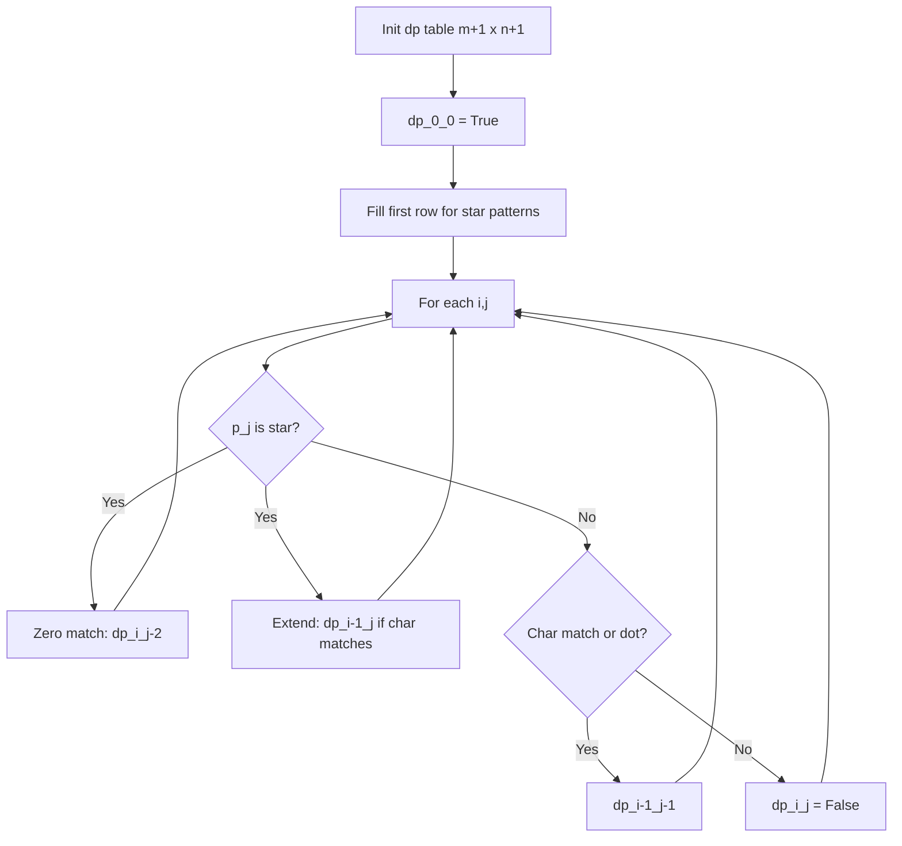

## Visual State Transitions

**DP Table Fill for s="aa", p="a*":**

**Step 1:** Initialize dp table


**Step 2:** Fill dp[1][1]: p[0]='a' matches s[0]='a', dp[0][0]=T

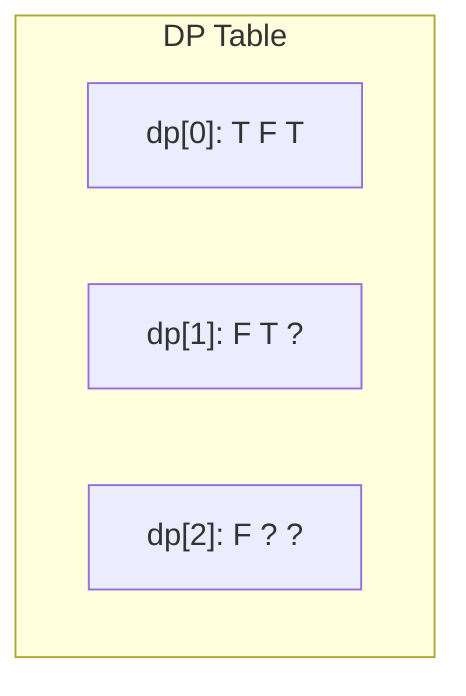

**Step 3:** Fill dp[1][2]: p[1]='*', zero match dp[1][0]=F, extend dp[0][2]=T


**Step 4:** Fill dp[2][2]: p[1]='*', extend dp[1][2]=T. Result: True

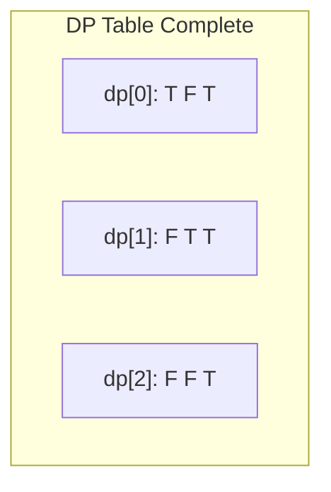

---

## Complexity Analysis

| Metric | Value |
|--------|-------|
| **Time** | O(m*n) |
| **Space** | O(m*n) |

---

## Solution Code

### Python3

```python
class Solution:
    def isMatch(self, s: str, p: str) -> bool:
        m, n = len(s), len(p)
        dp = [[False] * (n + 1) for _ in range(m + 1)]
        dp[0][0] = True
        for j in range(1, n + 1):
            if p[j - 1] == '*':
                dp[0][j] = dp[0][j - 2]
        for i in range(1, m + 1):
            for j in range(1, n + 1):
                if p[j - 1] == '*':
                    dp[i][j] = dp[i][j - 2]  # zero occurrences
                    if p[j - 2] == '.' or p[j - 2] == s[i - 1]:
                        dp[i][j] = dp[i][j] or dp[i - 1][j]
                elif p[j - 1] == '.' or p[j - 1] == s[i - 1]:
                    dp[i][j] = dp[i - 1][j - 1]
        return dp[m][n]
```

### C++

```cpp
#include <algorithm>
#include <string>
#include <vector>
using namespace std;

class Solution {
public:
    bool isMatch(string& s, string& p) {
        // String DP - O(m*n) time and space
        int m = s.size(), n = p.size();
        vector<vector<int>> dp(m + 1, vector<int>(n + 1, 0));
        for (int i = 1; i <= m; i++) {
            for (int j = 1; j <= n; j++) {
                if (s[i-1] == p[j-1])
                    dp[i][j] = dp[i-1][j-1] + 1;
                else
                    dp[i][j] = max(dp[i-1][j], dp[i][j-1]);
            }
        }
        return dp[m][n];
    }
};
```

### Summary

| Aspect | Detail |
|--------|--------|
| **Pattern** | Dynamic Programming |
| **Time** | O(m*n) |
| **Space** | O(m*n) |

---
---

# Problem 62: Unique Paths

| Attribute | Detail |
|-----------|--------|
| **ID** | 62 |
| **Title** | Unique Paths |
| **Difficulty** | Medium |
| **Tags** | Math, Dynamic Programming, Combinatorics |
| **Link** | [leetcode.com/problems/unique-paths](https://leetcode.com/problems/unique-paths/) |

There is a robot on an `m x n` grid. The robot is initially located at the **top-left corner** (i.e., `grid[0][0]`). The robot tries to move to the **bottom-right corner** (i.e., `grid[m - 1][n - 1]`). The robot can only move either down or right at any point in time.

Given the two integers `m` and `n`, return *the number of possible unique paths that the robot can take to reach the bottom-right corner*.

The test cases are generated so that the answer will be less than or equal to `2 * 10^9`.

 

Example 1:

```

**Input:** m = 3, n = 7
**Output:** 28

```

Example 2:

```

**Input:** m = 3, n = 2
**Output:** 3
**Explanation:** From the top-left corner, there are a total of 3 ways to reach the bottom-right corner:
1. Right -> Down -> Down
2. Down -> Down -> Right
3. Down -> Right -> Down

```

 

**Constraints:**

	- `1 <= m, n <= 100`

---

## Approach: Dynamic Programming

DP: paths to (i,j) = paths from above + paths from left. Optimize to 1D array.

### Pseudo-code

```
1. dp = [1]*n (first row all 1s)
2. For each row: dp[j] += dp[j-1]
3. Return dp[-1]
```

---

## Algorithm Flow

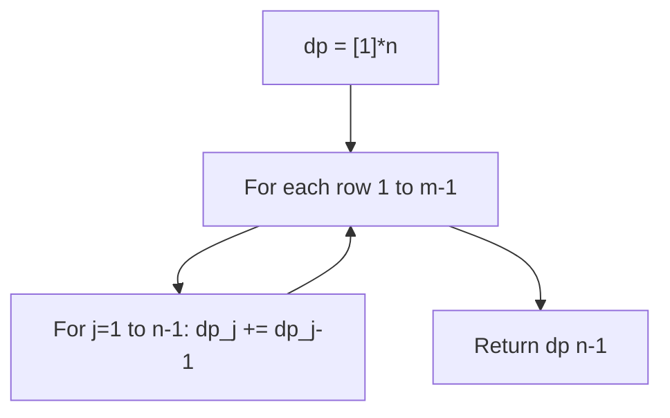

## Visual State Transitions

**1D Dynamic Programming Table Build:**

**Frame 1: Initialize base cases**
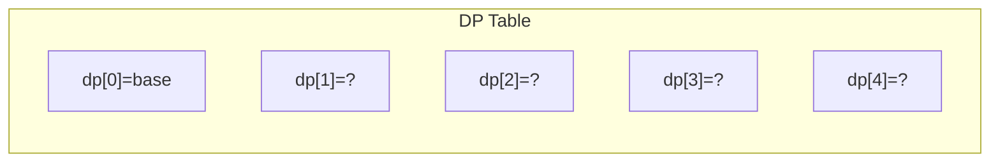

**Frame 2: Fill dp[1] from dp[0]**
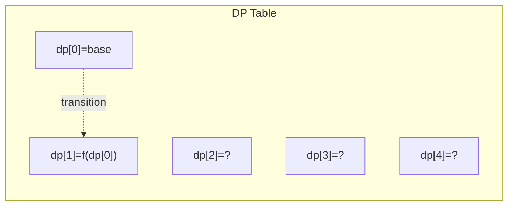

**Frame 3: Fill remaining cells**
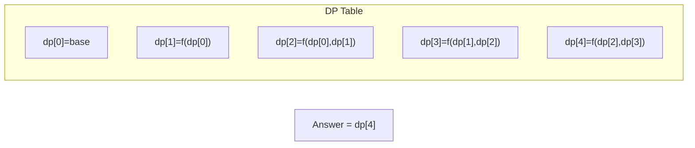


---

## Complexity Analysis

| Metric | Value |
|--------|-------|
| **Time** | O(m*n) |
| **Space** | O(n) |

---

## Solution Code

### Python3

```python
class Solution:
    def uniquePaths(self, m: int, n: int) -> int:
        dp = [1] * n
        for _ in range(1, m):
            for j in range(1, n):
                dp[j] += dp[j-1]
        return dp[-1]
```

### C++

```cpp
#include <string>
#include <vector>
using namespace std;

class Solution {
public:
    int uniquePaths(int m, int n) {
        // Dynamic programming (1D) - O(n) time, O(n) space
        int n = m;
        if (n <= 0) return 0;
        vector<int> dp(n + 1, 0);
        dp[0] = 1;
        for (int i = 1; i <= n; i++) {
            dp[i] = dp[i-1];
            if (i >= 2) dp[i] += dp[i-2];
        }
        return dp[n];
    }
};
```

### Summary

| Aspect | Detail |
|--------|--------|
| **Pattern** | Dynamic Programming |
| **Time** | O(m*n) |
| **Space** | O(n) |

---
---

# Problem 70: Climbing Stairs

| Attribute | Detail |
|-----------|--------|
| **ID** | 70 |
| **Title** | Climbing Stairs |
| **Difficulty** | Easy |
| **Tags** | Math, Dynamic Programming, Memoization |
| **Link** | [leetcode.com/problems/climbing-stairs](https://leetcode.com/problems/climbing-stairs/) |

You are climbing a staircase. It takes `n` steps to reach the top.

Each time you can either climb `1` or `2` steps. In how many distinct ways can you climb to the top?

 

Example 1:

```

**Input:** n = 2
**Output:** 2
**Explanation:** There are two ways to climb to the top.
1. 1 step + 1 step
2. 2 steps

```

Example 2:

```

**Input:** n = 3
**Output:** 3
**Explanation:** There are three ways to climb to the top.
1. 1 step + 1 step + 1 step
2. 1 step + 2 steps
3. 2 steps + 1 step

```

 

**Constraints:**

	- `1 <= n <= 45`

---

## Approach: Dynamic Programming (Fibonacci)

**Key Insight:** Same as Fibonacci. Ways to reach step n = ways(n-1) + ways(n-2).

### Pseudo-code

```
1. Base: step 1 = 1 way, step 2 = 2 ways
2. For 3 to n: ways[i] = ways[i-1] + ways[i-2]
3. Return ways[n]
```

---

## Algorithm Flow

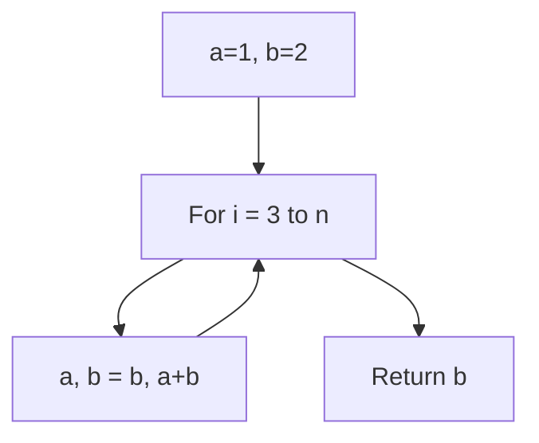

## Visual State Transitions

**DP State Transition for n=5:**

**Step 1:** Base cases

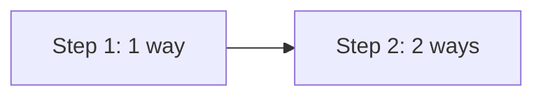

**Step 2:** Step 3 = 1 + 2 = 3 ways

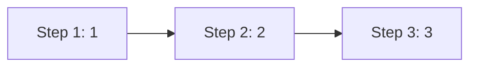

**Step 3:** Step 4 = 2 + 3 = 5 ways, Step 5 = 3 + 5 = 8 ways

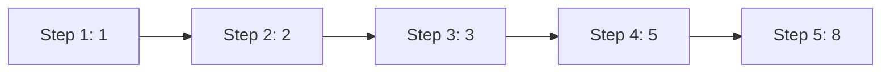

---

## Complexity Analysis

| Metric | Value |
|--------|-------|
| **Time** | O(n) |
| **Space** | O(1) |

---

## Solution Code

### Python3

```python
class Solution:
    def climbStairs(self, n: int) -> int:
        if n <= 2:
            return n
        a, b = 1, 2
        for _ in range(3, n + 1):
            a, b = b, a + b
        return b
```

### C++

```cpp
#include <string>
#include <vector>
using namespace std;

class Solution {
public:
    int climbStairs(int n) {
        // Dynamic programming (1D) - O(n) time, O(n) space
        int n = n;
        if (n <= 0) return 0;
        vector<int> dp(n + 1, 0);
        dp[0] = 1;
        for (int i = 1; i <= n; i++) {
            dp[i] = dp[i-1];
            if (i >= 2) dp[i] += dp[i-2];
        }
        return dp[n];
    }
};
```

### Summary

| Aspect | Detail |
|--------|--------|
| **Pattern** | Dynamic Programming (Fibonacci) |
| **Time** | O(n) |
| **Space** | O(1) |

---
---

# Problem 72: Edit Distance

| Attribute | Detail |
|-----------|--------|
| **ID** | 72 |
| **Title** | Edit Distance |
| **Difficulty** | Medium |
| **Tags** | String, Dynamic Programming |
| **Link** | [leetcode.com/problems/edit-distance](https://leetcode.com/problems/edit-distance/) |

Given two strings `word1` and `word2`, return *the minimum number of operations required to convert `word1` to `word2`*.

You have the following three operations permitted on a word:

	- Insert a character
	- Delete a character
	- Replace a character

 

Example 1:

```

**Input:** word1 = "horse", word2 = "ros"
**Output:** 3
**Explanation:** 
horse -> rorse (replace 'h' with 'r')
rorse -> rose (remove 'r')
rose -> ros (remove 'e')

```

Example 2:

```

**Input:** word1 = "intention", word2 = "execution"
**Output:** 5
**Explanation:** 
intention -> inention (remove 't')
inention -> enention (replace 'i' with 'e')
enention -> exention (replace 'n' with 'x')
exention -> exection (replace 'n' with 'c')
exection -> execution (insert 'u')

```

 

**Constraints:**

	- `0 <= word1.length, word2.length <= 500`
	- `word1` and `word2` consist of lowercase English letters.

---

## Approach: Dynamic Programming

**Edit Distance DP:** dp[i][j] = min ops to convert word1[:i] to word2[:j]. Insert/delete/replace.

### Pseudo-code

```
1. dp[j] = j for base case
2. For each i,j:
   If chars match: dp = diagonal
   Else: 1 + min(insert, delete, replace)
3. Return dp[n]
```

---

## Algorithm Flow

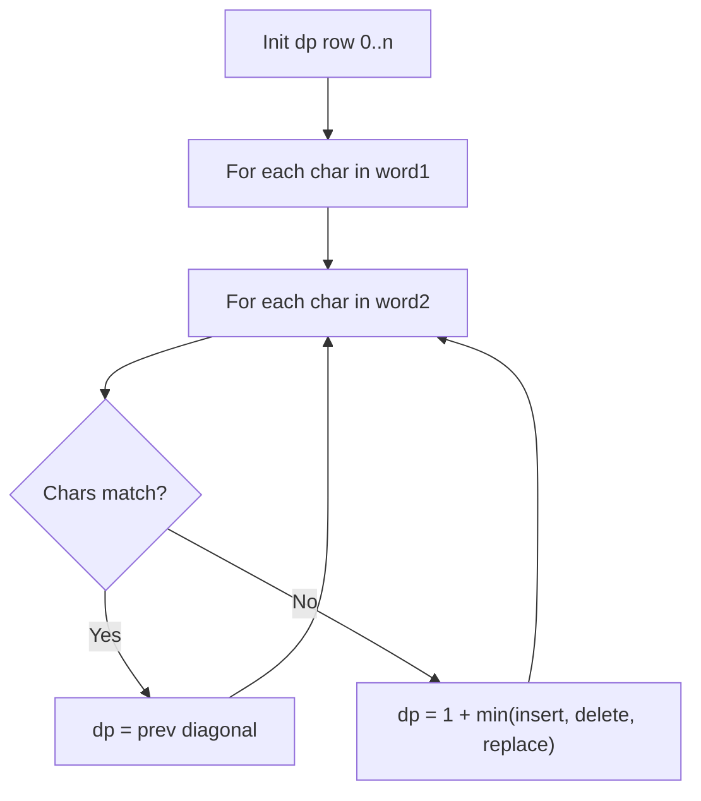

---

## Complexity Analysis

| Metric | Value |
|--------|-------|
| **Time** | O(m*n) |
| **Space** | O(n) |

---

## Solution Code

### Python3

```python
class Solution:
    def minDistance(self, word1: str, word2: str) -> int:
        m, n = len(word1), len(word2)
        dp = list(range(n + 1))
        for i in range(1, m + 1):
            prev = dp[0]
            dp[0] = i
            for j in range(1, n + 1):
                temp = dp[j]
                if word1[i-1] == word2[j-1]:
                    dp[j] = prev
                else:
                    dp[j] = 1 + min(prev, dp[j], dp[j-1])
                prev = temp
        return dp[n]
```

### C++

```cpp
#include <algorithm>
#include <string>
#include <vector>
using namespace std;

class Solution {
public:
    int minDistance(string& word1, string& word2) {
        // String DP - O(m*n) time and space
        int m = word1.size(), n = word2.size();
        vector<vector<int>> dp(m + 1, vector<int>(n + 1, 0));
        for (int i = 1; i <= m; i++) {
            for (int j = 1; j <= n; j++) {
                if (word1[i-1] == word2[j-1])
                    dp[i][j] = dp[i-1][j-1] + 1;
                else
                    dp[i][j] = max(dp[i-1][j], dp[i][j-1]);
            }
        }
        return dp[m][n];
    }
};
```

### Summary

| Aspect | Detail |
|--------|--------|
| **Pattern** | Dynamic Programming |
| **Time** | O(m*n) |
| **Space** | O(n) |

---
---

# Problem 87: Scramble String

| Attribute | Detail |
|-----------|--------|
| **ID** | 87 |
| **Title** | Scramble String |
| **Difficulty** | Hard |
| **Tags** | String, Dynamic Programming |
| **Link** | [leetcode.com/problems/scramble-string](https://leetcode.com/problems/scramble-string/) |

We can scramble a string s to get a string t using the following algorithm:

	- If the length of the string is 1, stop.
	- If the length of the string is > 1, do the following:
	
		Split the string into two non-empty substrings at a random index, i.e., if the string is `s`, divide it to `x` and `y` where `s = x + y`.
		- **Randomly** decide to swap the two substrings or to keep them in the same order. i.e., after this step, `s` may become `s = x + y` or `s = y + x`.
		- Apply step 1 recursively on each of the two substrings `x` and `y`.
	
	

Given two strings `s1` and `s2` of **the same length**, return `true` if `s2` is a scrambled string of `s1`, otherwise, return `false`.

 

Example 1:

```

**Input:** s1 = "great", s2 = "rgeat"
**Output:** true
**Explanation:** One possible scenario applied on s1 is:
"great" --> "gr/eat" // divide at random index.
"gr/eat" --> "gr/eat" // random decision is not to swap the two substrings and keep them in order.
"gr/eat" --> "g/r / e/at" // apply the same algorithm recursively on both substrings. divide at random index each of them.
"g/r / e/at" --> "r/g / e/at" // random decision was to swap the first substring and to keep the second substring in the same order.
"r/g / e/at" --> "r/g / e/ a/t" // again apply the algorithm recursively, divide "at" to "a/t".
"r/g / e/ a/t" --> "r/g / e/ a/t" // random decision is to keep both substrings in the same order.
The algorithm stops now, and the result string is "rgeat" which is s2.
As one possible scenario led s1 to be scrambled to s2, we return true.

```

Example 2:

```

**Input:** s1 = "abcde", s2 = "caebd"
**Output:** false

```

Example 3:

```

**Input:** s1 = "a", s2 = "a"
**Output:** true

```

 

**Constraints:**

	- `s1.length == s2.length`
	- `1 <= s1.length <= 30`
	- `s1` and `s2` consist of lowercase English letters.

---

## Approach: Dynamic Programming (String)

Compare or match two strings using a 2D DP table. dp[i][j] represents the answer for substrings s1[0..i-1] and s2[0..j-1]. Common patterns: LCS, edit distance, regex matching.

### Pseudo-code

```
1. Create dp[m+1][n+1]
2. Initialize base cases
3. For i from 1 to m:
   For j from 1 to n:
     If s1[i-1] == s2[j-1]: dp[i][j] = dp[i-1][j-1] + 1
     Else: dp[i][j] = best of (dp[i-1][j], dp[i][j-1], dp[i-1][j-1])
4. Return dp[m][n]
```

---

## Algorithm Flow

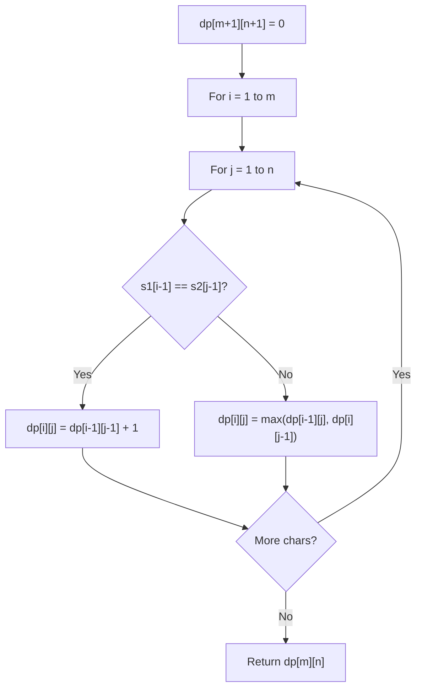

---

## Complexity Analysis

| Metric | Value |
|--------|-------|
| **Time** | O(m * n) |
| **Space** | O(m * n) |

---

## Solution Code

### Python3

```python
class Solution:
    def isScramble(self, s1: str, s2: str) -> bool:
        # String DP - O(m*n) time and space
        m, n = len(s1), len(s2)
        dp = [[0] * (n + 1) for _ in range(m + 1)]
        for i in range(1, m + 1):
            for j in range(1, n + 1):
                if s1[i-1] == s2[j-1]:
                    dp[i][j] = dp[i-1][j-1] + 1
                else:
                    dp[i][j] = max(dp[i-1][j], dp[i][j-1])
        return dp[m][n]
```

### C++

```cpp
#include <algorithm>
#include <string>
#include <vector>
using namespace std;

class Solution {
public:
    bool isScramble(string& s1, string& s2) {
        // String DP - O(m*n) time and space
        int m = s1.size(), n = s2.size();
        vector<vector<int>> dp(m + 1, vector<int>(n + 1, 0));
        for (int i = 1; i <= m; i++) {
            for (int j = 1; j <= n; j++) {
                if (s1[i-1] == s2[j-1])
                    dp[i][j] = dp[i-1][j-1] + 1;
                else
                    dp[i][j] = max(dp[i-1][j], dp[i][j-1]);
            }
        }
        return dp[m][n];
    }
};
```

### Summary

| Aspect | Detail |
|--------|--------|
| **Pattern** | Dynamic Programming (String) |
| **Time** | O(m * n) |
| **Space** | O(m * n) |

---
---

# Problem 91: Decode Ways

| Attribute | Detail |
|-----------|--------|
| **ID** | 91 |
| **Title** | Decode Ways |
| **Difficulty** | Medium |
| **Tags** | String, Dynamic Programming |
| **Link** | [leetcode.com/problems/decode-ways](https://leetcode.com/problems/decode-ways/) |

You have intercepted a secret message encoded as a string of numbers. The message is **decoded** via the following mapping:

"1" -> 'A'

"2" -> 'B'

...

"25" -> 'Y'

"26" -> 'Z'

However, while decoding the message, you realize that there are many different ways you can decode the message because some codes are contained in other codes (`"2"` and `"5"` vs `"25"`).

For example, `"11106"` can be decoded into:

	- `"AAJF"` with the grouping `(1, 1, 10, 6)`
	- `"KJF"` with the grouping `(11, 10, 6)`
	- The grouping `(1, 11, 06)` is invalid because `"06"` is not a valid code (only `"6"` is valid).

Note: there may be strings that are impossible to decode.

Given a string s containing only digits, return the **number of ways** to **decode** it. If the entire string cannot be decoded in any valid way, return `0`.

The test cases are generated so that the answer fits in a **32-bit** integer.

 

Example 1:

**Input:** s = "12"

**Output:** 2

**Explanation:**

"12" could be decoded as "AB" (1 2) or "L" (12).

Example 2:

**Input:** s = "226"

**Output:** 3

**Explanation:**

"226" could be decoded as "BZ" (2 26), "VF" (22 6), or "BBF" (2 2 6).

Example 3:

**Input:** s = "06"

**Output:** 0

**Explanation:**

"06" cannot be mapped to "F" because of the leading zero ("6" is different from "06"). In this case, the string is not a valid encoding, so return 0.

 

**Constraints:**

	- `1 <= s.length <= 100`
	- `s` contains only digits and may contain leading zero(s).

---

## Approach: Dynamic Programming

DP: dp[i] = ways to decode s[:i]. Check single digit and two-digit decodings.

### Pseudo-code

```
1. dp[0]=dp[1]=1
2. For i>=2: if single digit valid: dp[i]+=dp[i-1]; if two-digit valid: dp[i]+=dp[i-2]
3. Return dp[n]
```

---

## Algorithm Flow


---

## Complexity Analysis

| Metric | Value |
|--------|-------|
| **Time** | O(n) |
| **Space** | O(n) |

---

## Solution Code

### Python3

```python
class Solution:
    def numDecodings(self, s: str) -> int:
        if not s or s[0] == '0':
            return 0
        n = len(s)
        dp = [0] * (n + 1)
        dp[0] = dp[1] = 1
        for i in range(2, n + 1):
            if s[i-1] != '0':
                dp[i] += dp[i-1]
            two = int(s[i-2:i])
            if 10 <= two <= 26:
                dp[i] += dp[i-2]
        return dp[n]
```

### C++

```cpp
#include <algorithm>
#include <string>
#include <vector>
using namespace std;

class Solution {
public:
    int numDecodings(string& s) {
        // String DP - O(m*n) time and space
        int m = s.size(), n = s.size();
        vector<vector<int>> dp(m + 1, vector<int>(n + 1, 0));
        for (int i = 1; i <= m; i++) {
            for (int j = 1; j <= n; j++) {
                if (s[i-1] == s[j-1])
                    dp[i][j] = dp[i-1][j-1] + 1;
                else
                    dp[i][j] = max(dp[i-1][j], dp[i][j-1]);
            }
        }
        return dp[m][n];
    }
};
```

### Summary

| Aspect | Detail |
|--------|--------|
| **Pattern** | Dynamic Programming |
| **Time** | O(n) |
| **Space** | O(n) |

---
---

# Problem 97: Interleaving String

| Attribute | Detail |
|-----------|--------|
| **ID** | 97 |
| **Title** | Interleaving String |
| **Difficulty** | Medium |
| **Tags** | String, Dynamic Programming |
| **Link** | [leetcode.com/problems/interleaving-string](https://leetcode.com/problems/interleaving-string/) |

Given strings `s1`, `s2`, and `s3`, find whether `s3` is formed by an **interleaving** of `s1` and `s2`.

An **interleaving** of two strings `s` and `t` is a configuration where `s` and `t` are divided into `n` and `m` substrings respectively, such that:

	- `s = s1 + s2 + ... + sn`
	- `t = t1 + t2 + ... + tm`
	- `|n - m| <= 1`
	- The **interleaving** is `s1 + t1 + s2 + t2 + s3 + t3 + ...` or `t1 + s1 + t2 + s2 + t3 + s3 + ...`

**Note:** `a + b` is the concatenation of strings `a` and `b`.

 

Example 1:

```

**Input:** s1 = "aabcc", s2 = "dbbca", s3 = "aadbbcbcac"
**Output:** true
**Explanation:** One way to obtain s3 is:
Split s1 into s1 = "aa" + "bc" + "c", and s2 into s2 = "dbbc" + "a".
Interleaving the two splits, we get "aa" + "dbbc" + "bc" + "a" + "c" = "aadbbcbcac".
Since s3 can be obtained by interleaving s1 and s2, we return true.

```

Example 2:

```

**Input:** s1 = "aabcc", s2 = "dbbca", s3 = "aadbbbaccc"
**Output:** false
**Explanation:** Notice how it is impossible to interleave s2 with any other string to obtain s3.

```

Example 3:

```

**Input:** s1 = "", s2 = "", s3 = ""
**Output:** true

```

 

**Constraints:**

	- `0 <= s1.length, s2.length <= 100`
	- `0 <= s3.length <= 200`
	- `s1`, `s2`, and `s3` consist of lowercase English letters.

 

**Follow up:** Could you solve it using only `O(s2.length)` additional memory space?

---

## Approach: Dynamic Programming (String)

Compare or match two strings using a 2D DP table. dp[i][j] represents the answer for substrings s1[0..i-1] and s2[0..j-1]. Common patterns: LCS, edit distance, regex matching.

### Pseudo-code

```
1. Create dp[m+1][n+1]
2. Initialize base cases
3. For i from 1 to m:
   For j from 1 to n:
     If s1[i-1] == s2[j-1]: dp[i][j] = dp[i-1][j-1] + 1
     Else: dp[i][j] = best of (dp[i-1][j], dp[i][j-1], dp[i-1][j-1])
4. Return dp[m][n]
```

---

## Algorithm Flow


---

## Complexity Analysis

| Metric | Value |
|--------|-------|
| **Time** | O(m * n) |
| **Space** | O(m * n) |

---

## Solution Code

### Python3

```python
class Solution:
    def isInterleave(self, s1: str, s2: str, s3: str) -> bool:
        # String DP - O(m*n) time and space
        m, n = len(s1), len(s2)
        dp = [[0] * (n + 1) for _ in range(m + 1)]
        for i in range(1, m + 1):
            for j in range(1, n + 1):
                if s1[i-1] == s2[j-1]:
                    dp[i][j] = dp[i-1][j-1] + 1
                else:
                    dp[i][j] = max(dp[i-1][j], dp[i][j-1])
        return dp[m][n]
```

### C++

```cpp
#include <algorithm>
#include <string>
#include <vector>
using namespace std;

class Solution {
public:
    bool isInterleave(string& s1, string& s2, string& s3) {
        // String DP - O(m*n) time and space
        int m = s1.size(), n = s2.size();
        vector<vector<int>> dp(m + 1, vector<int>(n + 1, 0));
        for (int i = 1; i <= m; i++) {
            for (int j = 1; j <= n; j++) {
                if (s1[i-1] == s2[j-1])
                    dp[i][j] = dp[i-1][j-1] + 1;
                else
                    dp[i][j] = max(dp[i-1][j], dp[i][j-1]);
            }
        }
        return dp[m][n];
    }
};
```

### Summary

| Aspect | Detail |
|--------|--------|
| **Pattern** | Dynamic Programming (String) |
| **Time** | O(m * n) |
| **Space** | O(m * n) |

---
---

# Problem 115: Distinct Subsequences

| Attribute | Detail |
|-----------|--------|
| **ID** | 115 |
| **Title** | Distinct Subsequences |
| **Difficulty** | Hard |
| **Tags** | String, Dynamic Programming |
| **Link** | [leetcode.com/problems/distinct-subsequences](https://leetcode.com/problems/distinct-subsequences/) |

Given two strings s and t, return *the number of distinct* ***subsequences**** of *s* which equals *t.

The test cases are generated so that the answer fits on a 32-bit signed integer.

 

Example 1:

```

**Input:** s = "rabbbit", t = "rabbit"
**Output:** 3
**Explanation:**
As shown below, there are 3 ways you can generate "rabbit" from s.
`**rabb**b**it**`
`**ra**b**bbit**`
`**rab**b**bit**`

```

Example 2:

```

**Input:** s = "babgbag", t = "bag"
**Output:** 5
**Explanation:**
As shown below, there are 5 ways you can generate "bag" from s.
`**ba**b**g**bag`
`**ba**bgba**g**`
`**b**abgb**ag**`
`ba**b**gb**ag**`
`babg**bag**`
```

 

**Constraints:**

	- `1 <= s.length, t.length <= 1000`
	- `s` and `t` consist of English letters.

---

## Approach: Dynamic Programming (String)

Compare or match two strings using a 2D DP table. dp[i][j] represents the answer for substrings s1[0..i-1] and s2[0..j-1]. Common patterns: LCS, edit distance, regex matching.

### Pseudo-code

```
1. Create dp[m+1][n+1]
2. Initialize base cases
3. For i from 1 to m:
   For j from 1 to n:
     If s1[i-1] == s2[j-1]: dp[i][j] = dp[i-1][j-1] + 1
     Else: dp[i][j] = best of (dp[i-1][j], dp[i][j-1], dp[i-1][j-1])
4. Return dp[m][n]
```

---

## Algorithm Flow


---

## Complexity Analysis

| Metric | Value |
|--------|-------|
| **Time** | O(m * n) |
| **Space** | O(m * n) |

---

## Solution Code

### Python3

```python
class Solution:
    def numDistinct(self, s: str, t: str) -> int:
        # String DP - O(m*n) time and space
        m, n = len(s), len(t)
        dp = [[0] * (n + 1) for _ in range(m + 1)]
        for i in range(1, m + 1):
            for j in range(1, n + 1):
                if s[i-1] == t[j-1]:
                    dp[i][j] = dp[i-1][j-1] + 1
                else:
                    dp[i][j] = max(dp[i-1][j], dp[i][j-1])
        return dp[m][n]
```

### C++

```cpp
#include <algorithm>
#include <string>
#include <vector>
using namespace std;

class Solution {
public:
    int numDistinct(string& s, string& t) {
        // String DP - O(m*n) time and space
        int m = s.size(), n = t.size();
        vector<vector<int>> dp(m + 1, vector<int>(n + 1, 0));
        for (int i = 1; i <= m; i++) {
            for (int j = 1; j <= n; j++) {
                if (s[i-1] == t[j-1])
                    dp[i][j] = dp[i-1][j-1] + 1;
                else
                    dp[i][j] = max(dp[i-1][j], dp[i][j-1]);
            }
        }
        return dp[m][n];
    }
};
```

### Summary

| Aspect | Detail |
|--------|--------|
| **Pattern** | Dynamic Programming (String) |
| **Time** | O(m * n) |
| **Space** | O(m * n) |

---
---

# Problem 132: Palindrome Partitioning II

| Attribute | Detail |
|-----------|--------|
| **ID** | 132 |
| **Title** | Palindrome Partitioning II |
| **Difficulty** | Hard |
| **Tags** | String, Dynamic Programming |
| **Link** | [leetcode.com/problems/palindrome-partitioning-ii](https://leetcode.com/problems/palindrome-partitioning-ii/) |

Given a string `s`, partition `s` such that every substring of the partition is a palindrome.

Return *the **minimum** cuts needed for a palindrome partitioning of* `s`.

 

Example 1:

```

**Input:** s = "aab"
**Output:** 1
**Explanation:** The palindrome partitioning ["aa","b"] could be produced using 1 cut.

```

Example 2:

```

**Input:** s = "a"
**Output:** 0

```

Example 3:

```

**Input:** s = "ab"
**Output:** 1

```

 

**Constraints:**

	- `1 <= s.length <= 2000`
	- `s` consists of lowercase English letters only.

---

## Approach: Dynamic Programming (String)

Compare or match two strings using a 2D DP table. dp[i][j] represents the answer for substrings s1[0..i-1] and s2[0..j-1]. Common patterns: LCS, edit distance, regex matching.

### Pseudo-code

```
1. Create dp[m+1][n+1]
2. Initialize base cases
3. For i from 1 to m:
   For j from 1 to n:
     If s1[i-1] == s2[j-1]: dp[i][j] = dp[i-1][j-1] + 1
     Else: dp[i][j] = best of (dp[i-1][j], dp[i][j-1], dp[i-1][j-1])
4. Return dp[m][n]
```

---

## Algorithm Flow


---

## Complexity Analysis

| Metric | Value |
|--------|-------|
| **Time** | O(m * n) |
| **Space** | O(m * n) |

---

## Solution Code

### Python3

```python
class Solution:
    def minCut(self, s: str) -> int:
        # String DP - O(m*n) time and space
        m, n = len(s), len(s)
        dp = [[0] * (n + 1) for _ in range(m + 1)]
        for i in range(1, m + 1):
            for j in range(1, n + 1):
                if s[i-1] == s[j-1]:
                    dp[i][j] = dp[i-1][j-1] + 1
                else:
                    dp[i][j] = max(dp[i-1][j], dp[i][j-1])
        return dp[m][n]
```

### C++

```cpp
#include <algorithm>
#include <string>
#include <vector>
using namespace std;

class Solution {
public:
    int minCut(string& s) {
        // String DP - O(m*n) time and space
        int m = s.size(), n = s.size();
        vector<vector<int>> dp(m + 1, vector<int>(n + 1, 0));
        for (int i = 1; i <= m; i++) {
            for (int j = 1; j <= n; j++) {
                if (s[i-1] == s[j-1])
                    dp[i][j] = dp[i-1][j-1] + 1;
                else
                    dp[i][j] = max(dp[i-1][j], dp[i][j-1]);
            }
        }
        return dp[m][n];
    }
};
```

### Summary

| Aspect | Detail |
|--------|--------|
| **Pattern** | Dynamic Programming (String) |
| **Time** | O(m * n) |
| **Space** | O(m * n) |

---
---

# Problem 233: Number of Digit One

| Attribute | Detail |
|-----------|--------|
| **ID** | 233 |
| **Title** | Number of Digit One |
| **Difficulty** | Hard |
| **Tags** | Math, Dynamic Programming, Recursion |
| **Link** | [leetcode.com/problems/number-of-digit-one](https://leetcode.com/problems/number-of-digit-one/) |

Given an integer `n`, count *the total number of digit *`1`* appearing in all non-negative integers less than or equal to* `n`.

 

Example 1:

```

**Input:** n = 13
**Output:** 6

```

Example 2:

```

**Input:** n = 0
**Output:** 0

```

 

**Constraints:**

	- `0 <= n <= 10^9`

---

## Approach: Dynamic Programming (1D)

Break the problem into overlapping subproblems. Define dp[i] as the optimal value for the subproblem ending at or considering index i. Build the solution bottom-up, using previously computed dp values.

### Pseudo-code

```
1. Define dp[i] = optimal value for subproblem i
2. Base case: dp[0] = initial value
3. For i from 1 to n:
   a. dp[i] = recurrence(dp[i-1], dp[i-2], ...)
4. Return dp[n] or max/min of dp
```

---

## Algorithm Flow

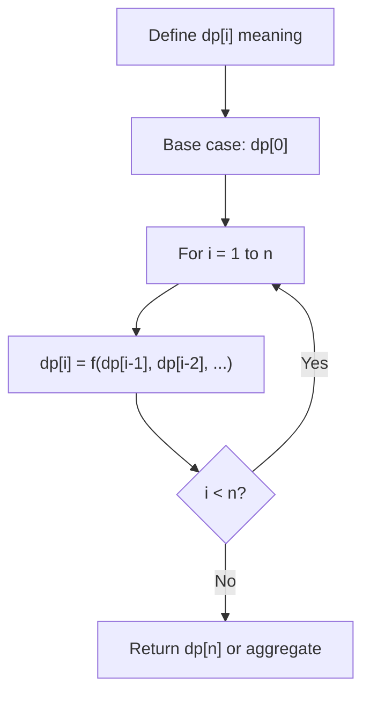

## Visual State Transitions

**1D Dynamic Programming Table Build:**

**Frame 1: Initialize base cases**
```mermaid
graph LR
    subgraph DP [DP Table]
        D0["dp[0]=base"]
        D1["dp[1]=?"]
        D2["dp[2]=?"]
        D3["dp[3]=?"]
        D4["dp[4]=?"]
    end
```

**Frame 2: Fill dp[1] from dp[0]**
```mermaid
graph LR
    subgraph DP [DP Table]
        D0["dp[0]=base"]
        D1["dp[1]=f(dp[0])"]
        D2["dp[2]=?"]
        D3["dp[3]=?"]
        D4["dp[4]=?"]
    end
    D0 -.->|"transition"| D1
```

**Frame 3: Fill remaining cells**
```mermaid
graph LR
    subgraph DP [DP Table]
        D0["dp[0]=base"]
        D1["dp[1]=f(dp[0])"]
        D2["dp[2]=f(dp[0],dp[1])"]
        D3["dp[3]=f(dp[1],dp[2])"]
        D4["dp[4]=f(dp[2],dp[3])"]
    end
    A["Answer = dp[4]"]
```


---

## Complexity Analysis

| Metric | Value |
|--------|-------|
| **Time** | O(n) |
| **Space** | O(n) |

---

## Solution Code

### Python3

```python
class Solution:
    def countDigitOne(self, n: int) -> int:
        # Dynamic programming (1D) - O(n) time, O(n) space
        if not n:
            return 0
        n = len(n) if isinstance(n, list) else n
        dp = [0] * (n + 1)
        dp[0] = 1  # base case
        for i in range(1, n + 1):
            dp[i] = dp[i-1]  # transition (customize per problem)
            if i >= 2:
                dp[i] += dp[i-2]
        return dp[n]
```

### C++

```cpp
#include <string>
#include <vector>
using namespace std;

class Solution {
public:
    int countDigitOne(int n) {
        // Dynamic programming (1D) - O(n) time, O(n) space
        int n = n;
        if (n <= 0) return 0;
        vector<int> dp(n + 1, 0);
        dp[0] = 1;
        for (int i = 1; i <= n; i++) {
            dp[i] = dp[i-1];
            if (i >= 2) dp[i] += dp[i-2];
        }
        return dp[n];
    }
};
```

### Summary

| Aspect | Detail |
|--------|--------|
| **Pattern** | Dynamic Programming (1D) |
| **Time** | O(n) |
| **Space** | O(n) |

---
---

# Problem 241: Different Ways to Add Parentheses

| Attribute | Detail |
|-----------|--------|
| **ID** | 241 |
| **Title** | Different Ways to Add Parentheses |
| **Difficulty** | Medium |
| **Tags** | Math, String, Dynamic Programming, Recursion, Memoization |
| **Link** | [leetcode.com/problems/different-ways-to-add-parentheses](https://leetcode.com/problems/different-ways-to-add-parentheses/) |

Given a string `expression` of numbers and operators, return *all possible results from computing all the different possible ways to group numbers and operators*. You may return the answer in **any order**.

The test cases are generated such that the output values fit in a 32-bit integer and the number of different results does not exceed `10^4`.

 

Example 1:

```

**Input:** expression = "2-1-1"
**Output:** [0,2]
**Explanation:**
((2-1)-1) = 0 
(2-(1-1)) = 2

```

Example 2:

```

**Input:** expression = "2*3-4*5"
**Output:** [-34,-14,-10,-10,10]
**Explanation:**
(2*(3-(4*5))) = -34 
((2*3)-(4*5)) = -14 
((2*(3-4))*5) = -10 
(2*((3-4)*5)) = -10 
(((2*3)-4)*5) = 10

```

 

**Constraints:**

	- `1 <= expression.length <= 20`
	- `expression` consists of digits and the operator `'+'`, `'-'`, and `'*'`.
	- All the integer values in the input expression are in the range `[0, 99]`.
	- The integer values in the input expression do not have a leading `'-'` or `'+'` denoting the sign.

---

## Approach: Dynamic Programming (String)

Compare or match two strings using a 2D DP table. dp[i][j] represents the answer for substrings s1[0..i-1] and s2[0..j-1]. Common patterns: LCS, edit distance, regex matching.

### Pseudo-code

```
1. Create dp[m+1][n+1]
2. Initialize base cases
3. For i from 1 to m:
   For j from 1 to n:
     If s1[i-1] == s2[j-1]: dp[i][j] = dp[i-1][j-1] + 1
     Else: dp[i][j] = best of (dp[i-1][j], dp[i][j-1], dp[i-1][j-1])
4. Return dp[m][n]
```

---

## Algorithm Flow

```mermaid
flowchart TD
    A["dp[m+1][n+1] = 0"] --> B[For i = 1 to m]
    B --> C[For j = 1 to n]
    C --> D{"s1[i-1] == s2[j-1]?"}
    D -- Yes --> E["dp[i][j] = dp[i-1][j-1] + 1"]
    D -- No --> F["dp[i][j] = max(dp[i-1][j], dp[i][j-1])"]
    E --> G{More chars?}
    F --> G
    G -- Yes --> C
    G -- No --> H["Return dp[m][n]"]
```

---

## Complexity Analysis

| Metric | Value |
|--------|-------|
| **Time** | O(m * n) |
| **Space** | O(m * n) |

---

## Solution Code

### Python3

```python
class Solution:
    def diffWaysToCompute(self, expression: str) -> List[int]:
        # String DP - O(m*n) time and space
        m, n = len(expression), len(expression)
        dp = [[0] * (n + 1) for _ in range(m + 1)]
        for i in range(1, m + 1):
            for j in range(1, n + 1):
                if expression[i-1] == expression[j-1]:
                    dp[i][j] = dp[i-1][j-1] + 1
                else:
                    dp[i][j] = max(dp[i-1][j], dp[i][j-1])
        return dp[m][n]
```

### C++

```cpp
#include <algorithm>
#include <string>
#include <vector>
using namespace std;

class Solution {
public:
    vector<int> diffWaysToCompute(string& expression) {
        // String DP - O(m*n) time and space
        int m = expression.size(), n = expression.size();
        vector<vector<int>> dp(m + 1, vector<int>(n + 1, 0));
        for (int i = 1; i <= m; i++) {
            for (int j = 1; j <= n; j++) {
                if (expression[i-1] == expression[j-1])
                    dp[i][j] = dp[i-1][j-1] + 1;
                else
                    dp[i][j] = max(dp[i-1][j], dp[i][j-1]);
            }
        }
        return dp[m][n];
    }
};
```

### Summary

| Aspect | Detail |
|--------|--------|
| **Pattern** | Dynamic Programming (String) |
| **Time** | O(m * n) |
| **Space** | O(m * n) |

---
---

# Problem 276: Paint Fence

| Attribute | Detail |
|-----------|--------|
| **ID** | 276 |
| **Title** | Paint Fence |
| **Difficulty** | Medium |
| **Tags** | Dynamic Programming |
| **Link** | [leetcode.com/problems/paint-fence](https://leetcode.com/problems/paint-fence/) |

*(Premium problem -- description requires LeetCode subscription)*

---

## Approach: Dynamic Programming (1D)

Break the problem into overlapping subproblems. Define dp[i] as the optimal value for the subproblem ending at or considering index i. Build the solution bottom-up, using previously computed dp values.

### Pseudo-code

```
1. Define dp[i] = optimal value for subproblem i
2. Base case: dp[0] = initial value
3. For i from 1 to n:
   a. dp[i] = recurrence(dp[i-1], dp[i-2], ...)
4. Return dp[n] or max/min of dp
```

---

## Algorithm Flow

```mermaid
flowchart TD
    A["Define dp[i] meaning"] --> B["Base case: dp[0]"]
    B --> C[For i = 1 to n]
    C --> D["dp[i] = f(dp[i-1], dp[i-2], ...)"]
    D --> E{i < n?}
    E -- Yes --> C
    E -- No --> F["Return dp[n] or aggregate"]
```

## Visual State Transitions

**1D Dynamic Programming Table Build:**

**Frame 1: Initialize base cases**
```mermaid
graph LR
    subgraph DP [DP Table]
        D0["dp[0]=base"]
        D1["dp[1]=?"]
        D2["dp[2]=?"]
        D3["dp[3]=?"]
        D4["dp[4]=?"]
    end
```

**Frame 2: Fill dp[1] from dp[0]**
```mermaid
graph LR
    subgraph DP [DP Table]
        D0["dp[0]=base"]
        D1["dp[1]=f(dp[0])"]
        D2["dp[2]=?"]
        D3["dp[3]=?"]
        D4["dp[4]=?"]
    end
    D0 -.->|"transition"| D1
```

**Frame 3: Fill remaining cells**
```mermaid
graph LR
    subgraph DP [DP Table]
        D0["dp[0]=base"]
        D1["dp[1]=f(dp[0])"]
        D2["dp[2]=f(dp[0],dp[1])"]
        D3["dp[3]=f(dp[1],dp[2])"]
        D4["dp[4]=f(dp[2],dp[3])"]
    end
    A["Answer = dp[4]"]
```


---

## Complexity Analysis

| Metric | Value |
|--------|-------|
| **Time** | O(n) |
| **Space** | O(n) |

---

## Solution Code

### Python3

```python
class Solution:
    pass
```

### C++

```cpp
class Solution {
public:
    // Design problem stub
};
```

### Summary

| Aspect | Detail |
|--------|--------|
| **Pattern** | Dynamic Programming (1D) |
| **Time** | O(n) |
| **Space** | O(n) |

---
---

# Problem 338: Counting Bits

| Attribute | Detail |
|-----------|--------|
| **ID** | 338 |
| **Title** | Counting Bits |
| **Difficulty** | Easy |
| **Tags** | Dynamic Programming, Bit Manipulation |
| **Link** | [leetcode.com/problems/counting-bits](https://leetcode.com/problems/counting-bits/) |

Given an integer `n`, return *an array *`ans`* of length *`n + 1`* such that for each *`i`* *(`0 <= i <= n`)*, *`ans[i]`* is the **number of ***`1`***'s** in the binary representation of *`i`.

 

Example 1:

```

**Input:** n = 2
**Output:** [0,1,1]
**Explanation:**
0 --> 0
1 --> 1
2 --> 10

```

Example 2:

```

**Input:** n = 5
**Output:** [0,1,1,2,1,2]
**Explanation:**
0 --> 0
1 --> 1
2 --> 10
3 --> 11
4 --> 100
5 --> 101

```

 

**Constraints:**

	- `0 <= n <= 10^5`

 

**Follow up:**

	- It is very easy to come up with a solution with a runtime of `O(n log n)`. Can you do it in linear time `O(n)` and possibly in a single pass?
	- Can you do it without using any built-in function (i.e., like `__builtin_popcount` in C++)?

---

## Approach: Dynamic Programming (1D)

Break the problem into overlapping subproblems. Define dp[i] as the optimal value for the subproblem ending at or considering index i. Build the solution bottom-up, using previously computed dp values.

### Pseudo-code

```
1. Define dp[i] = optimal value for subproblem i
2. Base case: dp[0] = initial value
3. For i from 1 to n:
   a. dp[i] = recurrence(dp[i-1], dp[i-2], ...)
4. Return dp[n] or max/min of dp
```

---

## Algorithm Flow

```mermaid
flowchart TD
    A["Define dp[i] meaning"] --> B["Base case: dp[0]"]
    B --> C[For i = 1 to n]
    C --> D["dp[i] = f(dp[i-1], dp[i-2], ...)"]
    D --> E{i < n?}
    E -- Yes --> C
    E -- No --> F["Return dp[n] or aggregate"]
```

## Visual State Transitions

**1D Dynamic Programming Table Build:**

**Frame 1: Initialize base cases**
```mermaid
graph LR
    subgraph DP [DP Table]
        D0["dp[0]=base"]
        D1["dp[1]=?"]
        D2["dp[2]=?"]
        D3["dp[3]=?"]
        D4["dp[4]=?"]
    end
```

**Frame 2: Fill dp[1] from dp[0]**
```mermaid
graph LR
    subgraph DP [DP Table]
        D0["dp[0]=base"]
        D1["dp[1]=f(dp[0])"]
        D2["dp[2]=?"]
        D3["dp[3]=?"]
        D4["dp[4]=?"]
    end
    D0 -.->|"transition"| D1
```

**Frame 3: Fill remaining cells**
```mermaid
graph LR
    subgraph DP [DP Table]
        D0["dp[0]=base"]
        D1["dp[1]=f(dp[0])"]
        D2["dp[2]=f(dp[0],dp[1])"]
        D3["dp[3]=f(dp[1],dp[2])"]
        D4["dp[4]=f(dp[2],dp[3])"]
    end
    A["Answer = dp[4]"]
```


---

## Complexity Analysis

| Metric | Value |
|--------|-------|
| **Time** | O(n) |
| **Space** | O(n) |

---

## Solution Code

### Python3

```python
class Solution:
    def countBits(self, n: int) -> List[int]:
        # Dynamic programming (1D) - O(n) time, O(n) space
        if not n:
            return 0
        n = len(n) if isinstance(n, list) else n
        dp = [0] * (n + 1)
        dp[0] = 1  # base case
        for i in range(1, n + 1):
            dp[i] = dp[i-1]  # transition (customize per problem)
            if i >= 2:
                dp[i] += dp[i-2]
        return dp[n]
```

### C++

```cpp
#include <string>
#include <vector>
using namespace std;

class Solution {
public:
    vector<int> countBits(int n) {
        // Dynamic programming (1D) - O(n) time, O(n) space
        int n = n;
        if (n <= 0) return 0;
        vector<int> dp(n + 1, 0);
        dp[0] = 1;
        for (int i = 1; i <= n; i++) {
            dp[i] = dp[i-1];
            if (i >= 2) dp[i] += dp[i-2];
        }
        return dp[n];
    }
};
```

### Summary

| Aspect | Detail |
|--------|--------|
| **Pattern** | Dynamic Programming (1D) |
| **Time** | O(n) |
| **Space** | O(n) |

---
---

# Problem 343: Integer Break

| Attribute | Detail |
|-----------|--------|
| **ID** | 343 |
| **Title** | Integer Break |
| **Difficulty** | Medium |
| **Tags** | Math, Dynamic Programming |
| **Link** | [leetcode.com/problems/integer-break](https://leetcode.com/problems/integer-break/) |

Given an integer `n`, break it into the sum of `k` **positive integers**, where `k >= 2`, and maximize the product of those integers.

Return *the maximum product you can get*.

 

Example 1:

```

**Input:** n = 2
**Output:** 1
**Explanation:** 2 = 1 + 1, 1 × 1 = 1.

```

Example 2:

```

**Input:** n = 10
**Output:** 36
**Explanation:** 10 = 3 + 3 + 4, 3 × 3 × 4 = 36.

```

 

**Constraints:**

	- `2 <= n <= 58`

---

## Approach: Dynamic Programming (1D)

Break the problem into overlapping subproblems. Define dp[i] as the optimal value for the subproblem ending at or considering index i. Build the solution bottom-up, using previously computed dp values.

### Pseudo-code

```
1. Define dp[i] = optimal value for subproblem i
2. Base case: dp[0] = initial value
3. For i from 1 to n:
   a. dp[i] = recurrence(dp[i-1], dp[i-2], ...)
4. Return dp[n] or max/min of dp
```

---

## Algorithm Flow

```mermaid
flowchart TD
    A["Define dp[i] meaning"] --> B["Base case: dp[0]"]
    B --> C[For i = 1 to n]
    C --> D["dp[i] = f(dp[i-1], dp[i-2], ...)"]
    D --> E{i < n?}
    E -- Yes --> C
    E -- No --> F["Return dp[n] or aggregate"]
```

## Visual State Transitions

**1D Dynamic Programming Table Build:**

**Frame 1: Initialize base cases**
```mermaid
graph LR
    subgraph DP [DP Table]
        D0["dp[0]=base"]
        D1["dp[1]=?"]
        D2["dp[2]=?"]
        D3["dp[3]=?"]
        D4["dp[4]=?"]
    end
```

**Frame 2: Fill dp[1] from dp[0]**
```mermaid
graph LR
    subgraph DP [DP Table]
        D0["dp[0]=base"]
        D1["dp[1]=f(dp[0])"]
        D2["dp[2]=?"]
        D3["dp[3]=?"]
        D4["dp[4]=?"]
    end
    D0 -.->|"transition"| D1
```

**Frame 3: Fill remaining cells**
```mermaid
graph LR
    subgraph DP [DP Table]
        D0["dp[0]=base"]
        D1["dp[1]=f(dp[0])"]
        D2["dp[2]=f(dp[0],dp[1])"]
        D3["dp[3]=f(dp[1],dp[2])"]
        D4["dp[4]=f(dp[2],dp[3])"]
    end
    A["Answer = dp[4]"]
```


---

## Complexity Analysis

| Metric | Value |
|--------|-------|
| **Time** | O(n) |
| **Space** | O(n) |

---

## Solution Code

### Python3

```python
class Solution:
    def integerBreak(self, n: int) -> int:
        # Dynamic programming (1D) - O(n) time, O(n) space
        if not n:
            return 0
        n = len(n) if isinstance(n, list) else n
        dp = [0] * (n + 1)
        dp[0] = 1  # base case
        for i in range(1, n + 1):
            dp[i] = dp[i-1]  # transition (customize per problem)
            if i >= 2:
                dp[i] += dp[i-2]
        return dp[n]
```

### C++

```cpp
#include <string>
#include <vector>
using namespace std;

class Solution {
public:
    int integerBreak(int n) {
        // Dynamic programming (1D) - O(n) time, O(n) space
        int n = n;
        if (n <= 0) return 0;
        vector<int> dp(n + 1, 0);
        dp[0] = 1;
        for (int i = 1; i <= n; i++) {
            dp[i] = dp[i-1];
            if (i >= 2) dp[i] += dp[i-2];
        }
        return dp[n];
    }
};
```

### Summary

| Aspect | Detail |
|--------|--------|
| **Pattern** | Dynamic Programming (1D) |
| **Time** | O(n) |
| **Space** | O(n) |

---
---

# Problem 375: Guess Number Higher or Lower II

| Attribute | Detail |
|-----------|--------|
| **ID** | 375 |
| **Title** | Guess Number Higher or Lower II |
| **Difficulty** | Medium |
| **Tags** | Math, Dynamic Programming, Game Theory |
| **Link** | [leetcode.com/problems/guess-number-higher-or-lower-ii](https://leetcode.com/problems/guess-number-higher-or-lower-ii/) |

We are playing the Guessing Game. The game will work as follows:

	- I pick a number between `1` and `n`.
	- You guess a number.
	- If you guess the right number, **you win the game**.
	- If you guess the wrong number, then I will tell you whether the number I picked is **higher or lower**, and you will continue guessing.
	- Every time you guess a wrong number `x`, you will pay `x` dollars. If you run out of money, **you lose the game**.

Given a particular `n`, return *the minimum amount of money you need to **guarantee a win regardless of what number I pick***.

 

Example 1:

```

**Input:** n = 10
**Output:** 16
**Explanation:** The winning strategy is as follows:
- The range is [1,10]. Guess 7.
    - If this is my number, your total is $0. Otherwise, you pay $7.
    - If my number is higher, the range is [8,10]. Guess 9.
        - If this is my number, your total is $7. Otherwise, you pay $9.
        - If my number is higher, it must be 10. Guess 10. Your total is $7 + $9 = $16.
        - If my number is lower, it must be 8. Guess 8. Your total is $7 + $9 = $16.
    - If my number is lower, the range is [1,6]. Guess 3.
        - If this is my number, your total is $7. Otherwise, you pay $3.
        - If my number is higher, the range is [4,6]. Guess 5.
            - If this is my number, your total is $7 + $3 = $10. Otherwise, you pay $5.
            - If my number is higher, it must be 6. Guess 6. Your total is $7 + $3 + $5 = $15.
            - If my number is lower, it must be 4. Guess 4. Your total is $7 + $3 + $5 = $15.
        - If my number is lower, the range is [1,2]. Guess 1.
            - If this is my number, your total is $7 + $3 = $10. Otherwise, you pay $1.
            - If my number is higher, it must be 2. Guess 2. Your total is $7 + $3 + $1 = $11.
The worst case in all these scenarios is that you pay $16. Hence, you only need $16 to guarantee a win.

```

Example 2:

```

**Input:** n = 1
**Output:** 0
**Explanation:** There is only one possible number, so you can guess 1 and not have to pay anything.

```

Example 3:

```

**Input:** n = 2
**Output:** 1
**Explanation:** There are two possible numbers, 1 and 2.
- Guess 1.
    - If this is my number, your total is $0. Otherwise, you pay $1.
    - If my number is higher, it must be 2. Guess 2. Your total is $1.
The worst case is that you pay $1.

```

 

**Constraints:**

	- `1 <= n <= 200`

---

## Approach: Dynamic Programming (1D)

Break the problem into overlapping subproblems. Define dp[i] as the optimal value for the subproblem ending at or considering index i. Build the solution bottom-up, using previously computed dp values.

### Pseudo-code

```
1. Define dp[i] = optimal value for subproblem i
2. Base case: dp[0] = initial value
3. For i from 1 to n:
   a. dp[i] = recurrence(dp[i-1], dp[i-2], ...)
4. Return dp[n] or max/min of dp
```

---

## Algorithm Flow

```mermaid
flowchart TD
    A["Define dp[i] meaning"] --> B["Base case: dp[0]"]
    B --> C[For i = 1 to n]
    C --> D["dp[i] = f(dp[i-1], dp[i-2], ...)"]
    D --> E{i < n?}
    E -- Yes --> C
    E -- No --> F["Return dp[n] or aggregate"]
```

## Visual State Transitions

**1D Dynamic Programming Table Build:**

**Frame 1: Initialize base cases**
```mermaid
graph LR
    subgraph DP [DP Table]
        D0["dp[0]=base"]
        D1["dp[1]=?"]
        D2["dp[2]=?"]
        D3["dp[3]=?"]
        D4["dp[4]=?"]
    end
```

**Frame 2: Fill dp[1] from dp[0]**
```mermaid
graph LR
    subgraph DP [DP Table]
        D0["dp[0]=base"]
        D1["dp[1]=f(dp[0])"]
        D2["dp[2]=?"]
        D3["dp[3]=?"]
        D4["dp[4]=?"]
    end
    D0 -.->|"transition"| D1
```

**Frame 3: Fill remaining cells**
```mermaid
graph LR
    subgraph DP [DP Table]
        D0["dp[0]=base"]
        D1["dp[1]=f(dp[0])"]
        D2["dp[2]=f(dp[0],dp[1])"]
        D3["dp[3]=f(dp[1],dp[2])"]
        D4["dp[4]=f(dp[2],dp[3])"]
    end
    A["Answer = dp[4]"]
```


---

## Complexity Analysis

| Metric | Value |
|--------|-------|
| **Time** | O(n) |
| **Space** | O(n) |

---

## Solution Code

### Python3

```python
class Solution:
    def getMoneyAmount(self, n: int) -> int:
        # Dynamic programming (1D) - O(n) time, O(n) space
        if not n:
            return 0
        n = len(n) if isinstance(n, list) else n
        dp = [0] * (n + 1)
        dp[0] = 1  # base case
        for i in range(1, n + 1):
            dp[i] = dp[i-1]  # transition (customize per problem)
            if i >= 2:
                dp[i] += dp[i-2]
        return dp[n]
```

### C++

```cpp
#include <string>
#include <vector>
using namespace std;

class Solution {
public:
    int getMoneyAmount(int n) {
        // Dynamic programming (1D) - O(n) time, O(n) space
        int n = n;
        if (n <= 0) return 0;
        vector<int> dp(n + 1, 0);
        dp[0] = 1;
        for (int i = 1; i <= n; i++) {
            dp[i] = dp[i-1];
            if (i >= 2) dp[i] += dp[i-2];
        }
        return dp[n];
    }
};
```

### Summary

| Aspect | Detail |
|--------|--------|
| **Pattern** | Dynamic Programming (1D) |
| **Time** | O(n) |
| **Space** | O(n) |

---
---

# Problem 458: Poor Pigs

| Attribute | Detail |
|-----------|--------|
| **ID** | 458 |
| **Title** | Poor Pigs |
| **Difficulty** | Hard |
| **Tags** | Math, Dynamic Programming, Combinatorics |
| **Link** | [leetcode.com/problems/poor-pigs](https://leetcode.com/problems/poor-pigs/) |

There are `buckets` buckets of liquid, where **exactly one** of the buckets is poisonous. To figure out which one is poisonous, you feed some number of (poor) pigs the liquid to see whether they will die or not. Unfortunately, you only have `minutesToTest` minutes to determine which bucket is poisonous.

You can feed the pigs according to these steps:

	- Choose some live pigs to feed.
	- For each pig, choose which buckets to feed it. The pig will consume all the chosen buckets simultaneously and will take no time. Each pig can feed from any number of buckets, and each bucket can be fed from by any number of pigs.
	- Wait for `minutesToDie` minutes. You may **not** feed any other pigs during this time.
	- After `minutesToDie` minutes have passed, any pigs that have been fed the poisonous bucket will die, and all others will survive.
	- Repeat this process until you run out of time.

Given `buckets`, `minutesToDie`, and `minutesToTest`, return *the **minimum** number of pigs needed to figure out which bucket is poisonous within the allotted time*.

 

Example 1:

```

**Input:** buckets = 4, minutesToDie = 15, minutesToTest = 15
**Output:** 2
**Explanation:** We can determine the poisonous bucket as follows:
At time 0, feed the first pig buckets 1 and 2, and feed the second pig buckets 2 and 3.
At time 15, there are 4 possible outcomes:
- If only the first pig dies, then bucket 1 must be poisonous.
- If only the second pig dies, then bucket 3 must be poisonous.
- If both pigs die, then bucket 2 must be poisonous.
- If neither pig dies, then bucket 4 must be poisonous.

```

Example 2:

```

**Input:** buckets = 4, minutesToDie = 15, minutesToTest = 30
**Output:** 2
**Explanation:** We can determine the poisonous bucket as follows:
At time 0, feed the first pig bucket 1, and feed the second pig bucket 2.
At time 15, there are 2 possible outcomes:
- If either pig dies, then the poisonous bucket is the one it was fed.
- If neither pig dies, then feed the first pig bucket 3, and feed the second pig bucket 4.
At time 30, one of the two pigs must die, and the poisonous bucket is the one it was fed.

```

 

**Constraints:**

	- `1 <= buckets <= 1000`
	- `1 <= minutesToDie <= minutesToTest <= 100`

---

## Approach: Dynamic Programming (1D)

Break the problem into overlapping subproblems. Define dp[i] as the optimal value for the subproblem ending at or considering index i. Build the solution bottom-up, using previously computed dp values.

### Pseudo-code

```
1. Define dp[i] = optimal value for subproblem i
2. Base case: dp[0] = initial value
3. For i from 1 to n:
   a. dp[i] = recurrence(dp[i-1], dp[i-2], ...)
4. Return dp[n] or max/min of dp
```

---

## Algorithm Flow

```mermaid
flowchart TD
    A["Define dp[i] meaning"] --> B["Base case: dp[0]"]
    B --> C[For i = 1 to n]
    C --> D["dp[i] = f(dp[i-1], dp[i-2], ...)"]
    D --> E{i < n?}
    E -- Yes --> C
    E -- No --> F["Return dp[n] or aggregate"]
```

## Visual State Transitions

**1D Dynamic Programming Table Build:**

**Frame 1: Initialize base cases**
```mermaid
graph LR
    subgraph DP [DP Table]
        D0["dp[0]=base"]
        D1["dp[1]=?"]
        D2["dp[2]=?"]
        D3["dp[3]=?"]
        D4["dp[4]=?"]
    end
```

**Frame 2: Fill dp[1] from dp[0]**
```mermaid
graph LR
    subgraph DP [DP Table]
        D0["dp[0]=base"]
        D1["dp[1]=f(dp[0])"]
        D2["dp[2]=?"]
        D3["dp[3]=?"]
        D4["dp[4]=?"]
    end
    D0 -.->|"transition"| D1
```

**Frame 3: Fill remaining cells**
```mermaid
graph LR
    subgraph DP [DP Table]
        D0["dp[0]=base"]
        D1["dp[1]=f(dp[0])"]
        D2["dp[2]=f(dp[0],dp[1])"]
        D3["dp[3]=f(dp[1],dp[2])"]
        D4["dp[4]=f(dp[2],dp[3])"]
    end
    A["Answer = dp[4]"]
```


---

## Complexity Analysis

| Metric | Value |
|--------|-------|
| **Time** | O(n) |
| **Space** | O(n) |

---

## Solution Code

### Python3

```python
class Solution:
    def poorPigs(self, buckets: int, minutesToDie: int, minutesToTest: int) -> int:
        # Dynamic programming (1D) - O(n) time, O(n) space
        if not buckets:
            return 0
        n = len(buckets) if isinstance(buckets, list) else buckets
        dp = [0] * (n + 1)
        dp[0] = 1  # base case
        for i in range(1, n + 1):
            dp[i] = dp[i-1]  # transition (customize per problem)
            if i >= 2:
                dp[i] += dp[i-2]
        return dp[n]
```

### C++

```cpp
#include <string>
#include <vector>
using namespace std;

class Solution {
public:
    int poorPigs(int buckets, int minutesToDie, int minutesToTest) {
        // Dynamic programming (1D) - O(n) time, O(n) space
        int n = buckets;
        if (n <= 0) return 0;
        vector<int> dp(n + 1, 0);
        dp[0] = 1;
        for (int i = 1; i <= n; i++) {
            dp[i] = dp[i-1];
            if (i >= 2) dp[i] += dp[i-2];
        }
        return dp[n];
    }
};
```

### Summary

| Aspect | Detail |
|--------|--------|
| **Pattern** | Dynamic Programming (1D) |
| **Time** | O(n) |
| **Space** | O(n) |

---
---

# Problem 464: Can I Win

| Attribute | Detail |
|-----------|--------|
| **ID** | 464 |
| **Title** | Can I Win |
| **Difficulty** | Medium |
| **Tags** | Math, Dynamic Programming, Bit Manipulation, Memoization, Game Theory, Bitmask |
| **Link** | [leetcode.com/problems/can-i-win](https://leetcode.com/problems/can-i-win/) |

In the "100 game" two players take turns adding, to a running total, any integer from `1` to `10`. The player who first causes the running total to **reach or exceed** 100 wins.

What if we change the game so that players **cannot** re-use integers?

For example, two players might take turns drawing from a common pool of numbers from 1 to 15 without replacement until they reach a total >= 100.

Given two integers `maxChoosableInteger` and `desiredTotal`, return `true` if the first player to move can force a win, otherwise, return `false`. Assume both players play **optimally**.

 

Example 1:

```

**Input:** maxChoosableInteger = 10, desiredTotal = 11
**Output:** false
**Explanation:**
No matter which integer the first player choose, the first player will lose.
The first player can choose an integer from 1 up to 10.
If the first player choose 1, the second player can only choose integers from 2 up to 10.
The second player will win by choosing 10 and get a total = 11, which is >= desiredTotal.
Same with other integers chosen by the first player, the second player will always win.

```

Example 2:

```

**Input:** maxChoosableInteger = 10, desiredTotal = 0
**Output:** true

```

Example 3:

```

**Input:** maxChoosableInteger = 10, desiredTotal = 1
**Output:** true

```

 

**Constraints:**

	- `1 <= maxChoosableInteger <= 20`
	- `0 <= desiredTotal <= 300`

---

## Approach: Dynamic Programming (Bitmask)

Use bitmask to represent subsets of n elements. dp[mask] = optimal value when the selected subset is represented by mask. Iterate over all masks and transitions.

### Pseudo-code

```
1. dp[0] = base case
2. For mask from 0 to 2^n - 1:
   a. For each bit i not set in mask:
      - new_mask = mask | (1 << i)
      - dp[new_mask] = best of dp[new_mask], dp[mask] + cost(i)
3. Return dp[(1 << n) - 1]
```

---

## Algorithm Flow

```mermaid
flowchart TD
    A["dp[0] = base case"] --> B[For each bitmask state]
    B --> C[For each unset bit i]
    C --> D["new_mask = mask | 1 left-shift i"]
    D --> E["dp[new_mask] = best(dp[new_mask], dp[mask] + cost)"]
    E --> C
    C --> F{All masks processed?}
    F -- No --> B
    F -- Yes --> G["Return dp[all bits set]"]
```

---

## Complexity Analysis

| Metric | Value |
|--------|-------|
| **Time** | O(2^n * n) |
| **Space** | O(2^n) |

---

## Solution Code

### Python3

```python
class Solution:
    def canIWin(self, maxChoosableInteger: int, desiredTotal: int) -> bool:
        # Bitmask DP - O(2^n * n) time
        n = len(maxChoosableInteger)
        dp = [float('inf')] * (1 << n)
        dp[0] = 0
        for mask in range(1 << n):
            bits = bin(mask).count('1')
            for i in range(n):
                if mask & (1 << i):
                    continue
                new_mask = mask | (1 << i)
                dp[new_mask] = min(dp[new_mask], dp[mask] + 1)
        return dp[(1 << n) - 1]
```

### C++

```cpp
#include <algorithm>
#include <climits>
#include <string>
#include <vector>
using namespace std;

class Solution {
public:
    bool canIWin(int maxChoosableInteger, int desiredTotal) {
        // Bitmask DP - O(2^n * n) time
        int n = maxChoosableInteger.size();
        vector<int> dp(1 << n, INT_MAX);
        dp[0] = 0;
        for (int mask = 0; mask < (1 << n); mask++) {
            for (int i = 0; i < n; i++) {
                if (mask & (1 << i)) continue;
                int new_mask = mask | (1 << i);
                dp[new_mask] = min(dp[new_mask], dp[mask] + 1);
            }
        }
        return dp[(1 << n) - 1];
    }
};
```

### Summary

| Aspect | Detail |
|--------|--------|
| **Pattern** | Dynamic Programming (Bitmask) |
| **Time** | O(2^n * n) |
| **Space** | O(2^n) |

---
---

# Problem 466: Count The Repetitions

| Attribute | Detail |
|-----------|--------|
| **ID** | 466 |
| **Title** | Count The Repetitions |
| **Difficulty** | Hard |
| **Tags** | String, Dynamic Programming |
| **Link** | [leetcode.com/problems/count-the-repetitions](https://leetcode.com/problems/count-the-repetitions/) |

We define `str = [s, n]` as the string `str` which consists of the string `s` concatenated `n` times.

	- For example, `str == ["abc", 3] =="abcabcabc"`.

We define that string `s1` can be obtained from string `s2` if we can remove some characters from `s2` such that it becomes `s1`.

	- For example, `s1 = "abc"` can be obtained from `s2 = "ab**dbe**c"` based on our definition by removing the bolded underlined characters.

You are given two strings `s1` and `s2` and two integers `n1` and `n2`. You have the two strings `str1 = [s1, n1]` and `str2 = [s2, n2]`.

Return *the maximum integer *`m`* such that *`str = [str2, m]`* can be obtained from *`str1`.

 

Example 1:

```
**Input:** s1 = "acb", n1 = 4, s2 = "ab", n2 = 2
**Output:** 2

```
Example 2:

```
**Input:** s1 = "acb", n1 = 1, s2 = "acb", n2 = 1
**Output:** 1

```

 

**Constraints:**

	- `1 <= s1.length, s2.length <= 100`
	- `s1` and `s2` consist of lowercase English letters.
	- `1 <= n1, n2 <= 10^6`

---

## Approach: Dynamic Programming (String)

Compare or match two strings using a 2D DP table. dp[i][j] represents the answer for substrings s1[0..i-1] and s2[0..j-1]. Common patterns: LCS, edit distance, regex matching.

### Pseudo-code

```
1. Create dp[m+1][n+1]
2. Initialize base cases
3. For i from 1 to m:
   For j from 1 to n:
     If s1[i-1] == s2[j-1]: dp[i][j] = dp[i-1][j-1] + 1
     Else: dp[i][j] = best of (dp[i-1][j], dp[i][j-1], dp[i-1][j-1])
4. Return dp[m][n]
```

---

## Algorithm Flow

```mermaid
flowchart TD
    A["dp[m+1][n+1] = 0"] --> B[For i = 1 to m]
    B --> C[For j = 1 to n]
    C --> D{"s1[i-1] == s2[j-1]?"}
    D -- Yes --> E["dp[i][j] = dp[i-1][j-1] + 1"]
    D -- No --> F["dp[i][j] = max(dp[i-1][j], dp[i][j-1])"]
    E --> G{More chars?}
    F --> G
    G -- Yes --> C
    G -- No --> H["Return dp[m][n]"]
```

---

## Complexity Analysis

| Metric | Value |
|--------|-------|
| **Time** | O(m * n) |
| **Space** | O(m * n) |

---

## Solution Code

### Python3

```python
class Solution:
    def getMaxRepetitions(self, s1: str, n1: int, s2: str, n2: int) -> int:
        # String DP - O(m*n) time and space
        m, n = len(s1), len(n1)
        dp = [[0] * (n + 1) for _ in range(m + 1)]
        for i in range(1, m + 1):
            for j in range(1, n + 1):
                if s1[i-1] == n1[j-1]:
                    dp[i][j] = dp[i-1][j-1] + 1
                else:
                    dp[i][j] = max(dp[i-1][j], dp[i][j-1])
        return dp[m][n]
```

### C++

```cpp
#include <algorithm>
#include <string>
#include <vector>
using namespace std;

class Solution {
public:
    int getMaxRepetitions(string& s1, int n1, string& s2, int n2) {
        // String DP - O(m*n) time and space
        int m = s1.size(), n = n1.size();
        vector<vector<int>> dp(m + 1, vector<int>(n + 1, 0));
        for (int i = 1; i <= m; i++) {
            for (int j = 1; j <= n; j++) {
                if (s1[i-1] == n1[j-1])
                    dp[i][j] = dp[i-1][j-1] + 1;
                else
                    dp[i][j] = max(dp[i-1][j], dp[i][j-1]);
            }
        }
        return dp[m][n];
    }
};
```

### Summary

| Aspect | Detail |
|--------|--------|
| **Pattern** | Dynamic Programming (String) |
| **Time** | O(m * n) |
| **Space** | O(m * n) |

---
---

# Problem 467: Unique Substrings in Wraparound String

| Attribute | Detail |
|-----------|--------|
| **ID** | 467 |
| **Title** | Unique Substrings in Wraparound String |
| **Difficulty** | Medium |
| **Tags** | String, Dynamic Programming |
| **Link** | [leetcode.com/problems/unique-substrings-in-wraparound-string](https://leetcode.com/problems/unique-substrings-in-wraparound-string/) |

We define the string `base` to be the infinite wraparound string of `"abcdefghijklmnopqrstuvwxyz"`, so `base` will look like this:

	- `"...zabcdefghijklmnopqrstuvwxyzabcdefghijklmnopqrstuvwxyzabcd...."`.

Given a string `s`, return *the number of **unique non-empty substrings** of *`s`* are present in *`base`.

 

Example 1:

```

**Input:** s = "a"
**Output:** 1
**Explanation:** Only the substring "a" of s is in base.

```

Example 2:

```

**Input:** s = "cac"
**Output:** 2
**Explanation:** There are two substrings ("a", "c") of s in base.

```

Example 3:

```

**Input:** s = "zab"
**Output:** 6
**Explanation:** There are six substrings ("z", "a", "b", "za", "ab", and "zab") of s in base.

```

 

**Constraints:**

	- `1 <= s.length <= 10^5`
	- `s` consists of lowercase English letters.

---

## Approach: Dynamic Programming (String)

Compare or match two strings using a 2D DP table. dp[i][j] represents the answer for substrings s1[0..i-1] and s2[0..j-1]. Common patterns: LCS, edit distance, regex matching.

### Pseudo-code

```
1. Create dp[m+1][n+1]
2. Initialize base cases
3. For i from 1 to m:
   For j from 1 to n:
     If s1[i-1] == s2[j-1]: dp[i][j] = dp[i-1][j-1] + 1
     Else: dp[i][j] = best of (dp[i-1][j], dp[i][j-1], dp[i-1][j-1])
4. Return dp[m][n]
```

---

## Algorithm Flow

```mermaid
flowchart TD
    A["dp[m+1][n+1] = 0"] --> B[For i = 1 to m]
    B --> C[For j = 1 to n]
    C --> D{"s1[i-1] == s2[j-1]?"}
    D -- Yes --> E["dp[i][j] = dp[i-1][j-1] + 1"]
    D -- No --> F["dp[i][j] = max(dp[i-1][j], dp[i][j-1])"]
    E --> G{More chars?}
    F --> G
    G -- Yes --> C
    G -- No --> H["Return dp[m][n]"]
```

---

## Complexity Analysis

| Metric | Value |
|--------|-------|
| **Time** | O(m * n) |
| **Space** | O(m * n) |

---

## Solution Code

### Python3

```python
class Solution:
    def findSubstringInWraproundString(self, s: str) -> int:
        # String DP - O(m*n) time and space
        m, n = len(s), len(s)
        dp = [[0] * (n + 1) for _ in range(m + 1)]
        for i in range(1, m + 1):
            for j in range(1, n + 1):
                if s[i-1] == s[j-1]:
                    dp[i][j] = dp[i-1][j-1] + 1
                else:
                    dp[i][j] = max(dp[i-1][j], dp[i][j-1])
        return dp[m][n]
```

### C++

```cpp
#include <algorithm>
#include <string>
#include <vector>
using namespace std;

class Solution {
public:
    int findSubstringInWraproundString(string& s) {
        // String DP - O(m*n) time and space
        int m = s.size(), n = s.size();
        vector<vector<int>> dp(m + 1, vector<int>(n + 1, 0));
        for (int i = 1; i <= m; i++) {
            for (int j = 1; j <= n; j++) {
                if (s[i-1] == s[j-1])
                    dp[i][j] = dp[i-1][j-1] + 1;
                else
                    dp[i][j] = max(dp[i-1][j], dp[i][j-1]);
            }
        }
        return dp[m][n];
    }
};
```

### Summary

| Aspect | Detail |
|--------|--------|
| **Pattern** | Dynamic Programming (String) |
| **Time** | O(m * n) |
| **Space** | O(m * n) |

---
---

# Problem 471: Encode String with Shortest Length

| Attribute | Detail |
|-----------|--------|
| **ID** | 471 |
| **Title** | Encode String with Shortest Length |
| **Difficulty** | Hard |
| **Tags** | String, Dynamic Programming |
| **Link** | [leetcode.com/problems/encode-string-with-shortest-length](https://leetcode.com/problems/encode-string-with-shortest-length/) |

*(Premium problem -- description requires LeetCode subscription)*

---

## Approach: Dynamic Programming (String)

Compare or match two strings using a 2D DP table. dp[i][j] represents the answer for substrings s1[0..i-1] and s2[0..j-1]. Common patterns: LCS, edit distance, regex matching.

### Pseudo-code

```
1. Create dp[m+1][n+1]
2. Initialize base cases
3. For i from 1 to m:
   For j from 1 to n:
     If s1[i-1] == s2[j-1]: dp[i][j] = dp[i-1][j-1] + 1
     Else: dp[i][j] = best of (dp[i-1][j], dp[i][j-1], dp[i-1][j-1])
4. Return dp[m][n]
```

---

## Algorithm Flow

```mermaid
flowchart TD
    A["dp[m+1][n+1] = 0"] --> B[For i = 1 to m]
    B --> C[For j = 1 to n]
    C --> D{"s1[i-1] == s2[j-1]?"}
    D -- Yes --> E["dp[i][j] = dp[i-1][j-1] + 1"]
    D -- No --> F["dp[i][j] = max(dp[i-1][j], dp[i][j-1])"]
    E --> G{More chars?}
    F --> G
    G -- Yes --> C
    G -- No --> H["Return dp[m][n]"]
```

---

## Complexity Analysis

| Metric | Value |
|--------|-------|
| **Time** | O(m * n) |
| **Space** | O(m * n) |

---

## Solution Code

### Python3

```python
class Solution:
    pass
```

### C++

```cpp
class Solution {
public:
    // Design problem stub
};
```

### Summary

| Aspect | Detail |
|--------|--------|
| **Pattern** | Dynamic Programming (String) |
| **Time** | O(m * n) |
| **Space** | O(m * n) |

---
---

# Problem 509: Fibonacci Number

| Attribute | Detail |
|-----------|--------|
| **ID** | 509 |
| **Title** | Fibonacci Number |
| **Difficulty** | Easy |
| **Tags** | Math, Dynamic Programming, Recursion, Memoization |
| **Link** | [leetcode.com/problems/fibonacci-number](https://leetcode.com/problems/fibonacci-number/) |

The **Fibonacci numbers**, commonly denoted `F(n)` form a sequence, called the **Fibonacci sequence**, such that each number is the sum of the two preceding ones, starting from `0` and `1`. That is,

```

F(0) = 0, F(1) = 1
F(n) = F(n - 1) + F(n - 2), for n > 1.

```

Given `n`, calculate `F(n)`.

 

Example 1:

```

**Input:** n = 2
**Output:** 1
**Explanation:** F(2) = F(1) + F(0) = 1 + 0 = 1.

```

Example 2:

```

**Input:** n = 3
**Output:** 2
**Explanation:** F(3) = F(2) + F(1) = 1 + 1 = 2.

```

Example 3:

```

**Input:** n = 4
**Output:** 3
**Explanation:** F(4) = F(3) + F(2) = 2 + 1 = 3.

```

 

**Constraints:**

	- `0 <= n <= 30`

---

## Approach: Dynamic Programming (Fibonacci)

Iterative Fibonacci with two variables.

### Pseudo-code

```
1. Define dp[i] = optimal value for subproblem i
2. Base case: dp[0] = initial value
3. For i from 1 to n:
   a. dp[i] = recurrence(dp[i-1], dp[i-2], ...)
4. Return dp[n] or max/min of dp
```

---

## Algorithm Flow

```mermaid
flowchart TD
    A["Define dp[i] meaning"] --> B["Base case: dp[0]"]
    B --> C[For i = 1 to n]
    C --> D["dp[i] = f(dp[i-1], dp[i-2], ...)"]
    D --> E{i < n?}
    E -- Yes --> C
    E -- No --> F["Return dp[n] or aggregate"]
```

## Visual State Transitions

**1D Dynamic Programming Table Build:**

**Frame 1: Initialize base cases**
```mermaid
graph LR
    subgraph DP [DP Table]
        D0["dp[0]=base"]
        D1["dp[1]=?"]
        D2["dp[2]=?"]
        D3["dp[3]=?"]
        D4["dp[4]=?"]
    end
```

**Frame 2: Fill dp[1] from dp[0]**
```mermaid
graph LR
    subgraph DP [DP Table]
        D0["dp[0]=base"]
        D1["dp[1]=f(dp[0])"]
        D2["dp[2]=?"]
        D3["dp[3]=?"]
        D4["dp[4]=?"]
    end
    D0 -.->|"transition"| D1
```

**Frame 3: Fill remaining cells**
```mermaid
graph LR
    subgraph DP [DP Table]
        D0["dp[0]=base"]
        D1["dp[1]=f(dp[0])"]
        D2["dp[2]=f(dp[0],dp[1])"]
        D3["dp[3]=f(dp[1],dp[2])"]
        D4["dp[4]=f(dp[2],dp[3])"]
    end
    A["Answer = dp[4]"]
```


---

## Complexity Analysis

| Metric | Value |
|--------|-------|
| **Time** | O(n) |
| **Space** | O(1) |

---

## Solution Code

### Python3

```python
class Solution:
    def fib(self, n: int) -> int:
        if n <= 1:
            return n
        a, b = 0, 1
        for _ in range(2, n + 1):
            a, b = b, a + b
        return b
```

### C++

```cpp
#include <string>
#include <vector>
using namespace std;

class Solution {
public:
    int fib(int n) {
        // Dynamic programming (1D) - O(n) time, O(n) space
        int n = n;
        if (n <= 0) return 0;
        vector<int> dp(n + 1, 0);
        dp[0] = 1;
        for (int i = 1; i <= n; i++) {
            dp[i] = dp[i-1];
            if (i >= 2) dp[i] += dp[i-2];
        }
        return dp[n];
    }
};
```

### Summary

| Aspect | Detail |
|--------|--------|
| **Pattern** | Dynamic Programming (Fibonacci) |
| **Time** | O(n) |
| **Space** | O(1) |

---
---

# Problem 516: Longest Palindromic Subsequence

| Attribute | Detail |
|-----------|--------|
| **ID** | 516 |
| **Title** | Longest Palindromic Subsequence |
| **Difficulty** | Medium |
| **Tags** | String, Dynamic Programming |
| **Link** | [leetcode.com/problems/longest-palindromic-subsequence](https://leetcode.com/problems/longest-palindromic-subsequence/) |

Given a string `s`, find *the longest palindromic **subsequence**'s length in* `s`.

A **subsequence** is a sequence that can be derived from another sequence by deleting some or no elements without changing the order of the remaining elements.

 

Example 1:

```

**Input:** s = "bbbab"
**Output:** 4
**Explanation:** One possible longest palindromic subsequence is "bbbb".

```

Example 2:

```

**Input:** s = "cbbd"
**Output:** 2
**Explanation:** One possible longest palindromic subsequence is "bb".

```

 

**Constraints:**

	- `1 <= s.length <= 1000`
	- `s` consists only of lowercase English letters.

---

## Approach: Dynamic Programming

LPS is LCS of s and reverse(s). DP with space optimization.

### Pseudo-code

```
1. Create dp[m+1][n+1]
2. Initialize base cases
3. For i from 1 to m:
   For j from 1 to n:
     If s1[i-1] == s2[j-1]: dp[i][j] = dp[i-1][j-1] + 1
     Else: dp[i][j] = best of (dp[i-1][j], dp[i][j-1], dp[i-1][j-1])
4. Return dp[m][n]
```

---

## Algorithm Flow

```mermaid
flowchart TD
    A["dp[m+1][n+1] = 0"] --> B[For i = 1 to m]
    B --> C[For j = 1 to n]
    C --> D{"s1[i-1] == s2[j-1]?"}
    D -- Yes --> E["dp[i][j] = dp[i-1][j-1] + 1"]
    D -- No --> F["dp[i][j] = max(dp[i-1][j], dp[i][j-1])"]
    E --> G{More chars?}
    F --> G
    G -- Yes --> C
    G -- No --> H["Return dp[m][n]"]
```

---

## Complexity Analysis

| Metric | Value |
|--------|-------|
| **Time** | O(n^2) |
| **Space** | O(n) |

---

## Solution Code

### Python3

```python
class Solution:
    def longestPalindromeSubseq(self, s: str) -> int:
        n = len(s)
        dp = [0] * n
        for i in range(n - 1, -1, -1):
            new_dp = [0] * n
            new_dp[i] = 1
            for j in range(i + 1, n):
                if s[i] == s[j]:
                    new_dp[j] = dp[j-1] + 2
                else:
                    new_dp[j] = max(dp[j], new_dp[j-1])
            dp = new_dp
        return dp[n-1]
```

### C++

```cpp
#include <algorithm>
#include <string>
#include <vector>
using namespace std;

class Solution {
public:
    int longestPalindromeSubseq(string& s) {
        // String DP - O(m*n) time and space
        int m = s.size(), n = s.size();
        vector<vector<int>> dp(m + 1, vector<int>(n + 1, 0));
        for (int i = 1; i <= m; i++) {
            for (int j = 1; j <= n; j++) {
                if (s[i-1] == s[j-1])
                    dp[i][j] = dp[i-1][j-1] + 1;
                else
                    dp[i][j] = max(dp[i-1][j], dp[i][j-1]);
            }
        }
        return dp[m][n];
    }
};
```

### Summary

| Aspect | Detail |
|--------|--------|
| **Pattern** | Dynamic Programming |
| **Time** | O(n^2) |
| **Space** | O(n) |

---
---

# Problem 552: Student Attendance Record II

| Attribute | Detail |
|-----------|--------|
| **ID** | 552 |
| **Title** | Student Attendance Record II |
| **Difficulty** | Hard |
| **Tags** | Dynamic Programming |
| **Link** | [leetcode.com/problems/student-attendance-record-ii](https://leetcode.com/problems/student-attendance-record-ii/) |

An attendance record for a student can be represented as a string where each character signifies whether the student was absent, late, or present on that day. The record only contains the following three characters:

	- `'A'`: Absent.
	- `'L'`: Late.
	- `'P'`: Present.

Any student is eligible for an attendance award if they meet **both** of the following criteria:

	- The student was absent (`'A'`) for **strictly** fewer than 2 days **total**.
	- The student was **never** late (`'L'`) for 3 or more **consecutive** days.

Given an integer `n`, return *the **number** of possible attendance records of length* `n`* that make a student eligible for an attendance award. The answer may be very large, so return it **modulo** *`10^9 + 7`.

 

Example 1:

```

**Input:** n = 2
**Output:** 8
**Explanation:** There are 8 records with length 2 that are eligible for an award:
"PP", "AP", "PA", "LP", "PL", "AL", "LA", "LL"
Only "AA" is not eligible because there are 2 absences (there need to be fewer than 2).

```

Example 2:

```

**Input:** n = 1
**Output:** 3

```

Example 3:

```

**Input:** n = 10101
**Output:** 183236316

```

 

**Constraints:**

	- `1 <= n <= 10^5`

---

## Approach: Dynamic Programming (1D)

Break the problem into overlapping subproblems. Define dp[i] as the optimal value for the subproblem ending at or considering index i. Build the solution bottom-up, using previously computed dp values.

### Pseudo-code

```
1. Define dp[i] = optimal value for subproblem i
2. Base case: dp[0] = initial value
3. For i from 1 to n:
   a. dp[i] = recurrence(dp[i-1], dp[i-2], ...)
4. Return dp[n] or max/min of dp
```

---

## Algorithm Flow

```mermaid
flowchart TD
    A["Define dp[i] meaning"] --> B["Base case: dp[0]"]
    B --> C[For i = 1 to n]
    C --> D["dp[i] = f(dp[i-1], dp[i-2], ...)"]
    D --> E{i < n?}
    E -- Yes --> C
    E -- No --> F["Return dp[n] or aggregate"]
```

## Visual State Transitions

**1D Dynamic Programming Table Build:**

**Frame 1: Initialize base cases**
```mermaid
graph LR
    subgraph DP [DP Table]
        D0["dp[0]=base"]
        D1["dp[1]=?"]
        D2["dp[2]=?"]
        D3["dp[3]=?"]
        D4["dp[4]=?"]
    end
```

**Frame 2: Fill dp[1] from dp[0]**
```mermaid
graph LR
    subgraph DP [DP Table]
        D0["dp[0]=base"]
        D1["dp[1]=f(dp[0])"]
        D2["dp[2]=?"]
        D3["dp[3]=?"]
        D4["dp[4]=?"]
    end
    D0 -.->|"transition"| D1
```

**Frame 3: Fill remaining cells**
```mermaid
graph LR
    subgraph DP [DP Table]
        D0["dp[0]=base"]
        D1["dp[1]=f(dp[0])"]
        D2["dp[2]=f(dp[0],dp[1])"]
        D3["dp[3]=f(dp[1],dp[2])"]
        D4["dp[4]=f(dp[2],dp[3])"]
    end
    A["Answer = dp[4]"]
```


---

## Complexity Analysis

| Metric | Value |
|--------|-------|
| **Time** | O(n) |
| **Space** | O(n) |

---

## Solution Code

### Python3

```python
class Solution:
    def checkRecord(self, n: int) -> int:
        # Dynamic programming (1D) - O(n) time, O(n) space
        if not n:
            return 0
        n = len(n) if isinstance(n, list) else n
        dp = [0] * (n + 1)
        dp[0] = 1  # base case
        for i in range(1, n + 1):
            dp[i] = dp[i-1]  # transition (customize per problem)
            if i >= 2:
                dp[i] += dp[i-2]
        return dp[n]
```

### C++

```cpp
#include <string>
#include <vector>
using namespace std;

class Solution {
public:
    int checkRecord(int n) {
        // Dynamic programming (1D) - O(n) time, O(n) space
        int n = n;
        if (n <= 0) return 0;
        vector<int> dp(n + 1, 0);
        dp[0] = 1;
        for (int i = 1; i <= n; i++) {
            dp[i] = dp[i-1];
            if (i >= 2) dp[i] += dp[i-2];
        }
        return dp[n];
    }
};
```

### Summary

| Aspect | Detail |
|--------|--------|
| **Pattern** | Dynamic Programming (1D) |
| **Time** | O(n) |
| **Space** | O(n) |

---
---

# Problem 576: Out of Boundary Paths

| Attribute | Detail |
|-----------|--------|
| **ID** | 576 |
| **Title** | Out of Boundary Paths |
| **Difficulty** | Medium |
| **Tags** | Dynamic Programming |
| **Link** | [leetcode.com/problems/out-of-boundary-paths](https://leetcode.com/problems/out-of-boundary-paths/) |

There is an `m x n` grid with a ball. The ball is initially at the position `[startRow, startColumn]`. You are allowed to move the ball to one of the four adjacent cells in the grid (possibly out of the grid crossing the grid boundary). You can apply **at most** `maxMove` moves to the ball.

Given the five integers `m`, `n`, `maxMove`, `startRow`, `startColumn`, return the number of paths to move the ball out of the grid boundary. Since the answer can be very large, return it **modulo** `10^9 + 7`.

 

Example 1:

```

**Input:** m = 2, n = 2, maxMove = 2, startRow = 0, startColumn = 0
**Output:** 6

```

Example 2:

```

**Input:** m = 1, n = 3, maxMove = 3, startRow = 0, startColumn = 1
**Output:** 12

```

 

**Constraints:**

	- `1 <= m, n <= 50`
	- `0 <= maxMove <= 50`
	- `0 <= startRow < m`
	- `0 <= startColumn < n`

---

## Approach: Dynamic Programming (1D)

Break the problem into overlapping subproblems. Define dp[i] as the optimal value for the subproblem ending at or considering index i. Build the solution bottom-up, using previously computed dp values.

### Pseudo-code

```
1. Define dp[i] = optimal value for subproblem i
2. Base case: dp[0] = initial value
3. For i from 1 to n:
   a. dp[i] = recurrence(dp[i-1], dp[i-2], ...)
4. Return dp[n] or max/min of dp
```

---

## Algorithm Flow

```mermaid
flowchart TD
    A["Define dp[i] meaning"] --> B["Base case: dp[0]"]
    B --> C[For i = 1 to n]
    C --> D["dp[i] = f(dp[i-1], dp[i-2], ...)"]
    D --> E{i < n?}
    E -- Yes --> C
    E -- No --> F["Return dp[n] or aggregate"]
```

## Visual State Transitions

**1D Dynamic Programming Table Build:**

**Frame 1: Initialize base cases**
```mermaid
graph LR
    subgraph DP [DP Table]
        D0["dp[0]=base"]
        D1["dp[1]=?"]
        D2["dp[2]=?"]
        D3["dp[3]=?"]
        D4["dp[4]=?"]
    end
```

**Frame 2: Fill dp[1] from dp[0]**
```mermaid
graph LR
    subgraph DP [DP Table]
        D0["dp[0]=base"]
        D1["dp[1]=f(dp[0])"]
        D2["dp[2]=?"]
        D3["dp[3]=?"]
        D4["dp[4]=?"]
    end
    D0 -.->|"transition"| D1
```

**Frame 3: Fill remaining cells**
```mermaid
graph LR
    subgraph DP [DP Table]
        D0["dp[0]=base"]
        D1["dp[1]=f(dp[0])"]
        D2["dp[2]=f(dp[0],dp[1])"]
        D3["dp[3]=f(dp[1],dp[2])"]
        D4["dp[4]=f(dp[2],dp[3])"]
    end
    A["Answer = dp[4]"]
```


---

## Complexity Analysis

| Metric | Value |
|--------|-------|
| **Time** | O(n) |
| **Space** | O(n) |

---

## Solution Code

### Python3

```python
class Solution:
    def findPaths(self, m: int, n: int, maxMove: int, startRow: int, startColumn: int) -> int:
        # Dynamic programming (1D) - O(n) time, O(n) space
        if not m:
            return 0
        n = len(m) if isinstance(m, list) else m
        dp = [0] * (n + 1)
        dp[0] = 1  # base case
        for i in range(1, n + 1):
            dp[i] = dp[i-1]  # transition (customize per problem)
            if i >= 2:
                dp[i] += dp[i-2]
        return dp[n]
```

### C++

```cpp
#include <string>
#include <vector>
using namespace std;

class Solution {
public:
    int findPaths(int m, int n, int maxMove, int startRow, int startColumn) {
        // Dynamic programming (1D) - O(n) time, O(n) space
        int n = m;
        if (n <= 0) return 0;
        vector<int> dp(n + 1, 0);
        dp[0] = 1;
        for (int i = 1; i <= n; i++) {
            dp[i] = dp[i-1];
            if (i >= 2) dp[i] += dp[i-2];
        }
        return dp[n];
    }
};
```

### Summary

| Aspect | Detail |
|--------|--------|
| **Pattern** | Dynamic Programming (1D) |
| **Time** | O(n) |
| **Space** | O(n) |

---
---

# Problem 583: Delete Operation for Two Strings

| Attribute | Detail |
|-----------|--------|
| **ID** | 583 |
| **Title** | Delete Operation for Two Strings |
| **Difficulty** | Medium |
| **Tags** | String, Dynamic Programming |
| **Link** | [leetcode.com/problems/delete-operation-for-two-strings](https://leetcode.com/problems/delete-operation-for-two-strings/) |

Given two strings `word1` and `word2`, return *the minimum number of **steps** required to make* `word1` *and* `word2` *the same*.

In one **step**, you can delete exactly one character in either string.

 

Example 1:

```

**Input:** word1 = "sea", word2 = "eat"
**Output:** 2
**Explanation:** You need one step to make "sea" to "ea" and another step to make "eat" to "ea".

```

Example 2:

```

**Input:** word1 = "leetcode", word2 = "etco"
**Output:** 4

```

 

**Constraints:**

	- `1 <= word1.length, word2.length <= 500`
	- `word1` and `word2` consist of only lowercase English letters.

---

## Approach: Dynamic Programming (String)

Compare or match two strings using a 2D DP table. dp[i][j] represents the answer for substrings s1[0..i-1] and s2[0..j-1]. Common patterns: LCS, edit distance, regex matching.

### Pseudo-code

```
1. Create dp[m+1][n+1]
2. Initialize base cases
3. For i from 1 to m:
   For j from 1 to n:
     If s1[i-1] == s2[j-1]: dp[i][j] = dp[i-1][j-1] + 1
     Else: dp[i][j] = best of (dp[i-1][j], dp[i][j-1], dp[i-1][j-1])
4. Return dp[m][n]
```

---

## Algorithm Flow

```mermaid
flowchart TD
    A["dp[m+1][n+1] = 0"] --> B[For i = 1 to m]
    B --> C[For j = 1 to n]
    C --> D{"s1[i-1] == s2[j-1]?"}
    D -- Yes --> E["dp[i][j] = dp[i-1][j-1] + 1"]
    D -- No --> F["dp[i][j] = max(dp[i-1][j], dp[i][j-1])"]
    E --> G{More chars?}
    F --> G
    G -- Yes --> C
    G -- No --> H["Return dp[m][n]"]
```

---

## Complexity Analysis

| Metric | Value |
|--------|-------|
| **Time** | O(m * n) |
| **Space** | O(m * n) |

---

## Solution Code

### Python3

```python
class Solution:
    def minDistance(self, word1: str, word2: str) -> int:
        # String DP - O(m*n) time and space
        m, n = len(word1), len(word2)
        dp = [[0] * (n + 1) for _ in range(m + 1)]
        for i in range(1, m + 1):
            for j in range(1, n + 1):
                if word1[i-1] == word2[j-1]:
                    dp[i][j] = dp[i-1][j-1] + 1
                else:
                    dp[i][j] = max(dp[i-1][j], dp[i][j-1])
        return dp[m][n]
```

### C++

```cpp
#include <algorithm>
#include <string>
#include <vector>
using namespace std;

class Solution {
public:
    int minDistance(string& word1, string& word2) {
        // String DP - O(m*n) time and space
        int m = word1.size(), n = word2.size();
        vector<vector<int>> dp(m + 1, vector<int>(n + 1, 0));
        for (int i = 1; i <= m; i++) {
            for (int j = 1; j <= n; j++) {
                if (word1[i-1] == word2[j-1])
                    dp[i][j] = dp[i-1][j-1] + 1;
                else
                    dp[i][j] = max(dp[i-1][j], dp[i][j-1]);
            }
        }
        return dp[m][n];
    }
};
```

### Summary

| Aspect | Detail |
|--------|--------|
| **Pattern** | Dynamic Programming (String) |
| **Time** | O(m * n) |
| **Space** | O(m * n) |

---
---

# Problem 600: Non-negative Integers without Consecutive Ones

| Attribute | Detail |
|-----------|--------|
| **ID** | 600 |
| **Title** | Non-negative Integers without Consecutive Ones |
| **Difficulty** | Hard |
| **Tags** | Dynamic Programming |
| **Link** | [leetcode.com/problems/non-negative-integers-without-consecutive-ones](https://leetcode.com/problems/non-negative-integers-without-consecutive-ones/) |

Given a positive integer `n`, return the number of the integers in the range `[0, n]` whose binary representations **do not** contain consecutive ones.

 

Example 1:

```

**Input:** n = 5
**Output:** 5
**Explanation:**
Here are the non-negative integers <= 5 with their corresponding binary representations:
0 : 0
1 : 1
2 : 10
3 : 11
4 : 100
5 : 101
Among them, only integer 3 disobeys the rule (two consecutive ones) and the other 5 satisfy the rule. 

```

Example 2:

```

**Input:** n = 1
**Output:** 2

```

Example 3:

```

**Input:** n = 2
**Output:** 3

```

 

**Constraints:**

	- `1 <= n <= 10^9`

---

## Approach: Dynamic Programming (1D)

Break the problem into overlapping subproblems. Define dp[i] as the optimal value for the subproblem ending at or considering index i. Build the solution bottom-up, using previously computed dp values.

### Pseudo-code

```
1. Define dp[i] = optimal value for subproblem i
2. Base case: dp[0] = initial value
3. For i from 1 to n:
   a. dp[i] = recurrence(dp[i-1], dp[i-2], ...)
4. Return dp[n] or max/min of dp
```

---

## Algorithm Flow

```mermaid
flowchart TD
    A["Define dp[i] meaning"] --> B["Base case: dp[0]"]
    B --> C[For i = 1 to n]
    C --> D["dp[i] = f(dp[i-1], dp[i-2], ...)"]
    D --> E{i < n?}
    E -- Yes --> C
    E -- No --> F["Return dp[n] or aggregate"]
```

## Visual State Transitions

**1D Dynamic Programming Table Build:**

**Frame 1: Initialize base cases**
```mermaid
graph LR
    subgraph DP [DP Table]
        D0["dp[0]=base"]
        D1["dp[1]=?"]
        D2["dp[2]=?"]
        D3["dp[3]=?"]
        D4["dp[4]=?"]
    end
```

**Frame 2: Fill dp[1] from dp[0]**
```mermaid
graph LR
    subgraph DP [DP Table]
        D0["dp[0]=base"]
        D1["dp[1]=f(dp[0])"]
        D2["dp[2]=?"]
        D3["dp[3]=?"]
        D4["dp[4]=?"]
    end
    D0 -.->|"transition"| D1
```

**Frame 3: Fill remaining cells**
```mermaid
graph LR
    subgraph DP [DP Table]
        D0["dp[0]=base"]
        D1["dp[1]=f(dp[0])"]
        D2["dp[2]=f(dp[0],dp[1])"]
        D3["dp[3]=f(dp[1],dp[2])"]
        D4["dp[4]=f(dp[2],dp[3])"]
    end
    A["Answer = dp[4]"]
```


---

## Complexity Analysis

| Metric | Value |
|--------|-------|
| **Time** | O(n) |
| **Space** | O(n) |

---

## Solution Code

### Python3

```python
class Solution:
    def findIntegers(self, n: int) -> int:
        # Dynamic programming (1D) - O(n) time, O(n) space
        if not n:
            return 0
        n = len(n) if isinstance(n, list) else n
        dp = [0] * (n + 1)
        dp[0] = 1  # base case
        for i in range(1, n + 1):
            dp[i] = dp[i-1]  # transition (customize per problem)
            if i >= 2:
                dp[i] += dp[i-2]
        return dp[n]
```

### C++

```cpp
#include <string>
#include <vector>
using namespace std;

class Solution {
public:
    int findIntegers(int n) {
        // Dynamic programming (1D) - O(n) time, O(n) space
        int n = n;
        if (n <= 0) return 0;
        vector<int> dp(n + 1, 0);
        dp[0] = 1;
        for (int i = 1; i <= n; i++) {
            dp[i] = dp[i-1];
            if (i >= 2) dp[i] += dp[i-2];
        }
        return dp[n];
    }
};
```

### Summary

| Aspect | Detail |
|--------|--------|
| **Pattern** | Dynamic Programming (1D) |
| **Time** | O(n) |
| **Space** | O(n) |

---
---

# Problem 629: K Inverse Pairs Array

| Attribute | Detail |
|-----------|--------|
| **ID** | 629 |
| **Title** | K Inverse Pairs Array |
| **Difficulty** | Hard |
| **Tags** | Dynamic Programming |
| **Link** | [leetcode.com/problems/k-inverse-pairs-array](https://leetcode.com/problems/k-inverse-pairs-array/) |

For an integer array `nums`, an **inverse pair** is a pair of integers `[i, j]` where `0 <= i < j < nums.length` and `nums[i] > nums[j]`.

Given two integers n and k, return the number of different arrays consisting of numbers from `1` to `n` such that there are exactly `k` **inverse pairs**. Since the answer can be huge, return it **modulo** `10^9 + 7`.

 

Example 1:

```

**Input:** n = 3, k = 0
**Output:** 1
**Explanation:** Only the array [1,2,3] which consists of numbers from 1 to 3 has exactly 0 inverse pairs.

```

Example 2:

```

**Input:** n = 3, k = 1
**Output:** 2
**Explanation:** The array [1,3,2] and [2,1,3] have exactly 1 inverse pair.

```

 

**Constraints:**

	- `1 <= n <= 1000`
	- `0 <= k <= 1000`

---

## Approach: Dynamic Programming (1D)

Break the problem into overlapping subproblems. Define dp[i] as the optimal value for the subproblem ending at or considering index i. Build the solution bottom-up, using previously computed dp values.

### Pseudo-code

```
1. Define dp[i] = optimal value for subproblem i
2. Base case: dp[0] = initial value
3. For i from 1 to n:
   a. dp[i] = recurrence(dp[i-1], dp[i-2], ...)
4. Return dp[n] or max/min of dp
```

---

## Algorithm Flow

```mermaid
flowchart TD
    A["Define dp[i] meaning"] --> B["Base case: dp[0]"]
    B --> C[For i = 1 to n]
    C --> D["dp[i] = f(dp[i-1], dp[i-2], ...)"]
    D --> E{i < n?}
    E -- Yes --> C
    E -- No --> F["Return dp[n] or aggregate"]
```

## Visual State Transitions

**1D Dynamic Programming Table Build:**

**Frame 1: Initialize base cases**
```mermaid
graph LR
    subgraph DP [DP Table]
        D0["dp[0]=base"]
        D1["dp[1]=?"]
        D2["dp[2]=?"]
        D3["dp[3]=?"]
        D4["dp[4]=?"]
    end
```

**Frame 2: Fill dp[1] from dp[0]**
```mermaid
graph LR
    subgraph DP [DP Table]
        D0["dp[0]=base"]
        D1["dp[1]=f(dp[0])"]
        D2["dp[2]=?"]
        D3["dp[3]=?"]
        D4["dp[4]=?"]
    end
    D0 -.->|"transition"| D1
```

**Frame 3: Fill remaining cells**
```mermaid
graph LR
    subgraph DP [DP Table]
        D0["dp[0]=base"]
        D1["dp[1]=f(dp[0])"]
        D2["dp[2]=f(dp[0],dp[1])"]
        D3["dp[3]=f(dp[1],dp[2])"]
        D4["dp[4]=f(dp[2],dp[3])"]
    end
    A["Answer = dp[4]"]
```


---

## Complexity Analysis

| Metric | Value |
|--------|-------|
| **Time** | O(n) |
| **Space** | O(n) |

---

## Solution Code

### Python3

```python
class Solution:
    def kInversePairs(self, n: int, k: int) -> int:
        # Dynamic programming (1D) - O(n) time, O(n) space
        if not n:
            return 0
        n = len(n) if isinstance(n, list) else n
        dp = [0] * (n + 1)
        dp[0] = 1  # base case
        for i in range(1, n + 1):
            dp[i] = dp[i-1]  # transition (customize per problem)
            if i >= 2:
                dp[i] += dp[i-2]
        return dp[n]
```

### C++

```cpp
#include <string>
#include <vector>
using namespace std;

class Solution {
public:
    int kInversePairs(int n, int k) {
        // Dynamic programming (1D) - O(n) time, O(n) space
        int n = n;
        if (n <= 0) return 0;
        vector<int> dp(n + 1, 0);
        dp[0] = 1;
        for (int i = 1; i <= n; i++) {
            dp[i] = dp[i-1];
            if (i >= 2) dp[i] += dp[i-2];
        }
        return dp[n];
    }
};
```

### Summary

| Aspect | Detail |
|--------|--------|
| **Pattern** | Dynamic Programming (1D) |
| **Time** | O(n) |
| **Space** | O(n) |

---
---

# Problem 634: Find the Derangement of An Array

| Attribute | Detail |
|-----------|--------|
| **ID** | 634 |
| **Title** | Find the Derangement of An Array |
| **Difficulty** | Medium |
| **Tags** | Math, Dynamic Programming, Combinatorics |
| **Link** | [leetcode.com/problems/find-the-derangement-of-an-array](https://leetcode.com/problems/find-the-derangement-of-an-array/) |

*(Premium problem -- description requires LeetCode subscription)*

---

## Approach: Dynamic Programming (1D)

Break the problem into overlapping subproblems. Define dp[i] as the optimal value for the subproblem ending at or considering index i. Build the solution bottom-up, using previously computed dp values.

### Pseudo-code

```
1. Define dp[i] = optimal value for subproblem i
2. Base case: dp[0] = initial value
3. For i from 1 to n:
   a. dp[i] = recurrence(dp[i-1], dp[i-2], ...)
4. Return dp[n] or max/min of dp
```

---

## Algorithm Flow

```mermaid
flowchart TD
    A["Define dp[i] meaning"] --> B["Base case: dp[0]"]
    B --> C[For i = 1 to n]
    C --> D["dp[i] = f(dp[i-1], dp[i-2], ...)"]
    D --> E{i < n?}
    E -- Yes --> C
    E -- No --> F["Return dp[n] or aggregate"]
```

## Visual State Transitions

**1D Dynamic Programming Table Build:**

**Frame 1: Initialize base cases**
```mermaid
graph LR
    subgraph DP [DP Table]
        D0["dp[0]=base"]
        D1["dp[1]=?"]
        D2["dp[2]=?"]
        D3["dp[3]=?"]
        D4["dp[4]=?"]
    end
```

**Frame 2: Fill dp[1] from dp[0]**
```mermaid
graph LR
    subgraph DP [DP Table]
        D0["dp[0]=base"]
        D1["dp[1]=f(dp[0])"]
        D2["dp[2]=?"]
        D3["dp[3]=?"]
        D4["dp[4]=?"]
    end
    D0 -.->|"transition"| D1
```

**Frame 3: Fill remaining cells**
```mermaid
graph LR
    subgraph DP [DP Table]
        D0["dp[0]=base"]
        D1["dp[1]=f(dp[0])"]
        D2["dp[2]=f(dp[0],dp[1])"]
        D3["dp[3]=f(dp[1],dp[2])"]
        D4["dp[4]=f(dp[2],dp[3])"]
    end
    A["Answer = dp[4]"]
```


---

## Complexity Analysis

| Metric | Value |
|--------|-------|
| **Time** | O(n) |
| **Space** | O(n) |

---

## Solution Code

### Python3

```python
class Solution:
    pass
```

### C++

```cpp
class Solution {
public:
    // Design problem stub
};
```

### Summary

| Aspect | Detail |
|--------|--------|
| **Pattern** | Dynamic Programming (1D) |
| **Time** | O(n) |
| **Space** | O(n) |

---
---

# Problem 639: Decode Ways II

| Attribute | Detail |
|-----------|--------|
| **ID** | 639 |
| **Title** | Decode Ways II |
| **Difficulty** | Hard |
| **Tags** | String, Dynamic Programming |
| **Link** | [leetcode.com/problems/decode-ways-ii](https://leetcode.com/problems/decode-ways-ii/) |

A message containing letters from `A-Z` can be **encoded** into numbers using the following mapping:

```

'A' -> "1"
'B' -> "2"
...
'Z' -> "26"

```

To **decode** an encoded message, all the digits must be grouped then mapped back into letters using the reverse of the mapping above (there may be multiple ways). For example, `"11106"` can be mapped into:

	- `"AAJF"` with the grouping `(1 1 10 6)`
	- `"KJF"` with the grouping `(11 10 6)`

Note that the grouping `(1 11 06)` is invalid because `"06"` cannot be mapped into `'F'` since `"6"` is different from `"06"`.

**In addition** to the mapping above, an encoded message may contain the `'*'` character, which can represent any digit from `'1'` to `'9'` (`'0'` is excluded). For example, the encoded message `"1*"` may represent any of the encoded messages `"11"`, `"12"`, `"13"`, `"14"`, `"15"`, `"16"`, `"17"`, `"18"`, or `"19"`. Decoding `"1*"` is equivalent to decoding **any** of the encoded messages it can represent.

Given a string `s` consisting of digits and `'*'` characters, return *the **number** of ways to **decode** it*.

Since the answer may be very large, return it **modulo** `10^9 + 7`.

 

Example 1:

```

**Input:** s = "*"
**Output:** 9
**Explanation:** The encoded message can represent any of the encoded messages "1", "2", "3", "4", "5", "6", "7", "8", or "9".
Each of these can be decoded to the strings "A", "B", "C", "D", "E", "F", "G", "H", and "I" respectively.
Hence, there are a total of 9 ways to decode "*".

```

Example 2:

```

**Input:** s = "1*"
**Output:** 18
**Explanation:** The encoded message can represent any of the encoded messages "11", "12", "13", "14", "15", "16", "17", "18", or "19".
Each of these encoded messages have 2 ways to be decoded (e.g. "11" can be decoded to "AA" or "K").
Hence, there are a total of 9 * 2 = 18 ways to decode "1*".

```

Example 3:

```

**Input:** s = "2*"
**Output:** 15
**Explanation:** The encoded message can represent any of the encoded messages "21", "22", "23", "24", "25", "26", "27", "28", or "29".
"21", "22", "23", "24", "25", and "26" have 2 ways of being decoded, but "27", "28", and "29" only have 1 way.
Hence, there are a total of (6 * 2) + (3 * 1) = 12 + 3 = 15 ways to decode "2*".

```

 

**Constraints:**

	- `1 <= s.length <= 10^5`
	- `s[i]` is a digit or `'*'`.

---

## Approach: Dynamic Programming (String)

Compare or match two strings using a 2D DP table. dp[i][j] represents the answer for substrings s1[0..i-1] and s2[0..j-1]. Common patterns: LCS, edit distance, regex matching.

### Pseudo-code

```
1. Create dp[m+1][n+1]
2. Initialize base cases
3. For i from 1 to m:
   For j from 1 to n:
     If s1[i-1] == s2[j-1]: dp[i][j] = dp[i-1][j-1] + 1
     Else: dp[i][j] = best of (dp[i-1][j], dp[i][j-1], dp[i-1][j-1])
4. Return dp[m][n]
```

---

## Algorithm Flow

```mermaid
flowchart TD
    A["dp[m+1][n+1] = 0"] --> B[For i = 1 to m]
    B --> C[For j = 1 to n]
    C --> D{"s1[i-1] == s2[j-1]?"}
    D -- Yes --> E["dp[i][j] = dp[i-1][j-1] + 1"]
    D -- No --> F["dp[i][j] = max(dp[i-1][j], dp[i][j-1])"]
    E --> G{More chars?}
    F --> G
    G -- Yes --> C
    G -- No --> H["Return dp[m][n]"]
```

---

## Complexity Analysis

| Metric | Value |
|--------|-------|
| **Time** | O(m * n) |
| **Space** | O(m * n) |

---

## Solution Code

### Python3

```python
class Solution:
    def numDecodings(self, s: str) -> int:
        # String DP - O(m*n) time and space
        m, n = len(s), len(s)
        dp = [[0] * (n + 1) for _ in range(m + 1)]
        for i in range(1, m + 1):
            for j in range(1, n + 1):
                if s[i-1] == s[j-1]:
                    dp[i][j] = dp[i-1][j-1] + 1
                else:
                    dp[i][j] = max(dp[i-1][j], dp[i][j-1])
        return dp[m][n]
```

### C++

```cpp
#include <algorithm>
#include <string>
#include <vector>
using namespace std;

class Solution {
public:
    int numDecodings(string& s) {
        // String DP - O(m*n) time and space
        int m = s.size(), n = s.size();
        vector<vector<int>> dp(m + 1, vector<int>(n + 1, 0));
        for (int i = 1; i <= m; i++) {
            for (int j = 1; j <= n; j++) {
                if (s[i-1] == s[j-1])
                    dp[i][j] = dp[i-1][j-1] + 1;
                else
                    dp[i][j] = max(dp[i-1][j], dp[i][j-1]);
            }
        }
        return dp[m][n];
    }
};
```

### Summary

| Aspect | Detail |
|--------|--------|
| **Pattern** | Dynamic Programming (String) |
| **Time** | O(m * n) |
| **Space** | O(m * n) |

---
---

# Problem 650: 2 Keys Keyboard

| Attribute | Detail |
|-----------|--------|
| **ID** | 650 |
| **Title** | 2 Keys Keyboard |
| **Difficulty** | Medium |
| **Tags** | Math, Dynamic Programming |
| **Link** | [leetcode.com/problems/2-keys-keyboard](https://leetcode.com/problems/2-keys-keyboard/) |

There is only one character `'A'` on the screen of a notepad. You can perform one of two operations on this notepad for each step:

	- Copy All: You can copy all the characters present on the screen (a partial copy is not allowed).
	- Paste: You can paste the characters which are copied last time.

Given an integer `n`, return *the minimum number of operations to get the character* `'A'` *exactly* `n` *times on the screen*.

 

Example 1:

```

**Input:** n = 3
**Output:** 3
**Explanation:** Initially, we have one character 'A'.
In step 1, we use Copy All operation.
In step 2, we use Paste operation to get 'AA'.
In step 3, we use Paste operation to get 'AAA'.

```

Example 2:

```

**Input:** n = 1
**Output:** 0

```

 

**Constraints:**

	- `1 <= n <= 1000`

---

## Approach: Dynamic Programming (1D)

Break the problem into overlapping subproblems. Define dp[i] as the optimal value for the subproblem ending at or considering index i. Build the solution bottom-up, using previously computed dp values.

### Pseudo-code

```
1. Define dp[i] = optimal value for subproblem i
2. Base case: dp[0] = initial value
3. For i from 1 to n:
   a. dp[i] = recurrence(dp[i-1], dp[i-2], ...)
4. Return dp[n] or max/min of dp
```

---

## Algorithm Flow

```mermaid
flowchart TD
    A["Define dp[i] meaning"] --> B["Base case: dp[0]"]
    B --> C[For i = 1 to n]
    C --> D["dp[i] = f(dp[i-1], dp[i-2], ...)"]
    D --> E{i < n?}
    E -- Yes --> C
    E -- No --> F["Return dp[n] or aggregate"]
```

## Visual State Transitions

**1D Dynamic Programming Table Build:**

**Frame 1: Initialize base cases**
```mermaid
graph LR
    subgraph DP [DP Table]
        D0["dp[0]=base"]
        D1["dp[1]=?"]
        D2["dp[2]=?"]
        D3["dp[3]=?"]
        D4["dp[4]=?"]
    end
```

**Frame 2: Fill dp[1] from dp[0]**
```mermaid
graph LR
    subgraph DP [DP Table]
        D0["dp[0]=base"]
        D1["dp[1]=f(dp[0])"]
        D2["dp[2]=?"]
        D3["dp[3]=?"]
        D4["dp[4]=?"]
    end
    D0 -.->|"transition"| D1
```

**Frame 3: Fill remaining cells**
```mermaid
graph LR
    subgraph DP [DP Table]
        D0["dp[0]=base"]
        D1["dp[1]=f(dp[0])"]
        D2["dp[2]=f(dp[0],dp[1])"]
        D3["dp[3]=f(dp[1],dp[2])"]
        D4["dp[4]=f(dp[2],dp[3])"]
    end
    A["Answer = dp[4]"]
```


---

## Complexity Analysis

| Metric | Value |
|--------|-------|
| **Time** | O(n) |
| **Space** | O(n) |

---

## Solution Code

### Python3

```python
class Solution:
    def minSteps(self, n: int) -> int:
        # Dynamic programming (1D) - O(n) time, O(n) space
        if not n:
            return 0
        n = len(n) if isinstance(n, list) else n
        dp = [0] * (n + 1)
        dp[0] = 1  # base case
        for i in range(1, n + 1):
            dp[i] = dp[i-1]  # transition (customize per problem)
            if i >= 2:
                dp[i] += dp[i-2]
        return dp[n]
```

### C++

```cpp
#include <string>
#include <vector>
using namespace std;

class Solution {
public:
    int minSteps(int n) {
        // Dynamic programming (1D) - O(n) time, O(n) space
        int n = n;
        if (n <= 0) return 0;
        vector<int> dp(n + 1, 0);
        dp[0] = 1;
        for (int i = 1; i <= n; i++) {
            dp[i] = dp[i-1];
            if (i >= 2) dp[i] += dp[i-2];
        }
        return dp[n];
    }
};
```

### Summary

| Aspect | Detail |
|--------|--------|
| **Pattern** | Dynamic Programming (1D) |
| **Time** | O(n) |
| **Space** | O(n) |

---
---

# Problem 651: 4 Keys Keyboard

| Attribute | Detail |
|-----------|--------|
| **ID** | 651 |
| **Title** | 4 Keys Keyboard |
| **Difficulty** | Medium |
| **Tags** | Math, Dynamic Programming |
| **Link** | [leetcode.com/problems/4-keys-keyboard](https://leetcode.com/problems/4-keys-keyboard/) |

*(Premium problem -- description requires LeetCode subscription)*

---

## Approach: Dynamic Programming (1D)

Break the problem into overlapping subproblems. Define dp[i] as the optimal value for the subproblem ending at or considering index i. Build the solution bottom-up, using previously computed dp values.

### Pseudo-code

```
1. Define dp[i] = optimal value for subproblem i
2. Base case: dp[0] = initial value
3. For i from 1 to n:
   a. dp[i] = recurrence(dp[i-1], dp[i-2], ...)
4. Return dp[n] or max/min of dp
```

---

## Algorithm Flow

```mermaid
flowchart TD
    A["Define dp[i] meaning"] --> B["Base case: dp[0]"]
    B --> C[For i = 1 to n]
    C --> D["dp[i] = f(dp[i-1], dp[i-2], ...)"]
    D --> E{i < n?}
    E -- Yes --> C
    E -- No --> F["Return dp[n] or aggregate"]
```

## Visual State Transitions

**1D Dynamic Programming Table Build:**

**Frame 1: Initialize base cases**
```mermaid
graph LR
    subgraph DP [DP Table]
        D0["dp[0]=base"]
        D1["dp[1]=?"]
        D2["dp[2]=?"]
        D3["dp[3]=?"]
        D4["dp[4]=?"]
    end
```

**Frame 2: Fill dp[1] from dp[0]**
```mermaid
graph LR
    subgraph DP [DP Table]
        D0["dp[0]=base"]
        D1["dp[1]=f(dp[0])"]
        D2["dp[2]=?"]
        D3["dp[3]=?"]
        D4["dp[4]=?"]
    end
    D0 -.->|"transition"| D1
```

**Frame 3: Fill remaining cells**
```mermaid
graph LR
    subgraph DP [DP Table]
        D0["dp[0]=base"]
        D1["dp[1]=f(dp[0])"]
        D2["dp[2]=f(dp[0],dp[1])"]
        D3["dp[3]=f(dp[1],dp[2])"]
        D4["dp[4]=f(dp[2],dp[3])"]
    end
    A["Answer = dp[4]"]
```


---

## Complexity Analysis

| Metric | Value |
|--------|-------|
| **Time** | O(n) |
| **Space** | O(n) |

---

## Solution Code

### Python3

```python
class Solution:
    pass
```

### C++

```cpp
class Solution {
public:
    // Design problem stub
};
```

### Summary

| Aspect | Detail |
|--------|--------|
| **Pattern** | Dynamic Programming (1D) |
| **Time** | O(n) |
| **Space** | O(n) |

---
---

# Problem 664: Strange Printer

| Attribute | Detail |
|-----------|--------|
| **ID** | 664 |
| **Title** | Strange Printer |
| **Difficulty** | Hard |
| **Tags** | String, Dynamic Programming |
| **Link** | [leetcode.com/problems/strange-printer](https://leetcode.com/problems/strange-printer/) |

There is a strange printer with the following two special properties:

	- The printer can only print a sequence of **the same character** each time.
	- At each turn, the printer can print new characters starting from and ending at any place and will cover the original existing characters.

Given a string `s`, return *the minimum number of turns the printer needed to print it*.

 

Example 1:

```

**Input:** s = "aaabbb"
**Output:** 2
**Explanation:** Print "aaa" first and then print "bbb".

```

Example 2:

```

**Input:** s = "aba"
**Output:** 2
**Explanation:** Print "aaa" first and then print "b" from the second place of the string, which will cover the existing character 'a'.

```

 

**Constraints:**

	- `1 <= s.length <= 100`
	- `s` consists of lowercase English letters.

---

## Approach: Dynamic Programming (String)

Compare or match two strings using a 2D DP table. dp[i][j] represents the answer for substrings s1[0..i-1] and s2[0..j-1]. Common patterns: LCS, edit distance, regex matching.

### Pseudo-code

```
1. Create dp[m+1][n+1]
2. Initialize base cases
3. For i from 1 to m:
   For j from 1 to n:
     If s1[i-1] == s2[j-1]: dp[i][j] = dp[i-1][j-1] + 1
     Else: dp[i][j] = best of (dp[i-1][j], dp[i][j-1], dp[i-1][j-1])
4. Return dp[m][n]
```

---

## Algorithm Flow

```mermaid
flowchart TD
    A["dp[m+1][n+1] = 0"] --> B[For i = 1 to m]
    B --> C[For j = 1 to n]
    C --> D{"s1[i-1] == s2[j-1]?"}
    D -- Yes --> E["dp[i][j] = dp[i-1][j-1] + 1"]
    D -- No --> F["dp[i][j] = max(dp[i-1][j], dp[i][j-1])"]
    E --> G{More chars?}
    F --> G
    G -- Yes --> C
    G -- No --> H["Return dp[m][n]"]
```

---

## Complexity Analysis

| Metric | Value |
|--------|-------|
| **Time** | O(m * n) |
| **Space** | O(m * n) |

---

## Solution Code

### Python3

```python
class Solution:
    def strangePrinter(self, s: str) -> int:
        # String DP - O(m*n) time and space
        m, n = len(s), len(s)
        dp = [[0] * (n + 1) for _ in range(m + 1)]
        for i in range(1, m + 1):
            for j in range(1, n + 1):
                if s[i-1] == s[j-1]:
                    dp[i][j] = dp[i-1][j-1] + 1
                else:
                    dp[i][j] = max(dp[i-1][j], dp[i][j-1])
        return dp[m][n]
```

### C++

```cpp
#include <algorithm>
#include <string>
#include <vector>
using namespace std;

class Solution {
public:
    int strangePrinter(string& s) {
        // String DP - O(m*n) time and space
        int m = s.size(), n = s.size();
        vector<vector<int>> dp(m + 1, vector<int>(n + 1, 0));
        for (int i = 1; i <= m; i++) {
            for (int j = 1; j <= n; j++) {
                if (s[i-1] == s[j-1])
                    dp[i][j] = dp[i-1][j-1] + 1;
                else
                    dp[i][j] = max(dp[i-1][j], dp[i][j-1]);
            }
        }
        return dp[m][n];
    }
};
```

### Summary

| Aspect | Detail |
|--------|--------|
| **Pattern** | Dynamic Programming (String) |
| **Time** | O(m * n) |
| **Space** | O(m * n) |

---
---

# Problem 688: Knight Probability in Chessboard

| Attribute | Detail |
|-----------|--------|
| **ID** | 688 |
| **Title** | Knight Probability in Chessboard |
| **Difficulty** | Medium |
| **Tags** | Dynamic Programming |
| **Link** | [leetcode.com/problems/knight-probability-in-chessboard](https://leetcode.com/problems/knight-probability-in-chessboard/) |

On an `n x n` chessboard, a knight starts at the cell `(row, column)` and attempts to make exactly `k` moves. The rows and columns are **0-indexed**, so the top-left cell is `(0, 0)`, and the bottom-right cell is `(n - 1, n - 1)`.

A chess knight has eight possible moves it can make, as illustrated below. Each move is two cells in a cardinal direction, then one cell in an orthogonal direction.

Each time the knight is to move, it chooses one of eight possible moves uniformly at random (even if the piece would go off the chessboard) and moves there.

The knight continues moving until it has made exactly `k` moves or has moved off the chessboard.

Return *the probability that the knight remains on the board after it has stopped moving*.

 

Example 1:

```

**Input:** n = 3, k = 2, row = 0, column = 0
**Output:** 0.06250
**Explanation:** There are two moves (to (1,2), (2,1)) that will keep the knight on the board.
From each of those positions, there are also two moves that will keep the knight on the board.
The total probability the knight stays on the board is 0.0625.

```

Example 2:

```

**Input:** n = 1, k = 0, row = 0, column = 0
**Output:** 1.00000

```

 

**Constraints:**

	- `1 <= n <= 25`
	- `0 <= k <= 100`
	- `0 <= row, column <= n - 1`

---

## Approach: Dynamic Programming (1D)

Break the problem into overlapping subproblems. Define dp[i] as the optimal value for the subproblem ending at or considering index i. Build the solution bottom-up, using previously computed dp values.

### Pseudo-code

```
1. Define dp[i] = optimal value for subproblem i
2. Base case: dp[0] = initial value
3. For i from 1 to n:
   a. dp[i] = recurrence(dp[i-1], dp[i-2], ...)
4. Return dp[n] or max/min of dp
```

---

## Algorithm Flow

```mermaid
flowchart TD
    A["Define dp[i] meaning"] --> B["Base case: dp[0]"]
    B --> C[For i = 1 to n]
    C --> D["dp[i] = f(dp[i-1], dp[i-2], ...)"]
    D --> E{i < n?}
    E -- Yes --> C
    E -- No --> F["Return dp[n] or aggregate"]
```

## Visual State Transitions

**1D Dynamic Programming Table Build:**

**Frame 1: Initialize base cases**
```mermaid
graph LR
    subgraph DP [DP Table]
        D0["dp[0]=base"]
        D1["dp[1]=?"]
        D2["dp[2]=?"]
        D3["dp[3]=?"]
        D4["dp[4]=?"]
    end
```

**Frame 2: Fill dp[1] from dp[0]**
```mermaid
graph LR
    subgraph DP [DP Table]
        D0["dp[0]=base"]
        D1["dp[1]=f(dp[0])"]
        D2["dp[2]=?"]
        D3["dp[3]=?"]
        D4["dp[4]=?"]
    end
    D0 -.->|"transition"| D1
```

**Frame 3: Fill remaining cells**
```mermaid
graph LR
    subgraph DP [DP Table]
        D0["dp[0]=base"]
        D1["dp[1]=f(dp[0])"]
        D2["dp[2]=f(dp[0],dp[1])"]
        D3["dp[3]=f(dp[1],dp[2])"]
        D4["dp[4]=f(dp[2],dp[3])"]
    end
    A["Answer = dp[4]"]
```


---

## Complexity Analysis

| Metric | Value |
|--------|-------|
| **Time** | O(n) |
| **Space** | O(n) |

---

## Solution Code

### Python3

```python
class Solution:
    def knightProbability(self, n: int, k: int, row: int, column: int) -> float:
        # Dynamic programming (1D) - O(n) time, O(n) space
        if not n:
            return 0
        n = len(n) if isinstance(n, list) else n
        dp = [0] * (n + 1)
        dp[0] = 1  # base case
        for i in range(1, n + 1):
            dp[i] = dp[i-1]  # transition (customize per problem)
            if i >= 2:
                dp[i] += dp[i-2]
        return dp[n]
```

### C++

```cpp
#include <string>
#include <vector>
using namespace std;

class Solution {
public:
    double knightProbability(int n, int k, int row, int column) {
        // Dynamic programming (1D) - O(n) time, O(n) space
        int n = n;
        if (n <= 0) return 0;
        vector<int> dp(n + 1, 0);
        dp[0] = 1;
        for (int i = 1; i <= n; i++) {
            dp[i] = dp[i-1];
            if (i >= 2) dp[i] += dp[i-2];
        }
        return dp[n];
    }
};
```

### Summary

| Aspect | Detail |
|--------|--------|
| **Pattern** | Dynamic Programming (1D) |
| **Time** | O(n) |
| **Space** | O(n) |

---
---

# Problem 712: Minimum ASCII Delete Sum for Two Strings

| Attribute | Detail |
|-----------|--------|
| **ID** | 712 |
| **Title** | Minimum ASCII Delete Sum for Two Strings |
| **Difficulty** | Medium |
| **Tags** | String, Dynamic Programming |
| **Link** | [leetcode.com/problems/minimum-ascii-delete-sum-for-two-strings](https://leetcode.com/problems/minimum-ascii-delete-sum-for-two-strings/) |

Given two strings `s1` and `s2`, return *the lowest **ASCII** sum of deleted characters to make two strings equal*.

 

Example 1:

```

**Input:** s1 = "sea", s2 = "eat"
**Output:** 231
**Explanation:** Deleting "s" from "sea" adds the ASCII value of "s" (115) to the sum.
Deleting "t" from "eat" adds 116 to the sum.
At the end, both strings are equal, and 115 + 116 = 231 is the minimum sum possible to achieve this.

```

Example 2:

```

**Input:** s1 = "delete", s2 = "leet"
**Output:** 403
**Explanation:** Deleting "dee" from "delete" to turn the string into "let",
adds 100[d] + 101[e] + 101[e] to the sum.
Deleting "e" from "leet" adds 101[e] to the sum.
At the end, both strings are equal to "let", and the answer is 100+101+101+101 = 403.
If instead we turned both strings into "lee" or "eet", we would get answers of 433 or 417, which are higher.

```

 

**Constraints:**

	- `1 <= s1.length, s2.length <= 1000`
	- `s1` and `s2` consist of lowercase English letters.

---

## Approach: Dynamic Programming (String)

Compare or match two strings using a 2D DP table. dp[i][j] represents the answer for substrings s1[0..i-1] and s2[0..j-1]. Common patterns: LCS, edit distance, regex matching.

### Pseudo-code

```
1. Create dp[m+1][n+1]
2. Initialize base cases
3. For i from 1 to m:
   For j from 1 to n:
     If s1[i-1] == s2[j-1]: dp[i][j] = dp[i-1][j-1] + 1
     Else: dp[i][j] = best of (dp[i-1][j], dp[i][j-1], dp[i-1][j-1])
4. Return dp[m][n]
```

---

## Algorithm Flow

```mermaid
flowchart TD
    A["dp[m+1][n+1] = 0"] --> B[For i = 1 to m]
    B --> C[For j = 1 to n]
    C --> D{"s1[i-1] == s2[j-1]?"}
    D -- Yes --> E["dp[i][j] = dp[i-1][j-1] + 1"]
    D -- No --> F["dp[i][j] = max(dp[i-1][j], dp[i][j-1])"]
    E --> G{More chars?}
    F --> G
    G -- Yes --> C
    G -- No --> H["Return dp[m][n]"]
```

---

## Complexity Analysis

| Metric | Value |
|--------|-------|
| **Time** | O(m * n) |
| **Space** | O(m * n) |

---

## Solution Code

### Python3

```python
class Solution:
    def minimumDeleteSum(self, s1: str, s2: str) -> int:
        # String DP - O(m*n) time and space
        m, n = len(s1), len(s2)
        dp = [[0] * (n + 1) for _ in range(m + 1)]
        for i in range(1, m + 1):
            for j in range(1, n + 1):
                if s1[i-1] == s2[j-1]:
                    dp[i][j] = dp[i-1][j-1] + 1
                else:
                    dp[i][j] = max(dp[i-1][j], dp[i][j-1])
        return dp[m][n]
```

### C++

```cpp
#include <algorithm>
#include <string>
#include <vector>
using namespace std;

class Solution {
public:
    int minimumDeleteSum(string& s1, string& s2) {
        // String DP - O(m*n) time and space
        int m = s1.size(), n = s2.size();
        vector<vector<int>> dp(m + 1, vector<int>(n + 1, 0));
        for (int i = 1; i <= m; i++) {
            for (int j = 1; j <= n; j++) {
                if (s1[i-1] == s2[j-1])
                    dp[i][j] = dp[i-1][j-1] + 1;
                else
                    dp[i][j] = max(dp[i-1][j], dp[i][j-1]);
            }
        }
        return dp[m][n];
    }
};
```

### Summary

| Aspect | Detail |
|--------|--------|
| **Pattern** | Dynamic Programming (String) |
| **Time** | O(m * n) |
| **Space** | O(m * n) |

---
---

# Problem 730: Count Different Palindromic Subsequences

| Attribute | Detail |
|-----------|--------|
| **ID** | 730 |
| **Title** | Count Different Palindromic Subsequences |
| **Difficulty** | Hard |
| **Tags** | String, Dynamic Programming |
| **Link** | [leetcode.com/problems/count-different-palindromic-subsequences](https://leetcode.com/problems/count-different-palindromic-subsequences/) |

Given a string s, return *the number of different non-empty palindromic subsequences in* `s`. Since the answer may be very large, return it **modulo** `10^9 + 7`.

A subsequence of a string is obtained by deleting zero or more characters from the string.

A sequence is palindromic if it is equal to the sequence reversed.

Two sequences `a1, a2, ...` and `b1, b2, ...` are different if there is some `i` for which `ai != bi`.

 

Example 1:

```

**Input:** s = "bccb"
**Output:** 6
**Explanation:** The 6 different non-empty palindromic subsequences are 'b', 'c', 'bb', 'cc', 'bcb', 'bccb'.
Note that 'bcb' is counted only once, even though it occurs twice.

```

Example 2:

```

**Input:** s = "abcdabcdabcdabcdabcdabcdabcdabcddcbadcbadcbadcbadcbadcbadcbadcba"
**Output:** 104860361
**Explanation:** There are 3104860382 different non-empty palindromic subsequences, which is 104860361 modulo 109 + 7.

```

 

**Constraints:**

	- `1 <= s.length <= 1000`
	- `s[i]` is either `'a'`, `'b'`, `'c'`, or `'d'`.

---

## Approach: Dynamic Programming (String)

Compare or match two strings using a 2D DP table. dp[i][j] represents the answer for substrings s1[0..i-1] and s2[0..j-1]. Common patterns: LCS, edit distance, regex matching.

### Pseudo-code

```
1. Create dp[m+1][n+1]
2. Initialize base cases
3. For i from 1 to m:
   For j from 1 to n:
     If s1[i-1] == s2[j-1]: dp[i][j] = dp[i-1][j-1] + 1
     Else: dp[i][j] = best of (dp[i-1][j], dp[i][j-1], dp[i-1][j-1])
4. Return dp[m][n]
```

---

## Algorithm Flow

```mermaid
flowchart TD
    A["dp[m+1][n+1] = 0"] --> B[For i = 1 to m]
    B --> C[For j = 1 to n]
    C --> D{"s1[i-1] == s2[j-1]?"}
    D -- Yes --> E["dp[i][j] = dp[i-1][j-1] + 1"]
    D -- No --> F["dp[i][j] = max(dp[i-1][j], dp[i][j-1])"]
    E --> G{More chars?}
    F --> G
    G -- Yes --> C
    G -- No --> H["Return dp[m][n]"]
```

---

## Complexity Analysis

| Metric | Value |
|--------|-------|
| **Time** | O(m * n) |
| **Space** | O(m * n) |

---

## Solution Code

### Python3

```python
class Solution:
    def countPalindromicSubsequences(self, s: str) -> int:
        # String DP - O(m*n) time and space
        m, n = len(s), len(s)
        dp = [[0] * (n + 1) for _ in range(m + 1)]
        for i in range(1, m + 1):
            for j in range(1, n + 1):
                if s[i-1] == s[j-1]:
                    dp[i][j] = dp[i-1][j-1] + 1
                else:
                    dp[i][j] = max(dp[i-1][j], dp[i][j-1])
        return dp[m][n]
```

### C++

```cpp
#include <algorithm>
#include <string>
#include <vector>
using namespace std;

class Solution {
public:
    int countPalindromicSubsequences(string& s) {
        // String DP - O(m*n) time and space
        int m = s.size(), n = s.size();
        vector<vector<int>> dp(m + 1, vector<int>(n + 1, 0));
        for (int i = 1; i <= m; i++) {
            for (int j = 1; j <= n; j++) {
                if (s[i-1] == s[j-1])
                    dp[i][j] = dp[i-1][j-1] + 1;
                else
                    dp[i][j] = max(dp[i-1][j], dp[i][j-1]);
            }
        }
        return dp[m][n];
    }
};
```

### Summary

| Aspect | Detail |
|--------|--------|
| **Pattern** | Dynamic Programming (String) |
| **Time** | O(m * n) |
| **Space** | O(m * n) |

---
---

# Problem 788: Rotated Digits

| Attribute | Detail |
|-----------|--------|
| **ID** | 788 |
| **Title** | Rotated Digits |
| **Difficulty** | Medium |
| **Tags** | Math, Dynamic Programming |
| **Link** | [leetcode.com/problems/rotated-digits](https://leetcode.com/problems/rotated-digits/) |

An integer `x` is a **good** if after rotating each digit individually by 180 degrees, we get a valid number that is different from `x`. Each digit must be rotated - we cannot choose to leave it alone.

A number is valid if each digit remains a digit after rotation. For example:

	- `0`, `1`, and `8` rotate to themselves,
	- `2` and `5` rotate to each other (in this case they are rotated in a different direction, in other words, `2` or `5` gets mirrored),
	- `6` and `9` rotate to each other, and
	- the rest of the numbers do not rotate to any other number and become invalid.

Given an integer `n`, return *the number of **good** integers in the range *`[1, n]`.

 

Example 1:

```

**Input:** n = 10
**Output:** 4
**Explanation:** There are four good numbers in the range [1, 10] : 2, 5, 6, 9.
Note that 1 and 10 are not good numbers, since they remain unchanged after rotating.

```

Example 2:

```

**Input:** n = 1
**Output:** 0

```

Example 3:

```

**Input:** n = 2
**Output:** 1

```

 

**Constraints:**

	- `1 <= n <= 10^4`

---

## Approach: Dynamic Programming (1D)

Break the problem into overlapping subproblems. Define dp[i] as the optimal value for the subproblem ending at or considering index i. Build the solution bottom-up, using previously computed dp values.

### Pseudo-code

```
1. Define dp[i] = optimal value for subproblem i
2. Base case: dp[0] = initial value
3. For i from 1 to n:
   a. dp[i] = recurrence(dp[i-1], dp[i-2], ...)
4. Return dp[n] or max/min of dp
```

---

## Algorithm Flow

```mermaid
flowchart TD
    A["Define dp[i] meaning"] --> B["Base case: dp[0]"]
    B --> C[For i = 1 to n]
    C --> D["dp[i] = f(dp[i-1], dp[i-2], ...)"]
    D --> E{i < n?}
    E -- Yes --> C
    E -- No --> F["Return dp[n] or aggregate"]
```

## Visual State Transitions

**1D Dynamic Programming Table Build:**

**Frame 1: Initialize base cases**
```mermaid
graph LR
    subgraph DP [DP Table]
        D0["dp[0]=base"]
        D1["dp[1]=?"]
        D2["dp[2]=?"]
        D3["dp[3]=?"]
        D4["dp[4]=?"]
    end
```

**Frame 2: Fill dp[1] from dp[0]**
```mermaid
graph LR
    subgraph DP [DP Table]
        D0["dp[0]=base"]
        D1["dp[1]=f(dp[0])"]
        D2["dp[2]=?"]
        D3["dp[3]=?"]
        D4["dp[4]=?"]
    end
    D0 -.->|"transition"| D1
```

**Frame 3: Fill remaining cells**
```mermaid
graph LR
    subgraph DP [DP Table]
        D0["dp[0]=base"]
        D1["dp[1]=f(dp[0])"]
        D2["dp[2]=f(dp[0],dp[1])"]
        D3["dp[3]=f(dp[1],dp[2])"]
        D4["dp[4]=f(dp[2],dp[3])"]
    end
    A["Answer = dp[4]"]
```


---

## Complexity Analysis

| Metric | Value |
|--------|-------|
| **Time** | O(n) |
| **Space** | O(n) |

---

## Solution Code

### Python3

```python
class Solution:
    def rotatedDigits(self, n: int) -> int:
        # Dynamic programming (1D) - O(n) time, O(n) space
        if not n:
            return 0
        n = len(n) if isinstance(n, list) else n
        dp = [0] * (n + 1)
        dp[0] = 1  # base case
        for i in range(1, n + 1):
            dp[i] = dp[i-1]  # transition (customize per problem)
            if i >= 2:
                dp[i] += dp[i-2]
        return dp[n]
```

### C++

```cpp
#include <string>
#include <vector>
using namespace std;

class Solution {
public:
    int rotatedDigits(int n) {
        // Dynamic programming (1D) - O(n) time, O(n) space
        int n = n;
        if (n <= 0) return 0;
        vector<int> dp(n + 1, 0);
        dp[0] = 1;
        for (int i = 1; i <= n; i++) {
            dp[i] = dp[i-1];
            if (i >= 2) dp[i] += dp[i-2];
        }
        return dp[n];
    }
};
```

### Summary

| Aspect | Detail |
|--------|--------|
| **Pattern** | Dynamic Programming (1D) |
| **Time** | O(n) |
| **Space** | O(n) |

---
---

# Problem 790: Domino and Tromino Tiling

| Attribute | Detail |
|-----------|--------|
| **ID** | 790 |
| **Title** | Domino and Tromino Tiling |
| **Difficulty** | Medium |
| **Tags** | Dynamic Programming |
| **Link** | [leetcode.com/problems/domino-and-tromino-tiling](https://leetcode.com/problems/domino-and-tromino-tiling/) |

You have two types of tiles: a `2 x 1` domino shape and a tromino shape. You may rotate these shapes.

Given an integer n, return *the number of ways to tile an* `2 x n` *board*. Since the answer may be very large, return it **modulo** `10^9 + 7`.

In a tiling, every square must be covered by a tile. Two tilings are different if and only if there are two 4-directionally adjacent cells on the board such that exactly one of the tilings has both squares occupied by a tile.

 

Example 1:

```

**Input:** n = 3
**Output:** 5
**Explanation:** The five different ways are shown above.

```

Example 2:

```

**Input:** n = 1
**Output:** 1

```

 

**Constraints:**

	- `1 <= n <= 1000`

---

## Approach: Dynamic Programming (1D)

Break the problem into overlapping subproblems. Define dp[i] as the optimal value for the subproblem ending at or considering index i. Build the solution bottom-up, using previously computed dp values.

### Pseudo-code

```
1. Define dp[i] = optimal value for subproblem i
2. Base case: dp[0] = initial value
3. For i from 1 to n:
   a. dp[i] = recurrence(dp[i-1], dp[i-2], ...)
4. Return dp[n] or max/min of dp
```

---

## Algorithm Flow

```mermaid
flowchart TD
    A["Define dp[i] meaning"] --> B["Base case: dp[0]"]
    B --> C[For i = 1 to n]
    C --> D["dp[i] = f(dp[i-1], dp[i-2], ...)"]
    D --> E{i < n?}
    E -- Yes --> C
    E -- No --> F["Return dp[n] or aggregate"]
```

## Visual State Transitions

**1D Dynamic Programming Table Build:**

**Frame 1: Initialize base cases**
```mermaid
graph LR
    subgraph DP [DP Table]
        D0["dp[0]=base"]
        D1["dp[1]=?"]
        D2["dp[2]=?"]
        D3["dp[3]=?"]
        D4["dp[4]=?"]
    end
```

**Frame 2: Fill dp[1] from dp[0]**
```mermaid
graph LR
    subgraph DP [DP Table]
        D0["dp[0]=base"]
        D1["dp[1]=f(dp[0])"]
        D2["dp[2]=?"]
        D3["dp[3]=?"]
        D4["dp[4]=?"]
    end
    D0 -.->|"transition"| D1
```

**Frame 3: Fill remaining cells**
```mermaid
graph LR
    subgraph DP [DP Table]
        D0["dp[0]=base"]
        D1["dp[1]=f(dp[0])"]
        D2["dp[2]=f(dp[0],dp[1])"]
        D3["dp[3]=f(dp[1],dp[2])"]
        D4["dp[4]=f(dp[2],dp[3])"]
    end
    A["Answer = dp[4]"]
```


---

## Complexity Analysis

| Metric | Value |
|--------|-------|
| **Time** | O(n) |
| **Space** | O(n) |

---

## Solution Code

### Python3

```python
class Solution:
    def numTilings(self, n: int) -> int:
        # Dynamic programming (1D) - O(n) time, O(n) space
        if not n:
            return 0
        n = len(n) if isinstance(n, list) else n
        dp = [0] * (n + 1)
        dp[0] = 1  # base case
        for i in range(1, n + 1):
            dp[i] = dp[i-1]  # transition (customize per problem)
            if i >= 2:
                dp[i] += dp[i-2]
        return dp[n]
```

### C++

```cpp
#include <string>
#include <vector>
using namespace std;

class Solution {
public:
    int numTilings(int n) {
        // Dynamic programming (1D) - O(n) time, O(n) space
        int n = n;
        if (n <= 0) return 0;
        vector<int> dp(n + 1, 0);
        dp[0] = 1;
        for (int i = 1; i <= n; i++) {
            dp[i] = dp[i-1];
            if (i >= 2) dp[i] += dp[i-2];
        }
        return dp[n];
    }
};
```

### Summary

| Aspect | Detail |
|--------|--------|
| **Pattern** | Dynamic Programming (1D) |
| **Time** | O(n) |
| **Space** | O(n) |

---
---

# Problem 799: Champagne Tower

| Attribute | Detail |
|-----------|--------|
| **ID** | 799 |
| **Title** | Champagne Tower |
| **Difficulty** | Medium |
| **Tags** | Dynamic Programming |
| **Link** | [leetcode.com/problems/champagne-tower](https://leetcode.com/problems/champagne-tower/) |

We stack glasses in a pyramid, where the **first** row has `1` glass, the **second** row has `2` glasses, and so on until the 100^th row.  Each glass holds one cup of champagne.


Then, some champagne is poured into the first glass at the top.  When the topmost glass is full, any excess liquid poured will fall equally to the glass immediately to the left and right of it.  When those glasses become full, any excess champagne will fall equally to the left and right of those glasses, and so on.  (A glass at the bottom row has its excess champagne fall on the floor.)


For example, after one cup of champagne is poured, the top most glass is full.  After two cups of champagne are poured, the two glasses on the second row are half full.  After three cups of champagne are poured, those two cups become full - there are 3 full glasses total now.  After four cups of champagne are poured, the third row has the middle glass half full, and the two outside glasses are a quarter full, as pictured below.


Now after pouring some non-negative integer cups of champagne, return how full the `j^th` glass in the `i^th` row is (both `i` and `j` are 0-indexed.)


 

Example 1:


```

**Input:** poured = 1, query_row = 1, query_glass = 1
**Output:** 0.00000
**Explanation:** We poured 1 cup of champange to the top glass of the tower (which is indexed as (0, 0)). There will be no excess liquid so all the glasses under the top glass will remain empty.

```


Example 2:


```

**Input:** poured = 2, query_row = 1, query_glass = 1
**Output:** 0.50000
**Explanation:** We poured 2 cups of champange to the top glass of the tower (which is indexed as (0, 0)). There is one cup of excess liquid. The glass indexed as (1, 0) and the glass indexed as (1, 1) will share the excess liquid equally, and each will get half cup of champange.

```


Example 3:


```

**Input:** poured = 100000009, query_row = 33, query_glass = 17
**Output:** 1.00000

```


 

**Constraints:**


	- `0 <= poured <= 10^9`
	- `0 <= query_glass <= query_row < 100`

---

## Approach: Dynamic Programming (1D)

Break the problem into overlapping subproblems. Define dp[i] as the optimal value for the subproblem ending at or considering index i. Build the solution bottom-up, using previously computed dp values.

### Pseudo-code

```
1. Define dp[i] = optimal value for subproblem i
2. Base case: dp[0] = initial value
3. For i from 1 to n:
   a. dp[i] = recurrence(dp[i-1], dp[i-2], ...)
4. Return dp[n] or max/min of dp
```

---

## Algorithm Flow

```mermaid
flowchart TD
    A["Define dp[i] meaning"] --> B["Base case: dp[0]"]
    B --> C[For i = 1 to n]
    C --> D["dp[i] = f(dp[i-1], dp[i-2], ...)"]
    D --> E{i < n?}
    E -- Yes --> C
    E -- No --> F["Return dp[n] or aggregate"]
```

## Visual State Transitions

**1D Dynamic Programming Table Build:**

**Frame 1: Initialize base cases**
```mermaid
graph LR
    subgraph DP [DP Table]
        D0["dp[0]=base"]
        D1["dp[1]=?"]
        D2["dp[2]=?"]
        D3["dp[3]=?"]
        D4["dp[4]=?"]
    end
```

**Frame 2: Fill dp[1] from dp[0]**
```mermaid
graph LR
    subgraph DP [DP Table]
        D0["dp[0]=base"]
        D1["dp[1]=f(dp[0])"]
        D2["dp[2]=?"]
        D3["dp[3]=?"]
        D4["dp[4]=?"]
    end
    D0 -.->|"transition"| D1
```

**Frame 3: Fill remaining cells**
```mermaid
graph LR
    subgraph DP [DP Table]
        D0["dp[0]=base"]
        D1["dp[1]=f(dp[0])"]
        D2["dp[2]=f(dp[0],dp[1])"]
        D3["dp[3]=f(dp[1],dp[2])"]
        D4["dp[4]=f(dp[2],dp[3])"]
    end
    A["Answer = dp[4]"]
```


---

## Complexity Analysis

| Metric | Value |
|--------|-------|
| **Time** | O(n) |
| **Space** | O(n) |

---

## Solution Code

### Python3

```python
class Solution:
    def champagneTower(self, poured: int, query_row: int, query_glass: int) -> float:
        # Dynamic programming (1D) - O(n) time, O(n) space
        if not poured:
            return 0
        n = len(poured) if isinstance(poured, list) else poured
        dp = [0] * (n + 1)
        dp[0] = 1  # base case
        for i in range(1, n + 1):
            dp[i] = dp[i-1]  # transition (customize per problem)
            if i >= 2:
                dp[i] += dp[i-2]
        return dp[n]
```

### C++

```cpp
#include <string>
#include <vector>
using namespace std;

class Solution {
public:
    double champagneTower(int poured, int query_row, int query_glass) {
        // Dynamic programming (1D) - O(n) time, O(n) space
        int n = poured;
        if (n <= 0) return 0;
        vector<int> dp(n + 1, 0);
        dp[0] = 1;
        for (int i = 1; i <= n; i++) {
            dp[i] = dp[i-1];
            if (i >= 2) dp[i] += dp[i-2];
        }
        return dp[n];
    }
};
```

### Summary

| Aspect | Detail |
|--------|--------|
| **Pattern** | Dynamic Programming (1D) |
| **Time** | O(n) |
| **Space** | O(n) |

---
---

# Problem 808: Soup Servings

| Attribute | Detail |
|-----------|--------|
| **ID** | 808 |
| **Title** | Soup Servings |
| **Difficulty** | Medium |
| **Tags** | Math, Dynamic Programming, Probability and Statistics |
| **Link** | [leetcode.com/problems/soup-servings](https://leetcode.com/problems/soup-servings/) |

You have two soups, **A** and **B**, each starting with `n` mL. On every turn, one of the following four serving operations is chosen *at random*, each with probability `0.25` **independent** of all previous turns:

	- pour 100 mL from type A and 0 mL from type B
	- pour 75 mL from type A and 25 mL from type B
	- pour 50 mL from type A and 50 mL from type B
	- pour 25 mL from type A and 75 mL from type B

**Note:**

	- There is no operation that pours 0 mL from A and 100 mL from B.
	- The amounts from A and B are poured *simultaneously* during the turn.
	- If an operation asks you to pour **more than** you have left of a soup, pour all that remains of that soup.

The process stops immediately after any turn in which *one of the soups* is used up.

Return the probability that A is used up *before* B, plus half the probability that both soups are used up in the** same turn**. Answers within `10^-5` of the actual answer will be accepted.

 

Example 1:

```

**Input:** n = 50
**Output:** 0.62500
**Explanation:** 
If we perform either of the first two serving operations, soup A will become empty first.
If we perform the third operation, A and B will become empty at the same time.
If we perform the fourth operation, B will become empty first.
So the total probability of A becoming empty first plus half the probability that A and B become empty at the same time, is 0.25 * (1 + 1 + 0.5 + 0) = 0.625.

```

Example 2:

```

**Input:** n = 100
**Output:** 0.71875
**Explanation:** 
If we perform the first serving operation, soup A will become empty first.
If we perform the second serving operations, A will become empty on performing operation [1, 2, 3], and both A and B become empty on performing operation 4.
If we perform the third operation, A will become empty on performing operation [1, 2], and both A and B become empty on performing operation 3.
If we perform the fourth operation, A will become empty on performing operation 1, and both A and B become empty on performing operation 2.
So the total probability of A becoming empty first plus half the probability that A and B become empty at the same time, is 0.71875.

```

 

**Constraints:**

	- `0 <= n <= 10^9`

---

## Approach: Dynamic Programming (1D)

Break the problem into overlapping subproblems. Define dp[i] as the optimal value for the subproblem ending at or considering index i. Build the solution bottom-up, using previously computed dp values.

### Pseudo-code

```
1. Define dp[i] = optimal value for subproblem i
2. Base case: dp[0] = initial value
3. For i from 1 to n:
   a. dp[i] = recurrence(dp[i-1], dp[i-2], ...)
4. Return dp[n] or max/min of dp
```

---

## Algorithm Flow

```mermaid
flowchart TD
    A["Define dp[i] meaning"] --> B["Base case: dp[0]"]
    B --> C[For i = 1 to n]
    C --> D["dp[i] = f(dp[i-1], dp[i-2], ...)"]
    D --> E{i < n?}
    E -- Yes --> C
    E -- No --> F["Return dp[n] or aggregate"]
```

## Visual State Transitions

**1D Dynamic Programming Table Build:**

**Frame 1: Initialize base cases**
```mermaid
graph LR
    subgraph DP [DP Table]
        D0["dp[0]=base"]
        D1["dp[1]=?"]
        D2["dp[2]=?"]
        D3["dp[3]=?"]
        D4["dp[4]=?"]
    end
```

**Frame 2: Fill dp[1] from dp[0]**
```mermaid
graph LR
    subgraph DP [DP Table]
        D0["dp[0]=base"]
        D1["dp[1]=f(dp[0])"]
        D2["dp[2]=?"]
        D3["dp[3]=?"]
        D4["dp[4]=?"]
    end
    D0 -.->|"transition"| D1
```

**Frame 3: Fill remaining cells**
```mermaid
graph LR
    subgraph DP [DP Table]
        D0["dp[0]=base"]
        D1["dp[1]=f(dp[0])"]
        D2["dp[2]=f(dp[0],dp[1])"]
        D3["dp[3]=f(dp[1],dp[2])"]
        D4["dp[4]=f(dp[2],dp[3])"]
    end
    A["Answer = dp[4]"]
```


---

## Complexity Analysis

| Metric | Value |
|--------|-------|
| **Time** | O(n) |
| **Space** | O(n) |

---

## Solution Code

### Python3

```python
class Solution:
    def soupServings(self, n: int) -> float:
        # Dynamic programming (1D) - O(n) time, O(n) space
        if not n:
            return 0
        n = len(n) if isinstance(n, list) else n
        dp = [0] * (n + 1)
        dp[0] = 1  # base case
        for i in range(1, n + 1):
            dp[i] = dp[i-1]  # transition (customize per problem)
            if i >= 2:
                dp[i] += dp[i-2]
        return dp[n]
```

### C++

```cpp
#include <string>
#include <vector>
using namespace std;

class Solution {
public:
    double soupServings(int n) {
        // Dynamic programming (1D) - O(n) time, O(n) space
        int n = n;
        if (n <= 0) return 0;
        vector<int> dp(n + 1, 0);
        dp[0] = 1;
        for (int i = 1; i <= n; i++) {
            dp[i] = dp[i-1];
            if (i >= 2) dp[i] += dp[i-2];
        }
        return dp[n];
    }
};
```

### Summary

| Aspect | Detail |
|--------|--------|
| **Pattern** | Dynamic Programming (1D) |
| **Time** | O(n) |
| **Space** | O(n) |

---
---

# Problem 818: Race Car

| Attribute | Detail |
|-----------|--------|
| **ID** | 818 |
| **Title** | Race Car |
| **Difficulty** | Hard |
| **Tags** | Dynamic Programming |
| **Link** | [leetcode.com/problems/race-car](https://leetcode.com/problems/race-car/) |

Your car starts at position `0` and speed `+1` on an infinite number line. Your car can go into negative positions. Your car drives automatically according to a sequence of instructions `'A'` (accelerate) and `'R'` (reverse):

	- When you get an instruction `'A'`, your car does the following:

	
		`position += speed`
		- `speed *= 2`
	
	
	- When you get an instruction `'R'`, your car does the following:
	
		If your speed is positive then `speed = -1`
		- otherwise `speed = 1`
	
	Your position stays the same.

For example, after commands `"AAR"`, your car goes to positions `0 --> 1 --> 3 --> 3`, and your speed goes to `1 --> 2 --> 4 --> -1`.

Given a target position `target`, return *the length of the shortest sequence of instructions to get there*.

 

Example 1:

```

**Input:** target = 3
**Output:** 2
**Explanation:** 
The shortest instruction sequence is "AA".
Your position goes from 0 --> 1 --> 3.

```

Example 2:

```

**Input:** target = 6
**Output:** 5
**Explanation:** 
The shortest instruction sequence is "AAARA".
Your position goes from 0 --> 1 --> 3 --> 7 --> 7 --> 6.

```

 

**Constraints:**

	- `1 <= target <= 10^4`

---

## Approach: Dynamic Programming (1D)

Break the problem into overlapping subproblems. Define dp[i] as the optimal value for the subproblem ending at or considering index i. Build the solution bottom-up, using previously computed dp values.

### Pseudo-code

```
1. Define dp[i] = optimal value for subproblem i
2. Base case: dp[0] = initial value
3. For i from 1 to n:
   a. dp[i] = recurrence(dp[i-1], dp[i-2], ...)
4. Return dp[n] or max/min of dp
```

---

## Algorithm Flow

```mermaid
flowchart TD
    A["Define dp[i] meaning"] --> B["Base case: dp[0]"]
    B --> C[For i = 1 to n]
    C --> D["dp[i] = f(dp[i-1], dp[i-2], ...)"]
    D --> E{i < n?}
    E -- Yes --> C
    E -- No --> F["Return dp[n] or aggregate"]
```

## Visual State Transitions

**1D Dynamic Programming Table Build:**

**Frame 1: Initialize base cases**
```mermaid
graph LR
    subgraph DP [DP Table]
        D0["dp[0]=base"]
        D1["dp[1]=?"]
        D2["dp[2]=?"]
        D3["dp[3]=?"]
        D4["dp[4]=?"]
    end
```

**Frame 2: Fill dp[1] from dp[0]**
```mermaid
graph LR
    subgraph DP [DP Table]
        D0["dp[0]=base"]
        D1["dp[1]=f(dp[0])"]
        D2["dp[2]=?"]
        D3["dp[3]=?"]
        D4["dp[4]=?"]
    end
    D0 -.->|"transition"| D1
```

**Frame 3: Fill remaining cells**
```mermaid
graph LR
    subgraph DP [DP Table]
        D0["dp[0]=base"]
        D1["dp[1]=f(dp[0])"]
        D2["dp[2]=f(dp[0],dp[1])"]
        D3["dp[3]=f(dp[1],dp[2])"]
        D4["dp[4]=f(dp[2],dp[3])"]
    end
    A["Answer = dp[4]"]
```


---

## Complexity Analysis

| Metric | Value |
|--------|-------|
| **Time** | O(n) |
| **Space** | O(n) |

---

## Solution Code

### Python3

```python
class Solution:
    def racecar(self, target: int) -> int:
        # Dynamic programming (1D) - O(n) time, O(n) space
        if not target:
            return 0
        n = len(target) if isinstance(target, list) else target
        dp = [0] * (n + 1)
        dp[0] = 1  # base case
        for i in range(1, n + 1):
            dp[i] = dp[i-1]  # transition (customize per problem)
            if i >= 2:
                dp[i] += dp[i-2]
        return dp[n]
```

### C++

```cpp
#include <string>
#include <vector>
using namespace std;

class Solution {
public:
    int racecar(int target) {
        // Dynamic programming (1D) - O(n) time, O(n) space
        int n = target;
        if (n <= 0) return 0;
        vector<int> dp(n + 1, 0);
        dp[0] = 1;
        for (int i = 1; i <= n; i++) {
            dp[i] = dp[i-1];
            if (i >= 2) dp[i] += dp[i-2];
        }
        return dp[n];
    }
};
```

### Summary

| Aspect | Detail |
|--------|--------|
| **Pattern** | Dynamic Programming (1D) |
| **Time** | O(n) |
| **Space** | O(n) |

---
---

# Problem 920: Number of Music Playlists

| Attribute | Detail |
|-----------|--------|
| **ID** | 920 |
| **Title** | Number of Music Playlists |
| **Difficulty** | Hard |
| **Tags** | Math, Dynamic Programming, Combinatorics |
| **Link** | [leetcode.com/problems/number-of-music-playlists](https://leetcode.com/problems/number-of-music-playlists/) |

Your music player contains `n` different songs. You want to listen to `goal` songs (not necessarily different) during your trip. To avoid boredom, you will create a playlist so that:

	- Every song is played **at least once**.
	- A song can only be played again only if `k` other songs have been played.

Given `n`, `goal`, and `k`, return *the number of possible playlists that you can create*. Since the answer can be very large, return it **modulo** `10^9 + 7`.

 

Example 1:

```

**Input:** n = 3, goal = 3, k = 1
**Output:** 6
**Explanation:** There are 6 possible playlists: [1, 2, 3], [1, 3, 2], [2, 1, 3], [2, 3, 1], [3, 1, 2], and [3, 2, 1].

```

Example 2:

```

**Input:** n = 2, goal = 3, k = 0
**Output:** 6
**Explanation:** There are 6 possible playlists: [1, 1, 2], [1, 2, 1], [2, 1, 1], [2, 2, 1], [2, 1, 2], and [1, 2, 2].

```

Example 3:

```

**Input:** n = 2, goal = 3, k = 1
**Output:** 2
**Explanation:** There are 2 possible playlists: [1, 2, 1] and [2, 1, 2].

```

 

**Constraints:**

	- `0 <= k < n <= goal <= 100`

---

## Approach: Dynamic Programming (1D)

Break the problem into overlapping subproblems. Define dp[i] as the optimal value for the subproblem ending at or considering index i. Build the solution bottom-up, using previously computed dp values.

### Pseudo-code

```
1. Define dp[i] = optimal value for subproblem i
2. Base case: dp[0] = initial value
3. For i from 1 to n:
   a. dp[i] = recurrence(dp[i-1], dp[i-2], ...)
4. Return dp[n] or max/min of dp
```

---

## Algorithm Flow

```mermaid
flowchart TD
    A["Define dp[i] meaning"] --> B["Base case: dp[0]"]
    B --> C[For i = 1 to n]
    C --> D["dp[i] = f(dp[i-1], dp[i-2], ...)"]
    D --> E{i < n?}
    E -- Yes --> C
    E -- No --> F["Return dp[n] or aggregate"]
```

## Visual State Transitions

**1D Dynamic Programming Table Build:**

**Frame 1: Initialize base cases**
```mermaid
graph LR
    subgraph DP [DP Table]
        D0["dp[0]=base"]
        D1["dp[1]=?"]
        D2["dp[2]=?"]
        D3["dp[3]=?"]
        D4["dp[4]=?"]
    end
```

**Frame 2: Fill dp[1] from dp[0]**
```mermaid
graph LR
    subgraph DP [DP Table]
        D0["dp[0]=base"]
        D1["dp[1]=f(dp[0])"]
        D2["dp[2]=?"]
        D3["dp[3]=?"]
        D4["dp[4]=?"]
    end
    D0 -.->|"transition"| D1
```

**Frame 3: Fill remaining cells**
```mermaid
graph LR
    subgraph DP [DP Table]
        D0["dp[0]=base"]
        D1["dp[1]=f(dp[0])"]
        D2["dp[2]=f(dp[0],dp[1])"]
        D3["dp[3]=f(dp[1],dp[2])"]
        D4["dp[4]=f(dp[2],dp[3])"]
    end
    A["Answer = dp[4]"]
```


---

## Complexity Analysis

| Metric | Value |
|--------|-------|
| **Time** | O(n) |
| **Space** | O(n) |

---

## Solution Code

### Python3

```python
class Solution:
    def numMusicPlaylists(self, n: int, goal: int, k: int) -> int:
        # Dynamic programming (1D) - O(n) time, O(n) space
        if not n:
            return 0
        n = len(n) if isinstance(n, list) else n
        dp = [0] * (n + 1)
        dp[0] = 1  # base case
        for i in range(1, n + 1):
            dp[i] = dp[i-1]  # transition (customize per problem)
            if i >= 2:
                dp[i] += dp[i-2]
        return dp[n]
```

### C++

```cpp
#include <string>
#include <vector>
using namespace std;

class Solution {
public:
    int numMusicPlaylists(int n, int goal, int k) {
        // Dynamic programming (1D) - O(n) time, O(n) space
        int n = n;
        if (n <= 0) return 0;
        vector<int> dp(n + 1, 0);
        dp[0] = 1;
        for (int i = 1; i <= n; i++) {
            dp[i] = dp[i-1];
            if (i >= 2) dp[i] += dp[i-2];
        }
        return dp[n];
    }
};
```

### Summary

| Aspect | Detail |
|--------|--------|
| **Pattern** | Dynamic Programming (1D) |
| **Time** | O(n) |
| **Space** | O(n) |

---
---

# Problem 926: Flip String to Monotone Increasing

| Attribute | Detail |
|-----------|--------|
| **ID** | 926 |
| **Title** | Flip String to Monotone Increasing |
| **Difficulty** | Medium |
| **Tags** | String, Dynamic Programming |
| **Link** | [leetcode.com/problems/flip-string-to-monotone-increasing](https://leetcode.com/problems/flip-string-to-monotone-increasing/) |

A binary string is monotone increasing if it consists of some number of `0`'s (possibly none), followed by some number of `1`'s (also possibly none).

You are given a binary string `s`. You can flip `s[i]` changing it from `0` to `1` or from `1` to `0`.

Return *the minimum number of flips to make *`s`* monotone increasing*.

 

Example 1:

```

**Input:** s = "00110"
**Output:** 1
**Explanation:** We flip the last digit to get 00111.

```

Example 2:

```

**Input:** s = "010110"
**Output:** 2
**Explanation:** We flip to get 011111, or alternatively 000111.

```

Example 3:

```

**Input:** s = "00011000"
**Output:** 2
**Explanation:** We flip to get 00000000.

```

 

**Constraints:**

	- `1 <= s.length <= 10^5`
	- `s[i]` is either `'0'` or `'1'`.

---

## Approach: Dynamic Programming (String)

Compare or match two strings using a 2D DP table. dp[i][j] represents the answer for substrings s1[0..i-1] and s2[0..j-1]. Common patterns: LCS, edit distance, regex matching.

### Pseudo-code

```
1. Create dp[m+1][n+1]
2. Initialize base cases
3. For i from 1 to m:
   For j from 1 to n:
     If s1[i-1] == s2[j-1]: dp[i][j] = dp[i-1][j-1] + 1
     Else: dp[i][j] = best of (dp[i-1][j], dp[i][j-1], dp[i-1][j-1])
4. Return dp[m][n]
```

---

## Algorithm Flow

```mermaid
flowchart TD
    A["dp[m+1][n+1] = 0"] --> B[For i = 1 to m]
    B --> C[For j = 1 to n]
    C --> D{"s1[i-1] == s2[j-1]?"}
    D -- Yes --> E["dp[i][j] = dp[i-1][j-1] + 1"]
    D -- No --> F["dp[i][j] = max(dp[i-1][j], dp[i][j-1])"]
    E --> G{More chars?}
    F --> G
    G -- Yes --> C
    G -- No --> H["Return dp[m][n]"]
```

---

## Complexity Analysis

| Metric | Value |
|--------|-------|
| **Time** | O(m * n) |
| **Space** | O(m * n) |

---

## Solution Code

### Python3

```python
class Solution:
    def minFlipsMonoIncr(self, s: str) -> int:
        # String DP - O(m*n) time and space
        m, n = len(s), len(s)
        dp = [[0] * (n + 1) for _ in range(m + 1)]
        for i in range(1, m + 1):
            for j in range(1, n + 1):
                if s[i-1] == s[j-1]:
                    dp[i][j] = dp[i-1][j-1] + 1
                else:
                    dp[i][j] = max(dp[i-1][j], dp[i][j-1])
        return dp[m][n]
```

### C++

```cpp
#include <algorithm>
#include <string>
#include <vector>
using namespace std;

class Solution {
public:
    int minFlipsMonoIncr(string& s) {
        // String DP - O(m*n) time and space
        int m = s.size(), n = s.size();
        vector<vector<int>> dp(m + 1, vector<int>(n + 1, 0));
        for (int i = 1; i <= m; i++) {
            for (int j = 1; j <= n; j++) {
                if (s[i-1] == s[j-1])
                    dp[i][j] = dp[i-1][j-1] + 1;
                else
                    dp[i][j] = max(dp[i-1][j], dp[i][j-1]);
            }
        }
        return dp[m][n];
    }
};
```

### Summary

| Aspect | Detail |
|--------|--------|
| **Pattern** | Dynamic Programming (String) |
| **Time** | O(m * n) |
| **Space** | O(m * n) |

---
---

# Problem 935: Knight Dialer

| Attribute | Detail |
|-----------|--------|
| **ID** | 935 |
| **Title** | Knight Dialer |
| **Difficulty** | Medium |
| **Tags** | Dynamic Programming |
| **Link** | [leetcode.com/problems/knight-dialer](https://leetcode.com/problems/knight-dialer/) |

The chess knight has a **unique movement**, it may move two squares vertically and one square horizontally, or two squares horizontally and one square vertically (with both forming the shape of an **L**). The possible movements of chess knight are shown in this diagram:

A chess knight can move as indicated in the chess diagram below:

We have a chess knight and a phone pad as shown below, the knight **can only stand on a numeric cell** (i.e. blue cell).

Given an integer `n`, return how many distinct phone numbers of length `n` we can dial.

You are allowed to place the knight **on any numeric cell** initially and then you should perform `n - 1` jumps to dial a number of length `n`. All jumps should be **valid** knight jumps.

As the answer may be very large, **return the answer modulo** `10^9 + 7`.

 

Example 1:

```

**Input:** n = 1
**Output:** 10
**Explanation:** We need to dial a number of length 1, so placing the knight over any numeric cell of the 10 cells is sufficient.

```

Example 2:

```

**Input:** n = 2
**Output:** 20
**Explanation:** All the valid number we can dial are [04, 06, 16, 18, 27, 29, 34, 38, 40, 43, 49, 60, 61, 67, 72, 76, 81, 83, 92, 94]

```

Example 3:

```

**Input:** n = 3131
**Output:** 136006598
**Explanation:** Please take care of the mod.

```

 

**Constraints:**

	- `1 <= n <= 5000`

---

## Approach: Dynamic Programming (1D)

Break the problem into overlapping subproblems. Define dp[i] as the optimal value for the subproblem ending at or considering index i. Build the solution bottom-up, using previously computed dp values.

### Pseudo-code

```
1. Define dp[i] = optimal value for subproblem i
2. Base case: dp[0] = initial value
3. For i from 1 to n:
   a. dp[i] = recurrence(dp[i-1], dp[i-2], ...)
4. Return dp[n] or max/min of dp
```

---

## Algorithm Flow

```mermaid
flowchart TD
    A["Define dp[i] meaning"] --> B["Base case: dp[0]"]
    B --> C[For i = 1 to n]
    C --> D["dp[i] = f(dp[i-1], dp[i-2], ...)"]
    D --> E{i < n?}
    E -- Yes --> C
    E -- No --> F["Return dp[n] or aggregate"]
```

## Visual State Transitions

**1D Dynamic Programming Table Build:**

**Frame 1: Initialize base cases**
```mermaid
graph LR
    subgraph DP [DP Table]
        D0["dp[0]=base"]
        D1["dp[1]=?"]
        D2["dp[2]=?"]
        D3["dp[3]=?"]
        D4["dp[4]=?"]
    end
```

**Frame 2: Fill dp[1] from dp[0]**
```mermaid
graph LR
    subgraph DP [DP Table]
        D0["dp[0]=base"]
        D1["dp[1]=f(dp[0])"]
        D2["dp[2]=?"]
        D3["dp[3]=?"]
        D4["dp[4]=?"]
    end
    D0 -.->|"transition"| D1
```

**Frame 3: Fill remaining cells**
```mermaid
graph LR
    subgraph DP [DP Table]
        D0["dp[0]=base"]
        D1["dp[1]=f(dp[0])"]
        D2["dp[2]=f(dp[0],dp[1])"]
        D3["dp[3]=f(dp[1],dp[2])"]
        D4["dp[4]=f(dp[2],dp[3])"]
    end
    A["Answer = dp[4]"]
```


---

## Complexity Analysis

| Metric | Value |
|--------|-------|
| **Time** | O(n) |
| **Space** | O(n) |

---

## Solution Code

### Python3

```python
class Solution:
    def knightDialer(self, n: int) -> int:
        # Dynamic programming (1D) - O(n) time, O(n) space
        if not n:
            return 0
        n = len(n) if isinstance(n, list) else n
        dp = [0] * (n + 1)
        dp[0] = 1  # base case
        for i in range(1, n + 1):
            dp[i] = dp[i-1]  # transition (customize per problem)
            if i >= 2:
                dp[i] += dp[i-2]
        return dp[n]
```

### C++

```cpp
#include <string>
#include <vector>
using namespace std;

class Solution {
public:
    int knightDialer(int n) {
        // Dynamic programming (1D) - O(n) time, O(n) space
        int n = n;
        if (n <= 0) return 0;
        vector<int> dp(n + 1, 0);
        dp[0] = 1;
        for (int i = 1; i <= n; i++) {
            dp[i] = dp[i-1];
            if (i >= 2) dp[i] += dp[i-2];
        }
        return dp[n];
    }
};
```

### Summary

| Aspect | Detail |
|--------|--------|
| **Pattern** | Dynamic Programming (1D) |
| **Time** | O(n) |
| **Space** | O(n) |

---
---

# Problem 940: Distinct Subsequences II

| Attribute | Detail |
|-----------|--------|
| **ID** | 940 |
| **Title** | Distinct Subsequences II |
| **Difficulty** | Hard |
| **Tags** | String, Dynamic Programming |
| **Link** | [leetcode.com/problems/distinct-subsequences-ii](https://leetcode.com/problems/distinct-subsequences-ii/) |

Given a string s, return *the number of **distinct non-empty subsequences** of* `s`. Since the answer may be very large, return it **modulo** `10^9 + 7`.

A **subsequence** of a string is a new string that is formed from the original string by deleting some (can be none) of the characters without disturbing the relative positions of the remaining characters. (i.e., `"ace"` is a subsequence of `"abcde"` while `"aec"` is not.
 

Example 1:

```

**Input:** s = "abc"
**Output:** 7
**Explanation:** The 7 distinct subsequences are "a", "b", "c", "ab", "ac", "bc", and "abc".

```

Example 2:

```

**Input:** s = "aba"
**Output:** 6
**Explanation:** The 6 distinct subsequences are "a", "b", "ab", "aa", "ba", and "aba".

```

Example 3:

```

**Input:** s = "aaa"
**Output:** 3
**Explanation:** The 3 distinct subsequences are "a", "aa" and "aaa".

```

 

**Constraints:**

	- `1 <= s.length <= 2000`
	- `s` consists of lowercase English letters.

---

## Approach: Dynamic Programming (String)

Compare or match two strings using a 2D DP table. dp[i][j] represents the answer for substrings s1[0..i-1] and s2[0..j-1]. Common patterns: LCS, edit distance, regex matching.

### Pseudo-code

```
1. Create dp[m+1][n+1]
2. Initialize base cases
3. For i from 1 to m:
   For j from 1 to n:
     If s1[i-1] == s2[j-1]: dp[i][j] = dp[i-1][j-1] + 1
     Else: dp[i][j] = best of (dp[i-1][j], dp[i][j-1], dp[i-1][j-1])
4. Return dp[m][n]
```

---

## Algorithm Flow

```mermaid
flowchart TD
    A["dp[m+1][n+1] = 0"] --> B[For i = 1 to m]
    B --> C[For j = 1 to n]
    C --> D{"s1[i-1] == s2[j-1]?"}
    D -- Yes --> E["dp[i][j] = dp[i-1][j-1] + 1"]
    D -- No --> F["dp[i][j] = max(dp[i-1][j], dp[i][j-1])"]
    E --> G{More chars?}
    F --> G
    G -- Yes --> C
    G -- No --> H["Return dp[m][n]"]
```

---

## Complexity Analysis

| Metric | Value |
|--------|-------|
| **Time** | O(m * n) |
| **Space** | O(m * n) |

---

## Solution Code

### Python3

```python
class Solution:
    def distinctSubseqII(self, s: str) -> int:
        # String DP - O(m*n) time and space
        m, n = len(s), len(s)
        dp = [[0] * (n + 1) for _ in range(m + 1)]
        for i in range(1, m + 1):
            for j in range(1, n + 1):
                if s[i-1] == s[j-1]:
                    dp[i][j] = dp[i-1][j-1] + 1
                else:
                    dp[i][j] = max(dp[i-1][j], dp[i][j-1])
        return dp[m][n]
```

### C++

```cpp
#include <algorithm>
#include <string>
#include <vector>
using namespace std;

class Solution {
public:
    int distinctSubseqII(string& s) {
        // String DP - O(m*n) time and space
        int m = s.size(), n = s.size();
        vector<vector<int>> dp(m + 1, vector<int>(n + 1, 0));
        for (int i = 1; i <= m; i++) {
            for (int j = 1; j <= n; j++) {
                if (s[i-1] == s[j-1])
                    dp[i][j] = dp[i-1][j-1] + 1;
                else
                    dp[i][j] = max(dp[i-1][j], dp[i][j-1]);
            }
        }
        return dp[m][n];
    }
};
```

### Summary

| Aspect | Detail |
|--------|--------|
| **Pattern** | Dynamic Programming (String) |
| **Time** | O(m * n) |
| **Space** | O(m * n) |

---
---

# Problem 964: Least Operators to Express Number

| Attribute | Detail |
|-----------|--------|
| **ID** | 964 |
| **Title** | Least Operators to Express Number |
| **Difficulty** | Hard |
| **Tags** | Math, Dynamic Programming, Memoization |
| **Link** | [leetcode.com/problems/least-operators-to-express-number](https://leetcode.com/problems/least-operators-to-express-number/) |

Given a single positive integer `x`, we will write an expression of the form `x (op1) x (op2) x (op3) x ...` where each operator `op1`, `op2`, etc. is either addition, subtraction, multiplication, or division (`+`, `-`, `*`, or `/)`. For example, with `x = 3`, we might write `3 * 3 / 3 + 3 - 3` which is a value of 3.

When writing such an expression, we adhere to the following conventions:

	- The division operator (`/`) returns rational numbers.
	- There are no parentheses placed anywhere.
	- We use the usual order of operations: multiplication and division happen before addition and subtraction.
	- It is not allowed to use the unary negation operator (`-`). For example, "`x - x`" is a valid expression as it only uses subtraction, but "`-x + x`" is not because it uses negation.

We would like to write an expression with the least number of operators such that the expression equals the given `target`. Return the least number of operators used.

 

Example 1:

```

**Input:** x = 3, target = 19
**Output:** 5
**Explanation:** 3 * 3 + 3 * 3 + 3 / 3.
The expression contains 5 operations.

```

Example 2:

```

**Input:** x = 5, target = 501
**Output:** 8
**Explanation:** 5 * 5 * 5 * 5 - 5 * 5 * 5 + 5 / 5.
The expression contains 8 operations.

```

Example 3:

```

**Input:** x = 100, target = 100000000
**Output:** 3
**Explanation:** 100 * 100 * 100 * 100.
The expression contains 3 operations.

```

 

**Constraints:**

	- `2 <= x <= 100`
	- `1 <= target <= 2 * 10^8`

---

## Approach: Dynamic Programming (1D)

Break the problem into overlapping subproblems. Define dp[i] as the optimal value for the subproblem ending at or considering index i. Build the solution bottom-up, using previously computed dp values.

### Pseudo-code

```
1. Define dp[i] = optimal value for subproblem i
2. Base case: dp[0] = initial value
3. For i from 1 to n:
   a. dp[i] = recurrence(dp[i-1], dp[i-2], ...)
4. Return dp[n] or max/min of dp
```

---

## Algorithm Flow

```mermaid
flowchart TD
    A["Define dp[i] meaning"] --> B["Base case: dp[0]"]
    B --> C[For i = 1 to n]
    C --> D["dp[i] = f(dp[i-1], dp[i-2], ...)"]
    D --> E{i < n?}
    E -- Yes --> C
    E -- No --> F["Return dp[n] or aggregate"]
```

## Visual State Transitions

**1D Dynamic Programming Table Build:**

**Frame 1: Initialize base cases**
```mermaid
graph LR
    subgraph DP [DP Table]
        D0["dp[0]=base"]
        D1["dp[1]=?"]
        D2["dp[2]=?"]
        D3["dp[3]=?"]
        D4["dp[4]=?"]
    end
```

**Frame 2: Fill dp[1] from dp[0]**
```mermaid
graph LR
    subgraph DP [DP Table]
        D0["dp[0]=base"]
        D1["dp[1]=f(dp[0])"]
        D2["dp[2]=?"]
        D3["dp[3]=?"]
        D4["dp[4]=?"]
    end
    D0 -.->|"transition"| D1
```

**Frame 3: Fill remaining cells**
```mermaid
graph LR
    subgraph DP [DP Table]
        D0["dp[0]=base"]
        D1["dp[1]=f(dp[0])"]
        D2["dp[2]=f(dp[0],dp[1])"]
        D3["dp[3]=f(dp[1],dp[2])"]
        D4["dp[4]=f(dp[2],dp[3])"]
    end
    A["Answer = dp[4]"]
```


---

## Complexity Analysis

| Metric | Value |
|--------|-------|
| **Time** | O(n) |
| **Space** | O(n) |

---

## Solution Code

### Python3

```python
class Solution:
    def leastOpsExpressTarget(self, x: int, target: int) -> int:
        # Dynamic programming (1D) - O(n) time, O(n) space
        if not x:
            return 0
        n = len(x) if isinstance(x, list) else x
        dp = [0] * (n + 1)
        dp[0] = 1  # base case
        for i in range(1, n + 1):
            dp[i] = dp[i-1]  # transition (customize per problem)
            if i >= 2:
                dp[i] += dp[i-2]
        return dp[n]
```

### C++

```cpp
#include <string>
#include <vector>
using namespace std;

class Solution {
public:
    int leastOpsExpressTarget(int x, int target) {
        // Dynamic programming (1D) - O(n) time, O(n) space
        int n = x;
        if (n <= 0) return 0;
        vector<int> dp(n + 1, 0);
        dp[0] = 1;
        for (int i = 1; i <= n; i++) {
            dp[i] = dp[i-1];
            if (i >= 2) dp[i] += dp[i-2];
        }
        return dp[n];
    }
};
```

### Summary

| Aspect | Detail |
|--------|--------|
| **Pattern** | Dynamic Programming (1D) |
| **Time** | O(n) |
| **Space** | O(n) |

---
---

# Problem 1012: Numbers With Repeated Digits

| Attribute | Detail |
|-----------|--------|
| **ID** | 1012 |
| **Title** | Numbers With Repeated Digits |
| **Difficulty** | Hard |
| **Tags** | Math, Dynamic Programming |
| **Link** | [leetcode.com/problems/numbers-with-repeated-digits](https://leetcode.com/problems/numbers-with-repeated-digits/) |

Given an integer `n`, return *the number of positive integers in the range *`[1, n]`* that have **at least one** repeated digit*.

 

Example 1:

```

**Input:** n = 20
**Output:** 1
**Explanation:** The only positive number (<= 20) with at least 1 repeated digit is 11.

```

Example 2:

```

**Input:** n = 100
**Output:** 10
**Explanation:** The positive numbers (<= 100) with atleast 1 repeated digit are 11, 22, 33, 44, 55, 66, 77, 88, 99, and 100.

```

Example 3:

```

**Input:** n = 1000
**Output:** 262

```

 

**Constraints:**

	- `1 <= n <= 10^9`

---

## Approach: Dynamic Programming (1D)

Break the problem into overlapping subproblems. Define dp[i] as the optimal value for the subproblem ending at or considering index i. Build the solution bottom-up, using previously computed dp values.

### Pseudo-code

```
1. Define dp[i] = optimal value for subproblem i
2. Base case: dp[0] = initial value
3. For i from 1 to n:
   a. dp[i] = recurrence(dp[i-1], dp[i-2], ...)
4. Return dp[n] or max/min of dp
```

---

## Algorithm Flow

```mermaid
flowchart TD
    A["Define dp[i] meaning"] --> B["Base case: dp[0]"]
    B --> C[For i = 1 to n]
    C --> D["dp[i] = f(dp[i-1], dp[i-2], ...)"]
    D --> E{i < n?}
    E -- Yes --> C
    E -- No --> F["Return dp[n] or aggregate"]
```

## Visual State Transitions

**1D Dynamic Programming Table Build:**

**Frame 1: Initialize base cases**
```mermaid
graph LR
    subgraph DP [DP Table]
        D0["dp[0]=base"]
        D1["dp[1]=?"]
        D2["dp[2]=?"]
        D3["dp[3]=?"]
        D4["dp[4]=?"]
    end
```

**Frame 2: Fill dp[1] from dp[0]**
```mermaid
graph LR
    subgraph DP [DP Table]
        D0["dp[0]=base"]
        D1["dp[1]=f(dp[0])"]
        D2["dp[2]=?"]
        D3["dp[3]=?"]
        D4["dp[4]=?"]
    end
    D0 -.->|"transition"| D1
```

**Frame 3: Fill remaining cells**
```mermaid
graph LR
    subgraph DP [DP Table]
        D0["dp[0]=base"]
        D1["dp[1]=f(dp[0])"]
        D2["dp[2]=f(dp[0],dp[1])"]
        D3["dp[3]=f(dp[1],dp[2])"]
        D4["dp[4]=f(dp[2],dp[3])"]
    end
    A["Answer = dp[4]"]
```


---

## Complexity Analysis

| Metric | Value |
|--------|-------|
| **Time** | O(n) |
| **Space** | O(n) |

---

## Solution Code

### Python3

```python
class Solution:
    def numDupDigitsAtMostN(self, n: int) -> int:
        # Dynamic programming (1D) - O(n) time, O(n) space
        if not n:
            return 0
        n = len(n) if isinstance(n, list) else n
        dp = [0] * (n + 1)
        dp[0] = 1  # base case
        for i in range(1, n + 1):
            dp[i] = dp[i-1]  # transition (customize per problem)
            if i >= 2:
                dp[i] += dp[i-2]
        return dp[n]
```

### C++

```cpp
#include <string>
#include <vector>
using namespace std;

class Solution {
public:
    int numDupDigitsAtMostN(int n) {
        // Dynamic programming (1D) - O(n) time, O(n) space
        int n = n;
        if (n <= 0) return 0;
        vector<int> dp(n + 1, 0);
        dp[0] = 1;
        for (int i = 1; i <= n; i++) {
            dp[i] = dp[i-1];
            if (i >= 2) dp[i] += dp[i-2];
        }
        return dp[n];
    }
};
```

### Summary

| Aspect | Detail |
|--------|--------|
| **Pattern** | Dynamic Programming (1D) |
| **Time** | O(n) |
| **Space** | O(n) |

---
---

# Problem 1025: Divisor Game

| Attribute | Detail |
|-----------|--------|
| **ID** | 1025 |
| **Title** | Divisor Game |
| **Difficulty** | Easy |
| **Tags** | Math, Dynamic Programming, Brainteaser, Game Theory |
| **Link** | [leetcode.com/problems/divisor-game](https://leetcode.com/problems/divisor-game/) |

Alice and Bob take turns playing a game, with Alice starting first.

Initially, there is a number `n` on the chalkboard. On each player's turn, that player makes a move consisting of:

	- Choosing any integer `x` with `0 < x < n` and `n % x == 0`.
	- Replacing the number `n` on the chalkboard with `n - x`.

Also, if a player cannot make a move, they lose the game.

Return `true` *if and only if Alice wins the game, assuming both players play optimally*.

 

Example 1:

```

**Input:** n = 2
**Output:** true
**Explanation:** Alice chooses 1, and Bob has no more moves.

```

Example 2:

```

**Input:** n = 3
**Output:** false
**Explanation:** Alice chooses 1, Bob chooses 1, and Alice has no more moves.

```

 

**Constraints:**

	- `1 <= n <= 1000`

---

## Approach: Dynamic Programming (1D)

Break the problem into overlapping subproblems. Define dp[i] as the optimal value for the subproblem ending at or considering index i. Build the solution bottom-up, using previously computed dp values.

### Pseudo-code

```
1. Define dp[i] = optimal value for subproblem i
2. Base case: dp[0] = initial value
3. For i from 1 to n:
   a. dp[i] = recurrence(dp[i-1], dp[i-2], ...)
4. Return dp[n] or max/min of dp
```

---

## Algorithm Flow

```mermaid
flowchart TD
    A["Define dp[i] meaning"] --> B["Base case: dp[0]"]
    B --> C[For i = 1 to n]
    C --> D["dp[i] = f(dp[i-1], dp[i-2], ...)"]
    D --> E{i < n?}
    E -- Yes --> C
    E -- No --> F["Return dp[n] or aggregate"]
```

## Visual State Transitions

**1D Dynamic Programming Table Build:**

**Frame 1: Initialize base cases**
```mermaid
graph LR
    subgraph DP [DP Table]
        D0["dp[0]=base"]
        D1["dp[1]=?"]
        D2["dp[2]=?"]
        D3["dp[3]=?"]
        D4["dp[4]=?"]
    end
```

**Frame 2: Fill dp[1] from dp[0]**
```mermaid
graph LR
    subgraph DP [DP Table]
        D0["dp[0]=base"]
        D1["dp[1]=f(dp[0])"]
        D2["dp[2]=?"]
        D3["dp[3]=?"]
        D4["dp[4]=?"]
    end
    D0 -.->|"transition"| D1
```

**Frame 3: Fill remaining cells**
```mermaid
graph LR
    subgraph DP [DP Table]
        D0["dp[0]=base"]
        D1["dp[1]=f(dp[0])"]
        D2["dp[2]=f(dp[0],dp[1])"]
        D3["dp[3]=f(dp[1],dp[2])"]
        D4["dp[4]=f(dp[2],dp[3])"]
    end
    A["Answer = dp[4]"]
```


---

## Complexity Analysis

| Metric | Value |
|--------|-------|
| **Time** | O(n) |
| **Space** | O(n) |

---

## Solution Code

### Python3

```python
class Solution:
    def divisorGame(self, n: int) -> bool:
        # Dynamic programming (1D) - O(n) time, O(n) space
        if not n:
            return 0
        n = len(n) if isinstance(n, list) else n
        dp = [0] * (n + 1)
        dp[0] = 1  # base case
        for i in range(1, n + 1):
            dp[i] = dp[i-1]  # transition (customize per problem)
            if i >= 2:
                dp[i] += dp[i-2]
        return dp[n]
```

### C++

```cpp
#include <string>
#include <vector>
using namespace std;

class Solution {
public:
    bool divisorGame(int n) {
        // Dynamic programming (1D) - O(n) time, O(n) space
        int n = n;
        if (n <= 0) return 0;
        vector<int> dp(n + 1, 0);
        dp[0] = 1;
        for (int i = 1; i <= n; i++) {
            dp[i] = dp[i-1];
            if (i >= 2) dp[i] += dp[i-2];
        }
        return dp[n];
    }
};
```

### Summary

| Aspect | Detail |
|--------|--------|
| **Pattern** | Dynamic Programming (1D) |
| **Time** | O(n) |
| **Space** | O(n) |

---
---

# Problem 1067: Digit Count in Range

| Attribute | Detail |
|-----------|--------|
| **ID** | 1067 |
| **Title** | Digit Count in Range |
| **Difficulty** | Hard |
| **Tags** | Math, Dynamic Programming |
| **Link** | [leetcode.com/problems/digit-count-in-range](https://leetcode.com/problems/digit-count-in-range/) |

*(Premium problem -- description requires LeetCode subscription)*

---

## Approach: Dynamic Programming (1D)

Break the problem into overlapping subproblems. Define dp[i] as the optimal value for the subproblem ending at or considering index i. Build the solution bottom-up, using previously computed dp values.

### Pseudo-code

```
1. Define dp[i] = optimal value for subproblem i
2. Base case: dp[0] = initial value
3. For i from 1 to n:
   a. dp[i] = recurrence(dp[i-1], dp[i-2], ...)
4. Return dp[n] or max/min of dp
```

---

## Algorithm Flow

```mermaid
flowchart TD
    A["Define dp[i] meaning"] --> B["Base case: dp[0]"]
    B --> C[For i = 1 to n]
    C --> D["dp[i] = f(dp[i-1], dp[i-2], ...)"]
    D --> E{i < n?}
    E -- Yes --> C
    E -- No --> F["Return dp[n] or aggregate"]
```

## Visual State Transitions

**1D Dynamic Programming Table Build:**

**Frame 1: Initialize base cases**
```mermaid
graph LR
    subgraph DP [DP Table]
        D0["dp[0]=base"]
        D1["dp[1]=?"]
        D2["dp[2]=?"]
        D3["dp[3]=?"]
        D4["dp[4]=?"]
    end
```

**Frame 2: Fill dp[1] from dp[0]**
```mermaid
graph LR
    subgraph DP [DP Table]
        D0["dp[0]=base"]
        D1["dp[1]=f(dp[0])"]
        D2["dp[2]=?"]
        D3["dp[3]=?"]
        D4["dp[4]=?"]
    end
    D0 -.->|"transition"| D1
```

**Frame 3: Fill remaining cells**
```mermaid
graph LR
    subgraph DP [DP Table]
        D0["dp[0]=base"]
        D1["dp[1]=f(dp[0])"]
        D2["dp[2]=f(dp[0],dp[1])"]
        D3["dp[3]=f(dp[1],dp[2])"]
        D4["dp[4]=f(dp[2],dp[3])"]
    end
    A["Answer = dp[4]"]
```


---

## Complexity Analysis

| Metric | Value |
|--------|-------|
| **Time** | O(n) |
| **Space** | O(n) |

---

## Solution Code

### Python3

```python
class Solution:
    pass
```

### C++

```cpp
class Solution {
public:
    // Design problem stub
};
```

### Summary

| Aspect | Detail |
|--------|--------|
| **Pattern** | Dynamic Programming (1D) |
| **Time** | O(n) |
| **Space** | O(n) |

---
---

# Problem 1092: Shortest Common Supersequence 

| Attribute | Detail |
|-----------|--------|
| **ID** | 1092 |
| **Title** | Shortest Common Supersequence  |
| **Difficulty** | Hard |
| **Tags** | String, Dynamic Programming |
| **Link** | [leetcode.com/problems/shortest-common-supersequence](https://leetcode.com/problems/shortest-common-supersequence/) |

Given two strings `str1` and `str2`, return *the shortest string that has both *`str1`* and *`str2`* as **subsequences***. If there are multiple valid strings, return **any** of them.

A string `s` is a **subsequence** of string `t` if deleting some number of characters from `t` (possibly `0`) results in the string `s`.

 

Example 1:

```

**Input:** str1 = "abac", str2 = "cab"
**Output:** "cabac"
**Explanation:** 
str1 = "abac" is a subsequence of "cabac" because we can delete the first "c".
str2 = "cab" is a subsequence of "cabac" because we can delete the last "ac".
The answer provided is the shortest such string that satisfies these properties.

```

Example 2:

```

**Input:** str1 = "aaaaaaaa", str2 = "aaaaaaaa"
**Output:** "aaaaaaaa"

```

 

**Constraints:**

	- `1 <= str1.length, str2.length <= 1000`
	- `str1` and `str2` consist of lowercase English letters.

---

## Approach: Dynamic Programming (String)

Compare or match two strings using a 2D DP table. dp[i][j] represents the answer for substrings s1[0..i-1] and s2[0..j-1]. Common patterns: LCS, edit distance, regex matching.

### Pseudo-code

```
1. Create dp[m+1][n+1]
2. Initialize base cases
3. For i from 1 to m:
   For j from 1 to n:
     If s1[i-1] == s2[j-1]: dp[i][j] = dp[i-1][j-1] + 1
     Else: dp[i][j] = best of (dp[i-1][j], dp[i][j-1], dp[i-1][j-1])
4. Return dp[m][n]
```

---

## Algorithm Flow

```mermaid
flowchart TD
    A["dp[m+1][n+1] = 0"] --> B[For i = 1 to m]
    B --> C[For j = 1 to n]
    C --> D{"s1[i-1] == s2[j-1]?"}
    D -- Yes --> E["dp[i][j] = dp[i-1][j-1] + 1"]
    D -- No --> F["dp[i][j] = max(dp[i-1][j], dp[i][j-1])"]
    E --> G{More chars?}
    F --> G
    G -- Yes --> C
    G -- No --> H["Return dp[m][n]"]
```

---

## Complexity Analysis

| Metric | Value |
|--------|-------|
| **Time** | O(m * n) |
| **Space** | O(m * n) |

---

## Solution Code

### Python3

```python
class Solution:
    def shortestCommonSupersequence(self, str1: str, str2: str) -> str:
        # String DP - O(m*n) time and space
        m, n = len(str1), len(str2)
        dp = [[0] * (n + 1) for _ in range(m + 1)]
        for i in range(1, m + 1):
            for j in range(1, n + 1):
                if str1[i-1] == str2[j-1]:
                    dp[i][j] = dp[i-1][j-1] + 1
                else:
                    dp[i][j] = max(dp[i-1][j], dp[i][j-1])
        return dp[m][n]
```

### C++

```cpp
#include <algorithm>
#include <string>
#include <vector>
using namespace std;

class Solution {
public:
    string shortestCommonSupersequence(string& str1, string& str2) {
        // String DP - O(m*n) time and space
        int m = str1.size(), n = str2.size();
        vector<vector<int>> dp(m + 1, vector<int>(n + 1, 0));
        for (int i = 1; i <= m; i++) {
            for (int j = 1; j <= n; j++) {
                if (str1[i-1] == str2[j-1])
                    dp[i][j] = dp[i-1][j-1] + 1;
                else
                    dp[i][j] = max(dp[i-1][j], dp[i][j-1]);
            }
        }
        return dp[m][n];
    }
};
```

### Summary

| Aspect | Detail |
|--------|--------|
| **Pattern** | Dynamic Programming (String) |
| **Time** | O(m * n) |
| **Space** | O(m * n) |

---
---

# Problem 1137: N-th Tribonacci Number

| Attribute | Detail |
|-----------|--------|
| **ID** | 1137 |
| **Title** | N-th Tribonacci Number |
| **Difficulty** | Easy |
| **Tags** | Math, Dynamic Programming, Memoization |
| **Link** | [leetcode.com/problems/n-th-tribonacci-number](https://leetcode.com/problems/n-th-tribonacci-number/) |

The Tribonacci sequence Tn is defined as follows: 

T0 = 0, T1 = 1, T2 = 1, and Tn+3 = Tn + Tn+1 + Tn+2 for n >= 0.

Given `n`, return the value of Tn.

 

Example 1:

```

**Input:** n = 4
**Output:** 4
**Explanation:**
T_3 = 0 + 1 + 1 = 2
T_4 = 1 + 1 + 2 = 4

```

Example 2:

```

**Input:** n = 25
**Output:** 1389537

```

 

**Constraints:**

	- `0 <= n <= 37`
	- The answer is guaranteed to fit within a 32-bit integer, ie. `answer <= 2^31 - 1`.

---

## Approach: Dynamic Programming

Iterative tribonacci with three variables.

### Pseudo-code

```
1. Define dp[i] = optimal value for subproblem i
2. Base case: dp[0] = initial value
3. For i from 1 to n:
   a. dp[i] = recurrence(dp[i-1], dp[i-2], ...)
4. Return dp[n] or max/min of dp
```

---

## Algorithm Flow

```mermaid
flowchart TD
    A["Define dp[i] meaning"] --> B["Base case: dp[0]"]
    B --> C[For i = 1 to n]
    C --> D["dp[i] = f(dp[i-1], dp[i-2], ...)"]
    D --> E{i < n?}
    E -- Yes --> C
    E -- No --> F["Return dp[n] or aggregate"]
```

## Visual State Transitions

**1D Dynamic Programming Table Build:**

**Frame 1: Initialize base cases**
```mermaid
graph LR
    subgraph DP [DP Table]
        D0["dp[0]=base"]
        D1["dp[1]=?"]
        D2["dp[2]=?"]
        D3["dp[3]=?"]
        D4["dp[4]=?"]
    end
```

**Frame 2: Fill dp[1] from dp[0]**
```mermaid
graph LR
    subgraph DP [DP Table]
        D0["dp[0]=base"]
        D1["dp[1]=f(dp[0])"]
        D2["dp[2]=?"]
        D3["dp[3]=?"]
        D4["dp[4]=?"]
    end
    D0 -.->|"transition"| D1
```

**Frame 3: Fill remaining cells**
```mermaid
graph LR
    subgraph DP [DP Table]
        D0["dp[0]=base"]
        D1["dp[1]=f(dp[0])"]
        D2["dp[2]=f(dp[0],dp[1])"]
        D3["dp[3]=f(dp[1],dp[2])"]
        D4["dp[4]=f(dp[2],dp[3])"]
    end
    A["Answer = dp[4]"]
```


---

## Complexity Analysis

| Metric | Value |
|--------|-------|
| **Time** | O(n) |
| **Space** | O(1) |

---

## Solution Code

### Python3

```python
class Solution:
    def tribonacci(self, n: int) -> int:
        if n == 0: return 0
        if n <= 2: return 1
        a, b, c = 0, 1, 1
        for _ in range(3, n + 1):
            a, b, c = b, c, a + b + c
        return c
```

### C++

```cpp
#include <string>
#include <vector>
using namespace std;

class Solution {
public:
    int tribonacci(int n) {
        // Dynamic programming (1D) - O(n) time, O(n) space
        int n = n;
        if (n <= 0) return 0;
        vector<int> dp(n + 1, 0);
        dp[0] = 1;
        for (int i = 1; i <= n; i++) {
            dp[i] = dp[i-1];
            if (i >= 2) dp[i] += dp[i-2];
        }
        return dp[n];
    }
};
```

### Summary

| Aspect | Detail |
|--------|--------|
| **Pattern** | Dynamic Programming |
| **Time** | O(n) |
| **Space** | O(1) |

---
---

# Problem 1143: Longest Common Subsequence

| Attribute | Detail |
|-----------|--------|
| **ID** | 1143 |
| **Title** | Longest Common Subsequence |
| **Difficulty** | Medium |
| **Tags** | String, Dynamic Programming |
| **Link** | [leetcode.com/problems/longest-common-subsequence](https://leetcode.com/problems/longest-common-subsequence/) |

Given two strings `text1` and `text2`, return *the length of their longest **common subsequence**. *If there is no **common subsequence**, return `0`.

A **subsequence** of a string is a new string generated from the original string with some characters (can be none) deleted without changing the relative order of the remaining characters.

	- For example, `"ace"` is a subsequence of `"abcde"`.

A **common subsequence** of two strings is a subsequence that is common to both strings.

 

Example 1:

```

**Input:** text1 = "abcde", text2 = "ace" 
**Output:** 3  
**Explanation:** The longest common subsequence is "ace" and its length is 3.

```

Example 2:

```

**Input:** text1 = "abc", text2 = "abc"
**Output:** 3
**Explanation:** The longest common subsequence is "abc" and its length is 3.

```

Example 3:

```

**Input:** text1 = "abc", text2 = "def"
**Output:** 0
**Explanation:** There is no such common subsequence, so the result is 0.

```

 

**Constraints:**

	- `1 <= text1.length, text2.length <= 1000`
	- `text1` and `text2` consist of only lowercase English characters.

---

## Approach: Dynamic Programming

Classic LCS DP. dp[i][j] = LCS of text1[:i] and text2[:j]. Optimized to 1D.

### Pseudo-code

```
1. Create dp[m+1][n+1]
2. Initialize base cases
3. For i from 1 to m:
   For j from 1 to n:
     If s1[i-1] == s2[j-1]: dp[i][j] = dp[i-1][j-1] + 1
     Else: dp[i][j] = best of (dp[i-1][j], dp[i][j-1], dp[i-1][j-1])
4. Return dp[m][n]
```

---

## Algorithm Flow

```mermaid
flowchart TD
    A[Init dp row of zeros] --> B[For each char in text1]
    B --> C[For each char in text2]
    C --> D{Chars match?}
    D -- Yes --> E[dp = diagonal + 1]
    D -- No --> F["dp = max(above, left)"]
    E --> C
    F --> C
```

## Visual State Transitions

**LCS DP Table Build:**

**Input:** text1 = "abcde", text2 = "ace"

**Frame 1: Initialize DP table**
```mermaid
graph TD
    subgraph "DP Table"
        H["  | '' | a | c | e"]
        R0["''|  0 | 0 | 0 | 0"]
        R1["a |  0 | ? | ? | ?"]
        R2["b |  0 | ? | ? | ?"]
    end
```

**Frame 2: Fill row 'a' - match at (a,a)**
```mermaid
graph TD
    subgraph "DP Table"
        H["  | '' | a | c | e"]
        R0["''|  0 | 0 | 0 | 0"]
        R1["a |  0 | 1 | 1 | 1"]
        R2["b |  0 | 1 | 1 | 1"]
    end
```

**Frame 3: Fill rows c, d, e**
```mermaid
graph TD
    subgraph "DP Table"
        H["  | '' | a | c | e"]
        R0["''|  0 | 0 | 0 | 0"]
        R1["a |  0 | 1 | 1 | 1"]
        R2["b |  0 | 1 | 1 | 1"]
        R3["c |  0 | 1 | 2 | 2"]
        R4["d |  0 | 1 | 2 | 2"]
        R5["e |  0 | 1 | 2 | 3"]
    end
    A["Answer: dp[5][3] = 3, LCS = ace"]
```


---

## Complexity Analysis

| Metric | Value |
|--------|-------|
| **Time** | O(m*n) |
| **Space** | O(n) |

---

## Solution Code

### Python3

```python
class Solution:
    def longestCommonSubsequence(self, text1: str, text2: str) -> int:
        m, n = len(text1), len(text2)
        dp = [0] * (n + 1)
        for i in range(1, m + 1):
            prev = 0
            for j in range(1, n + 1):
                temp = dp[j]
                if text1[i-1] == text2[j-1]:
                    dp[j] = prev + 1
                else:
                    dp[j] = max(dp[j], dp[j-1])
                prev = temp
        return dp[n]
```

### C++

```cpp
#include <algorithm>
#include <string>
#include <vector>
using namespace std;

class Solution {
public:
    int longestCommonSubsequence(string& text1, string& text2) {
        // String DP - O(m*n) time and space
        int m = text1.size(), n = text2.size();
        vector<vector<int>> dp(m + 1, vector<int>(n + 1, 0));
        for (int i = 1; i <= m; i++) {
            for (int j = 1; j <= n; j++) {
                if (text1[i-1] == text2[j-1])
                    dp[i][j] = dp[i-1][j-1] + 1;
                else
                    dp[i][j] = max(dp[i-1][j], dp[i][j-1]);
            }
        }
        return dp[m][n];
    }
};
```

### Summary

| Aspect | Detail |
|--------|--------|
| **Pattern** | Dynamic Programming |
| **Time** | O(m*n) |
| **Space** | O(n) |

---
---

# Problem 1155: Number of Dice Rolls With Target Sum

| Attribute | Detail |
|-----------|--------|
| **ID** | 1155 |
| **Title** | Number of Dice Rolls With Target Sum |
| **Difficulty** | Medium |
| **Tags** | Dynamic Programming |
| **Link** | [leetcode.com/problems/number-of-dice-rolls-with-target-sum](https://leetcode.com/problems/number-of-dice-rolls-with-target-sum/) |

You have `n` dice, and each dice has `k` faces numbered from `1` to `k`.

Given three integers `n`, `k`, and `target`, return *the number of possible ways (out of the *`k^n`* total ways) **to roll the dice, so the sum of the face-up numbers equals *`target`. Since the answer may be too large, return it **modulo** `10^9 + 7`.

 

Example 1:

```

**Input:** n = 1, k = 6, target = 3
**Output:** 1
**Explanation:** You throw one die with 6 faces.
There is only one way to get a sum of 3.

```

Example 2:

```

**Input:** n = 2, k = 6, target = 7
**Output:** 6
**Explanation:** You throw two dice, each with 6 faces.
There are 6 ways to get a sum of 7: 1+6, 2+5, 3+4, 4+3, 5+2, 6+1.

```

Example 3:

```

**Input:** n = 30, k = 30, target = 500
**Output:** 222616187
**Explanation:** The answer must be returned modulo 109 + 7.

```

 

**Constraints:**

	- `1 <= n, k <= 30`
	- `1 <= target <= 1000`

---

## Approach: Dynamic Programming (1D)

Break the problem into overlapping subproblems. Define dp[i] as the optimal value for the subproblem ending at or considering index i. Build the solution bottom-up, using previously computed dp values.

### Pseudo-code

```
1. Define dp[i] = optimal value for subproblem i
2. Base case: dp[0] = initial value
3. For i from 1 to n:
   a. dp[i] = recurrence(dp[i-1], dp[i-2], ...)
4. Return dp[n] or max/min of dp
```

---

## Algorithm Flow

```mermaid
flowchart TD
    A["Define dp[i] meaning"] --> B["Base case: dp[0]"]
    B --> C[For i = 1 to n]
    C --> D["dp[i] = f(dp[i-1], dp[i-2], ...)"]
    D --> E{i < n?}
    E -- Yes --> C
    E -- No --> F["Return dp[n] or aggregate"]
```

## Visual State Transitions

**1D Dynamic Programming Table Build:**

**Frame 1: Initialize base cases**
```mermaid
graph LR
    subgraph DP [DP Table]
        D0["dp[0]=base"]
        D1["dp[1]=?"]
        D2["dp[2]=?"]
        D3["dp[3]=?"]
        D4["dp[4]=?"]
    end
```

**Frame 2: Fill dp[1] from dp[0]**
```mermaid
graph LR
    subgraph DP [DP Table]
        D0["dp[0]=base"]
        D1["dp[1]=f(dp[0])"]
        D2["dp[2]=?"]
        D3["dp[3]=?"]
        D4["dp[4]=?"]
    end
    D0 -.->|"transition"| D1
```

**Frame 3: Fill remaining cells**
```mermaid
graph LR
    subgraph DP [DP Table]
        D0["dp[0]=base"]
        D1["dp[1]=f(dp[0])"]
        D2["dp[2]=f(dp[0],dp[1])"]
        D3["dp[3]=f(dp[1],dp[2])"]
        D4["dp[4]=f(dp[2],dp[3])"]
    end
    A["Answer = dp[4]"]
```


---

## Complexity Analysis

| Metric | Value |
|--------|-------|
| **Time** | O(n) |
| **Space** | O(n) |

---

## Solution Code

### Python3

```python
class Solution:
    def numRollsToTarget(self, n: int, k: int, target: int) -> int:
        # Dynamic programming (1D) - O(n) time, O(n) space
        if not n:
            return 0
        n = len(n) if isinstance(n, list) else n
        dp = [0] * (n + 1)
        dp[0] = 1  # base case
        for i in range(1, n + 1):
            dp[i] = dp[i-1]  # transition (customize per problem)
            if i >= 2:
                dp[i] += dp[i-2]
        return dp[n]
```

### C++

```cpp
#include <string>
#include <vector>
using namespace std;

class Solution {
public:
    int numRollsToTarget(int n, int k, int target) {
        // Dynamic programming (1D) - O(n) time, O(n) space
        int n = n;
        if (n <= 0) return 0;
        vector<int> dp(n + 1, 0);
        dp[0] = 1;
        for (int i = 1; i <= n; i++) {
            dp[i] = dp[i-1];
            if (i >= 2) dp[i] += dp[i-2];
        }
        return dp[n];
    }
};
```

### Summary

| Aspect | Detail |
|--------|--------|
| **Pattern** | Dynamic Programming (1D) |
| **Time** | O(n) |
| **Space** | O(n) |

---
---

# Problem 1216: Valid Palindrome III

| Attribute | Detail |
|-----------|--------|
| **ID** | 1216 |
| **Title** | Valid Palindrome III |
| **Difficulty** | Hard |
| **Tags** | String, Dynamic Programming |
| **Link** | [leetcode.com/problems/valid-palindrome-iii](https://leetcode.com/problems/valid-palindrome-iii/) |

*(Premium problem -- description requires LeetCode subscription)*

---

## Approach: Dynamic Programming (String)

Compare or match two strings using a 2D DP table. dp[i][j] represents the answer for substrings s1[0..i-1] and s2[0..j-1]. Common patterns: LCS, edit distance, regex matching.

### Pseudo-code

```
1. Create dp[m+1][n+1]
2. Initialize base cases
3. For i from 1 to m:
   For j from 1 to n:
     If s1[i-1] == s2[j-1]: dp[i][j] = dp[i-1][j-1] + 1
     Else: dp[i][j] = best of (dp[i-1][j], dp[i][j-1], dp[i-1][j-1])
4. Return dp[m][n]
```

---

## Algorithm Flow

```mermaid
flowchart TD
    A["dp[m+1][n+1] = 0"] --> B[For i = 1 to m]
    B --> C[For j = 1 to n]
    C --> D{"s1[i-1] == s2[j-1]?"}
    D -- Yes --> E["dp[i][j] = dp[i-1][j-1] + 1"]
    D -- No --> F["dp[i][j] = max(dp[i-1][j], dp[i][j-1])"]
    E --> G{More chars?}
    F --> G
    G -- Yes --> C
    G -- No --> H["Return dp[m][n]"]
```

---

## Complexity Analysis

| Metric | Value |
|--------|-------|
| **Time** | O(m * n) |
| **Space** | O(m * n) |

---

## Solution Code

### Python3

```python
class Solution:
    pass
```

### C++

```cpp
class Solution {
public:
    // Design problem stub
};
```

### Summary

| Aspect | Detail |
|--------|--------|
| **Pattern** | Dynamic Programming (String) |
| **Time** | O(m * n) |
| **Space** | O(m * n) |

---
---

# Problem 1220: Count Vowels Permutation

| Attribute | Detail |
|-----------|--------|
| **ID** | 1220 |
| **Title** | Count Vowels Permutation |
| **Difficulty** | Hard |
| **Tags** | Dynamic Programming |
| **Link** | [leetcode.com/problems/count-vowels-permutation](https://leetcode.com/problems/count-vowels-permutation/) |

Given an integer `n`, your task is to count how many strings of length `n` can be formed under the following rules:

	- Each character is a lower case vowel (`'a'`, `'e'`, `'i'`, `'o'`, `'u'`)
	- Each vowel `'a'` may only be followed by an `'e'`.
	- Each vowel `'e'` may only be followed by an `'a'` or an `'i'`.
	- Each vowel `'i'` **may not** be followed by another `'i'`.
	- Each vowel `'o'` may only be followed by an `'i'` or a `'u'`.
	- Each vowel `'u'` may only be followed by an `'a'`.

Since the answer may be too large, return it modulo `10^9 + 7`.

 

Example 1:

```

**Input:** n = 1
**Output:** 5
**Explanation:** All possible strings are: "a", "e", "i" , "o" and "u".

```

Example 2:

```

**Input:** n = 2
**Output:** 10
**Explanation:** All possible strings are: "ae", "ea", "ei", "ia", "ie", "io", "iu", "oi", "ou" and "ua".

```

Example 3: 

```

**Input:** n = 5
**Output:** 68
```

 

**Constraints:**

	- `1 <= n <= 2 * 10^4`

---

## Approach: Dynamic Programming (1D)

Break the problem into overlapping subproblems. Define dp[i] as the optimal value for the subproblem ending at or considering index i. Build the solution bottom-up, using previously computed dp values.

### Pseudo-code

```
1. Define dp[i] = optimal value for subproblem i
2. Base case: dp[0] = initial value
3. For i from 1 to n:
   a. dp[i] = recurrence(dp[i-1], dp[i-2], ...)
4. Return dp[n] or max/min of dp
```

---

## Algorithm Flow

```mermaid
flowchart TD
    A["Define dp[i] meaning"] --> B["Base case: dp[0]"]
    B --> C[For i = 1 to n]
    C --> D["dp[i] = f(dp[i-1], dp[i-2], ...)"]
    D --> E{i < n?}
    E -- Yes --> C
    E -- No --> F["Return dp[n] or aggregate"]
```

## Visual State Transitions

**1D Dynamic Programming Table Build:**

**Frame 1: Initialize base cases**
```mermaid
graph LR
    subgraph DP [DP Table]
        D0["dp[0]=base"]
        D1["dp[1]=?"]
        D2["dp[2]=?"]
        D3["dp[3]=?"]
        D4["dp[4]=?"]
    end
```

**Frame 2: Fill dp[1] from dp[0]**
```mermaid
graph LR
    subgraph DP [DP Table]
        D0["dp[0]=base"]
        D1["dp[1]=f(dp[0])"]
        D2["dp[2]=?"]
        D3["dp[3]=?"]
        D4["dp[4]=?"]
    end
    D0 -.->|"transition"| D1
```

**Frame 3: Fill remaining cells**
```mermaid
graph LR
    subgraph DP [DP Table]
        D0["dp[0]=base"]
        D1["dp[1]=f(dp[0])"]
        D2["dp[2]=f(dp[0],dp[1])"]
        D3["dp[3]=f(dp[1],dp[2])"]
        D4["dp[4]=f(dp[2],dp[3])"]
    end
    A["Answer = dp[4]"]
```


---

## Complexity Analysis

| Metric | Value |
|--------|-------|
| **Time** | O(n) |
| **Space** | O(n) |

---

## Solution Code

### Python3

```python
class Solution:
    def countVowelPermutation(self, n: int) -> int:
        # Dynamic programming (1D) - O(n) time, O(n) space
        if not n:
            return 0
        n = len(n) if isinstance(n, list) else n
        dp = [0] * (n + 1)
        dp[0] = 1  # base case
        for i in range(1, n + 1):
            dp[i] = dp[i-1]  # transition (customize per problem)
            if i >= 2:
                dp[i] += dp[i-2]
        return dp[n]
```

### C++

```cpp
#include <string>
#include <vector>
using namespace std;

class Solution {
public:
    int countVowelPermutation(int n) {
        // Dynamic programming (1D) - O(n) time, O(n) space
        int n = n;
        if (n <= 0) return 0;
        vector<int> dp(n + 1, 0);
        dp[0] = 1;
        for (int i = 1; i <= n; i++) {
            dp[i] = dp[i-1];
            if (i >= 2) dp[i] += dp[i-2];
        }
        return dp[n];
    }
};
```

### Summary

| Aspect | Detail |
|--------|--------|
| **Pattern** | Dynamic Programming (1D) |
| **Time** | O(n) |
| **Space** | O(n) |

---
---

# Problem 1227: Airplane Seat Assignment Probability

| Attribute | Detail |
|-----------|--------|
| **ID** | 1227 |
| **Title** | Airplane Seat Assignment Probability |
| **Difficulty** | Medium |
| **Tags** | Math, Dynamic Programming, Brainteaser, Probability and Statistics |
| **Link** | [leetcode.com/problems/airplane-seat-assignment-probability](https://leetcode.com/problems/airplane-seat-assignment-probability/) |

`n` passengers board an airplane with exactly `n` seats. The first passenger has lost the ticket and picks a seat randomly. But after that, the rest of the passengers will:

	- Take their own seat if it is still available, and
	- Pick other seats randomly when they find their seat occupied

Return *the probability that the *`n^th`* person gets his own seat*.

 

Example 1:

```

**Input:** n = 1
**Output:** 1.00000
**Explanation: **The first person can only get the first seat.
```

Example 2:

```

**Input:** n = 2
**Output:** 0.50000
**Explanation: **The second person has a probability of 0.5 to get the second seat (when first person gets the first seat).

```

 

**Constraints:**

	- `1 <= n <= 10^5`

---

## Approach: Dynamic Programming (1D)

Break the problem into overlapping subproblems. Define dp[i] as the optimal value for the subproblem ending at or considering index i. Build the solution bottom-up, using previously computed dp values.

### Pseudo-code

```
1. Define dp[i] = optimal value for subproblem i
2. Base case: dp[0] = initial value
3. For i from 1 to n:
   a. dp[i] = recurrence(dp[i-1], dp[i-2], ...)
4. Return dp[n] or max/min of dp
```

---

## Algorithm Flow

```mermaid
flowchart TD
    A["Define dp[i] meaning"] --> B["Base case: dp[0]"]
    B --> C[For i = 1 to n]
    C --> D["dp[i] = f(dp[i-1], dp[i-2], ...)"]
    D --> E{i < n?}
    E -- Yes --> C
    E -- No --> F["Return dp[n] or aggregate"]
```

## Visual State Transitions

**1D Dynamic Programming Table Build:**

**Frame 1: Initialize base cases**
```mermaid
graph LR
    subgraph DP [DP Table]
        D0["dp[0]=base"]
        D1["dp[1]=?"]
        D2["dp[2]=?"]
        D3["dp[3]=?"]
        D4["dp[4]=?"]
    end
```

**Frame 2: Fill dp[1] from dp[0]**
```mermaid
graph LR
    subgraph DP [DP Table]
        D0["dp[0]=base"]
        D1["dp[1]=f(dp[0])"]
        D2["dp[2]=?"]
        D3["dp[3]=?"]
        D4["dp[4]=?"]
    end
    D0 -.->|"transition"| D1
```

**Frame 3: Fill remaining cells**
```mermaid
graph LR
    subgraph DP [DP Table]
        D0["dp[0]=base"]
        D1["dp[1]=f(dp[0])"]
        D2["dp[2]=f(dp[0],dp[1])"]
        D3["dp[3]=f(dp[1],dp[2])"]
        D4["dp[4]=f(dp[2],dp[3])"]
    end
    A["Answer = dp[4]"]
```


---

## Complexity Analysis

| Metric | Value |
|--------|-------|
| **Time** | O(n) |
| **Space** | O(n) |

---

## Solution Code

### Python3

```python
class Solution:
    def nthPersonGetsNthSeat(self, n: int) -> float:
        # Dynamic programming (1D) - O(n) time, O(n) space
        if not n:
            return 0
        n = len(n) if isinstance(n, list) else n
        dp = [0] * (n + 1)
        dp[0] = 1  # base case
        for i in range(1, n + 1):
            dp[i] = dp[i-1]  # transition (customize per problem)
            if i >= 2:
                dp[i] += dp[i-2]
        return dp[n]
```

### C++

```cpp
#include <string>
#include <vector>
using namespace std;

class Solution {
public:
    double nthPersonGetsNthSeat(int n) {
        // Dynamic programming (1D) - O(n) time, O(n) space
        int n = n;
        if (n <= 0) return 0;
        vector<int> dp(n + 1, 0);
        dp[0] = 1;
        for (int i = 1; i <= n; i++) {
            dp[i] = dp[i-1];
            if (i >= 2) dp[i] += dp[i-2];
        }
        return dp[n];
    }
};
```

### Summary

| Aspect | Detail |
|--------|--------|
| **Pattern** | Dynamic Programming (1D) |
| **Time** | O(n) |
| **Space** | O(n) |

---
---

# Problem 1259: Handshakes That Don't Cross

| Attribute | Detail |
|-----------|--------|
| **ID** | 1259 |
| **Title** | Handshakes That Don't Cross |
| **Difficulty** | Hard |
| **Tags** | Math, Dynamic Programming |
| **Link** | [leetcode.com/problems/handshakes-that-dont-cross](https://leetcode.com/problems/handshakes-that-dont-cross/) |

*(Premium problem -- description requires LeetCode subscription)*

---

## Approach: Dynamic Programming (1D)

Break the problem into overlapping subproblems. Define dp[i] as the optimal value for the subproblem ending at or considering index i. Build the solution bottom-up, using previously computed dp values.

### Pseudo-code

```
1. Define dp[i] = optimal value for subproblem i
2. Base case: dp[0] = initial value
3. For i from 1 to n:
   a. dp[i] = recurrence(dp[i-1], dp[i-2], ...)
4. Return dp[n] or max/min of dp
```

---

## Algorithm Flow

```mermaid
flowchart TD
    A["Define dp[i] meaning"] --> B["Base case: dp[0]"]
    B --> C[For i = 1 to n]
    C --> D["dp[i] = f(dp[i-1], dp[i-2], ...)"]
    D --> E{i < n?}
    E -- Yes --> C
    E -- No --> F["Return dp[n] or aggregate"]
```

## Visual State Transitions

**1D Dynamic Programming Table Build:**

**Frame 1: Initialize base cases**
```mermaid
graph LR
    subgraph DP [DP Table]
        D0["dp[0]=base"]
        D1["dp[1]=?"]
        D2["dp[2]=?"]
        D3["dp[3]=?"]
        D4["dp[4]=?"]
    end
```

**Frame 2: Fill dp[1] from dp[0]**
```mermaid
graph LR
    subgraph DP [DP Table]
        D0["dp[0]=base"]
        D1["dp[1]=f(dp[0])"]
        D2["dp[2]=?"]
        D3["dp[3]=?"]
        D4["dp[4]=?"]
    end
    D0 -.->|"transition"| D1
```

**Frame 3: Fill remaining cells**
```mermaid
graph LR
    subgraph DP [DP Table]
        D0["dp[0]=base"]
        D1["dp[1]=f(dp[0])"]
        D2["dp[2]=f(dp[0],dp[1])"]
        D3["dp[3]=f(dp[1],dp[2])"]
        D4["dp[4]=f(dp[2],dp[3])"]
    end
    A["Answer = dp[4]"]
```


---

## Complexity Analysis

| Metric | Value |
|--------|-------|
| **Time** | O(n) |
| **Space** | O(n) |

---

## Solution Code

### Python3

```python
class Solution:
    pass
```

### C++

```cpp
class Solution {
public:
    // Design problem stub
};
```

### Summary

| Aspect | Detail |
|--------|--------|
| **Pattern** | Dynamic Programming (1D) |
| **Time** | O(n) |
| **Space** | O(n) |

---
---

# Problem 1269: Number of Ways to Stay in the Same Place After Some Steps

| Attribute | Detail |
|-----------|--------|
| **ID** | 1269 |
| **Title** | Number of Ways to Stay in the Same Place After Some Steps |
| **Difficulty** | Hard |
| **Tags** | Dynamic Programming |
| **Link** | [leetcode.com/problems/number-of-ways-to-stay-in-the-same-place-after-some-steps](https://leetcode.com/problems/number-of-ways-to-stay-in-the-same-place-after-some-steps/) |

You have a pointer at index `0` in an array of size `arrLen`. At each step, you can move 1 position to the left, 1 position to the right in the array, or stay in the same place (The pointer should not be placed outside the array at any time).

Given two integers `steps` and `arrLen`, return the number of ways such that your pointer is still at index `0` after **exactly** `steps` steps. Since the answer may be too large, return it **modulo** `10^9 + 7`.

 

Example 1:

```

**Input:** steps = 3, arrLen = 2
**Output:** 4
**Explanation: **There are 4 differents ways to stay at index 0 after 3 steps.
Right, Left, Stay
Stay, Right, Left
Right, Stay, Left
Stay, Stay, Stay

```

Example 2:

```

**Input:** steps = 2, arrLen = 4
**Output:** 2
**Explanation:** There are 2 differents ways to stay at index 0 after 2 steps
Right, Left
Stay, Stay

```

Example 3:

```

**Input:** steps = 4, arrLen = 2
**Output:** 8

```

 

**Constraints:**

	- `1 <= steps <= 500`
	- `1 <= arrLen <= 10^6`

---

## Approach: Dynamic Programming (1D)

Break the problem into overlapping subproblems. Define dp[i] as the optimal value for the subproblem ending at or considering index i. Build the solution bottom-up, using previously computed dp values.

### Pseudo-code

```
1. Define dp[i] = optimal value for subproblem i
2. Base case: dp[0] = initial value
3. For i from 1 to n:
   a. dp[i] = recurrence(dp[i-1], dp[i-2], ...)
4. Return dp[n] or max/min of dp
```

---

## Algorithm Flow

```mermaid
flowchart TD
    A["Define dp[i] meaning"] --> B["Base case: dp[0]"]
    B --> C[For i = 1 to n]
    C --> D["dp[i] = f(dp[i-1], dp[i-2], ...)"]
    D --> E{i < n?}
    E -- Yes --> C
    E -- No --> F["Return dp[n] or aggregate"]
```

## Visual State Transitions

**1D Dynamic Programming Table Build:**

**Frame 1: Initialize base cases**
```mermaid
graph LR
    subgraph DP [DP Table]
        D0["dp[0]=base"]
        D1["dp[1]=?"]
        D2["dp[2]=?"]
        D3["dp[3]=?"]
        D4["dp[4]=?"]
    end
```

**Frame 2: Fill dp[1] from dp[0]**
```mermaid
graph LR
    subgraph DP [DP Table]
        D0["dp[0]=base"]
        D1["dp[1]=f(dp[0])"]
        D2["dp[2]=?"]
        D3["dp[3]=?"]
        D4["dp[4]=?"]
    end
    D0 -.->|"transition"| D1
```

**Frame 3: Fill remaining cells**
```mermaid
graph LR
    subgraph DP [DP Table]
        D0["dp[0]=base"]
        D1["dp[1]=f(dp[0])"]
        D2["dp[2]=f(dp[0],dp[1])"]
        D3["dp[3]=f(dp[1],dp[2])"]
        D4["dp[4]=f(dp[2],dp[3])"]
    end
    A["Answer = dp[4]"]
```


---

## Complexity Analysis

| Metric | Value |
|--------|-------|
| **Time** | O(n) |
| **Space** | O(n) |

---

## Solution Code

### Python3

```python
class Solution:
    def numWays(self, steps: int, arrLen: int) -> int:
        # Dynamic programming (1D) - O(n) time, O(n) space
        if not steps:
            return 0
        n = len(steps) if isinstance(steps, list) else steps
        dp = [0] * (n + 1)
        dp[0] = 1  # base case
        for i in range(1, n + 1):
            dp[i] = dp[i-1]  # transition (customize per problem)
            if i >= 2:
                dp[i] += dp[i-2]
        return dp[n]
```

### C++

```cpp
#include <string>
#include <vector>
using namespace std;

class Solution {
public:
    int numWays(int steps, int arrLen) {
        // Dynamic programming (1D) - O(n) time, O(n) space
        int n = steps;
        if (n <= 0) return 0;
        vector<int> dp(n + 1, 0);
        dp[0] = 1;
        for (int i = 1; i <= n; i++) {
            dp[i] = dp[i-1];
            if (i >= 2) dp[i] += dp[i-2];
        }
        return dp[n];
    }
};
```

### Summary

| Aspect | Detail |
|--------|--------|
| **Pattern** | Dynamic Programming (1D) |
| **Time** | O(n) |
| **Space** | O(n) |

---
---

# Problem 1278: Palindrome Partitioning III

| Attribute | Detail |
|-----------|--------|
| **ID** | 1278 |
| **Title** | Palindrome Partitioning III |
| **Difficulty** | Hard |
| **Tags** | String, Dynamic Programming |
| **Link** | [leetcode.com/problems/palindrome-partitioning-iii](https://leetcode.com/problems/palindrome-partitioning-iii/) |

You are given a string `s` containing lowercase letters and an integer `k`. You need to :

	- First, change some characters of `s` to other lowercase English letters.
	- Then divide `s` into `k` non-empty disjoint substrings such that each substring is a palindrome.

Return *the minimal number of characters that you need to change to divide the string*.

 

Example 1:

```

**Input:** s = "abc", k = 2
**Output:** 1
**Explanation:** You can split the string into "ab" and "c", and change 1 character in "ab" to make it palindrome.

```

Example 2:

```

**Input:** s = "aabbc", k = 3
**Output:** 0
**Explanation:** You can split the string into "aa", "bb" and "c", all of them are palindrome.
```

Example 3:

```

**Input:** s = "leetcode", k = 8
**Output:** 0

```

 

**Constraints:**

	- `1 <= k <= s.length <= 100`.
	- `s` only contains lowercase English letters.

---

## Approach: Dynamic Programming (String)

Compare or match two strings using a 2D DP table. dp[i][j] represents the answer for substrings s1[0..i-1] and s2[0..j-1]. Common patterns: LCS, edit distance, regex matching.

### Pseudo-code

```
1. Create dp[m+1][n+1]
2. Initialize base cases
3. For i from 1 to m:
   For j from 1 to n:
     If s1[i-1] == s2[j-1]: dp[i][j] = dp[i-1][j-1] + 1
     Else: dp[i][j] = best of (dp[i-1][j], dp[i][j-1], dp[i-1][j-1])
4. Return dp[m][n]
```

---

## Algorithm Flow

```mermaid
flowchart TD
    A["dp[m+1][n+1] = 0"] --> B[For i = 1 to m]
    B --> C[For j = 1 to n]
    C --> D{"s1[i-1] == s2[j-1]?"}
    D -- Yes --> E["dp[i][j] = dp[i-1][j-1] + 1"]
    D -- No --> F["dp[i][j] = max(dp[i-1][j], dp[i][j-1])"]
    E --> G{More chars?}
    F --> G
    G -- Yes --> C
    G -- No --> H["Return dp[m][n]"]
```

---

## Complexity Analysis

| Metric | Value |
|--------|-------|
| **Time** | O(m * n) |
| **Space** | O(m * n) |

---

## Solution Code

### Python3

```python
class Solution:
    def palindromePartition(self, s: str, k: int) -> int:
        # String DP - O(m*n) time and space
        m, n = len(s), len(k)
        dp = [[0] * (n + 1) for _ in range(m + 1)]
        for i in range(1, m + 1):
            for j in range(1, n + 1):
                if s[i-1] == k[j-1]:
                    dp[i][j] = dp[i-1][j-1] + 1
                else:
                    dp[i][j] = max(dp[i-1][j], dp[i][j-1])
        return dp[m][n]
```

### C++

```cpp
#include <algorithm>
#include <string>
#include <vector>
using namespace std;

class Solution {
public:
    int palindromePartition(string& s, int k) {
        // String DP - O(m*n) time and space
        int m = s.size(), n = k.size();
        vector<vector<int>> dp(m + 1, vector<int>(n + 1, 0));
        for (int i = 1; i <= m; i++) {
            for (int j = 1; j <= n; j++) {
                if (s[i-1] == k[j-1])
                    dp[i][j] = dp[i-1][j-1] + 1;
                else
                    dp[i][j] = max(dp[i-1][j], dp[i][j-1]);
            }
        }
        return dp[m][n];
    }
};
```

### Summary

| Aspect | Detail |
|--------|--------|
| **Pattern** | Dynamic Programming (String) |
| **Time** | O(m * n) |
| **Space** | O(m * n) |

---
---

# Problem 1312: Minimum Insertion Steps to Make a String Palindrome

| Attribute | Detail |
|-----------|--------|
| **ID** | 1312 |
| **Title** | Minimum Insertion Steps to Make a String Palindrome |
| **Difficulty** | Hard |
| **Tags** | String, Dynamic Programming |
| **Link** | [leetcode.com/problems/minimum-insertion-steps-to-make-a-string-palindrome](https://leetcode.com/problems/minimum-insertion-steps-to-make-a-string-palindrome/) |

Given a string `s`. In one step you can insert any character at any index of the string.

Return *the minimum number of steps* to make `s` palindrome.

A **Palindrome String** is one that reads the same backward as well as forward.

 

Example 1:

```

**Input:** s = "zzazz"
**Output:** 0
**Explanation:** The string "zzazz" is already palindrome we do not need any insertions.

```

Example 2:

```

**Input:** s = "mbadm"
**Output:** 2
**Explanation:** String can be "mbdadbm" or "mdbabdm".

```

Example 3:

```

**Input:** s = "leetcode"
**Output:** 5
**Explanation:** Inserting 5 characters the string becomes "leetcodocteel".

```

 

**Constraints:**

	- `1 <= s.length <= 500`
	- `s` consists of lowercase English letters.

---

## Approach: Dynamic Programming (String)

Compare or match two strings using a 2D DP table. dp[i][j] represents the answer for substrings s1[0..i-1] and s2[0..j-1]. Common patterns: LCS, edit distance, regex matching.

### Pseudo-code

```
1. Create dp[m+1][n+1]
2. Initialize base cases
3. For i from 1 to m:
   For j from 1 to n:
     If s1[i-1] == s2[j-1]: dp[i][j] = dp[i-1][j-1] + 1
     Else: dp[i][j] = best of (dp[i-1][j], dp[i][j-1], dp[i-1][j-1])
4. Return dp[m][n]
```

---

## Algorithm Flow

```mermaid
flowchart TD
    A["dp[m+1][n+1] = 0"] --> B[For i = 1 to m]
    B --> C[For j = 1 to n]
    C --> D{"s1[i-1] == s2[j-1]?"}
    D -- Yes --> E["dp[i][j] = dp[i-1][j-1] + 1"]
    D -- No --> F["dp[i][j] = max(dp[i-1][j], dp[i][j-1])"]
    E --> G{More chars?}
    F --> G
    G -- Yes --> C
    G -- No --> H["Return dp[m][n]"]
```

---

## Complexity Analysis

| Metric | Value |
|--------|-------|
| **Time** | O(m * n) |
| **Space** | O(m * n) |

---

## Solution Code

### Python3

```python
class Solution:
    def minInsertions(self, s: str) -> int:
        # String DP - O(m*n) time and space
        m, n = len(s), len(s)
        dp = [[0] * (n + 1) for _ in range(m + 1)]
        for i in range(1, m + 1):
            for j in range(1, n + 1):
                if s[i-1] == s[j-1]:
                    dp[i][j] = dp[i-1][j-1] + 1
                else:
                    dp[i][j] = max(dp[i-1][j], dp[i][j-1])
        return dp[m][n]
```

### C++

```cpp
#include <algorithm>
#include <string>
#include <vector>
using namespace std;

class Solution {
public:
    int minInsertions(string& s) {
        // String DP - O(m*n) time and space
        int m = s.size(), n = s.size();
        vector<vector<int>> dp(m + 1, vector<int>(n + 1, 0));
        for (int i = 1; i <= m; i++) {
            for (int j = 1; j <= n; j++) {
                if (s[i-1] == s[j-1])
                    dp[i][j] = dp[i-1][j-1] + 1;
                else
                    dp[i][j] = max(dp[i-1][j], dp[i][j-1]);
            }
        }
        return dp[m][n];
    }
};
```

### Summary

| Aspect | Detail |
|--------|--------|
| **Pattern** | Dynamic Programming (String) |
| **Time** | O(m * n) |
| **Space** | O(m * n) |

---
---

# Problem 1320: Minimum Distance to Type a Word Using Two Fingers

| Attribute | Detail |
|-----------|--------|
| **ID** | 1320 |
| **Title** | Minimum Distance to Type a Word Using Two Fingers |
| **Difficulty** | Hard |
| **Tags** | String, Dynamic Programming |
| **Link** | [leetcode.com/problems/minimum-distance-to-type-a-word-using-two-fingers](https://leetcode.com/problems/minimum-distance-to-type-a-word-using-two-fingers/) |

You have a keyboard layout as shown above in the **X-Y** plane, where each English uppercase letter is located at some coordinate.

	- For example, the letter `'A'` is located at coordinate `(0, 0)`, the letter `'B'` is located at coordinate `(0, 1)`, the letter `'P'` is located at coordinate `(2, 3)` and the letter `'Z'` is located at coordinate `(4, 1)`.

Given the string `word`, return *the minimum total **distance** to type such string using only two fingers*.

The **distance** between coordinates `(x1, y1)` and `(x2, y2)` is `|x1 - x2| + |y1 - y2|`.

**Note** that the initial positions of your two fingers are considered free so do not count towards your total distance, also your two fingers do not have to start at the first letter or the first two letters.

 

Example 1:

```

**Input:** word = "CAKE"
**Output:** 3
**Explanation:** Using two fingers, one optimal way to type "CAKE" is: 
Finger 1 on letter 'C' -> cost = 0 
Finger 1 on letter 'A' -> cost = Distance from letter 'C' to letter 'A' = 2 
Finger 2 on letter 'K' -> cost = 0 
Finger 2 on letter 'E' -> cost = Distance from letter 'K' to letter 'E' = 1 
Total distance = 3

```

Example 2:

```

**Input:** word = "HAPPY"
**Output:** 6
**Explanation:** Using two fingers, one optimal way to type "HAPPY" is:
Finger 1 on letter 'H' -> cost = 0
Finger 1 on letter 'A' -> cost = Distance from letter 'H' to letter 'A' = 2
Finger 2 on letter 'P' -> cost = 0
Finger 2 on letter 'P' -> cost = Distance from letter 'P' to letter 'P' = 0
Finger 1 on letter 'Y' -> cost = Distance from letter 'A' to letter 'Y' = 4
Total distance = 6

```

 

**Constraints:**

	- `2 <= word.length <= 300`
	- `word` consists of uppercase English letters.

---

## Approach: Dynamic Programming (String)

Compare or match two strings using a 2D DP table. dp[i][j] represents the answer for substrings s1[0..i-1] and s2[0..j-1]. Common patterns: LCS, edit distance, regex matching.

### Pseudo-code

```
1. Create dp[m+1][n+1]
2. Initialize base cases
3. For i from 1 to m:
   For j from 1 to n:
     If s1[i-1] == s2[j-1]: dp[i][j] = dp[i-1][j-1] + 1
     Else: dp[i][j] = best of (dp[i-1][j], dp[i][j-1], dp[i-1][j-1])
4. Return dp[m][n]
```

---

## Algorithm Flow

```mermaid
flowchart TD
    A["dp[m+1][n+1] = 0"] --> B[For i = 1 to m]
    B --> C[For j = 1 to n]
    C --> D{"s1[i-1] == s2[j-1]?"}
    D -- Yes --> E["dp[i][j] = dp[i-1][j-1] + 1"]
    D -- No --> F["dp[i][j] = max(dp[i-1][j], dp[i][j-1])"]
    E --> G{More chars?}
    F --> G
    G -- Yes --> C
    G -- No --> H["Return dp[m][n]"]
```

---

## Complexity Analysis

| Metric | Value |
|--------|-------|
| **Time** | O(m * n) |
| **Space** | O(m * n) |

---

## Solution Code

### Python3

```python
class Solution:
    def minimumDistance(self, word: str) -> int:
        # String DP - O(m*n) time and space
        m, n = len(word), len(word)
        dp = [[0] * (n + 1) for _ in range(m + 1)]
        for i in range(1, m + 1):
            for j in range(1, n + 1):
                if word[i-1] == word[j-1]:
                    dp[i][j] = dp[i-1][j-1] + 1
                else:
                    dp[i][j] = max(dp[i-1][j], dp[i][j-1])
        return dp[m][n]
```

### C++

```cpp
#include <algorithm>
#include <string>
#include <vector>
using namespace std;

class Solution {
public:
    int minimumDistance(string& word) {
        // String DP - O(m*n) time and space
        int m = word.size(), n = word.size();
        vector<vector<int>> dp(m + 1, vector<int>(n + 1, 0));
        for (int i = 1; i <= m; i++) {
            for (int j = 1; j <= n; j++) {
                if (word[i-1] == word[j-1])
                    dp[i][j] = dp[i-1][j-1] + 1;
                else
                    dp[i][j] = max(dp[i-1][j], dp[i][j-1]);
            }
        }
        return dp[m][n];
    }
};
```

### Summary

| Aspect | Detail |
|--------|--------|
| **Pattern** | Dynamic Programming (String) |
| **Time** | O(m * n) |
| **Space** | O(m * n) |

---
---

# Problem 1359: Count All Valid Pickup and Delivery Options

| Attribute | Detail |
|-----------|--------|
| **ID** | 1359 |
| **Title** | Count All Valid Pickup and Delivery Options |
| **Difficulty** | Hard |
| **Tags** | Math, Dynamic Programming, Combinatorics |
| **Link** | [leetcode.com/problems/count-all-valid-pickup-and-delivery-options](https://leetcode.com/problems/count-all-valid-pickup-and-delivery-options/) |

Given `n` orders, each order consists of a pickup and a delivery service.

Count all valid pickup/delivery possible sequences such that delivery(i) is always after of pickup(i). 

Since the answer may be too large, return it modulo 10^9 + 7.

 

Example 1:

```

**Input:** n = 1
**Output:** 1
**Explanation:** Unique order (P1, D1), Delivery 1 always is after of Pickup 1.

```

Example 2:

```

**Input:** n = 2
**Output:** 6
**Explanation:** All possible orders: 
(P1,P2,D1,D2), (P1,P2,D2,D1), (P1,D1,P2,D2), (P2,P1,D1,D2), (P2,P1,D2,D1) and (P2,D2,P1,D1).
This is an invalid order (P1,D2,P2,D1) because Pickup 2 is after of Delivery 2.

```

Example 3:

```

**Input:** n = 3
**Output:** 90

```

 

**Constraints:**

	- `1 <= n <= 500`

---

## Approach: Dynamic Programming (1D)

Break the problem into overlapping subproblems. Define dp[i] as the optimal value for the subproblem ending at or considering index i. Build the solution bottom-up, using previously computed dp values.

### Pseudo-code

```
1. Define dp[i] = optimal value for subproblem i
2. Base case: dp[0] = initial value
3. For i from 1 to n:
   a. dp[i] = recurrence(dp[i-1], dp[i-2], ...)
4. Return dp[n] or max/min of dp
```

---

## Algorithm Flow

```mermaid
flowchart TD
    A["Define dp[i] meaning"] --> B["Base case: dp[0]"]
    B --> C[For i = 1 to n]
    C --> D["dp[i] = f(dp[i-1], dp[i-2], ...)"]
    D --> E{i < n?}
    E -- Yes --> C
    E -- No --> F["Return dp[n] or aggregate"]
```

## Visual State Transitions

**1D Dynamic Programming Table Build:**

**Frame 1: Initialize base cases**
```mermaid
graph LR
    subgraph DP [DP Table]
        D0["dp[0]=base"]
        D1["dp[1]=?"]
        D2["dp[2]=?"]
        D3["dp[3]=?"]
        D4["dp[4]=?"]
    end
```

**Frame 2: Fill dp[1] from dp[0]**
```mermaid
graph LR
    subgraph DP [DP Table]
        D0["dp[0]=base"]
        D1["dp[1]=f(dp[0])"]
        D2["dp[2]=?"]
        D3["dp[3]=?"]
        D4["dp[4]=?"]
    end
    D0 -.->|"transition"| D1
```

**Frame 3: Fill remaining cells**
```mermaid
graph LR
    subgraph DP [DP Table]
        D0["dp[0]=base"]
        D1["dp[1]=f(dp[0])"]
        D2["dp[2]=f(dp[0],dp[1])"]
        D3["dp[3]=f(dp[1],dp[2])"]
        D4["dp[4]=f(dp[2],dp[3])"]
    end
    A["Answer = dp[4]"]
```


---

## Complexity Analysis

| Metric | Value |
|--------|-------|
| **Time** | O(n) |
| **Space** | O(n) |

---

## Solution Code

### Python3

```python
class Solution:
    def countOrders(self, n: int) -> int:
        # Dynamic programming (1D) - O(n) time, O(n) space
        if not n:
            return 0
        n = len(n) if isinstance(n, list) else n
        dp = [0] * (n + 1)
        dp[0] = 1  # base case
        for i in range(1, n + 1):
            dp[i] = dp[i-1]  # transition (customize per problem)
            if i >= 2:
                dp[i] += dp[i-2]
        return dp[n]
```

### C++

```cpp
#include <string>
#include <vector>
using namespace std;

class Solution {
public:
    int countOrders(int n) {
        // Dynamic programming (1D) - O(n) time, O(n) space
        int n = n;
        if (n <= 0) return 0;
        vector<int> dp(n + 1, 0);
        dp[0] = 1;
        for (int i = 1; i <= n; i++) {
            dp[i] = dp[i-1];
            if (i >= 2) dp[i] += dp[i-2];
        }
        return dp[n];
    }
};
```

### Summary

| Aspect | Detail |
|--------|--------|
| **Pattern** | Dynamic Programming (1D) |
| **Time** | O(n) |
| **Space** | O(n) |

---
---

# Problem 1397: Find All Good Strings

| Attribute | Detail |
|-----------|--------|
| **ID** | 1397 |
| **Title** | Find All Good Strings |
| **Difficulty** | Hard |
| **Tags** | String, Dynamic Programming, String Matching |
| **Link** | [leetcode.com/problems/find-all-good-strings](https://leetcode.com/problems/find-all-good-strings/) |

Given the strings `s1` and `s2` of size `n` and the string `evil`, return *the number of **good** strings*.

A **good** string has size `n`, it is alphabetically greater than or equal to `s1`, it is alphabetically smaller than or equal to `s2`, and it does not contain the string `evil` as a substring. Since the answer can be a huge number, return this **modulo** `10^9 + 7`.

 

Example 1:

```

**Input:** n = 2, s1 = "aa", s2 = "da", evil = "b"
**Output:** 51 
**Explanation:** There are 25 good strings starting with 'a': "aa","ac","ad",...,"az". Then there are 25 good strings starting with 'c': "ca","cc","cd",...,"cz" and finally there is one good string starting with 'd': "da". 

```

Example 2:

```

**Input:** n = 8, s1 = "leetcode", s2 = "leetgoes", evil = "leet"
**Output:** 0 
**Explanation:** All strings greater than or equal to s1 and smaller than or equal to s2 start with the prefix "leet", therefore, there is not any good string.

```

Example 3:

```

**Input:** n = 2, s1 = "gx", s2 = "gz", evil = "x"
**Output:** 2

```

 

**Constraints:**

	- `s1.length == n`
	- `s2.length == n`
	- `s1 <= s2`
	- `1 <= n <= 500`
	- `1 <= evil.length <= 50`
	- All strings consist of lowercase English letters.

---

## Approach: Dynamic Programming (String)

Compare or match two strings using a 2D DP table. dp[i][j] represents the answer for substrings s1[0..i-1] and s2[0..j-1]. Common patterns: LCS, edit distance, regex matching.

### Pseudo-code

```
1. Create dp[m+1][n+1]
2. Initialize base cases
3. For i from 1 to m:
   For j from 1 to n:
     If s1[i-1] == s2[j-1]: dp[i][j] = dp[i-1][j-1] + 1
     Else: dp[i][j] = best of (dp[i-1][j], dp[i][j-1], dp[i-1][j-1])
4. Return dp[m][n]
```

---

## Algorithm Flow

```mermaid
flowchart TD
    A["dp[m+1][n+1] = 0"] --> B[For i = 1 to m]
    B --> C[For j = 1 to n]
    C --> D{"s1[i-1] == s2[j-1]?"}
    D -- Yes --> E["dp[i][j] = dp[i-1][j-1] + 1"]
    D -- No --> F["dp[i][j] = max(dp[i-1][j], dp[i][j-1])"]
    E --> G{More chars?}
    F --> G
    G -- Yes --> C
    G -- No --> H["Return dp[m][n]"]
```

---

## Complexity Analysis

| Metric | Value |
|--------|-------|
| **Time** | O(m * n) |
| **Space** | O(m * n) |

---

## Solution Code

### Python3

```python
class Solution:
    def findGoodStrings(self, n: int, s1: str, s2: str, evil: str) -> int:
        # String DP - O(m*n) time and space
        m, n = len(n), len(s1)
        dp = [[0] * (n + 1) for _ in range(m + 1)]
        for i in range(1, m + 1):
            for j in range(1, n + 1):
                if n[i-1] == s1[j-1]:
                    dp[i][j] = dp[i-1][j-1] + 1
                else:
                    dp[i][j] = max(dp[i-1][j], dp[i][j-1])
        return dp[m][n]
```

### C++

```cpp
#include <algorithm>
#include <string>
#include <vector>
using namespace std;

class Solution {
public:
    int findGoodStrings(int n, string& s1, string& s2, string& evil) {
        // String DP - O(m*n) time and space
        int m = n.size(), n = s1.size();
        vector<vector<int>> dp(m + 1, vector<int>(n + 1, 0));
        for (int i = 1; i <= m; i++) {
            for (int j = 1; j <= n; j++) {
                if (n[i-1] == s1[j-1])
                    dp[i][j] = dp[i-1][j-1] + 1;
                else
                    dp[i][j] = max(dp[i-1][j], dp[i][j-1]);
            }
        }
        return dp[m][n];
    }
};
```

### Summary

| Aspect | Detail |
|--------|--------|
| **Pattern** | Dynamic Programming (String) |
| **Time** | O(m * n) |
| **Space** | O(m * n) |

---
---

# Problem 1411: Number of Ways to Paint N × 3 Grid

| Attribute | Detail |
|-----------|--------|
| **ID** | 1411 |
| **Title** | Number of Ways to Paint N × 3 Grid |
| **Difficulty** | Hard |
| **Tags** | Dynamic Programming |
| **Link** | [leetcode.com/problems/number-of-ways-to-paint-n-3-grid](https://leetcode.com/problems/number-of-ways-to-paint-n-3-grid/) |

You have a `grid` of size `n x 3` and you want to paint each cell of the grid with exactly one of the three colors: **Red**, **Yellow,** or **Green** while making sure that no two adjacent cells have the same color (i.e., no two cells that share vertical or horizontal sides have the same color).

Given `n` the number of rows of the grid, return *the number of ways* you can paint this `grid`. As the answer may grow large, the answer **must be** computed modulo `10^9 + 7`.

 

Example 1:

```

**Input:** n = 1
**Output:** 12
**Explanation:** There are 12 possible way to paint the grid as shown.

```

Example 2:

```

**Input:** n = 5000
**Output:** 30228214

```

 

**Constraints:**

	- `n == grid.length`
	- `1 <= n <= 5000`

---

## Approach: Dynamic Programming (1D)

Break the problem into overlapping subproblems. Define dp[i] as the optimal value for the subproblem ending at or considering index i. Build the solution bottom-up, using previously computed dp values.

### Pseudo-code

```
1. Define dp[i] = optimal value for subproblem i
2. Base case: dp[0] = initial value
3. For i from 1 to n:
   a. dp[i] = recurrence(dp[i-1], dp[i-2], ...)
4. Return dp[n] or max/min of dp
```

---

## Algorithm Flow

```mermaid
flowchart TD
    A["Define dp[i] meaning"] --> B["Base case: dp[0]"]
    B --> C[For i = 1 to n]
    C --> D["dp[i] = f(dp[i-1], dp[i-2], ...)"]
    D --> E{i < n?}
    E -- Yes --> C
    E -- No --> F["Return dp[n] or aggregate"]
```

## Visual State Transitions

**1D Dynamic Programming Table Build:**

**Frame 1: Initialize base cases**
```mermaid
graph LR
    subgraph DP [DP Table]
        D0["dp[0]=base"]
        D1["dp[1]=?"]
        D2["dp[2]=?"]
        D3["dp[3]=?"]
        D4["dp[4]=?"]
    end
```

**Frame 2: Fill dp[1] from dp[0]**
```mermaid
graph LR
    subgraph DP [DP Table]
        D0["dp[0]=base"]
        D1["dp[1]=f(dp[0])"]
        D2["dp[2]=?"]
        D3["dp[3]=?"]
        D4["dp[4]=?"]
    end
    D0 -.->|"transition"| D1
```

**Frame 3: Fill remaining cells**
```mermaid
graph LR
    subgraph DP [DP Table]
        D0["dp[0]=base"]
        D1["dp[1]=f(dp[0])"]
        D2["dp[2]=f(dp[0],dp[1])"]
        D3["dp[3]=f(dp[1],dp[2])"]
        D4["dp[4]=f(dp[2],dp[3])"]
    end
    A["Answer = dp[4]"]
```


---

## Complexity Analysis

| Metric | Value |
|--------|-------|
| **Time** | O(n) |
| **Space** | O(n) |

---

## Solution Code

### Python3

```python
class Solution:
    def numOfWays(self, n: int) -> int:
        # Dynamic programming (1D) - O(n) time, O(n) space
        if not n:
            return 0
        n = len(n) if isinstance(n, list) else n
        dp = [0] * (n + 1)
        dp[0] = 1  # base case
        for i in range(1, n + 1):
            dp[i] = dp[i-1]  # transition (customize per problem)
            if i >= 2:
                dp[i] += dp[i-2]
        return dp[n]
```

### C++

```cpp
#include <string>
#include <vector>
using namespace std;

class Solution {
public:
    int numOfWays(int n) {
        // Dynamic programming (1D) - O(n) time, O(n) space
        int n = n;
        if (n <= 0) return 0;
        vector<int> dp(n + 1, 0);
        dp[0] = 1;
        for (int i = 1; i <= n; i++) {
            dp[i] = dp[i-1];
            if (i >= 2) dp[i] += dp[i-2];
        }
        return dp[n];
    }
};
```

### Summary

| Aspect | Detail |
|--------|--------|
| **Pattern** | Dynamic Programming (1D) |
| **Time** | O(n) |
| **Space** | O(n) |

---
---

# Problem 1416: Restore The Array

| Attribute | Detail |
|-----------|--------|
| **ID** | 1416 |
| **Title** | Restore The Array |
| **Difficulty** | Hard |
| **Tags** | String, Dynamic Programming |
| **Link** | [leetcode.com/problems/restore-the-array](https://leetcode.com/problems/restore-the-array/) |

A program was supposed to print an array of integers. The program forgot to print whitespaces and the array is printed as a string of digits `s` and all we know is that all integers in the array were in the range `[1, k]` and there are no leading zeros in the array.

Given the string `s` and the integer `k`, return *the number of the possible arrays that can be printed as *`s`* using the mentioned program*. Since the answer may be very large, return it **modulo** `10^9 + 7`.

 

Example 1:

```

**Input:** s = "1000", k = 10000
**Output:** 1
**Explanation:** The only possible array is [1000]

```

Example 2:

```

**Input:** s = "1000", k = 10
**Output:** 0
**Explanation:** There cannot be an array that was printed this way and has all integer >= 1 and <= 10.

```

Example 3:

```

**Input:** s = "1317", k = 2000
**Output:** 8
**Explanation:** Possible arrays are [1317],[131,7],[13,17],[1,317],[13,1,7],[1,31,7],[1,3,17],[1,3,1,7]

```

 

**Constraints:**

	- `1 <= s.length <= 10^5`
	- `s` consists of only digits and does not contain leading zeros.
	- `1 <= k <= 10^9`

---

## Approach: Dynamic Programming (String)

Compare or match two strings using a 2D DP table. dp[i][j] represents the answer for substrings s1[0..i-1] and s2[0..j-1]. Common patterns: LCS, edit distance, regex matching.

### Pseudo-code

```
1. Create dp[m+1][n+1]
2. Initialize base cases
3. For i from 1 to m:
   For j from 1 to n:
     If s1[i-1] == s2[j-1]: dp[i][j] = dp[i-1][j-1] + 1
     Else: dp[i][j] = best of (dp[i-1][j], dp[i][j-1], dp[i-1][j-1])
4. Return dp[m][n]
```

---

## Algorithm Flow

```mermaid
flowchart TD
    A["dp[m+1][n+1] = 0"] --> B[For i = 1 to m]
    B --> C[For j = 1 to n]
    C --> D{"s1[i-1] == s2[j-1]?"}
    D -- Yes --> E["dp[i][j] = dp[i-1][j-1] + 1"]
    D -- No --> F["dp[i][j] = max(dp[i-1][j], dp[i][j-1])"]
    E --> G{More chars?}
    F --> G
    G -- Yes --> C
    G -- No --> H["Return dp[m][n]"]
```

---

## Complexity Analysis

| Metric | Value |
|--------|-------|
| **Time** | O(m * n) |
| **Space** | O(m * n) |

---

## Solution Code

### Python3

```python
class Solution:
    def numberOfArrays(self, s: str, k: int) -> int:
        # String DP - O(m*n) time and space
        m, n = len(s), len(k)
        dp = [[0] * (n + 1) for _ in range(m + 1)]
        for i in range(1, m + 1):
            for j in range(1, n + 1):
                if s[i-1] == k[j-1]:
                    dp[i][j] = dp[i-1][j-1] + 1
                else:
                    dp[i][j] = max(dp[i-1][j], dp[i][j-1])
        return dp[m][n]
```

### C++

```cpp
#include <algorithm>
#include <string>
#include <vector>
using namespace std;

class Solution {
public:
    int numberOfArrays(string& s, int k) {
        // String DP - O(m*n) time and space
        int m = s.size(), n = k.size();
        vector<vector<int>> dp(m + 1, vector<int>(n + 1, 0));
        for (int i = 1; i <= m; i++) {
            for (int j = 1; j <= n; j++) {
                if (s[i-1] == k[j-1])
                    dp[i][j] = dp[i-1][j-1] + 1;
                else
                    dp[i][j] = max(dp[i-1][j], dp[i][j-1]);
            }
        }
        return dp[m][n];
    }
};
```

### Summary

| Aspect | Detail |
|--------|--------|
| **Pattern** | Dynamic Programming (String) |
| **Time** | O(m * n) |
| **Space** | O(m * n) |

---
---

# Problem 1510: Stone Game IV

| Attribute | Detail |
|-----------|--------|
| **ID** | 1510 |
| **Title** | Stone Game IV |
| **Difficulty** | Hard |
| **Tags** | Math, Dynamic Programming, Game Theory |
| **Link** | [leetcode.com/problems/stone-game-iv](https://leetcode.com/problems/stone-game-iv/) |

Alice and Bob take turns playing a game, with Alice starting first.

Initially, there are `n` stones in a pile. On each player's turn, that player makes a *move* consisting of removing **any** non-zero **square number** of stones in the pile.

Also, if a player cannot make a move, he/she loses the game.

Given a positive integer `n`, return `true` if and only if Alice wins the game otherwise return `false`, assuming both players play optimally.

 

Example 1:

```

**Input:** n = 1
**Output:** true
**Explanation: **Alice can remove 1 stone winning the game because Bob doesn't have any moves.
```

Example 2:

```

**Input:** n = 2
**Output:** false
**Explanation: **Alice can only remove 1 stone, after that Bob removes the last one winning the game (2 -> 1 -> 0).

```

Example 3:

```

**Input:** n = 4
**Output:** true
**Explanation:** n is already a perfect square, Alice can win with one move, removing 4 stones (4 -> 0).

```

 

**Constraints:**

	- `1 <= n <= 10^5`

---

## Approach: Dynamic Programming (1D)

Break the problem into overlapping subproblems. Define dp[i] as the optimal value for the subproblem ending at or considering index i. Build the solution bottom-up, using previously computed dp values.

### Pseudo-code

```
1. Define dp[i] = optimal value for subproblem i
2. Base case: dp[0] = initial value
3. For i from 1 to n:
   a. dp[i] = recurrence(dp[i-1], dp[i-2], ...)
4. Return dp[n] or max/min of dp
```

---

## Algorithm Flow

```mermaid
flowchart TD
    A["Define dp[i] meaning"] --> B["Base case: dp[0]"]
    B --> C[For i = 1 to n]
    C --> D["dp[i] = f(dp[i-1], dp[i-2], ...)"]
    D --> E{i < n?}
    E -- Yes --> C
    E -- No --> F["Return dp[n] or aggregate"]
```

## Visual State Transitions

**1D Dynamic Programming Table Build:**

**Frame 1: Initialize base cases**
```mermaid
graph LR
    subgraph DP [DP Table]
        D0["dp[0]=base"]
        D1["dp[1]=?"]
        D2["dp[2]=?"]
        D3["dp[3]=?"]
        D4["dp[4]=?"]
    end
```

**Frame 2: Fill dp[1] from dp[0]**
```mermaid
graph LR
    subgraph DP [DP Table]
        D0["dp[0]=base"]
        D1["dp[1]=f(dp[0])"]
        D2["dp[2]=?"]
        D3["dp[3]=?"]
        D4["dp[4]=?"]
    end
    D0 -.->|"transition"| D1
```

**Frame 3: Fill remaining cells**
```mermaid
graph LR
    subgraph DP [DP Table]
        D0["dp[0]=base"]
        D1["dp[1]=f(dp[0])"]
        D2["dp[2]=f(dp[0],dp[1])"]
        D3["dp[3]=f(dp[1],dp[2])"]
        D4["dp[4]=f(dp[2],dp[3])"]
    end
    A["Answer = dp[4]"]
```


---

## Complexity Analysis

| Metric | Value |
|--------|-------|
| **Time** | O(n) |
| **Space** | O(n) |

---

## Solution Code

### Python3

```python
class Solution:
    def winnerSquareGame(self, n: int) -> bool:
        # Dynamic programming (1D) - O(n) time, O(n) space
        if not n:
            return 0
        n = len(n) if isinstance(n, list) else n
        dp = [0] * (n + 1)
        dp[0] = 1  # base case
        for i in range(1, n + 1):
            dp[i] = dp[i-1]  # transition (customize per problem)
            if i >= 2:
                dp[i] += dp[i-2]
        return dp[n]
```

### C++

```cpp
#include <string>
#include <vector>
using namespace std;

class Solution {
public:
    bool winnerSquareGame(int n) {
        // Dynamic programming (1D) - O(n) time, O(n) space
        int n = n;
        if (n <= 0) return 0;
        vector<int> dp(n + 1, 0);
        dp[0] = 1;
        for (int i = 1; i <= n; i++) {
            dp[i] = dp[i-1];
            if (i >= 2) dp[i] += dp[i-2];
        }
        return dp[n];
    }
};
```

### Summary

| Aspect | Detail |
|--------|--------|
| **Pattern** | Dynamic Programming (1D) |
| **Time** | O(n) |
| **Space** | O(n) |

---
---

# Problem 1531: String Compression II

| Attribute | Detail |
|-----------|--------|
| **ID** | 1531 |
| **Title** | String Compression II |
| **Difficulty** | Hard |
| **Tags** | String, Dynamic Programming |
| **Link** | [leetcode.com/problems/string-compression-ii](https://leetcode.com/problems/string-compression-ii/) |

Run-length encoding is a string compression method that works by replacing consecutive identical characters (repeated 2 or more times) with the concatenation of the character and the number marking the count of the characters (length of the run). For example, to compress the string `"aabccc"` we replace `"aa"` by `"a2"` and replace `"ccc"` by `"c3"`. Thus the compressed string becomes `"a2bc3"`.

Notice that in this problem, we are not adding `'1'` after single characters.

Given a string `s` and an integer `k`. You need to delete **at most** `k` characters from `s` such that the run-length encoded version of `s` has minimum length.

Find the *minimum length of the run-length encoded version of *`s`* after deleting at most *`k`* characters*.

 

Example 1:

```

**Input:** s = "aaabcccd", k = 2
**Output:** 4
**Explanation: **Compressing s without deleting anything will give us "a3bc3d" of length 6. Deleting any of the characters 'a' or 'c' would at most decrease the length of the compressed string to 5, for instance delete 2 'a' then we will have s = "abcccd" which compressed is abc3d. Therefore, the optimal way is to delete 'b' and 'd', then the compressed version of s will be "a3c3" of length 4.
```

Example 2:

```

**Input:** s = "aabbaa", k = 2
**Output:** 2
**Explanation: **If we delete both 'b' characters, the resulting compressed string would be "a4" of length 2.

```

Example 3:

```

**Input:** s = "aaaaaaaaaaa", k = 0
**Output:** 3
**Explanation: **Since k is zero, we cannot delete anything. The compressed string is "a11" of length 3.

```

 

**Constraints:**

	- `1 <= s.length <= 100`
	- `0 <= k <= s.length`
	- `s` contains only lowercase English letters.

---

## Approach: Dynamic Programming (String)

Compare or match two strings using a 2D DP table. dp[i][j] represents the answer for substrings s1[0..i-1] and s2[0..j-1]. Common patterns: LCS, edit distance, regex matching.

### Pseudo-code

```
1. Create dp[m+1][n+1]
2. Initialize base cases
3. For i from 1 to m:
   For j from 1 to n:
     If s1[i-1] == s2[j-1]: dp[i][j] = dp[i-1][j-1] + 1
     Else: dp[i][j] = best of (dp[i-1][j], dp[i][j-1], dp[i-1][j-1])
4. Return dp[m][n]
```

---

## Algorithm Flow

```mermaid
flowchart TD
    A["dp[m+1][n+1] = 0"] --> B[For i = 1 to m]
    B --> C[For j = 1 to n]
    C --> D{"s1[i-1] == s2[j-1]?"}
    D -- Yes --> E["dp[i][j] = dp[i-1][j-1] + 1"]
    D -- No --> F["dp[i][j] = max(dp[i-1][j], dp[i][j-1])"]
    E --> G{More chars?}
    F --> G
    G -- Yes --> C
    G -- No --> H["Return dp[m][n]"]
```

---

## Complexity Analysis

| Metric | Value |
|--------|-------|
| **Time** | O(m * n) |
| **Space** | O(m * n) |

---

## Solution Code

### Python3

```python
class Solution:
    def getLengthOfOptimalCompression(self, s: str, k: int) -> int:
        # String DP - O(m*n) time and space
        m, n = len(s), len(k)
        dp = [[0] * (n + 1) for _ in range(m + 1)]
        for i in range(1, m + 1):
            for j in range(1, n + 1):
                if s[i-1] == k[j-1]:
                    dp[i][j] = dp[i-1][j-1] + 1
                else:
                    dp[i][j] = max(dp[i-1][j], dp[i][j-1])
        return dp[m][n]
```

### C++

```cpp
#include <algorithm>
#include <string>
#include <vector>
using namespace std;

class Solution {
public:
    int getLengthOfOptimalCompression(string& s, int k) {
        // String DP - O(m*n) time and space
        int m = s.size(), n = k.size();
        vector<vector<int>> dp(m + 1, vector<int>(n + 1, 0));
        for (int i = 1; i <= m; i++) {
            for (int j = 1; j <= n; j++) {
                if (s[i-1] == k[j-1])
                    dp[i][j] = dp[i-1][j-1] + 1;
                else
                    dp[i][j] = max(dp[i-1][j], dp[i][j-1]);
            }
        }
        return dp[m][n];
    }
};
```

### Summary

| Aspect | Detail |
|--------|--------|
| **Pattern** | Dynamic Programming (String) |
| **Time** | O(m * n) |
| **Space** | O(m * n) |

---
---

# Problem 1553: Minimum Number of Days to Eat N Oranges

| Attribute | Detail |
|-----------|--------|
| **ID** | 1553 |
| **Title** | Minimum Number of Days to Eat N Oranges |
| **Difficulty** | Hard |
| **Tags** | Dynamic Programming, Memoization |
| **Link** | [leetcode.com/problems/minimum-number-of-days-to-eat-n-oranges](https://leetcode.com/problems/minimum-number-of-days-to-eat-n-oranges/) |

There are `n` oranges in the kitchen and you decided to eat some of these oranges every day as follows:

	- Eat one orange.
	- If the number of remaining oranges `n` is divisible by `2` then you can eat `n / 2` oranges.
	- If the number of remaining oranges `n` is divisible by `3` then you can eat `2 * (n / 3)` oranges.

You can only choose one of the actions per day.

Given the integer `n`, return *the minimum number of days to eat* `n` *oranges*.

 

Example 1:

```

**Input:** n = 10
**Output:** 4
**Explanation:** You have 10 oranges.
Day 1: Eat 1 orange,  10 - 1 = 9.  
Day 2: Eat 6 oranges, 9 - 2*(9/3) = 9 - 6 = 3. (Since 9 is divisible by 3)
Day 3: Eat 2 oranges, 3 - 2*(3/3) = 3 - 2 = 1. 
Day 4: Eat the last orange  1 - 1  = 0.
You need at least 4 days to eat the 10 oranges.

```

Example 2:

```

**Input:** n = 6
**Output:** 3
**Explanation:** You have 6 oranges.
Day 1: Eat 3 oranges, 6 - 6/2 = 6 - 3 = 3. (Since 6 is divisible by 2).
Day 2: Eat 2 oranges, 3 - 2*(3/3) = 3 - 2 = 1. (Since 3 is divisible by 3)
Day 3: Eat the last orange  1 - 1  = 0.
You need at least 3 days to eat the 6 oranges.

```

 

**Constraints:**

	- `1 <= n <= 2 * 10^9`

---

## Approach: Dynamic Programming (1D)

Break the problem into overlapping subproblems. Define dp[i] as the optimal value for the subproblem ending at or considering index i. Build the solution bottom-up, using previously computed dp values.

### Pseudo-code

```
1. Define dp[i] = optimal value for subproblem i
2. Base case: dp[0] = initial value
3. For i from 1 to n:
   a. dp[i] = recurrence(dp[i-1], dp[i-2], ...)
4. Return dp[n] or max/min of dp
```

---

## Algorithm Flow

```mermaid
flowchart TD
    A["Define dp[i] meaning"] --> B["Base case: dp[0]"]
    B --> C[For i = 1 to n]
    C --> D["dp[i] = f(dp[i-1], dp[i-2], ...)"]
    D --> E{i < n?}
    E -- Yes --> C
    E -- No --> F["Return dp[n] or aggregate"]
```

## Visual State Transitions

**1D Dynamic Programming Table Build:**

**Frame 1: Initialize base cases**
```mermaid
graph LR
    subgraph DP [DP Table]
        D0["dp[0]=base"]
        D1["dp[1]=?"]
        D2["dp[2]=?"]
        D3["dp[3]=?"]
        D4["dp[4]=?"]
    end
```

**Frame 2: Fill dp[1] from dp[0]**
```mermaid
graph LR
    subgraph DP [DP Table]
        D0["dp[0]=base"]
        D1["dp[1]=f(dp[0])"]
        D2["dp[2]=?"]
        D3["dp[3]=?"]
        D4["dp[4]=?"]
    end
    D0 -.->|"transition"| D1
```

**Frame 3: Fill remaining cells**
```mermaid
graph LR
    subgraph DP [DP Table]
        D0["dp[0]=base"]
        D1["dp[1]=f(dp[0])"]
        D2["dp[2]=f(dp[0],dp[1])"]
        D3["dp[3]=f(dp[1],dp[2])"]
        D4["dp[4]=f(dp[2],dp[3])"]
    end
    A["Answer = dp[4]"]
```


---

## Complexity Analysis

| Metric | Value |
|--------|-------|
| **Time** | O(n) |
| **Space** | O(n) |

---

## Solution Code

### Python3

```python
class Solution:
    def minDays(self, n: int) -> int:
        # Dynamic programming (1D) - O(n) time, O(n) space
        if not n:
            return 0
        n = len(n) if isinstance(n, list) else n
        dp = [0] * (n + 1)
        dp[0] = 1  # base case
        for i in range(1, n + 1):
            dp[i] = dp[i-1]  # transition (customize per problem)
            if i >= 2:
                dp[i] += dp[i-2]
        return dp[n]
```

### C++

```cpp
#include <string>
#include <vector>
using namespace std;

class Solution {
public:
    int minDays(int n) {
        // Dynamic programming (1D) - O(n) time, O(n) space
        int n = n;
        if (n <= 0) return 0;
        vector<int> dp(n + 1, 0);
        dp[0] = 1;
        for (int i = 1; i <= n; i++) {
            dp[i] = dp[i-1];
            if (i >= 2) dp[i] += dp[i-2];
        }
        return dp[n];
    }
};
```

### Summary

| Aspect | Detail |
|--------|--------|
| **Pattern** | Dynamic Programming (1D) |
| **Time** | O(n) |
| **Space** | O(n) |

---
---

# Problem 1611: Minimum One Bit Operations to Make Integers Zero

| Attribute | Detail |
|-----------|--------|
| **ID** | 1611 |
| **Title** | Minimum One Bit Operations to Make Integers Zero |
| **Difficulty** | Hard |
| **Tags** | Math, Dynamic Programming, Bit Manipulation, Recursion, Memoization |
| **Link** | [leetcode.com/problems/minimum-one-bit-operations-to-make-integers-zero](https://leetcode.com/problems/minimum-one-bit-operations-to-make-integers-zero/) |

Given an integer `n`, you must transform it into `0` using the following operations any number of times:

	- Change the rightmost (`0^th`) bit in the binary representation of `n`.
	- Change the `i^th` bit in the binary representation of `n` if the `(i-1)^th` bit is set to `1` and the `(i-2)^th` through `0^th` bits are set to `0`.

Return *the minimum number of operations to transform *`n`* into *`0`*.*

 

Example 1:

```

**Input:** n = 3
**Output:** 2
**Explanation:** The binary representation of 3 is "11".
"11" -> "01" with the 2nd operation since the 0th bit is 1.
"01" -> "00" with the 1st operation.

```

Example 2:

```

**Input:** n = 6
**Output:** 4
**Explanation:** The binary representation of 6 is "110".
"110" -> "010" with the 2nd operation since the 1st bit is 1 and 0th through 0th bits are 0.
"010" -> "011" with the 1st operation.
"011" -> "001" with the 2nd operation since the 0th bit is 1.
"001" -> "000" with the 1st operation.

```

 

**Constraints:**

	- `0 <= n <= 10^9`

---

## Approach: Dynamic Programming (1D)

Break the problem into overlapping subproblems. Define dp[i] as the optimal value for the subproblem ending at or considering index i. Build the solution bottom-up, using previously computed dp values.

### Pseudo-code

```
1. Define dp[i] = optimal value for subproblem i
2. Base case: dp[0] = initial value
3. For i from 1 to n:
   a. dp[i] = recurrence(dp[i-1], dp[i-2], ...)
4. Return dp[n] or max/min of dp
```

---

## Algorithm Flow

```mermaid
flowchart TD
    A["Define dp[i] meaning"] --> B["Base case: dp[0]"]
    B --> C[For i = 1 to n]
    C --> D["dp[i] = f(dp[i-1], dp[i-2], ...)"]
    D --> E{i < n?}
    E -- Yes --> C
    E -- No --> F["Return dp[n] or aggregate"]
```

## Visual State Transitions

**1D Dynamic Programming Table Build:**

**Frame 1: Initialize base cases**
```mermaid
graph LR
    subgraph DP [DP Table]
        D0["dp[0]=base"]
        D1["dp[1]=?"]
        D2["dp[2]=?"]
        D3["dp[3]=?"]
        D4["dp[4]=?"]
    end
```

**Frame 2: Fill dp[1] from dp[0]**
```mermaid
graph LR
    subgraph DP [DP Table]
        D0["dp[0]=base"]
        D1["dp[1]=f(dp[0])"]
        D2["dp[2]=?"]
        D3["dp[3]=?"]
        D4["dp[4]=?"]
    end
    D0 -.->|"transition"| D1
```

**Frame 3: Fill remaining cells**
```mermaid
graph LR
    subgraph DP [DP Table]
        D0["dp[0]=base"]
        D1["dp[1]=f(dp[0])"]
        D2["dp[2]=f(dp[0],dp[1])"]
        D3["dp[3]=f(dp[1],dp[2])"]
        D4["dp[4]=f(dp[2],dp[3])"]
    end
    A["Answer = dp[4]"]
```


---

## Complexity Analysis

| Metric | Value |
|--------|-------|
| **Time** | O(n) |
| **Space** | O(n) |

---

## Solution Code

### Python3

```python
class Solution:
    def minimumOneBitOperations(self, n: int) -> int:
        # Dynamic programming (1D) - O(n) time, O(n) space
        if not n:
            return 0
        n = len(n) if isinstance(n, list) else n
        dp = [0] * (n + 1)
        dp[0] = 1  # base case
        for i in range(1, n + 1):
            dp[i] = dp[i-1]  # transition (customize per problem)
            if i >= 2:
                dp[i] += dp[i-2]
        return dp[n]
```

### C++

```cpp
#include <string>
#include <vector>
using namespace std;

class Solution {
public:
    int minimumOneBitOperations(int n) {
        // Dynamic programming (1D) - O(n) time, O(n) space
        int n = n;
        if (n <= 0) return 0;
        vector<int> dp(n + 1, 0);
        dp[0] = 1;
        for (int i = 1; i <= n; i++) {
            dp[i] = dp[i-1];
            if (i >= 2) dp[i] += dp[i-2];
        }
        return dp[n];
    }
};
```

### Summary

| Aspect | Detail |
|--------|--------|
| **Pattern** | Dynamic Programming (1D) |
| **Time** | O(n) |
| **Space** | O(n) |

---
---

# Problem 1641: Count Sorted Vowel Strings

| Attribute | Detail |
|-----------|--------|
| **ID** | 1641 |
| **Title** | Count Sorted Vowel Strings |
| **Difficulty** | Medium |
| **Tags** | Math, Dynamic Programming, Combinatorics |
| **Link** | [leetcode.com/problems/count-sorted-vowel-strings](https://leetcode.com/problems/count-sorted-vowel-strings/) |

Given an integer `n`, return *the number of strings of length *`n`* that consist only of vowels (*`a`*, *`e`*, *`i`*, *`o`*, *`u`*) and are **lexicographically sorted**.*

A string `s` is **lexicographically sorted** if for all valid `i`, `s[i]` is the same as or comes before `s[i+1]` in the alphabet.

 

Example 1:

```

**Input:** n = 1
**Output:** 5
**Explanation:** The 5 sorted strings that consist of vowels only are `["a","e","i","o","u"].`

```

Example 2:

```

**Input:** n = 2
**Output:** 15
**Explanation:** The 15 sorted strings that consist of vowels only are
["aa","ae","ai","ao","au","ee","ei","eo","eu","ii","io","iu","oo","ou","uu"].
Note that "ea" is not a valid string since 'e' comes after 'a' in the alphabet.

```

Example 3:

```

**Input:** n = 33
**Output:** 66045

```

 

**Constraints:**

	- `1 <= n <= 50`

---

## Approach: Dynamic Programming (1D)

Break the problem into overlapping subproblems. Define dp[i] as the optimal value for the subproblem ending at or considering index i. Build the solution bottom-up, using previously computed dp values.

### Pseudo-code

```
1. Define dp[i] = optimal value for subproblem i
2. Base case: dp[0] = initial value
3. For i from 1 to n:
   a. dp[i] = recurrence(dp[i-1], dp[i-2], ...)
4. Return dp[n] or max/min of dp
```

---

## Algorithm Flow

```mermaid
flowchart TD
    A["Define dp[i] meaning"] --> B["Base case: dp[0]"]
    B --> C[For i = 1 to n]
    C --> D["dp[i] = f(dp[i-1], dp[i-2], ...)"]
    D --> E{i < n?}
    E -- Yes --> C
    E -- No --> F["Return dp[n] or aggregate"]
```

## Visual State Transitions

**1D Dynamic Programming Table Build:**

**Frame 1: Initialize base cases**
```mermaid
graph LR
    subgraph DP [DP Table]
        D0["dp[0]=base"]
        D1["dp[1]=?"]
        D2["dp[2]=?"]
        D3["dp[3]=?"]
        D4["dp[4]=?"]
    end
```

**Frame 2: Fill dp[1] from dp[0]**
```mermaid
graph LR
    subgraph DP [DP Table]
        D0["dp[0]=base"]
        D1["dp[1]=f(dp[0])"]
        D2["dp[2]=?"]
        D3["dp[3]=?"]
        D4["dp[4]=?"]
    end
    D0 -.->|"transition"| D1
```

**Frame 3: Fill remaining cells**
```mermaid
graph LR
    subgraph DP [DP Table]
        D0["dp[0]=base"]
        D1["dp[1]=f(dp[0])"]
        D2["dp[2]=f(dp[0],dp[1])"]
        D3["dp[3]=f(dp[1],dp[2])"]
        D4["dp[4]=f(dp[2],dp[3])"]
    end
    A["Answer = dp[4]"]
```


---

## Complexity Analysis

| Metric | Value |
|--------|-------|
| **Time** | O(n) |
| **Space** | O(n) |

---

## Solution Code

### Python3

```python
class Solution:
    def countVowelStrings(self, n: int) -> int:
        # Dynamic programming (1D) - O(n) time, O(n) space
        if not n:
            return 0
        n = len(n) if isinstance(n, list) else n
        dp = [0] * (n + 1)
        dp[0] = 1  # base case
        for i in range(1, n + 1):
            dp[i] = dp[i-1]  # transition (customize per problem)
            if i >= 2:
                dp[i] += dp[i-2]
        return dp[n]
```

### C++

```cpp
#include <string>
#include <vector>
using namespace std;

class Solution {
public:
    int countVowelStrings(int n) {
        // Dynamic programming (1D) - O(n) time, O(n) space
        int n = n;
        if (n <= 0) return 0;
        vector<int> dp(n + 1, 0);
        dp[0] = 1;
        for (int i = 1; i <= n; i++) {
            dp[i] = dp[i-1];
            if (i >= 2) dp[i] += dp[i-2];
        }
        return dp[n];
    }
};
```

### Summary

| Aspect | Detail |
|--------|--------|
| **Pattern** | Dynamic Programming (1D) |
| **Time** | O(n) |
| **Space** | O(n) |

---
---

# Problem 1659: Maximize Grid Happiness

| Attribute | Detail |
|-----------|--------|
| **ID** | 1659 |
| **Title** | Maximize Grid Happiness |
| **Difficulty** | Hard |
| **Tags** | Dynamic Programming, Bit Manipulation, Memoization, Bitmask |
| **Link** | [leetcode.com/problems/maximize-grid-happiness](https://leetcode.com/problems/maximize-grid-happiness/) |

You are given four integers, `m`, `n`, `introvertsCount`, and `extrovertsCount`. You have an `m x n` grid, and there are two types of people: introverts and extroverts. There are `introvertsCount` introverts and `extrovertsCount` extroverts.

You should decide how many people you want to live in the grid and assign each of them one grid cell. Note that you **do not** have to have all the people living in the grid.

The **happiness** of each person is calculated as follows:

	- Introverts **start** with `120` happiness and **lose** `30` happiness for each neighbor (introvert or extrovert).
	- Extroverts **start** with `40` happiness and **gain** `20` happiness for each neighbor (introvert or extrovert).

Neighbors live in the directly adjacent cells north, east, south, and west of a person's cell.

The **grid happiness** is the **sum** of each person's happiness. Return* the **maximum possible grid happiness**.*

 

Example 1:

```

**Input:** m = 2, n = 3, introvertsCount = 1, extrovertsCount = 2
**Output:** 240
**Explanation:** Assume the grid is 1-indexed with coordinates (row, column).
We can put the introvert in cell (1,1) and put the extroverts in cells (1,3) and (2,3).
- Introvert at (1,1) happiness: 120 (starting happiness) - (0 * 30) (0 neighbors) = 120
- Extrovert at (1,3) happiness: 40 (starting happiness) + (1 * 20) (1 neighbor) = 60
- Extrovert at (2,3) happiness: 40 (starting happiness) + (1 * 20) (1 neighbor) = 60
The grid happiness is 120 + 60 + 60 = 240.
The above figure shows the grid in this example with each person's happiness. The introvert stays in the light green cell while the extroverts live on the light purple cells.

```

Example 2:

```

**Input:** m = 3, n = 1, introvertsCount = 2, extrovertsCount = 1
**Output:** 260
**Explanation:** Place the two introverts in (1,1) and (3,1) and the extrovert at (2,1).
- Introvert at (1,1) happiness: 120 (starting happiness) - (1 * 30) (1 neighbor) = 90
- Extrovert at (2,1) happiness: 40 (starting happiness) + (2 * 20) (2 neighbors) = 80
- Introvert at (3,1) happiness: 120 (starting happiness) - (1 * 30) (1 neighbor) = 90
The grid happiness is 90 + 80 + 90 = 260.

```

Example 3:

```

**Input:** m = 2, n = 2, introvertsCount = 4, extrovertsCount = 0
**Output:** 240

```

 

**Constraints:**

	- `1 <= m, n <= 5`
	- `0 <= introvertsCount, extrovertsCount <= min(m * n, 6)`

---

## Approach: Dynamic Programming (Bitmask)

Use bitmask to represent subsets of n elements. dp[mask] = optimal value when the selected subset is represented by mask. Iterate over all masks and transitions.

### Pseudo-code

```
1. dp[0] = base case
2. For mask from 0 to 2^n - 1:
   a. For each bit i not set in mask:
      - new_mask = mask | (1 << i)
      - dp[new_mask] = best of dp[new_mask], dp[mask] + cost(i)
3. Return dp[(1 << n) - 1]
```

---

## Algorithm Flow

```mermaid
flowchart TD
    A["dp[0] = base case"] --> B[For each bitmask state]
    B --> C[For each unset bit i]
    C --> D["new_mask = mask | 1 left-shift i"]
    D --> E["dp[new_mask] = best(dp[new_mask], dp[mask] + cost)"]
    E --> C
    C --> F{All masks processed?}
    F -- No --> B
    F -- Yes --> G["Return dp[all bits set]"]
```

---

## Complexity Analysis

| Metric | Value |
|--------|-------|
| **Time** | O(2^n * n) |
| **Space** | O(2^n) |

---

## Solution Code

### Python3

```python
class Solution:
    def getMaxGridHappiness(self, m: int, n: int, introvertsCount: int, extrovertsCount: int) -> int:
        # Bitmask DP - O(2^n * n) time
        n = len(m)
        dp = [float('inf')] * (1 << n)
        dp[0] = 0
        for mask in range(1 << n):
            bits = bin(mask).count('1')
            for i in range(n):
                if mask & (1 << i):
                    continue
                new_mask = mask | (1 << i)
                dp[new_mask] = min(dp[new_mask], dp[mask] + 1)
        return dp[(1 << n) - 1]
```

### C++

```cpp
#include <algorithm>
#include <climits>
#include <string>
#include <vector>
using namespace std;

class Solution {
public:
    int getMaxGridHappiness(int m, int n, int introvertsCount, int extrovertsCount) {
        // Bitmask DP - O(2^n * n) time
        int n = m.size();
        vector<int> dp(1 << n, INT_MAX);
        dp[0] = 0;
        for (int mask = 0; mask < (1 << n); mask++) {
            for (int i = 0; i < n; i++) {
                if (mask & (1 << i)) continue;
                int new_mask = mask | (1 << i);
                dp[new_mask] = min(dp[new_mask], dp[mask] + 1);
            }
        }
        return dp[(1 << n) - 1];
    }
};
```

### Summary

| Aspect | Detail |
|--------|--------|
| **Pattern** | Dynamic Programming (Bitmask) |
| **Time** | O(2^n * n) |
| **Space** | O(2^n) |

---
---

# Problem 1668: Maximum Repeating Substring

| Attribute | Detail |
|-----------|--------|
| **ID** | 1668 |
| **Title** | Maximum Repeating Substring |
| **Difficulty** | Easy |
| **Tags** | String, Dynamic Programming, String Matching |
| **Link** | [leetcode.com/problems/maximum-repeating-substring](https://leetcode.com/problems/maximum-repeating-substring/) |

For a string `sequence`, a string `word` is **`k`-repeating** if `word` concatenated `k` times is a substring of `sequence`. The `word`'s **maximum `k`-repeating value** is the highest value `k` where `word` is `k`-repeating in `sequence`. If `word` is not a substring of `sequence`, `word`'s maximum `k`-repeating value is `0`.

Given strings `sequence` and `word`, return *the **maximum `k`-repeating value** of `word` in `sequence`*.

 

Example 1:

```

**Input:** sequence = "ababc", word = "ab"
**Output:** 2
**Explanation: **"abab" is a substring in "ababc".

```

Example 2:

```

**Input:** sequence = "ababc", word = "ba"
**Output:** 1
**Explanation: **"ba" is a substring in "ababc". "baba" is not a substring in "ababc".

```

Example 3:

```

**Input:** sequence = "ababc", word = "ac"
**Output:** 0
**Explanation: **"ac" is not a substring in "ababc". 

```

 

**Constraints:**

	- `1 <= sequence.length <= 100`
	- `1 <= word.length <= 100`
	- `sequence` and `word` contains only lowercase English letters.

---

## Approach: Dynamic Programming (String)

Compare or match two strings using a 2D DP table. dp[i][j] represents the answer for substrings s1[0..i-1] and s2[0..j-1]. Common patterns: LCS, edit distance, regex matching.

### Pseudo-code

```
1. Create dp[m+1][n+1]
2. Initialize base cases
3. For i from 1 to m:
   For j from 1 to n:
     If s1[i-1] == s2[j-1]: dp[i][j] = dp[i-1][j-1] + 1
     Else: dp[i][j] = best of (dp[i-1][j], dp[i][j-1], dp[i-1][j-1])
4. Return dp[m][n]
```

---

## Algorithm Flow

```mermaid
flowchart TD
    A["dp[m+1][n+1] = 0"] --> B[For i = 1 to m]
    B --> C[For j = 1 to n]
    C --> D{"s1[i-1] == s2[j-1]?"}
    D -- Yes --> E["dp[i][j] = dp[i-1][j-1] + 1"]
    D -- No --> F["dp[i][j] = max(dp[i-1][j], dp[i][j-1])"]
    E --> G{More chars?}
    F --> G
    G -- Yes --> C
    G -- No --> H["Return dp[m][n]"]
```

---

## Complexity Analysis

| Metric | Value |
|--------|-------|
| **Time** | O(m * n) |
| **Space** | O(m * n) |

---

## Solution Code

### Python3

```python
class Solution:
    def maxRepeating(self, sequence: str, word: str) -> int:
        # String DP - O(m*n) time and space
        m, n = len(sequence), len(word)
        dp = [[0] * (n + 1) for _ in range(m + 1)]
        for i in range(1, m + 1):
            for j in range(1, n + 1):
                if sequence[i-1] == word[j-1]:
                    dp[i][j] = dp[i-1][j-1] + 1
                else:
                    dp[i][j] = max(dp[i-1][j], dp[i][j-1])
        return dp[m][n]
```

### C++

```cpp
#include <algorithm>
#include <string>
#include <vector>
using namespace std;

class Solution {
public:
    int maxRepeating(string& sequence, string& word) {
        // String DP - O(m*n) time and space
        int m = sequence.size(), n = word.size();
        vector<vector<int>> dp(m + 1, vector<int>(n + 1, 0));
        for (int i = 1; i <= m; i++) {
            for (int j = 1; j <= n; j++) {
                if (sequence[i-1] == word[j-1])
                    dp[i][j] = dp[i-1][j-1] + 1;
                else
                    dp[i][j] = max(dp[i-1][j], dp[i][j-1]);
            }
        }
        return dp[m][n];
    }
};
```

### Summary

| Aspect | Detail |
|--------|--------|
| **Pattern** | Dynamic Programming (String) |
| **Time** | O(m * n) |
| **Space** | O(m * n) |

---
---

# Problem 1682: Longest Palindromic Subsequence II

| Attribute | Detail |
|-----------|--------|
| **ID** | 1682 |
| **Title** | Longest Palindromic Subsequence II |
| **Difficulty** | Medium |
| **Tags** | String, Dynamic Programming |
| **Link** | [leetcode.com/problems/longest-palindromic-subsequence-ii](https://leetcode.com/problems/longest-palindromic-subsequence-ii/) |

*(Premium problem -- description requires LeetCode subscription)*

---

## Approach: Dynamic Programming (String)

Compare or match two strings using a 2D DP table. dp[i][j] represents the answer for substrings s1[0..i-1] and s2[0..j-1]. Common patterns: LCS, edit distance, regex matching.

### Pseudo-code

```
1. Create dp[m+1][n+1]
2. Initialize base cases
3. For i from 1 to m:
   For j from 1 to n:
     If s1[i-1] == s2[j-1]: dp[i][j] = dp[i-1][j-1] + 1
     Else: dp[i][j] = best of (dp[i-1][j], dp[i][j-1], dp[i-1][j-1])
4. Return dp[m][n]
```

---

## Algorithm Flow

```mermaid
flowchart TD
    A["dp[m+1][n+1] = 0"] --> B[For i = 1 to m]
    B --> C[For j = 1 to n]
    C --> D{"s1[i-1] == s2[j-1]?"}
    D -- Yes --> E["dp[i][j] = dp[i-1][j-1] + 1"]
    D -- No --> F["dp[i][j] = max(dp[i-1][j], dp[i][j-1])"]
    E --> G{More chars?}
    F --> G
    G -- Yes --> C
    G -- No --> H["Return dp[m][n]"]
```

---

## Complexity Analysis

| Metric | Value |
|--------|-------|
| **Time** | O(m * n) |
| **Space** | O(m * n) |

---

## Solution Code

### Python3

```python
class Solution:
    pass
```

### C++

```cpp
class Solution {
public:
    // Design problem stub
};
```

### Summary

| Aspect | Detail |
|--------|--------|
| **Pattern** | Dynamic Programming (String) |
| **Time** | O(m * n) |
| **Space** | O(m * n) |

---
---

# Problem 1692: Count Ways to Distribute Candies

| Attribute | Detail |
|-----------|--------|
| **ID** | 1692 |
| **Title** | Count Ways to Distribute Candies |
| **Difficulty** | Hard |
| **Tags** | Dynamic Programming |
| **Link** | [leetcode.com/problems/count-ways-to-distribute-candies](https://leetcode.com/problems/count-ways-to-distribute-candies/) |

*(Premium problem -- description requires LeetCode subscription)*

---

## Approach: Dynamic Programming (1D)

Break the problem into overlapping subproblems. Define dp[i] as the optimal value for the subproblem ending at or considering index i. Build the solution bottom-up, using previously computed dp values.

### Pseudo-code

```
1. Define dp[i] = optimal value for subproblem i
2. Base case: dp[0] = initial value
3. For i from 1 to n:
   a. dp[i] = recurrence(dp[i-1], dp[i-2], ...)
4. Return dp[n] or max/min of dp
```

---

## Algorithm Flow

```mermaid
flowchart TD
    A["Define dp[i] meaning"] --> B["Base case: dp[0]"]
    B --> C[For i = 1 to n]
    C --> D["dp[i] = f(dp[i-1], dp[i-2], ...)"]
    D --> E{i < n?}
    E -- Yes --> C
    E -- No --> F["Return dp[n] or aggregate"]
```

## Visual State Transitions

**1D Dynamic Programming Table Build:**

**Frame 1: Initialize base cases**
```mermaid
graph LR
    subgraph DP [DP Table]
        D0["dp[0]=base"]
        D1["dp[1]=?"]
        D2["dp[2]=?"]
        D3["dp[3]=?"]
        D4["dp[4]=?"]
    end
```

**Frame 2: Fill dp[1] from dp[0]**
```mermaid
graph LR
    subgraph DP [DP Table]
        D0["dp[0]=base"]
        D1["dp[1]=f(dp[0])"]
        D2["dp[2]=?"]
        D3["dp[3]=?"]
        D4["dp[4]=?"]
    end
    D0 -.->|"transition"| D1
```

**Frame 3: Fill remaining cells**
```mermaid
graph LR
    subgraph DP [DP Table]
        D0["dp[0]=base"]
        D1["dp[1]=f(dp[0])"]
        D2["dp[2]=f(dp[0],dp[1])"]
        D3["dp[3]=f(dp[1],dp[2])"]
        D4["dp[4]=f(dp[2],dp[3])"]
    end
    A["Answer = dp[4]"]
```


---

## Complexity Analysis

| Metric | Value |
|--------|-------|
| **Time** | O(n) |
| **Space** | O(n) |

---

## Solution Code

### Python3

```python
class Solution:
    pass
```

### C++

```cpp
class Solution {
public:
    // Design problem stub
};
```

### Summary

| Aspect | Detail |
|--------|--------|
| **Pattern** | Dynamic Programming (1D) |
| **Time** | O(n) |
| **Space** | O(n) |

---
---

# Problem 1745: Palindrome Partitioning IV

| Attribute | Detail |
|-----------|--------|
| **ID** | 1745 |
| **Title** | Palindrome Partitioning IV |
| **Difficulty** | Hard |
| **Tags** | String, Dynamic Programming |
| **Link** | [leetcode.com/problems/palindrome-partitioning-iv](https://leetcode.com/problems/palindrome-partitioning-iv/) |

Given a string `s`, return `true` *if it is possible to split the string* `s` *into three **non-empty** palindromic substrings. Otherwise, return *`false`.​​​​​

A string is said to be palindrome if it the same string when reversed.

 

Example 1:

```

**Input:** s = "abcbdd"
**Output:** true
**Explanation: **"abcbdd" = "a" + "bcb" + "dd", and all three substrings are palindromes.

```

Example 2:

```

**Input:** s = "bcbddxy"
**Output:** false
**Explanation: **s cannot be split into 3 palindromes.

```

 

**Constraints:**

	- `3 <= s.length <= 2000`
	- `s`​​​​​​ consists only of lowercase English letters.

---

## Approach: Dynamic Programming (String)

Compare or match two strings using a 2D DP table. dp[i][j] represents the answer for substrings s1[0..i-1] and s2[0..j-1]. Common patterns: LCS, edit distance, regex matching.

### Pseudo-code

```
1. Create dp[m+1][n+1]
2. Initialize base cases
3. For i from 1 to m:
   For j from 1 to n:
     If s1[i-1] == s2[j-1]: dp[i][j] = dp[i-1][j-1] + 1
     Else: dp[i][j] = best of (dp[i-1][j], dp[i][j-1], dp[i-1][j-1])
4. Return dp[m][n]
```

---

## Algorithm Flow

```mermaid
flowchart TD
    A["dp[m+1][n+1] = 0"] --> B[For i = 1 to m]
    B --> C[For j = 1 to n]
    C --> D{"s1[i-1] == s2[j-1]?"}
    D -- Yes --> E["dp[i][j] = dp[i-1][j-1] + 1"]
    D -- No --> F["dp[i][j] = max(dp[i-1][j], dp[i][j-1])"]
    E --> G{More chars?}
    F --> G
    G -- Yes --> C
    G -- No --> H["Return dp[m][n]"]
```

---

## Complexity Analysis

| Metric | Value |
|--------|-------|
| **Time** | O(m * n) |
| **Space** | O(m * n) |

---

## Solution Code

### Python3

```python
class Solution:
    def checkPartitioning(self, s: str) -> bool:
        # String DP - O(m*n) time and space
        m, n = len(s), len(s)
        dp = [[0] * (n + 1) for _ in range(m + 1)]
        for i in range(1, m + 1):
            for j in range(1, n + 1):
                if s[i-1] == s[j-1]:
                    dp[i][j] = dp[i-1][j-1] + 1
                else:
                    dp[i][j] = max(dp[i-1][j], dp[i][j-1])
        return dp[m][n]
```

### C++

```cpp
#include <algorithm>
#include <string>
#include <vector>
using namespace std;

class Solution {
public:
    bool checkPartitioning(string& s) {
        // String DP - O(m*n) time and space
        int m = s.size(), n = s.size();
        vector<vector<int>> dp(m + 1, vector<int>(n + 1, 0));
        for (int i = 1; i <= m; i++) {
            for (int j = 1; j <= n; j++) {
                if (s[i-1] == s[j-1])
                    dp[i][j] = dp[i-1][j-1] + 1;
                else
                    dp[i][j] = max(dp[i-1][j], dp[i][j-1]);
            }
        }
        return dp[m][n];
    }
};
```

### Summary

| Aspect | Detail |
|--------|--------|
| **Pattern** | Dynamic Programming (String) |
| **Time** | O(m * n) |
| **Space** | O(m * n) |

---
---

# Problem 1771: Maximize Palindrome Length From Subsequences

| Attribute | Detail |
|-----------|--------|
| **ID** | 1771 |
| **Title** | Maximize Palindrome Length From Subsequences |
| **Difficulty** | Hard |
| **Tags** | String, Dynamic Programming |
| **Link** | [leetcode.com/problems/maximize-palindrome-length-from-subsequences](https://leetcode.com/problems/maximize-palindrome-length-from-subsequences/) |

You are given two strings, `word1` and `word2`. You want to construct a string in the following manner:

	- Choose some **non-empty** subsequence `subsequence1` from `word1`.
	- Choose some **non-empty** subsequence `subsequence2` from `word2`.
	- Concatenate the subsequences: `subsequence1 + subsequence2`, to make the string.

Return *the **length** of the longest **palindrome** that can be constructed in the described manner. *If no palindromes can be constructed, return `0`.

A **subsequence** of a string `s` is a string that can be made by deleting some (possibly none) characters from `s` without changing the order of the remaining characters.

A **palindrome** is a string that reads the same forward as well as backward.

 

Example 1:

```

**Input:** word1 = "cacb", word2 = "cbba"
**Output:** 5
**Explanation:** Choose "ab" from word1 and "cba" from word2 to make "abcba", which is a palindrome.
```

Example 2:

```

**Input:** word1 = "ab", word2 = "ab"
**Output:** 3
**Explanation:** Choose "ab" from word1 and "a" from word2 to make "aba", which is a palindrome.
```

Example 3:

```

**Input:** word1 = "aa", word2 = "bb"
**Output:** 0
**Explanation:** You cannot construct a palindrome from the described method, so return 0.
```

 

**Constraints:**

	- `1 <= word1.length, word2.length <= 1000`
	- `word1` and `word2` consist of lowercase English letters.

---

## Approach: Dynamic Programming (String)

Compare or match two strings using a 2D DP table. dp[i][j] represents the answer for substrings s1[0..i-1] and s2[0..j-1]. Common patterns: LCS, edit distance, regex matching.

### Pseudo-code

```
1. Create dp[m+1][n+1]
2. Initialize base cases
3. For i from 1 to m:
   For j from 1 to n:
     If s1[i-1] == s2[j-1]: dp[i][j] = dp[i-1][j-1] + 1
     Else: dp[i][j] = best of (dp[i-1][j], dp[i][j-1], dp[i-1][j-1])
4. Return dp[m][n]
```

---

## Algorithm Flow

```mermaid
flowchart TD
    A["dp[m+1][n+1] = 0"] --> B[For i = 1 to m]
    B --> C[For j = 1 to n]
    C --> D{"s1[i-1] == s2[j-1]?"}
    D -- Yes --> E["dp[i][j] = dp[i-1][j-1] + 1"]
    D -- No --> F["dp[i][j] = max(dp[i-1][j], dp[i][j-1])"]
    E --> G{More chars?}
    F --> G
    G -- Yes --> C
    G -- No --> H["Return dp[m][n]"]
```

---

## Complexity Analysis

| Metric | Value |
|--------|-------|
| **Time** | O(m * n) |
| **Space** | O(m * n) |

---

## Solution Code

### Python3

```python
class Solution:
    def longestPalindrome(self, word1: str, word2: str) -> int:
        # String DP - O(m*n) time and space
        m, n = len(word1), len(word2)
        dp = [[0] * (n + 1) for _ in range(m + 1)]
        for i in range(1, m + 1):
            for j in range(1, n + 1):
                if word1[i-1] == word2[j-1]:
                    dp[i][j] = dp[i-1][j-1] + 1
                else:
                    dp[i][j] = max(dp[i-1][j], dp[i][j-1])
        return dp[m][n]
```

### C++

```cpp
#include <algorithm>
#include <string>
#include <vector>
using namespace std;

class Solution {
public:
    int longestPalindrome(string& word1, string& word2) {
        // String DP - O(m*n) time and space
        int m = word1.size(), n = word2.size();
        vector<vector<int>> dp(m + 1, vector<int>(n + 1, 0));
        for (int i = 1; i <= m; i++) {
            for (int j = 1; j <= n; j++) {
                if (word1[i-1] == word2[j-1])
                    dp[i][j] = dp[i-1][j-1] + 1;
                else
                    dp[i][j] = max(dp[i-1][j], dp[i][j-1]);
            }
        }
        return dp[m][n];
    }
};
```

### Summary

| Aspect | Detail |
|--------|--------|
| **Pattern** | Dynamic Programming (String) |
| **Time** | O(m * n) |
| **Space** | O(m * n) |

---
---

# Problem 1866: Number of Ways to Rearrange Sticks With K Sticks Visible

| Attribute | Detail |
|-----------|--------|
| **ID** | 1866 |
| **Title** | Number of Ways to Rearrange Sticks With K Sticks Visible |
| **Difficulty** | Hard |
| **Tags** | Math, Dynamic Programming, Combinatorics |
| **Link** | [leetcode.com/problems/number-of-ways-to-rearrange-sticks-with-k-sticks-visible](https://leetcode.com/problems/number-of-ways-to-rearrange-sticks-with-k-sticks-visible/) |

There are `n` uniquely-sized sticks whose lengths are integers from `1` to `n`. You want to arrange the sticks such that **exactly** `k` sticks are **visible** from the left. A stick is **visible** from the left if there are no **longer** sticks to the **left** of it.

	- For example, if the sticks are arranged `[1,3,2,5,4]`, then the sticks with lengths `1`, `3`, and `5` are visible from the left.

Given `n` and `k`, return *the **number** of such arrangements*. Since the answer may be large, return it **modulo** `10^9 + 7`.

 

Example 1:

```

**Input:** n = 3, k = 2
**Output:** 3
**Explanation:** [1,3,2], [2,3,1], and [2,1,3] are the only arrangements such that exactly 2 sticks are visible.
The visible sticks are underlined.

```

Example 2:

```

**Input:** n = 5, k = 5
**Output:** 1
**Explanation:** [1,2,3,4,5] is the only arrangement such that all 5 sticks are visible.
The visible sticks are underlined.

```

Example 3:

```

**Input:** n = 20, k = 11
**Output:** 647427950
**Explanation:** There are 647427950 (mod 109 + 7) ways to rearrange the sticks such that exactly 11 sticks are visible.

```

 

**Constraints:**

	- `1 <= n <= 1000`
	- `1 <= k <= n`

---

## Approach: Dynamic Programming (1D)

Break the problem into overlapping subproblems. Define dp[i] as the optimal value for the subproblem ending at or considering index i. Build the solution bottom-up, using previously computed dp values.

### Pseudo-code

```
1. Define dp[i] = optimal value for subproblem i
2. Base case: dp[0] = initial value
3. For i from 1 to n:
   a. dp[i] = recurrence(dp[i-1], dp[i-2], ...)
4. Return dp[n] or max/min of dp
```

---

## Algorithm Flow

```mermaid
flowchart TD
    A["Define dp[i] meaning"] --> B["Base case: dp[0]"]
    B --> C[For i = 1 to n]
    C --> D["dp[i] = f(dp[i-1], dp[i-2], ...)"]
    D --> E{i < n?}
    E -- Yes --> C
    E -- No --> F["Return dp[n] or aggregate"]
```

## Visual State Transitions

**1D Dynamic Programming Table Build:**

**Frame 1: Initialize base cases**
```mermaid
graph LR
    subgraph DP [DP Table]
        D0["dp[0]=base"]
        D1["dp[1]=?"]
        D2["dp[2]=?"]
        D3["dp[3]=?"]
        D4["dp[4]=?"]
    end
```

**Frame 2: Fill dp[1] from dp[0]**
```mermaid
graph LR
    subgraph DP [DP Table]
        D0["dp[0]=base"]
        D1["dp[1]=f(dp[0])"]
        D2["dp[2]=?"]
        D3["dp[3]=?"]
        D4["dp[4]=?"]
    end
    D0 -.->|"transition"| D1
```

**Frame 3: Fill remaining cells**
```mermaid
graph LR
    subgraph DP [DP Table]
        D0["dp[0]=base"]
        D1["dp[1]=f(dp[0])"]
        D2["dp[2]=f(dp[0],dp[1])"]
        D3["dp[3]=f(dp[1],dp[2])"]
        D4["dp[4]=f(dp[2],dp[3])"]
    end
    A["Answer = dp[4]"]
```


---

## Complexity Analysis

| Metric | Value |
|--------|-------|
| **Time** | O(n) |
| **Space** | O(n) |

---

## Solution Code

### Python3

```python
class Solution:
    def rearrangeSticks(self, n: int, k: int) -> int:
        # Dynamic programming (1D) - O(n) time, O(n) space
        if not n:
            return 0
        n = len(n) if isinstance(n, list) else n
        dp = [0] * (n + 1)
        dp[0] = 1  # base case
        for i in range(1, n + 1):
            dp[i] = dp[i-1]  # transition (customize per problem)
            if i >= 2:
                dp[i] += dp[i-2]
        return dp[n]
```

### C++

```cpp
#include <string>
#include <vector>
using namespace std;

class Solution {
public:
    int rearrangeSticks(int n, int k) {
        // Dynamic programming (1D) - O(n) time, O(n) space
        int n = n;
        if (n <= 0) return 0;
        vector<int> dp(n + 1, 0);
        dp[0] = 1;
        for (int i = 1; i <= n; i++) {
            dp[i] = dp[i-1];
            if (i >= 2) dp[i] += dp[i-2];
        }
        return dp[n];
    }
};
```

### Summary

| Aspect | Detail |
|--------|--------|
| **Pattern** | Dynamic Programming (1D) |
| **Time** | O(n) |
| **Space** | O(n) |

---
---

# Problem 1884: Egg Drop With 2 Eggs and N Floors

| Attribute | Detail |
|-----------|--------|
| **ID** | 1884 |
| **Title** | Egg Drop With 2 Eggs and N Floors |
| **Difficulty** | Medium |
| **Tags** | Math, Dynamic Programming |
| **Link** | [leetcode.com/problems/egg-drop-with-2-eggs-and-n-floors](https://leetcode.com/problems/egg-drop-with-2-eggs-and-n-floors/) |

You are given **two identical** eggs and you have access to a building with `n` floors labeled from `1` to `n`.

You know that there exists a floor `f` where `0 <= f <= n` such that any egg dropped at a floor **higher** than `f` will **break**, and any egg dropped **at or below** floor `f` will **not break**.

In each move, you may take an **unbroken** egg and drop it from any floor `x` (where `1 <= x <= n`). If the egg breaks, you can no longer use it. However, if the egg does not break, you may **reuse** it in future moves.

Return *the **minimum number of moves** that you need to determine **with certainty** what the value of *`f` is.

 

Example 1:

```

**Input:** n = 2
**Output:** 2
**Explanation:** We can drop the first egg from floor 1 and the second egg from floor 2.
If the first egg breaks, we know that f = 0.
If the second egg breaks but the first egg didn't, we know that f = 1.
Otherwise, if both eggs survive, we know that f = 2.

```

Example 2:

```

**Input:** n = 100
**Output:** 14
**Explanation:** One optimal strategy is:
- Drop the 1st egg at floor 9. If it breaks, we know f is between 0 and 8. Drop the 2nd egg starting from floor 1 and going up one at a time to find f within 8 more drops. Total drops is 1 + 8 = 9.
- If the 1st egg does not break, drop the 1st egg again at floor 22. If it breaks, we know f is between 9 and 21. Drop the 2nd egg starting from floor 10 and going up one at a time to find f within 12 more drops. Total drops is 2 + 12 = 14.
- If the 1st egg does not break again, follow a similar process dropping the 1st egg from floors 34, 45, 55, 64, 72, 79, 85, 90, 94, 97, 99, and 100.
Regardless of the outcome, it takes at most 14 drops to determine f.

```

 

**Constraints:**

	- `1 <= n <= 1000`

---

## Approach: Dynamic Programming (1D)

Break the problem into overlapping subproblems. Define dp[i] as the optimal value for the subproblem ending at or considering index i. Build the solution bottom-up, using previously computed dp values.

### Pseudo-code

```
1. Define dp[i] = optimal value for subproblem i
2. Base case: dp[0] = initial value
3. For i from 1 to n:
   a. dp[i] = recurrence(dp[i-1], dp[i-2], ...)
4. Return dp[n] or max/min of dp
```

---

## Algorithm Flow

```mermaid
flowchart TD
    A["Define dp[i] meaning"] --> B["Base case: dp[0]"]
    B --> C[For i = 1 to n]
    C --> D["dp[i] = f(dp[i-1], dp[i-2], ...)"]
    D --> E{i < n?}
    E -- Yes --> C
    E -- No --> F["Return dp[n] or aggregate"]
```

## Visual State Transitions

**1D Dynamic Programming Table Build:**

**Frame 1: Initialize base cases**
```mermaid
graph LR
    subgraph DP [DP Table]
        D0["dp[0]=base"]
        D1["dp[1]=?"]
        D2["dp[2]=?"]
        D3["dp[3]=?"]
        D4["dp[4]=?"]
    end
```

**Frame 2: Fill dp[1] from dp[0]**
```mermaid
graph LR
    subgraph DP [DP Table]
        D0["dp[0]=base"]
        D1["dp[1]=f(dp[0])"]
        D2["dp[2]=?"]
        D3["dp[3]=?"]
        D4["dp[4]=?"]
    end
    D0 -.->|"transition"| D1
```

**Frame 3: Fill remaining cells**
```mermaid
graph LR
    subgraph DP [DP Table]
        D0["dp[0]=base"]
        D1["dp[1]=f(dp[0])"]
        D2["dp[2]=f(dp[0],dp[1])"]
        D3["dp[3]=f(dp[1],dp[2])"]
        D4["dp[4]=f(dp[2],dp[3])"]
    end
    A["Answer = dp[4]"]
```


---

## Complexity Analysis

| Metric | Value |
|--------|-------|
| **Time** | O(n) |
| **Space** | O(n) |

---

## Solution Code

### Python3

```python
class Solution:
    def twoEggDrop(self, n: int) -> int:
        # Dynamic programming (1D) - O(n) time, O(n) space
        if not n:
            return 0
        n = len(n) if isinstance(n, list) else n
        dp = [0] * (n + 1)
        dp[0] = 1  # base case
        for i in range(1, n + 1):
            dp[i] = dp[i-1]  # transition (customize per problem)
            if i >= 2:
                dp[i] += dp[i-2]
        return dp[n]
```

### C++

```cpp
#include <string>
#include <vector>
using namespace std;

class Solution {
public:
    int twoEggDrop(int n) {
        // Dynamic programming (1D) - O(n) time, O(n) space
        int n = n;
        if (n <= 0) return 0;
        vector<int> dp(n + 1, 0);
        dp[0] = 1;
        for (int i = 1; i <= n; i++) {
            dp[i] = dp[i-1];
            if (i >= 2) dp[i] += dp[i-2];
        }
        return dp[n];
    }
};
```

### Summary

| Aspect | Detail |
|--------|--------|
| **Pattern** | Dynamic Programming (1D) |
| **Time** | O(n) |
| **Space** | O(n) |

---
---

# Problem 1900: The Earliest and Latest Rounds Where Players Compete

| Attribute | Detail |
|-----------|--------|
| **ID** | 1900 |
| **Title** | The Earliest and Latest Rounds Where Players Compete |
| **Difficulty** | Hard |
| **Tags** | Dynamic Programming, Memoization |
| **Link** | [leetcode.com/problems/the-earliest-and-latest-rounds-where-players-compete](https://leetcode.com/problems/the-earliest-and-latest-rounds-where-players-compete/) |

There is a tournament where `n` players are participating. The players are standing in a single row and are numbered from `1` to `n` based on their **initial** standing position (player `1` is the first player in the row, player `2` is the second player in the row, etc.).

The tournament consists of multiple rounds (starting from round number `1`). In each round, the `i^th` player from the front of the row competes against the `i^th` player from the end of the row, and the winner advances to the next round. When the number of players is odd for the current round, the player in the middle automatically advances to the next round.

	- For example, if the row consists of players `1, 2, 4, 6, 7`

	
		Player `1` competes against player `7`.
		- Player `2` competes against player `6`.
		- Player `4` automatically advances to the next round.
	
	

After each round is over, the winners are lined back up in the row based on the **original ordering** assigned to them initially (ascending order).

The players numbered `firstPlayer` and `secondPlayer` are the best in the tournament. They can win against any other player before they compete against each other. If any two other players compete against each other, either of them might win, and thus you may **choose** the outcome of this round.

Given the integers `n`, `firstPlayer`, and `secondPlayer`, return *an integer array containing two values, the **earliest** possible round number and the **latest** possible round number in which these two players will compete against each other, respectively*.

 

Example 1:

```

**Input:** n = 11, firstPlayer = 2, secondPlayer = 4
**Output:** [3,4]
**Explanation:**
One possible scenario which leads to the earliest round number:
First round: 1, 2, 3, 4, 5, 6, 7, 8, 9, 10, 11
Second round: 2, 3, 4, 5, 6, 11
Third round: 2, 3, 4
One possible scenario which leads to the latest round number:
First round: 1, 2, 3, 4, 5, 6, 7, 8, 9, 10, 11
Second round: 1, 2, 3, 4, 5, 6
Third round: 1, 2, 4
Fourth round: 2, 4

```

Example 2:

```

**Input:** n = 5, firstPlayer = 1, secondPlayer = 5
**Output:** [1,1]
**Explanation:** The players numbered 1 and 5 compete in the first round.
There is no way to make them compete in any other round.

```

 

**Constraints:**

	- `2 <= n <= 28`
	- `1 <= firstPlayer < secondPlayer <= n`

---

## Approach: Dynamic Programming (1D)

Break the problem into overlapping subproblems. Define dp[i] as the optimal value for the subproblem ending at or considering index i. Build the solution bottom-up, using previously computed dp values.

### Pseudo-code

```
1. Define dp[i] = optimal value for subproblem i
2. Base case: dp[0] = initial value
3. For i from 1 to n:
   a. dp[i] = recurrence(dp[i-1], dp[i-2], ...)
4. Return dp[n] or max/min of dp
```

---

## Algorithm Flow

```mermaid
flowchart TD
    A["Define dp[i] meaning"] --> B["Base case: dp[0]"]
    B --> C[For i = 1 to n]
    C --> D["dp[i] = f(dp[i-1], dp[i-2], ...)"]
    D --> E{i < n?}
    E -- Yes --> C
    E -- No --> F["Return dp[n] or aggregate"]
```

## Visual State Transitions

**1D Dynamic Programming Table Build:**

**Frame 1: Initialize base cases**
```mermaid
graph LR
    subgraph DP [DP Table]
        D0["dp[0]=base"]
        D1["dp[1]=?"]
        D2["dp[2]=?"]
        D3["dp[3]=?"]
        D4["dp[4]=?"]
    end
```

**Frame 2: Fill dp[1] from dp[0]**
```mermaid
graph LR
    subgraph DP [DP Table]
        D0["dp[0]=base"]
        D1["dp[1]=f(dp[0])"]
        D2["dp[2]=?"]
        D3["dp[3]=?"]
        D4["dp[4]=?"]
    end
    D0 -.->|"transition"| D1
```

**Frame 3: Fill remaining cells**
```mermaid
graph LR
    subgraph DP [DP Table]
        D0["dp[0]=base"]
        D1["dp[1]=f(dp[0])"]
        D2["dp[2]=f(dp[0],dp[1])"]
        D3["dp[3]=f(dp[1],dp[2])"]
        D4["dp[4]=f(dp[2],dp[3])"]
    end
    A["Answer = dp[4]"]
```


---

## Complexity Analysis

| Metric | Value |
|--------|-------|
| **Time** | O(n) |
| **Space** | O(n) |

---

## Solution Code

### Python3

```python
class Solution:
    def earliestAndLatest(self, n: int, firstPlayer: int, secondPlayer: int) -> List[int]:
        # Dynamic programming (1D) - O(n) time, O(n) space
        if not n:
            return 0
        n = len(n) if isinstance(n, list) else n
        dp = [0] * (n + 1)
        dp[0] = 1  # base case
        for i in range(1, n + 1):
            dp[i] = dp[i-1]  # transition (customize per problem)
            if i >= 2:
                dp[i] += dp[i-2]
        return dp[n]
```

### C++

```cpp
#include <string>
#include <vector>
using namespace std;

class Solution {
public:
    vector<int> earliestAndLatest(int n, int firstPlayer, int secondPlayer) {
        // Dynamic programming (1D) - O(n) time, O(n) space
        int n = n;
        if (n <= 0) return 0;
        vector<int> dp(n + 1, 0);
        dp[0] = 1;
        for (int i = 1; i <= n; i++) {
            dp[i] = dp[i-1];
            if (i >= 2) dp[i] += dp[i-2];
        }
        return dp[n];
    }
};
```

### Summary

| Aspect | Detail |
|--------|--------|
| **Pattern** | Dynamic Programming (1D) |
| **Time** | O(n) |
| **Space** | O(n) |

---
---

# Problem 1931: Painting a Grid With Three Different Colors

| Attribute | Detail |
|-----------|--------|
| **ID** | 1931 |
| **Title** | Painting a Grid With Three Different Colors |
| **Difficulty** | Hard |
| **Tags** | Dynamic Programming |
| **Link** | [leetcode.com/problems/painting-a-grid-with-three-different-colors](https://leetcode.com/problems/painting-a-grid-with-three-different-colors/) |

You are given two integers `m` and `n`. Consider an `m x n` grid where each cell is initially white. You can paint each cell **red**, **green**, or **blue**. All cells **must** be painted.

Return* the number of ways to color the grid with **no two adjacent cells having the same color***. Since the answer can be very large, return it **modulo** `10^9 + 7`.

 

Example 1:

```

**Input:** m = 1, n = 1
**Output:** 3
**Explanation:** The three possible colorings are shown in the image above.

```

Example 2:

```

**Input:** m = 1, n = 2
**Output:** 6
**Explanation:** The six possible colorings are shown in the image above.

```

Example 3:

```

**Input:** m = 5, n = 5
**Output:** 580986

```

 

**Constraints:**

	- `1 <= m <= 5`
	- `1 <= n <= 1000`

---

## Approach: Dynamic Programming (1D)

Break the problem into overlapping subproblems. Define dp[i] as the optimal value for the subproblem ending at or considering index i. Build the solution bottom-up, using previously computed dp values.

### Pseudo-code

```
1. Define dp[i] = optimal value for subproblem i
2. Base case: dp[0] = initial value
3. For i from 1 to n:
   a. dp[i] = recurrence(dp[i-1], dp[i-2], ...)
4. Return dp[n] or max/min of dp
```

---

## Algorithm Flow

```mermaid
flowchart TD
    A["Define dp[i] meaning"] --> B["Base case: dp[0]"]
    B --> C[For i = 1 to n]
    C --> D["dp[i] = f(dp[i-1], dp[i-2], ...)"]
    D --> E{i < n?}
    E -- Yes --> C
    E -- No --> F["Return dp[n] or aggregate"]
```

## Visual State Transitions

**1D Dynamic Programming Table Build:**

**Frame 1: Initialize base cases**
```mermaid
graph LR
    subgraph DP [DP Table]
        D0["dp[0]=base"]
        D1["dp[1]=?"]
        D2["dp[2]=?"]
        D3["dp[3]=?"]
        D4["dp[4]=?"]
    end
```

**Frame 2: Fill dp[1] from dp[0]**
```mermaid
graph LR
    subgraph DP [DP Table]
        D0["dp[0]=base"]
        D1["dp[1]=f(dp[0])"]
        D2["dp[2]=?"]
        D3["dp[3]=?"]
        D4["dp[4]=?"]
    end
    D0 -.->|"transition"| D1
```

**Frame 3: Fill remaining cells**
```mermaid
graph LR
    subgraph DP [DP Table]
        D0["dp[0]=base"]
        D1["dp[1]=f(dp[0])"]
        D2["dp[2]=f(dp[0],dp[1])"]
        D3["dp[3]=f(dp[1],dp[2])"]
        D4["dp[4]=f(dp[2],dp[3])"]
    end
    A["Answer = dp[4]"]
```


---

## Complexity Analysis

| Metric | Value |
|--------|-------|
| **Time** | O(n) |
| **Space** | O(n) |

---

## Solution Code

### Python3

```python
class Solution:
    def colorTheGrid(self, m: int, n: int) -> int:
        # Dynamic programming (1D) - O(n) time, O(n) space
        if not m:
            return 0
        n = len(m) if isinstance(m, list) else m
        dp = [0] * (n + 1)
        dp[0] = 1  # base case
        for i in range(1, n + 1):
            dp[i] = dp[i-1]  # transition (customize per problem)
            if i >= 2:
                dp[i] += dp[i-2]
        return dp[n]
```

### C++

```cpp
#include <string>
#include <vector>
using namespace std;

class Solution {
public:
    int colorTheGrid(int m, int n) {
        // Dynamic programming (1D) - O(n) time, O(n) space
        int n = m;
        if (n <= 0) return 0;
        vector<int> dp(n + 1, 0);
        dp[0] = 1;
        for (int i = 1; i <= n; i++) {
            dp[i] = dp[i-1];
            if (i >= 2) dp[i] += dp[i-2];
        }
        return dp[n];
    }
};
```

### Summary

| Aspect | Detail |
|--------|--------|
| **Pattern** | Dynamic Programming (1D) |
| **Time** | O(n) |
| **Space** | O(n) |

---
---

# Problem 1977: Number of Ways to Separate Numbers

| Attribute | Detail |
|-----------|--------|
| **ID** | 1977 |
| **Title** | Number of Ways to Separate Numbers |
| **Difficulty** | Hard |
| **Tags** | String, Dynamic Programming, Suffix Array |
| **Link** | [leetcode.com/problems/number-of-ways-to-separate-numbers](https://leetcode.com/problems/number-of-ways-to-separate-numbers/) |

You wrote down many **positive** integers in a string called `num`. However, you realized that you forgot to add commas to seperate the different numbers. You remember that the list of integers was **non-decreasing** and that **no** integer had leading zeros.

Return *the **number of possible lists of integers** that you could have written down to get the string *`num`. Since the answer may be large, return it **modulo** `10^9 + 7`.

 

Example 1:

```

**Input:** num = "327"
**Output:** 2
**Explanation:** You could have written down the numbers:
3, 27
327

```

Example 2:

```

**Input:** num = "094"
**Output:** 0
**Explanation:** No numbers can have leading zeros and all numbers must be positive.

```

Example 3:

```

**Input:** num = "0"
**Output:** 0
**Explanation:** No numbers can have leading zeros and all numbers must be positive.

```

 

**Constraints:**

	- `1 <= num.length <= 3500`
	- `num` consists of digits `'0'` through `'9'`.

---

## Approach: Dynamic Programming (String)

Compare or match two strings using a 2D DP table. dp[i][j] represents the answer for substrings s1[0..i-1] and s2[0..j-1]. Common patterns: LCS, edit distance, regex matching.

### Pseudo-code

```
1. Create dp[m+1][n+1]
2. Initialize base cases
3. For i from 1 to m:
   For j from 1 to n:
     If s1[i-1] == s2[j-1]: dp[i][j] = dp[i-1][j-1] + 1
     Else: dp[i][j] = best of (dp[i-1][j], dp[i][j-1], dp[i-1][j-1])
4. Return dp[m][n]
```

---

## Algorithm Flow

```mermaid
flowchart TD
    A["dp[m+1][n+1] = 0"] --> B[For i = 1 to m]
    B --> C[For j = 1 to n]
    C --> D{"s1[i-1] == s2[j-1]?"}
    D -- Yes --> E["dp[i][j] = dp[i-1][j-1] + 1"]
    D -- No --> F["dp[i][j] = max(dp[i-1][j], dp[i][j-1])"]
    E --> G{More chars?}
    F --> G
    G -- Yes --> C
    G -- No --> H["Return dp[m][n]"]
```

---

## Complexity Analysis

| Metric | Value |
|--------|-------|
| **Time** | O(m * n) |
| **Space** | O(m * n) |

---

## Solution Code

### Python3

```python
class Solution:
    def numberOfCombinations(self, num: str) -> int:
        # String DP - O(m*n) time and space
        m, n = len(num), len(num)
        dp = [[0] * (n + 1) for _ in range(m + 1)]
        for i in range(1, m + 1):
            for j in range(1, n + 1):
                if num[i-1] == num[j-1]:
                    dp[i][j] = dp[i-1][j-1] + 1
                else:
                    dp[i][j] = max(dp[i-1][j], dp[i][j-1])
        return dp[m][n]
```

### C++

```cpp
#include <algorithm>
#include <string>
#include <vector>
using namespace std;

class Solution {
public:
    int numberOfCombinations(string& num) {
        // String DP - O(m*n) time and space
        int m = num.size(), n = num.size();
        vector<vector<int>> dp(m + 1, vector<int>(n + 1, 0));
        for (int i = 1; i <= m; i++) {
            for (int j = 1; j <= n; j++) {
                if (num[i-1] == num[j-1])
                    dp[i][j] = dp[i-1][j-1] + 1;
                else
                    dp[i][j] = max(dp[i-1][j], dp[i][j-1]);
            }
        }
        return dp[m][n];
    }
};
```

### Summary

| Aspect | Detail |
|--------|--------|
| **Pattern** | Dynamic Programming (String) |
| **Time** | O(m * n) |
| **Space** | O(m * n) |

---
---

# Problem 1987: Number of Unique Good Subsequences

| Attribute | Detail |
|-----------|--------|
| **ID** | 1987 |
| **Title** | Number of Unique Good Subsequences |
| **Difficulty** | Hard |
| **Tags** | String, Dynamic Programming |
| **Link** | [leetcode.com/problems/number-of-unique-good-subsequences](https://leetcode.com/problems/number-of-unique-good-subsequences/) |

You are given a binary string `binary`. A **subsequence** of `binary` is considered **good** if it is **not empty** and has **no leading zeros** (with the exception of `"0"`).

Find the number of **unique good subsequences** of `binary`.

	- For example, if `binary = "001"`, then all the **good** subsequences are `["0", "0", "1"]`, so the **unique** good subsequences are `"0"` and `"1"`. Note that subsequences `"00"`, `"01"`, and `"001"` are not good because they have leading zeros.

Return *the number of **unique good subsequences** of *`binary`. Since the answer may be very large, return it **modulo** `10^9 + 7`.

A **subsequence** is a sequence that can be derived from another sequence by deleting some or no elements without changing the order of the remaining elements.

 

Example 1:

```

**Input:** binary = "001"
**Output:** 2
**Explanation:** The good subsequences of binary are ["0", "0", "1"].
The unique good subsequences are "0" and "1".

```

Example 2:

```

**Input:** binary = "11"
**Output:** 2
**Explanation:** The good subsequences of binary are ["1", "1", "11"].
The unique good subsequences are "1" and "11".
```

Example 3:

```

**Input:** binary = "101"
**Output:** 5
**Explanation:** The good subsequences of binary are ["1", "0", "1", "10", "11", "101"]. 
The unique good subsequences are "0", "1", "10", "11", and "101".

```

 

**Constraints:**

	- `1 <= binary.length <= 10^5`
	- `binary` consists of only `'0'`s and `'1'`s.

---

## Approach: Dynamic Programming (String)

Compare or match two strings using a 2D DP table. dp[i][j] represents the answer for substrings s1[0..i-1] and s2[0..j-1]. Common patterns: LCS, edit distance, regex matching.

### Pseudo-code

```
1. Create dp[m+1][n+1]
2. Initialize base cases
3. For i from 1 to m:
   For j from 1 to n:
     If s1[i-1] == s2[j-1]: dp[i][j] = dp[i-1][j-1] + 1
     Else: dp[i][j] = best of (dp[i-1][j], dp[i][j-1], dp[i-1][j-1])
4. Return dp[m][n]
```

---

## Algorithm Flow

```mermaid
flowchart TD
    A["dp[m+1][n+1] = 0"] --> B[For i = 1 to m]
    B --> C[For j = 1 to n]
    C --> D{"s1[i-1] == s2[j-1]?"}
    D -- Yes --> E["dp[i][j] = dp[i-1][j-1] + 1"]
    D -- No --> F["dp[i][j] = max(dp[i-1][j], dp[i][j-1])"]
    E --> G{More chars?}
    F --> G
    G -- Yes --> C
    G -- No --> H["Return dp[m][n]"]
```

---

## Complexity Analysis

| Metric | Value |
|--------|-------|
| **Time** | O(m * n) |
| **Space** | O(m * n) |

---

## Solution Code

### Python3

```python
class Solution:
    def numberOfUniqueGoodSubsequences(self, binary: str) -> int:
        # String DP - O(m*n) time and space
        m, n = len(binary), len(binary)
        dp = [[0] * (n + 1) for _ in range(m + 1)]
        for i in range(1, m + 1):
            for j in range(1, n + 1):
                if binary[i-1] == binary[j-1]:
                    dp[i][j] = dp[i-1][j-1] + 1
                else:
                    dp[i][j] = max(dp[i-1][j], dp[i][j-1])
        return dp[m][n]
```

### C++

```cpp
#include <algorithm>
#include <string>
#include <vector>
using namespace std;

class Solution {
public:
    int numberOfUniqueGoodSubsequences(string& binary) {
        // String DP - O(m*n) time and space
        int m = binary.size(), n = binary.size();
        vector<vector<int>> dp(m + 1, vector<int>(n + 1, 0));
        for (int i = 1; i <= m; i++) {
            for (int j = 1; j <= n; j++) {
                if (binary[i-1] == binary[j-1])
                    dp[i][j] = dp[i-1][j-1] + 1;
                else
                    dp[i][j] = max(dp[i-1][j], dp[i][j-1]);
            }
        }
        return dp[m][n];
    }
};
```

### Summary

| Aspect | Detail |
|--------|--------|
| **Pattern** | Dynamic Programming (String) |
| **Time** | O(m * n) |
| **Space** | O(m * n) |

---
---

# Problem 2060: Check if an Original String Exists Given Two Encoded Strings

| Attribute | Detail |
|-----------|--------|
| **ID** | 2060 |
| **Title** | Check if an Original String Exists Given Two Encoded Strings |
| **Difficulty** | Hard |
| **Tags** | String, Dynamic Programming |
| **Link** | [leetcode.com/problems/check-if-an-original-string-exists-given-two-encoded-strings](https://leetcode.com/problems/check-if-an-original-string-exists-given-two-encoded-strings/) |

An original string, consisting of lowercase English letters, can be encoded by the following steps:

	- Arbitrarily **split** it into a **sequence** of some number of **non-empty** substrings.
	- Arbitrarily choose some elements (possibly none) of the sequence, and **replace** each with **its length** (as a numeric string).
	- **Concatenate** the sequence as the encoded string.

For example, **one way** to encode an original string `"abcdefghijklmnop"` might be:

	- Split it as a sequence: `["ab", "cdefghijklmn", "o", "p"]`.
	- Choose the second and third elements to be replaced by their lengths, respectively. The sequence becomes `["ab", "12", "1", "p"]`.
	- Concatenate the elements of the sequence to get the encoded string: `"ab121p"`.

Given two encoded strings `s1` and `s2`, consisting of lowercase English letters and digits `1-9` (inclusive), return `true`* if there exists an original string that could be encoded as **both** *`s1`* and *`s2`*. Otherwise, return *`false`.

**Note**: The test cases are generated such that the number of consecutive digits in `s1` and `s2` does not exceed `3`.

 

Example 1:

```

**Input:** s1 = "internationalization", s2 = "i18n"
**Output:** true
**Explanation:** It is possible that "internationalization" was the original string.
- "internationalization" 
  -> Split:       ["internationalization"]
  -> Do not replace any element
  -> Concatenate:  "internationalization", which is s1.
- "internationalization"
  -> Split:       ["i", "nternationalizatio", "n"]
  -> Replace:     ["i", "18",                 "n"]
  -> Concatenate:  "i18n", which is s2

```

Example 2:

```

**Input:** s1 = "l123e", s2 = "44"
**Output:** true
**Explanation:** It is possible that "leetcode" was the original string.
- "leetcode" 
  -> Split:      ["l", "e", "et", "cod", "e"]
  -> Replace:    ["l", "1", "2",  "3",   "e"]
  -> Concatenate: "l123e", which is s1.
- "leetcode" 
  -> Split:      ["leet", "code"]
  -> Replace:    ["4",    "4"]
  -> Concatenate: "44", which is s2.

```

Example 3:

```

**Input:** s1 = "a5b", s2 = "c5b"
**Output:** false
**Explanation:** It is impossible.
- The original string encoded as s1 must start with the letter 'a'.
- The original string encoded as s2 must start with the letter 'c'.

```

 

**Constraints:**

	- `1 <= s1.length, s2.length <= 40`
	- `s1` and `s2` consist of digits `1-9` (inclusive), and lowercase English letters only.
	- The number of consecutive digits in `s1` and `s2` does not exceed `3`.

---

## Approach: Dynamic Programming (String)

Compare or match two strings using a 2D DP table. dp[i][j] represents the answer for substrings s1[0..i-1] and s2[0..j-1]. Common patterns: LCS, edit distance, regex matching.

### Pseudo-code

```
1. Create dp[m+1][n+1]
2. Initialize base cases
3. For i from 1 to m:
   For j from 1 to n:
     If s1[i-1] == s2[j-1]: dp[i][j] = dp[i-1][j-1] + 1
     Else: dp[i][j] = best of (dp[i-1][j], dp[i][j-1], dp[i-1][j-1])
4. Return dp[m][n]
```

---

## Algorithm Flow

```mermaid
flowchart TD
    A["dp[m+1][n+1] = 0"] --> B[For i = 1 to m]
    B --> C[For j = 1 to n]
    C --> D{"s1[i-1] == s2[j-1]?"}
    D -- Yes --> E["dp[i][j] = dp[i-1][j-1] + 1"]
    D -- No --> F["dp[i][j] = max(dp[i-1][j], dp[i][j-1])"]
    E --> G{More chars?}
    F --> G
    G -- Yes --> C
    G -- No --> H["Return dp[m][n]"]
```

---

## Complexity Analysis

| Metric | Value |
|--------|-------|
| **Time** | O(m * n) |
| **Space** | O(m * n) |

---

## Solution Code

### Python3

```python
class Solution:
    def possiblyEquals(self, s1: str, s2: str) -> bool:
        # String DP - O(m*n) time and space
        m, n = len(s1), len(s2)
        dp = [[0] * (n + 1) for _ in range(m + 1)]
        for i in range(1, m + 1):
            for j in range(1, n + 1):
                if s1[i-1] == s2[j-1]:
                    dp[i][j] = dp[i-1][j-1] + 1
                else:
                    dp[i][j] = max(dp[i-1][j], dp[i][j-1])
        return dp[m][n]
```

### C++

```cpp
#include <algorithm>
#include <string>
#include <vector>
using namespace std;

class Solution {
public:
    bool possiblyEquals(string& s1, string& s2) {
        // String DP - O(m*n) time and space
        int m = s1.size(), n = s2.size();
        vector<vector<int>> dp(m + 1, vector<int>(n + 1, 0));
        for (int i = 1; i <= m; i++) {
            for (int j = 1; j <= n; j++) {
                if (s1[i-1] == s2[j-1])
                    dp[i][j] = dp[i-1][j-1] + 1;
                else
                    dp[i][j] = max(dp[i-1][j], dp[i][j-1]);
            }
        }
        return dp[m][n];
    }
};
```

### Summary

| Aspect | Detail |
|--------|--------|
| **Pattern** | Dynamic Programming (String) |
| **Time** | O(m * n) |
| **Space** | O(m * n) |

---
---

# Problem 2063: Vowels of All Substrings

| Attribute | Detail |
|-----------|--------|
| **ID** | 2063 |
| **Title** | Vowels of All Substrings |
| **Difficulty** | Medium |
| **Tags** | Math, String, Dynamic Programming, Combinatorics |
| **Link** | [leetcode.com/problems/vowels-of-all-substrings](https://leetcode.com/problems/vowels-of-all-substrings/) |

Given a string `word`, return *the **sum of the number of vowels** (*`'a'`, `'e'`*,* `'i'`*,* `'o'`*, and* `'u'`*)* *in every substring of *`word`.

A **substring** is a contiguous (non-empty) sequence of characters within a string.

**Note:** Due to the large constraints, the answer may not fit in a signed 32-bit integer. Please be careful during the calculations.

 

Example 1:

```

**Input:** word = "aba"
**Output:** 6
**Explanation:** 
All possible substrings are: "a", "ab", "aba", "b", "ba", and "a".
- "b" has 0 vowels in it
- "a", "ab", "ba", and "a" have 1 vowel each
- "aba" has 2 vowels in it
Hence, the total sum of vowels = 0 + 1 + 1 + 1 + 1 + 2 = 6. 

```

Example 2:

```

**Input:** word = "abc"
**Output:** 3
**Explanation:** 
All possible substrings are: "a", "ab", "abc", "b", "bc", and "c".
- "a", "ab", and "abc" have 1 vowel each
- "b", "bc", and "c" have 0 vowels each
Hence, the total sum of vowels = 1 + 1 + 1 + 0 + 0 + 0 = 3.

```

Example 3:

```

**Input:** word = "ltcd"
**Output:** 0
**Explanation:** There are no vowels in any substring of "ltcd".

```

 

**Constraints:**

	- `1 <= word.length <= 10^5`
	- `word` consists of lowercase English letters.

---

## Approach: Dynamic Programming (String)

Compare or match two strings using a 2D DP table. dp[i][j] represents the answer for substrings s1[0..i-1] and s2[0..j-1]. Common patterns: LCS, edit distance, regex matching.

### Pseudo-code

```
1. Create dp[m+1][n+1]
2. Initialize base cases
3. For i from 1 to m:
   For j from 1 to n:
     If s1[i-1] == s2[j-1]: dp[i][j] = dp[i-1][j-1] + 1
     Else: dp[i][j] = best of (dp[i-1][j], dp[i][j-1], dp[i-1][j-1])
4. Return dp[m][n]
```

---

## Algorithm Flow

```mermaid
flowchart TD
    A["dp[m+1][n+1] = 0"] --> B[For i = 1 to m]
    B --> C[For j = 1 to n]
    C --> D{"s1[i-1] == s2[j-1]?"}
    D -- Yes --> E["dp[i][j] = dp[i-1][j-1] + 1"]
    D -- No --> F["dp[i][j] = max(dp[i-1][j], dp[i][j-1])"]
    E --> G{More chars?}
    F --> G
    G -- Yes --> C
    G -- No --> H["Return dp[m][n]"]
```

---

## Complexity Analysis

| Metric | Value |
|--------|-------|
| **Time** | O(m * n) |
| **Space** | O(m * n) |

---

## Solution Code

### Python3

```python
class Solution:
    def countVowels(self, word: str) -> int:
        # String DP - O(m*n) time and space
        m, n = len(word), len(word)
        dp = [[0] * (n + 1) for _ in range(m + 1)]
        for i in range(1, m + 1):
            for j in range(1, n + 1):
                if word[i-1] == word[j-1]:
                    dp[i][j] = dp[i-1][j-1] + 1
                else:
                    dp[i][j] = max(dp[i-1][j], dp[i][j-1])
        return dp[m][n]
```

### C++

```cpp
#include <algorithm>
#include <string>
#include <vector>
using namespace std;

class Solution {
public:
    int countVowels(string& word) {
        // String DP - O(m*n) time and space
        int m = word.size(), n = word.size();
        vector<vector<int>> dp(m + 1, vector<int>(n + 1, 0));
        for (int i = 1; i <= m; i++) {
            for (int j = 1; j <= n; j++) {
                if (word[i-1] == word[j-1])
                    dp[i][j] = dp[i-1][j-1] + 1;
                else
                    dp[i][j] = max(dp[i-1][j], dp[i][j-1]);
            }
        }
        return dp[m][n];
    }
};
```

### Summary

| Aspect | Detail |
|--------|--------|
| **Pattern** | Dynamic Programming (String) |
| **Time** | O(m * n) |
| **Space** | O(m * n) |

---
---

# Problem 2147: Number of Ways to Divide a Long Corridor

| Attribute | Detail |
|-----------|--------|
| **ID** | 2147 |
| **Title** | Number of Ways to Divide a Long Corridor |
| **Difficulty** | Hard |
| **Tags** | Math, String, Dynamic Programming |
| **Link** | [leetcode.com/problems/number-of-ways-to-divide-a-long-corridor](https://leetcode.com/problems/number-of-ways-to-divide-a-long-corridor/) |

Along a long library corridor, there is a line of seats and decorative plants. You are given a **0-indexed** string `corridor` of length `n` consisting of letters `'S'` and `'P'` where each `'S'` represents a seat and each `'P'` represents a plant.

One room divider has **already** been installed to the left of index `0`, and **another** to the right of index `n - 1`. Additional room dividers can be installed. For each position between indices `i - 1` and `i` (`1 <= i <= n - 1`), at most one divider can be installed.

Divide the corridor into non-overlapping sections, where each section has **exactly two seats** with any number of plants. There may be multiple ways to perform the division. Two ways are **different** if there is a position with a room divider installed in the first way but not in the second way.

Return *the number of ways to divide the corridor*. Since the answer may be very large, return it **modulo** `10^9 + 7`. If there is no way, return `0`.

 

Example 1:

```

**Input:** corridor = "SSPPSPS"
**Output:** 3
**Explanation:** There are 3 different ways to divide the corridor.
The black bars in the above image indicate the two room dividers already installed.
Note that in each of the ways, **each** section has exactly **two** seats.

```

Example 2:

```

**Input:** corridor = "PPSPSP"
**Output:** 1
**Explanation:** There is only 1 way to divide the corridor, by not installing any additional dividers.
Installing any would create some section that does not have exactly two seats.

```

Example 3:

```

**Input:** corridor = "S"
**Output:** 0
**Explanation:** There is no way to divide the corridor because there will always be a section that does not have exactly two seats.

```

 

**Constraints:**

	- `n == corridor.length`
	- `1 <= n <= 10^5`
	- `corridor[i]` is either `'S'` or `'P'`.

---

## Approach: Dynamic Programming (String)

Compare or match two strings using a 2D DP table. dp[i][j] represents the answer for substrings s1[0..i-1] and s2[0..j-1]. Common patterns: LCS, edit distance, regex matching.

### Pseudo-code

```
1. Create dp[m+1][n+1]
2. Initialize base cases
3. For i from 1 to m:
   For j from 1 to n:
     If s1[i-1] == s2[j-1]: dp[i][j] = dp[i-1][j-1] + 1
     Else: dp[i][j] = best of (dp[i-1][j], dp[i][j-1], dp[i-1][j-1])
4. Return dp[m][n]
```

---

## Algorithm Flow

```mermaid
flowchart TD
    A["dp[m+1][n+1] = 0"] --> B[For i = 1 to m]
    B --> C[For j = 1 to n]
    C --> D{"s1[i-1] == s2[j-1]?"}
    D -- Yes --> E["dp[i][j] = dp[i-1][j-1] + 1"]
    D -- No --> F["dp[i][j] = max(dp[i-1][j], dp[i][j-1])"]
    E --> G{More chars?}
    F --> G
    G -- Yes --> C
    G -- No --> H["Return dp[m][n]"]
```

---

## Complexity Analysis

| Metric | Value |
|--------|-------|
| **Time** | O(m * n) |
| **Space** | O(m * n) |

---

## Solution Code

### Python3

```python
class Solution:
    def numberOfWays(self, corridor: str) -> int:
        # String DP - O(m*n) time and space
        m, n = len(corridor), len(corridor)
        dp = [[0] * (n + 1) for _ in range(m + 1)]
        for i in range(1, m + 1):
            for j in range(1, n + 1):
                if corridor[i-1] == corridor[j-1]:
                    dp[i][j] = dp[i-1][j-1] + 1
                else:
                    dp[i][j] = max(dp[i-1][j], dp[i][j-1])
        return dp[m][n]
```

### C++

```cpp
#include <algorithm>
#include <string>
#include <vector>
using namespace std;

class Solution {
public:
    int numberOfWays(string& corridor) {
        // String DP - O(m*n) time and space
        int m = corridor.size(), n = corridor.size();
        vector<vector<int>> dp(m + 1, vector<int>(n + 1, 0));
        for (int i = 1; i <= m; i++) {
            for (int j = 1; j <= n; j++) {
                if (corridor[i-1] == corridor[j-1])
                    dp[i][j] = dp[i-1][j-1] + 1;
                else
                    dp[i][j] = max(dp[i-1][j], dp[i][j-1]);
            }
        }
        return dp[m][n];
    }
};
```

### Summary

| Aspect | Detail |
|--------|--------|
| **Pattern** | Dynamic Programming (String) |
| **Time** | O(m * n) |
| **Space** | O(m * n) |

---
---

# Problem 2167: Minimum Time to Remove All Cars Containing Illegal Goods

| Attribute | Detail |
|-----------|--------|
| **ID** | 2167 |
| **Title** | Minimum Time to Remove All Cars Containing Illegal Goods |
| **Difficulty** | Hard |
| **Tags** | String, Dynamic Programming |
| **Link** | [leetcode.com/problems/minimum-time-to-remove-all-cars-containing-illegal-goods](https://leetcode.com/problems/minimum-time-to-remove-all-cars-containing-illegal-goods/) |

You are given a **0-indexed** binary string `s` which represents a sequence of train cars. `s[i] = '0'` denotes that the `i^th` car does **not** contain illegal goods and `s[i] = '1'` denotes that the `i^th` car does contain illegal goods.

As the train conductor, you would like to get rid of all the cars containing illegal goods. You can do any of the following three operations **any** number of times:

	- Remove a train car from the **left** end (i.e., remove `s[0]`) which takes 1 unit of time.
	- Remove a train car from the **right** end (i.e., remove `s[s.length - 1]`) which takes 1 unit of time.
	- Remove a train car from **anywhere** in the sequence which takes 2 units of time.

Return *the **minimum** time to remove all the cars containing illegal goods*.

Note that an empty sequence of cars is considered to have no cars containing illegal goods.

 

Example 1:

```

**Input:** s = "**11**00**1**0**1**"
**Output:** 5
**Explanation:** 
One way to remove all the cars containing illegal goods from the sequence is to
- remove a car from the left end 2 times. Time taken is 2 * 1 = 2.
- remove a car from the right end. Time taken is 1.
- remove the car containing illegal goods found in the middle. Time taken is 2.
This obtains a total time of 2 + 1 + 2 = 5. 

An alternative way is to
- remove a car from the left end 2 times. Time taken is 2 * 1 = 2.
- remove a car from the right end 3 times. Time taken is 3 * 1 = 3.
This also obtains a total time of 2 + 3 = 5.

5 is the minimum time taken to remove all the cars containing illegal goods. 
There are no other ways to remove them with less time.

```

Example 2:

```

**Input:** s = "00**1**0"
**Output:** 2
**Explanation:**
One way to remove all the cars containing illegal goods from the sequence is to
- remove a car from the left end 3 times. Time taken is 3 * 1 = 3.
This obtains a total time of 3.

Another way to remove all the cars containing illegal goods from the sequence is to
- remove the car containing illegal goods found in the middle. Time taken is 2.
This obtains a total time of 2.

Another way to remove all the cars containing illegal goods from the sequence is to 
- remove a car from the right end 2 times. Time taken is 2 * 1 = 2. 
This obtains a total time of 2.

2 is the minimum time taken to remove all the cars containing illegal goods. 
There are no other ways to remove them with less time.
```

 

**Constraints:**

	- `1 <= s.length <= 2 * 10^5`
	- `s[i]` is either `'0'` or `'1'`.

---

## Approach: Dynamic Programming (String)

Compare or match two strings using a 2D DP table. dp[i][j] represents the answer for substrings s1[0..i-1] and s2[0..j-1]. Common patterns: LCS, edit distance, regex matching.

### Pseudo-code

```
1. Create dp[m+1][n+1]
2. Initialize base cases
3. For i from 1 to m:
   For j from 1 to n:
     If s1[i-1] == s2[j-1]: dp[i][j] = dp[i-1][j-1] + 1
     Else: dp[i][j] = best of (dp[i-1][j], dp[i][j-1], dp[i-1][j-1])
4. Return dp[m][n]
```

---

## Algorithm Flow

```mermaid
flowchart TD
    A["dp[m+1][n+1] = 0"] --> B[For i = 1 to m]
    B --> C[For j = 1 to n]
    C --> D{"s1[i-1] == s2[j-1]?"}
    D -- Yes --> E["dp[i][j] = dp[i-1][j-1] + 1"]
    D -- No --> F["dp[i][j] = max(dp[i-1][j], dp[i][j-1])"]
    E --> G{More chars?}
    F --> G
    G -- Yes --> C
    G -- No --> H["Return dp[m][n]"]
```

---

## Complexity Analysis

| Metric | Value |
|--------|-------|
| **Time** | O(m * n) |
| **Space** | O(m * n) |

---

## Solution Code

### Python3

```python
class Solution:
    def minimumTime(self, s: str) -> int:
        # String DP - O(m*n) time and space
        m, n = len(s), len(s)
        dp = [[0] * (n + 1) for _ in range(m + 1)]
        for i in range(1, m + 1):
            for j in range(1, n + 1):
                if s[i-1] == s[j-1]:
                    dp[i][j] = dp[i-1][j-1] + 1
                else:
                    dp[i][j] = max(dp[i-1][j], dp[i][j-1])
        return dp[m][n]
```

### C++

```cpp
#include <algorithm>
#include <string>
#include <vector>
using namespace std;

class Solution {
public:
    int minimumTime(string& s) {
        // String DP - O(m*n) time and space
        int m = s.size(), n = s.size();
        vector<vector<int>> dp(m + 1, vector<int>(n + 1, 0));
        for (int i = 1; i <= m; i++) {
            for (int j = 1; j <= n; j++) {
                if (s[i-1] == s[j-1])
                    dp[i][j] = dp[i-1][j-1] + 1;
                else
                    dp[i][j] = max(dp[i-1][j], dp[i][j-1]);
            }
        }
        return dp[m][n];
    }
};
```

### Summary

| Aspect | Detail |
|--------|--------|
| **Pattern** | Dynamic Programming (String) |
| **Time** | O(m * n) |
| **Space** | O(m * n) |

---
---

# Problem 2189: Number of Ways to Build House of Cards

| Attribute | Detail |
|-----------|--------|
| **ID** | 2189 |
| **Title** | Number of Ways to Build House of Cards |
| **Difficulty** | Medium |
| **Tags** | Math, Dynamic Programming |
| **Link** | [leetcode.com/problems/number-of-ways-to-build-house-of-cards](https://leetcode.com/problems/number-of-ways-to-build-house-of-cards/) |

*(Premium problem -- description requires LeetCode subscription)*

---

## Approach: Dynamic Programming (1D)

Break the problem into overlapping subproblems. Define dp[i] as the optimal value for the subproblem ending at or considering index i. Build the solution bottom-up, using previously computed dp values.

### Pseudo-code

```
1. Define dp[i] = optimal value for subproblem i
2. Base case: dp[0] = initial value
3. For i from 1 to n:
   a. dp[i] = recurrence(dp[i-1], dp[i-2], ...)
4. Return dp[n] or max/min of dp
```

---

## Algorithm Flow

```mermaid
flowchart TD
    A["Define dp[i] meaning"] --> B["Base case: dp[0]"]
    B --> C[For i = 1 to n]
    C --> D["dp[i] = f(dp[i-1], dp[i-2], ...)"]
    D --> E{i < n?}
    E -- Yes --> C
    E -- No --> F["Return dp[n] or aggregate"]
```

## Visual State Transitions

**1D Dynamic Programming Table Build:**

**Frame 1: Initialize base cases**
```mermaid
graph LR
    subgraph DP [DP Table]
        D0["dp[0]=base"]
        D1["dp[1]=?"]
        D2["dp[2]=?"]
        D3["dp[3]=?"]
        D4["dp[4]=?"]
    end
```

**Frame 2: Fill dp[1] from dp[0]**
```mermaid
graph LR
    subgraph DP [DP Table]
        D0["dp[0]=base"]
        D1["dp[1]=f(dp[0])"]
        D2["dp[2]=?"]
        D3["dp[3]=?"]
        D4["dp[4]=?"]
    end
    D0 -.->|"transition"| D1
```

**Frame 3: Fill remaining cells**
```mermaid
graph LR
    subgraph DP [DP Table]
        D0["dp[0]=base"]
        D1["dp[1]=f(dp[0])"]
        D2["dp[2]=f(dp[0],dp[1])"]
        D3["dp[3]=f(dp[1],dp[2])"]
        D4["dp[4]=f(dp[2],dp[3])"]
    end
    A["Answer = dp[4]"]
```


---

## Complexity Analysis

| Metric | Value |
|--------|-------|
| **Time** | O(n) |
| **Space** | O(n) |

---

## Solution Code

### Python3

```python
class Solution:
    pass
```

### C++

```cpp
class Solution {
public:
    // Design problem stub
};
```

### Summary

| Aspect | Detail |
|--------|--------|
| **Pattern** | Dynamic Programming (1D) |
| **Time** | O(n) |
| **Space** | O(n) |

---
---

# Problem 2318: Number of Distinct Roll Sequences

| Attribute | Detail |
|-----------|--------|
| **ID** | 2318 |
| **Title** | Number of Distinct Roll Sequences |
| **Difficulty** | Hard |
| **Tags** | Dynamic Programming, Memoization |
| **Link** | [leetcode.com/problems/number-of-distinct-roll-sequences](https://leetcode.com/problems/number-of-distinct-roll-sequences/) |

You are given an integer `n`. You roll a fair 6-sided dice `n` times. Determine the total number of **distinct** sequences of rolls possible such that the following conditions are satisfied:

	- The **greatest common divisor** of any **adjacent** values in the sequence is equal to `1`.
	- There is **at least** a gap of `2` rolls between **equal** valued rolls. More formally, if the value of the `i^th` roll is **equal** to the value of the `j^th` roll, then `abs(i - j) > 2`.

Return *the** total number** of distinct sequences possible*. Since the answer may be very large, return it **modulo** `10^9 + 7`.

Two sequences are considered distinct if at least one element is different.

 

Example 1:

```

**Input:** n = 4
**Output:** 184
**Explanation:** Some of the possible sequences are (1, 2, 3, 4), (6, 1, 2, 3), (1, 2, 3, 1), etc.
Some invalid sequences are (1, 2, 1, 3), (1, 2, 3, 6).
(1, 2, 1, 3) is invalid since the first and third roll have an equal value and abs(1 - 3) = 2 (i and j are 1-indexed).
(1, 2, 3, 6) is invalid since the greatest common divisor of 3 and 6 = 3.
There are a total of 184 distinct sequences possible, so we return 184.
```

Example 2:

```

**Input:** n = 2
**Output:** 22
**Explanation:** Some of the possible sequences are (1, 2), (2, 1), (3, 2).
Some invalid sequences are (3, 6), (2, 4) since the greatest common divisor is not equal to 1.
There are a total of 22 distinct sequences possible, so we return 22.

```

 

**Constraints:**

	- `1 <= n <= 10^4`

---

## Approach: Dynamic Programming (1D)

Break the problem into overlapping subproblems. Define dp[i] as the optimal value for the subproblem ending at or considering index i. Build the solution bottom-up, using previously computed dp values.

### Pseudo-code

```
1. Define dp[i] = optimal value for subproblem i
2. Base case: dp[0] = initial value
3. For i from 1 to n:
   a. dp[i] = recurrence(dp[i-1], dp[i-2], ...)
4. Return dp[n] or max/min of dp
```

---

## Algorithm Flow

```mermaid
flowchart TD
    A["Define dp[i] meaning"] --> B["Base case: dp[0]"]
    B --> C[For i = 1 to n]
    C --> D["dp[i] = f(dp[i-1], dp[i-2], ...)"]
    D --> E{i < n?}
    E -- Yes --> C
    E -- No --> F["Return dp[n] or aggregate"]
```

## Visual State Transitions

**1D Dynamic Programming Table Build:**

**Frame 1: Initialize base cases**
```mermaid
graph LR
    subgraph DP [DP Table]
        D0["dp[0]=base"]
        D1["dp[1]=?"]
        D2["dp[2]=?"]
        D3["dp[3]=?"]
        D4["dp[4]=?"]
    end
```

**Frame 2: Fill dp[1] from dp[0]**
```mermaid
graph LR
    subgraph DP [DP Table]
        D0["dp[0]=base"]
        D1["dp[1]=f(dp[0])"]
        D2["dp[2]=?"]
        D3["dp[3]=?"]
        D4["dp[4]=?"]
    end
    D0 -.->|"transition"| D1
```

**Frame 3: Fill remaining cells**
```mermaid
graph LR
    subgraph DP [DP Table]
        D0["dp[0]=base"]
        D1["dp[1]=f(dp[0])"]
        D2["dp[2]=f(dp[0],dp[1])"]
        D3["dp[3]=f(dp[1],dp[2])"]
        D4["dp[4]=f(dp[2],dp[3])"]
    end
    A["Answer = dp[4]"]
```


---

## Complexity Analysis

| Metric | Value |
|--------|-------|
| **Time** | O(n) |
| **Space** | O(n) |

---

## Solution Code

### Python3

```python
class Solution:
    def distinctSequences(self, n: int) -> int:
        # Dynamic programming (1D) - O(n) time, O(n) space
        if not n:
            return 0
        n = len(n) if isinstance(n, list) else n
        dp = [0] * (n + 1)
        dp[0] = 1  # base case
        for i in range(1, n + 1):
            dp[i] = dp[i-1]  # transition (customize per problem)
            if i >= 2:
                dp[i] += dp[i-2]
        return dp[n]
```

### C++

```cpp
#include <string>
#include <vector>
using namespace std;

class Solution {
public:
    int distinctSequences(int n) {
        // Dynamic programming (1D) - O(n) time, O(n) space
        int n = n;
        if (n <= 0) return 0;
        vector<int> dp(n + 1, 0);
        dp[0] = 1;
        for (int i = 1; i <= n; i++) {
            dp[i] = dp[i-1];
            if (i >= 2) dp[i] += dp[i-2];
        }
        return dp[n];
    }
};
```

### Summary

| Aspect | Detail |
|--------|--------|
| **Pattern** | Dynamic Programming (1D) |
| **Time** | O(n) |
| **Space** | O(n) |

---
---

# Problem 2320: Count Number of Ways to Place Houses

| Attribute | Detail |
|-----------|--------|
| **ID** | 2320 |
| **Title** | Count Number of Ways to Place Houses |
| **Difficulty** | Medium |
| **Tags** | Dynamic Programming |
| **Link** | [leetcode.com/problems/count-number-of-ways-to-place-houses](https://leetcode.com/problems/count-number-of-ways-to-place-houses/) |

There is a street with `n * 2` **plots**, where there are `n` plots on each side of the street. The plots on each side are numbered from `1` to `n`. On each plot, a house can be placed.

Return *the number of ways houses can be placed such that no two houses are adjacent to each other on the same side of the street*. Since the answer may be very large, return it **modulo** `10^9 + 7`.

Note that if a house is placed on the `i^th` plot on one side of the street, a house can also be placed on the `i^th` plot on the other side of the street.

 

Example 1:

```

**Input:** n = 1
**Output:** 4
**Explanation:** 
Possible arrangements:
1. All plots are empty.
2. A house is placed on one side of the street.
3. A house is placed on the other side of the street.
4. Two houses are placed, one on each side of the street.

```

Example 2:

```

**Input:** n = 2
**Output:** 9
**Explanation:** The 9 possible arrangements are shown in the diagram above.

```

 

**Constraints:**

	- `1 <= n <= 10^4`

---

## Approach: Dynamic Programming (1D)

Break the problem into overlapping subproblems. Define dp[i] as the optimal value for the subproblem ending at or considering index i. Build the solution bottom-up, using previously computed dp values.

### Pseudo-code

```
1. Define dp[i] = optimal value for subproblem i
2. Base case: dp[0] = initial value
3. For i from 1 to n:
   a. dp[i] = recurrence(dp[i-1], dp[i-2], ...)
4. Return dp[n] or max/min of dp
```

---

## Algorithm Flow

```mermaid
flowchart TD
    A["Define dp[i] meaning"] --> B["Base case: dp[0]"]
    B --> C[For i = 1 to n]
    C --> D["dp[i] = f(dp[i-1], dp[i-2], ...)"]
    D --> E{i < n?}
    E -- Yes --> C
    E -- No --> F["Return dp[n] or aggregate"]
```

## Visual State Transitions

**1D Dynamic Programming Table Build:**

**Frame 1: Initialize base cases**
```mermaid
graph LR
    subgraph DP [DP Table]
        D0["dp[0]=base"]
        D1["dp[1]=?"]
        D2["dp[2]=?"]
        D3["dp[3]=?"]
        D4["dp[4]=?"]
    end
```

**Frame 2: Fill dp[1] from dp[0]**
```mermaid
graph LR
    subgraph DP [DP Table]
        D0["dp[0]=base"]
        D1["dp[1]=f(dp[0])"]
        D2["dp[2]=?"]
        D3["dp[3]=?"]
        D4["dp[4]=?"]
    end
    D0 -.->|"transition"| D1
```

**Frame 3: Fill remaining cells**
```mermaid
graph LR
    subgraph DP [DP Table]
        D0["dp[0]=base"]
        D1["dp[1]=f(dp[0])"]
        D2["dp[2]=f(dp[0],dp[1])"]
        D3["dp[3]=f(dp[1],dp[2])"]
        D4["dp[4]=f(dp[2],dp[3])"]
    end
    A["Answer = dp[4]"]
```


---

## Complexity Analysis

| Metric | Value |
|--------|-------|
| **Time** | O(n) |
| **Space** | O(n) |

---

## Solution Code

### Python3

```python
class Solution:
    def countHousePlacements(self, n: int) -> int:
        # Dynamic programming (1D) - O(n) time, O(n) space
        if not n:
            return 0
        n = len(n) if isinstance(n, list) else n
        dp = [0] * (n + 1)
        dp[0] = 1  # base case
        for i in range(1, n + 1):
            dp[i] = dp[i-1]  # transition (customize per problem)
            if i >= 2:
                dp[i] += dp[i-2]
        return dp[n]
```

### C++

```cpp
#include <string>
#include <vector>
using namespace std;

class Solution {
public:
    int countHousePlacements(int n) {
        // Dynamic programming (1D) - O(n) time, O(n) space
        int n = n;
        if (n <= 0) return 0;
        vector<int> dp(n + 1, 0);
        dp[0] = 1;
        for (int i = 1; i <= n; i++) {
            dp[i] = dp[i-1];
            if (i >= 2) dp[i] += dp[i-2];
        }
        return dp[n];
    }
};
```

### Summary

| Aspect | Detail |
|--------|--------|
| **Pattern** | Dynamic Programming (1D) |
| **Time** | O(n) |
| **Space** | O(n) |

---
---

# Problem 2338: Count the Number of Ideal Arrays

| Attribute | Detail |
|-----------|--------|
| **ID** | 2338 |
| **Title** | Count the Number of Ideal Arrays |
| **Difficulty** | Hard |
| **Tags** | Math, Dynamic Programming, Combinatorics, Number Theory |
| **Link** | [leetcode.com/problems/count-the-number-of-ideal-arrays](https://leetcode.com/problems/count-the-number-of-ideal-arrays/) |

You are given two integers `n` and `maxValue`, which are used to describe an **ideal** array.

A **0-indexed** integer array `arr` of length `n` is considered **ideal** if the following conditions hold:

	- Every `arr[i]` is a value from `1` to `maxValue`, for `0 <= i < n`.
	- Every `arr[i]` is divisible by `arr[i - 1]`, for `0 < i < n`.

Return *the number of **distinct** ideal arrays of length *`n`. Since the answer may be very large, return it modulo `10^9 + 7`.

 

Example 1:

```

**Input:** n = 2, maxValue = 5
**Output:** 10
**Explanation:** The following are the possible ideal arrays:
- Arrays starting with the value 1 (5 arrays): [1,1], [1,2], [1,3], [1,4], [1,5]
- Arrays starting with the value 2 (2 arrays): [2,2], [2,4]
- Arrays starting with the value 3 (1 array): [3,3]
- Arrays starting with the value 4 (1 array): [4,4]
- Arrays starting with the value 5 (1 array): [5,5]
There are a total of 5 + 2 + 1 + 1 + 1 = 10 distinct ideal arrays.

```

Example 2:

```

**Input:** n = 5, maxValue = 3
**Output:** 11
**Explanation:** The following are the possible ideal arrays:
- Arrays starting with the value 1 (9 arrays): 
   - With no other distinct values (1 array): [1,1,1,1,1] 
   - With 2nd distinct value 2 (4 arrays): [1,1,1,1,2], [1,1,1,2,2], [1,1,2,2,2], [1,2,2,2,2]
   - With 2nd distinct value 3 (4 arrays): [1,1,1,1,3], [1,1,1,3,3], [1,1,3,3,3], [1,3,3,3,3]
- Arrays starting with the value 2 (1 array): [2,2,2,2,2]
- Arrays starting with the value 3 (1 array): [3,3,3,3,3]
There are a total of 9 + 1 + 1 = 11 distinct ideal arrays.

```

 

**Constraints:**

	- `2 <= n <= 10^4`
	- `1 <= maxValue <= 10^4`

---

## Approach: Dynamic Programming (1D)

Break the problem into overlapping subproblems. Define dp[i] as the optimal value for the subproblem ending at or considering index i. Build the solution bottom-up, using previously computed dp values.

### Pseudo-code

```
1. Define dp[i] = optimal value for subproblem i
2. Base case: dp[0] = initial value
3. For i from 1 to n:
   a. dp[i] = recurrence(dp[i-1], dp[i-2], ...)
4. Return dp[n] or max/min of dp
```

---

## Algorithm Flow

```mermaid
flowchart TD
    A["Define dp[i] meaning"] --> B["Base case: dp[0]"]
    B --> C[For i = 1 to n]
    C --> D["dp[i] = f(dp[i-1], dp[i-2], ...)"]
    D --> E{i < n?}
    E -- Yes --> C
    E -- No --> F["Return dp[n] or aggregate"]
```

## Visual State Transitions

**1D Dynamic Programming Table Build:**

**Frame 1: Initialize base cases**
```mermaid
graph LR
    subgraph DP [DP Table]
        D0["dp[0]=base"]
        D1["dp[1]=?"]
        D2["dp[2]=?"]
        D3["dp[3]=?"]
        D4["dp[4]=?"]
    end
```

**Frame 2: Fill dp[1] from dp[0]**
```mermaid
graph LR
    subgraph DP [DP Table]
        D0["dp[0]=base"]
        D1["dp[1]=f(dp[0])"]
        D2["dp[2]=?"]
        D3["dp[3]=?"]
        D4["dp[4]=?"]
    end
    D0 -.->|"transition"| D1
```

**Frame 3: Fill remaining cells**
```mermaid
graph LR
    subgraph DP [DP Table]
        D0["dp[0]=base"]
        D1["dp[1]=f(dp[0])"]
        D2["dp[2]=f(dp[0],dp[1])"]
        D3["dp[3]=f(dp[1],dp[2])"]
        D4["dp[4]=f(dp[2],dp[3])"]
    end
    A["Answer = dp[4]"]
```


---

## Complexity Analysis

| Metric | Value |
|--------|-------|
| **Time** | O(n) |
| **Space** | O(n) |

---

## Solution Code

### Python3

```python
class Solution:
    def idealArrays(self, n: int, maxValue: int) -> int:
        # Dynamic programming (1D) - O(n) time, O(n) space
        if not n:
            return 0
        n = len(n) if isinstance(n, list) else n
        dp = [0] * (n + 1)
        dp[0] = 1  # base case
        for i in range(1, n + 1):
            dp[i] = dp[i-1]  # transition (customize per problem)
            if i >= 2:
                dp[i] += dp[i-2]
        return dp[n]
```

### C++

```cpp
#include <string>
#include <vector>
using namespace std;

class Solution {
public:
    int idealArrays(int n, int maxValue) {
        // Dynamic programming (1D) - O(n) time, O(n) space
        int n = n;
        if (n <= 0) return 0;
        vector<int> dp(n + 1, 0);
        dp[0] = 1;
        for (int i = 1; i <= n; i++) {
            dp[i] = dp[i-1];
            if (i >= 2) dp[i] += dp[i-2];
        }
        return dp[n];
    }
};
```

### Summary

| Aspect | Detail |
|--------|--------|
| **Pattern** | Dynamic Programming (1D) |
| **Time** | O(n) |
| **Space** | O(n) |

---
---

# Problem 2376: Count Special Integers

| Attribute | Detail |
|-----------|--------|
| **ID** | 2376 |
| **Title** | Count Special Integers |
| **Difficulty** | Hard |
| **Tags** | Math, Dynamic Programming |
| **Link** | [leetcode.com/problems/count-special-integers](https://leetcode.com/problems/count-special-integers/) |

We call a positive integer **special** if all of its digits are **distinct**.

Given a **positive** integer `n`, return *the number of special integers that belong to the interval *`[1, n]`.

 

Example 1:

```

**Input:** n = 20
**Output:** 19
**Explanation:** All the integers from 1 to 20, except 11, are special. Thus, there are 19 special integers.

```

Example 2:

```

**Input:** n = 5
**Output:** 5
**Explanation:** All the integers from 1 to 5 are special.

```

Example 3:

```

**Input:** n = 135
**Output:** 110
**Explanation:** There are 110 integers from 1 to 135 that are special.
Some of the integers that are not special are: 22, 114, and 131.
```

 

**Constraints:**

	- `1 <= n <= 2 * 10^9`

---

## Approach: Dynamic Programming (1D)

Break the problem into overlapping subproblems. Define dp[i] as the optimal value for the subproblem ending at or considering index i. Build the solution bottom-up, using previously computed dp values.

### Pseudo-code

```
1. Define dp[i] = optimal value for subproblem i
2. Base case: dp[0] = initial value
3. For i from 1 to n:
   a. dp[i] = recurrence(dp[i-1], dp[i-2], ...)
4. Return dp[n] or max/min of dp
```

---

## Algorithm Flow

```mermaid
flowchart TD
    A["Define dp[i] meaning"] --> B["Base case: dp[0]"]
    B --> C[For i = 1 to n]
    C --> D["dp[i] = f(dp[i-1], dp[i-2], ...)"]
    D --> E{i < n?}
    E -- Yes --> C
    E -- No --> F["Return dp[n] or aggregate"]
```

## Visual State Transitions

**1D Dynamic Programming Table Build:**

**Frame 1: Initialize base cases**
```mermaid
graph LR
    subgraph DP [DP Table]
        D0["dp[0]=base"]
        D1["dp[1]=?"]
        D2["dp[2]=?"]
        D3["dp[3]=?"]
        D4["dp[4]=?"]
    end
```

**Frame 2: Fill dp[1] from dp[0]**
```mermaid
graph LR
    subgraph DP [DP Table]
        D0["dp[0]=base"]
        D1["dp[1]=f(dp[0])"]
        D2["dp[2]=?"]
        D3["dp[3]=?"]
        D4["dp[4]=?"]
    end
    D0 -.->|"transition"| D1
```

**Frame 3: Fill remaining cells**
```mermaid
graph LR
    subgraph DP [DP Table]
        D0["dp[0]=base"]
        D1["dp[1]=f(dp[0])"]
        D2["dp[2]=f(dp[0],dp[1])"]
        D3["dp[3]=f(dp[1],dp[2])"]
        D4["dp[4]=f(dp[2],dp[3])"]
    end
    A["Answer = dp[4]"]
```


---

## Complexity Analysis

| Metric | Value |
|--------|-------|
| **Time** | O(n) |
| **Space** | O(n) |

---

## Solution Code

### Python3

```python
class Solution:
    def countSpecialNumbers(self, n: int) -> int:
        # Dynamic programming (1D) - O(n) time, O(n) space
        if not n:
            return 0
        n = len(n) if isinstance(n, list) else n
        dp = [0] * (n + 1)
        dp[0] = 1  # base case
        for i in range(1, n + 1):
            dp[i] = dp[i-1]  # transition (customize per problem)
            if i >= 2:
                dp[i] += dp[i-2]
        return dp[n]
```

### C++

```cpp
#include <string>
#include <vector>
using namespace std;

class Solution {
public:
    int countSpecialNumbers(int n) {
        // Dynamic programming (1D) - O(n) time, O(n) space
        int n = n;
        if (n <= 0) return 0;
        vector<int> dp(n + 1, 0);
        dp[0] = 1;
        for (int i = 1; i <= n; i++) {
            dp[i] = dp[i-1];
            if (i >= 2) dp[i] += dp[i-2];
        }
        return dp[n];
    }
};
```

### Summary

| Aspect | Detail |
|--------|--------|
| **Pattern** | Dynamic Programming (1D) |
| **Time** | O(n) |
| **Space** | O(n) |

---
---

# Problem 2380: Time Needed to Rearrange a Binary String

| Attribute | Detail |
|-----------|--------|
| **ID** | 2380 |
| **Title** | Time Needed to Rearrange a Binary String |
| **Difficulty** | Medium |
| **Tags** | String, Dynamic Programming, Simulation |
| **Link** | [leetcode.com/problems/time-needed-to-rearrange-a-binary-string](https://leetcode.com/problems/time-needed-to-rearrange-a-binary-string/) |

You are given a binary string `s`. In one second, **all** occurrences of `"01"` are **simultaneously** replaced with `"10"`. This process **repeats** until no occurrences of `"01"` exist.

Return* the number of seconds needed to complete this process.*

 

Example 1:

```

**Input:** s = "0110101"
**Output:** 4
**Explanation:** 
After one second, s becomes "1011010".
After another second, s becomes "1101100".
After the third second, s becomes "1110100".
After the fourth second, s becomes "1111000".
No occurrence of "01" exists any longer, and the process needed 4 seconds to complete,
so we return 4.

```

Example 2:

```

**Input:** s = "11100"
**Output:** 0
**Explanation:**
No occurrence of "01" exists in s, and the processes needed 0 seconds to complete,
so we return 0.

```

 

**Constraints:**

	- `1 <= s.length <= 1000`
	- `s[i]` is either `'0'` or `'1'`.

 

**Follow up:**

Can you solve this problem in O(n) time complexity?

---

## Approach: Dynamic Programming (String)

Compare or match two strings using a 2D DP table. dp[i][j] represents the answer for substrings s1[0..i-1] and s2[0..j-1]. Common patterns: LCS, edit distance, regex matching.

### Pseudo-code

```
1. Create dp[m+1][n+1]
2. Initialize base cases
3. For i from 1 to m:
   For j from 1 to n:
     If s1[i-1] == s2[j-1]: dp[i][j] = dp[i-1][j-1] + 1
     Else: dp[i][j] = best of (dp[i-1][j], dp[i][j-1], dp[i-1][j-1])
4. Return dp[m][n]
```

---

## Algorithm Flow

```mermaid
flowchart TD
    A["dp[m+1][n+1] = 0"] --> B[For i = 1 to m]
    B --> C[For j = 1 to n]
    C --> D{"s1[i-1] == s2[j-1]?"}
    D -- Yes --> E["dp[i][j] = dp[i-1][j-1] + 1"]
    D -- No --> F["dp[i][j] = max(dp[i-1][j], dp[i][j-1])"]
    E --> G{More chars?}
    F --> G
    G -- Yes --> C
    G -- No --> H["Return dp[m][n]"]
```

---

## Complexity Analysis

| Metric | Value |
|--------|-------|
| **Time** | O(m * n) |
| **Space** | O(m * n) |

---

## Solution Code

### Python3

```python
class Solution:
    def secondsToRemoveOccurrences(self, s: str) -> int:
        # String DP - O(m*n) time and space
        m, n = len(s), len(s)
        dp = [[0] * (n + 1) for _ in range(m + 1)]
        for i in range(1, m + 1):
            for j in range(1, n + 1):
                if s[i-1] == s[j-1]:
                    dp[i][j] = dp[i-1][j-1] + 1
                else:
                    dp[i][j] = max(dp[i-1][j], dp[i][j-1])
        return dp[m][n]
```

### C++

```cpp
#include <algorithm>
#include <string>
#include <vector>
using namespace std;

class Solution {
public:
    int secondsToRemoveOccurrences(string& s) {
        // String DP - O(m*n) time and space
        int m = s.size(), n = s.size();
        vector<vector<int>> dp(m + 1, vector<int>(n + 1, 0));
        for (int i = 1; i <= m; i++) {
            for (int j = 1; j <= n; j++) {
                if (s[i-1] == s[j-1])
                    dp[i][j] = dp[i-1][j-1] + 1;
                else
                    dp[i][j] = max(dp[i-1][j], dp[i][j-1]);
            }
        }
        return dp[m][n];
    }
};
```

### Summary

| Aspect | Detail |
|--------|--------|
| **Pattern** | Dynamic Programming (String) |
| **Time** | O(m * n) |
| **Space** | O(m * n) |

---
---

# Problem 2400: Number of Ways to Reach a Position After Exactly k Steps

| Attribute | Detail |
|-----------|--------|
| **ID** | 2400 |
| **Title** | Number of Ways to Reach a Position After Exactly k Steps |
| **Difficulty** | Medium |
| **Tags** | Math, Dynamic Programming, Combinatorics |
| **Link** | [leetcode.com/problems/number-of-ways-to-reach-a-position-after-exactly-k-steps](https://leetcode.com/problems/number-of-ways-to-reach-a-position-after-exactly-k-steps/) |

You are given two **positive** integers `startPos` and `endPos`. Initially, you are standing at position `startPos` on an **infinite** number line. With one step, you can move either one position to the left, or one position to the right.

Given a positive integer `k`, return *the number of **different** ways to reach the position *`endPos`* starting from *`startPos`*, such that you perform **exactly** *`k`* steps*. Since the answer may be very large, return it **modulo** `10^9 + 7`.

Two ways are considered different if the order of the steps made is not exactly the same.

**Note** that the number line includes negative integers.

 

Example 1:

```

**Input:** startPos = 1, endPos = 2, k = 3
**Output:** 3
**Explanation:** We can reach position 2 from 1 in exactly 3 steps in three ways:
- 1 -> 2 -> 3 -> 2.
- 1 -> 2 -> 1 -> 2.
- 1 -> 0 -> 1 -> 2.
It can be proven that no other way is possible, so we return 3.
```

Example 2:

```

**Input:** startPos = 2, endPos = 5, k = 10
**Output:** 0
**Explanation:** It is impossible to reach position 5 from position 2 in exactly 10 steps.

```

 

**Constraints:**

	- `1 <= startPos, endPos, k <= 1000`

---

## Approach: Dynamic Programming (1D)

Break the problem into overlapping subproblems. Define dp[i] as the optimal value for the subproblem ending at or considering index i. Build the solution bottom-up, using previously computed dp values.

### Pseudo-code

```
1. Define dp[i] = optimal value for subproblem i
2. Base case: dp[0] = initial value
3. For i from 1 to n:
   a. dp[i] = recurrence(dp[i-1], dp[i-2], ...)
4. Return dp[n] or max/min of dp
```

---

## Algorithm Flow

```mermaid
flowchart TD
    A["Define dp[i] meaning"] --> B["Base case: dp[0]"]
    B --> C[For i = 1 to n]
    C --> D["dp[i] = f(dp[i-1], dp[i-2], ...)"]
    D --> E{i < n?}
    E -- Yes --> C
    E -- No --> F["Return dp[n] or aggregate"]
```

## Visual State Transitions

**1D Dynamic Programming Table Build:**

**Frame 1: Initialize base cases**
```mermaid
graph LR
    subgraph DP [DP Table]
        D0["dp[0]=base"]
        D1["dp[1]=?"]
        D2["dp[2]=?"]
        D3["dp[3]=?"]
        D4["dp[4]=?"]
    end
```

**Frame 2: Fill dp[1] from dp[0]**
```mermaid
graph LR
    subgraph DP [DP Table]
        D0["dp[0]=base"]
        D1["dp[1]=f(dp[0])"]
        D2["dp[2]=?"]
        D3["dp[3]=?"]
        D4["dp[4]=?"]
    end
    D0 -.->|"transition"| D1
```

**Frame 3: Fill remaining cells**
```mermaid
graph LR
    subgraph DP [DP Table]
        D0["dp[0]=base"]
        D1["dp[1]=f(dp[0])"]
        D2["dp[2]=f(dp[0],dp[1])"]
        D3["dp[3]=f(dp[1],dp[2])"]
        D4["dp[4]=f(dp[2],dp[3])"]
    end
    A["Answer = dp[4]"]
```


---

## Complexity Analysis

| Metric | Value |
|--------|-------|
| **Time** | O(n) |
| **Space** | O(n) |

---

## Solution Code

### Python3

```python
class Solution:
    def numberOfWays(self, startPos: int, endPos: int, k: int) -> int:
        # Dynamic programming (1D) - O(n) time, O(n) space
        if not startPos:
            return 0
        n = len(startPos) if isinstance(startPos, list) else startPos
        dp = [0] * (n + 1)
        dp[0] = 1  # base case
        for i in range(1, n + 1):
            dp[i] = dp[i-1]  # transition (customize per problem)
            if i >= 2:
                dp[i] += dp[i-2]
        return dp[n]
```

### C++

```cpp
#include <string>
#include <vector>
using namespace std;

class Solution {
public:
    int numberOfWays(int startPos, int endPos, int k) {
        // Dynamic programming (1D) - O(n) time, O(n) space
        int n = startPos;
        if (n <= 0) return 0;
        vector<int> dp(n + 1, 0);
        dp[0] = 1;
        for (int i = 1; i <= n; i++) {
            dp[i] = dp[i-1];
            if (i >= 2) dp[i] += dp[i-2];
        }
        return dp[n];
    }
};
```

### Summary

| Aspect | Detail |
|--------|--------|
| **Pattern** | Dynamic Programming (1D) |
| **Time** | O(n) |
| **Space** | O(n) |

---
---

# Problem 2430: Maximum Deletions on a String

| Attribute | Detail |
|-----------|--------|
| **ID** | 2430 |
| **Title** | Maximum Deletions on a String |
| **Difficulty** | Hard |
| **Tags** | String, Dynamic Programming, Rolling Hash, String Matching, Hash Function |
| **Link** | [leetcode.com/problems/maximum-deletions-on-a-string](https://leetcode.com/problems/maximum-deletions-on-a-string/) |

You are given a string `s` consisting of only lowercase English letters. In one operation, you can:

	- Delete **the entire string** `s`, or
	- Delete the **first** `i` letters of `s` if the first `i` letters of `s` are **equal** to the following `i` letters in `s`, for any `i` in the range `1 <= i <= s.length / 2`.

For example, if `s = "ababc"`, then in one operation, you could delete the first two letters of `s` to get `"abc"`, since the first two letters of `s` and the following two letters of `s` are both equal to `"ab"`.

Return *the **maximum** number of operations needed to delete all of *`s`.

 

Example 1:

```

**Input:** s = "abcabcdabc"
**Output:** 2
**Explanation:**
- Delete the first 3 letters ("abc") since the next 3 letters are equal. Now, s = "abcdabc".
- Delete all the letters.
We used 2 operations so return 2. It can be proven that 2 is the maximum number of operations needed.
Note that in the second operation we cannot delete "abc" again because the next occurrence of "abc" does not happen in the next 3 letters.

```

Example 2:

```

**Input:** s = "aaabaab"
**Output:** 4
**Explanation:**
- Delete the first letter ("a") since the next letter is equal. Now, s = "aabaab".
- Delete the first 3 letters ("aab") since the next 3 letters are equal. Now, s = "aab".
- Delete the first letter ("a") since the next letter is equal. Now, s = "ab".
- Delete all the letters.
We used 4 operations so return 4. It can be proven that 4 is the maximum number of operations needed.

```

Example 3:

```

**Input:** s = "aaaaa"
**Output:** 5
**Explanation:** In each operation, we can delete the first letter of s.

```

 

**Constraints:**

	- `1 <= s.length <= 4000`
	- `s` consists only of lowercase English letters.

---

## Approach: Dynamic Programming (String)

Compare or match two strings using a 2D DP table. dp[i][j] represents the answer for substrings s1[0..i-1] and s2[0..j-1]. Common patterns: LCS, edit distance, regex matching.

### Pseudo-code

```
1. Create dp[m+1][n+1]
2. Initialize base cases
3. For i from 1 to m:
   For j from 1 to n:
     If s1[i-1] == s2[j-1]: dp[i][j] = dp[i-1][j-1] + 1
     Else: dp[i][j] = best of (dp[i-1][j], dp[i][j-1], dp[i-1][j-1])
4. Return dp[m][n]
```

---

## Algorithm Flow

```mermaid
flowchart TD
    A["dp[m+1][n+1] = 0"] --> B[For i = 1 to m]
    B --> C[For j = 1 to n]
    C --> D{"s1[i-1] == s2[j-1]?"}
    D -- Yes --> E["dp[i][j] = dp[i-1][j-1] + 1"]
    D -- No --> F["dp[i][j] = max(dp[i-1][j], dp[i][j-1])"]
    E --> G{More chars?}
    F --> G
    G -- Yes --> C
    G -- No --> H["Return dp[m][n]"]
```

---

## Complexity Analysis

| Metric | Value |
|--------|-------|
| **Time** | O(m * n) |
| **Space** | O(m * n) |

---

## Solution Code

### Python3

```python
class Solution:
    def deleteString(self, s: str) -> int:
        # String DP - O(m*n) time and space
        m, n = len(s), len(s)
        dp = [[0] * (n + 1) for _ in range(m + 1)]
        for i in range(1, m + 1):
            for j in range(1, n + 1):
                if s[i-1] == s[j-1]:
                    dp[i][j] = dp[i-1][j-1] + 1
                else:
                    dp[i][j] = max(dp[i-1][j], dp[i][j-1])
        return dp[m][n]
```

### C++

```cpp
#include <algorithm>
#include <string>
#include <vector>
using namespace std;

class Solution {
public:
    int deleteString(string& s) {
        // String DP - O(m*n) time and space
        int m = s.size(), n = s.size();
        vector<vector<int>> dp(m + 1, vector<int>(n + 1, 0));
        for (int i = 1; i <= m; i++) {
            for (int j = 1; j <= n; j++) {
                if (s[i-1] == s[j-1])
                    dp[i][j] = dp[i-1][j-1] + 1;
                else
                    dp[i][j] = max(dp[i-1][j], dp[i][j-1]);
            }
        }
        return dp[m][n];
    }
};
```

### Summary

| Aspect | Detail |
|--------|--------|
| **Pattern** | Dynamic Programming (String) |
| **Time** | O(m * n) |
| **Space** | O(m * n) |

---
---

# Problem 2466: Count Ways To Build Good Strings

| Attribute | Detail |
|-----------|--------|
| **ID** | 2466 |
| **Title** | Count Ways To Build Good Strings |
| **Difficulty** | Medium |
| **Tags** | Dynamic Programming |
| **Link** | [leetcode.com/problems/count-ways-to-build-good-strings](https://leetcode.com/problems/count-ways-to-build-good-strings/) |

Given the integers `zero`, `one`, `low`, and `high`, we can construct a string by starting with an empty string, and then at each step perform either of the following:

	- Append the character `'0'` `zero` times.
	- Append the character `'1'` `one` times.

This can be performed any number of times.

A **good** string is a string constructed by the above process having a **length** between `low` and `high` (**inclusive**).

Return *the number of **different** good strings that can be constructed satisfying these properties.* Since the answer can be large, return it **modulo** `10^9 + 7`.

 

Example 1:

```

**Input:** low = 3, high = 3, zero = 1, one = 1
**Output:** 8
**Explanation:** 
One possible valid good string is "011". 
It can be constructed as follows: "" -> "0" -> "01" -> "011". 
All binary strings from "000" to "111" are good strings in this example.

```

Example 2:

```

**Input:** low = 2, high = 3, zero = 1, one = 2
**Output:** 5
**Explanation:** The good strings are "00", "11", "000", "110", and "011".

```

 

**Constraints:**

	- `1 <= low <= high <= 10^5`
	- `1 <= zero, one <= low`

---

## Approach: Dynamic Programming (1D)

Break the problem into overlapping subproblems. Define dp[i] as the optimal value for the subproblem ending at or considering index i. Build the solution bottom-up, using previously computed dp values.

### Pseudo-code

```
1. Define dp[i] = optimal value for subproblem i
2. Base case: dp[0] = initial value
3. For i from 1 to n:
   a. dp[i] = recurrence(dp[i-1], dp[i-2], ...)
4. Return dp[n] or max/min of dp
```

---

## Algorithm Flow

```mermaid
flowchart TD
    A["Define dp[i] meaning"] --> B["Base case: dp[0]"]
    B --> C[For i = 1 to n]
    C --> D["dp[i] = f(dp[i-1], dp[i-2], ...)"]
    D --> E{i < n?}
    E -- Yes --> C
    E -- No --> F["Return dp[n] or aggregate"]
```

## Visual State Transitions

**1D Dynamic Programming Table Build:**

**Frame 1: Initialize base cases**
```mermaid
graph LR
    subgraph DP [DP Table]
        D0["dp[0]=base"]
        D1["dp[1]=?"]
        D2["dp[2]=?"]
        D3["dp[3]=?"]
        D4["dp[4]=?"]
    end
```

**Frame 2: Fill dp[1] from dp[0]**
```mermaid
graph LR
    subgraph DP [DP Table]
        D0["dp[0]=base"]
        D1["dp[1]=f(dp[0])"]
        D2["dp[2]=?"]
        D3["dp[3]=?"]
        D4["dp[4]=?"]
    end
    D0 -.->|"transition"| D1
```

**Frame 3: Fill remaining cells**
```mermaid
graph LR
    subgraph DP [DP Table]
        D0["dp[0]=base"]
        D1["dp[1]=f(dp[0])"]
        D2["dp[2]=f(dp[0],dp[1])"]
        D3["dp[3]=f(dp[1],dp[2])"]
        D4["dp[4]=f(dp[2],dp[3])"]
    end
    A["Answer = dp[4]"]
```


---

## Complexity Analysis

| Metric | Value |
|--------|-------|
| **Time** | O(n) |
| **Space** | O(n) |

---

## Solution Code

### Python3

```python
class Solution:
    def countGoodStrings(self, low: int, high: int, zero: int, one: int) -> int:
        # Dynamic programming (1D) - O(n) time, O(n) space
        if not low:
            return 0
        n = len(low) if isinstance(low, list) else low
        dp = [0] * (n + 1)
        dp[0] = 1  # base case
        for i in range(1, n + 1):
            dp[i] = dp[i-1]  # transition (customize per problem)
            if i >= 2:
                dp[i] += dp[i-2]
        return dp[n]
```

### C++

```cpp
#include <string>
#include <vector>
using namespace std;

class Solution {
public:
    int countGoodStrings(int low, int high, int zero, int one) {
        // Dynamic programming (1D) - O(n) time, O(n) space
        int n = low;
        if (n <= 0) return 0;
        vector<int> dp(n + 1, 0);
        dp[0] = 1;
        for (int i = 1; i <= n; i++) {
            dp[i] = dp[i-1];
            if (i >= 2) dp[i] += dp[i-2];
        }
        return dp[n];
    }
};
```

### Summary

| Aspect | Detail |
|--------|--------|
| **Pattern** | Dynamic Programming (1D) |
| **Time** | O(n) |
| **Space** | O(n) |

---
---

# Problem 2484: Count Palindromic Subsequences

| Attribute | Detail |
|-----------|--------|
| **ID** | 2484 |
| **Title** | Count Palindromic Subsequences |
| **Difficulty** | Hard |
| **Tags** | String, Dynamic Programming |
| **Link** | [leetcode.com/problems/count-palindromic-subsequences](https://leetcode.com/problems/count-palindromic-subsequences/) |

Given a string of digits `s`, return *the number of **palindromic subsequences** of* `s`* having length *`5`. Since the answer may be very large, return it **modulo** `10^9 + 7`.

**Note:**

	- A string is **palindromic** if it reads the same forward and backward.
	- A **subsequence** is a string that can be derived from another string by deleting some or no characters without changing the order of the remaining characters.

 

Example 1:

```

**Input:** s = "103301"
**Output:** 2
**Explanation:** 
There are 6 possible subsequences of length 5: "10330","10331","10301","10301","13301","03301". 
Two of them (both equal to "10301") are palindromic.

```

Example 2:

```

**Input:** s = "0000000"
**Output:** 21
**Explanation:** All 21 subsequences are "00000", which is palindromic.

```

Example 3:

```

**Input:** s = "9999900000"
**Output:** 2
**Explanation:** The only two palindromic subsequences are "99999" and "00000".

```

 

**Constraints:**

	- `1 <= s.length <= 10^4`
	- `s` consists of digits.

---

## Approach: Dynamic Programming (String)

Compare or match two strings using a 2D DP table. dp[i][j] represents the answer for substrings s1[0..i-1] and s2[0..j-1]. Common patterns: LCS, edit distance, regex matching.

### Pseudo-code

```
1. Create dp[m+1][n+1]
2. Initialize base cases
3. For i from 1 to m:
   For j from 1 to n:
     If s1[i-1] == s2[j-1]: dp[i][j] = dp[i-1][j-1] + 1
     Else: dp[i][j] = best of (dp[i-1][j], dp[i][j-1], dp[i-1][j-1])
4. Return dp[m][n]
```

---

## Algorithm Flow

```mermaid
flowchart TD
    A["dp[m+1][n+1] = 0"] --> B[For i = 1 to m]
    B --> C[For j = 1 to n]
    C --> D{"s1[i-1] == s2[j-1]?"}
    D -- Yes --> E["dp[i][j] = dp[i-1][j-1] + 1"]
    D -- No --> F["dp[i][j] = max(dp[i-1][j], dp[i][j-1])"]
    E --> G{More chars?}
    F --> G
    G -- Yes --> C
    G -- No --> H["Return dp[m][n]"]
```

---

## Complexity Analysis

| Metric | Value |
|--------|-------|
| **Time** | O(m * n) |
| **Space** | O(m * n) |

---

## Solution Code

### Python3

```python
class Solution:
    def countPalindromes(self, s: str) -> int:
        # String DP - O(m*n) time and space
        m, n = len(s), len(s)
        dp = [[0] * (n + 1) for _ in range(m + 1)]
        for i in range(1, m + 1):
            for j in range(1, n + 1):
                if s[i-1] == s[j-1]:
                    dp[i][j] = dp[i-1][j-1] + 1
                else:
                    dp[i][j] = max(dp[i-1][j], dp[i][j-1])
        return dp[m][n]
```

### C++

```cpp
#include <algorithm>
#include <string>
#include <vector>
using namespace std;

class Solution {
public:
    int countPalindromes(string& s) {
        // String DP - O(m*n) time and space
        int m = s.size(), n = s.size();
        vector<vector<int>> dp(m + 1, vector<int>(n + 1, 0));
        for (int i = 1; i <= m; i++) {
            for (int j = 1; j <= n; j++) {
                if (s[i-1] == s[j-1])
                    dp[i][j] = dp[i-1][j-1] + 1;
                else
                    dp[i][j] = max(dp[i-1][j], dp[i][j-1]);
            }
        }
        return dp[m][n];
    }
};
```

### Summary

| Aspect | Detail |
|--------|--------|
| **Pattern** | Dynamic Programming (String) |
| **Time** | O(m * n) |
| **Space** | O(m * n) |

---
---
