# Greedy

> Chapter covering 247 problems related to **Greedy**.


## Problems in this Chapter

| # | Problem | Difficulty | Pattern | Time | Space |
|---|---------|------------|---------|------|-------|
| 11 | [Container With Most Water](#problem-11-container_with_most_water) | Medium | Two Pointers | O(n) | O(1) |
| 44 | [Wildcard Matching](#problem-44-wildcard_matching) | Hard | Dynamic Programming | O(m*n) | O(m*n) |
| 45 | [Jump Game II](#problem-45-jump_game_ii) | Medium | Greedy | O(n) | O(1) |
| 55 | [Jump Game](#problem-55-jump_game) | Medium | Greedy | O(n) | O(1) |
| 122 | [Best Time to Buy and Sell Stock II](#problem-122-best_time_to_buy_and_sell_stock_ii) | Medium | Dynamic Programming (1D) | O(n) | O(n) |
| 134 | [Gas Station](#problem-134-gas_station) | Medium | Greedy | O(n log n) | O(1) |
| 135 | [Candy](#problem-135-candy) | Hard | Greedy | O(n log n) | O(1) |
| 179 | [Largest Number](#problem-179-largest_number) | Medium | Greedy with Sorting | O(n log n) | O(n) |
| 253 | [Meeting Rooms II](#problem-253-meeting_rooms_ii) | Medium | Heap / Priority Queue | O(n log n) | O(n) |
| 280 | [Wiggle Sort](#problem-280-wiggle_sort) | Medium | Greedy with Sorting | O(n log n) | O(n) |
| 316 | [Remove Duplicate Letters](#problem-316-remove_duplicate_letters) | Medium | Monotonic Stack | O(n) | O(n) |
| 321 | [Create Maximum Number](#problem-321-create_maximum_number) | Hard | Monotonic Stack | O(n) | O(n) |
| 324 | [Wiggle Sort II](#problem-324-wiggle_sort_ii) | Medium | Quickselect | O(n) average | O(1) |
| 330 | [Patching Array](#problem-330-patching_array) | Hard | Greedy | O(n log n) | O(1) |
| 334 | [Increasing Triplet Subsequence](#problem-334-increasing_triplet_subsequence) | Medium | Greedy | O(n log n) | O(1) |
| 358 | [Rearrange String k Distance Apart](#problem-358-rearrange_string_k_distance_apart) | Hard | Heap / Priority Queue | O(n log n) | O(n) |
| 376 | [Wiggle Subsequence](#problem-376-wiggle_subsequence) | Medium | Dynamic Programming (1D) | O(n) | O(n) |
| 397 | [Integer Replacement](#problem-397-integer_replacement) | Medium | Dynamic Programming (1D) | O(n) | O(n) |
| 402 | [Remove K Digits](#problem-402-remove_k_digits) | Medium | Monotonic Stack | O(n) | O(n) |
| 409 | [Longest Palindrome](#problem-409-longest_palindrome) | Easy | Greedy | O(n log n) | O(1) |
| 420 | [Strong Password Checker](#problem-420-strong_password_checker) | Hard | Heap / Priority Queue | O(n log n) | O(n) |
| 435 | [Non-overlapping Intervals](#problem-435-non_overlapping_intervals) | Medium | Dynamic Programming (1D) | O(n) | O(n) |
| 452 | [Minimum Number of Arrows to Burst Balloons](#problem-452-minimum_number_of_arrows_to_burst_balloons) | Medium | Greedy with Sorting | O(n log n) | O(n) |
| 455 | [Assign Cookies](#problem-455-assign_cookies) | Easy | Greedy with Sorting | O(n log n) | O(n) |
| 484 | [Find Permutation](#problem-484-find_permutation) | Medium | Greedy | O(n log n) | O(1) |
| 502 | [IPO](#problem-502-ipo) | Hard | Heap / Priority Queue | O(n log n) | O(n) |
| 517 | [Super Washing Machines](#problem-517-super_washing_machines) | Hard | Greedy | O(n log n) | O(1) |
| 527 | [Word Abbreviation](#problem-527-word_abbreviation) | Hard | Trie / Prefix Tree | O(L) per operation | O(N * L) |
| 555 | [Split Concatenated Strings](#problem-555-split_concatenated_strings) | Medium | Greedy | O(n log n) | O(1) |
| 561 | [Array Partition](#problem-561-array_partition) | Easy | Greedy with Sorting | O(n log n) | O(n) |
| 581 | [Shortest Unsorted Continuous Subarray](#problem-581-shortest_unsorted_continuous_subarray) | Medium | Monotonic Stack | O(n) | O(n) |
| 605 | [Can Place Flowers](#problem-605-can_place_flowers) | Easy | Greedy | O(n) | O(1) |
| 621 | [Task Scheduler](#problem-621-task_scheduler) | Medium | Greedy / Math | O(n) | O(1) |
| 624 | [Maximum Distance in Arrays](#problem-624-maximum_distance_in_arrays) | Medium | Greedy | O(n log n) | O(1) |
| 625 | [Minimum Factorization](#problem-625-minimum_factorization) | Medium | Greedy | O(n log n) | O(1) |
| 630 | [Course Schedule III](#problem-630-course_schedule_iii) | Hard | Heap / Priority Queue | O(n log n) | O(n) |
| 632 | [Smallest Range Covering Elements from K Lists](#problem-632-smallest_range_covering_elements_from_k_lists) | Hard | Sliding Window | O(n) | O(k) |
| 646 | [Maximum Length of Pair Chain](#problem-646-maximum_length_of_pair_chain) | Medium | Dynamic Programming (1D) | O(n) | O(n) |
| 649 | [Dota2 Senate](#problem-649-dota2_senate) | Medium | Greedy | O(n log n) | O(1) |
| 659 | [Split Array into Consecutive Subsequences](#problem-659-split_array_into_consecutive_subsequences) | Medium | Heap / Priority Queue | O(n log n) | O(n) |
| 670 | [Maximum Swap](#problem-670-maximum_swap) | Medium | Greedy | O(n log n) | O(1) |
| 678 | [Valid Parenthesis String](#problem-678-valid_parenthesis_string) | Medium | Dynamic Programming (String) | O(m * n) | O(m * n) |
| 680 | [Valid Palindrome II](#problem-680-valid_palindrome_ii) | Easy | Greedy | O(n log n) | O(1) |
| 714 | [Best Time to Buy and Sell Stock with Transaction Fee](#problem-714-best_time_to_buy_and_sell_stock_with_transaction_fee) | Medium | Dynamic Programming (1D) | O(n) | O(n) |
| 738 | [Monotone Increasing Digits](#problem-738-monotone_increasing_digits) | Medium | Greedy | O(n log n) | O(1) |
| 757 | [Set Intersection Size At Least Two](#problem-757-set_intersection_size_at_least_two) | Hard | Greedy with Sorting | O(n log n) | O(n) |
| 763 | [Partition Labels](#problem-763-partition_labels) | Medium | Greedy / Two Pointers | O(n) | O(1) |
| 765 | [Couples Holding Hands](#problem-765-couples_holding_hands) | Hard | Union-Find / Disjoint Set | O(n * alpha(n)) | O(n) |
| 767 | [Reorganize String](#problem-767-reorganize_string) | Medium | Heap / Priority Queue | O(n log n) | O(n) |
| 768 | [Max Chunks To Make Sorted II](#problem-768-max_chunks_to_make_sorted_ii) | Hard | Monotonic Stack | O(n) | O(n) |
| 769 | [Max Chunks To Make Sorted](#problem-769-max_chunks_to_make_sorted) | Medium | Monotonic Stack | O(n) | O(n) |
| 781 | [Rabbits in Forest](#problem-781-rabbits_in_forest) | Medium | Greedy | O(n log n) | O(1) |
| 807 | [Max Increase to Keep City Skyline](#problem-807-max_increase_to_keep_city_skyline) | Medium | Greedy | O(n log n) | O(1) |
| 846 | [Hand of Straights](#problem-846-hand_of_straights) | Medium | Greedy / Hash Map | O(n log n) | O(n) |
| 857 | [Minimum Cost to Hire K Workers](#problem-857-minimum_cost_to_hire_k_workers) | Hard | Heap / Priority Queue | O(n log n) | O(n) |
| 860 | [Lemonade Change](#problem-860-lemonade_change) | Easy | Greedy | O(n log n) | O(1) |
| 861 | [Score After Flipping Matrix](#problem-861-score_after_flipping_matrix) | Medium | Greedy | O(n log n) | O(1) |
| 870 | [Advantage Shuffle](#problem-870-advantage_shuffle) | Medium | Greedy with Sorting | O(n log n) | O(n) |
| 871 | [Minimum Number of Refueling Stops](#problem-871-minimum_number_of_refueling_stops) | Hard | Heap / Priority Queue | O(n log n) | O(n) |
| 881 | [Boats to Save People](#problem-881-boats_to_save_people) | Medium | Greedy with Sorting | O(n log n) | O(n) |
| 910 | [Smallest Range II](#problem-910-smallest_range_ii) | Medium | Greedy with Sorting | O(n log n) | O(n) |
| 921 | [Minimum Add to Make Parentheses Valid](#problem-921-minimum_add_to_make_parentheses_valid) | Medium | Greedy | O(n log n) | O(1) |
| 936 | [Stamping The Sequence](#problem-936-stamping_the_sequence) | Hard | Greedy | O(n log n) | O(1) |
| 942 | [DI String Match](#problem-942-di_string_match) | Easy | Greedy | O(n log n) | O(1) |
| 945 | [Minimum Increment to Make Array Unique](#problem-945-minimum_increment_to_make_array_unique) | Medium | Greedy with Sorting | O(n log n) | O(n) |
| 948 | [Bag of Tokens](#problem-948-bag_of_tokens) | Medium | Greedy with Sorting | O(n log n) | O(n) |
| 954 | [Array of Doubled Pairs](#problem-954-array_of_doubled_pairs) | Medium | Greedy with Sorting | O(n log n) | O(n) |
| 955 | [Delete Columns to Make Sorted II](#problem-955-delete_columns_to_make_sorted_ii) | Medium | Greedy | O(n log n) | O(1) |
| 969 | [Pancake Sorting](#problem-969-pancake_sorting) | Medium | Greedy with Sorting | O(n log n) | O(n) |
| 976 | [Largest Perimeter Triangle](#problem-976-largest_perimeter_triangle) | Easy | Greedy with Sorting | O(n log n) | O(n) |
| 984 | [String Without AAA or BBB](#problem-984-string_without_aaa_or_bbb) | Medium | Greedy | O(n log n) | O(1) |
| 991 | [Broken Calculator](#problem-991-broken_calculator) | Medium | Greedy | O(n log n) | O(1) |
| 1005 | [Maximize Sum Of Array After K Negations](#problem-1005-maximize_sum_of_array_after_k_negations) | Easy | Greedy with Sorting | O(n log n) | O(n) |
| 1007 | [Minimum Domino Rotations For Equal Row](#problem-1007-minimum_domino_rotations_for_equal_row) | Medium | Greedy | O(n log n) | O(1) |
| 1013 | [Partition Array Into Three Parts With Equal Sum](#problem-1013-partition_array_into_three_parts_with_equal_sum) | Easy | Greedy | O(n log n) | O(1) |
| 1024 | [Video Stitching](#problem-1024-video_stitching) | Medium | Dynamic Programming (1D) | O(n) | O(n) |
| 1029 | [Two City Scheduling](#problem-1029-two_city_scheduling) | Medium | Greedy with Sorting | O(n log n) | O(n) |
| 1053 | [Previous Permutation With One Swap](#problem-1053-previous_permutation_with_one_swap) | Medium | Greedy | O(n log n) | O(1) |
| 1054 | [Distant Barcodes](#problem-1054-distant_barcodes) | Medium | Heap / Priority Queue | O(n log n) | O(n) |
| 1058 | [Minimize Rounding Error to Meet Target](#problem-1058-minimize_rounding_error_to_meet_target) | Medium | Greedy with Sorting | O(n log n) | O(n) |
| 1081 | [Smallest Subsequence of Distinct Characters](#problem-1081-smallest_subsequence_of_distinct_characters) | Medium | Monotonic Stack | O(n) | O(n) |
| 1090 | [Largest Values From Labels](#problem-1090-largest_values_from_labels) | Medium | Greedy with Sorting | O(n log n) | O(n) |
| 1130 | [Minimum Cost Tree From Leaf Values](#problem-1130-minimum_cost_tree_from_leaf_values) | Medium | Monotonic Stack | O(n) | O(n) |
| 1144 | [Decrease Elements To Make Array Zigzag](#problem-1144-decrease_elements_to_make_array_zigzag) | Medium | Greedy | O(n log n) | O(1) |
| 1147 | [Longest Chunked Palindrome Decomposition](#problem-1147-longest_chunked_palindrome_decomposition) | Hard | Dynamic Programming (String) | O(m * n) | O(m * n) |
| 1167 | [Minimum Cost to Connect Sticks](#problem-1167-minimum_cost_to_connect_sticks) | Medium | Heap / Priority Queue | O(n log n) | O(n) |
| 1183 | [Maximum Number of Ones](#problem-1183-maximum_number_of_ones) | Hard | Heap / Priority Queue | O(n log n) | O(n) |
| 1196 | [How Many Apples Can You Put into the Basket](#problem-1196-how_many_apples_can_you_put_into_the_basket) | Easy | Greedy with Sorting | O(n log n) | O(n) |
| 1199 | [Minimum Time to Build Blocks](#problem-1199-minimum_time_to_build_blocks) | Hard | Heap / Priority Queue | O(n log n) | O(n) |
| 1217 | [Minimum Cost to Move Chips to The Same Position](#problem-1217-minimum_cost_to_move_chips_to_the_same_position) | Easy | Greedy | O(n log n) | O(1) |
| 1221 | [Split a String in Balanced Strings](#problem-1221-split_a_string_in_balanced_strings) | Easy | Greedy | O(n log n) | O(1) |
| 1247 | [Minimum Swaps to Make Strings Equal](#problem-1247-minimum_swaps_to_make_strings_equal) | Medium | Greedy | O(n log n) | O(1) |
| 1253 | [Reconstruct a 2-Row Binary Matrix](#problem-1253-reconstruct_a_2_row_binary_matrix) | Medium | Greedy | O(n log n) | O(1) |
| 1262 | [Greatest Sum Divisible by Three](#problem-1262-greatest_sum_divisible_by_three) | Medium | Dynamic Programming (1D) | O(n) | O(n) |
| 1282 | [Group the People Given the Group Size They Belong To](#problem-1282-group_the_people_given_the_group_size_they_belong_to) | Medium | Greedy | O(n log n) | O(1) |
| 1296 | [Divide Array in Sets of K Consecutive Numbers](#problem-1296-divide_array_in_sets_of_k_consecutive_numbers) | Medium | Greedy with Sorting | O(n log n) | O(n) |
| 1323 | [Maximum 69 Number](#problem-1323-maximum_69_number) | Easy | Greedy | O(n log n) | O(1) |
| 1326 | [Minimum Number of Taps to Open to Water a Garden](#problem-1326-minimum_number_of_taps_to_open_to_water_a_garden) | Hard | Dynamic Programming (1D) | O(n) | O(n) |
| 1328 | [Break a Palindrome](#problem-1328-break_a_palindrome) | Medium | Greedy | O(n log n) | O(1) |
| 1330 | [Reverse Subarray To Maximize Array Value](#problem-1330-reverse_subarray_to_maximize_array_value) | Hard | Greedy | O(n log n) | O(1) |
| 1338 | [Reduce Array Size to The Half](#problem-1338-reduce_array_size_to_the_half) | Medium | Heap / Priority Queue | O(n log n) | O(n) |
| 1353 | [Maximum Number of Events That Can Be Attended](#problem-1353-maximum_number_of_events_that_can_be_attended) | Medium | Heap / Priority Queue | O(n log n) | O(n) |
| 1363 | [Largest Multiple of Three](#problem-1363-largest_multiple_of_three) | Hard | Dynamic Programming (1D) | O(n) | O(n) |
| 1382 | [Balance a Binary Search Tree](#problem-1382-balance_a_binary_search_tree) | Medium | Binary Search Tree | O(h) | O(h) |
| 1383 | [Maximum Performance of a Team](#problem-1383-maximum_performance_of_a_team) | Hard | Heap / Priority Queue | O(n log n) | O(n) |
| 1386 | [Cinema Seat Allocation](#problem-1386-cinema_seat_allocation) | Medium | Greedy | O(n log n) | O(1) |
| 1388 | [Pizza With 3n Slices](#problem-1388-pizza_with_3n_slices) | Hard | Heap / Priority Queue | O(n log n) | O(n) |
| 1400 | [Construct K Palindrome Strings](#problem-1400-construct_k_palindrome_strings) | Medium | Greedy | O(n log n) | O(1) |
| 1402 | [Reducing Dishes](#problem-1402-reducing_dishes) | Hard | Dynamic Programming (1D) | O(n) | O(n) |
| 1403 | [Minimum Subsequence in Non-Increasing Order](#problem-1403-minimum_subsequence_in_non_increasing_order) | Easy | Greedy with Sorting | O(n log n) | O(n) |
| 1405 | [Longest Happy String](#problem-1405-longest_happy_string) | Medium | Heap / Priority Queue | O(n log n) | O(n) |
| 1414 | [Find the Minimum Number of Fibonacci Numbers Whose Sum Is K](#problem-1414-find_the_minimum_number_of_fibonacci_numbers_whose_sum_is_k) | Medium | Greedy | O(n log n) | O(1) |
| 1432 | [Max Difference You Can Get From Changing an Integer](#problem-1432-max_difference_you_can_get_from_changing_an_integer) | Medium | Greedy | O(n log n) | O(1) |
| 1433 | [Check If a String Can Break Another String](#problem-1433-check_if_a_string_can_break_another_string) | Medium | Greedy with Sorting | O(n log n) | O(n) |
| 1465 | [Maximum Area of a Piece of Cake After Horizontal and Vertical Cuts](#problem-1465-maximum_area_of_a_piece_of_cake_after_horizontal_and_vertical_cuts) | Medium | Greedy with Sorting | O(n log n) | O(n) |
| 1481 | [Least Number of Unique Integers after K Removals](#problem-1481-least_number_of_unique_integers_after_k_removals) | Medium | Greedy with Sorting | O(n log n) | O(n) |
| 1505 | [Minimum Possible Integer After at Most K Adjacent Swaps On Digits](#problem-1505-minimum_possible_integer_after_at_most_k_adjacent_swaps_on_digits) | Hard | Segment Tree | O(n log n) build, O(log n) query/update | O(n) |
| 1509 | [Minimum Difference Between Largest and Smallest Value in Three Moves](#problem-1509-minimum_difference_between_largest_and_smallest_value_in_three_moves) | Medium | Greedy with Sorting | O(n log n) | O(n) |
| 1520 | [Maximum Number of Non-Overlapping Substrings](#problem-1520-maximum_number_of_non_overlapping_substrings) | Hard | Greedy | O(n log n) | O(1) |
| 1526 | [Minimum Number of Increments on Subarrays to Form a Target Array](#problem-1526-minimum_number_of_increments_on_subarrays_to_form_a_target_array) | Hard | Monotonic Stack | O(n) | O(n) |
| 1529 | [Minimum Suffix Flips](#problem-1529-minimum_suffix_flips) | Medium | Greedy | O(n log n) | O(1) |
| 1536 | [Minimum Swaps to Arrange a Binary Grid](#problem-1536-minimum_swaps_to_arrange_a_binary_grid) | Medium | Greedy | O(n log n) | O(1) |
| 1537 | [Get the Maximum Score](#problem-1537-get_the_maximum_score) | Hard | Dynamic Programming (1D) | O(n) | O(n) |
| 1541 | [Minimum Insertions to Balance a Parentheses String](#problem-1541-minimum_insertions_to_balance_a_parentheses_string) | Medium | Greedy | O(n log n) | O(1) |
| 1546 | [Maximum Number of Non-Overlapping Subarrays With Sum Equals Target](#problem-1546-maximum_number_of_non_overlapping_subarrays_with_sum_equals_target) | Medium | Greedy | O(n log n) | O(1) |
| 1558 | [Minimum Numbers of Function Calls to Make Target Array](#problem-1558-minimum_numbers_of_function_calls_to_make_target_array) | Medium | Greedy | O(n log n) | O(1) |
| 1561 | [Maximum Number of Coins You Can Get](#problem-1561-maximum_number_of_coins_you_can_get) | Medium | Greedy with Sorting | O(n log n) | O(n) |
| 1564 | [Put Boxes Into the Warehouse I](#problem-1564-put_boxes_into_the_warehouse_i) | Medium | Greedy with Sorting | O(n log n) | O(n) |
| 1567 | [Maximum Length of Subarray With Positive Product](#problem-1567-maximum_length_of_subarray_with_positive_product) | Medium | Dynamic Programming (1D) | O(n) | O(n) |
| 1578 | [Minimum Time to Make Rope Colorful](#problem-1578-minimum_time_to_make_rope_colorful) | Medium | Dynamic Programming (String) | O(m * n) | O(m * n) |
| 1580 | [Put Boxes Into the Warehouse II](#problem-1580-put_boxes_into_the_warehouse_ii) | Medium | Greedy with Sorting | O(n log n) | O(n) |
| 1585 | [Check If String Is Transformable With Substring Sort Operations](#problem-1585-check_if_string_is_transformable_with_substring_sort_operations) | Hard | Greedy with Sorting | O(n log n) | O(n) |
| 1589 | [Maximum Sum Obtained of Any Permutation](#problem-1589-maximum_sum_obtained_of_any_permutation) | Medium | Greedy with Sorting | O(n log n) | O(n) |
| 1605 | [Find Valid Matrix Given Row and Column Sums](#problem-1605-find_valid_matrix_given_row_and_column_sums) | Medium | Greedy | O(n log n) | O(1) |
| 1642 | [Furthest Building You Can Reach](#problem-1642-furthest_building_you_can_reach) | Medium | Heap / Greedy | O(n log L) | O(L) |
| 1647 | [Minimum Deletions to Make Character Frequencies Unique](#problem-1647-minimum_deletions_to_make_character_frequencies_unique) | Medium | Greedy with Sorting | O(n log n) | O(n) |
| 1663 | [Smallest String With A Given Numeric Value](#problem-1663-smallest_string_with_a_given_numeric_value) | Medium | Greedy | O(n log n) | O(1) |
| 1665 | [Minimum Initial Energy to Finish Tasks](#problem-1665-minimum_initial_energy_to_finish_tasks) | Hard | Greedy with Sorting | O(n log n) | O(n) |
| 1673 | [Find the Most Competitive Subsequence](#problem-1673-find_the_most_competitive_subsequence) | Medium | Monotonic Stack | O(n) | O(n) |
| 1675 | [Minimize Deviation in Array](#problem-1675-minimize_deviation_in_array) | Hard | Ordered Set / SortedList | O(n log n) | O(n) |
| 1686 | [Stone Game VI](#problem-1686-stone_game_vi) | Medium | Heap / Priority Queue | O(n log n) | O(n) |
| 1689 | [Partitioning Into Minimum Number Of Deci-Binary Numbers](#problem-1689-partitioning_into_minimum_number_of_deci_binary_numbers) | Medium | Greedy | O(n log n) | O(1) |
| 1702 | [Maximum Binary String After Change](#problem-1702-maximum_binary_string_after_change) | Medium | Greedy | O(n log n) | O(1) |
| 1703 | [Minimum Adjacent Swaps for K Consecutive Ones](#problem-1703-minimum_adjacent_swaps_for_k_consecutive_ones) | Hard | Sliding Window | O(n) | O(k) |
| 1705 | [Maximum Number of Eaten Apples](#problem-1705-maximum_number_of_eaten_apples) | Medium | Heap / Priority Queue | O(n log n) | O(n) |
| 1708 | [Largest Subarray Length K](#problem-1708-largest_subarray_length_k) | Easy | Greedy | O(n log n) | O(1) |
| 1710 | [Maximum Units on a Truck](#problem-1710-maximum_units_on_a_truck) | Easy | Greedy with Sorting | O(n log n) | O(n) |
| 1717 | [Maximum Score From Removing Substrings](#problem-1717-maximum_score_from_removing_substrings) | Medium | Greedy | O(n log n) | O(1) |
| 1727 | [Largest Submatrix With Rearrangements](#problem-1727-largest_submatrix_with_rearrangements) | Medium | Greedy with Sorting | O(n log n) | O(n) |
| 1733 | [Minimum Number of People to Teach](#problem-1733-minimum_number_of_people_to_teach) | Medium | Greedy | O(n log n) | O(1) |
| 1736 | [Latest Time by Replacing Hidden Digits](#problem-1736-latest_time_by_replacing_hidden_digits) | Easy | Greedy | O(n log n) | O(1) |
| 1753 | [Maximum Score From Removing Stones](#problem-1753-maximum_score_from_removing_stones) | Medium | Heap / Priority Queue | O(n log n) | O(n) |
| 1754 | [Largest Merge Of Two Strings](#problem-1754-largest_merge_of_two_strings) | Medium | Greedy | O(n log n) | O(1) |
| 1764 | [Form Array by Concatenating Subarrays of Another Array](#problem-1764-form_array_by_concatenating_subarrays_of_another_array) | Medium | Greedy | O(n log n) | O(1) |
| 1775 | [Equal Sum Arrays With Minimum Number of Operations](#problem-1775-equal_sum_arrays_with_minimum_number_of_operations) | Medium | Greedy | O(n log n) | O(1) |
| 1785 | [Minimum Elements to Add to Form a Given Sum](#problem-1785-minimum_elements_to_add_to_form_a_given_sum) | Medium | Greedy | O(n log n) | O(1) |
| 1788 | [Maximize the Beauty of the Garden](#problem-1788-maximize_the_beauty_of_the_garden) | Hard | Greedy | O(n log n) | O(1) |
| 1792 | [Maximum Average Pass Ratio](#problem-1792-maximum_average_pass_ratio) | Medium | Heap / Priority Queue | O(n log n) | O(n) |
| 1794 | [Count Pairs of Equal Substrings With Minimum Difference](#problem-1794-count_pairs_of_equal_substrings_with_minimum_difference) | Medium | Greedy | O(n log n) | O(1) |
| 1798 | [Maximum Number of Consecutive Values You Can Make](#problem-1798-maximum_number_of_consecutive_values_you_can_make) | Medium | Greedy with Sorting | O(n log n) | O(n) |
| 1824 | [Minimum Sideway Jumps](#problem-1824-minimum_sideway_jumps) | Medium | Dynamic Programming (1D) | O(n) | O(n) |
| 1827 | [Minimum Operations to Make the Array Increasing](#problem-1827-minimum_operations_to_make_the_array_increasing) | Easy | Greedy | O(n log n) | O(1) |
| 1833 | [Maximum Ice Cream Bars](#problem-1833-maximum_ice_cream_bars) | Medium | Greedy with Sorting | O(n log n) | O(n) |
| 1846 | [Maximum Element After Decreasing and Rearranging](#problem-1846-maximum_element_after_decreasing_and_rearranging) | Medium | Greedy with Sorting | O(n log n) | O(n) |
| 1850 | [Minimum Adjacent Swaps to Reach the Kth Smallest Number](#problem-1850-minimum_adjacent_swaps_to_reach_the_kth_smallest_number) | Medium | Greedy | O(n log n) | O(1) |
| 1864 | [Minimum Number of Swaps to Make the Binary String Alternating](#problem-1864-minimum_number_of_swaps_to_make_the_binary_string_alternating) | Medium | Greedy | O(n log n) | O(1) |
| 1874 | [Minimize Product Sum of Two Arrays](#problem-1874-minimize_product_sum_of_two_arrays) | Medium | Greedy with Sorting | O(n log n) | O(n) |
| 1877 | [Minimize Maximum Pair Sum in Array](#problem-1877-minimize_maximum_pair_sum_in_array) | Medium | Greedy with Sorting | O(n log n) | O(n) |
| 1881 | [Maximum Value after Insertion](#problem-1881-maximum_value_after_insertion) | Medium | Greedy | O(n log n) | O(1) |
| 1899 | [Merge Triplets to Form Target Triplet](#problem-1899-merge_triplets_to_form_target_triplet) | Medium | Greedy | O(n) | O(1) |
| 1903 | [Largest Odd Number in String](#problem-1903-largest_odd_number_in_string) | Easy | Greedy | O(n log n) | O(1) |
| 1921 | [Eliminate Maximum Number of Monsters](#problem-1921-eliminate_maximum_number_of_monsters) | Medium | Greedy with Sorting | O(n log n) | O(n) |
| 1927 | [Sum Game](#problem-1927-sum_game) | Medium | Greedy | O(n log n) | O(1) |
| 1936 | [Add Minimum Number of Rungs](#problem-1936-add_minimum_number_of_rungs) | Medium | Greedy | O(n log n) | O(1) |
| 1946 | [Largest Number After Mutating Substring](#problem-1946-largest_number_after_mutating_substring) | Medium | Greedy | O(n log n) | O(1) |
| 1953 | [Maximum Number of Weeks for Which You Can Work](#problem-1953-maximum_number_of_weeks_for_which_you_can_work) | Medium | Greedy | O(n log n) | O(1) |
| 1962 | [Remove Stones to Minimize the Total](#problem-1962-remove_stones_to_minimize_the_total) | Medium | Heap / Priority Queue | O(n log n) | O(n) |
| 1963 | [Minimum Number of Swaps to Make the String Balanced](#problem-1963-minimum_number_of_swaps_to_make_the_string_balanced) | Medium | Greedy | O(n log n) | O(1) |
| 1968 | [Array With Elements Not Equal to Average of Neighbors](#problem-1968-array_with_elements_not_equal_to_average_of_neighbors) | Medium | Greedy with Sorting | O(n log n) | O(n) |
| 1969 | [Minimum Non-Zero Product of the Array Elements](#problem-1969-minimum_non_zero_product_of_the_array_elements) | Medium | Greedy | O(n log n) | O(1) |
| 1974 | [Minimum Time to Type Word Using Special Typewriter](#problem-1974-minimum_time_to_type_word_using_special_typewriter) | Easy | Greedy | O(n log n) | O(1) |
| 1975 | [Maximum Matrix Sum](#problem-1975-maximum_matrix_sum) | Medium | Greedy | O(n log n) | O(1) |
| 1989 | [Maximum Number of People That Can Be Caught in Tag](#problem-1989-maximum_number_of_people_that_can_be_caught_in_tag) | Medium | Greedy | O(n log n) | O(1) |
| 1996 | [The Number of Weak Characters in the Game](#problem-1996-the_number_of_weak_characters_in_the_game) | Medium | Monotonic Stack | O(n) | O(n) |
| 2007 | [Find Original Array From Doubled Array](#problem-2007-find_original_array_from_doubled_array) | Medium | Greedy with Sorting | O(n log n) | O(n) |
| 2027 | [Minimum Moves to Convert String](#problem-2027-minimum_moves_to_convert_string) | Easy | Greedy | O(n log n) | O(1) |
| 2029 | [Stone Game IX](#problem-2029-stone_game_ix) | Medium | Greedy | O(n log n) | O(1) |
| 2030 | [Smallest K-Length Subsequence With Occurrences of a Letter](#problem-2030-smallest_k_length_subsequence_with_occurrences_of_a_letter) | Hard | Monotonic Stack | O(n) | O(n) |
| 2037 | [Minimum Number of Moves to Seat Everyone](#problem-2037-minimum_number_of_moves_to_seat_everyone) | Easy | Greedy with Sorting | O(n log n) | O(n) |
| 2038 | [Remove Colored Pieces if Both Neighbors are the Same Color](#problem-2038-remove_colored_pieces_if_both_neighbors_are_the_same_color) | Medium | Greedy | O(n log n) | O(1) |
| 2078 | [Two Furthest Houses With Different Colors](#problem-2078-two_furthest_houses_with_different_colors) | Easy | Greedy | O(n log n) | O(1) |
| 2086 | [Minimum Number of Food Buckets to Feed the Hamsters](#problem-2086-minimum_number_of_food_buckets_to_feed_the_hamsters) | Medium | Dynamic Programming (String) | O(m * n) | O(m * n) |
| 2087 | [Minimum Cost Homecoming of a Robot in a Grid](#problem-2087-minimum_cost_homecoming_of_a_robot_in_a_grid) | Medium | Greedy | O(n log n) | O(1) |
| 2091 | [Removing Minimum and Maximum From Array](#problem-2091-removing_minimum_and_maximum_from_array) | Medium | Greedy | O(n log n) | O(1) |
| 2098 | [Subsequence of Size K With the Largest Even Sum](#problem-2098-subsequence_of_size_k_with_the_largest_even_sum) | Medium | Greedy with Sorting | O(n log n) | O(n) |
| 2116 | [Check if a Parentheses String Can Be Valid](#problem-2116-check_if_a_parentheses_string_can_be_valid) | Medium | Greedy | O(n log n) | O(1) |
| 2126 | [Destroying Asteroids](#problem-2126-destroying_asteroids) | Medium | Greedy with Sorting | O(n log n) | O(n) |
| 2131 | [Longest Palindrome by Concatenating Two Letter Words](#problem-2131-longest_palindrome_by_concatenating_two_letter_words) | Medium | Greedy | O(n log n) | O(1) |
| 2132 | [Stamping the Grid](#problem-2132-stamping_the_grid) | Hard | Greedy | O(n log n) | O(1) |
| 2136 | [Earliest Possible Day of Full Bloom](#problem-2136-earliest_possible_day_of_full_bloom) | Hard | Greedy with Sorting | O(n log n) | O(n) |
| 2139 | [Minimum Moves to Reach Target Score](#problem-2139-minimum_moves_to_reach_target_score) | Medium | Greedy | O(n log n) | O(1) |
| 2144 | [Minimum Cost of Buying Candies With Discount](#problem-2144-minimum_cost_of_buying_candies_with_discount) | Easy | Greedy with Sorting | O(n log n) | O(n) |
| 2160 | [Minimum Sum of Four Digit Number After Splitting Digits](#problem-2160-minimum_sum_of_four_digit_number_after_splitting_digits) | Easy | Greedy with Sorting | O(n log n) | O(n) |
| 2170 | [Minimum Operations to Make the Array Alternating](#problem-2170-minimum_operations_to_make_the_array_alternating) | Medium | Greedy | O(n log n) | O(1) |
| 2171 | [Removing Minimum Number of Magic Beans](#problem-2171-removing_minimum_number_of_magic_beans) | Medium | Greedy with Sorting | O(n log n) | O(n) |
| 2182 | [Construct String With Repeat Limit](#problem-2182-construct_string_with_repeat_limit) | Medium | Heap / Priority Queue | O(n log n) | O(n) |
| 2193 | [Minimum Number of Moves to Make Palindrome](#problem-2193-minimum_number_of_moves_to_make_palindrome) | Hard | Binary Indexed Tree / Fenwick Tree | O(n log n) build, O(log n) query/update | O(n) |
| 2195 | [Append K Integers With Minimal Sum](#problem-2195-append_k_integers_with_minimal_sum) | Medium | Greedy with Sorting | O(n log n) | O(n) |
| 2202 | [Maximize the Topmost Element After K Moves](#problem-2202-maximize_the_topmost_element_after_k_moves) | Medium | Greedy | O(n log n) | O(1) |
| 2207 | [Maximize Number of Subsequences in a String](#problem-2207-maximize_number_of_subsequences_in_a_string) | Medium | Greedy | O(n log n) | O(1) |
| 2208 | [Minimum Operations to Halve Array Sum](#problem-2208-minimum_operations_to_halve_array_sum) | Medium | Heap / Priority Queue | O(n log n) | O(n) |
| 2214 | [Minimum Health to Beat Game](#problem-2214-minimum_health_to_beat_game) | Medium | Greedy | O(n log n) | O(1) |
| 2216 | [Minimum Deletions to Make Array Beautiful](#problem-2216-minimum_deletions_to_make_array_beautiful) | Medium | Greedy | O(n log n) | O(1) |
| 2224 | [Minimum Number of Operations to Convert Time](#problem-2224-minimum_number_of_operations_to_convert_time) | Easy | Greedy | O(n log n) | O(1) |
| 2233 | [Maximum Product After K Increments](#problem-2233-maximum_product_after_k_increments) | Medium | Heap / Priority Queue | O(n log n) | O(n) |
| 2241 | [Design an ATM Machine](#problem-2241-design_an_atm_machine) | Medium | Greedy | O(n log n) | O(1) |
| 2244 | [Minimum Rounds to Complete All Tasks](#problem-2244-minimum_rounds_to_complete_all_tasks) | Medium | Greedy | O(n log n) | O(1) |
| 2259 | [Remove Digit From Number to Maximize Result](#problem-2259-remove_digit_from_number_to_maximize_result) | Easy | Greedy | O(n log n) | O(1) |
| 2263 | [Make Array Non-decreasing or Non-increasing](#problem-2263-make_array_non_decreasing_or_non_increasing) | Hard | Dynamic Programming (1D) | O(n) | O(n) |
| 2268 | [Minimum Number of Keypresses](#problem-2268-minimum_number_of_keypresses) | Medium | Greedy with Sorting | O(n log n) | O(n) |
| 2279 | [Maximum Bags With Full Capacity of Rocks](#problem-2279-maximum_bags_with_full_capacity_of_rocks) | Medium | Greedy with Sorting | O(n log n) | O(n) |
| 2285 | [Maximum Total Importance of Roads](#problem-2285-maximum_total_importance_of_roads) | Medium | Heap / Priority Queue | O(n log n) | O(n) |
| 2294 | [Partition Array Such That Maximum Difference Is K](#problem-2294-partition_array_such_that_maximum_difference_is_k) | Medium | Greedy with Sorting | O(n log n) | O(n) |
| 2310 | [Sum of Numbers With Units Digit K](#problem-2310-sum_of_numbers_with_units_digit_k) | Medium | Dynamic Programming (1D) | O(n) | O(n) |
| 2311 | [Longest Binary Subsequence Less Than or Equal to K](#problem-2311-longest_binary_subsequence_less_than_or_equal_to_k) | Medium | Dynamic Programming (String) | O(m * n) | O(m * n) |
| 2323 | [Find Minimum Time to Finish All Jobs II](#problem-2323-find_minimum_time_to_finish_all_jobs_ii) | Medium | Greedy with Sorting | O(n log n) | O(n) |
| 2335 | [Minimum Amount of Time to Fill Cups](#problem-2335-minimum_amount_of_time_to_fill_cups) | Easy | Heap / Priority Queue | O(n log n) | O(n) |
| 2340 | [Minimum Adjacent Swaps to Make a Valid Array](#problem-2340-minimum_adjacent_swaps_to_make_a_valid_array) | Medium | Greedy | O(n log n) | O(1) |
| 2350 | [Shortest Impossible Sequence of Rolls](#problem-2350-shortest_impossible_sequence_of_rolls) | Hard | Greedy | O(n log n) | O(1) |
| 2357 | [Make Array Zero by Subtracting Equal Amounts](#problem-2357-make_array_zero_by_subtracting_equal_amounts) | Easy | Heap / Priority Queue | O(n log n) | O(n) |
| 2366 | [Minimum Replacements to Sort the Array](#problem-2366-minimum_replacements_to_sort_the_array) | Hard | Greedy | O(n log n) | O(1) |
| 2383 | [Minimum Hours of Training to Win a Competition](#problem-2383-minimum_hours_of_training_to_win_a_competition) | Easy | Greedy | O(n log n) | O(1) |
| 2384 | [Largest Palindromic Number](#problem-2384-largest_palindromic_number) | Medium | Greedy | O(n log n) | O(1) |
| 2405 | [Optimal Partition of String](#problem-2405-optimal_partition_of_string) | Medium | Greedy | O(n log n) | O(1) |
| 2406 | [Divide Intervals Into Minimum Number of Groups](#problem-2406-divide_intervals_into_minimum_number_of_groups) | Medium | Heap / Priority Queue | O(n log n) | O(n) |
| 2410 | [Maximum Matching of Players With Trainers](#problem-2410-maximum_matching_of_players_with_trainers) | Medium | Greedy with Sorting | O(n log n) | O(n) |
| 2412 | [Minimum Money Required Before Transactions](#problem-2412-minimum_money_required_before_transactions) | Hard | Greedy with Sorting | O(n log n) | O(n) |
| 2422 | [Merge Operations to Turn Array Into a Palindrome](#problem-2422-merge_operations_to_turn_array_into_a_palindrome) | Medium | Greedy | O(n log n) | O(1) |
| 2429 | [Minimize XOR](#problem-2429-minimize_xor) | Medium | Greedy | O(n log n) | O(1) |
| 2434 | [Using a Robot to Print the Lexicographically Smallest String](#problem-2434-using_a_robot_to_print_the_lexicographically_smallest_string) | Medium | Greedy | O(n log n) | O(1) |
| 2436 | [Minimum Split Into Subarrays With GCD Greater Than One](#problem-2436-minimum_split_into_subarrays_with_gcd_greater_than_one) | Medium | Dynamic Programming (1D) | O(n) | O(n) |
| 2449 | [Minimum Number of Operations to Make Arrays Similar](#problem-2449-minimum_number_of_operations_to_make_arrays_similar) | Hard | Greedy with Sorting | O(n log n) | O(n) |
| 2457 | [Minimum Addition to Make Integer Beautiful](#problem-2457-minimum_addition_to_make_integer_beautiful) | Medium | Greedy | O(n log n) | O(1) |
| 2472 | [Maximum Number of Non-overlapping Palindrome Substrings](#problem-2472-maximum_number_of_non_overlapping_palindrome_substrings) | Hard | Dynamic Programming (String) | O(m * n) | O(m * n) |
| 2486 | [Append Characters to String to Make Subsequence](#problem-2486-append_characters_to_string_to_make_subsequence) | Medium | Greedy | O(n log n) | O(1) |
| 2497 | [Maximum Star Sum of a Graph](#problem-2497-maximum_star_sum_of_a_graph) | Medium | Heap / Priority Queue | O(n log n) | O(n) |
| 2499 | [Minimum Total Cost to Make Arrays Unequal](#problem-2499-minimum_total_cost_to_make_arrays_unequal) | Hard | Greedy | O(n log n) | O(1) |

---
---

# Problem 11: Container With Most Water

| Attribute | Detail |
|-----------|--------|
| **ID** | 11 |
| **Title** | Container With Most Water |
| **Difficulty** | Medium |
| **Tags** | Array, Two Pointers, Greedy |
| **Link** | [leetcode.com/problems/container-with-most-water](https://leetcode.com/problems/container-with-most-water/) |

You are given an integer array `height` of length `n`. There are `n` vertical lines drawn such that the two endpoints of the `i^th` line are `(i, 0)` and `(i, height[i])`.

Find two lines that together with the x-axis form a container, such that the container contains the most water.

Return *the maximum amount of water a container can store*.

**Notice** that you may not slant the container.

 

Example 1:

```

**Input:** height = [1,8,6,2,5,4,8,3,7]
**Output:** 49
**Explanation:** The above vertical lines are represented by array [1,8,6,2,5,4,8,3,7]. In this case, the max area of water (blue section) the container can contain is 49.

```

Example 2:

```

**Input:** height = [1,1]
**Output:** 1

```

 

**Constraints:**

	- `n == height.length`
	- `2 <= n <= 10^5`
	- `0 <= height[i] <= 10^4`

---

## Approach: Two Pointers

**Key Insight:** Start with widest container (left=0, right=end). Move the shorter pointer inward since moving the taller one can only decrease area.

### Pseudo-code

```
1. left=0, right=n-1, max_area=0
2. While left < right:
   a. area = min(h[left], h[right]) * (right-left)
   b. Update max_area
   c. Move shorter pointer inward
3. Return max_area
```

---

## Algorithm Flow

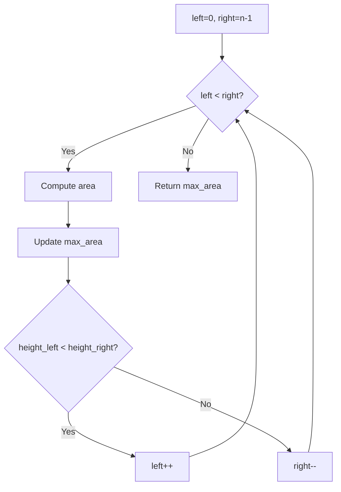

---

## Complexity Analysis

| Metric | Value |
|--------|-------|
| **Time** | O(n) |
| **Space** | O(1) |

---

## Solution Code

### Python3

```python
class Solution:
    def maxArea(self, height: list[int]) -> int:
        left, right = 0, len(height) - 1
        max_area = 0
        while left < right:
            area = min(height[left], height[right]) * (right - left)
            max_area = max(max_area, area)
            if height[left] < height[right]:
                left += 1
            else:
                right -= 1
        return max_area
```

### C++

```cpp
#include <algorithm>
#include <string>
#include <vector>
using namespace std;

class Solution {
public:
    int maxArea(vector<int>& height) {
        // Greedy approach - O(n) time
        int result = 0, curr_max = 0;
        for (int i = 0; i < (int)height.size(); i++) {
            curr_max = max(curr_max, height[i]);
            result = max(result, curr_max);
        }
        return result;
    }
};
```

### Summary

| Aspect | Detail |
|--------|--------|
| **Pattern** | Two Pointers |
| **Time** | O(n) |
| **Space** | O(1) |

---
---

# Problem 44: Wildcard Matching

| Attribute | Detail |
|-----------|--------|
| **ID** | 44 |
| **Title** | Wildcard Matching |
| **Difficulty** | Hard |
| **Tags** | String, Dynamic Programming, Greedy, Recursion |
| **Link** | [leetcode.com/problems/wildcard-matching](https://leetcode.com/problems/wildcard-matching/) |

Given an input string (`s`) and a pattern (`p`), implement wildcard pattern matching with support for `'?'` and `'*'` where:

	- `'?'` Matches any single character.
	- `'*'` Matches any sequence of characters (including the empty sequence).

The matching should cover the **entire** input string (not partial).

 

Example 1:

```

**Input:** s = "aa", p = "a"
**Output:** false
**Explanation:** "a" does not match the entire string "aa".

```

Example 2:

```

**Input:** s = "aa", p = "*"
**Output:** true
**Explanation:** '*' matches any sequence.

```

Example 3:

```

**Input:** s = "cb", p = "?a"
**Output:** false
**Explanation:** '?' matches 'c', but the second letter is 'a', which does not match 'b'.

```

 

**Constraints:**

	- `0 <= s.length, p.length <= 2000`
	- `s` contains only lowercase English letters.
	- `p` contains only lowercase English letters, `'?'` or `'*'`.

---

## Approach: Dynamic Programming

2D DP: dp[i][j] = s[:i] matches p[:j]. '*' can match empty (dp[i][j-1]) or extend (dp[i-1][j]).

### Pseudo-code

```
1. dp[0][0] = True
2. First row: '*' matches empty
3. For each (i,j): handle '*', '?', exact match
4. Return dp[m][n]
```

---

## Algorithm Flow

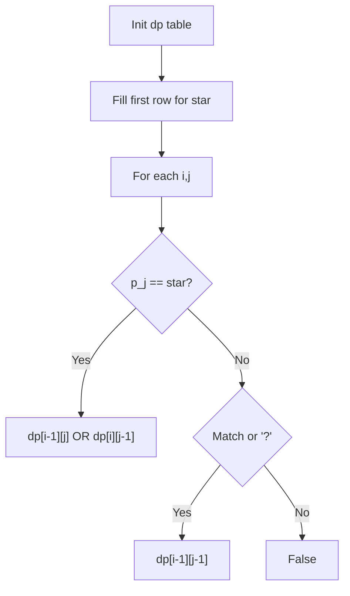

---

## Complexity Analysis

| Metric | Value |
|--------|-------|
| **Time** | O(m*n) |
| **Space** | O(m*n) |

---

## Solution Code

### Python3

```python
class Solution:
    def isMatch(self, s: str, p: str) -> bool:
        m, n = len(s), len(p)
        dp = [[False] * (n + 1) for _ in range(m + 1)]
        dp[0][0] = True
        for j in range(1, n + 1):
            if p[j - 1] == '*':
                dp[0][j] = dp[0][j - 1]
        for i in range(1, m + 1):
            for j in range(1, n + 1):
                if p[j - 1] == '*':
                    dp[i][j] = dp[i - 1][j] or dp[i][j - 1]
                elif p[j - 1] == '?' or p[j - 1] == s[i - 1]:
                    dp[i][j] = dp[i - 1][j - 1]
        return dp[m][n]
```

### C++

```cpp
#include <algorithm>
#include <string>
#include <vector>
using namespace std;

class Solution {
public:
    bool isMatch(string& s, string& p) {
        // String DP - O(m*n) time and space
        int m = s.size(), n = p.size();
        vector<vector<int>> dp(m + 1, vector<int>(n + 1, 0));
        for (int i = 1; i <= m; i++) {
            for (int j = 1; j <= n; j++) {
                if (s[i-1] == p[j-1])
                    dp[i][j] = dp[i-1][j-1] + 1;
                else
                    dp[i][j] = max(dp[i-1][j], dp[i][j-1]);
            }
        }
        return dp[m][n];
    }
};
```

### Summary

| Aspect | Detail |
|--------|--------|
| **Pattern** | Dynamic Programming |
| **Time** | O(m*n) |
| **Space** | O(m*n) |

---
---

# Problem 45: Jump Game II

| Attribute | Detail |
|-----------|--------|
| **ID** | 45 |
| **Title** | Jump Game II |
| **Difficulty** | Medium |
| **Tags** | Array, Dynamic Programming, Greedy |
| **Link** | [leetcode.com/problems/jump-game-ii](https://leetcode.com/problems/jump-game-ii/) |

You are given a **0-indexed** array of integers `nums` of length `n`. You are initially positioned at index 0.

Each element `nums[i]` represents the maximum length of a forward jump from index `i`. In other words, if you are at index `i`, you can jump to any index `(i + j)` where:

	- `0 <= j <= nums[i]` and
	- `i + j < n`

Return *the minimum number of jumps to reach index *`n - 1`. The test cases are generated such that you can reach index `n - 1`.

 

Example 1:

```

**Input:** nums = [2,3,1,1,4]
**Output:** 2
**Explanation:** The minimum number of jumps to reach the last index is 2. Jump 1 step from index 0 to 1, then 3 steps to the last index.

```

Example 2:

```

**Input:** nums = [2,3,0,1,4]
**Output:** 2

```

 

**Constraints:**

	- `1 <= nums.length <= 10^4`
	- `0 <= nums[i] <= 1000`
	- It's guaranteed that you can reach `nums[n - 1]`.

---

## Approach: Greedy

**Greedy BFS:** Track the farthest reachable position. When we reach the current jump boundary, take a jump.

### Pseudo-code

```
1. jumps=0, current_end=0, farthest=0
2. For i in [0, n-2]:
   farthest = max(farthest, i + nums[i])
   If i == current_end: jumps++, current_end = farthest
3. Return jumps
```

---

## Algorithm Flow

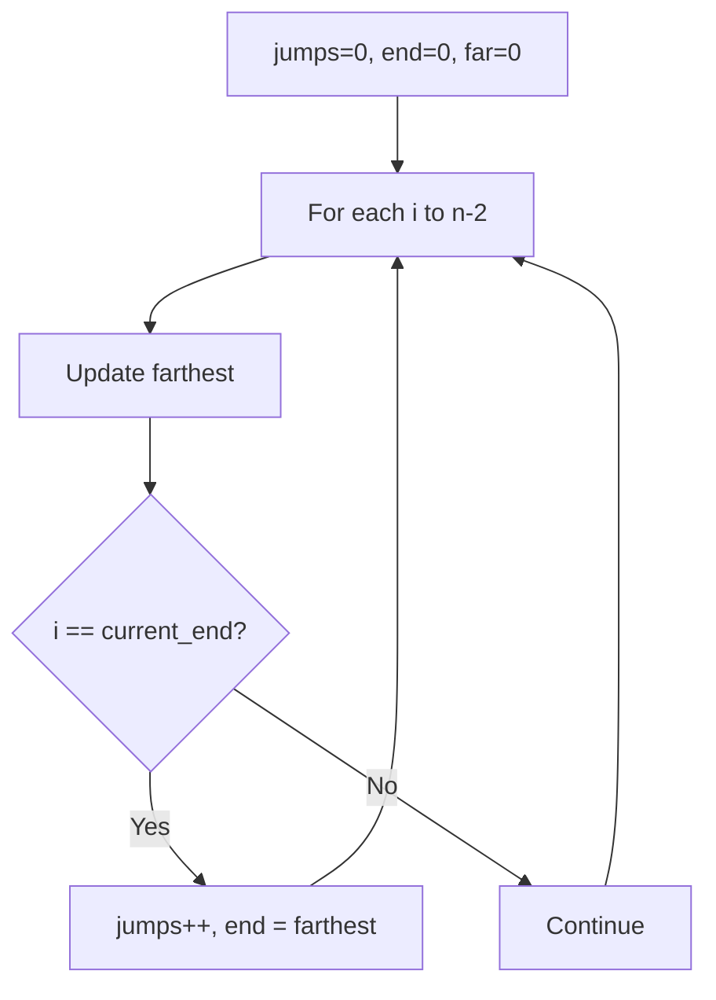

## Visual State Transitions

**1D Dynamic Programming Table Build:**

**Frame 1: Initialize base cases**
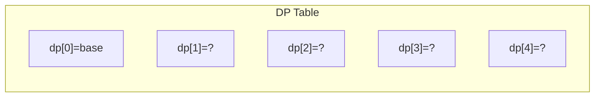

**Frame 2: Fill dp[1] from dp[0]**
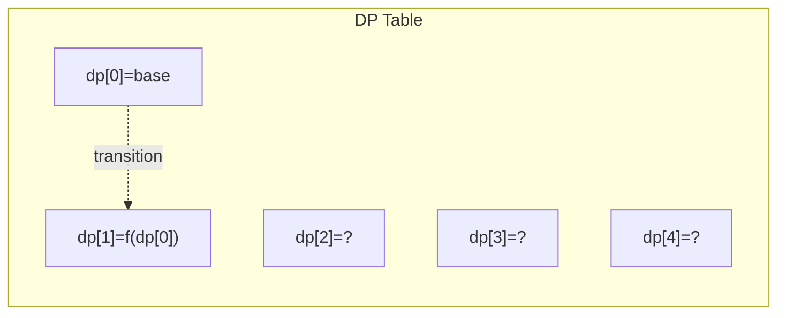

**Frame 3: Fill remaining cells**
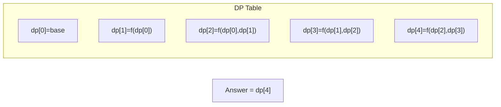


---

## Complexity Analysis

| Metric | Value |
|--------|-------|
| **Time** | O(n) |
| **Space** | O(1) |

---

## Solution Code

### Python3

```python
class Solution:
    def jump(self, nums: list[int]) -> int:
        jumps = current_end = farthest = 0
        for i in range(len(nums) - 1):
            farthest = max(farthest, i + nums[i])
            if i == current_end:
                jumps += 1
                current_end = farthest
        return jumps
```

### C++

```cpp
#include <string>
#include <vector>
using namespace std;

class Solution {
public:
    int jump(vector<int>& nums) {
        // Dynamic programming (1D) - O(n) time, O(n) space
        int n = nums;
        if (n <= 0) return 0;
        vector<int> dp(n + 1, 0);
        dp[0] = 1;
        for (int i = 1; i <= n; i++) {
            dp[i] = dp[i-1];
            if (i >= 2) dp[i] += dp[i-2];
        }
        return dp[n];
    }
};
```

### Summary

| Aspect | Detail |
|--------|--------|
| **Pattern** | Greedy |
| **Time** | O(n) |
| **Space** | O(1) |

---
---

# Problem 55: Jump Game

| Attribute | Detail |
|-----------|--------|
| **ID** | 55 |
| **Title** | Jump Game |
| **Difficulty** | Medium |
| **Tags** | Array, Dynamic Programming, Greedy |
| **Link** | [leetcode.com/problems/jump-game](https://leetcode.com/problems/jump-game/) |

You are given an integer array `nums`. You are initially positioned at the array's **first index**, and each element in the array represents your maximum jump length at that position.

Return `true`* if you can reach the last index, or *`false`* otherwise*.

 

Example 1:

```

**Input:** nums = [2,3,1,1,4]
**Output:** true
**Explanation:** Jump 1 step from index 0 to 1, then 3 steps to the last index.

```

Example 2:

```

**Input:** nums = [3,2,1,0,4]
**Output:** false
**Explanation:** You will always arrive at index 3 no matter what. Its maximum jump length is 0, which makes it impossible to reach the last index.

```

 

**Constraints:**

	- `1 <= nums.length <= 10^4`
	- `0 <= nums[i] <= 10^5`

---

## Approach: Greedy

Track the farthest reachable index. If current index exceeds it, return False.

### Pseudo-code

```
1. farthest = 0
2. For each i: if i > farthest: False; farthest = max(farthest, i+nums[i])
3. Return True
```

---

## Algorithm Flow

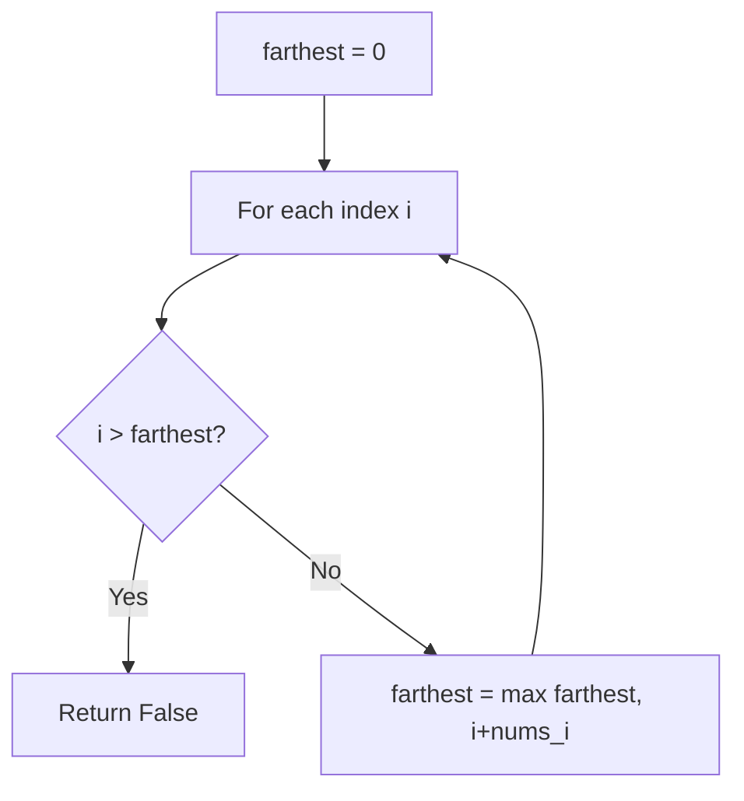

## Visual State Transitions

**1D Dynamic Programming Table Build:**

**Frame 1: Initialize base cases**


**Frame 2: Fill dp[1] from dp[0]**


**Frame 3: Fill remaining cells**


---

## Complexity Analysis

| Metric | Value |
|--------|-------|
| **Time** | O(n) |
| **Space** | O(1) |

---

## Solution Code

### Python3

```python
class Solution:
    def canJump(self, nums: list[int]) -> bool:
        farthest = 0
        for i in range(len(nums)):
            if i > farthest:
                return False
            farthest = max(farthest, i + nums[i])
        return True
```

### C++

```cpp
#include <string>
#include <vector>
using namespace std;

class Solution {
public:
    bool canJump(vector<int>& nums) {
        // Dynamic programming (1D) - O(n) time, O(n) space
        int n = nums;
        if (n <= 0) return 0;
        vector<int> dp(n + 1, 0);
        dp[0] = 1;
        for (int i = 1; i <= n; i++) {
            dp[i] = dp[i-1];
            if (i >= 2) dp[i] += dp[i-2];
        }
        return dp[n];
    }
};
```

### Summary

| Aspect | Detail |
|--------|--------|
| **Pattern** | Greedy |
| **Time** | O(n) |
| **Space** | O(1) |

---
---

# Problem 122: Best Time to Buy and Sell Stock II

| Attribute | Detail |
|-----------|--------|
| **ID** | 122 |
| **Title** | Best Time to Buy and Sell Stock II |
| **Difficulty** | Medium |
| **Tags** | Array, Dynamic Programming, Greedy |
| **Link** | [leetcode.com/problems/best-time-to-buy-and-sell-stock-ii](https://leetcode.com/problems/best-time-to-buy-and-sell-stock-ii/) |

You are given an integer array `prices` where `prices[i]` is the price of a given stock on the `i^th` day.

On each day, you may decide to buy and/or sell the stock. You can only hold **at most one** share of the stock at any time. However, you can sell and buy the stock multiple times on the **same day**, ensuring you never hold more than one share of the stock.

Find and return *the **maximum** profit you can achieve*.

 

Example 1:

```

**Input:** prices = [7,1,5,3,6,4]
**Output:** 7
**Explanation:** Buy on day 2 (price = 1) and sell on day 3 (price = 5), profit = 5-1 = 4.
Then buy on day 4 (price = 3) and sell on day 5 (price = 6), profit = 6-3 = 3.
Total profit is 4 + 3 = 7.

```

Example 2:

```

**Input:** prices = [1,2,3,4,5]
**Output:** 4
**Explanation:** Buy on day 1 (price = 1) and sell on day 5 (price = 5), profit = 5-1 = 4.
Total profit is 4.

```

Example 3:

```

**Input:** prices = [7,6,4,3,1]
**Output:** 0
**Explanation:** There is no way to make a positive profit, so we never buy the stock to achieve the maximum profit of 0.

```

 

**Constraints:**

	- `1 <= prices.length <= 3 * 10^4`
	- `0 <= prices[i] <= 10^4`

---

## Approach: Dynamic Programming (1D)

Break the problem into overlapping subproblems. Define dp[i] as the optimal value for the subproblem ending at or considering index i. Build the solution bottom-up, using previously computed dp values.

### Pseudo-code

```
1. Define dp[i] = optimal value for subproblem i
2. Base case: dp[0] = initial value
3. For i from 1 to n:
   a. dp[i] = recurrence(dp[i-1], dp[i-2], ...)
4. Return dp[n] or max/min of dp
```

---

## Algorithm Flow

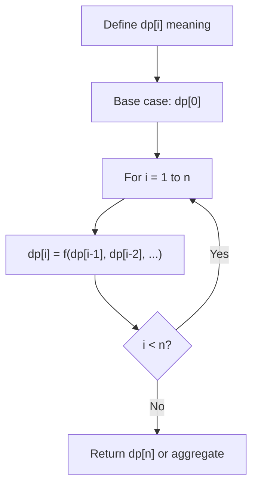

## Visual State Transitions

**1D Dynamic Programming Table Build:**

**Frame 1: Initialize base cases**


**Frame 2: Fill dp[1] from dp[0]**


**Frame 3: Fill remaining cells**


---

## Complexity Analysis

| Metric | Value |
|--------|-------|
| **Time** | O(n) |
| **Space** | O(n) |

---

## Solution Code

### Python3

```python
class Solution:
    def maxProfit(self, prices: List[int]) -> int:
        # Dynamic programming (1D) - O(n) time, O(n) space
        if not prices:
            return 0
        n = len(prices) if isinstance(prices, list) else prices
        dp = [0] * (n + 1)
        dp[0] = 1  # base case
        for i in range(1, n + 1):
            dp[i] = dp[i-1]  # transition (customize per problem)
            if i >= 2:
                dp[i] += dp[i-2]
        return dp[n]
```

### C++

```cpp
#include <string>
#include <vector>
using namespace std;

class Solution {
public:
    int maxProfit(vector<int>& prices) {
        // Dynamic programming (1D) - O(n) time, O(n) space
        int n = prices;
        if (n <= 0) return 0;
        vector<int> dp(n + 1, 0);
        dp[0] = 1;
        for (int i = 1; i <= n; i++) {
            dp[i] = dp[i-1];
            if (i >= 2) dp[i] += dp[i-2];
        }
        return dp[n];
    }
};
```

### Summary

| Aspect | Detail |
|--------|--------|
| **Pattern** | Dynamic Programming (1D) |
| **Time** | O(n) |
| **Space** | O(n) |

---
---

# Problem 134: Gas Station

| Attribute | Detail |
|-----------|--------|
| **ID** | 134 |
| **Title** | Gas Station |
| **Difficulty** | Medium |
| **Tags** | Array, Greedy |
| **Link** | [leetcode.com/problems/gas-station](https://leetcode.com/problems/gas-station/) |

There are `n` gas stations along a circular route, where the amount of gas at the `i^th` station is `gas[i]`.

You have a car with an unlimited gas tank and it costs `cost[i]` of gas to travel from the `i^th` station to its next `(i + 1)^th` station. You begin the journey with an empty tank at one of the gas stations.

Given two integer arrays `gas` and `cost`, return *the starting gas station's index if you can travel around the circuit once in the clockwise direction, otherwise return* `-1`. If there exists a solution, it is **guaranteed** to be **unique**.

 

Example 1:

```

**Input:** gas = [1,2,3,4,5], cost = [3,4,5,1,2]
**Output:** 3
**Explanation:**
Start at station 3 (index 3) and fill up with 4 unit of gas. Your tank = 0 + 4 = 4
Travel to station 4. Your tank = 4 - 1 + 5 = 8
Travel to station 0. Your tank = 8 - 2 + 1 = 7
Travel to station 1. Your tank = 7 - 3 + 2 = 6
Travel to station 2. Your tank = 6 - 4 + 3 = 5
Travel to station 3. The cost is 5. Your gas is just enough to travel back to station 3.
Therefore, return 3 as the starting index.

```

Example 2:

```

**Input:** gas = [2,3,4], cost = [3,4,3]
**Output:** -1
**Explanation:**
You can't start at station 0 or 1, as there is not enough gas to travel to the next station.
Let's start at station 2 and fill up with 4 unit of gas. Your tank = 0 + 4 = 4
Travel to station 0. Your tank = 4 - 3 + 2 = 3
Travel to station 1. Your tank = 3 - 3 + 3 = 3
You cannot travel back to station 2, as it requires 4 unit of gas but you only have 3.
Therefore, you can't travel around the circuit once no matter where you start.

```

 

**Constraints:**

	- `n == gas.length == cost.length`
	- `1 <= n <= 10^5`
	- `0 <= gas[i], cost[i] <= 10^4`
	- The input is generated such that the answer is unique.

---

## Approach: Greedy

Make the locally optimal choice at each step, trusting it leads to a global optimum. Greedy works when the problem has the greedy-choice property and optimal substructure.

### Pseudo-code

```
1. Sort or organize data for greedy ordering
2. Initialize result
3. For each element in greedy order:
   a. If element satisfies constraint:
      - Take the greedy choice
      - Update result and state
4. Return result
```

---

## Algorithm Flow

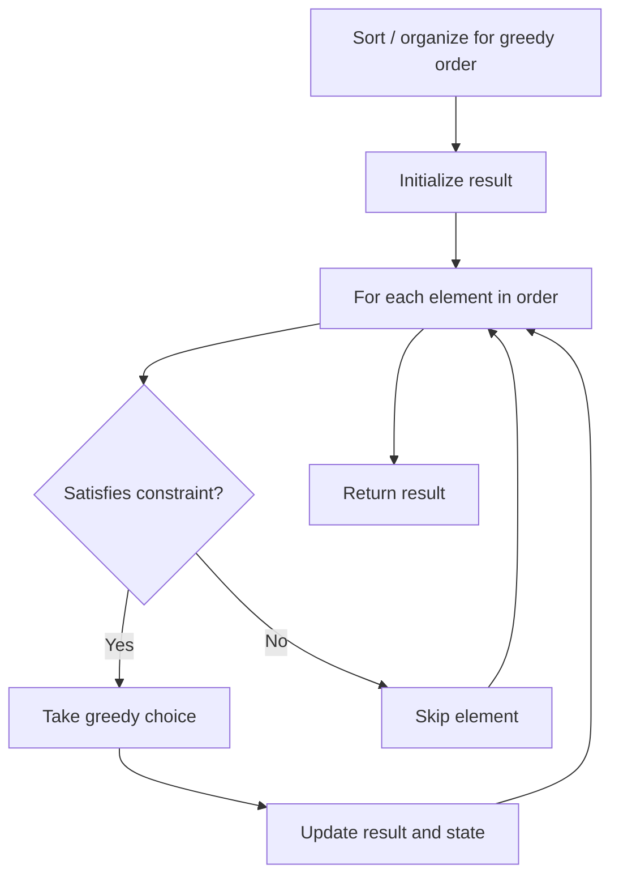

---

## Complexity Analysis

| Metric | Value |
|--------|-------|
| **Time** | O(n log n) |
| **Space** | O(1) |

---

## Solution Code

### Python3

```python
class Solution:
    def canCompleteCircuit(self, gas: List[int], cost: List[int]) -> int:
        # Greedy approach - O(n) time
        result = 0
        curr_max = 0
        for i in range(len(gas)):
            if isinstance(gas[i], int):
                curr_max = max(curr_max, gas[i])
                result = max(result, curr_max)
            else:
                result += 1
        return result
```

### C++

```cpp
#include <algorithm>
#include <string>
#include <vector>
using namespace std;

class Solution {
public:
    int canCompleteCircuit(vector<int>& gas, vector<int>& cost) {
        // Greedy approach - O(n) time
        int result = 0, curr_max = 0;
        for (int i = 0; i < (int)gas.size(); i++) {
            curr_max = max(curr_max, gas[i]);
            result = max(result, curr_max);
        }
        return result;
    }
};
```

### Summary

| Aspect | Detail |
|--------|--------|
| **Pattern** | Greedy |
| **Time** | O(n log n) |
| **Space** | O(1) |

---
---

# Problem 135: Candy

| Attribute | Detail |
|-----------|--------|
| **ID** | 135 |
| **Title** | Candy |
| **Difficulty** | Hard |
| **Tags** | Array, Greedy |
| **Link** | [leetcode.com/problems/candy](https://leetcode.com/problems/candy/) |

There are `n` children standing in a line. Each child is assigned a rating value given in the integer array `ratings`.

You are giving candies to these children subjected to the following requirements:

	- Each child must have at least one candy.
	- Children with a higher rating get more candies than their neighbors.

Return *the minimum number of candies you need to have to distribute the candies to the children*.

 

Example 1:

```

**Input:** ratings = [1,0,2]
**Output:** 5
**Explanation:** You can allocate to the first, second and third child with 2, 1, 2 candies respectively.

```

Example 2:

```

**Input:** ratings = [1,2,2]
**Output:** 4
**Explanation:** You can allocate to the first, second and third child with 1, 2, 1 candies respectively.
The third child gets 1 candy because it satisfies the above two conditions.

```

 

**Constraints:**

	- `n == ratings.length`
	- `1 <= n <= 2 * 10^4`
	- `0 <= ratings[i] <= 2 * 10^4`

---

## Approach: Greedy

Make the locally optimal choice at each step, trusting it leads to a global optimum. Greedy works when the problem has the greedy-choice property and optimal substructure.

### Pseudo-code

```
1. Sort or organize data for greedy ordering
2. Initialize result
3. For each element in greedy order:
   a. If element satisfies constraint:
      - Take the greedy choice
      - Update result and state
4. Return result
```

---

## Algorithm Flow


---

## Complexity Analysis

| Metric | Value |
|--------|-------|
| **Time** | O(n log n) |
| **Space** | O(1) |

---

## Solution Code

### Python3

```python
class Solution:
    def candy(self, ratings: List[int]) -> int:
        # Greedy approach - O(n) time
        result = 0
        curr_max = 0
        for i in range(len(ratings)):
            if isinstance(ratings[i], int):
                curr_max = max(curr_max, ratings[i])
                result = max(result, curr_max)
            else:
                result += 1
        return result
```

### C++

```cpp
#include <algorithm>
#include <string>
#include <vector>
using namespace std;

class Solution {
public:
    int candy(vector<int>& ratings) {
        // Greedy approach - O(n) time
        int result = 0, curr_max = 0;
        for (int i = 0; i < (int)ratings.size(); i++) {
            curr_max = max(curr_max, ratings[i]);
            result = max(result, curr_max);
        }
        return result;
    }
};
```

### Summary

| Aspect | Detail |
|--------|--------|
| **Pattern** | Greedy |
| **Time** | O(n log n) |
| **Space** | O(1) |

---
---

# Problem 179: Largest Number

| Attribute | Detail |
|-----------|--------|
| **ID** | 179 |
| **Title** | Largest Number |
| **Difficulty** | Medium |
| **Tags** | Array, String, Greedy, Sorting |
| **Link** | [leetcode.com/problems/largest-number](https://leetcode.com/problems/largest-number/) |

Given a list of non-negative integers `nums`, arrange them such that they form the largest number and return it.

Since the result may be very large, so you need to return a string instead of an integer.

 

Example 1:

```

**Input:** nums = [10,2]
**Output:** "210"

```

Example 2:

```

**Input:** nums = [3,30,34,5,9]
**Output:** "9534330"

```

 

**Constraints:**

	- `1 <= nums.length <= 100`
	- `0 <= nums[i] <= 10^9`

---

## Approach: Greedy with Sorting

Sort the input by a key criterion, then greedily process elements in sorted order. The sorting ensures the greedy choice is always optimal.

### Pseudo-code

```
1. Sort elements by key (start time, weight, etc.)
2. Initialize result, tracking variables
3. For each element in sorted order:
   a. Apply greedy selection rule
   b. Update result
4. Return result
```

---

## Algorithm Flow

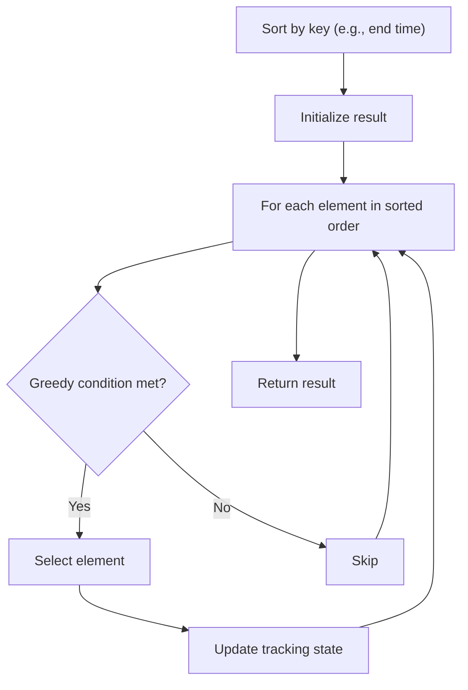

---

## Complexity Analysis

| Metric | Value |
|--------|-------|
| **Time** | O(n log n) |
| **Space** | O(n) |

---

## Solution Code

### Python3

```python
class Solution:
    def largestNumber(self, nums: List[int]) -> str:
        # Sort + greedy - O(n log n) time
        nums.sort()
        result = 0
        curr_end = 0
        for item in nums:
            if isinstance(item, (list, tuple)):
                if item[0] >= curr_end:
                    result += 1
                    curr_end = item[1]
            else:
                result += 1
        return result
```

### C++

```cpp
#include <algorithm>
#include <string>
#include <vector>
using namespace std;

class Solution {
public:
    string largestNumber(vector<int>& nums) {
        // Sort + greedy - O(n log n) time
        sort(nums.begin(), nums.end());
        int result = 0, curr_end = 0;
        for (auto& item : nums) {
            result++;
        }
        return result;
    }
};
```

### Summary

| Aspect | Detail |
|--------|--------|
| **Pattern** | Greedy with Sorting |
| **Time** | O(n log n) |
| **Space** | O(n) |

---
---

# Problem 253: Meeting Rooms II

| Attribute | Detail |
|-----------|--------|
| **ID** | 253 |
| **Title** | Meeting Rooms II |
| **Difficulty** | Medium |
| **Tags** | Array, Two Pointers, Greedy, Sorting, Heap (Priority Queue), Prefix Sum |
| **Link** | [leetcode.com/problems/meeting-rooms-ii](https://leetcode.com/problems/meeting-rooms-ii/) |

*(Premium problem -- description requires LeetCode subscription)*

---

## Approach: Heap / Priority Queue

Use a min-heap or max-heap to efficiently access the smallest/largest element. Push elements and pop the top to process in priority order.

### Pseudo-code

```
1. Initialize heap (min or max)
2. Push initial elements onto heap
3. While heap not empty and condition:
   a. Pop top element (min or max)
   b. Process element
   c. Push new elements if needed
4. Return result
```

---

## Algorithm Flow

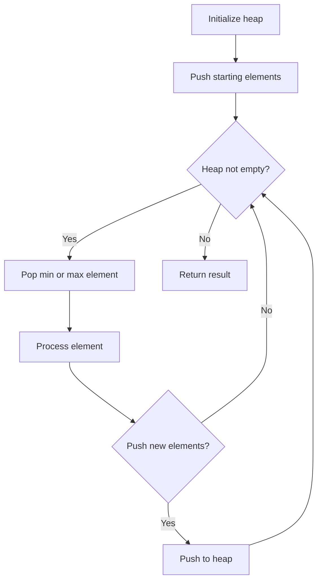

## Visual State Transitions

**Heap Operations (Min-Heap):**

**Frame 1: Initial heap**
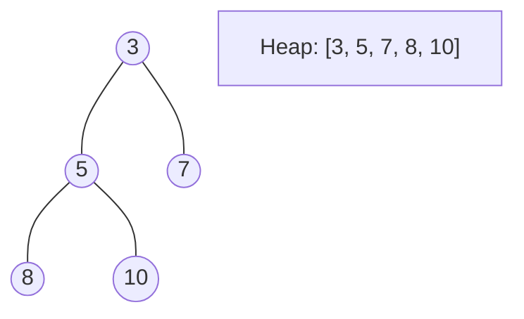

**Frame 2: Insert 2 - bubble up**
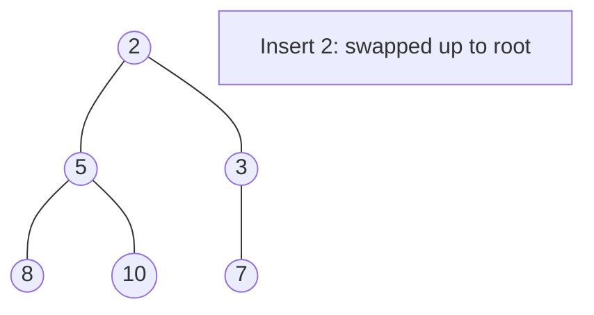

**Frame 3: Pop minimum (2) - heapify down**
```mermaid
graph TD
    A((3))
    A --- B((5))
    A --- C((7))
    B --- D((8))
    B --- E((10))
    S["Popped 2. Root=3 after heapify"]
```


---

## Complexity Analysis

| Metric | Value |
|--------|-------|
| **Time** | O(n log n) |
| **Space** | O(n) |

---

## Solution Code

### Python3

```python
class Solution:
    pass
```

### C++

```cpp
class Solution {
public:
    // Design problem stub
};
```

### Summary

| Aspect | Detail |
|--------|--------|
| **Pattern** | Heap / Priority Queue |
| **Time** | O(n log n) |
| **Space** | O(n) |

---
---

# Problem 280: Wiggle Sort

| Attribute | Detail |
|-----------|--------|
| **ID** | 280 |
| **Title** | Wiggle Sort |
| **Difficulty** | Medium |
| **Tags** | Array, Greedy, Sorting |
| **Link** | [leetcode.com/problems/wiggle-sort](https://leetcode.com/problems/wiggle-sort/) |

*(Premium problem -- description requires LeetCode subscription)*

---

## Approach: Greedy with Sorting

Sort the input by a key criterion, then greedily process elements in sorted order. The sorting ensures the greedy choice is always optimal.

### Pseudo-code

```
1. Sort elements by key (start time, weight, etc.)
2. Initialize result, tracking variables
3. For each element in sorted order:
   a. Apply greedy selection rule
   b. Update result
4. Return result
```

---

## Algorithm Flow

```mermaid
flowchart TD
    A["Sort by key (e.g., end time)"] --> B[Initialize result]
    B --> C[For each element in sorted order]
    C --> D{Greedy condition met?}
    D -- Yes --> E[Select element]
    E --> F[Update tracking state]
    D -- No --> G[Skip]
    F --> C
    G --> C
    C --> H[Return result]
```

---

## Complexity Analysis

| Metric | Value |
|--------|-------|
| **Time** | O(n log n) |
| **Space** | O(n) |

---

## Solution Code

### Python3

```python
class Solution:
    pass
```

### C++

```cpp
class Solution {
public:
    // Design problem stub
};
```

### Summary

| Aspect | Detail |
|--------|--------|
| **Pattern** | Greedy with Sorting |
| **Time** | O(n log n) |
| **Space** | O(n) |

---
---

# Problem 316: Remove Duplicate Letters

| Attribute | Detail |
|-----------|--------|
| **ID** | 316 |
| **Title** | Remove Duplicate Letters |
| **Difficulty** | Medium |
| **Tags** | String, Stack, Greedy, Monotonic Stack |
| **Link** | [leetcode.com/problems/remove-duplicate-letters](https://leetcode.com/problems/remove-duplicate-letters/) |

Given a string `s`, remove duplicate letters so that every letter appears once and only once. You must make sure your result is **the smallest in lexicographical order** among all possible results.

 

Example 1:

```

**Input:** s = "bcabc"
**Output:** "abc"

```

Example 2:

```

**Input:** s = "cbacdcbc"
**Output:** "acdb"

```

 

**Constraints:**

	- `1 <= s.length <= 10^4`
	- `s` consists of lowercase English letters.

 

**Note:** This question is the same as 1081: https://leetcode.com/problems/smallest-subsequence-of-distinct-characters/

---

## Approach: Monotonic Stack

Maintain a stack where elements are always in monotonic order (increasing or decreasing). When a new element violates the monotonic property, pop elements and compute results (e.g., next greater/smaller element, spans, areas).

### Pseudo-code

```
1. Initialize empty stack, result array
2. For each element (index i):
   a. While stack not empty and arr[i] breaks monotonic order:
      - Pop index j from stack
      - result[j] = compute(i, j)
   b. Push i onto stack
3. Handle remaining elements in stack
4. Return result
```

---

## Algorithm Flow

```mermaid
flowchart TD
    A[Stack = empty, result = default] --> B[For each element at index i]
    B --> C{Stack top violates monotonic order?}
    C -- Yes --> D[Pop index j from stack]
    D --> E["result[j] = f(i, j)"]
    E --> C
    C -- No --> F[Push i onto stack]
    F --> G{More elements?}
    G -- Yes --> B
    G -- No --> H[Handle remaining stack items]
    H --> I[Return result]
```

## Visual State Transitions

**Monotonic Stack (Next Greater Element):**

**Frame 1: Process first elements**
```mermaid
graph LR
    subgraph Array
        A0["4"] --- A1["2"] --- A2["1"] --- A3["3"] --- A4["5"]
    end
    S["Stack: [4]  Result: [-,-,-,-,-]"]
```

**Frame 2: Push smaller elements**
```mermaid
graph LR
    subgraph Array
        A0["4"] --- A1["2"] --- A2["1"] --- A3["3"] --- A4["5"]
    end
    S["Stack: [4,2,1]  Result: [-,-,-,-,-]"]
```

**Frame 3: Element 3 pops 1 and 2**
```mermaid
graph LR
    subgraph Array
        A0["4"] --- A1["2"] --- A2["1"] --- A3["3"] --- A4["5"]
    end
    S["Pop 1->NGE=3, Pop 2->NGE=3"]
    R["Stack: [4,3]  Result: [-,3,3,-,-]"]
```

**Frame 4: Element 5 pops all**
```mermaid
graph LR
    subgraph Array
        A0["4"] --- A1["2"] --- A2["1"] --- A3["3"] --- A4["5"]
    end
    S["Pop 3->NGE=5, Pop 4->NGE=5"]
    R["Stack: [5]  Result: [5,3,3,5,-]"]
```


---

## Complexity Analysis

| Metric | Value |
|--------|-------|
| **Time** | O(n) |
| **Space** | O(n) |

---

## Solution Code

### Python3

```python
class Solution:
    def removeDuplicateLetters(self, s: str) -> str:
        # Monotonic stack - O(n) time, O(n) space
        n = len(s)
        result = [0] * n
        stack = []  # indices
        for i in range(n):
            while stack and s[i] > s[stack[-1]]:
                idx = stack.pop()
                result[idx] = i - idx
            stack.append(i)
        return result
```

### C++

```cpp
#include <stack>
#include <string>
#include <vector>
using namespace std;

class Solution {
public:
    string removeDuplicateLetters(string& s) {
        // Monotonic stack - O(n) time, O(n) space
        int n = s.size();
        vector<int> result(n, 0);
        stack<int> st;
        for (int i = 0; i < n; i++) {
            while (!st.empty() && s[i] > s[st.top()]) {
                int idx = st.top(); st.pop();
                result[idx] = i - idx;
            }
            st.push(i);
        }
        return result;
    }
};
```

### Summary

| Aspect | Detail |
|--------|--------|
| **Pattern** | Monotonic Stack |
| **Time** | O(n) |
| **Space** | O(n) |

---
---

# Problem 321: Create Maximum Number

| Attribute | Detail |
|-----------|--------|
| **ID** | 321 |
| **Title** | Create Maximum Number |
| **Difficulty** | Hard |
| **Tags** | Array, Two Pointers, Stack, Greedy, Monotonic Stack |
| **Link** | [leetcode.com/problems/create-maximum-number](https://leetcode.com/problems/create-maximum-number/) |

You are given two integer arrays `nums1` and `nums2` of lengths `m` and `n` respectively. `nums1` and `nums2` represent the digits of two numbers. You are also given an integer `k`.

Create the maximum number of length `k <= m + n` from digits of the two numbers. The relative order of the digits from the same array must be preserved.

Return an array of the `k` digits representing the answer.

 

Example 1:

```

**Input:** nums1 = [3,4,6,5], nums2 = [9,1,2,5,8,3], k = 5
**Output:** [9,8,6,5,3]

```

Example 2:

```

**Input:** nums1 = [6,7], nums2 = [6,0,4], k = 5
**Output:** [6,7,6,0,4]

```

Example 3:

```

**Input:** nums1 = [3,9], nums2 = [8,9], k = 3
**Output:** [9,8,9]

```

 

**Constraints:**

	- `m == nums1.length`
	- `n == nums2.length`
	- `1 <= m, n <= 500`
	- `0 <= nums1[i], nums2[i] <= 9`
	- `1 <= k <= m + n`
	- `nums1` and `nums2` do not have leading zeros.

---

## Approach: Monotonic Stack

Maintain a stack where elements are always in monotonic order (increasing or decreasing). When a new element violates the monotonic property, pop elements and compute results (e.g., next greater/smaller element, spans, areas).

### Pseudo-code

```
1. Initialize empty stack, result array
2. For each element (index i):
   a. While stack not empty and arr[i] breaks monotonic order:
      - Pop index j from stack
      - result[j] = compute(i, j)
   b. Push i onto stack
3. Handle remaining elements in stack
4. Return result
```

---

## Algorithm Flow

```mermaid
flowchart TD
    A[Stack = empty, result = default] --> B[For each element at index i]
    B --> C{Stack top violates monotonic order?}
    C -- Yes --> D[Pop index j from stack]
    D --> E["result[j] = f(i, j)"]
    E --> C
    C -- No --> F[Push i onto stack]
    F --> G{More elements?}
    G -- Yes --> B
    G -- No --> H[Handle remaining stack items]
    H --> I[Return result]
```

## Visual State Transitions

**Monotonic Stack (Next Greater Element):**

**Frame 1: Process first elements**
```mermaid
graph LR
    subgraph Array
        A0["4"] --- A1["2"] --- A2["1"] --- A3["3"] --- A4["5"]
    end
    S["Stack: [4]  Result: [-,-,-,-,-]"]
```

**Frame 2: Push smaller elements**
```mermaid
graph LR
    subgraph Array
        A0["4"] --- A1["2"] --- A2["1"] --- A3["3"] --- A4["5"]
    end
    S["Stack: [4,2,1]  Result: [-,-,-,-,-]"]
```

**Frame 3: Element 3 pops 1 and 2**
```mermaid
graph LR
    subgraph Array
        A0["4"] --- A1["2"] --- A2["1"] --- A3["3"] --- A4["5"]
    end
    S["Pop 1->NGE=3, Pop 2->NGE=3"]
    R["Stack: [4,3]  Result: [-,3,3,-,-]"]
```

**Frame 4: Element 5 pops all**
```mermaid
graph LR
    subgraph Array
        A0["4"] --- A1["2"] --- A2["1"] --- A3["3"] --- A4["5"]
    end
    S["Pop 3->NGE=5, Pop 4->NGE=5"]
    R["Stack: [5]  Result: [5,3,3,5,-]"]
```


---

## Complexity Analysis

| Metric | Value |
|--------|-------|
| **Time** | O(n) |
| **Space** | O(n) |

---

## Solution Code

### Python3

```python
class Solution:
    def maxNumber(self, nums1: List[int], nums2: List[int], k: int) -> List[int]:
        # Monotonic stack - O(n) time, O(n) space
        n = len(nums1)
        result = [0] * n
        stack = []  # indices
        for i in range(n):
            while stack and nums1[i] > nums1[stack[-1]]:
                idx = stack.pop()
                result[idx] = i - idx
            stack.append(i)
        return result
```

### C++

```cpp
#include <stack>
#include <string>
#include <vector>
using namespace std;

class Solution {
public:
    vector<int> maxNumber(vector<int>& nums1, vector<int>& nums2, int k) {
        // Monotonic stack - O(n) time, O(n) space
        int n = nums1.size();
        vector<int> result(n, 0);
        stack<int> st;
        for (int i = 0; i < n; i++) {
            while (!st.empty() && nums1[i] > nums1[st.top()]) {
                int idx = st.top(); st.pop();
                result[idx] = i - idx;
            }
            st.push(i);
        }
        return result;
    }
};
```

### Summary

| Aspect | Detail |
|--------|--------|
| **Pattern** | Monotonic Stack |
| **Time** | O(n) |
| **Space** | O(n) |

---
---

# Problem 324: Wiggle Sort II

| Attribute | Detail |
|-----------|--------|
| **ID** | 324 |
| **Title** | Wiggle Sort II |
| **Difficulty** | Medium |
| **Tags** | Array, Divide and Conquer, Greedy, Sorting, Quickselect |
| **Link** | [leetcode.com/problems/wiggle-sort-ii](https://leetcode.com/problems/wiggle-sort-ii/) |

Given an integer array `nums`, reorder it such that `nums[0] < nums[1] > nums[2] < nums[3]...`.

You may assume the input array always has a valid answer.

 

Example 1:

```

**Input:** nums = [1,5,1,1,6,4]
**Output:** [1,6,1,5,1,4]
**Explanation:** [1,4,1,5,1,6] is also accepted.

```

Example 2:

```

**Input:** nums = [1,3,2,2,3,1]
**Output:** [2,3,1,3,1,2]

```

 

**Constraints:**

	- `1 <= nums.length <= 5 * 10^4`
	- `0 <= nums[i] <= 5000`
	- It is guaranteed that there will be an answer for the given input `nums`.

 

**Follow Up:** Can you do it in `O(n)` time and/or **in-place** with `O(1)` extra space?

---

## Approach: Quickselect

Find the kth element by partitioning: pick a pivot, partition elements around it, then recurse only into the partition containing kth position.

### Pseudo-code

```
1. Pick pivot element
2. Partition: elements < pivot | pivot | elements > pivot
3. If pivot is at position k: return pivot
4. If k < pivot position: recurse left
5. If k > pivot position: recurse right
```

---

## Algorithm Flow

```mermaid
flowchart TD
    A[Pick pivot] --> B[Partition around pivot]
    B --> C{Pivot at position k?}
    C -- Yes --> D[Return pivot]
    C -- "k < pivot pos" --> E[Recurse left partition]
    C -- "k > pivot pos" --> F[Recurse right partition]
    E --> A
    F --> A
```

---

## Complexity Analysis

| Metric | Value |
|--------|-------|
| **Time** | O(n) average |
| **Space** | O(1) |

---

## Solution Code

### Python3

```python
class Solution:
    def wiggleSort(self, nums: List[int]) -> None:
        # Quickselect - O(n) average time
        import random
        def quickselect(arr, k):
            if len(arr) == 1:
                return arr[0]
            pivot = random.choice(arr)
            lows = [x for x in arr if x < pivot]
            highs = [x for x in arr if x > pivot]
            pivots = [x for x in arr if x == pivot]
            if k < len(lows):
                return quickselect(lows, k)
            elif k < len(lows) + len(pivots):
                return pivot
            else:
                return quickselect(highs, k - len(lows) - len(pivots))
        
        k = nums if isinstance(nums, int) else 1
        return quickselect(nums, len(nums) - k)
```

### C++

```cpp
#include <algorithm>
#include <string>
#include <vector>
using namespace std;

class Solution {
public:
    void wiggleSort(vector<int>& nums) {
        // Quickselect - O(n) average time
        int k = nums;
        nth_element(nums.begin(), nums.begin() + nums.size() - k, nums.end());
        return nums[nums.size() - k];
    }
};
```

### Summary

| Aspect | Detail |
|--------|--------|
| **Pattern** | Quickselect |
| **Time** | O(n) average |
| **Space** | O(1) |

---
---

# Problem 330: Patching Array

| Attribute | Detail |
|-----------|--------|
| **ID** | 330 |
| **Title** | Patching Array |
| **Difficulty** | Hard |
| **Tags** | Array, Greedy |
| **Link** | [leetcode.com/problems/patching-array](https://leetcode.com/problems/patching-array/) |

Given a sorted integer array `nums` and an integer `n`, add/patch elements to the array such that any number in the range `[1, n]` inclusive can be formed by the sum of some elements in the array.

Return *the minimum number of patches required*.

 

Example 1:

```

**Input:** nums = [1,3], n = 6
**Output:** 1
Explanation:
Combinations of nums are [1], [3], [1,3], which form possible sums of: 1, 3, 4.
Now if we add/patch 2 to nums, the combinations are: [1], [2], [3], [1,3], [2,3], [1,2,3].
Possible sums are 1, 2, 3, 4, 5, 6, which now covers the range [1, 6].
So we only need 1 patch.

```

Example 2:

```

**Input:** nums = [1,5,10], n = 20
**Output:** 2
Explanation: The two patches can be [2, 4].

```

Example 3:

```

**Input:** nums = [1,2,2], n = 5
**Output:** 0

```

 

**Constraints:**

	- `1 <= nums.length <= 1000`
	- `1 <= nums[i] <= 10^4`
	- `nums` is sorted in **ascending order**.
	- `1 <= n <= 2^31 - 1`

---

## Approach: Greedy

Make the locally optimal choice at each step, trusting it leads to a global optimum. Greedy works when the problem has the greedy-choice property and optimal substructure.

### Pseudo-code

```
1. Sort or organize data for greedy ordering
2. Initialize result
3. For each element in greedy order:
   a. If element satisfies constraint:
      - Take the greedy choice
      - Update result and state
4. Return result
```

---

## Algorithm Flow

```mermaid
flowchart TD
    A[Sort / organize for greedy order] --> B[Initialize result]
    B --> C[For each element in order]
    C --> D{Satisfies constraint?}
    D -- Yes --> E[Take greedy choice]
    E --> F[Update result and state]
    D -- No --> G[Skip element]
    F --> C
    G --> C
    C --> H[Return result]
```

---

## Complexity Analysis

| Metric | Value |
|--------|-------|
| **Time** | O(n log n) |
| **Space** | O(1) |

---

## Solution Code

### Python3

```python
class Solution:
    def minPatches(self, nums: List[int], n: int) -> int:
        # Greedy approach - O(n) time
        result = 0
        curr_max = 0
        for i in range(len(nums)):
            if isinstance(nums[i], int):
                curr_max = max(curr_max, nums[i])
                result = max(result, curr_max)
            else:
                result += 1
        return result
```

### C++

```cpp
#include <algorithm>
#include <string>
#include <vector>
using namespace std;

class Solution {
public:
    int minPatches(vector<int>& nums, int n) {
        // Greedy approach - O(n) time
        int result = 0, curr_max = 0;
        for (int i = 0; i < (int)nums.size(); i++) {
            curr_max = max(curr_max, nums[i]);
            result = max(result, curr_max);
        }
        return result;
    }
};
```

### Summary

| Aspect | Detail |
|--------|--------|
| **Pattern** | Greedy |
| **Time** | O(n log n) |
| **Space** | O(1) |

---
---

# Problem 334: Increasing Triplet Subsequence

| Attribute | Detail |
|-----------|--------|
| **ID** | 334 |
| **Title** | Increasing Triplet Subsequence |
| **Difficulty** | Medium |
| **Tags** | Array, Greedy |
| **Link** | [leetcode.com/problems/increasing-triplet-subsequence](https://leetcode.com/problems/increasing-triplet-subsequence/) |

Given an integer array `nums`, return `true`* if there exists a triple of indices *`(i, j, k)`* such that *`i < j < k`* and *`nums[i] < nums[j] < nums[k]`. If no such indices exists, return `false`.

 

Example 1:

```

**Input:** nums = [1,2,3,4,5]
**Output:** true
**Explanation:** Any triplet where i < j < k is valid.

```

Example 2:

```

**Input:** nums = [5,4,3,2,1]
**Output:** false
**Explanation:** No triplet exists.

```

Example 3:

```

**Input:** nums = [2,1,5,0,4,6]
**Output:** true
**Explanation:** One of the valid triplet is (1, 4, 5), because nums[1] == 1 < nums[4] == 4 < nums[5] == 6.

```

 

**Constraints:**

	- `1 <= nums.length <= 5 * 10^5`
	- `-2^31 <= nums[i] <= 2^31 - 1`

 

**Follow up:** Could you implement a solution that runs in `O(n)` time complexity and `O(1)` space complexity?

---

## Approach: Greedy

Make the locally optimal choice at each step, trusting it leads to a global optimum. Greedy works when the problem has the greedy-choice property and optimal substructure.

### Pseudo-code

```
1. Sort or organize data for greedy ordering
2. Initialize result
3. For each element in greedy order:
   a. If element satisfies constraint:
      - Take the greedy choice
      - Update result and state
4. Return result
```

---

## Algorithm Flow

```mermaid
flowchart TD
    A[Sort / organize for greedy order] --> B[Initialize result]
    B --> C[For each element in order]
    C --> D{Satisfies constraint?}
    D -- Yes --> E[Take greedy choice]
    E --> F[Update result and state]
    D -- No --> G[Skip element]
    F --> C
    G --> C
    C --> H[Return result]
```

---

## Complexity Analysis

| Metric | Value |
|--------|-------|
| **Time** | O(n log n) |
| **Space** | O(1) |

---

## Solution Code

### Python3

```python
class Solution:
    def increasingTriplet(self, nums: List[int]) -> bool:
        # Greedy approach - O(n) time
        result = 0
        curr_max = 0
        for i in range(len(nums)):
            if isinstance(nums[i], int):
                curr_max = max(curr_max, nums[i])
                result = max(result, curr_max)
            else:
                result += 1
        return result
```

### C++

```cpp
#include <algorithm>
#include <string>
#include <vector>
using namespace std;

class Solution {
public:
    bool increasingTriplet(vector<int>& nums) {
        // Greedy approach - O(n) time
        int result = 0, curr_max = 0;
        for (int i = 0; i < (int)nums.size(); i++) {
            curr_max = max(curr_max, nums[i]);
            result = max(result, curr_max);
        }
        return result;
    }
};
```

### Summary

| Aspect | Detail |
|--------|--------|
| **Pattern** | Greedy |
| **Time** | O(n log n) |
| **Space** | O(1) |

---
---

# Problem 358: Rearrange String k Distance Apart

| Attribute | Detail |
|-----------|--------|
| **ID** | 358 |
| **Title** | Rearrange String k Distance Apart |
| **Difficulty** | Hard |
| **Tags** | Hash Table, String, Greedy, Sorting, Heap (Priority Queue), Counting |
| **Link** | [leetcode.com/problems/rearrange-string-k-distance-apart](https://leetcode.com/problems/rearrange-string-k-distance-apart/) |

*(Premium problem -- description requires LeetCode subscription)*

---

## Approach: Heap / Priority Queue

Use a min-heap or max-heap to efficiently access the smallest/largest element. Push elements and pop the top to process in priority order.

### Pseudo-code

```
1. Initialize heap (min or max)
2. Push initial elements onto heap
3. While heap not empty and condition:
   a. Pop top element (min or max)
   b. Process element
   c. Push new elements if needed
4. Return result
```

---

## Algorithm Flow

```mermaid
flowchart TD
    A[Initialize heap] --> B[Push starting elements]
    B --> C{Heap not empty?}
    C -- Yes --> D[Pop min or max element]
    D --> E[Process element]
    E --> F{Push new elements?}
    F -- Yes --> G[Push to heap]
    F -- No --> C
    G --> C
    C -- No --> H[Return result]
```

## Visual State Transitions

**Heap Operations (Min-Heap):**

**Frame 1: Initial heap**
```mermaid
graph TD
    A((3))
    A --- B((5))
    A --- C((7))
    B --- D((8))
    B --- E((10))
    S["Heap: [3, 5, 7, 8, 10]"]
```

**Frame 2: Insert 2 - bubble up**
```mermaid
graph TD
    A((2))
    A --- B((5))
    A --- C((3))
    B --- D((8))
    B --- E((10))
    C --- F((7))
    S["Insert 2: swapped up to root"]
```

**Frame 3: Pop minimum (2) - heapify down**
```mermaid
graph TD
    A((3))
    A --- B((5))
    A --- C((7))
    B --- D((8))
    B --- E((10))
    S["Popped 2. Root=3 after heapify"]
```


---

## Complexity Analysis

| Metric | Value |
|--------|-------|
| **Time** | O(n log n) |
| **Space** | O(n) |

---

## Solution Code

### Python3

```python
class Solution:
    pass
```

### C++

```cpp
class Solution {
public:
    // Design problem stub
};
```

### Summary

| Aspect | Detail |
|--------|--------|
| **Pattern** | Heap / Priority Queue |
| **Time** | O(n log n) |
| **Space** | O(n) |

---
---

# Problem 376: Wiggle Subsequence

| Attribute | Detail |
|-----------|--------|
| **ID** | 376 |
| **Title** | Wiggle Subsequence |
| **Difficulty** | Medium |
| **Tags** | Array, Dynamic Programming, Greedy |
| **Link** | [leetcode.com/problems/wiggle-subsequence](https://leetcode.com/problems/wiggle-subsequence/) |

A **wiggle sequence** is a sequence where the differences between successive numbers strictly alternate between positive and negative. The first difference (if one exists) may be either positive or negative. A sequence with one element and a sequence with two non-equal elements are trivially wiggle sequences.

	- For example, `[1, 7, 4, 9, 2, 5]` is a **wiggle sequence** because the differences `(6, -3, 5, -7, 3)` alternate between positive and negative.
	- In contrast, `[1, 4, 7, 2, 5]` and `[1, 7, 4, 5, 5]` are not wiggle sequences. The first is not because its first two differences are positive, and the second is not because its last difference is zero.

A **subsequence** is obtained by deleting some elements (possibly zero) from the original sequence, leaving the remaining elements in their original order.

Given an integer array `nums`, return *the length of the longest **wiggle subsequence** of *`nums`.

 

Example 1:

```

**Input:** nums = [1,7,4,9,2,5]
**Output:** 6
**Explanation:** The entire sequence is a wiggle sequence with differences (6, -3, 5, -7, 3).

```

Example 2:

```

**Input:** nums = [1,17,5,10,13,15,10,5,16,8]
**Output:** 7
**Explanation:** There are several subsequences that achieve this length.
One is [1, 17, 10, 13, 10, 16, 8] with differences (16, -7, 3, -3, 6, -8).

```

Example 3:

```

**Input:** nums = [1,2,3,4,5,6,7,8,9]
**Output:** 2

```

 

**Constraints:**

	- `1 <= nums.length <= 1000`
	- `0 <= nums[i] <= 1000`

 

**Follow up:** Could you solve this in `O(n)` time?

---

## Approach: Dynamic Programming (1D)

Break the problem into overlapping subproblems. Define dp[i] as the optimal value for the subproblem ending at or considering index i. Build the solution bottom-up, using previously computed dp values.

### Pseudo-code

```
1. Define dp[i] = optimal value for subproblem i
2. Base case: dp[0] = initial value
3. For i from 1 to n:
   a. dp[i] = recurrence(dp[i-1], dp[i-2], ...)
4. Return dp[n] or max/min of dp
```

---

## Algorithm Flow

```mermaid
flowchart TD
    A["Define dp[i] meaning"] --> B["Base case: dp[0]"]
    B --> C[For i = 1 to n]
    C --> D["dp[i] = f(dp[i-1], dp[i-2], ...)"]
    D --> E{i < n?}
    E -- Yes --> C
    E -- No --> F["Return dp[n] or aggregate"]
```

## Visual State Transitions

**1D Dynamic Programming Table Build:**

**Frame 1: Initialize base cases**
```mermaid
graph LR
    subgraph DP [DP Table]
        D0["dp[0]=base"]
        D1["dp[1]=?"]
        D2["dp[2]=?"]
        D3["dp[3]=?"]
        D4["dp[4]=?"]
    end
```

**Frame 2: Fill dp[1] from dp[0]**
```mermaid
graph LR
    subgraph DP [DP Table]
        D0["dp[0]=base"]
        D1["dp[1]=f(dp[0])"]
        D2["dp[2]=?"]
        D3["dp[3]=?"]
        D4["dp[4]=?"]
    end
    D0 -.->|"transition"| D1
```

**Frame 3: Fill remaining cells**
```mermaid
graph LR
    subgraph DP [DP Table]
        D0["dp[0]=base"]
        D1["dp[1]=f(dp[0])"]
        D2["dp[2]=f(dp[0],dp[1])"]
        D3["dp[3]=f(dp[1],dp[2])"]
        D4["dp[4]=f(dp[2],dp[3])"]
    end
    A["Answer = dp[4]"]
```


---

## Complexity Analysis

| Metric | Value |
|--------|-------|
| **Time** | O(n) |
| **Space** | O(n) |

---

## Solution Code

### Python3

```python
class Solution:
    def wiggleMaxLength(self, nums: List[int]) -> int:
        # Dynamic programming (1D) - O(n) time, O(n) space
        if not nums:
            return 0
        n = len(nums) if isinstance(nums, list) else nums
        dp = [0] * (n + 1)
        dp[0] = 1  # base case
        for i in range(1, n + 1):
            dp[i] = dp[i-1]  # transition (customize per problem)
            if i >= 2:
                dp[i] += dp[i-2]
        return dp[n]
```

### C++

```cpp
#include <string>
#include <vector>
using namespace std;

class Solution {
public:
    int wiggleMaxLength(vector<int>& nums) {
        // Dynamic programming (1D) - O(n) time, O(n) space
        int n = nums;
        if (n <= 0) return 0;
        vector<int> dp(n + 1, 0);
        dp[0] = 1;
        for (int i = 1; i <= n; i++) {
            dp[i] = dp[i-1];
            if (i >= 2) dp[i] += dp[i-2];
        }
        return dp[n];
    }
};
```

### Summary

| Aspect | Detail |
|--------|--------|
| **Pattern** | Dynamic Programming (1D) |
| **Time** | O(n) |
| **Space** | O(n) |

---
---

# Problem 397: Integer Replacement

| Attribute | Detail |
|-----------|--------|
| **ID** | 397 |
| **Title** | Integer Replacement |
| **Difficulty** | Medium |
| **Tags** | Dynamic Programming, Greedy, Bit Manipulation, Memoization |
| **Link** | [leetcode.com/problems/integer-replacement](https://leetcode.com/problems/integer-replacement/) |

Given a positive integer `n`, you can apply one of the following operations:

	- If `n` is even, replace `n` with `n / 2`.
	- If `n` is odd, replace `n` with either `n + 1` or `n - 1`.

Return *the minimum number of operations needed for* `n` *to become* `1`.

 

Example 1:

```

**Input:** n = 8
**Output:** 3
**Explanation:** 8 -> 4 -> 2 -> 1

```

Example 2:

```

**Input:** n = 7
**Output:** 4
**Explanation: **7 -> 8 -> 4 -> 2 -> 1
or 7 -> 6 -> 3 -> 2 -> 1

```

Example 3:

```

**Input:** n = 4
**Output:** 2

```

 

**Constraints:**

	- `1 <= n <= 2^31 - 1`

---

## Approach: Dynamic Programming (1D)

Break the problem into overlapping subproblems. Define dp[i] as the optimal value for the subproblem ending at or considering index i. Build the solution bottom-up, using previously computed dp values.

### Pseudo-code

```
1. Define dp[i] = optimal value for subproblem i
2. Base case: dp[0] = initial value
3. For i from 1 to n:
   a. dp[i] = recurrence(dp[i-1], dp[i-2], ...)
4. Return dp[n] or max/min of dp
```

---

## Algorithm Flow

```mermaid
flowchart TD
    A["Define dp[i] meaning"] --> B["Base case: dp[0]"]
    B --> C[For i = 1 to n]
    C --> D["dp[i] = f(dp[i-1], dp[i-2], ...)"]
    D --> E{i < n?}
    E -- Yes --> C
    E -- No --> F["Return dp[n] or aggregate"]
```

## Visual State Transitions

**1D Dynamic Programming Table Build:**

**Frame 1: Initialize base cases**
```mermaid
graph LR
    subgraph DP [DP Table]
        D0["dp[0]=base"]
        D1["dp[1]=?"]
        D2["dp[2]=?"]
        D3["dp[3]=?"]
        D4["dp[4]=?"]
    end
```

**Frame 2: Fill dp[1] from dp[0]**
```mermaid
graph LR
    subgraph DP [DP Table]
        D0["dp[0]=base"]
        D1["dp[1]=f(dp[0])"]
        D2["dp[2]=?"]
        D3["dp[3]=?"]
        D4["dp[4]=?"]
    end
    D0 -.->|"transition"| D1
```

**Frame 3: Fill remaining cells**
```mermaid
graph LR
    subgraph DP [DP Table]
        D0["dp[0]=base"]
        D1["dp[1]=f(dp[0])"]
        D2["dp[2]=f(dp[0],dp[1])"]
        D3["dp[3]=f(dp[1],dp[2])"]
        D4["dp[4]=f(dp[2],dp[3])"]
    end
    A["Answer = dp[4]"]
```


---

## Complexity Analysis

| Metric | Value |
|--------|-------|
| **Time** | O(n) |
| **Space** | O(n) |

---

## Solution Code

### Python3

```python
class Solution:
    def integerReplacement(self, n: int) -> int:
        # Dynamic programming (1D) - O(n) time, O(n) space
        if not n:
            return 0
        n = len(n) if isinstance(n, list) else n
        dp = [0] * (n + 1)
        dp[0] = 1  # base case
        for i in range(1, n + 1):
            dp[i] = dp[i-1]  # transition (customize per problem)
            if i >= 2:
                dp[i] += dp[i-2]
        return dp[n]
```

### C++

```cpp
#include <string>
#include <vector>
using namespace std;

class Solution {
public:
    int integerReplacement(int n) {
        // Dynamic programming (1D) - O(n) time, O(n) space
        int n = n;
        if (n <= 0) return 0;
        vector<int> dp(n + 1, 0);
        dp[0] = 1;
        for (int i = 1; i <= n; i++) {
            dp[i] = dp[i-1];
            if (i >= 2) dp[i] += dp[i-2];
        }
        return dp[n];
    }
};
```

### Summary

| Aspect | Detail |
|--------|--------|
| **Pattern** | Dynamic Programming (1D) |
| **Time** | O(n) |
| **Space** | O(n) |

---
---

# Problem 402: Remove K Digits

| Attribute | Detail |
|-----------|--------|
| **ID** | 402 |
| **Title** | Remove K Digits |
| **Difficulty** | Medium |
| **Tags** | String, Stack, Greedy, Monotonic Stack |
| **Link** | [leetcode.com/problems/remove-k-digits](https://leetcode.com/problems/remove-k-digits/) |

Given string num representing a non-negative integer `num`, and an integer `k`, return *the smallest possible integer after removing* `k` *digits from* `num`.

 

Example 1:

```

**Input:** num = "1432219", k = 3
**Output:** "1219"
**Explanation:** Remove the three digits 4, 3, and 2 to form the new number 1219 which is the smallest.

```

Example 2:

```

**Input:** num = "10200", k = 1
**Output:** "200"
**Explanation:** Remove the leading 1 and the number is 200. Note that the output must not contain leading zeroes.

```

Example 3:

```

**Input:** num = "10", k = 2
**Output:** "0"
**Explanation:** Remove all the digits from the number and it is left with nothing which is 0.

```

 

**Constraints:**

	- `1 <= k <= num.length <= 10^5`
	- `num` consists of only digits.
	- `num` does not have any leading zeros except for the zero itself.

---

## Approach: Monotonic Stack

Maintain a stack where elements are always in monotonic order (increasing or decreasing). When a new element violates the monotonic property, pop elements and compute results (e.g., next greater/smaller element, spans, areas).

### Pseudo-code

```
1. Initialize empty stack, result array
2. For each element (index i):
   a. While stack not empty and arr[i] breaks monotonic order:
      - Pop index j from stack
      - result[j] = compute(i, j)
   b. Push i onto stack
3. Handle remaining elements in stack
4. Return result
```

---

## Algorithm Flow

```mermaid
flowchart TD
    A[Stack = empty, result = default] --> B[For each element at index i]
    B --> C{Stack top violates monotonic order?}
    C -- Yes --> D[Pop index j from stack]
    D --> E["result[j] = f(i, j)"]
    E --> C
    C -- No --> F[Push i onto stack]
    F --> G{More elements?}
    G -- Yes --> B
    G -- No --> H[Handle remaining stack items]
    H --> I[Return result]
```

## Visual State Transitions

**Monotonic Stack (Next Greater Element):**

**Frame 1: Process first elements**
```mermaid
graph LR
    subgraph Array
        A0["4"] --- A1["2"] --- A2["1"] --- A3["3"] --- A4["5"]
    end
    S["Stack: [4]  Result: [-,-,-,-,-]"]
```

**Frame 2: Push smaller elements**
```mermaid
graph LR
    subgraph Array
        A0["4"] --- A1["2"] --- A2["1"] --- A3["3"] --- A4["5"]
    end
    S["Stack: [4,2,1]  Result: [-,-,-,-,-]"]
```

**Frame 3: Element 3 pops 1 and 2**
```mermaid
graph LR
    subgraph Array
        A0["4"] --- A1["2"] --- A2["1"] --- A3["3"] --- A4["5"]
    end
    S["Pop 1->NGE=3, Pop 2->NGE=3"]
    R["Stack: [4,3]  Result: [-,3,3,-,-]"]
```

**Frame 4: Element 5 pops all**
```mermaid
graph LR
    subgraph Array
        A0["4"] --- A1["2"] --- A2["1"] --- A3["3"] --- A4["5"]
    end
    S["Pop 3->NGE=5, Pop 4->NGE=5"]
    R["Stack: [5]  Result: [5,3,3,5,-]"]
```


---

## Complexity Analysis

| Metric | Value |
|--------|-------|
| **Time** | O(n) |
| **Space** | O(n) |

---

## Solution Code

### Python3

```python
class Solution:
    def removeKdigits(self, num: str, k: int) -> str:
        # Monotonic stack - O(n) time, O(n) space
        n = len(num)
        result = [0] * n
        stack = []  # indices
        for i in range(n):
            while stack and num[i] > num[stack[-1]]:
                idx = stack.pop()
                result[idx] = i - idx
            stack.append(i)
        return result
```

### C++

```cpp
#include <stack>
#include <string>
#include <vector>
using namespace std;

class Solution {
public:
    string removeKdigits(string& num, int k) {
        // Monotonic stack - O(n) time, O(n) space
        int n = num.size();
        vector<int> result(n, 0);
        stack<int> st;
        for (int i = 0; i < n; i++) {
            while (!st.empty() && num[i] > num[st.top()]) {
                int idx = st.top(); st.pop();
                result[idx] = i - idx;
            }
            st.push(i);
        }
        return result;
    }
};
```

### Summary

| Aspect | Detail |
|--------|--------|
| **Pattern** | Monotonic Stack |
| **Time** | O(n) |
| **Space** | O(n) |

---
---

# Problem 409: Longest Palindrome

| Attribute | Detail |
|-----------|--------|
| **ID** | 409 |
| **Title** | Longest Palindrome |
| **Difficulty** | Easy |
| **Tags** | Hash Table, String, Greedy |
| **Link** | [leetcode.com/problems/longest-palindrome](https://leetcode.com/problems/longest-palindrome/) |

Given a string `s` which consists of lowercase or uppercase letters, return the length of the **longest palindrome** that can be built with those letters.

Letters are **case sensitive**, for example, `"Aa"` is not considered a palindrome.

 

Example 1:

```

**Input:** s = "abccccdd"
**Output:** 7
**Explanation:** One longest palindrome that can be built is "dccaccd", whose length is 7.

```

Example 2:

```

**Input:** s = "a"
**Output:** 1
**Explanation:** The longest palindrome that can be built is "a", whose length is 1.

```

 

**Constraints:**

	- `1 <= s.length <= 2000`
	- `s` consists of lowercase **and/or** uppercase English letters only.

---

## Approach: Greedy

Make the locally optimal choice at each step, trusting it leads to a global optimum. Greedy works when the problem has the greedy-choice property and optimal substructure.

### Pseudo-code

```
1. Sort or organize data for greedy ordering
2. Initialize result
3. For each element in greedy order:
   a. If element satisfies constraint:
      - Take the greedy choice
      - Update result and state
4. Return result
```

---

## Algorithm Flow

```mermaid
flowchart TD
    A[Sort / organize for greedy order] --> B[Initialize result]
    B --> C[For each element in order]
    C --> D{Satisfies constraint?}
    D -- Yes --> E[Take greedy choice]
    E --> F[Update result and state]
    D -- No --> G[Skip element]
    F --> C
    G --> C
    C --> H[Return result]
```

---

## Complexity Analysis

| Metric | Value |
|--------|-------|
| **Time** | O(n log n) |
| **Space** | O(1) |

---

## Solution Code

### Python3

```python
class Solution:
    def longestPalindrome(self, s: str) -> int:
        # Greedy approach - O(n) time
        result = 0
        curr_max = 0
        for i in range(len(s)):
            if isinstance(s[i], int):
                curr_max = max(curr_max, s[i])
                result = max(result, curr_max)
            else:
                result += 1
        return result
```

### C++

```cpp
#include <algorithm>
#include <string>
#include <vector>
using namespace std;

class Solution {
public:
    int longestPalindrome(string& s) {
        // Greedy approach - O(n) time
        int result = 0, curr_max = 0;
        for (int i = 0; i < (int)s.size(); i++) {
            curr_max = max(curr_max, s[i]);
            result = max(result, curr_max);
        }
        return result;
    }
};
```

### Summary

| Aspect | Detail |
|--------|--------|
| **Pattern** | Greedy |
| **Time** | O(n log n) |
| **Space** | O(1) |

---
---

# Problem 420: Strong Password Checker

| Attribute | Detail |
|-----------|--------|
| **ID** | 420 |
| **Title** | Strong Password Checker |
| **Difficulty** | Hard |
| **Tags** | String, Greedy, Heap (Priority Queue) |
| **Link** | [leetcode.com/problems/strong-password-checker](https://leetcode.com/problems/strong-password-checker/) |

A password is considered strong if the below conditions are all met:

	- It has at least `6` characters and at most `20` characters.
	- It contains at least **one lowercase** letter, at least **one uppercase** letter, and at least **one digit**.
	- It does not contain three repeating characters in a row (i.e., `"B**aaa**bb0"` is weak, but `"B**aa**b**a**0"` is strong).

Given a string `password`, return *the minimum number of steps required to make `password` strong. if `password` is already strong, return `0`.*

In one step, you can:

	- Insert one character to `password`,
	- Delete one character from `password`, or
	- Replace one character of `password` with another character.

 

Example 1:

```
**Input:** password = "a"
**Output:** 5

```
Example 2:

```
**Input:** password = "aA1"
**Output:** 3

```
Example 3:

```
**Input:** password = "1337C0d3"
**Output:** 0

```

 

**Constraints:**

	- `1 <= password.length <= 50`
	- `password` consists of letters, digits, dot `'.'` or exclamation mark `'!'`.

---

## Approach: Heap / Priority Queue

Use a min-heap or max-heap to efficiently access the smallest/largest element. Push elements and pop the top to process in priority order.

### Pseudo-code

```
1. Initialize heap (min or max)
2. Push initial elements onto heap
3. While heap not empty and condition:
   a. Pop top element (min or max)
   b. Process element
   c. Push new elements if needed
4. Return result
```

---

## Algorithm Flow

```mermaid
flowchart TD
    A[Initialize heap] --> B[Push starting elements]
    B --> C{Heap not empty?}
    C -- Yes --> D[Pop min or max element]
    D --> E[Process element]
    E --> F{Push new elements?}
    F -- Yes --> G[Push to heap]
    F -- No --> C
    G --> C
    C -- No --> H[Return result]
```

## Visual State Transitions

**Heap Operations (Min-Heap):**

**Frame 1: Initial heap**
```mermaid
graph TD
    A((3))
    A --- B((5))
    A --- C((7))
    B --- D((8))
    B --- E((10))
    S["Heap: [3, 5, 7, 8, 10]"]
```

**Frame 2: Insert 2 - bubble up**
```mermaid
graph TD
    A((2))
    A --- B((5))
    A --- C((3))
    B --- D((8))
    B --- E((10))
    C --- F((7))
    S["Insert 2: swapped up to root"]
```

**Frame 3: Pop minimum (2) - heapify down**
```mermaid
graph TD
    A((3))
    A --- B((5))
    A --- C((7))
    B --- D((8))
    B --- E((10))
    S["Popped 2. Root=3 after heapify"]
```


---

## Complexity Analysis

| Metric | Value |
|--------|-------|
| **Time** | O(n log n) |
| **Space** | O(n) |

---

## Solution Code

### Python3

```python
class Solution:
    def strongPasswordChecker(self, password: str) -> int:
        # Heap/Priority Queue - O(n log k) time
        import heapq
        if not password:
            return 0
        # Min heap (negate for max heap)
        heap = []
        for val in password:
            heapq.heappush(heap, val)
            if len(heap) > (password if isinstance(password, int) else len(password)):
                heapq.heappop(heap)
        return heap[0] if heap else 0
```

### C++

```cpp
#include <queue>
#include <string>
#include <vector>
using namespace std;

class Solution {
public:
    int strongPasswordChecker(string& password) {
        // Heap/Priority Queue - O(n log k) time
        priority_queue<int, vector<int>, greater<int>> pq;
        for (int val : password) {
            pq.push(val);
            if ((int)pq.size() > password)
                pq.pop();
        }
        return pq.empty() ? 0 : pq.top();
    }
};
```

### Summary

| Aspect | Detail |
|--------|--------|
| **Pattern** | Heap / Priority Queue |
| **Time** | O(n log n) |
| **Space** | O(n) |

---
---

# Problem 435: Non-overlapping Intervals

| Attribute | Detail |
|-----------|--------|
| **ID** | 435 |
| **Title** | Non-overlapping Intervals |
| **Difficulty** | Medium |
| **Tags** | Array, Dynamic Programming, Greedy, Sorting |
| **Link** | [leetcode.com/problems/non-overlapping-intervals](https://leetcode.com/problems/non-overlapping-intervals/) |

Given an array of intervals `intervals` where `intervals[i] = [starti, endi]`, return *the minimum number of intervals you need to remove to make the rest of the intervals non-overlapping*.

**Note** that intervals which only touch at a point are **non-overlapping**. For example, `[1, 2]` and `[2, 3]` are non-overlapping.

 

Example 1:

```

**Input:** intervals = [[1,2],[2,3],[3,4],[1,3]]
**Output:** 1
**Explanation:** [1,3] can be removed and the rest of the intervals are non-overlapping.

```

Example 2:

```

**Input:** intervals = [[1,2],[1,2],[1,2]]
**Output:** 2
**Explanation:** You need to remove two [1,2] to make the rest of the intervals non-overlapping.

```

Example 3:

```

**Input:** intervals = [[1,2],[2,3]]
**Output:** 0
**Explanation:** You don't need to remove any of the intervals since they're already non-overlapping.

```

 

**Constraints:**

	- `1 <= intervals.length <= 10^5`
	- `intervals[i].length == 2`
	- `-5 * 10^4 <= starti < endi <= 5 * 10^4`

---

## Approach: Dynamic Programming (1D)

Break the problem into overlapping subproblems. Define dp[i] as the optimal value for the subproblem ending at or considering index i. Build the solution bottom-up, using previously computed dp values.

### Pseudo-code

```
1. Define dp[i] = optimal value for subproblem i
2. Base case: dp[0] = initial value
3. For i from 1 to n:
   a. dp[i] = recurrence(dp[i-1], dp[i-2], ...)
4. Return dp[n] or max/min of dp
```

---

## Algorithm Flow

```mermaid
flowchart TD
    A["Define dp[i] meaning"] --> B["Base case: dp[0]"]
    B --> C[For i = 1 to n]
    C --> D["dp[i] = f(dp[i-1], dp[i-2], ...)"]
    D --> E{i < n?}
    E -- Yes --> C
    E -- No --> F["Return dp[n] or aggregate"]
```

## Visual State Transitions

**1D Dynamic Programming Table Build:**

**Frame 1: Initialize base cases**
```mermaid
graph LR
    subgraph DP [DP Table]
        D0["dp[0]=base"]
        D1["dp[1]=?"]
        D2["dp[2]=?"]
        D3["dp[3]=?"]
        D4["dp[4]=?"]
    end
```

**Frame 2: Fill dp[1] from dp[0]**
```mermaid
graph LR
    subgraph DP [DP Table]
        D0["dp[0]=base"]
        D1["dp[1]=f(dp[0])"]
        D2["dp[2]=?"]
        D3["dp[3]=?"]
        D4["dp[4]=?"]
    end
    D0 -.->|"transition"| D1
```

**Frame 3: Fill remaining cells**
```mermaid
graph LR
    subgraph DP [DP Table]
        D0["dp[0]=base"]
        D1["dp[1]=f(dp[0])"]
        D2["dp[2]=f(dp[0],dp[1])"]
        D3["dp[3]=f(dp[1],dp[2])"]
        D4["dp[4]=f(dp[2],dp[3])"]
    end
    A["Answer = dp[4]"]
```


---

## Complexity Analysis

| Metric | Value |
|--------|-------|
| **Time** | O(n) |
| **Space** | O(n) |

---

## Solution Code

### Python3

```python
class Solution:
    def eraseOverlapIntervals(self, intervals: List[List[int]]) -> int:
        # Dynamic programming (1D) - O(n) time, O(n) space
        if not intervals:
            return 0
        n = len(intervals) if isinstance(intervals, list) else intervals
        dp = [0] * (n + 1)
        dp[0] = 1  # base case
        for i in range(1, n + 1):
            dp[i] = dp[i-1]  # transition (customize per problem)
            if i >= 2:
                dp[i] += dp[i-2]
        return dp[n]
```

### C++

```cpp
#include <string>
#include <vector>
using namespace std;

class Solution {
public:
    int eraseOverlapIntervals(vector<vector<int>>& intervals) {
        // Dynamic programming (1D) - O(n) time, O(n) space
        int n = intervals;
        if (n <= 0) return 0;
        vector<int> dp(n + 1, 0);
        dp[0] = 1;
        for (int i = 1; i <= n; i++) {
            dp[i] = dp[i-1];
            if (i >= 2) dp[i] += dp[i-2];
        }
        return dp[n];
    }
};
```

### Summary

| Aspect | Detail |
|--------|--------|
| **Pattern** | Dynamic Programming (1D) |
| **Time** | O(n) |
| **Space** | O(n) |

---
---

# Problem 452: Minimum Number of Arrows to Burst Balloons

| Attribute | Detail |
|-----------|--------|
| **ID** | 452 |
| **Title** | Minimum Number of Arrows to Burst Balloons |
| **Difficulty** | Medium |
| **Tags** | Array, Greedy, Sorting |
| **Link** | [leetcode.com/problems/minimum-number-of-arrows-to-burst-balloons](https://leetcode.com/problems/minimum-number-of-arrows-to-burst-balloons/) |

There are some spherical balloons taped onto a flat wall that represents the XY-plane. The balloons are represented as a 2D integer array `points` where `points[i] = [xstart, xend]` denotes a balloon whose **horizontal diameter** stretches between `xstart` and `xend`. You do not know the exact y-coordinates of the balloons.

Arrows can be shot up **directly vertically** (in the positive y-direction) from different points along the x-axis. A balloon with `xstart` and `xend` is **burst** by an arrow shot at `x` if `xstart <= x <= xend`. There is **no limit** to the number of arrows that can be shot. A shot arrow keeps traveling up infinitely, bursting any balloons in its path.

Given the array `points`, return *the **minimum** number of arrows that must be shot to burst all balloons*.

 

Example 1:

```

**Input:** points = [[10,16],[2,8],[1,6],[7,12]]
**Output:** 2
**Explanation:** The balloons can be burst by 2 arrows:
- Shoot an arrow at x = 6, bursting the balloons [2,8] and [1,6].
- Shoot an arrow at x = 11, bursting the balloons [10,16] and [7,12].

```

Example 2:

```

**Input:** points = [[1,2],[3,4],[5,6],[7,8]]
**Output:** 4
**Explanation:** One arrow needs to be shot for each balloon for a total of 4 arrows.

```

Example 3:

```

**Input:** points = [[1,2],[2,3],[3,4],[4,5]]
**Output:** 2
**Explanation:** The balloons can be burst by 2 arrows:
- Shoot an arrow at x = 2, bursting the balloons [1,2] and [2,3].
- Shoot an arrow at x = 4, bursting the balloons [3,4] and [4,5].

```

 

**Constraints:**

	- `1 <= points.length <= 10^5`
	- `points[i].length == 2`
	- `-2^31 <= xstart < xend <= 2^31 - 1`

---

## Approach: Greedy with Sorting

Sort the input by a key criterion, then greedily process elements in sorted order. The sorting ensures the greedy choice is always optimal.

### Pseudo-code

```
1. Sort elements by key (start time, weight, etc.)
2. Initialize result, tracking variables
3. For each element in sorted order:
   a. Apply greedy selection rule
   b. Update result
4. Return result
```

---

## Algorithm Flow

```mermaid
flowchart TD
    A["Sort by key (e.g., end time)"] --> B[Initialize result]
    B --> C[For each element in sorted order]
    C --> D{Greedy condition met?}
    D -- Yes --> E[Select element]
    E --> F[Update tracking state]
    D -- No --> G[Skip]
    F --> C
    G --> C
    C --> H[Return result]
```

---

## Complexity Analysis

| Metric | Value |
|--------|-------|
| **Time** | O(n log n) |
| **Space** | O(n) |

---

## Solution Code

### Python3

```python
class Solution:
    def findMinArrowShots(self, points: List[List[int]]) -> int:
        # Sort + greedy - O(n log n) time
        points.sort()
        result = 0
        curr_end = 0
        for item in points:
            if isinstance(item, (list, tuple)):
                if item[0] >= curr_end:
                    result += 1
                    curr_end = item[1]
            else:
                result += 1
        return result
```

### C++

```cpp
#include <algorithm>
#include <string>
#include <vector>
using namespace std;

class Solution {
public:
    int findMinArrowShots(vector<vector<int>>& points) {
        // Sort + greedy - O(n log n) time
        sort(points.begin(), points.end());
        int result = 0, curr_end = 0;
        for (auto& item : points) {
            result++;
        }
        return result;
    }
};
```

### Summary

| Aspect | Detail |
|--------|--------|
| **Pattern** | Greedy with Sorting |
| **Time** | O(n log n) |
| **Space** | O(n) |

---
---

# Problem 455: Assign Cookies

| Attribute | Detail |
|-----------|--------|
| **ID** | 455 |
| **Title** | Assign Cookies |
| **Difficulty** | Easy |
| **Tags** | Array, Two Pointers, Greedy, Sorting |
| **Link** | [leetcode.com/problems/assign-cookies](https://leetcode.com/problems/assign-cookies/) |

Assume you are an awesome parent and want to give your children some cookies. But, you should give each child at most one cookie.

Each child `i` has a greed factor `g[i]`, which is the minimum size of a cookie that the child will be content with; and each cookie `j` has a size `s[j]`. If `s[j] >= g[i]`, we can assign the cookie `j` to the child `i`, and the child `i` will be content. Your goal is to maximize the number of your content children and output the maximum number.

 

Example 1:

```

**Input:** g = [1,2,3], s = [1,1]
**Output:** 1
**Explanation:** You have 3 children and 2 cookies. The greed factors of 3 children are 1, 2, 3. 
And even though you have 2 cookies, since their size is both 1, you could only make the child whose greed factor is 1 content.
You need to output 1.

```

Example 2:

```

**Input:** g = [1,2], s = [1,2,3]
**Output:** 2
**Explanation:** You have 2 children and 3 cookies. The greed factors of 2 children are 1, 2. 
You have 3 cookies and their sizes are big enough to gratify all of the children, 
You need to output 2.

```

 

**Constraints:**

	- `1 <= g.length <= 3 * 10^4`
	- `0 <= s.length <= 3 * 10^4`
	- `1 <= g[i], s[j] <= 2^31 - 1`

 

**Note:** This question is the same as  2410: Maximum Matching of Players With Trainers.

---

## Approach: Greedy with Sorting

Sort the input by a key criterion, then greedily process elements in sorted order. The sorting ensures the greedy choice is always optimal.

### Pseudo-code

```
1. Sort elements by key (start time, weight, etc.)
2. Initialize result, tracking variables
3. For each element in sorted order:
   a. Apply greedy selection rule
   b. Update result
4. Return result
```

---

## Algorithm Flow

```mermaid
flowchart TD
    A["Sort by key (e.g., end time)"] --> B[Initialize result]
    B --> C[For each element in sorted order]
    C --> D{Greedy condition met?}
    D -- Yes --> E[Select element]
    E --> F[Update tracking state]
    D -- No --> G[Skip]
    F --> C
    G --> C
    C --> H[Return result]
```

---

## Complexity Analysis

| Metric | Value |
|--------|-------|
| **Time** | O(n log n) |
| **Space** | O(n) |

---

## Solution Code

### Python3

```python
class Solution:
    def findContentChildren(self, g: List[int], s: List[int]) -> int:
        # Sort + greedy - O(n log n) time
        g.sort()
        result = 0
        curr_end = 0
        for item in g:
            if isinstance(item, (list, tuple)):
                if item[0] >= curr_end:
                    result += 1
                    curr_end = item[1]
            else:
                result += 1
        return result
```

### C++

```cpp
#include <algorithm>
#include <string>
#include <vector>
using namespace std;

class Solution {
public:
    int findContentChildren(vector<int>& g, vector<int>& s) {
        // Sort + greedy - O(n log n) time
        sort(g.begin(), g.end());
        int result = 0, curr_end = 0;
        for (auto& item : g) {
            result++;
        }
        return result;
    }
};
```

### Summary

| Aspect | Detail |
|--------|--------|
| **Pattern** | Greedy with Sorting |
| **Time** | O(n log n) |
| **Space** | O(n) |

---
---

# Problem 484: Find Permutation

| Attribute | Detail |
|-----------|--------|
| **ID** | 484 |
| **Title** | Find Permutation |
| **Difficulty** | Medium |
| **Tags** | Array, String, Stack, Greedy |
| **Link** | [leetcode.com/problems/find-permutation](https://leetcode.com/problems/find-permutation/) |

*(Premium problem -- description requires LeetCode subscription)*

---

## Approach: Greedy

Make the locally optimal choice at each step, trusting it leads to a global optimum. Greedy works when the problem has the greedy-choice property and optimal substructure.

### Pseudo-code

```
1. Sort or organize data for greedy ordering
2. Initialize result
3. For each element in greedy order:
   a. If element satisfies constraint:
      - Take the greedy choice
      - Update result and state
4. Return result
```

---

## Algorithm Flow

```mermaid
flowchart TD
    A[Sort / organize for greedy order] --> B[Initialize result]
    B --> C[For each element in order]
    C --> D{Satisfies constraint?}
    D -- Yes --> E[Take greedy choice]
    E --> F[Update result and state]
    D -- No --> G[Skip element]
    F --> C
    G --> C
    C --> H[Return result]
```

---

## Complexity Analysis

| Metric | Value |
|--------|-------|
| **Time** | O(n log n) |
| **Space** | O(1) |

---

## Solution Code

### Python3

```python
class Solution:
    pass
```

### C++

```cpp
class Solution {
public:
    // Design problem stub
};
```

### Summary

| Aspect | Detail |
|--------|--------|
| **Pattern** | Greedy |
| **Time** | O(n log n) |
| **Space** | O(1) |

---
---

# Problem 502: IPO

| Attribute | Detail |
|-----------|--------|
| **ID** | 502 |
| **Title** | IPO |
| **Difficulty** | Hard |
| **Tags** | Array, Greedy, Sorting, Heap (Priority Queue) |
| **Link** | [leetcode.com/problems/ipo](https://leetcode.com/problems/ipo/) |

Suppose LeetCode will start its **IPO** soon. In order to sell a good price of its shares to Venture Capital, LeetCode would like to work on some projects to increase its capital before the **IPO**. Since it has limited resources, it can only finish at most `k` distinct projects before the **IPO**. Help LeetCode design the best way to maximize its total capital after finishing at most `k` distinct projects.

You are given `n` projects where the `i^th` project has a pure profit `profits[i]` and a minimum capital of `capital[i]` is needed to start it.

Initially, you have `w` capital. When you finish a project, you will obtain its pure profit and the profit will be added to your total capital.

Pick a list of **at most** `k` distinct projects from given projects to **maximize your final capital**, and return *the final maximized capital*.

The answer is guaranteed to fit in a 32-bit signed integer.

 

Example 1:

```

**Input:** k = 2, w = 0, profits = [1,2,3], capital = [0,1,1]
**Output:** 4
**Explanation:** Since your initial capital is 0, you can only start the project indexed 0.
After finishing it you will obtain profit 1 and your capital becomes 1.
With capital 1, you can either start the project indexed 1 or the project indexed 2.
Since you can choose at most 2 projects, you need to finish the project indexed 2 to get the maximum capital.
Therefore, output the final maximized capital, which is 0 + 1 + 3 = 4.

```

Example 2:

```

**Input:** k = 3, w = 0, profits = [1,2,3], capital = [0,1,2]
**Output:** 6

```

 

**Constraints:**

	- `1 <= k <= 10^5`
	- `0 <= w <= 10^9`
	- `n == profits.length`
	- `n == capital.length`
	- `1 <= n <= 10^5`
	- `0 <= profits[i] <= 10^4`
	- `0 <= capital[i] <= 10^9`

---

## Approach: Heap / Priority Queue

Use a min-heap or max-heap to efficiently access the smallest/largest element. Push elements and pop the top to process in priority order.

### Pseudo-code

```
1. Initialize heap (min or max)
2. Push initial elements onto heap
3. While heap not empty and condition:
   a. Pop top element (min or max)
   b. Process element
   c. Push new elements if needed
4. Return result
```

---

## Algorithm Flow

```mermaid
flowchart TD
    A[Initialize heap] --> B[Push starting elements]
    B --> C{Heap not empty?}
    C -- Yes --> D[Pop min or max element]
    D --> E[Process element]
    E --> F{Push new elements?}
    F -- Yes --> G[Push to heap]
    F -- No --> C
    G --> C
    C -- No --> H[Return result]
```

## Visual State Transitions

**Heap Operations (Min-Heap):**

**Frame 1: Initial heap**
```mermaid
graph TD
    A((3))
    A --- B((5))
    A --- C((7))
    B --- D((8))
    B --- E((10))
    S["Heap: [3, 5, 7, 8, 10]"]
```

**Frame 2: Insert 2 - bubble up**
```mermaid
graph TD
    A((2))
    A --- B((5))
    A --- C((3))
    B --- D((8))
    B --- E((10))
    C --- F((7))
    S["Insert 2: swapped up to root"]
```

**Frame 3: Pop minimum (2) - heapify down**
```mermaid
graph TD
    A((3))
    A --- B((5))
    A --- C((7))
    B --- D((8))
    B --- E((10))
    S["Popped 2. Root=3 after heapify"]
```


---

## Complexity Analysis

| Metric | Value |
|--------|-------|
| **Time** | O(n log n) |
| **Space** | O(n) |

---

## Solution Code

### Python3

```python
class Solution:
    def findMaximizedCapital(self, k: int, w: int, profits: List[int], capital: List[int]) -> int:
        # Heap/Priority Queue - O(n log k) time
        import heapq
        if not k:
            return 0
        # Min heap (negate for max heap)
        heap = []
        for val in k:
            heapq.heappush(heap, val)
            if len(heap) > (w if isinstance(w, int) else len(k)):
                heapq.heappop(heap)
        return heap[0] if heap else 0
```

### C++

```cpp
#include <queue>
#include <string>
#include <vector>
using namespace std;

class Solution {
public:
    int findMaximizedCapital(int k, int w, vector<int>& profits, vector<int>& capital) {
        // Heap/Priority Queue - O(n log k) time
        priority_queue<int, vector<int>, greater<int>> pq;
        for (int val : k) {
            pq.push(val);
            if ((int)pq.size() > w)
                pq.pop();
        }
        return pq.empty() ? 0 : pq.top();
    }
};
```

### Summary

| Aspect | Detail |
|--------|--------|
| **Pattern** | Heap / Priority Queue |
| **Time** | O(n log n) |
| **Space** | O(n) |

---
---

# Problem 517: Super Washing Machines

| Attribute | Detail |
|-----------|--------|
| **ID** | 517 |
| **Title** | Super Washing Machines |
| **Difficulty** | Hard |
| **Tags** | Array, Greedy |
| **Link** | [leetcode.com/problems/super-washing-machines](https://leetcode.com/problems/super-washing-machines/) |

You have `n` super washing machines on a line. Initially, each washing machine has some dresses or is empty.

For each move, you could choose any `m` (`1 <= m <= n`) washing machines, and pass one dress of each washing machine to one of its adjacent washing machines at the same time.

Given an integer array `machines` representing the number of dresses in each washing machine from left to right on the line, return *the minimum number of moves to make all the washing machines have the same number of dresses*. If it is not possible to do it, return `-1`.

 

Example 1:

```

**Input:** machines = [1,0,5]
**Output:** 3
**Explanation:**
1st move:    1     0 <-- 5    =>    1     1     4
2nd move:    1 <-- 1 <-- 4    =>    2     1     3
3rd move:    2     1 <-- 3    =>    2     2     2

```

Example 2:

```

**Input:** machines = [0,3,0]
**Output:** 2
**Explanation:**
1st move:    0 <-- 3     0    =>    1     2     0
2nd move:    1     2 --> 0    =>    1     1     1

```

Example 3:

```

**Input:** machines = [0,2,0]
**Output:** -1
**Explanation:**
It's impossible to make all three washing machines have the same number of dresses.

```

 

**Constraints:**

	- `n == machines.length`
	- `1 <= n <= 10^4`
	- `0 <= machines[i] <= 10^5`

---

## Approach: Greedy

Make the locally optimal choice at each step, trusting it leads to a global optimum. Greedy works when the problem has the greedy-choice property and optimal substructure.

### Pseudo-code

```
1. Sort or organize data for greedy ordering
2. Initialize result
3. For each element in greedy order:
   a. If element satisfies constraint:
      - Take the greedy choice
      - Update result and state
4. Return result
```

---

## Algorithm Flow

```mermaid
flowchart TD
    A[Sort / organize for greedy order] --> B[Initialize result]
    B --> C[For each element in order]
    C --> D{Satisfies constraint?}
    D -- Yes --> E[Take greedy choice]
    E --> F[Update result and state]
    D -- No --> G[Skip element]
    F --> C
    G --> C
    C --> H[Return result]
```

---

## Complexity Analysis

| Metric | Value |
|--------|-------|
| **Time** | O(n log n) |
| **Space** | O(1) |

---

## Solution Code

### Python3

```python
class Solution:
    def findMinMoves(self, machines: List[int]) -> int:
        # Greedy approach - O(n) time
        result = 0
        curr_max = 0
        for i in range(len(machines)):
            if isinstance(machines[i], int):
                curr_max = max(curr_max, machines[i])
                result = max(result, curr_max)
            else:
                result += 1
        return result
```

### C++

```cpp
#include <algorithm>
#include <string>
#include <vector>
using namespace std;

class Solution {
public:
    int findMinMoves(vector<int>& machines) {
        // Greedy approach - O(n) time
        int result = 0, curr_max = 0;
        for (int i = 0; i < (int)machines.size(); i++) {
            curr_max = max(curr_max, machines[i]);
            result = max(result, curr_max);
        }
        return result;
    }
};
```

### Summary

| Aspect | Detail |
|--------|--------|
| **Pattern** | Greedy |
| **Time** | O(n log n) |
| **Space** | O(1) |

---
---

# Problem 527: Word Abbreviation

| Attribute | Detail |
|-----------|--------|
| **ID** | 527 |
| **Title** | Word Abbreviation |
| **Difficulty** | Hard |
| **Tags** | Array, String, Greedy, Trie, Sorting |
| **Link** | [leetcode.com/problems/word-abbreviation](https://leetcode.com/problems/word-abbreviation/) |

*(Premium problem -- description requires LeetCode subscription)*

---

## Approach: Trie / Prefix Tree

Build a trie (prefix tree) where each node represents a character. Insert words character by character, and search by following child pointers. Supports efficient prefix matching.

### Pseudo-code

```
1. TrieNode: children = {}, is_end = False
2. Insert(word):
   - For each char: create child if absent, move to child
   - Mark last node as end
3. Search(word):
   - For each char: if child absent return False, move to child
   - Return node.is_end
4. StartsWith(prefix): same as search but return True at end
```

---

## Algorithm Flow

```mermaid
flowchart TD
    A[Root TrieNode] --> B{"Insert / Search / Prefix?"}
    B -- Insert --> C[For each character in word]
    C --> D{Child exists?}
    D -- No --> E[Create new TrieNode child]
    D -- Yes --> F[Move to child]
    E --> F
    F --> G{More characters?}
    G -- Yes --> C
    G -- No --> H[Mark is_end = True]
    B -- Search --> I[For each character in word]
    I --> J{Child exists?}
    J -- No --> K[Return False]
    J -- Yes --> L[Move to child]
    L --> M{More chars?}
    M -- Yes --> I
    M -- No --> N[Return node.is_end]
```

## Visual State Transitions

**Trie Insert and Search:**

**Frame 1: Empty trie**
```mermaid
graph TD
    R((root))
    S["Insert: 'app', 'apple'"]
```

**Frame 2: Insert 'app'**
```mermaid
graph TD
    R((root)) --> A((a))
    A --> P1((p))
    P1 --> P2(("p END"))
    S["'app' inserted, marked as end"]
```

**Frame 3: Insert 'apple'**
```mermaid
graph TD
    R((root)) --> A((a))
    A --> P1((p))
    P1 --> P2(("p END"))
    P2 --> L((l))
    L --> E(("e END"))
    S["'apple' extends existing path"]
```

**Frame 4: Search 'app' = True, 'ap' = False**
```mermaid
graph TD
    R((root)) --> A((a))
    A --> P1((p))
    P1 --> P2(("p END"))
    P2 --> L((l))
    L --> E(("e END"))
    S1["search('app'): follow a->p->p, is_end=True -> FOUND"]
    S2["search('ap'): follow a->p, is_end=False -> NOT FOUND"]
```


---

## Complexity Analysis

| Metric | Value |
|--------|-------|
| **Time** | O(L) per operation |
| **Space** | O(N * L) |

---

## Solution Code

### Python3

```python
class Solution:
    pass
```

### C++

```cpp
class Solution {
public:
    // Design problem stub
};
```

### Summary

| Aspect | Detail |
|--------|--------|
| **Pattern** | Trie / Prefix Tree |
| **Time** | O(L) per operation |
| **Space** | O(N * L) |

---
---

# Problem 555: Split Concatenated Strings

| Attribute | Detail |
|-----------|--------|
| **ID** | 555 |
| **Title** | Split Concatenated Strings |
| **Difficulty** | Medium |
| **Tags** | Array, String, Greedy |
| **Link** | [leetcode.com/problems/split-concatenated-strings](https://leetcode.com/problems/split-concatenated-strings/) |

*(Premium problem -- description requires LeetCode subscription)*

---

## Approach: Greedy

Make the locally optimal choice at each step, trusting it leads to a global optimum. Greedy works when the problem has the greedy-choice property and optimal substructure.

### Pseudo-code

```
1. Sort or organize data for greedy ordering
2. Initialize result
3. For each element in greedy order:
   a. If element satisfies constraint:
      - Take the greedy choice
      - Update result and state
4. Return result
```

---

## Algorithm Flow

```mermaid
flowchart TD
    A[Sort / organize for greedy order] --> B[Initialize result]
    B --> C[For each element in order]
    C --> D{Satisfies constraint?}
    D -- Yes --> E[Take greedy choice]
    E --> F[Update result and state]
    D -- No --> G[Skip element]
    F --> C
    G --> C
    C --> H[Return result]
```

---

## Complexity Analysis

| Metric | Value |
|--------|-------|
| **Time** | O(n log n) |
| **Space** | O(1) |

---

## Solution Code

### Python3

```python
class Solution:
    pass
```

### C++

```cpp
class Solution {
public:
    // Design problem stub
};
```

### Summary

| Aspect | Detail |
|--------|--------|
| **Pattern** | Greedy |
| **Time** | O(n log n) |
| **Space** | O(1) |

---
---

# Problem 561: Array Partition

| Attribute | Detail |
|-----------|--------|
| **ID** | 561 |
| **Title** | Array Partition |
| **Difficulty** | Easy |
| **Tags** | Array, Greedy, Sorting, Counting Sort |
| **Link** | [leetcode.com/problems/array-partition](https://leetcode.com/problems/array-partition/) |

Given an integer array `nums` of `2n` integers, group these integers into `n` pairs `(a1, b1), (a2, b2), ..., (an, bn)` such that the sum of `min(ai, bi)` for all `i` is **maximized**. Return* the maximized sum*.

 

Example 1:

```

**Input:** nums = [1,4,3,2]
**Output:** 4
**Explanation:** All possible pairings (ignoring the ordering of elements) are:
1. (1, 4), (2, 3) -> min(1, 4) + min(2, 3) = 1 + 2 = 3
2. (1, 3), (2, 4) -> min(1, 3) + min(2, 4) = 1 + 2 = 3
3. (1, 2), (3, 4) -> min(1, 2) + min(3, 4) = 1 + 3 = 4
So the maximum possible sum is 4.
```

Example 2:

```

**Input:** nums = [6,2,6,5,1,2]
**Output:** 9
**Explanation:** The optimal pairing is (2, 1), (2, 5), (6, 6). min(2, 1) + min(2, 5) + min(6, 6) = 1 + 2 + 6 = 9.

```

 

**Constraints:**

	- `1 <= n <= 10^4`
	- `nums.length == 2 * n`
	- `-10^4 <= nums[i] <= 10^4`

---

## Approach: Greedy with Sorting

Sort the input by a key criterion, then greedily process elements in sorted order. The sorting ensures the greedy choice is always optimal.

### Pseudo-code

```
1. Sort elements by key (start time, weight, etc.)
2. Initialize result, tracking variables
3. For each element in sorted order:
   a. Apply greedy selection rule
   b. Update result
4. Return result
```

---

## Algorithm Flow

```mermaid
flowchart TD
    A["Sort by key (e.g., end time)"] --> B[Initialize result]
    B --> C[For each element in sorted order]
    C --> D{Greedy condition met?}
    D -- Yes --> E[Select element]
    E --> F[Update tracking state]
    D -- No --> G[Skip]
    F --> C
    G --> C
    C --> H[Return result]
```

---

## Complexity Analysis

| Metric | Value |
|--------|-------|
| **Time** | O(n log n) |
| **Space** | O(n) |

---

## Solution Code

### Python3

```python
class Solution:
    def arrayPairSum(self, nums: List[int]) -> int:
        # Sort + greedy - O(n log n) time
        nums.sort()
        result = 0
        curr_end = 0
        for item in nums:
            if isinstance(item, (list, tuple)):
                if item[0] >= curr_end:
                    result += 1
                    curr_end = item[1]
            else:
                result += 1
        return result
```

### C++

```cpp
#include <algorithm>
#include <string>
#include <vector>
using namespace std;

class Solution {
public:
    int arrayPairSum(vector<int>& nums) {
        // Sort + greedy - O(n log n) time
        sort(nums.begin(), nums.end());
        int result = 0, curr_end = 0;
        for (auto& item : nums) {
            result++;
        }
        return result;
    }
};
```

### Summary

| Aspect | Detail |
|--------|--------|
| **Pattern** | Greedy with Sorting |
| **Time** | O(n log n) |
| **Space** | O(n) |

---
---

# Problem 581: Shortest Unsorted Continuous Subarray

| Attribute | Detail |
|-----------|--------|
| **ID** | 581 |
| **Title** | Shortest Unsorted Continuous Subarray |
| **Difficulty** | Medium |
| **Tags** | Array, Two Pointers, Stack, Greedy, Sorting, Monotonic Stack |
| **Link** | [leetcode.com/problems/shortest-unsorted-continuous-subarray](https://leetcode.com/problems/shortest-unsorted-continuous-subarray/) |

Given an integer array `nums`, you need to find one **continuous subarray** such that if you only sort this subarray in non-decreasing order, then the whole array will be sorted in non-decreasing order.

Return *the shortest such subarray and output its length*.

 

Example 1:

```

**Input:** nums = [2,6,4,8,10,9,15]
**Output:** 5
**Explanation:** You need to sort [6, 4, 8, 10, 9] in ascending order to make the whole array sorted in ascending order.

```

Example 2:

```

**Input:** nums = [1,2,3,4]
**Output:** 0

```

Example 3:

```

**Input:** nums = [1]
**Output:** 0

```

 

**Constraints:**

	- `1 <= nums.length <= 10^4`
	- `-10^5 <= nums[i] <= 10^5`

 

**Follow up:** Can you solve it in `O(n)` time complexity?

---

## Approach: Monotonic Stack

Maintain a stack where elements are always in monotonic order (increasing or decreasing). When a new element violates the monotonic property, pop elements and compute results (e.g., next greater/smaller element, spans, areas).

### Pseudo-code

```
1. Initialize empty stack, result array
2. For each element (index i):
   a. While stack not empty and arr[i] breaks monotonic order:
      - Pop index j from stack
      - result[j] = compute(i, j)
   b. Push i onto stack
3. Handle remaining elements in stack
4. Return result
```

---

## Algorithm Flow

```mermaid
flowchart TD
    A[Stack = empty, result = default] --> B[For each element at index i]
    B --> C{Stack top violates monotonic order?}
    C -- Yes --> D[Pop index j from stack]
    D --> E["result[j] = f(i, j)"]
    E --> C
    C -- No --> F[Push i onto stack]
    F --> G{More elements?}
    G -- Yes --> B
    G -- No --> H[Handle remaining stack items]
    H --> I[Return result]
```

## Visual State Transitions

**Monotonic Stack (Next Greater Element):**

**Frame 1: Process first elements**
```mermaid
graph LR
    subgraph Array
        A0["4"] --- A1["2"] --- A2["1"] --- A3["3"] --- A4["5"]
    end
    S["Stack: [4]  Result: [-,-,-,-,-]"]
```

**Frame 2: Push smaller elements**
```mermaid
graph LR
    subgraph Array
        A0["4"] --- A1["2"] --- A2["1"] --- A3["3"] --- A4["5"]
    end
    S["Stack: [4,2,1]  Result: [-,-,-,-,-]"]
```

**Frame 3: Element 3 pops 1 and 2**
```mermaid
graph LR
    subgraph Array
        A0["4"] --- A1["2"] --- A2["1"] --- A3["3"] --- A4["5"]
    end
    S["Pop 1->NGE=3, Pop 2->NGE=3"]
    R["Stack: [4,3]  Result: [-,3,3,-,-]"]
```

**Frame 4: Element 5 pops all**
```mermaid
graph LR
    subgraph Array
        A0["4"] --- A1["2"] --- A2["1"] --- A3["3"] --- A4["5"]
    end
    S["Pop 3->NGE=5, Pop 4->NGE=5"]
    R["Stack: [5]  Result: [5,3,3,5,-]"]
```


---

## Complexity Analysis

| Metric | Value |
|--------|-------|
| **Time** | O(n) |
| **Space** | O(n) |

---

## Solution Code

### Python3

```python
class Solution:
    def findUnsortedSubarray(self, nums: List[int]) -> int:
        # Monotonic stack - O(n) time, O(n) space
        n = len(nums)
        result = [0] * n
        stack = []  # indices
        for i in range(n):
            while stack and nums[i] > nums[stack[-1]]:
                idx = stack.pop()
                result[idx] = i - idx
            stack.append(i)
        return result
```

### C++

```cpp
#include <stack>
#include <string>
#include <vector>
using namespace std;

class Solution {
public:
    int findUnsortedSubarray(vector<int>& nums) {
        // Monotonic stack - O(n) time, O(n) space
        int n = nums.size();
        vector<int> result(n, 0);
        stack<int> st;
        for (int i = 0; i < n; i++) {
            while (!st.empty() && nums[i] > nums[st.top()]) {
                int idx = st.top(); st.pop();
                result[idx] = i - idx;
            }
            st.push(i);
        }
        return result;
    }
};
```

### Summary

| Aspect | Detail |
|--------|--------|
| **Pattern** | Monotonic Stack |
| **Time** | O(n) |
| **Space** | O(n) |

---
---

# Problem 605: Can Place Flowers

| Attribute | Detail |
|-----------|--------|
| **ID** | 605 |
| **Title** | Can Place Flowers |
| **Difficulty** | Easy |
| **Tags** | Array, Greedy |
| **Link** | [leetcode.com/problems/can-place-flowers](https://leetcode.com/problems/can-place-flowers/) |

You have a long flowerbed in which some of the plots are planted, and some are not. However, flowers cannot be planted in **adjacent** plots.

Given an integer array `flowerbed` containing `0`'s and `1`'s, where `0` means empty and `1` means not empty, and an integer `n`, return `true` *if* `n` *new flowers can be planted in the* `flowerbed` *without violating the no-adjacent-flowers rule and* `false` *otherwise*.

 

Example 1:

```
**Input:** flowerbed = [1,0,0,0,1], n = 1
**Output:** true

```
Example 2:

```
**Input:** flowerbed = [1,0,0,0,1], n = 2
**Output:** false

```

 

**Constraints:**

	- `1 <= flowerbed.length <= 2 * 10^4`
	- `flowerbed[i]` is `0` or `1`.
	- There are no two adjacent flowers in `flowerbed`.
	- `0 <= n <= flowerbed.length`

---

## Approach: Greedy

Greedily plant flower if both neighbors are empty.

### Pseudo-code

```
1. Sort or organize data for greedy ordering
2. Initialize result
3. For each element in greedy order:
   a. If element satisfies constraint:
      - Take the greedy choice
      - Update result and state
4. Return result
```

---

## Algorithm Flow

```mermaid
flowchart TD
    A[Sort / organize for greedy order] --> B[Initialize result]
    B --> C[For each element in order]
    C --> D{Satisfies constraint?}
    D -- Yes --> E[Take greedy choice]
    E --> F[Update result and state]
    D -- No --> G[Skip element]
    F --> C
    G --> C
    C --> H[Return result]
```

---

## Complexity Analysis

| Metric | Value |
|--------|-------|
| **Time** | O(n) |
| **Space** | O(1) |

---

## Solution Code

### Python3

```python
class Solution:
    def canPlaceFlowers(self, flowerbed: list[int], n: int) -> bool:
        count = 0
        for i in range(len(flowerbed)):
            if flowerbed[i] == 0:
                left = (i == 0) or (flowerbed[i-1] == 0)
                right = (i == len(flowerbed)-1) or (flowerbed[i+1] == 0)
                if left and right:
                    flowerbed[i] = 1
                    count += 1
        return count >= n
```

### C++

```cpp
#include <algorithm>
#include <string>
#include <vector>
using namespace std;

class Solution {
public:
    bool canPlaceFlowers(vector<int>& flowerbed, int n) {
        // Greedy approach - O(n) time
        int result = 0, curr_max = 0;
        for (int i = 0; i < (int)flowerbed.size(); i++) {
            curr_max = max(curr_max, flowerbed[i]);
            result = max(result, curr_max);
        }
        return result;
    }
};
```

### Summary

| Aspect | Detail |
|--------|--------|
| **Pattern** | Greedy |
| **Time** | O(n) |
| **Space** | O(1) |

---
---

# Problem 621: Task Scheduler

| Attribute | Detail |
|-----------|--------|
| **ID** | 621 |
| **Title** | Task Scheduler |
| **Difficulty** | Medium |
| **Tags** | Array, Hash Table, Greedy, Sorting, Heap (Priority Queue), Counting |
| **Link** | [leetcode.com/problems/task-scheduler](https://leetcode.com/problems/task-scheduler/) |

You are given an array of CPU `tasks`, each labeled with a letter from A to Z, and a number `n`. Each CPU interval can be idle or allow the completion of one task. Tasks can be completed in any order, but there's a constraint: there has to be a gap of **at least** `n` intervals between two tasks with the same label.

Return the **minimum** number of CPU intervals required to complete all tasks.

 

Example 1:

**Input:** tasks = ["A","A","A","B","B","B"], n = 2

**Output:** 8

**Explanation:** A possible sequence is: A -> B -> idle -> A -> B -> idle -> A -> B.

After completing task A, you must wait two intervals before doing A again. The same applies to task B. In the 3^rd interval, neither A nor B can be done, so you idle. By the 4^th interval, you can do A again as 2 intervals have passed.

Example 2:

**Input:** tasks = ["A","C","A","B","D","B"], n = 1

**Output:** 6

**Explanation:** A possible sequence is: A -> B -> C -> D -> A -> B.

With a cooling interval of 1, you can repeat a task after just one other task.

Example 3:

**Input:** tasks = ["A","A","A", "B","B","B"], n = 3

**Output:** 10

**Explanation:** A possible sequence is: A -> B -> idle -> idle -> A -> B -> idle -> idle -> A -> B.

There are only two types of tasks, A and B, which need to be separated by 3 intervals. This leads to idling twice between repetitions of these tasks.

 

**Constraints:**

	- `1 <= tasks.length <= 10^4`
	- `tasks[i]` is an uppercase English letter.
	- `0 <= n <= 100`

---

## Approach: Greedy / Math

**Key Insight:** Most frequent task defines the frame. Result = (max_count-1)*(n+1) + num_tasks_with_max_count.

### Pseudo-code

```
1. Initialize heap (min or max)
2. Push initial elements onto heap
3. While heap not empty and condition:
   a. Pop top element (min or max)
   b. Process element
   c. Push new elements if needed
4. Return result
```

---

## Algorithm Flow

```mermaid
flowchart TD
    A[Count task frequencies] --> B[Find max frequency]
    B --> C[Count tasks with max freq]
    C --> D["result = (max-1)*(n+1) + num_max"]
    D --> E["Return max(result, total_tasks)"]
```

## Visual State Transitions

**Heap Operations (Min-Heap):**

**Frame 1: Initial heap**
```mermaid
graph TD
    A((3))
    A --- B((5))
    A --- C((7))
    B --- D((8))
    B --- E((10))
    S["Heap: [3, 5, 7, 8, 10]"]
```

**Frame 2: Insert 2 - bubble up**
```mermaid
graph TD
    A((2))
    A --- B((5))
    A --- C((3))
    B --- D((8))
    B --- E((10))
    C --- F((7))
    S["Insert 2: swapped up to root"]
```

**Frame 3: Pop minimum (2) - heapify down**
```mermaid
graph TD
    A((3))
    A --- B((5))
    A --- C((7))
    B --- D((8))
    B --- E((10))
    S["Popped 2. Root=3 after heapify"]
```


---

## Complexity Analysis

| Metric | Value |
|--------|-------|
| **Time** | O(n) |
| **Space** | O(1) |

---

## Solution Code

### Python3

```python
from collections import Counter

class Solution:
    def leastInterval(self, tasks: list[str], n: int) -> int:
        counts = Counter(tasks)
        max_count = max(counts.values())
        num_max = sum(1 for v in counts.values() if v == max_count)
        result = (max_count - 1) * (n + 1) + num_max
        return max(result, len(tasks))
```

### C++

```cpp
#include <queue>
#include <string>
#include <vector>
using namespace std;

class Solution {
public:
    int leastInterval(vector<string>& tasks, int n) {
        // Heap/Priority Queue - O(n log k) time
        priority_queue<int, vector<int>, greater<int>> pq;
        for (int val : tasks) {
            pq.push(val);
            if ((int)pq.size() > n)
                pq.pop();
        }
        return pq.empty() ? 0 : pq.top();
    }
};
```

### Summary

| Aspect | Detail |
|--------|--------|
| **Pattern** | Greedy / Math |
| **Time** | O(n) |
| **Space** | O(1) |

---
---

# Problem 624: Maximum Distance in Arrays

| Attribute | Detail |
|-----------|--------|
| **ID** | 624 |
| **Title** | Maximum Distance in Arrays |
| **Difficulty** | Medium |
| **Tags** | Array, Greedy |
| **Link** | [leetcode.com/problems/maximum-distance-in-arrays](https://leetcode.com/problems/maximum-distance-in-arrays/) |

You are given `m` `arrays`, where each array is sorted in **ascending order**.

You can pick up two integers from two different arrays (each array picks one) and calculate the distance. We define the distance between two integers `a` and `b` to be their absolute difference `|a - b|`.

Return *the maximum distance*.

 

Example 1:

```

**Input:** arrays = [[1,2,3],[4,5],[1,2,3]]
**Output:** 4
**Explanation:** One way to reach the maximum distance 4 is to pick 1 in the first or third array and pick 5 in the second array.

```

Example 2:

```

**Input:** arrays = [[1],[1]]
**Output:** 0

```

 

**Constraints:**

	- `m == arrays.length`
	- `2 <= m <= 10^5`
	- `1 <= arrays[i].length <= 500`
	- `-10^4 <= arrays[i][j] <= 10^4`
	- `arrays[i]` is sorted in **ascending order**.
	- There will be at most `10^5` integers in all the arrays.

---

## Approach: Greedy

Make the locally optimal choice at each step, trusting it leads to a global optimum. Greedy works when the problem has the greedy-choice property and optimal substructure.

### Pseudo-code

```
1. Sort or organize data for greedy ordering
2. Initialize result
3. For each element in greedy order:
   a. If element satisfies constraint:
      - Take the greedy choice
      - Update result and state
4. Return result
```

---

## Algorithm Flow

```mermaid
flowchart TD
    A[Sort / organize for greedy order] --> B[Initialize result]
    B --> C[For each element in order]
    C --> D{Satisfies constraint?}
    D -- Yes --> E[Take greedy choice]
    E --> F[Update result and state]
    D -- No --> G[Skip element]
    F --> C
    G --> C
    C --> H[Return result]
```

---

## Complexity Analysis

| Metric | Value |
|--------|-------|
| **Time** | O(n log n) |
| **Space** | O(1) |

---

## Solution Code

### Python3

```python
class Solution:
    def maxDistance(self, arrays: List[List[int]]) -> int:
        # Greedy approach - O(n) time
        result = 0
        curr_max = 0
        for i in range(len(arrays)):
            if isinstance(arrays[i], int):
                curr_max = max(curr_max, arrays[i])
                result = max(result, curr_max)
            else:
                result += 1
        return result
```

### C++

```cpp
#include <algorithm>
#include <string>
#include <vector>
using namespace std;

class Solution {
public:
    int maxDistance(vector<vector<int>>& arrays) {
        // Greedy approach - O(n) time
        int result = 0, curr_max = 0;
        for (int i = 0; i < (int)arrays.size(); i++) {
            curr_max = max(curr_max, arrays[i]);
            result = max(result, curr_max);
        }
        return result;
    }
};
```

### Summary

| Aspect | Detail |
|--------|--------|
| **Pattern** | Greedy |
| **Time** | O(n log n) |
| **Space** | O(1) |

---
---

# Problem 625: Minimum Factorization

| Attribute | Detail |
|-----------|--------|
| **ID** | 625 |
| **Title** | Minimum Factorization |
| **Difficulty** | Medium |
| **Tags** | Math, Greedy |
| **Link** | [leetcode.com/problems/minimum-factorization](https://leetcode.com/problems/minimum-factorization/) |

*(Premium problem -- description requires LeetCode subscription)*

---

## Approach: Greedy

Make the locally optimal choice at each step, trusting it leads to a global optimum. Greedy works when the problem has the greedy-choice property and optimal substructure.

### Pseudo-code

```
1. Sort or organize data for greedy ordering
2. Initialize result
3. For each element in greedy order:
   a. If element satisfies constraint:
      - Take the greedy choice
      - Update result and state
4. Return result
```

---

## Algorithm Flow

```mermaid
flowchart TD
    A[Sort / organize for greedy order] --> B[Initialize result]
    B --> C[For each element in order]
    C --> D{Satisfies constraint?}
    D -- Yes --> E[Take greedy choice]
    E --> F[Update result and state]
    D -- No --> G[Skip element]
    F --> C
    G --> C
    C --> H[Return result]
```

---

## Complexity Analysis

| Metric | Value |
|--------|-------|
| **Time** | O(n log n) |
| **Space** | O(1) |

---

## Solution Code

### Python3

```python
class Solution:
    pass
```

### C++

```cpp
class Solution {
public:
    // Design problem stub
};
```

### Summary

| Aspect | Detail |
|--------|--------|
| **Pattern** | Greedy |
| **Time** | O(n log n) |
| **Space** | O(1) |

---
---

# Problem 630: Course Schedule III

| Attribute | Detail |
|-----------|--------|
| **ID** | 630 |
| **Title** | Course Schedule III |
| **Difficulty** | Hard |
| **Tags** | Array, Greedy, Sorting, Heap (Priority Queue) |
| **Link** | [leetcode.com/problems/course-schedule-iii](https://leetcode.com/problems/course-schedule-iii/) |

There are `n` different online courses numbered from `1` to `n`. You are given an array `courses` where `courses[i] = [durationi, lastDayi]` indicate that the `i^th` course should be taken **continuously** for `durationi` days and must be finished before or on `lastDayi`.

You will start on the `1^st` day and you cannot take two or more courses simultaneously.

Return *the maximum number of courses that you can take*.

 

Example 1:

```

**Input:** courses = [[100,200],[200,1300],[1000,1250],[2000,3200]]
**Output:** 3
Explanation: 
There are totally 4 courses, but you can take 3 courses at most:
First, take the 1st course, it costs 100 days so you will finish it on the 100th day, and ready to take the next course on the 101st day.
Second, take the 3rd course, it costs 1000 days so you will finish it on the 1100th day, and ready to take the next course on the 1101st day. 
Third, take the 2nd course, it costs 200 days so you will finish it on the 1300th day. 
The 4th course cannot be taken now, since you will finish it on the 3300th day, which exceeds the closed date.

```

Example 2:

```

**Input:** courses = [[1,2]]
**Output:** 1

```

Example 3:

```

**Input:** courses = [[3,2],[4,3]]
**Output:** 0

```

 

**Constraints:**

	- `1 <= courses.length <= 10^4`
	- `1 <= durationi, lastDayi <= 10^4`

---

## Approach: Heap / Priority Queue

Use a min-heap or max-heap to efficiently access the smallest/largest element. Push elements and pop the top to process in priority order.

### Pseudo-code

```
1. Initialize heap (min or max)
2. Push initial elements onto heap
3. While heap not empty and condition:
   a. Pop top element (min or max)
   b. Process element
   c. Push new elements if needed
4. Return result
```

---

## Algorithm Flow

```mermaid
flowchart TD
    A[Initialize heap] --> B[Push starting elements]
    B --> C{Heap not empty?}
    C -- Yes --> D[Pop min or max element]
    D --> E[Process element]
    E --> F{Push new elements?}
    F -- Yes --> G[Push to heap]
    F -- No --> C
    G --> C
    C -- No --> H[Return result]
```

## Visual State Transitions

**Heap Operations (Min-Heap):**

**Frame 1: Initial heap**
```mermaid
graph TD
    A((3))
    A --- B((5))
    A --- C((7))
    B --- D((8))
    B --- E((10))
    S["Heap: [3, 5, 7, 8, 10]"]
```

**Frame 2: Insert 2 - bubble up**
```mermaid
graph TD
    A((2))
    A --- B((5))
    A --- C((3))
    B --- D((8))
    B --- E((10))
    C --- F((7))
    S["Insert 2: swapped up to root"]
```

**Frame 3: Pop minimum (2) - heapify down**
```mermaid
graph TD
    A((3))
    A --- B((5))
    A --- C((7))
    B --- D((8))
    B --- E((10))
    S["Popped 2. Root=3 after heapify"]
```


---

## Complexity Analysis

| Metric | Value |
|--------|-------|
| **Time** | O(n log n) |
| **Space** | O(n) |

---

## Solution Code

### Python3

```python
class Solution:
    def scheduleCourse(self, courses: List[List[int]]) -> int:
        # Heap/Priority Queue - O(n log k) time
        import heapq
        if not courses:
            return 0
        # Min heap (negate for max heap)
        heap = []
        for val in courses:
            heapq.heappush(heap, val)
            if len(heap) > (courses if isinstance(courses, int) else len(courses)):
                heapq.heappop(heap)
        return heap[0] if heap else 0
```

### C++

```cpp
#include <queue>
#include <string>
#include <vector>
using namespace std;

class Solution {
public:
    int scheduleCourse(vector<vector<int>>& courses) {
        // Heap/Priority Queue - O(n log k) time
        priority_queue<int, vector<int>, greater<int>> pq;
        for (int val : courses) {
            pq.push(val);
            if ((int)pq.size() > courses)
                pq.pop();
        }
        return pq.empty() ? 0 : pq.top();
    }
};
```

### Summary

| Aspect | Detail |
|--------|--------|
| **Pattern** | Heap / Priority Queue |
| **Time** | O(n log n) |
| **Space** | O(n) |

---
---

# Problem 632: Smallest Range Covering Elements from K Lists

| Attribute | Detail |
|-----------|--------|
| **ID** | 632 |
| **Title** | Smallest Range Covering Elements from K Lists |
| **Difficulty** | Hard |
| **Tags** | Array, Hash Table, Greedy, Sliding Window, Sorting, Heap (Priority Queue) |
| **Link** | [leetcode.com/problems/smallest-range-covering-elements-from-k-lists](https://leetcode.com/problems/smallest-range-covering-elements-from-k-lists/) |

You have `k` lists of sorted integers in **non-decreasing order**. Find the **smallest** range that includes at least one number from each of the `k` lists.

We define the range `[a, b]` is smaller than range `[c, d]` if `b - a < d - c` **or** `a < c` if `b - a == d - c`.

 

Example 1:

```

**Input:** nums = [[4,10,15,24,26],[0,9,12,20],[5,18,22,30]]
**Output:** [20,24]
**Explanation: **
List 1: [4, 10, 15, 24,26], 24 is in range [20,24].
List 2: [0, 9, 12, 20], 20 is in range [20,24].
List 3: [5, 18, 22, 30], 22 is in range [20,24].

```

Example 2:

```

**Input:** nums = [[1,2,3],[1,2,3],[1,2,3]]
**Output:** [1,1]

```

 

**Constraints:**

	- `nums.length == k`
	- `1 <= k <= 3500`
	- `1 <= nums[i].length <= 50`
	- `-10^5 <= nums[i][j] <= 10^5`
	- `nums[i]` is sorted in **non-decreasing** order.

---

## Approach: Sliding Window

Maintain a window over the data using two pointers. Expand the right boundary to include new elements, and shrink the left boundary when the window constraint is violated. Track the optimal window.

### Pseudo-code

```
1. Initialize left = 0, result = initial_value
2. For right in range(n):
   a. Add element at right to window state
   b. While window is invalid:
      - Remove element at left from window state
      - left++
   c. Update result = best of (result, window size/value)
3. Return result
```

---

## Algorithm Flow

```mermaid
flowchart TD
    A[left=0, window state empty] --> B[Expand: right pointer moves right]
    B --> C[Add arr_right to window]
    C --> D{Window valid?}
    D -- No --> E[Shrink: remove arr_left, left++]
    E --> D
    D -- Yes --> F[Update best result]
    F --> G{right < n-1?}
    G -- Yes --> B
    G -- No --> H[Return best result]
```

## Visual State Transitions

**Sliding Window Step-by-Step:**

**Frame 1: Initial window (left=0, right=0)**
```mermaid
graph LR
    subgraph Window [Window]
        W0["[a]"]
    end
    O0[b] --- O1[c] --- O2[a] --- O3[b]
    S["State: {a:1}, size=1"]
```

**Frame 2: Expand right (right=2)**
```mermaid
graph LR
    subgraph Window [Window]
        W0["[a]"] --- W1["[b]"] --- W2["[c]"]
    end
    O0[a] --- O1[b]
    S["State: {a:1,b:1,c:1}, size=3"]
```

**Frame 3: Violation - shrink left**
```mermaid
graph LR
    O0[a]
    subgraph Window [Window]
        W0["[b]"] --- W1["[c]"] --- W2["[a]"]
    end
    O1[b]
    S["Removed duplicate, left++"]
```

**Frame 4: Continue expanding**
```mermaid
graph LR
    O0[a] --- O1[b]
    subgraph Window [Window]
        W0["[c]"] --- W1["[a]"] --- W2["[b]"]
    end
    S["Best window size = 3"]
```


---

## Complexity Analysis

| Metric | Value |
|--------|-------|
| **Time** | O(n) |
| **Space** | O(k) |

---

## Solution Code

### Python3

```python
class Solution:
    def smallestRange(self, nums: List[List[int]]) -> List[int]:
        # Sliding window approach - O(n) time, O(k) space
        from collections import defaultdict
        window = defaultdict(int)
        left = 0
        result = 0
        for right in range(len(nums)):
            window[nums[right]] += 1
            while len(window) > (nums if isinstance(nums, int) else len(nums)):
                window[nums[left]] -= 1
                if window[nums[left]] == 0:
                    del window[nums[left]]
                left += 1
            result = max(result, right - left + 1)
        return result
```

### C++

```cpp
#include <algorithm>
#include <string>
#include <unordered_map>
#include <vector>
using namespace std;

class Solution {
public:
    vector<int> smallestRange(vector<vector<int>>& nums) {
        // Sliding window approach - O(n) time, O(k) space
        unordered_map<char, int> window;
        int left = 0, result = 0;
        for (int right = 0; right < nums.size(); right++) {
            window[nums[right]]++;
            while ((int)window.size() > nums) {
                window[nums[left]]--;
                if (window[nums[left]] == 0)
                    window.erase(nums[left]);
                left++;
            }
            result = max(result, right - left + 1);
        }
        return result;
    }
};
```

### Summary

| Aspect | Detail |
|--------|--------|
| **Pattern** | Sliding Window |
| **Time** | O(n) |
| **Space** | O(k) |

---
---

# Problem 646: Maximum Length of Pair Chain

| Attribute | Detail |
|-----------|--------|
| **ID** | 646 |
| **Title** | Maximum Length of Pair Chain |
| **Difficulty** | Medium |
| **Tags** | Array, Dynamic Programming, Greedy, Sorting |
| **Link** | [leetcode.com/problems/maximum-length-of-pair-chain](https://leetcode.com/problems/maximum-length-of-pair-chain/) |

You are given an array of `n` pairs `pairs` where `pairs[i] = [lefti, righti]` and `lefti < righti`.

A pair `p2 = [c, d]` **follows** a pair `p1 = [a, b]` if `b < c`. A **chain** of pairs can be formed in this fashion.

Return *the length longest chain which can be formed*.

You do not need to use up all the given intervals. You can select pairs in any order.

 

Example 1:

```

**Input:** pairs = [[1,2],[2,3],[3,4]]
**Output:** 2
**Explanation:** The longest chain is [1,2] -> [3,4].

```

Example 2:

```

**Input:** pairs = [[1,2],[7,8],[4,5]]
**Output:** 3
**Explanation:** The longest chain is [1,2] -> [4,5] -> [7,8].

```

 

**Constraints:**

	- `n == pairs.length`
	- `1 <= n <= 1000`
	- `-1000 <= lefti < righti <= 1000`

---

## Approach: Dynamic Programming (1D)

Break the problem into overlapping subproblems. Define dp[i] as the optimal value for the subproblem ending at or considering index i. Build the solution bottom-up, using previously computed dp values.

### Pseudo-code

```
1. Define dp[i] = optimal value for subproblem i
2. Base case: dp[0] = initial value
3. For i from 1 to n:
   a. dp[i] = recurrence(dp[i-1], dp[i-2], ...)
4. Return dp[n] or max/min of dp
```

---

## Algorithm Flow

```mermaid
flowchart TD
    A["Define dp[i] meaning"] --> B["Base case: dp[0]"]
    B --> C[For i = 1 to n]
    C --> D["dp[i] = f(dp[i-1], dp[i-2], ...)"]
    D --> E{i < n?}
    E -- Yes --> C
    E -- No --> F["Return dp[n] or aggregate"]
```

## Visual State Transitions

**1D Dynamic Programming Table Build:**

**Frame 1: Initialize base cases**
```mermaid
graph LR
    subgraph DP [DP Table]
        D0["dp[0]=base"]
        D1["dp[1]=?"]
        D2["dp[2]=?"]
        D3["dp[3]=?"]
        D4["dp[4]=?"]
    end
```

**Frame 2: Fill dp[1] from dp[0]**
```mermaid
graph LR
    subgraph DP [DP Table]
        D0["dp[0]=base"]
        D1["dp[1]=f(dp[0])"]
        D2["dp[2]=?"]
        D3["dp[3]=?"]
        D4["dp[4]=?"]
    end
    D0 -.->|"transition"| D1
```

**Frame 3: Fill remaining cells**
```mermaid
graph LR
    subgraph DP [DP Table]
        D0["dp[0]=base"]
        D1["dp[1]=f(dp[0])"]
        D2["dp[2]=f(dp[0],dp[1])"]
        D3["dp[3]=f(dp[1],dp[2])"]
        D4["dp[4]=f(dp[2],dp[3])"]
    end
    A["Answer = dp[4]"]
```


---

## Complexity Analysis

| Metric | Value |
|--------|-------|
| **Time** | O(n) |
| **Space** | O(n) |

---

## Solution Code

### Python3

```python
class Solution:
    def findLongestChain(self, pairs: List[List[int]]) -> int:
        # Dynamic programming (1D) - O(n) time, O(n) space
        if not pairs:
            return 0
        n = len(pairs) if isinstance(pairs, list) else pairs
        dp = [0] * (n + 1)
        dp[0] = 1  # base case
        for i in range(1, n + 1):
            dp[i] = dp[i-1]  # transition (customize per problem)
            if i >= 2:
                dp[i] += dp[i-2]
        return dp[n]
```

### C++

```cpp
#include <string>
#include <vector>
using namespace std;

class Solution {
public:
    int findLongestChain(vector<vector<int>>& pairs) {
        // Dynamic programming (1D) - O(n) time, O(n) space
        int n = pairs;
        if (n <= 0) return 0;
        vector<int> dp(n + 1, 0);
        dp[0] = 1;
        for (int i = 1; i <= n; i++) {
            dp[i] = dp[i-1];
            if (i >= 2) dp[i] += dp[i-2];
        }
        return dp[n];
    }
};
```

### Summary

| Aspect | Detail |
|--------|--------|
| **Pattern** | Dynamic Programming (1D) |
| **Time** | O(n) |
| **Space** | O(n) |

---
---

# Problem 649: Dota2 Senate

| Attribute | Detail |
|-----------|--------|
| **ID** | 649 |
| **Title** | Dota2 Senate |
| **Difficulty** | Medium |
| **Tags** | String, Greedy, Queue |
| **Link** | [leetcode.com/problems/dota2-senate](https://leetcode.com/problems/dota2-senate/) |

In the world of Dota2, there are two parties: the Radiant and the Dire.

The Dota2 senate consists of senators coming from two parties. Now the Senate wants to decide on a change in the Dota2 game. The voting for this change is a round-based procedure. In each round, each senator can exercise **one** of the two rights:

	- **Ban one senator's right:** A senator can make another senator lose all his rights in this and all the following rounds.
	- **Announce the victory:** If this senator found the senators who still have rights to vote are all from the same party, he can announce the victory and decide on the change in the game.

Given a string `senate` representing each senator's party belonging. The character `'R'` and `'D'` represent the Radiant party and the Dire party. Then if there are `n` senators, the size of the given string will be `n`.

The round-based procedure starts from the first senator to the last senator in the given order. This procedure will last until the end of voting. All the senators who have lost their rights will be skipped during the procedure.

Suppose every senator is smart enough and will play the best strategy for his own party. Predict which party will finally announce the victory and change the Dota2 game. The output should be `"Radiant"` or `"Dire"`.

 

Example 1:

```

**Input:** senate = "RD"
**Output:** "Radiant"
**Explanation:** 
The first senator comes from Radiant and he can just ban the next senator's right in round 1. 
And the second senator can't exercise any rights anymore since his right has been banned. 
And in round 2, the first senator can just announce the victory since he is the only guy in the senate who can vote.

```

Example 2:

```

**Input:** senate = "RDD"
**Output:** "Dire"
**Explanation:** 
The first senator comes from Radiant and he can just ban the next senator's right in round 1. 
And the second senator can't exercise any rights anymore since his right has been banned. 
And the third senator comes from Dire and he can ban the first senator's right in round 1. 
And in round 2, the third senator can just announce the victory since he is the only guy in the senate who can vote.

```

 

**Constraints:**

	- `n == senate.length`
	- `1 <= n <= 10^4`
	- `senate[i]` is either `'R'` or `'D'`.

---

## Approach: Greedy

Make the locally optimal choice at each step, trusting it leads to a global optimum. Greedy works when the problem has the greedy-choice property and optimal substructure.

### Pseudo-code

```
1. Sort or organize data for greedy ordering
2. Initialize result
3. For each element in greedy order:
   a. If element satisfies constraint:
      - Take the greedy choice
      - Update result and state
4. Return result
```

---

## Algorithm Flow

```mermaid
flowchart TD
    A[Sort / organize for greedy order] --> B[Initialize result]
    B --> C[For each element in order]
    C --> D{Satisfies constraint?}
    D -- Yes --> E[Take greedy choice]
    E --> F[Update result and state]
    D -- No --> G[Skip element]
    F --> C
    G --> C
    C --> H[Return result]
```

---

## Complexity Analysis

| Metric | Value |
|--------|-------|
| **Time** | O(n log n) |
| **Space** | O(1) |

---

## Solution Code

### Python3

```python
class Solution:
    def predictPartyVictory(self, senate: str) -> str:
        # Greedy approach - O(n) time
        result = 0
        curr_max = 0
        for i in range(len(senate)):
            if isinstance(senate[i], int):
                curr_max = max(curr_max, senate[i])
                result = max(result, curr_max)
            else:
                result += 1
        return result
```

### C++

```cpp
#include <algorithm>
#include <string>
#include <vector>
using namespace std;

class Solution {
public:
    string predictPartyVictory(string& senate) {
        // Greedy approach - O(n) time
        int result = 0, curr_max = 0;
        for (int i = 0; i < (int)senate.size(); i++) {
            curr_max = max(curr_max, senate[i]);
            result = max(result, curr_max);
        }
        return result;
    }
};
```

### Summary

| Aspect | Detail |
|--------|--------|
| **Pattern** | Greedy |
| **Time** | O(n log n) |
| **Space** | O(1) |

---
---

# Problem 659: Split Array into Consecutive Subsequences

| Attribute | Detail |
|-----------|--------|
| **ID** | 659 |
| **Title** | Split Array into Consecutive Subsequences |
| **Difficulty** | Medium |
| **Tags** | Array, Hash Table, Greedy, Heap (Priority Queue) |
| **Link** | [leetcode.com/problems/split-array-into-consecutive-subsequences](https://leetcode.com/problems/split-array-into-consecutive-subsequences/) |

You are given an integer array `nums` that is **sorted in non-decreasing order**.

Determine if it is possible to split `nums` into **one or more subsequences** such that **both** of the following conditions are true:

	- Each subsequence is a **consecutive increasing sequence** (i.e. each integer is **exactly one** more than the previous integer).
	- All subsequences have a length of `3`** or more**.

Return `true`* if you can split *`nums`* according to the above conditions, or *`false`* otherwise*.

A **subsequence** of an array is a new array that is formed from the original array by deleting some (can be none) of the elements without disturbing the relative positions of the remaining elements. (i.e., `[1,3,5]` is a subsequence of `[1,2,3,4,5]` while `[1,3,2]` is not).

 

Example 1:

```

**Input:** nums = [1,2,3,3,4,5]
**Output:** true
**Explanation:** nums can be split into the following subsequences:
[**1**,**2**,**3**,3,4,5] --> 1, 2, 3
[1,2,3,**3**,**4**,**5**] --> 3, 4, 5

```

Example 2:

```

**Input:** nums = [1,2,3,3,4,4,5,5]
**Output:** true
**Explanation:** nums can be split into the following subsequences:
[**1**,**2**,**3**,3,**4**,4,**5**,5] --> 1, 2, 3, 4, 5
[1,2,3,**3**,4,**4**,5,**5**] --> 3, 4, 5

```

Example 3:

```

**Input:** nums = [1,2,3,4,4,5]
**Output:** false
**Explanation:** It is impossible to split nums into consecutive increasing subsequences of length 3 or more.

```

 

**Constraints:**

	- `1 <= nums.length <= 10^4`
	- `-1000 <= nums[i] <= 1000`
	- `nums` is sorted in **non-decreasing** order.

---

## Approach: Heap / Priority Queue

Use a min-heap or max-heap to efficiently access the smallest/largest element. Push elements and pop the top to process in priority order.

### Pseudo-code

```
1. Initialize heap (min or max)
2. Push initial elements onto heap
3. While heap not empty and condition:
   a. Pop top element (min or max)
   b. Process element
   c. Push new elements if needed
4. Return result
```

---

## Algorithm Flow

```mermaid
flowchart TD
    A[Initialize heap] --> B[Push starting elements]
    B --> C{Heap not empty?}
    C -- Yes --> D[Pop min or max element]
    D --> E[Process element]
    E --> F{Push new elements?}
    F -- Yes --> G[Push to heap]
    F -- No --> C
    G --> C
    C -- No --> H[Return result]
```

## Visual State Transitions

**Heap Operations (Min-Heap):**

**Frame 1: Initial heap**
```mermaid
graph TD
    A((3))
    A --- B((5))
    A --- C((7))
    B --- D((8))
    B --- E((10))
    S["Heap: [3, 5, 7, 8, 10]"]
```

**Frame 2: Insert 2 - bubble up**
```mermaid
graph TD
    A((2))
    A --- B((5))
    A --- C((3))
    B --- D((8))
    B --- E((10))
    C --- F((7))
    S["Insert 2: swapped up to root"]
```

**Frame 3: Pop minimum (2) - heapify down**
```mermaid
graph TD
    A((3))
    A --- B((5))
    A --- C((7))
    B --- D((8))
    B --- E((10))
    S["Popped 2. Root=3 after heapify"]
```


---

## Complexity Analysis

| Metric | Value |
|--------|-------|
| **Time** | O(n log n) |
| **Space** | O(n) |

---

## Solution Code

### Python3

```python
class Solution:
    def isPossible(self, nums: List[int]) -> bool:
        # Heap/Priority Queue - O(n log k) time
        import heapq
        if not nums:
            return False
        # Min heap (negate for max heap)
        heap = []
        for val in nums:
            heapq.heappush(heap, val)
            if len(heap) > (nums if isinstance(nums, int) else len(nums)):
                heapq.heappop(heap)
        return heap[0] if heap else False
```

### C++

```cpp
#include <queue>
#include <string>
#include <vector>
using namespace std;

class Solution {
public:
    bool isPossible(vector<int>& nums) {
        // Heap/Priority Queue - O(n log k) time
        priority_queue<int, vector<int>, greater<int>> pq;
        for (int val : nums) {
            pq.push(val);
            if ((int)pq.size() > nums)
                pq.pop();
        }
        return pq.empty() ? false : pq.top();
    }
};
```

### Summary

| Aspect | Detail |
|--------|--------|
| **Pattern** | Heap / Priority Queue |
| **Time** | O(n log n) |
| **Space** | O(n) |

---
---

# Problem 670: Maximum Swap

| Attribute | Detail |
|-----------|--------|
| **ID** | 670 |
| **Title** | Maximum Swap |
| **Difficulty** | Medium |
| **Tags** | Math, Greedy |
| **Link** | [leetcode.com/problems/maximum-swap](https://leetcode.com/problems/maximum-swap/) |

You are given an integer `num`. You can swap two digits at most once to get the maximum valued number.

Return *the maximum valued number you can get*.

 

Example 1:

```

**Input:** num = 2736
**Output:** 7236
**Explanation:** Swap the number 2 and the number 7.

```

Example 2:

```

**Input:** num = 9973
**Output:** 9973
**Explanation:** No swap.

```

 

**Constraints:**

	- `0 <= num <= 10^8`

---

## Approach: Greedy

Make the locally optimal choice at each step, trusting it leads to a global optimum. Greedy works when the problem has the greedy-choice property and optimal substructure.

### Pseudo-code

```
1. Sort or organize data for greedy ordering
2. Initialize result
3. For each element in greedy order:
   a. If element satisfies constraint:
      - Take the greedy choice
      - Update result and state
4. Return result
```

---

## Algorithm Flow

```mermaid
flowchart TD
    A[Sort / organize for greedy order] --> B[Initialize result]
    B --> C[For each element in order]
    C --> D{Satisfies constraint?}
    D -- Yes --> E[Take greedy choice]
    E --> F[Update result and state]
    D -- No --> G[Skip element]
    F --> C
    G --> C
    C --> H[Return result]
```

---

## Complexity Analysis

| Metric | Value |
|--------|-------|
| **Time** | O(n log n) |
| **Space** | O(1) |

---

## Solution Code

### Python3

```python
class Solution:
    def maximumSwap(self, num: int) -> int:
        # Greedy approach - O(n) time
        result = 0
        curr_max = 0
        for i in range(len(num)):
            if isinstance(num[i], int):
                curr_max = max(curr_max, num[i])
                result = max(result, curr_max)
            else:
                result += 1
        return result
```

### C++

```cpp
#include <algorithm>
#include <string>
#include <vector>
using namespace std;

class Solution {
public:
    int maximumSwap(int num) {
        // Greedy approach - O(n) time
        int result = 0, curr_max = 0;
        for (int i = 0; i < (int)num.size(); i++) {
            curr_max = max(curr_max, num[i]);
            result = max(result, curr_max);
        }
        return result;
    }
};
```

### Summary

| Aspect | Detail |
|--------|--------|
| **Pattern** | Greedy |
| **Time** | O(n log n) |
| **Space** | O(1) |

---
---

# Problem 678: Valid Parenthesis String

| Attribute | Detail |
|-----------|--------|
| **ID** | 678 |
| **Title** | Valid Parenthesis String |
| **Difficulty** | Medium |
| **Tags** | String, Dynamic Programming, Stack, Greedy |
| **Link** | [leetcode.com/problems/valid-parenthesis-string](https://leetcode.com/problems/valid-parenthesis-string/) |

Given a string `s` containing only three types of characters: `'('`, `')'` and `'*'`, return `true` *if* `s` *is **valid***.

The following rules define a **valid** string:

	- Any left parenthesis `'('` must have a corresponding right parenthesis `')'`.
	- Any right parenthesis `')'` must have a corresponding left parenthesis `'('`.
	- Left parenthesis `'('` must go before the corresponding right parenthesis `')'`.
	- `'*'` could be treated as a single right parenthesis `')'` or a single left parenthesis `'('` or an empty string `""`.

 

Example 1:

```
**Input:** s = "()"
**Output:** true

```
Example 2:

```
**Input:** s = "(*)"
**Output:** true

```
Example 3:

```
**Input:** s = "(*))"
**Output:** true

```

 

**Constraints:**

	- `1 <= s.length <= 100`
	- `s[i]` is `'('`, `')'` or `'*'`.

---

## Approach: Dynamic Programming (String)

Compare or match two strings using a 2D DP table. dp[i][j] represents the answer for substrings s1[0..i-1] and s2[0..j-1]. Common patterns: LCS, edit distance, regex matching.

### Pseudo-code

```
1. Create dp[m+1][n+1]
2. Initialize base cases
3. For i from 1 to m:
   For j from 1 to n:
     If s1[i-1] == s2[j-1]: dp[i][j] = dp[i-1][j-1] + 1
     Else: dp[i][j] = best of (dp[i-1][j], dp[i][j-1], dp[i-1][j-1])
4. Return dp[m][n]
```

---

## Algorithm Flow

```mermaid
flowchart TD
    A["dp[m+1][n+1] = 0"] --> B[For i = 1 to m]
    B --> C[For j = 1 to n]
    C --> D{"s1[i-1] == s2[j-1]?"}
    D -- Yes --> E["dp[i][j] = dp[i-1][j-1] + 1"]
    D -- No --> F["dp[i][j] = max(dp[i-1][j], dp[i][j-1])"]
    E --> G{More chars?}
    F --> G
    G -- Yes --> C
    G -- No --> H["Return dp[m][n]"]
```

---

## Complexity Analysis

| Metric | Value |
|--------|-------|
| **Time** | O(m * n) |
| **Space** | O(m * n) |

---

## Solution Code

### Python3

```python
class Solution:
    def checkValidString(self, s: str) -> bool:
        # String DP - O(m*n) time and space
        m, n = len(s), len(s)
        dp = [[0] * (n + 1) for _ in range(m + 1)]
        for i in range(1, m + 1):
            for j in range(1, n + 1):
                if s[i-1] == s[j-1]:
                    dp[i][j] = dp[i-1][j-1] + 1
                else:
                    dp[i][j] = max(dp[i-1][j], dp[i][j-1])
        return dp[m][n]
```

### C++

```cpp
#include <algorithm>
#include <string>
#include <vector>
using namespace std;

class Solution {
public:
    bool checkValidString(string& s) {
        // String DP - O(m*n) time and space
        int m = s.size(), n = s.size();
        vector<vector<int>> dp(m + 1, vector<int>(n + 1, 0));
        for (int i = 1; i <= m; i++) {
            for (int j = 1; j <= n; j++) {
                if (s[i-1] == s[j-1])
                    dp[i][j] = dp[i-1][j-1] + 1;
                else
                    dp[i][j] = max(dp[i-1][j], dp[i][j-1]);
            }
        }
        return dp[m][n];
    }
};
```

### Summary

| Aspect | Detail |
|--------|--------|
| **Pattern** | Dynamic Programming (String) |
| **Time** | O(m * n) |
| **Space** | O(m * n) |

---
---

# Problem 680: Valid Palindrome II

| Attribute | Detail |
|-----------|--------|
| **ID** | 680 |
| **Title** | Valid Palindrome II |
| **Difficulty** | Easy |
| **Tags** | Two Pointers, String, Greedy |
| **Link** | [leetcode.com/problems/valid-palindrome-ii](https://leetcode.com/problems/valid-palindrome-ii/) |

Given a string `s`, return `true` *if the *`s`* can be palindrome after deleting **at most one** character from it*.

 

Example 1:

```

**Input:** s = "aba"
**Output:** true

```

Example 2:

```

**Input:** s = "abca"
**Output:** true
**Explanation:** You could delete the character 'c'.

```

Example 3:

```

**Input:** s = "abc"
**Output:** false

```

 

**Constraints:**

	- `1 <= s.length <= 10^5`
	- `s` consists of lowercase English letters.

---

## Approach: Greedy

Make the locally optimal choice at each step, trusting it leads to a global optimum. Greedy works when the problem has the greedy-choice property and optimal substructure.

### Pseudo-code

```
1. Sort or organize data for greedy ordering
2. Initialize result
3. For each element in greedy order:
   a. If element satisfies constraint:
      - Take the greedy choice
      - Update result and state
4. Return result
```

---

## Algorithm Flow

```mermaid
flowchart TD
    A[Sort / organize for greedy order] --> B[Initialize result]
    B --> C[For each element in order]
    C --> D{Satisfies constraint?}
    D -- Yes --> E[Take greedy choice]
    E --> F[Update result and state]
    D -- No --> G[Skip element]
    F --> C
    G --> C
    C --> H[Return result]
```

---

## Complexity Analysis

| Metric | Value |
|--------|-------|
| **Time** | O(n log n) |
| **Space** | O(1) |

---

## Solution Code

### Python3

```python
class Solution:
    def validPalindrome(self, s: str) -> bool:
        # Greedy approach - O(n) time
        result = 0
        curr_max = 0
        for i in range(len(s)):
            if isinstance(s[i], int):
                curr_max = max(curr_max, s[i])
                result = max(result, curr_max)
            else:
                result += 1
        return result
```

### C++

```cpp
#include <algorithm>
#include <string>
#include <vector>
using namespace std;

class Solution {
public:
    bool validPalindrome(string& s) {
        // Greedy approach - O(n) time
        int result = 0, curr_max = 0;
        for (int i = 0; i < (int)s.size(); i++) {
            curr_max = max(curr_max, s[i]);
            result = max(result, curr_max);
        }
        return result;
    }
};
```

### Summary

| Aspect | Detail |
|--------|--------|
| **Pattern** | Greedy |
| **Time** | O(n log n) |
| **Space** | O(1) |

---
---

# Problem 714: Best Time to Buy and Sell Stock with Transaction Fee

| Attribute | Detail |
|-----------|--------|
| **ID** | 714 |
| **Title** | Best Time to Buy and Sell Stock with Transaction Fee |
| **Difficulty** | Medium |
| **Tags** | Array, Dynamic Programming, Greedy |
| **Link** | [leetcode.com/problems/best-time-to-buy-and-sell-stock-with-transaction-fee](https://leetcode.com/problems/best-time-to-buy-and-sell-stock-with-transaction-fee/) |

You are given an array `prices` where `prices[i]` is the price of a given stock on the `i^th` day, and an integer `fee` representing a transaction fee.

Find the maximum profit you can achieve. You may complete as many transactions as you like, but you need to pay the transaction fee for each transaction.

**Note:**

	- You may not engage in multiple transactions simultaneously (i.e., you must sell the stock before you buy again).
	- The transaction fee is only charged once for each stock purchase and sale.

 

Example 1:

```

**Input:** prices = [1,3,2,8,4,9], fee = 2
**Output:** 8
**Explanation:** The maximum profit can be achieved by:
- Buying at prices[0] = 1
- Selling at prices[3] = 8
- Buying at prices[4] = 4
- Selling at prices[5] = 9
The total profit is ((8 - 1) - 2) + ((9 - 4) - 2) = 8.

```

Example 2:

```

**Input:** prices = [1,3,7,5,10,3], fee = 3
**Output:** 6

```

 

**Constraints:**

	- `1 <= prices.length <= 5 * 10^4`
	- `1 <= prices[i] < 5 * 10^4`
	- `0 <= fee < 5 * 10^4`

---

## Approach: Dynamic Programming (1D)

Break the problem into overlapping subproblems. Define dp[i] as the optimal value for the subproblem ending at or considering index i. Build the solution bottom-up, using previously computed dp values.

### Pseudo-code

```
1. Define dp[i] = optimal value for subproblem i
2. Base case: dp[0] = initial value
3. For i from 1 to n:
   a. dp[i] = recurrence(dp[i-1], dp[i-2], ...)
4. Return dp[n] or max/min of dp
```

---

## Algorithm Flow

```mermaid
flowchart TD
    A["Define dp[i] meaning"] --> B["Base case: dp[0]"]
    B --> C[For i = 1 to n]
    C --> D["dp[i] = f(dp[i-1], dp[i-2], ...)"]
    D --> E{i < n?}
    E -- Yes --> C
    E -- No --> F["Return dp[n] or aggregate"]
```

## Visual State Transitions

**1D Dynamic Programming Table Build:**

**Frame 1: Initialize base cases**
```mermaid
graph LR
    subgraph DP [DP Table]
        D0["dp[0]=base"]
        D1["dp[1]=?"]
        D2["dp[2]=?"]
        D3["dp[3]=?"]
        D4["dp[4]=?"]
    end
```

**Frame 2: Fill dp[1] from dp[0]**
```mermaid
graph LR
    subgraph DP [DP Table]
        D0["dp[0]=base"]
        D1["dp[1]=f(dp[0])"]
        D2["dp[2]=?"]
        D3["dp[3]=?"]
        D4["dp[4]=?"]
    end
    D0 -.->|"transition"| D1
```

**Frame 3: Fill remaining cells**
```mermaid
graph LR
    subgraph DP [DP Table]
        D0["dp[0]=base"]
        D1["dp[1]=f(dp[0])"]
        D2["dp[2]=f(dp[0],dp[1])"]
        D3["dp[3]=f(dp[1],dp[2])"]
        D4["dp[4]=f(dp[2],dp[3])"]
    end
    A["Answer = dp[4]"]
```


---

## Complexity Analysis

| Metric | Value |
|--------|-------|
| **Time** | O(n) |
| **Space** | O(n) |

---

## Solution Code

### Python3

```python
class Solution:
    def maxProfit(self, prices: List[int], fee: int) -> int:
        # Dynamic programming (1D) - O(n) time, O(n) space
        if not prices:
            return 0
        n = len(prices) if isinstance(prices, list) else prices
        dp = [0] * (n + 1)
        dp[0] = 1  # base case
        for i in range(1, n + 1):
            dp[i] = dp[i-1]  # transition (customize per problem)
            if i >= 2:
                dp[i] += dp[i-2]
        return dp[n]
```

### C++

```cpp
#include <string>
#include <vector>
using namespace std;

class Solution {
public:
    int maxProfit(vector<int>& prices, int fee) {
        // Dynamic programming (1D) - O(n) time, O(n) space
        int n = prices;
        if (n <= 0) return 0;
        vector<int> dp(n + 1, 0);
        dp[0] = 1;
        for (int i = 1; i <= n; i++) {
            dp[i] = dp[i-1];
            if (i >= 2) dp[i] += dp[i-2];
        }
        return dp[n];
    }
};
```

### Summary

| Aspect | Detail |
|--------|--------|
| **Pattern** | Dynamic Programming (1D) |
| **Time** | O(n) |
| **Space** | O(n) |

---
---

# Problem 738: Monotone Increasing Digits

| Attribute | Detail |
|-----------|--------|
| **ID** | 738 |
| **Title** | Monotone Increasing Digits |
| **Difficulty** | Medium |
| **Tags** | Math, Greedy |
| **Link** | [leetcode.com/problems/monotone-increasing-digits](https://leetcode.com/problems/monotone-increasing-digits/) |

An integer has **monotone increasing digits** if and only if each pair of adjacent digits `x` and `y` satisfy `x <= y`.

Given an integer `n`, return *the largest number that is less than or equal to *`n`* with **monotone increasing digits***.

 

Example 1:

```

**Input:** n = 10
**Output:** 9

```

Example 2:

```

**Input:** n = 1234
**Output:** 1234

```

Example 3:

```

**Input:** n = 332
**Output:** 299

```

 

**Constraints:**

	- `0 <= n <= 10^9`

---

## Approach: Greedy

Make the locally optimal choice at each step, trusting it leads to a global optimum. Greedy works when the problem has the greedy-choice property and optimal substructure.

### Pseudo-code

```
1. Sort or organize data for greedy ordering
2. Initialize result
3. For each element in greedy order:
   a. If element satisfies constraint:
      - Take the greedy choice
      - Update result and state
4. Return result
```

---

## Algorithm Flow

```mermaid
flowchart TD
    A[Sort / organize for greedy order] --> B[Initialize result]
    B --> C[For each element in order]
    C --> D{Satisfies constraint?}
    D -- Yes --> E[Take greedy choice]
    E --> F[Update result and state]
    D -- No --> G[Skip element]
    F --> C
    G --> C
    C --> H[Return result]
```

---

## Complexity Analysis

| Metric | Value |
|--------|-------|
| **Time** | O(n log n) |
| **Space** | O(1) |

---

## Solution Code

### Python3

```python
class Solution:
    def monotoneIncreasingDigits(self, n: int) -> int:
        # Greedy approach - O(n) time
        result = 0
        curr_max = 0
        for i in range(len(n)):
            if isinstance(n[i], int):
                curr_max = max(curr_max, n[i])
                result = max(result, curr_max)
            else:
                result += 1
        return result
```

### C++

```cpp
#include <algorithm>
#include <string>
#include <vector>
using namespace std;

class Solution {
public:
    int monotoneIncreasingDigits(int n) {
        // Greedy approach - O(n) time
        int result = 0, curr_max = 0;
        for (int i = 0; i < (int)n.size(); i++) {
            curr_max = max(curr_max, n[i]);
            result = max(result, curr_max);
        }
        return result;
    }
};
```

### Summary

| Aspect | Detail |
|--------|--------|
| **Pattern** | Greedy |
| **Time** | O(n log n) |
| **Space** | O(1) |

---
---

# Problem 757: Set Intersection Size At Least Two

| Attribute | Detail |
|-----------|--------|
| **ID** | 757 |
| **Title** | Set Intersection Size At Least Two |
| **Difficulty** | Hard |
| **Tags** | Array, Greedy, Sorting |
| **Link** | [leetcode.com/problems/set-intersection-size-at-least-two](https://leetcode.com/problems/set-intersection-size-at-least-two/) |

You are given a 2D integer array `intervals` where `intervals[i] = [starti, endi]` represents all the integers from `starti` to `endi` inclusively.

A **containing set** is an array `nums` where each interval from `intervals` has **at least two** integers in `nums`.

	- For example, if `intervals = [[1,3], [3,7], [8,9]]`, then `[1,2,4,7,8,9]` and `[2,3,4,8,9]` are **containing sets**.

Return *the minimum possible size of a containing set*.

 

Example 1:

```

**Input:** intervals = [[1,3],[3,7],[8,9]]
**Output:** 5
**Explanation:** let nums = [2, 3, 4, 8, 9].
It can be shown that there cannot be any containing array of size 4.

```

Example 2:

```

**Input:** intervals = [[1,3],[1,4],[2,5],[3,5]]
**Output:** 3
**Explanation:** let nums = [2, 3, 4].
It can be shown that there cannot be any containing array of size 2.

```

Example 3:

```

**Input:** intervals = [[1,2],[2,3],[2,4],[4,5]]
**Output:** 5
**Explanation:** let nums = [1, 2, 3, 4, 5].
It can be shown that there cannot be any containing array of size 4.

```

 

**Constraints:**

	- `1 <= intervals.length <= 3000`
	- `intervals[i].length == 2`
	- `0 <= starti < endi <= 10^8`

---

## Approach: Greedy with Sorting

Sort the input by a key criterion, then greedily process elements in sorted order. The sorting ensures the greedy choice is always optimal.

### Pseudo-code

```
1. Sort elements by key (start time, weight, etc.)
2. Initialize result, tracking variables
3. For each element in sorted order:
   a. Apply greedy selection rule
   b. Update result
4. Return result
```

---

## Algorithm Flow

```mermaid
flowchart TD
    A["Sort by key (e.g., end time)"] --> B[Initialize result]
    B --> C[For each element in sorted order]
    C --> D{Greedy condition met?}
    D -- Yes --> E[Select element]
    E --> F[Update tracking state]
    D -- No --> G[Skip]
    F --> C
    G --> C
    C --> H[Return result]
```

---

## Complexity Analysis

| Metric | Value |
|--------|-------|
| **Time** | O(n log n) |
| **Space** | O(n) |

---

## Solution Code

### Python3

```python
class Solution:
    def intersectionSizeTwo(self, intervals: List[List[int]]) -> int:
        # Sort + greedy - O(n log n) time
        intervals.sort()
        result = 0
        curr_end = 0
        for item in intervals:
            if isinstance(item, (list, tuple)):
                if item[0] >= curr_end:
                    result += 1
                    curr_end = item[1]
            else:
                result += 1
        return result
```

### C++

```cpp
#include <algorithm>
#include <string>
#include <vector>
using namespace std;

class Solution {
public:
    int intersectionSizeTwo(vector<vector<int>>& intervals) {
        // Sort + greedy - O(n log n) time
        sort(intervals.begin(), intervals.end());
        int result = 0, curr_end = 0;
        for (auto& item : intervals) {
            result++;
        }
        return result;
    }
};
```

### Summary

| Aspect | Detail |
|--------|--------|
| **Pattern** | Greedy with Sorting |
| **Time** | O(n log n) |
| **Space** | O(n) |

---
---

# Problem 763: Partition Labels

| Attribute | Detail |
|-----------|--------|
| **ID** | 763 |
| **Title** | Partition Labels |
| **Difficulty** | Medium |
| **Tags** | Hash Table, Two Pointers, String, Greedy |
| **Link** | [leetcode.com/problems/partition-labels](https://leetcode.com/problems/partition-labels/) |

You are given a string `s`. We want to partition the string into as many parts as possible so that each letter appears in at most one part. For example, the string `"ababcc"` can be partitioned into `["abab", "cc"]`, but partitions such as `["aba", "bcc"]` or `["ab", "ab", "cc"]` are invalid.

Note that the partition is done so that after concatenating all the parts in order, the resultant string should be `s`.

Return *a list of integers representing the size of these parts*.

 

Example 1:

```

**Input:** s = "ababcbacadefegdehijhklij"
**Output:** [9,7,8]
**Explanation:**
The partition is "ababcbaca", "defegde", "hijhklij".
This is a partition so that each letter appears in at most one part.
A partition like "ababcbacadefegde", "hijhklij" is incorrect, because it splits s into less parts.

```

Example 2:

```

**Input:** s = "eccbbbbdec"
**Output:** [10]

```

 

**Constraints:**

	- `1 <= s.length <= 500`
	- `s` consists of lowercase English letters.

---

## Approach: Greedy / Two Pointers

Track last occurrence of each char. Extend partition end to include all occurrences. Cut when i == end.

### Pseudo-code

```
1. Sort or organize data for greedy ordering
2. Initialize result
3. For each element in greedy order:
   a. If element satisfies constraint:
      - Take the greedy choice
      - Update result and state
4. Return result
```

---

## Algorithm Flow

```mermaid
flowchart TD
    A[Record last index of each char] --> B[start=0, end=0]
    B --> C[For each i, char]
    C --> D["end = max(end, last[char])"]
    D --> E{i == end?}
    E -- Yes --> F[Record partition, start = end+1]
    E -- No --> C
    F --> C
```

---

## Complexity Analysis

| Metric | Value |
|--------|-------|
| **Time** | O(n) |
| **Space** | O(1) |

---

## Solution Code

### Python3

```python
class Solution:
    def partitionLabels(self, s: str) -> list[int]:
        last = {c: i for i, c in enumerate(s)}
        result = []
        start = end = 0
        for i, c in enumerate(s):
            end = max(end, last[c])
            if i == end:
                result.append(end - start + 1)
                start = end + 1
        return result
```

### C++

```cpp
#include <algorithm>
#include <string>
#include <vector>
using namespace std;

class Solution {
public:
    vector<int> partitionLabels(string& s) {
        // Greedy approach - O(n) time
        int result = 0, curr_max = 0;
        for (int i = 0; i < (int)s.size(); i++) {
            curr_max = max(curr_max, s[i]);
            result = max(result, curr_max);
        }
        return result;
    }
};
```

### Summary

| Aspect | Detail |
|--------|--------|
| **Pattern** | Greedy / Two Pointers |
| **Time** | O(n) |
| **Space** | O(1) |

---
---

# Problem 765: Couples Holding Hands

| Attribute | Detail |
|-----------|--------|
| **ID** | 765 |
| **Title** | Couples Holding Hands |
| **Difficulty** | Hard |
| **Tags** | Greedy, Depth-First Search, Breadth-First Search, Union-Find, Graph Theory |
| **Link** | [leetcode.com/problems/couples-holding-hands](https://leetcode.com/problems/couples-holding-hands/) |

There are `n` couples sitting in `2n` seats arranged in a row and want to hold hands.

The people and seats are represented by an integer array `row` where `row[i]` is the ID of the person sitting in the `i^th` seat. The couples are numbered in order, the first couple being `(0, 1)`, the second couple being `(2, 3)`, and so on with the last couple being `(2n - 2, 2n - 1)`.

Return *the minimum number of swaps so that every couple is sitting side by side*. A swap consists of choosing any two people, then they stand up and switch seats.

 

Example 1:

```

**Input:** row = [0,2,1,3]
**Output:** 1
**Explanation:** We only need to swap the second (row[1]) and third (row[2]) person.

```

Example 2:

```

**Input:** row = [3,2,0,1]
**Output:** 0
**Explanation:** All couples are already seated side by side.

```

 

**Constraints:**

	- `2n == row.length`
	- `2 <= n <= 30`​​​​​​​
	- `0 <= row[i] < 2n`
	- All the elements of `row` are **unique**.

---

## Approach: Union-Find / Disjoint Set

Use Union-Find with path compression and union by rank to efficiently manage connected components. Find(x) returns the root of x's component; Union(x,y) merges two components.

### Pseudo-code

```
1. parent[i] = i for all nodes (each is its own set)
2. find(x): follow parent pointers to root (with path compression)
3. union(x, y): merge sets of x and y by rank
4. Process edges/operations:
   a. For each edge (u, v): union(u, v)
5. Answer queries using find()
```

---

## Algorithm Flow

```mermaid
flowchart TD
    A["parent[i] = i for all nodes"] --> B[For each edge or query]
    B --> C{"Operation type?"}
    C -- Union --> D["find root of u and v"]
    D --> E{Same root?}
    E -- Yes --> F[Already connected / cycle]
    E -- No --> G[Merge smaller tree under larger]
    C -- Find --> H[Follow parent to root]
    H --> I[Path compression: flatten tree]
    G --> B
    F --> B
    I --> J[Return root]
```

## Visual State Transitions

**Union-Find Step-by-Step:**

**Frame 1: Initial - each node is own parent**
```mermaid
graph TD
    N1((1)) --- P1["parent=1"]
    N2((2)) --- P2["parent=2"]
    N3((3)) --- P3["parent=3"]
    N4((4)) --- P4["parent=4"]
```

**Frame 2: Union(1,2) - merge components**
```mermaid
graph TD
    N1((1))
    N2((2)) -->|parent| N1
    N3((3))
    N4((4))
    E["find(1)=1, find(2)=2 -> merge"]
```

**Frame 3: Union(3,4) then Union(2,3)**
```mermaid
graph TD
    N1((1))
    N2((2)) -->|parent| N1
    N3((3)) -->|parent| N1
    N4((4)) -->|parent| N3
    E["All nodes in one component"]
```

**Frame 4: Path compression on find(4)**
```mermaid
graph TD
    N1((1))
    N2((2)) -->|parent| N1
    N3((3)) -->|parent| N1
    N4((4)) -->|parent| N1
    E["After find(4): path compressed to root"]
```


---

## Complexity Analysis

| Metric | Value |
|--------|-------|
| **Time** | O(n * alpha(n)) |
| **Space** | O(n) |

---

## Solution Code

### Python3

```python
class Solution:
    def minSwapsCouples(self, row: List[int]) -> int:
        # Union Find (Disjoint Set Union) - O(n * alpha(n))
        parent = list(range(len(row) + 1 if isinstance(row, list) else row + 1))
        rank = [0] * len(parent)
        
        def find(x):
            if parent[x] != x:
                parent[x] = find(parent[x])
            return parent[x]
        
        def union(x, y):
            px, py = find(x), find(y)
            if px == py:
                return False
            if rank[px] < rank[py]:
                px, py = py, px
            parent[py] = px
            if rank[px] == rank[py]:
                rank[px] += 1
            return True
        
        components = len(parent)
        # Process edges/connections
        return components
```

### C++

```cpp
#include <functional>
#include <numeric>
#include <string>
#include <vector>
using namespace std;

class Solution {
public:
    int minSwapsCouples(vector<int>& row) {
        // Union Find (DSU) - O(n * alpha(n))
        int n = row.size();
        vector<int> parent(n + 1), rnk(n + 1, 0);
        iota(parent.begin(), parent.end(), 0);
        function<int(int)> find = [&](int x) -> int {
            return parent[x] == x ? x : parent[x] = find(parent[x]);
        };
        auto unite = [&](int x, int y) -> bool {
            int px = find(x), py = find(y);
            if (px == py) return false;
            if (rnk[px] < rnk[py]) swap(px, py);
            parent[py] = px;
            if (rnk[px] == rnk[py]) rnk[px]++;
            return true;
        };
        int components = n;
        return components;
    }
};
```

### Summary

| Aspect | Detail |
|--------|--------|
| **Pattern** | Union-Find / Disjoint Set |
| **Time** | O(n * alpha(n)) |
| **Space** | O(n) |

---
---

# Problem 767: Reorganize String

| Attribute | Detail |
|-----------|--------|
| **ID** | 767 |
| **Title** | Reorganize String |
| **Difficulty** | Medium |
| **Tags** | Hash Table, String, Greedy, Sorting, Heap (Priority Queue), Counting |
| **Link** | [leetcode.com/problems/reorganize-string](https://leetcode.com/problems/reorganize-string/) |

Given a string `s`, rearrange the characters of `s` so that any two adjacent characters are not the same.

Return *any possible rearrangement of* `s` *or return* `""` *if not possible*.

 

Example 1:

```
**Input:** s = "aab"
**Output:** "aba"

```
Example 2:

```
**Input:** s = "aaab"
**Output:** ""

```

 

**Constraints:**

	- `1 <= s.length <= 500`
	- `s` consists of lowercase English letters.

---

## Approach: Heap / Priority Queue

Use a min-heap or max-heap to efficiently access the smallest/largest element. Push elements and pop the top to process in priority order.

### Pseudo-code

```
1. Initialize heap (min or max)
2. Push initial elements onto heap
3. While heap not empty and condition:
   a. Pop top element (min or max)
   b. Process element
   c. Push new elements if needed
4. Return result
```

---

## Algorithm Flow

```mermaid
flowchart TD
    A[Initialize heap] --> B[Push starting elements]
    B --> C{Heap not empty?}
    C -- Yes --> D[Pop min or max element]
    D --> E[Process element]
    E --> F{Push new elements?}
    F -- Yes --> G[Push to heap]
    F -- No --> C
    G --> C
    C -- No --> H[Return result]
```

## Visual State Transitions

**Heap Operations (Min-Heap):**

**Frame 1: Initial heap**
```mermaid
graph TD
    A((3))
    A --- B((5))
    A --- C((7))
    B --- D((8))
    B --- E((10))
    S["Heap: [3, 5, 7, 8, 10]"]
```

**Frame 2: Insert 2 - bubble up**
```mermaid
graph TD
    A((2))
    A --- B((5))
    A --- C((3))
    B --- D((8))
    B --- E((10))
    C --- F((7))
    S["Insert 2: swapped up to root"]
```

**Frame 3: Pop minimum (2) - heapify down**
```mermaid
graph TD
    A((3))
    A --- B((5))
    A --- C((7))
    B --- D((8))
    B --- E((10))
    S["Popped 2. Root=3 after heapify"]
```


---

## Complexity Analysis

| Metric | Value |
|--------|-------|
| **Time** | O(n log n) |
| **Space** | O(n) |

---

## Solution Code

### Python3

```python
class Solution:
    def reorganizeString(self, s: str) -> str:
        # Heap/Priority Queue - O(n log k) time
        import heapq
        if not s:
            return ""
        # Min heap (negate for max heap)
        heap = []
        for val in s:
            heapq.heappush(heap, val)
            if len(heap) > (s if isinstance(s, int) else len(s)):
                heapq.heappop(heap)
        return heap[0] if heap else ""
```

### C++

```cpp
#include <queue>
#include <string>
#include <vector>
using namespace std;

class Solution {
public:
    string reorganizeString(string& s) {
        // Heap/Priority Queue - O(n log k) time
        priority_queue<int, vector<int>, greater<int>> pq;
        for (int val : s) {
            pq.push(val);
            if ((int)pq.size() > s)
                pq.pop();
        }
        return pq.empty() ? "" : pq.top();
    }
};
```

### Summary

| Aspect | Detail |
|--------|--------|
| **Pattern** | Heap / Priority Queue |
| **Time** | O(n log n) |
| **Space** | O(n) |

---
---

# Problem 768: Max Chunks To Make Sorted II

| Attribute | Detail |
|-----------|--------|
| **ID** | 768 |
| **Title** | Max Chunks To Make Sorted II |
| **Difficulty** | Hard |
| **Tags** | Array, Stack, Greedy, Sorting, Monotonic Stack |
| **Link** | [leetcode.com/problems/max-chunks-to-make-sorted-ii](https://leetcode.com/problems/max-chunks-to-make-sorted-ii/) |

You are given an integer array `arr`.

We split `arr` into some number of **chunks** (i.e., partitions), and individually sort each chunk. After concatenating them, the result should equal the sorted array.

Return *the largest number of chunks we can make to sort the array*.

 

Example 1:

```

**Input:** arr = [5,4,3,2,1]
**Output:** 1
**Explanation:**
Splitting into two or more chunks will not return the required result.
For example, splitting into [5, 4], [3, 2, 1] will result in [4, 5, 1, 2, 3], which isn't sorted.

```

Example 2:

```

**Input:** arr = [2,1,3,4,4]
**Output:** 4
**Explanation:**
We can split into two chunks, such as [2, 1], [3, 4, 4].
However, splitting into [2, 1], [3], [4], [4] is the highest number of chunks possible.

```

 

**Constraints:**

	- `1 <= arr.length <= 2000`
	- `0 <= arr[i] <= 10^8`

---

## Approach: Monotonic Stack

Maintain a stack where elements are always in monotonic order (increasing or decreasing). When a new element violates the monotonic property, pop elements and compute results (e.g., next greater/smaller element, spans, areas).

### Pseudo-code

```
1. Initialize empty stack, result array
2. For each element (index i):
   a. While stack not empty and arr[i] breaks monotonic order:
      - Pop index j from stack
      - result[j] = compute(i, j)
   b. Push i onto stack
3. Handle remaining elements in stack
4. Return result
```

---

## Algorithm Flow

```mermaid
flowchart TD
    A[Stack = empty, result = default] --> B[For each element at index i]
    B --> C{Stack top violates monotonic order?}
    C -- Yes --> D[Pop index j from stack]
    D --> E["result[j] = f(i, j)"]
    E --> C
    C -- No --> F[Push i onto stack]
    F --> G{More elements?}
    G -- Yes --> B
    G -- No --> H[Handle remaining stack items]
    H --> I[Return result]
```

## Visual State Transitions

**Monotonic Stack (Next Greater Element):**

**Frame 1: Process first elements**
```mermaid
graph LR
    subgraph Array
        A0["4"] --- A1["2"] --- A2["1"] --- A3["3"] --- A4["5"]
    end
    S["Stack: [4]  Result: [-,-,-,-,-]"]
```

**Frame 2: Push smaller elements**
```mermaid
graph LR
    subgraph Array
        A0["4"] --- A1["2"] --- A2["1"] --- A3["3"] --- A4["5"]
    end
    S["Stack: [4,2,1]  Result: [-,-,-,-,-]"]
```

**Frame 3: Element 3 pops 1 and 2**
```mermaid
graph LR
    subgraph Array
        A0["4"] --- A1["2"] --- A2["1"] --- A3["3"] --- A4["5"]
    end
    S["Pop 1->NGE=3, Pop 2->NGE=3"]
    R["Stack: [4,3]  Result: [-,3,3,-,-]"]
```

**Frame 4: Element 5 pops all**
```mermaid
graph LR
    subgraph Array
        A0["4"] --- A1["2"] --- A2["1"] --- A3["3"] --- A4["5"]
    end
    S["Pop 3->NGE=5, Pop 4->NGE=5"]
    R["Stack: [5]  Result: [5,3,3,5,-]"]
```


---

## Complexity Analysis

| Metric | Value |
|--------|-------|
| **Time** | O(n) |
| **Space** | O(n) |

---

## Solution Code

### Python3

```python
class Solution:
    def maxChunksToSorted(self, arr: List[int]) -> int:
        # Monotonic stack - O(n) time, O(n) space
        n = len(arr)
        result = [0] * n
        stack = []  # indices
        for i in range(n):
            while stack and arr[i] > arr[stack[-1]]:
                idx = stack.pop()
                result[idx] = i - idx
            stack.append(i)
        return result
```

### C++

```cpp
#include <stack>
#include <string>
#include <vector>
using namespace std;

class Solution {
public:
    int maxChunksToSorted(vector<int>& arr) {
        // Monotonic stack - O(n) time, O(n) space
        int n = arr.size();
        vector<int> result(n, 0);
        stack<int> st;
        for (int i = 0; i < n; i++) {
            while (!st.empty() && arr[i] > arr[st.top()]) {
                int idx = st.top(); st.pop();
                result[idx] = i - idx;
            }
            st.push(i);
        }
        return result;
    }
};
```

### Summary

| Aspect | Detail |
|--------|--------|
| **Pattern** | Monotonic Stack |
| **Time** | O(n) |
| **Space** | O(n) |

---
---

# Problem 769: Max Chunks To Make Sorted

| Attribute | Detail |
|-----------|--------|
| **ID** | 769 |
| **Title** | Max Chunks To Make Sorted |
| **Difficulty** | Medium |
| **Tags** | Array, Stack, Greedy, Sorting, Monotonic Stack |
| **Link** | [leetcode.com/problems/max-chunks-to-make-sorted](https://leetcode.com/problems/max-chunks-to-make-sorted/) |

You are given an integer array `arr` of length `n` that represents a permutation of the integers in the range `[0, n - 1]`.

We split `arr` into some number of **chunks** (i.e., partitions), and individually sort each chunk. After concatenating them, the result should equal the sorted array.

Return *the largest number of chunks we can make to sort the array*.

 

Example 1:

```

**Input:** arr = [4,3,2,1,0]
**Output:** 1
**Explanation:**
Splitting into two or more chunks will not return the required result.
For example, splitting into [4, 3], [2, 1, 0] will result in [3, 4, 0, 1, 2], which isn't sorted.

```

Example 2:

```

**Input:** arr = [1,0,2,3,4]
**Output:** 4
**Explanation:**
We can split into two chunks, such as [1, 0], [2, 3, 4].
However, splitting into [1, 0], [2], [3], [4] is the highest number of chunks possible.

```

 

**Constraints:**

	- `n == arr.length`
	- `1 <= n <= 10`
	- `0 <= arr[i] < n`
	- All the elements of `arr` are **unique**.

---

## Approach: Monotonic Stack

Maintain a stack where elements are always in monotonic order (increasing or decreasing). When a new element violates the monotonic property, pop elements and compute results (e.g., next greater/smaller element, spans, areas).

### Pseudo-code

```
1. Initialize empty stack, result array
2. For each element (index i):
   a. While stack not empty and arr[i] breaks monotonic order:
      - Pop index j from stack
      - result[j] = compute(i, j)
   b. Push i onto stack
3. Handle remaining elements in stack
4. Return result
```

---

## Algorithm Flow

```mermaid
flowchart TD
    A[Stack = empty, result = default] --> B[For each element at index i]
    B --> C{Stack top violates monotonic order?}
    C -- Yes --> D[Pop index j from stack]
    D --> E["result[j] = f(i, j)"]
    E --> C
    C -- No --> F[Push i onto stack]
    F --> G{More elements?}
    G -- Yes --> B
    G -- No --> H[Handle remaining stack items]
    H --> I[Return result]
```

## Visual State Transitions

**Monotonic Stack (Next Greater Element):**

**Frame 1: Process first elements**
```mermaid
graph LR
    subgraph Array
        A0["4"] --- A1["2"] --- A2["1"] --- A3["3"] --- A4["5"]
    end
    S["Stack: [4]  Result: [-,-,-,-,-]"]
```

**Frame 2: Push smaller elements**
```mermaid
graph LR
    subgraph Array
        A0["4"] --- A1["2"] --- A2["1"] --- A3["3"] --- A4["5"]
    end
    S["Stack: [4,2,1]  Result: [-,-,-,-,-]"]
```

**Frame 3: Element 3 pops 1 and 2**
```mermaid
graph LR
    subgraph Array
        A0["4"] --- A1["2"] --- A2["1"] --- A3["3"] --- A4["5"]
    end
    S["Pop 1->NGE=3, Pop 2->NGE=3"]
    R["Stack: [4,3]  Result: [-,3,3,-,-]"]
```

**Frame 4: Element 5 pops all**
```mermaid
graph LR
    subgraph Array
        A0["4"] --- A1["2"] --- A2["1"] --- A3["3"] --- A4["5"]
    end
    S["Pop 3->NGE=5, Pop 4->NGE=5"]
    R["Stack: [5]  Result: [5,3,3,5,-]"]
```


---

## Complexity Analysis

| Metric | Value |
|--------|-------|
| **Time** | O(n) |
| **Space** | O(n) |

---

## Solution Code

### Python3

```python
class Solution:
    def maxChunksToSorted(self, arr: List[int]) -> int:
        # Monotonic stack - O(n) time, O(n) space
        n = len(arr)
        result = [0] * n
        stack = []  # indices
        for i in range(n):
            while stack and arr[i] > arr[stack[-1]]:
                idx = stack.pop()
                result[idx] = i - idx
            stack.append(i)
        return result
```

### C++

```cpp
#include <stack>
#include <string>
#include <vector>
using namespace std;

class Solution {
public:
    int maxChunksToSorted(vector<int>& arr) {
        // Monotonic stack - O(n) time, O(n) space
        int n = arr.size();
        vector<int> result(n, 0);
        stack<int> st;
        for (int i = 0; i < n; i++) {
            while (!st.empty() && arr[i] > arr[st.top()]) {
                int idx = st.top(); st.pop();
                result[idx] = i - idx;
            }
            st.push(i);
        }
        return result;
    }
};
```

### Summary

| Aspect | Detail |
|--------|--------|
| **Pattern** | Monotonic Stack |
| **Time** | O(n) |
| **Space** | O(n) |

---
---

# Problem 781: Rabbits in Forest

| Attribute | Detail |
|-----------|--------|
| **ID** | 781 |
| **Title** | Rabbits in Forest |
| **Difficulty** | Medium |
| **Tags** | Array, Hash Table, Math, Greedy |
| **Link** | [leetcode.com/problems/rabbits-in-forest](https://leetcode.com/problems/rabbits-in-forest/) |

There is a forest with an unknown number of rabbits. We asked n rabbits **"How many rabbits have the same color as you?"** and collected the answers in an integer array `answers` where `answers[i]` is the answer of the `i^th` rabbit.

Given the array `answers`, return *the minimum number of rabbits that could be in the forest*.

 

Example 1:

```

**Input:** answers = [1,1,2]
**Output:** 5
**Explanation:**
The two rabbits that answered "1" could both be the same color, say red.
The rabbit that answered "2" can't be red or the answers would be inconsistent.
Say the rabbit that answered "2" was blue.
Then there should be 2 other blue rabbits in the forest that didn't answer into the array.
The smallest possible number of rabbits in the forest is therefore 5: 3 that answered plus 2 that didn't.

```

Example 2:

```

**Input:** answers = [10,10,10]
**Output:** 11

```

 

**Constraints:**

	- `1 <= answers.length <= 1000`
	- `0 <= answers[i] < 1000`

---

## Approach: Greedy

Make the locally optimal choice at each step, trusting it leads to a global optimum. Greedy works when the problem has the greedy-choice property and optimal substructure.

### Pseudo-code

```
1. Sort or organize data for greedy ordering
2. Initialize result
3. For each element in greedy order:
   a. If element satisfies constraint:
      - Take the greedy choice
      - Update result and state
4. Return result
```

---

## Algorithm Flow

```mermaid
flowchart TD
    A[Sort / organize for greedy order] --> B[Initialize result]
    B --> C[For each element in order]
    C --> D{Satisfies constraint?}
    D -- Yes --> E[Take greedy choice]
    E --> F[Update result and state]
    D -- No --> G[Skip element]
    F --> C
    G --> C
    C --> H[Return result]
```

---

## Complexity Analysis

| Metric | Value |
|--------|-------|
| **Time** | O(n log n) |
| **Space** | O(1) |

---

## Solution Code

### Python3

```python
class Solution:
    def numRabbits(self, answers: List[int]) -> int:
        # Greedy approach - O(n) time
        result = 0
        curr_max = 0
        for i in range(len(answers)):
            if isinstance(answers[i], int):
                curr_max = max(curr_max, answers[i])
                result = max(result, curr_max)
            else:
                result += 1
        return result
```

### C++

```cpp
#include <algorithm>
#include <string>
#include <vector>
using namespace std;

class Solution {
public:
    int numRabbits(vector<int>& answers) {
        // Greedy approach - O(n) time
        int result = 0, curr_max = 0;
        for (int i = 0; i < (int)answers.size(); i++) {
            curr_max = max(curr_max, answers[i]);
            result = max(result, curr_max);
        }
        return result;
    }
};
```

### Summary

| Aspect | Detail |
|--------|--------|
| **Pattern** | Greedy |
| **Time** | O(n log n) |
| **Space** | O(1) |

---
---

# Problem 807: Max Increase to Keep City Skyline

| Attribute | Detail |
|-----------|--------|
| **ID** | 807 |
| **Title** | Max Increase to Keep City Skyline |
| **Difficulty** | Medium |
| **Tags** | Array, Greedy, Matrix |
| **Link** | [leetcode.com/problems/max-increase-to-keep-city-skyline](https://leetcode.com/problems/max-increase-to-keep-city-skyline/) |

There is a city composed of `n x n` blocks, where each block contains a single building shaped like a vertical square prism. You are given a **0-indexed** `n x n` integer matrix `grid` where `grid[r][c]` represents the **height** of the building located in the block at row `r` and column `c`.

A city's **skyline** is the outer contour formed by all the building when viewing the side of the city from a distance. The **skyline** from each cardinal direction north, east, south, and west may be different.

We are allowed to increase the height of **any number of buildings by any amount** (the amount can be different per building). The height of a `0`-height building can also be increased. However, increasing the height of a building should **not** affect the city's **skyline** from any cardinal direction.

Return *the **maximum total sum** that the height of the buildings can be increased by **without** changing the city's **skyline** from any cardinal direction*.

 

Example 1:

```

**Input:** grid = [[3,0,8,4],[2,4,5,7],[9,2,6,3],[0,3,1,0]]
**Output:** 35
**Explanation:** The building heights are shown in the center of the above image.
The skylines when viewed from each cardinal direction are drawn in red.
The grid after increasing the height of buildings without affecting skylines is:
gridNew = [ [8, 4, 8, 7],
            [7, 4, 7, 7],
            [9, 4, 8, 7],
            [3, 3, 3, 3] ]

```

Example 2:

```

**Input:** grid = [[0,0,0],[0,0,0],[0,0,0]]
**Output:** 0
**Explanation:** Increasing the height of any building will result in the skyline changing.

```

 

**Constraints:**

	- `n == grid.length`
	- `n == grid[r].length`
	- `2 <= n <= 50`
	- `0 <= grid[r][c] <= 100`

---

## Approach: Greedy

Make the locally optimal choice at each step, trusting it leads to a global optimum. Greedy works when the problem has the greedy-choice property and optimal substructure.

### Pseudo-code

```
1. Sort or organize data for greedy ordering
2. Initialize result
3. For each element in greedy order:
   a. If element satisfies constraint:
      - Take the greedy choice
      - Update result and state
4. Return result
```

---

## Algorithm Flow

```mermaid
flowchart TD
    A[Sort / organize for greedy order] --> B[Initialize result]
    B --> C[For each element in order]
    C --> D{Satisfies constraint?}
    D -- Yes --> E[Take greedy choice]
    E --> F[Update result and state]
    D -- No --> G[Skip element]
    F --> C
    G --> C
    C --> H[Return result]
```

---

## Complexity Analysis

| Metric | Value |
|--------|-------|
| **Time** | O(n log n) |
| **Space** | O(1) |

---

## Solution Code

### Python3

```python
class Solution:
    def maxIncreaseKeepingSkyline(self, grid: List[List[int]]) -> int:
        # Greedy approach - O(n) time
        result = 0
        curr_max = 0
        for i in range(len(grid)):
            if isinstance(grid[i], int):
                curr_max = max(curr_max, grid[i])
                result = max(result, curr_max)
            else:
                result += 1
        return result
```

### C++

```cpp
#include <algorithm>
#include <string>
#include <vector>
using namespace std;

class Solution {
public:
    int maxIncreaseKeepingSkyline(vector<vector<int>>& grid) {
        // Greedy approach - O(n) time
        int result = 0, curr_max = 0;
        for (int i = 0; i < (int)grid.size(); i++) {
            curr_max = max(curr_max, grid[i]);
            result = max(result, curr_max);
        }
        return result;
    }
};
```

### Summary

| Aspect | Detail |
|--------|--------|
| **Pattern** | Greedy |
| **Time** | O(n log n) |
| **Space** | O(1) |

---
---

# Problem 846: Hand of Straights

| Attribute | Detail |
|-----------|--------|
| **ID** | 846 |
| **Title** | Hand of Straights |
| **Difficulty** | Medium |
| **Tags** | Array, Hash Table, Greedy, Sorting |
| **Link** | [leetcode.com/problems/hand-of-straights](https://leetcode.com/problems/hand-of-straights/) |

Alice has some number of cards and she wants to rearrange the cards into groups so that each group is of size `groupSize`, and consists of `groupSize` consecutive cards.

Given an integer array `hand` where `hand[i]` is the value written on the `i^th` card and an integer `groupSize`, return `true` if she can rearrange the cards, or `false` otherwise.

 

Example 1:

```

**Input:** hand = [1,2,3,6,2,3,4,7,8], groupSize = 3
**Output:** true
**Explanation:** Alice's hand can be rearranged as [1,2,3],[2,3,4],[6,7,8]

```

Example 2:

```

**Input:** hand = [1,2,3,4,5], groupSize = 4
**Output:** false
**Explanation:** Alice's hand can not be rearranged into groups of 4.

```

 

**Constraints:**

	- `1 <= hand.length <= 10^4`
	- `0 <= hand[i] <= 10^9`
	- `1 <= groupSize <= hand.length`

 

**Note:** This question is the same as 1296: https://leetcode.com/problems/divide-array-in-sets-of-k-consecutive-numbers/

---

## Approach: Greedy / Hash Map

Greedily form groups starting from smallest available card.

### Pseudo-code

```
1. Sort elements by key (start time, weight, etc.)
2. Initialize result, tracking variables
3. For each element in sorted order:
   a. Apply greedy selection rule
   b. Update result
4. Return result
```

---

## Algorithm Flow

```mermaid
flowchart TD
    A["Sort by key (e.g., end time)"] --> B[Initialize result]
    B --> C[For each element in sorted order]
    C --> D{Greedy condition met?}
    D -- Yes --> E[Select element]
    E --> F[Update tracking state]
    D -- No --> G[Skip]
    F --> C
    G --> C
    C --> H[Return result]
```

---

## Complexity Analysis

| Metric | Value |
|--------|-------|
| **Time** | O(n log n) |
| **Space** | O(n) |

---

## Solution Code

### Python3

```python
from collections import Counter

class Solution:
    def isNStraightHand(self, hand: list[int], groupSize: int) -> bool:
        if len(hand) % groupSize:
            return False
        count = Counter(hand)
        for card in sorted(count):
            if count[card] > 0:
                need = count[card]
                for i in range(groupSize):
                    if count[card + i] < need:
                        return False
                    count[card + i] -= need
        return True
```

### C++

```cpp
#include <algorithm>
#include <string>
#include <vector>
using namespace std;

class Solution {
public:
    bool isNStraightHand(vector<int>& hand, int groupSize) {
        // Sort + greedy - O(n log n) time
        sort(hand.begin(), hand.end());
        int result = 0, curr_end = 0;
        for (auto& item : hand) {
            result++;
        }
        return result;
    }
};
```

### Summary

| Aspect | Detail |
|--------|--------|
| **Pattern** | Greedy / Hash Map |
| **Time** | O(n log n) |
| **Space** | O(n) |

---
---

# Problem 857: Minimum Cost to Hire K Workers

| Attribute | Detail |
|-----------|--------|
| **ID** | 857 |
| **Title** | Minimum Cost to Hire K Workers |
| **Difficulty** | Hard |
| **Tags** | Array, Greedy, Sorting, Heap (Priority Queue) |
| **Link** | [leetcode.com/problems/minimum-cost-to-hire-k-workers](https://leetcode.com/problems/minimum-cost-to-hire-k-workers/) |

There are `n` workers. You are given two integer arrays `quality` and `wage` where `quality[i]` is the quality of the `i^th` worker and `wage[i]` is the minimum wage expectation for the `i^th` worker.

We want to hire exactly `k` workers to form a **paid group**. To hire a group of `k` workers, we must pay them according to the following rules:

	- Every worker in the paid group must be paid at least their minimum wage expectation.
	- In the group, each worker's pay must be directly proportional to their quality. This means if a worker’s quality is double that of another worker in the group, then they must be paid twice as much as the other worker.

Given the integer `k`, return *the least amount of money needed to form a paid group satisfying the above conditions*. Answers within `10^-5` of the actual answer will be accepted.

 

Example 1:

```

**Input:** quality = [10,20,5], wage = [70,50,30], k = 2
**Output:** 105.00000
**Explanation:** We pay 70 to 0th worker and 35 to 2nd worker.

```

Example 2:

```

**Input:** quality = [3,1,10,10,1], wage = [4,8,2,2,7], k = 3
**Output:** 30.66667
**Explanation:** We pay 4 to 0th worker, 13.33333 to 2nd and 3rd workers separately.

```

 

**Constraints:**

	- `n == quality.length == wage.length`
	- `1 <= k <= n <= 10^4`
	- `1 <= quality[i], wage[i] <= 10^4`

---

## Approach: Heap / Priority Queue

Use a min-heap or max-heap to efficiently access the smallest/largest element. Push elements and pop the top to process in priority order.

### Pseudo-code

```
1. Initialize heap (min or max)
2. Push initial elements onto heap
3. While heap not empty and condition:
   a. Pop top element (min or max)
   b. Process element
   c. Push new elements if needed
4. Return result
```

---

## Algorithm Flow

```mermaid
flowchart TD
    A[Initialize heap] --> B[Push starting elements]
    B --> C{Heap not empty?}
    C -- Yes --> D[Pop min or max element]
    D --> E[Process element]
    E --> F{Push new elements?}
    F -- Yes --> G[Push to heap]
    F -- No --> C
    G --> C
    C -- No --> H[Return result]
```

## Visual State Transitions

**Heap Operations (Min-Heap):**

**Frame 1: Initial heap**
```mermaid
graph TD
    A((3))
    A --- B((5))
    A --- C((7))
    B --- D((8))
    B --- E((10))
    S["Heap: [3, 5, 7, 8, 10]"]
```

**Frame 2: Insert 2 - bubble up**
```mermaid
graph TD
    A((2))
    A --- B((5))
    A --- C((3))
    B --- D((8))
    B --- E((10))
    C --- F((7))
    S["Insert 2: swapped up to root"]
```

**Frame 3: Pop minimum (2) - heapify down**
```mermaid
graph TD
    A((3))
    A --- B((5))
    A --- C((7))
    B --- D((8))
    B --- E((10))
    S["Popped 2. Root=3 after heapify"]
```


---

## Complexity Analysis

| Metric | Value |
|--------|-------|
| **Time** | O(n log n) |
| **Space** | O(n) |

---

## Solution Code

### Python3

```python
class Solution:
    def mincostToHireWorkers(self, quality: List[int], wage: List[int], k: int) -> float:
        # Heap/Priority Queue - O(n log k) time
        import heapq
        if not quality:
            return 0.0
        # Min heap (negate for max heap)
        heap = []
        for val in quality:
            heapq.heappush(heap, val)
            if len(heap) > (wage if isinstance(wage, int) else len(quality)):
                heapq.heappop(heap)
        return heap[0] if heap else 0.0
```

### C++

```cpp
#include <queue>
#include <string>
#include <vector>
using namespace std;

class Solution {
public:
    double mincostToHireWorkers(vector<int>& quality, vector<int>& wage, int k) {
        // Heap/Priority Queue - O(n log k) time
        priority_queue<int, vector<int>, greater<int>> pq;
        for (int val : quality) {
            pq.push(val);
            if ((int)pq.size() > wage)
                pq.pop();
        }
        return pq.empty() ? 0.0 : pq.top();
    }
};
```

### Summary

| Aspect | Detail |
|--------|--------|
| **Pattern** | Heap / Priority Queue |
| **Time** | O(n log n) |
| **Space** | O(n) |

---
---

# Problem 860: Lemonade Change

| Attribute | Detail |
|-----------|--------|
| **ID** | 860 |
| **Title** | Lemonade Change |
| **Difficulty** | Easy |
| **Tags** | Array, Greedy |
| **Link** | [leetcode.com/problems/lemonade-change](https://leetcode.com/problems/lemonade-change/) |

At a lemonade stand, each lemonade costs `$5`. Customers are standing in a queue to buy from you and order one at a time (in the order specified by bills). Each customer will only buy one lemonade and pay with either a `$5`, `$10`, or `$20` bill. You must provide the correct change to each customer so that the net transaction is that the customer pays `$5`.

Note that you do not have any change in hand at first.

Given an integer array `bills` where `bills[i]` is the bill the `i^th` customer pays, return `true` *if you can provide every customer with the correct change, or* `false` *otherwise*.

 

Example 1:

```

**Input:** bills = [5,5,5,10,20]
**Output:** true
**Explanation:** 
From the first 3 customers, we collect three $5 bills in order.
From the fourth customer, we collect a $10 bill and give back a $5.
From the fifth customer, we give a $10 bill and a $5 bill.
Since all customers got correct change, we output true.

```

Example 2:

```

**Input:** bills = [5,5,10,10,20]
**Output:** false
**Explanation:** 
From the first two customers in order, we collect two $5 bills.
For the next two customers in order, we collect a $10 bill and give back a $5 bill.
For the last customer, we can not give the change of $15 back because we only have two $10 bills.
Since not every customer received the correct change, the answer is false.

```

 

**Constraints:**

	- `1 <= bills.length <= 10^5`
	- `bills[i]` is either `5`, `10`, or `20`.

---

## Approach: Greedy

Make the locally optimal choice at each step, trusting it leads to a global optimum. Greedy works when the problem has the greedy-choice property and optimal substructure.

### Pseudo-code

```
1. Sort or organize data for greedy ordering
2. Initialize result
3. For each element in greedy order:
   a. If element satisfies constraint:
      - Take the greedy choice
      - Update result and state
4. Return result
```

---

## Algorithm Flow

```mermaid
flowchart TD
    A[Sort / organize for greedy order] --> B[Initialize result]
    B --> C[For each element in order]
    C --> D{Satisfies constraint?}
    D -- Yes --> E[Take greedy choice]
    E --> F[Update result and state]
    D -- No --> G[Skip element]
    F --> C
    G --> C
    C --> H[Return result]
```

---

## Complexity Analysis

| Metric | Value |
|--------|-------|
| **Time** | O(n log n) |
| **Space** | O(1) |

---

## Solution Code

### Python3

```python
class Solution:
    def lemonadeChange(self, bills: List[int]) -> bool:
        # Greedy approach - O(n) time
        result = 0
        curr_max = 0
        for i in range(len(bills)):
            if isinstance(bills[i], int):
                curr_max = max(curr_max, bills[i])
                result = max(result, curr_max)
            else:
                result += 1
        return result
```

### C++

```cpp
#include <algorithm>
#include <string>
#include <vector>
using namespace std;

class Solution {
public:
    bool lemonadeChange(vector<int>& bills) {
        // Greedy approach - O(n) time
        int result = 0, curr_max = 0;
        for (int i = 0; i < (int)bills.size(); i++) {
            curr_max = max(curr_max, bills[i]);
            result = max(result, curr_max);
        }
        return result;
    }
};
```

### Summary

| Aspect | Detail |
|--------|--------|
| **Pattern** | Greedy |
| **Time** | O(n log n) |
| **Space** | O(1) |

---
---

# Problem 861: Score After Flipping Matrix

| Attribute | Detail |
|-----------|--------|
| **ID** | 861 |
| **Title** | Score After Flipping Matrix |
| **Difficulty** | Medium |
| **Tags** | Array, Greedy, Bit Manipulation, Matrix |
| **Link** | [leetcode.com/problems/score-after-flipping-matrix](https://leetcode.com/problems/score-after-flipping-matrix/) |

You are given an `m x n` binary matrix `grid`.

A **move** consists of choosing any row or column and toggling each value in that row or column (i.e., changing all `0`'s to `1`'s, and all `1`'s to `0`'s).

Every row of the matrix is interpreted as a binary number, and the **score** of the matrix is the sum of these numbers.

Return *the highest possible **score** after making any number of **moves** (including zero moves)*.

 

Example 1:

```

**Input:** grid = [[0,0,1,1],[1,0,1,0],[1,1,0,0]]
**Output:** 39
**Explanation:** 0b1111 + 0b1001 + 0b1111 = 15 + 9 + 15 = 39

```

Example 2:

```

**Input:** grid = [[0]]
**Output:** 1

```

 

**Constraints:**

	- `m == grid.length`
	- `n == grid[i].length`
	- `1 <= m, n <= 20`
	- `grid[i][j]` is either `0` or `1`.

---

## Approach: Greedy

Make the locally optimal choice at each step, trusting it leads to a global optimum. Greedy works when the problem has the greedy-choice property and optimal substructure.

### Pseudo-code

```
1. Sort or organize data for greedy ordering
2. Initialize result
3. For each element in greedy order:
   a. If element satisfies constraint:
      - Take the greedy choice
      - Update result and state
4. Return result
```

---

## Algorithm Flow

```mermaid
flowchart TD
    A[Sort / organize for greedy order] --> B[Initialize result]
    B --> C[For each element in order]
    C --> D{Satisfies constraint?}
    D -- Yes --> E[Take greedy choice]
    E --> F[Update result and state]
    D -- No --> G[Skip element]
    F --> C
    G --> C
    C --> H[Return result]
```

---

## Complexity Analysis

| Metric | Value |
|--------|-------|
| **Time** | O(n log n) |
| **Space** | O(1) |

---

## Solution Code

### Python3

```python
class Solution:
    def matrixScore(self, grid: List[List[int]]) -> int:
        # Greedy approach - O(n) time
        result = 0
        curr_max = 0
        for i in range(len(grid)):
            if isinstance(grid[i], int):
                curr_max = max(curr_max, grid[i])
                result = max(result, curr_max)
            else:
                result += 1
        return result
```

### C++

```cpp
#include <algorithm>
#include <string>
#include <vector>
using namespace std;

class Solution {
public:
    int matrixScore(vector<vector<int>>& grid) {
        // Greedy approach - O(n) time
        int result = 0, curr_max = 0;
        for (int i = 0; i < (int)grid.size(); i++) {
            curr_max = max(curr_max, grid[i]);
            result = max(result, curr_max);
        }
        return result;
    }
};
```

### Summary

| Aspect | Detail |
|--------|--------|
| **Pattern** | Greedy |
| **Time** | O(n log n) |
| **Space** | O(1) |

---
---

# Problem 870: Advantage Shuffle

| Attribute | Detail |
|-----------|--------|
| **ID** | 870 |
| **Title** | Advantage Shuffle |
| **Difficulty** | Medium |
| **Tags** | Array, Two Pointers, Greedy, Sorting |
| **Link** | [leetcode.com/problems/advantage-shuffle](https://leetcode.com/problems/advantage-shuffle/) |

You are given two integer arrays `nums1` and `nums2` both of the same length. The **advantage** of `nums1` with respect to `nums2` is the number of indices `i` for which `nums1[i] > nums2[i]`.

Return *any permutation of *`nums1`* that maximizes its **advantage** with respect to *`nums2`.

 

Example 1:

```
**Input:** nums1 = [2,7,11,15], nums2 = [1,10,4,11]
**Output:** [2,11,7,15]

```
Example 2:

```
**Input:** nums1 = [12,24,8,32], nums2 = [13,25,32,11]
**Output:** [24,32,8,12]

```

 

**Constraints:**

	- `1 <= nums1.length <= 10^5`
	- `nums2.length == nums1.length`
	- `0 <= nums1[i], nums2[i] <= 10^9`

---

## Approach: Greedy with Sorting

Sort the input by a key criterion, then greedily process elements in sorted order. The sorting ensures the greedy choice is always optimal.

### Pseudo-code

```
1. Sort elements by key (start time, weight, etc.)
2. Initialize result, tracking variables
3. For each element in sorted order:
   a. Apply greedy selection rule
   b. Update result
4. Return result
```

---

## Algorithm Flow

```mermaid
flowchart TD
    A["Sort by key (e.g., end time)"] --> B[Initialize result]
    B --> C[For each element in sorted order]
    C --> D{Greedy condition met?}
    D -- Yes --> E[Select element]
    E --> F[Update tracking state]
    D -- No --> G[Skip]
    F --> C
    G --> C
    C --> H[Return result]
```

---

## Complexity Analysis

| Metric | Value |
|--------|-------|
| **Time** | O(n log n) |
| **Space** | O(n) |

---

## Solution Code

### Python3

```python
class Solution:
    def advantageCount(self, nums1: List[int], nums2: List[int]) -> List[int]:
        # Sort + greedy - O(n log n) time
        nums1.sort()
        result = 0
        curr_end = 0
        for item in nums1:
            if isinstance(item, (list, tuple)):
                if item[0] >= curr_end:
                    result += 1
                    curr_end = item[1]
            else:
                result += 1
        return result
```

### C++

```cpp
#include <algorithm>
#include <string>
#include <vector>
using namespace std;

class Solution {
public:
    vector<int> advantageCount(vector<int>& nums1, vector<int>& nums2) {
        // Sort + greedy - O(n log n) time
        sort(nums1.begin(), nums1.end());
        int result = 0, curr_end = 0;
        for (auto& item : nums1) {
            result++;
        }
        return result;
    }
};
```

### Summary

| Aspect | Detail |
|--------|--------|
| **Pattern** | Greedy with Sorting |
| **Time** | O(n log n) |
| **Space** | O(n) |

---
---

# Problem 871: Minimum Number of Refueling Stops

| Attribute | Detail |
|-----------|--------|
| **ID** | 871 |
| **Title** | Minimum Number of Refueling Stops |
| **Difficulty** | Hard |
| **Tags** | Array, Dynamic Programming, Greedy, Heap (Priority Queue) |
| **Link** | [leetcode.com/problems/minimum-number-of-refueling-stops](https://leetcode.com/problems/minimum-number-of-refueling-stops/) |

A car travels from a starting position to a destination which is `target` miles east of the starting position.

There are gas stations along the way. The gas stations are represented as an array `stations` where `stations[i] = [positioni, fueli]` indicates that the `i^th` gas station is `positioni` miles east of the starting position and has `fueli` liters of gas.

The car starts with an infinite tank of gas, which initially has `startFuel` liters of fuel in it. It uses one liter of gas per one mile that it drives. When the car reaches a gas station, it may stop and refuel, transferring all the gas from the station into the car.

Return *the minimum number of refueling stops the car must make in order to reach its destination*. If it cannot reach the destination, return `-1`.

Note that if the car reaches a gas station with `0` fuel left, the car can still refuel there. If the car reaches the destination with `0` fuel left, it is still considered to have arrived.

 

Example 1:

```

**Input:** target = 1, startFuel = 1, stations = []
**Output:** 0
**Explanation:** We can reach the target without refueling.

```

Example 2:

```

**Input:** target = 100, startFuel = 1, stations = [[10,100]]
**Output:** -1
**Explanation:** We can not reach the target (or even the first gas station).

```

Example 3:

```

**Input:** target = 100, startFuel = 10, stations = [[10,60],[20,30],[30,30],[60,40]]
**Output:** 2
**Explanation:** We start with 10 liters of fuel.
We drive to position 10, expending 10 liters of fuel.  We refuel from 0 liters to 60 liters of gas.
Then, we drive from position 10 to position 60 (expending 50 liters of fuel),
and refuel from 10 liters to 50 liters of gas.  We then drive to and reach the target.
We made 2 refueling stops along the way, so we return 2.

```

 

**Constraints:**

	- `1 <= target, startFuel <= 10^9`
	- `0 <= stations.length <= 500`
	- `1 <= positioni < positioni+1 < target`
	- `1 <= fueli < 10^9`

---

## Approach: Heap / Priority Queue

Use a min-heap or max-heap to efficiently access the smallest/largest element. Push elements and pop the top to process in priority order.

### Pseudo-code

```
1. Initialize heap (min or max)
2. Push initial elements onto heap
3. While heap not empty and condition:
   a. Pop top element (min or max)
   b. Process element
   c. Push new elements if needed
4. Return result
```

---

## Algorithm Flow

```mermaid
flowchart TD
    A[Initialize heap] --> B[Push starting elements]
    B --> C{Heap not empty?}
    C -- Yes --> D[Pop min or max element]
    D --> E[Process element]
    E --> F{Push new elements?}
    F -- Yes --> G[Push to heap]
    F -- No --> C
    G --> C
    C -- No --> H[Return result]
```

## Visual State Transitions

**Heap Operations (Min-Heap):**

**Frame 1: Initial heap**
```mermaid
graph TD
    A((3))
    A --- B((5))
    A --- C((7))
    B --- D((8))
    B --- E((10))
    S["Heap: [3, 5, 7, 8, 10]"]
```

**Frame 2: Insert 2 - bubble up**
```mermaid
graph TD
    A((2))
    A --- B((5))
    A --- C((3))
    B --- D((8))
    B --- E((10))
    C --- F((7))
    S["Insert 2: swapped up to root"]
```

**Frame 3: Pop minimum (2) - heapify down**
```mermaid
graph TD
    A((3))
    A --- B((5))
    A --- C((7))
    B --- D((8))
    B --- E((10))
    S["Popped 2. Root=3 after heapify"]
```


---

## Complexity Analysis

| Metric | Value |
|--------|-------|
| **Time** | O(n log n) |
| **Space** | O(n) |

---

## Solution Code

### Python3

```python
class Solution:
    def minRefuelStops(self, target: int, startFuel: int, stations: List[List[int]]) -> int:
        # Heap/Priority Queue - O(n log k) time
        import heapq
        if not target:
            return 0
        # Min heap (negate for max heap)
        heap = []
        for val in target:
            heapq.heappush(heap, val)
            if len(heap) > (startFuel if isinstance(startFuel, int) else len(target)):
                heapq.heappop(heap)
        return heap[0] if heap else 0
```

### C++

```cpp
#include <queue>
#include <string>
#include <vector>
using namespace std;

class Solution {
public:
    int minRefuelStops(int target, int startFuel, vector<vector<int>>& stations) {
        // Heap/Priority Queue - O(n log k) time
        priority_queue<int, vector<int>, greater<int>> pq;
        for (int val : target) {
            pq.push(val);
            if ((int)pq.size() > startFuel)
                pq.pop();
        }
        return pq.empty() ? 0 : pq.top();
    }
};
```

### Summary

| Aspect | Detail |
|--------|--------|
| **Pattern** | Heap / Priority Queue |
| **Time** | O(n log n) |
| **Space** | O(n) |

---
---

# Problem 881: Boats to Save People

| Attribute | Detail |
|-----------|--------|
| **ID** | 881 |
| **Title** | Boats to Save People |
| **Difficulty** | Medium |
| **Tags** | Array, Two Pointers, Greedy, Sorting |
| **Link** | [leetcode.com/problems/boats-to-save-people](https://leetcode.com/problems/boats-to-save-people/) |

You are given an array `people` where `people[i]` is the weight of the `i^th` person, and an **infinite number of boats** where each boat can carry a maximum weight of `limit`. Each boat carries at most two people at the same time, provided the sum of the weight of those people is at most `limit`.

Return *the minimum number of boats to carry every given person*.

 

Example 1:

```

**Input:** people = [1,2], limit = 3
**Output:** 1
**Explanation:** 1 boat (1, 2)

```

Example 2:

```

**Input:** people = [3,2,2,1], limit = 3
**Output:** 3
**Explanation:** 3 boats (1, 2), (2) and (3)

```

Example 3:

```

**Input:** people = [3,5,3,4], limit = 5
**Output:** 4
**Explanation:** 4 boats (3), (3), (4), (5)

```

 

**Constraints:**

	- `1 <= people.length <= 5 * 10^4`
	- `1 <= people[i] <= limit <= 3 * 10^4`

---

## Approach: Greedy with Sorting

Sort the input by a key criterion, then greedily process elements in sorted order. The sorting ensures the greedy choice is always optimal.

### Pseudo-code

```
1. Sort elements by key (start time, weight, etc.)
2. Initialize result, tracking variables
3. For each element in sorted order:
   a. Apply greedy selection rule
   b. Update result
4. Return result
```

---

## Algorithm Flow

```mermaid
flowchart TD
    A["Sort by key (e.g., end time)"] --> B[Initialize result]
    B --> C[For each element in sorted order]
    C --> D{Greedy condition met?}
    D -- Yes --> E[Select element]
    E --> F[Update tracking state]
    D -- No --> G[Skip]
    F --> C
    G --> C
    C --> H[Return result]
```

---

## Complexity Analysis

| Metric | Value |
|--------|-------|
| **Time** | O(n log n) |
| **Space** | O(n) |

---

## Solution Code

### Python3

```python
class Solution:
    def numRescueBoats(self, people: List[int], limit: int) -> int:
        # Sort + greedy - O(n log n) time
        people.sort()
        result = 0
        curr_end = 0
        for item in people:
            if isinstance(item, (list, tuple)):
                if item[0] >= curr_end:
                    result += 1
                    curr_end = item[1]
            else:
                result += 1
        return result
```

### C++

```cpp
#include <algorithm>
#include <string>
#include <vector>
using namespace std;

class Solution {
public:
    int numRescueBoats(vector<int>& people, int limit) {
        // Sort + greedy - O(n log n) time
        sort(people.begin(), people.end());
        int result = 0, curr_end = 0;
        for (auto& item : people) {
            result++;
        }
        return result;
    }
};
```

### Summary

| Aspect | Detail |
|--------|--------|
| **Pattern** | Greedy with Sorting |
| **Time** | O(n log n) |
| **Space** | O(n) |

---
---

# Problem 910: Smallest Range II

| Attribute | Detail |
|-----------|--------|
| **ID** | 910 |
| **Title** | Smallest Range II |
| **Difficulty** | Medium |
| **Tags** | Array, Math, Greedy, Sorting |
| **Link** | [leetcode.com/problems/smallest-range-ii](https://leetcode.com/problems/smallest-range-ii/) |

You are given an integer array `nums` and an integer `k`.

For each index `i` where `0 <= i < nums.length`, change `nums[i]` to be either `nums[i] + k` or `nums[i] - k`.

The **score** of `nums` is the difference between the maximum and minimum elements in `nums`.

Return *the minimum **score** of *`nums`* after changing the values at each index*.

 

Example 1:

```

**Input:** nums = [1], k = 0
**Output:** 0
**Explanation:** The score is max(nums) - min(nums) = 1 - 1 = 0.

```

Example 2:

```

**Input:** nums = [0,10], k = 2
**Output:** 6
**Explanation:** Change nums to be [2, 8]. The score is max(nums) - min(nums) = 8 - 2 = 6.

```

Example 3:

```

**Input:** nums = [1,3,6], k = 3
**Output:** 3
**Explanation:** Change nums to be [4, 6, 3]. The score is max(nums) - min(nums) = 6 - 3 = 3.

```

 

**Constraints:**

	- `1 <= nums.length <= 10^4`
	- `0 <= nums[i] <= 10^4`
	- `0 <= k <= 10^4`

---

## Approach: Greedy with Sorting

Sort the input by a key criterion, then greedily process elements in sorted order. The sorting ensures the greedy choice is always optimal.

### Pseudo-code

```
1. Sort elements by key (start time, weight, etc.)
2. Initialize result, tracking variables
3. For each element in sorted order:
   a. Apply greedy selection rule
   b. Update result
4. Return result
```

---

## Algorithm Flow

```mermaid
flowchart TD
    A["Sort by key (e.g., end time)"] --> B[Initialize result]
    B --> C[For each element in sorted order]
    C --> D{Greedy condition met?}
    D -- Yes --> E[Select element]
    E --> F[Update tracking state]
    D -- No --> G[Skip]
    F --> C
    G --> C
    C --> H[Return result]
```

---

## Complexity Analysis

| Metric | Value |
|--------|-------|
| **Time** | O(n log n) |
| **Space** | O(n) |

---

## Solution Code

### Python3

```python
class Solution:
    def smallestRangeII(self, nums: List[int], k: int) -> int:
        # Sort + greedy - O(n log n) time
        nums.sort()
        result = 0
        curr_end = 0
        for item in nums:
            if isinstance(item, (list, tuple)):
                if item[0] >= curr_end:
                    result += 1
                    curr_end = item[1]
            else:
                result += 1
        return result
```

### C++

```cpp
#include <algorithm>
#include <string>
#include <vector>
using namespace std;

class Solution {
public:
    int smallestRangeII(vector<int>& nums, int k) {
        // Sort + greedy - O(n log n) time
        sort(nums.begin(), nums.end());
        int result = 0, curr_end = 0;
        for (auto& item : nums) {
            result++;
        }
        return result;
    }
};
```

### Summary

| Aspect | Detail |
|--------|--------|
| **Pattern** | Greedy with Sorting |
| **Time** | O(n log n) |
| **Space** | O(n) |

---
---

# Problem 921: Minimum Add to Make Parentheses Valid

| Attribute | Detail |
|-----------|--------|
| **ID** | 921 |
| **Title** | Minimum Add to Make Parentheses Valid |
| **Difficulty** | Medium |
| **Tags** | String, Stack, Greedy |
| **Link** | [leetcode.com/problems/minimum-add-to-make-parentheses-valid](https://leetcode.com/problems/minimum-add-to-make-parentheses-valid/) |

A parentheses string is valid if and only if:

	- It is the empty string,
	- It can be written as `AB` (`A` concatenated with `B`), where `A` and `B` are valid strings, or
	- It can be written as `(A)`, where `A` is a valid string.

You are given a parentheses string `s`. In one move, you can insert a parenthesis at any position of the string.

	- For example, if `s = "()))"`, you can insert an opening parenthesis to be `"(**(**)))"` or a closing parenthesis to be `"())**)**)"`.

Return *the minimum number of moves required to make *`s`* valid*.

 

Example 1:

```

**Input:** s = "())"
**Output:** 1

```

Example 2:

```

**Input:** s = "((("
**Output:** 3

```

 

**Constraints:**

	- `1 <= s.length <= 1000`
	- `s[i]` is either `'('` or `')'`.

---

## Approach: Greedy

Make the locally optimal choice at each step, trusting it leads to a global optimum. Greedy works when the problem has the greedy-choice property and optimal substructure.

### Pseudo-code

```
1. Sort or organize data for greedy ordering
2. Initialize result
3. For each element in greedy order:
   a. If element satisfies constraint:
      - Take the greedy choice
      - Update result and state
4. Return result
```

---

## Algorithm Flow

```mermaid
flowchart TD
    A[Sort / organize for greedy order] --> B[Initialize result]
    B --> C[For each element in order]
    C --> D{Satisfies constraint?}
    D -- Yes --> E[Take greedy choice]
    E --> F[Update result and state]
    D -- No --> G[Skip element]
    F --> C
    G --> C
    C --> H[Return result]
```

---

## Complexity Analysis

| Metric | Value |
|--------|-------|
| **Time** | O(n log n) |
| **Space** | O(1) |

---

## Solution Code

### Python3

```python
class Solution:
    def minAddToMakeValid(self, s: str) -> int:
        # Greedy approach - O(n) time
        result = 0
        curr_max = 0
        for i in range(len(s)):
            if isinstance(s[i], int):
                curr_max = max(curr_max, s[i])
                result = max(result, curr_max)
            else:
                result += 1
        return result
```

### C++

```cpp
#include <algorithm>
#include <string>
#include <vector>
using namespace std;

class Solution {
public:
    int minAddToMakeValid(string& s) {
        // Greedy approach - O(n) time
        int result = 0, curr_max = 0;
        for (int i = 0; i < (int)s.size(); i++) {
            curr_max = max(curr_max, s[i]);
            result = max(result, curr_max);
        }
        return result;
    }
};
```

### Summary

| Aspect | Detail |
|--------|--------|
| **Pattern** | Greedy |
| **Time** | O(n log n) |
| **Space** | O(1) |

---
---

# Problem 936: Stamping The Sequence

| Attribute | Detail |
|-----------|--------|
| **ID** | 936 |
| **Title** | Stamping The Sequence |
| **Difficulty** | Hard |
| **Tags** | String, Stack, Greedy, Queue |
| **Link** | [leetcode.com/problems/stamping-the-sequence](https://leetcode.com/problems/stamping-the-sequence/) |

You are given two strings `stamp` and `target`. Initially, there is a string `s` of length `target.length` with all `s[i] == '?'`.

In one turn, you can place `stamp` over `s` and replace every letter in the `s` with the corresponding letter from `stamp`.

	- For example, if `stamp = "abc"` and `target = "abcba"`, then `s` is `"?????"` initially. In one turn you can:

	
		place `stamp` at index `0` of `s` to obtain `"abc??"`,
		- place `stamp` at index `1` of `s` to obtain `"?abc?"`, or
		- place `stamp` at index `2` of `s` to obtain `"??abc"`.
	
	Note that `stamp` must be fully contained in the boundaries of `s` in order to stamp (i.e., you cannot place `stamp` at index `3` of `s`).

We want to convert `s` to `target` using **at most** `10 * target.length` turns.

Return *an array of the index of the left-most letter being stamped at each turn*. If we cannot obtain `target` from `s` within `10 * target.length` turns, return an empty array.

 

Example 1:

```

**Input:** stamp = "abc", target = "ababc"
**Output:** [0,2]
**Explanation:** Initially s = "?????".
- Place stamp at index 0 to get "abc??".
- Place stamp at index 2 to get "ababc".
[1,0,2] would also be accepted as an answer, as well as some other answers.

```

Example 2:

```

**Input:** stamp = "abca", target = "aabcaca"
**Output:** [3,0,1]
**Explanation:** Initially s = "???????".
- Place stamp at index 3 to get "???abca".
- Place stamp at index 0 to get "abcabca".
- Place stamp at index 1 to get "aabcaca".

```

 

**Constraints:**

	- `1 <= stamp.length <= target.length <= 1000`
	- `stamp` and `target` consist of lowercase English letters.

---

## Approach: Greedy

Make the locally optimal choice at each step, trusting it leads to a global optimum. Greedy works when the problem has the greedy-choice property and optimal substructure.

### Pseudo-code

```
1. Sort or organize data for greedy ordering
2. Initialize result
3. For each element in greedy order:
   a. If element satisfies constraint:
      - Take the greedy choice
      - Update result and state
4. Return result
```

---

## Algorithm Flow

```mermaid
flowchart TD
    A[Sort / organize for greedy order] --> B[Initialize result]
    B --> C[For each element in order]
    C --> D{Satisfies constraint?}
    D -- Yes --> E[Take greedy choice]
    E --> F[Update result and state]
    D -- No --> G[Skip element]
    F --> C
    G --> C
    C --> H[Return result]
```

---

## Complexity Analysis

| Metric | Value |
|--------|-------|
| **Time** | O(n log n) |
| **Space** | O(1) |

---

## Solution Code

### Python3

```python
class Solution:
    def movesToStamp(self, stamp: str, target: str) -> List[int]:
        # Greedy approach - O(n) time
        result = 0
        curr_max = 0
        for i in range(len(stamp)):
            if isinstance(stamp[i], int):
                curr_max = max(curr_max, stamp[i])
                result = max(result, curr_max)
            else:
                result += 1
        return result
```

### C++

```cpp
#include <algorithm>
#include <string>
#include <vector>
using namespace std;

class Solution {
public:
    vector<int> movesToStamp(string& stamp, string& target) {
        // Greedy approach - O(n) time
        int result = 0, curr_max = 0;
        for (int i = 0; i < (int)stamp.size(); i++) {
            curr_max = max(curr_max, stamp[i]);
            result = max(result, curr_max);
        }
        return result;
    }
};
```

### Summary

| Aspect | Detail |
|--------|--------|
| **Pattern** | Greedy |
| **Time** | O(n log n) |
| **Space** | O(1) |

---
---

# Problem 942: DI String Match

| Attribute | Detail |
|-----------|--------|
| **ID** | 942 |
| **Title** | DI String Match |
| **Difficulty** | Easy |
| **Tags** | Array, Two Pointers, String, Greedy |
| **Link** | [leetcode.com/problems/di-string-match](https://leetcode.com/problems/di-string-match/) |

A permutation `perm` of `n + 1` integers of all the integers in the range `[0, n]` can be represented as a string `s` of length `n` where:

	- `s[i] == 'I'` if `perm[i] < perm[i + 1]`, and
	- `s[i] == 'D'` if `perm[i] > perm[i + 1]`.

Given a string `s`, reconstruct the permutation `perm` and return it. If there are multiple valid permutations perm, return **any of them**.

 

Example 1:

```
**Input:** s = "IDID"
**Output:** [0,4,1,3,2]

```
Example 2:

```
**Input:** s = "III"
**Output:** [0,1,2,3]

```
Example 3:

```
**Input:** s = "DDI"
**Output:** [3,2,0,1]

```

 

**Constraints:**

	- `1 <= s.length <= 10^5`
	- `s[i]` is either `'I'` or `'D'`.

---

## Approach: Greedy

Make the locally optimal choice at each step, trusting it leads to a global optimum. Greedy works when the problem has the greedy-choice property and optimal substructure.

### Pseudo-code

```
1. Sort or organize data for greedy ordering
2. Initialize result
3. For each element in greedy order:
   a. If element satisfies constraint:
      - Take the greedy choice
      - Update result and state
4. Return result
```

---

## Algorithm Flow

```mermaid
flowchart TD
    A[Sort / organize for greedy order] --> B[Initialize result]
    B --> C[For each element in order]
    C --> D{Satisfies constraint?}
    D -- Yes --> E[Take greedy choice]
    E --> F[Update result and state]
    D -- No --> G[Skip element]
    F --> C
    G --> C
    C --> H[Return result]
```

---

## Complexity Analysis

| Metric | Value |
|--------|-------|
| **Time** | O(n log n) |
| **Space** | O(1) |

---

## Solution Code

### Python3

```python
class Solution:
    def diStringMatch(self, s: str) -> List[int]:
        # Greedy approach - O(n) time
        result = 0
        curr_max = 0
        for i in range(len(s)):
            if isinstance(s[i], int):
                curr_max = max(curr_max, s[i])
                result = max(result, curr_max)
            else:
                result += 1
        return result
```

### C++

```cpp
#include <algorithm>
#include <string>
#include <vector>
using namespace std;

class Solution {
public:
    vector<int> diStringMatch(string& s) {
        // Greedy approach - O(n) time
        int result = 0, curr_max = 0;
        for (int i = 0; i < (int)s.size(); i++) {
            curr_max = max(curr_max, s[i]);
            result = max(result, curr_max);
        }
        return result;
    }
};
```

### Summary

| Aspect | Detail |
|--------|--------|
| **Pattern** | Greedy |
| **Time** | O(n log n) |
| **Space** | O(1) |

---
---

# Problem 945: Minimum Increment to Make Array Unique

| Attribute | Detail |
|-----------|--------|
| **ID** | 945 |
| **Title** | Minimum Increment to Make Array Unique |
| **Difficulty** | Medium |
| **Tags** | Array, Greedy, Sorting, Counting |
| **Link** | [leetcode.com/problems/minimum-increment-to-make-array-unique](https://leetcode.com/problems/minimum-increment-to-make-array-unique/) |

You are given an integer array `nums`. In one move, you can pick an index `i` where `0 <= i < nums.length` and increment `nums[i]` by `1`.

Return *the minimum number of moves to make every value in *`nums`* **unique***.

The test cases are generated so that the answer fits in a 32-bit integer.

 

Example 1:

```

**Input:** nums = [1,2,2]
**Output:** 1
**Explanation:** After 1 move, the array could be [1, 2, 3].

```

Example 2:

```

**Input:** nums = [3,2,1,2,1,7]
**Output:** 6
**Explanation:** After 6 moves, the array could be [3, 4, 1, 2, 5, 7].
It can be shown that it is impossible for the array to have all unique values with 5 or less moves.

```

 

**Constraints:**

	- `1 <= nums.length <= 10^5`
	- `0 <= nums[i] <= 10^5`

---

## Approach: Greedy with Sorting

Sort the input by a key criterion, then greedily process elements in sorted order. The sorting ensures the greedy choice is always optimal.

### Pseudo-code

```
1. Sort elements by key (start time, weight, etc.)
2. Initialize result, tracking variables
3. For each element in sorted order:
   a. Apply greedy selection rule
   b. Update result
4. Return result
```

---

## Algorithm Flow

```mermaid
flowchart TD
    A["Sort by key (e.g., end time)"] --> B[Initialize result]
    B --> C[For each element in sorted order]
    C --> D{Greedy condition met?}
    D -- Yes --> E[Select element]
    E --> F[Update tracking state]
    D -- No --> G[Skip]
    F --> C
    G --> C
    C --> H[Return result]
```

---

## Complexity Analysis

| Metric | Value |
|--------|-------|
| **Time** | O(n log n) |
| **Space** | O(n) |

---

## Solution Code

### Python3

```python
class Solution:
    def minIncrementForUnique(self, nums: List[int]) -> int:
        # Sort + greedy - O(n log n) time
        nums.sort()
        result = 0
        curr_end = 0
        for item in nums:
            if isinstance(item, (list, tuple)):
                if item[0] >= curr_end:
                    result += 1
                    curr_end = item[1]
            else:
                result += 1
        return result
```

### C++

```cpp
#include <algorithm>
#include <string>
#include <vector>
using namespace std;

class Solution {
public:
    int minIncrementForUnique(vector<int>& nums) {
        // Sort + greedy - O(n log n) time
        sort(nums.begin(), nums.end());
        int result = 0, curr_end = 0;
        for (auto& item : nums) {
            result++;
        }
        return result;
    }
};
```

### Summary

| Aspect | Detail |
|--------|--------|
| **Pattern** | Greedy with Sorting |
| **Time** | O(n log n) |
| **Space** | O(n) |

---
---

# Problem 948: Bag of Tokens

| Attribute | Detail |
|-----------|--------|
| **ID** | 948 |
| **Title** | Bag of Tokens |
| **Difficulty** | Medium |
| **Tags** | Array, Two Pointers, Greedy, Sorting |
| **Link** | [leetcode.com/problems/bag-of-tokens](https://leetcode.com/problems/bag-of-tokens/) |

You start with an initial **power** of `power`, an initial **score** of `0`, and a bag of tokens given as an integer array `tokens`, where each `tokens[i]` denotes the value of token*i*.

Your goal is to **maximize** the total **score** by strategically playing these tokens. In one move, you can play an **unplayed** token in one of the two ways (but not both for the same token):

	- **Face-up**: If your current power is **at least** `tokens[i]`, you may play token*i*, losing `tokens[i]` power and gaining `1` score.
	- **Face-down**: If your current score is **at least** `1`, you may play token*i*, gaining `tokens[i]` power and losing `1` score.

Return *the **maximum** possible score you can achieve after playing **any** number of tokens*.

 

Example 1:

**Input:** tokens = [100], power = 50

**Output:** 0

**Explanation****:** Since your score is `0` initially, you cannot play the token face-down. You also cannot play it face-up since your power (`50`) is less than `tokens[0]` (`100`).

Example 2:

**Input:** tokens = [200,100], power = 150

**Output:** 1

**Explanation:** Play token*1* (`100`) face-up, reducing your power to `50` and increasing your score to `1`.

There is no need to play token*0*, since you cannot play it face-up to add to your score. The maximum score achievable is `1`.

Example 3:

**Input:** tokens = [100,200,300,400], power = 200

**Output:** 2

**Explanation:** Play the tokens in this order to get a score of `2`:

	- Play token*0* (`100`) face-up, reducing power to `100` and increasing score to `1`.
	- Play token*3* (`400`) face-down, increasing power to `500` and reducing score to `0`.
	- Play token*1* (`200`) face-up, reducing power to `300` and increasing score to `1`.
	- Play token*2* (`300`) face-up, reducing power to `0` and increasing score to `2`.

The maximum score achievable is 2.

 

**Constraints:**

	- `0 <= tokens.length <= 1000`
	- `0 <= tokens[i], power < 10^4`

---

## Approach: Greedy with Sorting

Sort the input by a key criterion, then greedily process elements in sorted order. The sorting ensures the greedy choice is always optimal.

### Pseudo-code

```
1. Sort elements by key (start time, weight, etc.)
2. Initialize result, tracking variables
3. For each element in sorted order:
   a. Apply greedy selection rule
   b. Update result
4. Return result
```

---

## Algorithm Flow

```mermaid
flowchart TD
    A["Sort by key (e.g., end time)"] --> B[Initialize result]
    B --> C[For each element in sorted order]
    C --> D{Greedy condition met?}
    D -- Yes --> E[Select element]
    E --> F[Update tracking state]
    D -- No --> G[Skip]
    F --> C
    G --> C
    C --> H[Return result]
```

---

## Complexity Analysis

| Metric | Value |
|--------|-------|
| **Time** | O(n log n) |
| **Space** | O(n) |

---

## Solution Code

### Python3

```python
class Solution:
    def bagOfTokensScore(self, tokens: List[int], power: int) -> int:
        # Sort + greedy - O(n log n) time
        tokens.sort()
        result = 0
        curr_end = 0
        for item in tokens:
            if isinstance(item, (list, tuple)):
                if item[0] >= curr_end:
                    result += 1
                    curr_end = item[1]
            else:
                result += 1
        return result
```

### C++

```cpp
#include <algorithm>
#include <string>
#include <vector>
using namespace std;

class Solution {
public:
    int bagOfTokensScore(vector<int>& tokens, int power) {
        // Sort + greedy - O(n log n) time
        sort(tokens.begin(), tokens.end());
        int result = 0, curr_end = 0;
        for (auto& item : tokens) {
            result++;
        }
        return result;
    }
};
```

### Summary

| Aspect | Detail |
|--------|--------|
| **Pattern** | Greedy with Sorting |
| **Time** | O(n log n) |
| **Space** | O(n) |

---
---

# Problem 954: Array of Doubled Pairs

| Attribute | Detail |
|-----------|--------|
| **ID** | 954 |
| **Title** | Array of Doubled Pairs |
| **Difficulty** | Medium |
| **Tags** | Array, Hash Table, Greedy, Sorting |
| **Link** | [leetcode.com/problems/array-of-doubled-pairs](https://leetcode.com/problems/array-of-doubled-pairs/) |

Given an integer array of even length `arr`, return `true`* if it is possible to reorder *`arr`* such that *`arr[2 * i + 1] = 2 * arr[2 * i]`* for every *`0 <= i < len(arr) / 2`*, or *`false`* otherwise*.

 

Example 1:

```

**Input:** arr = [3,1,3,6]
**Output:** false

```

Example 2:

```

**Input:** arr = [2,1,2,6]
**Output:** false

```

Example 3:

```

**Input:** arr = [4,-2,2,-4]
**Output:** true
**Explanation:** We can take two groups, [-2,-4] and [2,4] to form [-2,-4,2,4] or [2,4,-2,-4].

```

 

**Constraints:**

	- `2 <= arr.length <= 3 * 10^4`
	- `arr.length` is even.
	- `-10^5 <= arr[i] <= 10^5`

---

## Approach: Greedy with Sorting

Sort the input by a key criterion, then greedily process elements in sorted order. The sorting ensures the greedy choice is always optimal.

### Pseudo-code

```
1. Sort elements by key (start time, weight, etc.)
2. Initialize result, tracking variables
3. For each element in sorted order:
   a. Apply greedy selection rule
   b. Update result
4. Return result
```

---

## Algorithm Flow

```mermaid
flowchart TD
    A["Sort by key (e.g., end time)"] --> B[Initialize result]
    B --> C[For each element in sorted order]
    C --> D{Greedy condition met?}
    D -- Yes --> E[Select element]
    E --> F[Update tracking state]
    D -- No --> G[Skip]
    F --> C
    G --> C
    C --> H[Return result]
```

---

## Complexity Analysis

| Metric | Value |
|--------|-------|
| **Time** | O(n log n) |
| **Space** | O(n) |

---

## Solution Code

### Python3

```python
class Solution:
    def canReorderDoubled(self, arr: List[int]) -> bool:
        # Sort + greedy - O(n log n) time
        arr.sort()
        result = 0
        curr_end = 0
        for item in arr:
            if isinstance(item, (list, tuple)):
                if item[0] >= curr_end:
                    result += 1
                    curr_end = item[1]
            else:
                result += 1
        return result
```

### C++

```cpp
#include <algorithm>
#include <string>
#include <vector>
using namespace std;

class Solution {
public:
    bool canReorderDoubled(vector<int>& arr) {
        // Sort + greedy - O(n log n) time
        sort(arr.begin(), arr.end());
        int result = 0, curr_end = 0;
        for (auto& item : arr) {
            result++;
        }
        return result;
    }
};
```

### Summary

| Aspect | Detail |
|--------|--------|
| **Pattern** | Greedy with Sorting |
| **Time** | O(n log n) |
| **Space** | O(n) |

---
---

# Problem 955: Delete Columns to Make Sorted II

| Attribute | Detail |
|-----------|--------|
| **ID** | 955 |
| **Title** | Delete Columns to Make Sorted II |
| **Difficulty** | Medium |
| **Tags** | Array, String, Greedy |
| **Link** | [leetcode.com/problems/delete-columns-to-make-sorted-ii](https://leetcode.com/problems/delete-columns-to-make-sorted-ii/) |

You are given an array of `n` strings `strs`, all of the same length.

We may choose any deletion indices, and we delete all the characters in those indices for each string.

For example, if we have `strs = ["abcdef","uvwxyz"]` and deletion indices `{0, 2, 3}`, then the final array after deletions is `["bef", "vyz"]`.

Suppose we chose a set of deletion indices `answer` such that after deletions, the final array has its elements in **lexicographic** order (i.e., `strs[0] <= strs[1] <= strs[2] <= ... <= strs[n - 1]`). Return *the minimum possible value of* `answer.length`.

 

Example 1:

```

**Input:** strs = ["ca","bb","ac"]
**Output:** 1
**Explanation:** 
After deleting the first column, strs = ["a", "b", "c"].
Now strs is in lexicographic order (ie. strs[0] <= strs[1] <= strs[2]).
We require at least 1 deletion since initially strs was not in lexicographic order, so the answer is 1.

```

Example 2:

```

**Input:** strs = ["xc","yb","za"]
**Output:** 0
**Explanation:** 
strs is already in lexicographic order, so we do not need to delete anything.
Note that the rows of strs are not necessarily in lexicographic order:
i.e., it is NOT necessarily true that (strs[0][0] <= strs[0][1] <= ...)

```

Example 3:

```

**Input:** strs = ["zyx","wvu","tsr"]
**Output:** 3
**Explanation:** We have to delete every column.

```

 

**Constraints:**

	- `n == strs.length`
	- `1 <= n <= 100`
	- `1 <= strs[i].length <= 100`
	- `strs[i]` consists of lowercase English letters.

---

## Approach: Greedy

Make the locally optimal choice at each step, trusting it leads to a global optimum. Greedy works when the problem has the greedy-choice property and optimal substructure.

### Pseudo-code

```
1. Sort or organize data for greedy ordering
2. Initialize result
3. For each element in greedy order:
   a. If element satisfies constraint:
      - Take the greedy choice
      - Update result and state
4. Return result
```

---

## Algorithm Flow

```mermaid
flowchart TD
    A[Sort / organize for greedy order] --> B[Initialize result]
    B --> C[For each element in order]
    C --> D{Satisfies constraint?}
    D -- Yes --> E[Take greedy choice]
    E --> F[Update result and state]
    D -- No --> G[Skip element]
    F --> C
    G --> C
    C --> H[Return result]
```

---

## Complexity Analysis

| Metric | Value |
|--------|-------|
| **Time** | O(n log n) |
| **Space** | O(1) |

---

## Solution Code

### Python3

```python
class Solution:
    def minDeletionSize(self, strs: List[str]) -> int:
        # Greedy approach - O(n) time
        result = 0
        curr_max = 0
        for i in range(len(strs)):
            if isinstance(strs[i], int):
                curr_max = max(curr_max, strs[i])
                result = max(result, curr_max)
            else:
                result += 1
        return result
```

### C++

```cpp
#include <algorithm>
#include <string>
#include <vector>
using namespace std;

class Solution {
public:
    int minDeletionSize(vector<string>& strs) {
        // Greedy approach - O(n) time
        int result = 0, curr_max = 0;
        for (int i = 0; i < (int)strs.size(); i++) {
            curr_max = max(curr_max, strs[i]);
            result = max(result, curr_max);
        }
        return result;
    }
};
```

### Summary

| Aspect | Detail |
|--------|--------|
| **Pattern** | Greedy |
| **Time** | O(n log n) |
| **Space** | O(1) |

---
---

# Problem 969: Pancake Sorting

| Attribute | Detail |
|-----------|--------|
| **ID** | 969 |
| **Title** | Pancake Sorting |
| **Difficulty** | Medium |
| **Tags** | Array, Two Pointers, Greedy, Sorting |
| **Link** | [leetcode.com/problems/pancake-sorting](https://leetcode.com/problems/pancake-sorting/) |

Given an array of integers `arr`, sort the array by performing a series of **pancake flips**.

In one pancake flip we do the following steps:

	- Choose an integer `k` where `1 <= k <= arr.length`.
	- Reverse the sub-array `arr[0...k-1]` (**0-indexed**).

For example, if `arr = [3,2,1,4]` and we performed a pancake flip choosing `k = 3`, we reverse the sub-array `[3,2,1]`, so `arr = [1,2,3,4]` after the pancake flip at `k = 3`.

Return *an array of the *`k`*-values corresponding to a sequence of pancake flips that sort *`arr`. Any valid answer that sorts the array within `10 * arr.length` flips will be judged as correct.

 

Example 1:

```

**Input:** arr = [3,2,4,1]
**Output:** [4,2,4,3]
**Explanation: **
We perform 4 pancake flips, with k values 4, 2, 4, and 3.
Starting state: arr = [3, 2, 4, 1]
After 1st flip (k = 4): arr = [1, 4, 2, 3]
After 2nd flip (k = 2): arr = [4, 1, 2, 3]
After 3rd flip (k = 4): arr = [3, 2, 1, 4]
After 4th flip (k = 3): arr = [1, 2, 3, 4], which is sorted.

```

Example 2:

```

**Input:** arr = [1,2,3]
**Output:** []
**Explanation: **The input is already sorted, so there is no need to flip anything.
Note that other answers, such as [3, 3], would also be accepted.

```

 

**Constraints:**

	- `1 <= arr.length <= 100`
	- `1 <= arr[i] <= arr.length`
	- All integers in `arr` are unique (i.e. `arr` is a permutation of the integers from `1` to `arr.length`).

---

## Approach: Greedy with Sorting

Sort the input by a key criterion, then greedily process elements in sorted order. The sorting ensures the greedy choice is always optimal.

### Pseudo-code

```
1. Sort elements by key (start time, weight, etc.)
2. Initialize result, tracking variables
3. For each element in sorted order:
   a. Apply greedy selection rule
   b. Update result
4. Return result
```

---

## Algorithm Flow

```mermaid
flowchart TD
    A["Sort by key (e.g., end time)"] --> B[Initialize result]
    B --> C[For each element in sorted order]
    C --> D{Greedy condition met?}
    D -- Yes --> E[Select element]
    E --> F[Update tracking state]
    D -- No --> G[Skip]
    F --> C
    G --> C
    C --> H[Return result]
```

---

## Complexity Analysis

| Metric | Value |
|--------|-------|
| **Time** | O(n log n) |
| **Space** | O(n) |

---

## Solution Code

### Python3

```python
class Solution:
    def pancakeSort(self, arr: List[int]) -> List[int]:
        # Sort + greedy - O(n log n) time
        arr.sort()
        result = 0
        curr_end = 0
        for item in arr:
            if isinstance(item, (list, tuple)):
                if item[0] >= curr_end:
                    result += 1
                    curr_end = item[1]
            else:
                result += 1
        return result
```

### C++

```cpp
#include <algorithm>
#include <string>
#include <vector>
using namespace std;

class Solution {
public:
    vector<int> pancakeSort(vector<int>& arr) {
        // Sort + greedy - O(n log n) time
        sort(arr.begin(), arr.end());
        int result = 0, curr_end = 0;
        for (auto& item : arr) {
            result++;
        }
        return result;
    }
};
```

### Summary

| Aspect | Detail |
|--------|--------|
| **Pattern** | Greedy with Sorting |
| **Time** | O(n log n) |
| **Space** | O(n) |

---
---

# Problem 976: Largest Perimeter Triangle

| Attribute | Detail |
|-----------|--------|
| **ID** | 976 |
| **Title** | Largest Perimeter Triangle |
| **Difficulty** | Easy |
| **Tags** | Array, Math, Greedy, Sorting |
| **Link** | [leetcode.com/problems/largest-perimeter-triangle](https://leetcode.com/problems/largest-perimeter-triangle/) |

Given an integer array `nums`, return *the largest perimeter of a triangle with a non-zero area, formed from three of these lengths*. If it is impossible to form any triangle of a non-zero area, return `0`.

 

Example 1:

```

**Input:** nums = [2,1,2]
**Output:** 5
**Explanation:** You can form a triangle with three side lengths: 1, 2, and 2.

```

Example 2:

```

**Input:** nums = [1,2,1,10]
**Output:** 0
**Explanation:** 
You cannot use the side lengths 1, 1, and 2 to form a triangle.
You cannot use the side lengths 1, 1, and 10 to form a triangle.
You cannot use the side lengths 1, 2, and 10 to form a triangle.
As we cannot use any three side lengths to form a triangle of non-zero area, we return 0.

```

 

**Constraints:**

	- `3 <= nums.length <= 10^4`
	- `1 <= nums[i] <= 10^6`

---

## Approach: Greedy with Sorting

Sort the input by a key criterion, then greedily process elements in sorted order. The sorting ensures the greedy choice is always optimal.

### Pseudo-code

```
1. Sort elements by key (start time, weight, etc.)
2. Initialize result, tracking variables
3. For each element in sorted order:
   a. Apply greedy selection rule
   b. Update result
4. Return result
```

---

## Algorithm Flow

```mermaid
flowchart TD
    A["Sort by key (e.g., end time)"] --> B[Initialize result]
    B --> C[For each element in sorted order]
    C --> D{Greedy condition met?}
    D -- Yes --> E[Select element]
    E --> F[Update tracking state]
    D -- No --> G[Skip]
    F --> C
    G --> C
    C --> H[Return result]
```

---

## Complexity Analysis

| Metric | Value |
|--------|-------|
| **Time** | O(n log n) |
| **Space** | O(n) |

---

## Solution Code

### Python3

```python
class Solution:
    def largestPerimeter(self, nums: List[int]) -> int:
        # Sort + greedy - O(n log n) time
        nums.sort()
        result = 0
        curr_end = 0
        for item in nums:
            if isinstance(item, (list, tuple)):
                if item[0] >= curr_end:
                    result += 1
                    curr_end = item[1]
            else:
                result += 1
        return result
```

### C++

```cpp
#include <algorithm>
#include <string>
#include <vector>
using namespace std;

class Solution {
public:
    int largestPerimeter(vector<int>& nums) {
        // Sort + greedy - O(n log n) time
        sort(nums.begin(), nums.end());
        int result = 0, curr_end = 0;
        for (auto& item : nums) {
            result++;
        }
        return result;
    }
};
```

### Summary

| Aspect | Detail |
|--------|--------|
| **Pattern** | Greedy with Sorting |
| **Time** | O(n log n) |
| **Space** | O(n) |

---
---

# Problem 984: String Without AAA or BBB

| Attribute | Detail |
|-----------|--------|
| **ID** | 984 |
| **Title** | String Without AAA or BBB |
| **Difficulty** | Medium |
| **Tags** | String, Greedy |
| **Link** | [leetcode.com/problems/string-without-aaa-or-bbb](https://leetcode.com/problems/string-without-aaa-or-bbb/) |

Given two integers `a` and `b`, return **any** string `s` such that:

	- `s` has length `a + b` and contains exactly `a` `'a'` letters, and exactly `b` `'b'` letters,
	- The substring `'aaa'` does not occur in `s`, and
	- The substring `'bbb'` does not occur in `s`.

 

Example 1:

```

**Input:** a = 1, b = 2
**Output:** "abb"
**Explanation:** "abb", "bab" and "bba" are all correct answers.

```

Example 2:

```

**Input:** a = 4, b = 1
**Output:** "aabaa"

```

 

**Constraints:**

	- `0 <= a, b <= 100`
	- It is guaranteed such an `s` exists for the given `a` and `b`.

---

## Approach: Greedy

Make the locally optimal choice at each step, trusting it leads to a global optimum. Greedy works when the problem has the greedy-choice property and optimal substructure.

### Pseudo-code

```
1. Sort or organize data for greedy ordering
2. Initialize result
3. For each element in greedy order:
   a. If element satisfies constraint:
      - Take the greedy choice
      - Update result and state
4. Return result
```

---

## Algorithm Flow

```mermaid
flowchart TD
    A[Sort / organize for greedy order] --> B[Initialize result]
    B --> C[For each element in order]
    C --> D{Satisfies constraint?}
    D -- Yes --> E[Take greedy choice]
    E --> F[Update result and state]
    D -- No --> G[Skip element]
    F --> C
    G --> C
    C --> H[Return result]
```

---

## Complexity Analysis

| Metric | Value |
|--------|-------|
| **Time** | O(n log n) |
| **Space** | O(1) |

---

## Solution Code

### Python3

```python
class Solution:
    def strWithout3a3b(self, a: int, b: int) -> str:
        # Greedy approach - O(n) time
        result = 0
        curr_max = 0
        for i in range(len(a)):
            if isinstance(a[i], int):
                curr_max = max(curr_max, a[i])
                result = max(result, curr_max)
            else:
                result += 1
        return result
```

### C++

```cpp
#include <algorithm>
#include <string>
#include <vector>
using namespace std;

class Solution {
public:
    string strWithout3a3b(int a, int b) {
        // Greedy approach - O(n) time
        int result = 0, curr_max = 0;
        for (int i = 0; i < (int)a.size(); i++) {
            curr_max = max(curr_max, a[i]);
            result = max(result, curr_max);
        }
        return result;
    }
};
```

### Summary

| Aspect | Detail |
|--------|--------|
| **Pattern** | Greedy |
| **Time** | O(n log n) |
| **Space** | O(1) |

---
---

# Problem 991: Broken Calculator

| Attribute | Detail |
|-----------|--------|
| **ID** | 991 |
| **Title** | Broken Calculator |
| **Difficulty** | Medium |
| **Tags** | Math, Greedy |
| **Link** | [leetcode.com/problems/broken-calculator](https://leetcode.com/problems/broken-calculator/) |

There is a broken calculator that has the integer `startValue` on its display initially. In one operation, you can:

	- multiply the number on display by `2`, or
	- subtract `1` from the number on display.

Given two integers `startValue` and `target`, return *the minimum number of operations needed to display *`target`* on the calculator*.

 

Example 1:

```

**Input:** startValue = 2, target = 3
**Output:** 2
**Explanation:** Use double operation and then decrement operation {2 -> 4 -> 3}.

```

Example 2:

```

**Input:** startValue = 5, target = 8
**Output:** 2
**Explanation:** Use decrement and then double {5 -> 4 -> 8}.

```

Example 3:

```

**Input:** startValue = 3, target = 10
**Output:** 3
**Explanation:** Use double, decrement and double {3 -> 6 -> 5 -> 10}.

```

 

**Constraints:**

	- `1 <= startValue, target <= 10^9`

---

## Approach: Greedy

Make the locally optimal choice at each step, trusting it leads to a global optimum. Greedy works when the problem has the greedy-choice property and optimal substructure.

### Pseudo-code

```
1. Sort or organize data for greedy ordering
2. Initialize result
3. For each element in greedy order:
   a. If element satisfies constraint:
      - Take the greedy choice
      - Update result and state
4. Return result
```

---

## Algorithm Flow

```mermaid
flowchart TD
    A[Sort / organize for greedy order] --> B[Initialize result]
    B --> C[For each element in order]
    C --> D{Satisfies constraint?}
    D -- Yes --> E[Take greedy choice]
    E --> F[Update result and state]
    D -- No --> G[Skip element]
    F --> C
    G --> C
    C --> H[Return result]
```

---

## Complexity Analysis

| Metric | Value |
|--------|-------|
| **Time** | O(n log n) |
| **Space** | O(1) |

---

## Solution Code

### Python3

```python
class Solution:
    def brokenCalc(self, startValue: int, target: int) -> int:
        # Greedy approach - O(n) time
        result = 0
        curr_max = 0
        for i in range(len(startValue)):
            if isinstance(startValue[i], int):
                curr_max = max(curr_max, startValue[i])
                result = max(result, curr_max)
            else:
                result += 1
        return result
```

### C++

```cpp
#include <algorithm>
#include <string>
#include <vector>
using namespace std;

class Solution {
public:
    int brokenCalc(int startValue, int target) {
        // Greedy approach - O(n) time
        int result = 0, curr_max = 0;
        for (int i = 0; i < (int)startValue.size(); i++) {
            curr_max = max(curr_max, startValue[i]);
            result = max(result, curr_max);
        }
        return result;
    }
};
```

### Summary

| Aspect | Detail |
|--------|--------|
| **Pattern** | Greedy |
| **Time** | O(n log n) |
| **Space** | O(1) |

---
---

# Problem 1005: Maximize Sum Of Array After K Negations

| Attribute | Detail |
|-----------|--------|
| **ID** | 1005 |
| **Title** | Maximize Sum Of Array After K Negations |
| **Difficulty** | Easy |
| **Tags** | Array, Greedy, Sorting |
| **Link** | [leetcode.com/problems/maximize-sum-of-array-after-k-negations](https://leetcode.com/problems/maximize-sum-of-array-after-k-negations/) |

Given an integer array `nums` and an integer `k`, modify the array in the following way:

	- choose an index `i` and replace `nums[i]` with `-nums[i]`.

You should apply this process exactly `k` times. You may choose the same index `i` multiple times.

Return *the largest possible sum of the array after modifying it in this way*.

 

Example 1:

```

**Input:** nums = [4,2,3], k = 1
**Output:** 5
**Explanation:** Choose index 1 and nums becomes [4,-2,3].

```

Example 2:

```

**Input:** nums = [3,-1,0,2], k = 3
**Output:** 6
**Explanation:** Choose indices (1, 2, 2) and nums becomes [3,1,0,2].

```

Example 3:

```

**Input:** nums = [2,-3,-1,5,-4], k = 2
**Output:** 13
**Explanation:** Choose indices (1, 4) and nums becomes [2,3,-1,5,4].

```

 

**Constraints:**

	- `1 <= nums.length <= 10^4`
	- `-100 <= nums[i] <= 100`
	- `1 <= k <= 10^4`

---

## Approach: Greedy with Sorting

Sort the input by a key criterion, then greedily process elements in sorted order. The sorting ensures the greedy choice is always optimal.

### Pseudo-code

```
1. Sort elements by key (start time, weight, etc.)
2. Initialize result, tracking variables
3. For each element in sorted order:
   a. Apply greedy selection rule
   b. Update result
4. Return result
```

---

## Algorithm Flow

```mermaid
flowchart TD
    A["Sort by key (e.g., end time)"] --> B[Initialize result]
    B --> C[For each element in sorted order]
    C --> D{Greedy condition met?}
    D -- Yes --> E[Select element]
    E --> F[Update tracking state]
    D -- No --> G[Skip]
    F --> C
    G --> C
    C --> H[Return result]
```

---

## Complexity Analysis

| Metric | Value |
|--------|-------|
| **Time** | O(n log n) |
| **Space** | O(n) |

---

## Solution Code

### Python3

```python
class Solution:
    def largestSumAfterKNegations(self, nums: List[int], k: int) -> int:
        # Sort + greedy - O(n log n) time
        nums.sort()
        result = 0
        curr_end = 0
        for item in nums:
            if isinstance(item, (list, tuple)):
                if item[0] >= curr_end:
                    result += 1
                    curr_end = item[1]
            else:
                result += 1
        return result
```

### C++

```cpp
#include <algorithm>
#include <string>
#include <vector>
using namespace std;

class Solution {
public:
    int largestSumAfterKNegations(vector<int>& nums, int k) {
        // Sort + greedy - O(n log n) time
        sort(nums.begin(), nums.end());
        int result = 0, curr_end = 0;
        for (auto& item : nums) {
            result++;
        }
        return result;
    }
};
```

### Summary

| Aspect | Detail |
|--------|--------|
| **Pattern** | Greedy with Sorting |
| **Time** | O(n log n) |
| **Space** | O(n) |

---
---

# Problem 1007: Minimum Domino Rotations For Equal Row

| Attribute | Detail |
|-----------|--------|
| **ID** | 1007 |
| **Title** | Minimum Domino Rotations For Equal Row |
| **Difficulty** | Medium |
| **Tags** | Array, Greedy |
| **Link** | [leetcode.com/problems/minimum-domino-rotations-for-equal-row](https://leetcode.com/problems/minimum-domino-rotations-for-equal-row/) |

In a row of dominoes, `tops[i]` and `bottoms[i]` represent the top and bottom halves of the `i^th` domino. (A domino is a tile with two numbers from 1 to 6 - one on each half of the tile.)

We may rotate the `i^th` domino, so that `tops[i]` and `bottoms[i]` swap values.

Return the minimum number of rotations so that all the values in `tops` are the same, or all the values in `bottoms` are the same.

If it cannot be done, return `-1`.

 

Example 1:

```

**Input:** tops = [2,1,2,4,2,2], bottoms = [5,2,6,2,3,2]
**Output:** 2
**Explanation:** 
The first figure represents the dominoes as given by tops and bottoms: before we do any rotations.
If we rotate the second and fourth dominoes, we can make every value in the top row equal to 2, as indicated by the second figure.

```

Example 2:

```

**Input:** tops = [3,5,1,2,3], bottoms = [3,6,3,3,4]
**Output:** -1
**Explanation:** 
In this case, it is not possible to rotate the dominoes to make one row of values equal.

```

 

**Constraints:**

	- `2 <= tops.length <= 2 * 10^4`
	- `bottoms.length == tops.length`
	- `1 <= tops[i], bottoms[i] <= 6`

---

## Approach: Greedy

Make the locally optimal choice at each step, trusting it leads to a global optimum. Greedy works when the problem has the greedy-choice property and optimal substructure.

### Pseudo-code

```
1. Sort or organize data for greedy ordering
2. Initialize result
3. For each element in greedy order:
   a. If element satisfies constraint:
      - Take the greedy choice
      - Update result and state
4. Return result
```

---

## Algorithm Flow

```mermaid
flowchart TD
    A[Sort / organize for greedy order] --> B[Initialize result]
    B --> C[For each element in order]
    C --> D{Satisfies constraint?}
    D -- Yes --> E[Take greedy choice]
    E --> F[Update result and state]
    D -- No --> G[Skip element]
    F --> C
    G --> C
    C --> H[Return result]
```

---

## Complexity Analysis

| Metric | Value |
|--------|-------|
| **Time** | O(n log n) |
| **Space** | O(1) |

---

## Solution Code

### Python3

```python
class Solution:
    def minDominoRotations(self, tops: List[int], bottoms: List[int]) -> int:
        # Greedy approach - O(n) time
        result = 0
        curr_max = 0
        for i in range(len(tops)):
            if isinstance(tops[i], int):
                curr_max = max(curr_max, tops[i])
                result = max(result, curr_max)
            else:
                result += 1
        return result
```

### C++

```cpp
#include <algorithm>
#include <string>
#include <vector>
using namespace std;

class Solution {
public:
    int minDominoRotations(vector<int>& tops, vector<int>& bottoms) {
        // Greedy approach - O(n) time
        int result = 0, curr_max = 0;
        for (int i = 0; i < (int)tops.size(); i++) {
            curr_max = max(curr_max, tops[i]);
            result = max(result, curr_max);
        }
        return result;
    }
};
```

### Summary

| Aspect | Detail |
|--------|--------|
| **Pattern** | Greedy |
| **Time** | O(n log n) |
| **Space** | O(1) |

---
---

# Problem 1013: Partition Array Into Three Parts With Equal Sum

| Attribute | Detail |
|-----------|--------|
| **ID** | 1013 |
| **Title** | Partition Array Into Three Parts With Equal Sum |
| **Difficulty** | Easy |
| **Tags** | Array, Greedy |
| **Link** | [leetcode.com/problems/partition-array-into-three-parts-with-equal-sum](https://leetcode.com/problems/partition-array-into-three-parts-with-equal-sum/) |

Given an array of integers `arr`, return `true` if we can partition the array into three **non-empty** parts with equal sums.

Formally, we can partition the array if we can find indexes `i + 1 < j` with `(arr[0] + arr[1] + ... + arr[i] == arr[i + 1] + arr[i + 2] + ... + arr[j - 1] == arr[j] + arr[j + 1] + ... + arr[arr.length - 1])`

 

Example 1:

```

**Input:** arr = [0,2,1,-6,6,-7,9,1,2,0,1]
**Output:** true
**Explanation: **0 + 2 + 1 = -6 + 6 - 7 + 9 + 1 = 2 + 0 + 1

```

Example 2:

```

**Input:** arr = [0,2,1,-6,6,7,9,-1,2,0,1]
**Output:** false

```

Example 3:

```

**Input:** arr = [3,3,6,5,-2,2,5,1,-9,4]
**Output:** true
**Explanation: **3 + 3 = 6 = 5 - 2 + 2 + 5 + 1 - 9 + 4

```

 

**Constraints:**

	- `3 <= arr.length <= 5 * 10^4`
	- `-10^4 <= arr[i] <= 10^4`

---

## Approach: Greedy

Make the locally optimal choice at each step, trusting it leads to a global optimum. Greedy works when the problem has the greedy-choice property and optimal substructure.

### Pseudo-code

```
1. Sort or organize data for greedy ordering
2. Initialize result
3. For each element in greedy order:
   a. If element satisfies constraint:
      - Take the greedy choice
      - Update result and state
4. Return result
```

---

## Algorithm Flow

```mermaid
flowchart TD
    A[Sort / organize for greedy order] --> B[Initialize result]
    B --> C[For each element in order]
    C --> D{Satisfies constraint?}
    D -- Yes --> E[Take greedy choice]
    E --> F[Update result and state]
    D -- No --> G[Skip element]
    F --> C
    G --> C
    C --> H[Return result]
```

---

## Complexity Analysis

| Metric | Value |
|--------|-------|
| **Time** | O(n log n) |
| **Space** | O(1) |

---

## Solution Code

### Python3

```python
class Solution:
    def canThreePartsEqualSum(self, arr: List[int]) -> bool:
        # Greedy approach - O(n) time
        result = 0
        curr_max = 0
        for i in range(len(arr)):
            if isinstance(arr[i], int):
                curr_max = max(curr_max, arr[i])
                result = max(result, curr_max)
            else:
                result += 1
        return result
```

### C++

```cpp
#include <algorithm>
#include <string>
#include <vector>
using namespace std;

class Solution {
public:
    bool canThreePartsEqualSum(vector<int>& arr) {
        // Greedy approach - O(n) time
        int result = 0, curr_max = 0;
        for (int i = 0; i < (int)arr.size(); i++) {
            curr_max = max(curr_max, arr[i]);
            result = max(result, curr_max);
        }
        return result;
    }
};
```

### Summary

| Aspect | Detail |
|--------|--------|
| **Pattern** | Greedy |
| **Time** | O(n log n) |
| **Space** | O(1) |

---
---

# Problem 1024: Video Stitching

| Attribute | Detail |
|-----------|--------|
| **ID** | 1024 |
| **Title** | Video Stitching |
| **Difficulty** | Medium |
| **Tags** | Array, Dynamic Programming, Greedy |
| **Link** | [leetcode.com/problems/video-stitching](https://leetcode.com/problems/video-stitching/) |

You are given a series of video clips from a sporting event that lasted `time` seconds. These video clips can be overlapping with each other and have varying lengths.

Each video clip is described by an array `clips` where `clips[i] = [starti, endi]` indicates that the ith clip started at `starti` and ended at `endi`.

We can cut these clips into segments freely.

	- For example, a clip `[0, 7]` can be cut into segments `[0, 1] + [1, 3] + [3, 7]`.

Return *the minimum number of clips needed so that we can cut the clips into segments that cover the entire sporting event* `[0, time]`. If the task is impossible, return `-1`.

 

Example 1:

```

**Input:** clips = [[0,2],[4,6],[8,10],[1,9],[1,5],[5,9]], time = 10
**Output:** 3
**Explanation:** We take the clips [0,2], [8,10], [1,9]; a total of 3 clips.
Then, we can reconstruct the sporting event as follows:
We cut [1,9] into segments [1,2] + [2,8] + [8,9].
Now we have segments [0,2] + [2,8] + [8,10] which cover the sporting event [0, 10].

```

Example 2:

```

**Input:** clips = [[0,1],[1,2]], time = 5
**Output:** -1
**Explanation:** We cannot cover [0,5] with only [0,1] and [1,2].

```

Example 3:

```

**Input:** clips = [[0,1],[6,8],[0,2],[5,6],[0,4],[0,3],[6,7],[1,3],[4,7],[1,4],[2,5],[2,6],[3,4],[4,5],[5,7],[6,9]], time = 9
**Output:** 3
**Explanation:** We can take clips [0,4], [4,7], and [6,9].

```

 

**Constraints:**

	- `1 <= clips.length <= 100`
	- `0 <= starti <= endi <= 100`
	- `1 <= time <= 100`

---

## Approach: Dynamic Programming (1D)

Break the problem into overlapping subproblems. Define dp[i] as the optimal value for the subproblem ending at or considering index i. Build the solution bottom-up, using previously computed dp values.

### Pseudo-code

```
1. Define dp[i] = optimal value for subproblem i
2. Base case: dp[0] = initial value
3. For i from 1 to n:
   a. dp[i] = recurrence(dp[i-1], dp[i-2], ...)
4. Return dp[n] or max/min of dp
```

---

## Algorithm Flow

```mermaid
flowchart TD
    A["Define dp[i] meaning"] --> B["Base case: dp[0]"]
    B --> C[For i = 1 to n]
    C --> D["dp[i] = f(dp[i-1], dp[i-2], ...)"]
    D --> E{i < n?}
    E -- Yes --> C
    E -- No --> F["Return dp[n] or aggregate"]
```

## Visual State Transitions

**1D Dynamic Programming Table Build:**

**Frame 1: Initialize base cases**
```mermaid
graph LR
    subgraph DP [DP Table]
        D0["dp[0]=base"]
        D1["dp[1]=?"]
        D2["dp[2]=?"]
        D3["dp[3]=?"]
        D4["dp[4]=?"]
    end
```

**Frame 2: Fill dp[1] from dp[0]**
```mermaid
graph LR
    subgraph DP [DP Table]
        D0["dp[0]=base"]
        D1["dp[1]=f(dp[0])"]
        D2["dp[2]=?"]
        D3["dp[3]=?"]
        D4["dp[4]=?"]
    end
    D0 -.->|"transition"| D1
```

**Frame 3: Fill remaining cells**
```mermaid
graph LR
    subgraph DP [DP Table]
        D0["dp[0]=base"]
        D1["dp[1]=f(dp[0])"]
        D2["dp[2]=f(dp[0],dp[1])"]
        D3["dp[3]=f(dp[1],dp[2])"]
        D4["dp[4]=f(dp[2],dp[3])"]
    end
    A["Answer = dp[4]"]
```


---

## Complexity Analysis

| Metric | Value |
|--------|-------|
| **Time** | O(n) |
| **Space** | O(n) |

---

## Solution Code

### Python3

```python
class Solution:
    def videoStitching(self, clips: List[List[int]], time: int) -> int:
        # Dynamic programming (1D) - O(n) time, O(n) space
        if not clips:
            return 0
        n = len(clips) if isinstance(clips, list) else clips
        dp = [0] * (n + 1)
        dp[0] = 1  # base case
        for i in range(1, n + 1):
            dp[i] = dp[i-1]  # transition (customize per problem)
            if i >= 2:
                dp[i] += dp[i-2]
        return dp[n]
```

### C++

```cpp
#include <string>
#include <vector>
using namespace std;

class Solution {
public:
    int videoStitching(vector<vector<int>>& clips, int time) {
        // Dynamic programming (1D) - O(n) time, O(n) space
        int n = clips;
        if (n <= 0) return 0;
        vector<int> dp(n + 1, 0);
        dp[0] = 1;
        for (int i = 1; i <= n; i++) {
            dp[i] = dp[i-1];
            if (i >= 2) dp[i] += dp[i-2];
        }
        return dp[n];
    }
};
```

### Summary

| Aspect | Detail |
|--------|--------|
| **Pattern** | Dynamic Programming (1D) |
| **Time** | O(n) |
| **Space** | O(n) |

---
---

# Problem 1029: Two City Scheduling

| Attribute | Detail |
|-----------|--------|
| **ID** | 1029 |
| **Title** | Two City Scheduling |
| **Difficulty** | Medium |
| **Tags** | Array, Greedy, Sorting |
| **Link** | [leetcode.com/problems/two-city-scheduling](https://leetcode.com/problems/two-city-scheduling/) |

A company is planning to interview `2n` people. Given the array `costs` where `costs[i] = [aCosti, bCosti]`, the cost of flying the `i^th` person to city `a` is `aCosti`, and the cost of flying the `i^th` person to city `b` is `bCosti`.

Return *the minimum cost to fly every person to a city* such that exactly `n` people arrive in each city.

 

Example 1:

```

**Input:** costs = [[10,20],[30,200],[400,50],[30,20]]
**Output:** 110
**Explanation: **
The first person goes to city A for a cost of 10.
The second person goes to city A for a cost of 30.
The third person goes to city B for a cost of 50.
The fourth person goes to city B for a cost of 20.

The total minimum cost is 10 + 30 + 50 + 20 = 110 to have half the people interviewing in each city.

```

Example 2:

```

**Input:** costs = [[259,770],[448,54],[926,667],[184,139],[840,118],[577,469]]
**Output:** 1859

```

Example 3:

```

**Input:** costs = [[515,563],[451,713],[537,709],[343,819],[855,779],[457,60],[650,359],[631,42]]
**Output:** 3086

```

 

**Constraints:**

	- `2 * n == costs.length`
	- `2 <= costs.length <= 100`
	- `costs.length` is even.
	- `1 <= aCosti, bCosti <= 1000`

---

## Approach: Greedy with Sorting

Sort the input by a key criterion, then greedily process elements in sorted order. The sorting ensures the greedy choice is always optimal.

### Pseudo-code

```
1. Sort elements by key (start time, weight, etc.)
2. Initialize result, tracking variables
3. For each element in sorted order:
   a. Apply greedy selection rule
   b. Update result
4. Return result
```

---

## Algorithm Flow

```mermaid
flowchart TD
    A["Sort by key (e.g., end time)"] --> B[Initialize result]
    B --> C[For each element in sorted order]
    C --> D{Greedy condition met?}
    D -- Yes --> E[Select element]
    E --> F[Update tracking state]
    D -- No --> G[Skip]
    F --> C
    G --> C
    C --> H[Return result]
```

---

## Complexity Analysis

| Metric | Value |
|--------|-------|
| **Time** | O(n log n) |
| **Space** | O(n) |

---

## Solution Code

### Python3

```python
class Solution:
    def twoCitySchedCost(self, costs: List[List[int]]) -> int:
        # Sort + greedy - O(n log n) time
        costs.sort()
        result = 0
        curr_end = 0
        for item in costs:
            if isinstance(item, (list, tuple)):
                if item[0] >= curr_end:
                    result += 1
                    curr_end = item[1]
            else:
                result += 1
        return result
```

### C++

```cpp
#include <algorithm>
#include <string>
#include <vector>
using namespace std;

class Solution {
public:
    int twoCitySchedCost(vector<vector<int>>& costs) {
        // Sort + greedy - O(n log n) time
        sort(costs.begin(), costs.end());
        int result = 0, curr_end = 0;
        for (auto& item : costs) {
            result++;
        }
        return result;
    }
};
```

### Summary

| Aspect | Detail |
|--------|--------|
| **Pattern** | Greedy with Sorting |
| **Time** | O(n log n) |
| **Space** | O(n) |

---
---

# Problem 1053: Previous Permutation With One Swap

| Attribute | Detail |
|-----------|--------|
| **ID** | 1053 |
| **Title** | Previous Permutation With One Swap |
| **Difficulty** | Medium |
| **Tags** | Array, Greedy |
| **Link** | [leetcode.com/problems/previous-permutation-with-one-swap](https://leetcode.com/problems/previous-permutation-with-one-swap/) |

Given an array of positive integers `arr` (not necessarily distinct), return *the **lexicographically** largest permutation that is smaller than* `arr`, that can be **made with exactly one swap**. If it cannot be done, then return the same array.

**Note** that a *swap* exchanges the positions of two numbers `arr[i]` and `arr[j]`

 

Example 1:

```

**Input:** arr = [3,2,1]
**Output:** [3,1,2]
**Explanation:** Swapping 2 and 1.

```

Example 2:

```

**Input:** arr = [1,1,5]
**Output:** [1,1,5]
**Explanation:** This is already the smallest permutation.

```

Example 3:

```

**Input:** arr = [1,9,4,6,7]
**Output:** [1,7,4,6,9]
**Explanation:** Swapping 9 and 7.

```

 

**Constraints:**

	- `1 <= arr.length <= 10^4`
	- `1 <= arr[i] <= 10^4`

---

## Approach: Greedy

Make the locally optimal choice at each step, trusting it leads to a global optimum. Greedy works when the problem has the greedy-choice property and optimal substructure.

### Pseudo-code

```
1. Sort or organize data for greedy ordering
2. Initialize result
3. For each element in greedy order:
   a. If element satisfies constraint:
      - Take the greedy choice
      - Update result and state
4. Return result
```

---

## Algorithm Flow

```mermaid
flowchart TD
    A[Sort / organize for greedy order] --> B[Initialize result]
    B --> C[For each element in order]
    C --> D{Satisfies constraint?}
    D -- Yes --> E[Take greedy choice]
    E --> F[Update result and state]
    D -- No --> G[Skip element]
    F --> C
    G --> C
    C --> H[Return result]
```

---

## Complexity Analysis

| Metric | Value |
|--------|-------|
| **Time** | O(n log n) |
| **Space** | O(1) |

---

## Solution Code

### Python3

```python
class Solution:
    def prevPermOpt1(self, arr: List[int]) -> List[int]:
        # Greedy approach - O(n) time
        result = 0
        curr_max = 0
        for i in range(len(arr)):
            if isinstance(arr[i], int):
                curr_max = max(curr_max, arr[i])
                result = max(result, curr_max)
            else:
                result += 1
        return result
```

### C++

```cpp
#include <algorithm>
#include <string>
#include <vector>
using namespace std;

class Solution {
public:
    vector<int> prevPermOpt1(vector<int>& arr) {
        // Greedy approach - O(n) time
        int result = 0, curr_max = 0;
        for (int i = 0; i < (int)arr.size(); i++) {
            curr_max = max(curr_max, arr[i]);
            result = max(result, curr_max);
        }
        return result;
    }
};
```

### Summary

| Aspect | Detail |
|--------|--------|
| **Pattern** | Greedy |
| **Time** | O(n log n) |
| **Space** | O(1) |

---
---

# Problem 1054: Distant Barcodes

| Attribute | Detail |
|-----------|--------|
| **ID** | 1054 |
| **Title** | Distant Barcodes |
| **Difficulty** | Medium |
| **Tags** | Array, Hash Table, Greedy, Sorting, Heap (Priority Queue), Counting |
| **Link** | [leetcode.com/problems/distant-barcodes](https://leetcode.com/problems/distant-barcodes/) |

In a warehouse, there is a row of barcodes, where the `i^th` barcode is `barcodes[i]`.

Rearrange the barcodes so that no two adjacent barcodes are equal. You may return any answer, and it is guaranteed an answer exists.

 

Example 1:

```
**Input:** barcodes = [1,1,1,2,2,2]
**Output:** [2,1,2,1,2,1]

```
Example 2:

```
**Input:** barcodes = [1,1,1,1,2,2,3,3]
**Output:** [1,3,1,3,1,2,1,2]

```

 

**Constraints:**

	- `1 <= barcodes.length <= 10000`
	- `1 <= barcodes[i] <= 10000`

---

## Approach: Heap / Priority Queue

Use a min-heap or max-heap to efficiently access the smallest/largest element. Push elements and pop the top to process in priority order.

### Pseudo-code

```
1. Initialize heap (min or max)
2. Push initial elements onto heap
3. While heap not empty and condition:
   a. Pop top element (min or max)
   b. Process element
   c. Push new elements if needed
4. Return result
```

---

## Algorithm Flow

```mermaid
flowchart TD
    A[Initialize heap] --> B[Push starting elements]
    B --> C{Heap not empty?}
    C -- Yes --> D[Pop min or max element]
    D --> E[Process element]
    E --> F{Push new elements?}
    F -- Yes --> G[Push to heap]
    F -- No --> C
    G --> C
    C -- No --> H[Return result]
```

## Visual State Transitions

**Heap Operations (Min-Heap):**

**Frame 1: Initial heap**
```mermaid
graph TD
    A((3))
    A --- B((5))
    A --- C((7))
    B --- D((8))
    B --- E((10))
    S["Heap: [3, 5, 7, 8, 10]"]
```

**Frame 2: Insert 2 - bubble up**
```mermaid
graph TD
    A((2))
    A --- B((5))
    A --- C((3))
    B --- D((8))
    B --- E((10))
    C --- F((7))
    S["Insert 2: swapped up to root"]
```

**Frame 3: Pop minimum (2) - heapify down**
```mermaid
graph TD
    A((3))
    A --- B((5))
    A --- C((7))
    B --- D((8))
    B --- E((10))
    S["Popped 2. Root=3 after heapify"]
```


---

## Complexity Analysis

| Metric | Value |
|--------|-------|
| **Time** | O(n log n) |
| **Space** | O(n) |

---

## Solution Code

### Python3

```python
class Solution:
    def rearrangeBarcodes(self, barcodes: List[int]) -> List[int]:
        # Heap/Priority Queue - O(n log k) time
        import heapq
        if not barcodes:
            return []
        # Min heap (negate for max heap)
        heap = []
        for val in barcodes:
            heapq.heappush(heap, val)
            if len(heap) > (barcodes if isinstance(barcodes, int) else len(barcodes)):
                heapq.heappop(heap)
        return heap[0] if heap else []
```

### C++

```cpp
#include <queue>
#include <string>
#include <vector>
using namespace std;

class Solution {
public:
    vector<int> rearrangeBarcodes(vector<int>& barcodes) {
        // Heap/Priority Queue - O(n log k) time
        priority_queue<int, vector<int>, greater<int>> pq;
        for (int val : barcodes) {
            pq.push(val);
            if ((int)pq.size() > barcodes)
                pq.pop();
        }
        return pq.empty() ? {} : pq.top();
    }
};
```

### Summary

| Aspect | Detail |
|--------|--------|
| **Pattern** | Heap / Priority Queue |
| **Time** | O(n log n) |
| **Space** | O(n) |

---
---

# Problem 1058: Minimize Rounding Error to Meet Target

| Attribute | Detail |
|-----------|--------|
| **ID** | 1058 |
| **Title** | Minimize Rounding Error to Meet Target |
| **Difficulty** | Medium |
| **Tags** | Array, Math, String, Greedy, Sorting |
| **Link** | [leetcode.com/problems/minimize-rounding-error-to-meet-target](https://leetcode.com/problems/minimize-rounding-error-to-meet-target/) |

*(Premium problem -- description requires LeetCode subscription)*

---

## Approach: Greedy with Sorting

Sort the input by a key criterion, then greedily process elements in sorted order. The sorting ensures the greedy choice is always optimal.

### Pseudo-code

```
1. Sort elements by key (start time, weight, etc.)
2. Initialize result, tracking variables
3. For each element in sorted order:
   a. Apply greedy selection rule
   b. Update result
4. Return result
```

---

## Algorithm Flow

```mermaid
flowchart TD
    A["Sort by key (e.g., end time)"] --> B[Initialize result]
    B --> C[For each element in sorted order]
    C --> D{Greedy condition met?}
    D -- Yes --> E[Select element]
    E --> F[Update tracking state]
    D -- No --> G[Skip]
    F --> C
    G --> C
    C --> H[Return result]
```

---

## Complexity Analysis

| Metric | Value |
|--------|-------|
| **Time** | O(n log n) |
| **Space** | O(n) |

---

## Solution Code

### Python3

```python
class Solution:
    pass
```

### C++

```cpp
class Solution {
public:
    // Design problem stub
};
```

### Summary

| Aspect | Detail |
|--------|--------|
| **Pattern** | Greedy with Sorting |
| **Time** | O(n log n) |
| **Space** | O(n) |

---
---

# Problem 1081: Smallest Subsequence of Distinct Characters

| Attribute | Detail |
|-----------|--------|
| **ID** | 1081 |
| **Title** | Smallest Subsequence of Distinct Characters |
| **Difficulty** | Medium |
| **Tags** | String, Stack, Greedy, Monotonic Stack |
| **Link** | [leetcode.com/problems/smallest-subsequence-of-distinct-characters](https://leetcode.com/problems/smallest-subsequence-of-distinct-characters/) |

Given a string `s`, return *the **lexicographically smallest* *subsequence** of* `s` *that contains all the distinct characters of* `s` *exactly once*.

 

Example 1:

```

**Input:** s = "bcabc"
**Output:** "abc"

```

Example 2:

```

**Input:** s = "cbacdcbc"
**Output:** "acdb"

```

 

**Constraints:**

	- `1 <= s.length <= 1000`
	- `s` consists of lowercase English letters.

 

**Note:** This question is the same as 316: https://leetcode.com/problems/remove-duplicate-letters/

---

## Approach: Monotonic Stack

Maintain a stack where elements are always in monotonic order (increasing or decreasing). When a new element violates the monotonic property, pop elements and compute results (e.g., next greater/smaller element, spans, areas).

### Pseudo-code

```
1. Initialize empty stack, result array
2. For each element (index i):
   a. While stack not empty and arr[i] breaks monotonic order:
      - Pop index j from stack
      - result[j] = compute(i, j)
   b. Push i onto stack
3. Handle remaining elements in stack
4. Return result
```

---

## Algorithm Flow

```mermaid
flowchart TD
    A[Stack = empty, result = default] --> B[For each element at index i]
    B --> C{Stack top violates monotonic order?}
    C -- Yes --> D[Pop index j from stack]
    D --> E["result[j] = f(i, j)"]
    E --> C
    C -- No --> F[Push i onto stack]
    F --> G{More elements?}
    G -- Yes --> B
    G -- No --> H[Handle remaining stack items]
    H --> I[Return result]
```

## Visual State Transitions

**Monotonic Stack (Next Greater Element):**

**Frame 1: Process first elements**
```mermaid
graph LR
    subgraph Array
        A0["4"] --- A1["2"] --- A2["1"] --- A3["3"] --- A4["5"]
    end
    S["Stack: [4]  Result: [-,-,-,-,-]"]
```

**Frame 2: Push smaller elements**
```mermaid
graph LR
    subgraph Array
        A0["4"] --- A1["2"] --- A2["1"] --- A3["3"] --- A4["5"]
    end
    S["Stack: [4,2,1]  Result: [-,-,-,-,-]"]
```

**Frame 3: Element 3 pops 1 and 2**
```mermaid
graph LR
    subgraph Array
        A0["4"] --- A1["2"] --- A2["1"] --- A3["3"] --- A4["5"]
    end
    S["Pop 1->NGE=3, Pop 2->NGE=3"]
    R["Stack: [4,3]  Result: [-,3,3,-,-]"]
```

**Frame 4: Element 5 pops all**
```mermaid
graph LR
    subgraph Array
        A0["4"] --- A1["2"] --- A2["1"] --- A3["3"] --- A4["5"]
    end
    S["Pop 3->NGE=5, Pop 4->NGE=5"]
    R["Stack: [5]  Result: [5,3,3,5,-]"]
```


---

## Complexity Analysis

| Metric | Value |
|--------|-------|
| **Time** | O(n) |
| **Space** | O(n) |

---

## Solution Code

### Python3

```python
class Solution:
    def smallestSubsequence(self, s: str) -> str:
        # Monotonic stack - O(n) time, O(n) space
        n = len(s)
        result = [0] * n
        stack = []  # indices
        for i in range(n):
            while stack and s[i] > s[stack[-1]]:
                idx = stack.pop()
                result[idx] = i - idx
            stack.append(i)
        return result
```

### C++

```cpp
#include <stack>
#include <string>
#include <vector>
using namespace std;

class Solution {
public:
    string smallestSubsequence(string& s) {
        // Monotonic stack - O(n) time, O(n) space
        int n = s.size();
        vector<int> result(n, 0);
        stack<int> st;
        for (int i = 0; i < n; i++) {
            while (!st.empty() && s[i] > s[st.top()]) {
                int idx = st.top(); st.pop();
                result[idx] = i - idx;
            }
            st.push(i);
        }
        return result;
    }
};
```

### Summary

| Aspect | Detail |
|--------|--------|
| **Pattern** | Monotonic Stack |
| **Time** | O(n) |
| **Space** | O(n) |

---
---

# Problem 1090: Largest Values From Labels

| Attribute | Detail |
|-----------|--------|
| **ID** | 1090 |
| **Title** | Largest Values From Labels |
| **Difficulty** | Medium |
| **Tags** | Array, Hash Table, Greedy, Sorting, Counting |
| **Link** | [leetcode.com/problems/largest-values-from-labels](https://leetcode.com/problems/largest-values-from-labels/) |

You are given `n` item's value and label as two integer arrays `values` and `labels`. You are also given two integers `numWanted` and `useLimit`.

Your task is to find a subset of items with the **maximum sum** of their values such that:

	- The number of items is **at most** `numWanted`.
	- The number of items with the same label is **at most** `useLimit`.

Return the maximum sum.

 

Example 1:

**Input:** values = [5,4,3,2,1], labels = [1,1,2,2,3], numWanted = 3, useLimit = 1

**Output:** 9

**Explanation:**

The subset chosen is the first, third, and fifth items with the sum of values 5 + 3 + 1.

Example 2:

**Input:** values = [5,4,3,2,1], labels = [1,3,3,3,2], numWanted = 3, useLimit = 2

**Output:** 12

**Explanation:**

The subset chosen is the first, second, and third items with the sum of values 5 + 4 + 3.

Example 3:

**Input:** values = [9,8,8,7,6], labels = [0,0,0,1,1], numWanted = 3, useLimit = 1

**Output:** 16

**Explanation:**

The subset chosen is the first and fourth items with the sum of values 9 + 7.

 

**Constraints:**

	- `n == values.length == labels.length`
	- `1 <= n <= 2 * 10^4`
	- `0 <= values[i], labels[i] <= 2 * 10^4`
	- `1 <= numWanted, useLimit <= n`

---

## Approach: Greedy with Sorting

Sort the input by a key criterion, then greedily process elements in sorted order. The sorting ensures the greedy choice is always optimal.

### Pseudo-code

```
1. Sort elements by key (start time, weight, etc.)
2. Initialize result, tracking variables
3. For each element in sorted order:
   a. Apply greedy selection rule
   b. Update result
4. Return result
```

---

## Algorithm Flow

```mermaid
flowchart TD
    A["Sort by key (e.g., end time)"] --> B[Initialize result]
    B --> C[For each element in sorted order]
    C --> D{Greedy condition met?}
    D -- Yes --> E[Select element]
    E --> F[Update tracking state]
    D -- No --> G[Skip]
    F --> C
    G --> C
    C --> H[Return result]
```

---

## Complexity Analysis

| Metric | Value |
|--------|-------|
| **Time** | O(n log n) |
| **Space** | O(n) |

---

## Solution Code

### Python3

```python
class Solution:
    def largestValsFromLabels(self, values: List[int], labels: List[int], numWanted: int, useLimit: int) -> int:
        # Sort + greedy - O(n log n) time
        values.sort()
        result = 0
        curr_end = 0
        for item in values:
            if isinstance(item, (list, tuple)):
                if item[0] >= curr_end:
                    result += 1
                    curr_end = item[1]
            else:
                result += 1
        return result
```

### C++

```cpp
#include <algorithm>
#include <string>
#include <vector>
using namespace std;

class Solution {
public:
    int largestValsFromLabels(vector<int>& values, vector<int>& labels, int numWanted, int useLimit) {
        // Sort + greedy - O(n log n) time
        sort(values.begin(), values.end());
        int result = 0, curr_end = 0;
        for (auto& item : values) {
            result++;
        }
        return result;
    }
};
```

### Summary

| Aspect | Detail |
|--------|--------|
| **Pattern** | Greedy with Sorting |
| **Time** | O(n log n) |
| **Space** | O(n) |

---
---

# Problem 1130: Minimum Cost Tree From Leaf Values

| Attribute | Detail |
|-----------|--------|
| **ID** | 1130 |
| **Title** | Minimum Cost Tree From Leaf Values |
| **Difficulty** | Medium |
| **Tags** | Array, Dynamic Programming, Stack, Greedy, Monotonic Stack |
| **Link** | [leetcode.com/problems/minimum-cost-tree-from-leaf-values](https://leetcode.com/problems/minimum-cost-tree-from-leaf-values/) |

Given an array `arr` of positive integers, consider all binary trees such that:

	- Each node has either `0` or `2` children;
	- The values of `arr` correspond to the values of each **leaf** in an in-order traversal of the tree.
	- The value of each non-leaf node is equal to the product of the largest leaf value in its left and right subtree, respectively.

Among all possible binary trees considered, return *the smallest possible sum of the values of each non-leaf node*. It is guaranteed this sum fits into a **32-bit** integer.

A node is a **leaf** if and only if it has zero children.

 

Example 1:

```

**Input:** arr = [6,2,4]
**Output:** 32
**Explanation:** There are two possible trees shown.
The first has a non-leaf node sum 36, and the second has non-leaf node sum 32.

```

Example 2:

```

**Input:** arr = [4,11]
**Output:** 44

```

 

**Constraints:**

	- `2 <= arr.length <= 40`
	- `1 <= arr[i] <= 15`
	- It is guaranteed that the answer fits into a **32-bit** signed integer (i.e., it is less than 2^31).

---

## Approach: Monotonic Stack

Maintain a stack where elements are always in monotonic order (increasing or decreasing). When a new element violates the monotonic property, pop elements and compute results (e.g., next greater/smaller element, spans, areas).

### Pseudo-code

```
1. Initialize empty stack, result array
2. For each element (index i):
   a. While stack not empty and arr[i] breaks monotonic order:
      - Pop index j from stack
      - result[j] = compute(i, j)
   b. Push i onto stack
3. Handle remaining elements in stack
4. Return result
```

---

## Algorithm Flow

```mermaid
flowchart TD
    A[Stack = empty, result = default] --> B[For each element at index i]
    B --> C{Stack top violates monotonic order?}
    C -- Yes --> D[Pop index j from stack]
    D --> E["result[j] = f(i, j)"]
    E --> C
    C -- No --> F[Push i onto stack]
    F --> G{More elements?}
    G -- Yes --> B
    G -- No --> H[Handle remaining stack items]
    H --> I[Return result]
```

## Visual State Transitions

**Monotonic Stack (Next Greater Element):**

**Frame 1: Process first elements**
```mermaid
graph LR
    subgraph Array
        A0["4"] --- A1["2"] --- A2["1"] --- A3["3"] --- A4["5"]
    end
    S["Stack: [4]  Result: [-,-,-,-,-]"]
```

**Frame 2: Push smaller elements**
```mermaid
graph LR
    subgraph Array
        A0["4"] --- A1["2"] --- A2["1"] --- A3["3"] --- A4["5"]
    end
    S["Stack: [4,2,1]  Result: [-,-,-,-,-]"]
```

**Frame 3: Element 3 pops 1 and 2**
```mermaid
graph LR
    subgraph Array
        A0["4"] --- A1["2"] --- A2["1"] --- A3["3"] --- A4["5"]
    end
    S["Pop 1->NGE=3, Pop 2->NGE=3"]
    R["Stack: [4,3]  Result: [-,3,3,-,-]"]
```

**Frame 4: Element 5 pops all**
```mermaid
graph LR
    subgraph Array
        A0["4"] --- A1["2"] --- A2["1"] --- A3["3"] --- A4["5"]
    end
    S["Pop 3->NGE=5, Pop 4->NGE=5"]
    R["Stack: [5]  Result: [5,3,3,5,-]"]
```


---

## Complexity Analysis

| Metric | Value |
|--------|-------|
| **Time** | O(n) |
| **Space** | O(n) |

---

## Solution Code

### Python3

```python
class Solution:
    def mctFromLeafValues(self, arr: List[int]) -> int:
        # Monotonic stack - O(n) time, O(n) space
        n = len(arr)
        result = [0] * n
        stack = []  # indices
        for i in range(n):
            while stack and arr[i] > arr[stack[-1]]:
                idx = stack.pop()
                result[idx] = i - idx
            stack.append(i)
        return result
```

### C++

```cpp
#include <stack>
#include <string>
#include <vector>
using namespace std;

class Solution {
public:
    int mctFromLeafValues(vector<int>& arr) {
        // Monotonic stack - O(n) time, O(n) space
        int n = arr.size();
        vector<int> result(n, 0);
        stack<int> st;
        for (int i = 0; i < n; i++) {
            while (!st.empty() && arr[i] > arr[st.top()]) {
                int idx = st.top(); st.pop();
                result[idx] = i - idx;
            }
            st.push(i);
        }
        return result;
    }
};
```

### Summary

| Aspect | Detail |
|--------|--------|
| **Pattern** | Monotonic Stack |
| **Time** | O(n) |
| **Space** | O(n) |

---
---

# Problem 1144: Decrease Elements To Make Array Zigzag

| Attribute | Detail |
|-----------|--------|
| **ID** | 1144 |
| **Title** | Decrease Elements To Make Array Zigzag |
| **Difficulty** | Medium |
| **Tags** | Array, Greedy |
| **Link** | [leetcode.com/problems/decrease-elements-to-make-array-zigzag](https://leetcode.com/problems/decrease-elements-to-make-array-zigzag/) |

Given an array `nums` of integers, a *move* consists of choosing any element and **decreasing it by 1**.

An array `A` is a *zigzag array* if either:

	- Every even-indexed element is greater than adjacent elements, ie. `A[0] > A[1] < A[2] > A[3] < A[4] > ...`
	- OR, every odd-indexed element is greater than adjacent elements, ie. `A[0] < A[1] > A[2] < A[3] > A[4] < ...`

Return the minimum number of moves to transform the given array `nums` into a zigzag array.

 

Example 1:

```

**Input:** nums = [1,2,3]
**Output:** 2
**Explanation:** We can decrease 2 to 0 or 3 to 1.

```

Example 2:

```

**Input:** nums = [9,6,1,6,2]
**Output:** 4

```

 

**Constraints:**

	- `1 <= nums.length <= 1000`
	- `1 <= nums[i] <= 1000`

---

## Approach: Greedy

Make the locally optimal choice at each step, trusting it leads to a global optimum. Greedy works when the problem has the greedy-choice property and optimal substructure.

### Pseudo-code

```
1. Sort or organize data for greedy ordering
2. Initialize result
3. For each element in greedy order:
   a. If element satisfies constraint:
      - Take the greedy choice
      - Update result and state
4. Return result
```

---

## Algorithm Flow

```mermaid
flowchart TD
    A[Sort / organize for greedy order] --> B[Initialize result]
    B --> C[For each element in order]
    C --> D{Satisfies constraint?}
    D -- Yes --> E[Take greedy choice]
    E --> F[Update result and state]
    D -- No --> G[Skip element]
    F --> C
    G --> C
    C --> H[Return result]
```

---

## Complexity Analysis

| Metric | Value |
|--------|-------|
| **Time** | O(n log n) |
| **Space** | O(1) |

---

## Solution Code

### Python3

```python
class Solution:
    def movesToMakeZigzag(self, nums: List[int]) -> int:
        # Greedy approach - O(n) time
        result = 0
        curr_max = 0
        for i in range(len(nums)):
            if isinstance(nums[i], int):
                curr_max = max(curr_max, nums[i])
                result = max(result, curr_max)
            else:
                result += 1
        return result
```

### C++

```cpp
#include <algorithm>
#include <string>
#include <vector>
using namespace std;

class Solution {
public:
    int movesToMakeZigzag(vector<int>& nums) {
        // Greedy approach - O(n) time
        int result = 0, curr_max = 0;
        for (int i = 0; i < (int)nums.size(); i++) {
            curr_max = max(curr_max, nums[i]);
            result = max(result, curr_max);
        }
        return result;
    }
};
```

### Summary

| Aspect | Detail |
|--------|--------|
| **Pattern** | Greedy |
| **Time** | O(n log n) |
| **Space** | O(1) |

---
---

# Problem 1147: Longest Chunked Palindrome Decomposition

| Attribute | Detail |
|-----------|--------|
| **ID** | 1147 |
| **Title** | Longest Chunked Palindrome Decomposition |
| **Difficulty** | Hard |
| **Tags** | Two Pointers, String, Dynamic Programming, Greedy, Rolling Hash, Hash Function |
| **Link** | [leetcode.com/problems/longest-chunked-palindrome-decomposition](https://leetcode.com/problems/longest-chunked-palindrome-decomposition/) |

You are given a string `text`. You should split it to k substrings `(subtext1, subtext2, ..., subtextk)` such that:

	- `subtexti` is a **non-empty** string.
	- The concatenation of all the substrings is equal to `text` (i.e., `subtext1 + subtext2 + ... + subtextk == text`).
	- `subtexti == subtextk - i + 1` for all valid values of `i` (i.e., `1 <= i <= k`).

Return the largest possible value of `k`.

 

Example 1:

```

**Input:** text = "ghiabcdefhelloadamhelloabcdefghi"
**Output:** 7
**Explanation:** We can split the string on "(ghi)(abcdef)(hello)(adam)(hello)(abcdef)(ghi)".

```

Example 2:

```

**Input:** text = "merchant"
**Output:** 1
**Explanation:** We can split the string on "(merchant)".

```

Example 3:

```

**Input:** text = "antaprezatepzapreanta"
**Output:** 11
**Explanation:** We can split the string on "(a)(nt)(a)(pre)(za)(tep)(za)(pre)(a)(nt)(a)".

```

 

**Constraints:**

	- `1 <= text.length <= 1000`
	- `text` consists only of lowercase English characters.

---

## Approach: Dynamic Programming (String)

Compare or match two strings using a 2D DP table. dp[i][j] represents the answer for substrings s1[0..i-1] and s2[0..j-1]. Common patterns: LCS, edit distance, regex matching.

### Pseudo-code

```
1. Create dp[m+1][n+1]
2. Initialize base cases
3. For i from 1 to m:
   For j from 1 to n:
     If s1[i-1] == s2[j-1]: dp[i][j] = dp[i-1][j-1] + 1
     Else: dp[i][j] = best of (dp[i-1][j], dp[i][j-1], dp[i-1][j-1])
4. Return dp[m][n]
```

---

## Algorithm Flow

```mermaid
flowchart TD
    A["dp[m+1][n+1] = 0"] --> B[For i = 1 to m]
    B --> C[For j = 1 to n]
    C --> D{"s1[i-1] == s2[j-1]?"}
    D -- Yes --> E["dp[i][j] = dp[i-1][j-1] + 1"]
    D -- No --> F["dp[i][j] = max(dp[i-1][j], dp[i][j-1])"]
    E --> G{More chars?}
    F --> G
    G -- Yes --> C
    G -- No --> H["Return dp[m][n]"]
```

---

## Complexity Analysis

| Metric | Value |
|--------|-------|
| **Time** | O(m * n) |
| **Space** | O(m * n) |

---

## Solution Code

### Python3

```python
class Solution:
    def longestDecomposition(self, text: str) -> int:
        # String DP - O(m*n) time and space
        m, n = len(text), len(text)
        dp = [[0] * (n + 1) for _ in range(m + 1)]
        for i in range(1, m + 1):
            for j in range(1, n + 1):
                if text[i-1] == text[j-1]:
                    dp[i][j] = dp[i-1][j-1] + 1
                else:
                    dp[i][j] = max(dp[i-1][j], dp[i][j-1])
        return dp[m][n]
```

### C++

```cpp
#include <algorithm>
#include <string>
#include <vector>
using namespace std;

class Solution {
public:
    int longestDecomposition(string& text) {
        // String DP - O(m*n) time and space
        int m = text.size(), n = text.size();
        vector<vector<int>> dp(m + 1, vector<int>(n + 1, 0));
        for (int i = 1; i <= m; i++) {
            for (int j = 1; j <= n; j++) {
                if (text[i-1] == text[j-1])
                    dp[i][j] = dp[i-1][j-1] + 1;
                else
                    dp[i][j] = max(dp[i-1][j], dp[i][j-1]);
            }
        }
        return dp[m][n];
    }
};
```

### Summary

| Aspect | Detail |
|--------|--------|
| **Pattern** | Dynamic Programming (String) |
| **Time** | O(m * n) |
| **Space** | O(m * n) |

---
---

# Problem 1167: Minimum Cost to Connect Sticks

| Attribute | Detail |
|-----------|--------|
| **ID** | 1167 |
| **Title** | Minimum Cost to Connect Sticks |
| **Difficulty** | Medium |
| **Tags** | Array, Greedy, Heap (Priority Queue) |
| **Link** | [leetcode.com/problems/minimum-cost-to-connect-sticks](https://leetcode.com/problems/minimum-cost-to-connect-sticks/) |

*(Premium problem -- description requires LeetCode subscription)*

---

## Approach: Heap / Priority Queue

Use a min-heap or max-heap to efficiently access the smallest/largest element. Push elements and pop the top to process in priority order.

### Pseudo-code

```
1. Initialize heap (min or max)
2. Push initial elements onto heap
3. While heap not empty and condition:
   a. Pop top element (min or max)
   b. Process element
   c. Push new elements if needed
4. Return result
```

---

## Algorithm Flow

```mermaid
flowchart TD
    A[Initialize heap] --> B[Push starting elements]
    B --> C{Heap not empty?}
    C -- Yes --> D[Pop min or max element]
    D --> E[Process element]
    E --> F{Push new elements?}
    F -- Yes --> G[Push to heap]
    F -- No --> C
    G --> C
    C -- No --> H[Return result]
```

## Visual State Transitions

**Heap Operations (Min-Heap):**

**Frame 1: Initial heap**
```mermaid
graph TD
    A((3))
    A --- B((5))
    A --- C((7))
    B --- D((8))
    B --- E((10))
    S["Heap: [3, 5, 7, 8, 10]"]
```

**Frame 2: Insert 2 - bubble up**
```mermaid
graph TD
    A((2))
    A --- B((5))
    A --- C((3))
    B --- D((8))
    B --- E((10))
    C --- F((7))
    S["Insert 2: swapped up to root"]
```

**Frame 3: Pop minimum (2) - heapify down**
```mermaid
graph TD
    A((3))
    A --- B((5))
    A --- C((7))
    B --- D((8))
    B --- E((10))
    S["Popped 2. Root=3 after heapify"]
```


---

## Complexity Analysis

| Metric | Value |
|--------|-------|
| **Time** | O(n log n) |
| **Space** | O(n) |

---

## Solution Code

### Python3

```python
class Solution:
    pass
```

### C++

```cpp
class Solution {
public:
    // Design problem stub
};
```

### Summary

| Aspect | Detail |
|--------|--------|
| **Pattern** | Heap / Priority Queue |
| **Time** | O(n log n) |
| **Space** | O(n) |

---
---

# Problem 1183: Maximum Number of Ones

| Attribute | Detail |
|-----------|--------|
| **ID** | 1183 |
| **Title** | Maximum Number of Ones |
| **Difficulty** | Hard |
| **Tags** | Math, Greedy, Sorting, Heap (Priority Queue) |
| **Link** | [leetcode.com/problems/maximum-number-of-ones](https://leetcode.com/problems/maximum-number-of-ones/) |

*(Premium problem -- description requires LeetCode subscription)*

---

## Approach: Heap / Priority Queue

Use a min-heap or max-heap to efficiently access the smallest/largest element. Push elements and pop the top to process in priority order.

### Pseudo-code

```
1. Initialize heap (min or max)
2. Push initial elements onto heap
3. While heap not empty and condition:
   a. Pop top element (min or max)
   b. Process element
   c. Push new elements if needed
4. Return result
```

---

## Algorithm Flow

```mermaid
flowchart TD
    A[Initialize heap] --> B[Push starting elements]
    B --> C{Heap not empty?}
    C -- Yes --> D[Pop min or max element]
    D --> E[Process element]
    E --> F{Push new elements?}
    F -- Yes --> G[Push to heap]
    F -- No --> C
    G --> C
    C -- No --> H[Return result]
```

## Visual State Transitions

**Heap Operations (Min-Heap):**

**Frame 1: Initial heap**
```mermaid
graph TD
    A((3))
    A --- B((5))
    A --- C((7))
    B --- D((8))
    B --- E((10))
    S["Heap: [3, 5, 7, 8, 10]"]
```

**Frame 2: Insert 2 - bubble up**
```mermaid
graph TD
    A((2))
    A --- B((5))
    A --- C((3))
    B --- D((8))
    B --- E((10))
    C --- F((7))
    S["Insert 2: swapped up to root"]
```

**Frame 3: Pop minimum (2) - heapify down**
```mermaid
graph TD
    A((3))
    A --- B((5))
    A --- C((7))
    B --- D((8))
    B --- E((10))
    S["Popped 2. Root=3 after heapify"]
```


---

## Complexity Analysis

| Metric | Value |
|--------|-------|
| **Time** | O(n log n) |
| **Space** | O(n) |

---

## Solution Code

### Python3

```python
class Solution:
    pass
```

### C++

```cpp
class Solution {
public:
    // Design problem stub
};
```

### Summary

| Aspect | Detail |
|--------|--------|
| **Pattern** | Heap / Priority Queue |
| **Time** | O(n log n) |
| **Space** | O(n) |

---
---

# Problem 1196: How Many Apples Can You Put into the Basket

| Attribute | Detail |
|-----------|--------|
| **ID** | 1196 |
| **Title** | How Many Apples Can You Put into the Basket |
| **Difficulty** | Easy |
| **Tags** | Array, Greedy, Sorting |
| **Link** | [leetcode.com/problems/how-many-apples-can-you-put-into-the-basket](https://leetcode.com/problems/how-many-apples-can-you-put-into-the-basket/) |

*(Premium problem -- description requires LeetCode subscription)*

---

## Approach: Greedy with Sorting

Sort the input by a key criterion, then greedily process elements in sorted order. The sorting ensures the greedy choice is always optimal.

### Pseudo-code

```
1. Sort elements by key (start time, weight, etc.)
2. Initialize result, tracking variables
3. For each element in sorted order:
   a. Apply greedy selection rule
   b. Update result
4. Return result
```

---

## Algorithm Flow

```mermaid
flowchart TD
    A["Sort by key (e.g., end time)"] --> B[Initialize result]
    B --> C[For each element in sorted order]
    C --> D{Greedy condition met?}
    D -- Yes --> E[Select element]
    E --> F[Update tracking state]
    D -- No --> G[Skip]
    F --> C
    G --> C
    C --> H[Return result]
```

---

## Complexity Analysis

| Metric | Value |
|--------|-------|
| **Time** | O(n log n) |
| **Space** | O(n) |

---

## Solution Code

### Python3

```python
class Solution:
    pass
```

### C++

```cpp
class Solution {
public:
    // Design problem stub
};
```

### Summary

| Aspect | Detail |
|--------|--------|
| **Pattern** | Greedy with Sorting |
| **Time** | O(n log n) |
| **Space** | O(n) |

---
---

# Problem 1199: Minimum Time to Build Blocks

| Attribute | Detail |
|-----------|--------|
| **ID** | 1199 |
| **Title** | Minimum Time to Build Blocks |
| **Difficulty** | Hard |
| **Tags** | Array, Math, Greedy, Heap (Priority Queue) |
| **Link** | [leetcode.com/problems/minimum-time-to-build-blocks](https://leetcode.com/problems/minimum-time-to-build-blocks/) |

*(Premium problem -- description requires LeetCode subscription)*

---

## Approach: Heap / Priority Queue

Use a min-heap or max-heap to efficiently access the smallest/largest element. Push elements and pop the top to process in priority order.

### Pseudo-code

```
1. Initialize heap (min or max)
2. Push initial elements onto heap
3. While heap not empty and condition:
   a. Pop top element (min or max)
   b. Process element
   c. Push new elements if needed
4. Return result
```

---

## Algorithm Flow

```mermaid
flowchart TD
    A[Initialize heap] --> B[Push starting elements]
    B --> C{Heap not empty?}
    C -- Yes --> D[Pop min or max element]
    D --> E[Process element]
    E --> F{Push new elements?}
    F -- Yes --> G[Push to heap]
    F -- No --> C
    G --> C
    C -- No --> H[Return result]
```

## Visual State Transitions

**Heap Operations (Min-Heap):**

**Frame 1: Initial heap**
```mermaid
graph TD
    A((3))
    A --- B((5))
    A --- C((7))
    B --- D((8))
    B --- E((10))
    S["Heap: [3, 5, 7, 8, 10]"]
```

**Frame 2: Insert 2 - bubble up**
```mermaid
graph TD
    A((2))
    A --- B((5))
    A --- C((3))
    B --- D((8))
    B --- E((10))
    C --- F((7))
    S["Insert 2: swapped up to root"]
```

**Frame 3: Pop minimum (2) - heapify down**
```mermaid
graph TD
    A((3))
    A --- B((5))
    A --- C((7))
    B --- D((8))
    B --- E((10))
    S["Popped 2. Root=3 after heapify"]
```


---

## Complexity Analysis

| Metric | Value |
|--------|-------|
| **Time** | O(n log n) |
| **Space** | O(n) |

---

## Solution Code

### Python3

```python
class Solution:
    pass
```

### C++

```cpp
class Solution {
public:
    // Design problem stub
};
```

### Summary

| Aspect | Detail |
|--------|--------|
| **Pattern** | Heap / Priority Queue |
| **Time** | O(n log n) |
| **Space** | O(n) |

---
---

# Problem 1217: Minimum Cost to Move Chips to The Same Position

| Attribute | Detail |
|-----------|--------|
| **ID** | 1217 |
| **Title** | Minimum Cost to Move Chips to The Same Position |
| **Difficulty** | Easy |
| **Tags** | Array, Math, Greedy |
| **Link** | [leetcode.com/problems/minimum-cost-to-move-chips-to-the-same-position](https://leetcode.com/problems/minimum-cost-to-move-chips-to-the-same-position/) |

We have `n` chips, where the position of the `i^th` chip is `position[i]`.

We need to move all the chips to **the same position**. In one step, we can change the position of the `i^th` chip from `position[i]` to:

	- `position[i] + 2` or `position[i] - 2` with `cost = 0`.
	- `position[i] + 1` or `position[i] - 1` with `cost = 1`.

Return *the minimum cost* needed to move all the chips to the same position.

 

Example 1:

```

**Input:** position = [1,2,3]
**Output:** 1
**Explanation:** First step: Move the chip at position 3 to position 1 with cost = 0.
Second step: Move the chip at position 2 to position 1 with cost = 1.
Total cost is 1.

```

Example 2:

```

**Input:** position = [2,2,2,3,3]
**Output:** 2
**Explanation:** We can move the two chips at position  3 to position 2. Each move has cost = 1. The total cost = 2.

```

Example 3:

```

**Input:** position = [1,1000000000]
**Output:** 1

```

 

**Constraints:**

	- `1 <= position.length <= 100`
	- `1 <= position[i] <= 10^9`

---

## Approach: Greedy

Make the locally optimal choice at each step, trusting it leads to a global optimum. Greedy works when the problem has the greedy-choice property and optimal substructure.

### Pseudo-code

```
1. Sort or organize data for greedy ordering
2. Initialize result
3. For each element in greedy order:
   a. If element satisfies constraint:
      - Take the greedy choice
      - Update result and state
4. Return result
```

---

## Algorithm Flow

```mermaid
flowchart TD
    A[Sort / organize for greedy order] --> B[Initialize result]
    B --> C[For each element in order]
    C --> D{Satisfies constraint?}
    D -- Yes --> E[Take greedy choice]
    E --> F[Update result and state]
    D -- No --> G[Skip element]
    F --> C
    G --> C
    C --> H[Return result]
```

---

## Complexity Analysis

| Metric | Value |
|--------|-------|
| **Time** | O(n log n) |
| **Space** | O(1) |

---

## Solution Code

### Python3

```python
class Solution:
    def minCostToMoveChips(self, position: List[int]) -> int:
        # Greedy approach - O(n) time
        result = 0
        curr_max = 0
        for i in range(len(position)):
            if isinstance(position[i], int):
                curr_max = max(curr_max, position[i])
                result = max(result, curr_max)
            else:
                result += 1
        return result
```

### C++

```cpp
#include <algorithm>
#include <string>
#include <vector>
using namespace std;

class Solution {
public:
    int minCostToMoveChips(vector<int>& position) {
        // Greedy approach - O(n) time
        int result = 0, curr_max = 0;
        for (int i = 0; i < (int)position.size(); i++) {
            curr_max = max(curr_max, position[i]);
            result = max(result, curr_max);
        }
        return result;
    }
};
```

### Summary

| Aspect | Detail |
|--------|--------|
| **Pattern** | Greedy |
| **Time** | O(n log n) |
| **Space** | O(1) |

---
---

# Problem 1221: Split a String in Balanced Strings

| Attribute | Detail |
|-----------|--------|
| **ID** | 1221 |
| **Title** | Split a String in Balanced Strings |
| **Difficulty** | Easy |
| **Tags** | String, Greedy, Counting |
| **Link** | [leetcode.com/problems/split-a-string-in-balanced-strings](https://leetcode.com/problems/split-a-string-in-balanced-strings/) |

**Balanced** strings are those that have an equal quantity of `'L'` and `'R'` characters.

Given a **balanced** string `s`, split it into some number of substrings such that:

	- Each substring is balanced.

Return *the **maximum** number of balanced strings you can obtain.*

 

Example 1:

```

**Input:** s = "RLRRLLRLRL"
**Output:** 4
**Explanation:** s can be split into "RL", "RRLL", "RL", "RL", each substring contains same number of 'L' and 'R'.

```

Example 2:

```

**Input:** s = "RLRRRLLRLL"
**Output:** 2
**Explanation:** s can be split into "RL", "RRRLLRLL", each substring contains same number of 'L' and 'R'.
Note that s cannot be split into "RL", "RR", "RL", "LR", "LL", because the 2nd and 5th substrings are not balanced.
```

Example 3:

```

**Input:** s = "LLLLRRRR"
**Output:** 1
**Explanation:** s can be split into "LLLLRRRR".

```

 

**Constraints:**

	- `2 <= s.length <= 1000`
	- `s[i]` is either `'L'` or `'R'`.
	- `s` is a **balanced** string.

---

## Approach: Greedy

Make the locally optimal choice at each step, trusting it leads to a global optimum. Greedy works when the problem has the greedy-choice property and optimal substructure.

### Pseudo-code

```
1. Sort or organize data for greedy ordering
2. Initialize result
3. For each element in greedy order:
   a. If element satisfies constraint:
      - Take the greedy choice
      - Update result and state
4. Return result
```

---

## Algorithm Flow

```mermaid
flowchart TD
    A[Sort / organize for greedy order] --> B[Initialize result]
    B --> C[For each element in order]
    C --> D{Satisfies constraint?}
    D -- Yes --> E[Take greedy choice]
    E --> F[Update result and state]
    D -- No --> G[Skip element]
    F --> C
    G --> C
    C --> H[Return result]
```

---

## Complexity Analysis

| Metric | Value |
|--------|-------|
| **Time** | O(n log n) |
| **Space** | O(1) |

---

## Solution Code

### Python3

```python
class Solution:
    def balancedStringSplit(self, s: str) -> int:
        # Greedy approach - O(n) time
        result = 0
        curr_max = 0
        for i in range(len(s)):
            if isinstance(s[i], int):
                curr_max = max(curr_max, s[i])
                result = max(result, curr_max)
            else:
                result += 1
        return result
```

### C++

```cpp
#include <algorithm>
#include <string>
#include <vector>
using namespace std;

class Solution {
public:
    int balancedStringSplit(string& s) {
        // Greedy approach - O(n) time
        int result = 0, curr_max = 0;
        for (int i = 0; i < (int)s.size(); i++) {
            curr_max = max(curr_max, s[i]);
            result = max(result, curr_max);
        }
        return result;
    }
};
```

### Summary

| Aspect | Detail |
|--------|--------|
| **Pattern** | Greedy |
| **Time** | O(n log n) |
| **Space** | O(1) |

---
---

# Problem 1247: Minimum Swaps to Make Strings Equal

| Attribute | Detail |
|-----------|--------|
| **ID** | 1247 |
| **Title** | Minimum Swaps to Make Strings Equal |
| **Difficulty** | Medium |
| **Tags** | Math, String, Greedy |
| **Link** | [leetcode.com/problems/minimum-swaps-to-make-strings-equal](https://leetcode.com/problems/minimum-swaps-to-make-strings-equal/) |

You are given two strings `s1` and `s2` of equal length consisting of letters `"x"` and `"y"` **only**. Your task is to make these two strings equal to each other. You can swap any two characters that belong to **different** strings, which means: swap `s1[i]` and `s2[j]`.

Return the minimum number of swaps required to make `s1` and `s2` equal, or return `-1` if it is impossible to do so.

 

Example 1:

```

**Input:** s1 = "xx", s2 = "yy"
**Output:** 1
**Explanation:** Swap s1[0] and s2[1], s1 = "yx", s2 = "yx".

```

Example 2:

```

**Input:** s1 = "xy", s2 = "yx"
**Output:** 2
**Explanation:** Swap s1[0] and s2[0], s1 = "yy", s2 = "xx".
Swap s1[0] and s2[1], s1 = "xy", s2 = "xy".
Note that you cannot swap s1[0] and s1[1] to make s1 equal to "yx", cause we can only swap chars in different strings.

```

Example 3:

```

**Input:** s1 = "xx", s2 = "xy"
**Output:** -1

```

 

**Constraints:**

	- `1 <= s1.length, s2.length <= 1000`
	- `s1.length == s2.length`
	- `s1, s2` only contain `'x'` or `'y'`.

---

## Approach: Greedy

Make the locally optimal choice at each step, trusting it leads to a global optimum. Greedy works when the problem has the greedy-choice property and optimal substructure.

### Pseudo-code

```
1. Sort or organize data for greedy ordering
2. Initialize result
3. For each element in greedy order:
   a. If element satisfies constraint:
      - Take the greedy choice
      - Update result and state
4. Return result
```

---

## Algorithm Flow

```mermaid
flowchart TD
    A[Sort / organize for greedy order] --> B[Initialize result]
    B --> C[For each element in order]
    C --> D{Satisfies constraint?}
    D -- Yes --> E[Take greedy choice]
    E --> F[Update result and state]
    D -- No --> G[Skip element]
    F --> C
    G --> C
    C --> H[Return result]
```

---

## Complexity Analysis

| Metric | Value |
|--------|-------|
| **Time** | O(n log n) |
| **Space** | O(1) |

---

## Solution Code

### Python3

```python
class Solution:
    def minimumSwap(self, s1: str, s2: str) -> int:
        # Greedy approach - O(n) time
        result = 0
        curr_max = 0
        for i in range(len(s1)):
            if isinstance(s1[i], int):
                curr_max = max(curr_max, s1[i])
                result = max(result, curr_max)
            else:
                result += 1
        return result
```

### C++

```cpp
#include <algorithm>
#include <string>
#include <vector>
using namespace std;

class Solution {
public:
    int minimumSwap(string& s1, string& s2) {
        // Greedy approach - O(n) time
        int result = 0, curr_max = 0;
        for (int i = 0; i < (int)s1.size(); i++) {
            curr_max = max(curr_max, s1[i]);
            result = max(result, curr_max);
        }
        return result;
    }
};
```

### Summary

| Aspect | Detail |
|--------|--------|
| **Pattern** | Greedy |
| **Time** | O(n log n) |
| **Space** | O(1) |

---
---

# Problem 1253: Reconstruct a 2-Row Binary Matrix

| Attribute | Detail |
|-----------|--------|
| **ID** | 1253 |
| **Title** | Reconstruct a 2-Row Binary Matrix |
| **Difficulty** | Medium |
| **Tags** | Array, Greedy, Matrix |
| **Link** | [leetcode.com/problems/reconstruct-a-2-row-binary-matrix](https://leetcode.com/problems/reconstruct-a-2-row-binary-matrix/) |

Given the following details of a matrix with `n` columns and `2` rows :

	- The matrix is a binary matrix, which means each element in the matrix can be `0` or `1`.
	- The sum of elements of the 0-th(upper) row is given as `upper`.
	- The sum of elements of the 1-st(lower) row is given as `lower`.
	- The sum of elements in the i-th column(0-indexed) is `colsum[i]`, where `colsum` is given as an integer array with length `n`.

Your task is to reconstruct the matrix with `upper`, `lower` and `colsum`.

Return it as a 2-D integer array.

If there are more than one valid solution, any of them will be accepted.

If no valid solution exists, return an empty 2-D array.

 

Example 1:

```

**Input:** upper = 2, lower = 1, colsum = [1,1,1]
**Output:** [[1,1,0],[0,0,1]]
**Explanation: **[[1,0,1],[0,1,0]], and [[0,1,1],[1,0,0]] are also correct answers.

```

Example 2:

```

**Input:** upper = 2, lower = 3, colsum = [2,2,1,1]
**Output:** []

```

Example 3:

```

**Input:** upper = 5, lower = 5, colsum = [2,1,2,0,1,0,1,2,0,1]
**Output:** [[1,1,1,0,1,0,0,1,0,0],[1,0,1,0,0,0,1,1,0,1]]

```

 

**Constraints:**

	- `1 <= colsum.length <= 10^5`
	- `0 <= upper, lower <= colsum.length`
	- `0 <= colsum[i] <= 2`

---

## Approach: Greedy

Make the locally optimal choice at each step, trusting it leads to a global optimum. Greedy works when the problem has the greedy-choice property and optimal substructure.

### Pseudo-code

```
1. Sort or organize data for greedy ordering
2. Initialize result
3. For each element in greedy order:
   a. If element satisfies constraint:
      - Take the greedy choice
      - Update result and state
4. Return result
```

---

## Algorithm Flow

```mermaid
flowchart TD
    A[Sort / organize for greedy order] --> B[Initialize result]
    B --> C[For each element in order]
    C --> D{Satisfies constraint?}
    D -- Yes --> E[Take greedy choice]
    E --> F[Update result and state]
    D -- No --> G[Skip element]
    F --> C
    G --> C
    C --> H[Return result]
```

---

## Complexity Analysis

| Metric | Value |
|--------|-------|
| **Time** | O(n log n) |
| **Space** | O(1) |

---

## Solution Code

### Python3

```python
class Solution:
    def reconstructMatrix(self, upper: int, lower: int, colsum: List[int]) -> List[List[int]]:
        # Greedy approach - O(n) time
        result = 0
        curr_max = 0
        for i in range(len(upper)):
            if isinstance(upper[i], int):
                curr_max = max(curr_max, upper[i])
                result = max(result, curr_max)
            else:
                result += 1
        return result
```

### C++

```cpp
#include <algorithm>
#include <string>
#include <vector>
using namespace std;

class Solution {
public:
    vector<vector<int>> reconstructMatrix(int upper, int lower, vector<int>& colsum) {
        // Greedy approach - O(n) time
        int result = 0, curr_max = 0;
        for (int i = 0; i < (int)upper.size(); i++) {
            curr_max = max(curr_max, upper[i]);
            result = max(result, curr_max);
        }
        return result;
    }
};
```

### Summary

| Aspect | Detail |
|--------|--------|
| **Pattern** | Greedy |
| **Time** | O(n log n) |
| **Space** | O(1) |

---
---

# Problem 1262: Greatest Sum Divisible by Three

| Attribute | Detail |
|-----------|--------|
| **ID** | 1262 |
| **Title** | Greatest Sum Divisible by Three |
| **Difficulty** | Medium |
| **Tags** | Array, Dynamic Programming, Greedy, Sorting |
| **Link** | [leetcode.com/problems/greatest-sum-divisible-by-three](https://leetcode.com/problems/greatest-sum-divisible-by-three/) |

Given an integer array `nums`, return *the **maximum possible sum **of elements of the array such that it is divisible by three*.

 

Example 1:

```

**Input:** nums = [3,6,5,1,8]
**Output:** 18
**Explanation:** Pick numbers 3, 6, 1 and 8 their sum is 18 (maximum sum divisible by 3).
```

Example 2:

```

**Input:** nums = [4]
**Output:** 0
**Explanation:** Since 4 is not divisible by 3, do not pick any number.

```

Example 3:

```

**Input:** nums = [1,2,3,4,4]
**Output:** 12
**Explanation:** Pick numbers 1, 3, 4 and 4 their sum is 12 (maximum sum divisible by 3).

```

 

**Constraints:**

	- `1 <= nums.length <= 4 * 10^4`
	- `1 <= nums[i] <= 10^4`

---

## Approach: Dynamic Programming (1D)

Break the problem into overlapping subproblems. Define dp[i] as the optimal value for the subproblem ending at or considering index i. Build the solution bottom-up, using previously computed dp values.

### Pseudo-code

```
1. Define dp[i] = optimal value for subproblem i
2. Base case: dp[0] = initial value
3. For i from 1 to n:
   a. dp[i] = recurrence(dp[i-1], dp[i-2], ...)
4. Return dp[n] or max/min of dp
```

---

## Algorithm Flow

```mermaid
flowchart TD
    A["Define dp[i] meaning"] --> B["Base case: dp[0]"]
    B --> C[For i = 1 to n]
    C --> D["dp[i] = f(dp[i-1], dp[i-2], ...)"]
    D --> E{i < n?}
    E -- Yes --> C
    E -- No --> F["Return dp[n] or aggregate"]
```

## Visual State Transitions

**1D Dynamic Programming Table Build:**

**Frame 1: Initialize base cases**
```mermaid
graph LR
    subgraph DP [DP Table]
        D0["dp[0]=base"]
        D1["dp[1]=?"]
        D2["dp[2]=?"]
        D3["dp[3]=?"]
        D4["dp[4]=?"]
    end
```

**Frame 2: Fill dp[1] from dp[0]**
```mermaid
graph LR
    subgraph DP [DP Table]
        D0["dp[0]=base"]
        D1["dp[1]=f(dp[0])"]
        D2["dp[2]=?"]
        D3["dp[3]=?"]
        D4["dp[4]=?"]
    end
    D0 -.->|"transition"| D1
```

**Frame 3: Fill remaining cells**
```mermaid
graph LR
    subgraph DP [DP Table]
        D0["dp[0]=base"]
        D1["dp[1]=f(dp[0])"]
        D2["dp[2]=f(dp[0],dp[1])"]
        D3["dp[3]=f(dp[1],dp[2])"]
        D4["dp[4]=f(dp[2],dp[3])"]
    end
    A["Answer = dp[4]"]
```


---

## Complexity Analysis

| Metric | Value |
|--------|-------|
| **Time** | O(n) |
| **Space** | O(n) |

---

## Solution Code

### Python3

```python
class Solution:
    def maxSumDivThree(self, nums: List[int]) -> int:
        # Dynamic programming (1D) - O(n) time, O(n) space
        if not nums:
            return 0
        n = len(nums) if isinstance(nums, list) else nums
        dp = [0] * (n + 1)
        dp[0] = 1  # base case
        for i in range(1, n + 1):
            dp[i] = dp[i-1]  # transition (customize per problem)
            if i >= 2:
                dp[i] += dp[i-2]
        return dp[n]
```

### C++

```cpp
#include <string>
#include <vector>
using namespace std;

class Solution {
public:
    int maxSumDivThree(vector<int>& nums) {
        // Dynamic programming (1D) - O(n) time, O(n) space
        int n = nums;
        if (n <= 0) return 0;
        vector<int> dp(n + 1, 0);
        dp[0] = 1;
        for (int i = 1; i <= n; i++) {
            dp[i] = dp[i-1];
            if (i >= 2) dp[i] += dp[i-2];
        }
        return dp[n];
    }
};
```

### Summary

| Aspect | Detail |
|--------|--------|
| **Pattern** | Dynamic Programming (1D) |
| **Time** | O(n) |
| **Space** | O(n) |

---
---

# Problem 1282: Group the People Given the Group Size They Belong To

| Attribute | Detail |
|-----------|--------|
| **ID** | 1282 |
| **Title** | Group the People Given the Group Size They Belong To |
| **Difficulty** | Medium |
| **Tags** | Array, Hash Table, Greedy |
| **Link** | [leetcode.com/problems/group-the-people-given-the-group-size-they-belong-to](https://leetcode.com/problems/group-the-people-given-the-group-size-they-belong-to/) |

There are `n` people that are split into some unknown number of groups. Each person is labeled with a **unique ID** from `0` to `n - 1`.

You are given an integer array `groupSizes`, where `groupSizes[i]` is the size of the group that person `i` is in. For example, if `groupSizes[1] = 3`, then person `1` must be in a group of size `3`.

Return *a list of groups such that each person `i` is in a group of size `groupSizes[i]`*.

Each person should appear in **exactly one group**, and every person must be in a group. If there are multiple answers, **return any of them**. It is **guaranteed** that there will be **at least one** valid solution for the given input.

 

Example 1:

```

**Input:** groupSizes = [3,3,3,3,3,1,3]
**Output:** [[5],[0,1,2],[3,4,6]]
**Explanation:** 
The first group is [5]. The size is 1, and groupSizes[5] = 1.
The second group is [0,1,2]. The size is 3, and groupSizes[0] = groupSizes[1] = groupSizes[2] = 3.
The third group is [3,4,6]. The size is 3, and groupSizes[3] = groupSizes[4] = groupSizes[6] = 3.
Other possible solutions are [[2,1,6],[5],[0,4,3]] and [[5],[0,6,2],[4,3,1]].

```

Example 2:

```

**Input:** groupSizes = [2,1,3,3,3,2]
**Output:** [[1],[0,5],[2,3,4]]

```

 

**Constraints:**

	- `groupSizes.length == n`
	- `1 <= n <= 500`
	- `1 <= groupSizes[i] <= n`

---

## Approach: Greedy

Make the locally optimal choice at each step, trusting it leads to a global optimum. Greedy works when the problem has the greedy-choice property and optimal substructure.

### Pseudo-code

```
1. Sort or organize data for greedy ordering
2. Initialize result
3. For each element in greedy order:
   a. If element satisfies constraint:
      - Take the greedy choice
      - Update result and state
4. Return result
```

---

## Algorithm Flow

```mermaid
flowchart TD
    A[Sort / organize for greedy order] --> B[Initialize result]
    B --> C[For each element in order]
    C --> D{Satisfies constraint?}
    D -- Yes --> E[Take greedy choice]
    E --> F[Update result and state]
    D -- No --> G[Skip element]
    F --> C
    G --> C
    C --> H[Return result]
```

---

## Complexity Analysis

| Metric | Value |
|--------|-------|
| **Time** | O(n log n) |
| **Space** | O(1) |

---

## Solution Code

### Python3

```python
class Solution:
    def groupThePeople(self, groupSizes: List[int]) -> List[List[int]]:
        # Greedy approach - O(n) time
        result = 0
        curr_max = 0
        for i in range(len(groupSizes)):
            if isinstance(groupSizes[i], int):
                curr_max = max(curr_max, groupSizes[i])
                result = max(result, curr_max)
            else:
                result += 1
        return result
```

### C++

```cpp
#include <algorithm>
#include <string>
#include <vector>
using namespace std;

class Solution {
public:
    vector<vector<int>> groupThePeople(vector<int>& groupSizes) {
        // Greedy approach - O(n) time
        int result = 0, curr_max = 0;
        for (int i = 0; i < (int)groupSizes.size(); i++) {
            curr_max = max(curr_max, groupSizes[i]);
            result = max(result, curr_max);
        }
        return result;
    }
};
```

### Summary

| Aspect | Detail |
|--------|--------|
| **Pattern** | Greedy |
| **Time** | O(n log n) |
| **Space** | O(1) |

---
---

# Problem 1296: Divide Array in Sets of K Consecutive Numbers

| Attribute | Detail |
|-----------|--------|
| **ID** | 1296 |
| **Title** | Divide Array in Sets of K Consecutive Numbers |
| **Difficulty** | Medium |
| **Tags** | Array, Hash Table, Greedy, Sorting |
| **Link** | [leetcode.com/problems/divide-array-in-sets-of-k-consecutive-numbers](https://leetcode.com/problems/divide-array-in-sets-of-k-consecutive-numbers/) |

Given an array of integers `nums` and a positive integer `k`, check whether it is possible to divide this array into sets of `k` consecutive numbers.

Return `true` *if it is possible*.** **Otherwise, return `false`.

 

Example 1:

```

**Input:** nums = [1,2,3,3,4,4,5,6], k = 4
**Output:** true
**Explanation:** Array can be divided into [1,2,3,4] and [3,4,5,6].

```

Example 2:

```

**Input:** nums = [3,2,1,2,3,4,3,4,5,9,10,11], k = 3
**Output:** true
**Explanation:** Array can be divided into [1,2,3] , [2,3,4] , [3,4,5] and [9,10,11].

```

Example 3:

```

**Input:** nums = [1,2,3,4], k = 3
**Output:** false
**Explanation:** Each array should be divided in subarrays of size 3.

```

 

**Constraints:**

	- `1 <= k <= nums.length <= 10^5`
	- `1 <= nums[i] <= 10^9`

 

**Note:** This question is the same as 846: https://leetcode.com/problems/hand-of-straights/

---

## Approach: Greedy with Sorting

Sort the input by a key criterion, then greedily process elements in sorted order. The sorting ensures the greedy choice is always optimal.

### Pseudo-code

```
1. Sort elements by key (start time, weight, etc.)
2. Initialize result, tracking variables
3. For each element in sorted order:
   a. Apply greedy selection rule
   b. Update result
4. Return result
```

---

## Algorithm Flow

```mermaid
flowchart TD
    A["Sort by key (e.g., end time)"] --> B[Initialize result]
    B --> C[For each element in sorted order]
    C --> D{Greedy condition met?}
    D -- Yes --> E[Select element]
    E --> F[Update tracking state]
    D -- No --> G[Skip]
    F --> C
    G --> C
    C --> H[Return result]
```

---

## Complexity Analysis

| Metric | Value |
|--------|-------|
| **Time** | O(n log n) |
| **Space** | O(n) |

---

## Solution Code

### Python3

```python
class Solution:
    def isPossibleDivide(self, nums: List[int], k: int) -> bool:
        # Sort + greedy - O(n log n) time
        nums.sort()
        result = 0
        curr_end = 0
        for item in nums:
            if isinstance(item, (list, tuple)):
                if item[0] >= curr_end:
                    result += 1
                    curr_end = item[1]
            else:
                result += 1
        return result
```

### C++

```cpp
#include <algorithm>
#include <string>
#include <vector>
using namespace std;

class Solution {
public:
    bool isPossibleDivide(vector<int>& nums, int k) {
        // Sort + greedy - O(n log n) time
        sort(nums.begin(), nums.end());
        int result = 0, curr_end = 0;
        for (auto& item : nums) {
            result++;
        }
        return result;
    }
};
```

### Summary

| Aspect | Detail |
|--------|--------|
| **Pattern** | Greedy with Sorting |
| **Time** | O(n log n) |
| **Space** | O(n) |

---
---

# Problem 1323: Maximum 69 Number

| Attribute | Detail |
|-----------|--------|
| **ID** | 1323 |
| **Title** | Maximum 69 Number |
| **Difficulty** | Easy |
| **Tags** | Math, Greedy |
| **Link** | [leetcode.com/problems/maximum-69-number](https://leetcode.com/problems/maximum-69-number/) |

You are given a positive integer `num` consisting only of digits `6` and `9`.

Return *the maximum number you can get by changing **at most** one digit (*`6`* becomes *`9`*, and *`9`* becomes *`6`*)*.

 

Example 1:

```

**Input:** num = 9669
**Output:** 9969
**Explanation:** 
Changing the first digit results in 6669.
Changing the second digit results in 9969.
Changing the third digit results in 9699.
Changing the fourth digit results in 9666.
The maximum number is 9969.

```

Example 2:

```

**Input:** num = 9996
**Output:** 9999
**Explanation:** Changing the last digit 6 to 9 results in the maximum number.

```

Example 3:

```

**Input:** num = 9999
**Output:** 9999
**Explanation:** It is better not to apply any change.

```

 

**Constraints:**

	- `1 <= num <= 10^4`
	- `num` consists of only `6` and `9` digits.

---

## Approach: Greedy

Make the locally optimal choice at each step, trusting it leads to a global optimum. Greedy works when the problem has the greedy-choice property and optimal substructure.

### Pseudo-code

```
1. Sort or organize data for greedy ordering
2. Initialize result
3. For each element in greedy order:
   a. If element satisfies constraint:
      - Take the greedy choice
      - Update result and state
4. Return result
```

---

## Algorithm Flow

```mermaid
flowchart TD
    A[Sort / organize for greedy order] --> B[Initialize result]
    B --> C[For each element in order]
    C --> D{Satisfies constraint?}
    D -- Yes --> E[Take greedy choice]
    E --> F[Update result and state]
    D -- No --> G[Skip element]
    F --> C
    G --> C
    C --> H[Return result]
```

---

## Complexity Analysis

| Metric | Value |
|--------|-------|
| **Time** | O(n log n) |
| **Space** | O(1) |

---

## Solution Code

### Python3

```python
class Solution:
    def maximum69Number(self, num: int) -> int:
        # Greedy approach - O(n) time
        result = 0
        curr_max = 0
        for i in range(len(num)):
            if isinstance(num[i], int):
                curr_max = max(curr_max, num[i])
                result = max(result, curr_max)
            else:
                result += 1
        return result
```

### C++

```cpp
#include <algorithm>
#include <string>
#include <vector>
using namespace std;

class Solution {
public:
    int maximum69Number(int num) {
        // Greedy approach - O(n) time
        int result = 0, curr_max = 0;
        for (int i = 0; i < (int)num.size(); i++) {
            curr_max = max(curr_max, num[i]);
            result = max(result, curr_max);
        }
        return result;
    }
};
```

### Summary

| Aspect | Detail |
|--------|--------|
| **Pattern** | Greedy |
| **Time** | O(n log n) |
| **Space** | O(1) |

---
---

# Problem 1326: Minimum Number of Taps to Open to Water a Garden

| Attribute | Detail |
|-----------|--------|
| **ID** | 1326 |
| **Title** | Minimum Number of Taps to Open to Water a Garden |
| **Difficulty** | Hard |
| **Tags** | Array, Dynamic Programming, Greedy |
| **Link** | [leetcode.com/problems/minimum-number-of-taps-to-open-to-water-a-garden](https://leetcode.com/problems/minimum-number-of-taps-to-open-to-water-a-garden/) |

There is a one-dimensional garden on the x-axis. The garden starts at the point `0` and ends at the point `n`. (i.e., the length of the garden is `n`).

There are `n + 1` taps located at points `[0, 1, ..., n]` in the garden.

Given an integer `n` and an integer array `ranges` of length `n + 1` where `ranges[i]` (0-indexed) means the `i-th` tap can water the area `[i - ranges[i], i + ranges[i]]` if it was open.

Return *the minimum number of taps* that should be open to water the whole garden, If the garden cannot be watered return **-1**.

 

Example 1:

```

**Input:** n = 5, ranges = [3,4,1,1,0,0]
**Output:** 1
**Explanation:** The tap at point 0 can cover the interval [-3,3]
The tap at point 1 can cover the interval [-3,5]
The tap at point 2 can cover the interval [1,3]
The tap at point 3 can cover the interval [2,4]
The tap at point 4 can cover the interval [4,4]
The tap at point 5 can cover the interval [5,5]
Opening Only the second tap will water the whole garden [0,5]

```

Example 2:

```

**Input:** n = 3, ranges = [0,0,0,0]
**Output:** -1
**Explanation:** Even if you activate all the four taps you cannot water the whole garden.

```

 

**Constraints:**

	- `1 <= n <= 10^4`
	- `ranges.length == n + 1`
	- `0 <= ranges[i] <= 100`

---

## Approach: Dynamic Programming (1D)

Break the problem into overlapping subproblems. Define dp[i] as the optimal value for the subproblem ending at or considering index i. Build the solution bottom-up, using previously computed dp values.

### Pseudo-code

```
1. Define dp[i] = optimal value for subproblem i
2. Base case: dp[0] = initial value
3. For i from 1 to n:
   a. dp[i] = recurrence(dp[i-1], dp[i-2], ...)
4. Return dp[n] or max/min of dp
```

---

## Algorithm Flow

```mermaid
flowchart TD
    A["Define dp[i] meaning"] --> B["Base case: dp[0]"]
    B --> C[For i = 1 to n]
    C --> D["dp[i] = f(dp[i-1], dp[i-2], ...)"]
    D --> E{i < n?}
    E -- Yes --> C
    E -- No --> F["Return dp[n] or aggregate"]
```

## Visual State Transitions

**1D Dynamic Programming Table Build:**

**Frame 1: Initialize base cases**
```mermaid
graph LR
    subgraph DP [DP Table]
        D0["dp[0]=base"]
        D1["dp[1]=?"]
        D2["dp[2]=?"]
        D3["dp[3]=?"]
        D4["dp[4]=?"]
    end
```

**Frame 2: Fill dp[1] from dp[0]**
```mermaid
graph LR
    subgraph DP [DP Table]
        D0["dp[0]=base"]
        D1["dp[1]=f(dp[0])"]
        D2["dp[2]=?"]
        D3["dp[3]=?"]
        D4["dp[4]=?"]
    end
    D0 -.->|"transition"| D1
```

**Frame 3: Fill remaining cells**
```mermaid
graph LR
    subgraph DP [DP Table]
        D0["dp[0]=base"]
        D1["dp[1]=f(dp[0])"]
        D2["dp[2]=f(dp[0],dp[1])"]
        D3["dp[3]=f(dp[1],dp[2])"]
        D4["dp[4]=f(dp[2],dp[3])"]
    end
    A["Answer = dp[4]"]
```


---

## Complexity Analysis

| Metric | Value |
|--------|-------|
| **Time** | O(n) |
| **Space** | O(n) |

---

## Solution Code

### Python3

```python
class Solution:
    def minTaps(self, n: int, ranges: List[int]) -> int:
        # Dynamic programming (1D) - O(n) time, O(n) space
        if not n:
            return 0
        n = len(n) if isinstance(n, list) else n
        dp = [0] * (n + 1)
        dp[0] = 1  # base case
        for i in range(1, n + 1):
            dp[i] = dp[i-1]  # transition (customize per problem)
            if i >= 2:
                dp[i] += dp[i-2]
        return dp[n]
```

### C++

```cpp
#include <string>
#include <vector>
using namespace std;

class Solution {
public:
    int minTaps(int n, vector<int>& ranges) {
        // Dynamic programming (1D) - O(n) time, O(n) space
        int n = n;
        if (n <= 0) return 0;
        vector<int> dp(n + 1, 0);
        dp[0] = 1;
        for (int i = 1; i <= n; i++) {
            dp[i] = dp[i-1];
            if (i >= 2) dp[i] += dp[i-2];
        }
        return dp[n];
    }
};
```

### Summary

| Aspect | Detail |
|--------|--------|
| **Pattern** | Dynamic Programming (1D) |
| **Time** | O(n) |
| **Space** | O(n) |

---
---

# Problem 1328: Break a Palindrome

| Attribute | Detail |
|-----------|--------|
| **ID** | 1328 |
| **Title** | Break a Palindrome |
| **Difficulty** | Medium |
| **Tags** | String, Greedy |
| **Link** | [leetcode.com/problems/break-a-palindrome](https://leetcode.com/problems/break-a-palindrome/) |

Given a palindromic string of lowercase English letters `palindrome`, replace **exactly one** character with any lowercase English letter so that the resulting string is **not** a palindrome and that it is the **lexicographically smallest** one possible.

Return *the resulting string. If there is no way to replace a character to make it not a palindrome, return an **empty string**.*

A string `a` is lexicographically smaller than a string `b` (of the same length) if in the first position where `a` and `b` differ, `a` has a character strictly smaller than the corresponding character in `b`. For example, `"abcc"` is lexicographically smaller than `"abcd"` because the first position they differ is at the fourth character, and `'c'` is smaller than `'d'`.

 

Example 1:

```

**Input:** palindrome = "abccba"
**Output:** "aaccba"
**Explanation:** There are many ways to make "abccba" not a palindrome, such as "zbccba", "aaccba", and "abacba".
Of all the ways, "aaccba" is the lexicographically smallest.

```

Example 2:

```

**Input:** palindrome = "a"
**Output:** ""
**Explanation:** There is no way to replace a single character to make "a" not a palindrome, so return an empty string.

```

 

**Constraints:**

	- `1 <= palindrome.length <= 1000`
	- `palindrome` consists of only lowercase English letters.

---

## Approach: Greedy

Make the locally optimal choice at each step, trusting it leads to a global optimum. Greedy works when the problem has the greedy-choice property and optimal substructure.

### Pseudo-code

```
1. Sort or organize data for greedy ordering
2. Initialize result
3. For each element in greedy order:
   a. If element satisfies constraint:
      - Take the greedy choice
      - Update result and state
4. Return result
```

---

## Algorithm Flow

```mermaid
flowchart TD
    A[Sort / organize for greedy order] --> B[Initialize result]
    B --> C[For each element in order]
    C --> D{Satisfies constraint?}
    D -- Yes --> E[Take greedy choice]
    E --> F[Update result and state]
    D -- No --> G[Skip element]
    F --> C
    G --> C
    C --> H[Return result]
```

---

## Complexity Analysis

| Metric | Value |
|--------|-------|
| **Time** | O(n log n) |
| **Space** | O(1) |

---

## Solution Code

### Python3

```python
class Solution:
    def breakPalindrome(self, palindrome: str) -> str:
        # Greedy approach - O(n) time
        result = 0
        curr_max = 0
        for i in range(len(palindrome)):
            if isinstance(palindrome[i], int):
                curr_max = max(curr_max, palindrome[i])
                result = max(result, curr_max)
            else:
                result += 1
        return result
```

### C++

```cpp
#include <algorithm>
#include <string>
#include <vector>
using namespace std;

class Solution {
public:
    string breakPalindrome(string& palindrome) {
        // Greedy approach - O(n) time
        int result = 0, curr_max = 0;
        for (int i = 0; i < (int)palindrome.size(); i++) {
            curr_max = max(curr_max, palindrome[i]);
            result = max(result, curr_max);
        }
        return result;
    }
};
```

### Summary

| Aspect | Detail |
|--------|--------|
| **Pattern** | Greedy |
| **Time** | O(n log n) |
| **Space** | O(1) |

---
---

# Problem 1330: Reverse Subarray To Maximize Array Value

| Attribute | Detail |
|-----------|--------|
| **ID** | 1330 |
| **Title** | Reverse Subarray To Maximize Array Value |
| **Difficulty** | Hard |
| **Tags** | Array, Math, Greedy |
| **Link** | [leetcode.com/problems/reverse-subarray-to-maximize-array-value](https://leetcode.com/problems/reverse-subarray-to-maximize-array-value/) |

You are given an integer array `nums`. The *value* of this array is defined as the sum of `|nums[i] - nums[i + 1]|` for all `0 <= i < nums.length - 1`.

You are allowed to select any subarray of the given array and reverse it. You can perform this operation **only once**.

Find maximum possible value of the final array.

 

Example 1:

```

**Input:** nums = [2,3,1,5,4]
**Output:** 10
**Explanation: **By reversing the subarray [3,1,5] the array becomes [2,5,1,3,4] whose value is 10.

```

Example 2:

```

**Input:** nums = [2,4,9,24,2,1,10]
**Output:** 68

```

 

**Constraints:**

	- `2 <= nums.length <= 3 * 10^4`
	- `-10^5 <= nums[i] <= 10^5`
	- The answer is guaranteed to fit in a 32-bit integer.

---

## Approach: Greedy

Make the locally optimal choice at each step, trusting it leads to a global optimum. Greedy works when the problem has the greedy-choice property and optimal substructure.

### Pseudo-code

```
1. Sort or organize data for greedy ordering
2. Initialize result
3. For each element in greedy order:
   a. If element satisfies constraint:
      - Take the greedy choice
      - Update result and state
4. Return result
```

---

## Algorithm Flow

```mermaid
flowchart TD
    A[Sort / organize for greedy order] --> B[Initialize result]
    B --> C[For each element in order]
    C --> D{Satisfies constraint?}
    D -- Yes --> E[Take greedy choice]
    E --> F[Update result and state]
    D -- No --> G[Skip element]
    F --> C
    G --> C
    C --> H[Return result]
```

---

## Complexity Analysis

| Metric | Value |
|--------|-------|
| **Time** | O(n log n) |
| **Space** | O(1) |

---

## Solution Code

### Python3

```python
class Solution:
    def maxValueAfterReverse(self, nums: List[int]) -> int:
        # Greedy approach - O(n) time
        result = 0
        curr_max = 0
        for i in range(len(nums)):
            if isinstance(nums[i], int):
                curr_max = max(curr_max, nums[i])
                result = max(result, curr_max)
            else:
                result += 1
        return result
```

### C++

```cpp
#include <algorithm>
#include <string>
#include <vector>
using namespace std;

class Solution {
public:
    int maxValueAfterReverse(vector<int>& nums) {
        // Greedy approach - O(n) time
        int result = 0, curr_max = 0;
        for (int i = 0; i < (int)nums.size(); i++) {
            curr_max = max(curr_max, nums[i]);
            result = max(result, curr_max);
        }
        return result;
    }
};
```

### Summary

| Aspect | Detail |
|--------|--------|
| **Pattern** | Greedy |
| **Time** | O(n log n) |
| **Space** | O(1) |

---
---

# Problem 1338: Reduce Array Size to The Half

| Attribute | Detail |
|-----------|--------|
| **ID** | 1338 |
| **Title** | Reduce Array Size to The Half |
| **Difficulty** | Medium |
| **Tags** | Array, Hash Table, Greedy, Sorting, Heap (Priority Queue) |
| **Link** | [leetcode.com/problems/reduce-array-size-to-the-half](https://leetcode.com/problems/reduce-array-size-to-the-half/) |

You are given an integer array `arr`. You can choose a set of integers and remove all the occurrences of these integers in the array.

Return *the minimum size of the set so that **at least** half of the integers of the array are removed*.

 

Example 1:

```

**Input:** arr = [3,3,3,3,5,5,5,2,2,7]
**Output:** 2
**Explanation:** Choosing {3,7} will make the new array [5,5,5,2,2] which has size 5 (i.e equal to half of the size of the old array).
Possible sets of size 2 are {3,5},{3,2},{5,2}.
Choosing set {2,7} is not possible as it will make the new array [3,3,3,3,5,5,5] which has a size greater than half of the size of the old array.

```

Example 2:

```

**Input:** arr = [7,7,7,7,7,7]
**Output:** 1
**Explanation:** The only possible set you can choose is {7}. This will make the new array empty.

```

 

**Constraints:**

	- `2 <= arr.length <= 10^5`
	- `arr.length` is even.
	- `1 <= arr[i] <= 10^5`

---

## Approach: Heap / Priority Queue

Use a min-heap or max-heap to efficiently access the smallest/largest element. Push elements and pop the top to process in priority order.

### Pseudo-code

```
1. Initialize heap (min or max)
2. Push initial elements onto heap
3. While heap not empty and condition:
   a. Pop top element (min or max)
   b. Process element
   c. Push new elements if needed
4. Return result
```

---

## Algorithm Flow

```mermaid
flowchart TD
    A[Initialize heap] --> B[Push starting elements]
    B --> C{Heap not empty?}
    C -- Yes --> D[Pop min or max element]
    D --> E[Process element]
    E --> F{Push new elements?}
    F -- Yes --> G[Push to heap]
    F -- No --> C
    G --> C
    C -- No --> H[Return result]
```

## Visual State Transitions

**Heap Operations (Min-Heap):**

**Frame 1: Initial heap**
```mermaid
graph TD
    A((3))
    A --- B((5))
    A --- C((7))
    B --- D((8))
    B --- E((10))
    S["Heap: [3, 5, 7, 8, 10]"]
```

**Frame 2: Insert 2 - bubble up**
```mermaid
graph TD
    A((2))
    A --- B((5))
    A --- C((3))
    B --- D((8))
    B --- E((10))
    C --- F((7))
    S["Insert 2: swapped up to root"]
```

**Frame 3: Pop minimum (2) - heapify down**
```mermaid
graph TD
    A((3))
    A --- B((5))
    A --- C((7))
    B --- D((8))
    B --- E((10))
    S["Popped 2. Root=3 after heapify"]
```


---

## Complexity Analysis

| Metric | Value |
|--------|-------|
| **Time** | O(n log n) |
| **Space** | O(n) |

---

## Solution Code

### Python3

```python
class Solution:
    def minSetSize(self, arr: List[int]) -> int:
        # Heap/Priority Queue - O(n log k) time
        import heapq
        if not arr:
            return 0
        # Min heap (negate for max heap)
        heap = []
        for val in arr:
            heapq.heappush(heap, val)
            if len(heap) > (arr if isinstance(arr, int) else len(arr)):
                heapq.heappop(heap)
        return heap[0] if heap else 0
```

### C++

```cpp
#include <queue>
#include <string>
#include <vector>
using namespace std;

class Solution {
public:
    int minSetSize(vector<int>& arr) {
        // Heap/Priority Queue - O(n log k) time
        priority_queue<int, vector<int>, greater<int>> pq;
        for (int val : arr) {
            pq.push(val);
            if ((int)pq.size() > arr)
                pq.pop();
        }
        return pq.empty() ? 0 : pq.top();
    }
};
```

### Summary

| Aspect | Detail |
|--------|--------|
| **Pattern** | Heap / Priority Queue |
| **Time** | O(n log n) |
| **Space** | O(n) |

---
---

# Problem 1353: Maximum Number of Events That Can Be Attended

| Attribute | Detail |
|-----------|--------|
| **ID** | 1353 |
| **Title** | Maximum Number of Events That Can Be Attended |
| **Difficulty** | Medium |
| **Tags** | Array, Greedy, Sorting, Heap (Priority Queue) |
| **Link** | [leetcode.com/problems/maximum-number-of-events-that-can-be-attended](https://leetcode.com/problems/maximum-number-of-events-that-can-be-attended/) |

You are given an array of `events` where `events[i] = [startDayi, endDayi]`. Every event `i` starts at `startDayi` and ends at `endDayi`.

You can attend an event `i` at any day `d` where `startDayi <= d <= endDayi`. You can only attend one event at any time `d`.

Return *the maximum number of events you can attend*.

 

Example 1:

```

**Input:** events = [[1,2],[2,3],[3,4]]
**Output:** 3
**Explanation:** You can attend all the three events.
One way to attend them all is as shown.
Attend the first event on day 1.
Attend the second event on day 2.
Attend the third event on day 3.

```

Example 2:

```

**Input:** events= [[1,2],[2,3],[3,4],[1,2]]
**Output:** 4

```

 

**Constraints:**

	- `1 <= events.length <= 10^5`
	- `events[i].length == 2`
	- `1 <= startDayi <= endDayi <= 10^5`

---

## Approach: Heap / Priority Queue

Use a min-heap or max-heap to efficiently access the smallest/largest element. Push elements and pop the top to process in priority order.

### Pseudo-code

```
1. Initialize heap (min or max)
2. Push initial elements onto heap
3. While heap not empty and condition:
   a. Pop top element (min or max)
   b. Process element
   c. Push new elements if needed
4. Return result
```

---

## Algorithm Flow

```mermaid
flowchart TD
    A[Initialize heap] --> B[Push starting elements]
    B --> C{Heap not empty?}
    C -- Yes --> D[Pop min or max element]
    D --> E[Process element]
    E --> F{Push new elements?}
    F -- Yes --> G[Push to heap]
    F -- No --> C
    G --> C
    C -- No --> H[Return result]
```

## Visual State Transitions

**Heap Operations (Min-Heap):**

**Frame 1: Initial heap**
```mermaid
graph TD
    A((3))
    A --- B((5))
    A --- C((7))
    B --- D((8))
    B --- E((10))
    S["Heap: [3, 5, 7, 8, 10]"]
```

**Frame 2: Insert 2 - bubble up**
```mermaid
graph TD
    A((2))
    A --- B((5))
    A --- C((3))
    B --- D((8))
    B --- E((10))
    C --- F((7))
    S["Insert 2: swapped up to root"]
```

**Frame 3: Pop minimum (2) - heapify down**
```mermaid
graph TD
    A((3))
    A --- B((5))
    A --- C((7))
    B --- D((8))
    B --- E((10))
    S["Popped 2. Root=3 after heapify"]
```


---

## Complexity Analysis

| Metric | Value |
|--------|-------|
| **Time** | O(n log n) |
| **Space** | O(n) |

---

## Solution Code

### Python3

```python
class Solution:
    def maxEvents(self, events: List[List[int]]) -> int:
        # Heap/Priority Queue - O(n log k) time
        import heapq
        if not events:
            return 0
        # Min heap (negate for max heap)
        heap = []
        for val in events:
            heapq.heappush(heap, val)
            if len(heap) > (events if isinstance(events, int) else len(events)):
                heapq.heappop(heap)
        return heap[0] if heap else 0
```

### C++

```cpp
#include <queue>
#include <string>
#include <vector>
using namespace std;

class Solution {
public:
    int maxEvents(vector<vector<int>>& events) {
        // Heap/Priority Queue - O(n log k) time
        priority_queue<int, vector<int>, greater<int>> pq;
        for (int val : events) {
            pq.push(val);
            if ((int)pq.size() > events)
                pq.pop();
        }
        return pq.empty() ? 0 : pq.top();
    }
};
```

### Summary

| Aspect | Detail |
|--------|--------|
| **Pattern** | Heap / Priority Queue |
| **Time** | O(n log n) |
| **Space** | O(n) |

---
---

# Problem 1363: Largest Multiple of Three

| Attribute | Detail |
|-----------|--------|
| **ID** | 1363 |
| **Title** | Largest Multiple of Three |
| **Difficulty** | Hard |
| **Tags** | Array, Math, Dynamic Programming, Greedy, Sorting |
| **Link** | [leetcode.com/problems/largest-multiple-of-three](https://leetcode.com/problems/largest-multiple-of-three/) |

Given an array of digits `digits`, return *the largest multiple of **three** that can be formed by concatenating some of the given digits in **any order***. If there is no answer return an empty string.

Since the answer may not fit in an integer data type, return the answer as a string. Note that the returning answer must not contain unnecessary leading zeros.

 

Example 1:

```

**Input:** digits = [8,1,9]
**Output:** "981"

```

Example 2:

```

**Input:** digits = [8,6,7,1,0]
**Output:** "8760"

```

Example 3:

```

**Input:** digits = [1]
**Output:** ""

```

 

**Constraints:**

	- `1 <= digits.length <= 10^4`
	- `0 <= digits[i] <= 9`

---

## Approach: Dynamic Programming (1D)

Break the problem into overlapping subproblems. Define dp[i] as the optimal value for the subproblem ending at or considering index i. Build the solution bottom-up, using previously computed dp values.

### Pseudo-code

```
1. Define dp[i] = optimal value for subproblem i
2. Base case: dp[0] = initial value
3. For i from 1 to n:
   a. dp[i] = recurrence(dp[i-1], dp[i-2], ...)
4. Return dp[n] or max/min of dp
```

---

## Algorithm Flow

```mermaid
flowchart TD
    A["Define dp[i] meaning"] --> B["Base case: dp[0]"]
    B --> C[For i = 1 to n]
    C --> D["dp[i] = f(dp[i-1], dp[i-2], ...)"]
    D --> E{i < n?}
    E -- Yes --> C
    E -- No --> F["Return dp[n] or aggregate"]
```

## Visual State Transitions

**1D Dynamic Programming Table Build:**

**Frame 1: Initialize base cases**
```mermaid
graph LR
    subgraph DP [DP Table]
        D0["dp[0]=base"]
        D1["dp[1]=?"]
        D2["dp[2]=?"]
        D3["dp[3]=?"]
        D4["dp[4]=?"]
    end
```

**Frame 2: Fill dp[1] from dp[0]**
```mermaid
graph LR
    subgraph DP [DP Table]
        D0["dp[0]=base"]
        D1["dp[1]=f(dp[0])"]
        D2["dp[2]=?"]
        D3["dp[3]=?"]
        D4["dp[4]=?"]
    end
    D0 -.->|"transition"| D1
```

**Frame 3: Fill remaining cells**
```mermaid
graph LR
    subgraph DP [DP Table]
        D0["dp[0]=base"]
        D1["dp[1]=f(dp[0])"]
        D2["dp[2]=f(dp[0],dp[1])"]
        D3["dp[3]=f(dp[1],dp[2])"]
        D4["dp[4]=f(dp[2],dp[3])"]
    end
    A["Answer = dp[4]"]
```


---

## Complexity Analysis

| Metric | Value |
|--------|-------|
| **Time** | O(n) |
| **Space** | O(n) |

---

## Solution Code

### Python3

```python
class Solution:
    def largestMultipleOfThree(self, digits: List[int]) -> str:
        # Dynamic programming (1D) - O(n) time, O(n) space
        if not digits:
            return 0
        n = len(digits) if isinstance(digits, list) else digits
        dp = [0] * (n + 1)
        dp[0] = 1  # base case
        for i in range(1, n + 1):
            dp[i] = dp[i-1]  # transition (customize per problem)
            if i >= 2:
                dp[i] += dp[i-2]
        return dp[n]
```

### C++

```cpp
#include <string>
#include <vector>
using namespace std;

class Solution {
public:
    string largestMultipleOfThree(vector<int>& digits) {
        // Dynamic programming (1D) - O(n) time, O(n) space
        int n = digits;
        if (n <= 0) return 0;
        vector<int> dp(n + 1, 0);
        dp[0] = 1;
        for (int i = 1; i <= n; i++) {
            dp[i] = dp[i-1];
            if (i >= 2) dp[i] += dp[i-2];
        }
        return dp[n];
    }
};
```

### Summary

| Aspect | Detail |
|--------|--------|
| **Pattern** | Dynamic Programming (1D) |
| **Time** | O(n) |
| **Space** | O(n) |

---
---

# Problem 1382: Balance a Binary Search Tree

| Attribute | Detail |
|-----------|--------|
| **ID** | 1382 |
| **Title** | Balance a Binary Search Tree |
| **Difficulty** | Medium |
| **Tags** | Divide and Conquer, Greedy, Tree, Depth-First Search, Binary Search Tree, Binary Tree |
| **Link** | [leetcode.com/problems/balance-a-binary-search-tree](https://leetcode.com/problems/balance-a-binary-search-tree/) |

Given the `root` of a binary search tree, return *a **balanced** binary search tree with the same node values*. If there is more than one answer, return **any of them**.

A binary search tree is **balanced** if the depth of the two subtrees of every node never differs by more than `1`.

 

Example 1:

```

**Input:** root = [1,null,2,null,3,null,4,null,null]
**Output:** [2,1,3,null,null,null,4]
**Explanation:** This is not the only correct answer, [3,1,4,null,2] is also correct.

```

Example 2:

```

**Input:** root = [2,1,3]
**Output:** [2,1,3]

```

 

**Constraints:**

	- The number of nodes in the tree is in the range `[1, 10^4]`.
	- `1 <= Node.val <= 10^5`

---

## Approach: Binary Search Tree

Leverage BST property: left < root < right. Navigate left for smaller values, right for larger values. Inorder traversal yields sorted order.

### Pseudo-code

```
1. Start at root
2. Compare target with current node:
   a. If target < node.val: go left
   b. If target > node.val: go right
   c. If equal: found
3. Return result
```

---

## Algorithm Flow

```mermaid
flowchart TD
    A[Start at root] --> B{node is null?}
    B -- Yes --> C[Not found / insert here]
    B -- No --> D{target vs node.val?}
    D -- Less --> E[Go to node.left]
    D -- Greater --> F[Go to node.right]
    D -- Equal --> G[Found target node]
    E --> B
    F --> B
```

---

## Complexity Analysis

| Metric | Value |
|--------|-------|
| **Time** | O(h) |
| **Space** | O(h) |

---

## Solution Code

### Python3

```python
class Solution:
    def balanceBST(self, root: Optional[TreeNode]) -> Optional[TreeNode]:
        # BST search/insert - O(h) time
        def search(node, target):
            if not node:
                return None
            if target == node.val:
                return node
            elif target < node.val:
                return search(node.left, target)
            else:
                return search(node.right, target)
        return search(root, root if 'root' != 'root' else 0)
```

### C++

```cpp
#include <functional>
#include <string>
#include <vector>
using namespace std;

class Solution {
public:
    TreeNode* balanceBST(TreeNode* root) {
        // BST search/insert - O(h) time
        function<TreeNode*(TreeNode*, int)> search = [&](TreeNode* node, int target) -> TreeNode* {
            if (!node) return nullptr;
            if (target == node->val) return node;
            else if (target < node->val) return search(node->left, target);
            else return search(node->right, target);
        };
        return search(root, root);
    }
};
```

### Summary

| Aspect | Detail |
|--------|--------|
| **Pattern** | Binary Search Tree |
| **Time** | O(h) |
| **Space** | O(h) |

---
---

# Problem 1383: Maximum Performance of a Team

| Attribute | Detail |
|-----------|--------|
| **ID** | 1383 |
| **Title** | Maximum Performance of a Team |
| **Difficulty** | Hard |
| **Tags** | Array, Greedy, Sorting, Heap (Priority Queue) |
| **Link** | [leetcode.com/problems/maximum-performance-of-a-team](https://leetcode.com/problems/maximum-performance-of-a-team/) |

You are given two integers `n` and `k` and two integer arrays `speed` and `efficiency` both of length `n`. There are `n` engineers numbered from `1` to `n`. `speed[i]` and `efficiency[i]` represent the speed and efficiency of the `i^th` engineer respectively.

Choose **at most** `k` different engineers out of the `n` engineers to form a team with the maximum **performance**.

The performance of a team is the sum of its engineers' speeds multiplied by the minimum efficiency among its engineers.

Return *the maximum performance of this team*. Since the answer can be a huge number, return it **modulo** `10^9 + 7`.

 

Example 1:

```

**Input:** n = 6, speed = [2,10,3,1,5,8], efficiency = [5,4,3,9,7,2], k = 2
**Output:** 60
**Explanation:** 
We have the maximum performance of the team by selecting engineer 2 (with speed=10 and efficiency=4) and engineer 5 (with speed=5 and efficiency=7). That is, performance = (10 + 5) * min(4, 7) = 60.

```

Example 2:

```

**Input:** n = 6, speed = [2,10,3,1,5,8], efficiency = [5,4,3,9,7,2], k = 3
**Output:** 68
Explanation:
This is the same example as the first but k = 3. We can select engineer 1, engineer 2 and engineer 5 to get the maximum performance of the team. That is, performance = (2 + 10 + 5) * min(5, 4, 7) = 68.

```

Example 3:

```

**Input:** n = 6, speed = [2,10,3,1,5,8], efficiency = [5,4,3,9,7,2], k = 4
**Output:** 72

```

 

**Constraints:**

	- `1 <= k <= n <= 10^5`
	- `speed.length == n`
	- `efficiency.length == n`
	- `1 <= speed[i] <= 10^5`
	- `1 <= efficiency[i] <= 10^8`

---

## Approach: Heap / Priority Queue

Use a min-heap or max-heap to efficiently access the smallest/largest element. Push elements and pop the top to process in priority order.

### Pseudo-code

```
1. Initialize heap (min or max)
2. Push initial elements onto heap
3. While heap not empty and condition:
   a. Pop top element (min or max)
   b. Process element
   c. Push new elements if needed
4. Return result
```

---

## Algorithm Flow

```mermaid
flowchart TD
    A[Initialize heap] --> B[Push starting elements]
    B --> C{Heap not empty?}
    C -- Yes --> D[Pop min or max element]
    D --> E[Process element]
    E --> F{Push new elements?}
    F -- Yes --> G[Push to heap]
    F -- No --> C
    G --> C
    C -- No --> H[Return result]
```

## Visual State Transitions

**Heap Operations (Min-Heap):**

**Frame 1: Initial heap**
```mermaid
graph TD
    A((3))
    A --- B((5))
    A --- C((7))
    B --- D((8))
    B --- E((10))
    S["Heap: [3, 5, 7, 8, 10]"]
```

**Frame 2: Insert 2 - bubble up**
```mermaid
graph TD
    A((2))
    A --- B((5))
    A --- C((3))
    B --- D((8))
    B --- E((10))
    C --- F((7))
    S["Insert 2: swapped up to root"]
```

**Frame 3: Pop minimum (2) - heapify down**
```mermaid
graph TD
    A((3))
    A --- B((5))
    A --- C((7))
    B --- D((8))
    B --- E((10))
    S["Popped 2. Root=3 after heapify"]
```


---

## Complexity Analysis

| Metric | Value |
|--------|-------|
| **Time** | O(n log n) |
| **Space** | O(n) |

---

## Solution Code

### Python3

```python
class Solution:
    def maxPerformance(self, n: int, speed: List[int], efficiency: List[int], k: int) -> int:
        # Heap/Priority Queue - O(n log k) time
        import heapq
        if not n:
            return 0
        # Min heap (negate for max heap)
        heap = []
        for val in n:
            heapq.heappush(heap, val)
            if len(heap) > (speed if isinstance(speed, int) else len(n)):
                heapq.heappop(heap)
        return heap[0] if heap else 0
```

### C++

```cpp
#include <queue>
#include <string>
#include <vector>
using namespace std;

class Solution {
public:
    int maxPerformance(int n, vector<int>& speed, vector<int>& efficiency, int k) {
        // Heap/Priority Queue - O(n log k) time
        priority_queue<int, vector<int>, greater<int>> pq;
        for (int val : n) {
            pq.push(val);
            if ((int)pq.size() > speed)
                pq.pop();
        }
        return pq.empty() ? 0 : pq.top();
    }
};
```

### Summary

| Aspect | Detail |
|--------|--------|
| **Pattern** | Heap / Priority Queue |
| **Time** | O(n log n) |
| **Space** | O(n) |

---
---

# Problem 1386: Cinema Seat Allocation

| Attribute | Detail |
|-----------|--------|
| **ID** | 1386 |
| **Title** | Cinema Seat Allocation |
| **Difficulty** | Medium |
| **Tags** | Array, Hash Table, Greedy, Bit Manipulation |
| **Link** | [leetcode.com/problems/cinema-seat-allocation](https://leetcode.com/problems/cinema-seat-allocation/) |

A cinema has `n` rows of seats, numbered from 1 to `n` and there are ten seats in each row, labelled from 1 to 10 as shown in the figure above.

Given the array `reservedSeats` containing the numbers of seats already reserved, for example, `reservedSeats[i] = [3,8]` means the seat located in row **3** and labelled with **8** is already reserved.

*Return the maximum number of four-person groups you can assign on the cinema seats.* A four-person group occupies four adjacent seats **in one single row**. Seats across an aisle (such as [3,3] and [3,4]) are not considered to be adjacent, but there is an exceptional case on which an aisle split a four-person group, in that case, the aisle split a four-person group in the middle, which means to have two people on each side.

 

Example 1:

```

**Input:** n = 3, reservedSeats = [[1,2],[1,3],[1,8],[2,6],[3,1],[3,10]]
**Output:** 4
**Explanation:** The figure above shows the optimal allocation for four groups, where seats mark with blue are already reserved and contiguous seats mark with orange are for one group.

```

Example 2:

```

**Input:** n = 2, reservedSeats = [[2,1],[1,8],[2,6]]
**Output:** 2

```

Example 3:

```

**Input:** n = 4, reservedSeats = [[4,3],[1,4],[4,6],[1,7]]
**Output:** 4

```

 

**Constraints:**

	- `1 <= n <= 10^9`
	- `1 <= reservedSeats.length <= min(10*n, 10^4)`
	- `reservedSeats[i].length == 2`
	- `1 <= reservedSeats[i][0] <= n`
	- `1 <= reservedSeats[i][1] <= 10`
	- All `reservedSeats[i]` are distinct.

---

## Approach: Greedy

Make the locally optimal choice at each step, trusting it leads to a global optimum. Greedy works when the problem has the greedy-choice property and optimal substructure.

### Pseudo-code

```
1. Sort or organize data for greedy ordering
2. Initialize result
3. For each element in greedy order:
   a. If element satisfies constraint:
      - Take the greedy choice
      - Update result and state
4. Return result
```

---

## Algorithm Flow

```mermaid
flowchart TD
    A[Sort / organize for greedy order] --> B[Initialize result]
    B --> C[For each element in order]
    C --> D{Satisfies constraint?}
    D -- Yes --> E[Take greedy choice]
    E --> F[Update result and state]
    D -- No --> G[Skip element]
    F --> C
    G --> C
    C --> H[Return result]
```

---

## Complexity Analysis

| Metric | Value |
|--------|-------|
| **Time** | O(n log n) |
| **Space** | O(1) |

---

## Solution Code

### Python3

```python
class Solution:
    def maxNumberOfFamilies(self, n: int, reservedSeats: List[List[int]]) -> int:
        # Greedy approach - O(n) time
        result = 0
        curr_max = 0
        for i in range(len(n)):
            if isinstance(n[i], int):
                curr_max = max(curr_max, n[i])
                result = max(result, curr_max)
            else:
                result += 1
        return result
```

### C++

```cpp
#include <algorithm>
#include <string>
#include <vector>
using namespace std;

class Solution {
public:
    int maxNumberOfFamilies(int n, vector<vector<int>>& reservedSeats) {
        // Greedy approach - O(n) time
        int result = 0, curr_max = 0;
        for (int i = 0; i < (int)n.size(); i++) {
            curr_max = max(curr_max, n[i]);
            result = max(result, curr_max);
        }
        return result;
    }
};
```

### Summary

| Aspect | Detail |
|--------|--------|
| **Pattern** | Greedy |
| **Time** | O(n log n) |
| **Space** | O(1) |

---
---

# Problem 1388: Pizza With 3n Slices

| Attribute | Detail |
|-----------|--------|
| **ID** | 1388 |
| **Title** | Pizza With 3n Slices |
| **Difficulty** | Hard |
| **Tags** | Array, Dynamic Programming, Greedy, Heap (Priority Queue) |
| **Link** | [leetcode.com/problems/pizza-with-3n-slices](https://leetcode.com/problems/pizza-with-3n-slices/) |

There is a pizza with `3n` slices of varying size, you and your friends will take slices of pizza as follows:

	- You will pick **any** pizza slice.
	- Your friend Alice will pick the next slice in the anti-clockwise direction of your pick.
	- Your friend Bob will pick the next slice in the clockwise direction of your pick.
	- Repeat until there are no more slices of pizzas.

Given an integer array `slices` that represent the sizes of the pizza slices in a clockwise direction, return *the maximum possible sum of slice sizes that you can pick*.

 

Example 1:

```

**Input:** slices = [1,2,3,4,5,6]
**Output:** 10
**Explanation:** Pick pizza slice of size 4, Alice and Bob will pick slices with size 3 and 5 respectively. Then Pick slices with size 6, finally Alice and Bob will pick slice of size 2 and 1 respectively. Total = 4 + 6.

```

Example 2:

```

**Input:** slices = [8,9,8,6,1,1]
**Output:** 16
**Explanation:** Pick pizza slice of size 8 in each turn. If you pick slice with size 9 your partners will pick slices of size 8.

```

 

**Constraints:**

	- `3 * n == slices.length`
	- `1 <= slices.length <= 500`
	- `1 <= slices[i] <= 1000`

---

## Approach: Heap / Priority Queue

Use a min-heap or max-heap to efficiently access the smallest/largest element. Push elements and pop the top to process in priority order.

### Pseudo-code

```
1. Initialize heap (min or max)
2. Push initial elements onto heap
3. While heap not empty and condition:
   a. Pop top element (min or max)
   b. Process element
   c. Push new elements if needed
4. Return result
```

---

## Algorithm Flow

```mermaid
flowchart TD
    A[Initialize heap] --> B[Push starting elements]
    B --> C{Heap not empty?}
    C -- Yes --> D[Pop min or max element]
    D --> E[Process element]
    E --> F{Push new elements?}
    F -- Yes --> G[Push to heap]
    F -- No --> C
    G --> C
    C -- No --> H[Return result]
```

## Visual State Transitions

**Heap Operations (Min-Heap):**

**Frame 1: Initial heap**
```mermaid
graph TD
    A((3))
    A --- B((5))
    A --- C((7))
    B --- D((8))
    B --- E((10))
    S["Heap: [3, 5, 7, 8, 10]"]
```

**Frame 2: Insert 2 - bubble up**
```mermaid
graph TD
    A((2))
    A --- B((5))
    A --- C((3))
    B --- D((8))
    B --- E((10))
    C --- F((7))
    S["Insert 2: swapped up to root"]
```

**Frame 3: Pop minimum (2) - heapify down**
```mermaid
graph TD
    A((3))
    A --- B((5))
    A --- C((7))
    B --- D((8))
    B --- E((10))
    S["Popped 2. Root=3 after heapify"]
```


---

## Complexity Analysis

| Metric | Value |
|--------|-------|
| **Time** | O(n log n) |
| **Space** | O(n) |

---

## Solution Code

### Python3

```python
class Solution:
    def maxSizeSlices(self, slices: List[int]) -> int:
        # Heap/Priority Queue - O(n log k) time
        import heapq
        if not slices:
            return 0
        # Min heap (negate for max heap)
        heap = []
        for val in slices:
            heapq.heappush(heap, val)
            if len(heap) > (slices if isinstance(slices, int) else len(slices)):
                heapq.heappop(heap)
        return heap[0] if heap else 0
```

### C++

```cpp
#include <queue>
#include <string>
#include <vector>
using namespace std;

class Solution {
public:
    int maxSizeSlices(vector<int>& slices) {
        // Heap/Priority Queue - O(n log k) time
        priority_queue<int, vector<int>, greater<int>> pq;
        for (int val : slices) {
            pq.push(val);
            if ((int)pq.size() > slices)
                pq.pop();
        }
        return pq.empty() ? 0 : pq.top();
    }
};
```

### Summary

| Aspect | Detail |
|--------|--------|
| **Pattern** | Heap / Priority Queue |
| **Time** | O(n log n) |
| **Space** | O(n) |

---
---

# Problem 1400: Construct K Palindrome Strings

| Attribute | Detail |
|-----------|--------|
| **ID** | 1400 |
| **Title** | Construct K Palindrome Strings |
| **Difficulty** | Medium |
| **Tags** | Hash Table, String, Greedy, Counting |
| **Link** | [leetcode.com/problems/construct-k-palindrome-strings](https://leetcode.com/problems/construct-k-palindrome-strings/) |

Given a string `s` and an integer `k`, return `true` if you can use all the characters in `s` to construct **non-empty** `k` palindrome strings or `false` otherwise.

 

Example 1:

```

**Input:** s = "annabelle", k = 2
**Output:** true
**Explanation:** You can construct two palindromes using all characters in s.
Some possible constructions "anna" + "elble", "anbna" + "elle", "anellena" + "b"

```

Example 2:

```

**Input:** s = "leetcode", k = 3
**Output:** false
**Explanation:** It is impossible to construct 3 palindromes using all the characters of s.

```

Example 3:

```

**Input:** s = "true", k = 4
**Output:** true
**Explanation:** The only possible solution is to put each character in a separate string.

```

 

**Constraints:**

	- `1 <= s.length <= 10^5`
	- `s` consists of lowercase English letters.
	- `1 <= k <= 10^5`

---

## Approach: Greedy

Make the locally optimal choice at each step, trusting it leads to a global optimum. Greedy works when the problem has the greedy-choice property and optimal substructure.

### Pseudo-code

```
1. Sort or organize data for greedy ordering
2. Initialize result
3. For each element in greedy order:
   a. If element satisfies constraint:
      - Take the greedy choice
      - Update result and state
4. Return result
```

---

## Algorithm Flow

```mermaid
flowchart TD
    A[Sort / organize for greedy order] --> B[Initialize result]
    B --> C[For each element in order]
    C --> D{Satisfies constraint?}
    D -- Yes --> E[Take greedy choice]
    E --> F[Update result and state]
    D -- No --> G[Skip element]
    F --> C
    G --> C
    C --> H[Return result]
```

---

## Complexity Analysis

| Metric | Value |
|--------|-------|
| **Time** | O(n log n) |
| **Space** | O(1) |

---

## Solution Code

### Python3

```python
class Solution:
    def canConstruct(self, s: str, k: int) -> bool:
        # Greedy approach - O(n) time
        result = 0
        curr_max = 0
        for i in range(len(s)):
            if isinstance(s[i], int):
                curr_max = max(curr_max, s[i])
                result = max(result, curr_max)
            else:
                result += 1
        return result
```

### C++

```cpp
#include <algorithm>
#include <string>
#include <vector>
using namespace std;

class Solution {
public:
    bool canConstruct(string& s, int k) {
        // Greedy approach - O(n) time
        int result = 0, curr_max = 0;
        for (int i = 0; i < (int)s.size(); i++) {
            curr_max = max(curr_max, s[i]);
            result = max(result, curr_max);
        }
        return result;
    }
};
```

### Summary

| Aspect | Detail |
|--------|--------|
| **Pattern** | Greedy |
| **Time** | O(n log n) |
| **Space** | O(1) |

---
---

# Problem 1402: Reducing Dishes

| Attribute | Detail |
|-----------|--------|
| **ID** | 1402 |
| **Title** | Reducing Dishes |
| **Difficulty** | Hard |
| **Tags** | Array, Dynamic Programming, Greedy, Sorting |
| **Link** | [leetcode.com/problems/reducing-dishes](https://leetcode.com/problems/reducing-dishes/) |

A chef has collected data on the `satisfaction` level of his `n` dishes. Chef can cook any dish in 1 unit of time.

**Like-time coefficient** of a dish is defined as the time taken to cook that dish including previous dishes multiplied by its satisfaction level i.e. `time[i] * satisfaction[i]`.

Return the maximum sum of **like-time coefficient **that the chef can obtain after preparing some amount of dishes.

Dishes can be prepared in **any **order and the chef can discard some dishes to get this maximum value.

 

Example 1:

```

**Input:** satisfaction = [-1,-8,0,5,-9]
**Output:** 14
**Explanation:** After Removing the second and last dish, the maximum total **like-time coefficient** will be equal to (-1*1 + 0*2 + 5*3 = 14).
Each dish is prepared in one unit of time.
```

Example 2:

```

**Input:** satisfaction = [4,3,2]
**Output:** 20
**Explanation:** Dishes can be prepared in any order, (2*1 + 3*2 + 4*3 = 20)

```

Example 3:

```

**Input:** satisfaction = [-1,-4,-5]
**Output:** 0
**Explanation:** People do not like the dishes. No dish is prepared.

```

 

**Constraints:**

	- `n == satisfaction.length`
	- `1 <= n <= 500`
	- `-1000 <= satisfaction[i] <= 1000`

---

## Approach: Dynamic Programming (1D)

Break the problem into overlapping subproblems. Define dp[i] as the optimal value for the subproblem ending at or considering index i. Build the solution bottom-up, using previously computed dp values.

### Pseudo-code

```
1. Define dp[i] = optimal value for subproblem i
2. Base case: dp[0] = initial value
3. For i from 1 to n:
   a. dp[i] = recurrence(dp[i-1], dp[i-2], ...)
4. Return dp[n] or max/min of dp
```

---

## Algorithm Flow

```mermaid
flowchart TD
    A["Define dp[i] meaning"] --> B["Base case: dp[0]"]
    B --> C[For i = 1 to n]
    C --> D["dp[i] = f(dp[i-1], dp[i-2], ...)"]
    D --> E{i < n?}
    E -- Yes --> C
    E -- No --> F["Return dp[n] or aggregate"]
```

## Visual State Transitions

**1D Dynamic Programming Table Build:**

**Frame 1: Initialize base cases**
```mermaid
graph LR
    subgraph DP [DP Table]
        D0["dp[0]=base"]
        D1["dp[1]=?"]
        D2["dp[2]=?"]
        D3["dp[3]=?"]
        D4["dp[4]=?"]
    end
```

**Frame 2: Fill dp[1] from dp[0]**
```mermaid
graph LR
    subgraph DP [DP Table]
        D0["dp[0]=base"]
        D1["dp[1]=f(dp[0])"]
        D2["dp[2]=?"]
        D3["dp[3]=?"]
        D4["dp[4]=?"]
    end
    D0 -.->|"transition"| D1
```

**Frame 3: Fill remaining cells**
```mermaid
graph LR
    subgraph DP [DP Table]
        D0["dp[0]=base"]
        D1["dp[1]=f(dp[0])"]
        D2["dp[2]=f(dp[0],dp[1])"]
        D3["dp[3]=f(dp[1],dp[2])"]
        D4["dp[4]=f(dp[2],dp[3])"]
    end
    A["Answer = dp[4]"]
```


---

## Complexity Analysis

| Metric | Value |
|--------|-------|
| **Time** | O(n) |
| **Space** | O(n) |

---

## Solution Code

### Python3

```python
class Solution:
    def maxSatisfaction(self, satisfaction: List[int]) -> int:
        # Dynamic programming (1D) - O(n) time, O(n) space
        if not satisfaction:
            return 0
        n = len(satisfaction) if isinstance(satisfaction, list) else satisfaction
        dp = [0] * (n + 1)
        dp[0] = 1  # base case
        for i in range(1, n + 1):
            dp[i] = dp[i-1]  # transition (customize per problem)
            if i >= 2:
                dp[i] += dp[i-2]
        return dp[n]
```

### C++

```cpp
#include <string>
#include <vector>
using namespace std;

class Solution {
public:
    int maxSatisfaction(vector<int>& satisfaction) {
        // Dynamic programming (1D) - O(n) time, O(n) space
        int n = satisfaction;
        if (n <= 0) return 0;
        vector<int> dp(n + 1, 0);
        dp[0] = 1;
        for (int i = 1; i <= n; i++) {
            dp[i] = dp[i-1];
            if (i >= 2) dp[i] += dp[i-2];
        }
        return dp[n];
    }
};
```

### Summary

| Aspect | Detail |
|--------|--------|
| **Pattern** | Dynamic Programming (1D) |
| **Time** | O(n) |
| **Space** | O(n) |

---
---

# Problem 1403: Minimum Subsequence in Non-Increasing Order

| Attribute | Detail |
|-----------|--------|
| **ID** | 1403 |
| **Title** | Minimum Subsequence in Non-Increasing Order |
| **Difficulty** | Easy |
| **Tags** | Array, Greedy, Sorting |
| **Link** | [leetcode.com/problems/minimum-subsequence-in-non-increasing-order](https://leetcode.com/problems/minimum-subsequence-in-non-increasing-order/) |

Given the array `nums`, obtain a subsequence of the array whose sum of elements is **strictly greater** than the sum of the non included elements in such subsequence. 

If there are multiple solutions, return the subsequence with **minimum size** and if there still exist multiple solutions, return the subsequence with the **maximum total sum** of all its elements. A subsequence of an array can be obtained by erasing some (possibly zero) elements from the array. 

Note that the solution with the given constraints is guaranteed to be **unique**. Also return the answer sorted in **non-increasing** order.

 

Example 1:

```

**Input:** nums = [4,3,10,9,8]
**Output:** [10,9] 
**Explanation:** The subsequences [10,9] and [10,8] are minimal such that the sum of their elements is strictly greater than the sum of elements not included. However, the subsequence [10,9] has the maximum total sum of its elements. 

```

Example 2:

```

**Input:** nums = [4,4,7,6,7]
**Output:** [7,7,6] 
**Explanation:** The subsequence [7,7] has the sum of its elements equal to 14 which is not strictly greater than the sum of elements not included (14 = 4 + 4 + 6). Therefore, the subsequence [7,6,7] is the minimal satisfying the conditions. Note the subsequence has to be returned in non-increasing order.  

```

 

**Constraints:**

	- `1 <= nums.length <= 500`
	- `1 <= nums[i] <= 100`

---

## Approach: Greedy with Sorting

Sort the input by a key criterion, then greedily process elements in sorted order. The sorting ensures the greedy choice is always optimal.

### Pseudo-code

```
1. Sort elements by key (start time, weight, etc.)
2. Initialize result, tracking variables
3. For each element in sorted order:
   a. Apply greedy selection rule
   b. Update result
4. Return result
```

---

## Algorithm Flow

```mermaid
flowchart TD
    A["Sort by key (e.g., end time)"] --> B[Initialize result]
    B --> C[For each element in sorted order]
    C --> D{Greedy condition met?}
    D -- Yes --> E[Select element]
    E --> F[Update tracking state]
    D -- No --> G[Skip]
    F --> C
    G --> C
    C --> H[Return result]
```

---

## Complexity Analysis

| Metric | Value |
|--------|-------|
| **Time** | O(n log n) |
| **Space** | O(n) |

---

## Solution Code

### Python3

```python
class Solution:
    def minSubsequence(self, nums: List[int]) -> List[int]:
        # Sort + greedy - O(n log n) time
        nums.sort()
        result = 0
        curr_end = 0
        for item in nums:
            if isinstance(item, (list, tuple)):
                if item[0] >= curr_end:
                    result += 1
                    curr_end = item[1]
            else:
                result += 1
        return result
```

### C++

```cpp
#include <algorithm>
#include <string>
#include <vector>
using namespace std;

class Solution {
public:
    vector<int> minSubsequence(vector<int>& nums) {
        // Sort + greedy - O(n log n) time
        sort(nums.begin(), nums.end());
        int result = 0, curr_end = 0;
        for (auto& item : nums) {
            result++;
        }
        return result;
    }
};
```

### Summary

| Aspect | Detail |
|--------|--------|
| **Pattern** | Greedy with Sorting |
| **Time** | O(n log n) |
| **Space** | O(n) |

---
---

# Problem 1405: Longest Happy String

| Attribute | Detail |
|-----------|--------|
| **ID** | 1405 |
| **Title** | Longest Happy String |
| **Difficulty** | Medium |
| **Tags** | String, Greedy, Heap (Priority Queue) |
| **Link** | [leetcode.com/problems/longest-happy-string](https://leetcode.com/problems/longest-happy-string/) |

A string `s` is called **happy** if it satisfies the following conditions:

	- `s` only contains the letters `'a'`, `'b'`, and `'c'`.
	- `s` does not contain any of `"aaa"`, `"bbb"`, or `"ccc"` as a substring.
	- `s` contains **at most** `a` occurrences of the letter `'a'`.
	- `s` contains **at most** `b` occurrences of the letter `'b'`.
	- `s` contains **at most** `c` occurrences of the letter `'c'`.

Given three integers `a`, `b`, and `c`, return *the **longest possible happy **string*. If there are multiple longest happy strings, return *any of them*. If there is no such string, return *the empty string *`""`.

A **substring** is a contiguous sequence of characters within a string.

 

Example 1:

```

**Input:** a = 1, b = 1, c = 7
**Output:** "ccaccbcc"
**Explanation:** "ccbccacc" would also be a correct answer.

```

Example 2:

```

**Input:** a = 7, b = 1, c = 0
**Output:** "aabaa"
**Explanation:** It is the only correct answer in this case.

```

 

**Constraints:**

	- `0 <= a, b, c <= 100`
	- `a + b + c > 0`

---

## Approach: Heap / Priority Queue

Use a min-heap or max-heap to efficiently access the smallest/largest element. Push elements and pop the top to process in priority order.

### Pseudo-code

```
1. Initialize heap (min or max)
2. Push initial elements onto heap
3. While heap not empty and condition:
   a. Pop top element (min or max)
   b. Process element
   c. Push new elements if needed
4. Return result
```

---

## Algorithm Flow

```mermaid
flowchart TD
    A[Initialize heap] --> B[Push starting elements]
    B --> C{Heap not empty?}
    C -- Yes --> D[Pop min or max element]
    D --> E[Process element]
    E --> F{Push new elements?}
    F -- Yes --> G[Push to heap]
    F -- No --> C
    G --> C
    C -- No --> H[Return result]
```

## Visual State Transitions

**Heap Operations (Min-Heap):**

**Frame 1: Initial heap**
```mermaid
graph TD
    A((3))
    A --- B((5))
    A --- C((7))
    B --- D((8))
    B --- E((10))
    S["Heap: [3, 5, 7, 8, 10]"]
```

**Frame 2: Insert 2 - bubble up**
```mermaid
graph TD
    A((2))
    A --- B((5))
    A --- C((3))
    B --- D((8))
    B --- E((10))
    C --- F((7))
    S["Insert 2: swapped up to root"]
```

**Frame 3: Pop minimum (2) - heapify down**
```mermaid
graph TD
    A((3))
    A --- B((5))
    A --- C((7))
    B --- D((8))
    B --- E((10))
    S["Popped 2. Root=3 after heapify"]
```


---

## Complexity Analysis

| Metric | Value |
|--------|-------|
| **Time** | O(n log n) |
| **Space** | O(n) |

---

## Solution Code

### Python3

```python
class Solution:
    def longestDiverseString(self, a: int, b: int, c: int) -> str:
        # Heap/Priority Queue - O(n log k) time
        import heapq
        if not a:
            return ""
        # Min heap (negate for max heap)
        heap = []
        for val in a:
            heapq.heappush(heap, val)
            if len(heap) > (b if isinstance(b, int) else len(a)):
                heapq.heappop(heap)
        return heap[0] if heap else ""
```

### C++

```cpp
#include <queue>
#include <string>
#include <vector>
using namespace std;

class Solution {
public:
    string longestDiverseString(int a, int b, int c) {
        // Heap/Priority Queue - O(n log k) time
        priority_queue<int, vector<int>, greater<int>> pq;
        for (int val : a) {
            pq.push(val);
            if ((int)pq.size() > b)
                pq.pop();
        }
        return pq.empty() ? "" : pq.top();
    }
};
```

### Summary

| Aspect | Detail |
|--------|--------|
| **Pattern** | Heap / Priority Queue |
| **Time** | O(n log n) |
| **Space** | O(n) |

---
---

# Problem 1414: Find the Minimum Number of Fibonacci Numbers Whose Sum Is K

| Attribute | Detail |
|-----------|--------|
| **ID** | 1414 |
| **Title** | Find the Minimum Number of Fibonacci Numbers Whose Sum Is K |
| **Difficulty** | Medium |
| **Tags** | Math, Greedy |
| **Link** | [leetcode.com/problems/find-the-minimum-number-of-fibonacci-numbers-whose-sum-is-k](https://leetcode.com/problems/find-the-minimum-number-of-fibonacci-numbers-whose-sum-is-k/) |

Given an integer `k`, *return the minimum number of Fibonacci numbers whose sum is equal to *`k`. The same Fibonacci number can be used multiple times.

The Fibonacci numbers are defined as:

	- `F1 = 1`
	- `F2 = 1`
	- `Fn = Fn-1 + Fn-2` for `n > 2.`

It is guaranteed that for the given constraints we can always find such Fibonacci numbers that sum up to `k`.
 

Example 1:

```

**Input:** k = 7
**Output:** 2 
**Explanation:** The Fibonacci numbers are: 1, 1, 2, 3, 5, 8, 13, ... 
For k = 7 we can use 2 + 5 = 7.
```

Example 2:

```

**Input:** k = 10
**Output:** 2 
**Explanation:** For k = 10 we can use 2 + 8 = 10.

```

Example 3:

```

**Input:** k = 19
**Output:** 3 
**Explanation:** For k = 19 we can use 1 + 5 + 13 = 19.

```

 

**Constraints:**

	- `1 <= k <= 10^9`

---

## Approach: Greedy

Make the locally optimal choice at each step, trusting it leads to a global optimum. Greedy works when the problem has the greedy-choice property and optimal substructure.

### Pseudo-code

```
1. Sort or organize data for greedy ordering
2. Initialize result
3. For each element in greedy order:
   a. If element satisfies constraint:
      - Take the greedy choice
      - Update result and state
4. Return result
```

---

## Algorithm Flow

```mermaid
flowchart TD
    A[Sort / organize for greedy order] --> B[Initialize result]
    B --> C[For each element in order]
    C --> D{Satisfies constraint?}
    D -- Yes --> E[Take greedy choice]
    E --> F[Update result and state]
    D -- No --> G[Skip element]
    F --> C
    G --> C
    C --> H[Return result]
```

---

## Complexity Analysis

| Metric | Value |
|--------|-------|
| **Time** | O(n log n) |
| **Space** | O(1) |

---

## Solution Code

### Python3

```python
class Solution:
    def findMinFibonacciNumbers(self, k: int) -> int:
        # Greedy approach - O(n) time
        result = 0
        curr_max = 0
        for i in range(len(k)):
            if isinstance(k[i], int):
                curr_max = max(curr_max, k[i])
                result = max(result, curr_max)
            else:
                result += 1
        return result
```

### C++

```cpp
#include <algorithm>
#include <string>
#include <vector>
using namespace std;

class Solution {
public:
    int findMinFibonacciNumbers(int k) {
        // Greedy approach - O(n) time
        int result = 0, curr_max = 0;
        for (int i = 0; i < (int)k.size(); i++) {
            curr_max = max(curr_max, k[i]);
            result = max(result, curr_max);
        }
        return result;
    }
};
```

### Summary

| Aspect | Detail |
|--------|--------|
| **Pattern** | Greedy |
| **Time** | O(n log n) |
| **Space** | O(1) |

---
---

# Problem 1432: Max Difference You Can Get From Changing an Integer

| Attribute | Detail |
|-----------|--------|
| **ID** | 1432 |
| **Title** | Max Difference You Can Get From Changing an Integer |
| **Difficulty** | Medium |
| **Tags** | Math, Greedy |
| **Link** | [leetcode.com/problems/max-difference-you-can-get-from-changing-an-integer](https://leetcode.com/problems/max-difference-you-can-get-from-changing-an-integer/) |

You are given an integer `num`. You will apply the following steps to `num` **two** separate times:

	- Pick a digit `x (0 <= x <= 9)`.
	- Pick another digit `y (0 <= y <= 9)`. Note `y` can be equal to `x`.
	- Replace all the occurrences of `x` in the decimal representation of `num` by `y`.

Let `a` and `b` be the two results from applying the operation to `num` *independently*.

Return *the max difference* between `a` and `b`.

Note that neither `a` nor `b` may have any leading zeros, and **must not** be 0.

 

Example 1:

```

**Input:** num = 555
**Output:** 888
**Explanation:** The first time pick x = 5 and y = 9 and store the new integer in a.
The second time pick x = 5 and y = 1 and store the new integer in b.
We have now a = 999 and b = 111 and max difference = 888

```

Example 2:

```

**Input:** num = 9
**Output:** 8
**Explanation:** The first time pick x = 9 and y = 9 and store the new integer in a.
The second time pick x = 9 and y = 1 and store the new integer in b.
We have now a = 9 and b = 1 and max difference = 8

```

 

**Constraints:**

	- `1 <= num <= 10^8`

---

## Approach: Greedy

Make the locally optimal choice at each step, trusting it leads to a global optimum. Greedy works when the problem has the greedy-choice property and optimal substructure.

### Pseudo-code

```
1. Sort or organize data for greedy ordering
2. Initialize result
3. For each element in greedy order:
   a. If element satisfies constraint:
      - Take the greedy choice
      - Update result and state
4. Return result
```

---

## Algorithm Flow

```mermaid
flowchart TD
    A[Sort / organize for greedy order] --> B[Initialize result]
    B --> C[For each element in order]
    C --> D{Satisfies constraint?}
    D -- Yes --> E[Take greedy choice]
    E --> F[Update result and state]
    D -- No --> G[Skip element]
    F --> C
    G --> C
    C --> H[Return result]
```

---

## Complexity Analysis

| Metric | Value |
|--------|-------|
| **Time** | O(n log n) |
| **Space** | O(1) |

---

## Solution Code

### Python3

```python
class Solution:
    def maxDiff(self, num: int) -> int:
        # Greedy approach - O(n) time
        result = 0
        curr_max = 0
        for i in range(len(num)):
            if isinstance(num[i], int):
                curr_max = max(curr_max, num[i])
                result = max(result, curr_max)
            else:
                result += 1
        return result
```

### C++

```cpp
#include <algorithm>
#include <string>
#include <vector>
using namespace std;

class Solution {
public:
    int maxDiff(int num) {
        // Greedy approach - O(n) time
        int result = 0, curr_max = 0;
        for (int i = 0; i < (int)num.size(); i++) {
            curr_max = max(curr_max, num[i]);
            result = max(result, curr_max);
        }
        return result;
    }
};
```

### Summary

| Aspect | Detail |
|--------|--------|
| **Pattern** | Greedy |
| **Time** | O(n log n) |
| **Space** | O(1) |

---
---

# Problem 1433: Check If a String Can Break Another String

| Attribute | Detail |
|-----------|--------|
| **ID** | 1433 |
| **Title** | Check If a String Can Break Another String |
| **Difficulty** | Medium |
| **Tags** | String, Greedy, Sorting |
| **Link** | [leetcode.com/problems/check-if-a-string-can-break-another-string](https://leetcode.com/problems/check-if-a-string-can-break-another-string/) |

Given two strings: `s1` and `s2` with the same size, check if some permutation of string `s1` can break some permutation of string `s2` or vice-versa. In other words `s2` can break `s1` or vice-versa.

A string `x` can break string `y` (both of size `n`) if `x[i] >= y[i]` (in alphabetical order) for all `i` between `0` and `n-1`.

 

Example 1:

```

**Input:** s1 = "abc", s2 = "xya"
**Output:** true
**Explanation:** "ayx" is a permutation of s2="xya" which can break to string "abc" which is a permutation of s1="abc".

```

Example 2:

```

**Input:** s1 = "abe", s2 = "acd"
**Output:** false 
**Explanation:** All permutations for s1="abe" are: "abe", "aeb", "bae", "bea", "eab" and "eba" and all permutation for s2="acd" are: "acd", "adc", "cad", "cda", "dac" and "dca". However, there is not any permutation from s1 which can break some permutation from s2 and vice-versa.

```

Example 3:

```

**Input:** s1 = "leetcodee", s2 = "interview"
**Output:** true

```

 

**Constraints:**

	- `s1.length == n`
	- `s2.length == n`
	- `1 <= n <= 10^5`
	- All strings consist of lowercase English letters.

---

## Approach: Greedy with Sorting

Sort the input by a key criterion, then greedily process elements in sorted order. The sorting ensures the greedy choice is always optimal.

### Pseudo-code

```
1. Sort elements by key (start time, weight, etc.)
2. Initialize result, tracking variables
3. For each element in sorted order:
   a. Apply greedy selection rule
   b. Update result
4. Return result
```

---

## Algorithm Flow

```mermaid
flowchart TD
    A["Sort by key (e.g., end time)"] --> B[Initialize result]
    B --> C[For each element in sorted order]
    C --> D{Greedy condition met?}
    D -- Yes --> E[Select element]
    E --> F[Update tracking state]
    D -- No --> G[Skip]
    F --> C
    G --> C
    C --> H[Return result]
```

---

## Complexity Analysis

| Metric | Value |
|--------|-------|
| **Time** | O(n log n) |
| **Space** | O(n) |

---

## Solution Code

### Python3

```python
class Solution:
    def checkIfCanBreak(self, s1: str, s2: str) -> bool:
        # Sort + greedy - O(n log n) time
        s1.sort()
        result = 0
        curr_end = 0
        for item in s1:
            if isinstance(item, (list, tuple)):
                if item[0] >= curr_end:
                    result += 1
                    curr_end = item[1]
            else:
                result += 1
        return result
```

### C++

```cpp
#include <algorithm>
#include <string>
#include <vector>
using namespace std;

class Solution {
public:
    bool checkIfCanBreak(string& s1, string& s2) {
        // Sort + greedy - O(n log n) time
        sort(s1.begin(), s1.end());
        int result = 0, curr_end = 0;
        for (auto& item : s1) {
            result++;
        }
        return result;
    }
};
```

### Summary

| Aspect | Detail |
|--------|--------|
| **Pattern** | Greedy with Sorting |
| **Time** | O(n log n) |
| **Space** | O(n) |

---
---

# Problem 1465: Maximum Area of a Piece of Cake After Horizontal and Vertical Cuts

| Attribute | Detail |
|-----------|--------|
| **ID** | 1465 |
| **Title** | Maximum Area of a Piece of Cake After Horizontal and Vertical Cuts |
| **Difficulty** | Medium |
| **Tags** | Array, Greedy, Sorting |
| **Link** | [leetcode.com/problems/maximum-area-of-a-piece-of-cake-after-horizontal-and-vertical-cuts](https://leetcode.com/problems/maximum-area-of-a-piece-of-cake-after-horizontal-and-vertical-cuts/) |

You are given a rectangular cake of size `h x w` and two arrays of integers `horizontalCuts` and `verticalCuts` where:

	- `horizontalCuts[i]` is the distance from the top of the rectangular cake to the `i^th` horizontal cut and similarly, and
	- `verticalCuts[j]` is the distance from the left of the rectangular cake to the `j^th` vertical cut.

Return *the maximum area of a piece of cake after you cut at each horizontal and vertical position provided in the arrays* `horizontalCuts` *and* `verticalCuts`. Since the answer can be a large number, return this **modulo** `10^9 + 7`.

 

Example 1:

```

**Input:** h = 5, w = 4, horizontalCuts = [1,2,4], verticalCuts = [1,3]
**Output:** 4 
**Explanation:** The figure above represents the given rectangular cake. Red lines are the horizontal and vertical cuts. After you cut the cake, the green piece of cake has the maximum area.

```

Example 2:

```

**Input:** h = 5, w = 4, horizontalCuts = [3,1], verticalCuts = [1]
**Output:** 6
**Explanation:** The figure above represents the given rectangular cake. Red lines are the horizontal and vertical cuts. After you cut the cake, the green and yellow pieces of cake have the maximum area.

```

Example 3:

```

**Input:** h = 5, w = 4, horizontalCuts = [3], verticalCuts = [3]
**Output:** 9

```

 

**Constraints:**

	- `2 <= h, w <= 10^9`
	- `1 <= horizontalCuts.length <= min(h - 1, 10^5)`
	- `1 <= verticalCuts.length <= min(w - 1, 10^5)`
	- `1 <= horizontalCuts[i] < h`
	- `1 <= verticalCuts[i] < w`
	- All the elements in `horizontalCuts` are distinct.
	- All the elements in `verticalCuts` are distinct.

---

## Approach: Greedy with Sorting

Sort the input by a key criterion, then greedily process elements in sorted order. The sorting ensures the greedy choice is always optimal.

### Pseudo-code

```
1. Sort elements by key (start time, weight, etc.)
2. Initialize result, tracking variables
3. For each element in sorted order:
   a. Apply greedy selection rule
   b. Update result
4. Return result
```

---

## Algorithm Flow

```mermaid
flowchart TD
    A["Sort by key (e.g., end time)"] --> B[Initialize result]
    B --> C[For each element in sorted order]
    C --> D{Greedy condition met?}
    D -- Yes --> E[Select element]
    E --> F[Update tracking state]
    D -- No --> G[Skip]
    F --> C
    G --> C
    C --> H[Return result]
```

---

## Complexity Analysis

| Metric | Value |
|--------|-------|
| **Time** | O(n log n) |
| **Space** | O(n) |

---

## Solution Code

### Python3

```python
class Solution:
    def maxArea(self, h: int, w: int, horizontalCuts: List[int], verticalCuts: List[int]) -> int:
        # Sort + greedy - O(n log n) time
        h.sort()
        result = 0
        curr_end = 0
        for item in h:
            if isinstance(item, (list, tuple)):
                if item[0] >= curr_end:
                    result += 1
                    curr_end = item[1]
            else:
                result += 1
        return result
```

### C++

```cpp
#include <algorithm>
#include <string>
#include <vector>
using namespace std;

class Solution {
public:
    int maxArea(int h, int w, vector<int>& horizontalCuts, vector<int>& verticalCuts) {
        // Sort + greedy - O(n log n) time
        sort(h.begin(), h.end());
        int result = 0, curr_end = 0;
        for (auto& item : h) {
            result++;
        }
        return result;
    }
};
```

### Summary

| Aspect | Detail |
|--------|--------|
| **Pattern** | Greedy with Sorting |
| **Time** | O(n log n) |
| **Space** | O(n) |

---
---

# Problem 1481: Least Number of Unique Integers after K Removals

| Attribute | Detail |
|-----------|--------|
| **ID** | 1481 |
| **Title** | Least Number of Unique Integers after K Removals |
| **Difficulty** | Medium |
| **Tags** | Array, Hash Table, Greedy, Sorting, Counting |
| **Link** | [leetcode.com/problems/least-number-of-unique-integers-after-k-removals](https://leetcode.com/problems/least-number-of-unique-integers-after-k-removals/) |

Given an array of integers `arr` and an integer `k`. Find the *least number of unique integers* after removing **exactly** `k` elements**.**


 

Example 1:


```

**Input: **arr = [5,5,4], k = 1
**Output: **1
**Explanation**: Remove the single 4, only 5 is left.

```

Example 2:


```

**Input: **arr = [4,3,1,1,3,3,2], k = 3
**Output: **2
**Explanation**: Remove 4, 2 and either one of the two 1s or three 3s. 1 and 3 will be left.
```


 

**Constraints:**


	- `1 <= arr.length <= 10^5`
	- `1 <= arr[i] <= 10^9`
	- `0 <= k <= arr.length`

---

## Approach: Greedy with Sorting

Sort the input by a key criterion, then greedily process elements in sorted order. The sorting ensures the greedy choice is always optimal.

### Pseudo-code

```
1. Sort elements by key (start time, weight, etc.)
2. Initialize result, tracking variables
3. For each element in sorted order:
   a. Apply greedy selection rule
   b. Update result
4. Return result
```

---

## Algorithm Flow

```mermaid
flowchart TD
    A["Sort by key (e.g., end time)"] --> B[Initialize result]
    B --> C[For each element in sorted order]
    C --> D{Greedy condition met?}
    D -- Yes --> E[Select element]
    E --> F[Update tracking state]
    D -- No --> G[Skip]
    F --> C
    G --> C
    C --> H[Return result]
```

---

## Complexity Analysis

| Metric | Value |
|--------|-------|
| **Time** | O(n log n) |
| **Space** | O(n) |

---

## Solution Code

### Python3

```python
class Solution:
    def findLeastNumOfUniqueInts(self, arr: List[int], k: int) -> int:
        # Sort + greedy - O(n log n) time
        arr.sort()
        result = 0
        curr_end = 0
        for item in arr:
            if isinstance(item, (list, tuple)):
                if item[0] >= curr_end:
                    result += 1
                    curr_end = item[1]
            else:
                result += 1
        return result
```

### C++

```cpp
#include <algorithm>
#include <string>
#include <vector>
using namespace std;

class Solution {
public:
    int findLeastNumOfUniqueInts(vector<int>& arr, int k) {
        // Sort + greedy - O(n log n) time
        sort(arr.begin(), arr.end());
        int result = 0, curr_end = 0;
        for (auto& item : arr) {
            result++;
        }
        return result;
    }
};
```

### Summary

| Aspect | Detail |
|--------|--------|
| **Pattern** | Greedy with Sorting |
| **Time** | O(n log n) |
| **Space** | O(n) |

---
---

# Problem 1505: Minimum Possible Integer After at Most K Adjacent Swaps On Digits

| Attribute | Detail |
|-----------|--------|
| **ID** | 1505 |
| **Title** | Minimum Possible Integer After at Most K Adjacent Swaps On Digits |
| **Difficulty** | Hard |
| **Tags** | String, Greedy, Binary Indexed Tree, Segment Tree |
| **Link** | [leetcode.com/problems/minimum-possible-integer-after-at-most-k-adjacent-swaps-on-digits](https://leetcode.com/problems/minimum-possible-integer-after-at-most-k-adjacent-swaps-on-digits/) |

You are given a string `num` representing **the digits** of a very large integer and an integer `k`. You are allowed to swap any two adjacent digits of the integer **at most** `k` times.

Return *the minimum integer you can obtain also as a string*.

 

Example 1:

```

**Input:** num = "4321", k = 4
**Output:** "1342"
**Explanation:** The steps to obtain the minimum integer from 4321 with 4 adjacent swaps are shown.

```

Example 2:

```

**Input:** num = "100", k = 1
**Output:** "010"
**Explanation:** It's ok for the output to have leading zeros, but the input is guaranteed not to have any leading zeros.

```

Example 3:

```

**Input:** num = "36789", k = 1000
**Output:** "36789"
**Explanation:** We can keep the number without any swaps.

```

 

**Constraints:**

	- `1 <= num.length <= 3 * 10^4`
	- `num` consists of only **digits** and does not contain **leading zeros**.
	- `1 <= k <= 10^9`

---

## Approach: Segment Tree

Build a segment tree for range queries (sum, min, max) with point or range updates. Each node covers a range; queries are answered by combining relevant segments.

### Pseudo-code

```
1. Build segment tree from array (O(n))
2. Query(l, r):
   - If node range within [l,r]: return node value
   - If no overlap: return identity
   - Else: combine query(left_child) and query(right_child)
3. Update(i, val): update leaf and propagate up
```

---

## Algorithm Flow

```mermaid
flowchart TD
    A[Build segment tree from array] --> B{"Query or Update?"}
    B -- "Query(l,r)" --> C{Node range in query range?}
    C -- Fully inside --> D[Return node value]
    C -- No overlap --> E[Return identity]
    C -- Partial --> F[Query both children, combine]
    B -- "Update(i,v)" --> G[Update leaf node]
    G --> H[Propagate changes up to root]
```

---

## Complexity Analysis

| Metric | Value |
|--------|-------|
| **Time** | O(n log n) build, O(log n) query/update |
| **Space** | O(n) |

---

## Solution Code

### Python3

```python
class Solution:
    def minInteger(self, num: str, k: int) -> str:
        # Segment tree for range queries - O(n log n) build, O(log n) query
        n = len(num)
        tree = [0] * (4 * n)
        
        def build(node, start, end):
            if start == end:
                tree[node] = num[start]
                return
            mid = (start + end) // 2
            build(2*node, start, mid)
            build(2*node+1, mid+1, end)
            tree[node] = tree[2*node] + tree[2*node+1]
        
        def query(node, start, end, l, r):
            if r < start or end < l:
                return 0
            if l <= start and end <= r:
                return tree[node]
            mid = (start + end) // 2
            return query(2*node, start, mid, l, r) + query(2*node+1, mid+1, end, l, r)
        
        build(1, 0, n-1)
        return ""
```

### C++

```cpp
#include <functional>
#include <string>
#include <vector>
using namespace std;

class Solution {
public:
    string minInteger(string& num, int k) {
        // Segment tree for range queries
        int n = num.size();
        vector<int> tree(4 * n, 0);
        function<void(int, int, int)> build = [&](int node, int s, int e) {
            if (s == e) { tree[node] = num[s]; return; }
            int mid = (s + e) / 2;
            build(2*node, s, mid);
            build(2*node+1, mid+1, e);
            tree[node] = tree[2*node] + tree[2*node+1];
        };
        function<int(int, int, int, int, int)> query = [&](int node, int s, int e, int l, int r) -> int {
            if (r < s || e < l) return 0;
            if (l <= s && e <= r) return tree[node];
            int mid = (s + e) / 2;
            return query(2*node, s, mid, l, r) + query(2*node+1, mid+1, e, l, r);
        };
        build(1, 0, n-1);
        return "";
    }
};
```

### Summary

| Aspect | Detail |
|--------|--------|
| **Pattern** | Segment Tree |
| **Time** | O(n log n) build, O(log n) query/update |
| **Space** | O(n) |

---
---

# Problem 1509: Minimum Difference Between Largest and Smallest Value in Three Moves

| Attribute | Detail |
|-----------|--------|
| **ID** | 1509 |
| **Title** | Minimum Difference Between Largest and Smallest Value in Three Moves |
| **Difficulty** | Medium |
| **Tags** | Array, Greedy, Sorting |
| **Link** | [leetcode.com/problems/minimum-difference-between-largest-and-smallest-value-in-three-moves](https://leetcode.com/problems/minimum-difference-between-largest-and-smallest-value-in-three-moves/) |

You are given an integer array `nums`.

In one move, you can choose one element of `nums` and change it to **any value**.

Return *the minimum difference between the largest and smallest value of `nums` **after performing at most three moves***.

 

Example 1:

```

**Input:** nums = [5,3,2,4]
**Output:** 0
**Explanation:** We can make at most 3 moves.
In the first move, change 2 to 3. nums becomes [5,3,3,4].
In the second move, change 4 to 3. nums becomes [5,3,3,3].
In the third move, change 5 to 3. nums becomes [3,3,3,3].
After performing 3 moves, the difference between the minimum and maximum is 3 - 3 = 0.

```

Example 2:

```

**Input:** nums = [1,5,0,10,14]
**Output:** 1
**Explanation:** We can make at most 3 moves.
In the first move, change 5 to 0. nums becomes [1,0,0,10,14].
In the second move, change 10 to 0. nums becomes [1,0,0,0,14].
In the third move, change 14 to 1. nums becomes [1,0,0,0,1].
After performing 3 moves, the difference between the minimum and maximum is 1 - 0 = 1.
It can be shown that there is no way to make the difference 0 in 3 moves.
```

Example 3:

```

**Input:** nums = [3,100,20]
**Output:** 0
**Explanation:** We can make at most 3 moves.
In the first move, change 100 to 7. nums becomes [3,7,20].
In the second move, change 20 to 7. nums becomes [3,7,7].
In the third move, change 3 to 7. nums becomes [7,7,7].
After performing 3 moves, the difference between the minimum and maximum is 7 - 7 = 0.

```

 

**Constraints:**

	- `1 <= nums.length <= 10^5`
	- `-10^9 <= nums[i] <= 10^9`

---

## Approach: Greedy with Sorting

Sort the input by a key criterion, then greedily process elements in sorted order. The sorting ensures the greedy choice is always optimal.

### Pseudo-code

```
1. Sort elements by key (start time, weight, etc.)
2. Initialize result, tracking variables
3. For each element in sorted order:
   a. Apply greedy selection rule
   b. Update result
4. Return result
```

---

## Algorithm Flow

```mermaid
flowchart TD
    A["Sort by key (e.g., end time)"] --> B[Initialize result]
    B --> C[For each element in sorted order]
    C --> D{Greedy condition met?}
    D -- Yes --> E[Select element]
    E --> F[Update tracking state]
    D -- No --> G[Skip]
    F --> C
    G --> C
    C --> H[Return result]
```

---

## Complexity Analysis

| Metric | Value |
|--------|-------|
| **Time** | O(n log n) |
| **Space** | O(n) |

---

## Solution Code

### Python3

```python
class Solution:
    def minDifference(self, nums: List[int]) -> int:
        # Sort + greedy - O(n log n) time
        nums.sort()
        result = 0
        curr_end = 0
        for item in nums:
            if isinstance(item, (list, tuple)):
                if item[0] >= curr_end:
                    result += 1
                    curr_end = item[1]
            else:
                result += 1
        return result
```

### C++

```cpp
#include <algorithm>
#include <string>
#include <vector>
using namespace std;

class Solution {
public:
    int minDifference(vector<int>& nums) {
        // Sort + greedy - O(n log n) time
        sort(nums.begin(), nums.end());
        int result = 0, curr_end = 0;
        for (auto& item : nums) {
            result++;
        }
        return result;
    }
};
```

### Summary

| Aspect | Detail |
|--------|--------|
| **Pattern** | Greedy with Sorting |
| **Time** | O(n log n) |
| **Space** | O(n) |

---
---

# Problem 1520: Maximum Number of Non-Overlapping Substrings

| Attribute | Detail |
|-----------|--------|
| **ID** | 1520 |
| **Title** | Maximum Number of Non-Overlapping Substrings |
| **Difficulty** | Hard |
| **Tags** | String, Greedy |
| **Link** | [leetcode.com/problems/maximum-number-of-non-overlapping-substrings](https://leetcode.com/problems/maximum-number-of-non-overlapping-substrings/) |

Given a string `s` of lowercase letters, you need to find the maximum number of **non-empty** substrings of `s` that meet the following conditions:

	- The substrings do not overlap, that is for any two substrings `s[i..j]` and `s[x..y]`, either `j < x` or `i > y` is true.
	- A substring that contains a certain character `c` must also contain all occurrences of `c`.

Find *the maximum number of substrings that meet the above conditions*. If there are multiple solutions with the same number of substrings, *return the one with minimum total length. *It can be shown that there exists a unique solution of minimum total length.

Notice that you can return the substrings in **any** order.

 

Example 1:

```

**Input:** s = "adefaddaccc"
**Output:** ["e","f","ccc"]
**Explanation:** The following are all the possible substrings that meet the conditions:
[
  "adefaddaccc"
  "adefadda",
  "ef",
  "e",
  "f",
  "ccc",
]
If we choose the first string, we cannot choose anything else and we'd get only 1. If we choose "adefadda", we are left with "ccc" which is the only one that doesn't overlap, thus obtaining 2 substrings. Notice also, that it's not optimal to choose "ef" since it can be split into two. Therefore, the optimal way is to choose ["e","f","ccc"] which gives us 3 substrings. No other solution of the same number of substrings exist.

```

Example 2:

```

**Input:** s = "abbaccd"
**Output:** ["d","bb","cc"]
**Explanation: **Notice that while the set of substrings ["d","abba","cc"] also has length 3, it's considered incorrect since it has larger total length.

```

 

**Constraints:**

	- `1 <= s.length <= 10^5`
	- `s` contains only lowercase English letters.

---

## Approach: Greedy

Make the locally optimal choice at each step, trusting it leads to a global optimum. Greedy works when the problem has the greedy-choice property and optimal substructure.

### Pseudo-code

```
1. Sort or organize data for greedy ordering
2. Initialize result
3. For each element in greedy order:
   a. If element satisfies constraint:
      - Take the greedy choice
      - Update result and state
4. Return result
```

---

## Algorithm Flow

```mermaid
flowchart TD
    A[Sort / organize for greedy order] --> B[Initialize result]
    B --> C[For each element in order]
    C --> D{Satisfies constraint?}
    D -- Yes --> E[Take greedy choice]
    E --> F[Update result and state]
    D -- No --> G[Skip element]
    F --> C
    G --> C
    C --> H[Return result]
```

---

## Complexity Analysis

| Metric | Value |
|--------|-------|
| **Time** | O(n log n) |
| **Space** | O(1) |

---

## Solution Code

### Python3

```python
class Solution:
    def maxNumOfSubstrings(self, s: str) -> List[str]:
        # Greedy approach - O(n) time
        result = 0
        curr_max = 0
        for i in range(len(s)):
            if isinstance(s[i], int):
                curr_max = max(curr_max, s[i])
                result = max(result, curr_max)
            else:
                result += 1
        return result
```

### C++

```cpp
#include <algorithm>
#include <string>
#include <vector>
using namespace std;

class Solution {
public:
    vector<string> maxNumOfSubstrings(string& s) {
        // Greedy approach - O(n) time
        int result = 0, curr_max = 0;
        for (int i = 0; i < (int)s.size(); i++) {
            curr_max = max(curr_max, s[i]);
            result = max(result, curr_max);
        }
        return result;
    }
};
```

### Summary

| Aspect | Detail |
|--------|--------|
| **Pattern** | Greedy |
| **Time** | O(n log n) |
| **Space** | O(1) |

---
---

# Problem 1526: Minimum Number of Increments on Subarrays to Form a Target Array

| Attribute | Detail |
|-----------|--------|
| **ID** | 1526 |
| **Title** | Minimum Number of Increments on Subarrays to Form a Target Array |
| **Difficulty** | Hard |
| **Tags** | Array, Dynamic Programming, Stack, Greedy, Monotonic Stack |
| **Link** | [leetcode.com/problems/minimum-number-of-increments-on-subarrays-to-form-a-target-array](https://leetcode.com/problems/minimum-number-of-increments-on-subarrays-to-form-a-target-array/) |

You are given an integer array `target`. You have an integer array `initial` of the same size as `target` with all elements initially zeros.

In one operation you can choose **any** subarray from `initial` and increment each value by one.

Return *the minimum number of operations to form a *`target`* array from *`initial`.

The test cases are generated so that the answer fits in a 32-bit integer.

 

Example 1:

```

**Input:** target = [1,2,3,2,1]
**Output:** 3
**Explanation:** We need at least 3 operations to form the target array from the initial array.
[**0,0,0,0,0**] increment 1 from index 0 to 4 (inclusive).
[1,**1,1,1**,1] increment 1 from index 1 to 3 (inclusive).
[1,2,**2**,2,1] increment 1 at index 2.
[1,2,3,2,1] target array is formed.

```

Example 2:

```

**Input:** target = [3,1,1,2]
**Output:** 4
**Explanation:** [**0,0,0,0**] -> [1,1,1,**1**] -> [**1**,1,1,2] -> [**2**,1,1,2] -> [3,1,1,2]

```

Example 3:

```

**Input:** target = [3,1,5,4,2]
**Output:** 7
**Explanation:** [**0,0,0,0,0**] -> [**1**,1,1,1,1] -> [**2**,1,1,1,1] -> [3,1,**1,1,1**] -> [3,1,**2,2**,2] -> [3,1,**3,3**,2] -> [3,1,**4**,4,2] -> [3,1,5,4,2].

```

 

**Constraints:**

	- `1 <= target.length <= 10^5`
	- `1 <= target[i] <= 10^5`
	- ​​​​​​​The input is generated such that the answer fits inside a 32 bit integer.

---

## Approach: Monotonic Stack

Maintain a stack where elements are always in monotonic order (increasing or decreasing). When a new element violates the monotonic property, pop elements and compute results (e.g., next greater/smaller element, spans, areas).

### Pseudo-code

```
1. Initialize empty stack, result array
2. For each element (index i):
   a. While stack not empty and arr[i] breaks monotonic order:
      - Pop index j from stack
      - result[j] = compute(i, j)
   b. Push i onto stack
3. Handle remaining elements in stack
4. Return result
```

---

## Algorithm Flow

```mermaid
flowchart TD
    A[Stack = empty, result = default] --> B[For each element at index i]
    B --> C{Stack top violates monotonic order?}
    C -- Yes --> D[Pop index j from stack]
    D --> E["result[j] = f(i, j)"]
    E --> C
    C -- No --> F[Push i onto stack]
    F --> G{More elements?}
    G -- Yes --> B
    G -- No --> H[Handle remaining stack items]
    H --> I[Return result]
```

## Visual State Transitions

**Monotonic Stack (Next Greater Element):**

**Frame 1: Process first elements**
```mermaid
graph LR
    subgraph Array
        A0["4"] --- A1["2"] --- A2["1"] --- A3["3"] --- A4["5"]
    end
    S["Stack: [4]  Result: [-,-,-,-,-]"]
```

**Frame 2: Push smaller elements**
```mermaid
graph LR
    subgraph Array
        A0["4"] --- A1["2"] --- A2["1"] --- A3["3"] --- A4["5"]
    end
    S["Stack: [4,2,1]  Result: [-,-,-,-,-]"]
```

**Frame 3: Element 3 pops 1 and 2**
```mermaid
graph LR
    subgraph Array
        A0["4"] --- A1["2"] --- A2["1"] --- A3["3"] --- A4["5"]
    end
    S["Pop 1->NGE=3, Pop 2->NGE=3"]
    R["Stack: [4,3]  Result: [-,3,3,-,-]"]
```

**Frame 4: Element 5 pops all**
```mermaid
graph LR
    subgraph Array
        A0["4"] --- A1["2"] --- A2["1"] --- A3["3"] --- A4["5"]
    end
    S["Pop 3->NGE=5, Pop 4->NGE=5"]
    R["Stack: [5]  Result: [5,3,3,5,-]"]
```


---

## Complexity Analysis

| Metric | Value |
|--------|-------|
| **Time** | O(n) |
| **Space** | O(n) |

---

## Solution Code

### Python3

```python
class Solution:
    def minNumberOperations(self, target: List[int]) -> int:
        # Monotonic stack - O(n) time, O(n) space
        n = len(target)
        result = [0] * n
        stack = []  # indices
        for i in range(n):
            while stack and target[i] > target[stack[-1]]:
                idx = stack.pop()
                result[idx] = i - idx
            stack.append(i)
        return result
```

### C++

```cpp
#include <stack>
#include <string>
#include <vector>
using namespace std;

class Solution {
public:
    int minNumberOperations(vector<int>& target) {
        // Monotonic stack - O(n) time, O(n) space
        int n = target.size();
        vector<int> result(n, 0);
        stack<int> st;
        for (int i = 0; i < n; i++) {
            while (!st.empty() && target[i] > target[st.top()]) {
                int idx = st.top(); st.pop();
                result[idx] = i - idx;
            }
            st.push(i);
        }
        return result;
    }
};
```

### Summary

| Aspect | Detail |
|--------|--------|
| **Pattern** | Monotonic Stack |
| **Time** | O(n) |
| **Space** | O(n) |

---
---

# Problem 1529: Minimum Suffix Flips

| Attribute | Detail |
|-----------|--------|
| **ID** | 1529 |
| **Title** | Minimum Suffix Flips |
| **Difficulty** | Medium |
| **Tags** | String, Greedy |
| **Link** | [leetcode.com/problems/minimum-suffix-flips](https://leetcode.com/problems/minimum-suffix-flips/) |

You are given a **0-indexed** binary string `target` of length `n`. You have another binary string `s` of length `n` that is initially set to all zeros. You want to make `s` equal to `target`.

In one operation, you can pick an index `i` where `0 <= i < n` and flip all bits in the **inclusive** range `[i, n - 1]`. Flip means changing `'0'` to `'1'` and `'1'` to `'0'`.

Return *the minimum number of operations needed to make *`s`* equal to *`target`.

 

Example 1:

```

**Input:** target = "10111"
**Output:** 3
**Explanation:** Initially, s = "00000".
Choose index i = 2: "00000" -> "00111"
Choose index i = 0: "00111" -> "11000"
Choose index i = 1: "11000" -> "10111"
We need at least 3 flip operations to form target.

```

Example 2:

```

**Input:** target = "101"
**Output:** 3
**Explanation:** Initially, s = "000".
Choose index i = 0: "000" -> "111"
Choose index i = 1: "111" -> "100"
Choose index i = 2: "100" -> "101"
We need at least 3 flip operations to form target.

```

Example 3:

```

**Input:** target = "00000"
**Output:** 0
**Explanation:** We do not need any operations since the initial s already equals target.

```

 

**Constraints:**

	- `n == target.length`
	- `1 <= n <= 10^5`
	- `target[i]` is either `'0'` or `'1'`.

---

## Approach: Greedy

Make the locally optimal choice at each step, trusting it leads to a global optimum. Greedy works when the problem has the greedy-choice property and optimal substructure.

### Pseudo-code

```
1. Sort or organize data for greedy ordering
2. Initialize result
3. For each element in greedy order:
   a. If element satisfies constraint:
      - Take the greedy choice
      - Update result and state
4. Return result
```

---

## Algorithm Flow

```mermaid
flowchart TD
    A[Sort / organize for greedy order] --> B[Initialize result]
    B --> C[For each element in order]
    C --> D{Satisfies constraint?}
    D -- Yes --> E[Take greedy choice]
    E --> F[Update result and state]
    D -- No --> G[Skip element]
    F --> C
    G --> C
    C --> H[Return result]
```

---

## Complexity Analysis

| Metric | Value |
|--------|-------|
| **Time** | O(n log n) |
| **Space** | O(1) |

---

## Solution Code

### Python3

```python
class Solution:
    def minFlips(self, target: str) -> int:
        # Greedy approach - O(n) time
        result = 0
        curr_max = 0
        for i in range(len(target)):
            if isinstance(target[i], int):
                curr_max = max(curr_max, target[i])
                result = max(result, curr_max)
            else:
                result += 1
        return result
```

### C++

```cpp
#include <algorithm>
#include <string>
#include <vector>
using namespace std;

class Solution {
public:
    int minFlips(string& target) {
        // Greedy approach - O(n) time
        int result = 0, curr_max = 0;
        for (int i = 0; i < (int)target.size(); i++) {
            curr_max = max(curr_max, target[i]);
            result = max(result, curr_max);
        }
        return result;
    }
};
```

### Summary

| Aspect | Detail |
|--------|--------|
| **Pattern** | Greedy |
| **Time** | O(n log n) |
| **Space** | O(1) |

---
---

# Problem 1536: Minimum Swaps to Arrange a Binary Grid

| Attribute | Detail |
|-----------|--------|
| **ID** | 1536 |
| **Title** | Minimum Swaps to Arrange a Binary Grid |
| **Difficulty** | Medium |
| **Tags** | Array, Greedy, Matrix |
| **Link** | [leetcode.com/problems/minimum-swaps-to-arrange-a-binary-grid](https://leetcode.com/problems/minimum-swaps-to-arrange-a-binary-grid/) |

Given an `n x n` binary `grid`, in one step you can choose two **adjacent rows** of the grid and swap them.

A grid is said to be **valid** if all the cells above the main diagonal are **zeros**.

Return *the minimum number of steps* needed to make the grid valid, or **-1** if the grid cannot be valid.

The main diagonal of a grid is the diagonal that starts at cell `(1, 1)` and ends at cell `(n, n)`.

 

Example 1:

```

**Input:** grid = [[0,0,1],[1,1,0],[1,0,0]]
**Output:** 3

```

Example 2:

```

**Input:** grid = [[0,1,1,0],[0,1,1,0],[0,1,1,0],[0,1,1,0]]
**Output:** -1
**Explanation:** All rows are similar, swaps have no effect on the grid.

```

Example 3:

```

**Input:** grid = [[1,0,0],[1,1,0],[1,1,1]]
**Output:** 0

```

 

**Constraints:**

	- `n == grid.length` `== grid[i].length`
	- `1 <= n <= 200`
	- `grid[i][j]` is either `0` or `1`

---

## Approach: Greedy

Make the locally optimal choice at each step, trusting it leads to a global optimum. Greedy works when the problem has the greedy-choice property and optimal substructure.

### Pseudo-code

```
1. Sort or organize data for greedy ordering
2. Initialize result
3. For each element in greedy order:
   a. If element satisfies constraint:
      - Take the greedy choice
      - Update result and state
4. Return result
```

---

## Algorithm Flow

```mermaid
flowchart TD
    A[Sort / organize for greedy order] --> B[Initialize result]
    B --> C[For each element in order]
    C --> D{Satisfies constraint?}
    D -- Yes --> E[Take greedy choice]
    E --> F[Update result and state]
    D -- No --> G[Skip element]
    F --> C
    G --> C
    C --> H[Return result]
```

---

## Complexity Analysis

| Metric | Value |
|--------|-------|
| **Time** | O(n log n) |
| **Space** | O(1) |

---

## Solution Code

### Python3

```python
class Solution:
    def minSwaps(self, grid: List[List[int]]) -> int:
        # Greedy approach - O(n) time
        result = 0
        curr_max = 0
        for i in range(len(grid)):
            if isinstance(grid[i], int):
                curr_max = max(curr_max, grid[i])
                result = max(result, curr_max)
            else:
                result += 1
        return result
```

### C++

```cpp
#include <algorithm>
#include <string>
#include <vector>
using namespace std;

class Solution {
public:
    int minSwaps(vector<vector<int>>& grid) {
        // Greedy approach - O(n) time
        int result = 0, curr_max = 0;
        for (int i = 0; i < (int)grid.size(); i++) {
            curr_max = max(curr_max, grid[i]);
            result = max(result, curr_max);
        }
        return result;
    }
};
```

### Summary

| Aspect | Detail |
|--------|--------|
| **Pattern** | Greedy |
| **Time** | O(n log n) |
| **Space** | O(1) |

---
---

# Problem 1537: Get the Maximum Score

| Attribute | Detail |
|-----------|--------|
| **ID** | 1537 |
| **Title** | Get the Maximum Score |
| **Difficulty** | Hard |
| **Tags** | Array, Two Pointers, Dynamic Programming, Greedy |
| **Link** | [leetcode.com/problems/get-the-maximum-score](https://leetcode.com/problems/get-the-maximum-score/) |

You are given two **sorted** arrays of distinct integers `nums1` and `nums2`.

A **valid* ***path is defined as follows:

	- Choose array `nums1` or `nums2` to traverse (from index-0).
	- Traverse the current array from left to right.
	- If you are reading any value that is present in `nums1` and `nums2` you are allowed to change your path to the other array. (Only one repeated value is considered in the valid path).

The **score** is defined as the sum of unique values in a valid path.

Return *the maximum score you can obtain of all possible **valid paths***. Since the answer may be too large, return it modulo `10^9 + 7`.

 

Example 1:

```

**Input:** nums1 = [2,4,5,8,10], nums2 = [4,6,8,9]
**Output:** 30
**Explanation:** Valid paths:
[2,4,5,8,10], [2,4,5,8,9], [2,4,6,8,9], [2,4,6,8,10],  (starting from nums1)
[4,6,8,9], [4,5,8,10], [4,5,8,9], [4,6,8,10]    (starting from nums2)
The maximum is obtained with the path in green **[2,4,6,8,10]**.

```

Example 2:

```

**Input:** nums1 = [1,3,5,7,9], nums2 = [3,5,100]
**Output:** 109
**Explanation:** Maximum sum is obtained with the path **[1,3,5,100]**.

```

Example 3:

```

**Input:** nums1 = [1,2,3,4,5], nums2 = [6,7,8,9,10]
**Output:** 40
**Explanation:** There are no common elements between nums1 and nums2.
Maximum sum is obtained with the path [6,7,8,9,10].

```

 

**Constraints:**

	- `1 <= nums1.length, nums2.length <= 10^5`
	- `1 <= nums1[i], nums2[i] <= 10^7`
	- `nums1` and `nums2` are strictly increasing.

---

## Approach: Dynamic Programming (1D)

Break the problem into overlapping subproblems. Define dp[i] as the optimal value for the subproblem ending at or considering index i. Build the solution bottom-up, using previously computed dp values.

### Pseudo-code

```
1. Define dp[i] = optimal value for subproblem i
2. Base case: dp[0] = initial value
3. For i from 1 to n:
   a. dp[i] = recurrence(dp[i-1], dp[i-2], ...)
4. Return dp[n] or max/min of dp
```

---

## Algorithm Flow

```mermaid
flowchart TD
    A["Define dp[i] meaning"] --> B["Base case: dp[0]"]
    B --> C[For i = 1 to n]
    C --> D["dp[i] = f(dp[i-1], dp[i-2], ...)"]
    D --> E{i < n?}
    E -- Yes --> C
    E -- No --> F["Return dp[n] or aggregate"]
```

## Visual State Transitions

**1D Dynamic Programming Table Build:**

**Frame 1: Initialize base cases**
```mermaid
graph LR
    subgraph DP [DP Table]
        D0["dp[0]=base"]
        D1["dp[1]=?"]
        D2["dp[2]=?"]
        D3["dp[3]=?"]
        D4["dp[4]=?"]
    end
```

**Frame 2: Fill dp[1] from dp[0]**
```mermaid
graph LR
    subgraph DP [DP Table]
        D0["dp[0]=base"]
        D1["dp[1]=f(dp[0])"]
        D2["dp[2]=?"]
        D3["dp[3]=?"]
        D4["dp[4]=?"]
    end
    D0 -.->|"transition"| D1
```

**Frame 3: Fill remaining cells**
```mermaid
graph LR
    subgraph DP [DP Table]
        D0["dp[0]=base"]
        D1["dp[1]=f(dp[0])"]
        D2["dp[2]=f(dp[0],dp[1])"]
        D3["dp[3]=f(dp[1],dp[2])"]
        D4["dp[4]=f(dp[2],dp[3])"]
    end
    A["Answer = dp[4]"]
```


---

## Complexity Analysis

| Metric | Value |
|--------|-------|
| **Time** | O(n) |
| **Space** | O(n) |

---

## Solution Code

### Python3

```python
class Solution:
    def maxSum(self, nums1: List[int], nums2: List[int]) -> int:
        # Dynamic programming (1D) - O(n) time, O(n) space
        if not nums1:
            return 0
        n = len(nums1) if isinstance(nums1, list) else nums1
        dp = [0] * (n + 1)
        dp[0] = 1  # base case
        for i in range(1, n + 1):
            dp[i] = dp[i-1]  # transition (customize per problem)
            if i >= 2:
                dp[i] += dp[i-2]
        return dp[n]
```

### C++

```cpp
#include <string>
#include <vector>
using namespace std;

class Solution {
public:
    int maxSum(vector<int>& nums1, vector<int>& nums2) {
        // Dynamic programming (1D) - O(n) time, O(n) space
        int n = nums1;
        if (n <= 0) return 0;
        vector<int> dp(n + 1, 0);
        dp[0] = 1;
        for (int i = 1; i <= n; i++) {
            dp[i] = dp[i-1];
            if (i >= 2) dp[i] += dp[i-2];
        }
        return dp[n];
    }
};
```

### Summary

| Aspect | Detail |
|--------|--------|
| **Pattern** | Dynamic Programming (1D) |
| **Time** | O(n) |
| **Space** | O(n) |

---
---

# Problem 1541: Minimum Insertions to Balance a Parentheses String

| Attribute | Detail |
|-----------|--------|
| **ID** | 1541 |
| **Title** | Minimum Insertions to Balance a Parentheses String |
| **Difficulty** | Medium |
| **Tags** | String, Stack, Greedy |
| **Link** | [leetcode.com/problems/minimum-insertions-to-balance-a-parentheses-string](https://leetcode.com/problems/minimum-insertions-to-balance-a-parentheses-string/) |

Given a parentheses string `s` containing only the characters `'('` and `')'`. A parentheses string is **balanced** if:

	- Any left parenthesis `'('` must have a corresponding two consecutive right parenthesis `'))'`.
	- Left parenthesis `'('` must go before the corresponding two consecutive right parenthesis `'))'`.

In other words, we treat `'('` as an opening parenthesis and `'))'` as a closing parenthesis.

	- For example, `"())"`, `"())(())))"` and `"(())())))"` are balanced, `")()"`, `"()))"` and `"(()))"` are not balanced.

You can insert the characters `'('` and `')'` at any position of the string to balance it if needed.

Return *the minimum number of insertions* needed to make `s` balanced.

 

Example 1:

```

**Input:** s = "(()))"
**Output:** 1
**Explanation:** The second '(' has two matching '))', but the first '(' has only ')' matching. We need to add one more ')' at the end of the string to be "(())))" which is balanced.

```

Example 2:

```

**Input:** s = "())"
**Output:** 0
**Explanation:** The string is already balanced.

```

Example 3:

```

**Input:** s = "))())("
**Output:** 3
**Explanation:** Add '(' to match the first '))', Add '))' to match the last '('.

```

 

**Constraints:**

	- `1 <= s.length <= 10^5`
	- `s` consists of `'('` and `')'` only.

---

## Approach: Greedy

Make the locally optimal choice at each step, trusting it leads to a global optimum. Greedy works when the problem has the greedy-choice property and optimal substructure.

### Pseudo-code

```
1. Sort or organize data for greedy ordering
2. Initialize result
3. For each element in greedy order:
   a. If element satisfies constraint:
      - Take the greedy choice
      - Update result and state
4. Return result
```

---

## Algorithm Flow

```mermaid
flowchart TD
    A[Sort / organize for greedy order] --> B[Initialize result]
    B --> C[For each element in order]
    C --> D{Satisfies constraint?}
    D -- Yes --> E[Take greedy choice]
    E --> F[Update result and state]
    D -- No --> G[Skip element]
    F --> C
    G --> C
    C --> H[Return result]
```

---

## Complexity Analysis

| Metric | Value |
|--------|-------|
| **Time** | O(n log n) |
| **Space** | O(1) |

---

## Solution Code

### Python3

```python
class Solution:
    def minInsertions(self, s: str) -> int:
        # Greedy approach - O(n) time
        result = 0
        curr_max = 0
        for i in range(len(s)):
            if isinstance(s[i], int):
                curr_max = max(curr_max, s[i])
                result = max(result, curr_max)
            else:
                result += 1
        return result
```

### C++

```cpp
#include <algorithm>
#include <string>
#include <vector>
using namespace std;

class Solution {
public:
    int minInsertions(string& s) {
        // Greedy approach - O(n) time
        int result = 0, curr_max = 0;
        for (int i = 0; i < (int)s.size(); i++) {
            curr_max = max(curr_max, s[i]);
            result = max(result, curr_max);
        }
        return result;
    }
};
```

### Summary

| Aspect | Detail |
|--------|--------|
| **Pattern** | Greedy |
| **Time** | O(n log n) |
| **Space** | O(1) |

---
---

# Problem 1546: Maximum Number of Non-Overlapping Subarrays With Sum Equals Target

| Attribute | Detail |
|-----------|--------|
| **ID** | 1546 |
| **Title** | Maximum Number of Non-Overlapping Subarrays With Sum Equals Target |
| **Difficulty** | Medium |
| **Tags** | Array, Hash Table, Greedy, Prefix Sum |
| **Link** | [leetcode.com/problems/maximum-number-of-non-overlapping-subarrays-with-sum-equals-target](https://leetcode.com/problems/maximum-number-of-non-overlapping-subarrays-with-sum-equals-target/) |

Given an array `nums` and an integer `target`, return *the maximum number of **non-empty** **non-overlapping** subarrays such that the sum of values in each subarray is equal to* `target`.

 

Example 1:

```

**Input:** nums = [1,1,1,1,1], target = 2
**Output:** 2
**Explanation:** There are 2 non-overlapping subarrays [**1,1**,1,**1,1**] with sum equals to target(2).

```

Example 2:

```

**Input:** nums = [-1,3,5,1,4,2,-9], target = 6
**Output:** 2
**Explanation:** There are 3 subarrays with sum equal to 6.
([5,1], [4,2], [3,5,1,4,2,-9]) but only the first 2 are non-overlapping.

```

 

**Constraints:**

	- `1 <= nums.length <= 10^5`
	- `-10^4 <= nums[i] <= 10^4`
	- `0 <= target <= 10^6`

---

## Approach: Greedy

Make the locally optimal choice at each step, trusting it leads to a global optimum. Greedy works when the problem has the greedy-choice property and optimal substructure.

### Pseudo-code

```
1. Sort or organize data for greedy ordering
2. Initialize result
3. For each element in greedy order:
   a. If element satisfies constraint:
      - Take the greedy choice
      - Update result and state
4. Return result
```

---

## Algorithm Flow

```mermaid
flowchart TD
    A[Sort / organize for greedy order] --> B[Initialize result]
    B --> C[For each element in order]
    C --> D{Satisfies constraint?}
    D -- Yes --> E[Take greedy choice]
    E --> F[Update result and state]
    D -- No --> G[Skip element]
    F --> C
    G --> C
    C --> H[Return result]
```

---

## Complexity Analysis

| Metric | Value |
|--------|-------|
| **Time** | O(n log n) |
| **Space** | O(1) |

---

## Solution Code

### Python3

```python
class Solution:
    def maxNonOverlapping(self, nums: List[int], target: int) -> int:
        # Greedy approach - O(n) time
        result = 0
        curr_max = 0
        for i in range(len(nums)):
            if isinstance(nums[i], int):
                curr_max = max(curr_max, nums[i])
                result = max(result, curr_max)
            else:
                result += 1
        return result
```

### C++

```cpp
#include <algorithm>
#include <string>
#include <vector>
using namespace std;

class Solution {
public:
    int maxNonOverlapping(vector<int>& nums, int target) {
        // Greedy approach - O(n) time
        int result = 0, curr_max = 0;
        for (int i = 0; i < (int)nums.size(); i++) {
            curr_max = max(curr_max, nums[i]);
            result = max(result, curr_max);
        }
        return result;
    }
};
```

### Summary

| Aspect | Detail |
|--------|--------|
| **Pattern** | Greedy |
| **Time** | O(n log n) |
| **Space** | O(1) |

---
---

# Problem 1558: Minimum Numbers of Function Calls to Make Target Array

| Attribute | Detail |
|-----------|--------|
| **ID** | 1558 |
| **Title** | Minimum Numbers of Function Calls to Make Target Array |
| **Difficulty** | Medium |
| **Tags** | Array, Greedy, Bit Manipulation |
| **Link** | [leetcode.com/problems/minimum-numbers-of-function-calls-to-make-target-array](https://leetcode.com/problems/minimum-numbers-of-function-calls-to-make-target-array/) |

You are given an integer array `nums`. You have an integer array `arr` of the same length with all values set to `0` initially. You also have the following `modify` function:

You want to use the modify function to convert `arr` to `nums` using the minimum number of calls.

Return *the minimum number of function calls to make *`nums`* from *`arr`.

The test cases are generated so that the answer fits in a **32-bit** signed integer.

 

Example 1:

```

**Input:** nums = [1,5]
**Output:** 5
**Explanation:** Increment by 1 (second element): [0, 0] to get [0, 1] (1 operation).
Double all the elements: [0, 1] -> [0, 2] -> [0, 4] (2 operations).
Increment by 1 (both elements)  [0, 4] -> [1, 4] -> **[1, 5]** (2 operations).
Total of operations: 1 + 2 + 2 = 5.

```

Example 2:

```

**Input:** nums = [2,2]
**Output:** 3
**Explanation:** Increment by 1 (both elements) [0, 0] -> [0, 1] -> [1, 1] (2 operations).
Double all the elements: [1, 1] -> **[2, 2]** (1 operation).
Total of operations: 2 + 1 = 3.

```

Example 3:

```

**Input:** nums = [4,2,5]
**Output:** 6
**Explanation:** (initial)[0,0,0] -> [1,0,0] -> [1,0,1] -> [2,0,2] -> [2,1,2] -> [4,2,4] -> **[4,2,5]**(nums).

```

 

**Constraints:**

	- `1 <= nums.length <= 10^5`
	- `0 <= nums[i] <= 10^9`

---

## Approach: Greedy

Make the locally optimal choice at each step, trusting it leads to a global optimum. Greedy works when the problem has the greedy-choice property and optimal substructure.

### Pseudo-code

```
1. Sort or organize data for greedy ordering
2. Initialize result
3. For each element in greedy order:
   a. If element satisfies constraint:
      - Take the greedy choice
      - Update result and state
4. Return result
```

---

## Algorithm Flow

```mermaid
flowchart TD
    A[Sort / organize for greedy order] --> B[Initialize result]
    B --> C[For each element in order]
    C --> D{Satisfies constraint?}
    D -- Yes --> E[Take greedy choice]
    E --> F[Update result and state]
    D -- No --> G[Skip element]
    F --> C
    G --> C
    C --> H[Return result]
```

---

## Complexity Analysis

| Metric | Value |
|--------|-------|
| **Time** | O(n log n) |
| **Space** | O(1) |

---

## Solution Code

### Python3

```python
class Solution:
    def minOperations(self, nums: List[int]) -> int:
        # Greedy approach - O(n) time
        result = 0
        curr_max = 0
        for i in range(len(nums)):
            if isinstance(nums[i], int):
                curr_max = max(curr_max, nums[i])
                result = max(result, curr_max)
            else:
                result += 1
        return result
```

### C++

```cpp
#include <algorithm>
#include <string>
#include <vector>
using namespace std;

class Solution {
public:
    int minOperations(vector<int>& nums) {
        // Greedy approach - O(n) time
        int result = 0, curr_max = 0;
        for (int i = 0; i < (int)nums.size(); i++) {
            curr_max = max(curr_max, nums[i]);
            result = max(result, curr_max);
        }
        return result;
    }
};
```

### Summary

| Aspect | Detail |
|--------|--------|
| **Pattern** | Greedy |
| **Time** | O(n log n) |
| **Space** | O(1) |

---
---

# Problem 1561: Maximum Number of Coins You Can Get

| Attribute | Detail |
|-----------|--------|
| **ID** | 1561 |
| **Title** | Maximum Number of Coins You Can Get |
| **Difficulty** | Medium |
| **Tags** | Array, Math, Greedy, Sorting, Game Theory |
| **Link** | [leetcode.com/problems/maximum-number-of-coins-you-can-get](https://leetcode.com/problems/maximum-number-of-coins-you-can-get/) |

There are `3n` piles of coins of varying size, you and your friends will take piles of coins as follows:

	- In each step, you will choose **any **`3` piles of coins (not necessarily consecutive).
	- Of your choice, Alice will pick the pile with the maximum number of coins.
	- You will pick the next pile with the maximum number of coins.
	- Your friend Bob will pick the last pile.
	- Repeat until there are no more piles of coins.

Given an array of integers `piles` where `piles[i]` is the number of coins in the `i^th` pile.

Return the maximum number of coins that you can have.

 

Example 1:

```

**Input:** piles = [2,4,1,2,7,8]
**Output:** 9
**Explanation: **Choose the triplet (2, 7, 8), Alice Pick the pile with 8 coins, you the pile with **7** coins and Bob the last one.
Choose the triplet (1, 2, 4), Alice Pick the pile with 4 coins, you the pile with **2** coins and Bob the last one.
The maximum number of coins which you can have are: 7 + 2 = 9.
On the other hand if we choose this arrangement (1, **2**, 8), (2, **4**, 7) you only get 2 + 4 = 6 coins which is not optimal.

```

Example 2:

```

**Input:** piles = [2,4,5]
**Output:** 4

```

Example 3:

```

**Input:** piles = [9,8,7,6,5,1,2,3,4]
**Output:** 18

```

 

**Constraints:**

	- `3 <= piles.length <= 10^5`
	- `piles.length % 3 == 0`
	- `1 <= piles[i] <= 10^4`

---

## Approach: Greedy with Sorting

Sort the input by a key criterion, then greedily process elements in sorted order. The sorting ensures the greedy choice is always optimal.

### Pseudo-code

```
1. Sort elements by key (start time, weight, etc.)
2. Initialize result, tracking variables
3. For each element in sorted order:
   a. Apply greedy selection rule
   b. Update result
4. Return result
```

---

## Algorithm Flow

```mermaid
flowchart TD
    A["Sort by key (e.g., end time)"] --> B[Initialize result]
    B --> C[For each element in sorted order]
    C --> D{Greedy condition met?}
    D -- Yes --> E[Select element]
    E --> F[Update tracking state]
    D -- No --> G[Skip]
    F --> C
    G --> C
    C --> H[Return result]
```

---

## Complexity Analysis

| Metric | Value |
|--------|-------|
| **Time** | O(n log n) |
| **Space** | O(n) |

---

## Solution Code

### Python3

```python
class Solution:
    def maxCoins(self, piles: List[int]) -> int:
        # Sort + greedy - O(n log n) time
        piles.sort()
        result = 0
        curr_end = 0
        for item in piles:
            if isinstance(item, (list, tuple)):
                if item[0] >= curr_end:
                    result += 1
                    curr_end = item[1]
            else:
                result += 1
        return result
```

### C++

```cpp
#include <algorithm>
#include <string>
#include <vector>
using namespace std;

class Solution {
public:
    int maxCoins(vector<int>& piles) {
        // Sort + greedy - O(n log n) time
        sort(piles.begin(), piles.end());
        int result = 0, curr_end = 0;
        for (auto& item : piles) {
            result++;
        }
        return result;
    }
};
```

### Summary

| Aspect | Detail |
|--------|--------|
| **Pattern** | Greedy with Sorting |
| **Time** | O(n log n) |
| **Space** | O(n) |

---
---

# Problem 1564: Put Boxes Into the Warehouse I

| Attribute | Detail |
|-----------|--------|
| **ID** | 1564 |
| **Title** | Put Boxes Into the Warehouse I |
| **Difficulty** | Medium |
| **Tags** | Array, Greedy, Sorting |
| **Link** | [leetcode.com/problems/put-boxes-into-the-warehouse-i](https://leetcode.com/problems/put-boxes-into-the-warehouse-i/) |

*(Premium problem -- description requires LeetCode subscription)*

---

## Approach: Greedy with Sorting

Sort the input by a key criterion, then greedily process elements in sorted order. The sorting ensures the greedy choice is always optimal.

### Pseudo-code

```
1. Sort elements by key (start time, weight, etc.)
2. Initialize result, tracking variables
3. For each element in sorted order:
   a. Apply greedy selection rule
   b. Update result
4. Return result
```

---

## Algorithm Flow

```mermaid
flowchart TD
    A["Sort by key (e.g., end time)"] --> B[Initialize result]
    B --> C[For each element in sorted order]
    C --> D{Greedy condition met?}
    D -- Yes --> E[Select element]
    E --> F[Update tracking state]
    D -- No --> G[Skip]
    F --> C
    G --> C
    C --> H[Return result]
```

---

## Complexity Analysis

| Metric | Value |
|--------|-------|
| **Time** | O(n log n) |
| **Space** | O(n) |

---

## Solution Code

### Python3

```python
class Solution:
    pass
```

### C++

```cpp
class Solution {
public:
    // Design problem stub
};
```

### Summary

| Aspect | Detail |
|--------|--------|
| **Pattern** | Greedy with Sorting |
| **Time** | O(n log n) |
| **Space** | O(n) |

---
---

# Problem 1567: Maximum Length of Subarray With Positive Product

| Attribute | Detail |
|-----------|--------|
| **ID** | 1567 |
| **Title** | Maximum Length of Subarray With Positive Product |
| **Difficulty** | Medium |
| **Tags** | Array, Dynamic Programming, Greedy |
| **Link** | [leetcode.com/problems/maximum-length-of-subarray-with-positive-product](https://leetcode.com/problems/maximum-length-of-subarray-with-positive-product/) |

Given an array of integers `nums`, find the maximum length of a subarray where the product of all its elements is positive.

A subarray of an array is a consecutive sequence of zero or more values taken out of that array.

Return *the maximum length of a subarray with positive product*.

 

Example 1:

```

**Input:** nums = [1,-2,-3,4]
**Output:** 4
**Explanation:** The array nums already has a positive product of 24.

```

Example 2:

```

**Input:** nums = [0,1,-2,-3,-4]
**Output:** 3
**Explanation:** The longest subarray with positive product is [1,-2,-3] which has a product of 6.
Notice that we cannot include 0 in the subarray since that'll make the product 0 which is not positive.
```

Example 3:

```

**Input:** nums = [-1,-2,-3,0,1]
**Output:** 2
**Explanation:** The longest subarray with positive product is [-1,-2] or [-2,-3].

```

 

**Constraints:**

	- `1 <= nums.length <= 10^5`
	- `-10^9 <= nums[i] <= 10^9`

---

## Approach: Dynamic Programming (1D)

Break the problem into overlapping subproblems. Define dp[i] as the optimal value for the subproblem ending at or considering index i. Build the solution bottom-up, using previously computed dp values.

### Pseudo-code

```
1. Define dp[i] = optimal value for subproblem i
2. Base case: dp[0] = initial value
3. For i from 1 to n:
   a. dp[i] = recurrence(dp[i-1], dp[i-2], ...)
4. Return dp[n] or max/min of dp
```

---

## Algorithm Flow

```mermaid
flowchart TD
    A["Define dp[i] meaning"] --> B["Base case: dp[0]"]
    B --> C[For i = 1 to n]
    C --> D["dp[i] = f(dp[i-1], dp[i-2], ...)"]
    D --> E{i < n?}
    E -- Yes --> C
    E -- No --> F["Return dp[n] or aggregate"]
```

## Visual State Transitions

**1D Dynamic Programming Table Build:**

**Frame 1: Initialize base cases**
```mermaid
graph LR
    subgraph DP [DP Table]
        D0["dp[0]=base"]
        D1["dp[1]=?"]
        D2["dp[2]=?"]
        D3["dp[3]=?"]
        D4["dp[4]=?"]
    end
```

**Frame 2: Fill dp[1] from dp[0]**
```mermaid
graph LR
    subgraph DP [DP Table]
        D0["dp[0]=base"]
        D1["dp[1]=f(dp[0])"]
        D2["dp[2]=?"]
        D3["dp[3]=?"]
        D4["dp[4]=?"]
    end
    D0 -.->|"transition"| D1
```

**Frame 3: Fill remaining cells**
```mermaid
graph LR
    subgraph DP [DP Table]
        D0["dp[0]=base"]
        D1["dp[1]=f(dp[0])"]
        D2["dp[2]=f(dp[0],dp[1])"]
        D3["dp[3]=f(dp[1],dp[2])"]
        D4["dp[4]=f(dp[2],dp[3])"]
    end
    A["Answer = dp[4]"]
```


---

## Complexity Analysis

| Metric | Value |
|--------|-------|
| **Time** | O(n) |
| **Space** | O(n) |

---

## Solution Code

### Python3

```python
class Solution:
    def getMaxLen(self, nums: List[int]) -> int:
        # Dynamic programming (1D) - O(n) time, O(n) space
        if not nums:
            return 0
        n = len(nums) if isinstance(nums, list) else nums
        dp = [0] * (n + 1)
        dp[0] = 1  # base case
        for i in range(1, n + 1):
            dp[i] = dp[i-1]  # transition (customize per problem)
            if i >= 2:
                dp[i] += dp[i-2]
        return dp[n]
```

### C++

```cpp
#include <string>
#include <vector>
using namespace std;

class Solution {
public:
    int getMaxLen(vector<int>& nums) {
        // Dynamic programming (1D) - O(n) time, O(n) space
        int n = nums;
        if (n <= 0) return 0;
        vector<int> dp(n + 1, 0);
        dp[0] = 1;
        for (int i = 1; i <= n; i++) {
            dp[i] = dp[i-1];
            if (i >= 2) dp[i] += dp[i-2];
        }
        return dp[n];
    }
};
```

### Summary

| Aspect | Detail |
|--------|--------|
| **Pattern** | Dynamic Programming (1D) |
| **Time** | O(n) |
| **Space** | O(n) |

---
---

# Problem 1578: Minimum Time to Make Rope Colorful

| Attribute | Detail |
|-----------|--------|
| **ID** | 1578 |
| **Title** | Minimum Time to Make Rope Colorful |
| **Difficulty** | Medium |
| **Tags** | Array, String, Dynamic Programming, Greedy |
| **Link** | [leetcode.com/problems/minimum-time-to-make-rope-colorful](https://leetcode.com/problems/minimum-time-to-make-rope-colorful/) |

Alice has `n` balloons arranged on a rope. You are given a **0-indexed** string `colors` where `colors[i]` is the color of the `i^th` balloon.

Alice wants the rope to be **colorful**. She does not want **two consecutive balloons** to be of the same color, so she asks Bob for help. Bob can remove some balloons from the rope to make it **colorful**. You are given a **0-indexed** integer array `neededTime` where `neededTime[i]` is the time (in seconds) that Bob needs to remove the `i^th` balloon from the rope.

Return *the **minimum time** Bob needs to make the rope **colorful***.

 

Example 1:

```

**Input:** colors = "abaac", neededTime = [1,2,3,4,5]
**Output:** 3
**Explanation:** In the above image, 'a' is blue, 'b' is red, and 'c' is green.
Bob can remove the blue balloon at index 2. This takes 3 seconds.
There are no longer two consecutive balloons of the same color. Total time = 3.
```

Example 2:

```

**Input:** colors = "abc", neededTime = [1,2,3]
**Output:** 0
**Explanation:** The rope is already colorful. Bob does not need to remove any balloons from the rope.

```

Example 3:

```

**Input:** colors = "aabaa", neededTime = [1,2,3,4,1]
**Output:** 2
**Explanation:** Bob will remove the balloons at indices 0 and 4. Each balloons takes 1 second to remove.
There are no longer two consecutive balloons of the same color. Total time = 1 + 1 = 2.

```

 

**Constraints:**

	- `n == colors.length == neededTime.length`
	- `1 <= n <= 10^5`
	- `1 <= neededTime[i] <= 10^4`
	- `colors` contains only lowercase English letters.

---

## Approach: Dynamic Programming (String)

Compare or match two strings using a 2D DP table. dp[i][j] represents the answer for substrings s1[0..i-1] and s2[0..j-1]. Common patterns: LCS, edit distance, regex matching.

### Pseudo-code

```
1. Create dp[m+1][n+1]
2. Initialize base cases
3. For i from 1 to m:
   For j from 1 to n:
     If s1[i-1] == s2[j-1]: dp[i][j] = dp[i-1][j-1] + 1
     Else: dp[i][j] = best of (dp[i-1][j], dp[i][j-1], dp[i-1][j-1])
4. Return dp[m][n]
```

---

## Algorithm Flow

```mermaid
flowchart TD
    A["dp[m+1][n+1] = 0"] --> B[For i = 1 to m]
    B --> C[For j = 1 to n]
    C --> D{"s1[i-1] == s2[j-1]?"}
    D -- Yes --> E["dp[i][j] = dp[i-1][j-1] + 1"]
    D -- No --> F["dp[i][j] = max(dp[i-1][j], dp[i][j-1])"]
    E --> G{More chars?}
    F --> G
    G -- Yes --> C
    G -- No --> H["Return dp[m][n]"]
```

---

## Complexity Analysis

| Metric | Value |
|--------|-------|
| **Time** | O(m * n) |
| **Space** | O(m * n) |

---

## Solution Code

### Python3

```python
class Solution:
    def minCost(self, colors: str, neededTime: List[int]) -> int:
        # String DP - O(m*n) time and space
        m, n = len(colors), len(neededTime)
        dp = [[0] * (n + 1) for _ in range(m + 1)]
        for i in range(1, m + 1):
            for j in range(1, n + 1):
                if colors[i-1] == neededTime[j-1]:
                    dp[i][j] = dp[i-1][j-1] + 1
                else:
                    dp[i][j] = max(dp[i-1][j], dp[i][j-1])
        return dp[m][n]
```

### C++

```cpp
#include <algorithm>
#include <string>
#include <vector>
using namespace std;

class Solution {
public:
    int minCost(string& colors, vector<int>& neededTime) {
        // String DP - O(m*n) time and space
        int m = colors.size(), n = neededTime.size();
        vector<vector<int>> dp(m + 1, vector<int>(n + 1, 0));
        for (int i = 1; i <= m; i++) {
            for (int j = 1; j <= n; j++) {
                if (colors[i-1] == neededTime[j-1])
                    dp[i][j] = dp[i-1][j-1] + 1;
                else
                    dp[i][j] = max(dp[i-1][j], dp[i][j-1]);
            }
        }
        return dp[m][n];
    }
};
```

### Summary

| Aspect | Detail |
|--------|--------|
| **Pattern** | Dynamic Programming (String) |
| **Time** | O(m * n) |
| **Space** | O(m * n) |

---
---

# Problem 1580: Put Boxes Into the Warehouse II

| Attribute | Detail |
|-----------|--------|
| **ID** | 1580 |
| **Title** | Put Boxes Into the Warehouse II |
| **Difficulty** | Medium |
| **Tags** | Array, Greedy, Sorting |
| **Link** | [leetcode.com/problems/put-boxes-into-the-warehouse-ii](https://leetcode.com/problems/put-boxes-into-the-warehouse-ii/) |

*(Premium problem -- description requires LeetCode subscription)*

---

## Approach: Greedy with Sorting

Sort the input by a key criterion, then greedily process elements in sorted order. The sorting ensures the greedy choice is always optimal.

### Pseudo-code

```
1. Sort elements by key (start time, weight, etc.)
2. Initialize result, tracking variables
3. For each element in sorted order:
   a. Apply greedy selection rule
   b. Update result
4. Return result
```

---

## Algorithm Flow

```mermaid
flowchart TD
    A["Sort by key (e.g., end time)"] --> B[Initialize result]
    B --> C[For each element in sorted order]
    C --> D{Greedy condition met?}
    D -- Yes --> E[Select element]
    E --> F[Update tracking state]
    D -- No --> G[Skip]
    F --> C
    G --> C
    C --> H[Return result]
```

---

## Complexity Analysis

| Metric | Value |
|--------|-------|
| **Time** | O(n log n) |
| **Space** | O(n) |

---

## Solution Code

### Python3

```python
class Solution:
    pass
```

### C++

```cpp
class Solution {
public:
    // Design problem stub
};
```

### Summary

| Aspect | Detail |
|--------|--------|
| **Pattern** | Greedy with Sorting |
| **Time** | O(n log n) |
| **Space** | O(n) |

---
---

# Problem 1585: Check If String Is Transformable With Substring Sort Operations

| Attribute | Detail |
|-----------|--------|
| **ID** | 1585 |
| **Title** | Check If String Is Transformable With Substring Sort Operations |
| **Difficulty** | Hard |
| **Tags** | String, Greedy, Sorting |
| **Link** | [leetcode.com/problems/check-if-string-is-transformable-with-substring-sort-operations](https://leetcode.com/problems/check-if-string-is-transformable-with-substring-sort-operations/) |

Given two strings `s` and `t`, transform string `s` into string `t` using the following operation any number of times:

	- Choose a **non-empty** substring in `s` and sort it in place so the characters are in **ascending order**.

	
		For example, applying the operation on the underlined substring in `"14234"` results in `"12344"`.
	
	

Return `true` if *it is possible to transform `s` into `t`*. Otherwise, return `false`.

A **substring** is a contiguous sequence of characters within a string.

 

Example 1:

```

**Input:** s = "84532", t = "34852"
**Output:** true
**Explanation:** You can transform s into t using the following sort operations:
"84532" (from index 2 to 3) -> "84352"
"84352" (from index 0 to 2) -> "34852"

```

Example 2:

```

**Input:** s = "34521", t = "23415"
**Output:** true
**Explanation:** You can transform s into t using the following sort operations:
"34521" -> "23451"
"23451" -> "23415"

```

Example 3:

```

**Input:** s = "12345", t = "12435"
**Output:** false

```

 

**Constraints:**

	- `s.length == t.length`
	- `1 <= s.length <= 10^5`
	- `s` and `t` consist of only digits.

---

## Approach: Greedy with Sorting

Sort the input by a key criterion, then greedily process elements in sorted order. The sorting ensures the greedy choice is always optimal.

### Pseudo-code

```
1. Sort elements by key (start time, weight, etc.)
2. Initialize result, tracking variables
3. For each element in sorted order:
   a. Apply greedy selection rule
   b. Update result
4. Return result
```

---

## Algorithm Flow

```mermaid
flowchart TD
    A["Sort by key (e.g., end time)"] --> B[Initialize result]
    B --> C[For each element in sorted order]
    C --> D{Greedy condition met?}
    D -- Yes --> E[Select element]
    E --> F[Update tracking state]
    D -- No --> G[Skip]
    F --> C
    G --> C
    C --> H[Return result]
```

---

## Complexity Analysis

| Metric | Value |
|--------|-------|
| **Time** | O(n log n) |
| **Space** | O(n) |

---

## Solution Code

### Python3

```python
class Solution:
    def isTransformable(self, s: str, t: str) -> bool:
        # Sort + greedy - O(n log n) time
        s.sort()
        result = 0
        curr_end = 0
        for item in s:
            if isinstance(item, (list, tuple)):
                if item[0] >= curr_end:
                    result += 1
                    curr_end = item[1]
            else:
                result += 1
        return result
```

### C++

```cpp
#include <algorithm>
#include <string>
#include <vector>
using namespace std;

class Solution {
public:
    bool isTransformable(string& s, string& t) {
        // Sort + greedy - O(n log n) time
        sort(s.begin(), s.end());
        int result = 0, curr_end = 0;
        for (auto& item : s) {
            result++;
        }
        return result;
    }
};
```

### Summary

| Aspect | Detail |
|--------|--------|
| **Pattern** | Greedy with Sorting |
| **Time** | O(n log n) |
| **Space** | O(n) |

---
---

# Problem 1589: Maximum Sum Obtained of Any Permutation

| Attribute | Detail |
|-----------|--------|
| **ID** | 1589 |
| **Title** | Maximum Sum Obtained of Any Permutation |
| **Difficulty** | Medium |
| **Tags** | Array, Greedy, Sorting, Prefix Sum |
| **Link** | [leetcode.com/problems/maximum-sum-obtained-of-any-permutation](https://leetcode.com/problems/maximum-sum-obtained-of-any-permutation/) |

We have an array of integers, `nums`, and an array of `requests` where `requests[i] = [starti, endi]`. The `i^th` request asks for the sum of `nums[starti] + nums[starti + 1] + ... + nums[endi - 1] + nums[endi]`. Both `starti` and `endi` are *0-indexed*.

Return *the maximum total sum of all requests **among all permutations** of* `nums`.

Since the answer may be too large, return it **modulo** `10^9 + 7`.

 

Example 1:

```

**Input:** nums = [1,2,3,4,5], requests = [[1,3],[0,1]]
**Output:** 19
**Explanation:** One permutation of nums is [2,1,3,4,5] with the following result: 
requests[0] -> nums[1] + nums[2] + nums[3] = 1 + 3 + 4 = 8
requests[1] -> nums[0] + nums[1] = 2 + 1 = 3
Total sum: 8 + 3 = 11.
A permutation with a higher total sum is [3,5,4,2,1] with the following result:
requests[0] -> nums[1] + nums[2] + nums[3] = 5 + 4 + 2 = 11
requests[1] -> nums[0] + nums[1] = 3 + 5  = 8
Total sum: 11 + 8 = 19, which is the best that you can do.

```

Example 2:

```

**Input:** nums = [1,2,3,4,5,6], requests = [[0,1]]
**Output:** 11
**Explanation:** A permutation with the max total sum is [6,5,4,3,2,1] with request sums [11].
```

Example 3:

```

**Input:** nums = [1,2,3,4,5,10], requests = [[0,2],[1,3],[1,1]]
**Output:** 47
**Explanation:** A permutation with the max total sum is [4,10,5,3,2,1] with request sums [19,18,10].
```

 

**Constraints:**

	- `n == nums.length`
	- `1 <= n <= 10^5`
	- `0 <= nums[i] <= 10^5`
	- `1 <= requests.length <= 10^5`
	- `requests[i].length == 2`
	- `0 <= starti <= endi < n`

---

## Approach: Greedy with Sorting

Sort the input by a key criterion, then greedily process elements in sorted order. The sorting ensures the greedy choice is always optimal.

### Pseudo-code

```
1. Sort elements by key (start time, weight, etc.)
2. Initialize result, tracking variables
3. For each element in sorted order:
   a. Apply greedy selection rule
   b. Update result
4. Return result
```

---

## Algorithm Flow

```mermaid
flowchart TD
    A["Sort by key (e.g., end time)"] --> B[Initialize result]
    B --> C[For each element in sorted order]
    C --> D{Greedy condition met?}
    D -- Yes --> E[Select element]
    E --> F[Update tracking state]
    D -- No --> G[Skip]
    F --> C
    G --> C
    C --> H[Return result]
```

---

## Complexity Analysis

| Metric | Value |
|--------|-------|
| **Time** | O(n log n) |
| **Space** | O(n) |

---

## Solution Code

### Python3

```python
class Solution:
    def maxSumRangeQuery(self, nums: List[int], requests: List[List[int]]) -> int:
        # Sort + greedy - O(n log n) time
        nums.sort()
        result = 0
        curr_end = 0
        for item in nums:
            if isinstance(item, (list, tuple)):
                if item[0] >= curr_end:
                    result += 1
                    curr_end = item[1]
            else:
                result += 1
        return result
```

### C++

```cpp
#include <algorithm>
#include <string>
#include <vector>
using namespace std;

class Solution {
public:
    int maxSumRangeQuery(vector<int>& nums, vector<vector<int>>& requests) {
        // Sort + greedy - O(n log n) time
        sort(nums.begin(), nums.end());
        int result = 0, curr_end = 0;
        for (auto& item : nums) {
            result++;
        }
        return result;
    }
};
```

### Summary

| Aspect | Detail |
|--------|--------|
| **Pattern** | Greedy with Sorting |
| **Time** | O(n log n) |
| **Space** | O(n) |

---
---

# Problem 1605: Find Valid Matrix Given Row and Column Sums

| Attribute | Detail |
|-----------|--------|
| **ID** | 1605 |
| **Title** | Find Valid Matrix Given Row and Column Sums |
| **Difficulty** | Medium |
| **Tags** | Array, Greedy, Matrix |
| **Link** | [leetcode.com/problems/find-valid-matrix-given-row-and-column-sums](https://leetcode.com/problems/find-valid-matrix-given-row-and-column-sums/) |

You are given two arrays `rowSum` and `colSum` of non-negative integers where `rowSum[i]` is the sum of the elements in the `i^th` row and `colSum[j]` is the sum of the elements of the `j^th` column of a 2D matrix. In other words, you do not know the elements of the matrix, but you do know the sums of each row and column.

Find any matrix of **non-negative** integers of size `rowSum.length x colSum.length` that satisfies the `rowSum` and `colSum` requirements.

Return *a 2D array representing **any** matrix that fulfills the requirements*. It's guaranteed that **at least one **matrix that fulfills the requirements exists.

 

Example 1:

```

**Input:** rowSum = [3,8], colSum = [4,7]
**Output:** [[3,0],
         [1,7]]
**Explanation:** 
0th row: 3 + 0 = 3 == rowSum[0]
1st row: 1 + 7 = 8 == rowSum[1]
0th column: 3 + 1 = 4 == colSum[0]
1st column: 0 + 7 = 7 == colSum[1]
The row and column sums match, and all matrix elements are non-negative.
Another possible matrix is: [[1,2],
                             [3,5]]

```

Example 2:

```

**Input:** rowSum = [5,7,10], colSum = [8,6,8]
**Output:** [[0,5,0],
         [6,1,0],
         [2,0,8]]

```

 

**Constraints:**

	- `1 <= rowSum.length, colSum.length <= 500`
	- `0 <= rowSum[i], colSum[i] <= 10^8`
	- `sum(rowSum) == sum(colSum)`

---

## Approach: Greedy

Make the locally optimal choice at each step, trusting it leads to a global optimum. Greedy works when the problem has the greedy-choice property and optimal substructure.

### Pseudo-code

```
1. Sort or organize data for greedy ordering
2. Initialize result
3. For each element in greedy order:
   a. If element satisfies constraint:
      - Take the greedy choice
      - Update result and state
4. Return result
```

---

## Algorithm Flow

```mermaid
flowchart TD
    A[Sort / organize for greedy order] --> B[Initialize result]
    B --> C[For each element in order]
    C --> D{Satisfies constraint?}
    D -- Yes --> E[Take greedy choice]
    E --> F[Update result and state]
    D -- No --> G[Skip element]
    F --> C
    G --> C
    C --> H[Return result]
```

---

## Complexity Analysis

| Metric | Value |
|--------|-------|
| **Time** | O(n log n) |
| **Space** | O(1) |

---

## Solution Code

### Python3

```python
class Solution:
    def restoreMatrix(self, rowSum: List[int], colSum: List[int]) -> List[List[int]]:
        # Greedy approach - O(n) time
        result = 0
        curr_max = 0
        for i in range(len(rowSum)):
            if isinstance(rowSum[i], int):
                curr_max = max(curr_max, rowSum[i])
                result = max(result, curr_max)
            else:
                result += 1
        return result
```

### C++

```cpp
#include <algorithm>
#include <string>
#include <vector>
using namespace std;

class Solution {
public:
    vector<vector<int>> restoreMatrix(vector<int>& rowSum, vector<int>& colSum) {
        // Greedy approach - O(n) time
        int result = 0, curr_max = 0;
        for (int i = 0; i < (int)rowSum.size(); i++) {
            curr_max = max(curr_max, rowSum[i]);
            result = max(result, curr_max);
        }
        return result;
    }
};
```

### Summary

| Aspect | Detail |
|--------|--------|
| **Pattern** | Greedy |
| **Time** | O(n log n) |
| **Space** | O(1) |

---
---

# Problem 1642: Furthest Building You Can Reach

| Attribute | Detail |
|-----------|--------|
| **ID** | 1642 |
| **Title** | Furthest Building You Can Reach |
| **Difficulty** | Medium |
| **Tags** | Array, Greedy, Heap (Priority Queue) |
| **Link** | [leetcode.com/problems/furthest-building-you-can-reach](https://leetcode.com/problems/furthest-building-you-can-reach/) |

You are given an integer array `heights` representing the heights of buildings, some `bricks`, and some `ladders`.

You start your journey from building `0` and move to the next building by possibly using bricks or ladders.

While moving from building `i` to building `i+1` (**0-indexed**),

	- If the current building's height is **greater than or equal** to the next building's height, you do **not** need a ladder or bricks.
	- If the current building's height is **less than** the next building's height, you can either use **one ladder** or `(h[i+1] - h[i])` **bricks**.

*Return the furthest building index (0-indexed) you can reach if you use the given ladders and bricks optimally.*

 

Example 1:

```

**Input:** heights = [4,2,7,6,9,14,12], bricks = 5, ladders = 1
**Output:** 4
**Explanation:** Starting at building 0, you can follow these steps:
- Go to building 1 without using ladders nor bricks since 4 >= 2.
- Go to building 2 using 5 bricks. You must use either bricks or ladders because 2 < 7.
- Go to building 3 without using ladders nor bricks since 7 >= 6.
- Go to building 4 using your only ladder. You must use either bricks or ladders because 6 < 9.
It is impossible to go beyond building 4 because you do not have any more bricks or ladders.

```

Example 2:

```

**Input:** heights = [4,12,2,7,3,18,20,3,19], bricks = 10, ladders = 2
**Output:** 7

```

Example 3:

```

**Input:** heights = [14,3,19,3], bricks = 17, ladders = 0
**Output:** 3

```

 

**Constraints:**

	- `1 <= heights.length <= 10^5`
	- `1 <= heights[i] <= 10^6`
	- `0 <= bricks <= 10^9`
	- `0 <= ladders <= heights.length`

---

## Approach: Heap / Greedy

Use ladders for largest climbs (heap). Use bricks for the rest. Min-heap of size ladders.

### Pseudo-code

```
1. Initialize heap (min or max)
2. Push initial elements onto heap
3. While heap not empty and condition:
   a. Pop top element (min or max)
   b. Process element
   c. Push new elements if needed
4. Return result
```

---

## Algorithm Flow

```mermaid
flowchart TD
    A[Initialize heap] --> B[Push starting elements]
    B --> C{Heap not empty?}
    C -- Yes --> D[Pop min or max element]
    D --> E[Process element]
    E --> F{Push new elements?}
    F -- Yes --> G[Push to heap]
    F -- No --> C
    G --> C
    C -- No --> H[Return result]
```

## Visual State Transitions

**Heap Operations (Min-Heap):**

**Frame 1: Initial heap**
```mermaid
graph TD
    A((3))
    A --- B((5))
    A --- C((7))
    B --- D((8))
    B --- E((10))
    S["Heap: [3, 5, 7, 8, 10]"]
```

**Frame 2: Insert 2 - bubble up**
```mermaid
graph TD
    A((2))
    A --- B((5))
    A --- C((3))
    B --- D((8))
    B --- E((10))
    C --- F((7))
    S["Insert 2: swapped up to root"]
```

**Frame 3: Pop minimum (2) - heapify down**
```mermaid
graph TD
    A((3))
    A --- B((5))
    A --- C((7))
    B --- D((8))
    B --- E((10))
    S["Popped 2. Root=3 after heapify"]
```


---

## Complexity Analysis

| Metric | Value |
|--------|-------|
| **Time** | O(n log L) |
| **Space** | O(L) |

---

## Solution Code

### Python3

```python
import heapq

class Solution:
    def furthestBuilding(self, heights: list[int], bricks: int, ladders: int) -> int:
        heap = []
        for i in range(len(heights) - 1):
            diff = heights[i + 1] - heights[i]
            if diff <= 0:
                continue
            heapq.heappush(heap, diff)
            if len(heap) > ladders:
                bricks -= heapq.heappop(heap)
            if bricks < 0:
                return i
        return len(heights) - 1
```

### C++

```cpp
#include <queue>
#include <string>
#include <vector>
using namespace std;

class Solution {
public:
    int furthestBuilding(vector<int>& heights, int bricks, int ladders) {
        // Heap/Priority Queue - O(n log k) time
        priority_queue<int, vector<int>, greater<int>> pq;
        for (int val : heights) {
            pq.push(val);
            if ((int)pq.size() > bricks)
                pq.pop();
        }
        return pq.empty() ? 0 : pq.top();
    }
};
```

### Summary

| Aspect | Detail |
|--------|--------|
| **Pattern** | Heap / Greedy |
| **Time** | O(n log L) |
| **Space** | O(L) |

---
---

# Problem 1647: Minimum Deletions to Make Character Frequencies Unique

| Attribute | Detail |
|-----------|--------|
| **ID** | 1647 |
| **Title** | Minimum Deletions to Make Character Frequencies Unique |
| **Difficulty** | Medium |
| **Tags** | Hash Table, String, Greedy, Sorting |
| **Link** | [leetcode.com/problems/minimum-deletions-to-make-character-frequencies-unique](https://leetcode.com/problems/minimum-deletions-to-make-character-frequencies-unique/) |

A string `s` is called **good** if there are no two different characters in `s` that have the same **frequency**.

Given a string `s`, return* the **minimum** number of characters you need to delete to make *`s`* **good**.*

The **frequency** of a character in a string is the number of times it appears in the string. For example, in the string `"aab"`, the **frequency** of `'a'` is `2`, while the **frequency** of `'b'` is `1`.

 

Example 1:

```

**Input:** s = "aab"
**Output:** 0
**Explanation:** `s` is already good.

```

Example 2:

```

**Input:** s = "aaabbbcc"
**Output:** 2
**Explanation:** You can delete two 'b's resulting in the good string "aaabcc".
Another way it to delete one 'b' and one 'c' resulting in the good string "aaabbc".
```

Example 3:

```

**Input:** s = "ceabaacb"
**Output:** 2
**Explanation:** You can delete both 'c's resulting in the good string "eabaab".
Note that we only care about characters that are still in the string at the end (i.e. frequency of 0 is ignored).

```

 

**Constraints:**

	- `1 <= s.length <= 10^5`
	- `s` contains only lowercase English letters.

---

## Approach: Greedy with Sorting

Sort the input by a key criterion, then greedily process elements in sorted order. The sorting ensures the greedy choice is always optimal.

### Pseudo-code

```
1. Sort elements by key (start time, weight, etc.)
2. Initialize result, tracking variables
3. For each element in sorted order:
   a. Apply greedy selection rule
   b. Update result
4. Return result
```

---

## Algorithm Flow

```mermaid
flowchart TD
    A["Sort by key (e.g., end time)"] --> B[Initialize result]
    B --> C[For each element in sorted order]
    C --> D{Greedy condition met?}
    D -- Yes --> E[Select element]
    E --> F[Update tracking state]
    D -- No --> G[Skip]
    F --> C
    G --> C
    C --> H[Return result]
```

---

## Complexity Analysis

| Metric | Value |
|--------|-------|
| **Time** | O(n log n) |
| **Space** | O(n) |

---

## Solution Code

### Python3

```python
class Solution:
    def minDeletions(self, s: str) -> int:
        # Sort + greedy - O(n log n) time
        s.sort()
        result = 0
        curr_end = 0
        for item in s:
            if isinstance(item, (list, tuple)):
                if item[0] >= curr_end:
                    result += 1
                    curr_end = item[1]
            else:
                result += 1
        return result
```

### C++

```cpp
#include <algorithm>
#include <string>
#include <vector>
using namespace std;

class Solution {
public:
    int minDeletions(string& s) {
        // Sort + greedy - O(n log n) time
        sort(s.begin(), s.end());
        int result = 0, curr_end = 0;
        for (auto& item : s) {
            result++;
        }
        return result;
    }
};
```

### Summary

| Aspect | Detail |
|--------|--------|
| **Pattern** | Greedy with Sorting |
| **Time** | O(n log n) |
| **Space** | O(n) |

---
---

# Problem 1663: Smallest String With A Given Numeric Value

| Attribute | Detail |
|-----------|--------|
| **ID** | 1663 |
| **Title** | Smallest String With A Given Numeric Value |
| **Difficulty** | Medium |
| **Tags** | String, Greedy |
| **Link** | [leetcode.com/problems/smallest-string-with-a-given-numeric-value](https://leetcode.com/problems/smallest-string-with-a-given-numeric-value/) |

The **numeric value** of a **lowercase character** is defined as its position `(1-indexed)` in the alphabet, so the numeric value of `a` is `1`, the numeric value of `b` is `2`, the numeric value of `c` is `3`, and so on.

The **numeric value** of a **string** consisting of lowercase characters is defined as the sum of its characters' numeric values. For example, the numeric value of the string `"abe"` is equal to `1 + 2 + 5 = 8`.

You are given two integers `n` and `k`. Return *the **lexicographically smallest string** with **length** equal to `n` and **numeric value** equal to `k`.*

Note that a string `x` is lexicographically smaller than string `y` if `x` comes before `y` in dictionary order, that is, either `x` is a prefix of `y`, or if `i` is the first position such that `x[i] != y[i]`, then `x[i]` comes before `y[i]` in alphabetic order.

 

Example 1:

```

**Input:** n = 3, k = 27
**Output:** "aay"
**Explanation:** The numeric value of the string is 1 + 1 + 25 = 27, and it is the smallest string with such a value and length equal to 3.

```

Example 2:

```

**Input:** n = 5, k = 73
**Output:** "aaszz"

```

 

**Constraints:**

	- `1 <= n <= 10^5`
	- `n <= k <= 26 * n`

---

## Approach: Greedy

Make the locally optimal choice at each step, trusting it leads to a global optimum. Greedy works when the problem has the greedy-choice property and optimal substructure.

### Pseudo-code

```
1. Sort or organize data for greedy ordering
2. Initialize result
3. For each element in greedy order:
   a. If element satisfies constraint:
      - Take the greedy choice
      - Update result and state
4. Return result
```

---

## Algorithm Flow

```mermaid
flowchart TD
    A[Sort / organize for greedy order] --> B[Initialize result]
    B --> C[For each element in order]
    C --> D{Satisfies constraint?}
    D -- Yes --> E[Take greedy choice]
    E --> F[Update result and state]
    D -- No --> G[Skip element]
    F --> C
    G --> C
    C --> H[Return result]
```

---

## Complexity Analysis

| Metric | Value |
|--------|-------|
| **Time** | O(n log n) |
| **Space** | O(1) |

---

## Solution Code

### Python3

```python
class Solution:
    def getSmallestString(self, n: int, k: int) -> str:
        # Greedy approach - O(n) time
        result = 0
        curr_max = 0
        for i in range(len(n)):
            if isinstance(n[i], int):
                curr_max = max(curr_max, n[i])
                result = max(result, curr_max)
            else:
                result += 1
        return result
```

### C++

```cpp
#include <algorithm>
#include <string>
#include <vector>
using namespace std;

class Solution {
public:
    string getSmallestString(int n, int k) {
        // Greedy approach - O(n) time
        int result = 0, curr_max = 0;
        for (int i = 0; i < (int)n.size(); i++) {
            curr_max = max(curr_max, n[i]);
            result = max(result, curr_max);
        }
        return result;
    }
};
```

### Summary

| Aspect | Detail |
|--------|--------|
| **Pattern** | Greedy |
| **Time** | O(n log n) |
| **Space** | O(1) |

---
---

# Problem 1665: Minimum Initial Energy to Finish Tasks

| Attribute | Detail |
|-----------|--------|
| **ID** | 1665 |
| **Title** | Minimum Initial Energy to Finish Tasks |
| **Difficulty** | Hard |
| **Tags** | Array, Greedy, Sorting |
| **Link** | [leetcode.com/problems/minimum-initial-energy-to-finish-tasks](https://leetcode.com/problems/minimum-initial-energy-to-finish-tasks/) |

You are given an array `tasks` where `tasks[i] = [actuali, minimumi]`:

	- `actuali` is the actual amount of energy you **spend to finish** the `i^th` task.
	- `minimumi` is the minimum amount of energy you **require to begin** the `i^th` task.

For example, if the task is `[10, 12]` and your current energy is `11`, you cannot start this task. However, if your current energy is `13`, you can complete this task, and your energy will be `3` after finishing it.

You can finish the tasks in **any order** you like.

Return *the **minimum** initial amount of energy you will need* *to finish all the tasks*.

 

Example 1:

```

**Input:** tasks = [[1,2],[2,4],[4,8]]
**Output:** 8
**Explanation:**
Starting with 8 energy, we finish the tasks in the following order:
    - 3rd task. Now energy = 8 - 4 = 4.
    - 2nd task. Now energy = 4 - 2 = 2.
    - 1st task. Now energy = 2 - 1 = 1.
Notice that even though we have leftover energy, starting with 7 energy does not work because we cannot do the 3rd task.
```

Example 2:

```

**Input:** tasks = [[1,3],[2,4],[10,11],[10,12],[8,9]]
**Output:** 32
**Explanation:**
Starting with 32 energy, we finish the tasks in the following order:
    - 1st task. Now energy = 32 - 1 = 31.
    - 2nd task. Now energy = 31 - 2 = 29.
    - 3rd task. Now energy = 29 - 10 = 19.
    - 4th task. Now energy = 19 - 10 = 9.
    - 5th task. Now energy = 9 - 8 = 1.
```

Example 3:

```

**Input:** tasks = [[1,7],[2,8],[3,9],[4,10],[5,11],[6,12]]
**Output:** 27
**Explanation:**
Starting with 27 energy, we finish the tasks in the following order:
    - 5th task. Now energy = 27 - 5 = 22.
    - 2nd task. Now energy = 22 - 2 = 20.
    - 3rd task. Now energy = 20 - 3 = 17.
    - 1st task. Now energy = 17 - 1 = 16.
    - 4th task. Now energy = 16 - 4 = 12.
    - 6th task. Now energy = 12 - 6 = 6.

```

 

**Constraints:**

	- `1 <= tasks.length <= 10^5`
	- `1 <= actual​i <= minimumi <= 10^4`

---

## Approach: Greedy with Sorting

Sort the input by a key criterion, then greedily process elements in sorted order. The sorting ensures the greedy choice is always optimal.

### Pseudo-code

```
1. Sort elements by key (start time, weight, etc.)
2. Initialize result, tracking variables
3. For each element in sorted order:
   a. Apply greedy selection rule
   b. Update result
4. Return result
```

---

## Algorithm Flow

```mermaid
flowchart TD
    A["Sort by key (e.g., end time)"] --> B[Initialize result]
    B --> C[For each element in sorted order]
    C --> D{Greedy condition met?}
    D -- Yes --> E[Select element]
    E --> F[Update tracking state]
    D -- No --> G[Skip]
    F --> C
    G --> C
    C --> H[Return result]
```

---

## Complexity Analysis

| Metric | Value |
|--------|-------|
| **Time** | O(n log n) |
| **Space** | O(n) |

---

## Solution Code

### Python3

```python
class Solution:
    def minimumEffort(self, tasks: List[List[int]]) -> int:
        # Sort + greedy - O(n log n) time
        tasks.sort()
        result = 0
        curr_end = 0
        for item in tasks:
            if isinstance(item, (list, tuple)):
                if item[0] >= curr_end:
                    result += 1
                    curr_end = item[1]
            else:
                result += 1
        return result
```

### C++

```cpp
#include <algorithm>
#include <string>
#include <vector>
using namespace std;

class Solution {
public:
    int minimumEffort(vector<vector<int>>& tasks) {
        // Sort + greedy - O(n log n) time
        sort(tasks.begin(), tasks.end());
        int result = 0, curr_end = 0;
        for (auto& item : tasks) {
            result++;
        }
        return result;
    }
};
```

### Summary

| Aspect | Detail |
|--------|--------|
| **Pattern** | Greedy with Sorting |
| **Time** | O(n log n) |
| **Space** | O(n) |

---
---

# Problem 1673: Find the Most Competitive Subsequence

| Attribute | Detail |
|-----------|--------|
| **ID** | 1673 |
| **Title** | Find the Most Competitive Subsequence |
| **Difficulty** | Medium |
| **Tags** | Array, Stack, Greedy, Monotonic Stack |
| **Link** | [leetcode.com/problems/find-the-most-competitive-subsequence](https://leetcode.com/problems/find-the-most-competitive-subsequence/) |

Given an integer array `nums` and a positive integer `k`, return *the most** competitive** subsequence of *`nums` *of size *`k`.

An array's subsequence is a resulting sequence obtained by erasing some (possibly zero) elements from the array.

We define that a subsequence `a` is more **competitive** than a subsequence `b` (of the same length) if in the first position where `a` and `b` differ, subsequence `a` has a number **less** than the corresponding number in `b`. For example, `[1,3,4]` is more competitive than `[1,3,5]` because the first position they differ is at the final number, and `4` is less than `5`.

 

Example 1:

```

**Input:** nums = [3,5,2,6], k = 2
**Output:** [2,6]
**Explanation:** Among the set of every possible subsequence: {[3,5], [3,2], [3,6], [5,2], [5,6], [2,6]}, [2,6] is the most competitive.

```

Example 2:

```

**Input:** nums = [2,4,3,3,5,4,9,6], k = 4
**Output:** [2,3,3,4]

```

 

**Constraints:**

	- `1 <= nums.length <= 10^5`
	- `0 <= nums[i] <= 10^9`
	- `1 <= k <= nums.length`

---

## Approach: Monotonic Stack

Maintain a stack where elements are always in monotonic order (increasing or decreasing). When a new element violates the monotonic property, pop elements and compute results (e.g., next greater/smaller element, spans, areas).

### Pseudo-code

```
1. Initialize empty stack, result array
2. For each element (index i):
   a. While stack not empty and arr[i] breaks monotonic order:
      - Pop index j from stack
      - result[j] = compute(i, j)
   b. Push i onto stack
3. Handle remaining elements in stack
4. Return result
```

---

## Algorithm Flow

```mermaid
flowchart TD
    A[Stack = empty, result = default] --> B[For each element at index i]
    B --> C{Stack top violates monotonic order?}
    C -- Yes --> D[Pop index j from stack]
    D --> E["result[j] = f(i, j)"]
    E --> C
    C -- No --> F[Push i onto stack]
    F --> G{More elements?}
    G -- Yes --> B
    G -- No --> H[Handle remaining stack items]
    H --> I[Return result]
```

## Visual State Transitions

**Monotonic Stack (Next Greater Element):**

**Frame 1: Process first elements**
```mermaid
graph LR
    subgraph Array
        A0["4"] --- A1["2"] --- A2["1"] --- A3["3"] --- A4["5"]
    end
    S["Stack: [4]  Result: [-,-,-,-,-]"]
```

**Frame 2: Push smaller elements**
```mermaid
graph LR
    subgraph Array
        A0["4"] --- A1["2"] --- A2["1"] --- A3["3"] --- A4["5"]
    end
    S["Stack: [4,2,1]  Result: [-,-,-,-,-]"]
```

**Frame 3: Element 3 pops 1 and 2**
```mermaid
graph LR
    subgraph Array
        A0["4"] --- A1["2"] --- A2["1"] --- A3["3"] --- A4["5"]
    end
    S["Pop 1->NGE=3, Pop 2->NGE=3"]
    R["Stack: [4,3]  Result: [-,3,3,-,-]"]
```

**Frame 4: Element 5 pops all**
```mermaid
graph LR
    subgraph Array
        A0["4"] --- A1["2"] --- A2["1"] --- A3["3"] --- A4["5"]
    end
    S["Pop 3->NGE=5, Pop 4->NGE=5"]
    R["Stack: [5]  Result: [5,3,3,5,-]"]
```


---

## Complexity Analysis

| Metric | Value |
|--------|-------|
| **Time** | O(n) |
| **Space** | O(n) |

---

## Solution Code

### Python3

```python
class Solution:
    def mostCompetitive(self, nums: List[int], k: int) -> List[int]:
        # Monotonic stack - O(n) time, O(n) space
        n = len(nums)
        result = [0] * n
        stack = []  # indices
        for i in range(n):
            while stack and nums[i] > nums[stack[-1]]:
                idx = stack.pop()
                result[idx] = i - idx
            stack.append(i)
        return result
```

### C++

```cpp
#include <stack>
#include <string>
#include <vector>
using namespace std;

class Solution {
public:
    vector<int> mostCompetitive(vector<int>& nums, int k) {
        // Monotonic stack - O(n) time, O(n) space
        int n = nums.size();
        vector<int> result(n, 0);
        stack<int> st;
        for (int i = 0; i < n; i++) {
            while (!st.empty() && nums[i] > nums[st.top()]) {
                int idx = st.top(); st.pop();
                result[idx] = i - idx;
            }
            st.push(i);
        }
        return result;
    }
};
```

### Summary

| Aspect | Detail |
|--------|--------|
| **Pattern** | Monotonic Stack |
| **Time** | O(n) |
| **Space** | O(n) |

---
---

# Problem 1675: Minimize Deviation in Array

| Attribute | Detail |
|-----------|--------|
| **ID** | 1675 |
| **Title** | Minimize Deviation in Array |
| **Difficulty** | Hard |
| **Tags** | Array, Greedy, Heap (Priority Queue), Ordered Set |
| **Link** | [leetcode.com/problems/minimize-deviation-in-array](https://leetcode.com/problems/minimize-deviation-in-array/) |

You are given an array `nums` of `n` positive integers.

You can perform two types of operations on any element of the array any number of times:

	- If the element is **even**, **divide** it by `2`.

	
		For example, if the array is `[1,2,3,4]`, then you can do this operation on the last element, and the array will be `[1,2,3,2].`
	
	
	- If the element is **odd**, **multiply** it by `2`.
	
		For example, if the array is `[1,2,3,4]`, then you can do this operation on the first element, and the array will be `[2,2,3,4].`
	
	

The **deviation** of the array is the **maximum difference** between any two elements in the array.

Return *the **minimum deviation** the array can have after performing some number of operations.*

 

Example 1:

```

**Input:** nums = [1,2,3,4]
**Output:** 1
**Explanation:** You can transform the array to [1,2,3,2], then to [2,2,3,2], then the deviation will be 3 - 2 = 1.

```

Example 2:

```

**Input:** nums = [4,1,5,20,3]
**Output:** 3
**Explanation:** You can transform the array after two operations to [4,2,5,5,3], then the deviation will be 5 - 2 = 3.

```

Example 3:

```

**Input:** nums = [2,10,8]
**Output:** 3

```

 

**Constraints:**

	- `n == nums.length`
	- `2 <= n <= 5 * 10^4`
	- `1 <= nums[i] <= 10^9`

---

## Approach: Ordered Set / SortedList

Maintain elements in sorted order for efficient insertion, deletion, and rank queries. Use balanced BST, skip list, or sorted container.

### Pseudo-code

```
1. Initialize sorted container
2. For each operation:
   - Insert: add element in sorted position O(log n)
   - Delete: remove element O(log n)
   - Query: find kth element, count, or range O(log n)
3. Return results
```

---

## Algorithm Flow

```mermaid
flowchart TD
    A[Initialize sorted container] --> B{Operation?}
    B -- Insert --> C[Add in sorted position]
    B -- Delete --> D[Remove element]
    B -- Query --> E[Find by rank or range]
    C --> F[Container stays sorted]
    D --> F
    E --> G[Return query result]
```

---

## Complexity Analysis

| Metric | Value |
|--------|-------|
| **Time** | O(n log n) |
| **Space** | O(n) |

---

## Solution Code

### Python3

```python
class Solution:
    def minimumDeviation(self, nums: List[int]) -> int:
        # Ordered set / SortedList - O(n log n) time
        from sortedcontainers import SortedList
        sl = SortedList()
        result = 0
        for val in nums:
            pos = sl.bisect_left(val)
            if pos < len(sl):
                result = max(result, sl[pos] - val)
            sl.add(val)
        return result
```

### C++

```cpp
#include <algorithm>
#include <set>
#include <string>
#include <vector>
using namespace std;

class Solution {
public:
    int minimumDeviation(vector<int>& nums) {
        // Ordered set - O(n log n) time
        set<int> ordered;
        int result = 0;
        for (int val : nums) {
            auto it = ordered.lower_bound(val);
            if (it != ordered.end()) {
                result = max(result, *it - val);
            }
            ordered.insert(val);
        }
        return result;
    }
};
```

### Summary

| Aspect | Detail |
|--------|--------|
| **Pattern** | Ordered Set / SortedList |
| **Time** | O(n log n) |
| **Space** | O(n) |

---
---

# Problem 1686: Stone Game VI

| Attribute | Detail |
|-----------|--------|
| **ID** | 1686 |
| **Title** | Stone Game VI |
| **Difficulty** | Medium |
| **Tags** | Array, Math, Greedy, Sorting, Heap (Priority Queue), Game Theory |
| **Link** | [leetcode.com/problems/stone-game-vi](https://leetcode.com/problems/stone-game-vi/) |

Alice and Bob take turns playing a game, with Alice starting first.

There are `n` stones in a pile. On each player's turn, they can **remove** a stone from the pile and receive points based on the stone's value. Alice and Bob may **value the stones differently**.

You are given two integer arrays of length `n`, `aliceValues` and `bobValues`. Each `aliceValues[i]` and `bobValues[i]` represents how Alice and Bob, respectively, value the `i^th` stone.

The winner is the person with the most points after all the stones are chosen. If both players have the same amount of points, the game results in a draw. Both players will play **optimally**. Both players know the other's values.

Determine the result of the game, and:

	- If Alice wins, return `1`.
	- If Bob wins, return `-1`.
	- If the game results in a draw, return `0`.

 

Example 1:

```

**Input:** aliceValues = [1,3], bobValues = [2,1]
**Output:** 1
**Explanation:**
If Alice takes stone 1 (0-indexed) first, Alice will receive 3 points.
Bob can only choose stone 0, and will only receive 2 points.
Alice wins.

```

Example 2:

```

**Input:** aliceValues = [1,2], bobValues = [3,1]
**Output:** 0
**Explanation:**
If Alice takes stone 0, and Bob takes stone 1, they will both have 1 point.
Draw.

```

Example 3:

```

**Input:** aliceValues = [2,4,3], bobValues = [1,6,7]
**Output:** -1
**Explanation:**
Regardless of how Alice plays, Bob will be able to have more points than Alice.
For example, if Alice takes stone 1, Bob can take stone 2, and Alice takes stone 0, Alice will have 6 points to Bob's 7.
Bob wins.

```

 

**Constraints:**

	- `n == aliceValues.length == bobValues.length`
	- `1 <= n <= 10^5`
	- `1 <= aliceValues[i], bobValues[i] <= 100`

---

## Approach: Heap / Priority Queue

Use a min-heap or max-heap to efficiently access the smallest/largest element. Push elements and pop the top to process in priority order.

### Pseudo-code

```
1. Initialize heap (min or max)
2. Push initial elements onto heap
3. While heap not empty and condition:
   a. Pop top element (min or max)
   b. Process element
   c. Push new elements if needed
4. Return result
```

---

## Algorithm Flow

```mermaid
flowchart TD
    A[Initialize heap] --> B[Push starting elements]
    B --> C{Heap not empty?}
    C -- Yes --> D[Pop min or max element]
    D --> E[Process element]
    E --> F{Push new elements?}
    F -- Yes --> G[Push to heap]
    F -- No --> C
    G --> C
    C -- No --> H[Return result]
```

## Visual State Transitions

**Heap Operations (Min-Heap):**

**Frame 1: Initial heap**
```mermaid
graph TD
    A((3))
    A --- B((5))
    A --- C((7))
    B --- D((8))
    B --- E((10))
    S["Heap: [3, 5, 7, 8, 10]"]
```

**Frame 2: Insert 2 - bubble up**
```mermaid
graph TD
    A((2))
    A --- B((5))
    A --- C((3))
    B --- D((8))
    B --- E((10))
    C --- F((7))
    S["Insert 2: swapped up to root"]
```

**Frame 3: Pop minimum (2) - heapify down**
```mermaid
graph TD
    A((3))
    A --- B((5))
    A --- C((7))
    B --- D((8))
    B --- E((10))
    S["Popped 2. Root=3 after heapify"]
```


---

## Complexity Analysis

| Metric | Value |
|--------|-------|
| **Time** | O(n log n) |
| **Space** | O(n) |

---

## Solution Code

### Python3

```python
class Solution:
    def stoneGameVI(self, aliceValues: List[int], bobValues: List[int]) -> int:
        # Heap/Priority Queue - O(n log k) time
        import heapq
        if not aliceValues:
            return 0
        # Min heap (negate for max heap)
        heap = []
        for val in aliceValues:
            heapq.heappush(heap, val)
            if len(heap) > (bobValues if isinstance(bobValues, int) else len(aliceValues)):
                heapq.heappop(heap)
        return heap[0] if heap else 0
```

### C++

```cpp
#include <queue>
#include <string>
#include <vector>
using namespace std;

class Solution {
public:
    int stoneGameVI(vector<int>& aliceValues, vector<int>& bobValues) {
        // Heap/Priority Queue - O(n log k) time
        priority_queue<int, vector<int>, greater<int>> pq;
        for (int val : aliceValues) {
            pq.push(val);
            if ((int)pq.size() > bobValues)
                pq.pop();
        }
        return pq.empty() ? 0 : pq.top();
    }
};
```

### Summary

| Aspect | Detail |
|--------|--------|
| **Pattern** | Heap / Priority Queue |
| **Time** | O(n log n) |
| **Space** | O(n) |

---
---

# Problem 1689: Partitioning Into Minimum Number Of Deci-Binary Numbers

| Attribute | Detail |
|-----------|--------|
| **ID** | 1689 |
| **Title** | Partitioning Into Minimum Number Of Deci-Binary Numbers |
| **Difficulty** | Medium |
| **Tags** | String, Greedy |
| **Link** | [leetcode.com/problems/partitioning-into-minimum-number-of-deci-binary-numbers](https://leetcode.com/problems/partitioning-into-minimum-number-of-deci-binary-numbers/) |

A decimal number is called **deci-binary** if each of its digits is either `0` or `1` without any leading zeros. For example, `101` and `1100` are **deci-binary**, while `112` and `3001` are not.

Given a string `n` that represents a positive decimal integer, return *the **minimum** number of positive **deci-binary** numbers needed so that they sum up to *`n`*.*

 

Example 1:

```

**Input:** n = "32"
**Output:** 3
**Explanation:** 10 + 11 + 11 = 32

```

Example 2:

```

**Input:** n = "82734"
**Output:** 8

```

Example 3:

```

**Input:** n = "27346209830709182346"
**Output:** 9

```

 

**Constraints:**

	- `1 <= n.length <= 10^5`
	- `n` consists of only digits.
	- `n` does not contain any leading zeros and represents a positive integer.

---

## Approach: Greedy

Make the locally optimal choice at each step, trusting it leads to a global optimum. Greedy works when the problem has the greedy-choice property and optimal substructure.

### Pseudo-code

```
1. Sort or organize data for greedy ordering
2. Initialize result
3. For each element in greedy order:
   a. If element satisfies constraint:
      - Take the greedy choice
      - Update result and state
4. Return result
```

---

## Algorithm Flow

```mermaid
flowchart TD
    A[Sort / organize for greedy order] --> B[Initialize result]
    B --> C[For each element in order]
    C --> D{Satisfies constraint?}
    D -- Yes --> E[Take greedy choice]
    E --> F[Update result and state]
    D -- No --> G[Skip element]
    F --> C
    G --> C
    C --> H[Return result]
```

---

## Complexity Analysis

| Metric | Value |
|--------|-------|
| **Time** | O(n log n) |
| **Space** | O(1) |

---

## Solution Code

### Python3

```python
class Solution:
    def minPartitions(self, n: str) -> int:
        # Greedy approach - O(n) time
        result = 0
        curr_max = 0
        for i in range(len(n)):
            if isinstance(n[i], int):
                curr_max = max(curr_max, n[i])
                result = max(result, curr_max)
            else:
                result += 1
        return result
```

### C++

```cpp
#include <algorithm>
#include <string>
#include <vector>
using namespace std;

class Solution {
public:
    int minPartitions(string& n) {
        // Greedy approach - O(n) time
        int result = 0, curr_max = 0;
        for (int i = 0; i < (int)n.size(); i++) {
            curr_max = max(curr_max, n[i]);
            result = max(result, curr_max);
        }
        return result;
    }
};
```

### Summary

| Aspect | Detail |
|--------|--------|
| **Pattern** | Greedy |
| **Time** | O(n log n) |
| **Space** | O(1) |

---
---

# Problem 1702: Maximum Binary String After Change

| Attribute | Detail |
|-----------|--------|
| **ID** | 1702 |
| **Title** | Maximum Binary String After Change |
| **Difficulty** | Medium |
| **Tags** | String, Greedy |
| **Link** | [leetcode.com/problems/maximum-binary-string-after-change](https://leetcode.com/problems/maximum-binary-string-after-change/) |

You are given a binary string `binary` consisting of only `0`'s or `1`'s. You can apply each of the following operations any number of times:

	- Operation 1: If the number contains the substring `"00"`, you can replace it with `"10"`.

	
		For example, `"00010" -> "10010`"
	
	
	- Operation 2: If the number contains the substring `"10"`, you can replace it with `"01"`.
	
		For example, `"00010" -> "00001"`
	
	

*Return the **maximum binary string** you can obtain after any number of operations. Binary string `x` is greater than binary string `y` if `x`'s decimal representation is greater than `y`'s decimal representation.*

 

Example 1:

```

**Input:** binary = "000110"
**Output:** "111011"
**Explanation:** A valid transformation sequence can be:
"000110" -> "000101" 
"000101" -> "100101" 
"100101" -> "110101" 
"110101" -> "110011" 
"110011" -> "111011"

```

Example 2:

```

**Input:** binary = "01"
**Output:** "01"
**Explanation:** "01" cannot be transformed any further.

```

 

**Constraints:**

	- `1 <= binary.length <= 10^5`
	- `binary` consist of `'0'` and `'1'`.

---

## Approach: Greedy

Make the locally optimal choice at each step, trusting it leads to a global optimum. Greedy works when the problem has the greedy-choice property and optimal substructure.

### Pseudo-code

```
1. Sort or organize data for greedy ordering
2. Initialize result
3. For each element in greedy order:
   a. If element satisfies constraint:
      - Take the greedy choice
      - Update result and state
4. Return result
```

---

## Algorithm Flow

```mermaid
flowchart TD
    A[Sort / organize for greedy order] --> B[Initialize result]
    B --> C[For each element in order]
    C --> D{Satisfies constraint?}
    D -- Yes --> E[Take greedy choice]
    E --> F[Update result and state]
    D -- No --> G[Skip element]
    F --> C
    G --> C
    C --> H[Return result]
```

---

## Complexity Analysis

| Metric | Value |
|--------|-------|
| **Time** | O(n log n) |
| **Space** | O(1) |

---

## Solution Code

### Python3

```python
class Solution:
    def maximumBinaryString(self, binary: str) -> str:
        # Greedy approach - O(n) time
        result = 0
        curr_max = 0
        for i in range(len(binary)):
            if isinstance(binary[i], int):
                curr_max = max(curr_max, binary[i])
                result = max(result, curr_max)
            else:
                result += 1
        return result
```

### C++

```cpp
#include <algorithm>
#include <string>
#include <vector>
using namespace std;

class Solution {
public:
    string maximumBinaryString(string& binary) {
        // Greedy approach - O(n) time
        int result = 0, curr_max = 0;
        for (int i = 0; i < (int)binary.size(); i++) {
            curr_max = max(curr_max, binary[i]);
            result = max(result, curr_max);
        }
        return result;
    }
};
```

### Summary

| Aspect | Detail |
|--------|--------|
| **Pattern** | Greedy |
| **Time** | O(n log n) |
| **Space** | O(1) |

---
---

# Problem 1703: Minimum Adjacent Swaps for K Consecutive Ones

| Attribute | Detail |
|-----------|--------|
| **ID** | 1703 |
| **Title** | Minimum Adjacent Swaps for K Consecutive Ones |
| **Difficulty** | Hard |
| **Tags** | Array, Greedy, Sliding Window, Prefix Sum |
| **Link** | [leetcode.com/problems/minimum-adjacent-swaps-for-k-consecutive-ones](https://leetcode.com/problems/minimum-adjacent-swaps-for-k-consecutive-ones/) |

You are given an integer array, `nums`, and an integer `k`. `nums` comprises of only `0`'s and `1`'s. In one move, you can choose two **adjacent** indices and swap their values.

Return *the **minimum** number of moves required so that *`nums`* has *`k`* **consecutive** *`1`*'s*.

 

Example 1:

```

**Input:** nums = [1,0,0,1,0,1], k = 2
**Output:** 1
**Explanation:** In 1 move, nums could be [1,0,0,0,1,1] and have 2 consecutive 1's.

```

Example 2:

```

**Input:** nums = [1,0,0,0,0,0,1,1], k = 3
**Output:** 5
**Explanation:** In 5 moves, the leftmost 1 can be shifted right until nums = [0,0,0,0,0,1,1,1].

```

Example 3:

```

**Input:** nums = [1,1,0,1], k = 2
**Output:** 0
**Explanation:** nums already has 2 consecutive 1's.

```

 

**Constraints:**

	- `1 <= nums.length <= 10^5`
	- `nums[i]` is `0` or `1`.
	- `1 <= k <= sum(nums)`

---

## Approach: Sliding Window

Maintain a window over the data using two pointers. Expand the right boundary to include new elements, and shrink the left boundary when the window constraint is violated. Track the optimal window.

### Pseudo-code

```
1. Initialize left = 0, result = initial_value
2. For right in range(n):
   a. Add element at right to window state
   b. While window is invalid:
      - Remove element at left from window state
      - left++
   c. Update result = best of (result, window size/value)
3. Return result
```

---

## Algorithm Flow

```mermaid
flowchart TD
    A[left=0, window state empty] --> B[Expand: right pointer moves right]
    B --> C[Add arr_right to window]
    C --> D{Window valid?}
    D -- No --> E[Shrink: remove arr_left, left++]
    E --> D
    D -- Yes --> F[Update best result]
    F --> G{right < n-1?}
    G -- Yes --> B
    G -- No --> H[Return best result]
```

## Visual State Transitions

**Sliding Window Step-by-Step:**

**Frame 1: Initial window (left=0, right=0)**
```mermaid
graph LR
    subgraph Window [Window]
        W0["[a]"]
    end
    O0[b] --- O1[c] --- O2[a] --- O3[b]
    S["State: {a:1}, size=1"]
```

**Frame 2: Expand right (right=2)**
```mermaid
graph LR
    subgraph Window [Window]
        W0["[a]"] --- W1["[b]"] --- W2["[c]"]
    end
    O0[a] --- O1[b]
    S["State: {a:1,b:1,c:1}, size=3"]
```

**Frame 3: Violation - shrink left**
```mermaid
graph LR
    O0[a]
    subgraph Window [Window]
        W0["[b]"] --- W1["[c]"] --- W2["[a]"]
    end
    O1[b]
    S["Removed duplicate, left++"]
```

**Frame 4: Continue expanding**
```mermaid
graph LR
    O0[a] --- O1[b]
    subgraph Window [Window]
        W0["[c]"] --- W1["[a]"] --- W2["[b]"]
    end
    S["Best window size = 3"]
```


---

## Complexity Analysis

| Metric | Value |
|--------|-------|
| **Time** | O(n) |
| **Space** | O(k) |

---

## Solution Code

### Python3

```python
class Solution:
    def minMoves(self, nums: List[int], k: int) -> int:
        # Sliding window approach - O(n) time, O(k) space
        from collections import defaultdict
        window = defaultdict(int)
        left = 0
        result = 0
        for right in range(len(nums)):
            window[nums[right]] += 1
            while len(window) > (k if isinstance(k, int) else len(nums)):
                window[nums[left]] -= 1
                if window[nums[left]] == 0:
                    del window[nums[left]]
                left += 1
            result = max(result, right - left + 1)
        return result
```

### C++

```cpp
#include <algorithm>
#include <string>
#include <unordered_map>
#include <vector>
using namespace std;

class Solution {
public:
    int minMoves(vector<int>& nums, int k) {
        // Sliding window approach - O(n) time, O(k) space
        unordered_map<char, int> window;
        int left = 0, result = 0;
        for (int right = 0; right < nums.size(); right++) {
            window[nums[right]]++;
            while ((int)window.size() > k) {
                window[nums[left]]--;
                if (window[nums[left]] == 0)
                    window.erase(nums[left]);
                left++;
            }
            result = max(result, right - left + 1);
        }
        return result;
    }
};
```

### Summary

| Aspect | Detail |
|--------|--------|
| **Pattern** | Sliding Window |
| **Time** | O(n) |
| **Space** | O(k) |

---
---

# Problem 1705: Maximum Number of Eaten Apples

| Attribute | Detail |
|-----------|--------|
| **ID** | 1705 |
| **Title** | Maximum Number of Eaten Apples |
| **Difficulty** | Medium |
| **Tags** | Array, Greedy, Heap (Priority Queue) |
| **Link** | [leetcode.com/problems/maximum-number-of-eaten-apples](https://leetcode.com/problems/maximum-number-of-eaten-apples/) |

There is a special kind of apple tree that grows apples every day for `n` days. On the `i^th` day, the tree grows `apples[i]` apples that will rot after `days[i]` days, that is on day `i + days[i]` the apples will be rotten and cannot be eaten. On some days, the apple tree does not grow any apples, which are denoted by `apples[i] == 0` and `days[i] == 0`.

You decided to eat **at most** one apple a day (to keep the doctors away). Note that you can keep eating after the first `n` days.

Given two integer arrays `days` and `apples` of length `n`, return *the maximum number of apples you can eat.*

 

Example 1:

```

**Input:** apples = [1,2,3,5,2], days = [3,2,1,4,2]
**Output:** 7
**Explanation:** You can eat 7 apples:
- On the first day, you eat an apple that grew on the first day.
- On the second day, you eat an apple that grew on the second day.
- On the third day, you eat an apple that grew on the second day. After this day, the apples that grew on the third day rot.
- On the fourth to the seventh days, you eat apples that grew on the fourth day.

```

Example 2:

```

**Input:** apples = [3,0,0,0,0,2], days = [3,0,0,0,0,2]
**Output:** 5
**Explanation:** You can eat 5 apples:
- On the first to the third day you eat apples that grew on the first day.
- Do nothing on the fouth and fifth days.
- On the sixth and seventh days you eat apples that grew on the sixth day.

```

 

**Constraints:**

	- `n == apples.length == days.length`
	- `1 <= n <= 2 * 10^4`
	- `0 <= apples[i], days[i] <= 2 * 10^4`
	- `days[i] = 0` if and only if `apples[i] = 0`.

---

## Approach: Heap / Priority Queue

Use a min-heap or max-heap to efficiently access the smallest/largest element. Push elements and pop the top to process in priority order.

### Pseudo-code

```
1. Initialize heap (min or max)
2. Push initial elements onto heap
3. While heap not empty and condition:
   a. Pop top element (min or max)
   b. Process element
   c. Push new elements if needed
4. Return result
```

---

## Algorithm Flow

```mermaid
flowchart TD
    A[Initialize heap] --> B[Push starting elements]
    B --> C{Heap not empty?}
    C -- Yes --> D[Pop min or max element]
    D --> E[Process element]
    E --> F{Push new elements?}
    F -- Yes --> G[Push to heap]
    F -- No --> C
    G --> C
    C -- No --> H[Return result]
```

## Visual State Transitions

**Heap Operations (Min-Heap):**

**Frame 1: Initial heap**
```mermaid
graph TD
    A((3))
    A --- B((5))
    A --- C((7))
    B --- D((8))
    B --- E((10))
    S["Heap: [3, 5, 7, 8, 10]"]
```

**Frame 2: Insert 2 - bubble up**
```mermaid
graph TD
    A((2))
    A --- B((5))
    A --- C((3))
    B --- D((8))
    B --- E((10))
    C --- F((7))
    S["Insert 2: swapped up to root"]
```

**Frame 3: Pop minimum (2) - heapify down**
```mermaid
graph TD
    A((3))
    A --- B((5))
    A --- C((7))
    B --- D((8))
    B --- E((10))
    S["Popped 2. Root=3 after heapify"]
```


---

## Complexity Analysis

| Metric | Value |
|--------|-------|
| **Time** | O(n log n) |
| **Space** | O(n) |

---

## Solution Code

### Python3

```python
class Solution:
    def eatenApples(self, apples: List[int], days: List[int]) -> int:
        # Heap/Priority Queue - O(n log k) time
        import heapq
        if not apples:
            return 0
        # Min heap (negate for max heap)
        heap = []
        for val in apples:
            heapq.heappush(heap, val)
            if len(heap) > (days if isinstance(days, int) else len(apples)):
                heapq.heappop(heap)
        return heap[0] if heap else 0
```

### C++

```cpp
#include <queue>
#include <string>
#include <vector>
using namespace std;

class Solution {
public:
    int eatenApples(vector<int>& apples, vector<int>& days) {
        // Heap/Priority Queue - O(n log k) time
        priority_queue<int, vector<int>, greater<int>> pq;
        for (int val : apples) {
            pq.push(val);
            if ((int)pq.size() > days)
                pq.pop();
        }
        return pq.empty() ? 0 : pq.top();
    }
};
```

### Summary

| Aspect | Detail |
|--------|--------|
| **Pattern** | Heap / Priority Queue |
| **Time** | O(n log n) |
| **Space** | O(n) |

---
---

# Problem 1708: Largest Subarray Length K

| Attribute | Detail |
|-----------|--------|
| **ID** | 1708 |
| **Title** | Largest Subarray Length K |
| **Difficulty** | Easy |
| **Tags** | Array, Greedy |
| **Link** | [leetcode.com/problems/largest-subarray-length-k](https://leetcode.com/problems/largest-subarray-length-k/) |

*(Premium problem -- description requires LeetCode subscription)*

---

## Approach: Greedy

Make the locally optimal choice at each step, trusting it leads to a global optimum. Greedy works when the problem has the greedy-choice property and optimal substructure.

### Pseudo-code

```
1. Sort or organize data for greedy ordering
2. Initialize result
3. For each element in greedy order:
   a. If element satisfies constraint:
      - Take the greedy choice
      - Update result and state
4. Return result
```

---

## Algorithm Flow

```mermaid
flowchart TD
    A[Sort / organize for greedy order] --> B[Initialize result]
    B --> C[For each element in order]
    C --> D{Satisfies constraint?}
    D -- Yes --> E[Take greedy choice]
    E --> F[Update result and state]
    D -- No --> G[Skip element]
    F --> C
    G --> C
    C --> H[Return result]
```

---

## Complexity Analysis

| Metric | Value |
|--------|-------|
| **Time** | O(n log n) |
| **Space** | O(1) |

---

## Solution Code

### Python3

```python
class Solution:
    pass
```

### C++

```cpp
class Solution {
public:
    // Design problem stub
};
```

### Summary

| Aspect | Detail |
|--------|--------|
| **Pattern** | Greedy |
| **Time** | O(n log n) |
| **Space** | O(1) |

---
---

# Problem 1710: Maximum Units on a Truck

| Attribute | Detail |
|-----------|--------|
| **ID** | 1710 |
| **Title** | Maximum Units on a Truck |
| **Difficulty** | Easy |
| **Tags** | Array, Greedy, Sorting |
| **Link** | [leetcode.com/problems/maximum-units-on-a-truck](https://leetcode.com/problems/maximum-units-on-a-truck/) |

You are assigned to put some amount of boxes onto **one truck**. You are given a 2D array `boxTypes`, where `boxTypes[i] = [numberOfBoxesi, numberOfUnitsPerBoxi]`:

	- `numberOfBoxesi` is the number of boxes of type `i`.
	- `numberOfUnitsPerBoxi` is the number of units in each box of the type `i`.

You are also given an integer `truckSize`, which is the **maximum** number of **boxes** that can be put on the truck. You can choose any boxes to put on the truck as long as the number of boxes does not exceed `truckSize`.

Return *the **maximum** total number of **units** that can be put on the truck.*

 

Example 1:

```

**Input:** boxTypes = [[1,3],[2,2],[3,1]], truckSize = 4
**Output:** 8
**Explanation:** There are:
- 1 box of the first type that contains 3 units.
- 2 boxes of the second type that contain 2 units each.
- 3 boxes of the third type that contain 1 unit each.
You can take all the boxes of the first and second types, and one box of the third type.
The total number of units will be = (1 * 3) + (2 * 2) + (1 * 1) = 8.

```

Example 2:

```

**Input:** boxTypes = [[5,10],[2,5],[4,7],[3,9]], truckSize = 10
**Output:** 91

```

 

**Constraints:**

	- `1 <= boxTypes.length <= 1000`
	- `1 <= numberOfBoxesi, numberOfUnitsPerBoxi <= 1000`
	- `1 <= truckSize <= 10^6`

---

## Approach: Greedy with Sorting

Sort the input by a key criterion, then greedily process elements in sorted order. The sorting ensures the greedy choice is always optimal.

### Pseudo-code

```
1. Sort elements by key (start time, weight, etc.)
2. Initialize result, tracking variables
3. For each element in sorted order:
   a. Apply greedy selection rule
   b. Update result
4. Return result
```

---

## Algorithm Flow

```mermaid
flowchart TD
    A["Sort by key (e.g., end time)"] --> B[Initialize result]
    B --> C[For each element in sorted order]
    C --> D{Greedy condition met?}
    D -- Yes --> E[Select element]
    E --> F[Update tracking state]
    D -- No --> G[Skip]
    F --> C
    G --> C
    C --> H[Return result]
```

---

## Complexity Analysis

| Metric | Value |
|--------|-------|
| **Time** | O(n log n) |
| **Space** | O(n) |

---

## Solution Code

### Python3

```python
class Solution:
    def maximumUnits(self, boxTypes: List[List[int]], truckSize: int) -> int:
        # Sort + greedy - O(n log n) time
        boxTypes.sort()
        result = 0
        curr_end = 0
        for item in boxTypes:
            if isinstance(item, (list, tuple)):
                if item[0] >= curr_end:
                    result += 1
                    curr_end = item[1]
            else:
                result += 1
        return result
```

### C++

```cpp
#include <algorithm>
#include <string>
#include <vector>
using namespace std;

class Solution {
public:
    int maximumUnits(vector<vector<int>>& boxTypes, int truckSize) {
        // Sort + greedy - O(n log n) time
        sort(boxTypes.begin(), boxTypes.end());
        int result = 0, curr_end = 0;
        for (auto& item : boxTypes) {
            result++;
        }
        return result;
    }
};
```

### Summary

| Aspect | Detail |
|--------|--------|
| **Pattern** | Greedy with Sorting |
| **Time** | O(n log n) |
| **Space** | O(n) |

---
---

# Problem 1717: Maximum Score From Removing Substrings

| Attribute | Detail |
|-----------|--------|
| **ID** | 1717 |
| **Title** | Maximum Score From Removing Substrings |
| **Difficulty** | Medium |
| **Tags** | String, Stack, Greedy |
| **Link** | [leetcode.com/problems/maximum-score-from-removing-substrings](https://leetcode.com/problems/maximum-score-from-removing-substrings/) |

You are given a string `s` and two integers `x` and `y`. You can perform two types of operations any number of times.

	- Remove substring `"ab"` and gain `x` points.

	
		For example, when removing `"ab"` from `"cabxbae"` it becomes `"cxbae"`.
	
	
	- Remove substring `"ba"` and gain `y` points.
	
		For example, when removing `"ba"` from `"cabxbae"` it becomes `"cabxe"`.
	
	

Return *the maximum points you can gain after applying the above operations on* `s`.

 

Example 1:

```

**Input:** s = "cdbcbbaaabab", x = 4, y = 5
**Output:** 19
**Explanation:**
- Remove the "ba" underlined in "cdbcbbaaabab". Now, s = "cdbcbbaaab" and 5 points are added to the score.
- Remove the "ab" underlined in "cdbcbbaaab". Now, s = "cdbcbbaa" and 4 points are added to the score.
- Remove the "ba" underlined in "cdbcbbaa". Now, s = "cdbcba" and 5 points are added to the score.
- Remove the "ba" underlined in "cdbcba". Now, s = "cdbc" and 5 points are added to the score.
Total score = 5 + 4 + 5 + 5 = 19.
```

Example 2:

```

**Input:** s = "aabbaaxybbaabb", x = 5, y = 4
**Output:** 20

```

 

**Constraints:**

	- `1 <= s.length <= 10^5`
	- `1 <= x, y <= 10^4`
	- `s` consists of lowercase English letters.

---

## Approach: Greedy

Make the locally optimal choice at each step, trusting it leads to a global optimum. Greedy works when the problem has the greedy-choice property and optimal substructure.

### Pseudo-code

```
1. Sort or organize data for greedy ordering
2. Initialize result
3. For each element in greedy order:
   a. If element satisfies constraint:
      - Take the greedy choice
      - Update result and state
4. Return result
```

---

## Algorithm Flow

```mermaid
flowchart TD
    A[Sort / organize for greedy order] --> B[Initialize result]
    B --> C[For each element in order]
    C --> D{Satisfies constraint?}
    D -- Yes --> E[Take greedy choice]
    E --> F[Update result and state]
    D -- No --> G[Skip element]
    F --> C
    G --> C
    C --> H[Return result]
```

---

## Complexity Analysis

| Metric | Value |
|--------|-------|
| **Time** | O(n log n) |
| **Space** | O(1) |

---

## Solution Code

### Python3

```python
class Solution:
    def maximumGain(self, s: str, x: int, y: int) -> int:
        # Greedy approach - O(n) time
        result = 0
        curr_max = 0
        for i in range(len(s)):
            if isinstance(s[i], int):
                curr_max = max(curr_max, s[i])
                result = max(result, curr_max)
            else:
                result += 1
        return result
```

### C++

```cpp
#include <algorithm>
#include <string>
#include <vector>
using namespace std;

class Solution {
public:
    int maximumGain(string& s, int x, int y) {
        // Greedy approach - O(n) time
        int result = 0, curr_max = 0;
        for (int i = 0; i < (int)s.size(); i++) {
            curr_max = max(curr_max, s[i]);
            result = max(result, curr_max);
        }
        return result;
    }
};
```

### Summary

| Aspect | Detail |
|--------|--------|
| **Pattern** | Greedy |
| **Time** | O(n log n) |
| **Space** | O(1) |

---
---

# Problem 1727: Largest Submatrix With Rearrangements

| Attribute | Detail |
|-----------|--------|
| **ID** | 1727 |
| **Title** | Largest Submatrix With Rearrangements |
| **Difficulty** | Medium |
| **Tags** | Array, Greedy, Sorting, Matrix |
| **Link** | [leetcode.com/problems/largest-submatrix-with-rearrangements](https://leetcode.com/problems/largest-submatrix-with-rearrangements/) |

You are given a binary matrix `matrix` of size `m x n`, and you are allowed to rearrange the **columns** of the `matrix` in any order.

Return *the area of the largest submatrix within *`matrix`* where **every** element of the submatrix is *`1`* after reordering the columns optimally.*

 

Example 1:

```

**Input:** matrix = [[0,0,1],[1,1,1],[1,0,1]]
**Output:** 4
**Explanation:** You can rearrange the columns as shown above.
The largest submatrix of 1s, in bold, has an area of 4.

```

Example 2:

```

**Input:** matrix = [[1,0,1,0,1]]
**Output:** 3
**Explanation:** You can rearrange the columns as shown above.
The largest submatrix of 1s, in bold, has an area of 3.

```

Example 3:

```

**Input:** matrix = [[1,1,0],[1,0,1]]
**Output:** 2
**Explanation:** Notice that you must rearrange entire columns, and there is no way to make a submatrix of 1s larger than an area of 2.

```

 

**Constraints:**

	- `m == matrix.length`
	- `n == matrix[i].length`
	- `1 <= m * n <= 10^5`
	- `matrix[i][j]` is either `0` or `1`.

---

## Approach: Greedy with Sorting

Sort the input by a key criterion, then greedily process elements in sorted order. The sorting ensures the greedy choice is always optimal.

### Pseudo-code

```
1. Sort elements by key (start time, weight, etc.)
2. Initialize result, tracking variables
3. For each element in sorted order:
   a. Apply greedy selection rule
   b. Update result
4. Return result
```

---

## Algorithm Flow

```mermaid
flowchart TD
    A["Sort by key (e.g., end time)"] --> B[Initialize result]
    B --> C[For each element in sorted order]
    C --> D{Greedy condition met?}
    D -- Yes --> E[Select element]
    E --> F[Update tracking state]
    D -- No --> G[Skip]
    F --> C
    G --> C
    C --> H[Return result]
```

---

## Complexity Analysis

| Metric | Value |
|--------|-------|
| **Time** | O(n log n) |
| **Space** | O(n) |

---

## Solution Code

### Python3

```python
class Solution:
    def largestSubmatrix(self, matrix: List[List[int]]) -> int:
        # Sort + greedy - O(n log n) time
        matrix.sort()
        result = 0
        curr_end = 0
        for item in matrix:
            if isinstance(item, (list, tuple)):
                if item[0] >= curr_end:
                    result += 1
                    curr_end = item[1]
            else:
                result += 1
        return result
```

### C++

```cpp
#include <algorithm>
#include <string>
#include <vector>
using namespace std;

class Solution {
public:
    int largestSubmatrix(vector<vector<int>>& matrix) {
        // Sort + greedy - O(n log n) time
        sort(matrix.begin(), matrix.end());
        int result = 0, curr_end = 0;
        for (auto& item : matrix) {
            result++;
        }
        return result;
    }
};
```

### Summary

| Aspect | Detail |
|--------|--------|
| **Pattern** | Greedy with Sorting |
| **Time** | O(n log n) |
| **Space** | O(n) |

---
---

# Problem 1733: Minimum Number of People to Teach

| Attribute | Detail |
|-----------|--------|
| **ID** | 1733 |
| **Title** | Minimum Number of People to Teach |
| **Difficulty** | Medium |
| **Tags** | Array, Hash Table, Greedy |
| **Link** | [leetcode.com/problems/minimum-number-of-people-to-teach](https://leetcode.com/problems/minimum-number-of-people-to-teach/) |

On a social network consisting of `m` users and some friendships between users, two users can communicate with each other if they know a common language.

You are given an integer `n`, an array `languages`, and an array `friendships` where:

	- There are `n` languages numbered `1` through `n`,
	- `languages[i]` is the set of languages the `i^​​​​​​th`​​​​ user knows, and
	- `friendships[i] = [u​​​​​​i​​​, v​​​​​​i]` denotes a friendship between the users `u^​​​​​​​​​​​i`​​​​​ and `vi`.

You can choose **one** language and teach it to some users so that all friends can communicate with each other. Return the ***minimum** *number of users you need to teach.

Note that friendships are not transitive, meaning if `x` is a friend of `y` and `y` is a friend of `z`, this doesn't guarantee that `x` is a friend of `z`.
 

Example 1:

```

**Input:** n = 2, languages = [[1],[2],[1,2]], friendships = [[1,2],[1,3],[2,3]]
**Output:** 1
**Explanation:** You can either teach user 1 the second language or user 2 the first language.

```

Example 2:

```

**Input:** n = 3, languages = [[2],[1,3],[1,2],[3]], friendships = [[1,4],[1,2],[3,4],[2,3]]
**Output:** 2
**Explanation:** Teach the third language to users 1 and 3, yielding two users to teach.

```

 

**Constraints:**

	- `2 <= n <= 500`
	- `languages.length == m`
	- `1 <= m <= 500`
	- `1 <= languages[i].length <= n`
	- `1 <= languages[i][j] <= n`
	- `1 <= u​​​​​​i < v​​​​​​i <= languages.length`
	- `1 <= friendships.length <= 500`
	- All tuples `(u​​​​​i, v​​​​​​i)` are unique
	- `languages[i]` contains only unique values

---

## Approach: Greedy

Make the locally optimal choice at each step, trusting it leads to a global optimum. Greedy works when the problem has the greedy-choice property and optimal substructure.

### Pseudo-code

```
1. Sort or organize data for greedy ordering
2. Initialize result
3. For each element in greedy order:
   a. If element satisfies constraint:
      - Take the greedy choice
      - Update result and state
4. Return result
```

---

## Algorithm Flow

```mermaid
flowchart TD
    A[Sort / organize for greedy order] --> B[Initialize result]
    B --> C[For each element in order]
    C --> D{Satisfies constraint?}
    D -- Yes --> E[Take greedy choice]
    E --> F[Update result and state]
    D -- No --> G[Skip element]
    F --> C
    G --> C
    C --> H[Return result]
```

---

## Complexity Analysis

| Metric | Value |
|--------|-------|
| **Time** | O(n log n) |
| **Space** | O(1) |

---

## Solution Code

### Python3

```python
class Solution:
    def minimumTeachings(self, n: int, languages: List[List[int]], friendships: List[List[int]]) -> int:
        # Greedy approach - O(n) time
        result = 0
        curr_max = 0
        for i in range(len(n)):
            if isinstance(n[i], int):
                curr_max = max(curr_max, n[i])
                result = max(result, curr_max)
            else:
                result += 1
        return result
```

### C++

```cpp
#include <algorithm>
#include <string>
#include <vector>
using namespace std;

class Solution {
public:
    int minimumTeachings(int n, vector<vector<int>>& languages, vector<vector<int>>& friendships) {
        // Greedy approach - O(n) time
        int result = 0, curr_max = 0;
        for (int i = 0; i < (int)n.size(); i++) {
            curr_max = max(curr_max, n[i]);
            result = max(result, curr_max);
        }
        return result;
    }
};
```

### Summary

| Aspect | Detail |
|--------|--------|
| **Pattern** | Greedy |
| **Time** | O(n log n) |
| **Space** | O(1) |

---
---

# Problem 1736: Latest Time by Replacing Hidden Digits

| Attribute | Detail |
|-----------|--------|
| **ID** | 1736 |
| **Title** | Latest Time by Replacing Hidden Digits |
| **Difficulty** | Easy |
| **Tags** | String, Greedy |
| **Link** | [leetcode.com/problems/latest-time-by-replacing-hidden-digits](https://leetcode.com/problems/latest-time-by-replacing-hidden-digits/) |

You are given a string `time` in the form of ` hh:mm`, where some of the digits in the string are hidden (represented by `?`).

The valid times are those inclusively between `00:00` and `23:59`.

Return *the latest valid time you can get from* `time`* by replacing the hidden* *digits*.

 

Example 1:

```

**Input:** time = "2?:?0"
**Output:** "23:50"
**Explanation:** The latest hour beginning with the digit '2' is 23 and the latest minute ending with the digit '0' is 50.

```

Example 2:

```

**Input:** time = "0?:3?"
**Output:** "09:39"

```

Example 3:

```

**Input:** time = "1?:22"
**Output:** "19:22"

```

 

**Constraints:**

	- `time` is in the format `hh:mm`.
	- It is guaranteed that you can produce a valid time from the given string.

---

## Approach: Greedy

Make the locally optimal choice at each step, trusting it leads to a global optimum. Greedy works when the problem has the greedy-choice property and optimal substructure.

### Pseudo-code

```
1. Sort or organize data for greedy ordering
2. Initialize result
3. For each element in greedy order:
   a. If element satisfies constraint:
      - Take the greedy choice
      - Update result and state
4. Return result
```

---

## Algorithm Flow

```mermaid
flowchart TD
    A[Sort / organize for greedy order] --> B[Initialize result]
    B --> C[For each element in order]
    C --> D{Satisfies constraint?}
    D -- Yes --> E[Take greedy choice]
    E --> F[Update result and state]
    D -- No --> G[Skip element]
    F --> C
    G --> C
    C --> H[Return result]
```

---

## Complexity Analysis

| Metric | Value |
|--------|-------|
| **Time** | O(n log n) |
| **Space** | O(1) |

---

## Solution Code

### Python3

```python
class Solution:
    def maximumTime(self, time: str) -> str:
        # Greedy approach - O(n) time
        result = 0
        curr_max = 0
        for i in range(len(time)):
            if isinstance(time[i], int):
                curr_max = max(curr_max, time[i])
                result = max(result, curr_max)
            else:
                result += 1
        return result
```

### C++

```cpp
#include <algorithm>
#include <string>
#include <vector>
using namespace std;

class Solution {
public:
    string maximumTime(string& time) {
        // Greedy approach - O(n) time
        int result = 0, curr_max = 0;
        for (int i = 0; i < (int)time.size(); i++) {
            curr_max = max(curr_max, time[i]);
            result = max(result, curr_max);
        }
        return result;
    }
};
```

### Summary

| Aspect | Detail |
|--------|--------|
| **Pattern** | Greedy |
| **Time** | O(n log n) |
| **Space** | O(1) |

---
---

# Problem 1753: Maximum Score From Removing Stones

| Attribute | Detail |
|-----------|--------|
| **ID** | 1753 |
| **Title** | Maximum Score From Removing Stones |
| **Difficulty** | Medium |
| **Tags** | Math, Greedy, Heap (Priority Queue) |
| **Link** | [leetcode.com/problems/maximum-score-from-removing-stones](https://leetcode.com/problems/maximum-score-from-removing-stones/) |

You are playing a solitaire game with **three piles** of stones of sizes `a`​​​​​​, `b`,​​​​​​ and `c`​​​​​​ respectively. Each turn you choose two **different non-empty **piles, take one stone from each, and add `1` point to your score. The game stops when there are **fewer than two non-empty** piles (meaning there are no more available moves).

Given three integers `a`​​​​​, `b`,​​​​​ and `c`​​​​​, return *the* ***maximum* *****score** you can get.*

 

Example 1:

```

**Input:** a = 2, b = 4, c = 6
**Output:** 6
**Explanation:** The starting state is (2, 4, 6). One optimal set of moves is:
- Take from 1st and 3rd piles, state is now (1, 4, 5)
- Take from 1st and 3rd piles, state is now (0, 4, 4)
- Take from 2nd and 3rd piles, state is now (0, 3, 3)
- Take from 2nd and 3rd piles, state is now (0, 2, 2)
- Take from 2nd and 3rd piles, state is now (0, 1, 1)
- Take from 2nd and 3rd piles, state is now (0, 0, 0)
There are fewer than two non-empty piles, so the game ends. Total: 6 points.

```

Example 2:

```

**Input:** a = 4, b = 4, c = 6
**Output:** 7
**Explanation:** The starting state is (4, 4, 6). One optimal set of moves is:
- Take from 1st and 2nd piles, state is now (3, 3, 6)
- Take from 1st and 3rd piles, state is now (2, 3, 5)
- Take from 1st and 3rd piles, state is now (1, 3, 4)
- Take from 1st and 3rd piles, state is now (0, 3, 3)
- Take from 2nd and 3rd piles, state is now (0, 2, 2)
- Take from 2nd and 3rd piles, state is now (0, 1, 1)
- Take from 2nd and 3rd piles, state is now (0, 0, 0)
There are fewer than two non-empty piles, so the game ends. Total: 7 points.

```

Example 3:

```

**Input:** a = 1, b = 8, c = 8
**Output:** 8
**Explanation:** One optimal set of moves is to take from the 2nd and 3rd piles for 8 turns until they are empty.
After that, there are fewer than two non-empty piles, so the game ends.

```

 

**Constraints:**

	- `1 <= a, b, c <= 10^5`

---

## Approach: Heap / Priority Queue

Use a min-heap or max-heap to efficiently access the smallest/largest element. Push elements and pop the top to process in priority order.

### Pseudo-code

```
1. Initialize heap (min or max)
2. Push initial elements onto heap
3. While heap not empty and condition:
   a. Pop top element (min or max)
   b. Process element
   c. Push new elements if needed
4. Return result
```

---

## Algorithm Flow

```mermaid
flowchart TD
    A[Initialize heap] --> B[Push starting elements]
    B --> C{Heap not empty?}
    C -- Yes --> D[Pop min or max element]
    D --> E[Process element]
    E --> F{Push new elements?}
    F -- Yes --> G[Push to heap]
    F -- No --> C
    G --> C
    C -- No --> H[Return result]
```

## Visual State Transitions

**Heap Operations (Min-Heap):**

**Frame 1: Initial heap**
```mermaid
graph TD
    A((3))
    A --- B((5))
    A --- C((7))
    B --- D((8))
    B --- E((10))
    S["Heap: [3, 5, 7, 8, 10]"]
```

**Frame 2: Insert 2 - bubble up**
```mermaid
graph TD
    A((2))
    A --- B((5))
    A --- C((3))
    B --- D((8))
    B --- E((10))
    C --- F((7))
    S["Insert 2: swapped up to root"]
```

**Frame 3: Pop minimum (2) - heapify down**
```mermaid
graph TD
    A((3))
    A --- B((5))
    A --- C((7))
    B --- D((8))
    B --- E((10))
    S["Popped 2. Root=3 after heapify"]
```


---

## Complexity Analysis

| Metric | Value |
|--------|-------|
| **Time** | O(n log n) |
| **Space** | O(n) |

---

## Solution Code

### Python3

```python
class Solution:
    def maximumScore(self, a: int, b: int, c: int) -> int:
        # Heap/Priority Queue - O(n log k) time
        import heapq
        if not a:
            return 0
        # Min heap (negate for max heap)
        heap = []
        for val in a:
            heapq.heappush(heap, val)
            if len(heap) > (b if isinstance(b, int) else len(a)):
                heapq.heappop(heap)
        return heap[0] if heap else 0
```

### C++

```cpp
#include <queue>
#include <string>
#include <vector>
using namespace std;

class Solution {
public:
    int maximumScore(int a, int b, int c) {
        // Heap/Priority Queue - O(n log k) time
        priority_queue<int, vector<int>, greater<int>> pq;
        for (int val : a) {
            pq.push(val);
            if ((int)pq.size() > b)
                pq.pop();
        }
        return pq.empty() ? 0 : pq.top();
    }
};
```

### Summary

| Aspect | Detail |
|--------|--------|
| **Pattern** | Heap / Priority Queue |
| **Time** | O(n log n) |
| **Space** | O(n) |

---
---

# Problem 1754: Largest Merge Of Two Strings

| Attribute | Detail |
|-----------|--------|
| **ID** | 1754 |
| **Title** | Largest Merge Of Two Strings |
| **Difficulty** | Medium |
| **Tags** | Two Pointers, String, Greedy |
| **Link** | [leetcode.com/problems/largest-merge-of-two-strings](https://leetcode.com/problems/largest-merge-of-two-strings/) |

You are given two strings `word1` and `word2`. You want to construct a string `merge` in the following way: while either `word1` or `word2` are non-empty, choose **one** of the following options:

	- If `word1` is non-empty, append the **first** character in `word1` to `merge` and delete it from `word1`.

	
		For example, if `word1 = "abc" `and `merge = "dv"`, then after choosing this operation, `word1 = "bc"` and `merge = "dva"`.
	
	
	- If `word2` is non-empty, append the **first** character in `word2` to `merge` and delete it from `word2`.
	
		For example, if `word2 = "abc" `and `merge = ""`, then after choosing this operation, `word2 = "bc"` and `merge = "a"`.
	
	

Return *the lexicographically **largest** *`merge`* you can construct*.

A string `a` is lexicographically larger than a string `b` (of the same length) if in the first position where `a` and `b` differ, `a` has a character strictly larger than the corresponding character in `b`. For example, `"abcd"` is lexicographically larger than `"abcc"` because the first position they differ is at the fourth character, and `d` is greater than `c`.

 

Example 1:

```

**Input:** word1 = "cabaa", word2 = "bcaaa"
**Output:** "cbcabaaaaa"
**Explanation:** One way to get the lexicographically largest merge is:
- Take from word1: merge = "c", word1 = "abaa", word2 = "bcaaa"
- Take from word2: merge = "cb", word1 = "abaa", word2 = "caaa"
- Take from word2: merge = "cbc", word1 = "abaa", word2 = "aaa"
- Take from word1: merge = "cbca", word1 = "baa", word2 = "aaa"
- Take from word1: merge = "cbcab", word1 = "aa", word2 = "aaa"
- Append the remaining 5 a's from word1 and word2 at the end of merge.

```

Example 2:

```

**Input:** word1 = "abcabc", word2 = "abdcaba"
**Output:** "abdcabcabcaba"

```

 

**Constraints:**

	- `1 <= word1.length, word2.length <= 3000`
	- `word1` and `word2` consist only of lowercase English letters.

---

## Approach: Greedy

Make the locally optimal choice at each step, trusting it leads to a global optimum. Greedy works when the problem has the greedy-choice property and optimal substructure.

### Pseudo-code

```
1. Sort or organize data for greedy ordering
2. Initialize result
3. For each element in greedy order:
   a. If element satisfies constraint:
      - Take the greedy choice
      - Update result and state
4. Return result
```

---

## Algorithm Flow

```mermaid
flowchart TD
    A[Sort / organize for greedy order] --> B[Initialize result]
    B --> C[For each element in order]
    C --> D{Satisfies constraint?}
    D -- Yes --> E[Take greedy choice]
    E --> F[Update result and state]
    D -- No --> G[Skip element]
    F --> C
    G --> C
    C --> H[Return result]
```

---

## Complexity Analysis

| Metric | Value |
|--------|-------|
| **Time** | O(n log n) |
| **Space** | O(1) |

---

## Solution Code

### Python3

```python
class Solution:
    def largestMerge(self, word1: str, word2: str) -> str:
        # Greedy approach - O(n) time
        result = 0
        curr_max = 0
        for i in range(len(word1)):
            if isinstance(word1[i], int):
                curr_max = max(curr_max, word1[i])
                result = max(result, curr_max)
            else:
                result += 1
        return result
```

### C++

```cpp
#include <algorithm>
#include <string>
#include <vector>
using namespace std;

class Solution {
public:
    string largestMerge(string& word1, string& word2) {
        // Greedy approach - O(n) time
        int result = 0, curr_max = 0;
        for (int i = 0; i < (int)word1.size(); i++) {
            curr_max = max(curr_max, word1[i]);
            result = max(result, curr_max);
        }
        return result;
    }
};
```

### Summary

| Aspect | Detail |
|--------|--------|
| **Pattern** | Greedy |
| **Time** | O(n log n) |
| **Space** | O(1) |

---
---

# Problem 1764: Form Array by Concatenating Subarrays of Another Array

| Attribute | Detail |
|-----------|--------|
| **ID** | 1764 |
| **Title** | Form Array by Concatenating Subarrays of Another Array |
| **Difficulty** | Medium |
| **Tags** | Array, Two Pointers, Greedy, String Matching |
| **Link** | [leetcode.com/problems/form-array-by-concatenating-subarrays-of-another-array](https://leetcode.com/problems/form-array-by-concatenating-subarrays-of-another-array/) |

You are given a 2D integer array `groups` of length `n`. You are also given an integer array `nums`.

You are asked if you can choose `n` **disjoint **subarrays from the array `nums` such that the `i^th` subarray is equal to `groups[i]` (**0-indexed**), and if `i > 0`, the `(i-1)^th` subarray appears **before** the `i^th` subarray in `nums` (i.e. the subarrays must be in the same order as `groups`).

Return `true` *if you can do this task, and* `false` *otherwise*.

Note that the subarrays are **disjoint** if and only if there is no index `k` such that `nums[k]` belongs to more than one subarray. A subarray is a contiguous sequence of elements within an array.

 

Example 1:

```

**Input:** groups = [[1,-1,-1],[3,-2,0]], nums = [1,-1,0,1,-1,-1,3,-2,0]
**Output:** true
**Explanation:** You can choose the 0th subarray as [1,-1,0,**1,-1,-1**,3,-2,0] and the 1st one as [1,-1,0,1,-1,-1,**3,-2,0**].
These subarrays are disjoint as they share no common nums[k] element.

```

Example 2:

```

**Input:** groups = [[10,-2],[1,2,3,4]], nums = [1,2,3,4,10,-2]
**Output:** false
**Explanation: **Note that choosing the subarrays [**1,2,3,4**,10,-2] and [1,2,3,4,**10,-2**] is incorrect because they are not in the same order as in groups.
[10,-2] must come before [1,2,3,4].

```

Example 3:

```

**Input:** groups = [[1,2,3],[3,4]], nums = [7,7,1,2,3,4,7,7]
**Output:** false
**Explanation: **Note that choosing the subarrays [7,7,**1,2,3**,4,7,7] and [7,7,1,2,**3,4**,7,7] is invalid because they are not disjoint.
They share a common elements nums[4] (0-indexed).

```

 

**Constraints:**

	- `groups.length == n`
	- `1 <= n <= 10^3`
	- `1 <= groups[i].length, sum(groups[i].length) <= 10^3`
	- `1 <= nums.length <= 10^3`
	- `-10^7 <= groups[i][j], nums[k] <= 10^7`

---

## Approach: Greedy

Make the locally optimal choice at each step, trusting it leads to a global optimum. Greedy works when the problem has the greedy-choice property and optimal substructure.

### Pseudo-code

```
1. Sort or organize data for greedy ordering
2. Initialize result
3. For each element in greedy order:
   a. If element satisfies constraint:
      - Take the greedy choice
      - Update result and state
4. Return result
```

---

## Algorithm Flow

```mermaid
flowchart TD
    A[Sort / organize for greedy order] --> B[Initialize result]
    B --> C[For each element in order]
    C --> D{Satisfies constraint?}
    D -- Yes --> E[Take greedy choice]
    E --> F[Update result and state]
    D -- No --> G[Skip element]
    F --> C
    G --> C
    C --> H[Return result]
```

---

## Complexity Analysis

| Metric | Value |
|--------|-------|
| **Time** | O(n log n) |
| **Space** | O(1) |

---

## Solution Code

### Python3

```python
class Solution:
    def canChoose(self, groups: List[List[int]], nums: List[int]) -> bool:
        # Greedy approach - O(n) time
        result = 0
        curr_max = 0
        for i in range(len(groups)):
            if isinstance(groups[i], int):
                curr_max = max(curr_max, groups[i])
                result = max(result, curr_max)
            else:
                result += 1
        return result
```

### C++

```cpp
#include <algorithm>
#include <string>
#include <vector>
using namespace std;

class Solution {
public:
    bool canChoose(vector<vector<int>>& groups, vector<int>& nums) {
        // Greedy approach - O(n) time
        int result = 0, curr_max = 0;
        for (int i = 0; i < (int)groups.size(); i++) {
            curr_max = max(curr_max, groups[i]);
            result = max(result, curr_max);
        }
        return result;
    }
};
```

### Summary

| Aspect | Detail |
|--------|--------|
| **Pattern** | Greedy |
| **Time** | O(n log n) |
| **Space** | O(1) |

---
---

# Problem 1775: Equal Sum Arrays With Minimum Number of Operations

| Attribute | Detail |
|-----------|--------|
| **ID** | 1775 |
| **Title** | Equal Sum Arrays With Minimum Number of Operations |
| **Difficulty** | Medium |
| **Tags** | Array, Hash Table, Greedy, Counting |
| **Link** | [leetcode.com/problems/equal-sum-arrays-with-minimum-number-of-operations](https://leetcode.com/problems/equal-sum-arrays-with-minimum-number-of-operations/) |

You are given two arrays of integers `nums1` and `nums2`, possibly of different lengths. The values in the arrays are between `1` and `6`, inclusive.

In one operation, you can change any integer's value in **any **of the arrays to **any** value between `1` and `6`, inclusive.

Return *the minimum number of operations required to make the sum of values in *`nums1`* equal to the sum of values in *`nums2`*.* Return `-1`​​​​​ if it is not possible to make the sum of the two arrays equal.

 

Example 1:

```

**Input:** nums1 = [1,2,3,4,5,6], nums2 = [1,1,2,2,2,2]
**Output:** 3
**Explanation:** You can make the sums of nums1 and nums2 equal with 3 operations. All indices are 0-indexed.
- Change nums2[0] to 6. nums1 = [1,2,3,4,5,6], nums2 = [**6**,1,2,2,2,2].
- Change nums1[5] to 1. nums1 = [1,2,3,4,5,**1**], nums2 = [6,1,2,2,2,2].
- Change nums1[2] to 2. nums1 = [1,2,**2**,4,5,1], nums2 = [6,1,2,2,2,2].

```

Example 2:

```

**Input:** nums1 = [1,1,1,1,1,1,1], nums2 = [6]
**Output:** -1
**Explanation:** There is no way to decrease the sum of nums1 or to increase the sum of nums2 to make them equal.

```

Example 3:

```

**Input:** nums1 = [6,6], nums2 = [1]
**Output:** 3
**Explanation:** You can make the sums of nums1 and nums2 equal with 3 operations. All indices are 0-indexed. 
- Change nums1[0] to 2. nums1 = [**2**,6], nums2 = [1].
- Change nums1[1] to 2. nums1 = [2,**2**], nums2 = [1].
- Change nums2[0] to 4. nums1 = [2,2], nums2 = [**4**].

```

 

**Constraints:**

	- `1 <= nums1.length, nums2.length <= 10^5`
	- `1 <= nums1[i], nums2[i] <= 6`

---

## Approach: Greedy

Make the locally optimal choice at each step, trusting it leads to a global optimum. Greedy works when the problem has the greedy-choice property and optimal substructure.

### Pseudo-code

```
1. Sort or organize data for greedy ordering
2. Initialize result
3. For each element in greedy order:
   a. If element satisfies constraint:
      - Take the greedy choice
      - Update result and state
4. Return result
```

---

## Algorithm Flow

```mermaid
flowchart TD
    A[Sort / organize for greedy order] --> B[Initialize result]
    B --> C[For each element in order]
    C --> D{Satisfies constraint?}
    D -- Yes --> E[Take greedy choice]
    E --> F[Update result and state]
    D -- No --> G[Skip element]
    F --> C
    G --> C
    C --> H[Return result]
```

---

## Complexity Analysis

| Metric | Value |
|--------|-------|
| **Time** | O(n log n) |
| **Space** | O(1) |

---

## Solution Code

### Python3

```python
class Solution:
    def minOperations(self, nums1: List[int], nums2: List[int]) -> int:
        # Greedy approach - O(n) time
        result = 0
        curr_max = 0
        for i in range(len(nums1)):
            if isinstance(nums1[i], int):
                curr_max = max(curr_max, nums1[i])
                result = max(result, curr_max)
            else:
                result += 1
        return result
```

### C++

```cpp
#include <algorithm>
#include <string>
#include <vector>
using namespace std;

class Solution {
public:
    int minOperations(vector<int>& nums1, vector<int>& nums2) {
        // Greedy approach - O(n) time
        int result = 0, curr_max = 0;
        for (int i = 0; i < (int)nums1.size(); i++) {
            curr_max = max(curr_max, nums1[i]);
            result = max(result, curr_max);
        }
        return result;
    }
};
```

### Summary

| Aspect | Detail |
|--------|--------|
| **Pattern** | Greedy |
| **Time** | O(n log n) |
| **Space** | O(1) |

---
---

# Problem 1785: Minimum Elements to Add to Form a Given Sum

| Attribute | Detail |
|-----------|--------|
| **ID** | 1785 |
| **Title** | Minimum Elements to Add to Form a Given Sum |
| **Difficulty** | Medium |
| **Tags** | Array, Greedy |
| **Link** | [leetcode.com/problems/minimum-elements-to-add-to-form-a-given-sum](https://leetcode.com/problems/minimum-elements-to-add-to-form-a-given-sum/) |

You are given an integer array `nums` and two integers `limit` and `goal`. The array `nums` has an interesting property that `abs(nums[i]) <= limit`.

Return *the minimum number of elements you need to add to make the sum of the array equal to *`goal`. The array must maintain its property that `abs(nums[i]) <= limit`.

Note that `abs(x)` equals `x` if `x >= 0`, and `-x` otherwise.

 

Example 1:

```

**Input:** nums = [1,-1,1], limit = 3, goal = -4
**Output:** 2
**Explanation:** You can add -2 and -3, then the sum of the array will be 1 - 1 + 1 - 2 - 3 = -4.

```

Example 2:

```

**Input:** nums = [1,-10,9,1], limit = 100, goal = 0
**Output:** 1

```

 

**Constraints:**

	- `1 <= nums.length <= 10^5`
	- `1 <= limit <= 10^6`
	- `-limit <= nums[i] <= limit`
	- `-10^9 <= goal <= 10^9`

---

## Approach: Greedy

Make the locally optimal choice at each step, trusting it leads to a global optimum. Greedy works when the problem has the greedy-choice property and optimal substructure.

### Pseudo-code

```
1. Sort or organize data for greedy ordering
2. Initialize result
3. For each element in greedy order:
   a. If element satisfies constraint:
      - Take the greedy choice
      - Update result and state
4. Return result
```

---

## Algorithm Flow

```mermaid
flowchart TD
    A[Sort / organize for greedy order] --> B[Initialize result]
    B --> C[For each element in order]
    C --> D{Satisfies constraint?}
    D -- Yes --> E[Take greedy choice]
    E --> F[Update result and state]
    D -- No --> G[Skip element]
    F --> C
    G --> C
    C --> H[Return result]
```

---

## Complexity Analysis

| Metric | Value |
|--------|-------|
| **Time** | O(n log n) |
| **Space** | O(1) |

---

## Solution Code

### Python3

```python
class Solution:
    def minElements(self, nums: List[int], limit: int, goal: int) -> int:
        # Greedy approach - O(n) time
        result = 0
        curr_max = 0
        for i in range(len(nums)):
            if isinstance(nums[i], int):
                curr_max = max(curr_max, nums[i])
                result = max(result, curr_max)
            else:
                result += 1
        return result
```

### C++

```cpp
#include <algorithm>
#include <string>
#include <vector>
using namespace std;

class Solution {
public:
    int minElements(vector<int>& nums, int limit, int goal) {
        // Greedy approach - O(n) time
        int result = 0, curr_max = 0;
        for (int i = 0; i < (int)nums.size(); i++) {
            curr_max = max(curr_max, nums[i]);
            result = max(result, curr_max);
        }
        return result;
    }
};
```

### Summary

| Aspect | Detail |
|--------|--------|
| **Pattern** | Greedy |
| **Time** | O(n log n) |
| **Space** | O(1) |

---
---

# Problem 1788: Maximize the Beauty of the Garden

| Attribute | Detail |
|-----------|--------|
| **ID** | 1788 |
| **Title** | Maximize the Beauty of the Garden |
| **Difficulty** | Hard |
| **Tags** | Array, Hash Table, Greedy, Prefix Sum |
| **Link** | [leetcode.com/problems/maximize-the-beauty-of-the-garden](https://leetcode.com/problems/maximize-the-beauty-of-the-garden/) |

*(Premium problem -- description requires LeetCode subscription)*

---

## Approach: Greedy

Make the locally optimal choice at each step, trusting it leads to a global optimum. Greedy works when the problem has the greedy-choice property and optimal substructure.

### Pseudo-code

```
1. Sort or organize data for greedy ordering
2. Initialize result
3. For each element in greedy order:
   a. If element satisfies constraint:
      - Take the greedy choice
      - Update result and state
4. Return result
```

---

## Algorithm Flow

```mermaid
flowchart TD
    A[Sort / organize for greedy order] --> B[Initialize result]
    B --> C[For each element in order]
    C --> D{Satisfies constraint?}
    D -- Yes --> E[Take greedy choice]
    E --> F[Update result and state]
    D -- No --> G[Skip element]
    F --> C
    G --> C
    C --> H[Return result]
```

---

## Complexity Analysis

| Metric | Value |
|--------|-------|
| **Time** | O(n log n) |
| **Space** | O(1) |

---

## Solution Code

### Python3

```python
class Solution:
    pass
```

### C++

```cpp
class Solution {
public:
    // Design problem stub
};
```

### Summary

| Aspect | Detail |
|--------|--------|
| **Pattern** | Greedy |
| **Time** | O(n log n) |
| **Space** | O(1) |

---
---

# Problem 1792: Maximum Average Pass Ratio

| Attribute | Detail |
|-----------|--------|
| **ID** | 1792 |
| **Title** | Maximum Average Pass Ratio |
| **Difficulty** | Medium |
| **Tags** | Array, Greedy, Heap (Priority Queue) |
| **Link** | [leetcode.com/problems/maximum-average-pass-ratio](https://leetcode.com/problems/maximum-average-pass-ratio/) |

There is a school that has classes of students and each class will be having a final exam. You are given a 2D integer array `classes`, where `classes[i] = [passi, totali]`. You know beforehand that in the `i^th` class, there are `totali` total students, but only `passi` number of students will pass the exam.

You are also given an integer `extraStudents`. There are another `extraStudents` brilliant students that are **guaranteed** to pass the exam of any class they are assigned to. You want to assign each of the `extraStudents` students to a class in a way that **maximizes** the **average** pass ratio across **all** the classes.

The **pass ratio** of a class is equal to the number of students of the class that will pass the exam divided by the total number of students of the class. The **average pass ratio** is the sum of pass ratios of all the classes divided by the number of the classes.

Return *the **maximum** possible average pass ratio after assigning the *`extraStudents`* students. *Answers within `10^-5` of the actual answer will be accepted.

 

Example 1:

```

**Input:** classes = [[1,2],[3,5],[2,2]], `extraStudents` = 2
**Output:** 0.78333
**Explanation:** You can assign the two extra students to the first class. The average pass ratio will be equal to (3/4 + 3/5 + 2/2) / 3 = 0.78333.

```

Example 2:

```

**Input:** classes = [[2,4],[3,9],[4,5],[2,10]], `extraStudents` = 4
**Output:** 0.53485

```

 

**Constraints:**

	- `1 <= classes.length <= 10^5`
	- `classes[i].length == 2`
	- `1 <= passi <= totali <= 10^5`
	- `1 <= extraStudents <= 10^5`

---

## Approach: Heap / Priority Queue

Use a min-heap or max-heap to efficiently access the smallest/largest element. Push elements and pop the top to process in priority order.

### Pseudo-code

```
1. Initialize heap (min or max)
2. Push initial elements onto heap
3. While heap not empty and condition:
   a. Pop top element (min or max)
   b. Process element
   c. Push new elements if needed
4. Return result
```

---

## Algorithm Flow

```mermaid
flowchart TD
    A[Initialize heap] --> B[Push starting elements]
    B --> C{Heap not empty?}
    C -- Yes --> D[Pop min or max element]
    D --> E[Process element]
    E --> F{Push new elements?}
    F -- Yes --> G[Push to heap]
    F -- No --> C
    G --> C
    C -- No --> H[Return result]
```

## Visual State Transitions

**Heap Operations (Min-Heap):**

**Frame 1: Initial heap**
```mermaid
graph TD
    A((3))
    A --- B((5))
    A --- C((7))
    B --- D((8))
    B --- E((10))
    S["Heap: [3, 5, 7, 8, 10]"]
```

**Frame 2: Insert 2 - bubble up**
```mermaid
graph TD
    A((2))
    A --- B((5))
    A --- C((3))
    B --- D((8))
    B --- E((10))
    C --- F((7))
    S["Insert 2: swapped up to root"]
```

**Frame 3: Pop minimum (2) - heapify down**
```mermaid
graph TD
    A((3))
    A --- B((5))
    A --- C((7))
    B --- D((8))
    B --- E((10))
    S["Popped 2. Root=3 after heapify"]
```


---

## Complexity Analysis

| Metric | Value |
|--------|-------|
| **Time** | O(n log n) |
| **Space** | O(n) |

---

## Solution Code

### Python3

```python
class Solution:
    def maxAverageRatio(self, classes: List[List[int]], extraStudents: int) -> float:
        # Heap/Priority Queue - O(n log k) time
        import heapq
        if not classes:
            return 0.0
        # Min heap (negate for max heap)
        heap = []
        for val in classes:
            heapq.heappush(heap, val)
            if len(heap) > (extraStudents if isinstance(extraStudents, int) else len(classes)):
                heapq.heappop(heap)
        return heap[0] if heap else 0.0
```

### C++

```cpp
#include <queue>
#include <string>
#include <vector>
using namespace std;

class Solution {
public:
    double maxAverageRatio(vector<vector<int>>& classes, int extraStudents) {
        // Heap/Priority Queue - O(n log k) time
        priority_queue<int, vector<int>, greater<int>> pq;
        for (int val : classes) {
            pq.push(val);
            if ((int)pq.size() > extraStudents)
                pq.pop();
        }
        return pq.empty() ? 0.0 : pq.top();
    }
};
```

### Summary

| Aspect | Detail |
|--------|--------|
| **Pattern** | Heap / Priority Queue |
| **Time** | O(n log n) |
| **Space** | O(n) |

---
---

# Problem 1794: Count Pairs of Equal Substrings With Minimum Difference

| Attribute | Detail |
|-----------|--------|
| **ID** | 1794 |
| **Title** | Count Pairs of Equal Substrings With Minimum Difference |
| **Difficulty** | Medium |
| **Tags** | Hash Table, String, Greedy |
| **Link** | [leetcode.com/problems/count-pairs-of-equal-substrings-with-minimum-difference](https://leetcode.com/problems/count-pairs-of-equal-substrings-with-minimum-difference/) |

*(Premium problem -- description requires LeetCode subscription)*

---

## Approach: Greedy

Make the locally optimal choice at each step, trusting it leads to a global optimum. Greedy works when the problem has the greedy-choice property and optimal substructure.

### Pseudo-code

```
1. Sort or organize data for greedy ordering
2. Initialize result
3. For each element in greedy order:
   a. If element satisfies constraint:
      - Take the greedy choice
      - Update result and state
4. Return result
```

---

## Algorithm Flow

```mermaid
flowchart TD
    A[Sort / organize for greedy order] --> B[Initialize result]
    B --> C[For each element in order]
    C --> D{Satisfies constraint?}
    D -- Yes --> E[Take greedy choice]
    E --> F[Update result and state]
    D -- No --> G[Skip element]
    F --> C
    G --> C
    C --> H[Return result]
```

---

## Complexity Analysis

| Metric | Value |
|--------|-------|
| **Time** | O(n log n) |
| **Space** | O(1) |

---

## Solution Code

### Python3

```python
class Solution:
    pass
```

### C++

```cpp
class Solution {
public:
    // Design problem stub
};
```

### Summary

| Aspect | Detail |
|--------|--------|
| **Pattern** | Greedy |
| **Time** | O(n log n) |
| **Space** | O(1) |

---
---

# Problem 1798: Maximum Number of Consecutive Values You Can Make

| Attribute | Detail |
|-----------|--------|
| **ID** | 1798 |
| **Title** | Maximum Number of Consecutive Values You Can Make |
| **Difficulty** | Medium |
| **Tags** | Array, Greedy, Sorting |
| **Link** | [leetcode.com/problems/maximum-number-of-consecutive-values-you-can-make](https://leetcode.com/problems/maximum-number-of-consecutive-values-you-can-make/) |

You are given an integer array `coins` of length `n` which represents the `n` coins that you own. The value of the `i^th` coin is `coins[i]`. You can **make** some value `x` if you can choose some of your `n` coins such that their values sum up to `x`.

Return the *maximum number of consecutive integer values that you **can** **make** with your coins **starting** from and **including** *`0`.

Note that you may have multiple coins of the same value.

 

Example 1:

```

**Input:** coins = [1,3]
**Output:** 2
**Explanation: **You can make the following values:
- 0: take []
- 1: take [1]
You can make 2 consecutive integer values starting from 0.
```

Example 2:

```

**Input:** coins = [1,1,1,4]
**Output:** 8
**Explanation: **You can make the following values:
- 0: take []
- 1: take [1]
- 2: take [1,1]
- 3: take [1,1,1]
- 4: take [4]
- 5: take [4,1]
- 6: take [4,1,1]
- 7: take [4,1,1,1]
You can make 8 consecutive integer values starting from 0.
```

Example 3:

```

**Input:** coins = [1,4,10,3,1]
**Output:** 20
```

 

**Constraints:**

	- `coins.length == n`
	- `1 <= n <= 4 * 10^4`
	- `1 <= coins[i] <= 4 * 10^4`

---

## Approach: Greedy with Sorting

Sort the input by a key criterion, then greedily process elements in sorted order. The sorting ensures the greedy choice is always optimal.

### Pseudo-code

```
1. Sort elements by key (start time, weight, etc.)
2. Initialize result, tracking variables
3. For each element in sorted order:
   a. Apply greedy selection rule
   b. Update result
4. Return result
```

---

## Algorithm Flow

```mermaid
flowchart TD
    A["Sort by key (e.g., end time)"] --> B[Initialize result]
    B --> C[For each element in sorted order]
    C --> D{Greedy condition met?}
    D -- Yes --> E[Select element]
    E --> F[Update tracking state]
    D -- No --> G[Skip]
    F --> C
    G --> C
    C --> H[Return result]
```

---

## Complexity Analysis

| Metric | Value |
|--------|-------|
| **Time** | O(n log n) |
| **Space** | O(n) |

---

## Solution Code

### Python3

```python
class Solution:
    def getMaximumConsecutive(self, coins: List[int]) -> int:
        # Sort + greedy - O(n log n) time
        coins.sort()
        result = 0
        curr_end = 0
        for item in coins:
            if isinstance(item, (list, tuple)):
                if item[0] >= curr_end:
                    result += 1
                    curr_end = item[1]
            else:
                result += 1
        return result
```

### C++

```cpp
#include <algorithm>
#include <string>
#include <vector>
using namespace std;

class Solution {
public:
    int getMaximumConsecutive(vector<int>& coins) {
        // Sort + greedy - O(n log n) time
        sort(coins.begin(), coins.end());
        int result = 0, curr_end = 0;
        for (auto& item : coins) {
            result++;
        }
        return result;
    }
};
```

### Summary

| Aspect | Detail |
|--------|--------|
| **Pattern** | Greedy with Sorting |
| **Time** | O(n log n) |
| **Space** | O(n) |

---
---

# Problem 1824: Minimum Sideway Jumps

| Attribute | Detail |
|-----------|--------|
| **ID** | 1824 |
| **Title** | Minimum Sideway Jumps |
| **Difficulty** | Medium |
| **Tags** | Array, Dynamic Programming, Greedy |
| **Link** | [leetcode.com/problems/minimum-sideway-jumps](https://leetcode.com/problems/minimum-sideway-jumps/) |

There is a **3 lane road** of length `n` that consists of `n + 1` **points** labeled from `0` to `n`. A frog **starts** at point `0` in the **second **lane** **and wants to jump to point `n`. However, there could be obstacles along the way.

You are given an array `obstacles` of length `n + 1` where each `obstacles[i]` (**ranging from 0 to 3**) describes an obstacle on the lane `obstacles[i]` at point `i`. If `obstacles[i] == 0`, there are no obstacles at point `i`. There will be **at most one** obstacle in the 3 lanes at each point.

	- For example, if `obstacles[2] == 1`, then there is an obstacle on lane 1 at point 2.

The frog can only travel from point `i` to point `i + 1` on the same lane if there is not an obstacle on the lane at point `i + 1`. To avoid obstacles, the frog can also perform a **side jump** to jump to **another** lane (even if they are not adjacent) at the **same** point if there is no obstacle on the new lane.

	- For example, the frog can jump from lane 3 at point 3 to lane 1 at point 3.

Return* the **minimum number of side jumps** the frog needs to reach **any lane** at point n starting from lane `2` at point 0.*

**Note:** There will be no obstacles on points `0` and `n`.

 

Example 1:

```

**Input:** obstacles = [0,1,2,3,0]
**Output:** 2 
**Explanation:** The optimal solution is shown by the arrows above. There are 2 side jumps (red arrows).
Note that the frog can jump over obstacles only when making side jumps (as shown at point 2).

```

Example 2:

```

**Input:** obstacles = [0,1,1,3,3,0]
**Output:** 0
**Explanation:** There are no obstacles on lane 2. No side jumps are required.

```

Example 3:

```

**Input:** obstacles = [0,2,1,0,3,0]
**Output:** 2
**Explanation:** The optimal solution is shown by the arrows above. There are 2 side jumps.

```

 

**Constraints:**

	- `obstacles.length == n + 1`
	- `1 <= n <= 5 * 10^5`
	- `0 <= obstacles[i] <= 3`
	- `obstacles[0] == obstacles[n] == 0`

---

## Approach: Dynamic Programming (1D)

Break the problem into overlapping subproblems. Define dp[i] as the optimal value for the subproblem ending at or considering index i. Build the solution bottom-up, using previously computed dp values.

### Pseudo-code

```
1. Define dp[i] = optimal value for subproblem i
2. Base case: dp[0] = initial value
3. For i from 1 to n:
   a. dp[i] = recurrence(dp[i-1], dp[i-2], ...)
4. Return dp[n] or max/min of dp
```

---

## Algorithm Flow

```mermaid
flowchart TD
    A["Define dp[i] meaning"] --> B["Base case: dp[0]"]
    B --> C[For i = 1 to n]
    C --> D["dp[i] = f(dp[i-1], dp[i-2], ...)"]
    D --> E{i < n?}
    E -- Yes --> C
    E -- No --> F["Return dp[n] or aggregate"]
```

## Visual State Transitions

**1D Dynamic Programming Table Build:**

**Frame 1: Initialize base cases**
```mermaid
graph LR
    subgraph DP [DP Table]
        D0["dp[0]=base"]
        D1["dp[1]=?"]
        D2["dp[2]=?"]
        D3["dp[3]=?"]
        D4["dp[4]=?"]
    end
```

**Frame 2: Fill dp[1] from dp[0]**
```mermaid
graph LR
    subgraph DP [DP Table]
        D0["dp[0]=base"]
        D1["dp[1]=f(dp[0])"]
        D2["dp[2]=?"]
        D3["dp[3]=?"]
        D4["dp[4]=?"]
    end
    D0 -.->|"transition"| D1
```

**Frame 3: Fill remaining cells**
```mermaid
graph LR
    subgraph DP [DP Table]
        D0["dp[0]=base"]
        D1["dp[1]=f(dp[0])"]
        D2["dp[2]=f(dp[0],dp[1])"]
        D3["dp[3]=f(dp[1],dp[2])"]
        D4["dp[4]=f(dp[2],dp[3])"]
    end
    A["Answer = dp[4]"]
```


---

## Complexity Analysis

| Metric | Value |
|--------|-------|
| **Time** | O(n) |
| **Space** | O(n) |

---

## Solution Code

### Python3

```python
class Solution:
    def minSideJumps(self, obstacles: List[int]) -> int:
        # Dynamic programming (1D) - O(n) time, O(n) space
        if not obstacles:
            return 0
        n = len(obstacles) if isinstance(obstacles, list) else obstacles
        dp = [0] * (n + 1)
        dp[0] = 1  # base case
        for i in range(1, n + 1):
            dp[i] = dp[i-1]  # transition (customize per problem)
            if i >= 2:
                dp[i] += dp[i-2]
        return dp[n]
```

### C++

```cpp
#include <string>
#include <vector>
using namespace std;

class Solution {
public:
    int minSideJumps(vector<int>& obstacles) {
        // Dynamic programming (1D) - O(n) time, O(n) space
        int n = obstacles;
        if (n <= 0) return 0;
        vector<int> dp(n + 1, 0);
        dp[0] = 1;
        for (int i = 1; i <= n; i++) {
            dp[i] = dp[i-1];
            if (i >= 2) dp[i] += dp[i-2];
        }
        return dp[n];
    }
};
```

### Summary

| Aspect | Detail |
|--------|--------|
| **Pattern** | Dynamic Programming (1D) |
| **Time** | O(n) |
| **Space** | O(n) |

---
---

# Problem 1827: Minimum Operations to Make the Array Increasing

| Attribute | Detail |
|-----------|--------|
| **ID** | 1827 |
| **Title** | Minimum Operations to Make the Array Increasing |
| **Difficulty** | Easy |
| **Tags** | Array, Greedy |
| **Link** | [leetcode.com/problems/minimum-operations-to-make-the-array-increasing](https://leetcode.com/problems/minimum-operations-to-make-the-array-increasing/) |

You are given an integer array `nums` (**0-indexed**). In one operation, you can choose an element of the array and increment it by `1`.


	- For example, if `nums = [1,2,3]`, you can choose to increment `nums[1]` to make `nums = [1,**3**,3]`.


Return *the **minimum** number of operations needed to make* `nums` ***strictly** **increasing**.*


An array `nums` is **strictly increasing** if `nums[i] < nums[i+1]` for all `0 <= i < nums.length - 1`. An array of length `1` is trivially strictly increasing.


 

Example 1:


```

**Input:** nums = [1,1,1]
**Output:** 3
**Explanation:** You can do the following operations:
1) Increment nums[2], so nums becomes [1,1,**2**].
2) Increment nums[1], so nums becomes [1,**2**,2].
3) Increment nums[2], so nums becomes [1,2,**3**].

```


Example 2:


```

**Input:** nums = [1,5,2,4,1]
**Output:** 14

```


Example 3:


```

**Input:** nums = [8]
**Output:** 0

```


 

**Constraints:**


	- `1 <= nums.length <= 5000`
	- `1 <= nums[i] <= 10^4`

---

## Approach: Greedy

Make the locally optimal choice at each step, trusting it leads to a global optimum. Greedy works when the problem has the greedy-choice property and optimal substructure.

### Pseudo-code

```
1. Sort or organize data for greedy ordering
2. Initialize result
3. For each element in greedy order:
   a. If element satisfies constraint:
      - Take the greedy choice
      - Update result and state
4. Return result
```

---

## Algorithm Flow

```mermaid
flowchart TD
    A[Sort / organize for greedy order] --> B[Initialize result]
    B --> C[For each element in order]
    C --> D{Satisfies constraint?}
    D -- Yes --> E[Take greedy choice]
    E --> F[Update result and state]
    D -- No --> G[Skip element]
    F --> C
    G --> C
    C --> H[Return result]
```

---

## Complexity Analysis

| Metric | Value |
|--------|-------|
| **Time** | O(n log n) |
| **Space** | O(1) |

---

## Solution Code

### Python3

```python
class Solution:
    def minOperations(self, nums: List[int]) -> int:
        # Greedy approach - O(n) time
        result = 0
        curr_max = 0
        for i in range(len(nums)):
            if isinstance(nums[i], int):
                curr_max = max(curr_max, nums[i])
                result = max(result, curr_max)
            else:
                result += 1
        return result
```

### C++

```cpp
#include <algorithm>
#include <string>
#include <vector>
using namespace std;

class Solution {
public:
    int minOperations(vector<int>& nums) {
        // Greedy approach - O(n) time
        int result = 0, curr_max = 0;
        for (int i = 0; i < (int)nums.size(); i++) {
            curr_max = max(curr_max, nums[i]);
            result = max(result, curr_max);
        }
        return result;
    }
};
```

### Summary

| Aspect | Detail |
|--------|--------|
| **Pattern** | Greedy |
| **Time** | O(n log n) |
| **Space** | O(1) |

---
---

# Problem 1833: Maximum Ice Cream Bars

| Attribute | Detail |
|-----------|--------|
| **ID** | 1833 |
| **Title** | Maximum Ice Cream Bars |
| **Difficulty** | Medium |
| **Tags** | Array, Greedy, Sorting, Counting Sort |
| **Link** | [leetcode.com/problems/maximum-ice-cream-bars](https://leetcode.com/problems/maximum-ice-cream-bars/) |

It is a sweltering summer day, and a boy wants to buy some ice cream bars.

At the store, there are `n` ice cream bars. You are given an array `costs` of length `n`, where `costs[i]` is the price of the `i^th` ice cream bar in coins. The boy initially has `coins` coins to spend, and he wants to buy as many ice cream bars as possible. 

**Note:** The boy can buy the ice cream bars in any order.

Return *the **maximum** number of ice cream bars the boy can buy with *`coins`* coins.*

You must solve the problem by counting sort.

 

Example 1:

```

**Input:** costs = [1,3,2,4,1], coins = 7
**Output:** 4
**Explanation: **The boy can buy ice cream bars at indices 0,1,2,4 for a total price of 1 + 3 + 2 + 1 = 7.

```

Example 2:

```

**Input:** costs = [10,6,8,7,7,8], coins = 5
**Output:** 0
**Explanation: **The boy cannot afford any of the ice cream bars.

```

Example 3:

```

**Input:** costs = [1,6,3,1,2,5], coins = 20
**Output:** 6
**Explanation: **The boy can buy all the ice cream bars for a total price of 1 + 6 + 3 + 1 + 2 + 5 = 18.

```

 

**Constraints:**

	- `costs.length == n`
	- `1 <= n <= 10^5`
	- `1 <= costs[i] <= 10^5`
	- `1 <= coins <= 10^8`

---

## Approach: Greedy with Sorting

Sort the input by a key criterion, then greedily process elements in sorted order. The sorting ensures the greedy choice is always optimal.

### Pseudo-code

```
1. Sort elements by key (start time, weight, etc.)
2. Initialize result, tracking variables
3. For each element in sorted order:
   a. Apply greedy selection rule
   b. Update result
4. Return result
```

---

## Algorithm Flow

```mermaid
flowchart TD
    A["Sort by key (e.g., end time)"] --> B[Initialize result]
    B --> C[For each element in sorted order]
    C --> D{Greedy condition met?}
    D -- Yes --> E[Select element]
    E --> F[Update tracking state]
    D -- No --> G[Skip]
    F --> C
    G --> C
    C --> H[Return result]
```

---

## Complexity Analysis

| Metric | Value |
|--------|-------|
| **Time** | O(n log n) |
| **Space** | O(n) |

---

## Solution Code

### Python3

```python
class Solution:
    def maxIceCream(self, costs: List[int], coins: int) -> int:
        # Sort + greedy - O(n log n) time
        costs.sort()
        result = 0
        curr_end = 0
        for item in costs:
            if isinstance(item, (list, tuple)):
                if item[0] >= curr_end:
                    result += 1
                    curr_end = item[1]
            else:
                result += 1
        return result
```

### C++

```cpp
#include <algorithm>
#include <string>
#include <vector>
using namespace std;

class Solution {
public:
    int maxIceCream(vector<int>& costs, int coins) {
        // Sort + greedy - O(n log n) time
        sort(costs.begin(), costs.end());
        int result = 0, curr_end = 0;
        for (auto& item : costs) {
            result++;
        }
        return result;
    }
};
```

### Summary

| Aspect | Detail |
|--------|--------|
| **Pattern** | Greedy with Sorting |
| **Time** | O(n log n) |
| **Space** | O(n) |

---
---

# Problem 1846: Maximum Element After Decreasing and Rearranging

| Attribute | Detail |
|-----------|--------|
| **ID** | 1846 |
| **Title** | Maximum Element After Decreasing and Rearranging |
| **Difficulty** | Medium |
| **Tags** | Array, Greedy, Sorting |
| **Link** | [leetcode.com/problems/maximum-element-after-decreasing-and-rearranging](https://leetcode.com/problems/maximum-element-after-decreasing-and-rearranging/) |

You are given an array of positive integers `arr`. Perform some operations (possibly none) on `arr` so that it satisfies these conditions:

	- The value of the **first** element in `arr` must be `1`.
	- The absolute difference between any 2 adjacent elements must be **less than or equal to **`1`. In other words, `abs(arr[i] - arr[i - 1]) <= 1` for each `i` where `1 <= i < arr.length` (**0-indexed**). `abs(x)` is the absolute value of `x`.

There are 2 types of operations that you can perform any number of times:

	- **Decrease** the value of any element of `arr` to a **smaller positive integer**.
	- **Rearrange** the elements of `arr` to be in any order.

Return *the **maximum** possible value of an element in *`arr`* after performing the operations to satisfy the conditions*.

 

Example 1:

```

**Input:** arr = [2,2,1,2,1]
**Output:** 2
**Explanation:** 
We can satisfy the conditions by rearranging `arr` so it becomes `[1,2,2,2,1]`.
The largest element in `arr` is 2.

```

Example 2:

```

**Input:** arr = [100,1,1000]
**Output:** 3
**Explanation:** 
One possible way to satisfy the conditions is by doing the following:
1. Rearrange `arr` so it becomes `[1,100,1000]`.
2. Decrease the value of the second element to 2.
3. Decrease the value of the third element to 3.
Now `arr = [1,2,3]`, which` `satisfies the conditions.
The largest element in `arr is 3.`

```

Example 3:

```

**Input:** arr = [1,2,3,4,5]
**Output:** 5
**Explanation:** The array already satisfies the conditions, and the largest element is 5.

```

 

**Constraints:**

	- `1 <= arr.length <= 10^5`
	- `1 <= arr[i] <= 10^9`

---

## Approach: Greedy with Sorting

Sort the input by a key criterion, then greedily process elements in sorted order. The sorting ensures the greedy choice is always optimal.

### Pseudo-code

```
1. Sort elements by key (start time, weight, etc.)
2. Initialize result, tracking variables
3. For each element in sorted order:
   a. Apply greedy selection rule
   b. Update result
4. Return result
```

---

## Algorithm Flow

```mermaid
flowchart TD
    A["Sort by key (e.g., end time)"] --> B[Initialize result]
    B --> C[For each element in sorted order]
    C --> D{Greedy condition met?}
    D -- Yes --> E[Select element]
    E --> F[Update tracking state]
    D -- No --> G[Skip]
    F --> C
    G --> C
    C --> H[Return result]
```

---

## Complexity Analysis

| Metric | Value |
|--------|-------|
| **Time** | O(n log n) |
| **Space** | O(n) |

---

## Solution Code

### Python3

```python
class Solution:
    def maximumElementAfterDecrementingAndRearranging(self, arr: List[int]) -> int:
        # Sort + greedy - O(n log n) time
        arr.sort()
        result = 0
        curr_end = 0
        for item in arr:
            if isinstance(item, (list, tuple)):
                if item[0] >= curr_end:
                    result += 1
                    curr_end = item[1]
            else:
                result += 1
        return result
```

### C++

```cpp
#include <algorithm>
#include <string>
#include <vector>
using namespace std;

class Solution {
public:
    int maximumElementAfterDecrementingAndRearranging(vector<int>& arr) {
        // Sort + greedy - O(n log n) time
        sort(arr.begin(), arr.end());
        int result = 0, curr_end = 0;
        for (auto& item : arr) {
            result++;
        }
        return result;
    }
};
```

### Summary

| Aspect | Detail |
|--------|--------|
| **Pattern** | Greedy with Sorting |
| **Time** | O(n log n) |
| **Space** | O(n) |

---
---

# Problem 1850: Minimum Adjacent Swaps to Reach the Kth Smallest Number

| Attribute | Detail |
|-----------|--------|
| **ID** | 1850 |
| **Title** | Minimum Adjacent Swaps to Reach the Kth Smallest Number |
| **Difficulty** | Medium |
| **Tags** | Two Pointers, String, Greedy |
| **Link** | [leetcode.com/problems/minimum-adjacent-swaps-to-reach-the-kth-smallest-number](https://leetcode.com/problems/minimum-adjacent-swaps-to-reach-the-kth-smallest-number/) |

You are given a string `num`, representing a large integer, and an integer `k`.

We call some integer **wonderful** if it is a **permutation** of the digits in `num` and is **greater in value** than `num`. There can be many wonderful integers. However, we only care about the **smallest-valued** ones.

	- For example, when `num = "5489355142"`:

	
		The 1^st smallest wonderful integer is `"5489355214"`.
		- The 2^nd smallest wonderful integer is `"5489355241"`.
		- The 3^rd smallest wonderful integer is `"5489355412"`.
		- The 4^th smallest wonderful integer is `"5489355421"`.
	
	

Return *the **minimum number of adjacent digit swaps** that needs to be applied to *`num`* to reach the *`k^th`*** smallest wonderful** integer*.

The tests are generated in such a way that `k^th` smallest wonderful integer exists.

 

Example 1:

```

**Input:** num = "5489355142", k = 4
**Output:** 2
**Explanation:** The 4th smallest wonderful number is "5489355421". To get this number:
- Swap index 7 with index 8: "5489355142" -> "5489355412"
- Swap index 8 with index 9: "5489355412" -> "5489355421"

```

Example 2:

```

**Input:** num = "11112", k = 4
**Output:** 4
**Explanation:** The 4th smallest wonderful number is "21111". To get this number:
- Swap index 3 with index 4: "11112" -> "11121"
- Swap index 2 with index 3: "11121" -> "11211"
- Swap index 1 with index 2: "11211" -> "12111"
- Swap index 0 with index 1: "12111" -> "21111"

```

Example 3:

```

**Input:** num = "00123", k = 1
**Output:** 1
**Explanation:** The 1st smallest wonderful number is "00132". To get this number:
- Swap index 3 with index 4: "00123" -> "00132"

```

 

**Constraints:**

	- `2 <= num.length <= 1000`
	- `1 <= k <= 1000`
	- `num` only consists of digits.

---

## Approach: Greedy

Make the locally optimal choice at each step, trusting it leads to a global optimum. Greedy works when the problem has the greedy-choice property and optimal substructure.

### Pseudo-code

```
1. Sort or organize data for greedy ordering
2. Initialize result
3. For each element in greedy order:
   a. If element satisfies constraint:
      - Take the greedy choice
      - Update result and state
4. Return result
```

---

## Algorithm Flow

```mermaid
flowchart TD
    A[Sort / organize for greedy order] --> B[Initialize result]
    B --> C[For each element in order]
    C --> D{Satisfies constraint?}
    D -- Yes --> E[Take greedy choice]
    E --> F[Update result and state]
    D -- No --> G[Skip element]
    F --> C
    G --> C
    C --> H[Return result]
```

---

## Complexity Analysis

| Metric | Value |
|--------|-------|
| **Time** | O(n log n) |
| **Space** | O(1) |

---

## Solution Code

### Python3

```python
class Solution:
    def getMinSwaps(self, num: str, k: int) -> int:
        # Greedy approach - O(n) time
        result = 0
        curr_max = 0
        for i in range(len(num)):
            if isinstance(num[i], int):
                curr_max = max(curr_max, num[i])
                result = max(result, curr_max)
            else:
                result += 1
        return result
```

### C++

```cpp
#include <algorithm>
#include <string>
#include <vector>
using namespace std;

class Solution {
public:
    int getMinSwaps(string& num, int k) {
        // Greedy approach - O(n) time
        int result = 0, curr_max = 0;
        for (int i = 0; i < (int)num.size(); i++) {
            curr_max = max(curr_max, num[i]);
            result = max(result, curr_max);
        }
        return result;
    }
};
```

### Summary

| Aspect | Detail |
|--------|--------|
| **Pattern** | Greedy |
| **Time** | O(n log n) |
| **Space** | O(1) |

---
---

# Problem 1864: Minimum Number of Swaps to Make the Binary String Alternating

| Attribute | Detail |
|-----------|--------|
| **ID** | 1864 |
| **Title** | Minimum Number of Swaps to Make the Binary String Alternating |
| **Difficulty** | Medium |
| **Tags** | String, Greedy |
| **Link** | [leetcode.com/problems/minimum-number-of-swaps-to-make-the-binary-string-alternating](https://leetcode.com/problems/minimum-number-of-swaps-to-make-the-binary-string-alternating/) |

Given a binary string `s`, return *the **minimum** number of character swaps to make it **alternating**, or *`-1`* if it is impossible.*

The string is called **alternating** if no two adjacent characters are equal. For example, the strings `"010"` and `"1010"` are alternating, while the string `"0100"` is not.

Any two characters may be swapped, even if they are **not adjacent**.

 

Example 1:

```

**Input:** s = "111000"
**Output:** 1
**Explanation:** Swap positions 1 and 4: "111000" -> "101010"
The string is now alternating.

```

Example 2:

```

**Input:** s = "010"
**Output:** 0
**Explanation:** The string is already alternating, no swaps are needed.

```

Example 3:

```

**Input:** s = "1110"
**Output:** -1

```

 

**Constraints:**

	- `1 <= s.length <= 1000`
	- `s[i]` is either `'0'` or `'1'`.

---

## Approach: Greedy

Make the locally optimal choice at each step, trusting it leads to a global optimum. Greedy works when the problem has the greedy-choice property and optimal substructure.

### Pseudo-code

```
1. Sort or organize data for greedy ordering
2. Initialize result
3. For each element in greedy order:
   a. If element satisfies constraint:
      - Take the greedy choice
      - Update result and state
4. Return result
```

---

## Algorithm Flow

```mermaid
flowchart TD
    A[Sort / organize for greedy order] --> B[Initialize result]
    B --> C[For each element in order]
    C --> D{Satisfies constraint?}
    D -- Yes --> E[Take greedy choice]
    E --> F[Update result and state]
    D -- No --> G[Skip element]
    F --> C
    G --> C
    C --> H[Return result]
```

---

## Complexity Analysis

| Metric | Value |
|--------|-------|
| **Time** | O(n log n) |
| **Space** | O(1) |

---

## Solution Code

### Python3

```python
class Solution:
    def minSwaps(self, s: str) -> int:
        # Greedy approach - O(n) time
        result = 0
        curr_max = 0
        for i in range(len(s)):
            if isinstance(s[i], int):
                curr_max = max(curr_max, s[i])
                result = max(result, curr_max)
            else:
                result += 1
        return result
```

### C++

```cpp
#include <algorithm>
#include <string>
#include <vector>
using namespace std;

class Solution {
public:
    int minSwaps(string& s) {
        // Greedy approach - O(n) time
        int result = 0, curr_max = 0;
        for (int i = 0; i < (int)s.size(); i++) {
            curr_max = max(curr_max, s[i]);
            result = max(result, curr_max);
        }
        return result;
    }
};
```

### Summary

| Aspect | Detail |
|--------|--------|
| **Pattern** | Greedy |
| **Time** | O(n log n) |
| **Space** | O(1) |

---
---

# Problem 1874: Minimize Product Sum of Two Arrays

| Attribute | Detail |
|-----------|--------|
| **ID** | 1874 |
| **Title** | Minimize Product Sum of Two Arrays |
| **Difficulty** | Medium |
| **Tags** | Array, Greedy, Sorting |
| **Link** | [leetcode.com/problems/minimize-product-sum-of-two-arrays](https://leetcode.com/problems/minimize-product-sum-of-two-arrays/) |

*(Premium problem -- description requires LeetCode subscription)*

---

## Approach: Greedy with Sorting

Sort the input by a key criterion, then greedily process elements in sorted order. The sorting ensures the greedy choice is always optimal.

### Pseudo-code

```
1. Sort elements by key (start time, weight, etc.)
2. Initialize result, tracking variables
3. For each element in sorted order:
   a. Apply greedy selection rule
   b. Update result
4. Return result
```

---

## Algorithm Flow

```mermaid
flowchart TD
    A["Sort by key (e.g., end time)"] --> B[Initialize result]
    B --> C[For each element in sorted order]
    C --> D{Greedy condition met?}
    D -- Yes --> E[Select element]
    E --> F[Update tracking state]
    D -- No --> G[Skip]
    F --> C
    G --> C
    C --> H[Return result]
```

---

## Complexity Analysis

| Metric | Value |
|--------|-------|
| **Time** | O(n log n) |
| **Space** | O(n) |

---

## Solution Code

### Python3

```python
class Solution:
    pass
```

### C++

```cpp
class Solution {
public:
    // Design problem stub
};
```

### Summary

| Aspect | Detail |
|--------|--------|
| **Pattern** | Greedy with Sorting |
| **Time** | O(n log n) |
| **Space** | O(n) |

---
---

# Problem 1877: Minimize Maximum Pair Sum in Array

| Attribute | Detail |
|-----------|--------|
| **ID** | 1877 |
| **Title** | Minimize Maximum Pair Sum in Array |
| **Difficulty** | Medium |
| **Tags** | Array, Two Pointers, Greedy, Sorting |
| **Link** | [leetcode.com/problems/minimize-maximum-pair-sum-in-array](https://leetcode.com/problems/minimize-maximum-pair-sum-in-array/) |

The **pair sum** of a pair `(a,b)` is equal to `a + b`. The **maximum pair sum** is the largest **pair sum** in a list of pairs.


	- For example, if we have pairs `(1,5)`, `(2,3)`, and `(4,4)`, the **maximum pair sum** would be `max(1+5, 2+3, 4+4) = max(6, 5, 8) = 8`.


Given an array `nums` of **even** length `n`, pair up the elements of `nums` into `n / 2` pairs such that:


	- Each element of `nums` is in **exactly one** pair, and
	- The **maximum pair sum **is **minimized**.


Return *the minimized **maximum pair sum** after optimally pairing up the elements*.


 

Example 1:


```

**Input:** nums = [3,5,2,3]
**Output:** 7
**Explanation:** The elements can be paired up into pairs (3,3) and (5,2).
The maximum pair sum is max(3+3, 5+2) = max(6, 7) = 7.

```


Example 2:


```

**Input:** nums = [3,5,4,2,4,6]
**Output:** 8
**Explanation:** The elements can be paired up into pairs (3,5), (4,4), and (6,2).
The maximum pair sum is max(3+5, 4+4, 6+2) = max(8, 8, 8) = 8.

```


 

**Constraints:**


	- `n == nums.length`
	- `2 <= n <= 10^5`
	- `n` is **even**.
	- `1 <= nums[i] <= 10^5`

---

## Approach: Greedy with Sorting

Sort the input by a key criterion, then greedily process elements in sorted order. The sorting ensures the greedy choice is always optimal.

### Pseudo-code

```
1. Sort elements by key (start time, weight, etc.)
2. Initialize result, tracking variables
3. For each element in sorted order:
   a. Apply greedy selection rule
   b. Update result
4. Return result
```

---

## Algorithm Flow

```mermaid
flowchart TD
    A["Sort by key (e.g., end time)"] --> B[Initialize result]
    B --> C[For each element in sorted order]
    C --> D{Greedy condition met?}
    D -- Yes --> E[Select element]
    E --> F[Update tracking state]
    D -- No --> G[Skip]
    F --> C
    G --> C
    C --> H[Return result]
```

---

## Complexity Analysis

| Metric | Value |
|--------|-------|
| **Time** | O(n log n) |
| **Space** | O(n) |

---

## Solution Code

### Python3

```python
class Solution:
    def minPairSum(self, nums: List[int]) -> int:
        # Sort + greedy - O(n log n) time
        nums.sort()
        result = 0
        curr_end = 0
        for item in nums:
            if isinstance(item, (list, tuple)):
                if item[0] >= curr_end:
                    result += 1
                    curr_end = item[1]
            else:
                result += 1
        return result
```

### C++

```cpp
#include <algorithm>
#include <string>
#include <vector>
using namespace std;

class Solution {
public:
    int minPairSum(vector<int>& nums) {
        // Sort + greedy - O(n log n) time
        sort(nums.begin(), nums.end());
        int result = 0, curr_end = 0;
        for (auto& item : nums) {
            result++;
        }
        return result;
    }
};
```

### Summary

| Aspect | Detail |
|--------|--------|
| **Pattern** | Greedy with Sorting |
| **Time** | O(n log n) |
| **Space** | O(n) |

---
---

# Problem 1881: Maximum Value after Insertion

| Attribute | Detail |
|-----------|--------|
| **ID** | 1881 |
| **Title** | Maximum Value after Insertion |
| **Difficulty** | Medium |
| **Tags** | String, Greedy |
| **Link** | [leetcode.com/problems/maximum-value-after-insertion](https://leetcode.com/problems/maximum-value-after-insertion/) |

You are given a very large integer `n`, represented as a string,​​​​​​ and an integer digit `x`. The digits in `n` and the digit `x` are in the **inclusive** range `[1, 9]`, and `n` may represent a **negative** number.

You want to **maximize **`n`**'s numerical value** by inserting `x` anywhere in the decimal representation of `n`​​​​​​. You **cannot** insert `x` to the left of the negative sign.

	- For example, if `n = 73` and `x = 6`, it would be best to insert it between `7` and `3`, making `n = 763`.
	- If `n = -55` and `x = 2`, it would be best to insert it before the first `5`, making `n = -255`.

Return *a string representing the **maximum** value of *`n`*​​​​​​ after the insertion*.

 

Example 1:

```

**Input:** n = "99", x = 9
**Output:** "999"
**Explanation:** The result is the same regardless of where you insert 9.

```

Example 2:

```

**Input:** n = "-13", x = 2
**Output:** "-123"
**Explanation:** You can make n one of {-213, -123, -132}, and the largest of those three is -123.

```

 

**Constraints:**

	- `1 <= n.length <= 10^5`
	- `1 <= x <= 9`
	- The digits in `n`​​​ are in the range `[1, 9]`.
	- `n` is a valid representation of an integer.
	- In the case of a negative `n`,​​​​​​ it will begin with `'-'`.

---

## Approach: Greedy

Make the locally optimal choice at each step, trusting it leads to a global optimum. Greedy works when the problem has the greedy-choice property and optimal substructure.

### Pseudo-code

```
1. Sort or organize data for greedy ordering
2. Initialize result
3. For each element in greedy order:
   a. If element satisfies constraint:
      - Take the greedy choice
      - Update result and state
4. Return result
```

---

## Algorithm Flow

```mermaid
flowchart TD
    A[Sort / organize for greedy order] --> B[Initialize result]
    B --> C[For each element in order]
    C --> D{Satisfies constraint?}
    D -- Yes --> E[Take greedy choice]
    E --> F[Update result and state]
    D -- No --> G[Skip element]
    F --> C
    G --> C
    C --> H[Return result]
```

---

## Complexity Analysis

| Metric | Value |
|--------|-------|
| **Time** | O(n log n) |
| **Space** | O(1) |

---

## Solution Code

### Python3

```python
class Solution:
    def maxValue(self, n: str, x: int) -> str:
        # Greedy approach - O(n) time
        result = 0
        curr_max = 0
        for i in range(len(n)):
            if isinstance(n[i], int):
                curr_max = max(curr_max, n[i])
                result = max(result, curr_max)
            else:
                result += 1
        return result
```

### C++

```cpp
#include <algorithm>
#include <string>
#include <vector>
using namespace std;

class Solution {
public:
    string maxValue(string& n, int x) {
        // Greedy approach - O(n) time
        int result = 0, curr_max = 0;
        for (int i = 0; i < (int)n.size(); i++) {
            curr_max = max(curr_max, n[i]);
            result = max(result, curr_max);
        }
        return result;
    }
};
```

### Summary

| Aspect | Detail |
|--------|--------|
| **Pattern** | Greedy |
| **Time** | O(n log n) |
| **Space** | O(1) |

---
---

# Problem 1899: Merge Triplets to Form Target Triplet

| Attribute | Detail |
|-----------|--------|
| **ID** | 1899 |
| **Title** | Merge Triplets to Form Target Triplet |
| **Difficulty** | Medium |
| **Tags** | Array, Greedy |
| **Link** | [leetcode.com/problems/merge-triplets-to-form-target-triplet](https://leetcode.com/problems/merge-triplets-to-form-target-triplet/) |

A **triplet** is an array of three integers. You are given a 2D integer array `triplets`, where `triplets[i] = [ai, bi, ci]` describes the `i^th` **triplet**. You are also given an integer array `target = [x, y, z]` that describes the **triplet** you want to obtain.

To obtain `target`, you may apply the following operation on `triplets` **any number** of times (possibly **zero**):

	- Choose two indices (**0-indexed**) `i` and `j` (`i != j`) and **update** `triplets[j]` to become `[max(ai, aj), max(bi, bj), max(ci, cj)]`.

	
		For example, if `triplets[i] = [2, 5, 3]` and `triplets[j] = [1, 7, 5]`, `triplets[j]` will be updated to `[max(2, 1), max(5, 7), max(3, 5)] = [2, 7, 5]`.
	
	

Return `true` *if it is possible to obtain the *`target`* **triplet** *`[x, y, z]`* as an** element** of *`triplets`*, or *`false`* otherwise*.

 

Example 1:

```

**Input:** triplets = [[2,5,3],[1,8,4],[1,7,5]], target = [2,7,5]
**Output:** true
**Explanation:** Perform the following operations:
- Choose the first and last triplets [[2,5,3],[1,8,4],[1,7,5]]. Update the last triplet to be [max(2,1), max(5,7), max(3,5)] = [2,7,5]. triplets = [[2,5,3],[1,8,4],[2,7,5]]
The target triplet [2,7,5] is now an element of triplets.

```

Example 2:

```

**Input:** triplets = [[3,4,5],[4,5,6]], target = [3,2,5]
**Output:** false
**Explanation:** It is impossible to have [3,2,5] as an element because there is no 2 in any of the triplets.

```

Example 3:

```

**Input:** triplets = [[2,5,3],[2,3,4],[1,2,5],[5,2,3]], target = [5,5,5]
**Output:** true
**Explanation: **Perform the following operations:
- Choose the first and third triplets [[2,5,3],[2,3,4],[1,2,5],[5,2,3]]. Update the third triplet to be [max(2,1), max(5,2), max(3,5)] = [2,5,5]. triplets = [[2,5,3],[2,3,4],[2,5,5],[5,2,3]].
- Choose the third and fourth triplets [[2,5,3],[2,3,4],[2,5,5],[5,2,3]]. Update the fourth triplet to be [max(2,5), max(5,2), max(5,3)] = [5,5,5]. triplets = [[2,5,3],[2,3,4],[2,5,5],[5,5,5]].
The target triplet [5,5,5] is now an element of triplets.

```

 

**Constraints:**

	- `1 <= triplets.length <= 10^5`
	- `triplets[i].length == target.length == 3`
	- `1 <= ai, bi, ci, x, y, z <= 1000`

---

## Approach: Greedy

A triplet is usable if no value exceeds target. Check if all target values are achievable.

### Pseudo-code

```
1. Sort or organize data for greedy ordering
2. Initialize result
3. For each element in greedy order:
   a. If element satisfies constraint:
      - Take the greedy choice
      - Update result and state
4. Return result
```

---

## Algorithm Flow

```mermaid
flowchart TD
    A[Sort / organize for greedy order] --> B[Initialize result]
    B --> C[For each element in order]
    C --> D{Satisfies constraint?}
    D -- Yes --> E[Take greedy choice]
    E --> F[Update result and state]
    D -- No --> G[Skip element]
    F --> C
    G --> C
    C --> H[Return result]
```

---

## Complexity Analysis

| Metric | Value |
|--------|-------|
| **Time** | O(n) |
| **Space** | O(1) |

---

## Solution Code

### Python3

```python
class Solution:
    def mergeTriplets(self, triplets, target):
        good = set()
        for t in triplets:
            if t[0] <= target[0] and t[1] <= target[1] and t[2] <= target[2]:
                for i in range(3):
                    if t[i] == target[i]:
                        good.add(i)
        return len(good) == 3
```

### C++

```cpp
#include <algorithm>
#include <string>
#include <vector>
using namespace std;

class Solution {
public:
    bool mergeTriplets(vector<vector<int>>& triplets, vector<int>& target) {
        // Greedy approach - O(n) time
        int result = 0, curr_max = 0;
        for (int i = 0; i < (int)triplets.size(); i++) {
            curr_max = max(curr_max, triplets[i]);
            result = max(result, curr_max);
        }
        return result;
    }
};
```

### Summary

| Aspect | Detail |
|--------|--------|
| **Pattern** | Greedy |
| **Time** | O(n) |
| **Space** | O(1) |

---
---

# Problem 1903: Largest Odd Number in String

| Attribute | Detail |
|-----------|--------|
| **ID** | 1903 |
| **Title** | Largest Odd Number in String |
| **Difficulty** | Easy |
| **Tags** | Math, String, Greedy |
| **Link** | [leetcode.com/problems/largest-odd-number-in-string](https://leetcode.com/problems/largest-odd-number-in-string/) |

You are given a string `num`, representing a large integer. Return *the **largest-valued odd** integer (as a string) that is a **non-empty substring** of *`num`*, or an empty string *`""`* if no odd integer exists*.

A **substring** is a contiguous sequence of characters within a string.

 

Example 1:

```

**Input:** num = "52"
**Output:** "5"
**Explanation:** The only non-empty substrings are "5", "2", and "52". "5" is the only odd number.

```

Example 2:

```

**Input:** num = "4206"
**Output:** ""
**Explanation:** There are no odd numbers in "4206".

```

Example 3:

```

**Input:** num = "35427"
**Output:** "35427"
**Explanation:** "35427" is already an odd number.

```

 

**Constraints:**

	- `1 <= num.length <= 10^5`
	- `num` only consists of digits and does not contain any leading zeros.

---

## Approach: Greedy

Make the locally optimal choice at each step, trusting it leads to a global optimum. Greedy works when the problem has the greedy-choice property and optimal substructure.

### Pseudo-code

```
1. Sort or organize data for greedy ordering
2. Initialize result
3. For each element in greedy order:
   a. If element satisfies constraint:
      - Take the greedy choice
      - Update result and state
4. Return result
```

---

## Algorithm Flow

```mermaid
flowchart TD
    A[Sort / organize for greedy order] --> B[Initialize result]
    B --> C[For each element in order]
    C --> D{Satisfies constraint?}
    D -- Yes --> E[Take greedy choice]
    E --> F[Update result and state]
    D -- No --> G[Skip element]
    F --> C
    G --> C
    C --> H[Return result]
```

---

## Complexity Analysis

| Metric | Value |
|--------|-------|
| **Time** | O(n log n) |
| **Space** | O(1) |

---

## Solution Code

### Python3

```python
class Solution:
    def largestOddNumber(self, num: str) -> str:
        # Greedy approach - O(n) time
        result = 0
        curr_max = 0
        for i in range(len(num)):
            if isinstance(num[i], int):
                curr_max = max(curr_max, num[i])
                result = max(result, curr_max)
            else:
                result += 1
        return result
```

### C++

```cpp
#include <algorithm>
#include <string>
#include <vector>
using namespace std;

class Solution {
public:
    string largestOddNumber(string& num) {
        // Greedy approach - O(n) time
        int result = 0, curr_max = 0;
        for (int i = 0; i < (int)num.size(); i++) {
            curr_max = max(curr_max, num[i]);
            result = max(result, curr_max);
        }
        return result;
    }
};
```

### Summary

| Aspect | Detail |
|--------|--------|
| **Pattern** | Greedy |
| **Time** | O(n log n) |
| **Space** | O(1) |

---
---

# Problem 1921: Eliminate Maximum Number of Monsters

| Attribute | Detail |
|-----------|--------|
| **ID** | 1921 |
| **Title** | Eliminate Maximum Number of Monsters |
| **Difficulty** | Medium |
| **Tags** | Array, Greedy, Sorting |
| **Link** | [leetcode.com/problems/eliminate-maximum-number-of-monsters](https://leetcode.com/problems/eliminate-maximum-number-of-monsters/) |

You are playing a video game where you are defending your city from a group of `n` monsters. You are given a **0-indexed** integer array `dist` of size `n`, where `dist[i]` is the **initial distance** in kilometers of the `i^th` monster from the city.

The monsters walk toward the city at a **constant** speed. The speed of each monster is given to you in an integer array `speed` of size `n`, where `speed[i]` is the speed of the `i^th` monster in kilometers per minute.

You have a weapon that, once fully charged, can eliminate a **single** monster. However, the weapon takes **one minute** to charge. The weapon is fully charged at the very start.

You lose when any monster reaches your city. If a monster reaches the city at the exact moment the weapon is fully charged, it counts as a **loss**, and the game ends before you can use your weapon.

Return *the **maximum** number of monsters that you can eliminate before you lose, or *`n`* if you can eliminate all the monsters before they reach the city.*

 

Example 1:

```

**Input:** dist = [1,3,4], speed = [1,1,1]
**Output:** 3
**Explanation:**
In the beginning, the distances of the monsters are [1,3,4]. You eliminate the first monster.
After a minute, the distances of the monsters are [X,2,3]. You eliminate the second monster.
After a minute, the distances of the monsters are [X,X,2]. You eliminate the third monster.
All 3 monsters can be eliminated.
```

Example 2:

```

**Input:** dist = [1,1,2,3], speed = [1,1,1,1]
**Output:** 1
**Explanation:**
In the beginning, the distances of the monsters are [1,1,2,3]. You eliminate the first monster.
After a minute, the distances of the monsters are [X,0,1,2], so you lose.
You can only eliminate 1 monster.

```

Example 3:

```

**Input:** dist = [3,2,4], speed = [5,3,2]
**Output:** 1
**Explanation:**
In the beginning, the distances of the monsters are [3,2,4]. You eliminate the first monster.
After a minute, the distances of the monsters are [X,0,2], so you lose.
You can only eliminate 1 monster.

```

 

**Constraints:**

	- `n == dist.length == speed.length`
	- `1 <= n <= 10^5`
	- `1 <= dist[i], speed[i] <= 10^5`

---

## Approach: Greedy with Sorting

Sort the input by a key criterion, then greedily process elements in sorted order. The sorting ensures the greedy choice is always optimal.

### Pseudo-code

```
1. Sort elements by key (start time, weight, etc.)
2. Initialize result, tracking variables
3. For each element in sorted order:
   a. Apply greedy selection rule
   b. Update result
4. Return result
```

---

## Algorithm Flow

```mermaid
flowchart TD
    A["Sort by key (e.g., end time)"] --> B[Initialize result]
    B --> C[For each element in sorted order]
    C --> D{Greedy condition met?}
    D -- Yes --> E[Select element]
    E --> F[Update tracking state]
    D -- No --> G[Skip]
    F --> C
    G --> C
    C --> H[Return result]
```

---

## Complexity Analysis

| Metric | Value |
|--------|-------|
| **Time** | O(n log n) |
| **Space** | O(n) |

---

## Solution Code

### Python3

```python
class Solution:
    def eliminateMaximum(self, dist: List[int], speed: List[int]) -> int:
        # Sort + greedy - O(n log n) time
        dist.sort()
        result = 0
        curr_end = 0
        for item in dist:
            if isinstance(item, (list, tuple)):
                if item[0] >= curr_end:
                    result += 1
                    curr_end = item[1]
            else:
                result += 1
        return result
```

### C++

```cpp
#include <algorithm>
#include <string>
#include <vector>
using namespace std;

class Solution {
public:
    int eliminateMaximum(vector<int>& dist, vector<int>& speed) {
        // Sort + greedy - O(n log n) time
        sort(dist.begin(), dist.end());
        int result = 0, curr_end = 0;
        for (auto& item : dist) {
            result++;
        }
        return result;
    }
};
```

### Summary

| Aspect | Detail |
|--------|--------|
| **Pattern** | Greedy with Sorting |
| **Time** | O(n log n) |
| **Space** | O(n) |

---
---

# Problem 1927: Sum Game

| Attribute | Detail |
|-----------|--------|
| **ID** | 1927 |
| **Title** | Sum Game |
| **Difficulty** | Medium |
| **Tags** | Math, String, Greedy, Game Theory |
| **Link** | [leetcode.com/problems/sum-game](https://leetcode.com/problems/sum-game/) |

Alice and Bob take turns playing a game, with **Alice**** starting first**.

You are given a string `num` of **even length** consisting of digits and `'?'` characters. On each turn, a player will do the following if there is still at least one `'?'` in `num`:

	- Choose an index `i` where `num[i] == '?'`.
	- Replace `num[i]` with any digit between `'0'` and `'9'`.

The game ends when there are no more `'?'` characters in `num`.

For Bob to win, the sum of the digits in the first half of `num` must be **equal** to the sum of the digits in the second half. For Alice to win, the sums must **not be equal**.

	- For example, if the game ended with `num = "243801"`, then Bob wins because `2+4+3 = 8+0+1`. If the game ended with `num = "243803"`, then Alice wins because `2+4+3 != 8+0+3`.

Assuming Alice and Bob play **optimally**, return `true` *if Alice will win and *`false` *if Bob will win*.

 

Example 1:

```

**Input:** num = "5023"
**Output:** false
**Explanation:** There are no moves to be made.
The sum of the first half is equal to the sum of the second half: 5 + 0 = 2 + 3.

```

Example 2:

```

**Input:** num = "25??"
**Output:** true
**Explanation: **Alice can replace one of the '?'s with '9' and it will be impossible for Bob to make the sums equal.

```

Example 3:

```

**Input:** num = "?3295???"
**Output:** false
**Explanation:** It can be proven that Bob will always win. One possible outcome is:
- Alice replaces the first '?' with '9'. num = "93295???".
- Bob replaces one of the '?' in the right half with '9'. num = "932959??".
- Alice replaces one of the '?' in the right half with '2'. num = "9329592?".
- Bob replaces the last '?' in the right half with '7'. num = "93295927".
Bob wins because 9 + 3 + 2 + 9 = 5 + 9 + 2 + 7.

```

 

**Constraints:**

	- `2 <= num.length <= 10^5`
	- `num.length` is **even**.
	- `num` consists of only digits and `'?'`.

---

## Approach: Greedy

Make the locally optimal choice at each step, trusting it leads to a global optimum. Greedy works when the problem has the greedy-choice property and optimal substructure.

### Pseudo-code

```
1. Sort or organize data for greedy ordering
2. Initialize result
3. For each element in greedy order:
   a. If element satisfies constraint:
      - Take the greedy choice
      - Update result and state
4. Return result
```

---

## Algorithm Flow

```mermaid
flowchart TD
    A[Sort / organize for greedy order] --> B[Initialize result]
    B --> C[For each element in order]
    C --> D{Satisfies constraint?}
    D -- Yes --> E[Take greedy choice]
    E --> F[Update result and state]
    D -- No --> G[Skip element]
    F --> C
    G --> C
    C --> H[Return result]
```

---

## Complexity Analysis

| Metric | Value |
|--------|-------|
| **Time** | O(n log n) |
| **Space** | O(1) |

---

## Solution Code

### Python3

```python
class Solution:
    def sumGame(self, num: str) -> bool:
        # Greedy approach - O(n) time
        result = 0
        curr_max = 0
        for i in range(len(num)):
            if isinstance(num[i], int):
                curr_max = max(curr_max, num[i])
                result = max(result, curr_max)
            else:
                result += 1
        return result
```

### C++

```cpp
#include <algorithm>
#include <string>
#include <vector>
using namespace std;

class Solution {
public:
    bool sumGame(string& num) {
        // Greedy approach - O(n) time
        int result = 0, curr_max = 0;
        for (int i = 0; i < (int)num.size(); i++) {
            curr_max = max(curr_max, num[i]);
            result = max(result, curr_max);
        }
        return result;
    }
};
```

### Summary

| Aspect | Detail |
|--------|--------|
| **Pattern** | Greedy |
| **Time** | O(n log n) |
| **Space** | O(1) |

---
---

# Problem 1936: Add Minimum Number of Rungs

| Attribute | Detail |
|-----------|--------|
| **ID** | 1936 |
| **Title** | Add Minimum Number of Rungs |
| **Difficulty** | Medium |
| **Tags** | Array, Greedy |
| **Link** | [leetcode.com/problems/add-minimum-number-of-rungs](https://leetcode.com/problems/add-minimum-number-of-rungs/) |

You are given a **strictly increasing** integer array `rungs` that represents the **height** of rungs on a ladder. You are currently on the **floor** at height `0`, and you want to reach the last rung.

You are also given an integer `dist`. You can only climb to the next highest rung if the distance between where you are currently at (the floor or on a rung) and the next rung is **at most** `dist`. You are able to insert rungs at any positive **integer** height if a rung is not already there.

Return *the **minimum** number of rungs that must be added to the ladder in order for you to climb to the last rung.*

 

Example 1:

```

**Input:** rungs = [1,3,5,10], dist = 2
**Output:** 2
Explanation:
You currently cannot reach the last rung.
Add rungs at heights 7 and 8 to climb this ladder. 
The ladder will now have rungs at [1,3,5,7,8,10].

```

Example 2:

```

**Input:** rungs = [3,6,8,10], dist = 3
**Output:** 0
**Explanation:**
This ladder can be climbed without adding additional rungs.

```

Example 3:

```

**Input:** rungs = [3,4,6,7], dist = 2
**Output:** 1
**Explanation:**
You currently cannot reach the first rung from the ground.
Add a rung at height 1 to climb this ladder.
The ladder will now have rungs at [1,3,4,6,7].

```

 

**Constraints:**

	- `1 <= rungs.length <= 10^5`
	- `1 <= rungs[i] <= 10^9`
	- `1 <= dist <= 10^9`
	- `rungs` is **strictly increasing**.

---

## Approach: Greedy

Make the locally optimal choice at each step, trusting it leads to a global optimum. Greedy works when the problem has the greedy-choice property and optimal substructure.

### Pseudo-code

```
1. Sort or organize data for greedy ordering
2. Initialize result
3. For each element in greedy order:
   a. If element satisfies constraint:
      - Take the greedy choice
      - Update result and state
4. Return result
```

---

## Algorithm Flow

```mermaid
flowchart TD
    A[Sort / organize for greedy order] --> B[Initialize result]
    B --> C[For each element in order]
    C --> D{Satisfies constraint?}
    D -- Yes --> E[Take greedy choice]
    E --> F[Update result and state]
    D -- No --> G[Skip element]
    F --> C
    G --> C
    C --> H[Return result]
```

---

## Complexity Analysis

| Metric | Value |
|--------|-------|
| **Time** | O(n log n) |
| **Space** | O(1) |

---

## Solution Code

### Python3

```python
class Solution:
    def addRungs(self, rungs: List[int], dist: int) -> int:
        # Greedy approach - O(n) time
        result = 0
        curr_max = 0
        for i in range(len(rungs)):
            if isinstance(rungs[i], int):
                curr_max = max(curr_max, rungs[i])
                result = max(result, curr_max)
            else:
                result += 1
        return result
```

### C++

```cpp
#include <algorithm>
#include <string>
#include <vector>
using namespace std;

class Solution {
public:
    int addRungs(vector<int>& rungs, int dist) {
        // Greedy approach - O(n) time
        int result = 0, curr_max = 0;
        for (int i = 0; i < (int)rungs.size(); i++) {
            curr_max = max(curr_max, rungs[i]);
            result = max(result, curr_max);
        }
        return result;
    }
};
```

### Summary

| Aspect | Detail |
|--------|--------|
| **Pattern** | Greedy |
| **Time** | O(n log n) |
| **Space** | O(1) |

---
---

# Problem 1946: Largest Number After Mutating Substring

| Attribute | Detail |
|-----------|--------|
| **ID** | 1946 |
| **Title** | Largest Number After Mutating Substring |
| **Difficulty** | Medium |
| **Tags** | Array, String, Greedy |
| **Link** | [leetcode.com/problems/largest-number-after-mutating-substring](https://leetcode.com/problems/largest-number-after-mutating-substring/) |

You are given a string `num`, which represents a large integer. You are also given a **0-indexed** integer array `change` of length `10` that maps each digit `0-9` to another digit. More formally, digit `d` maps to digit `change[d]`.

You may **choose** to **mutate a single substring** of `num`. To mutate a substring, replace each digit `num[i]` with the digit it maps to in `change` (i.e. replace `num[i]` with `change[num[i]]`).

Return *a string representing the **largest** possible integer after **mutating** (or choosing not to) a **single substring** of *`num`.

A **substring** is a contiguous sequence of characters within the string.

 

Example 1:

```

**Input:** num = "132", change = [9,8,5,0,3,6,4,2,6,8]
**Output:** "832"
**Explanation:** Replace the substring "1":
- 1 maps to change[1] = 8.
Thus, "132" becomes "832".
"832" is the largest number that can be created, so return it.

```

Example 2:

```

**Input:** num = "021", change = [9,4,3,5,7,2,1,9,0,6]
**Output:** "934"
**Explanation:** Replace the substring "021":
- 0 maps to change[0] = 9.
- 2 maps to change[2] = 3.
- 1 maps to change[1] = 4.
Thus, "021" becomes "934".
"934" is the largest number that can be created, so return it.

```

Example 3:

```

**Input:** num = "5", change = [1,4,7,5,3,2,5,6,9,4]
**Output:** "5"
**Explanation:** "5" is already the largest number that can be created, so return it.

```

 

**Constraints:**

	- `1 <= num.length <= 10^5`
	- `num` consists of only digits `0-9`.
	- `change.length == 10`
	- `0 <= change[d] <= 9`

---

## Approach: Greedy

Make the locally optimal choice at each step, trusting it leads to a global optimum. Greedy works when the problem has the greedy-choice property and optimal substructure.

### Pseudo-code

```
1. Sort or organize data for greedy ordering
2. Initialize result
3. For each element in greedy order:
   a. If element satisfies constraint:
      - Take the greedy choice
      - Update result and state
4. Return result
```

---

## Algorithm Flow

```mermaid
flowchart TD
    A[Sort / organize for greedy order] --> B[Initialize result]
    B --> C[For each element in order]
    C --> D{Satisfies constraint?}
    D -- Yes --> E[Take greedy choice]
    E --> F[Update result and state]
    D -- No --> G[Skip element]
    F --> C
    G --> C
    C --> H[Return result]
```

---

## Complexity Analysis

| Metric | Value |
|--------|-------|
| **Time** | O(n log n) |
| **Space** | O(1) |

---

## Solution Code

### Python3

```python
class Solution:
    def maximumNumber(self, num: str, change: List[int]) -> str:
        # Greedy approach - O(n) time
        result = 0
        curr_max = 0
        for i in range(len(num)):
            if isinstance(num[i], int):
                curr_max = max(curr_max, num[i])
                result = max(result, curr_max)
            else:
                result += 1
        return result
```

### C++

```cpp
#include <algorithm>
#include <string>
#include <vector>
using namespace std;

class Solution {
public:
    string maximumNumber(string& num, vector<int>& change) {
        // Greedy approach - O(n) time
        int result = 0, curr_max = 0;
        for (int i = 0; i < (int)num.size(); i++) {
            curr_max = max(curr_max, num[i]);
            result = max(result, curr_max);
        }
        return result;
    }
};
```

### Summary

| Aspect | Detail |
|--------|--------|
| **Pattern** | Greedy |
| **Time** | O(n log n) |
| **Space** | O(1) |

---
---

# Problem 1953: Maximum Number of Weeks for Which You Can Work

| Attribute | Detail |
|-----------|--------|
| **ID** | 1953 |
| **Title** | Maximum Number of Weeks for Which You Can Work |
| **Difficulty** | Medium |
| **Tags** | Array, Greedy |
| **Link** | [leetcode.com/problems/maximum-number-of-weeks-for-which-you-can-work](https://leetcode.com/problems/maximum-number-of-weeks-for-which-you-can-work/) |

There are `n` projects numbered from `0` to `n - 1`. You are given an integer array `milestones` where each `milestones[i]` denotes the number of milestones the `i^th` project has.

You can work on the projects following these two rules:

	- Every week, you will finish **exactly one** milestone of **one** project. You **must** work every week.
	- You **cannot** work on two milestones from the same project for two **consecutive** weeks.

Once all the milestones of all the projects are finished, or if the only milestones that you can work on will cause you to violate the above rules, you will **stop working**. Note that you may not be able to finish every project's milestones due to these constraints.

Return *the **maximum** number of weeks you would be able to work on the projects without violating the rules mentioned above*.

 

Example 1:

```

**Input:** milestones = [1,2,3]
**Output:** 6
**Explanation:** One possible scenario is:
​​​​- During the 1st week, you will work on a milestone of project 0.
- During the 2nd week, you will work on a milestone of project 2.
- During the 3rd week, you will work on a milestone of project 1.
- During the 4th week, you will work on a milestone of project 2.
- During the 5th week, you will work on a milestone of project 1.
- During the 6th week, you will work on a milestone of project 2.
The total number of weeks is 6.

```

Example 2:

```

**Input:** milestones = [5,2,1]
**Output:** 7
**Explanation:** One possible scenario is:
- During the 1st week, you will work on a milestone of project 0.
- During the 2nd week, you will work on a milestone of project 1.
- During the 3rd week, you will work on a milestone of project 0.
- During the 4th week, you will work on a milestone of project 1.
- During the 5th week, you will work on a milestone of project 0.
- During the 6th week, you will work on a milestone of project 2.
- During the 7th week, you will work on a milestone of project 0.
The total number of weeks is 7.
Note that you cannot work on the last milestone of project 0 on 8th week because it would violate the rules.
Thus, one milestone in project 0 will remain unfinished.

```

 

**Constraints:**

	- `n == milestones.length`
	- `1 <= n <= 10^5`
	- `1 <= milestones[i] <= 10^9`

---

## Approach: Greedy

Make the locally optimal choice at each step, trusting it leads to a global optimum. Greedy works when the problem has the greedy-choice property and optimal substructure.

### Pseudo-code

```
1. Sort or organize data for greedy ordering
2. Initialize result
3. For each element in greedy order:
   a. If element satisfies constraint:
      - Take the greedy choice
      - Update result and state
4. Return result
```

---

## Algorithm Flow

```mermaid
flowchart TD
    A[Sort / organize for greedy order] --> B[Initialize result]
    B --> C[For each element in order]
    C --> D{Satisfies constraint?}
    D -- Yes --> E[Take greedy choice]
    E --> F[Update result and state]
    D -- No --> G[Skip element]
    F --> C
    G --> C
    C --> H[Return result]
```

---

## Complexity Analysis

| Metric | Value |
|--------|-------|
| **Time** | O(n log n) |
| **Space** | O(1) |

---

## Solution Code

### Python3

```python
class Solution:
    def numberOfWeeks(self, milestones: List[int]) -> int:
        # Greedy approach - O(n) time
        result = 0
        curr_max = 0
        for i in range(len(milestones)):
            if isinstance(milestones[i], int):
                curr_max = max(curr_max, milestones[i])
                result = max(result, curr_max)
            else:
                result += 1
        return result
```

### C++

```cpp
#include <algorithm>
#include <string>
#include <vector>
using namespace std;

class Solution {
public:
    int numberOfWeeks(vector<int>& milestones) {
        // Greedy approach - O(n) time
        int result = 0, curr_max = 0;
        for (int i = 0; i < (int)milestones.size(); i++) {
            curr_max = max(curr_max, milestones[i]);
            result = max(result, curr_max);
        }
        return result;
    }
};
```

### Summary

| Aspect | Detail |
|--------|--------|
| **Pattern** | Greedy |
| **Time** | O(n log n) |
| **Space** | O(1) |

---
---

# Problem 1962: Remove Stones to Minimize the Total

| Attribute | Detail |
|-----------|--------|
| **ID** | 1962 |
| **Title** | Remove Stones to Minimize the Total |
| **Difficulty** | Medium |
| **Tags** | Array, Greedy, Heap (Priority Queue) |
| **Link** | [leetcode.com/problems/remove-stones-to-minimize-the-total](https://leetcode.com/problems/remove-stones-to-minimize-the-total/) |

You are given a **0-indexed** integer array `piles`, where `piles[i]` represents the number of stones in the `i^th` pile, and an integer `k`. You should apply the following operation **exactly** `k` times:

	- Choose any `piles[i]` and **remove** `floor(piles[i] / 2)` stones from it.

**Notice** that you can apply the operation on the **same** pile more than once.

Return *the **minimum** possible total number of stones remaining after applying the *`k`* operations*.

`floor(x)` is the **largest** integer that is **smaller** than or **equal** to `x` (i.e., rounds `x` down).

 

Example 1:

```

**Input:** piles = [5,4,9], k = 2
**Output:** 12
**Explanation:** Steps of a possible scenario are:
- Apply the operation on pile 2. The resulting piles are [5,4,5].
- Apply the operation on pile 0. The resulting piles are [3,4,5].
The total number of stones in [3,4,5] is 12.

```

Example 2:

```

**Input:** piles = [4,3,6,7], k = 3
**Output:** 12
**Explanation:** Steps of a possible scenario are:
- Apply the operation on pile 2. The resulting piles are [4,3,3,7].
- Apply the operation on pile 3. The resulting piles are [4,3,3,4].
- Apply the operation on pile 0. The resulting piles are [2,3,3,4].
The total number of stones in [2,3,3,4] is 12.

```

 

**Constraints:**

	- `1 <= piles.length <= 10^5`
	- `1 <= piles[i] <= 10^4`
	- `1 <= k <= 10^5`

---

## Approach: Heap / Priority Queue

Use a min-heap or max-heap to efficiently access the smallest/largest element. Push elements and pop the top to process in priority order.

### Pseudo-code

```
1. Initialize heap (min or max)
2. Push initial elements onto heap
3. While heap not empty and condition:
   a. Pop top element (min or max)
   b. Process element
   c. Push new elements if needed
4. Return result
```

---

## Algorithm Flow

```mermaid
flowchart TD
    A[Initialize heap] --> B[Push starting elements]
    B --> C{Heap not empty?}
    C -- Yes --> D[Pop min or max element]
    D --> E[Process element]
    E --> F{Push new elements?}
    F -- Yes --> G[Push to heap]
    F -- No --> C
    G --> C
    C -- No --> H[Return result]
```

## Visual State Transitions

**Heap Operations (Min-Heap):**

**Frame 1: Initial heap**
```mermaid
graph TD
    A((3))
    A --- B((5))
    A --- C((7))
    B --- D((8))
    B --- E((10))
    S["Heap: [3, 5, 7, 8, 10]"]
```

**Frame 2: Insert 2 - bubble up**
```mermaid
graph TD
    A((2))
    A --- B((5))
    A --- C((3))
    B --- D((8))
    B --- E((10))
    C --- F((7))
    S["Insert 2: swapped up to root"]
```

**Frame 3: Pop minimum (2) - heapify down**
```mermaid
graph TD
    A((3))
    A --- B((5))
    A --- C((7))
    B --- D((8))
    B --- E((10))
    S["Popped 2. Root=3 after heapify"]
```


---

## Complexity Analysis

| Metric | Value |
|--------|-------|
| **Time** | O(n log n) |
| **Space** | O(n) |

---

## Solution Code

### Python3

```python
class Solution:
    def minStoneSum(self, piles: List[int], k: int) -> int:
        # Heap/Priority Queue - O(n log k) time
        import heapq
        if not piles:
            return 0
        # Min heap (negate for max heap)
        heap = []
        for val in piles:
            heapq.heappush(heap, val)
            if len(heap) > (k if isinstance(k, int) else len(piles)):
                heapq.heappop(heap)
        return heap[0] if heap else 0
```

### C++

```cpp
#include <queue>
#include <string>
#include <vector>
using namespace std;

class Solution {
public:
    int minStoneSum(vector<int>& piles, int k) {
        // Heap/Priority Queue - O(n log k) time
        priority_queue<int, vector<int>, greater<int>> pq;
        for (int val : piles) {
            pq.push(val);
            if ((int)pq.size() > k)
                pq.pop();
        }
        return pq.empty() ? 0 : pq.top();
    }
};
```

### Summary

| Aspect | Detail |
|--------|--------|
| **Pattern** | Heap / Priority Queue |
| **Time** | O(n log n) |
| **Space** | O(n) |

---
---

# Problem 1963: Minimum Number of Swaps to Make the String Balanced

| Attribute | Detail |
|-----------|--------|
| **ID** | 1963 |
| **Title** | Minimum Number of Swaps to Make the String Balanced |
| **Difficulty** | Medium |
| **Tags** | Two Pointers, String, Stack, Greedy |
| **Link** | [leetcode.com/problems/minimum-number-of-swaps-to-make-the-string-balanced](https://leetcode.com/problems/minimum-number-of-swaps-to-make-the-string-balanced/) |

You are given a **0-indexed** string `s` of **even** length `n`. The string consists of **exactly** `n / 2` opening brackets `'['` and `n / 2` closing brackets `']'`.

A string is called **balanced** if and only if:

	- It is the empty string, or
	- It can be written as `AB`, where both `A` and `B` are **balanced** strings, or
	- It can be written as `[C]`, where `C` is a **balanced** string.

You may swap the brackets at **any** two indices **any** number of times.

Return *the **minimum** number of swaps to make *`s` ***balanced***.

 

Example 1:

```

**Input:** s = "][]["
**Output:** 1
**Explanation:** You can make the string balanced by swapping index 0 with index 3.
The resulting string is "[[]]".

```

Example 2:

```

**Input:** s = "]]][[["
**Output:** 2
**Explanation:** You can do the following to make the string balanced:
- Swap index 0 with index 4. s = "[]][][".
- Swap index 1 with index 5. s = "[[][]]".
The resulting string is "[[][]]".

```

Example 3:

```

**Input:** s = "[]"
**Output:** 0
**Explanation:** The string is already balanced.

```

 

**Constraints:**

	- `n == s.length`
	- `2 <= n <= 10^6`
	- `n` is even.
	- `s[i]` is either `'[' `or `']'`.
	- The number of opening brackets `'['` equals `n / 2`, and the number of closing brackets `']'` equals `n / 2`.

---

## Approach: Greedy

Make the locally optimal choice at each step, trusting it leads to a global optimum. Greedy works when the problem has the greedy-choice property and optimal substructure.

### Pseudo-code

```
1. Sort or organize data for greedy ordering
2. Initialize result
3. For each element in greedy order:
   a. If element satisfies constraint:
      - Take the greedy choice
      - Update result and state
4. Return result
```

---

## Algorithm Flow

```mermaid
flowchart TD
    A[Sort / organize for greedy order] --> B[Initialize result]
    B --> C[For each element in order]
    C --> D{Satisfies constraint?}
    D -- Yes --> E[Take greedy choice]
    E --> F[Update result and state]
    D -- No --> G[Skip element]
    F --> C
    G --> C
    C --> H[Return result]
```

---

## Complexity Analysis

| Metric | Value |
|--------|-------|
| **Time** | O(n log n) |
| **Space** | O(1) |

---

## Solution Code

### Python3

```python
class Solution:
    def minSwaps(self, s: str) -> int:
        # Greedy approach - O(n) time
        result = 0
        curr_max = 0
        for i in range(len(s)):
            if isinstance(s[i], int):
                curr_max = max(curr_max, s[i])
                result = max(result, curr_max)
            else:
                result += 1
        return result
```

### C++

```cpp
#include <algorithm>
#include <string>
#include <vector>
using namespace std;

class Solution {
public:
    int minSwaps(string& s) {
        // Greedy approach - O(n) time
        int result = 0, curr_max = 0;
        for (int i = 0; i < (int)s.size(); i++) {
            curr_max = max(curr_max, s[i]);
            result = max(result, curr_max);
        }
        return result;
    }
};
```

### Summary

| Aspect | Detail |
|--------|--------|
| **Pattern** | Greedy |
| **Time** | O(n log n) |
| **Space** | O(1) |

---
---

# Problem 1968: Array With Elements Not Equal to Average of Neighbors

| Attribute | Detail |
|-----------|--------|
| **ID** | 1968 |
| **Title** | Array With Elements Not Equal to Average of Neighbors |
| **Difficulty** | Medium |
| **Tags** | Array, Greedy, Sorting |
| **Link** | [leetcode.com/problems/array-with-elements-not-equal-to-average-of-neighbors](https://leetcode.com/problems/array-with-elements-not-equal-to-average-of-neighbors/) |

You are given a **0-indexed** array `nums` of **distinct** integers. You want to rearrange the elements in the array such that every element in the rearranged array is **not** equal to the **average** of its neighbors.

More formally, the rearranged array should have the property such that for every `i` in the range `1 <= i < nums.length - 1`, `(nums[i-1] + nums[i+1]) / 2` is **not** equal to `nums[i]`.

Return ***any** rearrangement of *`nums`* that meets the requirements*.

 

Example 1:

```

**Input:** nums = [1,2,3,4,5]
**Output:** [1,2,4,5,3]
**Explanation:**
When i=1, nums[i] = 2, and the average of its neighbors is (1+4) / 2 = 2.5.
When i=2, nums[i] = 4, and the average of its neighbors is (2+5) / 2 = 3.5.
When i=3, nums[i] = 5, and the average of its neighbors is (4+3) / 2 = 3.5.

```

Example 2:

```

**Input:** nums = [6,2,0,9,7]
**Output:** [9,7,6,2,0]
**Explanation:**
When i=1, nums[i] = 7, and the average of its neighbors is (9+6) / 2 = 7.5.
When i=2, nums[i] = 6, and the average of its neighbors is (7+2) / 2 = 4.5.
When i=3, nums[i] = 2, and the average of its neighbors is (6+0) / 2 = 3.
Note that the original array [6,2,0,9,7] also satisfies the conditions.
```

 

**Constraints:**

	- `3 <= nums.length <= 10^5`
	- `0 <= nums[i] <= 10^5`

---

## Approach: Greedy with Sorting

Sort the input by a key criterion, then greedily process elements in sorted order. The sorting ensures the greedy choice is always optimal.

### Pseudo-code

```
1. Sort elements by key (start time, weight, etc.)
2. Initialize result, tracking variables
3. For each element in sorted order:
   a. Apply greedy selection rule
   b. Update result
4. Return result
```

---

## Algorithm Flow

```mermaid
flowchart TD
    A["Sort by key (e.g., end time)"] --> B[Initialize result]
    B --> C[For each element in sorted order]
    C --> D{Greedy condition met?}
    D -- Yes --> E[Select element]
    E --> F[Update tracking state]
    D -- No --> G[Skip]
    F --> C
    G --> C
    C --> H[Return result]
```

---

## Complexity Analysis

| Metric | Value |
|--------|-------|
| **Time** | O(n log n) |
| **Space** | O(n) |

---

## Solution Code

### Python3

```python
class Solution:
    def rearrangeArray(self, nums: List[int]) -> List[int]:
        # Sort + greedy - O(n log n) time
        nums.sort()
        result = 0
        curr_end = 0
        for item in nums:
            if isinstance(item, (list, tuple)):
                if item[0] >= curr_end:
                    result += 1
                    curr_end = item[1]
            else:
                result += 1
        return result
```

### C++

```cpp
#include <algorithm>
#include <string>
#include <vector>
using namespace std;

class Solution {
public:
    vector<int> rearrangeArray(vector<int>& nums) {
        // Sort + greedy - O(n log n) time
        sort(nums.begin(), nums.end());
        int result = 0, curr_end = 0;
        for (auto& item : nums) {
            result++;
        }
        return result;
    }
};
```

### Summary

| Aspect | Detail |
|--------|--------|
| **Pattern** | Greedy with Sorting |
| **Time** | O(n log n) |
| **Space** | O(n) |

---
---

# Problem 1969: Minimum Non-Zero Product of the Array Elements

| Attribute | Detail |
|-----------|--------|
| **ID** | 1969 |
| **Title** | Minimum Non-Zero Product of the Array Elements |
| **Difficulty** | Medium |
| **Tags** | Math, Greedy, Recursion |
| **Link** | [leetcode.com/problems/minimum-non-zero-product-of-the-array-elements](https://leetcode.com/problems/minimum-non-zero-product-of-the-array-elements/) |

You are given a positive integer `p`. Consider an array `nums` (**1-indexed**) that consists of the integers in the **inclusive** range `[1, 2^p - 1]` in their binary representations. You are allowed to do the following operation **any** number of times:

	- Choose two elements `x` and `y` from `nums`.
	- Choose a bit in `x` and swap it with its corresponding bit in `y`. Corresponding bit refers to the bit that is in the **same position** in the other integer.

For example, if `x = 1101` and `y = 0011`, after swapping the `2^nd` bit from the right, we have `x = 1111` and `y = 0001`.

Find the **minimum non-zero** product of `nums` after performing the above operation **any** number of times. Return *this product** **modulo** *`10^9 + 7`.

**Note:** The answer should be the minimum product **before** the modulo operation is done.

 

Example 1:

```

**Input:** p = 1
**Output:** 1
**Explanation:** nums = [1].
There is only one element, so the product equals that element.

```

Example 2:

```

**Input:** p = 2
**Output:** 6
**Explanation:** nums = [01, 10, 11].
Any swap would either make the product 0 or stay the same.
Thus, the array product of 1 * 2 * 3 = 6 is already minimized.

```

Example 3:

```

**Input:** p = 3
**Output:** 1512
**Explanation:** nums = [001, 010, 011, 100, 101, 110, 111]
- In the first operation we can swap the leftmost bit of the second and fifth elements.
    - The resulting array is [001, 110, 011, 100, 001, 110, 111].
- In the second operation we can swap the middle bit of the third and fourth elements.
    - The resulting array is [001, 110, 001, 110, 001, 110, 111].
The array product is 1 * 6 * 1 * 6 * 1 * 6 * 7 = 1512, which is the minimum possible product.

```

 

**Constraints:**

	- `1 <= p <= 60`

---

## Approach: Greedy

Make the locally optimal choice at each step, trusting it leads to a global optimum. Greedy works when the problem has the greedy-choice property and optimal substructure.

### Pseudo-code

```
1. Sort or organize data for greedy ordering
2. Initialize result
3. For each element in greedy order:
   a. If element satisfies constraint:
      - Take the greedy choice
      - Update result and state
4. Return result
```

---

## Algorithm Flow

```mermaid
flowchart TD
    A[Sort / organize for greedy order] --> B[Initialize result]
    B --> C[For each element in order]
    C --> D{Satisfies constraint?}
    D -- Yes --> E[Take greedy choice]
    E --> F[Update result and state]
    D -- No --> G[Skip element]
    F --> C
    G --> C
    C --> H[Return result]
```

---

## Complexity Analysis

| Metric | Value |
|--------|-------|
| **Time** | O(n log n) |
| **Space** | O(1) |

---

## Solution Code

### Python3

```python
class Solution:
    def minNonZeroProduct(self, p: int) -> int:
        # Greedy approach - O(n) time
        result = 0
        curr_max = 0
        for i in range(len(p)):
            if isinstance(p[i], int):
                curr_max = max(curr_max, p[i])
                result = max(result, curr_max)
            else:
                result += 1
        return result
```

### C++

```cpp
#include <algorithm>
#include <string>
#include <vector>
using namespace std;

class Solution {
public:
    int minNonZeroProduct(int p) {
        // Greedy approach - O(n) time
        int result = 0, curr_max = 0;
        for (int i = 0; i < (int)p.size(); i++) {
            curr_max = max(curr_max, p[i]);
            result = max(result, curr_max);
        }
        return result;
    }
};
```

### Summary

| Aspect | Detail |
|--------|--------|
| **Pattern** | Greedy |
| **Time** | O(n log n) |
| **Space** | O(1) |

---
---

# Problem 1974: Minimum Time to Type Word Using Special Typewriter

| Attribute | Detail |
|-----------|--------|
| **ID** | 1974 |
| **Title** | Minimum Time to Type Word Using Special Typewriter |
| **Difficulty** | Easy |
| **Tags** | String, Greedy |
| **Link** | [leetcode.com/problems/minimum-time-to-type-word-using-special-typewriter](https://leetcode.com/problems/minimum-time-to-type-word-using-special-typewriter/) |

There is a special typewriter with lowercase English letters `'a'` to `'z'` arranged in a **circle** with a **pointer**. A character can **only** be typed if the pointer is pointing to that character. The pointer is **initially** pointing to the character `'a'`.

Each second, you may perform one of the following operations:

	- Move the pointer one character **counterclockwise** or **clockwise**.
	- Type the character the pointer is **currently** on.

Given a string `word`, return the** minimum** number of seconds to type out the characters in `word`.

 

Example 1:

```

**Input:** word = "abc"
**Output:** 5
Explanation: 
The characters are printed as follows:
- Type the character 'a' in 1 second since the pointer is initially on 'a'.
- Move the pointer clockwise to 'b' in 1 second.
- Type the character 'b' in 1 second.
- Move the pointer clockwise to 'c' in 1 second.
- Type the character 'c' in 1 second.

```

Example 2:

```

**Input:** word = "bza"
**Output:** 7
Explanation:
The characters are printed as follows:
- Move the pointer clockwise to 'b' in 1 second.
- Type the character 'b' in 1 second.
- Move the pointer counterclockwise to 'z' in 2 seconds.
- Type the character 'z' in 1 second.
- Move the pointer clockwise to 'a' in 1 second.
- Type the character 'a' in 1 second.

```

Example 3:

```

**Input:** word = "zjpc"
**Output:** 34
**Explanation:**
The characters are printed as follows:
- Move the pointer counterclockwise to 'z' in 1 second.
- Type the character 'z' in 1 second.
- Move the pointer clockwise to 'j' in 10 seconds.
- Type the character 'j' in 1 second.
- Move the pointer clockwise to 'p' in 6 seconds.
- Type the character 'p' in 1 second.
- Move the pointer counterclockwise to 'c' in 13 seconds.
- Type the character 'c' in 1 second.

```

 

**Constraints:**

	- `1 <= word.length <= 100`
	- `word` consists of lowercase English letters.

---

## Approach: Greedy

Make the locally optimal choice at each step, trusting it leads to a global optimum. Greedy works when the problem has the greedy-choice property and optimal substructure.

### Pseudo-code

```
1. Sort or organize data for greedy ordering
2. Initialize result
3. For each element in greedy order:
   a. If element satisfies constraint:
      - Take the greedy choice
      - Update result and state
4. Return result
```

---

## Algorithm Flow

```mermaid
flowchart TD
    A[Sort / organize for greedy order] --> B[Initialize result]
    B --> C[For each element in order]
    C --> D{Satisfies constraint?}
    D -- Yes --> E[Take greedy choice]
    E --> F[Update result and state]
    D -- No --> G[Skip element]
    F --> C
    G --> C
    C --> H[Return result]
```

---

## Complexity Analysis

| Metric | Value |
|--------|-------|
| **Time** | O(n log n) |
| **Space** | O(1) |

---

## Solution Code

### Python3

```python
class Solution:
    def minTimeToType(self, word: str) -> int:
        # Greedy approach - O(n) time
        result = 0
        curr_max = 0
        for i in range(len(word)):
            if isinstance(word[i], int):
                curr_max = max(curr_max, word[i])
                result = max(result, curr_max)
            else:
                result += 1
        return result
```

### C++

```cpp
#include <algorithm>
#include <string>
#include <vector>
using namespace std;

class Solution {
public:
    int minTimeToType(string& word) {
        // Greedy approach - O(n) time
        int result = 0, curr_max = 0;
        for (int i = 0; i < (int)word.size(); i++) {
            curr_max = max(curr_max, word[i]);
            result = max(result, curr_max);
        }
        return result;
    }
};
```

### Summary

| Aspect | Detail |
|--------|--------|
| **Pattern** | Greedy |
| **Time** | O(n log n) |
| **Space** | O(1) |

---
---

# Problem 1975: Maximum Matrix Sum

| Attribute | Detail |
|-----------|--------|
| **ID** | 1975 |
| **Title** | Maximum Matrix Sum |
| **Difficulty** | Medium |
| **Tags** | Array, Greedy, Matrix |
| **Link** | [leetcode.com/problems/maximum-matrix-sum](https://leetcode.com/problems/maximum-matrix-sum/) |

You are given an `n x n` integer `matrix`. You can do the following operation **any** number of times:

	- Choose any two **adjacent** elements of `matrix` and **multiply** each of them by `-1`.

Two elements are considered **adjacent** if and only if they share a **border**.

Your goal is to **maximize** the summation of the matrix's elements. Return *the **maximum** sum of the matrix's elements using the operation mentioned above.*

 

Example 1:

```

**Input:** matrix = [[1,-1],[-1,1]]
**Output:** 4
**Explanation:** We can follow the following steps to reach sum equals 4:
- Multiply the 2 elements in the first row by -1.
- Multiply the 2 elements in the first column by -1.

```

Example 2:

```

**Input:** matrix = [[1,2,3],[-1,-2,-3],[1,2,3]]
**Output:** 16
**Explanation:** We can follow the following step to reach sum equals 16:
- Multiply the 2 last elements in the second row by -1.

```

 

**Constraints:**

	- `n == matrix.length == matrix[i].length`
	- `2 <= n <= 250`
	- `-10^5 <= matrix[i][j] <= 10^5`

---

## Approach: Greedy

Make the locally optimal choice at each step, trusting it leads to a global optimum. Greedy works when the problem has the greedy-choice property and optimal substructure.

### Pseudo-code

```
1. Sort or organize data for greedy ordering
2. Initialize result
3. For each element in greedy order:
   a. If element satisfies constraint:
      - Take the greedy choice
      - Update result and state
4. Return result
```

---

## Algorithm Flow

```mermaid
flowchart TD
    A[Sort / organize for greedy order] --> B[Initialize result]
    B --> C[For each element in order]
    C --> D{Satisfies constraint?}
    D -- Yes --> E[Take greedy choice]
    E --> F[Update result and state]
    D -- No --> G[Skip element]
    F --> C
    G --> C
    C --> H[Return result]
```

---

## Complexity Analysis

| Metric | Value |
|--------|-------|
| **Time** | O(n log n) |
| **Space** | O(1) |

---

## Solution Code

### Python3

```python
class Solution:
    def maxMatrixSum(self, matrix: List[List[int]]) -> int:
        # Greedy approach - O(n) time
        result = 0
        curr_max = 0
        for i in range(len(matrix)):
            if isinstance(matrix[i], int):
                curr_max = max(curr_max, matrix[i])
                result = max(result, curr_max)
            else:
                result += 1
        return result
```

### C++

```cpp
#include <algorithm>
#include <string>
#include <vector>
using namespace std;

class Solution {
public:
    int maxMatrixSum(vector<vector<int>>& matrix) {
        // Greedy approach - O(n) time
        int result = 0, curr_max = 0;
        for (int i = 0; i < (int)matrix.size(); i++) {
            curr_max = max(curr_max, matrix[i]);
            result = max(result, curr_max);
        }
        return result;
    }
};
```

### Summary

| Aspect | Detail |
|--------|--------|
| **Pattern** | Greedy |
| **Time** | O(n log n) |
| **Space** | O(1) |

---
---

# Problem 1989: Maximum Number of People That Can Be Caught in Tag

| Attribute | Detail |
|-----------|--------|
| **ID** | 1989 |
| **Title** | Maximum Number of People That Can Be Caught in Tag |
| **Difficulty** | Medium |
| **Tags** | Array, Greedy |
| **Link** | [leetcode.com/problems/maximum-number-of-people-that-can-be-caught-in-tag](https://leetcode.com/problems/maximum-number-of-people-that-can-be-caught-in-tag/) |

*(Premium problem -- description requires LeetCode subscription)*

---

## Approach: Greedy

Make the locally optimal choice at each step, trusting it leads to a global optimum. Greedy works when the problem has the greedy-choice property and optimal substructure.

### Pseudo-code

```
1. Sort or organize data for greedy ordering
2. Initialize result
3. For each element in greedy order:
   a. If element satisfies constraint:
      - Take the greedy choice
      - Update result and state
4. Return result
```

---

## Algorithm Flow

```mermaid
flowchart TD
    A[Sort / organize for greedy order] --> B[Initialize result]
    B --> C[For each element in order]
    C --> D{Satisfies constraint?}
    D -- Yes --> E[Take greedy choice]
    E --> F[Update result and state]
    D -- No --> G[Skip element]
    F --> C
    G --> C
    C --> H[Return result]
```

---

## Complexity Analysis

| Metric | Value |
|--------|-------|
| **Time** | O(n log n) |
| **Space** | O(1) |

---

## Solution Code

### Python3

```python
class Solution:
    pass
```

### C++

```cpp
class Solution {
public:
    // Design problem stub
};
```

### Summary

| Aspect | Detail |
|--------|--------|
| **Pattern** | Greedy |
| **Time** | O(n log n) |
| **Space** | O(1) |

---
---

# Problem 1996: The Number of Weak Characters in the Game

| Attribute | Detail |
|-----------|--------|
| **ID** | 1996 |
| **Title** | The Number of Weak Characters in the Game |
| **Difficulty** | Medium |
| **Tags** | Array, Stack, Greedy, Sorting, Monotonic Stack |
| **Link** | [leetcode.com/problems/the-number-of-weak-characters-in-the-game](https://leetcode.com/problems/the-number-of-weak-characters-in-the-game/) |

You are playing a game that contains multiple characters, and each of the characters has **two** main properties: **attack** and **defense**. You are given a 2D integer array `properties` where `properties[i] = [attacki, defensei]` represents the properties of the `i^th` character in the game.

A character is said to be **weak** if any other character has **both** attack and defense levels **strictly greater** than this character's attack and defense levels. More formally, a character `i` is said to be **weak** if there exists another character `j` where `attackj > attacki` and `defensej > defensei`.

Return *the number of **weak** characters*.

 

Example 1:

```

**Input:** properties = [[5,5],[6,3],[3,6]]
**Output:** 0
**Explanation:** No character has strictly greater attack and defense than the other.

```

Example 2:

```

**Input:** properties = [[2,2],[3,3]]
**Output:** 1
**Explanation:** The first character is weak because the second character has a strictly greater attack and defense.

```

Example 3:

```

**Input:** properties = [[1,5],[10,4],[4,3]]
**Output:** 1
**Explanation:** The third character is weak because the second character has a strictly greater attack and defense.

```

 

**Constraints:**

	- `2 <= properties.length <= 10^5`
	- `properties[i].length == 2`
	- `1 <= attacki, defensei <= 10^5`

---

## Approach: Monotonic Stack

Maintain a stack where elements are always in monotonic order (increasing or decreasing). When a new element violates the monotonic property, pop elements and compute results (e.g., next greater/smaller element, spans, areas).

### Pseudo-code

```
1. Initialize empty stack, result array
2. For each element (index i):
   a. While stack not empty and arr[i] breaks monotonic order:
      - Pop index j from stack
      - result[j] = compute(i, j)
   b. Push i onto stack
3. Handle remaining elements in stack
4. Return result
```

---

## Algorithm Flow

```mermaid
flowchart TD
    A[Stack = empty, result = default] --> B[For each element at index i]
    B --> C{Stack top violates monotonic order?}
    C -- Yes --> D[Pop index j from stack]
    D --> E["result[j] = f(i, j)"]
    E --> C
    C -- No --> F[Push i onto stack]
    F --> G{More elements?}
    G -- Yes --> B
    G -- No --> H[Handle remaining stack items]
    H --> I[Return result]
```

## Visual State Transitions

**Monotonic Stack (Next Greater Element):**

**Frame 1: Process first elements**
```mermaid
graph LR
    subgraph Array
        A0["4"] --- A1["2"] --- A2["1"] --- A3["3"] --- A4["5"]
    end
    S["Stack: [4]  Result: [-,-,-,-,-]"]
```

**Frame 2: Push smaller elements**
```mermaid
graph LR
    subgraph Array
        A0["4"] --- A1["2"] --- A2["1"] --- A3["3"] --- A4["5"]
    end
    S["Stack: [4,2,1]  Result: [-,-,-,-,-]"]
```

**Frame 3: Element 3 pops 1 and 2**
```mermaid
graph LR
    subgraph Array
        A0["4"] --- A1["2"] --- A2["1"] --- A3["3"] --- A4["5"]
    end
    S["Pop 1->NGE=3, Pop 2->NGE=3"]
    R["Stack: [4,3]  Result: [-,3,3,-,-]"]
```

**Frame 4: Element 5 pops all**
```mermaid
graph LR
    subgraph Array
        A0["4"] --- A1["2"] --- A2["1"] --- A3["3"] --- A4["5"]
    end
    S["Pop 3->NGE=5, Pop 4->NGE=5"]
    R["Stack: [5]  Result: [5,3,3,5,-]"]
```


---

## Complexity Analysis

| Metric | Value |
|--------|-------|
| **Time** | O(n) |
| **Space** | O(n) |

---

## Solution Code

### Python3

```python
class Solution:
    def numberOfWeakCharacters(self, properties: List[List[int]]) -> int:
        # Monotonic stack - O(n) time, O(n) space
        n = len(properties)
        result = [0] * n
        stack = []  # indices
        for i in range(n):
            while stack and properties[i] > properties[stack[-1]]:
                idx = stack.pop()
                result[idx] = i - idx
            stack.append(i)
        return result
```

### C++

```cpp
#include <stack>
#include <string>
#include <vector>
using namespace std;

class Solution {
public:
    int numberOfWeakCharacters(vector<vector<int>>& properties) {
        // Monotonic stack - O(n) time, O(n) space
        int n = properties.size();
        vector<int> result(n, 0);
        stack<int> st;
        for (int i = 0; i < n; i++) {
            while (!st.empty() && properties[i] > properties[st.top()]) {
                int idx = st.top(); st.pop();
                result[idx] = i - idx;
            }
            st.push(i);
        }
        return result;
    }
};
```

### Summary

| Aspect | Detail |
|--------|--------|
| **Pattern** | Monotonic Stack |
| **Time** | O(n) |
| **Space** | O(n) |

---
---

# Problem 2007: Find Original Array From Doubled Array

| Attribute | Detail |
|-----------|--------|
| **ID** | 2007 |
| **Title** | Find Original Array From Doubled Array |
| **Difficulty** | Medium |
| **Tags** | Array, Hash Table, Greedy, Sorting |
| **Link** | [leetcode.com/problems/find-original-array-from-doubled-array](https://leetcode.com/problems/find-original-array-from-doubled-array/) |

An integer array `original` is transformed into a **doubled** array `changed` by appending **twice the value** of every element in `original`, and then randomly **shuffling** the resulting array.

Given an array `changed`, return `original`* if *`changed`* is a **doubled** array. If *`changed`* is not a **doubled** array, return an empty array. The elements in* `original` *may be returned in **any** order*.

 

Example 1:

```

**Input:** changed = [1,3,4,2,6,8]
**Output:** [1,3,4]
**Explanation:** One possible original array could be [1,3,4]:
- Twice the value of 1 is 1 * 2 = 2.
- Twice the value of 3 is 3 * 2 = 6.
- Twice the value of 4 is 4 * 2 = 8.
Other original arrays could be [4,3,1] or [3,1,4].

```

Example 2:

```

**Input:** changed = [6,3,0,1]
**Output:** []
**Explanation:** changed is not a doubled array.

```

Example 3:

```

**Input:** changed = [1]
**Output:** []
**Explanation:** changed is not a doubled array.

```

 

**Constraints:**

	- `1 <= changed.length <= 10^5`
	- `0 <= changed[i] <= 10^5`

---

## Approach: Greedy with Sorting

Sort the input by a key criterion, then greedily process elements in sorted order. The sorting ensures the greedy choice is always optimal.

### Pseudo-code

```
1. Sort elements by key (start time, weight, etc.)
2. Initialize result, tracking variables
3. For each element in sorted order:
   a. Apply greedy selection rule
   b. Update result
4. Return result
```

---

## Algorithm Flow

```mermaid
flowchart TD
    A["Sort by key (e.g., end time)"] --> B[Initialize result]
    B --> C[For each element in sorted order]
    C --> D{Greedy condition met?}
    D -- Yes --> E[Select element]
    E --> F[Update tracking state]
    D -- No --> G[Skip]
    F --> C
    G --> C
    C --> H[Return result]
```

---

## Complexity Analysis

| Metric | Value |
|--------|-------|
| **Time** | O(n log n) |
| **Space** | O(n) |

---

## Solution Code

### Python3

```python
class Solution:
    def findOriginalArray(self, changed: List[int]) -> List[int]:
        # Sort + greedy - O(n log n) time
        changed.sort()
        result = 0
        curr_end = 0
        for item in changed:
            if isinstance(item, (list, tuple)):
                if item[0] >= curr_end:
                    result += 1
                    curr_end = item[1]
            else:
                result += 1
        return result
```

### C++

```cpp
#include <algorithm>
#include <string>
#include <vector>
using namespace std;

class Solution {
public:
    vector<int> findOriginalArray(vector<int>& changed) {
        // Sort + greedy - O(n log n) time
        sort(changed.begin(), changed.end());
        int result = 0, curr_end = 0;
        for (auto& item : changed) {
            result++;
        }
        return result;
    }
};
```

### Summary

| Aspect | Detail |
|--------|--------|
| **Pattern** | Greedy with Sorting |
| **Time** | O(n log n) |
| **Space** | O(n) |

---
---

# Problem 2027: Minimum Moves to Convert String

| Attribute | Detail |
|-----------|--------|
| **ID** | 2027 |
| **Title** | Minimum Moves to Convert String |
| **Difficulty** | Easy |
| **Tags** | String, Greedy |
| **Link** | [leetcode.com/problems/minimum-moves-to-convert-string](https://leetcode.com/problems/minimum-moves-to-convert-string/) |

You are given a string `s` consisting of `n` characters which are either `'X'` or `'O'`.

A **move** is defined as selecting **three** **consecutive characters** of `s` and converting them to `'O'`. Note that if a move is applied to the character `'O'`, it will stay the **same**.

Return *the **minimum** number of moves required so that all the characters of *`s`* are converted to *`'O'`.

 

Example 1:

```

**Input:** s = "XXX"
**Output:** 1
**Explanation:** XXX -> OOO
We select all the 3 characters and convert them in one move.

```

Example 2:

```

**Input:** s = "XXOX"
**Output:** 2
**Explanation:** XXOX -> OOOX -> OOOO
We select the first 3 characters in the first move, and convert them to `'O'`.
Then we select the last 3 characters and convert them so that the final string contains all `'O'`s.
```

Example 3:

```

**Input:** s = "OOOO"
**Output:** 0
**Explanation:** There are no `'X's` in `s` to convert.

```

 

**Constraints:**

	- `3 <= s.length <= 1000`
	- `s[i]` is either `'X'` or `'O'`.

---

## Approach: Greedy

Make the locally optimal choice at each step, trusting it leads to a global optimum. Greedy works when the problem has the greedy-choice property and optimal substructure.

### Pseudo-code

```
1. Sort or organize data for greedy ordering
2. Initialize result
3. For each element in greedy order:
   a. If element satisfies constraint:
      - Take the greedy choice
      - Update result and state
4. Return result
```

---

## Algorithm Flow

```mermaid
flowchart TD
    A[Sort / organize for greedy order] --> B[Initialize result]
    B --> C[For each element in order]
    C --> D{Satisfies constraint?}
    D -- Yes --> E[Take greedy choice]
    E --> F[Update result and state]
    D -- No --> G[Skip element]
    F --> C
    G --> C
    C --> H[Return result]
```

---

## Complexity Analysis

| Metric | Value |
|--------|-------|
| **Time** | O(n log n) |
| **Space** | O(1) |

---

## Solution Code

### Python3

```python
class Solution:
    def minimumMoves(self, s: str) -> int:
        # Greedy approach - O(n) time
        result = 0
        curr_max = 0
        for i in range(len(s)):
            if isinstance(s[i], int):
                curr_max = max(curr_max, s[i])
                result = max(result, curr_max)
            else:
                result += 1
        return result
```

### C++

```cpp
#include <algorithm>
#include <string>
#include <vector>
using namespace std;

class Solution {
public:
    int minimumMoves(string& s) {
        // Greedy approach - O(n) time
        int result = 0, curr_max = 0;
        for (int i = 0; i < (int)s.size(); i++) {
            curr_max = max(curr_max, s[i]);
            result = max(result, curr_max);
        }
        return result;
    }
};
```

### Summary

| Aspect | Detail |
|--------|--------|
| **Pattern** | Greedy |
| **Time** | O(n log n) |
| **Space** | O(1) |

---
---

# Problem 2029: Stone Game IX

| Attribute | Detail |
|-----------|--------|
| **ID** | 2029 |
| **Title** | Stone Game IX |
| **Difficulty** | Medium |
| **Tags** | Array, Math, Greedy, Counting, Game Theory |
| **Link** | [leetcode.com/problems/stone-game-ix](https://leetcode.com/problems/stone-game-ix/) |

Alice and Bob continue their games with stones. There is a row of n stones, and each stone has an associated value. You are given an integer array `stones`, where `stones[i]` is the **value** of the `i^th` stone.

Alice and Bob take turns, with **Alice** starting first. On each turn, the player may remove any stone from `stones`. The player who removes a stone **loses** if the **sum** of the values of **all removed stones** is divisible by `3`. Bob will win automatically if there are no remaining stones (even if it is Alice's turn).

Assuming both players play **optimally**, return `true` *if Alice wins and* `false` *if Bob wins*.

 

Example 1:

```

**Input:** stones = [2,1]
**Output:** true
**Explanation:** The game will be played as follows:
- Turn 1: Alice can remove either stone.
- Turn 2: Bob removes the remaining stone. 
The sum of the removed stones is 1 + 2 = 3 and is divisible by 3. Therefore, Bob loses and Alice wins the game.

```

Example 2:

```

**Input:** stones = [2]
**Output:** false
**Explanation:** Alice will remove the only stone, and the sum of the values on the removed stones is 2. 
Since all the stones are removed and the sum of values is not divisible by 3, Bob wins the game.

```

Example 3:

```

**Input:** stones = [5,1,2,4,3]
**Output:** false
**Explanation:** Bob will always win. One possible way for Bob to win is shown below:
- Turn 1: Alice can remove the second stone with value 1. Sum of removed stones = 1.
- Turn 2: Bob removes the fifth stone with value 3. Sum of removed stones = 1 + 3 = 4.
- Turn 3: Alices removes the fourth stone with value 4. Sum of removed stones = 1 + 3 + 4 = 8.
- Turn 4: Bob removes the third stone with value 2. Sum of removed stones = 1 + 3 + 4 + 2 = 10.
- Turn 5: Alice removes the first stone with value 5. Sum of removed stones = 1 + 3 + 4 + 2 + 5 = 15.
Alice loses the game because the sum of the removed stones (15) is divisible by 3. Bob wins the game.

```

 

**Constraints:**

	- `1 <= stones.length <= 10^5`
	- `1 <= stones[i] <= 10^4`

---

## Approach: Greedy

Make the locally optimal choice at each step, trusting it leads to a global optimum. Greedy works when the problem has the greedy-choice property and optimal substructure.

### Pseudo-code

```
1. Sort or organize data for greedy ordering
2. Initialize result
3. For each element in greedy order:
   a. If element satisfies constraint:
      - Take the greedy choice
      - Update result and state
4. Return result
```

---

## Algorithm Flow

```mermaid
flowchart TD
    A[Sort / organize for greedy order] --> B[Initialize result]
    B --> C[For each element in order]
    C --> D{Satisfies constraint?}
    D -- Yes --> E[Take greedy choice]
    E --> F[Update result and state]
    D -- No --> G[Skip element]
    F --> C
    G --> C
    C --> H[Return result]
```

---

## Complexity Analysis

| Metric | Value |
|--------|-------|
| **Time** | O(n log n) |
| **Space** | O(1) |

---

## Solution Code

### Python3

```python
class Solution:
    def stoneGameIX(self, stones: List[int]) -> bool:
        # Greedy approach - O(n) time
        result = 0
        curr_max = 0
        for i in range(len(stones)):
            if isinstance(stones[i], int):
                curr_max = max(curr_max, stones[i])
                result = max(result, curr_max)
            else:
                result += 1
        return result
```

### C++

```cpp
#include <algorithm>
#include <string>
#include <vector>
using namespace std;

class Solution {
public:
    bool stoneGameIX(vector<int>& stones) {
        // Greedy approach - O(n) time
        int result = 0, curr_max = 0;
        for (int i = 0; i < (int)stones.size(); i++) {
            curr_max = max(curr_max, stones[i]);
            result = max(result, curr_max);
        }
        return result;
    }
};
```

### Summary

| Aspect | Detail |
|--------|--------|
| **Pattern** | Greedy |
| **Time** | O(n log n) |
| **Space** | O(1) |

---
---

# Problem 2030: Smallest K-Length Subsequence With Occurrences of a Letter

| Attribute | Detail |
|-----------|--------|
| **ID** | 2030 |
| **Title** | Smallest K-Length Subsequence With Occurrences of a Letter |
| **Difficulty** | Hard |
| **Tags** | String, Stack, Greedy, Monotonic Stack |
| **Link** | [leetcode.com/problems/smallest-k-length-subsequence-with-occurrences-of-a-letter](https://leetcode.com/problems/smallest-k-length-subsequence-with-occurrences-of-a-letter/) |

You are given a string `s`, an integer `k`, a letter `letter`, and an integer `repetition`.

Return *the **lexicographically smallest** subsequence of* `s`* of length* `k` *that has the letter* `letter` *appear **at least*** `repetition` *times*. The test cases are generated so that the `letter` appears in `s` **at least** `repetition` times.

A **subsequence** is a string that can be derived from another string by deleting some or no characters without changing the order of the remaining characters.

A string `a` is **lexicographically smaller** than a string `b` if in the first position where `a` and `b` differ, string `a` has a letter that appears earlier in the alphabet than the corresponding letter in `b`.

 

Example 1:

```

**Input:** s = "leet", k = 3, letter = "e", repetition = 1
**Output:** "eet"
**Explanation:** There are four subsequences of length 3 that have the letter 'e' appear at least 1 time:
- "lee" (from "**lee**t")
- "let" (from "**le**e**t**")
- "let" (from "**l**e**et**")
- "eet" (from "l**eet**")
The lexicographically smallest subsequence among them is "eet".

```

Example 2:

```

**Input:** s = "leetcode", k = 4, letter = "e", repetition = 2
**Output:** "ecde"
**Explanation:** "ecde" is the lexicographically smallest subsequence of length 4 that has the letter "e" appear at least 2 times.

```

Example 3:

```

**Input:** s = "bb", k = 2, letter = "b", repetition = 2
**Output:** "bb"
**Explanation:** "bb" is the only subsequence of length 2 that has the letter "b" appear at least 2 times.

```

 

**Constraints:**

	- `1 <= repetition <= k <= s.length <= 5 * 10^4`
	- `s` consists of lowercase English letters.
	- `letter` is a lowercase English letter, and appears in `s` at least `repetition` times.

---

## Approach: Monotonic Stack

Maintain a stack where elements are always in monotonic order (increasing or decreasing). When a new element violates the monotonic property, pop elements and compute results (e.g., next greater/smaller element, spans, areas).

### Pseudo-code

```
1. Initialize empty stack, result array
2. For each element (index i):
   a. While stack not empty and arr[i] breaks monotonic order:
      - Pop index j from stack
      - result[j] = compute(i, j)
   b. Push i onto stack
3. Handle remaining elements in stack
4. Return result
```

---

## Algorithm Flow

```mermaid
flowchart TD
    A[Stack = empty, result = default] --> B[For each element at index i]
    B --> C{Stack top violates monotonic order?}
    C -- Yes --> D[Pop index j from stack]
    D --> E["result[j] = f(i, j)"]
    E --> C
    C -- No --> F[Push i onto stack]
    F --> G{More elements?}
    G -- Yes --> B
    G -- No --> H[Handle remaining stack items]
    H --> I[Return result]
```

## Visual State Transitions

**Monotonic Stack (Next Greater Element):**

**Frame 1: Process first elements**
```mermaid
graph LR
    subgraph Array
        A0["4"] --- A1["2"] --- A2["1"] --- A3["3"] --- A4["5"]
    end
    S["Stack: [4]  Result: [-,-,-,-,-]"]
```

**Frame 2: Push smaller elements**
```mermaid
graph LR
    subgraph Array
        A0["4"] --- A1["2"] --- A2["1"] --- A3["3"] --- A4["5"]
    end
    S["Stack: [4,2,1]  Result: [-,-,-,-,-]"]
```

**Frame 3: Element 3 pops 1 and 2**
```mermaid
graph LR
    subgraph Array
        A0["4"] --- A1["2"] --- A2["1"] --- A3["3"] --- A4["5"]
    end
    S["Pop 1->NGE=3, Pop 2->NGE=3"]
    R["Stack: [4,3]  Result: [-,3,3,-,-]"]
```

**Frame 4: Element 5 pops all**
```mermaid
graph LR
    subgraph Array
        A0["4"] --- A1["2"] --- A2["1"] --- A3["3"] --- A4["5"]
    end
    S["Pop 3->NGE=5, Pop 4->NGE=5"]
    R["Stack: [5]  Result: [5,3,3,5,-]"]
```


---

## Complexity Analysis

| Metric | Value |
|--------|-------|
| **Time** | O(n) |
| **Space** | O(n) |

---

## Solution Code

### Python3

```python
class Solution:
    def smallestSubsequence(self, s: str, k: int, letter: str, repetition: int) -> str:
        # Monotonic stack - O(n) time, O(n) space
        n = len(s)
        result = [0] * n
        stack = []  # indices
        for i in range(n):
            while stack and s[i] > s[stack[-1]]:
                idx = stack.pop()
                result[idx] = i - idx
            stack.append(i)
        return result
```

### C++

```cpp
#include <stack>
#include <string>
#include <vector>
using namespace std;

class Solution {
public:
    string smallestSubsequence(string& s, int k, string& letter, int repetition) {
        // Monotonic stack - O(n) time, O(n) space
        int n = s.size();
        vector<int> result(n, 0);
        stack<int> st;
        for (int i = 0; i < n; i++) {
            while (!st.empty() && s[i] > s[st.top()]) {
                int idx = st.top(); st.pop();
                result[idx] = i - idx;
            }
            st.push(i);
        }
        return result;
    }
};
```

### Summary

| Aspect | Detail |
|--------|--------|
| **Pattern** | Monotonic Stack |
| **Time** | O(n) |
| **Space** | O(n) |

---
---

# Problem 2037: Minimum Number of Moves to Seat Everyone

| Attribute | Detail |
|-----------|--------|
| **ID** | 2037 |
| **Title** | Minimum Number of Moves to Seat Everyone |
| **Difficulty** | Easy |
| **Tags** | Array, Greedy, Sorting, Counting Sort |
| **Link** | [leetcode.com/problems/minimum-number-of-moves-to-seat-everyone](https://leetcode.com/problems/minimum-number-of-moves-to-seat-everyone/) |

There are `n` **availabe **seats and `n` students **standing** in a room. You are given an array `seats` of length `n`, where `seats[i]` is the position of the `i^th` seat. You are also given the array `students` of length `n`, where `students[j]` is the position of the `j^th` student.

You may perform the following move any number of times:

	- Increase or decrease the position of the `i^th` student by `1` (i.e., moving the `i^th` student from position `x` to `x + 1` or `x - 1`)

Return *the **minimum number of moves** required to move each student to a seat** such that no two students are in the same seat.*

Note that there may be **multiple** seats or students in the **same **position at the beginning.

 

Example 1:

```

**Input:** seats = [3,1,5], students = [2,7,4]
**Output:** 4
**Explanation:** The students are moved as follows:
- The first student is moved from position 2 to position 1 using 1 move.
- The second student is moved from position 7 to position 5 using 2 moves.
- The third student is moved from position 4 to position 3 using 1 move.
In total, 1 + 2 + 1 = 4 moves were used.

```

Example 2:

```

**Input:** seats = [4,1,5,9], students = [1,3,2,6]
**Output:** 7
**Explanation:** The students are moved as follows:
- The first student is not moved.
- The second student is moved from position 3 to position 4 using 1 move.
- The third student is moved from position 2 to position 5 using 3 moves.
- The fourth student is moved from position 6 to position 9 using 3 moves.
In total, 0 + 1 + 3 + 3 = 7 moves were used.

```

Example 3:

```

**Input:** seats = [2,2,6,6], students = [1,3,2,6]
**Output:** 4
**Explanation:** Note that there are two seats at position 2 and two seats at position 6.
The students are moved as follows:
- The first student is moved from position 1 to position 2 using 1 move.
- The second student is moved from position 3 to position 6 using 3 moves.
- The third student is not moved.
- The fourth student is not moved.
In total, 1 + 3 + 0 + 0 = 4 moves were used.

```

 

**Constraints:**

	- `n == seats.length == students.length`
	- `1 <= n <= 100`
	- `1 <= seats[i], students[j] <= 100`

---

## Approach: Greedy with Sorting

Sort the input by a key criterion, then greedily process elements in sorted order. The sorting ensures the greedy choice is always optimal.

### Pseudo-code

```
1. Sort elements by key (start time, weight, etc.)
2. Initialize result, tracking variables
3. For each element in sorted order:
   a. Apply greedy selection rule
   b. Update result
4. Return result
```

---

## Algorithm Flow

```mermaid
flowchart TD
    A["Sort by key (e.g., end time)"] --> B[Initialize result]
    B --> C[For each element in sorted order]
    C --> D{Greedy condition met?}
    D -- Yes --> E[Select element]
    E --> F[Update tracking state]
    D -- No --> G[Skip]
    F --> C
    G --> C
    C --> H[Return result]
```

---

## Complexity Analysis

| Metric | Value |
|--------|-------|
| **Time** | O(n log n) |
| **Space** | O(n) |

---

## Solution Code

### Python3

```python
class Solution:
    def minMovesToSeat(self, seats: List[int], students: List[int]) -> int:
        # Sort + greedy - O(n log n) time
        seats.sort()
        result = 0
        curr_end = 0
        for item in seats:
            if isinstance(item, (list, tuple)):
                if item[0] >= curr_end:
                    result += 1
                    curr_end = item[1]
            else:
                result += 1
        return result
```

### C++

```cpp
#include <algorithm>
#include <string>
#include <vector>
using namespace std;

class Solution {
public:
    int minMovesToSeat(vector<int>& seats, vector<int>& students) {
        // Sort + greedy - O(n log n) time
        sort(seats.begin(), seats.end());
        int result = 0, curr_end = 0;
        for (auto& item : seats) {
            result++;
        }
        return result;
    }
};
```

### Summary

| Aspect | Detail |
|--------|--------|
| **Pattern** | Greedy with Sorting |
| **Time** | O(n log n) |
| **Space** | O(n) |

---
---

# Problem 2038: Remove Colored Pieces if Both Neighbors are the Same Color

| Attribute | Detail |
|-----------|--------|
| **ID** | 2038 |
| **Title** | Remove Colored Pieces if Both Neighbors are the Same Color |
| **Difficulty** | Medium |
| **Tags** | Math, String, Greedy, Game Theory |
| **Link** | [leetcode.com/problems/remove-colored-pieces-if-both-neighbors-are-the-same-color](https://leetcode.com/problems/remove-colored-pieces-if-both-neighbors-are-the-same-color/) |

There are `n` pieces arranged in a line, and each piece is colored either by `'A'` or by `'B'`. You are given a string `colors` of length `n` where `colors[i]` is the color of the `i^th` piece.

Alice and Bob are playing a game where they take **alternating turns** removing pieces from the line. In this game, Alice moves** first**.

	- Alice is only allowed to remove a piece colored `'A'` if **both its neighbors** are also colored `'A'`. She is **not allowed** to remove pieces that are colored `'B'`.
	- Bob is only allowed to remove a piece colored `'B'` if **both its neighbors** are also colored `'B'`. He is **not allowed** to remove pieces that are colored `'A'`.
	- Alice and Bob **cannot** remove pieces from the edge of the line.
	- If a player cannot make a move on their turn, that player **loses** and the other player **wins**.

Assuming Alice and Bob play optimally, return `true`* if Alice wins, or return *`false`* if Bob wins*.

 

Example 1:

```

**Input:** colors = "AAABABB"
**Output:** true
**Explanation:**
AAABABB -> AABABB
Alice moves first.
She removes the second 'A' from the left since that is the only 'A' whose neighbors are both 'A'.

Now it's Bob's turn.
Bob cannot make a move on his turn since there are no 'B's whose neighbors are both 'B'.
Thus, Alice wins, so return true.

```

Example 2:

```

**Input:** colors = "AA"
**Output:** false
**Explanation:**
Alice has her turn first.
There are only two 'A's and both are on the edge of the line, so she cannot move on her turn.
Thus, Bob wins, so return false.

```

Example 3:

```

**Input:** colors = "ABBBBBBBAAA"
**Output:** false
**Explanation:**
ABBBBBBBAAA -> ABBBBBBBAA
Alice moves first.
Her only option is to remove the second to last 'A' from the right.

ABBBBBBBAA -> ABBBBBBAA
Next is Bob's turn.
He has many options for which 'B' piece to remove. He can pick any.

On Alice's second turn, she has no more pieces that she can remove.
Thus, Bob wins, so return false.

```

 

**Constraints:**

	- `1 <= colors.length <= 10^5`
	- `colors` consists of only the letters `'A'` and `'B'`

---

## Approach: Greedy

Make the locally optimal choice at each step, trusting it leads to a global optimum. Greedy works when the problem has the greedy-choice property and optimal substructure.

### Pseudo-code

```
1. Sort or organize data for greedy ordering
2. Initialize result
3. For each element in greedy order:
   a. If element satisfies constraint:
      - Take the greedy choice
      - Update result and state
4. Return result
```

---

## Algorithm Flow

```mermaid
flowchart TD
    A[Sort / organize for greedy order] --> B[Initialize result]
    B --> C[For each element in order]
    C --> D{Satisfies constraint?}
    D -- Yes --> E[Take greedy choice]
    E --> F[Update result and state]
    D -- No --> G[Skip element]
    F --> C
    G --> C
    C --> H[Return result]
```

---

## Complexity Analysis

| Metric | Value |
|--------|-------|
| **Time** | O(n log n) |
| **Space** | O(1) |

---

## Solution Code

### Python3

```python
class Solution:
    def winnerOfGame(self, colors: str) -> bool:
        # Greedy approach - O(n) time
        result = 0
        curr_max = 0
        for i in range(len(colors)):
            if isinstance(colors[i], int):
                curr_max = max(curr_max, colors[i])
                result = max(result, curr_max)
            else:
                result += 1
        return result
```

### C++

```cpp
#include <algorithm>
#include <string>
#include <vector>
using namespace std;

class Solution {
public:
    bool winnerOfGame(string& colors) {
        // Greedy approach - O(n) time
        int result = 0, curr_max = 0;
        for (int i = 0; i < (int)colors.size(); i++) {
            curr_max = max(curr_max, colors[i]);
            result = max(result, curr_max);
        }
        return result;
    }
};
```

### Summary

| Aspect | Detail |
|--------|--------|
| **Pattern** | Greedy |
| **Time** | O(n log n) |
| **Space** | O(1) |

---
---

# Problem 2078: Two Furthest Houses With Different Colors

| Attribute | Detail |
|-----------|--------|
| **ID** | 2078 |
| **Title** | Two Furthest Houses With Different Colors |
| **Difficulty** | Easy |
| **Tags** | Array, Greedy |
| **Link** | [leetcode.com/problems/two-furthest-houses-with-different-colors](https://leetcode.com/problems/two-furthest-houses-with-different-colors/) |

There are `n` houses evenly lined up on the street, and each house is beautifully painted. You are given a **0-indexed** integer array `colors` of length `n`, where `colors[i]` represents the color of the `i^th` house.

Return *the **maximum** distance between **two** houses with **different** colors*.

The distance between the `i^th` and `j^th` houses is `abs(i - j)`, where `abs(x)` is the **absolute value** of `x`.

 

Example 1:

```

**Input:** colors = [**1**,1,1,**6**,1,1,1]
**Output:** 3
**Explanation:** In the above image, color 1 is blue, and color 6 is red.
The furthest two houses with different colors are house 0 and house 3.
House 0 has color 1, and house 3 has color 6. The distance between them is abs(0 - 3) = 3.
Note that houses 3 and 6 can also produce the optimal answer.

```

Example 2:

```

**Input:** colors = [**1**,8,3,8,**3**]
**Output:** 4
**Explanation:** In the above image, color 1 is blue, color 8 is yellow, and color 3 is green.
The furthest two houses with different colors are house 0 and house 4.
House 0 has color 1, and house 4 has color 3. The distance between them is abs(0 - 4) = 4.

```

Example 3:

```

**Input:** colors = [**0**,**1**]
**Output:** 1
**Explanation:** The furthest two houses with different colors are house 0 and house 1.
House 0 has color 0, and house 1 has color 1. The distance between them is abs(0 - 1) = 1.

```

 

**Constraints:**

	- `n == colors.length`
	- `2 <= n <= 100`
	- `0 <= colors[i] <= 100`
	- Test data are generated such that **at least** two houses have different colors.

---

## Approach: Greedy

Make the locally optimal choice at each step, trusting it leads to a global optimum. Greedy works when the problem has the greedy-choice property and optimal substructure.

### Pseudo-code

```
1. Sort or organize data for greedy ordering
2. Initialize result
3. For each element in greedy order:
   a. If element satisfies constraint:
      - Take the greedy choice
      - Update result and state
4. Return result
```

---

## Algorithm Flow

```mermaid
flowchart TD
    A[Sort / organize for greedy order] --> B[Initialize result]
    B --> C[For each element in order]
    C --> D{Satisfies constraint?}
    D -- Yes --> E[Take greedy choice]
    E --> F[Update result and state]
    D -- No --> G[Skip element]
    F --> C
    G --> C
    C --> H[Return result]
```

---

## Complexity Analysis

| Metric | Value |
|--------|-------|
| **Time** | O(n log n) |
| **Space** | O(1) |

---

## Solution Code

### Python3

```python
class Solution:
    def maxDistance(self, colors: List[int]) -> int:
        # Greedy approach - O(n) time
        result = 0
        curr_max = 0
        for i in range(len(colors)):
            if isinstance(colors[i], int):
                curr_max = max(curr_max, colors[i])
                result = max(result, curr_max)
            else:
                result += 1
        return result
```

### C++

```cpp
#include <algorithm>
#include <string>
#include <vector>
using namespace std;

class Solution {
public:
    int maxDistance(vector<int>& colors) {
        // Greedy approach - O(n) time
        int result = 0, curr_max = 0;
        for (int i = 0; i < (int)colors.size(); i++) {
            curr_max = max(curr_max, colors[i]);
            result = max(result, curr_max);
        }
        return result;
    }
};
```

### Summary

| Aspect | Detail |
|--------|--------|
| **Pattern** | Greedy |
| **Time** | O(n log n) |
| **Space** | O(1) |

---
---

# Problem 2086: Minimum Number of Food Buckets to Feed the Hamsters

| Attribute | Detail |
|-----------|--------|
| **ID** | 2086 |
| **Title** | Minimum Number of Food Buckets to Feed the Hamsters |
| **Difficulty** | Medium |
| **Tags** | String, Dynamic Programming, Greedy |
| **Link** | [leetcode.com/problems/minimum-number-of-food-buckets-to-feed-the-hamsters](https://leetcode.com/problems/minimum-number-of-food-buckets-to-feed-the-hamsters/) |

You are given a **0-indexed** string `hamsters` where `hamsters[i]` is either:

	- `'H'` indicating that there is a hamster at index `i`, or
	- `'.'` indicating that index `i` is empty.

You will add some number of food buckets at the empty indices in order to feed the hamsters. A hamster can be fed if there is at least one food bucket to its left or to its right. More formally, a hamster at index `i` can be fed if you place a food bucket at index `i - 1` **and/or** at index `i + 1`.

Return *the minimum number of food buckets you should **place at empty indices** to feed all the hamsters or *`-1`* if it is impossible to feed all of them*.

 

Example 1:

```

**Input:** hamsters = "H..H"
**Output:** 2
**Explanation:** We place two food buckets at indices 1 and 2.
It can be shown that if we place only one food bucket, one of the hamsters will not be fed.

```

Example 2:

```

**Input:** hamsters = ".H.H."
**Output:** 1
**Explanation:** We place one food bucket at index 2.

```

Example 3:

```

**Input:** hamsters = ".HHH."
**Output:** -1
**Explanation:** If we place a food bucket at every empty index as shown, the hamster at index 2 will not be able to eat.

```

 

**Constraints:**

	- `1 <= hamsters.length <= 10^5`
	- `hamsters[i]` is either`'H'` or `'.'`.

---

## Approach: Dynamic Programming (String)

Compare or match two strings using a 2D DP table. dp[i][j] represents the answer for substrings s1[0..i-1] and s2[0..j-1]. Common patterns: LCS, edit distance, regex matching.

### Pseudo-code

```
1. Create dp[m+1][n+1]
2. Initialize base cases
3. For i from 1 to m:
   For j from 1 to n:
     If s1[i-1] == s2[j-1]: dp[i][j] = dp[i-1][j-1] + 1
     Else: dp[i][j] = best of (dp[i-1][j], dp[i][j-1], dp[i-1][j-1])
4. Return dp[m][n]
```

---

## Algorithm Flow

```mermaid
flowchart TD
    A["dp[m+1][n+1] = 0"] --> B[For i = 1 to m]
    B --> C[For j = 1 to n]
    C --> D{"s1[i-1] == s2[j-1]?"}
    D -- Yes --> E["dp[i][j] = dp[i-1][j-1] + 1"]
    D -- No --> F["dp[i][j] = max(dp[i-1][j], dp[i][j-1])"]
    E --> G{More chars?}
    F --> G
    G -- Yes --> C
    G -- No --> H["Return dp[m][n]"]
```

---

## Complexity Analysis

| Metric | Value |
|--------|-------|
| **Time** | O(m * n) |
| **Space** | O(m * n) |

---

## Solution Code

### Python3

```python
class Solution:
    def minimumBuckets(self, hamsters: str) -> int:
        # String DP - O(m*n) time and space
        m, n = len(hamsters), len(hamsters)
        dp = [[0] * (n + 1) for _ in range(m + 1)]
        for i in range(1, m + 1):
            for j in range(1, n + 1):
                if hamsters[i-1] == hamsters[j-1]:
                    dp[i][j] = dp[i-1][j-1] + 1
                else:
                    dp[i][j] = max(dp[i-1][j], dp[i][j-1])
        return dp[m][n]
```

### C++

```cpp
#include <algorithm>
#include <string>
#include <vector>
using namespace std;

class Solution {
public:
    int minimumBuckets(string& hamsters) {
        // String DP - O(m*n) time and space
        int m = hamsters.size(), n = hamsters.size();
        vector<vector<int>> dp(m + 1, vector<int>(n + 1, 0));
        for (int i = 1; i <= m; i++) {
            for (int j = 1; j <= n; j++) {
                if (hamsters[i-1] == hamsters[j-1])
                    dp[i][j] = dp[i-1][j-1] + 1;
                else
                    dp[i][j] = max(dp[i-1][j], dp[i][j-1]);
            }
        }
        return dp[m][n];
    }
};
```

### Summary

| Aspect | Detail |
|--------|--------|
| **Pattern** | Dynamic Programming (String) |
| **Time** | O(m * n) |
| **Space** | O(m * n) |

---
---

# Problem 2087: Minimum Cost Homecoming of a Robot in a Grid

| Attribute | Detail |
|-----------|--------|
| **ID** | 2087 |
| **Title** | Minimum Cost Homecoming of a Robot in a Grid |
| **Difficulty** | Medium |
| **Tags** | Array, Greedy |
| **Link** | [leetcode.com/problems/minimum-cost-homecoming-of-a-robot-in-a-grid](https://leetcode.com/problems/minimum-cost-homecoming-of-a-robot-in-a-grid/) |

There is an `m x n` grid, where `(0, 0)` is the top-left cell and `(m - 1, n - 1)` is the bottom-right cell. You are given an integer array `startPos` where `startPos = [startrow, startcol]` indicates that **initially**, a **robot** is at the cell `(startrow, startcol)`. You are also given an integer array `homePos` where `homePos = [homerow, homecol]` indicates that its **home** is at the cell `(homerow, homecol)`.

The robot needs to go to its home. It can move one cell in four directions: **left**, **right**, **up**, or **down**, and it can not move outside the boundary. Every move incurs some cost. You are further given two **0-indexed** integer arrays: `rowCosts` of length `m` and `colCosts` of length `n`.

	- If the robot moves **up** or **down** into a cell whose **row** is `r`, then this move costs `rowCosts[r]`.
	- If the robot moves **left** or **right** into a cell whose **column** is `c`, then this move costs `colCosts[c]`.

Return *the **minimum total cost** for this robot to return home*.

 

Example 1:

```

**Input:** startPos = [1, 0], homePos = [2, 3], rowCosts = [5, 4, 3], colCosts = [8, 2, 6, 7]
**Output:** 18
**Explanation:** One optimal path is that:
Starting from (1, 0)
-> It goes down to (**2**, 0). This move costs rowCosts[2] = 3.
-> It goes right to (2, **1**). This move costs colCosts[1] = 2.
-> It goes right to (2, **2**). This move costs colCosts[2] = 6.
-> It goes right to (2, **3**). This move costs colCosts[3] = 7.
The total cost is 3 + 2 + 6 + 7 = 18
```

Example 2:

```

**Input:** startPos = [0, 0], homePos = [0, 0], rowCosts = [5], colCosts = [26]
**Output:** 0
**Explanation:** The robot is already at its home. Since no moves occur, the total cost is 0.

```

 

**Constraints:**

	- `m == rowCosts.length`
	- `n == colCosts.length`
	- `1 <= m, n <= 10^5`
	- `0 <= rowCosts[r], colCosts[c] <= 10^4`
	- `startPos.length == 2`
	- `homePos.length == 2`
	- `0 <= startrow, homerow < m`
	- `0 <= startcol, homecol < n`

---

## Approach: Greedy

Make the locally optimal choice at each step, trusting it leads to a global optimum. Greedy works when the problem has the greedy-choice property and optimal substructure.

### Pseudo-code

```
1. Sort or organize data for greedy ordering
2. Initialize result
3. For each element in greedy order:
   a. If element satisfies constraint:
      - Take the greedy choice
      - Update result and state
4. Return result
```

---

## Algorithm Flow

```mermaid
flowchart TD
    A[Sort / organize for greedy order] --> B[Initialize result]
    B --> C[For each element in order]
    C --> D{Satisfies constraint?}
    D -- Yes --> E[Take greedy choice]
    E --> F[Update result and state]
    D -- No --> G[Skip element]
    F --> C
    G --> C
    C --> H[Return result]
```

---

## Complexity Analysis

| Metric | Value |
|--------|-------|
| **Time** | O(n log n) |
| **Space** | O(1) |

---

## Solution Code

### Python3

```python
class Solution:
    def minCost(self, startPos: List[int], homePos: List[int], rowCosts: List[int], colCosts: List[int]) -> int:
        # Greedy approach - O(n) time
        result = 0
        curr_max = 0
        for i in range(len(startPos)):
            if isinstance(startPos[i], int):
                curr_max = max(curr_max, startPos[i])
                result = max(result, curr_max)
            else:
                result += 1
        return result
```

### C++

```cpp
#include <algorithm>
#include <string>
#include <vector>
using namespace std;

class Solution {
public:
    int minCost(vector<int>& startPos, vector<int>& homePos, vector<int>& rowCosts, vector<int>& colCosts) {
        // Greedy approach - O(n) time
        int result = 0, curr_max = 0;
        for (int i = 0; i < (int)startPos.size(); i++) {
            curr_max = max(curr_max, startPos[i]);
            result = max(result, curr_max);
        }
        return result;
    }
};
```

### Summary

| Aspect | Detail |
|--------|--------|
| **Pattern** | Greedy |
| **Time** | O(n log n) |
| **Space** | O(1) |

---
---

# Problem 2091: Removing Minimum and Maximum From Array

| Attribute | Detail |
|-----------|--------|
| **ID** | 2091 |
| **Title** | Removing Minimum and Maximum From Array |
| **Difficulty** | Medium |
| **Tags** | Array, Greedy |
| **Link** | [leetcode.com/problems/removing-minimum-and-maximum-from-array](https://leetcode.com/problems/removing-minimum-and-maximum-from-array/) |

You are given a **0-indexed** array of **distinct** integers `nums`.

There is an element in `nums` that has the **lowest** value and an element that has the **highest** value. We call them the **minimum** and **maximum** respectively. Your goal is to remove **both** these elements from the array.

A **deletion** is defined as either removing an element from the **front** of the array or removing an element from the **back** of the array.

Return *the **minimum** number of deletions it would take to remove **both** the minimum and maximum element from the array.*

 

Example 1:

```

**Input:** nums = [2,**10**,7,5,4,**1**,8,6]
**Output:** 5
**Explanation:** 
The minimum element in the array is nums[5], which is 1.
The maximum element in the array is nums[1], which is 10.
We can remove both the minimum and maximum by removing 2 elements from the front and 3 elements from the back.
This results in 2 + 3 = 5 deletions, which is the minimum number possible.

```

Example 2:

```

**Input:** nums = [0,**-4**,**19**,1,8,-2,-3,5]
**Output:** 3
**Explanation:** 
The minimum element in the array is nums[1], which is -4.
The maximum element in the array is nums[2], which is 19.
We can remove both the minimum and maximum by removing 3 elements from the front.
This results in only 3 deletions, which is the minimum number possible.

```

Example 3:

```

**Input:** nums = [**101**]
**Output:** 1
**Explanation:**  
There is only one element in the array, which makes it both the minimum and maximum element.
We can remove it with 1 deletion.

```

 

**Constraints:**

	- `1 <= nums.length <= 10^5`
	- `-10^5 <= nums[i] <= 10^5`
	- The integers in `nums` are **distinct**.

---

## Approach: Greedy

Make the locally optimal choice at each step, trusting it leads to a global optimum. Greedy works when the problem has the greedy-choice property and optimal substructure.

### Pseudo-code

```
1. Sort or organize data for greedy ordering
2. Initialize result
3. For each element in greedy order:
   a. If element satisfies constraint:
      - Take the greedy choice
      - Update result and state
4. Return result
```

---

## Algorithm Flow

```mermaid
flowchart TD
    A[Sort / organize for greedy order] --> B[Initialize result]
    B --> C[For each element in order]
    C --> D{Satisfies constraint?}
    D -- Yes --> E[Take greedy choice]
    E --> F[Update result and state]
    D -- No --> G[Skip element]
    F --> C
    G --> C
    C --> H[Return result]
```

---

## Complexity Analysis

| Metric | Value |
|--------|-------|
| **Time** | O(n log n) |
| **Space** | O(1) |

---

## Solution Code

### Python3

```python
class Solution:
    def minimumDeletions(self, nums: List[int]) -> int:
        # Greedy approach - O(n) time
        result = 0
        curr_max = 0
        for i in range(len(nums)):
            if isinstance(nums[i], int):
                curr_max = max(curr_max, nums[i])
                result = max(result, curr_max)
            else:
                result += 1
        return result
```

### C++

```cpp
#include <algorithm>
#include <string>
#include <vector>
using namespace std;

class Solution {
public:
    int minimumDeletions(vector<int>& nums) {
        // Greedy approach - O(n) time
        int result = 0, curr_max = 0;
        for (int i = 0; i < (int)nums.size(); i++) {
            curr_max = max(curr_max, nums[i]);
            result = max(result, curr_max);
        }
        return result;
    }
};
```

### Summary

| Aspect | Detail |
|--------|--------|
| **Pattern** | Greedy |
| **Time** | O(n log n) |
| **Space** | O(1) |

---
---

# Problem 2098: Subsequence of Size K With the Largest Even Sum

| Attribute | Detail |
|-----------|--------|
| **ID** | 2098 |
| **Title** | Subsequence of Size K With the Largest Even Sum |
| **Difficulty** | Medium |
| **Tags** | Array, Greedy, Sorting |
| **Link** | [leetcode.com/problems/subsequence-of-size-k-with-the-largest-even-sum](https://leetcode.com/problems/subsequence-of-size-k-with-the-largest-even-sum/) |

*(Premium problem -- description requires LeetCode subscription)*

---

## Approach: Greedy with Sorting

Sort the input by a key criterion, then greedily process elements in sorted order. The sorting ensures the greedy choice is always optimal.

### Pseudo-code

```
1. Sort elements by key (start time, weight, etc.)
2. Initialize result, tracking variables
3. For each element in sorted order:
   a. Apply greedy selection rule
   b. Update result
4. Return result
```

---

## Algorithm Flow

```mermaid
flowchart TD
    A["Sort by key (e.g., end time)"] --> B[Initialize result]
    B --> C[For each element in sorted order]
    C --> D{Greedy condition met?}
    D -- Yes --> E[Select element]
    E --> F[Update tracking state]
    D -- No --> G[Skip]
    F --> C
    G --> C
    C --> H[Return result]
```

---

## Complexity Analysis

| Metric | Value |
|--------|-------|
| **Time** | O(n log n) |
| **Space** | O(n) |

---

## Solution Code

### Python3

```python
class Solution:
    pass
```

### C++

```cpp
class Solution {
public:
    // Design problem stub
};
```

### Summary

| Aspect | Detail |
|--------|--------|
| **Pattern** | Greedy with Sorting |
| **Time** | O(n log n) |
| **Space** | O(n) |

---
---

# Problem 2116: Check if a Parentheses String Can Be Valid

| Attribute | Detail |
|-----------|--------|
| **ID** | 2116 |
| **Title** | Check if a Parentheses String Can Be Valid |
| **Difficulty** | Medium |
| **Tags** | String, Stack, Greedy |
| **Link** | [leetcode.com/problems/check-if-a-parentheses-string-can-be-valid](https://leetcode.com/problems/check-if-a-parentheses-string-can-be-valid/) |

A parentheses string is a **non-empty** string consisting only of `'('` and `')'`. It is valid if **any** of the following conditions is **true**:

	- It is `()`.
	- It can be written as `AB` (`A` concatenated with `B`), where `A` and `B` are valid parentheses strings.
	- It can be written as `(A)`, where `A` is a valid parentheses string.

You are given a parentheses string `s` and a string `locked`, both of length `n`. `locked` is a binary string consisting only of `'0'`s and `'1'`s. For **each** index `i` of `locked`,

	- If `locked[i]` is `'1'`, you **cannot** change `s[i]`.
	- But if `locked[i]` is `'0'`, you **can** change `s[i]` to either `'('` or `')'`.

Return `true` *if you can make `s` a valid parentheses string*. Otherwise, return `false`.

 

Example 1:

```

**Input:** s = "))()))", locked = "010100"
**Output:** true
**Explanation:** locked[1] == '1' and locked[3] == '1', so we cannot change s[1] or s[3].
We change s[0] and s[4] to '(' while leaving s[2] and s[5] unchanged to make s valid.
```

Example 2:

```

**Input:** s = "()()", locked = "0000"
**Output:** true
**Explanation:** We do not need to make any changes because s is already valid.

```

Example 3:

```

**Input:** s = ")", locked = "0"
**Output:** false
**Explanation:** locked permits us to change s[0]. 
Changing s[0] to either '(' or ')' will not make s valid.

```

Example 4:

```

**Input:** s = "(((())(((())", locked = "111111010111"
**Output:** true
**Explanation:** locked permits us to change s[6] and s[8]. 
We change s[6] and s[8] to ')' to make s valid.

```

 

**Constraints:**

	- `n == s.length == locked.length`
	- `1 <= n <= 10^5`
	- `s[i]` is either `'('` or `')'`.
	- `locked[i]` is either `'0'` or `'1'`.

---

## Approach: Greedy

Make the locally optimal choice at each step, trusting it leads to a global optimum. Greedy works when the problem has the greedy-choice property and optimal substructure.

### Pseudo-code

```
1. Sort or organize data for greedy ordering
2. Initialize result
3. For each element in greedy order:
   a. If element satisfies constraint:
      - Take the greedy choice
      - Update result and state
4. Return result
```

---

## Algorithm Flow

```mermaid
flowchart TD
    A[Sort / organize for greedy order] --> B[Initialize result]
    B --> C[For each element in order]
    C --> D{Satisfies constraint?}
    D -- Yes --> E[Take greedy choice]
    E --> F[Update result and state]
    D -- No --> G[Skip element]
    F --> C
    G --> C
    C --> H[Return result]
```

---

## Complexity Analysis

| Metric | Value |
|--------|-------|
| **Time** | O(n log n) |
| **Space** | O(1) |

---

## Solution Code

### Python3

```python
class Solution:
    def canBeValid(self, s: str, locked: str) -> bool:
        # Greedy approach - O(n) time
        result = 0
        curr_max = 0
        for i in range(len(s)):
            if isinstance(s[i], int):
                curr_max = max(curr_max, s[i])
                result = max(result, curr_max)
            else:
                result += 1
        return result
```

### C++

```cpp
#include <algorithm>
#include <string>
#include <vector>
using namespace std;

class Solution {
public:
    bool canBeValid(string& s, string& locked) {
        // Greedy approach - O(n) time
        int result = 0, curr_max = 0;
        for (int i = 0; i < (int)s.size(); i++) {
            curr_max = max(curr_max, s[i]);
            result = max(result, curr_max);
        }
        return result;
    }
};
```

### Summary

| Aspect | Detail |
|--------|--------|
| **Pattern** | Greedy |
| **Time** | O(n log n) |
| **Space** | O(1) |

---
---

# Problem 2126: Destroying Asteroids

| Attribute | Detail |
|-----------|--------|
| **ID** | 2126 |
| **Title** | Destroying Asteroids |
| **Difficulty** | Medium |
| **Tags** | Array, Greedy, Sorting |
| **Link** | [leetcode.com/problems/destroying-asteroids](https://leetcode.com/problems/destroying-asteroids/) |

You are given an integer `mass`, which represents the original mass of a planet. You are further given an integer array `asteroids`, where `asteroids[i]` is the mass of the `i^th` asteroid.

You can arrange for the planet to collide with the asteroids in **any arbitrary order**. If the mass of the planet is **greater than or equal to** the mass of the asteroid, the asteroid is **destroyed** and the planet **gains** the mass of the asteroid. Otherwise, the planet is destroyed.

Return `true`* if **all** asteroids can be destroyed. Otherwise, return *`false`*.*

 

Example 1:

```

**Input:** mass = 10, asteroids = [3,9,19,5,21]
**Output:** true
**Explanation:** One way to order the asteroids is [9,19,5,3,21]:
- The planet collides with the asteroid with a mass of 9. New planet mass: 10 + 9 = 19
- The planet collides with the asteroid with a mass of 19. New planet mass: 19 + 19 = 38
- The planet collides with the asteroid with a mass of 5. New planet mass: 38 + 5 = 43
- The planet collides with the asteroid with a mass of 3. New planet mass: 43 + 3 = 46
- The planet collides with the asteroid with a mass of 21. New planet mass: 46 + 21 = 67
All asteroids are destroyed.

```

Example 2:

```

**Input:** mass = 5, asteroids = [4,9,23,4]
**Output:** false
**Explanation:** 
The planet cannot ever gain enough mass to destroy the asteroid with a mass of 23.
After the planet destroys the other asteroids, it will have a mass of 5 + 4 + 9 + 4 = 22.
This is less than 23, so a collision would not destroy the last asteroid.
```

 

**Constraints:**

	- `1 <= mass <= 10^5`
	- `1 <= asteroids.length <= 10^5`
	- `1 <= asteroids[i] <= 10^5`

---

## Approach: Greedy with Sorting

Sort the input by a key criterion, then greedily process elements in sorted order. The sorting ensures the greedy choice is always optimal.

### Pseudo-code

```
1. Sort elements by key (start time, weight, etc.)
2. Initialize result, tracking variables
3. For each element in sorted order:
   a. Apply greedy selection rule
   b. Update result
4. Return result
```

---

## Algorithm Flow

```mermaid
flowchart TD
    A["Sort by key (e.g., end time)"] --> B[Initialize result]
    B --> C[For each element in sorted order]
    C --> D{Greedy condition met?}
    D -- Yes --> E[Select element]
    E --> F[Update tracking state]
    D -- No --> G[Skip]
    F --> C
    G --> C
    C --> H[Return result]
```

---

## Complexity Analysis

| Metric | Value |
|--------|-------|
| **Time** | O(n log n) |
| **Space** | O(n) |

---

## Solution Code

### Python3

```python
class Solution:
    def asteroidsDestroyed(self, mass: int, asteroids: List[int]) -> bool:
        # Sort + greedy - O(n log n) time
        mass.sort()
        result = 0
        curr_end = 0
        for item in mass:
            if isinstance(item, (list, tuple)):
                if item[0] >= curr_end:
                    result += 1
                    curr_end = item[1]
            else:
                result += 1
        return result
```

### C++

```cpp
#include <algorithm>
#include <string>
#include <vector>
using namespace std;

class Solution {
public:
    bool asteroidsDestroyed(int mass, vector<int>& asteroids) {
        // Sort + greedy - O(n log n) time
        sort(mass.begin(), mass.end());
        int result = 0, curr_end = 0;
        for (auto& item : mass) {
            result++;
        }
        return result;
    }
};
```

### Summary

| Aspect | Detail |
|--------|--------|
| **Pattern** | Greedy with Sorting |
| **Time** | O(n log n) |
| **Space** | O(n) |

---
---

# Problem 2131: Longest Palindrome by Concatenating Two Letter Words

| Attribute | Detail |
|-----------|--------|
| **ID** | 2131 |
| **Title** | Longest Palindrome by Concatenating Two Letter Words |
| **Difficulty** | Medium |
| **Tags** | Array, Hash Table, String, Greedy, Counting |
| **Link** | [leetcode.com/problems/longest-palindrome-by-concatenating-two-letter-words](https://leetcode.com/problems/longest-palindrome-by-concatenating-two-letter-words/) |

You are given an array of strings `words`. Each element of `words` consists of **two** lowercase English letters.

Create the **longest possible palindrome** by selecting some elements from `words` and concatenating them in **any order**. Each element can be selected **at most once**.

Return *the **length** of the longest palindrome that you can create*. If it is impossible to create any palindrome, return `0`.

A **palindrome** is a string that reads the same forward and backward.

 

Example 1:

```

**Input:** words = ["lc","cl","gg"]
**Output:** 6
**Explanation:** One longest palindrome is "lc" + "gg" + "cl" = "lcggcl", of length 6.
Note that "clgglc" is another longest palindrome that can be created.

```

Example 2:

```

**Input:** words = ["ab","ty","yt","lc","cl","ab"]
**Output:** 8
**Explanation:** One longest palindrome is "ty" + "lc" + "cl" + "yt" = "tylcclyt", of length 8.
Note that "lcyttycl" is another longest palindrome that can be created.

```

Example 3:

```

**Input:** words = ["cc","ll","xx"]
**Output:** 2
**Explanation:** One longest palindrome is "cc", of length 2.
Note that "ll" is another longest palindrome that can be created, and so is "xx".

```

 

**Constraints:**

	- `1 <= words.length <= 10^5`
	- `words[i].length == 2`
	- `words[i]` consists of lowercase English letters.

---

## Approach: Greedy

Make the locally optimal choice at each step, trusting it leads to a global optimum. Greedy works when the problem has the greedy-choice property and optimal substructure.

### Pseudo-code

```
1. Sort or organize data for greedy ordering
2. Initialize result
3. For each element in greedy order:
   a. If element satisfies constraint:
      - Take the greedy choice
      - Update result and state
4. Return result
```

---

## Algorithm Flow

```mermaid
flowchart TD
    A[Sort / organize for greedy order] --> B[Initialize result]
    B --> C[For each element in order]
    C --> D{Satisfies constraint?}
    D -- Yes --> E[Take greedy choice]
    E --> F[Update result and state]
    D -- No --> G[Skip element]
    F --> C
    G --> C
    C --> H[Return result]
```

---

## Complexity Analysis

| Metric | Value |
|--------|-------|
| **Time** | O(n log n) |
| **Space** | O(1) |

---

## Solution Code

### Python3

```python
class Solution:
    def longestPalindrome(self, words: List[str]) -> int:
        # Greedy approach - O(n) time
        result = 0
        curr_max = 0
        for i in range(len(words)):
            if isinstance(words[i], int):
                curr_max = max(curr_max, words[i])
                result = max(result, curr_max)
            else:
                result += 1
        return result
```

### C++

```cpp
#include <algorithm>
#include <string>
#include <vector>
using namespace std;

class Solution {
public:
    int longestPalindrome(vector<string>& words) {
        // Greedy approach - O(n) time
        int result = 0, curr_max = 0;
        for (int i = 0; i < (int)words.size(); i++) {
            curr_max = max(curr_max, words[i]);
            result = max(result, curr_max);
        }
        return result;
    }
};
```

### Summary

| Aspect | Detail |
|--------|--------|
| **Pattern** | Greedy |
| **Time** | O(n log n) |
| **Space** | O(1) |

---
---

# Problem 2132: Stamping the Grid

| Attribute | Detail |
|-----------|--------|
| **ID** | 2132 |
| **Title** | Stamping the Grid |
| **Difficulty** | Hard |
| **Tags** | Array, Greedy, Matrix, Prefix Sum |
| **Link** | [leetcode.com/problems/stamping-the-grid](https://leetcode.com/problems/stamping-the-grid/) |

You are given an `m x n` binary matrix `grid` where each cell is either `0` (empty) or `1` (occupied).

You are then given stamps of size `stampHeight x stampWidth`. We want to fit the stamps such that they follow the given **restrictions** and **requirements**:

	- Cover all the **empty** cells.
	- Do not cover any of the **occupied** cells.
	- We can put as **many** stamps as we want.
	- Stamps can **overlap** with each other.
	- Stamps are not allowed to be **rotated**.
	- Stamps must stay completely **inside** the grid.

Return `true` *if it is possible to fit the stamps while following the given restrictions and requirements. Otherwise, return* `false`.

 

Example 1:

```

**Input:** grid = [[1,0,0,0],[1,0,0,0],[1,0,0,0],[1,0,0,0],[1,0,0,0]], stampHeight = 4, stampWidth = 3
**Output:** true
**Explanation:** We have two overlapping stamps (labeled 1 and 2 in the image) that are able to cover all the empty cells.

```

Example 2:

```

**Input:** grid = [[1,0,0,0],[0,1,0,0],[0,0,1,0],[0,0,0,1]], stampHeight = 2, stampWidth = 2 
**Output:** false 
**Explanation:** There is no way to fit the stamps onto all the empty cells without the stamps going outside the grid.

```

 

**Constraints:**

	- `m == grid.length`
	- `n == grid[r].length`
	- `1 <= m, n <= 10^5`
	- `1 <= m * n <= 2 * 10^5`
	- `grid[r][c]` is either `0` or `1`.
	- `1 <= stampHeight, stampWidth <= 10^5`

---

## Approach: Greedy

Make the locally optimal choice at each step, trusting it leads to a global optimum. Greedy works when the problem has the greedy-choice property and optimal substructure.

### Pseudo-code

```
1. Sort or organize data for greedy ordering
2. Initialize result
3. For each element in greedy order:
   a. If element satisfies constraint:
      - Take the greedy choice
      - Update result and state
4. Return result
```

---

## Algorithm Flow

```mermaid
flowchart TD
    A[Sort / organize for greedy order] --> B[Initialize result]
    B --> C[For each element in order]
    C --> D{Satisfies constraint?}
    D -- Yes --> E[Take greedy choice]
    E --> F[Update result and state]
    D -- No --> G[Skip element]
    F --> C
    G --> C
    C --> H[Return result]
```

---

## Complexity Analysis

| Metric | Value |
|--------|-------|
| **Time** | O(n log n) |
| **Space** | O(1) |

---

## Solution Code

### Python3

```python
class Solution:
    def possibleToStamp(self, grid: List[List[int]], stampHeight: int, stampWidth: int) -> bool:
        # Greedy approach - O(n) time
        result = 0
        curr_max = 0
        for i in range(len(grid)):
            if isinstance(grid[i], int):
                curr_max = max(curr_max, grid[i])
                result = max(result, curr_max)
            else:
                result += 1
        return result
```

### C++

```cpp
#include <algorithm>
#include <string>
#include <vector>
using namespace std;

class Solution {
public:
    bool possibleToStamp(vector<vector<int>>& grid, int stampHeight, int stampWidth) {
        // Greedy approach - O(n) time
        int result = 0, curr_max = 0;
        for (int i = 0; i < (int)grid.size(); i++) {
            curr_max = max(curr_max, grid[i]);
            result = max(result, curr_max);
        }
        return result;
    }
};
```

### Summary

| Aspect | Detail |
|--------|--------|
| **Pattern** | Greedy |
| **Time** | O(n log n) |
| **Space** | O(1) |

---
---

# Problem 2136: Earliest Possible Day of Full Bloom

| Attribute | Detail |
|-----------|--------|
| **ID** | 2136 |
| **Title** | Earliest Possible Day of Full Bloom |
| **Difficulty** | Hard |
| **Tags** | Array, Greedy, Sorting |
| **Link** | [leetcode.com/problems/earliest-possible-day-of-full-bloom](https://leetcode.com/problems/earliest-possible-day-of-full-bloom/) |

You have `n` flower seeds. Every seed must be planted first before it can begin to grow, then bloom. Planting a seed takes time and so does the growth of a seed. You are given two **0-indexed** integer arrays `plantTime` and `growTime`, of length `n` each:

	- `plantTime[i]` is the number of **full days** it takes you to **plant** the `i^th` seed. Every day, you can work on planting exactly one seed. You **do not** have to work on planting the same seed on consecutive days, but the planting of a seed is not complete **until** you have worked `plantTime[i]` days on planting it in total.
	- `growTime[i]` is the number of **full days** it takes the `i^th` seed to grow after being completely planted. **After** the last day of its growth, the flower **blooms** and stays bloomed forever.

From the beginning of day `0`, you can plant the seeds in **any** order.

Return *the **earliest** possible day where **all** seeds are blooming*.

 

Example 1:

```

**Input:** plantTime = [1,4,3], growTime = [2,3,1]
**Output:** 9
**Explanation:** The grayed out pots represent planting days, colored pots represent growing days, and the flower represents the day it blooms.
One optimal way is:
On day 0, plant the 0th seed. The seed grows for 2 full days and blooms on day 3.
On days 1, 2, 3, and 4, plant the 1st seed. The seed grows for 3 full days and blooms on day 8.
On days 5, 6, and 7, plant the 2nd seed. The seed grows for 1 full day and blooms on day 9.
Thus, on day 9, all the seeds are blooming.

```

Example 2:

```

**Input:** plantTime = [1,2,3,2], growTime = [2,1,2,1]
**Output:** 9
**Explanation:** The grayed out pots represent planting days, colored pots represent growing days, and the flower represents the day it blooms.
One optimal way is:
On day 1, plant the 0th seed. The seed grows for 2 full days and blooms on day 4.
On days 0 and 3, plant the 1st seed. The seed grows for 1 full day and blooms on day 5.
On days 2, 4, and 5, plant the 2nd seed. The seed grows for 2 full days and blooms on day 8.
On days 6 and 7, plant the 3rd seed. The seed grows for 1 full day and blooms on day 9.
Thus, on day 9, all the seeds are blooming.

```

Example 3:

```

**Input:** plantTime = [1], growTime = [1]
**Output:** 2
**Explanation:** On day 0, plant the 0th seed. The seed grows for 1 full day and blooms on day 2.
Thus, on day 2, all the seeds are blooming.

```

 

**Constraints:**

	- `n == plantTime.length == growTime.length`
	- `1 <= n <= 10^5`
	- `1 <= plantTime[i], growTime[i] <= 10^4`

---

## Approach: Greedy with Sorting

Sort the input by a key criterion, then greedily process elements in sorted order. The sorting ensures the greedy choice is always optimal.

### Pseudo-code

```
1. Sort elements by key (start time, weight, etc.)
2. Initialize result, tracking variables
3. For each element in sorted order:
   a. Apply greedy selection rule
   b. Update result
4. Return result
```

---

## Algorithm Flow

```mermaid
flowchart TD
    A["Sort by key (e.g., end time)"] --> B[Initialize result]
    B --> C[For each element in sorted order]
    C --> D{Greedy condition met?}
    D -- Yes --> E[Select element]
    E --> F[Update tracking state]
    D -- No --> G[Skip]
    F --> C
    G --> C
    C --> H[Return result]
```

---

## Complexity Analysis

| Metric | Value |
|--------|-------|
| **Time** | O(n log n) |
| **Space** | O(n) |

---

## Solution Code

### Python3

```python
class Solution:
    def earliestFullBloom(self, plantTime: List[int], growTime: List[int]) -> int:
        # Sort + greedy - O(n log n) time
        plantTime.sort()
        result = 0
        curr_end = 0
        for item in plantTime:
            if isinstance(item, (list, tuple)):
                if item[0] >= curr_end:
                    result += 1
                    curr_end = item[1]
            else:
                result += 1
        return result
```

### C++

```cpp
#include <algorithm>
#include <string>
#include <vector>
using namespace std;

class Solution {
public:
    int earliestFullBloom(vector<int>& plantTime, vector<int>& growTime) {
        // Sort + greedy - O(n log n) time
        sort(plantTime.begin(), plantTime.end());
        int result = 0, curr_end = 0;
        for (auto& item : plantTime) {
            result++;
        }
        return result;
    }
};
```

### Summary

| Aspect | Detail |
|--------|--------|
| **Pattern** | Greedy with Sorting |
| **Time** | O(n log n) |
| **Space** | O(n) |

---
---

# Problem 2139: Minimum Moves to Reach Target Score

| Attribute | Detail |
|-----------|--------|
| **ID** | 2139 |
| **Title** | Minimum Moves to Reach Target Score |
| **Difficulty** | Medium |
| **Tags** | Math, Greedy |
| **Link** | [leetcode.com/problems/minimum-moves-to-reach-target-score](https://leetcode.com/problems/minimum-moves-to-reach-target-score/) |

You are playing a game with integers. You start with the integer `1` and you want to reach the integer `target`.

In one move, you can either:

	- **Increment** the current integer by one (i.e., `x = x + 1`).
	- **Double** the current integer (i.e., `x = 2 * x`).

You can use the **increment** operation **any** number of times, however, you can only use the **double** operation **at most** `maxDoubles` times.

Given the two integers `target` and `maxDoubles`, return *the minimum number of moves needed to reach *`target`* starting with *`1`.

 

Example 1:

```

**Input:** target = 5, maxDoubles = 0
**Output:** 4
**Explanation:** Keep incrementing by 1 until you reach target.

```

Example 2:

```

**Input:** target = 19, maxDoubles = 2
**Output:** 7
**Explanation:** Initially, x = 1
Increment 3 times so x = 4
Double once so x = 8
Increment once so x = 9
Double again so x = 18
Increment once so x = 19

```

Example 3:

```

**Input:** target = 10, maxDoubles = 4
**Output:** 4
**Explanation:**** **Initially, x = 1
Increment once so x = 2
Double once so x = 4
Increment once so x = 5
Double again so x = 10

```

 

**Constraints:**

	- `1 <= target <= 10^9`
	- `0 <= maxDoubles <= 100`

---

## Approach: Greedy

Make the locally optimal choice at each step, trusting it leads to a global optimum. Greedy works when the problem has the greedy-choice property and optimal substructure.

### Pseudo-code

```
1. Sort or organize data for greedy ordering
2. Initialize result
3. For each element in greedy order:
   a. If element satisfies constraint:
      - Take the greedy choice
      - Update result and state
4. Return result
```

---

## Algorithm Flow

```mermaid
flowchart TD
    A[Sort / organize for greedy order] --> B[Initialize result]
    B --> C[For each element in order]
    C --> D{Satisfies constraint?}
    D -- Yes --> E[Take greedy choice]
    E --> F[Update result and state]
    D -- No --> G[Skip element]
    F --> C
    G --> C
    C --> H[Return result]
```

---

## Complexity Analysis

| Metric | Value |
|--------|-------|
| **Time** | O(n log n) |
| **Space** | O(1) |

---

## Solution Code

### Python3

```python
class Solution:
    def minMoves(self, target: int, maxDoubles: int) -> int:
        # Greedy approach - O(n) time
        result = 0
        curr_max = 0
        for i in range(len(target)):
            if isinstance(target[i], int):
                curr_max = max(curr_max, target[i])
                result = max(result, curr_max)
            else:
                result += 1
        return result
```

### C++

```cpp
#include <algorithm>
#include <string>
#include <vector>
using namespace std;

class Solution {
public:
    int minMoves(int target, int maxDoubles) {
        // Greedy approach - O(n) time
        int result = 0, curr_max = 0;
        for (int i = 0; i < (int)target.size(); i++) {
            curr_max = max(curr_max, target[i]);
            result = max(result, curr_max);
        }
        return result;
    }
};
```

### Summary

| Aspect | Detail |
|--------|--------|
| **Pattern** | Greedy |
| **Time** | O(n log n) |
| **Space** | O(1) |

---
---

# Problem 2144: Minimum Cost of Buying Candies With Discount

| Attribute | Detail |
|-----------|--------|
| **ID** | 2144 |
| **Title** | Minimum Cost of Buying Candies With Discount |
| **Difficulty** | Easy |
| **Tags** | Array, Greedy, Sorting |
| **Link** | [leetcode.com/problems/minimum-cost-of-buying-candies-with-discount](https://leetcode.com/problems/minimum-cost-of-buying-candies-with-discount/) |

A shop is selling candies at a discount. For **every two** candies sold, the shop gives a **third** candy for **free**.

The customer can choose **any** candy to take away for free as long as the cost of the chosen candy is less than or equal to the **minimum** cost of the two candies bought.

	- For example, if there are `4` candies with costs `1`, `2`, `3`, and `4`, and the customer buys candies with costs `2` and `3`, they can take the candy with cost `1` for free, but not the candy with cost `4`.

Given a **0-indexed** integer array `cost`, where `cost[i]` denotes the cost of the `i^th` candy, return *the **minimum cost** of buying **all** the candies*.

 

Example 1:

```

**Input:** cost = [1,2,3]
**Output:** 5
**Explanation:** We buy the candies with costs 2 and 3, and take the candy with cost 1 for free.
The total cost of buying all candies is 2 + 3 = 5. This is the **only** way we can buy the candies.
Note that we cannot buy candies with costs 1 and 3, and then take the candy with cost 2 for free.
The cost of the free candy has to be less than or equal to the minimum cost of the purchased candies.

```

Example 2:

```

**Input:** cost = [6,5,7,9,2,2]
**Output:** 23
**Explanation:** The way in which we can get the minimum cost is described below:
- Buy candies with costs 9 and 7
- Take the candy with cost 6 for free
- We buy candies with costs 5 and 2
- Take the last remaining candy with cost 2 for free
Hence, the minimum cost to buy all candies is 9 + 7 + 5 + 2 = 23.

```

Example 3:

```

**Input:** cost = [5,5]
**Output:** 10
**Explanation:** Since there are only 2 candies, we buy both of them. There is not a third candy we can take for free.
Hence, the minimum cost to buy all candies is 5 + 5 = 10.

```

 

**Constraints:**

	- `1 <= cost.length <= 100`
	- `1 <= cost[i] <= 100`

---

## Approach: Greedy with Sorting

Sort the input by a key criterion, then greedily process elements in sorted order. The sorting ensures the greedy choice is always optimal.

### Pseudo-code

```
1. Sort elements by key (start time, weight, etc.)
2. Initialize result, tracking variables
3. For each element in sorted order:
   a. Apply greedy selection rule
   b. Update result
4. Return result
```

---

## Algorithm Flow

```mermaid
flowchart TD
    A["Sort by key (e.g., end time)"] --> B[Initialize result]
    B --> C[For each element in sorted order]
    C --> D{Greedy condition met?}
    D -- Yes --> E[Select element]
    E --> F[Update tracking state]
    D -- No --> G[Skip]
    F --> C
    G --> C
    C --> H[Return result]
```

---

## Complexity Analysis

| Metric | Value |
|--------|-------|
| **Time** | O(n log n) |
| **Space** | O(n) |

---

## Solution Code

### Python3

```python
class Solution:
    def minimumCost(self, cost: List[int]) -> int:
        # Sort + greedy - O(n log n) time
        cost.sort()
        result = 0
        curr_end = 0
        for item in cost:
            if isinstance(item, (list, tuple)):
                if item[0] >= curr_end:
                    result += 1
                    curr_end = item[1]
            else:
                result += 1
        return result
```

### C++

```cpp
#include <algorithm>
#include <string>
#include <vector>
using namespace std;

class Solution {
public:
    int minimumCost(vector<int>& cost) {
        // Sort + greedy - O(n log n) time
        sort(cost.begin(), cost.end());
        int result = 0, curr_end = 0;
        for (auto& item : cost) {
            result++;
        }
        return result;
    }
};
```

### Summary

| Aspect | Detail |
|--------|--------|
| **Pattern** | Greedy with Sorting |
| **Time** | O(n log n) |
| **Space** | O(n) |

---
---

# Problem 2160: Minimum Sum of Four Digit Number After Splitting Digits

| Attribute | Detail |
|-----------|--------|
| **ID** | 2160 |
| **Title** | Minimum Sum of Four Digit Number After Splitting Digits |
| **Difficulty** | Easy |
| **Tags** | Math, Greedy, Sorting |
| **Link** | [leetcode.com/problems/minimum-sum-of-four-digit-number-after-splitting-digits](https://leetcode.com/problems/minimum-sum-of-four-digit-number-after-splitting-digits/) |

You are given a **positive** integer `num` consisting of exactly four digits. Split `num` into two new integers `new1` and `new2` by using the **digits** found in `num`. **Leading zeros** are allowed in `new1` and `new2`, and **all** the digits found in `num` must be used.

	- For example, given `num = 2932`, you have the following digits: two `2`'s, one `9` and one `3`. Some of the possible pairs `[new1, new2]` are `[22, 93]`, `[23, 92]`, `[223, 9]` and `[2, 329]`.

Return *the **minimum** possible sum of *`new1`* and *`new2`.

 

Example 1:

```

**Input:** num = 2932
**Output:** 52
**Explanation:** Some possible pairs [new1, new2] are [29, 23], [223, 9], etc.
The minimum sum can be obtained by the pair [29, 23]: 29 + 23 = 52.

```

Example 2:

```

**Input:** num = 4009
**Output:** 13
**Explanation:** Some possible pairs [new1, new2] are [0, 49], [490, 0], etc. 
The minimum sum can be obtained by the pair [4, 9]: 4 + 9 = 13.

```

 

**Constraints:**

	- `1000 <= num <= 9999`

---

## Approach: Greedy with Sorting

Sort the input by a key criterion, then greedily process elements in sorted order. The sorting ensures the greedy choice is always optimal.

### Pseudo-code

```
1. Sort elements by key (start time, weight, etc.)
2. Initialize result, tracking variables
3. For each element in sorted order:
   a. Apply greedy selection rule
   b. Update result
4. Return result
```

---

## Algorithm Flow

```mermaid
flowchart TD
    A["Sort by key (e.g., end time)"] --> B[Initialize result]
    B --> C[For each element in sorted order]
    C --> D{Greedy condition met?}
    D -- Yes --> E[Select element]
    E --> F[Update tracking state]
    D -- No --> G[Skip]
    F --> C
    G --> C
    C --> H[Return result]
```

---

## Complexity Analysis

| Metric | Value |
|--------|-------|
| **Time** | O(n log n) |
| **Space** | O(n) |

---

## Solution Code

### Python3

```python
class Solution:
    def minimumSum(self, num: int) -> int:
        # Sort + greedy - O(n log n) time
        num.sort()
        result = 0
        curr_end = 0
        for item in num:
            if isinstance(item, (list, tuple)):
                if item[0] >= curr_end:
                    result += 1
                    curr_end = item[1]
            else:
                result += 1
        return result
```

### C++

```cpp
#include <algorithm>
#include <string>
#include <vector>
using namespace std;

class Solution {
public:
    int minimumSum(int num) {
        // Sort + greedy - O(n log n) time
        sort(num.begin(), num.end());
        int result = 0, curr_end = 0;
        for (auto& item : num) {
            result++;
        }
        return result;
    }
};
```

### Summary

| Aspect | Detail |
|--------|--------|
| **Pattern** | Greedy with Sorting |
| **Time** | O(n log n) |
| **Space** | O(n) |

---
---

# Problem 2170: Minimum Operations to Make the Array Alternating

| Attribute | Detail |
|-----------|--------|
| **ID** | 2170 |
| **Title** | Minimum Operations to Make the Array Alternating |
| **Difficulty** | Medium |
| **Tags** | Array, Hash Table, Greedy, Counting |
| **Link** | [leetcode.com/problems/minimum-operations-to-make-the-array-alternating](https://leetcode.com/problems/minimum-operations-to-make-the-array-alternating/) |

You are given a **0-indexed** array `nums` consisting of `n` positive integers.

The array `nums` is called **alternating** if:

	- `nums[i - 2] == nums[i]`, where `2 <= i <= n - 1`.
	- `nums[i - 1] != nums[i]`, where `1 <= i <= n - 1`.

In one **operation**, you can choose an index `i` and **change** `nums[i]` into **any** positive integer.

Return *the **minimum number of operations** required to make the array alternating*.

 

Example 1:

```

**Input:** nums = [3,1,3,2,4,3]
**Output:** 3
**Explanation:**
One way to make the array alternating is by converting it to [3,1,3,**1**,**3**,**1**].
The number of operations required in this case is 3.
It can be proven that it is not possible to make the array alternating in less than 3 operations. 

```

Example 2:

```

**Input:** nums = [1,2,2,2,2]
**Output:** 2
**Explanation:**
One way to make the array alternating is by converting it to [1,2,**1**,2,**1**].
The number of operations required in this case is 2.
Note that the array cannot be converted to [**2**,2,2,2,2] because in this case nums[0] == nums[1] which violates the conditions of an alternating array.

```

 

**Constraints:**

	- `1 <= nums.length <= 10^5`
	- `1 <= nums[i] <= 10^5`

---

## Approach: Greedy

Make the locally optimal choice at each step, trusting it leads to a global optimum. Greedy works when the problem has the greedy-choice property and optimal substructure.

### Pseudo-code

```
1. Sort or organize data for greedy ordering
2. Initialize result
3. For each element in greedy order:
   a. If element satisfies constraint:
      - Take the greedy choice
      - Update result and state
4. Return result
```

---

## Algorithm Flow

```mermaid
flowchart TD
    A[Sort / organize for greedy order] --> B[Initialize result]
    B --> C[For each element in order]
    C --> D{Satisfies constraint?}
    D -- Yes --> E[Take greedy choice]
    E --> F[Update result and state]
    D -- No --> G[Skip element]
    F --> C
    G --> C
    C --> H[Return result]
```

---

## Complexity Analysis

| Metric | Value |
|--------|-------|
| **Time** | O(n log n) |
| **Space** | O(1) |

---

## Solution Code

### Python3

```python
class Solution:
    def minimumOperations(self, nums: List[int]) -> int:
        # Greedy approach - O(n) time
        result = 0
        curr_max = 0
        for i in range(len(nums)):
            if isinstance(nums[i], int):
                curr_max = max(curr_max, nums[i])
                result = max(result, curr_max)
            else:
                result += 1
        return result
```

### C++

```cpp
#include <algorithm>
#include <string>
#include <vector>
using namespace std;

class Solution {
public:
    int minimumOperations(vector<int>& nums) {
        // Greedy approach - O(n) time
        int result = 0, curr_max = 0;
        for (int i = 0; i < (int)nums.size(); i++) {
            curr_max = max(curr_max, nums[i]);
            result = max(result, curr_max);
        }
        return result;
    }
};
```

### Summary

| Aspect | Detail |
|--------|--------|
| **Pattern** | Greedy |
| **Time** | O(n log n) |
| **Space** | O(1) |

---
---

# Problem 2171: Removing Minimum Number of Magic Beans

| Attribute | Detail |
|-----------|--------|
| **ID** | 2171 |
| **Title** | Removing Minimum Number of Magic Beans |
| **Difficulty** | Medium |
| **Tags** | Array, Greedy, Sorting, Enumeration, Prefix Sum |
| **Link** | [leetcode.com/problems/removing-minimum-number-of-magic-beans](https://leetcode.com/problems/removing-minimum-number-of-magic-beans/) |

You are given an array of **positive** integers `beans`, where each integer represents the number of magic beans found in a particular magic bag.

**Remove** any number of beans (**possibly none**) from each bag such that the number of beans in each remaining **non-empty** bag (still containing **at least one** bean) is **equal**. Once a bean has been removed from a bag, you are **not** allowed to return it to any of the bags.

Return *the **minimum** number of magic beans that you have to remove*.

 

Example 1:

```

**Input:** beans = [4,1,6,5]
**Output:** 4
**Explanation:** 
- We remove 1 bean from the bag with only 1 bean.
  This results in the remaining bags: [4,**0**,6,5]
- Then we remove 2 beans from the bag with 6 beans.
  This results in the remaining bags: [4,0,**4**,5]
- Then we remove 1 bean from the bag with 5 beans.
  This results in the remaining bags: [4,0,4,**4**]
We removed a total of 1 + 2 + 1 = 4 beans to make the remaining non-empty bags have an equal number of beans.
There are no other solutions that remove 4 beans or fewer.

```

Example 2:

```

**Input:** beans = [2,10,3,2]
**Output:** 7
**Explanation:**
- We remove 2 beans from one of the bags with 2 beans.
  This results in the remaining bags: [**0**,10,3,2]
- Then we remove 2 beans from the other bag with 2 beans.
  This results in the remaining bags: [0,10,3,**0**]
- Then we remove 3 beans from the bag with 3 beans. 
  This results in the remaining bags: [0,10,**0**,0]
We removed a total of 2 + 2 + 3 = 7 beans to make the remaining non-empty bags have an equal number of beans.
There are no other solutions that removes 7 beans or fewer.

```

 

**Constraints:**

	- `1 <= beans.length <= 10^5`
	- `1 <= beans[i] <= 10^5`

---

## Approach: Greedy with Sorting

Sort the input by a key criterion, then greedily process elements in sorted order. The sorting ensures the greedy choice is always optimal.

### Pseudo-code

```
1. Sort elements by key (start time, weight, etc.)
2. Initialize result, tracking variables
3. For each element in sorted order:
   a. Apply greedy selection rule
   b. Update result
4. Return result
```

---

## Algorithm Flow

```mermaid
flowchart TD
    A["Sort by key (e.g., end time)"] --> B[Initialize result]
    B --> C[For each element in sorted order]
    C --> D{Greedy condition met?}
    D -- Yes --> E[Select element]
    E --> F[Update tracking state]
    D -- No --> G[Skip]
    F --> C
    G --> C
    C --> H[Return result]
```

---

## Complexity Analysis

| Metric | Value |
|--------|-------|
| **Time** | O(n log n) |
| **Space** | O(n) |

---

## Solution Code

### Python3

```python
class Solution:
    def minimumRemoval(self, beans: List[int]) -> int:
        # Sort + greedy - O(n log n) time
        beans.sort()
        result = 0
        curr_end = 0
        for item in beans:
            if isinstance(item, (list, tuple)):
                if item[0] >= curr_end:
                    result += 1
                    curr_end = item[1]
            else:
                result += 1
        return result
```

### C++

```cpp
#include <algorithm>
#include <string>
#include <vector>
using namespace std;

class Solution {
public:
    int minimumRemoval(vector<int>& beans) {
        // Sort + greedy - O(n log n) time
        sort(beans.begin(), beans.end());
        int result = 0, curr_end = 0;
        for (auto& item : beans) {
            result++;
        }
        return result;
    }
};
```

### Summary

| Aspect | Detail |
|--------|--------|
| **Pattern** | Greedy with Sorting |
| **Time** | O(n log n) |
| **Space** | O(n) |

---
---

# Problem 2182: Construct String With Repeat Limit

| Attribute | Detail |
|-----------|--------|
| **ID** | 2182 |
| **Title** | Construct String With Repeat Limit |
| **Difficulty** | Medium |
| **Tags** | Hash Table, String, Greedy, Heap (Priority Queue), Counting |
| **Link** | [leetcode.com/problems/construct-string-with-repeat-limit](https://leetcode.com/problems/construct-string-with-repeat-limit/) |

You are given a string `s` and an integer `repeatLimit`. Construct a new string `repeatLimitedString` using the characters of `s` such that no letter appears **more than** `repeatLimit` times **in a row**. You do **not** have to use all characters from `s`.

Return *the **lexicographically largest** *`repeatLimitedString` *possible*.

A string `a` is **lexicographically larger** than a string `b` if in the first position where `a` and `b` differ, string `a` has a letter that appears later in the alphabet than the corresponding letter in `b`. If the first `min(a.length, b.length)` characters do not differ, then the longer string is the lexicographically larger one.

 

Example 1:

```

**Input:** s = "cczazcc", repeatLimit = 3
**Output:** "zzcccac"
**Explanation:** We use all of the characters from s to construct the repeatLimitedString "zzcccac".
The letter 'a' appears at most 1 time in a row.
The letter 'c' appears at most 3 times in a row.
The letter 'z' appears at most 2 times in a row.
Hence, no letter appears more than repeatLimit times in a row and the string is a valid repeatLimitedString.
The string is the lexicographically largest repeatLimitedString possible so we return "zzcccac".
Note that the string "zzcccca" is lexicographically larger but the letter 'c' appears more than 3 times in a row, so it is not a valid repeatLimitedString.

```

Example 2:

```

**Input:** s = "aababab", repeatLimit = 2
**Output:** "bbabaa"
**Explanation:** We use only some of the characters from s to construct the repeatLimitedString "bbabaa". 
The letter 'a' appears at most 2 times in a row.
The letter 'b' appears at most 2 times in a row.
Hence, no letter appears more than repeatLimit times in a row and the string is a valid repeatLimitedString.
The string is the lexicographically largest repeatLimitedString possible so we return "bbabaa".
Note that the string "bbabaaa" is lexicographically larger but the letter 'a' appears more than 2 times in a row, so it is not a valid repeatLimitedString.

```

 

**Constraints:**

	- `1 <= repeatLimit <= s.length <= 10^5`
	- `s` consists of lowercase English letters.

---

## Approach: Heap / Priority Queue

Use a min-heap or max-heap to efficiently access the smallest/largest element. Push elements and pop the top to process in priority order.

### Pseudo-code

```
1. Initialize heap (min or max)
2. Push initial elements onto heap
3. While heap not empty and condition:
   a. Pop top element (min or max)
   b. Process element
   c. Push new elements if needed
4. Return result
```

---

## Algorithm Flow

```mermaid
flowchart TD
    A[Initialize heap] --> B[Push starting elements]
    B --> C{Heap not empty?}
    C -- Yes --> D[Pop min or max element]
    D --> E[Process element]
    E --> F{Push new elements?}
    F -- Yes --> G[Push to heap]
    F -- No --> C
    G --> C
    C -- No --> H[Return result]
```

## Visual State Transitions

**Heap Operations (Min-Heap):**

**Frame 1: Initial heap**
```mermaid
graph TD
    A((3))
    A --- B((5))
    A --- C((7))
    B --- D((8))
    B --- E((10))
    S["Heap: [3, 5, 7, 8, 10]"]
```

**Frame 2: Insert 2 - bubble up**
```mermaid
graph TD
    A((2))
    A --- B((5))
    A --- C((3))
    B --- D((8))
    B --- E((10))
    C --- F((7))
    S["Insert 2: swapped up to root"]
```

**Frame 3: Pop minimum (2) - heapify down**
```mermaid
graph TD
    A((3))
    A --- B((5))
    A --- C((7))
    B --- D((8))
    B --- E((10))
    S["Popped 2. Root=3 after heapify"]
```


---

## Complexity Analysis

| Metric | Value |
|--------|-------|
| **Time** | O(n log n) |
| **Space** | O(n) |

---

## Solution Code

### Python3

```python
class Solution:
    def repeatLimitedString(self, s: str, repeatLimit: int) -> str:
        # Heap/Priority Queue - O(n log k) time
        import heapq
        if not s:
            return ""
        # Min heap (negate for max heap)
        heap = []
        for val in s:
            heapq.heappush(heap, val)
            if len(heap) > (repeatLimit if isinstance(repeatLimit, int) else len(s)):
                heapq.heappop(heap)
        return heap[0] if heap else ""
```

### C++

```cpp
#include <queue>
#include <string>
#include <vector>
using namespace std;

class Solution {
public:
    string repeatLimitedString(string& s, int repeatLimit) {
        // Heap/Priority Queue - O(n log k) time
        priority_queue<int, vector<int>, greater<int>> pq;
        for (int val : s) {
            pq.push(val);
            if ((int)pq.size() > repeatLimit)
                pq.pop();
        }
        return pq.empty() ? "" : pq.top();
    }
};
```

### Summary

| Aspect | Detail |
|--------|--------|
| **Pattern** | Heap / Priority Queue |
| **Time** | O(n log n) |
| **Space** | O(n) |

---
---

# Problem 2193: Minimum Number of Moves to Make Palindrome

| Attribute | Detail |
|-----------|--------|
| **ID** | 2193 |
| **Title** | Minimum Number of Moves to Make Palindrome |
| **Difficulty** | Hard |
| **Tags** | Two Pointers, String, Greedy, Binary Indexed Tree |
| **Link** | [leetcode.com/problems/minimum-number-of-moves-to-make-palindrome](https://leetcode.com/problems/minimum-number-of-moves-to-make-palindrome/) |

You are given a string `s` consisting only of lowercase English letters.

In one **move**, you can select any two **adjacent** characters of `s` and swap them.

Return *the **minimum number of moves** needed to make* `s` *a palindrome*.

**Note** that the input will be generated such that `s` can always be converted to a palindrome.

 

Example 1:

```

**Input:** s = "aabb"
**Output:** 2
**Explanation:**
We can obtain two palindromes from s, "abba" and "baab". 
- We can obtain "abba" from s in 2 moves: "a**ab**b" -> "ab**ab**" -> "abba".
- We can obtain "baab" from s in 2 moves: "a**ab**b" -> "**ab**ab" -> "baab".
Thus, the minimum number of moves needed to make s a palindrome is 2.

```

Example 2:

```

**Input:** s = "letelt"
**Output:** 2
**Explanation:**
One of the palindromes we can obtain from s in 2 moves is "lettel".
One of the ways we can obtain it is "lete**lt**" -> "let**et**l" -> "lettel".
Other palindromes such as "tleelt" can also be obtained in 2 moves.
It can be shown that it is not possible to obtain a palindrome in less than 2 moves.

```

 

**Constraints:**

	- `1 <= s.length <= 2000`
	- `s` consists only of lowercase English letters.
	- `s` can be converted to a palindrome using a finite number of moves.

---

## Approach: Binary Indexed Tree / Fenwick Tree

Efficient prefix sum queries and point updates using a BIT. Each index stores a partial sum determined by the lowest set bit.

### Pseudo-code

```
1. Initialize BIT array of size n+1
2. Update(i, delta): add delta to index i, propagate (i += i & -i)
3. Query(i): sum from 1 to i, traverse (i -= i & -i)
4. Range sum(l, r) = query(r) - query(l-1)
```

---

## Algorithm Flow

```mermaid
flowchart TD
    A["BIT array, size n+1"] --> B{Operation?}
    B -- "Update(i, delta)" --> C["Add delta at i"]
    C --> D["i += i AND -i (parent)"]
    D --> E{i <= n?}
    E -- Yes --> C
    B -- "Query(i)" --> F["Sum from 1 to i"]
    F --> G["Add BIT[i], i -= i AND -i"]
    G --> H{i > 0?}
    H -- Yes --> G
    H -- No --> I[Return sum]
```

---

## Complexity Analysis

| Metric | Value |
|--------|-------|
| **Time** | O(n log n) build, O(log n) query/update |
| **Space** | O(n) |

---

## Solution Code

### Python3

```python
class Solution:
    def minMovesToMakePalindrome(self, s: str) -> int:
        # Binary Indexed Tree (Fenwick) - O(log n) update/query
        n = len(s)
        bit = [0] * (n + 1)
        
        def update(i, delta):
            i += 1
            while i <= n:
                bit[i] += delta
                i += i & (-i)
        
        def query(i):
            i += 1
            s = 0
            while i > 0:
                s += bit[i]
                i -= i & (-i)
            return s
        
        for i, val in enumerate(s):
            update(i, val)
        return 0
```

### C++

```cpp
#include <string>
#include <vector>
using namespace std;

class Solution {
public:
    int minMovesToMakePalindrome(string& s) {
        // Binary Indexed Tree (Fenwick) - O(log n) update/query
        int n = s.size();
        vector<int> bit(n + 1, 0);
        auto update = [&](int i, int delta) {
            for (i++; i <= n; i += i & (-i))
                bit[i] += delta;
        };
        auto query = [&](int i) -> int {
            int s = 0;
            for (i++; i > 0; i -= i & (-i))
                s += bit[i];
            return s;
        };
        for (int i = 0; i < n; i++) update(i, s[i]);
        return 0;
    }
};
```

### Summary

| Aspect | Detail |
|--------|--------|
| **Pattern** | Binary Indexed Tree / Fenwick Tree |
| **Time** | O(n log n) build, O(log n) query/update |
| **Space** | O(n) |

---
---

# Problem 2195: Append K Integers With Minimal Sum

| Attribute | Detail |
|-----------|--------|
| **ID** | 2195 |
| **Title** | Append K Integers With Minimal Sum |
| **Difficulty** | Medium |
| **Tags** | Array, Math, Greedy, Sorting |
| **Link** | [leetcode.com/problems/append-k-integers-with-minimal-sum](https://leetcode.com/problems/append-k-integers-with-minimal-sum/) |

You are given an integer array `nums` and an integer `k`. Append `k` **unique positive** integers that do **not** appear in `nums` to `nums` such that the resulting total sum is **minimum**.

Return* the sum of the* `k` *integers appended to* `nums`.

 

Example 1:

```

**Input:** nums = [1,4,25,10,25], k = 2
**Output:** 5
**Explanation:** The two unique positive integers that do not appear in nums which we append are 2 and 3.
The resulting sum of nums is 1 + 4 + 25 + 10 + 25 + 2 + 3 = 70, which is the minimum.
The sum of the two integers appended is 2 + 3 = 5, so we return 5.
```

Example 2:

```

**Input:** nums = [5,6], k = 6
**Output:** 25
**Explanation:** The six unique positive integers that do not appear in nums which we append are 1, 2, 3, 4, 7, and 8.
The resulting sum of nums is 5 + 6 + 1 + 2 + 3 + 4 + 7 + 8 = 36, which is the minimum. 
The sum of the six integers appended is 1 + 2 + 3 + 4 + 7 + 8 = 25, so we return 25.

```

 

**Constraints:**

	- `1 <= nums.length <= 10^5`
	- `1 <= nums[i] <= 10^9`
	- `1 <= k <= 10^8`

---

## Approach: Greedy with Sorting

Sort the input by a key criterion, then greedily process elements in sorted order. The sorting ensures the greedy choice is always optimal.

### Pseudo-code

```
1. Sort elements by key (start time, weight, etc.)
2. Initialize result, tracking variables
3. For each element in sorted order:
   a. Apply greedy selection rule
   b. Update result
4. Return result
```

---

## Algorithm Flow

```mermaid
flowchart TD
    A["Sort by key (e.g., end time)"] --> B[Initialize result]
    B --> C[For each element in sorted order]
    C --> D{Greedy condition met?}
    D -- Yes --> E[Select element]
    E --> F[Update tracking state]
    D -- No --> G[Skip]
    F --> C
    G --> C
    C --> H[Return result]
```

---

## Complexity Analysis

| Metric | Value |
|--------|-------|
| **Time** | O(n log n) |
| **Space** | O(n) |

---

## Solution Code

### Python3

```python
class Solution:
    def minimalKSum(self, nums: List[int], k: int) -> int:
        # Sort + greedy - O(n log n) time
        nums.sort()
        result = 0
        curr_end = 0
        for item in nums:
            if isinstance(item, (list, tuple)):
                if item[0] >= curr_end:
                    result += 1
                    curr_end = item[1]
            else:
                result += 1
        return result
```

### C++

```cpp
#include <algorithm>
#include <string>
#include <vector>
using namespace std;

class Solution {
public:
    int minimalKSum(vector<int>& nums, int k) {
        // Sort + greedy - O(n log n) time
        sort(nums.begin(), nums.end());
        int result = 0, curr_end = 0;
        for (auto& item : nums) {
            result++;
        }
        return result;
    }
};
```

### Summary

| Aspect | Detail |
|--------|--------|
| **Pattern** | Greedy with Sorting |
| **Time** | O(n log n) |
| **Space** | O(n) |

---
---

# Problem 2202: Maximize the Topmost Element After K Moves

| Attribute | Detail |
|-----------|--------|
| **ID** | 2202 |
| **Title** | Maximize the Topmost Element After K Moves |
| **Difficulty** | Medium |
| **Tags** | Array, Greedy |
| **Link** | [leetcode.com/problems/maximize-the-topmost-element-after-k-moves](https://leetcode.com/problems/maximize-the-topmost-element-after-k-moves/) |

You are given a **0-indexed** integer array `nums` representing the contents of a **pile**, where `nums[0]` is the topmost element of the pile.

In one move, you can perform **either** of the following:

	- If the pile is not empty, **remove** the topmost element of the pile.
	- If there are one or more removed elements, **add** any one of them back onto the pile. This element becomes the new topmost element.

You are also given an integer `k`, which denotes the total number of moves to be made.

Return *the **maximum value** of the topmost element of the pile possible after **exactly*** `k` *moves*. In case it is not possible to obtain a non-empty pile after `k` moves, return `-1`.

 

Example 1:

```

**Input:** nums = [5,2,2,4,0,6], k = 4
**Output:** 5
**Explanation:**
One of the ways we can end with 5 at the top of the pile after 4 moves is as follows:
- Step 1: Remove the topmost element = 5. The pile becomes [2,2,4,0,6].
- Step 2: Remove the topmost element = 2. The pile becomes [2,4,0,6].
- Step 3: Remove the topmost element = 2. The pile becomes [4,0,6].
- Step 4: Add 5 back onto the pile. The pile becomes [5,4,0,6].
Note that this is not the only way to end with 5 at the top of the pile. It can be shown that 5 is the largest answer possible after 4 moves.

```

Example 2:

```

**Input:** nums = [2], k = 1
**Output:** -1
**Explanation:** 
In the first move, our only option is to pop the topmost element of the pile.
Since it is not possible to obtain a non-empty pile after one move, we return -1.

```

 

**Constraints:**

	- `1 <= nums.length <= 10^5`
	- `0 <= nums[i], k <= 10^9`

---

## Approach: Greedy

Make the locally optimal choice at each step, trusting it leads to a global optimum. Greedy works when the problem has the greedy-choice property and optimal substructure.

### Pseudo-code

```
1. Sort or organize data for greedy ordering
2. Initialize result
3. For each element in greedy order:
   a. If element satisfies constraint:
      - Take the greedy choice
      - Update result and state
4. Return result
```

---

## Algorithm Flow

```mermaid
flowchart TD
    A[Sort / organize for greedy order] --> B[Initialize result]
    B --> C[For each element in order]
    C --> D{Satisfies constraint?}
    D -- Yes --> E[Take greedy choice]
    E --> F[Update result and state]
    D -- No --> G[Skip element]
    F --> C
    G --> C
    C --> H[Return result]
```

---

## Complexity Analysis

| Metric | Value |
|--------|-------|
| **Time** | O(n log n) |
| **Space** | O(1) |

---

## Solution Code

### Python3

```python
class Solution:
    def maximumTop(self, nums: List[int], k: int) -> int:
        # Greedy approach - O(n) time
        result = 0
        curr_max = 0
        for i in range(len(nums)):
            if isinstance(nums[i], int):
                curr_max = max(curr_max, nums[i])
                result = max(result, curr_max)
            else:
                result += 1
        return result
```

### C++

```cpp
#include <algorithm>
#include <string>
#include <vector>
using namespace std;

class Solution {
public:
    int maximumTop(vector<int>& nums, int k) {
        // Greedy approach - O(n) time
        int result = 0, curr_max = 0;
        for (int i = 0; i < (int)nums.size(); i++) {
            curr_max = max(curr_max, nums[i]);
            result = max(result, curr_max);
        }
        return result;
    }
};
```

### Summary

| Aspect | Detail |
|--------|--------|
| **Pattern** | Greedy |
| **Time** | O(n log n) |
| **Space** | O(1) |

---
---

# Problem 2207: Maximize Number of Subsequences in a String

| Attribute | Detail |
|-----------|--------|
| **ID** | 2207 |
| **Title** | Maximize Number of Subsequences in a String |
| **Difficulty** | Medium |
| **Tags** | String, Greedy, Prefix Sum |
| **Link** | [leetcode.com/problems/maximize-number-of-subsequences-in-a-string](https://leetcode.com/problems/maximize-number-of-subsequences-in-a-string/) |

You are given a **0-indexed** string `text` and another **0-indexed** string `pattern` of length `2`, both of which consist of only lowercase English letters.

You can add **either** `pattern[0]` **or** `pattern[1]` anywhere in `text` **exactly once**. Note that the character can be added even at the beginning or at the end of `text`.

Return *the **maximum** number of times* `pattern` *can occur as a **subsequence** of the modified *`text`.

A **subsequence** is a string that can be derived from another string by deleting some or no characters without changing the order of the remaining characters.

 

Example 1:

```

**Input:** text = "abdcdbc", pattern = "ac"
**Output:** 4
**Explanation:**
If we add pattern[0] = 'a' in between text[1] and text[2], we get "ab**a**dcdbc". Now, the number of times "ac" occurs as a subsequence is 4.
Some other strings which have 4 subsequences "ac" after adding a character to text are "**a**abdcdbc" and "abd**a**cdbc".
However, strings such as "abdc**a**dbc", "abd**c**cdbc", and "abdcdbc**c**", although obtainable, have only 3 subsequences "ac" and are thus suboptimal.
It can be shown that it is not possible to get more than 4 subsequences "ac" by adding only one character.

```

Example 2:

```

**Input:** text = "aabb", pattern = "ab"
**Output:** 6
**Explanation:**
Some of the strings which can be obtained from text and have 6 subsequences "ab" are "**a**aabb", "aa**a**bb", and "aab**b**b".

```

 

**Constraints:**

	- `1 <= text.length <= 10^5`
	- `pattern.length == 2`
	- `text` and `pattern` consist only of lowercase English letters.

---

## Approach: Greedy

Make the locally optimal choice at each step, trusting it leads to a global optimum. Greedy works when the problem has the greedy-choice property and optimal substructure.

### Pseudo-code

```
1. Sort or organize data for greedy ordering
2. Initialize result
3. For each element in greedy order:
   a. If element satisfies constraint:
      - Take the greedy choice
      - Update result and state
4. Return result
```

---

## Algorithm Flow

```mermaid
flowchart TD
    A[Sort / organize for greedy order] --> B[Initialize result]
    B --> C[For each element in order]
    C --> D{Satisfies constraint?}
    D -- Yes --> E[Take greedy choice]
    E --> F[Update result and state]
    D -- No --> G[Skip element]
    F --> C
    G --> C
    C --> H[Return result]
```

---

## Complexity Analysis

| Metric | Value |
|--------|-------|
| **Time** | O(n log n) |
| **Space** | O(1) |

---

## Solution Code

### Python3

```python
class Solution:
    def maximumSubsequenceCount(self, text: str, pattern: str) -> int:
        # Greedy approach - O(n) time
        result = 0
        curr_max = 0
        for i in range(len(text)):
            if isinstance(text[i], int):
                curr_max = max(curr_max, text[i])
                result = max(result, curr_max)
            else:
                result += 1
        return result
```

### C++

```cpp
#include <algorithm>
#include <string>
#include <vector>
using namespace std;

class Solution {
public:
    int maximumSubsequenceCount(string& text, string& pattern) {
        // Greedy approach - O(n) time
        int result = 0, curr_max = 0;
        for (int i = 0; i < (int)text.size(); i++) {
            curr_max = max(curr_max, text[i]);
            result = max(result, curr_max);
        }
        return result;
    }
};
```

### Summary

| Aspect | Detail |
|--------|--------|
| **Pattern** | Greedy |
| **Time** | O(n log n) |
| **Space** | O(1) |

---
---

# Problem 2208: Minimum Operations to Halve Array Sum

| Attribute | Detail |
|-----------|--------|
| **ID** | 2208 |
| **Title** | Minimum Operations to Halve Array Sum |
| **Difficulty** | Medium |
| **Tags** | Array, Greedy, Heap (Priority Queue) |
| **Link** | [leetcode.com/problems/minimum-operations-to-halve-array-sum](https://leetcode.com/problems/minimum-operations-to-halve-array-sum/) |

You are given an array `nums` of positive integers. In one operation, you can choose **any** number from `nums` and reduce it to **exactly** half the number. (Note that you may choose this reduced number in future operations.)

Return* the **minimum** number of operations to reduce the sum of *`nums`* by **at least** half.*

 

Example 1:

```

**Input:** nums = [5,19,8,1]
**Output:** 3
**Explanation:** The initial sum of nums is equal to 5 + 19 + 8 + 1 = 33.
The following is one of the ways to reduce the sum by at least half:
Pick the number 19 and reduce it to 9.5.
Pick the number 9.5 and reduce it to 4.75.
Pick the number 8 and reduce it to 4.
The final array is [5, 4.75, 4, 1] with a total sum of 5 + 4.75 + 4 + 1 = 14.75. 
The sum of nums has been reduced by 33 - 14.75 = 18.25, which is at least half of the initial sum, 18.25 >= 33/2 = 16.5.
Overall, 3 operations were used so we return 3.
It can be shown that we cannot reduce the sum by at least half in less than 3 operations.

```

Example 2:

```

**Input:** nums = [3,8,20]
**Output:** 3
**Explanation:** The initial sum of nums is equal to 3 + 8 + 20 = 31.
The following is one of the ways to reduce the sum by at least half:
Pick the number 20 and reduce it to 10.
Pick the number 10 and reduce it to 5.
Pick the number 3 and reduce it to 1.5.
The final array is [1.5, 8, 5] with a total sum of 1.5 + 8 + 5 = 14.5. 
The sum of nums has been reduced by 31 - 14.5 = 16.5, which is at least half of the initial sum, 16.5 >= 31/2 = 15.5.
Overall, 3 operations were used so we return 3.
It can be shown that we cannot reduce the sum by at least half in less than 3 operations.

```

 

**Constraints:**

	- `1 <= nums.length <= 10^5`
	- `1 <= nums[i] <= 10^7`

---

## Approach: Heap / Priority Queue

Use a min-heap or max-heap to efficiently access the smallest/largest element. Push elements and pop the top to process in priority order.

### Pseudo-code

```
1. Initialize heap (min or max)
2. Push initial elements onto heap
3. While heap not empty and condition:
   a. Pop top element (min or max)
   b. Process element
   c. Push new elements if needed
4. Return result
```

---

## Algorithm Flow

```mermaid
flowchart TD
    A[Initialize heap] --> B[Push starting elements]
    B --> C{Heap not empty?}
    C -- Yes --> D[Pop min or max element]
    D --> E[Process element]
    E --> F{Push new elements?}
    F -- Yes --> G[Push to heap]
    F -- No --> C
    G --> C
    C -- No --> H[Return result]
```

## Visual State Transitions

**Heap Operations (Min-Heap):**

**Frame 1: Initial heap**
```mermaid
graph TD
    A((3))
    A --- B((5))
    A --- C((7))
    B --- D((8))
    B --- E((10))
    S["Heap: [3, 5, 7, 8, 10]"]
```

**Frame 2: Insert 2 - bubble up**
```mermaid
graph TD
    A((2))
    A --- B((5))
    A --- C((3))
    B --- D((8))
    B --- E((10))
    C --- F((7))
    S["Insert 2: swapped up to root"]
```

**Frame 3: Pop minimum (2) - heapify down**
```mermaid
graph TD
    A((3))
    A --- B((5))
    A --- C((7))
    B --- D((8))
    B --- E((10))
    S["Popped 2. Root=3 after heapify"]
```


---

## Complexity Analysis

| Metric | Value |
|--------|-------|
| **Time** | O(n log n) |
| **Space** | O(n) |

---

## Solution Code

### Python3

```python
class Solution:
    def halveArray(self, nums: List[int]) -> int:
        # Heap/Priority Queue - O(n log k) time
        import heapq
        if not nums:
            return 0
        # Min heap (negate for max heap)
        heap = []
        for val in nums:
            heapq.heappush(heap, val)
            if len(heap) > (nums if isinstance(nums, int) else len(nums)):
                heapq.heappop(heap)
        return heap[0] if heap else 0
```

### C++

```cpp
#include <queue>
#include <string>
#include <vector>
using namespace std;

class Solution {
public:
    int halveArray(vector<int>& nums) {
        // Heap/Priority Queue - O(n log k) time
        priority_queue<int, vector<int>, greater<int>> pq;
        for (int val : nums) {
            pq.push(val);
            if ((int)pq.size() > nums)
                pq.pop();
        }
        return pq.empty() ? 0 : pq.top();
    }
};
```

### Summary

| Aspect | Detail |
|--------|--------|
| **Pattern** | Heap / Priority Queue |
| **Time** | O(n log n) |
| **Space** | O(n) |

---
---

# Problem 2214: Minimum Health to Beat Game

| Attribute | Detail |
|-----------|--------|
| **ID** | 2214 |
| **Title** | Minimum Health to Beat Game |
| **Difficulty** | Medium |
| **Tags** | Array, Greedy |
| **Link** | [leetcode.com/problems/minimum-health-to-beat-game](https://leetcode.com/problems/minimum-health-to-beat-game/) |

*(Premium problem -- description requires LeetCode subscription)*

---

## Approach: Greedy

Make the locally optimal choice at each step, trusting it leads to a global optimum. Greedy works when the problem has the greedy-choice property and optimal substructure.

### Pseudo-code

```
1. Sort or organize data for greedy ordering
2. Initialize result
3. For each element in greedy order:
   a. If element satisfies constraint:
      - Take the greedy choice
      - Update result and state
4. Return result
```

---

## Algorithm Flow

```mermaid
flowchart TD
    A[Sort / organize for greedy order] --> B[Initialize result]
    B --> C[For each element in order]
    C --> D{Satisfies constraint?}
    D -- Yes --> E[Take greedy choice]
    E --> F[Update result and state]
    D -- No --> G[Skip element]
    F --> C
    G --> C
    C --> H[Return result]
```

---

## Complexity Analysis

| Metric | Value |
|--------|-------|
| **Time** | O(n log n) |
| **Space** | O(1) |

---

## Solution Code

### Python3

```python
class Solution:
    pass
```

### C++

```cpp
class Solution {
public:
    // Design problem stub
};
```

### Summary

| Aspect | Detail |
|--------|--------|
| **Pattern** | Greedy |
| **Time** | O(n log n) |
| **Space** | O(1) |

---
---

# Problem 2216: Minimum Deletions to Make Array Beautiful

| Attribute | Detail |
|-----------|--------|
| **ID** | 2216 |
| **Title** | Minimum Deletions to Make Array Beautiful |
| **Difficulty** | Medium |
| **Tags** | Array, Stack, Greedy |
| **Link** | [leetcode.com/problems/minimum-deletions-to-make-array-beautiful](https://leetcode.com/problems/minimum-deletions-to-make-array-beautiful/) |

You are given a **0-indexed** integer array `nums`. The array `nums` is **beautiful** if:

	- `nums.length` is even.
	- `nums[i] != nums[i + 1]` for all `i % 2 == 0`.

Note that an empty array is considered beautiful.

You can delete any number of elements from `nums`. When you delete an element, all the elements to the right of the deleted element will be **shifted one unit to the left** to fill the gap created and all the elements to the left of the deleted element will remain **unchanged**.

Return *the **minimum** number of elements to delete from *`nums`* to make it **beautiful.*

 

Example 1:

```

**Input:** nums = [1,1,2,3,5]
**Output:** 1
**Explanation:** You can delete either `nums[0]` or `nums[1]` to make `nums` = [1,2,3,5] which is beautiful. It can be proven you need at least 1 deletion to make `nums` beautiful.

```

Example 2:

```

**Input:** nums = [1,1,2,2,3,3]
**Output:** 2
**Explanation:** You can delete `nums[0]` and `nums[5]` to make nums = [1,2,2,3] which is beautiful. It can be proven you need at least 2 deletions to make nums beautiful.

```

 

**Constraints:**

	- `1 <= nums.length <= 10^5`
	- `0 <= nums[i] <= 10^5`

---

## Approach: Greedy

Make the locally optimal choice at each step, trusting it leads to a global optimum. Greedy works when the problem has the greedy-choice property and optimal substructure.

### Pseudo-code

```
1. Sort or organize data for greedy ordering
2. Initialize result
3. For each element in greedy order:
   a. If element satisfies constraint:
      - Take the greedy choice
      - Update result and state
4. Return result
```

---

## Algorithm Flow

```mermaid
flowchart TD
    A[Sort / organize for greedy order] --> B[Initialize result]
    B --> C[For each element in order]
    C --> D{Satisfies constraint?}
    D -- Yes --> E[Take greedy choice]
    E --> F[Update result and state]
    D -- No --> G[Skip element]
    F --> C
    G --> C
    C --> H[Return result]
```

---

## Complexity Analysis

| Metric | Value |
|--------|-------|
| **Time** | O(n log n) |
| **Space** | O(1) |

---

## Solution Code

### Python3

```python
class Solution:
    def minDeletion(self, nums: List[int]) -> int:
        # Greedy approach - O(n) time
        result = 0
        curr_max = 0
        for i in range(len(nums)):
            if isinstance(nums[i], int):
                curr_max = max(curr_max, nums[i])
                result = max(result, curr_max)
            else:
                result += 1
        return result
```

### C++

```cpp
#include <algorithm>
#include <string>
#include <vector>
using namespace std;

class Solution {
public:
    int minDeletion(vector<int>& nums) {
        // Greedy approach - O(n) time
        int result = 0, curr_max = 0;
        for (int i = 0; i < (int)nums.size(); i++) {
            curr_max = max(curr_max, nums[i]);
            result = max(result, curr_max);
        }
        return result;
    }
};
```

### Summary

| Aspect | Detail |
|--------|--------|
| **Pattern** | Greedy |
| **Time** | O(n log n) |
| **Space** | O(1) |

---
---

# Problem 2224: Minimum Number of Operations to Convert Time

| Attribute | Detail |
|-----------|--------|
| **ID** | 2224 |
| **Title** | Minimum Number of Operations to Convert Time |
| **Difficulty** | Easy |
| **Tags** | String, Greedy |
| **Link** | [leetcode.com/problems/minimum-number-of-operations-to-convert-time](https://leetcode.com/problems/minimum-number-of-operations-to-convert-time/) |

You are given two strings `current` and `correct` representing two **24-hour times**.

24-hour times are formatted as `"HH:MM"`, where `HH` is between `00` and `23`, and `MM` is between `00` and `59`. The earliest 24-hour time is `00:00`, and the latest is `23:59`.

In one operation you can increase the time `current` by `1`, `5`, `15`, or `60` minutes. You can perform this operation **any** number of times.

Return *the **minimum number of operations** needed to convert *`current`* to *`correct`.

 

Example 1:

```

**Input:** current = "02:30", correct = "04:35"
**Output:** 3
Explanation:
We can convert current to correct in 3 operations as follows:
- Add 60 minutes to current. current becomes "03:30".
- Add 60 minutes to current. current becomes "04:30".
- Add 5 minutes to current. current becomes "04:35".
It can be proven that it is not possible to convert current to correct in fewer than 3 operations.
```

Example 2:

```

**Input:** current = "11:00", correct = "11:01"
**Output:** 1
**Explanation:** We only have to add one minute to current, so the minimum number of operations needed is 1.

```

 

**Constraints:**

	- `current` and `correct` are in the format `"HH:MM"`
	- `current <= correct`

---

## Approach: Greedy

Make the locally optimal choice at each step, trusting it leads to a global optimum. Greedy works when the problem has the greedy-choice property and optimal substructure.

### Pseudo-code

```
1. Sort or organize data for greedy ordering
2. Initialize result
3. For each element in greedy order:
   a. If element satisfies constraint:
      - Take the greedy choice
      - Update result and state
4. Return result
```

---

## Algorithm Flow

```mermaid
flowchart TD
    A[Sort / organize for greedy order] --> B[Initialize result]
    B --> C[For each element in order]
    C --> D{Satisfies constraint?}
    D -- Yes --> E[Take greedy choice]
    E --> F[Update result and state]
    D -- No --> G[Skip element]
    F --> C
    G --> C
    C --> H[Return result]
```

---

## Complexity Analysis

| Metric | Value |
|--------|-------|
| **Time** | O(n log n) |
| **Space** | O(1) |

---

## Solution Code

### Python3

```python
class Solution:
    def convertTime(self, current: str, correct: str) -> int:
        # Greedy approach - O(n) time
        result = 0
        curr_max = 0
        for i in range(len(current)):
            if isinstance(current[i], int):
                curr_max = max(curr_max, current[i])
                result = max(result, curr_max)
            else:
                result += 1
        return result
```

### C++

```cpp
#include <algorithm>
#include <string>
#include <vector>
using namespace std;

class Solution {
public:
    int convertTime(string& current, string& correct) {
        // Greedy approach - O(n) time
        int result = 0, curr_max = 0;
        for (int i = 0; i < (int)current.size(); i++) {
            curr_max = max(curr_max, current[i]);
            result = max(result, curr_max);
        }
        return result;
    }
};
```

### Summary

| Aspect | Detail |
|--------|--------|
| **Pattern** | Greedy |
| **Time** | O(n log n) |
| **Space** | O(1) |

---
---

# Problem 2233: Maximum Product After K Increments

| Attribute | Detail |
|-----------|--------|
| **ID** | 2233 |
| **Title** | Maximum Product After K Increments |
| **Difficulty** | Medium |
| **Tags** | Array, Greedy, Heap (Priority Queue) |
| **Link** | [leetcode.com/problems/maximum-product-after-k-increments](https://leetcode.com/problems/maximum-product-after-k-increments/) |

You are given an array of non-negative integers `nums` and an integer `k`. In one operation, you may choose **any** element from `nums` and **increment** it by `1`.

Return* the **maximum** **product** of *`nums`* after **at most** *`k`* operations. *Since the answer may be very large, return it **modulo** `10^9 + 7`. Note that you should maximize the product before taking the modulo. 

 

Example 1:

```

**Input:** nums = [0,4], k = 5
**Output:** 20
**Explanation:** Increment the first number 5 times.
Now nums = [5, 4], with a product of 5 * 4 = 20.
It can be shown that 20 is maximum product possible, so we return 20.
Note that there may be other ways to increment nums to have the maximum product.

```

Example 2:

```

**Input:** nums = [6,3,3,2], k = 2
**Output:** 216
**Explanation:** Increment the second number 1 time and increment the fourth number 1 time.
Now nums = [6, 4, 3, 3], with a product of 6 * 4 * 3 * 3 = 216.
It can be shown that 216 is maximum product possible, so we return 216.
Note that there may be other ways to increment nums to have the maximum product.

```

 

**Constraints:**

	- `1 <= nums.length, k <= 10^5`
	- `0 <= nums[i] <= 10^6`

---

## Approach: Heap / Priority Queue

Use a min-heap or max-heap to efficiently access the smallest/largest element. Push elements and pop the top to process in priority order.

### Pseudo-code

```
1. Initialize heap (min or max)
2. Push initial elements onto heap
3. While heap not empty and condition:
   a. Pop top element (min or max)
   b. Process element
   c. Push new elements if needed
4. Return result
```

---

## Algorithm Flow

```mermaid
flowchart TD
    A[Initialize heap] --> B[Push starting elements]
    B --> C{Heap not empty?}
    C -- Yes --> D[Pop min or max element]
    D --> E[Process element]
    E --> F{Push new elements?}
    F -- Yes --> G[Push to heap]
    F -- No --> C
    G --> C
    C -- No --> H[Return result]
```

## Visual State Transitions

**Heap Operations (Min-Heap):**

**Frame 1: Initial heap**
```mermaid
graph TD
    A((3))
    A --- B((5))
    A --- C((7))
    B --- D((8))
    B --- E((10))
    S["Heap: [3, 5, 7, 8, 10]"]
```

**Frame 2: Insert 2 - bubble up**
```mermaid
graph TD
    A((2))
    A --- B((5))
    A --- C((3))
    B --- D((8))
    B --- E((10))
    C --- F((7))
    S["Insert 2: swapped up to root"]
```

**Frame 3: Pop minimum (2) - heapify down**
```mermaid
graph TD
    A((3))
    A --- B((5))
    A --- C((7))
    B --- D((8))
    B --- E((10))
    S["Popped 2. Root=3 after heapify"]
```


---

## Complexity Analysis

| Metric | Value |
|--------|-------|
| **Time** | O(n log n) |
| **Space** | O(n) |

---

## Solution Code

### Python3

```python
class Solution:
    def maximumProduct(self, nums: List[int], k: int) -> int:
        # Heap/Priority Queue - O(n log k) time
        import heapq
        if not nums:
            return 0
        # Min heap (negate for max heap)
        heap = []
        for val in nums:
            heapq.heappush(heap, val)
            if len(heap) > (k if isinstance(k, int) else len(nums)):
                heapq.heappop(heap)
        return heap[0] if heap else 0
```

### C++

```cpp
#include <queue>
#include <string>
#include <vector>
using namespace std;

class Solution {
public:
    int maximumProduct(vector<int>& nums, int k) {
        // Heap/Priority Queue - O(n log k) time
        priority_queue<int, vector<int>, greater<int>> pq;
        for (int val : nums) {
            pq.push(val);
            if ((int)pq.size() > k)
                pq.pop();
        }
        return pq.empty() ? 0 : pq.top();
    }
};
```

### Summary

| Aspect | Detail |
|--------|--------|
| **Pattern** | Heap / Priority Queue |
| **Time** | O(n log n) |
| **Space** | O(n) |

---
---

# Problem 2241: Design an ATM Machine

| Attribute | Detail |
|-----------|--------|
| **ID** | 2241 |
| **Title** | Design an ATM Machine |
| **Difficulty** | Medium |
| **Tags** | Array, Greedy, Design |
| **Link** | [leetcode.com/problems/design-an-atm-machine](https://leetcode.com/problems/design-an-atm-machine/) |

There is an ATM machine that stores banknotes of `5` denominations: `20`, `50`, `100`, `200`, and `500` dollars. Initially the ATM is empty. The user can use the machine to deposit or withdraw any amount of money.

When withdrawing, the machine prioritizes using banknotes of **larger** values.

	- For example, if you want to withdraw `$300` and there are `2` `$50` banknotes, `1` `$100` banknote, and `1` `$200` banknote, then the machine will use the `$100` and `$200` banknotes.
	- However, if you try to withdraw `$600` and there are `3` `$200` banknotes and `1` `$500` banknote, then the withdraw request will be rejected because the machine will first try to use the `$500` banknote and then be unable to use banknotes to complete the remaining `$100`. Note that the machine is **not** allowed to use the `$200` banknotes instead of the `$500` banknote.

Implement the ATM class:

	- `ATM()` Initializes the ATM object.
	- `void deposit(int[] banknotesCount)` Deposits new banknotes in the order `$20`, `$50`, `$100`, `$200`, and `$500`.
	- `int[] withdraw(int amount)` Returns an array of length `5` of the number of banknotes that will be handed to the user in the order `$20`, `$50`, `$100`, `$200`, and `$500`, and update the number of banknotes in the ATM after withdrawing. Returns `[-1]` if it is not possible (do **not** withdraw any banknotes in this case).

 

Example 1:

```

**Input**
["ATM", "deposit", "withdraw", "deposit", "withdraw", "withdraw"]
[[], [[0,0,1,2,1]], [600], [[0,1,0,1,1]], [600], [550]]
**Output**
[null, null, [0,0,1,0,1], null, [-1], [0,1,0,0,1]]

**Explanation**
ATM atm = new ATM();
atm.deposit([0,0,1,2,1]); // Deposits 1 $100 banknote, 2 $200 banknotes,
                          // and 1 $500 banknote.
atm.withdraw(600);        // Returns [0,0,1,0,1]. The machine uses 1 $100 banknote
                          // and 1 $500 banknote. The banknotes left over in the
                          // machine are [0,0,0,2,0].
atm.deposit([0,1,0,1,1]); // Deposits 1 $50, $200, and $500 banknote.
                          // The banknotes in the machine are now [0,1,0,3,1].
atm.withdraw(600);        // Returns [-1]. The machine will try to use a $500 banknote
                          // and then be unable to complete the remaining $100,
                          // so the withdraw request will be rejected.
                          // Since the request is rejected, the number of banknotes
                          // in the machine is not modified.
atm.withdraw(550);        // Returns [0,1,0,0,1]. The machine uses 1 $50 banknote
                          // and 1 $500 banknote.
```

 

**Constraints:**

	- `banknotesCount.length == 5`
	- `0 <= banknotesCount[i] <= 10^9`
	- `1 <= amount <= 10^9`
	- At most `5000` calls **in total** will be made to `withdraw` and `deposit`.
	- At least **one** call will be made to each function `withdraw` and `deposit`.
	- Sum of `banknotesCount[i]` in all deposits doesn't exceed `10^9`

---

## Approach: Greedy

Make the locally optimal choice at each step, trusting it leads to a global optimum. Greedy works when the problem has the greedy-choice property and optimal substructure.

### Pseudo-code

```
1. Sort or organize data for greedy ordering
2. Initialize result
3. For each element in greedy order:
   a. If element satisfies constraint:
      - Take the greedy choice
      - Update result and state
4. Return result
```

---

## Algorithm Flow

```mermaid
flowchart TD
    A[Sort / organize for greedy order] --> B[Initialize result]
    B --> C[For each element in order]
    C --> D{Satisfies constraint?}
    D -- Yes --> E[Take greedy choice]
    E --> F[Update result and state]
    D -- No --> G[Skip element]
    F --> C
    G --> C
    C --> H[Return result]
```

---

## Complexity Analysis

| Metric | Value |
|--------|-------|
| **Time** | O(n log n) |
| **Space** | O(1) |

---

## Solution Code

### Python3

```python
class ATM:
    def __init__(self):
        # Initialize data structure
        pass

    def deposit(self, banknotesCount: List[int]) -> None:
        return None

    def withdraw(self, amount: int) -> List[int]:
        return []

```

### C++

```cpp
#include <algorithm>
#include <string>
#include <vector>
using namespace std;

class ATM {
public:
    ATM() {
        // Initialize
    }

    void deposit(vector<int>& banknotesCount) {
        return ;
    }

    vector<int> withdraw(int amount) {
        return {};
    }

};
```

### Summary

| Aspect | Detail |
|--------|--------|
| **Pattern** | Greedy |
| **Time** | O(n log n) |
| **Space** | O(1) |

---
---

# Problem 2244: Minimum Rounds to Complete All Tasks

| Attribute | Detail |
|-----------|--------|
| **ID** | 2244 |
| **Title** | Minimum Rounds to Complete All Tasks |
| **Difficulty** | Medium |
| **Tags** | Array, Hash Table, Greedy, Counting |
| **Link** | [leetcode.com/problems/minimum-rounds-to-complete-all-tasks](https://leetcode.com/problems/minimum-rounds-to-complete-all-tasks/) |

You are given a **0-indexed** integer array `tasks`, where `tasks[i]` represents the difficulty level of a task. In each round, you can complete either 2 or 3 tasks of the **same difficulty level**.

Return *the **minimum** rounds required to complete all the tasks, or *`-1`* if it is not possible to complete all the tasks.*

 

Example 1:

```

**Input:** tasks = [2,2,3,3,2,4,4,4,4,4]
**Output:** 4
**Explanation:** To complete all the tasks, a possible plan is:
- In the first round, you complete 3 tasks of difficulty level 2. 
- In the second round, you complete 2 tasks of difficulty level 3. 
- In the third round, you complete 3 tasks of difficulty level 4. 
- In the fourth round, you complete 2 tasks of difficulty level 4.  
It can be shown that all the tasks cannot be completed in fewer than 4 rounds, so the answer is 4.

```

Example 2:

```

**Input:** tasks = [2,3,3]
**Output:** -1
**Explanation:** There is only 1 task of difficulty level 2, but in each round, you can only complete either 2 or 3 tasks of the same difficulty level. Hence, you cannot complete all the tasks, and the answer is -1.

```

 

**Constraints:**

	- `1 <= tasks.length <= 10^5`
	- `1 <= tasks[i] <= 10^9`

 

**Note:** This question is the same as 2870: Minimum Number of Operations to Make Array Empty.

---

## Approach: Greedy

Make the locally optimal choice at each step, trusting it leads to a global optimum. Greedy works when the problem has the greedy-choice property and optimal substructure.

### Pseudo-code

```
1. Sort or organize data for greedy ordering
2. Initialize result
3. For each element in greedy order:
   a. If element satisfies constraint:
      - Take the greedy choice
      - Update result and state
4. Return result
```

---

## Algorithm Flow

```mermaid
flowchart TD
    A[Sort / organize for greedy order] --> B[Initialize result]
    B --> C[For each element in order]
    C --> D{Satisfies constraint?}
    D -- Yes --> E[Take greedy choice]
    E --> F[Update result and state]
    D -- No --> G[Skip element]
    F --> C
    G --> C
    C --> H[Return result]
```

---

## Complexity Analysis

| Metric | Value |
|--------|-------|
| **Time** | O(n log n) |
| **Space** | O(1) |

---

## Solution Code

### Python3

```python
class Solution:
    def minimumRounds(self, tasks: List[int]) -> int:
        # Greedy approach - O(n) time
        result = 0
        curr_max = 0
        for i in range(len(tasks)):
            if isinstance(tasks[i], int):
                curr_max = max(curr_max, tasks[i])
                result = max(result, curr_max)
            else:
                result += 1
        return result
```

### C++

```cpp
#include <algorithm>
#include <string>
#include <vector>
using namespace std;

class Solution {
public:
    int minimumRounds(vector<int>& tasks) {
        // Greedy approach - O(n) time
        int result = 0, curr_max = 0;
        for (int i = 0; i < (int)tasks.size(); i++) {
            curr_max = max(curr_max, tasks[i]);
            result = max(result, curr_max);
        }
        return result;
    }
};
```

### Summary

| Aspect | Detail |
|--------|--------|
| **Pattern** | Greedy |
| **Time** | O(n log n) |
| **Space** | O(1) |

---
---

# Problem 2259: Remove Digit From Number to Maximize Result

| Attribute | Detail |
|-----------|--------|
| **ID** | 2259 |
| **Title** | Remove Digit From Number to Maximize Result |
| **Difficulty** | Easy |
| **Tags** | String, Greedy, Enumeration |
| **Link** | [leetcode.com/problems/remove-digit-from-number-to-maximize-result](https://leetcode.com/problems/remove-digit-from-number-to-maximize-result/) |

You are given a string `number` representing a **positive integer** and a character `digit`.

Return *the resulting string after removing **exactly one occurrence** of *`digit`* from *`number`* such that the value of the resulting string in **decimal** form is **maximized***. The test cases are generated such that `digit` occurs at least once in `number`.

 

Example 1:

```

**Input:** number = "123", digit = "3"
**Output:** "12"
**Explanation:** There is only one '3' in "123". After removing '3', the result is "12".

```

Example 2:

```

**Input:** number = "1231", digit = "1"
**Output:** "231"
**Explanation:** We can remove the first '1' to get "231" or remove the second '1' to get "123".
Since 231 > 123, we return "231".

```

Example 3:

```

**Input:** number = "551", digit = "5"
**Output:** "51"
**Explanation:** We can remove either the first or second '5' from "551".
Both result in the string "51".

```

 

**Constraints:**

	- `2 <= number.length <= 100`
	- `number` consists of digits from `'1'` to `'9'`.
	- `digit` is a digit from `'1'` to `'9'`.
	- `digit` occurs at least once in `number`.

---

## Approach: Greedy

Make the locally optimal choice at each step, trusting it leads to a global optimum. Greedy works when the problem has the greedy-choice property and optimal substructure.

### Pseudo-code

```
1. Sort or organize data for greedy ordering
2. Initialize result
3. For each element in greedy order:
   a. If element satisfies constraint:
      - Take the greedy choice
      - Update result and state
4. Return result
```

---

## Algorithm Flow

```mermaid
flowchart TD
    A[Sort / organize for greedy order] --> B[Initialize result]
    B --> C[For each element in order]
    C --> D{Satisfies constraint?}
    D -- Yes --> E[Take greedy choice]
    E --> F[Update result and state]
    D -- No --> G[Skip element]
    F --> C
    G --> C
    C --> H[Return result]
```

---

## Complexity Analysis

| Metric | Value |
|--------|-------|
| **Time** | O(n log n) |
| **Space** | O(1) |

---

## Solution Code

### Python3

```python
class Solution:
    def removeDigit(self, number: str, digit: str) -> str:
        # Greedy approach - O(n) time
        result = 0
        curr_max = 0
        for i in range(len(number)):
            if isinstance(number[i], int):
                curr_max = max(curr_max, number[i])
                result = max(result, curr_max)
            else:
                result += 1
        return result
```

### C++

```cpp
#include <algorithm>
#include <string>
#include <vector>
using namespace std;

class Solution {
public:
    string removeDigit(string& number, string& digit) {
        // Greedy approach - O(n) time
        int result = 0, curr_max = 0;
        for (int i = 0; i < (int)number.size(); i++) {
            curr_max = max(curr_max, number[i]);
            result = max(result, curr_max);
        }
        return result;
    }
};
```

### Summary

| Aspect | Detail |
|--------|--------|
| **Pattern** | Greedy |
| **Time** | O(n log n) |
| **Space** | O(1) |

---
---

# Problem 2263: Make Array Non-decreasing or Non-increasing

| Attribute | Detail |
|-----------|--------|
| **ID** | 2263 |
| **Title** | Make Array Non-decreasing or Non-increasing |
| **Difficulty** | Hard |
| **Tags** | Dynamic Programming, Greedy |
| **Link** | [leetcode.com/problems/make-array-non-decreasing-or-non-increasing](https://leetcode.com/problems/make-array-non-decreasing-or-non-increasing/) |

*(Premium problem -- description requires LeetCode subscription)*

---

## Approach: Dynamic Programming (1D)

Break the problem into overlapping subproblems. Define dp[i] as the optimal value for the subproblem ending at or considering index i. Build the solution bottom-up, using previously computed dp values.

### Pseudo-code

```
1. Define dp[i] = optimal value for subproblem i
2. Base case: dp[0] = initial value
3. For i from 1 to n:
   a. dp[i] = recurrence(dp[i-1], dp[i-2], ...)
4. Return dp[n] or max/min of dp
```

---

## Algorithm Flow

```mermaid
flowchart TD
    A["Define dp[i] meaning"] --> B["Base case: dp[0]"]
    B --> C[For i = 1 to n]
    C --> D["dp[i] = f(dp[i-1], dp[i-2], ...)"]
    D --> E{i < n?}
    E -- Yes --> C
    E -- No --> F["Return dp[n] or aggregate"]
```

## Visual State Transitions

**1D Dynamic Programming Table Build:**

**Frame 1: Initialize base cases**
```mermaid
graph LR
    subgraph DP [DP Table]
        D0["dp[0]=base"]
        D1["dp[1]=?"]
        D2["dp[2]=?"]
        D3["dp[3]=?"]
        D4["dp[4]=?"]
    end
```

**Frame 2: Fill dp[1] from dp[0]**
```mermaid
graph LR
    subgraph DP [DP Table]
        D0["dp[0]=base"]
        D1["dp[1]=f(dp[0])"]
        D2["dp[2]=?"]
        D3["dp[3]=?"]
        D4["dp[4]=?"]
    end
    D0 -.->|"transition"| D1
```

**Frame 3: Fill remaining cells**
```mermaid
graph LR
    subgraph DP [DP Table]
        D0["dp[0]=base"]
        D1["dp[1]=f(dp[0])"]
        D2["dp[2]=f(dp[0],dp[1])"]
        D3["dp[3]=f(dp[1],dp[2])"]
        D4["dp[4]=f(dp[2],dp[3])"]
    end
    A["Answer = dp[4]"]
```


---

## Complexity Analysis

| Metric | Value |
|--------|-------|
| **Time** | O(n) |
| **Space** | O(n) |

---

## Solution Code

### Python3

```python
class Solution:
    pass
```

### C++

```cpp
class Solution {
public:
    // Design problem stub
};
```

### Summary

| Aspect | Detail |
|--------|--------|
| **Pattern** | Dynamic Programming (1D) |
| **Time** | O(n) |
| **Space** | O(n) |

---
---

# Problem 2268: Minimum Number of Keypresses

| Attribute | Detail |
|-----------|--------|
| **ID** | 2268 |
| **Title** | Minimum Number of Keypresses |
| **Difficulty** | Medium |
| **Tags** | Hash Table, String, Greedy, Sorting, Counting |
| **Link** | [leetcode.com/problems/minimum-number-of-keypresses](https://leetcode.com/problems/minimum-number-of-keypresses/) |

*(Premium problem -- description requires LeetCode subscription)*

---

## Approach: Greedy with Sorting

Sort the input by a key criterion, then greedily process elements in sorted order. The sorting ensures the greedy choice is always optimal.

### Pseudo-code

```
1. Sort elements by key (start time, weight, etc.)
2. Initialize result, tracking variables
3. For each element in sorted order:
   a. Apply greedy selection rule
   b. Update result
4. Return result
```

---

## Algorithm Flow

```mermaid
flowchart TD
    A["Sort by key (e.g., end time)"] --> B[Initialize result]
    B --> C[For each element in sorted order]
    C --> D{Greedy condition met?}
    D -- Yes --> E[Select element]
    E --> F[Update tracking state]
    D -- No --> G[Skip]
    F --> C
    G --> C
    C --> H[Return result]
```

---

## Complexity Analysis

| Metric | Value |
|--------|-------|
| **Time** | O(n log n) |
| **Space** | O(n) |

---

## Solution Code

### Python3

```python
class Solution:
    pass
```

### C++

```cpp
class Solution {
public:
    // Design problem stub
};
```

### Summary

| Aspect | Detail |
|--------|--------|
| **Pattern** | Greedy with Sorting |
| **Time** | O(n log n) |
| **Space** | O(n) |

---
---

# Problem 2279: Maximum Bags With Full Capacity of Rocks

| Attribute | Detail |
|-----------|--------|
| **ID** | 2279 |
| **Title** | Maximum Bags With Full Capacity of Rocks |
| **Difficulty** | Medium |
| **Tags** | Array, Greedy, Sorting |
| **Link** | [leetcode.com/problems/maximum-bags-with-full-capacity-of-rocks](https://leetcode.com/problems/maximum-bags-with-full-capacity-of-rocks/) |

You have `n` bags numbered from `0` to `n - 1`. You are given two **0-indexed** integer arrays `capacity` and `rocks`. The `i^th` bag can hold a maximum of `capacity[i]` rocks and currently contains `rocks[i]` rocks. You are also given an integer `additionalRocks`, the number of additional rocks you can place in **any** of the bags.

Return* the **maximum** number of bags that could have full capacity after placing the additional rocks in some bags.*

 

Example 1:

```

**Input:** capacity = [2,3,4,5], rocks = [1,2,4,4], additionalRocks = 2
**Output:** 3
**Explanation:**
Place 1 rock in bag 0 and 1 rock in bag 1.
The number of rocks in each bag are now [2,3,4,4].
Bags 0, 1, and 2 have full capacity.
There are 3 bags at full capacity, so we return 3.
It can be shown that it is not possible to have more than 3 bags at full capacity.
Note that there may be other ways of placing the rocks that result in an answer of 3.

```

Example 2:

```

**Input:** capacity = [10,2,2], rocks = [2,2,0], additionalRocks = 100
**Output:** 3
**Explanation:**
Place 8 rocks in bag 0 and 2 rocks in bag 2.
The number of rocks in each bag are now [10,2,2].
Bags 0, 1, and 2 have full capacity.
There are 3 bags at full capacity, so we return 3.
It can be shown that it is not possible to have more than 3 bags at full capacity.
Note that we did not use all of the additional rocks.

```

 

**Constraints:**

	- `n == capacity.length == rocks.length`
	- `1 <= n <= 5 * 10^4`
	- `1 <= capacity[i] <= 10^9`
	- `0 <= rocks[i] <= capacity[i]`
	- `1 <= additionalRocks <= 10^9`

---

## Approach: Greedy with Sorting

Sort the input by a key criterion, then greedily process elements in sorted order. The sorting ensures the greedy choice is always optimal.

### Pseudo-code

```
1. Sort elements by key (start time, weight, etc.)
2. Initialize result, tracking variables
3. For each element in sorted order:
   a. Apply greedy selection rule
   b. Update result
4. Return result
```

---

## Algorithm Flow

```mermaid
flowchart TD
    A["Sort by key (e.g., end time)"] --> B[Initialize result]
    B --> C[For each element in sorted order]
    C --> D{Greedy condition met?}
    D -- Yes --> E[Select element]
    E --> F[Update tracking state]
    D -- No --> G[Skip]
    F --> C
    G --> C
    C --> H[Return result]
```

---

## Complexity Analysis

| Metric | Value |
|--------|-------|
| **Time** | O(n log n) |
| **Space** | O(n) |

---

## Solution Code

### Python3

```python
class Solution:
    def maximumBags(self, capacity: List[int], rocks: List[int], additionalRocks: int) -> int:
        # Sort + greedy - O(n log n) time
        capacity.sort()
        result = 0
        curr_end = 0
        for item in capacity:
            if isinstance(item, (list, tuple)):
                if item[0] >= curr_end:
                    result += 1
                    curr_end = item[1]
            else:
                result += 1
        return result
```

### C++

```cpp
#include <algorithm>
#include <string>
#include <vector>
using namespace std;

class Solution {
public:
    int maximumBags(vector<int>& capacity, vector<int>& rocks, int additionalRocks) {
        // Sort + greedy - O(n log n) time
        sort(capacity.begin(), capacity.end());
        int result = 0, curr_end = 0;
        for (auto& item : capacity) {
            result++;
        }
        return result;
    }
};
```

### Summary

| Aspect | Detail |
|--------|--------|
| **Pattern** | Greedy with Sorting |
| **Time** | O(n log n) |
| **Space** | O(n) |

---
---

# Problem 2285: Maximum Total Importance of Roads

| Attribute | Detail |
|-----------|--------|
| **ID** | 2285 |
| **Title** | Maximum Total Importance of Roads |
| **Difficulty** | Medium |
| **Tags** | Greedy, Graph Theory, Sorting, Heap (Priority Queue) |
| **Link** | [leetcode.com/problems/maximum-total-importance-of-roads](https://leetcode.com/problems/maximum-total-importance-of-roads/) |

You are given an integer `n` denoting the number of cities in a country. The cities are numbered from `0` to `n - 1`.

You are also given a 2D integer array `roads` where `roads[i] = [ai, bi]` denotes that there exists a **bidirectional** road connecting cities `ai` and `bi`.

You need to assign each city with an integer value from `1` to `n`, where each value can only be used **once**. The **importance** of a road is then defined as the **sum** of the values of the two cities it connects.

Return *the **maximum total importance** of all roads possible after assigning the values optimally.*

 

Example 1:

```

**Input:** n = 5, roads = [[0,1],[1,2],[2,3],[0,2],[1,3],[2,4]]
**Output:** 43
**Explanation:** The figure above shows the country and the assigned values of [2,4,5,3,1].
- The road (0,1) has an importance of 2 + 4 = 6.
- The road (1,2) has an importance of 4 + 5 = 9.
- The road (2,3) has an importance of 5 + 3 = 8.
- The road (0,2) has an importance of 2 + 5 = 7.
- The road (1,3) has an importance of 4 + 3 = 7.
- The road (2,4) has an importance of 5 + 1 = 6.
The total importance of all roads is 6 + 9 + 8 + 7 + 7 + 6 = 43.
It can be shown that we cannot obtain a greater total importance than 43.

```

Example 2:

```

**Input:** n = 5, roads = [[0,3],[2,4],[1,3]]
**Output:** 20
**Explanation:** The figure above shows the country and the assigned values of [4,3,2,5,1].
- The road (0,3) has an importance of 4 + 5 = 9.
- The road (2,4) has an importance of 2 + 1 = 3.
- The road (1,3) has an importance of 3 + 5 = 8.
The total importance of all roads is 9 + 3 + 8 = 20.
It can be shown that we cannot obtain a greater total importance than 20.

```

 

**Constraints:**

	- `2 <= n <= 5 * 10^4`
	- `1 <= roads.length <= 5 * 10^4`
	- `roads[i].length == 2`
	- `0 <= ai, bi <= n - 1`
	- `ai != bi`
	- There are no duplicate roads.

---

## Approach: Heap / Priority Queue

Use a min-heap or max-heap to efficiently access the smallest/largest element. Push elements and pop the top to process in priority order.

### Pseudo-code

```
1. Initialize heap (min or max)
2. Push initial elements onto heap
3. While heap not empty and condition:
   a. Pop top element (min or max)
   b. Process element
   c. Push new elements if needed
4. Return result
```

---

## Algorithm Flow

```mermaid
flowchart TD
    A[Initialize heap] --> B[Push starting elements]
    B --> C{Heap not empty?}
    C -- Yes --> D[Pop min or max element]
    D --> E[Process element]
    E --> F{Push new elements?}
    F -- Yes --> G[Push to heap]
    F -- No --> C
    G --> C
    C -- No --> H[Return result]
```

## Visual State Transitions

**Heap Operations (Min-Heap):**

**Frame 1: Initial heap**
```mermaid
graph TD
    A((3))
    A --- B((5))
    A --- C((7))
    B --- D((8))
    B --- E((10))
    S["Heap: [3, 5, 7, 8, 10]"]
```

**Frame 2: Insert 2 - bubble up**
```mermaid
graph TD
    A((2))
    A --- B((5))
    A --- C((3))
    B --- D((8))
    B --- E((10))
    C --- F((7))
    S["Insert 2: swapped up to root"]
```

**Frame 3: Pop minimum (2) - heapify down**
```mermaid
graph TD
    A((3))
    A --- B((5))
    A --- C((7))
    B --- D((8))
    B --- E((10))
    S["Popped 2. Root=3 after heapify"]
```


---

## Complexity Analysis

| Metric | Value |
|--------|-------|
| **Time** | O(n log n) |
| **Space** | O(n) |

---

## Solution Code

### Python3

```python
class Solution:
    def maximumImportance(self, n: int, roads: List[List[int]]) -> int:
        # Heap/Priority Queue - O(n log k) time
        import heapq
        if not n:
            return 0
        # Min heap (negate for max heap)
        heap = []
        for val in n:
            heapq.heappush(heap, val)
            if len(heap) > (roads if isinstance(roads, int) else len(n)):
                heapq.heappop(heap)
        return heap[0] if heap else 0
```

### C++

```cpp
#include <queue>
#include <string>
#include <vector>
using namespace std;

class Solution {
public:
    int maximumImportance(int n, vector<vector<int>>& roads) {
        // Heap/Priority Queue - O(n log k) time
        priority_queue<int, vector<int>, greater<int>> pq;
        for (int val : n) {
            pq.push(val);
            if ((int)pq.size() > roads)
                pq.pop();
        }
        return pq.empty() ? 0 : pq.top();
    }
};
```

### Summary

| Aspect | Detail |
|--------|--------|
| **Pattern** | Heap / Priority Queue |
| **Time** | O(n log n) |
| **Space** | O(n) |

---
---

# Problem 2294: Partition Array Such That Maximum Difference Is K

| Attribute | Detail |
|-----------|--------|
| **ID** | 2294 |
| **Title** | Partition Array Such That Maximum Difference Is K |
| **Difficulty** | Medium |
| **Tags** | Array, Greedy, Sorting |
| **Link** | [leetcode.com/problems/partition-array-such-that-maximum-difference-is-k](https://leetcode.com/problems/partition-array-such-that-maximum-difference-is-k/) |

You are given an integer array `nums` and an integer `k`. You may partition `nums` into one or more **subsequences** such that each element in `nums` appears in **exactly** one of the subsequences.

Return *the **minimum **number of subsequences needed such that the difference between the maximum and minimum values in each subsequence is **at most** *`k`*.*

A **subsequence** is a sequence that can be derived from another sequence by deleting some or no elements without changing the order of the remaining elements.

 

Example 1:

```

**Input:** nums = [3,6,1,2,5], k = 2
**Output:** 2
**Explanation:**
We can partition nums into the two subsequences [3,1,2] and [6,5].
The difference between the maximum and minimum value in the first subsequence is 3 - 1 = 2.
The difference between the maximum and minimum value in the second subsequence is 6 - 5 = 1.
Since two subsequences were created, we return 2. It can be shown that 2 is the minimum number of subsequences needed.

```

Example 2:

```

**Input:** nums = [1,2,3], k = 1
**Output:** 2
**Explanation:**
We can partition nums into the two subsequences [1,2] and [3].
The difference between the maximum and minimum value in the first subsequence is 2 - 1 = 1.
The difference between the maximum and minimum value in the second subsequence is 3 - 3 = 0.
Since two subsequences were created, we return 2. Note that another optimal solution is to partition nums into the two subsequences [1] and [2,3].

```

Example 3:

```

**Input:** nums = [2,2,4,5], k = 0
**Output:** 3
**Explanation:**
We can partition nums into the three subsequences [2,2], [4], and [5].
The difference between the maximum and minimum value in the first subsequences is 2 - 2 = 0.
The difference between the maximum and minimum value in the second subsequences is 4 - 4 = 0.
The difference between the maximum and minimum value in the third subsequences is 5 - 5 = 0.
Since three subsequences were created, we return 3. It can be shown that 3 is the minimum number of subsequences needed.

```

 

**Constraints:**

	- `1 <= nums.length <= 10^5`
	- `0 <= nums[i] <= 10^5`
	- `0 <= k <= 10^5`

---

## Approach: Greedy with Sorting

Sort the input by a key criterion, then greedily process elements in sorted order. The sorting ensures the greedy choice is always optimal.

### Pseudo-code

```
1. Sort elements by key (start time, weight, etc.)
2. Initialize result, tracking variables
3. For each element in sorted order:
   a. Apply greedy selection rule
   b. Update result
4. Return result
```

---

## Algorithm Flow

```mermaid
flowchart TD
    A["Sort by key (e.g., end time)"] --> B[Initialize result]
    B --> C[For each element in sorted order]
    C --> D{Greedy condition met?}
    D -- Yes --> E[Select element]
    E --> F[Update tracking state]
    D -- No --> G[Skip]
    F --> C
    G --> C
    C --> H[Return result]
```

---

## Complexity Analysis

| Metric | Value |
|--------|-------|
| **Time** | O(n log n) |
| **Space** | O(n) |

---

## Solution Code

### Python3

```python
class Solution:
    def partitionArray(self, nums: List[int], k: int) -> int:
        # Sort + greedy - O(n log n) time
        nums.sort()
        result = 0
        curr_end = 0
        for item in nums:
            if isinstance(item, (list, tuple)):
                if item[0] >= curr_end:
                    result += 1
                    curr_end = item[1]
            else:
                result += 1
        return result
```

### C++

```cpp
#include <algorithm>
#include <string>
#include <vector>
using namespace std;

class Solution {
public:
    int partitionArray(vector<int>& nums, int k) {
        // Sort + greedy - O(n log n) time
        sort(nums.begin(), nums.end());
        int result = 0, curr_end = 0;
        for (auto& item : nums) {
            result++;
        }
        return result;
    }
};
```

### Summary

| Aspect | Detail |
|--------|--------|
| **Pattern** | Greedy with Sorting |
| **Time** | O(n log n) |
| **Space** | O(n) |

---
---

# Problem 2310: Sum of Numbers With Units Digit K

| Attribute | Detail |
|-----------|--------|
| **ID** | 2310 |
| **Title** | Sum of Numbers With Units Digit K |
| **Difficulty** | Medium |
| **Tags** | Math, Dynamic Programming, Greedy, Enumeration |
| **Link** | [leetcode.com/problems/sum-of-numbers-with-units-digit-k](https://leetcode.com/problems/sum-of-numbers-with-units-digit-k/) |

Given two integers `num` and `k`, consider a set of positive integers with the following properties:

	- The units digit of each integer is `k`.
	- The sum of the integers is `num`.

Return *the **minimum** possible size of such a set, or *`-1`* if no such set exists.*

Note:

	- The set can contain multiple instances of the same integer, and the sum of an empty set is considered `0`.
	- The **units digit** of a number is the rightmost digit of the number.

 

Example 1:

```

**Input:** num = 58, k = 9
**Output:** 2
**Explanation:**
One valid set is [9,49], as the sum is 58 and each integer has a units digit of 9.
Another valid set is [19,39].
It can be shown that 2 is the minimum possible size of a valid set.

```

Example 2:

```

**Input:** num = 37, k = 2
**Output:** -1
**Explanation:** It is not possible to obtain a sum of 37 using only integers that have a units digit of 2.

```

Example 3:

```

**Input:** num = 0, k = 7
**Output:** 0
**Explanation:** The sum of an empty set is considered 0.

```

 

**Constraints:**

	- `0 <= num <= 3000`
	- `0 <= k <= 9`

---

## Approach: Dynamic Programming (1D)

Break the problem into overlapping subproblems. Define dp[i] as the optimal value for the subproblem ending at or considering index i. Build the solution bottom-up, using previously computed dp values.

### Pseudo-code

```
1. Define dp[i] = optimal value for subproblem i
2. Base case: dp[0] = initial value
3. For i from 1 to n:
   a. dp[i] = recurrence(dp[i-1], dp[i-2], ...)
4. Return dp[n] or max/min of dp
```

---

## Algorithm Flow

```mermaid
flowchart TD
    A["Define dp[i] meaning"] --> B["Base case: dp[0]"]
    B --> C[For i = 1 to n]
    C --> D["dp[i] = f(dp[i-1], dp[i-2], ...)"]
    D --> E{i < n?}
    E -- Yes --> C
    E -- No --> F["Return dp[n] or aggregate"]
```

## Visual State Transitions

**1D Dynamic Programming Table Build:**

**Frame 1: Initialize base cases**
```mermaid
graph LR
    subgraph DP [DP Table]
        D0["dp[0]=base"]
        D1["dp[1]=?"]
        D2["dp[2]=?"]
        D3["dp[3]=?"]
        D4["dp[4]=?"]
    end
```

**Frame 2: Fill dp[1] from dp[0]**
```mermaid
graph LR
    subgraph DP [DP Table]
        D0["dp[0]=base"]
        D1["dp[1]=f(dp[0])"]
        D2["dp[2]=?"]
        D3["dp[3]=?"]
        D4["dp[4]=?"]
    end
    D0 -.->|"transition"| D1
```

**Frame 3: Fill remaining cells**
```mermaid
graph LR
    subgraph DP [DP Table]
        D0["dp[0]=base"]
        D1["dp[1]=f(dp[0])"]
        D2["dp[2]=f(dp[0],dp[1])"]
        D3["dp[3]=f(dp[1],dp[2])"]
        D4["dp[4]=f(dp[2],dp[3])"]
    end
    A["Answer = dp[4]"]
```


---

## Complexity Analysis

| Metric | Value |
|--------|-------|
| **Time** | O(n) |
| **Space** | O(n) |

---

## Solution Code

### Python3

```python
class Solution:
    def minimumNumbers(self, num: int, k: int) -> int:
        # Dynamic programming (1D) - O(n) time, O(n) space
        if not num:
            return 0
        n = len(num) if isinstance(num, list) else num
        dp = [0] * (n + 1)
        dp[0] = 1  # base case
        for i in range(1, n + 1):
            dp[i] = dp[i-1]  # transition (customize per problem)
            if i >= 2:
                dp[i] += dp[i-2]
        return dp[n]
```

### C++

```cpp
#include <string>
#include <vector>
using namespace std;

class Solution {
public:
    int minimumNumbers(int num, int k) {
        // Dynamic programming (1D) - O(n) time, O(n) space
        int n = num;
        if (n <= 0) return 0;
        vector<int> dp(n + 1, 0);
        dp[0] = 1;
        for (int i = 1; i <= n; i++) {
            dp[i] = dp[i-1];
            if (i >= 2) dp[i] += dp[i-2];
        }
        return dp[n];
    }
};
```

### Summary

| Aspect | Detail |
|--------|--------|
| **Pattern** | Dynamic Programming (1D) |
| **Time** | O(n) |
| **Space** | O(n) |

---
---

# Problem 2311: Longest Binary Subsequence Less Than or Equal to K

| Attribute | Detail |
|-----------|--------|
| **ID** | 2311 |
| **Title** | Longest Binary Subsequence Less Than or Equal to K |
| **Difficulty** | Medium |
| **Tags** | String, Dynamic Programming, Greedy, Memoization |
| **Link** | [leetcode.com/problems/longest-binary-subsequence-less-than-or-equal-to-k](https://leetcode.com/problems/longest-binary-subsequence-less-than-or-equal-to-k/) |

You are given a binary string `s` and a positive integer `k`.

Return *the length of the **longest** subsequence of *`s`* that makes up a **binary** number less than or equal to* `k`.

Note:

	- The subsequence can contain **leading zeroes**.
	- The empty string is considered to be equal to `0`.
	- A **subsequence** is a string that can be derived from another string by deleting some or no characters without changing the order of the remaining characters.

 

Example 1:

```

**Input:** s = "1001010", k = 5
**Output:** 5
**Explanation:** The longest subsequence of s that makes up a binary number less than or equal to 5 is "00010", as this number is equal to 2 in decimal.
Note that "00100" and "00101" are also possible, which are equal to 4 and 5 in decimal, respectively.
The length of this subsequence is 5, so 5 is returned.

```

Example 2:

```

**Input:** s = "00101001", k = 1
**Output:** 6
**Explanation:** "000001" is the longest subsequence of s that makes up a binary number less than or equal to 1, as this number is equal to 1 in decimal.
The length of this subsequence is 6, so 6 is returned.

```

 

**Constraints:**

	- `1 <= s.length <= 1000`
	- `s[i]` is either `'0'` or `'1'`.
	- `1 <= k <= 10^9`

---

## Approach: Dynamic Programming (String)

Compare or match two strings using a 2D DP table. dp[i][j] represents the answer for substrings s1[0..i-1] and s2[0..j-1]. Common patterns: LCS, edit distance, regex matching.

### Pseudo-code

```
1. Create dp[m+1][n+1]
2. Initialize base cases
3. For i from 1 to m:
   For j from 1 to n:
     If s1[i-1] == s2[j-1]: dp[i][j] = dp[i-1][j-1] + 1
     Else: dp[i][j] = best of (dp[i-1][j], dp[i][j-1], dp[i-1][j-1])
4. Return dp[m][n]
```

---

## Algorithm Flow

```mermaid
flowchart TD
    A["dp[m+1][n+1] = 0"] --> B[For i = 1 to m]
    B --> C[For j = 1 to n]
    C --> D{"s1[i-1] == s2[j-1]?"}
    D -- Yes --> E["dp[i][j] = dp[i-1][j-1] + 1"]
    D -- No --> F["dp[i][j] = max(dp[i-1][j], dp[i][j-1])"]
    E --> G{More chars?}
    F --> G
    G -- Yes --> C
    G -- No --> H["Return dp[m][n]"]
```

---

## Complexity Analysis

| Metric | Value |
|--------|-------|
| **Time** | O(m * n) |
| **Space** | O(m * n) |

---

## Solution Code

### Python3

```python
class Solution:
    def longestSubsequence(self, s: str, k: int) -> int:
        # String DP - O(m*n) time and space
        m, n = len(s), len(k)
        dp = [[0] * (n + 1) for _ in range(m + 1)]
        for i in range(1, m + 1):
            for j in range(1, n + 1):
                if s[i-1] == k[j-1]:
                    dp[i][j] = dp[i-1][j-1] + 1
                else:
                    dp[i][j] = max(dp[i-1][j], dp[i][j-1])
        return dp[m][n]
```

### C++

```cpp
#include <algorithm>
#include <string>
#include <vector>
using namespace std;

class Solution {
public:
    int longestSubsequence(string& s, int k) {
        // String DP - O(m*n) time and space
        int m = s.size(), n = k.size();
        vector<vector<int>> dp(m + 1, vector<int>(n + 1, 0));
        for (int i = 1; i <= m; i++) {
            for (int j = 1; j <= n; j++) {
                if (s[i-1] == k[j-1])
                    dp[i][j] = dp[i-1][j-1] + 1;
                else
                    dp[i][j] = max(dp[i-1][j], dp[i][j-1]);
            }
        }
        return dp[m][n];
    }
};
```

### Summary

| Aspect | Detail |
|--------|--------|
| **Pattern** | Dynamic Programming (String) |
| **Time** | O(m * n) |
| **Space** | O(m * n) |

---
---

# Problem 2323: Find Minimum Time to Finish All Jobs II

| Attribute | Detail |
|-----------|--------|
| **ID** | 2323 |
| **Title** | Find Minimum Time to Finish All Jobs II |
| **Difficulty** | Medium |
| **Tags** | Array, Greedy, Sorting |
| **Link** | [leetcode.com/problems/find-minimum-time-to-finish-all-jobs-ii](https://leetcode.com/problems/find-minimum-time-to-finish-all-jobs-ii/) |

*(Premium problem -- description requires LeetCode subscription)*

---

## Approach: Greedy with Sorting

Sort the input by a key criterion, then greedily process elements in sorted order. The sorting ensures the greedy choice is always optimal.

### Pseudo-code

```
1. Sort elements by key (start time, weight, etc.)
2. Initialize result, tracking variables
3. For each element in sorted order:
   a. Apply greedy selection rule
   b. Update result
4. Return result
```

---

## Algorithm Flow

```mermaid
flowchart TD
    A["Sort by key (e.g., end time)"] --> B[Initialize result]
    B --> C[For each element in sorted order]
    C --> D{Greedy condition met?}
    D -- Yes --> E[Select element]
    E --> F[Update tracking state]
    D -- No --> G[Skip]
    F --> C
    G --> C
    C --> H[Return result]
```

---

## Complexity Analysis

| Metric | Value |
|--------|-------|
| **Time** | O(n log n) |
| **Space** | O(n) |

---

## Solution Code

### Python3

```python
class Solution:
    pass
```

### C++

```cpp
class Solution {
public:
    // Design problem stub
};
```

### Summary

| Aspect | Detail |
|--------|--------|
| **Pattern** | Greedy with Sorting |
| **Time** | O(n log n) |
| **Space** | O(n) |

---
---

# Problem 2335: Minimum Amount of Time to Fill Cups

| Attribute | Detail |
|-----------|--------|
| **ID** | 2335 |
| **Title** | Minimum Amount of Time to Fill Cups |
| **Difficulty** | Easy |
| **Tags** | Array, Greedy, Sorting, Heap (Priority Queue) |
| **Link** | [leetcode.com/problems/minimum-amount-of-time-to-fill-cups](https://leetcode.com/problems/minimum-amount-of-time-to-fill-cups/) |

You have a water dispenser that can dispense cold, warm, and hot water. Every second, you can either fill up `2` cups with **different** types of water, or `1` cup of any type of water.

You are given a **0-indexed** integer array `amount` of length `3` where `amount[0]`, `amount[1]`, and `amount[2]` denote the number of cold, warm, and hot water cups you need to fill respectively. Return *the **minimum** number of seconds needed to fill up all the cups*.

 

Example 1:

```

**Input:** amount = [1,4,2]
**Output:** 4
**Explanation:** One way to fill up the cups is:
Second 1: Fill up a cold cup and a warm cup.
Second 2: Fill up a warm cup and a hot cup.
Second 3: Fill up a warm cup and a hot cup.
Second 4: Fill up a warm cup.
It can be proven that 4 is the minimum number of seconds needed.

```

Example 2:

```

**Input:** amount = [5,4,4]
**Output:** 7
**Explanation:** One way to fill up the cups is:
Second 1: Fill up a cold cup, and a hot cup.
Second 2: Fill up a cold cup, and a warm cup.
Second 3: Fill up a cold cup, and a warm cup.
Second 4: Fill up a warm cup, and a hot cup.
Second 5: Fill up a cold cup, and a hot cup.
Second 6: Fill up a cold cup, and a warm cup.
Second 7: Fill up a hot cup.

```

Example 3:

```

**Input:** amount = [5,0,0]
**Output:** 5
**Explanation:** Every second, we fill up a cold cup.

```

 

**Constraints:**

	- `amount.length == 3`
	- `0 <= amount[i] <= 100`

---

## Approach: Heap / Priority Queue

Use a min-heap or max-heap to efficiently access the smallest/largest element. Push elements and pop the top to process in priority order.

### Pseudo-code

```
1. Initialize heap (min or max)
2. Push initial elements onto heap
3. While heap not empty and condition:
   a. Pop top element (min or max)
   b. Process element
   c. Push new elements if needed
4. Return result
```

---

## Algorithm Flow

```mermaid
flowchart TD
    A[Initialize heap] --> B[Push starting elements]
    B --> C{Heap not empty?}
    C -- Yes --> D[Pop min or max element]
    D --> E[Process element]
    E --> F{Push new elements?}
    F -- Yes --> G[Push to heap]
    F -- No --> C
    G --> C
    C -- No --> H[Return result]
```

## Visual State Transitions

**Heap Operations (Min-Heap):**

**Frame 1: Initial heap**
```mermaid
graph TD
    A((3))
    A --- B((5))
    A --- C((7))
    B --- D((8))
    B --- E((10))
    S["Heap: [3, 5, 7, 8, 10]"]
```

**Frame 2: Insert 2 - bubble up**
```mermaid
graph TD
    A((2))
    A --- B((5))
    A --- C((3))
    B --- D((8))
    B --- E((10))
    C --- F((7))
    S["Insert 2: swapped up to root"]
```

**Frame 3: Pop minimum (2) - heapify down**
```mermaid
graph TD
    A((3))
    A --- B((5))
    A --- C((7))
    B --- D((8))
    B --- E((10))
    S["Popped 2. Root=3 after heapify"]
```


---

## Complexity Analysis

| Metric | Value |
|--------|-------|
| **Time** | O(n log n) |
| **Space** | O(n) |

---

## Solution Code

### Python3

```python
class Solution:
    def fillCups(self, amount: List[int]) -> int:
        # Heap/Priority Queue - O(n log k) time
        import heapq
        if not amount:
            return 0
        # Min heap (negate for max heap)
        heap = []
        for val in amount:
            heapq.heappush(heap, val)
            if len(heap) > (amount if isinstance(amount, int) else len(amount)):
                heapq.heappop(heap)
        return heap[0] if heap else 0
```

### C++

```cpp
#include <queue>
#include <string>
#include <vector>
using namespace std;

class Solution {
public:
    int fillCups(vector<int>& amount) {
        // Heap/Priority Queue - O(n log k) time
        priority_queue<int, vector<int>, greater<int>> pq;
        for (int val : amount) {
            pq.push(val);
            if ((int)pq.size() > amount)
                pq.pop();
        }
        return pq.empty() ? 0 : pq.top();
    }
};
```

### Summary

| Aspect | Detail |
|--------|--------|
| **Pattern** | Heap / Priority Queue |
| **Time** | O(n log n) |
| **Space** | O(n) |

---
---

# Problem 2340: Minimum Adjacent Swaps to Make a Valid Array

| Attribute | Detail |
|-----------|--------|
| **ID** | 2340 |
| **Title** | Minimum Adjacent Swaps to Make a Valid Array |
| **Difficulty** | Medium |
| **Tags** | Array, Greedy |
| **Link** | [leetcode.com/problems/minimum-adjacent-swaps-to-make-a-valid-array](https://leetcode.com/problems/minimum-adjacent-swaps-to-make-a-valid-array/) |

*(Premium problem -- description requires LeetCode subscription)*

---

## Approach: Greedy

Make the locally optimal choice at each step, trusting it leads to a global optimum. Greedy works when the problem has the greedy-choice property and optimal substructure.

### Pseudo-code

```
1. Sort or organize data for greedy ordering
2. Initialize result
3. For each element in greedy order:
   a. If element satisfies constraint:
      - Take the greedy choice
      - Update result and state
4. Return result
```

---

## Algorithm Flow

```mermaid
flowchart TD
    A[Sort / organize for greedy order] --> B[Initialize result]
    B --> C[For each element in order]
    C --> D{Satisfies constraint?}
    D -- Yes --> E[Take greedy choice]
    E --> F[Update result and state]
    D -- No --> G[Skip element]
    F --> C
    G --> C
    C --> H[Return result]
```

---

## Complexity Analysis

| Metric | Value |
|--------|-------|
| **Time** | O(n log n) |
| **Space** | O(1) |

---

## Solution Code

### Python3

```python
class Solution:
    pass
```

### C++

```cpp
class Solution {
public:
    // Design problem stub
};
```

### Summary

| Aspect | Detail |
|--------|--------|
| **Pattern** | Greedy |
| **Time** | O(n log n) |
| **Space** | O(1) |

---
---

# Problem 2350: Shortest Impossible Sequence of Rolls

| Attribute | Detail |
|-----------|--------|
| **ID** | 2350 |
| **Title** | Shortest Impossible Sequence of Rolls |
| **Difficulty** | Hard |
| **Tags** | Array, Hash Table, Greedy |
| **Link** | [leetcode.com/problems/shortest-impossible-sequence-of-rolls](https://leetcode.com/problems/shortest-impossible-sequence-of-rolls/) |

You are given an integer array `rolls` of length `n` and an integer `k`. You roll a `k` sided dice numbered from `1` to `k`, `n` times, where the result of the `i^th` roll is `rolls[i]`.

Return* the length of the **shortest** sequence of rolls so that there's no such subsequence in *`rolls`.

A **sequence of rolls** of length `len` is the result of rolling a `k` sided dice `len` times.

 

Example 1:

```

**Input:** rolls = [4,2,1,2,3,3,2,4,1], k = 4
**Output:** 3
**Explanation:** Every sequence of rolls of length 1, [1], [2], [3], [4], can be taken from rolls.
Every sequence of rolls of length 2, [1, 1], [1, 2], ..., [4, 4], can be taken from rolls.
The sequence [1, 4, 2] cannot be taken from rolls, so we return 3.
Note that there are other sequences that cannot be taken from rolls.
```

Example 2:

```

**Input:** rolls = [1,1,2,2], k = 2
**Output:** 2
**Explanation:** Every sequence of rolls of length 1, [1], [2], can be taken from rolls.
The sequence [2, 1] cannot be taken from rolls, so we return 2.
Note that there are other sequences that cannot be taken from rolls but [2, 1] is the shortest.

```

Example 3:

```

**Input:** rolls = [1,1,3,2,2,2,3,3], k = 4
**Output:** 1
**Explanation:** The sequence [4] cannot be taken from rolls, so we return 1.
Note that there are other sequences that cannot be taken from rolls but [4] is the shortest.

```

 

**Constraints:**

	- `n == rolls.length`
	- `1 <= n <= 10^5`
	- `1 <= rolls[i] <= k <= 10^5`

---

## Approach: Greedy

Make the locally optimal choice at each step, trusting it leads to a global optimum. Greedy works when the problem has the greedy-choice property and optimal substructure.

### Pseudo-code

```
1. Sort or organize data for greedy ordering
2. Initialize result
3. For each element in greedy order:
   a. If element satisfies constraint:
      - Take the greedy choice
      - Update result and state
4. Return result
```

---

## Algorithm Flow

```mermaid
flowchart TD
    A[Sort / organize for greedy order] --> B[Initialize result]
    B --> C[For each element in order]
    C --> D{Satisfies constraint?}
    D -- Yes --> E[Take greedy choice]
    E --> F[Update result and state]
    D -- No --> G[Skip element]
    F --> C
    G --> C
    C --> H[Return result]
```

---

## Complexity Analysis

| Metric | Value |
|--------|-------|
| **Time** | O(n log n) |
| **Space** | O(1) |

---

## Solution Code

### Python3

```python
class Solution:
    def shortestSequence(self, rolls: List[int], k: int) -> int:
        # Greedy approach - O(n) time
        result = 0
        curr_max = 0
        for i in range(len(rolls)):
            if isinstance(rolls[i], int):
                curr_max = max(curr_max, rolls[i])
                result = max(result, curr_max)
            else:
                result += 1
        return result
```

### C++

```cpp
#include <algorithm>
#include <string>
#include <vector>
using namespace std;

class Solution {
public:
    int shortestSequence(vector<int>& rolls, int k) {
        // Greedy approach - O(n) time
        int result = 0, curr_max = 0;
        for (int i = 0; i < (int)rolls.size(); i++) {
            curr_max = max(curr_max, rolls[i]);
            result = max(result, curr_max);
        }
        return result;
    }
};
```

### Summary

| Aspect | Detail |
|--------|--------|
| **Pattern** | Greedy |
| **Time** | O(n log n) |
| **Space** | O(1) |

---
---

# Problem 2357: Make Array Zero by Subtracting Equal Amounts

| Attribute | Detail |
|-----------|--------|
| **ID** | 2357 |
| **Title** | Make Array Zero by Subtracting Equal Amounts |
| **Difficulty** | Easy |
| **Tags** | Array, Hash Table, Greedy, Sorting, Heap (Priority Queue), Simulation |
| **Link** | [leetcode.com/problems/make-array-zero-by-subtracting-equal-amounts](https://leetcode.com/problems/make-array-zero-by-subtracting-equal-amounts/) |

You are given a non-negative integer array `nums`. In one operation, you must:

	- Choose a positive integer `x` such that `x` is less than or equal to the **smallest non-zero** element in `nums`.
	- Subtract `x` from every **positive** element in `nums`.

Return *the **minimum** number of operations to make every element in *`nums`* equal to *`0`.

 

Example 1:

```

**Input:** nums = [1,5,0,3,5]
**Output:** 3
**Explanation:**
In the first operation, choose x = 1. Now, nums = [0,4,0,2,4].
In the second operation, choose x = 2. Now, nums = [0,2,0,0,2].
In the third operation, choose x = 2. Now, nums = [0,0,0,0,0].

```

Example 2:

```

**Input:** nums = [0]
**Output:** 0
**Explanation:** Each element in nums is already 0 so no operations are needed.

```

 

**Constraints:**

	- `1 <= nums.length <= 100`
	- `0 <= nums[i] <= 100`

---

## Approach: Heap / Priority Queue

Use a min-heap or max-heap to efficiently access the smallest/largest element. Push elements and pop the top to process in priority order.

### Pseudo-code

```
1. Initialize heap (min or max)
2. Push initial elements onto heap
3. While heap not empty and condition:
   a. Pop top element (min or max)
   b. Process element
   c. Push new elements if needed
4. Return result
```

---

## Algorithm Flow

```mermaid
flowchart TD
    A[Initialize heap] --> B[Push starting elements]
    B --> C{Heap not empty?}
    C -- Yes --> D[Pop min or max element]
    D --> E[Process element]
    E --> F{Push new elements?}
    F -- Yes --> G[Push to heap]
    F -- No --> C
    G --> C
    C -- No --> H[Return result]
```

## Visual State Transitions

**Heap Operations (Min-Heap):**

**Frame 1: Initial heap**
```mermaid
graph TD
    A((3))
    A --- B((5))
    A --- C((7))
    B --- D((8))
    B --- E((10))
    S["Heap: [3, 5, 7, 8, 10]"]
```

**Frame 2: Insert 2 - bubble up**
```mermaid
graph TD
    A((2))
    A --- B((5))
    A --- C((3))
    B --- D((8))
    B --- E((10))
    C --- F((7))
    S["Insert 2: swapped up to root"]
```

**Frame 3: Pop minimum (2) - heapify down**
```mermaid
graph TD
    A((3))
    A --- B((5))
    A --- C((7))
    B --- D((8))
    B --- E((10))
    S["Popped 2. Root=3 after heapify"]
```


---

## Complexity Analysis

| Metric | Value |
|--------|-------|
| **Time** | O(n log n) |
| **Space** | O(n) |

---

## Solution Code

### Python3

```python
class Solution:
    def minimumOperations(self, nums: List[int]) -> int:
        # Heap/Priority Queue - O(n log k) time
        import heapq
        if not nums:
            return 0
        # Min heap (negate for max heap)
        heap = []
        for val in nums:
            heapq.heappush(heap, val)
            if len(heap) > (nums if isinstance(nums, int) else len(nums)):
                heapq.heappop(heap)
        return heap[0] if heap else 0
```

### C++

```cpp
#include <queue>
#include <string>
#include <vector>
using namespace std;

class Solution {
public:
    int minimumOperations(vector<int>& nums) {
        // Heap/Priority Queue - O(n log k) time
        priority_queue<int, vector<int>, greater<int>> pq;
        for (int val : nums) {
            pq.push(val);
            if ((int)pq.size() > nums)
                pq.pop();
        }
        return pq.empty() ? 0 : pq.top();
    }
};
```

### Summary

| Aspect | Detail |
|--------|--------|
| **Pattern** | Heap / Priority Queue |
| **Time** | O(n log n) |
| **Space** | O(n) |

---
---

# Problem 2366: Minimum Replacements to Sort the Array

| Attribute | Detail |
|-----------|--------|
| **ID** | 2366 |
| **Title** | Minimum Replacements to Sort the Array |
| **Difficulty** | Hard |
| **Tags** | Array, Math, Greedy |
| **Link** | [leetcode.com/problems/minimum-replacements-to-sort-the-array](https://leetcode.com/problems/minimum-replacements-to-sort-the-array/) |

You are given a **0-indexed** integer array `nums`. In one operation you can replace any element of the array with **any two** elements that **sum** to it.

	- For example, consider `nums = [5,6,7]`. In one operation, we can replace `nums[1]` with `2` and `4` and convert `nums` to `[5,2,4,7]`.

Return *the minimum number of operations to make an array that is sorted in **non-decreasing** order*.

 

Example 1:

```

**Input:** nums = [3,9,3]
**Output:** 2
**Explanation:** Here are the steps to sort the array in non-decreasing order:
- From [3,9,3], replace the 9 with 3 and 6 so the array becomes [3,3,6,3]
- From [3,3,6,3], replace the 6 with 3 and 3 so the array becomes [3,3,3,3,3]
There are 2 steps to sort the array in non-decreasing order. Therefore, we return 2.

```

Example 2:

```

**Input:** nums = [1,2,3,4,5]
**Output:** 0
**Explanation:** The array is already in non-decreasing order. Therefore, we return 0. 

```

 

**Constraints:**

	- `1 <= nums.length <= 10^5`
	- `1 <= nums[i] <= 10^9`

---

## Approach: Greedy

Make the locally optimal choice at each step, trusting it leads to a global optimum. Greedy works when the problem has the greedy-choice property and optimal substructure.

### Pseudo-code

```
1. Sort or organize data for greedy ordering
2. Initialize result
3. For each element in greedy order:
   a. If element satisfies constraint:
      - Take the greedy choice
      - Update result and state
4. Return result
```

---

## Algorithm Flow

```mermaid
flowchart TD
    A[Sort / organize for greedy order] --> B[Initialize result]
    B --> C[For each element in order]
    C --> D{Satisfies constraint?}
    D -- Yes --> E[Take greedy choice]
    E --> F[Update result and state]
    D -- No --> G[Skip element]
    F --> C
    G --> C
    C --> H[Return result]
```

---

## Complexity Analysis

| Metric | Value |
|--------|-------|
| **Time** | O(n log n) |
| **Space** | O(1) |

---

## Solution Code

### Python3

```python
class Solution:
    def minimumReplacement(self, nums: List[int]) -> int:
        # Greedy approach - O(n) time
        result = 0
        curr_max = 0
        for i in range(len(nums)):
            if isinstance(nums[i], int):
                curr_max = max(curr_max, nums[i])
                result = max(result, curr_max)
            else:
                result += 1
        return result
```

### C++

```cpp
#include <algorithm>
#include <string>
#include <vector>
using namespace std;

class Solution {
public:
    int minimumReplacement(vector<int>& nums) {
        // Greedy approach - O(n) time
        int result = 0, curr_max = 0;
        for (int i = 0; i < (int)nums.size(); i++) {
            curr_max = max(curr_max, nums[i]);
            result = max(result, curr_max);
        }
        return result;
    }
};
```

### Summary

| Aspect | Detail |
|--------|--------|
| **Pattern** | Greedy |
| **Time** | O(n log n) |
| **Space** | O(1) |

---
---

# Problem 2383: Minimum Hours of Training to Win a Competition

| Attribute | Detail |
|-----------|--------|
| **ID** | 2383 |
| **Title** | Minimum Hours of Training to Win a Competition |
| **Difficulty** | Easy |
| **Tags** | Array, Greedy |
| **Link** | [leetcode.com/problems/minimum-hours-of-training-to-win-a-competition](https://leetcode.com/problems/minimum-hours-of-training-to-win-a-competition/) |

You are entering a competition, and are given two **positive** integers `initialEnergy` and `initialExperience` denoting your initial energy and initial experience respectively.

You are also given two **0-indexed** integer arrays `energy` and `experience`, both of length `n`.

You will face `n` opponents **in order**. The energy and experience of the `i^th` opponent is denoted by `energy[i]` and `experience[i]` respectively. When you face an opponent, you need to have both **strictly** greater experience and energy to defeat them and move to the next opponent if available.

Defeating the `i^th` opponent **increases** your experience by `experience[i]`, but **decreases** your energy by `energy[i]`.

Before starting the competition, you can train for some number of hours. After each hour of training, you can **either** choose to increase your initial experience by one, or increase your initial energy by one.

Return *the **minimum** number of training hours required to defeat all *`n`* opponents*.

 

Example 1:

```

**Input:** initialEnergy = 5, initialExperience = 3, energy = [1,4,3,2], experience = [2,6,3,1]
**Output:** 8
**Explanation:** You can increase your energy to 11 after 6 hours of training, and your experience to 5 after 2 hours of training.
You face the opponents in the following order:
- You have more energy and experience than the 0th opponent so you win.
  Your energy becomes 11 - 1 = 10, and your experience becomes 5 + 2 = 7.
- You have more energy and experience than the 1st opponent so you win.
  Your energy becomes 10 - 4 = 6, and your experience becomes 7 + 6 = 13.
- You have more energy and experience than the 2nd opponent so you win.
  Your energy becomes 6 - 3 = 3, and your experience becomes 13 + 3 = 16.
- You have more energy and experience than the 3rd opponent so you win.
  Your energy becomes 3 - 2 = 1, and your experience becomes 16 + 1 = 17.
You did a total of 6 + 2 = 8 hours of training before the competition, so we return 8.
It can be proven that no smaller answer exists.

```

Example 2:

```

**Input:** initialEnergy = 2, initialExperience = 4, energy = [1], experience = [3]
**Output:** 0
**Explanation:** You do not need any additional energy or experience to win the competition, so we return 0.

```

 

**Constraints:**

	- `n == energy.length == experience.length`
	- `1 <= n <= 100`
	- `1 <= initialEnergy, initialExperience, energy[i], experience[i] <= 100`

---

## Approach: Greedy

Make the locally optimal choice at each step, trusting it leads to a global optimum. Greedy works when the problem has the greedy-choice property and optimal substructure.

### Pseudo-code

```
1. Sort or organize data for greedy ordering
2. Initialize result
3. For each element in greedy order:
   a. If element satisfies constraint:
      - Take the greedy choice
      - Update result and state
4. Return result
```

---

## Algorithm Flow

```mermaid
flowchart TD
    A[Sort / organize for greedy order] --> B[Initialize result]
    B --> C[For each element in order]
    C --> D{Satisfies constraint?}
    D -- Yes --> E[Take greedy choice]
    E --> F[Update result and state]
    D -- No --> G[Skip element]
    F --> C
    G --> C
    C --> H[Return result]
```

---

## Complexity Analysis

| Metric | Value |
|--------|-------|
| **Time** | O(n log n) |
| **Space** | O(1) |

---

## Solution Code

### Python3

```python
class Solution:
    def minNumberOfHours(self, initialEnergy: int, initialExperience: int, energy: List[int], experience: List[int]) -> int:
        # Greedy approach - O(n) time
        result = 0
        curr_max = 0
        for i in range(len(initialEnergy)):
            if isinstance(initialEnergy[i], int):
                curr_max = max(curr_max, initialEnergy[i])
                result = max(result, curr_max)
            else:
                result += 1
        return result
```

### C++

```cpp
#include <algorithm>
#include <string>
#include <vector>
using namespace std;

class Solution {
public:
    int minNumberOfHours(int initialEnergy, int initialExperience, vector<int>& energy, vector<int>& experience) {
        // Greedy approach - O(n) time
        int result = 0, curr_max = 0;
        for (int i = 0; i < (int)initialEnergy.size(); i++) {
            curr_max = max(curr_max, initialEnergy[i]);
            result = max(result, curr_max);
        }
        return result;
    }
};
```

### Summary

| Aspect | Detail |
|--------|--------|
| **Pattern** | Greedy |
| **Time** | O(n log n) |
| **Space** | O(1) |

---
---

# Problem 2384: Largest Palindromic Number

| Attribute | Detail |
|-----------|--------|
| **ID** | 2384 |
| **Title** | Largest Palindromic Number |
| **Difficulty** | Medium |
| **Tags** | Hash Table, String, Greedy, Counting |
| **Link** | [leetcode.com/problems/largest-palindromic-number](https://leetcode.com/problems/largest-palindromic-number/) |

You are given a string `num` consisting of digits only.

Return *the **largest palindromic** integer (in the form of a string) that can be formed using digits taken from *`num`. It should not contain **leading zeroes**.

**Notes:**

	- You do **not** need to use all the digits of `num`, but you must use **at least** one digit.
	- The digits can be reordered.

 

Example 1:

```

**Input:** num = "444947137"
**Output:** "7449447"
**Explanation:** 
Use the digits "4449477" from "**44494****7**13**7**" to form the palindromic integer "7449447".
It can be shown that "7449447" is the largest palindromic integer that can be formed.

```

Example 2:

```

**Input:** num = "00009"
**Output:** "9"
**Explanation:** 
It can be shown that "9" is the largest palindromic integer that can be formed.
Note that the integer returned should not contain leading zeroes.

```

 

**Constraints:**

	- `1 <= num.length <= 10^5`
	- `num` consists of digits.

---

## Approach: Greedy

Make the locally optimal choice at each step, trusting it leads to a global optimum. Greedy works when the problem has the greedy-choice property and optimal substructure.

### Pseudo-code

```
1. Sort or organize data for greedy ordering
2. Initialize result
3. For each element in greedy order:
   a. If element satisfies constraint:
      - Take the greedy choice
      - Update result and state
4. Return result
```

---

## Algorithm Flow

```mermaid
flowchart TD
    A[Sort / organize for greedy order] --> B[Initialize result]
    B --> C[For each element in order]
    C --> D{Satisfies constraint?}
    D -- Yes --> E[Take greedy choice]
    E --> F[Update result and state]
    D -- No --> G[Skip element]
    F --> C
    G --> C
    C --> H[Return result]
```

---

## Complexity Analysis

| Metric | Value |
|--------|-------|
| **Time** | O(n log n) |
| **Space** | O(1) |

---

## Solution Code

### Python3

```python
class Solution:
    def largestPalindromic(self, num: str) -> str:
        # Greedy approach - O(n) time
        result = 0
        curr_max = 0
        for i in range(len(num)):
            if isinstance(num[i], int):
                curr_max = max(curr_max, num[i])
                result = max(result, curr_max)
            else:
                result += 1
        return result
```

### C++

```cpp
#include <algorithm>
#include <string>
#include <vector>
using namespace std;

class Solution {
public:
    string largestPalindromic(string& num) {
        // Greedy approach - O(n) time
        int result = 0, curr_max = 0;
        for (int i = 0; i < (int)num.size(); i++) {
            curr_max = max(curr_max, num[i]);
            result = max(result, curr_max);
        }
        return result;
    }
};
```

### Summary

| Aspect | Detail |
|--------|--------|
| **Pattern** | Greedy |
| **Time** | O(n log n) |
| **Space** | O(1) |

---
---

# Problem 2405: Optimal Partition of String

| Attribute | Detail |
|-----------|--------|
| **ID** | 2405 |
| **Title** | Optimal Partition of String |
| **Difficulty** | Medium |
| **Tags** | Hash Table, String, Greedy |
| **Link** | [leetcode.com/problems/optimal-partition-of-string](https://leetcode.com/problems/optimal-partition-of-string/) |

Given a string `s`, partition the string into one or more **substrings** such that the characters in each substring are **unique**. That is, no letter appears in a single substring more than **once**.

Return *the **minimum** number of substrings in such a partition.*

Note that each character should belong to exactly one substring in a partition.

 

Example 1:

```

**Input:** s = "abacaba"
**Output:** 4
**Explanation:**
Two possible partitions are ("a","ba","cab","a") and ("ab","a","ca","ba").
It can be shown that 4 is the minimum number of substrings needed.

```

Example 2:

```

**Input:** s = "ssssss"
**Output:** 6
Explanation:
The only valid partition is ("s","s","s","s","s","s").

```

 

**Constraints:**

	- `1 <= s.length <= 10^5`
	- `s` consists of only English lowercase letters.

---

## Approach: Greedy

Make the locally optimal choice at each step, trusting it leads to a global optimum. Greedy works when the problem has the greedy-choice property and optimal substructure.

### Pseudo-code

```
1. Sort or organize data for greedy ordering
2. Initialize result
3. For each element in greedy order:
   a. If element satisfies constraint:
      - Take the greedy choice
      - Update result and state
4. Return result
```

---

## Algorithm Flow

```mermaid
flowchart TD
    A[Sort / organize for greedy order] --> B[Initialize result]
    B --> C[For each element in order]
    C --> D{Satisfies constraint?}
    D -- Yes --> E[Take greedy choice]
    E --> F[Update result and state]
    D -- No --> G[Skip element]
    F --> C
    G --> C
    C --> H[Return result]
```

---

## Complexity Analysis

| Metric | Value |
|--------|-------|
| **Time** | O(n log n) |
| **Space** | O(1) |

---

## Solution Code

### Python3

```python
class Solution:
    def partitionString(self, s: str) -> int:
        # Greedy approach - O(n) time
        result = 0
        curr_max = 0
        for i in range(len(s)):
            if isinstance(s[i], int):
                curr_max = max(curr_max, s[i])
                result = max(result, curr_max)
            else:
                result += 1
        return result
```

### C++

```cpp
#include <algorithm>
#include <string>
#include <vector>
using namespace std;

class Solution {
public:
    int partitionString(string& s) {
        // Greedy approach - O(n) time
        int result = 0, curr_max = 0;
        for (int i = 0; i < (int)s.size(); i++) {
            curr_max = max(curr_max, s[i]);
            result = max(result, curr_max);
        }
        return result;
    }
};
```

### Summary

| Aspect | Detail |
|--------|--------|
| **Pattern** | Greedy |
| **Time** | O(n log n) |
| **Space** | O(1) |

---
---

# Problem 2406: Divide Intervals Into Minimum Number of Groups

| Attribute | Detail |
|-----------|--------|
| **ID** | 2406 |
| **Title** | Divide Intervals Into Minimum Number of Groups |
| **Difficulty** | Medium |
| **Tags** | Array, Two Pointers, Greedy, Sorting, Heap (Priority Queue), Prefix Sum |
| **Link** | [leetcode.com/problems/divide-intervals-into-minimum-number-of-groups](https://leetcode.com/problems/divide-intervals-into-minimum-number-of-groups/) |

You are given a 2D integer array `intervals` where `intervals[i] = [lefti, righti]` represents the **inclusive** interval `[lefti, righti]`.

You have to divide the intervals into one or more **groups** such that each interval is in **exactly** one group, and no two intervals that are in the same group **intersect** each other.

Return *the **minimum** number of groups you need to make*.

Two intervals **intersect** if there is at least one common number between them. For example, the intervals `[1, 5]` and `[5, 8]` intersect.

 

Example 1:

```

**Input:** intervals = [[5,10],[6,8],[1,5],[2,3],[1,10]]
**Output:** 3
**Explanation:** We can divide the intervals into the following groups:
- Group 1: [1, 5], [6, 8].
- Group 2: [2, 3], [5, 10].
- Group 3: [1, 10].
It can be proven that it is not possible to divide the intervals into fewer than 3 groups.

```

Example 2:

```

**Input:** intervals = [[1,3],[5,6],[8,10],[11,13]]
**Output:** 1
**Explanation:** None of the intervals overlap, so we can put all of them in one group.

```

 

**Constraints:**

	- `1 <= intervals.length <= 10^5`
	- `intervals[i].length == 2`
	- `1 <= lefti <= righti <= 10^6`

---

## Approach: Heap / Priority Queue

Use a min-heap or max-heap to efficiently access the smallest/largest element. Push elements and pop the top to process in priority order.

### Pseudo-code

```
1. Initialize heap (min or max)
2. Push initial elements onto heap
3. While heap not empty and condition:
   a. Pop top element (min or max)
   b. Process element
   c. Push new elements if needed
4. Return result
```

---

## Algorithm Flow

```mermaid
flowchart TD
    A[Initialize heap] --> B[Push starting elements]
    B --> C{Heap not empty?}
    C -- Yes --> D[Pop min or max element]
    D --> E[Process element]
    E --> F{Push new elements?}
    F -- Yes --> G[Push to heap]
    F -- No --> C
    G --> C
    C -- No --> H[Return result]
```

## Visual State Transitions

**Heap Operations (Min-Heap):**

**Frame 1: Initial heap**
```mermaid
graph TD
    A((3))
    A --- B((5))
    A --- C((7))
    B --- D((8))
    B --- E((10))
    S["Heap: [3, 5, 7, 8, 10]"]
```

**Frame 2: Insert 2 - bubble up**
```mermaid
graph TD
    A((2))
    A --- B((5))
    A --- C((3))
    B --- D((8))
    B --- E((10))
    C --- F((7))
    S["Insert 2: swapped up to root"]
```

**Frame 3: Pop minimum (2) - heapify down**
```mermaid
graph TD
    A((3))
    A --- B((5))
    A --- C((7))
    B --- D((8))
    B --- E((10))
    S["Popped 2. Root=3 after heapify"]
```


---

## Complexity Analysis

| Metric | Value |
|--------|-------|
| **Time** | O(n log n) |
| **Space** | O(n) |

---

## Solution Code

### Python3

```python
class Solution:
    def minGroups(self, intervals: List[List[int]]) -> int:
        # Heap/Priority Queue - O(n log k) time
        import heapq
        if not intervals:
            return 0
        # Min heap (negate for max heap)
        heap = []
        for val in intervals:
            heapq.heappush(heap, val)
            if len(heap) > (intervals if isinstance(intervals, int) else len(intervals)):
                heapq.heappop(heap)
        return heap[0] if heap else 0
```

### C++

```cpp
#include <queue>
#include <string>
#include <vector>
using namespace std;

class Solution {
public:
    int minGroups(vector<vector<int>>& intervals) {
        // Heap/Priority Queue - O(n log k) time
        priority_queue<int, vector<int>, greater<int>> pq;
        for (int val : intervals) {
            pq.push(val);
            if ((int)pq.size() > intervals)
                pq.pop();
        }
        return pq.empty() ? 0 : pq.top();
    }
};
```

### Summary

| Aspect | Detail |
|--------|--------|
| **Pattern** | Heap / Priority Queue |
| **Time** | O(n log n) |
| **Space** | O(n) |

---
---

# Problem 2410: Maximum Matching of Players With Trainers

| Attribute | Detail |
|-----------|--------|
| **ID** | 2410 |
| **Title** | Maximum Matching of Players With Trainers |
| **Difficulty** | Medium |
| **Tags** | Array, Two Pointers, Greedy, Sorting |
| **Link** | [leetcode.com/problems/maximum-matching-of-players-with-trainers](https://leetcode.com/problems/maximum-matching-of-players-with-trainers/) |

You are given a **0-indexed** integer array `players`, where `players[i]` represents the **ability** of the `i^th` player. You are also given a **0-indexed** integer array `trainers`, where `trainers[j]` represents the **training capacity **of the `j^th` trainer.

The `i^th` player can **match** with the `j^th` trainer if the player's ability is **less than or equal to** the trainer's training capacity. Additionally, the `i^th` player can be matched with at most one trainer, and the `j^th` trainer can be matched with at most one player.

Return *the **maximum** number of matchings between *`players`* and *`trainers`* that satisfy these conditions.*

 

Example 1:

```

**Input:** players = [4,7,9], trainers = [8,2,5,8]
**Output:** 2
**Explanation:**
One of the ways we can form two matchings is as follows:
- players[0] can be matched with trainers[0] since 4 <= 8.
- players[1] can be matched with trainers[3] since 7 <= 8.
It can be proven that 2 is the maximum number of matchings that can be formed.

```

Example 2:

```

**Input:** players = [1,1,1], trainers = [10]
**Output:** 1
**Explanation:**
The trainer can be matched with any of the 3 players.
Each player can only be matched with one trainer, so the maximum answer is 1.

```

 

**Constraints:**

	- `1 <= players.length, trainers.length <= 10^5`
	- `1 <= players[i], trainers[j] <= 10^9`

 

**Note:** This question is the same as  445: Assign Cookies.

---

## Approach: Greedy with Sorting

Sort the input by a key criterion, then greedily process elements in sorted order. The sorting ensures the greedy choice is always optimal.

### Pseudo-code

```
1. Sort elements by key (start time, weight, etc.)
2. Initialize result, tracking variables
3. For each element in sorted order:
   a. Apply greedy selection rule
   b. Update result
4. Return result
```

---

## Algorithm Flow

```mermaid
flowchart TD
    A["Sort by key (e.g., end time)"] --> B[Initialize result]
    B --> C[For each element in sorted order]
    C --> D{Greedy condition met?}
    D -- Yes --> E[Select element]
    E --> F[Update tracking state]
    D -- No --> G[Skip]
    F --> C
    G --> C
    C --> H[Return result]
```

---

## Complexity Analysis

| Metric | Value |
|--------|-------|
| **Time** | O(n log n) |
| **Space** | O(n) |

---

## Solution Code

### Python3

```python
class Solution:
    def matchPlayersAndTrainers(self, players: List[int], trainers: List[int]) -> int:
        # Sort + greedy - O(n log n) time
        players.sort()
        result = 0
        curr_end = 0
        for item in players:
            if isinstance(item, (list, tuple)):
                if item[0] >= curr_end:
                    result += 1
                    curr_end = item[1]
            else:
                result += 1
        return result
```

### C++

```cpp
#include <algorithm>
#include <string>
#include <vector>
using namespace std;

class Solution {
public:
    int matchPlayersAndTrainers(vector<int>& players, vector<int>& trainers) {
        // Sort + greedy - O(n log n) time
        sort(players.begin(), players.end());
        int result = 0, curr_end = 0;
        for (auto& item : players) {
            result++;
        }
        return result;
    }
};
```

### Summary

| Aspect | Detail |
|--------|--------|
| **Pattern** | Greedy with Sorting |
| **Time** | O(n log n) |
| **Space** | O(n) |

---
---

# Problem 2412: Minimum Money Required Before Transactions

| Attribute | Detail |
|-----------|--------|
| **ID** | 2412 |
| **Title** | Minimum Money Required Before Transactions |
| **Difficulty** | Hard |
| **Tags** | Array, Greedy, Sorting |
| **Link** | [leetcode.com/problems/minimum-money-required-before-transactions](https://leetcode.com/problems/minimum-money-required-before-transactions/) |

You are given a **0-indexed** 2D integer array `transactions`, where `transactions[i] = [costi, cashbacki]`.

The array describes transactions, where each transaction must be completed exactly once in **some order**. At any given moment, you have a certain amount of `money`. In order to complete transaction `i`, `money >= costi` must hold true. After performing a transaction, `money` becomes `money - costi + cashbacki`.

Return* the minimum amount of *`money`* required before any transaction so that all of the transactions can be completed **regardless of the order** of the transactions.*

 

Example 1:

```

**Input:** transactions = [[2,1],[5,0],[4,2]]
**Output:** 10
Explanation:
Starting with money = 10, the transactions can be performed in any order.
It can be shown that starting with money < 10 will fail to complete all transactions in some order.

```

Example 2:

```

**Input:** transactions = [[3,0],[0,3]]
**Output:** 3
**Explanation:**
- If transactions are in the order [[3,0],[0,3]], the minimum money required to complete the transactions is 3.
- If transactions are in the order [[0,3],[3,0]], the minimum money required to complete the transactions is 0.
Thus, starting with money = 3, the transactions can be performed in any order.

```

 

**Constraints:**

	- `1 <= transactions.length <= 10^5`
	- `transactions[i].length == 2`
	- `0 <= costi, cashbacki <= 10^9`

---

## Approach: Greedy with Sorting

Sort the input by a key criterion, then greedily process elements in sorted order. The sorting ensures the greedy choice is always optimal.

### Pseudo-code

```
1. Sort elements by key (start time, weight, etc.)
2. Initialize result, tracking variables
3. For each element in sorted order:
   a. Apply greedy selection rule
   b. Update result
4. Return result
```

---

## Algorithm Flow

```mermaid
flowchart TD
    A["Sort by key (e.g., end time)"] --> B[Initialize result]
    B --> C[For each element in sorted order]
    C --> D{Greedy condition met?}
    D -- Yes --> E[Select element]
    E --> F[Update tracking state]
    D -- No --> G[Skip]
    F --> C
    G --> C
    C --> H[Return result]
```

---

## Complexity Analysis

| Metric | Value |
|--------|-------|
| **Time** | O(n log n) |
| **Space** | O(n) |

---

## Solution Code

### Python3

```python
class Solution:
    def minimumMoney(self, transactions: List[List[int]]) -> int:
        # Sort + greedy - O(n log n) time
        transactions.sort()
        result = 0
        curr_end = 0
        for item in transactions:
            if isinstance(item, (list, tuple)):
                if item[0] >= curr_end:
                    result += 1
                    curr_end = item[1]
            else:
                result += 1
        return result
```

### C++

```cpp
#include <algorithm>
#include <string>
#include <vector>
using namespace std;

class Solution {
public:
    int minimumMoney(vector<vector<int>>& transactions) {
        // Sort + greedy - O(n log n) time
        sort(transactions.begin(), transactions.end());
        int result = 0, curr_end = 0;
        for (auto& item : transactions) {
            result++;
        }
        return result;
    }
};
```

### Summary

| Aspect | Detail |
|--------|--------|
| **Pattern** | Greedy with Sorting |
| **Time** | O(n log n) |
| **Space** | O(n) |

---
---

# Problem 2422: Merge Operations to Turn Array Into a Palindrome

| Attribute | Detail |
|-----------|--------|
| **ID** | 2422 |
| **Title** | Merge Operations to Turn Array Into a Palindrome |
| **Difficulty** | Medium |
| **Tags** | Array, Two Pointers, Greedy |
| **Link** | [leetcode.com/problems/merge-operations-to-turn-array-into-a-palindrome](https://leetcode.com/problems/merge-operations-to-turn-array-into-a-palindrome/) |

*(Premium problem -- description requires LeetCode subscription)*

---

## Approach: Greedy

Make the locally optimal choice at each step, trusting it leads to a global optimum. Greedy works when the problem has the greedy-choice property and optimal substructure.

### Pseudo-code

```
1. Sort or organize data for greedy ordering
2. Initialize result
3. For each element in greedy order:
   a. If element satisfies constraint:
      - Take the greedy choice
      - Update result and state
4. Return result
```

---

## Algorithm Flow

```mermaid
flowchart TD
    A[Sort / organize for greedy order] --> B[Initialize result]
    B --> C[For each element in order]
    C --> D{Satisfies constraint?}
    D -- Yes --> E[Take greedy choice]
    E --> F[Update result and state]
    D -- No --> G[Skip element]
    F --> C
    G --> C
    C --> H[Return result]
```

---

## Complexity Analysis

| Metric | Value |
|--------|-------|
| **Time** | O(n log n) |
| **Space** | O(1) |

---

## Solution Code

### Python3

```python
class Solution:
    pass
```

### C++

```cpp
class Solution {
public:
    // Design problem stub
};
```

### Summary

| Aspect | Detail |
|--------|--------|
| **Pattern** | Greedy |
| **Time** | O(n log n) |
| **Space** | O(1) |

---
---

# Problem 2429: Minimize XOR

| Attribute | Detail |
|-----------|--------|
| **ID** | 2429 |
| **Title** | Minimize XOR |
| **Difficulty** | Medium |
| **Tags** | Greedy, Bit Manipulation |
| **Link** | [leetcode.com/problems/minimize-xor](https://leetcode.com/problems/minimize-xor/) |

Given two positive integers `num1` and `num2`, find the positive integer `x` such that:

	- `x` has the same number of set bits as `num2`, and
	- The value `x XOR num1` is **minimal**.

Note that `XOR` is the bitwise XOR operation.

Return *the integer *`x`. The test cases are generated such that `x` is **uniquely determined**.

The number of **set bits** of an integer is the number of `1`'s in its binary representation.

 

Example 1:

```

**Input:** num1 = 3, num2 = 5
**Output:** 3
**Explanation:**
The binary representations of num1 and num2 are 0011 and 0101, respectively.
The integer **3** has the same number of set bits as num2, and the value `3 XOR 3 = 0` is minimal.

```

Example 2:

```

**Input:** num1 = 1, num2 = 12
**Output:** 3
**Explanation:**
The binary representations of num1 and num2 are 0001 and 1100, respectively.
The integer **3** has the same number of set bits as num2, and the value `3 XOR 1 = 2` is minimal.

```

 

**Constraints:**

	- `1 <= num1, num2 <= 10^9`

---

## Approach: Greedy

Make the locally optimal choice at each step, trusting it leads to a global optimum. Greedy works when the problem has the greedy-choice property and optimal substructure.

### Pseudo-code

```
1. Sort or organize data for greedy ordering
2. Initialize result
3. For each element in greedy order:
   a. If element satisfies constraint:
      - Take the greedy choice
      - Update result and state
4. Return result
```

---

## Algorithm Flow

```mermaid
flowchart TD
    A[Sort / organize for greedy order] --> B[Initialize result]
    B --> C[For each element in order]
    C --> D{Satisfies constraint?}
    D -- Yes --> E[Take greedy choice]
    E --> F[Update result and state]
    D -- No --> G[Skip element]
    F --> C
    G --> C
    C --> H[Return result]
```

---

## Complexity Analysis

| Metric | Value |
|--------|-------|
| **Time** | O(n log n) |
| **Space** | O(1) |

---

## Solution Code

### Python3

```python
class Solution:
    def minimizeXor(self, num1: int, num2: int) -> int:
        # Greedy approach - O(n) time
        result = 0
        curr_max = 0
        for i in range(len(num1)):
            if isinstance(num1[i], int):
                curr_max = max(curr_max, num1[i])
                result = max(result, curr_max)
            else:
                result += 1
        return result
```

### C++

```cpp
#include <algorithm>
#include <string>
#include <vector>
using namespace std;

class Solution {
public:
    int minimizeXor(int num1, int num2) {
        // Greedy approach - O(n) time
        int result = 0, curr_max = 0;
        for (int i = 0; i < (int)num1.size(); i++) {
            curr_max = max(curr_max, num1[i]);
            result = max(result, curr_max);
        }
        return result;
    }
};
```

### Summary

| Aspect | Detail |
|--------|--------|
| **Pattern** | Greedy |
| **Time** | O(n log n) |
| **Space** | O(1) |

---
---

# Problem 2434: Using a Robot to Print the Lexicographically Smallest String

| Attribute | Detail |
|-----------|--------|
| **ID** | 2434 |
| **Title** | Using a Robot to Print the Lexicographically Smallest String |
| **Difficulty** | Medium |
| **Tags** | Hash Table, String, Stack, Greedy |
| **Link** | [leetcode.com/problems/using-a-robot-to-print-the-lexicographically-smallest-string](https://leetcode.com/problems/using-a-robot-to-print-the-lexicographically-smallest-string/) |

You are given a string `s` and a robot that currently holds an empty string `t`. Apply one of the following operations until `s` and `t` **are both empty**:

	- Remove the **first** character of a string `s` and give it to the robot. The robot will append this character to the string `t`.
	- Remove the **last** character of a string `t` and give it to the robot. The robot will write this character on paper.

Return *the lexicographically smallest string that can be written on the paper.*

 

Example 1:

```

**Input:** s = "zza"
**Output:** "azz"
**Explanation:** Let p denote the written string.
Initially p="", s="zza", t="".
Perform first operation three times p="", s="", t="zza".
Perform second operation three times p="azz", s="", t="".

```

Example 2:

```

**Input:** s = "bac"
**Output:** "abc"
**Explanation:** Let p denote the written string.
Perform first operation twice p="", s="c", t="ba". 
Perform second operation twice p="ab", s="c", t="". 
Perform first operation p="ab", s="", t="c". 
Perform second operation p="abc", s="", t="".

```

Example 3:

```

**Input:** s = "bdda"
**Output:** "addb"
**Explanation:** Let p denote the written string.
Initially p="", s="bdda", t="".
Perform first operation four times p="", s="", t="bdda".
Perform second operation four times p="addb", s="", t="".

```

 

**Constraints:**

	- `1 <= s.length <= 10^5`
	- `s` consists of only English lowercase letters.

---

## Approach: Greedy

Make the locally optimal choice at each step, trusting it leads to a global optimum. Greedy works when the problem has the greedy-choice property and optimal substructure.

### Pseudo-code

```
1. Sort or organize data for greedy ordering
2. Initialize result
3. For each element in greedy order:
   a. If element satisfies constraint:
      - Take the greedy choice
      - Update result and state
4. Return result
```

---

## Algorithm Flow

```mermaid
flowchart TD
    A[Sort / organize for greedy order] --> B[Initialize result]
    B --> C[For each element in order]
    C --> D{Satisfies constraint?}
    D -- Yes --> E[Take greedy choice]
    E --> F[Update result and state]
    D -- No --> G[Skip element]
    F --> C
    G --> C
    C --> H[Return result]
```

---

## Complexity Analysis

| Metric | Value |
|--------|-------|
| **Time** | O(n log n) |
| **Space** | O(1) |

---

## Solution Code

### Python3

```python
class Solution:
    def robotWithString(self, s: str) -> str:
        # Greedy approach - O(n) time
        result = 0
        curr_max = 0
        for i in range(len(s)):
            if isinstance(s[i], int):
                curr_max = max(curr_max, s[i])
                result = max(result, curr_max)
            else:
                result += 1
        return result
```

### C++

```cpp
#include <algorithm>
#include <string>
#include <vector>
using namespace std;

class Solution {
public:
    string robotWithString(string& s) {
        // Greedy approach - O(n) time
        int result = 0, curr_max = 0;
        for (int i = 0; i < (int)s.size(); i++) {
            curr_max = max(curr_max, s[i]);
            result = max(result, curr_max);
        }
        return result;
    }
};
```

### Summary

| Aspect | Detail |
|--------|--------|
| **Pattern** | Greedy |
| **Time** | O(n log n) |
| **Space** | O(1) |

---
---

# Problem 2436: Minimum Split Into Subarrays With GCD Greater Than One

| Attribute | Detail |
|-----------|--------|
| **ID** | 2436 |
| **Title** | Minimum Split Into Subarrays With GCD Greater Than One |
| **Difficulty** | Medium |
| **Tags** | Array, Math, Dynamic Programming, Greedy, Number Theory |
| **Link** | [leetcode.com/problems/minimum-split-into-subarrays-with-gcd-greater-than-one](https://leetcode.com/problems/minimum-split-into-subarrays-with-gcd-greater-than-one/) |

*(Premium problem -- description requires LeetCode subscription)*

---

## Approach: Dynamic Programming (1D)

Break the problem into overlapping subproblems. Define dp[i] as the optimal value for the subproblem ending at or considering index i. Build the solution bottom-up, using previously computed dp values.

### Pseudo-code

```
1. Define dp[i] = optimal value for subproblem i
2. Base case: dp[0] = initial value
3. For i from 1 to n:
   a. dp[i] = recurrence(dp[i-1], dp[i-2], ...)
4. Return dp[n] or max/min of dp
```

---

## Algorithm Flow

```mermaid
flowchart TD
    A["Define dp[i] meaning"] --> B["Base case: dp[0]"]
    B --> C[For i = 1 to n]
    C --> D["dp[i] = f(dp[i-1], dp[i-2], ...)"]
    D --> E{i < n?}
    E -- Yes --> C
    E -- No --> F["Return dp[n] or aggregate"]
```

## Visual State Transitions

**1D Dynamic Programming Table Build:**

**Frame 1: Initialize base cases**
```mermaid
graph LR
    subgraph DP [DP Table]
        D0["dp[0]=base"]
        D1["dp[1]=?"]
        D2["dp[2]=?"]
        D3["dp[3]=?"]
        D4["dp[4]=?"]
    end
```

**Frame 2: Fill dp[1] from dp[0]**
```mermaid
graph LR
    subgraph DP [DP Table]
        D0["dp[0]=base"]
        D1["dp[1]=f(dp[0])"]
        D2["dp[2]=?"]
        D3["dp[3]=?"]
        D4["dp[4]=?"]
    end
    D0 -.->|"transition"| D1
```

**Frame 3: Fill remaining cells**
```mermaid
graph LR
    subgraph DP [DP Table]
        D0["dp[0]=base"]
        D1["dp[1]=f(dp[0])"]
        D2["dp[2]=f(dp[0],dp[1])"]
        D3["dp[3]=f(dp[1],dp[2])"]
        D4["dp[4]=f(dp[2],dp[3])"]
    end
    A["Answer = dp[4]"]
```


---

## Complexity Analysis

| Metric | Value |
|--------|-------|
| **Time** | O(n) |
| **Space** | O(n) |

---

## Solution Code

### Python3

```python
class Solution:
    pass
```

### C++

```cpp
class Solution {
public:
    // Design problem stub
};
```

### Summary

| Aspect | Detail |
|--------|--------|
| **Pattern** | Dynamic Programming (1D) |
| **Time** | O(n) |
| **Space** | O(n) |

---
---

# Problem 2449: Minimum Number of Operations to Make Arrays Similar

| Attribute | Detail |
|-----------|--------|
| **ID** | 2449 |
| **Title** | Minimum Number of Operations to Make Arrays Similar |
| **Difficulty** | Hard |
| **Tags** | Array, Greedy, Sorting |
| **Link** | [leetcode.com/problems/minimum-number-of-operations-to-make-arrays-similar](https://leetcode.com/problems/minimum-number-of-operations-to-make-arrays-similar/) |

You are given two positive integer arrays `nums` and `target`, of the same length.

In one operation, you can choose any two **distinct** indices `i` and `j` where `0 <= i, j < nums.length` and:

	- set `nums[i] = nums[i] + 2` and
	- set `nums[j] = nums[j] - 2`.

Two arrays are considered to be **similar** if the frequency of each element is the same.

Return *the minimum number of operations required to make *`nums`* similar to *`target`. The test cases are generated such that `nums` can always be similar to `target`.

 

Example 1:

```

**Input:** nums = [8,12,6], target = [2,14,10]
**Output:** 2
**Explanation:** It is possible to make nums similar to target in two operations:
- Choose i = 0 and j = 2, nums = [10,12,4].
- Choose i = 1 and j = 2, nums = [10,14,2].
It can be shown that 2 is the minimum number of operations needed.

```

Example 2:

```

**Input:** nums = [1,2,5], target = [4,1,3]
**Output:** 1
**Explanation:** We can make nums similar to target in one operation:
- Choose i = 1 and j = 2, nums = [1,4,3].

```

Example 3:

```

**Input:** nums = [1,1,1,1,1], target = [1,1,1,1,1]
**Output:** 0
**Explanation:** The array nums is already similiar to target.

```

 

**Constraints:**

	- `n == nums.length == target.length`
	- `1 <= n <= 10^5`
	- `1 <= nums[i], target[i] <= 10^6`
	- It is possible to make `nums` similar to `target`.

---

## Approach: Greedy with Sorting

Sort the input by a key criterion, then greedily process elements in sorted order. The sorting ensures the greedy choice is always optimal.

### Pseudo-code

```
1. Sort elements by key (start time, weight, etc.)
2. Initialize result, tracking variables
3. For each element in sorted order:
   a. Apply greedy selection rule
   b. Update result
4. Return result
```

---

## Algorithm Flow

```mermaid
flowchart TD
    A["Sort by key (e.g., end time)"] --> B[Initialize result]
    B --> C[For each element in sorted order]
    C --> D{Greedy condition met?}
    D -- Yes --> E[Select element]
    E --> F[Update tracking state]
    D -- No --> G[Skip]
    F --> C
    G --> C
    C --> H[Return result]
```

---

## Complexity Analysis

| Metric | Value |
|--------|-------|
| **Time** | O(n log n) |
| **Space** | O(n) |

---

## Solution Code

### Python3

```python
class Solution:
    def makeSimilar(self, nums: List[int], target: List[int]) -> int:
        # Sort + greedy - O(n log n) time
        nums.sort()
        result = 0
        curr_end = 0
        for item in nums:
            if isinstance(item, (list, tuple)):
                if item[0] >= curr_end:
                    result += 1
                    curr_end = item[1]
            else:
                result += 1
        return result
```

### C++

```cpp
#include <algorithm>
#include <string>
#include <vector>
using namespace std;

class Solution {
public:
    int makeSimilar(vector<int>& nums, vector<int>& target) {
        // Sort + greedy - O(n log n) time
        sort(nums.begin(), nums.end());
        int result = 0, curr_end = 0;
        for (auto& item : nums) {
            result++;
        }
        return result;
    }
};
```

### Summary

| Aspect | Detail |
|--------|--------|
| **Pattern** | Greedy with Sorting |
| **Time** | O(n log n) |
| **Space** | O(n) |

---
---

# Problem 2457: Minimum Addition to Make Integer Beautiful

| Attribute | Detail |
|-----------|--------|
| **ID** | 2457 |
| **Title** | Minimum Addition to Make Integer Beautiful |
| **Difficulty** | Medium |
| **Tags** | Math, Greedy |
| **Link** | [leetcode.com/problems/minimum-addition-to-make-integer-beautiful](https://leetcode.com/problems/minimum-addition-to-make-integer-beautiful/) |

You are given two positive integers `n` and `target`.

An integer is considered **beautiful** if the sum of its digits is less than or equal to `target`.

Return the *minimum **non-negative** integer *`x`* such that *`n + x`* is beautiful*. The input will be generated such that it is always possible to make `n` beautiful.

 

Example 1:

```

**Input:** n = 16, target = 6
**Output:** 4
**Explanation:** Initially n is 16 and its digit sum is 1 + 6 = 7. After adding 4, n becomes 20 and digit sum becomes 2 + 0 = 2. It can be shown that we can not make n beautiful with adding non-negative integer less than 4.

```

Example 2:

```

**Input:** n = 467, target = 6
**Output:** 33
**Explanation:** Initially n is 467 and its digit sum is 4 + 6 + 7 = 17. After adding 33, n becomes 500 and digit sum becomes 5 + 0 + 0 = 5. It can be shown that we can not make n beautiful with adding non-negative integer less than 33.

```

Example 3:

```

**Input:** n = 1, target = 1
**Output:** 0
**Explanation:** Initially n is 1 and its digit sum is 1, which is already smaller than or equal to target.

```

 

**Constraints:**

	- `1 <= n <= 10^12`
	- `1 <= target <= 150`
	- The input will be generated such that it is always possible to make `n` beautiful.

---

## Approach: Greedy

Make the locally optimal choice at each step, trusting it leads to a global optimum. Greedy works when the problem has the greedy-choice property and optimal substructure.

### Pseudo-code

```
1. Sort or organize data for greedy ordering
2. Initialize result
3. For each element in greedy order:
   a. If element satisfies constraint:
      - Take the greedy choice
      - Update result and state
4. Return result
```

---

## Algorithm Flow

```mermaid
flowchart TD
    A[Sort / organize for greedy order] --> B[Initialize result]
    B --> C[For each element in order]
    C --> D{Satisfies constraint?}
    D -- Yes --> E[Take greedy choice]
    E --> F[Update result and state]
    D -- No --> G[Skip element]
    F --> C
    G --> C
    C --> H[Return result]
```

---

## Complexity Analysis

| Metric | Value |
|--------|-------|
| **Time** | O(n log n) |
| **Space** | O(1) |

---

## Solution Code

### Python3

```python
class Solution:
    def makeIntegerBeautiful(self, n: int, target: int) -> int:
        # Greedy approach - O(n) time
        result = 0
        curr_max = 0
        for i in range(len(n)):
            if isinstance(n[i], int):
                curr_max = max(curr_max, n[i])
                result = max(result, curr_max)
            else:
                result += 1
        return result
```

### C++

```cpp
#include <algorithm>
#include <string>
#include <vector>
using namespace std;

class Solution {
public:
    int makeIntegerBeautiful(int n, int target) {
        // Greedy approach - O(n) time
        int result = 0, curr_max = 0;
        for (int i = 0; i < (int)n.size(); i++) {
            curr_max = max(curr_max, n[i]);
            result = max(result, curr_max);
        }
        return result;
    }
};
```

### Summary

| Aspect | Detail |
|--------|--------|
| **Pattern** | Greedy |
| **Time** | O(n log n) |
| **Space** | O(1) |

---
---

# Problem 2472: Maximum Number of Non-overlapping Palindrome Substrings

| Attribute | Detail |
|-----------|--------|
| **ID** | 2472 |
| **Title** | Maximum Number of Non-overlapping Palindrome Substrings |
| **Difficulty** | Hard |
| **Tags** | Two Pointers, String, Dynamic Programming, Greedy |
| **Link** | [leetcode.com/problems/maximum-number-of-non-overlapping-palindrome-substrings](https://leetcode.com/problems/maximum-number-of-non-overlapping-palindrome-substrings/) |

You are given a string `s` and a **positive** integer `k`.

Select a set of **non-overlapping** substrings from the string `s` that satisfy the following conditions:

	- The **length** of each substring is **at least** `k`.
	- Each substring is a **palindrome**.

Return *the **maximum** number of substrings in an optimal selection*.

A **substring** is a contiguous sequence of characters within a string.

 

Example 1:

```

**Input:** s = "abaccdbbd", k = 3
**Output:** 2
**Explanation:** We can select the substrings underlined in s = "**aba**cc**dbbd**". Both "aba" and "dbbd" are palindromes and have a length of at least k = 3.
It can be shown that we cannot find a selection with more than two valid substrings.

```

Example 2:

```

**Input:** s = "adbcda", k = 2
**Output:** 0
**Explanation:** There is no palindrome substring of length at least 2 in the string.

```

 

**Constraints:**

	- `1 <= k <= s.length <= 2000`
	- `s` consists of lowercase English letters.

---

## Approach: Dynamic Programming (String)

Compare or match two strings using a 2D DP table. dp[i][j] represents the answer for substrings s1[0..i-1] and s2[0..j-1]. Common patterns: LCS, edit distance, regex matching.

### Pseudo-code

```
1. Create dp[m+1][n+1]
2. Initialize base cases
3. For i from 1 to m:
   For j from 1 to n:
     If s1[i-1] == s2[j-1]: dp[i][j] = dp[i-1][j-1] + 1
     Else: dp[i][j] = best of (dp[i-1][j], dp[i][j-1], dp[i-1][j-1])
4. Return dp[m][n]
```

---

## Algorithm Flow

```mermaid
flowchart TD
    A["dp[m+1][n+1] = 0"] --> B[For i = 1 to m]
    B --> C[For j = 1 to n]
    C --> D{"s1[i-1] == s2[j-1]?"}
    D -- Yes --> E["dp[i][j] = dp[i-1][j-1] + 1"]
    D -- No --> F["dp[i][j] = max(dp[i-1][j], dp[i][j-1])"]
    E --> G{More chars?}
    F --> G
    G -- Yes --> C
    G -- No --> H["Return dp[m][n]"]
```

---

## Complexity Analysis

| Metric | Value |
|--------|-------|
| **Time** | O(m * n) |
| **Space** | O(m * n) |

---

## Solution Code

### Python3

```python
class Solution:
    def maxPalindromes(self, s: str, k: int) -> int:
        # String DP - O(m*n) time and space
        m, n = len(s), len(k)
        dp = [[0] * (n + 1) for _ in range(m + 1)]
        for i in range(1, m + 1):
            for j in range(1, n + 1):
                if s[i-1] == k[j-1]:
                    dp[i][j] = dp[i-1][j-1] + 1
                else:
                    dp[i][j] = max(dp[i-1][j], dp[i][j-1])
        return dp[m][n]
```

### C++

```cpp
#include <algorithm>
#include <string>
#include <vector>
using namespace std;

class Solution {
public:
    int maxPalindromes(string& s, int k) {
        // String DP - O(m*n) time and space
        int m = s.size(), n = k.size();
        vector<vector<int>> dp(m + 1, vector<int>(n + 1, 0));
        for (int i = 1; i <= m; i++) {
            for (int j = 1; j <= n; j++) {
                if (s[i-1] == k[j-1])
                    dp[i][j] = dp[i-1][j-1] + 1;
                else
                    dp[i][j] = max(dp[i-1][j], dp[i][j-1]);
            }
        }
        return dp[m][n];
    }
};
```

### Summary

| Aspect | Detail |
|--------|--------|
| **Pattern** | Dynamic Programming (String) |
| **Time** | O(m * n) |
| **Space** | O(m * n) |

---
---

# Problem 2486: Append Characters to String to Make Subsequence

| Attribute | Detail |
|-----------|--------|
| **ID** | 2486 |
| **Title** | Append Characters to String to Make Subsequence |
| **Difficulty** | Medium |
| **Tags** | Two Pointers, String, Greedy |
| **Link** | [leetcode.com/problems/append-characters-to-string-to-make-subsequence](https://leetcode.com/problems/append-characters-to-string-to-make-subsequence/) |

You are given two strings `s` and `t` consisting of only lowercase English letters.

Return *the minimum number of characters that need to be appended to the end of *`s`* so that *`t`* becomes a **subsequence** of *`s`.

A **subsequence** is a string that can be derived from another string by deleting some or no characters without changing the order of the remaining characters.

 

Example 1:

```

**Input:** s = "coaching", t = "coding"
**Output:** 4
**Explanation:** Append the characters "ding" to the end of s so that s = "coachingding".
Now, t is a subsequence of s ("**co**aching**ding**").
It can be shown that appending any 3 characters to the end of s will never make t a subsequence.

```

Example 2:

```

**Input:** s = "abcde", t = "a"
**Output:** 0
**Explanation:** t is already a subsequence of s ("**a**bcde").

```

Example 3:

```

**Input:** s = "z", t = "abcde"
**Output:** 5
**Explanation:** Append the characters "abcde" to the end of s so that s = "zabcde".
Now, t is a subsequence of s ("z**abcde**").
It can be shown that appending any 4 characters to the end of s will never make t a subsequence.

```

 

**Constraints:**

	- `1 <= s.length, t.length <= 10^5`
	- `s` and `t` consist only of lowercase English letters.

---

## Approach: Greedy

Make the locally optimal choice at each step, trusting it leads to a global optimum. Greedy works when the problem has the greedy-choice property and optimal substructure.

### Pseudo-code

```
1. Sort or organize data for greedy ordering
2. Initialize result
3. For each element in greedy order:
   a. If element satisfies constraint:
      - Take the greedy choice
      - Update result and state
4. Return result
```

---

## Algorithm Flow

```mermaid
flowchart TD
    A[Sort / organize for greedy order] --> B[Initialize result]
    B --> C[For each element in order]
    C --> D{Satisfies constraint?}
    D -- Yes --> E[Take greedy choice]
    E --> F[Update result and state]
    D -- No --> G[Skip element]
    F --> C
    G --> C
    C --> H[Return result]
```

---

## Complexity Analysis

| Metric | Value |
|--------|-------|
| **Time** | O(n log n) |
| **Space** | O(1) |

---

## Solution Code

### Python3

```python
class Solution:
    def appendCharacters(self, s: str, t: str) -> int:
        # Greedy approach - O(n) time
        result = 0
        curr_max = 0
        for i in range(len(s)):
            if isinstance(s[i], int):
                curr_max = max(curr_max, s[i])
                result = max(result, curr_max)
            else:
                result += 1
        return result
```

### C++

```cpp
#include <algorithm>
#include <string>
#include <vector>
using namespace std;

class Solution {
public:
    int appendCharacters(string& s, string& t) {
        // Greedy approach - O(n) time
        int result = 0, curr_max = 0;
        for (int i = 0; i < (int)s.size(); i++) {
            curr_max = max(curr_max, s[i]);
            result = max(result, curr_max);
        }
        return result;
    }
};
```

### Summary

| Aspect | Detail |
|--------|--------|
| **Pattern** | Greedy |
| **Time** | O(n log n) |
| **Space** | O(1) |

---
---

# Problem 2497: Maximum Star Sum of a Graph

| Attribute | Detail |
|-----------|--------|
| **ID** | 2497 |
| **Title** | Maximum Star Sum of a Graph |
| **Difficulty** | Medium |
| **Tags** | Array, Greedy, Graph Theory, Sorting, Heap (Priority Queue) |
| **Link** | [leetcode.com/problems/maximum-star-sum-of-a-graph](https://leetcode.com/problems/maximum-star-sum-of-a-graph/) |

There is an undirected graph consisting of `n` nodes numbered from `0` to `n - 1`. You are given a **0-indexed** integer array `vals` of length `n` where `vals[i]` denotes the value of the `i^th` node.

You are also given a 2D integer array `edges` where `edges[i] = [ai, bi]` denotes that there exists an **undirected** edge connecting nodes `ai` and `bi.`

A **star graph** is a subgraph of the given graph having a center node containing `0` or more neighbors. In other words, it is a subset of edges of the given graph such that there exists a common node for all edges.

The image below shows star graphs with `3` and `4` neighbors respectively, centered at the blue node.

The **star sum** is the sum of the values of all the nodes present in the star graph.

Given an integer `k`, return *the **maximum star sum** of a star graph containing **at most** *`k`* edges.*

 

Example 1:

```

**Input:** vals = [1,2,3,4,10,-10,-20], edges = [[0,1],[1,2],[1,3],[3,4],[3,5],[3,6]], k = 2
**Output:** 16
**Explanation:** The above diagram represents the input graph.
The star graph with the maximum star sum is denoted by blue. It is centered at 3 and includes its neighbors 1 and 4.
It can be shown it is not possible to get a star graph with a sum greater than 16.

```

Example 2:

```

**Input:** vals = [-5], edges = [], k = 0
**Output:** -5
**Explanation:** There is only one possible star graph, which is node 0 itself.
Hence, we return -5.

```

 

**Constraints:**

	- `n == vals.length`
	- `1 <= n <= 10^5`
	- `-10^4 <= vals[i] <= 10^4`
	- `0 <= edges.length <= min(n * (n - 1) / 2``, 10^5)`
	- `edges[i].length == 2`
	- `0 <= ai, bi <= n - 1`
	- `ai != bi`
	- `0 <= k <= n - 1`

---

## Approach: Heap / Priority Queue

Use a min-heap or max-heap to efficiently access the smallest/largest element. Push elements and pop the top to process in priority order.

### Pseudo-code

```
1. Initialize heap (min or max)
2. Push initial elements onto heap
3. While heap not empty and condition:
   a. Pop top element (min or max)
   b. Process element
   c. Push new elements if needed
4. Return result
```

---

## Algorithm Flow

```mermaid
flowchart TD
    A[Initialize heap] --> B[Push starting elements]
    B --> C{Heap not empty?}
    C -- Yes --> D[Pop min or max element]
    D --> E[Process element]
    E --> F{Push new elements?}
    F -- Yes --> G[Push to heap]
    F -- No --> C
    G --> C
    C -- No --> H[Return result]
```

## Visual State Transitions

**Heap Operations (Min-Heap):**

**Frame 1: Initial heap**
```mermaid
graph TD
    A((3))
    A --- B((5))
    A --- C((7))
    B --- D((8))
    B --- E((10))
    S["Heap: [3, 5, 7, 8, 10]"]
```

**Frame 2: Insert 2 - bubble up**
```mermaid
graph TD
    A((2))
    A --- B((5))
    A --- C((3))
    B --- D((8))
    B --- E((10))
    C --- F((7))
    S["Insert 2: swapped up to root"]
```

**Frame 3: Pop minimum (2) - heapify down**
```mermaid
graph TD
    A((3))
    A --- B((5))
    A --- C((7))
    B --- D((8))
    B --- E((10))
    S["Popped 2. Root=3 after heapify"]
```


---

## Complexity Analysis

| Metric | Value |
|--------|-------|
| **Time** | O(n log n) |
| **Space** | O(n) |

---

## Solution Code

### Python3

```python
class Solution:
    def maxStarSum(self, vals: List[int], edges: List[List[int]], k: int) -> int:
        # Heap/Priority Queue - O(n log k) time
        import heapq
        if not vals:
            return 0
        # Min heap (negate for max heap)
        heap = []
        for val in vals:
            heapq.heappush(heap, val)
            if len(heap) > (edges if isinstance(edges, int) else len(vals)):
                heapq.heappop(heap)
        return heap[0] if heap else 0
```

### C++

```cpp
#include <queue>
#include <string>
#include <vector>
using namespace std;

class Solution {
public:
    int maxStarSum(vector<int>& vals, vector<vector<int>>& edges, int k) {
        // Heap/Priority Queue - O(n log k) time
        priority_queue<int, vector<int>, greater<int>> pq;
        for (int val : vals) {
            pq.push(val);
            if ((int)pq.size() > edges)
                pq.pop();
        }
        return pq.empty() ? 0 : pq.top();
    }
};
```

### Summary

| Aspect | Detail |
|--------|--------|
| **Pattern** | Heap / Priority Queue |
| **Time** | O(n log n) |
| **Space** | O(n) |

---
---

# Problem 2499: Minimum Total Cost to Make Arrays Unequal

| Attribute | Detail |
|-----------|--------|
| **ID** | 2499 |
| **Title** | Minimum Total Cost to Make Arrays Unequal |
| **Difficulty** | Hard |
| **Tags** | Array, Hash Table, Greedy, Counting |
| **Link** | [leetcode.com/problems/minimum-total-cost-to-make-arrays-unequal](https://leetcode.com/problems/minimum-total-cost-to-make-arrays-unequal/) |

You are given two **0-indexed** integer arrays `nums1` and `nums2`, of equal length `n`.

In one operation, you can swap the values of any two indices of `nums1`. The **cost** of this operation is the **sum** of the indices.

Find the **minimum** total cost of performing the given operation **any** number of times such that `nums1[i] != nums2[i]` for all `0 <= i <= n - 1` after performing all the operations.

Return *the **minimum total cost** such that *`nums1` and `nums2`* satisfy the above condition*. In case it is not possible, return `-1`.

 

Example 1:

```

**Input:** nums1 = [1,2,3,4,5], nums2 = [1,2,3,4,5]
**Output:** 10
**Explanation:** 
One of the ways we can perform the operations is:
- Swap values at indices 0 and 3, incurring cost = 0 + 3 = 3. Now, nums1 = [4,2,3,1,5]
- Swap values at indices 1 and 2, incurring cost = 1 + 2 = 3. Now, nums1 = [4,3,2,1,5].
- Swap values at indices 0 and 4, incurring cost = 0 + 4 = 4. Now, nums1 =[5,3,2,1,4].
We can see that for each index i, nums1[i] != nums2[i]. The cost required here is 10.
Note that there are other ways to swap values, but it can be proven that it is not possible to obtain a cost less than 10.

```

Example 2:

```

**Input:** nums1 = [2,2,2,1,3], nums2 = [1,2,2,3,3]
**Output:** 10
**Explanation:** 
One of the ways we can perform the operations is:
- Swap values at indices 2 and 3, incurring cost = 2 + 3 = 5. Now, nums1 = [2,2,1,2,3].
- Swap values at indices 1 and 4, incurring cost = 1 + 4 = 5. Now, nums1 = [2,3,1,2,2].
The total cost needed here is 10, which is the minimum possible.

```

Example 3:

```

**Input:** nums1 = [1,2,2], nums2 = [1,2,2]
**Output:** -1
**Explanation:** 
It can be shown that it is not possible to satisfy the given conditions irrespective of the number of operations we perform.
Hence, we return -1.

```

 

**Constraints:**

	- `n == nums1.length == nums2.length`
	- `1 <= n <= 10^5`
	- `1 <= nums1[i], nums2[i] <= n`

---

## Approach: Greedy

Make the locally optimal choice at each step, trusting it leads to a global optimum. Greedy works when the problem has the greedy-choice property and optimal substructure.

### Pseudo-code

```
1. Sort or organize data for greedy ordering
2. Initialize result
3. For each element in greedy order:
   a. If element satisfies constraint:
      - Take the greedy choice
      - Update result and state
4. Return result
```

---

## Algorithm Flow

```mermaid
flowchart TD
    A[Sort / organize for greedy order] --> B[Initialize result]
    B --> C[For each element in order]
    C --> D{Satisfies constraint?}
    D -- Yes --> E[Take greedy choice]
    E --> F[Update result and state]
    D -- No --> G[Skip element]
    F --> C
    G --> C
    C --> H[Return result]
```

---

## Complexity Analysis

| Metric | Value |
|--------|-------|
| **Time** | O(n log n) |
| **Space** | O(1) |

---

## Solution Code

### Python3

```python
class Solution:
    def minimumTotalCost(self, nums1: List[int], nums2: List[int]) -> int:
        # Greedy approach - O(n) time
        result = 0
        curr_max = 0
        for i in range(len(nums1)):
            if isinstance(nums1[i], int):
                curr_max = max(curr_max, nums1[i])
                result = max(result, curr_max)
            else:
                result += 1
        return result
```

### C++

```cpp
#include <algorithm>
#include <string>
#include <vector>
using namespace std;

class Solution {
public:
    int minimumTotalCost(vector<int>& nums1, vector<int>& nums2) {
        // Greedy approach - O(n) time
        int result = 0, curr_max = 0;
        for (int i = 0; i < (int)nums1.size(); i++) {
            curr_max = max(curr_max, nums1[i]);
            result = max(result, curr_max);
        }
        return result;
    }
};
```

### Summary

| Aspect | Detail |
|--------|--------|
| **Pattern** | Greedy |
| **Time** | O(n log n) |
| **Space** | O(1) |

---
---
